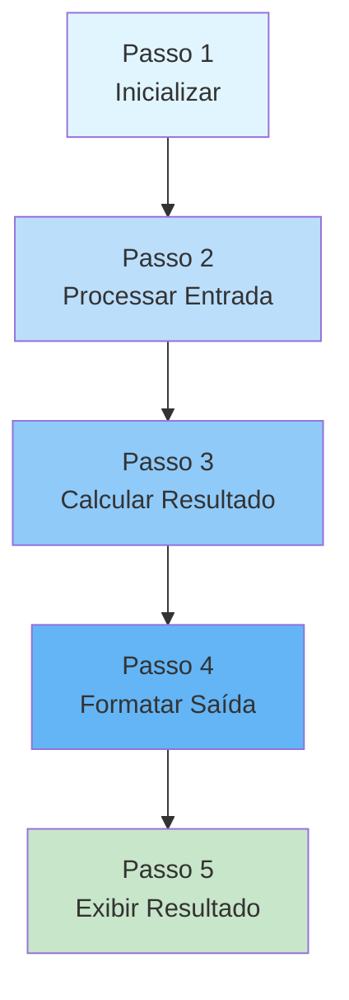
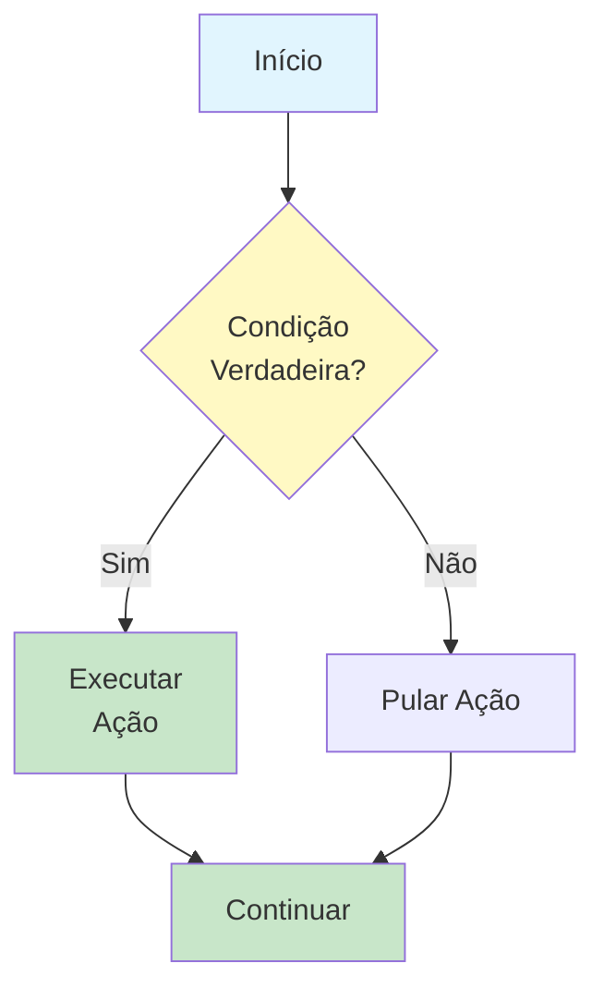
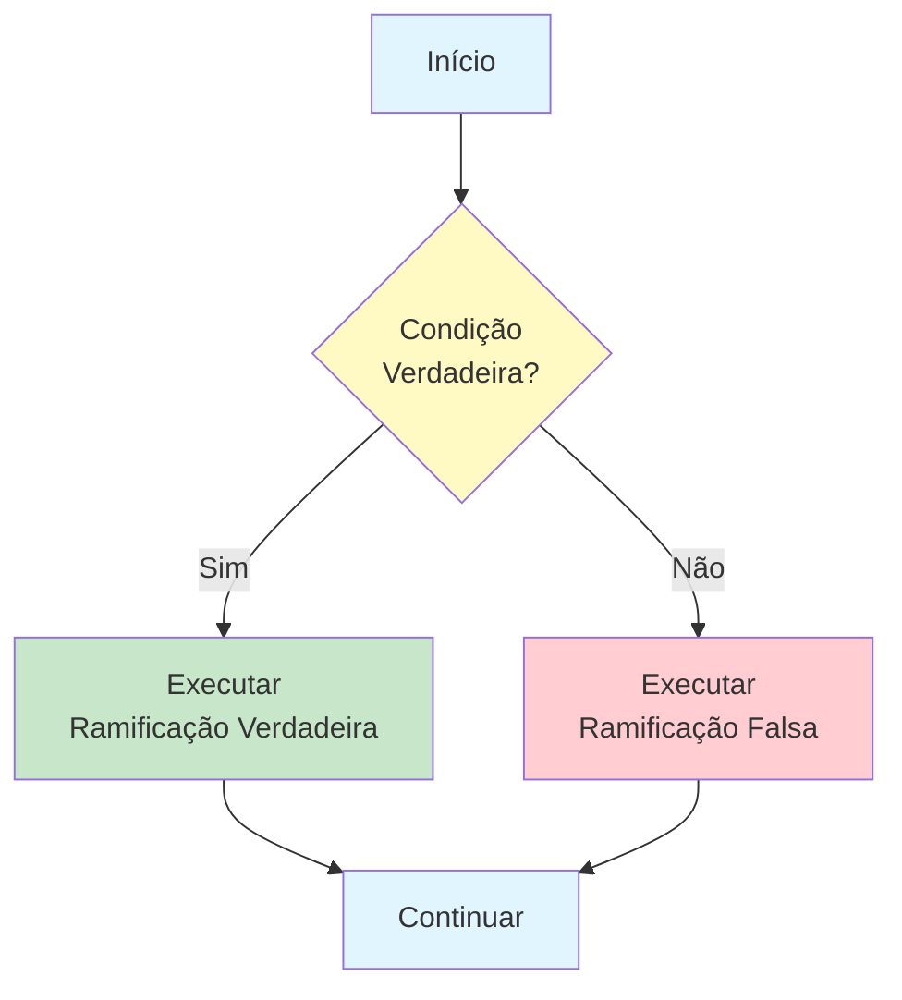
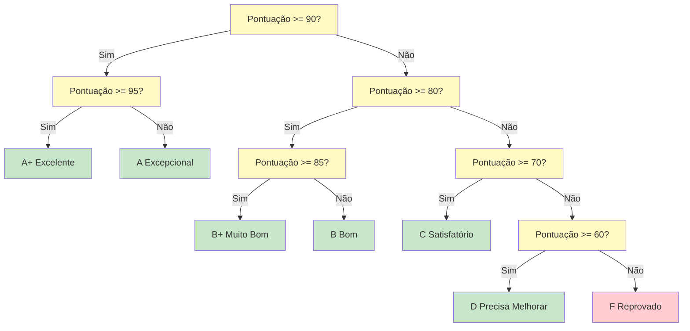
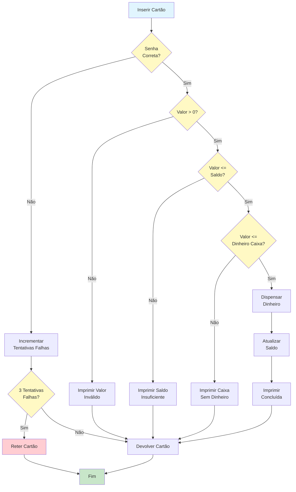
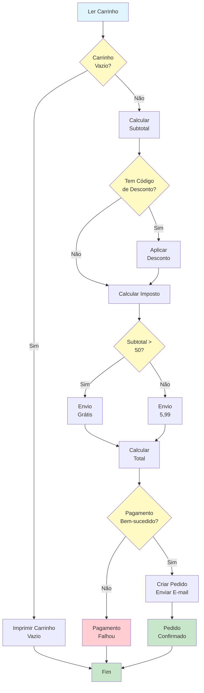

# Lógica Sequencial e Condicional

Os algoritmos são construídos sobre dois conceitos fundamentais: fazer as coisas em ordem (lógica sequencial) e fazer escolhas (lógica condicional). Compreender esses conceitos é essencial para projetar algoritmos que possam lidar com a complexidade do mundo real.

## Lógica Sequencial: Execução Passo a Passo

**Lógica sequencial** significa executar instruções uma após outra na ordem em que aparecem. Esta é a forma mais simples de controle algorítmico.

### Como a Execução Sequencial Funciona

Na execução sequencial:
1. O algoritmo começa no primeiro passo
2. Cada passo é executado completamente antes de passar para o próximo
3. O algoritmo procede linearmente do início ao fim
4. Nenhum passo é pulado (a menos que uma condicional diga o contrário)



### Exemplo: Converter Temperatura

```
ALGORITMO: Converter Celsius para Fahrenheit
ENTRADA: Temperatura em Celsius
SAÍDA: Temperatura em Fahrenheit

PASSO 1: LER temp_celsius
PASSO 2: DEFINIR temp_fahrenheit COMO (temp_celsius multiplicado por 9/5) + 32
PASSO 3: IMPRIMIR "A temperatura é " + temp_fahrenheit + " graus Fahrenheit"
FIM ALGORITMO
```

Cada passo depende do anterior. Você não pode calcular a temperatura Fahrenheit (Passo 2) antes de ler a temperatura Celsius (Passo 1).

### Exemplo Sequencial do Mundo Real: Saque no Caixa Eletrônico

```
ALGORITMO: Saque em Caixa Eletrônico
ENTRADA: Cartão, senha, valor solicitado
SAÍDA: Dinheiro dispensado ou mensagem de erro

PASSO 1: INSERIR cartão no caixa eletrônico
PASSO 2: DIGITAR senha
PASSO 3: VERIFICAR se a senha corresponde ao cartão
PASSO 4: SELECIONAR opção "Sacar Dinheiro"
PASSO 5: DIGITAR valor solicitado
PASSO 6: VERIFICAR se o saldo da conta é suficiente
PASSO 7: VERIFICAR se o caixa tem dinheiro suficiente
PASSO 8: DISPENSAR o valor solicitado
PASSO 9: ATUALIZAR saldo da conta
PASSO 10: IMPRIMIR recibo
PASSO 11: DEVOLVER cartão
FIM ALGORITMO
```

> [!NOTE]
> Observe que este algoritmo é puramente sequencial. Ele não trata o que acontece se a senha estiver errada ou se o saldo for insuficiente. Precisamos de lógica condicional para isso -- o que veremos a seguir.

## Lógica Condicional: Fazendo Escolhas

**Lógica condicional** permite que um algoritmo tome decisões com base em condições. Diferentes caminhos são percorridos dependendo se certas condições são verdadeiras ou falsas.

### A Instrução SE

A estrutura condicional mais básica:

```
SE condição for verdadeira ENTÃO
    Executar estes passos
FIM SE
```



### Exemplo: Verificação de Idade

```
ALGORITMO: Verificação de Idade
ENTRADA: Idade da pessoa
SAÍDA: Acesso concedido ou negado

PASSO 1: LER idade
PASSO 2: SE idade for maior ou igual a 18 ENTÃO
            IMPRIMIR "Acesso concedido"
        FIM SE
PASSO 3: SE idade for menor que 18 ENTÃO
            IMPRIMIR "Acesso negado"
        FIM SE
FIM ALGORITMO
```

### A Instrução SE-SENÃO

Uma forma mais eficiente de lidar com dois casos mutuamente exclusivos:

```
SE condição for verdadeira ENTÃO
    Executar estes passos (quando verdadeira)
SENÃO
    Executar estes passos (quando falsa)
FIM SE
```



### Verificação de Idade Melhorada

```
ALGORITMO: Verificação de Idade (Melhorada)
ENTRADA: Idade da pessoa
SAÍDA: Decisão de acesso

PASSO 1: LER idade
PASSO 2: SE idade for maior ou igual a 18 ENTÃO
            IMPRIMIR "Acesso concedido"
        SENÃO
            IMPRIMIR "Acesso negado"
        FIM SE
FIM ALGORITMO
```

> [!TIP]
> A versão SE-SENÃO é melhor porque garante que exatamente uma mensagem seja impressa. A versão original tinha duas instruções SE separadas, que poderiam teoricamente ambas executar se houvesse um erro.

## Condicionais Aninhadas: Decisões Dentro de Decisões

Às vezes você precisa tomar uma decisão dentro de outra decisão. Isso é chamado de **aninhamento**.

### Exemplo: Sistema de Notas com Distinções

```
ALGORITMO: Classificação Detalhada de Notas
ENTRADA: Pontuação do aluno (0-100)
SAÍDA: Nota com distinção

PASSO 1: LER pontuacao
PASSO 2: SE pontuacao for maior ou igual a 90 ENTÃO
            SE pontuacao for maior ou igual a 95 ENTÃO
                IMPRIMIR "A+ (Excelente)"
            SENÃO
                IMPRIMIR "A (Excepcional)"
            FIM SE
        SENÃO SE pontuacao for maior ou igual a 80 ENTÃO
            SE pontuacao for maior ou igual a 85 ENTÃO
                IMPRIMIR "B+ (Muito Bom)"
            SENÃO
                IMPRIMIR "B (Bom)"
            FIM SE
        SENÃO SE pontuacao for maior ou igual a 70 ENTÃO
            IMPRIMIR "C (Satisfatório)"
        SENÃO SE pontuacao for maior ou igual a 60 ENTÃO
            IMPRIMIR "D (Precisa Melhorar)"
        SENÃO
            IMPRIMIR "F (Reprovado)"
        FIM SE
FIM ALGORITMO
```

### Árvores de Decisão

Uma **árvore de decisão** é uma representação visual de condicionais aninhadas. Cada nó representa uma decisão, e cada ramo representa um possível resultado.



## Combinando Lógica Sequencial e Condicional

Algoritmos reais combinam lógica sequencial e condicional. Vamos construir um algoritmo de caixa eletrônico mais completo:

```
ALGORITMO: Saque Completo no Caixa Eletrônico
ENTRADA: Cartão, senha, valor solicitado
SAÍDA: Dinheiro ou mensagem apropriada

PASSO 1: INSERIR cartão
PASSO 2: LER senha_digitada
PASSO 3: SE senha_digitada corresponder à senha_cartão ENTÃO
            IMPRIMIR "Senha verificada"
            SELECIONAR "Sacar Dinheiro"
            LER valor
            
            SE valor for menor ou igual a 0 ENTÃO
                IMPRIMIR "Valor inválido"
            SENÃO SE valor for menor ou igual ao saldo_conta ENTÃO
                SE valor for menor ou igual ao dinheiro_caixa ENTÃO
                    DISPENSAR valor
                    DEFINIR saldo_conta COMO saldo_conta - valor
                    IMPRIMIR "Transação concluída"
                    IMPRIMIR "Novo saldo: " + saldo_conta
                SENÃO
                    IMPRIMIR "Caixa não tem dinheiro suficiente"
                FIM SE
            SENÃO
                IMPRIMIR "Saldo insuficiente"
                IMPRIMIR "Seu saldo: " + saldo_conta
            FIM SE
        SENÃO
            IMPRIMIR "Senha incorreta"
            INCREMENTAR tentativas_falhas
            SE tentativas_falhas for igual a 3 ENTÃO
                RETER cartão
                IMPRIMIR "Cartão retido. Contate seu banco."
            FIM SE
        FIM SE
PASSO 4: DEVOLVER cartão (se não retido)
FIM ALGORITMO
```



> [!WARNING]
> Observe como o algoritmo trata múltiplos casos de falha: senha errada, valor inválido, saldo insuficiente e caixa ficando sem dinheiro. Bons algoritmos antecipam e tratam todos os cenários possíveis.

## Comparação: Sequencial vs. Condicional

| Aspecto | Lógica Sequencial | Lógica Condicional |
|---|---|---|
| **Execução** | Linear, um passo após o outro | Ramifica com base em condições |
| **Flexibilidade** | Baixa -- sempre faz a mesma coisa | Alta -- adapta-se a diferentes situações |
| **Complexidade** | Simples de entender e rastrear | Mais complexa, requer planejamento cuidadoso |
| **Usar quando** | Toda situação é a mesma | Diferentes situações precisam de respostas diferentes |
| **Exemplo** | Somar dois números | Decidir se um número é positivo ou negativo |

## Exemplo do Mundo Real: Finalização de Compra Online

Vamos projetar um algoritmo para o processo de finalização de compra online:

```
ALGORITMO: Finalização de Compra Online
ENTRADA: Itens do carrinho, conta do usuário, forma de pagamento
SAÍDA: Confirmação do pedido ou erro

PASSO 1: LER itens do carrinho
PASSO 2: SE carrinho estiver vazio ENTÃO
            IMPRIMIR "Seu carrinho está vazio"
            PARAR
        FIM SE
PASSO 3: CALCULAR subtotal somando todos os preços dos itens
PASSO 4: SE usuário tiver um código de desconto ENTÃO
            APLICAR desconto ao subtotal
        FIM SE
PASSO 5: CALCULAR imposto com base na localização do usuário
PASSO 6: CALCULAR custo de envio
        SE subtotal for maior que 50 ENTÃO
            DEFINIR envio COMO 0 (envio grátis)
        SENÃO
            DEFINIR envio COMO 5,99
        FIM SE
PASSO 7: CALCULAR total = subtotal + imposto + envio
PASSO 8: PROCESSAR pagamento
        SE pagamento for bem-sucedido ENTÃO
            CRIAR pedido com total
            ENVIAR e-mail de confirmação
            ATUALIZAR inventário
            IMPRIMIR "Pedido confirmado! Total: " + total
        SENÃO
            IMPRIMIR "Pagamento falhou. Tente novamente."
        FIM SE
FIM ALGORITMO
```



## Exercícios Práticos

### Exercício 1: Rastreie a Execução

Dado o seguinte algoritmo, qual é a saída para cada entrada?

```
ALGORITMO: Mistério
ENTRADA: Um número x
PASSO 1: SE x for maior que 0 ENTÃO
            SE x for menor que 10 ENTÃO
                IMPRIMIR "Positivo pequeno"
            SENÃO
                IMPRIMIR "Positivo grande"
            FIM SE
        SENÃO SE x for igual a 0 ENTÃO
            IMPRIMIR "Zero"
        SENÃO
            IMPRIMIR "Negativo"
        FIM SE
FIM ALGORITMO
```

O que é impresso para: x = 5, x = 15, x = 0, x = -3?

### Exercício 2: Projete um Algoritmo Condicional

Escreva um algoritmo que determina o tipo de triângulo com base em três comprimentos de lado:

- **Equilátero**: Todos os três lados são iguais
- **Isósceles**: Exatamente dois lados são iguais
- **Escaleno**: Nenhum lado é igual

Inclua validação: se qualquer lado for zero ou negativo, imprima "Triângulo inválido."

### Exercício 3: Desenho de Árvore de Decisão

Desenhe uma árvore de decisão (usando Mermaid ou no papel) para este cenário:

Um algoritmo de recomendação de restaurante que pergunta:
1. Qual culinária? (Italiana, Mexicana, Asiática)
2. Qual orçamento? (Baixo, Médio, Alto)
3. Qual atmosfera? (Casual, Formal)

Mostre como diferentes combinações levam a diferentes recomendações de restaurantes.

### Exercício 4: Corrija a Lógica

Este algoritmo tem um erro lógico. Encontre e corrija-o:

```
ALGORITMO: Sistema de Login
ENTRADA: Nome de usuário, senha
PASSO 1: SE nome de usuário existir ENTÃO
            IMPRIMIR "Bem-vindo!"
        FIM SE
PASSO 2: SE senha estiver correta ENTÃO
            CONCEDER acesso
        SENÃO
            IMPRIMIR "Senha errada"
        FIM SE
FIM ALGORITMO
```

> [!WARNING]
> Dica: O que acontece se o nome de usuário não existir mas a verificação de senha ainda executar?

### Exercício 5: Construa um Algoritmo Completo

Projete um algoritmo para uma calculadora simples que:
1. Lê dois números e uma operação (+, -, *, /)
2. Executa a operação
3. Trata divisão por zero
4. Imprime o resultado

Use lógica sequencial e condicional.

## Resumo

Nesta lição, você aprendeu:

- **Lógica sequencial**: Executar passos em ordem, um após o outro
- **Lógica condicional**: Tomar decisões usando SE, SENÃO e condições aninhadas
- **Árvores de decisão**: Representações visuais de lógica condicional
- **Combinando ambas**: Algoritmos reais usam lógica sequencial e condicional juntas
- **Tratamento de erros**: Bons algoritmos antecipam e tratam todos os cenários possíveis

> [!SUCCESS]
> A lógica sequencial e condicional formam a base de todos os algoritmos. Cada algoritmo complexo que você encontrará é construído a partir desses dois blocos fundamentais.

## Termos-Chave

| Termo | Definição |
|---|---|
| **Lógica Sequencial** | Executar instruções na ordem em que aparecem |
| **Lógica Condicional** | Tomar decisões com base em condições verdadeiras ou falsas |
| **Instrução SE** | Executa um bloco de código apenas se uma condição for verdadeira |
| **Instrução SE-SENÃO** | Escolhe entre dois blocos de código com base em uma condição |
| **Condicional Aninhada** | Uma instrução condicional dentro de outra instrução condicional |
| **Árvore de Decisão** | Um diagrama visual mostrando todos os caminhos de decisão possíveis |
| **Ramificação** | Um caminho possível de execução em uma condicional |
