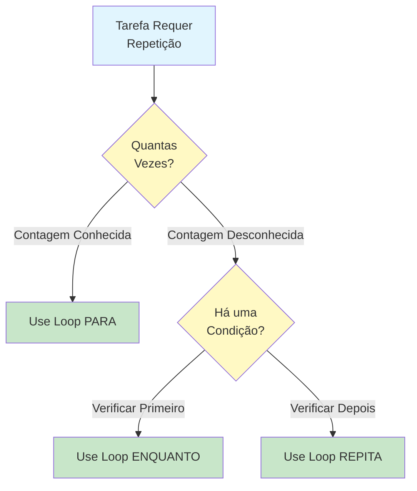
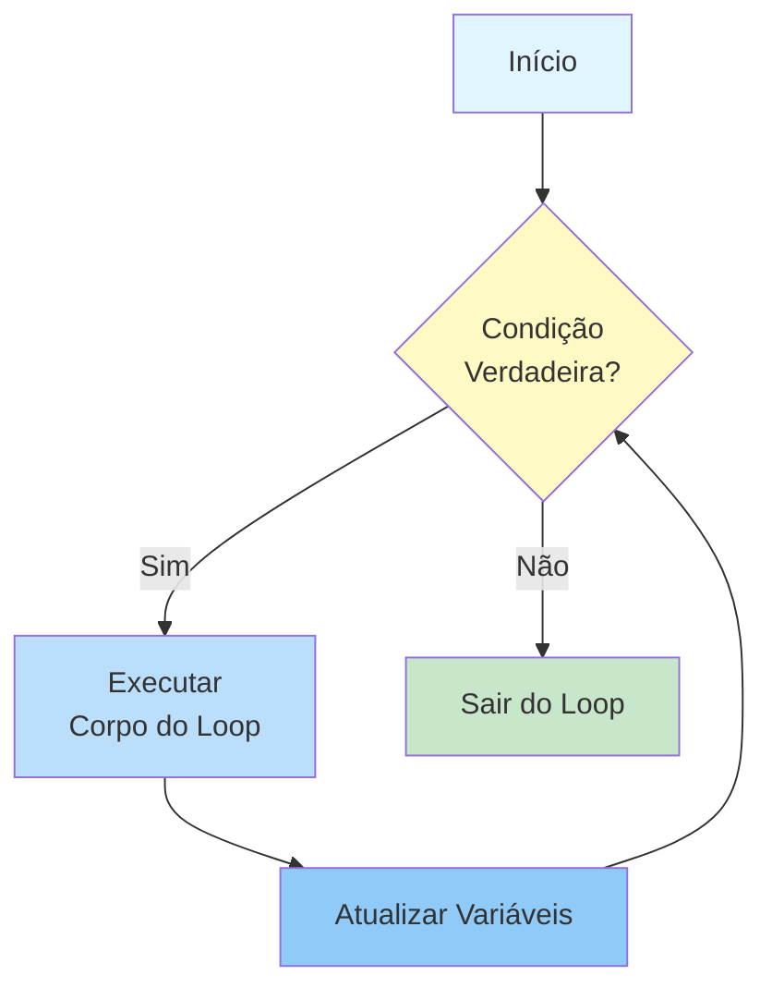
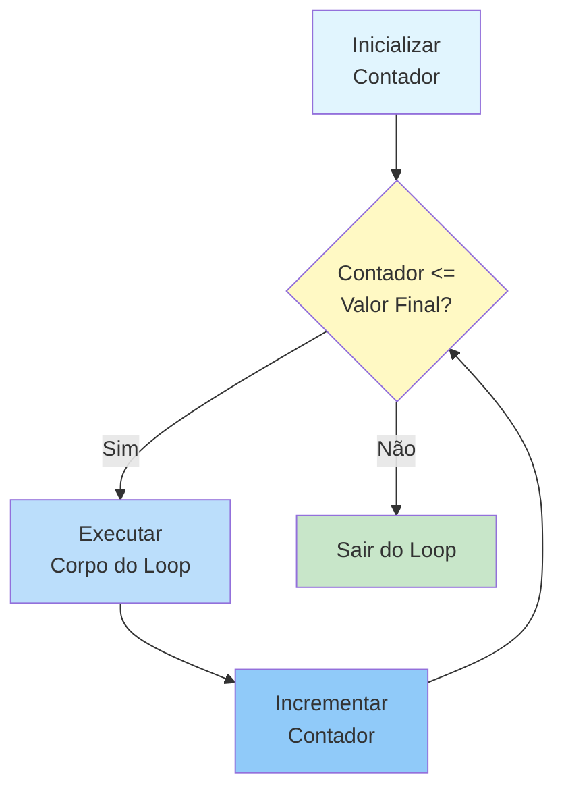
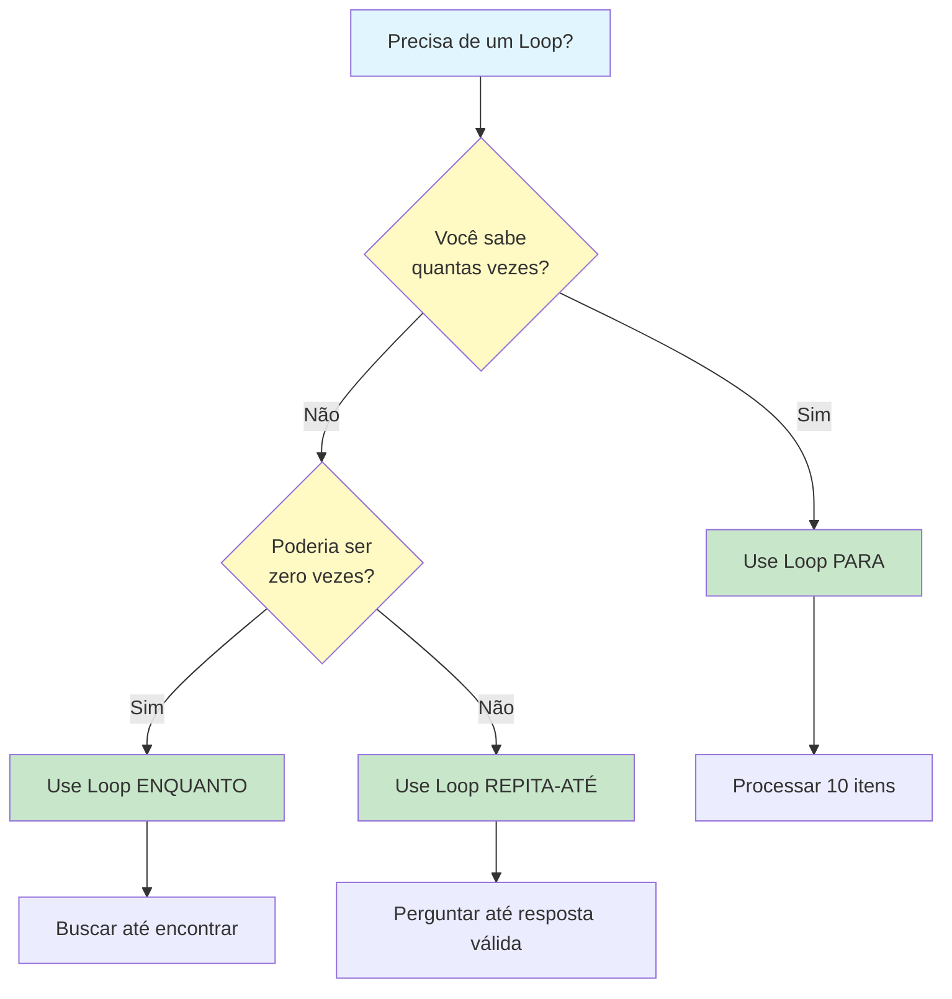
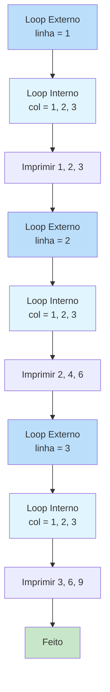
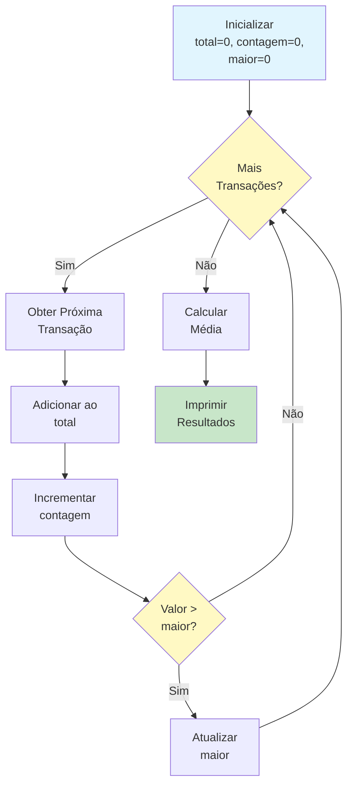

# Loops e Repetição

Muitas tarefas exigem fazer a mesma coisa várias vezes. Em vez de escrever os mesmos passos repetidamente, algoritmos usam **loops** -- estruturas que repetem um conjunto de instruções até que uma condição seja atendida. Loops são uma das ferramentas mais poderosas no pensamento algorítmico.

## Por que Loops Importam

Considere esta tarefa: imprimir os números de 1 a 100.

**Sem um loop** (tedioso e propenso a erros):
```
IMPRIMIR 1
IMPRIMIR 2
IMPRIMIR 3
... (mais 97 linhas)
IMPRIMIR 100
```

**Com um loop** (elegante e fácil de manter):
```
DEFINIR contador COMO 1
ENQUANTO contador for menor ou igual a 100 FAÇA
    IMPRIMIR contador
    DEFINIR contador COMO contador + 1
FIM ENQUANTO
```

| Abordagem | Linhas de Código | Fácil de Mudar? | Propenso a Erros? |
|---|---|---|---|
| Sem loop | 100 | Não -- deve editar cada linha | Sim -- fácil pular ou duplicar |
| Com loop | 4 | Sim -- mude o limite | Não -- a lógica é centralizada |



## O Loop ENQUANTO (WHILE)

Um **loop ENQUANTO** repete um bloco de instruções enquanto uma condição permanecer verdadeira. A condição é verificada **antes** de cada iteração.

### Estrutura

```
ENQUANTO condição for verdadeira FAÇA
    Executar estes passos
    (Certifique-se de que algo mude para eventualmente terminar o loop)
FIM ENQUANTO
```

### Como Funciona



### Exemplo: Contagem Regressiva

```
ALGORITMO: Contagem Regressiva
ENTRADA: Número inicial
SAÍDA: Sequência de contagem regressiva

PASSO 1: LER numero_inicial
PASSO 2: DEFINIR atual COMO numero_inicial
PASSO 3: ENQUANTO atual for maior que 0 FAÇA
            IMPRIMIR atual
            DEFINIR atual COMO atual - 1
        FIM ENQUANTO
PASSO 4: IMPRIMIR "Já!"
FIM ALGORITMO
```

**Rastreando com numero_inicial = 3:**

| Iteração | atual | Condição (atual > 0) | Ação |
|---|---|---|---|
| Antes do loop | 3 | -- | -- |
| 1 | 3 | verdadeira | Imprimir 3, atual torna-se 2 |
| 2 | 2 | verdadeira | Imprimir 2, atual torna-se 1 |
| 3 | 1 | verdadeira | Imprimir 1, atual torna-se 0 |
| Após o loop | 0 | falsa | Sair do loop, imprimir "Já!" |

**Saída:** 3, 2, 1, Já!

### Exemplo: Encontrar um Número em uma Lista

```
ALGORITMO: Busca Linear
ENTRADA: Uma lista de números, um número alvo para encontrar
SAÍDA: Posição do alvo, ou "não encontrado"

PASSO 1: DEFINIR indice COMO 0
PASSO 2: DEFINIR encontrado COMO falso
PASSO 3: ENQUANTO indice for menor que tamanho da lista E encontrado for falso FAÇA
            SE lista[indice] for igual ao alvo ENTÃO
                DEFINIR encontrado COMO verdadeiro
            SENÃO
                DEFINIR indice COMO indice + 1
            FIM SE
        FIM ENQUANTO
PASSO 4: SE encontrado for verdadeiro ENTÃO
            IMPRIMIR "Encontrado na posição " + indice
        SENÃO
            IMPRIMIR "Não encontrado"
        FIM SE
FIM ALGORITMO
```

> [!NOTE]
> Observe a condição composta no Passo 3: `indice < tamanho E encontrado = falso`. O loop para se chegarmos ao fim da lista OU se encontrarmos o alvo. Isso evita buscas desnecessárias.

## O Loop PARA (FOR)

Um **loop PARA** repete um bloco de instruções um **número conhecido de vezes**. É ideal quando você sabe exatamente quantas iterações precisa.

### Estrutura

```
PARA variavel DE valor_inicial ATÉ valor_final FAÇA
    Executar estes passos
FIM PARA
```

### Como Funciona



### Exemplo: Tabuada

```
ALGORITMO: Tabuada
ENTRADA: Um número
SAÍDA: Tabuada desse número (1-10)

PASSO 1: LER numero
PASSO 2: PARA multiplicador DE 1 ATÉ 10 FAÇA
            DEFINIR resultado COMO numero multiplicado por multiplicador
            IMPRIMIR numero + " x " + multiplicador + " = " + resultado
        FIM PARA
FIM ALGORITMO
```

**Saída para numero = 5:**
```
5 x 1 = 5
5 x 2 = 10
5 x 3 = 15
...
5 x 10 = 50
```

### Exemplo: Somar uma Lista

```
ALGORITMO: Soma de Lista
ENTRADA: Uma lista de números
SAÍDA: A soma total

PASSO 1: DEFINIR total COMO 0
PASSO 2: PARA cada número na lista FAÇA
            DEFINIR total COMO total + numero
        FIM PARA
PASSO 3: IMPRIMIR total
FIM ALGORITMO
```

## Comparando Loops ENQUANTO e PARA

| Aspecto | Loop ENQUANTO | Loop PARA |
|---|---|---|
| **Quando usar** | Número desconhecido de iterações | Número conhecido de iterações |
| **Condição** | Verificada antes de cada iteração | Implícita (contador chega ao fim) |
| **Risco de loop infinito** | Maior (deve garantir que a condição muda) | Menor (contador sempre avança) |
| **Flexibilidade** | Mais flexível | Mais estruturado |
| **Exemplo** | "Continue buscando até encontrar" | "Processe cada item na lista" |

### Quando Escolher Qual



## O Loop REPITA-ATÉ (REPEAT-UNTIL)

Um **loop REPITA-ATÉ** executa o corpo **pelo menos uma vez**, depois verifica a condição **após** cada iteração. Ele repete até que a condição se torne verdadeira.

### Estrutura

```
REPITA
    Executar estes passos
ATÉ condição ser verdadeira
```

### Diferença Principal do ENQUANTO

| Loop ENQUANTO | Loop REPITA-ATÉ |
|---|---|
| Verifica condição ANTES de executar | Verifica condição DEPOIS de executar |
| Pode executar zero vezes | Sempre executa pelo menos uma vez |
| Continua ENQUANTO condição é verdadeira | Continua ATÉ condição ser verdadeira |

### Exemplo: Validação de Entrada

```
ALGORITMO: Obter Idade Válida
ENTRADA: Nenhuma (lê do usuário)
SAÍDA: Uma idade válida (1-120)

PASSO 1: REPITA
            IMPRIMIR "Digite sua idade (1-120):"
            LER idade
        ATÉ idade for maior ou igual a 1 E idade for menor ou igual a 120
PASSO 2: IMPRIMIR "Idade válida: " + idade
FIM ALGORITMO
```

> [!TIP]
> REPITA-ATÉ é perfeito para validação de entrada porque você sempre precisa perguntar pelo menos uma vez. Um loop ENQUANTO exigiria duplicar o prompt de entrada antes e dentro do loop.

## Loops Aninhados: Loops Dentro de Loops

Loops podem ser colocados dentro de outros loops. Isso é chamado de **aninhamento**. Cada iteração do loop externo dispara uma execução completa do loop interno.

### Exemplo: Grade de Multiplicação

```
ALGORITMO: Grade de Multiplicação
ENTRADA: Tamanho da grade N
SAÍDA: Grade de multiplicação N x N

PASSO 1: LER N
PASSO 2: PARA linha DE 1 ATÉ N FAÇA
            PARA coluna DE 1 ATÉ N FAÇA
                DEFINIR produto COMO linha multiplicado por coluna
                IMPRIMIR produto com espaçamento
            FIM PARA
            IMPRIMIR nova linha
        FIM PARA
FIM ALGORITMO
```

**Saída para N = 3:**
```
1  2  3
2  4  6
3  6  9
```

### Visualizando Loops Aninhados



### Quantas Vezes o Loop Interno Executa?

Se o loop externo executa M vezes e o loop interno executa N vezes, o corpo interno executa **M x N** vezes no total.

| Loop Externo | Loop Interno | Execuções Totais |
|---|---|---|
| 3 vezes | 3 vezes | 9 vezes |
| 10 vezes | 5 vezes | 50 vezes |
| 100 vezes | 100 vezes | 10.000 vezes |

> [!WARNING]
> Loops aninhados multiplicam o número de operações. Um loop dentro de um loop dentro de um loop (aninhamento triplo) com 100 iterações cada executaria 1.000.000 de vezes! Cuidado com loops profundamente aninhados.

## Terminação de Loops: Garantindo que Loops Terminem

Todo loop deve eventualmente terminar. Aqui estão as estratégias principais:

### Estratégia 1: Terminação Baseada em Contador

```
DEFINIR contador COMO 0
ENQUANTO contador for menor que 10 FAÇA
    IMPRIMIR contador
    DEFINIR contador COMO contador + 1
FIM ENQUANTO
```

### Estratégia 2: Valor Sentinela

```
LER numero
ENQUANTO numero não for igual a -1 FAÇA
    IMPRIMIR "Você digitou: " + numero
    LER numero
FIM ENQUANTO
IMPRIMIR "Adeus!"
```

> [!NOTE]
> O valor -1 é chamado de "sentinela" -- um valor especial que sinaliza o fim da entrada. O usuário deve saber que deve digitar -1 para parar.

### Estratégia 3: Terminação Baseada em Flag

```
DEFINIR encontrado COMO falso
DEFINIR indice COMO 0
ENQUANTO encontrado for falso E indice for menor que tamanho_lista FAÇA
    SE lista[indice] for igual ao alvo ENTÃO
        DEFINIR encontrado COMO verdadeiro
    SENÃO
        DEFINIR indice COMO indice + 1
    FIM SE
FIM ENQUANTO
```

### Erros Comuns de Terminação

| Erro | Problema | Correção |
|---|---|---|
| Esquecer de atualizar o contador | Loop infinito | Adicionar `contador = contador + 1` |
| Operador de comparação errado | Erro de off-by-one | Usar `<=` em vez de `<` (ou vice-versa) |
| Condição nunca se torna falsa | Loop infinito | Garantir que o corpo do loop muda a condição |
| Usar `=` em vez de `==` | Erro de lógica | Usar comparação, não atribuição |

## Exemplo do Mundo Real: Processando Vendas Diárias

```
ALGORITMO: Processar Relatório de Vendas Diárias
ENTRADA: Lista de transações de vendas diárias
SAÍDA: Total de vendas, venda média, maior venda

PASSO 1: DEFINIR total COMO 0
PASSO 2: DEFINIR contagem COMO 0
PASSO 3: DEFINIR maior COMO 0
PASSO 4: PARA cada transação na lista de vendas FAÇA
            DEFINIR valor COMO valor da transação
            DEFINIR total COMO total + valor
            DEFINIR contagem COMO contagem + 1
            SE valor for maior que maior ENTÃO
                DEFINIR maior COMO valor
            FIM SE
        FIM PARA
PASSO 5: SE contagem for maior que 0 ENTÃO
            DEFINIR media COMO total dividido por contagem
        SENÃO
            DEFINIR media COMO 0
        FIM SE
PASSO 6: IMPRIMIR "Total de Vendas: " + total
PASSO 7: IMPRIMIR "Número de Transações: " + contagem
PASSO 8: IMPRIMIR "Venda Média: " + media
PASSO 9: IMPRIMIR "Maior Venda: " + maior
FIM ALGORITMO
```



## Exercícios Práticos

### Exercício 1: Rastreie o Loop

Qual é a saída deste algoritmo?

```
ALGORITMO: Loop Mistério
PASSO 1: DEFINIR x COMO 1
PASSO 2: ENQUANTO x for menor que 20 FAÇA
            DEFINIR x COMO x multiplicado por 2
            IMPRIMIR x
        FIM ENQUANTO
FIM ALGORITMO
```

### Exercício 2: Escreva um Loop PARA

Escreva um algoritmo usando um loop PARA que:
- Lê um número N
- Imprime todos os números pares de 2 a N
- Conta quantos números pares foram impressos

### Exercício 3: Escreva um Loop ENQUANTO

Escreva um algoritmo usando um loop ENQUANTO que:
- Continua pedindo números ao usuário
- Para quando o usuário digitar 0
- Imprime a soma de todos os números digitados (excluindo o 0)

### Exercício 4: Corrija o Loop Infinito

Este algoritmo tem um loop infinito. Corrija-o:

```
ALGORITMO: Contar até 10
PASSO 1: DEFINIR i COMO 1
PASSO 2: ENQUANTO i for menor ou igual a 10 FAÇA
            IMPRIMIR i
        FIM ENQUANTO
FIM ALGORITMO
```

### Exercício 5: Desafio de Loop Aninhado

Escreva um algoritmo que imprima este padrão usando loops aninhados:
```
*
**
***
****
*****
```

O algoritmo deve funcionar para qualquer tamanho N (o exemplo mostra N = 5).

### Exercício 6: Design do Mundo Real

Projete um algoritmo para uma biblioteca que:
- Tem uma lista de livros atrasados
- Para cada livro atrasado, calcula a multa (R$0,50 por dia)
- Mantém um total acumulado de todas as multas
- Imprime um relatório com a multa de cada livro e o total

## Resumo

Nesta lição, você aprendeu:

- **Loops ENQUANTO**: Repetem enquanto uma condição é verdadeira (verificação antes)
- **Loops PARA**: Repetem um número conhecido de vezes (iteração estruturada)
- **Loops REPITA-ATÉ**: Executam pelo menos uma vez, depois verificam a condição
- **Loops aninhados**: Loops dentro de loops para tarefas multidimensionais
- **Estratégias de terminação**: Contadores, sentinelas e flags
- **Erros comuns**: Loops infinitos, erros de off-by-one e atualizações faltando

> [!SUCCESS]
> Loops são o motor da eficiência algorítmica. Eles permitem que você lide com tarefas de qualquer tamanho com uma pequena quantidade de código. Domine loops, e você poderá resolver problemas que seriam impossíveis de escrever passo a passo.

## Termos-Chave

| Termo | Definição |
|---|---|
| **Loop** | Uma estrutura que repete um conjunto de instruções |
| **Loop ENQUANTO** | Repete enquanto uma condição é verdadeira (verificação prévia) |
| **Loop PARA** | Repete um número conhecido de vezes |
| **Loop REPITA-ATÉ** | Executa pelo menos uma vez, repete até a condição ser verdadeira (verificação posterior) |
| **Iteração** | Uma execução completa do corpo do loop |
| **Loop Aninhado** | Um loop colocado dentro de outro loop |
| **Valor Sentinela** | Um valor especial que sinaliza o fim da entrada |
| **Loop Infinito** | Um loop que nunca termina |
| **Erro de Off-by-one** | Um erro comum onde o loop executa uma vez a mais ou a menos |
