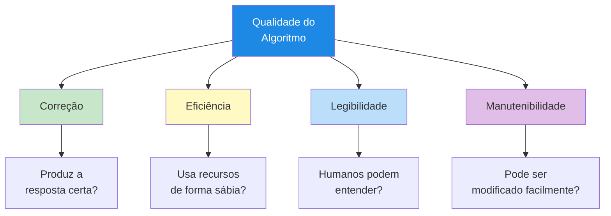
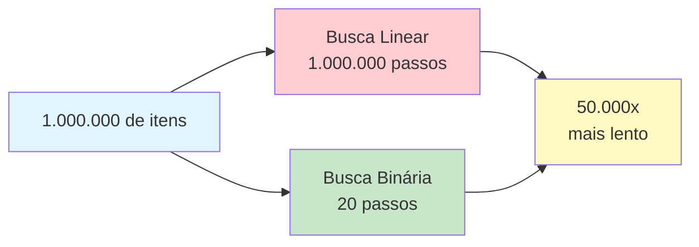
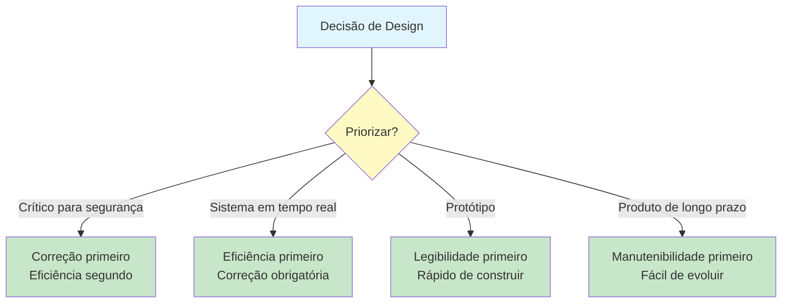

# Princípios de Qualidade de Algoritmos

Nem todos os algoritmos são criados iguais. Dois algoritmos podem resolver o mesmo problema, mas diferir drasticamente em quão bem o fazem. Compreender os princípios de qualidade ajuda você a projetar algoritmos que não são apenas corretos, mas também eficientes, legíveis e manuteníveis.

## Os Quatro Pilares da Qualidade de Algoritmos



| Pilar | Pergunta | Por que Importa |
|---|---|---|
| **Correção** | Produz a resposta certa para todas as entradas válidas? | Um algoritmo incorreto é inútil, não importa quão rápido |
| **Eficiência** | Usa tempo e recursos de forma sábia? | Algoritmos ineficientes tornam-se inutilizáveis com entradas grandes |
| **Legibilidade** | Outras pessoas podem entendê-lo? | Algoritmos ilegíveis são difíceis de verificar e confiar |
| **Manutenibilidade** | Pode ser modificado quando os requisitos mudam? | Algoritmos rígidos tornam-se obsoletos rapidamente |

## Correção: Obtendo a Resposta Certa

**Correção** significa que o algoritmo produz a saída correta para cada entrada válida. Esta é a qualidade mais fundamental -- sem correção, nada mais importa.

### Como Verificar a Correção

1. **Rastrear com exemplos**: Execute o algoritmo à mão com entradas conhecidas e saídas esperadas
2. **Testar casos extremos**: Tente entradas incomuns (listas vazias, itens únicos, valores máximos)
3. **Raciocinar sobre ele**: Prove para si mesmo que o algoritmo deve sempre funcionar
4. **Comparar com alternativas**: Se dois algoritmos dão respostas diferentes, pelo menos um está errado

### Exemplo: Encontrar o Máximo

**Versão Correta:**
```
ALGORITMO: Encontrar Máximo (Correto)
ENTRADA: Uma lista não vazia de números
SAÍDA: O maior número

PASSO 1: DEFINIR max COMO o primeiro elemento da lista
PASSO 2: PARA cada elemento restante na lista FAÇA
            SE elemento for maior que max ENTÃO
                DEFINIR max COMO elemento
            FIM SE
        FIM PARA
PASSO 3: RETORNAR max
FIM ALGORITMO
```

**Versão Incorreta:**
```
ALGORITMO: Encontrar Máximo (Incorreto)
ENTRADA: Uma lista de números
SAÍDA: O maior número

PASSO 1: DEFINIR max COMO 0
PASSO 2: PARA cada elemento na lista FAÇA
            SE elemento for maior que max ENTÃO
                DEFINIR max COMO elemento
            FIM SE
        FIM PARA
PASSO 3: RETORNAR max
FIM ALGORITMO
```

> [!WARNING]
> A versão incorreta falha quando todos os números são negativos! Se a lista for [-5, -3, -8], ela retornaria 0 em vez de -3. A versão correta começa com o primeiro elemento, garantindo que a resposta seja sempre da lista.

### Testando com Casos Extremos

| Caso de Teste | Entrada | Saída Esperada | Versão Correta | Versão Incorreta |
|---|---|---|---|---|
| Normal | [3, 1, 4, 1, 5] | 5 | 5 | 5 |
| Todos negativos | [-5, -3, -8] | -3 | -3 | 0 (ERRADO) |
| Elemento único | [42] | 42 | 42 | 42 |
| Todos iguais | [7, 7, 7] | 7 | 7 | 7 |
| Lista vazia | [] | Erro | Erro | 0 (ERRADO) |

## Eficiência: Usando Recursos de Forma Sábia

**Eficiência** mede quão bem um algoritmo usa recursos, principalmente **tempo** (quantos passos) e **espaço** (quanta memória).

### Eficiência de Tempo: Contando Passos

Considere dois algoritmos para encontrar um nome em uma lista telefônica:

**Algoritmo A: Busca Linear**
```
ALGORITMO: Busca Linear
ENTRADA: Uma lista de nomes, um nome alvo
SAÍDA: Posição do alvo ou "não encontrado"

PASSO 1: PARA cada nome na lista FAÇA
            SE nome for igual ao alvo ENTÃO
                RETORNAR posição
            FIM SE
        FIM PARA
PASSO 2: RETORNAR "não encontrado"
FIM ALGORITMO
```

**Algoritmo B: Busca Binária** (requer lista ordenada)
```
ALGORITMO: Busca Binária
ENTRADA: Uma lista ordenada de nomes, um nome alvo
SAÍDA: Posição do alvo ou "não encontrado"

PASSO 1: DEFINIR baixo COMO 0
PASSO 2: DEFINIR alto COMO tamanho da lista - 1
PASSO 3: ENQUANTO baixo for menor ou igual a alto FAÇA
            DEFINIR meio COMO (baixo + alto) dividido por 2
            SE lista[meio] for igual ao alvo ENTÃO
                RETORNAR meio
            SENÃO SE lista[meio] for menor que o alvo ENTÃO
                DEFINIR baixo COMO meio + 1
            SENÃO
                DEFINIR alto COMO meio - 1
            FIM SE
        FIM ENQUANTO
PASSO 4: RETORNAR "não encontrado"
FIM ALGORITMO
```

### Comparando Eficiência

| Tamanho da Lista | Busca Linear (pior caso) | Busca Binária (pior caso) |
|---|---|---|
| 10 itens | 10 verificações | 4 verificações |
| 100 itens | 100 verificações | 7 verificações |
| 1.000 itens | 1.000 verificações | 10 verificações |
| 1.000.000 itens | 1.000.000 verificações | 20 verificações |



> [!TIP]
> A busca binária é dramaticamente mais rápida para listas grandes porque elimina metade das opções restantes a cada passo. Este é o poder do design eficiente de algoritmos.

### Eficiência de Espaço: Uso de Memória

Alguns algoritmos precisam de memória extra para funcionar:

```
ALGORITMO: Inverter Lista (Usa Espaço Extra)
ENTRADA: Uma lista de itens
SAÍDA: Uma nova lista com itens em ordem inversa

PASSO 1: CRIAR uma lista vazia chamada invertida
PASSO 2: PARA cada item na lista original FAÇA
            INSERIR item no início de invertida
        FIM PARA
PASSO 3: RETORNAR invertida
FIM ALGORITMO
```

```
ALGORITMO: Inverter Lista (No Local)
ENTRADA: Uma lista de itens (modificada diretamente)
SAÍDA: A mesma lista, invertida

PASSO 1: DEFINIR esquerda COMO 0
PASSO 2: DEFINIR direita COMO tamanho da lista - 1
PASSO 3: ENQUANTO esquerda for menor que direita FAÇA
            TROCAR os itens nas posições esquerda e direita
            DEFINIR esquerda COMO esquerda + 1
            DEFINIR direita COMO direita - 1
        FIM ENQUANTO
PASSO 4: RETORNAR a lista
FIM ALGORITMO
```

| Abordagem | Memória Extra Necessária | Modifica Original? |
|---|---|---|
| Espaço extra | Sim (uma cópia completa) | Não |
| No local | Não (apenas duas variáveis) | Sim |

## Legibilidade: Tornando Algoritmos Compreensíveis

**Legibilidade** mede quão facilmente um humano pode entender um algoritmo. Um algoritmo legível é mais fácil de verificar, depurar e ensinar a outros.

### Princípios de Algoritmos Legíveis

| Princípio | Exemplo Ruim | Exemplo Bom |
|---|---|---|
| **Nomes descritivos** | `DEFINIR x COMO 0` | `DEFINIR pontuacao_total COMO 0` |
| **Estrutura clara** | Sem indentação, passos emendados | Indentação adequada, agrupamento lógico |
| **Comentários** | Sem explicação do porquê | Comentários breves para lógica complexa |
| **Passos simples** | `DEFINIR resultado COMO (a*b)+(c/d)-e*f` | Dividir em passos menores e nomeados |
| **Estilo consistente** | Convenções misturadas | Uniforme em todo o algoritmo |

### Exemplo: Legível vs. Ilegível

**Ilegível:**
```
ALGORITMO: Calc
PASSO 1: DEFINIR a COMO 0
PASSO 2: DEFINIR b COMO 1
PASSO 3: ENQUANTO b < 100 FAÇA
PASSO 4: DEFINIR c COMO a
PASSO 5: DEFINIR a COMO b
PASSO 6: DEFINIR b COMO c + b
PASSO 7: IMPRIMIR a
PASSO 8: FIM ENQUANTO
```

**Legível:**
```
ALGORITMO: Sequência de Fibonacci
ENTRADA: Nenhuma
SAÍDA: Números de Fibonacci menores que 100

PASSO 1: DEFINIR anterior COMO 0
PASSO 2: DEFINIR atual COMO 1
PASSO 3: ENQUANTO atual for menor que 100 FAÇA
            IMPRIMIR atual
            DEFINIR proximo_valor COMO anterior + atual
            DEFINIR anterior COMO atual
            DEFINIR atual COMO proximo_valor
        FIM ENQUANTO
FIM ALGORITMO
```

> [!NOTE]
> Ambos os algoritmos produzem a mesma saída, mas a versão legível diz o que faz (sequência de Fibonacci), usa nomes de variáveis significativos e tem estrutura clara.

## Manutenibilidade: Adaptando-se a Mudanças

**Manutenibilidade** mede quão facilmente um algoritmo pode ser modificado quando os requisitos mudam. Um algoritmo manutenível é modular, bem organizado e flexível.

### Projetando para Manutenibilidade

| Prática | Descrição | Benefício |
|---|---|---|
| **Modularidade** | Dividir em subalgoritmos menores | Mais fácil testar e modificar partes individuais |
| **Parametrização** | Usar variáveis em vez de valores fixos | Fácil mudar comportamento sem reescrever |
| **Documentação** | Explicar o propósito e as suposições | Mantenedores futuros entendem a intenção |
| **Separação de responsabilidades** | Cada parte faz uma coisa | Mudanças em uma parte não quebram outras |

### Exemplo: Fixo vs. Parametrizado

**Fixo (Baixa Manutenibilidade):**
```
ALGORITMO: Verificação de Nota do Aluno
ENTRADA: Pontuação de um aluno
SAÍDA: Aprovado ou reprovado

PASSO 1: SE pontuacao for maior ou igual a 60 ENTÃO
            RETORNAR "Aprovado"
        SENÃO
            RETORNAR "Reprovado"
        FIM SE
FIM ALGORITMO
```

> [!WARNING]
> E se a nota de aprovação mudar para 70? Você precisaria encontrar e atualizar cada lugar onde 60 aparece. Em um sistema grande, isso poderia ser dezenas de locais.

**Parametrizado (Boa Manutenibilidade):**
```
ALGORITMO: Verificação de Nota do Aluno
ENTRADA: Pontuação de um aluno, limite_aprovacao
SAÍDA: Aprovado ou reprovado

PASSO 1: SE pontuacao for maior ou igual a limite_aprovacao ENTÃO
            RETORNAR "Aprovado"
        SENÃO
            RETORNAR "Reprovado"
        FIM SE
FIM ALGORITMO
```

> [!TIP]
> Agora a nota de aprovação é um parâmetro. Mude-a uma vez ao chamar o algoritmo, e tudo funciona. Isso é muito mais fácil de manter.

## Equilibrando os Quatro Pilares

Na prática, às vezes você precisa trocar uma qualidade por outra:



| Cenário | Ordem de Prioridade | Razão |
|---|---|---|
| Software de dispositivo médico | Correção > Eficiência > Legibilidade > Manutenibilidade | Vidas dependem de resultados corretos |
| Renderização de videogame | Eficiência > Correção > Legibilidade > Manutenibilidade | Deve rodar a 60 quadros por segundo |
| Projeto estudantil | Legibilidade > Correção > Manutenibilidade > Eficiência | Aprendizado e avaliação importam mais |
| Aplicação empresarial | Manutenibilidade > Legibilidade > Correção > Eficiência | Será modificado por anos |

## Exemplo do Mundo Real: Avaliando um Algoritmo de Ordenação

Vamos avaliar um algoritmo de ordenação contra os quatro pilares:

```
ALGORITMO: Selection Sort (Ordenação por Seleção)
ENTRADA: Uma lista de números
SAÍDA: A mesma lista, ordenada em ordem crescente

PASSO 1: PARA cada posição i DE 0 ATÉ tamanho - 2 FAÇA
            DEFINIR min_indice COMO i
            PARA cada posição j DE i + 1 ATÉ tamanho - 1 FAÇA
                SE lista[j] for menor que lista[min_indice] ENTÃO
                    DEFINIR min_indice COMO j
                FIM SE
            FIM PARA
            TROCAR lista[i] e lista[min_indice]
        FIM PARA
PASSO 2: RETORNAR a lista ordenada
FIM ALGORITMO
```

### Avaliação de Qualidade

| Pilar | Avaliação | Explicação |
|---|---|---|
| **Correção** | Excelente | Sempre produz uma lista corretamente ordenada |
| **Eficiência** | Ruim | Leva N x N passos para uma lista de N itens |
| **Legibilidade** | Boa | Estrutura clara, fácil de entender a abordagem |
| **Manutenibilidade** | Boa | Fácil de modificar (ex.: ordenar em ordem decrescente) |

```mermaid
flowchart TD
    A[Selection Sort\nAvaliação de Qualidade] --> B[Correção:\nSempre correto]
    A --> C[Eficiência:\nO(n ao quadrado)\nLento para listas grandes]
    A --> D[Legibilidade:\nConceito simples\nfácil de seguir]
    A --> E[Manutenibilidade:\nFácil de modificar\npara diferentes ordens]
    
    style A fill:#1e88e5,color:#fff
    style B fill:#c8e6c9
    style C fill:#ffcdd2
    style D fill:#c8e6c9
    style E fill:#c8e6c9
```

## Exercícios Práticos

### Exercício 1: Encontre o Erro

Este algoritmo deve calcular a média de uma lista de números. Encontre o erro de correção:

```
ALGORITMO: Calcular Média
ENTRADA: Uma lista de números
SAÍDA: A média

PASSO 1: DEFINIR soma COMO 0
PASSO 2: PARA cada número na lista FAÇA
            DEFINIR soma COMO soma + numero
        FIM PARA
PASSO 3: RETORNAR soma dividido por 10
FIM ALGORITMO
```

### Exercício 2: Melhore a Legibilidade

Reescreva este algoritmo para ser mais legível:

```
ALGORITMO: X
PASSO 1: DEFINIR a COMO 0
PASSO 2: DEFINIR b COMO 0
PASSO 3: PARA i DE 0 ATÉ 9 FAÇA
PASSO 4: SE lista[i] > 50 ENTÃO
PASSO 5: DEFINIR a COMO a + 1
PASSO 6: SENÃO
PASSO 7: DEFINIR b COMO b + 1
PASSO 8: FIM SE
PASSO 9: FIM PARA
PASSO 10: IMPRIMIR a, b
```

### Exercício 3: Comparação de Eficiência

Você precisa encontrar uma palavra específica em um dicionário. Compare duas abordagens:

- **Abordagem A**: Comece na página 1 e verifique cada palavra até encontrá-la
- **Abordagem B**: Abra no meio, verifique se sua palavra vem antes ou depois, depois repita com a metade apropriada

Qual é mais eficiente? Quantos passos cada um levaria para um dicionário de 1.000 páginas?

### Exercício 4: Projete para Manutenibilidade

Reescreva este algoritmo para ser mais manutenível:

```
ALGORITMO: Calcular Custo de Envio
ENTRADA: Peso do pacote, país de destino
PASSO 1: SE peso for menor que 1 E país for "BR" ENTÃO
            RETORNAR 15,99
        FIM SE
PASSO 2: SE peso for menor que 1 E país for "US" ENTÃO
            RETORNAR 25,99
        FIM SE
PASSO 3: SE peso for maior ou igual a 1 E peso for menor que 5 E país for "BR" ENTÃO
            RETORNAR 35,99
        FIM SE
... (continua com muitas mais combinações fixas)
```

### Exercício 5: Avaliação de Qualidade

Avalie o seguinte algoritmo para os quatro pilares de qualidade. Dê a cada pilar uma classificação (Excelente, Bom, Regular, Ruim) e explique:

```
ALGORITMO: Encontrar Duplicatas
ENTRADA: Uma lista de números
SAÍDA: Uma lista de números que aparecem mais de uma vez

PASSO 1: CRIAR lista vazia chamada duplicatas
PASSO 2: PARA cada item na lista FAÇA
            DEFINIR contagem COMO 0
            PARA cada outro_item na lista FAÇA
                SE item for igual a outro_item ENTÃO
                    DEFINIR contagem COMO contagem + 1
                FIM SE
            FIM PARA
            SE contagem for maior que 1 E item não estiver em duplicatas ENTÃO
                ADICIONAR item a duplicatas
            FIM SE
        FIM PARA
PASSO 3: RETORNAR duplicatas
FIM ALGORITMO
```

## Resumo

Nesta lição, você aprendeu:

- **Correção**: O algoritmo deve produzir a resposta certa para todas as entradas válidas
- **Eficiência**: O algoritmo deve usar tempo e recursos de forma sábia
- **Legibilidade**: O algoritmo deve ser fácil para humanos entenderem
- **Manutenibilidade**: O algoritmo deve ser fácil de modificar quando os requisitos mudam
- **Compromissos**: Diferentes cenários priorizam diferentes qualidades

> [!SUCCESS]
> O design de algoritmos de qualidade é sobre equilíbrio. Os melhores algoritmos são corretos primeiro, depois otimizados para as qualidades que mais importam em seu contexto específico.

## Termos-Chave

| Termo | Definição |
|---|---|
| **Correção** | Produzir a saída certa para cada entrada válida |
| **Eficiência** | Usar recursos de tempo e memória de forma sábia |
| **Legibilidade** | Quão facilmente humanos podem entender o algoritmo |
| **Manutenibilidade** | Quão facilmente o algoritmo pode ser modificado |
| **Caso Extremo** | Uma entrada incomum que testa os limites do algoritmo |
| **Busca Linear** | Verificar cada item um por um (tempo O(n)) |
| **Busca Binária** | Reduzir repetidamente o espaço de busca pela metade (tempo O(log n)) |
| **Parametrização** | Usar variáveis em vez de valores fixos |
| **Modularidade** | Dividir um algoritmo em partes menores e independentes |
