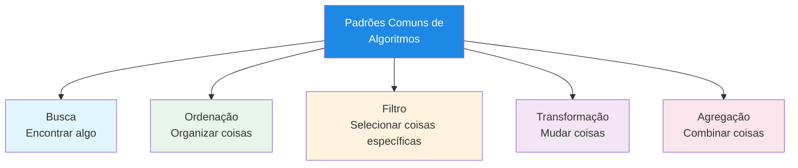
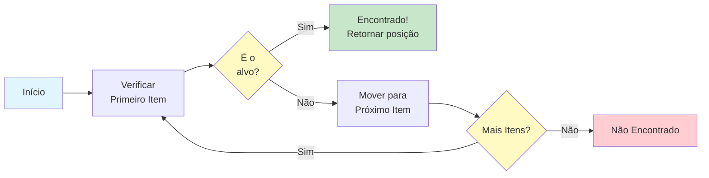
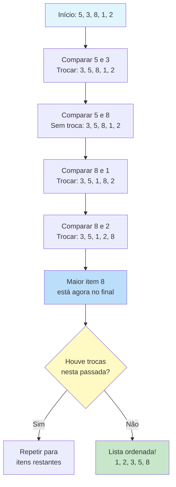
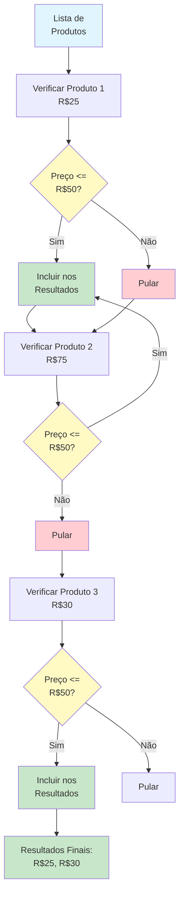
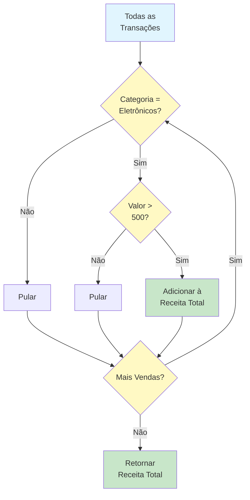
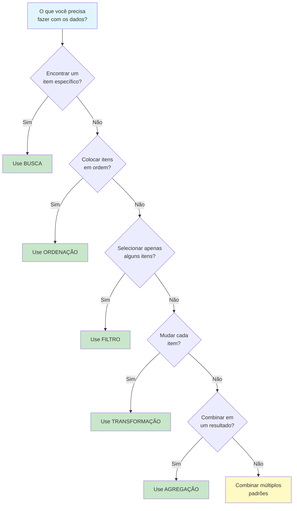

# Padrões Comuns de Algoritmos

Muitos problemas compartilham estruturas similares. Ao reconhecer esses padrões, você pode aplicar soluções algorítmicas comprovadas em vez de reinventar a roda. Esta lição cobre os cinco padrões de algoritmos mais comuns que você encontrará.

## Os Cinco Padrões Comuns



| Padrão | O que Faz | Exemplo do Mundo Real |
|---|---|---|
| **Busca** | Encontra um item específico em uma coleção | Procurar um contato no seu telefone |
| **Ordenação** | Organiza itens em uma ordem específica | Organizar livros em ordem alfabética |
| **Filtro** | Seleciona itens que atendem a uma condição | Mostrar apenas e-mails não lidos |
| **Transformação** | Muda cada item de alguma forma | Converter temperaturas de C para F |
| **Agregação** | Combina múltiplos itens em um resultado | Calcular o total de um carrinho de compras |

## Padrão 1: Busca

Algoritmos de busca encontram um item específico (ou determinam que não existe) dentro de uma coleção de dados.

### Busca Linear

A busca mais simples -- verifique cada item até encontrar o que procura.

```
ALGORITMO: Busca Linear
ENTRADA: Uma coleção de itens, um item alvo para encontrar
SAÍDA: A posição do alvo, ou "não encontrado"

PASSO 1: DEFINIR indice COMO 0
PASSO 2: ENQUANTO indice for menor que o tamanho da coleção FAÇA
            SE coleção[indice] for igual ao alvo ENTÃO
                RETORNAR indice
            FIM SE
            DEFINIR indice COMO indice + 1
        FIM ENQUANTO
PASSO 3: RETORNAR "não encontrado"
FIM ALGORITMO
```



### Quando Usar Busca Linear

| Situação | Adequado? | Por quê |
|---|---|---|
| Coleção pequena (menos de 50 itens) | Sim | Rápido o suficiente, simples de implementar |
| Dados não ordenados | Sim | Única opção sem ordenar primeiro |
| Busca única | Sim | Nenhum benefício em pré-ordenar |
| Coleção grande, muitas buscas | Não | Busca binária seria muito mais rápida |

### Busca Binária

Para coleções ordenadas, a busca binária é dramaticamente mais rápida. Funciona dividindo repetidamente o espaço de busca pela metade.

```
ALGORITMO: Busca Binária
ENTRADA: Uma coleção ordenada, um item alvo
SAÍDA: A posição do alvo, ou "não encontrado"

PASSO 1: DEFINIR baixo COMO 0
PASSO 2: DEFINIR alto COMO tamanho da coleção - 1
PASSO 3: ENQUANTO baixo for menor ou igual a alto FAÇA
            DEFINIR meio COMO (baixo + alto) dividido por 2
            SE coleção[meio] for igual ao alvo ENTÃO
                RETORNAR meio
            SENÃO SE coleção[meio] for menor que o alvo ENTÃO
                DEFINIR baixo COMO meio + 1
            SENÃO
                DEFINIR alto COMO meio - 1
            FIM SE
        FIM ENQUANTO
PASSO 4: RETORNAR "não encontrado"
FIM ALGORITMO
```

**Exemplo de rastreio: Encontrando 7 em [1, 3, 5, 7, 9, 11, 13]**

| Passo | baixo | alto | meio | coleção[meio] | Ação |
|---|---|---|---|---|---|
| 1 | 0 | 6 | 3 | 7 | Encontrado! Retornar 3 |

**Exemplo de rastreio: Encontrando 4 em [1, 3, 5, 7, 9, 11, 13]**

| Passo | baixo | alto | meio | coleção[meio] | Ação |
|---|---|---|---|---|---|
| 1 | 0 | 6 | 3 | 7 | 4 < 7, buscar metade esquerda |
| 2 | 0 | 2 | 1 | 3 | 4 > 3, buscar metade direita |
| 3 | 2 | 2 | 2 | 5 | 4 < 5, buscar metade esquerda |
| 4 | 2 | 1 | -- | -- | baixo > alto, não encontrado |

## Padrão 2: Ordenação

Algoritmos de ordenação organizam itens em uma ordem específica (crescente, decrescente, alfabética, etc.).

### Bubble Sort (Ordenação por Bolha)

Bubble sort compara repetidamente itens adjacentes e os troca se estiverem na ordem errada.

```
ALGORITMO: Bubble Sort
ENTRADA: Uma lista de números
SAÍDA: A mesma lista, ordenada em ordem crescente

PASSO 1: DEFINIR n COMO tamanho da lista
PASSO 2: REPITA
            DEFINIR trocou COMO falso
            PARA i DE 0 ATÉ n - 2 FAÇA
                SE lista[i] for maior que lista[i + 1] ENTÃO
                    TROCAR lista[i] e lista[i + 1]
                    DEFINIR trocou COMO verdadeiro
                FIM SE
            FIM PARA
            DEFINIR n COMO n - 1
        ATÉ trocou for falso
FIM ALGORITMO
```



### Como o Bubble Sort Funciona (Rastreio Visual)

Lista inicial: [5, 3, 8, 1, 2]

**Passada 1:**
- Comparar 5 e 3: trocar -> [3, 5, 8, 1, 2]
- Comparar 5 e 8: sem troca -> [3, 5, 8, 1, 2]
- Comparar 8 e 1: trocar -> [3, 5, 1, 8, 2]
- Comparar 8 e 2: trocar -> [3, 5, 1, 2, **8**]
- 8 "borbulha" para o final

**Passada 2:**
- Comparar 3 e 5: sem troca -> [3, 5, 1, 2, 8]
- Comparar 5 e 1: trocar -> [3, 1, 5, 2, 8]
- Comparar 5 e 2: trocar -> [3, 1, 2, **5**, 8]
- 5 está agora na posição

**Passada 3:**
- Comparar 3 e 1: trocar -> [1, 3, 2, 5, 8]
- Comparar 3 e 2: trocar -> [1, 2, **3**, 5, 8]
- 3 está agora na posição

**Passada 4:**
- Comparar 1 e 2: sem troca -> [**1**, **2**, 3, 5, 8]
- Nenhuma troca necessária -- lista está ordenada!

## Padrão 3: Filtro

Algoritmos de filtro selecionam apenas os itens que atendem a uma condição específica, criando uma coleção menor.

```
ALGORITMO: Filtro
ENTRADA: Uma coleção de itens, uma condição
SAÍDA: Uma nova coleção contendo apenas itens que atendem à condição

PASSO 1: CRIAR uma coleção vazia chamada resultado
PASSO 2: PARA cada item na coleção original FAÇA
            SE item atender à condição ENTÃO
                ADICIONAR item ao resultado
            FIM SE
        FIM PARA
PASSO 3: RETORNAR resultado
FIM ALGORITMO
```

### Exemplo do Mundo Real: Filtrando Produtos

```
ALGORITMO: Filtrar Produtos por Preço
ENTRADA: Uma lista de produtos com preços, preço máximo
SAÍDA: Lista de produtos no preço máximo ou abaixo

PASSO 1: CRIAR uma lista vazia chamada produtos_acessiveis
PASSO 2: PARA cada produto na lista de produtos FAÇA
            SE preço do produto for menor ou igual ao preço máximo ENTÃO
                ADICIONAR produto a produtos_acessiveis
            FIM SE
        FIM PARA
PASSO 3: RETORNAR produtos_acessiveis
FIM ALGORITMO
```



### Condições de Filtro Comuns

| Tipo de Filtro | Condição | Exemplo |
|---|---|---|
| **Intervalo** | Valor está entre dois limites | Idade entre 18 e 65 |
| **Igualdade** | Valor corresponde exatamente | Status igual a "ativo" |
| **Limite** | Valor está acima/abaixo de um ponto | Preço abaixo de R$100 |
| **Padrão** | Valor corresponde a um padrão | Nome começa com "A" |
| **Pertencimento** | Valor está em um conjunto | País está em [BR, US, CA] |

## Padrão 4: Transformação

Algoritmos de transformação aplicam uma mudança a cada item em uma coleção, produzindo uma nova coleção com itens modificados.

```
ALGORITMO: Transformação (Map)
ENTRADA: Uma coleção de itens, uma regra de transformação
SAÍDA: Uma nova coleção com itens transformados

PASSO 1: CRIAR uma coleção vazia chamada resultado
PASSO 2: PARA cada item na coleção original FAÇA
            DEFINIR item_transformado COMO aplicar transformação ao item
            ADICIONAR item_transformado ao resultado
        FIM PARA
PASSO 3: RETORNAR resultado
FIM ALGORITMO
```

### Exemplos do Mundo Real

**Exemplo 1: Convertendo Temperaturas**
```
ALGORITMO: Converter Todas as Temperaturas
ENTRADA: Uma lista de temperaturas em Celsius
SAÍDA: Uma lista de temperaturas em Fahrenheit

PASSO 1: CRIAR uma lista vazia chamada temps_fahrenheit
PASSO 2: PARA cada temp_celsius na lista de entrada FAÇA
            DEFINIR temp_fahrenheit COMO (temp_celsius * 9/5) + 32
            ADICIONAR temp_fahrenheit a temps_fahrenheit
        FIM PARA
PASSO 3: RETORNAR temps_fahrenheit
FIM ALGORITMO
```

**Exemplo 2: Formatando Nomes**
```
ALGORITMO: Formatar Nomes Completos
ENTRADA: Uma lista de pessoas com primeiro_nome e sobrenome
SAÍDA: Uma lista de nomes completos no formato "Sobrenome, Nome"

PASSO 1: CRIAR uma lista vazia chamada nomes_formatados
PASSO 2: PARA cada pessoa na lista de entrada FAÇA
            DEFINIR nome_completo COMO pessoa.sobrenome + ", " + pessoa.primeiro_nome
            ADICIONAR nome_completo a nomes_formatados
        FIM PARA
PASSO 3: RETORNAR nomes_formatados
FIM ALGORITMO
```

### Transformação vs. Filtro

| Aspecto | Transformação | Filtro |
|---|---|---|
| **Tamanho da saída** | Igual ao da entrada | Igual ou menor que a entrada |
| **O que muda** | Os próprios itens | Quais itens são incluídos |
| **Cada item processado?** | Sim | Sim (mas alguns são descartados) |
| **Exemplo** | Dobrar cada número | Manter apenas números pares |

```mermaid
flowchart LR
    A[Entrada:\n1, 2, 3, 4, 5] --> B{Transformação\nou Filtro?}
    B -->|Transformação\n(x2)| C[Saída:\n2, 4, 6, 8, 10]
    B -->|Filtro\n(pares)| D[Saída:\n2, 4]
    
    style A fill:#e1f5fe
    style C fill:#c8e6c9
    style D fill:#c8e6c9
    style B fill:#fff9c4
```

## Padrão 5: Agregação

Algoritmos de agregação combinam múltiplos itens em um único resultado. Agregações comuns incluem soma, contagem, média, máximo e mínimo.

```
ALGORITMO: Agregação
ENTRADA: Uma coleção de itens, uma operação de agregação
SAÍDA: Um único resultado combinado

PASSO 1: DEFINIR acumulador COMO valor inicial (depende da operação)
PASSO 2: PARA cada item na coleção FAÇA
            ATUALIZAR acumulador combinando-o com o item
        FIM PARA
PASSO 3: RETORNAR acumulador
FIM ALGORITMO
```

### Operações de Agregação Comuns

| Operação | Valor Inicial | Regra de Atualização | Exemplo de Resultado |
|---|---|---|---|
| **Soma** | 0 | acumulador = acumulador + item | [1,2,3] -> 6 |
| **Produto** | 1 | acumulador = acumulador * item | [1,2,3] -> 6 |
| **Contagem** | 0 | acumulador = acumulador + 1 | [a,b,c] -> 3 |
| **Máximo** | Primeiro item | acumulador = max(acumulador, item) | [1,5,3] -> 5 |
| **Mínimo** | Primeiro item | acumulador = min(acumulador, item) | [1,5,3] -> 1 |

### Exemplo do Mundo Real: Total do Carrinho de Compras

```
ALGORITMO: Calcular Total do Carrinho
ENTRADA: Um carrinho de compras com itens e preços
SAÍDA: O preço total

PASSO 1: DEFINIR total COMO 0
PASSO 2: PARA cada item no carrinho FAÇA
            DEFINIR item_total COMO preço do item multiplicado por quantidade do item
            DEFINIR total COMO total + item_total
        FIM PARA
PASSO 3: RETORNAR total
FIM ALGORITMO
```

### Combinando Padrões

Algoritmos do mundo real frequentemente combinam múltiplos padrões:

```
ALGORITMO: Gerar Relatório de Vendas
ENTRADA: Uma lista de todas as transações de vendas
SAÍDA: Receita total de eletrônicos acima de R$500

PASSO 1: DEFINIR receita_total COMO 0
PASSO 2: PARA cada venda na lista de vendas FAÇA
            SE categoria da venda for igual a "Eletrônicos" ENTÃO
                SE valor da venda for maior que 500 ENTÃO
                    DEFINIR receita_total COMO receita_total + valor da venda
                FIM SE
            FIM SE
        FIM PARA
PASSO 3: RETORNAR receita_total
FIM ALGORITMO
```

Este algoritmo combina:
- **Filtro**: Apenas eletrônicos acima de R$500
- **Agregação**: Soma dos valores filtrados



## Guia de Seleção de Padrões

Ao enfrentar um novo problema, use este guia para identificar qual padrão se aplica:



## Exercícios Práticos

### Exercício 1: Identifique o Padrão

Para cada cenário, identifique qual padrão (ou combinação) se aplica:

1. Encontrar o aluno mais alto em uma turma
2. Converter todos os preços de dólares para euros
3. Encontrar todos os alunos que pontuaram acima de 90
4. Organizar livros por data de publicação
5. Calcular a temperatura média do mês
6. Encontrar um livro específico pelo ISBN, depois atualizar seu status

### Exercício 2: Escreva um Algoritmo de Busca

Escreva um algoritmo que busca um aluno pelo nome em uma lista de registros de alunos. Cada registro tem um nome e uma nota. Retorne a nota do aluno se encontrado, ou "Aluno não encontrado" se não.

### Exercício 3: Escreva um Filtro + Transformação

Escreva um algoritmo que:
- Recebe uma lista de números
- Filtra todos os números negativos
- Transforma os números restantes elevando-os ao quadrado
- Retorna a nova lista

### Exercício 4: Escreva um Algoritmo de Agregação

Escreva um algoritmo que encontra tanto o valor máximo quanto o mínimo em uma única passagem por uma lista de números.

### Exercício 5: Combine Todos os Padrões

Projete um algoritmo para um sistema de biblioteca que:
1. Busca livros de um autor específico
2. Filtra para incluir apenas livros publicados após 2020
3. Transforma cada registro de livro para mostrar apenas título e ano
4. Agrega para contar quantos livros correspondentes existem

## Resumo

Nesta lição, você aprendeu:

- **Busca**: Encontrar itens específicos (linear para não ordenados, binária para ordenados)
- **Ordenação**: Organizar itens em ordem (bubble sort como exemplo simples)
- **Filtro**: Selecionar itens que atendem a condições
- **Transformação**: Mudar cada item em uma coleção
- **Agregação**: Combinar múltiplos itens em um único resultado
- **Combinando padrões**: Algoritmos do mundo real frequentemente usam múltiplos padrões juntos

> [!SUCCESS]
> Estes cinco padrões são os blocos de construção da maioria dos algoritmos que você encontrará. Ao reconhecer qual padrão se aplica a um problema, você pode rapidamente projetar uma solução eficaz.

## Termos-Chave

| Termo | Definição |
|---|---|
| **Busca** | Encontrar um item específico em uma coleção |
| **Busca Linear** | Verificar cada item um por um |
| **Busca Binária** | Reduzir repetidamente o espaço de busca pela metade em uma coleção ordenada |
| **Ordenação** | Organizar itens em uma ordem específica |
| **Bubble Sort** | Uma ordenação simples que troca itens adjacentes fora de ordem |
| **Filtro** | Selecionar itens que atendem a uma condição |
| **Transformação** | Aplicar uma mudança a cada item |
| **Agregação** | Combinar múltiplos itens em um único resultado |
| **Acumulador** | Uma variável que constrói um resultado durante a agregação |
