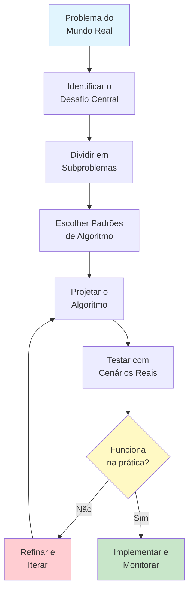
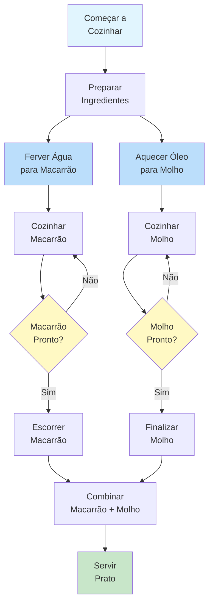
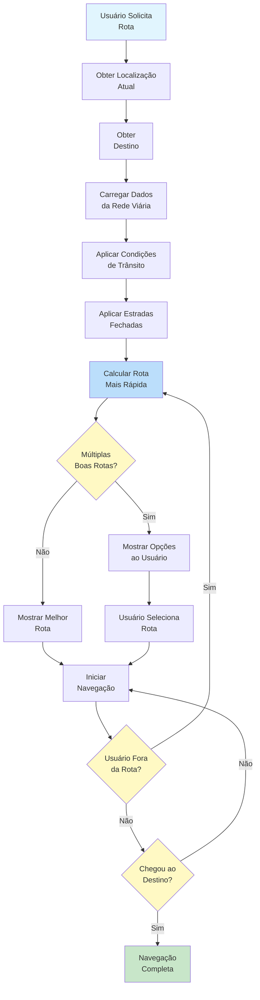
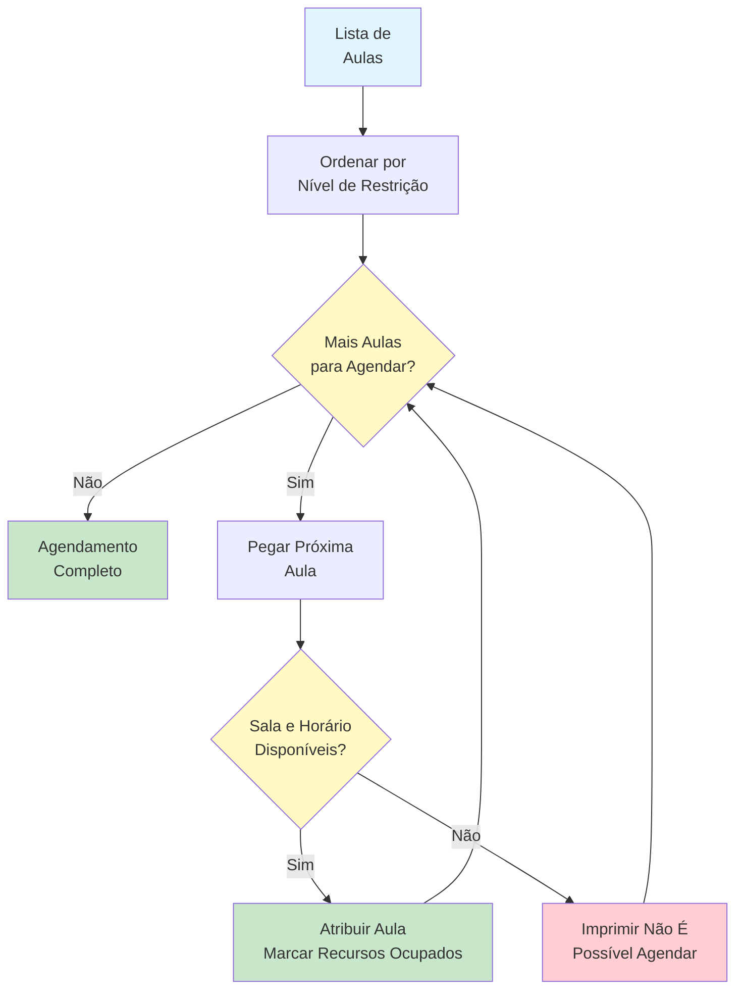
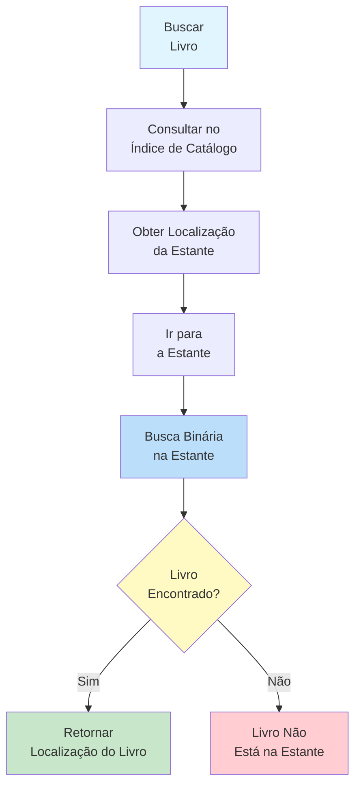
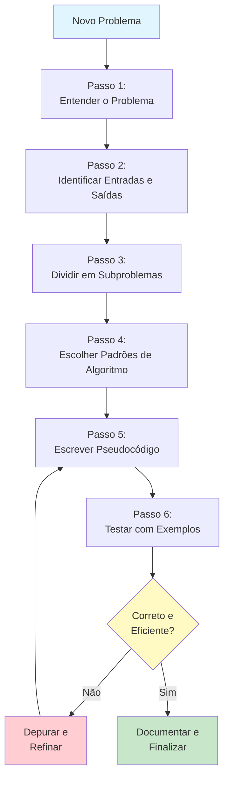

# Design de Algoritmos do Mundo Real

Agora que você compreende os fundamentos dos algoritmos, é hora de ver como eles se aplicam a problemas do mundo real. Esta lição apresenta estudos de caso detalhados que demonstram o pensamento algorítmico em situações cotidianas.

## Por que Exemplos do Mundo Real Importam

Conceitos abstratos de algoritmos se tornam claros quando aplicados a situações familiares. Ao estudar algoritmos do mundo real, você desenvolverá a capacidade de:

- **Reconhecer padrões algorítmicos** em problemas cotidianos
- **Projetar soluções** para desafios práticos
- **Avaliar compromissos** entre diferentes abordagens
- **Comunicar algoritmos** para pessoas não técnicas



## Estudo de Caso 1: Receita como um Algoritmo

Cozinhar é um dos processos algorítmicos mais relacionáveis. Vamos analisar uma receita através de uma lente algorítmica.

### O Algoritmo da Receita

```
ALGORITMO: Fazer Espaguete à Bolonhesa
ENTRADA: Carne moída, espaguete, tomates, cebola, alho, azeite, sal, pimenta
SAÍDA: Um prato de espaguete à bolonhesa

PASSO 1: PREPARAR os ingredientes
            Picar 1 cebola finamente
            Moer 2 dentes de alho
            Medir 500g de carne moída
            Abrir 1 lata de tomate triturado
PASSO 2: FERVER água em uma panela grande
PASSO 3: ADICIONAR sal à água
PASSO 4: ESPERAR até a água atingir o ponto de fervura
PASSO 5: ADICIONAR espaguete à água fervente
PASSO 6: DEFINIR temporizador PARA 10 minutos
PASSO 7: ENQUANTO temporizador for maior que 0 FAÇA
            MEXER o espaguete ocasionalmente
            SE temporizador for igual a 1 ENTÃO
                PROVAR um fio para verificar o ponto
            FIM SE
        FIM ENQUANTO
PASSO 8: ESCORRER o espaguete
PASSO 9: AQUECER azeite em uma frigideira
PASSO 10: ADICIONAR cebola e cozinhar por 3 minutos
PASSO 11: ADICIONAR alho e cozinhar por 1 minuto
PASSO 12: ADICIONAR carne moída
PASSO 13: ENQUANTO a carne não estiver totalmente dourada FAÇA
            DESMANCHAR a carne com a colher
            MEXER ocasionalmente
        FIM ENQUANTO
PASSO 14: ADICIONAR tomate triturado
PASSO 15: ADICIONAR sal e pimenta a gosto
PASSO 16: COZINHAR o molho em fogo baixo por 15 minutos
PASSO 17: COMBINAR espaguete e molho no prato
PASSO 18: SERVIR imediatamente
FIM ALGORITMO
```

### Análise Algorítmica da Receita

| Conceito de Algoritmo | Na Receita |
|---|---|
| **Entrada** | Ingredientes crus |
| **Saída** | Prato finalizado |
| **Passos sequenciais** | Passos executam em ordem (preparar, ferver, cozinhar molho, combinar) |
| **Condicional** | "SE temporizador for igual a 1 ENTÃO provar o ponto" |
| **Loop** | "ENQUANTO a carne não estiver dourada FAÇA mexer" |
| **Execução paralela** | Macarrão e molho podem cozinhar simultaneamente |
| **Terminação** | Receita termina quando o prato é servido |



> [!NOTE]
> Observe que os passos 5-8 (macarrão) e os passos 9-16 (molho) podem acontecer em paralelo. Isso é chamado de **execução concorrente** -- dois processos rodando ao mesmo tempo. Bons cozinheiros gerenciam ambos simultaneamente para terminar ao mesmo tempo.

### O que Faz uma Boa Receita Algorítmica?

| Qualidade | Boa Receita | Receita Ruim |
|---|---|---|
| **Definitude** | "Asse a 180C por 25 minutos" | "Asse até ficar pronto" |
| **Completude** | Lista todos os ingredientes com quantidades | "Adicione tempero a gosto" |
| **Ordem** | Passos são numerados e sequenciais | Passos pulam aleatoriamente |
| **Tratamento de erros** | "Se a massa estiver seca, adicione 1 colher de água" | Sem orientação de solução de problemas |
| **Terminação** | "Cozinhe por 10 minutos, depois retire" | "Cozinhe por um tempo" |

## Estudo de Caso 2: Algoritmo de Sistema de Navegação

A navegação GPS é um sistema algorítmico sofisticado que encontra rotas ideais entre locais.

### O Problema de Navegação

```
PROBLEMA: Encontrar a melhor rota do ponto A ao ponto B

RESTRIÇÕES:
  - Rede de estradas (quais estradas conectam a quais)
  - Distância de cada segmento de estrada
  - Condições atuais de trânsito
  - Limites de velocidade
  - Estradas fechadas ou em construção

OBJETIVO: Minimizar o tempo de viagem
```

### Algoritmo de Navegação Simplificado

```
ALGORITMO: Encontrar Rota Mais Rápida
ENTRADA: Local de partida, destino, rede de estradas com dados de trânsito
SAÍDA: Lista ordenada de segmentos de estrada formando a rota

PASSO 1: CRIAR uma lista de lugares para explorar
PASSO 2: ADICIONAR o local de partida à lista de exploração
PASSO 3: DEFINIR tempo_viagem[local_de_partida] COMO 0
PASSO 4: DEFINIR local_anterior[local_de_partida] COMO nenhum
PASSO 5: ENQUANTO a lista de exploração não estiver vazia FAÇA
            SELECIONAR o local com o menor tempo_viagem da lista
            REMOVER esse local da lista
            
            PARA cada estrada conectada a este local FAÇA
                DEFINIR novo_tempo COMO tempo_viagem[atual] + tempo da estrada
                SE novo_tempo for menor que tempo_viagem[destino_da_estrada] ENTÃO
                    DEFINIR tempo_viagem[destino_da_estrada] COMO novo_tempo
                    DEFINIR local_anterior[destino_da_estrada] COMO local atual
                    ADICIONAR destino_da_estrada à lista de exploração
                FIM SE
            FIM PARA
        FIM ENQUANTO
PASSO 6: RECONSTRUIR a rota seguindo local_anterior do destino de volta ao início
PASSO 7: RETORNAR a rota
FIM ALGORITMO
```

> [!TIP]
> Esta é uma versão simplificada do **algoritmo de Dijkstra**, um dos algoritmos mais famosos na ciência da computação. Ele encontra o caminho mais curto em uma rede explorando a partir do ponto de partida.

### Como a Navegação Lida com Complexidade do Mundo Real



### Considerações do Mundo Real

| Fator | Como o Algoritmo Trata |
|---|---|
| **Engarrafamentos** | Aumenta o tempo de viagem para segmentos afetados |
| **Estradas fechadas** | Remove esses segmentos da rede |
| **Preferências do usuário** | Adiciona pesos (evitar pedágios, preferir rodovias) |
| **Atualizações em tempo real** | Recalcula quando as condições mudam |
| **Múltiplos destinos** | Encontra ordem ideal para visitar todos os pontos |

## Estudo de Caso 3: Algoritmo de Agendamento

Agendamento é um problema algorítmico clássico: como atribuir recursos limitados (tempo, salas, pessoas) a tarefas que precisam deles.

### O Problema de Agendamento

```
PROBLEMA: Agendar aulas para uma escola

RECURSOS:
  - 5 salas de aula
  - 8 professores
  - 6 horários por dia

RESTRIÇÕES:
  - Cada professor só pode dar uma aula por vez
  - Cada sala só pode ter uma aula por vez
  - Algumas aulas requerem salas específicas (laboratório, ginásio)
  - Alguns professores têm horários indisponíveis
  - Cada aula deve ser agendada exatamente uma vez

OBJETIVO: Agendar todas as aulas sem conflitos
```

### Algoritmo de Agendamento Ganancioso

Um **algoritmo ganancioso** faz a melhor escolha a cada passo sem olhar adiante.

```
ALGORITMO: Agendador Ganancioso de Aulas
ENTRADA: Lista de aulas para agendar, salas disponíveis, horários disponíveis, horários dos professores
SAÍDA: Um agendamento completo ou "não é possível agendar todas as aulas"

PASSO 1: ORDENAR aulas por dificuldade de agendar (mais restritas primeiro)
            Aulas com necessidades específicas de sala vêm primeiro
            Aulas com professores que têm poucos horários disponíveis vêm primeiro
PASSO 2: CRIAR um agendamento vazio
PASSO 3: PARA cada aula na lista ordenada FAÇA
            DEFINIR agendada COMO falso
            PARA cada horário disponível FAÇA
                PARA cada sala disponível FAÇA
                    SE sala estiver livre neste horário E
                       professor estiver disponível neste horário E
                       sala atender aos requisitos da aula ENTÃO
                        ATRIBUIR aula a esta sala neste horário
                        MARCAR sala como ocupada neste horário
                        MARCAR professor como ocupado neste horário
                        ADICIONAR atribuição ao agendamento
                        DEFINIR agendada COMO verdadeiro
                        SAIR de todos os loops internos
                    FIM SE
                FIM PARA
                SE agendada for verdadeiro ENTÃO
                    SAIR
                FIM SE
            FIM PARA
            SE agendada for falso ENTÃO
                IMPRIMIR "Não é possível agendar: " + nome da aula
            FIM SE
        FIM PARA
PASSO 4: RETORNAR o agendamento
FIM ALGORITMO
```



### Comparação de Estratégias de Agendamento

| Estratégia | Como Funciona | Prós | Contras |
|---|---|---|---|
| **Gananciosa** | Agenda aulas mais fáceis primeiro | Rápida, simples | Pode falhar em agendar todas as aulas |
| **Mais restritas primeiro** | Agenda aulas mais difíceis primeiro | Melhor taxa de sucesso | Mais complexa de implementar |
| **Backtracking** | Tenta um agendamento, desfaz se travar | Encontra solução se existir | Muito lenta para problemas grandes |
| **Atribuição aleatória** | Atribui aleatoriamente, verifica conflitos | Muito rápida | Muitos conflitos, baixa qualidade |

## Estudo de Caso 4: Organização de Livros da Biblioteca

Como uma biblioteca organiza milhares de livros para que qualquer livro possa ser encontrado rapidamente?

### O Algoritmo de Organização

```
ALGORITMO: Organizar Livros da Biblioteca
ENTRADA: Uma coleção de livros não ordenados com números de catálogo
SAÍDA: Livros organizados nas estantes em ordem

PASSO 1: ORDENAR todos os livros pelo seu número de catálogo
PASSO 2: DIVIDIR a lista ordenada em grupos que cabem em uma estante
PASSO 3: PARA cada grupo de estante FAÇA
            ROTULAR a estante com o intervalo de números de catálogo
            COLOCAR livros na estante em ordem
        FIM PARA
PASSO 4: CRIAR um índice de catálogo mapeando números de catálogo para localizações nas estantes
FIM ALGORITMO
```

### O Algoritmo de Busca (Usando a Organização)

```
ALGORITMO: Encontrar Livro na Biblioteca Organizada
ENTRADA: Número de catálogo de um livro, o índice de catálogo
SAÍDA: A localização física do livro

PASSO 1: CONSULTAR o número de catálogo no índice
PASSO 2: LER a localização da estante no índice
PASSO 3: IR para aquela estante
PASSO 4: USAR busca binária na estante para encontrar o livro exato
            DEFINIR esquerda COMO primeiro livro na estante
            DEFINIR direita COMO último livro na estante
            ENQUANTO esquerda for menor ou igual a direita FAÇA
                DEFINIR meio COMO o livro no meio
                SE número de catálogo do meio for igual ao alvo ENTÃO
                    RETORNAR posição do livro do meio
                SENÃO SE número de catálogo do meio for menor que o alvo ENTÃO
                    DEFINIR esquerda COMO o livro após o meio
                SENÃO
                    DEFINIR direita COMO o livro antes do meio
                FIM SE
            FIM ENQUANTO
PASSO 5: RETORNAR "Livro não está na estante"
FIM ALGORITMO
```



> [!NOTE]
> O sistema de biblioteca combina múltiplos padrões de algoritmo: **ordenação** (organizar livros), **busca** (encontrar um livro específico) e **agregação** (o índice de catálogo que resume localizações).

## Projetando Seu Próprio Algoritmo: Um Framework

Ao enfrentar um novo problema, siga este framework:



### Exemplo Passo a Passo: Planejando um Cronograma de Estudos

**Passo 1: Entender o Problema**
Você tem 5 matérias para estudar, 3 dias até as provas e horas limitadas por dia. Você precisa alocar o tempo de estudo de forma eficaz.

**Passo 2: Identificar Entradas e Saídas**
- **Entrada**: Lista de matérias, dificuldade de cada uma, horas disponíveis por dia, número de dias
- **Saída**: Um cronograma de estudos dia a dia

**Passo 3: Dividir em Subproblemas**
- Priorizar matérias por dificuldade
- Calcular total de horas de estudo necessárias
- Distribuir horas pelos dias disponíveis
- Garantir que nenhum dia exceda as horas disponíveis

**Passo 4: Escolher Padrões de Algoritmo**
- **Ordenação**: Ordenar matérias por dificuldade (mais difíceis primeiro)
- **Agregação**: Total de horas necessárias
- **Filtro**: Horários disponíveis
- **Transformação**: Converter horas em blocos de tempo

**Passo 5: Escrever Pseudocódigo**

```
ALGORITMO: Planejador de Cronograma de Estudos
ENTRADA: Lista de matérias com níveis de dificuldade, horas disponíveis por dia, número de dias
SAÍDA: Cronograma de estudos dia a dia

PASSO 1: ORDENAR matérias por dificuldade (mais difíceis primeiro)
PASSO 2: PARA cada matéria FAÇA
            DEFINIR horas_necessarias COMO nível de dificuldade multiplicado por 2
        FIM PARA
PASSO 3: DEFINIR total_horas_necessarias COMO soma de todas as horas_necessarias
PASSO 4: DEFINIR total_horas_disponiveis COMO horas por dia multiplicado por número de dias
PASSO 5: SE total_horas_necessarias for maior que total_horas_disponiveis ENTÃO
            IMPRIMIR "Aviso: Tempo insuficiente para estudar todas as matérias profundamente"
            IMPRIMIR "Foque nas matérias mais difíceis primeiro"
        FIM SE
PASSO 6: CRIAR um cronograma vazio
PASSO 7: PARA cada dia DE 1 ATÉ numero_de_dias FAÇA
            DEFINIR horas_restantes COMO horas disponíveis por dia
            PARA cada matéria na lista ordenada FAÇA
                SE horas_restantes for maior que 0 ENTÃO
                    DEFINIR tempo_estudo COMO mínimo de 2 horas e horas_restantes
                    ADICIONAR matéria ao cronograma do dia com tempo_estudo horas
                    DEFINIR horas_restantes COMO horas_restantes - tempo_estudo
                FIM SE
            FIM PARA
        FIM PARA
PASSO 8: RETORNAR o cronograma
FIM ALGORITMO
```

## Exercícios Práticos

### Exercício 1: Algoritmo de Receita

Escreva um algoritmo para fazer seu lanche ou refeição favorita. Inclua:
- Entradas claras (ingredientes)
- Pelo menos uma condicional (ex.: "se muito salgado, adicione açúcar")
- Pelo menos um loop (ex.: "mexa até ficar homogêneo")
- Uma saída clara

### Exercício 2: Algoritmo de Cronograma Diário

Projete um algoritmo que planeja seu cronograma diário ideal. Considere:
- Compromissos fixos (trabalho, aulas)
- Atividades flexíveis (exercício, leitura, socialização)
- Restrições (dormir 8 horas, refeições em horários regulares)
- Prioridades (o que é mais importante incluir)

### Exercício 3: Algoritmo de Compras

Você precisa comprar mantimentos com um orçamento de R$200. Projete um algoritmo que:
- Recebe uma lista de compras com preços estimados
- Mantém-se dentro do orçamento
- Prioriza itens essenciais
- Sugere o que remover se estiver acima do orçamento

### Exercício 4: Analise um Algoritmo Real

Pense em um aplicativo que você usa regularmente (rede social, streaming de música, entrega de comida). Identifique:
- Quais padrões algorítmicos ele usa?
- Quais entradas ele recebe?
- Quais saídas ele produz?
- Quais compromissos ele faz?

### Exercício 5: Desafio de Design

Projete um algoritmo para um sistema de triagem de emergência hospitalar:
- Pacientes chegam com diferentes níveis de gravidade
- Médicos e leitos limitados estão disponíveis
- Pacientes críticos devem ser atendidos imediatamente
- Pacientes menos críticos podem precisar esperar

Inclua tratamento para:
- Chegada de novo paciente
- Médico ficando disponível
- Condição do paciente piorando enquanto espera

## Resumo

Nesta lição, você aprendeu:

- **Algoritmos de receitas**: Cozinhar segue padrões algorítmicos com entradas, passos, condicionais e loops
- **Algoritmos de navegação**: GPS usa busca de caminhos baseada em grafos para encontrar rotas ideais
- **Algoritmos de agendamento**: Alocação de recursos requer gerenciamento cuidadoso de restrições
- **Algoritmos de organização**: Bibliotecas combinam ordenação e busca para recuperação eficiente
- **Framework de design**: Uma abordagem sistemática para projetar algoritmos para qualquer problema

> [!SUCCESS]
> Agora você tem as ferramentas para reconhecer e projetar algoritmos para problemas do mundo real. Cada sistema complexo que você encontra -- de semáforos a feeds de redes sociais -- é construído a partir dos princípios algorítmicos que você aprendeu neste curso.

## Termos-Chave

| Termo | Definição |
|---|---|
| **Estudo de Caso** | Uma análise detalhada de um exemplo do mundo real |
| **Execução Concorrente** | Múltiplos processos rodando ao mesmo tempo |
| **Algoritmo de Dijkstra** | Um algoritmo famoso para encontrar caminhos mais curtos em uma rede |
| **Algoritmo Ganancioso** | Um algoritmo que faz a melhor escolha local a cada passo |
| **Backtracking** | Tentar uma solução e desfazê-la se não funcionar |
| **Restrição** | Uma limitação ou requisito que deve ser satisfeito |
| **Triagem** | Ordenar pacientes ou tarefas por urgência |
| **Alocação de Recursos** | Atribuir recursos limitados a necessidades concorrentes |
| **Framework de Design** | Uma abordagem estruturada para resolver problemas sistematicamente |
