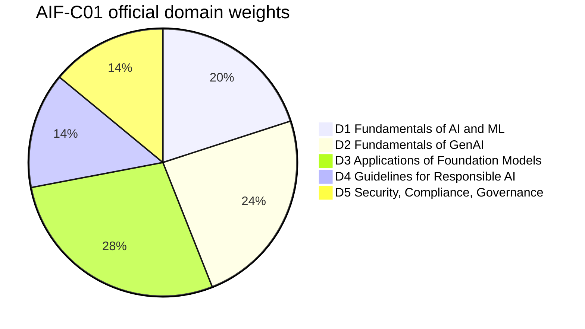
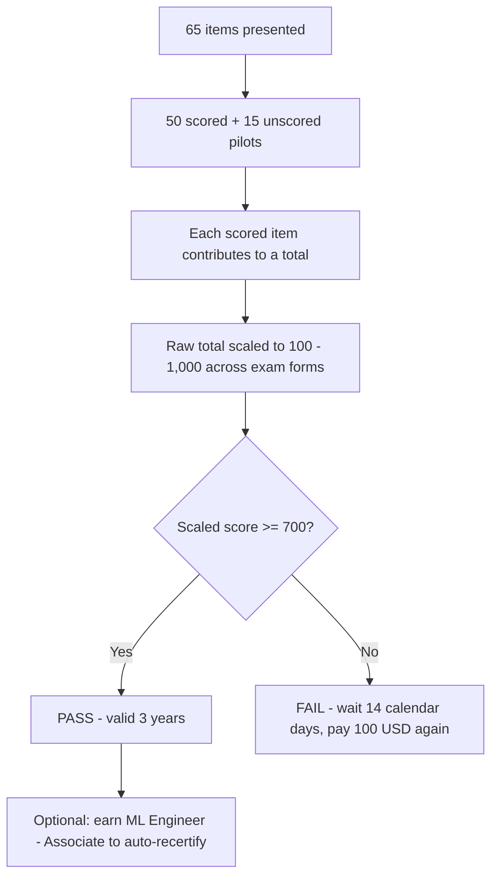
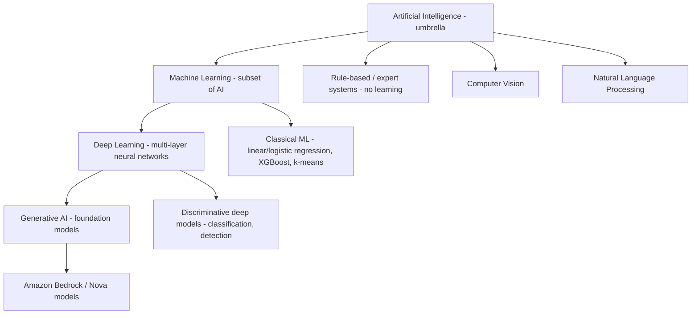
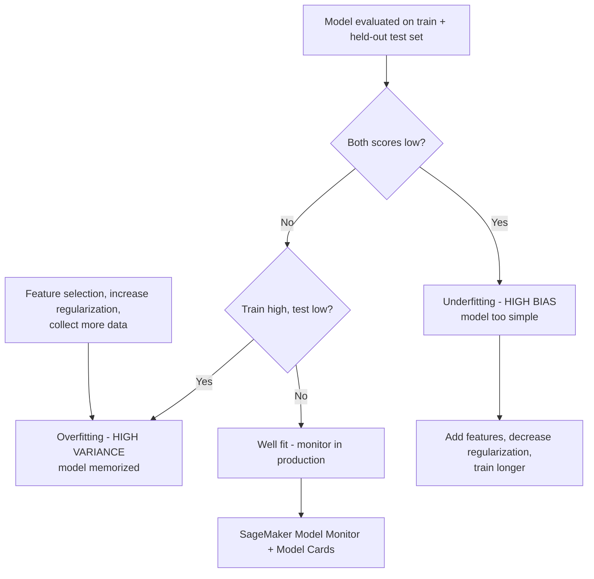
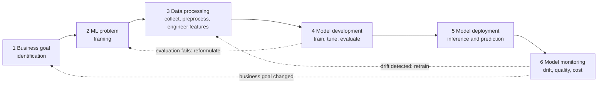

# AIF-C01 Exam Guide and AI/ML Fundamentals

Every AWS certification starts with a document: the **official exam guide**. For AIF-C01 that document does two jobs at once — it tells you exactly *how* the exam is built (codes, minutes, questions, cut score, weights) and it defines the *conceptual vocabulary* you must command in Domain 1 (Fundamentals of AI and ML, 20% of the score). Students who skip the guide and jump straight to flashcards usually fail for the same three reasons: they misjudge the time budget, they confuse statistical bias with fairness bias, and they cannot tell when AI is the *wrong* answer to a business problem.

```text
=====================================================================
 AIF-C01 — AWS CERTIFIED AI PRACTITIONER (FOUNDATIONAL)
=====================================================================
  Code .............. AIF-C01          Level .... Foundational
  Duration .......... 90 minutes       Questions . 65 presented
  Scored items ...... 50               Unscored ... 15 (pilots)
  Scale ............. 100 - 1,000      Cut score .. 700
  Scoring ........... compensatory (overall only, no per-domain pass)
  Cost .............. 100 USD          Validity ... 3 years
  Delivery .......... Pearson VUE center or online proctored
  Languages ......... 12 (IT and DE retire after 15 Oct 2026)
---------------------------------------------------------------------
  DOMAIN                                      WEIGHT   ITEMS (50 x w)
  1. Fundamentals of AI and ML                 20%          10
  2. Fundamentals of GenAI                     24%          12
  3. Applications of Foundation Models         28%          14
  4. Guidelines for Responsible AI             14%           7
  5. Security, Compliance, Governance          14%           7
                                             ------         -----
                                             100%           50
---------------------------------------------------------------------
  QUESTION TYPES: multiple choice | multiple response | ordering |
                  matching   (no penalty for guessing; blank = wrong)
=====================================================================
```

> [!NOTE]
> **The guide is the contract.** Anything not in the exam guide — no matter how popular it is in blog posts — is not guaranteed to appear. AWS explicitly labels its service lists **"non-exhaustive and subject to change"**, so treat the guide as the floor of what you must know, not the ceiling.

In this lesson you will:

- read the exam guide the way an exam writer does — code, timing, cost, scoring, languages;
- convert **domain weights** into a concrete study-hour budget;
- master the **four question types** and the compensatory scoring model;
- separate **AI, ML, deep learning and generative AI** using AWS's own definitions;
- choose between **supervised, unsupervised, reinforcement and semi-supervised** learning;
- lock in the vocabulary: model, algorithm, training, inference, epoch, batch, feature, label;
- diagnose **underfitting and overfitting** through the bias/variance lens;
- compute and interpret **accuracy, precision, recall and F1**;
- map the **six-phase ML lifecycle** to real AWS services;
- absorb the **2025–2026 exam-guide updates** (v1.1 objectives) and separate verified from non-verified claims;
- apply the **exam strategy essentials**: pacing, elimination and the recurring trap families;
- study **real-world AWS case studies** — services, numbers and sources;
- practice with **12 exam-style questions** plus interactive checks.

---

## 1. What AIF-C01 actually measures

### 1.1 The target candidate

The exam guide defines the target candidate in one sentence, and that sentence is exam-relevant material in its own right: a candidate has **up to 6 months of exposure to AI/ML technologies on AWS** and **uses but does not necessarily build AI/ML solutions**. This is a *practitioner* credential, not an engineer credential. You are being tested on judgment, vocabulary, service selection and governance — not on writing training code.

| Candidate attribute | What the guide says | What it means for your prep |
|---|---|---|
| Experience window | Up to 6 months of exposure to AI/ML on AWS | You are not expected to have shipped models |
| Role emphasis | Uses, but does not necessarily build, AI/ML solutions | Service selection and trade-off reasoning dominate |
| Prerequisite certification | None | AIF-C01 can be your first AWS certificate |
| Coding AI/ML models | **Out of scope** | No gradient descent, no PyTorch, no feature engineering |
| Hyperparameter tuning | **Out of scope** | Know *that* tuning exists, not *how* to tune |
| Mathematical/statistical analysis | **Out of scope** | Arithmetic on metrics is fair; derivations are not |
| Governance framework development | **Out of scope** | You must *apply* guidelines, not author them |

### 1.2 In scope and explicitly out of scope

The guide draws a hard line around scope. The out-of-scope list is not decoration — items from it have appeared as distractors on the official practice question set, because a distractor that sounds like "real ML work" is the most tempting wrong answer of all.

**Explicitly out of scope (exam guide):**

- coding AI/ML models;
- data engineering and feature engineering;
- hyperparameter tuning;
- building ML pipelines;
- mathematical and statistical analysis;
- implementing security and compliance protocols;
- developing governance frameworks.

**Explicitly in scope (recommended AWS knowledge):**

- core cloud services: **Amazon EC2, Amazon S3, AWS Lambda**;
- AI services: **Amazon Bedrock, Amazon SageMaker AI**;
- shared responsibility model and **AWS Identity and Access Management (IAM)**;
- AWS pricing and cost-management fundamentals.

> [!WARNING]
> **The classic trap: "build" versus "use".** If a question asks you to *implement* an algorithm, *tune* a hyperparameter or *construct* a data pipeline, it is almost certainly testing whether you recognize an out-of-scope task. The correct response on the exam is the one about **selection, evaluation, governance and responsible use** — never the one about writing the model.

### 1.3 The AWS service surface you must recognize

The guide publishes a non-exhaustive service list, grouped by category. You are not required to know every console path; you are required to know **what each service is for and when to choose it**.

| Category | Services listed in the guide |
|---|---|
| Machine learning & AI | Amazon Bedrock, Bedrock AgentCore, Comprehend, Lex, Nova, Personalize, Polly, Rekognition, SageMaker AI, JumpStart, Textract, Transcribe, Translate, AWS Transform |
| Analytics | Data Exchange, EMR, Glue, Glue DataBrew, Lake Formation, OpenSearch, QuickSight, Redshift |
| Compute | EC2, Lambda, ECS, EKS |
| Management & governance | CloudTrail, CloudWatch, AWS Config, Trusted Advisor, AWS Well-Architected Tool |
| Security | AWS Artifact, IAM, Inspector, KMS, Macie, Secrets Manager |
| Storage, network, cost | S3, S3 Glacier, CloudFront, VPC, AWS Budgets, Cost Explorer |

- **📚 Did you know?** The AIF-C01 exam was **announced in June 2024** and its **beta opened on 13 August 2024** with **85 questions, 170 minutes and a 75 USD fee** in English and Japanese. The standard exam went **GA in October 2024** at **100 USD** with 65 questions and 90 minutes — so if you find an old study guide describing a 170-minute exam, you are reading beta-era material.

---

## 2. Exam logistics: the numbers that change your strategy

### 2.1 The logistics table

Every row below is verified against the AWS certification page, the exam guide or the Pearson VUE store, with the verification year shown.

| Attribute | Value | Source | Year |
|---|---|---|---|
| Code / level | AIF-C01 / Foundational | Certification page | 2026 |
| Duration | 90 minutes | Certification page, Exam overview | 2026 |
| Questions presented | 65 | Certification page + Exam Guide | 2026 |
| Scored / unscored | 50 / 15 | Exam Guide | 2026 |
| Passing score | 700 on a 100–1,000 scale | Exam Guide §Results | 2026 |
| Scoring model | Compensatory (overall only) | Exam Guide §Results | 2026 |
| Guessing policy | No penalty; unanswered = incorrect | Exam Guide §Question types | 2026 |
| Question types | Multiple choice, multiple response, ordering, matching | Exam Guide §Question types | 2026 |
| Cost | 100 USD | Certification page; Pearson VUE Store | 2026 |
| Validity | 3 years | Certification page; recertification policy | 2025–26 |
| Delivery | Pearson VUE test center or online proctored | Certification page | 2026 |
| Languages | 12 (Italian and German retire after 15 Oct 2026) | Certification page §Languages | 2026 |
| Beta (historical) | 85 questions / 170 minutes / 75 USD, EN + JA, from 13 Aug 2024 | AWS Training & Certification blog | 2024 |
| Standard GA | October 2024, 100 USD, 5 languages at launch | AWS Training & Certification blog | 2024 |

### 2.2 Example E1 — the per-question time budget

The single most useful number in the whole guide is arithmetic nobody publishes:

$$
t = \frac{90 \times 60}{65} = \frac{5{,}400}{65} \approx 83 \text{ seconds per question}
$$

If you reserve **10 minutes** for review, the real budget is $80 \times 60 / 65 \approx$ **73.8 seconds** per item. Compare this with the 2024 beta: $170 \times 60 / 85 = 120$ seconds per item — the standard exam is roughly **31% tighter per question**. Ordering and matching items legitimately consume more than average; multiple-choice items should be finished in under a minute so the surplus pays for them.

### 2.3 Example E5 — cost of failure

| Exam iteration | Fee | Items | Cost per item | Notes |
|---|---|---|---|---|
| Beta (Aug 2024) | 75 USD | 85 | **0.88 USD** | English + Japanese only |
| Standard (current) | 100 USD | 65 | **1.54 USD** | 12 languages |

A failed attempt costs **another 100 USD** plus a mandatory **14-calendar-day wait** before you can retake. There is no limit on attempts and the full fee applies each time; conversely, you **cannot retake a exam you have passed for 2 years**. A limited "Foundational Retake" promotion ended on **15 February 2025**, so budget for one shot.

- **📚 Did you know?** You do not need to "pass every domain". Because scoring is **compensatory**, a strong Domain 3 (28%) can carry a weak Domain 4 (14%) — AWS states you need a passing score **only on the overall exam**, and the score report may still show section-level feedback to guide your retry.

---

## 3. Domains, weights and task statements

### 3.1 Official weights and the derived question budget

| Domain | Official weight | Derived scored items (50 × weight) |
|---|---|---|
| 1. Fundamentals of AI and ML | **20%** | 10 |
| 2. Fundamentals of GenAI | **24%** | 12 |
| 3. Applications of Foundation Models | **28%** | 14 |
| 4. Guidelines for Responsible AI | **14%** | 7 |
| 5. Security, Compliance, and Governance for AI Solutions | **14%** | 7 |
| **Total** | **100%** | **50** |

> [!IMPORTANT]
> The **weights are official** (exam guide, 2026). The **item counts are arithmetic** — 50 × weight — and are **not published by AWS**. Per-domain question counts are unknown, and because 15 of the 65 items are unscored pilots, your actual test form will not match this grid exactly. Use the grid to *allocate study time*, never to predict a fixed number of questions.



### 3.2 What each domain really tests

| Domain | Task statements | Compressed exam focus |
|---|---|---|
| **1 — Fundamentals of AI and ML (20%)** | 1.1 Basic AI concepts and terminologies · 1.2 Practical use cases for AI · 1.3 AI/ML development lifecycle | AI/ML/DL/neural networks/CV/NLP; training vs inferencing; bias and fairness; labeled vs unlabeled, tabular, time-series, image, text data; supervised/unsupervised/reinforcement; when AI is *not* appropriate; batch, real-time, asynchronous and serverless inference; managed services (SageMaker AI, Transcribe, Translate, Comprehend, Lex, Polly); pipeline stages and MLOps; accuracy/precision/recall/F1 versus business metrics |
| **2 — Fundamentals of GenAI (24%)** | 2.1 Basic GenAI concepts · 2.2 Capabilities and limitations for business · 2.3 AWS infrastructure and technologies for GenAI | Tokens, chunking, embeddings, vectors, prompt engineering, transformer LLMs, foundation models, multi-modal and diffusion models; FM lifecycle; **token-based pricing and its effect on inference cost/performance**; context engineering; agentic AI (MCP, multi-agent patterns, memory, tools, orchestration); pros vs cons (hallucinations, interpretability, inaccuracy, nondeterminism); model selection by cost, latency, compliance, complexity; Bedrock, SageMaker AI, JumpStart, Amazon Q, Kiro, Strands Agents, Bedrock AgentCore |
| **3 — Applications of Foundation Models (28%)** | 3.1 Design considerations for FM apps · 3.2 Prompt engineering · 3.3 Training and fine-tuning FMs · 3.4 Evaluate FM performance | FM selection criteria; inference parameters such as **temperature** and output lengths; **RAG**; vector databases (OpenSearch, Aurora, Neptune, RDS for PostgreSQL); customization cost ladder (pre-training, fine-tuning, in-context learning, RAG, distillation); AI agents; prompt management; fine-tuning data prep (curation, governance, size, labeling, **RLHF**); human-in-the-loop and benchmark evaluation; **Bedrock Model Evaluation**; ROUGE, BLEU, BERTScore, LLM-as-a-judge |
| **4 — Guidelines for Responsible AI (14%)** | 4.1 Development of responsible AI systems · 4.2 Transparent and explainable models | Bias, fairness, inclusivity, robustness, safety, veracity; **Bedrock Guardrails**; sustainability; legal risks (IP claims, biased outputs, lost trust, hallucinations); **effects of bias and variance (overfitting, underfitting)**; label-quality analysis, human audits, subgroup analysis; transparent vs opaque models; **SageMaker Model Cards**; safety vs transparency tradeoffs |
| **5 — Security, Compliance, Governance (14%)** | 5.1 Methods to secure AI systems · 5.2 Governance and compliance regulations | IAM, encryption, **Macie, PrivateLink, shared responsibility, AgentCore Identity/Policy, Bedrock Guardrails**; data lineage and cataloging; privacy-enhancing tech; **AWS Config, Inspector, AWS Artifact, CloudTrail, Trusted Advisor**; data lifecycles, logging, residency, retention; **Generative AI Security Scoping Matrix** |

### 3.3 Turning weights into a study plan

Suppose you have **40 hours** before exam day. The weights convert directly into hours:

```text
Domain   weight   hours (40 h)   core assets to consume
D1        20%        8.0 h       AWS what-is pages, ML Lens lifecycle
D2        24%        9.6 h       Bedrock docs, GenAI concepts, token pricing
D3        28%       11.2 h       Prompting, RAG, fine-tuning, evaluation
D4        14%        5.6 h       Responsible AI principles, Guardrails, Model Cards
D5        14%        5.6 h       Shared responsibility, IAM, Artifact, Macie
                                              -------------------------
                                              40.0 h
```

Domains 2 + 3 together are **52% of the score** — more than half the exam is generative-AI work. A candidate who spends 80% of study time on classic ML has already misallocated the majority of their effort.

---

## 4. Question types and scoring mechanics

### 4.1 The four question types

| Type | Structure | Credit rule |
|---|---|---|
| **Multiple choice** | 1 correct option + 3 distractors | Select the single best answer |
| **Multiple response** | 2+ correct among 5+ options | **All** correct responses required for credit |
| **Ordering** | 3–5 responses placed in sequence | The full sequence must be correct |
| **Matching** | Match items against **3–7 prompts** | **All** pairs must be correct |

There is **no case-study type** listed in the current guide. A legacy 2024 PDF (v1.4, 31 July 2024) contains case-study wording, and AWS does not state which numbering series governs exam day — see the caveats in Section 11.3.

### 4.2 Compensatory scoring

**Compensatory** means one thing: only the **overall** result must clear 700. You do **not** need to reach 700 inside each individual domain. A candidate who scores 650-worth in Domain 4 but 800-worth overall-equivalent in Domains 1–3 can still pass — and vice versa: dominating Domain 3 cannot rescue an overall score below the cut.



### 4.3 Example E2 — scaled, not a raw percentage

700 out of 1,000 *looks* like 70%, and the naive conversion $0.70 \times 50 = 35$ correct answers is arithmetically clean — and **wrong as an exam fact**. AWS scales scores *"across multiple exam forms that might have slightly different difficulty levels"*, so the raw number of correct answers required for 700 is **not fixed at 35** and is not published. The only deterministic rule you can rely on is behavioural: **unanswered items are scored incorrect**, so you must answer all 65.

> [!WARNING]
> **Never leave an item blank "to be safe".** There is **no penalty for guessing** — a wrong guess costs you nothing beyond the point you would have lost by skipping, while a blank guarantees zero. Strategy: eliminate, commit, flag for review, move on. With ~83 seconds per item, a skipped question that you meant to return to is the most expensive habit on this exam.

---

## 5. AI, machine learning, deep learning and generative AI

### 5.1 The four-layer map, in AWS's own words

| Dimension | Artificial Intelligence | Machine Learning | Deep Learning | Generative AI |
|---|---|---|---|---|
| AWS definition | Machines performing *"human-like problem-solving tasks"* | *"The science of developing algorithms and statistical models to correlate data"* | AI method processing data *"inspired by the human brain"* using multi-layer neural networks | *"AI systems that create new content and artifacts such as images, videos, text, and audio from simple text prompts"* |
| Scope | Umbrella field (ML, DL, NLP, CV) | **Subset of AI** — *"one among many other branches"* | Subset of ML (*"takes machine learning one step further"*) | Subset/extension of deep learning |
| Output | Decisions, recommendations, plans | Predictions: labels, scores, clusters, forecasts | Rich pattern recognition on unstructured data | **New** text, image, audio, video, code |
| Data and compute | Rules or data | Historical labeled or unlabeled data | Very large data + heavy compute | Massive data + foundation models |
| Training style | Rule-based or learned | Supervised / unsupervised / semi-supervised / reinforcement | Layered neural-net training | Pre-training + fine-tuning or RAG |
| AWS example | Lex intent routing; Rekognition moderation | SageMaker XGBoost churn prediction | Rekognition classification; Transcribe speech-to-text | Bedrock generation; Amazon Q |
| AWS quote | *"Not all AI activities are machine learning and deep learning"* | *"One among many other branches of artificial intelligence"* | *"Takes machine learning one step further"* | *"A very advanced form of deep learning"* |



> [!NOTE]
> **Nested, not adjacent.** All generative AI is deep learning; not all deep learning is generative; all deep learning is machine learning; not all machine learning is AI (rule-based systems are AI too). Questions in Domain 1 routinely test this nesting by asking which statement is *false* — watch for options that invert it, such as *"all AI uses machine learning."*

### 5.2 When AI/ML is the wrong answer

Domain 1 explicitly tests **cost–benefit analysis** and **the decision not to use AI**. The two canonical reasons to decline an AI project:

1. **You need a specific, deterministic outcome** — if the requirement is "apply exactly these 12 business rules", a rules engine gives the same answer every time, is auditable line by line and costs nothing to train.
2. **The cost–benefit does not close** — data collection, labeling, evaluation and monitoring can exceed the value of the prediction, especially where a spreadsheet or a human review already achieves the target accuracy.

- **📚 Did you know?** AWS's own "what is overfitting" page uses a definition that surprises people: *"Underfit models experience high bias — they give inaccurate results for both the training data and test set."* **Bias in Domain 1 is a statistical term** (high bias = too simple) *and* Domain 4 uses **bias as a fairness term** (demographic skew). The exam tests both senses — usually in different domains.

---

## 6. Learning paradigms: supervised, unsupervised, reinforcement, semi-supervised

### 6.1 The decision table

| Aspect | Supervised | Unsupervised | Reinforcement | Semi-supervised |
|---|---|---|---|---|
| Data | Labeled (input + known target) | Unlabeled | Environment + reward signal | Small labeled + large unlabeled |
| Goal | Learn the X → Y mapping | Discover structure and patterns | Maximize cumulative reward | Bootstrap learning from partial labels |
| Problem types | Classification, regression | Clustering, PCA, anomaly detection | Sequential decisions, control | Mixed, label-expensive tasks |
| Techniques (AWS) | Linear/logistic regression, decision tree, random forest, XGBoost | K-means, spectral clustering, Random Cut Forest, Apriori | SageMaker RL frameworks; Amazon DeepRacer | Label-efficient document classification |
| AWS example | Predict machine failure from logs; binary medical diagnosis | Group news articles by topic; "bread + butter" purchase patterns | Game playing, robotics; exploration vs exploitation | Huge corpora where only some rows are labeled |

AWS documents the three paradigms precisely: **supervised** learning uses *features plus target values* (categorical target → classification; continuous target → regression); **unsupervised** learning has *no labels* and discovers groupings (PCA, clustering); **reinforcement** learning has an *agent learn by trial and error to maximize long-term reward*, balancing exploration against exploitation.

```matching
{
  "question": "Match each learning paradigm with its defining characteristic on the AIF-C01 exam:",
  "pairs": [
    {"left": "Supervised learning", "right": "Features plus known target values - categorical target means classification, continuous target means regression"},
    {"left": "Unsupervised learning", "right": "No labels at all - the algorithm discovers groupings, clusters or patterns such as k-means and PCA"},
    {"left": "Reinforcement learning", "right": "An agent learns by trial and error in an environment to maximize long-term reward"},
    {"left": "Semi-supervised learning", "right": "A small labeled set combined with a large unlabeled set to reduce labeling cost"},
    {"left": "Underfitting (high bias)", "right": "Inaccurate on BOTH the training data and the test set - the model is too simple"},
    {"left": "Overfitting (high variance)", "right": "Accurate on training data but inaccurate on unseen data - the model memorizes"}
  ],
  "explanation": "Paradigms are distinguished by what the data contains (labels, rewards or nothing). Fit problems are distinguished by where the error appears: both sets means underfitting, only the test set means overfitting."
}
```

### 6.2 Choosing the paradigm from the question stem

```text
"we have historical outcomes and want to PREDICT a known value"  -> supervised
   |-> target is a category (churn: yes/no)      -> classification
   |-> target is a number (price, demand)        -> regression
"we have data but NO target, we want to GROUP or REDUCE"          -> unsupervised
   |-> groups of customers / articles            -> clustering
   |-> fewer columns, structure discovery        -> PCA / dimensionality reduction
"an AGENT acts, receives feedback, improves over TIME"            -> reinforcement
"labels are expensive but a FEW exist"                            -> semi-supervised
```

> [!WARNING]
> **"Unsupervised" does not mean "unsupervised deployment".** A common distractor describes a model that scores new data without human review and calls it unsupervised learning. Unsupervised refers to the **absence of labels in training data**, not to the absence of humans at inference time.

---

## 7. Core terminology: the vocabulary of Domain 1

### 7.1 Terms with AWS-sourced definitions

| Term | Definition used on the exam | AWS source |
|---|---|---|
| **Model** | Artifact produced by learning patterns from data; used to predict on future data | Amazon ML Developer Guide §Concepts |
| **Algorithm** | Learning procedure that consumes training data and *"will output a model that captures these relationships"* | Amazon ML Developer Guide |
| **Training** | Fitting the model: input datasource + target attribute + transformations + training parameters | Amazon ML Developer Guide §Training |
| **Inferencing** | Using a **trained** model on new data; tested by mode: batch, real-time, asynchronous, serverless | SageMaker docs; Exam Guide T1.1 |
| **Epoch** | *"How many times the model goes through the entire training dataset"* | SageMaker Autopilot `epochCount` |
| **Batch / batch size** | *"The number of data samples used in each iteration of training"*; larger batches raise out-of-memory risk | SageMaker Autopilot `batchSize` |
| **Feature** | *"The attributes or properties models use during training and inference to make predictions"* | SageMaker Feature Store |
| **Label** | Target/answer added to raw data during labeling by human annotators or automated labelers | SageMaker Ground Truth |
| **Train vs evaluation data** | Held-out evaluation data detects overfitting; legacy default split **70% / 30%** | Amazon ML Developer Guide |

### 7.2 Example E6 — one epoch, one batch, 1,000 rows

Take 1,000 rows with a **batch size of 100**: one epoch = 10 training iterations, each consuming 100 samples. Ten epochs = 100 iterations total, and the model has now seen every row ten times. More epochs are not automatically better — they reduce bias up to a point and then start raising variance (memorization). AWS guidance for batch size is unusually practical: **start at 1** and increase until you hit an out-of-memory error, because larger batches raise OOM risk on the training instance.

### 7.3 Inference modes

| Mode | When to use | Shape of the workload |
|---|---|---|
| **Real-time** | Low-latency, interactive requests | Synchronous endpoint, per-request billing |
| **Batch** | Large volumes, latency acceptable (minutes to hours) | Jobs over files in S3, no endpoint idle cost |
| **Asynchronous** | Long-running requests that exceed real-time limits | Submit, poll or receive a callback |
| **Serverless** | Variable traffic, avoid provisioning | Scale to zero, pay per invocation |

### 7.4 Data types you must recognize

- **Labeled** vs **unlabeled** — determines the paradigm before anything else;
- **Structured/tabular** — rows and columns; classic ML territory (XGBoost on SageMaker);
- **Time-series** — ordered observations; forecasting tasks;
- **Images** — pixels; computer vision (Rekognition);
- **Text** — unstructured tokens; NLP (Comprehend) and generative AI;
- **Structured vs unstructured** — the exam uses this pair to decide between SageMaker tabular jobs and Bedrock/Comprehend/Rekognition.

```fillblank
{
  "question": "Complete the Domain 1 vocabulary statements with the correct AWS-sourced terms:",
  "template": "The number of times a model passes through the entire training dataset is called an {{1}}. The number of samples used in each training iteration is the {{2}}. Attributes used to make predictions are {{3}}, while the known answer attached during annotation is the {{4}}. Using a trained model on new data is called {{5}}.",
  "answers": {
    "1": "epoch",
    "2": "batch size",
    "3": "features",
    "4": "label",
    "5": "inferencing"
  },
  "distractors": ["gradient", "cluster", "centroid", "token", "embedding", "hyperparameter"],
  "explanation": "Epoch and batch size come from SageMaker Autopilot documentation, features from SageMaker Feature Store, labels from SageMaker Ground Truth, and inferencing is the exam-guide term for applying a trained model - distinguished from training throughout Domain 1."
}
```

---

## 8. Model fit: underfitting, overfitting, bias and variance

### 8.1 The diagnosis table

| Signal | Underfitting (high bias) | Overfitting (high variance) |
|---|---|---|
| Training performance | Poor | Excellent |
| Evaluation/test performance | Poor | Poor |
| Root cause | Model too simple to capture X → Y | Model memorizes training data, cannot generalize |
| AWS wording | *"Inaccurate results for both the training data and test set"* | *"Accurate predictions for training data but not for new data"* |
| Fix | Add features, **decrease** regularization | **Feature selection**, **increase** regularization |
| Effect of more training | Reduces bias | Can raise variance further |

### 8.2 Example E3 — a 1,000-row split

Legacy default split: **700 training / 300 evaluation** rows.

| Scenario | Train accuracy | Evaluation accuracy | Gap | Diagnosis | Fix |
|---|---|---|---|---|---|
| A | 99% | 72% | **27 points** | **Overfitting** (high variance) | Feature selection, increase regularization |
| B | 55% | 53% | 2 points, both low | **Underfitting** (high bias) | Add features, decrease regularization |
| C | 88% | 87% | 1 point, both healthy | Well fit | Monitor after deployment |

The gap tells you the diagnosis; the **absolute level** tells you which direction to move. Scenario B is the one students miss: a *small* gap is not automatically good news when both numbers are bad.



### 8.3 Bias and variance in two different senses

The exam guide Task 4.1 lists *"effects of bias and variance (e.g., effects on demographic groups, inaccuracy, overfitting, underfitting)"* — deliberately joining the two senses:

- **Statistical sense (Domains 1 and 3):** high bias = underfit, high variance = overfit; more training reduces bias but can increase variance.
- **Fairness sense (Domain 4):** bias as skew against demographic groups, addressed through label-quality analysis, human audits and subgroup analysis, with **SageMaker Model Cards** documenting the model's intended use and limitations.

> [!NOTE]
> **Read the domain number to know which "bias" is meant.** In Domains 1 and 3, bias sits next to variance and regularization. In Domain 4, bias sits next to fairness, inclusivity and guardrails. The word is identical; the remedies are completely different.

---

## 9. Evaluation metrics: accuracy, precision, recall and F1

### 9.1 The metric set

| Metric | Definition (AWS wording) | Weakness it exposes |
|---|---|---|
| **Accuracy** | % of labels predicted accurately = correct ÷ total test samples | Misleading on imbalanced data |
| **Precision** | Returned *"substantially more relevant results than irrelevant ones"* | False positives |
| **Recall** | Returned *"most of the relevant results"* (completeness) | False negatives |
| **F1** | Harmonic mean of precision and recall; *"highest score is 1, worst is 0"* | Rewards balance, punishes imbalance |
| **Macro-F1** | Unweighted average of F1 across classes | Treats every class equally regardless of size |

$$
F1 = 2 \cdot \frac{P \times R}{P + R}
$$

### 9.2 Example E4 — why F1 is a harmonic mean

With precision $P = 0.80$ and recall $R = 0.50$:

$$
F1 = \frac{2 \times 0.80 \times 0.50}{0.80 + 0.50} = \frac{0.80}{1.30} \approx 0.615
$$

The arithmetic mean would be $(0.80 + 0.50)/2 = 0.650$. F1 lands **lower (0.615)** precisely because the harmonic mean is pulled toward the weaker metric — that is the point of the metric. A model that finds only half the relevant items should not be graded as "mostly fine".

| P | R | Arithmetic mean | F1 (harmonic) | Reading |
|---|---|---|---|---|
| 0.80 | 0.50 | 0.650 | **0.615** | Half the relevant results missed |
| 0.90 | 0.90 | 0.900 | **0.900** | Balanced and strong |
| 0.95 | 0.30 | 0.625 | **0.456** | Precision high, recall collapses |
| 0.50 | 0.50 | 0.500 | **0.500** | Coin-flip performance |

### 9.3 Model metrics versus business metrics

Domain 1 requires you to keep two ledgers separate:

| Model metrics (data science) | Business metrics (decision makers) |
|---|---|
| Accuracy, precision, recall, F1, AUC | Cost per user, development costs, ROI, revenue lift |
| Answer: "Is the model correct?" | Answer: "Is the project worth it?" |
| Optimized by data scientists | Optimized by product and finance |
| Can be high while the project loses money | Can be positive with a mediocre model |

A fraud model at 99% accuracy that blocks 5% of legitimate payments can destroy more value than it saves — the exam expects you to say so.

- **📚 Did you know?** F1 is a **harmonic** mean rather than an arithmetic mean for a reason that shows up in exam options: with P = 0.95 and R = 0.30 the arithmetic mean says 0.625 (passable) while F1 says **0.456** (failing). The harmonic mean refuses to let one excellent number hide a broken one — AWS documents the range as **0 (worst) to 1 (highest)**.

---

## 10. The AI/ML development lifecycle

### 10.1 The six phases (AWS Well-Architected ML Lens)

The ML Lens defines six phases — and warns that they are **"not necessarily sequential"**, with feedback loops running in both directions:



### 10.2 Phase-to-service map

| Phase | What happens | AWS services |
|---|---|---|
| 1. Business goal identification | Define the outcome and the success metric | AWS Well-Architected Tool, Cost Explorer |
| 2. ML problem framing | Classification? regression? clustering? or no ML at all? | Problem framing workshop, domain expertise |
| 3. Data processing | Collection, preprocessing, feature engineering, labeling | S3, Glue, Glue DataBrew, Lake Formation, SageMaker Ground Truth |
| 4. Model development | Training, tuning, evaluation | SageMaker AI, JumpStart, SageMaker Clarify |
| 5. Model deployment | Inference and prediction | SageMaker endpoints, batch transform, Bedrock API |
| 6. Model monitoring | Drift, quality, cost, documentation | CloudWatch, SageMaker Model Monitor, SageMaker Model Cards |

### 10.3 Example E7 — from business goal to monitored endpoint

A retail team wants to reduce support spend by 15%. Mapping that to the lifecycle:

1. **Business goal:** cut support cost by 15% — measured in dollars, not accuracy.
2. **Problem framing:** predict ticket auto-resolution (binary classification) — or decide a Bedrock summarizer is cheaper than a classifier.
3. **Data:** 2 years of tickets in S3, cleaned with Glue DataBrew, labeled by 3 annotators in Ground Truth (target: ≥90% inter-annotator agreement).
4. **Development:** train in SageMaker AI, evaluate F1 = 0.74 on a held-out 30% split.
5. **Deployment:** SageMaker real-time endpoint for the agent console; Bedrock API for summarization.
6. **Monitoring:** CloudWatch alarms on latency and Model Monitor alerts on feature drift; Model Card records intended use and known limits.

```dragdrop
{
  "question": "Order the six Well-Architected ML lifecycle phases:",
  "items": [
    "Business goal identification",
    "ML problem framing",
    "Data processing",
    "Model development",
    "Model deployment",
    "Model monitoring"
  ],
  "correctOrder": [
    "Business goal identification",
    "ML problem framing",
    "Data processing",
    "Model development",
    "Model deployment",
    "Model monitoring"
  ],
  "explanation": "The ML Lens starts with the business goal, then frames the ML problem, processes data, develops the model, deploys it for inference and finally monitors it. AWS notes the phases are not strictly sequential and contain feedback loops - but no team should begin with model development before the business goal exists."
}
```

---

## 11. Preparation roadmap, resources and caveats

### 11.1 Official Skill Builder assets

| Asset | Content | Access | Source / date |
|---|---|---|---|
| Exam Prep Plan AIF-C01 | **19 trainings, 22 h 50 m**, >**175 exam-style questions**, labs, **65 flashcards** | Partly subscription | skillbuilder.aws, upd. 23 Jun 2025 |
| Official Practice Question Set | **20 questions**, 1 h 30 m, per-answer feedback, retakeable | **Free** | skillbuilder.aws, upd. 17 Jul 2026 |
| Official Pretest | **65 questions, 90-minute limit** | Subscription | skillbuilder.aws, 2026 |
| Official Practice Exam | **65 questions, 90-minute limit** | Subscription | skillbuilder.aws, 2026 |
| AI Practitioner Learning Plan | **8 trainings, 8 h 0 m** | Free-tier content | skillbuilder.aws, 2026 |
| Domain Review D1–D5 | ~1 h 30 m each | Free | skillbuilder.aws, 2026 |
| Exam Prep (classroom ILT) | **1 day**, intermediate | Paid | d1.awsstatic.com, 2025 |

### 11.2 The official four-step plan

AWS publishes a four-step prep plan, and the order matters — it is diagnostic before it is instructional:

1. **Get to know the exam** — read the exam guide and this lesson; understand types, weights and scoring.
2. **Refresh AWS knowledge and skills** — EC2, S3, Lambda, IAM, Bedrock, SageMaker AI, shared responsibility, pricing.
3. **Review and practice** — question banks, domain review videos, flashcards.
4. **Assess readiness** — timed official pretest or practice exam at 65 questions / 90 minutes.

| Milestone | Target | Rationale |
|---|---|---|
| First timed set | ≥60% overall | Baseline before domain deep-dives |
| Mid-prep set | ≥75% overall | Weakest domain no more than 10 points below average |
| Readiness set | ≥85% overall, 2 sittings | Leaves margin for scaled scoring across forms |
| Time check | Finish 65 items with ≥10 min left | Confirms you are under the ~83 s average |

### 11.3 Recertification, retakes and unverified claims

- **Validity:** 3 years. Recertify by **re-passing AIF-C01** or by earning **AWS Certified Machine Learning Engineer – Associate**, which auto-recertifies.
- **Retake:** fail → **14 calendar days** wait, unlimited attempts, full **100 USD** each time; a passed exam cannot be retaken for **2 years**.
- **Next certifications:** Solutions Architect – Associate (cloud path) or Data Engineer – Associate / ML Engineer – Associate (data and AI path).

> [!WARNING]
> **What this research could NOT verify — do not treat as exam facts:**
> - **Per-domain question counts are not published** — the 10/12/14/7/7 grid is arithmetic on 50 scored items;
> - **The exact raw number of correct answers needed for 700** — scaled scoring across forms; "≈70%" is an approximation only;
> - **An official pass rate** — AWS publishes none; third-party "80% pass rate" figures are unsourced;
> - **Whether case-study items still appear** — the legacy 2024 PDF mentions them; the current guide lists four types;
> - **Which guide version governs exam day** — current series v1.0 (26 Mar 2026) and v1.1 (30 Apr 2026) coexist with a legacy "v1.4, 31 Jul 2024" PDF;
> - **Domain 2 naming** — "Fundamentals of GenAI" (current) vs "Fundamentals of Generative AI" (2024 PDF); neither supersedes the other in AWS material;
> - **ESL +30-minute accommodation applicability** to AIF-C01 specifically, and **non-USD pricing/taxes** — only 100 USD was verified;
> - **Distribution of question types** — no AWS source states how many ordering vs matching items appear.

- **📚 Did you know?** The exam guide's change history and the certification page's language list are both moving targets: the current guide series shows **v1.0 on 26 March 2026** and **v1.1 on 30 April 2026**, while **Italian and German retire after 15 October 2026**, leaving the exam in **12 languages**. Check the guide version date on any PDF you download — undated or 2024-dated PDFs circulate widely.

### 11.4 2025–2026 Updates

The exam guide is a living document, and the last two years changed it twice in one month: **v1.0 was published on 26 March 2026** and **v1.1 on 30 April 2026**. AWS states that guide updates appear on the exam **about one month after publication**, so every v1.1 objective below has been exam-eligible since late May 2026. Everything in this subsection marked **verified** was checked against the AWS exam-guide change history (docs v1.1) on 6 October 2026; anything not so marked is labelled non-verified.

**The seven new objectives in v1.1 (verified):**

| New objective | Domain | What it now tests |
|---|---|---|
| 1.2.6 Traditional ML vs foundation models | 1 | regulatory, explainability and operational constraints as the deciding factors |
| 2.1.4 Token-based pricing | 2 | effect of token pricing on inference **cost and performance** |
| 2.1.5 Context engineering | 2 | what is placed in the context window and what that costs |
| 2.1.6 Agentic AI | 2 | multi-agent patterns, **MCP**, memory management, tool usage, orchestration |
| 3.2.5 Prompt versioning | 3 | **Bedrock Prompt Management** as a versioned prompt workflow |
| 3.4.5 Business alignment metrics | 3 | metrics that tie model quality to business outcomes |
| 5.1.5 Hallucination detection and grounding | 5 | RAG grounding, output validation, confidence scoring |

**Other verified v1.1 changes:**

- **Service list:** added **Amazon Aurora, Bedrock AgentCore, Kiro, Strands Agents, Amazon Q, SageMaker JumpStart, AWS Transform**; **removed Amazon MemoryDB**;
- **Changed examples:** 1.1.3 adds asynchronous and serverless inference; 1.1.1 says "agentic AI"; 1.3.4 names **Bedrock, Amazon Quick, Kiro, SageMaker AI**; 1.3.6 keeps accuracy/precision/recall/F1 and **drops AUC**; 3.1.5 adds **distillation**; 3.4.2 adds **LLM-as-a-judge**; 4.2.2 names **Clarify + Bedrock Model Evaluations**; 5.1.4 adds data-leakage prevention, output validation, audit trails and toxicity;
- **Unchanged:** 65 questions (50 scored + 15 unscored), 90 minutes, 100 USD, cut score 700/1,000, 3-year validity, Foundational level, the four question types and the **20 / 24 / 28 / 14 / 14** weights;
- **Service status you can meet as a distractor:** **SageMaker Model Monitor and SageMaker Clarify closed to new customers on 30 July 2026** — status is *maintenance*, **not** a shutdown and **not** a rebrand, so existing customers keep them with no new features; **Amazon Kendra** entered maintenance 30 June 2026, closed to new customers 30 July 2026, with **Bedrock Managed Knowledge Base** as AWS's directed replacement; lifecycle vocabulary is **Maintenance → Sunset → Full Shutdown**.

**Non-verified — do not memorise as exam facts:** circulated **Claude 5-series launch dates** (third-party catalogue, not an AWS post); the **Q Business closure date** (AWS docs say only "no longer open to new customers"); first-generation **Nova Sonic** and **Bedrock Managed Knowledge Base** launch dates; conflicting **Claude Opus 4.6 pricing** ($5.00/$25.00 vs $15.00/$75.00); the claim that **batch and prompt-caching savings multiply** (AWS wording says caching is *not* supported with batch); the exact **Mechanical Turk end-of-support day** (General Reference 30 Sep 2026 vs What's New 29 Sep 2026); and any **AIF-C02** successor — none has been announced.

- **📚 Did you know?** Bedrock Guardrails now carries **six policies** — content moderation, prompt-attack detection, denied topics, PII/sensitive-information filters, contextual grounding and **Automated Reasoning checks** (preview 3 December 2024) — and AWS publishes **up to 88%** harmful-content blocking plus **up to 99%** accuracy for Automated Reasoning, whose job is to *validate, correct and explain* answers with formal logic rather than merely block them.

### 11.5 Exam Strategy Essentials

Logistics only earn marks when they become behaviour. These are the highest-yield tactics from AWS's own exam-preparation guidance plus the trap families that recur across all four question types.

**Pacing plan (90 minutes, 65 items):**

| Segment | Items | Clock | Rule |
|---|---|---|---|
| S1 Warm-up | 1–10 | 0:00 → 0:12 | Read fully, decide fast; **flag** anything over 90 s |
| S2 Core | 11–30 | 0:12 → 0:37 | **60 s per item**; eliminate two options before choosing |
| S3 Slog | 31–50 | 0:37 → 1:02 | Matching and ordering live here — do them **whole** |
| S4 Long tail | 51–65 | 1:02 → 1:17 | Slower stems; flag rather than stall |
| S5 Flag sweep | flagged only | 1:17 → 1:27 | Re-read the stem, re-run elimination once |
| S6 Buffer | — | 1:27 → 1:30 | Confirm **zero blanks**, submit |

**Trap families and the defensive habit:**

| Trap family | How the distractor baits you | Defensive habit |
|---|---|---|
| Service selection | a *plausible* service (Rekognition for sentiment, Textract for translation) | ask "what is this service's **core job**?" and map verb → service |
| Pricing units | mixes per-token, per-hour, per-GB, per-1,000-text-units | write the **unit** beside every cost option before comparing |
| Parameter direction | reverses an effect ("raise temperature for consistency") | **low temperature = deterministic**; raising it adds variance, never knowledge |
| RAG vs fine-tuning | fine-tuning offered for fresh, cited facts | facts/citations/freshness → **RAG**; behaviour/style/task → **fine-tune** |
| Absolute words | "always", "never", "only", "guarantees", "100%" | treat as a red flag — unless the rule really is absolute ("never leave a blank") |
| Complexity bait | a custom pipeline where a managed feature exists | prefer **managed, least operational overhead, not over-engineered** |

Three more rules worth memorising: **never carry two tied options past 90 seconds** — flag, sweep, commit; **multiple response, ordering and matching are all-or-nothing**, so one wrong pair zeroes the item; and the exam wants the **best** answer, not the trick answer — AWS rewards the managed, practical, cost-aware option. With roughly 83 seconds per item, three minutes spent stalling on one question is **two questions lost**.

- **📚 Did you know?** Admin details that belong in your calendar: your score report posts to the AWS Certification Account **within 5 business days**, you may reschedule **up to 24 hours** before the appointment with a maximum of **2 reschedules**, and a no-show or a change inside 24 hours **forfeits the fee** — while English proctoring for online delivery runs **24×7**.

---

## 12. Real-World Case Studies

Domains 1 and 3 are taught with abstractions, but AWS publishes what the same patterns look like in production. Every figure below is **customer- or AWS-claimed and unaudited**, and the source is named so you can check it — the examinable point is the *pattern* (which tier of AI was chosen, which service did the work, which number moved), not the marketing.

### 12.1 Case × services × outcome

| Customer (industry, year) | AWS services used | Headline outcome | Source |
|---|---|---|---|
| **Anthem** (health insurance, 2021) | **Amazon Textract** | **80%** of claim workflow automated (target 90%+), down from **20 min per claim** | aws.amazon.com/solutions/case-studies/anthem |
| **Sun Finance** (fintech, 2026) | Textract, Rekognition, Bedrock (Claude Sonnet 4), Lambda, Step Functions, S3 Vectors | accuracy **79.73% → 90.80%**, cost per document **−91%**, **20 h → <5 s** | AWS ML Blog, 30 Apr 2026 |
| **Nippon India** (financial services, 2025) | **Bedrock Knowledge Bases + Bedrock Guardrails** | accuracy **+>95%**, hallucination **−90–95%**, reports **2 days → ~10 min** | AWS ML Blog, 29 Jul 2025 |
| **Chronomics** (health-tech, 2022) | **Rekognition Custom Labels** | **96.5% accuracy / 97.9% F1 in 3–4 weeks** after 4 months of DIY CV failed | AWS ML Blog, 13 Dec 2022 |
| **Forethought** (SaaS support) | SageMaker multi-model endpoints, **Serverless Inference** | **−66%** (MME) and **up to −80%** (serverless) inference cost after leaving self-managed EKS | aws.amazon.com/solutions/case-studies/forethought-technologies-case-study |
| **Bynder** (digital asset mgmt, 2025) | Bedrock + **Amazon Titan Multimodal Embeddings** | search time **−75%**, ~**+50%** results across **175 M assets** | aws.amazon.com/solutions/case-studies/bynder-bedrock-case-study |
| **Epilot** (energy SaaS, 2026) | SQS → Lambda → Bedrock (Claude Sonnet), **Bedrock Evaluations** | email handling time **−87%**, **55,000** summaries/month, MVP in **2 months** | aws.amazon.com/solutions/case-studies/epilot-genai-case-study |

### 12.2 Three cases worth knowing in detail

**Case A — Sun Finance: the LLM-only prototype that failed.** A lender in 9 countries reviewed **60%** of microloan applications by hand, at **10 minutes to 20 hours** per file. The first attempt sent ID photos **straight to Claude Sonnet 4** for JSON extraction: on a **585-image** test set it scored **61.8% overall and just 43% on the ID number**, and AWS rejected it because the model's privacy protections block direct PII extraction. The working pipeline **separates OCR from reasoning**: **Textract** for OCR, **Rekognition** as fallback and face masking, the LLM only for structuring, then validation rules plus **Titan Multimodal Embeddings** in **S3 Vectors** for fraud similarity. Result: **79.73% → 90.80%** accuracy (ID number **74.32% → 89.40%**), **−91%** cost per document, **20 h → <5 s**. *Exam lesson:* document extraction is a **prebuilt-service-first** job; a general LLM is the structuring layer, not the OCR layer.

**Case B — Nippon India: retrieval engineering, not a bigger model.** Naive RAG degraded as document volume grew and produced hallucinations. The fix added **FM-as-parser parsing, query reformulation, multi-query RAG, reranker models, GraphRAG and metadata filtering** on **Bedrock Knowledge Bases**, plus **Guardrails** and citations. Result: accuracy **+>95%**, hallucination **−90–95%**, report generation **2 days → ~10 minutes**. AWS flags these as **generally available product features**, not customer-only code. *Exam lesson:* when RAG quality is the problem, tune **retrieval** before you change the model.

**Case C — Chronomics: managed AutoML beats four months of DIY.** A health-tech team spent **4 months** building a custom computer-vision model for reading COVID test results and never reached target. **Rekognition Custom Labels** shipped in **3–4 weeks** at **96.5% accuracy / 97.9% F1**. Raising the confidence threshold to **0.99** lifted accuracy to **99.6%** but **discarded 5% of predictions** (0.999 → 99.87% with **27% discarded**), so the team had to decide what happens to the discarded tail — the human-review path AWS documents for exactly this case. *Exam lesson:* choose the tier deliberately, and always answer "who reviews the low-confidence output?" (Amazon A2I).

### 12.3 What the numbers have in common

| Value pattern | Cases that show it | Evidence |
|---|---|---|
| Time-to-answer collapse | Sun Finance, Nippon India, Alnylam, Anthem | 10× to ~1,000× faster (20 h → <5 s; 2 d → 10 min) |
| Unit-cost reduction | Sun Finance, Forethought, HAYAT, Prime Focus | −66% to −91% per document/interaction |
| Accuracy or quality lift | Sun Finance, Nippon India, Adobe, Chronomics | +11 to +>95 points |
| Manual labour removed | Anthem, RareJob, Alnylam | up to 80% of the workflow automated |
| Managed beats DIY | Chronomics, Forethought, RareJob | 4 months → 3–4 weeks; −66% inference cost |

> [!WARNING]
> **How to read case-study numbers on exam day:** (1) percentages are **customer-claimed and unaudited**, and "**up to**" is a **ceiling**, never an average; (2) AWS publishes **one** project-outcome rate — **65% of Generative AI Innovation Center projects reached production in 2025** out of **1,000+** implementations, so "AI projects always succeed" is contradicted by AWS's own text; (3) a case never licenses an out-of-scope answer — you are asked to **select and evaluate** the approach (Textract vs a custom model, RAG vs fine-tuning), never to implement it.

- **📚 Did you know?** The documented **failure** cases are the most examinable part of this research: **Sun Finance's** LLM-only OCR attempt (61.8%), **Chronomics'** four-month custom vision build (3–4 weeks with Rekognition Custom Labels instead) and **Forethought's** self-managed Kubernetes inference (moved to SageMaker for −66%). AWS also publishes the pre-production rule behind them: **value first, safeguards before launch**, delivered through the Well-Architected Framework and the AWS Cloud Adoption Framework for AI/ML/Generative AI.

---

## Practice Questions

```question
{
  "id": "aid-01-q1",
  "type": "multiple-choice",
  "question": "A business analyst asks whether AIF-C01 measures readiness to BUILD machine learning pipelines on AWS. Which statement BEST describes the target candidate?",
  "options": [
    "Two or more years training and tuning models on Amazon SageMaker AI",
    "Up to 6 months of exposure to AI/ML technologies on AWS; uses but does not necessarily build AI/ML solutions",
    "The candidate must already hold AWS Certified Solutions Architect - Associate",
    "The candidate must be able to implement hyperparameter tuning and model optimization"
  ],
  "correct": 1,
  "explanation": "The exam guide defines the target candidate as having up to 6 months of exposure to AI/ML technologies on AWS, using but not necessarily building solutions. Building pipelines, coding models and hyperparameter tuning are explicitly out of scope, and there is no prerequisite certification."
}
```

```question
{
  "id": "aid-01-q2",
  "type": "multiple-choice",
  "question": "Which set lists exactly the four question types documented in the current AIF-C01 exam guide?",
  "options": [
    "Multiple choice, multiple response, case study, ordering",
    "Multiple choice, multiple response, ordering, matching",
    "Multiple choice, drag-and-drop, case study, matching",
    "Multiple response, ordering, matching, essay"
  ],
  "correct": 1,
  "explanation": "The current guide lists four types: multiple choice (1 correct of 4), multiple response (all correct of 5+), ordering (3-5 items sequenced) and matching (3-7 prompts). Case study appears only in the legacy 2024 PDF, and essay and drag-and-drop are not listed."
}
```

```question
{
  "id": "aid-01-q3",
  "type": "multiple-choice",
  "question": "The AIF-C01 exam uses a compensatory scoring model. What does that mean for a candidate?",
  "options": [
    "You must reach a score of 700 in every individual domain",
    "You need a passing score only on the overall exam; individual sections need not pass",
    "Your result is the average of your two highest domain scores",
    "Only Domains 1 and 2 count toward your result"
  ],
  "correct": 1,
  "explanation": "Compensatory scoring means only the overall exam must clear the 700 cut score on the 100-1,000 scale. AWS states you do not need to achieve a passing score in each section, so a weak domain can be offset by a strong one."
}
```

```question
{
  "id": "aid-01-q4",
  "type": "multiple-choice",
  "question": "A model scores 96% on training data and 97% on evaluation data, but both results are far below what the business needs. What is the BEST diagnosis?",
  "options": [
    "Overfitting - the model memorized the training data",
    "Underfitting - the model is too simple to capture the input-target relationship",
    "High variance caused by having too much training data",
    "Data leakage in the evaluation set"
  ],
  "correct": 1,
  "explanation": "Poor performance on BOTH training and evaluation data is the signature of underfitting, also called high bias. Overfitting would show strong training accuracy with weak evaluation accuracy. The remedy is to add features and decrease regularization."
}
```

```question
{
  "id": "aid-01-q5",
  "type": "multiple-choice",
  "question": "A classifier reports precision = 0.80 and recall = 0.50, giving F1 = 0.615. What is the BEST interpretation?",
  "options": [
    "The model returns mostly irrelevant results",
    "The model misses many relevant results (low recall), and the harmonic mean reflects that imbalance",
    "The model has high recall and low precision",
    "F1 is invalid because F1 must equal the arithmetic mean of 0.650"
  ],
  "correct": 1,
  "explanation": "Recall of 0.50 means half the relevant items were missed, while precision of 0.80 means returned results were mostly relevant. The harmonic mean (0.615) is pulled below the arithmetic mean (0.650) toward the weaker metric - exactly why F1 exists."
}
```

```question
{
  "id": "aid-01-q6",
  "type": "multiple-choice",
  "question": "A team wants to estimate INFERENCE cost for a generative AI application on Amazon Bedrock. Which exam-guide concept is MOST directly tied to that cost?",
  "options": [
    "The number of epochs used during pre-training",
    "The token-based pricing model and the input/output token count",
    "The batch size used in SageMaker training jobs",
    "The macro-averaged F1 of the model"
  ],
  "correct": 1,
  "explanation": "Domain 2 Task 2.1 explicitly requires understanding the token-based pricing model and its effect on cost and performance for inference. Epochs and batch size are training concepts, and macro-F1 is an evaluation metric - none of them determine Bedrock inference spend."
}
```

```question
{
  "id": "aid-01-q7",
  "type": "multiple-choice",
  "question": "A production model is overfitting (99% training accuracy, 72% evaluation accuracy). Which pair of actions does AWS guidance recommend?",
  "options": [
    "Increase the amount of regularization and perform feature selection (fewer feature combinations, smaller n-grams)",
    "Add new domain-specific features and decrease the amount of regularization",
    "Add feature Cartesian products and train for more epochs",
    "Decrease the amount of regularization and stop splitting the data"
  ],
  "correct": 0,
  "explanation": "AWS lists exactly two remedies for overfitting: feature selection (fewer feature combinations, smaller n-grams) and increasing regularization - both reduce model flexibility so it stops memorizing. Adding features, Cartesian products or more epochs, and decreasing regularization are underfitting remedies (or make overfitting worse)."
}
```

```question
{
  "id": "aid-01-q8",
  "type": "multiple-choice",
  "question": "Which statement about the AIF-C01 exam is correct?",
  "options": [
    "65 scored questions and a passing score of 750",
    "50 scored plus 15 unscored questions, a 90-minute limit, and a minimum passing score of 700 on a 100-1,000 scale",
    "85 scored questions and a 170-minute limit",
    "Unanswered questions are excluded from scoring but lower the maximum attainable score"
  ],
  "correct": 1,
  "explanation": "50 scored + 15 unscored = 65 presented, 90 minutes, cut score 700 on a 100-1,000 scale. Option A invents a 750 cut score; option C describes the retired August 2024 beta exam; option D is wrong because unanswered items are scored INCORRECT, not excluded."
}
```

```question
{
  "id": "aid-01-q9",
  "type": "multiple-choice",
  "question": "A stakeholder proposes hard-coding 40 business rules instead of building a model, because the required outcome is exact and auditable. Which justification for this decision is consistent with the exam guide?",
  "options": [
    "Rules-based systems always outperform machine learning on accuracy",
    "When a specific deterministic outcome is required, AI/ML is not appropriate - the decision is a cost-benefit and fitness-for-purpose call, not a technology contest",
    "Machine learning cannot process structured tabular data",
    "Rules engines are the only approach allowed under AWS responsible AI guidelines"
  ],
  "correct": 1,
  "explanation": "Domain 1 tests when AI/ML is NOT appropriate, including needing a specific outcome instead of a prediction and cost-benefit analysis. Rules are deterministic, auditable and free to train - but they do not 'always outperform' ML, ML certainly handles tabular data, and responsible AI guidance does not mandate rules engines."
}
```

```question
{
  "id": "aid-01-q10",
  "type": "multiple-choice",
  "question": "Using the AWS Well-Architected Machine Learning Lens, which sequence correctly orders the six ML lifecycle phases?",
  "options": [
    "Business goal identification, ML problem framing, data processing, model development, model deployment, model monitoring",
    "ML problem framing, business goal identification, model development, data processing, model monitoring, model deployment",
    "Data processing, model development, model deployment, business goal identification, ML problem framing, model monitoring",
    "Business goal identification, model development, data processing, ML problem framing, model deployment, model monitoring"
  ],
  "correct": 0,
  "explanation": "The ML Lens order is: business goal identification, ML problem framing, data processing (collection, preprocessing, feature engineering), model development (training, tuning, evaluation), model deployment (inference) and model monitoring. AWS notes the phases are not strictly sequential and contain feedback loops, but the sequence always begins with the business goal."
}
```

```question
{
  "id": "aid-01-q11",
  "type": "multiple-choice",
  "question": "With 90 minutes for 65 questions and 10 minutes reserved for review, what is the realistic average time per item?",
  "options": [
    "About 120 seconds, matching the 2024 beta exam",
    "About 74 seconds",
    "About 90 seconds",
    "About 46 seconds"
  ],
  "correct": 1,
  "explanation": "80 minutes = 4,800 seconds; 4,800 / 65 = about 73.8 seconds per item. The full-exam average is 5,400 / 65 = about 83 seconds, and the 2024 beta allowed 170 x 60 / 85 = 120 seconds - so option A describes the retired beta, not this exam."
}
```

```question
{
  "id": "aid-01-q12",
  "type": "multiple-choice",
  "question": "The AIF-C01 exam guide was revised to v1.1 on 30 April 2026. Which of the following is one of the seven objectives AWS added in that revision?",
  "options": [
    "Hyperparameter tuning of Amazon SageMaker AI training jobs",
    "Context engineering for foundation-model applications",
    "Mathematical derivation of the transformer attention function",
    "Implementing encryption key rotation with AWS KMS"
  ],
  "correct": 1,
  "explanation": "v1.1 added objectives 1.2.6 (traditional ML vs foundation models), 2.1.4 (token-based pricing), 2.1.5 (context engineering), 2.1.6 (agentic AI, MCP, memory), 3.2.5 (prompt versioning), 3.4.5 (business alignment metrics) and 5.1.5 (hallucination detection and grounding). Hyperparameter tuning, mathematics and implementing security protocols are all explicitly out of scope for this practitioner exam."
}
```

```question
{
  "id": "aid-01-q13",
  "type": "multiple-choice",
  "question": "A fintech prototype sends photos of ID cards directly to a large language model for JSON extraction; on a 585-image test set it scores 61.8% overall and 43% on the ID number, so the team rejects it. Which fix matches the AWS-documented outcome?",
  "options": [
    "Raise the model's maximum output tokens so the full ID number fits in one response",
    "Use Amazon Textract for OCR, Rekognition as fallback and face masking, the LLM only for structuring, then validation rules - documented at 90.80% accuracy",
    "Lower the confidence threshold so every extraction is accepted automatically",
    "Fine-tune the LLM on ten images until it memorizes the document layout"
  ],
  "correct": 1,
  "explanation": "Sun Finance's documented progression was 61.8% (LLM alone) to 85% (Textract + Claude) to 90.80% (full pipeline), with cost per document down 91%. The AWS-confirmed reason the LLM-only attempt failed is that the model's privacy protections block direct PII extraction, so OCR must be separated from structuring. Token limits, lower thresholds and tiny fine-tunes do not address that root cause."
}
```

---

> [!IMPORTANT]
> **Comparative Verdict — when to choose which approach on the exam**
> - **Versus classic ML (SageMaker supervised models):** classic ML predicts a **known target** from labeled history (churn yes/no, price regression) and is judged by accuracy/precision/recall/F1; foundation models **generate** open-ended content and are judged by relevance, faithfulness and cost per token. If the question names a fixed target variable, reach for classic ML; if it names open-ended output, reach for Bedrock.
> - **Versus rules-based systems:** rules give a **deterministic, auditable, zero-training** answer that is ideal when the required outcome is exact and the logic is stable; ML gives a **probabilistic prediction** that is superior when patterns are too complex to hand-code or change over time. Choose rules when a specific outcome is required, choose ML when a prediction is required — never choose ML simply because it is newer.
> - **Versus a manual process:** human review offers **context, exceptions and accountability** but scales linearly with headcount and varies by reviewer; automation scales nearly flat and is consistent, yet inherits and can amplify label bias. The exam's default answer is **human-in-the-loop** for high-stakes or ambiguous outputs (Domain 3 evaluation, Domain 4 fairness audits) and automation for high-volume, low-risk work.
> - **Versus building it yourself:** the AIF-C01 scope draws the line — you are tested on **selecting, evaluating, securing and governing** solutions, not on coding models, tuning hyperparameters or engineering pipelines. When an option describes implementing an algorithm, treat it as an out-of-scope distractor.

> [!WARNING]
> **Exam-day traps for this lesson:**
> - **65 presented ≠ 65 scored** — 50 scored items plus 15 unscored pilots; you cannot identify the pilots, so treat every item as scored;
> - **700/1,000 is a scaled score, not 35 raw correct answers** — the raw cut is not published and varies by form difficulty;
> - **Blank = incorrect** — there is no guessing penalty, so answer all 65 items;
> - **Bias means two different things** — statistical (high bias = underfit) in Domains 1/3, fairness (demographic skew) in Domain 4;
> - **Overfitting and underfitting fixes are opposites** — overfit → feature selection + *more* regularization; underfit → add features + *less* regularization;
> - **Weights are official, item counts are not** — 10/12/14/7/7 is arithmetic you may use for planning, never a prediction;
> - **Beta numbers are dead** — 85 questions, 170 minutes and 75 USD describe the August 2024 beta, not the current exam;
> - **Out-of-scope means out-of-scope** — coding models, feature engineering, tuning and pipeline building appear only as distractors.

> [!SUCCESS]
> **Key Takeaways:**
> 1. AIF-C01 is a **Foundational, 90-minute, 65-question (50 scored + 15 unscored), 100 USD** exam with a **scaled cut score of 700/1,000**, **compensatory** scoring, **no guessing penalty**, **12 languages** and **3-year validity**;
> 2. The target candidate has **up to 6 months** of AI/ML exposure on AWS and **uses rather than builds** solutions — coding models, feature engineering, hyperparameter tuning and pipeline building are **out of scope**;
> 3. Domain weights are **20 / 24 / 28 / 14 / 14**, so **Domains 2 + 3 are 52% of the exam** — allocate study time by weight (40 h → 8 / 9.6 / 11.2 / 5.6 / 5.6 h);
> 4. **AI ⊃ ML ⊃ DL ⊃ GenAI**: AI is the umbrella, ML is a subset that correlates data, deep learning uses brain-inspired multi-layer networks, and generative AI creates **new** text, image, audio and video from prompts;
> 5. Paradigms are chosen by the data: **labeled → supervised** (classification/regression), **unlabeled → unsupervised** (clustering/PCA), **reward → reinforcement**, **partial labels → semi-supervised**;
> 6. **Underfitting = high bias** (poor on train *and* test → add features, decrease regularization); **overfitting = high variance** (great on train, poor on test → feature selection, increase regularization); the legacy split is **70% train / 30% evaluation**;
> 7. **F1 is the harmonic mean** of precision and recall — P = 0.80 and R = 0.50 gives **F1 = 0.615**, below the 0.650 arithmetic mean, because the weaker metric must dominate;
> 8. The **six-phase ML Lens lifecycle** (business goal → problem framing → data processing → development → deployment → monitoring) maps to **Well-Architected Tool/Cost Explorer → S3/Glue/DataBrew/Ground Truth → SageMaker AI/JumpStart/Clarify → endpoints/Bedrock → CloudWatch/Model Monitor/Model Cards** — and readiness means scoring **≥85%** on a timed 65-question practice exam with 10 minutes to spare;
> 9. **Guide v1.1 (30 Apr 2026)** added seven objectives — traditional ML vs FM, token pricing, context engineering, agentic AI/MCP, prompt versioning, business alignment metrics and hallucination grounding — so pace at **~60 s per item with a flag sweep**, distrust **absolute words and mixed pricing units**, and read case-study numbers as **unaudited ceilings** (65% of GenAI Innovation Center projects reached production; Sun Finance's LLM-only attempt scored **61.8%** before Textract separated OCR from reasoning).
