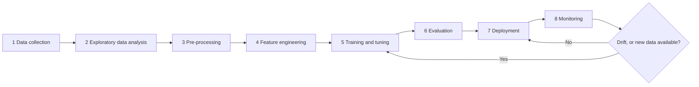
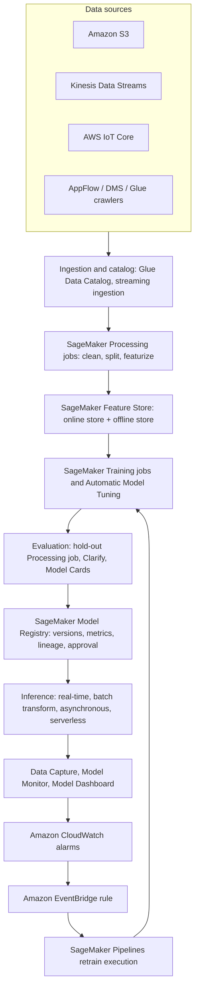
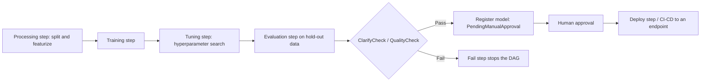
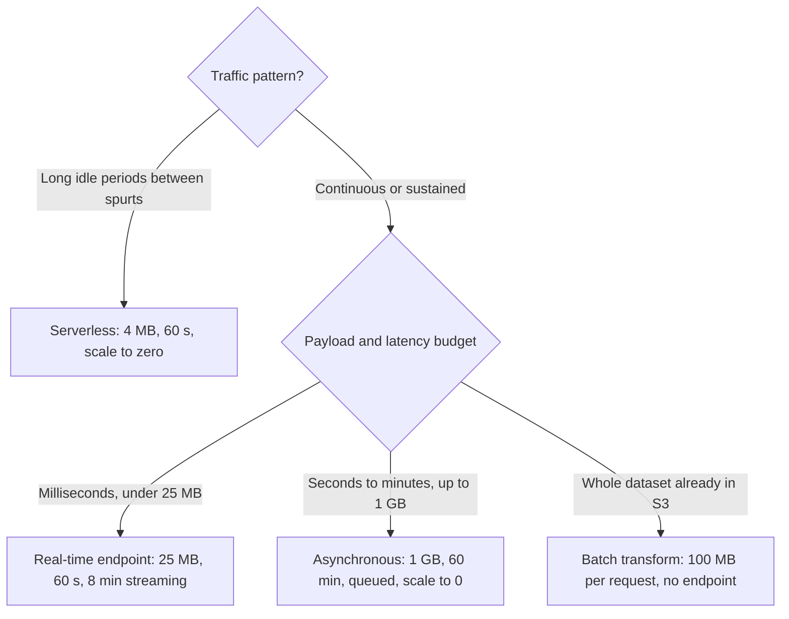
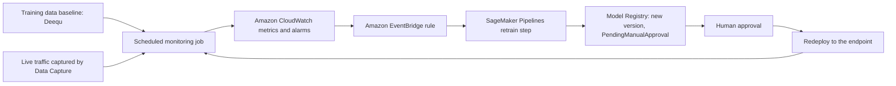
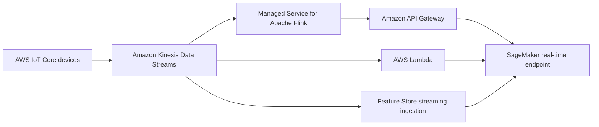

# End-to-End ML Lifecycle on AWS

Machine learning projects rarely fail because a model cannot be trained. They fail because nobody decided *which* stage of the lifecycle owns *which* service, because a notebook prototype was shipped as a permanent endpoint, or because nobody noticed the input data changed six months after launch. The AIF-C01 exam is built around exactly that gap: Task 1.3 asks you to place **data collection, EDA, pre-processing, feature engineering, training, hyperparameter tuning, evaluation, deployment and monitoring** against AWS services, and Task 1.1 asks you to distinguish **batch, real-time, asynchronous and serverless** inferencing.

```text
=====================================================================
 THE ML LIFECYCLE ON AWS — NINE STAGES (AIF-C01 Task 1.3)
=====================================================================
  1 COLLECT ..... S3 · Kinesis Data Streams · IoT Core · AppFlow
                  DMS · API Gateway · Glue crawlers
  2 EDA ......... SageMaker Studio · Athena · Glue · EMR
                  Data Wrangler (inside SageMaker Canvas)
  3 PRE-PROCESS . SageMaker Processing jobs · Glue · DataBrew
  4 FEATURES .... Feature Store (online + offline) · Wrangler export
  5 TRAIN ....... Training jobs · Automatic Model Tuning · AutoML API
                  JumpStart · HyperPod · Managed Spot Training
  6 EVALUATE .... Processing on hold-out data · Clarify* · Model Cards
  7 DEPLOY ...... real-time | batch transform | asynchronous
                  | serverless  (the four inference options)
  8 MONITOR ..... Model Monitor* · Model Dashboard · Data Capture
  9 RETRAIN ..... Pipelines DAG · Registry approval stages ·
                  EventBridge (drift or schedule) · CodePipeline
---------------------------------------------------------------------
  * Clarify, Model Monitor, Ground Truth, A2I, Debugger, GeoSpatial,
    Role Manager and Studio Lab are CLOSED to new customers
    (30 Jun 2026; docs state 7/30/26) — see section 10.
  MLOps layer tested by the exam: experimentation · repeatable
  processes · scalable systems · technical debt · production
  readiness · monitoring · re-training.
=====================================================================
```

> [!NOTE]
> **Read this lesson as an operating manual, not a service catalog.** Every number in this file is an AWS-published limit taken from the SageMaker developer guide or the SageMaker API reference. Where AWS publishes two conflicting numbers, both appear and the preferred one is flagged — see section 13.

By the end of this lesson you will be able to:

- place each of the **nine lifecycle stages** against the SageMaker feature and the non-SageMaker service that supports it;
- apply AWS's **three-question selection framework** (build vs. customize vs. call an API, modality, control) before writing any code;
- configure the **Feature Store online and offline stores** and explain why a fraud model needs both;
- size a **serverless endpoint**, compute **batch transform concurrency**, and know the exact ceiling of each of the **four inference options**;
- build the **drift → CloudWatch → EventBridge → Pipelines retrain** loop and explain which monitor detects which drift;
- defend a **comparative verdict**: SageMaker vs. building on EC2, vs. non-AWS platforms, vs. a manual process;
- spot the **maintenance and sunset traps** (Ground Truth, Model Monitor, Clarify, Studio Lab, Mechanical Turk) that appear in 2026 exam items;
- answer **ten exam-style questions** written in the official practice-question voice.

---

## 1. The nine stages of the ML lifecycle on AWS

### 1.1 Stage-by-stage service map

This table is the single most examinable artifact of Task 1.3. The left column is the exam guide's own vocabulary; the middle columns are the services you must be able to name under pressure.

| Stage | SageMaker AI feature | Other AWS services | Verified note |
|---|---|---|---|
| 1. Problem framing | Canvas, JumpStart, Model Cards (intended use + risk rating) | Amazon Bedrock (foundation-model path), Amazon Q, Prescriptive Guidance | Risk rating values: low / medium / high / unknown |
| 2. Data ingestion | Ground Truth **[maintenance]**, Feature Store streaming ingestion | S3, Kinesis Data Streams, IoT Core, DMS, AppFlow, API Gateway, Glue crawlers | Ground Truth closed to new customers 7/30/26; Mechanical Turk ended Sep 2026 |
| 3. Processing & EDA | Processing jobs, Data Wrangler (inside Canvas), Studio notebooks | Glue (ETL + Data Catalog), EMR (Spark/Hadoop/Trino), Athena, DataBrew, MWAA | Glue Data Catalog is Hive-compatible |
| 4. Feature engineering | Feature Store (online/offline), Data Wrangler export | Glue, DataBrew, Redshift | Offline store is append-only Parquet in S3 |
| 5. Model training | Training jobs, Automatic Model Tuning, AutoML API, JumpStart, HyperPod, Managed Spot | EC2 (P/G/Trn/Inf), ECS/EKS (self-managed), Lambda (light workloads) | Spot savings published as 80% (API) and 90% (FAQ) — see section 13 |
| 6. Evaluation | Clarify **[maintenance]**, Processing on hold-out data, Model Cards | Amazon Bedrock Evaluations, CloudWatch, SHAP / fmeval | Bedrock Evaluations is the managed path for foundation models |
| 7. Deployment | Four inference options, Model Registry + CI/CD, inference components | Bedrock (serverless API), ECS/EKS (DIY), Lambda + API Gateway | Ceilings in section 7.2 |
| 8. Monitoring | Model Monitor / Clarify **[maintenance]**, Model Dashboard, Data Capture | CloudWatch, EventBridge + SNS, Lambda, Athena + QuickSight, MLflow + Evidently | Four monitor types: data quality, model quality, bias drift, feature attribution drift |
| 9. Retraining / MLOps | Pipelines DAG, Registry approval stages, MLflow tracking | Step Functions, EventBridge (schedule/drift), CodeBuild/CodePipeline, S3 versioning | Drift → EventBridge → pipeline re-run is the canonical loop |

### 1.2 The MLOps concepts the exam tests

Task 1.3 does not stop at stages. It also names seven MLOps fundamentals — each one maps to a concrete AWS mechanism:

| MLOps concept | What the exam expects you to say | AWS mechanism |
|---|---|---|
| Experimentation | Every run is tracked and comparable | Experiments (Classic, Studio Classic only) or managed MLflow Apps with artifacts in your S3 |
| Repeatable processes | Same code, same data, same result | SageMaker Pipelines (a JSON DAG) + Processing/Training jobs in containers |
| Scalable systems | The system grows with traffic and data | Auto scaling on real-time endpoints, asynchronous queueing, Feature Store online store |
| Technical debt | Untracked notebooks and hand-tuned endpoints rot | Model Registry versions, approval status, Model Cards, containerized jobs |
| Production readiness | Nothing deploys without evidence | `ModelApprovalStatus=PendingManualApproval` in the pipeline, evaluation metrics attached |
| Monitoring | Live traffic is compared to a baseline | Data Capture + Model Monitor (Deequ baselines) + CloudWatch alarms |
| Re-training | Drift or schedule triggers a new run | EventBridge rule on a CloudWatch alarm → Pipelines execution |

### 1.3 The lifecycle is a loop, not a line



The arrow that returns from **Monitoring** to **Training** is the whole point of MLOps. A team that deploys and never returns to stage 5 has a *project*, not a *system* — and that is exactly the "technical debt" and "production readiness" language the exam uses.

**Order the lifecycle before you memorize the services:**

```dragdrop
{
  "question": "Put the ML lifecycle stages in the order AWS documents them for the AIF-C01 exam:",
  "items": [
    "Data collection from S3, Kinesis, IoT Core or AppFlow",
    "Exploratory data analysis in Studio, Athena or Glue",
    "Pre-processing in a SageMaker Processing job",
    "Feature engineering written to the Feature Store",
    "Training and hyperparameter tuning",
    "Evaluation on hold-out data",
    "Deployment to one of the four inference options",
    "Monitoring for data, quality, bias and attribution drift",
    "Re-training triggered by drift or a schedule"
  ],
  "correctOrder": [
    "Data collection from S3, Kinesis, IoT Core or AppFlow",
    "Exploratory data analysis in Studio, Athena or Glue",
    "Pre-processing in a SageMaker Processing job",
    "Feature engineering written to the Feature Store",
    "Training and hyperparameter tuning",
    "Evaluation on hold-out data",
    "Deployment to one of the four inference options",
    "Monitoring for data, quality, bias and attribution drift",
    "Re-training triggered by drift or a schedule"
  ],
  "explanation": "The exam expects this exact sequence: collect, analyze, pre-process, engineer features, train, tune, evaluate, deploy, monitor, re-train. Feature engineering comes before training because features are an input to the training job; evaluation comes after training but before deployment because production readiness depends on hold-out metrics; monitoring only exists once something is deployed."
}
```

---

## 2. Choosing the AWS path: the three-question framework

Before you pick a service, AWS wants you to answer three questions in order. Skipping to "SageMaker" is the most common architectural anti-pattern in the exam.

### 2.1 Question 1 — call an API, customize a foundation model, or build your own?

| Path | Choose it when | Service | Pricing model |
|---|---|---|---|
| Pre-trained managed API | A managed API already solves the task (sentiment, labels, transcription) | Amazon Comprehend, Rekognition, Transcribe, Polly, Translate, Lex, Forecast, Personalize | Per request / per unit of usage |
| Foundation model, minimal infrastructure | Prompting, RAG, agents or fine-tuning are enough; you do not want servers | Amazon Bedrock | Token-based |
| Custom / classical ML with full control | Proprietary data, specific algorithm, latency or compliance control | Amazon SageMaker AI (Canvas → Autopilot → Studio) | Per instance-hour + job duration |

> [!WARNING]
> **Classic exam trap:** building a custom SageMaker model for English sentiment analysis is an **anti-pattern**. Sentiment on text is a solved, pre-trained capability of **Amazon Comprehend**. The exam rewards the cheapest correct service, not the most impressive one.

### 2.2 Question 2 — what is the modality of the data?

| Data modality | Managed service | Typical exam phrasing |
|---|---|---|
| Text | Amazon Comprehend (NLP), Amazon Translate, Amazon Lex | "detect the language / extract entities / intent" |
| Image and video | Amazon Rekognition | "label objects, faces, PPE, unsafe content" |
| Speech and voice | Amazon Transcribe (STT), Amazon Polly (TTS) | "generate captions", "read the alert aloud" |
| Structured / time series | Amazon Forecast, Amazon Personalize | "demand forecast", "customers who bought" |
| Documents (forms, ID, tables) | Amazon Textract | "extract fields from invoices" |
| Code and chat | Amazon Q, Amazon Bedrock | "answer internal questions from a knowledge base" |

### 2.3 Question 3 — how much control do you need?

AWS documents a **control ladder** that climbs from no-code to full-code:

```text
  SageMaker Canvas  ....  no/low-code data prep + model building
        |                  (Data Wrangler and the Autopilot UI live here)
        v
  Autopilot (AutoML API) .. automatic algorithm selection, HPO,
        |                   explainability — API is live, UI moved
        |                   to Canvas on 30 Nov 2023
        v
  Amazon Bedrock ........... serverless FM customization:
        |                   prompts, guardrails, knowledge bases,
        |                   fine-tuning, evaluations
        v
  SageMaker Studio ......... full control: Code Editor (Code-OSS),
                             JupyterLab, RStudio, Studio Classic,
                             Amazon Q Developer, training jobs,
                             dedicated endpoints, HyperPod
```

AWS also warns in its own guidance that **Studio is the wrong starting point for a team with no ML experience — start with Canvas**.

### 2.4 Reference architecture: one account, end to end



**📚 Did you know?** SageMaker Pipelines are literally a **JSON DAG**. The documented step types are Processing, Training, Tuning, AutoML, RegisterModel, DeployModel, Transform, Condition, Callback, Lambda, ClarifyCheck, QualityCheck, EMR, Notebook Job and Fail — and step outputs feed the inputs of downstream steps, which is what makes the loop in the diagram above automatic.

---

## 3. Data ingestion, storage and the Feature Store

### 3.1 Where the data comes from

| Ingestion pattern | AWS services | Numbers worth memorizing |
|---|---|---|
| Object storage / lake | Amazon S3 (+ Glue crawlers for the catalog) | S3 is the source of truth for offline features and captured payloads |
| Streaming | Kinesis Data Streams, often fed by AWS IoT Core | Typical pattern: Kinesis → Managed Service for Apache Flink → API Gateway → SageMaker endpoint, or Lambda invoking the endpoint |
| Database replication | AWS Database Migration Service (DMS) | Continuous replication into S3 / Glue |
| SaaS and APIs | Amazon AppFlow, API Gateway | Pull Salesforce/Zendesk data without code |
| Streaming features | Feature Store streaming ingestion | Features land in the online store for near-real-time decisions |

### 3.2 Feature Store: online vs. offline

| Property | Online store | Offline store |
|---|---|---|
| What it keeps | **Latest record only** for each feature group | **Full history**, append-only |
| API / access | `GetRecord`, `PutRecord` | Parquet in S3, queryable with Amazon Athena |
| Latency | **Single-digit milliseconds** | Minutes to hours (analytics speed) |
| Primary use | Real-time inference lookups | Training, point-in-time joins, batch transform |
| Write durability | Immediate on `PutRecord` | Buffered, reaches S3 in **≤ 15 minutes** |
| Identity of a record | **identifier + event time** | identifier + event time + `write_time`, `api_invocation_time`, `is_deleted` |
| Conflict rule | An **older event time never overwrites** a newer online record | Append-only; nothing is overwritten |

### 3.3 Online store tiers and write semantics

AWS documents two online tiers:

- **Standard** — the default online store configuration;
- **InMemory** — backed by Amazon ElastiCache (Redis OSS) for the fastest reads. It is **online-only** (no online↔offline replication) and it does **not** support customer-managed KMS keys.

On the write path, `PutRecord.TargetStores` accepts `{OnlineStore, OfflineStore}` with a **maximum of 2 entries**, so a single call can update both stores — but only if a group has both enabled.

**Example 5 — feature freshness with real numbers.** A fraud model calls `GetRecord` and gets an answer in **single-digit milliseconds**. The same feature group's offline store keeps every historical version as Parquet in S3, which Athena can query for a point-in-time correct training set. A `PutRecord` issued at **14:00** reaches S3 **no later than 14:15** (15-minute buffering). Training therefore sees a slightly delayed snapshot while inference sees the newest row — which is precisely why the exam asks for **both stores enabled on one feature group**.

```matching
{
  "question": "Match each Feature Store or ingestion concept to what it actually does:",
  "pairs": [
    {"left": "Online store", "right": "Keeps only the latest record, serves GetRecord in single-digit milliseconds"},
    {"left": "Offline store", "right": "Keeps full append-only history as Parquet in S3 for training and batch"},
    {"left": "InMemory tier", "right": "ElastiCache-backed online-only tier with no online-to-offline replication"},
    {"left": "Streaming ingestion", "right": "Writes live events into the feature group so inference can use near-real-time data"}
  ],
  "explanation": "The online store answers inference, the offline store answers training, InMemory trades replication for speed, and streaming ingestion closes the gap between the event and the feature. A production fraud model needs all of them: milliseconds at score time and point-in-time correctness at train time."
}
```

**📚 Did you know?** The Feature Store identity is not just a primary key: a record is uniquely identified by the **feature identifier plus the event time**, and the offline store additionally records `write_time`, `api_invocation_time` and an `is_deleted` flag. That is what makes point-in-time joins possible — a training query at 09:00 can only see features whose event time is before 09:00, even if they were written later.

---

## 4. Data processing, EDA and feature engineering

### 4.1 Which service processes which workload

| Option | Type | Best for | Code | Verified detail |
|---|---|---|---|---|
| SageMaker Processing | Managed jobs | Reproducible prep and evaluation inside the ML pipeline | Scripts or BYOC container | Compute is **released at completion** — you stop paying |
| Data Wrangler (inside Canvas) | Visual no/low-code | Cleansing, EDA, feature generation, export to Feature Store | Little or no code | Connects to S3, Athena, Redshift, Snowflake, EMR |
| AWS Glue | Serverless ETL + Data Catalog | Crawlers and ETL feeding training tables | PySpark or visual | Spark or Ray; Hive-compatible catalog |
| Amazon EMR | Managed clusters | Petabyte-scale Spark, Hadoop, Trino, Flink | Full control | EMR ≥ 5.8.0 can use the Glue Data Catalog |
| Amazon Athena | Serverless SQL | Ad-hoc EDA over S3 | ANSI SQL | Pay per query and per data scanned |
| Glue DataBrew | No-code visual | 250+ prebuilt transforms driven by recipe jobs | None | AWS blog claims up to **80% faster** data preparation |
| Studio + EMR | Interactive | EDA and debugging EMR Spark jobs | Notebook code | Monitor and debug EMR Spark from Studio |

### 4.2 The Processing job contract

A SageMaker Processing job has a four-step contract that the exam likes to test:

```text
  S3 input  -->  managed container (built-in or your own image)
                       |
                       |  pre-processing / feature engineering /
                       |  post-processing / evaluation on hold-out data
                       v
                 compute is RELEASED  -->  S3 output

  Billing: only while the job runs. No endpoint, no idle cost.
  Typical instance in AWS samples: ml.m5.xlarge, ProcessingInstanceCount = 1
```

That "compute is released" property is why Processing jobs beat a permanently attached notebook instance for anything scheduled.

### 4.3 Where the no-code tools live now

Two migrations matter for the 2026 exam:

- **Data Wrangler is integrated into SageMaker Canvas** — it is no longer a separate Studio sidebar experience;
- **Autopilot's UI moved to Canvas on 30 Nov 2023** — the AutoML API remains documented and callable, but the visual AutoML experience is Canvas.

**📚 Did you know?** Amazon Athena charges **per query and per gigabyte scanned**, so the cheapest EDA is a partitioned Parquet table plus a `WHERE dt = '…'` filter. A full-table scan of a 1 TB CSV costs roughly 100× more than the same query over partitioned Parquet — the exam does not ask for the price, but it does ask whether Athena is "serverless SQL over S3".

---

## 5. Training, hyperparameter tuning and orchestration

### 5.1 Training jobs and the cost ceiling

| Control | Value | Why it matters |
|---|---|---|
| `StoppingCondition.MaxRuntimeInSeconds` default | **1 day** | The default stops a runaway job quickly |
| `StoppingCondition.MaxRuntimeInSeconds` maximum | **28 days** | Hard cap for a single job |
| Total job duration (running + waiting) | **30 days** | Absolute ceiling across the job's life |
| `MaxWaitTimeInSeconds` for Managed Spot | **≥ MaxRuntimeInSeconds** | Required, otherwise Spot cannot be used |
| Graceful stop | SageMaker sends **`SIGTERM`, then waits 120 s** | Your code must checkpoint inside that window |
| Typical sample instance | `ml.m5.xlarge` | Used throughout the AWS pipeline samples |

### 5.2 Ways to train without writing the loop yourself

| Approach | What it automates | Notes |
|---|---|---|
| Training job | Containerized training on managed compute | Your algorithm or a built-in one |
| Automatic Model Tuning (HPO) | Searches hyperparameter ranges | Objective metric + ranges; runs many training jobs |
| AutoML API | Algorithm selection, HPO, explainability | UI lives in Canvas since Nov 2023 |
| JumpStart | Model hub: deployable models and prebuilt solutions | Fastest path to a working baseline |
| HyperPod | Managed EKS/Slurm clusters for large training and inference | AWS decision-guide claims (single source): training −40%, governance −40%, goodput ≥ 95% |
| Managed Spot Training | Interruptible capacity | Savings published as **up to 90%** (FAQ) and **up to 80%** (API) — see section 13 |
| EC2 P/G/Trn/Inf instances | Deepest hardware control | You own OS, drivers, frameworks, serving stack |

### 5.3 Pipelines: the orchestration backbone

A SageMaker Pipeline is a **JSON DAG** whose steps exchange outputs as inputs. The documented step types are: Processing, Training, Tuning, AutoML, Register/Deploy model, Transform, Condition, Callback, Lambda, ClarifyCheck, QualityCheck, EMR, Notebook Job and Fail.

| Pipeline feature | Verified behavior |
|---|---|
| Step outputs | Feed downstream step inputs automatically |
| Caching | `CacheConfig { Enabled, ExpireAfter: "30d" }` — unchanged steps can be skipped for up to 30 days |
| Typical compute in samples | `ml.m5.xlarge`, `ProcessingInstanceCount=1` |
| Deployment gate | `ModelApprovalStatus=PendingManualApproval` until a human approves |
| Billing | You pay for Studio plus the jobs the pipeline orchestrates |
| Failure step | A `Fail` node lets the DAG stop explicitly on a quality gate |



### 5.4 Model Registry

The Model Registry is the production-grade answer to "which model is live?". It stores versioned **Model Package Groups**, and each Model Package carries metrics, **lineage**, a **staging** stage, an **approval status**, and hooks for **CI/CD deployment** and sharing across accounts. Anything that is not in the Registry is, in exam terms, an untracked experiment.

---

## 6. Evaluation, documentation and governance

### 6.1 Amazon SageMaker Clarify: three different analyses

| Analysis | Inputs | Output |
|---|---|---|
| Pre-training bias | **Dataset only** (no model) | JSON bias metrics for the training data itself |
| Post-training bias | **Dataset + model predictions** | Bias metrics computed over inference results |
| Feature attributions (SHAP) | Trained model | Global SHAP attributions, per-feature importance |
| Partial dependence (PDP) | Trained model | Marginal effect of a feature on the prediction |

Clarify writes JSON bias metrics, global attributions and a visual report to **S3**, and it can run against a live endpoint **or** against a temporary **shadow endpoint** that Clarify creates and then deletes.

> [!WARNING]
> **Availability warning (2026).** Amazon SageMaker Clarify is in **maintenance and closed to new customers** (AWS maintenance page: 30 Jun 2026; the availability-change documentation states an effective date of **7/30/26**). Existing customers keep access but receive no new functionality. For foundation-model evaluation AWS points to **Amazon Bedrock Evaluations**, and for bias/SHAP on new work AWS points to **SHAP plus standardized bias metrics plus MLflow**.

### 6.2 Model Cards and Model Dashboard

| Artifact | What it is | Key fields | Status (2026) |
|---|---|---|---|
| **Model Cards** | An **immutable** documentation record for a model | Intended uses, **risk rating**, training details, evaluation results; default status `DRAFT`; PDF export | Active |
| **Model Dashboard** | A portal across your estate | Models, monitors, lineage, cards, risk rating in {low, medium, high, unknown} | Active |
| **Data Capture** | Records live request/response payloads | Feeds monitors and shadow analysis | Active |
| Role Manager | Persona-based ML IAM roles | — | **Closed to new customers** |

If the exam says "the model owner must *record* intended uses, risk rating, training details and evaluation results", the answer is **Model Cards** — not the Dashboard (which aggregates) and not Model Monitor (which only tracks drift).

---

## 7. Deployment: the four inference options

This is the central service-selection topic of the whole lesson. SageMaker AI documents exactly **four** inference options, and each one has a hard ceiling you must be able to recall.

### 7.1 Batch vs. real-time vs. asynchronous vs. serverless

| Dimension | Real-time | Batch transform | Asynchronous | Serverless |
|---|---|---|---|---|
| Trigger | `InvokeEndpoint`, synchronous | A job over an S3 dataset | `InvokeEndpointAsync` (S3 in/out + completion notification) | Synchronous per request |
| Latency | Milliseconds / interactive | Hours to days (offline) | Near real-time: seconds to minutes | Seconds; cold start possible |
| Payload / processing ceiling | **25 MB / 60 s** (up to 8 min with response streaming) | **≤ 100 MB per request**, days of processing | **1 GB / 60 min** | **4 MB / 60 s** |
| Capacity and billing | Instance billed continuously while the endpoint exists | Job duration only | While processing; autoscaling can scale instances to **0** | Auto **scale-to-zero** |
| Queueing | No | Not applicable | **Yes** — requests queue while capacity is zero | No |
| Typical workload | Fraud score, recommender API, chatbot | Nightly risk scoring, lake backfill, image tagging | Video/document processing, large payloads | Spiky, unpredictable traffic with idle periods |

### 7.2 The numeric ceilings in one place

| Item | Number | Source |
|---|---|---|
| Real-time payload / processing | **25 MB / 60 s** (8 min with streaming) | `deploy-model-options`, `hosting-faqs` |
| Serverless payload / processing | **4 MB / 60 s** | `serverless-endpoints` |
| Asynchronous payload / processing | **1 GB / 60 min** | `hosting-faqs` |
| Batch payload per request | **100 MB**; concurrency × payload ≤ 100 MB | `batch-transform` |
| Serverless memory range | **1024–6144 MB** in 1024 steps; vCPUs scale with memory | `serverless-endpoints` |
| Serverless `MaxConcurrency` / image size | **1–200** / **≤ 10 GB** | `serverless-endpoints` + API |
| Provisioned Concurrency on serverless | Responds "within milliseconds"; works with Application Auto Scaling | `serverless-endpoints` |
| Bidirectional streaming | HTTP/2 **port 8443**, session **≤ 30 min** | `realtime-endpoints-test-endpoints` |
| Training `MaxRuntime` default / max / job total | **1 day / 28 days / 30 days** | `API_StoppingCondition` |
| `SIGTERM` grace before a training stop | **120 s** | `API_StoppingCondition` |
| Feature Store offline write to S3 | **≤ 15 min** buffered; online read **single-digit ms** | `feature-store-offline` |
| Attribution-drift auto-alert | **NDCG < 0.90** | `clarify-model-monitor-feature-attribution-drift` |

**Check the ceilings before you pick an option — the payload decides, not the latency preference:**

```fillblank
{
  "question": "Complete the inference ceilings published in the SageMaker developer guide:",
  "template": "A real-time endpoint accepts a {{1}} MB payload processed within {{2}} seconds, serverless Inference accepts {{3}} MB, and asynchronous inference accepts up to {{4}} GB for {{5}} minutes.",
  "answers": {
    "1": "25",
    "2": "60",
    "3": "4",
    "4": "1",
    "5": "60"
  },
  "distractors": ["6", "100", "15", "8", "30"],
  "explanation": "The developer guide publishes 25 MB / 60 s for real-time (up to 8 minutes with response streaming), 4 MB / 60 s for serverless and 1 GB / 60 min for asynchronous. Batch transform is the option with the 100 MB per-request ceiling, and 6 MB is the conflicting FAQ figure you should ignore — see section 13."
}
```

### 7.3 Real-time endpoints in detail

- Persistent HTTPS endpoint invoked with **`InvokeEndpoint`**; response streaming uses **`InvokeEndpointWithResponseStream`**.
- Bidirectional **HTTP/2 on port 8443**, sessions capped at **30 minutes**.
- Several models can share one endpoint through **inference components** — the exam's answer when it asks to host multiple models without paying for multiple endpoints.

### 7.4 Serverless Inference in detail

You choose **memory**; AWS assigns vCPUs proportionally. Cold-start time is driven by **model size + model download + container start**, which is why the memory must be **at least the size of your model**.

Serverless has documented **exclusions**: no **GPUs**, no **AWS Marketplace** packages, no **private registries**, no **multi-model endpoints**, no **VPC configuration**, no **data capture**, no **Model Monitor**, and no **inference pipelines**. And the conversion is one-way: converting an existing real-time endpoint to serverless fails with a **`ValidationError`**, while the reverse conversion is allowed and one-way.

### 7.5 Asynchronous Inference in detail

`InvokeEndpointAsync` takes its input from **S3**, writes output to **S3**, and sends a **completion notification**. Requests **queue while capacity is zero**, and autoscaling can scale the instance count to **0** — that combination (queue + scale to zero) is what makes async the right answer for large, slow payloads.

### 7.6 Batch transform in detail

- `SplitType=Line` splits the input file into mini-batches;
- `BatchStrategy=MultiRecord|SingleRecord` with `MaxPayloadInMB`;
- CSV with embedded newlines is **not supported**;
- `MaxPayloadInMB=0` means chunked streaming (not for built-in algorithms);
- default output name is `input1.csv.out`;
- the ideal `MaxConcurrentTransforms` equals the number of parallel workers you want.

### 7.7 Choosing among the four



**Example 1 — option choice by payload.** A fraud API receives **3 KB** payloads and must answer in under **200 ms** → **real-time** (ceilings 25 MB / 60 s). Later the same model is asked to score **800 MB videos that take 10 minutes** → that exceeds the 25 MB real-time ceiling but fits **asynchronous** (≤ 1 GB, ≤ 60 min), so you switch options and keep scale-to-zero.

**Example 2 — serverless sizing.** A **3.5 GB** model needs `MemorySizeInMB=4096` (memory must be ≥ model size; the allowed range is 1024…6144). Set `MaxConcurrency=50` (allowed 1–200) with `ProvisionedConcurrency=10` (must be ≤ `MaxConcurrency`) to pre-warm part of the traffic, and keep the container image **≤ 10 GB**.

**Example 3 — batch concurrency math.** With `MaxPayloadInMB=25`, the maximum legal `MaxConcurrentTransforms` is **4**, because 4 × 25 = 100 ≤ 100 MB. Setting **5** would break the documented rule (5 × 25 = 125 > 100).

> [!WARNING]
> **Do not memorize the FAQ numbers for real-time.** The developer guide says **25 MB**, while the public FAQ has circulated **6 MB** (and an async figure of 15 min instead of 60 min). Prefer the developer-guide figures and re-check them before exam day — see section 13.

---

## 8. Monitoring, drift and the retraining loop

### 8.1 The four monitor types

| Monitor | What it compares | Mechanism |
|---|---|---|
| **Data quality** | Live input distribution vs. the training baseline | Baseline computed with **Deequ**; violations → CloudWatch |
| **Model quality** | Live predictions vs. **Ground Truth labels** stored in S3 (e.g., MSE) | Captured predictions merged with labels on a schedule |
| **Bias drift** | Bias metrics over time | Scheduled Clarify-style bias statistics |
| **Feature attribution drift** | Rank of feature importance vs. baseline | Ranked by **NDCG**; auto-alarm when **NDCG < 0.90** (a fully reversed ranking scores 0.69) |

All monitors emit metrics and violations to **Amazon CloudWatch**, which is the exam's answer whenever it mentions "raise an alarm on thresholds". Note also that the **prebuilt monitoring container supports tabular data only** — NLP and computer-vision models need a bring-your-own container.

### 8.2 From alarm to retrained model

**Example 6 — the drift → retrain loop with real numbers.** A Deequ baseline is computed from the training data. A scheduled monitoring job compares live traffic against it. Feature-attribution monitoring raises an automatic alarm when **NDCG drops below 0.90**. A bias example uses a **DPPL range of (−0.1, 0.1) evaluated over 2 days** with bootstrap confidence intervals. The alarm goes to **CloudWatch**, CloudWatch triggers an **EventBridge** rule, and EventBridge starts a **SageMaker Pipelines** retrain run whose new version lands in the Model Registry as `PendingManualApproval`.



### 8.3 What AWS now recommends instead

Because Model Monitor and Clarify are closed to new customers, AWS's own availability-change documentation points at a replacement stack:

| Retired capability | AWS-recommended replacement |
|---|---|
| SageMaker Model Monitor | Open-source monitoring with **MLflow + Evidently AI**, plus **QuickSight** and **CloudWatch** |
| SageMaker Clarify | **SHAP** + standardized bias metrics + **MLflow** |
| Foundation-model evaluation | **Amazon Bedrock Evaluations** |
| Experiments (Classic) | New SageMaker Studio + **managed MLflow 3.0** (Apps preferred, artifacts in your S3) |
| Studio Lab | **SageMaker Studio** |

**📚 Did you know?** Experiments **Classic** is available only in **Studio Classic**, and AWS now recommends managed **MLflow 3.0** with Studio Apps — experiment artifacts are stored in *your* S3 bucket, so the tracking data outlives the notebook. MLflow is also the backbone of the recommended replacement for Model Monitor.

---

## 9. Comparative verdict: SageMaker vs. the alternatives

### 9.1 SageMaker vs. individual services

| Option | Choose it when | You manage | Pricing model |
|---|---|---|---|
| **SageMaker AI** | Full lifecycle plus control over containers, instances and latency | Model code, containers, HPO, scaling, cost/latency tradeoffs | Per instance-hour + jobs; Savings Plans up to **64%** |
| **Amazon Bedrock** | Serverless FM use (RAG, agents, fine-tuning) with no infrastructure | Prompts, guardrails, knowledge bases, evaluations | Token-based |
| **Amazon EC2** | Deepest hardware control, specialty accelerated instances | OS, drivers, frameworks, serving stack | Per hour + Savings Plans |
| **Amazon ECS** | Containers as the deploy unit, AWS-native orchestration | Images, task definitions, service scaling | Per instance or AWS Fargate |
| **Amazon EKS** | Kubernetes portability, custom stacks (vLLM/Triton), HyperPod | Cluster, node groups, charts, autoscalers | Cluster fee + EC2 |
| **AWS Lambda** | Event glue: invoke an endpoint from a stream, write features | Function code, memory and timeout | Requests + duration |
| **Managed AI APIs** | A pre-trained API already solves it | Data + API calls | Per request / usage |

AWS's own decision criteria are: infrastructure management, compute commitments, pricing preference, model-architecture support, and control over engine, configuration and infrastructure.

> [!IMPORTANT]
> **Comparative Verdict**
> - **SageMaker vs. build-your-own on EC2:** both run your container, but EC2 makes *you* own the OS, drivers, GPU stack, serving framework, scaling logic, patching, and every idle second you pay for. Choose EC2 only when you need hardware or driver control SageMaker cannot expose (specialty P/G/Trn/Inf instances, kernel-level tuning). Otherwise SageMaker's managed endpoints, Processing/Training jobs, Pipelines and Model Registry are the difference between a *system* and a *hobby*. Cost is not the deciding factor either: EC2 bills per hour just as SageMaker does, and SageMaker offers Savings Plans up to 64%.
> - **SageMaker vs. non-AWS platforms** (other clouds, managed-ML vendors, self-hosted MLOps stacks): portability is real — containers, MLflow and Kubernetes travel — but the exam's frame is AWS-native integration: IAM, S3, Glue, Kinesis, EventBridge, CloudWatch, Bedrock and free-tier credits all bind to SageMaker without glue code. If the requirement is "run anywhere", a Kubernetes stack (EKS or another orchestrator) with MLflow tracking is defensible; if the requirement is "ship fast, governed, on AWS", it is not. Note also that SageMaker models can be imported into Bedrock, so the two are not mutually exclusive.
> - **SageMaker vs. a manual process** (a data scientist's notebook, spreadsheets, ad-hoc scripts, hand-copied CSVs): the manual process always wins the first week and always loses afterwards. It cannot prove repeatability (no Pipelines DAG), cannot prove which version served a given prediction (no Registry lineage), cannot detect drift (no baseline, no CloudWatch alarm), and cannot be re-run by anyone else. AWS frames this exact failure as **technical debt** and **production readiness** in Task 1.3. The verdict is categorical: a manual process is acceptable only for the experimentation stage, never for deployment.

### 9.2 Amazon Bedrock vs. Amazon SageMaker — the official line

| Dimension | Amazon Bedrock | Amazon SageMaker AI |
|---|---|---|
| Model family | Foundation models from multiple providers | Classical ML **and** custom deep learning |
| Interaction | Serverless, API-based | Training jobs, dedicated endpoints, HyperPod clusters |
| Infrastructure you manage | Effectively none | Containers, instance types, scaling policies |
| Best fit | Prompting, RAG, agents, guardrails, fine-tuning, evaluations | Full control over training and serving |
| Interoperability | — | **SageMaker models can be imported into Bedrock** |

### 9.3 Streaming inference architecture

The pattern AWS documents in its architecture blogs:



---

## 10. Availability, maintenance and sunset traps

The 2026 exam actively tests availability. Answering correctly means knowing what a **maintenance** notice means and what a **sunset** means.

### 10.1 Availability snapshot (SageMaker, 2026)

| Status | Features |
|---|---|
| **Maintenance, closed to new customers** (30 Jun 2026) | A2I, Clarify, Debugger, GeoSpatial, Ground Truth, Model Monitor, Role Manager, Studio Lab |
| Closure date stated in the docs | Ground Truth, Model Monitor: **effective 7/30/26** |
| **End of support** | Amazon Mechanical Turk: **29 Sep 2026** (Ground Truth docs: permanent closure 30 Sep 2026) |
| Entered sunset, dates not retrieved | SageMaker Profiler, Ground Truth Plus — see section 13 |
| **Active** (no notice found) | Studio, Pipelines, Processing, Training, Model Registry, the four inference options, Feature Store, Model Cards, Model Dashboard, Canvas, JumpStart, HyperPod, managed MLflow |

The standard maintenance wording is: *"Customers can't on-board… AWS will continue to operate and support these services… but won't enhance or add functionality."* Existing customers keep access; there are simply no new features.

### 10.2 SageMaker feature map and status

| Feature | Purpose | Status (2026) |
|---|---|---|
| Studio | IDE: Code Editor (Code-OSS), JupyterLab, RStudio, Studio Classic + Amazon Q Developer | Active |
| Studio Lab | Free JupyterLab 4, no AWS account or card required | **Closed to new customers** |
| Processing | Pre/post-processing, feature engineering, evaluation | Active |
| Training + Tuning | Managed training, HPO, Managed Spot | Active |
| Pipelines | DAG orchestration, repeatable MLOps and retraining | Active |
| Model Registry | Versioned catalog, approval, staging, CI/CD | Active |
| Endpoints ×4 | Real-time / batch / asynchronous / serverless | Active |
| Experiments Classic / MLflow | Run tracking | Classic: Studio Classic only → migrate to managed MLflow |
| Feature Store | Online/offline groups, point-in-time training data | Active |
| Clarify | Pre/post-training bias, SHAP, PDP, FM evaluation | **Closed to new customers** |
| Ground Truth | Human labeling (private, vendor and MTurk workforces) | **Closed**; MTurk ended |
| Model Monitor | Data quality, model quality, bias drift, attribution drift | **Closed to new customers** |
| Data Wrangler | Visual prep and feature generation → Feature Store | Integrated into Canvas |
| Autopilot | AutoML: algorithm selection, HPO, explainability | UI → Canvas (30 Nov 2023); API live |
| Canvas | No-code data prep + model building | Active |
| Model Cards / Dashboard | Documentation record / portal over models and risk | Active |
| Role Manager | Persona-based ML IAM roles | **Closed to new customers** |
| JumpStart | Model hub, prebuilt solutions, deployable models | Active |
| HyperPod | Managed EKS/Slurm clusters for training and inference | Active |
| A2I / Debugger / GeoSpatial | Human loops / training debug / geospatial ML | **Closed to new customers** |

> [!WARNING]
> **The Ground Truth question, answered.** If a *brand-new* AWS customer asks for a SageMaker Ground Truth image-labeling job, the correct answer is: **Ground Truth is closed to new customers as of 30 July 2026, so a different labeling approach is required** — not "it works with Mechanical Turk" (Mechanical Turk ended support on **29 Sep 2026**) and not "create an endpoint first" (labeling never needed one).

**📚 Did you know?** Studio Lab — the free JupyterLab 4 environment that required **no AWS account and no credit card** — had published limits of just **12 GB RAM and 15 GB of storage**, and it is now closed to new customers with **SageMaker Studio** as the replacement. That is why "use Studio Lab for free" is a distractor in 2026 material.

### 10.3 2025–2026 Updates

Between December 2024 and October 2026 the SageMaker ecosystem was renamed, trimmed and re-pointed several times. Every row below comes from an AWS announcement, an AWS availability-change page or the AWS certification change history — nothing here is third-party, and dates AWS itself does not publish are deliberately omitted (see section 13).

| Change | Date (AWS-published) | What the exam wants you to know |
|---|---|---|
| **Amazon SageMaker renamed Amazon SageMaker AI** | 3 Dec 2024 | "SageMaker" in a question means SageMaker AI; the next-generation SageMaker (Unified Studio, Catalog, Lakehouse, zero-ETL) is the adjacent analytics platform, not a different exam topic |
| **Bedrock Studio folded into SageMaker Unified Studio** | workspaces closed 28 Feb 2025 (docs updated 25 Mar 2025) | The standalone Bedrock Studio is gone — Bedrock now lives inside SageMaker Unified Studio or in the Bedrock IDE |
| **Amazon Forecast closed to new customers** | 29 Jul 2024 | Forecast-style questions now point at **SageMaker Canvas** |
| **Amazon Kendra in maintenance, then closed to new customers** | 30 Jun → 30 Jul 2026 | Managed enterprise search and generative QA → **Amazon Bedrock Managed Knowledge Base** (Smart Parsing plus the Agentic Retrieval API) |
| **Amazon Q Developer signups blocked; IDE/paid end of support** | 15 May 2026; EOS 30 Apr 2027 | AWS documents **Kiro** as the successor for those workloads |
| **Amazon QuickSight → Amazon Quick Suite** | 9 Oct 2025 | BI distractors may name Quick Suite instead of QuickSight |
| **AWS Chatbot renamed Amazon Q Developer** | 26 Feb 2025 | The old name still appears in older AWS material |
| **Model Monitor, Clarify, Ground Truth, A2I, Debugger, Role Manager, GeoSpatial, Studio Lab, Mechanical Turk, Profiler closed to new customers** | 30 Jul 2026 (availability docs: 7/30/26) | Maintenance, **not** shutdown and **not** a rebrand: existing customers keep access, with no new features (see 10.1) |
| **AIF-C01 exam guide v1.0 → v1.1** | 26 Mar → 30 Apr 2026 | Seven new objectives (agentic AI with MCP, context engineering, token-based pricing, hallucination grounding); **SageMaker JumpStart** added to the in-scope list and Amazon MemoryDB removed |

Two vocabulary facts complete the picture:

- **Maintenance** = no new customers, no new features, still supported · **sunset** = planned end of operations, typically announced about a year ahead · **full shutdown** = removed from the AWS portfolio. AWS's Service Lifecycle reference defines all three, and every row above sits in the first two states.
- Exam-guide updates land on the test about **one month** after publication, so anything AWS published on v1.1 (30 Apr 2026) is already fair game — including SageMaker JumpStart, Bedrock AgentCore, Kiro and Strands Agents on the in-scope list.

**📚 Did you know?** The Kendra availability page does not say "deprecated": it redirects new search applications to **Amazon Bedrock Managed Knowledge Base**, whose Smart Parsing and **Agentic Retrieval API** are documented as the Kendra replacement. "Kendra was shut down" is therefore a distractor — Kendra is in *maintenance*, which under AWS's own vocabulary means it keeps running for existing customers.

---

## 11. Cost, free tier and the numbers you can safely memorize

### 11.1 SageMaker free tier (each month, for the first 2 months)

| Capability | Free usage per month |
|---|---|
| Studio notebooks + notebook instances | **250 hours** of `ml.t3.medium` |
| RStudio on SageMaker | **250 h** of `ml.t3.medium` RSession + free RStudioServerPro |
| Data Wrangler | **25 hours** of `ml.m5.4xlarge` |
| Feature Store | **10 M write units, 10 M read units, 25 GB** storage |
| Training | **50 hours** of `m4.xlarge` or `m5.xlarge` |
| SageMaker with TensorBoard | **300 hours** of `ml.r5.large` |
| Real-Time Inference | **125 hours** of `m4.xlarge` or `m5.xlarge` |
| Serverless Inference | **150,000 seconds** of on-demand inference duration |
| Canvas / HyperPod | **160 h** session time / **50 h** of `m5.xlarge` |

### 11.2 Worked cost pattern

AWS's own worked example totals **$2.38** — 2 hours of `ml.m4.4xlarge` at **$0.96** each plus 2 hours of `ml.m5.xlarge` at **$0.23** each, with built-in Debugger rules billed at **$0**. Learn the *pattern* (instance-hours × rate + job surcharges), never the rate: `ml.*` prices are region- and date-dependent.

### 11.3 Quotas

Endpoint counts, pipeline quotas, concurrent-job limits and serverless concurrency live in **Service Quotas**. Never guess a numeric quota in an exam answer or a design review — look it up.

---

## 12. Worked AWS examples with numbers

**Example 1 — option choice by payload (section 7.7).** Fraud API: **3 KB** payloads, **< 200 ms** → real-time (25 MB / 60 s ceilings). Same model scoring **800 MB** videos that take **10 minutes** → exceeds 25 MB but fits asynchronous (≤ 1 GB, ≤ 60 min). Switch options; keep scale-to-zero.

**Example 2 — serverless sizing (section 7.4).** Model **3.5 GB** → `MemorySizeInMB=4096`; `MaxConcurrency=50` (range 1–200); `ProvisionedConcurrency=10` (≤ 50) to pre-warm; container image **≤ 10 GB**.

**Example 3 — batch concurrency math (section 7.6).** `MaxPayloadInMB=25` → maximum `MaxConcurrentTransforms=4` because 4 × 25 = 100 ≤ 100 MB. Five workers would violate the documented rule.

**Example 4 — free-tier budget.** 250 notebook hours ≈ **8.3 instance-days**; 50 training hours ≈ **six 8-hour runs**; 125 real-time hours ≈ **4.2 days** of hosting; 150,000 serverless seconds ≈ **41.7 billable hours**. Exceeding 250 notebook hours in month 1 starts metered billing.

**Example 5 — feature freshness (section 3.2).** Online `GetRecord` answers in **single-digit milliseconds**; the offline store keeps every version as Parquet in S3 (Athena-queryable) for point-in-time joins; a **14:00** `PutRecord` reaches S3 by **14:15** at the latest.

**Example 6 — drift → retrain loop (section 8.2).** Deequ baseline from training data; scheduled monitoring of live traffic; attribution drift auto-alarms below **NDCG 0.90**; bias example uses **DPPL ∈ (−0.1, 0.1) over 2 days** with bootstrap confidence intervals → CloudWatch → EventBridge → Pipelines retrain.

**Example 7 — training cost ceiling (section 5.1).** A training job with the default `MaxRuntimeInSeconds` stops after **1 day**; the hard maximum is **28 days**, and a job cannot exceed **30 days** total. On stop SageMaker sends **`SIGTERM`** and waits **120 seconds** for your checkpoint code to finish.

---

## 13. Conflicting, unverified and non-examinable facts

Good exam candidates separate what AWS *documents* from what AWS *marketplaces*. Keep this list out of your memorization set except where flagged.

| Claim | What the sources say | How to handle it |
|---|---|---|
| Real-time payload | Developer guide **25 MB** vs. public FAQ **6 MB** (async 15 min vs. 60 min) | Prefer the developer guide; re-check before exam day |
| Spot savings | **Up to 90%** (FAQ/blogs) vs. **up to 80%** (CreateTrainingJob API) | Both are AWS-published; expect "up to 80–90%" |
| Savings Plans | Up to **64%** on SageMaker | Single AWS pricing-page figure |
| Prices | Only AWS's worked example ($0.96, $0.23, total **$2.38**) is quoted here | Do not memorize `ml.*` rates |
| Serverless cold start 10–60 s, latency percentiles, cost crossovers, "60–80% savings self-hosting on EKS" | **Third-party only** (devopsity.com) | Not examinable |
| Ground Truth Plus (30 Jun 2026) and SageMaker Profiler sunset | Listed by AWS as entering sunset; **dates not retrieved** | Do not state a date |
| Experiments (Classic) status | Docs say Studio Classic-only and recommend MLflow; **no availability-change page found** | New-customer status unconfirmed |
| Canvas / Autopilot / JumpStart / Feature Store / Pipelines | **No maintenance notice found** | Absence of a notice is not a guarantee — verify on `docs.aws.amazon.com` |
| Account quotas | Live in Service Quotas, not retrieved | Never guess a numeric quota |
| HyperPod claims (training −40%, governance −40%, goodput ≥ 95%, inference latency −40%) | Single-source **marketing** statement in a decision guide | Treat as directional, not factual |
| AWS re:Post articles | AWS-hosted but **perspective** content | Not normative documentation |
| Studio Lab details beyond 12 GB RAM / 15 GB storage; free-tier region edge cases | Summarized from the pricing page, not tested | Verify before quoting |

Primary sources for this lesson: the AIF-C01 **Exam Guide**; the SageMaker **developer guide** pages `deploy-model-options`, `hosting-faqs`, `serverless-endpoints`, `batch-transform`, `processing-job`, `pipelines-overview`, `define-pipeline`, `model-registry`, `clarify-configure-processing-jobs`, `model-monitor`, `feature-store*`, `model-cards`, `model-dashboard`, `data-wrangler`, `autopilot-automate-model-development`, `mlflow`; the SageMaker **API reference** (`API_StoppingCondition`, `API_feature_store_PutRecord`); the **decision guides** `bedrock-or-sagemaker.html` and `genai-guide.html`; the general **maintenance services** page; and the SageMaker **pricing** page.

---

## Real-World Case Studies

AWS publishes these cases on `aws.amazon.com/solutions/case-studies/` and `aws.amazon.com/blogs/machine-learning/`. They belong in this lesson because each one maps a **lifecycle stage** onto a **service choice** with a number attached — which is exactly how Task 1.3 questions are framed.

### Case 1 — HAYAT HOLDING: the whole train → deploy → monitor loop on a plant floor

Self-built ML environments were "time-consuming and cumbersome" at this MDF-panel manufacturer. The published pipeline: **194 sensors** over OPC-UA → SiteWise Edge Gateway in **AWS IoT Greengrass** → **SageMaker Model Training** + **Automatic Model Tuning** + **Model Deployment**, with **SageMaker Edge Manager** running the model on-device. Result: **$300,000 per year** saved plus higher panel quality. *Lifecycle lesson:* stages 5–8 run fully managed, and Automatic Model Tuning replaces a manual hyperparameter sweep across 194 inputs. Source: `aws.amazon.com/blogs/machine-learning/hayat-holding-uses-amazon-sagemaker-to-increase-product-quality-and-optimize-manufacturing-output-saving-300000-annually` (2023).

### Case 2 — Forethought: DIY inference is a hidden tax

A **3-person** team supporting **30 million interactions per year** was running models *and* Kubernetes on its own **Amazon EKS** — memory exceptions and outages included. They migrated to **SageMaker multi-model endpoints** and **Serverless Inference**: **−66 %** cost on multi-model endpoints (with *better* latency), **≈ −80 %** on serverless, and **more than 80 % of GPU inference** now runs on SageMaker. *Lifecycle lesson:* stage 7 — shared endpoints and scale-to-zero beat a self-managed cluster you have to babysit. Source: `aws.amazon.com/solutions/case-studies/forethought-technologies-case-study`.

### Case 3 — RareJob: the bottleneck was orchestration, not model quality

Training on a local PC allowed **one model per developer**; the EC2/ECS attempt that followed still cost too much. **AWS Glue** and **Amazon Athena** feed parallel **SageMaker Managed Spot Training** jobs. Result: **−25 %** training time, **> 10×** developer efficiency, **100 hours per month** saved, and speaking-test scores returned in **2–3 minutes**. *Lifecycle lesson:* stages 1–3 (collect → EDA → pre-process) belong to Glue and Athena; the queue, not the algorithm, was the constraint. Source: `aws.amazon.com/solutions/case-studies/rare-job-case-study` (2020).

### Case 4 — Chronomics: when the in-house build fails, go AutoML

**Four months** of in-house custom computer-vision modelling never reached the target. **Amazon Rekognition Custom Labels** shipped in **3–4 weeks** at **96.5 % accuracy / 97.9 % F1**. Raising the decision threshold to **0.99** produced **99.6 %** precision but discarded **5 %** of predictions; **0.999** gave **99.87 %** while discarding **27 %**. *Lifecycle lesson:* stage 6 — evaluation is what tells you to stop building, and the discarded tail needs a human review path. Source: `aws.amazon.com/blogs/machine-learning/chronomics-detects-covid-19-test-results-with-amazon-rekognition-custom-labels` (2022).

### Case 5 — Sun Finance: separate OCR from reasoning

The first attempt sent ID photos straight to **Claude Sonnet 4** and scored **61.8 %** overall (**43 %** on ID numbers) — AWS rejected it. The rebuilt pipeline: **Amazon Textract** OCR → **Amazon Rekognition** fallback and face masking → **Claude Sonnet 4** structuring → validation rules, with **Amazon Titan Multimodal Embeddings** in **S3 Vectors** for fraud similarity, evaluated on **585 images**. Result: accuracy **79.73 % → 90.80 %**, cost per document **−91 %**, processing time **20 hours → under 5 seconds**, fraud detection **81 %**. *Lifecycle lesson:* evaluation (stage 6) killed the elegant prototype, and the prebuilt service — not the model — owns extraction. Source: `aws.amazon.com/blogs/machine-learning/sun-finance-automates-id-extraction-and-fraud-detection-with-generative-ai-on-aws` (2026).

### Case 6 — Anthem: prebuilt first, humans in the tail

Manual claim-form extraction took **20 minutes per claim**. An **Amazon Textract** pipeline (OCR plus ML index/classify behind the claims portal) automated **80 %** of the workflow with a target of **90 %+**, across thousands of claims per day. *Lifecycle lesson:* stages 1–2 — call a managed API before training anything custom, and design the human exception path for the remaining 10–20 %. Source: `aws.amazon.com/solutions/case-studies/anthem` (2021).

### All six cases in one table

| Case (industry, year) | Lifecycle stages exercised | AWS services (exact) | Verified numbers | Source |
|---|---|---|---|---|
| **HAYAT HOLDING** (manufacturing, 2023) | 5–8: train → tune → deploy → monitor at the edge | SageMaker Training, Automatic Model Tuning, Deployment, Edge Manager; AWS IoT Greengrass | **194 sensors**; **$300,000/yr** | ML blog `hayat-holding-…` |
| **Forethought** (SaaS support) | 7: deployment option choice | SageMaker multi-model endpoints, Serverless Inference (migrated off Amazon EKS) | **−66 %** MME, **≈ −80 %** serverless, **> 80 %** of GPU inference; **30 M** interactions/yr; **3-person** team | case study `forethought-technologies` |
| **RareJob** (EdTech, 2020) | 1–5: ingest, EDA, process, train | AWS Glue, Amazon Athena, SageMaker Managed Spot Training | **−25 %** training time, **> 10×** efficiency, **100 h/month**, scores in **2–3 min** | case study `rare-job` |
| **Chronomics** (health-tech, 2022) | 6: evaluation and the build-vs-buy decision | Amazon Rekognition Custom Labels (AutoML) | **3–4 wk** vs **4 mo**, **96.5 %** accuracy / **97.9 %** F1; threshold **0.99 → 99.6 %** discards **5 %** | ML blog `chronomics-detects-covid-19…` |
| **Sun Finance** (fintech, 2026) | 3, 6, 7: pre-processing, evaluation, deployment | Textract, Rekognition, Claude Sonnet 4, Titan Multimodal Embeddings, S3 Vectors, Lambda, Step Functions | **79.73 → 90.80 %**, **−91 %** cost/doc, **20 h → < 5 s**, n = **585**; LLM-only first try **61.8 %** rejected | ML blog `sun-finance-automates-id-extraction…` |
| **Anthem** (health insurance, 2021) | 1–2: call a prebuilt API instead of training | Amazon Textract | **20 min/claim** manual → **80 %** automated, target **90 %+** | case study `anthem` |

> [!WARNING]
> **Case-study numbers are customer- or AWS-claimed and unaudited.** "Up to" is a ceiling, not a forecast, and only two of these cases disclose a sample basis (Sun Finance: **585 images**; Chronomics: its own labelled test set). Always carry the "before" number with the "after" number, and do not repeat adoption statistics that AWS has never published — the only production rate AWS states is the **65 %** figure below.

**Five rules that recur across all six cases:**

1. **Choose the tier deliberately** — prebuilt service (Anthem, Chronomics) → managed custom ML (HAYAT, RareJob, Forethought) → generative AI (Sun Finance). The exam rewards the *cheapest tier that works*.
2. **Baseline before build** — a percentage without a "before" is marketing, not a metric.
3. **Separate concerns** — OCR is not reasoning (Sun Finance), and retrieval is not generation.
4. **Evaluation is a phase, not a checkbox** — Sun Finance's and Chronomics' first attempts both failed *at stage 6*.
5. **Keep a human in the tail** — the discarded 5 % and the un-automated 10–20 % still need someone.

**📚 Did you know?** The only production rate AWS publishes for its own Generative AI Innovation Center is **65 %** of projects reaching production in 2025 — some in as little as **45 days**, out of **more than 1,000** implementations — using AWS's **Five V's** framework: **Value → Visualize → Validate → Verify → Venture**. AWS has never claimed that all pilots succeed, so any option saying "100 %" is wrong on its face.

---

## 14. Practice Questions

```question
{
  "id": "aid-02-q1",
  "type": "multiple-choice",
  "question": "A data science team wants more variables in its training dataset so that the algorithm can learn richer patterns. Which ML pipeline step meets the requirement?",
  "options": [
    "Hyperparameter tuning",
    "Feature engineering",
    "Model evaluation",
    "Model monitoring",
    "Data collection"
  ],
  "correct": 1,
  "explanation": "Feature engineering is the stage that creates, transforms and adds variables (features) to the training dataset. Hyperparameter tuning changes the algorithm's settings rather than the data, evaluation only measures the resulting model, monitoring observes live traffic, and data collection merely brings raw records into the lake."
}
```

```question
{
  "id": "aid-02-q2",
  "type": "multiple-choice",
  "question": "Model owners must record intended uses, a risk rating, training details and evaluation results in an immutable document for each model. Which SageMaker feature provides this?",
  "options": [
    "Role Manager",
    "Model Cards",
    "Model Dashboard",
    "Model Monitor"
  ],
  "correct": 1,
  "explanation": "Model Cards is the immutable per-model record of intended uses, risk rating, training details and evaluation results, with a default status of DRAFT and PDF export. The Model Dashboard aggregates models, monitors and lineage; Role Manager manages persona-based IAM roles; Model Monitor only tracks drift."
}
```

```question
{
  "id": "aid-02-q3",
  "type": "multiple-choice",
  "question": "Traffic to a model is unpredictable with long idle periods, the team does not want to manage instances or scaling policies, and cold starts are acceptable. Which inference option fits best?",
  "options": [
    "Real-time endpoint",
    "Batch transform",
    "Serverless Inference",
    "Asynchronous Inference"
  ],
  "correct": 2,
  "explanation": "AWS documents Serverless Inference for workloads with idle periods between traffic spurts: it scales to zero, bills only for use, and requires no instance or scaling management. Real-time endpoints bill continuously while they exist, batch transform is for offline datasets, and asynchronous is chosen for large payloads rather than for bursty traffic."
}
```

```question
{
  "id": "aid-02-q4",
  "type": "multiple-choice",
  "question": "An application submits 800 MB video files that take several minutes to process, and near-real-time latency (seconds to minutes) is acceptable. Which inference option should be used?",
  "options": [
    "Real-time endpoint",
    "Serverless Inference",
    "Asynchronous Inference",
    "Batch transform"
  ],
  "correct": 2,
  "explanation": "Asynchronous Inference supports payloads up to 1 GB and processing time up to 60 minutes, queues requests while capacity is zero, and can scale instances to 0. Real-time is capped at 25 MB, serverless at 4 MB, and batch transform is not suitable because these files arrive interactively rather than as one bulk dataset in S3."
}
```

```question
{
  "id": "aid-02-q5",
  "type": "multiple-choice",
  "question": "Five terabytes of log files in Amazon S3 must be scored every night. There are no interactive callers and no need for a persistent endpoint. Which inference option should be used?",
  "options": [
    "Real-time endpoint with auto scaling",
    "Batch transform",
    "Serverless Inference with Provisioned Concurrency",
    "Asynchronous Inference"
  ],
  "correct": 1,
  "explanation": "Batch transform is designed for large batches of data available up front in S3 with no persistent endpoint: you submit a transform job, it runs for the job duration, and you pay only while it runs. Real-time and serverless keep an invocation path open for interactive traffic, and asynchronous is meant for queued individual requests rather than a nightly bulk job."
}
```

```question
{
  "id": "aid-02-q6",
  "type": "multiple-choice",
  "question": "After deployment, a team must detect divergence between live inputs and the training data and raise Amazon CloudWatch alarms when thresholds are breached. Which capability provides this?",
  "options": [
    "Model Registry approval status",
    "Model Monitor data-quality monitoring",
    "SageMaker Experiments",
    "Autopilot"
  ],
  "correct": 1,
  "explanation": "Model Monitor compares live traffic against a baseline computed from training data (using Deequ) and publishes metrics and violations to CloudWatch, which then fires the alarm. Model Registry stores versions and approval status, Experiments tracks training runs, and AutoML builds models — none of them observe production inputs."
}
```

```question
{
  "id": "aid-02-q7",
  "type": "multiple-choice",
  "question": "A brand-new AWS customer wants to run an image-labeling job with Amazon SageMaker Ground Truth. What should the architect expect?",
  "options": [
    "It works immediately using the Amazon Mechanical Turk public workforce",
    "Ground Truth is closed to new customers effective 30 July 2026, so an alternative labeling approach is required",
    "It requires a SageMaker real-time endpoint to be created first",
    "It supports only video labeling, not image labeling"
  ],
  "correct": 1,
  "explanation": "AWS lists Ground Truth in maintenance and closed to new customers, with the availability-change documentation stating an effective date of 7/30/26. Amazon Mechanical Turk, the public workforce option, reached end of support on 29 September 2026. Ground Truth never required a real-time endpoint, and it supports image labeling as well as video."
}
```

```question
{
  "id": "aid-02-q8",
  "type": "multiple-choice",
  "question": "Business analysts with no ML engineering experience must build and evaluate custom models using a visual interface. Where should they start?",
  "options": [
    "SageMaker Studio with the Python SDK",
    "Autopilot in Studio Classic",
    "SageMaker Canvas",
    "Amazon EC2 with a deep learning AMI"
  ],
  "correct": 2,
  "explanation": "AWS assigns no-code data preparation and model building to SageMaker Canvas, which also now hosts Data Wrangler and the Autopilot UI (moved there on 30 November 2023). Studio with the SDK and EC2 both require engineering skills, and Autopilot's standalone Studio Classic UI no longer exists."
}
```

```question
{
  "id": "aid-02-q9",
  "type": "multiple-choice",
  "question": "A team wants managed, pre-trained sentiment analysis for English text instead of building a custom model. Which service should it use?",
  "options": [
    "Amazon Rekognition",
    "Amazon Comprehend",
    "Amazon Polly",
    "Amazon Personalize"
  ],
  "correct": 1,
  "explanation": "Amazon Comprehend is the managed NLP service covering sentiment, entities and language detection. Rekognition handles images and video, Polly converts text to speech, and Personalize produces recommendations for structured interaction data."
}
```

```question
{
  "id": "aid-02-q10",
  "type": "multiple-choice",
  "question": "A fraud model needs millisecond feature lookups at inference time plus a historical, point-in-time correct training dataset. How should SageMaker Feature Store be configured?",
  "options": [
    "Online store only",
    "Offline store only, queried at inference time",
    "A feature group with both the online store and the offline store enabled",
    "Offline store plus a manually maintained CSV for inference"
  ],
  "correct": 2,
  "explanation": "The online store keeps only the latest record per feature identity and answers GetRecord in single-digit milliseconds for inference, while the offline store keeps the full append-only history in Parquet on S3 for point-in-time training joins. Online-only loses training history; offline-only cannot serve millisecond lookups; a manual CSV reintroduces technical debt."
}
```

```question
{
  "id": "aid-02-q11",
  "type": "multiple-choice",
  "question": "A team wants to host two models behind a single SageMaker endpoint instead of paying for two separate endpoints. Which feature makes this possible?",
  "options": [
    "Inference components",
    "Provisioned Concurrency",
    "SplitType=Line",
    "CacheConfig"
  ],
  "correct": 0,
  "explanation": "Real-time endpoints can host several models through inference components, which is the documented way to reduce endpoint sprawl. Provisioned Concurrency belongs to Serverless Inference, SplitType is a batch-transform option for splitting input files into mini-batches, and CacheConfig is a SageMaker Pipelines setting."
}
```

```question
{
  "id": "aid-02-q12",
  "type": "multiple-choice",
  "question": "Which pair of SageMaker Pipeline steps would you use to add more variables to the training data and to change the algorithm's behavior?",
  "options": [
    "A Processing step for feature engineering and a Tuning step for hyperparameter search",
    "An Evaluation step and a Monitoring step",
    "A Callback step and a Lambda step",
    "A RegisterModel step and a Deploy step"
  ],
  "correct": 0,
  "explanation": "Adding variables is feature engineering, implemented as a Processing step, and changing the algorithm's behavior is hyperparameter tuning, implemented as a Tuning step. Evaluation and monitoring only observe results, Callback and Lambda are orchestration primitives, and Register/Deploy handle release."
}
```

```question
{
  "id": "aid-02-q13",
  "type": "multiple-choice",
  "question": "A three-person team that handles 30 million customer interactions per year is paying for a self-managed Amazon EKS inference cluster that keeps failing. Which migration matches the outcome AWS published for this customer?",
  "options": [
    "Move the models to Amazon EC2 GPU instances and keep Kubernetes for orchestration",
    "SageMaker multi-model endpoints plus Serverless Inference — about 66 % and up to 80 % lower inference cost, with more than 80 % of GPU inference running on SageMaker",
    "Amazon Bedrock provisioned throughput for every classifier, regardless of size",
    "A SageMaker batch transform job invoked for every live request"
  ],
  "correct": 1,
  "explanation": "AWS's Forethought case study reports migrating off a self-managed EKS cluster to SageMaker multi-model endpoints (−66 % with better latency) and Serverless Inference (≈ −80 %, headline up to −80 %), with more than 80 % of GPU inference on SageMaker. Keeping EC2 plus Kubernetes preserves the exact burden the customer removed, provisioned throughput is a Bedrock cost control rather than an inference-platform migration, and batch transform has no invocation path for live interactive traffic."
}
```

```question
{
  "id": "aid-02-q14",
  "type": "multiple-choice",
  "question": "Which statement matches AWS's published record of SageMaker-ecosystem changes between 2024 and 2026?",
  "options": [
    "Amazon SageMaker was renamed Amazon SageMaker AI on 3 December 2024, and new enterprise-search applications are directed to the Amazon Bedrock Managed Knowledge Base",
    "SageMaker was shut down entirely and its workloads moved to Amazon Bedrock",
    "Amazon Forecast remains open to new customers, with Amazon Kendra as its replacement",
    "Amazon Kendra was fully removed from the AWS portfolio with no documented replacement"
  ],
  "correct": 0,
  "explanation": "AWS announced the rename of Amazon SageMaker to Amazon SageMaker AI on 3 December 2024, and the Amazon Kendra availability-change page sends new search applications to Amazon Bedrock Managed Knowledge Base (Kendra entered maintenance 30 June 2026 and closed to new customers 30 July 2026). SageMaker itself is active, not shut down; Amazon Forecast closed to new customers on 29 July 2024 with SageMaker Canvas as the migration target; and AWS's lifecycle vocabulary distinguishes maintenance, sunset and full shutdown — Kendra sits in maintenance, not removal."
}
```

> [!SUCCESS]
> **Key Takeaways:**
> 1. **Nine stages, one loop.** Collect → EDA → pre-process → engineer features → train → tune → evaluate → deploy → monitor, and monitoring feeds back to training. Each stage has a named SageMaker feature *and* a named non-SageMaker service.
> 2. **Four inference options, four ceilings.** Real-time 25 MB / 60 s (8 min streaming), serverless 4 MB / 60 s, asynchronous 1 GB / 60 min, batch transform ≤ 100 MB per request with no persistent endpoint. Match the option to the traffic pattern first, then to the payload.
> 3. **Feature Store needs both stores.** Online = latest record only, single-digit-millisecond `GetRecord`; offline = full append-only Parquet history in S3, reachable within 15 minutes — that is how you get millisecond inference *and* point-in-time-correct training.
> 4. **Monitoring is four monitors, one alarm bus.** Data quality, model quality, bias drift and feature attribution drift (auto-alarm below NDCG 0.90) all publish to CloudWatch, and EventBridge turns an alarm into a Pipelines retrain.
> 5. **Availability is examinable in 2026.** Ground Truth, Model Monitor, Clarify, A2I, Debugger, GeoSpatial, Role Manager and Studio Lab are closed to new customers (30 Jun 2026 / docs 7/30/26); Mechanical Turk ended 29 Sep 2026; replacements are MLflow + Evidently + QuickSight + CloudWatch and Amazon Bedrock Evaluations.
> 6. **Comparative verdict:** SageMaker beats building on EC2 on governance and operations, beats non-AWS or DIY stacks on AWS-native integration and free-tier entry, and beats any manual notebook process on repeatability, lineage, drift detection and production readiness.
