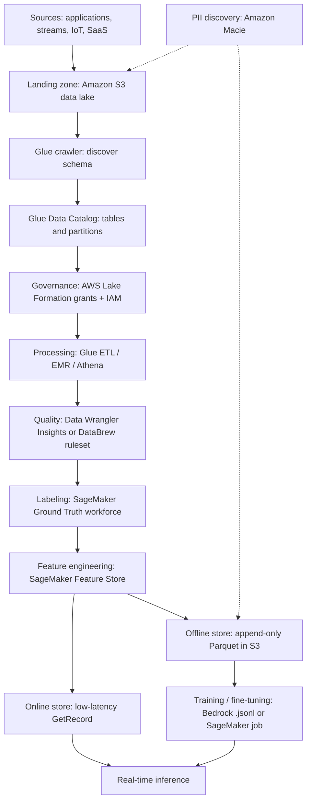
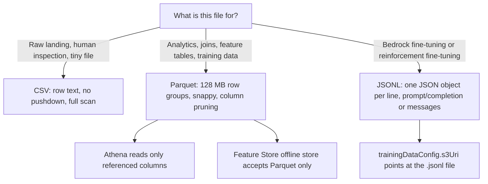
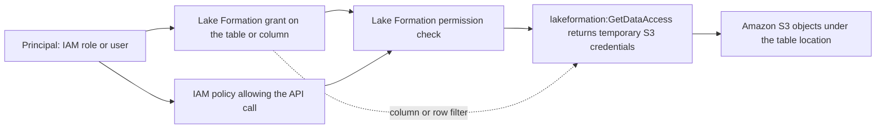
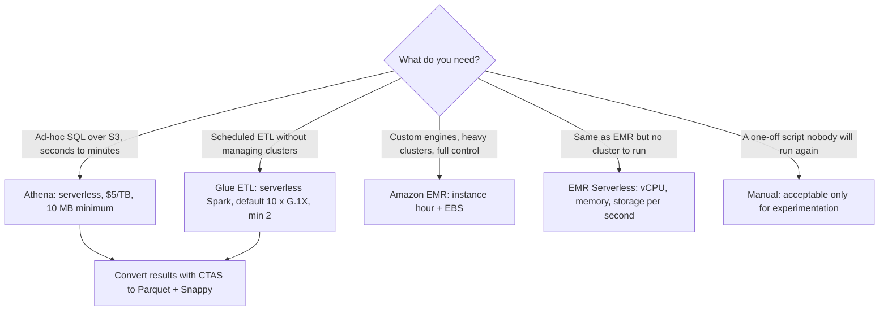
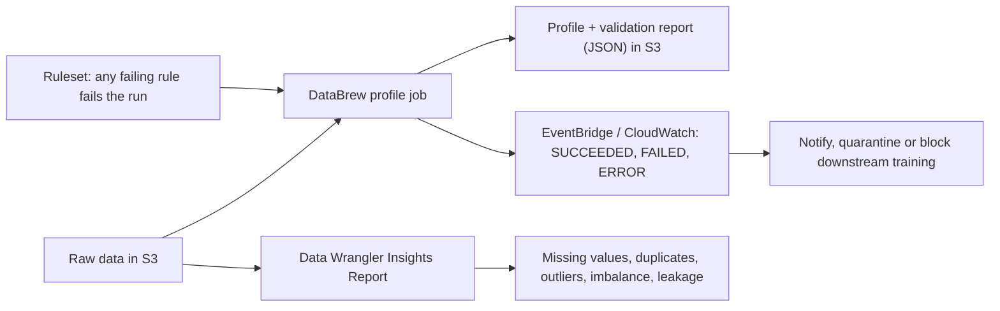
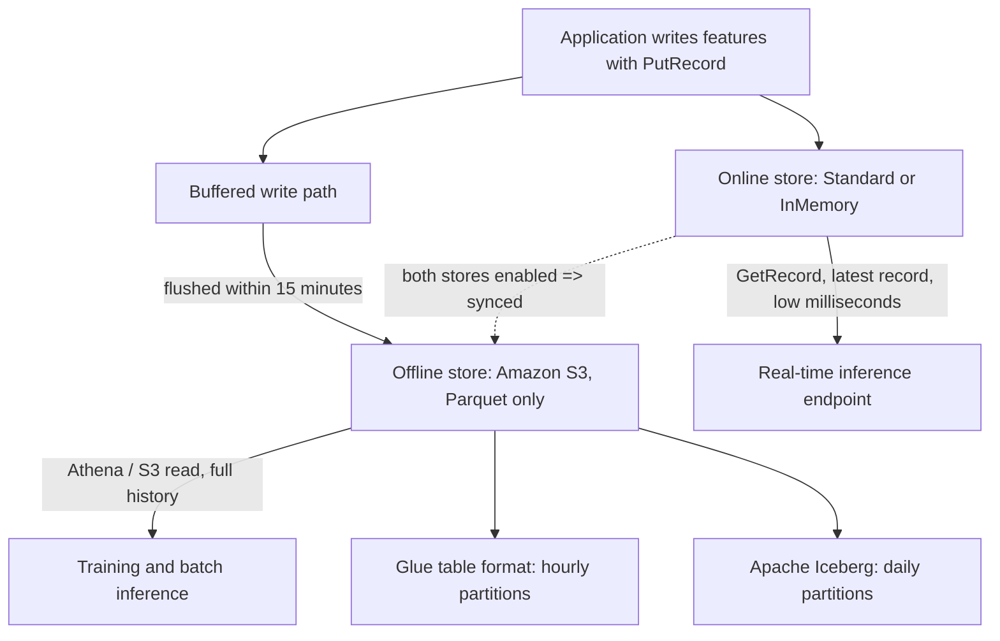
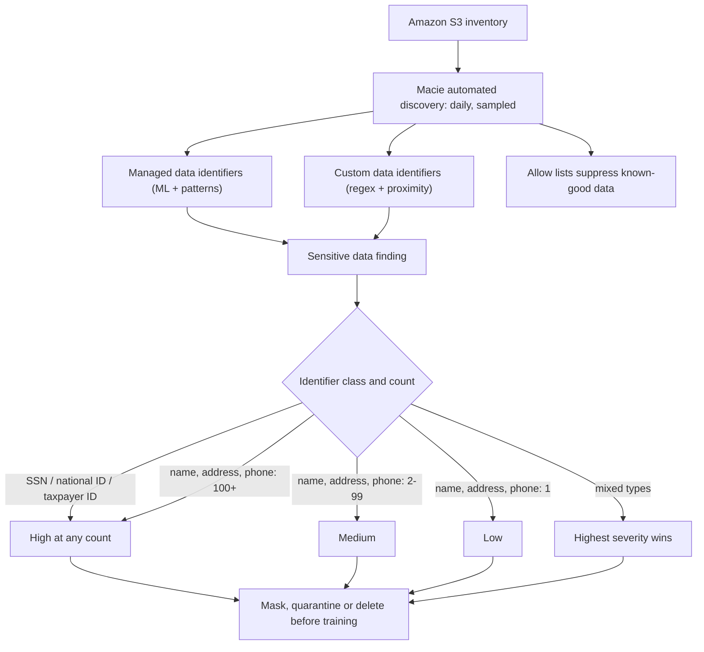

# Data Engineering for AI on AWS

Models do not fail in training. They fail because the table they were trained on had a column that leaked the target, because a 3 TB CSV was scanned instead of 0.25 TB of Parquet, because a labeling job went out to Mechanical Turk without declaring that the images were free of personally identifiable information, or because a feature group served millisecond reads online while the offline copy was still buffering into Amazon S3. Data engineering is the stage where all four of those mistakes are cheap to fix — and the AIF-C01 exam knows it: **Domain 1 (AI/ML Foundations) is weighted 20%, Domain 2 (Generative AI) 24%, Domain 3 (Foundation Model Applications) 28%, Domain 4 (Responsible AI) 14% and Domain 5 (Security, Compliance and Governance) 14%**, and this lesson sits across Task 1.3 (ML lifecycle), Task 3.3 (fine-tuning) and Domain 5's secure-data-engineering statements.

```text
=====================================================================
 DATA ENGINEERING FOR AI — THE FIVE THINGS THE EXAM ACTUALLY ASKS
=====================================================================
  A. WHERE DOES THE DATA GO?
     S3 -> Glue crawlers -> Glue Data Catalog -> Athena / EMR / Glue
     governed by AWS Lake Formation (grants + IAM, two layers)

  B. WHICH ENGINE?
     Glue ....... serverless ETL, default 10 workers x G.1X, min 2
     EMR ......... instance hour + EBS; Serverless = vCPU/mem/second
     Athena ...... $5 per TB scanned, 10 MB minimum per query
     manual ...... always the losing option in an exam answer

  C. IS THE DATA GOOD?
     Data Wrangler (in SageMaker Canvas): 300+ transforms,
        Insights Report flags leakage, imbalance, outliers
     DataBrew: profile job + ruleset -> JSON validation report

  D. IS IT LABELED?
     Ground Truth: manifest -> label category -> workforce ->
        pre-annotation Lambda -> consolidation Lambda -> output
     MTurk input MUST declare FreeOfPersonallyIdentifiableInformation
     automated labeling: min 1,250 objects, recommend 5,000

  E. IS IT PRIVATE, GOVERNED AND READY TO FINE-TUNE?
     Macie: managed + custom data identifiers, daily discovery
     Feature Store: online (GetRecord) + offline (Parquet in S3)
     Bedrock: .jsonl, one JSON object per line, S3 URI
=====================================================================
```

> [!NOTE]
> **Read this lesson as a decision manual.** Every number below is taken from an AWS-published document (SageMaker developer guide, Glue and Athena user guides, Lake Formation and Macie user guides, Bedrock user guide, AWS pricing pages). Where a figure is derived rather than published, it is marked as derived. Where a claim is unverified, it appears in section 11 — never in the memorization set.

By the end of this lesson you will be able to:

- draw the **end-to-end data pipeline** for an AI project and name the AWS service at each hop;
- choose between **CSV, Parquet and JSONL** and predict the cost consequence of that choice in Athena;
- pick the right processing engine — **Glue vs. EMR vs. Athena vs. a manual script** — and defend it;
- apply **Lake Formation's two-layer authorization** model and name the permission that underlying S3 access additionally requires;
- configure a **Ground Truth labeling job** end to end, including the PII declaration that makes or breaks it;
- size an **automated labeling** run (1,250 floor, 5,000 recommendation, 20%/10% validation split);
- explain the **Feature Store online and offline stores**, their partitioning rules and the 15-minute write buffer;
- use **Macie** to discover PII in S3 and predict the severity of a finding;
- prepare a **`.jsonl` fine-tuning dataset** for Amazon Bedrock and check it against the published per-model caps;
- answer **ten exam-style questions** in the official practice-question voice.

---

## 1. Where this lesson sits in the exam

### 1.1 The task statements you are studying for

The AIF-C01 Exam Guide is the contract. Three statements make this lesson examinable:

| Guide statement | What you must be able to do | Section here |
|---|---|---|
| Task 1.3 — "Describe components of an ML pipeline (data collection, EDA, data pre-processing, feature engineering…)" | Name the component and the AWS service for each stage | 2, 5, 6 |
| Task 1.3 — "Identify relevant AWS services … for each stage of an ML pipeline (for example, SageMaker, Amazon SageMaker Data Wrangler, Amazon SageMaker Feature Store, Amazon SageMaker Model Monitor)" | Match stage → service under time pressure | 1.2 |
| Task 3.3 — "Describe how to prepare data to fine-tune an FM (data curation, governance, size, labeling, representativeness, RLHF)" | Curate, govern, size, label and balance a fine-tuning dataset | 10 |
| Domain 5 — "best practices for secure data engineering (assessing data quality, privacy-enhancing technologies, data access control, data integrity)" plus data lineage, data cataloging and Model Cards | Quality, privacy, access control, integrity, lineage, catalog | 4, 6, 9 |

### 1.2 The tool-per-task matrix

This table is the single most reusable artifact of the lesson. Learn the left column (the task) and the middle column (the primary tool); the right column is where exam distractors live.

| Task | Primary AWS tool | Alternative | Key config / gotcha |
|---|---|---|---|
| Schema discovery and catalog | AWS Glue crawlers → Glue Data Catalog | Athena DDL, Lake Formation | also detects Iceberg, Hudi and Delta Lake |
| Batch ETL / Spark at scale | AWS Glue ETL (PySpark or Scala) | EMR / EMR Serverless | serverless; default 10 × G.1X, minimum 2 workers |
| Heavy or custom big-data clusters | Amazon EMR | EMR Serverless | instance-hour vs. vCPU-second billing |
| Serverless SQL analytics | Amazon Athena | Redshift Serverless | $5/TB; CTAS writes Parquet or ORC |
| Governed fine-grained lake access | AWS Lake Formation | IAM-only (`Super` → `IAMAllowedPrincipals`) | LF grants **and** IAM; `lakeformation:GetDataAccess` |
| Visual / low-code ML data prep | SageMaker Data Wrangler (in Canvas) | Canvas chat-for-data-prep | 300+ transforms; runs on m5.4xlarge |
| Profiling and DQ rulesets, no code | AWS Glue DataBrew | + EventBridge | profile job + ruleset → JSON report in S3 |
| Target leakage and imbalance analysis | Data Wrangler Insights Report | SageMaker Clarify (pre-training bias) | report flags leakage and imbalance |
| Human labeling | SageMaker Ground Truth | custom workflow / private workforce | MTurk ⇒ PII declaration is mandatory |
| Human review of model predictions | Amazon A2I | Ground Truth verification jobs | **no consolidation** in A2I |
| Real-time feature serving | Feature Store **online store** | DynamoDB | `GetRecord`; latest record only |
| Training / batch feature storage | Feature Store **offline store** | S3 + Athena | Parquet only; Glue = hourly, Iceberg = daily |
| PII discovery in S3 | Amazon Macie | Amazon Comprehend PII (text) | managed + custom identifiers + allow lists |
| GenAI fine-tuning dataset files | Bedrock JSONL in S3 | — | `.jsonl`, one JSON object per line |

- **📚 Did you know?** The Glue Data Catalog is **Hive-compatible**, which is why Athena, EMR and the Feature Store's Glue table format can all read the same table definition. AWS's own Big Data blog (2024) documents that Glue crawlers detect schemas across **Apache Iceberg, Apache Hudi and Apache Delta Lake** — so "which table format" is now a governance decision, not a cataloging limitation.

---

## 2. The data pipeline end to end

### 2.1 One flowchart, eleven hops



### 2.2 Why the order matters

Each hop exists to remove one class of failure:

| Hop | Question it answers | Failure if skipped |
|---|---|---|
| Landing zone (S3) | Where is the source of truth? | Training reads a copy nobody can version |
| Crawler → Catalog | What is the schema, and where are the partitions? | Every query is a bespoke `read_csv` with hand-written columns |
| Lake Formation | Who may read which column, and which row? | Bucket-wide `s3:GetObject` for every analyst |
| Processing | How do raw files become analysis-ready tables? | Notebooks do production ETL |
| Quality | Are there nulls, duplicates, outliers, imbalance, leakage? | A 99% train / 71% validation gap discovered after launch |
| Labeling | Are the targets correct and consistent? | Noisy labels cap model accuracy regardless of architecture |
| Feature Store | Can inference and training read the *same* features? | Train/serve skew — the classic silent bug |
| Macie | Is there PII or a credential in that bucket? | Protected data in a training corpus |

```dragdrop
{
  "question": "Order the data pipeline hops in the sequence an AIF-C01 architect would build them:",
  "items": [
    "Land raw files in an Amazon S3 data lake",
    "Run a Glue crawler to populate the Glue Data Catalog",
    "Apply AWS Lake Formation grants on top of IAM permissions",
    "Process the raw data with Glue, EMR or Athena",
    "Profile the result with Data Wrangler or a DataBrew ruleset",
    "Label the training objects with SageMaker Ground Truth",
    "Write features to the SageMaker Feature Store",
    "Train or fine-tune on the curated dataset"
  ],
  "correctOrder": [
    "Land raw files in an Amazon S3 data lake",
    "Run a Glue crawler to populate the Glue Data Catalog",
    "Apply AWS Lake Formation grants on top of IAM permissions",
    "Process the raw data with Glue, EMR or Athena",
    "Profile the result with Data Wrangler or a DataBrew ruleset",
    "Label the training objects with SageMaker Ground Truth",
    "Write features to the SageMaker Feature Store",
    "Train or fine-tune on the curated dataset"
  ],
  "explanation": "Storage precedes cataloging because a crawler needs objects to read; cataloging precedes governance because Lake Formation grants attach to cataloged tables and their columns; governance precedes processing because every query runs as an identity; quality checks follow processing because rules evaluate the transformed data; labeling follows quality because a broken schema produces broken annotations; features are registered after labels exist; and training is last because it consumes all of the above."
}
```

> [!WARNING]
> **Do not confuse the catalog with the permission layer.** The Glue Data Catalog stores *metadata* (schema, partitions, table location). AWS Lake Formation stores *permissions* on that metadata **and** on the underlying data location. A crawler never grants access, and an IAM policy alone is not the Lake Formation model — see section 4.

---

## 3. Storage and data formats: CSV vs. Parquet vs. JSONL

### 3.1 The comparison that decides your Athena bill

| Property | CSV | Apache Parquet | JSONL (`.jsonl`) |
|---|---|---|---|
| Layout | row-oriented text | columnar, row-group blocks | one JSON object per line |
| Schema | none in-file (crawler or header) | self-describing footer schema | per-record implicit |
| Compression | poor (whole-file only) | per-column; Glue default **snappy** | poor |
| Column / predicate pushdown | no | yes | no |
| Splittable for parallel read | yes | yes | yes |
| Block / stripe default | n/a | Parquet **128 MB** / ORC **64 MB** | n/a |
| AWS consumer | raw landing, CTAS source | Athena, Glue, Redshift, Feature Store offline store | Bedrock fine-tuning and reinforcement fine-tuning |
| Athena cost effect | full file scan | only referenced columns | full file scan |
| Complex types | flat | array / map / struct (Athena reads the whole row from Parquet → prefer ORC) | nested JSON |
| Use when | human-readable interchange, tiny files | analytics and ML training tables | GenAI training and validation records |

### 3.2 The numbers behind the defaults

| Setting | Value | Source |
|---|---|---|
| Parquet row group / block size in Athena | **128 MB** | Athena user guide, "Optimize your tables" |
| ORC stripe size in Athena | **64 MB** | Athena user guide |
| ORC stripe read whole if smaller than | **8 MB** (`hive.orc.max_buffer_size`) | Athena user guide |
| `INSERT INTO` maximum partitions | **100** | Athena CTAS/INSERT INTO ETL |
| Glue Parquet writer default `compression` | **snappy** (also uncompressed, gzip, lzo) | Glue developer guide, Parquet page |
| Glue Parquet writer default `blockSize` | **134217728 bytes = 128 MB** | Glue developer guide, Parquet page |
| Glue small-file grouping (`groupFiles`) | on by default when input **> 50,000 files** | Glue developer guide, S3 connections |

**Example 1 — the format decision, with AWS's own numbers.** Take a **3 TB** uncompressed four-column text table in S3. A query that reads **one** column scans all 3 TB: 3 TB × $5/TB = **$15.00**. Apply **GZIP at 3:1** and the same table is 1 TB → **$5.00**. Convert to **Parquet** and the query reads only the referenced column: 1 TB ÷ 4 = 0.25 TB × $5/TB = **$1.25**. That is **12× cheaper** than the baseline — 3× from compression and 4× from column pruning. AWS publishes this exact worked example on its Athena pricing page.



- **📚 Did you know?** Glue's `groupFiles` grouping only switches itself on automatically when the input exceeds **50,000 files**. Below that threshold you must set `"groupFiles": "inPartition"` yourself — otherwise a directory of small files becomes a directory of *many* tiny Parquet files, which is exactly the small-file problem Athena charges you to read.

---

## 4. Catalog and governance: Glue Data Catalog and Lake Formation

### 4.1 Two permission families, not one

AWS Lake Formation documents two families of permission: permissions on the **Data Catalog** (databases and tables) and permissions on the **underlying data and data locations** (S3 prefixes). Three rules follow, and all three are examinable:

1. A principal needs **both** Lake Formation grants **and** IAM permissions;
2. underlying read/write access additionally requires **`lakeformation:GetDataAccess`**;
3. an IAM-only setup exists solely by granting **`Super`** to **`IAMAllowedPrincipals`**.

### 4.2 Table permissions

| Permission | Scope | Notable capability |
|---|---|---|
| `SELECT` | table | supports **column filters** and **row/cell-level data filters** (`DataCellsFilter`) |
| `INSERT` | table | write new rows |
| `DELETE` | table | remove rows |
| `ALTER` | table | schema and partition changes |
| `DROP` | table | remove the table |
| `DESCRIBE` | table | read schema/metadata |
| `Super` | database, table, or principal | everything; the bridge used by `IAMAllowedPrincipals` |



### 4.3 What replaced Governed Tables

> [!WARNING]
> **Lake Formation Governed Tables are deprecated, effective 31 December 2024.** AWS's Big Data blog (2 October 2024) states that read-only APIs began failing after **17 February 2025**, and AWS steers customers to **Apache Iceberg, Apache Hudi or Apache Delta Lake** as the open table formats that provide comparable transactions and governance. If an exam answer mentions Governed Tables as a current service, treat it as a trap: prefer the Iceberg/Hudi/Delta wording.

**Example 2 — column and row filtering in practice.** An HR analytics table has columns `employee_id`, `department`, `salary_band` and `ssn`. A Lake Formation `SELECT` grant with a **column filter** can exclude `ssn` entirely for the analyst role, while a **row filter** (`DataCellsFilter`) can restrict rows to `department = 'Ops'`. Neither is possible with a plain S3 prefix grant — which is precisely the "data access control" and "data integrity" language of Domain 5.

- **📚 Did you know?** Lake Formation's `SELECT` permission is the only table permission documented to support **row- and cell-level data filters**. Everything else in the table-permission list (`INSERT`, `DELETE`, `ALTER`, `DROP`, `DESCRIBE`) is all-or-nothing at the table or column level.

---

## 5. Processing engines: Glue, EMR and Athena

### 5.1 Billing and scale facts

| Service | Billing unit | Default | Floor |
|---|---|---|---|
| Glue Spark job | DPU-hours (workers) | **10 workers × G.1X** | **2 workers** |
| Glue Python shell | DPU (1 DPU = 16 GB) | **0.0625 DPU = 1 GB** (console default) | **0.0625 DPU** |
| Amazon EMR | per **instance hour** + EBS storage | customer-managed cluster | 1 node |
| EMR Serverless | vCPU + memory + storage per **second** | auto-provisioned | 1-minute minimum |
| Athena (SQL) | **$5 per TB scanned** | — | **10 MB per query** |
| Data Wrangler (Studio Classic) | EC2 while running | **m5.4xlarge** | — |
| Wrangler Insights widget | rows analyzed | **first 10,000 rows** | 10,000 |

### 5.2 Glue worker sizes

| Worker type | vCPU | Memory | Disk | Executors |
|---|---|---|---|---|
| Standard | 4 | 16 GB | 50 GB | 2 |
| G.1X | 4 | 16 GB | 64 GB | 1 |
| G.2X | 8 | 32 GB | 128 GB | 1 |
| Python shell | — | 1 DPU = 16 GB (or 0.0625 DPU = 1 GB) | — | — |

**Example 3 — right-sizing Glue.** AWS's Prescriptive Guidance Parquet-conversion pattern runs **2 workers** — the documented minimum — instead of the console default **10 × G.1X**, which is **5× fewer** allocated DPUs for the same conversion job. A Python shell job configured at **0.0625 DPU (1 GB)** instead of 1 DPU (16 GB) uses **16× less** memory and bills proportionally. The exam rewards the pattern "start at the minimum, scale on evidence", not the console default.

### 5.3 Athena pricing rules

| Rule | Value |
|---|---|
| Price per TB scanned | **$5**, rounded to the nearest MB |
| Minimum billed per query | **10 MB** |
| DDL statements | **free** |
| Failed queries | **free** |
| Canceled queries | **billed** |
| Documented savings from compression + partitioning + columnar | **30%–90%** |
| CTAS benchmark in the Athena docs | CSV → Parquet + Snappy partitioned by year landed at **1.2 GB**, with the same query faster and cheaper |

**Example 4 — the CTAS conversion loop.** A team keeps a raw CSV table, runs **CTAS** (`CREATE TABLE … AS SELECT`) to write **Parquet with Snappy compression partitioned by year**, lands at **1.2 GB**, and points the downstream dashboard at the new table. The query scans only the referenced columns of one partition: cheaper *and* faster, with no application change. AWS documents this as the standard ETL pattern (`CTAS/INSERT INTO`).

### 5.4 Choosing the engine



> [!IMPORTANT]
> **Comparative Verdict — Glue vs. EMR vs. Athena vs. a manual process**
> - **AWS Glue** is the default answer for *serverless batch ETL and cataloging*. You write PySpark or Scala, AWS runs it (default 10 × G.1X workers, documented minimum 2), and you are billed in DPU-hours only while the job runs. Choose Glue when the job is Spark-shaped, the schedule is known, and nobody wants to own a cluster. The gotcha is cost-by-default: leaving 10 workers allocated when 2 suffice is a 5× overspend that AWS's own prescriptive pattern avoids.
> - **Amazon EMR** is the answer when you need *engine choice, cluster control or scale Glue cannot express* — Hadoop, Trino, Flink, custom AMIs, specific instance families. Billing is **per instance hour plus EBS**, so an idle cluster is money burned. **EMR Serverless** removes the cluster and bills **per vCPU, memory and storage per second**, with auto-scaling and job-level isolation; it is the middle path when you want EMR engines without EMR operations.
> - **Amazon Athena** is *query, not transform*: serverless ANSI SQL over S3 at **$5 per TB scanned** with a **10 MB per-query floor**, free DDL and free failed queries (canceled queries still bill). It is the cheapest way to explore and the wrong way to run a nightly multi-tenant ETL — but combined with **CTAS** it *becomes* a transform, writing Parquet or ORC for the next pass.
> - **A manual process** (a laptop script, a hand-run notebook, a copied CSV) wins the first week and loses afterwards: it cannot prove which version of the data produced a given model, cannot enforce column or row filters, cannot be re-run by anyone else, and silently reintroduces the full-file-scan cost that Parquet and partitioning were supposed to remove. Domain 5 frames this as failures of **data integrity, data access control and data lineage**. The verdict is categorical: manual is acceptable for exploration, never for the pipeline that feeds a model.

---

## 6. Data quality and preparation: Data Wrangler and DataBrew

### 6.1 SageMaker Data Wrangler (now inside SageMaker Canvas)

| Capability | Detail |
|---|---|
| Sources | Amazon S3, Athena, Redshift, Snowflake, Databricks |
| Interface | Data Flow |
| Transforms | **300+** |
| Insights / Quality Report detects | missing values, duplicates, outliers, class imbalance and **data leakage** |
| Exports | S3, SageMaker Pipelines, Feature Store, a Python script, a notebook |
| Studio Classic analysis instance | **m5.4xlarge** |
| Rows analyzed by the widget | **first 10,000 rows** unless all rows are selected |

**Example 5 — the leakage catch.** A classifier scores **99% on training data and 71% on held-out validation**. The Data Wrangler Insights report flags a column derived from the target variable. The diagnosis is **target leakage plus overfitting**: remove or derive-safe the leaked column, then reduce overfitting with regularization or more representative data. Training longer makes it worse, and deleting the validation set only hides it — the exam's distractors propose exactly those two wrong moves.

### 6.2 AWS Glue DataBrew rulesets and profile jobs

| Concept | Behavior |
|---|---|
| Ruleset | **fails if any rule fails** (all-or-nothing evaluation) |
| Attachment | rulesets attach to **profile jobs** |
| Output | a profile plus a validation report (**JSON**) written to **S3** |
| Column rules | allowed only for **simple types**: string, number, boolean |
| Events | results emit EventBridge/CloudWatch events with `SUCCEEDED`, `FAILED` or `ERROR` |



**The distinction the exam tests:** **DataBrew** is the *rules and profiling* answer (a ruleset, a profile job, a JSON report, an event), while **Data Wrangler** is the *visual flow and transform* answer (300+ transforms, an Insights Report that flags leakage, exports to the Feature Store). Both are managed — neither asks you to provision a Spark cluster yourself.

- **📚 Did you know?** DataBrew column rules reject complex types: you can write a rule for a `string`, `number` or `boolean` column, but not for a nested `struct`. That is why deep JSON validation belongs in a Glue job or a Data Wrangler flow, and why the ruleset document is deliberately shallow by design.

---

## 7. Human labeling: Ground Truth and A2I

### 7.1 The twelve-step labeling workflow

| # | Step | Object / parameter | Failure if skipped |
|---|---|---|---|
| 1 | Load input data | S3 manifest (`ManifestS3Uri`) | cannot enumerate objects |
| 2 | Declare content attributes | `FreeOfPersonallyIdentifiableInformation`, `FreeOfAdultContent` | **job fails** on Mechanical Turk |
| 3 | Define labels | `LabelCategoryConfigS3Uri` (JSON); ≥ 2 categories for classification | no labels render |
| 4 | Choose workforce | `WorkteamArn` (MTurk / vendor / private OIDC) | tasks expire unclaimed |
| 5 | Configure human task | `NumberOfHumanWorkersPerDataObject`, `TaskTimeLimitInSeconds`, `MaxConcurrentTaskCount` (default **1,000**) | throughput or quality mis-set |
| 6 | Pre-annotation Lambda | `PreHumanTaskLambdaArn` (AWS-provided) | input never reaches the UI |
| 7 | Worker UI | HTML/Liquid or a built-in template | wrong instructions → label noise |
| 8 | Annotation consolidation | `AnnotationConsolidationLambdaArn` | conflicting votes, no consensus |
| 9 | Optional automated labeling | `LabelingJobAlgorithmsConfig`; min **1,250**, recommend **5,000** | below the minimum → rejected |
| 10 | Optional verification / adjustment | re-run with existing labels shown | no QA pass |
| 11 | Output | `OutputConfig.S3OutputPath`; `In progress` → `Completed` | no labels for training |
| 12 | Optional prediction review | A2I `CreateFlowDefinition` + `StartHumanLoop` | unreviewed outputs in production |

### 7.2 The numbers

| Parameter | Value |
|---|---|
| Automated (active-learning) labeling minimum | **1,250 objects** |
| AWS strong recommendation | **5,000 objects** |
| Validation split when < 5,000 objects | **20%** |
| Validation split when > 5,000 objects | **10%** |
| Supported automated tasks | image classification, bounding box, semantic segmentation, text classification |
| `MaxConcurrentTaskCount` default | **1,000** (raisable to **5,000** via AWS Support) |
| Consolidation | post-annotation Lambda; **not available for Amazon A2I** |
| Mechanical Turk ARN pattern | `arn:aws:sagemaker:<region>:394669845002:workteam/public-crowd/default` |

**Example 6 — active-learning validation split math.** **4,000** objects (< 5,000) → validation = 20% = **800** objects, leaving **3,200** in the loop. **20,000** objects → validation = 10% = **2,000**. A job with **800** objects is rejected outright (below the 1,250 floor); **5,000** is the strongly recommended floor. Note what the arithmetic does *not* say: 4,000 objects is legal but leaves only 3,200 for learning, while 5,000 costs 500 validation objects and still clears the floor with margin.

**Example 7 — the bounding-box budget.** In AWS's official object-detection example notebook, one human bounding-box label costs **$0.08 + 5 × $0.036 = $0.26**, and one auto-label costs **$0.08**. So **100 images** labeled by humans run about **$26**, while **1,000 images** with auto-labeling land near **$200** end to end in roughly **6 hours** of total runtime (about 167 images/hour — a derived figure from a demo that also includes training and inference overhead, not an AWS SLA). Treat the per-object price tiers you may have seen as **historical**: AWS now markets Ground Truth+ without a public per-object table.

### 7.3 Workflow diagram

```mermaid
flowchart LR
    M["S3 input manifest (manifest.json)"] --> CA["Content attributes: FreeOfPersonallyIdentifiableInformation"]
    CA --> LC["Label category config JSON"]
    LC --> WT["WorkteamArn: MTurk, vendor or private"]
    WT --> PL["PreHumanTaskLambdaArn prepares the UI task"]
    PL --> H["Human workers label"]
    H --> AL{"Automated labeling?"}
    AL -->|"Yes"| AG["LabelingJobAlgorithmsConfig: min 1,250, recommend 5,000"]
    AL -->|"No"| CO["AnnotationConsolidationLambdaArn"]
    AG --> CO
    CO --> O["OutputConfig.S3OutputPath: Completed"]
    O --> A2I["Optional: A2I StartHumanLoop for prediction review"]
```



> [!WARNING]
> **Two Ground Truth traps that fail jobs, not just questions.**
> (1) On the Amazon Mechanical Turk workforce, the `FreeOfPersonallyIdentifiableInformation` classifier **must** be declared — without it, AWS states the labeling job will fail. The optional `FreeOfAdultContent` attribute follows the same declaration mechanism.
> (2) Mechanical Turk does **not** support **video frame** or **3D point cloud** labeling jobs; those require a different workforce. And remember the availability context established in Lesson 2: Ground Truth is in maintenance and closed to new customers (30 June 2026; availability-change docs state 7/30/26) and Amazon Mechanical Turk reached end of support on **29 September 2026** — so a *new* customer question points at an alternative labeling approach, while the mechanics above remain examinable vocabulary.

**The A2I distinction:** Amazon A2I is for **human review of model predictions**, created with `CreateFlowDefinition` and `StartHumanLoop`. It has **no annotation consolidation**, so it cannot be used to merge multiple worker votes into a consensus label — that capability belongs to Ground Truth's `AnnotationConsolidationLambdaArn`.

---

## 8. SageMaker Feature Store: online and offline

### 8.1 The two stores

| Aspect | Online store | Offline store |
|---|---|---|
| Purpose | real-time inference lookup | exploration, training, batch inference |
| API | `GetRecord` | Athena query / S3 read |
| Latency | low-millisecond | not latency-bound |
| Retention | **latest record** per identifier | **append-only**, full history |
| Storage | managed; `Standard` or `InMemory` (ElastiCache Redis OSS) | Amazon S3, **Parquet only** |
| Write path | near-real-time | buffered, flushed to S3 **within 15 minutes** |
| Partitioning | n/a | Glue table format → **hourly**; Apache Iceberg → **daily** |
| Table format | n/a | `Glue` (default) or `Apache Iceberg` |
| Sync | both enabled ⇒ stores sync (avoids train/serve skew) | same |
| Notes | `InMemory` is online-only, no customer-managed KMS key, **~10–15 min** provisioning | Iceberg enables small-file compaction |

### 8.2 Write semantics and capacity modes

- `PutRecord` data is **buffered, batched and written into Amazon S3 within 15 minutes**;
- online tiers: **Standard** (default) and **InMemory** ("powered by Amazon ElastiCache (Redis OSS)"), both **online-only** — no online→offline replication and **no customer-managed KMS key** for `InMemory`;
- capacity modes: **`ON_DEMAND`** and **`PROVISIONED`** (exceeding provisioned capacity throttles); a group may be switched to on-demand **once per 24 hours**, and `PROVISIONED` is allowed only for offline-only or `Standard` groups;
- `InMemory` takes roughly **10–15 minutes** to provision.

**Example 8 — Feature Store ingestion math.** AWS's example scale is "large batches (**1 million rows** of data or more)". Because `PutRecord` output flushes to S3 **within 15 minutes**, a training job started immediately after ingestion may wait up to 15 minutes for the offline copy, while `GetRecord` serves the online copy sooner. Over one day, a Glue-format offline store lands **24 hourly partitions**, while an Iceberg-format store lands **1 daily partition** — neither is configurable.



> [!WARNING]
> **The offline store accepts Parquet only.** Writing CSV to the Feature Store offline store is not an option — the documented format is Parquet in S3, partitioned hourly under the default Glue table format or daily under Apache Iceberg. And the **`InMemory` tier is online-only**: if a question offers "`InMemory` plus full offline history", the answer is wrong on both counts (no replication, and no customer-managed KMS key).

---

## 9. Privacy, PII and secure data engineering with Amazon Macie

### 9.1 How Macie finds sensitive data

| Mechanism | What it is | Examples |
|---|---|---|
| **Managed data identifiers** | ML-based detection combined with pattern matching | `USA_SOCIAL_SECURITY_NUMBER`, `CREDIT_CARD_NUMBER`, `AWS_CREDENTIALS` |
| **Custom data identifiers** | your regular expression plus proximity rules | internal employee IDs with a company prefix |
| **Allow lists** | known-good data excluded from findings | test fixtures that look like fake SSNs |
| Automated discovery | evaluates the S3 inventory **daily** with sampling | continuous coverage without a scan job |
| Finding retention | sensitive-data findings stored **90 days** | plan exports if you need longer history |

### 9.2 Severity: the table you must be able to predict

| Data type | 1 occurrence | 2–99 | 100+ |
|---|---|---|---|
| Most PII (birth date, driver's license, name, address, phone, HTTP cookie) | Low | Medium | High |
| GPS coordinates | Low | Medium | Medium |
| Passport number | Medium | High | High |
| VIN | Low | Low | Medium |
| **SSN, national ID, NINO, permanent residence, electoral roll, taxpayer ID** | **High** | **High** | **High** |

Multi-type findings take the **highest** severity among the types detected.

**Example 9 — the Macie triage queue.** An object with **1** full name → **Low**; **50** names → **Medium**; **150** names → **High**. A separate object with **1 SSN** → **High** immediately, because SSN-like identifiers are High at any count. One object containing **10 names (Medium)** *and* **5 passport numbers (High)** → the finding severity is **High**, because multi-type findings take the highest severity. Queues are therefore prioritized by *identifier sensitivity*, not by raw volume.



**The Domain 5 pairing:** Amazon Macie is the AWS-named service for **PII/PHI/credential discovery in S3** and appears in the AIF-C01 Domain 5 service list. Pair it with **Amazon Comprehend for PII detected inside text at inference time**, and with **Lake Formation column and row filters** (section 4) for access control. Macie discovers *what is there*; Lake Formation decides *who may see it*; KMS decides *how it is encrypted*.

- **📚 Did you know?** Macie's automated discovery does not scan every object continuously — it evaluates the **S3 inventory daily with sampling**, and sensitive-data findings are retained for **90 days**. If your compliance story needs a full forensic history, export findings to S3 or Security Hub; do not assume they live in Macie forever.

---

## 10. Preparing training data for foundation-model fine-tuning

### 10.1 The format is not negotiable

Amazon Bedrock states it directly: *"You create `.jsonl` files, where each line is a JSON object corresponding to a record."* Non-conversational records carry `prompt` and `completion`; conversational records carry a `messages` array with alternating `user` and `assistant` turns. AWS also publishes an estimation rule: *"Use approximately **6 characters per token** to estimate … dataset size."* The files live in S3 and are referenced by `trainingDataConfig.s3Uri` and `validationDataConfig.s3Uri` in `CreateModelCustomizationJob`.

### 10.2 Published dataset limits

| Model | Min records | Max records | Max tokens | Max train / val file |
|---|---|---|---|---|
| Titan Text G1 Express / Lite (fine-tuning) | — | — | **4,096** (batch 1) | **1 GB** / **100 MB** |
| Anthropic Claude 3 Haiku (fine-tuning) | **32** | **10,000** train / **1,000** val | **32,000** | **10 GB** / **1 GB** |
| Meta Llama 3.1 / 3.3 (fine-tuning) | **100** | **10,000** (quotas) | **16,000** in+out | — |
| Cohere Command (fine-tuning) | — | **10,000** train / **1,000** val | **4,096** in / **2,048** out | — |
| Amazon Nova Understanding (fine-tuning) | **8** | **20,000** | **32k** context | — |
| Amazon Nova reinforcement fine-tuning | **100** | **100–20,000** | — | — |
| Titan Multimodal Embeddings G1 (fine-tuning) | **1,000** | **500,000** | — | — |
| Titan Image Generator G1 (fine-tuning) | **5** | **10,000** | — | — |

A dash means *not published in that table* — never guess a value AWS has not published.

### 10.3 Amazon Nova specifics

- **Understanding fine-tuning:** **8–20k** samples, **32k** context, up to **10 images per sample** (each ≤ **10 MB**), up to **1 video per sample** ≤ **90 seconds** and ≤ **50 MB**.
- **Reinforcement fine-tuning:** JSONL in OpenAI chat-completion format with a `messages` array plus `reference_answer`, **minimum 100 records**, one prompt per line — and Bedrock **automatically validates** the format.

**Example 10 — sizing a Claude 3 Haiku dataset.** The floor is **32 records**, the ceiling is **10,000** training records (plus **1,000** validation), the token cap is **32,000**, and the training file cap is **10 GB**. Using AWS's **~6 characters per token** rule, a 4,096-token sample is roughly **24,576 characters** (derived), so the ~1 GB file cap binds far later than the record cap for short prompts. Llama 3.1/3.3 binds earlier: **100–10,000** records and **16,000** in+out tokens. Tokenization varies, so treat the 6-chars-per-token figure as an estimator, not a guarantee.

**Example 11 — curation, governance and representativeness.** The exam guide's wording for Task 3.3 is specific: datasets should show **inclusivity, diversity, curated data sources and balanced datasets**, and preparation includes **data curation, governance, size, labeling, representativeness and RLHF**. Concretely: deduplicate before you count records (a 10,000-line file with 3,000 duplicates is 7,000 effective records, not 10,000); balance classes before you split; hold out a validation file inside the **1,000-record** ceilings above; and remove PII with Macie **before** the file reaches `trainingDataConfig.s3Uri`.

```matching
{
  "question": "Match each data format or service to the job it is meant to do:",
  "pairs": [
    {"left": "Apache Parquet", "right": "Columnar analytics and Feature Store offline storage, with Athena column pruning"},
    {"left": "JSONL (.jsonl)", "right": "Amazon Bedrock fine-tuning: one JSON object per line in an S3 URI"},
    {"left": "CSV", "right": "Raw landing and human-readable interchange, scanned in full by Athena"},
    {"left": "AWS Glue crawler", "right": "Discovers schema and populates the Glue Data Catalog"},
    {"left": "Amazon Macie", "right": "Discovers PII and credentials in S3 with managed and custom identifiers"},
    {"left": "Amazon Athena", "right": "Serverless SQL over S3 at $5 per TB scanned, 10 MB minimum per query"}
  ],
  "explanation": "Parquet exists to cut scanned bytes (AWS's own example goes from $15.00 to $1.25 per query), JSONL exists because Bedrock reads one JSON object per line, CSV is the cheap landing format with an expensive read path, the crawler is how the catalog learns a schema, Macie is the Domain 5 answer for PII discovery, and Athena is the serverless SQL answer with a per-terabyte price."
}
```

---

## 11. Conflicting, unverified and non-examinable facts

Keep these out of your memorization set. Nothing here should appear as a confident exam answer.

| Claim | What the sources say | How to handle it |
|---|---|---|
| Ground Truth per-object price tiers ($0.08 / $0.04 / $0.02) | A 2018 AWS slide deck; the current pricing page markets "Ground Truth+" with no public per-object table | Treat tiers as **historical**; the $0.26 figure comes from an AWS example notebook, not a price list |
| Auto-labeling throughput (~167 images/hour) | **Derived** from a demo that includes training and inference overhead | An illustration, not an AWS SLA |
| S3 storage, Glue DPU-hour, EMR instance-hour, Macie per-GB, Feature Store online, DataBrew session prices | Not retrieved for this lesson | Never invent a price |
| Whether AIF-C01 still tests Governed Tables | Deprecated **31 Dec 2024**; not named in the exam guide | Prefer Iceberg / Hudi / Delta answers |
| Data Wrangler "petabyte scale" | Marketing language; no documented hard flow-size limit | Directional only |
| Character-per-token math | Only AWS's "~6 characters per token" rule; tokenization varies | Use as an estimator |
| Athena `INSERT INTO` 100-partition limit and CTAS bucket/partition limits | Service- and version-sensitive | Re-check before quoting |
| `InMemory` tier "no customer-managed KMS keys" | Current doc text; may change | Verify on `docs.aws.amazon.com` |
| Data Wrangler naming: "Canvas" vs. the old standalone name | AWS documents Data Wrangler as a feature of **SageMaker Canvas**; "Amazon SageMaker Data Wrangler" remains valid exam vocabulary | Either name is acceptable |
| Train/validation split ratios (60/20/20, 70/15/15, 80/10/10) | Convention, **not** an AWS mandate | The exam tests the *purpose* of each split |

Primary sources for this lesson: the AIF-C01 **Exam Guide**; the SageMaker developer guide pages `feature-store`, `feature-store-offline`, `feature-store-storage-configurations-online-store`, `sms`, `sms-create-labeling-job-api`, `sms-automated-labeling`, `data-wrangler`, `data-wrangler-transform`; the SageMaker API reference `API_CreateFeatureGroup`, `API_HumanTaskConfig`; the Glue developer guide Parquet and S3-connections pages; the Athena user guide `columnar-storage`, `ctas-insert-into-etl`; the Lake Formation permissions overview and reference; the Macie user guide `data-classification`, `managed-data-identifiers`, `findings-severity`; the Bedrock user guide `model-customization-prepare`, `model-customization-submit`, `rft-prepare-data`; the Nova user guide `fine-tune-prepare-data-understanding`; and the AWS pricing pages for Athena plus the EMR vs. EMR Serverless comparison.

---

## 12. Comparative verdict and summary tables

### 12.1 Quality, labeling and governance at a glance

| Concern | Service | The number to remember |
|---|---|---|
| Visual data prep and leakage detection | SageMaker Data Wrangler (in Canvas) | **300+** transforms; Insights widget reads the **first 10,000 rows**; analysis runs on **m5.4xlarge** |
| No-code profiling and rules | AWS Glue DataBrew | ruleset fails if **any** rule fails; JSON report to S3 |
| Human labeling | SageMaker Ground Truth | automated floor **1,250**, recommended **5,000**; validation **20% / 10%** |
| Human review of predictions | Amazon A2I | **no** annotation consolidation |
| Real-time features | Feature Store online store | `GetRecord`, latest record only |
| Training features | Feature Store offline store | Parquet only; **15-minute** write buffer; **hourly / daily** partitions |
| PII discovery in S3 | Amazon Macie | daily inventory discovery; findings kept **90 days** |
| Lake access control | AWS Lake Formation | LF grants **+** IAM, plus `lakeformation:GetDataAccess` |
| Fine-tuning file format | Amazon Bedrock | `.jsonl`, **~6 characters per token** |

### 12.2 The five examinable "defaults"

| If the question says… | The default you should name |
|---|---|
| "serverless ETL" | AWS Glue, **10 workers × G.1X**, minimum **2** |
| "serverless SQL over S3" | Amazon Athena, **$5/TB**, **10 MB** minimum per query |
| "columnar analytics table" | Parquet, **128 MB** row groups, Glue writer default **snappy** |
| "feature serving for a real-time endpoint" | Feature Store **online** store, with the offline store enabled as well |
| "find PII in my S3 bucket" | Amazon Macie, managed + custom data identifiers |

- **📚 Did you know?** The Athena billing floor is **10 MB per query**, rounded to the nearest MB. DDL statements and failed queries are free, but **canceled** queries are billed — so "run it, watch it, and hit cancel" is not a free strategy. The cheapest safe habit is `LIMIT` plus a partition filter before you commit to a full scan.

### 12.3 2025–2026 Updates

The verified 2025–2026 change set touches this lesson in exactly three places: the SageMaker quality and labeling services moved into maintenance, enterprise search moved to Bedrock, and the exam guide itself was revised. Nothing here is speculation — every row carries the AWS document it came from.

**Lifecycle vocabulary (AWS General Reference, "Service lifecycle", 24 Sep 2026):** **Maintenance** = no new customers, no new features, still supported · **Sunset** = planned end of operations, typically a 12-month horizon · **Full Shutdown** = removed from the portfolio. Most exam distractors get this wrong by turning "maintenance" into "discontinued" — the service still runs for existing customers.

| Change | Date | Status for data engineering | Direction for new customers | Source |
|---|---|---|---|---|
| Amazon SageMaker renamed **Amazon SageMaker AI**, with next-gen SageMaker alongside it | 3 Dec 2024 | rename only — the same services | use **SageMaker AI** in answers | AWS blog, "next generation of Amazon SageMaker" |
| **Ground Truth Plus** end of support | 30 Jun 2026 | sunset | standard Ground Truth labeling jobs | AWS What's New, service availability |
| **Model Monitor, Clarify, Ground Truth, A2I, Studio Lab, Debugger, Role Manager, Geospatial, Profiler** no longer open to new customers | **30 Jul 2026** | **maintenance** — existing customers keep them, no new features | **Bedrock Model Evaluations** for evaluation; CloudWatch metrics and anomaly detection, Evidently, EventBridge + Lambda and SHAP for monitoring | SageMaker availability-change notices (`model-monitor-availability-change`, `clarify-availability-change`) |
| **Amazon Mechanical Turk** end of support | **30 Sep 2026** (What's New post dated 29 Sep) | sunset | Ground Truth with a vendor or private workforce, or another labeling service | AWS General Reference service lifecycle |
| **Amazon Kendra** maintenance 30 Jun 2026 → closed to new customers 30 Jul 2026 | 2026 | maintenance, then no new customers | **Amazon Bedrock Managed Knowledge Base** (Smart Parsing, Agentic Retrieval API) | `kendra-availability-change` |
| AIF-C01 **Exam Guide v1.1** | 30 Apr 2026 | adds objective **5.1.4** (data-leakage prevention, output validation, audit trails, toxicity), **4.2.2** (SageMaker Clarify **plus Bedrock Model Evaluations**) and the **1.3.4** service list (Bedrock, Amazon Quick, Kiro, SageMaker AI); **Amazon MemoryDB removed** from scope | study the v1.1 wording | AWS Certification exam-guide change history (v1.0 = 26 Mar 2026) |

**What did *not* change:** nothing in the verified 2025–2026 update set alters the Glue, Athena, Lake Formation, Feature Store or Macie figures memorized in this lesson — Glue's **10 workers × G.1X** default (documented minimum **2**), Athena's **$5 per TB** with a **10 MB** floor, the Feature Store **15-minute** write buffer, Macie's **90-day** finding retention and Lake Formation's two-layer model all stand as written. The one genuinely new storage primitive worth knowing is **Amazon S3 Vectors**, launched at re:Invent 2025: Sun Finance stores its fraud-similarity embeddings there (section 13), and Bedrock Knowledge Bases now accepts it as a vector store.

- **📚 Did you know?** AWS states that exam-guide updates appear on the exam about **one month** after publication. Exam guide v1.0 shipped **26 Mar 2026** and v1.1 shipped **30 Apr 2026**, so the seven new objectives (agentic AI and MCP, context engineering, token-based pricing, prompt versioning, hallucination detection and grounding, business-alignment metrics, traditional ML vs. FMs) were fair game from roughly late May 2026 — and the exam is still called **AIF-C01**.

---

## 13. Real-World Case Studies

Sections 1–12 take their numbers from AWS documentation. This section adds the other half of the evidence: what AWS *customers* published about running those same services in production. Every figure below is an AWS-published customer claim (unaudited, and "up to" figures are ceilings), retrieved 6 October 2026 from `aws.amazon.com/solutions/case-studies/*` and `aws.amazon.com/blogs/machine-learning/*`.

### 13.1 Five production pipelines: services, numbers, sources

| # | Customer (industry, year) | AWS services in the pipeline | Documented outcome | Source |
|---|---|---|---|---|
| 1 | **Anthem** (health insurance, 2021) | **Amazon Textract** — OCR plus table and form detection | manual keying **20 min per claim** → **80 %** of the workflow automated, **90 %+** targeted, thousands of claims/day | `aws.amazon.com/solutions/case-studies/anthem` |
| 2 | **RareJob** (EdTech, 2020) | **AWS Glue** + **Amazon Athena** feeding SageMaker **managed spot** training | training time **−25 %**, developer efficiency **>10×**, **100 h/month** saved, scores returned in **2–3 min** | `aws.amazon.com/solutions/case-studies/rare-job-case-study` |
| 3 | **Sun Finance** (fintech, 2026) | **Textract** → **Rekognition** → **Bedrock (Claude Sonnet 4)** → validation rules → **Titan Multimodal Embeddings in S3 Vectors** | accuracy **79.73 % → 90.80 %**, cost per document **−91 %**, **20 h → <5 s**, fraud caught **81 %** | AWS ML Blog, 30 Apr 2026 |
| 4 | **Chronomics** (health-tech, 2022) | **Rekognition Custom Labels** (AutoML labeling) | in-house build stuck at **4 months** → **3–4 weeks**, **96.5 %** accuracy / **97.9 %** F1 | AWS ML Blog, 13 Dec 2022 |
| 5 | **Bynder** (digital asset management, 2025) | **Amazon Bedrock** + **Amazon Titan Multimodal Embeddings** over **175 M assets / 18 PB** | search time **−75 %**, usable options **~+50 %** across **4,000 customers** | `aws.amazon.com/solutions/case-studies/bynder-bedrock-case-study` |

**Case file 1 — Anthem: prebuilt OCR first, humans in the tail.** Claim forms arrived as scans and images, and keying them by hand took **20 minutes per claim** at a cost AWS describes in the millions. Anthem chose the *prebuilt* tier that section 1.2 calls the default: **Amazon Textract** performs the OCR plus table and form extraction, and a classification step routes each result. The published outcome is **80 %** of the workflow automated with **90 %+** as the target across thousands of claims per day. The exam-relevant consequence is the tail: the remaining **10–20 %** still needs a human exception path, which is exactly the problem **Amazon A2I** (section 7) exists to solve.

**Case file 2 — RareJob: the one customer running this lesson's catalog stack.** The PROGOS speaking-test scorer first trained on a developer's local PC (one model per developer) and then on EC2 and ECS, and both bottlenecked on queueing rather than on model quality. The shipped architecture puts **AWS Glue** and **Amazon Athena** in front of **SageMaker managed spot training**: data preparation and exploratory SQL run in the managed services while parallel spot jobs replace the queue. The published result is **−25 %** training time, **>10×** developer efficiency, **100 hours per month** recovered and scores returned in **2–3 minutes**. This is the section 5 Comparative Verdict observed in production — Glue and Athena are the feeding layer, never the model.

**Case file 3 — Sun Finance: the documented failed prototype.** **60 %** of microloan applications needed manual review, taking anywhere from **10 minutes to 20 hours** each. The first attempt — sending ID photos straight to **Claude Sonnet 4** for JSON extraction — scored only **61.8 %** overall and **43 %** on ID numbers on a **585-image** evaluation set, and AWS rejected it because the model's privacy protections block direct PII extraction. The shipped pipeline separates the concerns this lesson keeps separate: **Textract** for OCR, **Rekognition** as fallback and face handling, the LLM only for *structuring* the already-extracted text, explicit validation rules, and **Titan Multimodal Embeddings in Amazon S3 Vectors** for fraud-similarity search. Accuracy rose **79.73 % → 90.80 %** (ID number **74.32 % → 89.40 %**, document type **78.43 % → 96.40 %**), cost per document fell **91 %**, and processing went from **20 hours to under 5 seconds**.

### 13.2 Before and after, side by side

| Customer | Metric | Before | After | Change |
|---|---|---|---|---|
| Sun Finance | overall extraction accuracy | 79.73 % | **90.80 %** | **+11.07 pp** |
| Sun Finance | ID-number / document-type accuracy | 74.32 % / 78.43 % | **89.40 % / 96.40 %** | +15 pp / +18 pp |
| Sun Finance | *first attempt, LLM-only OCR* | — | *61.8 % (ID number 43 %)* | **rejected by AWS** |
| Nippon India | assistant accuracy · hallucination | naive RAG baseline | **+>95 %** · **−90–95 %** | gain came from retrieval engineering, not a bigger model |
| Chronomics | model build time | 4 months in-house | **3–4 weeks** with AutoML | **~4× faster** |
| Alnylam | complaint triage · information search | 3–4 days · 15 min | **hours · 30 s** | ~10× · 30× faster |
| RareJob | training time · developer efficiency | local PC and EC2/ECS | **−25 %** · **>10×** | **100 h/month** recovered |

```plot
{
  "type": "bar",
  "title": "Sun Finance ID-document accuracy by pipeline (n = 585 images)",
  "data": [
    {"Pipeline": "Attempt 1: LLM only", "Accuracy": 61.8},
    {"Pipeline": "Attempt 2: Textract + Claude", "Accuracy": 85.0},
    {"Pipeline": "Shipped: + Rekognition + validation", "Accuracy": 90.8}
  ],
  "xKey": "Pipeline",
  "yKey": "Accuracy",
  "xLabel": "Pipeline version",
  "yLabel": "Accuracy (%)"
}
```

- **📚 Did you know?** AWS's Generative AI Innovation Center publishes the only project-outcome rate in its whole case corpus: **65 %** of its generative AI projects reached production in 2025 (some in as little as **45 days**), out of **more than 1,000** implementations, assessed with AWS's **Five V's** framework — **Value → Visualize → Validate → Verify → Venture**. The other **35 %** did not ship, so plan for iteration rather than for a straight line from pilot to production.

> [!WARNING]
> **Case-study numbers are marketing evidence, not exam constants — and each one has a baseline.** They are customer/AWS-claimed and unaudited, "up to" figures are ceilings rather than averages, and only Sun Finance (**n = 585**) and Adobe (own test set) disclose a sample basis. The documented failure patterns are the real lesson: do-it-yourself inference (Forethought abandoned its own Amazon EKS for SageMaker multi-model endpoints, **−66 %**, and Serverless Inference, **≈ −80 %**), LLM-only OCR (Sun Finance's **61.8 %** first attempt) and four months of in-house custom computer vision (Chronomics, before Rekognition Custom Labels delivered **96.5 %** in 3–4 weeks). Never quote a percentage without its "before", and never quote a ceiling as an average.

---

## 14. Practice Questions

```question
{
  "id": "aid-03-q1",
  "type": "multiple-choice",
  "question": "An engineer must serve the latest customer-segmentation score to a real-time endpoint with single-digit-millisecond reads and simultaneously keep the full feature history for training. Which design meets both requirements?",
  "options": [
    "Write features only to an S3 prefix and query with Athena at inference time",
    "Configure a SageMaker Feature Group with both an online store and an offline store",
    "Store features in Amazon DynamoDB and export to S3 manually once a month",
    "Use AWS Glue DataBrew profile jobs as the serving layer"
  ],
  "correct": 1,
  "explanation": "The online store answers GetRecord with the latest record in low milliseconds while the offline store keeps the full append-only history as Parquet in S3, and AWS syncs the two when both are enabled to prevent train/serve skew. An S3 prefix queried by Athena cannot meet single-digit-millisecond latency, a monthly DynamoDB export leaves the offline copy stale and reintroduces a manual step, and DataBrew profile jobs have no serving API."
}
```

```question
{
  "id": "aid-03-q2",
  "type": "multiple-choice",
  "question": "A SageMaker Ground Truth job submitted to the Amazon Mechanical Turk workforce fails immediately. The manifest and the IAM role are correct. What is the most likely cause?",
  "options": [
    "The manifest is not in Parquet format",
    "The FreeOfPersonallyIdentifiableInformation classifier was not declared",
    "The label configuration contains more than two labels",
    "MaxConcurrentTaskCount was left at the default of 1,000"
  ],
  "correct": 1,
  "explanation": "AWS documents that Mechanical Turk inputs must declare FreeOfPersonallyIdentifiableInformation and that a job without it fails. Ground Truth manifests are JSON rather than Parquet, having more than two labels is normal for multi-class work, and a MaxConcurrentTaskCount of 1,000 is exactly the documented default."
}
```

```question
{
  "id": "aid-03-q3",
  "type": "multiple-choice",
  "question": "Which statement about the SageMaker Feature Store offline store is true?",
  "options": [
    "It stores CSV and refreshes only on demand",
    "It stores Parquet, is append-only, and reaches Amazon S3 within 15 minutes of PutRecord",
    "It retains only the record with the latest event time",
    "It requires the InMemory storage type"
  ],
  "correct": 1,
  "explanation": "The offline store is append-only Parquet in S3 and PutRecord output is buffered and flushed within 15 minutes. Retaining only the latest record describes the online store, InMemory is an online-only tier backed by ElastiCache, and CSV is not an accepted offline format."
}
```

```question
{
  "id": "aid-03-q4",
  "type": "multiple-choice",
  "question": "Using AWS's published example, what does a single-column Athena query cost on a 3 TB four-column table after GZIP 3:1 compression plus conversion to Parquet, when the query reads one of the four columns?",
  "options": ["$15.00", "$5.00", "$1.25", "$0.00"]
  ,
  "correct": 2,
  "explanation": "3 TB divided by 3 for GZIP compression is 1 TB, and reading one of four columns in Parquet scans 0.25 TB; at $5 per TB that is $1.25. $15.00 is the uncompressed baseline, $5.00 is compression without column pruning, and $0.00 is wrong because a successful query always bills for the bytes scanned above the 10 MB minimum."
}
```

```question
{
  "id": "aid-03-q5",
  "type": "multiple-choice",
  "question": "Which combination best detects and remediates PII such as social security numbers and passport numbers in Amazon S3 before that data is used as a training input?",
  "options": [
    "Amazon Macie to discover PII, then mask or quarantine the affected objects",
    "Amazon Rekognition custom labels to detect PII",
    "Amazon SageMaker Clarify to detect PII",
    "AWS Config rules only"
  ],
  "correct": 0,
  "explanation": "Amazon Macie provides managed data identifiers, custom data identifiers and allow lists that discover PII, PHI and credentials in S3, which is exactly the Domain 5 secure-data-engineering answer. Rekognition labels imagery, Clarify analyzes bias and feature attribution, and AWS Config evaluates resource configuration rather than object contents."
}
```

```question
{
  "id": "aid-03-q6",
  "type": "multiple-choice",
  "question": "Which pair correctly distinguishes AWS Glue DataBrew from Amazon SageMaker Data Wrangler?",
  "options": [
    "DataBrew is SQL-only, while Data Wrangler has no quality reporting",
    "DataBrew runs profile jobs with ruleset validation reports, while Data Wrangler provides visual flows, 300+ transforms and an Insights Report that flags target leakage",
    "Both require you to provision and tune Spark clusters yourself",
    "Data Wrangler writes only to Amazon DynamoDB"
  ],
  "correct": 1,
  "explanation": "DataBrew's profile jobs plus rulesets produce a JSON validation report in S3, and Data Wrangler offers Data Flow, more than 300 transforms and an Insights Report that detects missing values, duplicates, outliers, class imbalance and data leakage. Both are managed services, and Data Wrangler exports to S3, Pipelines, Feature Store, a Python script and a notebook."
}
```

```question
{
  "id": "aid-03-q7",
  "type": "multiple-choice",
  "question": "Which input size satisfies Ground Truth's documented minimum for automated (active-learning) labeling and is closest to AWS's strong recommendation?",
  "options": ["500 objects", "1,250 objects", "5,000 objects", "50,000 objects"]
  ,
  "correct": 2,
  "explanation": "The documented minimum is 1,250 objects, but AWS strongly suggests a minimum of 5,000 objects, so 5,000 both clears the floor and matches the recommendation. 500 objects is below the minimum and would be rejected, 1,250 is legal but at the bare floor, and 50,000 is far beyond what the question asks."
}
```

```question
{
  "id": "aid-03-q8",
  "type": "multiple-choice",
  "question": "Which permission model correctly describes AWS Lake Formation?",
  "options": [
    "IAM policies alone are always sufficient and Lake Formation grants are ignored",
    "Principals need Lake Formation permissions and IAM permissions, plus lakeformation:GetDataAccess for underlying S3 reads and writes",
    "Only the Super permission exists, and only for external accounts",
    "Lake Formation replaces KMS encryption for the data in S3"
  ],
  "correct": 1,
  "explanation": "AWS documents two-layer authorization: Lake Formation grants plus IAM permissions, with lakeformation:GetDataAccess required for underlying data access. Super is grantable internally including to IAMAllowedPrincipals for IAM-only setups, and KMS encryption is a separate control that Lake Formation does not replace."
}
```

```question
{
  "id": "aid-03-q9",
  "type": "multiple-choice",
  "question": "Which data format does an Amazon Bedrock supervised fine-tuning job for a text-to-text model require?",
  "options": [
    "CSV with a header row",
    "A .jsonl file where each line is a JSON object with prompt and completion, or a messages array",
    "One pretty-printed JSON array file",
    "ORC with a Glue table partition"
  ],
  "correct": 1,
  "explanation": "Bedrock requires .jsonl with one JSON object per line, referenced by an S3 URI through trainingDataConfig.s3Uri. CSV, a single pretty-printed JSON array and ORC are all invalid for this purpose; ORC and Parquet are analytics formats, not Bedrock fine-tuning inputs."
}
```

```question
{
  "id": "aid-03-q10",
  "type": "multiple-choice",
  "question": "A classifier scores 99% on training data but 71% on held-out validation, and the Data Wrangler Insights report flags a column derived from the target. Which pair of actions best addresses this?",
  "options": [
    "Train for more epochs and drop the validation split",
    "Remove or derive-safe the leaked column, then reduce overfitting with regularization or more representative data",
    "Increase the learning rate and shuffle only the training data",
    "Delete 50% of the validation set so the metrics align"
  ],
  "correct": 1,
  "explanation": "A large train/validation gap combined with a target-derived column is the signature of leakage plus overfitting, so the fix is to remove the leaked source and then regularize or enrich the data. More epochs worsen overfitting, raising the learning rate can destabilize training, and deleting validation data hides the problem rather than solving it."
}
```

```question
{
  "id": "aid-03-q11",
  "type": "multiple-choice",
  "question": "An analytics team wants serverless ANSI SQL over data already in Amazon S3 without provisioning clusters, and it wants the lowest cost for a query that reads one column of a large table. Which approach is correct?",
  "options": [
    "Amazon Athena over a Parquet table partitioned by date, so only referenced columns and partitions are scanned",
    "Amazon Athena over an unpartitioned CSV table, since Athena charges per query rather than per byte",
    "Amazon EMR with a long-running cluster, since EMR is always cheaper than Athena",
    "AWS Glue visual ETL run interactively for every ad-hoc question"
  ],
  "correct": 0,
  "explanation": "Athena charges $5 per TB scanned with a 10 MB minimum, so columnar Parquet plus partition pruning minimizes scanned bytes and AWS documents savings of 30% to 90% from compression, partitioning and columnar storage. Athena does bill per byte scanned rather than a flat per-query fee, EMR bills per instance hour plus EBS and is not inherently cheaper, and running an ETL job for every ad-hoc question is neither serverless nor fast."
}
```

```question
{
  "id": "aid-03-q12",
  "type": "multiple-choice",
  "question": "A data engineer must convert a raw CSV table into a compact columnar table so that downstream queries and training jobs read far fewer bytes. Which AWS pattern does the documentation recommend?",
  "options": [
    "Use Athena CTAS to write Parquet with Snappy compression and partition the result by a date column",
    "Copy the CSV to a second S3 prefix and add a README describing the schema",
    "Enable AWS Glue crawlers only, since a crawler converts file formats automatically",
    "Store the data in the Feature Store online store and query it with GetRecord"
  ],
  "correct": 0,
  "explanation": "CTAS and INSERT INTO are the documented ETL pattern for writing Parquet or ORC, and AWS's own benchmark converted a CSV table into Parquet with Snappy partitioned by year, landing at 1.2 GB with a faster and cheaper query. A crawler only discovers schema, copying CSV changes nothing about scan volume, and the online store serves single-record lookups rather than analytical scans."
}
```

```question
{
  "id": "aid-03-q13",
  "type": "multiple-choice",
  "question": "A fintech prototype sends photographs of identity documents straight to a large language model that returns JSON fields. On a 585-image evaluation set it scores 61.8% overall and 43% on ID numbers, and the model's privacy protections block direct PII extraction. Which pipeline matches the outcome AWS published for this customer?",
  "options": [
    "Raise the maximum token limit and re-run the same prompt, since token limits explain the shortfall",
    "Textract for OCR, Rekognition as fallback and for face handling, the LLM only for structuring, plus explicit validation rules",
    "Fine-tune the language model on 20 images and lower the confidence threshold so every field is accepted",
    "Write the images to the Feature Store offline store and query them with Athena"
  ],
  "correct": 1,
  "explanation": "Sun Finance's shipped pipeline separates OCR from reasoning: Textract extracts, Rekognition covers fallback and face handling, Claude Sonnet 4 only structures already-extracted text, and validation rules check the result — lifting accuracy from 79.73% to 90.80% while cutting cost per document by 91% and processing from 20 hours to under 5 seconds. The LLM-only attempt scored 61.8% (43% on ID numbers) and was rejected, so more tokens and a lower threshold do not fix a wrong division of labor; the Feature Store holds Parquet features for training and serving, not raw images."
}
```

```question
{
  "id": "aid-03-q14",
  "type": "multiple-choice",
  "question": "As of 30 July 2026, which statement about the SageMaker data-quality and human-labeling services is correct?",
  "options": [
    "SageMaker Clarify, Model Monitor, Ground Truth and A2I are shut down for every customer and rebranded as Bedrock Model Evaluations",
    "All four remain open to new customers with new features planned through 2027",
    "They are no longer open to new customers and receive no new features while existing customers keep using them; Amazon Mechanical Turk separately reached end of support on 30 September 2026",
    "Only Ground Truth was affected, because Clarify and Model Monitor were never part of the availability change"
  ],
  "correct": 2,
  "explanation": "The SageMaker availability-change notices list Mechanical Turk, Ground Truth, Augmented AI (A2I), Model Monitor, Clarify, Debugger, Role Manager, Geospatial, Studio Lab and Profiler as no longer open to new customers from 30 July 2026 — that is maintenance, not shutdown and not a rebrand, and AWS points new evaluation workloads at Bedrock Model Evaluations. Mechanical Turk reached end of support on 30 September 2026 (a What's New post dated 29 September), and Ground Truth Plus ended earlier, on 30 June 2026."
}
```

> [!SUCCESS]
> **Key Takeaways:**
> 1. **One pipeline, named services.** S3 landing → Glue crawler → Glue Data Catalog → Lake Formation grants + IAM → Glue/EMR/Athena processing → Data Wrangler or DataBrew quality → Ground Truth labeling → Feature Store → training or fine-tuning. Every hop removes one class of failure: unknown schema, uncontrolled access, dirty data, noisy labels, train/serve skew.
> 2. **Format is a cost decision.** CSV scans whole files, Parquet prunes columns (128 MB row groups, Glue default snappy) and JSONL feeds Bedrock. AWS's own example turns a **$15.00** query into **$1.25** — 3× from compression and 4× from column pruning.
> 3. **Three engines, three billing models.** Glue is serverless DPU-hours (default 10 × G.1X, minimum 2), EMR is instance-hour + EBS (EMR Serverless is vCPU/memory/storage per second), Athena is **$5 per TB scanned** with a **10 MB** floor. A manual script is the answer only for exploration.
> 4. **Labeling has hard floors.** Automated labeling needs **1,250** objects minimum and AWS recommends **5,000**; validation split is **20%** below 5,000 objects and **10%** above; `MaxConcurrentTaskCount` defaults to **1,000**; Mechanical Turk requires the `FreeOfPersonallyIdentifiableInformation` declaration or the job fails; consolidation does not exist in A2I.
> 5. **Feature Store means both stores.** Online = `GetRecord`, latest record, low milliseconds, `Standard` or `InMemory`; offline = append-only **Parquet** in S3, flushed **within 15 minutes**, partitioned **hourly** (Glue) or **daily** (Iceberg). Online-only loses history; offline-only cannot serve latency.
> 6. **Governance is two-layer and PII discovery is Macie.** Lake Formation needs LF grants **and** IAM plus `lakeformation:GetDataAccess`, with column and row filters on `SELECT`; Governed Tables are deprecated (31 Dec 2024). Macie discovers PII daily with managed and custom identifiers, keeps findings **90 days**, and rates SSN-class identifiers **High at any count**.
> 7. **Comparative verdict:** Glue beats a manual ETL script on repeatability and catalog integration; EMR beats Glue when you need engine or cluster control; Athena beats both for ad-hoc reads and loses to them for scheduled transforms unless paired with CTAS; and no manual process can prove data lineage, column-level access control or reproducible training inputs — which is exactly how Domain 5 frames secure data engineering.
