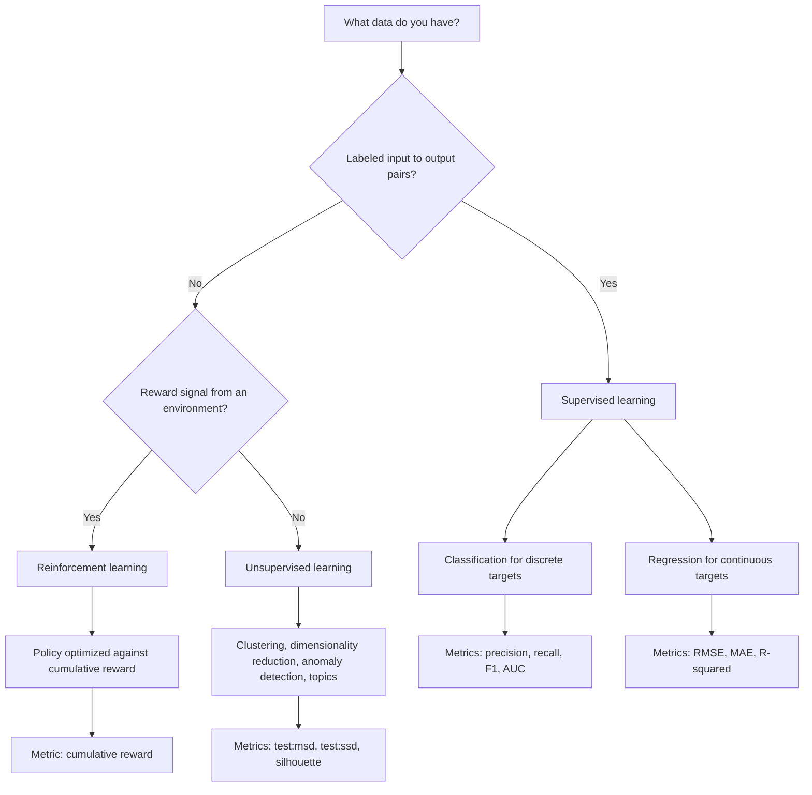
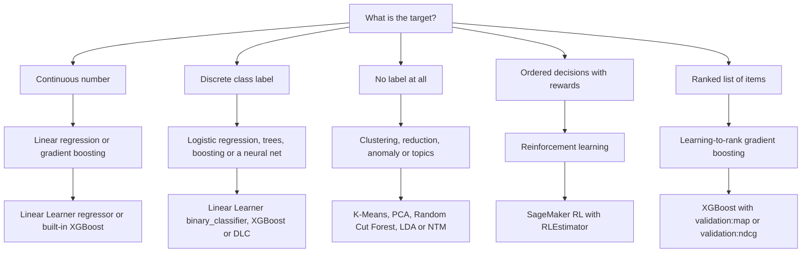
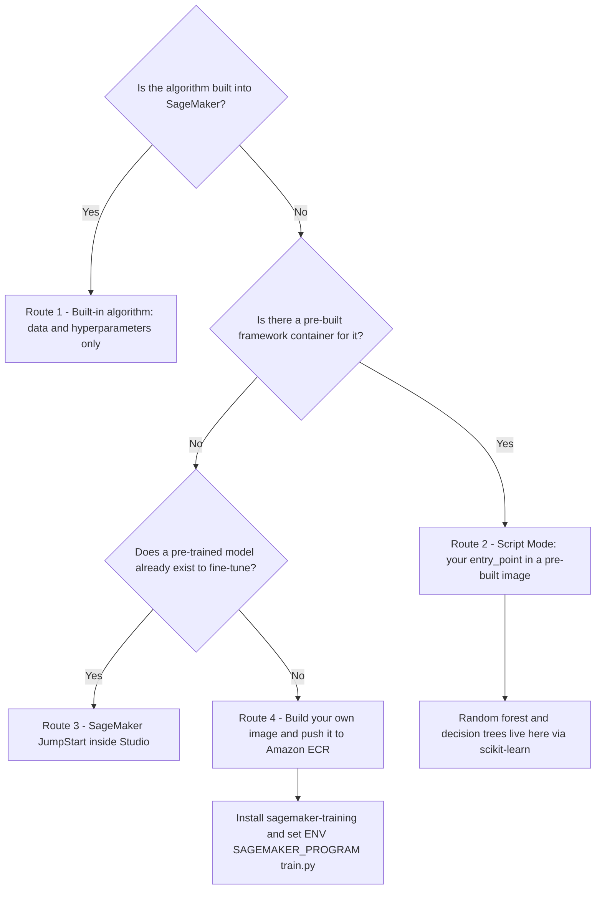
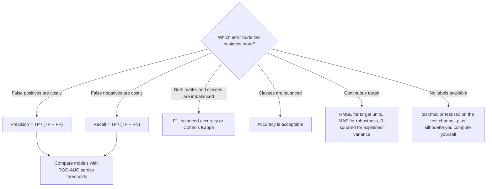
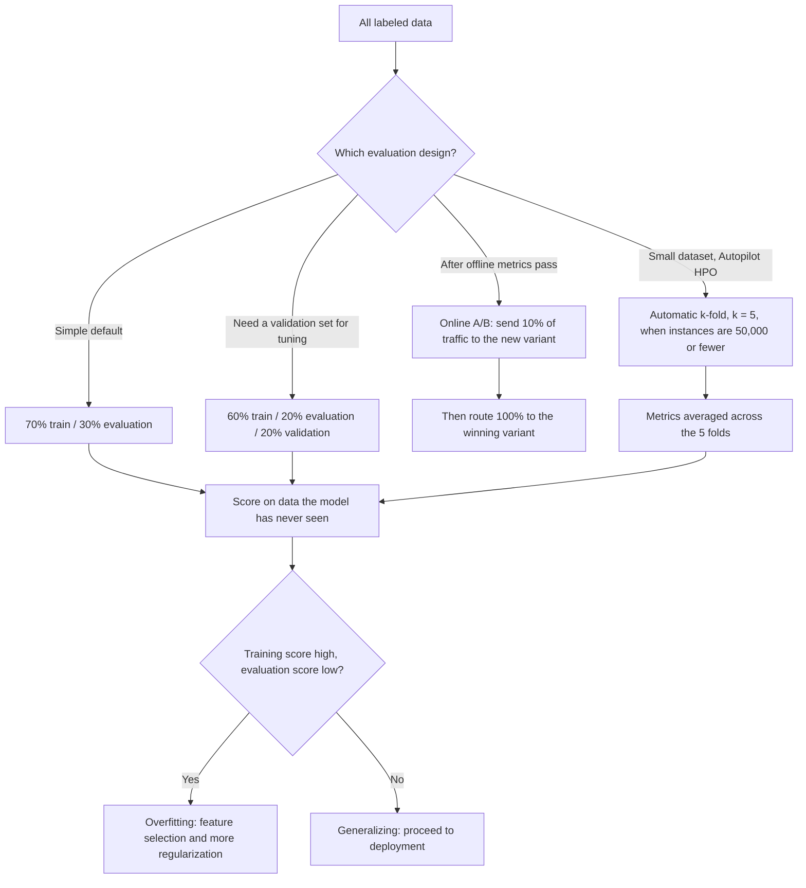

# ML Algorithms and Model Evaluation on AWS

An algorithm is easy to name and hard to justify. The AIF-C01 exam almost never asks *"which algorithm exists"* — it asks *"the business needs X, the labels look like Y, and AWS gives you Z; justify the pair and defend the metric."* Task 2.1 asks you to **select appropriate ML techniques for specific use cases** (regression, classification, clustering), Task 2.2 asks you to **describe supervised, unsupervised and reinforcement learning**, and Task 1.4 asks you to **describe model performance metrics** (accuracy, AUC, F1) **and business metrics** (cost per user, development cost, customer feedback, ROI). This lesson turns those three sentences into an operable decision system.

```text
=====================================================================
 ALGORITHMS AND EVALUATION ON AWS — THE EXAM'S THREE QUESTIONS
=====================================================================
  WHICH PARADIGM? ....... supervised | unsupervised | reinforcement
                          (Task 2.2 — labels? reward? neither?)
  WHICH ALGORITHM? ...... linear | tree | boosting | k-NN | neural
                          | k-means | PCA | deep learning
                          (Task 2.1 — regression / classification /
                           clustering)
  WHICH AWS ROUTE? ...... built-in | script mode | JumpStart | BYOC
  WHICH METRIC? ......... accuracy | precision | recall | F1 | AUC
                          | RMSE | MAE | R-squared | test:msd
  WHICH SPLIT? .......... 70/30 | 60/20/20 | holdout 20-30%
                          | k-fold k = 5-10 | A/B 10% then 100%
---------------------------------------------------------------------
  THE TRAP BEHIND EVERY ITEM:
    high accuracy can be produced by a model that predicts
    nothing but the majority class. The exam rewards the candidate
    who checks the confusion matrix before celebrating.
=====================================================================
```

> [!NOTE]
> **How to read this lesson.** Sections 1 to 5 answer *"which algorithm and which AWS tool"*; sections 6 to 10 answer *"how do I prove it works"*; sections 11 to 13 are the verdict, the arithmetic and the traps. Every number here is taken from an AWS-published page (SageMaker or machine-learning developer guide, Clarify docs, AWS ML blogs, or the AIF-C01 exam guide), and unverified claims are isolated in section 13.

By the end of this lesson you will be able to:

- choose between **supervised, unsupervised and reinforcement learning** from the shape of the data alone;
- map **sixteen algorithm families** to their use case, their AWS route and their key hyperparameter;
- state which algorithms are **built-in to SageMaker** — and which one famously is **not**;
- compute **accuracy, precision, recall, F1, MAE, MSE, RMSE and R²** from a confusion matrix or a residual set without a calculator;
- pick the right **split** (70/30, 60/20/20, holdout 20–30%, k-fold 5–10) and defend it;
- diagnose **underfitting vs. overfitting** and apply the AWS-prescribed remedy in the right direction;
- attack **class imbalance** with the three levers AWS documents (reweighting, resampling, metric swap);
- answer **ten exam-style questions** written in the official voice.

---

## 1. The three learning paradigms and how AWS implements them

### 1.1 Selection guide: read the data, not the buzzword

The exam decides the paradigm for you with one clue: **what does the training data contain?** Labeled input/output pairs point to supervised learning; features with no answers point to unsupervised; a reward signal coming back from an environment points to reinforcement learning.

| Question you ask the data | Choose | Why (AWS wording) | AWS implementation |
|---|---|---|---|
| Labeled input→output pairs, predict a known target? | **Supervised** | Classification / regression | Linear Learner, XGBoost, k-NN, Image Classification |
| Only features; want groups, outliers, compact form or topics? | **Unsupervised** | No answers during training | k-means, PCA, Random Cut Forest, LDA / NTM |
| Sequential decisions, reward signal, agent–environment loop? | **Reinforcement** | Policy learned from reward | SageMaker RL (`RLEstimator`), Intel Coach, Ray RLlib |
| Labels are scarce but the task is still predictive? | Supervised + **transfer** | Reuse a pre-trained model | SageMaker JumpStart, Hugging Face containers |
| Unsure which algorithm wins? | **AutoML** | Builds and tunes candidates automatically | SageMaker Autopilot, AutoGluon-Tabular |

The distinction that exam items lean on hardest: **unsupervised learning never sees a validation set with labels.** SageMaker's own k-means documentation says it *"doesn't use a validation dataset"* because there is nothing to validate against — it takes a **test** channel and reports distance-based metrics only. A question that offers `validation:f1` for a clustering job is testing whether you noticed.

### 1.2 What each paradigm looks like as a workflow



### 1.3 Reinforcement learning on SageMaker — the specific facts

Reinforcement learning (RL) is the paradigm the exam tests by *name recognition* rather than by computation. The verified AWS statements are:

- SageMaker AI supports RL in **TensorFlow and Apache MXNet**;
- it supports the **Intel Coach** and **Ray RLlib** toolkits;
- the SageMaker FAQ lists **DQN, PPO, A3C and many more** algorithms;
- the open RL container repository ships **Vowpal Wabbit (VW)** images;
- jobs were launched with the **`RLEstimator`**.

If a question describes an agent learning a policy to maximize cumulative reward in a simulation, the answer is SageMaker RL with Coach or Ray RLlib — never k-means, never Autopilot, never PCA.

- **📚 Did you know?** SageMaker's RL support is deliberately narrow: **TensorFlow and MXNet only** for frameworks. If an option offers *"SageMaker RL with PyTorch"*, it is a distractor — the documented framework list does not include PyTorch, even though PyTorch is fully supported for **supervised** deep learning through the pre-built deep learning containers.

**Check your paradigm selection:**

```matching
{
  "question": "Match each scenario to the learning paradigm and the AWS tool that implements it:",
  "pairs": [
    {"left": "Labeled churn data, predict cancel yes/no", "right": "Supervised classification — Linear Learner binary_classifier or XGBoost"},
    {"left": "50,000 unlabeled transactions, group customers into segments", "right": "Unsupervised clustering — built-in K-Means with test:msd and test:ssd"},
    {"left": "Robot arm learns a pick-and-place policy from rewards", "right": "Reinforcement learning — SageMaker RL with RLEstimator, Coach or Ray RLlib"},
    {"left": "10,000 sensor rows, find the 40 readings that break the pattern", "right": "Unsupervised anomaly detection — Random Cut Forest"},
    {"left": "Predict delivery time in days from route and weather features", "right": "Supervised regression — Linear Learner regressor or XGBoost, scored with RMSE"},
    {"left": "10,000 documents, discover recurring themes without labels", "right": "Unsupervised topic modeling — LDA or Neural Topic Model"}
  ],
  "explanation": "The paradigm is decided by the presence of labels, not by the industry. Labeled target => supervised (classification for discrete targets, regression for continuous ones). Features only => unsupervised (clustering, anomaly, topics, dimensionality reduction). A reward loop => reinforcement. The AWS tool follows from the paradigm: Linear Learner and XGBoost are built-in supervised algorithms, K-Means/Random Cut Forest/LDA are built-in unsupervised algorithms, and SageMaker RL is the only route for reward-driven policies."
}
```

---

## 2. The algorithm → use case → AWS route matrix

This is the single most examinable table in Domain 2. Read it as three questions answered at once: *what family*, *what business case*, *where does it run on AWS*.

### 2.1 The full matrix

| Algorithm family | Use case | AWS route | Key config / metric |
|---|---|---|---|
| Linear regression | Price, delivery-time prediction | **Linear Learner** built-in (`regressor`) | Loss variants; `validation:rmse` |
| Logistic regression | Churn, ad-click prediction | **Linear Learner** built-in (`binary_classifier`) | `validation:precision` / `validation:recall` |
| Decision tree | Rule-based, explainable decisions | **scikit-learn container + Script Mode** (no built-in) | `entry_point` script |
| Random forest | Tabular baseline | **scikit-learn container + Script Mode** ("no out-of-the-box") | `n_estimators`, `min_samples_leaf` |
| XGBoost (gradient boosting) | Tabular, fraud, ranking | **built-in XGBoost** | `num_round` (required), `eta`, `max_depth` |
| LightGBM / CatBoost | Large tabular datasets | **built-ins** (CSV, File mode, single-instance CPU) | GOSS + EFB / ordered boosting |
| AutoML ensembling | Fastest defensible baseline | **AutoGluon-Tabular** built-in or **SageMaker Autopilot** | Autopilot default binary objective = F1 |
| k-NN | Item/user lookup | **built-in k-NN** | `k`; recordIO or CSV; parallelizable |
| Neural networks / deep learning | Images, text, sequences | **DL containers**: TensorFlow, PyTorch, MXNet, Chainer, **Hugging Face** | GPU instances, DLC images |
| Transformer / FM fine-tuning | Adapt a foundation model | **SageMaker JumpStart** (`ModelTrainer`) | `model_id` + train/validation channels |
| k-means | Segmentation, grouping | **built-in K-Means** | `k`, `init_method`; `test:msd` / `test:ssd` |
| PCA | Feature reduction | **built-in PCA** | `feature_dim`, `num_components` |
| Anomaly detection | Sensor / IP outliers | **Random Cut Forest**, **IP Insights** | Test-channel scoring |
| Topic modeling | Document topics | **LDA**, **Neural Topic Model** built-ins | Text input |
| Sequential control | Agent, robotics, policy | **SageMaker RL** `RLEstimator` (Coach / Ray RLlib / VW) | TensorFlow or MXNet |
| Time-series | Demand forecasting | **Deep AR Forecasting** built-in | Sequential target |

### 2.2 From task type to algorithm family



### 2.3 The built-in lists you must be able to reproduce

AWS organizes its built-in algorithms into **supervised**, **unsupervised** and **reinforcement** groups. The tabular supervised set is the one the exam reuses most:

**Built-in tabular (classification or regression):** AutoGluon-Tabular, CatBoost, Factorization Machines, k-NN, LightGBM, **Linear Learner**, TabTransformer, **XGBoost**.

The Linear Learner documentation is explicit about what it is: it *"learns a linear function for regression or a linear threshold function for classification"* — which makes it the built-in answer whenever a question says **logistic regression** or **linear regression**.

**Built-in unsupervised:** PCA (dimensionality reduction), K-Means (clustering), Random Cut Forest (anomaly detection), IP Insights (IP-address anomaly), LDA and Neural Topic Model (topic modeling).

> [!WARNING]
> **There is no out-of-the-box random forest on SageMaker.** AWS's own script-mode documentation states this verbatim. The documented route is the **scikit-learn container + Script Mode**: your training script instantiates `RandomForestRegressor` or `RandomForestClassifier` and SageMaker runs it inside the pre-built scikit-learn image. A question offering *"call the built-in `RandomForest` algorithm with `num_round`"* is offering two lies at once — the algorithm is not built-in, and `num_round` is an XGBoost hyperparameter.

- **📚 Did you know?** AWS publishes algorithm **lists**, never a count. Any option that begins *"SageMaker has exactly N built-in algorithms"* is an invented number: the lists change as algorithms are added (AutoGluon-Tabular and TabTransformer are recent additions to the tabular set) and removed. Learn the membership of the lists, not a total.

---

## 3. The supervised families: linear, trees, boosting and neural nets

### 3.1 Linear Learner — the regression and classification workhorse

Linear Learner is the answer to *"which built-in does linear or logistic regression?"* and it carries three examinable properties:

| Property | Verified value |
|---|---|
| Tasks | Regression (`regressor`) and classification (`binary_classifier`) |
| Emitted metrics | `validation:precision`, `validation:recall`, `validation:rmse`, `validation:absolute_loss`, `validation:objective_loss` |
| AWS tuning rule | *"To avoid overfitting, we recommend tuning the model against a validation metric instead of a training metric."* |
| Tuner behaviour | Its `num_models` hyperparameter switches off under automatic model tuning |

That tuning rule is a free answer whenever an option says *"tune against the training metric"*. The documented remedy is the opposite: **tune on the validation metric.**

### 3.2 Gradient boosting — three built-ins plus an AutoML wrapper

Gradient boosting is represented on SageMaker by **three** built-in algorithms plus a stack-ensembling option:

| Algorithm | Distinctive trait | Notable hyperparameters |
|---|---|---|
| **XGBoost** | Regression, binary/multiclass classification **and ranking** | `num_round` (required), `eta`, `max_depth`, `subsample`, `alpha`, `min_child_weight` |
| **CatBoost** | Ordered boosting, native categorical features | Category handling without manual encoding |
| **LightGBM** | GOSS (gradient-based one-side sampling) + EFB (exclusive feature bundling) | Large-tabular speed |
| **AutoGluon-Tabular** | Stack ensembling of many base models | Fastest defensible baseline |

**XGBoost details the exam reuses:**

- the container covers XGBoost **1.0, 1.2, 1.3, 1.5, 1.7 and 3.0**;
- **`num_round` is required** (plus `num_class` for `multi:softmax` and `multi:softprob`);
- the default objective is **`reg:squarederror`** — so an unconfigured XGBoost job is a *regression* job;
- GPU training is enabled with **`tree_method=gpu_hist`**;
- the highest-impact hyperparameters for tuning are **`alpha`, `min_child_weight`, `subsample`, `eta` and `num_round`**.

### 3.3 The XGBoost metric menu — twelve objectives with directions

Automatic Model Tuning needs an objective **and a direction**. XGBoost exposes twelve validation metrics, and the direction is part of the answer:

| Maximize | Minimize |
|---|---|
| `validation:accuracy` | `validation:error` |
| `validation:auc` | `validation:logloss` |
| `validation:f1` | `validation:mae` |
| `validation:map` | `validation:merror` |
| `validation:ndcg` | `validation:mlogloss` |
| — | `validation:mse` |
| — | `validation:rmse` |

Two traps live in this table. First, **ranking metrics (`map`, `ndcg`) are Maximize** while every error metric is **Minimize** — selecting `validation:rmse` with direction `Maximize` would tune the model toward the *worst* result. Second, **`merror` and `mlogloss` are the multiclass siblings of `error` and `logloss`**; confusing them in an option is a common distractor pattern.

### 3.4 Trees, forests and neural networks — the routes that need code

| Family | Route on SageMaker | Why |
|---|---|---|
| Decision tree | scikit-learn container + Script Mode | No built-in decision tree exists |
| Random forest | scikit-learn container + Script Mode | AWS: *"no 'out-of-the-box' random forest algorithm"* |
| Any custom model | Script Mode with your framework image | Your `entry_point` script runs in a pre-built image |
| Deep neural network | Pre-built **DL containers**: TensorFlow, MXNet, PyTorch, Chainer, Hugging Face | GPU-ready, managed |
| Vision / NLP built-ins | Image Classification, Object Detection, Semantic Segmentation, NTM, Object2Vec, TabTransformer, Deep AR Forecasting | Built-in deep algorithms |
| Fine-tuned transformer | SageMaker JumpStart | Pre-trained model, minimal code |

Object2Vec deserves a specific memory hook: it uses **cross-entropy for classification** and **mean squared error (MSE) for regression** — the same algorithm changes its loss function with the task, which is exactly the kind of detail an option can flip to make a wrong answer.

---

## 4. The unsupervised families: clustering, reduction, anomaly and topics

### 4.1 K-Means — no validation set exists

K-Means is the exam's favourite way to test whether you understand that **unsupervised learning has no labeled validation set**. The verified documentation points:

- *"Because it's unsupervised, it doesn't use a validation dataset… But it does take a test dataset."*
- Objective metrics: **`test:msd`** (mean squared distances) and **`test:ssd`** — **both Minimize**;
- inference returns **`closest_cluster`** and **`distance_to_cluster`**;
- hyperparameters: **`k`**, **`init_method`** (`random` or `k-means++`), **`mini_batch_size`**.

Note the direction: distance metrics are **minimized**, because a smaller squared distance means tighter clusters. Every distance-based clustering objective in SageMaker points the same way.

### 4.2 Silhouette — a real metric that is not a SageMaker metric

The silhouette coefficient ranges from **−1 to 1**; a value close to **1** means the points are tight inside their own cluster *and* far from the other clusters. AWS's guidance is to **pair silhouette with inertia** — and to be clear that **SageMaker does not emit it**: you compute it yourself outside the training job. A question that offers *"select `validation:silhouette` as the tuning objective"* is testing precisely that boundary.

### 4.3 PCA — three required hyperparameters

PCA is built in, and its configuration is examinable because it is short:

| Parameter | Requirement | Meaning |
|---|---|---|
| `feature_dim` | **Required** | Dimensionality of each input vector |
| `mini_batch_size` | **Required** | Rows processed per gradient step |
| `num_components` | **Required** | Number of principal components to keep |
| `algorithm_mode` | Optional | `regular`, `stable` or `randomized` |
| `subtract_mean` | Optional | Whether to center the data |
| `extra_components` | Optional | Extra components computed beyond `num_components` |

PCA outputs the **`mean`**, the eigenvector matrix **`v`** and the singular values **`s`** — which is how you later reconstruct or project data with the components you kept.

### 4.4 Anomaly detection and topic modeling

| Need | Built-in algorithm | Notes |
|---|---|---|
| Numeric outlier detection (sensors, metrics) | **Random Cut Forest** | Scores a test channel; unsupervised |
| Network / IP anomaly | **IP Insights** | Learns normal IP-association patterns |
| Topic discovery in documents | **LDA** (Latent Dirichlet Allocation) | Classical topic model |
| Topic discovery at scale | **Neural Topic Model (NTM)** | Deep-learning variant |

- **📚 Did you know?** `test:msd` and `test:ssd` are *not* interchangeable synonyms: **`msd` is the mean** squared distance and **`ssd` is the sum** squared distance to the centroid. On a test set of *n* rows, `ssd = msd × n`, so `ssd` grows with dataset size while `msd` does not. Both are minimized, and both are valid clustering objectives — but only `msd` is comparable across test sets of different sizes.

---

## 5. Four routes to an algorithm

AWS documents exactly **four** ways to get an algorithm running, and the exam tests whether you can name them in order of increasing effort.

| # | Route | What you provide | What AWS provides | When to use |
|---|---|---|---|---|
| 1 | **Built-in algorithm** | Data + hyperparameters | *"No coding to start running experiments"* | The algorithm is on the built-in list |
| 2 | **Script Mode** | Your training script (`entry_point`) | A pre-built framework container | Your algorithm exists in a framework AWS already images |
| 3 | **JumpStart** | A `model_id` and training channels | A pre-trained model to fine-tune and deploy *"within Amazon SageMaker Studio"* | You want a foundation or pre-trained model with minimal code |
| 4 | **Bring your own container (BYOC)** | Dockerfile + training code | Amazon ECR hosting | Nothing pre-built fits |

### 5.1 The decision flow



### 5.2 BYOC: the three non-negotiable container rules

If a question pushes you to Route 4, three documented facts decide the answer:

1. the **`sagemaker-training`** toolkit package is **mandatory**;
2. **`ENV SAGEMAKER_PROGRAM train.py`** is *the only required environment variable* — it names the entry point SageMaker invokes;
3. **`/opt/ml` and all of its subdirectories are reserved by SageMaker training**, so inputs, model artifacts and output must follow that layout.

Two more container rules appear as distractors:

- SageMaker **overrides the default `CMD`** of your image by appending the `train` argument;
- GPU images must be **`nvidia-docker` compatible**: bundle the **CUDA toolkit**, but **do not bundle NVIDIA drivers** — the host supplies them.

### 5.3 Container support windows are examinable dates

| Container | GA date | End of patch support |
|---|---|---|
| XGBoost **3.0-5** | 17 Nov 2025 | **17 Nov 2026** |
| Scikit-Learn **1.4-2** | 30 Oct 2025 | **30 Oct 2026** |

AWS publishes an explicit **GA → end-of-patch** schedule for its algorithm containers. The pattern worth memorising is the *shape*: roughly **one year** of patch support after general availability, which is why an exam item dated in 2026 can legitimately reference a 2025 release reaching end of patch in the same year.

---

## 6. Evaluation metrics: formulas, directions and when to use them

### 6.1 The formula sheet

| Metric | Formula | Direction | When to use |
|---|---|---|---|
| Accuracy | (TP+TN)/(TP+TN+FP+FN) | Higher better | Balanced classes; overall correctness |
| Precision | TP/(TP+FP) | Higher better | **False positives are costly** |
| Recall | TP/(TP+FN) | Higher better | **False negatives are costly** |
| F1 | 2·P·R/(P+R) = 2TP/(2TP+FP+FN) | Higher better | Imbalanced binary data; Autopilot's default binary objective |
| ROC-AUC | Area under TPR vs. FPR over all thresholds | 0.5 random → 1.0 | Model comparison across thresholds; skewed data |
| Balanced accuracy | (Recall + True Negative Rate)/2 | Higher better | Both FP and FN penalties are high |
| Confusion matrix | Count table, predicted × actual | Counts (no direction) | Diagnostics: *which* classes are confused |
| MSE | Σ(ŷ−y)²/n | Lower better | Punishes large errors hard |
| RMSE | √MSE | Lower, **target units** | Report error in dollars or degrees |
| MAE | Σ\|ŷ−y\|/n | Lower, target units | Robust and easy to interpret |
| R² | 1 − SS_res/SS_tot | Closer to 1 | Share of variance explained |
| Silhouette | (b−a)/max(a,b), averaged | −1..1, closer to 1 | Cluster cohesion; **not a SageMaker metric** |
| `test:msd` / `test:ssd` | Mean / sum squared distance to centroid | **Minimize** | Official k-means objective metrics |
| mAP / NDCG | Ranking quality | Higher better | Ranking and recommendation (`validation:map`, `validation:ndcg`) |

AWS's own summary of the precision/recall relationship is worth memorising verbatim: **precision cuts false positives, recall cuts false negatives, and F1 is the harmonic mean of the two.**

### 6.2 Choosing a metric from the confusion matrix



### 6.3 Worked confusion matrix #1 — balanced churn data

A churn model is evaluated on **200 customers**: **TP = 80, FP = 20, FN = 10, TN = 90**.

$$
\text{Accuracy} = \frac{TP+TN}{N} = \frac{80+90}{200} = \frac{170}{200} = 0.85
$$

$$
\text{Precision} = \frac{TP}{TP+FP} = \frac{80}{100} = 0.80
$$

$$
\text{Recall} = \frac{TP}{TP+FN} = \frac{80}{90} = 0.889
$$

$$
F1 = \frac{2TP}{2TP+FP+FN} = \frac{160}{190} = 0.842
$$

Reading: the model catches about **89% of churners**, but **20 of its 100 alerts are wrong**. Accuracy of 0.85 is respectable here *because the classes are reasonably balanced* (90 positives, 110 negatives).

### 6.4 Worked confusion matrix #2 — the 1% fraud trap

A fraud model is evaluated on **10,000 transactions of which only 100 are fraudulent**: **TP = 85, FP = 40, FN = 15, TN = 9,860**.

$$
\text{Accuracy} = \frac{85+9860}{10000} = \frac{9945}{10000} = 99.45\%
$$

Yet a model that **always predicts "not fraud"** already scores:

$$
\frac{9900}{10000} = 99.0\%
$$

So 99.45% accuracy buys **0.45 percentage points** over a useless baseline. The metrics that matter:

$$
\text{Precision} = \frac{85}{85+40} = \frac{85}{125} = 0.68
$$

$$
\text{Recall} = \frac{85}{85+15} = \frac{85}{100} = 0.85
$$

$$
F1 = \frac{2 \times 85}{170+40+15} = \frac{170}{225} = 0.756
$$

Reading: **32% of the fraud alerts are false alarms**, the model misses 15 of 100 frauds, and the headline accuracy is close to meaningless. This is the single most repeated evaluation pattern in AWS's own fraud-detection material.

> [!WARNING]
> **Accuracy is the trap metric of Domain 1.** When one class dominates — fraud at **0.173%**, churn at 2%, defect rates under 1% — a lazy model reaches near-perfect accuracy by predicting the majority class every time. Before accepting an accuracy number, ask: *what would a majority-class predictor score?* If the answer is within a point of your model, switch to **precision, recall, F1, ROC-AUC, balanced accuracy or Cohen's Kappa**, and sweep the decision threshold from 0.1 to 0.9.

---

## 7. Data splits, cross-validation and A/B testing

### 7.1 The published split standards

| Standard | Official value | Source |
|---|---|---|
| Amazon ML default split | **70% train / 30% evaluation** | ML Developer Guide, evaluating models |
| Recommended three-way split | **60% train / 20% evaluation / 20% validation** | ML Developer Guide, evaluating models |
| SageMaker holdout share | **20–30%** of training data | SageMaker DG, model validation |
| SageMaker k-fold `k` | Typically **5–10** | SageMaker DG, model validation |
| Autopilot HPO cross-validation | Automatic **k = 5** when ≤ **50,000** training instances | SageMaker DG, autopilot metrics |
| Autopilot ensemble split | **80% train / 20% validation** | SageMaker DG, autopilot metrics |
| Online A/B test traffic | **10% → then 100%** | SageMaker DG, model validation |
| Clarify auto-evaluated records | **100** (most tasks), **300** (factual knowledge) | SageMaker DG, Clarify |

AWS's stated reason for holding data out is a sentence worth reproducing in an exam answer: evaluating on training data *"rewards models that can 'remember' the training data, as opposed to generalizing from it."*

### 7.2 Split and cross-validation arithmetic on 100,000 rows

| Scheme | Train | Validation / evaluation | Test | Notes |
|---|---|---|---|---|
| 70/30 default | **70,000** | **30,000** | — | Amazon ML default |
| 60/20/20 three-way | **60,000** | **20,000** | **20,000** | Train / evaluation / validation |
| Holdout 20–30% | 70,000–80,000 | — | **20,000–30,000** | SageMaker recommended range |
| k = 5 | 80,000 per fold | 20,000 per fold | — | 5 models, metrics averaged |
| k = 10 | 90,000 per fold | 10,000 per fold | — | 10 models, metrics averaged |

### 7.3 Autopilot cross-validation: the 50,000-instance threshold

With **40,000 training instances** (≤ 50,000, so HPO mode applies automatic k-fold with **k = 5**):

1. the automatic **80/20** split gives **32,000 train / 8,000 validation**;
2. each of the **5 folds** trains on 4/5 × 32,000 = **25,600** instances;
3. each fold validates on **6,400** instances;
4. the five validation scores are **averaged** into the reported objective.

A **60,000-instance** dataset **exceeds** the ≤ 50,000 threshold, so automatic k-fold in HPO mode does not trigger — while **ensemble mode** runs cross-validation regardless of size alongside its automatic 80/20 split.

### 7.4 How the loop fits together



**Interactive check — the formulas you must not have to look up:**

```fillblank
{
  "question": "Complete the four metric formulas used throughout this lesson:",
  "template": "Precision = {{1}} / (TP + FP)   |   Recall = TP / (TP + {{2}})   |   F1 = 2 x {{3}} / (P + {{3}})   |   RMSE = {{4}} of MSE",
  "answers": {
    "1": "TP",
    "2": "FN",
    "3": "P x R",
    "4": "square root"
  },
  "distractors": ["TN", "FP", "accuracy", "variance", "log loss", "mean"],
  "explanation": "Precision is the share of predicted positives that are truly positive (TP / (TP + FP)); recall is the share of real positives the model actually found (TP / (TP + FN)); F1 is the harmonic mean 2PR / (P + R), which refuses to let one strong number hide a weak one; and RMSE is the square root of the mean squared error, which is what restores the error to the target's own units after squaring has punished large misses."
}
```

---

## 8. Underfitting, overfitting and the tuning controls that fix them

### 8.1 The diagnosis

| Signal | Diagnosis | AWS-prescribed remedy |
|---|---|---|
| High error **on training data** | **Underfitting** — the model is too simple | Add features, change processing, **decrease** regularization, more passes |
| Low train error, **high evaluation error** | **Overfitting** — *"performs well on the training data but does not perform well on the evaluation data… memorizing the data"* | Feature selection, **increase** regularization, tune on a **validation** metric, early stopping or Hyperband |
| Both scores poor | Insufficient data | Increase training examples; increase the number of passes |
| Production metrics decay | Data / concept drift | Model Monitor + Clarify post-training bias; retrain |
| Accuracy looks great, model useless | Wrong metric | Switch to AUC / F1 / balanced accuracy / Cohen's Kappa; sweep threshold 0.1–0.9 |

AWS's official signature of overfitting is short: **high training accuracy plus low testing accuracy.** The remedy direction matters as much as the remedy — *overfitting gets more regularization, underfitting gets less*. Reversing them is a classic distractor.

### 8.2 The tuning controls that prevent overfitting mechanically

Four documented controls do the work that a human would otherwise do by eye:

1. **Tune against a validation metric, not a training metric.** Linear Learner's documentation states this as a recommendation, not a preference.
2. **Early stopping.** Each epoch, the objective metric is compared with the **median of running averages** of prior jobs; jobs performing worse stop early — AWS says this *"helps you avoid overfitting your model"*. The setting is `early_stopping_type='Auto'`.
3. **Hyperband** also terminates under-performing jobs early, allocating the budget to promising configurations.
4. **Regularization direction** — increase it for overfitting, decrease it for underfitting.

| Control | Mechanism | AWS wording / setting |
|---|---|---|
| Validation-metric tuning | Objective never sees training rows | *"tuning the model against a validation metric"* |
| Early stopping | Compare to the **median of running averages** of prior jobs | `early_stopping_type='Auto'` |
| Hyperband | Bracketed resource allocation, kills weak jobs | Resource-aware early termination |
| Regularization | Capacity control | **Increase** for overfit, **decrease** for underfit |

### 8.3 Order the diagnostic sequence

```dragdrop
{
  "question": "Order the steps a team should follow when a model's scores look wrong:",
  "items": [
    "Compare the training score with the evaluation or validation score",
    "Classify the gap: poor on both = underfitting, good on train and poor on evaluation = overfitting",
    "Check whether the chosen metric can even express the problem (majority-class accuracy, squared-unit MSE)",
    "Apply the matching remedy: more features and less regularization for underfit, feature selection and more regularization for overfit",
    "Re-tune against a validation metric with early stopping or Hyperband enabled",
    "Confirm on a held-out set the model has never seen (20 to 30 percent holdout, or k-fold with k between 5 and 10)"
  ],
  "correctOrder": [
    "Compare the training score with the evaluation or validation score",
    "Classify the gap: poor on both = underfitting, good on train and poor on evaluation = overfitting",
    "Check whether the chosen metric can even express the problem (majority-class accuracy, squared-unit MSE)",
    "Apply the matching remedy: more features and less regularization for underfit, feature selection and more regularization for overfit",
    "Re-tune against a validation metric with early stopping or Hyperband enabled",
    "Confirm on a held-out set the model has never seen (20 to 30 percent holdout, or k-fold with k between 5 and 10)"
  ],
  "explanation": "Diagnosis must precede the remedy, because the two remedies are opposites: overfitting needs more regularization and feature selection, underfitting needs less regularization and more features. The metric check comes before the remedy because a majority-class predictor can hide both problems behind a high accuracy number. Retuning against a validation metric with early stopping or Hyperband is the mechanical version of the same fix, and the final confirmation must use data the model has genuinely never seen."
}
```

- **📚 Did you know?** Early stopping in SageMaker Automatic Model Tuning does **not** compare your job to a fixed target — it compares each epoch's objective value with the **median of the running averages of all previous jobs**. That makes the threshold adaptive: an unusually strong early job raises the bar for everything that follows, and a weak early job lowers it. The support list for early stopping carries a "current as of December 13, 2018" stamp, so treat any claim about *which* algorithms support it as historical.

---

## 9. Imbalanced data: three levers and the numbers behind them

AWS documents **three independent levers** for imbalance. A strong answer uses at least two of them together.

### 9.1 The three levers

| Lever | Mechanism | AWS implementation | Constraint |
|---|---|---|---|
| **1. Resampling** | Rebalance the rows themselves | SageMaker Data Wrangler **Balance**: random oversampler, random undersampler, **SMOTE** | **Binary classification only** |
| **2. Class weights** | Penalise mistakes on the rare class | XGBoost `scale_pos_weight`; Linear Learner `positive_example_weight_mult='balanced'` (binary) / `balance_multiclass_weights` (multiclass); Autopilot applies it automatically | Weights change the decision boundary, not the data |
| **3. Metric swap** | Measure what accuracy hides | AUC, F1, balanced classification accuracy, Cohen's Kappa | Metric direction must match the tuning objective |

### 9.2 Class-weight arithmetic

**Case A — a 98% / 2% binary split.** To make the minority class count as much as the majority:

$$
0.02 \times w = 0.98 \implies w = \frac{0.98}{0.02} = 49
$$

So Linear Learner's `positive_example_weight_mult='balanced'` on a 98/2 dataset produces a positive weight of **49**.

**Case B — AWS's own fraud dataset.** With **284,807** examples of which **492** are fraudulent (**0.173%**), AWS's XGBoost variant uses the square-root rule rather than the raw ratio:

$$
\text{scale\_pos\_weight} = \sqrt{\frac{284{,}315}{492}} = \sqrt{577.9} \approx 24
$$

The raw ratio would be **577.9**; the square-root damping keeps training stable while still telling the model that fraud matters. AWS additionally reports that raising **Cohen's Kappa above 0.8** would be *"generally very favorable"* on that problem.

### 9.3 What weighting costs you — the documented trade-off

Weighting is not free. AWS's own multiclass example shows both sides:

| Measure | Before balancing | After balancing |
|---|---|---|
| Rare class (Aspen) recall | **1%** | **above 50%** |
| Recall for every class | some collapse to ~1% | **all above 50%** |
| Dominant class (Lodgepole Pine) recall | **81%** | **52%** |
| Overall accuracy | **72%** | **59%** |

The lesson the exam wants: **you traded 13 points of accuracy for a model that actually recognizes the rare class.** On an imbalanced problem, that trade is usually correct — but it must be a *decision*, not a side effect.

### 9.4 The metric swap, side by side

| Situation | Metric to reach for | Why accuracy fails |
|---|---|---|
| Fraud at 0.173% prevalence | ROC-AUC (`job_objective='AUC'` in Autopilot) | 99.0% baseline from always predicting "not fraud" |
| Binary, moderately imbalanced | F1 (Autopilot's **default** binary objective) | Harmonic mean refuses to hide a weak side |
| Both FP and FN expensive | Balanced accuracy = (Recall + TNR)/2, or Cohen's Kappa | Majority class dominates plain accuracy |
| Threshold needs tuning | Precision/recall curve, sweep 0.1–0.9 | One threshold rarely optimizes both |

> [!NOTE]
> **Autopilot does two of the three levers for you.** Its default binary objective is **F1** (switch to **AUC** with `job_objective='AUC'` for data skewed beyond 99%), and it *"automatically applied up-weighting to the minority class using `scale_pos_weight`"*. If a question asks what Autopilot does automatically on imbalanced binary data, the answer is **both the metric default and the weighting**.

---

## 10. Evaluation by task type — the lookup table

| Task type | Setup | Primary metrics | AWS-emitted metric names | Trap |
|---|---|---|---|---|
| Binary (balanced) | train/val/test or 70/30 | Accuracy, F1, ROC-AUC | Linear Learner `validation:precision` / `:recall`; XGBoost `validation:f1` / `:auc` | Trusting accuracy alone |
| Binary (imbalanced) | Stratified split before resampling | Precision, recall, F1, AUC, balanced accuracy, Cohen's Kappa | XGBoost `scale_pos_weight` + `validation:auc`; Autopilot `job_objective='AUC'` | 99% accuracy by predicting the majority |
| Multiclass | Macro/micro averaging | Per-class recall, macro-F1, confusion matrix | Linear Learner `balance_multiclass_weights`; Clarify `multiclass_average_strategy` | Accuracy hides rare-class collapse |
| Regression | Holdout 20–30% | RMSE, MAE, R² | XGBoost `validation:rmse` / `:mae` / `:mse`; Linear Learner `validation:rmse`, `validation:absolute_loss` | Quoting MSE in squared units |
| Ranking / recommender | Time-ordered split | mAP, NDCG | XGBoost `validation:map`, `validation:ndcg` | A random split leaks the future |
| Clustering | Test channel, no labels | `test:msd` / `test:ssd`, silhouette, inertia | SageMaker k-means `test:msd`, `test:ssd` (both **Minimize**) | Hunting for a validation set that does not exist |
| Dimensionality reduction | Variance retained | Explained variance | PCA outputs `v`, `s`, `mean` | Choosing `num_components` arbitrarily |
| FM / GenAI text | References or human raters | ROUGE-N, BERTScore, exact match, F1 over words, fluency/coherence | Clarify evaluation jobs (100 / 300 records) | Applying accuracy or classification F1 to open-ended text |

### 10.1 Foundation-model metrics: what Clarify actually computes

| Task | Automatic metrics | Built-in datasets | Human dimensions |
|---|---|---|---|
| Open-ended generation | Factual knowledge, semantic robustness, prompt stereotyping, toxicity | TREX, BOLD, WikiText, CrowS-Pairs, RealToxicityPrompts | Fluency, Coherence, Toxicity, Accuracy, Consistency, Relevance + custom |
| Text summarization | **ROUGE-N**, **BERTScore** | Government Report Dataset, Gigaword | Same human dimensions |
| Question answering | Exact match, quasi exact match, **F1 over words** = (2·P·R)/(P+R) | BoolQ, NaturalQuestions, TriviaQA | — |
| Text classification | Classification accuracy, precision, recall, **balanced classification accuracy** = *"the sum of recall and the true negative rate divided by 2"* | Women's Ecommerce Clothing Reviews | — |

Two sampling numbers are examinable: Clarify evaluates **100 records by default** for most tasks and **300 for factual knowledge**. And one bias metric name is unique to Clarify: **CI (Class Imbalance)**.

- **📚 Did you know?** Balanced classification accuracy has an official AWS gloss: *"the sum of recall and the true negative rate divided by 2."* For a multiclass problem it degrades gracefully into the **mean per-class recall** — which is exactly why it survives class imbalance while plain accuracy does not: every class contributes equally regardless of how many rows it owns.

---

## 11. Putting the three axes together

The exam almost always forces a choice across **three axes at once**: the algorithm family, the task type, and the AWS tool that implements the pair. Getting two of the three right is not enough.

> [!IMPORTANT]
> **Comparative Verdict — algorithm choice × task type × AWS tool**
> - **Linear/logistic regression → Linear Learner (built-in).** Choose it when the target is continuous (`regressor`, scored with `validation:rmse`) or binary (`binary_classifier`, scored with `validation:precision` / `validation:recall`). It is the documented answer to *"which built-in does linear or logistic regression"*, and its tuning rule is explicit: tune on a **validation** metric. Do not reach for XGBoost first when the exam names linear or logistic regression by name.
> - **Gradient boosting → built-in XGBoost, with LightGBM or CatBoost for large or categorical tabular data.** Choose it for tabular classification, regression and ranking. It is the only family that offers **ranking** metrics (`validation:map`, `validation:ndcg`) as first-class objectives, and `num_round` is mandatory. When the data is huge and mostly categorical, the built-ins LightGBM and CatBoost are the faster siblings — all three are built in, none needs Script Mode.
> - **Trees and random forests → scikit-learn container + Script Mode.** This is the documented substitute for the algorithm SageMaker does *not* ship. If an option claims a built-in random forest, it is wrong; if an option says *"build your own Docker image first"*, it is over-engineering — Route 2 exists precisely for this case.
> - **Clustering → built-in K-Means; dimensionality reduction → built-in PCA; outliers → Random Cut Forest or IP Insights.** All are unsupervised, so the evaluation design changes: **there is no validation set**, scoring happens on a **test channel**, K-Means minimizes `test:msd` / `test:ssd`, and **silhouette must be computed by you**. PCA's three required hyperparameters (`feature_dim`, `mini_batch_size`, `num_components`) are a favourite short-answer detail.
> - **Images, text and sequences → pre-built deep learning containers** (TensorFlow, PyTorch, MXNet, Chainer, Hugging Face) for training your own network, or **SageMaker JumpStart** when a pre-trained model can be fine-tuned and deployed *"within SageMaker Studio"*. Sequential, reward-driven control → **SageMaker RL** with `RLEstimator`, Coach or Ray RLlib on TensorFlow or MXNet. These three routes are mutually exclusive answers; the task type picks one.
> - **When the algorithm is genuinely unknown → AutoML.** SageMaker Autopilot or the AutoGluon-Tabular built-in will build and tune candidates for you, defaulting to **F1** on binary problems, running **automatic k = 5 cross-validation at ≤ 50,000 instances**, and applying `scale_pos_weight` to the minority class automatically. AutoML is the correct answer only when the question emphasizes *speed to a defensible baseline*, not when it emphasizes *control over the algorithm*.

---

## 12. Worked examples with numbers

**Worked example 1 — regression metrics from scratch.** True values $y = [100, 120, 140, 160, 180]$, predictions $\hat{y} = [110, 115, 150, 155, 190]$, so the errors are $[10, -5, 10, -5, 10]$.

- $\text{MAE} = (10+5+10+5+10)/5 = 40/5 = \mathbf{8.0}$
- $\text{MSE} = (100+25+100+25+100)/5 = 350/5 = \mathbf{70}$
- $\text{RMSE} = \sqrt{70} \approx \mathbf{8.37}$ — back in the target's own units
- $\bar{y} = 140$, so $SS_{tot} = 1600+400+0+400+1600 = 4000$, and $R^2 = 1 - 350/4000 = \mathbf{0.9125}$

The pattern: **MSE punishes the two 10-point misses four times as hard as the 5-point misses** (100 vs. 25), and RMSE undoes that squaring so the number can be quoted in dollars or days.

**Worked example 2 — split arithmetic on 100,000 rows.** The 70/30 default gives **70,000 / 30,000**; the recommended 60/20/20 gives **60,000 / 20,000 / 20,000**; SageMaker's 20–30% holdout reserves **20,000–30,000** rows for test; k = 10 gives **90,000 train / 10,000 validation per fold** across 10 models whose metrics you average.

**Worked example 3 — Autopilot cross-validation math.** Dataset of **40,000 instances** (≤ 50,000 → automatic k-fold, k = 5, in HPO mode): 80/20 gives **32,000 train / 8,000 validation**; each of the 5 folds trains on 4/5 × 32,000 = **25,600** and validates on **6,400**; the five scores are averaged. The same recipe on **60,000 instances** would **exceed** the threshold and lose automatic k-fold in HPO mode.

**Worked example 4 — class-weight math, both variants.** 98% negative / 2% positive ⇒ $0.02 \times w = 0.98 \Rightarrow w = \mathbf{49}$. The AWS fraud variant instead uses $\text{scale\_pos\_weight} = \sqrt{284{,}315/492} = \sqrt{577.9} \approx \mathbf{24}$. Both are legitimate; the raw ratio is harsher, the square root is the documented damping for extreme skew.

**Worked example 5 — the imbalanced confusion matrix in full.** 10,000 transactions, 100 frauds, TP = 85, FP = 40, FN = 15, TN = 9,860 ⇒ accuracy **99.45%**, majority baseline **99.0%**, precision **0.68**, recall **0.85**, F1 **0.756**. The decision that follows: report F1 or AUC, not accuracy, and state that **40 of 125 alerts (32%) are false alarms**.

**Worked example 6 — balancing a 600-prediction evaluation set.** A model produces TP = 480, FP = 60, FN = 20, TN = 40 on 1,000 rows. Accuracy = $880/1000 = \mathbf{0.88}$; precision = $480/540 = \mathbf{0.889}$; recall = $480/500 = \mathbf{0.96}$; F1 = $2(0.889)(0.96)/(0.889+0.96) = 1.707/1.849 = \mathbf{0.923}$. True negative rate = $40/100 = 0.40$, so balanced accuracy = $(0.96 + 0.40)/2 = \mathbf{0.68}$ — far below the 0.88 accuracy, because the negative class is where the model fails. **That gap between 0.88 and 0.68 is exactly what balanced accuracy exists to expose.**

---

## 13. Traps, conflicts and unverified claims

> [!WARNING]
> **Exam-day traps for this lesson:**
> - **There is no built-in random forest.** The route is the **scikit-learn container + Script Mode**. An option inventing a built-in `RandomForest` algorithm with a `num_round` parameter contains two errors.
> - **k-means has no validation set.** It scores a **test** channel with `test:msd` and `test:ssd`, both **Minimize**. An option offering `validation:f1` for clustering is wrong.
> - **Silhouette is not a SageMaker metric.** Range −1..1, closer to 1 is better, pair it with inertia — and compute it yourself.
> - **The regularization direction flips with the diagnosis.** Overfit → **increase** regularization and do feature selection. Underfit → **decrease** regularization and add features. Reversing them is a standard distractor.
> - **Tune on validation, never on training.** AWS states the recommendation explicitly for Linear Learner.
> - **PCA needs exactly three required hyperparameters:** `feature_dim`, `mini_batch_size`, `num_components`.
> - **XGBoost's `num_round` is required and its default objective is `reg:squarederror`** — an unconfigured XGBoost job is a regression job.
> - **Resampling through Data Wrangler's Balance (including SMOTE) is binary-classification only.** For multiclass, use `balance_multiclass_weights` or metric swaps.
> - **Autopilot's binary default is F1**, and it applies `scale_pos_weight` automatically; switch to AUC only for extreme skew such as >99% fraud data.
> - **Ranking splits must be time-ordered.** A random split on a recommender problem leaks the future.
> - **Never invent a pass threshold.** There is no AWS standard saying *"F1 must exceed 0.8"* — claims like that are unverifiable.

### 13.1 Conflicting, unverified and non-examinable claims

| Claim | Status | How to handle it |
|---|---|---|
| Count of "N SageMaker built-in algorithms" | **No official number** — AWS publishes lists, not counts | Learn list membership, never a total |
| Early-stopping support list | Marked *"current as of December 13, 2018"* | Treat as historical; do not memorise the list |
| XGBoost container version strings | Render inconsistently across doc pages | Use `xgboost.html`: 1.0, 1.2, 1.3, 1.5, 1.7, 3.0 |
| A numeric pass threshold for any metric | **No such AWS standard exists** | Never assert "F1 must be > 0.8" |
| Whether JumpStart exposes a first-class random-forest entry | Only the scikit-learn container + Script Mode path is documented | Answer Script Mode |
| Whether Bedrock Model Evaluation mirrors Clarify's classic classification metrics | Only the foundation-model task/metric table was verified | Do not claim parity |
| Non-AWS benchmark names (MMLU, BIG-bench, HELM, GLUE) | Not in the exam guide | BLEU/ROUGE/BERTScore are in scope; benchmark suites are not |
| Case-study question type | HTML exam guide lists four types; one PDF render also lists case study | Re-check the current PDF before relying on it |

Primary sources for this lesson: the AIF-C01 **Exam Guide**; the SageMaker developer guide pages `algorithms`, `algorithms-tabular`, `xgboost`, `xgboost-tuning`, `linear-learner-tuning`, `k-means`, `PCA-reference`, `object2vec`, `how-it-works-model-validation`, `autopilot-metrics-validation`, `automatic-model-tuning-early-stopping`, `your-algorithms-training-algo-dockerfile`, `train-model`, `pre-built-containers-frameworks-deep-learning`, `pre-built-containers-support-policy`, `clarify-foundation-model-evaluate-overview` and `reinforcement-learning`; the machine-learning developer guide pages `model-fit-underfitting-vs-overfitting` and `evaluating_models`; and the AWS Machine Learning blog posts on fraud detection, Data Wrangler balancing, Autopilot for financial services and Linear Learner multiclass classification.

---

## Real-World Case Studies

Every rule in sections 1 to 13 has a customer version. The four cases below are drawn from the course case-study digest (sources restricted to `aws.amazon.com/solutions/case-studies/*` and `aws.amazon.com/blogs/machine-learning/*`), and each was chosen because it is an **algorithm-selection or evaluation** story rather than a marketing anecdote: somebody picked a route from section 5, picked a metric from section 6, and then measured the result on data the model had not been trained on.

| Case (industry, source) | Route from section 5 | AWS services named by AWS | Documented outcome | Which lesson rule it proves |
|---|---|---|---|---|
| **Chronomics** (health-tech, ML Blog, 13 Dec 2022) | Route 1 — prebuilt managed AutoML | **Amazon Rekognition Custom Labels**, `DetectCustomLabels` | **96.5% accuracy / 97.9% F1 in 3–4 weeks**, after 4 months of in-house CV missed target | Choose the route by effort, and treat the confidence threshold as a decision |
| **Sun Finance** (fintech, ML Blog, 30 Apr 2026) | Route 1 composed with Route 4 glue | **Amazon Textract**, **Amazon Rekognition**, **Amazon Bedrock** (Claude Sonnet 4), Lambda, Step Functions, **S3 Vectors** | **79.73% → 90.80%** accuracy, **−91%** cost per document, **20 h → <5 s** | Evaluate every attempt; separate OCR from reasoning |
| **HAYAT HOLDING** (manufacturing, ML Blog, 2023) | Route 1 + managed tuning | **SageMaker** Training, **Automatic Model Tuning**, Model Deployment, **Edge Manager**; **AWS IoT Greengrass** | **$300,000/year** saved across **194 sensors** | Tune against a validation metric automatically, not by hand |
| **Adobe** (software, ML Blog, 11 Jun 2025) | Route 3 — managed RAG, benchmarked | **Bedrock Knowledge Bases**, **OpenSearch Service**, **Amazon Titan Text Embeddings V2** | **+20% retrieval accuracy** on Adobe's own test set | Benchmark candidate configurations on held-out data |

### Case study 1 — Chronomics: the threshold is a decision, not a detail

After four months of in-house computer-vision modelling never reached its target, Chronomics moved the same COVID-test-reading task to **Amazon Rekognition Custom Labels** (AutoML) and shipped in **3–4 weeks** at **96.5% accuracy and 97.9% F1**, scored with `DetectCustomLabels`. The examinable part is what happened next: raising the confidence threshold bought precision and paid for it in coverage.

| Confidence threshold | Reported result | Predictions discarded | Decision the team must make |
|---|---|---|---|
| **0.99** | **99.6%** | **5%** | Route the discarded 5% to a human or **Amazon A2I** review path |
| **0.999** | **99.87%** | **27%** | A quarter of all predictions now need another answer — is that affordable? |

*Source:* AWS Machine Learning Blog, `blogs/machine-learning/chronomics-detects-covid-19-test-results-with-amazon-rekognition-custom-labels` (13 Dec 2022).

The lesson mirrors section 6: a single accuracy number never tells you what a threshold change costs. Chronomics did not retrain between the two rows — it changed only **which predictions it was willing to sign off on**, which is why "what happens to the discarded rows?" must be answered before deployment.

### Case study 2 — Sun Finance: evaluate every attempt, and never let one model do two jobs

Sun Finance automated KYC document extraction across nine countries. The documented attempt ladder is the cleanest evaluation narrative in the digest:

| Attempt | Pipeline | Measured accuracy | Verdict |
|---|---|---|---|
| 1 | **Claude Sonnet 4 alone** (LLM-only OCR) | **61.8%** overall, **43%** on ID number | **Rejected** — privacy protections block direct PII extraction |
| 2 | **Textract OCR + Claude** structuring | **85%** | Promising, not production |
| 3 | **Textract → Rekognition fallback → Claude → validation rules** | **90.80%** | Shipped |

| Measure | Before | After | Δ |
|---|---|---|---|
| Overall accuracy | **79.73%** | **90.80%** | **+11.07 pp** |
| ID-number extraction | **74.32%** | **89.40%** | **+15 pp** |
| Document-type classification | **78.43%** | **96.40%** | **+18 pp** |
| Processing time | up to **20 h** | **<5 s** | ~1000× faster |
| Cost per document | baseline | **−91%** | unit economics |

*Source:* AWS Machine Learning Blog, `blogs/machine-learning/sun-finance-automates-id-extraction-and-fraud-detection-with-generative-ai-on-aws` (30 Apr 2026); evaluated on **585 images**.

Two exam habits live here. First, **attempt 1 was measured and rejected** — the team did not ship on vibes, it shipped on a held-out evaluation set. Second, **OCR and reasoning are separate jobs**: the prebuilt extraction service (Route 1) did the reading, the foundation model only structured what was already read, and validation rules caught the remainder.

### Case study 3 — HAYAT HOLDING: automatic tuning replaces the manual sweep

HAYAT HOLDING streams **194 sensors** through OPC-UA into an **AWS IoT Greengrass** SiteWise Edge Gateway, then trains on **SageMaker Model Training** with **SageMaker Automatic Model Tuning**, deploys with **SageMaker Model Deployment**, and runs the models on-device through **SageMaker Edge Manager**. The documented result is **$300,000 per year** saved plus higher panel quality.

*Source:* AWS Machine Learning Blog, `blogs/machine-learning/hayat-holding-uses-amazon-sagemaker-to-increase-product-quality-and-optimize-manufacturing-output-saving-300000-annually` (2023).

This is section 8.2 running unattended: instead of a human sweeping hyperparameters by eye, the tuner searches the configuration space against a **validation** metric and early-stops weak jobs. When a question asks how a team scales tuning across many models or inputs, the documented answer is Automatic Model Tuning — not a larger spreadsheet.

### Case study 4 — Adobe: chunking and embeddings are hyperparameters too

Adobe improved developer documentation search with **Amazon Bedrock Knowledge Bases**, testing four chunking strategies (**400-token with 20% overlap**, 1,000-token, hierarchical, semantic) paired with **Amazon Titan Text Embeddings V2** into **OpenSearch Service**, retrieved through the **Retrieve API**. The result on Adobe's own test set was **+20% retrieval accuracy**, and the simplest strategy — **400-token chunks with 20% overlap** — was also the most accurate.

*Source:* AWS Machine Learning Blog, `blogs/machine-learning/adobe-enhances-developer-productivity-using-amazon-bedrock-knowledge-bases` (11 Jun 2025).

The evaluation discipline is identical to section 7: **candidates were compared on a fixed, held-out test set**, not on the queries used to build them. Retrieval quality is a model-selection problem — chunk size, overlap and embedding choice are the hyperparameters, and the metric decides.

- **📚 Did you know?** AWS publishes exactly **one** project-outcome rate: **65%** of Generative AI Innovation Center projects reached production in **2025**, drawn from **more than 1,000** implementations, with some shipping in as little as **45 days**. The method behind it is the **Five V's framework — Value → Visualize → Validate → Verify → Venture** — which starts from baseline metrics (accuracy *and* business outcome) before a single model is trained. Source: AWS Machine Learning Blog, `blogs/machine-learning/beyond-pilots-a-proven-framework-for-scaling-ai-to-production` (2025). The corollary examiners like: **35% did not reach production**, so evaluation is a phase, not a ceremony.

- **📚 Did you know?** The human path for Chronomics' discarded 5% already has a product name: **Amazon Augmented AI (A2I)**, generally available since **2020** with **60+ workflows**, exists because *"customers still say there are critical use cases where human judgment is required."* A2I is how a high-threshold vision or document pipeline converts abstentions into reviewed outcomes instead of dropped rows — the same design principle as Anthem's human exception path for the claims Textract did not automate.

> [!WARNING]
> **Case-study numbers are evidence, not thresholds.** Every percentage in this section is **customer- or AWS-claimed and unaudited**; only Sun Finance (**n = 585**) and Adobe (its own test set) disclose a sample basis, and phrases like *"up to"* mark a **ceiling**, not a typical result. The exam does **not** contain a rule such as *"F1 must exceed 0.96"* or *"accuracy must reach 90.80%"* — those come from one customer's dataset. Use cases to remember the **shape** of a decision (measure a baseline, evaluate on held-out data, choose a route, name the metric), never to invent a pass threshold.

---

## 14. Practice Questions

```question
{
  "id": "aid-04-q1",
  "type": "multiple-choice",
  "question": "A team has 50,000 labeled rows and must predict a continuous delivery time in days. Which technique and metric pair is correct?",
  "options": [
    "Clustering with the silhouette coefficient",
    "Regression with RMSE",
    "Binary classification with precision",
    "Reinforcement learning with cumulative reward"
  ],
  "correct": 1,
  "explanation": "A continuous target makes this regression, and RMSE reports the error in the target's own units (days), which is what a business stakeholder can interpret. Silhouette applies to unlabeled clustering, precision applies to a two-class label, and reinforcement learning requires a reward signal from an environment rather than a labeled feature table."
}
```

```question
{
  "id": "aid-04-q2",
  "type": "multiple-choice",
  "question": "A churn model is evaluated on 200 customers with TP = 80, FP = 20, FN = 10 and TN = 90. What are its precision and F1?",
  "options": [
    "0.85 and 0.87",
    "0.80 and 0.84",
    "0.89 and 0.80",
    "0.90 and 0.88"
  ],
  "correct": 1,
  "explanation": "Precision = TP / (TP + FP) = 80 / 100 = 0.80. Recall = TP / (TP + FN) = 80 / 90 = 0.889. F1 = 2TP / (2TP + FP + FN) = 160 / 190 = 0.842, which rounds to 0.84. Accuracy would be 170 / 200 = 0.85, which is why option A tempts candidates who compute accuracy and assume it is precision."
}
```

```question
{
  "id": "aid-04-q3",
  "type": "multiple-choice",
  "question": "A fraud model is evaluated on 10,000 transactions of which 100 are fraudulent: TP = 85, FP = 40, FN = 15, TN = 9,860. Which statement is correct?",
  "options": [
    "99.45% accuracy is reliable because it exceeds 99%",
    "Precision is 0.85 and recall is 0.68",
    "Precision is 0.68, recall is 0.85, and accuracy misleads because a majority-class predictor already scores 99.0%",
    "F1 cannot be computed without probability scores"
  ],
  "correct": 2,
  "explanation": "Precision = 85 / (85 + 40) = 85 / 125 = 0.68; recall = 85 / (85 + 15) = 85 / 100 = 0.85; F1 = 170 / 225 = 0.756. Accuracy = 9,945 / 10,000 = 99.45%, but predicting 'not fraud' for every row already yields 9,900 / 10,000 = 99.0%, so the model adds less than half a percentage point over a useless baseline. Option B reverses precision and recall, and F1 is computable from counts alone."
}
```

```question
{
  "id": "aid-04-q4",
  "type": "multiple-choice",
  "question": "A model shows high training accuracy and low testing accuracy. Which two actions does AWS recommend? (Select TWO.)",
  "options": [
    "Increase regularization",
    "Reduce the number of training epochs as the primary fix",
    "Perform feature selection to simplify the model",
    "Evaluate only on the training data",
    "Remove the validation split"
  ],
  "correct": 0,
  "explanation": "AWS's overfitting remedies are feature selection and increased regularization; the model is memorizing the training data rather than generalizing, so it must be simplified and constrained. Reducing epochs may help but is not the documented pairing, and evaluating only on training data or deleting the validation split destroys the evidence that revealed the gap in the first place."
}
```

```question
{
  "id": "aid-04-q5",
  "type": "multiple-choice",
  "question": "A team must group customers with no predefined labels and then measure cluster compactness and separation. Which option is correct?",
  "options": [
    "Built-in K-Means with test:msd and test:ssd as objective metrics, computing silhouette separately",
    "Built-in PCA tuned on validation:f1",
    "Linear Learner in binary_classifier mode scored on test:ssd",
    "Random Cut Forest tuned on validation:auc"
  ],
  "correct": 0,
  "explanation": "K-Means is the built-in clustering algorithm; because it is unsupervised it has no validation dataset, so it scores a test channel with test:msd and test:ssd, both Minimize. Silhouette is a legitimate compactness/separation measure ranging from -1 to 1 but it is not emitted by SageMaker, so you compute it yourself. PCA does unsupervised dimensionality reduction and has no f1 metric, Linear Learner is supervised, and Random Cut Forest is for anomaly detection rather than customer segmentation."
}
```

```question
{
  "id": "aid-04-q6",
  "type": "multiple-choice",
  "question": "You must reduce the feature space before training by keeping only the most informative directions of variance. Which built-in algorithm and which required hyperparameters are correct?",
  "options": [
    "Object2Vec with output_layer",
    "PCA with feature_dim, mini_batch_size and num_components",
    "BlazingText with num_class",
    "IP Insights with num_round"
  ],
  "correct": 1,
  "explanation": "PCA is the built-in dimensionality-reduction algorithm and it requires exactly three hyperparameters: feature_dim, mini_batch_size and num_components, with optional algorithm_mode (regular, stable or randomized), subtract_mean and extra_components. num_round belongs to XGBoost, Object2Vec serves embeddings for classification or regression, BlazingText is text classification or word vectors, and IP Insights detects IP-address anomalies."
}
```

```question
{
  "id": "aid-04-q7",
  "type": "multiple-choice",
  "question": "Which two algorithms are built into SageMaker for tabular classification or regression? (Select TWO.)",
  "options": [
    "Random forest",
    "XGBoost",
    "LightGBM",
    "Latent Dirichlet Allocation",
    "Semantic Segmentation"
  ],
  "correct": 1,
  "explanation": "The built-in tabular list is AutoGluon-Tabular, CatBoost, Factorization Machines, k-NN, LightGBM, Linear Learner, TabTransformer and XGBoost, so XGBoost and LightGBM are both correct. AWS explicitly states there is no out-of-the-box random forest on SageMaker (use the scikit-learn container with Script Mode), LDA is an unsupervised topic model, and Semantic Segmentation is a computer-vision algorithm."
}
```

```question
{
  "id": "aid-04-q8",
  "type": "multiple-choice",
  "question": "A team insists on random forest and wants the shortest path on SageMaker without building a Docker image. What should they do?",
  "options": [
    "Call a built-in RandomForest algorithm configured with num_round",
    "Use the SageMaker scikit-learn container in Script Mode with a script that instantiates RandomForestRegressor",
    "Use SageMaker reinforcement learning with Ray RLlib",
    "Evaluate the model through Amazon Bedrock Model Evaluation"
  ],
  "correct": 1,
  "explanation": "AWS documents that there is no out-of-the-box random forest and points to scikit-learn containers plus Script Mode: you supply an entry_point script that runs inside the pre-built image, which is Route 2 of the four documented routes and requires no Dockerfile. Option A invents a built-in algorithm and misattributes an XGBoost hyperparameter, option C solves a reward-driven control problem, and option D evaluates foundation models rather than classic tabular algorithms."
}
```

```question
{
  "id": "aid-04-q9",
  "type": "multiple-choice",
  "question": "An agent must learn a policy that maximizes cumulative reward inside a simulator. Which approach fits?",
  "options": [
    "SageMaker k-means evaluated with silhouette",
    "SageMaker Autopilot with the default F1 objective",
    "SageMaker reinforcement learning using RLEstimator with Ray RLlib or Intel Coach",
    "SageMaker PCA configured with num_components"
  ],
  "correct": 2,
  "explanation": "A reward-driven agent-learning-a-policy scenario is reinforcement learning, which SageMaker supports through the RLEstimator with the Intel Coach and Ray RLlib toolkits on TensorFlow and Apache MXNet, with algorithms such as DQN, PPO and A3C. K-means and PCA are unsupervised and have no notion of reward, while Autopilot performs supervised AutoML over tabular data and optimizes a classification or regression objective."
}
```

```question
{
  "id": "aid-04-q10",
  "type": "multiple-choice",
  "question": "A housing-price model must punish large misses much harder than small ones, and the reported error must be expressed in dollars. Which metric should be the tuning objective?",
  "options": [
    "Accuracy",
    "MSE in squared dollars",
    "RMSE",
    "Recall"
  ],
  "correct": 2,
  "explanation": "Squaring the residuals inside MSE already punishes large errors disproportionately hard, and taking the square root restores the result to the target's own units, so RMSE is both punitive and reportable in dollars. Reporting MSE leaves the number in squared dollars, which is not interpretable to the business. Accuracy and recall are classification metrics and do not apply to a continuous target."
}
```

```question
{
  "id": "aid-04-q11",
  "type": "multiple-choice",
  "question": "An imbalanced binary dataset is 98% negative and 2% positive. Using Linear Learner's balanced positive-example weighting, what positive weight results?",
  "options": [
    "2",
    "49",
    "24",
    "577.9"
  ],
  "correct": 1,
  "explanation": "Balancing requires 0.02 x w = 0.98, so w = 0.98 / 0.02 = 49. Option C, approximately 24, is the square-root damping AWS uses for the far more extreme fraud ratio where scale_pos_weight = sqrt(284,315 / 492) = sqrt(577.9) = 24; option D, 577.9, is that ratio before damping; and option A simply restates the minority share."
}
```

```question
{
  "id": "aid-04-q12",
  "type": "multiple-choice",
  "question": "A vision model processes 1,000 predictions. At confidence threshold 0.99 it discards 50 predictions (5%) and accepts 950, of which 946 are correct. What are the precision on accepted predictions and the coverage?",
  "options": [
    "Precision 99.6% and coverage 95%",
    "Precision 95.0% and coverage 99.6%",
    "Precision 99.6% and coverage 100%",
    "Precision 94.6% and coverage 95%"
  ],
  "correct": 0,
  "explanation": "Precision = correct accepted / accepted = 946 / 950 = 0.9958, which rounds to 99.6%. Coverage = accepted / total = 950 / 1,000 = 95%. The threshold did not change the model, it changed which predictions the team is willing to sign off on: raising the threshold buys precision and pays in coverage, which is why the discarded tail needs a human or Amazon A2I path. Option C ignores the 50 discarded rows, option B swaps the two quantities, and option D divides by the wrong denominator (946 / 1,000 = 94.6% is the accuracy over all rows, not precision)."
}
```

```question
{
  "id": "aid-04-q13",
  "type": "multiple-choice",
  "question": "A fintech team sends ID-card photos straight to a large language model and scores 61.8% overall accuracy (43% on the ID number) on a 585-image evaluation set. Which redesign matches the documented AWS outcome?",
  "options": [
    "Raise the max token limit and keep the single-LLM pipeline",
    "Textract for OCR, Rekognition as fallback and face checks, the LLM only for structuring, plus validation rules, reaching 90.80% accuracy",
    "Lower the confidence threshold so every extraction is accepted",
    "Fine-tune the LLM on 10 images and re-evaluate on the training data"
  ],
  "correct": 1,
  "explanation": "Sun Finance's documented progression is 61.8% with Claude alone (rejected because privacy protections block direct PII extraction), 85% once Textract did the OCR, and 90.80% for the full pipeline with validation rules, at 91% lower cost per document. The lesson matches this lesson's section 1: let a prebuilt service do extraction and keep the language model for structuring, then evaluate each attempt on held-out data. Raising token limits does not fix extraction accuracy, lowering the threshold accepts wrong answers instead of correcting them, and re-evaluating on training data hides the problem rather than measuring it."
}
```

> [!WARNING]
> **Armadillas of this lesson — read once more before the exam:**
> - **No built-in random forest** — scikit-learn container + Script Mode, always;
> - **No validation set for clustering** — `test:msd` / `test:ssd`, both Minimize, and silhouette is computed by you;
> - **Three required PCA hyperparameters** — `feature_dim`, `mini_batch_size`, `num_components`;
> - **Required XGBoost hyperparameter** — `num_round`, with default objective `reg:squarederror`;
> - **Overfitting gets more regularization, underfitting gets less** — the direction is the whole question;
> - **Autopilot's binary default is F1**, it auto-applies `scale_pos_weight`, and automatic k = 5 cross-validation applies at ≤ 50,000 training instances;
> - **Balance / SMOTE in Data Wrangler is binary-classification only**;
> - **Four routes only** — built-in, Script Mode, JumpStart, BYOC (`sagemaker-training` + `SAGEMAKER_PROGRAM` in Amazon ECR);
> - **Balanced accuracy = (recall + true negative rate) / 2** — if accuracy looks perfect and balanced accuracy does not, the classes are imbalanced.

> [!SUCCESS]
> **Key Takeaways:**
> 1. **The paradigm comes from the data:** labeled pairs → **supervised** (classification / regression), features only → **unsupervised** (clustering / PCA / anomaly / topics), reward loop → **reinforcement** (SageMaker RL, `RLEstimator`, Coach or Ray RLlib on TensorFlow or MXNet);
> 2. **The AWS route comes from the algorithm's availability:** built-in (Linear Learner, XGBoost, LightGBM, CatBoost, AutoGluon-Tabular, k-NN, TabTransformer, K-Means, PCA, Random Cut Forest, IP Insights, LDA, NTM, Deep AR) → Script Mode (random forest and decision trees via the scikit-learn container) → JumpStart (fine-tune a pre-trained model) → BYOC (`sagemaker-training`, `ENV SAGEMAKER_PROGRAM train.py`, `/opt/ml` reserved, push to **Amazon ECR**);
> 3. **Metrics follow the error that hurts:** precision cuts **false positives**, recall cuts **false negatives**, F1 = 2·P·R/(P+R); on the 10,000-transaction fraud matrix, accuracy reads **99.45%** while precision is **0.68**, recall **0.85** and F1 **0.756** — and a majority-class predictor already scores **99.0%**;
> 4. **Regression metrics live in the target's units:** with errors `[10, −5, 10, −5, 10]`, MAE = **8.0**, MSE = **70**, RMSE ≈ **8.37**, R² = **0.9125** — MSE punishes big misses, RMSE makes the number reportable;
> 5. **Splits are published, not guessed:** 70/30 default, 60/20/20 three-way, holdout **20–30%**, k-fold **k = 5–10**, Autopilot auto **k = 5** at ≤ 50,000 instances with an 80/20 split, A/B testing **10% → 100%**;
> 6. **Overfitting and underfitting have opposite remedies:** overfit (high train, low test) → **feature selection + increase regularization**; underfit (poor on both) → **add features + decrease regularization**; either way, tune on a **validation** metric and let early stopping (`early_stopping_type='Auto'`) or Hyperband stop weak jobs;
> 7. **Imbalance has three levers:** resample (Balance / SMOTE, **binary only**), reweight (`scale_pos_weight`, `positive_example_weight_mult='balanced'` ⇒ **49** at a 98/2 split, `balance_multiclass_weights`, Autopilot auto-up-weights), and swap the metric (AUC, F1, balanced accuracy, Cohen's Kappa — AWS calls Kappa **above 0.8** very favorable on its fraud data);
> 8. **Comparative verdict:** choose **Linear Learner** when the exam names linear/logistic regression, **XGBoost** for tabular classification, regression or ranking, **scikit-learn + Script Mode** for trees and forests, **K-Means / PCA / Random Cut Forest** for unlabeled problems, **DLC or JumpStart** for images, text and sequences, **SageMaker RL** for reward-driven control, and **Autopilot / AutoGluon** only when the question prizes speed to a baseline over control of the algorithm.
