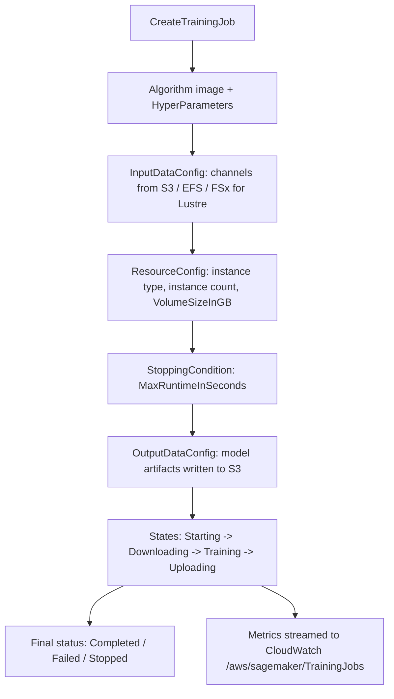
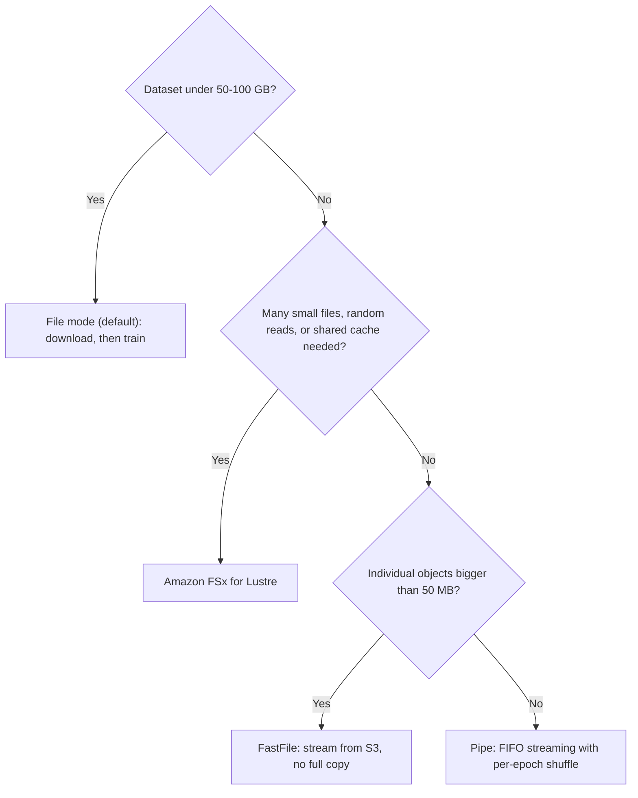
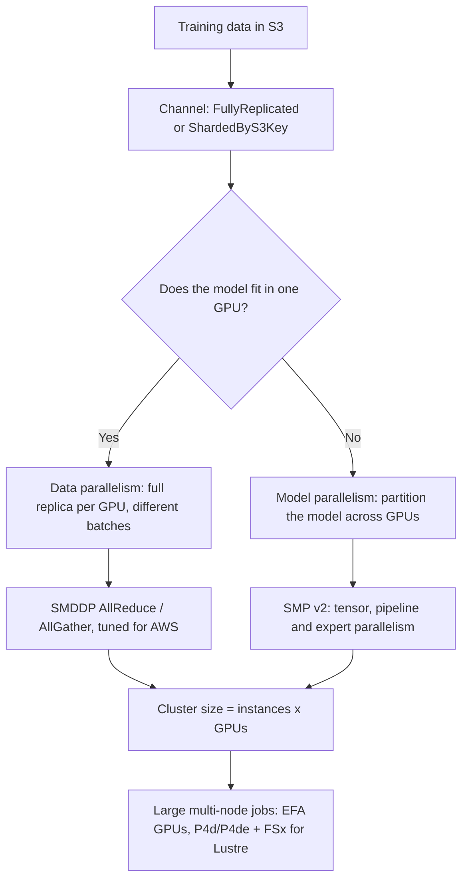
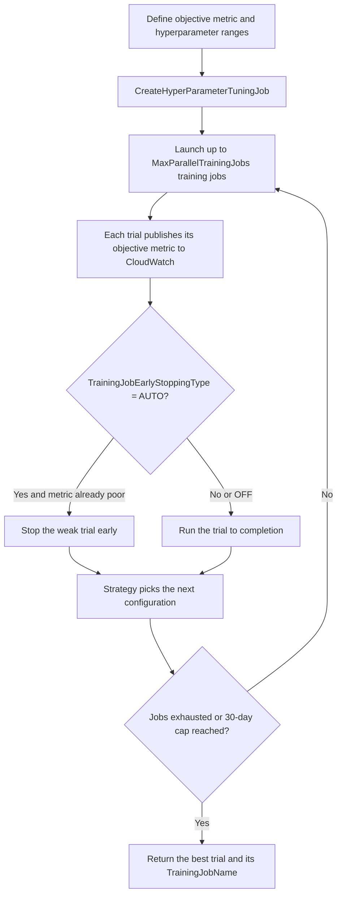
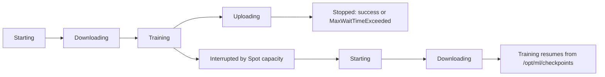

# Training and Hyperparameter Tuning on Amazon SageMaker

A training job is the most expensive object you create before a model ever serves a request — and it is the object the AIF-C01 exam asks you to reason about most precisely. Domain 1 carries **20%** of the scored content, and Task 1.3 names *"performing hyperparameter tuning or model optimization"* outright. The failure mode is never "you did not know SageMaker can train". It is that you chose **File mode** for a 600 GB dataset of small files, or you picked **Bayesian** when the requirement was *"reproduce the identical set of combinations on every re-run"*, or you enabled Spot without a checkpoint and then hit the undocumented-in-your-notes **3,600 second** wait cap.

```text
=====================================================================
 A SAGEMAKER TRAINING JOB, PIECE BY PIECE   (AIF-C01 Task 1.3)
=====================================================================
  AlgorithmSpecification ... training image + TrainingInputMode
  ResourceConfig ........... instance type, instance count,
                             VolumeSizeInGB (ML storage)
  StoppingCondition ........ MaxRuntimeInSeconds
  InputDataConfig .......... channels (S3 / EFS / FSx for Lustre)
  OutputDataConfig ......... model artifacts -> S3
  HyperParameters .......... your algorithm's knobs
  RoleArn .................. IAM role the job assumes
  CheckpointConfig ......... S3 URI for Spot resume (optional)
  EnableNetworkIsolation / EnableInterContainerTraffic ...
---------------------------------------------------------------------
  INPUT MODES (API enum):  File (default) | FastFile | Pipe
  TUNING STRATEGIES:       Bayesian (SDK default) | Random |
                           Grid | Hyperband
  SPOT SAVINGS FORMULA:    (1 - billable / training) x 100
  MONITORING:              CloudWatch /aws/sagemaker/TrainingJobs
=====================================================================
```

> [!NOTE]
> **How to read this lesson.** Every number below is an AWS-published limit taken from the SageMaker developer guide, the SageMaker API reference or an AWS pricing page. Where AWS publishes two different numbers for the same thing — it does for Spot savings and for the maximum tuning run time — both appear, and the preferred exam answer is flagged in section 12 and section 13.

By the end of this lesson you will be able to:

- name the **required fields** of `CreateTrainingJob` and explain what each one controls;
- choose between **File, FastFile and Pipe** input modes using AWS's own size thresholds, and configure **channels** (`s3_data_type`, `distribution`, `compression`, `record_wrapping`);
- select an **`ml.*` instance family** for training versus inference, and compute **cluster size** as instances × GPUs;
- decide between **data parallelism** and **model parallelism**, and name the AWS libraries (**SMDDP**, **SMP v2**) that implement them;
- run **Automatic Model Tuning** and pick the right **strategy**: Grid vs. Random vs. Bayesian vs. Hyperband;
- configure **Managed Spot Training** correctly (`MaxWaitTimeInSeconds ≥ MaxRuntimeInSeconds`) and compute the **actual savings** with the official formula;
- size a **checkpoint** workflow so an interrupted job resumes instead of restarting;
- read **CloudWatch** training metrics, and explain what **Debugger** and **Experiments** do — and that Debugger is closed to new customers;
- defend a **comparative verdict** on Grid vs. Random vs. Bayesian and on **managed training vs. do-it-yourself**;
- answer **ten exam-style questions** written in the official voice, including two cost calculations.

---

## 1. Anatomy of a SageMaker training job

### 1.1 The eight required pieces

`CreateTrainingJob` is a single API call, but it is a bundle of eight independent decisions. The exam tends to test them as "which of these is missing / misconfigured", so learn them as a checklist.

| Field | What it holds | What goes wrong when you get it wrong |
|---|---|---|
| `AlgorithmSpecification` | Training image URI, `TrainingInputMode`, entry point | Wrong container → the job never starts; wrong input mode → see section 2 |
| `ResourceConfig` | Instance type, instance count, `VolumeSizeInGB` | Volume too small → File mode fails on download; too few instances → OOM |
| `StoppingCondition` | `MaxRuntimeInSeconds` (default **1 day**, max **28 days**) | Default stops a runaway job in a day; total job life caps at **30 days** |
| `InputDataConfig` | One or more **channels** pointing at S3, EFS or FSx | Channel in another Region → the job cannot read it |
| `OutputDataConfig` | `S3OutputPath` for `model.tar.gz` | Artifacts land somewhere nobody looks |
| `HyperParameters` | String map of algorithm knobs | Keys the algorithm does not accept → immediate failure |
| `RoleArn` | IAM role assumed by the job | Missing `s3:GetObject` → silent access denied |
| `CheckpointConfig` | `S3Uri` for checkpoints | Absent → Spot interruptions force a full restart (section 7) |

Two limits are worth memorizing because they are cheap to recall and appear often: a single training job's `MaxRuntimeInSeconds` defaults to **1 day** and hard-stops at **28 days**, and across running plus waiting the job cannot exceed **30 days**. On stop, SageMaker sends **`SIGTERM`** and waits **120 seconds** for your code to flush — which is exactly the window your checkpoint handler has to work in.

### 1.2 The lifecycle a job actually goes through



### 1.3 What training costs, and how it is billed

SageMaker bills **per instance-second for partial instance-hours, with no minimum and no upfront commitment**. That matters more than any single hourly rate: a 90-second training job costs 90 seconds of an instance, not a full hour.

| Free-tier item (first 2 months) | Quantity | Rough equivalent |
|---|---|---|
| Notebook instances `ml.t3.medium` | **250 hours** | ~8.3 instance-days of interactive work |
| **Training** on `ml.m4.xlarge` / `ml.m5.xlarge` | **50 hours** | ~six 8-hour runs |
| Real-time inference | **125 hours** | ~4.2 days of hosting |

- **📚 Did you know?** The SageMaker free tier for training is **50 hours of `ml.m4.xlarge` or `ml.m5.xlarge`** in the first two months — enough for roughly six full working days of continuous CPU training, but only a handful of GPU runs. AWS labels the two-month window as a promotion on the pricing page, so confirm the terms before you budget a course around it.

---

## 2. Getting data into the job: input modes and channels

This is the highest-yield topic in the lesson. AWS documents exactly **three** input modes in the API enum — `File`, `FastFile` and `Pipe` — and the developer guide still calls File the **default**.

### 2.1 The three modes side by side

| Dimension | **File** (default) | **FastFile** | **Pipe** |
|---|---|---|---|
| Movement | Full dataset downloaded to ML storage **before** training starts | Objects are identified only; S3 is exposed as a POSIX filesystem and streamed on demand | S3 streamed into a FIFO pipe with high pre-fetch |
| Start latency | Highest — training waits for the whole copy | Low — no full copy | Low |
| Local space needed | **Whole dataset + artifacts** (`VolumeSizeInGB` must fit it) | Artifacts only | Artifacts only |
| Read pattern | Random or sequential (local disk) | Sequential best, random OK | Sequential; one reader per pipe |
| Manifests | Prefix, manifest, **augmented manifest** | **Prefix only** | Prefix / manifest, plus RecordIO and Gzip |
| Sharding / shuffle | `ShardedByS3Key` | Inherits the S3 layout | Managed sharding + per-epoch shuffle |
| Incremental training | **Supported — choose File** | Not stated | Not stated |
| Caveats | Overhead grows with file count; you must size the volume | Possible extra CloudTrail / KMS charges | AWS calls it "largely replaced by … fast file mode" |
| Best for | Small data (**< 50–100 GB**), local mode | Big files (**> 50 MB**, ideal **> 150 MB**) | Huge data where local disk is the constraint |

### 2.2 File mode: the default that silently costs you time

In File mode the training instance must have **enough storage space to fit the entire dataset** — that is a direct quote from the developer guide, and it is the mechanism behind the classic exam item: *"training starts only after a long data-transfer phase and the instance storage must hold the whole dataset."* Answer: **File**.

File mode is also the only mode the docs explicitly tie to **incremental training**, and it accepts all three `s3_data_type` values, including `AugmentedManifestFile`. Sharding across instances is done with `distribution = ShardedByS3Key`.

AWS's own sizing guidance: File mode suits datasets **below 50–100 GB**, and at the documented rate of **50 GB in about 5 minutes** with 100 MB shards, AWS advises serializing files smaller than **50 MB** into chunks of roughly **150 MB** (TFRecord or RecordIO).

**Worked example 1 — File-mode sizing (section 12, Example 1).** An 80 GB dataset in File mode needs a volume **≥ 80 GB** plus room for output. At AWS's rate the download takes about **8 minutes** before step one runs — roughly **21% of a 30-minute job** spent copying. Switch to FastFile, or shard with `ShardedByS3Key`.

### 2.3 FastFile: stream without copying

FastFile **identifies the objects but downloads nothing**. S3 is exposed as a POSIX filesystem and read on demand, so startup is fast and local space is only needed for artifacts. Two constraints to memorize: it accepts **prefix only** (no augmented manifest), and random reads work but **sequential reads are best**. Extra **CloudTrail and KMS** charges can apply because FastFile records object-level access.

### 2.4 Pipe: the original streaming mode

Pipe streams S3 objects into a **FIFO pipe** with high pre-fetch, keeps disk only for artifacts, and gives you managed **per-epoch shuffling**, **Gzip** compression and **RecordIO** wrapping. AWS now describes it as "largely replaced by … fast file mode", so on the exam Pipe is usually the *streaming* distractor when FastFile is the better answer, or the correct answer when the question mentions RecordIO/Gzip/per-epoch shuffle.

### 2.5 Channels: how objects are enumerated and split

A channel is one input to the job. Its configuration fields are where the exam hides detail.

| Field | Values | Meaning |
|---|---|---|
| `s3_data_type` | `S3Prefix` (default), `ManifestFile`, `AugmentedManifestFile` | How objects are enumerated |
| `distribution` | `FullyReplicated` (default), `ShardedByS3Key` | Full copy on every instance vs. shard across nodes |
| `input_mode` | `File` / `Pipe` / `FastFile` / unset | Per-channel override of the job-level `TrainingInputMode` |
| `compression` | `None`, `Gzip` | Gzip applies to Pipe mode |
| `record_wrapping` | `None`, `RecordIO` | RecordIO pipelines (MXNet-style) |
| `shuffle_config.seed` | Integer | Deterministic shuffling; in Pipe mode it re-shuffles each epoch |

Supported stores are **Amazon S3, Amazon EFS and Amazon FSx for Lustre** (plus S3 Express One Zone), and the dataset must live in the **same Region as the training job** — an S3 bucket in `us-west-2` feeding a job in `us-east-1` is not a supported pattern.

### 2.6 Choosing a mode, using AWS's thresholds



| Data shape | AWS's recommended path |
|---|---|
| < 50–100 GB, or incremental training | **File mode** |
| Files **> 50 MB**, ideally **> 150 MB**, start latency matters | **FastFile** |
| Large dataset, **many small files**, or **random** reads | **Amazon FSx for Lustre** |
| Huge data, local disk is the bottleneck, RecordIO/Gzip needed | **Pipe** |
| Data already in EFS or FSx for Lustre | Mount it; no S3 copy at all |

> [!WARNING]
> **The three input-mode traps that show up every exam cycle.**
> - **File mode is the default** — a question that describes a long pre-training transfer phase and a volume sized to the dataset is describing File, not Pipe.
> - **FastFile takes prefix only.** If the question mentions an **augmented manifest** (typical for RLHF-style or sentiment datasets built with SageMaker Ground Truth / contextual reinforcement), FastFile cannot be the answer.
> - **Region locality is unconditional.** Both the dataset and the checkpoint bucket must be in the training job's Region. Cross-Region reads are a distractor, never a solution.

---

## 3. Choosing compute: the `ml.*` instance families

### 3.1 The naming rule

Every SageMaker compute SKU is prefixed with **`ml.`**. That prefix is the exam's cheapest tell: if an option says `p4d.24xlarge` without the `ml.` when the context is a SageMaker training job or endpoint, it is describing EC2, not SageMaker. The families split cleanly by role.

| Family | Role | Verified examples | Notes |
|---|---|---|---|
| `ml.p5` | Training, top GPU scale | `ml.p5.48xlarge` — 8 × H100 | GA **4 Aug 2023**; 640 GB HBM, 192 vCPU, 2 TiB, 3,200 Gbps EFAv2 |
| `ml.p6` | Training, newest GPU | P6-B200 — 8 × Blackwell, 1,440 GB HBM | GA **6 Jun 2025** (`us-west-2`) |
| `ml.p4d` / `ml.p4de` | Training, distributed sweet spot | `ml.p4d.24xlarge` — 8 × A100 40 GB (p4de: 80 GB) | AWS's pick for multi-node + model parallelism (EFA) |
| `ml.p3` / `ml.p3dn` | Training, prior-generation GPU | 2xlarge / 8xlarge / 16xlarge / p3dn.24xlarge | 1 / 4 / 8 / 8 GPUs — same counts as EC2 p3 |
| `ml.g4dn` / `ml.g5` / `ml.g6` | Training **and** inference GPU | `ml.g4dn.xlarge` (default GPU notebook) | Training Compiler tested on G4dn and G5 |
| `ml.trn1` | **Training** on Trainium | `ml.trn1.*` (up to 16 devices) | PyTorch estimator; `torchrun` supported |
| `ml.m4` / `ml.m5` / `ml.c4` / `ml.c5` / `ml.t3` | CPU training and general | `ml.m4.xlarge`, `ml.c4.xlarge`, `ml.t3.medium` | Free tier: 50 h of m4/m5.xlarge training |
| `ml.inf1` / `ml.inf2` | **Inference only** (Inferentia) | `ml.inf2` (deployment) | **Not** a training family — a classic distractor |

### 3.2 The GPU hardware AWS publishes

| Instance | vCPU | Memory | GPU | Total GPU memory | Network |
|---|---|---|---|---|---|
| `ml.p5.48xlarge` | 192 | 2 TiB | 8 × H100 | 640 GB (80/GPU) | 3,200 Gbps EFAv2 |
| `ml.p4d.24xlarge` | 96 | 1,152 GB | 8 × A100 | 320 GB (40/GPU) | 400 Gbps ENA + EFA |
| `ml.p4de.24xlarge` | 96 | 1,152 GB | 8 × A100 | 640 GB (80/GPU) | 400 Gbps ENA + EFA |
| `ml.p3.16xlarge` | 64 | 488 GiB | 8 × V100 | 128 GB (16/GPU) | 25 Gbps NVLink |
| `ml.p3.8xlarge` | 32 | 244 GiB | 4 × V100 | 64 GB | 10 Gbps NVLink |
| `ml.p3.2xlarge` | 8 | 61 GiB | 1 × V100 | 16 GB | up to 10 Gbps |
| `ml.p3dn.24xlarge` | 96 | 768 GiB | 8 × V100 | 256 GB (32/GPU) | 100 Gbps |

### 3.3 Two sizing rules that decide your bill

**Rule 1 — scale the instance size before you add instances.** AWS's distributed-training guidance is explicit: a **single `ml.p3.16xlarge` beats two `ml.p3.8xlarge`** for the same 8 GPUs, because you pay for one interconnect instead of a network hop. Adding instances is what you do when one machine cannot hold the model or the data.

**Rule 2 — cluster size = instances × GPUs.** Two `ml.p3.16xlarge` nodes give you a **16-GPU** cluster, not 8. Every parallelism degree, batch-size calculation and communication cost in section 4 is derived from that product.

**Worked example 2 — distributed sizing (section 12, Example 2).** `ml.p3.16xlarge × 2` = 8 GPUs per node → cluster size **16**. AWS's published reference for a 70B-parameter LLM is **32 × `ml.p4d.24xlarge`** = **256 GPUs**, with sharded-data-parallel degree 256 and batch size 2; a 175B model needs **64 × `ml.p4d.24xlarge`**, while a 7B model fits on **1 × `ml.p4d.24xlarge`**.

- **📚 Did you know?** `ml.p5.48xlarge` ships **8 × H100 with 640 GB of total GPU memory** and **3,200 Gbps of EFAv2** networking — more network bandwidth than most racks had a decade ago, and the reason multi-node training on that family is bandwidth-bound rather than compute-bound. It reached general availability on **4 August 2023**, initially in `us-east-1` and `us-west-2`.

---

## 4. Distributed training: data parallelism vs. model parallelism

### 4.1 The one distinction the exam wants

| Strategy | What is split | When to use it | Mechanism |
|---|---|---|---|
| **Data parallelism** | The **data** — every GPU holds a full model replica, sees a different batch | Model fits on one GPU; you want throughput | Gradients are synchronized after each step (AllReduce) |
| **Model parallelism** | The **model** — it is partitioned across GPUs | The model **does not fit** in one GPU's memory | Tensor / pipeline / expert partitioning plus activation checkpointing |

The exam phrasing is usually a symptom: *"the model does not fit in a single GPU's memory, but the dataset is modest"* → **model parallelism**. The mirror image — *"the model trains fine on one GPU but the dataset is enormous"* → **data parallelism**.



### 4.2 The libraries AWS names

| Library | What it does | Notes |
|---|---|---|
| **SMDDP** (SageMaker Distributed Data Parallel) | AllReduce / AllGather collectives tuned for AWS networks | Backend for PyTorch DDP/FSDP and DeepSpeed |
| **SMP v2** (SageMaker Distributed Model Parallel) | Sharded data plus tensor, pipeline and expert parallelism; activation checkpointing and offloading | The path for models that do not fit on one device |
| Horovod, `torchrun`, MPI, parameter server | Framework-level alternatives | Still documented; not AWS-specific |

For **large multi-node jobs**, AWS's guidance converges on the same stack every time: **EFA-enabled GPUs, ideally `ml.p4d`/`ml.p4de` (A100) or newer, plus Amazon FSx for Lustre** for the dataset. EFA matters because it bypasses the OS network stack; FSx matters because a thousand small files read over S3 will starve 256 GPUs.

**Worked example 3 — how much model fits where (section 12, Example 3).** AWS's published references: Llama 2 **7B → 1 × `ml.p4d.24xlarge`**; Llama 2 **70B → 32 × `ml.p4d.24xlarge`**; **175B → 64 ×**; **GPT-2 10B → 16 ×**. Read them as a rule of thumb: parameter count, not dataset size, drives the instance count once you cross single-GPU capacity.

---

## 5. Automatic Model Tuning: what a tuning job does

### 5.1 The idea in one sentence

**Automatic Model Tuning (AMT)** runs many training jobs over the hyperparameter ranges you supply and keeps the one that performs best on your **objective metric**. You define ranges; SageMaker runs the search; you get the best trial back.

The exam calls this *"hyperparameter tuning or model optimization"* and it is squarely inside Task 1.3.

### 5.2 The tuning-job flow



### 5.3 Ranges, scaling and the objective metric

Hyperparameter ranges are typed and scaled. `Auto`, `Linear`, `Logarithmic` and `ReverseLogarithmic` are the four scaling options, and each has a domain rule worth knowing because it is a free correctness check on the exam:

| Scale | Use it for | Domain rule |
|---|---|---|
| `Auto` | Default when you have no reason to choose | Any valid range |
| `Linear` | Parameters whose effect is proportional (batch size, drop-out in a narrow band) | Any valid range |
| `Logarithmic` | Learning rate, momentum — values spanning orders of magnitude | Value must be **> 0** |
| `ReverseLogarithmic` | Parameters that cluster near the top of the range | **0 ≤ x < 1** |

`TrainingJobEarlyStoppingType` is **`OFF`** by default and can be set to **`AUTO`** to stop trials that are clearly not going to win. **Warm start** reuses the parent trials of a previous tuning job, which cuts both cost and wall-clock time when you extend a search rather than restart it.

### 5.4 The limits you should be able to recite

| Resource | Default | Increase to |
|---|---|---|
| Concurrent tuning jobs (account) | **100** | — |
| Hyperparameters per tuning job | **30** | — (fewer is faster) |
| Metrics per tuning job | **20** | — |
| Parallel training jobs per tuning job | **10** | **100** |
| Training jobs per tuning job (Bayesian / Hyperband / Grid) | **750** | — |
| Training jobs per tuning job (**Random**) | **750** | **10,000** |
| Maximum tuning-job run time | **30 days** | — |
| Values per categorical parameter | **30** | — |

Two consequences follow immediately. First, AWS advises keeping the hyperparameter count **well under the 30 cap** — each extra dimension dilutes the search. Second, `RandomSeed` makes a Random or Hyperband search **up to 100% reproducible**, which is the mechanism behind the "reproduce identical combinations" exam item.

**Worked example 4 — tuning budget and quota arithmetic (section 12, Example 4).** `MaxNumberOfTrainingJobs = 20`, one hour each on `ml.g4dn.12xlarge` at AWS's published **$4.89/h** → **20 × $4.89 = $97.80**. With `MaxParallelTrainingJobs = 10` you run **2 waves ≈ 2 hours** instead of 20. Pushing to 100 jobs costs **$489** with no guarantee of better accuracy. Separately, AWS's own quota example: **10 tuning jobs × 100 training jobs × 20 concurrent** on `ml.m4.xlarge` passes the 100-concurrent-tuning and 750-job limits, but needs a raise for **20 concurrent training jobs** (default 10) and **200 `ml.m4.xlarge` instances** (default 20).

- **📚 Did you know?** A SageMaker tuning job is not a separate compute product — it is an **orchestrator** that creates ordinary training jobs and watches their CloudWatch metrics. That is why tuning-job quotas are expressed both in *tuning jobs* (100 concurrent) and in *training jobs* (10 parallel, 750 total): you are metered on the same instance-seconds either way.

---

## 6. Tuning strategies: Grid vs. Random vs. Bayesian vs. Hyperband

This is the comparison the exam asks you to make under time pressure. Learn the row that differs, not the whole table.

### 6.1 The full comparison

| Dimension | **Bayesian** (SDK default) | **Random** | **Grid** | **Hyperband** |
|---|---|---|---|---|
| How it picks | Regression over prior trials | Random draws, **ignores** prior results | Every distinct categorical combination | Multi-fidelity: reallocates epochs, stops weak jobs |
| Parallelism | Low — sequential, "cannot massively scale" | **Maximum** (independent jobs) | Moderate (exhaustive sweep) | Many parallel jobs |
| Parameter types | int / continuous / categorical | int / continuous / categorical | **categorical only** | As the algorithm allows |
| Jobs allowed | 750 (fixed) | 750 → **10,000** | Auto-computed = number of combinations | 750 (fixed) |
| Reproducibility | Seed improves it | Same seed → **up to 100%** | Identical by design | Same seed → **up to 100%** |
| Algorithm constraint | Any | Any | Any (with categorical ranges) | **Iterative only** — XGBoost and RCF yes; trees and k-NN no |
| Best when | Limited budget, learning between runs | Large parallel search, time-boxed | Audits, even coverage, re-runs | Long iterative deep-learning jobs |
| AWS-cited edge | Best use of a small budget | "Largest number of parallel jobs" | Determinism | Up to **3× faster** than Bayesian (AWS claim) |

### 6.2 Grid: deterministic, categorical, combinatorial

Grid enumerates every distinct combination of the categorical values you give it, and SageMaker computes the job count automatically — you should set `MaxNumberOfTrainingJobs` to that number. It is the strategy for **reproducing results** and for even coverage of a search space.

**Worked example 5 — Grid job count (section 12, Example 5).** Two categorical parameters with **5** and **4** values → 5 × 4 = **20** combinations → SageMaker creates **20** training jobs. Add a third parameter with **3** values → **60** jobs. Grid explodes combinatorially, which is exactly why AWS steers large search spaces to Bayesian or Random.

### 6.3 Random: maximum parallelism, zero learning

Because Random **ignores prior results**, every trial is independent and the strategy supports the largest number of parallel training jobs of any strategy. It is also the only strategy whose job cap can be raised from **750 to 10,000**, and with a fixed `RandomSeed` it reproduces the identical sequence of configurations.

### 6.4 Bayesian: the SDK default, and a sequential optimizer

Bayesian builds a regression model over the trials completed so far and proposes the next configuration where improvement looks most likely. That makes it the **best use of a small budget** and the **default in the SageMaker SDK's `HyperparameterTuner`** — but it also makes it sequential: trial *n+1* depends on trial *n*, so AWS states it **cannot massively scale** in parallel.

### 6.5 Hyperband: multi-fidelity, iterative algorithms only

Hyperband reallocates epochs between successive rounds, stops weak jobs early and runs many jobs in parallel. The hard constraint is the algorithm: it needs **iterative** algorithms that can be meaningfully judged part-way through. **XGBoost and Random Cut Forest qualify; decision trees and k-NN do not.** AWS markets it as up to **3× faster** than Bayesian — that figure comes from an AWS *what-is* page, so cite it as an AWS claim rather than a reproduced benchmark.

> [!WARNING]
> **Strategy selection, reduced to four sentences.**
> - Must reproduce the **identical set** of combinations on every re-run, **categorical only** → **Grid**.
> - Need the **largest number of independent parallel jobs** → **Random**.
> - Small budget, mixed int/continuous/categorical ranges, default path → **Bayesian**.
> - Long deep-learning jobs on an **iterative** algorithm and you need speed → **Hyperband** — but never Hyperband for k-NN or a tree model.

---

## 7. Managed Spot Training and checkpoints

### 7.1 What it is

**Managed Spot Training** runs your training job on EC2 **Spot** capacity with SageMaker managing the interruptions for you. AWS launched it on **26 August 2019** and has published two different savings figures for it ever since — both are AWS-published, and both appear in exam material:

| Source | Claim |
|---|---|
| SageMaker developer guide (`model-managed-spot-training`) | Savings **up to 90%** |
| `CreateTrainingJob` API reference | Savings **up to 80%** |
| AWS News Blog launch demo (2019) | 837 billable of 2,423 seconds → **65%** actual |
| AWS ML Blog customer story (2020) | **70%** EC2 cost cut, **+40%** daily jobs completed |

### 7.2 The official formula — and the only calculation you need

$$
\text{Savings (\%)} = \left(1 - \frac{\text{BillableTimeInSeconds}}{\text{TrainingTimeInSeconds}}\right) \times 100
$$

**Worked example 6 — Spot savings math (section 12, Example 6).** A job runs for **500 seconds** and is billed for **100 seconds**:

$$
(1 - 100/500) \times 100 = 80\%
$$

The AWS launch blog's demonstration job ran **2,423 seconds** and was billed for **837** → $(1 - 837/2423) \times 100 \approx \mathbf{65\%}$. Compute it per job; never assume one number.

**Worked example 7 — On-Demand vs. Spot for one GPU run (section 12, Example 7).** AWS-published `ml.g4dn.12xlarge` = **$4.89/h**. Two hours On-Demand = **$9.78**. If only **36 of 120 wall-clock minutes** are billable on Spot: $0.6 \times 4.89 \approx$ **$2.93** — about **70% saved**, matching the Cinnamon AI customer story.

```plot
{
  "type": "line",
  "title": "Spot savings as a function of the billable fraction",
  "data": [
    {"billableShare": 0.1, "savings": 90},
    {"billableShare": 0.2, "savings": 80},
    {"billableShare": 0.35, "savings": 65},
    {"billableShare": 0.5, "savings": 50},
    {"billableShare": 0.65, "savings": 35},
    {"billableShare": 0.8, "savings": 20},
    {"billableShare": 1.0, "savings": 0}
  ],
  "xKey": "billableShare",
  "yKey": "savings",
  "xLabel": "BillableTimeInSeconds / TrainingTimeInSeconds",
  "yLabel": "Savings (%)"
}
```

### 7.3 The two configuration rules

| Rule | Value | Why |
|---|---|---|
| `MaxWaitTimeInSeconds` vs. `MaxRuntimeInSeconds` | Wait **≥** runtime | AWS's hard requirement; otherwise Spot cannot be used |
| Non-checkpointing built-in / Marketplace algorithms | `MaxWaitTimeInSeconds` capped at **3,600 s** | Without checkpoints an interrupted job must restart, so AWS caps the wait |
| Checkpointing algorithms | No 3,600 s cap — AWS's own demo used **48 hours** | Resume makes long waits worthwhile |
| Graceful shutdown | `SIGTERM`, then **120 s** | Your checkpoint code must finish inside that window |

**Worked example 8 — Spot configuration (section 12, Example 8).** A 6-hour checkpointing job: `MaxRuntimeInSeconds = 21,600` and `MaxWaitTimeInSeconds` **larger than that** (AWS's demo used 48 h = 172,800 s), plus `CheckpointConfig.S3Uri`. Run the same 6-hour job **without** checkpointing and the wait cap is **3,600 s** — so you either add checkpointing or run On-Demand.

### 7.4 Checkpoints: resume, not restart

| Property | Verified behavior |
|---|---|
| Local path | **`/opt/ml/checkpoints`** |
| Persisted to | `CheckpointConfig.S3Uri` |
| Restored | **At job start** — the job resumes, it does not restart |
| Files copied to S3 *after* the job started | **Not** pulled back in on resume |
| Deletes locally | Propagate to S3 |
| Bucket location | Must be in the **same Region** as the job |
| Resume in the SDK | A **new estimator** pointed at the **same `checkpoint_s3_uri`** |

### 7.5 What an interrupted job actually looks like



The documented state machine is `Starting → Downloading → Training → Uploading`, with `Interrupted → Starting → …` loops in the middle and a terminal `Stopped: MaxWaitTimeExceeded` when the wait budget runs out before the job finishes.

```fillblank
{
  "question": "Complete the official Managed Spot Training savings formula:",
  "template": "Savings (%) = (1 - {{1}} / {{2}}) x 100. A job with 100 billable seconds out of 500 training seconds saved {{3}}%.",
  "answers": {
    "1": "BillableTimeInSeconds",
    "2": "TrainingTimeInSeconds",
    "3": "80"
  },
  "distractors": ["MaxWaitTimeInSeconds", "MaxRuntimeInSeconds", "65", "90"],
  "explanation": "AWS documents savings as (1 - BillableTimeInSeconds / TrainingTimeInSeconds) x 100, and its own worked example of 100 billable seconds out of 500 training seconds yields 80%. 65% is the figure from the 2019 launch blog job (837 of 2,423 seconds), and 90% / 80% are the headline ranges from the developer guide and the API reference respectively — neither is a per-job result."
}
```

---

## 8. Observing the run: metrics, Debugger and Experiments

### 8.1 Where the numbers go

Training metrics are published to **Amazon CloudWatch** under the namespace **`/aws/sagemaker/TrainingJobs`**, and the SageMaker console's **Training jobs → Monitor** view graphs them. This is the answer whenever a question asks how you know whether a job is converging, diverging or thrashing the GPU.

### 8.2 Debugger: tensors, rules and actions

| Capability | What it watches | What it can do |
|---|---|---|
| Tensor collection | Gradients, activations, parameters | Detect vanishing/exploding gradients, loss spikes |
| System metrics | GPU utilization, memory, I/O | Spot a starved input pipeline |
| **Built-in rules** | Pre-trained heuristics | Trigger actions: **`StopTraining()`**, **`Email()`**, **`SMS()`** |
| Custom rules | Your own Python | Billed for instance time |
| Pricing | Built-in rules **free**; custom rules bill instance time | — |
| **Status (2026)** | **No longer open to new customers** | Existing customers keep access |

So the exam item *"automatically stop the training job when a vanishing-gradient rule fires and email the team"* resolves to **Debugger built-in actions** — with the caveat that Debugger is closed to new customers.

### 8.3 SageMaker Experiments

**Experiments** tracks every trial and run — the hyperparameters used, the metrics produced, the artifacts written — so you can compare runs side by side. Debugger output can be routed to **TensorBoard** for visualization. Experiments is the "which of my 20 runs was best, and with what settings" answer; Debugger is the "what is happening inside this run right now" answer.

> [!WARNING]
> **Availability traps in the monitoring stack.**
> - **Debugger is closed to new customers.** Existing accounts keep it; a brand-new account cannot start using it. Built-in rules are free, custom rules bill instance time.
> - **Experiments (Classic)** is tied to Studio Classic and AWS points new work at managed **MLflow**. Do not build a new architecture on Experiments Classic without re-checking the current documentation.
> - Metrics in **`/aws/sagemaker/TrainingJobs`** are available regardless — CloudWatch is the always-correct answer for "where do training metrics go".

---

## 9. Paths that skip the training loop entirely

### 9.1 JumpStart: pre-trained models you can fine-tune

**JumpStart** is SageMaker's hub of pre-trained open-source models drawn from **TensorFlow Hub, PyTorch Hub, Hugging Face and GluonCV**. Two numbers matter for the exam: it covers **15 problem types**, of which **8 are trainable** — meaning you can do incremental training / fine-tuning on them — and it integrates with **Automatic Model Tuning**.

### 9.2 Autopilot: AutoML for tabular (and, via v2, more)

| Stage | What Autopilot does |
|---|---|
| 1 | Analysis of the dataset |
| 2 | Problem-type classification |
| 3 | Algorithm shortlist — **gradient-boosted decision trees, feedforward deep neural networks, logistic regression** |
| 4 | Preprocessing and feature selection |
| 5 | **Hyperparameter optimization (HPO)** |
| 6 | Train, rank, optionally auto-deploy plus a Clarify report |

Scope: **tabular data up to hundreds of gigabytes**; **text, image and forecasting** tasks plus LLM fine-tuning are handled through the **AutoML v2 API**. The UI moved into **SageMaker Canvas on 30 November 2023**, so no-code users go to Canvas and Autopilot remains the API path.

### 9.3 Choosing a starting point

| You have | Best first move |
|---|---|
| No model, a public problem type, want a baseline fast | **JumpStart** |
| A labelled tabular dataset, no ML engineer | **SageMaker Canvas** (Autopilot under the hood) |
| A labelled dataset and you want the API | **Autopilot / AutoML v2 API** |
| A custom algorithm and your own container | **Training job** |
| A search space around a working training job | **Automatic Model Tuning** |
| Budget for many attempts at low cost | **Managed Spot Training** + checkpoints |

- **📚 Did you know?** Autopilot's algorithm shortlist is deliberately small — gradient-boosted trees, a feedforward DNN and logistic regression — because AutoML is a *selection and tuning* engine, not a research lab. The HPO stage it runs internally is the same Automatic Model Tuning machinery described in section 5, which is why the two share quota language.

---

## 10. Comparative verdict: strategies and managed vs. DIY

### 10.1 Managed training vs. building it yourself

| Dimension | **Managed (SageMaker training jobs, AMT, Spot)** | **DIY (EC2 / ECS / EKS self-managed)** |
|---|---|---|
| Infrastructure | Instance type, count, volume — no OS work | OS, drivers, CUDA, framework images, patching |
| Interruptions | Managed Spot with checkpoint resume | You build the preemption handler |
| Tuning | AMT with four strategies, warm start, early stopping | Your own sweep script and scheduler |
| Metrics | CloudWatch `/aws/sagemaker/TrainingJobs` out of the box | You instrument and aggregate |
| Debugger / Experiments | Built-in (Debugger closed to new customers) | Your own profilers and tracking store |
| Data staging | File / FastFile / Pipe, EFS, FSx for Lustre | You wire the storage layer |
| Billing | Per second, no minimum, Savings Plans up to **64%** | Per second on the underlying instance + your labor |
| Best when | Speed, governance, and AWS-native integration matter | Hardware/driver control SageMaker cannot expose |

### 10.2 Tuning strategy at a glance

| Requirement | Strategy |
|---|---|
| Reproduce the identical combinations every re-run, categorical only | **Grid** |
| Largest number of independent parallel jobs | **Random** |
| Best use of a small budget; SDK default | **Bayesian** |
| Long iterative deep-learning jobs, speed matters | **Hyperband** |

> [!IMPORTANT]
> **Comparative Verdict**
> - **Grid vs. Random vs. Bayesian:** **Grid** is the only strategy that *guarantees* an identical, evenly covered set of combinations on every re-run — and the only one restricted to **categorical** parameters, with its job count computed automatically as the number of distinct combinations (5 × 4 = 20 jobs; add a third parameter with 3 values and you are at 60). **Random** ignores prior results, which is precisely why AWS calls it the strategy that runs the *largest number of parallel jobs*, and why it is the only one whose cap can be raised from 750 to **10,000** — with a fixed `RandomSeed` it is up to **100% reproducible**. **Bayesian** is the SDK default and the best use of a small budget, but it is sequential — a regression over prior trials — so AWS states it "cannot massively scale". Pick **Grid** for audits and determinism, **Random** for breadth and wall-clock speed, **Bayesian** when every training hour is expensive and the search space mixes int, continuous and categorical ranges. **Hyperband** sits outside this triangle: it is multi-fidelity and needs an **iterative** algorithm, so it is the speed play for XGBoost/RCF and is off the table for trees and k-NN.
> - **Managed training vs. DIY:** managed training wins on **time to first result, interruption handling, quota and metrics plumbing, and AWS-native integration**, and it costs the same per instance-second as the EC2 underneath it — you are not paying a premium for the orchestration, you are not paying for idle, and per-second billing with no minimum means a 90-second job costs 90 seconds. Choose DIY (EC2/ECS/EKS) only when you need control SageMaker does not expose: kernel-level tuning, specialty drivers, a non-supported framework build, or an existing Kubernetes estate you must not fork. A notebook with a shell script is not an alternative in either column — it cannot prove which hyperparameters produced a given model, cannot resume after an interruption, and cannot be re-run by anyone else. The exam's default answer is the managed path unless a question names a concrete control requirement.

---

## 11. Limits, quotas and cost evidence in one place

### 11.1 Published limits and benchmarks

| Item | Number | Source |
|---|---|---|
| Input modes (API enum) | `Pipe`, `File` (default), `FastFile` | Developer guide |
| File-mode guidance | < **50–100 GB**; 50 GB ≈ **5 min** at 100 MB shards | Best-practices guide |
| FastFile guidance | Files **> 50 MB** (ideal **> 150 MB**); no augmented manifest | Developer guide |
| AMT hyperparameters / metrics / categorical values | **30 / 20 / 30** | AMT limits |
| AMT parallel tuning jobs / parallel training jobs | **100** / **10 → 100** | AMT limits |
| AMT training jobs per tuning job | **750** (Random → **10,000**) | AMT limits |
| AMT maximum run time | **30 days** | AMT limits |
| Hyperband vs. Bayesian | Up to **3× faster** (AWS claim) | AWS what-is page |
| Spot savings claim | **90%** (guide) / **80%** (API) | Developer guide / API reference |
| Non-checkpointing Spot wait cap | **3,600 s** | Developer guide |
| Model-parallel reference | Llama 2 70B → **32 × `ml.p4d.24xlarge`**; 175B → **64 ×** | Best-practices guide |
| Training free tier | **50 h** of `m4.xlarge`/`m5.xlarge`, first 2 months | Pricing page |
| Published price datapoint | `ml.g4dn.12xlarge` **$4.89/h** | AWS Canvas pricing page |
| Training job runtime | default **1 day**, max **28 days**, **30 days** total | API reference |
| Graceful stop | `SIGTERM` + **120 s** | Developer guide |

### 11.2 Cost evidence

| Evidence | Number |
|---|---|
| Savings formula | $(1 - \text{billable} / \text{training}) \times 100$ |
| Launch claim (2019) | "up to **90%**" |
| Launch demo job (2019) | 837 / 2,423 s → **65%** |
| Customer outcome (2020) | **70%** EC2 cost cut, **+40%** daily jobs |
| re:Invent cost deck (2024) | Spot up to **90%**; Savings Plans up to **64%**; instance-family choice **25–35%** |
| Billing granularity | Per second for partial instance-hours, no minimum, no upfront |

### 11.3 2025–2026 Updates

Every number in sections 1–10 comes from AWS pages checked on **6 October 2026**. What actually moved in 2025–2026 is mostly **availability**, not arithmetic: the product was renamed, a whole band of SageMaker features around the training loop was placed into maintenance, and the exam guide was revised. Availability changes matter on the exam because a feature that is closed to new customers can be the wrong answer even when the developer guide still documents it in full.

| Update | Date | What AWS published | Why it matters for training / tuning |
|---|---|---|---|
| "Amazon SageMaker" → **Amazon SageMaker AI** | 3 Dec 2024 | "the current Amazon SageMaker has been renamed to Amazon SageMaker AI", announced together with next-gen SageMaker (Unified Studio, Catalog, Lakehouse, zero-ETL) | Exam prose still says "SageMaker"; the product name is now SageMaker AI |
| **Model Monitor, Clarify, Ground Truth, A2I, Debugger, Role Manager, Geospatial, Studio Lab, Mechanical Turk, Profiler** closed to new customers | **30 Jul 2026** | SageMaker AI End of Support Notice: "no longer open to new customers starting July 30, 2026" | State is **maintenance**, not shutdown: existing accounts keep the feature, no new features are planned |
| SageMaker **Ground Truth Plus** end of support | **30 Jun 2026** | End-of-support announcement | Ground Truth itself remains for labelling |
| SageMaker **Mechanical Turk** end of support | **30 Sep 2026** (What's New post: 29 Sep) | Two AWS pages disagree by one day | Ground Truth or a third-party labeller |
| SageMaker **Profiler** end of support | **30 Jun 2027** | Planned sunset | Do not start new profiling work on it |
| **Model Monitor** replacement guidance | 30 Jul 2026 | CloudWatch metrics and anomaly detection, Amazon Evidently, EventBridge + Lambda, SHAP | CloudWatch stays the metrics answer (section 8) |
| **Clarify** replacement guidance | 30 Jul 2026 | Amazon Bedrock Model Evaluations, SHAP, Bedrock Guardrails | Bias and evaluation questions increasingly point at Bedrock |
| **Amazon Forecast** closed to new customers | 29 Jul 2024 | Migrate existing usage to **SageMaker Canvas** | Reinforces section 9: Canvas is the no-code destination |
| **AIF-C01 exam guide v1.1** | **30 Apr 2026** (v1.0: 26 Mar 2026) | Seven new objectives — 1.2.6 traditional ML vs. FM, 2.1.4 token-based pricing, 2.1.5 context engineering, 2.1.6 agentic AI / MCP, 3.2.5 Prompt Management, 3.4.5 business metrics, 5.1.5 hallucination detection; **SageMaker JumpStart** added in scope, Amazon MemoryDB removed | Task 1.3 ("performing hyperparameter tuning or model optimization") and Domain 1's **20%** weight are unchanged; format stays 65 questions, 90 minutes, pass **700/1000** |

AWS's own lifecycle vocabulary (AWS General Reference, *Service lifecycle*) is worth learning because it tells you what "closed" actually means: **Maintenance** = no new customers, no new features, still supported; **Sunset** = a planned end of operations, typically about 12 months out; **Full Shutdown** = removed from the portfolio. Every SageMaker item on the 30 July 2026 notice sits in the first state, not the third — which is exactly why this lesson keeps Debugger in section 8 with a date attached instead of deleting it.

- **📚 Did you know?** AWS states that exam-guide changes appear on the live exam about **one month after publication** — so the v1.1 objectives published **30 April 2026** became examinable from roughly **late May 2026**. That same revision put **SageMaker JumpStart** on the in-scope service list (section 9.1 of this lesson), dropped Amazon MemoryDB, and left the exam's arithmetic untouched: **65 questions (50 scored + 15 unscored), 90 minutes, USD 100, pass 700/1000, three-year validity**, with domains weighted **20 / 24 / 28 / 14 / 14**.

---

## 12. Worked AWS examples with numbers

**Example 1 — File-mode sizing.** 80 GB dataset, File mode → volume **≥ 80 GB** plus output headroom. At AWS's documented rate (50 GB ≈ 5 min at 100 MB shards) the copy takes ≈ **8 minutes**, about **21% of a 30-minute job**, before the first training step. Fix: FastFile, or `distribution = ShardedByS3Key`.

**Example 2 — Distributed sizing.** `ml.p3.16xlarge × 2` → 8 GPUs/node → cluster size **16**. AWS guidance: try the **larger single node first** (1 × 16xlarge beats 2 × 8xlarge for the same 8 GPUs). Reference scale: 7B → **1 × `ml.p4d.24xlarge`**, 70B → **32 ×** (256 GPUs, sharded-data-parallel degree 256, batch 2), 175B → **64 ×**.

**Example 3 — Model fit drives instance count.** Parameter count, not dataset size, decides the node count once you cross single-GPU memory: 8 × A100 40 GB = **320 GB** on one `ml.p4d.24xlarge`, 8 × H100 = **640 GB** on one `ml.p5.48xlarge`. If the model plus optimizer state exceeds the device, no amount of data parallelism helps — you need **model parallelism** (SMP v2).

**Example 4 — Tuning budget and quota arithmetic.** `MaxNumberOfTrainingJobs = 20` × 1 h × `ml.g4dn.12xlarge` @ **$4.89/h** = **$97.80**; with `MaxParallelTrainingJobs = 10` → **2 waves ≈ 2 h** instead of 20 h. At 100 jobs the bill is **$489** with no accuracy guarantee. AWS's quota example: 10 tuning jobs × 100 training jobs × 20 concurrent → passes the 100 tuning-job and 750 training-job limits, but needs raises for **20 concurrent training jobs** (default 10) and **200 `ml.m4.xlarge` instances** (default 20).

**Example 5 — Grid job count.** 5 values × 4 values = **20** jobs. Add a third parameter with 3 values → **60** jobs. Grid grows multiplicatively; that is the argument for Bayesian or Random on any non-trivial space.

**Example 6 — Spot savings.** 500 s training, 100 s billed → $(1 - 100/500) \times 100 = \mathbf{80\%}$. Launch blog job: 837 / 2,423 → ≈ **65%**. The same job at a 90% billable fraction would save only 10% — savings is a per-job measurement, never a fixed discount.

**Example 7 — On-Demand vs. Spot.** `ml.g4dn.12xlarge` at AWS's published **$4.89/h**: 2 h On-Demand = **$9.78**. Spot with 36 billable minutes of 120 → $0.6 \times 4.89 \approx$ **$2.93**, i.e. ≈ **70% saved**.

**Example 8 — Spot + checkpoint configuration.** 6-hour job: `MaxRuntimeInSeconds = 21,600`, `MaxWaitTimeInSeconds` **greater** (AWS's demo used 48 h), plus `CheckpointConfig.S3Uri` and code writing to **`/opt/ml/checkpoints`**. Same job with a built-in algorithm and **no** checkpointing → wait capped at **3,600 s** → run On-Demand instead.

- **📚 Did you know?** SageMaker bills training **by the second with no minimum**, so the cheapest failed experiment is a fast one. That is the real argument behind `TrainingJobEarlyStoppingType = AUTO`: stopping a hopeless trial at minute 12 instead of minute 60 is a 5/6 reduction in that trial's bill, and with up to **100 parallel training jobs** per tuning job those savings multiply across the whole search.

---

## 13. Conflicting, unverified and non-examinable facts

Separate what AWS *documents* from what AWS *markets*. Keep this table out of your memorization set except where it is marked "use for the exam".

| Claim | What the sources say | How to handle it |
|---|---|---|
| Spot savings | Developer guide **"up to 90%"** vs. `CreateTrainingJob` API **"up to 80%"** | Both AWS-published; expect "up to 80–90%", and always compute the real number with the formula |
| Spot discount per instance / Region | Varies by AZ and time; AWS publishes only the ranges + formula | Never memorize a per-instance discount |
| Maximum tuning run time | Limits page says **30 days**; `API_ResourceLimits` shows `MaxRuntimeInSeconds` up to **15,768,000 s** (≈ 182.5 days) | **Use 30 days for the exam** |
| Grid in the console | One console walkthrough lists only "random, Bayesian, or Hyperband"; CLI/API accept `Grid` | Grid is valid — API/CLI are normative |
| Hyperband "3× faster" | From an AWS *what-is* marketing page, not the developer-guide chapter | Cite as an AWS claim, not a benchmark |
| `ml.p3.2xlarge` hourly price | Third-party trackers quote **$3.825/h** — unconfirmed | Do not memorize; pricing pages render client-side |
| `ml.g4dn.12xlarge` = **$4.89/h** | AWS-published on the Canvas pricing page | Usable in calculations, but may change |
| JumpStart model count | Models delisted **13 Mar 2026**; no fixed count verified | Use **15 problem types / 8 trainable** (docs table) and expect it to drift |
| "Automatic Model Training" as a product | AWS's formal name is **Automatic Model Tuning (AMT)**; "automatic model training" is prose in Autopilot docs | There is no such service |
| Experiments (Classic) status | Studio Classic-only; AWS points new work to managed MLflow | Re-check before designing around it |
| `ml.g6` / `ml.p6e` Region matrix | Names appear in pricing and What's New pages; full Region list not retrieved | Do not assert Regions |
| Free-tier terms (50 h training) | "First 2 months" promotion on the pricing page | Confirm before quoting |

Primary sources for this lesson: the SageMaker **developer guide** pages `model-access-training-data`, `model-access-training-data-best-practices`, `automatic-model-tuning{,-how-it-works,-considerations,-limits}`, `multiple-algorithm-hpo-create-tuning-jobs`, `model-managed-spot-training{,-status}`, `model-checkpoints{,-resume}`, `distributed-training{,-get-started,-scenarios}`, `model-parallel-intro-v2`, `model-parallel-best-practices-v2`, `train-debugger`, `debugger-debug-training-jobs`, `debugger-built-in-actions`, `experiments-mlops`, `view-train-metrics`, `cmn-info-instance-types`, `jumpstart-models`, `studio-jumpstart`, `use-auto-ml`, `autopilot-automate-model-development`; the **API reference** `API_CreateTrainingJob`, `API_AlgorithmSpecification`, `API_Channel`, `API_HyperParameterTuningJobConfig`, `API_ResourceLimits`, `API_StoppingCondition`; **boto3** `create_training_job` / `describe_training_job`; the SageMaker **SDK** `HyperparameterTuner`; the **AIF-C01 Exam Guide**; and the SageMaker **pricing** pages.

---

## 14. Real-World Case Studies

AWS publishes few customer stories about *training* as such — the billable moment is rarely photogenic — so these four are the training-and-tuning half of the AWS case-study record: each one names its services, its numbers and its source, and each maps back onto a section above. Read every percentage as a **customer- or AWS-claimed, unaudited** figure, and read "up to" as a ceiling.

### 14.1 The four stories

**HAYAT HOLDING — Automatic Model Tuning on a live production line (manufacturing, 2023).** The MDF-panel maker had built its own ML environments and described them as "time-consuming and cumbersome". The published architecture runs **194 sensors** over OPC-UA into an AWS IoT Greengrass **SiteWise Edge Gateway**, then **SageMaker Model Training + Automatic Model Tuning + Model Deployment**, with **SageMaker Edge Manager** serving the resulting model on the device. Reported outcome: **$300,000 per year** saved, alongside higher quality and optimised output. This is section 5 in production — manual hyperparameter sweeps replaced by AMT across 194 inputs — with the deployment target an edge device rather than an endpoint. Source: AWS Machine Learning Blog, `blogs/machine-learning/hayat-holding-uses-amazon-sagemaker-to-increase-product-quality-and-optimize-manufacturing-output-saving-300000-annually` (2023).

**RareJob — managed Spot training instead of a queue (EdTech, 2020).** Speaking-test scoring (PROGOS) started on a local PC, which allowed **one model per developer**, then moved to EC2/ECS and still cost too much. The AWS architecture feeds **AWS Glue** and **Amazon Athena** into parallel **SageMaker managed Spot training jobs**. Reported outcome: **25% less training time**, **more than 10× development efficiency**, **100 hours per month** saved, and scores returned in **2–3 minutes**. It is section 7 in production: the bottleneck was queueing, not model quality, and Spot plus orchestration turned a serial queue into a fan-out. Source: AWS case study, `solutions/case-studies/rare-job-case-study` (2020).

**Chronomics — the documented DIY-training failure (health-tech, 2022).** Four months of in-house custom computer-vision modelling for reading COVID-19 test results never reached target. The team shipped with **Amazon Rekognition Custom Labels** (AWS AutoML) in **3–4 weeks** at **96.5% accuracy / 97.9% F1**, scored with `DetectCustomLabels`. The published threshold analysis is the part worth memorising: a confidence threshold of **0.99 → 99.6%** of predictions correct with **5% discarded**, and **0.999 → 99.87%** with **27% discarded**. The lesson is tier selection (section 9): for a narrow vision task, managed AutoML beat a hand-built training loop, and somebody still has to decide what happens to the discarded 5% — the human path AWS documents for that tail is **Amazon A2I**. Source: AWS Machine Learning Blog, `blogs/machine-learning/chronomics-detects-covid-19-test-results-with-amazon-rekognition-custom-labels` (2022).

**Forethought — what DIY infrastructure costs a three-person team (SaaS customer support).** SupportGPT handles **30 million interactions per year** with several models per customer, and the **3-person** team could not run both models and Kubernetes — memory exceptions and outages drove them off their own **Amazon EKS**. They migrated to **SageMaker multi-model endpoints** and **SageMaker Serverless Inference**: **66% lower cost** on multi-model endpoints *with better latency*, **approximately 80% lower** on Serverless (headline: **up to 80%**), and **more than 80% of GPU inference** now running on SageMaker. The tie-in to this lesson is the section 10 verdict: every dollar saved on serving is a dollar back into the training and tuning budget, and self-managed infrastructure is the hidden tax both columns of that table warn about. Source: AWS case study, `solutions/case-studies/forethought-technologies-case-study`.

### 14.2 Services, numbers and sources at a glance

| Case (year) | AWS services named in the source | Headline numbers | Source |
|---|---|---|---|
| **HAYAT HOLDING** (2023) | SageMaker Training, **Automatic Model Tuning**, Model Deployment, **Edge Manager**; AWS IoT Greengrass (SiteWise Edge Gateway) | **194** sensors; **$300,000/yr** saved | ML Blog `hayat-holding-uses-amazon-sagemaker-…-saving-300000-annually` |
| **RareJob** (2020) | SageMaker **managed Spot training**, AWS Glue, Amazon Athena | **−25%** training time; **>10×** dev efficiency; **100 h/month**; scores in **2–3 min** | Case study `rare-job-case-study` |
| **Chronomics** (2022) | **Rekognition Custom Labels** (AutoML), `DetectCustomLabels` | **4 months → 3–4 weeks**; **96.5% / 97.9% F1**; 0.99 → **99.6%** (5% discarded) | ML Blog `chronomics-detects-covid-19-test-results-…` |
| **Forethought** (year not published) | SageMaker **multi-model endpoints**, **Serverless Inference** | **−66%** MME; **≈ −80%** Serverless; **>80%** of GPU inference | Case study `forethought-technologies-case-study` |

- **📚 Did you know?** The sharpest "before" in the whole case-study record belongs to **Sun Finance** (fintech, ML Blog 2026): its first prototype sent ID photos straight to **Claude Sonnet 4** and scored **61.8% overall — 43% on the ID number — and was rejected**. Separating the jobs (Amazon Textract for OCR, Rekognition as fallback and face masking, the model only for structuring, plus validation rules on **585 images**) took the same pipeline to **85%** and then **90.80%** accuracy, **−91%** cost per document and **20 hours → under 5 seconds**. The training loop was never the problem; the evaluation was.

### 14.3 What each case proves against this lesson

| Case | Before | After | Lesson section it proves |
|---|---|---|---|
| HAYAT HOLDING | Self-built ML environments, manual sweeps | AMT tuning jobs feeding an edge deployment | §5 — AMT replaces manual hyperparameter sweeps |
| RareJob | One model per developer on a local PC | Parallel managed Spot jobs with Glue/Athena | §7 — Spot savings and checkpointed fan-out |
| Chronomics | 4 months of in-house CV, below target | 3–4 weeks of managed AutoML | §9 — pick the starting point before you build |
| Forethought | Own EKS cluster, 3-person team | Multi-model endpoints + Serverless Inference | §10 — managed vs. DIY, including on the serving side |

> [!WARNING]
> **How to read a customer case study.**
> - **All of these figures are customer- or AWS-claimed and unaudited.** Only Sun Finance (**n = 585 images**) and Adobe (its own test set) disclose a sample basis, and a year chip on the page is rendered client-side — treat any year as indicative.
> - **"Up to" is a ceiling.** Forethought's **up to −80%** is the best case; the two printed figures are **−66%** and **≈ −80%**. Never quote a ceiling as an expected saving, in either direction.
> - **The only published outcome rate is 65%**: AWS reports that **65%** of Generative AI Innovation Center projects reached production in 2025, out of **more than 1,000** implementations — so plan for the other 35%, and note that AWS never claims 100%.

---

## Practice Questions

```question
{
  "id": "aid-05-q1",
  "type": "multiple-choice",
  "question": "A training job begins only after a long data-transfer phase, and the instance's storage volume must be large enough to hold the entire dataset. Which input mode is in use?",
  "options": [
    "Pipe",
    "FastFile",
    "File",
    "FSx for Lustre"
  ],
  "correct": 2,
  "explanation": "File mode is the default: it downloads the whole dataset to ML storage before training starts, so training begins only after the copy finishes and VolumeSizeInGB must fit the dataset. Pipe and FastFile stream on demand and need space only for artifacts, while FSx for Lustre is a storage service, not an input mode."
}
```

```question
{
  "id": "aid-05-q2",
  "type": "multiple-choice",
  "question": "A 600 GB dataset consists of many small files (under 20 MB each) and is read randomly during training. What do the SageMaker docs recommend?",
  "options": [
    "File mode from Amazon S3",
    "FastFile from Amazon S3",
    "Amazon FSx for Lustre",
    "An augmented manifest in File mode"
  ],
  "correct": 2,
  "explanation": "AWS's guidance is File mode for datasets below roughly 50-100 GB, FastFile for individual files above 50 MB (ideally above 150 MB), and Amazon FSx for Lustre when the data is large, made of many small files, or read randomly. An augmented manifest does not change the read pattern, and FastFile performs best with sequential access to large objects."
}
```

```question
{
  "id": "aid-05-q3",
  "type": "multiple-choice",
  "question": "A team must reproduce an identical set of hyperparameter combinations on every re-run, using only categorical hyperparameters. Which tuning strategy should be used?",
  "options": [
    "Bayesian",
    "Random",
    "Grid",
    "Hyperband"
  ],
  "correct": 2,
  "explanation": "Grid enumerates every distinct categorical combination, so the job count is deterministic and identical tuning jobs produce identical results — which is why AWS calls Grid the strategy for reproducing results and even coverage. Bayesian learns from prior trials and is sequential, Random draws independently (reproducible only with a fixed RandomSeed), and Hyperband reallocates epochs rather than enumerating a space."
}
```

```question
{
  "id": "aid-05-q4",
  "type": "multiple-choice",
  "question": "Which tuning strategy allows the largest number of independent, concurrent training jobs whose results do not influence one another?",
  "options": [
    "Bayesian",
    "Grid",
    "Hyperband",
    "Random"
  ],
  "correct": 3,
  "explanation": "Random ignores prior results, so every trial is independent and AWS documents it as running the largest number of parallel jobs of any strategy — it is also the only strategy whose cap can be raised from 750 to 10,000 training jobs. Bayesian is sequential and, in AWS's words, cannot massively scale; Grid sweeps combinations; Hyperband stops weak jobs rather than running them independently."
}
```

```question
{
  "id": "aid-05-q5",
  "type": "multiple-choice",
  "question": "An engineer applies Hyperband to a k-Nearest Neighbors classifier and the tuning job is rejected. Why, and what should be used instead?",
  "options": [
    "Hyperband requires iterative algorithms such as XGBoost; use Bayesian for k-NN",
    "Hyperband requires categorical-only ranges; use Random",
    "Hyperband requires MaxNumberOfTrainingJobs of at least 100",
    "Hyperband is unavailable in SageMaker; use Grid"
  ],
  "correct": 0,
  "explanation": "Hyperband is a multi-fidelity strategy: it reallocates epochs between rounds and stops weak jobs early, which only makes sense for iterative algorithms that improve with more iterations. XGBoost and Random Cut Forest qualify; decision trees and k-NN do not. Bayesian (or Random or Grid) works with any algorithm, and Grid's only special requirement is categorical ranges."
}
```

```question
{
  "id": "aid-05-q6",
  "type": "multiple-choice",
  "question": "A Managed Spot Training job ran for 500 seconds and was billed for 100 seconds. Using the official AWS formula, what savings did it achieve?",
  "options": [
    "50%",
    "65%",
    "80%",
    "90%"
  ],
  "correct": 2,
  "explanation": "AWS documents savings as (1 - BillableTimeInSeconds / TrainingTimeInSeconds) x 100, so (1 - 100/500) x 100 = 80%. The 65% figure comes from the 2019 launch blog job (837 billable of 2,423 seconds), and 90% and 80% are the headline ranges published in the developer guide and the CreateTrainingJob API reference respectively."
}
```

```question
{
  "id": "aid-05-q7",
  "type": "multiple-choice",
  "question": "A 6-hour training job with checkpointing must run on Managed Spot Training. Which configuration is correct?",
  "options": [
    "MaxRuntimeInSeconds of 21,600 with MaxWaitTimeInSeconds of 7,200",
    "MaxRuntimeInSeconds of 21,600 with MaxWaitTimeInSeconds larger than it, plus a CheckpointConfig S3 URI",
    "Enable Spot only, leaving MaxWaitTimeInSeconds at its default",
    "Cap MaxWaitTimeInSeconds at 3,600 because all Spot jobs are limited to one hour"
  ],
  "correct": 1,
  "explanation": "AWS requires MaxWaitTimeInSeconds to be greater than or equal to MaxRuntimeInSeconds, and a CheckpointConfig S3 URI is what lets an interrupted job resume from /opt/ml/checkpoints instead of restarting. The 3,600-second cap applies only to built-in and Marketplace algorithms that do not support checkpointing, and 7,200 seconds of wait against a 21,600-second runtime violates the rule outright."
}
```

```question
{
  "id": "aid-05-q8",
  "type": "multiple-choice",
  "question": "A model does not fit in a single GPU's memory, but the training dataset is modest. Which strategy should be used?",
  "options": [
    "Data parallelism",
    "Model parallelism",
    "Fully replicated data channels",
    "Batch transform"
  ],
  "correct": 1,
  "explanation": "Data parallelism gives every GPU a full replica of the model and splits the data, so it cannot help when the model itself does not fit. Model parallelism partitions the model across GPUs using SageMaker's SMP v2 (tensor, pipeline and expert parallelism with activation checkpointing). Fully replicated channels copy the whole dataset to every instance, and batch transform is an inference option."
}
```

```question
{
  "id": "aid-05-q9",
  "type": "multiple-choice",
  "question": "A tuning job runs MaxNumberOfTrainingJobs = 12, each taking 1.5 hours on ml.g4dn.12xlarge at AWS's published rate of $4.89 per hour, with MaxParallelTrainingJobs = 6. What is the maximum compute cost and the minimum wall-clock time?",
  "options": [
    "$88.02 and 1.5 hours",
    "$58.68 and 3 hours",
    "$88.02 and 3 hours",
    "$176.04 and 1.5 hours"
  ],
  "correct": 2,
  "explanation": "Instance-hours are 12 x 1.5 = 18, and 18 x $4.89 = $88.02. With 6 jobs running at a time, 12 jobs need 2 waves of 1.5 hours, so the minimum elapsed time is 3 hours. Parallelism reduces wall-clock time but never instance-hours, so $58.68 (the cost of only one wave) and 1.5 hours both understate the bill."
}
```

```question
{
  "id": "aid-05-q10",
  "type": "multiple-choice",
  "question": "A team wants a training job to stop automatically when a Debugger rule detects vanishing gradients, and wants the team emailed at the same moment. Which capability provides both actions?",
  "options": [
    "SageMaker Experiments",
    "Debugger built-in rules with StopTraining and Email actions",
    "Autopilot hyperparameter optimization",
    "Model Registry approval status"
  ],
  "correct": 1,
  "explanation": "Debugger rules support the actions StopTraining(), Email() and SMS(), and built-in rules are free while custom rules bill instance time. Note the availability caveat: Debugger is no longer open to new customers, so an existing account could use it but a new one could not. Experiments tracks runs for comparison, Autopilot builds and tunes models, and Model Registry stores approval status."
}
```

```question
{
  "id": "aid-05-q11",
  "type": "multiple-choice",
  "question": "A checkpointing training job runs for 4 wall-clock hours on ml.g4dn.12xlarge at AWS's published rate of $4.89 per hour under Managed Spot Training, and only 45 of the 240 minutes are billable. Using the official AWS formula, what savings did the job achieve and what was it charged?",
  "options": [
    "81.25% saved; $3.67",
    "75% saved; $3.67",
    "81.25% saved; $19.56",
    "18.75% saved; $3.67"
  ],
  "correct": 0,
  "explanation": "AWS defines savings as (1 - BillableTimeInSeconds / TrainingTimeInSeconds) x 100, so (1 - 45/240) x 100 = 81.25%. Spot bills only billable time: 45 minutes = 0.75 h, and 0.75 x $4.89 = $3.67, against $19.56 (4 x $4.89) for the same run On-Demand. 75% would be the answer had the job run 180 rather than 240 minutes, $19.56 is the On-Demand bill rather than the Spot bill, and 18.75% is the billable share itself - the exact inverse of the formula. The 90% figure is the developer guide's headline ceiling, never a per-job result."
}
```

```question
{
  "id": "aid-05-q12",
  "type": "multiple-choice",
  "question": "On 30 July 2026 a brand-new AWS account tries to enable SageMaker Clarify and SageMaker Debugger and cannot. What is the documented status of these two services?",
  "options": [
    "Both are in full shutdown and unavailable to every account",
    "Both are closed to new customers but still available to existing customers, with no new features planned",
    "Both have been rebranded as Amazon Bedrock Model Evaluations",
    "Both accept new customers again, with new features planned for 2027"
  ],
  "correct": 1,
  "explanation": "The SageMaker AI End of Support Notice lists Debugger, Model Monitor, Clarify, Ground Truth, A2I, Role Manager, Geospatial, Studio Lab, Mechanical Turk and Profiler as no longer open to new customers starting 30 July 2026. AWS's lifecycle vocabulary calls that state maintenance - still supported for existing customers, no new features - which is neither a shutdown nor a rebrand; Clarify's documented replacement guidance directs new work to Amazon Bedrock Model Evaluations, SHAP and Guardrails, while CloudWatch remains the answer for training metrics."
}
```

```matching
{
  "question": "Match each tuning requirement to the strategy that satisfies it:",
  "pairs": [
    {"left": "Reproduce the identical combinations on every re-run, categorical only", "right": "Grid - enumerates every distinct combination; job count auto-computed"},
    {"left": "Largest number of independent parallel training jobs", "right": "Random - ignores prior results; cap raisable from 750 to 10,000"},
    {"left": "Best use of a small budget; SageMaker SDK default", "right": "Bayesian - regression over prior trials; sequential, cannot massively scale"},
    {"left": "Long iterative deep-learning job where speed matters", "right": "Hyperband - multi-fidelity; iterative algorithms only; AWS claims up to 3x faster"},
    {"left": "Stop a weak trial before it burns its full runtime", "right": "TrainingJobEarlyStoppingType = AUTO (default is OFF)"},
    {"left": "Extend a previous search instead of starting over", "right": "Warm start - reuses the parent trials of an earlier tuning job"}
  ],
  "explanation": "Grid is the determinism play and is categorical-only; Random maximizes independent parallelism and is reproducible with a fixed RandomSeed; Bayesian is the small-budget default but is sequential; Hyperband needs an iterative algorithm. Early stopping (AUTO) and warm starts are orthogonal controls that reduce cost regardless of which strategy you pick."
}
```

---

> [!WARNING]
> **Exam-day traps for this lesson:**
> - **File mode is the default** — a long pre-training transfer plus a volume sized to the dataset means File, not Pipe;
> - **FastFile accepts prefix only** — augmented manifest means File mode (or a store such as EFS/FSx), never FastFile;
> - **Data and checkpoints must be in the job's Region**, always;
> - **Grid is categorical-only**; Random gives the most parallel jobs; Bayesian is the sequential SDK default; Hyperband needs an **iterative** algorithm — k-NN and trees are out;
> - **Spot: `MaxWaitTimeInSeconds ≥ MaxRuntimeInSeconds`**, and the **3,600-second** wait cap applies only to algorithms **without** checkpointing;
> - **Spot savings is a measurement, not a discount** — compute $(1 - \text{billable}/\text{training}) \times 100$ per job; 90% and 80% are both AWS-published headline ranges;
> - **Checkpoints live at `/opt/ml/checkpoints`** and are restored at job start — files copied to S3 *after* start are not pulled back in;
> - **`ml.inf1` / `ml.inf2` are inference families**, not training families;
> - **Debugger is closed to new customers**, and built-in rules are free while custom rules bill instance time;
> - **AMT limits:** 30 hyperparameters, 20 metrics, 30 categorical values, 100 concurrent tuning jobs, 10 → 100 parallel training jobs, 750 jobs (Random → 10,000), 30-day run cap.

> [!SUCCESS]
> **Key Takeaways:**
> 1. A training job is eight fields — algorithm and `TrainingInputMode`, `ResourceConfig` (type, count, `VolumeSizeInGB`), `StoppingCondition`, `InputDataConfig` channels, `OutputDataConfig`, `HyperParameters`, role and optional `CheckpointConfig` — and two runtime numbers (`MaxRuntimeInSeconds` default **1 day**, max **28 days**; **30 days** total) plus the `SIGTERM` + **120 s** graceful window.
> 2. **Three input modes, three jobs:** **File** (default — full copy first, volume must fit it, required for incremental training, < 50–100 GB), **FastFile** (stream, prefix only, files > 50 MB), **Pipe** (FIFO streaming, Gzip, RecordIO, per-epoch shuffle); channels add `s3_data_type`, `distribution = ShardedByS3Key` and Region locality.
> 3. **Data parallelism splits the data; model parallelism splits the model.** Cluster size = instances × GPUs, scale instance size before adding instances, and reach for EFA GPUs (`ml.p4d`/`ml.p4de`) plus FSx for Lustre on large multi-node jobs — Llama 2 70B is AWS's own **32 × `ml.p4d.24xlarge`** reference.
> 4. **AMT strategies differ on one axis each:** Grid = deterministic, categorical-only, auto-computed job count; Random = maximum independent parallelism, 750 → **10,000** jobs; Bayesian = sequential SDK default, best small-budget use; Hyperband = multi-fidelity, **iterative algorithms only**, AWS claims up to **3× faster**. Limits: **30 / 20 / 30** (hyperparameters / metrics / categorical values), **100** concurrent tuning jobs, **10 → 100** parallel training jobs, **30 days**.
> 5. **Managed Spot** is configuration plus math: `MaxWaitTimeInSeconds ≥ MaxRuntimeInSeconds`, a **3,600 s** wait cap when there is no checkpointing, checkpoints in **`/opt/ml/checkpoints` → S3** for resume-not-restart, and savings computed as $(1 - \text{billable}/\text{training}) \times 100$ — 100/500 s = **80%**, the 2019 demo = **65%**, and the 90% / 80% figures are headline ranges from two different AWS pages.
> 6. **Observability:** training metrics go to CloudWatch **`/aws/sagemaker/TrainingJobs`**; Debugger watches tensors and fires `StopTraining()` / `Email()` / `SMS()` but is **closed to new customers** (built-in rules free, custom rules billed); Experiments compares trials across runs.
> 7. **Comparative verdict:** pick **Grid** for reproducibility and even coverage, **Random** for parallel breadth, **Bayesian** for a small budget and mixed ranges, **Hyperband** for long iterative deep-learning jobs; and prefer **managed training** over DIY unless you need hardware or driver control SageMaker does not expose — the per-second bill is the same, and the orchestration, interruption handling and metrics plumbing are not.
