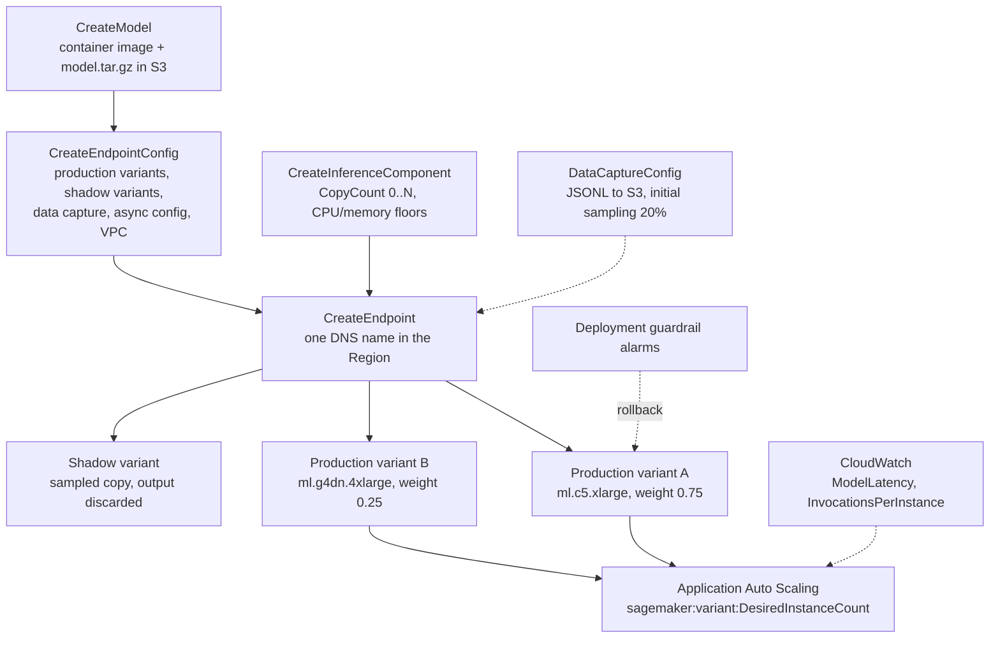
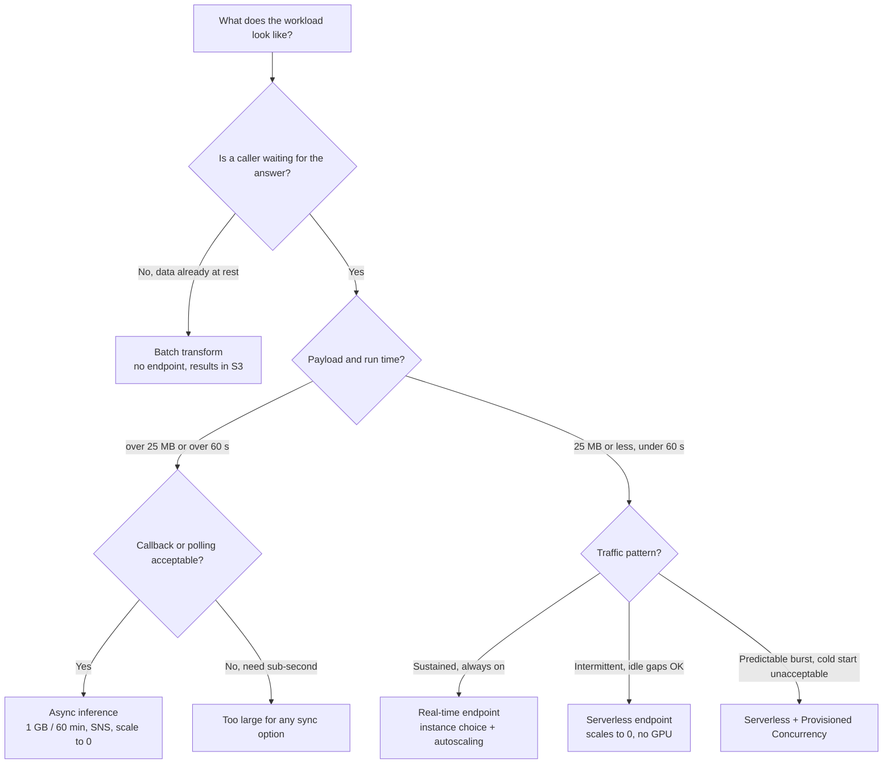
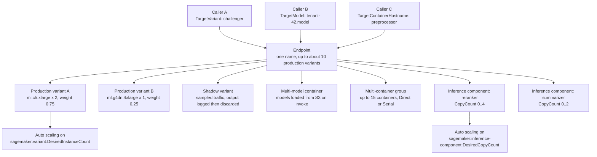
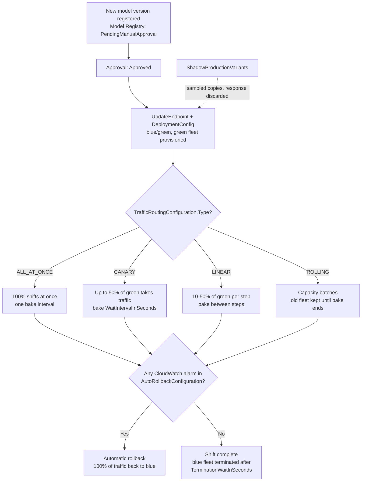
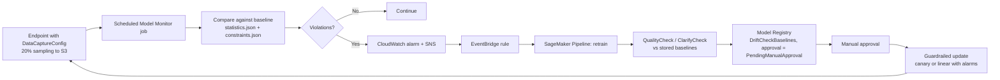

# Deployment and Inference on Amazon SageMaker

Training produces an artifact; **inference is where the model meets a caller and where the bill starts**. On the AIF-C01 exam this is Domain 2 territory — *"Task 2.1: select the appropriate deployment option for an AI/ML solution"* — and it is the single most service-selection-heavy task in the whole guide. The failure mode is never "you did not know SageMaker can host a model". It is that you picked **serverless** for an 800 MB payload, **batch** for a sub-second chat UI, **real-time** for a job that runs twice a night, or you configured a canary at **60%** of the green fleet and never noticed the number is capped.

```text
=====================================================================
 THE FOUR DEPLOYMENT OPTIONS   (exactly four — AIF-C01 Task 2.1)
=====================================================================
  REAL-TIME ...... persistent REST endpoint, ms latency,
                  sustained traffic, payload <= 25 MB, GPU yes
  SERVERLESS ..... scales to 0, no instance type, 4 MB / 60 s,
                  intermittent traffic, GPU no, cold start
  ASYNC .......... queued via InvokeEndpointAsync, 1 GB / 60 min,
                  results in S3 + SNS, scale to 0, GPU yes
  BATCH .......... no endpoint at all, job over data at rest,
                  100 MB per batch, days of runtime, results in S3
---------------------------------------------------------------------
  OBJECT MODEL:  CreateModel -> CreateEndpointConfig -> CreateEndpoint
                 (+ CreateInferenceComponent, optional)
  TOPOLOGIES:    single-model | multi-model | multi-container |
                 serial pipeline | inference components
  ROLLOUT:       blue/green (default) | ALL_AT_ONCE | CANARY | LINEAR
  MONITOR:       data quality | model quality | bias drift |
                 feature attribution drift  (data capture required)
=====================================================================
```

> [!NOTE]
> **How to read this lesson.** Every ceiling, timeout and price below is an AWS-published number from the SageMaker developer guide, the SageMaker API reference or the SageMaker pricing page. Where AWS has published a *change* — and in 2026 it has published two big ones, the closure of Model Monitor to new customers and the discontinuation of Edge Manager — the change is flagged in the section where you would otherwise have used the old fact.

By the end of this lesson you will be able to:

- name the **exactly four** inference options and recite each one's payload, run-time and endpoint ceiling;
- walk the object model `CreateModel` → `CreateEndpointConfig` → `CreateEndpoint` and say what each field does;
- pick among the **five topologies** behind one endpoint (single-model, multi-model, multi-container, serial pipeline, inference components) with their container and variant limits;
- configure **auto scaling** on the right scalable dimension, including the metric targets AWS itself documents;
- run **A/B tests, shadow variants and guardrailed blue/green rollouts**, including the canary and linear percentage bounds;
- explain **data capture** and the four **Model Monitor** types — and the 2026 availability change that closes them to new customers;
- compute the real cost of a real-time endpoint, a serverless endpoint and a Provisioned Concurrency setup from AWS's own worked examples;
- wire **SageMaker Projects, EKS operators and Neo** into a CI/CD and edge story;
- defend a **comparative verdict** across real-time vs serverless vs batch vs async vs edge;
- answer **ten exam-style questions** written in the official voice, including two arithmetic items.

---

## 1. The object model: three calls and one optional fourth

### 1.1 What each API call owns

Deployment on SageMaker is not a single button. It is a chain of three API calls, each of which owns a different decision, plus an optional fourth for components. The exam loves the *"which of these is configured where"* shape, so learn the ownership table cold.

| API call | What you decide there | Fields the exam names |
|---|---|---|
| `CreateModel` | **What** the model is | `PrimaryContainer.Image` / `ModelDataUrl`, `ExecutionRoleArn`, `VpcConfig`, `EnableNetworkIsolation` |
| `CreateEndpointConfig` | **How** it is served | `ProductionVariants`, `ShadowProductionVariants`, `DataCaptureConfig`, `AsyncInferenceConfig`, `VpcConfig`, `KmsKeyId` |
| `CreateEndpoint` | **Where** traffic goes | endpoint name; later updated with `UpdateEndpoint` + `DeploymentConfig` |
| `CreateInferenceComponent` (optional) | **How much** of the endpoint one model gets | `VariantName`, `ModelPackageName`/`InferenceComponentName`, `RuntimeConfig.InitialCopyCount`, `ComputeConfigRequirements` (`NumberOfCpuCoresRequired`, `MinMemoryRequiredInMb`) |

Two follow-up calls matter as much as the three above:

- **`UpdateEndpointWeightsAndCapacities`** re-weights live variants *without* replacing the endpoint — this is the A/B lever;
- **`UpdateEndpoint` + `DeploymentConfig`** swaps the whole fleet behind the endpoint using a guardrailed traffic-routing configuration.

### 1.2 The deployment architecture



### 1.3 Where the async switch lives

Presence of `AsyncInferenceConfig` inside the endpoint config is what makes an endpoint **asynchronous-only**. That field carries `S3OutputPath`, optional `SuccessTopic`/`ErrorTopic` SNS topics, `ClientConfig` (`MaxConcurrentInvocationsPerInstance`) and the request TTL. An endpoint created with it accepts **`InvokeEndpointAsync`** only — synchronous `Invoke` calls are not the contract.

- **📚 Did you know?** The async request queue is backed by **Amazon SQS** with a documented TTL of **6 hours** (`RequestTTLSeconds` max **21,600**), and the invocation itself times out at **900 seconds** by default with a maximum of **3,600 seconds**. That is why AWS describes async as *"queued, near real-time"* rather than as a batch substitute: the queue forgets your request at the 6-hour mark even if your model would have eventually finished.

---

## 2. The four inference options

### 2.1 Real-time endpoints

A real-time endpoint is a **persistent REST endpoint** with millisecond latency, meant for **sustained, predictable traffic**. You choose the instance type and count, you enable auto scaling, you get data capture, Model Monitor, shadow variants and guardrailed rollouts. You also pay for it **every second it exists** — real-time billing is the instance-hour while running, metered per second with a one-minute minimum, plus EBS volume and data transfer.

### 2.2 Serverless Inference

Serverless removes the instance choice: you give a memory setting (**1024, 2048, 3072, 4096, 5120 or 6144 MB**, with vCPU scaling alongside it) and AWS scales the endpoint from traffic **down to zero**. Max container image is **10 GB**, and each container runs **1 worker with 1 copy of the model**. Idle costs nothing; the first request after an idle period pays a cold start that AWS describes only as *"a few extra seconds"*.

The exclusions are the exam's favourite list, because each one kills a plausible-sounding option:

| Not supported in serverless | Where it *is* supported |
|---|---|
| GPUs | real-time, async, batch |
| Marketplace packages and private registries | real-time |
| Multi-model endpoints | real-time |
| VPC configuration and network isolation | real-time |
| Data capture and **Model Monitor** | real-time (capture on job for batch) |
| Multiple production variants / A/B | real-time |
| Inference pipelines (serial) | real-time |

> [!WARNING]
> **Serverless is one-way.** Creating an endpoint config that mixes a serverless variant with the above features throws a **`ValidationError`**. And converting is asymmetric by design: you can fail *from* a real-time configuration *to* serverless by dropping the unsupported pieces, but AWS documents the reverse direction as a one-way door. Also remember the hard ceilings before you commit — **4 MB** payload and **60 seconds** of processing, against real-time's **25 MB**.

**Worked example 1 — the serverless monthly bill (AWS pricing example).** 10,000,000 requests × 100 ms = **1,000,000 seconds** of compute × **$0.00004/second** = **$40.00**; 10 GB of data transfer × **$0.016/GB** = **$0.16** → **$40.16 per month**, and **$0.00 while idle**. The same traffic on a real-time endpoint bills identically whether it serves 10 requests or 10 million — which is the whole argument for serverless on intermittent load.

### 2.3 Batch transform

Batch transform has **no endpoint**. You point a transform job at data already at rest, it spins up instances, writes results to S3 as **`<input>.out`** (for example `input.csv.out`), and the compute disappears with the job. Payload is per batch via **`MaxPayloadInMB`** (up to **100 MB**), the job ceiling is **3,600 seconds**, and it is the correct answer whenever the data is available up front and nobody is waiting.

**Worked example 7 — batch payload arithmetic.** The documented rule is `MaxConcurrentTransforms × MaxPayloadInMB ≤ 100 MB`: **4 × 25 MB = 100 MB is legal**, **4 × 50 MB = 200 MB is rejected**. Setting `MaxPayloadInMB: 0` switches to chunked streaming, which the built-in algorithms do **not** support — so the default path is the bounded one.

### 2.4 Asynchronous inference

Async inference takes a large request, **queues it**, and lets the caller either poll S3 or receive an SNS message. It is the option with the biggest payload (**1 GB**) and the longest processing window (**60 minutes** default **900 s**, maximum **3,600 s**), it scales to **zero** between bursts, and it is the only option whose *success path* is asynchronous by construction.

**Worked example 3 — when only async fits.** A video model must accept an **800 MB** file, may run **40 minutes**, and the caller wants an SNS notification. Real-time stops at **25 MB / 60 s**; serverless stops at **4 MB**; batch caps per-batch payload at **100 MB**. Async at **1 GB / 60 min** with `S3OutputPath` and `SuccessTopic` is the only configuration that clears all three requirements.

### 2.5 The ceilings side by side

| Ceiling | Real-time | Serverless | Async | Batch transform |
|---|---|---|---|---|
| Payload | **25 MB** | **4 MB** | **1 GB** | **100 MB** per batch (`MaxPayloadInMB`) |
| Processing time | **60 s** (8 min with streaming) | **60 s** | **60 min** (default 900 s) | job **3,600 s** |
| Traffic pattern | sustained | intermittent | queued | GBs, up to days |
| Endpoint persists | yes | yes (scales to 0 when idle) | yes (scales to 0) | no (job only) |
| Queue TTL | — | — | **6 h** (max 21,600 s) | — |
| GPU | yes | **no** | yes | yes |
| Data capture / Model Monitor | yes | **no** | yes | capture on the job |
| Output | synchronous | synchronous | S3 + optional **SNS** | S3 `.out` |

*Sources: `deploy-model-options`, `hosting-faqs`, `async-inference-troubleshooting`, `batch-transform` (2026).*



- **📚 Did you know?** AWS never publishes an exact cold-start figure. The developer guide says a request after a scale-to-zero period pays *"a few extra seconds"* for model download and container start, while **Provisioned Concurrency** units are documented as *"ready within milliseconds"*. Any exam option that quotes a precise p95 cold-start number in seconds is inventing it.

---

## 3. Choosing an option: the decision matrix

The four options are only half the story. Once you know *when* the traffic arrives, the remaining question is *how many models* and *how they share compute*. This matrix is the exam's Task 2.1 in table form.

| Situation | Pick | Why / key setting |
|---|---|---|
| Interactive UI, sub-second, always on | **Real-time endpoint** | 25 MB, consistent latency, autoscaling, monitoring + guardrails |
| Spiky traffic, idle gaps, cold start acceptable | **Serverless** | scales to 0, no instance choice, 4 MB / 60 s, no GPU |
| Predictable burst, never a cold start | **Serverless + Provisioned Concurrency** | warm in milliseconds, billed per ms |
| Nightly scoring of a 50 GB file | **Batch transform** | no endpoint, GBs of data, output to S3 |
| 800 MB input, minutes of work, callback wanted | **Async** | 1 GB / 60 min, S3 in and out, SNS, scale to 0 |
| 1,000s of same-framework models | **Multi-model endpoint** | shared container, add via S3, cold-start tolerant |
| Few frameworks, low traffic each | **Multi-container (Direct)** | `TargetContainerHostname`, IAM-scoped, ≤15 containers |
| Pre/post-processing chained to a model | **Serial inference pipeline** | `Mode=Serial`; only one MME allowed in it |
| Several models, per-model CPU and memory | **Inference components** | `CopyCount`, autoscale to 0 |
| Candidate vs incumbent on live traffic | **Production variants (A/B)** | weights + `TargetVariant` + `UpdateEndpointWeightsAndCapacities` |
| Validate without users seeing it | **Shadow variant** | sampled copies, only production answer returned |
| Cutover with alarm-based abort | **Blue/green + canary or linear** | `DeploymentConfig` + CloudWatch alarms + auto-rollback |
| Models to cameras/robots, no cloud calls | **Neo compile (+ staged edge plan)** | Edge Manager discontinued 26 Apr 2024 |
| Model code in your own VPC or Kubernetes | **BYOC image in ECR + EKS operator** | `HostingDeployment` CRD; ACK controllers |

**Check your option selection:**

```matching
{
  "question": "Match each workload description to the deployment option AWS documents for it:",
  "pairs": [
    {"left": "Steady chat UI, sub-second answers, needs per-variant latency metrics", "right": "Real-time endpoint with production variants - 25 MB, ms latency, autoscaling"},
    {"left": "Traffic is zero for 26 days and spikes at month end", "right": "Serverless with Provisioned Concurrency - scales to 0, warm in milliseconds"},
    {"left": "Nightly scoring of a 6 GB file, nobody waiting", "right": "Batch transform - no endpoint, GBs of data, results as S3 .out files"},
    {"left": "800 MB video, 40 minutes of processing, SNS callback", "right": "Async inference - 1 GB payload, 60 min ceiling, S3 output plus SNS topics"},
    {"left": "460 tenant models, roughly 2% called on any given day", "right": "Multi-model endpoint per framework - shared container, load and unload from S3"},
    {"left": "Compare a candidate to production without users seeing its answers", "right": "Shadow production variant - sampled copy, only production response is returned"}
  ],
  "explanation": "Real-time is the sustained low-latency answer; serverless owns the idle-gap case and gains predictability from Provisioned Concurrency; batch owns data-at-rest; async owns large payloads with a callback; multi-model endpoints own many same-framework models with mixed hot/cold traffic; shadow variants are the only mechanism that evaluates a candidate on live traffic while never returning its output."
}
```

---

## 4. Endpoint topologies: five ways to share one endpoint

A single endpoint DNS name can front far more than one model. AWS documents five topologies, and the exam tests them as *"which topology, which selector, which limit"*.

| | Single-model | Multi-model (MME) | Multi-container (MCE) | Inference component | Production variants |
|---|---|---|---|---|---|
| Shares the endpoint | 1 model | N models, **1 shared container** | ≤ **15 containers** | N models, per-model resources | ≤ ~10 variants |
| Invoke selection | implicit | `TargetModel` | `TargetContainerHostname` | model name | `TargetVariant` / weight |
| Frameworks | any | **same** (NVIDIA Triton for GPU) | heterogeneous | heterogeneous | heterogeneous |
| Add a model without an endpoint update | no | **yes** (upload to S3) | no | **yes** (new component) | no |
| Cold start | no | **yes** (load/unload) | no | no | no |
| IAM scoping | — | `sagemaker:TargetModel` | `sagemaker:TargetContainerHostname` | per-component CPU/mem | per-variant instances |
| A/B + guardrails | via update | limited | limited | via components | **native** |
| Typical use | one model | many tenant models | a few low-traffic models | foundation models on a shared fleet | testing and rollout |

*Sources: `model-deploy-feature-matrix`, `multi-model-endpoints`, `multi-container-create` (2026). The phrase **"multi-access endpoint"** appears nowhere in AWS documentation — the three real names are multi-model, multi-container and inference component.*

### 4.1 Multi-model endpoints

An MME puts **one shared serving container** behind the endpoint and loads/unloads models from S3 **on invoke**, so you can add or retire models by uploading an object — **without an endpoint update**. The models must share a framework; GPU use requires **NVIDIA Triton**. The cost is the cold start on the first hit of a model that is not resident, and the constraint is that **a serial pipeline may contain at most one MME**.

### 4.2 Multi-container endpoints

An MCE puts up to **15 containers** behind one endpoint. `Mode=Direct` routes with the `TargetContainerHostname` request header (and the IAM key `sagemaker:TargetContainerHostname`); `Mode=Serial` chains them as a pipeline. Direct mode has **no GPU support**, and AWS's ML Blog claims **up to 90% cost saving** versus running a separate endpoint per container.

### 4.3 Inference components

The modern answer for *"several models, different resource needs, on one fleet"*: each component declares `NumberOfCpuCoresRequired`, `MinMemoryRequiredInMb` and `CopyCount`, autoscales on its own dimension (`DesiredCopyCount`) and may scale its copies **to zero**. This is also the topology that lets a foundation model and a small classifier share capacity without either one owning the instance count.

### 4.4 The deployment architecture under one endpoint



- **📚 Did you know?** The **~10 production variants** ceiling comes from an AWS Machine Learning Blog post (2022), not from a quota page — AWS publishes it as guidance rather than as a service quota. Treat it as "roughly ten, do not design past it", and remember that each variant carries its own instance type, count, weight and CloudWatch dimension.

---

## 5. Auto scaling, warm capacity and scale-to-zero

### 5.1 The standard three steps

AWS documents the same sequence for every SageMaker scaling target: **register the scalable target** (namespace `sagemaker`) → **define the policy** → **`PutScalingPolicy`** with either `TargetTrackingScaling` or `StepScaling`. Target tracking is the recommended policy type for production variants.

| Target | Scalable dimension | Metric / note |
|---|---|---|
| Production variant | `sagemaker:variant:DesiredInstanceCount` | `SageMakerVariantInvocationsPerInstance` (doc example target **70**/min), `ConcurrentRequestsPerModel`, `CPUUtilization` |
| Inference component | `sagemaker:inference-component:DesiredCopyCount` | `SageMakerInferenceComponentInvocationsPerCopy` (example **1**), minimum **0** |
| Serverless Provisioned Concurrency | `sagemaker:variant:DesiredProvisionedConcurrency` | target tracking on PC units (example 1–10) |
| Explainable endpoint | variant dimension | `ExplanationsPerInstance` (with `EnableExplanations`) |
| Scale-to-zero recovery | — | `NoCapacityInvocationFailures` → **step scaling** |
| Excluded | — | **burstable T2** instances |

*Sources: `endpoint-auto-scaling-policy`, `endpoint-auto-scaling-add-code-define`, `endpoint-auto-scaling-zero-instances` (2026).*

### 5.2 Scale-to-zero and the recovery path

Scale-to-zero applies to **serverless, asynchronous and inference-component** copies. On a real-time variant the console enforces a **minimum instance count of ≥ 1**, and **burstable T2 instances cannot be auto scaled at all**. Recovery from zero is not instantaneous: CloudWatch emits **`NoCapacityInvocationFailures`**, the **step scaling** policy reacts, and AWS documents the recovery as taking *"several minutes"*.

**Worked example 6 — target tracking arithmetic.** Target tracking on `SageMakerVariantInvocationsPerInstance` with `TargetValue = 70` holds each instance near **70 invocations per minute**; `ScaleOutCooldown` **300 s** and `ScaleInCooldown` **600 s** stop the fleet from thrashing. Registering `MinCapacity = 1`, `MaxCapacity = 8` caps spend at 8 × **$0.204/h** = **$1.63/h** for compute — the cheapest legal real-time configuration, and still infinitely more expensive than a serverless endpoint sitting at zero.

```fillblank
{
  "question": "Complete the auto scaling rules for SageMaker endpoints:",
  "template": "The recommended policy type for a production variant is {{1}}. It scales on the metric {{2}}, with a documented example target of {{3}} invocations per minute. Instances of the {{4}} family cannot be auto scaled at all, and a scale-to-zero endpoint recovers through CloudWatch {{5}} fired into a step scaling policy.",
  "answers": {
    "1": "target tracking",
    "2": "SageMakerVariantInvocationsPerInstance",
    "3": "70",
    "4": "burstable T2",
    "5": "NoCapacityInvocationFailures"
  },
  "distractors": ["step scaling", "SageMakerEndpointInvocations", "100", "burstable T3", "ModelLatencyAlarm", "CPUUtilization"],
  "explanation": "AWS recommends target tracking for production variants on SageMakerVariantInvocationsPerInstance with a documented example of 70; burstable T2 instances are excluded from auto scaling; and an endpoint that scaled to zero signals NoCapacityInvocationFailures, which a step scaling policy turns back into capacity over several minutes."
}
```

---

## 6. Testing and rollout: A/B, shadow variants and guardrails

### 6.1 A/B testing with production variants

A/B testing is just **variant weights**: `InitialVariantWeight` splits traffic (AWS's own walk-through starts at **1 / 1 = 50/50**), `TargetVariant` pins a specific caller to a specific variant regardless of weight, and `UpdateEndpointWeightsAndCapacities` re-weights the split **live, without replacing the endpoint**. Per-variant metrics land in CloudWatch under the variant dimension.

**Worked example 5 — the weight walk-through.** Two variants at `InitialVariantWeight 1/1` → **50/50**. Variant 2 wins the comparison → `UpdateEndpointWeightsAndCapacities` sets **25/75**, moving **75%** of traffic to Variant 2. Final step **0/1** gives Variant 2 everything, and Variant 1 is deleted. `TargetVariant` overrides the weights for a pinned caller.

### 6.2 Shadow deployments

`ShadowProductionVariants` in the endpoint config sends a **sampled copy** of live traffic to the candidate. The critical behaviour — and the exam's favourite single sentence on this topic — is that **only the production variant's response reaches the caller**; the shadow's output is logged or discarded. Shadow updates themselves are **blue/green**: the endpoint config changes behind the scenes.

### 6.3 Deployment guardrails

Guardrails are how you ship a model without betting the endpoint on it. Blue/green is the **default for model updates**, rolling replaces capacity in batches, and the traffic-routing type is an explicit enum.

| Mode | Unit of shift | Bound | Baking | On alarm |
|---|---|---|---|---|
| `ALL_AT_ONCE` | 100% of traffic | — | one bake interval | → 100% back to blue |
| `CANARY` | % of the **green fleet** | **≤ 50%** | `WaitIntervalInSeconds` (example 600 s) | → 100% back to blue |
| `LINEAR` | % of green per step | **10–50%** per step | per step (example 300 s) | → 100% back to blue |
| Rolling | instance/capacity batches | customer batch size | per batch | old fleet kept until the bake ends |
| Edge deployment plan | % of fleet or named devices | staged plan | per stage | `ROLLBACK_ON_FAILURE` |

*Sources: `deployment-guardrails`, `deployment-guardrails-blue-green-canary`, `deployment-guardrails-blue-green-linear` (2026). Knobs: `WaitIntervalInSeconds`, `MaximumExecutionTimeoutInSeconds`, `AutoRollbackConfiguration.Alarms[]`.*

**Worked example 3 (rollout) — canary timing.** `Type: CANARY`, `CanarySize: 30%`, `WaitIntervalInSeconds: 600`, `TerminationWaitInSeconds: 600`, `MaximumExecutionTimeoutInSeconds: 1800`: **30% of the green fleet** takes traffic for **10 minutes**, the rest shifts only if no alarm trips, the blue fleet dies **10 minutes** after cutover, and the whole deployment aborts at **30 minutes**. 30% is valid because the cap is **≤ 50%**.

**Worked example 4 (rollout) — the linear floor.** `LinearStepSize: 20%` with `WaitIntervalInSeconds: 300` means 100 / 20 = **5 steps × 5 minutes = at least 25 minutes** of baking, comfortably inside a one-hour `MaximumExecutionTimeoutInSeconds`. A step outside **10–50%** is invalid — 5% and 60% are both rejected.



- **📚 Did you know?** A canary is measured against the **green** fleet, not against total traffic — AWS's bound is *"no more than 50% of the green fleet"*, which is why a question about an 8-instance green fleet accepts `CAPACITY_PERCENT 50` and rejects `60` and `80`. It is a two-step percentage: first of green, then of the whole endpoint.

---

## 7. Monitoring: data capture, Model Monitor and the drift loop

### 7.1 Data capture is the precondition

`DataCaptureConfig` lives on the endpoint config and has three fields: `EnableCapture`, `InitialSamplingPercentage` (0–100) and `DestinationS3Uri`. The **SDK default sampling is 20%**, records are written as **JSONL** under `s3://…/{endpoint}/{variant}/yyyy/mm/dd/hh/`, and capture **halts above 75% of disk usage**. No capture, no monitoring: Model Monitor reads what capture wrote.

### 7.2 The four monitor types

| Monitor | Detects | Ground truth needed? | Baseline | Engine / metric | Alert |
|---|---|---|---|---|---|
| **Data quality** | input drift, upstream data change | **No** | `statistics.json` + `constraints.json` | statistics/constraints (**tabular only**) | CloudWatch on violations |
| **Model quality** | accuracy, precision, recall, F1, AUC, RMSE, MAE drift | **Yes** (labels in S3) | metric constraints | scheduled processing job | CloudWatch + SNS |
| **Bias drift** | fairness shift vs. training (e.g. DPPL) | protected attributes | Clarify bias baseline | Clarify + bootstrap confidence intervals (2-day example, DPPL −0.1…0.1) | CloudWatch |
| **Feature attribution drift** | SHAP importance changed | No | SHAP baseline | **NDCG** rank comparison | **NDCG < 0.90** |
| Endpoint/system health | latency, 5xx, invocations, CPU | No | CloudWatch metrics | `ModelLatency`, `InvocationsPerInstance`, `NoCapacityInvocationFailures` | guardrail auto-rollback |

*Sources: `model-monitor`, `clarify-model-monitor-feature-attribution-drift` (2026).*

### 7.3 The 2026 availability change

> [!WARNING]
> **Model Monitor and SageMaker Clarify are closed to new customers from 30 July 2026.** Existing customers keep access with no new features; AWS's June 2026 service availability announcement lists them among the SageMaker features moving to maintenance. For **new** projects AWS points to **MLflow Apps + Evidently AI + QuickSight + CloudWatch** (seven published `aws-samples` solutions, typically wired with Athena, EventBridge and Lambda). An exam option that says *"create a new Model Monitor schedule"* for a brand-new account in late 2026 is testing whether you read the availability page.

### 7.4 The drift-to-retrain loop

Drift is not an alert you read; it is a trigger you wire. The documented path: a violation raises a CloudWatch alarm → SNS notifies → **EventBridge** matches the alarm and invokes Lambda or starts a **CodePipeline** → a **SageMaker Pipeline** retrains → `QualityCheck` / `ClarifyCheck` steps compare the candidate against the baselines stored in the **Model Registry** (`DriftCheckBaselines`) → a human approves → a guardrailed update ships.



- **📚 Did you know?** Feature attribution drift is scored with **NDCG** over SHAP rankings and AWS's documented alert threshold is **NDCG < 0.90** — a value of 0.69 means live feature importance has diverged materially from training. Model Monitor itself only produces **tabular** metrics, so a model whose features are text embeddings falls outside its statistical engine entirely.

### 7.5 2025–2026 Updates

Sections 7.1–7.4 describe what Model Monitor *does*; this subsection describes what AWS *did* to it, because the two no longer move together. AWS's SageMaker AI end-of-support notice lists **Model Monitor** and **Clarify** — together with Mechanical Turk, Ground Truth, Augmented AI (A2I), Studio Lab, Debugger, Role Manager, Geospatial and Profiler — among the features **"no longer open to new customers starting 30 July 2026"**. The status AWS assigns them is **maintenance**: existing customers keep them, no new features ship, nothing is shut down and nothing is rebranded.

| Feature on the notice | Documented date | Lifecycle state | Documented direction for new work |
|---|---|---|---|
| SageMaker **Model Monitor** | closed to new customers **30 Jul 2026** | **Maintenance** | CloudWatch metrics and anomaly detection, Amazon Evidently, EventBridge + Lambda, SHAP baselines |
| SageMaker **Clarify** | closed to new customers **30 Jul 2026** | **Maintenance** | **Bedrock Model Evaluations**, SHAP, Bedrock Guardrails |
| Ground Truth, **A2I (Augmented AI)**, Studio Lab, Debugger, Role Manager, Geospatial | closed to new customers **30 Jul 2026** | **Maintenance** — still supported, no new features | per-feature page; A2I human review becomes a queue plus an app you build |
| SageMaker **Mechanical Turk** | closed to new customers **30 Jul 2026**, **EOS 30 Sep 2026** (What's New post dated 29 Sep) | end of support | Ground Truth with a vendor or private workforce, or another labeling service |
| Ground Truth Plus | **EOS 30 Jun 2026** | end of support | standard Ground Truth labeling jobs |
| SageMaker **Profiler** | **EOS 30 Jun 2027** | sunset | SageMaker observability alternatives |
| Amazon **Forecast** (distractor — not a monitoring service) | closed to new customers **29 Jul 2024** | maintenance | SageMaker Canvas |

*Sources: the SageMaker AI features page, `model-monitor-availability-change`, `clarify-availability-change`, the AWS What's New service-availability announcements of June and September 2026, and the AWS General Reference `service-lifecycle` page (24 Sep 2026). The 29 vs 30 September conflict on Mechanical Turk is AWS's own and is not resolved here.*

AWS defines the lifecycle vocabulary in exactly one document, and the exam tests the *words* more often than the dates:

| Lifecycle state | What AWS says it means | How to answer the exam |
|---|---|---|
| **Maintenance** | no new customers, no new features, **still supported** | "closed to new customers" is not "dead": an account created before 30 Jul 2026 can still run a Model Monitor schedule |
| **Sunset** | planned end of operations with a published date, typically a 12-month horizon | a deadline exists and the feature still works until it — SageMaker Profiler runs to **30 Jun 2027** |
| **Full Shutdown** | removed from the AWS portfolio | the API and console are gone; never a valid answer for a new build |

**Where the change bites an exam answer:**

- *"Create a Model Monitor schedule for a **new** account"* → unavailable from **30 Jul 2026**; the documented direction is CloudWatch metrics and anomaly detection, **Amazon Evidently**, an **EventBridge + Lambda** loop and SHAP baselines you compute yourself;
- *"Evaluate a candidate's quality and bias for a **new** project"* → **Bedrock Model Evaluations** is the pairing AWS now writes into objective **4.2.2** of the exam guide, with **SHAP** and **Bedrock Guardrails** named alongside Clarify;
- *"Route low-confidence predictions to a human"* → **A2I** sits on the same notice, so a new build reaches for a queue plus a review app, or Ground Truth, instead of Augmented AI;
- *"Existing customer, 2026, keeps its Model Monitor schedules"* → correct: **maintenance** means supported, and only *new* sign-ups are blocked.

**What did *not* change:** every mechanic memorized above still behaves as written — `DataCaptureConfig` with its **20 %** SDK default sampling, the JSONL layout under `{endpoint}/{variant}/…`, the halt above **75 % disk**, the four monitor types and their engines (statistics and constraints, metric constraints, Clarify bootstrap intervals, **NDCG < 0.90**), the drift loop through EventBridge into a SageMaker Pipeline and the Model Registry `DriftCheckBaselines`, and the **tabular-only** limitation of Model Monitor's statistical engine. The 2026 notice changes *who may sign up*, not what the software does — which is the entire distinction between *maintenance* and *shutdown*.

**Exam-guide wording you will now meet (v1.1, published 30 Apr 2026):**

- objective **1.1.3** changed its worked examples to **async and serverless inference** — two of this lesson's four options — so the deployment vocabulary now appears earlier in the guide than it did before v1.1;
- objective **4.2.2** reads **Clarify plus Bedrock Model Evaluations**, and objective **1.3.4** lists **Bedrock, Amazon Quick, Kiro and SageMaker AI** as the service set;
- the guide's change history states that updates reach the exam about **one month** after publication, and the exam is still called **AIF-C01** (65 questions, 90 minutes, pass at 700/1000).

Finally, the product name: since **3 December 2024** AWS documents that *"the current Amazon SageMaker has been renamed to **Amazon SageMaker AI**"*, with next-gen SageMaker (Unified Studio, Catalog, Lakehouse, zero-ETL) sitting beside it. Every API call in section 1 is untouched — `CreateModel`, `CreateEndpointConfig` and `CreateEndpoint` still live under the `sagemaker` namespace — but the console, the service page and the exam's service list say **SageMaker AI**.

- **📚 Did you know?** AWS defines the three lifecycle states in exactly one place — the AWS General Reference **`service-lifecycle`** page, last updated **24 September 2026** — and Model Monitor sits in the softest state, **Maintenance**. A **Sunset** feature already carries a published end date (SageMaker Profiler, **30 Jun 2027**), while **Full Shutdown** means the API is gone from the portfolio. That is why *"Model Monitor is discontinued"* and *"Model Monitor was rebranded as Bedrock Model Evaluations"* are both wrong: it is closed to *new* customers, unchanged for existing ones, and the Bedrock pairing lives in the exam guide's wording rather than in a rename.

---

## 8. Sizing, cost and Inference Recommender

### 8.1 What the bill is made of

| Item | AWS example value | Source |
|---|---|---|
| `ml.c5.xlarge` hosting | **$0.204/hour** | SageMaker pricing worked example |
| `ml.m5.4xlarge` (Model Monitor job) | **$0.922/hour** | SageMaker pricing worked example |
| Data in / out | **$0.016/GB** | SageMaker pricing worked example |
| On-demand serverless compute | **$0.00004/second** | SageMaker pricing worked example |
| Serverless with Provisioned Concurrency | **$0.000023/second** | SageMaker pricing worked example |
| Free tier: real-time | **125 hours** of `m4.xlarge`/`m5.xlarge`, first 2 months | SageMaker free tier |
| Free tier: serverless | **150,000 seconds**, first 2 months | SageMaker free tier |
| Example monthly real-time total | **$305.88** | SageMaker pricing worked example |
| Example monthly serverless total | **$40.16** | SageMaker pricing worked example |
| Example with Provisioned Concurrency | **$173.20** = $144 + $23 + $6 + $0.208 | SageMaker pricing worked example |

*Prices are AWS's own worked examples and are Region-specific examples, not a rate card. Savings Plans (1-year or 3-year, $/hour commitments) cover real-time endpoints, batch transform, training and processing.*

**Worked example 2 — the real-time monthly bill.** 2 × `ml.c5.xlarge` × 24 h × 31 d = **1,488 instance-hours** × **$0.204** = **$303.52**; a Model Monitor job at **2.5 h** × **$0.922** = **$2.31**; data 3,100 MB in + 310 MB out ≈ **$0.06** → **≈ $305.88 per month**. Monitoring is under **1%** of the bill; idle compute is about **99%** of it. Compare that with the **$40.16** serverless example and you have the entire cost argument in two numbers.

**Worked example 8 — cold start versus Provisioned Concurrency.** Idle → scale to zero → the next request pays model download and container start (*"a few extra seconds"*). Buying determinism instead: Provisioned Concurrency **$144** + PC compute **$0.000023/s** + on-demand **$6** after the **150,000 free seconds** = **$173.20 per month** — roughly **4×** the on-demand compute line, and worth it only when a cold start would break an SLA.

### 8.2 Inference Recommender

Before you guess at an instance, run a recommendation job. A **`Default`** job takes **up to 45 minutes** and starts from a Model Package ARN; an **`Advanced`** job runs about **2 hours** with load tests. Output: recommended instance type and count, latency, **cost per hour and cost per inference**, plus CPU and memory utilization — exactly the evidence a sizing question wants.

- **📚 Did you know?** Real-time endpoints bill **per second with a one-minute minimum** while they exist, which is why the exam treats an unscaled, always-on endpoint as a *cost* problem rather than a *performance* problem. An endpoint serving nothing at 03:00 still pays instance-hours, EBS and data — and that is the sentence behind every "which option avoids idle cost" question: serverless, async and inference-component copies are the three that can reach **zero**.

---

## 9. MLOps: CI/CD, Kubernetes and the edge

### 9.1 SageMaker Projects and the CI/CD path

SageMaker **Projects** ship templates that provision **AWS CodePipeline** (or Jenkins), Git integration through **CodeConnections** and a **CloudFormation** stack. The canonical flow is **source → build (a SageMaker Pipeline runs training and evaluation) → staging endpoint → manual approval → production endpoint**, with an EventBridge rule on the Model Registry status transition `PendingManualApproval → Approved`. Container images follow **CodeBuild → ECR → `ImageVersion` → EventBridge**.

**Check the order of the gated pipeline:**

```dragdrop
{
  "question": "Order the stages of a SageMaker Project MLOps pipeline, from commit to production:",
  "items": [
    "Source: commit to the connected Git repository (CodeConnections)",
    "Build: CodeBuild builds the image and pushes it to Amazon ECR",
    "Train and evaluate: SageMaker Pipeline runs training, evaluation and RegisterModel",
    "Deploy to the staging endpoint",
    "Manual approval gate (Model Registry status PendingManualApproval to Approved)",
    "Deploy to the production endpoint under deployment guardrails"
  ],
  "correctOrder": [
    "Source: commit to the connected Git repository (CodeConnections)",
    "Build: CodeBuild builds the image and pushes it to Amazon ECR",
    "Train and evaluate: SageMaker Pipeline runs training, evaluation and RegisterModel",
    "Deploy to the staging endpoint",
    "Manual approval gate (Model Registry status PendingManualApproval to Approved)",
    "Deploy to the production endpoint under deployment guardrails"
  ],
  "explanation": "The template order is source, build, SageMaker Pipeline (train, evaluate, register), staging endpoint, manual approval, production. The approval is the control point: no model reaches production without the Model Registry status moving from PendingManualApproval to Approved, which is also what an EventBridge rule listens for."
}
```

### 9.2 Kubernetes

The supported path is **ACK-based SageMaker Operators**: `kubectl apply` of a **`HostingDeployment`** custom resource creates or updates an endpoint — AWS documents the reconcile taking **up to 15 minutes** — while **Kubeflow** components drive training, tuning and batch transform jobs. This is the answer when the question says *"the team already runs Kubernetes and wants SageMaker endpoints managed from it"*.

### 9.3 Edge: Neo, and the Edge Manager discontinuation

**Neo** compiles a trained model for a target with `CreateCompilationJob`, where **`TargetDevice` and `TargetPlatform` are mutually exclusive**. Cloud targets include `ml_c5`; edge targets include `jetson_nano`, `rasp3b` / `rasp4b` and `coreml`. Compilation survives; the managed fleet around it does not.

> [!WARNING]
> **Amazon SageMaker Edge Manager was discontinued on 26 April 2024.** Neo compilation still exists and is still the correct answer for *"compile a model for cameras, robots or Raspberry Pi"* — but Edge Manager device fleets, model deployments and the associated admin console are not a valid 2026 answer. Legacy mechanics that may still appear in older material: `CreateEdgeDeploymentPlan` with staged rollouts (percentages or device names), `ROLLBACK_ON_FAILURE` and `StartEdgeDeploymentStage`. If an option offers **Edge Manager** for a new deployment, it is a historical distractor.

- **📚 Did you know?** `CreateCompilationJob` returns a model artifact you can host **either** in the cloud **or** on a device — the same compilation job family covers `ml_c5` inference instances and `rasp4b` boards. That symmetry is why Neo shows up in both a cloud-sizing question and an IoT question, and why `TargetDevice` XOR `TargetPlatform` is a real API rule rather than documentation prose.

---

## 10. Comparative verdict

> [!IMPORTANT]
> **Comparative Verdict — real-time vs serverless vs batch vs async vs edge**
> - **Real-time** is the answer whenever a human or a synchronous client is waiting: sustained traffic, **25 MB / 60 s**, instance choice, target-tracking auto scaling, data capture, Model Monitor, shadow variants and guardrailed canary rollouts all live here and nowhere else at full strength. Its failure mode is financial, not functional: instance-hours accrue every second the endpoint exists, and AWS's own example is **$305.88/month** of which about **99%** is compute you were paying for while idle.
> - **Serverless** wins on **intermittent** traffic: no instance type, memory-only sizing (1024–6144 MB), scale to **zero**, and AWS's worked example of **$40.16/month** for 10 million 100 ms requests with **$0** while idle. Its failure mode is capability and cold start: **no GPU, no multi-model endpoints, no VPC config, no data capture, no Model Monitor, no A/B variants**, a **4 MB / 60 s** ceiling — and a cold start measured only as *"a few extra seconds"*. Add **Provisioned Concurrency** when a spike must never pay that cold start (**$173.20/month** in AWS's example, warm *"within milliseconds"*).
> - **Batch transform** is the answer when data is already at rest and nobody is waiting: no endpoint at all, **100 MB per payload** under the `MaxConcurrentTransforms × MaxPayloadInMB ≤ 100 MB` rule, jobs up to **3,600 s**, results as `input.csv.out` in S3. Its failure mode is being asked for an interactive answer — batch has no endpoint to call.
> - **Asynchronous** is the answer when the payload or the processing time breaks every synchronous option: **1 GB / 60 minutes**, queued with a **6-hour** TTL, S3 output, SNS success and error topics, and scale to zero between bursts. Its failure mode is a sub-second SLA — the queue is the feature, not the bug.
> - **Edge** is the answer when the model must run **without cloud calls**: **Neo** compiles for `jetson_nano`, `rasp3b`/`rasp4b` or `coreml`, with staged plans and `ROLLBACK_ON_FAILURE` for fleet rollout — but **Edge Manager itself was discontinued on 26 April 2024**, so Neo compilation is the durable part of the story. Its failure mode is drifting models you cannot monitor, which is exactly why an edge choice should be paired with a retraining story.
> - **Rule of thumb for the exam:** *who is waiting, and how big is the payload?* A waiting human under 25 MB → **real-time**; a waiting human with an idle budget → **serverless**; nobody waiting with data at rest → **batch**; nobody waiting but the payload is huge → **async**; nobody waiting because there is no network → **edge**.

---

## 11. Worked AWS examples with numbers

| # | Scenario | Arithmetic | Result |
|---|---|---|---|
| 1 | Serverless month: 10,000,000 requests × 100 ms | 1,000,000 s × $0.00004 + 10 GB × $0.016 | **$40.16**, $0 idle |
| 2 | Real-time month: 2 × `ml.c5.xlarge` × 24 h × 31 d | 1,488 h × $0.204 + 2.5 h × $0.922 + ~$0.06 data | **≈ $305.88** |
| 3 | Canary 30%, bake 600 s, termination 600 s, timeout 1800 s | 10 min green-only, abort at 30 min | cap **≤ 50%** |
| 4 | Linear 20% steps, 300 s bake | 100/20 = 5 steps × 5 min | **≥ 25 min** baking |
| 5 | A/B weights | 1/1 → 25/75 → 0/1 with `UpdateEndpointWeightsAndCapacities` | 50/50 → 75% → 100% |
| 6 | Target tracking at 70 invocations/min, max 8 instances | 8 × $0.204 | **$1.63/h** cap |
| 7 | Batch payload rule | 4 × 25 MB = 100 MB (legal) vs 4 × 50 MB = 200 MB (rejected) | ≤ **100 MB** |
| 8 | Provisioned Concurrency month | $144 + $23 + $6 + $0.208 | **$173.20**, ≈ **4×** the compute line |

---

## 12. Conflicting, unverified and non-examinable facts

Separate what AWS *documents* from what third parties *repeat*. Keep this table out of your memorization set except where it says "use for the exam".

| Claim | What the sources say | How to handle it |
|---|---|---|
| "Multi-access endpoint" | Not an AWS term in any documentation page | Never use it; the real names are multi-model, multi-container, inference component |
| Per-request serverless fee (e.g. $0.20 / 1,000 requests) | Only third-party blogs; AWS's examples bill **duration + data** | Do not quote; verify on the live calculator |
| Exact cold-start seconds | AWS says *"a few extra seconds"*; Provisioned Concurrency is *"milliseconds"* | No official p95 figure exists |
| Region of the $0.204/h and $0.922/h rates | AWS's worked examples do not label the Region | Treat as example rates, not a guaranteed price list |
| "Up to 10 production variants" | AWS Machine Learning Blog (2022), not a quota page | Use as guidance; do not treat as a hard quota |
| Inference Recommender configuration counts | Load-test doc says "up to 10", console says "up to 8 instance types" | UI vs API wording, not a service quota |
| Edge Manager replacement | Edge Manager discontinued **26 Apr 2024**; the successor guidance page was not verified for this lesson | Neo compilation is confirmed; treat fleet-management successors as open |
| Inf1/Inf2/Trn1/P4d catalogue and per-Region GPU quotas | Not retrieved for this lesson | Use only the verified examples: `ml.m5.xlarge`, `ml.c5.xlarge`, `ml.g4dn.4xlarge`, `ml.r5.large`, `ml.g5.8xlarge`, `ml.p3.2xlarge` |

Primary sources for this lesson: the SageMaker developer guide pages `deploy-model-options`, `model-deploy-feature-matrix`, `hosting-faqs`, `realtime-endpoints-deploy-models`, `serverless-endpoints`, `batch-transform`, `async-inference`, `multi-model-endpoints`, `multi-container-create`, `multi-container-endpoints`, `endpoint-auto-scaling-policy`, `endpoint-auto-scaling-add-code-define`, `endpoint-auto-scaling-zero-instances`, `model-ab-testing`, `model-shadow-deployment`, `deployment-guardrails*`, `model-monitor`, `model-monitor-availability-change`, `clarify-model-monitor-feature-attribution-drift`, `model-monitor-data-capture-endpoint`, `pipelines-quality-clarify-baseline-lifecycle`, `inference-recommender-recommendation-jobs`, `sagemaker-projects-templates-sm`, `kubernetes-sagemaker-operators`, `edge`, `neo-supported-devices-edge-devices`; the **API reference** `CreateEndpointConfig`, `InvokeEndpointAsync`, `DataCaptureConfig`; AWS's **What's New** service availability announcement of June 2026; and the SageMaker **pricing** pages.

---

## 13. Real-World Case Studies

Sections 1–12 take their ceilings from AWS documentation. This section adds the other half of the evidence: what AWS *customers* published about serving models in production with those same services. Every figure below is an AWS-published customer claim, retrieved 6 October 2026 from `aws.amazon.com/solutions/case-studies/*` and `aws.amazon.com/blogs/machine-learning/*`, and each one is unaudited — "up to" is a ceiling, not an average.

### 13.1 Five deployment cases: services, numbers, sources

| # | Customer (industry, year) | Services in the deployment | Documented outcome | Source |
|---|---|---|---|---|
| 1 | **Forethought** (SaaS customer support, year not published on the page) | off its own **Amazon EKS** → SageMaker **multi-model endpoints** + **Serverless Inference** | MME **−66 %** with better latency, serverless **≈ −80 %** (headline **up to −80 %**), **>80 %** of GPU inference on SageMaker, **30 M** interactions/yr, **3-person** team | `solutions/case-studies/forethought-technologies-case-study` |
| 2 | **HAYAT HOLDING** (MDF manufacturing, 2023) | **OPC-UA → AWS IoT Greengrass** SiteWise Edge Gateway → SageMaker Training + **Automatic Model Tuning** + Deployment + **Edge Manager** on-device | **194 sensors** monitored, **$300,000/year** saved | ML Blog `hayat-holding-uses-amazon-sagemaker-to-increase-product-quality-and-optimize-manufacturing-output-saving-300000-annually` |
| 3 | **Prime Focus Technologies** (media, 2025) | **Amazon Bedrock** + **AWS Lambda** agents on CLEAR, **14 M+** assets | localization cost **−20–30 %**, accuracy **+20–30 %**, turnaround **−30–40 %**; first attempt on external LLM APIs **too slow for live tagging** | `solutions/case-studies/prime-focus-case-study` |
| 4 | **Epilot** (energy software, 2026) | API → **Amazon SQS** → **AWS Lambda** → **Bedrock (Claude Sonnet)**, model chosen with **Bedrock Evaluations**, data in an **EU Region** | handling time **−87 %**, **55,000** summaries/month, MVP in **2 months**, **80 %** of users say it simplifies work | `solutions/case-studies/epilot-genai-case-study` |
| 5 | **Chronomics** (health-tech, 2022) | **Amazon Rekognition Custom Labels** with a scoring threshold and a human tail | **4 months** in-house → **3–4 weeks**, **96.5 %** accuracy / **97.9 %** F1; threshold **0.99 → 99.6 %** (**5 %** discarded), **0.999 → 99.87 %** (**27 %** discarded) | ML Blog `chronomics-detects-covid-19-test-results-with-amazon-rekognition-custom-labels` |

**Case file 1 — Forethought: do-it-yourself inference is a tax you can quote.**
- **Context:** SupportGPT handles **30 million interactions per year** with several models per customer, run by a **3-person team** that also had to operate Amazon EKS through memory exceptions and outages.
- **Deployment move:** off its own EKS onto SageMaker **multi-model endpoints** (one shared container, models added by S3 upload without an endpoint update) plus **Serverless Inference** for the small classifiers.
- **Numbers:** **−66 %** on MME *with better latency*, **≈ −80 %** on serverless, headline **up to −80 %**, and **>80 %** of GPU inference now on SageMaker.
- **Maps to:** §4.1 for the topology, §2.2 for scale-to-zero, and §8 for the cost argument — an always-on endpoint is billed whether or not traffic arrives.
- **Source:** `aws.amazon.com/solutions/case-studies/forethought-technologies-case-study` (no year is published on the page).

**Case file 2 — HAYAT HOLDING: an edge pattern that outlived its product name.**
- **Context:** MDF panel manufacturing; the customer called its self-built ML environments "time-consuming and cumbersome".
- **Pipeline:** **194 sensors** over **OPC-UA** → SiteWise Edge Gateway inside **AWS IoT Greengrass** → SageMaker Model Training with **Automatic Model Tuning** → Model Deployment with **SageMaker Edge Manager** running the model on the device.
- **Numbers:** **$300,000 per year** saved, with higher panel quality and optimised output — automatic tuning replaced manual hyperparameter sweeps across 194 inputs.
- **Maps to:** §9.3 — the *pattern* (managed training, automatic tuning, compile and ship to the device) is current, but **Edge Manager was discontinued on 26 April 2024**, so the product name inside a 2023 case is a distractor for a 2026 build while **Neo** compilation survives.
- **Source:** AWS Machine Learning Blog, `hayat-holding-uses-amazon-sagemaker-to-increase-product-quality-and-optimize-manufacturing-output-saving-300000-annually` (2023).

**Case file 3 — Prime Focus Technologies: latency decided the placement before the option matrix ran.**
- **Context:** the CLEAR platform holds **14 million+ assets** (Disney Star, CBS, Lionsgate) and covers localization plus **live** cricket tagging.
- **Numbers:** localization **cost −20–30 %**, **accuracy +20–30 %**, **turnaround −30–40 %**.
- **The deployment sentence:** the **first attempt used external LLM APIs whose latency was too high for live tagging**, and latency *"dropped dramatically"* once the workload ran on AWS behind **Amazon Bedrock** and **AWS Lambda** agents.
- **Maps to:** the first question of §2 — *who is waiting?* A live tagger is a sub-second caller, so any placement outside the latency budget is eliminated **before** real-time, serverless, async and batch are ever compared.
- **Source:** `aws.amazon.com/solutions/case-studies/prime-focus-case-study` (2025).

**Case file 4 — Epilot: an event-driven chain where the queue is the architecture.**
- **Context:** energy software from Cologne, summarising long customer-email chains across 170+ utility customers.
- **Pipeline:** API → **Amazon SQS** → **AWS Lambda** → **Amazon Bedrock (Claude Sonnet)**; the model was chosen with **Amazon Bedrock Evaluations** (human ratings across prompt versions), and a later agent writes records **with humans verifying** — no agent writes unattended.
- **Numbers:** handling time **−87 %**, **55,000 summaries per month** at a negligible failure rate, **80 %** of users say it simplifies their work, MVP in **2 months**, processed data kept in an **EU Region**.
- **Maps to:** the queue logic of §2.4 in a serverless setting — decouple the caller from the work with **SQS**, keep the cold-tolerant piece on **Lambda**, and treat *residency* and *evaluation* as pre-deployment gates rather than afterthoughts.
- **Source:** `aws.amazon.com/solutions/case-studies/epilot-genai-case-study` (indexed July 2026).

**Case file 5 — Chronomics: the monitoring tail you must decide before you deploy.**
- **Context:** a COVID test-result reader for which **4 months** of in-house custom computer vision never reached target.
- **Move:** **Amazon Rekognition Custom Labels** (AutoML) shipped in **3–4 weeks** at **96.5 % accuracy / 97.9 % F1**, scored by `DetectCustomLabels`.
- **The monitoring decision:** threshold **0.99 → 99.6 %** with **5 %** of predictions discarded, threshold **0.999 → 99.87 %** with **27 %** discarded — precision is bought with coverage, and somebody must own the discarded tail.
- **Maps to:** §7, where a violation threshold is likewise a precision-versus-coverage choice — and the documented human path, **A2I** (GA 2020, **60+ workflows**), is itself closed to new customers from **30 July 2026** (§7.5).
- **Source:** AWS Machine Learning Blog, `chronomics-detects-covid-19-test-results-with-amazon-rekognition-custom-labels` (13 Dec 2022).

### 13.2 Before and after, side by side

| Customer | Metric | Before | After | Change |
|---|---|---|---|---|
| Forethought | inference cost, shared models | self-run Amazon EKS, always-on GPU | **−66 %** with better latency | **up to −80 %** headline |
| Forethought | small classifiers | self-managed serving | **≈ −80 %** on Serverless Inference | **>80 %** of GPU inference on SageMaker |
| HAYAT | annual operating cost | self-built ML environments | **−$300,000 / year** | **194 sensors** on one edge pipeline |
| Prime Focus | localization cost · accuracy · turnaround | vendor baseline | **−20–30 % · +20–30 % · −30–40 %** | **14 M+** assets, live tagging latency |
| Epilot | customer-email handling time | baseline | **−87 %** | **55,000** summaries per month |
| Chronomics | build time | 4 months in-house, never on target | **3–4 weeks** | **96.5 %** accuracy / **97.9 %** F1 |

### 13.3 What each case proves for Task 2.1

| Case | Lesson section | The exam-shaped takeaway |
|---|---|---|
| **Forethought** | §4.1 + §2.2 | one shared container plus a scale-to-zero endpoint beats one always-on endpoint per model |
| **HAYAT HOLDING** | §9.3 | managed training with automatic tuning plus on-device deployment; the *pattern* is current, the Edge Manager *name* is retired |
| **Prime Focus** | §2 decision matrix | latency and placement are settled **before** the four options are compared |
| **Epilot** | §2.4 + §5 | a queue (SQS) decouples caller from work; residency and evaluation are gates, not afterthoughts |
| **Chronomics** | §7 | a confidence threshold is a monitoring decision, and the human tail needs a service that new accounts can still use |

**Five rules you can carry into the exam from these files:**

- **Topology before instance type.** Forethought saved two-thirds of its bill by changing *how models share compute* (multi-model, serverless), not by negotiating a better instance price;
- **Idle cost is the default failure mode.** Every published saving above comes from removing capacity that was running for nobody — the same arithmetic as §8's $305.88 against $40.16;
- **Placement precedes option selection.** Prime Focus could not evaluate any of the four options until the model ran somewhere fast enough; latency is a *filter*, not a *score*;
- **A published architecture can predate a retirement.** HAYAT's pipeline is correct as a pattern and stale as a product list — check the availability notice before quoting a case's service names;
- **Every percentage needs a baseline and a human tail.** Chronomics bought 3.1 points of precision by discarding 5 % of predictions, and Sun Finance's own first attempt scored only 61.8 % before the pipeline was split.

- **📚 Did you know?** AWS's Generative AI Innovation Center publishes the only project-outcome rate in its whole case corpus: **65 %** of its generative AI projects reached production in 2025 (some in as little as **45 days**) out of **more than 1,000** implementations, assessed with AWS's **Five V's** framework — **Value → Visualize → Validate → Verify → Venture**. The other **35 %** did not ship, so plan for iteration rather than for a straight line from pilot to production.

> [!WARNING]
> **Three traps in the cases above.**
> - **The numbers are marketing evidence, not exam constants.** They are customer/AWS-claimed and unaudited, "up to" is a ceiling rather than an average (Forethought's headline is *up to* −80 %), and only Sun Finance (**n = 585**) and Adobe (own test set) disclose a sample basis. Never quote a percentage without its "before";
> - **A case's service list ages faster than its architecture.** HAYAT's 2023 pipeline runs **SageMaker Edge Manager**, discontinued **26 April 2024**, so repeating the product name from the case is a 2026 distractor even though the edge pattern behind it still holds;
> - **The deployment decision may already be over before the matrix runs.** Prime Focus's first attempt failed on *placement* — external LLM APIs were too slow for live tagging — so a question built on a latency budget can eliminate every option except the one that can be placed close enough.

---

## Practice Questions

```question
{
  "id": "aid-06-q1",
  "type": "multiple-choice",
  "question": "A fraud-scoring API must answer in under 200 ms on steady traffic and the team needs per-variant latency metrics. Which option is the best fit?",
  "options": [
    "Batch transform writing results to Amazon S3",
    "Async inference with an SNS success topic",
    "A real-time endpoint with production variants",
    "Serverless inference with default settings"
  ],
  "correct": 2,
  "explanation": "Real-time is designed for sustained traffic with millisecond latency, and production variants give per-variant CloudWatch metrics plus autoscaling and guardrails. Batch transform is offline and has no endpoint, async is queued long-running work with a 60-minute ceiling, and serverless caps payloads at 4 MB, has no GPU and does not support multiple production variants."
}
```

```question
{
  "id": "aid-06-q2",
  "type": "multiple-choice",
  "question": "A nightly job scores a 6 GB dataset. Nobody waits for the result and no endpoint should stay running. Which option should be used?",
  "options": [
    "A real-time endpoint with autoscaling minimum of 1",
    "Serverless inference",
    "Batch transform",
    "Async inference with scale to zero"
  ],
  "correct": 2,
  "explanation": "Batch transform runs over data already at rest with no persistent endpoint, accepts up to 100 MB per payload batch, can run for days and writes results as .out files to S3. Serverless caps payloads at 4 MB, async still requires an endpoint configuration, and a real-time endpoint bills instance-hours all night."
}
```

```question
{
  "id": "aid-06-q3",
  "type": "multiple-choice",
  "question": "A video model must accept an 800 MB file, may process for 40 minutes, and the caller wants an SNS message when the result is ready. Which configuration satisfies all three requirements?",
  "options": [
    "A real-time endpoint with the payload limit raised to 1 GB",
    "An async endpoint with AsyncInferenceConfig, S3OutputPath and an SNS SuccessTopic",
    "A serverless endpoint with 6144 MB of memory",
    "A batch transform job with MaxPayloadInMB set to 800"
  ],
  "correct": 1,
  "explanation": "Async inference documents a 1 GB payload, a 60-minute processing ceiling (900 seconds by default, 3,600 seconds maximum), S3 output and optional SNS success and error topics. Real-time stops at 25 MB and 60 seconds, serverless stops at 4 MB, and MaxPayloadInMB is capped at 100 MB for batch transform."
}
```

```question
{
  "id": "aid-06-q4",
  "type": "multiple-choice",
  "question": "Which list matches the documented exclusions for Serverless Inference?",
  "options": [
    "GPUs, Marketplace packages, private registries, multi-model endpoints, VPC configuration, data capture, multiple production variants, Model Monitor and inference pipelines",
    "Autoscaling, Amazon S3 model artifacts, IAM roles and CloudWatch metrics",
    "Batch transform, shadow variants, Edge Manager and CodePipeline",
    "Provisioned Concurrency, KMS encryption, custom containers and images in Amazon ECR"
  ],
  "correct": 0,
  "explanation": "AWS lists GPUs, Marketplace packages, private registries, multi-model endpoints, VPC configuration, network isolation, data capture, multiple production variants, Model Monitor and inference pipelines as unsupported on serverless endpoints. Autoscaling, S3 artifacts, IAM, CloudWatch, Provisioned Concurrency, KMS and custom ECR images are all supported."
}
```

```question
{
  "id": "aid-06-q5",
  "type": "multiple-choice",
  "question": "Traffic is near-zero for 26 days and spikes at month end. The team wants no idle cost and predictable latency during the spike. Which combination is correct?",
  "options": [
    "A real-time endpoint with step scaling down to zero instances",
    "Serverless inference plus Provisioned Concurrency scaled with Application Auto Scaling",
    "A multi-model endpoint with target tracking at 70 invocations per instance",
    "Batch transform scheduled hourly"
  ],
  "correct": 1,
  "explanation": "Serverless scales to zero by built-in design, and Provisioned Concurrency keeps warm units documented as ready within milliseconds; it is itself an auto scaling target on sagemaker:variant:DesiredProvisionedConcurrency. Real-time variants enforce a minimum instance count of at least 1 and burstable T2 instances are excluded from auto scaling entirely, so step scaling to zero is not the documented path."
}
```

```question
{
  "id": "aid-06-q6",
  "type": "multiple-choice",
  "question": "A team must host 400 scikit-learn and 60 PyTorch tenant models. New models are added weekly and roughly 2% are called on any given day. Which topology is best?",
  "options": [
    "460 separate real-time endpoints",
    "One multi-model endpoint per framework",
    "One multi-container endpoint holding 460 containers",
    "One serverless endpoint per model"
  ],
  "correct": 1,
  "explanation": "Multi-model endpoints are built for many same-framework models with mixed hot and cold traffic: one shared serving container loads and unloads models from S3 on invoke, and models can be added without an endpoint update. Multi-container endpoints cap at 15 containers, and one endpoint or one serverless endpoint per model would be cost-prohibitive because real-time bills instance-hours regardless of traffic."
}
```

```question
{
  "id": "aid-06-q7",
  "type": "multiple-choice",
  "question": "A new model version must be compared against production on live traffic, but callers must never receive its answers. Which mechanism provides this?",
  "options": [
    "Production variants with weights of 99 and 1",
    "A shadow production variant with traffic sampling",
    "Canary traffic shifting at 10 percent",
    "Batch transform over a copy of the traffic log"
  ],
  "correct": 1,
  "explanation": "ShadowProductionVariants receive sampled copies of live traffic while only the production variant's response reaches the caller; the shadow output is logged or discarded. Weighted variants and canary shifting both expose real users to the candidate, and a batch transform over a logged copy is not live traffic."
}
```

```question
{
  "id": "aid-06-q8",
  "type": "multiple-choice",
  "question": "A canary deployment starts now and the green fleet contains 8 instances. Which CanarySize value is valid?",
  "options": [
    "CAPACITY_PERCENT 60",
    "CAPACITY_PERCENT 50",
    "CAPACITY_PERCENT 80",
    "CAPACITY_PERCENT 0"
  ],
  "correct": 1,
  "explanation": "AWS bounds a canary at no more than 50 percent of the green fleet, so 50 is the largest valid value; 60 and 80 exceed the documented bound and 0 would shift no traffic at all, which defeats the deployment."
}
```

```question
{
  "id": "aid-06-q9",
  "type": "multiple-choice",
  "question": "Model Monitor reports feature attribution drift with an NDCG value of 0.69. What does the documented threshold mean in this case?",
  "options": [
    "Nothing, because NDCG has no threshold in AWS",
    "An alert is raised because the value is below 0.90",
    "The endpoint is automatically deleted",
    "Retraining is mandatory within 24 hours"
  ],
  "correct": 1,
  "explanation": "The documented alert threshold for feature attribution drift is NDCG below 0.90, so 0.69 means live SHAP rankings have diverged from the training baseline and an alert fires. AWS neither deletes endpoints automatically nor imposes a 24-hour retraining deadline; retraining is triggered only by whatever automation the customer wires to the CloudWatch alarm."
}
```

```question
{
  "id": "aid-06-q10",
  "type": "multiple-choice",
  "question": "A team wants this flow: merge to main, build and train, register the model, deploy to a staging endpoint, human gate, then production. Which AWS-built pattern provides it?",
  "options": [
    "Amazon CodeGuru Reviewer on its own",
    "A SageMaker Project with CodePipeline, Model Registry approval and a manual approval stage between staging and production",
    "An EventBridge rule that calls UpdateEndpoint on every commit",
    "A SageMaker Edge Manager deployment plan"
  ],
  "correct": 1,
  "explanation": "SageMaker Project templates provision CodePipeline (or Jenkins) with Git integration through CodeConnections, a SageMaker Pipeline for build and train, a staging endpoint, a manual approval stage and production, with Model Registry approval status as the trigger EventBridge listens for. CodeGuru is a code reviewer and builds no pipeline, an EventBridge rule on every commit has no gate, and Edge Manager was discontinued on 26 April 2024."
}
```

```question
{
  "id": "aid-06-q11",
  "type": "multiple-choice",
  "question": "A three-person SaaS team serves several models per customer from its own Amazon EKS cluster and pays for always-on GPU capacity. Migrating to which combination matches AWS's published case-study result?",
  "options": [
    "One dedicated real-time endpoint per customer model with target tracking at 70 invocations per instance",
    "SageMaker multi-model endpoints for the shared models plus Serverless Inference for the small classifiers, documented at minus 66 percent and approximately minus 80 percent",
    "Batch transform over the interaction logs already stored in Amazon S3",
    "Provisioned Throughput on Amazon Bedrock with a three-year commitment"
  ],
  "correct": 1,
  "explanation": "AWS's Forethought case study documents a move off the customer's own Amazon EKS onto SageMaker multi-model endpoints, which cut cost 66 percent with better latency, plus Serverless Inference at approximately 80 percent, with a headline of up to 80 percent and more than 80 percent of GPU inference on SageMaker behind 30 million interactions a year and a three-person team. One endpoint per model repeats the cost problem the case was fixing, batch transform cannot answer a live assistant, and provisioned Bedrock throughput is not what AWS measured."
}
```

```question
{
  "id": "aid-06-q12",
  "type": "multiple-choice",
  "question": "What is the documented status of Amazon SageMaker Model Monitor and SageMaker Clarify as of 30 July 2026?",
  "options": [
    "Both remain fully open to new customers with new features planned",
    "Both are in full shutdown and unavailable to everyone",
    "Both are closed to new customers while existing customers keep using them, with no new features planned",
    "Both are rebranded as Amazon Bedrock Model Evaluations"
  ],
  "correct": 2,
  "explanation": "AWS's SageMaker AI end-of-support notice lists Model Monitor and Clarify as no longer open to new customers starting 30 July 2026, which is the Maintenance state: still supported for existing customers, no new features, not shut down and not rebranded. For new work AWS points to CloudWatch metrics and anomaly detection, Amazon Evidently, EventBridge with Lambda and SHAP for monitoring, and to Bedrock Model Evaluations, SHAP and Guardrails for evaluation."
}
```

```question
{
  "id": "aid-06-q13",
  "type": "multiple-choice",
  "question": "In the AWS General Reference service lifecycle vocabulary, what does the Maintenance state mean?",
  "options": [
    "The service has been removed from the AWS portfolio and its APIs no longer work",
    "No new customers and no new features, but the feature is still supported for existing customers",
    "A planned end of operations with a published date, typically about a 12-month horizon",
    "The feature has been renamed and every existing customer is migrated automatically"
  ],
  "correct": 1,
  "explanation": "AWS defines exactly three states: Maintenance means no new customers, no new features, still supported; Sunset means a planned end of operations with a published date on roughly a 12-month horizon, as with SageMaker Profiler at 30 June 2027; Full Shutdown means the service is removed from the portfolio. Model Monitor and Clarify are in Maintenance, so an exam option describing them as dead or as rebranded is testing whether you read the vocabulary rather than the headline date."
}
```

```matching
{
  "question": "Match each deployment number to what it limits:",
  "pairs": [
    {"left": "25 MB", "right": "Real-time payload ceiling - larger payloads must go async or batch"},
    {"left": "4 MB", "right": "Serverless payload ceiling, alongside a 60 second processing limit"},
    {"left": "1 GB", "right": "Async inference payload ceiling, with up to 60 minutes of processing"},
    {"left": "100 MB", "right": "Batch transform MaxPayloadInMB, and MaxConcurrentTransforms x MaxPayloadInMB must stay at or below it"},
    {"left": "50 percent", "right": "Maximum CanarySize as a share of the green fleet"},
    {"left": "15 containers", "right": "Maximum containers behind one multi-container endpoint"},
    {"left": "6 hours", "right": "Async request queue TTL - RequestTTLSeconds maximum 21,600"}
  ],
  "explanation": "These are the ceilings the exam tests directly: 25 MB real-time, 4 MB serverless, 1 GB async, 100 MB per batch, canary capped at 50 percent of green, 15 containers per multi-container endpoint and a 6-hour async queue TTL. Every one of them is a hard documented limit, not a guideline."
}
```

---

> [!WARNING]
> **Exam-day traps for this lesson:**
> - **Exactly four** deployment options: real-time, serverless, batch transform, asynchronous — "multi-access endpoint" is not an AWS term at all;
> - **Payload ceilings:** real-time **25 MB**, serverless **4 MB**, async **1 GB**, batch **100 MB** per batch; processing **60 s / 60 s / 60 min / 3,600 s job**;
> - **Async is a different endpoint**: `AsyncInferenceConfig` present means `InvokeEndpointAsync`, a **6-hour** queue TTL and a **900 s** default (3,600 s max) invocation timeout;
> - **Serverless exclusions**: no GPU, no Marketplace or private registries, no MME, no VPC config, no data capture, no Model Monitor, no multiple variants, no inference pipelines — and the migration path is **one-way**;
> - **Auto scaling**: target tracking is recommended on `SageMakerVariantInvocationsPerInstance` (example target **70**), **burstable T2** is excluded, and the real-time console minimum is **≥ 1** instance;
> - **Canary ≤ 50%** of the **green fleet**, linear steps **10–50%** — both are hard bounds, and any alarm in `AutoRollbackConfiguration.Alarms[]` rolls traffic back to blue;
> - **Shadow variants never answer a caller**; weighted variants and canaries both do;
> - **Data capture is the precondition for Model Monitor**, SDK default sampling is **20%**, JSONL layout under the endpoint and variant prefix, and capture halts above **75% disk**;
> - **Model Monitor and Clarify are closed to new customers from 30 July 2026** — new builds use MLflow Apps, Evidently AI, QuickSight and CloudWatch;
> - **Feature attribution drift alerts below NDCG 0.90**; Model Monitor metrics are **tabular only**;
> - **Edge Manager was discontinued 26 April 2024** — Neo (`CreateCompilationJob`, `TargetDevice` XOR `TargetPlatform`) is the surviving edge answer;
> - **`TargetModel`** selects a model in an MME, **`TargetContainerHostname`** selects a container in an MCE, **`TargetVariant`** selects a variant — three different headers for three different topologies.

> [!SUCCESS]
> **Key Takeaways:**
> 1. **Four options, four shapes:** **real-time** (persistent REST, 25 MB / 60 s, sustained traffic, GPU, monitoring and guardrails), **serverless** (4 MB / 60 s, scales to 0, no GPU, no Model Monitor, memory 1024–6144 MB), **async** (`InvokeEndpointAsync`, 1 GB / 60 min, 6-hour queue TTL, S3 + SNS, scale to 0) and **batch transform** (no endpoint, 100 MB per batch, 3,600 s job, results as `.out` in S3).
> 2. **The object model is `CreateModel` → `CreateEndpointConfig` → `CreateEndpoint`**, with `CreateInferenceComponent` optional; the endpoint config is where `ProductionVariants`, `ShadowProductionVariants`, `DataCaptureConfig` and `AsyncInferenceConfig` live, and where a topology is chosen among single-model, multi-model (≤ many same-framework models, one shared container, S3 load/unload), multi-container (≤ **15**, `TargetContainerHostname`), serial pipeline and inference components (`CopyCount`, CPU/memory floors, scale to 0).
> 3. **Scaling has two regimes:** production variants scale on `sagemaker:variant:DesiredInstanceCount` with target tracking on `SageMakerVariantInvocationsPerInstance` (documented example **70**), never on **burstable T2**, and never below **1** instance; serverless, async and inference components reach **zero**, recovering through `NoCapacityInvocationFailures` into step scaling over *"several minutes"*.
> 4. **Rollout safety is bounded arithmetic:** A/B via `InitialVariantWeight`, `TargetVariant` and `UpdateEndpointWeightsAndCapacities`; shadow variants where **only the production response reaches the caller**; guardrails with `ALL_AT_ONCE`, **CANARY ≤ 50% of green** and **LINEAR 10–50% per step**, each with `WaitIntervalInSeconds`, `MaximumExecutionTimeoutInSeconds` and `AutoRollbackConfiguration.Alarms[]` for automatic rollback.
> 5. **Monitoring needs capture first:** `DataCaptureConfig` (`InitialSamplingPercentage`, SDK default **20%**, halts at **75% disk**) feeds the four monitor types — data quality, model quality, bias drift, feature attribution drift (**alert below NDCG 0.90**) — and the drift alarm closes the loop through EventBridge into a SageMaker Pipeline, `QualityCheck`/`ClarifyCheck`, the Model Registry `DriftCheckBaselines` and a manual approval. **As of 30 July 2026 Model Monitor and Clarify are closed to new customers.**
> 6. **Cost is the real selector:** AWS's own examples give **$305.88/month** for two idle `ml.c5.xlarge` (about **99%** compute) versus **$40.16/month** for 10 million serverless requests with **$0** idle, and **$173.20/month** when Provisioned Concurrency buys *"within milliseconds"* warmth; Inference Recommender quantifies the choice with a **45-minute** Default or **~2-hour** Advanced job.
> 7. **Comparative verdict:** *who is waiting and how big is the payload?* Waiting human under 25 MB → **real-time**; idle budget → **serverless** (+ Provisioned Concurrency for guaranteed warmth); data at rest, nobody waiting → **batch**; huge payload or long run → **async**; no network at all → **Neo-compiled edge** (Edge Manager discontinued 26 Apr 2024) — and ship it through **SageMaker Projects** with CodePipeline, staging, a manual approval gate and guardrailed production.
