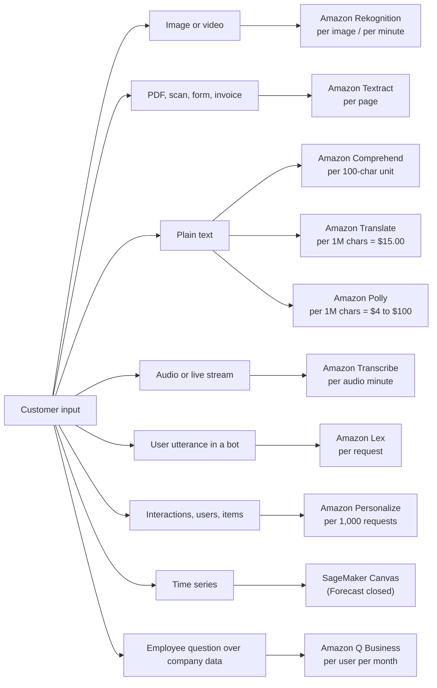
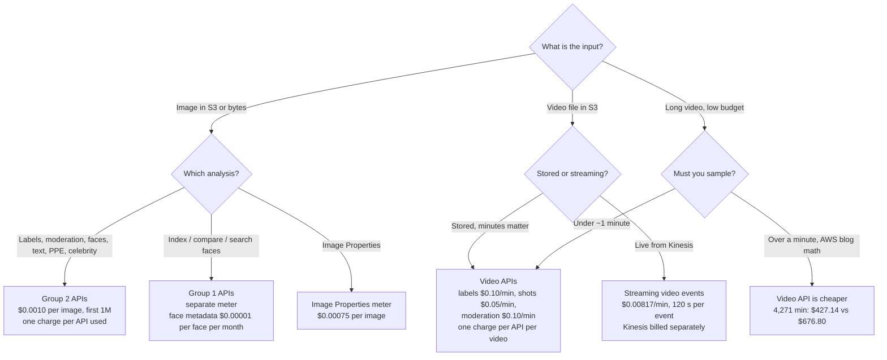
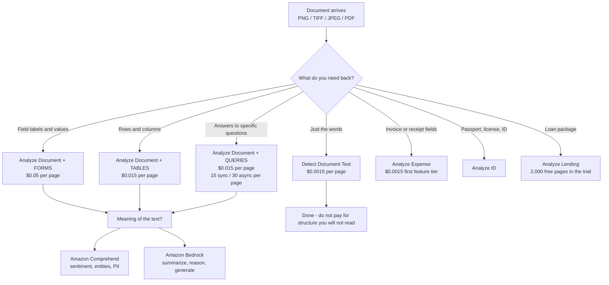
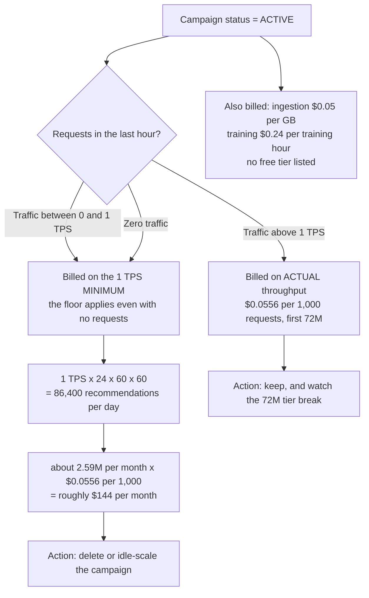

# Prebuilt AWS AI Services: Vision, Language, Speech and Conversation

Everything you built so far — data pipelines, algorithms, training jobs, endpoints — was **yours**: your data, your model, your bill for instance-hours. This lesson is about the other half of the AIF-C01 surface: the services where **AWS already owns the model** and you rent the answer by the unit. That single change in ownership changes every decision you make. You no longer tune hyperparameters; you choose **the right API, the right feature set inside that API, and the right meter** — and the exam tests exactly that, because "which service?" and "what does it cost?" are the two question shapes that recur across all five domains.

```text
=====================================================================
  THE PREBUILT LAYER — ten services, four modalities, one question
=====================================================================
  IMAGE / VIDEO ....... Amazon Rekognition ......... per image / per minute
  DOCUMENT ............ Amazon Textract ............ per page
  TEXT ................ Amazon Comprehend .......... per 100-char unit
  TEXT -> TEXT ......... Amazon Translate ........... per character
  TEXT -> SPEECH ....... Amazon Polly ............... per character
  SPEECH -> TEXT ....... Amazon Transcribe .......... per audio minute
  CONVERSATION ........ Amazon Lex ................. per request
  RECOMMENDATIONS ..... Amazon Personalize ......... per 1,000 requests
  FORECASTING ......... Amazon Forecast ............ CLOSED 2024-07-29
                        -> Amazon SageMaker Canvas
  ENTERPRISE Q&A ...... Amazon Q ................... per user / month
---------------------------------------------------------------------
  EXAM RULE: the input type names the service, and the billing unit
  names the answer. Learn the unit and you can compute the bill.
=====================================================================
```

> [!NOTE]
> **How to read this lesson.** Every price, quota and free-tier figure below comes from an AWS pricing page, an AWS "Guidelines and quotas" page, an AWS FAQ or an AWS worked example, captured in 2026. Where a number circulates only in third-party calculators — Lex streaming rates, some Transcribe tier-2/3 rates, Textract Layout and Signatures unit prices — it is flagged as *do not memorize* in the section where you would otherwise be tempted to use it. When AWS and a blog disagree, AWS wins; when an AWS page and an AWS page disagree, the pricing page wins for rates and the quota page wins for limits.

By the end of this lesson you will be able to:

- map **modality to service** and defend the choice against three plausible distractors;
- state the **billing unit** of every service in scope and compute a monthly bill from AWS's own worked examples;
- recall the **free tiers that differ in duration** — 12 months for most, **3 months for Textract**, 60 days for Amazon Q Business;
- apply the **Rekognition Group 1 / Group 2** metering split and explain why two APIs on one image cost twice;
- pick the correct **Textract API and feature combination** for OCR, forms, tables, queries, IDs, expense and lending;
- defend the **Personalize minimum of 1 provisioned TPS** and the **Amazon Forecast lifecycle** answer;
- separate **prebuilt services, SageMaker custom builds and Amazon Bedrock** with the comparative verdict;
- answer **ten exam-style questions** written in the official voice, including four arithmetic items.

---

## 1. The prebuilt landscape: what each service is for

### 1.1 Ten services, four modalities

The AIF-C01 exam does not ask you to remember API method names from memory. It asks you to read a workload description and name the service. That is a **classification** task, and it starts from one input: *what is the customer handing you?*

| Service | Modality | The job it does | Billing unit | Headline AWS rate (2026) |
|---|---|---|---|---|
| **Amazon Rekognition** | Image + video | Labels, face detect/search/verify, celebrity recognition, moderation, text-in-image, PPE, person tracking | Per image **and** per minute, **per API** | Group 2 image **$0.0010**; stored video **$0.10/min** |
| **Amazon Comprehend** | Text | Entities, sentiment, key phrases, language, syntax, PII detect/redact, topics, toxicity, prompt safety, custom classification | Per **100-character unit**, minimum 3 units | **$0.0001/unit** (about $1 per 1M characters) |
| **Amazon Textract** | Document | OCR plus forms, tables, natural-language queries, signatures, layout, expense, ID and lending extraction | Per **page** | OCR **$0.0015** → Forms+Tables+Queries **$0.070** |
| **Amazon Translate** | Text → text | Machine translation of text, HTML and documents, with custom terminology | Per **character** (including spaces) | **$15.00 per 1M chars** |
| **Amazon Polly** | Text → speech | Neural and generative TTS for IVR, eLearning, accessibility, narration; SSML speech marks | Per **character** | Standard **$4.00** → Long-Form **$100.00 per 1M chars** |
| **Amazon Transcribe** | Speech → text | Batch and live ASR, call-center transcripts, diarization, redaction, Call Analytics | Per **audio minute**, 1-second increments | Streaming Tier 1 **$0.01/min**; CA post-call **$0.03/min** |
| **Amazon Lex** | Text/speech in | Intent and slot NLU for chatbots and IVR, with Lambda fulfillment | Per **request** (speech or text) | Speech **$0.004**; text **$0.00075** |
| **Amazon Personalize** | Interactions | Real-time recommendations, reranking, batch personalization | Per GB / training hour / **1,000 requests** | **$0.0556 per 1,000** (first 72M/month) |
| **Amazon Forecast** | Time series | Demand, energy and transport forecasting | — | **Closed to new customers 29 Jul 2024** → SageMaker Canvas |
| **Amazon Q** | Text (enterprise) | Permission-aware Q Business assistant, Q Developer coding help, Q in Connect agent assist | Per **user/month** + index capacity | Lite **$3** / Pro **$20** per user per month |



### 1.2 What "prebuilt" means on this exam

A prebuilt service is **an API with a fixed output contract**. You send a JPEG and you get back labels with confidence scores and bounding boxes; you send 550 characters and you get back entities with offsets. You cannot change the label vocabulary in Rekognition `DetectLabels` (that is what Rekognition Custom Labels is for), you cannot make Comprehend return a paragraph of reasoning (that is a foundation model task), and you cannot ask Textract what the document *means* (that is Textract Queries for structure, or Comprehend/Bedrock for semantics).

Three consequences drive the whole exam:

1. **Pricing is per unit, not per hour** — images, pages, characters, minutes, requests, users. No instance to size, no idle endpoint to forget about (with one loud exception: Personalize campaigns, section 8.1).
2. **Feature selection inside one service changes the bill** — Textract OCR is **$0.0015** per page and Textract Forms is **$0.05** per page, a **33×** multiplier on the same document.
3. **Free tiers are not uniform** — 12 months for most services, **3 months for Textract**, a **60-day trial** for Amazon Q Business, and **nothing** for Personalize.

- **📚 Did you know?** The AIF-C01 exam guide's in-scope AI/ML list contains **14 services**: Amazon Augmented AI (A2I), Amazon Bedrock, Amazon Comprehend, Amazon Fraud Detector, Amazon Kendra, Amazon Lex, Amazon Personalize, Amazon Polly, Amazon Q, Amazon Rekognition, Amazon SageMaker, Amazon Textract, Amazon Transcribe and Amazon Translate. Eight of the ten services in this lesson come straight off that list — Amazon Forecast does **not** (it is a lifecycle question, not a construction question), and Amazon Q was added in a later guide revision along with Aurora, Bedrock AgentCore, Kiro, Strands Agents, SageMaker JumpStart and AWS Transform. Re-check the current in-scope list before exam day; the list has changed before and will change again.

---

## 2. Amazon Rekognition: images, video, faces and moderation

### 2.1 Two API groups, one image

Rekognition is the service with the most misunderstood meter in the whole prebuilt set, and the reason is historical. In the **9 November 2021** price reduction AWS split the image APIs into two groups that are **metered separately**, and that split still governs billing in 2026.

| Group 1 — face and user APIs | Group 2 — detection APIs |
|---|---|
| `CompareFaces`, `IndexFaces`, `SearchFaceByImage`, `SearchFaces` | `DetectFaces`, `DetectModerationLabels`, `DetectLabels` |
| `AssociateFaces`, `DisassociateFaces`, `SearchUsersByImage`, `SearchUsers` | `DetectText`, `RecognizeCelebrities`, `DetectProtectiveEquipment` |

The rule the exam is really testing: **image billing is per image, per API call**. Run `DetectLabels` and then `DetectModerationLabels` on the same 2.5 million images and you have processed **5 million billed images**, not 2.5 million. Video behaves the same way: a stored video minute analyzed by both the label API and the content moderation API bills **two minutes**, one per API.

### 2.2 The meters

| Meter | Price (AWS pricing page, 2026) |
|---|---|
| Group 2 image, first 1M images/month | **$0.0010 per image** |
| Group 2 image, beyond 1M | $0.0008 per image |
| Image Properties (separate meter) | **$0.00075 per image** first 1M, then $0.0006 |
| Stored video — label detection | **$0.10 per minute** |
| Stored video — shot detection | **$0.05 per minute** |
| Stored video — content moderation | **$0.10 per minute** |
| Streaming video events (Kinesis Video Streams input) | **$0.00817 per minute**, up to **120 seconds** analyzed per event; Kinesis billed separately |
| Face metadata storage | **$0.00001 per face per month** — the FAQ's *"$0.01 per 1,000 face vectors per month"* |

### 2.3 Hard limits and free tier

| Limit | Value |
|---|---|
| Image from S3 / image as bytes | **15 MB** / **5 MB** (4 MB for the PPE API) |
| Minimum image dimension | **80 px** (64 px for PPE) |
| Video file | **10 GB**, **6 hours**, H.264 or MPEG-4/MOV |
| Concurrent video jobs | **20 per account** |
| Streaming event analysis window | **120 seconds** per event |
| Free tier (12 months) | **5,000 images/month** + **60 video minutes/month** for labels, moderation, faces, face search, celebrity, text and person pathing |

### 2.4 Worked AWS examples

**Example 1 — 2.5 million moderation images.** AWS's own pricing example runs `DetectModerationLabels` over 2,500,000 images in a month:

$$
1{,}000{,}000 \times \$0.0010 + 1{,}500{,}000 \times \$0.0008 = \$1{,}000 + \$1{,}200 = \$2{,}200 \text{ per month}
$$

Add a second API on the same images (say `DetectText` for watermarks) and the bill doubles to **$4,400/month**, because each API bills its own image count.

**Example 2 — video API versus frame sampling.** For a 60-second video:

| Approach | Arithmetic | Cost |
|---|---|---|
| Video API, label detection | 1 minute × $0.10 | **$0.10** |
| Frame sampling at 2 fps, Group 2 images | 120 images × $0.0010 | **$0.12** + your own extraction compute |

The gap widens with length: in an AWS blog analysis of **4,271 minutes** of video, the video API cost **$427.14** while 2 fps image sampling cost **$512.57 for the images plus $164.23 for the Lambda that sampled them — $676.80 total**. Below roughly a minute the two are close; above it, the video API wins on price *and* returns timestamps, shot boundaries and person tracking that frame sampling cannot.



> [!WARNING]
> **The three Rekognition traps that cost marks.**
> 1. **Two APIs on one asset = two billed assets.** Group 1 and Group 2 are metered separately, and within a group every API call bills its own image (or its own video minute).
> 2. **Video moderation is a video API, not an image API.** If the option says *"billed per image"* for videos stored in S3, it is describing frame sampling — a valid engineering choice, but not the service's native answer, which is **$0.10 per video minute**.
> 3. **Streaming events are not free-form.** Each Kinesis-triggered event analyzes at most **120 seconds**, costs **$0.00817/min**, and you still pay for Kinesis on top.

- **📚 Did you know?** The face-metadata meter has two official spellings of the same number: the pricing page says **$0.00001 per face per month** and the FAQ says **$0.01 per 1,000 face vectors per month**. They are identical ($0.01 ÷ 1,000 = $0.00001). Exam options love to present one as a discount over the other — they are the same price, and both are *storage*: a collection of 500,000 faces costs **$5.00/month** whether or not you search it.

---

## 3. Amazon Comprehend: what the text is saying

### 3.1 The unit and the minimum

Comprehend meters in **100-character units** with a **3-unit (300-character) minimum per request**. The standard rate in AWS's worked examples is **$0.0001 per unit**, which is **$1.00 per 1,000,000 characters**.

The minimum is where candidates lose easy marks. A 120-character tweet is one unit of real content but bills as **3 units = $0.0003**. A 600-character support ticket bills as **6 units = $0.0006**. Batch requests are the same: you pay for what you send, rounded up per request.

**Worked example — support tickets.** 10,000 tickets of 550 characters each: 550 ÷ 100 = 5.5 → **6 units per request** → 10,000 × 6 = 60,000 units × $0.0001 = **$6.00 per month**. Note what that number teaches: at this volume Comprehend is effectively free, which is exactly why the exam pairs it with a *feature selection* question rather than a *cost* question.

### 3.2 What the API surface includes

| Capability | API / feature | Notes for the exam |
|---|---|---|
| Entities | `DetectEntities` | Persons, organizations, places, dates, quantities, with confidence |
| Sentiment | `DetectSentiment` | Positive / negative / neutral / mixed, with scores |
| Key phrases | `DetectKeyPhrases` | Noun-phrase extraction |
| Language | `DetectDominantLanguage` | Also a prerequisite for other calls |
| Syntax | `DetectSyntax` | Part-of-speech tagging |
| Targeted sentiment | `DetectTargetedSentiment` | Per-entity sentiment, not document-level |
| PII | `ContainsPiiEntities`, `DetectPiiEntities` | Detection **and** redaction |
| Topics | `DetectTopics` | Topic modeling over a batch |
| Toxicity | `DetectToxicity` | Text toxicity scores |
| Prompt safety | Prompt safety classification | Screens inputs before they reach a model |
| Custom classification | `CreateClassifier` | Labels your own categories |
| Custom entities | `CreateEntityRecognizer` | Your own entity vocabulary |

### 3.3 Custom Comprehend: where the meter changes

| Item | Rate |
|---|---|
| Training | **$3.00 per hour**, billed per second |
| Model management | **$0.50 per month** per model |
| Endpoint while running | Billed in **1-second increments**, **60-second minimum** |
| Provisioned throughput | **1 inference unit (IU) = 100 characters/second** at **$0.0005 per second** |
| Topic modeling job | First **100 MB flat**, then **$0.004 per MB** |
| Free tier | **50,000 units (5M characters) per API per month** — **no free tier for Custom Comprehend** |

### 3.4 Limits worth memorizing

| Limit | Value |
|---|---|
| Synchronous batch | **25 documents per request** |
| Async document size | **1 MB per document**, **5 GB per request** |
| Active async jobs | **10 per API** |
| Endpoints | **20 per Region**, **200 IU per Region**, **50 IU per endpoint** |
| Custom sync request body | **10 KB** |

- **📚 Did you know?** Comprehend's **prompt safety classification** is the bridge between this lesson and Bedrock: AWS added it so you can screen a user prompt for harmful content *before* it reaches a foundation model. On the exam, a question about "screening an input before generation" has two valid-looking answers and only one is right — **Comprehend** classifies and scores the text; **Bedrock Guardrails** applies policies at generation time. Read carefully which side of the call the question puts you on.

---

## 4. Amazon Textract: structure from documents

### 4.1 Five APIs, one feature switch

Textract exposes **five APIs**: `Detect Document Text`, `Analyze Document`, `Analyze Expense`, `Analyze ID` and `Analyze Lending`. Only `Analyze Document` carries feature types — **Forms, Tables, Queries, Custom Queries, Signatures and Layout** — and they are combinable in a single call, priced per page *per enabled feature*.

| API | What it returns | When to reach for it |
|---|---|---|
| `Detect Document Text` | Words and lines (pure OCR) | Clean text, no structure |
| `Analyze Document` | KEY_VALUE_SET, TABLE cells, Query answers, SIGNATURE, LAYOUT | Forms, tables, questions, signatures |
| `Analyze Expense` | Invoice/receipt fields and line items | Accounts payable |
| `Analyze ID` | Identity document fields and photos | Know-your-customer checks |
| `Analyze Lending` | Mortgage/loan package fields | Lending pipelines |

### 4.2 The price ladder (us-west-2, first 1M pages per month)

| Configuration | Price per page |
|---|---|
| OCR only (`Detect Document Text`) | **$0.0015** |
| Tables | **$0.015** |
| Forms | **$0.05** |
| Queries | **$0.015** |
| Tables + Queries | **$0.020** |
| Forms + Tables + Queries | **$0.070** |
| Custom Queries | **$0.025** |

Two facts fall out of that table. First, **enabling Forms multiplies the OCR bill by 33×**. Second, **Forms + Tables + Queries at $0.070 is about 47× OCR-only** — which is why the exam loves the *"which features does the workload actually need?"* question.

> [!NOTE]
> **Signatures and Layout.** AWS's public Textract pricing page prices the six feature combinations above. `Layout` at **$0.004/page** and `Signatures` at **$0.0035/page** appear in an AWS Solutions Library sample pricing template, and AWS documentation notes Layout is **free when Tables is enabled**. Treat those two unit prices as *verify before you quote them* — but do memorize the rule: **Layout rides along with Tables, and every other feature adds its own per-page charge.**

### 4.3 Queries: priced per page, not per answer

Queries let you ask natural-language questions of a document — *"What is the account number?"* — and get back answers with page coordinates. The caps are **15 queries per page synchronously** and **30 per page asynchronously**, and the critical pricing rule is that **you are billed per page regardless of how many answers come back**. Asking one question or fifteen questions on the same page costs the same. Asking the same question of 100,000 pages costs 100,000 × $0.015.

### 4.4 Free tier: three months, not twelve

| Textract API | Free tier | Duration |
|---|---|---|
| `Detect Document Text` | **1,000 pages/month** | **3 months** |
| `Analyze Document` (Signatures only) | 1,000 pages/month | **3 months** |
| `Analyze Document` (any other feature) | **100 pages/month** | **3 months** |
| `Analyze Expense` | 100 pages/month | **3 months** |
| `Analyze ID` | 100 pages/month | **3 months** |
| `Analyze Lending` | 2,000 pages/month | **3 months** |
| Custom Queries | **No free tier** | — |

Page counting is simple and deliberately exam-friendly: **one image (PNG, TIFF or JPEG) is one page**, and **each page of a PDF is one page**.

**Worked example — feature selection.** OCR of 100,000 pages costs **$150**. Forms + Tables on 5,000 pages costs 5,000 × ($0.05 + $0.015) = **$325**. The second job touches **20× fewer pages** and costs **2.2× more** — $0.065 per page versus $0.0015, a **43× unit difference**. The lesson is not "avoid Forms"; it is "enable only the features you will read".



---

## 5. Amazon Translate: high-volume machine translation

### 5.1 Rates

| Translation type | Rate per 1M characters |
|---|---|
| Standard text (real-time), HTML, batch documents | **$15.00** |
| Real-time **DOCX** document translation | **$30.00** |
| **Active Custom Translation** (custom model) | **$60.00** |

Characters include spaces, so you cannot game the meter by removing whitespace.

### 5.2 Free tier

- **2,000,000 characters per month for 12 months** for standard and batch translation;
- **Active Custom Translation: 500,000 characters per month for 2 months**;
- **No free tier at all** for real-time document translation.

### 5.3 What you are not charged for

AWS's FAQ draws an unusually precise line: you are **not** charged when the **source language equals the target language**, and you are **not** charged when the call **errors out and returns no translation**. You **are** charged for non-translatable content that still produces output. In practice this means a misconfigured loop that "translates" English to English is free — and also that the exam can ask about billing exceptions without any arithmetic.

### 5.4 Custom terminology

Custom terminology is how you pin brand names, product codes and legal terms. Its limits are all quotable exam material:

| Limit | Value |
|---|---|
| File size | **10 MB** |
| Files per account per Region | **100** |
| Target languages per file | **10** |
| Bytes per term | **200** |
| Files per request | **1** |
| Matching | **Case-sensitive** |

**Worked example — localizing a manual.** 100 pages × 20,000 characters = 2,000,000 characters:

| Option | Arithmetic | Cost |
|---|---|---|
| Standard translation | 2 × $15.00 | **$30.00** |
| Active Custom Translation | 2 × $60.00 | **$120.00** |
| A single 6,500-character article | 6,500 ÷ 1,000,000 × $15.00 | **$0.0975** |

---

## 6. Amazon Polly and Amazon Transcribe: the speech pair

Polly and Transcribe are the two halves of the same problem, and the exam likes to put them in the same option list to see whether you know which direction the audio flows.

### 6.1 Amazon Polly — text to speech

| Engine | Price per 1M characters | Free tier per month |
|---|---|---|
| Standard | **$4.00** ($4.80 in GovCloud) | 5,000,000 characters |
| Neural | **$16.00** ($19.20 in GovCloud) | 1,000,000 characters (first 12 months) |
| Generative | **$30.00** | 100,000 characters (first 12 months) |
| Long-Form | **$100.00** | 500,000 characters (first 12 months) |

**The double-billing rule:** `Speech` and `Speech Marks` are **separate billed requests**. Requesting both for the same 1,000 characters bills **2,000 characters**. Speech marks are what a web player uses to highlight words in sync with audio, so the pattern is common in eLearning — and it doubles the Polly line on the invoice.

**Worked example — one million characters:**

| Engine | Audio only | Audio + speech marks |
|---|---|---|
| Standard | **$4.00** | $8.00 |
| Neural | **$16.00** | **$32.00** |
| Generative | **$30.00** | $60.00 |
| Long-Form | **$100.00** | $200.00 |

Polly is billed **per character**, never per request — an option that says "per synthesis request" is a distractor.

### 6.2 Amazon Transcribe — speech to text

Transcribe bills in **1-second increments with no minimum**, which is unusual and worth memorizing on its own: a 3-second clip costs three seconds, not a rounded minute.

| Product | Rate per audio minute (AWS example tiers) |
|---|---|
| Batch transcription, Tier 1 | About **$0.006** |
| Streaming transcription, Tier 1 | **$0.01** |
| Call Analytics, **post-call** | **$0.0300** first 250K min → **$0.0186** next 750K → **$0.0138** next 4M |
| Call Analytics, **real-time** | **$0.0375** → **$0.0233** → **$0.0173** |
| Generative call summarization | **$0.0024** → **$0.0015** → **$0.0011**, **15-second minimum per request** |

**What is included versus what costs extra:**

| Included at no extra charge | Extra meter |
|---|---|
| Custom vocabularies | **PII redaction** |
| Vocabulary filtering | **Custom language models** |
| Speaker diarization | |
| Language identification | |
| Transcript formats (JSON, TXT, SRT, VTT) | |

Two structural rules: **stereo audio bills the total duration once, not per channel**, and **Call Analytics returns insight fields** — talk time, interruptions, non-talk, participant sentiment — that plain transcription does not.

**Worked example — a 200,000-call contact center.** 200,000 calls × 10 minutes = **2,000,000 minutes** of post-call analytics:

$$
250{,}000 \times \$0.0300 + 750{,}000 \times \$0.0186 + 1{,}000{,}000 \times \$0.0138
= \$7{,}500 + \$13{,}950 + \$13{,}800 = \$35{,}250 \text{ per month}
$$

**Limits and free tier:**

| Limit | Value |
|---|---|
| Batch audio file | **28,800 seconds (8 hours)** |
| Medical and Call Analytics batch | **14,400 seconds (4 hours)** |
| Minimum audio duration | **500 ms** |
| Job queue | **10,000 jobs** |
| Call Analytics concurrency | **100 jobs** |
| Free tier | **60 minutes per month for 12 months**, shared across Transcribe, Call Analytics and Transcribe Medical; no GovCloud, no rollover |

- **📚 Did you know?** Polly's **Standard 5M-character free tier** is the one figure on the AWS pricing page that omits the *"first 12 months"* qualifier used for Neural, Long-Form and Generative — while third-party pages confidently call it "always free". Do not build an answer on that: memorize the page as it reads, and treat any claim of a permanently free Polly tier as unverified. The same discipline applies to Lex's streaming rates, which circulate in third-party calculators but are not on AWS's own pricing excerpt — the AWS-published Lex numbers are **$0.004 speech** and **$0.00075 text**.

---

## 7. Amazon Lex: intents, slots and the per-request meter

### 7.1 The bill

| Request type | Price |
|---|---|
| Speech request | **$0.004** |
| Text request | **$0.00075** |

AWS's worked example: **8,000 speech requests + 2,000 text requests** = 8,000 × $0.004 + 2,000 × $0.00075 = $32.00 + $1.50 = **$33.50 per month**.

### 7.2 What counts as one request

- **Every user input is one billed request.** Five typed messages in a conversation are five requests.
- **In a streaming conversation, all turns ride on a single API call** — Lex V2 streams over **HTTP/2**, and the whole exchange is one billable call rather than five.
- Speech input is capped at **15 seconds per request**.
- Responses carry NLU confidence scores, sentiment and an `interpretationSource` field of either `Bedrock` or `Lex` — the exam's hint that Lex can be backed by a foundation model for generative meaning while still returning a structured intent.

### 7.3 Free tier

**10,000 text + 5,000 speech requests per month for the first year.**

### 7.4 Where Lex stops

Lex answers *"what did the user mean?"* — intent, slots, session state, fulfillment state. It does **not** answer open-ended questions over enterprise content, and it does not generate prose. That boundary is the single most common distractor set in this lesson: **Q Business** for permission-aware answers over company data, **Bedrock** for open-ended generation, **Lex** for structured intent routing into a Lambda.

---

## 8. Amazon Personalize and Amazon Forecast

### 8.1 Personalize: the meter with a floor

| Meter | Rate |
|---|---|
| Data ingestion | **$0.05 per GB** |
| Training | **$0.24 per training hour** |
| Real-time inference | **$0.0556 per 1,000 requests** (first 72M/month), **$0.0278** (next 648M), **$0.0139** (above 720M) |
| Recommender-hour model | **$0.375 / $0.045 / $0.018 / $0.005 per 100,000 users**, with **4,000 / 6,000 / 9,000 / 14,000 free recommendations per hour**; extras at **$0.0833 / $0.0417 / $0.0208 per 1,000** |
| Free tier | **None listed on the pricing page** |

**The trap: minimum provisioned throughput.** By default every active campaign must keep **at least 1 provisioned transactions per second (TPS)**, and AWS states plainly that the minimum applies **"even if you make no requests"** — you are billed on the **greater of the minimum and the actual** TPS.

The arithmetic is brutal and AWS's own Knowledge Center publishes it: 1 TPS held for one day is

$$
1 \times 24 \times 60 \times 60 = 86{,}400 \text{ billed recommendations per day}
$$

which at $0.0556 per 1,000 works out to roughly **$144 per month for a campaign nobody is calling** (about 2.59 million recommendations a month). The operational answer is short: **delete idle campaigns**.



### 8.2 Amazon Forecast: a lifecycle question, not a construction question

| Fact | Detail |
|---|---|
| Closed to new customers | **29 July 2024** |
| Existing customers | Keep working; **no new features** |
| Documented replacement | **Amazon SageMaker Canvas** |
| AWS lifecycle status | Listed under **"Services in Maintenance"** (2024-07-29) |
| AWS lifecycle vocabulary | **Maintenance → Sunset (typically ~12 months) → Full Shutdown** |

> [!WARNING]
> **Do not answer "Amazon Forecast" to a greenfield forecasting question.** Forecast is closed to new customers since **29 July 2024** and appears in AWS's maintenance list; the documented migration path is **Amazon SageMaker Canvas**. Existing customers continue to run their predictors — so an option that says *"existing customers must migrate immediately"* is equally wrong. The correct exam answer is always the pair: **new → SageMaker Canvas, existing → continue with no new features**. And Personalize is *not* a forecasting service: it recommends items from interactions, it does not project a time series.

---

## 9. Amazon Q: the per-user answer

Amazon Q is explicitly **in scope for AIF-C01**, and it is the only service in this lesson priced **per user per month** rather than per unit of work. That difference is the whole question.

| SKU | Price | What it buys |
|---|---|---|
| **Q Business Lite** | **$3 per user per month** | Roughly one-page answers |
| **Q Business Pro** | **$20 per user per month** | Roughly seven pages, Q Apps, Q in QuickSight Reader Pro, plugins |
| **Q Business index** | Per hour of index capacity | Billed while the index exists; billing starts at first use |
| **Q Business trial** | **60 days** | Up to **50 Pro or Lite users per application** + **1,500 index hours** |
| **Q Developer Free** | **$0** | **50 agentic requests/month**, **1,000 LOC/month** Java transformation |
| **Q Developer Pro** | **$19 per user per month** | **4,000 LOC/month pooled** at the payer account, **$0.003/LOC** overage, IP indemnity |
| **Q in Connect** | **$0.0015 per chat message**, **$0.0080 per voice minute** | Contact-center assist |

Three readings the exam tests:

1. **Q Business is permission-aware enterprise RAG.** It answers questions over your connectors (S3, Confluence, Salesforce and dozens more) **with each user's own permissions respected**, and it cites sources. That is a different product from "an anonymous public chatbot".
2. **The trial is 60 days, not 12 months** — the shortest free period in this lesson, and the one candidates most often confuse with the 12-month AWS free tier.
3. **Q Developer's Pro overage is per line of code**, at **$0.003/LOC** over the pooled 4,000 LOC/month — a meter nobody expects, and therefore a favorite for a numerical option.

---

## 10. Which AI service? The decision tree

Everything above collapses into one diagram. Read the input first, then the intent, then the meter — that order is exactly how the exam writes its options.

```mermaid
flowchart TD
    START["What is the customer handing you?"]
    START -->|"Image or video"| VIS{"What do you need from it?"}
    VIS -->|"Labels, faces, moderation, text-in-image, PPE"| REK["Amazon Rekognition<br/>per image / per minute, per API"]
    VIS -->|"Niche defect or domain-specific vision"| CUSTOM["Rekognition Custom Labels<br/>or SageMaker with your labeled data"]
    VIS -->|"A document as a picture"| TX2["Amazon Textract"]

    START -->|"Document: PDF, scan, invoice, ID"| DOC{"Structure or just words?"}
    DOC -->|"Words only"| OCR2["Textract Detect Document Text<br/>$0.0015 per page"]
    DOC -->|"Forms, tables, queries, IDs, expense"| AN2["Textract Analyze* APIs<br/>$0.015 to $0.070 per page"]
    DOC -->|"What the text means"| CO2["Amazon Comprehend<br/>per 100-char unit, min 3"]

    START -->|"Plain text"| TXT{"What do you need from it?"}
    TXT -->|"Entities, sentiment, PII, topics, toxicity"| CMP["Amazon Comprehend<br/>$0.0001 per unit"]
    TXT -->|"Another language"| TRN["Amazon Translate<br/>$15.00 per 1M chars"]
    TXT -->|"Speech out to a user"| POL["Amazon Polly<br/>$4 to $100 per 1M chars"]
    TXT -->|"Open-ended generation or reasoning"| BED["Amazon Bedrock<br/>per input and output token"]

    START -->|"Audio"| AUD{"Files at rest or live?"}
    AUD -->|"Files, call center, diarization"| TRL["Amazon Transcribe<br/>per audio minute"]
    AUD -->|"Live stream"| TRLS["Transcribe streaming<br/>$0.01 per minute Tier 1"]

    START -->|"User utterance in a bot"| LX["Amazon Lex<br/>$0.004 speech / $0.00075 text"]

    START -->|"Interactions, users, items"| PERS["Amazon Personalize<br/>$0.0556 per 1,000 + 1 TPS minimum"]

    START -->|"Time series to forecast"| FC2["Amazon SageMaker Canvas<br/>Forecast closed to new customers"]

    START -->|"Employee asks about company data"| QB["Amazon Q Business<br/>$3 Lite / $20 Pro per user"]

    START -->|"Developer asks about the codebase"| QD["Amazon Q Developer<br/>Free or $19 per user"]
```



Practice the mapping until it is automatic:

```matching
{
  "question": "Match each workload phrase to the AWS service and its billing unit:",
  "pairs": [
    {"left": "Flag explicit content in videos stored in S3", "right": "Amazon Rekognition Video content moderation - billed per video minute at $0.10"},
    {"left": "Pull key-value pairs and table cells out of scanned loan PDFs", "right": "Amazon Textract AnalyzeDocument with FORMS and TABLES - billed per page at $0.05 and $0.015"},
    {"left": "Redact credit card numbers from 550-character support tickets", "right": "Amazon Comprehend PII detection and redaction - billed per 100-character unit with a 3-unit minimum"},
    {"left": "Keep a product name out of a 2,000,000-character localization job", "right": "Amazon Translate custom terminology - 10 MB per file, 100 files per account per Region, 200 bytes per term"},
    {"left": "Read a chat transcript back to a supervisor with per-participant sentiment", "right": "Amazon Transcribe Call Analytics post-call - billed per audio minute at $0.0300 for the first 250K minutes"},
    {"left": "Route a voice caller to the right Lambda by intent and slot", "right": "Amazon Lex - billed per request at $0.004 for speech and $0.00075 for text"},
    {"left": "Serve real-time recommendations while an idle campaign still costs money", "right": "Amazon Personalize - $0.0556 per 1,000 requests plus a default minimum of 1 provisioned TPS per campaign"},
    {"left": "Answer an employee's question over Confluence with their own permissions", "right": "Amazon Q Business - $3 Lite or $20 Pro per user per month plus index capacity per hour"}
  ],
  "explanation": "Each phrase names an input type first: video to Rekognition, documents to Textract, raw text to Comprehend, translation memory to Translate, audio to Transcribe, user utterances to Lex, interaction history to Personalize and enterprise content to Q Business. Once the input picks the service, the billing unit picks the answer - per minute, per page, per unit, per character, per request, per 1,000 requests or per user."
}
```

- **📚 Did you know?** Amazon Lex V2 responses carry an `interpretationSource` field that can read **`Bedrock`** instead of **`Lex`** — the bot's NLU can be powered by a foundation model while the response stays a structured intent with slots and confidence. That is why "use Bedrock instead of Lex" is a *partially* wrong distractor: Bedrock gives you generation and reasoning, Lex gives you the conversation state machine, session, fulfillment hooks and the per-request meter the contact center is budgeted on.

---

## 11. Free tiers, limits and the numbers you must memorize

### 11.1 Free tier — memorize the outliers

| Service | Unit | Amount | Duration |
|---|---|---|---|
| Rekognition Image / Video | images / video minutes | 5,000 / 60 per month | **12 months** |
| Comprehend | 100-char units, per API | 50,000/month (5M chars) | **12 months**; Custom excluded |
| Textract `Detect Document Text` | pages | 1,000/month | **3 months** |
| Textract `Analyze Document` | pages | 100/month (1,000 Signatures-only) | **3 months** |
| Translate | characters | 2,000,000/month | **12 months** |
| Polly Standard / Neural | characters | 5,000,000 / 1,000,000 per month | Standard lacks a 12-month qualifier; Neural 12 months |
| Transcribe (+ Call Analytics, Medical) | audio minutes | 60/month | **12 months** |
| Lex | text + speech requests | 10,000 + 5,000/month | first year |
| Amazon Q Business | users + index | 50 users/app + 1,500 index hours | **60-day trial** |
| Personalize | — | **none listed** | — |

The three durations are the exam's gift: **12 months** for almost everything, **3 months** for Textract, **60 days** for Q Business.

### 11.2 Hard limits worth memorizing

| Service | Limit | Value |
|---|---|---|
| Rekognition | image (S3 / bytes) / video | 15 MB / 5 MB (4 MB PPE) / video 10 GB, 6 h, H.264 |
| Rekognition | min dimension / concurrent video jobs / event length | 80 px (64 px PPE) / 20 per account / 120 s |
| Comprehend | billing unit + minimum | 100 chars + 3 units (300 chars) per request |
| Comprehend | batch sync / async doc / active jobs / endpoint caps | 25 docs / 1 MB / 10 jobs / 20 endpoints, 50 IU each |
| Textract | queries per page / free-tier duration | 15 sync, 30 async / **3 months** |
| Translate | terminology file / files / target languages / term | 10 MB / 100 / 10 / 200 bytes |
| Transcribe | batch audio max / Medical + CA batch | 28,800 s (8 h) / 14,400 s (4 h) |
| Transcribe | min duration / queue / CA concurrency | 500 ms / 10,000 jobs / 100 jobs |
| Lex | speech input / free tier | 15 s / 10,000 text + 5,000 speech |
| Personalize | default minimum provisioned TPS | **1 TPS per active campaign** |

### 11.3 AWS worked examples, all in one table

| # | AWS scenario | Arithmetic | Result |
|---|---|---|---|
| 1 | 2.5M Group-2 images | 1M × $0.0010 + 1.5M × $0.0008 | **$2,200/month** |
| 2 | 100k min labels + 100k min shots + 50k min moderation | 100k × $0.10 + 100k × $0.05 + 50k × $0.10 | **$20,000/month** |
| 3 | 10,000 Comprehend requests × 550 chars | 6 units each = 60,000 × $0.0001 | **$6.00/month** |
| 4 | 100,000 pages of OCR | 100k × $0.0015 | **$150** |
| 5 | 5,000 pages of Forms + Tables | 5,000 × ($0.05 + $0.015) | **$325** |
| 6 | 2M minutes of post-call analytics | 250k × $0.03 + 750k × $0.0186 + 1M × $0.0138 | **$35,250/month** |
| 7 | 8,000 speech + 2,000 text Lex requests | 8,000 × $0.004 + 2,000 × $0.00075 | **$33.50/month** |
| 8 | 1M Polly characters, audio + speech marks, Neural | 1M × $16.00 × 2 | **$32.00** |
| 9 | Personalize campaign idle at 1 TPS for one day | 86,400 recommendations/day ≈ 2.59M/month × $0.0556/1,000 | **≈ $144/month** |
| 10 | 2M characters localized, standard vs Active Custom | 2 × $15.00 vs 2 × $60.00 | **$30.00 vs $120.00** |

### 11.4 Input in, output out

| Service | Accepted input | Primary output |
|---|---|---|
| Rekognition | JPEG/PNG (S3 ≤15 MB, bytes ≤5 MB); video ≤10 GB, 6 h; Kinesis stream | JSON labels with confidence and boxes, face vectors, moderation labels, text geometry, timestamps |
| Comprehend | UTF-8 text; PDF/DOCX; S3 batch files | Entities, sentiment scores, key phrases, language, PII spans or redacted text, classes, toxicity flags |
| Textract | PNG/JPEG/TIFF (1 page), PDF (multi-page) | Blocks: words/lines, KEY_VALUE_SET, TABLE cells, Query → Answer, SIGNATURE, LAYOUT |
| Translate | Text (real-time), S3 documents (HTML/TXT/DOCX), parallel data | Translated text or documents |
| Polly | Text plus SSML | Audio (MP3, OGG, PCM …) and/or Speech Marks JSON time tokens |
| Transcribe | S3 audio/video (mp3, mp4, wav, flac, ogg, amr, webm, m4a) or live audio (HTTP/2, WebSocket) | Transcripts (JSON/TXT/SRT/VTT), diarization, sentiment, Call Analytics fields |
| Lex | Text utterances or ≤15 s speech; HTTP/2 stream | Intent, slots, session state, fulfillment state, messages, sentiment |
| Personalize | Interactions/users/items datasets (S3 or event trackers) | GetRecommendations results, rankings, batch recommendation files |
| Q Business | Questions plus connectors (S3, Confluence, Salesforce, 40+) and files | Permission-aware cited answers, generated content, Q Apps, QuickSight insights |
| Q Developer | Code, repos, CLI/console questions, build errors | Code suggestions, refactors, security scans, Java/.NET transformation patches |

- **📚 Did you know?** Two services in this lesson **do not charge you when nothing happens**: Translate does not bill a call whose source language equals its target language or that errors without returning a translation — while Comprehend's **300-character minimum** means a 40-character request costs the same as a 300-character one. The exam loves pairing a "no charge" rule with a "minimum charge" rule in the same option list to see whether you are recalling a specific service or just the general vibe of per-unit pricing.

---

## 12. Comparative verdict

> [!IMPORTANT]
> **Comparative Verdict — prebuilt service vs SageMaker custom vs Amazon Bedrock**
> - **Prebuilt service** (Rekognition, Comprehend, Textract, Translate, Polly, Transcribe, Lex, Personalize, Q) is the answer when the task is **a well-known problem with a matching API and a predictable output contract**: labels with confidence, entity spans, key-value pairs, transcripts, intents and slots, recommendations. You pay **per unit**, you deploy **nothing**, you train **nothing**, and you get to production in an afternoon. Its failure mode is **shape**: if the required output is not the API's output — a niche defect class, a proprietary document layout, an answer that must cite your own documents — no amount of parameter tweaking will change the response, because there are no parameters to tweak. AWS's own numbers show the ceiling too: Textract Forms at **$0.05/page** versus OCR at **$0.0015/page** is a **33×** premium for structure.
> - **SageMaker custom** (Rekognition Custom Labels, built-in algorithms, JumpStart fine-tuning, your own training job) is the answer when you have **labeled data and a task the prebuilt APIs get wrong** — visual defect inspection, a document template no one else uses, a sentiment model tuned to your industry's vocabulary. You trade the per-unit meter for **training hours and endpoint hours**: Comprehend's own custom path bills **$3/hour** to train, **$0.50/month** to manage and **$0.0005/second per inference unit** while an endpoint runs, and SageMaker endpoints bill every second they exist. Its failure mode is **fixed cost and MLOps burden**: you now own data labeling, evaluation, drift and the idle-endpoint bill — the same **$305.88/month of mostly idle compute** lesson from Lesson 6.
> - **Amazon Bedrock** is the answer when the work is **open-ended generation or reasoning over your content**: summaries, drafts, extraction in your own words, RAG over a knowledge base, multi-step agents, or multi-model choice with provisioned throughput. You pay **per input and output token**, you can swap models without rewriting the application, and Guardrails/Knowledge Bases/Agents give you the governance layer. Its failure mode is **determinism**: a generative answer to "what is the account number?" is the wrong tool when Textract Queries returns that value at **$0.015/page** with a page coordinate and no chance of invention — and generative tokens cost money on every call, where a classification API costs a fraction of a cent.
> - **Rule of thumb for the exam:** *does the question describe a fixed task with a matching API?* Yes → **prebuilt service**, and then pick the **cheapest feature set that returns what you read** (OCR before Forms; plain transcription before Call Analytics). *Do you have labeled data and a task the API fails?* → **SageMaker custom**. *Is the output open-ended, conversational or grounded in your documents?* → **Bedrock**, or **Amazon Q Business** when the question adds *permission-aware answers for employees over company data* at **$3/$20 per user per month**. When an option offers to "build a custom model" for a task with a dedicated prebuilt API, it is a distractor; when an option offers the prebuilt API for a task that needs your own labels, it is the other distractor.

---

## 13. Exam traps for this lesson

> [!WARNING]
> **The ten traps that cost marks on this exact material:**
> 1. **Rekognition bills per API.** Two APIs on one image = two billed images; two video APIs on one video = two billed minutes. Group 1 and Group 2 are **separate meters**.
> 2. **Comprehend's minimum is 300 characters (3 units)**, so a 120-character request still bills 3 units at **$0.0001 each**.
> 3. **Textract's free tier is 3 months, not 12**, and **Custom Queries have no free tier at all**.
> 4. **Textract OCR is $0.0015 and Forms is $0.05** — enable only what you read; Tables+Queries is **$0.020**, Forms+Tables+Queries is **$0.070**.
> 5. **Polly bills per character, and Speech Marks bill separately** — 1,000 characters with audio and speech marks = **2,000 billed characters**.
> 6. **Transcribe bills in 1-second increments with no minimum**, stereo bills **total duration once**, and Call Analytics returns insight fields plain transcription does not.
> 7. **Lex charges $0.004 per speech request and $0.00075 per text request** — but a **streaming conversation is one API call**, and speech input is capped at **15 seconds**.
> 8. **Personalize's default minimum is 1 provisioned TPS per active campaign, billed even with zero requests** — 86,400 recommendations a day, about **$144/month** for an idle campaign. Delete idle campaigns.
> 9. **Amazon Forecast has been closed to new customers since 29 July 2024** — new work goes to **Amazon SageMaker Canvas**, existing customers continue with no new features.
> 10. **Amazon Q is per user, not per token**: Lite **$3**, Pro **$20**, Q Developer Pro **$19** with **$0.003/LOC** overage, Q in Connect **$0.0015 per chat message** and **$0.0080 per voice minute**, trial **60 days**.
>
> And two "do not memorize" flags: **Lex streaming rates** and the **Textract Layout ($0.004) / Signatures ($0.0035)** unit prices come from third-party trackers and an AWS sample template rather than the public pricing pages — AWS publishes Lex's request/response rates and Textract's six priced feature combinations. Verify on the pricing page before quoting them.

---

## Service lifecycle watch

AWS retires and renames AI services on a published schedule, and part of this exam is telling a **maintenance** announcement apart from a **shutdown**. The vocabulary comes from the AWS General Reference (Service Lifecycle, last updated 24 Sep 2026) and is the same vocabulary section 8.2 already used for Amazon Forecast:

- **Maintenance** — closed to new customers and to new features, but still supported for existing customers;
- **Sunset** — a planned end of operations, typically announced about **12 months** ahead;
- **Full Shutdown** — the service is removed from the AWS portfolio entirely.

### 2025–2026 Updates

Every row below is verified against an AWS availability-change page, an AWS What's New post, an AWS blog or the AIF-C01 exam guide. Nothing here comes from a third-party tracker.

| Service or feature | Date | Status | Documented replacement |
|---|---|---|---|
| **Amazon Forecast** | Closed to new customers **29 Jul 2024** | Maintenance | **Amazon SageMaker Canvas** |
| **Amazon Kendra** | Maintenance **30 Jun 2026**; closed to new customers **30 Jul 2026** | Maintenance | **Amazon Bedrock Managed Knowledge Base** (Smart Parsing + Agentic Retrieval API) |
| **Amazon Q Business** | Availability page now reads **"no longer open to new customers"** — **AWS has published no closure date** | No new customers | **Amazon Quick** (bring your own identity); Guardrails and User Store do **not** transfer |
| **Amazon Q Developer** | Signups blocked **15 May 2026**; IDE and paid features **end of support 30 Apr 2027** | Sunset path | **Kiro** |
| **SageMaker Model Monitor, Clarify, Ground Truth, A2I, Debugger, Role Manager, Geospatial, Studio Lab, Mechanical Turk, Profiler** | Closed to new customers **30 Jul 2026** (Mechanical Turk end of support **30 Sep 2026**; Profiler **30 Jun 2027**) | **Maintenance, not shutdown** | Clarify → **Bedrock Model Evaluations**; Model Monitor → CloudWatch metrics and anomaly detection |
| **Ground Truth Plus** | End of support **30 Jun 2026** | Sunset | Ground Truth |
| **Amazon QuickSight → Quick Suite** | **9 Oct 2025** | Expanded and renamed | Amazon Quick Suite (Author Pro **$50 → $40**) |
| **AWS Chatbot** | **26 Feb 2025** | Renamed | **Amazon Q Developer** |
| **Amazon MemoryDB** | Removed from the AIF-C01 in-scope list **30 Apr 2026** | Out of exam scope | — |

The exam itself moved at the same time. AWS published exam guide **v1.0 on 26 March 2026** and **v1.1 on 30 April 2026**, and states that guide changes appear on the live exam about **one month after publication**:

| Exam-guide change (v1.1, 30 Apr 2026) | Detail |
|---|---|
| Added to the in-scope list | Amazon Aurora, **Amazon Bedrock AgentCore**, **Kiro**, **Strands Agents**, **Amazon Q**, SageMaker JumpStart, AWS Transform |
| Removed from the in-scope list | **Amazon MemoryDB** |
| New objective **2.1.6** | Agentic AI: multi-agent patterns, **MCP**, memory management, tool usage, orchestration |
| New objectives **2.1.4 / 2.1.5** | Token-based pricing and its effect on cost and performance; context engineering |
| New objective **3.2.5** | Prompt versioning via **Bedrock Prompt Management** |
| New objective **5.1.5** | Hallucination detection and grounding: RAG grounding, output validation, confidence scoring |
| Unchanged | **65 questions (50 scored + 15 unscored)**, **90 minutes**, **USD 100**, pass **700/1000**, 3-year validity, domains weighted **20 / 24 / 28 / 14 / 14** |

Two of this lesson's answers therefore gained a 2026 sibling: **Forecast → SageMaker Canvas** (closed 29 Jul 2024) and now **Kendra → Bedrock Managed Knowledge Base** (closed 30 Jul 2026). Both are lifecycle questions, not construction questions — the exam wants the *pair* (new customers → replacement, existing customers → keep running, no new features).

```fillblank
{
  "question": "Complete the verified 2025-2026 service-lifecycle facts for this lesson:",
  "template": "Amazon Kendra entered maintenance on {{1}} and closed to new customers on {{2}}, with {{3}} documented as the replacement for new search applications. The AIF-C01 exam guide v1.1 was published on {{4}}, and SageMaker Model Monitor and Clarify closed to new customers on {{5}}.",
  "answers": {
    "1": "30 June 2026",
    "2": "30 July 2026",
    "3": "Amazon Bedrock Managed Knowledge Base",
    "4": "30 April 2026",
    "5": "30 July 2026"
  },
  "distractors": [
    "29 July 2024",
    "Amazon SageMaker Canvas",
    "26 March 2026",
    "13 October 2025",
    "Amazon Quick"
  ],
  "explanation": "Kendra entered maintenance on 30 June 2026 and closed to new customers on 30 July 2026, with Amazon Bedrock Managed Knowledge Base documented as the path for new applications. Exam guide v1.1 was published on 30 April 2026, and Model Monitor and Clarify closed to new customers on 30 July 2026 - maintenance, not shutdown. 29 July 2024 is Amazon Forecast's date and SageMaker Canvas is Forecast's replacement, not Kendra's."
}
```

> [!WARNING]
> **Read lifecycle language literally.**
> 1. **"Closed to new customers" is maintenance, not shutdown.** Existing customers keep using Model Monitor, Clarify, Kendra and Q Business while no new features arrive. An option that says *"the service was discontinued"* or *"existing customers must migrate immediately"* is the Forecast trap recycled — and it is wrong.
> 2. **One date is deliberately not memorized.** AWS's Q Business availability page says **"no longer open to new customers"** but publishes **no date**, and the Quick → Amazon Quick rename appears only in an AWS re:Post answer rather than an AWS News Blog post. Any option that quotes a specific 2026 Q Business closure date is asserting something AWS has not written.
> 3. **Maintenance decisions are exam answers, not trivia.** When a service on the in-scope list enters maintenance, the correct response pairs the *documented replacement* with *continuity for existing customers* — never a forced migration and never "it still accepts new signups".

- **📚 Did you know?** The exam logistics did not move while the content did: AIF-C01 is still **65 questions (50 scored + 15 unscored)** in **90 minutes** for **USD 100**, pass mark **700/1000**, valid for **3 years** — but the Italian and German language versions were retired after **15 October 2026**. AWS also says guide updates reach the live exam roughly a month after publication, so v1.1's new objectives — agentic AI with **MCP**, context engineering, token-based pricing, prompt versioning and hallucination grounding — were examinable from around late May 2026.

---

## Real-World Case Studies

The pricing tables tell you what a service costs; AWS's published customer stories tell you **when to reach for it**. Every figure below is quoted from the AWS case study or AWS Machine Learning Blog post named in the Source column. All of them are customer- or AWS-claimed and unaudited, and where a source says "up to", treat it as a ceiling rather than an expectation.

### Case 1 — Anthem: prebuilt Textract first, humans for the tail

Anthem's claim-form extraction reportedly cost millions of dollars a year and took **20 minutes per claim** when handled manually. The AWS-published architecture routes portal documents through **Amazon Textract** OCR plus an ML index/classify step. The reported outcome: **80% of the workflow automated**, with a **90%+ target**, across thousands of claims per day. The exam-relevant part is what happens to the rest: a regulated, structured extraction task with a matching prebuilt API gets the **prebuilt service first**, and the remaining 10–20% of hard cases goes to a human exception path — which is exactly what **Amazon A2I** exists to manage. Source: `aws.amazon.com/solutions/case-studies/anthem` (re:Invent 2020 session).

### Case 2 — Chronomics: four months of DIY vision → 3–4 weeks of AutoML

Chronomics spent **4 months** building an in-house computer-vision model to read COVID-19 test results and never reached its target. Switching to **Amazon Rekognition Custom Labels** shipped in **3–4 weeks** at **96.5% accuracy / 97.9% F1**, scored with `DetectCustomLabels`. The threshold arithmetic is the exam-relevant detail: at a threshold of **0.99**, accepted predictions are **99.6%** correct but **5%** of predictions are **discarded**; at **0.999**, precision rises to **99.87%** while **27%** are discarded. Somebody must decide what happens to the discarded tail — the human-review/A2I answer — before the threshold is set. Source: AWS Machine Learning Blog, 13 Dec 2022, `aws.amazon.com/blogs/machine-learning/chronomics-detects-covid-19-test-results-with-amazon-rekognition-custom-labels`.

### Case 3 — Sun Finance: the LLM-only OCR trap, and the fix

Sun Finance (fintech lending across 9 countries) had **60% of microloan applications** needing manual review, each taking anywhere from **10 minutes to 20 hours**. Attempt 1 — sending ID photos straight to **Claude Sonnet 4** for JSON extraction — scored **61.8% overall** and only **43%** on ID numbers and was **rejected**, because privacy protections block direct PII extraction. Attempt 2, built with the AWS Generative AI Innovation Center, separates the stages: **Textract** for OCR → **Rekognition** as fallback and face checks → the foundation model **only for structuring** → validation rules, with **Titan Multimodal Embeddings** in **S3 Vectors** for fraud similarity, evaluated on **585 images**. Results: overall accuracy **79.73% → 90.80%** (ID number **74.32% → 89.40%**, document type **78.43% → 96.40%**), **−91%** cost per document, **20 hours → under 5 seconds**, fraud detection at **81%**. Exam angle: **OCR is not reasoning** — the deterministic prebuilt API reads the characters, and the model only words the answer. Source: AWS Machine Learning Blog, 30 Apr 2026, `aws.amazon.com/blogs/machine-learning/sun-finance-automates-id-extraction-and-fraud-detection-with-generative-ai-on-aws`.

### Case 4 — Alnylam: Amazon Q Business with citations under GxP

Alnylam Pharmaceuticals' complaint triage took **3–4 days**, and finding one internal answer took **15+ minutes**. Using **Amazon Bedrock**, **Amazon S3** and **Amazon Q Business**, the team built an intake-and-triage prototype in **3 months** under GxP constraints, plus **AskALNY**, a Slack assistant serving **2,000 employees and 1,000 contractors** that returns answers **with source links**. Reported outcomes: triage fell from **3–4 days to hours**, information search from **15 minutes to 30 seconds**, and **250+ use cases** followed the first two. Exam angle: *"permission-aware answers over company data, with citations"* is **Amazon Q Business** at **$3 Lite / $20 Pro per user per month** — not Lex (intent routing into a Lambda) and not a bare Bedrock call (no connector or permission layer). Source: `aws.amazon.com/solutions/case-studies/alnylam-case-study`.

| Case | Tier of this lesson's decision tree | AWS services named by AWS | Headline numbers | Source |
|---|---|---|---|---|
| **Anthem** (health insurance) | **Prebuilt** | Amazon Textract | 20 min/claim → **80% automated**, target **90%+** | `aws.amazon.com/solutions/case-studies/anthem` |
| **Chronomics** (health-tech) | **Prebuilt + AutoML** | Rekognition Custom Labels | **4 months → 3–4 weeks**; **96.5% / 97.9% F1**; threshold 0.99 → 99.6% (5% discarded) | AWS ML Blog, 13 Dec 2022 |
| **Sun Finance** (fintech) | **Hybrid: prebuilt OCR + generative structuring** | Textract, Rekognition, Bedrock (Claude Sonnet 4, Titan embeddings), Lambda, Step Functions, S3 Vectors | **79.73% → 90.80%**; **−91%** cost/doc; **20 h → <5 s**; LLM-only attempt **61.8%** rejected | AWS ML Blog, 30 Apr 2026 |
| **Alnylam** (biotech) | **Generative + enterprise Q&A** | Bedrock, Amazon S3, **Amazon Q Business** | triage **3–4 d → hours**; search **15 min → 30 s**; **3,000 users**; **250+** use cases | `aws.amazon.com/solutions/case-studies/alnylam-case-study` |

| Pattern this lesson tests | Case evidence (verified numbers) | The exam answer it supports |
|---|---|---|
| Prebuilt service first for structured, regulated extraction | Anthem **80% automated** with Textract | Pick the prebuilt API, then design the human exception path |
| A DIY model is a hidden tax | Chronomics **4 months → 3–4 weeks**, **96.5%** on Custom Labels | Try the prebuilt/AutoML tier before building; iterate on data, not on hope |
| LLM-only extraction fails | Sun Finance attempt 1: **61.8%** overall, **43%** ID numbers, rejected | Separate OCR from reasoning: **Textract/Rekognition read, the model words** |
| Permission-aware answers over company data | Alnylam AskALNY, **3,000 users**, answers **with source links** | **Amazon Q Business**, not Lex and not a raw Bedrock call |
| Latency and residency are hard requirements | Sun Finance **20 h → <5 s**; rejected prototype | Measure the baseline before you build — a percentage without a "before" is marketing |

- **📚 Did you know?** The only production-readiness rate AWS publishes is **65%**: of more than **1,000** Generative AI Innovation Center implementations, **65% reached production in 2025** — some in as little as **45 days** — using AWS's **Five V's** framework (**Value → Visualize → Validate → Verify → Venture**). Never memorize "every pilot succeeds": the other **35%** is the number that teaches you to baseline the metric before you build, and to plan a human path for what the model gets wrong.

---

## Practice Questions

```question
{
  "id": "aid-07-q1",
  "type": "multiple-choice",
  "question": "A media company must flag explicit and suggestive adult content in videos stored in Amazon S3. Which service and pricing unit fit best?",
  "options": [
    "Amazon Rekognition DetectModerationLabels, billed per image",
    "Amazon Rekognition Video content moderation, billed per minute of video processed",
    "Amazon Comprehend toxicity detection, billed per 100-character unit",
    "Amazon Transcribe Call Analytics, billed per minute of audio",
    "Amazon Bedrock guardrails, billed per input token"
  ],
  "correct": 1,
  "explanation": "Video moderation is an asynchronous video API metered per minute of stored video at $0.10 per minute. Option A describes DetectModerationLabels on still images, which would require frame sampling and would bill per image. Comprehend toxicity detection is a text feature, Transcribe Call Analytics is audio, and Bedrock guardrails operate on generated content rather than on stored video."
}
```

```question
{
  "id": "aid-07-q2",
  "type": "multiple-choice",
  "question": "A team sends 600 characters per call to Amazon Comprehend for entity recognition. What is the minimum billed size of each request?",
  "options": [
    "100 characters",
    "300 characters",
    "600 characters",
    "6,000 characters",
    "1,000 characters"
  ],
  "correct": 1,
  "explanation": "Comprehend meters in 100-character units with a documented 3-unit minimum per request, so the floor is 300 characters. This particular 600-character request bills 6 units at $0.0001 each, but the question asks for the minimum billed size, which is where candidates who forget the 3-unit floor lose the mark."
}
```

```question
{
  "id": "aid-07-q3",
  "type": "multiple-choice",
  "question": "A lender must extract key-value pairs, table cells and the answer to the question \"What is the account number?\" from scanned loan PDFs. Which configuration should it use?",
  "options": [
    "Amazon Textract DetectDocumentText (OCR only)",
    "Amazon Textract AnalyzeDocument with FORMS, TABLES and QUERIES",
    "Amazon Comprehend custom classification with PII detection",
    "Amazon Rekognition DetectText",
    "Amazon Textract AnalyzeID"
  ],
  "correct": 1,
  "explanation": "AnalyzeDocument is the only Textract API that combines Forms, Tables and Queries in a single call, and those feature types are what return KEY_VALUE_SET, TABLE cells and Query answers. DetectDocumentText returns only words and lines with no structure, Comprehend does not read scanned documents, Rekognition DetectText is for text inside images rather than documents, and AnalyzeID is built for identity documents rather than loan packages."
}
```

```question
{
  "id": "aid-07-q4",
  "type": "multiple-choice",
  "question": "Which statement about the Amazon Textract free tier is correct?",
  "options": [
    "12 months, with 1,000 pages per month for every API",
    "3 months; DetectDocumentText gets 1,000 pages per month while Forms and Tables combinations get 100 pages per month",
    "Unlimited pages for the first 30 days",
    "3 months, including 1,000 free pages per month for Custom Queries",
    "60 days, with 500 pages per month across all APIs"
  ],
  "correct": 1,
  "explanation": "Textract's free tier runs for 3 months rather than the 12 months most other AWS AI services offer, with 1,000 pages per month for DetectDocumentText, 100 pages per month for AnalyzeDocument when any feature other than Signatures is enabled, and no free tier whatsoever for Custom Queries. The 60-day figure belongs to the Amazon Q Business trial, not to Textract."
}
```

```question
{
  "id": "aid-07-q5",
  "type": "multiple-choice",
  "question": "A learning platform will synthesize 10 million characters per month using Amazon Polly Neural voices. What is the monthly cost at list price before any free tier?",
  "options": [
    "$160",
    "$40",
    "$16",
    "$300",
    "Neural voices are billed per request, not per character"
  ],
  "correct": 0,
  "explanation": "Neural is $16.00 per 1 million characters, so 10 million characters cost 10 x $16.00 = $160.00. $40 would be the Standard engine at $4.00 per million, $16 is one million Neural characters, and $300 corresponds to a different engine combination. Polly bills per character, never per synthesis request."
}
```

```question
{
  "id": "aid-07-q6",
  "type": "multiple-choice",
  "question": "A contact center needs transcripts plus insights such as talk time, interruptions and per-participant sentiment for calls stored in Amazon S3. Which service and unit fit best?",
  "options": [
    "Amazon Transcribe standard transcription, per audio minute",
    "Amazon Transcribe Call Analytics post-call, per audio minute",
    "Amazon Transcribe streaming, per 1-second increment",
    "Amazon Polly, per character",
    "Amazon Lex, per request"
  ],
  "correct": 1,
  "explanation": "Call Analytics post-call returns the insight fields the question lists and is billed per audio minute at $0.0300 for the first 250,000 minutes, then $0.0186 and $0.0138. Standard transcription delivers a transcript without those insight fields, streaming transcription is for live audio rather than files at rest, Polly converts text to speech, and Lex handles intents rather than transcripts."
}
```

```question
{
  "id": "aid-07-q7",
  "type": "multiple-choice",
  "question": "A chatbot must understand user intents and slots in both text and voice, then call an AWS Lambda function to fulfill the request. Which service and meter apply?",
  "options": [
    "Amazon Q Business, per user per month",
    "Amazon Lex, per user input request at $0.004 for speech and $0.00075 for text",
    "Amazon Bedrock, per input and output token",
    "Amazon Kendra, per index hour",
    "Amazon Comprehend, per 100-character unit"
  ],
  "correct": 1,
  "explanation": "Lex is the conversation service: it returns intent, slots, session state and fulfillment state, and it bills per request at $0.004 for speech and $0.00075 for text, with 10,000 text plus 5,000 speech requests free for the first year. Q Business is priced per user per month, Bedrock is token-metered, Kendra is an enterprise search index, and Comprehend performs text analytics rather than dialogue management."
}
```

```question
{
  "id": "aid-07-q8",
  "type": "multiple-choice",
  "question": "A low-traffic team launches real-time recommendations with Amazon Personalize and then leaves the campaign running unused for a month. What should the architect expect?",
  "options": [
    "No charge until the first recommendation is served",
    "A default minimum of 1 provisioned TPS per active campaign is billed even with no requests, roughly 86,400 recommendations per day",
    "Only successful recommendations are billed, not requests",
    "Campaigns are free; only data ingestion at $0.05 per GB is billed",
    "Billing pauses automatically after 24 hours of inactivity"
  ],
  "correct": 1,
  "explanation": "Personalize bills the greater of the minimum provisioned throughput and the actual throughput, and the default minimum is 1 TPS per active campaign that applies even if you make no requests. One TPS held for a day is 1 x 24 x 60 x 60 = 86,400 billed recommendations, which at $0.0556 per 1,000 is roughly $144 per month. The operational answer is to delete idle campaigns."
}
```

```question
{
  "id": "aid-07-q9",
  "type": "multiple-choice",
  "question": "A new AWS customer wants managed demand forecasting for its retail stores. Which guidance is correct?",
  "options": [
    "Amazon Forecast, which is free for 12 months for all new customers",
    "Amazon Forecast, available to new customers on request through AWS Support",
    "Amazon SageMaker Canvas, because Amazon Forecast closed to new customers on 29 July 2024",
    "Amazon Personalize forecasting recipes",
    "Amazon Q Business analytics"
  ],
  "correct": 2,
  "explanation": "Amazon Forecast has been closed to new customers since 29 July 2024, is listed under AWS services in maintenance, and is documented as moving to Amazon SageMaker Canvas; existing customers keep working with no new features. Forecast was never free for 12 months, access is not granted through Support, Personalize is a recommendation service rather than a forecasting service, and Q Business is an enterprise assistant."
}
```

```question
{
  "id": "aid-07-q10",
  "type": "multiple-choice",
  "question": "From the AIF-C01 in-scope list, which service fits an enterprise assistant that answers employee questions over company data with permission-aware responses?",
  "options": [
    "Amazon Q Business at Lite $3 or Pro $20 per user per month, plus index capacity per hour",
    "Amazon Forecast, billed per predictor training hour",
    "Amazon Rekognition Custom Labels, billed per image",
    "Amazon Transcribe, billed per audio minute",
    "Amazon Personalize, billed per 1,000 requests"
  ],
  "correct": 0,
  "explanation": "Amazon Q Business is explicitly on the AIF-C01 in-scope list and is the service that answers questions over connectors such as S3, Confluence and Salesforce while respecting each user's permissions; it is priced per user subscription plus index capacity, with a 60-day trial of up to 50 users per application and 1,500 index hours. Forecast is not in scope and is closed to new customers, Rekognition and Transcribe do not deliver enterprise question answering, and Personalize serves recommendations rather than answers."
}
```

```question
{
  "id": "aid-07-q11",
  "type": "multiple-choice",
  "question": "An engineering team must keep its product codename from being translated in a 2,000,000-character localization job. Which feature and cost apply with standard Amazon Translate?",
  "options": [
    "Custom terminology, with the translation still costing $30.00 per month at the standard rate",
    "Custom terminology, which adds a flat $50 per month to the standard rate",
    "Active Custom Translation, costing $30.00 for the job",
    "Custom terminology, and the job becomes free because no characters change",
    "No feature exists; the team must post-edit every string"
  ],
  "correct": 0,
  "explanation": "Custom terminology lets you lock brand names and codenames at no separate charge: 10 MB per file, 100 files per account per Region, 10 target languages per file, 200 bytes per term and one file per request, with case-sensitive matching. The translation itself is still billed per character at $15.00 per 1 million characters, so 2,000,000 characters cost 2 x $15.00 = $30.00. Active Custom Translation is a different feature at $60.00 per million, and characters that pass through custom terminology are not exempted from billing."
}
```

```question
{
  "id": "aid-07-q12",
  "type": "multiple-choice",
  "question": "A developer wants an AWS assistant that can answer questions about a Java codebase in the IDE and transform 1,000 lines of code per month at no cost. Which option is correct?",
  "options": [
    "Amazon Q Developer Free tier, which includes 50 agentic requests per month and 1,000 LOC per month of Java transformation",
    "Amazon Q Business Lite at $3 per user per month",
    "Amazon Q Developer Pro, which is free for the first 12 months",
    "Amazon CodeWhisperer legacy pricing at $0.004 per request",
    "Amazon Bedrock with provisioned throughput"
  ],
  "correct": 0,
  "explanation": "Q Developer's free tier documents 50 agentic requests per month and 1,000 lines of code per month of Java transformation, while Q Developer Pro costs $19 per user per month, pools 4,000 LOC per month at the payer account and charges $0.003 per line of code over that pool. Q Business Lite is the enterprise assistant SKU rather than the coding assistant, and Bedrock is token-metered generative AI rather than an IDE coding assistant."
}
```

```question
{
  "id": "aid-07-q13",
  "type": "multiple-choice",
  "question": "A fintech prototype sends photos of identity documents directly to a foundation model and asks it to return structured JSON. Evaluated on 585 images, the prototype scores 61.8% overall and 43% on ID numbers, so it is rejected. Which redesign matches the outcome AWS published?",
  "options": [
    "Raise the model's maximum output tokens and re-run the identical pipeline",
    "Amazon Textract for OCR, Amazon Rekognition for fallback and face checks, and the foundation model only for structuring, with validation rules",
    "Fine-tune the foundation model on ten images and lower the confidence threshold to accept every result",
    "Replace the pipeline with Amazon Comprehend custom classification at $0.0001 per 100-character unit",
    "Amazon Rekognition DetectText alone, billed per image at $0.0010"
  ],
  "correct": 1,
  "explanation": "This is Sun Finance's documented progression: an LLM-only first attempt scored 61.8% overall and 43% on ID numbers because privacy protections block direct PII extraction, while the accepted design separated OCR from reasoning - Textract reads the characters, Rekognition covers fallback and face checks, the model only structures the answer, and validation rules catch the rest, reaching 79.73% to 90.80% accuracy with 91% lower cost per document. Raising token limits and fine-tuning ten images do not fix a tool-choice error, Comprehend analyzes text rather than reading document images, and DetectText on its own returns words with no structure."
}
```

```question
{
  "id": "aid-07-q14",
  "type": "multiple-choice",
  "question": "Amazon Kendra entered maintenance on 30 June 2026 and closed to new customers on 30 July 2026. An organization needs managed enterprise search with generative question answering over its Amazon S3 content. Which guidance is correct?",
  "options": [
    "Amazon Personalize, because search and recommendations share one meter",
    "Amazon Bedrock Managed Knowledge Base, the documented replacement for new enterprise-search applications",
    "Amazon Q Business, which replaces Kendra and is billed per page processed",
    "Amazon Forecast paired with Amazon SageMaker Canvas, the standard migration pair",
    "Rebuild on Amazon OpenSearch Service only, since generative answering is out of scope for this exam"
  ],
  "correct": 1,
  "explanation": "AWS's Kendra availability-change page directs new search applications to the Amazon Bedrock Managed Knowledge Base (Smart Parsing, hybrid vector store, Agentic Retrieval API); existing Kendra customers keep running their indexes with no new features. Personalize is a recommendation service, Q Business is a per-user enterprise assistant rather than a per-page Kendra replacement, the Forecast-to-SageMaker Canvas pair belongs to the forecasting lifecycle question from 29 July 2024, and generative answering over enterprise content is squarely in scope for AIF-C01."
}
```

```dragdrop
{
  "question": "Order these AWS pricing facts from the shortest to the longest free or trial period:",
  "items": [
    "Amazon Q Business - 60-day trial, up to 50 users per application plus 1,500 index hours",
    "Amazon Textract - 3 months, 1,000 pages per month for DetectDocumentText",
    "Amazon Polly Neural, Rekognition, Comprehend, Translate, Transcribe and Lex - 12 months",
    "Amazon Personalize - no free tier listed on the pricing page"
  ],
  "correctOrder": [
    "Amazon Personalize - no free tier listed on the pricing page",
    "Amazon Q Business - 60-day trial, up to 50 users per application plus 1,500 index hours",
    "Amazon Textract - 3 months, 1,000 pages per month for DetectDocumentText",
    "Amazon Polly Neural, Rekognition, Comprehend, Translate, Transcribe and Lex - 12 months"
  ],
  "explanation": "The order runs from no free period at all to the longest: Personalize lists no free tier, Q Business gives you 60 days, Textract gives you 3 months instead of the usual 12, and the rest of the prebuilt services give 12 months. Mixing up these three durations - 60 days, 3 months and 12 months - is the single most reliable distractor pattern AWS uses against this lesson's material."
}
```

---

> [!WARNING]
> **Final exam-day checklist for this lesson:**
> - Name the **input type first**, then the service, then the **billing unit** — that order answers every "which service?" question;
> - **Rekognition**: per image **and** per minute **per API**; Group 1 and Group 2 are separate meters; video moderation is **$0.10/min**; streaming events **$0.00817/min** with a **120 s** window; face metadata **$0.00001 per face per month**;
> - **Comprehend**: 100-character units, **3-unit minimum**, **$0.0001** per unit, custom training **$3/hour** and model management **$0.50/month**, no free tier for Custom;
> - **Textract**: five APIs, feature-driven per-page pricing from **$0.0015 to $0.070**, queries **15 sync / 30 async per page** and billed **per page**, free tier of **3 months** with **no Custom Queries tier**;
> - **Translate**: **$15.00 per 1M** standard, **$30** DOCX, **$60** Active Custom, **2M free characters for 12 months**, case-sensitive terminology capped at **10 MB / 100 files / 10 languages / 200 bytes**;
> - **Polly**: **$4 / $16 / $30 / $100 per 1M characters** by engine, and **speech marks bill separately**;
> - **Transcribe**: **1-second increments with no minimum**, Call Analytics post-call from **$0.0300/min**, batch audio **8 hours** max, **60 free minutes per month**;
> - **Lex**: **$0.004 speech / $0.00075 text**, **15-second** speech cap, streaming conversation = **one API call**;
> - **Personalize**: ingestion **$0.05/GB**, training **$0.24/hour**, **$0.0556 per 1,000 requests**, and a **1 TPS minimum that bills while idle**;
> - **Forecast**: closed to new customers **29 July 2024** → **SageMaker Canvas**; **Amazon Q**: Lite **$3**, Pro **$20**, Developer Pro **$19**, Connect **$0.0015** per chat and **$0.0080** per voice minute, trial **60 days**.

> [!SUCCESS]
> **Key Takeaways:**
> 1. **The input type names the service and the billing unit names the answer**: images and video → **Rekognition** (per image / per minute, per API), documents → **Textract** (per page), raw text → **Comprehend** (per 100-char unit, minimum 3), translation → **Translate** (per character), speech out → **Polly** (per character), audio in → **Transcribe** (per audio minute), bot turns → **Lex** (per request), interaction history → **Personalize** (per 1,000 requests), enterprise questions → **Amazon Q** (per user per month).
> 2. **Metering granularity is the exam's favorite arithmetic**: Rekognition charges **once per API per asset** (Group 1 and Group 2 separately, video APIs per minute per API), Comprehend rounds every request up to at least **300 characters**, Textract bills **per page regardless of how many Query answers return**, and Polly bills **speech and speech marks separately**.
> 3. **Free tiers are deliberately non-uniform**: **12 months** for Rekognition (5,000 images + 60 video minutes), Comprehend (50,000 units per API), Translate (2M characters), Polly, Transcribe (60 minutes) and Lex (10,000 text + 5,000 speech); **3 months** for Textract; **60 days** for Amazon Q Business; **nothing** for Personalize or Custom Comprehend.
> 4. **Feature selection inside one service is a pricing decision**: Textract OCR **$0.0015** versus Forms **$0.05** versus Forms+Tables+Queries **$0.070**; Transcribe standard transcription versus Call Analytics at **$0.0300/min**; Polly Standard **$4** versus Long-Form **$100** per million characters. Enable only what you read.
> 5. **Two lifecycle answers must be memorized verbatim**: **Amazon Forecast closed to new customers on 29 July 2024**, listed in maintenance, with **Amazon SageMaker Canvas** as the documented replacement and existing customers continuing with no new features; **Amazon Q is in scope for AIF-C01**, priced **$3 Lite / $20 Pro / $19 Q Developer Pro** plus index hours and **$0.0015 per chat message / $0.0080 per voice minute** in Connect.
> 6. **The only default minimum in this lesson is Personalize's 1 provisioned TPS per active campaign**, billed even with zero traffic — **86,400 recommendations per day, roughly $144/month** — so the architect's first action on a low-traffic launch is to delete idle campaigns.
> 7. **Comparative verdict:** fixed task with a matching API → **prebuilt service**; labeled data and a task the API fails → **SageMaker custom** (training hours and endpoint hours); open-ended generation or grounded answers → **Bedrock**, or **Amazon Q Business** when the question adds permission-aware answers over company data — and when an option offers to build a custom model for a task that already has a dedicated API, it is a distractor.
