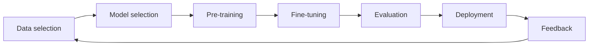
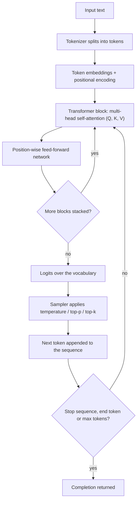
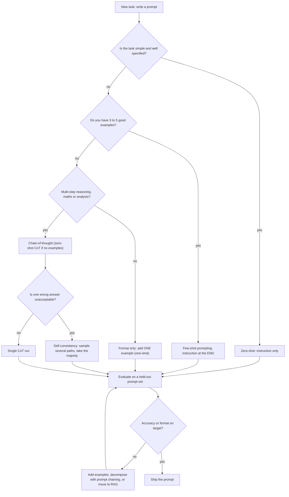
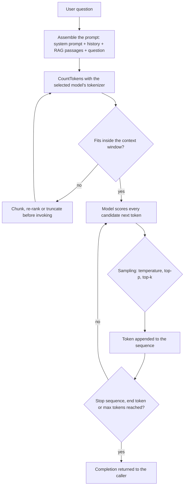
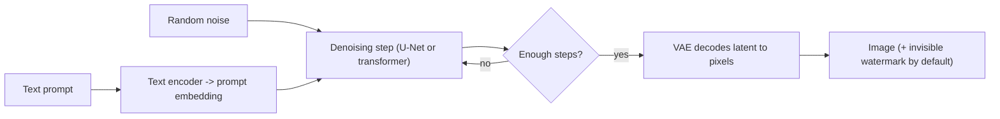
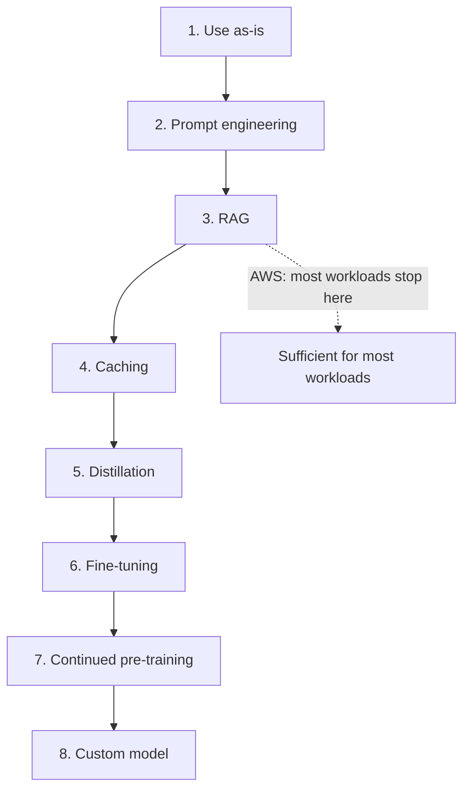

# Generative AI Fundamentals: Tokens, Transformers, Prompting and Foundation Models

This is the highest-leverage lesson in the course. **Domain 2 (Fundamentals of Generative AI) carries 24% and Domain 3 (Applications of Foundation Models) carries 28%** of the scored content — **52% in total** — and almost every question inside those two domains is built from the same small set of objects: a **token**, a **context window**, a **prompt**, an **inference parameter**, an **embedding** and a **foundation model (FM)**. Learn the objects and the numbers attached to them, and half the exam becomes arithmetic plus vocabulary rather than guesswork.

```text
=====================================================================
 THE GENERATIVE HALF OF THE AIF-C01 EXAM          (Digest: Oct 2026)
=====================================================================
  DOMAIN 2  Fundamentals of Generative AI ............. 24 %
  DOMAIN 3  Applications of Foundation Models ......... 28 %
  ----------------------------------------------------------
  combined weight of this lesson's material .......... 52 %
---------------------------------------------------------------------
  TASK 2.1 VOCABULARY
    tokens · chunking · embeddings · vectors · prompt engineering ·
    transformer-based LLMs · foundation models · multi-modal models ·
    diffusion models
  FM LIFECYCLE
    data selection -> model selection -> pre-training ->
    fine-tuning -> evaluation -> deployment -> feedback
---------------------------------------------------------------------
  AWS ADVANTAGES  ... adaptability · responsiveness ·
                     conversational ability · content generation
  AWS RISKS       ... hallucinations · poor interpretability ·
                     inaccuracy · nondeterminism
=====================================================================
```

> [!NOTE]
> **How to read this lesson.** Every limit, default and percentage below comes from the AIF-C01 Exam Guide, the Amazon Bedrock user guide, an AWS blog or an AWS science post. Two rules govern the numbers: **when AWS publishes a figure, AWS wins over any third-party calculator** — this matters most for token estimation, where the internet's popular "~4 characters per token" is *not* an AWS number; and **marketing percentages are reproduced as AWS claims**, clearly labelled as such, because their methodology is not independently verified.

By the end of this lesson you will be able to:

- explain **self-attention** in query/key/value terms and say why transformers beat RNNs on long sequences;
- estimate **tokens** with both AWS-published rules (6 characters per token, and 4.7 characters per token for English embeddings) and know which one the question is using;
- budget a **context window** as system prompt + client input + RAG context + output, and predict what a **Context Window Overflow** does to behaviour;
- choose between **zero-shot, few-shot, chain-of-thought, self-consistency and prompt chaining** and state each one's cost;
- set **temperature, top-p, top-k, max tokens, stop sequences and penalties** for a workload and defend the determinism answer;
- read a **modality table** and pick the right FM family for text, embeddings, image, video or image+text inputs;
- walk the **customization spectrum** from prompt engineering to a custom model and name the numbers AWS attaches to distillation and reinforcement fine-tuning;
- evaluate an FM with **ROUGE, BLEU, BERTScore, LLM-as-a-judge and human evaluation**;
- apply the **six Guardrails policies** and the three-step hallucination mitigation ladder;
- defend the **comparative verdict** between generative AI, traditional ML and rules-based systems.

---

## 1. What generative AI is — and what it is not

### 1.1 The definition the exam actually uses

Generative AI is the class of systems that **creates new content**: text, code, images, video, audio and embeddings. That single word — *new* — is the whole distinction. A traditional ML model answers "which bucket does this row belong to?"; a generative model answers "write me something that belongs in this bucket." Foundation models are the engines underneath: large models trained on broad corpora that you adapt through **prompting, retrieval-augmented generation (RAG) or fine-tuning** instead of retraining.

AWS is explicit about the trade. Foundation models are **non-deterministic**: *"identical inputs can produce different responses"*. That property is what makes them useful for drafting and brainstorming and what makes them dangerous for extraction, scoring and anything an auditor will read twice.

### 1.2 The advantages and the risks AWS names

The exam guide lists four advantages and four disadvantages. They are not decoration: each advantage pairs with a control, and each risk pairs with a mitigation you will be asked to name.

| Advantage (AIF-C01 exam guide) | What it delivers | The control that keeps it useful |
|---|---|---|
| **Adaptability** | one model, many tasks through prompting and fine-tuning | customization spectrum (Section 9) |
| **Responsiveness** | output conditioned on the whole prompt | context-window budgeting (Section 7) |
| **Conversational ability** | multi-turn dialogue over your data | RAG plus Guardrails (Section 11) |
| **Content generation** | new text, code, image, audio, video | evaluation and human review (Section 10) |

| Disadvantage (AIF-C01 exam guide) | Failure it produces | Mitigation AWS documents |
|---|---|---|
| **Hallucination** | confident fabrication | prompt refinement → RAG → different model; contextual grounding checks |
| **Poor interpretability** | no readable feature importances | programmatic + judge + human evaluation |
| **Inaccuracy** | wrong facts, wrong format | grounding, ROUGE/BLEU/BERTScore, held-out prompt sets |
| **Nondeterminism** | same input, different output | temperature 0, fixed seeds, Guardrails, human-in-the-loop |

### 1.3 The foundation model lifecycle

Task 2.1 requires the lifecycle in order. It is also the shape of most sequencing questions on the exam.



- **🔢 📚 Did you know?** The exam guide's own wording for the lifecycle is a *cycle*, not a line: **feedback loops back into data selection**. That is why "monitor the deployed model and feed production data back into the corpus" reads as correct on the exam while "deployment is the final step" reads as a distractor — and it is the same loop that makes *drift* a generative-AI problem and not only a classical-ML problem.

---

## 2. Tokens: the unit everything is measured in

### 2.1 What a token is

A **token** is the chunk of text a model actually reads and writes. A **tokenizer** splits raw text into tokens before the model sees it, and generation happens one token at a time. The critical property is that **tokenization is model-specific**: the same sentence can be 12 tokens on one model and 17 on another, which is why a fixed "words ÷ X = tokens" formula is unreliable and why Amazon Bedrock exposes a **CountTokens** API that counts with *the selected model's* tokenizer on the exact input you are about to invoke.

**Chunking** is the companion concept: when a document is longer than a model's input limit, you split it into segments (paragraphs, sections, pages) so each segment fits. Chunking quality is the single biggest lever in a RAG system — AWS published a case where better chunking alone raised **context relevance from 67% to 93%** and removed hallucinations **without changing the prompt**.

### 2.2 The two AWS-published estimation rules

| Rule | AWS source | What it is for | Exact value |
|---|---|---|---|
| **≈ 6 characters per token** | Bedrock *Prepare model customizations* | fine-tuning quotas and dataset planning | allowed characters = token quota × 6 |
| **≈ 4.7 characters per token (English)** | Bedrock *Titan Text Embeddings* | embedding input limits | 8,192 tokens ≈ **38,502 characters** |

> [!WARNING]
> **The "~4 characters per token" rule you will find in blogs is not an AWS number.** It circulates widely in third-party token calculators, and it is close enough to be tempting — and wrong enough to fail an arithmetic item. On the exam, use the AWS figures: **6 characters per token** for fine-tuning and quota planning, **4.7 characters per token** for English input to Titan Text Embeddings V2. When an option is built on 4 characters per token, it is built on a number AWS never published.

### 2.3 Worked example 1 — fine-tuning quota in characters

A team wants to fine-tune **Amazon Titan Text G1 Express** and has a **30,000-character** sample prompt. The batch-size-1 fine-tuning quota for that model is **4,096 input+output tokens**.

1. Convert the quota to characters: $4{,}096 \times 6 = 24{,}576$ characters allowed.
2. Convert the sample to tokens: $30{,}000 \div 6 = 5{,}000$ tokens — **904 tokens over** the 4,096 quota.
3. Convert the overage back to characters: $30{,}000 - 24{,}576 = 5{,}424$ characters too many.

**Answer:** the sample exceeds the quota by **5,424 characters**; split it into two records or truncate. The distractor "50,000 characters" is the Titan *Embeddings V2* cap, a different model and a different limit.

### 2.4 Worked example 2 — which embedding limit binds first?

Titan Text Embeddings V2 accepts **8,192 tokens *or* 50,000 characters**. Which one stops a long English document first?

1. English averages **4.7 characters per token**, so the token bound binds at $8{,}192 \times 4.7 \approx 38{,}502$ characters.
2. A **50,000-character** article therefore converts to $50{,}000 \div 4.7 \approx 10{,}638$ tokens.
3. Overage: $10{,}638 - 8{,}192 = 2{,}446$ tokens.

**Answer:** the **token bound binds first**, at roughly 38,502 characters for English — 11,498 characters *before* the 50,000-character ceiling. AWS's documented remedy is to segment the document into paragraphs or sections and embed each one.

- **🔢 📚 Did you know?** Bedrock's **CountTokens** endpoint answers a question no formula can: it runs the *invoked model's own* tokenizer over your exact string. The same 47,000-character article can be over budget on one model and comfortably under budget on another, which is why AWS documents CountTokens as the planning step before any quota-sensitive call rather than an optional convenience.

---

## 3. Transformers and self-attention: how a model reads a sequence

### 3.1 Query, key and value

**Self-attention** lets every token in a sequence look at every other token and decide what matters. Each token embedding is projected into three vectors, and AWS's descriptions of them are the exact phrasing the exam uses:

| Vector | The question it answers | Role in the attention score |
|---|---|---|
| **Query (Q)** | *"what am I searching for?"* | what this token wants to find elsewhere in the sequence |
| **Key (K)** | *"what do I offer?"* | the label each token advertises about itself |
| **Value (V)** | *"what do I pass along?"* | the content actually carried forward to the next layer |

Attention scores are computed from **Q matched against K**, then used to weight the **V** vectors. The result is a representation of each token that already contains its context — which is why "bank" in *river bank* and "bank" in *bank account* end up as different vectors even though they were the same input string.

### 3.2 The transformer block and positional encoding

A transformer block is, in AWS's definition, **multi-head self-attention plus a position-wise feed-forward network**. Multiple heads attend in parallel so different heads can specialise — one tracking syntax, another tracking coreference, another tracking distance. Because attention itself is order-blind, **positional encoding** injects the order of the sequence so the model knows which token came first.

### 3.3 Why transformers beat RNNs, and why GPT-style models are decoder stacks

Transformers process **the whole sequence in parallel**, where an RNN must walk it one position at a time. The consequences are the two things worth memorising: **faster training** and the ability to handle **much longer sequences**. GPT-style models are stacks of **decoder** blocks and are **autoregressive** — they produce one token, append it to the input, and run again.



> [!NOTE]
> Two phrasings the exam loves: a transformer block is *"multi-head self-attention **plus** a position-wise feed-forward network"* — not attention alone — and **positional encoding**, not the attention mechanism itself, is what supplies word order. If a distractor claims attention preserves order naturally, it is testing whether you remember that attention is permutation-invariant.

---

## 4. Embeddings, vectors and vector databases

### 4.1 From one-hot tables to embedding space

Before embeddings, categorical data lived in **one-hot tables**: a tall, sparse vector where every word was an independent column and no notion of meaning existed between them. **Embeddings replace that** with a dense vector in which semantically similar words sit **near each other**. The payoff is arithmetic that one-hot encoding could never do — AWS's documented example is `Paris − France + Germany ≈ Berlin`, where the *direction* between two embeddings encodes a relationship.

### 4.2 Who computes similarity: the model or the database?

A detail that decides many marks: the model **produces** the vector; the **vector database computes** similarity, using **cosine similarity or k-nearest neighbours (k-NN)**. Retrieval in a RAG pipeline is therefore a database operation, and the exam guide names the embedding stores it expects you to recognise.

| Store named in Task 3.1 | Retrieval mechanism | Typical AIF-C01 framing |
|---|---|---|
| **Amazon OpenSearch Service** | k-NN / vector search | managed vector search alongside full-text |
| **Amazon Aurora** | **pgvector** on Aurora PostgreSQL | relational data with vector retrieval |
| **Amazon Neptune** | vector search on the graph | relationships *and* similarity |
| **Amazon DocumentDB (with MongoDB compatibility)** | vector search | document workloads with embeddings |
| **Amazon RDS for PostgreSQL** | pgvector | self-managed style deployments on AWS |

### 4.3 The embedding models and their verified limits

| Model | Direction | Verified spec |
|---|---|---|
| **Amazon Titan Text Embeddings G1** | text → vector | max input **8K tokens**; max output vector **1,536** dimensions |
| **Amazon Titan Text Embeddings V2** (`amazon.titan-embed-text-v2:0`) | text → vector | **8,192 tokens or 50,000 characters** in; **1,024** dimensions (also 512 and 256); **4.7 characters per token** for English |
| **Cohere Embed v3** | text → vector | **1,024** values |
| **Amazon Titan Multimodal Embeddings G1** | image or text → shared vector | compares a prompt against a generated image by **cosine similarity** |

### 4.4 Worked example 3 — what a vector store actually costs you in bytes

Titan Text Embeddings V2 returns **1,024** dimensions. Assuming 32-bit floats (4 bytes per value — an assumption, not an AWS-published figure), one vector is:

$$
1{,}024 \times 4\ \text{bytes} = 4{,}096\ \text{bytes} \approx 4\ \text{KB}
$$

For a knowledge base of **100,000 passages**:

$$
100{,}000 \times 4\ \text{KB} = 400{,}000\ \text{KB} \approx 400\ \text{MB}
$$

**Answer:** roughly **400 MB of raw vector payload** before index overhead, metadata and sharding. That is the number you carry into the choice between OpenSearch, Aurora (pgvector), Neptune, DocumentDB and RDS for PostgreSQL — and it is why dimensionality reduction to **512 or 256** (both supported by V2) is a legitimate cost lever: halving the dimensions halves the raw payload to about **200 MB**.

- **🔢 📚 Did you know?** Embedding arithmetic is not a party trick — it is evidence that the vector space encodes *relationships as directions*. `Paris − France + Germany ≈ Berlin` works because the "capital of" displacement is consistent across countries. On the exam this shows up indirectly: when a question says vectors place semantically similar items near each other, the intended answer is almost always about **cosine similarity in a vector database**, not about the model re-reading the text.

---

## 5. Prompt engineering: the first lever you should always pull

### 5.1 The vocabulary of shots

| Term | Definition (AWS) |
|---|---|
| **Zero-shot** | instruction only, **no** input→output examples |
| **One-shot** | exactly **one** worked example |
| **Few-shot** | **k** paired examples; a "shot" is one input→output pair |
| **Instruction** | the task description; AWS says put the **question or instruction at the end** of the prompt |
| **Held-out test set** | prompts kept back from development so you can measure regressions honestly |

### 5.2 The technique table

| Technique | Definition | When AWS says to use it | Trade-off |
|---|---|---|---|
| **Zero-shot** | instruction only | simple, well-specified tasks | cheapest; least format control |
| **One-shot** | exactly 1 example | one exemplar fixes the format | small token addition |
| **Few-shot (in-context)** | k paired examples | format or tone control; **3–5** for simple classification | more input tokens → more cost and latency |
| **Chain-of-thought (CoT)** | intermediate reasoning steps ("think step-by-step…") | multi-step analysis, maths, complex reasoning | **+latency, +output tokens** |
| **Zero-shot CoT** | a CoT trigger phrase with no worked example | reasoning without example overhead | same CoT overhead |
| **Self-consistency** | sample several reasoning paths, take the majority answer | high-stakes reasoning | multiplies inference cost |
| **Prompt chaining / Prompt Flows** | step N output becomes step N+1 input | decomposable complex tasks | orchestration complexity |

### 5.3 Chain-of-thought: what it buys and what it costs

Amazon Bedrock documents that chain-of-thought — branded **model reasoning** in the console — *"can often improve model accuracy by giving the model a chance to think before it responds"*. The cost is equally explicit: **increased latency and increased output tokens**. And the exclusion matters as much as the benefit: AWS states that **simple tasks are not good candidates for chain-of-thought**. Asking a model to reason at length to classify a support ticket into one of four queues is paying output tokens for no accuracy.

### 5.4 The prompt-engineering decision tree



### 5.5 Worked example 4 — what few-shot prompting really costs

An instruction costs **80 tokens**; one labelled example costs **60 tokens**.

| Variant | Input tokens | Multiple of zero-shot |
|---|---|---|
| Zero-shot | $80$ | 1.00× |
| One-shot | $80 + 60 = 140$ | 1.75× |
| **3-shot** | $80 + (3 \times 60) = 260$ | 3.25× |
| 5-shot | $80 + (5 \times 60) = 380$ | **4.75×** |

**Answer:** a 5-shot prompt costs **4.75×** the zero-shot input tokens for the *same single answer*. Since AWS says **3 to 5 examples suffice** for simple text classification, **3 shots is the sweet spot** — you get format control at 3.25× instead of 4.75×. And if you then add chain-of-thought, the cost moves to the **output** side, where Titan Text's default `maxTokenCount` of **512** starts to bite; raise it before enabling reasoning.

```matching
{
  "question": "Match each prompt-engineering technique to the AWS guidance on when to reach for it:",
  "pairs": [
    {"left": "Zero-shot prompting", "right": "Simple, well-specified task: instruction only, cheapest option, least format control"},
    {"left": "Few-shot prompting", "right": "Format or tone must be controlled: 3 to 5 examples for simple classification, instruction placed at the end"},
    {"left": "Chain-of-thought (model reasoning)", "right": "Multi-step reasoning or maths: accuracy improves, but latency and output tokens increase"},
    {"left": "Self-consistency", "right": "High-stakes reasoning: sample several reasoning paths and keep the majority answer"},
    {"left": "Prompt chaining / Prompt Flows", "right": "Complex task that decomposes: step N output becomes step N+1 input"}
  ],
  "explanation": "The exam tests the pairing of technique to task, not the ability to recite definitions. Simple task means zero-shot; format control means 3 to 5 few-shot examples with the instruction at the end; reasoning means chain-of-thought and you pay in latency and output tokens; high stakes means self-consistency and you pay in multiplied inference; decomposable work means chaining and you pay in orchestration complexity."
}
```

- **🔢 📚 Did you know?** AWS's prompt-engineering guidance hides two habits that separate a working prompt from a demo: put the **question or instruction at the end** of the prompt (so the most relevant tokens sit closest to where generation starts), and keep a **held-out set of prompts** you never show the team while iterating. Without the held-out set, "the prompt got better" is an anecdote — the same discipline as a held-out test set in classical ML, applied to text.

---

## 6. Inference parameters: steering the next token

### 6.1 The full parameter table

Every number here is verified against the Bedrock *Inference response generation* and *Titan Text* pages.

| Parameter | Controls | Lower → | Higher → | Use when | Verified range / default |
|---|---|---|---|---|---|
| **Temperature** | shape of the next-token probability distribution | steeper → **deterministic, factual, repetitive** | flatter → **random, creative** | 0–0.3 for extraction, SQL, classification, QA; 0.7–1.0 for brainstorming and copy | **0.0–1.0**; **Titan default 0.7** |
| **Top-p** | cumulative probability cutoff | smaller candidate pool → stable, repetitive | wider pool → more diverse | tune *alongside* temperature, never both aggressively | **0.0–1.0**; **Titan default 0.9** |
| **Top-k** | count of most-likely candidates kept | safer, likelier outputs | less-likely tokens admitted | fine-grained diversity control; **Claude-specific** on Bedrock | integer ≥ 0, model-specific |
| **Max tokens** | cap on generated output | cheaper, shorter, lower latency | longer, costlier, may ramble | set just above the realistic answer size | **Titan default 512**; Lite **4,096**, Express **8,192**, Premier **3,072** |
| **Stop sequences** | halt generation at a character sequence | — | — | fence output before `END`, or before a second JSON object | Converse **0–2,500** items; Agents **0–4**; item **1–1,000** chars |
| **Penalties** (frequency / presence / count) | punish repetition | less repetition | more repetition tolerated | stop loops and echoing in long generations | exposed by **AI21 Labs Jurassic** on Bedrock |
| *Image:* **cfgScale / seed / quality / numberOfImages** | adherence, reproducibility, fidelity, batch | looser adherence to the prompt | stricter adherence | fix `seed` to compare runs | Nova Canvas `quality` = standard or premium; **max 5 images** |

### 6.2 The defaults you must know cold

| Model family | temperature | topP | maxTokenCount |
|---|---|---|---|
| **Amazon Titan Text G1** | **0.7** | **0.9** | **512** (Lite 4,096 / Express 8,192 / Premier 3,072 maximum) |
| **Anthropic Claude (on Bedrock)** | adds **Top K** as an extra lever | — | model-specific |
| **AI21 Labs Jurassic** | — | — | adds **presence / count / frequency penalties** |

> [!WARNING]
> **Lowering temperature does not make a model truthful — it makes it repetitive.** Temperature 0 (or a low value with a lowered top-p) is the correct answer for *determinism* questions: contract clause extraction, SQL generation, classification, any workload whose output must be reproducible and auditable. It is the **wrong** answer for hallucination, because a deterministic model will produce the *same* fabrication every time. For hallucination, the exam's answer is the mitigation ladder in Section 11: refine the prompt, add RAG, or try a different model.

### 6.3 Worked example 5 — three workloads, three parameter sets

A team runs three jobs on the same Titan Text Express model. Assume the same prompt and the same 512-token default output cap.

1. **Contract clause extraction** (must be auditable): temperature **0.0**, top-p lowered from 0.9 toward **0.1–0.3**. Effect: the distribution steepens, the candidate pool shrinks, and re-runs converge on the same extraction.
2. **Campaign headline brainstorm**: temperature **1.0**, top-p left at **0.9**. Effect: the distribution flattens, more of the tail is reachable, and diversity rises — at the cost of reproducibility.
3. **Chain-of-thought reasoning over a 400-token answer**: temperature **0.2**, but `maxTokenCount` raised from **512** to at least **1,024**, because reasoning tokens are *output* tokens. Leaving the default in place truncates the chain mid-derivation.

**Answer:** determinism is bought with **temperature and top-p**; creativity with **temperature**; and reasoning capacity with **max tokens** — the parameter that most often gets forgotten, because the failure looks like a bug rather than a setting.

---

## 7. Context windows: the budget that silently fails

### 7.1 What actually fits

The **context window** is the maximum number of tokens a model considers at once, and it is a budget across *everything* in the call:

$$
\text{context window} \ge \text{system prompt} + \text{client input} + \text{RAG context} + \text{output}
$$

Set `maxTokenCount` by subtraction: **window − input tokens − safety margin**. Never by intuition.

### 7.2 The FIFO ring buffer and Context Window Overflow

AWS's security blog describes the context window as a **FIFO ring buffer**. Once it is full, **each new token silently evicts the oldest token** — no error, no warning, just drifting behaviour. The phenomenon has a name on AWS: **Context Window Overflow (CWO)**. The practical horror story is that the **system prompt is usually the oldest content**, so under CWO the instructions that define your agent's behaviour are the first thing to disappear — and the application keeps returning 200 OK while ignoring its own rules.

### 7.3 Worked example 6 — a context-window budget

System prompt **400** + RAG passages **1,600** + conversation history **900** + question **100**:

$$
400 + 1{,}600 + 900 + 100 = 3{,}000\ \text{input tokens}
$$

With `maxTokenCount` at Titan Text Premier's maximum of **3,072**, the total becomes $3{,}000 + 3{,}072 = 6{,}072$ tokens of demand. If the model's window is smaller than that, the overflow does not raise an exception — the oldest 3,000-or-so tokens (starting with the system prompt) get evicted as generation proceeds, and behaviour drifts instead of failing.

**Fix, in order:** run **CountTokens** on the exact prompt → set `maxTokenCount` = window − input − margin → shorten or re-rank RAG passages → summarise older turns of history.

### 7.4 The end-to-end generation flow



- **🔢 📚 Did you know?** The context window is *not* published as one fixed number per model family on the pages AWS has verified for this digest, so "which model has the biggest window?" items are announcement-driven and should be re-checked close to exam day. What *is* verified and stable: Titan Text `maxTokenCount` maximums (**4,096 / 8,192 / 3,072**), Titan Embeddings **8K** tokens, Embeddings V2 **8,192** tokens, Llama fine-tuning sum of input + output **16,000** (**10,000** for the 90B), and Claude 3 Haiku fine-tuning **32,000** tokens. Budget from those numbers, not from a blog headline.

---

## 8. Foundation models by modality — and how images are made

### 8.1 The modality table

| Modality | In → out | Verified AWS-listed models | Verified spec |
|---|---|---|---|
| **Text → Text** | text → text | Amazon Titan Text G1 Lite/Express/**Premier**; Amazon Nova; Anthropic Claude; Meta Llama 3.1 8B/70B, 3.2 1B/3B, 3.3 70B; Cohere Command / Command Light; Mistral AI; AI21 Labs Jurassic; DeepSeek-R1; OpenAI gpt-oss-20b | Titan `maxTokenCount`: Lite **4,096** · Express **8,192** · Premier **3,072** |
| **Text → Embeddings** | text → vector | Titan Text Embeddings **G1** and **V2**; Cohere Embed v3 | G1: 8K in / **1,536** out · V2: 8,192 tokens or 50,000 chars / **1,024** (512, 256) out · Cohere v3: **1,024** values |
| **Text → Image** | text (± reference image) → image | Amazon Titan Image Generator G1; Amazon Nova Canvas; Stability AI SDXL / 3.5 Large / Stable Image Core | Titan Image: caption 3–1,024 chars, side 512–4,096 px, ≤ **5** reference images, **invisible watermark on by default** |
| **Text + Image → Text** | image + text → text | Meta Llama 3.2 11B/90B Instruct Vision, Llama 3.3 70B Vision Instruct | image tokens = `min(2,max(H//560,1)) × min(2,max(W//560,1)) × 1601` → **1,601–6,404** |
| **Text → Video** | text → video | Amazon Nova Reel | latent diffusion transformer (VAE + text encoder + denoiser) |
| **Image/Text → Multimodal embeddings** | either → shared vector | Amazon Titan Multimodal Embeddings G1 | compares prompt vs generated image by cosine similarity |
| **Audio generation** | audio out | AWS lists audio generation as an in-scope GenAI use case | no specific Bedrock audio FM verified in this digest — treat as unconfirmed |

### 8.2 How a diffusion model produces an image

Diffusion training teaches a model to **remove noise that was added to real images**. Generation runs that process backwards: start from **random noise** and denoise iteratively, each step conditioned on the embedding of the text prompt. **Latent diffusion** does the work in a compressed latent space (a U-Net, or a transformer denoiser) and only then decodes to pixels.

**Amazon Nova Canvas and Nova Reel** are **latent diffusion models with transformer backbones** — often called *diffusion transformers* — built from three parts: a **VAE** that converts between pixels and visual tokens, a **text encoder** for the prompt, and a **transformer denoiser**. **Amazon Titan Image Generator** is a text-conditioned diffusion FM: it encodes the prompt, matches vectors in a joint text/image embedding space, and turns a low-resolution random encoding into the final image.



### 8.3 Worked example 7 — vision inputs are token math too

AWS's published formula for image tokens on Llama vision fine-tuning is:

$$
\text{tokens} = \min(2, \max(H // 560,\ 1)) \times \min(2, \max(W // 560,\ 1)) \times 1601
$$

| Image | Factor computation | Tokens |
|---|---|---|
| 560 × 560 | $1 \times 1 \times 1601$ | **1,601** |
| 1,120 × 1,120 | $2 \times 2 \times 1601$ | **6,404** |
| 300 × 900 | $1 \times 1 \times 1601$ (height clamps to 1, width clamps at 2) | **1,601** |

Against the **16,000** sum-of-input-plus-output fine-tuning quota for Meta Llama 3.2: one 1,120 × 1,120 image = 6,404 ✓, two = 12,808 ✓, three = 19,212 ✗ — **over quota**.

**Answer:** two large images fit, three do not, and the clamp behaviour means a small image still costs at least **1,601 tokens**.

- **🔢 📚 Did you know?** Amazon Titan Image Generator ships with an **invisible watermark enabled by default** and accepts at most **5 reference images** — both are exam-shaped facts because they answer two different questions: "how does AWS make generated content *identifiable*?" (watermarking, a transparency control) and "how much personalisation does the API accept?" (5 images, not 50). Pair either with the Responsible AI Lens in Section 11 when a question asks for a transparency artifact.

### 8.4 2025–2026 Updates

The modality table in 8.1 is the exam-guide baseline; the roster behind it moved twice inside the window AWS verified for this lesson. Everything below comes from AWS What's New, the Amazon Bedrock user guide and AWS's own re:Invent 2025 coverage — only features and dates AWS published itself.

| Verified change | Date | Why it matters on the exam |
|---|---|---|
| **Amazon Nova 2** family announced; **Nova 2 Sonic** speech-to-speech model GA (`amazon.nova-2-sonic-v1:0`, 7 languages) and **Nova 2 Omni** in preview; **Nova 2 Lite** lists a **1M-token** context with code interpreter, web grounding and remote MCP | 1–4 Dec 2025 (Sonic GA **2 Dec 2025**) | a **speech-in → speech-out** modality and an **omni** model (text, image, video and speech in → text + image out) join the modality table; generation-1 Nova (Micro/Lite/Pro/Premier, Canvas, Reel, Sonic, Embeddings) stays listed |
| **Anthropic Claude Sonnet 4.6** added to Bedrock | **17 Feb 2026** | **1M context / 64K output** — the largest context-plus-output pair AWS publishes for the Claude 4.x line, and a direct answer to "which model fits a long-document job?" |
| **Six open-weight models** managed on Bedrock — DeepSeek V3.2, MiniMax M2.1, GLM 4.7 / 4.7 Flash, Kimi K2.5, Qwen3 Coder Next — served through **Project Mantle** | **1 Feb 2026** | open weights are now a **managed model-selection** choice on Bedrock rather than a self-hosting decision |
| **OpenAI GPT-6 Astra** GA and **GLM 5.3 (Z.ai)** GA on Bedrock | 8 Sep 2026 / 5 Oct 2026 | provider breadth grows; the FM lifecycle, evaluation and Guardrails rules do not change with it |
| **Amazon Bedrock AgentCore** GA (Runtime, Gateway, Memory), then **Policy** GA (Cedar or natural language) and **Evaluations** GA (**13 evaluators**) | 13 Oct 2025 / 3 Mar 2026 / 31 Mar 2026 | the **agentic AI** material — tool usage, **MCP**, memory management, orchestration |
| **Model lifecycle policy**: **Active → Legacy → EOL**, with roughly a **6-month Legacy** window for most models | 7 Sep 2026 | **Legacy** blocks *new customers* and *new Provisioned Throughput*; it does not switch existing endpoints off |
| **AIF-C01 exam guide v1.1** published (the exam is still AIF-C01) | **30 Apr 2026** | new objectives: token-based pricing (**2.1.4**), **context engineering** (**2.1.5**), agentic AI incl. MCP (**2.1.6**), Prompt Management versioning (**3.2.5**), business-alignment metrics (**3.4.5**), hallucination detection & grounding (**5.1.5**) |

Guardrails grew alongside the model roster: AWS now documents **code safeguards**, a standalone **ApplyGuardrail API** — filter a prompt for *any* model without invoking an FM — and **cross-account safeguards** that enforce one guardrail across an AWS Organization. The **six-policy set** and the published claims (**88%** harmful-content blocking, **99%** Automated Reasoning accuracy) are unchanged, so Section 11 still answers every policy question; what changed is *where* those policies can be applied.

- **🔢 📚 Did you know?** Exam-guide v1.1 made **token-based pricing an explicit objective (2.1.4)** — the exam now expects you to reason about how token counts and pricing shapes move cost and performance, which is precisely the arithmetic already practised in Sections 2, 5 and 7. AWS states that guide changes appear on the exam about **one month after publication**, so anything v1.1 added is live: format is unchanged at **65 questions (50 scored + 15 unscored)**, **90 minutes**, **700/1000** to pass.

---

## 9. The customization spectrum: prompt first, custom model last

### 9.1 The ladder AWS publishes

| Step | Technique | What it costs you | When it is the answer |
|---|---|---|---|
| 1 | **Use the model as-is** | nothing | baseline behaviour is already good enough |
| 2 | **Prompt engineering** | a few input tokens | format, tone, task definition |
| 3 | **RAG (with caching nearby)** | retrieval infra + context tokens | answers must be grounded in **your** documents |
| 4 | **Caching** | cache storage | identical prefixes repeat at volume |
| 5 | **Model distillation** | a teacher model + a student training run | you need speed and cost cuts on a *fixed* task |
| 6 | **Fine-tuning** | a labelled dataset + training hours | style, format or domain behaviour must be baked in |
| 7 | **Continued pre-training** | a large domain corpus | the model must absorb a whole new domain |
| 8 | **Custom model** | a full pre-training budget | no existing FM fits |

AWS's own summary: **most workloads never go past Step 3**. That sentence is worth more on the exam than any individual technique, because it converts "which customization should I use?" into "what is the *cheapest* rung that fixes the problem?" — and every cheaper rung you skip is cost and latency you pay for nothing.



### 9.2 The fine-tuning vocabulary of Task 3.3

| Technique | What it is | Exam framing |
|---|---|---|
| **RLHF** | reinforcement learning from **human** feedback: humans rank outputs, a reward model learns from the rankings | the named human-preference step |
| **Instruction tuning** | supervised training on instruction→response pairs | teaches the model to *follow* instructions |
| **Domain adaptation** | exposing the model to domain text and tasks | vocabulary and style of one industry |
| **Transfer learning** | reusing knowledge from one task on another | the general principle underneath adaptation |
| **Continuous pre-training** | periodically feeding new domain data into pre-training | keeps a model current as the corpus drifts |

### 9.3 Reinforcement fine-tuning and distillation — the numbers

**Reinforcement fine-tuning (RFT)** uses reward functions — an AWS **Lambda** function implementing rule-based verification (RLVR), or a **model-as-judge** (RLAIF) — with the **GRPO** optimisation method. AWS claims **up to 66% accuracy gain**. Guardrails on the feature itself: **minimum 100 records**, **maximum 20,000 prompts** for Nova models, and AWS's own advice to **skip RFT when the baseline reward already exceeds 95%**.

**Model Distillation** (GA May 2025) trains a smaller student on the teacher's outputs. AWS claims the student can be **up to 500% faster**, **75% cheaper**, with **less than 2% accuracy loss**.

### 9.4 Worked example 8 — should this team fine-tune?

A support team wants their assistant to adopt house style. Baseline evaluation reward on their held-out prompt set: **91%**.

1. Baseline **91% < 95%**, so RFT is *technically* available — but it needs **≥ 100 labelled records** and adds training and reward-function maintenance.
2. AWS's ladder says try steps **1–3** first: prompt engineering (house style rules in the system prompt) and **RAG** (the knowledge base of past answers).
3. If style still fails after steps 1–3, **fine-tuning (step 6)** is the correct rung — and the team needs a labelled dataset, not more temperature tweaking.

**Answer:** do not start at step 6. If the baseline reward ever reaches **above 95%**, AWS explicitly says to **skip RFT entirely**.

```fillblank
{
  "question": "Complete the customization spectrum with AWS's own numbers:",
  "template": "AWS says most workloads never go past step {{1}} of the spectrum: use as-is, prompt engineering, RAG, caching, distillation, fine-tuning, continued pre-training, custom model. Model Distillation (GA May 2025) claims a student that is up to {{2}}% cheaper with under 2% accuracy loss, and Reinforcement fine-tuning needs a minimum of {{3}} records and at most 20,000 prompts for Nova models.",
  "answers": {
    "1": "3",
    "2": "75",
    "3": "100"
  },
  "distractors": ["6", "50", "1,000"],
  "explanation": "Step 3 is RAG, and AWS's published guidance is that most workloads never go beyond it - prompt engineering plus retrieval covers the majority of grounded-answering use cases. Distillation is claimed at up to 500% faster and 75% cheaper with less than 2% accuracy loss, and Reinforcement fine-tuning requires at least 100 records, at most 20,000 prompts for Nova, and should be skipped when baseline reward already exceeds 95%."
}
```

- **🔢 📚 Did you know?** The customization spectrum is the direct answer to the exam's recurring "the team wants to fine-tune, what should they do first?" shape — and AWS's **66% accuracy gain for RFT**, **500% faster / 75% cheaper / <2% accuracy loss for distillation** and **"most workloads never go past step 3"** are all AWS claims reproduced as published. Use them as *directions* (distillation is cheaper, RFT can help hard tasks, prompting and RAG come first) rather than as promises your architecture must deliver.

---

## 10. Evaluating generative AI

### 10.1 Three evaluation families in Amazon Bedrock Model Evaluation

| Family | What it is | Metrics / notes |
|---|---|---|
| **Programmatic** | automated scoring against ground truth | **accuracy** (0–1), **robustness** (lower = more robust; sensitivity to whitespace, case, typos, numbers written as words), **toxicity** (Detoxify-based; closer to 0 = cleaner) |
| **LLM-as-a-judge** | a second model scores the first | quality: correctness, completeness, **faithfulness**; UX: helpfulfulness, coherence, relevance; instruction: following instructions, style/tone; safety: harmfulness, stereotyping, refusal |
| **Human-based** | your team **or** an AWS-managed workflow | own-team human evaluation documented at **$0.21 per completed task** |

Built-in datasets include **Real Toxicity, BOLD, TREX, WikiText-2, Gigaword, BoolQ, Natural Questions** and **TriviaQA**.

### 10.2 The judge rules that appear verbatim as answers

- AWS claims LLM-as-a-judge delivers **up to 98% cost savings** versus human review.
- Best practice: use an **evaluator model from a different family than the generator** — a judge from the same family inherits the same blind spots.
- **Faithfulness** is the hallucination metric: does the answer stay inside the retrieved context?
- Human review is not replaced; it is **layered** — judge metrics for scale, human workflows for sign-off.

### 10.3 The classic text-generation metrics of Task 3.4

| Metric | What it measures | Reference it needs |
|---|---|---|
| **ROUGE** | n-gram **overlap** against a reference | a reference **summary** (recall-oriented overlap) |
| **BLEU** | n-gram **overlap** against a reference | a reference **translation** (precision-oriented overlap) |
| **BERTScore** | **semantic similarity** via contextual embeddings | a reference answer; matches meaning, not exact wording |

### 10.4 RAG-specific metrics

The RAG triad is **context relevance**, **faithfulness** and **answer relevance**; AWS added **citation precision** and **citation coverage** in 2025, both scored 0–1 (coverage is N/A when the response is entirely unfaithful). AWS's published case: better chunking raised **context relevance from 67% to 93%** and removed hallucinations **without changing the prompt** — the clearest available evidence that in RAG, *retrieval quality* is usually the bug and the prompt is not.

### 10.5 Worked example 9 — judge plus human, priced

A team must evaluate 2,000 generations:

1. **LLM-as-a-judge** scores all 2,000 on correctness, completeness, faithfulness and safety — AWS claims **up to 98% cost savings** versus doing it by hand.
2. **Human review** on a 10% sample of 200 tasks at the documented **$0.21 per completed task**: $200 \times 0.21 = \$42.00$.
3. The **judge model comes from a different family** than the generator, so shared failure modes do not cancel out.

**Answer:** judge at scale for coverage, humans at **$42.00** for a 200-task sample for authority — the pattern AWS documents rather than judge-only or human-only evaluation.

---

## 11. Guardrails, hallucination mitigation and responsible AI

### 11.1 The six Guardrails policies

| Policy | What it blocks or checks |
|---|---|
| **Content filters** | Hate, Insults, Sexual, Violence, Misconduct, **Prompt Attack** |
| **Denied topics** | topics you have declared out of bounds |
| **PII filters** | detecting and masking personally identifiable information |
| **Word filters** | specific terms you never want returned |
| **Contextual grounding checks** | answers **not grounded** in your supplied context |
| **Automated Reasoning checks** | statements that violate your formalised rules/policies |

AWS claims: **88%** harmful-content blocking, **99%** Automated Reasoning validation accuracy, and **more than 75%** of hallucinated responses filtered by grounding checks.

### 11.2 Automated Reasoning checks — the limits worth memorising

| Limit | Value |
|---|---|
| Language | **English (US) only** |
| Streaming | **not supported** |
| Prompt-injection protection | **not provided** by this check |
| Off-topic detection | **not provided** by this check |
| Source documents | **≤ 5 MB / 50,000 characters** |
| Modes | **detect mode only** — findings, not blocking |

> [!WARNING]
> **Automated Reasoning is a scalpel, not a fence.** It detects violations of your formalised policy and reports findings — it does **not** stream, does **not** speak any language but English (US), does **not** stop prompt injection and does **not** detect off-topic prompts. A distractor offering "Automated Reasoning checks to block jailbreaks" is testing two of those limits at once. For blocking behaviour, the exam's answer is **content filters** and **prompt attack** protection inside the six-policy set.

### 11.3 The hallucination mitigation ladder — in AWS's order

AWS documents exactly three routes, in this sequence:

1. **Refine or optimise the prompt** — cheapest, no infrastructure.
2. **Use RAG to supply relevant data** — grounds the answer in your documents.
3. **Try a different model** — some models hallucinate less on your workload.

Then, on top of the ladder, **contextual grounding checks** in Guardrails detect answers that are not supported by the source (AWS claims **>75% filtered**).

### 11.4 Worked example 10 — how much does 75% filtering actually leave you?

A production chatbot emits **1,000 answers per day**, and the team enables **only** contextual grounding checks:

$$
1{,}000 \times (1 - 0.75) = 250
$$

**Answer:** roughly **250 ungrounded answers still pass** per 1,000 when grounding checks are the *only* control — and that is why AWS **layers** controls: content filters at **88%**, Automated Reasoning at **99%** on policy violations, evaluation jobs before release, and human review for the cases that remain. No single percentage in this section is a substitute for the stack.

### 11.5 The responsible-AI dimensions and their artifacts

AWS assesses generative AI systems across eight dimensions — **fairness, explainability, veracity/robustness, governance, transparency, privacy & security, safety** and **controllability** — which are codified in the **AWS Well-Architected Responsible AI Lens**. The transparency artifact AWS publishes for its own services is the **AI Service Card**, and the same lens vocabulary is what a "which dimension does this concern?" item is quoting.

- **🔢 📚 Did you know?** AWS's published guardrail percentages (**88% / 99% / >75%**), the **66%** RFT gain, the **98%** LLM-as-a-judge savings, the **500% faster / 75% cheaper** distillation claim and the **67% → 93%** chunking case are all **AWS claims with their own methodologies** — they are reproduced here as AWS publishes them. On the exam, they function as *ordering* cues (which control is stronger, which step comes first), not as guarantees; treat any option that turns a claim into an absolute as suspicious.

---

## 12. Comparative verdict

> [!IMPORTANT]
> **Comparative Verdict — generative AI vs traditional ML vs rules-based**
> - **Logic & rules** is the answer when the flow is **simple, repeatable and must be auditable**: eligibility checks, IVR routing, fee calculation. It costs almost nothing to build, it is **fully deterministic**, it fails only on unhandled edge cases, and you debug it with unit tests. AWS's own words: rules are **cheap, low-risk and easy to audit** for simple flows. Its failure mode is complexity — the moment the decision needs context the rules cannot enumerate, the rulebook becomes the liability.
> - **Traditional ML / classical AI** is the answer when **one job must be done very well**: intent detection, churn prediction, fraud scoring, a forecast. You need a labelled dataset, you get a **label, class, score or back** — and for that single job it is **cheaper and faster** than a foundation model. Its failure mode is scope: it cannot write, summarise or hold a conversation, because it was never generating anything.
> - **Generative AI (foundation models)** is the answer where **producing something new matters**: summarisation, drafting, translation, document Q&A, code generation, multi-step agents. It is **non-deterministic** — identical inputs can produce different responses — so it needs human-in-the-loop review, RAG grounding, Guardrails and evaluation where the other two need only tests. Its failure mode is *plausible fabrication*: the model is confident and wrong, which is a failure mode neither rules nor a classifier produces in the same way.
> - **Rule of thumb for the exam:** *does the question need new content, or understanding of messy, data-dependent inputs?* → **generative AI**. *Is it one narrow predictive task with labels?* → **traditional ML**. *Is it a fixed, repeatable, auditable decision?* → **rules**. AWS's own metaphor is the guardrail for the opposite error: using generative AI on a rule task is *"like using a sledgehammer to drive a thumbtack"* — and an option that proposes GenAI for a deterministic lookup is a distractor by definition.

| Dimension | Logic & rules | Traditional ML / classical AI | Generative AI (FM) |
|---|---|---|---|
| **Output** | fixed branches, lookups | label, class, score, forecast | **new content**: text, code, image, video, audio, embeddings |
| **Examples** | IVR routing, eligibility checks | intent detection, churn, fraud scoring | summarisation, translation, drafting, doc Q&A, code gen |
| **Determinism** | fully deterministic | deterministic for a given input | **non-deterministic / probabilistic** |
| **Reliability bar** | 100%, auditable | high for one task | lower → human-in-the-loop, RAG, guardrails |
| **Cost & latency** | very low | **cheaper and faster** for a narrow job | higher ("sledgehammer for a thumbtack" if misused) |
| **Data to build** | none (hand-written rules) | labelled set per task | none for prompting; labelled set for fine-tuning |
| **Failure mode** | unhandled edge case | wrong label or score | **hallucination**, plausible fabrication, bias |
| **Choose it when** | simple, repeatable, must be auditable | one job done very well | you must **generate** something new |
| **Needed controls** | unit tests | offline eval + monitoring | Guardrails, PII filters, grounding checks, human review |

---

## 13. Exam traps for this lesson

> [!WARNING]
> **The ten traps that cost marks on this exact material:**
> 1. **Temperature 0 fixes determinism, not hallucination.** A deterministic model repeats the same fabrication — the hallucination answer is prompt → RAG → different model.
> 2. **Token estimation uses AWS's numbers**: **6 characters per token** for quotas and **4.7 characters per token** for English embeddings — never the blog-standard "~4".
> 3. **The context window is a FIFO ring buffer**: overflow **silently evicts the oldest tokens**, starting with the system prompt, instead of raising an error.
> 4. **Chain-of-thought adds latency and output tokens** and AWS says **simple tasks are not good candidates** for it.
> 5. **Few-shot is 3–5 examples**, with the **instruction at the end** and a **held-out prompt set** for measurement.
> 6. **Titan defaults are temperature 0.7, topP 0.9, maxTokenCount 512** — and `maxTokenCount` maximums are Lite **4,096** / Express **8,192** / Premier **3,072**.
> 7. **Similarity is computed by the vector database** (cosine / k-NN), not by the model; the stores named in Task 3.1 are **OpenSearch, Aurora, Neptune, DocumentDB and RDS for PostgreSQL**.
> 8. **Automated Reasoning checks are detect-mode only**, English (US) only, no streaming, no prompt-injection protection, documents ≤ **5 MB / 50,000 characters**.
> 9. **LLM-as-a-judge should come from a different model family** than the generator, and the classic metrics of Task 3.4 are **ROUGE, BLEU and BERTScore**.
> 10. **Most workloads never go past step 3 (RAG)** of the customization spectrum — an option that jumps straight to fine-tuning for a document-grounded Q&A task is the trap.
>
> And one "do not memorize" flag: **per-token dollar prices for Bedrock models and embeddings** were not verified for this lesson. The only verified price in this material is **$0.21 per completed human-evaluation task** (AWS News Blog, 2024). Likewise, **layer counts, attention-head counts and hidden sizes** of specific LLMs are not AWS-examined facts — do not spend recall budget on them.

---

## 14. Real-World Case Studies

Everything to this point is mechanism — how tokens, retrieval, inference parameters and Guardrails behave. This section is evidence: AWS-published generative-AI deployments, each with the services used, the numbers AWS and the customer printed, and the source. Read them as **pattern examples** for Domain 3 (Applications of Foundation Models, 28%): the exam rarely asks for a company name, but it constantly asks which architecture *shape* delivers which outcome — and these are the shapes AWS itself publishes.

### 14.1 Six generative-AI deployments, with services and numbers

| Customer (industry) | AWS services | Numbers AWS published | Source |
|---|---|---|---|
| **Bynder** (digital asset management) | **Amazon Bedrock** with **Amazon Titan Multimodal Embeddings** for image and query vectors, then cosine-similarity search | search time **−75%**, usable results per search **~+50%**, over **175 M assets / 18 PB / 4,000 customers** | AWS case study, `aws.amazon.com/solutions/case-studies/bynder-bedrock-case-study` |
| **Epilot** (energy software) | **Amazon SQS → AWS Lambda → Amazon Bedrock (Claude Sonnet)**; model selected with **Amazon Bedrock Evaluations**; data kept in an **EU Region** | email handling time **−87%**, **55,000 summaries/month**, **80%** of users say it simplifies work, MVP in **2 months** | AWS case study, `aws.amazon.com/solutions/case-studies/epilot-genai-case-study` |
| **Alnylam Pharmaceuticals** (biotech) | **Amazon Bedrock + Amazon S3** RAG for complaint triage, plus **Amazon Q Business** (AskALNY assistant returning source links) | triage **3–4 days → hours**, information search **15 min → 30 s**, **2,000 employees + 1,000 contractors**, **250+** use cases | AWS case study, `aws.amazon.com/solutions/case-studies/alnylam-case-study` |
| **Sun Finance** (fintech) | **Amazon Textract** OCR → **Amazon Rekognition** fallback → **Claude Sonnet 4** structuring → validation rules → **Titan Multimodal Embeddings** in **S3 Vectors** for fraud similarity | accuracy **79.73% → 90.80%**, cost per document **−91%**, processing **20 h → <5 s**, fraud detection **81%** | AWS Machine Learning Blog, 30 Apr 2026 |
| **Nippon India Mutual Fund** (financial services) | **Bedrock Knowledge Bases** (FM-as-parser, query reformulation, multi-query RAG, reranker, GraphRAG) + **Bedrock Guardrails** + citations | accuracy **+>95%**, hallucination **−90–95%**, report generation **2 days → ~10 minutes** | AWS Machine Learning Blog, 29 Jul 2025 |
| **Adobe** (software) | **Bedrock Knowledge Bases** with **400-token / 20%-overlap** chunks, **Titan Text Embeddings V2**, **Amazon OpenSearch Service**, Retrieve API | retrieval accuracy **+20%** over its incumbent search on its own test set | AWS Machine Learning Blog, 11 Jun 2025 |

### 14.2 The three cases the exam will borrow from

**Sun Finance — OCR and reasoning are separate jobs.** The first prototype sent ID photographs straight to an LLM and was **rejected at 61.8% overall (43% on ID numbers)**; AWS attributes the failure to privacy protections that block direct PII extraction. Separating the concerns — **Textract reads, Claude structures, rules validate** — produced **85%** on the second attempt and **90.80%** in the published pipeline, with **−91%** cost per document and **20 hours → under 5 seconds** per case. That is Section 11's mitigation ladder applied before the parameters are touched: fix the *pipeline*, not the temperature.

**Nippon India — retrieval beats parameter tuning.** Naive RAG degraded as document volume grew and produced hallucinations, so the team engineered *retrieval* — FM-as-parser, query reformulation, multi-query RAG, reranker models, GraphRAG, metadata filtering — and layered **Bedrock Guardrails** and citations on top: **+>95%** accuracy, **−90–95%** hallucination, reports falling from **2 days to about 10 minutes**. AWS flags all of these as GA product features, not customer-only code. The exam-shaped reading: when a grounded assistant hallucinates, the ladder is still prompt → RAG → different model, and *retrieval quality* is usually the bug (Section 10.4).

**Adobe — chunking is a measurable hyperparameter.** Four chunking strategies were benchmarked on Adobe's own test set; **400-token chunks with 20% overlap** were both simplest and most accurate, giving **+20%** retrieval accuracy over incumbent search when embedded with **Titan Text Embeddings V2** into **Amazon OpenSearch Service**. It is the live confirmation of Section 2.1: chunking quality, not prompt wording, is the biggest lever in a RAG system.

### 14.3 Before and after — the numbers worth carrying into the exam

| Metric | Before | After | Change |
|---|---|---|---|
| Sun Finance — document accuracy | 79.73% | **90.80%** | **+11.07 points** |
| Sun Finance — *first attempt, LLM-only* | — | **61.8%** (ID number 43%) | **rejected** |
| Sun Finance — processing time · cost per doc | up to 20 h · baseline | **<5 s** · **−91%** | ~1,000× faster |
| Nippon India — accuracy · hallucination | baseline | **+>95%** · **−90–95%** | retrieval engineering |
| Adobe — retrieval accuracy | incumbent search | **+20%** | chunking + embeddings V2 |
| Bynder — search time · usable options | baseline | **−75%** · **~+50%** | multimodal embeddings |
| Epilot — email handling time | baseline | **−87%** | serverless Bedrock chain |

> [!WARNING]
> **Case-study numbers are claims, not guarantees — and "up to" is a ceiling.** Every percentage above is **customer- or AWS-claimed and unaudited**; only Sun Finance (**n = 585** documents) and Adobe (its own test set) disclose a sample basis, and year chips are rendered client-side so several labels are indicative only. AWS publishes exactly one project-outcome rate: **65%** of Generative AI Innovation Center projects reached production in 2025, drawn from **more than 1,000** implementations — which means **35% did not**. An option that converts a case-study percentage into a promise ("moving to Bedrock *will* cut inference cost by 80%") is a distractor; the AWS-aligned answer keeps a **baseline, an evaluation step and a human review path** in the picture.

- **🔢 📚 Did you know?** The documented failures are the most exam-shaped part of these cases: Sun Finance's **LLM-only** extraction (**61.8%**), Prime Focus Technologies' first attempt on **external LLM APIs whose latency was too high for live tagging**, and Chronomics' **4 months** of in-house computer vision that never hit target before **Rekognition Custom Labels** shipped in **3–4 weeks at 96.5% accuracy / 97.9% F1**. All three restate Section 12 in production form — choose the tier deliberately (prebuilt → managed custom → generative), and evaluate before you launch: **Epilot chose its model with Bedrock Evaluations** rather than in a notebook.

---

## Practice Questions

```question
{
  "id": "aid-08-q1",
  "type": "multiple-choice",
  "question": "A legal-ops team must extract contract clauses so that results are reproducible and auditable across runs. Which inference-parameter change most improves determinism?",
  "options": [
    "Raise temperature to 1.0 and top-p to 1.0",
    "Set temperature to 0 (or a very low value) and lower top-p",
    "Raise maxTokenCount to the model maximum",
    "Add more stop sequences to the request",
    "Switch the model to a chain-of-thought prompt"
  ],
  "correct": 1,
  "explanation": "Temperature shapes the next-token distribution: lowering it steepens the curve toward high-probability tokens, and lowering top-p shrinks the candidate pool, so re-runs converge on the same output. Raising temperature to 1.0 does the opposite, maxTokenCount only caps length, and stop sequences halt generation without reducing randomness. Chain-of-thought adds reasoning tokens and latency, which works against a strict reproducibility requirement."
}
```

```question
{
  "id": "aid-08-q2",
  "type": "multiple-choice",
  "question": "A Titan Text G1 Express fine-tuning sample may use at most 4,096 input plus output tokens (batch size 1). Using AWS's published estimation rule, what is the approximate character quota for that sample?",
  "options": [
    "6,827 characters",
    "24,576 characters",
    "40,960 characters",
    "50,000 characters",
    "32,768 characters"
  ],
  "correct": 1,
  "explanation": "AWS publishes the rule 'use approximately 6 characters per token' for planning dataset sizes and quotas, so 4,096 x 6 = 24,576 characters. 6,827 comes from dividing instead of multiplying (4,096 x 1.667 or 4,096 / 0.6), 40,960 is the token count multiplied by 10, 50,000 is the Titan Text Embeddings V2 character cap - a different model and a different limit - and 32,768 is an arbitrary power of two that AWS never publishes for this purpose."
}
```

```question
{
  "id": "aid-08-q3",
  "type": "multiple-choice",
  "question": "Titan Text Embeddings V2 accepts 8,192 tokens or 50,000 characters, and English averages about 4.7 characters per token. A 47,000-character knowledge-base article is sent for embedding. What happens?",
  "options": [
    "It fits, because 47,000 is less than 50,000 characters",
    "It fits, because 47,000 divided by 4.7 equals exactly 8,192 tokens",
    "It exceeds the token limit - about 10,000 tokens - so the article must be segmented",
    "It exceeds the limit only when the input is multilingual",
    "It is rejected only if the output dimensionality is set to 1,536"
  ],
  "correct": 2,
  "explanation": "47,000 / 4.7 is about 10,000 tokens, which is over the 8,192-token ceiling. The token bound actually binds at roughly 8,192 x 4.7 = 38,502 characters for English, well before the 50,000-character bound, so the article must be split into paragraphs or sections - AWS's documented remedy. Option B is arithmetically impossible (8,192 x 4.7 is 38,502, not 47,000), the character cap is not what fails here, and dimensionality (1,024 or 512 or 256) does not change the input limit."
}
```

```question
{
  "id": "aid-08-q4",
  "type": "multiple-choice",
  "question": "A RAG assistant assembles a prompt from a 400-token system prompt, 1,600 tokens of retrieved passages, 900 tokens of conversation history and a 100-token question, then sets maxTokenCount to 3,072 (Titan Text Premier maximum). What does AWS's context-window model predict if the model's window is exceeded during generation?",
  "options": [
    "The API returns a validation error and no tokens are generated",
    "Generation succeeds but every token is silently truncated to half length",
    "The oldest tokens - typically the system prompt - are silently evicted as new tokens arrive, and behaviour drifts without an error",
    "The newest tokens are dropped first, so the user's question disappears",
    "Temperature is automatically reset to 0 until the next request"
  ],
  "correct": 2,
  "explanation": "Input demand is 400 + 1,600 + 900 + 100 = 3,000 tokens, and adding the 3,072-token output allowance gives 6,072 tokens of total demand. AWS describes the context window as a FIFO ring buffer: once full, each new token silently evicts the oldest one - which is usually the system prompt - producing Context Window Overflow with drifting behaviour rather than an exception. No truncation of individual tokens, no automatic temperature reset, and the newest tokens are evicted last, not first."
}
```

```question
{
  "id": "aid-08-q5",
  "type": "multiple-choice",
  "question": "A developer wants an LLM to solve a multi-step arithmetic word problem. Which technique does Amazon Bedrock recommend, and what is its cost?",
  "options": [
    "Few-shot prompting; the cost is creating and maintaining a labelled dataset",
    "Chain-of-thought (model reasoning); the cost is increased latency and increased output tokens",
    "Lowering top-p; the cost is reduced creativity in the answer",
    "Stop sequences; the cost is truncated answers",
    "RAG over a knowledge base; the cost is embedding storage"
  ],
  "correct": 1,
  "explanation": "Amazon Bedrock documents that chain-of-thought can often improve model accuracy by giving the model a chance to think before it responds, and names the cost explicitly as increased latency and increased output tokens. AWS also notes that simple tasks are not good candidates for chain-of-thought, so the technique is chosen for multi-step reasoning specifically. Lowering top-p reduces the candidate pool rather than adding reasoning, stop sequences truncate output, and RAG supplies external facts rather than a reasoning process."
}
```

```question
{
  "id": "aid-08-q6",
  "type": "multiple-choice",
  "question": "A company routes customer calls with a deterministic rule engine that is fully audited. What is the most AWS-aligned recommendation?",
  "options": [
    "Replace the rule engine with generative AI, because generative AI is always more accurate",
    "Keep rules for the simple repeatable flow, and use generative AI only where generating new content or complex data-dependent understanding is required",
    "Retrain the rule engine weekly as a traditional ML classification model",
    "Use generative AI but disable output filtering, because rules need no filtering either",
    "Move the rules into a foundation model's system prompt and delete the engine"
  ],
  "correct": 1,
  "explanation": "AWS describes rules-based systems as cheap, low-risk and easy to audit for simple repeatable flows, and says generative AI differentiates where generating new outputs matters - using generative AI on a rule task is like using a sledgehammer to drive a thumbtack. Foundation models are non-deterministic, so replacing an audited deterministic engine would reduce reliability while adding cost. Disabling output filtering ignores the Guardrails layer, and a weekly retraining plan is a classical-ML answer to a rules question."
}
```

```question
{
  "id": "aid-08-q7",
  "type": "multiple-choice",
  "question": "How does an image model such as Amazon Nova Canvas or Amazon Titan Image Generator produce an image?",
  "options": [
    "It searches an image library and returns the closest stock photo",
    "It starts from random noise and iteratively denoises it, conditioned on an embedding of the text prompt",
    "It parses the prompt into a 3D scene graph and renders it in a game engine",
    "It copies pixel rows from its training images in sequence",
    "It retrieves the nearest image from a vector database and upscaling it"
  ],
  "correct": 1,
  "explanation": "Diffusion models are trained to remove noise added to real images, and generation reverses that process: start from random noise and denoise step by step, each step conditioned on the prompt embedding. Nova Canvas and Nova Reel are latent diffusion models with transformer backbones - a VAE, a text encoder and a transformer denoiser - and Titan Image Generator is a text-conditioned diffusion foundation model that matches vectors in a joint text/image embedding space. No stock-photo retrieval, scene-graph rendering or pixel copying is involved, and the watermark it applies by default is a post-generation transparency control."
}
```

```question
{
  "id": "aid-08-q8",
  "type": "multiple-choice",
  "question": "A RAG chatbot states things confidently that are not found in the retrieved documents. Which mitigation path do AWS docs list, in order?",
  "options": [
    "Increase temperature, add stop sequences, then disable retrieval",
    "Refine or optimise the prompt, then use RAG to supply more relevant data, then try a different model - with Guardrails contextual grounding checks on top",
    "Raise top-p to 1.0, then raise maxTokenCount to the model maximum",
    "Fine-tune only, with no evaluation step",
    "Enable Automated Reasoning checks in streaming mode to block the answer"
  ],
  "correct": 1,
  "explanation": "Amazon Bedrock documents exactly three mitigation routes for hallucination, in this order: refine or optimise the prompt, use RAG to supply relevant data, and try a different model. Contextual grounding checks in Guardrails then detect answers that are not grounded in the supplied source, with AWS claiming more than 75% of hallucinated responses filtered. Higher temperature and top-p increase randomness, stop sequences only halt generation, fine-tuning without evaluation skips the feedback loop, and Automated Reasoning checks do not support streaming and operate in detect mode only."
}
```

```question
{
  "id": "aid-08-q9",
  "type": "multiple-choice",
  "question": "Which capability lets a team compare foundation models on faithfulness and harmfulness without hiring reviewers, while still allowing human review later?",
  "options": [
    "Amazon Bedrock Model Evaluation with LLM-as-a-judge metrics, combined with human-based evaluation workflows",
    "CloudWatch Logs metric filters on the application log group",
    "Bedrock Guardrails denied-topics policy alone",
    "AWS Config rules checking the endpoint configuration",
    "Amazon Bedrock Prompt Flow versioning"
  ],
  "correct": 0,
  "explanation": "Amazon Bedrock Model Evaluation offers three families: programmatic metrics (accuracy, robustness, toxicity), LLM-as-a-judge metrics that include faithfulness and harmfulness among quality and safety dimensions, and human-based evaluation run by your own team or AWS-managed - documented at $0.21 per completed task. AWS's stated best practice is to use an evaluator model from a different model family than the generator. CloudWatch and Config do not score generation quality, and Guardrails denied-topics is a runtime content policy rather than an evaluation workflow."
}
```

```question
{
  "id": "aid-08-q10",
  "type": "multiple-choice",
  "question": "Which set of services is explicitly named in the AIF-C01 exam guide for storing embeddings?",
  "options": [
    "Amazon S3 Glacier, Amazon SQS and Amazon SNS",
    "Amazon OpenSearch Service, Amazon Aurora, Amazon Neptune, Amazon DocumentDB (with MongoDB compatibility) and Amazon RDS for PostgreSQL",
    "Amazon GuardDuty, Amazon Inspector and AWS Shield",
    "Amazon Bedrock Guardrails, Amazon Rekognition and Amazon Textract",
    "Amazon Kinesis Data Firehose, Amazon MSK and Amazon ElastiCache"
  ],
  "correct": 1,
  "explanation": "Task Statement 3.1 names exactly those five stores: OpenSearch, Aurora, Neptune, DocumentDB with MongoDB compatibility and RDS for PostgreSQL. The foundation model produces the vectors; the vector database performs cosine-similarity or k-nearest-neighbour retrieval over them. The other option groups are archival and messaging, security scanning, generative/vision/document AI services, and streaming or caching - none of which are named as embedding stores in the exam guide."
}
```

```question
{
  "id": "aid-08-q11",
  "type": "multiple-choice",
  "question": "A team needs a foundation model that accepts an image plus a text question and returns text, for screenshot question answering. Which modality pairing and model family are correct?",
  "options": [
    "Text to embeddings; Amazon Titan Text Embeddings V2",
    "Text to image; Amazon Nova Canvas",
    "Text-image to text; Meta Llama 3.2 11B/90B Instruct Vision or Llama 3.3 70B Vision Instruct",
    "Text to video; Amazon Nova Reel",
    "Image to embeddings; Amazon Titan Multimodal Embeddings G1 with a post-processing step"
  ],
  "correct": 2,
  "explanation": "AWS's modality table lists Text-Image-to-Text models - image and text in, text out - and names the Meta Llama 3.2 11B/90B Instruct Vision and Llama 3.3 70B Vision Instruct families for exactly this shape. Titan Text Embeddings V2 returns a vector rather than an answer, Nova Canvas produces an image from text, Nova Reel produces video, and Titan Multimodal Embeddings G1 only embeds both inputs into a shared vector space for similarity comparison - it does not return a textual answer to a question."
}
```

```question
{
  "id": "aid-08-q12",
  "type": "multiple-choice",
  "question": "A team holds a fine-tuning dataset of 180,000 characters and will train a model whose batch-size-1 quota is 8,192 input-plus-output tokens per record. Using AWS's published planning rule, roughly how large is the dataset in tokens, and what is the minimum number of records it must be split into?",
  "options": [
    "About 5,000 tokens; 1 record is enough",
    "About 30,000 tokens; at least 4 records",
    "About 30,000 tokens; at least 3 records",
    "About 1,080,000 tokens; at least 132 records",
    "About 30,000 tokens; at least 8 records"
  ],
  "correct": 1,
  "explanation": "AWS's fine-tuning planning rule is approximately 6 characters per token, so 180,000 / 6 = 30,000 tokens. Against the 8,192-token record quota, 30,000 / 8,192 = 3.66, which rounds up to 4 records - 3 records would hold only 3 x 8,192 = 24,576 tokens and leave 5,424 tokens (about 32,544 characters) untrained. Option A applies the rule backwards a second time (30,000 / 6), option C truncates 3.66 instead of rounding up, option D multiplies by 6 instead of dividing, and option E assumes the 4,096-token quota of a smaller model rather than the 8,192 stated in the question."
}
```

```question
{
  "id": "aid-08-q13",
  "type": "multiple-choice",
  "question": "A fintech sends photographs of identity documents straight to a Claude model for JSON extraction. On a 585-image evaluation the prototype scores 61.8% overall and 43% on ID numbers, so it is rejected. Which pipeline matches the fix AWS published, and what result did AWS report?",
  "options": [
    "Keep Claude alone, set temperature to 0 and add 3 to 5 few-shot examples; 85% accuracy",
    "Amazon Textract for OCR, Amazon Rekognition as fallback with face masking, Claude Sonnet 4 for structuring plus validation rules, and Titan Multimodal Embeddings in S3 Vectors for fraud similarity; 90.80% accuracy with a 91% cut in cost per document",
    "Amazon Rekognition Custom Labels AutoML trained on the 585 images; 96.5% accuracy in 3 to 4 weeks",
    "Amazon Bedrock Knowledge Bases with Guardrails and reranking; hallucinations cut by 90 to 95%",
    "Amazon Bedrock Model Evaluation with LLM-as-a-judge only; up to 98% cost savings on review"
  ],
  "correct": 1,
  "explanation": "AWS's published Sun Finance pipeline separates reading from reasoning: Textract performs OCR, Rekognition supplies fallback and face masking, Claude Sonnet 4 structures the extracted fields, validation rules check them, and Titan Multimodal Embeddings in S3 Vectors support fraud similarity - reported at 79.73% rising to 90.80% accuracy, cost per document down 91%, and 20 hours cut to under 5 seconds. The rejected first attempt was LLM-only at 61.8% because AWS privacy protections block direct PII extraction, and lowering temperature cannot repair a pipeline problem. Option C is the Chronomics computer-vision case, option D is the Nippon India RAG case, and option E measures quality rather than fixing extraction."
}
```

```dragdrop
{
  "question": "Order these generative-AI controls from the AWS-documented first response to a hallucination to the last resort:",
  "items": [
    "Step 3 - try a different foundation model",
    "Step 1 - refine or optimise the prompt",
    "Step 2 - use RAG to supply relevant data",
    "Layer on top - Guardrails contextual grounding checks (AWS claims more than 75% of hallucinated responses filtered)",
    "Final safety net - evaluation jobs and human review before release"
  ],
  "correctOrder": [
    "Step 1 - refine or optimise the prompt",
    "Step 2 - use RAG to supply relevant data",
    "Step 3 - try a different foundation model",
    "Layer on top - Guardrails contextual grounding checks (AWS claims more than 75% of hallucinated responses filtered)",
    "Final safety net - evaluation jobs and human review before release"
  ],
  "explanation": "Amazon Bedrock documents the mitigation ladder in exactly this order: refine the prompt first because it costs nothing, add RAG second because it grounds the answer in your own data, and switch models third. Contextual grounding checks are a control layered over that ladder rather than a rung of it, and human review plus evaluation remains the final safety net - no single percentage replaces the stack, which is why AWS also publishes 88% harmful-content blocking and 99% Automated Reasoning validation accuracy as separate, cumulative controls."
}
```

---

> [!WARNING]
> **Final exam-day checklist for this lesson:**
> - **Vocabulary first**: token, chunking, embedding, vector, prompt engineering, transformer-based LLM, foundation model, multi-modal model, diffusion model — every Task 2.1 term should be definable in one sentence.
> - **Two token rules**: **6 characters per token** for quotas and fine-tuning planning; **4.7 characters per token** for English input to Titan Text Embeddings V2. Never "~4".
> - **Context window** = system prompt + client input + RAG context + output; it is a **FIFO ring buffer**, and overflow **silently evicts the oldest tokens** (Context Window Overflow).
> - **Parameters**: temperature and top-p range **0.0–1.0**; Titan defaults **0.7 / 0.9 / 512**; Titan maxima **4,096 / 8,192 / 3,072**; stop sequences **0–2,500** on Converse, **0–4** on Agents, **1–1,000** characters each.
> - **Prompting**: zero-shot = no examples; few-shot = **3–5** examples with the **instruction at the end**; chain-of-thought = accuracy for **+latency and +output tokens**, and **simple tasks are not good candidates**.
> - **Embeddings**: V2 = **8,192 tokens or 50,000 characters in, 1,024 dimensions out**; G1 = **8K in, 1,536 out**; retrieval is **cosine / k-NN in the vector database** (OpenSearch, Aurora, Neptune, DocumentDB, RDS for PostgreSQL).
> - **Evaluation**: programmatic (**accuracy, robustness, toxicity**), **LLM-as-a-judge** (use a **different model family**), human (**$0.21 per task**); Task 3.4 metrics = **ROUGE, BLEU, BERTScore**.
> - **Guardrails**: six policies — content filters, denied topics, PII filters, word filters, **contextual grounding checks**, **Automated Reasoning checks** (detect mode only, English (US) only, no streaming, ≤ 5 MB / 50,000 chars).
> - **Customization**: prompt engineering → RAG → caching → distillation → fine-tuning → continued pre-training → custom model; **most workloads never go past step 3 (RAG)**.

> [!SUCCESS]
> **Key Takeaways:**
> 1. **Generative AI creates new content** — text, code, image, video, audio, embeddings — which is exactly what separates it from traditional ML (label/score/forecast) and rules (fixed branches). AWS's named advantages are adaptability, responsiveness, conversational ability and content generation; the named risks are hallucinations, poor interpretability, inaccuracy and **nondeterminism**.
> 2. **Tokens are the accounting unit.** Tokenization is model-specific, so use Bedrock's **CountTokens** for exact counts and AWS's two published estimates for planning: **6 characters per token** for quotas and **4.7 characters per token** for English embeddings (8,192 × 4.7 ≈ **38,502 characters**, which binds before the 50,000-character cap).
> 3. **A transformer block is multi-head self-attention plus a position-wise feed-forward network**, with **positional encoding** supplying order; attention projects each token into **query (what it searches for), key (what it offers) and value (what it passes along)**, and the whole sequence is processed **in parallel** — unlike RNNs. GPT-style models are stacked **decoder** blocks and are **autoregressive**.
> 4. **The model embeds; the vector database retrieves.** Cosine similarity and k-NN run over vectors in OpenSearch, Aurora (pgvector), Neptune, DocumentDB or RDS for PostgreSQL — and at 1,024 dimensions × 4 bytes, **100,000 passages ≈ 400 MB** of raw vector payload.
> 5. **Prompting is step 2 of the spectrum and usually enough**: zero-shot for simple tasks, **3–5 few-shot examples** with the instruction at the end, chain-of-thought for multi-step reasoning at the cost of **latency and output tokens**, self-consistency for high stakes — all measured against a **held-out prompt set**.
> 6. **Inference parameters steer, they do not verify.** Lower temperature and top-p buy **determinism** (never truthfulness); `maxTokenCount` defaults to **512** on Titan; the context window is a **FIFO ring buffer** whose overflow evicts the **oldest tokens — usually the system prompt — silently**.
> 7. **Comparative verdict:** fixed, auditable, repeatable flow → **rules**; one narrow predictive task with labels → **traditional ML**; new content or complex data-dependent understanding → **generative AI**, with RAG grounding, Guardrails and human review — because a foundation model is **non-deterministic**, and using it on a rule task is a sledgehammer for a thumbtack.
