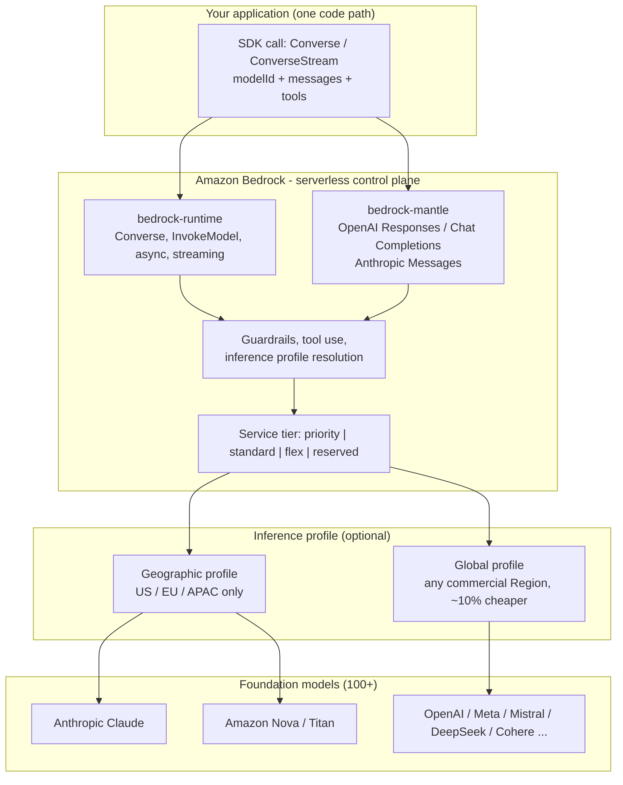
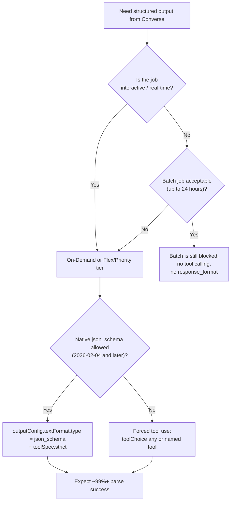
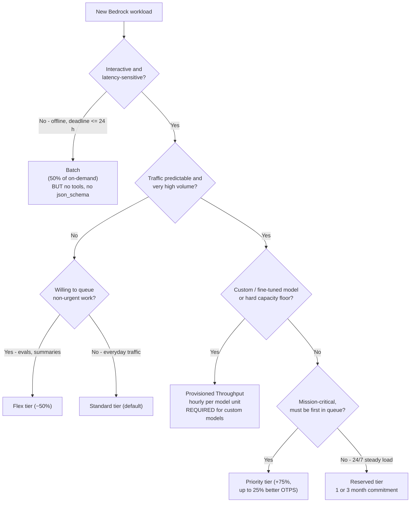
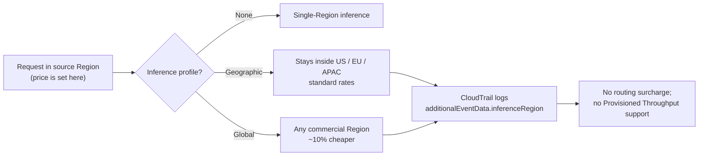
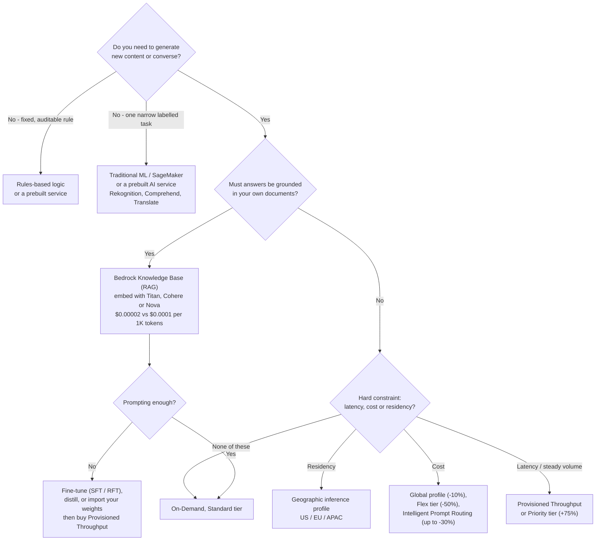
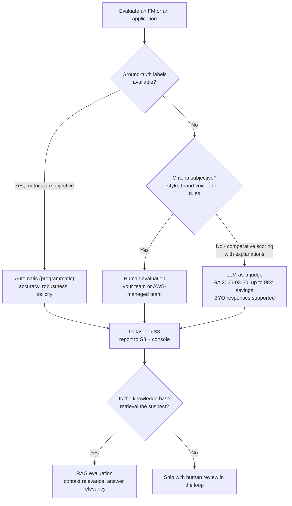

# Amazon Bedrock Foundations: APIs, Model Access, Pricing, Inference Types and Evaluations

Amazon Bedrock is the service the AIF-C01 exam names more than any other, and it is also the service that changes fastest. That combination is dangerous: memorising a model list or a per-token price is a study strategy with a shelf life of weeks, while memorising **mechanisms** — how on-demand, batch, provisioned throughput, service tiers and cross-region inference profiles actually behave — stays correct for years. This lesson is built around that split. Every number below is pinned to a first-party AWS source as of **October 2026**, and anything AWS does not confirm is flagged rather than taught.

```text
====================================================================
 AMAZON BEDROCK AT A GLANCE                (Digest: Oct 2026)
====================================================================
  SERVICE MODEL ..... fully managed, serverless, single API
  MODEL CATALOG ..... "100+" foundation models, 19 first-party
                      providers (AI21, Amazon, Anthropic, Cohere,
                      DeepSeek, Google, Luma, Meta, MiniMax,
                      Mistral, Moonshot, NVIDIA, OpenAI, Qwen,
                      Stability, TwelveLabs, Writer, xAI, Z.AI)
  ENDPOINTS ......... bedrock-runtime  (Invoke / Converse)
                      bedrock-mantle   (OpenAI Responses + Chat
                      Completions, Anthropic Messages)
  PRICING AXES ...... on-demand (per token) · batch (50% off,
                      <=24 h) · provisioned (per hour per model
                      unit) · service tiers (priority/standard/
                      flex/reserved) · cross-region profiles
  CUSTOMIZATION ..... supervised fine-tuning · reinforcement
                      fine-tuning · distillation · model import
  EVALUATION ........ automatic · human · LLM-as-a-judge
====================================================================
```

> [!NOTE]
> **How to read this lesson.** AWS publishes Bedrock's model list, prices and feature support continuously, so the exam rewards *mechanism* answers over *availability* answers. Three reading rules apply throughout: (1) **AWS's own published figure beats any third-party tracker**; (2) **marketing percentages are reproduced as AWS claims**, labelled as such, because their methodology is not independently audited; and (3) **a fact AWS does not confirm first-party is shown as unverified**, never as recall material.

By the end of this lesson you will be able to:

- explain what "fully managed, serverless, single API" means operationally and name the two Bedrock endpoints;
- state the 2026 model-access rules, including the Anthropic form most candidates forget;
- choose between **on-demand, batch and provisioned throughput** — and between the four **service tiers** — using price, latency, commitment and feature support;
- pick the right **inference profile** for cost versus data residency and predict what CloudTrail will log;
- walk a **model-selection decision tree** and defend a choice with verified per-token prices;
- name the four customization paths and say which one requires provisioned throughput;
- select **automatic, human or LLM-as-a-judge** evaluation for a given metric;
- defend the **comparative verdict** between Bedrock, self-hosted SageMaker, a prebuilt AI service and building it yourself.

---

## 1. What Amazon Bedrock is

### 1.1 The definition AWS uses

Amazon Bedrock is a **fully managed, serverless service that gives you a single API to invoke foundation models from many providers**. Three words carry the whole value proposition:

- **Fully managed** — AWS runs the infrastructure, the scaling and the model hosting; you never see an instance, an endpoint URL or a GPU.
- **Serverless** — you pay per token (on-demand and batch) or per hour (provisioned throughput); there is no idle-capacity bill unless you buy one deliberately.
- **Single API** — one request shape, one SDK, one set of IAM actions; switching from Anthropic Claude to Amazon Nova is a change of `modelId`, not a rewrite.

That last property is the single most examinable sentence in this lesson. A question that says *"without rewriting application logic"* is pointing at the unified API, and every other option in that question (cross-region routing, provisioned throughput, model import) is a different mechanism entirely.

### 1.2 The provider catalog

AWS lists **100+** foundation models without publishing an exact count. The first-party provider list verified in October 2026 is:

| Provider group | Providers on Bedrock |
|---|---|
| **US labs** | AI21 Labs, Anthropic, Cohere, Google, Meta, NVIDIA, OpenAI, Writer, xAI, Z.AI |
| **Amazon first-party** | Amazon (Nova family, Titan family, Nova Canvas / Reel / Multimodal Embeddings) |
| **European labs** | Mistral AI (France), Stability AI, Luma AI |
| **Asian labs** | DeepSeek, MiniMax, Moonshot AI, Qwen, TwelveLabs |
| **Your own weights** | Custom Model Import (Llama, Mistral, Mixtral, Qwen, GPT-OSS, GPTBigCode architectures) |

> **📚 Did you know?** **DeepSeek is officially supported** — DeepSeek V3.2, V3.1 and R1 all appear in AWS's *Models at a glance* page, and V3.2 runs on both `bedrock-runtime` and the OpenAI-compatible `bedrock-mantle` endpoint. Candidates who skip the current catalog often assume DeepSeek is only available through a marketplace or a self-hosted stack; on the exam, "Amazon Bedrock does not host DeepSeek" is a distractor by construction.

### 1.3 The two endpoints

Bedrock exposes two service endpoints, and the exam tests which operations live where:

| Endpoint | Operations | Purpose | AWS guidance |
|---|---|---|---|
| **`bedrock-runtime`** | `InvokeModel`, `InvokeModelWithResponseStream`, `Converse`, `ConverseStream`, `StartAsyncInvoke`, `InvokeModelWithBidirectionalStream` | Invoke models for inference — raw provider payloads and the provider-agnostic Converse API | **Recommended for new applications** |
| **`bedrock-mantle`** | OpenAI-compatible **Responses** and **Chat Completions**; Anthropic **Messages** | Drop-in compatibility: existing OpenAI or Anthropic SDK code runs against Bedrock unchanged | Use for migration of existing SDK code |

The distinction matters in practice: `bedrock-mantle` exists so that an application written for the OpenAI or Anthropic SDK can point at Bedrock with a base-URL and key change, while `bedrock-runtime` is the home of Converse — the API that gives you tools, Guardrails and multi-provider parity in one request shape.

### 1.4 Architecture: one API, many models



### 1.5 What AWS promises about your data

Two commitments appear in the Bedrock documentation overview and both are exam-shaped:

1. **Inputs and outputs are not shared with third-party model providers.**
2. **Inputs and outputs are not used to train the base foundation models.** Fine-tuning, by contrast, trains a **private copy of the model that belongs to your account** — which is why a customized model is yours and why it is billed differently.

> **📚 Did you know?** The "not used to train base models" guarantee is precisely why fine-tuning is described as creating a *private custom model*: your labeled JSONL goes to S3, a training job produces a checkpoint that only your account can invoke, and the base FM that other customers use is untouched. The companion fact candidates miss is that **invoking a supervised fine-tuned model requires Provisioned Throughput** — on-demand will not run it — while **Custom Model Import** (bring your own weights) *can* run on-demand.

### 1.6 Four things Bedrock is not

Confusions that produce wrong options more often than any other Bedrock fact:

| Common confusion | What Bedrock actually is |
|---|---|
| "Bedrock is a model like Claude or Nova" | Bedrock is the **managed service and API**; Claude, Nova, Llama and the rest are the models it hosts |
| "Bedrock deploys my training job" | Training and endpoint management are **SageMaker AI** territory; Bedrock serves pre-trained FMs (plus its own customization jobs) |
| "Bedrock is a prebuilt AI service like Rekognition" | Prebuilt services answer **one narrow task**; Bedrock is a **general-purpose FM API** you prompt, ground and customize |
| "Using Bedrock means my prompts go to the model vendor" | Inputs and outputs are **not shared with third-party providers** and **not used to train base FMs** |

---

## 2. Model access: what actually unblocks an invocation

Model access used to be a click-through opt-in per model. In 2026 the flow is simpler, with **one exception that still trips candidates**:

| Step | Requirement | Scope |
|---|---|---|
| 1 | **Model access is on by default** in commercial AWS Regions | No action needed for most models |
| 2 | IAM permissions for AWS Marketplace: `aws-marketplace:Subscribe`, `aws-marketplace:Unsubscribe`, `aws-marketplace:ViewSubscriptions` | Needed **only the first time** you enable a Marketplace-sourced model |
| 3 | A **valid payment method** on the account | Always |
| 4 | **Anthropic form-to-use (FTU) request** | **Anthropic models on `bedrock-runtime`** — not required for Anthropic Messages on `bedrock-mantle` |

After step 4, `InvokeModel`/`Converse` succeed; before it, you get an access error that looks like an IAM problem and is not one.

> [!WARNING]
> **Do not memorize the model list — memorize the access mechanism.** Bedrock's catalog, per-model feature support (streaming, tools, fine-tuning, provisioned throughput) and prices change weekly. On the exam, an option built on *"model X is unavailable in Region Y"* is almost always a stale-distractor. The durable facts are: **default-on access**, **Marketplace permissions on first enablement**, the **Anthropic FTU form**, and **a valid payment method**. When a question hinges on whether a specific new model exists, look for an option that describes a *mechanism* instead — that is almost always the intended answer.

---

## 3. The API surface: Invoke, Converse and the compatibility endpoints

### 3.1 Operation families

| Family | Operations | Endpoint | What it is for |
|---|---|---|---|
| **Invoke** | `InvokeModel`, `InvokeModelWithResponseStream` | `bedrock-runtime` | Single-shot or streamed **raw provider payloads** — you build the provider's JSON yourself |
| **Converse** | `Converse`, `ConverseStream` | `bedrock-runtime` | **Provider-agnostic** messages, tools, Guardrails, inference parameters |
| **Chat Completions** | OpenAI-compatible | `bedrock-mantle` | Drop-in OpenAI SDK usage |
| **Responses** | OpenAI-compatible | `bedrock-mantle` | OpenAI Responses API (GPT-OSS and GPT families) |
| **Messages** | Anthropic Messages | `bedrock-mantle` | Anthropic SDK code runs against Bedrock unchanged |
| **Async** | `StartAsyncInvoke` (subset of models) | `bedrock-runtime` | Long-running jobs with a callback destination |
| **Bidirectional** | `InvokeModelWithBidirectionalStream` | `bedrock-runtime` | Real-time audio sessions — **not usable with Bedrock API keys** |

### 3.2 Converse inference parameters: exactly four

The Converse API's base `InferenceConfiguration` contains **four** parameters and nothing else:

| Parameter | Type / range | Meaning |
|---|---|---|
| `maxTokens` | integer | Maximum tokens to **generate** |
| `temperature` | 0–1 | Sampling randomness — lower is more deterministic |
| `topP` | 0–1 | Nucleus sampling cutoff |
| `stopSequences` | up to **2,500** strings | Generation halts when any sequence is produced |

Model-specific knobs (for example `topK` or a provider's ` thinking` budget) go into **`additionalModelRequestFields`**, which is passed through to the model. An option that claims Converse exposes five or six first-class base parameters is testing whether you know the boundary between the portable API and the provider-specific escape hatch.

### 3.3 Streaming

Streaming uses `InvokeModelWithResponseStream` (Invoke family) or `ConverseStream` (Converse family), with IAM action **`bedrock:InvokeModelWithResponseStream`**. Whether a given model can stream is discoverable programmatically: `GetFoundationModel` returns **`responseStreamingSupported`**. If a question asks "how do you confirm streaming support before promising it in the UI?", that flag is the answer.

### 3.4 Tool use and forced tool choice

`toolChoice` has exactly three values:

| Value | Behaviour | Availability |
|---|---|---|
| `auto` | Model decides whether to call a tool (default) | All models that support tools |
| `any` | Must call **at least one** tool; no free text | All models that support tools |
| `tool` | Must call **one specific named tool** | Documented for **Anthropic Claude 3+ and Amazon Nova only** |

That third row is a classic exam micro-fact: forcing a *named* tool is not universal, and an option that generalises it to every model on Bedrock is wrong.

### 3.5 Structured output

Two routes exist for schema-conformant JSON:

1. **Forced tool use** (`toolChoice: {any: {}}` or `{tool: {name: ...}}`) — the long-standing route, because constraining the model to a tool's JSON schema is structural rather than advisory.
2. **Native structured output** — added to `Converse`/`ConverseStream` on **2026-02-04** via `outputConfig.textFormat.type = "json_schema"` together with `toolSpec.strict`.

The reliability gap is large and AWS-published: a community test of **102 samples** on AWS Builder Center found prompt-only *"return valid JSON"* succeeding roughly **70–80%** of the time versus **99%+** with forced tool use. Turn that into an operations number: 10,000 invoice documents at 75% prompt-only success means about **2,500 failed parses and retries**; at 99% it means about **100**.

**Worked example 1 — choosing the right mechanism for 10,000 structured extractions.** The job needs strict JSON, no interactivity, and results by morning. Answer: **on-demand or Flex-tier Converse with `outputConfig.textFormat.type = "json_schema"`** — because **Batch inference does not support structured output or tool calling**, and it does not support provisioned models either. Two separate traps, one question.



> **📚 Did you know?** Prompt-only JSON instruction fails for a structural reason: the model is *sampling*, not validating. Asking politely in the system prompt changes the probability of braces appearing; it does not create a constraint. Forced tool use and `json_schema` output both work because they make invalid output **impossible by construction** rather than unlikely — which is also why AWS's own reliability guidance treats "just say JSON in the prompt" as a distractor answer in every structured-output question.

### 3.6 Request anatomy: where each knob lives

```text
POST /model/<modelId>/converse          <-- bedrock-runtime
  headers: Authorization (SigV4), X-Amz-Target
{
  "modelId": "anthropic.claude-...",      <-- swap this to change model
  "system":    [ {"text": "..."} ],       <-- system prompt (Bedrock-level)
  "messages": [ {"role": "user", "content": [...]} ],
  "inferenceConfig": {                    <-- EXACTLY FOUR base params
      "maxTokens": 1024,
      "temperature": 0.2,
      "topP": 0.9,
      "stopSequences": ["</answer>"]      <-- up to 2,500 strings
  },
  "additionalModelRequestFields": {       <-- provider-specific extras
      "topK": 50, "thinking": {"type": "enabled"}
  },
  "toolConfig": {
      "tools": [{"toolSpec": {"name": "get_weather", ...}}],
      "toolChoice": {"auto": {}}
  },
  "guardrailIdentifier": "...",           <-- applied in Bedrock, not the model
  "promptVariables": {...}
}
Response 200  ->  output.message.content,  usage.inputTokens / outputTokens
Streaming      ->  ConverseStream (IAM: bedrock:InvokeModelWithResponseStream)
```

Two readings of this payload matter on the exam: the **portable surface** (`system`, `messages`, `inferenceConfig`, `toolConfig`, `guardrailIdentifier`) is the same for every provider, which is what makes a provider swap a one-line change; and **`additionalModelRequestFields` is the deliberate escape hatch** for anything provider-specific, which is why the base parameter list stays at four no matter how many knobs a given model exposes.

---

## 4. Pricing: four mechanisms and four service tiers

Bedrock pricing is not one model — it is **an orthogonal pair of choices**: *how you buy capacity* (on-demand / batch / provisioned) and *which service tier you accept* (priority / standard / flex / reserved).

### 4.1 The three capacity mechanisms

| Dimension | **On-Demand** | **Batch** | **Provisioned Throughput** |
|---|---|---|---|
| Pricing unit | per 1M input / 1M output tokens | **50% of on-demand** per token | **per hour per model unit (MU)** |
| Commitment | none | none | **1- or 6-month term** (some no-commit hourly options) |
| Latency | real-time | **asynchronous, typically ≤ 24 h, no SLA** | real-time and predictable |
| Best for | spiky, unpredictable, prototypes | bulk offline work: eval sets, archive summarization, mass classification | steady high-volume production; **required for custom models** |
| Tool calling | yes | **no** | yes |
| Structured output | yes | **no** | yes |
| Runs provisioned models | n/a | **no** | n/a |
| Billing | per request's tokens | per job's tokens | **per hour even when idle** |
| Capacity | shared across tiers | separate batch quota | dedicated model units (quota via AWS Support) |

### 4.2 The four service tiers (the second axis)

`serviceTier` is set per request and applies to **on-demand** traffic:

| Tier | `serviceTier` value | Price rule | When AWS says to use it |
|---|---|---|---|
| **Priority** | `priority` | Standard price **+75%**, for up to **25% better output-token throughput** | Real-time, customer-facing, mission-critical traffic |
| **Standard** | `default` (or omitted) | Standard rate | Everyday work — the default |
| **Flex** | `flex` | **−50%**, queued after Standard under load | Evaluations, summarization, background and agentic steps |
| **Reserved** | `reserved` | Committed price, **1- or 3-month** term, overflow spills to Standard | 24/7 predictable load needing guaranteed capacity |

AWS's published Reserved-tier entry conditions (secondary source: AWS Builder Center) are **≥ 100K input tokens per minute and ≥ 10K output tokens per minute**, a **1- or 3-month** commitment, **99.5%** uptime with overflow to Standard.

### 4.3 Worked example 2 — pure on-demand arithmetic

AWS's own example: **Amazon Titan Text Lite** at **$0.0003 per 1K input tokens** and **$0.0004 per 1K output tokens**.

$$
\frac{2{,}000}{1{,}000}\times \$0.0003 + \frac{1{,}000}{1{,}000}\times \$0.0004 = \$0.001 \text{ per call}
$$

At **1,000 calls per hour** that is **$1.00 per hour**. The second AWS example, **AI21 Jurassic-2 Mid** at $0.0125 per 1K tokens both ways, for **10,000 in / 2,000 out**:

$$
\frac{10{,}000}{1{,}000}\times \$0.0125 + \frac{2{,}000}{1{,}000}\times \$0.0125 = \$0.15 \text{ per request}
$$

### 4.4 Worked example 3 — batch saves exactly 50%

**Claude 3.5 Sonnet** (Public Extended Access): **$6.00 in / $30.00 out** per 1M tokens on-demand, **$3.00 / $15.00** on batch. A **10M input + 2M output** job:

| Mode | Calculation | Total |
|---|---|---:|
| On-demand | $10 \times 6.00 + 2 \times 30.00$ | **$120.00** |
| Batch | $10 \times 3.00 + 2 \times 15.00$ | **$60.00** |
| **Saving** | | **$60.00 (50%)** |

Delivery is typically **within 24 hours** — and the job **cannot use tool calling or structured output**.

### 4.5 Worked example 4 — provisioned throughput burns whether you use it or not

AWS's documented arithmetic for one model unit at **$16.20/hour**:

$$
1 \times \$16.20 \times 24 \text{ h} \times 31 \text{ d} = \$12{,}052.80 \text{ per month}
$$

Published hourly rates for **Cohere Command** per model unit: **$49.50** (no commitment), **$39.60** (1-month, −20%), **$23.77** (6-month, **−52%**). **Llama 2** 13B/70B provisioned: **$21.18** (1-month) and **$13.08** (6-month). The decision rule: provisioned wins only when the idle-hour cost is less than the capacity and per-token savings you actually capture — for Claude, Nova and most modern models AWS does not publish hourly rates at all and asks you to contact the account team.

### 4.6 Worked example 5 — service-tier arithmetic

**DeepSeek V3.1** in `ap-southeast-2` is priced at **$0.5974 in / $1.7304 out** per 1M tokens on the Standard tier. Applying the documented modifiers:

| Tier | Input per 1M | Output per 1M | 1M in + 1M out |
|---|---:|---:|---:|
| Standard | $0.5974 | $1.7304 | **$2.33** |
| Priority (+75%) | $1.0455 | $3.0282 | **$4.07** |
| Flex (−50%) | $0.2987 | $0.8652 | **$1.16** |

Send **10% of traffic to Priority, 60% to Flex and 30% to Standard** and the blend is $0.10 \times 4.07 + 0.60 \times 1.16 + 0.30 \times 2.33 \approx \$1.80$ — about **23% below** the all-Standard price of $2.33. Tier discipline, not model choice, is usually the cheapest available optimisation.

### 4.7 Verified token prices (USD per 1M, Standard / on-demand)

| Provider | Model | Input | Output | Note |
|---|---|---:|---:|---|
| Anthropic | Claude 3.5 Sonnet | $6.00 | $30.00 | batch $3 / $15; cache write $7.50; cache read $0.60 |
| DeepSeek | DeepSeek V3.2 | $0.62 | $1.85 | US Regions; $0.74 / $2.22 in Mumbai, São Paulo, Jakarta, Tokyo, Stockholm |
| MiniMax | M2 / M2.1 / M2.5 | $0.30 | $1.20 | US Regions |
| Mistral AI | Mistral Large 3 | $0.50 | $1.50 | US Regions |
| Google | Gemma 4 31B / E2B | $0.14 / $0.04 | $0.40 / $0.08 | US Regions |
| Moonshot AI | Kimi K2.5 | $0.60 | $3.00 | US Regions |
| NVIDIA | Nemotron 3 Super 120B | $0.18 | $0.78 | US Regions |
| AI21 Labs | Jamba 1.5 Large / Mini | $2.00 / $0.20 | $8.00 / $0.40 | US Regions |
| Cohere | Rerank 3.5 | **$2.00 per 1,000 queries** | — | 1 query covers ≤ 100 document chunks |

Fixed and hourly prices worth knowing: **custom model storage $1.95/month**, **Titan Text Embeddings V2 $0.00002 per 1K tokens**, **Cohere Embeddings $0.0001 per 1K tokens** (a **5× gap** on the same job).



### 4.8 Two more savings levers: routing and caching

**Intelligent Prompt Routing** operates *within* a model family — Claude Sonnet ↔ Claude Haiku, Nova Pro ↔ Nova Lite — and AWS's pricing page claims it can cut cost by **up to 30%**. The arithmetic behind the claim is simple: send easy prompts to the cheap sibling and keep hard prompts on the strong model.

**Worked example 10 — routing arithmetic.** Use one **verified** anchor: Claude 3.5 Sonnet at **$6.00 / $30.00** per 1M tokens. The sibling's per-token rate is **not published in the sources verified for this lesson**, so assume a Haiku-class model at **$1.00 / $5.00** (illustrative) and a **10M-in / 2M-out** daily mix:

| Strategy | Calculation | Daily cost |
|---|---|---:|
| All traffic on the strong model | $10 \times 6.00 + 2 \times 30.00$ | **$120.00** |
| 50% of volume routed to the cheap sibling | $0.5 \times (10 \times 1.00 + 2 \times 5.00) + 0.5 \times 120.00$ | **$70.00** |
| **Saving on this mix** | | **$50.00 (42%)** |

Two readings follow. First, AWS's published claim is **"up to 30%"**, which is the conservative figure across real traffic — never quote the illustrative 42% as an AWS number. Second, routing is a *traffic-mix* lever rather than a per-request discount, which is exactly what separates it from batch (**−50%** on every token), the Flex tier (**−50%** on every token) and a global profile (**−10%** on every token).

**Prompt caching (Amazon Nova)** is the other lever, and its limits are precise: a **minimum of 1,000 tokens** per checkpoint, **at most 4 checkpoints** per request, a **5-minute** time to live and a **20,000-token** cache cap. Cached input tokens are billed at the cache-read rate — for Claude 3.5 Sonnet that is **$0.60 per 1M** versus **$6.00** uncached (a **10× reduction**), while a cache *write* costs **$7.50 per 1M** (a **25% premium**). Caching therefore pays only when a checkpoint is read repeatedly inside its TTL.

Match each pricing mechanism to its documented rule:

```matching
{
  "question": "Match each Amazon Bedrock pricing mechanism to its documented behaviour:",
  "pairs": [
    {"left": "Batch inference", "right": "50% of on-demand, asynchronous, typically completed within 24 hours"},
    {"left": "Flex service tier", "right": "50% below Standard, queued after Standard when demand is high"},
    {"left": "Priority service tier", "right": "Standard price plus 75%, for up to 25% better output-token throughput"},
    {"left": "Global cross-Region profile", "right": "About 10% cheaper, may process in any commercial Region"},
    {"left": "Provisioned Throughput", "right": "Hourly per model unit on a 1- or 6-month term, billed even when idle"},
    {"left": "Intelligent Prompt Routing", "right": "Up to 30% savings by routing within a single model family"}
  ],
  "explanation": "Each lever has its own number and its own mechanism: batch is a job type at half price with a 24-hour window, Flex and Priority are on-demand service tiers at -50% and +75%, the global profile is a routing option worth about -10%, provisioned throughput is a capacity reservation billed hourly per model unit, and prompt routing saves up to 30% by sending easy prompts to a cheaper sibling model inside the same family."
}
```

---

## 5. Cross-Region inference: profiles, price and residency

### 5.1 Geographic versus global profiles

Cross-Region inference is expressed through **inference profiles**, and there are two kinds:

| Property | **Geographic profile** | **Global profile** |
|---|---|---|
| Routing scope | Within a single geography: **US, EU or APAC** only | **Any commercial AWS Region** |
| Price | Standard rates | **~10% cheaper** (input and output) |
| Data residency | Data stays inside the geography | May be processed in a Region you have not manually enabled |
| Surcharge | **None** — price always comes from the **source** Region | **None** — same rule |
| IAM | Standard regional IAM | Needs IAM with `aws:RequestedRegion: "unspecified"` |
| Typical exam use | **Compliance / residency** questions | **Cost** questions |

### 5.2 What CloudTrail shows

Cross-Region requests can route to Regions that are **not manually enabled in your account**; the data stays on the AWS network and is encrypted in transit. AWS CloudTrail records where the work actually happened in **`additionalEventData.inferenceRegion`** — which is exactly why a CloudTrail entry can show a different Region from the request's source Region without implying a billing error. **Pricing always uses the source Region**, so there is no routing surcharge.

### 5.3 Two limits candidates miss

1. **Inference profiles do not support Provisioned Throughput.** Capacity reserved per model unit and cross-Region routing are separate mechanisms; you cannot combine them.
2. **Application profiles exist for cost-allocation tagging** — a separate concept from routing profiles, used to attribute spend rather than to place compute.

**Worked example 6 — cross-region economics.** A geographic profile such as `us.amazon.nova-lite-v1:0` keeps processing inside the United States at standard rates. A **global** profile is roughly **10% cheaper** but may execute in any commercial Region. For an EU financial workload the choice is decided by residency, not price: choose the **geographic (EU)** profile and accept the higher rate.



> **📚 Did you know?** The **~10% global-profile discount** and the **"price from the source Region"** rule point in opposite directions and both are true: your bill is calculated with your source Region's price list, but the global pool's rates are published about 10% lower, so routing globally saves money without a surcharge line item. Meanwhile **Intelligent Prompt Routing** — a completely different feature — can cut cost by **up to 30%** by routing within a model family (Claude Sonnet ↔ Claude Haiku, Nova Pro ↔ Nova Lite). Three separate savings levers, three different mechanisms: batch (−50%), Flex tier (−50%), global profile (−10%), prompt routing (up to −30%).

---

## 6. Choosing a model: the decision tree AWS actually teaches

### 6.1 The decision tree



### 6.2 Verified provider × model matrix

| Provider | Verified models on Bedrock | runtime | mantle | Customization |
|---|---|---|---|---|
| **Amazon** | Nova 2 Lite / 2 Sonic / Pro / Lite / Micro / Premier, Nova Canvas, Nova Reel, Nova Multimodal Embeddings; Titan Text / Image / Embeddings | Yes | partial | **SFT + RFT (Nova 2 Lite)**; Titan image/embedding |
| **Anthropic** | Claude Sonnet 5.5, Opus 5.5, Fable 5.1/5, Mythos 5.1/5, Opus 5, Sonnet 5; Claude 3.5 Haiku, Claude 3 Haiku | Yes | Yes (Messages) | not documented |
| **OpenAI** | GPT-6 family, GPT-6.1 Sol, GPT-5.x family, **gpt-oss 20B/120B**, GPT-OSS Safeguard | Yes | Yes (Responses/Chat) | **RFT on `openai.gpt-oss-20b`** |
| **Meta** | Llama 4, 3.3, 3.2, 3.1, 3, 2 | Yes | — | **SFT: 3.1 8B/70B, 3.2 1B/3B/11B-V/90B-V, 3.3 70B-V** |
| **Mistral AI** | Mistral Large 3, Mistral Small, Ministral 3B/8B/14B, Magistral Small, Devstral 2, Pixtral Large, Voxtral, Mixtral 8x7B, Mistral 7B | Yes | Yes (Chat) | import Mistral/Mixtral architectures |
| **Cohere** | Command R, Command R+, Embed English/Multilingual/v4, **Rerank 3.5** | Yes | — | **SFT: Command, Command Light** |
| **AI21 Labs** | Jamba 1.5 Large, Jamba 1.5 Mini | Yes | — | Jamba 1.5 Mini listed |
| **DeepSeek** | **V3.2, V3.1, R1** | Yes | V3.2 / V3.1 only | — |
| **Google** | Gemma 4 (31B, 26B-A4B, E2B), Gemma 3 (12B, 27B, 4B) | Gemma 3 | **Gemma 4 is mantle-only** | — |
| **Qwen** | Qwen3 235B A22B, Qwen3 32B, Qwen3 Next 80B, Qwen3 Coder, Qwen3 VL | Yes | Yes | **RFT on `qwen.qwen3-32b`** |
| **Moonshot / MiniMax / NVIDIA / xAI** | Kimi K3/K2.5, M2 family, Nemotron 3 / Nano 3, Grok 4.7/4.6/4.3 | Yes | some | — |
| **Your model** | **Custom Model Import**: Llama 2/3/3.1/3.2/3.3, Mistral, Mixtral, Qwen2/2.5/3, GPT-OSS, GPTBigCode | Yes | — | weights < 200 GB text / < 100 GB multimodal, context < 128K |

### 6.3 Worked example 7 — same job, 5× embedding cost

An AWS blog worked a RAG ingestion of a **5M-token document** plus **0.5M query tokens** = **5.5M tokens**:

| Embedding model | Rate per 1K tokens | Cost for 5.5M tokens |
|---|---:|---:|
| Amazon Titan Text Embeddings V2 | $0.00002 | **$0.11** |
| Cohere Embeddings | $0.0001 | **$0.55** |

Same corpus, same job, **5× difference** — which is why embedding model choice, not just LLM choice, belongs in a cost question.

---

## 7. Customization: four paths and the provisioned-throughput rule

| Path | What it does | Input | Key numbers |
|---|---|---|---|
| **Supervised fine-tuning (SFT)** | Trains a private copy on labeled examples | Labeled JSONL in **S3** | Private custom model; **requires Provisioned Throughput to invoke** |
| **Reinforcement fine-tuning (RFT)** | Learns from reward signals toward a target behaviour | Preference / reward data | Launched **Dec 2025** on **Nova 2 Lite** with **~66% average accuracy gain**; **2026-02-17** added **`qwen.qwen3-32b`** and **`openai.gpt-oss-20b`** with OpenAI-compatible APIs |
| **Distillation** | A teacher model produces training data for a smaller student | Teacher outputs | AWS claims **500% faster / 75% cheaper** training versus full training (AWS claim) |
| **Custom Model Import** | Serve **your own weights** serverlessly | Model artifacts (< 200 GB text / < 100 GB multimodal, context < 128K) | Can run **on-demand**; storage **$1.95/month** |

**Worked example 8 — fine-tuning cost, AWS's own image example.** Amazon Titan Image Generator at **$0.005 per image**, **500 steps**, **batch size 64**:

$$
\$0.005 \times 500 \times 64 = \$160.00
$$

plus **$1.95/month** custom model storage and **1 hour** of custom inference at **$21.00** gives **$182.95 in month one**.

> [!WARNING]
> **"Fine-tuned model + on-demand" is always the wrong pairing.** A supervised fine-tuned model must be served with **Provisioned Throughput**, which bills **per hour per model unit even when idle**. The exception is **Custom Model Import**, which can run on-demand. Questions that offer "fine-tune the model and keep paying per token on-demand" are testing exactly this boundary — and questions that offer fine-tuning as the *first* step for a document-grounded Q&A task are testing the customization spectrum from Lesson 8: **prompting and RAG come first**, because most workloads never need a custom model at all.

### 7.1 Prompt caching (Amazon Nova)

| Setting | Value |
|---|---|
| Minimum cacheable segment | **1,000 tokens** per checkpoint |
| Maximum checkpoints per request | **4** |
| Time to live | **5 minutes** |
| Cache size cap | **20,000 tokens** |

---

## 8. Evaluations: three modes, one dataset location

### 8.1 The three modes

| Method | Job mode | Built-in metrics | Who scores | Input → output |
|---|---|---|---|---|
| **Automatic (programmatic)** | `automated` + `taskType` | **accuracy, robustness, toxicity** | AWS-managed rubrics | Dataset in **S3** → report in S3 + console |
| **Human** | human-based job | Custom: relevance, style, brand voice | **Your employees** *or* an **AWS-managed team** | Prompts + references in S3 → S3 report + work-team portal |
| **LLM-as-a-judge** | `automated` + `evaluatorModelConfig` | Correctness, completeness, harmfulness, refusal, tone + custom | A **judge model** | Your prompts **or** bring-your-own responses → scores, explanations, histogram |
| **RAG evaluation** | Separate knowledge-base job (incl. retrieve-only mode) | Context relevance, correctness, answer relevancy | Judge model | KB + dataset → S3 report |

**Automatic task types:** General generation, Summarization, Q&A, Text classification.
**Judge models available:** Nova Pro / 2 Lite / Micro / Premier, Claude 3.5 Sonnet v1/v2, Claude Opus 4.7/4.8, Claude Sonnet 4.0/4.5, Llama 3.1 70B, Mistral Large.

LLM-as-a-judge reached **GA on 2025-03-20** and AWS claims **up to 98% cost savings** with turnaround in **hours instead of weeks**. It also offers **bring-your-own-inference-response**, so you can score outputs from models that are not even hosted on Bedrock.

### 8.2 Worked example 9 — which evaluation, which metric

| Requirement | Correct mode | Why the others fail |
|---|---|---|
| Correctness and toxicity against ground truth, no manual labeling | **Automatic (programmatic)** | Judge models are subjective; human costs time; routing is unrelated |
| Brand-voice alignment and style | **Human** (your reviewers or AWS-managed team) | Automatic metrics have no brand-voice rubric; a judge would need a custom metric you do not yet trust |
| Cheap first-pass scoring of 5,000 answers, explanations wanted | **LLM-as-a-judge** | Human is too slow; automatic metrics do not explain *why* |
| Retrieval quality of a knowledge base | **RAG evaluation** (retrieve-only mode isolates retrieval) | Plain generation evals confound retrieval and generation |



> **📚 Did you know?** LLM-as-a-judge's **bring-your-own-inference-response** feature quietly makes Bedrock Evaluations usable as a *cross-platform* quality layer: you submit responses produced by any model — including ones running outside AWS — and a Bedrock judge scores them with an explanation and a score histogram written to S3. That is why "the evaluation must run on the same provider as the model under test" is a distractor: AWS explicitly built the opposite.

---

## 9. Comparative verdict

> [!IMPORTANT]
> **Comparative Verdict — Amazon Bedrock vs. self-hosted SageMaker vs. a prebuilt AI service vs. DIY**
> - **Amazon Bedrock** is the answer when you want **pre-trained foundation models through a single serverless API** with **minimal infrastructure management**. You get 100+ FMs from 19 providers, on-demand/batch/provisioned pricing, cross-region profiles, service tiers, Knowledge Bases, Agents, Guardrails, Prompt Flows and Evaluations — and you never manage a GPU, an endpoint or a scaling policy. Its limits: you cannot see or control the underlying compute, provisioned models require a commitment, and some FMs (**Claude, Jurassic and other Bedrock-only models**) are exclusive to it.
> - **Self-hosted SageMaker AI (including JumpStart)** is the answer when you need **full control over training, deployment and infrastructure** — granular compute, custom training loops, any framework, endpoint scaling policies and monitoring. It is **primarily serverful**: you deploy to an endpoint and pay per instance-hour (Serverless Inference aside). Its limits: you need working ML/infra skills, you own the endpoint's availability, and per-token economics are harder to reason about.
> - **A prebuilt AI service** (Rekognition, Comprehend, Translate, Transcribe, Textract, Polly, Kendra) is the answer when the task is **narrow, well-defined and non-generative**: detect objects in images, detect entities in text, translate, transcribe. Cheapest and fastest to production, fully deterministic for a given input — but it cannot be prompted, fine-tuned into a conversational model or composed into a multi-step agent.
> - **DIY (self-managed open-source models on your own compute)** is the answer only when **no hosted option is acceptable**: total price control at very high steady volume, or data/weights that cannot leave your perimeter. It costs you everything Bedrock removes — patching, scaling, quantization, serving frameworks, security, model upgrades and the people who do all of it.
> - **Rule of thumb for the exam:** *need a foundation model with the least infrastructure* → **Bedrock**. *Need to train and own the model and the endpoint* → **SageMaker AI**. *Need one narrow non-generative task* → **prebuilt AI service**. *Need models with no managed provider at all* → **DIY**. AWS's decision guide states it plainly: *"Choose Bedrock if you primarily need pre-trained FMs for inference and want the FM that best fits your use case"* and *"Use SageMaker when you need full control over training, deployment and infrastructure."*

| Dimension | **Amazon Bedrock** | **Self-hosted SageMaker AI (JumpStart)** | **Prebuilt AI service** | **DIY on your own compute** |
|---|---|---|---|---|
| Service model | **Serverless**, API-only, fully managed | **Primarily serverful** endpoints (plus Serverless Inference) | Fully managed, per-call | You run the servers |
| Audience | Developers building GenAI apps via API | Data scientists / ML engineers | Any developer | ML/infra engineers |
| Infra control | none needed | **granular** compute, scaling, monitoring | none | total |
| Model sourcing | curated FMs from 19 providers + Custom Model Import | public + proprietary FMs, **wider selection**, plus trained models | AWS-curated, fixed capability | anything you can serve |
| Exclusive models | **Claude, Jurassic, other Bedrock-only FMs** | — | — | depends on license |
| Deployment | serverless `modelId`, no deploy step | `deploy()` to an endpoint | service API call | build a serving stack |
| Cost model | **per token** or **per hour per model unit** | **per instance-hour** (serverless: per inference) | per call / per page / per minute | hardware + people |
| Built-in GenAI features | Agents, Knowledge Bases, Guardrails, Prompt Flows, Evaluations, Routing, Distillation, Web Search | Clarify evals, Canvas, Pipelines, Feature Store | task-specific only | build them yourself |
| Interop | JumpStart endpoints marked **"Bedrock Ready"** can be **registered into Bedrock** | Studio endpoint → "Use with Bedrock" | n/a | n/a |
| Choose it when | pre-trained FMs, minimal infra | full control over training/deployment/infra | one narrow non-generative task | no hosted option is acceptable |

---

## 10. Exam traps for this lesson

> [!WARNING]
> **The traps that cost marks on this exact material:**
> 1. **The single/Converse API is the "no rewrite" answer** — changing `modelId` is the mechanism; provisioned throughput, cross-region profiles and model import are all different mechanisms.
> 2. **Batch = 50% off, ≤ 24 h, no SLA, no tool calling, no structured output, no provisioned models.** Any option granting batch a feature it lacks is wrong by construction.
> 3. **Priority is +75% (for up to 25% better OTPS), Flex is −50%, global cross-region is ~10%, batch is 50%, Intelligent Prompt Routing is up to 30%.** Four savings levers, four different numbers — never mix them.
> 4. **Provisioned Throughput bills hourly even when idle, measured in model units, and is required for fine-tuned models.** Inference profiles **do not** support it.
> 5. **Cross-region pricing uses the source Region; CloudTrail logs the processing Region in `additionalEventData.inferenceRegion`.** No routing surcharge.
> 6. **Geographic profiles = residency (US/EU/APAC); global profiles = cost (any commercial Region).** A data-residency question pointing at the cheaper global profile is a distractor.
> 7. **Anthropic needs an FTU form on `bedrock-runtime`**; model access is otherwise default-on with Marketplace permissions used only on first enablement.
> 8. **Converse has exactly four base parameters** — `maxTokens`, `temperature` (0–1), `topP` (0–1), `stopSequences` (≤ 2,500) — everything else goes in `additionalModelRequestFields`.
> 9. **`toolChoice: {tool: ...}` is documented only for Anthropic Claude 3+ and Amazon Nova.**
> 10. **Objective metrics → automatic evaluation; subjective metrics → human evaluation; cheap explained scoring → LLM-as-a-judge** (up to 98% cheaper, GA 2025-03-20).
>
> And one "do not memorize" flag: **provisioned-throughput hourly prices for Claude, Nova and most modern models are not published** — AWS says to contact the account team. Likewise **latency-optimized inference** is still labelled *preview, subject to change*, and the **exact model count** is never published ("100+" only). Do not spend recall budget on either.

---

## Practice Questions

```question
{
  "id": "aid-09-q1",
  "type": "multiple-choice",
  "question": "A developer wants to switch from Anthropic Claude to Amazon Nova without rewriting application logic. Which Bedrock principle makes this possible?",
  "options": [
    "Provisioned Throughput reserves the same model units across providers",
    "The single, provider-agnostic Converse API lets the same code invoke different models by changing only the modelId",
    "Cross-Region inference profiles replicate every model into every Region",
    "Custom Model Import converts Claude weights into Nova weights",
    "Intelligent Prompt Routing automatically migrates traffic to Nova"
  ],
  "correct": 1,
  "explanation": "Bedrock's core value is one unified serverless API: the request shape, IAM actions and SDK calls stay identical while only the modelId changes. Provisioned Throughput buys capacity for one model, cross-region profiles route a single model across Regions, Custom Model Import serves your own weights rather than converting providers, and Intelligent Prompt Routing switches only between models inside the same family."
}
```

```question
{
  "id": "aid-09-q2",
  "type": "multiple-choice",
  "question": "A team must process 40 million tokens of overnight document classification at the lowest possible cost, with results needed by the next morning. Which throughput type should they use?",
  "options": [
    "On-Demand inference with the Priority service tier",
    "Provisioned Throughput with a 6-month commitment",
    "Batch inference at 50% of on-demand, completed typically within 24 hours",
    "A global cross-Region inference profile on the Standard tier",
    "Custom Model Import running on-demand"
  ],
  "correct": 2,
  "explanation": "Batch inference is explicitly designed for large asynchronous jobs at exactly 50% of on-demand pricing with a typical completion window of up to 24 hours, which matches an overnight deadline. Priority tier raises price by 75%, provisioned throughput bills hourly regardless of usage, a cross-Region profile only changes routing and price region, and Custom Model Import is for serving your own weights rather than for cheap bulk inference."
}
```

```question
{
  "id": "aid-09-q3",
  "type": "multiple-choice",
  "question": "A predictable workload of 500,000 tokens per minute cannot tolerate capacity loss and runs a custom fine-tuned model. Which option is required?",
  "options": [
    "On-Demand inference with the Flex service tier",
    "Provisioned Throughput, priced hourly per model unit on a term commitment",
    "Batch inference at 50% of the on-demand price",
    "An application inference profile for cost-allocation tagging",
    "Intelligent Prompt Routing within a model family"
  ],
  "correct": 1,
  "explanation": "Provisioned Throughput is the only mechanism that delivers dedicated, predictable capacity measured in model units, and AWS documents that a customized (fine-tuned) model must be invoked through Provisioned Throughput. Flex is a discount tier that queues non-urgent work, batch is offline and cannot run provisioned models, an application profile handles cost-allocation tagging, and prompt routing only picks between models inside one family."
}
```

```question
{
  "id": "aid-09-q4",
  "type": "multiple-choice",
  "question": "An EU financial workload must keep all inference processing inside EU Regions while still borrowing capacity across them. Which feature should be used?",
  "options": [
    "A global cross-Region inference profile",
    "A geographic (EU) cross-Region inference profile",
    "Batch inference running in us-east-1",
    "Provisioned Throughput in a single EU Region",
    "Intelligent Prompt Routing with a Claude Haiku target"
  ],
  "correct": 1,
  "explanation": "Geographic inference profiles route only within a single geography - US, EU or APAC - which is exactly the data-residency guarantee the workload needs while still spreading load across the Regions in that geography. A global profile may process in any commercial Region (it is about 10% cheaper, but breaks residency), batch in us-east-1 processes outside the EU, and provisioned throughput in one Region does not borrow capacity across EU Regions."
}
```

```question
{
  "id": "aid-09-q5",
  "type": "multiple-choice",
  "question": "A CloudTrail entry for a Bedrock invocation shows a different AWS Region than the Region the request was sent from. Which explanation is correct?",
  "options": [
    "The request was billed at the destination Region's price list",
    "Cross-Region inference was used: the processing Region is recorded in additionalEventData.inferenceRegion and pricing uses the source Region",
    "The model was invoked through SageMaker JumpStart instead of Bedrock",
    "The account's Region enablement was automatically disabled",
    "Provisioned Throughput silently overflowed to a neighbor Region"
  ],
  "correct": 1,
  "explanation": "When an inference profile routes a request, CloudTrail records where the work actually executed in additionalEventData.inferenceRegion, while billing always uses the source Region's price list - so there is no routing surcharge. Provisioned Throughput does not support inference profiles at all, JumpStart invocation would not appear as a Bedrock runtime call, and Region enablement is unrelated to where a profile may process."
}
```

```question
{
  "id": "aid-09-q6",
  "type": "multiple-choice",
  "question": "A service must return strictly schema-conformant JSON from the Converse API for 10,000 invoice documents. Which is the most reliable approach?",
  "options": [
    "Add the instruction 'Respond with valid JSON only' to the system prompt",
    "Set inferenceConfig.temperature to 0 and raise maxTokens to the model maximum",
    "Use forced tool use with toolChoice {any:{}} or native outputConfig.textFormat.type = json_schema with toolSpec.strict",
    "Submit the job through Batch inference with response_format enabled",
    "Enable prompt caching so the schema is remembered across calls"
  ],
  "correct": 2,
  "explanation": "Both forced tool use and the native json_schema structured-output path (added to Converse on 2026-02-04) constrain output structurally rather than persuasively; AWS's Builder Center test showed prompt-only JSON at roughly 70-80% success versus 99%+ with forced tool use. Temperature 0 only reduces sampling variance, prompt caching is unrelated to validity, and Batch inference explicitly does not support structured output or tool calling."
}
```

```question
{
  "id": "aid-09-q7",
  "type": "multiple-choice",
  "question": "A practitioner must score a new foundation model for correctness and toxicity against ground truth using a curated dataset, with no manual labeling. Which evaluation type fits?",
  "options": [
    "Human evaluation with an AWS-managed work team",
    "Automatic (programmatic) model evaluation using accuracy, robustness and toxicity metrics",
    "LLM-as-a-judge with a custom brand-voice rubric",
    "Intelligent Prompt Routing across a model family",
    "A human evaluation using the practitioner's own employees"
  ],
  "correct": 1,
  "explanation": "Automatic, programmatic evaluations run a curated dataset in S3 against predefined metrics - accuracy, robustness and toxicity - with no humans involved, which matches the requirement exactly. Human evaluation (whether your own reviewers or an AWS-managed team) is for subjective criteria such as style and brand voice, an LLM-as-a-judge is subjective by design, and Intelligent Prompt Routing is a cost/latency feature, not an evaluation."
}
```

```question
{
  "id": "aid-09-q8",
  "type": "multiple-choice",
  "question": "For subjective criteria such as brand-voice alignment and writing style, which approach does AWS recommend?",
  "options": [
    "Automatic evaluation using the toxicity metric",
    "Human evaluation, using your own employees or an AWS-managed evaluation team",
    "Provisioned Throughput benchmarking against a model unit",
    "Batch inference over the prompt dataset followed by a diff",
    "Intelligent Prompt Routing to the higher-quality model"
  ],
  "correct": 1,
  "explanation": "AWS positions human evaluation precisely for subjective metrics - relevance, style and brand voice - and offers two staffing options: your own reviewers or an AWS-managed team. Automatic evaluations cover objective metrics such as accuracy, robustness and toxicity; provisioned throughput and batch are pricing mechanisms; and prompt routing chooses between models rather than scoring output quality."
}
```

```question
{
  "id": "aid-09-q9",
  "type": "multiple-choice",
  "question": "Which statement matches AWS guidance when choosing between Amazon Bedrock and Amazon SageMaker AI?",
  "options": [
    "Bedrock is primarily serverful and requires managing GPU endpoints, while SageMaker is serverless",
    "Bedrock is serverless and API-first for consuming pre-trained FMs, while SageMaker AI is primarily serverful with granular compute control for training and deploying your own models",
    "SageMaker JumpStart endpoints can never be used with Bedrock features such as Agents or Knowledge Bases",
    "Bedrock can only be used with Amazon's own foundation models",
    "SageMaker AI cannot train models; it only serves them"
  ],
  "correct": 1,
  "explanation": "AWS's Bedrock-or-SageMaker decision guide states exactly this: choose Bedrock for pre-trained foundation models with minimal infrastructure management, and SageMaker when you need full control over training, deployment and infrastructure. JumpStart endpoints marked Bedrock Ready can be registered into Bedrock for Agents, Knowledge Bases and Guardrails, Bedrock hosts 19 third-party providers as well as Amazon models, and SageMaker is fundamentally a training and deployment platform."
}
```

```question
{
  "id": "aid-09-q10",
  "type": "multiple-choice",
  "question": "A team wants to cut the cost of non-urgent background summarization on on-demand traffic without changing models or committing to a term. Which option delivers the documented discount?",
  "options": [
    "The Flex service tier, which is priced at 50% below Standard and queued after Standard under load",
    "The Priority service tier, which is priced at 75% below Standard",
    "A 6-month Provisioned Throughput commitment on the same model",
    "A geographic cross-Region inference profile, which is about 10% cheaper",
    "Batch inference, which cannot be used because summarization returns text"
  ],
  "correct": 0,
  "explanation": "The Flex service tier is documented at 50% off the Standard rate and is intended exactly for non-urgent work such as evaluations, summarization and background or agentic steps, with no term commitment. Priority is 75% more expensive rather than cheaper, provisioned throughput requires a term commitment and bills hourly, a geographic profile is a routing choice at standard rates (the ~10% saving belongs to global profiles), and batch does support plain text summarization - so that last option's reasoning is false even though batch would also have been a candidate."
}
```

```dragdrop
{
  "question": "Order the steps of an Amazon Bedrock evaluation job the way AWS documents them:",
  "items": [
    "Step 4 - read the report in S3 and the Bedrock console, then iterate on prompts or models",
    "Step 1 - prepare the dataset (prompts, references and, if needed, inference responses) in Amazon S3",
    "Step 2 - choose the mode: automatic (programmatic), human, or LLM-as-a-judge with an evaluatorModelConfig",
    "Step 3 - run the job; AWS-managed rubrics, your reviewers or the judge model score the outputs"
  ],
  "correctOrder": [
    "Step 1 - prepare the dataset (prompts, references and, if needed, inference responses) in Amazon S3",
    "Step 2 - choose the mode: automatic (programmatic), human, or LLM-as-a-judge with an evaluatorModelConfig",
    "Step 3 - run the job; AWS-managed rubrics, your reviewers or the judge model score the outputs",
    "Step 4 - read the report in S3 and the Bedrock console, then iterate on prompts or models"
  ],
  "explanation": "Every evaluation path starts with a dataset in S3, because the job reads its inputs from object storage; then you select the mode that matches your metrics (objective automatic metrics, subjective human review, or LLM-as-a-judge for explained scoring); the job runs with the appropriate scorer; and the output is a report written to S3 plus the console. Choosing the mode before the dataset exists is the common mistake - the metric you can compute is dictated by what you prepared."
}
```

---

> [!SUCCESS]
> **Key Takeaways:**
> 1. **Bedrock is a fully managed, serverless, single-API service** hosting **100+ foundation models from 19 first-party providers**; the same code invokes a different model by changing only the `modelId`. Runtime lives on **`bedrock-runtime`** (Invoke + Converse, recommended for new apps) and OpenAI/Anthropic compatibility lives on **`bedrock-mantle`**.
> 2. **Model access is default-on** in commercial Regions; you need Marketplace permissions (`aws-marketplace:Subscribe/Unsubscribe/ViewSubscriptions`) **only the first time**, a valid payment method always, and an **Anthropic form-to-use (FTU) form** for Anthropic models on `bedrock-runtime`.
> 3. **Three capacity mechanisms, four service tiers.** On-demand is per token; **batch is 50% of on-demand, typically ≤ 24 h, with no tool calling, no structured output and no provisioned models**; provisioned throughput is **hourly per model unit on a 1- or 6-month term and is required for fine-tuned models**. Tiers: **Priority +75% (up to 25% better OTPS), Standard default, Flex −50%, Reserved 1/3-month**.
> 4. **Cross-Region inference uses profiles**: **geographic (US/EU/APAC) for residency**, **global (any commercial Region) for ~10% savings**; price comes from the **source Region**, CloudTrail logs `additionalEventData.inferenceRegion`, and **profiles do not support Provisioned Throughput**.
> 5. **Converse's base parameters are exactly four** — `maxTokens`, `temperature` (0–1), `topP` (0–1), `stopSequences` (≤ 2,500) — with model extras in `additionalModelRequestFields`; `toolChoice: {tool: ...}` is documented for **Claude 3+ and Nova only**, and strict JSON comes from **forced tool use or native `json_schema` output (2026-02-04)**, never from a prompt instruction.
> 6. **Customization has four paths** — SFT, RFT (**66% average accuracy gain** on Nova 2 Lite; `qwen.qwen3-32b` and `openai.gpt-oss-20b` added 2026-02-17), distillation and **Custom Model Import** ($1.95/month storage) — and evaluation has **three modes**: automatic (**accuracy, robustness, toxicity**), human (**your team or an AWS-managed team**) and **LLM-as-a-judge** (GA 2025-03-20, **up to 98% cost savings**, bring-your-own responses).
> 7. **Comparative verdict:** pre-trained FMs with minimal infra → **Bedrock**; full control over training, deployment and infrastructure → **SageMaker AI**; one narrow non-generative task → **prebuilt AI service**; no hosted option acceptable → **DIY**. Bedrock's inputs and outputs are **not shared with third-party providers and not used to train base FMs**.
