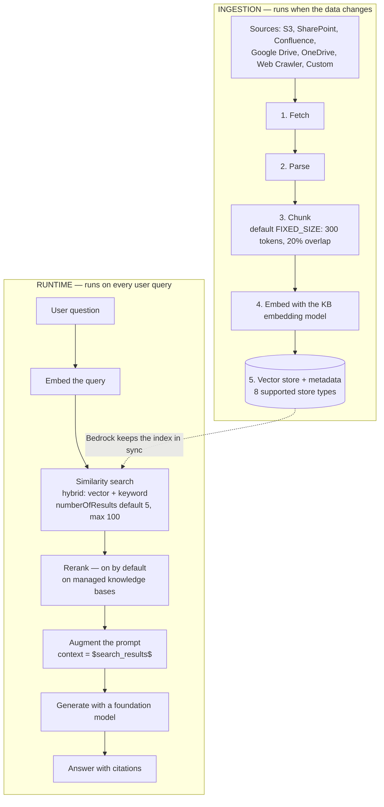
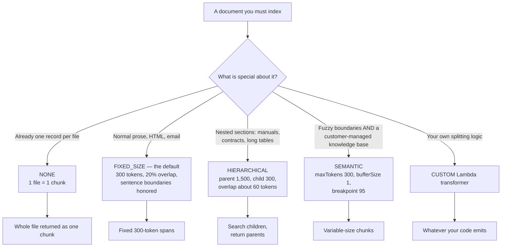
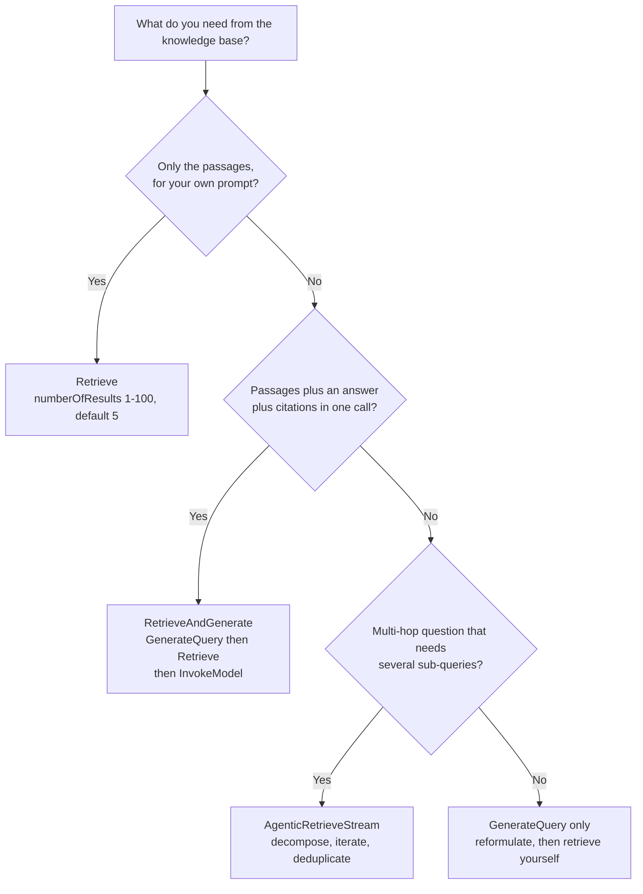
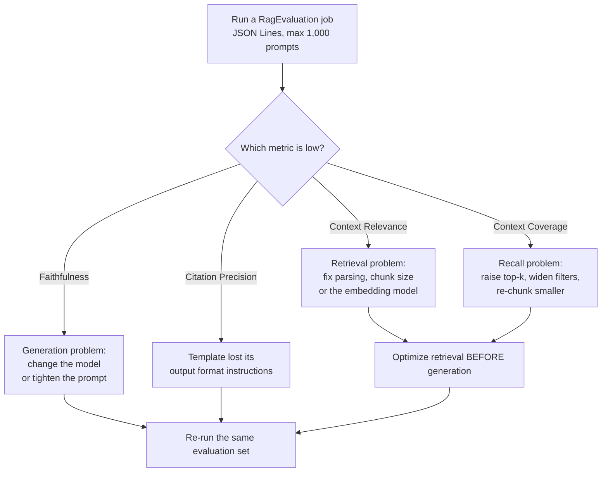
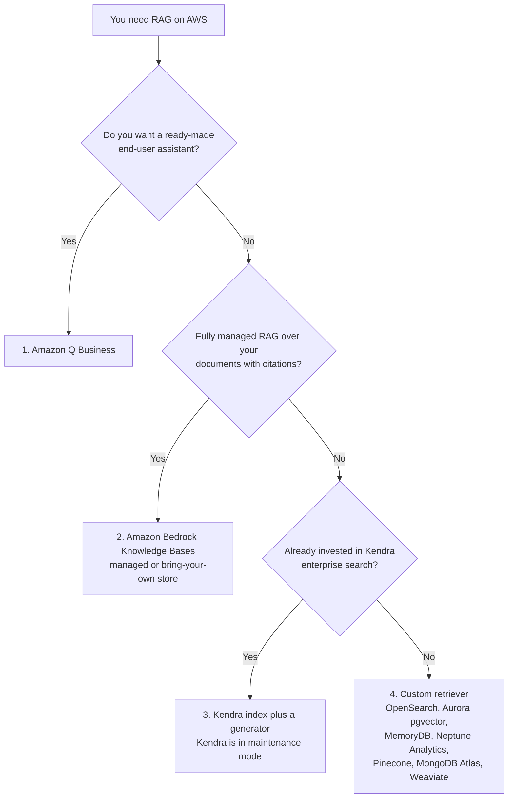
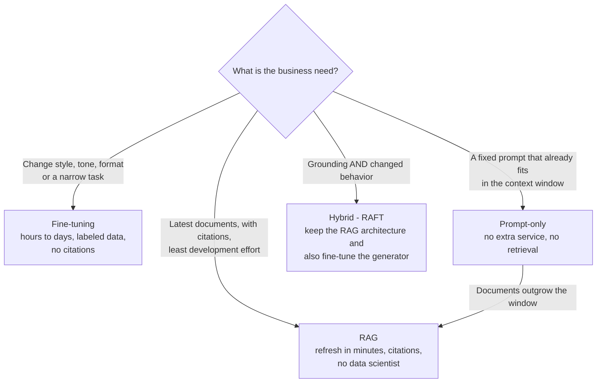

# RAG and Knowledge Bases on Amazon Bedrock: Chunking, Embeddings, Retrieval and Evaluation

Retrieval-augmented generation is the highest-frequency topic in Domain 3 of the AIF-C01 exam, and it is also the topic where most candidates memorise slogans instead of mechanisms. AWS's exam guide names RAG three times: *"Define RAG and its business applications (e.g., Amazon Bedrock Knowledge Bases)"*, *"services that store embeddings (OpenSearch, Aurora, Neptune, RDS for PostgreSQL)"* and *"RAG grounding"*. A slogan such as "RAG reduces hallucination" will not carry you, because the exam asks what happens **when the default chunk size is wrong, when top-k is too large, when a filter operator is unsupported, or when a metric drops below threshold**. This lesson teaches the mechanisms, and every number in it is pinned to a first-party AWS page as of **October 2026**.

```text
====================================================================
 AMAZON BEDROCK KNOWLEDGE BASES AT A GLANCE        (Digest: Oct 2026)
====================================================================
  WHAT RAG IS ..... data-source information improves relevancy
                    and accuracy; your data is searched at query
                    time and injected into the prompt
  TWO KB TYPES .... MANAGED (BMKB): AWS runs ingestion, indexing,
                    storage, retrieval and reranking
                    CUSTOMER-MANAGED: you own the vector store
                    and every configuration
  INGEST .......... fetch -> parse -> chunk -> embed -> vector
                    store, each chunk mapped to its source doc
  RUNTIME ......... embed query -> similarity search -> augment
                    prompt -> generate with citations
  DEFAULT CHUNKING  FIXED_SIZE, 300 tokens, 20% overlap,
                    sentence boundaries honored
  STRATEGIES ...... FIXED_SIZE | NONE | HIERARCHICAL | SEMANTIC
  TOP-K ........... numberOfResults: min 1, max 100, default 5
  EMBEDDINGS ...... Titan V2 1024 (also 512 / 256), Titan G1 1536,
                    Cohere Embed v3 1024, multimodal 1024
  STORES (8) ...... OPENSEARCH_SERVERLESS, OPENSEARCH_MANAGED_
                    CLUSTER, RDS, NEPTUNE_ANALYTICS,
                    REDIS_ENTERPRISE_CLOUD, PINECONE,
                    MONGO_DB_ATLAS, S3_VECTORS
  APIs ............ Retrieve | RetrieveAndGenerate |
                    GenerateQuery | AgenticRetrieveStream
  EVALUATION ...... applicationType "RagEvaluation", LLM-as-a-judge,
                    JSON Lines, max 1,000 prompts per job,
                    metrics scored 0-1
  KENDRA .......... maintenance mode since 2026-06-30; closed to
                    new customers after 2026-07-30
====================================================================
```

> [!NOTE]
> **How to read this lesson.** Knowledge Bases features ship faster than exam guides are rewritten, so three reading rules apply. (1) **AWS's own published default beats any blog's example** — a sample that uses `numberOfResults: 10` does not change the documented default of 5. (2) **Capability differences between managed and customer-managed knowledge bases are exam gold** — several features exist on one and not on the other. (3) **Anything AWS does not confirm first-party is shown as unverified**, never as recall material.

By the end of this lesson you will be able to:

- explain the two halves of a knowledge base — **ingestion** and **runtime retrieval** — and name what breaks at each stage;
- choose between a **managed** and a **customer-managed** knowledge base, and name the seven managed connectors;
- pick the right **chunking strategy** and defend the parameter values AWS recommends;
- size an **embedding model** by dimension, input limit and cost;
- select one of the **eight vector stores** for a given constraint;
- write a **metadata filter** that a managed knowledge base will actually accept;
- choose among **Retrieve, RetrieveAndGenerate, GenerateQuery and AgenticRetrieveStream**, and fix a prompt that exceeds the character limit;
- diagnose a failing RAG system by reading **context relevance, coverage and faithfulness** in the right order;
- defend the **comparative verdict** — RAG vs fine-tuning vs prompt-only, and Bedrock Knowledge Bases vs Amazon Kendra.

---

## 1. What RAG is, and what the exam guide really asks

### 1.1 The definition AWS uses

AWS defines retrieval-augmented generation as using **data-source information to improve the relevancy and accuracy** of a foundation model's response. The decisive clause is the second half: the knowledge base **searches your data at query time and augments the prompt** with the passages it finds. Nothing is written into the model. Weights do not move, no training job runs, and the same foundation model that answered carelessly without your documents now answers with them.

That sentence already eliminates three distractors on every RAG question:

- RAG does **not** change the model, so it cannot be confused with fine-tuning or continued pre-training;
- RAG does **not** need labeled data, so it cannot be the answer to "the team has no data scientists";
- RAG **can** be refreshed in minutes, so "the data changes weekly" points at RAG rather than at a training loop.

### 1.2 The three questions the exam guide maps to this lesson

| Exam-guide line | What it is really testing | Where it lands here |
|---|---|---|
| Define RAG and its business applications (e.g., Bedrock Knowledge Bases) | Definition, freshness, citations, low effort | Sections 1, 2 and 11 |
| Services that store embeddings (OpenSearch, Aurora, Neptune, RDS for PostgreSQL) | The `StorageConfiguration.type` enum | Section 6 |
| Cost tradeoffs: pre-training, fine-tuning, in-context learning, RAG, model distillation | RAG vs fine-tuning vs prompt-only | Section 11 |
| RAG grounding | Faithfulness and citation metrics | Section 9 |

The AIF-C01 exam is **65 questions in 90 minutes**, and Domain 3 (Domain 3 covers Foundation Models, Deployment and Operations in part) is weighted at **28%**. RAG appears inside that weight as both a definition item and a troubleshooting item — which is why this lesson spends as many lines on evaluation as on architecture.

### 1.3 What RAG is weak at

AWS is explicit about RAG's structural weakness: it is **poor at summarizing an entire document**, because retrieval returns *chunks*, not whole files. If the business need is "read all 400 pages and give me the three themes", RAG is the wrong tool and the exam expects you to know that. Keep that limitation next to the benefit: RAG buys **freshness and citations**, and pays with **partial context**.

> **📚 Did you know?** AWS's official decision order for RAG on AWS starts with **Amazon Q Business**, then **Bedrock Knowledge Bases**, then **Kendra plus a generator**, then a **custom retriever** — in that order, from Prescriptive Guidance's *Choosing a RAG option*. Most candidates skip straight to Bedrock and forget that a ready-made end-user assistant sits one step above it in AWS's own list. On the exam, "fully managed answer for business users" can legitimately point at Amazon Q Business rather than at a knowledge base you assemble yourself.

---

## 2. The RAG pipeline: ingestion and runtime

A knowledge base is two pipelines that never run at the same time. **Ingestion** runs when data changes; **retrieval** runs on every query. Confusing the two is the root cause of most bad diagnoses — a hallucination is almost never an ingestion problem, and a missing document is never a generation problem.

### 2.1 Ingestion: fetch, parse, chunk, embed, store

AWS documents the ingestion sequence as: **fetch** the document → **parse** it → **chunk** it → **embed** each chunk → write the vectors into a **vector store**, with every chunk mapped back to its source document. Amazon Bedrock keeps the vector database in sync for you, including deletions and re-ingestion, which is the practical meaning of "fully managed" here.

### 2.2 Runtime: embed, search, augment, generate

At query time the flow reverses: the **query is embedded** with the same embedding model → a **similarity search** returns the nearest chunks → the chunks are **injected into the prompt** → the foundation model **generates** an answer that carries citations back to the source documents.



### 2.3 What breaks at each stage

| Stage | Failure you introduce | What the user sees | Which metric moves |
|---|---|---|---|
| Fetch | Wrong prefix, file over 50 MB, permission denied | Document simply absent from answers | Context Coverage drops |
| Parse | Tables and PDF columns flattened into noise | Fluent answers about nothing | Context Relevance drops |
| Chunk | Question and answer split across two chunks | "There is not enough context" | Context Relevance drops |
| Embed | Chunk longer than the model input limit | Silent truncation, half a chunk indexed | Context Coverage drops |
| Search | top-k too small, filter too strict | Correct doc never retrieved | Context Coverage drops |
| Generate | Prompt template lost its instructions | Contradiction with the retrieved text | Faithfulness drops |

**Worked example 1 — default ingestion sizing.** If you omit the chunking configuration, Bedrock uses **fixed-size chunking at 300 tokens with 20% overlap**. The overlap is 60 tokens, so each chunk advances by a **stride of 240 tokens**. A **4,800-token** employee handbook therefore yields roughly **4,800 ÷ 240 = 20 chunks**, each retrievable on its own. AWS's own rule of thumb for estimating documents: **1 KB of text ≈ 1,000 characters ≈ 200–250 words**.

Put the runtime order in the correct sequence:

```dragdrop
{
  "question": "Order the runtime steps of a Bedrock knowledge base query, from user input to answer:",
  "items": [
    "Step 4 - the foundation model generates the answer and returns citations to the source passages",
    "Step 1 - the user query is embedded with the same embedding model used at ingestion",
    "Step 2 - a similarity search returns the nearest chunks, reranked by default on managed knowledge bases",
    "Step 3 - the retrieved chunks are injected into the prompt as $search_results$"
  ],
  "correctOrder": [
    "Step 1 - the user query is embedded with the same embedding model used at ingestion",
    "Step 2 - a similarity search returns the nearest chunks, reranked by default on managed knowledge bases",
    "Step 3 - the retrieved chunks are injected into the prompt as $search_results$",
    "Step 4 - the foundation model generates the answer and returns citations to the source passages"
  ],
  "explanation": "Retrieval always precedes generation: embed the query, search the index, augment the prompt, then generate. The order matters for diagnosis - if the right document never reached the prompt, changing the model or the prompt cannot fix the answer, which is exactly the rule that section 9 turns into a decision procedure."
}
```

> [!WARNING]
> **Do not diagnose a generation problem at ingestion.** If the retrieved passages are correct and the answer still contradicts them, the fix is the **model or the prompt**, not the chunk size. If the retrieved passages are wrong or missing, the fix is **parsing, chunking, the embedding model or top-k**, not the model. AWS's evaluation guidance states the rule directly: **optimize retrieval before generation**.

---

## 3. Two kinds of knowledge base: managed and customer-managed

### 3.1 Managed (BMKB) versus customer-managed

| Dimension | **Managed knowledge base** | **Customer-managed knowledge base** |
|---|---|---|
| Who runs ingestion, indexing, storage | **AWS** | You (and Bedrock, on your configuration) |
| Who owns the vector store | **AWS** | **You** |
| Embedding + reranking | Managed, reranking **on by default** | You configure both |
| Search modes | **Hybrid only, always** | `HYBRID` or `SEMANTIC` via `overrideSearchType` (OpenSearch Serverless only) |
| Semantic chunking | **Not supported** | Supported |
| Connectors | **7** (S3, SharePoint, Confluence, Google Drive, OneDrive, Web Crawler, Custom) | Your data source configuration |
| `startsWith` / `stringContains` filters | **Not supported** | Depends on the store |

### 3.2 The seven managed connectors

| # | Connector | Typical content |
|---|---|---|
| 1 | **Amazon S3** | Exports, data lakes, static document sets |
| 2 | **SharePoint** | Enterprise intranets |
| 3 | **Confluence** | Engineering and support wikis |
| 4 | **Google Drive** | Docs, Sheets, Slides of a team |
| 5 | **OneDrive** | Personal and team files |
| 6 | **Web Crawler** | Public product and help sites |
| 7 | **Custom** | Your own connector through the documented integration |

Note the asymmetry that exam questions exploit: a **customer-managed** knowledge base that uses Confluence, SharePoint or Salesforce as a source **requires OpenSearch Serverless** as its store, while a managed knowledge base offers you four console quick-create stores.

### 3.3 Quotas worth memorising

| Limit | Value |
|---|---|
| Source file size | **50 MB** |
| Metadata sidecar file | **10 KB** |
| Managed knowledge bases per account per Region | **10,000** |
| Data sources per knowledge base | **200** |
| Concurrent ingestion jobs | **50** |
| Raw storage (managed) | **10 TB** |
| Query input characters | **10,000** |
| Retrieve requests per minute | **600** (burst **25 per second**) |

> **📚 Did you know?** The **50 MB source-file cap** and the **10 KB metadata cap** are different limits that people merge into one "10 MB file limit" urban legend. The data source connector also exposes `maxFileSizeInMegaBytes` with a documented default of **500**, plus `inclusionPrefixes`, `exclusionPrefixes`, regex `inclusionPatterns` / `exclusionPatterns`, `metadataFilesPrefix` and `aclEnabled` — so most "why is this file missing" tickets are a filter problem, not a size problem.

---

## 4. Chunking: the four strategies and their parameters

Chunking is where RAG quality is won or lost, because a retrieval system can only return what ingestion actually created. AWS's API accepts exactly four values for `chunkingStrategy`: **`FIXED_SIZE`, `NONE`, `HIERARCHICAL`, `SEMANTIC`** — nothing else is valid.

### 4.1 The default you get when you configure nothing

Omitting the chunking configuration gives **fixed-size chunking: 300 tokens with 20% overlap, honoring sentence boundaries**. Sentence-boundary honoring matters more than it sounds: it is the difference between a chunk that ends mid-clause and a chunk that ends at a period, and AWS's own published case shows context relevance moving from **67% to 93%** purely because FAQ questions and answers stopped being split apart.

### 4.2 Strategy comparison

| Strategy | API value | Parameters | AWS recommended | Best for | Notes |
|---|---|---|---|---|---|
| **Default / fixed** | `FIXED_SIZE` (or omitted) | `maxTokens`, `overlapPercentage` | **300 tokens, 20% overlap** | Most documents | Honors sentence boundaries |
| **None** | `NONE` | — | 1 file = 1 chunk | Pre-split data, 1 SKU per file | You pre-process upstream |
| **Hierarchical** | `HIERARCHICAL` | parent, child, overlap tokens | Parent **1,500**, child **300**, overlap **≈60** | Manuals, legal, nested tables | Searches children, returns **parents** |
| **Semantic** | `SEMANTIC` | `maxTokens`, `bufferSize`, `breakpointPercentileThreshold` | **300**, buffer **1**, threshold **95** | Unclear boundaries | **Not available on managed KBs** |
| **Custom** | Lambda transformer | Your code | — | Domain-specific splitting | `vectorIngestionConfiguration` |



### 4.3 Hierarchical chunking

Hierarchical chunking creates a **parent** chunk (recommended **1,500 tokens**, not embedded) and **child** chunks (recommended **300 tokens**, embedded), with an overlap recommended at **20% of the child size ≈ 60 tokens**. Retrieval searches the children but returns the **parents**, so the model receives section-level context instead of a fragment.

**Worked example 2 — hierarchical sizing.** With parent 1,500, child 300 and overlap 60, AWS's own sample requesting `numberOfResults = 5` came back with **3 chunks**, because several children mapped to the same parent. `numberOfResults` is therefore a **cap, not a promise** — a fact the exam can test in either direction: "fewer results than requested" is normal, and "more results than requested" is not.

### 4.4 Semantic chunking

Semantic chunking embeds adjacent sentences, compares their similarity, and cuts where similarity drops. The parameter ranges are contractual:

| Parameter | Range | AWS recommended | Meaning |
|---|---|---|---|
| `maxTokens` | 1–8,192 (blog notes 20–8,192 depending on embedder) | **300** | Hard ceiling for a chunk |
| `bufferSize` | 0–1 | **1** | How many sentences on each side are compared |
| `breakpointPercentileThreshold` | 50–99 | **95** | Cut only at the least-similar N% of boundaries |

**Worked example 3 — the AWS API worked example.** With a threshold of **90** over **101 sentences**, Bedrock compares **100 pairs** and splits at the **10 least-similar boundaries (10%)**, producing **11 chunks** — which are re-split if any exceeds `maxTokens`. With `bufferSize = 1`, sentence 10 is embedded from the context of sentences **9 + 10 + 11**. Cohere Embed v3 caps input at **512 tokens**, so chunks built for it cannot exceed that even if `maxTokens` is higher.

> [!WARNING]
> **Semantic chunking is unavailable on managed knowledge bases**, and it is never the default. Any answer claiming "semantic chunking with threshold 95 is what you get by default" is wrong twice. Equally, `HIERARCHICAL` must be configured explicitly — the default is fixed-size, not hierarchical.

Match each strategy to the situation it solves:

```matching
{
  "question": "Match each chunking strategy to the situation it is designed for:",
  "pairs": [
    {"left": "FIXED_SIZE (default, 300 tokens, 20% overlap)", "right": "Ordinary prose and HTML where sentence boundaries are clear and no special structure exists"},
    {"left": "NONE", "right": "Data you already split upstream, such as one SKU or one ticket per file"},
    {"left": "HIERARCHICAL (parent 1,500 / child 300)", "right": "Nested manuals, contracts and long tables where the answer needs section-level context"},
    {"left": "SEMANTIC (buffer 1, breakpoint 95)", "right": "Documents with fuzzy boundaries - unavailable on managed knowledge bases"},
    {"left": "Custom Lambda transformer", "right": "Domain-specific splitting rules that none of the four built-in strategies express"}
  ],
  "explanation": "FIXED_SIZE is the documented default for most documents; NONE assumes you pre-split; HIERARCHICAL searches children and returns parents, so counts may be lower than numberOfResults; SEMANTIC adapts cut points to similarity but is not offered on managed knowledge bases; a custom transformer is the escape hatch configured through vectorIngestionConfiguration. The API accepts exactly FIXED_SIZE, NONE, HIERARCHICAL and SEMANTIC."
}
```

---

## 5. Embedding models: dimensions, limits and cost

### 5.1 The models a knowledge base accepts

| Provider | Model | Model ID | Dimensions | Types | Input limit |
|---|---|---|---|---|---|
| Amazon | Titan Embeddings G1 – Text | `amazon.titan-embed-text-v1` | **1536** | float | 8,192 tokens |
| Amazon | **Titan Text Embeddings V2** | `amazon.titan-embed-text-v2:0` | **1024 default, 512, 256** | float, binary | **8,192 tokens / 50,000 chars** |
| Cohere | Embed English v3 | `cohere.embed-english-v3` | **1024** | float, binary | **512 tokens ≈ 2,048 chars** |
| Cohere | Embed Multilingual v3 | `cohere.embed-multilingual-v3` | **1024** | float, binary | 512 tokens |
| Amazon | Titan Multimodal G1 | — | **1024** | float | multimodal |
| Cohere | Embed v3 (multimodal) | — | **1024** | float, binary | multimodal |
| Amazon | Nova Multimodal Embeddings | — | **1024** | float | multimodal |

### 5.2 The dimension trade-off

| Dimensions | Accuracy vs 1024 | Storage vs 1024 | Use |
|---|---|---|---|
| **1024** (default) | baseline | 1× | Maximum accuracy |
| **512** | **≈99%** | −50% | Balanced |
| **256** | **97%** | **−75%** | Cost and scale |

**Worked example 4 — the dimension budget.** A team on Amazon Titan Text Embeddings V2 that needs roughly **75% less vector storage** while keeping about **97% retrieval accuracy** must set the output dimension to **256**. At **512** it keeps **≈99%** accuracy at **half** the storage. Adding `embeddingTypes: ["binary"]` cuts storage further. Embedding spend is measured in tokens: Titan V2 is priced at **$0.02 per 1 million tokens**, against **$0.10** for V1 — an 80% reduction on the same workload.

> **📚 Did you know?** Titan Text V2 accepts **8,192 tokens or 50,000 characters** and covers **100+ languages**, while Cohere Embed v3 accepts only **512 tokens (about 2,048 characters)**. That single fact explains two exam traps at once: choosing Cohere means your effective chunk ceiling drops to 512, and a chunk that "fits the default 300 tokens" can still overflow an embedder if you raised `maxTokens` for a different model. Dimension and input limit are independent knobs — 1024 dimensions says nothing about how much text you may send.

---

## 6. Vector stores: eight options, four console quick-creates

| Store | API `type` | Console quick-create | Notes and limits |
|---|---|---|---|
| **OpenSearch Serverless** | `OPENSEARCH_SERVERLESS` | Yes | Needs a **`faiss` engine** index for metadata files; the only store allowing `overrideSearchType: HYBRID`; **required** for Confluence/SharePoint/Salesforce sources |
| **OpenSearch Service (managed cluster)** | `OPENSEARCH_MANAGED_CLUSTER` | — | Hybrid plus full-text search |
| **Aurora PostgreSQL + pgvector** | `RDS` | Yes (Serverless) | SQL plus vectors, ACID; pgvector supports up to **2,000 dimensions**, IVFFlat and HNSW |
| **Neptune Analytics** | `NEPTUNE_ANALYTICS` | Yes | **GraphRAG**: vectors plus graph traversal with openCypher |
| **Redis Enterprise Cloud** | `REDIS_ENTERPRISE_CLOUD` | — | In-memory, ultra-low latency |
| **Pinecone** | `PINECONE` | — | Managed vector database |
| **MongoDB Atlas** | `MONGO_DB_ATLAS` | — | Mongo-compatible APIs |
| **Amazon S3 Vectors** | `S3_VECTORS` | Yes | Cheapest — **up to 90%** lower storage cost, **2 billion vectors per index**; no `startsWith` or `stringContains` |

Exam shorthand: **OpenSearch Serverless = default and hybrid · Aurora pgvector = SQL plus vector · Neptune = GraphRAG · Redis = lowest latency · S3 Vectors = cheapest · Kendra = enterprise search, not a knowledge-base store.**

> **📚 Did you know?** **Amazon S3 Vectors** is the newest entry and the one most likely to be framed as a cost question: AWS's Prescriptive Guidance puts it at **up to 90% cheaper storage** than traditional vector databases with **2 billion vectors per index**, at roughly **100 ms-plus** query latency. The catch for exam purposes is functional, not financial: S3 Vector indexes do **not** support the `startsWith` or `stringContains` filter operators — so the cheapest store is also the one that removes the most convenient substring filters.

> [!WARNING]
> **`Amazon EMR Serverless` is not a knowledge base vector store.** It appears in some Prescriptive Guidance material about big-data processing, but it is **absent from the `StorageConfiguration.type` enum**: `OPENSEARCH_SERVERLESS`, `OPENSEARCH_MANAGED_CLUSTER`, `RDS`, `NEPTUNE_ANALYTICS`, `REDIS_ENTERPRISE_CLOUD`, `PINECONE`, `MONGO_DB_ATLAS`, `S3_VECTORS`. Any option offering EMR Serverless as the vector store for a knowledge base is wrong by construction. Similarly, **Amazon Kendra is a search service, not a storage type** — it can *feed* a knowledge base, but it cannot *be* one's store.

---

## 7. Metadata: sidecar files and retrieval filters

### 7.1 The sidecar pattern

Next to `articles.pdf` you place `articles.pdf.metadata.json` in the **same S3 folder**, capped at **10 KB**, containing string, number or boolean values. Setting `includeForEmbedding: true` on a field concatenates its key and value into the text that gets embedded, which is how a value such as `genre: cooking` becomes part of the searchable representation rather than only a post-filter. A CSV data source can instead declare a `contentFields` column.

**Worked example 5 — the AWS filter example.** Given `articles.pdf` plus a sidecar declaring `genre`, `year` and `author`, the following filter retrieves entertainment articles published after 2018, or any cooking or sports article whose author's name starts with "C":

```json
{
  "orAll": [
    {
      "andAll": [
        { "equals": { "key": "genre", "value": "entertainment" } },
        { "greaterThan": { "key": "year", "value": 2018 } }
      ]
    },
    {
      "andAll": [
        { "in": { "key": "genre", "value": ["cooking", "sports"] } },
        { "startsWith": { "key": "author", "value": "C" } }
      ]
    }
  ]
}
```

### 7.2 The operator set

`RetrievalFilter` is a **union**: primitives composed with `andAll` / `orAll`, each of which requires **at least 2 items**.

| Category | Operators |
|---|---|
| Equality | `equals`, `notEquals` |
| Ordering | `greaterThan`, `greaterThanOrEquals`, `lessThan`, `lessThanOrEquals` |
| Membership | `in`, `notIn`, `listContains` |
| String | `startsWith`, `stringContains` |
| Composition | `andAll`, `orAll` (minimum 2 items each) |
| Built-in key | `x-amz-bedrock-kb-source-uri` — filter by S3 prefix with no sidecar file at all |

**Worked example 6 — the operator that fails.** If the same filter above runs against a **managed knowledge base**, it fails on `startsWith`. AWS documents that **`startsWith` and `stringContains` are unsupported on managed knowledge bases and on S3 Vector indexes**. The fix is to restructure the branch to `equals` or `in` — for example, an explicit author list — or to run the substring logic in the application after retrieval. Note that `listContains` is not a substitute: it tests **membership in a list field**, not a substring of a string field.

> [!WARNING]
> **Three filter traps that cost marks.** (1) `startsWith` and `stringContains` are **not supported** on managed knowledge bases or S3 Vector indexes. (2) `andAll` / `orAll` need **two or more** children — a single child is invalid. (3) Metadata files are capped at **10 KB**; oversized sidecars are silently a data-source problem, not a retrieval problem. Always distinguish "the operator is invalid" from "the operator is valid but unsupported here".

---

## 8. Retrieval: four APIs, top-k and the token budget

### 8.1 Which API to call

| API | What it does | Use when |
|---|---|---|
| **`Retrieve`** | Returns ranked passages only | You own the prompt and the generation step |
| **`RetrieveAndGenerate`** | Retrieve → `InvokeModel` → citations in one call | You want an answer with sources, minimum code |
| **`GenerateQuery`** | Reformulates the user question | You orchestrate the loop yourself |
| **`AgenticRetrieveStream`** | The FM decomposes into sub-queries, iterates and deduplicates | Multi-hop questions over large corpora |

Under the hood, `RetrieveAndGenerate` runs **GenerateQuery → Retrieve → InvokeModel**. With **query decomposition** enabled, `numberOfRerankedResults` may reach **5× `numberOfResults`** — the only place where a reranked count legitimately exceeds the requested top-k.



### 8.2 top-k and the token budget

`numberOfResults` is an integer with **minimum 1, maximum 100 and default 5**. It directly sizes the `$search_results$` placeholder in the generation prompt.

**Worked example 7 — top-k versus the prompt window.** With the default **300-token** chunk:

| `numberOfResults` | Approximate tokens in `$search_results$` | Verdict |
|---|---|---|
| **5** (default) | **≈1,500** | Safe for most models |
| 10 | ≈3,000 | AWS's sample for "not enough context" answers |
| 100 (API maximum) | ≈30,000 | Almost certainly over the prompt limit |

Raising top-k raises recall and lowers hallucination — but it grows the prompt linearly. When a `RetrieveAndGenerate` call fails because the augmented prompt **exceeds the model's character limit**, AWS documents exactly three remediations: **lower `numberOfResults`**, **re-create the data source with smaller chunks**, or **shorten the prompt template or the user query**. Increasing `numberOfResults` makes the error worse, which is why it appears as a distractor.

### 8.3 Prompt template contract

Generation prompts **must include `$search_results$`**. Orchestration prompts must include `$conversation_history$` **and** `$output_format_instructions$`. The AWS sample template wraps context as `<context>$search_results$</context>` alongside `$query$` — and dropping `$output_format_instructions$` **removes citations** from the output, which silently breaks the "grounded answers with sources" requirement.

### 8.4 Search mode

`overrideSearchType` accepts `HYBRID` or `SEMANTIC`, and applies **only** to OpenSearch Serverless with a filterable text field. **Managed knowledge bases are always hybrid** — there is no setting to turn that off, so "configure the managed knowledge base for semantic-only search" is a distractor.

> **📚 Did you know?** Two counters run in the same request and are easy to confuse: `numberOfResults` (requested top-k, **1–100, default 5**) and `numberOfRerankedResults` (what reranking actually returns after filtering and deduplication). On managed knowledge bases reranking is **on by default**, and with query decomposition the reranked count can reach **5× the requested top-k**. The exam can therefore legitimately show a request for 10 passages with more than 10 reranked candidates — while never showing more than 100 *requested* results.

---

## 9. Evaluating a RAG application

### 9.1 The job shape

RAG evaluation is a Bedrock evaluation with `applicationType: "RagEvaluation"`, scored by an **LLM-as-a-judge**. Two job types exist — **retrieve only** and **retrieve and generate** — and metrics are scored **0–1** and averaged over the prompts. The dataset is **JSON Lines** with a maximum of **1,000 prompts per job**; ground truth lives in `referenceContexts` (for retrieval) and `referenceResponses` (for generation).

### 9.2 The metric families

| Stage | Metric | What it measures |
|---|---|---|
| Retrieve only | **Context Relevance** | Precision of the retrieved chunks |
| Retrieve only | **Context Coverage** | Recall against ground-truth `referenceContexts` |
| Retrieve + generate | **Correctness / Completeness / Helpfulness / Logical Coherence** | Accurate, complete, useful, contradiction-free answers |
| Retrieve + generate | **Faithfulness** | **Hallucination resistance against the retrieved chunks** |
| Retrieve + generate | **Citation Precision / Coverage** | Citations are accurate / complete |
| Retrieve + generate | **Harmfulness, Stereotyping, Refusal** | Responsible-AI metrics |

### 9.3 The diagnosis rule

| Symptom | Metric to read first | Fix |
|---|---|---|
| Answers ignore available documents | **Context Coverage** | Lower the filter strictness, raise top-k, re-chunk smaller |
| Retrieved chunks are irrelevant | **Context Relevance** | Fix parsing, chunk size or the embedding model |
| Answer contradicts the passages | **Faithfulness** | Change the model or the prompt |
| Citations missing or wrong | **Citation Precision** | Restore `$output_format_instructions$` in the template |



**Worked example 8 — the 67% to 93% fix.** AWS published a case in which context relevance sat at **67%** because FAQ questions were split from their answers mid-sentence. Re-chunking so each question and answer stayed together — sentence-aligned, **with no prompt change at all** — moved context relevance to **93%** on the same 15 queries and eliminated the hallucinations. The lesson is not the number; it is that the fix landed in **ingestion**, even though the symptom appeared in **generation**.

> [!WARNING]
> **Read the metrics in order.** Low **context relevance** is an indexing problem — parsing, chunk size or embedding model. Low **faithfulness** is a generation problem — model or prompt. Teams that reach for a bigger model while the retriever is returning the wrong passages burn a full evaluation cycle to confirm what a retrieval metric already said. AWS's guidance is unambiguous: **optimize retrieval before generation**.

---

## 10. Choosing a RAG option on AWS — and the Kendra transition

### 10.1 AWS's documented order

Prescriptive Guidance lists the RAG options in a deliberate order: **(1) Amazon Q Business → (2) Amazon Bedrock Knowledge Bases → (3) Amazon Kendra plus a generator → (4) a custom retriever** built on OpenSearch, Aurora pgvector, MemoryDB, Neptune Analytics, Pinecone, MongoDB Atlas or Weaviate.



### 10.2 Kendra versus Bedrock Knowledge Bases

| Dimension | **Amazon Kendra** | **Bedrock (Managed) Knowledge Base** |
|---|---|---|
| Status | **Maintenance since 2026-06-30; no new customers after 2026-07-30** | AWS's stated migration target |
| Connectors | Roughly 30+ enterprise connectors | **7**: S3, SharePoint, Confluence, Google Drive, OneDrive, Web Crawler, Custom |
| Generation | Ranked passages — you bring your own LLM | Native **`RetrieveAndGenerate`** plus **`AgenticRetrieveStream`** |
| Search modes | Keyword / semantic / hybrid | **Hybrid only** |
| Enterprise search | Facets, suggestions, synonyms, spell check, incremental learning | **Absent — workarounds required** |
| Retrieval maximum | **100 passages × ≤200 tokens** | **100 results** (`numberOfResults`) |
| Reuse | A Kendra GenAI index **can feed** a Bedrock knowledge base | — |

**Worked example 9 — the migration-shaped question.** An enterprise wants "fully managed RAG with native generation, citations and agentic retrieval, as the recommended replacement for our Kendra application". The answer is **Amazon Bedrock Managed Knowledge Base**: Kendra is in maintenance mode and closed to new customers after 2026-07-30, and AWS names the managed knowledge base as the replacement. OpenSearch alone gives no generation and no citations; Amazon Q Developer is a coding assistant; continued pre-training adds no retrieval at all.

> **📚 Did you know?** Kendra is not merely deprecated — it is **repurposable**: a Kendra GenAI index can still be connected as a **data source for a Bedrock knowledge base**, so an organisation with years of Kendra tuning can keep its index and move only the generation layer. That is the migration path AWS actually documents, and it is why "delete Kendra and re-index everything" is a distractor. Note also that the connector counts come from different places: the **7 managed connectors** are confirmed on `docs.aws.amazon.com`, while the "30+" Kendra figure circulates via AWS migration material rather than a page reproduced here — treat the exact number as approximate.

### 10.3 2025–2026 Updates

Everything in this subsection was read on `docs.aws.amazon.com`, an AWS What's New post, an AWS Machine Learning Blog post or the AIF-C01 exam guide itself — nothing comes from a third-party tracker, and dates AWS does not publish are marked as unpublished instead of being filled in. Two groups of change matter for this lesson: what shipped **inside** Bedrock Knowledge Bases and its vector stores, and what AWS did to **Kendra, to Amazon Q Business and to the exam** around them.

Where AWS publishes no date, the row says so: there is **no published launch date** for the Bedrock Managed Knowledge Base and **no published closure date** for Amazon Q Business, and neither has been invented here.

| Knowledge base / vector store change | Date (AWS-published) | What the exam wants you to know |
|---|---|---|
| **Reranking, custom connectors, direct ingestion, RAG evaluation and inference profiles in `RetrieveAndGenerate`** | Bedrock User Guide feature history, 2025 | Reranking is **on by default** on managed knowledge bases; evaluation is `applicationType: "RagEvaluation"` scored by an **LLM-as-a-judge**; an inference profile lets one `RetrieveAndGenerate` call pick the Region |
| **Amazon S3 Vectors becomes a knowledge base store** | re:Invent 2025 (**30 Nov – 4 Dec 2025**) | The eighth and newest `StorageConfiguration.type` value — cheapest at **up to 90% less**, **2 billion vectors per index**, and the store that rejects `startsWith` / `stringContains` |
| **Bedrock Managed Knowledge Base (BMKB): Smart Parsing plus the Agentic Retrieval API** | Documented as the Kendra replacement; AWS has **not published a launch date** | AWS runs ingestion, indexing, storage, retrieval and reranking; `AgenticRetrieveStream` is the streaming agentic retrieval API that sits behind the managed tier |
| **Amazon Kendra enters maintenance, then closes to new customers** | Maintenance **30 Jun 2026**, closed to new customers **30 Jul 2026** | AWS redirects new search applications to the **Bedrock Managed Knowledge Base**; existing Kendra customers keep running under AWS's *maintenance* vocabulary |
| **Amazon Q Business no longer open to new customers** | Availability page reads *"no longer open to new customers"* — **AWS publishes no date** | Step 1 of AWS's own RAG decision order now carries a caveat; the documented successor is **Amazon Quick** (bring your own identity), and Guardrails and User Store do **not** transfer |
| **Amazon MemoryDB removed from the AIF-C01 in-scope list** | Exam guide v1.1, **30 Apr 2026** | Prescriptive Guidance still names MemoryDB in the custom-retriever chain of section 10.1, but the service is no longer in scope for this exam |

| Exam-guide change (v1.1, published 30 Apr 2026) | Detail for a RAG candidate |
|---|---|
| New objective **5.1.5** | Hallucination detection and grounding: **RAG grounding**, output validation, confidence scoring — the reason Section 9's metrics are examinable at all |
| New objective **2.1.5** | **Context engineering** — how retrieved context is assembled into the prompt (`$search_results$`, template contracts, top-k sizing) |
| New objective **2.1.6** | Agentic AI: multi-agent patterns, **MCP**, memory management, tool usage, orchestration — the shape `AgenticRetrieveStream` puts on a retrieval call |
| Changed example **3.4.2** | **LLM-as-a-judge** — the scoring mechanism behind Bedrock RAG evaluation |
| Added / removed from the in-scope list | **Amazon Aurora** added (the pgvector `RDS` store); **Amazon MemoryDB** removed |
| Unchanged | **65 questions (50 scored + 15 unscored)**, **90 minutes**, pass **700/1000**, domains weighted **20 / 24 / 28 / 14 / 14** |

AWS states that exam-guide updates reach the live exam about **one month after publication**, so v1.1's new objectives have been fair game since roughly **late May 2026**. The practical reading order is unchanged: the features in the first table are what you configure, the objectives in the second table are what AWS now asks about them.

**Worked example 11 — what the 2026 changes mean for an existing Kendra customer.** An enterprise has run a Kendra GenAI index for years, with synonym and ranking tuning it does not want to lose, and now wants generative answers with citations. AWS's documented path is **not** to re-index everything: a Kendra GenAI index can still be connected as a **data source for a Bedrock knowledge base**, so the tuning survives and only the generation layer moves — while the Kendra index itself keeps serving its existing users under **maintenance** (mode entered **30 Jun 2026**, closed to new customers after **30 Jul 2026**). For a *new* application the answer is the **Bedrock Managed Knowledge Base**, and the third option in AWS's decision order — Amazon Q Business — now has to be checked against its own *"no longer open to new customers"* status before anyone offers it as the step-one answer.

| 2025–2026 change | Which section of this lesson it updates |
|---|---|
| Reranking on by default, custom connectors, direct ingestion | Sections 2 and 3 |
| RAG evaluation scored by an LLM-as-a-judge | Section 9 |
| Inference profiles usable inside `RetrieveAndGenerate` | Section 8 |
| **Amazon S3 Vectors** as the eighth store type | Section 6 |
| **Bedrock Managed Knowledge Base** + Agentic Retrieval API | Sections 3 and 10 |
| Kendra maintenance and closure dates | Section 10 |
| Exam guide v1.1 objectives **5.1.5, 2.1.5, 2.1.6, 3.4.2** | Sections 9, 8 and 1 |

> **📚 Did you know?** The Kendra availability page never uses the word "deprecated" — it redirects new search applications to the **Amazon Bedrock Managed Knowledge Base**, whose Smart Parsing and **Agentic Retrieval API** AWS documents as the replacement, while Kendra itself keeps serving existing customers under AWS's own **maintenance** definition (no new customers, no new features, still supported). That is why *"Kendra was shut down"* and *"existing Kendra customers must migrate immediately"* are both distractors, and why the correct answer pairs **continuity for existing customers** with **a documented replacement for new ones**.

---

## 11. Comparative verdict: RAG vs fine-tuning vs prompt-only, and Bedrock KB vs Kendra

### 11.1 RAG vs fine-tuning

| Dimension | **RAG** | **Fine-tuning** |
|---|---|---|
| What changes | Nothing in the model; knowledge injected at query time | Model **weights** |
| Freshness | Latest docs in **minutes** | **Hours to days** per run |
| Source citations | **Yes** | **No** |
| Hallucination | **Reduced** — grounded in retrieved context | **Increased** for Q&A workloads |
| Skills and data | **No data scientist**; raw documents | May need a data scientist (LoRA/PEFT); **labeled** pairs |
| Availability | Any Bedrock model | **Not available for all models** |
| Weakness | **Poor at summarizing whole documents** | Stale fast, costly, ungrounded |
| AWS says best for | **Document Q&A — start here** | **Style, tone, format; summarization and other tasks** |
| Combination | — | **Hybrid (RAFT)**: fine-tune the generator *and* keep RAG |

**Worked example 10 — what hybrid actually bought.** In AWS's published Amazon Nova case study, RAG alone and fine-tuning alone each improved LLM-judge quality by about **+30%**; combining them reached **+83%**. Latency behaved differently per lever: fine-tuning cut latency by roughly **50%** while RAG cut it by about **30%**. Token spend moved in opposite directions — fine-tuning reduced total tokens by **more than 60%**, while RAG **more than doubled** them because context is passed on every call. Same problem, four different levers, four different bills.



### 11.2 Bedrock Knowledge Bases vs Kendra

Pick **Bedrock Knowledge Bases** when the ask is *fully managed RAG, internal documents, citations, minimal operations* — and pick **Kendra-style enterprise search** only when the ask is *facets, synonyms, spell check, ranked passages without a generator*. In 2026 the second answer is a legacy one: Kendra is in maintenance mode and closed to new customers.

> [!IMPORTANT]
> **Comparative Verdict — RAG vs fine-tuning vs prompt-only, and Bedrock Knowledge Bases vs Amazon Kendra**
> - **RAG** is the default answer for **document question answering**: the data changes often, the business needs **source citations**, hallucination must go down, and no data scientist is available. AWS says to **start here**. Refreshes land in **minutes**; the weakness is summarizing whole documents, because retrieval returns chunks.
> - **Fine-tuning** is the answer when the requirement is **style, tone, format or a narrow repeating task** — not for fresh knowledge. It changes **weights**, takes **hours to days**, needs **labeled** data, produces **no citations** and is **not available for every model**. Choosing it for "our policy PDFs change weekly" is wrong on all four counts.
> - **Prompt-only (in-context learning)** is the answer when everything the model needs fits in the prompt and does not change. It is the cheapest and fastest path and requires no extra service — and it fails the moment the corpus outgrows the context window or must be kept current.
> - **Hybrid (RAFT)** is the AWS-sanctioned combination: keep the RAG architecture **and** fine-tune the generator. AWS cites UC Berkeley's RAFT work for this, and its own Nova case study measured **+30% from each lever and +83% combined**.
> - **Bedrock Knowledge Bases** is the answer for *fully managed RAG over internal documents with citations and minimal ops* — **7 managed connectors, always hybrid search, reranking on by default, native `RetrieveAndGenerate` and `AgenticRetrieveStream`**.
> - **Amazon Kendra** is the answer only for *enterprise search features* — facets, synonyms, spell check, ranked passages — and even then it is **in maintenance mode since 2026-06-30 and closed to new customers after 2026-07-30**, with AWS naming the Bedrock managed knowledge base as the replacement.
> - **Exam heuristic:** *"fully managed RAG, internal docs, citations, minimal ops"* → **Bedrock Knowledge Bases**. *"Style, tone, format"* → **fine-tuning**. *"Facets and synonyms, no generator"* → **Kendra**.

| Question in the stem | Correct answer |
|---|---|
| Weekly-changing docs + citations + least effort | **RAG / Bedrock Knowledge Bases** |
| Change the assistant's tone and format | **Fine-tuning** |
| Everything fits in one prompt, static | **Prompt-only** |
| Grounding *and* behavior change | **Hybrid (RAFT)** |
| Fully managed RAG recommended as the Kendra replacement | **Bedrock Managed Knowledge Base** |
| Facets, synonyms, spell check, ranked passages | **Kendra** (legacy) |

---

## 12. Exam traps, limits and what not to memorise

> [!WARNING]
> **The traps that cost marks on this exact material:**
> 1. **Default chunking is fixed-size at 300 tokens with 20% overlap** — never semantic, never hierarchical, and `NONE` only if you ask for it explicitly.
> 2. **`numberOfResults`: default 5, min 1, max 100.** "10" appears in AWS blog samples and is not the default; "100" is the maximum, not the default.
> 3. **Semantic chunking is unsupported on managed knowledge bases**; managed knowledge bases are **always hybrid**, and reranking is **on by default**.
> 4. **`startsWith` and `stringContains` are unsupported** on managed knowledge bases and on S3 Vector indexes.
> 5. **The store enum has exactly eight values** — `OPENSEARCH_SERVERLESS`, `OPENSEARCH_MANAGED_CLUSTER`, `RDS`, `NEPTUNE_ANALYTICS`, `REDIS_ENTERPRISE_CLOUD`, `PINECONE`, `MONGO_DB_ATLAS`, `S3_VECTORS`. EMR Serverless and Kendra are not among them.
> 6. **Titan Text G1 is 1536 dimensions; Titan Text V2 is 1024 (also 512 and 256); Cohere v3 is 1024 with a 512-token input cap.**
> 7. **Fixing "prompt exceeds the character limit" means lowering top-k, re-chunking smaller, or shortening the template/query** — never raising `numberOfResults`.
> 8. **Low context relevance → indexing. Low faithfulness → generation.** Optimize retrieval first.
> 9. **Generation prompts must contain `$search_results$`; orchestration prompts must contain `$conversation_history$` and `$output_format_instructions$`** — dropping the last one removes citations.
> 10. **Kendra is in maintenance mode (2026-06-30) and closed to new customers after 2026-07-30.** Answering "Amazon Kendra" for a new build is wrong.

**Items AWS does not confirm first-party — do not turn them into recall material:**

- **Kendra connector counts** ("30+" or "32+") — the **7 managed Bedrock connectors** are confirmed on `docs.aws.amazon.com`; the Kendra figure comes from AWS migration text relayed through third parties.
- **Kendra and managed-knowledge-base pricing** — third-party trackers report figures such as ~$230/month for a Kendra GenAI tier or ~$5.00/GB/month for managed knowledge bases; these were **not read on AWS pricing pages**.
- **S3 Vectors per-field limits** — the documented cap is the **10 KB** metadata file; any per-field count limit is unconfirmed.
- **Latency figures** ("RAG adds 200–500 ms") — third-party blog examples, not AWS SLAs.
- **Titan V2 pricing confusion** — one builder-centre page quotes "$0.02 per 1,000 tokens" while the AWS ML Blog says **$0.02 per 1 million tokens**; use the AWS blog figure.
- **Exam composition claims** ("3–6 RAG questions per sitting") — from exam-prep sites, not AWS.
- **`Amazon EMR Serverless` as a vector store** — appears in one Prescriptive Guidance guide but **not** in the `StorageConfiguration` enum; never answer with it.

---

## Real-World Case Studies

The tables above tell you what the APIs accept; AWS's published customer stories tell you **which lever actually moved a metric**. Every figure below is quoted from the AWS case study or AWS Machine Learning Blog post named in its Source line. All of them are **customer- or AWS-claimed and unaudited**, and where a source says "up to", read it as a ceiling rather than a plan.

Each entry names the mechanism, the services AWS itself lists, the numbers AWS published and where to read them. The five were chosen because together they cover every half of this lesson:

- **Nippon India** — retrieval engineering plus Guardrails against hallucination (Section 9);
- **Adobe** — chunking and embedding choice as the accuracy lever (Sections 4 and 5);
- **Alnylam** — RAG with citations inside a regulated workflow (Sections 1 and 11);
- **Bynder** — multimodal embeddings behind the same embed → search → augment shape (Section 5);
- **Sun Finance** — vector-store selection and the stage boundaries around it (Section 6).

### Case 1 — Nippon India: retrieval engineering, not a bigger model

Nippon India Mutual Fund's internal assistant was built on naive RAG, and it degraded as document volume grew — producing exactly the hallucinations Section 9 teaches you to measure. The fix set was entirely on the retrieval side: **FM-as-parser**, **query reformulation**, **multi-query RAG**, **reranker models**, **GraphRAG** and **metadata filtering** on **Amazon Bedrock Knowledge Bases**, plus **Amazon Bedrock Guardrails** and citations. Reported outcomes: **accuracy +>95%**, **hallucination −90–95%**, and report generation falling from **2 days to about 10 minutes**. Exam angle: not one lever in that list touches the generator, and AWS published the post to note that these are **generally available product features**, not code the customer wrote — a hallucination complaint was answered by fixing retrieval first. Source: AWS Machine Learning Blog, 29 Jul 2025, `aws.amazon.com/blogs/machine-learning/how-nippon-india-mutual-fund-improved-the-accuracy-of-ai-assistant-responses-using-advanced-rag-methods-on-amazon-bedrock`.

### Case 2 — Adobe: four chunking configurations, and the simplest one won

Adobe's developer-documentation search was losing accuracy for thousands of developers. The team benchmarked **four chunking configurations** on **Amazon Bedrock Knowledge Bases** — **400 tokens with 20% overlap**, **1,000 tokens**, **hierarchical** and **semantic** — embedded with **Amazon Titan Text Embeddings V2**, stored in **Amazon OpenSearch Service** and read back through the **`Retrieve` API**. Reported outcome: **+20% retrieval accuracy** against Adobe's own test set, with the **400-token / 20%-overlap** configuration both the simplest and the most accurate. Exam angle, in two parts: chunking choice moved the metric while the model stayed the same, and **400 tokens is a customer benchmark, not a change of AWS's documented 300-token default** — a published sample never overrides a published default. Source: AWS Machine Learning Blog, 11 Jun 2025, `aws.amazon.com/blogs/machine-learning/adobe-enhances-developer-productivity-using-amazon-bedrock-knowledge-bases`.

### Case 3 — Alnylam: citations as the compliance feature

Alnylam Pharmaceuticals' complaint triage took **3–4 days**, and finding one internal answer took **15+ minutes**. Using **Amazon Bedrock**, **Amazon S3** and a RAG-style assistant, the team delivered an intake-and-triage prototype in **3 months** under GxP constraints, plus **AskALNY**, a Slack assistant serving **2,000 employees and 1,000 contractors** that returns answers **with source links**. Reported outcomes: triage **3–4 days → hours**, information search **15 minutes → 30 seconds**, with **250+ use cases** following the first two. Exam angle: in a regulated workflow the **citation is the audit trail**, which is precisely why Section 11 files source references under the RAG column and "no citations" under fine-tuning. Source: `aws.amazon.com/solutions/case-studies/alnylam-case-study`.

### Case 4 — Bynder: the embedding model carries the modality

Bynder runs **175 million assets** across **18 petabytes** for **4,000 companies**, and keyword search cannot express "find me something like this image". Images and queries are vectorized with **Amazon Titan Multimodal Embeddings in Amazon Bedrock** for visual and contextual similarity search. Reported outcome: search time **−75%**, with roughly **+50%** more usable results per search. Exam angle: the retrieval pattern is the same pipeline as text RAG — embed, search, augment — but the **embedding model** is the component that decides which modality can be searched at all, which is the row of Section 5's table an exam stem is really asking about. Source: `aws.amazon.com/solutions/case-studies/bynder-bedrock-case-study`.

### Case 5 — Sun Finance: the store choice, and why the first prototype failed

Sun Finance (fintech lending across 9 countries) had **60% of microloan applications** needing manual review, each taking **10 minutes to 20 hours**. Its first attempt — sending ID photos straight to **Claude Sonnet 4** for JSON extraction — scored **61.8% overall** and only **43%** on ID numbers and was **rejected**. The published pipeline separates the stages: **Amazon Textract** for OCR, **Amazon Rekognition** as fallback and face check, the foundation model **only for structuring**, validation rules, and **Titan Multimodal Embeddings** written into **Amazon S3 Vectors** for fraud-similarity lookup, evaluated on **585 images**. Reported outcome: accuracy **79.73% → 90.80%**, cost per document **−91%**, processing **20 hours → under 5 seconds**. Exam angle for this lesson: S3 Vectors appears in the `StorageConfiguration.type` enum as the **cheapest** store, and this case shows it doing real similarity work — while the rejected first attempt shows that a retrieval or extraction pipeline is only as good as the stage boundaries drawn inside it. Source: AWS Machine Learning Blog, 30 Apr 2026, `aws.amazon.com/blogs/machine-learning/sun-finance-automates-id-extraction-and-fraud-detection-with-generative-ai-on-aws`.

| Case | Where it lands in this lesson | AWS services named by AWS | Headline numbers | Source |
|---|---|---|---|---|
| **Nippon India** (financial services, 2025) | Section 9 — optimize retrieval before generation | Bedrock Knowledge Bases, Bedrock Guardrails, reranker models, GraphRAG | Accuracy **+>95%**, hallucination **−90–95%**, reports **2 days → ~10 minutes** | AWS ML Blog, 29 Jul 2025 |
| **Adobe** (software, 2025) | Section 4 — chunking decides RAG quality | Bedrock Knowledge Bases, OpenSearch Service, Titan Text Embeddings V2, `Retrieve` | **+20%** retrieval accuracy; **400 tokens / 20% overlap** won the bake-off | AWS ML Blog, 11 Jun 2025 |
| **Alnylam** (biotech, 2025) | Section 11 — citations are the RAG advantage | Bedrock, Amazon S3, RAG assistant | Triage **3–4 days → hours**, search **15 min → 30 s**, **3,000 users** | AWS case study |
| **Bynder** (digital assets, 2025) | Section 5 — embeddings carry the modality | Bedrock, Titan Multimodal Embeddings | Search time **−75%**, results **~+50%**, **175M assets / 18 PB** | AWS case study |
| **Sun Finance** (fintech, 2026) | Section 6 — the cheapest vector store in production | Bedrock (Claude Sonnet 4), Textract, Rekognition, Titan Multimodal Embeddings, **S3 Vectors** | Accuracy **79.73% → 90.80%**, cost **−91%**, **20 h → <5 s**, n = **585** | AWS ML Blog, 30 Apr 2026 |

Three patterns repeat across these five stories, and each one is a section of this lesson in disguise:

1. **Retrieval moved the metric, not the generator** — Nippon India and Adobe both improved answers by re-engineering chunks, reranking and filters while the model stayed put (Sections 4 and 9).
2. **The citation is the deliverable** — Alnylam's source links and Nippon's citations are what made regulated answers auditable, which is the entire RAG column of Section 11.
3. **The store and the embedding model are picked by constraint** — modality for Bynder, cost and similarity workload for Sun Finance, hybrid search and metadata filters for the rest (Sections 5, 6 and 7).

> [!WARNING]
> **How to read customer numbers on this exam.**
> 1. **They are claimed, not audited.** Every percentage above is customer- or AWS-claimed; only a couple of AWS-published AI case studies disclose a sample basis at all (Sun Finance's OCR pipeline at **n = 585** images, Adobe on its own test set).
> 2. **"Up to" is a ceiling.** An option that restates a ceiling as a guaranteed outcome is wrong even when the underlying number is real.
> 3. **A benchmark does not change a default.** Adobe's **400-token** winner does not move AWS's documented **300-token, 20%-overlap** default, exactly as an AWS sample using `numberOfResults: 10` does not move the default of **5**.
> 4. **The only published project-outcome rate is 65%** — the share of AWS Generative AI Innovation Center projects that reached production in 2025, from more than **1,000** implementations. Any option claiming AWS reports that *all* of its generative AI projects reach production is inventing a figure.

> **📚 Did you know?** Nippon India's fix list — **FM-as-parser, query reformulation, multi-query RAG, reranker models, GraphRAG and metadata filtering** — reads like a roadmap of capabilities AWS ships *inside* Bedrock Knowledge Bases rather than code the customer had to write, and AWS published the case largely to make that point. Two surprises in it: the team added **Bedrock Guardrails** alongside the retrieval changes rather than instead of them, and the reported **2 days → ~10 minutes** gain came from better retrieval while the generator stayed where it was.

---

## Practice Questions

```question
{
  "id": "aid-10-q1",
  "type": "multiple-choice",
  "question": "Policy documents in Amazon S3 change weekly. The assistant must reflect the latest documents, include source citations, and use the LEAST development effort. Which approach should the team choose?",
  "options": [
    "Fine-tune a foundation model weekly on the updated documents",
    "Use Amazon Bedrock Knowledge Bases with an S3 data source and RetrieveAndGenerate",
    "Continue pre-training the model monthly on the full document set",
    "Paste all documents into the prompt on every request",
    "Run an Amazon SageMaker training job and deploy a private model"
  ],
  "correct": 1,
  "explanation": "AWS states that RAG folds new documents in within minutes, returns source references, and requires no data scientist. Fine-tuning and continued pre-training take hours to days per run and, for Q&A, produce no citations and a higher hallucination risk. Pasting every document into the prompt explodes the context window as the corpus grows, and a SageMaker training job adds infrastructure work that the least-effort requirement excludes."
}
```

```question
{
  "id": "aid-10-q2",
  "type": "multiple-choice",
  "question": "A data source is created in Amazon Bedrock Knowledge Bases with no chunking configuration specified. What does the service use?",
  "options": [
    "Semantic chunking with a breakpoint percentile threshold of 95",
    "Hierarchical chunking with 1,500-token parents and 300-token children",
    "Fixed-size chunking of 300 tokens with 20% overlap, honoring sentence boundaries",
    "No chunking - each file becomes a single chunk",
    "Custom chunking implemented by an AWS-managed Lambda transformer"
  ],
  "correct": 2,
  "explanation": "The documented default is fixed-size chunking at 300 tokens with 20% overlap that respects sentence boundaries. Semantic chunking is never the default and is unsupported on managed knowledge bases; hierarchical chunking must be configured explicitly with parent, child and overlap values; a single chunk per file is what the explicit NONE strategy produces; and custom transformation requires your own code in vectorIngestionConfiguration."
}
```

```question
{
  "id": "aid-10-q3",
  "type": "multiple-choice",
  "question": "A team must split long, nested technical manuals so that retrieval returns comprehensive section-level context rather than fragments. Which chunking strategy BEST fits?",
  "options": [
    "NONE",
    "FIXED_SIZE with a maxTokens value of 100",
    "SEMANTIC with a bufferSize of 1",
    "HIERARCHICAL with parent and child chunk sizes",
    "FIXED_SIZE with an overlapPercentage of 0"
  ],
  "correct": 3,
  "explanation": "Hierarchical chunking targets exactly this case: it searches embedded child chunks and returns their larger parents, giving the model section-level context. NONE keeps an entire manual as one chunk, which is too coarse to retrieve precisely; a 100-token FIXED_SIZE fragments sections further; SEMANTIC is unavailable on managed knowledge bases; and zero overlap removes the guard against splitting a sentence across chunk boundaries."
}
```

```question
{
  "id": "aid-10-q4",
  "type": "multiple-choice",
  "question": "Which statement about semantic chunking in Amazon Bedrock Knowledge Bases is TRUE?",
  "options": [
    "It is the default strategy for every knowledge base",
    "It is not supported for managed knowledge bases",
    "It requires a parent chunk size configuration",
    "It treats each file as a single chunk",
    "It requires numberOfResults to be set above 10"
  ],
  "correct": 1,
  "explanation": "Semantic chunking is supported only on customer-managed knowledge bases, never on managed ones. It is never the default - the default is fixed-size at 300 tokens with 20% overlap - and it takes maxTokens, bufferSize and breakpointPercentileThreshold rather than a parent size, which belongs to HIERARCHICAL. Treating a file as one chunk describes NONE, and top-k is unrelated to the chunking strategy."
}
```

```question
{
  "id": "aid-10-q5",
  "type": "multiple-choice",
  "question": "A Retrieve request omits numberOfResults. How many source chunks are requested by default?",
  "options": [
    "1",
    "5",
    "10",
    "100",
    "It depends on the chunking strategy used at ingestion"
  ],
  "correct": 1,
  "explanation": "numberOfResults has a documented minimum of 1, a maximum of 100 and a default of 5. Ten is the value used in some AWS blog samples, not the default; 100 is the API maximum; 1 is the minimum; and the chunking strategy affects chunk size, never the requested top-k."
}
```

```question
{
  "id": "aid-10-q6",
  "type": "multiple-choice",
  "question": "A team uses Amazon Titan Text Embeddings V2 and wants roughly 75% less vector storage while keeping about 97% retrieval accuracy. Which output dimension should it configure?",
  "options": [
    "1024",
    "512",
    "256",
    "1536",
    "2048"
  ],
  "correct": 2,
  "explanation": "AWS measured 256 dimensions at 97% of the 1024-dimension baseline accuracy with about a 75% storage reduction. 512 dimensions keeps about 99% accuracy at half the storage, 1024 is the default baseline, 1536 is Titan Text Embeddings G1 rather than V2, and 2048 is not an output option for this model."
}
```

```question
{
  "id": "aid-10-q7",
  "type": "multiple-choice",
  "question": "RAG answers are fluent but sometimes contradict the retrieved passages. Which Amazon Bedrock RAG evaluation metric should the team examine FIRST?",
  "options": [
    "Builtin.ContextCoverage",
    "Builtin.Faithfulness",
    "Builtin.Harmfulness",
    "Builtin.Stereotyping",
    "Builtin.ContextRelevance"
  ],
  "correct": 1,
  "explanation": "Faithfulness measures whether the generated answer stays consistent with the retrieved chunks - it is the anti-hallucination metric. ContextCoverage is retrieval recall against referenceContexts and matters only if the right passages were never retrieved; ContextRelevance measures precision of retrieval, not contradiction in the answer; Harmfulness and Stereotyping are responsible-AI metrics that say nothing about grounding."
}
```

```question
{
  "id": "aid-10-q8",
  "type": "multiple-choice",
  "question": "An enterprise wants fully managed RAG with native generation, citations and agentic retrieval as the recommended replacement for its Kendra application. Which service should it choose?",
  "options": [
    "Amazon OpenSearch Service used as a standalone vector store",
    "Amazon Bedrock Managed Knowledge Base",
    "Amazon Q Developer",
    "Continued pre-training of a foundation model",
    "Amazon Kendra GenAI Enterprise with a second index"
  ],
  "correct": 1,
  "explanation": "AWS names the Bedrock managed knowledge base as the replacement for Kendra, which entered maintenance mode on 2026-06-30 and closed to new customers after 2026-07-30. OpenSearch alone provides neither generation nor citations, Amazon Q Developer is a coding assistant, continued pre-training adds no retrieval at all, and adding a second Kendra index extends a service AWS is sunsetting rather than replacing it."
}
```

```question
{
  "id": "aid-10-q9",
  "type": "multiple-choice",
  "question": "A RetrieveAndGenerate call fails because the augmented prompt exceeds the model's character limit. Which action is NOT a documented remediation?",
  "options": [
    "Reduce the maximum number of retrieved results",
    "Re-create the data source using smaller chunks",
    "Shorten the prompt template or the user query",
    "Increase numberOfResults to 100",
    "Lower numberOfResults below the default of 5"
  ],
  "correct": 3,
  "explanation": "Increasing numberOfResults adds more chunks to $search_results$ and makes the prompt larger, worsening the error. AWS documents three fixes: lower numberOfResults, re-create the data source with smaller chunks, or shorten the prompt template or the user query. Note that the last option in this list - reducing top-k below the default - is a valid instance of the first documented fix."
}
```

```question
{
  "id": "aid-10-q10",
  "type": "multiple-choice",
  "question": "A managed knowledge base must filter results by an author metadata field. Which retrieval filter operator is supported?",
  "options": [
    "stringContains",
    "startsWith",
    "equals",
    "listContains",
    "Both stringContains and startsWith"
  ],
  "correct": 2,
  "explanation": "AWS documents that startsWith and stringContains are unsupported on managed knowledge bases and on S3 Vector indexes. equals is fully supported, as are notEquals, the greaterThan and lessThan families, in, notIn and the andAll and orAll combinators (each needing at least two children). listContains tests membership of a value inside a list field, so it cannot implement a substring match on a string field either."
}
```

```question
{
  "id": "aid-10-q11",
  "type": "multiple-choice",
  "question": "A financial-services assistant built on naive RAG began hallucinating as the document corpus grew. AWS published a customer case in which which set of changes cut hallucination by 90-95% while raising accuracy by more than 95%?",
  "options": [
    "Prompt caching, batch inference, provisioned throughput and intelligent prompt routing",
    "FM-as-parser, query reformulation, multi-query RAG, reranker models, GraphRAG and metadata filtering on Bedrock Knowledge Bases, plus Bedrock Guardrails",
    "Fine-tune the generator on the corpus and disable retrieval entirely",
    "Raise numberOfResults to the API maximum of 100 and remove the prompt template",
    "Switch the store to S3 Vectors and reduce chunk size to 50 tokens so every chunk is retrieved"
  ],
  "correct": 1,
  "explanation": "The Nippon India case on the AWS Machine Learning Blog lists exactly those retrieval-side techniques on Amazon Bedrock Knowledge Bases together with Guardrails and citations, reporting accuracy up to more than 95% and hallucination down 90-95%. The other options fail on mechanism: caching, batch, routing and throughput are cost and latency levers that never touch retrieval; fine-tuning removes grounding and produces no citations; raising top-k to 100 is the documented way to blow the prompt character limit, and removing the template drops $search_results$ entirely; a 50-token chunk destroys sentence boundaries and, on S3 Vectors, still cannot use startsWith or stringContains."
}
```

```question
{
  "id": "aid-10-q12",
  "type": "multiple-choice",
  "question": "A developer-portal team benchmarks chunking on Amazon Bedrock Knowledge Bases with Titan Text Embeddings V2 and finds the simplest configuration is also the most accurate, improving retrieval accuracy by 20% on its own test set. Which configuration won, and what does it mean for the documented default?",
  "options": [
    "SEMANTIC chunking at maxTokens 300, bufferSize 1 and breakpointPercentileThreshold 95 - and it becomes the new default",
    "HIERARCHICAL chunking with 1,500-token parents and 300-token children - and it becomes the new default",
    "FIXED_SIZE chunking at 400 tokens with 20% overlap - a customer benchmark that leaves the documented 300-token, 20%-overlap default unchanged",
    "NONE, with one chunk per document page - and it becomes the new default",
    "The stock 300-token default with no tuning, which AWS reports wins for every customer"
  ],
  "correct": 2,
  "explanation": "Adobe's published case benchmarked four configurations - 400 tokens with 20% overlap, 1,000 tokens, hierarchical and semantic - and the 400-token / 20%-overlap option was both simplest and most accurate, worth about 20% retrieval accuracy on Adobe's own test set. AWS's documented default stays fixed-size at 300 tokens with 20% overlap regardless of what a customer benchmark reports, just as an AWS sample using numberOfResults of 10 does not change the default of 5. Semantic chunking never wins by default (it is unavailable on managed knowledge bases), hierarchical must be configured explicitly, and NONE assumes you pre-split upstream."
}
```

```matching
{
  "question": "Match each RAG symptom to the first place AWS says to fix it:",
  "pairs": [
    {"left": "Retrieved passages are irrelevant to the question", "right": "Ingestion - parsing, chunk size or the embedding model (Context Relevance)"},
    {"left": "Correct document never appears in the results", "right": "Retrieval settings - raise top-k, widen filters, re-chunk smaller (Context Coverage)"},
    {"left": "Answer contradicts the passages that were retrieved", "right": "Generation - change the model or tighten the prompt (Faithfulness)"},
    {"left": "Answer has no citations at all", "right": "Prompt template - restore $output_format_instructions$"},
    {"left": "Prompt exceeds the model character limit", "right": "Lower numberOfResults, re-chunk smaller, or shorten template and query"}
  ],
  "explanation": "AWS's rule is to optimize retrieval before generation: low Context Relevance points at indexing, low Context Coverage points at retrieval settings, and only then does a low Faithfulness score justify touching the model or prompt. Missing citations come from dropping $output_format_instructions$ from the orchestration prompt, and an oversized prompt is fixed by shrinking what goes into $search_results$, never by enlarging it."
}
```

---

> [!WARNING]
> **Last-minute checks for this lesson:**
> - **Default chunking = fixed-size, 300 tokens, 20% overlap** — sentence-aligned; semantic is never default and is unavailable on managed knowledge bases.
> - **`numberOfResults` = 5 (min 1, max 100)**; managed knowledge bases are **always hybrid** with **reranking on by default**.
> - **Eight store types only** — OpenSearch Serverless (hybrid + required for Confluence/SharePoint/Salesforce), Aurora pgvector (SQL + vector), Neptune Analytics (GraphRAG), Redis (latency), S3 Vectors (cheapest, no substring filters).
> - **`startsWith` and `stringContains` fail on managed knowledge bases and S3 Vector indexes.**
> - **Titan V2 = 1024 / 512 / 256 dimensions** (99% and 97% accuracy trade-offs), **Titan G1 = 1536**, **Cohere v3 = 1024 with a 512-token input cap**.
> - **Diagnose in order: context relevance → indexing; faithfulness → generation.**
> - **Kendra: maintenance since 2026-06-30, no new customers after 2026-07-30**; Bedrock Knowledge Bases is the stated replacement.

> [!SUCCESS]
> **Key Takeaways:**
> 1. **RAG searches your data at query time and augments the prompt** — it changes neither weights nor training data, so it refreshes in **minutes**, returns **citations**, needs **no data scientist**, and is weak at **summarizing whole documents**. Start here for document Q&A.
> 2. **Two pipelines, two failure domains.** Ingestion is *fetch → parse → chunk → embed → vector store*; runtime is *embed query → similarity search → augment → generate*. **Optimize retrieval before generation** — low context relevance is an indexing bug, low faithfulness is a generation bug.
> 3. **Chunking default is fixed-size at 300 tokens with 20% overlap**; the only valid strategies are `FIXED_SIZE`, `NONE`, `HIERARCHICAL` and `SEMANTIC`. Hierarchical uses parent **1,500** / child **300** / overlap **≈60** and returns parents (so counts can fall below `numberOfResults`); semantic uses **300 / buffer 1 / threshold 95** and is **not available on managed knowledge bases**.
> 4. **`numberOfResults` defaults to 5, ranges 1–100**, and directly sizes `$search_results$` — 5 ≈ 1,500 tokens, 100 ≈ 30,000. Fix an oversized prompt by **lowering top-k, re-chunking smaller or shortening the template**, never by raising it.
> 5. **Embeddings:** Titan Text V2 = **1024 (512 / 256)** dimensions at **$0.02 per 1M tokens**, Titan G1 = **1536**, Cohere Embed v3 = **1024 with a 512-token input cap**; 256 dims keeps **97%** accuracy for **75% less storage**.
> 6. **Eight vector stores, four console quick-creates** (OpenSearch Serverless, Aurora Serverless, Neptune Analytics, S3 Vectors); EMR Serverless and Kendra are **not** store types, and S3 Vectors is cheapest but lacks `startsWith` / `stringContains`.
> 7. **Managed knowledge bases are always hybrid with reranking on by default, expose 7 connectors, and reject `startsWith` / `stringContains`**; generation prompts must keep `$search_results$` and orchestration prompts must keep `$output_format_instructions$` or citations disappear.
> 8. **Comparative verdict:** *fresh docs + citations + least effort* → **RAG**; *style, tone, format* → **fine-tuning**; *fits in the prompt* → **prompt-only**; *both* → **hybrid (RAFT)** (Nova case: **+30% each, +83% combined**). For managed RAG replacing Kendra → **Bedrock Managed Knowledge Base** (Kendra in maintenance since **2026-06-30**, no new customers after **2026-07-30**).
