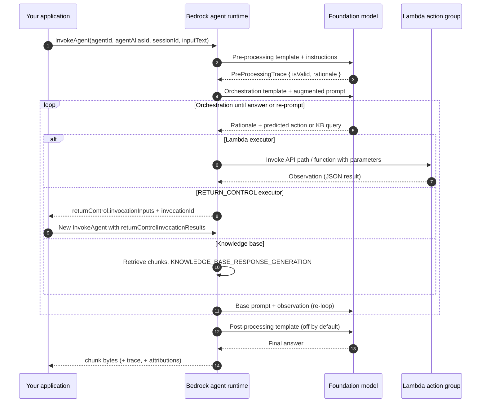
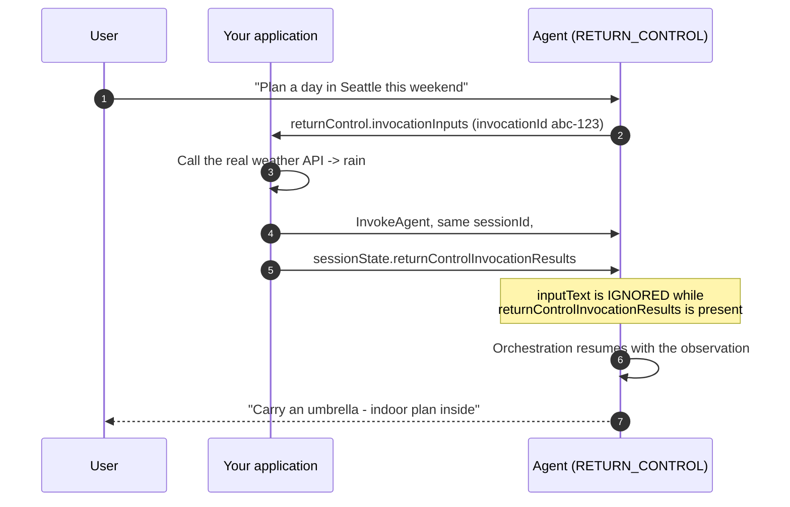
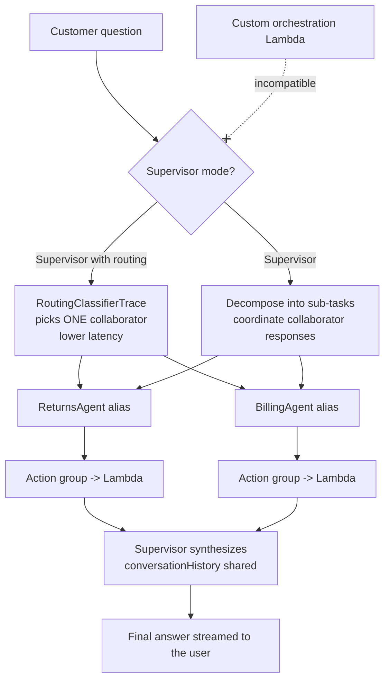
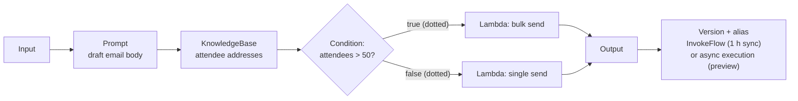
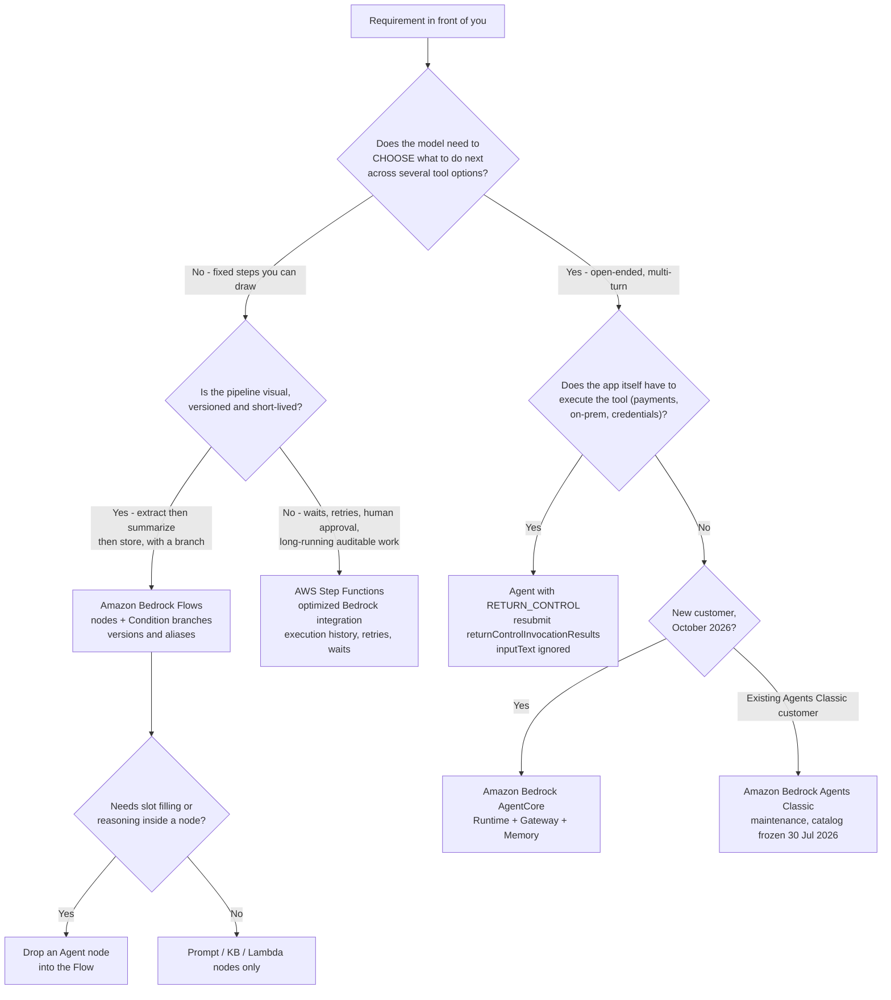

# Amazon Bedrock Agents, Flows and Orchestration

Everything in this course so far has been about **one model call**: write a prompt, get a completion, evaluate it. Production AI is rarely one call. It is a *sequence* — look something up, check a condition, call an API, ask the user a follow-up question, try again — and the exam has a dedicated vocabulary for who owns that sequence: **you** (your application code), **the model** (an agent that chooses actions at runtime), **a graph you drew** (Amazon Bedrock Flows), or **a state machine** (AWS Step Functions). Lesson 11 is about that ownership decision, and about the AWS services that implement each answer.

```text
====================================================================
 WHO OWNS THE NEXT STEP?                (Digest: 06 Oct 2026)
====================================================================
  YOUR CODE ......... Converse + toolConfig (model proposes JSON,
                      your app executes the function)
  THE MODEL .......... Amazon Bedrock agent: pre-processing ->
                       orchestration loop (rationale -> action ->
                       observation) -> post-processing
  THE GRAPH .......... Amazon Bedrock Flows (ex-"Prompt Flows"):
                       Input/Prompt/KB/Condition/Lambda/Agent nodes
  THE DEFINITION ..... AWS Step Functions: deterministic state
                       machine, retries, waits, human approval
--------------------------------------------------------------------
  NAMES TO KNOW
    Amazon Bedrock Agents Classic ... closed to new customers
                                       30 Jul 2026 (maintenance)
    Amazon Bedrock AgentCore ......... successor (GA, 9 regions)
    Amazon Bedrock Flows ............. GA 22 Nov 2024 (ex-Prompt
                                       Flows), billed per node
                                       transition
    Amazon Bedrock Prompt Management . saved, versioned prompts
====================================================================
```

> [!NOTE]
> **How to read this lesson.** Three rules apply throughout. (1) **Naming is examinable**: AWS renamed "Agents for Amazon Bedrock" to **Amazon Bedrock Agents Classic** and "Prompt Flows" to **Amazon Bedrock Flows**, and the AIF-C01 scope list now says **Amazon Bedrock AgentCore**. (2) **Mechanisms beat memorized lists**: the loop, the executor union and the `sessionState` contract change rarely; the model catalog inside an agent is frozen. (3) **Anything AWS does not confirm first-party is flagged**, never taught as recall material — the flags are collected at the end of the lesson.

By the end of this lesson you will be able to:

- name the four build-time components every agent needs and the optional ones AWS lists alongside them;
- walk the runtime loop — pre-processing, orchestration, post-processing — and say which of the four base prompt templates is editable at each phase;
- choose between an **OpenAPI schema** and **function details**, and between a **Lambda executor** and **`RETURN_CONTROL`**;
- state the `InvokeAgent` contract: required parameters, the 2,048-character `inputText` ceiling, `sessionState` scopes and what happens to `inputText` on a return-control resubmission;
- describe agent memory (`SESSION_SUMMARY`, 1–365 days) and the session-management quotas;
- configure **multi-agent collaboration** (≤ 10 collaborator aliases, two modes) and explain why custom orchestration is incompatible with it;
- list the **16 Flows node types**, the two connection kinds and the execution limits (1 h sync, 5 min/node and 24 h async preview);
- defend the **comparative verdict**: agent vs. simple prompt vs. workflow vs. code.

---

## 1. Three names, three services: Agents Classic, AgentCore and Flows

### 1.1 The renames that decide the exam

Two renames carry more marks than any other fact in this lesson:

1. **"Amazon Bedrock Agents" / "Agents for Amazon Bedrock" → Amazon Bedrock Agents Classic.** AWS placed it under *Services moving to Maintenance* in its **30 June 2026 Service Availability Update**: **closed to new customers from 30 July 2026**, **no new features**, and a **foundation-model catalog frozen at 30 July 2026**. Existing customers are unaffected, and Amazon Bedrock models, Knowledge Bases and Guardrails are explicitly *not* affected. There are no exceptions to the new-customer cutoff.
2. **"Prompt Flows" → Amazon Bedrock Flows**, generally available on **22 November 2024**, adding per-step execution visibility and Guardrails support on prompt and knowledge-base nodes. The old name survives only in some certification in-scope lists.

The documented migration target for Agents Classic is **Amazon Bedrock AgentCore** — a set of six components (Runtime, Gateway, Identity, Memory, Observability and Harness) that previewed in **July 2025**, reached GA in **nine regions**, and kept shipping through 2026 (**Managed Knowledge Base GA in June 2026**, **Agent Registry GA in August 2026**).

| Feature (current official name) | Status in October 2026 | Key date |
|---|---|---|
| **Amazon Bedrock Agents Classic** | Maintenance — no new customers, no new features, FM catalog frozen | 30 Jul 2026 |
| **Amazon Bedrock AgentCore** | GA in nine regions, monthly releases | Preview Jul 2025 |
| **Amazon Bedrock Flows** (ex-Prompt Flows) | GA; billed per node transition | 22 Nov 2024 |
| Flows: **async flow executions** | **Preview** — ≤ 5 min per node, ≤ 24 h per flow | 11 Jul 2025 |
| Flows: **multi-turn conversation** | **Preview** — `INPUT_REQUIRED` → reply → `SUCCESS` | 2026 |
| **Multi-agent collaboration** | GA (previewed 3 Dec 2024) | 2024–25 |
| **Return of control**; **agent memory** | GA | 2024–26 |
| **Amazon A2I** (Augmented AI) | No new customers, no new features; **removed from the AIF-C01 scope list** | Jun/Jul 2026 |
| **"Prompt Flows"** name | Superseded by Amazon Bedrock Flows | 22 Nov 2024 |

> [!WARNING]
> **Do not answer an AIF-C01 question with a superseded name.** If an option says *"create a Prompt Flow"* or *"add a new model to my Bedrock agent"*, read it as a trap: Prompt Flows became **Amazon Bedrock Flows** in November 2024, and an **Agents Classic** agent cannot take new foundation models after **30 July 2026**. The passing answer describes the *current* service — **Flows** for graphs, **AgentCore** for new agent builds — or explicitly acknowledges the maintenance status.

> **📚 Did you know?** AgentCore is not a renamed agent — it is a decomposition. Its six components map onto pieces that used to live inside a single agent: **Runtime** (the invocation loop), **Gateway** (tool/API exposure), **Identity**, **Memory**, **Observability** (traces and telemetry) and **Harness** (packaging). That is why AWS's migration guidance talks about moving *capabilities*, not about a one-click upgrade of an existing agent ID.

### 1.2 What the exam officially asks about agents

The AIF-C01 exam guide is the authority for scope, and its agentic content sits in two places:

| Objective / weight | What AWS says | Lesson coverage |
|---|---|---|
| **2.3.1** — GenAI services | Bedrock, SageMaker AI, JumpStart, Amazon Q, Kiro, Strands Agents, **AgentCore** | §1, §7, §9 |
| **Domain 2 agentic concepts** | *Multi-agent patterns, MCP, memory management, tool usage, workflow orchestration* | §4, §5, §6, §7 |
| **3.1.6** | *"Define the role of AI agents and describe their business applications."* | §8, §9 |
| Domain weights | **20 / 24 / 28 / 14 / 14 %** (Domains 1–5) | — |

Two scope changes were published for this exam version: **AgentCore, Kiro, Strands Agents, Amazon Q, SageMaker JumpStart and AWS Transform were added**, and **Amazon MemoryDB was removed**. Amazon A2I, once listed in exam guide v1.4 (2024), is no longer in the current scope list.

---

## 2. Anatomy of an agent

### 2.1 The build-time minimum

AWS's own wording for what an agent is made of is precise and worth memorizing as a sentence: a foundation model, **instructions**, optionally base or advanced prompt templates, and **at least one of: action groups or knowledge bases**. Memory, Guardrails, code interpretation and multi-agent collaboration are all optional add-ons.

| Component | Build-time role | Runtime role |
|---|---|---|
| **Foundation model** | Chosen per agent (Classic catalog frozen 30 Jul 2026) | Rationale, action prediction, reading observations, final answer |
| **Instructions** | Natural-language job description for the agent | Injected into the augmented base prompt at **every** orchestration step |
| **Base / advanced prompt templates** | **4** templates; you can override text, parser or `overrideLambda` | Drive pre-processing, orchestration, KB response generation and post-processing |
| **Action group — OpenAPI schema** | S3-hosted or inline OpenAPI document | Agent selects API path/verb; parameters go to a Lambda event or to return control |
| **Action group — function details** | Functions with `name`, data types and `required` flags | Agent **first elicits missing required parameters from the user** |
| **Executor** | Lambda ARN **or** `customControl: RETURN_CONTROL` | Executes the action, or hands the invocation back to your application |
| **Knowledge base association** | Attach an existing KB | Retrieval inside the orchestration loop → `KNOWLEDGE_BASE_RESPONSE_GENERATION` |
| **Memory** | Enable + `storageDays` (**1–365**) | Loads summaries for a `memoryId`; async summarization after session end |
| **Guardrails** | Attach a guardrail | Produces `GuardrailTrace`; `applyGuardrailInterval` controls streaming cadence |
| **Multi-agent collaboration** | Mark agent as supervisor; attach collaborator **aliases** (≤ 10) | Plan or route; `conversationHistory` sharing between agents |
| **Version / alias** | `PrepareAgent` → version → **alias** | You can invoke **only** with an `agentAliasId` |
| **Code interpretation** | Enable | FM-generated code runs in a secure sandbox |

Two rows deserve their own emphasis. First, **alias**: `InvokeAgent` requires `agentAliasId`, never a bare agent ID — a draft agent you have never prepared and aliased cannot be called. Second, **function details vs. OpenAPI**: they are alternatives, not layers. An action group uses exactly **one** of the two schemas, and the executor union (`Lambda ARN | RETURN_CONTROL`) applies to both.

### 2.2 Example 1 — building a travel agent (build time)

1. Create the agent and give it **instructions**: *"You are a travel agent. Book the cheapest compliant flight. Never invent prices; always call FlightsAPI."*
2. Choose a **foundation model** from the catalog available to Agents Classic in your account.
3. Add an **action group** `FlightsAPI` with an **OpenAPI schema** describing `searchFlights` and `bookFlight`.
4. Set the **executor** to a **Lambda ARN** (the Lambda validates IAM, calls the airline API and returns JSON).
5. Optionally attach a **knowledge base** of corporate travel policies, a **guardrail** that blocks card numbers, and **memory** with `storageDays = 90`.
6. `PrepareAgent` → note the **version** → create an **alias** (for example `T1`).
7. Hand the application `agentId` + `agentAliasId` and call `InvokeAgent`.

Nothing above is autonomous yet: the autonomy appears only at runtime, in the loop the model drives.

---

## 3. Runtime: the orchestration loop

### 3.1 The three phases, in order

Every `InvokeAgent` call passes through **pre-processing**, then an **orchestration loop** that repeats until an answer exists or the user is re-prompted, then **post-processing** (disabled by default). The loop itself has a fixed internal rhythm: the model produces a **rationale**, predicts an **action group call or a knowledge-base query**, the parameters go to Lambda *or* back to your application via return control, the result comes back as an **observation**, the observation is appended to the base prompt, and the loop repeats.



Three consequences fall out of that diagram and each one has been tested:

- **Cost scales with iterations, not with requests.** Every loop turn is another foundation-model invocation against the augmented prompt — which is why an agent is more expensive than a single prompt for the same question.
- **Return control is a *second* `InvokeAgent` call**, not a field you can fill in later on the same request. Your application executes the tool and resubmits.
- **Observations, not chat history, drive tool results.** The result of an action is appended to the base prompt so the model can reason over it in the next iteration.

### 3.2 The four editable base templates

| Template | Phase | `ModelInvocationInput.type` | Editable by you |
|---|---|---|---|
| Pre-processing | before the loop | `PRE_PROCESSING` | Yes — text, parser, `overrideLambda` |
| Orchestration | inside the loop | `ORCHESTRATION` | Yes — text, parser, `overrideLambda` |
| KB response generation | when a KB is queried | `KNOWLEDGE_BASE_RESPONSE_GENERATION` | Yes — text |
| Post-processing | after the loop | `POST_PROCESSING` | Yes — and **off by default** |

AWS documents **four** base templates as overridable. Advanced prompts let you replace the text entirely; `promptCreationMode` and `parserMode` in the trace tell you whether a value came from `DEFAULT` or `OVERRIDDEN` — which is your audit evidence that an override is live.

### 3.3 Trace types: seven objects that answer seven questions

With `enableTrace = true` the runtime streams trace events alongside `chunk` events. There are **7** trace object types:

| Trace object | `type` | The question it answers |
|---|---|---|
| `PreProcessingTrace` | `PRE_PROCESSING` | Was the request valid? `isValid` + rationale |
| `OrchestrationTrace` | `ORCHESTRATION` | Rationale → `InvocationInput` (action group, verb, `apiPath`, function, parameters, `executionType`) → `Observation` |
| KB response generation | `KNOWLEDGE_BASE_RESPONSE_GENERATION` | Which chunks were retrieved, and what was generated from them |
| `PostProcessingTrace` | `POST_PROCESSING` | How was the final answer formatted? |
| `RoutingClassifierTrace` | `ROUTING_CLASSIFIER` | Which collaborator did the supervisor pick? |
| `CustomOrchestrationTrace` | — (event-driven) | What order did *your* orchestrator Lambda enforce? |
| `GuardrailTrace` / `FailureTrace` | — | Which guardrail action fired / why the run failed (`FailureTrace` carries no `ModelInvocationInput`) |

### 3.4 Example 2 — a booking request, trace by trace

1. The application calls `InvokeAgent` with `agentId`, `agentAliasId`, `sessionId = S1`, `inputText = "Book the cheapest flight to Denver next Friday"` (**≤ 2,048 characters**) and `enableTrace = true`.
2. **Pre-processing** validates the request → `PreProcessingTrace { isValid: true, rationale }`.
3. **Orchestration, iteration 1**: rationale → predict `FlightsAPI.searchFlights` → `InvocationInput { apiPath, parameters }` → Lambda executes → `Observation` containing the JSON list of flights.
4. **Iteration 2**: a required parameter (`travelerId`) is missing → the returned **Observation reprompts the user**: *"Which traveler should I book for?"* (AWS documents this behaviour explicitly).
5. The user replies **in the same `sessionId`** → the action executes → new `Observation`.
6. **Post-processing** (if enabled) formats the answer → the application receives `chunk.bytes` such as *"Booked UA 512…"*, plus an `attribution` object if a knowledge base was used. Traces stream alongside the chunks.

```dragdrop
{
  "question": "Order the runtime phases of a Bedrock agent call the way AWS documents them:",
  "items": [
    "Step 4 - orchestration loop: rationale, predict action or KB query, invoke, receive observation, re-loop",
    "Step 1 - InvokeAgent arrives with agentAliasId, sessionId and inputText of at most 2,048 characters",
    "Step 2 - pre-processing validates the request and emits PreProcessingTrace",
    "Step 3 - the augmented base prompt is built from instructions plus conversation state",
    "Step 5 - post-processing formats the final answer (off by default) and chunks stream back"
  ],
  "correctOrder": [
    "Step 1 - InvokeAgent arrives with agentAliasId, sessionId and inputText of at most 2,048 characters",
    "Step 2 - pre-processing validates the request and emits PreProcessingTrace",
    "Step 3 - the augmented base prompt is built from instructions plus conversation state",
    "Step 4 - orchestration loop: rationale, predict action or KB query, invoke, receive observation, re-loop",
    "Step 5 - post-processing formats the final answer (off by default) and chunks stream back"
  ],
  "explanation": "The documented order is pre-processing, then the orchestration loop (rationale -> predicted action or KB query -> invocation -> observation -> re-loop) until an answer exists or the user is re-prompted, then post-processing, which is disabled by default. The loop is what makes an agent autonomous: each iteration is a fresh foundation-model call against the augmented prompt, so cost and latency grow with iterations rather than with requests."
}
```

> **📚 Did you know?** The `OrchestrationTrace` is where you can prove what your agent actually did: `InvocationInput` records the **action group, HTTP verb, `apiPath` or function name, the resolved parameters and the `executionType`**, and `Observation` records what came back. When a stakeholder asks "why did the agent call the payment API?", the trace — not CloudTrail — is the first place to look, because CloudTrail sees the Lambda invocation but not the model's rationale for choosing it.

### 3.5 Reading a trace: symptom → trace object → fix

| Symptom in production | Trace object to open | What the trace tells you | Typical fix |
|---|---|---|---|
| Agent answers nonsense for a malformed request | `PreProcessingTrace` | `isValid` and the model's rationale | Tighten instructions; the run should stop here |
| Agent calls the wrong API | `OrchestrationTrace` → `InvocationInput` | Action group, verb, `apiPath`, resolved parameters, `executionType` | Narrow action-group descriptions; add examples to instructions |
| Answer ignores retrieved policy text | KB response-generation trace | Retrieved chunks vs. generated answer | Fix chunking/retrieval, not the prompt |
| Agent never formats the final answer as required | `PostProcessingTrace` | Whether post-processing ran (it is off by default) | Enable and edit the fourth base template |
| Supervisor picked the wrong collaborator | `RoutingClassifierTrace` | The routing decision | Rename/describe collaborator aliases more precisely |
| Custom orchestrator ran steps in the wrong order | `CustomOrchestrationTrace` | Your orchestrator Lambda's step order | Fix the orchestrator; this trace exists only for custom orchestration |
| Run stopped with no model input at all | `FailureTrace` | Failure reason; carries **no** `ModelInvocationInput` | Read the failure reason, then re-run |
| Guardrail blocked a valid-looking reply | `GuardrailTrace` | Which guardrail action fired | Adjust the guardrail or `applyGuardrailInterval` |

---

## 4. Action groups, return of control and raw tool use

### 4.1 Two schema styles, two executors

An action group is defined by **exactly one** schema style and **exactly one** executor:

| Tool / action type | Where it is defined | Executor | Schema | Key note |
|---|---|---|---|---|
| **OpenAPI action group** | `apiSchema` (S3 or inline) | Lambda **or** `RETURN_CONTROL` | OpenAPI paths, verbs, parameters | Agent selects the API operation at runtime |
| **Function details** | `functionSchema` | Lambda **or** `RETURN_CONTROL` | Functions + parameters (`name`, type, `required`) | Agent **elicits missing required parameters first** |
| **Return of control** | `customControl: RETURN_CONTROL` | **Your application**, then resubmit | `invocationInputs` + `invocationId` | `inputText` ignored on resubmission; `responseState` `FAILURE`/`REPROMPT`; `confirmationState` `CONFIRM`/`DENY` |
| **Knowledge base** | KB association | Bedrock-managed retrieval | — | Emits the KB response-generation trace |
| **Converse `toolConfig` toolSpec** | Your app, **outside** agents | Your code | `{name, description, inputSchema.json}` | The model only proposes JSON (`stopReason = toolUse`) |
| **`systemTool` (built-in)** | Converse `toolConfig` union | Bedrock-managed | tool name | Model support varies |
| **Custom orchestration** | Agent-level Lambda | Your Lambda orders actions | events contract | `CustomOrchestrationTrace`; **incompatible with multi-agent collaboration** |
| **Flow nodes as tools** | Flow definition | Lambda / Storage / Retrieval / KB / Agent / Lex | node configuration | Flows call only what you wired |

Two limits worth quoting: an action group's `description` runs **1–200 characters**, and an executor is a **union type** — a Lambda ARN *or* `customControl: RETURN_CONTROL`, never both.

### 4.2 Example 3 — return of control, the official weather scenario

Use return control when **your application** must execute the call — a private payment rail, an on-premises system, a credential Bedrock may not hold.

1. Create action group `WeatherAPIs` with function `getWeather(location, date)` and executor `customControl = RETURN_CONTROL`.
2. The user says *"Plan a day in Seattle this weekend."* → orchestration predicts `getWeather`.
3. The response carries `returnControl.invocationInputs` with `invocationId = abc-123` and parameters `{location: seattle, date: 2024-09-15}`.
4. **Your application** calls the real weather API → the answer is *rain*.
5. You call `InvokeAgent` **again with the same `sessionId`**, supplying `sessionState.returnControlInvocationResults = [{ functionResult: { actionGroup, function, responseBody: { TEXT: { body: "{\"cond\":\"rain\"}" } } } }]` with the **matching `invocationId`** — and **`inputText` is ignored** because `returnControlInvocationResults` is present.
6. Orchestration resumes: *"Carry an umbrella; here is an indoor plan…"*. Variants: `responseState = REPROMPT` feeds a failed tool result back for a retry; `responseState = FAILURE` fails the run with a dependency error; `confirmationState = CONFIRM | DENY` implements a **pre-action user confirmation** gate.



### 4.3 Example 4 — slot filling with function details

1. The function is `BookHotel(HotelName/required, CheckinDate/required, NumberOfNights/optional, Email/required, AllowMarketingEmails/required)`.
2. The user says *"Book Hotel X for tomorrow"* → the agent fills `HotelName` and `CheckinDate`.
3. Two **required** parameters are unknown → the agent **asks the user**: *"What is your email? May we send promotions?"*
4. The user answers across two turns (turn-scoped values live in `promptSessionAttributes`) → all required parameters are present → the action executes → a confirmation is returned.

**Slot elicitation is the canonical agent-versus-prompt discriminator.** A plain prompt cannot *wait* for a missing required parameter, call an API, and then resume — an agent does exactly that, driven by the observation that a parameter is missing.

### 4.4 Raw tool use without an agent

Function calling also exists **without** any agent, on the Converse API: you pass `toolConfig.tools[].toolSpec { name, description, inputSchema.json }` (plus `toolChoice`), the model returns JSON with `stopReason = toolUse`, **your application executes the function**, and you send a `toolResult` back. The model **never executes the function** — that boundary is the whole point, and it is the most reliable way to distinguish a *tool* question from an *agent* question.

| Question signal | Correct mechanism |
|---|---|
| "The model should decide which of my functions to call, but my code runs them" | Converse `toolConfig` tool use |
| "The service should plan, call tools across turns and re-prompt for missing slots" | **Agent** action group |
| "My application must run the call for security/compliance reasons" | Action group with `RETURN_CONTROL` |
| "The step order is fixed and auditable" | **Flows** or **Step Functions** |

> [!WARNING]
> **The return-control resubmission contract is exact.** You must reuse the **same `sessionId`**, the **same `invocationId`**, and the same `actionGroup`/`function` names; you must send the result through `sessionState.returnControlInvocationResults`; and while that field is present, **`inputText` is ignored** — so a resubmission that also carries a new user question silently drops the question. Options claiming you need a fresh `sessionId`, a new `invocationId`, or that `inputText` must repeat the original request are all wrong.

---

## 5. InvokeAgent, session state and memory

### 5.1 The request contract

| Parameter | Rule |
|---|---|
| `agentId` | The agent identifier |
| `agentAliasId` | **Required and must be an alias** — never the bare agent ID |
| `sessionId` | Conversation key; return-control resubmissions must reuse it |
| `inputText` | **≤ 2,048 characters** |
| `enableTrace` | Streams the 7 trace object types alongside chunks |
| `endSession` | Ends the session and, with memory on, folds the session into a `memoryId` |
| `memoryId` | Loads stored summaries for cross-session memory |
| `sessionState` | Attributes, conversation history, return-control results, KB overrides |
| `streamingConfigurations` | `streamFinalResponse`, `applyGuardrailInterval` |

The response streams **`chunk` + `trace` + `attributions` + `returnControl`**, and the response headers include **`x-amz-bedrock-agent-session-id`** and, when memory is used, **`x-amz-bedrock-agent-memory-id`**.

```text
POST /agents/<agentId>/agentAliases/<agentAliasId>/invoke   <-- alias is mandatory
  headers: Authorization (SigV4), X-Amz-Target
{
  "inputText": "Book the cheapest flight to Denver ...",   <-- MAX 2048 chars
  "sessionId": "S1",                                       <-- reuse on resubmit
  "enableTrace": true,
  "endSession": false,
  "memoryId": "M-user-42",                                 <-- optional cross-session
  "streamingConfigurations": {
      "streamFinalResponse": true,
      "applyGuardrailInterval": 5                          <-- guardrail cadence
  },
  "sessionState": {
      "sessionAttributes":          {"locale": "en-US"},   <-- whole session
      "promptSessionAttributes":    {"tier": "gold"},      <-- one turn only
      "conversationHistory":        [...],                 <-- multi-agent
      "knowledgeBaseConfigurations":[...],                 <-- per-request KB
      "returnControlInvocationResults": [ { "functionResult": {
          "actionGroup": "WeatherAPIs",
          "function": "getWeather",
          "invocationId": "abc-123",
          "responseBody": {"TEXT": {"body": "{\"cond\":\"rain\"}"}}
      } } ]                      <-- if present, inputText is IGNORED
  }
}
Response: event stream
  -> chunk      (answer bytes)      -> attribution (KB sources)
  -> trace      (7 trace types)     -> returnControl (invocationInputs)
  headers: x-amz-bedrock-agent-session-id, x-amz-bedrock-agent-memory-id
Note: the AWS CLI cannot consume this event stream - use an SDK reader.
```

### 5.2 `sessionState`: five scopes, one override rule

| Field | Scope | Purpose |
|---|---|---|
| `sessionAttributes` | **Whole session** | Stable facts (locale, account tier) carried across turns |
| `promptSessionAttributes` | **One turn** | Values that should expire after the current turn |
| `conversationHistory` | Multi-agent | Shared history when conversational-history sharing is on |
| `returnControlInvocationResults` | Resubmission | Tool results; **when present, `inputText` is ignored** |
| `knowledgeBaseConfigurations` | Per-request | Per-request knowledge-base overrides |

### 5.3 Example 5 — memory across sessions

1. In session `S1` the user says *"I'm allergic to shellfish"*; the application calls `InvokeAgent` with `endSession = true`.
2. `S1` folds into **`memoryId = M-user-42`** and asynchronous summarization writes a summary using the (editable) summarization template.
3. Later, `InvokeAgent(sessionId = S2, memoryId = M-user-42, inputText = "Suggest a starter")` loads the stored summaries → the answer **excludes shellfish**; the response header `x-amz-bedrock-agent-memory-id` confirms memory was used.
4. `storageDays = 90` means older summaries are purged after 90 days; **disabling memory** returns the default single-session context.

Memory facts in one place: the **only** memory type is **`SESSION_SUMMARY`**, retention is **1–365 days** (`storageDays`), the fold triggers are **`endSession = true` on the same `sessionId`** or the **`idleSessionTimeout`** expiry, summarization runs **asynchronously** with an editable template, and you read summaries with **`GetAgentMemory`** (or the console Memory tab).

### 5.4 Session-management quotas (separate from memory)

| Quota | Value |
|---|---|
| Steps per session | **≤ 1,000** |
| Size per step | **≤ 50 MB** |
| Idle timeout | **1 hour** |
| Automatic deletion | **30 days** |
| LangGraph integration | `BedrockSessionSaver` |

> **📚 Did you know?** **The AWS CLI cannot stream `InvokeAgent`.** Streaming `chunk` and `trace` events requires an SDK with event-stream handling (for example boto3/Java/Node with the response stream reader). This is a real operational gotcha — and a favourite distractor: *"enable streaming with `aws bedrock-agent-runtime invoke-agent --no-cli-pager`"* is not a thing. Use `enableTrace = true` plus an SDK stream reader, and read the session back from the `x-amz-bedrock-agent-session-id` response header.

---

## 6. Multi-agent collaboration

### 6.1 One supervisor, at most ten collaborators, two modes

| Item | Rule |
|---|---|
| Collaborators | **≤ 10 collaborator aliases** attached to one supervisor |
| **Supervisor** mode | The supervisor **coordinates and synthesizes** collaborator responses (decomposes into sub-tasks) |
| **Supervisor with routing** mode | The supervisor **routes to one** collaborator → **lower latency** |
| History | `conversationHistory` is auto-built when conversational-history sharing is on |
| Conflict | **Custom orchestration cannot be combined with multi-agent collaboration** |
| Timeline | Preview **3 Dec 2024**; GA announced in AWS news during 2025 |

### 6.2 Example 6 — a triage supervisor

1. Deploy collaborators `ReturnsAgent` and `BillingAgent` and create an **alias** for each.
2. Promote `TriageAgent` to supervisor, choose mode **Supervisor with routing**, and attach both aliases (never more than 10).
3. The customer asks *"Why was I charged twice in March?"* → **`RoutingClassifierTrace`** records the decision → the supervisor invokes `BillingAgent` with `sessionState.conversationHistory`.
4. `BillingAgent`'s action group calls Lambda → the final answer is synthesized and streamed back.
5. Had the requirement been *"investigate returns **and** billing, then summarize"*, the correct mode would be plain **Supervisor**, which decomposes the request and coordinates collaborator responses instead of picking one.



---

## 7. Amazon Bedrock Flows (formerly Prompt Flows)

### 7.1 What a Flow is

A Flow is a **visual, declarative graph of nodes** you draw in the Flow builder and invoke through `CreateFlow` → `PrepareFlow` → `InvokeFlow` (with **versions and aliases**, exactly like agents). The model does not choose the steps — **the graph does**. Flows GA'd on **22 November 2024** as "Amazon Bedrock Flows, previously known as Prompt Flows", adding per-step execution visibility plus Guardrails on prompt and knowledge-base nodes.

### 7.2 The 16 node types

| Node | Purpose | Node | Purpose |
|---|---|---|---|
| **Input** | Entry point of the flow | **Output** | Exit point / result |
| **Prompt** | Run a prompt (optionally a saved Prompt Management prompt) | **KnowledgeBase** | Retrieve from an attached KB |
| **Agent** | Call a Bedrock agent inside the graph | **Condition** | Branch on an expression |
| **Lex** | Amazon Lex conversation node | **LambdaFunction** | Call your Lambda |
| **Storage** | Read/write object storage | **Retrieval** | Custom retrieval node |
| **Iterator** | Walk a list | **Collector** | Gather results |
| **InlineCode** | Run inline code (status per AWS docs at Oct 2026) | **Loop** | Do-while style looping |
| **LoopInput** | Feed the loop | **LoopController** | Control loop exit |

Connections come in two kinds: **data connections (solid)** that always carry values, and **conditional connections (dotted)** that fire only when a `Condition` node evaluates true. Guardrails can be attached to **prompt** and **knowledge-base** nodes — which is how you get policy enforcement inside a graph rather than around it.

### 7.3 Example 7 — an invite pipeline with a branch

1. `CreateFlow` with a name and an IAM role; wire the nodes: `Input → Prompt (draft the email body) → KnowledgeBase (attendee addresses) → Condition (attendees > 50?)`.
2. **Yes** branch → `Lambda` bulk-send node; **No** branch → `Lambda` single-send node; both converge on `Output`. Data connections are solid; the two condition branches are dotted.
3. `PrepareFlow` → test inside the Flow builder, inspecting **per-node input/output**.
4. Create a **version** and an **alias**; the application calls `InvokeFlow` (synchronous, **1-hour** ceiling) or starts an **async flow execution** (preview: **≤ 5 minutes per node**, **≤ 24 hours per flow**, snapshot via `GetExecutionFlowSnapshot`, errors such as `ExecutionTimedOut`).
5. Read `FlowTraceEvent`s for per-step visibility; swap the `Prompt` node for an **Agent** node when reasoning is required — the multi-turn conversation API is in **preview** (`INPUT_REQUIRED` → your reply → `SUCCESS`).



### 7.4 What a Flow costs, and what it does not do

Flows are billed **per node transition**, on top of the foundation-model, Lambda and knowledge-base usage inside the nodes. AWS's own pricing walkthrough counts a run as **2 + 10×2 + 3 = 25 transitions**; a **$0.035 per 1,000 transitions** rate was announced for **1 February 2025**, and the current rate should be confirmed on the Bedrock pricing page before you quote it. Two limits to memorize: `InvokeFlow` synchronous executions time out at **1 hour**, and long-running work belongs to async **flow executions** (preview: 5 minutes per node, 24 hours total) or to **Step Functions**.

**Worked example — counting node transitions.** AWS's pricing walkthrough charges a run as **2 + 10×2 + 3 = 25 transitions**: 2 to enter and branch, a loop body of 10 iterations × 2 nodes, and 3 more to converge and exit. The lesson is that **transitions, not nodes, are the billable unit**:

| Graph shape | Nodes on the canvas | Transitions per run |
|---|---:|---:|
| Straight line `Input → Prompt → Output` | 3 | 2 |
| Branch taken once (`Input → Prompt → Condition → 1 of 2 → Output`) | 6 | 4 |
| AWS's documented pricing example | 6 | **25** (2 + 10×2 + 3) |
| Same graph, loop runs 50× instead of 10× | 6 | **105** (2 + 50×2 + 3) |

| Execution mode | Ceiling | Status |
|---|---|---|
| `InvokeFlow` (synchronous) | **1 hour** | GA |
| Async flow execution | **≤ 5 min per node, ≤ 24 h per flow** | **Preview** (11 Jul 2025) |
| Flows multi-turn conversation | `INPUT_REQUIRED` → reply → `SUCCESS` | **Preview** (2026) |
| Billing | **per node transition** | GA since 22 Nov 2024 |

> **📚 Did you know?** The pricing example's arithmetic — **2 + 10×2 + 3 = 25 node transitions** — is a reminder that *loops are not free in a graph*: a node revisited ten times is billed ten times. That is the opposite of an agent, where iterations are billed as foundation-model tokens, and the opposite of Step Functions, where transitions are billed as state-machine transitions plus the services you call. Three orchestrators, three different cost unit.

---

## 8. Choosing: prompt, agent, Flows or Step Functions

### 8.1 The decision tree



### 8.2 The decision matrix

| Criterion | **Simple prompt** (Converse / Prompt Management) | **Bedrock agent** (Classic / AgentCore) | **Bedrock Flows** | **Step Functions + Bedrock** |
|---|---|---|---|---|
| Metaphor | One model call in and out | Autonomous loop that *chooses* actions | Declarative node graph you draw | Deterministic state machine |
| Who picks the next step? | **Your code** | **The FM at runtime** | **The graph** (+ `Condition` nodes) | **The definition** |
| Multi-step tool choice | ❌ hard-coded | ✅ rationale → action → observation | ⚠️ pre-wired paths only | ✅ explicit only |
| External calls | After the response, in your app | Action groups (Lambda / OpenAPI / return control) | Lambda / Storage / Retrieval nodes | Integrations / Lambda |
| Branching and loops | Application code | Implicit in the orchestration loop | `Condition`, `Iterator`/`Collector`, `Loop*` | Choice / Wait / Map / Parallel |
| Determinism and audit | High | Low–medium (use **traces**) | High (flow trace + versions) | **Highest** (execution history) |
| Human approval | Application code | Return control + `CONFIRM`/`DENY` | Via Lambda or agent side effects | Native pause / approval pattern |
| Visual builder | ❌ | Agent builder (semi-visual) | ✅ Flow builder, versions, aliases | ✅ Workflow Studio |
| Best fit | "Summarize / classify / what is X?" | Open-ended multi-turn tasks needing tool choice | Fixed pipelines with branches and guardrails | Long-running, auditable, retries, waits |
| Cost unit | FM tokens | FM tokens **per orchestration iteration** + Lambda/KB | FM/Lambda/KB + **$ per 1,000 node transitions** | Transitions + services |
| New customers (Oct 2026) | ✅ | Classic ❌ / AgentCore ✅ | ✅ | ✅ |

### 8.3 Example 8 — three requirements, three answers

1. **Deterministic extract → condition → write, with A/B rollback** → **Amazon Bedrock Flows**: draw the graph, publish version `v2`, alias points at `v1`, roll back by moving the alias. A Flow version alias is exactly the A/B mechanism an agent does not have.
2. **Open-ended multi-turn task where the FM decides what to call** → **an agent** (AgentCore for a new build in October 2026). Slot elicitation, re-prompts and observations are the giveaways.
3. **"Wait 3 days for approval, retry 5 times, then notify"** → **AWS Step Functions**, whose optimized Bedrock integration (announced November 2023) includes `InvokeModel`, `CreateModelCustomizationJob .sync` and a documented *"Perform prompt-chaining with Bedrock"* sample. Neither Flows (1-hour sync ceiling) nor an agent (no native long timers) fits.

```matching
{
  "question": "Match each requirement to the orchestration mechanism AWS documents for it:",
  "pairs": [
    {"left": "One-shot summarize, classify or explain", "right": "Simple prompt on the Converse API - your code owns every step"},
    {"left": "Open-ended multi-turn task with tool choice and slot filling", "right": "Amazon Bedrock agent - rationale, action prediction, observation, re-loop"},
    {"left": "Fixed pipeline with a condition branch and A/B rollback", "right": "Amazon Bedrock Flows - Condition nodes plus versions and aliases"},
    {"left": "Wait days, retry with backoff, human approval, full audit history", "right": "AWS Step Functions - execution history, retries, waits, Map and Parallel"},
    {"left": "Your application must execute the tool for compliance", "right": "Action group with RETURN_CONTROL - resubmit returnControlInvocationResults, inputText ignored"},
    {"left": "New agent build in October 2026", "right": "Amazon Bedrock AgentCore - Agents Classic is closed to new customers since 30 Jul 2026"}
  ],
  "explanation": "Each mechanism owns the next step differently: your code (simple prompt), the model at runtime (agent), the graph you drew (Flows) or the state-machine definition (Step Functions). The examiner's signal words map cleanly - 'multi-turn, which tool next' means agent; 'deterministic, versioned, branched' means Flows; 'wait, retry, approve, audit' means Step Functions; and 'execute it ourselves' means return of control."
}
```

---

## 9. Comparative verdict

> [!IMPORTANT]
> **Comparative Verdict — agent vs. simple prompt vs. workflow vs. code**
> - **Simple prompt (Converse API, optionally Prompt Management)** is the answer when the task is **one model call in and out**: summarize, classify, extract, explain. It is the cheapest, most deterministic and most auditable option, and it is where every use case should start. **Your application code** owns every subsequent step — if the sequence matters, the sequence lives in your repo.
> - **A Bedrock agent (Agents Classic today, AgentCore for new builds)** is the answer when **the foundation model must choose what to do next**: pick among action groups or knowledge bases, gather missing required parameters over several turns, re-prompt the user, and loop until an answer exists. You give up determinism (recover it with `enableTrace`) and you pay **per orchestration iteration**, in exchange for autonomy you would otherwise hand-code.
> - **A workflow — Amazon Bedrock Flows** is the answer when the sequence is **known in advance and should be visible**: a drawn graph of `Prompt`, `KnowledgeBase`, `Condition`, `Lambda` and `Agent` nodes with **versions and aliases** for rollback, billed **per node transition**. You keep determinism and gain a visual builder; you lose the model's freedom to choose a step that is not on the graph.
> - **Code — your application with Converse `toolConfig` (or Step Functions for long-running work)** is the answer when you need **explicit, testable control**: the model proposes JSON (`stopReason = toolUse`) and **your code executes the function**; Step Functions adds retries, waits, human approval and an execution history when a run must survive hours or days. Neither an agent nor a Flow replaces a state machine's audit trail.
> - **Rule of thumb for the exam:** *the model decides which tool →* **agent**. *I drew the steps →* **Flows**. *I wrote the steps →* **code** (Converse tools for in-request steps, Step Functions for cross-request steps). *One call, no follow-up →* **simple prompt**. And in October 2026, a **new** agent build means **AgentCore**, because Agents Classic is closed to new customers.

| If the question says… | Answer | Why the others fail |
|---|---|---|
| "…must decide for itself which API to call" | **Agent** | Flows call only wired nodes; code has no runtime choice |
| "…deterministic, versioned, visually designed, rollback" | **Flows** | Agents let the FM choose; Step Functions is code-defined, not visual in Bedrock |
| "…model returns a JSON object and our service runs it" | **Converse `toolConfig`** | That is raw tool use; action groups belong to agents |
| "…wait 3 days, retry 5×, human approval" | **Step Functions** | Flows time out at 1 h (sync); agents have no native timers |
| "…our application must execute the payment API" | **`RETURN_CONTROL`** | A Lambda executor runs it inside Bedrock instead |
| "…brand-new account, build an agent today" | **AgentCore** | Agents Classic closed to new customers 30 Jul 2026 |

### 9.1 Human review today

Amazon A2I is in maintenance: *"no longer open to new customers… we do not plan to introduce new features"*, it was part of the **30 June 2026** maintenance batch, and it has been **removed from the current AIF-C01 scope list** (it was present in exam guide v1.4, 2024). For **workflows**, the documented human-intervention pattern is **Step Functions** with its optimized Bedrock integration (2023). AWS documents no Bedrock-agent-native A2I hook — so an option describing "attach A2I to a Bedrock agent as a human review step" is testing whether you know the service left the exam scope.

---

## 10. Exam traps and the numbers worth memorizing

> [!WARNING]
> **The traps that cost marks on this exact material:**
> 1. **"Prompt Flows" is a superseded name.** The service is **Amazon Bedrock Flows** (GA 22 Nov 2024); the old spelling survives only in some certification in-scope lists.
> 2. **Agents Classic is closed to new customers from 30 July 2026** and its FM catalog is frozen — but Bedrock itself, Knowledge Bases and Guardrails are **not** closed. An option claiming "all of Bedrock is closed to new customers" is false.
> 3. **Build-time minimum = FM + instructions + at least one of action groups or knowledge bases.** Not "FM + knowledge base + guardrail only".
> 4. **Missing required parameter → the agent re-prompts the user through an Observation.** It does not fail, does not invent nulls and does not silently drop the action.
> 5. **`returnControlInvocationResults` present ⇒ `inputText` is ignored** — same `sessionId`, same `invocationId`, same action group and function names.
> 6. **Raw Converse tool use: the model never executes the function.** Your application does, then returns a `toolResult`.
> 7. **Memory type is `SESSION_SUMMARY` only, retention 1–365 days**, folded by `endSession = true` or `idleSessionTimeout` — not arbitrary memory types, and no vector database is required.
> 8. **Multi-agent: ≤ 10 collaborator aliases, two modes (Supervisor, Supervisor with routing), custom orchestration incompatible.** Not "exactly two collaborators".
> 9. **An agent invokes only with an `agentAliasId`**, and **`inputText` is capped at 2,048 characters**.
> 10. **A2I is out of the AIF-C01 scope** and closed to new customers; the documented human-in-the-loop path for workflows is Step Functions.

| Testable number | Value |
|---|---|
| Agents Classic closed to new customers / FM catalog freeze | **30 Jul 2026** |
| Max collaborator agents per supervisor | **10** |
| Agent memory type / retention | **`SESSION_SUMMARY`** / **1–365 days** |
| `memoryId` fold triggers | `endSession = true` or `idleSessionTimeout` |
| `inputText` maximum length | **2,048 characters** |
| Action group `description` length | **1–200 characters** |
| Session-management quotas | **1,000 steps · 50 MB/step · 1 h idle · 30-day retention** |
| `InvokeFlow` synchronous timeout | **1 hour** |
| Async flow execution (preview) | **≤ 5 min per node, ≤ 24 h total** |
| Flow node-transition price | **$0.035 per 1,000** announced (1 Feb 2025) — confirm current rate |
| Editable base prompt templates | **4** |
| Trace object types | **7** |
| Flow node types | **16** |
| AIF-C01 domain weights | **20 / 24 / 28 / 14 / 14 %** |

Flags on facts this lesson deliberately did **not** assert as verified: the **current** per-transition flow price; the **exact GA date** of multi-agent collaboration (aggregators show both 3 Dec 2024 and 10 Mar 2025 items); the **current supported-model list** for multi-agent; the **`executionId` field name** used to resume a multi-turn flow (the `INPUT_REQUIRED` / `SUCCESS` states are documented, the field name was not located); and the preview-vs-GA status of the `InlineCode` node.

### 10.1 2025–2026 Updates

Everything in this subsection was read on `docs.aws.amazon.com`, an AWS What's New post, an AWS News Blog post or the AIF-C01 exam guide itself — nothing here comes from a third-party tracker. Two groups of change matter for this lesson: what shipped **inside Amazon Bedrock AgentCore and Amazon Bedrock Flows**, and what AWS did to the **exam guide and to the services that sit around an agent**.

| Agent / Flows change | Date (AWS-published) | What the exam wants you to know |
|---|---|---|
| **AgentCore preview** | 16 Jul 2025 | The documented migration target for Agents Classic arrives as a separate product, not as a rename |
| Flows **DoWhile node and execution traces** | 26 Sep 2025 | Loop control plus per-step visibility inside the graph — §7.2's node list gains a documented loop construct |
| **AgentCore GA** — nine Regions, VPC, PrivateLink, **A2A in Runtime**, **MCP in Gateway**, IAM auth | 13 Oct 2025 | A brand-new agent build has a GA target from this date onward |
| AgentCore **Policy, Evaluations and Memory** announced | 2 Dec 2025 | Governance and evaluation join Runtime, Gateway, Identity and Observability as components |
| AgentCore **Policy GA** — Cedar or natural language, intercepting Gateway tool calls **outside** the reasoning loop | 3 Mar 2026 | Policy is a gateway control, not a fourth orchestration phase inside the loop |
| AgentCore **Evaluations GA** — **13 evaluators** | 31 Mar 2026 | Agent quality is checked by a managed service rather than an ad-hoc script |
| **Amazon Q Developer** signups blocked; IDE/paid end of support 30 Apr 2027 | 15 May 2026 | The documented destination for new users is **Kiro** |
| **Amazon Kendra** in maintenance, then closed to new customers | 30 Jun → 30 Jul 2026 | The replacement AWS names for new search builds is **Amazon Bedrock Managed Knowledge Base** (Smart Parsing + **Agentic Retrieval API**) |
| **SageMaker Model Monitor, Clarify, Ground Truth and Amazon A2I** closed to new customers | 30 Jul 2026 | The same maintenance batch as Agents Classic: no new customers, no new features, still supported |

| Exam-guide change (v1.1, published 30 Apr 2026) | Detail for an agentic-AI candidate |
|---|---|
| New objective **2.1.6** | Agentic AI: multi-agent patterns, **MCP**, memory management, tool usage, orchestration — the subject matter of §3 to §6 |
| New objective **3.2.5** | Prompt versioning through **Amazon Bedrock Prompt Management** (GA 7 Nov 2024) |
| New objectives **2.1.4** / **2.1.5** | Token-based pricing and its effect on cost and performance; **context engineering** |
| New objective **5.1.5** | Hallucination detection and grounding — RAG grounding, output validation, confidence scoring |
| Added to the in-scope list | **Amazon Bedrock AgentCore, Kiro, Strands Agents, Amazon Q, SageMaker JumpStart, AWS Transform, Amazon Aurora** |
| Removed from the in-scope list | **Amazon MemoryDB** |
| Unchanged | **65 questions (50 scored + 15 unscored)**, **90 minutes**, pass **700/1000**, domains **20 / 24 / 28 / 14 / 14** |

AWS states that exam-guide updates reach the live exam about **one month after publication**, so v1.1's new objectives have been fair game since roughly **late May 2026**. Also inside this window: standalone **Bedrock Studio** was folded into **SageMaker Unified Studio** (workspaces closed 28 Feb 2025, documentation moved 25 Mar 2025), so the Flow builder and the prompt tools are now found there rather than in a separate studio.

> **📚 Did you know?** AgentCore's SDK passed **2 million downloads in its first five months** after GA, and **AgentCore Evaluations** ships with **13 evaluators** — the adoption figure AWS itself published to show where new agent work is expected to land. It also explains the shape of the exam questions: scope items ask about *capabilities* (Runtime, Gateway, Identity, Memory, Observability, Harness — now joined by Policy and Evaluations) instead of about one "agent" object, because AWS decomposed a service into components rather than renaming it.

---

## 11. Real-World Case Studies

AWS publishes few customer stories about *orchestration* as such — an internal loop is rarely photogenic — so these four are chosen because each one names its services, its numbers and its source, and each one maps onto a different branch of the decision tree in §8. Read every percentage as a **customer- or AWS-claimed, unaudited** figure, and read "up to" as a ceiling.

### 11.1 The four stories

**Epilot — a queue, not an agent, owns the sequence (energy software, Cologne, 2026).** Long email chains across **170+ utility customers** were draining staff time. The published pipeline is an API → **Amazon SQS** → **AWS Lambda** → **Amazon Bedrock (Claude Sonnet)**, with the model chosen using **Amazon Bedrock Evaluations** (human ratings across prompt versions) before production, and a later agent that writes records **with humans verifying**. Reported outcome: **−87%** email handling time, **55,000 summaries per month** at a negligible failure rate, **80%** of users saying it simplifies their work, an MVP in **2 months**, and processed data kept in an **EU Region**. This is §8's *"your code owns every step"* branch in production, plus two habits this lesson repeats: evaluate the model before you ship, and keep a human at the end of an automated write. Source: AWS case study, `solutions/case-studies/epilot-genai-case-study` (2026).

**Prime Focus Technologies — agents where the steps differ per asset (media, 2025).** Localization (subtitling, translation, transcripts) across **14 million+ assets** on CLEAR — Disney Star, CBS, Lionsgate — is labour-heavy, and live cricket tagging needed low latency. The published architecture runs **Amazon Bedrock + AWS Lambda** agents that automate and re-review those workflows. Reported outcome: localization cost **−20–30%**, accuracy **+20–30%**, turnaround **−30–40%**. The caution inside the source is the examinable part: the **first attempt used external LLM APIs, whose latency was too high for live tagging**, and latency "dropped dramatically" once the calls ran on AWS. It is §8's *"the model chooses what to do next"* branch, with model placement as a hard requirement. Source: AWS case study, `solutions/case-studies/prime-focus-case-study` (2025).

**Alnylam Pharmaceuticals — citations as the compliance feature (biotech, 2025).** Complaint triage took **3–4 days** and internal information search **15+ minutes**. From June 2023 the team built an intake/triage prototype on **Amazon Bedrock + Amazon S3** with RAG in about **3 months** under GxP constraints, plus **AskALNY**, a Slack assistant on **Amazon Q Business** that returns **source links**. Reported outcome: triage **3 days → hours**, search **15 min → 30 s**, **2,000 employees + 1,000 contractors** served, **250+ use cases** identified. The mechanism is a knowledge base underneath whatever owns the loop — and it is why §3.3 treats KB attributions as first-class: in a regulated answer, the citation *is* the audit trail. Source: AWS case study, `solutions/case-studies/alnylam-case-study` (2025).

**Sun Finance — a state machine, and a rejected LLM-only prototype (fintech lending, 9 countries, 2026).** **60% of microloan applications** needed manual review, taking **10 minutes to 20 hours** each. The shipped pipeline, built with the AWS Generative AI Innovation Center, is **Amazon Textract** OCR → **Amazon Rekognition** fallback and face masking → **Claude Sonnet 4** structuring → validation rules → **Titan Multimodal Embeddings** in **S3 Vectors** for fraud similarity, coordinated with **AWS Step Functions** and **AWS Lambda**. Reported outcome: accuracy **79.73% → 90.80%**, cost per document **−91%**, processing **20 hours → under 5 seconds**, fraud detection **81%**. It is §8's state-machine branch and §4's lesson read backwards: deterministic services extract, the model structures, and every step stays auditable. Source: AWS Machine Learning Blog, `blogs/machine-learning/sun-finance-automates-id-extraction-and-fraud-detection-with-generative-ai-on-aws` (2026).

### 11.2 Services, numbers and sources at a glance

| Case (year) | AWS services named in the source | Headline numbers | Source |
|---|---|---|---|
| **Epilot** (2026) | **Amazon Bedrock** (Claude Sonnet), **Amazon SQS**, **AWS Lambda**, **Bedrock Evaluations** | **−87%** handling time; **55,000** summaries/month; MVP in **2 months**; **EU Region** | Case study `epilot-genai-case-study` |
| **Prime Focus** (2025) | **Amazon Bedrock**, **AWS Lambda** | **−20–30%** cost, **+20–30%** accuracy, **−30–40%** turnaround; **14 M+ assets** | Case study `prime-focus-case-study` |
| **Alnylam** (2025) | **Amazon Bedrock**, **Amazon S3**, **Amazon Q Business** | triage **3 d → hours**; search **15 min → 30 s**; **3,000 users**; **250+ use cases** | Case study `alnylam-case-study` |
| **Sun Finance** (2026) | **Textract**, **Rekognition**, **Bedrock** (Claude Sonnet 4), **Lambda**, **Step Functions**, **S3 Vectors** | **79.73 → 90.80%**; **−91%** cost/doc; **20 h → <5 s** | ML Blog `sun-finance-automates-id-extraction-…` |

### 11.3 What each case proves against this lesson

| Case | The mechanism from §8/§9 that shipped | Lesson section it proves |
|---|---|---|
| Epilot | **Code** — SQS and Lambda own the sequence; the model is called, not in charge | §8 — a queue is the cheapest orchestrator, and evaluation precedes production |
| Prime Focus | **Agent** — Bedrock + Lambda agents choose the next action per asset | §4/§8 — runtime tool choice, plus latency as a placement requirement |
| Alnylam | **Knowledge base / RAG** with source links under GxP | §3 — retrieved context and attributions are the compliance artefact |
| Sun Finance | **Step Functions** — deterministic OCR → validation pipeline | §8 — retries, waits and audit history beat an autonomous loop for regulated extraction |

> [!WARNING]
> **How to read a customer case study.**
> - **Every figure above is customer- or AWS-claimed and unaudited.** Only Sun Finance (**n = 585 images**) and Adobe (its own test set) disclose a sample basis, and a year chip on the page is rendered client-side — treat any year as indicative.
> - **"Up to" is a ceiling, not an average.** Prime Focus's cost and accuracy ranges are vendor-relative and unaudited; never quote a ceiling as an expected result in either direction.
> - **The only published outcome rate is 65%**: AWS reports that **65%** of Generative AI Innovation Center projects reached production in 2025, from **more than 1,000** implementations, some in as little as **45 days**, using the **Five V's** framework (**Value → Visualize → Validate → Verify → Venture**). AWS never claims 100%, and figures circulating without methodology — "88% of agent pilots stall", "95% of GenAI pilots fail" — are **not** AWS-published and are not examinable.

> **📚 Did you know?** Sun Finance's rejected prototype is the cleanest OCR-versus-reasoning lesson in the course: attempt **1** — **Claude Sonnet 4 alone** — reached only **61.8% overall and 43% on ID numbers** and was discarded, because the model's privacy protections block direct PII extraction. Attempt **2** (Textract + Claude) hit **85%**, and the shipped pipeline with validation rules reached **90.80%** at **−91%** cost per document. The takeaway matches §4 exactly: let a deterministic service do extraction, let the model do structure, and let a state machine keep the receipt.

---

## Practice Questions

```question
{
  "id": "aid-11-q1",
  "type": "multiple-choice",
  "question": "In October 2026 a developer creates a brand-new AWS account and tries to build an Amazon Bedrock agent. What happens?",
  "options": [
    "It succeeds, because new accounts are automatically allowlisted for agents",
    "It fails - Amazon Bedrock Agents Classic is closed to new customers since 30 July 2026, and the documented path for new builds is Amazon Bedrock AgentCore",
    "It succeeds only after multi-agent collaboration is enabled on the account",
    "It fails - all of Amazon Bedrock is closed to new customers",
    "It succeeds but the agent cannot use any knowledge base"
  ],
  "correct": 1,
  "explanation": "AWS moved Bedrock Agents to maintenance mode: closed to new customers from 30 July 2026, no new features and a foundation-model catalog frozen at the same date, with Amazon Bedrock AgentCore documented as the migration target. Existing customers are unaffected, and Bedrock models, knowledge bases and Guardrails remain open - so the option claiming all of Bedrock is closed is false, and multi-agent collaboration has nothing to do with account eligibility."
}
```

```question
{
  "id": "aid-11-q2",
  "type": "multiple-choice",
  "question": "Which set BEST matches an Amazon Bedrock agent's build-time configuration?",
  "options": [
    "Foundation model, knowledge base, guardrail and an S3 vector index only",
    "Foundation model + instructions + at least one action group or knowledge base, plus optional memory, guardrails, code interpretation and multi-agent collaboration",
    "Container image, IAM user, API Gateway endpoint and a Lambda alias",
    "Step Functions state machine, EventBridge rule and a scheduled task",
    "Chat history, a temperature setting and a system prompt template"
  ],
  "correct": 1,
  "explanation": "AWS's agent documentation defines the anatomy as a foundation model, instructions, optionally base or advanced prompt templates, and at least one of action groups or knowledge bases, with memory, guardrails, code interpretation and multi-agent collaboration as optional additions. Knowledge base alone is insufficient because the 'at least one of' condition can be satisfied by an action group instead, and none of the infrastructure options (containers, API Gateway, Step Functions) are part of an agent's definition."
}
```

```question
{
  "id": "aid-11-q3",
  "type": "multiple-choice",
  "question": "During orchestration an agent has selected an action group but is missing a required parameter. What does the agent do?",
  "options": [
    "Emits a FailureTrace and terminates the session",
    "Returns an Observation that reprompts the user for the missing information, then continues the loop",
    "Drops the action and answers from the model's parametric knowledge",
    "Invokes the action with null values and logs a warning",
    "Writes the request to a dead-letter queue for a human to process"
  ],
  "correct": 1,
  "explanation": "With function-details action groups the agent elicits missing required parameters from the user: the missing slot becomes an Observation that feeds a re-prompt inside the orchestration loop, and the loop continues once the user answers in the same sessionId. No failure trace is produced, nulls are never passed, and the action is not silently dropped - slot elicitation is the behaviour that separates an agent from a single-shot prompt."
}
```

```question
{
  "id": "aid-11-q4",
  "type": "multiple-choice",
  "question": "An action group must let the application itself execute a payment API and then continue orchestration. Which configuration is correct?",
  "options": [
    "actionGroupExecutor = { lambda: arn:aws:lambda:us-east-1:... } so Bedrock calls the function",
    "actionGroupExecutor = { customControl: \"RETURN_CONTROL\" }, then a new InvokeAgent with the same sessionId and sessionState.returnControlInvocationResults carrying the returned invocationId",
    "Set enableTrace = true and read the payment result from the chunk event",
    "Store the payment result in promptSessionAttributes before the request",
    "Add the payment API as a knowledge base data source"
  ],
  "correct": 1,
  "explanation": "Return of control uses the executor union value customControl: RETURN_CONTROL: the runtime returns invocationInputs plus an invocationId, your application executes the call, and a second InvokeAgent on the same sessionId resubmits sessionState.returnControlInvocationResults with the matching invocationId and action group. Traces carry diagnostics rather than tool results, promptSessionAttributes are turn-scoped values rather than a result channel, and a Lambda executor would execute the call inside Bedrock instead of in your application."
}
```

```question
{
  "id": "aid-11-q5",
  "type": "multiple-choice",
  "question": "On the return-control resubmission described above, which statement is TRUE?",
  "options": [
    "inputText is required and must repeat the user's original question",
    "inputText is ignored whenever returnControlInvocationResults is present",
    "A brand-new sessionId must be supplied for the resubmission",
    "The invocationId must be replaced with a newly generated UUID",
    "The agentAliasId is optional for return-control calls"
  ],
  "correct": 1,
  "explanation": "The session-state contract is explicit: when sessionState.returnControlInvocationResults is present, inputText is ignored, so any new question carried in that field is silently dropped. The resubmission must reuse the same sessionId and the same invocationId (with the same action group and function names), and agentAliasId remains mandatory because InvokeAgent always requires an alias."
}
```

```question
{
  "id": "aid-11-q6",
  "type": "multiple-choice",
  "question": "For raw Converse API function calling without an agent, what is the correct split of responsibilities?",
  "options": [
    "Attach an action group to the model and Bedrock executes the function for you",
    "Pass toolConfig.tools[].toolSpec with name, description and inputSchema.json; the model returns JSON, your application executes the function and returns a toolResult",
    "Put the function's ARN in the system prompt and Bedrock invokes it automatically",
    "Use stopSequences to trigger the function execution",
    "Enable code interpretation so the model can run the function in a sandbox"
  ],
  "correct": 1,
  "explanation": "Tool use on the Converse API is a proposal mechanism: the model returns a JSON payload with stopReason toolUse and never executes anything. Your application runs the function and sends a toolResult back. Action groups belong to agents rather than to the Converse API, stopSequences only halt generation, and code interpretation executes FM-generated code in a sandbox rather than your declared functions."
}
```

```question
{
  "id": "aid-11-q7",
  "type": "multiple-choice",
  "question": "Which statement about Amazon Bedrock agent memory is correct?",
  "options": [
    "It stores raw transcripts indefinitely and supports arbitrary memory types chosen by the developer",
    "It uses the SESSION_SUMMARY memory type with 1-365 day retention, is keyed by the memoryId passed to InvokeAgent, and summarizes asynchronously after the session ends",
    "It requires Amazon OpenSearch Service as a vector database before it can be enabled",
    "It works only when multi-agent collaboration is enabled on the agent",
    "It folds the session on every InvokeAgent call regardless of endSession"
  ],
  "correct": 1,
  "explanation": "AWS documents exactly one memory type, SESSION_SUMMARY, with storageDays retention between 1 and 365 days. A session folds into a memoryId when endSession = true on that sessionId or when the idleSessionTimeout expires, summarization runs asynchronously with an editable template, and summaries are read with GetAgentMemory - no vector database is involved, memory is independent of multi-agent collaboration, and folding is not automatic on every call."
}
```

```question
{
  "id": "aid-11-q8",
  "type": "multiple-choice",
  "question": "Requirement: a deterministic, versioned, visually designed pipeline (S3 extract -> prompt -> guardrail -> condition -> S3 write) with A/B rollback. Which is the BEST fit?",
  "options": [
    "One Bedrock agent with a single action group and a Lambda executor",
    "Amazon Bedrock Flows with data and conditional connections plus versions and aliases",
    "Amazon Augmented AI human loops for each pipeline step",
    "Prompt caching on the Converse API",
    "Multi-agent collaboration with a supervisor and two collaborators"
  ],
  "correct": 1,
  "explanation": "Flows give you a visual graph of nodes with solid data connections and dotted conditional connections, per-step visibility, Guardrails on prompt and knowledge-base nodes, and versions plus aliases that make an A/B rollback a one-line alias change. An agent lets the foundation model choose its steps and therefore is not deterministic; A2I is in maintenance mode and out of the AIF-C01 scope; prompt caching is a cost lever; and multi-agent collaboration adds coordination, not determinism."
}
```

```question
{
  "id": "aid-11-q9",
  "type": "multiple-choice",
  "question": "Which statement about the name 'Prompt Flows' is CURRENT?",
  "options": [
    "It is a separate 2026 service that coexists with Amazon Bedrock Flows",
    "It was renamed Amazon Bedrock Flows, generally available on 22 November 2024, and the old name survives only in some certification in-scope lists",
    "It was deprecated in favour of Amazon Bedrock Guardrails",
    "It exists only inside Bedrock Studio and has no API",
    "It is the internal name of the InlineCode flow node"
  ],
  "correct": 1,
  "explanation": "The GA announcement states the capability is 'previously known as Prompt Flows': the service is Amazon Bedrock Flows as of 22 November 2024, when per-step execution visibility and Guardrails on prompt and knowledge-base nodes were added. It is not a separate service, not related to Guardrails as a replacement, and CreateFlow/PrepareFlow/InvokeFlow are real APIs with versions and aliases."
}
```

```question
{
  "id": "aid-11-q10",
  "type": "multiple-choice",
  "question": "Which statement about multi-agent collaboration is TRUE?",
  "options": [
    "A supervisor can attach up to 10 collaborator aliases and run in Supervisor or Supervisor with routing mode; custom orchestration cannot be combined with it",
    "Exactly two collaborators are allowed and the routing mode does not exist",
    "Collaborators must use a different foundation model from the supervisor",
    "Collaborators can be invoked only through Amazon EventBridge",
    "Supervisor with routing coordinates parallel responses from every collaborator"
  ],
  "correct": 0,
  "explanation": "AWS documents a limit of 10 collaborator aliases per supervisor, two modes - Supervisor, which coordinates and synthesizes, and Supervisor with routing, which picks a single collaborator for lower latency - and states that custom orchestration is unsupported alongside multi-agent collaboration. There is no model-mismatch requirement, no EventBridge restriction, and routing mode deliberately does not run collaborators in parallel."
}
```

```question
{
  "id": "aid-11-q11",
  "type": "multiple-choice",
  "question": "Which Amazon Bedrock AgentCore timeline is CORRECT as verified in October 2026?",
  "options": [
    "Preview 16 Jul 2025, GA 13 Oct 2025 in nine Regions with A2A in Runtime and MCP in Gateway, Policy GA 3 Mar 2026, Evaluations GA 31 Mar 2026",
    "GA 22 Nov 2024 alongside Amazon Bedrock Flows, with Policy and Evaluations both GA on 30 Jul 2026",
    "Preview 3 Dec 2024, GA 16 Jul 2025, Evaluations GA 13 Oct 2025, Policy GA 2 Dec 2025",
    "GA 13 Oct 2025, then Evaluations GA 3 Mar 2026 and Policy GA 31 Mar 2026",
    "Preview 16 Jul 2025, GA 30 Apr 2026 with exam guide v1.1, Policy GA 15 May 2026"
  ],
  "correct": 0,
  "explanation": "AWS published AgentCore as a preview on 16 July 2025 and made it generally available on 13 October 2025 in nine Regions with VPC, PrivateLink, A2A in Runtime, MCP in Gateway and IAM auth; Policy, Evaluations and Memory were announced on 2 December 2025, and the two GA dates are Policy on 3 March 2026 (Cedar or natural language, gating Gateway tool calls outside the reasoning loop) and Evaluations on 31 March 2026 with 13 evaluators. 22 November 2024 is the date Amazon Bedrock Flows GA'd, not AgentCore; 3 December 2024 is the multi-agent collaboration and Automated Reasoning preview; and the distractor that swaps the Policy and Evaluations dates is the commonest failure, because both landed a month apart in early 2026."
}
```

```question
{
  "id": "aid-11-q12",
  "type": "multiple-choice",
  "question": "An energy-software company with 170+ utility customers must summarize long customer email threads, select the model through an evaluation step, keep processed data in an EU Region and keep humans approving what the AI writes. Which AWS-published case matches?",
  "options": [
    "Alnylam Pharmaceuticals - Bedrock, Amazon S3 and Amazon Q Business, triage cut from 3 days to hours",
    "Prime Focus Technologies - Bedrock and Lambda agents on CLEAR, turnaround cut by 30-40%",
    "Epilot - API into Amazon SQS into AWS Lambda into Bedrock (Claude Sonnet), model chosen with Bedrock Evaluations, EU Region, 87% less email handling time and 55,000 summaries per month",
    "Sun Finance - Textract, Rekognition and Step Functions, 20 hours cut to under 5 seconds",
    "Bynder - Amazon Titan Multimodal Embeddings in Bedrock, search time cut by 75%"
  ],
  "correct": 2,
  "explanation": "Epilot's published architecture is an API feeding Amazon SQS, which triggers AWS Lambda, which calls Amazon Bedrock with Claude Sonnet; the model was selected with Amazon Bedrock Evaluations before production, a later agent writes records with humans verifying, and the processed data stays in an EU Region, for 87% less handling time across 55,000 summaries per month. Alnylam is a pharma triage and Slack assistant case, Prime Focus is a media localization agent case with a latency caution, Sun Finance is a fintech OCR-plus-validation state machine, and Bynder is a multimodal embedding search case - none of them matches an EU-Region email summarization pipeline with a queue at its centre."
}
```

```dragdrop
{
  "question": "Order the steps of a return-of-control tool execution the way AWS documents them:",
  "items": [
    "Step 3 - your application executes the real API and captures the result",
    "Step 1 - the orchestration loop predicts a function in an action group whose executor is RETURN_CONTROL",
    "Step 2 - the response carries returnControl.invocationInputs with an invocationId",
    "Step 4 - you call InvokeAgent again on the same sessionId with sessionState.returnControlInvocationResults and the same invocationId",
    "Step 5 - orchestration resumes and streams the final answer; inputText was ignored"
  ],
  "correctOrder": [
    "Step 1 - the orchestration loop predicts a function in an action group whose executor is RETURN_CONTROL",
    "Step 2 - the response carries returnControl.invocationInputs with an invocationId",
    "Step 3 - your application executes the real API and captures the result",
    "Step 4 - you call InvokeAgent again on the same sessionId with sessionState.returnControlInvocationResults and the same invocationId",
    "Step 5 - orchestration resumes and streams the final answer; inputText was ignored"
  ],
  "explanation": "Return of control is a five-step handshake: predicted action, invocationInputs with an invocationId, execution in your application, resubmission through returnControlInvocationResults on the same sessionId and invocationId, then resumption of the loop. The last step is where candidates fail twice - inputText is ignored while the results are present, and a fresh sessionId or invocationId breaks the match the runtime requires."
}
```

---

> [!SUCCESS]
> **Key Takeaways:**
> 1. **Naming first:** "Agents for Amazon Bedrock" is now **Amazon Bedrock Agents Classic** — closed to new customers **30 July 2026**, maintenance mode, FM catalog frozen — and the successor is **Amazon Bedrock AgentCore** (Runtime, Gateway, Identity, Memory, Observability, Harness); "Prompt Flows" is now **Amazon Bedrock Flows** (GA **22 Nov 2024**).
> 2. **Agent anatomy:** foundation model + **instructions** + at least one of **action groups or knowledge bases**, plus optional base/advanced prompt templates (**4** editable ones), memory, guardrails, code interpretation and multi-agent collaboration; you invoke only with an **`agentAliasId`**.
> 3. **Runtime loop:** **pre-processing → orchestration (rationale → predicted action/KB query → invoke → observation → re-loop) → post-processing** (off by default); **7 trace types** with `enableTrace`, and a **missing required parameter produces an Observation that re-prompts the user**.
> 4. **Tools:** an action group uses **OpenAPI schema *or* function details** with an executor of **Lambda ARN or `RETURN_CONTROL`**; on resubmission you reuse the **same `sessionId` and `invocationId`** and **`inputText` is ignored**; raw Converse `toolConfig` means **the model proposes JSON and your code executes the function**.
> 5. **State and memory:** `inputText` ≤ **2,048 chars**; `sessionAttributes` span the session while `promptSessionAttributes` span one turn; memory is **`SESSION_SUMMARY` only, 1–365 days**, folded by `endSession = true` or `idleSessionTimeout`; session management allows **1,000 steps, 50 MB/step, 1 h idle, 30-day retention**.
> 6. **Scale-out:** multi-agent collaboration = **≤ 10 collaborator aliases**, **Supervisor** vs **Supervisor with routing**, **custom orchestration incompatible**; **Flows** = **16 node types**, solid data vs dotted conditional connections, **1 h** sync (`InvokeFlow`), preview async **5 min/node · 24 h**, billed **per node transition** (AWS's example run = **25** transitions).
> 7. **Comparative verdict:** the model chooses the next step → **agent**; you drew the steps → **Flows**; you wrote the steps → **code** (Converse tools in-request, Step Functions for waits/retries/approvals); one call, no follow-up → **simple prompt**. And a **new** agent build in October 2026 means **AgentCore**.
