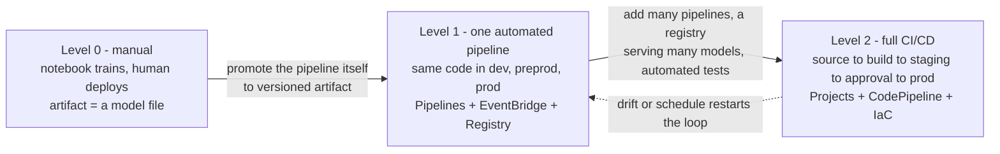
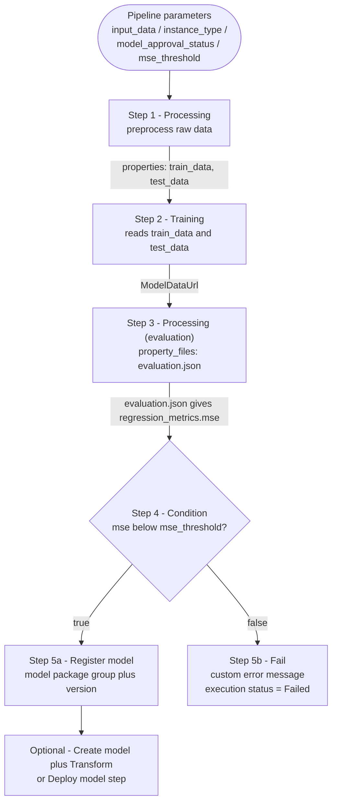
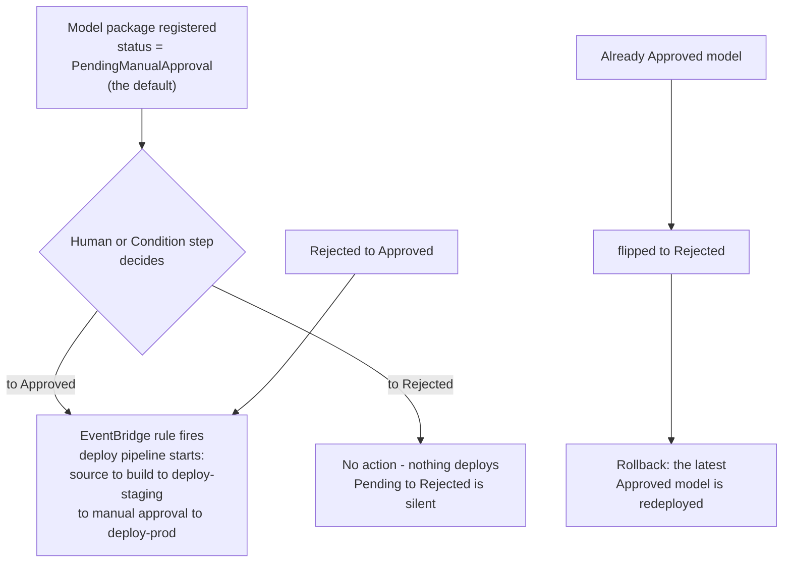
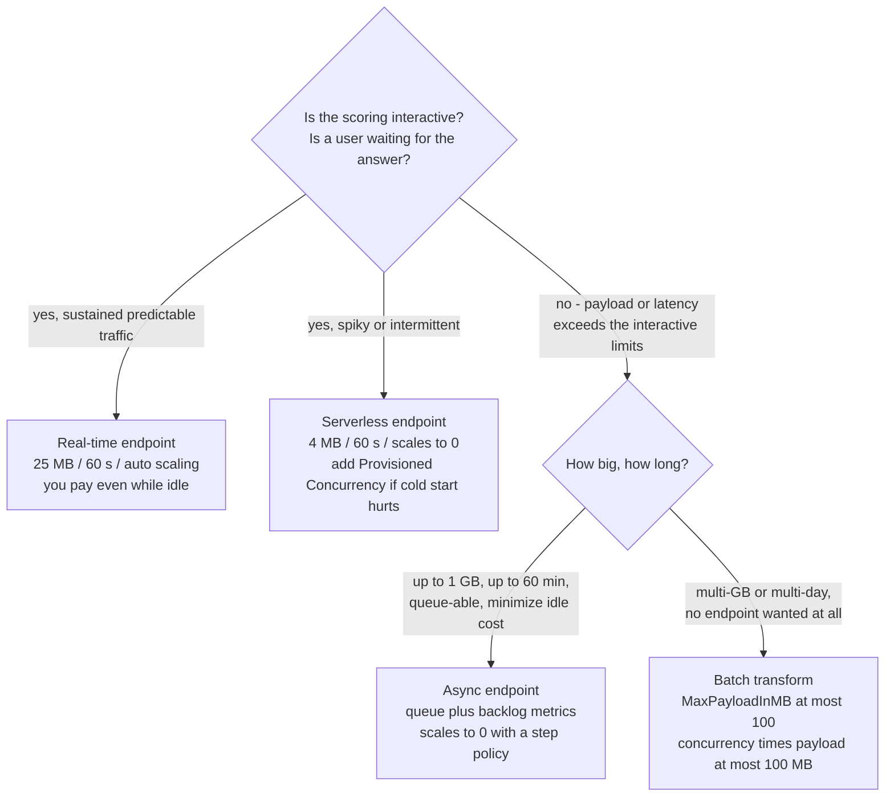
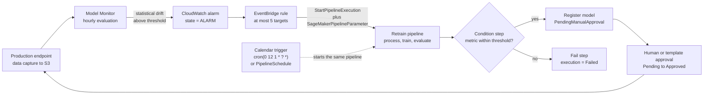

# MLOps and Scaling on AWS

A model that works in a notebook is not a system. The moment a second engineer must reproduce the training run, the moment traffic doubles at 09:00, and the moment the training data drifts six months later, you stop doing machine learning and start doing **operations** — and AWS gives you two distinct families of tooling for that: a **pipeline / registry / CI-CD layer** that decides *how a model reaches production*, and a **scaling layer** that decides *how much compute serves it*. The AIF-C01 exam tests whether you can name each tool precisely, quote its limits, and refuse the options that sound plausible but are documented for a different service.

```text
====================================================================
 LESSON 13 — MLOps & SCALING ON AWS
====================================================================
 MATURITY (AWS three-level standard)
   L0 manual ......... notebooks + manual CreateModel / endpoint
   L1 pipeline ....... ONE automated pipeline = the deployed artifact
   L2 full CI/CD ...... many pipelines + registry + automated testing
--------------------------------------------------------------------
 BUILD LAYER                          SERVE LAYER
   Pipelines = JSON DAG (16 types)    real-time ... <= 25 MB, 60 s
   Condition: if/else on eval.json    serverless .. <= 4 MB, 60 s
   Fail: end the run as Failed        async ....... <= 1 GB, 60 min
   Parallelism (per execution)        batch ....... GB, days, no EP
   Caching OFF by default (PT1H)
   Registry: group -> versions 1,2..  SCALING (App Auto Scaling)
   Approval: Approved / Rejected /    target tracking (target 70)
             PendingManualApproval    step scaling (+1 from zero)
   Projects: Service Catalog / CFN    scheduled actions
   Git via CodeConnections            high-res metric = 10 s
   MLflow tracking server (your S3)   cooldown default 300 s
--------------------------------------------------------------------
 AUTOMATION LAYER
   SageMaker -> EventBridge (near real-time)
   Monitor hourly -> CloudWatch alarm -> StartPipelineExecution
   <= 5 targets per rule / no schedule on custom or partner buses
====================================================================
```

> [!NOTE]
> **How to read this lesson.** Three rules apply throughout. (1) **Numbers are the exam**: payload caps, cooldowns, target values, alarm periods and approval transitions are all published values, and they are what gets tested. (2) **AWS documents two scaling mechanisms for a reason** — target tracking *holds* a load level, step scaling *wakes* a service, and only their combination scales an async endpoint from zero. (3) **Anything AWS does not confirm first-party is flagged**, never taught as recall material; the flags are collected at the end of the lesson.

By the end of this lesson you will be able to:

- place an ML practice on the **AWS three-level maturity model** (0, 1, 2) and separate it from the Google, Azure and AWS-blog variants of the same framework;
- read a **SageMaker Pipeline** as a JSON DAG and say which edges carry **data** (`properties`) versus **ordering only** (`DependsOn`);
- select the right **step type** for a task — including **Condition**, **Fail**, **Callback**, **Lambda**, **ClarifyCheck** and **QualityCheck** — and quote how many types exist;
- configure **`ParallelismConfiguration`** and **step caching** (`ExpireAfter` in ISO 8601, successful runs only) correctly;
- drive deployment through the **Model Registry**: version numbering, `ModelApprovalStatus`, and the four **approval transitions** that do or do not start CI/CD;
- build or adopt a **SageMaker Project** with **CodePipeline / Jenkins**, explain why **CodeCommit templates disappeared on 28 October 2024**, and name the **CodeConnections** tag and IAM actions required for GitHub;
- choose between **Experiments (Studio Classic)** and **MLflow on SageMaker AI**, and say where tracking data and artifacts physically live;
- configure **target tracking**, **step scaling** and **scheduled actions** with the correct `ServiceNamespace`, `ResourceId` and `ScalableDimension`, and do the **ceiling-division** capacity math;
- wake an **async** endpoint from zero with a **step policy plus a `HasBacklogWithoutCapacity` alarm**;
- pick the correct **inference option** from payload, latency, duration and endpoint requirements, and defend the choice in cost terms;
- wire the **MLOps flywheel**: Model Monitor → CloudWatch → EventBridge → `StartPipelineExecution`;
- defend the **Comparative Verdict**: managed MLOps vs DIY scripts vs manual operations.

---

## 1. MLOps maturity: level 0, level 1, level 2

### 1.1 The AWS three-level standard

AWS frames MLOps as a **three-level maturity model**, and the exam expects you to recognize the level from a description and to name the tooling that gets you there. The distinguishing question is never "how much ML do you do" — it is **what is the deployed artifact**.

| Level | Name | Characteristics (AWS) | AWS tooling |
|---|---|---|---|
| **0** | Manual ML workflow | Scientist-driven; manual training and deployment; no pipeline | SageMaker Studio notebooks; manual `CreateModel` and endpoint creation |
| **1** | ML pipeline automation (continuous training) | **One** automated pipeline runs recurrently, with the **same implementation** in development, preproduction and production; **the pipeline itself is the deployed artifact** | SageMaker Pipelines (JSON DAG, caching, parallelism), EventBridge, Model Registry |
| **2** | Full CI/CD automation | **Multiple** pipelines, a **registry serving many models**, automated testing, and hourly or daily retrain-and-redeploy | SageMaker Projects + CodePipeline / CodeBuild / GitHub, Model Monitor → alarm → retrain, infrastructure as code |



> [!WARNING]
> **Do not import a different framework's numbering.** AWS, Google and the AWS ML blog all describe MLOps maturity, and they are **not** interchangeable:
>
> | Framework | Scale | Landmarks |
> |---|---|---|
> | **AWS (exam standard)** | **0, 1, 2** | L2 = registry + many models + CI/CD |
> | AWS ML blog (2022) | Initial → Repeatable → Reliable → Scalable | multi-account, templatized, multi-team |
> | Google | 0, 1, 2 | same shape as AWS |
> | Azure | **0–4** | 1 = DevOps without MLOps · 2 = automated training · 3 = automated deployment · 4 = full MLOps with drift-triggered retraining |
>
> An exam option that describes "level 3" or "level 4" maturity is describing the **Azure** scale, not the AWS one.

### 1.2 Where this sits on the exam

MLOps belongs to **Domain 1, Task 1.3** of the AIF-C01 guide. The exam itself is **65 questions = 50 scored + 15 unscored**, with **no penalty for guessing** and published domain weights of **20 / 24 / 28 / 14 / 14 %**. AWS publishes only the domain weights — the per-task question count is not published, so treat any per-task sizing you read elsewhere as orientation, not as a budget.

- **📚 Did you know?** The **15 unscored questions** on an AIF-C01 exam are indistinguishable to you while you take the test: they are interspersed with the 50 scored ones and are used to gather statistics before an item is ever scored. The practical consequence is a strategy point, not a trivia point — **never skip a question thinking "this one might be unscored."** Every question consumes the same time, and only the scored 50 decide your result, so the rational move is to answer all 65 to the best of your ability.

---

## 2. SageMaker Pipelines: the DAG contract

### 2.1 What a pipeline is

A SageMaker Pipeline is a **directed acyclic graph expressed in JSON**. Each node is a **step**, each edge is a dependency, and cycles are **rejected** — a DAG that loops is not a slower pipeline, it is an invalid definition. The definition follows the *SageMaker AI Pipeline Definition JSON Schema*, and it can be produced by **four** equivalent producers: the **visual editor** in Studio, the **SageMaker SDK**, **boto3**, and **AWS CloudFormation**. Pipeline executions are billed as the underlying jobs (processing, training, transform) plus Studio usage — the orchestration layer itself is not a separate heavyweight SKU.

Two kinds of edge exist, and confusing them is the most common architectural error in this area:

| Edge kind | Written as | Carries | Example |
|---|---|---|---|
| **Data edge** | `step.properties.*`, resolved from the matching `Describe*` API | actual artifacts (S3 URIs, model data, evaluation JSON) | Train reads Process's `train_data` output |
| **Ordering-only edge** | `DependsOn` / `add_depends_on(...)` | nothing but "run after" | Train must wait for a second, unrelated preparation step |

The rule of thumb: **if the value flows, it is a `properties` reference; if only the timing matters, it is `DependsOn`.** `ParallelismConfiguration` is not an ordering mechanism at all — it caps how many already-eligible steps run at once.

### 2.2 The pipeline DAG

This is the canonical shape the exam describes: preprocess → train → evaluate → register only if the metric passes, otherwise fail with a message.



### 2.3 Worked example 1 — the MSE gate, end to end

A regression pipeline for an abalone-style tabular model, built with the SageMaker SDK:

1. **Parameters** are declared once and reused everywhere: `processing_instance_count`, `instance_type`, `model_approval_status` (default `PendingManualApproval`), `input_data`, `batch_data`, `mse_threshold`.
2. **`Process`** produces `train_data` and `test_data` outputs. The training step consumes them with `step_process.properties.ProcessingOutputConfig.Outputs["train_data"].S3Output.S3Uri` — **that string is the DAG edge**, not a comment.
3. **`Eval`** is a **Processing step with `property_files`**, so its output `evaluation.json` (containing `regression_metrics.mse`) is exposed to later steps as a structured property rather than as an S3 path you have to parse yourself.
4. **`MSECond`** is a **Condition step**: `if_steps = [RegisterModel]`, `else_steps = [Fail]`. The Fail step carries a composed message such as `"MSE above threshold " + mse_threshold` and terminates the execution with status **Failed** — the run does not "finish with a warning".
5. **`.start()`** executes it. Passing `ModelApprovalStatus="Approved"` as a parameter value makes the registration deployable immediately (a development/test shortcut), and `CacheConfig(enable_caching=True, expire_after="PT1H")` lets unchanged steps reuse their previous outputs.

> [!NOTE]
> **Why a Fail step instead of just letting the condition be false?** A Condition step with an empty `else_steps` silently does nothing — the execution reports **Succeeded** while no model was registered. The **Fail** step exists precisely so that "the metric was bad" is recorded as a **Failed execution with a custom message**, which is what an EventBridge rule or a CI/CD system needs in order to open an incident rather than celebrate a green build.

---

## 3. The 16 step types, and the two that decide outcomes

### 3.1 The complete step map

AWS documents **16 step types**. Learn the table by the "exam hook" column: the exam rarely asks "what does a Training step do", it asks *which step should be used for X*.

| Step type | Runs | Key config | Exam hook |
|---|---|---|---|
| **Processing** | prep, **evaluation**, baselining | output S3 URIs, `property_files` | "which step evaluates the model?" → Processing |
| **Training** / **Tuning** / **AutoML** | training / HPO / AutoML job | hyperparameters, channels from a prior step, search ranges, target metric | needs train and validation data |
| **Model (Create model)** | `CreateModel` | container image, `ModelDataUrl` | prerequisite for Transform / Deploy |
| **Register model** | **model package version** | group, approval status, instance lists | versioning plus approval |
| **Deploy model** | endpoint create/update | endpoint config, variants | blue/green = an endpoint **update** |
| **Transform** | batch transform | `MaxPayloadInMB`, `MaxConcurrentTransforms` | offline scoring, **no endpoint** |
| **Condition** | branch | `if_steps` / `else_steps` | gate → register **or** Fail |
| **Fail** | stops the execution as **Failed** | custom `error_message` | "terminate with a reason" |
| **Callback** | waits for a callback token | token | external or Step Functions approval |
| **Lambda** | a Lambda function | ARN / SDK helper | **at most 10 min, default 2 min**; lightweight deploy hooks |
| **ClarifyCheck** / **QualityCheck** | bias and explainability, data and model quality | baseline stats and constraints, `skip_check`, `register_new_baseline` | drift gate plus baselining |
| **EMR** / **Notebook Job** | EMR step / scheduled notebook | cluster and args / compute and cron | big-data prep / scheduled analytics |

### 3.2 Condition and Fail as an evaluation gate

The documented pattern is mechanical and worth memorizing:

1. The evaluation Processing step declares `property_files=["evaluation.json"]`.
2. The Condition step reads `evaluation.json` and compares a scalar — for example `regression_metrics.mse` against the pipeline parameter `mse_threshold`.
3. **True branch → Register model** (optionally preceded by `Create model`, and followed by a `Transform` step for a batch sanity pass).
4. **False branch → Fail** with a `Join(...)`-composed `error_message`, producing an execution status of **Failed**.

A second, equally common variant puts a **QualityCheck** or **ClarifyCheck** step in front of registration: the baseline is produced with `register_new_baseline=true` and `skip_check=true` on the first run, and subsequent runs compare against that baseline. Same shape — a gate whose false branch is a Fail step.

- **📚 Did you know?** The **Fail** step is not a crash — it is a *controlled* termination. The step itself succeeds in doing its job, and the **pipeline execution** is what ends as `Failed`, with your message attached. That distinction matters when you build an EventBridge rule: you react to the execution status, not to a thrown exception in your Python code, so a Fail step gives you a clean, schema-stable signal that a shell script's `exit 1` does not.

---

## 4. Parallelism and caching: the two knobs that change runtime cost

### 4.1 Parallelism is per execution, not per pipeline

Independent steps run **in parallel** by default: whatever is eligible runs. You cap that with **`ParallelismConfiguration(MaxParallelExecutionSteps)`**. Two properties of this setting matter for the exam:

- it applies **per execution** — the documented example of **50** means one execution runs at most 50 steps concurrently, and **two concurrent executions can therefore run 100** steps at once;
- it can be **overridden at start, retry and update** time, so it is a policy default, not an immutable property of the pipeline.

Parallelism is **not** a dependency mechanism. Setting `MaxParallelExecutionSteps = 2` does not make step B wait for step A; it only limits how many ready steps execute simultaneously.

### 4.2 Caching is opt-in, ISO 8601, and only for successful runs

| Property | Verified behavior |
|---|---|
| Default | **Off** — every execution re-runs every step |
| Enable | `CacheConfig { Enabled, ExpireAfter }` on the step |
| `ExpireAfter` format | **ISO 8601 duration**, for example **`PT1H`** — not a Unix timestamp |
| Which runs are reused | **Successful** runs only; a failed run is never a cache source |
| Match resolution | the **newest** matching successful run wins |
| What invalidates | attributes that affect the **output**: data location, hyperparameters, and local **code** (the SDK hashes local code into S3) |
| What may still hit | changes to attributes that do **not** affect the output — `instance_type` may still hit |

The practical use is a dev loop: you re-run a five-step pipeline after touching only the report, and `PT1H` lets Process, Train and Eval return their previous artifacts in seconds while the changed step executes for real.

> [!WARNING]
> **Caching off by default is the trap, not the feature.** A candidate who assumes "pipelines skip unchanged work automatically" will misread every cost question about repeated runs. Nothing is cached until you set `CacheConfig`, the entry must have **succeeded**, and it must be **unexpired**. Conversely, a candidate who assumes "caching means stale models" is wrong for the opposite reason: data, hyperparameter and code changes all **miss** by design.

---

## 5. Model Registry: versions and the approval that drives deployment

### 5.1 Registry structure

The registry organizes models into **model groups**, and a group holds **packages/versions**. Versions are simple and strictly ordered: they **start at 1** and **increment by 1** for each package added to the group. A versioned package **must** belong to a group, and its ARN carries the coordinates: `…:model-package-group/name/version`.

### 5.2 ModelApprovalStatus

Every model package carries a status drawn from exactly three values:

```text
ModelApprovalStatus = Approved | Rejected | PendingManualApproval
```

A **versioned model must be `Approved` to be deployed.** The status can be set through `update_model_package`, through Studio, through a **Condition step** inside a pipeline, or passed as a **pipeline parameter** whose default is `PendingManualApproval`.

### 5.3 The four approval transitions

This is the highest-yield table in the lesson, because the exam asks "which action starts the deployment?":

| Transition | Effect in a SageMaker Project template |
|---|---|
| `PendingManualApproval` → **`Approved`** | **Initiates CI/CD** — the deploy pipeline starts |
| `PendingManualApproval` → `Rejected` | **No action** |
| `Rejected` → **`Approved`** | **Initiates CI/CD** |
| `Approved` → `Rejected` | **Redeploys the latest `Approved` model** (rollback semantics) |



### 5.4 Worked example 2 — approval to production

1. A **SageMaker Project** is created from the template *"Model building, training, and deployment with third-party Git repositories using CodePipeline"*, with **two GitHub repositories** and a **CodeConnections ARN tagged `sagemaker=true`**.
2. A commit to the model-build repository triggers the source action (`DetectChanges`), which runs **`source → build`**: CodeBuild creates or updates the SageMaker Pipeline and starts it.
3. The pipeline registers **version 7** with `ModelApprovalStatus = PendingManualApproval`.
4. A reviewer flips v7 to **`Approved`** (Studio, CLI, or a Condition step fed by an approval parameter).
5. The template's **EventBridge rule** starts the deploy pipeline: **`source → build → deploy-staging`** (CloudFormation stack) → **manual approval** → **`deploy-prod`**.
6. If staging surfaces a defect and v7 is flipped **`Approved` → `Rejected`**, the latest still-`Approved` package is redeployed — that is your documented rollback. In a pure dev/test loop you short-circuit steps 4–5 by passing `ModelApprovalStatus="Approved"` as a pipeline parameter.

---

## 6. SageMaker Projects, Git and CI/CD

### 6.1 What a Project actually is

SageMaker Projects are **AWS Service Catalog products backed by CloudFormation**. Creating one provisions, as a single unit: **Git repositories, a SageMaker Pipeline, CodePipeline or Jenkins, a model group, an S3 bucket, an ECR registry and EventBridge rules**. Two canonical shapes exist:

| Project shape | Pipeline path |
|---|---|
| **Build** | `source → build` |
| **Deploy** | `source → build → deploy-staging → manual approval → deploy-prod` |

Provided template families cover **build/train/deploy with third-party Git** (CodePipeline **or** Jenkins), **Model Monitor**, and **image building** (ECR + CodeBuild + EventBridge).

### 6.2 The CodeCommit change of 28 October 2024

> [!WARNING]
> **CodeCommit-based project templates were removed on 28 October 2024.** Any exam option asserting that you can start a new SageMaker Project from a CodeCommit template "as of today" is wrong. The supported path is **GitHub / GitHub Enterprise / GitLab / Bitbucket**, and custom templates are built as **CloudFormation in Service Catalog** or — recommended by AWS — **S3-hosted templates** consumed through `CfnTemplateProvider`.

The GitHub source action mechanics are worth quoting exactly:

- the CodePipeline action is **`CodeStarSourceConnection`**;
- the connection must be a **CodeConnections** connection **tagged `sagemaker=true`**;
- the pipeline role needs **both** `codestar-connections:UseConnection` **and** `codeconnections:UseConnection`;
- change detection is `DetectChanges` on commit, so the build starts without a manual trigger;
- a custom template's CloudFormation must declare **`SageMakerProjectName`** and **`SageMakerProjectId`**.

- **📚 Did you know?** "CodeStar" survives in the **action name** (`CodeStarSourceConnection`) long after the product was replaced by **CodeConnections**. That is why the IAM policy needs *two* nearly identical actions — one for the legacy namespace and one for the current service. Candidates who memorize only one of the two consistently fail this item, and AWS's own walkthroughs list both.

---

## 7. Experiments and MLflow: where run tracking lives now

### 7.1 The migration

The SageMaker Experiments API — `CreateExperiment`, **Trials** as run *groups*, **trial components** as individual *runs* — is documented as **available in Studio Classic only**. For the new Studio experience, AWS recommends **MLflow on SageMaker AI**. In exam terms: an option describing Trials and trial components as the current, recommended way to track runs is describing a **legacy** surface.

| | SageMaker Experiments (SDK) | **MLflow on SageMaker AI** |
|---|---|---|
| Status | Studio **Classic** only | Current recommendation (GA) |
| Tracking URI | Experiments API | `mlflow.set_tracking_uri(<tracking server ARN>)` |
| Credentials | SageMaker execution role | AWS plugin, **SigV4** signing |
| Backend store | Experiments metadata store | In the **SageMaker service account** |
| Artifact store | SageMaker-managed | **Your own S3 bucket** |
| Sizes / limits | — | **Small / Medium / Large**, created in **at most 25 minutes** |
| Audit | CloudTrail on SageMaker APIs | CloudTrail under **`CallMlflowApp`** for `AWS::SageMaker::MlflowApp` |

The split is the exam point: **compute and backend store run in the SageMaker service account, but the artifacts live in S3 that you own and pay for** — which is exactly what a compliance reviewer wants to hear about reproducibility.

---

## 8. Endpoint auto scaling: target tracking, step scaling, scheduled actions

### 8.1 The identifiers

Endpoint scaling runs through **Application Auto Scaling** (`RegisterScalableTarget` plus `PutScalingPolicy`) or through the console wizard. Quote the coordinates exactly:

| Field | Value |
|---|---|
| `ServiceNamespace` | **`sagemaker`** |
| `ResourceId` | **`endpoint/{endpoint-name}/variant/{variant-name}`** |
| `ScalableDimension` | **`sagemaker:variant:DesiredInstanceCount`** |
| Console wizard metric | fixed to **`SageMakerVariantInvocationsPerInstance`** |

AWS offers three strategies — **target tracking (recommended)**, **step scaling** and **scheduled actions** (CLI/API) — and, for target tracking, **AWS manages the alarms for you**.

### 8.2 The metrics

| Metric | Type | Target | Period |
|---|---|---|---|
| `SageMakerVariantInvocationsPerInstance` | **Predefined** (recommended default) | **70** invocations/instance/min | 1 min |
| `ConcurrentRequestsPerModelHighResolution` | High-resolution custom | **5** concurrent requests/model | **10 s** |
| `InferenceComponentConcurrentRequestsPerCopyHighResolution` | High-resolution (inference components) | **5** | **10 s** |
| `CPUUtilization`, `ExplanationsPerInstance` | Custom | your choice (for example 50) | 1 min |
| `ApproximateBacklogSizePerInstance` | Async | **5** | 1 min |

### 8.3 Worked example 3 — target-tracking capacity math

Capacity always **rounds up** — that is the documented adjustment behavior, and it is examinable arithmetic:

1. Load test shows **210 invocations/min**, target **70** → 210 / 70 = **3 instances**.
2. Traffic rises to **351/min** → 351 / 70 = 5.01, rounded up → **6 instances** (never 5).
3. Register the target:
   `register_scalable_target(ServiceNamespace="sagemaker", ResourceId="endpoint/prod/variant/AllTraffic", ScalableDimension="sagemaker:variant:DesiredInstanceCount", MinCapacity=1, MaxCapacity=10)`.
4. Attach the policy:
   `put_scaling_policy(PolicyType="TargetTrackingScaling", {"TargetValue": 70.0, "PredefinedMetricSpecification": {"PredefinedMetricType": "SageMakerVariantInvocationsPerInstance"}, "ScaleInCooldown": 600, "ScaleOutCooldown": 300})`.
5. Effect: scale-out within about **one minute**; the **600 s** scale-in cooldown suppresses flapping after a burst, and the **300 s** scale-out cooldown prevents over-provisioning during a spike train.

### 8.4 Worked example 4 — high-resolution concurrency math

1. With `ConcurrentRequestsPerModelHighResolution` at target **5**, a load of **18 concurrent requests** → 18 / 5 = 3.6, rounded up → **4 instances**.
2. The metric emits every **10 seconds** instead of every **1 minute** — roughly **6× faster** detection for **scale-out**; scale-in timing is unchanged.
3. Using inference components? The metric becomes `InferenceComponentConcurrentRequestsPerCopyHighResolution`.
4. Multiple target-tracking policies may share **one** scalable target: add a second policy on `CPUUtilization` with `TargetValue = 50`, and both hold their own targets against the same `DesiredInstanceCount`.

### 8.5 The scaling strategy comparison

| Dimension | **Target tracking** (recommended) | **Step scaling** | **Scheduled actions** | **Serverless (fully managed)** |
|---|---|---|---|---|
| Trigger | metric vs target | alarm breached | cron/date | traffic itself |
| Metrics | predefined `InvocationsPerInstance`, high-res `ConcurrentRequestsPer*`, custom `CPUUtilization` / `ExplanationsPerInstance`, async `ApproximateBacklogSizePerInstance` | any alarm metric | — | — |
| Granularity | 1 min, or **10 s** high-resolution | your alarm's period | fixed times | automatic |
| Adjustment | held at target, **rounds up** | exact (for example **+1**) | absolute or percentage | opaque |
| Cooldowns | `ScaleInCooldown` / `ScaleOutCooldown` (SageMaker default **300 s**) | `Cooldown` (example 300) | — | — |
| Scale to 0 | not for real-time variants; async only **with** an extra step policy and alarm | ✅ the from-zero mechanism | ✅ if `MinCapacity = 0` | ✅ always |
| Best for | sustained load | precise bursts, zero wake-ups | known peaks | intermittent traffic |

> [!IMPORTANT]
> **Cooldowns are in seconds and they apply in both directions.** `ScaleInCooldown` and `ScaleOutCooldown` are separate values (the documented example uses **600** and **300**), the SageMaker-variant default is **300 seconds**, and adjustments **round up** — so a target-tracking policy never scales to a fractional instance and never scales in faster than its cooldown allows. A question that sets cooldowns in minutes, or that claims scale-in and scale-out share one value, is wrong.

---

## 9. Async inference: scaling from zero

### 9.1 Why async is special

Async endpoints have a **queue** in front of them, which means the backlog — not the request rate — is the signal that matters. AWS documents these queue metrics:

| Metric | Meaning | Typical use |
|---|---|---|
| `ApproximateBacklogSizePerInstance` | queued requests divided by instances | **target tracking**, target **5** |
| `ApproximateBacklogSize` | absolute queue depth | custom alarms |
| `ApproximateAgeOfOldestRequest` | queue latency | freshness SLO |
| **`HasBacklogWithoutCapacity`** | **1** when the queue is non-empty **and** instances = 0 | **the scale-from-zero alarm** |

### 9.2 The scale-from-zero design

> [!WARNING]
> **Target tracking cannot wake a service that has zero capacity.** With `MinCapacity = 0`, a target-tracking policy has no instances against which to compute a `…PerInstance` metric, so it will not scale out from zero. AWS's documented answer is a **combination**: a **step scaling policy** with `ScalingAdjustment = +1` and a **300-second cooldown**, driven by an alarm on **`HasBacklogWithoutCapacity`** with **threshold 1**, **EvaluationPeriods = 2** (DatapointsToAlarm 2) and **Period 60 s**. Target tracking then takes over once capacity exists.

### 9.3 Worked example 5 — queue math and the wake-up

1. Configure `MinCapacity=0, MaxCapacity=5` and a target-tracking policy on `ApproximateBacklogSizePerInstance` with `TargetValue = 5`.
2. A burst queues **27 requests** on 1 running instance → 27 / 5 = 5.4, rounded up → 6 → **capped at `MaxCapacity` = 5**.
3. Traffic stops; scale-in returns the endpoint to **0 instances** and idle spend goes to **zero**. Requests that arrive meanwhile are **queued, not lost** — `ApproximateAgeOfOldestRequest` reports how long the oldest one has waited.
4. The next request after idle: `HasBacklogWithoutCapacity` flips to **1**, holds for **2 evaluation periods of 60 s**, fires the alarm, the step policy adds **+1** instance after the **300 s** cooldown, and target tracking resumes.

---

## 10. Choosing the inference option

### 10.1 The four options and their hard limits

| | **Real-time** | **Serverless** | **Async** | **Batch transform** |
|---|---|---|---|---|
| Endpoint | persistent REST | managed, scales to **0** | persistent **queue**, scales to **0** | **none** (job only) |
| Payload limit | **25 MB** | **4 MB** | **1 GB** | GB-scale datasets |
| Processing time | **60 s** (8 min with streaming) | **60 s** | **60 minutes** | **days** |
| Scaling control | auto scaling policies (section 8) | fully managed (+ optional **Provisioned Concurrency**) | backlog metrics plus step scaling from 0 | `MaxConcurrentTransforms`, instance count |
| Cost shape | pay for provisioned instances **including idle** | pay per request duration and data | pay while processing, **0 idle** | pay per instance-hour of the job |
| Best fit | sustained, low-latency, predictable | spiky or intermittent traffic tolerant of cold starts | large payloads, queue-able, cost-sensitive | offline bulk scoring |
| Monitoring | Model Monitor plus data capture ✅ | **neither supported** ❌ | SNS success/error → S3 | `BatchTransformInput` |

**Batch transform specifics:** `MaxPayloadInMB` at most **100**, and `MaxConcurrentTransforms × MaxPayloadInMB` at most **100 MB**.

**Serverless exclusions (memorize the list):** no **GPUs**; no Marketplace or private registry images; no **multi-model endpoints**; no **VPC** configuration; no **data capture**; no **Model Monitor**; no **multiple variants**; no **inference pipelines**; container image at most **10 GB**; converting an existing **real-time endpoint to serverless is rejected**; **Provisioned Concurrency** is optional.

### 10.2 The decision



### 10.3 Worked example 6 — 40 GB, nightly, no users

A fraud team asks for "a real-time endpoint for our nightly 40 GB scoring job." The correct answer is **batch transform**:

1. **No interactive traffic** → real-time's only advantage (latency) has no value, and its cost shape — paying for provisioned instances **including idle hours** — is pure waste for a job that runs once a day.
2. **40 GB blows past** the serverless **4 MB** cap and the async **1 GB** cap; it is squarely "GB-scale data over days" territory.
3. Batch transform runs **instances only for the job**: `MaxPayloadInMB ≤ 100` and `MaxConcurrentTransforms × MaxPayloadInMB ≤ 100 MB` keep each request within limits, `S3Output` collects the scored records, and **no endpoint exists** between runs — so nothing bills at 03:00.
4. Monitoring uses `BatchTransformInput` rather than Model Monitor; if the team later wants drift detection, that is a separate decision about a real-time or async endpoint.

- **📚 Did you know?** AWS's cost-optimization guidance for inference reduces to one sentence: **match the option to the traffic shape**. Async is sized for an *optimal processing rate* **plus scale to zero**; serverless is *per request*; real-time is *provisioned capacity*; and across all of them **SageMaker Savings Plans** can be bought for **1 or 3 years** and apply over Studio, processing, training, real-time inference and batch transform. Buying a Savings Plan for a job that runs 20 minutes a night is the classic mismatch — the plan discounts *committed* usage, and a nightly batch has almost none.

---

## 11. EventBridge and the MLOps flywheel

### 11.1 What AWS sends, and to what

SageMaker emits events to **EventBridge in near real-time** for **jobs, endpoints, model packages, pipeline executions and pipeline steps, and image changes**. Targets include **Lambda, Step Functions, Kinesis and SNS** — and, critically, **SageMaker Pipelines itself is a target**:

| Setting | Value |
|---|---|
| Target | SageMaker Pipeline |
| Role action | **`SageMaker::StartPipelineExecution`** |
| Parameter mapping | **`SageMakerPipelineParameter`** |
| Max targets per rule | **5** |
| Schedules on **custom / partner buses** | **not supported** |
| Programmatic scheduling | SDK **`PipelineSchedule`** (`rate` / `cron`) |
| Retraining triggers (the complete list) | **schedule** (`rate` / `cron`, `PipelineSchedule`) and **event** (CloudWatch alarm, `ModelPackageStateChange`, S3 `ObjectCreated`) |

### 11.2 The flywheel



### 11.3 Worked example 7 — monitor, alarm, retrain, approve, deploy

1. Enable **data capture** on the production endpoint so requests and responses land in S3, and schedule **Model Monitor hourly** (`CronExpressionGenerator.hourly()`).
2. Produce the baseline with a **`QualityCheck` step** using `register_new_baseline=true` and `skip_check=true` on the first run; later runs compare against it.
3. When drift exceeds the constraint, the CloudWatch alarm enters **ALARM** → the **EventBridge rule** fires → target = **SageMaker Pipeline**, invoking **`StartPipelineExecution`** with a mapped `SageMakerPipelineParameter`.
4. The pipeline retrains, evaluates, passes the **Condition** step, registers a new version as **`PendingManualApproval`** → approval flips it to **`Approved`** → the deploy template's rule updates the endpoint.
5. Run the **calendar trigger alongside** the drift trigger: `cron(0 12 1 * ? *)` retrains on the 1st of every month at 12:00 UTC, or use `PipelineSchedule(name, cron="15 10 ? * 6L 2022-2023")` for a bounded schedule. Remember **at most 5 targets per rule** and **no schedule on custom or partner event buses**.

### 11.4 Infrastructure as code for the whole stack

Everything in this lesson is describable as code, and AWS's guidance points at CloudFormation either directly or through the **AWS CDK**: `cdk synth` emits a CloudFormation template per stack, and the L1 `Cfn*` constructs cover the surface — `sagemaker.CfnEndpointConfig` (including `AsyncInferenceConfig`), `sagemaker.CfnPipeline`, plus native `AWS::SageMaker::Domain`, `AWS::SageMaker::UserProfile` and `AWS::SageMaker::Pipeline`.

Codify, at minimum: VPC, KMS, the S3 bucket, the pipeline execution role, the **Model Package Group**, CodePipeline + CodeBuild + CodeConnections, EventBridge rules, and the scalable target with its policies. For project templates AWS prefers **S3-hosted templates via `CfnTemplateProvider`** over Service Catalog portfolios, and a custom template must expose **`SageMakerProjectName`** and **`SageMakerProjectId`**. Splitting the stack into `DevStack` and `ProdStack` lets you unit-test the infrastructure before it touches production.

### 11.5 2025–2026 Updates

Three verified 2025–2026 changes touch the material in sections 8 through 13, and AWS now announces them through **lifecycle vocabulary** rather than through silent retirements. All three are documented, dated and examinable.

**1. The product name changed.** AWS documents that "the current Amazon SageMaker has been renamed to **Amazon SageMaker AI**" (3 December 2024), alongside a separate *next-generation SageMaker* generation (Unified Studio, Catalog, Lakehouse, zero-ETL). An exam option saying **SageMaker AI** is current, not exotic — and the identifiers you quote from section 8 did **not** move with the rename: `ServiceNamespace = sagemaker`, `ResourceId = endpoint/…/variant/…`, `SageMakerVariantInvocationsPerInstance` and the role action `SageMaker::StartPipelineExecution` are all still spelled the old way.

**2. Model Monitor and Clarify are in maintenance.** The SageMaker AI End of Support Notice lists **Model Monitor** and **Clarify** — together with Ground Truth, A2I, Studio Lab, Debugger, Role Manager, Geospatial and Mechanical Turk — as **"no longer open to new customers starting 30 July 2026"**. Read that sentence with precision: the status is **maintenance** = no new customers, no new features, **existing customers keep using them**. It is **not** a full shutdown, and it is **not** a rebrand into Bedrock Model Evaluations. The drift flywheel of 11.2 therefore still runs for existing customers; for new work AWS points to **CloudWatch metrics and anomaly detection, CloudWatch Evidently, EventBridge + Lambda, SHAP**, and, on the generative side, **Bedrock Model Evaluations** — which is exactly why the exam guide's example 4.2.2 now reads "Clarify **plus** Bedrock Model Evaluations".

**3. The exam guide moved.** AWS's change history lists **v1.0 published 26 March 2026** and **v1.1 published 30 April 2026**, and states that updates appear on the exam **about one month after publication** (treat **v1.1** as the reliable anchor; the v1.0 date is a documentation re-publication). Changed examples that touch this lesson: **1.1.3 (async and serverless inference)**, **1.3.4 (Bedrock, Amazon Quick, Kiro, SageMaker AI)** and **4.2.2 (Clarify plus Bedrock Model Evaluations)**. Unchanged, and therefore safe to keep quoting: **65 questions (50 scored + 15 unscored)**, **90 minutes**, **pass 700 / 1000**, **3-year validity**, domains **20 / 24 / 28 / 14 / 14 %**.

| Date (verified) | Change | What it means on the exam |
|---|---|---|
| 3 Dec 2024 | Amazon SageMaker renamed **Amazon SageMaker AI** | the new name is current; service, metric and API identifiers are unchanged |
| 26 Mar 2026 | Exam guide **v1.0** listed in the change history | baseline for the 2026 content set |
| 30 Apr 2026 | Exam guide **v1.1** published | live on the exam from about **late May 2026**; changed examples 1.1.3, 1.3.4, 4.2.2 |
| 30 Jun 2026 | Ground Truth Plus **end of support**; Amazon Kendra enters **maintenance** | distractor dates, not MLOps answers |
| **30 Jul 2026** | **Model Monitor, Clarify, Ground Truth, A2I, Studio Lab, Debugger, Role Manager, Geospatial, Mechanical Turk** and **Kendra** closed to new customers | **maintenance ≠ shutdown ≠ rebrand** — quote the state, not a rumour |
| 30 Sep 2026 | Mechanical Turk **end of support** (the What's New post says 29 Sep — the digest flags the conflict) | do not quote the day |
| 24 Sep 2026 | AWS Service Lifecycle reference published | use the three-word vocabulary below |

**Lifecycle vocabulary (AWS General Reference):** **Maintenance** = no new customers, no new features, still supported · **Sunset** = planned end of operations, typically about 12 months · **Full Shutdown** = removed from the portfolio.

- **📚 Did you know?** AWS states that exam-guide changes surface on the live exam **about one month after publication** — so **v1.1 (30 April 2026)** material was examinable from roughly **late May 2026**. The corollary runs in both directions: a feature announced *after* your guide version is not automatically testable, while a **changed example** such as **4.2.2 → Clarify plus Bedrock Model Evaluations** is testable long before any retirement date matters. Read the change history, not the release blog.

---

## 12. Comparative verdict: managed MLOps vs DIY scripts vs manual

> [!IMPORTANT]
> **Comparative Verdict — managed MLOps (SageMaker Pipelines / Registry / Projects) vs DIY scripts (glue code in CodeBuild) vs manual operations (notebooks and console clicks)**
> - **Manual operations.** A scientist trains in a notebook, exports a model file, and a second person clicks through endpoint creation. It is **fast for one person and one model**, needs no IAM design and no pipeline role — and it fails every auditable question: no versioning (registry versions start at **1** and there is no step 2), no approval record (`ModelApprovalStatus` never existed), no reproducibility (data, hyperparameters and code are whatever the notebook state was), and no path to Level 1 maturity. Use it only for exploration.
> - **DIY scripts.** Shell or Python glue in CodeBuild that calls `training.py`, `evaluate.py`, `upload_model.py`. It is **fully customizable and portable** — you can bolt on any CI system and any test framework, and no service limits constrain you. Its failure modes are **the ones you must now invent yourself**: step ordering (you hand-roll the DAG), caching (you write your own artifact reuse), failure semantics (a bad metric must become a *failed* build with a message), approval gates (you implement the state machine), parallelism caps, retries, and the CloudTrail evidence trail. You are reimplementing 16 step types, and the exam's answer key is the managed one.
> - **Managed MLOps.** SageMaker Pipelines gives a **JSON DAG with 16 step types**, **Condition** and **Fail** gates, **per-execution parallelism** and **opt-in caching**; Model Registry gives **groups, versions from 1, and the approval transitions that start CI/CD**; Projects give **CloudFormation / Service Catalog** provisioning of repos, pipeline, model group, bucket, ECR and EventBridge rules; EventBridge gives the **near-real-time** retraining loop with **at most 5 targets per rule**. Its limits: everything is SageMaker-shaped (a non-SageMaker training job needs a custom or Lambda step), template choice is finite (**CodeCommit templates removed 28 Oct 2024**), and **experiment tracking has moved to MLflow**, with Studio Classic as the legacy surface.
> - **Rule of thumb for the exam:** *the question asks how a model reaches production, with versioning, an approval gate and an audit trail →* **managed MLOps (Pipelines + Registry + Projects)**. *The question asks for a bespoke tool or an existing non-AWS CI system →* **DIY scripts, but keep the registry as the hand-off point**. *The question describes a single scientist iterating on a prototype →* **manual is acceptable, and only then** — and if the option mentions drift-triggered retraining, the answer is the **EventBridge → `StartPipelineExecution`** loop, not a cron script.

| Decision signal | Manual | DIY scripts | **Managed MLOps** |
|---|---|---|---|
| Reproducible run definition | No | Only if you write it | **Yes** (JSON DAG, schema-checked) |
| Step-level failure semantics | No | DIY | **Yes** (Fail step plus custom message) |
| Versioned model registry | No | DIY | **Yes** (groups, versions from **1**) |
| Approval that starts deployment | No | DIY | **Yes** (`Pending → Approved` initiates CI/CD) |
| Parallelism cap per execution | n/a | DIY | **Yes** (`ParallelismConfiguration`) |
| Step result caching | No | DIY | **Yes** (opt-in, `PT1H`, successful runs only) |
| Provisioned by infrastructure as code | No | Yes | **Yes** (Projects = Service Catalog / CloudFormation) |
| Drift-triggered retraining | No | DIY | **Yes** (Monitor → alarm → EventBridge → pipeline) |
| Works outside SageMaker | n/a | **Yes** | Partially (custom and Lambda steps) |
| Audit evidence | Notebook history | Your logs | CloudTrail plus registry plus pipeline execution history |

---

## 13. Exam traps and the numbers worth memorizing

> [!WARNING]
> **The traps that cost marks on this exact material:**
> 1. **"The Experiments SDK is the current way to track runs."** It is **Studio Classic only**; AWS recommends **MLflow on SageMaker AI** for the new Studio experience.
> 2. **"Start a SageMaker Project from a CodeCommit template."** Those templates were **removed on 28 October 2024** — use GitHub, GitLab or Bitbucket through **CodeConnections** (`CodeStarSourceConnection`, tagged `sagemaker=true`).
> 3. **"Set `ALBRequestCountPerTarget` on a SageMaker endpoint."** That is a **generic** Application Auto Scaling metric needing an **ALB `ResourceLabel`**; the SageMaker metric is **`SageMakerVariantInvocationsPerInstance`**.
> 4. **"`PendingManualApproval → Rejected` deploys the previous model."** It takes **no action**; only **`Approved → Rejected`** redeploys the latest `Approved` package.
> 5. **"Target tracking alone scales async from zero."** It cannot — you need a **step policy (+1, cooldown 300)** plus a **`HasBacklogWithoutCapacity`** alarm (threshold **1**, **2 × 60 s**).
> 6. **"`ExpireAfter` is a Unix timestamp, and cached runs include failures."** It is **ISO 8601** (`PT1H`) and only **successful** runs are reused.
> 7. **"Parallelism forces ordering."** `MaxParallelExecutionSteps` caps concurrency **per execution**; ordering is `properties` (data) or `DependsOn` (timing).
> 8. **"Serverless supports VPC, Model Monitor and multi-model endpoints."** It supports **none** of them, caps payloads at **4 MB** and images at **10 GB**, and GPUs are not available.
> 9. **"Cron schedules can be attached to any event bus."** **No schedules on custom or partner buses**, and a rule has **at most 5 targets**.
> 10. **"A versioned model can be deployed in any approval state."** It must be **`Approved`**.

| Testable number | Value |
|---|---|
| Pipeline step types | **16** (incl. Fail, Condition, Lambda, Callback, ClarifyCheck, QualityCheck) |
| `ParallelismConfiguration` example | **50**, **per execution** (2 executions ⇒ 100) |
| Step caching | **off by default** · `ExpireAfter` ISO 8601 (`PT1H`) · successful runs only |
| Model package versions | start at **1**, +1 per package in the group |
| `ModelApprovalStatus` | `Approved` / `Rejected` / `PendingManualApproval` |
| Approval transitions initiating CI/CD | `Pending → Approved`, `Rejected → Approved` |
| EventBridge targets per rule | **5** max |
| Target / concurrency / backlog targets | **70** inv/instance/min · **5** concurrent/model · **5** backlog/instance |
| Metric period | standard **1 min** vs high-resolution **10 s** |
| `HasBacklogWithoutCapacity` alarm | threshold **1** · Evaluation and Datapoints **2** · Period **60 s** · step **+1** · Cooldown **300** |
| Cooldowns | `ScaleIn` 600 / `ScaleOut` 300 (example); SageMaker default **300 s**; adjustments **round up** |
| Payload limits | real-time **25 MB** · serverless **4 MB** · async **1 GB** |
| Processing times | real-time **60 s** (8 min streaming) · serverless **60 s** · async **60 min** · batch days |
| Batch transform payload | `MaxPayloadInMB` ≤ **100**; `MaxConcurrentTransforms × MaxPayloadInMB` ≤ **100 MB** |
| Serverless image size | ≤ **10 GB** |
| MLflow server sizes / creation | Small, Medium, Large · ≤ **25 min** |
| CodeCommit templates removed | **28 Oct 2024** |
| Lambda step timeout | ≤ **10 min**, default **2 min** |
| AIF-C01 questions / domains | **65** (50 scored + 15 unscored) · **20 / 24 / 28 / 14 / 14 %** |

**Flagged as not verified in this lesson** (do not assert them in the exam): the phrase **"requests per target"** as it appears in some study dumps — it maps to the generic `ALBRequestCountPerTarget`, which is **not** documented for SageMaker endpoints, so treat it as `InvocationsPerInstance` unless an ALB is in the architecture; the **exact count of provided project templates** (AWS enumerates families, not a numbered list); the **multi-model endpoint roadmap** (docs live and un-deprecated in October 2026, but no public roadmap page); the **question weight of MLOps specifically** (only domain weights are published); any **end-of-support date for Experiments in Studio Classic**; **MLflow server pricing**; the **memory sizes and maximum concurrency of serverless endpoints**; **endpoint quotas** (instances per variant, variants per endpoint); the **numeric default of `MaxParallelExecutionSteps`** (docs show how to set it, example 50, but publish no default); and **GitHub Actions as an exam answer** — it appears only in a blog and an `aws-samples` custom template, while the safe answers are **CodePipeline / CodeBuild** and **Jenkins**.

- **📚 Did you know?** The SageMaker **Lambda step** defaults to a **2-minute** timeout and permits up to **10 minutes** — a deliberately small ceiling, because the step exists for lightweight orchestration work (flip an approval, call an API, move a file), not for running a training job. If your "step" needs an hour, it is a Processing step wearing a costume.

---

## 14. Real-World Case Studies

AWS publishes customer stories because each one is a documented version of a decision this lesson taught in the abstract. The five below are the **MLOps-, pipeline- and inference-relevant** cases, quoted with the exact AWS services, the exact printed numbers, and the source page — a percentage with no source is marketing, and a percentage with no "before" is worse.

> [!WARNING]
> **How to quote a case study in an exam answer.** Every figure in this section is **customer- or AWS-claimed and unaudited**; only **Sun Finance** discloses a sample basis (**585 images**) and only **Adobe** discloses its own test set. Read **"up to"** as a **ceiling**, never as an average. AWS publishes exactly **one** project-outcome rate — **65 %** of Generative AI Innovation Center projects reached production in 2025, out of **more than 1,000** implementations — so an option asserting that "all" or "most" AWS AI projects ship is wrong, and the reverse trap (claiming a published failure rate) is wrong too. Do **not** quote the unretrieved figures that circulate: agent-pilot stall rates and third-party "95 % of GenAI pilots fail" claims are not AWS-documented.

### 14.1 Forethought — inference is a pipeline decision with a bill attached

- **Services:** SageMaker **multi-model endpoints**, **Serverless Inference** and Model Deployment, replacing self-managed **Amazon EKS**.
- **Numbers:** **−66 %** inference cost with multi-model endpoints *and better latency*; **≈ −80 %** on Serverless Inference (headline **up to −80 %**); **more than 80 % of GPU inference** now runs on SageMaker; **30 M interactions/year**; a **3-person** team that could no longer run the models *and* Kubernetes (memory exceptions, outages).
- **Source:** `aws.amazon.com/solutions/case-studies/forethought-technologies-case-study` (the page carries no year chip — treat the date as unstated).
- **Exam angle:** this is section 10 with an invoice attached. Shared GPU capacity → **multi-model endpoints**; spiky small classifiers → **serverless**. The cost they deleted was the **DIY serving tax** — the "DIY scripts" column of the Comparative Verdict, applied to inference instead of to CI/CD.

### 14.2 HAYAT HOLDING — managed training and tuning instead of hand-built environments

- **Services:** **AWS IoT Greengrass** (SiteWise Edge Gateway) → SageMaker **Model Training** + **Automatic Model Tuning** + **Model Deployment**, with **SageMaker Edge Manager** serving the model on-device.
- **Numbers:** **194 sensors** streamed over OPC-UA; self-built ML environments were "time-consuming and cumbersome"; documented outcome **$300,000 per year** saved plus higher panel quality.
- **Source:** `aws.amazon.com/blogs/machine-learning/hayat-holding-uses-amazon-sagemaker-to-increase-product-quality-and-optimize-manufacturing-output-saving-300000-annually` (2023).
- **Exam angle:** this is **Level 1 maturity** in a factory — one automated pipeline from sensor to tuned model, with **Automatic Model Tuning** replacing the manual hyperparameter sweep at 194 inputs and **Edge Manager** owning the on-device deployment path.

### 14.3 RareJob — spot training fixed a queueing problem, not a model problem

- **Services:** **SageMaker** training on **managed spot**, fed by **AWS Glue** and **Amazon Athena**, replacing a local PC and then a bottlenecked EC2/ECS setup.
- **Numbers:** **−25 %** training time, **more than 10×** development efficiency, **100 hours per month** saved, scoring results in **2–3 minutes**; one model per developer was the ceiling before the move.
- **Source:** `aws.amazon.com/solutions/case-studies/rare-job-case-study` (2020).
- **Exam angle:** the bottleneck was **throughput of experiments**, not accuracy. Parallel spot jobs are the documented cost lever for training — and the same "pay for interrupted capacity at a discount" logic that makes a Savings Plan or spot strategy a Domain 4 (cost) answer.

### 14.4 Chronomics — four months of DIY versus three weeks of managed AutoML

- **Services:** **Amazon Rekognition Custom Labels** (AutoML), scored with `DetectCustomLabels`.
- **Numbers:** **4 months** of in-house custom computer vision **never reached target**; Custom Labels shipped in **3–4 weeks** at **96.5 % accuracy / 97.9 % F1**. Raising the confidence threshold to **0.99** gives **99.6 %** precision while **discarding 5 %** of predictions; **0.999** gives **99.87 %** while discarding **27 %**.
- **Source:** `aws.amazon.com/blogs/machine-learning/chronomics-detects-covid-19-test-results-with-amazon-rekognition-custom-labels` (2022).
- **Exam angle:** two lessons. First, for a **narrow vision task**, the managed tier beats an in-house build — the documented failure pattern is DIY CV. Second, every threshold you raise creates a **discarded tail** that needs a human path (the reason A2I exists), so a precision question is always also a *coverage* question.

### 14.5 Sun Finance — a multi-step pipeline where the first prototype was rejected

- **Services:** **Amazon Textract** (OCR) → **Amazon Rekognition** (fallback and face checks) → **Claude Sonnet 4** (structuring only) → validation rules → **Amazon Titan Multimodal Embeddings** in **S3 Vectors** for fraud similarity; built with the AWS Generative AI Innovation Center, evaluated on **585 images**.
- **Numbers:** accuracy **79.73 % → 90.80 %** (ID number **74.32 → 89.40 %**, document type **78.43 → 96.40 %**), **−91 %** cost per document, **20 hours → under 5 seconds**, fraud detection **81 %**. **Attempt 1 — Claude Sonnet 4 alone — scored 61.8 % overall and 43 % on ID number and was rejected.**
- **Source:** `aws.amazon.com/blogs/machine-learning/sun-finance-automates-id-extraction-and-fraud-detection-with-generative-ai-on-aws` (2026).
- **Exam angle:** this is a **Condition-step mindset in production form**: build the baseline, measure, reject the failing attempt, re-architect (separate **OCR** from **reasoning**), re-measure. Evaluation is a phase, not a checkbox — and LLM-only extraction of PII is the documented failed prototype.

**Table 14-A — Before / after, exactly as AWS printed them**

| Case | Metric | Before | After | Movement |
|---|---|---|---|---|
| Sun Finance | overall document accuracy | 79.73 % | **90.80 %** | **+11.07 pp** |
| Sun Finance | cost per document · handling time | baseline · up to 20 h | **−91 %** · **< 5 s** | ~1000× faster |
| Sun Finance | *first attempt, LLM-only* | — | *61.8 % (ID number 43 %)* | **rejected** |
| Chronomics | time to a working model | **4 months** DIY, missed target | **3–4 weeks** | ~4× faster |
| Chronomics | accuracy / F1 | target never reached | **96.5 % / 97.9 %** | shipped |
| RareJob | training time · developer efficiency | baseline · 1 model/developer | **−25 %** · **> 10×** | +100 h/month |
| HAYAT | annual infrastructure cost | self-built ML environments | **$300,000/yr** saved | 194 sensors |
| Forethought | inference cost | self-managed Amazon EKS | **−66 %** MME · **≈ −80 %** serverless | >80 % of GPU inference |

**Table 14-B — Choosing the tier: prebuilt → managed custom → generative**

| Tier | When AWS says to use it | Cases and numbers | Services |
|---|---|---|---|
| **Prebuilt AI service** | narrow, structured task; "no ML experience required" | Anthem **80 %** of the claims workflow automated (target **90 %+**, 20 min/claim before); Chronomics **96.5 %** in **3–4 weeks** | Amazon Textract, Rekognition Custom Labels |
| **Managed custom ML** | your data and your model, but you refuse to own the infrastructure | HAYAT **$300 k/yr**; RareJob **10×** efficiency; Forethought **−66 % / −80 %** | SageMaker training, managed spot, Automatic Model Tuning, multi-model endpoints, Serverless Inference, Edge Manager |
| **Generative AI + RAG** | reasoning, summarization and retrieval over documents | Sun Finance **90.8 %**; Nippon India **> 95 %** accuracy with hallucination down **90–95 %**; Adobe **+ 20 %** retrieval accuracy; Bynder **− 75 %** search time | Amazon Bedrock, Knowledge Bases, Guardrails, embeddings in S3 Vectors |

- **📚 Did you know?** AWS publishes exactly one production-rate figure for its own generative AI work: **65 %** of Generative AI Innovation Center projects reached production in **2025**, drawn from **more than 1,000** implementations, with the fastest in **45 days** — and AWS frames the method as the **Five V's**: **Value → Visualize → Validate → Verify → Venture**. The number worth internalizing is the other **35 %**: AWS expects you to plan for projects that stall, which is why *baseline before build* and *evaluation as a phase* appear in every case above.

---

## Practice Questions

```question
{
  "id": "aid-13-q1",
  "type": "multiple-choice",
  "question": "A pipeline must preprocess data, train a model, evaluate it, register the model only when the evaluation MSE is below a threshold, and otherwise terminate the run with a custom message. Which step set is correct?",
  "options": [
    "Processing, Training, Processing (evaluation), Condition, Register model or Fail",
    "Training, Tuning, Deploy model, Callback",
    "Processing, AutoML, QualityCheck, Transform",
    "Lambda, Condition, EMR, Deploy model"
  ],
  "correct": 0,
  "explanation": "The documented pattern is a Processing step for preprocessing, a Training step, a second Processing step declared with property_files to produce evaluation.json, a Condition step that branches on the MSE, a Register model step on the true branch and a Fail step with a custom error message on the false branch. Tuning, AutoML, Callback and EMR are not part of this gate, and a QualityCheck step compares against a stored baseline rather than a pipeline threshold."
}
```

```question
{
  "id": "aid-13-q2",
  "type": "multiple-choice",
  "question": "Which statement about step caching in SageMaker Pipelines is TRUE?",
  "options": [
    "Caching is on by default and reuses the latest run regardless of its outcome",
    "Caching is opt-in through CacheConfig with Enabled and ExpireAfter expressed in ISO 8601 such as PT1H, reuses only successful runs, and ignores attributes that do not affect the step output",
    "Failed runs are reused whenever their inputs match the current execution",
    "ExpireAfter is a Unix timestamp expressed in seconds"
  ],
  "correct": 1,
  "explanation": "Caching is disabled by default, ExpireAfter is an ISO 8601 duration such as PT1H, and only successful runs are eligible as cache sources, with the newest match winning. Keys are output-relevant: changing data, hyperparameters or local code (hashed into S3 by the SDK) causes a miss, while an attribute such as instance_type may still hit."
}
```

```question
{
  "id": "aid-13-q3",
  "type": "multiple-choice",
  "question": "A training step must consume the output of step 1 as data but must also wait for step 2, which produces nothing the trainer needs. What is the correct approach?",
  "options": [
    "Pass both steps' outputs to the training step as two data channels",
    "Reference step 1's properties for the data channel and call add_depends_on with step 2 for ordering only",
    "Set ParallelismConfiguration to 2 so both steps finish first",
    "Wrap the two processing steps inside a Condition step"
  ],
  "correct": 1,
  "explanation": "A data edge is expressed as a step.properties reference that carries the artifact, while ordering-only dependencies use DependsOn or add_depends_on. ParallelismConfiguration caps concurrent steps per execution and has no effect on ordering, and a Condition step branches control flow rather than sequencing independent steps."
}
```

```question
{
  "id": "aid-13-q4",
  "type": "multiple-choice",
  "question": "In a SageMaker Project template, which approval transition initiates CI/CD deployment?",
  "options": [
    "PendingManualApproval to Rejected",
    "Approved to PendingManualApproval",
    "PendingManualApproval to Approved",
    "Rejected to PendingManualApproval"
  ],
  "correct": 2,
  "explanation": "PendingManualApproval to Approved initiates CI/CD, and so does Rejected to Approved. PendingManualApproval to Rejected takes no action at all, while Approved to Rejected redeploys the latest Approved model as a rollback. Approved to PendingManualApproval and Rejected to PendingManualApproval are not part of the documented transition set."
}
```

```question
{
  "id": "aid-13-q5",
  "type": "multiple-choice",
  "question": "A model package that is version 7 in a model package group must be deployed to a production endpoint. Which statement is correct?",
  "options": [
    "Any ModelApprovalStatus can be deployed because approval is only informational",
    "The ModelApprovalStatus must be Approved before the versioned model can be deployed",
    "The version number must be reset to 1 before deployment",
    "The model must be re-registered as an unversioned package to skip approval"
  ],
  "correct": 1,
  "explanation": "Versioned models must carry ModelApprovalStatus = Approved to be deployed, and the status takes one of exactly three values: Approved, Rejected or PendingManualApproval. Versions start at 1 and increase by 1 per package within a group, and a versioned package must belong to a group, so neither resetting the version nor dropping versioning is possible."
}
```

```question
{
  "id": "aid-13-q6",
  "type": "multiple-choice",
  "question": "A real-time endpoint must hold average invocations near 70 per instance per minute. Which configuration achieves this?",
  "options": [
    "Step scaling on CPUUtilization combined with a scheduled scaling action",
    "Target tracking on SageMakerVariantInvocationsPerInstance with TargetValue 70",
    "Target tracking on ALBRequestCountPerTarget using the endpoint name as the ResourceLabel",
    "A Lambda function calling UpdateEndpoint every five minutes"
  ],
  "correct": 1,
  "explanation": "Target tracking is the recommended strategy, and the predefined metric SageMakerVariantInvocationsPerInstance with a target of 70 is the documented way to hold that average. ALBRequestCountPerTarget is a generic Application Auto Scaling metric that requires an ALB ResourceLabel and is not a SageMaker metric, CPUUtilization measures host load rather than request rate, and repeatedly updating an endpoint is not a scaling mechanism."
}
```

```question
{
  "id": "aid-13-q7",
  "type": "multiple-choice",
  "question": "An async endpoint sees bursts separated by long idle periods. Requirements: zero idle cost and a fast wake-up on the first request after idle. Which design is correct?",
  "options": [
    "Target tracking alone with MinCapacity set to 0",
    "Target tracking on ApproximateBacklogSizePerInstance with a target of 5, plus a step policy that adds one instance with a 300-second cooldown driven by a HasBacklogWithoutCapacity alarm",
    "Scheduled scaling actions at every minute of the day, because bursts are unpredictable",
    "A serverless endpoint with Provisioned Concurrency set to 0"
  ],
  "correct": 1,
  "explanation": "Target tracking cannot scale a variant from zero because there is no instance against which to compute a per-instance metric. AWS documents the combination: a step scaling policy of +1 with a 300-second cooldown, fired by an alarm on HasBacklogWithoutCapacity with threshold 1 evaluated over two 60-second periods. MinCapacity 0 then keeps idle cost at zero while requests are queued rather than lost."
}
```

```question
{
  "id": "aid-13-q8",
  "type": "multiple-choice",
  "question": "Which statement about SageMaker endpoint scaling metrics is correct?",
  "options": [
    "ConcurrentRequestsPerModel is a standard one-minute metric with a target of 70",
    "The high-resolution ConcurrentRequestsPerModel and InferenceComponentConcurrentRequestsPerCopy metrics emit every 10 seconds instead of every 1 minute, so scale-out reacts faster, with a target of 5",
    "ExplanationsPerInstance is usable only with batch transform jobs",
    "SageMakerVariantInvocationsPerInstance cannot be used with multi-model endpoints"
  ],
  "correct": 1,
  "explanation": "High-resolution variants emit every 10 seconds rather than every minute, which speeds up scale-out detection while leaving scale-in unchanged, and their documented target is 5 concurrent requests. The predefined invocations metric is one minute with a target of 70, ExplanationsPerInstance is a custom endpoint metric, and nothing in the documentation restricts invocations metrics to non-multi-model endpoints."
}
```

```question
{
  "id": "aid-13-q9",
  "type": "multiple-choice",
  "question": "A team must score a 40 GB dataset every night. There is no interactive traffic and no user is waiting for a response. Which option is BEST?",
  "options": [
    "A real-time endpoint with auto scaling, because it offers the lowest latency",
    "Batch transform, because instances run only for the job and no endpoint is created",
    "A serverless endpoint, because payloads above 1 GB are supported",
    "An async endpoint with MinCapacity 0, because it always scales to zero"
  ],
  "correct": 1,
  "explanation": "Bulk offline scoring with no endpoint requirement is exactly what batch transform is for: the job provisions instances, runs MaxConcurrentTransforms with MaxPayloadInMB at most 100 (and their product at most 100 MB), writes results to S3, and terminates. Real-time caps payloads at 25 MB and bills idle capacity, serverless caps payloads at 4 MB, and async caps payloads at 1 GB."
}
```

```question
{
  "id": "aid-13-q10",
  "type": "multiple-choice",
  "question": "Which pair of statements about SageMaker Projects prebuilt templates is correct?",
  "options": [
    "CodeCommit-based templates are still offered for new projects, and the deploy pipeline has no approval stage",
    "The templates are Service Catalog products backed by CloudFormation that provision Git repositories, a pipeline, CodePipeline or Jenkins and a model group, while the deploy pipeline has a manual approval between staging and production",
    "GitHub sources use a plain OAuth token, and CodeCommit templates remain the recommended default",
    "Custom templates are written in Terraform only, and the deploy pipeline skips CloudFormation"
  ],
  "correct": 1,
  "explanation": "SageMaker Projects are Service Catalog products backed by CloudFormation that provision Git repos, a SageMaker Pipeline, CodePipeline or Jenkins, a model group, a bucket, ECR and EventBridge rules, and the deploy path is source to build to deploy-staging to manual approval to deploy-prod. CodeCommit templates were removed on 28 October 2024, GitHub uses a CodeConnections connection tagged sagemaker=true, and custom templates are CloudFormation (Service Catalog or S3-hosted via CfnTemplateProvider)."
}
```

```question
{
  "id": "aid-13-q11",
  "type": "multiple-choice",
  "question": "An engineer wants Model Monitor drift to trigger a retraining pipeline automatically. Which architecture is correct?",
  "options": [
    "Schedule an EventBridge cron rule directly on a custom event bus that invokes the pipeline every hour",
    "Enable data capture, run hourly Model Monitor, raise a CloudWatch alarm on drift, and use an EventBridge rule whose target is the SageMaker Pipeline through StartPipelineExecution with a SageMakerPipelineParameter",
    "Store drift metrics in S3 and have a Lambda function update the model package approval status to Approved",
    "Use a scheduled scaling action on the endpoint to restart training whenever traffic drops"
  ],
  "correct": 1,
  "explanation": "The documented flywheel is data capture to S3, hourly Model Monitor evaluation against a baseline, a CloudWatch alarm, and an EventBridge rule targeting StartPipelineExecution with SageMakerPipelineParameter mappings. Schedules are not supported on custom or partner event buses, a rule supports at most 5 targets, and approval status changes never start training."
}
```

```question
{
  "id": "aid-13-q12",
  "type": "multiple-choice",
  "question": "Which serverless inference endpoint configuration is valid?",
  "options": [
    "A GPU instance attached to the managed endpoint with VPC configuration and Model Monitor enabled",
    "A multi-model endpoint with data capture enabled for drift detection",
    "A container image of 9 GB using an inference pipeline with two variants",
    "A container image of 9 GB with no VPC configuration, no data capture and no Model Monitor, using Provisioned Concurrency to reduce cold starts"
  ],
  "correct": 3,
  "explanation": "Serverless endpoints exclude GPUs, Marketplace and private registry images, multi-model endpoints, VPC configuration, data capture, Model Monitor, multiple variants and inference pipelines, and cap the container image at 10 GB. Provisioned Concurrency is an optional feature for mitigating cold starts, and converting an existing real-time endpoint to serverless is rejected."
}
```

```question
{
  "id": "aid-13-q13",
  "type": "multiple-choice",
  "question": "As of 30 July 2026, what is the documented status of SageMaker Model Monitor and SageMaker Clarify?",
  "options": [
    "Both are in full shutdown and unavailable to every customer",
    "Both are closed to new customers and in maintenance: existing customers keep using them, no new features are planned, and neither has been rebranded as Amazon Bedrock Model Evaluations",
    "Both remain fully open to new customers with new features planned for 2027",
    "Both were renamed Amazon Bedrock Model Evaluations and their APIs were removed"
  ],
  "correct": 1,
  "explanation": "The SageMaker AI End of Support Notice lists Model Monitor and Clarify, with Ground Truth, A2I, Studio Lab, Debugger, Role Manager, Geospatial and Mechanical Turk, as no longer open to new customers starting 30 July 2026. The state is maintenance, which means no new customers and no new features while existing customers keep using the service. It is neither a full shutdown nor a rebrand, and AWS's documented paths for new work are CloudWatch metrics and anomaly detection, CloudWatch Evidently, EventBridge plus Lambda, SHAP, and Bedrock Model Evaluations on the generative side."
}
```

```question
{
  "id": "aid-13-q14",
  "type": "multiple-choice",
  "question": "A three-person SaaS support team currently self-manages GPU inference on Amazon EKS, with memory exceptions and outages, serving 30 million interactions per year across several models per customer. Which outcome matches the published AWS case study?",
  "options": [
    "Multi-model endpoints cut inference cost by 66 percent with better latency and Serverless Inference cut it by about 80 percent, with more than 80 percent of GPU inference moving to SageMaker",
    "Batch transform cut cost per document by 91 percent and removed all endpoints",
    "Real-time endpoints with target tracking held at 70 invocations per instance cut search time by 75 percent",
    "Amazon Bedrock Knowledge Bases cut inference cost by 66 percent while improving retrieval accuracy by 20 percent"
  ],
  "correct": 0,
  "explanation": "The Forethought case study reports a 66 percent saving from SageMaker multi-model endpoints with better latency, about 80 percent on Serverless Inference with a headline of up to 80 percent, and more than 80 percent of GPU inference running on SageMaker, all delivered by a three-person team that abandoned its own EKS infrastructure. The 91 percent figure belongs to Sun Finance's document cost, the 75 percent figure to Bynder's search time, and neither Knowledge Bases nor target tracking at 70 is part of Forethought's published result."
}
```

```fillblank
{
  "question": "Fill in the verified numbers from this lesson's case studies and 2026 updates:",
  "template": "Forethought cut inference cost by {{1}} with multi-model endpoints and about {{2}} with Serverless Inference. Chronomics shipped a Rekognition Custom Labels model in {{3}} weeks at 96.5 percent accuracy. SageMaker Model Monitor and SageMaker Clarify were closed to new customers on {{4}} 2026.",
  "answers": {
    "1": "66%",
    "2": "80%",
    "3": "3-4",
    "4": "30 July"
  },
  "distractors": ["25%", "91%", "8", "30 June", "28 October 2024"],
  "explanation": "Forethought published 66 percent with multi-model endpoints and about 80 percent with Serverless Inference; RareJob's 25 percent is a training-time figure and Sun Finance's 91 percent is cost per document. Chronomics went from four months of DIY to a model in 3-4 weeks at 96.5 percent accuracy and 97.9 percent F1. Model Monitor and Clarify were listed as no longer open to new customers starting 30 July 2026, which is maintenance rather than shutdown; 30 June 2026 is Ground Truth Plus end of support and 28 October 2024 is the CodeCommit template removal date."
}
```

```matching
{
  "question": "Match each MLOps or scaling concept to its verified AWS value:",
  "pairs": [
    {"left": "Pipeline step types", "right": "16 documented types, including Processing, Training, Tuning, AutoML, Model, Register, Deploy, Transform, Condition, Callback, Lambda, ClarifyCheck, QualityCheck, EMR, Notebook Job and Fail"},
    {"left": "Model package versions", "right": "Start at 1 and increase by 1 per package inside a model package group; a versioned package must belong to a group"},
    {"left": "Target-tracking invocation target", "right": "SageMakerVariantInvocationsPerInstance held at 70 invocations per instance per minute, with capacity rounding up"},
    {"left": "Scale-from-zero alarm", "right": "HasBacklogWithoutCapacity at threshold 1 over two 60-second periods, driving a step policy of +1 with a 300-second cooldown"},
    {"left": "Async and serverless payload caps", "right": "Async accepts up to 1 GB with a 60-minute processing window; serverless accepts up to 4 MB with a 60-second window"},
    {"left": "EventBridge targets per rule", "right": "At most 5 targets, no schedules on custom or partner event buses, and Pipelines as a target via StartPipelineExecution"}
  ],
  "explanation": "Each of these is a published number: 16 step types, versions from 1, a target of 70 for invocations and 5 for concurrency or backlog, a 10-second high-resolution period, payload caps of 25 MB, 4 MB and 1 GB, and 5 EventBridge targets per rule. Mixing them up is how candidates lose otherwise easy marks in Domain 1."
}
```

```dragdrop
{
  "question": "Order the steps of the drift-triggered retraining flywheel, from production traffic to a redeployed model:",
  "items": [
    "Production endpoint captures requests and responses to S3",
    "Model Monitor evaluates the captured data hourly against the baseline",
    "CloudWatch alarm enters ALARM when drift exceeds the constraint",
    "EventBridge rule invokes StartPipelineExecution on the retraining pipeline",
    "Pipeline retrains, evaluates, passes the Condition step and registers a new version as PendingManualApproval",
    "Approval flips the version to Approved and the deploy template updates the endpoint"
  ],
  "correctOrder": [
    "Production endpoint captures requests and responses to S3",
    "Model Monitor evaluates the captured data hourly against the baseline",
    "CloudWatch alarm enters ALARM when drift exceeds the constraint",
    "EventBridge rule invokes StartPipelineExecution on the retraining pipeline",
    "Pipeline retrains, evaluates, passes the Condition step and registers a new version as PendingManualApproval",
    "Approval flips the version to Approved and the deploy template updates the endpoint"
  ],
  "explanation": "The order is causal: capture precedes monitoring, monitoring precedes the alarm, the alarm precedes the EventBridge invocation, the pipeline must register before anything can be approved, and only an Approved model package reaches the deploy stage. Reversing any two links produces an architecture that either trains on stale data or deploys an unapproved version."
}
```

---

> [!WARNING]
> **Lesson traps to revisit before you move on:**
> - **Experiments SDK is Studio Classic only** — current guidance is **MLflow on SageMaker AI**, with artifacts in **your** S3;
> - **CodeCommit project templates were removed on 28 October 2024** — GitHub flows use **CodeConnections**, the `CodeStarSourceConnection` action, the `sagemaker=true` tag and **both** IAM actions;
> - **Target tracking is recommended, but it cannot scale from zero** — async wake-up needs a **step policy (+1, cooldown 300)** plus a **`HasBacklogWithoutCapacity`** alarm;
> - **approval drives CI/CD**: `PendingManualApproval → Approved` and `Rejected → Approved` start the deploy pipeline, `Pending → Rejected` does nothing, and `Approved → Rejected` redeploys the latest Approved model;
> - **versioned models must be `Approved`**, versions start at **1**, and a versioned package must sit in a group;
> - **caching is off by default**, `ExpireAfter` is ISO 8601 (`PT1H`), and only **successful** runs are reused;
> - **parallelism is per execution** and never establishes ordering;
> - **payload caps are 25 MB / 4 MB / 1 GB** for real-time / serverless / async, and **batch transform has no endpoint at all**;
> - **an EventBridge rule takes at most 5 targets** and **cannot carry a schedule on a custom or partner bus**.

> [!SUCCESS]
> **Key Takeaways:**
> 1. **Maturity:** AWS uses a **three-level** model — L0 manual, L1 **one automated pipeline** (the pipeline is the deployed artifact), L2 **full CI/CD** with a registry serving many models and automated testing — and it is not the Azure 0–4 scale or the AWS blog's Initial→Repeatable→Reliable→Scalable framing; MLOps maps to **Domain 1 Task 1.3** of an exam of **65 questions (50 scored + 15 unscored)** weighted **20 / 24 / 28 / 14 / 14 %**.
> 2. **Pipelines:** a SageMaker Pipeline is a **JSON DAG** (schema-checked, cycles rejected) produced by the visual editor, SDK, boto3 or CloudFormation, with **16 step types**; **data edges use `properties`**, ordering-only edges use **`DependsOn`**, **`ParallelismConfiguration`** caps concurrency **per execution** (example **50**), and **caching is opt-in** via `CacheConfig` with ISO 8601 `ExpireAfter` (`PT1H`) for **successful runs only**.
> 3. **Gates and approval:** a **Condition** step branches on `evaluation.json` via `property_files` to **Register model**, and the **Fail** step ends the execution as **Failed** with a custom message; in the registry, versions **start at 1**, `ModelApprovalStatus` ∈ {`Approved`, `Rejected`, `PendingManualApproval`}, **only `Approved` deploys**, `Pending → Approved` and `Rejected → Approved` **initiate CI/CD**, `Pending → Rejected` is silent, and `Approved → Rejected` **redeploys the latest Approved** model.
> 4. **Projects and Git:** SageMaker Projects are **Service Catalog / CloudFormation** products that provision repos, pipeline, CodePipeline or Jenkins, model group, bucket, ECR and EventBridge rules; **CodeCommit templates were removed 28 Oct 2024**, so GitHub uses **CodeConnections** (`CodeStarSourceConnection`, tag `sagemaker=true`, IAM `codestar-connections:UseConnection` **and** `codeconnections:UseConnection`), and custom templates need `SageMakerProjectName` / `SageMakerProjectId`.
> 5. **Scaling:** use **target tracking** (recommended) on `ServiceNamespace=sagemaker`, `ResourceId=endpoint/{name}/variant/{variant}`, `ScalableDimension=sagemaker:variant:DesiredInstanceCount`, with **`SageMakerVariantInvocationsPerInstance` at 70** or high-resolution concurrency metrics **emitting every 10 s at a target of 5**; adjustments **round up**, cooldowns are in **seconds** (default **300**, example **600 / 300**), and async **scale-from-zero = step policy +1 with 300 s cooldown driven by `HasBacklogWithoutCapacity` at threshold 1 over 2 × 60 s**.
> 6. **Serving choices:** real-time **25 MB / 60 s (8 min streaming)**, serverless **4 MB / 60 s** with no GPUs, VPC, data capture, Model Monitor, MME, multiple variants or inference pipelines and images ≤ **10 GB**, async **1 GB / 60 min** scaling to 0, batch **GB-scale over days with no endpoint** (`MaxPayloadInMB` ≤ 100 and concurrency × payload ≤ **100 MB**) — choose by **traffic shape** and price it with **SageMaker Savings Plans of 1 or 3 years** where usage is steady.
> 7. **The flywheel:** **Model Monitor hourly → CloudWatch alarm → EventBridge → `StartPipelineExecution`** (role action `SageMaker::StartPipelineExecution`, parameters via `SageMakerPipelineParameter`, **≤ 5 targets per rule**, **no schedules on custom/partner buses**, SDK `PipelineSchedule`, calendar example `cron(0 12 1 * ? *)`), with **CDK/CloudFormation** codifying the whole stack — and **managed MLOps beats DIY scripts and manual clicks** whenever versioning, an approval gate and an audit trail are required.
