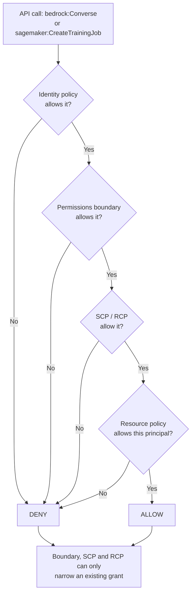
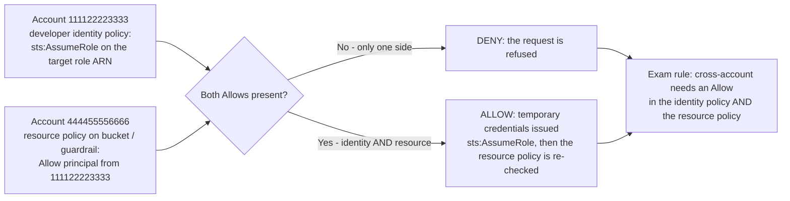
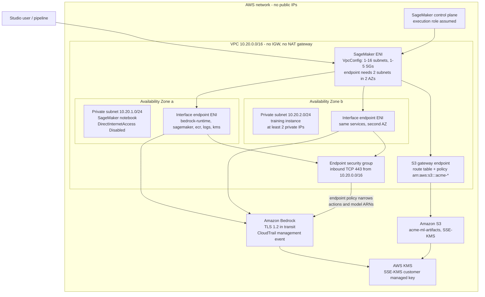
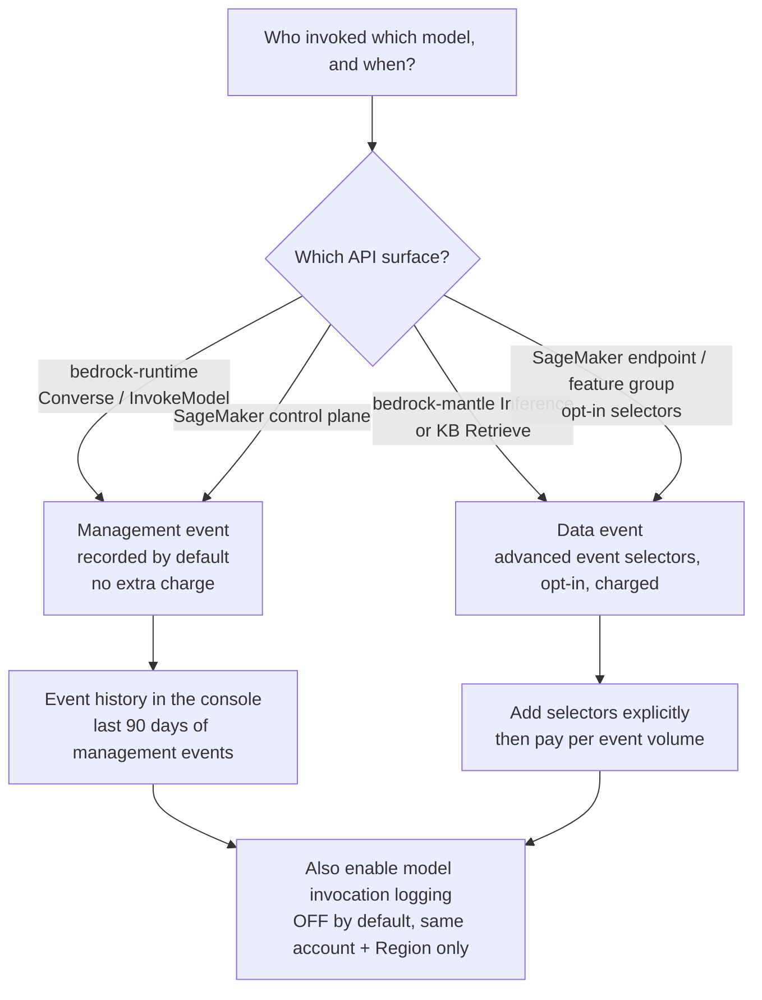
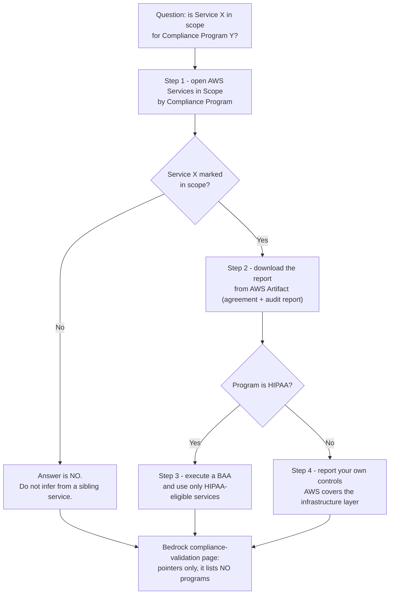

# Security, IAM and Compliance for AI Workloads

Security is the second-heaviest domain on the AIF-C01 exam: **Domain 2 "Security, Compliance, and Governance" carries 24 %** of the score, out of a **65-question** exam (50 scored + 15 unscored) with no penalty for guessing. What makes it hard is not the vocabulary — it is that AWS phrases the *same* requirement in four different places, and the exam rewards you for knowing which place is authoritative. "Is Bedrock HIPAA compliant?" has a different correct answer depending on whether you read a marketing page, the service's own documentation, or the AWS Services in Scope table.

```text
====================================================================
 SECURITY DECISION MAP FOR AI/ML ON AWS        (digest 06 Oct 2026)
====================================================================
 WHO CAN DO WHAT ....... IAM identity policy + resource policy
                         + permissions boundary + SCP/RCP
                         -> all FOUR cap; NONE of them grants
 WHO ASSUMES THE ROLE ... SageMaker execution / pipeline /
                         service / service-linked (Studio Classic)
                         Bedrock service role (+ aws:SourceAccount)
 WHERE DOES DATA LIVE ... VPC: 1-16 subnets, 1-5 security groups,
                         >=2 subnets in >=2 AZs for an endpoint
                         7 Bedrock PrivateLink services, TCP 443
                         S3 gateway endpoint = free
 HOW IS IT ENCRYPTED ... in transit: TLS 1.2 minimum
                         at rest: SSE-S3 default, SSE-KMS CMK option
                         cross-account S3 -> YOUR customer key
 HOW IS IT LOGGED ...... CloudTrail management events = default/free
                         data events = opt-in, charged
                         model invocation logging = OFF by default
 IS IT COMPLIANT ....... AWS Services in Scope + AWS Artifact
                         HIPAA-eligible service + BAA (never "certified")
                         Bedrock: ISO, SOC, CSA STAR L2, GDPR,
                         HIPAA eligible, FedRAMP High (GovCloud US-West)
====================================================================
```

> [!NOTE]
> **How to read this lesson.** Three rules apply throughout. (1) **Numbers are examinable**: `1–16` subnets, `1–5` security groups, **7** PrivateLink services, **90 days** of CloudTrail event history, **100 KB** invocation-log body, **≤30 days** for `aws_review` retention, **50 %** Rekognition confidence. (2) **Wording is examinable**: "HIPAA-eligible" is never "HIPAA certified", and a page that *points* to compliance programs is not a page that *lists* them. (3) **Anything AWS does not confirm first-party is flagged**, never taught as recall material — the flags are collected at the end of the lesson.

By the end of this lesson you will be able to:

- name every IAM role type an AI workload can use and say who assumes it;
- write a least-privilege SageMaker execution role and explain why `AmazonSageMakerFullAccess` still needs a second S3 statement;
- apply the cross-account rule correctly: an Allow is required in **both** the identity policy **and** the resource policy;
- choose between **SSE-S3** and **SSE-KMS** (and know when only one is possible);
- design a private ML VPC: gateway endpoint vs. interface endpoint vs. NAT, and why SageMaker endpoints need **two subnets in two Availability Zones**;
- separate CloudTrail **management** events from **data** events for `bedrock-runtime`, `bedrock-mantle` and SageMaker;
- prove a compliance claim the AWS way: Services in Scope → **AWS Artifact** → BAA for HIPAA-eligible services;
- defend the **comparative verdict**: IAM vs. shared keys, VPC endpoint vs. NAT, SSE-KMS vs. SSE-S3.

---

## 1. Shared responsibility, and what "AI security" adds

### 1.1 The sentence AWS actually publishes

Amazon Bedrock's own security documentation does not hand you a checklist. It says responsibility *"is determined by the sensitivity of your data, your company's compliance objectives, and applicable laws and regulations."* That sentence is the whole philosophy: AWS secures the infrastructure and the service, you secure **what you put into it and who is allowed to touch it** — and the sensitivity of an AI workload (prompts, embeddings, fine-tuning data, model outputs) is the variable the exam keeps testing.

### 1.2 The split, layer by layer

| Layer | AWS is responsible for | You are responsible for | Exam hook |
|---|---|---|---|
| **Physical / host** | Regions, availability, hardware | Placement and Region choice | Data residency starts here |
| **Identity** | IAM service itself | Role trust policies, least privilege, `iam:PassRole`, boundaries, SCPs | "All four cap, none grants" |
| **Network** | VPC plumbing, PrivateLink fabric | Subnets, route tables, security groups, endpoint policies | Internet-free ⇒ endpoints, not NAT |
| **Data at rest** | KMS service, S3 service | Key choice (SSE-S3 vs SSE-KMS), key policies, grants | Cross-account ⇒ **your** CMK |
| **Data in transit** | TLS termination in AWS services | TLS 1.2 minimum in your client and VPC paths | "1.2" is the number |
| **AI content** | Bedrock service behaviour | Guardrails, PII filters, moderation, model selection | Moderate **both** directions |
| **Audit** | CloudTrail, Config, GuardDuty services | Turning them on, selectors, retention, log destinations | Model invocation logging is **off** by default |
| **Compliance** | Reports, scope, Artifact | Which services you use, and your own controls | Evidence lives in **AWS Artifact** |

- **📚 Did you know?** AWS publishes **143 compliance offerings** across its services. The count is a distraction on purpose: the exam never asks for the total, it asks whether *this specific service* is *in scope for this specific program* — and the only authoritative answer is the **AWS Services in Scope by Compliance Program** table, not a service marketing page.

### 1.3 The first trap: "HIPAA certified" does not exist

There is **no HIPAA certification** for AWS, for Amazon Bedrock, for SageMaker, or for any cloud service provider. The correct phrasing — and the phrasing the exam uses — is:

1. sign a **Business Associate Agreement (BAA)** with AWS, and
2. use only **HIPAA-eligible services** to store or process protected health information (PHI).

AWS further maps the HIPAA Security Rule to **FedRAMP** and **NIST SP 800-53** (guidance for which is SP 800-66), which is why those two names appear together in every correct HIPAA option.

---

## 2. Identity: the roles behind every AI job

### 2.1 The role types, in one table

SageMaker alone documents four kinds of role, and Bedrock adds two more. Learn who *assumes* each one — that is what the question always tests.

| Role type | Assumed by | Trust principal | Key permissions |
|---|---|---|---|
| **SageMaker execution role (job)** | SageMaker at job runtime | `sagemaker.amazonaws.com` | S3 in/out, ECR pull, CloudWatch logs, KMS |
| **Domain / space / user role** | SageMaker for a Studio identity | `sagemaker.amazonaws.com` | per-persona via Role Manager (**3 personas**) |
| **Pipeline execution role** | Pipelines → each step | `sagemaker.amazonaws.com` | step APIs + S3 `JsonGet`; creator needs `iam:PassRole` |
| **Service-linked role** | SageMaker automatically | AWS-managed | narrow, fixed — **Studio Classic only** |
| **Bedrock service role** (customization, agents, KB, Flows, evals) | `bedrock.amazonaws.com` | `bedrock.amazonaws.com` + `aws:SourceAccount` | your S3 buckets + KMS |
| **Cross-account role** | other accounts via `sts:AssumeRole` | other account / `AWS:PrincipalArn` | bounded by identity **and** resource policy |
| **Boundary-attached role** | as base role | unchanged | **capped** by the boundary |
| **Bedrock project / bearer token** | app using an API key | — | `bedrock-mantle:*` scoped to a project ARN |

Two details worth memorising:

- **`ExecutionRoleSessionNameMode = USER_IDENTITY`** puts the *end user* (not a shared job name) into CloudTrail — the setting that turns "the job did it" into "Priya's credentials did it".
- The **Role Manager** personas are **Data scientist**, **MLOps** and **SageMaker AI compute** — three roles, not a free-text list.

### 2.2 Example 1 — a least-privilege SageMaker execution role

```json
{"Version":"2012-10-17","Statement":[
 {"Effect":"Allow","Principal":{"Service":"sagemaker.amazonaws.com"},"Action":"sts:AssumeRole"},
 {"Effect":"Allow","Action":["sagemaker:CreateTrainingJob","sagemaker:DescribeTrainingJob",
  "sagemaker:CreateModel","sagemaker:CreateEndpoint","sagemaker:InvokeEndpoint"],
  "Resource":"arn:aws:sagemaker:us-east-1:111122223333:*"},
 {"Effect":"Allow","Action":["s3:GetObject","s3:PutObject","s3:ListBucket"],
  "Resource":["arn:aws:s3:::acme-ml-artifacts","arn:aws:s3:::acme-ml-artifacts/*"]},
 {"Effect":"Allow","Action":["logs:CreateLogGroup","logs:PutLogEvents"],
  "Resource":"arn:aws:logs:us-east-1:111122223333:log-group:/aws/sagemaker/*"}]}
```

Four statements, one account (`111122223333`), one bucket (`acme-ml-artifacts`), one Region (`us-east-1`). Compare this with the managed policy in the next subsection: the difference *is* the exam answer.

### 2.3 The `AmazonSageMakerFullAccess` S3 caveat

AWS documents a specific restriction inside `AmazonSageMakerFullAccess`: **certain S3 actions are granted only on buckets and objects whose names contain `SageMaker`, `Sagemaker`, `sagemaker` or `aws-glue`**, plus a short list of actions that apply to any S3 resource. Consequences:

- a bucket named `acme-ml-artifacts` is **not** covered — you must attach a second policy, exactly as in Example 1;
- an option claiming "FullAccess grants `s3:*` on every bucket in the account" is **false**;
- an option claiming "FullAccess grants no S3 permissions" is equally false.

The practical lesson is broader than S3: **a managed policy is a starting point, not a design**. The exam repeatedly rewards the candidate who says "customer-managed policy scoped to the resource ARN".

### 2.4 Example 2 — allow one model family, deny another

```json
{"Version":"2012-10-17","Statement":[
 {"Sid":"Allow","Effect":"Allow",
  "Action":["bedrock:InvokeModel","bedrock:InvokeModelWithResponseStream",
            "bedrock:Converse","bedrock:ConverseStream"],
  "Resource":["arn:aws:bedrock:us-east-1::foundation-model/anthropic.claude-*",
              "arn:aws:bedrock:us-east-1:111122223333:inference-profile/us.*"]},
 {"Sid":"Deny","Effect":"Deny",
  "Action":["bedrock:InvokeModel","bedrock:InvokeModelWithResponseStream"],
  "Resource":"arn:aws:bedrock:*::foundation-model/meta.*"}]}
```

Note the coupling: denying `InvokeModel` **plus** `InvokeModelWithResponseStream` also denies `Converse`/`ConverseStream`, because the latter are built on the former. To enforce this org-wide you leave the account boundary and write an **SCP** over `bedrock:Invoke*`, `bedrock:Converse*` and `sagemaker:InvokeEndpoint*`.

### 2.5 Example 3 — a Bedrock customization service role that resists the confused deputy

```json
{"Version":"2012-10-17","Statement":[
 {"Sid":"AllowBedrockServicePrincipalUnderConditions","Effect":"Allow",
  "Principal":{"Service":"bedrock.amazonaws.com"},"Action":"sts:AssumeRole",
  "Condition":{"StringEquals":{"aws:SourceAccount":"111122223333"}}},
 {"Effect":"Allow","Action":["s3:GetObject","s3:ListBucket"],
  "Resource":["arn:aws:s3:::acme-train","arn:aws:s3:::acme-train/*"]},
 {"Effect":"Allow","Action":["s3:PutObject"],"Resource":"arn:aws:s3:::acme-metrics/*"},
 {"Effect":"Allow","Action":["kms:Decrypt","kms:GenerateDataKey"],
  "Resource":"arn:aws:kms:us-east-1:111122223333:key/1234-abcd"}]}
```

Three habits are packed into this policy:

1. **`aws:SourceAccount`** in the trust policy — the confused-deputy guard AWS recommends for every Bedrock service role (customization, import, batch, agents, knowledge bases, Flows, evaluations);
2. **`aws:SourceArn`** on top of it for job-level scope;
3. for Bedrock specifically, **`iam:PassedToService = bedrock.amazonaws.com`** where the caller passes a role — and a matching **key-policy** statement so KMS actually allows the job.

### 2.6 How a request is evaluated: everything caps, nothing grants



The rule the exam keeps rephrasing: **a permissions boundary, a service control policy (SCP) and a resource control policy (RCP) all cap maximum possible permissions — none of them grants anything.** A boundary with no identity policy attached gives a user *zero* effective permissions, not the boundary's permissions.

### 2.7 Example 4 — a permission boundary capping an ML developer

```json
{"Version":"2012-10-17","Statement":[
 {"Effect":"Allow","Action":["sagemaker:*","s3:*","logs:*","ecr:*"],"Resource":"*"},
 {"Effect":"Deny","Action":["sagemaker:DeleteModel","sagemaker:DeleteEndpoint"],"Resource":"*"}]}
```

Effective permission = identity policy **∩** boundary. The developer keeps whatever their identity policy allows, but can never exceed these four services, and can never delete a model or an endpoint even if their identity policy says `sagemaker:*`.

**Order the steps of building that role:**

```dragdrop
{
  "question": "Order the steps of building a least-privilege SageMaker execution role, the way AWS documents them:",
  "items": [
    "Step 3 - attach the customer-managed policy that scopes S3 to arn:aws:s3:::acme-ml-artifacts",
    "Step 1 - create the IAM role with trust policy Principal sagemaker.amazonaws.com and sts:AssumeRole",
    "Step 2 - decide the job's true needs: which SageMaker APIs, which bucket, which log group, which KMS key",
    "Step 4 - optionally attach a permissions boundary that caps the role at sagemaker, s3, logs and ecr",
    "Step 5 - pass the role to the job with iam:PassRole and verify the session name in CloudTrail"
  ],
  "correctOrder": [
    "Step 1 - create the IAM role with trust policy Principal sagemaker.amazonaws.com and sts:AssumeRole",
    "Step 2 - decide the job's true needs: which SageMaker APIs, which bucket, which log group, which KMS key",
    "Step 3 - attach the customer-managed policy that scopes S3 to arn:aws:s3:::acme-ml-artifacts",
    "Step 4 - optionally attach a permissions boundary that caps the role at sagemaker, s3, logs and ecr",
    "Step 5 - pass the role to the job with iam:PassRole and verify the session name in CloudTrail"
  ],
  "explanation": "Trust comes first, then the honest inventory of what the job needs, then the scoped policy, then the optional cap, then the actual pass. Candidates who start with AmazonSageMakerFullAccess fail step 3: that managed policy does not cover a bucket named acme-ml-artifacts, so a second S3 statement is mandatory."
}
```

---

## 3. Bedrock identity: managed policies, resource policies and cross-account

### 3.1 Seven managed policies — and their dates

Amazon Bedrock ships **7 AWS managed policies**, and the exam likes the timeline:

| Managed policy | Role | GA / note |
|---|---|---|
| `AmazonBedrockFullAccess` | broad Bedrock access | scopes `iam:PassRole` + `iam:PassedToService` |
| `AmazonBedrockReadOnly` | read-only | audits and reviewers |
| `AmazonBedrockLimitedAccess` | core-activity baseline | **GA 13 Jun 2025** |
| `AmazonBedrockMarketplaceAccess` | marketplace models | **GA 13 Jun 2025** |
| `AmazonBedrockMantle*` (×3) | `bedrock-mantle` project access | **GA 3 Dec 2025** |

### 3.2 Identity-based and resource-based — and why guardrails need both

Bedrock accepts **identity-based policies** (who you are) *and* **resource-based policies** (what object is being touched). **Guardrails and inference profiles take resource policies**, and AWS states that a resource policy is **required** for organization-level enforcement: to stop an entire org from invoking a model without a guardrail attached, you attach a resource policy evaluated with `bedrock:GuardrailIdentifier` and back it with an SCP. An identity policy alone cannot express "this guardrail must be present".

### 3.3 Cross-account: the Allow must exist on both sides



Concretely, for a shared S3 bucket **and** a shared guardrail:

1. Account B (`444455556666`) creates `role/CrossAccountBedrock` trusting `{"AWS":"arn:aws:iam::111122223333:root"}` **and** puts a resource policy on the bucket/guardrail allowing account A;
2. Account A attaches an identity policy with `{"Action":"sts:AssumeRole","Resource":"arn:aws:iam::444455556666:role/CrossAccountBedrock"}`;
3. both Allows are required — for KMS you must pass **your own CMK**, because an AWS-managed S3 key policy cannot be shared that way.

**Example 5 — the missing half: the resource policy on account B's bucket.**

```json
{"Version":"2012-10-17","Statement":[
 {"Sid":"AllowAccountAIdentity","Effect":"Allow",
  "Principal":{"AWS":"arn:aws:iam::111122223333:root"},
  "Action":["s3:GetObject","s3:ListBucket"],
  "Resource":["arn:aws:s3:::acme-shared","arn:aws:s3:::acme-shared/*"],
  "Condition":{"StringEquals":{"aws:PrincipalOrgID":"o-a1b2c3d4e5","s3:ExistingObjectTag/classification":"internal"}}},
 {"Sid":"DenyUnencryptedTransport","Effect":"Deny",
  "Principal":"*","Action":"s3:*",
  "Resource":["arn:aws:s3:::acme-shared","arn:aws:s3:::acme-shared/*"],
  "Condition":{"Bool":{"aws:SecureTransport":"false"}}}]}
```

Account `111122223333` (identity) plus this statement in `444455556666` (resource) = the two Allows the rule demands; the second statement additionally enforces TLS in transit on the bucket.

### 3.4 Permission boundaries, SCPs and RCPs compared

| Control | Attached to | Applies to | Effect | Grants anything? |
|---|---|---|---|---|
| **Permissions boundary** | an IAM role/identity | that identity | max possible permissions | **No** |
| **SCP (OU/account)** | the organization structure | principals in the account | max possible permissions | **No** |
| **RCP** | resources in the org | incoming requests to those resources | max possible permissions | **No** |
| **Identity policy** | an IAM identity | that identity | the actual grant | **Yes** |
| **Resource policy** | a resource (bucket, guardrail, key) | principals reaching it | grant + conditions | **Yes** |

- **📚 Did you know?** The **Role Manager** feature and the **service-linked role** path are both tied to **Studio Classic**. In Studio (the current experience) you assign **domain, space and user roles** per persona — which is why an option describing "let SageMaker create the role automatically" is a Studio Classic answer, and an option describing three personas is a Role Manager answer.

---

## 4. Encryption: at rest and in transit

### 4.1 In transit: TLS 1.2 is the number

AWS states **TLS 1.2** as the minimum in transit for these services. In CloudTrail you can verify the negotiated version through `tlsDetails.tlsVersion`. Any option offering "TLS 1.0 or higher", "SSL", or "TLS 1.3 only" is wrong in opposite directions.

### 4.2 At rest: defaults, options and the two exceptions

| Asset | At rest — default | Customer option | In transit |
|---|---|---|---|
| SageMaker notebooks, artifacts, job output | **SSE-S3** | **SSE-KMS CMK** | TLS |
| SageMaker ML storage volumes | **transient key, discarded after encrypting** | `VolumeKmsKeyId` | n/a |
| Instance OS volumes | **AWS-managed KMS key** | not selectable | n/a |
| Bedrock custom / imported models | **AWS owned keys** | **CMK** (`GenerateDataKey`) | **TLS 1.2** |
| Bedrock invocation logs | n/a until you enable them | your S3/CloudWatch + CMK | TLS 1.2 |
| Bedrock training / validation data | your S3 default | CMK + key-policy grant | TLS 1.2 |
| **S3 Express One Zone** SageMaker output | **SSE-S3 only** | **SSE-KMS unsupported** | TLS |
| Cross-Region inference payloads | per retention policy | — | **encrypted between Regions** |

Two exceptions carry disproportionate exam weight:

1. **A keyless SageMaker volume gets a transient key that is discarded after encryption** — so "SageMaker volumes are unencrypted" is false, and "you must supply a KMS key" is also false.
2. **Cross-account S3 access needs *your* CMK.** If account A reads account B's bucket, the default AWS-managed key policy of account B will not cooperate; account A must supply and control a customer managed key.

### 4.3 Choosing between SSE-KMS and SSE-S3 in one sentence

**SSE-S3** is the default, has no key-management overhead and no KMS request charges; **SSE-KMS** gives you a customer managed key with an audit trail in CloudTrail, key policies and grants, and per-key rotation — and it is the only way to satisfy a cross-account requirement or a policy that demands CMK enforcement. AWS Config rules such as `sagemaker-endpoint-config-kms-key-required` and `sagemaker-featuregroup-encryption-at-rest` exist precisely to *detect* when you kept the default.

---

## 5. Network isolation: VPCs, gateway endpoints and PrivateLink

### 5.1 The `VpcConfig` contract

SageMaker's `VpcConfig` accepts **1–16 subnets** and **1–5 security groups**, and SageMaker creates **elastic network interfaces (ENIs)** in each subnet. The hard rule candidates miss:

> **A SageMaker endpoint needs at least 2 subnets in at least 2 Availability Zones — even if you launch a single instance.**

Training jobs need **at least 2 private IPs** per instance (**at least 5 with EFA**), and the security group must allow **inbound TCP 443** on the ENI path.

### 5.2 The seven Bedrock PrivateLink services

| # | VPC endpoint service |
|---|---|
| 1 | `com.amazonaws.<region>.bedrock` |
| 2 | `com.amazonaws.<region>.bedrock-runtime` |
| 3 | `com.amazonaws.<region>.bedrock-agent` |
| 4 | `com.amazonaws.<region>.bedrock-agent-runtime` |
| 5 | `com.amazonaws.<region>.bedrock-fips` |
| 6 | `com.amazonaws.<region>.bedrock-runtime-fips` |
| 7 | `com.amazonaws.<region>.bedrock-mantle` |

With PrivateLink you get: **no internet gateway, no NAT, no VPN or Direct Connect requirement, and no public IPs**. Private DNS **enabled** means your code does not change; private DNS **disabled** means you rewrite calls to `{vpce-id}.bedrock-runtime.{region}.vpce.amazonaws.com`. The endpoint's security group must allow **inbound 443**, and you can attach a **custom endpoint policy** to narrow which actions or model ARNs are reachable.

### 5.3 Four VPC patterns and what they cost

| Pattern | Components | Use when | Cost note |
|---|---|---|---|
| **A — Private subnets + S3 gateway endpoint** | ≥2 AZs, gateway endpoint + policy, SG 443, no IGW/NAT | only S3 + AWS APIs | gateway endpoint **free**; interface endpoints hourly + per-GB |
| **B — + interface endpoints (PrivateLink)** | `bedrock`, `bedrock-runtime`, `sagemaker`, `ecr`, `logs`, `kms` per subnet | internet-free Bedrock/SageMaker | hourly + processing; **replaces NAT** |
| **C — + public subnets & NAT gateway** | IGW, public subnets, **NAT gateway** + Elastic IP | a dependency with **no interface endpoint**, non-AWS targets | NAT hourly + per-GB + EIP |
| **D — fully internet-free** | A or B, private package mirror / ECR, no IGW | regulated / data-residency workloads | removes NAT + IGW cost |
| **Enforcement** | `sagemaker:VpcSubnets`; Config `…-instance-inside-vpc`, `…-no-direct-internet-access` | all of the above | — |

### 5.4 Example 6 — a working private Bedrock + SageMaker layout (Pattern B)

1. `10.20.0.0/16` with private `10.20.1.0/24` (AZ-a) and `10.20.2.0/24` (AZ-b); **no IGW route, no NAT**;
2. **S3 gateway endpoint** attached to both route tables, with an endpoint policy limited to `arn:aws:s3:::acme-*`;
3. **interface endpoints** in both subnets for `bedrock-runtime`, `bedrock`, `sagemaker`, `sagemaker.api`, `sagemaker.runtime`, `ecr.api`, `ecr.dkr`, `logs` and `kms`; endpoint security group **inbound 443 from `10.20.0.0/16`**;
4. `VpcConfig = {Subnets:[a,b], SecurityGroupIds:[sg-ml]}`; `sg-ml` egress limited to 443 toward the endpoint security group; notebook `DirectInternetAccess = Disabled`;
5. **flow**: Studio user → SageMaker ENI → endpoint ENI → Bedrock runtime over the AWS network with TLS 1.2. CloudTrail records the call as a **management** event in the source Region, and GuardDuty AI Protection reads it through its service-linked channel. **Fallback** (Pattern C) adds an IGW, public subnets and a **NAT gateway** only when a dependency has no interface endpoint.

### 5.5 The secure VPC / ML architecture



> [!WARNING]
> **Two network traps that cost marks every sitting.**
> 1. **An endpoint needs ≥2 subnets in ≥2 AZs even for one instance.** An option offering "one subnet is enough for a single-instance endpoint" is always wrong — the AZ requirement is in the API contract, not a best practice.
> 2. **"Use a NAT gateway to keep traffic private" is backwards.** A NAT gateway routes traffic to the internet through AWS; an internet-free design uses **gateway endpoints (S3, free)** and **interface endpoints / PrivateLink**, with NAT only as a **fallback** for dependencies that expose no interface endpoint. Security-group inbound on the ENI path is **443**, not 80.

---

## 6. Audit: CloudTrail, invocation logging, GuardDuty and Config

### 6.1 Management vs. data events — the free/paid line

| Call | CloudTrail event type | Cost |
|---|---|---|
| SageMaker control-plane APIs (default) | **management** | included |
| SageMaker opt-in data events (`AWS::SageMaker::Endpoint`, `FeatureGroup`, …) | **data** | opt-in, **charged** |
| `bedrock-runtime` → `Converse`, `InvokeModel` | **management** | **free** |
| `bedrock-mantle` → `Inference` | **data** | opt-in, **charged** |
| Knowledge base `Retrieve` | **data** | opt-in, **charged** |



**Management events are free and on by default; data events are opt-in and charged.** CloudTrail **event history** retains **90 days** of management events in the console.

### 6.2 Model invocation logging is a separate switch — and it is off

Bedrock's **model invocation logging is off by default**. When you enable it:

- destinations are **CloudWatch Logs and/or S3**, and they must be in the **same account and the same Region**;
- an inline prompt/completion body of **≤100 KB** is stored inline — larger bodies go to an S3 prefix under `data/`;
- logging is *not* CloudTrail: CloudTrail tells you *who called what*, invocation logging tells you *what was said*.

### 6.3 GuardDuty AI Protection

GuardDuty's **AI Protection** reads Bedrock, AgentCore and SageMaker **data events** plus management events, through a **service-linked CloudTrail channel that GuardDuty creates for you**. Notable findings:

| Finding / behaviour | Meaning |
|---|---|
| `Impact:IAMUser/AnomalousModelInvocation` | unusual model-calling pattern |
| `…/CostHarvesting` | resource drained for token cost |
| `Impact:IAMUser/PromptInjection.Direct` | guardrail intervened on an input |
| MITRE ATLAS **AML.T0040** | the mapped technique |
| Foundational plan | flags guardrail removal, training-data source changes, **disabled invocation logging**, anomalous notebook/training-job creation, exfiltrated EC2 credentials |
| Lambda Protection | covers Bedrock **agents** |

These are **findings and alerts**, not blocks: GuardDuty tells you a guardrail was intervened on; only the guardrail itself blocks content.

### 6.4 AWS Config: rules and packs for AI

Config rules prefixed `sagemaker-` include:

- `sagemaker-notebook-no-direct-internet-access`
- `sagemaker-notebook-instance-inside-vpc`
- `sagemaker-endpoint-config-kms-key-required`
- `sagemaker-featuregroup-encryption-at-rest`

And there are three conformance packs aimed at AI: **Best Practices for Amazon Bedrock**, **Best Practices for Amazon SageMaker AI** and **Best Practices for AI/ML Supporting Infrastructure**. NIST SP 800-171 control **3.1.1** maps to `sagemaker-notebook-no-direct-internet-access`, and AWS states that sample templates **do not guarantee passing** a compliance audit.

- **📚 Did you know?** A **Guardrail removal** and a **flip of model invocation logging to disabled** are both treated as security events by GuardDuty's Foundational plan. That is unusual — most "configuration drift" is only visible in Config — and it is a strong hint that the exam considers "quietly turning off your safety net" an attack, not an admin chore.

### 6.5 Status dashboard (October 2026)

| Control / feature | Status | Note |
|---|---|---|
| GuardDuty **AI Protection** | GA | Bedrock + AgentCore + SageMaker data events |
| Config *Best Practices for Amazon Bedrock* pack | GA | deploy alongside the infrastructure pack |
| Bedrock PrivateLink endpoints | GA | including `bedrock-mantle` |
| Bedrock retention modes + condition keys | GA (API/SDK) | **no console UI at launch** |
| `AmazonBedrockLimitedAccess` | GA **13 Jun 2025** | core-activity baseline |
| `AmazonBedrockMantle*` policies | GA **3 Dec 2025** | 3 policies |
| Bedrock **FedRAMP High** | Authorized — **GovCloud (US-West)** | per-model matrix tracked separately |
| Bedrock **HIPAA eligible** | Eligible | BAA needed; "eligible" ≠ "certified" |
| Bedrock **PCI DSS** scope | **not stated on Bedrock's own pages** | do not assert |
| S3 Express One Zone SageMaker output | **SSE-S3 only** | SSE-KMS unsupported |

---

## 7. Compliance: HIPAA, AWS Artifact and what Bedrock actually publishes

### 7.1 The only authoritative chain



Three rules fall out of that diagram:

1. **AWS Services in Scope** is the only authoritative "is it covered" table — ✓ means in scope in the current reports;
2. **AWS Artifact** is where the actual SOC / ISO / FedRAMP reports live — never a service page, never a console link labelled "Compliance";
3. for HIPAA you need a **BAA** plus **HIPAA-eligible services**; AWS maps the Security Rule to **FedRAMP + NIST 800-53**.

### 7.2 What Amazon Bedrock publishes

Amazon Bedrock's published compliance set is: **ISO**, **SOC**, **CSA STAR Level 2**, **GDPR**, **HIPAA eligible**, and **FedRAMP High in AWS GovCloud (US-West)** — plus a **FedRAMP per-model matrix (published 18 Sep 2026)** covering Class C/D models and **IL4/IL5**.

> [!WARNING]
> **The compliance-page trap.** Bedrock's `compliance-validation.html` **lists no compliance programs at all** — it contains only *pointers* to the AWS Services in Scope table and to **AWS Artifact**. An option claiming "the Bedrock compliance page enumerates every program the service is in scope for" is testing whether you actually opened the page. Likewise, **PCI DSS does not appear anywhere on Bedrock's own security-compliance page** — a 2024 conference deck and *AgentCore's* page mention PCI, neither of which proves Bedrock's scope. **Do not assert it.**

### 7.3 Numbers worth carrying into the exam

| Item | Value |
|---|---|
| AWS compliance offerings | **143** |
| Bedrock published programs | **ISO · SOC · CSA STAR Level 2 · GDPR · HIPAA eligible · FedRAMP High (GovCloud US-West)** |
| FedRAMP per-model matrix | published **18 Sep 2026** (Class C/D, IL4/IL5) |
| HIPAA certification for any CSP | **does not exist** |
| HIPAA mapping | Security Rule → **FedRAMP + NIST 800-53** (SP 800-66) |
| Where reports live | **AWS Artifact** |
| CloudTrail event history | **90 days** of management events |
| AIF-C01 Domain 2 weight | **24 %** of **65** questions |

- **📚 Did you know?** The phrase "in scope" has a precise meaning: it says the *service* was included in the auditor's report for that period — not that your *workload* is compliant. That is why every compliance option that says "enabling GuardDuty achieves HIPAA compliance" is false: you can be in scope and still fail your own obligations under the shared responsibility model.

---

## 8. Data governance: retention, residency and content moderation

### 8.1 Retention modes for Bedrock

Retention modes are `none`, `default`, `aws_review`, `provider_data_share` and `inherit`, with scope flowing **project → account → model default**, **per Region, with no propagation between Regions**. The examinable facts:

- **`aws_review` keeps data inside the AWS boundary for ≤30 days** and it is **never given to the model provider**;
- the control plane condition keys are `bedrock:DataRetentionMode` / `bedrock-mantle:DataRetentionMode`, enforceable with SCP and IAM;
- **fine-tuning data is used only to fine-tune** — never to train the base Titan models, and **nothing is stored after the job** — but the fine-tuned model can still **replay** it, so filter or delete sensitive rows before you start;
- at launch there is **no console UI** for retention modes: API/SDK only.

### 8.2 Example 7 — enforcing zero data retention org-wide (SCP)

```json
{"Version":"2012-10-17","Statement":[
 {"Effect":"Deny","Action":["bedrock-mantle:PutAccountDataRetention",
 "bedrock-mantle:CreateProject","bedrock-mantle:UpdateProject"],
 "Resource":"*","Condition":{"StringNotEquals":{"bedrock-mantle:DataRetentionMode":"none"}}}]}
```

Effect: only `none` can ever be set; a model that *requires* `aws_review` then returns `ValidationException` / `status: unavailable`. The control-plane variant swaps in `bedrock:PutAccountDataRetention` and `bedrock:DataRetentionMode`.

### 8.3 Cross-Region inference: Geographic vs Global

| Mode | Where processing runs | Price | Requirement |
|---|---|---|---|
| **Geographic** cross-Region inference | stays inside the geography (US / EU / APAC) | standard | data-residency answer |
| **Global** cross-Region inference | any commercial Region worldwide | **~10 % cheaper** on tokens | SCP must allow `aws:RequestedRegion = "unspecified"` |

CloudTrail logs the call in the **source Region**. Neither mode adds a routing surcharge, and neither supports Provisioned Throughput.

### 8.4 Content moderation: the full toolbox

| Mechanism | Scope | Action |
|---|---|---|
| **Guardrails content filters** | text **and** images; user, system and model text | `BLOCK` or `NONE`; strengths `NONE/LOW/MEDIUM/HIGH` |
| **Denied topics / word filters** | inputs + outputs | block |
| **Sensitive-information (PII) filter** | inputs + outputs | **block or mask**; predefined entities or **custom regex** |
| **Contextual grounding check** | responses vs. source | block or flag ungrounded answers |
| **Rekognition `DetectModerationLabels`** | JPEG/PNG **images only** | labels + confidence (`MinConfidence` default **50 %**), A2I review |
| **Rekognition `Start/GetContentModeration`** | stored **videos** | async moderation |
| **GuardDuty `…PromptInjection.Direct`** | guardrail intervention on inputs | **finding/alert**, not a block |

Guardrails specifics from the digest: **6 filter categories** — Hate, Insults, Sexual, Violence, Misconduct and **Prompt Attack** — plus tier `CLASSIC|STANDARD` and blocked-response messaging of **1–500 characters**. PII detection is **probabilistic ML**, which is exactly why you can choose **mask** instead of **block**.

### 8.5 Rekognition moderation limits

`DetectModerationLabels` accepts **JPEG and PNG only**, uses a **3-level taxonomy** with `MinConfidence` defaulting to **50 %**, and works with Amazon A2I for human review. The hard limit AWS states in writing: the APIs **do not detect illegal content such as CSAM** — no confidence threshold fixes that, and no exam option should claim otherwise.

- **📚 Did you know?** AWS's own guardrail guidance says: *"Disable Invocation Logs if you do not want blocked content to appear as plain text in the logs."* In other words, the log you enable for auditing can become the place where the very content you blocked is stored verbatim — a genuine design trade-off, and a rare case where AWS explicitly recommends turning a logging feature **off**.

---

## 9. Comparative verdict

> [!IMPORTANT]
> **Comparative Verdict — IAM roles vs. long-lived shared keys, VPC endpoint vs. NAT gateway, SSE-KMS vs. SSE-S3**
> - **IAM role (temporary STS credentials) vs. long-lived access keys / shared credentials.** The role is always the answer for AI workloads: an execution role is *assumed by the service* with a trust policy, its session can be named (`ExecutionRoleSessionNameMode = USER_IDENTITY`) so CloudTrail shows the end user, and credentials expire on their own. Long-lived keys leak through notebooks, git history and CI logs, cannot be scoped by trust policy, cannot express `aws:SourceAccount` confused-deputy protection, and give an attacker a credential with no session to revoke. If an option proposes "give the scientist an access key so the training job can reach S3", it has failed on every axis AWS documents.
> - **VPC endpoint (gateway for S3, interface/PrivateLink for Bedrock & SageMaker) vs. NAT gateway.** The endpoint keeps traffic **inside the AWS network with no public IPs, no IGW and no NAT**; the S3 **gateway endpoint is free**, interface endpoints cost hourly plus processing and *replace* NAT for those services. A NAT gateway is a **fallback** for dependencies that expose no interface endpoint — it charges hourly, per GB and per Elastic IP, and it still sends traffic out toward the internet. For an internet-free, data-residency design, endpoints are the architecture; NAT is the exception you document, not the goal you aim at.
> - **SSE-KMS (customer managed key) vs. SSE-S3 (SSE-S3 default).** SSE-S3 is the SageMaker default for notebooks, artifacts and job output: zero key management, no KMS request charges, fully encrypted. SSE-KMS adds a CMK you control, key policies, grants, rotation and per-key CloudTrail audit — and it becomes **mandatory** when you need **cross-account access** (an AWS-managed key policy cannot be shared), when a Config rule such as `sagemaker-endpoint-config-kms-key-required` enforces it, or when your policy demands customer-managed encryption. Note the two documented exceptions where the choice disappears: **S3 Express One Zone output supports SSE-S3 only**, and **SageMaker ML storage volumes use a transient key that is discarded after encryption** unless you set `VolumeKmsKeyId`.

| If the question says… | Answer | Why the others fail |
|---|---|---|
| "…the job must read exactly one S3 bucket" | **Customer-managed execution role scoped to the bucket ARN** | `AmazonSageMakerFullAccess` is name-pattern limited; service-linked roles are Studio Classic only |
| "…credentials leaked from a notebook" | **Role + STS, delete the key** | a boundary or SCP does not revoke a leaked secret |
| "…no prompts may leave the EU geography" | **Geographic cross-Region inference** | Global mode routes worldwide (~10 % cheaper) |
| "…traffic must never touch the internet" | **S3 gateway + Bedrock/SageMaker interface endpoints** | NAT gateway is internet-bound; a gateway endpoint alone does not reach Bedrock |
| "…cross-account bucket read for training data" | **Your own SSE-KMS CMK + both Allows** | SSE-S3 cannot be shared; one-sided policy fails |
| "…prove who invoked Claude, free of charge" | **CloudTrail on `bedrock-runtime` (management events)** | `bedrock-mantle` inference is a charged data event |
| "…find the SOC report for Bedrock" | **AWS Artifact** | the Bedrock compliance page lists no programs |
| "…store PHI with Bedrock" | **BAA + HIPAA-eligible services** | "HIPAA certified" does not exist for any CSP |

---

## 10. Exam traps and the numbers worth memorizing

> [!WARNING]
> **The traps that cost marks on this exact material:**
> 1. **"HIPAA certified" does not exist** — for AWS or any cloud provider. The correct pair is **BAA + HIPAA-eligible service**, and AWS maps the Security Rule to **FedRAMP + NIST 800-53**.
> 2. **Bedrock's `compliance-validation.html` lists no programs** — only pointers to *Services in Scope* and **AWS Artifact**. PCI DSS is **not** stated on Bedrock's own pages; do not assert it.
> 3. **`Converse` / `InvokeModel` on `bedrock-runtime` are CloudTrail MANAGEMENT events (free)**; `bedrock-mantle` **Inference is a DATA event (opt-in, charged)** — the surface decides, not the verb.
> 4. **Model invocation logging is OFF by default** — and it is not CloudTrail. Destinations must be in the **same account and Region**; inline bodies are **≤100 KB**.
> 5. **Cross-account needs an Allow in BOTH the identity policy AND the resource policy.** One side is always a deny.
> 6. **SageMaker endpoints need ≥2 subnets in ≥2 AZs**, even for a single instance; `VpcConfig` accepts **1–16 subnets** and **1–5 security groups**.
> 7. **Boundaries, SCPs and RCPs cap — they never grant.** A boundary alone yields zero permissions.
> 8. **`AmazonSageMakerFullAccess` does not reach arbitrary buckets** — only names containing `SageMaker`/`Sagemaker`/`sagemaker`/`aws-glue`, plus a short any-resource list.
> 9. **NAT is a fallback, not a design goal**; the internet-free answer is gateway + interface endpoints, with **TCP 443** inbound on the endpoint security group.
> 10. **GuardDuty AI Protection creates its own service-linked CloudTrail channel** — you do not configure one — and `PromptInjection.Direct` is a **finding**, not a block.

### 10.1 The testable numbers

| Metric | Value |
|---|---|
| `VpcConfig` | subnets **1–16**, security groups **1–5** |
| Endpoint AZs / training private IPs | **≥2 AZs** / **≥2** (**≥5 with EFA**) |
| Bedrock PrivateLink services / ENI SG | **7** / **TCP 443** |
| Invocation-log inline body | **≤100 KB** (else S3 `data/`) |
| Model invocation logging | **off by default** |
| CloudTrail event history | **90 days** of management events |
| `bedrock-runtime` / `bedrock-mantle` inference | **management, free** / **data, charged** |
| `aws_review` retention window | **≤30 days** inside the AWS boundary |
| Rekognition `MinConfidence` default | **50 %** |
| AWS compliance offerings | **143** |
| Bedrock managed policies / Role Manager personas | **7** / **3** |
| AIF-C01 questions / Domain 2 weight | **65** / **24 %** |
| In-transit minimum | **TLS 1.2** |
| Global cross-Region inference saving | **~10 %** |

### 10.2 Flagged as not verified in this lesson

To keep a research gap from becoming a wrong answer: **PCI DSS scope for Amazon Bedrock** (absent from Bedrock's own pages); **SageMaker's HIPAA eligibility** (the HIPAA Eligible Services Reference was not retrieved); **Region availability of GuardDuty AI Protection**; **per-rule contents of the three AI conformance packs**; **exact prices** for NAT gateways, interface endpoints, PrivateLink and GuardDuty AI Protection (cost statements here are directional); **AIF-C01 per-topic weights** (only the domain weights 20/24/28/14/14 are published); and **Role Manager availability for new customers**. Treat every one of them as "check the source page before you assert it".

---

## Practice Questions

```question
{
  "id": "aid-14-q1",
  "type": "multiple-choice",
  "question": "A data scientist must run SageMaker training jobs that read from exactly one S3 bucket named acme-ml-artifacts. What is the BEST approach?",
  "options": [
    "Attach AmazonSageMakerFullAccess, because it already scopes S3 correctly",
    "Create a customer-managed execution role whose policy allows only the actions the job needs and is limited to that bucket ARN, trusted by sagemaker.amazonaws.com",
    "Use a SageMaker service-linked role assumed by the scientist",
    "Attach a permissions boundary with no identity policy attached"
  ],
  "correct": 1,
  "explanation": "Least privilege means a customer-managed policy scoped to arn:aws:s3:::acme-ml-artifacts. AmazonSageMakerFullAccess restricts many S3 actions to buckets/objects named SageMaker, Sagemaker, sagemaker or aws-glue, so acme-ml-artifacts would not be covered; service-linked roles are a Studio Classic path, not a scientist's job role; and a permissions boundary grants nothing on its own."
}
```

```question
{
  "id": "aid-14-q2",
  "type": "multiple-choice",
  "question": "Which statement about AmazonSageMakerFullAccess and Amazon S3 is TRUE?",
  "options": [
    "It grants s3:* on every bucket in the account",
    "It grants certain S3 actions only on buckets or objects named SageMaker, Sagemaker, sagemaker or aws-glue, plus a short list of actions on any resource",
    "It grants no S3 permissions at all",
    "It grants S3 access only through a gateway endpoint policy"
  ],
  "correct": 1,
  "explanation": "This is AWS's documented caveat verbatim: the managed policy's S3 statements are name-pattern limited, so any bucket outside those naming patterns needs a second, customer-managed statement. It does grant some S3 permissions (so 'no S3 permissions' is false), it does not grant s3:* everywhere, and endpoint policies are a network control, not the mechanism behind the managed policy."
}
```

```question
{
  "id": "aid-14-q3",
  "type": "multiple-choice",
  "question": "Which pair of statements about HIPAA on AWS is correct?",
  "options": [
    "AWS is HIPAA certified, so any AWS service may process PHI",
    "No cloud provider HIPAA certification exists; you sign a BAA and use only HIPAA-eligible services, and AWS maps the HIPAA Security Rule to FedRAMP and NIST SP 800-53",
    "Enabling GuardDuty makes the account HIPAA compliant",
    "HIPAA eligibility applies to whole accounts rather than to individual services"
  ],
  "correct": 1,
  "explanation": "There is no HIPAA certification for AWS or any CSP. The correct construct is a Business Associate Agreement plus HIPAA-eligible services, with the Security Rule mapped to FedRAMP and NIST SP 800-53 (guidance SP 800-66). GuardDuty is a detective control that supports your own obligations but never confers compliance, and eligibility is granted per service, not per account."
}
```

```question
{
  "id": "aid-14-q4",
  "type": "multiple-choice",
  "question": "Where do you download the SOC or ISO audit report that covers Amazon Bedrock?",
  "options": [
    "Amazon Bedrock console, under the Compliance tab",
    "The Bedrock compliance-validation documentation page",
    "AWS Artifact",
    "The AWS Compliance Programs marketing page"
  ],
  "correct": 2,
  "explanation": "AWS Artifact is the repository for compliance agreements and audit reports (SOC, ISO, FedRAMP and others). Bedrock's compliance-validation page lists no programs at all - it only points to the Services in Scope table and to Artifact - and the console has no compliance report tab, while the marketing page lists programs generically without reports."
}
```

```question
{
  "id": "aid-14-q5",
  "type": "multiple-choice",
  "question": "A workload must never send prompts outside the EU geography. Which setting should be used, and what is the trade-off?",
  "options": [
    "Global cross-Region inference - cheapest option, but it routes worldwide",
    "Geographic cross-Region inference - processing stays inside the geography; Global would instead save about 10% on token prices",
    "An application inference profile with aws:RequestedRegion set to unspecified",
    "Model invocation logging to an S3 bucket in eu-west-1"
  ],
  "correct": 1,
  "explanation": "Geographic cross-Region inference keeps processing within the geography (US, EU or APAC), which is the data-residency answer. Global mode is roughly 10% cheaper but may call any commercial Region, and it is the mode that requires an SCP allowing aws:RequestedRegion = unspecified. Logging to S3 records data, it does not constrain where inference runs."
}
```

```question
{
  "id": "aid-14-q6",
  "type": "multiple-choice",
  "question": "You need to prove who invoked which model and when, using bedrock-runtime, without additional CloudTrail cost. Which statement makes this possible?",
  "options": [
    "Converse and InvokeModel on bedrock-runtime are recorded as management events by default, at no additional charge",
    "bedrock-runtime inference is a data event that requires advanced event selectors",
    "Nothing is logged unless model invocation logging is enabled",
    "Amazon Bedrock does not integrate with AWS CloudTrail"
  ],
  "correct": 0,
  "explanation": "On bedrock-runtime, Converse and InvokeModel are CloudTrail management events: recorded by default and free, and the console event history keeps 90 days of them. Advanced data-event selectors are what bedrock-mantle Inference (and knowledge-base Retrieve) need - those are opt-in and charged. Model invocation logging is a separate, off-by-default feature that captures prompt content rather than identity, and Bedrock does integrate with CloudTrail."
}
```

```question
{
  "id": "aid-14-q7",
  "type": "multiple-choice",
  "question": "Which control prevents a SageMaker notebook from reaching the internet, and how is that verified?",
  "options": [
    "A VPC endpoint policy, verified by GuardDuty S3 Protection",
    "DirectInternetAccess = Disabled inside a private subnet, verified by the Config rule sagemaker-notebook-no-direct-internet-access",
    "A Deny on s3:GetObject from 0.0.0.0/0",
    "CloudTrail data events for AWS::SageMaker::NotebookInstance"
  ],
  "correct": 1,
  "explanation": "The notebook setting is DirectInternetAccess = Disabled and it must run in a private subnet with no internet gateway route; the Config rule sagemaker-notebook-no-direct-internet-access is the documented compliance check (and maps to NIST SP 800-171 control 3.1.1). Endpoint policies constrain which AWS resources are reachable, not internet egress; an S3 Deny addresses one bucket; and CloudTrail data events audit calls rather than block network paths."
}
```

```question
{
  "id": "aid-14-q8",
  "type": "multiple-choice",
  "question": "Which statement is TRUE about Amazon Bedrock's audit story?",
  "options": [
    "Model invocation logging is enabled by default in every account",
    "Model invocation logging is off by default and its CloudWatch or S3 destination must be in the same account and Region; GuardDuty AI Protection uses a service-linked CloudTrail channel that GuardDuty creates for you",
    "CloudTrail data events for Bedrock inference are always free",
    "The Bedrock compliance-validation page enumerates every program the service is in scope for"
  ],
  "correct": 1,
  "explanation": "Invocation logging is off by default, destinations must match the account and Region, and inline bodies are capped at 100 KB (larger payloads go to an S3 data/ prefix). GuardDuty AI Protection creates its own service-linked CloudTrail channel, so you do not configure one. Data events are charged (not free), and the compliance-validation page lists no programs - it only points to Services in Scope and AWS Artifact."
}
```

```question
{
  "id": "aid-14-q9",
  "type": "multiple-choice",
  "question": "A call-centre assistant must remove SSNs and phone numbers from BOTH the prompts and the model answers. Which configuration is correct?",
  "options": [
    "Guardrails sensitive-information (PII) filter set to mask on input and output, with invocation logging disabled so blocked content is not stored as plain text",
    "Rekognition DetectModerationLabels applied to the transcript",
    "A GuardDuty AI Protection finding with severity 7 or higher",
    "The Config rule sagemaker-endpoint-config-kms-key-required"
  ],
  "correct": 0,
  "explanation": "The sensitive-information filter runs on inputs and outputs and can either block or mask, with predefined entities or custom regex - masking removes the SSN while still letting the conversation continue. Rekognition moderation handles JPEG/PNG images and video, not text transcripts; GuardDuty reports prompt-injection events as findings rather than redacting content; and the KMS Config rule is an encryption check."
}
```

```question
{
  "id": "aid-14-q10",
  "type": "multiple-choice",
  "question": "Which statement BEST describes the published compliance status of Amazon Bedrock?",
  "options": [
    "FedRAMP High authorized in AWS GovCloud (US-West), and HIPAA eligible with ISO, SOC and CSA STAR Level 2 in scope",
    "Holds a blanket HIPAA certification and is PCI DSS certified according to its compliance page",
    "HIPAA certification applies because GuardDuty and Config are enabled in the account",
    "Its compliance-validation page lists 143 programs including PCI DSS"
  ],
  "correct": 0,
  "explanation": "Bedrock's published set is ISO, SOC, CSA STAR Level 2, GDPR, HIPAA eligible and FedRAMP High in AWS GovCloud (US-West), supplemented by a per-model FedRAMP matrix published 18 September 2026. No CSP holds a HIPAA certification, PCI DSS is not stated on Bedrock's own pages (so it must not be asserted), and 143 is the count of AWS compliance offerings across all services - not programs listed on any single service page."
}
```

```matching
{
  "question": "Match each security control to the layer it protects and its documented number:",
  "pairs": [
    {"left": "Permissions boundary / SCP / RCP", "right": "Identity layer - caps maximum permissions, grants nothing"},
    {"left": "S3 gateway endpoint + PrivateLink interface endpoints", "right": "Network layer - 7 Bedrock endpoint services, inbound TCP 443, gateway endpoint free"},
    {"left": "SSE-KMS customer managed key", "right": "Data-at-rest layer - required for cross-account S3, SSE-S3 unsupported on S3 Express One Zone"},
    {"left": "TLS 1.2", "right": "Data-in-transit layer - AWS minimum, visible as tlsDetails.tlsVersion in CloudTrail"},
    {"left": "CloudTrail management events", "right": "Audit layer - on by default, 90 days of event history, bedrock-runtime inference is free"},
    {"left": "GuardDuty AI Protection", "right": "Detective layer - service-linked CloudTrail channel, MITRE ATLAS AML.T0040, findings not blocks"}
  ],
  "explanation": "Each control sits at a different layer of the shared responsibility split, and the exam tests whether you can place it: boundaries and SCPs cap identity, endpoints remove internet dependency, SSE-KMS gives you a shareable customer key, TLS 1.2 is the in-transit floor, management events are the free default in CloudTrail, and GuardDuty AI Protection is a detective service that creates its own CloudTrail channel."
}
```

---

> [!WARNING]
> **Armadilhas desta lição / Lesson traps:**
> - **"HIPAA certified" never exists** — the answer is always **BAA + HIPAA-eligible services**, backed by FedRAMP and NIST 800-53;
> - **AWS Artifact is where evidence lives**, never a service page — and Bedrock's `compliance-validation.html` lists **no programs**, only pointers;
> - **`bedrock-runtime` inference = management events (free)**; **`bedrock-mantle` Inference = data events (opt-in, charged)**;
> - **Model invocation logging is off by default** and is not CloudTrail: same account, same Region, inline body **≤100 KB**;
> - **Cross-account requires an Allow on both sides** — identity policy **and** resource policy — plus **your own CMK** for KMS;
> - **An endpoint needs ≥2 subnets in ≥2 AZs even for one instance**; `VpcConfig` = **1–16 subnets, 1–5 security groups**, ENI inbound **443**;
> - **Boundaries, SCPs and RCPs cap, they never grant** — and `AmazonSageMakerFullAccess` still misses buckets outside the `SageMaker`/`aws-glue` name patterns;
> - **NAT is a fallback**, not the private design: gateway + interface endpoints are the internet-free answer;
> - **PII filter runs on inputs *and* outputs** (block or mask), Rekognition moderation is **JPEG/PNG only** with **50 %** default confidence, and GuardDuty's prompt-injection signal is a **finding**, not a block.

> [!SUCCESS]
> **Key Takeaways:**
> 1. **Identity first:** AI workloads use SageMaker **execution**, **domain/space/user**, **pipeline**, **service-linked (Studio Classic)**, **Bedrock service roles** (with `aws:SourceAccount` + `aws:SourceArn`) and cross-account roles; **Role Manager** offers **3 personas**, and `ExecutionRoleSessionNameMode = USER_IDENTITY` puts the end user in CloudTrail.
> 2. **Least privilege is the default answer:** scope policies to ARNs (bucket `acme-ml-artifacts`, log group `/aws/sagemaker/*`, account `111122223333`), remember the **`AmazonSageMakerFullAccess` name-pattern S3 caveat**, and know that **boundaries, SCPs and RCPs cap — none of them grants**.
> 3. **Cross-account and Bedrock identity:** an Allow is required in the **identity policy and the resource policy**; Bedrock ships **7 managed policies** (`LimitedAccess` and `MarketplaceAccess` **13 Jun 2025**, three `Mantle*` policies **3 Dec 2025**), and **guardrails/inference profiles take resource policies, required for org-level enforcement**.
> 4. **Encryption:** in transit **TLS 1.2** minimum; at rest **SSE-S3** is the SageMaker default and **SSE-KMS CMK** is the cross-account and Config-enforced option — with two exceptions: **S3 Express One Zone output is SSE-S3 only**, and a keyless ML volume gets a **transient key discarded after encryption**.
> 5. **Network:** `VpcConfig` = **1–16 subnets, 1–5 SGs**; endpoints need **≥2 subnets in ≥2 AZs**; training needs **≥2 private IPs (≥5 with EFA)**; Bedrock exposes **7 PrivateLink services**; the S3 **gateway endpoint is free**, interface endpoints **replace NAT**, and NAT is only a fallback.
> 6. **Audit:** CloudTrail **management events are default and free** (90 days of event history), **data events are opt-in and charged** (`bedrock-mantle` Inference, KB `Retrieve`, SageMaker endpoint/feature-group selectors); **model invocation logging is off by default** (same account + Region, **≤100 KB** inline); **GuardDuty AI Protection** creates its own service-linked channel and flags guardrail removal, logging disablement and `PromptInjection.Direct`.
> 7. **Compliance:** evidence comes from **AWS Services in Scope + AWS Artifact**; **HIPAA = BAA + HIPAA-eligible services** (never "certified"), mapped to FedRAMP + NIST 800-53; Bedrock publishes **ISO, SOC, CSA STAR Level 2, GDPR, HIPAA eligible and FedRAMP High in GovCloud (US-West)** — and **PCI DSS is not stated**, so do not assert it.
> 8. **Comparative verdict:** IAM roles over shared keys; **VPC endpoints over NAT** for internet-free designs; **SSE-KMS when sharing or enforcement demands it, SSE-S3 when the default is enough** — and always check which of the two documented exceptions applies.
