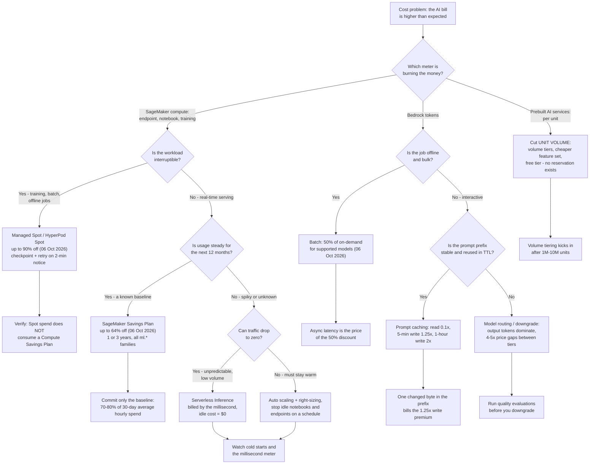
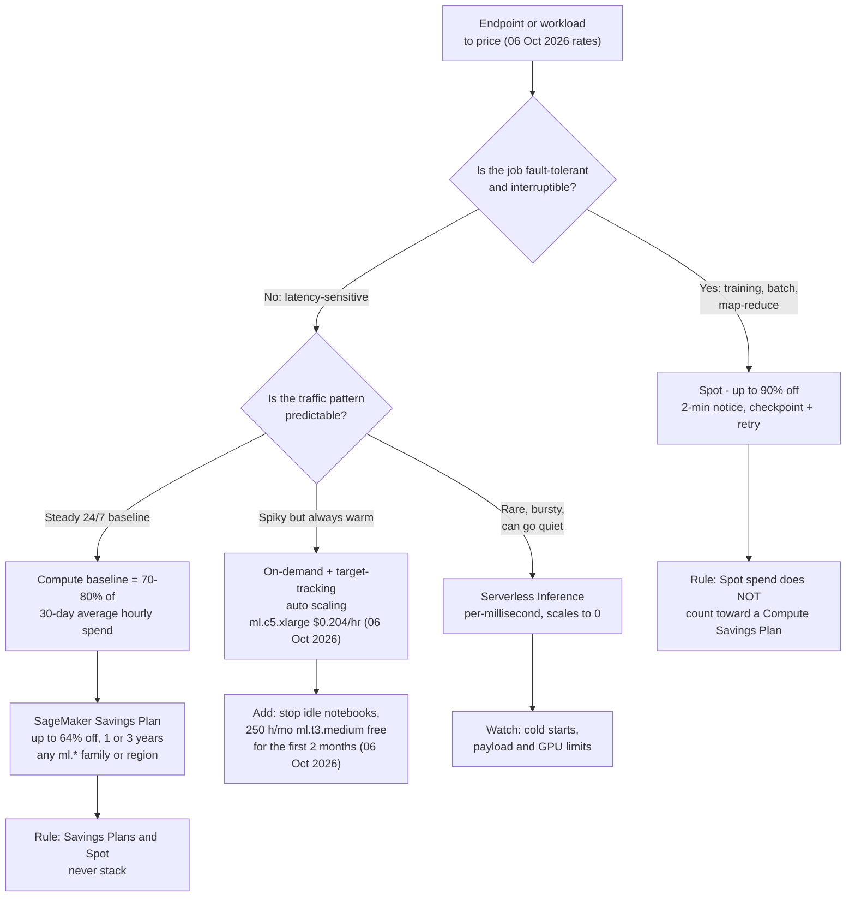
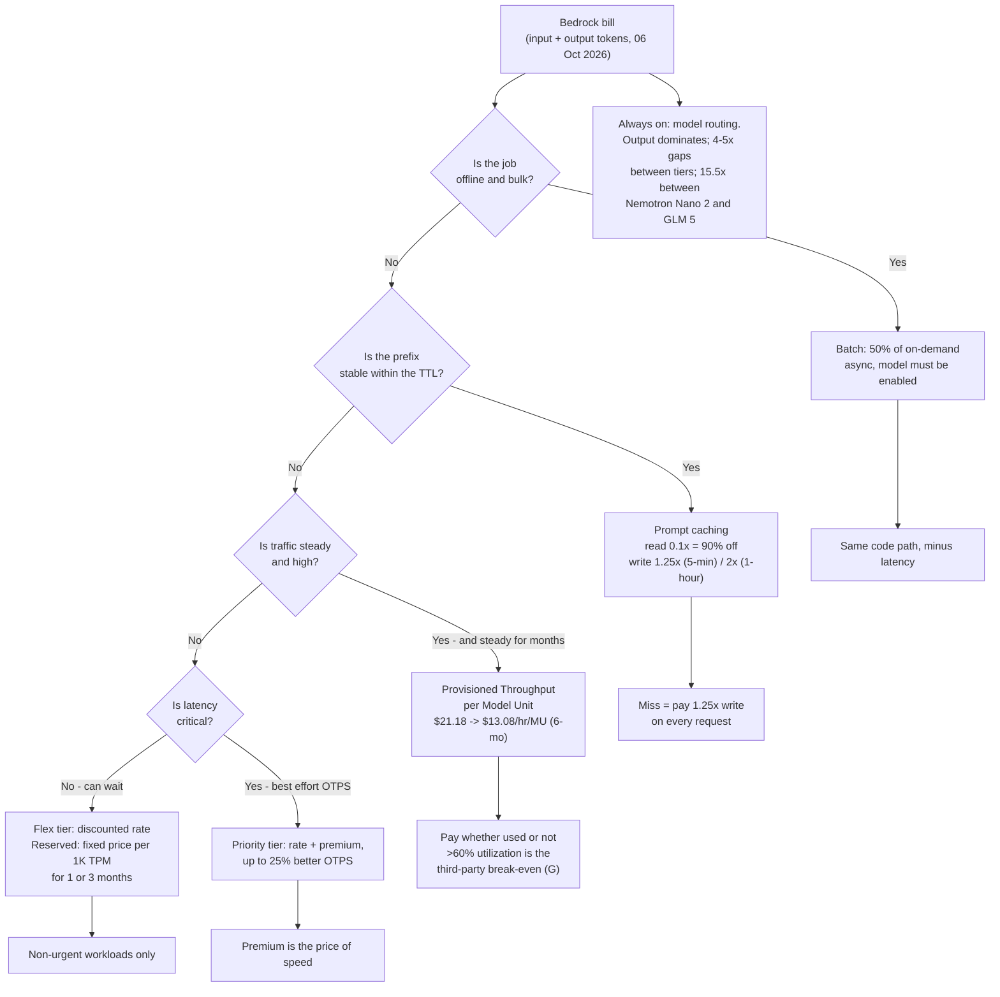
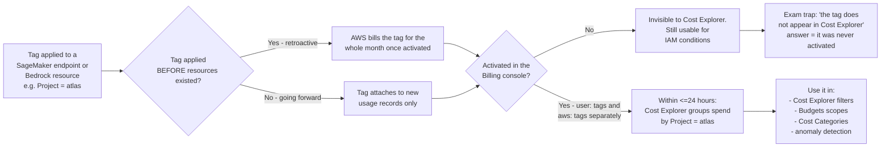
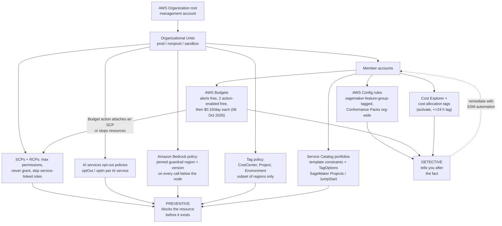

# Cost Optimization and Governance for AI Workloads

Cost is where the AIF-C01 exam stops being abstract. Every other domain can be answered with a definition; this one asks you to **compute**, and then to pick the control that **prevents** the overspend rather than the one that merely reports it. The good news is that the arithmetic is shallow — multiplication and percentages — and the traps are few, sharp and repeatedly tested.

```text
====================================================================
 COST MAP FOR AI/ML ON AWS                    (digest 06 Oct 2026)
====================================================================
 SAGEMAKER AI ........... per instance-hour (per-second in most
                          regions) + EBS GB-month
                          ml.c5.xlarge    $0.204 /hr
                          ml.m5.4xlarge   $0.922 /hr
                          ml.g5.24xlarge  $10.18 /hr
                          EBS gp           $0.14 /GB-month
                          from 07 Oct 2026: ml.p6-b300.48xlarge
                          $148.54 /hr, ml.p5en.48xlarge $72.63 /hr
 BEDROCK ................ per 1M input tokens + per 1M output
                          tokens; Batch = 50% of on-demand;
                          cache read = 0.1x, cache write = 1.25x
                          (5-min TTL) or 2x (1-hour TTL)
 AI SERVICES ............ Rekognition image/minute, Textract page,
                          Comprehend 100-char unit, Transcribe
                          minute, Polly 1M chars, Lex request
 LEVERS ................. Spot <=90% | EC2 SP <=72% |
                          Compute SP <=66% | SageMaker SP <=64% |
                          Batch 50% | cache read 90% | Database SP <=35%
 GOVERNANCE ............. SCP/RCP/opt-out/tag policy/Bedrock policy
                          (prevent, free) | Service Catalog |
                          AWS Config (detect) | Budgets (alert free,
                          2 action-enabled budgets free, then
                          $0.10/day each) | Cost Explorer
====================================================================
```

> [!NOTE]
> **The five top-line traps in this lesson.** (1) **SCPs never grant** — they cap permissions and they **skip service-linked roles**. (2) A **cost allocation tag must be activated** in the Billing console (up to **24 hours** to appear) before Cost Explorer will group by it. (3) **Spot is up to 90 % off with two minutes' notice**, and **Spot spend does not count toward a Compute Savings Plan commitment**. (4) **Budget alerts are free; budget *actions* are free only for the first two action-enabled budgets**, then **$0.10/day per extra** (06 Oct 2026). (5) **Bedrock bills input and output separately**, and output tokens are typically **4–5× the price of input tokens**, so `max_tokens` is a cost control, not just a latency control.

By the end of this lesson you will be able to:

- read the **three meter families** AWS uses for AI (instance-hours, tokens, request units) and say which one a question is billing;
- compute the monthly cost of an endpoint, a token workload or a document-processing pipeline **with dated prices**;
- choose among **on-demand, Spot, Savings Plans and Serverless Inference** using the published ceilings (≤90 %, ≤72 %, ≤66 %, ≤64 %);
- apply the **Bedrock-specific levers**: Batch (50 %), prompt caching (0.1× reads), Provisioned Throughput, service tiers and model routing;
- convert **free-tier allowances into dollars** so you can size a proof of concept;
- distinguish **preventive controls** (SCP, RCP, opt-out, Bedrock policy, tag policy, Service Catalog, Budget actions) from **detective ones** (Cost Explorer, AWS Config, cost allocation tags);
- avoid every dated-price and commitment trap this domain is known for.

---

## 1. The three meter families: what you are actually billed

### 1.1 Meter family 1 — SageMaker AI: instance-hours plus storage

SageMaker AI bills **per instance-hour** (per-second in most regions) for training, processing, notebooks and hosted endpoints, plus **EBS gigabyte-months**. On-demand carries **no minimum and no upfront commitment** (aws.amazon.com/sagemaker/ai/pricing, verified 06 Oct 2026).

| Instance (SageMaker) | On-demand $/hour | Verified |
|---|---|---|
| `ml.c5.xlarge` | **$0.204** | 06 Oct 2026 |
| `ml.m5.4xlarge` | **$0.922** | 06 Oct 2026 |
| `ml.g5.24xlarge` | **$10.18** | 06 Oct 2026 |
| EBS General Purpose SSD | **$0.14 / GB-month** | 06 Oct 2026 |
| `ml.p5.4xlarge` | **$6.86** | price list for 07 Oct 2026 |
| `ml.p5en.48xlarge` | **$72.63** | price list for 07 Oct 2026 |
| `ml.p6-b300.48xlarge` | **$148.54** | price list for 07 Oct 2026 |

> [!WARNING]
> **The accelerator row changes the arithmetic by an order of magnitude.** From **07 Oct 2026** AWS lists `ml.p6-b300.48xlarge` at **$148.54/hour** and `ml.p6-b200.48xlarge` at **$130.71/hour** — versus `ml.p5.4xlarge` at **$6.86/hour**. One day of a `ml.p6-b300.48xlarge` left running (**24 × $148.54 = $3,564.96**, price list for 07 Oct 2026) costs more than a full month of two `ml.c5.xlarge` endpoints. Exam questions routinely test whether you notice that **the instance family, not the feature list, dominates the bill**.

### 1.2 Meter family 2 — Amazon Bedrock: input tokens and output tokens

Bedrock on-demand charges **per input token and per output token separately** (aws.amazon.com/bedrock/pricing, verified 06 Oct 2026). Because output is generated one token at a time, output rates run roughly **4–5× input rates** on open-weight models — and far more on premium models.

| Model (Amazon Bedrock) | Input $/1M tokens | Output $/1M tokens | Region note | Verified |
|---|---|---|---|---|
| NVIDIA Nemotron Nano 2 / 3 Nano 30B A3B | **$0.06 / $0.06** | **$0.23 / $0.24** | — | 06 Oct 2026 |
| NVIDIA Nemotron 3 Super 120B A12B / Nano 2 VL | **$0.15 / $0.20** | **$0.65 / $0.60** | — | 06 Oct 2026 |
| OpenAI `gpt-oss-safeguard-20b` / `120b` | **$0.07 / $0.15** | **$0.20 / $0.60** | us-east-1/2, us-west-2 | 06 Oct 2026 |
| OpenAI `gpt-oss-20b` / `120b` | **$0.1262 / $0.2704** | **$0.5408 / $1.0815** | GovCloud (US) | 06 Oct 2026 |
| Z AI GLM 5 | **$1.00** | **$3.20** | us-east-1/2, us-west-2 | 06 Oct 2026 |
| Llama 2 13B fine-tune | **$1.49 / 1M trained** + storage **$1.95/month** | inference, no commitment: **$23.50/hour/MU** | — | 06 Oct 2026 |
| Llama 2 13B Provisioned Throughput | **$21.18/hour/MU** (1-month) | **$13.08/hour/MU** (6-month) | −38.3 % vs 1-month | 06 Oct 2026 |

**Non-token Bedrock levers** (all verified 06 Oct 2026 unless noted): **Batch = 50 % of the on-demand token price** for supported foundation models · cache **read = 0.1×**, cache **write = 1.25×** (5-minute TTL) or **2×** (1-hour TTL) · Bedrock Guardrails on the AWS European pricing pages at **€0.2587283 per 1,000 text units** (content filters, denied topics) and **€0.1724855 per 1,000** (sensitive information, contextual grounding), with regex and word filters **free** (aws.eu list, 07 Aug 2026 — the USD equivalent was not retrieved, so treat it as **(G)**).

### 1.3 Meter family 3 — prebuilt AI services: one unit per request

Rekognition, Textract, Comprehend, Transcribe, Polly and Lex bill **per request unit**, with **volume tiering** after the first 1–10 million units (aws.amazon.com/*/pricing, verified 06 Oct 2026).

| Service | Billing unit | Price (first tier) | Verified |
|---|---|---|---|
| Rekognition images | image | **$0.0010** first 1M/month, **$0.0008** next 1.5M | 06 Oct 2026 |
| Rekognition stored video (labels, moderation, text, faces, celebrity, face search) | minute | **$0.10** | 06 Oct 2026 |
| Rekognition shot / technical cues; face metadata storage | minute; face/month | **$0.05**; **$0.00001** | 06 Oct 2026 |
| Textract `DetectDocumentText` | page | **$0.0015** first 1M/month, **$0.0006** after (us-west-2) | 06 Oct 2026 |
| Textract `AnalyzeDocument` Tables / Forms / Tables+Forms+Queries | page | **$0.015 / $0.05 / $0.070** first 1M (**$0.010 / $0.040 / $0.055** after) | 06 Oct 2026 |
| Comprehend standard NLP | 100-char unit (300-char minimum) | **$0.0001** first 10M/month, **$0.00005** 10–50M, **$0.000025** above 50M | 06 Oct 2026 |
| Transcribe batch / streaming | minute | **$0.006** / **$0.01** | 06 Oct 2026 |
| Transcribe content redaction | minute | **$0.0024** T1 (250K), **$0.0015** T2 (750K), **$0.00102** T3 (4M) | 06 Oct 2026 |
| Polly Standard / Neural / Generative / Long-Form | 1M characters | **$4.00 / $16.00 / $30.00 / $100.00** | 06 Oct 2026 |
| Lex speech input / text input | request | **$0.004** / **$0.00075** | 06 Oct 2026 |
| Lex chatbot-designer training | minute | **$0.50** | 06 Oct 2026 |
| Augmented AI human review | page | **$0.03** first 100K, **$0.02** next 100K | 06 Oct 2026 |

### 1.4 Worked example 1 — two idle endpoints, 1,488 hours

Two `ml.c5.xlarge` real-time endpoints run 24×7 for a 31-day month at **$0.204/hour** (06 Oct 2026):

$$
2 \times 24 \times 31 = 1{,}488 \text{ hours}, \qquad 1{,}488 \times \$0.204 = \$303.55/\text{month}
$$

**$303.55/month regardless of traffic.** Three ways to change it:

| Lever applied | Hours billed | Monthly cost | Saving vs baseline |
|---|---|---|---|
| Nothing (2 instances, always on) | 1,488 | **$303.55** | — |
| (a) Auto scale to an average of 1 instance | 744 | **$151.78** | **−50.0 %** |
| (b) Stop 8 hours per day (2 instances) | 960 | **$195.84** | **−35.5 %** |
| (c) Both (1 instance, 8 h/day stopped) | 480 | **$97.92** | **−67.7 %** |

The lesson is not the percentages — it is that **an idle endpoint bills the same as a busy one**. Nothing on the meter knows whether anyone sent a request.

- **📚 Did you know?** The AWS pricing page for SageMaker bills **per second** in most regions with a **one-minute minimum**, so a 90-second inference spike costs one minute, not an hour — but a *notebook* or *endpoint* is billed for the whole time it exists, from creation to deletion. That asymmetry is why the exam's cheapest-option questions almost always have "stop it on a schedule" or "use serverless" as the answer.

---

## 2. The cost-lever decision framework

### 2.1 The lever impact matrix

Not all levers are equal, and some are frequently oversold. AWS publishes the percentages below; where AWS publishes nothing, this lesson says so.

| # | Lever | Applies to | Published impact | Trade-off | Enforced / observed by |
|---|---|---|---|---|---|
| 1 | **Right-sizing** | endpoints, notebooks | no AWS-published percentage → **(G)** | latency risk; use Inference Recommender | Cost Explorer + CloudWatch |
| 2 | **Auto scaling** | real-time endpoints | removes over-provisioning | scale-in cooldowns, cold capacity | Application Auto Scaling (target tracking) |
| 3 | **Scale-to-zero / serverless** | unpredictable traffic | idle cost → **$0** | cold starts, payload and GPU limits | SageMaker Serverless Inference |
| 4 | **Stop idle endpoints / notebooks** | any always-on resource | up to **100 % of the idle portion** | service downtime | Budget actions / EventBridge |
| 5 | **Spot** | fault-tolerant training and batch | **up to 90 %** | 2-minute interruption → checkpoint and retry | Managed Spot Training |
| 6 | **SageMaker Savings Plans** | steady `ml.*` usage | **up to 64 %** | $/hour committed for 1 or 3 years | Cost Explorer recommendations |
| 7 | **Compute Savings Plans** | steady EC2 / Fargate / Lambda | **up to 66 %** | lock-in; **excludes Spot spend** | Cost Explorer |
| 8 | **Bedrock Batch** | offline bulk inference | **50 %** | async latency; model must be batch-enabled | Bedrock Batch |
| 9 | **Bedrock prompt caching** | repeated prompts and documents | **~90 % on cached input** | writes cost **1.25×**; unstable prefix kills it | Bedrock usage logs |
| 10 | **Model downgrade / routing** | generative workloads | output dominates; **4–5× gaps** between tiers | quality evaluations required | Bedrock model evaluation |
| 11 | **Bedrock Flex tier** | non-urgent workloads | discounted standard rate | higher latency | service tier configuration |
| 12 | **Bedrock Reserved tier** | guaranteed tokens per minute | fixed price per 1K TPM | 1 or 3-month commitment | service tiers |

> [!IMPORTANT]
> **Beware the "right-sizing saves 30–60 %" folklore.** No AWS-published figure exists for right-sizing savings — that number circulates in third-party blogs only, and it is a **(G)** (unverified) claim. On the exam, an option that quotes a precise right-sizing percentage is testing whether you know AWS does not publish one. The **published** ceilings you may quote are: Spot **≤90 %**, EC2 Instance Savings Plans **≤72 %**, Compute Savings Plans **≤66 %**, SageMaker AI Savings Plans **≤64 %**, Bedrock Batch **50 %**, Bedrock cache reads **90 %**, Bedrock 6-month Provisioned Throughput **38.3 %** on the Llama 2 13B model unit (all aws.amazon.com / docs.aws.amazon.com, verified 06 Oct 2026).

### 2.2 The cost-lever decision flow

This is the diagram the exam is really asking you to walk. Start from **what is burning money**, then from **what the workload tolerates**.



### 2.3 What each lever cannot do

Three "cannot" facts are exam gold:

1. **Savings Plans do not stack on Spot, and Spot spend does not consume a Compute Savings Plan commitment** (docs.aws.amazon.com, 2026). A question offering to "cover Spot usage with a Savings Plan" is wrong on both halves of the sentence.
2. **The prebuilt AI services have no published reservation or Savings Plan option** — you optimize them by reducing **unit volume** (choose OCR before Forms, plain transcription before redaction) and by using the free tier, not by committing.
3. **A budget action is not a real-time control.** Alerts can be forecast-based or actual-based, but execution lags, so overspend is still possible between the threshold and the action.

```matching
{
  "question": "Match each cost lever to its published AWS ceiling or rule (all verified 06 Oct 2026):",
  "pairs": [
    {"left": "EC2 / SageMaker Spot", "right": "Up to 90% off with 2 minutes' interruption notice; historical average interruption frequency below 5%"},
    {"left": "EC2 Instance Savings Plans", "right": "Up to 72% off, but locked to one instance family in one region for 1 or 3 years"},
    {"left": "Compute Savings Plans", "right": "Up to 66% off across EC2 any family/region/OS plus Fargate and Lambda; excludes Spot spend"},
    {"left": "SageMaker AI Savings Plans", "right": "Up to 64% off, flexible across all ml.* families, sizes, regions and components for 1 or 3 years"},
    {"left": "Database Savings Plans", "right": "Up to 35% off, 1-year term only"},
    {"left": "Amazon Bedrock Batch", "right": "50% of the on-demand token price for supported models, async only"},
    {"left": "Amazon Bedrock prompt cache read", "right": "0.1x the input price - a 90% discount inside the TTL when the prefix matches"}
  ],
  "explanation": "Each number belongs to a different commitment shape: Spot is interruptible and has no commitment, EC2 Instance SPs buy depth but lose flexibility, Compute SPs buy breadth, SageMaker SPs buy ml.* flexibility, Database SPs are 1-year only, and the Bedrock levers are workload-shaped rather than compute-shaped. Mixing them up - for example quoting 66% for SageMaker or 64% for EC2 - is the classic distractor."
}
```

---

## 3. SageMaker AI: on-demand vs Spot vs Savings Plans vs serverless

### 3.1 On-demand: the default with no commitment

On-demand is **per instance-hour with no minimum and no upfront** (aws.amazon.com/sagemaker/ai/pricing, verified 06 Oct 2026). It is the right answer when the exam says *prototype*, *short-lived*, *unpredictable*, or *first two months* (the SageMaker free tier gives **250 hours/month of `ml.t3.medium` notebooks for the first two months**, verified 06 Oct 2026).

### 3.2 Spot: up to 90 % off, two minutes' notice

EC2 Spot — and therefore SageMaker Spot and SageMaker HyperPod Spot — is advertised at **up to 90 % off** on-demand, with **two minutes' interruption notice** and a **historical average interruption frequency below 5 %** (aws.amazon.com/ec2/spot, 2025–26). SageMaker **HyperPod Spot is typically up to 90 % off** HyperPod on-demand, priced by EC2 with no upfront (aws.amazon.com/sagemaker/ai/pricing, 06 Oct 2026).

Spot is only correct when the job **can be interrupted**: training with checkpoints, batch transform, offline processing. The exam's answer pattern is always the same pair — *Spot* plus *checkpoint and retry*.

### 3.3 Savings Plans: three different discounts

| Savings Plan | Published ceiling | Scope | Term | Verified |
|---|---|---|---|---|
| **EC2 Instance Savings Plans** | **up to 72 %** | one instance **family**, one **region** | 1 or 3 years | 06 Oct 2026 |
| **Compute Savings Plans** | **up to 66 %** | EC2 **any** family, region, OS + Fargate + Lambda | 1 or 3 years | 06 Oct 2026 |
| **SageMaker AI Savings Plans** | **up to 64 %** | **all `ml.*` families, sizes, regions and components** (notebook, training, processing, inference) | 1 or 3 years, $/hour | 06 Oct 2026 |
| **Database Savings Plans** | **up to 35 %** | database workloads | **1 year only** | 06 Oct 2026 |

SageMaker Savings Plans are the flexible one: because they span **every `ml.*` instance family in every region**, you can move from `ml.c5.xlarge` to `ml.g5.24xlarge` and keep the discount. Cost Explorer surfaces the recommendation; the commitment should cover only your **baseline — 70–80 % of your 30-day average hourly spend** — not your peak.

### 3.4 Serverless Inference: the meter that reaches zero

SageMaker **Serverless Inference scales to zero** when idle, so you pay only for the compute you use, **billed by the millisecond**, plus data processed. Optional **Provisioned Concurrency** is billed on memory, duration and concurrency (docs.aws.amazon.com/sagemaker/latest/dg/serverless-endpoints.html, 2026). It is the correct answer whenever traffic is **unpredictable and low** — a prototype that receives a few requests a day, or none for a week.

> [!WARNING]
> **Serverless is not "free when idle" by accident — it is a design contract.** You trade the always-on bill for **cold starts**, payload limits and GPU restrictions. And note that third-party pages quote serverless rates (for example **$0.0000667/second per GB** plus **$0.20/1M requests**, 1–5 second cold start, 6 GB maximum) that were **not confirmed on the AWS pricing page** as of 06 Oct 2026 — treat those numbers as **(G)**. In an exam option, an unattributed serverless rate is usually a distractor; the *behaviour* (scales to zero, millisecond billing) is what is being tested.

### 3.5 Worked examples — SageMaker arithmetic

**Worked example 2 — an always-on GPU fleet (AWS worked example).**
Four `ml.g5.24xlarge` instances at **$10.18/hour** (06 Oct 2026) run 720 hours in a month, with 100 GB of EBS each at **$0.14/GB-month** (06 Oct 2026):

$$
4 \times 720 \times \$10.18 = \$29{,}318.40, \qquad 4 \times 100 \times \$0.14 = \$56.00
$$

**$29,318.40 + $56.00 = $29,374.40 per month.** At **30 % utilization** the fleet can drop to roughly **1.2 instances ≈ $8,812/month**, saving about **$20,560/month** — and *then* a SageMaker Savings Plan (≤64 %, 06 Oct 2026) applies on top of the smaller footprint. Right-sizing first, commitment second; reversed, you commit to a bloated baseline for three years.

**Worked example 3 — the idle custom endpoint burn.**
A custom NLP endpoint at **$0.0005 per inference-unit-second** (third-party rate, cloudzero.com, 04 May 2026 — **(G)**) burns:

$$
\$0.0005 \times 60 = \$0.03/\text{min} \;\Rightarrow\; \$1.80/\text{hour} \;\Rightarrow\; \$43.20/\text{day} \;\Rightarrow\; \$1{,}296/30\text{ days}
$$

Billed **from endpoint creation to deletion even at zero traffic**. Fix: schedule it on and off with EventBridge, or use async/serverless so the meter stops.

**Worked example 4 — the 64 % Savings Plan ceiling.**
An `ml.m5.xlarge`-class instance at **$0.23/hour** (rate used for this example, 06 Oct 2026) for 730 hours:

| Scenario | Rate | Monthly | Annual | 3-year |
|---|---|---|---|---|
| On-demand | $0.23 × 730 h | **$167.90** | $2,014.80 | $6,044.40 |
| SageMaker SP at 64 % off (06 Oct 2026) | $0.0828 × 730 h | **$60.44** | $725.28 | $2,175.84 |
| **Saving** | | **$107.46/month** | **$1,289.52/year** | **$3,868.56 / 3 years** |

- **📚 Did you know?** AWS's SageMaker Savings Plan discount of **up to 64 %** (06 Oct 2026) is *lower* than the EC2 Instance Savings Plan ceiling of **up to 72 %** (06 Oct 2026) — yet the SageMaker plan is usually the better buy for AI teams, because the EC2 plan is locked to **one instance family in one region**, while the SageMaker plan follows you across **every `ml.*` family, size, region and component**. A 8-point discount difference is often worth less than the freedom to switch from CPU to GPU without re-buying a commitment.

### 3.6 Pricing-model decision for an endpoint



### 3.7 Comparative verdict

> [!IMPORTANT]
> **Comparative Verdict — on-demand vs Spot vs Savings Plans vs serverless**
> - **On-demand** (per instance-hour, no minimum, no upfront — e.g. `ml.c5.xlarge` at **$0.204/hour**, 06 Oct 2026) is the answer for **prototypes, short-lived experiments, the first two months of notebooks** (250 h/month `ml.t3.medium`, 06 Oct 2026) and anything whose shape you do not yet know. Its failure mode is **time-based billing of idle capacity**: $303.55/month for two endpoints that may never receive a request.
> - **Spot** (up to **90 % off**, **2-minute** interruption notice, historical average interruption frequency **below 5 %** — aws.amazon.com/ec2/spot, 2025–26) is the answer for **training, batch transform and offline jobs that checkpoint**. Its failure mode is **interruption**: latency-sensitive real-time serving on Spot is always wrong, and Spot spend **does not** draw down a Compute Savings Plan commitment (docs.aws.amazon.com, 2026). Use it for the *burst* layer, never for the *always warm* layer.
> - **Savings Plans** (Compute **≤66 %**, EC2 Instance **≤72 %**, SageMaker AI **≤64 %**, 1 or 3 years — 06 Oct 2026) are the answer for a **known, steady baseline you will not abandon**. SageMaker AI Savings Plans are the AI-native choice because they hold across **all `ml.*` families, sizes, regions and components**; Compute Savings Plans are the right choice when the baseline also includes EC2, Fargate or Lambda. Its failure mode is **over-committing**: commit 70–80 % of your 30-day average hourly spend, never your peak, and remember they **do not stack with Spot**.
> - **Serverless Inference** (per-millisecond compute, **scales to 0**, optional Provisioned Concurrency billed on memory, duration and concurrency — docs.aws.amazon.com, 2026) is the answer for **unpredictable, low-volume traffic** where an idle day must cost **$0**. Its failure mode is **cold starts plus capacity limits** — and note that published per-second rates circulating online (**$0.0000667/second per GB** + **$0.20/1M requests**, 06 Oct 2026 third-party pages) are **(G)**, unconfirmed on the AWS pricing page.
> - **Rule of thumb for the exam:** *fault-tolerant and interruptible* → **Spot**; *steady baseline for 1–3 years* → **Savings Plan** (SageMaker SP for `ml.*`, Compute SP for a mixed estate); *unpredictable and sparse* → **serverless**; *everything else, or anything you have not measured yet* → **on-demand plus auto scaling and scheduled stop*. The distractor is always the option that commits money to a workload the question describes as experimental.

---

## 4. Amazon Bedrock: tokens, Batch, caching, throughput and tiers

### 4.1 Worked example 5 — the token bill, and why model choice beats volume

A workload sends **300M input tokens** and produces **60M output tokens** per month.

| Model (rates verified 06 Oct 2026) | Input cost | Output cost | Monthly total |
|---|---|---|---|
| Nemotron Nano 2 — $0.06 / $0.23 per 1M | 300 × $0.06 = **$18.00** | 60 × $0.23 = **$13.80** | **$31.80** |
| Z AI GLM 5 — $1.00 / $3.20 per 1M | 300 × $1.00 = **$300.00** | 60 × $3.20 = **$192.00** | **$492.00** |

The **same token volume** costs **15.5× more** on GLM 5. Model selection, not usage reduction, is the dominant lever for generative workloads — and it is why every "reduce cost" question that offers "switch to a smaller model" is usually right **provided** quality evaluations are mentioned.

Note also that output is **~4× input** per token on Nemotron Nano 2 ($0.23 vs $0.06, 06 Oct 2026): capping `max_tokens`, asking for terse answers and returning structured output instead of prose all cut the expensive half of the meter.

### 4.2 Worked example 6 — Batch: 50 % off for async work

A nightly document-classification job costs **$800/month** on Bedrock on-demand; the model is batch-enabled and nobody reads the results before morning.

$$
\$800 \times 50\% = \$400/\text{month} \quad\Rightarrow\quad \$400/\text{month saved} = \$4{,}800/\text{year}
$$

**Bedrock Batch = 50 % of the on-demand token price** for supported models (aws.amazon.com/bedrock/pricing, 06 Oct 2026). The cost of the discount is **async latency** — and the model must support batch at all.

### 4.3 Worked example 7 — prompt caching: ~90 % off, with a write premium

This is the highest-yield arithmetic in the domain. Using the rates published in an AWS Builder Center post for Sonnet 4.6 on Bedrock — **$3.00 per 1M input tokens, $3.75 cache write, $0.30 cache read** (2026; *not* confirmed on the official pricing page, see section 10) — a stable **33,000-token** system prompt sent **1,000 times/day** for 30 days:

**Uncached:**

$$
33{,}000 \times 1{,}000 = 33\text{ MTok/day} \times \$3.00 = \$99/\text{day} \;\Rightarrow\; \$2{,}970/\text{month}
$$

**Cached (5-minute TTL: write 1.25×, read 0.1×):**

| Component | Tokens | Rate | Daily cost |
|---|---|---|---|
| 1 cache write per day | 33,000 × 1.25 = **41,250** | $3.75/MTok | **$0.155** |
| 999 cache reads per day | 33,000 × 999 = 32.967 MTok | $0.30/MTok | **$9.89** |
| **Total** | | | **$10.05/day → $301.42/month** |

**Saving ≈ $2,668/month (≈ 89.9 %).** The mechanism (all Bedrock caching docs, 2026): cache **reads cost 0.1×** the input price (**90 % off**), cache **writes cost 1.25×** at the default **5-minute TTL** and **2×** at the opt-in **1-hour TTL**, the default TTL is **5 minutes**, the 1-hour TTL is opt-in per cache checkpoint, minimum **512–4,096 tokens per model** and maximum **4 checkpoints**.

> [!WARNING]
> **One changed byte in the prefix destroys the cache.** If the system prompt differs across requests — a timestamp, a request ID, a CI environment variable, a trailing newline — every call misses and you pay the **1.25× write premium on every request** instead of one write plus 999 cheap reads. This is the classic headless/CI-loop failure, and it is exactly what the exam tests with the option "*the prompt prefix must match byte-for-byte inside the TTL*". GPT-5.6 models on Bedrock add implicit caching by default for a stable prefix of **≥1,024 tokens** with a **30-minute TTL**, reads **90 % off** and writes **1.25×** (AWS ML blog, 30 Jul 2026).

### 4.4 Provisioned Throughput and service tiers

| Bedrock mechanism | How it bills | Commitment | Notes (verified 06 Oct 2026) |
|---|---|---|---|
| **On-demand** | per 1M input + per 1M output tokens | none | default; spiky or low volume |
| **Batch** | **50 %** of on-demand token price | none | async; model must be batch-enabled |
| **Provisioned Throughput** | hourly per **Model Unit (MU)** | **none / 1 month / 6 months** | longer = cheaper; **custom models require it**; MUs requested via AWS Support |
| **Priority tier** | on-demand rate **+ premium**, up to **25 %** better on-demand token-per-second | none | latency-first |
| **Standard tier** | on-demand rate | none | default |
| **Flex tier** | discounted standard rate | none | non-urgent workloads, higher latency |
| **Reserved tier** | fixed price per **1K tokens-per-minute**, billed monthly | **1 or 3 months** | guaranteed TPM |

Concrete Provisioned Throughput numbers for Llama 2 13B (06 Oct 2026): **$21.18/hour/MU** on a 1-month commitment versus **$13.08/hour/MU** on a 6-month commitment — a **38.3 % reduction** — while inference without a commitment is **$23.50/hour/MU**. The trap: **you pay for the MU whether you use it or not**, so Provisioned Throughput is only right above roughly 60 % utilization (a third-party break-even figure, **(G)**, not AWS-published).

### 4.5 Quota burndown is not token count

Bedrock quota consumption is **weighted**, and the weights are model-specific (docs.aws.amazon.com, 2026):

| Model family | Output-token weight against quota |
|---|---|
| Claude v4.8 | outputs burn **15×** |
| Claude 5 family, GPT-5.6 Sol / Terra / Luna | outputs burn **10×** |
| Claude ≤ v4.7 | outputs burn **5×** |
| Everything else | **1:1** |

So "why am I throttled when my token count looks fine?" is answered by **long outputs on a 15× model**, not by input volume.

### 4.6 The Bedrock cost-lever map



- **📚 Did you know?** Bedrock has **no AWS-published free-tier table** (06 Oct 2026) — a claim you will find on vendor blogs saying "no free tier" or quoting a "30–50 % Provisioned Throughput discount" is **(G)**, because AWS publishes neither. What AWS *does* publish is a **50 % Batch discount**, a **90 % cache-read discount** and the **64 % SageMaker SP ceiling**; those are the numbers you may quote on the exam.

---

## 5. Prebuilt AI services: units, tiers and the free tier

### 5.1 How to optimize a per-unit meter

There is no reservation for Rekognition, Textract, Comprehend, Transcribe, Polly or Lex. The three levers are:

1. **Cheapest feature set that returns what you read** — Textract `DetectDocumentText` at **$0.0015/page** (06 Oct 2026) versus `AnalyzeDocument` Forms at **$0.05/page** (06 Oct 2026) is a **33× premium** for structure. Read OCR first; invoke Forms only when you need the key-value pairs.
2. **Volume tiering** — Comprehend drops from **$0.0001** to **$0.00005** (10–50M units) to **$0.000025** (above 50M) per 100-char unit (06 Oct 2026); Textract `DetectDocumentText` drops from **$0.0015** to **$0.0006** after the first million pages in a month (06 Oct 2026).
3. **Free tier** — 3 to 12 months of allowances, converted to dollars in section 5.4.

### 5.2 Worked example 8 — Textract tier math

| Volume | Computation | Total | Blended unit price |
|---|---|---|---|
| 100,000 pages `DetectDocumentText` | 100,000 × $0.0015 | **$150/month** | $0.0015 (rates 06 Oct 2026) |
| 2,000,000 pages `DetectDocumentText` | 1M × $0.0015 + 1M × $0.0006 | **$2,100** | **$0.00105 (−30 %)** |
| 5,000 pages Forms + Tables | 5,000 × $0.015 + 5,000 × $0.05 | **$325** | $0.065/page |

Same API, three bills. The third row is the one that surprises teams: **feature choice outweighs volume**.

### 5.3 Worked example 9 — Transcribe: batch, not streaming, and redaction as an add-on

Two million minutes of audio per month (rates verified 06 Oct 2026):

| Mode | Rate | Monthly |
|---|---|---|
| Streaming | $0.01/min | **$20,000** (AWS example) |
| Batch | $0.006/min | **$12,000** |
| **Saving from choosing batch** | | **$8,000/month (40 %)** |

And if the same job adds **content redaction** on 2M minutes (tiered: 250K at $0.0024, 750K at $0.0015, 1M at $0.00102):

$$
(250{,}000 \times 0.0024) + (750{,}000 \times 0.0015) + (1{,}000{,}000 \times 0.00102) = 600 + 1{,}125 + 1{,}020 = +\$2{,}745/\text{month}
$$

Redaction is an **opt-in meter**, billed on top of the transcription minute — the exam's "cheapest accurate pipeline" questions hinge on noticing that.

### 5.4 The AI free tier, converted to dollars

| Product | Free allowance | Duration | Paid value of the allowance | Verified |
|---|---|---|---|---|
| AWS Free plan credits | **$100 immediately + up to $100 more = $200** | **6 months** (since 15 Jul 2025) | $200 | 06 Oct 2026 |
| SageMaker notebooks / Studio | **250 h/month `ml.t3.medium`** | first 2 months | — | 06 Oct 2026 |
| SageMaker Model Monitor built-in rules | **30 free monitoring hours** | ongoing | — | 06 Oct 2026 |
| SageMaker Catalog | **4,000 requests + 20 MB + 0.2 compute units/month** | monthly | — | 06 Oct 2026 |
| Textract `DetectDocumentText` | **1,000 pages/month** | first 3 months | **$1.50** | 06 Oct 2026 |
| Textract Forms / Tables / Layout, Expense, ID | **100 pages/month each** | first 3 months | $0.05–$0.10 each (06 Oct 2026 rates) | 06 Oct 2026 |
| Textract Analyze Lending | **2,000 pages/month** | first 3 months | — | 06 Oct 2026 |
| Comprehend (each NLP API) | **50,000 units (5M chars)/month** + 5 topic-modeling jobs ≤ 1 MB | first 12 months | **$5.00** | 06 Oct 2026 |
| Transcribe | **60 minutes/month** | first 12 months | **$0.36 batch / $0.60 streaming** | 06 Oct 2026 |
| Polly Standard / Neural / Long-Form / Generative | **5M / 1M / 500K / 100K chars per month** | first 12 months | **$20.00 / $16.00 / $5.00 / $3.00** (06 Oct 2026 rates) | 06 Oct 2026 |
| Amazon Kendra / Amazon Personalize | **750 h in the first 30 days** / 2-month trial | 30 days / 2 months | — | 06 Oct 2026 |

**Worked example 10 — the free-tier ceiling for a pilot.**
Polly Standard 5M characters = **$20.00** plus Neural 1M characters = **$16.00** (06 Oct 2026 rates) → **$36/month for 12 months** of voice output; Comprehend 50K units = **$5.00 per API per month** (06 Oct 2026); Textract 1,000 pages = **$1.50** (06 Oct 2026); Transcribe 60 minutes = **$0.60** streaming (06 Oct 2026). A six-month voice + entity-extraction pilot can therefore run on **$0 of compute** — *provided* you stay inside the allowance, because the free tier does not warn you before it stops.

- **📚 Did you know?** The **AWS Free plan** introduced on **15 Jul 2025** gives up to **$200 in credits ($100 immediately plus up to $100 more) over 6 months** (aws.amazon.com/free, 06 Oct 2026) — which is separate from the *service* free tiers that run 3, 12 or 24 months. Exam options frequently conflate "free credits" with "free tier"; the credits expire on a **calendar**, the free tiers expire on **usage**.

---

## 6. Cost visibility: Cost Explorer, cost allocation tags and budgets

Visibility is **detective**, not preventive — but without it you cannot set a threshold, and without a threshold a budget action never fires.

### 6.1 Cost Explorer

| Capability | Price / behaviour | Verified |
|---|---|---|
| Console and default reports | **Free** | 06 Oct 2026 |
| Cost Explorer **API** | **$0.01 per request** | 06 Oct 2026 |
| **Hourly granularity** (14-day lookback) | ≈ **$0.01 per 1,000 usage records per month** | 06 Oct 2026 |
| Recommendations | Savings Plans and Reserved Instance recommendations, tag filters, forecasts | 06 Oct 2026 |
| Data lag | up to **24 hours** | 06 Oct 2026 |

> [!WARNING]
> **`$0.01/request` is the Cost Explorer API rate, not a budget price.** Budget monitoring and alerts are **free** (aws.amazon.com/aws-cost-management/aws-budgets/pricing, 06 Oct 2026). A question pairing "$0.01 per request" with AWS Budgets is testing exactly this confusion.

### 6.2 Cost allocation tags must be activated

Cost allocation tags come in two flavours and are **activated separately** in the Billing console before Cost Explorer can group by them (docs.aws.amazon.com, 2026):

| Tag type | Prefix | Activation | Appears in Cost Explorer |
|---|---|---|---|
| **AWS-generated** | `aws:` | activate in the Billing console | within **≤24 hours** |
| **User-defined** | `user:` | **activate separately** from AWS-generated | within **≤24 hours** |
| Any other tag | — | not activated | **never** (it is only a resource tag) |



**The classic symptom:** an engineer applies a `CostCenter` tag to every resource yesterday and it still does not appear in Cost Explorer. The cause is almost never "tags do not work with AI services" or "the key must start with `aws:`" — it is that the **user-defined cost allocation tag has not been activated** (and can take up to **24 hours** to appear).

### 6.3 AWS Budgets: free alerts, then $0.10/day per extra action

| Budgets feature | Price (verified 06 Oct 2026) |
|---|---|
| Monitoring and notifications (alerts) | **Free** |
| First **two** action-enabled budgets per account | **Free per month** |
| Each additional action-enabled budget | **$0.10/day** (≈ **$3.00/month**) |
| Triggers | forecast-based or actual-based thresholds |

**Worked example 11 — the budget gate.** A team sets a **$5,000/month** budget with alerts at **80 %** and **100 %** plus automatic actions (attach an SCP, stop non-production instances):

- monitoring and alerts: **$0**;
- actions on the **first two** action-enabled budgets: **$0**;
- a **third** action-enabled budget: **$0.10/day ≈ $3.00/month** (06 Oct 2026).

The exam's "minimum feature cost" answer is therefore: **alerts free, two action-enabled budgets free, then $0.10/day each** — and remember that a budget action is applied **after** the threshold, so it is a brake, not a wall.

- **📚 Did you know?** AWS Budgets supports **budget actions that attach an SCP or IAM policy, or stop resources**, which makes it the one cost tool that *does* something preventive — but only after the threshold is crossed and the action executes. That is why the exam pairs it with SCPs: the budget detects, the SCP enforces.

---

## 7. Governance: preventing the spend instead of reporting it

### 7.1 The preventive stack in AWS Organizations

| Control | Enforces | Scope | Prevent / detect | Cost | Key gotcha (docs.aws.amazon.com, 2026) |
|---|---|---|---|---|---|
| **SCP** | maximum permissions — deny AI APIs or Regions outside an allow-list | root / OU / account | **Prevent** | free | **never grants**; **skips service-linked roles**; a deny-list still needs an allow policy attached |
| **RCP** | maximum permissions on **resources**, regardless of caller | org / OU / account | Prevent | free | the resource-side of the same intersection |
| **AI services opt-out policy** | org-wide `optOut` / `optIn` per AI service for data usage | per service | Prevent (data use) | free | does **not** remove feature access |
| **Amazon Bedrock policy** | applies a **region- and version-pinned Guardrail** to every Bedrock call below the node | per region | Prevent | free | the guardrail must exist **in that region**; no automated-reasoning policies |
| **Tag policy** | standardizes tag keys (`CostCenter`, `Project`, `Environment`) | org / OU | Prevent | free | supported only in a **subset of regions** |
| **Service Catalog** | only approved products launch; **template constraints** limit Region/instance type; **TagOptions** auto-tag | portfolio → product → user | Prevent (provisioning) | free service; the resources are billed | SageMaker Projects and JumpStart **depend on it** |
| **AWS Config** | conformance: `sagemaker-*-tagged`, encryption, logging; **Conformance Packs** org-wide | account / region | **Detect** (+ SSM remediation) | rules free; config items billed | detection only unless remediated; tag keys are **case-sensitive** and may not use the `aws:` prefix |

**AWS Config rule growth:** AWS added **75 new rules in Nov 2025** and **191 more in Jul 2026** (AWS news, 2025–26), and Conformance Packs deploy rule groups across an entire organization — the answer whenever a question asks how to *detect* drift at scale.

### 7.2 Worked example 12 — the right control for each requirement

| Requirement | Correct control | Why the others fail |
|---|---|---|
| "Users must not create SageMaker endpoints outside `us-east-1` and `us-west-2`" | **SCP on the OU denying those APIs/Regions outside the allow-list** | Config only **detects afterwards**; Service Catalog governs only what launches through it; Budget Actions are cost-triggered |
| "Engineers may launch only pre-approved inference stacks from a small instance allow-list" | **AWS Service Catalog product with template constraints** | Tags are not enforced at launch; Config reports rather than prevents; an SCP cannot enumerate approved templates |
| "Every Bedrock call below the org node must use Guardrail version X in eu-west-1" | **Amazon Bedrock policy in Organizations** | SCPs do not carry guardrail versions; Config would only detect a missing guardrail |
| "`CostCenter` must appear on all AI resources automatically" | **Service Catalog TagOptions** + **tag policy** | A plain resource tag is not automatically a **cost allocation** tag; it must still be activated (section 6.2) |
| "Stop the bleeding when spend passes $5,000" | **AWS Budgets with a budget action** | Cost Explorer never acts; Config never acts on spend |

### 7.3 Service Catalog vs SageMaker Catalog — do not confuse them

| | **AWS Service Catalog** | **SageMaker Catalog** |
|---|---|---|
| What it governs | approved **products** (CloudFormation portfolios) | approved **data and AI assets**, lineage and permissions |
| Enforcement | **template constraints** on parameters, **TagOptions** auto-tagging | access control on catalog assets |
| Pricing (06 Oct 2026) | service itself free; launched resources are billed | **$10 per 100K requests**, **$0.40/GB**, **$1.776/compute unit**; recommendations **$0.015/1K input + $0.075/1K output tokens** |
| Free allowance (06 Oct 2026) | — | **4,000 requests, 20 MB, 0.2 compute units/month** |
| Dependency | SageMaker **Projects and JumpStart provision through it** | distinct product; **not** the same service |

### 7.4 Governance layer diagram



> [!WARNING]
> **"SCP that allows only us-east-1" does not work the way people think.** An SCP **never grants** — it only sets the *maximum* permissions that IAM users and roles (including root) in member accounts can ever have, and it **does not affect service-linked roles** (docs.aws.amazon.com, 2026). So (a) a deny-list SCP still requires an **allow** policy attached to the same element for anything to work at all, and (b) a service-linked role will still be able to act within its own service permissions even if you "blocked" the account. On the exam, whenever an option says an SCP "grants access to SageMaker", it is wrong.

---

## 8. Savings Plans, Spot and TCO: the numbers you may quote

### 8.1 Published savings percentages (all official, verified 06 Oct 2026)

| Lever | AWS claim | Condition / risk |
|---|---|---|
| EC2 & SageMaker **Spot** | **up to 90 %** | 2-minute notice; historical average interruptions **< 5 %** |
| **EC2 Instance Savings Plans** | **up to 72 %** | 1 or 3 years, **one family + one region** |
| **Compute Savings Plans** | **up to 66 %** | 1 or 3 years, EC2 / Fargate / Lambda, any region |
| **SageMaker AI Savings Plans** | **up to 64 %** | 1 or 3 years, all `ml.*` families and regions |
| **Database Savings Plans** | **up to 35 %** | **1 year only** |
| **Bedrock Batch** | **50 %** off token price | async; model must be batch-enabled |
| **Bedrock cache read** | **90 %** off input price | identical prefix inside the TTL |
| **Bedrock Provisioned Throughput 6-month** | Llama 2 13B MU **$21.18 → $13.08 = 38.3 %** | pay whether used or not |
| **SageMaker 3-year TCO** | **≥ 54 % lower** than self-managed EC2/EKS | includes infrastructure, operations and security labour |

### 8.2 SageMaker TCO: the whole-organisation number

AWS's published TCO comparison (AWS ML blog and TCO executive summary, 2020, still cited 2026) claims SageMaker's 3-year TCO is **≥ 54 % lower** than self-managed EC2 or EKS, and breaks down by team size: **5 data scientists −90 %**, **15 data scientists −87 % / −85 %**, **50 data scientists −79 % / −65 %**, **250 data scientists −77 % / −54 %** (EC2 / EKS respectively). The point of the table is that **labour, security and operational overhead dominate** for small teams, while infrastructure dominates as the team grows.

> [!WARNING]
> **Never import a China-region Savings Plan percentage.** Claims of **81 %–84 %** savings plans exist for AWS China regions only; the exam answers are always the commercial-region ceilings: **90 / 72 / 66 / 64 / 35 %** (06 Oct 2026). Likewise, "right-sizing saves 30–60 %" has **no AWS-published source** — treat it as **(G)**.

### 8.3 Commitment safety rules

1. **Commit the baseline, not the peak:** 70–80 % of the 30-day average hourly spend.
2. **Never commit to Spot:** Savings Plans do not stack on Spot, and Spot spend does not consume a Compute Savings Plan commitment (docs.aws.amazon.com, 2026).
3. **Prefer the flexible plan when your estate mixes CPU and GPU:** the SageMaker AI Savings Plan spans all `ml.*` families, sizes, regions and components (06 Oct 2026).
4. **Re-evaluate before renewal:** a 1-year Compute Savings Plan on a workload that moves to serverless in month 6 is money burned.
5. **Provisioned Throughput is a volume bet:** you pay per Model Unit per hour whether used or not — go above roughly **60 % utilization** (third-party figure, **(G)**) before committing, and remember custom models **require** Provisioned Throughput at all.

```text
COMMITMENT LADDER (what you may quote, all verified 06 Oct 2026)
------------------------------------------------------------------
 no commitment
   on-demand ......... ml.c5.xlarge $0.204/hr  (always-on risk)
   serverless ........ per millisecond, scales to 0
   Bedrock on-demand . per 1M in + per 1M out tokens
   Bedrock Batch ..... 50% of on-demand (async)
   Bedrock Flex ...... discounted, non-urgent
------------------------------------------------------------------
 short commitment
   Database SP ....... up to 35%, 1 year only
   Bedrock Reserved .. fixed price per 1K TPM, 1 or 3 months
   Bedrock PT 1-mo ... $21.18/hr/MU (Llama 2 13B)
------------------------------------------------------------------
 long commitment
   SageMaker SP ...... up to 64%, 1 or 3 yr, all ml.*
   Compute SP ........ up to 66%, EC2 + Fargate + Lambda
   EC2 Instance SP ... up to 72%, one family, one region
   Bedrock PT 6-mo ... $13.08/hr/MU (-38.3%)
------------------------------------------------------------------
 interruptible (never a commitment)
   Spot .............. up to 90%, 2-min notice, <5% avg interrupts
------------------------------------------------------------------
```

---

## 9. Governance and cost in one operating rhythm

Putting it together into the loop the exam expects you to describe:

1. **Tag first** — apply `Project`, `Environment`, `CostCenter`; **activate** user-defined *and* AWS-generated cost allocation tags separately (≤24 h).
2. **Measure** — Cost Explorer (console free, API **$0.01/request**, hourly ≈ **$0.01/1,000 records/month**, 06 Oct 2026).
3. **Threshold** — AWS Budgets alerts (free) at 80 %/100 %, forecast or actual.
4. **Act** — Budget actions (first two action-enabled budgets free, then **$0.10/day**, 06 Oct 2026): attach an SCP, or stop non-production resources.
5. **Prevent** — SCPs/RCPs for Region and API allow-lists, Service Catalog template constraints + TagOptions for launch-time enforcement, Bedrock policies for pinned guardrails, tag policies for key standardization.
6. **Detect** — AWS Config rules and Conformance Packs (`sagemaker-feature-group-tagged`, encryption, logging) with SSM remediation.
7. **Optimize continuously** — right-size, stop idle, add Spot for fault-tolerant work, add a Savings Plan only for the measured baseline, and apply the Bedrock-specific levers (Batch, caching, routing, tiers).

- **📚 Did you know?** `sagemaker-feature-group-tagged` is a real AWS Config managed rule — and tag keys in Config are **case-sensitive** and **must not use the `aws:` prefix**. A rule written for `Project` will not fire on `project`, and an attempt to register a user tag beginning with `aws:` is rejected. That single detail explains a whole genre of "the rule shows compliant but spend is unattributed" incidents.

---

## 10. What is verified, what is third-party, and what conflicts

The exam rewards **dated, sourced numbers**. This is exactly what this lesson will not assert without a date:

| Claim you may encounter | Status as of 06 Oct 2026 |
|---|---|
| Claude rates on Bedrock (Opus 4.6 **$15/$75**, Sonnet 4.6 **$3/$15**, Haiku 4.5 **$0.80/$4** per 1M) | **Third-party** — costbench.com (03 Aug 2026); Sonnet 4.6 **$3.00 / $3.75 write / $0.30 read** also in an AWS Builder Center post, **not** on `aws.amazon.com/bedrock/pricing` |
| Amazon Nova Micro **$0.035/$0.14** vs **$0.04/$0.14** | **Conflicting** third-party sources (06 Oct 2026) |
| Provisioned Throughput "30–50 % off", "break-even above 60 % utilization", "no Bedrock free tier" | **Vendor blogs only** (Mar 2026) — AWS publishes none of these |
| Serverless Inference **$0.0000667/sec per GB** + **$0.20/1M requests**, 1–5 s cold start, 6 GB max | **Third-party** (15 Mar 2026), not confirmed on the AWS page |
| Rekognition tiers 3–4 (**$0.0006** >5M, **$0.0004** >35M) and free tier 5,000 images + 1,000 face IDs/12 months | **Third-party** (31 Aug 2026); AWS page confirms only **$0.0010** first 1M and **$0.0008** next 1.5M (06 Oct 2026) |
| Amazon Lex free tier (10K text + 5K speech/month, 2 months) | **Unconfirmed** on 2026 AWS pages |
| Comprehend **$3.00/hour** training and **$0.0005/IU-second** | **Third-party** (04 May 2026) |
| Bedrock Guardrails **€0.2587283 / €0.1724855 per 1,000 text units** | Official but **EUR** (aws.eu, 07 Aug 2026); USD equivalent not retrieved → **(G)** |
| GPT-5.6 Sol promo **$4/$20 per 1M** through 21 Nov 2026 | **Aggregator**, not AWS (22 Aug 2026) |
| "Right-sizing saves 30–60 %" | **No AWS-published figure exists** |

---

## Practice Questions

```question
{
  "id": "aid-15-q1",
  "type": "multiple-choice",
  "question": "Two ml.c5.xlarge real-time endpoints run 24 hours a day for a 31-day month at $0.204 per hour (rate verified 06 Oct 2026). What is the monthly compute cost?",
  "options": [
    "$151.78",
    "$303.55",
    "$607.10",
    "$1,214.21"
  ],
  "correct": 1,
  "explanation": "2 x 24 x 31 = 1,488 instance-hours, and 1,488 x $0.204 = $303.55 per month (AWS worked example, rate verified 06 Oct 2026). $151.78 is one instance, and $607.10 / $1,214.21 double or quadruple the rate rather than the instance count or the hours."
}
```

```question
{
  "id": "aid-15-q2",
  "type": "multiple-choice",
  "question": "An application uses 100 million input tokens and 20 million output tokens per month on a model priced at $0.06 per 1M input tokens and $0.23 per 1M output tokens (Amazon Bedrock, verified 06 Oct 2026). What is the monthly charge?",
  "options": [
    "$8.20",
    "$10.60",
    "$29.00",
    "$1.06"
  ],
  "correct": 1,
  "explanation": "(100 x $0.06) + (20 x $0.23) = $6.00 + $4.60 = $10.60 per month (06 Oct 2026). Bedrock bills input and output separately, and on this model output costs about 4x input per token, which is why capping max_tokens is a cost control. $29.00 is what you get if you wrongly bill 100M at the output rate."
}
```

```question
{
  "id": "aid-15-q3",
  "type": "multiple-choice",
  "question": "A nightly classification job costs $800 per month on Bedrock on-demand. It has no latency requirement and the model supports batch. What is the batch cost and the saving?",
  "options": [
    "$800 and 0%",
    "$400 and 50%",
    "$480 and 40%",
    "$720 and 10%"
  ],
  "correct": 1,
  "explanation": "Amazon Bedrock Batch is priced at 50% of the on-demand token price for supported foundation models (aws.amazon.com/bedrock/pricing, verified 06 Oct 2026), so $800 becomes $400 and saves $400 per month ($4,800 per year). The trade-off is async latency and the requirement that the model be batch-enabled."
}
```

```question
{
  "id": "aid-15-q4",
  "type": "multiple-choice",
  "question": "Steady SageMaker usage of $0.23 per hour over a 730-hour month. Using the published SageMaker AI Savings Plan ceiling of 64% off (verified 06 Oct 2026), what is the approximate MONTHLY saving?",
  "options": [
    "$10.74",
    "$107.46",
    "$167.90",
    "$1,074.60"
  ],
  "correct": 1,
  "explanation": "On-demand is $0.23 x 730 = $167.90/month. At 64% off the rate becomes $0.0828, so $0.0828 x 730 = $60.44/month, giving a saving of about $107.46 per month ($1,289.52 per year, $3,868.56 over three years). $167.90 is the full on-demand bill, and $1,074.60 confuses the annual and monthly figures."
}
```

```question
{
  "id": "aid-15-q5",
  "type": "multiple-choice",
  "question": "You must prevent account users from creating SageMaker endpoints outside us-east-1 and us-west-2. Which control is MOST direct?",
  "options": [
    "An AWS Config conformance pack",
    "A Service Catalog template constraint",
    "An SCP on the organizational unit denying those APIs and Regions outside the allow-list",
    "An AWS Budget action"
  ],
  "correct": 2,
  "explanation": "SCPs set the maximum permissions for all principals in member accounts, including root, and are preventive and organization-wide (docs.aws.amazon.com, 2026). AWS Config detects drift only after the fact, Service Catalog governs only what launches through it, and budget actions fire on cost thresholds rather than on Region choice. Remember the two SCP caveats: they never grant, and they do not affect service-linked roles."
}
```

```question
{
  "id": "aid-15-q6",
  "type": "multiple-choice",
  "question": "Engineers must launch only pre-approved inference stacks whose instance types come from a small allow-list. Which mechanism enforces this AT LAUNCH TIME?",
  "options": [
    "Cost allocation tags",
    "An AWS Config rule",
    "An AWS Service Catalog product with template constraints",
    "An Amazon Bedrock policy in AWS Organizations"
  ],
  "correct": 2,
  "explanation": "Service Catalog template constraints restrict CloudFormation parameters such as Region and instance type at provisioning time, and TagOptions auto-tag the launched resource (aws.amazon.com/servicecatalog/faqs, 2025-26). Cost allocation tags are labels, AWS Config reports afterwards rather than prevents, and a Bedrock policy enforces guardrails on model calls, not on instance provisioning."
}
```

```question
{
  "id": "aid-15-q7",
  "type": "multiple-choice",
  "question": "A CostCenter tag was applied to all resources yesterday but does not appear in Cost Explorer. What is the MOST likely cause?",
  "options": [
    "Cost Explorer only shows Amazon EC2 tags",
    "The tag key must start with aws:",
    "The user-defined cost allocation tag has not been activated in the Billing console, and activation can take up to 24 hours",
    "Tags are incompatible with AI services such as SageMaker and Bedrock"
  ],
  "correct": 2,
  "explanation": "AWS-generated (aws:) and user-defined (user:) cost allocation tags are activated separately in the Billing console, and activated tags take up to 24 hours to appear in Cost Explorer (docs.aws.amazon.com, 2026). Nothing restricts Cost Explorer to EC2, the aws: prefix is reserved for AWS-generated tags rather than required, and AI services do support tags."
}
```

```question
{
  "id": "aid-15-q8",
  "type": "multiple-choice",
  "question": "A FinOps lead wants cost alerts plus automated SCP attachment when a threshold is breached, at minimum feature cost. Which statement is correct?",
  "options": [
    "Every budget with actions enabled costs $0.10 per day",
    "Budget monitoring costs $0.01 per request",
    "Monitoring and alerts are free, the first two action-enabled budgets are free each month, and each additional action-enabled budget costs $0.10 per day",
    "Budget actions are free and alerts cost $1 each"
  ],
  "correct": 2,
  "explanation": "AWS Budgets monitoring and notifications are free, the first two action-enabled budgets per account are free per month, and each additional action-enabled budget costs $0.10 per day (about $3.00 per month), verified 06 Oct 2026. The $0.01-per-request figure is the Cost Explorer API rate, not a budget price."
}
```

```question
{
  "id": "aid-15-q9",
  "type": "multiple-choice",
  "question": "A prototype endpoint receives a few unpredictable requests per day and sometimes none for a week. Which option is CHEAPEST?",
  "options": [
    "A 24/7 ml.m5.xlarge real-time endpoint at $0.922 per hour (verified 06 Oct 2026)",
    "A held-open Spot instance for the endpoint",
    "A scheduled batch transform job",
    "SageMaker Serverless Inference"
  ],
  "correct": 3,
  "explanation": "Serverless Inference scales to zero when idle and bills by the millisecond (docs.aws.amazon.com, 2026), so idle days cost nothing, whereas an on-demand endpoint bills every hour it exists (1,488 hours x $0.204 = $303.55/month for two small instances). Spot suits interruptible fault-tolerant jobs rather than latency-sensitive serving, and a scheduled batch transform still requires the job to be scheduled and the data to wait."
}
```

```question
{
  "id": "aid-15-q10",
  "type": "multiple-choice",
  "question": "A 33,000-token system prompt costs $99 per day uncached. With prompt caching (reads at 0.1x, one 1.25x write per day, Sonnet-class rates of $3.00 per 1M input and $3.75 per 1M cache write and $0.30 per 1M cache read from a 2026 AWS Builder Center post), what is the new daily cost and the requirement?",
  "options": [
    "$99 - there is no change",
    "About $10 per day - the prompt prefix must match byte-for-byte inside the TTL",
    "$0 - cached input becomes free",
    "About $9.90 - but only when Batch mode is also enabled"
  ],
  "correct": 1,
  "explanation": "33,000 x 999 = 32.967 MTok of reads x $0.30 = $9.89, plus one write of 41,250 tokens (33,000 x 1.25) x $3.75/MTok = $0.15, giving about $10.05 per day - roughly a 90% reduction from $99 (rates from a 2026 AWS Builder Center post; the official Bedrock caching mechanics of read 0.1x, 5-minute write 1.25x and 1-hour write 2x are documented for 2026). Cached input is discounted, not free, a changed prefix bills the 1.25x write premium on every request, and caching is independent of Batch mode."
}
```

```matching
{
  "question": "Match each AWS control to whether it PREVENTS or DETECTS, and to its key gotcha (verified 06 Oct 2026):",
  "pairs": [
    {"left": "Service Control Policy (SCP)", "right": "PREVENT - sets maximum permissions, never grants, and does not affect service-linked roles"},
    {"left": "Service Catalog template constraint", "right": "PREVENT - restricts CloudFormation parameters at launch, with TagOptions auto-tagging"},
    {"left": "Amazon Bedrock policy in Organizations", "right": "PREVENT - pins a guardrail region and version on every Bedrock call below the node"},
    {"left": "AWS Config conformance pack", "right": "DETECT - reports drift org-wide unless paired with SSM remediation"},
    {"left": "AWS Budgets action", "right": "ACTS AFTER THE THRESHOLD - alerts free, first two action-enabled budgets free, then $0.10/day"},
    {"left": "Cost allocation tags", "right": "DETECT - must be activated separately (aws: and user:) and take up to 24 hours to appear"}
  ],
  "explanation": "The exam sorts controls into preventive (SCPs, RCPs, opt-out and Bedrock policies, tag policies, Service Catalog) and detective (AWS Config, Cost Explorer, cost allocation tags), with AWS Budgets as the hybrid that only acts after a threshold. Getting the category wrong - for example calling an SCP a detective control, or expecting Config to stop a non-compliant launch - is the most common failure on this domain."
}
```

---

> [!WARNING]
> **Lesson traps — the cost and governance errors that cost marks:**
> - **SCPs never grant** — they cap permissions for IAM users and roles (including root) and **skip service-linked roles**; a deny-list SCP still needs an **allow** policy attached (docs.aws.amazon.com, 2026);
> - **Cost allocation tags must be activated** — AWS-generated (`aws:`) and user-defined (`user:`) activate **separately**, and they take **up to 24 hours** to reach Cost Explorer;
> - **Spot and Savings Plans do not stack** — Spot spend does **not** consume a Compute Savings Plan commitment (docs.aws.amazon.com, 2026);
> - **Budget alerts are free; actions are free only for the first two action-enabled budgets**, then **$0.10/day each** (06 Oct 2026) — and **$0.01/request is the Cost Explorer API rate**, not a budget price;
> - **Bedrock bills input and output separately**, output runs **4–5× input** on open models, and quota burndown is **weighted** (15× for Claude v4.8, 10× for Claude 5 and GPT-5.6 Sol/Terra/Luna, 5× for Claude ≤ v4.7);
> - **Cache reads are 0.1× but writes cost 1.25× (5-min) or 2× (1-hour)** — one byte changed in the prefix and you pay the write premium on every call;
> - **Service Catalog ≠ SageMaker Catalog** — the first governs *products* at launch, the second governs *data and AI assets* and bills **$10/100K requests, $0.40/GB, $1.776/compute unit** (06 Oct 2026);
> - **"Right-sizing saves 30–60 %" has no AWS source**, and China-region Savings Plan claims of 81 %–84 % never apply to commercial regions;
> - **Published rates carry dates for a reason**: `ml.p6-b300.48xlarge` is **$148.54/hour from 07 Oct 2026** — quote the date with the number.

> [!SUCCESS]
> **Key Takeaways:**
> 1. **Three meter families:** SageMaker bills **instance-hours + EBS GB-month** (`ml.c5.xlarge` **$0.204/hour**, `ml.g5.24xlarge` **$10.18/hour**, EBS **$0.14/GB-month**, all 06 Oct 2026); Bedrock bills **per 1M input and per 1M output tokens**; the prebuilt AI services bill **per unit** (image, page, 100-char unit, minute, 1M chars, request) — always identify the meter before you compute.
> 2. **The published ceilings you may quote (06 Oct 2026):** Spot **≤90 %** with **2-minute** notice and **<5 %** average interruptions, EC2 Instance Savings Plans **≤72 %**, Compute Savings Plans **≤66 %**, SageMaker AI Savings Plans **≤64 %**, Database Savings Plans **≤35 %**, Bedrock Batch **50 %**, Bedrock cache reads **90 %**, Bedrock 6-month Provisioned Throughput **38.3 %**; right-sizing has **no AWS-published percentage**.
> 3. **Choose by workload shape:** interruptible → **Spot**; steady 1–3-year baseline → **Savings Plan** (SageMaker SP for `ml.*`, Compute SP for a mixed estate, commit only 70–80 % of your 30-day average); unpredictable and sparse → **Serverless Inference (scales to 0, millisecond billing)**; unknown → **on-demand plus auto scaling and scheduled stop** — and remember **Spot never stacks with a Savings Plan**.
> 4. **Bedrock's own levers:** Batch **50 %** for offline bulk work; prompt caching **read 0.1× / write 1.25× (5-min) or 2× (1-hour)** with an identical prefix inside the TTL; Provisioned Throughput per Model Unit at **$21.18 → $13.08/hour/MU** for 1 → 6 months on Llama 2 13B (06 Oct 2026) with **custom models requiring it**; tiers Priority (+premium, up to 25 % better OTPS) / Standard / Flex / Reserved (1 or 3 months).
> 5. **Model choice dominates volume:** the same 300M input + 60M output tokens cost **$31.80** on Nemotron Nano 2 and **$492.00** on GLM 5 (06 Oct 2026) — a **15.5×** gap — so route and downgrade with evaluations before you optimize anything else.
> 6. **Free tier in dollars:** AWS Free plan credits **$200 over 6 months** (since 15 Jul 2025); SageMaker **250 h/month `ml.t3.medium` for 2 months**; Textract **1,000 pages = $1.50**, Comprehend **50K units = $5.00**, Transcribe **60 min = $0.60**, Polly **5M standard = $20.00 + 1M neural = $16.00** (all 06 Oct 2026).
> 7. **Visibility is detective, actions are lagging:** Cost Explorer console free and API **$0.01/request**, hourly ≈ **$0.01/1,000 records/month**; tags need **separate activation** with **≤24 h** lag; Budgets alerts free, **first two action-enabled budgets free, then $0.10/day** (06 Oct 2026).
> 8. **Governance splits preventive vs detective:** preventive = **SCPs, RCPs, AI services opt-out, Bedrock policies (pinned guardrail), tag policies, Service Catalog template constraints + TagOptions**; detective = **AWS Config rules and Conformance Packs** (`sagemaker-feature-group-tagged`, 75 rules Nov 2025 + 191 Jul 2026); and the one-line rule for the exam — **SCPs never grant and skip service-linked roles**.
