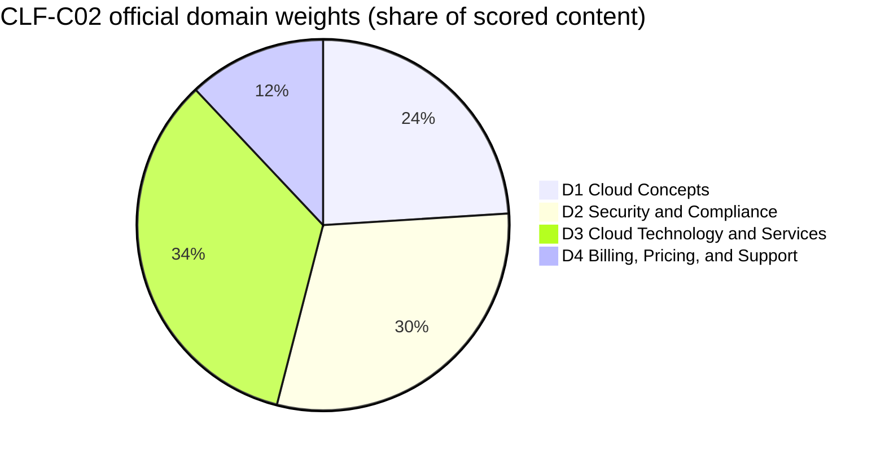
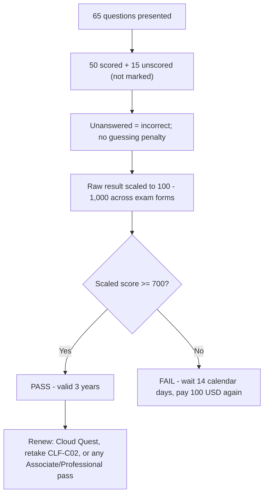
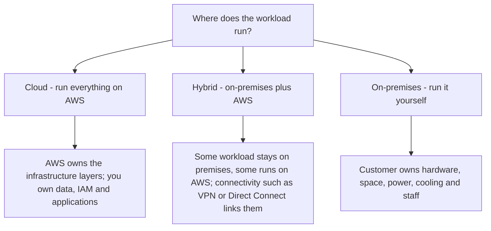
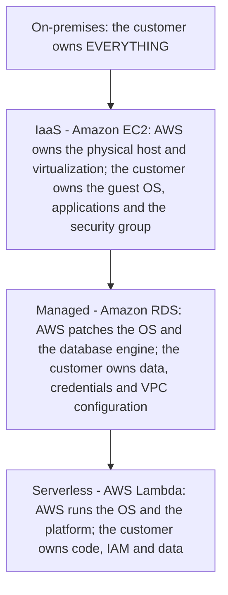

# CLF-C02 Exam Guide and Cloud Concepts

Every AWS certification begins with one document: the **official exam guide**. For CLF-C02 that single document does two jobs at once — it tells you exactly *how* the exam is built (codes, minutes, questions, cut score, weights) and it defines the *cloud vocabulary* you must command in Domain 1 (Cloud Concepts, 24% of scored content). Candidates who skip the guide and jump straight to flashcards fall into the same three traps: they misjudge the time budget, they confuse a **scaled score** with a percentage, and they cannot separate what is **in scope** from what merely sounds like real cloud work.

```text
=====================================================================
 CLF-C02 — AWS CERTIFIED CLOUD PRACTITIONER (FOUNDATIONAL)
=====================================================================
  Code .............. CLF-C02          Level .... Foundational
  Duration .......... 90 minutes       Questions . 65 presented
  Scored items ...... 50               Unscored ... 15 (not identified)
  Scale ............. 100 - 1,000      Cut score .. 700
  Scoring ........... compensatory (overall only, no per-domain pass)
  Cost .............. 100 USD (as of Oct 2026, taxes may apply)
  Validity .......... 3 years          Delivery ... Pearson VUE center
                                        or online proctored
  Languages ......... 12 (Italian and German retire after
                        December 31, 2026)
---------------------------------------------------------------------
  DOMAIN                                      WEIGHT   ITEMS (50 x w)
  1. Cloud Concepts                             24%          12
  2. Security and Compliance                    30%          15
  3. Cloud Technology and Services              34%          17
  4. Billing, Pricing, and Support              12%           6
                                              ------         -----
                                              100%           50
---------------------------------------------------------------------
  QUESTION TYPES: multiple choice | multiple response
                  (no penalty for guessing; blank = wrong)
  NOTE: item counts above are 50 x weight — arithmetic, NOT
        published by AWS. Only the percentages are official.
=====================================================================
```

> [!NOTE]
> **The guide is the contract.** Anything not in the exam guide — no matter how popular it is in blog posts — is not guaranteed to appear. AWS explicitly labels its two service lists **"non-exhaustive and subject to change"**, so treat the guide as the floor of what you must know, not the ceiling.

In this lesson you will:

- read the exam guide the way an exam writer does — code, timing, cost, scoring, languages;
- turn **domain weights** into a concrete study-hour budget;
- map all **19 task statements** across the four content domains;
- master the **two question types** and the compensatory scoring model;
- separate the **in-scope** service list from the **out-of-scope** list that feeds distractors;
- define cloud computing, and contrast **on-premises versus cloud** in the guide's own terms;
- recognise the three **deployment models** (cloud, hybrid, on-premises) and the service-model ladder;
- explain **elasticity, scalability, high availability and agility** without mixing them up;
- state the **six advantages of cloud computing** and the AWS value proposition;
- apply the **Well-Architected Framework** pillars and its six general design principles;
- work through cloud economics: **fixed versus variable cost, rightsizing, BYOL, automation**;
- study **four real AWS customer case studies** — services, numbers and sources;
- read the **October 2026 update box** — which guide facts moved, and which did not;
- practise with **12 exam-style questions** plus three interactive checks.

---

## 1. What the CLF-C02 exam measures

### 1.1 The target candidate

CLF-C02 is a **Foundational** credential, and AWS's own material describes its audience as **non-IT entrants** — sales, product and project-management people — who need **cloud literacy**, not cloud engineering. Nobody expects you to build infrastructure. You are tested on **judgment, vocabulary, service selection and cost awareness**.

| Candidate attribute | What the guide says | What it means for your prep |
|---|---|---|
| Code and level | CLF-C02 / **Foundational** | Breadth of vocabulary, not depth of implementation |
| Audience | Non-IT roles needing cloud literacy | Conceptual, not hands-on troubleshooting |
| Coding | **Out of scope** | No scripts, no CLI syntax memorisation |
| Architecture design | **Out of scope** | You recognise principles; you do not draw designs |
| Load and performance testing | **Out of scope** | You know *that* it exists, not *how* to run it |

### 1.2 The out-of-scope job tasks — verbatim

The guide draws a hard line, and it is worth memorising word for word:

> "The following list contains job tasks that the target candidate is not expected to be able to perform. This list is non-exhaustive. These tasks are out of scope for the exam: **Coding / Designing cloud architecture / Troubleshooting / Implementation / Load and performance testing**"

This list is not decoration. Items from it appear as **distractors**, because a distractor that sounds like "real cloud work" is the most tempting wrong answer of all.

> [!WARNING]
> **⚠️ The scope paradox — out of scope does not mean never mentioned.**
> - *"Designing cloud architecture"* is out of scope, yet Task 1.2 still asks you to name the **Well-Architected pillars** — principles, not drawings.
> - *"Implementation"* is out of scope, yet Task 3.1 still asks you to **choose** between the console, CLI, SDKs and infrastructure as code — a decision, not a build.
> - *"Troubleshooting"* is out of scope, yet Task 3.8 still names "tools to develop, deploy, and **troubleshoot** applications" — you must know the *role* of a tool, not debug steps.
> The exam wants **selection and recognition**; any option that asks you to write, build or debug is testing whether you spotted an out-of-scope task.

### 1.3 Appendix A: the technologies and concepts list

Alongside the domains, the guide carries an appendix of **28 technologies and concepts** that "might appear on the exam", explicitly with **no indication of their relative weight**. The Domain 1 entries are cloud migration benefits, AWS Cloud Adoption Framework (CAF), cost management, global infrastructure, infrastructure as code, migration and data transfer, AWS Prescriptive Guidance, AWS Pricing Calculator, AWS Professional Services, AWS Partner Network, solutions architects and the Well-Architected Framework. Read it as a *vocabulary checklist*, never as a weight.

- **📚 Did you know?** The exam has **two official guide artefacts** that genuinely disagree: an HTML guide on `docs.aws.amazon.com` and an older PDF stamped "Version 1.0 CLF-C02" on `d1.awsstatic.com`. **13 of the 19 task statements differ** between them (checked Oct 2026). The rule AWS's own structure implies: **the HTML guide wins** over any old PDF, blog post or third-party practice test.

---

## 2. Exam logistics: the numbers that change your strategy

### 2.1 The logistics table

Every row below comes from the exam guide, the certification page's "Exam overview", or the AWS Certification FAQs, all accessed **October 2026**.

| Attribute | Value | Where it is stated |
|---|---|---|
| Code / level | CLF-C02 / Foundational | Exam guide |
| Duration | **90 minutes** | Exam overview |
| Questions presented | **65** (multiple choice or multiple response) | Exam overview |
| Scored / unscored | **50 affect your score / 15 do not** — the 15 are **not identified** on the exam | Exam guide |
| Response types | MC: 1 correct + 3 distractors · MR: 2+ correct of 5+ options | Exam guide |
| Guessing policy | Unanswered = **incorrect**; **no penalty** for guessing | Exam guide |
| Score scale | Scaled **100–1,000**; minimum passing **700** | Exam guide |
| Scoring model | **Compensatory** — only the overall result must pass | Exam guide |
| Fee | **100 USD** as of Oct 2026 (Foundational-level exams; taxes such as VAT may apply) | Certification FAQs |
| Delivery | Pearson VUE testing centre **or** online proctored exam | Exam overview |
| Languages | **12**: Arabic, English, French (France), German, Italian, Japanese, Korean, Portuguese (Brazil), Spanish (Latin America), Spanish (Spain), Simplified Chinese, Traditional Chinese | Exam overview |
| Language retirement | **Italian and German retire after December 31, 2026** | Exam overview |
| Validity | **3 years** | Certification page |
| Renewal | Cloud Quest Recertify Cloud Practitioner (no exam), re-passing CLF-C02, or passing **any one** Associate- or Professional-level exam | Recertification page |
| Retake after a fail | Wait **14 calendar days**; **no limit** on attempts; **full fee every time** | Certification FAQs |
| Re-sit after a pass | Blocked for **2 years** (unless AWS releases a new exam guide and series code) | Certification FAQs |

### 2.2 Worked example E1 — the per-question time budget

The single most useful number in the whole guide is arithmetic that nobody publishes:

$$
t = \frac{90 \times 60}{65} = \frac{5{,}400}{65} \approx 83.1 \text{ seconds per question}
$$

Reserve **10 minutes** for review and the real budget becomes $80 \times 60 / 65 \approx$ **73.8 seconds** per item. Budgeting rule of thumb: answer fast early, then spend the surplus on the slower multiple-response items.

### 2.3 Worked example E2 — scored versus unscored

$$
65 = 50 + 15 \qquad \frac{15}{65} = 23.1\% \text{ of the exam does not affect your score}
$$

Nearly a quarter of the paper is invisible pilot material — and **you cannot tell which 15 they are**. The only sane strategy is to treat every single item as scored.

### 2.4 Worked example E3 — the cost of a retake

| Event | Calendar day | Wallet |
|---|---|---|
| First attempt (fail) | Day 0 | 100 USD (as of Oct 2026) |
| Eligible to retake | Day 14 | — |
| Second attempt (fail) | Day 14 or later | +100 USD |
| Third attempt | +14 days after the second fail | +100 USD |
| **Total after three failed attempts** | — | **300 USD** |

Three attempts cost **300 USD** as of Oct 2026 plus at least **28 calendar days** of waiting between them. A **missed appointment** is different again: it forfeits the fee but is **not** a failed attempt.

- **📚 Did you know?** Validity of **3 years does not mean a mandatory retake**. AWS lists three renewal routes, and one of them — **Cloud Quest Recertify Cloud Practitioner** — needs no exam at all; alternatively, passing *any* Associate- or Professional-level exam renews it. So a candidate who plans to continue on the AWS path can let CLF-C02 expire deliberately.

---

## 3. The four domains and their weights

### 3.1 Official weights

The guide states four content domains, and the percentages are shares of **scored content only**:

| Domain | Official weight |
|---|---|
| **1. Cloud Concepts** | **24%** |
| **2. Security and Compliance** | **30%** |
| **3. Cloud Technology and Services** | **34%** |
| **4. Billing, Pricing, and Support** | **12%** |
| **Total** | **100%** |



### 3.2 Worked example E4 — derived item counts (arithmetic, not AWS's)

Multiply the **50 scored** items by each weight:

```text
Domain   weight   50 x weight   reading
D1        24%         12        about 12 scored items
D2        30%         15        about 15 scored items
D3        34%         17        about 17 scored items
D4        12%          6        about  6 scored items
                                ------
                              50 scored items
```

> [!IMPORTANT]
> The **weights are official** (exam guide, Oct 2026). The **item counts are arithmetic** — 50 × weight — and are **not published by AWS**. Per-domain question counts are unknown, and because 15 of the 65 items are unscored pilots your actual test form will not match this grid exactly. Use it to **allocate study time**, never to predict a fixed number of questions.

### 3.3 From CLF-C01 to CLF-C02

The exam was updated in September 2023 (CLF-C01 ran until **18 September 2023**; CLF-C02 from **19 September 2023**), and the guide's own comparison appendix shows how the emphasis moved:

| Domain | CLF-C01 | CLF-C02 |
|---|---|---|
| 1. Cloud Concepts | 26% | **24%** |
| 2. Security and Compliance | 25% | **30%** |
| 3. Technology → Cloud Technology and Services | 33% | **34%** |
| 4. Billing and Pricing → Billing, Pricing, and Support | 16% | **12%** |

Three facts follow from that table: **security grew by five points**; **billing shrank by four**; and AWS states **"No content was deleted from the exam"** — content from seven old task statements was **recategorised** into the new ones. The one genuine addition is **Task 1.3**, which introduced the **AWS Cloud Adoption Framework (CAF)**.

### 3.4 Worked example E5 — turning weights into study hours

Suppose you have **40 hours** before exam day. The weights convert directly into hours:

```text
Domain   weight   hours (40 h)   where the hours go
D1        24%        9.6 h       benefits, Well-Architected, CAF, economics
D2        30%       12.0 h       shared responsibility, IAM, compliance
D3        34%       13.6 h       global infrastructure, compute, storage,
                                 databases, networking, AI/ML
D4        12%        4.8 h       pricing models, cost tools, Support plans
                                ---------
                                40.0 h
```

Domains 2 + 3 are **64% of the score**. A candidate who spends all their time on cloud concepts because "that's the Cloud Practitioner topic" has misallocated two-thirds of the paper.

---

## 4. The task-statement map: 4 domains → 19 tasks

The guide does not publish topics; it publishes **task statements** — each one a "Knowledge of" plus a "Skills in" pair. Everything examinable hangs off one of these 19.

```mermaid
flowchart TD
    R["CLF-C02 - 19 task statements across 4 domains"] --> D1["D1 Cloud Concepts 24%"]
    R --> D2["D2 Security and Compliance 30%"]
    R --> D3["D3 Cloud Technology and Services 34%"]
    R --> D4["D4 Billing, Pricing, and Support 12%"]
    D1 --> A1["1.1 Benefits of the AWS Cloud"]
    D1 --> A2["1.2 Design principles of the AWS Cloud"]
    D1 --> A3["1.3 Migration benefits and strategies"]
    D1 --> A4["1.4 Cloud economics"]
    D2 --> B1["2.1 Shared responsibility model"]
    D2 --> B2["2.2 Security, governance, compliance concepts"]
    D2 --> B3["2.3 Access management capabilities"]
    D2 --> B4["2.4 Components and resources for security"]
    D3 --> C1["3.1 Deploying and operating in the cloud"]
    D3 --> C2["3.2 Global infrastructure"]
    D3 --> C3["3.3 Compute services"]
    D3 --> C4["3.4 Database services"]
    D3 --> C5["3.5 Network services"]
    D3 --> C6["3.6 Storage services"]
    D3 --> C7["3.7 AI/ML and analytics services"]
    D3 --> C8["3.8 Other in-scope service categories"]
    D4 --> E1["4.1 Compare AWS pricing models"]
    D4 --> E2["4.2 Billing, budget, cost management"]
    D4 --> E3["4.3 Technical resources and AWS Support"]
```



### 4.1 Domain 1 in detail — the four tasks this course starts with

| Task | Knowledge of | Skills in (what you must be able to *do*) |
|---|---|---|
| **1.1 Define the benefits of the AWS Cloud** | Value proposition of the AWS Cloud | Benefits of global infrastructure (speed of deployment, global reach); advantages of **high availability, elasticity and agility** |
| **1.2 Identify design principles** | AWS Well-Architected Framework | The six **pillars**; **differences between the pillars** |
| **1.3 Migration benefits and strategies** | Cloud adoption strategies; resources supporting the journey | Components of **AWS CAF** (reduced business risk; improved ESG performance; increased revenue; increased operational efficiency); identifying migration strategies (for example, **database replication**) |
| **1.4 Concepts of cloud economics** | Aspects of cloud economics; cost savings of moving to the cloud | **Fixed vs variable** costs; on-premises cost drivers; **BYOL vs included licences**; **rightsizing**; benefits of **automation**; **economies of scale** |

### 4.2 The other 15 tasks in one line each

| Task | One-line focus |
|---|---|
| 2.1 | Shared responsibility — AWS, customer, and shared controls, and how the line **shifts by service** (RDS, Lambda, EC2) |
| 2.2 | Compliance and governance — Artifact, encryption, logs (CloudTrail, Config), CloudWatch monitoring |
| 2.3 | Access management — IAM, root-user protection, least privilege, MFA, IAM Identity Center, federation |
| 2.4 | Security resources — WAF, Shield, GuardDuty, Inspector, Marketplace third parties, Trusted Advisor |
| 3.1 | Ways of operating — programmatic access (APIs, SDKs, CLI) vs console vs IaC; **cloud, hybrid, on-premises** deployment models |
| 3.2 | Global infrastructure — Regions, Availability Zones, edge locations; multi-AZ high availability |
| 3.3 | Compute — EC2 instance types, ECS/EKS, Fargate/Lambda, auto scaling, load balancers |
| 3.4 | Databases — RDS, Aurora, DynamoDB, ElastiCache; migration with DMS and SCT |
| 3.5 | Networking — VPC subnets and gateways, NACLs and security groups, Route 53, VPN and Direct Connect |
| 3.6 | Storage — object (S3 classes), block (EBS, instance store), file (EFS, FSx), Storage Gateway, lifecycle policies, AWS Backup |
| 3.7 | AI/ML and analytics — SageMaker AI, Lex; Athena, Kinesis, Glue, Quick Sight |
| 3.8 | Other categories — EventBridge, SNS, SQS; Connect, SES; CodeBuild, CodePipeline, X-Ray; AppStream 2.0, WorkSpaces; Amplify; IoT Core; AWS Support |
| 4.1 | Pricing models — On-Demand, Reserved, Spot, Savings Plans, Dedicated, Capacity Reservations; storage tiers; data transfer in/out |
| 4.2 | Cost tools — Budgets, Cost Explorer, Pricing Calculator, Organizations consolidated billing, cost allocation tags, the Cost and Usage Report |
| 4.3 | Support and resources — whitepapers, Prescriptive Guidance, Knowledge Center, re:Post, Support plans, Trusted Advisor, Health Dashboard, Marketplace, Professional Services |

---

## 5. Question types and scoring mechanics

### 5.1 Exactly two question types

| Type | Structure | Credit rule |
|---|---|---|
| **Multiple choice** | One correct response and **three incorrect responses (distractors)** | Select the single best answer |
| **Multiple response** | **Two or more correct** responses out of **five or more** options | Every correct response is required for credit |

There are **no ordering, matching, drag-and-drop or case-study items** in the CLF-C02 guide — if a practice test shows you those, it is not following this exam's guide.

### 5.2 The scoring pipeline



**Compensatory** means one thing: only the **overall** result must clear 700. You do **not** need to reach 700 inside each domain — a weak Domain 4 can be carried by a strong Domain 3, and dominating one domain cannot rescue an overall score below the cut.

### 5.3 Worked example E6 — 700 is not 70%

700 out of 1,000 *looks* like 70%, and the naive conversion $0.70 \times 50 = 35$ correct answers is arithmetically clean — and **wrong as an exam fact**. The scale starts at 100, so the usable range is $1{,}000 - 100 = 900$ points:

$$
\frac{700 - 100}{900} = \frac{600}{900} \approx 66.7\%
$$

AWS scales scores **across multiple exam forms that may differ in difficulty**, so the raw number of correct answers required for 700 is **not fixed** and is not published. The only deterministic rule is behavioural: **unanswered items are scored incorrect**, so answer all 65.

> [!WARNING]
> **Never leave an item blank "to be safe".** There is **no penalty for guessing** — a wrong guess costs you nothing beyond the point you would have lost by skipping, while a blank guarantees zero. Habit: eliminate, commit, flag, move on. At ~83 seconds per item, a question you "meant to return to" is the most expensive habit on this exam.

---

## 6. In-scope versus out-of-scope services

### 6.1 Two lists, one rule

The guide publishes an **In-Scope AWS Services** list spanning **19 categories**, and a separate **Out-of-Scope AWS Services** list. Both are labelled **non-exhaustive and subject to change** (as of Oct 2026). The in-scope list is what you must recognise; the out-of-scope list tells you which names are being used as **baits**.

| In-scope category (19 total) | Names the guide lists |
|---|---|
| Analytics | Athena, EMR, Glue, Kinesis, OpenSearch, Quick Sight, Redshift |
| Application Integration | EventBridge, SNS, SQS, Step Functions |
| Cloud Financial Management | AWS Budgets, Cost and Usage Reports, Cost Explorer, AWS Marketplace |
| Compute | Batch, EC2, Elastic Beanstalk, Lightsail, Outposts |
| Containers | ECR, ECS, EKS |
| Database | Aurora, DocumentDB, DynamoDB, ElastiCache, Neptune, RDS |
| Machine Learning | Comprehend, Lex, Polly, Q, Rekognition, SageMaker AI, Textract, Transcribe, Translate |
| Management and Governance | Auto Scaling, CloudFormation, CloudTrail, CloudWatch, Compute Optimizer, Config, Control Tower, Organizations, Trusted Advisor, **Well-Architected Tool**, … |
| Migration and Transfer | Application Discovery Service, Application Migration Service, DMS, Migration Evaluator, Migration Hub, SCT |
| Networking and Content Delivery | API Gateway, CloudFront, Direct Connect, Global Accelerator, PrivateLink, Route 53, Transit Gateway, VPC, VPN |
| Security, Identity, and Compliance | Artifact, ACM, CloudHSM, Cognito, Detective, GuardDuty, **IAM**, **IAM Identity Center**, Inspector, KMS, Macie, RAM, Secrets Manager, Security Hub, Shield, WAF |
| Serverless | Fargate, Lambda |
| Storage | AWS Backup, EBS, EFS, Elastic Disaster Recovery, FSx, S3, S3 Glacier, Storage Gateway |

### 6.2 The out-of-scope list — services that exist but are not examinable

Amazon AppFlow · AWS Clean Rooms · AWS Data Exchange · Amazon DataZone · **Amazon MSK** · AWS AppFabric · Amazon WorkDocs · AWS Wavelength · AWS Copilot · Amazon GameLift · **AWS CloudShell** · **AWS CodeDeploy** · AWS CodeArtifact · AWS Device Farm · Amazon CodeGuru · AWS IoT Greengrass · Amazon Fraud Detector · Amazon Personalize · Amazon Lookout for Metrics · AWS Chatbot · **AWS Billing Conductor** · all AWS Elemental media services · **Amazon MemoryDB** · **AWS Network Firewall** · AWS RoboMaker · **Amazon FSx for Lustre** · AWS Transfer Family · AWS IQ · AWS Activate · AWS Managed Services (AMS) · Amazon Keyspaces · AWS Launch Wizard · AWS AppConfig · Amazon Data Lifecycle Manager · Amazon Elastic Transcoder · AWS Cloud Map · AWS Ground Station · Amazon VPC Lattice · Amazon Cloud Directory · AWS Migration Hub Refactor Spaces · AWS Network Access Analyzer · AWS IoT Device Defender · Amazon Monitron · AWS Application Composer · Amazon Interactive Video Service (Amazon IVS).

> [!IMPORTANT]
> **A service being out of scope does not mean it is fake, deprecated or wrong.** These are real, current AWS services. They simply **cannot be the correct answer** to a CLF-C02 question while an in-scope service fits. If a question's best-sounding option is on the out-of-scope list, keep reading — a better, in-scope option is almost certainly there.

### 6.3 Naming traps in the in-scope list

- The guide spells it **"Amazon Quick Sight"** (two words) — the product page says QuickSight.
- Task 4.2 says "AWS Cost and Usage **Report**" while the service list says **"AWS Cost and Usage Reports"** (plural).
- It is **"AWS IAM Identity Center"** — the old "(AWS Single Sign-On)" wording no longer appears.
- **AWS VPN**, **AWS Site-to-Site VPN** and **AWS Client VPN** are listed as **three separate bullets**, not one service with three modes.
- The service is **Amazon SageMaker AI** — the older "SageMaker" name without "AI" is what older practice tests use.

### 6.4 Which guide wins

| Artefact | Status (Oct 2026) | Rule |
|---|---|---|
| HTML guide on `docs.aws.amazon.com` | Current | **Use this one** |
| PDF stamped "Version 1.0 CLF-C02" | Older; 13 of 19 task statements differ | Reference only |
| Third-party practice tests | Vary | Never authoritative |

The HTML version dropped items such as "AWS Snowball" and "AWS Audit Manager" from task statements, and changed the service lists substantially — the out-of-scope list went from 11 names in 3 categories in the PDF to a far longer list in the HTML.

- **📚 Did you know?** **AWS Snowball** is a trap in *two* directions at once: the older PDF exam guide still names it inside Task 1.3, yet it appears on **neither** the current in-scope list **nor** the out-of-scope list — and the Snowball Edge documentation carries a banner stating the device is **no longer available to new customers** (as of Oct 2026). Both service lists are non-exhaustive, so AWS never reconciled the contradiction; do not build your study plan around it.

### 2026 Updates (as of October 2026)

> [!NOTE]
> **What actually moved between the launch-era guide and the guide you download today** — every line below is checked against a primary AWS source in **October 2026**, and each one is examinable because the exam tests the *current* guide:
> - **The domain weights have not moved**: still **24 / 30 / 34 / 12**, unchanged since CLF-C02 went live on **19 September 2023**. Any prep page claiming a recent weight shift (for example "Security 28% → 30%") is uncorroborated — current exam guide PDF, p. 3, accessed Oct 2026.
> - **Both service lists were rebuilt**: in-scope entries **128 → 111** across the same 19 categories, out-of-scope entries **11 → 55** — official in-scope and out-of-scope service pages, accessed Oct 2026.
> - **Task 4.3 now teaches the post-2025 support lineup**: its example reads "customer service and communities, **Basic Support, AWS Business Support+, AWS Enterprise Support, AWS Unified Operations**"; Developer, classic Business and Enterprise On-Ramp took **no new subscriptions after 2 December 2025** (exam guide Task 4.3; AWS News Blog, 2 Dec 2025).
> - **Task 4.2 dropped AWS Billing Conductor** — the current wording is only "AWS Budgets and AWS Cost Explorer", and Billing Conductor now sits on the **out-of-scope** list, where it can only be a distractor (launch-era vs current exam guide, accessed Oct 2026).
> - **Global infrastructure keeps growing**: **39 Regions and 124 Availability Zones**, with **7 more AZs** and **2 more Regions** (Kingdom of Saudi Arabia and Chile) announced but not yet open (Regions and AZs map, accessed Oct 2026 — verify current before use).
> - **Two languages are on the clock**: **12 languages** are offered, but **Italian and German retire after December 31, 2026** (certification page, accessed Oct 2026).

- **📚 Did you know?** The current exam guide PDF carries **no version number at all** — it prints only "Copyright © 2026", and the single stamped artefact still circulating is the launch-era **"Version 1.0 CLF-C02"**. The `uiVersion=2024.10` you can see in the docs URL is the **AWS Docs site-template version**, not a guide revision date (checked Oct 2026). There is also no AWS changelog page for this guide, so "the guide was refreshed in March 2026" style claims are unverifiable.

---

## 7. Cloud basics: what the cloud is, and what changes when you move

### 7.1 What cloud computing is

On this exam, cloud computing is defined by its **consequence rather than by hardware**: you stop owning and maintaining infrastructure and instead consume a metered service, paying only while it runs. AWS's own advantages page carries the whole economic argument in one line:

> "Trade fixed expense for variable expense … pay only when you consume computing resources"

AWS describes the platform as offering **over 200 fully featured services** (as of Oct 2026), and its origins page states the founding intent was to let anyone "access the same powerful technology as the world's largest and most sophisticated companies". The six advantages in Section 8 are what Task 1.1 means by the **"value proposition of the AWS Cloud"**.

### 7.2 On-premises versus cloud

| Dimension | On-premises | AWS Cloud |
|---|---|---|
| Expense type | **Fixed / capital** — bought before it is used | **Variable / operational** — metered while it runs |
| Capacity decision | Bought for **peak**, idle the rest of the time | Grown or shrunk **on a few minutes' notice** |
| Refresh | Hardware refresh cycle of about **5 years** (AWS, 2022) | No refresh cycle for the customer |
| Procurement | Typically **6–9 months** in advance (AWS, 2022) | Minutes |
| Typical utilisation | **Under 15%** for on-premises data-centre servers (AWS, 2024) | You pay for what you consume |
| Over-provisioning | **20%–50%** above predicted peak (AWS, 2022) | Not required — elasticity absorbs spikes |
| Staff work | Racking, stacking and powering servers | Offloaded to AWS |
| Reach | Confined to where the hardware sits | **Go global in minutes** |

The four on-premises figures above are AWS-published industry estimates (2022 and 2024 posts), current as of Oct 2026 — **verify current before use**.

### 7.3 Worked example E7 — the on-premises costs a price list never shows

A hypothetical small deployment of **10 servers** over a **five-year horizon**. The dollar inputs are **illustrative assumptions, not AWS prices** (as of Oct 2026 — verify current before use); the point of the example is which lines are normally forgotten:

```text
Line item                              5-year cost
Server hardware                          $ 30,000
Annual maintenance (5 years)             $ 30,000
Power and cooling  $25 x 10 x 60 months  $ 15,000
Floor space                               $  6,000
0.25 FTE systems administrator          $ 112,500
                                       ----------
Subtotal (before licences, refresh
  and cost of capital)                 $ 193,500
```

The lesson is not the total — it is that **four of those five lines are invisible** to anyone comparing a server sticker price with an hourly rate. AWS's guidance is explicit that flawed comparisons omit labour, refresh and facilities.

### 7.4 Deployment models

Task 3.1 names exactly **three** deployment models:



A **hybrid** model is the answer whenever part of the estate must stay on premises while new capability is built on AWS; **on-premises** is the answer when nothing moves; **cloud** is the answer when everything moves.

### 7.5 The service-model ladder — how much AWS takes over

The guide does not enumerate IaaS/PaaS/SaaS in a task statement, but it *does* test the underlying idea through the **shared responsibility shift**: the more managed the service, the smaller your share.

| Layer | On-premises | IaaS — Amazon EC2 | Managed — Amazon RDS | Serverless — AWS Lambda |
|---|---|---|---|---|
| Physical hardware, hypervisor | Customer | **AWS** | **AWS** | **AWS** |
| Guest OS patching | Customer | **Customer** | AWS | AWS (no customer OS) |
| Runtime, capacity, scaling | Customer | Customer | AWS | AWS |
| Security groups / network config | Customer | **Customer** | **Customer** | n/a |
| Application / function code | Customer | Customer | Customer | **Customer** |
| IAM users, roles, MFA | Customer | Customer | Customer | **Customer** |
| Data, classification, encryption | Customer | Customer | Customer | **Customer** |



**Constants regardless of ladder position:** physical security of the cloud is **always AWS**; data, IAM and encryption decisions are **always the customer**.

```dragdrop
{
  "question": "Order the service-model ladder from where the CUSTOMER carries the most responsibility to where AWS carries the most:",
  "items": [
    "On-premises - the customer owns hardware, space, power, cooling and staff",
    "IaaS - Amazon EC2: AWS owns the physical host and hypervisor; the customer owns the guest OS, applications and security groups",
    "Managed - Amazon RDS: AWS patches the OS and the database engine; the customer owns data, credentials and VPC configuration",
    "Serverless - AWS Lambda: AWS runs the OS and the platform; the customer owns code, IAM and data"
  ],
  "correctOrder": [
    "On-premises - the customer owns hardware, space, power, cooling and staff",
    "IaaS - Amazon EC2: AWS owns the physical host and hypervisor; the customer owns the guest OS, applications and security groups",
    "Managed - Amazon RDS: AWS patches the OS and the database engine; the customer owns data, credentials and VPC configuration",
    "Serverless - AWS Lambda: AWS runs the OS and the platform; the customer owns code, IAM and data"
  ],
  "explanation": "Each rung up the ladder hands one more undifferentiated layer to AWS, which is why the exam reads the ladder as a shared-responsibility question: guest-OS patching moves from customer (EC2) to AWS (RDS, Lambda), while data classification, IAM users, roles and encryption stay with the customer at EVERY rung - including serverless. On-premises is first because the customer owns everything, physical layer included."
}
```

### 7.6 Four words the exam keeps apart

| Term | Definition on the exam |
|---|---|
| **Elasticity** | Grow **and shrink** automatically as demand changes |
| **Scalability** | The ability to **handle growth** |
| **High availability** | Survive a **component failure** (multiple Availability Zones) |
| **Agility** | Speed of provisioning — **"from weeks to just minutes"** |

```fillblank
{
  "question": "Complete the cloud-concepts statements using the exam guide's own vocabulary:",
  "template": "The cloud trades {{1}} expense for {{2}} expense, so you pay only when you {{3}} computing resources. Matching instance size and type to measured utilisation while still meeting performance is called {{4}}, and the structural price advantage that comes from aggregating demand across hundreds of thousands of customers is called {{5}} of scale.",
  "answers": {
    "1": "fixed",
    "2": "variable",
    "3": "consume",
    "4": "rightsizing",
    "5": "economies"
  },
  "distractors": ["capital", "operating", "provision", "over-provisioning", "autoscaling", "elasticity", "virtualisation"],
  "explanation": "AWS's six advantages state the trade directly: 'Trade fixed expense for variable expense ... pay only when you consume computing resources', and 'Benefit from massive economies of scale'. Rightsizing is the exam-guide skill of matching size and type to MEASURED utilisation while still meeting performance - it is not the same as picking the cheapest instance."
}
```

---

## 8. AWS value proposition: the six advantages

### 8.1 The six advantages, in AWS's wording

Task 1.1's "value proposition" is examined through six advantages, and questions frequently quote a phrase **verbatim**:

| # | Advantage (AWS wording) | What it kills on-premises |
|---|---|---|
| 1 | **"Trade fixed expense for variable expense"** — pay only when you consume | Buying for peak |
| 2 | **"Benefit from massive economies of scale"** — usage from hundreds of thousands of customers is aggregated, yielding lower pay-as-you-go prices | Paying retail for one rack |
| 3 | **"Stop guessing capacity"** — scale up or down on a few minutes' notice | 20–50% over-provisioning |
| 4 | **"Increase speed and agility"** — from weeks to just minutes | 6–9 month procurement |
| 5 | **"Stop spending money running and maintaining data centers"** — the heavy lifting of racking, stacking and powering servers | Facilities and labour |
| 6 | **"Go global in minutes"** — lower latency for end users | Building abroad |

Task 1.1 adds the four headline **benefits**: benefits of **global infrastructure** (speed of deployment, global reach) and the advantages of **high availability, elasticity and agility**.

### 8.2 Worked example E8 — why economies of scale are structural, not a promotion

Two customers each need a peak of **10 units** of capacity, but their peaks occur at different times (anti-correlated):

```text
Without aggregation:  10 + 10 = 20 units of peak hardware
With aggregation:     combined peak = 12 units
Hardware reduction:   (20 - 12) / 20 = 40% less hardware for identical demand
```

Because AWS aggregates demand, it buys and runs **~40% less hardware for the same total customer peak**, and passes the structural saving on as a **lower variable rate**. That is what "massive economies of scale" means — it is not a limited-time discount.

### 8.3 Worked example E9 — twenty years of the same price unit

AWS's own 20-year S3 retrospective gives both ends of the price curve: Amazon S3 launched on **14 March 2006** at **15 cents per gigabyte**, and AWS's March 2026 post puts the current figure at **slightly over 2 cents per gigabyte** — roughly an **85% reduction** (as of Oct 2026; verify current pricing before use). On **100 TB** ($102{,}400$ GB):

$$
\text{2006: } 102{,}400 \times 0.15 \approx \$15{,}360/\text{mo} \qquad \text{2026: } 102{,}400 \times 0.02 \approx \$2{,}048/\text{mo}
$$

Same unit, same service, same API — the price fell because scale and efficiency compound. The blog also notes the code written for S3 in 2006 **still works unchanged**, which is a durability argument as much as a price argument.

### 8.4 The Well-Architected Framework — Task 1.2

The framework is AWS's "best practices for designing and operating secure, reliable, efficient, cost-effective, and sustainable workloads". A review is explicitly **"a constructive conversation … not an audit mechanism"**, and the **AWS Well-Architected Tool** that performs it is **free** and on the in-scope list.

| Pillar | What it protects |
|---|---|
| **Operational Excellence** | Run, monitor and continually improve — including automation |
| **Security** | Protect information and systems |
| **Reliability** | Do what they should, and recover quickly from failure |
| **Performance Efficiency** | Use compute efficiently as demand and technology change |
| **Cost Optimization** | Avoid unnecessary cost |
| **Sustainability** | Minimise environmental impact |

```matching
{
  "question": "Match each AWS Well-Architected Framework pillar to what it protects on the CLF-C02 exam:",
  "pairs": [
    {"left": "Operational Excellence", "right": "Run, monitor and continually improve the workload - including automating change and response"},
    {"left": "Security", "right": "Protect information and systems - confidentiality, integrity and availability"},
    {"left": "Reliability", "right": "Do what the workload is supposed to do and recover quickly from failure"},
    {"left": "Performance Efficiency", "right": "Use computing resources efficiently as demand, technology and business requirements change"},
    {"left": "Cost Optimization", "right": "Avoid unnecessary cost - the pillar that drives TCO and rightsizing conversations"},
    {"left": "Sustainability", "right": "Minimise the environmental impact of running cloud workloads"}
  ],
  "explanation": "The six pillars are NOT interchangeable and they trade off against each other - spare capacity helps Reliability while hurting Cost Optimization, which is why task 1.2 also asks you to identify DIFFERENCES between the pillars. The Well-Architected Tool that runs the review is free and is on the in-scope service list."
}
```

The framework's **six general design principles** all do the same underlying trick — they convert fixed, upfront, idle spending into metered, on-demand spending: **stop guessing your capacity needs**; **test systems at production scale**; **automate with architectural experimentation in mind**; **consider evolutionary architectures**; **drive architectures using data**; **improve through game days**.

- **📚 Did you know?** Three different "six/five lists" get mixed up on this exam, and they are not variants of one another: the **Well-Architected Framework's 6 pillars** (workload quality), the **AWS Cloud Adoption Framework's 6 perspectives** (organisational readiness: Business, People, Governance, Platform, Security, Operations) and the **Cloud Value Framework's 5 pillars** (business value, of which cost savings is only pillar 1). "Sustainability" and "Cost" appear in more than one list with **different meanings** — read the stem to learn which list is live.

---

## 9. Cloud economics: fixed, variable, and where the money actually goes

### 9.1 The core distinction

- **Fixed cost** exists whether or not the service runs: owned hardware, floor space, salaried staff.
- **Variable cost** tracks consumption: metered cloud resources.
- **Capex** (capital expenditure) buys an asset you own and depreciate; **opex** (operational expenditure) pays for what you use. The cloud turns capex into opex — that is advantage #1 restated as an accounting fact.

### 9.2 On-premises cost drivers you must be able to name

Hardware **+ annual maintenance** · operating-system and application licences · **space, power and cooling** · **IT labour** · the **~5-year refresh cycle** · **6–9 month procurement** · **20–50% over-provisioning** · cost of capital · bandwidth. A comparison that counts only server purchase price against hourly rates is the flawed model AWS warns about.

### 9.3 Worked example E10 — rightsizing

A server is provisioned at **12 vCPU / 64 GB** but measures **25% CPU and 25% memory** utilisation over a representative month:

```text
Provisioned   12 vCPU / 64 GB   100%
Measured       3 vCPU / 16 GB    25%
Right target   4 vCPU / 16 GB    - matches measured demand, still meets performance
Capacity removed = (12 - 4) / 12 = 66.7% of the instance
```

**Rightsizing is not "pick the cheapest instance."** It is matching size and type to **measured utilisation while still meeting performance** — and the order matters: **right-size first, then choose a commitment or discount model.**

### 9.4 Licensing: BYOL versus included

| | **License included** | **BYOL (Bring Your Own License)** |
|---|---|---|
| Who supplies the licence | AWS bundles it into the instance price | You bring the licence **and** the media |
| Who owns compliance | **AWS** | **You** |
| Cost shape | You pay only **while the instance runs** | Marginal licence cost ≈ 0 |
| Best when | Variable or interruptible uptime | High uptime plus existing discounted licences |

**AWS License Manager** is the in-scope tool that tracks licences across AWS, on-premises and other clouds.

### 9.5 Automation and managed services

- **Automation / infrastructure as code:** templates are versioned, reviewable, repeatable and rollback-able. The guide's named automation example is **AWS CloudFormation** (the PDF rendering of Task 1.4 names it explicitly; the HTML guide says only "benefits of automation" — accept both framings). Note the distinction: **automation ≠ auto scaling**. CloudFormation makes provisioning repeatable; **Auto Scaling** provides elasticity. Both are in scope, and they answer different questions.
- **Managed services** absorb undifferentiated work: Amazon RDS takes engine patching, backups and failover; ECS and EKS take the platform; DynamoDB takes capacity and operation. **RDS, ECS, EKS and DynamoDB** are the named managed-service examples (again, named in the PDF version of Task 1.4).

- **📚 Did you know?** AWS deliberately frames cost as **only pillar 1 of 5** in its **Cloud Value Framework** — total cost of ownership is the first pillar, not the whole argument, and AWS pairs it with third-party research claiming **50% lower five-year cost of operations** and a **10-month** payback (IDC for AWS, 2022, as cited by AWS, as of Oct 2026). Those are research findings across a customer base, never a guarantee to any individual customer.

---

## Real-World Case Studies

AWS publishes what these abstractions look like in production. Every figure below is **customer- or AWS-claimed and unaudited**, with the source named so you can check it — the examinable point is the **pattern** (which principle was applied, which services did the work, which number moved), not the marketing.

### Case A — Capital One: exiting the data centre (migration and agility)

| Element | Detail |
|---|---|
| Customer | **Capital One**, bank (Fortune 100, regulated industry) |
| Challenge | Eight on-premises data centres, hardware refresh cycles, and a need to build capability faster |
| Services | 30+ AWS services including Amazon EC2, Amazon S3, Amazon RDS, AWS Lambda, Amazon ECS, AWS Step Functions, AWS Glue, Amazon Connect, Amazon SES |
| Outcomes | **Exited eight on-premises data centres**; **80%** of nearly **2,000 applications** built in the cloud **from the ground up**; average time to build a development environment cut from **3 months to minutes**; disaster-recovery testing time **−70%**; incident resolution and transaction errors **−50%**; one application's cost **−90%** after moving to Lambda; **103 tons** of copper and steel recycled |
| Exam domain | **Domain 1** (business value and agility) with Domain 3 hooks (migration, serverless) |
| Source | `aws.amazon.com/solutions/case-studies/capital-one-all-in-on-aws` (accessed Oct 2026) |

> "We are truly all in on the cloud, and AWS has been instrumental in enabling us to take full advantage of the benefits of being in the cloud." — Chris Nims, SVP cloud and productivity engineering, Capital One

> [!WARNING]
> **Do not mix Capital One's two case-study pages.** The migration page is the source for **8 data centres, 80% of ~2,000 apps, 3 months → minutes, DR −70%**. A *different* resilience page reports **critical-severity events −80–90%** and recovery **hours → minutes**. Both are real AWS pages; quoting them as one set of numbers is how a "correct" fact becomes wrong.

### Case B — Box: Well-Architected cost optimization (cost pillar in practice)

| Element | Detail |
|---|---|
| Customer | **Box**, enterprise SaaS company (120,000+ enterprises) |
| Challenge | Improve spend efficiency without degrading security, reliability or performance |
| Services | **AWS Well-Architected Framework** and Solutions Architect reviews; Amazon S3 / S3 Glacier storage class tiering; EBS volume and snapshot hygiene; AWS CloudTrail event filtering; redesigned traffic paths around internet gateways |
| Outcomes | **$2.23 million** in savings (as of Oct 2026), itemised below |
| Exam domain | **Domain 4** (cost optimization, storage tiers, data-transfer charges) |
| Source | `aws.amazon.com/solutions/case-studies/box-case-study` (accessed Oct 2026) |

| Lever | AWS-published saving (as of Oct 2026) |
|---|---|
| Cross-Availability-Zone data transfer | $438,000 |
| Internet egress | $1.1 million per year |
| Storage tiering | over $500,000 per year |
| Logging volume | $192,000 per year |
| **Total** | **$438,000 + $1,100,000 + $500,000 + $192,000 = $2,230,000 = $2.23M** |

> "Our use of AWS best practices led to savings of over 2 million dollars, setting a new baseline…" — Clay Alvord, director of FinOps and SRE, Box

Note the pattern: **none of Box's four levers was a negotiation with AWS.** Three are architectural (where traffic goes, which storage class, how much is logged) and one is a review process — which is precisely why the Well-Architected **Cost Optimization** pillar, not a discount code, is the Domain 4 concept.

### Case C — Philip Morris International: 400 applications in two years (migration value)

| Element | Detail |
|---|---|
| Customer | **Philip Morris International (PMI)**, regulated consumer-goods manufacturer pivoting to smoke-free, direct-to-consumer products |
| Challenge | Sell its own data centres first so the retreat option disappears, then migrate while meeting **GDPR** and **PCI** obligations on a fixed two-year clock |
| Services | **AWS Professional Services** with a partner (IBM), Well-Architected reviews, **Amazon RDS**, a data-lake build-out, automated CI/CD pipelines |
| Outcomes | **400 applications migrated in 2 years** starting **August 2020**, and PMI is now described as **"all in on AWS"**; performance **+50%**; **70%** of applications on automated pipelines so changes ship **80% faster**; **up to 50%** savings on some Amazon RDS costs; **500+** people earning AWS Cloud Practitioner certifications |
| Exam domain | **Domain 1** (migration benefits and cloud-adoption value, Task 1.3) with Domain 4 hooks (cost savings) and Domain 2 hooks (regulated workloads) |
| Source | `aws.amazon.com/solutions/case-studies/philip-morris-case-study` (accessed Oct 2026) |

The examinable point is not the count of applications — it is that a **regulated** company bought the migration window by disposing of the hardware first, and that AWS's own text records the initial aggressive **lift-and-shift** attempt "yielded suboptimal results" before the programme leaned on Professional Services, Well-Architected reviews and automation. Every figure above is customer/AWS-claimed and unaudited (as of Oct 2026).

### Case D — Canva: a portfolio of pricing models (cloud economics in practice)

| Element | Detail |
|---|---|
| Customer | **Canva**, online design platform, an AWS customer from day one |
| Challenge | Scale cost-effectively while keeping reliability tiers aligned to free, Pro and enterprise user plans |
| Services | **Amazon EC2 Spot** for fault-tolerant free-tier projects; **On-Demand plus Savings Plans** for steady Pro-user capacity; **Reserved Instances** as a fallback; AWS cost-management tools |
| Outcomes | Compute costs **−46% in less than two years** (customer-claimed, accessed Oct 2026); the case study quotes AWS's published ceilings of **up to 72%** for Reserved Instances and Savings Plans versus On-Demand, and **up to 90%** for Spot (as of Oct 2026 — verify current pricing before use) |
| Exam domain | **Domain 1** Task 1.4 (cloud economics) feeding directly into **Domain 4** Task 4.1 (compare AWS pricing models) |
| Source | `aws.amazon.com/solutions/case-studies/canva-cost-optimization-case-study` (accessed Oct 2026) |

Read Canva as the counter-example to "find the one cheapest option": the answer the exam wants is a **mix matched to workload shape** — interruptible capacity for interruptible work, commitment for steady work, On-Demand for whatever is left — which is exactly the ordering rightsizing → commitment → Spot logic from Section 9.

| Case | Principle it demonstrates | Domain |
|---|---|---|
| Capital One | Agility, speed of deployment, economies of scale, migration | D1 Cloud Concepts |
| Box | Cost optimization, storage tiers, data-transfer charges | D4 Billing, Pricing, and Support |
| Philip Morris International | Migration benefits in a regulated business, Professional Services, automation | D1 Cloud Concepts |
| Canva | Cloud economics — mixing On-Demand, Savings Plans, Reserved and Spot | D1 → D4 Billing, Pricing, and Support |

- **📚 Did you know?** AWS's own Philip Morris case study is unusually candid: it states that the company's initial aggressive **lift-and-shift** "yielded suboptimal results" — a published AWS admission that migration *strategy* beats migration *speed*. That is why Task 1.3 asks you to identify migration strategies (for example, **database replication**), not merely to name a rehosting tool, and why "just move it all, fast" is a classic distractor (source accessed Oct 2026).

---

## Practice Questions

```question
{
  "id": "clf-01-q1",
  "type": "multiple-choice",
  "question": "Which CLF-C02 content domain carries the largest share of scored content?",
  "options": [
    "Cloud Concepts",
    "Security and Compliance",
    "Cloud Technology and Services",
    "Billing, Pricing, and Support"
  ],
  "correct": 2,
  "explanation": "Domain 3 Cloud Technology and Services carries 34% of scored content, ahead of Domain 2 (30%), Domain 1 (24%) and Domain 4 (12%). Study time should follow the weights, and Domain 3 alone is roughly one third of the paper."
}
```

```question
{
  "id": "clf-01-q2",
  "type": "multiple-choice",
  "question": "Which of the following appears on the CLF-C02 exam guide's list of job tasks the target candidate is NOT expected to be able to perform?",
  "options": [
    "Explaining the AWS shared responsibility model",
    "Comparing AWS pricing models",
    "Designing cloud architecture",
    "Identifying AWS storage services"
  ],
  "correct": 2,
  "explanation": "The out-of-scope list reads: Coding / Designing cloud architecture / Troubleshooting / Implementation / Load and performance testing. Explaining shared responsibility, comparing pricing models and identifying storage services are all named task statements (2.1, 4.1 and 3.6 respectively)."
}
```

```question
{
  "id": "clf-01-q3",
  "type": "multiple-choice",
  "question": "Which statement about CLF-C02 question types is correct?",
  "options": [
    "Multiple choice has one correct response and three distractors; multiple response has two or more correct responses out of five or more options",
    "The exam also includes ordering, matching and case-study items",
    "Multiple response awards partial credit for selecting some of the correct options",
    "Multiple choice items always present five response options with two correct answers"
  ],
  "correct": 0,
  "explanation": "The guide defines exactly two types: multiple choice (1 correct + 3 incorrect) and multiple response (2+ correct of 5+). CLF-C02 lists no ordering, matching, drag-and-drop or case-study items, and multiple response requires all correct responses for credit."
}
```

```question
{
  "id": "clf-01-q4",
  "type": "multiple-choice",
  "question": "You fail CLF-C02 today and then fail a second attempt. Assuming each attempt costs 100 USD (as of Oct 2026), what have you paid, and what is the minimum wait before each retake?",
  "options": [
    "200 USD total; 14 calendar days between attempts, with unlimited attempts allowed",
    "200 USD total; 7 calendar days between attempts",
    "100 USD total because a retake is discounted after the first failure",
    "200 USD total; you may retake immediately after receiving your score report"
  ],
  "correct": 0,
  "explanation": "The fee applies in full to every attempt (200 USD as of Oct 2026 for two attempts, 300 USD for three), the wait after a fail is 14 calendar days, and AWS states there is no limit on attempts. After a PASS the same exam is blocked for two years unless a new exam guide and series code are released."
}
```

```question
{
  "id": "clf-01-q5",
  "type": "multiple-choice",
  "question": "A colleague says, 'I will leave the 15 unscored questions blank so I do not waste time on them.' What is the correct interpretation?",
  "options": [
    "Correct - unscored items are removed from scoring, so skipping them costs nothing",
    "Incorrect - the 15 unscored items are not identified on the exam, unanswered items are scored incorrect, and there is no penalty for guessing, so every item should be attempted",
    "Correct only if you have already answered all 50 scored questions",
    "Incorrect - unscored questions are scored, but only worth half a point"
  ],
  "correct": 1,
  "explanation": "AWS states the exam includes 50 questions that affect your score plus 15 that do not, and that these unscored questions are not identified on the exam. Unanswered questions are scored incorrect and there is no penalty for guessing - so treating any item as skippable is a pure loss."
}
```

```question
{
  "id": "clf-01-q6",
  "type": "multiple-choice",
  "question": "A company currently buys servers to cover peak demand and leaves them idle most of the year. Which AWS value-proposition phrase directly addresses this problem?",
  "options": [
    "Go global in minutes",
    "Trade fixed expense for variable expense - pay only when you consume computing resources",
    "Benefit from massive economies of scale",
    "Stop spending money running and maintaining data centers"
  ],
  "correct": 1,
  "explanation": "Buying for peak creates fixed cost and idle capacity; the advantage that removes it is trading fixed expense for variable expense so you pay only for what you consume. 'Stop guessing capacity' is closely related, but among these options the fixed-to-variable trade is the direct answer. Economies of scale is about aggregated demand, and the data-centre advantage is about facilities and labour."
}
```

```question
{
  "id": "clf-01-q7",
  "type": "multiple-choice",
  "question": "Which of these services is explicitly on the CLF-C02 OUT-OF-SCOPE services list?",
  "options": [
    "AWS Glue",
    "AWS Database Migration Service (AWS DMS)",
    "Amazon Managed Streaming for Apache Kafka (Amazon MSK)",
    "AWS Cost Explorer"
  ],
  "correct": 2,
  "explanation": "Amazon MSK appears on the out-of-scope list, so it cannot be the correct answer while an in-scope option fits. AWS Glue (Analytics), AWS DMS (Migration and Transfer) and AWS Cost Explorer (Cloud Financial Management) are all on the in-scope list."
}
```

```question
{
  "id": "clf-01-q8",
  "type": "multiple-choice",
  "question": "Which set matches the cloud deployment models named in Task Statement 3.1 of the CLF-C02 exam guide?",
  "options": [
    "Public, private, community and multi-cloud",
    "Cloud, hybrid and on-premises",
    "IaaS, PaaS and SaaS",
    "Single-tenant, multi-tenant and bare metal"
  ],
  "correct": 1,
  "explanation": "Task 3.1 asks you to identify deployment models 'for example, cloud, hybrid, on-premises'. Option A lists models that the guide does not name, option C describes service models rather than deployment models, and option D describes tenancy, not a deployment model."
}
```

```question
{
  "id": "clf-01-q9",
  "type": "multiple-choice",
  "question": "Which of the following is NOT one of the six AWS Well-Architected Framework pillars?",
  "options": [
    "Sustainability",
    "Performance Efficiency",
    "Operational Excellence",
    "Scalability"
  ],
  "correct": 3,
  "explanation": "The six pillars are Operational Excellence, Security, Reliability, Performance Efficiency, Cost Optimization and Sustainability. Scalability is a cloud benefit discussed under Domain 1, but it is not a pillar - and pillars are not interchangeable: task 1.2 also asks you to identify differences between them."
}
```

```question
{
  "id": "clf-01-q10",
  "type": "multiple-choice",
  "question": "An administrator wants to cut spend on an instance provisioned at 12 vCPU / 64 GB that measures 25% CPU and 25% memory utilisation. What does the CLF-C02 concept of rightsizing require?",
  "options": [
    "Purchase a Reserved Instance for the existing size to lower the hourly rate",
    "Move to Spot Instances so the capacity can be interrupted at any time",
    "Match the instance size and type to the measured utilisation while still meeting performance, then choose a commitment or discount model",
    "Delete the instance and move the workload to an on-premises server"
  ],
  "correct": 2,
  "explanation": "Rightsizing means matching size and type to MEASURED utilisation while still meeting performance - here a 4 vCPU / 16 GB class removes about 66.7% of the provisioned capacity. The correct order is rightsizing first, then a commitment or discount model; buying a discount on the wrong size, using interruptible capacity for a steady workload, or returning to on-premises all miss the point."
}
```

```question
{
  "id": "clf-01-q11",
  "type": "multiple-choice",
  "question": "A colleague revises Domain 4 from the launch-era 'Version 1.0 CLF-C02' PDF, which says to know 'AWS Budgets, AWS Cost Explorer, and AWS Billing Conductor' (Task 4.2) and 'AWS Developer Support' (Task 4.3). Which statement is correct as of October 2026?",
  "options": [
    "Both statements remain correct - AWS never rewords a published exam guide",
    "Task 4.2 now names only AWS Budgets and AWS Cost Explorer, AWS Billing Conductor sits on the out-of-scope list, and Task 4.3's example support options now include Basic Support, AWS Business Support+ and AWS Unified Operations",
    "Tasks 4.2 and 4.3 were deleted entirely, so support plans and cost tools are no longer examinable",
    "The older PDF is authoritative and the HTML guide is only a summary that omits detail"
  ],
  "correct": 1,
  "explanation": "The current guide (accessed Oct 2026) reads 'Understanding the appropriate uses and capabilities of AWS Budgets and AWS Cost Explorer' - Billing Conductor was dropped from Task 4.2 and moved to the out-of-scope list, where it can only be a distractor. Task 4.3's live example is 'customer service and communities, Basic Support, AWS Business Support+, AWS Enterprise Support, AWS Unified Operations', reflecting the 2 December 2025 support-plan overhaul that closed Developer, classic Business and Enterprise On-Ramp to new subscriptions. The guide you download today beats any older PDF."
}
```

```question
{
  "id": "clf-01-q12",
  "type": "multiple-choice",
  "question": "Canva, an AWS customer from day one, reports cutting compute costs by 46% in less than two years (AWS case study, accessed Oct 2026). Which mix of pricing models does AWS say Canva used to get there?",
  "options": [
    "Reserved Instances only, every capacity need covered by a three-year all-upfront commitment",
    "Spot Instances for fault-tolerant free-tier projects, On-Demand plus Savings Plans for steady Pro-user capacity, and Reserved Instances as a fallback",
    "Dedicated Hosts for every workload plus a negotiated private discount unavailable to other customers",
    "A single Savings Plan covering 100% of capacity, with no On-Demand usage at all"
  ],
  "correct": 1,
  "explanation": "AWS's Canva case study describes a portfolio, not one lever: Spot for interruptible free-tier work, On-Demand plus Savings Plans for steady Pro-user capacity, Reserved Instances as a fallback - a customer-claimed 46% compute reduction in under two years (accessed Oct 2026), never a guarantee. The ceilings the case study quotes are AWS's published figures: up to 72% for Reserved Instances and Savings Plans versus On-Demand, and up to 90% for Spot, which is interruptible by design (as of Oct 2026). Matching model to workload shape is exactly Task 4.1's 'compare AWS pricing models'."
}
```

> [!IMPORTANT]
> **Comparative Verdict — how this topic compares on exam day**
> - **Versus on-premises:** on-premises is **fixed/capex** with a ~5-year refresh, 6–9 month procurement, 20–50% over-provisioning and sub-15% utilisation; the cloud is **variable/opex**, metered, elastic and global. On the exam, the cloud wins on agility, economics and reach — but on-premises is still the *correct* answer whenever the deployment model requested is on-premises. Never claim the cloud is always right; claim it is right **for the stated requirement**.
> - **Versus other clouds:** the guide tests **AWS services only** — nothing in CLF-C02 compares AWS with another provider, and the two service lists are the entire universe of examinable names. Any option that pivots to a competitor cloud, or to an unverified third-party multi-cloud statistic, is out of scope by construction. Answer with an in-scope AWS service or an AWS-published principle.
> - **Versus DIY / build-it-yourself:** coding, designing cloud architecture, troubleshooting, implementation and load testing are **explicitly out of scope**, and AWS's managed-service examples (RDS, ECS, EKS, DynamoDB) plus Infrastructure as Code (CloudFormation) show where the exam's preference lies: **managed and repeatable over bespoke and manual**. Choose the option with the least manual, bespoke work — an option describing hand-built infrastructure is a distractor, not a bonus.
> - **Versus a manual, human process:** Box's $2.23M (as of Oct 2026) and Capital One's "3 months → minutes" are customer-claimed outcomes of *principles* (review, tiering, elasticity), not guarantees. Treat every published percentage as "the customer achieved", never as "AWS guarantees".

> [!WARNING]
> ⚠️ **Exam-day traps for this lesson:**
> - **65 presented ≠ 65 scored** — 50 items affect your score, 15 do not, and the 15 are **not identified**; treat every item as scored.
> - **700/1,000 is a scaled score, not 70%** — the scale starts at 100, and AWS does not publish the raw cut; the exact number of correct answers varies by exam form.
> - **Blank = incorrect, guessing is free** — never leave an item unanswered.
> - **Weights are official, item counts are not** — 12/15/17/6 is arithmetic on 50 scored items for planning only.
> - **Compensatory scoring** — you need 700 **overall**, not in each domain; there is no per-domain minimum.
> - **Out of scope ≠ does not exist** — Coding, Designing cloud architecture, Troubleshooting, Implementation and Load testing are tasks *you* will not perform; out-of-scope *services* (MSK, CodeDeploy, Network Firewall, Billing Conductor, FSx for Lustre …) are distractors, not fictional names.
> - **The HTML guide beats the PDF** — 13 of 19 task statements differ between them; never memorise an old PDF bullet.
> - **14 days after a fail, 2 years after a pass** — and the full 100 USD (as of Oct 2026) applies to every attempt; a no-show forfeits the fee but is not a fail.
> - **Elasticity ≠ scalability ≠ high availability ≠ agility** — shrink, grow, survive failure, provision fast.
> - **Automation ≠ auto scaling** — CloudFormation makes provisioning repeatable; Auto Scaling provides elasticity.
> - **Case-study numbers are unaudited customer claims** — Capital One's migration and resilience pages are two different datasets; "up to" is a ceiling, not an average.

> [!SUCCESS]
> **Key Takeaways:**
> 1. CLF-C02 is a **Foundational, 90-minute, 65-question (50 scored + 15 unscored), 100 USD** exam (as of Oct 2026) with a **scaled cut score of 700/1,000**, **compensatory** scoring, **no guessing penalty**, **12 languages**, **3-year validity** and delivery through **Pearson VUE** (test centre or online proctor).
> 2. Out-of-scope job tasks are **Coding, Designing cloud architecture, Troubleshooting, Implementation and Load and performance testing** — you are tested on **selection and recognition**, never on building or debugging.
> 3. Domain weights are **24 / 30 / 34 / 12**, so **Domains 2 + 3 are 64% of the exam** — a 40-hour plan converts to **9.6 / 12 / 13.6 / 4.8 hours**.
> 4. The guide publishes **19 task statements** (1.1–1.4, 2.1–2.4, 3.1–3.8, 4.1–4.3); everything examinable hangs off one of them, and Appendix A's 28 technologies carry **no stated weight**.
> 5. There are exactly **two question types** — multiple choice (1 correct + 3 distractors) and multiple response (2+ correct of 5+) — and **unanswered items are scored incorrect**.
> 6. On-premises is **fixed/capex** (≈5-year refresh, 6–9 month procurement, 20–50% over-provisioning, sub-15% utilisation); the cloud is **variable/opex**, aggregated into **economies of scale** and elastic "on a few minutes' notice".
> 7. The **six advantages** are fixed→variable, economies of scale, stop guessing capacity, speed and agility, no data-centre upkeep, go global in minutes — and the **six Well-Architected pillars** are Operational Excellence, Security, Reliability, Performance Efficiency, Cost Optimization and Sustainability, reviewed with the **free** Well-Architected Tool.
> 8. **Deployment models are cloud, hybrid, on-premises**; the service ladder runs on-premises → IaaS (EC2) → managed (RDS) → serverless (Lambda), while **data, IAM and encryption stay the customer's** at every level.
> 9. Cloud economics = **fixed vs variable**, on-prem cost drivers, **rightsizing** (measured utilisation first, discount second — 12 vCPU at 25% → 4 vCPU, −66.7%), **BYOL vs license-included**, and automation via **CloudFormation**.
> 10. Read every case-study number as a **customer claim**: Capital One exited **8 data centres** with dev environments cut from **3 months to minutes**, and Box banked **$2.23M** ($438K + $1.1M + $500K + $192K) through Well-Architected reviews — patterns to reason from, never guarantees to repeat.
> 11. Two further patterns: **Philip Morris International** moved **400 applications in 2 years** in a regulated business (and AWS's own page admits its first lift-and-shift "yielded suboptimal results"), while **Canva** cut compute **46% in under two years** by *mixing* Spot, On-Demand + Savings Plans and Reserved Instances (customer claims, accessed Oct 2026).
> 12. The **October 2026 guide diff**: weights unchanged at **24/30/34/12**, in-scope **111** entries vs out-of-scope **55**, Task 4.2 no longer names **AWS Billing Conductor**, Task 4.3 now names **Basic Support, Business Support+, Enterprise, Unified Operations**, the map shows **39 Regions / 124 AZs**, and **Italian and German retire after December 31, 2026**.
