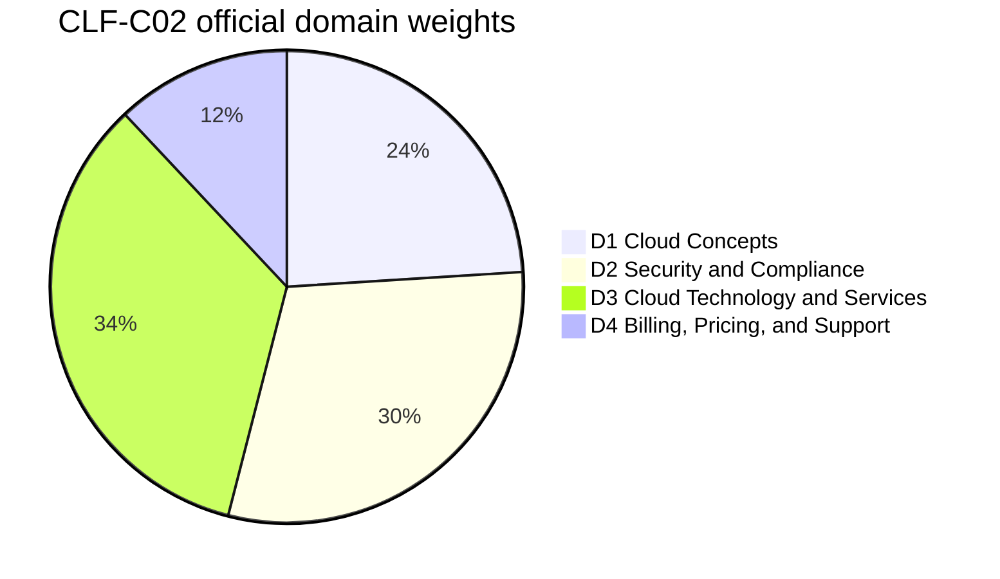
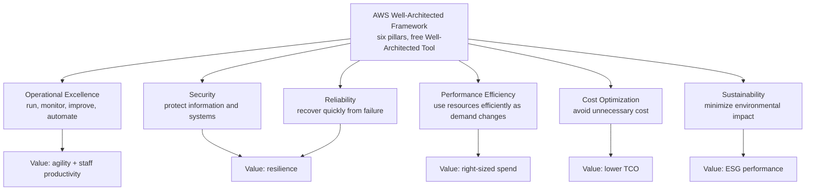
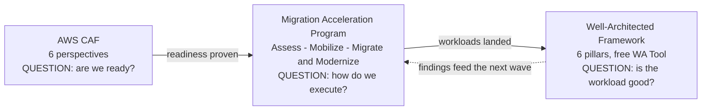
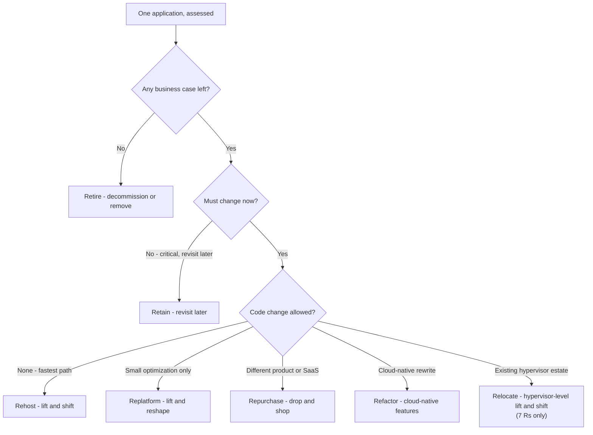
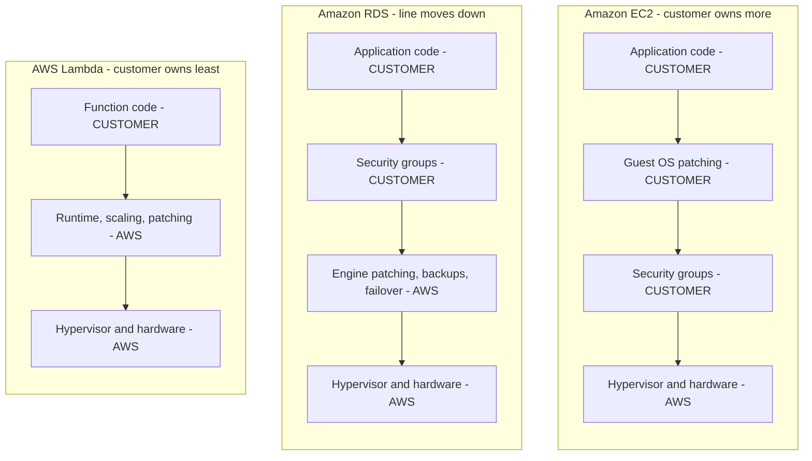

# Cloud Economics, Migration Strategies and the Cloud Journey

Domain 1 of the CLF-C02 exam carries **24% of the scored content** — the second-largest domain on the paper — and it is the one domain where AWS asks you to argue in the language of a **business case** rather than a service feature. Everything else in the exam (security, global infrastructure, services, billing) assumes you already accept the premise; Domain 1 *is* the premise. Candidates who arrive with a long list of service names but no vocabulary for fixed versus variable cost, capex versus opex, or "why rehost and later replatform" lose marks they never expected to be answering for.

```text
=====================================================================
 CLF-C02 DOMAIN 1 - CLOUD CONCEPTS (24% OF SCORED CONTENT)
=====================================================================
  TASK 1.1  Define the benefits of the AWS Cloud
            - value proposition of the AWS Cloud
            - speed of deployment, global reach
            - high availability, elasticity, agility
            - economies of scale (PDF exam guide wording)
  TASK 1.2  Identify design principles of the AWS Cloud
            - AWS Well-Architected Framework and its pillars
            - identifying differences between the pillars
  TASK 1.3  Understand the benefits of and strategies for migration
            - AWS CAF components (reduced business risk, better ESG
              performance, increased revenue, operational efficiency)
            - migration strategies (for example, database replication)
            - resources supporting the cloud migration journey
            - use of AWS Snowball (PDF exam guide wording)
  TASK 1.4  Understand concepts of cloud economics
            - fixed costs compared with variable costs
            - costs associated with on-premises environments
            - licensing strategies (BYOL vs included licenses)
            - rightsizing; benefits of automation; economies of scale
            - AWS CloudFormation; managed AWS services (PDF wording)
---------------------------------------------------------------------
  FULL EXAM WEIGHTS:  D1 24% | D2 30% | D3 34% | D4 12%
  FORMAT: 50 scored + 15 unscored items | pass 700 (scale 100-1,000)
=====================================================================
```



> [!NOTE]
> **Two exam guides exist, and they differ.** The HTML exam guide and the PDF exam guide are not identical: the PDF adds **economies of scale** to task 1.1, names **AWS Snowball** in task 1.3, and adds **AWS CloudFormation** plus **managed AWS services (Amazon RDS, Amazon ECS, Amazon EKS, Amazon DynamoDB)** to task 1.4. AWS publishes no statement reconciling them, so this lesson teaches the **union** of both — an objective that appears in either version is fair game on exam day.

In this lesson you will:

- state the **six advantages of cloud computing** in AWS's own wording;
- separate **economies of scale, global reach, speed, elasticity, scalability and high availability**;
- walk the **six Well-Architected pillars** and the six general design principles, and show how the pillars **trade off** against each other;
- map the **six AWS CAF perspectives** to owners and to the four examinable outcomes;
- choose between the **6 Rs and the 7 Rs** migration strategies with a decision tree, and name the tools behind **database replication**;
- place the **Assess → Mobilize → Migrate & Modernize** journey and its supporting resources on a single map;
- convert a fixed-cost, capex on-premises estate into a variable-cost, opex cloud model;
- build a **TCO and ROI comparison** with worked arithmetic you can reproduce in 90 seconds;
- decide between **BYOL and license-included**, and order **rightsizing before discounts**;
- explain how the **responsibility line moves** across EC2, RDS and Lambda;
- read **two real AWS migration case studies** and handle their numbers honestly;
- answer **10 exam-style questions** plus three interactive checks;
- then extend the story set with **Netflix, Box and FarEye**, work the **2026 updates box**, and drill a **case-study matching** check plus two extra questions (**clf-02-q11**, **clf-02-q12**).

---

## 1. The value proposition of the AWS Cloud (task 1.1)

### 1.1 The six advantages, verbatim

AWS publishes six advantages of cloud computing in a whitepaper, and exam questions quote the phrases almost word for word. Learn the **bolded trigger phrase** for each row — that is the string the question stem will reproduce.

| # | Advantage (AWS wording) | The trigger phrase | What it kills on-premises |
|---|---|---|---|
| 1 | **Trade fixed expense for variable expense** | *"pay only when you consume computing resources"* | Buying hardware before you need it |
| 2 | **Benefit from massive economies of scale** | usage from *"hundreds of thousands of customers"* is aggregated → *"lower pay-as-you-go prices"* | Paying retail for one company's volume |
| 3 | **Stop guessing capacity** | provision *"on demand"* with *"only a few minutes' notice"* | 20–50% over-provisioning against a peak forecast |
| 4 | **Increase speed and agility** | deployment time drops *"from weeks to just minutes"* | 6–9 month procurement lead times |
| 5 | **Stop spending money running and maintaining data centers** | stop paying for *"racking, stacking, and powering servers"* | Facilities, power, cooling, physical labour |
| 6 | **Go global in minutes** | a *"worldwide footprint"* gives *"lower latency"* | Building your own overseas data centre |

AWS also states it operates **over 200 fully featured services** (as of Oct 2026) — a figure worth remembering because distractors like "over 1,000 services" are easy to eliminate.

### 1.2 Example E1 — economies of scale, arithmetically

Economies of scale are **structural, not a promotion**. The cloud provider aggregates demand across customers, so it buys power, hardware and floor space at a price no single company can reach — and passes part of the difference into a lower variable rate.

Two customers, each needing a **peak of 10 units**, but their peaks are **anti-correlated** (one is busy when the other is quiet):

```text
Separate estates:   customer A provisions 10  +  customer B provisions 10  = 20 units
Shared aggregation: peaks do not coincide, combined peak = 12 units
Hardware delta:     20 - 12 = 8 units saved  ->  8/20 = 40% LESS hardware
Outcome:            identical demand, 40% less infrastructure,
                    which is where the "lower pay-as-you-go prices" come from
```

### 1.3 Global reach, speed of deployment and agility

| Benefit | Examinable meaning | Watch out for |
|---|---|---|
| **Global reach** | *"Go global in minutes"* — deploy to multiple AWS Regions without building facilities | Not the same as high availability (that is Availability Zones) |
| **Speed of deployment** | *"from weeks to just minutes"* — infrastructure on demand | Never quote it as "seconds" |
| **Agility** | Teams experiment and iterate because the cost of a failed trial is metered, not sunk | Agility is an organizational benefit, not a service |
| **High availability** | Survive the failure of a component by spanning multiple **Availability Zones** | Not redundancy across Regions (that is disaster recovery) |
| **Elasticity** | Grow **and shrink** capacity automatically with demand | Elasticity ≠ scalability |
| **Scalability** | Absorb growth (scale out / scale up) | Growth only — no mention of shrinking |

- **📚 Did you know?** As of Oct 2026 AWS reports **39 geographic Regions** and **124 Availability Zones**, with each Region required to carry a **minimum of three isolated, physically separate AZs**, all within **100 km (60 miles)** of each other. An Availability Zone is defined as *"one or more discrete data centers, each with redundant power, networking, and connectivity"* — so an AZ is not a rack, and a Region is not an AZ.

### 1.4 Example E2 — "stop guessing capacity" in numbers

A team forecasts a **peak of 100 vCPU**. On-premises practice is to buy **20%–50% over the peak-predicted demand** so the forecast cannot bite:

```text
Peak forecast .............. 100 vCPU
Over-provisioning ......... +20% to +50%  ->  buy 120 to 150 vCPU
Typical average utilization of an on-premises server: 12% to 18%
Useful work at 15% .......... 150 x 0.15  = 22.5 vCPU
Idle but still paid for ..... 150 - 22.5  = 127.5 vCPU  (~85% idle)
```

That is what *"stop guessing capacity"* means: instead of buying for the peak and sitting idle, you provision to measured demand in minutes and let **elasticity** absorb the spike. The same logic repeats at every later layer of this lesson — idle capacity is the enemy in rightsizing, in licensing and in the TCO table.

---

## 2. Design principles: the AWS Well-Architected Framework (task 1.2)

### 2.1 What the Framework is

The AWS Well-Architected Framework documents **best practices for designing and operating secure, reliable, efficient, cost-effective, and sustainable workloads**. The exam-relevant detail about the *process* is this: a Well-Architected review is *"a constructive conversation ... not an audit mechanism"* — you will never be asked to "pass" one, and the **AWS Well-Architected Tool** that runs it is **free** and on the in-scope service list.

### 2.2 The six pillars

| Pillar | What it is about (AWS wording) | The value it delivers |
|---|---|---|
| **Operational Excellence** | Run, monitor and **continually improve** processes and procedures; **automate** | Agility and staff productivity |
| **Security** | Protect information and systems — confidentiality, integrity, availability | Resilience and compliance |
| **Reliability** | Do what they should, and **recover quickly from failure** | Resilience |
| **Performance Efficiency** | Use computing resources **efficiently as demand and technology change** | Right-sized spend |
| **Cost Optimization** | **Avoid unnecessary cost** | Lower total cost of ownership (TCO) |
| **Sustainability** | **Minimize the environmental impact** of running workloads | ESG performance |



### 2.3 The six general design principles

All six principles do the same underlying move: they convert **upfront, fixed, idle spend** into **metered, on-demand, evidence-driven spend**.

| Principle (AWS wording) | The habit it replaces |
|---|---|
| **Stop guessing your capacity needs** | Buying for a forecast peak |
| **Test systems at production scale** | Testing only on a small staging set |
| **Automate with architectural experimentation in mind** | Hand-built, unrepeatable changes |
| **Consider evolutionary architectures** | Five-year big-bang designs |
| **Drive architectures using data** | Opinions instead of metrics |
| **Improve through game days** | Hoping failure never happens |

### 2.4 Example E3 — the pillars are *not* interchangeable

Task 1.2 explicitly asks you to identify **differences between the pillars**. They conflict, and the exam tests whether you notice:

```text
Decision: keep three hot spare instances idle so a failure never reaches users.
Reliability ......... IMPROVES  (spare capacity absorbs the failure)
Cost Optimization ... WORSENS   (illustrative $400/month x 12 = $4,800/year paid
                                 for capacity that does nothing; teaching figure,
                                 as of Oct 2026 - NOT an AWS list price)
```

There is no pillar that wins automatically. The correct exam posture is a **trade-off that is deliberate and measured**, not a claim that one pillar is "the most important". Note also that **Sustainability** and **Cost Optimization** both talk about reduction, and **Security** and **Reliability** both talk about resilience — similar words, different pillars, different owners.

```matching
{
  "question": "Match each Well-Architected pillar to the value it delivers on the CLF-C02 exam:",
  "pairs": [
    {"left": "Operational Excellence", "right": "Agility and staff productivity - run, monitor, continually improve and automate"},
    {"left": "Security", "right": "Resilience and compliance - protect information and systems"},
    {"left": "Reliability", "right": "Resilience - do what they should and recover quickly from failure"},
    {"left": "Performance Efficiency", "right": "Right-sized spend - use computing resources efficiently as demand and technology change"},
    {"left": "Cost Optimization", "right": "Lower total cost of ownership - avoid unnecessary cost"},
    {"left": "Sustainability", "right": "ESG performance - minimize the environmental impact of running workloads"}
  ],
  "explanation": "Pillars are not interchangeable and they trade off against each other. Operational Excellence maps to agility/productivity, the two protection pillars (Security, Reliability) map to resilience, Performance Efficiency to right-sized spend, Cost Optimization to TCO, and Sustainability to environmental (ESG) performance."
}
```

- **📚 Did you know?** The Cloud Adoption Framework (Section 3), the Well-Architected Framework (this section) and the Cloud Value Framework (Section 6) are **three different lists of five or six items** that candidates merge constantly: Well-Architected has **6 pillars** about *workload quality*, CAF has **6 perspectives** about *organizational readiness*, and the Cloud Value Framework has **5 pillars** about *business value* — of which **TCO is only pillar 1 of 5**.

---

## 3. The AWS Cloud Adoption Framework (task 1.3)

### 3.1 Six perspectives, six owners

The AWS Cloud Adoption Framework (AWS CAF) groups its capabilities in six perspectives. Each perspective is a **conversation with a different part of the organization** — that is why the exam asks you to match a perspective to a stakeholder or a concern.

| Perspective | Typical owner | What it covers |
|---|---|---|
| **Business** | CEO, CFO, COO, CIO, CTO | Strategy, transformation opportunities, value realization |
| **People** | HR, culture leads | Culture, organization structure, workforce skills |
| **Governance** | Risk, finance, compliance | Maximize benefits and minimize risk; portfolio management |
| **Platform** | Architects | Scalable hybrid platform, modernization, migration factory |
| **Security** | CISO and security teams | Confidentiality, integrity, availability of data and systems |
| **Operations** | IT operations | Services delivered at agreed business levels |

**Published capability counts (as of Oct 2026):** People **7**, Governance **7**, Platform **7**, Security **9**, Operations **9**. AWS does not publish a Business-perspective count in the sources verified for this lesson, so do not memorize a total.

### 3.2 The four examinable outcomes

Task 1.3 names the outcomes you must recognize. A CAF-led program is judged on:

1. **Reduced business risk**
2. **Improved environmental, social, and governance (ESG) performance**
3. **Increased revenue**
4. **Increased operational efficiency**

### 3.3 One map: CAF → MAP → Well-Architected

These three frameworks appear together in almost every migration question. They answer three different questions, in this order:



> [!WARNING]
> ⚠️ **Three lists you must never mix.** Well-Architected **6 pillars** = workload quality. AWS CAF **6 perspectives** = organizational readiness (Business, People, **Governance**, Platform, Security, Operations). Cloud Value Framework **5 pillars** = business value. A distractor will offer "Sustainability" as a CAF perspective or "Governance" as a Well-Architected pillar — both are wrong. Separately, the Migration Acceleration Program says its Assess phase identifies capability gaps across **six dimensions** (business, process, people, platform, operations, security), and those six are **not** the CAF six — use the CAF names when the question says "perspective".

---

## 4. Migration strategies: the 6 Rs (task 1.3)

### 4.1 The strategies and their glosses

AWS's older and still exam-popular framing is the **6 Rs**, built on the five Rs that Gartner outlined. The current AWS Prescriptive Guidance framing is the **7 Rs**, which adds **Relocate**. Both appear in study material; the exam guide itself never enumerates either list.

| R | AWS gloss | What you actually do | Choose it when |
|---|---|---|---|
| **Rehost** | *"lift and shift"* | Move the workload unchanged (virtual machines to EC2) | No code change allowed; fastest path; large portfolios first |
| **Replatform** | *"lift and reshape"* | Small optimization without changing the core architecture (for example VM → managed database) | You want a managed benefit with limited effort |
| **Repurchase** | *"drop and shop"* | Replace with a different product, usually SaaS | The current product is not strategic |
| **Refactor / re-architect** | *"cloud-native features"* | Rewrite for cloud-native capabilities | You need cloud-native features; most complex and costly |
| **Retire** | *"decommission or remove"* | Turn the application off | No business case, or the app is unused |
| **Retain** | *"revisit"* | Keep it where it is, plan to change later | Critical now, refactor later (data residency, timing) |
| **Relocate** *(7 Rs only)* | *"hypervisor-level lift and shift"* | Move the whole platform/hypervisor estate to the cloud | You already run a supported hypervisor estate |

> [!NOTE]
> **6 Rs vs 7 Rs — how to answer.** The 2016 AWS strategy blog says **6 Rs**; AWS Prescriptive Guidance today says *"There are seven migration strategies ... known as the 7 Rs."* If a question asks "which is **NOT** one of the 6 Rs?", **Relocate** is the designed bait. If it asks for the current AWS set, answer **7 Rs**.



### 4.2 Example E4 — sorting a 40-application portfolio

An enterprise assesses **40 applications**. Using AWS's own order-of-magnitude guidance that *"as much as 10%–20% of an enterprise IT portfolio is no longer useful and can be turned off"*:

```text
Retire .........  4 apps  (10% of the portfolio - switched off, zero migration cost)
Retain .........  6 apps  (critical, revisit later)
Rehost ......... 16 apps  (fastest, no code change - do these first)
Relocate .......  0 apps  (no hypervisor platform to move as a unit)
Repurchase .....  3 apps  (replaced by SaaS)
Replatform .....  8 apps  (managed database / engine changes)
Refactor .......  3 apps  (cloud-native rewrite - highest value, highest cost)
                         ------
                          40 apps
```

Sequencing rule for large migrations: **rehost, replatform, relocate and retire first; modernize after.** Paying a migration factory to move 40 applications in parallel is how programs blow their budget; retiring 4 of them before anyone writes a line of code is how programs fund themselves.

### 4.3 The two named tools behind the strategies

| Concern | Service | Role |
|---|---|---|
| **Database replication** (the exam's named example for task 1.3) | **AWS Database Migration Service (AWS DMS)** | Continuous replication of the source database to the target while the app keeps running |
| Schema differences between engines | **AWS Schema Conversion Tool (AWS SCT)** | Converts schemas, code and stored procedures so the replication can land |
| **Rehost** execution | **AWS Application Migration Service (MGN)** | Agent-based, automated lift-and-shift of servers to EC2 |
| Discovering what you own | **AWS Application Discovery Service** | Maps dependencies before you choose an R |

### 4.4 Example E5 — the Snowball reality check

For **petabyte-scale transfer over a constrained link**, the classic answer is a physical device: a single **Snowball Edge Storage Optimized** device moves **approximately 210 TB** (as of Oct 2026; verify current specs before use), and a job **must be completed within 360 days of being prepared**.

Two caveats you must hold at the same time:

```text
FACT A (exam guide PDF) .... task 1.3 names "use of AWS Snowball"
FACT B (AWS docs banner) ... "AWS Snowball Edge is no longer available to new customers"
                             AWS points new customers to DataSync,
                             Data Transfer Terminal, partner solutions and Outposts
CONCLUSION .................. Snowball is a trap TWICE - it can be the correct
                             "offline / constrained link" answer, and it can be the
                             outdated answer. Read the stem: is it asking for the
                             classic mechanism or the current recommendation?
```

- **📚 Did you know?** Snowball Edge Storage Optimized ships with about **210 TB of usable NVMe** (as of Oct 2026) while the Compute Optimized variant trades storage for silicon — roughly **28 TB NVMe** against **416 GB of memory**. The device is on **neither** the in-scope nor the out-of-scope service list for CLF-C02 (both lists are explicitly *"non-exhaustive"*), so whether it is examinable cannot be verified — treat it as knowledge, not as a certainty.

---

## 5. The cloud migration journey and its resources (task 1.3)

### 5.1 The three phases

AWS's migration program runs in three phases, and the exam asks for the order:

```text
1. ASSESS              build the business case, discover the estate,
                       "identify capability gaps across six dimensions"
2. MIGRATE and MODERNIZE   execute the waves, then modernize what landed
3. (before it) MOBILIZE    close the gaps: funding, governance, skills, tools
```

Read literally: **Assess → Mobilize → Migrate & Modernize**. Mobilize sits *between* the business case and the first wave, because the gaps found in Assess have to be closed before migration starts.

### 5.2 The resources that support the journey

| Resource | What it does for you |
|---|---|
| **Migration Acceleration Program (MAP)** | Tools, training and **financial investments** for the three-phase program. **Credits require tagging** — no tags, no credits |
| **AWS Migration Hub / Migration Hub Journeys** | Plan, perform and track: **phases → modules → tasks → subtasks** with progress visible in one place |
| **AWS Prescriptive Guidance** | Time-tested migration strategies and step-by-step guides (source of the 7 Rs) |
| **Migration Evaluator** | Data-driven **business case and TCO model** before you commit |
| **AWS Professional Services** | Hands-on delivery capacity for the migration itself |
| **AWS Partner Network (APN) + Migration Competency Partners** | Third-party delivery capacity, assessed against AWS competency criteria |
| **AWS Pricing Calculator** | Estimate the target run-rate before you move anything |

```dragdrop
{
  "question": "Put the three phases of the AWS Migration Acceleration Program (MAP) in order:",
  "items": [
    "Migrate and Modernize",
    "Assess",
    "Mobilize"
  ],
  "correctOrder": [
    "Assess",
    "Mobilize",
    "Migrate and Modernize"
  ],
  "explanation": "MAP runs Assess (business case, estate discovery, capability gaps across six dimensions) first, then Mobilize (close the funding, governance, skills and tooling gaps the assessment exposed), and only then Migrate and Modernize (execute the waves and modernize afterward). Rehost, replatform, relocate and retire first; modernize after the migration is stable."
}
```

> [!WARNING]
> ⚠️ **MAP says six dimensions; CAF says six perspectives — and they are different lists.** MAP's Assess phase identifies capability gaps across *business, process, people, platform, operations, security*. CAF's perspectives are *Business, People, **Governance**, Platform, Security, Operations*. "Governance" replaces "process". If the question says **perspective**, use the CAF names; never quote a MAP credit amount either — AWS publishes only *"financial investments"*, with no published percentages.

---

## 6. Cloud economics (task 1.4)

### 6.1 Fixed cost versus variable cost

**Fixed cost** exists whether or not the service runs: owned hardware, floor space, salaried staff. **Variable cost** tracks consumption. The single most-quoted sentence in Domain 1 is: *"The cloud trades fixed expense for variable expense — you pay only when you consume computing resources."*

**Example E6 — twelve months, illustrative figures (as of Oct 2026; teaching numbers only, not AWS list prices):**

| Period | On-premises (fixed) | AWS (variable) | Why the cloud row moves |
|---|---|---|---|
| Q1 — launch quarter | $6,000 | $4,200 | Burst traffic scales up, then back down |
| Q2 — normal trading | $6,000 | $2,700 | Follows measured demand |
| Q3 — quiet quarter | $6,000 | $1,350 | Test environment switched to **$0** |
| Q4 — holiday peak | $6,000 | $3,900 | Elasticity absorbs the spike without a purchase order |
| **Total** | **$24,000** | **$12,150** | **−$11,850 (−49.4%)** |

The on-premises row is a flat line because you paid for it in the capital year — traffic has nothing to do with it. The cloud row can drop to **zero** for a workload you switch off.

### 6.2 The cost drivers of an on-premises environment

Task 1.4 asks specifically for *"costs associated with on-premises environments"*. Every row below has to appear in a TCO model or the model is wrong:

| Driver | What it really costs |
|---|---|
| **Hardware** | Purchase price of servers, storage, networking |
| **Annual maintenance** | Support contract, typically a percentage of hardware, every year |
| **Operating system and hypervisor licences** | Paid whether the server is busy or idle |
| **Application licences** | Same — and often the largest single line |
| **Space, power, cooling** | Floor space rent, electricity, cooling overhead |
| **IT labour** | Admins to rack, patch, back up, monitor, plan |
| **Refresh cycle** | Capital equipment typically has a **five-year refresh cycle** |
| **Procurement lead time** | Equipment is bought **six to nine months in advance** |
| **Over-provisioning** | **20%–50% over the peak-predicted demand** |
| **Cost of capital** | Money tied up in assets instead of the business |
| **Bandwidth** | Connectivity for the estate |

### 6.3 Example E7 — the hidden on-premises inputs

Most on-premises models fail by counting hardware only. Here are ten servers over five years, with all figures illustrative (as of Oct 2026, teaching numbers, not AWS list prices):

```text
Server hardware (10 units) ..................  $30,000
5-year hardware maintenance ..................  $30,000
Power and cooling: $25 x 10 x 60 months ......  $15,000
Floor space (5 years) .......................   $6,000
IT administration: 0.25 FTE over 5 years ..... $112,500
                                            ------------
Subtotal, 5 years ........................... $193,500
BEFORE: software licences, the year-5 refresh, cost of capital, bandwidth
```

AWS's own guidance on accurate comparisons is blunt: capital expenditures usually have a **refresh cycle of five years**, equipment is procured **six to nine months in advance**, and customers **overprovision 20%–50% over peak-predicted demand**. A model that omits labour, refresh and facilities understates on-premises cost — which is why the exam treats "compare server purchase price to an hourly rate" as the classic flawed TCO model.

### 6.4 Capex to opex

| | **Capex** (on-premises) | **Opex** (cloud) |
|---|---|---|
| Shape | Large upfront payment for an asset you own | Metered, pay-as-you-go consumption |
| Accounting | Capitalized, then depreciated (~5-year cycle) | Expensed in the period it is incurred |
| Risk | You own it whether or not you use it | You stop paying when you stop consuming |
| Forecast | Based on a capacity guess | Based on measured usage |
| Exam sentence | *"fixed expense"* | *"variable expense"* — *"pay only when you consume"* |

### 6.5 Example E8 — TCO and ROI, worked

**TCO** is the *all-in, multi-year* comparison of acquisition **and** operating costs — hardware, software, facilities, labour and capital — on-premises versus AWS. It is not a price list, and AWS explicitly frames it as only **pillar 1 of 5** of the **Cloud Value Framework**.

> **All dollar figures in the table below are illustrative teaching numbers created for this lesson (as of Oct 2026). They are NOT AWS list prices and must not be quoted as such.**

| Cost category (5 years) | On-premises | AWS (illustrative) | Difference |
|---|---|---|---|
| Compute — 10-server equivalent | $60,000 (hardware $30k + maintenance $30k) | $54,000 ($900/month metered average) | −$6,000 |
| Facilities — power, cooling, floor space | $21,000 ($15k energy + $6k space) | $0 (absorbed by the provider and priced into the rate) | −$21,000 |
| IT labour — 0.25 FTE on-prem vs 0.10 FTE | $112,500 | $45,000 | −$67,500 |
| Software licensing | $40,000 (owned and refreshed) | $18,000 (license-included, paid while running) | −$22,000 |
| **Total** | **$233,500** | **$117,000** | **−$116,500 (−49.9%)** |

Now the two numbers an interviewer (or an exam stem) actually wants:

```text
Migration investment (illustrative) .......  $25,000
                                             (assessment, re-platform effort,
                                              Professional Services days)
5-year net benefit .......................  $116,500 - $25,000 = $91,500
Simple ROI  = net benefit / investment ....  $91,500 / $25,000 x 100 = 366%
Average annual saving .....................  $116,500 / 5 = $23,300
Simple payback = investment / annual saving  $25,000 / $23,300 = 1.07 years
                                             ~= 13 months
```

**Sanity check against a published figure:** AWS cites IDC (2022) claiming **50% lower 5-year cost of operations** on AWS — a customer/AWS-cited, unaudited claim, and our illustrative −49.9% lands in the same neighbourhood by construction, not by coincidence. Always attribute such figures ("IDC for AWS, 2022"), never present them as guaranteed.

### 6.6 Licensing: BYOL versus license-included

**License-included** means Amazon EC2 instances that bundle the licence cost into the compute cost — **AWS is responsible for licensing compliance**, and you pay only while the instance runs. **BYOL** means you bring your own licence **and media** — **you own compliance**. **AWS License Manager** is a **free** tool that tracks both across AWS, on-premises and other clouds.

**Example E9 — 30% uptime workload, illustrative rates (as of Oct 2026; teaching figures only):**

```text
Assumed: license-included all-in rate = $0.75 / hour
         BYOL compute rate            = $0.40 / hour
         BYOL licence                 = $150 / month (paid whether used or not)
         month = 730 hours

At 30% uptime (219 hours):
  License-included ... 219 x $0.75              = $164.25 / month
  BYOL ................ $150 + (219 x $0.40)     = $237.60 / month
  Winner: LICENSE-INCLUDED by $73.35 / month

At 100% uptime (730 hours):
  License-included ... 730 x $0.75              = $547.50 / month
  BYOL ................ $150 + (730 x $0.40)     = $442.00 / month
  Winner: BYOL by $105.50 / month

Break-even: $150 / ($0.75 - $0.40) = 428.6 hours ~= 59% uptime
```

**Rule:** variable or intermittent uptime → **license-included**; high, steady uptime plus existing discounted licences → **BYOL**. Remember that a Windows licence can represent **50% or more of compute cost** (AWS, 2022-04-28), so this is not a rounding decision.

### 6.7 Rightsizing

**Rightsizing** means matching instance size and type to **measured** utilization *while still meeting performance requirements*. It is not "pick the cheapest instance", and the order of operations matters.

**Example E10 — from 12 vCPU to 4 vCPU, illustrative rate (as of Oct 2026; teaching figure only: $0.06 per vCPU-hour):**

```text
Current instance ....... 12 vCPU / 64 GB
Measured utilization ... 25% CPU average, 25% RAM average
Required ............... 12 x 0.25 = 3 vCPU ; 64 x 0.25 = 16 GB
Right-sized class ...... 4 vCPU / 16 GB (headroom included)
Idle capacity paid for . 12 - 3 = 9 vCPU = 75% of what you buy

Old cost  12 x $0.06 = $0.72/h  x 730 h = $525.60 / month
New cost   4 x $0.06 = $0.24/h  x 730 h = $175.20 / month
Saving ................................ = $350.40 / month
                                         = $4,204.80 / year
                                         = 66.7% less compute spend
```

**AWS Compute Optimizer** *"provides you with rightsizing recommendations and identifies idle resources."* Only **after** rightsizing do you choose a commitment model — because committing to a discount on an oversized instance simply buys a discount on waste. AWS documents **Savings Plans** as *"up to 72% lower in some cases"* versus on-demand and **Spot** as *"up to a 90% discount from on-demand pricing"* (both AWS, 2022-04-28; verify current rates before use).

- **📚 Did you know?** Published utilization figures are the economic core of this lesson: on-premises servers average **12%–18%** utilization, **more than 30% of servers run under 10%** utilization, and an on-premises data center is described as *"under 15%"* (AWS blogs, 2022-04-28 and 2024-10-01). That is why **rightsizing first, commitment second** is the canonical FinOps order on the exam.

```fillblank
{
  "question": "Complete the cloud-economics statements using the vocabulary from task 1.4:",
  "template": "The cloud trades {{1}} expense for {{2}} expense, so you pay only when you consume resources. On-premises spending is recorded as {{3}}, while metered cloud spending is recorded as {{4}}. Matching instance size to measured utilization while still meeting performance is called {{5}}, and it must happen BEFORE choosing a commitment or discount model. Bringing your own licence and media is {{6}}, whereas AWS bundling the licence into the compute cost is license-included.",
  "answers": {
    "1": "fixed",
    "2": "variable",
    "3": "capex",
    "4": "opex",
    "5": "rightsizing",
    "6": "BYOL"
  },
  "distractors": ["peak", "capital expense", "elasticity", "refactoring", "rehosting", "TCO", "Savings Plans", "governance"],
  "explanation": "Fixed vs variable and capex vs opex are the two framings of the same shift; rightsizing means matching size and type to measured utilization (AWS Compute Optimizer flags rightsizing and idle resources) and comes first, then commitment; BYOL means you bring licence and media and own compliance, while license-included means AWS bundles it and owns licensing compliance."
}
```

---

## 7. Automation, managed services and the responsibility shift (task 1.4)

### 7.1 Automation benefits

**Infrastructure as code (IaC)** means provisioning and supporting computing infrastructure **using code instead of manual processes and settings**. The exam names **AWS CloudFormation**, which *"enables you to create and provision AWS infrastructure deployments predictably and repeatedly."*

| Manual provisioning | Automated (CloudFormation / IaC) |
|---|---|
| Hand-built, unique, hard to reproduce | Templates are **repeatable** across environments |
| Changes happen silently | **Versioned, reviewable, auditable** (change sets) |
| Rollback is a panic | **Rollback-able** — delete the stack and the resources go |
| Scales with headcount | Scales with a pipeline |

> [!NOTE]
> **Automation ≠ auto scaling.** The automation example in task 1.4 is **CloudFormation** (repeatable infrastructure). **Auto Scaling** is the *elasticity* mechanism (grow and shrink with demand). Both are in scope, they answer different questions, and a distractor will swap them.

### 7.2 Managed services absorb undifferentiated work

The PDF exam guide adds *"Identifying managed AWS services (for example, Amazon RDS, Amazon ECS, Amazon EKS, Amazon DynamoDB)"* to task 1.4. Each one moves work off your staff:

| Managed service | What AWS takes over |
|---|---|
| **Amazon RDS** | Engine patching, automated backups, failover |
| **Amazon ECS / Amazon EKS** | Container platform operation |
| **Amazon DynamoDB** | Capacity management and operational overhead |

Fewer undifferentiated tasks means **less staff time and less software to license** — a direct line into the labour row of the TCO table in Section 6.5.

### 7.3 The shared-responsibility shift: EC2 vs RDS vs Lambda

The more managed the service, the **smaller the customer's share** of the stack. The line moves; it never disappears.

| Layer | **Amazon EC2** (IaaS) | **Amazon RDS** (managed) | **AWS Lambda** (serverless) |
|---|---|---|---|
| Physical hardware and hypervisor | AWS | AWS | AWS |
| Guest OS patching | **Customer** | AWS | AWS (no customer OS) |
| Runtime, capacity, scaling | Customer | AWS | AWS |
| Security groups / network config | **Customer** | **Customer** | n/a |
| Application or function code | **Customer** | **Customer** | **Customer** |
| IAM users, roles, MFA | **Customer** | **Customer** | **Customer** |
| Data, classification, encryption | **Customer** | **Customer** | **Customer** |



**Constants that never move:** physical security and the security **of** the cloud are always AWS; **data, IAM and encryption decisions** are always the customer. **Shared controls** — patch management, configuration management, awareness and training — are owned *by each party for its own layer*.

- **📚 Did you know?** AWS's own phrasing matters: for abstracted services such as **Amazon S3 and Amazon DynamoDB**, *"customers are responsible for managing their data (including encryption options) and using IAM tools to apply the appropriate permissions."* And as infrastructure modernizes, *"more responsibility is shifted onto the service provider"* — which is a shift of the **line**, not a transfer of your data responsibility. Serverless is not "someone else's problem".

---

## Real-World Case Studies

Every figure below is **customer- or AWS-claimed and unaudited**, attributed with its source so you can check it. The examinable point is always the *pattern* — which strategy was chosen, which lever moved — never the marketing number.

### Capital One — "all in on AWS" (banking, regulated)

| Dimension | Detail |
|---|---|
| Challenge | Eight data centers plus a rolling hardware refresh; needed scale for ML and real-time personalization |
| Strategy | Full estate exit — predominantly **rehost + replatform + refactor**, with serverless adoption |
| Services | 30+ including EC2, S3, RDS, Lambda, ECS/Fargate, Step Functions, Glue, Amazon Connect |
| Outcomes (claimed) | Exited all **8 data centers** (last in 2020); **80%** of ~2,000 applications now cloud-built; dev environment provisioning **3 months → minutes**; DR cost **−70%**; incident resolution and transaction errors **−50%**; over a third of applications serverless; **one application −90% cost** on Lambda; **103 tonnes** of metals recycled |
| Domain hook | Task 1.1 value proposition (agility) + task 1.4 economics |

> *"We are truly all in on the cloud, and AWS has been instrumental in enabling us to take full advantage of the benefits of being in the cloud."* — Chris Nims, SVP cloud and productivity engineering, Capital One (AWS case study)

### Shutterfly / SBS — VMware to AWS (e-commerce printing)

| Dimension | Detail |
|---|---|
| Challenge | On-premises VMware vSphere, stand-alone stacks, **2,000+ VMs**, colocation evacuation |
| Strategy | **Bridge then native**: VMware Cloud on AWS first (completed Aug 2022), then native migration to ECS/EC2 — a textbook *relocate → replatform* sequence |
| Services | VMware Cloud on AWS, Amazon ECS, EC2, FSx for NetApp ONTAP, CI/CD, S3 (**400 TB**) |
| Outcomes (claimed) | **2,000 → 1,200 VMs**; native migration delivered **March 2025, six months early**; ~**800 systems / 400 TB** moved; **~25% opex cut** from *license avoidance plus right-sizing*; **80%** of workloads on ECS; *"no high-severity incidents"* |
| Domain hook | Task 1.4 — rightsizing and licensing are literally named as the savings source |

> *"We've taken big steps to burn down technical debt so we can focus on transformation and move with the kind of agility we had in the early days."* — Ian Wright, VP Infrastructure, Shutterfly/SBS (AWS case study)

```text
PATTERN ACROSS BOTH CASES
  Capital One ........ agility first, then cost   (provisioning 3 months -> minutes)
  Shutterfly ......... cost first, then agility   (license avoidance + rightsizing -> ~25%)
  Common ............. the strategy (which R) was chosen BEFORE any number was promised
```

- **📚 Did you know?** A third migration pattern worth recognizing appears in the same research set: **Bangkok Flight Services** used **AWS Application Migration Service (MGN)** for a pure **rehost**, finishing in **7 months** with *"no rollback, no disruption"*, cutting IT infrastructure management time by **50%** and replacing a missing DR site with a multi-AZ design — while **Philip Morris International** migrated **400 applications in two years** and AWS's own write-up records that its initial aggressive lift-and-shift *"yielded suboptimal results"*. Same R, opposite lesson: rehost is fast, but rehosting everything is a strategy error.

### Netflix — global streaming at AWS scale (entertainment)

| Dimension | Detail |
|---|---|
| Challenge | Deliver a worldwide streaming service whose traffic spikes by time of day and by title, without buying hardware for every peak |
| Strategy | **Cloud-native build plus replatform/refactor** — mass elasticity first, then consolidation onto a managed database (not a forklift move) |
| Services | Amazon EC2, Amazon S3, Amazon Aurora, Amazon EKS, Local Zones, multi-Region auto scaling |
| Outcomes (claimed) | Delivers **billions of hours of content monthly**; AWS *"enables Netflix to quickly deploy thousands of servers and terabytes of storage within minutes"*; consolidating its relational database infrastructure on **Amazon Aurora** delivered **up to 75% improved performance and 28% cost savings**; operates across **four AWS Regions**; Aurora cut Policy Engine latency **26.72 ms → 6.51 ms** and Front50 **67.57 ms → 41.70 ms** (AWS Database Blog, 2025-11-27) |
| Domain hook | Task 1.1 (elasticity, global reach) + task 1.3 (replatform / refactor) |

All Netflix figures above are AWS-published and accessed Oct 2026; anything about Netflix's pre-AWS outage history lives on Netflix's own site and is not taught here as AWS fact.

### Box — Well-Architected cost optimization (enterprise SaaS)

| Dimension | Detail |
|---|---|
| Challenge | Improve spend efficiency across a large AWS estate serving 120,000+ enterprises without degrading security, reliability or performance |
| Strategy | **The free lever first**: an AWS Well-Architected Framework review with AWS Solutions Architects, then architecture-level fixes — no commitment purchase required |
| Services | Well-Architected Framework reviews, Amazon S3 / S3 Glacier tiering, EBS volume and snapshot hygiene, CloudTrail event filtering, routing traffic around internet gateways |
| Outcomes (claimed) | **$2.23 million** unpacked = **$438,000** inter-AZ transfer + **$1.1 million per year** internet egress + **over $500,000 per year** storage + **$192,000 per year** logging (AWS case study, accessed Oct 2026) |
| Domain hook | Task 1.4 — architecture, storage classes and data-transfer charges as named cost drivers |

> *"Our use of AWS best practices led to savings of over 2 million dollars, setting a new baseline…"* — Clay Alvord, director of FinOps and SRE, Box (AWS case study)

### FarEye — Savings Plans + Spot + Graviton (SaaS logistics)

| Dimension | Detail |
|---|---|
| Challenge | Thin last-mile delivery margins and a business that needs predictable spend |
| Strategy | **Stack the pricing levers in the canonical order**: right-size and move to Graviton first, then add commitment (Compute Savings Plans) and interruptible capacity (Spot) |
| Services | Compute Savings Plans, Amazon EC2 Spot, Graviton-based instances (500+ Spot and On-Demand instances) |
| Outcomes (claimed) | **$1 million per year** in cloud cost savings; AWS compute costs **−65%**; Graviton delivered **+30% performance** (AWS case study, accessed Oct 2026) |
| Domain hook | Task 1.4 — commitment pricing, Spot and price-performance in a single story |

```text
PATTERN ACROSS THE THREE EXTRA CASES
  Netflix ................. replatform / refactor, then let elasticity + Regions carry the load
  Box ..................... ARCHITECTURE lever - Well-Architected review, no purchase required
  FarEye .................. COMMITMENT lever - rightsizing/Graviton, then Savings Plans + Spot
  All three ............... every percentage is a customer result published by AWS
                           (accessed Oct 2026), never an AWS guarantee
```

### 2026 Updates (as of October 2026)

Six sourced changes that touch migration and cloud economics since the last time you refreshed your notes — every figure date-stamped, and prices/limits drift, so **verify current before use**:

- **Migration tooling changed scope.** **Migration Evaluator** joined the in-scope service list (Migration and Transfer category) while **AWS Snow Family** moved to the out-of-scope list; in-scope entries went **128 → 111** and out-of-scope entries **11 → 55** (official CLF-C02 in-scope / out-of-scope pages, diff computed 2026-10). Both lists are explicitly *"non-exhaustive and subject to change"*.
- **A new commitment option arrived: Database Savings Plans**, launched **2025-12-02** and advertised at **up to 35%** for a 1-year, no-upfront commitment (serverless up to 35%, provisioned up to 20%). Compute and EC2 Instance Savings Plans are unchanged, and the exam guide still names only *"AWS Savings Plans"* (AWS News Blog and What's New, 2025-12-02).
- **The support lineup was rewritten** on **2025-12-02**: **Business Support+** from **29 USD/month**, **AWS Enterprise** at **5,000 USD/month** and **AWS Unified Operations** at **50,000 USD/month**, with **Basic** free; Developer, classic Business and Enterprise On-Ramp took **no new subscriptions after 2025-12-02** (existing ones run through **2027-01-01**), and Domain 4 Task 4.3 of the current exam guide now reads *"Basic Support, AWS Business Support+, AWS Enterprise Support, AWS Unified Operations"* (AWS News Blog, 2025-12-02; exam-guide PDF, © 2026; prices as of Oct 2026).
- **Free Tier became account-age dependent** (change effective **2025-07-15**): accounts created on or after that date get **6 months** (or until credits run out) plus **USD 100 sign-up credit and up to USD 100 more — up to USD 200** — on `t3.micro`, `t3.small`, `t4g.micro`, `t4g.small`, `c7i-flex.large`, `m7i-flex.large`; accounts created earlier keep the legacy **12-month** tier with `t2.micro` / `t3.micro` (AWS News Blog, 2025-07-15; Amazon EC2 User Guide table *"before and after July 15, 2025"*).
- **Cost tooling keeps moving even though the examinable names do not**: Cost Optimization Hub (**2023-11-26**), **RI/SP Group Sharing** generally available (**2025-11-19**), **Target Coverage in Savings Plans Purchase Analyzer** (**2026-06-09**) and the **Well-Architected Agent** preview (**2026-10-01**, which AWS calls *"the next-gen evolution of AWS Trusted Advisor and the AWS Well-Architected Tool"*). The exam still tests **Cost Explorer, AWS Budgets, AWS Pricing Calculator, Trusted Advisor and the AWS Well-Architected Tool**.
- **Pricing and egress keep shifting under the TCO model**: **Amazon S3 Express One Zone** cut storage about **31%** and GET request prices up to **85%** (effective **2025-04-10**) and **EC2 NVIDIA GPU** instances up to **45%** (**2025-06-05**); on the way out you still get **100 GB per month of free data transfer out** from AWS Regions (a **2021** change, not a 2025 one) plus an approval-based **90-day window** to finish moving data off AWS when you leave (AWS FAQs and blogs; as of Oct 2026).

- **📚 Did you know?** Amazon S3's own price history is the cleanest published illustration of economies of scale: it launched on **14 March 2006 at $0.15 per GB per month** serving *"approximately one petabyte of total storage capacity across about 400 storage nodes"*, and AWS reported in March 2026 that it now charges *"slightly over 2 cents per gigabyte"* — **a reduction of approximately 85% since launch** — while code written for S3 in 2006 *"still works today, unchanged"* (AWS News Blog, 2026-03-13; as of Oct 2026 — verify current pricing before you quote it).

- **📚 Did you know?** Some AWS cost stories are older than most candidates' study material: NASA reported saving *"almost a million dollars in cost savings each year"* on **2012-06-11**, and NASA JPL now processes about **4.4 TB of downlinked data daily** (generating up to **70 TB** of final data products) using EC2 Auto Scaling with **Spot Instances at up to a 90 percent discount compared to Amazon EC2 On-Demand pricing** (AWS case study, accessed Oct 2026). Dates matter — never present a 2012 figure as a current one.

```matching
{
  "question": "Match each AWS-published customer story to the migration strategy or economics lever it best demonstrates:",
  "pairs": [
    {"left": "Capital One", "right": "Full estate exit, agility first - development environments went from 3 months to minutes and about 80% of roughly 2,000 applications are cloud-built"},
    {"left": "Shutterfly / SBS", "right": "Bridge then native - VMware Cloud on AWS first, then ECS; about 25% opex cut from license avoidance plus rightsizing"},
    {"left": "Netflix", "right": "Replatform and refactor - consolidating relational databases on Amazon Aurora brought up to 75% better performance and 28% cost savings"},
    {"left": "Box", "right": "Architecture lever - a Well-Architected review produced 2.23 million dollars across inter-AZ transfer, egress, storage and logging"},
    {"left": "FarEye", "right": "Commitment and Spot levers - Compute Savings Plans plus Spot plus Graviton cut compute 65% for about 1 million dollars a year"},
    {"left": "Bangkok Flight Services", "right": "Rehost with AWS Application Migration Service (MGN) - 7 months, no rollback, IT infrastructure management time down 50%"}
  ],
  "explanation": "Each story shows a different lever. Capital One is an agility-first, all-in migration; Shutterfly used VMware Cloud on AWS as a bridge before native replatforming; Netflix replatformed and refactored onto a managed database; Box is the free architecture lever from a Well-Architected review; FarEye stacks rightsizing and Graviton with commitment pricing (Compute Savings Plans) and interruptible Spot capacity; Bangkok Flight Services is a pure rehost executed with AWS Application Migration Service. Every percentage is a customer result published by AWS (accessed Oct 2026), never a guarantee."
}
```

> [!WARNING]
> ⚠️ **How to read case-study numbers on exam day:** (1) they are **customer-claimed and unaudited**; (2) *"up to"* is a **ceiling**, never an average; (3) attribute the source and year — "IDC for AWS, 2022", not "AWS proves"; (4) a case never licenses an out-of-scope answer; (5) a strategy that worked for a regulated bank (full estate exit) is not automatically right for a portfolio where **Retain** or **Retire** is correct.

---

## Practice Questions

```question
{
  "id": "clf-02-q1",
  "type": "multiple-choice",
  "question": "An executive asks why the AWS Cloud can offer lower pay-as-you-go prices than a single company building its own data center. Which statement BEST matches the AWS wording?",
  "options": [
    "AWS passes volume discounts on because usage from hundreds of thousands of customers is aggregated in the cloud, producing massive economies of scale",
    "AWS charges less than cost for compute during off-peak hours",
    "AWS reuses decommissioned hardware from other customers without warranty",
    "AWS avoids paying for power and cooling in Regions where energy is cheap"
  ],
  "correct": 0,
  "explanation": "The six advantages state that usage from hundreds of thousands of customers is aggregated in the cloud, and that this lets AWS offer lower pay-as-you-go prices - economies of scale are structural, not a promotion. The other options invent mechanisms AWS does not describe."
}
```

```question
{
  "id": "clf-02-q2",
  "type": "multiple-choice",
  "question": "A team provisions 150 vCPU against a 100 vCPU peak forecast and averages 15% utilization. Which pair of figures does this illustrate?",
  "options": [
    "20%-50% over-provisioning versus peak-predicted demand, and 12%-18% typical on-premises utilization - roughly 85% of the fleet idle",
    "Elasticity working as designed, with 85% of capacity absorbed by auto scaling",
    "A rightsizing success: 15% utilization means the estate is correctly sized",
    "A Spot-instance discount of up to 90% applied to on-demand capacity"
  ],
  "correct": 0,
  "explanation": "AWS documents on-premises procurement as 20%-50% over peak-predicted demand and average server utilization of 12%-18% (with 'under 15%' cited for on-premises data centers). 150 x 0.15 = 22.5 vCPU of useful work, so about 127.5 vCPU (85%) is idle but still paid for - the argument behind 'stop guessing capacity' and behind rightsizing."
}
```

```question
{
  "id": "clf-02-q3",
  "type": "multiple-choice",
  "question": "Which statement about the AWS Well-Architected Framework is correct?",
  "options": [
    "A Well-Architected review is an audit mechanism you pass or fail, and the Well-Architected Tool is billed per review",
    "It documents best practices for secure, reliable, efficient, cost-effective and sustainable workloads; the review is a constructive conversation, and the Well-Architected Tool is free",
    "Its six pillars are Business, People, Governance, Platform, Security and Operations",
    "Its pillars must be satisfied in order, beginning with Cost Optimization"
  ],
  "correct": 1,
  "explanation": "AWS describes the Framework as best practices for secure, reliable, efficient, cost-effective and sustainable workloads, and states a review is 'a constructive conversation ... not an audit mechanism'. The Tool is free and in scope. Option C lists the AWS CAF perspectives, not the Well-Architected pillars, and no pillar has priority."
}
```

```question
{
  "id": "clf-02-q4",
  "type": "multiple-choice",
  "question": "Keeping three hot spare instances idle so a failure never reaches users will be judged how by the Well-Architected pillars?",
  "options": [
    "It improves Reliability while worsening Cost Optimization - the pillars trade off and are not interchangeable",
    "It improves Security and Cost Optimization simultaneously",
    "It improves Sustainability because idle instances consume no power",
    "It has no pillar impact; spare capacity is an operations-only concern"
  ],
  "correct": 0,
  "explanation": "Task 1.2 tests 'identifying differences between the pillars'. Spare capacity raises Reliability (failure is absorbed) and lowers Cost Optimization (illustrative $400/month = $4,800/year as of Oct 2026 - a teaching figure, not an AWS list price - buys nothing). There is no universally winning pillar - the exam wants a deliberate, measured trade-off."
}
```

```question
{
  "id": "clf-02-q5",
  "type": "multiple-choice",
  "question": "Which list correctly names the six perspectives of the AWS Cloud Adoption Framework (CAF)?",
  "options": [
    "Business, People, Governance, Platform, Security, Operations",
    "Business, People, Culture, Platform, Security, Operations",
    "Operational Excellence, Security, Reliability, Performance Efficiency, Cost Optimization, Sustainability",
    "Business, Process, People, Platform, Operations, Security"
  ],
  "correct": 0,
  "explanation": "AWS CAF groups its capabilities in six perspectives: Business, People, Governance, Platform, Security and Operations. Option C is the Well-Architected pillar set. Option D is the six dimensions named by the MAP Assess phase - close, but 'process' is not a CAF perspective and 'Governance' is missing."
}
```

```question
{
  "id": "clf-02-q6",
  "type": "multiple-choice",
  "question": "A regulated workload cannot change yet but must be reviewed again in eighteen months. Which migration strategy fits, and which list does it come from?",
  "options": [
    "Retire, from the 6 Rs",
    "Retain, from the 6 Rs (and the 7 Rs)",
    "Relocate, from the 6 Rs",
    "Replatform, from the 7 Rs"
  ],
  "correct": 1,
  "explanation": "Retain means 'keep it and revisit later' - correct for a critical workload you cannot change now. Retain is in BOTH the 6 Rs (2016 blog) and the 7 Rs (current Prescriptive Guidance). Relocate is the 7 Rs-only strategy, so it cannot come from the 6 Rs; Retire means decommissioning, and Replatform implies an optimization you have just ruled out."
}
```

```question
{
  "id": "clf-02-q7",
  "type": "multiple-choice",
  "question": "A question asks: which is NOT one of the 6 Rs for migrating applications to the cloud?",
  "options": [
    "Refactor",
    "Relocate",
    "Repurchase",
    "Replatform"
  ],
  "correct": 1,
  "explanation": "The 6 Rs are Rehost, Replatform, Repurchase, Refactor, Retire and Retain. Relocate - the hypervisor-level lift and shift - was added when AWS moved to the 7 Rs in AWS Prescriptive Guidance. It is the designed bait for this exact stem."
}
```

```question
{
  "id": "clf-02-q8",
  "type": "multiple-choice",
  "question": "The exam guide lists 'database replication' as an example of a migration strategy. Which service pair implements it?",
  "options": [
    "AWS Database Migration Service (DMS) for continuous replication and AWS Schema Conversion Tool (SCT) for schema conversion",
    "AWS Application Migration Service (MGN) and AWS DataSync",
    "AWS Snowball Edge and AWS Storage Gateway",
    "AWS Migration Hub Refactor Spaces and AWS Transfer Family"
  ],
  "correct": 0,
  "explanation": "Database replication is DMS (continuous replication while the application keeps running) plus SCT (schema and code conversion so the target accepts it). MGN is the rehost tool, not a database tool; Snowball is physical data transfer; Migration Hub Refactor Spaces and AWS Transfer Family are explicitly OUT OF SCOPE for this exam."
}
```

```question
{
  "id": "clf-02-q9",
  "type": "multiple-choice",
  "question": "Using the illustrative TCO table in this lesson (on-premises $233,500 vs AWS $117,000 over five years, migration investment $25,000 - teaching figures, as of Oct 2026, not AWS list prices), what are the five-year ROI and the simple payback period?",
  "options": [
    "ROI 366%; payback about 13 months",
    "ROI 49.9%; payback about 5 years",
    "ROI 366%; payback about 5 years",
    "ROI 49.9%; payback about 13 months"
  ],
  "correct": 0,
  "explanation": "Net benefit = $116,500 - $25,000 = $91,500; ROI = 91,500 / 25,000 x 100 = 366%. Average annual saving = 116,500 / 5 = $23,300; payback = 25,000 / 23,300 = 1.07 years, about 13 months. The 49.9% figure is the TCO reduction percentage (116,500 / 233,500), not the ROI - the exam deliberately confuses the two."
}
```

```question
{
  "id": "clf-02-q10",
  "type": "multiple-choice",
  "question": "A Windows workload runs only 30% of the month. Which licensing strategy and ordering rule does AWS guidance support?",
  "options": [
    "BYOL, because an existing licence always beats paying for one - and rightsizing should be done after choosing a commitment model",
    "License-included, because you pay for the bundled licence only while the instance runs - and rightsizing should be done BEFORE choosing a discount or commitment model",
    "Either, because licensing has no effect on cloud economics",
    "License-included, and auto scaling should be applied before any rightsizing"
  ],
  "correct": 1,
  "explanation": "At 30% uptime the license-included option wins because AWS bundles the licence and you pay only while running (and AWS owns licensing compliance); BYOL wins only above roughly 59% uptime in our illustrative model. The canonical FinOps order is rightsizing first - match measured utilization - then choose a commitment/discount such as Savings Plans, because committing to a discount on an oversized instance buys a discount on waste."
}
```

```question
{
  "id": "clf-02-q11",
  "type": "multiple-choice",
  "question": "AWS's Box case study is titled 'Unpacks over $2.23 Million in Savings'. Which breakdown of that total matches the AWS publication (figures as published, accessed Oct 2026)?",
  "options": [
    "$438,000 from rightsizing + $1.1 million from storage tiering + $500,000 from egress + $192,000 from logging",
    "$1,100,000 from inter-AZ transfer + $500,000 from egress + $438,000 from storage + $192,000 from logging",
    "$438,000 inter-AZ transfer + $1.1 million per year internet egress + over $500,000 per year storage + $192,000 per year logging",
    "$2,230,000 from a single Spot-instance commitment that covers all four categories at once"
  ],
  "correct": 2,
  "explanation": "AWS publishes Box's $2.23 million as four separate billing concepts: $438,000 of inter-AZ data transfer, $1.1 million per year of internet egress, over $500,000 per year of storage (S3/S3 Glacier tiering), and $192,000 per year of logging (AWS case study, accessed Oct 2026). The distractors scramble the pairs, and Option D is wrong twice over: Box's savings came from a Well-Architected review and architecture fixes - the free lever - not from an interruptible-capacity purchase, and no single mechanism produced the total. As with every case study, these are customer-claimed, unaudited figures, never an AWS guarantee."
}
```

```question
{
  "id": "clf-02-q12",
  "type": "multiple-choice",
  "question": "A colleague refreshed their notes in 2024. Which statement is TRUE as of October 2026?",
  "options": [
    "The Domain 4 support task still names Developer Support and Enterprise On-Ramp as the paid support options candidates must recognize",
    "Every AWS account gets the legacy 12-month Free Tier with t2.micro, regardless of when the account was created",
    "AWS Database Savings Plans replaced Compute and EC2 Instance Savings Plans, so the 'up to 72%' Savings Plans figure no longer applies",
    "Accounts created on or after 2025-07-15 get a 6-month Free Tier plus up to USD 200 in credits, while accounts created before that date keep the legacy 12-month tier"
  ],
  "correct": 3,
  "explanation": "The Free Tier change took effect 2025-07-15: newer accounts get 6 months (or until credits run out) with a USD 100 sign-up credit plus up to USD 100 earned, on t3.micro/t3.small/t4g.micro/t4g.small/c7i-flex.large/m7i-flex.large; older accounts keep the legacy 12-month tier (AWS News Blog, 2025-07-15; EC2 User Guide 'before and after July 15, 2025'). Option A is stale: the current guide's Task 4.3 names Basic Support, AWS Business Support+, AWS Enterprise Support and AWS Unified Operations (classic Developer/Business/Enterprise On-Ramp closed to new subscriptions after 2025-12-02). Option C is false: Database Savings Plans (launched 2025-12-02, up to 35% on a 1-year commitment) are an addition, not a replacement. Free Tier and support-plan behaviour is date-stamped - verify current before use."
}
```

> [!IMPORTANT]
> **Comparative Verdict — how this topic compares on exam day**
> - **× Versus on-premises:** on-premises is **fixed, capex, owned and guessed** — five-year refresh, 6–9 month procurement, 20–50% over-provisioning, 12–18% utilization, labour and facilities that never appear in a hardware-only model. The cloud is **variable, opex, metered and measured** — you pay only when you consume and you can drop a workload to $0. The exam's default answer to "compare the two" is **TCO (all-in, multi-year)**, never a hardware price versus an hourly rate.
> - **× Versus other clouds:** CLF-C02 does not ask you to rank AWS against Azure or Google Cloud; it asks whether your model is *complete*. The differentiator you are tested on is the **AWS-specific scaffolding** — six advantages, six Well-Architected pillars, six CAF perspectives, 7 Rs, MAP, Cloud Value Framework — so if an option argues by naming another provider's discount, it is a distractor.
> - **× Versus DIY / build-it-yourself:** every R is a choice about **who owns the undifferentiated work**. DIY (self-managed, on-prem or hand-built tooling) maximizes control and operational burden — the customer patches the guest OS, licenses the platform and staffs the pager. Managed and serverless move that line: **RDS** takes engine patching and failover, **ECS/EKS** take the platform, **Lambda** takes runtime and scaling — but **code, IAM and data stay yours at every level**. Choose managed unless a stated requirement forces control, and never assume "serverless" transfers your data responsibility.

> [!WARNING]
> **Exam-day traps for this lesson:**
> - **6 Rs vs 7 Rs** — the 6 Rs are Rehost, Replatform, Repurchase, Refactor, Retire, Retain; **Relocate** is the 7 Rs-only strategy and the classic "which is NOT one of the 6 Rs?" bait;
> - **Snowball is a trap twice** — the PDF exam guide names it, yet **Snowball Edge is no longer available to new customers** and appears on neither the in-scope nor the out-of-scope list;
> - **Never mix the three lists** — Well-Architected **6 pillars** (workload quality) ≠ AWS CAF **6 perspectives** (organizational readiness) ≠ Cloud Value Framework **5 pillars** (business value, TCO = pillar 1 of 5);
> - **MAP's six dimensions ≠ CAF's six perspectives** — MAP says *process*, CAF says *Governance*;
> - **Elasticity ≠ scalability ≠ high availability** — elasticity grows **and shrinks**, scalability handles growth, HA survives component failure across **AZs**;
> - **The responsibility line moves, responsibility does not transfer** — customer patches the guest OS **on EC2**, AWS patches the OS and engine **on RDS**, **Lambda** has no customer-managed OS — but data, IAM and encryption decisions are **always** the customer;
> - **Rightsizing before discounts** — commit to Savings Plans only after the instance is the right size, or you are discounting waste;
> - **Automation ≠ auto scaling** — the task 1.4 automation example is **CloudFormation** (IaC), not Auto Scaling;
> - **TCO ≠ price ≠ savings percentage** — TCO is all-in and multi-year; a "50% saving" is an attributed, dated claim (IDC for AWS, 2022), never a guarantee;
> - **Capex/opex direction** — on-premises = capex/fixed, cloud = opex/variable; a distractor will reverse them.

> [!SUCCESS]
> **Key Takeaways:**
> 1. Domain 1 is **24% of CLF-C02** and is graded in business language: value proposition, design principles, migration, economics — tasks **1.1 → 1.4**;
> 2. The **six advantages** in AWS's own wording are: trade **fixed for variable** expense, **massive economies of scale** (aggregated usage from *hundreds of thousands of customers* → lower pay-as-you-go prices), **stop guessing capacity**, **increase speed and agility** (*weeks to just minutes*), **stop running data centers** (*racking, stacking and powering servers*), and **go global in minutes**;
> 3. Economies of scale are **structural**: two customers with anti-correlated 10-unit peaks need **12 units combined, not 20** — **40% less hardware** for identical demand;
> 4. The **six Well-Architected pillars** are Operational Excellence, Security, Reliability, Performance Efficiency, Cost Optimization, Sustainability — they **trade off** (spare capacity helps Reliability, hurts Cost Optimization), the review is *"a constructive conversation, not an audit mechanism"*, and the **Well-Architected Tool is free**;
> 5. The **six AWS CAF perspectives** are Business, People, Governance, Platform, Security, Operations, delivering **reduced business risk, improved ESG performance, increased revenue and increased operational efficiency** — CAF measures *organizational readiness*, Well-Architected measures *workload quality*;
> 6. The migration strategies are the **6 Rs** (Rehost, Replatform, Repurchase, Refactor, Retire, Retain) and the current **7 Rs** (adds **Relocate**); sequence **rehost/replatform/relocate/retire first, modernize after**, and remember AWS's own guidance that **10%–20% of a portfolio can simply be retired**;
> 7. **Database replication = AWS DMS + AWS SCT**; **rehost = AWS Application Migration Service (MGN)**; **Snowball Edge ≈ 210 TB per device** (as of Oct 2026) but is **closed to new customers**; the journey runs **Assess → Mobilize → Migrate & Modernize**, tracked in **Migration Hub Journeys** and funded by **MAP credits that require tagging**;
> 8. Cloud economics: **fixed vs variable**, **capex → opex**, and the full on-premises driver list (hardware, maintenance, licences, space/power/cooling, labour, **5-year refresh**, **6–9 month procurement**, **20–50% over-provisioning**, cost of capital, bandwidth) — omit labour, refresh or facilities and the TCO model is wrong;
> 9. Worked arithmetic you must reproduce (all illustrative teaching figures, **as of Oct 2026**, never AWS list prices): hidden on-prem inputs ≈ **$193,500 over 5 years** before licences and refresh; illustrative TCO **$233,500 vs $117,000 (−49.9%)**; **ROI 366%**; **payback ≈ 13 months**; rightsizing 12 vCPU → 4 vCPU at 25% utilization saves **66.7%**; BYOL break-even ≈ **59% uptime** (license-included below it, BYOL above it);
> 10. **License-included** (AWS owns compliance, pay while running) versus **BYOL** (you bring licence and media, you own compliance, **License Manager is free**); **order of operations is rightsizing first, then commitment/discount** (Savings Plans *"up to 72%"*, Spot *"up to 90%"*, both AWS 2022-04-28); automation is **CloudFormation/IaC**; and on the responsibility ladder **EC2 → RDS → Lambda** the line moves down while **code, IAM and data stay with the customer**.
