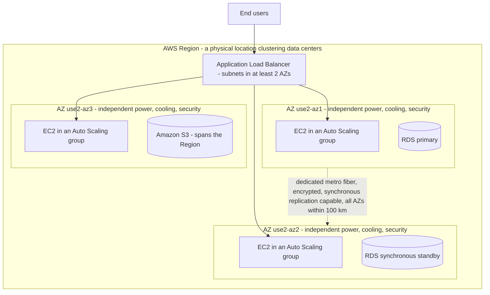
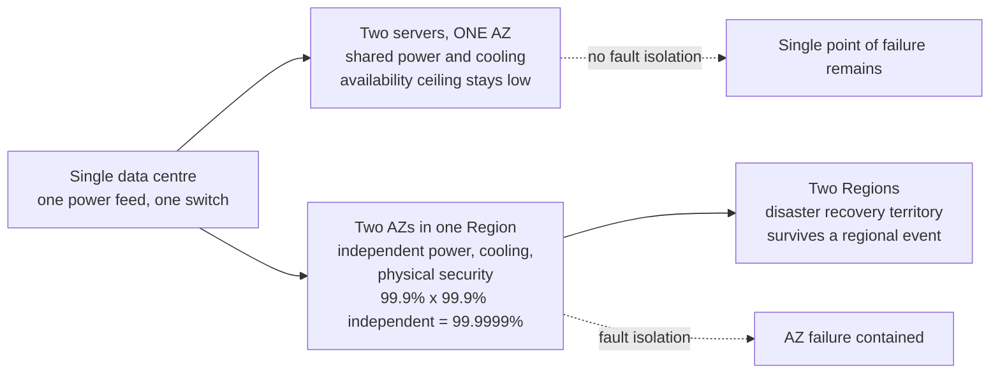
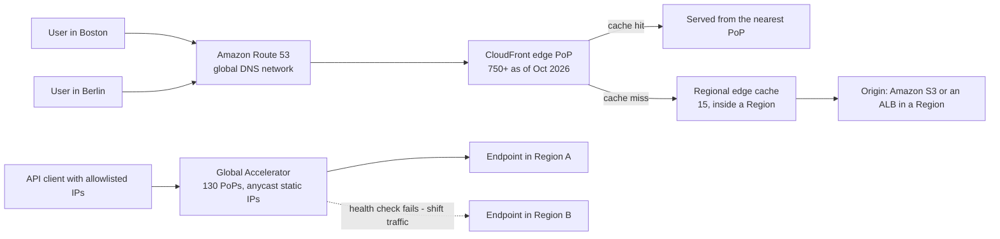
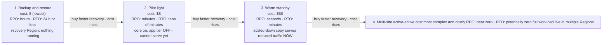
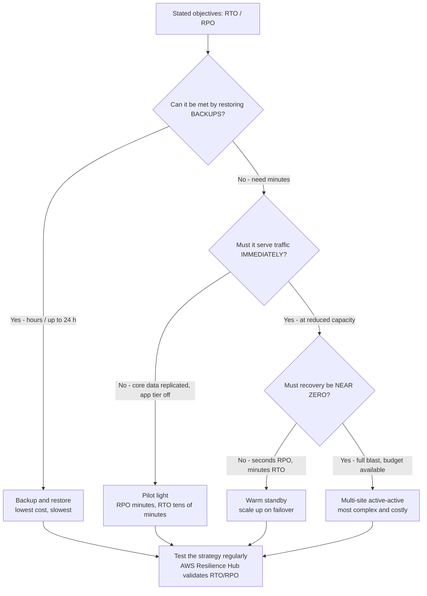
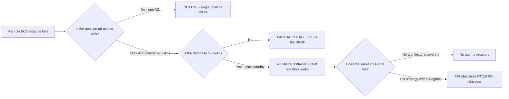

# AWS Global Infrastructure and Resilience

Every AWS workload eventually answers one question: *where does it run, and what happens when that place breaks?* The exam calls this **Domain 3, Task 3.2 — "Define the AWS global infrastructure"**, and it is one of the highest-yield tasks on CLF-C02 because a single vocabulary error (Region vs Availability Zone vs edge location) can cost you several questions at once. AWS's own framing is blunt: Amazon CTO Werner Vogels says **"Everything fails, all the time"**, and the Well-Architected Framework exists so you can *"prepare your workload for failure"* rather than pretend it will not happen.

```text
====================================================================
 AWS GLOBAL INFRASTRUCTURE — THE THREE LAYERS (as of Oct 2026)
====================================================================
  Geographic Regions ........ 39 live (+2 announced: Saudi Arabia,
                              Chile); 34 visible to a standard
                              account; 17 enabled by default
  Availability Zones ........ 124 across those 39 Regions
                              (minimum of 3 per Region by design)
  AWS global edge ........... 750+ CloudFront PoPs, 15 Regional
                              edge caches, 130 Global Accelerator
                              PoPs, Route 53 DNS worldwide
---------------------------------------------------------------------
  LAYER              YOU DEPLOY WORKLOADS HERE?   FAILURE DOMAIN
  Region             yes                          whole Region
  Availability Zone  yes                          one AZ (of >= 2)
  Edge location      no - delivery/caching layer  one PoP
---------------------------------------------------------------------
  RESILIENCE LADDER (Well-Architected REL13-BP02)
  backup & restore   RPO hours      RTO <= 24 h
  pilot light        RPO minutes    RTO tens of minutes
  warm standby       RPO seconds    RTO minutes
  multi-site (AA)    RPO near zero  RTO potentially zero
====================================================================
```

> [!NOTE]
> **The counts above are a snapshot, not a syllabus.** Every Region, AZ, PoP and Zone figure in this lesson is stamped **as of Oct 2026** and AWS revises them continuously. What the exam actually tests is the *relationship* between the layers — Regions contain AZs, AZs contain data centres, edge locations sit in front of both — plus the stable design rules (minimum three AZs per Region, your app in at least two).

In this lesson you will:

- separate **Regions, Availability Zones and edge locations** by definition, count and capability;
- explain **why Regions are isolated** — fault tolerance, data residency and latency;
- choose a Region using the **compliance, latency, price and features** decision set;
- apply the **AZ design rule** (AWS ships ≥3 AZs per Region; your application uses ≥2);
- tell **CloudFront, Route 53 and Global Accelerator** apart by their entry plane;
- place **Local Zones, Wavelength, Outposts and Snow** on the hybrid edge continuum;
- define **resiliency, availability, fault tolerance, high availability and disaster recovery** precisely;
- read and compute **RTO and RPO**, and rank the **four DR strategies** by cost versus recovery speed;
- study **four AWS-published resilience case studies**, two of them added in this revision;
- learn **what AWS actually launched between 2025 and October 2026** — Regions, Local Zones and announced-but-not-open plans;
- practise with **12 exam-style questions** plus four interactive checks.

---

## 1. Regions, Availability Zones and edge locations

### 1.1 The three definitions, in AWS's own words

| Layer | AWS definition (sourced) | What it physically is | Deploy workloads? |
|---|---|---|---|
| **AWS Region** | *"a physical location around the world where we cluster data centers"* | A geographic area containing multiple AZs, with its own control plane and service catalogue | **Yes** — you choose a Region when you launch anything |
| **Availability Zone (AZ)** | *"one or more discrete data centers with redundant power, networking and connectivity in an AWS Region"*; each AZ has *"independent power, cooling, and physical security"* | One or more data centres, the **fault-isolation and high-availability unit** | **Yes** — your subnets and instances live inside AZs |
| **Edge location / PoP** | A CloudFront or Global Accelerator point of presence that caches content or terminates user connections close to viewers | A smaller footprint in cities worldwide, *in front of* the Regions | **No** — you cannot launch an EC2 instance at an edge location |

Three facts about the relationship do most of the exam work:

1. **A Region contains at least three AZs** — *"Each AWS Region consists of a minimum of three, isolated, and physically separate AZs within a geographic area"* (as of Oct 2026: **39 Regions and 124 AZs** live, with **7 more AZs and 2 more Regions** announced for the Kingdom of Saudi Arabia and Chile).
2. **AZs do not share single points of failure.** Task 3.2 in the exam guide explicitly requires knowledge that *"Availability Zones do not share single points of failure."*
3. **Edge locations are a delivery layer, not a compute layer.** Benefits of edge locations, per the exam guide, are latency and offload for *delivery* — never "run my application here".

### 1.2 Example E1 — reconciling the AZ count

AWS's statistics block says **124 AZs (as of Oct 2026)**. The AZ ID tables in the global-infrastructure documentation cover only the 34 Regions a standard account can see. Reconcile the two:

```text
AZ IDs listed for the 34 standard Regions ...... 109   (counted Oct 2026)
+ AWS GovCloud (US) Regions (2 x 3 AZs) .........   6
+ AWS China Regions (2 x 3 AZs) .................   6
+ AWS European Sovereign Region ..................   3
                                                 -----
                                                  124  = AWS's published total
```

The arithmetic only closes if the published **124 counts the Regions that exist today**, not the announced-but-not-yet-open Saudi Region. Announced additions (**+7 AZs, +2 Regions**) are *plans*, never launch facts — the exam will not credit you for treating an announcement as an opening.



### 1.3 What each layer is for

| Question you must answer | Correct layer | Wrong answers the exam dangles |
|---|---|---|
| "Where do I launch my EC2 instances?" | Region + AZ (via subnets) | edge location, PoP, Local Zone (unless latency/residency is the stated goal) |
| "How do I survive one data centre failing?" | Availability Zone | "add another Region" (over-engineering), "take a backup" (too slow) |
| "How do I survive the whole Region failing?" | Second Region (disaster recovery) | "another AZ in the same Region" (the Region took it with it) |
| "How do I serve static content fast in 100+ cities?" | CloudFront edge locations | "replicate my database to more AZs" (does not shorten the user path) |
| "Where is my data physically stored?" | Region (and AZ within it) | edge location (a cache copy is not your system of record) |

- **📚 Did you know?** AWS interconnects *"all AZs … with high-bandwidth, low-latency networking over fully redundant, dedicated metro fiber"*, encrypts **all traffic between AZs**, and states the performance *"is sufficient to accomplish synchronous replication between AZs."* The AZs are *"physically separated by a meaningful distance, many kilometers"* yet *"all are within 100 km (60 miles) of each other"* (as of Oct 2026). That tight-but-not-tiny envelope is exactly why multi-AZ synchronous replication is possible *and* why an entire Region can still be knocked out by one regional event.

### 1.4 Where the Regions are (as of Oct 2026)

Counting the launched Regions by geography gives a useful sanity check on "global reach" claims, and it shows why **you cannot assume your preferred Region exists**:

| Geography | Launched Regions | Listed on AWS's map | Note |
|---|---|---|---|
| North America | 9 | 9 | — |
| South America | 1 | 2 | One listed entry not yet available |
| Europe | 9 | 9 | Includes the AWS European Sovereign Region |
| Middle East | 3 | 4 | One listed entry not yet available |
| Africa | 1 | 1 | Single Region |
| Asia Pacific | 13 | 13 | Largest count overall |
| Australia / New Zealand | 3 | 3 | — |
| **Total** | **39 launched** | **41 listed** | **+7 AZs and 2 Regions announced (Saudi Arabia, Chile)** |

Two lessons follow. First, **"AWS has no Region in X" is a legitimate exam answer** — service availability is a real Region-selection factor, not a formality, because a defined set of core services ships with every Region launch while a further tier *"usually launch within 12 months of a new Region launch."* Second, counts shift every quarter: treat the table as a snapshot stamped **as of Oct 2026**, and re-check AWS's global-infrastructure pages before quoting any figure outside this lesson. (This research could not reconcile every map entry with AWS's own documentation table, so the "listed" column is a map count, not an official total.)

### 2026 Updates (as of October 2026)

Global infrastructure did not stand still while you were revising. What follows is every **dated, AWS-published** infrastructure addition from 2025–26 found in this research cycle — launches carry a date, plans do not, and only launches count:

> [!NOTE]
> - **Asia Pacific (Thailand), `ap-southeast-7` — launched 2025-01-07** (AWS Region documentation history, accessed 2026-10).
> - **Mexico (Central), `mx-central-1` — launched 2025-01-14** (AWS Region documentation history, accessed 2026-10).
> - **Asia Pacific (Taipei), `ap-east-2` — launched 2025-06-06** (AWS Region documentation history, accessed 2026-10).
> - **Asia Pacific (New Zealand), `ap-southeast-6` — launched 2025-09-02**, the newest entry in AWS's Region documentation history as of Oct 2026 (AWS Region documentation history, accessed 2026-10).
> - **AWS European Sovereign Cloud, `eusc-de-east-1` — general availability announced 2026-01-14** (AWS News Blog, 2026-01-14). It is **absent from AWS's public Regions-and-AZs count page** (checked 2026-10), so AWS gives you no confirmation that it sits inside the published 39 — quote *"39 Geographic Regions / 124 Availability Zones, as of Oct 2026"* and date the European Sovereign Cloud separately.
> - **Edge additions:** the **AWS Local Zone in New York City** reached general availability **2025-01-08** (AWS What's New, 2025-01-08) and the **AWS Local Zone in Hanoi** was announced **2026-06-22** (AWS Weekly Roundup, 2026-06-22), inside a footprint AWS describes as **"30+ locations across six continents"** (AWS Local Zones product page, as of Oct 2026).

> [!WARNING]
> **⚠️ Announced is not launched (as of Oct 2026).** AWS's infrastructure page still reads *"announced plans for 7 more Availability Zones and 2 more AWS Regions in the Kingdom of Saudi Arabia, and Chile."* Those are **plans**: this research cycle could not confirm an opening date for either Region in any AWS release, so both sit outside the 39 Regions / 124 AZs above. On the exam, an announced Region earns nothing until AWS publishes its launch — and a fresh Region is only *visible* once your account type and opt-in status allow it (§3.3).

- **📚 Did you know?** 2025 was the densest year for Region openings in this research cycle — **four Regions in just over eight months** (Thailand 2025-01-07, Mexico 2025-01-14, Taipei 2025-06-06, New Zealand 2025-09-02) — yet AWS's headline figure published in Oct 2026 was still **39 Regions and 124 AZs**. Every one of those openings comes with AWS's design minimum of **at least three isolated, physically separate AZs**, which is why the AZ total and the Region total rise together rather than independently.

---

## 2. Why Regions are isolated: fault tolerance, data residency, latency

### 2.1 Fault tolerance: separate failure domains on purpose

Regions are isolated so that no single regional event can take down everything you run. The mechanism is **fault isolation** — AWS's prescriptive guidance defines it as restricting *"the scope of impact to an intended fault container when a failure occurs"*, and states that *"Redundancy – Fault tolerance is achieved through redundancy that eliminates single points of failure (SPOFs)."*

| Isolation level | What it contains | What it does **not** contain |
|---|---|---|
| **Data centre** | Power, cooling, hardware failure | A fire in the building, a fiber cut in the metro ring |
| **Availability Zone** | *"better isolated and protected from issues such as power outages, lightning strikes, tornadoes, earthquakes"* | A Region-wide event (control-plane issue, regional network event, big regulatory action) |
| **Region** | Regional blast radius | A global event (DNS, certificate authority, your own bad deployment) — which is why you also need a **global** layer (CloudFront, Route 53) |

**Fault tolerance** itself has a precise definition: *"the ability to withstand subsystem failure and maintain availability (doing the right thing within an established SLA). To implement fault tolerance, workloads use spare (or redundant) subsystems."* Hot spares cost money; that cost is why fault tolerance sits above plain high availability on the price ladder.

### 2.2 Data residency and sovereignty

Some workloads may only legally or contractually run in a specific geography. AWS gives you three nesting levels of residency control:

1. **Region level** — choose a Region inside the required jurisdiction (and, where needed, a special account type such as **AWS GovCloud (US)** or the **AWS China** Regions);
2. **Local Zone level** — AWS describes Local Zones as a way to *"address data residency requirements"* by letting you *"control where your workloads run and where your data resides"* in a specific metro;
3. **Wavelength Zone level** — data *"stays within the geographic boundaries you specify"* when you place compute inside a carrier's 5G facility.

> [!WARNING]
> **Residency is not availability, and neither is backup.** Choosing Frankfurt for a German-residency rule tells you *where* data may live; it says nothing about *how fast you recover*. Conversely, a perfectly replicated workload that stores regulated data in the wrong jurisdiction is compliant-looking and illegal. On the exam, if the stem names a **legal or regulatory boundary**, answer with Region/Local Zone/Wavelength selection; if it names **downtime or data loss**, answer with AZ count or DR strategy.

### 2.3 Latency: proximity is a design input

AWS's Region documentation is direct: *"you can lower network latency when you select a Region that is close to the majority of your users"* (as of Oct 2026). The practical consequence is a two-tier rule:

- **Compute that must be close to users** → pick the nearest Region that has the services you need, or a Local Zone / Wavelength Zone in that metro;
- **Content that can be cached** → leave the workload in one Region and let **CloudFront's 750+ PoPs (as of Oct 2026)** shorten the path for everyone else.

### 2.4 Example E2 — redundancy multiplies availability

AWS's reliability documentation shows the arithmetic of independent components. Two components that are each **99.9%** available, failing *independently*, combine as:

$$
1 - (0.001 \times 0.001) = 1 - 10^{-6} = 0.999999 = \mathbf{99.9999\%}
$$

That is the promise behind running in **two AZs**: each AZ's failure probability is (roughly) independent of the other's, so the *pair* is vastly more available than either member. The same formula explains the downside — three hard dependencies that are each **99.99%** cap the whole workload at:

$$
0.9999^3 = 0.9997 = \mathbf{99.97\%}
$$

**One weak link lowers the ceiling of an otherwise excellent architecture.** This is the exam's favourite resilience arithmetic: redundancy helps only when the redundant parts are genuinely independent (different AZs, not two servers in one rack).



---

## 3. Choosing a Region: compliance, latency, price and features

### 3.1 The four factors (plus two you forget)

| Factor | The question behind it | Sourced AWS guidance (as of Oct 2026) |
|---|---|---|
| **Compliance / residency** | May this data legally live here? | Region or account type selection; Local Zones to *"address data residency requirements"* |
| **Latency** | Where are most of my users? | *"select a Region that is close to the majority of your users"* |
| **Price** | What does running here cost? | COST07-BP02: *"Resource pricing may be different in each Region. Identify Regional cost differences and only deploy in Regions with higher costs to meet latency, data residency and data sovereignty requirements."* Prices differ *"due to differences in the cost of land, fiber, electricity, and taxes, for example."* |
| **Services / features** | Does this Region even have what I need? | AWS includes a defined set of core services in **every** Region launch, with a further tier that *"usually launch within 12 months of a new Region launch"* — so a brand-new Region may lack a niche service |
| **Opt-in status** *(easy to forget)* | Is the Region enabled for my account? | **17 Regions enabled by default**; the rest are **opt-in** (as of Oct 2026) |
| **Account type** *(easy to forget)* | Standard, **AWS GovCloud (US)**, or **AWS China**? | Availability of Regions is bounded by your account type |

The order matters more than the list: on the exam, **a stated legal or regulatory boundary beats every other factor**, and *"it is cheaper elsewhere"* never wins when residency is in play. AWS's own wording for the cost factor is conditional — deploy in a pricier Region *only* when latency, residency or sovereignty requires it.

### 3.2 Example E3 — the availability budget per year

Availability percentages are **annual budgets, not per-outage guarantees**. 8,760 hours in a year:

| Target availability | Downtime budget per year | Arithmetic |
|---|---|---|
| 99% | 3 days 15 hours | $0.01 \times 8{,}760 = 87.6$ h |
| **99.9%** | **8 hours 45 minutes** | $0.001 \times 8{,}760 = 8.76$ h ≈ 8 h 45 m |
| 99.95% | 4 hours 22 minutes | $0.0005 \times 8{,}760 = 4.38$ h |
| 99.99% | 52 minutes | $0.0001 \times 8{,}760 = 0.876$ h ≈ 52.6 m |
| 99.999% | 5 minutes | $0.00001 \times 8{,}760 = 0.0876$ h ≈ 5.26 m |

Read it as a **budget**: a workload promised at 99.9% has already spent a third of its annual allowance after **2 hours 55 minutes** of downtime. That is why a business requirement of "four nines or better" changes your architecture — it pushes you from single-AZ to multi-AZ, and eventually from one Region to two.

Chart the same table and the *shape* of the budget is unmistakable — each extra nine is roughly a **tenfold** cut in the downtime you are allowed:

```plot
{
  "type": "bar",
  "title": "Annual downtime budget by availability target (minutes per year, as of Oct 2026)",
  "xLabel": "Availability target",
  "yLabel": "Downtime budget (minutes per year)",
  "xKey": "target",
  "data": [
    {"target": "99%", "minutes": 5256},
    {"target": "99.9%", "minutes": 525.6},
    {"target": "99.95%", "minutes": 262.8},
    {"target": "99.99%", "minutes": 52.6},
    {"target": "99.999%", "minutes": 5.3}
  ]
}
```

> [!IMPORTANT]
> **Nines are per year, per workload — never per incident.** A 99.99% SLA with a **52-minute** yearly budget will not save you if a single outage burns all 52 minutes in January. And note the separate, much stricter AWS service SLAs: **Amazon CloudFront promises at least 99.9% monthly uptime**, while **Route 53 counts as unavailable only if all four virtual name servers assigned to the hosted zone fail to respond to all DNS queries** (as of Oct 2026) — the bar for calling Route 53 "down" is intentionally almost unreachable.

- **📚 Did you know?** AWS operates *"nearly 20 million kilometers"* of network fiber as of Oct 2026, and Region pricing is *not* uniform: the Well-Architected cost pillar explicitly tells you to *"Identify Regional cost differences"* rather than assume a global price list. Local Zone resources are also priced **above** their parent Region (as of Oct 2026) — proximity costs money. Any option that claims *"identical pricing in every Region"* is wrong on its face.

### 3.3 Example E4 — why "39 Regions" is not what your account sees

Three different Region totals circulate in AWS documentation, and only one of them is what your console shows (all as of Oct 2026):

```text
Regions launched worldwide ......................... 39
  - AWS GovCloud (US) Regions ......................  2   (special account type)
  - AWS China Regions ..............................  2   (special account type)
  - AWS European Sovereign Region ..................  1   (opt-in / separate registration)
                                                   -----
Regions visible to a standard commercial account ... 34
  - enabled by default ............................ 17
                                                   -----
Regions you must explicitly opt into ............... 17
```

Check the arithmetic: $39 - 2 - 2 - 1 = 34$, and $34 - 17 = 17$. The exam uses this to test whether you confuse **launched**, **visible** and **enabled**:

| Total | What it means | When it is the right number |
|---|---|---|
| **39** | Regions AWS has launched (plus announced plans for Saudi Arabia and Chile) | "How many Regions does AWS have?" |
| **34** | Regions a standard commercial account can see | "How many Regions can my account list?" |
| **17** | Regions **enabled by default**; the rest are opt-in | "Can I use this Region without enabling it first?" |

If a question says *"all 39 Regions are available to every customer by default"*, it is wrong on two counts at once — account type **and** opt-in status.

---

## 4. The Availability Zone design rule

### 4.1 Two different numbers, both correct

This is the single most reliably examined distinction in Domain 3, and candidates miss it by conflating two rules that answer different questions:

| Rule | Number | Whose rule | Source |
|---|---|---|---|
| **AWS's Region design** | **minimum 3 AZs per Region** | AWS's infrastructure | *"Each Region has at least three Availability Zones. This helps you to design highly available applications on AWS."* |
| **Your application design** | **at least 2 AZs** | Yours (the architecture under review) | The **Application Load Balancer** console enforces: *"Select subnets from at least two Availability Zones"* |

So: **AWS gives you ≥3; you must use ≥2.** A question describing *your architecture* with only one AZ's subnets is describing a single point of failure — regardless of how many AZs the Region happens to contain. AWS also notes you can *"run in multiple AZs to achieve even greater fault-tolerance"*, i.e. three is available if your budget and complexity tolerance allow it.

### 4.2 AZ IDs versus AZ codes

A subtle trap that has appeared on real exams:

- **AZ codes** (`us-east-1a`, `us-east-1b`) are **account-relative** — in older Regions, the letter a given account sees is mapped to a different physical data centre for different accounts (accounts created before November 2025).
- **AZ IDs** (`euw1-az1`, `use1-az1`) identify the **same physical location in every AWS account** — the safe identifier for cross-account rules, landing zones and network peerings.

As of Oct 2026 the AZ ID tables list **109 AZ IDs across the 34 standard Regions**. Rule of thumb for the exam: if a question involves **two accounts**, the answer involves **AZ IDs**, not letters.

### 4.3 Example E5 — does your design use the AZs you were given?

A Region with **3 AZs (as of Oct 2026, the most common configuration)** runs an application with an ALB whose subnets all sit in one AZ, one EC2 instance, and a database with no standby:

```text
Region AZ count .................... 3      (AWS design rule satisfied)
AZs actually used by the app ....... 1      (application design rule VIOLATED)
Failure of that AZ's data centre ... entire application offline
Failure of the Region .............. entire application offline
```

Fix in priority order: **(1)** add subnets and instances in a second AZ (ALB minimum, removes the AZ single point of failure); **(2)** enable a multi-AZ database deployment (synchronous standby in the second AZ); **(3)** only then consider a second Region with a DR strategy for *regional* failure. Step 1 costs the least and removes the failure the exam asks about most often.

> [!NOTE]
> **Multi-AZ is not multi-Region.** Multi-AZ = high availability and fault isolation **inside one Region** (protects against an AZ failure). Multi-Region = **disaster recovery, business continuity, data sovereignty and global latency** (protects against a Region failure). A question about "protecting against an Availability Zone failure" never needs a second Region; a question about "protecting against a Region failure" is never satisfied by a third AZ.

---

## 5. Edge services: CloudFront, Route 53 and Global Accelerator

All three sit *in front of* your Regions, and all three show up in Task 3.2 as **benefits of edge locations**. The exam distinguishes them by **entry plane**: DNS answers, cached content, or a static anycast IP address.

### 5.1 Amazon CloudFront — the cache/CDN plane

- *"Reduce latency by delivering data through 750+ globally dispersed Points of Presence (PoPs)"* — **750+ PoPs in 100+ cities across 50+ countries**, plus **1,140+ embedded PoPs across 300+ cities** inside ISPs, and **15 Regional edge caches** that sit *inside* a Region (all as of Oct 2026).
- Mechanics: DNS resolves the user to the nearest PoP → on a **cache hit** the PoP answers → on a **cache miss** it fetches from your **origin** (Amazon S3, an ALB, a media origin) and caches the result.
- **SLA: at least 99.9% monthly uptime** (as of Oct 2026).
- Exam use: caching and delivering content close to users, plus **origin failover** as a documented traffic-shifting lever for DR.

### 5.2 Amazon Route 53 — the DNS plane

- *"Route 53 uses a global network of DNS servers at a series of world-wide locations to offer you high availability and increased performance."*
- Routing policies the exam names: **latency, geoproximity, IP-based, failover and weighted** — plus **health checks**, which is how automated DNS failover is achieved.
- **SLA:** unavailable *"only if all four virtual name servers assigned to the Hosted Zone fail to respond to all DNS queries"*; service credits begin below **100%** uptime (as of Oct 2026).
- The catch you must memorise: DNS answers are **cached by resolvers according to TTL**, so a failover can take as long as the TTL you configured.

### 5.3 AWS Global Accelerator — the anycast IP plane

- *"Improve network performance for your applications by up to 60%"* and provide *"fast failover for multi-Region and multi-AZ architectures"* with *"deterministic routing by removing DNS cache dependencies"* (claims as of Oct 2026).
- Gives your application **static IP addresses anycast from the AWS edge network** — clients connect to a fixed IP, and traffic is steered at the edge to healthy endpoints.
- **130 Points of Presence in 95 cities across 53 countries** (as of Oct 2026).
- The exam use: **non-HTTP or IP-allowlist-sensitive workloads** and failover that must not wait for DNS TTL.

### 5.4 The three-plane comparison

| | **Amazon Route 53** | **Amazon CloudFront** | **AWS Global Accelerator** |
|---|---|---|---|
| Entry plane | DNS answer | Cached content at a PoP | Static anycast IP address |
| What the client gets | An IP address to connect to | The object itself (from cache) | Static anycast IP addresses |
| Speed of change / failover | Bounded by **DNS TTL** | Cache invalidation + origin failover | Edge health checks, no DNS-TTL wait |
| Counts (Oct 2026) | ~93 locations listed on AWS's Route 53 feature page (counted for this lesson; AWS publishes no total) | 750+ PoPs · 15 Regional edge caches · 1,140+ embedded PoPs | 130 PoPs (95 cities, 53 countries) |
| Best exam fit | Global DNS with latency/failover routing | Static, cacheable, high-volume content | Fast failover, fixed IPs, non-HTTP protocols |



- **📚 Did you know?** The three services can be stacked rather than chosen in isolation: **Route 53** resolves a friendly name, **CloudFront** serves the cached front end from the nearest of 750+ PoPs (as of Oct 2026), and **Global Accelerator** carries the API traffic on static anycast IPs to two Regions with health-check failover. AWS's disaster-recovery whitepaper lists exactly these three — Route 53, Global Accelerator and CloudFront origin failover — as the **traffic management** toolkit for shifting users during recovery.

```matching
{
  "question": "Match each global infrastructure service to its entry plane and exam use (counts as of Oct 2026):",
  "pairs": [
    {"left": "Amazon Route 53", "right": "DNS plane - returns an IP address, supports latency, failover, geoproximity, weighted and IP-based routing, but failover speed is bounded by the DNS TTL"},
    {"left": "Amazon CloudFront", "right": "Cache/CDN plane - 750+ PoPs deliver cached content from the nearest point of presence, fetching from an origin on a cache miss"},
    {"left": "AWS Global Accelerator", "right": "Anycast IP plane - 130 PoPs and static anycast IPs give fast failover with no DNS cache dependency"},
    {"left": "Regional edge cache", "right": "15 caches that sit INSIDE a Region, one tier behind the edge PoPs, holding content whose popularity is decaying"},
    {"left": "Availability Zone", "right": "A deployable fault-isolation unit inside a Region - independent power, cooling and physical security, min 3 per Region"},
    {"left": "Edge location (PoP)", "right": "A delivery point in front of the Regions - you cannot launch an EC2 instance here"}
  ],
  "explanation": "Route 53 answers DNS, CloudFront serves cached objects, Global Accelerator terminates anycast IPs at the edge, and Regional edge caches are the one edge tier that lives inside a Region. AZs and edge locations are separated by capability: AZs run your workload, edge locations only deliver or cache it."
}
```

### 5.5 Example E6 — the DNS TTL window is part of your failover time

Suppose a Route 53 failover record has a TTL of **300 seconds**, and the primary endpoint fails at `t = 0`. A recursive resolver that asked for the answer **240 seconds** before the failure still holds a valid cached answer:

```text
TTL configured on the failover record ......... 300 s
Age of this resolver's cached answer .......... 240 s
Remaining cache life at the moment of failure ..  60 s
   -> those users keep being sent to the FAILED endpoint
Worst case (resolver asked 1 s before failure) . 300 s = 5 min of redirection to a dead end
Same failover through Global Accelerator ...... endpoint health checks at the edge,
                                                no resolver cache to wait out
```

Nothing here condemns DNS failover — **Route 53 health checks and failover routing are a documented DR traffic-management lever**, and for global DNS policy (latency, geoproximity, weighted) it is the correct answer. The examinable point is arithmetic about *your own objectives*: if the stated **RTO is 60 seconds** and your failover record's TTL is **300 seconds**, the DNS layer alone can blow the budget, and the stem is pointing you at **Global Accelerator** (static anycast IPs, *"deterministic routing by removing DNS cache dependencies"*) or at shortening the TTL. Always treat TTL as an invisible component of recovery time — as of Oct 2026 AWS publishes no default failover time, so the number you configure is the number you get.

---

## 6. The hybrid edge continuum: Local Zones, Wavelength, Outposts and Snow

Not every workload belongs in a Region core. AWS offers a continuum from **fully AWS-operated, deep inside a Region** to **hardware sitting in your own building** — the exam tests whether you can place each option on that continuum.

| Option | Where it physically lives | Who operates it | Parent relationship | Primary exam reason |
|---|---|---|---|---|
| **AWS Region** | AWS data centres in a geography | AWS | — | Baseline; capacity, services, compliance |
| **AWS Local Zone** | A **metro** location, *"an extension of an AWS Region"* | AWS | Extends a specific Region | **Single-digit-ms** latency, *"address data residency requirements"* |
| **AWS Wavelength Zone** | **Inside a telecom carrier's data centre** (Bell, BT, KDDI, Verizon, Orange), e.g. `us-east-1-wl1-bos-wlz-1` | AWS + carrier | Attached to a parent Region | 5G/telecom edge; data *"stays within the geographic boundaries you specify"* |
| **AWS Outposts** | **Your site** — a self-contained single **42U rack** requiring **10–30 kVA** with **10/40/100 Gbps** uplinks (or 1U/2U Outposts servers, which are *not* installable in the 42U form factor) | AWS (managed hardware *and* software) | Connects to a **parent Region** | Same APIs on premises; true local processing |
| **AWS Snowball Edge** | **Your site**, offline — you ship the device | AWS device, your hands | Data moves to a Region when connected | Very large offline/remote data transfer |
| **AWS Ground Station** | AWS satellite ground antennas | AWS | Downlinks to a Region | Satellite data ingestion |

Three clarifications that exam questions love to blur:

- **Local Zones are AWS-deployed; Outposts are customer-deployed.** Both present the *same AWS APIs*, so the deciding stem phrase is *"in a metro AWS operates"* (Local Zone) versus *"in my data centre"* (Outposts).
- **Wavelength is carrier-embedded** — you do not choose it for residency alone; you choose it when the workload must sit next to a **5G/telecom network**.
- **Snowball is a transfer device, not a compute destination** — and AWS has published a hard date: *"On December 31, 2026, AWS will discontinue support for AWS Snowball devices in all AWS commercial Regions"* (Storage Optimized and Compute Optimized), while **GovCloud and ADC Region customers with active Snow jobs are unaffected** (announcement as of Oct 2026).

> [!WARNING]
> **Scope trap for CLF-C02 (as of Oct 2026):** the current exam guide names **AWS Outposts** (hybrid compute) as in scope, but **AWS Wavelength and AWS Ground Station are listed as out of scope**, and the **AWS Snow Family no longer appears** in the current in-scope lists. Learn them anyway — as *context* for the hybrid continuum — but never pick one of the out-of-scope names as the "correct" service when an in-scope alternative (Outposts, Local Zones, Storage Gateway, Direct Connect) fits the story. Also remember that needing **new** Snowball capacity in a commercial Region after **31 December 2026** requires an online alternative.

- **📚 Did you know?** AWS's Local Zones product page describes *"30+ metros worldwide"* across six continents (as of Oct 2026), while AWS's global-infrastructure statistics block publishes a different Local Zones figure and its location page lists more city headings than either — this research could **not reconcile** those counts, so treat any Local Zone total as unverified and re-check before quoting it. The same caution applies to Wavelength Zones (the stats block and the counted zone codes disagree). **Counts move; relationships don't.**

---

## 7. Resilience vocabulary: fault tolerance, high availability, disaster recovery

### 7.1 Five terms, five meanings

| Term | AWS-sourced definition | One-line exam reading |
|---|---|---|
| **Resiliency** | *"the ability of a workload to recover from infrastructure or service disruptions, dynamically acquire computing resources to meet demand, and mitigate disruptions"* | The umbrella ability — recover, scale and absorb |
| **Availability** | *"the percentage of time that a workload is available for use"* | A **percentage**, measured over time (see the nines table in §3.2) |
| **Fault tolerance** | *"the ability to withstand subsystem failure and maintain availability … workloads use spare (or redundant) subsystems"* | Keep serving **through** the failure — hot spares, costliest |
| **High availability (HA)** | *"the ability of an application or IT system to operate continuously at a high level, irrespective of the number of users"* | Keep a running workload running: redundancy + replication + load balancing + failover, typically **across AZs in one Region** |
| **Disaster recovery (DR)** | *"Disaster Recovery focuses on one-time recovery objectives"*; DR works on *"discrete copies of the entire workload"* while availability focuses on *"components of the workload"* | Restore **after** it went down — typically **across Regions** |

AWS's "what is high availability" page adds the boundary the exam tests verbatim: *"High-availability systems are not a part of disaster recovery … Disaster recovery is about getting your systems back up and running if your existing HA systems fail."* In other words: **HA keeps it up; DR brings it back.** Fault tolerance is the more expensive cousin of HA — it does not merely recover quickly, it never visibly stops.

### 7.2 RTO and RPO: the two numbers a DR plan lives or dies by

Both are defined by **your organization**, not by AWS (as of Oct 2026):

- **RTO — Recovery Time Objective:** *"the maximum acceptable delay between the interruption of service and restoration of service."* → **how long you are allowed to be down.**
- **RPO — Recovery Point Objective:** *"the maximum acceptable amount of time since the last data recovery point."* → **how much data you are allowed to lose.**

```text
   last recovery point (backup / replication lag)        disaster hits        service restored
            |                                                     |                   |
            |<---------------------- RPO ------------------------->|                   |
            |                                                     |<------ RTO ------>|
            |                                                     |                   |
   RPO sits BEFORE the disaster (data loss window)                RTO sits AFTER it (downtime window)
```

Direction is where candidates lose marks: **RTO = downtime, RPO = data loss.** A *larger* RPO window is *worse* (more data lost); a *larger* RTO is *worse* (longer outage). For measurement, RTO behaves like MTTR, and RPO always sits **before** the disaster on the timeline.

### 7.3 Example E7 — reading RTO and RPO off a timeline

A database fails at **12:00**. The most recent usable backup was written at **09:00**, and the service was restored at **14:00**.

$$
RPO = 12{:}00 - 09{:}00 = \mathbf{3\ hours\ of\ acceptable\ data\ loss}, \qquad RTO = 14{:}00 - 12{:}00 = \mathbf{2\ hours\ of\ downtime}
$$

Now flip it into a *requirement*: the business declares **RTO ≤ 1 minute, RPO ≤ 1 second** for checkout. A 3-hour RPO and 2-hour RTO fail both targets by orders of magnitude — the answer is a strategy with continuous replication (warm standby or multi-site active-active), not a better backup schedule. And if the business instead declares **RTO ≤ 24 hours, RPO in hours**, backup and restore may satisfy it at the lowest cost of the four strategies.

```fillblank
{
  "question": "Complete the resilience vocabulary statements with the correct AWS-sourced terms:",
  "template": "The maximum acceptable delay between the interruption of service and restoration of service is the {{1}}, while the maximum acceptable amount of time since the last data recovery point is the {{2}}. Keeping a running workload running through redundancy, load balancing and failover across AZs is {{3}}; keeping to serve THROUGH a failure with spare subsystems is {{4}}; restoring discrete copies of the entire workload after a large-scale event is {{5}}.",
  "answers": {
    "1": "RTO (Recovery Time Objective)",
    "2": "RPO (Recovery Point Objective)",
    "3": "high availability",
    "4": "fault tolerance",
    "5": "disaster recovery"
  },
  "distractors": ["MTBF", "SLA", "mean time between failures", "backup window", "latency budget", "capacity reservation"],
  "explanation": "RTO measures downtime and RPO measures data loss, both defined by the organization (Well-Architected Reliability Pillar). High availability keeps the workload running with minimal blip; fault tolerance adds spare subsystems so it never visibly stops; disaster recovery restores discrete copies of the whole workload after it went down - AWS states high-availability systems are not part of disaster recovery."
}
```

### 7.4 Availability, fault tolerance and DR are three different questions

| | **Availability** | **Fault tolerance** | **Disaster recovery** |
|---|---|---|---|
| Question | How often is it usable? | Does it keep serving *during* a failure? | How fast do we get it *back*? |
| Unit | Percentage over time | Sustained SLA through a fault | One-time recovery objectives (RTO/RPO) |
| Scope | Components of the workload | Subsystems with spares | **Discrete copies of the entire workload** |
| Typical AWS shape | Multi-AZ + load balancer + Auto Scaling | Hot standby/spares, redundant subsystems | Second Region, replication, traffic shifting |
| Cost | Medium | High (spares idle) | Rises steeply as RTO/RPO shrink |

### 7.5 Turning a question stem into the right term

The fastest way to score on vocabulary is to read the *time shape* of the stem rather than its nouns:

| If the stem emphasises… | It is asking about… | The AWS-shaped answer |
|---|---|---|
| A percentage of time, an uptime target, "how often is it usable" | **Availability** | Multi-AZ, load balancing, Auto Scaling; nines measured **per year** |
| "Keeps serving *during* the failure", spares, no visible interruption | **Fault tolerance** | Redundant/spare subsystems, fault isolation with a bounded blast radius |
| "Get it back", an outage that already happened, natural disaster, attack | **Disaster recovery** | Discrete copies of the whole workload, usually a second Region |
| A downtime number with a clock | **RTO** | Everything between failure and restoration — including DNS TTL |
| A data-loss number measured back from the failure | **RPO** | Distance from the last recovery point to the disaster |
| "One AZ failed and the app kept working" | **High availability / fault isolation** | ALB across ≥2 AZs, multi-AZ database, Auto Scaling per AZ |

Two sentences close the vocabulary loop: **"HA keeps a running workload running; fault tolerance keeps serving through a failure; DR restores a workload that went down."** And AWS's own boundary sentence — *"High-availability systems are not a part of disaster recovery"* — means a question offering *"our multi-AZ design satisfies our DR requirements"* is offering a trap: multi-AZ covers **one AZ failing**, not the **whole Region**.

---

## 8. Disaster recovery strategies: cost versus recovery speed

### 8.1 The four strategies and their published bands

The Well-Architected Reliability Pillar (REL13-BP02) publishes the objective bands, and the DR whitepaper publishes the cost/complexity shape (all as of Oct 2026):

| Strategy | RPO band | RTO band | What is running in the recovery Region | Cost & complexity |
|---|---|---|---|---|
| **Backup and restore** | hours (continuous backups can reach ~5 min) | 24 hours or less | **Nothing** — data, AMIs and infrastructure-as-code are restored on demand | **Lowest / slowest** |
| **Pilot light** | minutes | tens of minutes | Replication and core infrastructure **always on**; application tier off, redeployed via IaC | Low–medium; **cannot serve until switched on** |
| **Warm standby** | seconds | minutes | A **scaled-down but functional** copy always running; scale it up on failover | Medium; **serves reduced traffic immediately** |
| **Multi-Region multi-site active-active** | near zero | potentially zero | The **full workload serving live traffic** in multiple Regions simultaneously | *"the most complex and costly approach … reduce your recovery time to near zero"* |

The sentence that decides most pilot-light-vs-warm-standby questions: *"pilot light cannot process requests without additional action taken first, while warm standby can handle traffic (at reduced capacity levels) immediately."* (A warm standby run at full capacity is often called a **hot standby**.)



### 8.2 Example E8 — which strategy fits the objective?

The business publishes these objectives (all as of Oct 2026):

```text
Scenario A: RPO in HOURS, RTO in 24 HOURS OR LESS   -> backup and restore     ($ )
Scenario B: RPO in MINUTES, RTO in TENS OF MINUTES    -> pilot light            ($$)
Scenario C: RPO in SECONDS,  RTO in MINUTES           -> warm standby           ($$$)
Scenario D: RPO NEAR ZERO,   RTO POTENTIALLY ZERO     -> multi-site active-active ($$$$)
Scenario E: RPO <= 1 s AND RTO <= 1 min, cost no object -> warm standby at minimum,
                                                          active-active if zero is required
```

Cost and recovery move **together**: as you demand smaller RTO/RPO you buy more idle capacity. The exam's pattern is to hand you one number ("RTO in tens of minutes") and ask for the strategy — **tens of minutes is the pilot-light signature**; *seconds RPO with minutes RTO* is warm standby; *near zero / potentially zero* is active-active.

### 8.3 Traffic shifting and testing: the DR mechanics

Recovery is useless if users cannot reach the recovered copy. AWS's DR whitepaper names the traffic-management toolkit explicitly:

| Lever | How it shifts users | Latency of the shift |
|---|---|---|
| **Route 53** health checks + failover/weighted routing | DNS answer changes to the recovery endpoint | Bounded by **DNS TTL** |
| **Global Accelerator** traffic dials + endpoint health checks | Edge steering on static anycast IPs | No DNS-cache dependency |
| **CloudFront origin failover** | CDN re-fetches from the secondary origin | Cache/origin-switch behaviour |

And the discipline that makes any of it real: **"regularly assess and test your disaster recovery strategy."** AWS **Resilience Hub** exists to validate your stated **RTO and RPO targets** against your actual architecture (as of Oct 2026). An untested DR plan is a hypothesis, not a strategy.



```dragdrop
{
  "question": "Order the four AWS disaster-recovery strategies from cheapest and slowest to most expensive and fastest (Well-Architected REL13-BP02 bands, as of Oct 2026):",
  "items": [
    "Pilot light - RPO minutes, RTO tens of minutes",
    "Backup and restore - RPO hours, RTO 24 hours or less",
    "Multi-site active-active - RPO near zero, RTO potentially zero",
    "Warm standby - RPO seconds, RTO minutes"
  ],
  "correctOrder": [
    "Backup and restore - RPO hours, RTO 24 hours or less",
    "Pilot light - RPO minutes, RTO tens of minutes",
    "Warm standby - RPO seconds, RTO minutes",
    "Multi-site active-active - RPO near zero, RTO potentially zero"
  ],
  "explanation": "Cost and recovery speed rise together: backup and restore is cheapest and slowest (hours / up to 24 h), then pilot light (minutes / tens of minutes, cannot serve until switched on), then warm standby (seconds / minutes, serves reduced traffic immediately), and finally multi-site active-active (near-zero / potentially zero RTO) which AWS calls the most complex and costly approach."
}
```

- **📚 Did you know?** AWS's reliability pillar publishes an availability math table you can reuse verbatim: **99% → 3 days 15 hours**, **99.9% → 8 hours 45 minutes**, **99.95% → 4 hours 22 minutes**, **99.99% → 52 minutes**, **99.999% → 5 minutes** of downtime per year (as of Oct 2026). Pair it with the DR bands and you can convert any business SLA into a strategy: four nines of availability cannot be met by a once-a-day restore, and five nines essentially mandates warm standby or active-active plus automatic recovery.

### 8.4 Active/passive, hot/warm — and the three questions to ask first

The DR vocabulary has two extra axes that exam questions slide in without warning:

| Axis | Term | Meaning |
|---|---|---|
| Traffic posture | **Active/passive** | The secondary serves **no traffic** until failover — backup & restore and pilot light are passive |
| Traffic posture | **Active/active** | Both copies serve live traffic continuously — *"the most complex and costly approach"* |
| Readiness of the secondary | **Pilot light** | Core data replicated, application tier **off** — cannot serve until switched on |
| Readiness of the secondary | **Warm standby** | Scaled-down but functional — serves **reduced capacity immediately** |
| Readiness of the secondary | **Hot standby** | Warm standby sized for full load — closer to active/active in cost |

Before any strategy is chosen, AWS's DR whitepaper makes you settle three decisions:

1. **What are the numeric RTO and RPO?** Both are *"defined by the organization"* — without numbers, every strategy "qualifies" and none is justified.
2. **What is the write topology?** Active-active only makes sense when writes can be handled across Regions (global, local or partitioned writes) — a read-mostly workload and a globally partitioned one have completely different costs.
3. **What will idle capacity cost, and has the strategy been tested?** AWS's whitepaper instructs teams to *"regularly assess and test your disaster recovery strategy"*, and **AWS Resilience Hub** validates the stated **RTO and RPO targets** against the architecture (as of Oct 2026).

A useful exam heuristic: if the stem gives you numbers **and** a budget, work down the ladder from active-active until the objectives are still met at the lowest cost; if the stem gives you numbers and says **cost is no object**, the answer is the fastest strategy that meets them.

---

## 9. Design for failure: the operating principles

### 9.1 The Well-Architected reliability design principles

Infrastructure choices only pay off when they are paired with operating habits. The Well-Architected reliability design principles (as of Oct 2026) are short enough to memorise:

| Principle | What it means in practice |
|---|---|
| **Automatically recover from failure** | Alarm → scripted/automatic remediation, not a human paging in at 03:00 |
| **Test recovery procedures** | Chaos experiments and game days; an untested runbook is a guess |
| **Scale horizontally to increase aggregate workload availability** | Many small units fail more gracefully than one large one |
| **Stop guessing capacity** | Auto Scaling instead of over-provisioning "just in case" |
| **Manage change through automation** | Most outages are deploys; automate and constrain change |

AWS's architecture blog distils the mindset to Vogels's line — *"Everything fails, all the time"* — and adds that *"we should design with failure in mind … The AWS Well-Architected Framework is designed to help you prepare your workload for failure."* The connected-mobility lens states the corollary as a hard requirement: *"The architecture should ensure that there isn't any single point of failure."*



> [!NOTE]
> **Blast radius is the unifying idea.** Every concept in this lesson is a blast-radius decision: an AZ contains a data-centre failure, a Region contains a regional one, an edge layer contains *global* user-path problems, and a DR strategy defines what happens after containment fails. When a question describes a failure, first ask **"what is the smallest container that failure fits in?"** — the correct architecture is the smallest one that contains it.

### 9.2 The anti-patterns the exam calls wrong

| Anti-pattern in the stem | Why it fails | The corrected answer |
|---|---|---|
| All subnets and instances in a **single AZ** | One data centre = one point of failure, no fault isolation | ALB across **≥2 AZs**, multi-AZ database, Auto Scaling per AZ |
| **Multi-AZ presented as disaster recovery** | AWS: *"High-availability systems are not a part of disaster recovery"* | Multi-AZ for AZ failure; a second Region + DR strategy for Region failure |
| A DR plan that has **never been executed** | *"Test recovery procedures"*; *"regularly assess and test your disaster recovery strategy"* | Scheduled failover tests, chaos experiments, game days; Resilience Hub to validate RTO/RPO |
| **Manual, heroics-driven recovery** | Humans are slow and unavailable at 03:00 | *"Automatically recover from failure"* + *"Manage change through automation"* |
| **Over-provisioning "just in case"** | Idle capacity is cost with no availability benefit | *"Stop guessing capacity"* — Auto Scaling to demand |
| Serving a **global audience straight from one Region** | Every distant user pays the round trip | CloudFront caching at the edge (750+ PoPs as of Oct 2026) plus edge-aware DNS |
| **Cheapest Region chosen over a residency rule** | COST07-BP02 makes cost conditional on compliance | Compliance/residency first, then latency, then price, then features |
| Treating a **backup as a recovery** | Backups meet RPO; they say nothing about RTO until you measure a restore | Convert the business's RPO/RTO into one of the four DR strategies and test it |

```text
==============================================================
 ONE-PAGE RESILIENCE CARD (numbers as of Oct 2026)
--------------------------------------------------------------
 LAYERS   Region (39 launched / 34 visible / 17 default-on)
          -> AZ (124 total, min 3 per Region, use >= 2)
          -> edge (CloudFront 750+ PoPs, 15 Regional edge
             caches; Global Accelerator 130 PoPs)
 ISOLATE  fault tolerance = spares; fault isolation = blast
          radius; availability = % of time usable
 OBJECTIVES  RTO = downtime (after), RPO = data loss (before),
          both defined by YOUR organization
 DR LADDER backup & restore  hours / <= 24 h      $
          pilot light        minutes / tens of min $$
          warm standby       seconds / minutes     $$$
          active-active      near zero / ~zero     $$$$
 SHIFT    Route 53 (TTL-bound) | Global Accelerator (anycast)
          | CloudFront origin failover
 REMEMBER test the plan; nines are per YEAR; price varies
          by Region; HA != DR
==============================================================
```

---

## Real-World Case Studies

AWS publishes what these patterns look like in production. Every figure below is **customer- or AWS-claimed and unaudited**, quoted so you can check the source — the examinable point is the **pattern** (which failure domain was being protected, which service did the shifting, which objective moved), not the marketing number.

### Case A — Capital One: automated Regional failover (multi-Region resilience)

| Element | Detail |
|---|---|
| **Industry / context** | Fortune 100 bank, regulated; moving from periodic DR tests to systems that *"automatically prevent, detect, and recover"* |
| **Failure domain addressed** | **Region-level** — the pattern above multi-AZ, i.e. disaster recovery and business continuity |
| **AWS services named** | Automated **Regional failover**, **Amazon Route 53**, **Amazon CloudWatch**, a central recovery hub, monthly **AWS GameDay**, chaos engineering |
| **Headline outcomes (AWS-published, customer-claimed)** | **Critical-severity events reduced by 80–90%**; **recovery time from hours to minutes** across thousands of components in dependency order |
| **Operating habit** | Quarterly cross-Region tests escalating to **monthly chaos experiments** — the "test recovery procedures" principle in production |
| **Source** | aws.amazon.com/solutions/case-studies/capital-one-improving-resilience-case-study (accessed Oct 2026) |

*Exam lesson:* Capital One's resilience page is a **multi-Region** story, while its migration page is a **cost/agility** story — do not mix their numbers (the migration page's *DR test time −70%* and *dev environment 3 months → minutes* belong to a different case page). What makes this a resilience case is the combination of **automated failover + Route 53 traffic shifting + continuous testing**.

### Case B — Amazon Prime Video: six Regions for one live broadcast (global scale resilience)

| Element | Detail |
|---|---|
| **Industry / context** | Live sports is perishable: *"reliability and low latency are absolutely critical because every lost second negatively impacts viewers"* (Amazon Video, quoted as customer voice in AWS's case study) |
| **Failure domain addressed** | **Multi-Region + multi-AZ** delivery at a spiky global peak |
| **AWS services named** | **Six AWS Regions**, AWS Elemental MediaTailor, **Amazon DynamoDB**, **Amazon CloudFront**, EC2, multi-AZ plus regional failover |
| **Headline outcomes (AWS-published, customer-claimed)** | **11 NFL games streamed to 18.4 million fans across 224 countries and territories** during the 2017 NFL regular season; **300,000+ clients polling per ad break**; DynamoDB partitions doubled from the console at ad breaks |
| **Source** | aws.amazon.com/solutions/case-studies/amazon-prime-video (accessed Oct 2026) |

*Exam lesson:* this is what **"use of multiple Regions"** (exam-guide Task 3.2) looks like when the reason is **global reach and low latency**, not sovereignty. Note that six Regions were used for *delivery and processing*, while **CloudFront** still carried the last mile — the edge layer and the Region layer solve different parts of the same problem.

### Case C — Bangkok Flight Services: multi-AZ disaster recovery for a cargo handler

| Element | Detail |
|---|---|
| **Industry / context** | Aviation cargo handling, with ageing hardware, a growing workload and **no disaster-recovery site at all** before AWS — AWS's headline: *"Bangkok Flight Services Achieves 50% Reduction in IT Infrastructure Management Time on AWS"* |
| **Failure domain addressed** | **Availability Zone** — the rung *below* Capital One and Prime Video: remove the AZ single point of failure first, at the cheapest rung of the cost ladder |
| **AWS services named** | **AWS Application Migration Service (MGN)** for the move, **Amazon EC2, Amazon S3, AWS CloudTrail, Amazon CloudWatch**, a **multi-AZ** deployment with DR across AZs, AWS Partner DailiTech |
| **Headline outcomes (AWS-published, customer-claimed)** | Migration completed in **7 months, with no rollback and no disruption**; **IT infrastructure management time cut by 50%**; DR spread across multiple AZs; roughly **1 hour per year** of unplanned downtime eliminated |
| **Source** | aws.amazon.com/solutions/case-studies/bangkok-flight-services (accessed Oct 2026) |

*Exam lesson:* this is the **≥2-AZ application design rule** bought as a business outcome. With no DR site on premises, the first AWS resilience move was **multi-AZ inside one Region** — high availability and fault isolation, *not* multi-Region disaster recovery. If the stem asks what protects against **an AZ failing**, Bangkok is the shape of the answer; if it asks about **the whole Region failing**, this design alone is not enough.

### Case D — NASA JPL / Perseverance: fault-tolerant scale for a mission you cannot retry

| Element | Detail |
|---|---|
| **Industry / context** | Government / space — *"the first planetary NASA mission, with mission-critical communication and transfer of telemetry data in the cloud"* (AWS Public Sector Blog, 2021-02-22) |
| **Failure domain addressed** | **Capacity failure under a spike** — availability through horizontal scale-out, plus the cost side of fault-tolerant capacity |
| **AWS services named** | **Amazon EC2 Auto Scaling** blending **Spot Instances, On-Demand Instances and Capacity Reservations** |
| **Headline outcomes (AWS-published, customer-claimed)** | JPL *"processes about 4.4 TB of downlinked data daily, generating up to 70 TB of final data products"*; Spot carries *"up to a 90 percent discount compared to Amazon EC2 On-Demand pricing"* (as of Oct 2026) |
| **Sources** | aws.amazon.com/solutions/case-studies/nasa-jpl-spot-case-study (accessed Oct 2026); aws.amazon.com/blogs/publicsector/perseverance-lands-mars-cloud-ready-explore (2021-02-22) |

*Exam lesson:* Perseverance is the Well-Architected pair *"scale horizontally to increase aggregate workload availability"* and *"stop guessing capacity"* in production: a burst of telemetry is absorbed by **more small units** rather than one bigger one, and Spot is affordable *because* the work is fault-tolerant and interruptible — which is exactly how AWS frames which workloads Spot is for. Note the date on the blog: a 2021 mission story with an Oct 2026 access date, never presented as a fresh figure.

### What all four cases share

| Value pattern | Evidence in these cases | Underlying principle |
|---|---|---|
| Objective moved from slow to fast | Capital One: **hours → minutes** recovery | RTO is a design input, not an afterthought |
| Frequency of failure events dropped | Capital One: **critical events −80–90%** | Fault isolation + automated recovery beats heroics |
| Scale served globally | Prime Video: **18.4 M fans, 224 countries, six Regions** | Multi-Region for reach; edge for the last mile |
| Testing is the differentiator | Monthly GameDay / chaos experiments | *"Test recovery procedures"* (Well-Architected) |
| AZ-level failure removed at the lowest rung | Bangkok Flight Services: multi-AZ DR, **−50%** IT-infrastructure management time, no DR site before AWS | AWS ships **≥3 AZs per Region**; your application uses **≥2** — the cheapest resilience you can buy |
| Capacity spike absorbed horizontally | NASA JPL: Auto Scaling over Spot + On-Demand + Capacity Reservations, **4.4 TB/day → up to 70 TB** of daily products | *"Scale horizontally to increase aggregate workload availability"*; *"Stop guessing capacity"* |

> [!WARNING]
> **How to read case-study numbers on exam day:** every percentage here is a **customer-claimed, unaudited** figure published by AWS — never a guarantee, and "up to" is a **ceiling**, never an average. A case never licenses an out-of-scope answer: you are asked to **select the pattern** (multi-AZ for an AZ failure, multi-Region for a Region failure, an edge service for a global delivery problem), not to recall the marketing figure.

- **📚 Did you know?** The four cases stack into one **failure-domain ladder**: Bangkok Flight Services protects the **AZ** (multi-AZ inside one Region), Capital One protects the **Region** (automated Regional failover, hours → minutes), Prime Video protects **global delivery** (six Regions plus the CloudFront edge), and NASA JPL protects **capacity itself** (Auto Scaling over Spot and On-Demand, 4.4 TB of telemetry a day). Different rungs, same rule: match the rung to the failure the stem describes, and never pay for a higher rung than the one you were asked about.

---

## Practice Questions

```question
{
  "id": "clf-03-q1",
  "type": "multiple-choice",
  "question": "A solutions architect is drawing the AWS global infrastructure for a new team. Which statement is correct as of Oct 2026?",
  "options": [
    "Each AWS Region consists of a minimum of three isolated, physically separate Availability Zones, and 124 AZs span 39 launched Regions",
    "Each AWS Region contains exactly one Availability Zone, and edge locations are additional Availability Zones in other countries",
    "Availability Zones are physically the same site in every Region, and a Region is a single data centre",
    "There are more Regions than Availability Zones because every Region must contain at least two Regions"
  ],
  "correct": 0,
  "explanation": "AWS states each Region has a minimum of three isolated, physically separate AZs, and its statistics block reports 124 AZs across 39 launched Regions as of Oct 2026 (plus announced plans for 7 more AZs and 2 more Regions in Saudi Arabia and Chile). Regions cluster multiple data centres, AZs are discrete data centres with independent power, cooling and physical security, and edge locations are delivery points - not AZs."
}
```

```question
{
  "id": "clf-03-q2",
  "type": "multiple-choice",
  "question": "A Region offers three Availability Zones, but the team's Application Load Balancer is configured with subnets from only one AZ and a single database instance. Which rule is violated?",
  "options": [
    "The AWS Region design rule, because Regions must contain at least two AZs",
    "The application design rule: the ALB console requires subnets from at least two Availability Zones, and a single-AZ deployment leaves an AZ-level single point of failure",
    "The edge-location rule, because CloudFront requires two AZs per origin",
    "The data-residency rule, because databases must span two Regions"
  ],
  "correct": 1,
  "explanation": "Two different rules exist: AWS's Region design guarantees at least three AZs per Region (satisfied here), while your architecture must use at least two - the Application Load Balancer explicitly requires you to 'Select subnets from at least two Availability Zones'. One AZ means one failure domain for the whole application. Region design, CloudFront and residency are not what this configuration breaks."
}
```

```question
{
  "id": "clf-03-q3",
  "type": "multiple-choice",
  "question": "A regulated workload must keep all personal data inside a specific national jurisdiction, and the business also wants low latency for local users. Which Region-selection factor takes priority?",
  "options": [
    "Price - the Well-Architected cost pillar says to deploy in the cheapest Region available",
    "Compliance and data residency - a stated legal boundary beats latency and price, with latency as the next consideration",
    "Service count - always pick the Region with the most services regardless of jurisdiction",
    "Opt-in status - only the 17 Regions enabled by default may hold regulated data"
  ],
  "correct": 1,
  "explanation": "The Region decision set is compliance/residency, latency, price, features and opt-in status - and a legal or regulatory boundary always wins. COST07-BP02 says the opposite of option A: deploy in higher-cost Regions only when latency, data residency or sovereignty requires it, because pricing differs due to land, fiber, electricity and taxes. Opt-in status determines visibility, not legality, and service availability is a constraint rather than a priority."
}
```

```question
{
  "id": "clf-03-q4",
  "type": "multiple-choice",
  "question": "A database fails at 12:00. The most recent usable backup was written at 09:00 and the service is restored at 14:00. What are the RPO and RTO?",
  "options": [
    "RPO 3 hours (data loss) and RTO 2 hours (downtime)",
    "RPO 2 hours (data loss) and RTO 3 hours (downtime)",
    "RPO 5 hours (total window) and RTO 0 hours",
    "RPO 12 hours and RTO 14 hours, both measured from midnight"
  ],
  "correct": 0,
  "explanation": "RPO is measured BACKWARD from the disaster to the last recovery point: 12:00 - 09:00 = 3 hours of acceptable data loss. RTO is measured FORWARD from the disaster to restoration: 14:00 - 12:00 = 2 hours of downtime. Both objectives are defined by the organization, not by AWS; RPO always sits before the disaster on the timeline and RTO after it."
}
```

```question
{
  "id": "clf-03-q5",
  "type": "multiple-choice",
  "question": "A recovery Region keeps replicated data and core infrastructure always running, but the application tier is off and must be redeployed from infrastructure-as-code during recovery. It cannot process requests until that switch is thrown. Which strategy is this?",
  "options": [
    "Backup and restore, because nothing is running until the data is rehydrated",
    "Warm standby, because a scaled-down copy is always running and serving reduced traffic",
    "Pilot light, because core infrastructure is replicated and always on but cannot process requests without additional action first",
    "Multi-site active-active, because data is continuously replicated"
  ],
  "correct": 2,
  "explanation": "The Well-Architected Reliability Pillar draws this exact line: 'pilot light cannot process requests without additional action taken first, while warm standby can handle traffic (at reduced capacity levels) immediately.' Backup and restore has nothing running in the recovery Region; active-active runs the full workload. Pilot light carries RPO in minutes and RTO in tens of minutes (as of Oct 2026)."
}
```

```question
{
  "id": "clf-03-q6",
  "type": "multiple-choice",
  "question": "A team needs users to fail over to a secondary Region in seconds, without waiting for DNS caches to expire, and the client connects using a fixed allowlisted IP address. Which service fits?",
  "options": [
    "Amazon Route 53 failover routing, because DNS TTLs are always under one second",
    "Amazon CloudFront, because caching content removes the need for endpoint health checks",
    "AWS Global Accelerator, because it provides static anycast IPs and deterministic routing that removes DNS cache dependencies",
    "AWS Outposts, because it keeps the failover on the customer's premises"
  ],
  "correct": 2,
  "explanation": "Global Accelerator hands out static anycast IPs from the AWS edge network and advertises 'fast failover for multi-Region and multi-AZ architectures' with 'deterministic routing by removing DNS cache dependencies' (130 PoPs as of Oct 2026) - exactly the fixed-IP, no-DNS-TTL requirement. Route 53 failover is bounded by the DNS TTL you configure, CloudFront is a cache/CDN plane for content, and Outposts is hybrid compute."
}
```

```question
{
  "id": "clf-03-q7",
  "type": "multiple-choice",
  "question": "A business requires an RPO of near zero and an RTO of potentially zero for a globally distributed workload, and cost is explicitly not a constraint. Which DR strategy matches those objectives?",
  "options": [
    "Backup and restore, because backups are the most durable form of protection",
    "Pilot light, because core infrastructure is always on",
    "Warm standby, because a scaled-down copy can be raised to full capacity",
    "Multi-Region multi-site active-active, described by AWS as the most complex and costly approach that reduces recovery time to near zero"
  ],
  "correct": 3,
  "explanation": "REL13-BP02 publishes the bands: backup and restore = RPO hours / RTO 24 h or less; pilot light = RPO minutes / RTO tens of minutes; warm standby = RPO seconds / RTO minutes; multi-Region multi-site active-active = RPO near zero / RTO potentially zero. The DR whitepaper calls active-active 'the most complex and costly approach ... reduce your recovery time to near zero', which matches a stated no-cost-object requirement."
}
```

```question
{
  "id": "clf-03-q8",
  "type": "multiple-choice",
  "question": "Which statement correctly separates fault tolerance, high availability and disaster recovery?",
  "options": [
    "High availability is a subset of disaster recovery, so an HA design automatically satisfies DR objectives",
    "Fault tolerance means restoring the workload after it goes down; DR means keeping it up with spare subsystems",
    "Fault tolerance withstands subsystem failure using spare or redundant subsystems; high availability keeps a workload operating continuously with minimal interruption; disaster recovery restores discrete copies of the entire workload after a large-scale event - and AWS states high-availability systems are not part of disaster recovery",
    "All three terms describe the same percentage-of-time metric and can be used interchangeably in DR plans"
  ],
  "correct": 2,
  "explanation": "AWS defines fault tolerance as withstanding subsystem failure via spares, high availability as operating continuously at a high level, and disaster recovery as one-time recovery focused on discrete copies of the entire workload (availability focuses on components). The what-is-HA page states verbatim that 'High-availability systems are not a part of disaster recovery', which directly contradicts option A - the classic trap."
}
```

```question
{
  "id": "clf-03-q9",
  "type": "multiple-choice",
  "question": "An engineer claims to have deployed 'the application across 1,140 edge locations for maximum availability'. Which correction is accurate as of Oct 2026?",
  "options": [
    "1,140 is the number of AWS Regions with edge caches; availability is improved by adding more Regions",
    "1,140+ refers to CloudFront's embedded PoPs inside ISPs - a delivery and caching layer you cannot deploy workloads into; availability comes from running across at least two Availability Zones (of the minimum three per Region)",
    "1,140 is the Global Accelerator PoP count, and Global Accelerator provides availability by running EC2 instances",
    "Edge locations are Availability Zones in other countries, so 1,140 edge locations means 1,140 AZs"
  ],
  "correct": 1,
  "explanation": "As of Oct 2026 the counts are: CloudFront 750+ PoPs (100+ cities, 50+ countries), 1,140+ embedded PoPs across 300+ cities, 15 Regional edge caches; Global Accelerator 130 PoPs; Route 53 about 93 locations counted from AWS's feature page (AWS publishes no official total). Edge locations deliver and cache - you cannot launch EC2 there - and workload availability is a job for multiple AZs within a Region."
}
```

```question
{
  "id": "clf-03-q10",
  "type": "multiple-choice",
  "question": "A company needs AWS compute and storage inside its own data centre while keeping the same AWS APIs and a connection back to a parent Region, and it can provide a self-contained single 42U rack requiring 10-30 kVA. Which AWS option fits?",
  "options": [
    "AWS Outposts - AWS-managed hardware and software at the customer site, connected to a parent Region",
    "An AWS Local Zone - an AWS-operated extension of a Region placed in the customer's building",
    "AWS Ground Station - satellite antennas that deliver compute to the customer's rack",
    "AWS Wavelength Zone - a zone installed by the telecommunications carrier inside the customer's own data centre"
  ],
  "correct": 0,
  "explanation": "Outposts is the hybrid option that physically sits at your site: the single-rack form factor is a self-contained 42U rack needing 10-30 kVA with 10/40/100 Gbps uplinks (the 1U/2U Outposts servers are a separate form factor and cannot be installed in the 42U rack), and it connects to a parent Region with the same AWS APIs. Local Zones are AWS-operated metro extensions of a Region, Wavelength sits inside a carrier facility, and Ground Station (out of scope for CLF-C02) ingests satellite data."
}
```

```question
{
  "id": "clf-03-q11",
  "type": "multiple-choice",
  "question": "Which statement about AWS global-infrastructure additions between 2025 and October 2026 is correct?",
  "options": [
    "Four new Regions opened during 2025 - Asia Pacific (Thailand) on 2025-01-07, Mexico (Central) on 2025-01-14, Asia Pacific (Taipei) on 2025-06-06 and Asia Pacific (New Zealand) on 2025-09-02 - and AWS still published 39 Regions and 124 AZs as of Oct 2026",
    "The AWS European Sovereign Cloud Region (eusc-de-east-1) is listed on AWS's public Regions-and-AZs count page as one of the 39 Regions as of Oct 2026",
    "The announced Regions in the Kingdom of Saudi Arabia and Chile are already open, so they are included in the 39 launched Regions",
    "The AWS Local Zone in New York City (GA 2025-01-08) and the AWS Local Zone in Hanoi (2026-06-22) each add one entry to the AWS Region count"
  ],
  "correct": 0,
  "explanation": "AWS's Region documentation history records exactly those four 2025 launch dates (accessed 2026-10), and its infrastructure page still reads 'The AWS Cloud spans 124 Availability Zones within 39 Geographic Regions, with announced plans for 7 more Availability Zones and 2 more AWS Regions in the Kingdom of Saudi Arabia, and Chile' (as of Oct 2026). The European Sovereign Cloud GA was announced 2026-01-14 but is absent from the public count page, so date it separately instead of adding it to the 39. Saudi Arabia and Chile are announced plans, not openings - an announcement is never a launch. Local Zones are AWS-operated metro extensions of a parent Region, so they never change the Region count."
}
```

```question
{
  "id": "clf-03-q12",
  "type": "multiple-choice",
  "question": "A cargo-handling company with no disaster-recovery site migrates to AWS and deploys its application behind an Application Load Balancer whose subnets sit in two Availability Zones, plus a multi-AZ database. Which statement best describes this design as of Oct 2026?",
  "options": [
    "It satisfies the application design rule (at least two AZs) and contains an AZ failure, but it is not disaster recovery - AWS states high-availability systems are not part of disaster recovery, so surviving a Region failure still needs a second Region and a tested DR strategy",
    "It qualifies as multi-site active-active, because live traffic is served from two Availability Zones at the same time",
    "It satisfies every disaster-recovery requirement, because a multi-AZ deployment protects against both AZ failures and Region failures",
    "It violates AWS's Region design rule, because a Region must be paired with a Local Zone before any production workload may run"
  ],
  "correct": 0,
  "explanation": "AWS ships at least three AZs per Region while your application must use at least two - the ALB console requires subnets from at least two Availability Zones - and that is exactly what removes the AZ single point of failure, the pattern AWS published for Bangkok Flight Services (multi-AZ DR across AZs, 7-month migration, customer-claimed 50% cut in IT-infrastructure management time). But AWS's high-availability page states verbatim that 'High-availability systems are not a part of disaster recovery': multi-AZ is HA and fault isolation inside one Region, whereas a Region failure needs a second Region plus one of the four DR strategies, tested. Active-active means the full workload serving continuously in multiple Regions (near-zero RPO, potentially zero RTO), and no AWS rule pairs a Region with a Local Zone."
}
```

> [!IMPORTANT]
> **Comparative Verdict — global infrastructure × on-premises × other clouds × DIY/managed**
> - **Versus on-premises:** on premises you *build and pay for* every failure domain yourself — a second data centre means a second building, second power, second network team, and DR objectives are bounded by how fast you can courier hardware to site. AWS gives you **≥3 AZs per Region by design (as of Oct 2026)**, dedicated metro fiber between them with synchronous-replication-capable performance, and DR bands you can buy by the hour (backup & restore → active-active). On premises, "Region isolation" is a capital project; on AWS it is a dropdown. The trade you inherit is **shared responsibility**: AWS isolates the infrastructure, you must still design across it.
> - **Versus other clouds:** every major provider offers regions and zones, so the examinable differences are AWS's *specific* vocabulary and published numbers — minimum **three AZs per Region**, AZ **IDs** that are stable across accounts, the four **REL13-BP02 DR bands**, the **17 Regions enabled by default / 34 visible to a standard account** split (as of Oct 2026), and the named edge trio (**CloudFront 750+ PoPs, Global Accelerator 130 PoPs, Route 53 DNS**, all as of Oct 2026). Do not assume another provider's zone counts, edge counts or default-enabled Regions transfer to AWS.
> - **Versus DIY / build-it-yourself:** a hand-rolled CDN, hand-rolled DNS failover and hand-rolled multi-Region traffic steering must all be built, monitored and paid for at idle — while AWS offers them as managed levers (Route 53 health checks, Global Accelerator endpoint dialing, CloudFront origin failover) with published SLAs (CloudFront **≥99.9% monthly**; Route 53 unavailable only when **all four** virtual name servers fail, as of Oct 2026). The Well-Architected answer is consistently **managed and least-operational-overhead**: buy the resilience primitives, spend your effort on the architecture — minimum **two AZs** for availability, a second **Region** and a tested DR strategy for disaster recovery.

> [!WARNING]
> **Exam-day traps for this lesson:**
> - **Region ≠ AZ ≠ edge location** — you cannot launch an EC2 instance at an edge location; edge locations only cache and deliver;
> - **≥3 vs ≥2** — AWS's Region design guarantees a minimum of three AZs; *your application* must use at least two (the ALB subnet rule);
> - **Multi-AZ ≠ multi-Region** — multi-AZ = HA/fault isolation inside a Region; multi-Region = DR, sovereignty and global latency;
> - **HA ≠ fault tolerance ≠ DR** — HA keeps it up with a minimal blip, fault tolerance keeps serving *through* the failure with spares, DR restores after it went down; AWS states **HA is not part of DR**;
> - **RTO vs RPO direction** — RTO is downtime (after the disaster), RPO is data loss (before it); a larger RPO means *more* lost data;
> - **Pilot light vs warm standby** — pilot light *cannot* serve until switched on; warm standby serves **reduced traffic immediately** (the most-tested DR pair);
> - **Cost ladder** — backup & restore < pilot light < warm standby < active-active, with RTO/RPO improving in exactly the same order;
> - **Never mix counts** — 750+ CloudFront PoPs, 1,140+ embedded PoPs, 15 Regional edge caches, 130 Global Accelerator PoPs, ~93 Route 53 locations (a count made for this lesson), 124 AZs, 39 Regions: name the service and stamp **as of Oct 2026**; several counts (Local Zones, Wavelength) could not be reconciled this research cycle and are never exam facts;
> - **Availability nines are per year** — 99.99% = 52 minutes of downtime per year, not 52 minutes per outage;
> - **Identical price in every Region is always wrong** — pricing varies with land, fiber, electricity and taxes, and Local Zone resources cost more than their parent Region (as of Oct 2026);
> - **Scope** — **Outposts is in scope**; **Wavelength and Ground Station are out of scope**; the **Snow Family is no longer listed**, and Snowball support in commercial Regions ends **31 December 2026**;
> - **Case-study numbers are customer-claimed**, unaudited, and often "up to" ceilings — never AWS guarantees.

> [!SUCCESS]
> **Key Takeaways:**
> 1. Three layers, one relationship: **Regions (39 launched, 124 AZs as of Oct 2026) contain Availability Zones (minimum three each), and edge locations (CloudFront 750+ PoPs) sit in front of both** — you deploy workloads in Regions and AZs, never in edge locations;
> 2. Regions are isolated for **fault tolerance** (fault isolation with no shared single points of failure), **data residency** (Region / Local Zone / Wavelength boundaries) and **latency** (*"close to the majority of your users"*); AZs are independent in power, cooling and physical security, linked by dedicated metro fiber, encrypted, and all within **100 km** of each other (as of Oct 2026);
> 3. Choosing a Region ranks **compliance/residency → latency → price → features**, then account reality (**17 Regions enabled by default**, 34 visible to a standard account as of Oct 2026); *"identical pricing everywhere"* is always wrong because cost differs by land, fiber, electricity and taxes;
> 4. The AZ design rule in two numbers: **AWS ships ≥3 AZs per Region; your app uses ≥2** (ALB requires subnets from at least two AZs) — and for cross-account rules use **AZ IDs**, not account-relative AZ letters;
> 5. The edge trio differs by entry plane: **Route 53 = DNS (TTL-bound failover, all four name servers must fail for "unavailable")**, **CloudFront = cache/CDN (750+ PoPs, 15 Regional edge caches, ≥99.9% monthly SLA)**, **Global Accelerator = static anycast IPs and no DNS-cache dependency (130 PoPs, up to 60% faster claims, all as of Oct 2026)**;
> 6. The hybrid continuum runs **Region → Local Zone (AWS metro extension) → Wavelength (inside a carrier facility) → Outposts (your 42U rack, 10–30 kVA, parent Region) → Snowball (offline transfer, commercial support ends 31 Dec 2026)**; **Outposts is in scope, Wavelength and Ground Station are not**;
> 7. Resilience vocabulary: **availability** = percentage of time usable (99.9% ≈ 8 h 45 m per year, 99.99% ≈ 52 min), **fault tolerance** = serve *through* failure with spares, **HA** = keep it running across AZs, **DR** = restore discrete copies of the whole workload across Regions — and **HA is not part of DR**;
> 8. **RTO = maximum acceptable downtime** (measured after the disaster), **RPO = maximum acceptable data loss** (measured before it), both defined by your organization — read them straight off the timeline, never backwards;
> 9. The four DR strategies and their bands (REL13-BP02, as of Oct 2026): **backup & restore (hours / ≤24 h, cheapest) → pilot light (minutes / tens of minutes, cannot serve until switched on) → warm standby (seconds / minutes, serves reduced traffic) → multi-site active-active (near zero / potentially zero, most complex and costly)** — and traffic shifts via Route 53 health checks, Global Accelerator dials or CloudFront origin failover, which only count if you **test** them (AWS Resilience Hub validates RTO/RPO);
> 10. **Design for failure**: *"Everything fails, all the time"* — automate recovery, test recovery procedures, scale horizontally, stop guessing capacity and automate change; AWS-published resilience cases show the payoff (Capital One: **critical-severity events −80–90%, recovery hours → minutes** with automated Regional failover, Route 53 and monthly GameDay; Prime Video: **11 games, 18.4 M fans, 224 countries across six Regions**, 2017) — customer-claimed, unaudited figures that illustrate the *pattern*, never an AWS guarantee;
> 11. **Date every infrastructure claim (2025 – Oct 2026)**: four Regions opened in 2025 (**Thailand 2025-01-07, Mexico 2025-01-14, Taipei 2025-06-06, New Zealand 2025-09-02**), the **AWS European Sovereign Cloud was GA-announced 2026-01-14** but is absent from AWS's public count page, Local Zones added **New York City (GA 2025-01-08)** and **Hanoi (2026-06-22)** inside a "30+ locations across six continents" footprint, while **Saudi Arabia and Chile remain announced plans only** (+7 AZs, +2 Regions) — **announced is never launched**, and the published totals stay **39 Regions / 124 AZs as of Oct 2026**.
