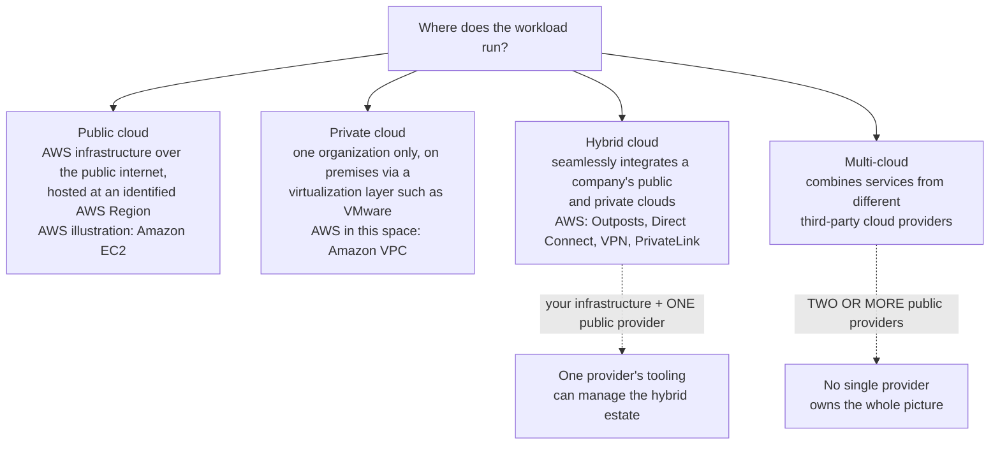
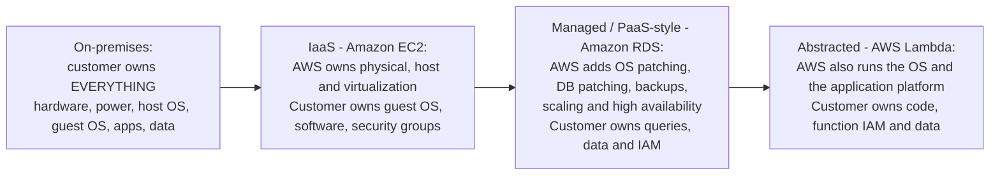
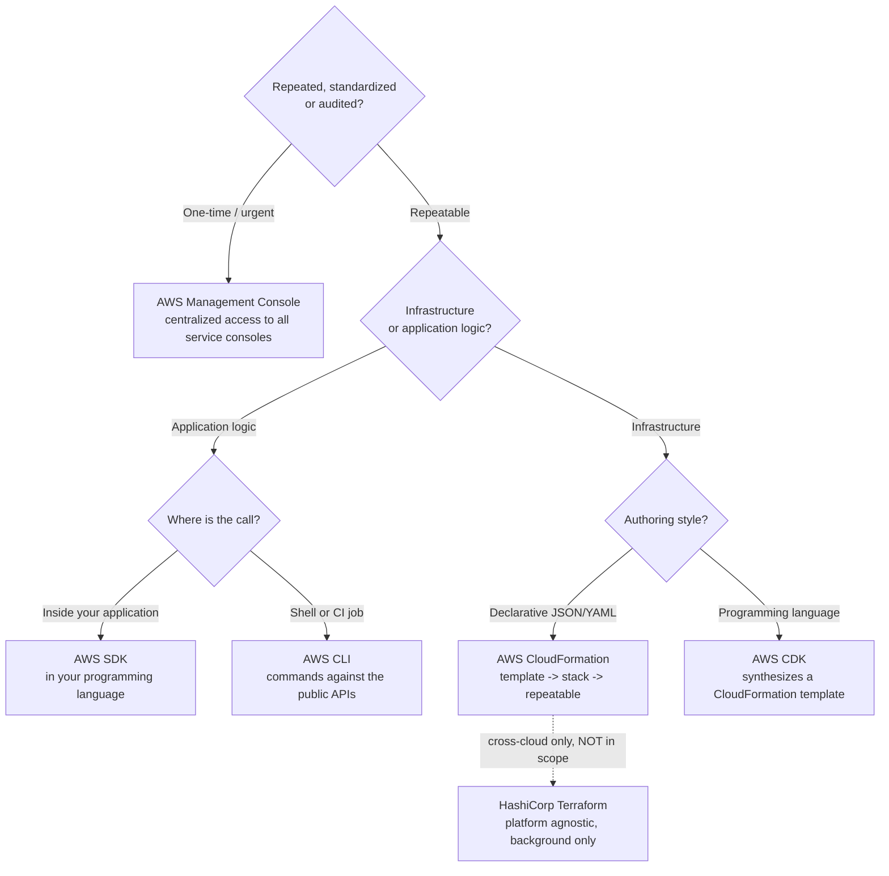
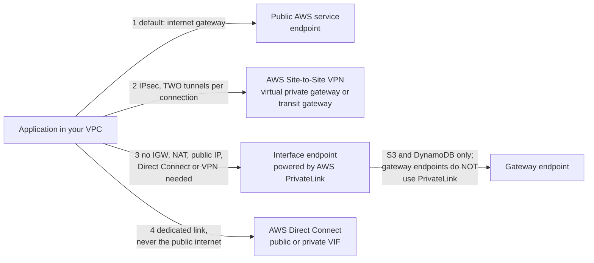
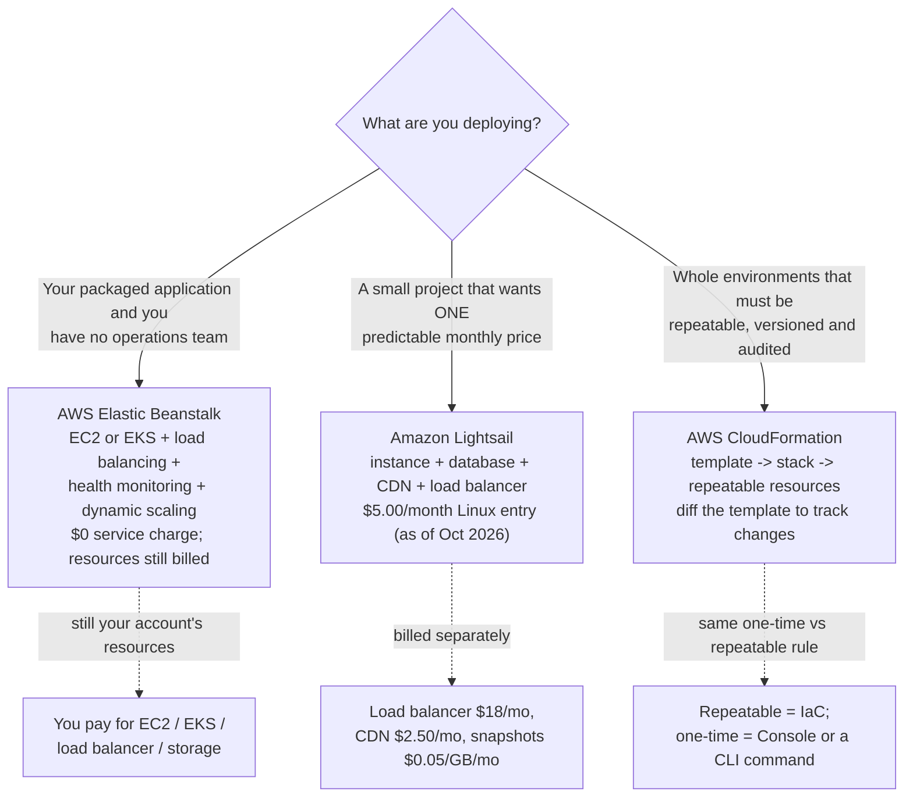

# Cloud Deployment Models and Operating on AWS

Every workload has to answer two questions before it ships: *where does it run?* and *how will we operate it again tomorrow?* The exam calls this **Domain 3, Task 3.1 — "Define methods of deploying and operating in the AWS Cloud"**, and it is the most decision-shaped task on CLF-C02: AWS explicitly tests whether you can **choose** between the Console, programmatic access and infrastructure as code, whether a job is **one-time or repeatable**, and which **deployment model** a description matches. The trap is that Task 3.1 looks like a coding task and is not one — "Implementation" is listed as an out-of-scope job task, so you are never asked *how* to write the script, only *which* door to walk through.

```text
====================================================================
 CLF-C02 DOMAIN 3 - TASK 3.1: DEFINE METHODS OF DEPLOYING AND
 OPERATING IN THE AWS CLOUD          (verified against the exam
                                      guide, Oct 2026)
====================================================================
 KNOWLEDGE                       SKILLS (what you are asked to do)
 - various ways of provisioning  - decide between programmatic
   and operating in the AWS        access (APIs, SDKs, CLI), the
   cloud                            AWS Management Console and
 - various ways to access          infrastructure as code (IaC)
   AWS services                  - evaluate whether to use ONE-TIME
 - types of cloud deployment       OPERATIONS or REPEATABLE
   models                          PROCESSES
                                 - identify deployment models
                                   (cloud, hybrid, on-premises)
---------------------------------------------------------------------
 IN SCOPE FOR 3.1
   Compute .... Elastic Beanstalk, Lightsail, Outposts
   Access ..... AWS CLI, AWS Management Console
   IaC/gov .... CloudFormation, Service Catalog, Systems Manager,
                Auto Scaling
   Network .... Direct Connect, PrivateLink, VPC, AWS VPN,
                Site-to-Site VPN, Client VPN, API Gateway
   Other ...... Storage Gateway, Lambda
 IN SCOPE BUT EXAMINED UNDER TASK 3.8
   AWS Amplify (frontend web and mobile), AWS IoT Core
 OUT OF SCOPE (appear only as distractors)
   CloudShell, CodeDeploy, CodeArtifact, Application Composer,
   Device Farm, Wavelength, IoT Device Defender, IoT Greengrass,
   Monitron
 ON NEITHER LIST (not examinable material)
   AppSync, IoT Device Management, IoT Analytics, Snow Family,
   Terraform, Pulumi, SAM
====================================================================
```

> [!NOTE]
> **Two vocabularies, one task.** The exam guide's own skill line says *"Identifying deployment models (for example, cloud, hybrid, on-premises)"*, while AWS's what-is pages teach **public, private, hybrid and multi-cloud**. Both appear in study material. Section 2 reconciles them, because a question can be phrased either way and both phrasings have one correct answer.

In this lesson you will:

- name the **four deployment models** in AWS's own words and separate **hybrid from multi-cloud**;
- map **IaaS, PaaS and SaaS** to AWS examples and read the **responsibility shift** that each one triggers;
- choose between the **Console, CLI, SDKs, APIs and IaC** — and apply the **one-time versus repeatable** rule;
- distinguish **CloudFormation from CDK** (and know why Terraform is background, not syllabus);
- pick the right **connectivity door**: internet, **Direct Connect**, **Site-to-Site VPN**, or a **VPC endpoint / PrivateLink**;
- place **Amplify, AppSync and IoT Core** where the exam guide actually tests them;
- tell **Elastic Beanstalk, Lightsail and CloudFormation** apart by the job each one does;
- study **four AWS-published case studies** on Lightsail, repeatable operations, environment speed and migration;
- check what **changed in 2026** for scope lists, console tooling and where you can provision;
- practise with **12 exam-style questions** plus five interactive checks.

---

## 1. What Task 3.1 actually asks

### 1.1 The task, split into knowledge and skills

| Half of the task | Exact exam-guide wording | What you must be able to do |
|---|---|---|
| Knowledge | *"Various ways of provisioning and operating in the AWS Cloud"* | Recognise the toolset: Console, CLI, SDKs, APIs, IaC, and the managed deployment services |
| Knowledge | *"Various ways to access AWS services"* | Know that every service is reachable through more than one door |
| Knowledge | *"Types of cloud deployment models"* | Identify public, private, hybrid, multi-cloud (and the guide's cloud / hybrid / on-premises phrasing) |
| Skills | *"Deciding between options such as programmatic access (for example, APIs, SDKs, CLI), the AWS Management Console, and infrastructure as code (IaC)"* | Read a scenario and pick **one** method |
| Skills | *"Evaluating requirements to determine whether to use one-time operations or repeatable processes"* | Classify the workload, then choose the method that fits |
| Skills | *"Identifying deployment models (for example, cloud, hybrid, on-premises)"* | Match a description to a model name |

### 1.2 The scope line: a decision, not a build

The CLF-C02 guide lists **"Implementation"** among the out-of-scope job tasks. That single word reshapes every 3.1 question: an option that says *"write a Python script that creates 40 subnets"* or *"author a CloudFormation template with inline Lambda"* is describing **implementation**, and implementation is not what this exam measures. The correct option is always the **selection**: Console versus CLI versus SDK versus IaC, one-time versus repeatable, public versus hybrid.

| Question the exam asks you | Question it never asks you |
|---|---|
| Which access method fits this scenario? | How do I write the CLI command / SDK call? |
| Is this one-time or repeatable? | How do I structure the YAML? |
| Which deployment model is this? | How do I configure the virtualization layer? |
| Which service provisions and manages this? | How do I tune the underlying instance? |

- **📚 Did you know?** AWS publishes a parity rule that kills a whole family of distractors: every IaaS administration, management and access function available in the **AWS Management Console** is also available in the **AWS API and AWS CLI** *"at launch or within 180 days of launch."* So the option that begins *"the Console is the only way to…"* is almost always wrong — the Console is simply *"the most common method"*, not the exclusive one.

### 1.3 The three service lists you must keep apart

| List | Members (exam guide, Oct 2026) | How it behaves on exam day |
|---|---|---|
| **In scope for 3.1** | Elastic Beanstalk, Lightsail, Outposts, AWS CLI, Management Console, CloudFormation, Service Catalog, Systems Manager, Auto Scaling, Direct Connect, PrivateLink, VPC, AWS VPN, Site-to-Site VPN, Client VPN, API Gateway, Storage Gateway, Lambda | A correct answer, usually paired with a scenario |
| **In scope for 3.8** | **AWS Amplify** (frontend web and mobile), **AWS IoT Core** (IoT) | Correct answers, but tested under task 3.8 — know their *role* |
| **Out of scope** | **AWS CloudShell**, CodeDeploy, CodeArtifact, Application Composer, Device Farm, **AWS Wavelength**, IoT Device Defender, IoT Greengrass, Monitron | Plausible-sounding distractors; the answer is an in-scope service |
| **On neither list** | AppSync, IoT Device Management, IoT Analytics, Snow Family, Terraform, Pulumi, SAM | Background knowledge; never teach yourself these as syllabus facts |

> ⚠️ **CloudShell is the perfect distractor.** AWS CloudShell is *"a browser-based, pre-authenticated shell that you can launch directly from the AWS Management Console"*, with the AWS CLI, EB CLI, ECS CLI and SAM pre-installed (Amazon Linux 2023 image). It sounds ideal for "ways to access AWS" — and it is **explicitly out of scope** for CLF-C02. If a question offers CloudShell next to Console, CLI, SDK and IaC, CloudShell is there to be eliminated, not selected. The same fate awaits **Wavelength**, **IoT Greengrass** and **Snow Family** options.

> [!NOTE]
> **"Out of scope" does not mean "does not exist".** These services are real and widely used; they are simply not on this exam's list. Older study guides still list CloudShell, CodeDeploy and Wavelength as 3.1 answers — the current exam guide wins. And note the difference between *out of scope* (listed, excluded) and *on neither list* (never mentioned at all): only the first is a documented exclusion.

### 2026 Updates (as of October 2026)

> [!NOTE]
> **What changed after most study material was written — every source below accessed 2026-10.**
> - **The service lists were rebuilt — the single biggest 2026 change for Task 3.1.** In-scope entries went **128 → 111** and out-of-scope entries **11 → 55** between the launch-era `Version 1.0` guide and the current one (diff computed 2026-10). Provisioning and connectivity names such as **AWS PrivateLink, AWS Transit Gateway, AWS Site-to-Site VPN, AWS Client VPN** and **Service Quotas** were *added* to the in-scope list, while **AWS CloudShell, AWS CodeDeploy, AWS CodeArtifact, AWS Device Farm** and **AWS AppSync** moved onto the explicit negative list — and the Developer Tools category collapsed from **11 to 4** entries (AWS CLI, CodeBuild, CodePipeline, X-Ray). *Source: "In-Scope AWS Services" and "Out-of-Scope AWS Services" pages, accessed 2026-10.*
> - **Edge compute was quietly de-emphasised.** **AWS Wavelength** is now explicitly out of scope and **AWS Local Zones** appears on *neither* list, so an older guide that credits either as a 3.1 answer is quoting deleted text. *Source: current exam guide and both service lists, 2026-10.*
> - **The console moves even when the exam guide does not.** The **AWS Well-Architected Agent** entered preview on **2026-10-01** as *"the next-gen evolution of AWS Trusted Advisor and the AWS Well-Architected Tool"* — but the guide still names **AWS Well-Architected Tool** and **Trusted Advisor**, so the new agent is background, not a syllabus answer. *Source: AWS News Blog and Well-Architected release notes, 2026-10-01.*
> - **More places to provision.** Four Regions opened during 2025 — Asia Pacific (Thailand) **2025-01-07**, Mexico (Central) **2025-01-14**, Asia Pacific (Taipei) **2025-06-06**, Asia Pacific (New Zealand) **2025-09-02** — and the **AWS European Sovereign Cloud** (`eusc-de-east-1`) was announced generally available **2026-01-14**. The public map reads **39 Regions / 124 Availability Zones**, with 7 more AZs and 2 more Regions (Saudi Arabia, Chile) announced as of Oct 2026. *Source: Region doc history and the Regions/AZs map, 2026-10 — verify current before use.*
> - **Free Tier changed shape for provisioning budgets.** Accounts created **on or after 2025-07-15** get **6 months** of Free Tier (or until credits run out) plus a **USD 100 sign-up credit and up to USD 100 earned = up to USD 200**; the 12-month, `t2.micro`-based tier belongs to accounts created before that date, and `t2.micro` is no longer on the new eligible list. *Source: AWS News Blog 2025-07-15 and the EC2 User Guide Free Tier table "before and after July 15, 2025", accessed 2026-10 — verify current before use.*

> [!WARNING]
> **News is not syllabus.** Everything in the box above is real, dated and sourced — and none of it becomes examinable just because it is recent. The guide's own lists are the arbiter: the **AWS Well-Architected Agent**, **Database Savings Plans** and the new **Business Support+ / Unified Operations** plan names are genuinely new, but only what the current exam guide prints earns a mark. Revise from the guide you download today, not the PDF you downloaded in 2024.

---

## 2. Deployment models: public, private, hybrid and multi-cloud

### 2.1 AWS's four definitions, in AWS's own words

| Model | AWS definition (sourced, Oct 2026) | Where it runs | AWS illustration |
|---|---|---|---|
| **Public cloud** | *"infrastructure and services over the public internet … hosted at an identified AWS Region"* | Provider's data centres, shared underlying hardware, billed as you go | **Amazon EC2** |
| **Private cloud** | *"cloud infrastructure for use exclusively by a single organization … provisioned on premises using a virtualization layer (for example, VMware)"* | Your premises, your hardware, one tenant | *"In the private cloud space, AWS provides the **Amazon VPC**"* |
| **Hybrid cloud** | *"an IT infrastructure design that seamlessly integrates a company's public and private clouds"* | Both — your estate plus a public cloud, operated as one | **AWS Outposts**, Direct Connect, Site-to-Site VPN, PrivateLink |
| **Multi-cloud** | *"a cloud strategy that combines services from different third-party cloud providers"* | Two or more public providers | No AWS illustration — by definition it is not a single-provider story |

AWS's hybrid framing is worth memorising: *"Hybrid cloud with AWS delivers a consistent AWS experience where you need it — from the cloud to on premises and at the edge"*, and **AWS Outposts** is *"a family of fully managed services delivering AWS infrastructure and services to virtually any on-premises or edge location for a truly consistent hybrid experience."*



### 2.2 Two taxonomies — and the hybrid/multi-cloud line

The exam guide says **"cloud, hybrid, on-premises"**. AWS's what-is pages say **public, private, hybrid, multi-cloud**. They overlap rather than conflict:

| Guide phrasing | Closest AWS-page phrasing | Note |
|---|---|---|
| **cloud** (i.e. running in the public cloud) | **public cloud** | Same idea: AWS Regions, shared infrastructure |
| **on-premises** | **private cloud** (when virtualized and cloud-like) | Private ≠ automatically on-premises-only, but AWS's private-cloud page describes on-premises virtualization |
| **hybrid** | **hybrid** | Identical in both vocabularies |

The distinction the exam actually guards is this one:

- **Hybrid** = *your infrastructure + one public cloud*. AWS says hybrid management *"can be done using services from a single cloud provider."*
- **Multi-cloud** = *services from two or more third-party cloud providers*. The moment a stem says "AWS **and** another provider", you are in multi-cloud, not hybrid.

> [!WARNING]
> **The two-word trap: "hybrid" versus "multi-cloud".** A company running half its estate in its own data centre and half in AWS is **hybrid** — even if that is complicated. A company running one application in AWS and another in a different public provider is **multi-cloud** — even if nothing is on-premises. *"Two vendors"* ⇒ multi-cloud; *"our data centre plus the cloud"* ⇒ hybrid. Also remember that a question describing **only** on-premises virtualization with no public cloud attached is a **private cloud**, not a hybrid one.

### 2.3 The AWS hybrid toolkit that is in scope

| Service | Role in the hybrid model | Scope note |
|---|---|---|
| **AWS Outposts** | AWS infrastructure, services, APIs and tools extended to your premises, managed *"as part of an AWS Region"* | In scope (3.1) |
| **AWS Direct Connect** | Dedicated network connection between your on-premises network and AWS, *"bypassing your internet service provider"* | In scope (3.1) |
| **AWS Site-to-Site VPN** | IPsec secure connection from a data centre or branch office to AWS | In scope (3.1) |
| **AWS Client VPN** | Individual remote users | In scope (3.1) |
| **AWS PrivateLink / VPC endpoints** | Private connectivity to services *"as if they were in your VPC"* | In scope (3.1) |
| **Amazon VPC** | Your logically isolated cloud network — the private-cloud building block | In scope (3.1) |
| **AWS Storage Gateway** | Hybrid storage bridge between on-premises and cloud storage | In scope (3.1) |
| **AWS Wavelength**, **Snow Family** | Edge compute / offline data transfer | **Out of scope / not listed** — never a 3.1 answer |

- **📚 Did you know?** Outposts ships as a **42U self-contained rack** needing **10–30 kVA**, and as **1U/2U servers** (sizes and power figures as of Oct 2026 — verify current before use). What makes it a *deployment model* fact rather than a hardware fact is that an Outpost is managed *"as part of an AWS Region"*, so the hybrid story stays one operating model: same APIs, same console, same tooling, different postcode.

---

## 3. Service models: IaaS, PaaS, SaaS — and the responsibility shift

### 3.1 The three service models

| Model | What the provider manages (AWS wording) | What you manage | AWS example |
|---|---|---|---|
| **IaaS** | *"maintaining the physical infrastructure"* — compute, storage and network delivered *"on a pay-as-you-go basis over the internet"* | Guest OS, patches, runtime, installed software, application, data, IAM, security groups | **Amazon EC2** |
| **PaaS** | *"the underlying infrastructure (usually hardware and operating systems)"*, so you *"focus on the deployment and management of your applications"* | Your application and your data | **AWS Elastic Beanstalk**, **Amazon Lightsail** |
| **SaaS** | The application itself, delivered *"to end-users through an internet browser"* | Usage decisions; your own data inside the product | AWS sells none — *"Though AWS does not offer SaaS services, AWS offers many options you can use to build custom third-party SaaS applications and solutions."* |



### 3.2 Example E1 — counting the responsibility shift

The RDS documentation publishes the same nine operational rows for three environments. Count who owns each row:

```text
ROW (from the Amazon RDS user guide matrix)      On-prem   EC2   RDS
------------------------------------------------  --------  ----  ----
1 Application optimization                        Customer  Cust  Cust
2 Scaling                                         Customer  Cust  Cust
3 High availability                               Customer  Cust  Cust
4 Database backups                                Customer  Cust   AWS
5 Database software patching                      Customer  Cust   AWS
6 Operating system (OS) patching                  Customer  Cust   AWS
7 Server maintenance                              Customer   AWS   AWS
8 Hardware lifecycle                              Customer   AWS   AWS
9 Power, network and cooling                      Customer   AWS   AWS
------------------------------------------------  --------  ----  ----
Rows owned by the CUSTOMER                            9       6      3
Rows owned by AWS                                      0       3      6
```

Three readings follow, and all three are examinable:

1. **On premises the count is 9 out of 9** — you own everything including the building's power.
2. **EC2 moves three rows to AWS** (server maintenance, hardware lifecycle, power/cooling) but leaves **six** in your column — that is what "IaaS requires the customer to perform all of the necessary security configuration and management tasks" means in practice.
3. **RDS flips the majority to AWS (six of nine)** — yet *"Application optimization"* stays **Customer** in every single column. **"AWS manages the database" never means "AWS tunes your queries."**

### 3.3 The invariant: security **of** vs **in** the Cloud

The shared responsibility model is the frame underneath all of this: AWS is responsible for security **"of" the Cloud**, the customer is responsible for security **"in" the Cloud**. For **abstracted services** such as Amazon S3 and Amazon DynamoDB, *"AWS operates the infrastructure layer, the operating system, and platforms … Customers are responsible for managing their data … and using IAM tools."* For **AWS Lambda**, AWS manages *"the underlying infrastructure and foundation services, the operating system, and the application platform"*, while you own *"the security of your code and AWS IAM to the Lambda service and within your function."*

```fillblank
{
  "question": "Complete the shared-responsibility statements that Task 3.1 depends on:",
  "template": "AWS is responsible for security {{1}} the cloud, and the customer is responsible for security {{2}} the cloud. On Amazon EC2 (IaaS) the customer still patches the {{3}} operating system and configures the AWS-provided firewall called a {{4}} group. On Amazon RDS, AWS takes over operating-system patching, database patching, backups, scaling and high availability, while {{5}} optimization stays with the customer.",
  "answers": {
    "1": "of",
    "2": "in",
    "3": "guest",
    "4": "security",
    "5": "application"
  },
  "distractors": ["under", "within", "host", "network", "platform", "database", "data"],
  "explanation": "The shared responsibility model splits security OF the cloud (AWS) from security IN the cloud (customer). EC2 is categorized as IaaS, so the guest OS and the configuration of the AWS-provided firewall called a security group remain customer tasks. The RDS matrix keeps application optimization on the customer side in every environment, while AWS takes OS patching, database patching, backups, scaling and high availability."
}
```

### 3.4 Patching nuance the exam sneakily tests

Not all managed services hand you the same degree of control:

| Service type | Who patches | What you still do (AWS wording) |
|---|---|---|
| **Single-tenant managed** (Amazon RDS, Amazon ElastiCache) | AWS releases patches *"within the service's patching SLA"* | *"facilitate patching by selecting maintenance windows"* |
| **Multi-tenant abstracted** (Amazon DynamoDB, Amazon S3) | AWS applies patches *"without requiring customer action"* | Nothing about patching — you own data, encryption, classification and IAM |
| **IaaS (Amazon EC2)** | You patch the guest OS | Everything below the hypervisor is AWS; everything above is yours |

```dragdrop
{
  "question": "Order these four environments from MOST customer responsibility to LEAST (AWS takes over more at each step):",
  "items": [
    "On-premises data centre",
    "Amazon EC2 (IaaS)",
    "Amazon RDS (managed database service)",
    "AWS Lambda (abstracted service)"
  ],
  "correctOrder": [
    "On-premises data centre",
    "Amazon EC2 (IaaS)",
    "Amazon RDS (managed database service)",
    "AWS Lambda (abstracted service)"
  ],
  "explanation": "Each step moves rows from your column to AWS's: on premises you own all nine operational rows; EC2 moves server maintenance, hardware lifecycle and power/cooling to AWS; RDS also moves OS patching, database patching, backups, scaling and high availability to AWS; Lambda additionally removes the operating system and application platform. What never moves is your code, your data, your IAM choices and application optimization."
}
```

> ⚠️ **"AWS manages it" is not "AWS takes all of it".** Two traps live here. First, **RDS is not full delegation** — application optimization, your queries, your schema and your data stay yours in every column of the matrix. Second, **SaaS is not an AWS product**: AWS states it does not offer SaaS services, it offers the tools to *build* third-party SaaS. An option claiming "WorkMail / QuickSight is AWS's SaaS offering" is unsupported by any AWS page in this research — treat it as wrong.

---

## 4. Ways to access AWS: Console, CLI, SDKs, APIs and IaC

### 4.1 The five doors (plus the one that is out of scope)

| Method | AWS wording (sourced) | Best fit in a question stem |
|---|---|---|
| **AWS Management Console** | *"a web-based application that contains and provides centralized access to all individual AWS service consoles"*; IAM calls it *"the most common method"* | One-time, visual, exploratory, urgent, learning |
| **AWS CLI** | *"an open source tool that enables you to interact with AWS services using commands in your command-line shell"* | Scripted, repeatable shell work and CI jobs |
| **AWS SDKs** | *"AWS offers Software Development Kits (SDKs) for various programming languages"* — calls issued from inside your own application | The stem says *from the application* or *in code at runtime* |
| **AWS APIs** | *"issue HTTPS requests directly to the service"* (the IAM Query API example) | Custom tooling, language-agnostic, any HTTPS client |
| **Infrastructure as Code** | *"provisioning and managing an application's infrastructure through a set of configuration files"* | Repeatable, versioned, multi-environment infrastructure |
| ~~AWS CloudShell~~ | *"browser-based, pre-authenticated shell"* | **Out of scope — a distractor** |

- **📚 Did you know?** Amazon S3 launched on **14 March 2006** at **$0.15 per GB-month**, with a **5 GB** maximum object size and roughly **1 PB** of capacity across about 400 storage nodes; AWS now says the price is *"slightly over 2 cents per gigabyte"* — an approximately **85% reduction** — and that *"the code you wrote for S3 in 2006 still works today, unchanged"* (AWS News Blog, 2026-03-13; prices as of Oct 2026 — verify current before use). The examinable point is the *operating* one: **stable APIs are what make repeatable automation survive** — the CLI call or SDK request you scripted years ago still works, which is precisely why AWS pairs "repeatable processes" with programmatic access.

### 4.2 One-time operations versus repeatable processes

This is the single most testable phrase in Task 3.1. The skill is to *"evaluate requirements to determine whether to use one-time operations or repeatable processes"* — and AWS's IaC guidance supplies the reasoning on the other half:

| Signal in the stem | Classification | Method the exam wants |
|---|---|---|
| Exploratory, urgent, "just this once", "quickly in the browser" | **One-time** | **AWS Management Console** (or a single CLI command) |
| The same change monthly, "across 20 accounts", "every new environment", audited, standardized | **Repeatable** | **Infrastructure as code** — CloudFormation (or CDK) |
| Runtime calls made by a running application | Neither — it is application logic | **SDK** or **API** |
| A shell/CI pipeline needs to create infrastructure on demand | Repeatable, script-shaped | **CLI** for one-off commands, **IaC** for infrastructure |

AWS's own arguments for the repeatable half, quoted:

- IaC makes *"new environments repeatable, reliable, and consistent"*;
- *"write your IaC code once and deploy that same code to hundreds of environments in a fraction of the time"*;
- *"Configuration drift occurs when the configuration that provisioned your environment no longer matches the actual environment"* — manual creation is *"error prone"*, and a template is a text file, so you *"simply track differences in your templates to track changes to your infrastructure."*

**The operating rule:** when an environment has drifted, **re-apply the template**. Hand-editing the live resource re-creates the very drift you are trying to remove.

### 4.3 Example E2 — the arithmetic of manual operations

Suppose 100 environments each need the same change, and a human takes 10 minutes per environment clicking through the Console:

$$
T_{\text{manual}} = 100 \times 10 \text{ min} = 1{,}000 \text{ min} \approx 16.7 \text{ hours}
$$

16.7 hours of undirected human effort, at 100 chances to click the wrong thing, repeated every month. AWS's IaC promise is the counter-factual: *"write your IaC code once and deploy that same code to hundreds of environments in a fraction of the time."* The exam does not ask you to prove this — it asks you to **recognise the shape**: many environments + one standard change ⇒ **IaC**.

### 4.4 Example E3 — one template, four environments, drift arithmetic

The canonical repeatable pattern from AWS's CloudFormation documentation is the *same 12-resource stack* deployed to development, staging, production and a second AWS Region:

```text
Manual approach      12 resources x 4 environments = 48 resource CREATIONS
                     (48 separate chances to misconfigure, 48 separate audits)
Template approach    1 template file  x 4 launches  = 4 stacks, 48 resources
                     the template is text -> diff it like source code
Drift example        if 3 of the 48 live resources now differ from the
                     template, that is CONFIGURATION DRIFT; the fix is to
                     re-apply the template, not to hand-edit the 3 resources
```

The examinable conclusions: a template is **reused**, **versioned** and **diffed**; a stack's resources are created and configured *for* you; and deleting the stack deletes the resources it created — which is also why IaC is the cleanest answer to "clean up this environment".



### 4.5 The IaC trio: CloudFormation, CDK and the third name in the room

| Tool | What it is (AWS wording) | Exam status |
|---|---|---|
| **AWS CloudFormation** | *"You create a template that describes all the AWS resources that you want … and CloudFormation takes care of provisioning and configuring those resources for you"*; reuse it *"in a consistent and repeatable manner"* | **In scope** — the default IaC answer |
| **AWS CDK** | *"an open-source software development framework for defining cloud infrastructure in code and provisioning it through AWS CloudFormation"* | **In scope** — the "we want a real language" answer |
| HashiCorp Terraform | Third-party, *"platform agnostic"* | **Not on either list** — background only |
| AWS SAM / Pulumi | Named alongside the above in AWS's IaC tool comparison | **Not on either list** |

AWS's prescriptive guidance compares **five** IaC tools — CloudFormation, SAM, CDK, Terraform and Pulumi — and gives the selection rule you need: *"If you are managing your infrastructure entirely on AWS, then AWS CloudFormation and the AWS Cloud Development Kit (AWS CDK) are good options"*, while *"Terraform might be a good choice because it is platform agnostic."*

> [!WARNING]
> **CDK does not compete with CloudFormation — CDK produces CloudFormation.** CDK is *"provisioning it through AWS CloudFormation"*, so a question offering "CloudFormation **or** CDK" as rival infrastructure engines has mis-stated the relationship: you author in TypeScript, Python, Java, C#/.NET, JavaScript or Go (six languages, as of Oct 2026), and CDK **synthesizes a CloudFormation template** that the service then executes. And if a stem mentions a **multi-cloud** estate, Terraform becomes the *conceptually* right tool — but it is absent from this exam's in-scope list, so it will not be the credited answer on CLF-C02.

- **📚 Did you know?** CloudFormation templates are plain text files, which is why AWS says you can *"simply track differences in your templates to track changes to your infrastructure."* That property is the same one that makes configuration drift detectable: diff the template against the live stack, find the hand-edits, re-apply. Infrastructure you cannot diff is infrastructure you cannot audit.

```matching
{
  "question": "Match each operating scenario to the access method CLF-C02 expects:",
  "pairs": [
    {"left": "One exploratory change at 2 a.m. in the browser", "right": "AWS Management Console - centralized access to all individual service consoles; the most common method"},
    {"left": "The same change every month across 20 AWS accounts", "right": "Infrastructure as code - a CloudFormation template reused in a consistent and repeatable manner"},
    {"left": "The running application creates a bucket itself", "right": "AWS SDK - service calls embedded in your own programming language"},
    {"left": "A shell step inside a CI pipeline", "right": "AWS CLI - commands issued in your command-line shell"},
    {"left": "A custom tool issuing HTTPS requests to a service endpoint", "right": "AWS API - issue HTTPS requests directly to the service"},
    {"left": "A pre-authenticated shell launched from the browser", "right": "AWS CloudShell - explicitly OUT OF SCOPE for CLF-C02, so it is the distractor"}
  ],
  "explanation": "The exam-guide skill is to decide between programmatic access (APIs, SDKs, CLI), the AWS Management Console and IaC, then to classify the job as one-time or repeatable. Console fits one-time visual work, IaC fits repeated standardized change, SDK fits in-application calls, CLI fits scripted shell work, APIs fit custom tooling - and CloudShell, although real and convenient, is on the out-of-scope list so it never earns the mark."
}
```

---

## 5. Connectivity: the four doors into and out of a VPC

### 5.1 The overview (in-scope services only)

| Door | Mechanism | Numbers (as of Oct 2026; verify current before use) | Exam fit |
|---|---|---|---|
| **1. Public internet** | Your VPC's **internet gateway** routes traffic to public AWS service endpoints | Default configuration, lowest setup cost | General public access; not private |
| **2. AWS Direct Connect** | A dedicated network connection that *"bypassing your internet service provider"* — *"your network traffic remains on the AWS global network and never touches the public internet"* | Dedicated ports **1, 10, 100, 400 Gbps**; hosted connections **50 Mbps – 25 Gbps**; High Resiliency SLA **99.9%**, Maximum Resiliency SLA **99.99%** | Steady, predictable, private throughput |
| **3. AWS Site-to-Site VPN** | A fully managed secure connection using **IP Security (IPSec) tunnels** | **Two tunnels per connection** for redundancy; **1.25 Gbps** per tunnel standard, **up to 5 Gbps** with a Large Bandwidth Tunnel | Fast, cheap, internet-based private link |
| **4. VPC endpoints** | **Interface endpoints powered by AWS PrivateLink**, or **gateway endpoints** | PrivateLink needs *"no internet gateway, NAT device, public IP address, Direct Connect connection, or AWS Site-to-Site VPN connection"*; gateway endpoints cover **Amazon S3 and Amazon DynamoDB only** and *"do not use AWS PrivateLink"* | Private access to AWS services without leaving the VPC |
| **Remote individuals** | **AWS Client VPN** | Per-user connectivity | People, not sites |

> [!NOTE]
> **A conflict this research could not settle — treat as unverified.** One AWS overview page advertises Direct Connect speeds *"starting at 50 Mbps and scaling up to 100 Gbps"*, while the Direct Connect User Guide lists dedicated ports of **1, 10, 100 and 400 Gbps** and hosted connections of **50 Mbps to 25 Gbps**. These two AWS pages disagree. This lesson quotes the **User Guide** figures and stamps them **as of Oct 2026**; re-verify on the pricing and connection-options pages before you rely on any bandwidth number.



### 5.2 Example E4 — two tunnels, four numbers

AWS Site-to-Site VPN includes **two tunnels per connection**, and each tunnel has a bandwidth ceiling:

```text
Standard tunnels        2 tunnels x 1.25 Gbps = 2.5 Gbps aggregate ceiling
Large Bandwidth Tunnels 2 tunnels x 5 Gbps    = 10   Gbps aggregate ceiling
Ratio                   10 / 2.5 = 4x the headline bandwidth
```

Two observations the exam rewards. First, the **two tunnels exist for high availability**, not primarily for speed — AWS says *"Each VPN connection includes two VPN tunnels which you can simultaneously use for high availability."* Second, bandwidth is a **per-tunnel ceiling**, so a stem that says "a Site-to-Site VPN connection delivers 1.25 Gbps total" is wrong by a factor of two. All figures **as of Oct 2026 — verify current before use**.

### 5.3 Example E5 — what a resiliency SLA costs you in minutes

Direct Connect publishes two resiliency designs. Convert the percentages into downtime budgets over a 365-day year ($8{,}760$ hours):

$$
8{,}760 \times (1 - 0.999) = 8.76 \text{ hours per year}
$$

$$
8{,}760 \times (1 - 0.9999) = 0.876 \text{ hours} \approx 52.6 \text{ minutes per year}
$$

| Resiliency design | Published SLA | Annual downtime budget | Rough reading |
|---|---|---|---|
| High Resiliency | **99.9%** | **8.76 hours** | About one working day per year |
| Maximum Resiliency | **99.99%** | **52.6 minutes** | About one coffee break per year |

The exam does not ask for this arithmetic — it asks you to **match the requirement to the design**: "steady private throughput with the tightest published availability" ⇒ Direct Connect with Maximum Resiliency; "we need a private link up this afternoon" ⇒ Site-to-Site VPN. SLA figures **as of Oct 2026**.

### 5.4 Example E6 — choosing the Direct Connect port

A branch office needs **400 Mbps**; the core data centre needs **100 Gbps**:

```text
Branch office   400 Mbps  -> hosted connection range is 50 Mbps - 25 Gbps  => HOSTED port fits
Core data centre 100 Gbps -> dedicated port options are 1, 10, 100, 400 Gbps => DEDICATED port fits
```

Rule of thumb from the connection-options page: **hosted connections** scale from **50 Mbps to 25 Gbps** (delivered through AWS Direct Connect partners), while **dedicated connections** are **1, 10, 100 or 400 Gbps**. A stem quoting **50 Mbps** is a hosted-port signal; a stem quoting **100 Gbps** is a dedicated-port signal. Figures **as of Oct 2026 — verify current before use**.

### 5.5 PrivateLink and gateway endpoints, precisely

| Question in the stem | Correct door | Why the distractors fail |
|---|---|---|
| "…with **no** internet gateway, NAT device, public IP, Direct Connect or VPN" | **Interface endpoint powered by PrivateLink** | The stem literally quotes the PrivateLink "when to use" conditions |
| "…private access to **Amazon S3 or DynamoDB** only" | **Gateway endpoint** | Gateway endpoints are S3 + DynamoDB only, and *"do not use AWS PrivateLink"* |
| "…individual remote employees connecting" | **AWS Client VPN** | Client VPN is per-user; Site-to-Site VPN is per-site |
| "…the service must be reachable *as if it were in my VPC*" | **PrivateLink** | That is AWS's own definition of PrivateLink |

- **📚 Did you know?** VPC endpoints come in two families and the exam tests the exception: **gateway endpoints** (Amazon S3, Amazon DynamoDB) **do not use AWS PrivateLink**, while **interface endpoints** are the PrivateLink-powered kind. So the statement *"all VPC endpoints are powered by PrivateLink"* is false — one counter-example, straight from AWS's VPC documentation, is enough to sink it.

```matching
{
  "question": "Match each connectivity requirement to the in-scope AWS option:",
  "pairs": [
    {"left": "Steady private throughput from the data centre that never touches the public internet", "right": "AWS Direct Connect - a dedicated connection bypassing your internet service provider"},
    {"left": "A fast, low-cost private connection established with IPsec tunnels", "right": "AWS Site-to-Site VPN - two tunnels per connection for redundancy"},
    {"left": "Private access to a service with no internet gateway, NAT device, public IP, Direct Connect or VPN", "right": "Interface endpoint powered by AWS PrivateLink"},
    {"left": "Private access to Amazon S3 or Amazon DynamoDB only", "right": "Gateway endpoint - covers S3 and DynamoDB and does not use AWS PrivateLink"},
    {"left": "Connectivity for individual remote employees", "right": "AWS Client VPN"},
    {"left": "A hybrid storage link between the data centre and cloud storage", "right": "AWS Storage Gateway"}
  ],
  "explanation": "Each pair maps a quoted AWS condition to the service that owns it: Direct Connect is the dedicated link whose traffic never touches the public internet, Site-to-Site VPN is the IPsec option with two tunnels, PrivateLink is the no-IGW/NAT/public-IP/DX/VPN door, gateway endpoints are S3 and DynamoDB only, Client VPN serves people rather than sites, and Storage Gateway is the in-scope hybrid storage bridge."
}
```

---

## 6. Frontend, mobile and IoT: what task 3.8 adds

Task 3.1 is about *provisioning and operating*; the exam guide tests frontend/mobile and IoT under **Task 3.8 — "Identify services from other in-scope AWS service categories."** Both skills are naming skills: *"Identifying the services that can create and deploy frontend and mobile services"* and *"Identifying the services that manage IoT devices."*

### 6.1 AWS Amplify — the frontend and mobile answer

| Attribute | AWS wording (sourced) |
|---|---|
| Category in the exam guide | **Frontend Web and Mobile** — the only service named in that category |
| Hosting model | *"Amplify Hosting provides a Git-based workflow for hosting full-stack serverless web applications with continuous deployment"* |
| Delivery | *"Amplify deploys your app to the AWS global content delivery network (CDN)"* |
| Release behaviour | *"Atomic deployments eliminate maintenance windows"* |
| Exam fit | The stem says *frontend / mobile / web app / Git-based / continuous deployment* |

The word **"atomic"** is the tell: because a new deployment replaces the old one as a unit, a failed release does not leave a half-updated site, which is why AWS says maintenance windows disappear. Amplify is therefore also an **operating** story — repeatable, Git-triggered releases rather than manual uploads.

### 6.2 AppSync — a naming caveat

**Amazon AppSync** appears on **neither** the in-scope nor the out-of-scope list in the current CLF-C02 exam guide. Treat it as **background vocabulary only**: it is not examinable material, so do not memorise it as "the GraphQL answer for this exam" and do not expect it to be credited. The credited frontend/mobile service in the guide is **AWS Amplify**.

### 6.3 AWS IoT Core — the IoT answer

| Attribute | AWS wording / fact (sourced) |
|---|---|
| Role | *"AWS IoT provides the cloud services that connect your IoT devices to other devices and AWS cloud services"* |
| Exam-guide category | **Internet of Things (IoT)** — AWS IoT Core is the only service named |
| Protocols supported | **MQTT**, **MQTT over WSS**, **HTTPS**, **LoRaWAN** |
| Exam fit | *Device gateway / connecting devices to AWS services* |
| Out of scope (distractors) | **AWS IoT Device Defender**, **AWS IoT Greengrass**, **Amazon Monitron** |
| On neither list | AWS IoT Device Management, AWS IoT Analytics — exam status unknown; never teach as syllabus |

> ⚠️ **Two IoT traps.** First, **IoT Device Defender and IoT Greengrass are out of scope** — a question describing device-side Lambda execution or security-behaviour monitoring is baiting you toward services that are not on the list; the in-scope answer is **AWS IoT Core**. Second, **IoT Device Management and IoT Analytics appear on neither list**, so they are neither answers nor documented exclusions — if you see them, treat the question as testing whether you know what *is* listed.

---

## 7. Elastic Beanstalk, Lightsail and CloudFormation: three distinct roles

### 7.1 AWS Elastic Beanstalk — PaaS-style deployment of your code

| Attribute | AWS wording / fact (sourced) |
|---|---|
| What it does | *"provisions Amazon EC2 instances or EKS clusters, configures load balancing, sets up health monitoring, and dynamically scales your environment"* |
| What you hand it | An application version that *"points to an Amazon Simple Storage Service (Amazon S3) object that contains the deployable code"* |
| Charge | *"There is no additional charge for Elastic Beanstalk. You pay only for the underlying AWS resources that your application consumes"* (**as of Oct 2026**) |
| Service model | **PaaS-style** — AWS runs infrastructure and platform, you run the application |
| Not | Not serverless; not free; not an IaC tool |

The three-part trap in one line: **$0 service charge ≠ $0 bill**, because the EC2 instances, load balancer and storage it creates are billed to your account; **Beanstalk is not serverless**, because it provisions EC2 or EKS; and **Beanstalk is not IaC**, because you are handing it code, not a reusable infrastructure template.

### 7.2 Amazon Lightsail — the predictable-price entry point

| Attribute | AWS wording / fact (sourced, **as of Oct 2026 — verify current before use**) |
|---|---|
| Positioning | *"the easiest way to get started with AWS … for a low, predictable monthly price"* |
| Fit | *"best suited to projects that require a few dozen instances or less"* |
| Linux-type entry plan | **$0.0067 USD/hour = $5 USD/month** |
| Windows entry plan | **$0.0127 USD/hour = $9.50 USD/month** |
| Add-ons | Load balancer **$18/month**; CDN **$2.50/month** (50 GB tier, then **$10**, then **$35**); snapshots **$0.05/GB/month** |
| Service model | **PaaS-style bundle** — instance, database, CDN and load balancer under one price |

### 7.3 Example E7 — the Lightsail bundle, priced two ways

**Bundle arithmetic:**

```text
Lightsail Linux instance ......... $5.00 / month
+ Lightsail CDN add-on ........... $2.50 / month (50 GB tier)
                                  ----------
Bundle total ..................... $7.50 / month  before transfer overages
```

**Hourly versus monthly cap.** Lightsail bills hourly but caps the charge at the monthly price. A full month is $750$ hours:

$$
0.0067 \times 750 = 5.025 \text{ USD} \longrightarrow \text{capped at } 5.00 \text{ USD}
$$

A partial month of $200$ hours: $0.0067 \times 200 \approx$ **$1.34$**. So the monthly price is a **ceiling, not a floor** — you pay for what you run up to the cap. All figures **as of Oct 2026**; sizes, tiers and prices change, so verify current before use.

### 7.4 Example E8 — Elastic Beanstalk is $0 to run *as a service*

Elastic Beanstalk charges **$0** for itself. The bill comes from what it creates. For illustration (teaching figures, **not** AWS list prices — verify current before use):

```text
Scenario: one small web environment left running for a month
  Elastic Beanstalk service charge .................. $0.00
  Underlying resources it provisions (EC2 + load
    balancer + storage) ............................. billed to your account
Contrast with a manual build:
  same environment, built by hand in the Console .... same resource bill
  plus configuration effort, no health monitoring,
  no dynamic scaling, no environment versioning
Conclusion: Beanstalk buys you OPERATIONS, not a discount.
```

The examinable sentence: **Elastic Beanstalk removes the operational work, not the resource cost.**



### 7.5 The three-in-one decision

| Stem signal | Correct service | Why the others fail |
|---|---|---|
| "Upload my code; provision, balance, monitor and scale it; no charge for the service" | **Elastic Beanstalk** | Lightsail is a flat-price bundle, not a code-upload pipeline; CloudFormation is infrastructure, not an application platform |
| "A few dozen instances or less at a predictable monthly price" | **Amazon Lightsail** | Elastic Beanstalk bills per underlying resource; EC2 lacks the bundle simplicity |
| "Same change across many accounts/environments, versioned and auditable" | **AWS CloudFormation** | Beanstalk and Lightsail deploy *an* environment; neither gives you a diffable template for *all* of them |
| "AWS compute and storage inside my own building, same APIs" | **AWS Outposts** | All three above run in AWS Regions, not at your site |

- **📚 Did you know?** Elastic Beanstalk's application version is stored as *"an Amazon Simple Storage Service (Amazon S3) object that contains the deployable code"* — so "where does Beanstalk keep my code?" has a one-word answer: **S3**. That also explains the blue/green-style versioning: you promote a different S3 object as the current version, and the environment's configuration stays describable as data rather than as clicks.

---

## Real-World Case Studies

AWS publishes what these choices look like in production. Every figure below is **customer- or AWS-claimed and unaudited**, with the source named so you can check it — the examinable point is the **pattern** (which deployment model, which access method, which operating habit), not the marketing number.

### Case A — Gourmeat: Lightsail as the small predictable entry point

| Element | Detail |
|---|---|
| **Industry / context** | Meat boutique operating in Uruguay and the US; inventory tracked in Excel with no simultaneous access for the team |
| **Deployment / operating pattern** | **PaaS-style entry**: a small, predictably priced environment rather than assembled EC2 networking — the *"few dozen instances or less"* fit from the Lightsail page |
| **AWS services named** | **Amazon Lightsail**, with AWS Partner Nub8 |
| **Headline outcomes (AWS-published, customer-claimed)** | Inventory reporting and report creation fell from **~4 hours per week to under 20 minutes**; **productivity up more than 40%**; test and production environments delivered in **6 weeks** (case study dated October 2020) |
| **Source** | aws.amazon.com/solutions/case-studies/gourmeat-lightsail (accessed Oct 2026) |

*Exam lesson:* this is the **Lightsail** answer in human form — the value claimed is **operational** (hours of manual reporting removed, one predictable monthly bill), not a raw compute benchmark. The exam question built from this pattern asks *"small team, few instances, wants a predictable monthly price"* — and Lightsail is the option to reach for, with Elastic Beanstalk as the near-miss (also low-ops, but priced per underlying resource rather than bundled).

### Case B — athenahealth: repeatable operations across 120 accounts

| Element | Detail |
|---|---|
| **Industry / context** | Healthcare software (HIPAA-sensitive); egress monitoring across a sprawling VPC estate, rising inspection cost, a team of eight |
| **Deployment / operating pattern** | **Repeatable processes** in production: one centralized design, expressed as code and shared by policy, instead of per-account clicking |
| **AWS services named** | **AWS Network Firewall** (centralized), **AWS Transit Gateway**, **AWS RAM** (policy fan-out), **AWS CloudFormation** rules-as-code, **AWS Direct Connect**; AWS Shield on the roadmap |
| **Headline outcomes (AWS-published, customer-claimed)** | Overall inspection costs **reduced by 95%**; hundreds of VPCs across **120 accounts** rolled out *"within just a few days"*; **eight people** designed and rolled out the new security design with no disruptions |
| **Customer voice** | *"By scalable, I mean it's AWS magic. We don't have to think about scalability at all."* — Aaron Baer, principal member of technical staff |
| **Source** | aws.amazon.com/solutions/case-studies/athenahealth-case-study (accessed Oct 2026) |

*Exam lesson:* this is Task 3.1's *"repeatable processes"* line with numbers attached. **CloudFormation rules-as-code** is the mechanism, **AWS RAM** is the distribution method, and **Direct Connect** is the connectivity door. Eight people could not hand-configure hundreds of VPCs across 120 accounts in a few days — the arithmetic only closes when the change is written once and applied many times, which is precisely the IaC argument from Section 4.

### Case C — Capital One: development environments from months to minutes

| Element | Detail |
|---|---|
| **Industry / context** | Fortune 100 bank (regulated); eight on-premises data centres to exit, hardware refresh cycles to escape, and a build-vs-buy decision |
| **Deployment / operating pattern** | **Public cloud, "all in"**, with **repeatable provisioning**: environments produced the same way on demand instead of queued and hand-built one at a time |
| **AWS services named** | 30+ including **Amazon EC2, Amazon S3, Amazon RDS, AWS Lambda, AWS ECS / AWS Fargate, AWS Step Functions, AWS Glue** |
| **Headline outcomes (AWS-published, customer-claimed)** | Exited **8** data centres; **80%** of nearly **2,000** applications built in the cloud from the ground up; average time to build a **development environment cut from 3 months to minutes**; DR test time **−70%**; incident resolution and transaction errors **−50%**; **103 tons** of copper and steel recycled |
| **Customer voice** | *"Going all in on the cloud has enabled both instant provisioning of infrastructure and rapid innovation."* — Chris Nims, SVP cloud and productivity engineering |
| **Source** | aws.amazon.com/solutions/case-studies/capital-one-all-in-on-aws (accessed Oct 2026) |

*Exam lesson:* **"3 months to minutes" is the one-time-versus-repeatable rule with a clock attached.** A three-month lead time is what a *one-time, manually assembled* environment costs when every request is bespoke; "minutes" is what the same environment costs when the build is a repeatable process you re-run on demand. The deployment-model reading is equally clean: an estate with **zero** on-premises remainder is the **public cloud** illustration at enterprise scale — hybrid would require the data centres to stay, and multi-cloud would require a second public provider. And the arithmetic underneath is the one from Section 4: 90 days of lead time removed *per environment* compounds across an 11,000-person engineering organisation.

- **📚 Did you know?** Capital One's case study says the bank *"exited eight on-premises data centers"* and *"built 80 percent of the nearly 2,000 applications it now runs in the cloud from the ground up"* (AWS case study, accessed Oct 2026). The deployment-model tell is the phrase **"all in"**: nothing is left running on premises, so the deployment model is **public cloud**, not hybrid — a regulated industry choosing public cloud does not turn the answer into "private" or "hybrid" on exam day.

### Case D — Bangkok Flight Services: a repeatable migration with multi-AZ operations

| Element | Detail |
|---|---|
| **Industry / context** | Aviation cargo handler in Bangkok; ageing hardware, **no disaster-recovery site**, growing passenger volume |
| **Deployment / operating pattern** | **One pattern applied many times**: a uniform rehost across the estate, then a standing **multi-AZ operating model** for recovery and monitoring |
| **AWS services named** | **AWS Application Migration Service (MGN)**, **Amazon EC2**, **Amazon S3**, **AWS CloudTrail**, **AWS CloudWatch**, multi-AZ disaster recovery, AWS Partner DailiTech |
| **Headline outcomes (AWS-published, customer-claimed)** | Migration completed in **7 months** with **no rollback and no disruption**; **IT infrastructure management time reduced by 50%**; disaster recovery across **multiple Availability Zones**; roughly **1 hour per year** of unplanned downtime eliminated |
| **Source** | aws.amazon.com/solutions/case-studies/bangkok-flight-services (accessed Oct 2026) |

*Exam lesson:* two patterns meet here. The **migration itself is a repeatable process** — one rehost method, applied estate-wide, finished in seven months with no rollback, which is the opposite of a series of heroic one-time events. The **operations after it are also repeatable**: CloudWatch and CloudTrail supply the observing, and the Availability Zone is the fault-isolation unit the recovery design operates within (an AZ protects against a data-centre-level failure inside a Region; a second Region is what protects against a Region-level failure). **Scope caveat worth memorising:** AWS Application Migration Service appears in this case study, but a case study never makes a service examinable — only the current exam guide's in-scope list does. Check the list, not the story.

### What both cases share

| Value pattern | Evidence in these cases | Underlying Task 3.1 principle |
|---|---|---|
| Manual effort removed | Gourmeat: **4 h/week → under 20 min** | Choose the simplest operating model that fits the scale |
| Scale with a tiny team | athenahealth: **8 people, 120 accounts, hundreds of VPCs** | Repeatable processes beat headcount |
| Unit cost down | athenahealth: inspection costs **−95%** | Centralize the design, then fan it out as code |
| Time-to-environment collapsed | Gourmeat: test + prod in **6 weeks** | Managed/PaaS-style entry removes build work |
| Predictability prized | Gourmeat: bundled Lightsail price | Match the pricing shape to the workload shape |

### What Cases C and D add

| Value pattern | Evidence in these cases | Underlying Task 3.1 principle |
|---|---|---|
| Lead time, not just labour, collapses | Capital One: development environment **3 months → minutes** | A repeatable process removes queue time as well as effort |
| Operations overhead halves and stays halved | Bangkok Flight Services: IT infrastructure management time **−50%** | Managed operations compound month after month |
| Resilience is designed in, not bolted on | Bangkok Flight Services: DR across **multiple Availability Zones** | An Availability Zone is the fault-isolation unit you operate within |
| Migration is a programme, not an event | Bangkok Flight Services: **7 months, no rollback** | One method applied many times = repeatable process |

```matching
{
  "question": "Match each AWS-published story to the Task 3.1 pattern it illustrates:",
  "pairs": [
    {"left": "Gourmeat: reporting fell from about 4 hours a week to under 20 minutes on one bundled monthly bill", "right": "Amazon Lightsail - a low, predictable monthly price for a few dozen instances or less"},
    {"left": "athenahealth: one design pushed to hundreds of VPCs across 120 accounts in a few days", "right": "Repeatable processes - AWS CloudFormation rules-as-code written once and applied many times"},
    {"left": "Capital One: development environment build time cut from 3 months to minutes", "right": "Repeatable provisioning - environments produced on demand instead of hand-built one at a time"},
    {"left": "Bangkok Flight Services: infrastructure management time cut by 50% after a 7-month rehost", "right": "Ongoing operations - CloudWatch and CloudTrail observing, multi-AZ disaster recovery as the standing pattern"},
    {"left": "A regulated bank with zero on-premises remainder, all workloads in AWS Regions", "right": "Public cloud - infrastructure and services over the public internet, hosted at an identified AWS Region"},
    {"left": "A company half in its own data centre and half in AWS, operated as one estate", "right": "Hybrid cloud - an IT infrastructure design that seamlessly integrates a company's public and private clouds"}
  ],
  "explanation": "Each pair is a sourced AWS story or definition: Gourmeat is the Lightsail bundle answer, athenahealth is IaC fan-out, Capital One is the clock on one-time-versus-repeatable, Bangkok Flight Services is migration plus standing operations inside Availability Zones. The last two are deployment models - an all-AWS estate is public cloud even when it is regulated and enormous, while 'our data centre plus AWS' is hybrid. Case numbers are customer-claimed and unaudited; the examinable part is always the pattern."
}
```

> ⚠️ **How to read case-study numbers on exam day:** every percentage here is **customer-claimed and unaudited**, and *"up to"* is a **ceiling**, never an average. Attribute the source and date — "athenahealth case study, accessed Oct 2026", not "AWS proves". A case never licenses an out-of-scope answer: you are asked to **select the pattern** (Lightsail for a small predictable bundle; IaC for many accounts), never to reproduce the marketing figure. The Gourmeat figures are from an **October 2020** case study and are reported as AWS published them.

---

## Practice Questions

```question
{
  "id": "clf-04-q1",
  "type": "multiple-choice",
  "question": "A company runs its web tier in AWS while a regulated data store remains in its own virtualized data centre, and both sides are operated as one estate. Which cloud deployment model best describes this?",
  "options": [
    "Public cloud, because part of the workload runs in an AWS Region",
    "Private cloud, because part of the estate is dedicated to a single organization on premises",
    "Hybrid cloud, because it seamlessly integrates the company's public and private clouds",
    "Multi-cloud, because two infrastructure platforms are involved"
  ],
  "correct": 2,
  "explanation": "AWS defines hybrid cloud as an IT infrastructure design that seamlessly integrates a company's public and private clouds, and hybrid management 'can be done using services from a single cloud provider'. Two platforms alone do not make multi-cloud - multi-cloud requires services from different THIRD-PARTY cloud providers (two or more public providers). Private cloud describes only the on-premises half, and public cloud describes only the AWS half."
}
```

```question
{
  "id": "clf-04-q2",
  "type": "multiple-choice",
  "question": "A startup deliberately runs one application in AWS and a second application in a different public cloud provider, with nothing on its own premises. Which statement is correct?",
  "options": [
    "This is a hybrid cloud, because hybrid means using more than one infrastructure platform",
    "This is a private cloud, because the second provider acts as a private extension",
    "This is on-premises deployment, because neither workload is in the company's own data centre",
    "This is multicloud, a cloud strategy that combines services from different third-party cloud providers - which is not the same as hybrid"
  ],
  "correct": 3,
  "explanation": "AWS's multicloud page defines it as combining services from different third-party cloud providers, and explicitly notes that hybrid cloud management can be done using services from a SINGLE cloud provider. Hybrid = your infrastructure plus a public cloud; multicloud = two or more public providers. With no on-premises estate, 'on-premises' and 'private cloud' are both wrong."
}
```

```question
{
  "id": "clf-04-q3",
  "type": "multiple-choice",
  "question": "A developer launches Amazon EC2, Amazon RDS and AWS Lambda and asks which service model each illustrates. Which mapping is correct?",
  "options": [
    "EC2 = PaaS, RDS = IaaS, Lambda = SaaS",
    "EC2 = IaaS, RDS = a managed database service where AWS patches the OS and database but application optimization stays with the customer, Lambda = abstracted service where AWS runs the OS and platform",
    "EC2 = SaaS, RDS = PaaS, Lambda = IaaS",
    "All three are IaaS because the customer still owns data and IAM in every case"
  ],
  "correct": 1,
  "explanation": "AWS categorizes Amazon EC2 as IaaS and says it 'requires the customer to perform all of the necessary security configuration and management tasks' (guest OS, software, security group configuration). For RDS the matrix gives AWS OS patching, database patching, backups, scaling and high availability, while application optimization stays Customer in every column. Lambda is abstracted: AWS manages the infrastructure, the OS and the application platform; the customer owns code, function IAM and data. Nothing here is SaaS - AWS states it does not offer SaaS services."
}
```

```question
{
  "id": "clf-04-q4",
  "type": "multiple-choice",
  "question": "Under the shared responsibility model, a team moves a workload from on-premises to Amazon EC2 and then to Amazon RDS. Which task moves to AWS at the RDS step but NOT at the EC2 step?",
  "options": [
    "Operating system patching and database software patching",
    "Configuring the AWS-provided firewall called a security group",
    "Application optimization and query tuning",
    "Managing customer data and choosing IAM permissions"
  ],
  "correct": 0,
  "explanation": "The published matrix shows OS patching and database patching as Customer on premises and on EC2, and as AWS on RDS - that is exactly the shift the RDS step buys you. Server maintenance, hardware lifecycle and power/cooling move to AWS already at the EC2 step. Security group configuration, application optimization, data and IAM stay with the customer everywhere."
}
```

```question
{
  "id": "clf-04-q5",
  "type": "multiple-choice",
  "question": "A platform team must apply an identical networking change every month across 20 AWS accounts, and the change must be auditable. Which approach does Task 3.1 expect?",
  "options": [
    "AWS Management Console, because it is the most common method and shows the change visually",
    "AWS CloudShell, because a browser shell can script the change across accounts",
    "Infrastructure as code with AWS CloudFormation, because the process is repeatable and the template is a text file you can track and diff",
    "Amazon EC2, because the change can be made from an instance in each account"
  ],
  "correct": 2,
  "explanation": "The exam-guide skill is to evaluate whether to use one-time operations or repeatable processes. Monthly change across 20 accounts is the definition of repeatable, and AWS says IaC makes environments 'repeatable, reliable, and consistent' and lets you 'write your IaC code once and deploy that same code to hundreds of environments'. The Console suits one-time work, not standardized repetition. CloudShell is on the out-of-scope list, and EC2 is not an access method at all."
}
```

```question
{
  "id": "clf-04-q6",
  "type": "multiple-choice",
  "question": "Which of these options is on the OUT-OF-SCOPE list for CLF-C02 and must be eliminated even though it looks ideal for accessing AWS?",
  "options": [
    "AWS Command Line Interface (AWS CLI)",
    "AWS CloudFormation",
    "AWS CloudShell",
    "AWS Management Console"
  ],
  "correct": 2,
  "explanation": "AWS CloudShell - a browser-based, pre-authenticated shell launched from the Console - is explicitly out of scope for CLF-C02, so it appears only as a distractor in a 'ways to access AWS' question. The CLI, CloudFormation and the Management Console are all on the in-scope list. Other out-of-scope names to watch: CodeDeploy, CodeArtifact, Application Composer, Device Farm, Wavelength, IoT Device Defender, IoT Greengrass and Monitron."
}
```

```question
{
  "id": "clf-04-q7",
  "type": "multiple-choice",
  "question": "A Python team wants to define cloud infrastructure in code but still have AWS provision and configure it natively. Which pairing is correct?",
  "options": [
    "AWS CDK - it defines infrastructure in code and provisions it through AWS CloudFormation, in languages including Python",
    "AWS CloudShell - it runs Python interactively against the AWS APIs",
    "HashiCorp Terraform - because it is the only AWS-native infrastructure-as-code framework",
    "AWS Elastic Beanstalk - because it compiles Python into a CloudFormation template"
  ],
  "correct": 0,
  "explanation": "AWS CDK is 'an open-source software development framework for defining cloud infrastructure in code and provisioning it through AWS CloudFormation', with TypeScript, JavaScript, Python, Java, C#/.NET and Go supported (six languages as of Oct 2026). CDK synthesizes a CloudFormation template - it does not rival it. CloudShell is out of scope, Terraform is third-party and platform agnostic (absent from the in-scope list), and Elastic Beanstalk deploys application code rather than compiling infrastructure."
}
```

```question
{
  "id": "clf-04-q8",
  "type": "multiple-choice",
  "question": "A team needs private access to an AWS service from a VPC with no internet gateway, no NAT device, no public IP address, no Direct Connect connection and no Site-to-Site VPN. Which option fits?",
  "options": [
    "An interface endpoint powered by AWS PrivateLink",
    "AWS Site-to-Site VPN with two IPsec tunnels",
    "A public VIF over AWS Direct Connect",
    "AWS Client VPN for the application servers"
  ],
  "correct": 0,
  "explanation": "AWS PrivateLink's own documentation lists exactly those conditions: you do not need an internet gateway, NAT device, public IP address, Direct Connect connection or Site-to-Site VPN connection, and the service is reachable 'as if they were in your VPC'. Site-to-Site VPN and Direct Connect are connections (the stem rules both out), and Client VPN serves individual users rather than application workloads. Note also that gateway endpoints - Amazon S3 and DynamoDB only - do not use PrivateLink."
}
```

```question
{
  "id": "clf-04-q9",
  "type": "multiple-choice",
  "question": "A small team wants a web application running at a low, predictable monthly price for a project needing only a few dozen instances or less, with no interest in assembling networking components. Which service fits best?",
  "options": [
    "AWS Elastic Beanstalk, because it is free - there is no additional charge for the service",
    "Amazon Lightsail, which bundles instances, databases, CDN and load balancer options at a predictable monthly price",
    "AWS Outposts, because it delivers AWS infrastructure to the customer's location",
    "Amazon EC2 Reserved Instances, because commitments always produce the lowest monthly figure"
  ],
  "correct": 1,
  "explanation": "Lightsail is positioned as 'the easiest way to get started with AWS ... for a low, predictable monthly price' and is 'best suited to projects that require a few dozen instances or less' (entry plan $0.0067/hour = $5/month, Linux, as of Oct 2026 - verify current before use). Elastic Beanstalk is a valid low-operations choice but is priced through its underlying resources, not a single bundle, and '$0 service charge' does not mean free. Outposts runs at your premises, and Reserved Instances are a pricing commitment, not a bundled PaaS-style entry point."
}
```

```question
{
  "id": "clf-04-q10",
  "type": "multiple-choice",
  "question": "A developer wants a Git-based workflow that continuously deploys a full-stack serverless web application to AWS's global CDN with atomic deployments. Which in-scope service is designed for this?",
  "options": [
    "AWS IoT Core, because it connects devices and applications to AWS cloud services",
    "AWS CloudShell, because it provides a shell inside the console",
    "AWS Amplify, the frontend web and mobile service with Git-based continuous deployment and atomic deployments",
    "AWS Elastic Beanstalk, because it provisions EC2 instances and load balancing"
  ],
  "correct": 2,
  "explanation": "AWS Amplify is the only service named in the exam guide's Frontend Web and Mobile category, and Amplify Hosting 'provides a Git-based workflow for hosting full-stack serverless web applications with continuous deployment', deploying to 'the AWS global content delivery network (CDN)' where 'atomic deployments eliminate maintenance windows'. IoT Core covers devices (task 3.8's IoT category), CloudShell is out of scope, and Elastic Beanstalk provisions EC2/EKS environments rather than Git-triggered frontend hosting."
}
```

```question
{
  "id": "clf-04-q11",
  "type": "multiple-choice",
  "question": "A candidate revises from a study guide built on an older exam guide, which lists AWS CloudShell, AWS CodeDeploy and AWS Wavelength as services that can earn credit under Task 3.1. Checking the current CLF-C02 service lists (accessed October 2026), which statement is correct?",
  "options": [
    "All three are on the out-of-scope list, while AWS PrivateLink, AWS Transit Gateway, AWS Site-to-Site VPN and AWS Client VPN were added to the in-scope list",
    "All three remain in scope for Task 3.1, because they are AWS services that help provision and operate workloads",
    "All three appear on neither list, so they are neither answers nor documented exclusions",
    "AWS CloudShell moved onto the in-scope list in 2026, while CodeDeploy and Wavelength stayed out of scope"
  ],
  "correct": 0,
  "explanation": "Between the launch-era Version 1.0 guide and the current one (diff computed 2026-10), in-scope entries went 128 to 111 and out-of-scope entries 11 to 55. CloudShell, CodeDeploy and Wavelength all landed on the explicit negative list - Wavelength is named out of scope and CloudShell/CodeDeploy are named there too - while PrivateLink, Transit Gateway, Site-to-Site VPN and Client VPN were added to the in-scope Networking and Content Delivery entries. 'On neither list' describes AppSync, Snow Family, Terraform and friends, not these three, and an out-of-scope service never earns credit no matter how convenient it looks."
}
```

```question
{
  "id": "clf-04-q12",
  "type": "multiple-choice",
  "question": "Capital One reports that it 'reduced the average time needed to build a development environment from 3 months to only minutes' after going all in on AWS. In Task 3.1 terms, which explanation matches the skill the exam tests?",
  "options": [
    "The workload became a repeatable process: environments are provisioned the same way on demand instead of assembled by hand as one-time operations",
    "The company adopted multi-cloud, so a second provider could build the development environments in parallel",
    "The team switched to one-time Console operations, because the AWS Management Console is the most common access method",
    "AWS took over application optimization, so the environment no longer had to be built at all"
  ],
  "correct": 0,
  "explanation": "The exam-guide skill is to 'evaluate requirements to determine whether to use one-time operations or repeatable processes'. A bespoke, hand-built environment takes as long as the queue and the clicking take; the same environment produced by a repeatable process takes minutes - which is AWS's own IaC argument that you 'write your IaC code once and deploy that same code to hundreds of environments in a fraction of the time'. Multi-cloud needs two or more third-party public providers (Capital One runs on AWS only), the Console suits one-time visual work and would not shrink a 3-month queue, and application optimization never moves to AWS in any column of the responsibility matrix. Figures are AWS-published, customer-claimed, accessed Oct 2026."
}
```

> [!IMPORTANT]
> **Comparative Verdict — cloud deployment and operating methods × on-premises × other clouds × DIY/managed**
> - **Versus on-premises:** on premises you own **nine of nine** operational rows — hardware lifecycle, power/cooling, host and guest OS, patching, backups, scaling and availability — and every deployment is a one-time manual event you re-run by hand. Cloud deployment models invert the ownership: **EC2 (IaaS)** moves three rows to AWS, **RDS/PaaS-style managed** moves six, and **Lambda/abstracted** moves eight, leaving data, IAM, code and application optimization with you. The examinable trade: you give up direct control of the substrate and gain **repeatable provisioning, elastic scale and someone else's patching SLA** — the shared responsibility line moves, it never disappears.
> - **Versus other clouds:** every major provider offers IaaS, PaaS, hybrid connectivity and infrastructure as code, so the discriminators are **AWS's specific vocabulary and lists**: deployment models as AWS words them (*"seamlessly integrates a company's public and private clouds"* vs *"combines services from different third-party cloud providers"*), the **named in-scope services** (CloudFormation, CDK, Direct Connect, PrivateLink, Site-to-Site VPN, Elastic Beanstalk, Lightsail, Amplify, IoT Core) and the explicit **out-of-scope list** (CloudShell, Wavelength, IoT Greengrass and friends). Do not import another provider's service names or another exam's scope into a CLF-C02 answer.
> - **Versus DIY / build-it-yourself:** hand-building the same picture means writing your own provisioning scripts, your own drift detection, your own health monitoring and your own scaling — all of which fail silently at 3 a.m. AWS's managed equivalents are ready-made and mostly free of *service* charges: **Elastic Beanstalk $0 service charge** (you pay only for the underlying resources), **CloudFormation $0 service charge for the orchestration** with templates you diff like source, **Lightsail's flat bundle** ($5.00/month Linux entry as of Oct 2026 — verify current before use). The Well-Architected answer is consistently **least operational overhead**: buy the primitives, write only what is genuinely yours — your application and your data.

> [!WARNING]
> **Exam-day traps for this lesson:**
> - **Decision, not build** — "Implementation" is out of scope: you choose Console vs CLI vs SDK vs API vs IaC, you never write them;
> - **One-time vs repeatable is the highest-yield phrase in 3.1** — exploratory/urgent ⇒ Console or a single CLI command; repeated/standardized/audited across accounts ⇒ **IaC (CloudFormation)**;
> - **CloudShell is out of scope** — a pre-authenticated browser shell that looks like the perfect "way to access AWS" and is a distractor; so are **Wavelength, CodeDeploy, CodeArtifact, Application Composer, Device Farm, IoT Device Defender, IoT Greengrass, Monitron**;
> - **AppSync, IoT Device Management, IoT Analytics, Snow Family, Terraform, Pulumi and SAM are on neither list** — background only, never syllabus facts;
> - **Hybrid ≠ multi-cloud** — your estate + one public provider = hybrid; two or more third-party providers = multi-cloud, even with nothing on-premises;
> - **Two deployment taxonomies** — the exam guide says *cloud, hybrid, on-premises*; AWS what-is pages say *public, private, hybrid, multi-cloud*; both are legitimate phrasings;
> - **AWS does not offer SaaS** — AWS says it offers options *"to build custom third-party SaaS applications"*, so "AWS's SaaS product" options are wrong;
> - **EC2 ≠ RDS ≠ Lambda responsibility** — guest OS and security groups stay yours on EC2; OS/database patching, backups, scaling and HA move at RDS; **application optimization never moves**;
> - **CDK produces CloudFormation**, they are not rivals; **Terraform is platform agnostic but not on the in-scope list**;
> - **Elastic Beanstalk is not free and not serverless** — $0 *service* charge, but EC2/EKS/load balancer/storage are billed; a version points to an **S3 object**;
> - **Lightsail is for "a few dozen instances or less"** and hourly billing is **capped at the monthly price** — all prices **as of Oct 2026, verify current before use**;
> - **Two VPN tunnels are for availability, not speed** — 1.25 Gbps standard or up to 5 Gbps per tunnel (Large Bandwidth Tunnel), **two tunnels per connection**;
> - **Gateway endpoints (S3, DynamoDB) do not use PrivateLink** — so "all VPC endpoints use PrivateLink" is false;
> - **AWS pages disagree on Direct Connect speeds** (50 Mbps–100 Gbps overview vs 1/10/100/400 Gbps dedicated and 50 Mbps–25 Gbps hosted in the User Guide) — treat bandwidth as unsettled and date-stamp any figure;
> - **Amplify and IoT Core are task 3.8 material** — know their roles (Git-based frontend hosting; device gateway with MQTT, MQTT over WSS, HTTPS and LoRaWAN), not their internals;
> - **Case-study numbers are customer-claimed**, unaudited and often dated — Gourmeat's figures are from **October 2020**; never quote them as AWS guarantees.

> [!SUCCESS]
> **Key Takeaways:**
> 1. Task 3.1 is a **decision task**: knowledge of *"ways of provisioning and operating"*, *"ways to access AWS services"* and *"types of cloud deployment models"*, plus three skills — choose Console vs programmatic access vs IaC, judge **one-time vs repeatable**, and identify the deployment model; **implementation is out of scope**;
> 2. Four deployment models in AWS's words: **public** (*"over the public internet … hosted at an identified AWS Region"*, illustrated by EC2), **private** (*"exclusively by a single organization … on premises using a virtualization layer"*, with **Amazon VPC** as AWS's answer), **hybrid** (*"seamlessly integrates a company's public and private clouds"*), **multicloud** (*"combines services from different third-party cloud providers"*) — **hybrid = your estate + one provider; multicloud = ≥2 public providers**;
> 3. Service models map to responsibility: **IaaS (EC2)** = AWS keeps physical/hardware, you keep guest OS, software and security groups; **PaaS-style (Elastic Beanstalk, Lightsail)** = AWS also takes infrastructure and OS, you ship the app; **SaaS** = AWS offers **none** — it offers the tools to *build* third-party SaaS;
> 4. The nine-row shift: on premises **9/9 customer** → EC2 **6/9** → RDS **3/9**, and **application optimization stays with the customer in every column**; the invariant is AWS = security **of** the Cloud, customer = security **in** the Cloud;
> 5. Access methods: **Console** (*"centralized access to all individual AWS service consoles"*, the most common method, one-time work), **CLI** (shell/CI), **SDK** (in-application), **API** (direct HTTPS), **IaC** (repeatable infrastructure) — and **CloudShell is out of scope**; every Console IaaS function reaches the API and CLI *"at launch or within 180 days of launch"*;
> 6. **One-time ⇒ Console or a single CLI command; repeatable ⇒ IaC** — because IaC makes environments *"repeatable, reliable, and consistent"*, lets you *"write your IaC code once and deploy that same code to hundreds of environments"*, and exposes **configuration drift**; fix drift by **re-applying the template**, never by hand-editing;
> 7. The IaC trio: **CloudFormation** (template → stack, provisions *and* configures, diffable text, delete the stack to clean up), **AWS CDK** (code in six languages that **synthesizes a CloudFormation template**), **Terraform** (third-party, *"platform agnostic"*, **not on the in-scope list**); AWS compares five tools — CloudFormation, SAM, CDK, Terraform, Pulumi;
> 8. Four connectivity doors: **internet gateway** (default), **Direct Connect** (dedicated, *"never touches the public internet"*; 1/10/100/400 Gbps dedicated, 50 Mbps–25 Gbps hosted, SLAs 99.9% / 99.99% as of Oct 2026), **Site-to-Site VPN** (IPsec, **two tunnels**, 1.25 Gbps or up to 5 Gbps each), **VPC endpoints** (PrivateLink needs no IGW/NAT/public IP/DX/VPN; **gateway endpoints = S3 + DynamoDB and do not use PrivateLink**), plus **Client VPN** for individuals;
> 9. Task 3.8 additions: **AWS Amplify** = Git-based continuous deployment of full-stack serverless web apps to the global CDN with **atomic deployments** (no maintenance windows); **AWS IoT Core** = the device gateway supporting **MQTT, MQTT over WSS, HTTPS and LoRaWAN** — while **IoT Device Defender and IoT Greengrass are out of scope** and AppSync/IoT Device Management/IoT Analytics are on neither list;
> 10. The three deployment roles: **Elastic Beanstalk** provisions EC2 or EKS + load balancing + health monitoring + dynamic scaling at **$0 service charge** (you still pay for the resources; a version points to an **S3 object**), **Lightsail** bundles a few-dozen-or-fewer instances at a **predictable monthly price** ($5.00/month Linux entry, hourly capped at monthly, **as of Oct 2026**), **CloudFormation** is the repeatable, versioned, auditable engine — and the production proof is in the cases: **Gourmeat** cut reporting from **~4 h/week to under 20 min** with Lightsail, **athenahealth** rolled CloudFormation rules-as-code across **hundreds of VPCs in 120 accounts in a few days** with a team of **8** and **−95%** inspection costs (both customer-claimed, unaudited).
