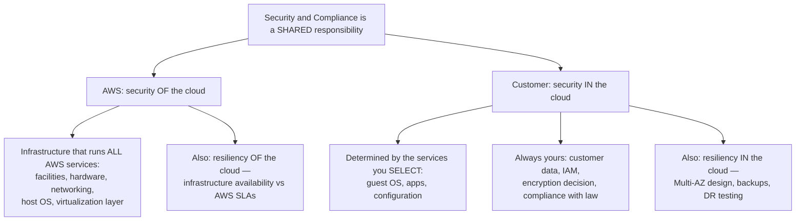
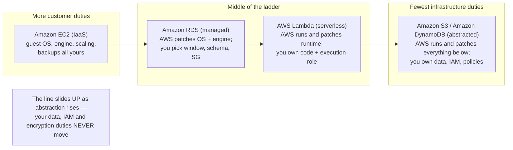
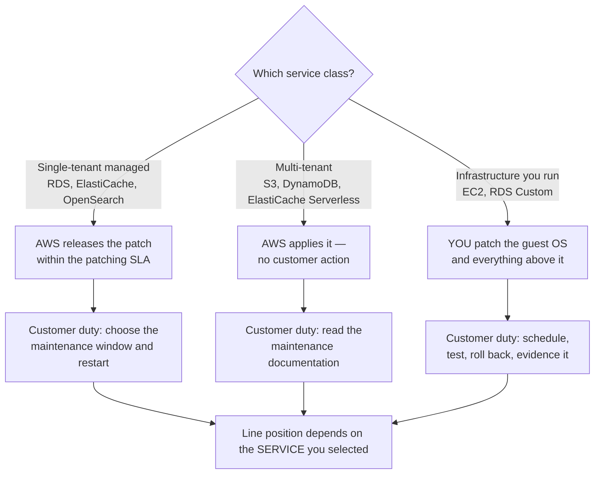
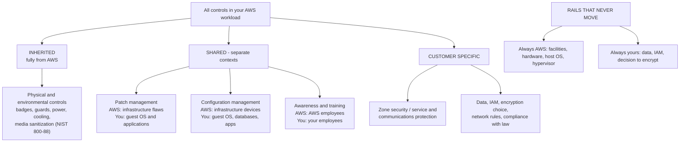
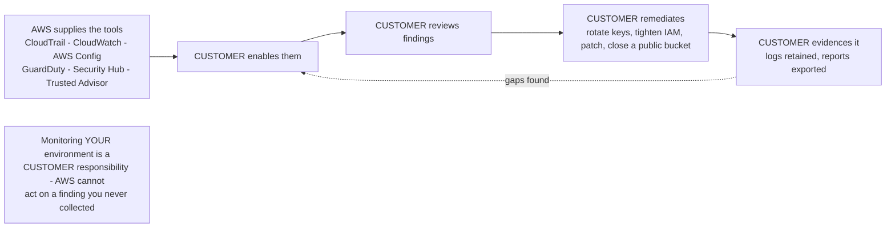

# The AWS Shared Responsibility Model

Every CLF-C02 security question eventually collapses into one sentence: *who fixes this?* The exam calls it **Domain 2, Task 2.1 — "Recognizing the components of the AWS shared responsibility model"**, and Domain 2 is worth **30% of your score (as of Oct 2026)**, so this single model is statistically the most profitable concept on the whole test. AWS states the premise flatly: *"Security and Compliance is a shared responsibility between AWS and the customer."* Shared does **not** mean split down the middle — it means *two different organizations, each fully responsible for their own layer*, and the boundary between those layers **moves depending on which service you pick**.

```text
====================================================================
 AWS SHARED RESPONSIBILITY MODEL — DOMAIN 2, TASK 2.1 (as of Oct 2026)
====================================================================
  DOMAIN 2 "Security and Compliance" ............ 30% of the exam
---------------------------------------------------------------------
  THE TWO HALVES (memorize the prepositions)
    AWS ........ security OF the cloud — the infrastructure
    YOU ........ security IN the cloud — what you configure
                 ("determined by the AWS Cloud services that
                   a customer selects")
---------------------------------------------------------------------
  LAYER / CONTROL                    EC2      RDS    LAMBDA      S3
  Facilities, power, cooling         AWS      AWS      AWS       AWS
  Hardware lifecycle, disposal       AWS      AWS      AWS       AWS
  Host OS + hypervisor               AWS      AWS      AWS       AWS
  Guest OS patching                  YOU      AWS      n/a       n/a
  Database engine install/patch      (self)   AWS      n/a       n/a
  Runtime/language patching          YOU      YOU      AWS*      n/a
  Scaling, HA, automated backups     YOU      AWS      AWS       AWS
  App code, IAM, data, encryption
  choice, security group rules       YOU      YOU      YOU       YOU
---------------------------------------------------------------------
  CONTROL TAXONOMY (official AWS wording)
    Inherited .......... physical and environmental controls
    Shared ............. patch management, configuration management,
                         awareness and training (separate contexts)
    Customer specific .. service and communications protection /
                         zone security
---------------------------------------------------------------------
  * Lambda "Auto" = AWS updates; "Function update" / "Manual" = you
    update; container images = AWS publishes, you rebuild.
  FIXED ANCHORS: AWS always owns facilities + hardware + hypervisor.
                 YOU always own data + IAM + the decision to encrypt.
====================================================================
```

> [!NOTE]
> **The model has no price and no service to switch on.** It is a *statement of duties*, not a product. Everything you can buy to *prove* your side — AWS Artifact for AWS's reports, AWS CloudTrail, AWS Config, Amazon CloudWatch, Amazon GuardDuty, AWS Security Hub — sits on **your** side of the line: AWS supplies the tool, you enable it, you act on what it says.

In this lesson you will:

- separate **security OF the cloud (AWS)** from **security IN the cloud (you)** using AWS's own wording;
- place the boundary exactly: **host OS and virtualization layer down** = AWS, **guest OS and up** = you;
- read the **full responsibility breakdown table** — facility, hardware, hypervisor, data, identity, encryption, compliance;
- watch the line **shift across Amazon EC2, Amazon RDS, AWS Lambda and Amazon S3**, including the RDS Custom and Lambda runtime-mode wrinkles;
- classify every control as **inherited, shared or customer specific** — and understand why *shared ≠ 50/50*;
- list what **customers still own**: data classification, identity and access, OS patching on EC2, network configuration, encryption choices, application security;
- list what **AWS owns**: facilities, hardware, virtualization and the managed-service infrastructure;
- recognize the **classic misattribution traps** that carry most of the wrong options on this topic;
- study **four AWS-published security and compliance case studies** — two operational, two authorization-based;
- check the **2026 guide and service-list changes** (as of October 2026) that decide what Domain 2 still tests;
- practise with **12 exam-style questions** plus four interactive checks.

---

## 1. Security OF the cloud versus security IN the cloud

### 1.1 AWS's own wording

AWS's compliance page defines both halves in one paragraph, and the exam quotes it almost verbatim:

| Half | Owner | AWS's definition (sourced, accessed Oct 2026) | What sits inside it |
|---|---|---|---|
| **Security *of* the cloud** | **AWS** | *"AWS is responsible for protecting the infrastructure that runs all of the services offered in the AWS Cloud"* | Data centres, hardware, networking, the **host operating system and virtualization layer**, the physical security of the facilities |
| **Security *in* the cloud** | **Customer** | *"Customer responsibility will be determined by the AWS Cloud services that a customer selects"* | Your data, your identity and permissions, your guest OS, your application code, your configuration, your encryption decisions |

The second row is the one students misread. Your duties are **not fixed** — they are *derived from your service choice*. Run Amazon EC2 and you inherit an operating system to patch; run Amazon S3 and that duty disappears while the duty to classify your data does not.

### 1.2 The preposition is the whole trick



> [!WARNING]
> **Inversion trap.** Any answer choice that says *"AWS is responsible for security in the cloud"* or *"the customer is responsible for security of the cloud"* is **wrong on its face**, before you even read the rest of the option. AWS = **of** (it owns the infrastructure). You = **in** (you configure what runs on it). The AWS GDPR whitepaper restates it: *"Customers are responsible for 'Security IN the Cloud'… configuring and managing the security of the AWS services they use."*

### 1.3 Example E1 — sorting six statements in under a minute

Read each statement, name the half, then decide whether it is even plausible:

| # | Statement | Half | Verdict |
|---|---|---|---|
| 1 | AWS patches the hypervisor on the host running your instance | OF the cloud | Correct — AWS duty |
| 2 | You decide whether the S3 bucket holding customer records is public | IN the cloud | Correct — customer duty |
| 3 | AWS configures the security group rules on your EC2 instance | OF the cloud | **Wrong** — AWS *provides* the firewall, **you configure** it |
| 4 | You patrol the data centre corridors | IN the cloud | **Wrong** — physical security is an *inherited* AWS control |
| 5 | AWS encrypts your data with your consent and on your schedule | IN the cloud | **Wrong phrasing** — AWS provides KMS and service-side encryption; **you choose whether to encrypt**, which key, and how keys are handled |
| 6 | You monitor your own account with CloudTrail and CloudWatch | IN the cloud | Correct — AWS supplies the tool, you enable and act |

The pattern in rows 3, 4 and 5 is the whole exam: **AWS provides a capability; you make the decision.** Provided ≠ configured, and tools ≠ responsibility.

- **📚 Did you know?** The model is *why cloud compliance is cheaper*. AWS writes that it lets customers *"shift management of certain IT controls to AWS"* and inherit an audited control environment instead of building facilities and physical security — while keeping data, identity, configuration and compliance. That is also why **AWS Artifact exists as a no-cost, self-service portal for on-demand access to AWS's compliance reports**: the evidence for the AWS half is already written; you only have to fetch it.

---

## 2. Where the line sits in the stack

### 2.1 The boundary sentence

AWS's canonical page draws the line in a single sentence — quote it to yourself until it is automatic:

> *"AWS operates, manages and controls the components from the host operating system and virtualization layer **down** to the physical security of the facilities in which the service operates. The customer assumes responsibility and management of the **guest operating system** (including updates and security patches), other associated application software as well as the configuration of the AWS provided security group firewall."*

```text
  YOUR SIDE OF THE LINE  ("security IN the cloud")
  =================================================================
  7. Customer data — classification, retention, encryption ON or OFF
  6. Identity and access — IAM users, roles, policies, MFA, root
  5. Application security — code, dependencies, secrets, sessions
  4. Network configuration — security groups, NACLs, routing, VPC
  3. Guest operating system — updates and security patches
  ----------------------------------------------------------------
  ------------------- THE SHARED RESPONSIBILITY LINE ---------------
  ----------------------------------------------------------------
  2. Host operating system — patched and hardened by AWS
  1. Virtualization layer / hypervisor — AWS
  0. Hardware, servers, storage devices, networking equipment — AWS
  -1. Facilities — power, cooling, physical access, media destruction
  =================================================================
  AWS SIDE OF THE LINE  ("security OF the cloud")
```

Two consequences appear on every exam form:

1. **Amazon EC2 makes you a sysadmin.** You chose IaaS, so layers 3–7 are yours, including *"updates and security patches"* for the guest OS.
2. **The line is not a physical object.** It is a *contractual split of duties* that AWS re-draws per service — which is Task 2.1's second half (Section 4).

### 2.2 Resiliency uses the same two prepositions

The Well-Architected Reliability Pillar repeats the split for availability, which is a favourite distractor source:

| | **Resiliency *of* the cloud (AWS)** | **Resiliency *in* the cloud (you)** |
|---|---|---|
| AWS wording | *"AWS is responsible for resiliency of the infrastructure… ensuring service availability meets or exceeds AWS Service Level Agreements (SLAs)"* | Customers are *"responsible for designing, testing, and deploying their applications"* |
| Concrete duties | Isolated, connected Availability Zones; ≥3 physically separate AZs per Region (as of Oct 2026); redundant power and cooling; N+1 data-centre standard | **Multi-AZ deployment**, backups, versioning, replication, failover testing, DR plans |
| Failure it prevents | A whole data centre or AZ going dark | Your application collapsing even though the infrastructure is healthy |

> [!IMPORTANT]
> **AWS guaranteeing availability does not make your application available.** AWS supplies resilient *primitives*; whether your workload spans them is your decision. AWS's financial-services guidance makes the split explicit: AWS makes sure the services it runs *"are continuously available"*, while customers *"are responsible for designing, testing, and deploying their applications"* — and names three program actions for the customer side: **Validating, Demonstrating, Monitoring**.

### 2.3 Example E2 — the 124-AZ arithmetic, and what it does *not* buy you

AWS reports **124 Availability Zones across 39 Geographic Regions**, each Region with *"at least three independent, physically separate Availability Zones"* (as of Oct 2026).

$$
39 \times 3 = 117 \text{ AZs as the design minimum} \quad\Rightarrow\quad 124 - 117 = 7 \text{ AZs above the minimum}
$$

So AWS has engineered seven more failure domains than its own floor requires — and **your account still owns the difference in practice**. A single-AZ deployment inside a 3-AZ Region inherits zero of that engineering. The customer-side checklist after the arithmetic:

1. deploy across **at least two AZs** (AWS's own design rule for availability);
2. turn on **backups** and test restoring them;
3. decide whether a **Region-level** event needs a DR strategy (that is a Region question, not an AZ question);
4. **test** the failover — an untested plan is a hypothesis.

- **📚 Did you know?** AWS decommissions media that held customer data using techniques detailed in **NIST 800-88**, physical access to server rooms requires **multi-factor authorization**, and access to data centres is *"logged, monitored, and retained"* — yet external auditors test AWS against **more than 2,600 requirements throughout the year** (as of Oct 2026). All of that sits on the AWS side, which is exactly why it is an *inherited* control for you: you get the assurance without operating the badge readers.

---

## 3. The full responsibility breakdown

### 3.1 Every row, every owner

This is the table Task 2.1 is built on. Learn it as three columns of logic: **always AWS**, **always yours**, and **depends on the service**.

| Item | Owner | Control category | Source (accessed Oct 2026) |
|---|---|---|---|
| Physical facilities — badges, cameras, guards, cages | **AWS** | Inherited | Shared Responsibility Model; Trust Center; Data Layer |
| Hardware lifecycle and device disposal | **AWS** | Inherited | Shared Responsibility Model; NHS whitepaper |
| Media sanitization and destruction (NIST 800-88) | **AWS** | Inherited | AWS Trust Center |
| Virtualization layer / hypervisor / host firmware | **AWS** | Inherited (of the cloud) | Shared Responsibility Model |
| Host operating system (beneath your instance) | **AWS** | Inherited | Shared Responsibility Model |
| **Customer data** — content, where it lives, encrypted or not | **Customer** | Customer specific | Shared Responsibility Model; Security Quick Reference |
| **Identity and access management** — users, roles, policies | **Customer** | Customer specific | Shared Responsibility Model; GDPR whitepaper |
| **Guest OS patching** on EC2 / IaaS | **Customer** | Shared (separate contexts) | Shared Responsibility Model; Security Quick Reference |
| **Security group / firewall configuration** per instance | **Customer** | Customer specific | Shared Responsibility Model |
| **Encryption choices** — client-side; enabling server-side; key type | **Customer** | Customer specific | Shared Responsibility Model; EC2 data protection |
| **Application software** you install or write | **Customer** | Customer specific | Shared Responsibility Model |
| Patch management (guest OS and applications) | **Shared** — AWS patches the infrastructure, you patch your layer | Shared | Shared Responsibility Model; Well-Architected Security Pillar |
| Configuration management | **Shared** — AWS maintains infrastructure device config, you configure guest OS, databases and applications | Shared | Shared Responsibility Model |
| Awareness and training | **Shared** — AWS trains AWS employees, you train yours | Shared | Shared Responsibility Model |
| Service and communications protection / zone security | **Customer specific** | Customer specific | Shared Responsibility Model |
| Compliance with the laws and regulations that apply to your workload | **Customer** | Customer specific | AWS Compliance; Compliance Programs |
| Resiliency of the infrastructure vs AWS SLAs | **AWS** | Inherited | Well-Architected Reliability Pillar |
| Multi-AZ design, backups, replication, DR testing | **Customer** | Customer specific | Well-Architected Reliability Pillar |

### 3.2 Example E3 — the same workload, three columns

An on-premises database team documents what each hosting option demands. The Amazon RDS User Guide publishes exactly this comparison:

| Duty | On premises | Amazon EC2 | Amazon RDS |
|---|---|---|---|
| Operating system patching | Customer | Customer | **AWS** |
| Database software patching | Customer | Customer | **AWS** |
| Scaling, high availability, database backups | Customer | Customer | **AWS** |
| Server maintenance | Customer | AWS | **AWS** |
| Hardware lifecycle | Customer | AWS | **AWS** |
| Power, network, cooling | Customer | AWS | **AWS** |

Read the columns left to right and you are watching the **line slide upward**: three customer duties become AWS duties as you move from self-managed to managed. Read the *rows* and you see what never changes — **nothing in this table is about your data, your IAM policies or your compliance obligation**, because those live above the boundary in every column.

---

## 4. How the line shifts across services (Task 2.1's hardest skill)

### 4.1 The three exam exemplars plus one

The exam guide names **Amazon RDS, AWS Lambda and Amazon EC2** as the shift examples. Add **Amazon S3** (the abstracted-storage case) and you cover every shape of question.

| Responsibility | **Amazon EC2** (IaaS) | **Amazon RDS** (managed) | **AWS Lambda** (serverless) | **Amazon S3** (abstracted) |
|---|---|---|---|---|
| Facility, hardware, power/cooling | AWS | AWS | AWS | AWS |
| Host OS + hypervisor | AWS | AWS | AWS | AWS |
| Guest OS patching | **Customer** | **AWS** | n/a — no guest OS exposed | n/a |
| Database engine install and patching | Customer (you installed it) | **AWS** | n/a | n/a |
| Runtime/language patching | Customer | Customer (application side) | **AWS**, but you may have to trigger the update | n/a |
| Scaling, HA, automated backups | You design it (Auto Scaling, Multi-AZ) | **AWS** | AWS | AWS |
| Application code and logic | Customer | Customer (schema, query tuning) | **Customer** | Customer |
| IAM permissions | Customer | Customer | Customer (execution role) | Customer (bucket policy, ACLs) |
| Data, classification, encryption choice | Customer | Customer | Customer | Customer |
| Security group / network rules | Customer (the AWS-provided firewall) | Customer (SG on the DB endpoint) | Customer (VPC configuration if attached) | Customer (Block Public Access, bucket policy) |

Two invariants survive every row of that table: **AWS always owns facilities, hardware and the hypervisor**, and **you always own data, IAM and the encryption decision**. Only the middle rows move.



### 4.2 The patch-duty audit (worked example E4)

Who patches the operating system? Six workloads, one answer each:

| Workload | Configuration | Guest OS patched by | Why |
|---|---|---|---|
| Web server on **Amazon EC2** | Amazon Linux AMI | **You** | IaaS: guest OS is yours |
| Self-managed **MySQL on EC2** | You installed the engine | **You** (OS *and* engine) | Nothing managed was purchased |
| **Amazon RDS** for PostgreSQL | Single-tenant managed service | **AWS** (OS *and* engine) | You only select the maintenance window |
| **Amazon RDS Custom** for Oracle | Managed *plus* privileged OS access | **You** | You deliberately took the host back |
| **AWS Lambda** in **Auto** update mode | Managed runtime | **AWS** | Lambda applies updates to all functions |
| **AWS Lambda** in **Manual** mode, pinned runtime | Managed runtime, your control mode | **You** | *"you're responsible for updating your function to use the latest runtime version"* |
| **Amazon S3** | Abstracted storage | **AWS** (no customer OS exists) | Multi-tenant; nothing for you to patch |

The two traps in that table — **RDS Custom** and **Lambda Manual** — are worth a section each.

### 4.3 The RDS Custom escape hatch

Amazon RDS Custom exists because some workloads need privileged operating-system access. AWS's own wording: *"With RDS Custom, you use the managed features of Amazon RDS, but you manage the host and customize the OS as you do in Amazon EC2."* The published responsibility table flips **OS patching and database software patching back to Customer** for RDS Custom, while standard Amazon RDS keeps both on AWS.

> [!NOTE]
> **Abstraction can be traded away on purpose.** A team that needs kernel modules, a specific patch level or a third-party agent on the database host chooses RDS Custom and *buys back* a patching duty. Exam consequence: the option saying *"Amazon RDS always means AWS performs all patching"* is **false**, because the exam knows RDS Custom exists.

### 4.4 The Lambda runtime nuance

AWS publishes runtime management as a **shared responsibility** topic:

- *"Lambda is responsible for curating and publishing security updates for all supported managed runtimes and container images."*
- *"For functions configured to use the Manual runtime update mode, you're responsible for updating your function to use the latest runtime version."*

| Update mode | Who applies the update | Practical duty for you |
|---|---|---|
| **Auto** | Lambda updates all functions | Verify after the fact; fix anything a new runtime breaks |
| **Function update** / **Manual** | You | Watch deprecation dates, redeploy, test |
| **Container image** functions | AWS publishes patched **base images** | **Rebuild and push** your image to receive the fix |

### 4.5 Example E5 — a deprecated runtime nobody patched

A function runs on a runtime version AWS has flagged for deprecation. AWS has already published the security fix (Lambda's half is done). The team's audit:

| Control setting | Runtime patched? | Owner of the gap |
|---|---|---|
| Update mode **Auto** | Yes — Lambda applied it | None (monitor for breakage) |
| Update mode **Manual**, nobody redeploys | **No** | **Customer** — the fix existed, the duty was yours |
| Container image, image not rebuilt | **No** | **Customer** — AWS patched the base, you must rebuild |

Count the failures: **0 AWS failures, 1 customer failure in each of the last two rows.** The model worked exactly as designed — a published fix plus an ignored duty still equals an unpatched function, and the exam will ask you to name the owner.

### 4.6 Single-tenant versus multi-tenant patching

The Well-Architected Security Pillar splits managed services into two patching behaviours, and the difference is *how much you still have to do*:

| Service class | Examples | Who applies the patch | What you still do |
|---|---|---|---|
| **Single-tenant managed** | Amazon ElastiCache, **Amazon RDS**, Amazon OpenSearch Service | AWS *"release[s] patches within the service's patching SLA"* | **Facilitate it**: select maintenance windows, apply service updates, schedule required restarts |
| **Multi-tenant** | ElastiCache Serverless, **Amazon DynamoDB**, **Amazon S3** | AWS applies patches with **no customer action** | *Consult* the patching and maintenance documentation |



```matching
{
  "question": "Match each workload to who patches the operating system (or runtime) on the CLF-C02 exam:",
  "pairs": [
    {"left": "Amazon EC2 instance", "right": "Customer - the guest OS and its security patches are yours on IaaS"},
    {"left": "Self-managed MySQL on Amazon EC2", "right": "Customer - you installed the engine, so you patch both the OS and the database"},
    {"left": "Amazon RDS (standard)", "right": "AWS - AWS patches the OS and the engine; you only pick the maintenance window"},
    {"left": "Amazon RDS Custom", "right": "Customer - you manage the host and customize the OS as you do in Amazon EC2"},
    {"left": "AWS Lambda in Auto mode", "right": "AWS - Lambda applies runtime updates to all functions"},
    {"left": "AWS Lambda in Manual mode", "right": "Customer - you are responsible for updating your function to the latest runtime"},
    {"left": "Amazon S3", "right": "AWS - abstracted multi-tenant storage; no guest OS exists on your side"}
  ],
  "explanation": "The preposition never changes (AWS = security OF, you = security IN), but the patching row moves with the service: more abstraction means AWS absorbs more of the stack. The two deliberate wrinkles are RDS Custom (OS duty returns to you) and Lambda Manual mode (runtime duty stays with you even though Lambda published the fix)."
}
```

```dragdrop
{
  "question": "Order these four service types from the MOST customer infrastructure duties to the FEWEST:",
  "items": [
    "Amazon EC2 (IaaS)",
    "Amazon RDS (managed database)",
    "AWS Lambda (serverless compute)",
    "Amazon S3 (abstracted storage)"
  ],
  "correctOrder": [
    "Amazon EC2 (IaaS)",
    "Amazon RDS (managed database)",
    "AWS Lambda (serverless compute)",
    "Amazon S3 (abstracted storage)"
  ],
  "explanation": "The ladder runs by abstraction: on EC2 you own the guest OS, engine, scaling and backups; on RDS AWS takes the OS, engine, scaling, HA and backups; on Lambda there is no OS to manage at all; on S3 even the runtime disappears. What does NOT slide down the ladder is your data, IAM, network configuration and encryption choice - those stay customer responsibility on every rung."
}
```

- **📚 Did you know?** The same model governs *who removes the hardware*: AWS's NHS-aligned guidance calls data-centre security *"entirely AWS responsibility"* and says disposal and deprovisioning *"falls to AWS under the Shared Responsibility Model"*. Your obligation starts at your data — *"You always own your data, including the ability to encrypt it, move it, and manage retention"* — and ends at your retention and deletion policies, never at the shredder.

---

## 5. The control taxonomy: inherited, shared, customer specific

### 5.1 AWS's three official categories

AWS does not split controls into "yours/mine" only. The published taxonomy has **four labels**, and the exam asks you to place an example in the right one:

| Category | AWS definition (sourced) | Canonical examples |
|---|---|---|
| **Inherited** | *"Controls which a customer fully inherits from AWS"* | Physical and environmental controls: badge access, guards, cameras, power, cooling, media destruction |
| **Shared** | Applies to both layers *"but in completely separate contexts"* | **Patch management** (AWS: infrastructure flaws; you: guest OS and apps) · **Configuration management** (AWS: infrastructure devices; you: guest OS, databases, applications) · **Awareness and training** (AWS trains AWS employees; you train yours) |
| **Customer specific** | Solely yours | Service and communications protection or **zone security**; data classification; IAM; encryption decisions |
| **AWS responsibility "of the cloud"** / **Customer "in the cloud"** | The top-level split | Everything above resolves into one of these two halves |

> [!IMPORTANT]
> **Shared ≠ 50/50.** AWS's wording is *"in completely separate contexts"*: AWS performs **its** patching of **its** infrastructure, you perform **your** patching of **your** guest OS and applications — on the same abstract control, at different layers, with different evidence. A question offering *"shared responsibilities are split equally between AWS and the customer"* is testing whether you read the definition.



### 5.2 The five-question heuristic

When an option is unfamiliar, run this order of tests — it resolves nearly every Task 2.1 item:

```text
1. Identify the SERVICE CLASS:  IaaS / managed / abstracted / serverless
2. Configurable, uploadable, nameable, grantable, classifiable  -> CUSTOMER
3. Physically untouchable (data centre, hardware, hypervisor)    -> AWS
4. Patch / configuration / awareness                            -> SHARED
                                                (separate implementations)
5. Data, IAM, encryption, compliance with law                   -> CUSTOMER, ALWAYS
```

### 5.3 Example E6 — bucket-sorting twelve controls

Sort the twelve controls from Section 3 into the taxonomy and count them:

| Bucket | Controls (count) |
|---|---|
| **Inherited** (4) | Badge/physical access · hardware lifecycle · media sanitization per NIST 800-88 · host OS and hypervisor |
| **Shared** (3) | Patch management · configuration management · awareness and training |
| **Customer specific** (5) | Data classification · IAM permissions · security group rules · encryption choice · compliance with applicable law |
| **Unsortable — wrong side of the line** | *"AWS configures your security group"* · *"AWS encrypts your data on your behalf as a default obligation"* · *"AWS is responsible for your HIPAA compliance"* |

Four plus three plus five equals twelve, and every one of the three "unsortable" statements fails the Section 8 trap table. If you can bucket a control in under ten seconds, you can answer the question.

### 5.4 Shared controls in continuous operation

A control is only real if it runs continuously, so the exam also tests the *ongoing* form of the three shared controls. Each row names what AWS does forever, what you must do forever, and where the evidence lands:

| Shared control | AWS implementation (continuous) | Your implementation (continuous) | Where the evidence sits |
|---|---|---|---|
| **Patch management** | Patch and fix flaws within the infrastructure; release managed-service patches inside the service's patching SLA | Patch guest OS and applications; for single-tenant managed services, select maintenance windows, apply service updates and schedule restarts; for multi-tenant, read the maintenance documentation | AWS: audit reports via **AWS Artifact** · You: patch-compliance reports and change records |
| **Configuration management** | Maintain the configuration of AWS infrastructure devices | Configure guest operating systems, databases and applications; keep security group, NACL and VPC rules as reviewed code | AWS: SOC/ISO scope statements · You: AWS Config rules, reviewed CloudFormation templates |
| **Awareness and training** | Train AWS employees | Train your own employees on the shared model, on handling of data and on account hygiene (root MFA, least privilege) | AWS: audited people controls · You: training records inside your compliance evidence |

AWS's financial-services guidance frames the customer side of this loop as three repeating program actions: **Validating** (is the control designed correctly?), **Demonstrating** (can you show the evidence?), **Monitoring** (is it still working?). That is continuous monitoring *in* the cloud — and none of it transfers to AWS, because AWS cannot validate a decision you have not made.

```text
CONTINUOUS MONITORING LOOP (customer side of the model)
=================================================================
  AWS side (always running)        Your side (you run it)
  ---------------------------      --------------------------------
  infrastructure patching           enable  -> CloudTrail, AWS Config,
  service patch SLA                           GuardDuty, Security Hub
  physical access logging           review  -> findings, drift, config
  media sanitization (NIST 800-88)  act     -> rotate, tighten, patch,
  report publication (Artifact)               close public exposure
                                   prove    -> export evidence,
                                              re-validate, re-demonstrate
  ------------------------------------------------------------------
  RULE: AWS supplies the tool; the CUSTOMER enables it, reviews it,
        acts on it and evidences it. Findings you never collect are
        findings nobody remediates.
=================================================================
```

```matching
{
  "question": "Match each service on the current CLF-C02 in-scope list (as of Oct 2026) to where its responsibility split actually lands:",
  "pairs": [
    {"left": "AWS PrivateLink", "right": "AWS runs and patches the service infrastructure - you own the endpoint policies, which principals and accounts may attach, and the VPC configuration"},
    {"left": "AWS Transit Gateway", "right": "AWS runs and patches the service infrastructure - you own the routing tables, the attachments and the resource-share policy"},
    {"left": "AWS Site-to-Site VPN", "right": "AWS runs the managed VPN endpoints - you own the customer gateway configuration, the routing and the encryption/auth settings you choose"},
    {"left": "AWS Client VPN", "right": "AWS runs the service - you own the authentication source, the authorization rules and which users receive a profile"},
    {"left": "AWS IAM Identity Center", "right": "AWS runs the service - you own the identity source, the permission-set assignments and multi-factor authentication for your workforce"},
    {"left": "AWS Support (the only entry in the Customer Enablement category)", "right": "AWS supplies the support organization and its guidance - you choose the plan, open the cases and act on the recommendations"}
  ],
  "explanation": "Every service splits the same way: AWS owns the service infrastructure beneath it (security OF the cloud), and the customer owns every decision made on top of it - routes, attachments, endpoints, identities, permissions and MFA (security IN the cloud). New in-scope names such as AWS PrivateLink, AWS Transit Gateway, AWS Site-to-Site VPN and AWS Client VPN change what you can be asked about, but they never change where the line sits. Verify the current in-scope list before use: AWS labels it non-exhaustive and subject to change."
}
```

---

## 6. What customers still own

Abstraction removes *infrastructure chores*, never *ownership*. Even on the most abstracted service, six duties are permanently yours:

| # | Customer duty | What it means in practice | Evidence you produce |
|---|---|---|---|
| 1 | **Data classification** | Deciding what is sensitive, where it may live, whether it may be public | Data inventory, classification scheme, retention rules |
| 2 | **Identity and access management** | IAM users, roles, policies, MFA (including **root MFA**), least privilege, key rotation habits | Policy reviews, MFA coverage reports, CloudTrail root sign-in alerts |
| 3 | **OS patching on EC2** (and any self-managed layer) | Scheduling, applying and rolling back guest OS patches | Patch-compliance reports (e.g. via AWS Systems Manager Patch Manager) |
| 4 | **Network configuration** | Security group and NACL rules, VPC design, route tables, whether a bucket is public | Reviewed rule sets, change records |
| 5 | **Encryption choices** | Whether to encrypt, client-side vs server-side, which key type, how keys are handled | KMS key policies, bucket encryption settings |
| 6 | **Application security** | Code, dependencies, secrets management, session handling, input validation | Code review, dependency scanning, secret rotation |

### 6.1 The customer's monitoring duty

AWS supplies the detective tooling; **enabling it and acting on it is yours**. AWS's own account-security guidance puts the sharpest case first: *"It's critical that you protect your root account from unauthorized access, starting with multi-factor authentication"*, and root should be used **only in emergencies**.



### 6.2 Example E7 — the root-account exposure audit

Three findings on one account (counts are the scenario's, not AWS metrics):

| Finding | Count | Owner of the fix | Fix |
|---|---|---|---|
| Root user(s) without MFA | 1 | Customer | Enforce MFA on the root user immediately |
| Long-lived root access keys | 2 | Customer | Delete them; root keys are an emergency-only artefact |
| Alerts on root sign-ins | 0 | Customer | Turn on an organization-wide detective alert (AWS CAF security guidance recommends detective controls on root logins) |
| AWS-side physical security of the data centre | working | AWS (inherited) | Nothing to do — already audited |

**Exposure = 1 + 2 + 0 = 3 customer-side gaps, 0 AWS-side gaps.** Note what the arithmetic shows: every gap is a *decision nobody made*, and every fix uses a tool AWS already provides. Also note the AWS-side signup control that is **not** yours: at account creation AWS holds **USD $1 (or equivalent) for 3–5 days to verify your account and prevent fraud** (as of Oct 2026).

### 6.3 Check yourself — the duties that never move

```fillblank
{
  "question": "Complete the customer-side statements from the AWS shared responsibility model:",
  "template": "The customer owns {{1}} classification and retention, {{2}} and access management (including multi-factor authentication on the root user), network {{3}} such as security group rules, the choice of whether and how to {{4}} data, the guest operating system {{5}} on Amazon EC2, and the security of the {{6}} itself.",
  "answers": {
    "1": "data",
    "2": "identity",
    "3": "configuration",
    "4": "encrypt",
    "5": "patching",
    "6": "application"
  },
  "distractors": ["hypervisor", "datacentre", "virtualization", "firmware", "cooling", "bandwidth"],
  "explanation": "All six are customer responsibilities on every service: data classification, identity and access management, network configuration, the encryption decision, guest OS patching on IaaS, and application security. The distractors are all AWS-owned layers - hypervisor, data centre, virtualization, firmware and power/cooling sit on the security OF the cloud side."
}
```

- **📚 Did you know?** Your compliance evidence splits down the same line. For a PCI workload you would pull AWS-side evidence — physical security, media destruction, infrastructure patching, network protection, staff training — from **AWS Artifact**, a *"No cost, self-service portal for on-demand access to AWS' compliance reports"*, while supplying your own evidence for IAM least privilege, security group rules, encryption settings and log retention. AWS supports **143 security standards and compliance certifications** including PCI-DSS, HIPAA/HITECH, FedRAMP, GDPR, FIPS 140-3 and NIST 800-171, and offers **over 300 security, compliance and governance services and features** (all as of Oct 2026).

---

## 7. What AWS owns

Everything from the host operating system downward, plus the machinery of running the service itself:

| AWS-owned area | What AWS does | Sourced detail (accessed Oct 2026) |
|---|---|---|
| **Facilities** | Site selection, physical security, environmental protection | Physical access to server rooms requires multi-factor authorization; data-centre access is logged, monitored and retained; core applications deployed to an **N+1 standard** |
| **Hardware** | Servers, storage devices, networking equipment, lifecycle and disposal | Media that held customer data is decommissioned using techniques detailed in **NIST 800-88** |
| **Virtualization** | Host OS, hypervisor, firmware beneath your instance | *"…from the host operating system and virtualization layer down to the physical security of the facilities"* |
| **Managed service infrastructure** | The database engine binaries, the serverless runtime, the storage service internals | Amazon RDS patches OS and engine; Lambda curates and publishes runtime security updates; multi-tenant services patch with no customer action |
| **Global infrastructure resilience** | Regions, AZs, redundant power and networking | **124 Availability Zones across 39 Geographic Regions**, each Region with at least three physically separate AZs (as of Oct 2026); resiliency *of* the cloud vs AWS SLAs |
| **Infrastructure identity** | Who may physically enter a data centre | Badge and multi-factor physical access controls — *your* IAM identities are a different, customer-side system |
| **Audit of the AWS side** | Third-party and internal audit, report publication | Audited against **more than 2,600 requirements** throughout the year; **185 services** in the Summer 2026 SOC 1 report covering 1 Jul 2025 – 30 Jun 2026 (published 11 Aug 2026); **more than 100** AWS services certified against the CISPE Data Protection Code of Conduct |

> [!NOTE]
> **"AWS is audited" is not "you are compliant."** AWS publishes *"Services in Scope by Compliance Program"* (SOC last updated 11 Aug 2026, FedRAMP 29 Sep 2026, C5 13 Jan 2026), but AWS also states plainly that *"AWS customers remain responsible for complying with applicable compliance laws and regulations"* and that *"No formal certification is available to (or distributable by) a cloud service provider"* in those legal domains. There is no such thing as a "HIPAA-certified cloud provider" — the certification, authorization and liability sit with **you**.

---

## 8. Classic misattribution traps

### 8.1 The nine wrong answers, corrected

These are the misattributions that fill the distractors. Read the wrong version, then say the right one aloud:

| ❌ Wrong statement you will see | ✅ Correct statement |
|---|---|
| AWS handles security *in* the cloud | AWS handles security *of* the cloud; you handle *in* |
| AWS patches your EC2 operating system | AWS patches the **hypervisor and host OS**; **you** patch the **guest OS** |
| AWS manages your IAM | Permissions and identities are **always** customer responsibility |
| AWS is responsible for encrypting your data | AWS **provides** KMS and service-side encryption; **you** choose whether to encrypt, the key type and key handling |
| AWS is responsible for compliance in the cloud | AWS attests to *its* controls; **you** comply with the laws applicable to your workload |
| Amazon RDS means no customer patching duty | You still select maintenance windows, apply service updates and schedule restarts; **RDS Custom** returns OS patching to you entirely |
| AWS Lambda means zero customer duties | Code, execution role, dependencies, container rebuilds and runtime updates in Function-update/Manual modes stay with you |
| Security groups are AWS's firewall, so AWS configures them | Configuring *"the AWS provided security group firewall"* is explicitly **customer** responsibility |
| AWS guarantees availability, so my application is available | AWS supplies resilient primitives; **Multi-AZ design, backups, versioning, replication and DR testing are yours** |
| AWS's third-party attestation means we are compliant | AWS reports cover AWS controls; your implementation and legal compliance remain yours |

### 8.2 Example E8 — rewriting three distractors

Take a practice stem: *"A regulated workload is deployed on Amazon RDS. Which statement is correct?"*

| Option as written | Diagnosis | Rewritten correctly |
|---|---|---|
| *"AWS is responsible for encrypting the database at rest, so the customer has no encryption duty."* | Half-true bait — AWS *offers* encryption | Customer still decides **whether** encryption is on, **which key** and how keys are handled |
| *"Because AWS patches the engine, the customer no longer configures network access."* | Conflates two rows | AWS patches OS + engine; the **security group on the DB endpoint** is configured by the customer |
| *"AWS's SOC report satisfies the customer's regulatory obligation."* | Category error | AWS's report evidences **AWS controls**; the customer supplies its own evidence and holds the legal obligation |

The pattern: each wrong option takes **one true row** from the Section 3 table and attaches **someone else's row** to it. Split the rows back apart and the option collapses.

### 8.3 Where the exam plants the trap

```text
TRAP FAMILY                HOW THE OPTION BAITS YOU        DEFENSIVE MOVE
------------------------------------------------------------------------
Preposition swap           "AWS secures data IN the cloud  Say OF = AWS, IN = you
                            automatically"                  before reading further
Provided vs configured     "AWS manages the firewall"      AWS provides it; YOU
                                                           configure it
Tool vs duty               "CloudTrail makes AWS           You enable and act on
                            responsible for auditing"       your own account
Attestation vs compliance  "AWS is certified, so we are"   Their report, your
                                                           obligation
Abstraction creep          "Serverless means no duties"    Code, IAM, data and
                                                           encryption never move
Guarantee language         "AWS guarantees my app is       SLA covers the
                            available"                      infrastructure, not
                                                           your design
------------------------------------------------------------------------
HEURISTIC: configurable / uploadable / nameable / grantable /
classifiable  ->  YOURS.  Physically untouchable  ->  AWS.
```

> [!WARNING]
> **Two more red herrings that circulate as "official" material.** There is **no AWS-published "CUP model"** for shared responsibility — do not use that acronym. And the audit service is **AWS CloudTrail**; any option naming a look-alike audit product is invented. Stick to the taxonomy AWS actually publishes: **inherited, shared, customer specific**.

---

## Real-World Case Studies

AWS publishes what shared responsibility looks like in a regulated production account. Every figure below is **customer- or AWS-claimed and unaudited**, with the source named so you can check it — the examinable point is the **split** (which controls were inherited, which the customer had to build), not the marketing number.

### Case A — athenahealth: centralized network security across 120 accounts (Domain 2)

| Element | Detail |
|---|---|
| **Industry / context** healthcare software, HIPAA-sensitive | Egress monitoring across a sprawling VPC estate, rising inspection cost, a small security team |
| **AWS services named** | **AWS Network Firewall** (centralized), AWS Transit Gateway, **AWS RAM** (policy fan-out to **120 accounts**), CloudFormation rules-as-code, AWS Direct Connect; AWS Shield on the roadmap |
| **Where AWS's half ends** | The firewall *appliance*, its scaling and the underlying infrastructure — managed service capacity the team never had to size |
| **Where the customer's half begins** | The **rules**, the **resource-share policy** across 120 accounts, the **CloudFormation guardrails**, the inspection architecture and the log review |
| **Headline outcomes (AWS-published, customer-claimed)** | Inspection costs **reduced by 95%**; hundreds of VPCs across **120 accounts** rolled out *"in just a few days"*; the design and rollout was done by **eight people** with no disruptions |
| **Source** | aws.amazon.com/solutions/case-studies/athenahealth-case-study (accessed Oct 2026) |

*Exam lesson:* this is a **customer-side network configuration** story running on **AWS-side infrastructure**. The customer quote — *"By scalable, I mean it's AWS magic. We don't have to think about scalability at all."* — is about the inherited half; the rules-as-code and the 120-account policy fan-out are the "in the cloud" half that no provider can do for you.

### Case B — Avalon Healthcare Solutions: Zero Trust access to PHI (Domain 2)

| Element | Detail |
|---|---|
| **Industry / context** healthcare lab insights, protected health information, audits against **700+ controls** | Browser-based access to reports without VPN sprawl |
| **AWS services named** | **AWS Verified Access** with Okta (OpenID Connect), the **shared responsibility model** called out explicitly in the case study, firewall deployed behind the access layer |
| **Where AWS's half ends** | The Verified Access service, the data-centre and network infrastructure underneath it |
| **Where the customer's half begins** | **Identity** (who may reach which report), the application integration, the PHI classification and the ongoing control evidence |
| **Headline outcomes (AWS-published, customer-claimed)** | Perimeter network setup **days → about one hour**; far fewer breach attempts; **50 business users** onboarded by February 2024 while still meeting **700+ controls** |
| **Source** | aws.amazon.com/solutions/case-studies/avalon-aws-verified-access-case-study (accessed Oct 2026) |

*Exam lesson:* **identity is always customer responsibility**, and Avalon shows the pattern the exam wants: buy the access *service* (AWS side), own the *who* and the *evidence* (customer side). Related AWS-published example: **Socure** reports having *"inherited over 46 FedRAMP-required security controls from AWS GovCloud (US)"* (AWS Public Sector Blog, 14 Nov 2024) — a clean count of **inherited** controls, with everything else still theirs.

### What both cases share

| Value pattern | Evidence | Underlying principle |
|---|---|---|
| Infrastructure burden absorbed | athenahealth never sized firewall appliances | Security **of** the cloud is inherited |
| Configuration burden retained | rules, policies, identity, evidence | Security **in** the cloud is never inherited |
| Speed follows the split | days → ~1 hour (Avalon); days (athenahealth) | Less inherited work = faster delivery |
| Audit still lands on the customer | 700+ controls (Avalon); 46+ inherited (Socure) | Inherited controls *reduce* your evidence, never replace it |

### Two more Domain 2 cases: the authorization pair

Cases A and B are *operational* security builds. The next two are *authorization* stories — same model, different evidence: AWS's half arrives pre-audited inside a compliant Region, and the customer's half is the control implementation **and** the authorization itself. Both are AWS-published, both are customer-claimed, and both are here because the exam loves the word *inherited*.

### Case C — Socure: counting the 46+ FedRAMP controls you inherit (Domain 2)

| Element | Detail |
|---|---|
| **Industry / context** identity-verification vendor selling into US public sector, FedRAMP authorization required | Building a scalable, secure FedRAMP-compliant environment rather than a bespoke one |
| **AWS services named** | **AWS GovCloud (US)** as the compliant operating environment; the source also names complementary third-party tooling (the service mix is not itemized in the source) |
| **Where AWS's half ends** | The GovCloud control environment the customer inherits — *"we have inherited over 46 FedRAMP-required security controls from AWS GovCloud (US)"* |
| **Where the customer's half begins** | Account structure, least-privilege identity, logging and configuration, continuous monitoring of its own workload, and the remaining FedRAMP controls it must implement and evidence |
| **Headline figures (AWS-published, customer-claimed)** | **46+** FedRAMP-required controls inherited — a *reduction in work to evidence*, never an authorization in itself |
| **Source** | AWS Public Sector Blog, 14 Nov 2024 (accessed Oct 2026) |

*Exam lesson:* **inheritance shrinks your evidence; it never replaces your authorization.** The 46 controls are *inherited* (AWS's infrastructure and physical layer, already audited) — everything above the line, plus the authorization package, stays customer responsibility. The examinable sentence is the one already in Section 7: **FedRAMP is a government authorization, not an AWS product.**

### Case D — Smartsheet Gov: FedRAMP-ready in under 90 days (Domain 2)

| Element | Detail |
|---|---|
| **Industry / context** SaaS collaboration for regulated and government customers, entering AWS GovCloud (US) with no prior presence | Reach FedRAMP readiness fast enough to keep selling to public-sector buyers |
| **AWS services named** | **AWS GovCloud (US)** and **ATO on AWS** (AWS's packaged authorization path); AWS Professional Services / partner guidance alongside |
| **Where AWS's half ends** | The GovCloud Region's audited control environment and the AWS-side artifacts ATO on AWS assembles — *"By building on AWS GovCloud, Smartsheet and their government customers may host sensitive data and regulated workloads, while meeting stringent US government security and compliance requirements"* (Dave Levy, VP U.S. Federal Government, AWS) |
| **Where the customer's half begins** | Implementing its own controls, writing and maintaining its system security plan, collecting evidence, and holding the resulting authorization |
| **Headline figures (AWS-published, customer-claimed)** | No GovCloud presence → **FedRAMP ready in less than 90 days**, against typical timeframes *"sometimes as long as 12-18 months"* |
| **Source** | AWS Public Sector Blog, 29 Aug 2019 (accessed Oct 2026) |

*Exam lesson:* **speed comes from inheritance, obligation does not.** Roughly 4–6× faster than the typical 12–18 month path (90 days vs 360–540 days: $360 \div 90 = 4$ to $540 \div 90 = 6$) — but the customer still *obtains* the authorization. An option saying *"AWS GovCloud makes a workload FedRAMP authorized"* is the same category error as *"AWS is certified, so we are compliant."*

### What the authorization pair adds

| Value pattern | Evidence | Underlying principle |
|---|---|---|
| Pre-audited controls are counted, not rebuilt | Socure: **46+** inherited | **Inherited** controls are physical/infrastructure controls AWS already evidenced |
| Inheritance buys calendar time | Smartsheet Gov: **<90 days** vs 12–18 months | Less work above the line = faster authorization, not automatic authorization |
| The Region is AWS, the package is yours | GovCloud (US) + ATO on AWS | AWS supplies the compliant environment; **the customer obtains the authorization** |
| Authorization ≠ certification of the provider | FedRAMP / ATO | *"No formal certification is available to (or distributable by) a cloud service provider"* |

- **📚 Did you know?** ATO on AWS is the mechanism behind the 90-day story: AWS packages its own artifacts so a customer's assessor does not have to re-audit the infrastructure half — the same reason **AWS Artifact** exists as a *"No cost, self-service portal for on-demand access to AWS' compliance reports"*. The inheritance is real (Socure counts 46+, Smartsheet counts weeks), yet in both cases the AWS-published figure describes **how much less the customer had to build**, never **who is legally responsible**. Dates matter too: Smartsheet's number is from **29 Aug 2019** and Socure's from **14 Nov 2024** — old figures must never be presented as current, and both are customer-claimed, unaudited results.

> [!WARNING]
> **How to read case-study numbers on exam day:** every percentage here is **customer-claimed and unaudited**, and "up to" is a ceiling, never an average. A case never licenses an out-of-scope answer — you are asked to **identify which side of the model each action belongs to**, never to recall that inspection costs fell by a particular figure. Also remember the compliance trap: **FedRAMP is a government authorization, not an AWS product** — AWS supplies the Region and the inherited controls, and the **customer obtains the authorization**.

---

## What Changed for the 2026 Exam

### 2026 Updates (as of October 2026)

The exam guide is a moving document: the current PDF prints only *"Copyright © 2026"* with **no version number**, the only stamped artefact being the launch-era `Version 1.0 CLF-C02` guide. So the defensible method is to diff that baseline against the pages AWS publishes today — and every item below is date-stamped **as of Oct 2026** with its source named. **Verify current before use.**

> [!NOTE]
> **Six sourced changes that touch shared responsibility, security and Domain 2 (all as of Oct 2026):**
> - **Domain 2 still carries 30%.** The current guide keeps the launch weightings unchanged — Cloud Concepts 24%, **Security and Compliance 30%**, Cloud Technology and Services 34%, Billing, Pricing and Support 12% *(current exam guide PDF, "© 2026", accessed Oct 2026)*. Any claim that Security "dropped to 25%" or "rose to 34%" is quoting a retired appendix or a third-party rumour.
> - **The in-scope service list was rebuilt: 128 → 111 entries, while the explicit out-of-scope list grew from 11 → 55** *(launch-era Version 1.0 guide vs the current In-Scope / Out-of-Scope pages, diff computed Oct 2026)*. AWS labels the list *"non-exhaustive and subject to change"*, so any third-party copy — including the one you revised from — is already a candidate for being stale.
> - **Four networking services joined the in-scope list: AWS PrivateLink, AWS Transit Gateway, AWS Site-to-Site VPN and AWS Client VPN** *(current In-Scope page, accessed Oct 2026)*. None of them moves the line: AWS runs and patches the service infrastructure, while routes, attachments, endpoint policies, gateways and identity stay **customer configuration duties**.
> - **AWS Network Firewall moved out of scope** — it now sits on the current out-of-scope list *(checked Oct 2026)*. It stays valid as case-study context (athenahealth used it), but it is no longer an *examinable service name*; the responsibility lesson it taught (AWS provides the appliance, you write the rules) transfers to whatever in-scope networking service the question uses.
> - **Rebrands that change the vocabulary:** the category **"Customer Engagement" is now "Customer Enablement" and contains only AWS Support** — AWS Activate, AWS IQ and AWS Managed Services are explicitly out of scope — and **AWS IAM Identity Center (AWS Single Sign-On)** is now published simply as **AWS IAM Identity Center** *(current guide and service lists, accessed Oct 2026)*. Old names are wrong or ambiguous on sight.
> - **Stale security wording is still examinable.** **"AWS Security Center" is obsolete branding** yet still appears in the Domain 2 skills bullets of the current guide — teach it as *"where AWS security information lives"* and recognize it **as written**. And the **AWS Well-Architected Agent** (preview, 1 Oct 2026), described by AWS as *"the next-gen evolution of AWS Trusted Advisor and the AWS Well-Architected Tool"*, is **not named in the guide** — the examinable tools remain **AWS Trusted Advisor** and the **AWS Well-Architected Tool**.

> [!WARNING]
> **⚠️ The 2026 trap is a *date*, not a *concept*.** No 2025–2026 change moves the shared responsibility line itself — OF versus IN, the guest-OS boundary, inherited / shared / customer specific, and the EC2 / RDS / Lambda shift exemplars are all unchanged. What *did* change is the **vocabulary around the model**: which service names are in scope (AWS PrivateLink, AWS Transit Gateway, AWS Site-to-Site VPN, AWS Client VPN in; **AWS Network Firewall** out), which category name you must say (**Customer Enablement**, not Customer Engagement), and which identity product name is current (**AWS IAM Identity Center**). A stale guide does not teach you the wrong split — it teaches you the wrong *names*, and the exam grades the names it publishes today. Re-check the live in-scope list before exam day: AWS calls it **non-exhaustive and subject to change** (as of Oct 2026, verify current before use).

Two consequences for this lesson specifically: the *service names* you can be quizzed on have churned (four networking services in, AWS Network Firewall out), but the *model* has not moved at all — OF/IN, inherited/shared/customer specific, the fixed anchors and the shift exemplars (**Amazon EC2, Amazon RDS, AWS Lambda**) are identical. Date-stamp every count you memorise, and re-check the live list before exam day.

- **📚 Did you know?** The guide churn is measurable arithmetic: in-scope entries fell **128 → 111** (−17, −13.3%) while the explicit negative list grew **11 → 55** (+44), so the pair moved by $111 + 55 = 166$ documented entries versus $128 + 11 = 139$ before — a **27-entry** expansion of *explicit* guidance, almost all of it naming what is **out** of scope. That is why prep material from 2024 confidently tells you that AWS Data Exchange, Amazon MSK, AWS Local Zones, AWS Wavelength, AWS Snow Family, AWS Audit Manager and **AWS Network Firewall** are in scope, and why the current list says otherwise (all checked Oct 2026 — verify current before use). The meta-skill the exam rewards: **the guide you download today is the exam you sit**, not the PDF you revised from.

---

## Practice Questions

```question
{
  "id": "clf-05-q1",
  "type": "multiple-choice",
  "question": "A new team member summarizes the AWS shared responsibility model as follows. Which statement is correct?",
  "options": [
    "AWS is responsible for security in the cloud, and the customer is responsible for security of the cloud",
    "AWS is responsible for security of the cloud, and the customer is responsible for security in the cloud",
    "AWS and the customer split security equally, 50/50, regardless of the services used",
    "The customer is responsible for security of the cloud only when using Amazon EC2"
  ],
  "correct": 1,
  "explanation": "AWS's own wording is security OF the cloud (protecting the infrastructure that runs all AWS services) versus security IN the cloud (the customer's duties, determined by the services selected). The prepositions are fixed, the split is never 50/50 - shared controls apply in completely separate contexts - and the customer side exists on every service, not just EC2."
}
```

```question
{
  "id": "clf-05-q2",
  "type": "multiple-choice",
  "question": "An Amazon EC2 instance runs a customer application and needs a security patch for its guest operating system. Who is responsible for applying it?",
  "options": [
    "AWS, because AWS owns the infrastructure beneath the instance",
    "The customer, because the guest operating system (including updates and security patches) is customer responsibility",
    "AWS, because patch management is listed as an AWS-only control",
    "The customer only if the instance is in a single-tenant Availability Zone"
  ],
  "correct": 1,
  "explanation": "AWS operates and controls components from the host operating system and virtualization layer downward; the customer assumes responsibility for the guest operating system including updates and security patches. Patch management is a SHARED control in separate contexts - AWS fixes flaws in its infrastructure, you fix your guest OS - and Availability Zone tenancy is irrelevant to the boundary."
}
```

```question
{
  "id": "clf-05-q3",
  "type": "multiple-choice",
  "question": "The CLF-C02 exam guide says AWS and customer responsibilities can shift depending on the service used. Which responsibility shifts across Amazon EC2, Amazon RDS and AWS Lambda?",
  "options": [
    "Who owns customer data, which is always the customer",
    "Who configures IAM permissions, which is always the customer",
    "Who performs guest OS and runtime patching, which is the customer on EC2, AWS on standard Amazon RDS, and AWS (with customer-triggered updates in some Lambda modes) for Lambda",
    "Who physically secures the data centre, which moves to the customer on serverless services"
  ],
  "correct": 2,
  "explanation": "Task 2.1 explicitly names EC2, RDS and Lambda as shift examples, and what moves is the infrastructure duty: guest OS patching and engine patching. Data ownership, IAM configuration and physical security are fixed anchors - data, IAM and facilities never move across the line."
}
```

```question
{
  "id": "clf-05-q4",
  "type": "multiple-choice",
  "question": "Which of the following is an INHERITED control - one the customer fully inherits from AWS?",
  "options": [
    "Configuration management of the customer's guest operating systems and applications",
    "Awareness and training for the customer's own employees",
    "Physical and environmental controls, such as data-centre access control, power and cooling",
    "Service and communications protection or zone security for the customer's workload"
  ],
  "correct": 2,
  "explanation": "AWS's official taxonomy lists Physical and Environmental controls as the example of an inherited control. Guest OS configuration management and employee training are SHARED controls implemented separately by each party, and service/communications protection or zone security is a CUSTOMER SPECIFIC control."
}
```

```question
{
  "id": "clf-05-q5",
  "type": "multiple-choice",
  "question": "A healthcare company asks whether AWS's compliance certifications cover its HIPAA obligations. Which response is correct?",
  "options": [
    "Yes - AWS certifications transfer the compliance obligation to AWS for all workloads",
    "No formal certification is available to or distributable by a cloud service provider, so AWS customers remain responsible for complying with the applicable compliance laws and regulations for their own workload",
    "Yes - AWS Artifact issues a HIPAA certificate to each customer account automatically",
    "No - AWS offers no compliance reports, so the customer must audit AWS physically"
  ],
  "correct": 1,
  "explanation": "AWS states customers remain responsible for complying with applicable compliance laws and regulations, and that no formal certification is available to (or distributable by) a cloud service provider in those domains. AWS Artifact is a no-cost, self-service portal for AWS's own compliance reports - it provides evidence for the AWS side, it does not transfer your legal obligation, and it issues no customer certificate."
}
```

```question
{
  "id": "clf-05-q6",
  "type": "multiple-choice",
  "question": "A security reviewer claims AWS configures the security group firewall for an Amazon EC2 instance because AWS provides it. What does the shared responsibility model actually say?",
  "options": [
    "Correct - AWS provides and configures all firewall components for every service",
    "Correct - security groups are an inherited control because the firewall is AWS hardware",
    "Incorrect - the customer is responsible for the configuration of the AWS-provided security group firewall",
    "Incorrect - security groups are configured by AWS Support on the customer's behalf"
  ],
  "correct": 2,
  "explanation": "AWS's canonical text names it directly: the customer assumes responsibility for the guest OS, associated application software, and the configuration of the AWS provided security group firewall. Providing a capability is not the same as configuring it - the configuration is customer responsibility, which makes security group rules a customer-specific control."
}
```

```question
{
  "id": "clf-05-q7",
  "type": "multiple-choice",
  "question": "Which control category does 'Awareness and Training' belong to in the AWS shared responsibility model, and why?",
  "options": [
    "Inherited, because every customer automatically inherits AWS's training programs",
    "Customer specific, because only the customer ever trains anyone in a cloud workload",
    "Shared, because AWS trains AWS employees while the customer must train its own employees - two separate implementations of one control",
    "Out of scope, because training is never a compliance control"
  ],
  "correct": 2,
  "explanation": "Awareness and Training is one of the three published SHARED controls, alongside patch management and configuration management. AWS's definition of shared is 'in completely separate contexts': AWS trains AWS employees, you train yours - not a joint 50/50 activity, and certainly not inherited or customer-only."
}
```

```question
{
  "id": "clf-05-q8",
  "type": "multiple-choice",
  "question": "A team moves a legacy Oracle database to Amazon RDS Custom because it needs privileged operating-system access. What happens to patching responsibility?",
  "options": [
    "AWS still patches the guest OS and the database engine, exactly as with standard Amazon RDS",
    "The customer manages the host and customizes the OS as in Amazon EC2, so OS patching and database software patching return to the customer",
    "Neither party patches it - RDS Custom runs without patches by design",
    "AWS patches the OS only, while a third-party partner patches the database engine"
  ],
  "correct": 1,
  "explanation": "AWS documents RDS Custom as using managed RDS features while the customer manages the host and customizes the OS as in Amazon EC2 - and its responsibility table flips OS patching and DB software patching to Customer. That makes 'Amazon RDS means AWS patches everything' a false absolute, which is exactly why RDS Custom appears as a distractor."
}
```

```question
{
  "id": "clf-05-q9",
  "type": "multiple-choice",
  "question": "A Lambda function uses a runtime pinned to an older version and the function is configured for Manual runtime updates. AWS has already published a security fix for that runtime. Who must act?",
  "options": [
    "AWS, because Lambda is responsible for all runtime security regardless of update mode",
    "AWS Support, when the customer opens a ticket about the deprecated runtime",
    "The customer - for functions configured to use the Manual runtime update mode, the customer is responsible for updating the function to the latest runtime version",
    "Neither - Lambda runtimes never receive security updates"
  ],
  "correct": 2,
  "explanation": "AWS curates and publishes security updates for supported managed runtimes and container images, but in Manual mode the responsibility to update the function sits with the customer. In Auto mode Lambda applies updates to all functions, and for container images AWS publishes patched base images that you must rebuild - the service class alone never decides the answer."
}
```

```question
{
  "id": "clf-05-q10",
  "type": "multiple-choice",
  "question": "An operations team argues that because AWS guarantees infrastructure availability, its application does not need multi-AZ deployment or tested backups. Which response matches the model?",
  "options": [
    "Correct - AWS SLAs cover the customer application end to end",
    "Correct - resiliency is a shared control, so a 50/50 split means AWS handles the design",
    "Incorrect - AWS is responsible for resiliency of the infrastructure against its SLAs, while the customer is responsible for designing, testing and deploying the application, including multi-AZ design and backups",
    "Incorrect - the customer is responsible for resiliency of the cloud infrastructure as well"
  ],
  "correct": 2,
  "explanation": "The resiliency axis mirrors the security axis: resiliency OF the cloud (infrastructure availability meeting or exceeding AWS SLAs) is AWS; resiliency IN the cloud (Multi-AZ design, backups, replication, DR testing) is the customer. SLA coverage of the infrastructure never extends to how you deploy on top of it, and resiliency is not a 50/50 control."
}
```

```question
{
  "id": "clf-05-q11",
  "type": "multiple-choice",
  "question": "Socure, an AWS public-sector customer, reports having \"inherited over 46 FedRAMP-required security controls from AWS GovCloud (US)\" (AWS Public Sector Blog, 14 Nov 2024). Under the shared responsibility model, which statement is correct?",
  "options": [
    "Inheritance completes the authorization - once 46 controls are inherited, the workload is FedRAMP authorized with no further customer work",
    "The inherited controls cover AWS's half (physical, environmental and infrastructure controls AWS already evidenced), while the customer still implements and evidences its own controls and obtains the authorization itself - FedRAMP is a government authorization, not an AWS product",
    "AWS GovCloud (US) is a compliance product that automatically issues each customer account a FedRAMP certificate",
    "Inherited controls may be counted twice, so the customer only needs to evidence the remainder of its control set"
  ],
  "correct": 1,
  "explanation": "Inheritance is the INHERITED category of the control taxonomy: the customer fully inherits AWS's physical, environmental and infrastructure controls, which is why Socure can count 46+ of them. Inheritance reduces the evidence you must produce; it never transfers the obligation. AWS states that no formal certification is available to (or distributable by) a cloud service provider, so the authorization, the remaining controls and the legal responsibility stay with the customer - 'up to 46 inherited' is a work-reduction figure, not an authorization, and it is a customer-claimed number from 14 Nov 2024, not a guarantee."
}
```

```question
{
  "id": "clf-05-q12",
  "type": "multiple-choice",
  "question": "A candidate revising from a launch-era CLF-C02 study guide claims the exam changed in 2026. Which pair of statements is correct as of October 2026?",
  "options": [
    "Domain 2 dropped from 30% to 25%, and AWS Network Firewall was added to the in-scope service list",
    "Domain 2 remains 30% of scored content, while the service list was rebuilt - in-scope entries fell from 128 to 111 and the explicit out-of-scope list grew from 11 to 55 - and the category Customer Engagement was renamed Customer Enablement, containing only AWS Support",
    "Domain 2 rose to 34%, and the Customer Engagement category was expanded to include AWS Activate, AWS IQ and AWS Managed Services",
    "Domain weightings were removed from the guide entirely, and AWS Local Zones and AWS Wavelength are both newly in scope"
  ],
  "correct": 1,
  "explanation": "The current guide keeps 24/30/34/12, so Security and Compliance is still 30% (as of Oct 2026). The service list was genuinely rebuilt - 128 to 111 in-scope, 11 to 55 out-of-scope - and the only category rename is Customer Engagement to Customer Enablement holding AWS Support alone, with AWS Activate, AWS IQ and AWS Managed Services explicitly out of scope. AWS Network Firewall moved OUT of scope, AWS Wavelength is explicitly out of scope, AWS Local Zones appears in neither list, and the weightings remain in the guide. Remember the meta-rule: the exam tests the guide you download today, and AWS labels the list non-exhaustive and subject to change - verify current before use."
}
```

> [!IMPORTANT]
> **Comparative Verdict — shared responsibility × on-premises × other clouds × DIY/self-managed**
> - **Versus on-premises:** on premises the customer owns *the whole stack* — facilities, hardware lifecycle, power and cooling, host OS, guest OS, applications, network and physical security — as the RDS User Guide's own column shows (every row "Customer"). Moving to AWS converts four rows — server maintenance, hardware lifecycle, power/network/cooling and, on managed services, OS and database patching — from customer to AWS, which is the entire value of an **inherited** control environment. The trade you accept is that your remaining duties (data, IAM, network configuration, encryption, compliance) are now *visible and auditable*, not hidden inside a server room you also had to guard.
> - **Versus other clouds:** every major provider runs a shared responsibility model with the same basic split — the provider secures the infrastructure, you secure what you put on it — so the examinable difference is AWS's **specific vocabulary and published taxonomy**: *of* versus *in*, **inherited / shared / customer specific**, the named shared controls (patch management, configuration management, awareness and training), the named customer-specific control (service and communications protection or zone security) and the named shift exemplars (**Amazon EC2, Amazon RDS, AWS Lambda**). Do not assume another provider's labels, report formats or service names transfer — AWS's evidence arrives through **AWS Artifact**, and AWS's counts (143 standards and certifications, over 300 security/compliance/governance services and features, 185 services in the Summer 2026 SOC 1 report, all as of Oct 2026) are AWS figures.
> - **Versus DIY / self-managed:** running your own database on a self-managed server keeps **every row** of the patch and configuration table on your side — OS patching, engine patching, scaling, HA, backups, server maintenance — for zero inheritance. Choosing Amazon RDS, AWS Lambda or Amazon S3 buys absorbed responsibility, and choosing **RDS Custom** deliberately buys some of it back. The Well-Architected answer is consistently **managed and least-operational-overhead**: inherit what AWS will audit for you, and spend your limited effort on the controls only you can run — classification, identity, network rules, encryption decisions and compliance evidence.

> [!WARNING]
> **Exam-day traps for this lesson:**
> - **Of vs in inversion** — AWS = security *of* the cloud (infrastructure); customer = security *in* the cloud (data, apps, config, identity). The swap is the fastest way to eliminate two options;
> - **Provided ≠ configured** — AWS *provides* the security group firewall, KMS and CloudTrail; **you configure, enable and act on all three**;
> - **Shared ≠ 50/50** — shared controls run *"in completely separate contexts"*: AWS patches its infrastructure, you patch your guest OS and apps;
> - **Data, IAM, encryption choice and compliance with law never move** — no amount of abstraction transfers them to AWS;
> - **Amazon RDS ≠ zero patching duty** — you pick maintenance windows, apply service updates and schedule restarts; **RDS Custom** puts OS and engine patching back on you;
> - **AWS Lambda ≠ zero customer duty** — code, execution role, dependencies, container rebuilds and Manual/Function-update runtime upgrades stay yours;
> - **Their report ≠ your compliance** — AWS attests to AWS controls; you remain responsible for complying with applicable laws; no CSP certification exists;
> - **SLA ≠ your availability** — AWS owns resiliency *of* the infrastructure; multi-AZ, backups, replication and DR testing are yours;
> - **Inherited controls are physical ones** — badges, power, cooling, hardware, media destruction (NIST 800-88); anything you can configure is not inherited;
> - **No "CUP model", no look-alike audit service** — the audit service is **AWS CloudTrail**, and AWS publishes no such acronym;
> - **Counts are date-stamped** — 143 standards/certifications, 300+ security/compliance/governance services and features, 185 SOC 1 services, 2,600+ audit requirements, 124 AZs in 39 Regions: all **as of Oct 2026**, verify current before use;
> - **Case-study numbers are customer-claimed**, unaudited, often "up to" ceilings — never AWS guarantees, and FedRAMP is an authorization the **customer** obtains.

> [!SUCCESS]
> **Key Takeaways:**
> 1. The model is **one sentence with two prepositions**: AWS is responsible for **security OF the cloud** (the infrastructure that runs all AWS services), the customer is responsible for **security IN the cloud**, whose extent *"will be determined by the AWS Cloud services that a customer selects"*;
> 2. The boundary sits **at the guest OS**: AWS operates, manages and controls *"from the host operating system and virtualization layer down to the physical security of the facilities"*; the customer manages the **guest OS (updates and security patches), application software and the configuration of the AWS-provided security group firewall**;
> 3. **Fixed anchors** that never move — AWS: facilities, hardware, host OS, hypervisor, managed-service infrastructure; customer: **data, IAM, encryption choice, network configuration, application security and compliance with applicable law**;
> 4. The line **shifts with the service**: on **Amazon EC2** you patch the guest OS and build scaling/HA/backups yourself; on **Amazon RDS** AWS patches OS and engine while you choose maintenance windows, schema and security groups; on **AWS Lambda** AWS runs and patches the runtime but you own code, execution role and Manual/Function-update upgrades; on **Amazon S3** and other abstracted services AWS owns the whole stack below your data, IAM and policies;
> 5. Two wrinkles defeat absolutes: **RDS Custom** returns OS and database patching to the customer, and **Lambda** in **Manual** mode (or an unrebuilt container image) leaves the runtime fix undeployed even though AWS published it;
> 6. The official control taxonomy is **Inherited** (physical and environmental controls), **Shared** (patch management, configuration management, awareness and training — *"in completely separate contexts"*, never 50/50) and **Customer specific** (service and communications protection / zone security, plus your data, IAM and encryption);
> 7. **Resiliency mirrors the split**: resiliency *of* the cloud = AWS infrastructure availability vs its SLAs (124 AZs across 39 Regions, ≥3 per Region as of Oct 2026); resiliency *in* the cloud = your multi-AZ design, backups, replication and DR testing — an untested single-AZ app inherits nothing;
> 8. **Monitoring and evidence are customer duties**: AWS supplies CloudTrail, CloudWatch, AWS Config, GuardDuty, Security Hub and Trusted Advisor; you enable them, review findings and remediate — protecting the **root account with MFA** and using root only in emergencies is squarely yours;
> 9. **Compliance splits the same way**: AWS supports **143 security standards and compliance certifications** and **over 300** security, compliance and governance services and features, publishes **185 services** in the Summer 2026 SOC 1 report (1 Jul 2025 – 30 Jun 2026) and is audited against **2,600+ requirements** (all as of Oct 2026) — while *"AWS customers remain responsible for complying with applicable compliance laws and regulations"*, with evidence gathered for the AWS side through **AWS Artifact**;
> 10. Recognize the nine **misattribution traps** (of/in swap, provided-vs-configured, tool-vs-duty, attestation-vs-compliance, RDS/Lambda absolutes, SLA-vs-availability) and the two red herrings (no "CUP model", the audit service is **AWS CloudTrail**) — then prove the split in production: **athenahealth** built rules-as-code across 120 accounts with AWS Network Firewall (inspection costs −95%, team of 8) and **Avalon** paired AWS Verified Access with customer-owned identity to cut perimeter setup from days to about an hour while still meeting 700+ controls.
> 11. **Inheritance reduces evidence without transferring obligation, and only the vocabulary changes**: **Socure** reports *"inherited over 46 FedRAMP-required security controls from AWS GovCloud (US)"* (AWS Public Sector Blog, 14 Nov 2024) and **Smartsheet Gov** reached FedRAMP ready in **under 90 days** against typical 12–18 month timeframes (AWS Public Sector Blog, 29 Aug 2019) — both customer-claimed, both still the customer's authorization to obtain; and as of **Oct 2026** Domain 2 holds at **30%** while the guide rebuilt the service list (**128 → 111** in-scope, **11 → 55** out-of-scope), added **AWS PrivateLink, AWS Transit Gateway, AWS Site-to-Site VPN, AWS Client VPN**, dropped **AWS Network Firewall** from scope, renamed **Customer Engagement → Customer Enablement** (AWS Support only) and publishes **AWS IAM Identity Center** without its old parenthetical — date-stamp every count and **verify current before use**.
