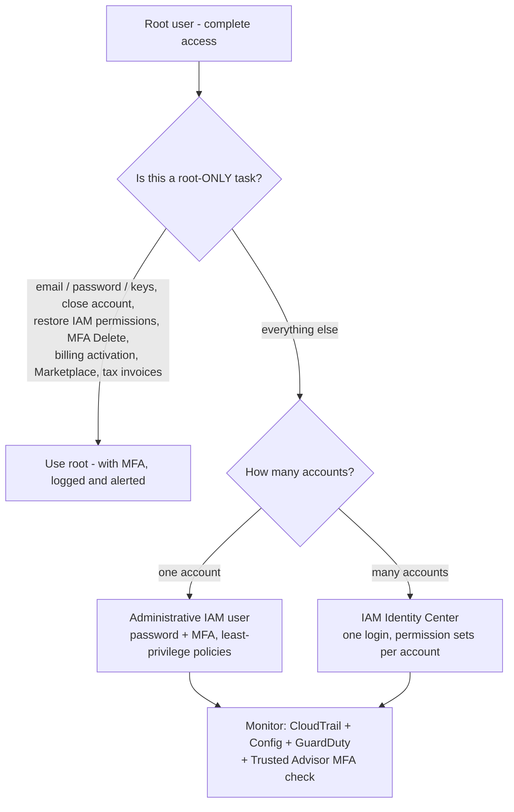
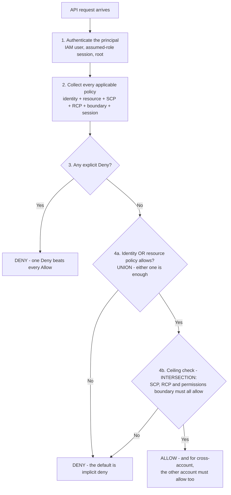
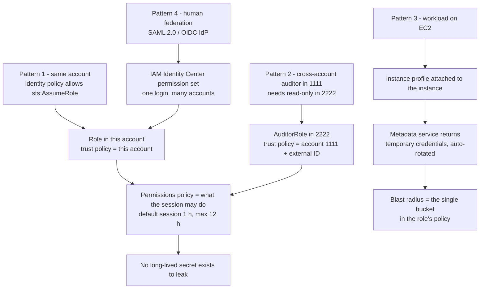
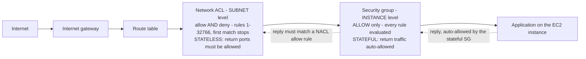
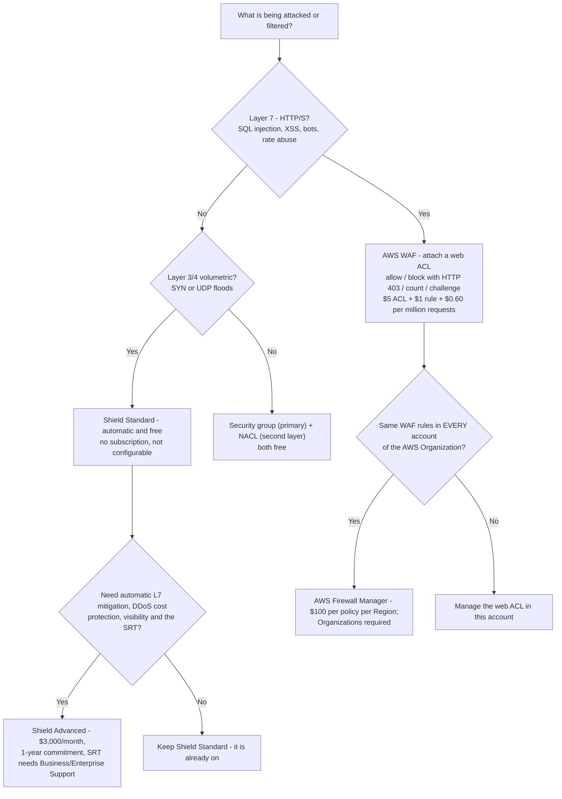
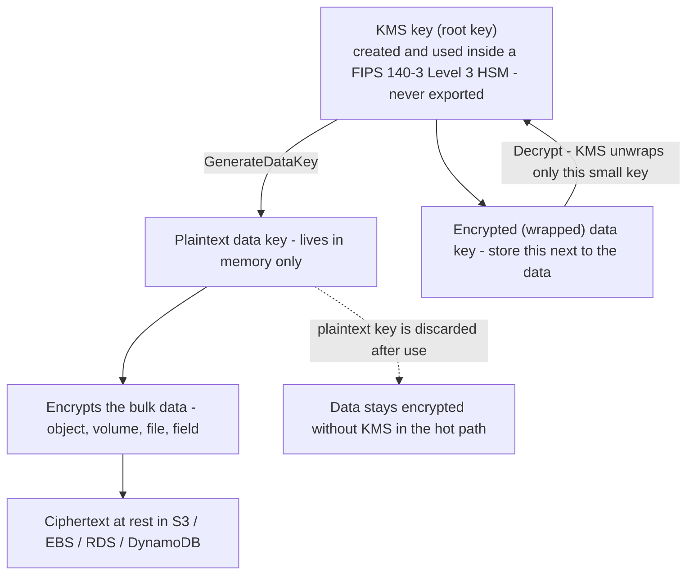

# Identity, Access Control and Data Protection

Security is the heaviest single domain on CLF-C02: **Domain 2 carries 30% of the scored content**, and its two access tasks (2.3 "Identify AWS access management capabilities" and 2.4 "Identify components and resources for security") are the most reliably tested of the whole exam. AWS's own framing starts from one uncomfortable sentence about the root user: it has *"complete access to all AWS services and resources"*. Everything else in this lesson — MFA, roles, Identity Center, least privilege, security groups, WAF, encryption — exists to make sure that sentence never becomes an incident.

```text
====================================================================
 CLF-C02 DOMAIN 2 — SECURITY LESSON CARD (facts as of Oct 2026)
====================================================================
 ROOT        1 identity/account · complete access · MFA within
             35 days · up to 8 MFA devices · NO access keys ·
             password 8-128 chars, >= 3 of 4 character classes
---------------------------------------------------------------------
 IAM         user = permanent, long-term creds (<= 2 access keys)
             group = users + 1 identity policy, NOT a principal,
                     not nestable, no default group
             role  = permissions policy (what) + trust policy
                     (who) -> STS temporary credentials
             policy = identity-based (user/group/role) OR
                      resource-based (on the resource itself)
 EVALUATION  any explicit Deny wins -> identity UNION resource
             -> ceiling: SCP + RCP + boundary must all allow
             -> cross-account: BOTH accounts must allow
---------------------------------------------------------------------
 NETWORK     security group = instance level, ALLOW only,
                     stateful, all rules evaluated, default
                     outbound allow-all / inbound from itself
             network ACL   = subnet level, allow AND deny,
                     stateless, rules 1-32766 first match wins,
                     default allow-all + `*` DENY catch-alls
                     both: no charge (as of Oct 2026)
---------------------------------------------------------------------
 EDGE        WAF  = Layer 7 (SQLi, XSS), attach a web ACL,
                    $5/web ACL + $1/rule + $0.60/million req
             Shield Standard = automatic, $0, non-configurable
             Shield Advanced = $3,000/month, 1-year commitment
             Firewall Manager = org-wide policy push (Organizations)
---------------------------------------------------------------------
 DATA        at rest = KMS / SSE-S3 (default since 2023-01-05)
             in transit = TLS 1.2 required, 1.3 recommended
             envelope encryption: KMS key wraps the data key,
             the data key encrypts the bulk data
====================================================================
```

> [!NOTE]
> **Scope discipline.** Every service named as examinable in this lesson appears on the CLF-C02 **in-scope list** or in a Domain 2/3 task statement (AWS Artifact, ACM, CloudHSM, Cognito, Detective, Directory Service, Firewall Manager, GuardDuty, IAM, IAM Identity Center, Inspector, KMS, Macie, RAM, Secrets Manager, Security Hub, Shield, WAF, plus CloudTrail, Config, CloudWatch, Trusted Advisor, Systems Manager from the task statements). Anything else is labelled as a case-study aside or an out-of-scope distractor, never as a fact you must select.

In this lesson you will:

- protect the **root user** — MFA device limits, the 35-day rule, no root access keys, and the tasks only root can do;
- build IAM from its four objects: **users, groups, roles and policies**;
- separate **identity-based from resource-based policies** and run the evaluation logic: explicit deny, union, ceilings, cross-account;
- choose **roles versus users** from the question stem — cross-account, EC2 instance profiles, federation, external ID;
- place **IAM Identity Center (workforce SSO)**, **Cognito (customer identity)** and **Directory Service (enterprise AD)** correctly;
- pick an **authentication option**: passkeys/FIDO, virtual TOTP, hardware TOTP, access keys, STS temporary credentials;
- compare **security groups and network ACLs** on scope, rules, statefulness and defaults;
- choose between **AWS WAF, Shield Standard, Shield Advanced and Firewall Manager** — with real bill arithmetic;
- protect data **at rest and in transit**, and follow **KMS envelope encryption** and the three key types;
- one-line every in-scope **threat-detection service** and run a **least-privilege checklist**;
- study **four AWS-published security and compliance case studies** — centralised network policy, identity-based access, inherited FedRAMP controls and faster authorisation;
- track the **2026 guide and tooling updates** that touch IAM, policy scope and security tooling — every bullet sourced and date-stamped;
- practise with **12 exam-style questions** plus four interactive checks.

---

## 1. The root account: one identity, unlimited reach

### 1.1 What root is

There is exactly **one root identity per AWS account** — an email address plus a password — and AWS documents that it has *"complete access to all AWS services and resources"*, including billing. It cannot be deleted, it cannot be restricted by an IAM policy inside its own account, and it bypasses MFA-less checks the moment it is used. This is why Domain 2 task 2.3 lists *"importance of protecting the AWS root user account"* as **knowledge** and *"identifying tasks that only the account root user can perform"* as a **skill**: the exam wants you to know both *why* root matters and *which* tasks genuinely require it.

| Root property | What AWS documents | Exam consequence |
|---|---|---|
| Count | One root identity per account | "Create a second root user" is always wrong |
| Reach | *"complete access to all AWS services and resources"* | No policy can be attached to limit it inside its account |
| Credentials | Password (8–128 chars, ≥3 of 4 character classes, must not match account name/email) | Root **access keys are never recommended** |
| MFA | Register **within 35 days** of first sign-in; **up to 8 MFA devices**, any mix | SMS MFA is no longer offered in IAM |
| Daily use | Should be used only for root-only tasks | Administrative work belongs to an IAM user or Identity Center |

### 1.2 Tasks only the root user can perform

The list is short, memorable and examinable — these are the answers to "which action requires the root user?":

- changing the account **email, password or access keys** for the root identity itself (standalone accounts);
- **closing or reopening** a standalone account;
- **restoring IAM user permissions** — the last-administrator lockout recovery;
- activating **IAM access to the billing console**;
- viewing certain **tax invoices**;
- registering for the **EC2 Reserved Instances Marketplace**;
- enabling **S3 MFA Delete**;
- editing or deleting an S3 or SQS **resource policy that denies all principals**;
- GovCloud signup and root keys; linking an **Amazon Mechanical Turk** account.

Everything else on the exam — creating IAM users, attaching policies, starting EC2, writing bucket policies, resetting a colleague's password — is done by an **administrative identity**, never by root.

### 1.3 Example E1 — day-1 root hardening, step by step

A new production account is opened. The hardening sequence below uses only verified limits:

| # | Action | Number to remember |
|---|---|---|
| 1 | Root email → a **group alias** (`aws-root@company.com`), not a personal mailbox | one shared mailbox, split recovery phone |
| 2 | Strong root password | **8–128 characters**, ≥**3 of 4** classes |
| 3 | Register MFA: a **virtual authenticator on the phone** *and* a **hardware token in the safe** | **2 of the maximum 8** devices; registration **within 35 days** |
| 4 | **No root access keys** — ever | 0 keys |
| 5 | Administrative identity lives in **IAM Identity Center** (multi-account) or as an admin IAM user (single account) | humans get federation |
| 6 | **CloudTrail** trail to a private bucket with log-file validation; **Config** and **GuardDuty** switched on | Event history is free for **90 days** |
| 7 | EventBridge rule on root sign-in → SNS → chat channel | detect unusual root use fast |
| 8 | In AWS Organizations: strip member-account root credentials and/or attach an **SCP** denying member-account root actions | SCPs filter, they never grant |

- **📚 Did you know?** AWS's root-user best-practice page recommends **multi-person approval** for root: one group holds the account password, a different group holds the MFA device, so no single employee can act as root alone. The same page caps MFA at **eight devices per root user** and tells you to register root MFA **within 35 days** of first sign-in — two numbers the exam likes to quote back at you (as of Oct 2026; verify current before use).



> [!WARNING]
> **Root trap family.** If an option describes an ordinary administrative task — "create an IAM user", "attach a policy", "stop an EC2 instance", "change a bucket policy" — and the justification is "so that root can do it", it is wrong: those tasks never require root. The correct root answers are the short list in §1.2, and *enabling MFA Delete* is the one that catches most candidates.

---

## 2. IAM building blocks: users, groups, roles and policies

### 2.1 The four objects, exactly

| Object | What it is | Credentials / mechanics | Exam gotchas |
|---|---|---|---|
| **IAM user** | A **permanent identity** inside one account | Long-term: console password + MFA; **maximum of two access keys per user**; secret key shown once | Long-lived credentials = rotate and retire; not the default answer for workloads |
| **IAM group** | A collection of users that shares **one identity policy** | No credentials of its own | **Cannot be a `Principal`**, cannot be nested, **no default user group** |
| **IAM role** | A set of permissions plus a **trust policy** defining who may assume it | Assuming it yields **STS temporary security credentials** | *"Roles are the primary way to grant cross-account access"* |
| **Permissions policy** | The document that says **what** is allowed or denied | JSON, attached to a principal (identity-based) or to a resource (resource-based) | Explicit `Deny` beats every `Allow` |

A role has **two halves and both are mandatory**: the **permissions policy** answers *what may the session do*, the **trust policy** (a resource-based policy attached to the role) answers *who may assume it*. A perfectly written permissions policy with a trust policy that names nobody is useless — it is a locked door with a sign reading "employees only" and no employees listed on it.

### 2.2 Identity-based versus resource-based policies

| | **Identity-based policy** | **Resource-based policy** |
|---|---|---|
| Attached to | User, group or role | The resource itself (S3 bucket, SQS queue, SNS topic, KMS key, VPC endpoint, role trust) |
| Format | Can be AWS managed, customer managed or inline | **Inline only** |
| Names a principal? | Implicit — the principal it is attached to | Can name a principal in **another AWS account** |
| Typical exam role | "Give this team read access to `reports/*`" | "Allow this bucket to be read by account 1111" / "Deny non-HTTPS requests" |

**AWS managed** policies are broad, AWS-maintained starting points (job functions such as read-only administration). **Customer managed** policies are the ones you write and refine — the least-privilege end state. **Inline** policies are embedded in a principal and are deleted with it, which makes them useful for one-shot permissions and dangerous as a default.

### 2.3 How AWS evaluates a request: explicit deny wins

AWS's documented order, compressed to the four moves that appear on the exam:

1. **Authenticate** the caller (who is this?).
2. **Gather** every applicable policy — identity-based *and* resource-based, plus SCPs, RCPs, permissions boundaries and session policies.
3. **Any explicit `Deny` anywhere wins.** AWS *"first checks all policies for a `Deny`"* — one deny, in any applicable document, beats every allow.
4. Otherwise compute the **union** of identity-based and resource-based allows, then intersect it with the **ceiling**: permissions boundaries, SCPs and RCPs must *all* allow (an **intersection**). **SCPs grant nothing** — they only filter what an identity inside the account could otherwise do.



> [!NOTE]
> **Union vs intersection is the highest-yield sentence in Domain 2.** Identity ∪ resource = **union** (either document can allow). Boundary / SCP / RCP = **intersection** (all must allow; they can only narrow). And the claim *"attach an SCP to grant access"* is always wrong: service control policies *filter*, they never *give*.

### 2.4 Example E2 — effective permissions for John (three layers)

John's identity policy allows `s3:Get*` on `reports/*`. The `reports` bucket policy says **Deny `s3:*` when `aws:SecureTransport` is false**. The account's SCP says **Deny `s3:*` outside the home Region**.

| Request | Layers in play | Result | Why |
|---|---|---|---|
| (a) HTTPS GET, home Region | 1 allow, 0 applicable denies | **Allowed** | Identity ∪ resource = union of allows; no deny matched |
| (b) Plain HTTP GET, home Region | 1 allow, 1 resource deny | **Denied** | Explicit resource `Deny` wins over the identity `Allow` |
| (c) HTTPS GET, another Region | 1 allow, 1 SCP deny | **Denied** | The SCP ceiling intersects — it can only subtract, never add |

Count the layers: **one allow, two denies, three policy types** — and read the direction of each request before choosing. Note what would happen if the identity policy were removed: (a) becomes an implicit deny, so removing a grant is a real mitigation, not a formality.

### 2.5 Permissions boundaries and the least-privilege tooling

A **permissions boundary** is a managed policy that sets the **maximum** an identity policy may grant. It grants nothing by itself — its exam use case is **safe delegation**: let a developer write their own identity policy, but cap it with a boundary so they can never exceed, say, read-only plus a sandbox bucket. The narrowing toolkit for least privilege is:

- start from an **AWS managed job-function policy**;
- refine with **IAM Access Analyzer** (generates policies from CloudTrail activity, validates external/public access, previews cross-account exposure);
- check **last accessed information** to delete permissions nobody uses.

- **📚 Did you know?** A **group cannot be used as a `Principal`** in any AWS policy — you attach a policy *to* a group, but you can never *allow a group* in a bucket policy or role trust policy; you must name its users or, better, a role. Groups also cannot be nested, and there is **no default user group** in IAM (as of Oct 2026).

```matching
{
  "question": "Match each policy document to the single job it performs in AWS's evaluation logic:",
  "pairs": [
    {"left": "Identity-based policy on a user, group or role", "right": "Grants actions to the principal it is attached to - one half of the UNION with resource-based policies"},
    {"left": "Resource-based policy on an S3 bucket, queue or topic", "right": "Lives on the resource itself, is inline only, and can name a principal in another AWS account"},
    {"left": "Trust policy on an IAM role", "right": "Resource-based document that answers WHO may assume the role; it grants no actions on its own"},
    {"left": "Permissions boundary", "right": "Managed policy setting the MAXIMUM an identity policy may grant - a ceiling inside the INTERSECTION"},
    {"left": "Service control policy (SCP)", "right": "Attached to OUs or accounts in AWS Organizations; it filters what an identity could do and never grants"},
    {"left": "Bucket policy deny when aws:SecureTransport is false", "right": "An explicit Deny that beats every Allow, so plain HTTP fails even when an identity policy allows"}
  ],
  "explanation": "Read the direction of each document. Identity-based and resource-based policies form a UNION - either one can allow. Permissions boundaries, SCPs and RCPs form an INTERSECTION ceiling that can only subtract. A trust policy is resource-based but authorises assumption only, and a single explicit Deny - such as an aws:SecureTransport condition - ends the evaluation in a deny no matter how many Allows exist."
}
```

---

## 3. Roles versus users: the decision the exam repeats

### 3.1 The use-case table

| Use a **role** when… | The mechanism | Use an **IAM user** only when… |
|---|---|---|
| A workload runs on **EC2 / Lambda / ECS / EKS** | **Instance profile** (EC2) or **execution role**; credentials come from the instance metadata service and **auto-refresh** | The workload genuinely cannot assume roles (some third-party plugins) |
| **Cross-account access** | Role in the trusting account; the caller's identity policy grants `sts:AssumeRole` | A legacy or break-glass account with MFA and tight controls |
| **Federation** of human users | SAML 2.0 / OIDC IdP, or **IAM Identity Center permission sets** | Third-party AWS tools that have no Identity Center support |
| An **external auditor** needs access | Role + **external ID** in the trust policy (confused-deputy defence) | Service-specific long-lived credentials (discouraged) |
| A **service acts on your behalf** | Service role or **service-linked role** | — |
| "…with **no long-term credentials**" anywhere | Temporary STS credentials | A long-lived CLI key on a laptop (allowed, not preferred) |

Session arithmetic worth memorising: `AssumeRole` sessions last up to **43,200 seconds = 12 hours**, while **role chaining** (assuming a second role from a first) is capped at **1 hour** — a 12× difference. During a session the role's permissions **replace** the caller's for the duration.



### 3.2 Example E3 — the cross-account audit role

An auditor in **account 1111** needs read-only access to **account 2222**. Two documents, both mandatory:

| Account | Document | Content |
|---|---|---|
| 2222 (trusting) | **`AuditorRole` trust policy** (resource-based) | Allows `sts:AssumeRole` for account **1111**, with an **external ID** because a third party is involved |
| 2222 | Role permissions policy | `ReadOnlyAccess`-style permissions |
| 1111 (caller) | Identity policy on the auditor's group | Allows `sts:AssumeRole` on that role **ARN** |

**Either policy alone fails**: trust without an identity grant gives "you are not authorized"; an identity grant without trust gives "not authorized to perform sts:AssumeRole". The session is **temporary** (1-hour default, up to 12 hours) — nothing to leak, nothing to rotate, and access disappears when the role's trust is revoked.

### 3.3 Example E4 — the EC2 instance profile, zero shipped keys

An application on EC2 must read `s3://photos`. Instead of copying an access key into the AMI:

1. Create role `Get-pics` whose **trust policy** allows the service `ec2.amazonaws.com`.
2. Attach a permissions policy allowing **`s3:GetObject` on that bucket only**.
3. Attach the role to the instance through an **instance profile**.
4. The SDK reads temporary credentials from the instance metadata service and **refreshes them before expiry** — the developer never sees a secret.

If the instance is compromised, the attacker inherits exactly one permission on exactly one bucket: the **blast radius is the policy document**, not the company's AWS account. Contrast the IAM-user answer: an access key baked into an AMI is a credential with no expiry, no scope boundary beyond its policy, and a habit the exam marks wrong.

- **📚 Did you know?** Role chaining deserves its own mnemonic: **12 hours for a single `AssumeRole`, 1 hour for a chained one** (43,200 s vs 3,600 s, as of Oct 2026). AWS caps chaining precisely because each hop multiplies the chance that a stale session outlives the person who started it.

---

## 4. IAM Identity Center: the workforce answer

**AWS Single Sign-On was renamed AWS IAM Identity Center** on **26 July 2022**, and the exam still rewards you for knowing both names. Identity Center is AWS's **workforce** single sign-on: employees get **one login** that opens many AWS accounts and AWS applications, with permissions delivered through **permission sets** - AWS's named bundle of permissions applied to a user or group, with no long-term keys.

| Attribute | Detail (exam depth) |
|---|---|
| Who it is for | **Workforce** — employees and contractors, not your application's customers |
| Identity source | Built-in directory, or an external **SAML 2.0 / OIDC** identity provider |
| Grant model | **Permission sets** applied to users or groups; access is session-bound and issues no long-term keys |
| Scope | An **organization instance** is recommended so all accounts share one directory |
| Relationship to IAM | Identity Center *uses* IAM roles underneath; it does not replace IAM itself |

The pattern to memorise: **12 accounts, one login, no IAM users** → IAM Identity Center. AWS's own best-practice wording is *"Require human users to use federation"* and prefer *"phishing-resistant MFA such as passkeys and security keys"* — Identity Center is how that recommendation scales past a handful of accounts.

> [!IMPORTANT]
> **The three identity services, never swapped:**
> - **IAM Identity Center** → your **workforce** (employees) across AWS accounts;
> - **Amazon Cognito** → your **application's customers** (sign-up/sign-in on a website or mobile app);
> - **AWS Directory Service** → an **enterprise Active Directory** (AWS Managed Microsoft AD, AD Connector as *"a proxy service"*, or Simple AD).
>
> A question about 700 employees across 12 accounts is Identity Center; a question about shoppers creating an account in your app is Cognito; a question about on-premises AD users reaching EC2 is Directory Service.

---

## 5. Amazon Cognito: customer identity at exam depth

Cognito is the **customer identity (CIAM)** option, and AWS describes it as three things in one service: *"a user directory, an authentication server, and an authorization service"*. It sits at a different altitude from IAM — your application's users are not IAM users and never see the AWS console.

| Component | What it does | What it returns |
|---|---|---|
| **User pool** | The **user directory + authentication**: sign-up/sign-in, federation to social/enterprise IdPs, password policies, **TOTP or SMS MFA** | **JWT tokens** to your app |
| **Identity pool** | **Authorization** — exchanges a valid token (from a user pool or another IdP) for AWS access | **Temporary, limited-privilege AWS credentials** via STS |
| Both together | The app authenticates the customer *and* then touches S3/DynamoDB/Lambda directly | Directory → token → STS credentials |

Exam depth stops exactly there: know that **user pools authenticate**, **identity pools authorise AWS access**, that the AWS credentials are **temporary**, and that Cognito is for *customers* while IAM Identity Center is for *workforce*. Deeper topics (hosted UI customization, lambda triggers, advanced security features) are not what a practitioner question asks for.

```fillblank
{
  "question": "Complete the identity vocabulary for CLF-C02:",
  "template": "Employees across 12 AWS accounts sign in once through {{1}}, which delivers access via {{2}} applied to their users and groups, with no long-term keys. An application's shoppers use {{3}}, whose {{4}} holds the directory and issues JWTs, while its {{5}} exchanges a token for temporary AWS credentials from STS.",
  "answers": {
    "1": "AWS IAM Identity Center",
    "2": "permission sets",
    "3": "Amazon Cognito",
    "4": "user pool",
    "5": "identity pool"
  },
  "distractors": ["AWS Directory Service", "AWS CloudHSM", "security group", "trust policy", "Amazon Inspector", "resource-based policy"],
  "explanation": "IAM Identity Center is the workforce SSO answer - AWS Single Sign-On was renamed to it on 2022-07-26 - and permission sets are its grant model - named permission bundles applied to users and groups, issued without long-term keys. Cognito is customer identity: the user pool is the directory plus authentication (JWTs), and the identity pool returns temporary, limited-privilege AWS credentials from STS. Directory Service is enterprise Active Directory, not customer identity."
}
```

---

## 6. Authentication options and MFA

### 6.1 The five ways to prove who you are

| Option | Credential lifetime | Typical use | Limits (as of Oct 2026) |
|---|---|---|---|
| **Console password + MFA** | Long-term password | Human sign-in to the console | **Passkeys / FIDO security keys** (phishing-resistant, recommended), **virtual authenticator (TOTP)**, **hardware TOTP**; **up to 8 MFA devices**; **SMS MFA support ended** |
| **Access keys** | Long-term | CLI, SDK, API from a workstation | **Maximum of two access keys per user**; secret key shown **once**; never commit to source control |
| **STS temporary credentials** | Minutes to 12 hours | Roles, instance profiles, Lambda execution roles, Cognito identity pools, IAM Roles Anywhere | Preferred pattern — expires by itself |
| **IAM Identity Center** | Session-bound, federated | Workforce across accounts | One login, permission sets, no long-term keys |
| **Directory Service** | Enterprise directory | On-premises AD identities reaching AWS | AWS Managed Microsoft AD, AD Connector (proxy), Simple AD |

AWS's best-practice wording to recognise: *"Require human users to use federation"* and use *"phishing-resistant MFA such as passkeys and security keys"*. The trap option recommends **SMS MFA** — AWS ended support for enabling SMS multi-factor authentication in IAM, so any answer that says "enable SMS MFA on the root user" is wrong.

> ⚠️ **Two credential numbers, two traps.** First, **SMS MFA is not an IAM option**: the supported factors are passkeys/FIDO security keys (phishing-resistant and recommended), virtual authenticator (TOTP) and hardware TOTP — so "secure the root user with an SMS code" is always wrong, even though a **Cognito user pool** may still send SMS codes to your *application's* users. Second, **two is the ceiling for access keys per IAM user** and **zero** is the recommendation for root; a "fix" that mints a third key, or a root access key "just for this script", answers the wrong question.

### 6.2 Where secrets live

Task 2.3 explicitly names credential storage: **AWS Secrets Manager** and **AWS Systems Manager Parameter Store (SecureString)**. Hard-coded keys in a repository, in an AMI or in environment variables of a public Lambda are the anti-pattern the exam tests by inversion — the correct answer always retrieves a secret at runtime from one of those two services, or avoids the secret entirely by using a role.

### 6.3 Example E5 — counting the credentials in one account

A single-account setup has: root (0 access keys), 6 IAM users each with 2 access keys, 10 roles, 3 permission sets in Identity Center.

| Identity | Long-term secrets | Temporary credentials |
|---|---|---|
| Root | **0** (policy forbids them) | — |
| 6 IAM users | **12** access key pairs at the ceiling (6 × 2) | Console sessions with MFA |
| 10 roles | 0 | Up to **12 hours** per `AssumeRole` session (1 hour if chained) |
| 3 permission sets | 0 | Session-bound access in each account |

The audit question writes itself: **12 long-lived secrets exist and only 2 people need them.** The remediation is not "add MFA" — it is to replace the users with **Identity Center groups and roles**, delete the unused keys, and keep the remaining pairs on a rotation schedule.

- **📚 Did you know?** The **two-access-keys-per-user** ceiling is deliberate: key one while key two is still live lets you rotate without downtime (update the application, then delete the old key). AWS shows the secret **exactly once** — after that, the only recovery is creating a new key pair, which is why "view the old secret key again" is never a valid option.

---

## 7. Security groups versus network ACLs

Both are the VPC's packet filters, both are **free of charge** (as of Oct 2026), and they differ on four axes the exam tests relentlessly.

| Characteristic | **Security group** | **Network ACL** |
|---|---|---|
| Scope | **Instance / network interface level** | **Subnet level** (one default NACL per subnet) |
| Rule action | **Allow only — no deny rules** | **Allow and deny** |
| Evaluation | **All rules evaluated**; allow if any match | Rules numbered **1–32766**, **lowest first, first match stops** |
| State | **Stateful** — return traffic is auto-allowed | **Stateless** — return traffic must be explicitly allowed |
| Default | Inbound **only from itself**; **outbound allow all** | **Allow all inbound and outbound** plus `*` DENY catch-alls |
| Referencing | Can reference **other security groups** | Cannot reference security groups |
| Charge | None | None |
| AWS guidance | *"Use security groups as the primary mechanism"* | Defense-in-depth second layer / deny-list |

Two consequences follow directly from the state column: with a **stateful** security group you open 443 inbound and the replies flow back automatically; with a **stateless** NACL you must **also** allow the ephemeral return ports inbound, or the connection never completes. And neither device filters **DNS, DHCP, the instance metadata service, ECS task metadata or Time Sync** — those bypass them by design.

### 7.1 Defaults are not "secure"

- The **default security group** allows all outbound and inbound **only from itself** — usable, not secure.
- The **default network ACL** allows **all** traffic in and out, plus `*` DENY rules that always sit at the bottom of the list — permissive by default, with the deny catch-all available for a quick block.

Neither default is an answer to "how do I restrict this", and *"add a deny rule to the security group"* is always wrong: **security groups have no deny rules** — use a NACL, or deny at the IAM/bucket-policy layer.

### 7.2 Example E6 — layered network defence

An internet-facing three-tier application, assembled from verified behaviour:

| Layer | Device | Rule | Why here |
|---|---|---|---|
| 1. Internet → ALB | **Security group** on the ALB | Allow **443 from 0.0.0.0/0** only | Instance-level, stateful, primary mechanism |
| 2. ALB → app tier | **Security group** on the app instances | Allow 8080 **from the ALB security group** (SG referencing) | Tiers trust each other, not the world |
| 3. App → database | **Security group** on RDS | Allow 5432 **from the app security group** only | Never open the database to a subnet |
| 4. Public subnet edge | **Network ACL** | **Deny** a known-bad CIDR, numbered rule **100** (stateless, first match wins) | Instant, subnet-wide deny without touching instances |
| 5. HTTP layer | **AWS WAF** web ACL on the ALB | AWS Managed Rules (SQLi, XSS, bad inputs) + rate-based rule | Layer 7 inspection a NACL cannot do |
| 6. Volumetric DDoS | **Shield Standard** | Already on, no subscription | Automatic at L3/L4 |
| 7. Organisation scale | **AWS Firewall Manager** | Push the WAF policy to every OU | New accounts inherit it |

The mental model: **NACL = the subnet's bouncer with a blacklist; security group = the instance's firewall with only a guest list; WAF = the application-layer inspector; Shield = the anti-DDoS umbrella.**



- **📚 Did you know?** Security group rules can **reference other security groups**, which is how the tiered pattern above works without hard-coding CIDR blocks — and it is why moving an application tier to a new subnet requires **no rule edits at all**. Network ACLs, by contrast, are subnet-bound and IP-based by nature (as of Oct 2026; per-VPC and per-SG quotas apply — verify current before use).

---

## 8. AWS WAF, AWS Shield and AWS Firewall Manager

Three services, three altitudes. Confusing them costs multiple questions, because each has a one-sentence identity:

| | **AWS WAF** | **AWS Shield Standard** | **AWS Shield Advanced** | **AWS Firewall Manager** |
|---|---|---|---|---|
| Layer | **7** — HTTP/S requests | **3/4** volumetric (plus L7 mitigation in Advanced) | **3/4 + automatic L7 mitigation** | Policy administration, not packet filtering |
| What it stops | *"SQL injection or XSS"*, bots, rate abuse | *"SYN or UDP floods"* automatically | Same, plus advanced attacks | — (it **manages** the others) |
| Activation | **Attach a web ACL** to CloudFront, ALB, API Gateway, AppSync, Cognito, App Runner, Amplify | **Automatic, no subscription** | Paid, **1-year commitment** | Requires **AWS Organizations** |
| Cost (as of Oct 2026) | **$5 per web ACL/month** + **$1 per rule/month** + **$0.60 per million requests** | **$0** — *"provided automatically and at no extra charge"* | **$3,000/month per payer** + DDoS data-transfer-out charges | **$100 per policy per Region per month** |
| Signature | Actions: allow / **block (HTTP 403)** / count / challenge | Non-configurable | **Shield Response Team** (requires **Business or Enterprise Support**) | Central policy, compliance dashboard, auto-covers new resources |

WAF capacity is measured in **Web ACL Capacity Units (WCUs)**; rules may be custom, **AWS Managed Rules**, or Marketplace rule groups, plus IP set/regex set and rate-based rules. Shield Advanced also bundles **up to 50 billion WAF requests per month** per payer ID and **DDoS cost protection** (reimbursement of scaling charges caused by an attack).

### 8.1 Example E7 — the WAF bill

AWS publishes its own worked example, and the arithmetic generalises:

| Configuration | Monthly maths | Total |
|---|---|---|
| 1 web ACL + 5 rules + 10 M requests | $5 + (5 × $1) + (10 × $0.60) | **$16.00** |
| AWS's published case: 1 web ACL + 19 rules + 10 M requests | $5 + $19 + $6 | **$30.00** |
| 3 web ACLs + 24 rules + 35 M requests | $15 + $24 + $21 | **$60.00** |

Notice what does **not** appear in the bill: security groups and network ACLs are **free**, so "add a security group rule" is the cost answer when the question is about filtering traffic that never reaches an HTTP rule set.

### 8.2 Example E8 — Shield Advanced arithmetic

| Scenario | Maths (as of Oct 2026) | Total |
|---|---|---|
| Shield Advanced subscription, no attack | $3,000 | **$3,000/month**, 1-year commitment |
| + 1,000 GB DDoS data-transfer-out via **ELB/EC2/Global Accelerator** | $3,000 + (1,000 × $0.050) | **$3,050/month** |
| + 1,000 GB DDoS out via **CloudFront** | $3,000 + (1,000 × $0.025) | **$3,025/month** |
| One Firewall Manager policy, one Region | $100 (AWS's published all-in example with WAF and Config charges totals **$106.40**) | **≈$106.40/month** |

The phrasing test is reliable: **"free, automatic DDoS protection"** → Shield Standard; **"stop SQL injection on this ALB"** → WAF; **"apply this rule set to every account in the organization"** → Firewall Manager.



> [!WARNING]
> **The three WAF/Shield traps.** (1) *"Subscribe to Shield Standard"* — impossible, it is automatic and free. (2) *"Configure Shield Standard rules"* — not configurable; configuration belongs to WAF or Shield Advanced. (3) *"Firewall Manager inspects packets"* — it does not; it **pushes policy** (WAF, Shield Advanced, security groups, network ACLs, Network Firewall, DNS Firewall) across an **AWS Organization** and requires Organizations to be enabled.

---

## 9. Data protection: at rest, in transit, and KMS

### 9.1 The two directions

| | **Encryption at rest** | **Encryption in transit** |
|---|---|---|
| Protects against | Someone reading the medium — a stolen disk, a copied snapshot, a leaked backup | *"eavesdropping, data tampering, and man-in-the-middle attacks"* |
| Mechanism | **KMS** keys and service-side encryption (SSE) | **TLS/SSL** — HTTPS, VPN, Direct Connect; `aws:SecureTransport` conditions |
| AWS default example | **SSE-S3 has been the base level of encryption for every bucket since 5 January 2023** (AES-256, no extra charge) | AWS APIs require **TLS 1.2** and recommend **TLS 1.3** |
| Exam phrasing | "S3 encrypts data automatically" = **at rest** | Always look for HTTPS/TLS/VPN in the option |

**S3 encryption choices** at exam depth: **SSE-S3** (default, free), **SSE-KMS** (per-request charges, plus a per-use audit trail in CloudTrail), **DSSE-KMS** (dual layer), **SSE-C** (you supply the key), and client-side encryption. Enforce transit with a bucket policy or an SCP that denies `aws:SecureTransport = false` — the deny from §2.4, applied to data protection.

### 9.2 KMS: keys, and envelope encryption

AWS Key Management Service keeps keys inside **FIPS 140-3 Security Level 3 validated hardware security modules (HSMs)** — the keys are generated there and **never leave that boundary unencrypted**. Because calling the HSM for every byte would be absurd, KMS uses **envelope encryption**: *"encrypting the data key under another key"*.



| Key type | Who owns it | Cost (as of Oct 2026) | Control |
|---|---|---|---|
| **Customer managed** | You, in your account | **Monthly fee** (hourly prorated) **+ usage fee** | Key policy, enable/disable, schedule deletion, custom rotation |
| **AWS managed** | You, in your account, alias `aws/<service>` (e.g. `aws/ebs`) | **No monthly fee**; usage charges only | Fixed key policy, **automatic rotation about every 365 days**, not editable or deletable |
| **AWS owned** | The service's own account | Free | Not visible to you, not auditable, cannot be deleted by you |

Rotating the key **never re-encrypts your bulk data** — the root key only re-wraps the data key, which is the practical reason envelope encryption exists.

### 9.3 Example E9 — envelope encryption on a 1 GB object

1. Your application calls KMS `GenerateDataKey` with a customer managed key. KMS returns **a plaintext data key** and **the same key encrypted under the KMS key**.
2. The application encrypts the **1 GB object** with the plaintext data key in memory; the plaintext key is discarded.
3. The **wrapped data key** is stored alongside the ciphertext. KMS never sees the object; the HSM never exports the root key.
4. To read the object later, the application sends only the **wrapped key** back to KMS (`Decrypt`), receives the plaintext key, and decrypts locally.
5. If you rotate the KMS key tomorrow, **only step 4's wrapping changes** — the 1 GB object is untouched.

| Approach | What AWS holds | What you administer | Exam cue |
|---|---|---|---|
| **KMS** | Shared, managed HSM fleet; key policies + IAM | Key policy, rotation, usage audit, per-use pricing | *"Convenient, integrated, pay per use"* |
| **CloudHSM** | **Single-tenant** dedicated HSMs; *"E2E encryption is not visible to AWS"* | You administer the HSM users (outside IAM) and the algorithms | *"AWS cannot see my data and I control the cryptography"* |

- **📚 Did you know?** AWS managed KMS keys now rotate **about every 365 days** — a change made in **May 2022**, when the interval shortened from three years — and carry **no monthly key fee** (usage fees still apply, as of Oct 2026). The customer managed key is the only type that gives you key-policy control, enable/disable, scheduled deletion and custom rotation, which is why "which key gives me full control" almost always means **customer managed**, not "the one I created" versus "AWS created".

---

## 10. Threat detection, audit and posture — in-scope one-liners

Domain 2 task 2.4 asks you to describe security features and to identify *"services for identifying security issues"*. Every row below is on the CLF-C02 in-scope list or in a Domain 2 task statement — nothing else.

| Service | One line (what it is) | Inputs / detail |
|---|---|---|
| **Amazon GuardDuty** | **Threat detection** | AWS CloudTrail management events, **VPC Flow Logs** and **DNS logs** (+ optional protection plans), threat intelligence and ML → findings |
| **Amazon Inspector** | **Vulnerability management** — continuous scanning of **EC2, ECR images and Lambda** | CVEs and network exposure |
| **Amazon Macie** | **Sensitive-data discovery for S3** using *"machine learning and pattern matching"* | PII, credentials, public-bucket findings; **30-day free trial** on first enablement |
| **Amazon Detective** | **Investigation** — *"analyze, investigate, and quickly identify the root cause"* | Behaviour graph built from CloudTrail, VPC Flow Logs and GuardDuty findings |
| **AWS Security Hub** | **Aggregator / CSPM** — consolidates and prioritises findings, checks against standards | The single pane other services feed |
| **AWS Trusted Advisor** | **Best-practice checks** across security, cost, limits and fault tolerance | Includes the **MFA-on-root** check |
| **AWS CloudTrail** | **Audit log — who did what**; records *"Actions taken by a user, role, or an AWS service"* | **Event history: past 90 days, free**; trails deliver to S3 |
| **AWS Config** | **Configuration state and compliance over time** | "Is root MFA still on? Are there root access keys?"
| **AWS Artifact** | **On-demand compliance reports and agreements** (SOC, PCI, ISO…) | The answer to "where do I get the audit report?"

**Mnemonic:** GuardDuty **detects** · Inspector **scans** · Macie **finds sensitive data** · Detective **explains** · Security Hub **aggregates** · Trusted Advisor **advises** · CloudTrail **records** · Config **remembers** · Artifact **certifies**.

```matching
{
  "question": "Match each in-scope security service to its single-sentence job:",
  "pairs": [
    {"left": "Amazon GuardDuty", "right": "Threat detection - correlates CloudTrail management events, VPC Flow Logs and DNS logs with threat intelligence"},
    {"left": "Amazon Inspector", "right": "Vulnerability management - scans EC2, ECR container images and Lambda functions for CVEs and network exposure"},
    {"left": "Amazon Macie", "right": "Sensitive-data discovery in S3 using machine learning and pattern matching for PII and credentials"},
    {"left": "Amazon Detective", "right": "Investigation - builds a behaviour graph so you can find the root cause of a finding"},
    {"left": "AWS Security Hub", "right": "Aggregator - consolidates, prioritises and checks findings against security standards"},
    {"left": "AWS CloudTrail", "right": "Audit log - records actions taken by a user, role or AWS service; 90 days of free Event history"},
    {"left": "AWS Config", "right": "Configuration compliance over time - was root MFA enabled yesterday and is it enabled now"},
    {"left": "AWS Trusted Advisor", "right": "Best-practice checks across security, cost and service limits, including MFA on the root user"}
  ],
  "explanation": "Detection services are told apart by their verb: detect (GuardDuty), scan (Inspector), discover data (Macie), investigate (Detective), aggregate (Security Hub), advise (Trusted Advisor), record (CloudTrail), remember configuration over time (Config). All eight are in scope for CLF-C02 Domain 2."
}
```

> [!IMPORTANT]
> **Naming trap.** The exam guide's task 2.4 wording includes the phrase *"AWS Security Center"*, but the service on the **in-scope list** is **AWS Security Hub**. Select Security Hub for consolidation and posture questions; treat "Security Center" as guide prose, not as a service to choose. Likewise **AWS Network Firewall** appears in case-study material but is **out of scope** for CLF-C02 selection questions in the current guide.

- **📚 Did you know?** CloudTrail **Event history is free and automatic for the past 90 days** of management events in every account — you do not have to create a trail to answer "who terminated my instance last month". A **trail** to a private S3 bucket with **log-file validation** is the upgrade that gives you the full, tamper-evident record the best-practice checklist demands (as of Oct 2026).

---

## 11. The least-privilege best-practice checklist

### 11.1 Five groups of habits

| # | Group | What you actually do |
|---|---|---|
| 1 | **Protect root** | MFA (passkey/TOTP), **no access keys**, group email alias, monitoring (CloudTrail, alarms, GuardDuty), strip root credentials from member accounts, optionally an **SCP** denying member-account root actions |
| 2 | **Least privilege** | Narrow **AWS managed → customer managed**; use **IAM Access Analyzer** and **last accessed information**; humans via **federation + temporary credentials** (Identity Center); workloads via **roles/instance profiles**; **no hard-coded keys** |
| 3 | **MFA and credential hygiene** | **MFA everywhere**, phishing-resistant first; rotate and retire keys, users, roles and policies; store secrets in **Secrets Manager** or **SSM Parameter Store (SecureString)**; max **2 access keys** per user, **0** for root |
| 4 | **Logging and detection** | **CloudTrail in all Regions** to a locked bucket with log-file validation; **Config** on; **GuardDuty, Inspector, Macie** on; review in **Security Hub**; **Trusted Advisor** MFA check green |
| 5 | **Defense in depth** | Private subnets; **security group as primary**, NACL as second layer; never `0.0.0.0/0` on 22/3389; VPC Flow Logs; **WAF at L7**; Shield; **Firewall Manager** at org scale; **encrypt at rest (KMS) and in transit (TLS ≥1.2)**; HTTPS-only via bucket policies, SCPs or RCPs; **AWS Marketplace** for what AWS does not ship |

### 11.2 Example E10 — scoring an account against the checklist

| Finding from Trusted Advisor / Config / Access Analyzer | Habit violated | Fix |
|---|---|---|
| Root has **no MFA** | 1 — protect root | Register passkey or TOTP **within 35 days** |
| 4 IAM users, **3 unused access keys** older than 90 days | 3 — credential hygiene | Delete unused keys; move the work to roles |
| One policy allows `s3:*` on `*` | 2 — least privilege | Access Analyzer → generate from activity → narrow to specific buckets/actions |
| **No CloudTrail trail** in two Regions (Event history only) | 4 — logging | Create organisation trail, all Regions, log-file validation, private bucket |
| Security group allows **22 from 0.0.0.0/0** | 5 — defense in depth | Restrict to a bastion security group or use SSM Session Manager |
| Bucket policy allows `Principal: *` over **HTTP** | 5 — data protection | Deny `aws:SecureTransport=false`; require HTTPS |
| 12 accounts, 40 IAM users with console passwords | 2 — federation | IAM Identity Center with permission sets, delete the users |

```dragdrop
{
  "question": "Order these least-privilege actions in the order AWS's best practices imply (foundation first, refinement last):",
  "items": [
    "Protect the root user with MFA and no access keys",
    "Require human users to use federation with temporary credentials",
    "Give workloads roles instead of access keys",
    "Start from an AWS managed job-function policy",
    "Narrow it with IAM Access Analyzer and last-accessed data",
    "Turn on CloudTrail, Config, GuardDuty, Inspector and Macie"
  ],
  "correctOrder": [
    "Protect the root user with MFA and no access keys",
    "Require human users to use federation with temporary credentials",
    "Give workloads roles instead of access keys",
    "Start from an AWS managed job-function policy",
    "Narrow it with IAM Access Analyzer and last-accessed data",
    "Turn on CloudTrail, Config, GuardDuty, Inspector and Macie"
  ],
  "explanation": "The sequence is secure the account (root), replace long-term credentials (federation for humans, roles for workloads), then refine permissions (AWS managed as a starting point, Access Analyzer and last-accessed information to narrow), and finally add the detection layer that proves the controls are working. Least privilege is a cycle: detection data feeds the next narrowing pass."
}
```

---

## Real-World Case Studies

AWS publishes what these patterns look like in production. Every figure below is **customer- or AWS-claimed and unaudited**, quoted with its source so you can check it — the examinable point is the **pattern** (which control was centralised, which identity model replaced which, which number moved), not the marketing figure.

### Case A — athenahealth: centralised network security across 120 accounts

| Element | Detail |
|---|---|
| **Industry / context** | Healthcare software with HIPAA-sensitive workloads; a sprawling VPC estate, rising egress-inspection cost and a small team |
| **AWS services named** | **AWS Network Firewall** (centralised), Transit Gateway, **AWS Resource Access Manager (RAM)** for policy fan-out, **CloudFormation rules-as-code**, Direct Connect; AWS Shield on the roadmap |
| **Headline outcomes (AWS-published, customer-claimed)** | Inspection costs **reduced by 95 percent**; **hundreds of VPCs across 120 accounts** updated **"within just a few days"**; **"Just eight people designed and rolled out the new security design with no disruptions"** |
| **Identity/security lesson** | Central **policy as code** plus **RAM sharing** beats per-account hand-editing — the same logic as Firewall Manager's organisation-wide push |
| **Source** | aws.amazon.com/solutions/case-studies/athenahealth-case-study (accessed Oct 2026) |

*Exam lesson:* the number to remember is not 95% — it is **120 accounts and eight people**. Domain 2's answer to "how do you enforce a control everywhere" is always **centralise the policy and share it** (RAM, Firewall Manager, SCPs, an organisation CloudTrail), never "log into each account". Note that **AWS Network Firewall is out of scope** for CLF-C02 service-selection questions in the current guide — know the *centralisation pattern*, select the in-scope service.

### Case B — Avalon Healthcare Solutions: identity-based access instead of VPN

| Element | Detail |
|---|---|
| **Industry / context** | Healthcare lab insights handling **PHI**, subject to **700+ control audits**; browser access to reports without VPN sprawl |
| **AWS services named** | **AWS Verified Access** with **Okta (OpenID Connect)** as the IdP, a firewall placed behind it, and an explicit **shared responsibility model** split |
| **Headline outcomes (AWS-published, customer-claimed)** | Perimeter network setup **from days to about one hour**; **50 business users** onboarded by February 2024; **700+ controls still met**; *"far fewer breach attempts"* reported |
| **Identity lesson** | Authentication and authorization move to the **identity layer** — a federated IdP decision, not a network perimeter decision |
| **Source** | aws.amazon.com/solutions/case-studies/avalon-aws-verified-access-case-study (accessed Oct 2026) |

*Exam lesson:* this is the **Zero Trust** shape Domain 2 rewards: verify the identity, grant narrowly, and stop treating the network as the boundary. **AWS Verified Access is not on the CLF-C02 in-scope security list**, so it appears only as a distractor — the in-scope selections for this pattern are **IAM Identity Center (workforce federation)**, **Cognito (customer identity)** and **cross-account IAM roles**.

### Case C — Smartsheet Gov: FedRAMP ready in under 90 days

| Element | Detail |
|---|---|
| **Industry / context** | Government-facing SaaS with **no prior presence in AWS GovCloud (US)** and a FedRAMP authorisation to pursue |
| **AWS services named** | **AWS GovCloud (US)**, **ATO on AWS**, AWS partner support; the authorisation itself stays with the customer |
| **Headline outcomes (AWS-published, customer-claimed)** | FedRAMP ready **in less than 90 days**, versus AWS's stated typical timeframes of **12–18 months** (AWS Public Sector Blog, **29 Aug 2019**) |
| **Compliance lesson** | A **pre-inherited control set** plus evidence you supply beats building every control from scratch — inheritance shortens the clock, it does not grant the ATO |
| **Source** | aws.amazon.com/blogs/publicsector/smartsheet-gov-achieves-fedramp-p-ato-taps-aws-govcloud-us-and-ato-on-aws-to-accelerate-journey/ (accessed Oct 2026) |

*Exam lesson:* the number to hold is **<90 days versus 12–18 months** — an evidence story, not a service-selection story. FedRAMP is a **government authorisation**, not an AWS product: AWS supplies GovCloud (US) and the inherited controls, the customer gets the ATO. When a question asks where the audit paperwork comes from, the in-scope answer is **AWS Artifact**; when it asks who patches the hypervisor, the answer is the shared responsibility model.

### Case D — Socure: 46+ FedRAMP controls inherited from GovCloud

| Element | Detail |
|---|---|
| **Industry / context** | Identity-verification (fraud) provider building a scalable, FedRAMP-compliant environment |
| **AWS services named** | **AWS GovCloud (US)** plus complementary partner tools; customer-owned **IAM, keys and application configuration** |
| **Headline outcomes (AWS-published, customer-claimed)** | *"we have inherited over 46 FedRAMP-required security controls from AWS GovCloud"* (AWS Public Sector Blog, **14 Nov 2024**) |
| **Shared-responsibility lesson** | Inheritance covers **"Security of the Cloud"**; the 46 controls say nothing about your IAM policies, encryption choices or guest OS — those are **"Security in the Cloud"** |
| **Source** | aws.amazon.com/blogs/publicsector/building-a-scalable-and-secure-fedramp-compliant-cloud-environment-socures-proven-strategies-with-aws-and-complementary-tools/ (accessed Oct 2026) |

*Exam lesson:* **46 inherited, zero delegated.** Inherited controls are the whole argument for the shared responsibility model: AWS covers the platform, you still own identity, least privilege, encryption and configuration. The examinable selections behind this paragraph are **KMS, CloudTrail, Config, GuardDuty, Security Hub, IAM** and **AWS Artifact** for the evidence itself — not the complementary tools named in the blog.

- **📚 Did you know?** Inheritance cuts both ways in these two stories: Smartsheet Gov reached FedRAMP ready in **under 90 days** where AWS says the process can run **12–18 months**, and Socure counted **46+ inherited FedRAMP controls** — yet both still owned their own IAM, keys and configuration. That is precisely why the shared responsibility model has two columns, and why "AWS handles security, so I skip MFA" is never the answer (AWS Public Sector Blog, 29 Aug 2019 and 14 Nov 2024; figures customer-published).

### What the security cases share

| Value pattern | Evidence | Underlying principle |
|---|---|---|
| Controls inherited rather than built | **Socure: "over 46 FedRAMP-required security controls" inherited** from AWS GovCloud (AWS Public Sector Blog, 14 Nov 2024) | Shared responsibility — AWS covers *"Security of the Cloud"*, you cover *"Security in the Cloud"* |
| Authorisation accelerates when the platform is already authorised | Smartsheet Gov: FedRAMP ready **<90 days** vs typical **12–18 months** (AWS Public Sector Blog, 29 Aug 2019) | GovCloud (US) + **ATO on AWS**; the customer still files the evidence |
| Centralisation beats per-account toil | athenahealth: **120 accounts, 8 people, days** | SCPs, Firewall Manager, organisation CloudTrail, RAM sharing |
| Identity replaces perimeter | Avalon: **days → ~1 hour**, no VPN sprawl | Federation and least privilege at the identity layer |
| Compliance is evidence, not opinion | 700+ controls, SOC/PCI/ISO reports | **AWS Artifact** supplies on-demand compliance documents |

> [!WARNING]
> **How to read case-study numbers on exam day:** every percentage here is a **customer-claimed, unaudited** figure published by AWS — never a guarantee, and "up to" is a **ceiling**, never an average. A case never licenses an out-of-scope answer: you are asked to **select the in-scope control** (security group, NACL, WAF, Shield, Identity Center, SCP, KMS), not to name the case-study-only service that happens to appear in the paragraph.

### 2026 Updates (as of October 2026)

> [!INFO]
> **What moved around IAM, policy scope and security tooling — six sourced bullets, every source accessed 2026-10:**
> - **The service lists were rebuilt.** In-scope entries went from **128 (launch-era Version 1.0 guide) → 111**, and the explicit out-of-scope list from **11 → 55** — so "it was in my old PDF" is no longer evidence of scope (CLF-C02 in-scope and out-of-scope services pages, 2026-10).
> - **`AWS IAM Identity Center (AWS Single Sign-On)` is now listed simply as `AWS IAM Identity Center`** — the parenthetical was dropped from the in-scope list. The rename itself (AWS Single Sign-On → IAM Identity Center, 26 July 2022) is unchanged, but current exam text uses the short name (in-scope services page, 2026-10).
> - **`AWS Network Firewall` and `AWS Audit Manager` moved to the out-of-scope list.** Network Firewall still shows up in case-study paragraphs (athenahealth) yet is now an explicit distractor, never a selectable answer (out-of-scope services page, 2026-10).
> - **Domain 2 is still 30% of scored content** — the weightings **24 / 30 / 34 / 12** have not moved since CLF-C02 replaced CLF-C01 on **19 September 2023**; treat any claim that a later guide revision shifted the Security weighting as unverified (current exam guide PDF, © 2026, and launch-era Version 1.0 guide Appendix B, 2026-10).
> - **"AWS Security Center" disappeared from the guide's technologies list but survives inside Domain 2 skills wording.** The in-scope service you select for consolidation and posture remains **AWS Security Hub** (exam guide + in-scope services page, 2026-10).
> - **The AWS Well-Architected Agent went to preview on 1 October 2026**, which AWS calls *"the next-gen evolution of AWS Trusted Advisor and the AWS Well-Architected Tool"* — but it is **not named in the exam guide**, so the examinable names stay **Trusted Advisor** and **Well-Architected Tool** (AWS News Blog and Well-Architected release notes, 2026-10-01).

- **📚 Did you know?** The current exam guide PDF carries **no version number at all** — only *"Copyright © 2026"* — while the only stamped artefact AWS ever published is the launch-era ***Version 1.0 CLF-C02*** guide. The `uiVersion=2024.10` string visible in AWS Docs URLs is the **documentation site template version**, not a guide revision, and the in-scope page warns that its list is **"non-exhaustive and subject to change"** (all three checked 2026-10).

---

## Practice Questions

```question
{
  "id": "clf-06-q1",
  "type": "multiple-choice",
  "question": "A team lead asks which of the following actions can ONLY be performed by the account root user. Which answer is correct?",
  "options": [
    "Enabling MFA Delete on an S3 bucket, and creating an administrative IAM user",
    "Attaching a permissions policy to an IAM group, and closing a standalone account",
    "Changing the root password and access keys, closing a standalone account, and restoring IAM user permissions after a last-administrator lockout",
    "Stopping an Amazon EC2 instance and enabling Amazon GuardDuty"
  ],
  "correct": 2,
  "explanation": "Root-only tasks include managing the root credentials themselves, closing or reopening a standalone account, restoring IAM user permissions (the lockout recovery), activating IAM access to billing, viewing certain tax invoices, EC2 Reserved Instances Marketplace registration and S3 MFA Delete. Creating IAM users and attaching policies are normal administrative tasks, and stopping EC2 or enabling GuardDuty never requires root."
}
```

```question
{
  "id": "clf-06-q2",
  "type": "multiple-choice",
  "question": "An IAM identity policy allows s3:GetObject on reports/*, but the bucket policy denies s3:* whenever aws:SecureTransport is false, and the request is made over plain HTTP. What is the result?",
  "options": [
    "Allowed - the identity policy is evaluated first and identity policies take precedence over resource policies",
    "Denied - AWS first checks all applicable policies for an explicit Deny, and one Deny beats every Allow",
    "Allowed - identity-based and resource-based policies are combined by intersection, and the identity Allow is enough",
    "Denied - all S3 bucket policies automatically deny non-HTTPS requests regardless of any policy content"
  ],
  "correct": 1,
  "explanation": "AWS evaluates by collecting every applicable policy and checking for an explicit Deny first; a single Deny in any applicable document wins over all Allows. Identity and resource policies form a UNION (either can allow), not an intersection, and nothing is denied merely because it is an S3 request - the bucket policy text is what denies it."
}
```

```question
{
  "id": "clf-06-q3",
  "type": "multiple-choice",
  "question": "A lead proposes attaching a service control policy (SCP) to give an audit team read-only access to a member account. Why is this wrong?",
  "options": [
    "SCPs can only be attached to IAM users, not to organizational units",
    "SCPs never grant permissions - they only filter what an identity in the account could otherwise do, and the audit team still needs an identity or role that allows the actions",
    "SCPs apply only to the root user of the management account",
    "SCPs are resource-based policies and therefore cannot name a principal in another account"
  ],
  "correct": 1,
  "explanation": "SCPs are a ceiling: they intersect with whatever the identity is allowed, and they grant nothing on their own. Access still requires an identity-based policy or a role in the member account, plus (for cross-account) an allow on both sides. SCPs attach to OUs, accounts or the root of an organization - not to IAM users."
}
```

```question
{
  "id": "clf-06-q4",
  "type": "multiple-choice",
  "question": "Which statement about security groups and network ACLs is correct?",
  "options": [
    "Security groups are stateless and support deny rules; network ACLs are stateful and support allow rules only",
    "Security groups apply at the subnet level and evaluate rules in numeric order, first match wins",
    "Network ACLs are stateless, apply at the subnet level, support allow and deny rules numbered 1-32766 with first-match-wins evaluation, and security groups are stateful, instance-level and allow-only",
    "Both devices filter DNS, DHCP and instance metadata traffic, and both are billed per rule"
  ],
  "correct": 2,
  "explanation": "Network ACLs are stateless (return traffic must be explicitly allowed), subnet-scoped, allow-or-deny, rule numbers 1-32766 with the lowest number evaluated first and evaluation stopping at the first match. Security groups are stateful (replies auto-allowed), instance-level, allow-only with every rule evaluated, and can reference other security groups. Neither filters DNS, DHCP or IMDS traffic, and both are free as of Oct 2026."
}
```

```question
{
  "id": "clf-06-q5",
  "type": "multiple-choice",
  "question": "A public-facing application behind an Application Load Balancer must block SQL injection and cross-site scripting attempts in HTTP requests. Which service should be used?",
  "options": [
    "AWS Shield Standard, because it filters malicious Layer 7 payloads automatically",
    "A security group rule that denies HTTP requests containing SQL keywords",
    "AWS WAF, by attaching a web ACL to the load balancer with AWS Managed Rules - it works at Layer 7 and can return HTTP 403 (Forbidden)",
    "Amazon Macie, because it discovers malicious patterns in stored data"
  ],
  "correct": 2,
  "explanation": "AWS WAF is the Layer 7 web application firewall built for exactly this: SQL injection and XSS rules, AWS Managed Rules, rate-based rules, and block actions that return an HTTP 403 status code. Security groups have no deny rules, Shield Standard is non-configurable DDoS protection at Layers 3/4, and Macie is sensitive-data discovery for S3."
}
```

```question
{
  "id": "clf-06-q6",
  "type": "multiple-choice",
  "question": "A security team wants free, automatic DDoS protection for its AWS workloads with no subscription and no configuration. Which statement matches AWS's documentation?",
  "options": [
    "Subscribe to Shield Standard and configure its mitigation rules",
    "Shield Standard is provided automatically and at no extra charge; Shield Advanced is the paid option with a 1-year commitment, DDoS cost protection and the Shield Response Team, which requires Business or Enterprise Support",
    "Enable Shield Advanced first, then downgrade to Shield Standard if no attack occurs",
    "Purchase AWS Firewall Manager, which includes free DDoS protection for all accounts"
  ],
  "correct": 1,
  "explanation": "Shield Standard comes automatically at no extra charge and cannot be subscribed to or configured. Shield Advanced costs $3,000/month per payer with a 1-year commitment (as of Oct 2026), adds automatic Layer 7 mitigation, DDoS cost protection and up to 50 billion WAF requests per month, and its Shield Response Team requires Business or Enterprise Support. Firewall Manager manages policy across an organization; it is not the DDoS protection itself."
}
```

```question
{
  "id": "clf-06-q7",
  "type": "multiple-choice",
  "question": "Which set of statements about AWS KMS key types is correct (as of Oct 2026)?",
  "options": [
    "AWS owned keys live in your account and can be deleted on a schedule; customer managed keys are free of monthly charges",
    "Customer managed keys carry a monthly fee plus usage charges and give you key-policy control; AWS managed keys use aliases like aws/ebs, rotate about every 365 days, have no monthly key fee and cannot be deleted by you; AWS owned keys are neither visible nor auditable by you",
    "AWS managed keys are stored outside your account and customer managed keys never rotate",
    "All three key types are identical in control, and only the alias differs"
  ],
  "correct": 1,
  "explanation": "Customer managed keys are yours: key policy control, enable/disable, scheduled deletion and custom rotation, billed monthly (hourly prorated) plus usage. AWS managed keys live in your account under aliases such as aws/ebs, rotate about every 365 days, have no monthly key fee and cannot be edited or deleted by you. AWS owned keys belong to the service's own account - free, invisible and undeletable by you."
}
```

```question
{
  "id": "clf-06-q8",
  "type": "multiple-choice",
  "question": "A company has 12 AWS accounts and 400 employees, while a separate consumer app needs customer sign-up and limited access to S3. Which pairing is correct?",
  "options": [
    "Employees: IAM Identity Center with permission sets and one login; customers: Amazon Cognito user pool for authentication plus an identity pool for temporary AWS credentials",
    "Employees: a shared IAM user per department; customers: AWS Directory Service Simple AD",
    "Employees: Amazon Cognito user pools; customers: IAM Identity Center permission sets",
    "Employees: IAM users in every account with the same password; customers: root user credentials for the app"
  ],
  "correct": 0,
  "explanation": "IAM Identity Center is the workforce answer: one login across many accounts, federated identity source, permission sets that become roles with temporary credentials. Cognito is customer identity: the user pool is the directory plus authentication (issuing JWTs), and the identity pool exchanges a token for temporary, limited-privilege AWS credentials via STS. Directory Service is enterprise Active Directory, and sharing IAM users - or using root - is never correct."
}
```

```question
{
  "id": "clf-06-q9",
  "type": "multiple-choice",
  "question": "An application running on Amazon EC2 must read objects from one S3 bucket, and no long-term credentials may be shipped with the code. Which design fits the exam's best practice?",
  "options": [
    "Create an IAM user with one access key, store the secret in the application configuration, and rotate it once a year",
    "Create a role that trusts ec2.amazonaws.com with a policy allowing s3:GetObject on that bucket only, and attach it to the instance through an instance profile so temporary credentials are auto-refreshed from the metadata service",
    "Use the account root access keys so the application never runs out of permissions",
    "Attach an AWS managed administrator policy to the instance role to avoid future permission changes"
  ],
  "correct": 1,
  "explanation": "Roles plus an instance profile give the workload temporary security credentials that refresh automatically, with a blast radius defined by a narrow policy. Access keys are long-term (maximum two per IAM user) and must not be embedded, root access keys should never exist, and attaching an administrator policy violates the principle of least privilege."
}
```

```question
{
  "id": "clf-06-q10",
  "type": "multiple-choice",
  "question": "A team provisions 1 AWS WAF web ACL with 5 rules and inspects 10 million requests in a month. Using the pricing components verified for this lesson (as of Oct 2026), what is the monthly total?",
  "options": [
    "$16.00 - $5 for the web ACL, $5 for the rules and $6 for the requests",
    "$11.00 - rules are free and only the ACL and requests are billed",
    "$30.00 - AWS always bills the published 19-rule example total",
    "$60.00 - WAF bills $5 per rule plus a flat $55 request fee"
  ],
  "correct": 0,
  "explanation": "The verified components are $5.00 per web ACL per month, $1.00 per rule per month and $0.60 per 1 million requests: $5 + (5 x $1) + (10 x $0.60) = $16.00. AWS's own worked example with 19 rules and 10 million requests totals $30.00, and security groups and network ACLs remain free - so neither $30.00 nor a rule-free total is correct here."
}
```

```question
{
  "id": "clf-06-q11",
  "type": "multiple-choice",
  "question": "A candidate is revising from a launch-era CLF-C02 PDF whose in-scope services list reads 'AWS IAM Identity Center (AWS Single Sign-On)' and contains 128 entries. What does the current exam guide say (as of Oct 2026)?",
  "options": [
    "The in-scope list now reads 'AWS IAM Identity Center' with the parenthetical dropped and holds 111 entries, while the explicit out-of-scope list holds 55 entries and includes AWS Network Firewall and AWS Audit Manager",
    "Nothing has changed - the AWS Single Sign-On parenthetical and the 128-entry in-scope list are both still current",
    "AWS IAM Identity Center was retired in favour of Amazon Cognito, and AWS Network Firewall was promoted into the in-scope list",
    "The parenthetical was kept for compatibility, and the out-of-scope list shrank from 55 entries to 11"
  ],
  "correct": 0,
  "explanation": "The in-scope services page accessed 2026-10 lists 'AWS IAM Identity Center' with no AWS Single Sign-On parenthetical, and diffing it against the launch-era Version 1.0 guide gives 128 -> 111 in-scope entries and 11 -> 55 out-of-scope entries. AWS Network Firewall and AWS Audit Manager now sit on the explicit out-of-scope list, so they are distractors even though Network Firewall still appears in case-study text; the underlying rename (AWS Single Sign-On -> IAM Identity Center, 26 July 2022) is unchanged."
}
```

```question
{
  "id": "clf-06-q12",
  "type": "multiple-choice",
  "question": "Smartsheet Gov reports going from no presence in AWS GovCloud (US) to FedRAMP ready in under 90 days, a process AWS describes as sometimes taking 12-18 months. The compliance team then asks: 'Where do we obtain the audit report or agreement to hand our assessor?' Which in-scope service answers that question?",
  "options": [
    "AWS Artifact - on-demand compliance reports and agreements such as SOC, PCI and ISO documents",
    "AWS Trusted Advisor - best-practice checks across security, cost and service limits, including MFA on the root user",
    "Amazon GuardDuty - threat detection from CloudTrail management events, VPC Flow Logs and DNS logs",
    "AWS Config - configuration state and compliance over time for your own resources"
  ],
  "correct": 0,
  "explanation": "AWS Artifact is the in-scope service for on-demand compliance reports and agreements - the direct answer to 'where do I get the audit report'. The Smartsheet Gov figure (FedRAMP ready in less than 90 days versus typical 12-18 month timeframes, AWS Public Sector Blog, 29 Aug 2019) is an inheritance-and-evidence story: the controls come from AWS GovCloud (US) and ATO on AWS, but the authorisation and the paperwork stay with the customer. Trusted Advisor checks your account, GuardDuty detects threats and Config tracks your configuration - none of them hands an assessor a third-party compliance document."
}
```

> [!IMPORTANT]
> **Comparative Verdict — identity and data protection × on-premises × other clouds × DIY/managed**
> - **Versus on-premises:** on premises you build the whole stack yourself — a directory server, an MFA appliance, a web-application firewall appliance, an HSM for key custody, plus the patching, HA and audit evidence for each. AWS gives you **identity as an API** (IAM, roles, STS), **MFA in minutes** (passkey or TOTP, up to 8 devices), **KMS keys inside FIPS 140-3 Level 3 HSMs with no hardware to buy**, and **free, automatic DDoS protection (Shield Standard)** plus **free security groups and NACLs**. The price of that inheritance is **shared responsibility**: AWS owns *"Security of the Cloud"*, you own *"Security in the Cloud"* — configuration, IAM, encryption choices and guest operating systems stay yours.
> - **Versus other clouds:** every major provider offers IAM, managed KMS-style keys, WAF and DDoS protection, so the examinable differences are AWS's *specific* vocabulary and rules — **explicit deny always wins**, **identity ∪ resource is a union while SCP/boundary is an intersection**, **SCPs never grant**, **stateful security groups vs stateless NACLs**, **automatic free Shield Standard vs $3,000/month Shield Advanced with a 1-year commitment**, **SSE-S3 as the default for every bucket since 5 January 2023**, and **IAM Identity Center renamed from AWS Single Sign-On on 26 July 2022** (all as of Oct 2026). Do not assume another provider's evaluation order, default encryption date or pricing transfers to AWS.
> - **Versus DIY / build-it-yourself:** hand-rolled key management means generating, storing, backing up and rotating keys yourself, with no HSM attestation and no usage audit; hand-rolled WAF rules mean writing SQLi/XSS parsers and absorbing Layer 7 attacks you did not anticipate; hand-rolled identity means long-lived shared credentials and no federation. The Well-Architected answer is consistently **managed and least-operational-overhead**: roles instead of keys, Identity Center instead of a directory, KMS envelope encryption instead of custom crypto, WAF Managed Rules instead of handwritten signatures — and **least privilege** as the discipline that ties all four together.

> [!WARNING]
> **Exam-day traps for this lesson:**
> - **Explicit deny beats every allow** — one `Deny` anywhere applicable ends the evaluation, no matter how many `Allow`s exist;
> - **Union vs intersection** — identity ∪ resource = union (either allows); SCP, RCP and permissions boundary = intersection (all must allow), and **SCPs never grant**;
> - **Cross-account needs an allow in BOTH accounts** — the trust policy alone, or the caller's policy alone, is not enough;
> - **Groups cannot be principals**, cannot be nested, and there is no default group — attach policies *to* a group, but you cannot *allow* a group;
> - **Security groups have no deny rules** — need a deny? Use a NACL (or an IAM/bucket policy);
> - **Stateful vs stateless** — security group replies are auto-allowed; NACL replies must be allowed by an explicit rule;
> - **Scope and evaluation order** — security group = instance/ENI, all rules evaluated; NACL = subnet, lowest rule number first, first match stops;
> - **Defaults are permissive** — default NACL allows all; default security group allows all outbound and inbound only from itself;
> - **WAF is Layer 7 only** and must be attached to a supported resource — it is not a security-group replacement;
> - **Shield Standard is automatic and free** — never answer "subscribe to" or "configure" it; Advanced = **$3,000/month, 1-year commitment** (as of Oct 2026), and the **Shield Response Team needs Business or Enterprise Support**;
> - **Firewall Manager ≠ WAF** — it manages WAF/Shield/security groups/NACLs/Network Firewall/DNS Firewall across an **AWS Organization**, which is a requirement;
> - **Roles for workloads, cross-account, federation and auditors**; IAM users only for legacy or tooling that cannot use roles — and **no long-lived credentials** is the phrase that points at a role;
> - **A trust policy is resource-based and grants no actions** — both halves (trust + permissions) are required;
> - **Cognito = customers, Identity Center = workforce, Directory Service = enterprise AD** — swapping them is the classic three-way trap;
> - **At rest = KMS/SSE; in transit = TLS** — "S3 encrypts automatically" means at rest (SSE-S3 default since 2023-01-05), not in transit;
> - **KMS vs CloudHSM** — managed/shared/pay-per-use vs dedicated/**single-tenant**/you administer and *"E2E encryption is not visible to AWS"*;
> - **Customer managed vs AWS managed keys** — both live in your account; only customer managed gives key-policy control, enable/disable, deletion and custom rotation;
> - **SMS MFA in IAM was discontinued** — an option recommending SMS MFA for the console/root is wrong; passkeys/FIDO and TOTP are the current options;
> - **Access keys: maximum two per user**, secret shown once, never for root — and "view the old secret again" is never an answer;
> - **Only in-scope services** — GuardDuty, Inspector, Macie, Detective, Security Hub, Trusted Advisor, CloudTrail, Config, Artifact, WAF, Shield, Firewall Manager, KMS, Cognito, Identity Center, Secrets Manager; case-study-only services (Network Firewall, Verified Access) and the guide's *"AWS Security Center"* wording are distractors — the service is **Security Hub**;
> - **Case-study numbers are customer-claimed**, unaudited ceilings — never AWS guarantees.

> [!SUCCESS]
> **Key Takeaways:**
> 1. **Root** is the one identity with *"complete access to all AWS services and resources"*: MFA **within 35 days**, up to **8 MFA devices**, **no access keys**, password **8–128 chars / ≥3 of 4 classes**, and only a short root-only task list (root credentials, close/reopen a standalone account, restore IAM permissions, billing activation, tax invoices, EC2 RI Marketplace, **S3 MFA Delete**, deny-all S3/SQS policy edits);
> 2. IAM's four objects: **user** (permanent, ≤**2 access keys**), **group** (users + one identity policy, **not a principal**, no nesting, no default), **role** (**permissions policy = what + trust policy = who** → STS temporary credentials), **policy** (**identity-based**: AWS managed/customer managed/inline vs **resource-based**: inline only, can name another account);
> 3. Evaluation in four moves: authenticate → collect all policies → **any explicit Deny wins** → **union** of identity ∪ resource, then intersect with the **ceiling** (SCP, RCP, permissions boundary — **SCPs grant nothing**) and, for cross-account, **allow in both accounts**;
> 4. **Roles are the default answer** for cross-account access, EC2/Lambda workloads (**instance profile**), federation and external auditors (**external ID**); sessions last up to **43,200 s (12 h)**, chained roles **1 h** — IAM users are for legacy or key-only tooling;
> 5. **IAM Identity Center** (renamed from AWS Single Sign-On, **2022-07-26**) serves the **workforce** with one login and **permission sets**; **Cognito** serves **customers** (user pool = directory + authentication → JWTs; identity pool → **temporary, limited-privilege AWS credentials**); **Directory Service** serves **enterprise AD**;
> 6. Authentication options: **passkeys/FIDO (phishing-resistant, recommended), virtual TOTP, hardware TOTP** (≤8 devices; **SMS MFA discontinued in IAM**), **access keys** (≤2 per user, secret shown once), **STS temporary credentials**, and secrets stored in **Secrets Manager / SSM Parameter Store SecureString**;
> 7. **Security group vs NACL**: instance vs subnet; allow-only vs allow+deny; all rules vs **rules 1–32766 first match**; **stateful vs stateless**; default SG = outbound allow-all + inbound from itself, default NACL = allow-all with `*` DENY catch-alls; **both free**, neither filters DNS/DHCP/IMDS, and AWS calls security groups the **primary** mechanism;
> 8. **WAF = Layer 7** (SQLi, XSS, HTTP 403 blocks; **$5 ACL + $1 rule + $0.60/million requests** — 1 ACL + 5 rules + 10M = **$16/month**); **Shield Standard = automatic and free**; **Shield Advanced = $3,000/month, 1-year commitment**, DDoS cost protection, SRT needs **Business/Enterprise Support**; **Firewall Manager = $100/policy/Region**, organization-wide, **Organizations required**;
> 9. Data protection: **at rest = KMS/SSE** (**SSE-S3 default for every bucket since 5 January 2023**), **in transit = TLS 1.2 required / 1.3 recommended**; KMS performs **envelope encryption** (the KMS key in a **FIPS 140-3 Level 3 HSM** wraps the data key, the data key encrypts the bulk data, rotation never re-encrypts your data) with **customer managed** (monthly + usage, full control), **AWS managed** (`aws/<service>`, yearly rotation, no monthly fee) and **AWS owned** (invisible, undeletable) key types — **CloudHSM** when AWS must not see the data plane;
> 10. Detection in one line each: **GuardDuty detects** (CloudTrail + VPC Flow Logs + DNS logs), **Inspector scans** (EC2, ECR, Lambda), **Macie finds PII in S3**, **Detective explains**, **Security Hub aggregates**, **Trusted Advisor advises** (MFA check), **CloudTrail records** (**90 days free**), **Config remembers**, **Artifact certifies** — and least privilege is a cycle: **protect root → federate humans → role the workloads → narrow with Access Analyzer → log and detect**, as practised in the AWS cases (athenahealth: **120 accounts, 8 people, inspection costs −95%**; Avalon: perimeter setup **days → ~1 hour**, **700+ controls** met; Socure: **46+ FedRAMP controls inherited**) — customer-claimed figures that show the *pattern*, never an AWS guarantee;
> 11. **As of Oct 2026** the guide's in-scope list holds **111 entries** (out-of-scope **55**), the service name is **AWS IAM Identity Center** with the AWS Single Sign-On parenthetical dropped, **AWS Network Firewall** and **AWS Audit Manager** are out of scope, Domain 2 is still **30%** (24/30/34/12 unchanged since **2023-09-19**), "AWS Security Center" is guide prose for **Security Hub**, and the Well-Architected Agent preview is real but **not examinable** — while the compliance cases show inheritance without delegation (Smartsheet Gov: FedRAMP ready **<90 days** vs typical **12–18 months**; Socure: **46+** inherited controls), so the audit report always comes from **AWS Artifact**.
