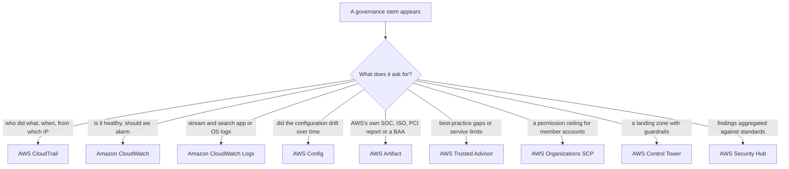
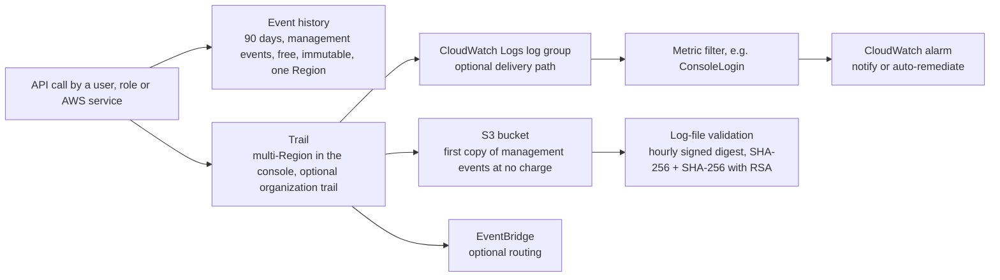
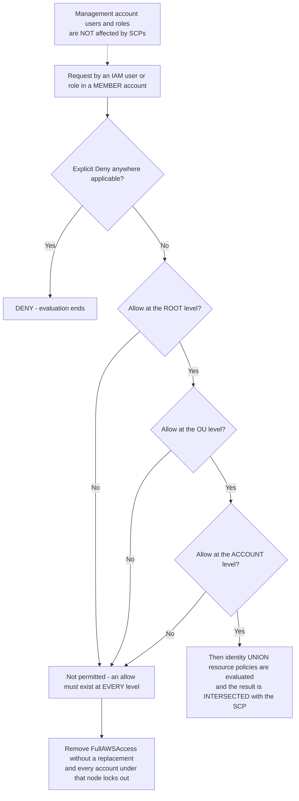
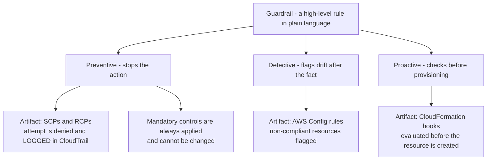
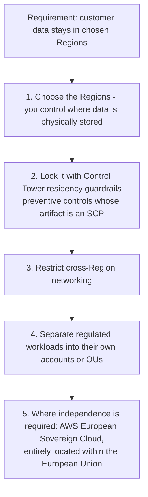

# Governance, Auditing and Compliance on AWS

Domain 2 carries **30% of the CLF-C02 score**, and task 2.2 is its governance half: *"AWS compliance and governance concepts"*, *"Where to capture and locate logs that are associated with cloud security"*, *"identify where to find AWS compliance information (for example, AWS Artifact)"*, and *"Recognizing services that aid in governance and compliance (for example, monitoring with Amazon CloudWatch; auditing with AWS CloudTrail and AWS Config; reporting with access reports)"*. That single sentence names almost every tool in this lesson — and it also plants the trap, because **monitoring is CloudWatch while auditing is CloudTrail and Config**. Students who blur those two verbs lose easy marks on stems that are otherwise pure recall.

```text
====================================================================
 CLF-C02 DOMAIN 2, TASK 2.2 — GOVERNANCE TOOL CARD (as of Oct 2026)
====================================================================
 WHO DID WHAT        CloudTrail — events recorded for every user,
                     role or AWS service; Event history = free,
                     immutable, 90 days, management events,
                     one Region (it is NOT a trail)
 LONG-TERM API LOG   trail -> S3 (+ optional CloudWatch Logs and
                     EventBridge); first copy of management events
                     to S3 = $0; multi-Region in the console;
                     organization trail covers every member account
 LOG INTEGRITY       SHA-256 hashing + SHA-256 with RSA signing,
                     hourly digest file, ON by default for new trails
 WHAT IT LOOKED LIKE AWS Config — recorder writes configuration
 OVER TIME           items to S3 (+SNS); rules = your ideal config;
                     conformance pack = rules + remediation as 1
 AWS'S OWN PAPERS    AWS Artifact — free, on-demand SOC / ISO / PCI
                     reports plus agreements (BAA, NDA)
 BEST-PRACTICE GAPS  Trusted Advisor — 6 categories, advisory only,
                     depth depends on the support plan
 PERMISSION CEILING  AWS Organizations + SCP — deny only, grants
                     nothing, no effect on the management account
 LANDING ZONE        AWS Control Tower — preventive (SCP/RCP),
                     detective (Config), proactive (CFN hooks)
 EVIDENCE            143 standards and certifications; AWS is
                     audited for security OF the cloud, you for
                     security IN it; compliance varies by service
====================================================================
```

In this lesson you will:

- decode the **one-sentence stem** that tells you which governance tool the exam wants;
- use **AWS CloudTrail** for who did what — including **event history versus trails**, **organization trails** and **log-file integrity validation**;
- resist the **CloudWatch Logs trap** (a delivery pipeline for events, not the audit record itself);
- use **AWS Config** for configuration history, rules, compliance state, conformance packs and aggregators;
- find AWS's SOC / ISO / PCI reports and sign a **BAA** in **AWS Artifact** — free and self-service;
- map **Trusted Advisor's six check categories** to what each **support plan** actually unlocks;
- apply **SCPs** correctly: deny-only, an allow at every level, any deny wins, management account untouched;
- place **AWS Control Tower** guardrails (preventive / detective / proactive) on a landing zone;
- read the **compliance program buckets** (certification vs law vs alignment) through the **shared responsibility model**;
- design a **tagging strategy** that survives an audit and splits the bill;
- separate **data residency, data sovereignty and privacy** — and answer Region-selection stems;
- triage a security event with **CloudWatch vs CloudTrail vs Config vs Trusted Advisor**;
- study **four real AWS compliance cases**, then sit **12 exam-style questions** plus interactive checks;
- audit the **live exam guide as of October 2026** — rebuilt scope lists, the new support-plan names, and console moves that are *not* examinable.

---

## 1. One question, one tool

### 1.1 The stem decoder

Every governance question on this exam is a *disguised* question about which tool owns which kind of evidence. Read the stem for its verb and its noun — not for the service name a colleague once mentioned.

| The stem is really asking | Tool | What it actually stores |
|---|---|---|
| Who did what, when, from which IP? | **AWS CloudTrail** | API **events**: user, role or service, action, time, source |
| Is the service healthy? CPU above 80%? Raise an alarm | **Amazon CloudWatch** | **Metrics** and alarms on the current state |
| Stream and search application or OS logs centrally | **Amazon CloudWatch Logs** | **Log events** from apps, files and services |
| Did the configuration drift, and what did it look like on 1 March? | **AWS Config** | **Configuration items**: current state plus history |
| Is AWS itself SOC 2 / ISO 27001 / PCI, and where is the BAA? | **AWS Artifact** | AWS's **own** reports and agreements |
| Is the account following best practices? Where are the gaps? | **AWS Trusted Advisor** | **Recommendations** in six categories |
| Cap what member accounts may ever do | **AWS Organizations SCP** | A **deny-only** permission ceiling |
| Vend accounts and guardrails as a landing zone | **AWS Control Tower** | Guardrails expressed in plain language |
| Aggregate findings against security standards | **AWS Security Hub** | A **single pane of glass** for findings |



### 1.2 The exam guide's own division of labour

AWS words it narrowly, and the narrowness is examinable: **monitoring = Amazon CloudWatch**, **auditing = AWS CloudTrail and AWS Config**, and (task 2.4) **identifying security issues = AWS Trusted Advisor**. So an option that says *"use CloudWatch to identify security issues"* is not a nuance — it is the wrong verb. CloudWatch tells you the system is misbehaving *now*; CloudTrail tells you what was called; Config tells you what the resource looked like; Trusted Advisor tells you where the gap against best practice is.

> [!NOTE]
> **Two names to keep straight.** **AWS Security Hub** is the in-scope aggregator: AWS describes it as a CSPM capability that *"assesses your AWS environment against security industry standards and best practices"* and *"receives findings from other AWS services — such as Amazon GuardDuty"* for a *"single pane of glass"*. **AWS Audit Manager** was **dropped from the CLF-C02 HTML exam guide** — treat it as an out-of-scope distractor, never as a keyed answer.

```matching
{
  "question": "Match each governance tool to the question it answers:",
  "pairs": [
    {"left": "AWS CloudTrail", "right": "Who performed what action on which resource, and when - API events from users, roles and AWS services"},
    {"left": "Amazon CloudWatch", "right": "Is the workload healthy right now - metrics, thresholds and alarms such as queue age over one hour"},
    {"left": "Amazon CloudWatch Logs", "right": "Centralise, retain and search application and operating-system log streams, then run metric filters on them"},
    {"left": "AWS Config", "right": "How was this resource configured, has it drifted, and was port 22 open to 0.0.0.0/0 last month"},
    {"left": "AWS Artifact", "right": "Give me AWS's own SOC, ISO and PCI reports and let me accept the BAA for my accounts"},
    {"left": "AWS Trusted Advisor", "right": "Where does this account diverge from AWS best practices, including MFA on root and public snapshots"},
    {"left": "AWS Organizations SCP", "right": "Stop member accounts from ever creating IAM users or calling services outside one Region"},
    {"left": "AWS Control Tower", "right": "Vend pre-guardrailed accounts and show drift by account and OU on a dashboard"},
    {"left": "AWS Security Hub", "right": "Consolidate findings from GuardDuty and others, then check them against security standards"}
  ],
  "explanation": "The exam keys a tool by the noun in the stem: events go to CloudTrail, metrics to CloudWatch, log streams to CloudWatch Logs, configuration state to Config, AWS's paperwork to Artifact, best-practice gaps to Trusted Advisor, a permission ceiling to SCP, a landing zone to Control Tower, aggregated findings to Security Hub."
}
```

---

## 2. AWS CloudTrail: who did what

### 2.1 What CloudTrail records

AWS's definition is the whole service in one line: *"Actions taken by a user, role, or an AWS service are recorded as events"*. Those events are captured whether the call came from the **console, the CLI, an SDK/API, or another AWS service**, and AWS names the purpose directly: *"operational and risk auditing, governance, and compliance"*.

| Event type | Examples from AWS docs | Default? | Cost basis (as of Oct 2026) |
|---|---|---|---|
| **Management events** (control plane) | `RunInstances`, `AuthorizeSecurityGroupIngress`, `ConsoleLogin` | **Logged by default** | First copy to S3 **$0**; extra copies **$2.00 / 100k** |
| **Data events** (data plane) | S3 `GetObject`, Lambda invoke, DynamoDB item operations | **Opt-in, extra cost** | **$0.10 / 100k** |
| Network activity events | Network-level activity records | Opt-in | **$0.10 / 100k** |
| **Insights** | Unusual spikes in `write` management API activity and in error rates | **Off by default**, charged | **$0.35 / 100k** management events per type; **$0.03 / 100k** data events |

- **📚 Did you know?** **CloudTrail Event history is free and automatic**: AWS describes it as a *"viewable, searchable, downloadable, and immutable record of the past 90 days of management events in an AWS Region"*. You do not create it, you cannot turn it off, and it is **per Region** and **management-events only** — which is exactly why it is not a substitute for a trail (as of Oct 2026).

### 2.2 Event history is not a trail

| Property | **Event history** | **Trail** | **CloudTrail Lake** |
|---|---|---|---|
| Create it? | No — on by default | Yes | Yes |
| Window | **90 days** | As long as you keep the objects | Retention up to **2,557 days (7 years)** or **3,653 days (~10 years)**, extendable |
| Scope | **Management events only**, one Region | Management events; **data events opt-in** | Selected event data stores |
| Destination | Console view | **S3** (+ optional **CloudWatch Logs**, **EventBridge**) | Queryable event data store |
| Charge | **Free** | First copy of management events to S3 **$0**, then per 100k | 30-day free trial; charged afterwards |

*(Charges as of Oct 2026; verify current before use.)*

The stem that gives this away is a *retention* stem: **"retain API logs for five years across all accounts"** or **"deliver ongoing management events to a bucket"** — both require a **trail** (or CloudTrail Lake), because Event history stops at 90 days, management events only, in one Region.



> [!NOTE]
> **Multi-Region is the console default.** AWS states that *"All trails created using the CloudTrail console are multi-Region trails"*, which means one bucket receives events from **all enabled Regions**. Opt-in Regions must still be enabled before they record anything.

### 2.3 Organization trails: one log for every account

An **organization trail** writes *"the management account and all member accounts"* to **one** S3 bucket, one CloudWatch Logs group and one EventBridge destination. The rules around it are classic exam material:

- only the **management account or a delegated administrator** can create it;
- CloudTrail creates the service-linked role **`AWSServiceRoleForCloudTrail`** in each member account;
- **member accounts can see the trail but cannot modify or delete it** — that is the governance point: a compromised member admin cannot silence the audit log;
- the bucket policy should admit only that service role and the organization ID.

- **📚 Did you know?** CloudTrail's **log-file integrity validation** uses *"SHA-256 for hashing and SHA-256 with RSA for digital signing"* and writes an **hourly digest file** that chains to the previous digest, making it *"computationally infeasible to modify, delete or forge CloudTrail log files without detection"*. AWS says the feature is **enabled by default for new trails** — so *"prove the log was not edited"* is answered by validation, not by a bucket policy (as of Oct 2026).

### 2.4 Example E1 — the CloudTrail bill

A month of activity: **5,000,000 management events** (one copy to S3), **15,000,000 data events**, **5,000,000 network activity events**, plus a second copy of **2,500,000** management events forwarded to a second bucket for the SIEM.

```text
first copy of management events   5,000,000 x $0.00         = $  0.00
data events                      15,000,000 / 100,000 = 150 x $0.10   = $ 15.00
network activity events           5,000,000 / 100,000 =  50 x $0.10   = $  5.00
extra copy of management events   2,500,000 / 100,000 =  25 x $2.00   = $ 50.00
                                                              ---------
                                                              = $70.00
```

The teaching point is not the arithmetic, it is the **free first copy**: *"You can deliver one copy of your ongoing management events to your S3 bucket at no charge."* Data events are **never** free, and Insights is **off by default** and charged separately (all rates as of Oct 2026; verify current before use).

### 2.5 Example E2 — one trail for 40 accounts

A governance lead must prove *"we log all account activity"* for 40 member accounts. The documented pattern:

1. The **management account** creates a **multi-Region organization trail**.
2. One **S3 bucket** receives everything, with a **folder per member account ID**; one **CloudWatch Logs group**; optional EventBridge routing for automation.
3. **Log-file validation stays on**, and the bucket policy admits only `AWSServiceRoleForCloudTrail` plus the organization ID.
4. Member admins **can see the trail, cannot stop or edit it**.
5. Athena over the bucket (or a `lookup-events` query) answers *"every API call that deleted an S3 bucket last quarter, with principal and source IP."*

Result: uniform logging, **one** evidence source for the auditor, and no per-account configuration drift — the exact pattern the exam wants you to prefer over 40 hand-built trails.

### 2.6 The CloudWatch Logs trap

> [!WARNING]
> **⚠️ CloudTrail and CloudWatch Logs are different questions wearing the same word: "logs".** A trail **delivers a copy of its events** to a CloudWatch Logs **log group** so that **metric filters** and **alarms** can fire — that pipeline is a *consumer* of CloudTrail, not the audit record. Stems that say *"centralize the logs from all of your systems, applications, and AWS services"* are describing **Amazon CloudWatch Logs**; stems that say *"who performed what action on which resource, and when"* are describing **AWS CloudTrail**. Never key CloudTrail for an alarm stem, and never key CloudWatch for API history.

## 3. AWS Config: configuration history and compliance state

### 3.1 The recorder and configuration items

AWS Config gives *"a detailed view of the configuration of AWS resources"* including *"how they were configured in the past"*. Mechanically: you choose which **resource types** to record, the **recorder** writes **configuration items (CIs)** to **Amazon S3** and notifies through **Amazon SNS** (the recorder assumes an **IAM role** to do it), and you get **current state plus change history** — a snapshot series, not an event stream.

| Recording mode | When a CI is written | Typical use |
|---|---|---|
| **Continuous** | On **every configuration change** | Audit-grade history: "when did it open, and when did it close" |
| **Periodic** | At best **once every 24 hours**, and **only if the resource changed** | Cheaper drift monitoring where hour-level history does not matter |

### 3.2 Rules, compliance state and remediation

A Config **rule** encodes *"your ideal configuration settings"*. The rule engine evaluates your resources and stamps each one **compliant** or **non-compliant**, flags the resource, notifies you, and can **remediate** through an **AWS Systems Manager** document.

| Rule type | What it is |
|---|---|
| **Managed** | AWS-published checks you turn on |
| **Custom** | Your own logic in an **AWS Lambda** function |
| **Service-linked** | Created and maintained by an AWS service |
| **Organizational** | Deployed across an organization from the management account |

Two higher-level objects sit on top, and the exam distinguishes them sharply:

- **Conformance pack** = *"a collection of AWS Config rules and remediation actions … deployed as a single entity"* — written in **YAML**, deployable **across an organization**;
- **Aggregator** = one **cross-account, cross-Region** view of configuration and compliance;
- **Advanced query** = query configuration history by schema across the aggregator.

### 3.3 Example E3 — continuous versus periodic recording

An account records **100 EC2 instances** that each change **10 times per day**.

```text
continuous: 100 x 10 = 1,000 configuration items per day
            1,000 x $0.003 = $3.00 per day

periodic:   each of the 100 resources is written at most once per 24 h
            100 x $0.012   = $1.20 per day
```

Continuous recording costs **2.5x** more here but gives you hour-level history; periodic costs less and silently drops the intra-day detail. Choose by the question: *"when did it change?"* means continuous; *"is it compliant now?"* makes periodic defensible (rates as of Oct 2026; verify current before use).

### 3.4 Example E4 — pricing a conformance bundle

AWS's own worked bundle: **10,000 configuration items** + **50,000 rule evaluations** + **15,000 conformance-pack evaluations** per month.

```text
10,000 CIs         x $0.003 = $30.00
50,000 rule evals  x $0.001 = $50.00
15,000 conformance x $0.001 = $15.00
                                    --------
bundle total                 = $95.00 per month
```

Note where the money goes: **evaluation, not storage**. Adding rules is cheap; recording everything continuously is what moves the bill (as of Oct 2026; verify current before use).

### 3.5 CloudTrail records actions; Config records state

This is the single highest-yield distinction in the lesson:

| Question | Answer | Why |
|---|---|---|
| "Was `RevokeSecurityGroupIngress` called on 3 March?" | **CloudTrail** | It is an **API call** — an event with a principal and a timestamp |
| "Was port 22 open to `0.0.0.0/0` on 1 March?" | **AWS Config** | It is **state over a period** — only Config snapshots answer it |
| "Who opened it?" | **CloudTrail** | Events carry identity; Config carries configuration |
| "Has it stayed closed since?" | **AWS Config** | Compliance state over time |

Enable **both**. An examiner who writes *"the security group was open for six hours"* is testing whether you know that no event log, on any cloud, can reconstruct a duration without a configuration history.

- **📚 Did you know?** Some **Trusted Advisor checks are powered by AWS Config**, which is why turning Config off can quietly degrade the advice you receive — and why **conformance packs** (rules plus remediation as one YAML artifact) are the fastest way to hand an auditor a repeatable, organization-wide compliance statement instead of a screenshot (as of Oct 2026).

---

## 4. AWS Artifact: where AWS's own compliance information lives

### 4.1 Reports, on demand and free

AWS Artifact is *"on-demand downloads of AWS security and compliance documents"* — **ISO**, **Payment Card Industry (PCI)** and **System and Organization Controls (SOC)** reports, certifications issued by accreditation bodies, and Marketplace/ISV documents. It is **free of charge**, self-service, and it is the exam's literal answer to task 2.2's skill: *"identify where to find AWS compliance information (for example, AWS Artifact)"*.

### 4.2 Agreements: the BAA and the NDA

Artifact is also where you *"review, accept, and track the status of your agreements with AWS for your AWS account and for multiple AWS accounts in your organization"*. The compliance FAQ names the **Business Associate Agreement (BAA)** and the **NDA**. So the stem *"sign a BAA for my account and 20 member accounts"* has one answer: **AWS Artifact**.

> [!IMPORTANT]
> **Artifact holds AWS's evidence, never yours.** The output of Artifact is *"audit artifacts"* — SOC reports, ISO certificates, attestations, signed agreements. Your own control evidence (policies, configurations, logs) comes from **CloudTrail, AWS Config and your own documentation**, and AWS is explicit that customers remain responsible for their own compliance. *"Upload our evidence to Artifact"* is never a valid option.

- **📚 Did you know?** **SOC 3 is public** — you do not need an account-specific request to read it — while AWS publishes **SOC 1 quarterly** and **SOC 2 and SOC 3 every six months** over **12-month periods** (since 30 September 2023), with new reports ready *"in ~6 weeks"*. All of them arrive through **AWS Artifact**, and none of them is a HIPAA certificate, because one does not exist (as of Oct 2026).

---

## 5. AWS Trusted Advisor: best-practice checks and what your plan unlocks

### 5.1 The six check categories

Trusted Advisor recommendations exist *"to save money, improve system availability and performance, or help close security gaps"*. The category list is fixed at **six** — reject any option that invents a seventh:

| Category | Typical checks |
|---|---|
| **Cost optimization** | Idle and under-utilized resources, snapshot hygiene |
| **Performance** | Throughput and utilization headroom |
| **Security** | MFA on root, public snapshots, bucket permissions, security-group exposure |
| **Fault tolerance** | Redundancy, backup and failover gaps |
| **Service limits** | Consumption approaching a quota |
| **Operational Excellence** | Operational and process recommendations |

AWS's marketing pages sometimes say **"resilience"** where the documentation says **"fault tolerance"** — same category, and **"compliance"** is not one of the six.

### 5.2 Availability by support plan

| Plan | What you get | Refresh |
|---|---|---|
| **Basic / Developer** | Console only: **all Service Limits checks** plus six named checks — **Amazon EBS Public Snapshots, Amazon RDS Public Snapshots, Amazon S3 Bucket Permissions, MFA on root account, Security Groups – Specific Ports Unrestricted, AWS STS global endpoint usage across AWS Regions** | **Manual** refresh, no API |
| **Business / Enterprise / Unified Operations** | **All checks**, plus **API and CLI** access, **EventBridge** events and **weekly** automatic refresh | Automatic |

As of Oct 2026 AWS advertises **56 checks free to all plans** and **482 in total** once Business or higher adds **426** more — but on exam day quote the *qualitative* rule (**free plans get a subset, paid plans get all**), because check counts change (verify current before use).

### 5.3 Example E5 — what each plan unlocks

```text
Basic plan, "MFA on root?"                -> YES: one of the six named free checks
Basic plan, "scan all accounts weekly
             through the API"             -> NO: console only, manual refresh,
                                             no API, subset of checks
Business plan, full check library         -> YES: 56 + 426 = 482 checks, API/CLI,
                                             EventBridge, weekly refresh
Any plan, "Trusted Advisor enforces it"   -> NO: it ADVISES, it does not enforce
```

Trusted Advisor is **advisory**. Enforcement comes from **Config rules and remediation**, **SCPs** (preventive) and **Control Tower guardrails** — and **Organizational view** aggregates the advice across the whole organization.

## 6. AWS Organizations and SCPs: the deny-only ceiling

### 6.1 Structure and feature sets

AWS Organizations gives you one **root** → **organizational units (OUs)**, which nest and may go **five levels deep** → **member accounts**. The **management account** is the payer and the *"ultimate owner … final control over security, infrastructure, and finance policies"*; a member account *"can belong to only one organization at a time"*.

| Feature set | What it supports |
|---|---|
| **All features** (default) | OUs, **SCPs**, tag policies and the AWS service integrations |
| **Consolidated billing only** | One bill — but it *"can't … use policies to restrict what users and roles in different accounts can do"* |

### 6.2 SCPs never grant

AWS's wording is absolute, and exam options routinely invert it:

- SCPs give *"central control over the **maximum available permissions** for the IAM users and IAM roles in your organization"*;
- ***"SCPs do not grant permissions … No permissions are granted by an SCP"***;
- effective permissions are the **logical intersection** of the SCP with identity-based and resource-based policies;
- ***"SCPs don't affect users or roles in the management account"*** — only member accounts, **including their root user** — and they do not affect **service-linked roles**.

### 6.3 How the evaluation actually runs



Two rules fall out of that picture: **an Allow must exist at every level** (root → OU → account), so the AWS-managed **`FullAWSAccess`** SCP is the deny-by-default safety net — **never remove it without replacing it with an allow policy** — and **a Deny at any level wins**, which is why a *deny-only* policy is all you need to block a Region or a service.

### 6.4 Example E6 — a deny-by-default SCP

The root keeps **`FullAWSAccess`**. The **Prod OU** adds a policy that denies `ec2:*` and `rds:*` outside `eu-central-1`, and denies `iam:CreateUser` and `iam:CreateAccessKey` everywhere.

```text
account under Prod OU, caller holds AdministratorAccess
  -> allow exists at root (FullAWSAccess)        YES
  -> allow exists at Prod OU (FullAWSAccess)     YES
  -> allow exists at the account                 YES
  -> explicit Deny in the OU policy?             YES -> DENIED
result: full service access INSIDE eu-central-1,
        no EC2 or RDS at all outside it,
        no new IAM users anywhere in that OU
management account: unaffected by design
```

That last line is a favourite distractor: **SCPs have no effect on the management account's users and roles**.

### 6.5 Example E7 — consolidated billing pools usage

*"AWS treats all the accounts in the organization as one account"* — so combined usage reaches volume tiers, Reserved Instance discounts and Savings Plans faster, and the discount is allocated back. Two accounts pulling **8 TB** and **4 TB**:

```text
tier 1: $0.17/GB for the first 10 TB -> 1 TB = 1,024 GB -> $174.08 per TB
tier 2: $0.13/GB for the next 40 TB                    -> $133.12 per TB

pooled  (8 TB + 4 TB = 12 TB): 10 x $174.08 + 2 x $133.12
                              = $1,740.80 + $266.24 = $2,007.04
standalone: 8 x $174.08 + 4 x $133.12 = $1,392.64 + $532.48 = $2,088.96
saving:     $2,088.96 - $2,007.04 = $81.92
```

**AWS Organizations is offered at no additional charge**, and consolidated billing carries **no extra fee** — but note the catch the exam tests: **the bill does not mirror the OU tree**. Splitting spend by project is a **cost allocation tag** job, not an OU job (prices as of Oct 2026; verify current before use).

### 6.6 Limits worth memorising (verify current before use)

| Object | Size limit | Attachments |
|---|---|---|
| **SCP** | **10,240 characters** | Max **10** per root / OU / account |
| **RCP** | **5,120 characters** | Max **5** |
| Tag, backup and declarative policies | **10,000 characters** | Max **10** |
| OU hierarchy | — | **5 levels**, **one root** per organization |

---

## 7. AWS Control Tower: guardrails on a landing zone

### 7.1 What it builds

Control Tower governs an AWS **multi-account environment**, orchestrating **AWS Organizations, AWS Service Catalog and AWS IAM Identity Center** to build a **landing zone** *"in less than an hour"*. Its vocabulary is deliberately plain: a **control = guardrail** = *"a high-level rule … expressed in plain language"*, with guidance graded **mandatory / strongly recommended / elective**, plus **Account Factory** for vending accounts and a **Dashboard** that shows drift by account and OU.

### 7.2 The three kinds of guardrail



| Kind | Timing | Backing service |
|---|---|---|
| **Preventive** | Before the action succeeds | **SCPs and RCPs** — the attempt is *"denied and logged in CloudTrail"* |
| **Detective** | After the fact | **AWS Config rules** |
| **Proactive** | Before provisioning | **CloudFormation hooks** |

### 7.3 Data-residency guardrails

In **November 2021** AWS announced **17 new guardrails** so that *"customer data … is not stored or processed outside a specific AWS Region or Regions"* — preventive examples include *"Disallow internet access for an Amazon VPC instance"* and *"Disallow Amazon Virtual Private Network (VPN) connections"*. **Each preventive control's artifact is an SCP**, which is why Control Tower, Organizations and SCPs are always taught together.

- **📚 Did you know?** The division of labour is worth memorising as three sentences: **AWS Organizations** is the account and policy plumbing, the **SCP** is the permission ceiling, and **AWS Control Tower** is the opinionated landing-zone layer on top that vends guardrailed accounts and reports drift. AWS also states that *"Mandatory controls are always applied, and they can't be changed."* (as of Oct 2026)

```dragdrop
{
  "question": "Order the governance build-out the way the AWS services compose (foundation first, evidence last):",
  "items": [
    "Create the organization: one root, OUs and member accounts with AWS Organizations",
    "Enable all features so SCPs and tag policies become available",
    "Attach the AWS-managed FullAWSAccess SCP, then add your own deny-only policies",
    "Lay down the landing zone with AWS Control Tower: Account Factory, mandatory guardrails, dashboard",
    "Add the evidence layer: an organization trail in CloudTrail plus AWS Config rules and conformance packs",
    "Standardise tags, then activate cost allocation tags so the bill can be split by project"
  ],
  "correctOrder": [
    "Create the organization: one root, OUs and member accounts with AWS Organizations",
    "Enable all features so SCPs and tag policies become available",
    "Attach the AWS-managed FullAWSAccess SCP, then add your own deny-only policies",
    "Lay down the landing zone with AWS Control Tower: Account Factory, mandatory guardrails, dashboard",
    "Add the evidence layer: an organization trail in CloudTrail plus AWS Config rules and conformance packs",
    "Standardise tags, then activate cost allocation tags so the bill can be split by project"
  ],
  "explanation": "Accounts and OUs come first because every policy hangs off them; all features is the switch that turns on SCPs and tag policies; FullAWSAccess must stay attached while you add deny-only policies; Control Tower then imposes the opinionated landing zone; the evidence layer (organization trail, Config rules, conformance packs) proves it works; tagging and cost allocation close the loop for finance."
}
```

---

## 8. Compliance programs and the shared responsibility model

### 8.1 The three buckets

AWS states that it *"supports 143 security standards and compliance certifications, including PCI-DSS, HIPAA/HITECH, FedRAMP, GDPR, FIPS 140-3, and NIST 800-171"* — and it sorts them into three very different buckets (as of Oct 2026; verify current before use):

| Bucket | Meaning | Members |
|---|---|---|
| **Certifications / attestations** | Third-party audited; AWS can hold and distribute them | **ISO 27001 / 27018 / 42001, SOC 1 / SOC 2 / SOC 3, PCI DSS, CSA STAR, FedRAMP, FIPS 140-3, C5 (DE), IRAP (AU), MTCS (SG), ISMAP (JP), ENS High** |
| **Laws / regulations** | *"AWS customers remain responsible for complying … No formal certification is available to (or distributable by) a cloud service provider"* | **HIPAA, CJIS, FERPA, FISMA, IRS 1075, SEC 17a-4(f), DORA** |
| **Alignments** | AWS maps its controls to a framework | **NIST 800-53, NIST CSF** |

### 8.2 The three questions students get wrong

| Question | Correct answer |
|---|---|
| *"Is AWS HIPAA certified?"* | **No.** AWS states *"There is no HIPAA certification for a cloud service provider (CSP) such as AWS."* AWS aligns with HHS rules, FedRAMP and NIST 800-53, **will sign a standard BAA** (accepted **in AWS Artifact**), only **HIPAA-eligible services** may process **PHI** — and *you* handle the rest of HIPAA. |
| *"Do we have to sign up for the GDPR DPA?"* | **No action needed** — the Data Processing Addendum sits in the AWS Service Terms and **automatically applies since 25 May 2018**. |
| *"How current are the SOC reports?"* | **SOC 1 quarterly; SOC 2 and SOC 3 every 6 months**, over **12-month periods** since 30 September 2023, ready *"in ~6 weeks"*; **SOC 3 is public**. Fetch them from **AWS Artifact**. |

### 8.3 Shared responsibility, restated for auditors

The audit line is the same one from lesson 5: **AWS is audited for security *of* the cloud, customers for security *in* it**. Three consequences appear repeatedly as options:

- inheriting AWS's controls **never** removes your half of the model;
- **compliance varies by service** — check the **AWS Services in Scope** list rather than assuming a whole-Region blanket;
- *"AWS Compliance Center"* is **not** a keyed answer for task 2.2; the skill statement itself names **AWS Artifact**.

- **📚 Did you know?** The AWS compliance site publishes research spanning **over 60 countries**, and its programs page splits certifications from laws for a reason: a **cloud service provider cannot be "HIPAA certified"**, because no such certification exists to distribute — which is why the exam's correct HIPAA answer is always the trio **BAA via Artifact + HIPAA-eligible services + customer responsibility** (as of Oct 2026).

## 9. Tagging strategy as governance

### 9.1 What a tag is and why governance cares

A tag is *"a simple label consisting of a key and an optional value"*, and keys and values are **case sensitive**. AWS's own list of reasons is the exam answer: consistent tagging lets you *"filter and search for resources, monitor cost and usage, and manage your AWS environment"*. In practice a clean tag taxonomy is the cloud's **CMDB** — the index an auditor queries instead of a spreadsheet.

| Tag use | Service | What it gives you |
|---|---|---|
| Standardise keys and preferred case | **Tag policies** (AWS Organizations) | Enforcement on specified resource types; needs **all features** |
| Split the bill | **Cost allocation tags** | Show up in Cost Explorer and the cost-allocation report **after activation** |
| Detect missing tags | **AWS Config rules** | Non-compliant resources flagged and remediable |
| Find and act on resources | **Resource Groups, Tag Editor, Resource Groups Tagging API** | Search and bulk operations |

### 9.2 The four-layer stack

```text
1. naming standard      -> agreed key/value vocabulary, case included
2. tag policies         -> ENFORCE the standard (Organizations, all features)
3. cost allocation tags -> ACTIVATE them before the bill can use them
4. Config rules         -> DETECT resources that are missing a required tag
```

> [!WARNING]
> **⚠️ Two tag traps.** First, **you must activate both types of cost-allocation tag separately** — AWS-generated tags (for example `createdBy`) and your **user-defined** tags are activated independently, and nothing appears in Cost Explorer or the cost-allocation report until you do. Second, **tag policies do not evaluate untagged resources or undefined keys**, so *"we enforce tagging everywhere"* overstates what the service does. And remember the billing consequence from section 6: **the consolidated bill does not follow the OU tree** — tags are how you attribute spend.

---

## 10. Data sovereignty and residency

### 10.1 Three words, three meanings

| Term | Question it answers |
|---|---|
| **Data residency** | **Where** is the data stored and processed? |
| **Data sovereignty** | **Whose jurisdiction and control** applies to it? |
| **Data privacy** | **How** is it handled, accessed and retained? |

For CLF-C02 the examinable angle is a **Region-selection reason**: AWS notes that customers *"retain complete control over which AWS Region(s) your data is physically stored in"*, and **opt-in Regions must be enabled explicitly** before anything runs there.

### 10.2 The residency control stack



AWS's data-protection material states plainly that *"you control your data … to determine where your data is stored, how it is secured"* and that *"AWS Control Tower provides governance and controls for data residency"* — while customers *"retain complete control over which AWS Region(s) your data is physically stored in"*.

> [!NOTE]
> **Residency stems are Region stems.** If the option list offers a monitoring service for a *"data must stay in the EU"* requirement, it is a distractor — the answer is **choose the Region, enforce with Control Tower residency guardrails (SCPs), isolate the workload**, and, where jurisdictional independence is required, an offering such as the **AWS European Sovereign Cloud** (*"entirely located within the European Union"*). Outposts and Local Zones are **not** on the in-scope list for this exam, so never key them.

- **📚 Did you know?** Date-stamp your infrastructure numbers or they rot: the AWS Cloud spans **39 Geographic Regions and 124 Availability Zones**, with **7 more AZs** and **2 more Regions** (Kingdom of Saudi Arabia and Chile) *announced but not yet open* — while the **AWS European Sovereign Cloud** Region `eusc-de-east-1` was announced generally available on **14 January 2026** yet does **not** appear on the public Region map. Quote the **39 / 124** figure and the `eusc` date **separately**, and label both "as of Oct 2026 — verify current before use".

---

## 11. Security-event identification: which tool answers which question

### 11.1 The triage table

| Situation | Tool | One-line reason |
|---|---|---|
| *"Who terminated my instance at 02:14, and from which IP?"* | **AWS CloudTrail** | Events carry identity, action, time and source |
| *"The queue age passed one hour — alert us"* | **Amazon CloudWatch** | Metrics and alarms on current state |
| *"Stream and search the app logs for the past year"* | **Amazon CloudWatch Logs** | Centralized log storage and queries |
| *"Was root MFA on yesterday? Is it on now?"* | **AWS Config** | Configuration state over time |
| *"MFA on root, on the Basic plan"* | **AWS Trusted Advisor** | One of the six named free checks |
| *"Every API call that deleted an S3 bucket last quarter"* | **CloudTrail trail → S3**, then validation | Long-term, tamper-evident API history |
| *"Prove the log file was not edited"* | **CloudTrail log-file validation** | Hourly signed digest, SHA-256 + RSA |
| *"Our SOC 2 Type II and the BAA"* | **AWS Artifact** | AWS's own reports and agreements |
| *"Findings against NIST / PCI across accounts"* | **AWS Security Hub** | Single pane of glass, CSPM aggregation |

### 11.2 Example E8 — the auditor's four questions

| Auditor asks | Tool | Setup required beforehand |
|---|---|---|
| (a) *Every API call that deleted an S3 bucket last quarter, with principal and source IP* | **AWS CloudTrail** | Organization trail → S3, then `lookup-events` / Athena, then `validate-log-files` |
| (b) *Was port 3306 open on 1 March, and when did it close?* | **AWS Config** | **Continuous** recording of the security-group resource type |
| (c) *Your SOC 2 Type II, ISO 27001 certificate and PCI AOC* | **AWS Artifact** | Nothing — free, self-service downloads |
| (d) *MFA on root? Public EBS snapshots?* | **AWS Trusted Advisor** | Works on **Basic** — those are among the six named free checks |

None of the four requires a new purchase; all four require **foresight** — the trail, the recorder and the tag scheme must exist *before* the auditor arrives.

### 11.3 Check your vocabulary

```fillblank
{
  "question": "Complete the governance vocabulary statements with the correct AWS terms:",
  "template": "The free, on-by-default, immutable record of the past {{1}} days of management events in a single AWS Region is CloudTrail Event history; the object that delivers ongoing events to an S3 bucket for long-term retention is a {{2}}. In AWS Config, the component that writes configuration items to Amazon S3 and Amazon SNS is the {{3}}, and a deployable collection of Config rules with remediation actions is a {{4}}. AWS Organizations guards permissions with a deny-only policy called an {{5}}, and AWS's self-service library of compliance reports and agreements is {{6}}.",
  "answers": {
    "1": "90",
    "2": "trail",
    "3": "recorder",
    "4": "conformance pack",
    "5": "SCP",
    "6": "AWS Artifact"
  },
  "distractors": ["guardrail", "dashboard", "bucket policy", "log group", "Trusted Advisor", "aggregator"],
  "explanation": "Event history covers 90 days of management events per Region and is not a trail; the recorder is what writes configuration items; a conformance pack is Config rules plus remediation deployed as a single entity; an SCP is the deny-only ceiling; AWS Artifact is the free self-service report and agreement library. A guardrail is Control Tower vocabulary and an aggregator is a Config cross-account view - both are close but wrong here."
}
```

### 11.4 Evidence request → tool and feature

The same triage, run backwards: the auditor states the *evidence*, you name the *tool* and the exact *feature* that produces it. This is the shape stems take when they hide the service name behind a requirement.

```matching
{
  "question": "Match each evidence request to the tool and the exact feature that satisfies it:",
  "pairs": [
    {"left": "Prove the CloudTrail log files in the bucket were never edited after delivery", "right": "AWS CloudTrail log-file integrity validation - SHA-256 hashing, SHA-256 with RSA signing and an hourly digest chained to the previous digest"},
    {"left": "Deploy one named set of AWS Config rules together with their remediation actions across the whole organization", "right": "AWS Config conformance pack - a collection of rules and remediation actions deployed as a single entity"},
    {"left": "Show configuration items and compliance state for every account and Region on one single view", "right": "AWS Config aggregator - one cross-account, cross-Region view, searchable with advanced query"},
    {"left": "List every API call that deleted an S3 bucket last quarter, across the management account and all member accounts", "right": "AWS CloudTrail organization trail to S3 - created by the management account or a delegated administrator, visible to members but not modifiable by them"},
    {"left": "Download AWS's own SOC 2 Type II report and accept a BAA for 20 member accounts", "right": "AWS Artifact - free, self-service on-demand reports plus agreements such as the BAA and the NDA"},
    {"left": "Check MFA on the root account while the account is still on the free support plan", "right": "AWS Trusted Advisor - one of the six named checks available on Basic, refreshed manually in the console"},
    {"left": "Stop member accounts from ever creating IAM users without granting a single permission", "right": "AWS Organizations SCP - a deny-only ceiling over maximum available permissions, with no effect on the management account"},
    {"left": "See guardrail drift by account and OU while Account Factory vends pre-guardrailed accounts", "right": "AWS Control Tower - preventive SCPs and RCPs, detective Config rules, proactive CloudFormation hooks"}
  ],
  "explanation": "Read the noun in the request and the tool follows: tamper-evidence is CloudTrail log-file validation, a deployable rule bundle is a Config conformance pack, one view across accounts and Regions is a Config aggregator, all-account API history is an organization trail, AWS's own paperwork and agreements are Artifact, the free best-practice pass is Trusted Advisor, a deny-only ceiling is an SCP, and the landing-zone dashboard with Account Factory is Control Tower. Requests phrased as outcomes rather than service names are exactly how Domain 2 dresses up task 2.2, so answer the evidence, not the wording."
}
```

---

## 12. The live exam guide: what changed by 2026

### 2026 Updates (as of October 2026)

The exam tests the guide you download **today**, not the PDF somebody revised from in 2023. Every item below was checked against AWS's own pages in **October 2026**, and each one changes how you should read a governance, support or scope stem.

- **The service lists were rebuilt, and scope is now examinable in its own right.** In-scope entries fell from **128** in the launch-era `Version 1.0 CLF-C02` guide to **111 across 19 categories** (official in-scope list, checked 2026-10), while the **out-of-scope list** grew from 11 entries at launch to more than 50. For this lesson: **AWS Network Firewall is explicitly out of scope** (it is athenahealth's story detail, never a keyed answer), **AWS Audit Manager** and **AWS Resource Groups and Tag Editor** appear on **neither list** — dropped from in-scope, so treat them as distractors, exactly as §1.2 warns — and **Service Quotas** is a newly listed *Management and Governance* service sitting beside CloudTrail, CloudWatch, AWS Config, Control Tower, Organizations and Trusted Advisor.
- ⚠️ **Scope correction (supersedes any earlier statement):** **AWS Outposts is on the current in-scope list** under *Compute* (checked 2026-10), so ignore any material that calls it out of scope; **AWS Local Zones** appears on **neither** list and **AWS Wavelength** is explicitly out of scope. All three are non-answers in a governance stem anyway — key CloudTrail, AWS Config, AWS Artifact, Trusted Advisor, Organizations/SCP, Control Tower, CloudWatch or Security Hub.
- **Domain 4's support task was rewritten after the December 2025 support overhaul.** The current guide reads *"Identifying AWS Support options for AWS customers (for example, customer service and communities, Basic Support, AWS Business Support+, AWS Enterprise Support, AWS Unified Operations)"* — the older *"AWS Developer Support … AWS Enterprise On-Ramp Support"* wording is gone. **Developer, classic Business and Enterprise On-Ramp stopped taking new subscriptions after 2 December 2025** (existing ones run through **1 January 2027**) and **Basic stays free** (AWS News Blog, 2 December 2025). The Trusted Advisor rule from §5 is untouched: **free plans get a subset of checks, Business or higher gets them all**.
- **The console keeps moving even when the guide does not.** **Cost Optimization Hub** (AWS News Blog, 26 November 2023) gathers every recommended saving action in one place; **Target Coverage** arrived in the Savings Plans Purchase Analyzer (9 June 2026); **RI/SP group sharing** went generally available (19 November 2025). None of those names sits on either scope list (checked 2026-10), and the guide's cost task still names only **AWS Budgets** and **AWS Cost Explorer** — so an option offering the Cost Optimization Hub for a governance or audit stem is a distractor, not the answer.
- **Well-Architected Agent is real, and still not examinable by name.** AWS announced it in preview on **1 October 2026** and describes it as *"the next-gen evolution of AWS Trusted Advisor and the AWS Well-Architected Tool"* — yet the in-scope list still says **AWS Trusted Advisor** and **AWS Well-Architected Tool**. Key the guide's names, not the headline.
- **Two renames to memorise.** The category `Customer Engagement` is now **`Customer Enablement`**, which contains **AWS Support only** (AWS Activate, AWS IQ and AWS Managed Services moved to the out-of-scope list), and the guide writes **AWS IAM Identity Center** with no "(AWS Single Sign-On)" parenthetical (official scope lists, checked 2026-10).

- **📚 Did you know?** The exam guide is a moving document with **no version number**: the current PDF prints only *"Copyright © 2026"*, the only stamped artefact is the launch-era *"Version 1.0 CLF-C02"* guide, and that guide's **Appendix B** — the CLF-C01 dates and the old 26 / 25 / 33 / 16 weightings — has been **deleted** from the live document. The docs landing page's `uiVersion=2024.10` is the **AWS Docs UI template version**, not a guide revision date, and the weightings themselves have not moved at all: **24 / 30 / 34 / 12** as of Oct 2026.

**Reading rule:** the official in-scope and out-of-scope lists are the arbiter. A service that is absent from the in-scope list may appear inside a case study as story detail, but it can never be the keyed answer — and any claim that the guide carries a version number, or that a weighting silently shifted, is unverifiable and must not be taught as fact.

---

## Real-World Case Studies

Four AWS-published stories show what governance looks like when it is *designed* rather than bolted on. Every figure below is **customer- or AWS-claimed and unaudited** — the examinable point is the **pattern** (which governance lever was pulled, which services did the work), never the marketing number.

### Case A — athenahealth: governance as code across 120 accounts

**Challenge.** A healthcare-software company (HIPAA-sensitive workloads) needed egress monitoring across a sprawling VPC estate while inspection costs climbed and the security team stayed small.

**Services.** **AWS Network Firewall** deployed centrally, **AWS Transit Gateway**, **AWS RAM** to fan policy out to member accounts, **CloudFormation** rules-as-code, **AWS Direct Connect**, with AWS Shield on the roadmap.

**Outcome (customer-claimed).** Inspection costs **−95%**; hundreds of VPCs across **120 accounts** stood up *"in just a few days"*; **eight people** designed and rolled out the new security design *"with no disruptions"*; firewall logs centralized.

**Domain mapping.** Domain 2 — defence in depth, **governance through infrastructure-as-code** and consistent policy reuse instead of 120 hand-configured accounts. The governance lesson: the control was expressed **once**, then **shared** (AWS RAM) and **codified** (CloudFormation), so the audit evidence *is* the template.

### Case B — Smartsheet Gov: FedRAMP-ready in under 90 days

**Challenge.** A public-sector SaaS vendor with *no presence* in **AWS GovCloud (US)** needed a US-government-grade authorization; AWS describes the typical timeframe for that journey as **12–18 months**.

**Services.** **AWS GovCloud (US)** plus **ATO on AWS** — AWS publishes the underlying program material and inherited controls, the customer builds on top.

**Outcome (AWS-published, 29 August 2019).** From no GovCloud presence to **FedRAMP ready in less than 90 days**, versus typical timeframes *"as long as 12-18 months"* — roughly a **4–6x** compression.

**Domain mapping.** Domain 2 — compliance programs and **shared responsibility**. The examinable distinction: **FedRAMP is a government authorization, not an AWS product**; AWS supplies the Region and the inherited controls, and **the customer obtains the authorization**. Inheriting controls shortens the work but does not transfer responsibility.

### Case C — Avalon Healthcare Solutions: 700+ audit controls without a VPN

**Challenge.** A healthcare lab-insights company handling **PHI** and audited against **more than 700 controls** needed browser access to reports and patient data without VPN sprawl across its staff.

**Services.** **AWS Verified Access** for identity-based, browser-only access (OpenID Connect federation through Okta), sitting behind a firewall — no VPN endpoint anywhere in the design.

**Outcome (AWS-published).** Perimeter network setup compressed from **days to about an hour**; **50 business users** onboarded by **February 2024**; the **700+ controls** continued to be met; AWS also reports far fewer attempted breaches after the change.

**Domain mapping.** Domain 2 — identity-based access, Zero Trust and the shared responsibility model. The governance lesson is that a fixed control set is satisfied by changing **who can reach what**, not by lowering the bar: the audit surface shrank while the controls stayed at 700+. Note the exam angle: **AWS Verified Access appears on neither the in-scope nor the out-of-scope list** (checked 2026-10), so it is story detail only — a keyed answer for access questions still comes from IAM, IAM Identity Center or AWS WAF.

### Case D — Socure: inheriting controls, not responsibility

**Challenge.** A fraud-identity vendor building a **FedRAMP-compliant** environment for government customers on **AWS GovCloud (US)**, where AWS describes the authorization journey as taking as long as 12–18 months (the typical timeframe quoted in the Smartsheet story above).

**Services.** **AWS GovCloud (US)** plus complementary tooling — the point of the story is what AWS already carries before the customer writes a single control statement.

**Outcome (AWS Public Sector Blog, 14 November 2024, customer-claimed).** Socure states that it *"inherited over 46 FedRAMP-required security controls from AWS GovCloud"* — more than **46** controls arrived **already satisfied** by the underlying cloud.

**Domain mapping.** Domain 2 — shared responsibility, put in numbers. Inheritance shrinks *your* control matrix, but the **authorization stays yours** and so do configuration, identity and application security. Two exam traps to file here: never read *"46 inherited"* as *"46 total"* (FedRAMP's control set is far larger), and remember from Case B that **FedRAMP is a government authorization, not an AWS product you can buy**.

> [!WARNING]
> **How to read case-study numbers on exam day:** percentages are **customer-claimed and unaudited**, and **"up to" is a ceiling, never an average**; the date matters (the Smartsheet figure is from **2019**); and a case never licenses an out-of-scope answer — case-study-only services appear as story detail, while the **keyed** answer must come from the in-scope list (CloudTrail, AWS Config, AWS Artifact, Trusted Advisor, AWS Organizations, AWS Control Tower, Amazon CloudWatch, AWS Security Hub).

---

## Practice Questions

```question
{
  "id": "clf-07-q1",
  "type": "multiple-choice",
  "question": "A security engineer asks which service records every API call made in the account, including the caller, the time and the source IP. Which service BEST answers that question?",
  "options": [
    "Amazon CloudWatch, because it stores every log the account produces",
    "AWS CloudTrail, because actions taken by a user, role or AWS service are recorded as events",
    "AWS Trusted Advisor, because it identifies security issues in the account",
    "AWS Config, because it records the state of every resource"
  ],
  "correct": 1,
  "explanation": "CloudTrail records actions - events with an identity, action, time and source - across console, CLI, SDK and AWS-service calls, which AWS names as enabling operational and risk auditing, governance and compliance. CloudWatch handles metrics and alarms, Trusted Advisor recommends fixes, and Config records configuration state rather than API calls."
}
```

```question
{
  "id": "clf-07-q2",
  "type": "multiple-choice",
  "question": "A team relies on CloudTrail Event history for audit evidence, but the auditor asks for two years of API activity from every account in the organization. What is the gap?",
  "options": [
    "Event history cannot be searched or downloaded, so it is useless for audits",
    "Event history covers only the past 90 days of management events in a single AWS Region, so a trail (or CloudTrail Lake) delivering events to S3 is required",
    "Event history excludes management events by default and must be enabled per account",
    "Event history only works in the management account and stops as soon as a trail exists"
  ],
  "correct": 1,
  "explanation": "AWS documents Event history as an immutable record of the past 90 days of management events in an AWS Region - free, on by default, per Region, management events only, and not a trail. Multi-year, all-account retention requires a trail delivering ongoing events to S3 (an organization trail covers every member account), or CloudTrail Lake with extended retention."
}
```

```question
{
  "id": "clf-07-q3",
  "type": "multiple-choice",
  "question": "An auditor asks: 'Was port 3306 open to 0.0.0.0/0 on 1 March, and when did it close?' Which service can answer?",
  "options": [
    "AWS CloudTrail, because it logs every AuthorizeSecurityGroupIngress call",
    "AWS Config, because continuous recording stores configuration items that show how the security group was configured over time",
    "AWS Trusted Advisor, because it checks for unrestricted security-group ports",
    "Amazon CloudWatch, because it alarms on security-group changes"
  ],
  "correct": 1,
  "explanation": "This is a configuration-state-over-a-period question, which only AWS Config answers through configuration items captured by the recorder. CloudTrail records that a change was made (the action), Trusted Advisor advises on the current gap, and CloudWatch monitors metrics - none of them reconstruct a duration."
}
```

```question
{
  "id": "clf-07-q4",
  "type": "multiple-choice",
  "question": "Which statement about AWS Organizations service control policies (SCPs) is correct?",
  "options": [
    "An SCP attached to an OU grants the permissions it lists to every IAM role in the accounts beneath it",
    "An SCP sets the maximum available permissions: it never grants, an explicit deny at any level wins, and it does not affect users or roles in the management account",
    "SCPs apply only to the management account, because member accounts keep their own policies",
    "SCPs replace IAM entirely, so member-account identity policies become redundant"
  ],
  "correct": 1,
  "explanation": "AWS states that SCPs provide central control over the maximum available permissions and that no permissions are granted by an SCP - effective permissions are the intersection with identity and resource policies, and a Deny at any level wins. SCPs do not affect users or roles in the management account (only member accounts, including their root user), and IAM remains the layer that actually grants access."
}
```

```question
{
  "id": "clf-07-q5",
  "type": "multiple-choice",
  "question": "Which of the following is NOT one of the six AWS Trusted Advisor check categories?",
  "options": [
    "Cost optimization",
    "Performance",
    "Fault tolerance",
    "Compliance"
  ],
  "correct": 3,
  "explanation": "The six documented categories are Cost optimization, Performance, Security, Fault tolerance, Service limits and Operational Excellence. 'Compliance' is an invented seventh category - a distractor that sounds plausible precisely because this is a compliance lesson. AWS marketing pages sometimes say 'resilience' for fault tolerance, but compliance is never a category."
}
```

```question
{
  "id": "clf-07-q6",
  "type": "multiple-choice",
  "question": "A healthcare startup asks whether AWS is HIPAA certified and what it must do to process protected health information. Which response is correct?",
  "options": [
    "Yes - AWS holds a HIPAA certification in every Region, so no further action is needed once you select a Region",
    "No cloud service provider can hold a HIPAA certification; AWS will sign a standard BAA that you accept in AWS Artifact, you may use only HIPAA-eligible services for PHI, and you remain responsible for your share of compliance",
    "Yes - the HIPAA certificate is downloadable from AWS Config conformance packs",
    "No - HIPAA applies only to on-premises systems, so the question does not arise on AWS"
  ],
  "correct": 1,
  "explanation": "AWS states explicitly: 'There is no HIPAA certification for a cloud service provider (CSP) such as AWS.' AWS aligns with HHS rules, will sign a standard BAA accepted in AWS Artifact, and only HIPAA-eligible services may process PHI - while the customer keeps its own obligations. Conformance packs are AWS Config artifacts, not certification stores."
}
```

```question
{
  "id": "clf-07-q7",
  "type": "multiple-choice",
  "question": "A forensic examiner must prove that CloudTrail log files stored in the S3 bucket were not altered after delivery. Which feature provides that evidence?",
  "options": [
    "CloudTrail Insights, because it flags unusual API activity",
    "Log-file integrity validation, which uses SHA-256 hashing and SHA-256 with RSA digital signing plus an hourly digest file chained to the previous digest",
    "A CloudWatch Logs metric filter on the delivery log group",
    "An AWS Config rule that evaluates the bucket policy"
  ],
  "correct": 1,
  "explanation": "Log-file validation makes it computationally infeasible to modify, delete or forge CloudTrail log files without detection: SHA-256 for hashing, SHA-256 with RSA for signing, and an hourly digest file chained to the prior digest. It is enabled by default for new trails. Insights flags anomalous activity, metric filters drive alarms, and Config evaluates configuration - none of them proves the file bytes are unchanged."
}
```

```question
{
  "id": "clf-07-q8",
  "type": "multiple-choice",
  "question": "You need AWS's SOC 2 report, its ISO 27001 certificate and a PCI Attestation of Compliance, and you must sign a Business Associate Agreement for your account and 20 member accounts. Where do you go?",
  "options": [
    "AWS Artifact - free, self-service on-demand downloads of AWS security and compliance documents plus agreements",
    "AWS Trusted Advisor - the Security category publishes attestations",
    "AWS Config - conformance packs export the reports",
    "AWS Organizations - consolidated billing includes the agreements"
  ],
  "correct": 0,
  "explanation": "AWS Artifact provides on-demand downloads of AWS security and compliance documents (ISO, PCI, SOC reports and certifications from accreditation bodies) free of charge, and it is where you review, accept and track agreements such as the BAA and NDA across accounts in your organization. Trusted Advisor advises, Config evaluates your resources, and Organizations handles structure and billing."
}
```

```question
{
  "id": "clf-07-q9",
  "type": "multiple-choice",
  "question": "Which statement about an AWS CloudTrail organization trail is correct?",
  "options": [
    "Any member-account administrator can create it and later stop it to reduce log volume",
    "Only the management account or a delegated administrator creates it; it delivers management events for the management account and all member accounts to one destination, and member accounts can see it but cannot modify it",
    "Each member account must create its own trail and forward its events to the management account's bucket",
    "It records data events for every account automatically at no additional charge"
  ],
  "correct": 1,
  "explanation": "An organization trail logs the management account and all member accounts to one bucket, CloudWatch Logs group and EventBridge destination; only the management account or a delegated administrator can create it, CloudTrail creates AWSServiceRoleForCloudTrail in each member account, and members can see but not modify or delete it. Data events are opt-in and always cost extra, and per-account trails are precisely what an organization trail replaces."
}
```

```question
{
  "id": "clf-07-q10",
  "type": "multiple-choice",
  "question": "A regulated workload must ensure customer data is never stored or processed outside eu-central-1. Which combination BEST enforces this?",
  "options": [
    "Enable eu-central-1 and rely on engineers to select it, then monitor with CloudWatch alarms on data transfer",
    "Control Tower data-residency guardrails (preventive controls delivered as SCPs), the workload isolated in its own account or OU, and cross-Region networking restricted",
    "A weekly AWS Trusted Advisor refresh plus a conformance pack in the management account",
    "Download the residency statement from AWS Artifact and file it with the auditor"
  ],
  "correct": 1,
  "explanation": "AWS states that AWS Control Tower provides governance and controls for data residency, and its residency guardrails are preventive controls whose artifact is an SCP - so a Region-leaving action is denied and logged in CloudTrail. Isolating the workload and restricting cross-Region networking complete the control. CloudWatch monitors, Trusted Advisor advises, and Artifact only holds AWS's own documents."
}
```

```question
{
  "id": "clf-07-q11",
  "type": "multiple-choice",
  "question": "A candidate revised from an older exam guide and memorised that 'AWS Developer Support is the entry-level paid plan, with Enterprise On-Ramp sitting between Business and Enterprise'. Checked against the current CLF-C02 guide and AWS's support announcements as of October 2026, which response is correct?",
  "options": [
    "The old list is still right - Developer Support, Business Support and Enterprise On-Ramp remain the named plans in Domain 4 task 4.3",
    "The current guide names Basic Support, AWS Business Support+, AWS Enterprise Support and AWS Unified Operations; Developer, classic Business and Enterprise On-Ramp stopped taking new subscriptions after 2 December 2025 (existing subscriptions run through 1 January 2027), and the Trusted Advisor rule is unchanged - free plans get a subset of checks, Business or higher gets all of them",
    "Every paid support plan was retired, so Trusted Advisor checks are now identical on all accounts including Basic",
    "Support plans are no longer examinable, because Domain 4 was removed from CLF-C02 when the weightings changed"
  ],
  "correct": 1,
  "explanation": "The current exam guide's Domain 4 task 4.3 reads 'Basic Support, AWS Business Support+, AWS Enterprise Support, AWS Unified Operations', reflecting the 2 December 2025 support overhaul: no new Developer, classic Business or Enterprise On-Ramp subscriptions after that date (existing ones run to 1 January 2027), while Basic stays free. What this lesson teaches about Trusted Advisor is untouched - the depth of checks follows the plan (free plans get a subset, Business or higher gets everything), and the domain weightings are still 24 / 30 / 34 / 12."
}
```

```question
{
  "id": "clf-07-q12",
  "type": "multiple-choice",
  "question": "An AWS Public Sector Blog story dated 14 November 2024 quotes Socure saying it 'inherited over 46 FedRAMP-required security controls from AWS GovCloud (US)'. What does that single figure illustrate?",
  "options": [
    "AWS now holds the FedRAMP authorization for Socure's customers, so Socure carries no further FedRAMP obligations of its own",
    "Inheriting AWS's controls shrinks the customer's own control matrix, but the authorization and the customer's configuration, identity and application security remain the customer's half of the shared responsibility model",
    "FedRAMP is an AWS product that ships with AWS GovCloud (US), so any account in that Region is automatically authorized",
    "46 is the complete FedRAMP control set, so compliance work finished the moment the Region was selected"
  ],
  "correct": 1,
  "explanation": "Inheritance is the exam's shared-responsibility illustration: AWS carries a chunk of the control set (Socure counts 'over 46'), while the customer still owns its own configuration, identity, application security and the authorization itself - the same lesson as the Smartsheet case, where FedRAMP is a government authorization rather than an AWS product. 46 controls is a subset, not the whole framework, and no cloud service provider can hold the authorization on the customer's behalf."
}
```

---

> [!IMPORTANT]
> **Comparative Verdict — governance, auditing and compliance × on-premises × other clouds × DIY/self-managed audit**
> - **Versus on-premises:** on premises you build the evidence chain yourself — a syslog farm, a CMDB for configuration history, a change-management database, manual screenshot attestations, plus the staff to correlate them. AWS gives you **Event history for free (90 days, immutable)**, a **first copy of management events to S3 at no charge**, **Config history as a managed recorder**, **AWS Artifact for the provider's own SOC/ISO/PCI papers free of charge**, and **AWS Organizations at no additional charge** — the price of that inheritance is **shared responsibility**: AWS is audited for security *of* the cloud, you for security *in* it.
> - **Versus other clouds:** every major provider offers API audit logs, a configuration-history service and a compliance-portal equivalent, so the examinable differences are AWS's *specific* mechanics — **SCPs are deny-only and never grant**, **an allow must exist at every level while any deny wins**, **SCPs do not touch the management account**, **event history is 90 days / management-only / per Region**, **log-file validation is on by default for new trails**, **Artifact is free and self-service**, and **Control Tower guardrails map to SCP and RCP (preventive), Config rules (detective) and CloudFormation hooks (proactive)**. Do not assume another provider's evaluation order or defaults transfer to AWS.
> - **Versus DIY / self-managed audit:** hand-rolled audit tooling means writing your own tamper-evident log chain, your own configuration snapshots and diffs, your own control-mapping spreadsheet and your own report collection — all of which rot the moment the author leaves. The Well-Architected answer is consistently **managed and least operational overhead**: an **organization trail with log-file validation** instead of a home-grown shipper, **Config rules and conformance packs** instead of bespoke scripts, **SCP ceilings** instead of hoping IAM policy reviews catch everything, **AWS Control Tower** instead of a hand-built landing zone — and **Trusted Advisor** as the cheap first pass that tells you what to fix.

> [!WARNING]
> **Exam-day traps for this lesson:**
> - **CloudTrail vs CloudWatch Logs** — *"who did what"* → CloudTrail; *"centralize and search application/system logs"* → CloudWatch Logs; a trail may *deliver* to CloudWatch Logs, but that is a pipeline, not the audit record;
> - **Monitoring vs auditing vs identifying** — the guide maps **monitoring = CloudWatch**, **auditing = CloudTrail + Config**, **identifying security issues = Trusted Advisor**; *"use CloudWatch to identify security issues"* is a trap;
> - **Event history ≠ trail** — 90 days, **management events only**, **one Region**, free, no S3; *"retain 5 years across all accounts"* needs a **trail** (or CloudTrail Lake), and **data events are never free**;
> - **CloudTrail records actions; Config records state** — *"was it open?"* → Config; *"who opened it?"* → CloudTrail; enable both;
> - **Rule ≠ conformance pack ≠ guardrail** — one check / a deployable **collection** of rules plus remediation / a plain-language org rule (**preventive = SCP and RCP, detective = Config rule, proactive = CloudFormation hook**);
> - **AWS Artifact is free and holds AWS's evidence, never yours** — including the **BAA**; *"upload our evidence to Artifact"* is always wrong;
> - **"Is AWS HIPAA certified?" → No** — correct trio: **BAA via Artifact + HIPAA-eligible services + customer responsibility**; twin trap: the **GDPR DPA applies automatically since 25 May 2018**, no signup;
> - **Trusted Advisor depth follows the support plan** — Basic/Developer: console only, manual refresh, **all Service Limits checks plus six named checks**; Business and above: **all checks + API/CLI + EventBridge + weekly refresh**; and **advisory only, never enforcement**;
> - **Trusted Advisor has exactly six categories** — reject an invented seventh such as *"compliance"*;
> - **SCPs never grant** — intersection with identity/resource policies, **any Deny anywhere wins**, **no effect on the management account**, and **removing `FullAWSAccess` without a replacement locks everything out**;
> - **Consolidated billing ≠ all features** — billing-only organizations cannot use **SCPs or tag policies**; **AWS Organizations is free**; **the bill does not follow the OU tree**, so **cost allocation tags must be activated** (AWS-generated and user-defined, separately);
> - **Control Tower vs Organizations vs SCP vs Config** — landing zone + guardrails / account and policy plumbing / permission ceiling / configuration history;
> - **Data sovereignty is a Region-selection reason**, not a monitoring answer; **Security Hub** is the in-scope aggregator, **AWS Audit Manager is out of scope**, and **"AWS Compliance Center" is not a keyed answer**;
> - **Compliance varies by service** — check the **AWS Services in Scope** list; inheriting AWS controls never removes your half of the shared responsibility model;
> - **Case-study numbers are customer-claimed**, unaudited ceilings — never AWS guarantees.

> [!SUCCESS]
> **Key Takeaways:**
> 1. Governance on AWS is **one question, one tool**: **who did what → CloudTrail**, **is it healthy or should we alarm → CloudWatch**, **search app and OS logs → CloudWatch Logs**, **how was it configured over time → AWS Config**, **AWS's own SOC/ISO/PCI papers and the BAA → AWS Artifact**, **best-practice gaps → Trusted Advisor**, **permission ceiling → SCP**, **landing zone + guardrails → Control Tower**, **aggregated findings → Security Hub**;
> 2. **CloudTrail** records *"actions taken by a user, role, or an AWS service"*: **Event history = 90 days, management events, one Region, free, immutable**; a **trail** goes to **S3 (first copy of management events at no charge)** with optional **CloudWatch Logs and EventBridge**; **multi-Region is the console default**; an **organization trail** is created only by the **management account or a delegated administrator**, creates `AWSServiceRoleForCloudTrail`, and **members can see but not modify it**;
> 3. **Log-file integrity validation** = **SHA-256 hashing + SHA-256 with RSA signing** with an **hourly digest** chained to the previous one, **on by default for new trails** — that is the answer to *"prove the log was not edited"*;
> 4. **AWS Config** = **recorder → configuration items → S3 + SNS (IAM role)**, current state plus history; **rules** (managed / custom Lambda / service-linked / organizational) stamp **compliance state** and can **remediate via Systems Manager**; a **conformance pack** is rules plus remediation *"deployed as a single entity"*; **aggregators** give one cross-account, cross-Region view; continuous vs periodic is **$0.003 vs $0.012 per CI** (100 instances × 10 changes/day → **$3.00 vs $1.20** per day; the 10,000-CI + 50,000-rule + 15,000-conformance bundle = **$95 per month**) (as of Oct 2026; verify current before use);
> 5. **AWS Artifact** is **free, on-demand and self-service** for AWS's **ISO, PCI and SOC** reports, certifications and **agreements (BAA, NDA)** across an organization — it holds **AWS's evidence, never yours**; **SOC 1 is quarterly, SOC 2 and SOC 3 every 6 months over 12-month periods**, and **SOC 3 is public**;
> 6. **Trusted Advisor** has **six categories** — Cost optimization, Performance, Security, Fault tolerance, Service limits, Operational Excellence — is **advisory only**, and is gated by plan: **Basic/Developer = console, manual refresh, all Service Limits checks + six named checks**; **Business and above = all checks (56 free + 426 = 482 as of Oct 2026) + API/CLI + EventBridge + weekly refresh**;
> 7. **AWS Organizations**: one **root → OUs (max 5 levels) → accounts**, the management account is the payer; **SCPs deny only and never grant**, effective permissions are an **intersection**, an **allow must exist at every level**, **any Deny wins**, **the management account is unaffected**, **service-linked roles are exempt**, and **`FullAWSAccess` must never be removed without a replacement**; **Organizations and consolidated billing are free**, usage **pools across accounts** (8 TB + 4 TB → **$2,007.04 pooled vs $2,088.96**, saving **$81.92** as of Oct 2026) but **the bill does not follow the OU tree**;
> 8. **AWS Control Tower** builds a landing zone *"in less than an hour"* on **Organizations + Service Catalog + IAM Identity Center**; guardrails are **preventive (SCPs and RCPs, denied and logged in CloudTrail), detective (Config rules) and proactive (CloudFormation hooks)**, with **mandatory controls unchangeable**, **Account Factory** vending accounts and a drift **Dashboard**; its **17 data-residency guardrails** (announced **29 November 2021**) keep customer data inside chosen Regions;
> 9. Compliance programs sort into **certifications (ISO, SOC, PCI DSS, FedRAMP, FIPS 140-3, C5, IRAP, MTCS, ISMAP, ENS), laws (HIPAA, CJIS, FERPA, FISMA, DORA — no cloud service provider can hold such a certification) and alignments (NIST 800-53, NIST CSF)** — AWS supports **143 standards and certifications** as of Oct 2026; **HIPAA = BAA via Artifact + HIPAA-eligible services + your responsibility**, **the GDPR DPA applies automatically since 25 May 2018**, and **compliance varies by service**;
> 10. Governance hygiene = **tags as the cloud CMDB** (key + optional value, **case-sensitive**) via **tag policies → activated cost allocation tags → Config rules for missing tags**, **residency as a Region choice locked by Control Tower guardrails and workload isolation** (with the **AWS European Sovereign Cloud** where independence is required), and **security-event triage** you can now do cold: decode the stem, pick the tool, prove it — as in the auditor's four questions (**CloudTrail → Config → Artifact → Trusted Advisor**), the pattern AWS's own athenahealth (**120 accounts, 8 people, inspection costs −95%**) and Smartsheet Gov (**FedRAMP ready in under 90 days vs 12–18 months typical**) stories show in production — customer-claimed figures that reveal the *pattern*, never an AWS guarantee.
