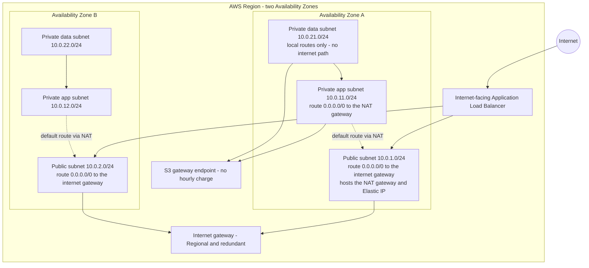
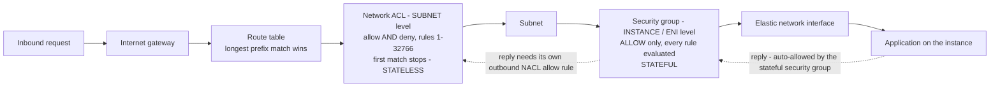
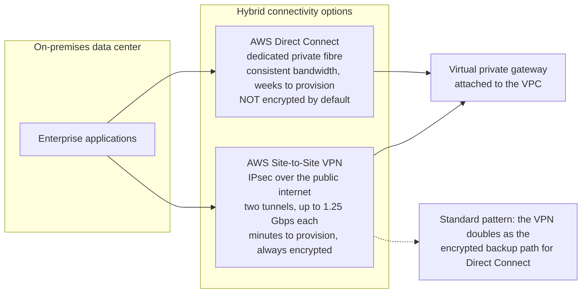
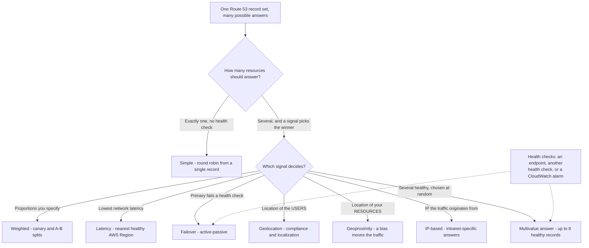
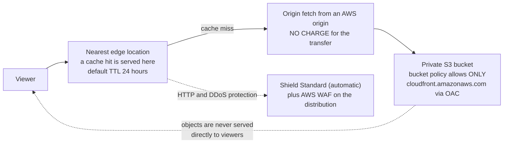
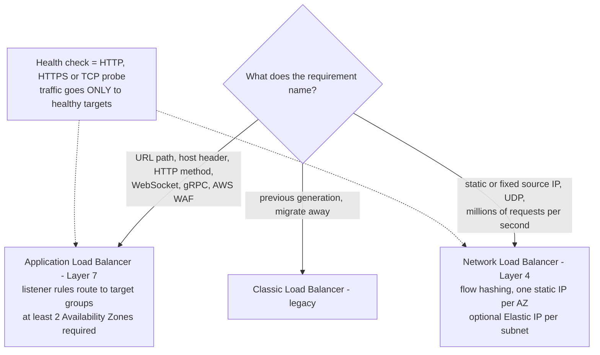
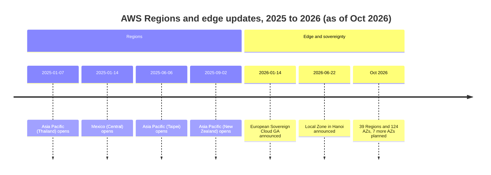

# Networking, Content Delivery and Hybrid Connectivity

Domain 3 (**Cloud Technology and Services**) carries **34% of the scored content** on CLF-C02, and its task 3.5 — *"Identify AWS network services"* — is the most mechanical block of knowledge on the exam. Everything in it is a definition plus a rule: a subnet lives in exactly one Availability Zone, a public subnet is a **routing decision** rather than a checkbox, a NAT gateway is **outbound-only**, a security group is **stateful** while a network ACL is **stateless**, VPC peering is **not transitive**, and Direct Connect is **dedicated with consistent bandwidth**. Add task 3.3's *"purposes of load balancers"*, task 3.2's **edge locations**, and you have a lesson where nearly every question has exactly one defensible answer — provided you memorised the rules instead of the marketing.

```text
====================================================================
 CLF-C02 DOMAIN 3 (part) — NETWORKING LESSON CARD (as of Oct 2026)
====================================================================
 VPC         free · CIDR /16 - /28 · one default VPC per Region
 SUBNET      lives in exactly ONE AZ · public IFF the route table
             routes to an internet gateway (there is no checkbox)
 ROUTE TBL   destination -> target, one per subnet, LONGEST
             PREFIX MATCH wins
 IGW         horizontally scaled, redundant, REGIONAL; attaching
             does nothing until 0.0.0.0/0 -> igw-xxx is added
 NAT GW      OUTBOUND-ONLY for private subnets; public NAT sits
             in a public subnet with an Elastic IP
             $0.045/hour + $0.045/GB (US East Ohio)
 EIP         static public IPv4, charged IN USE OR IDLE
             $0.005/hour -> $3.65/month per IP
 DEFAULT VPC one public subnet per AZ + IGW routed + DNS on
---------------------------------------------------------------------
 SECURITY    security group = INSTANCE / ENI, ALLOW only, STATEFUL,
             all rules evaluated, default: in from itself, out all
             network ACL  = SUBNET, allow AND deny, STATELESS,
             rules 1-32766 lowest first, first match stops,
             default: allow all both ways
             both $0; neither filters DNS, DHCP, IMDS, Time Sync
---------------------------------------------------------------------
 CONNECT     2 VPCs ............... peering (1:1, NOT transitive, $0)
             many VPCs + on-prem ... Transit Gateway ($0.05/attach/h)
             S3 / DynamoDB only .... gateway endpoint ($0)
             any AWS service ....... interface endpoint / PrivateLink
                                     ($0.01/h per AZ + $0.01/GB)
             on-prem, consistent ... Direct Connect (dedicated fibre)
             on-prem, quick ........ Site-to-Site VPN (IPsec, 2 tunnels)
---------------------------------------------------------------------
 DNS         Route 53 = registration + routing + health checks
             hosted zone = record container (public / private VPC)
             8 policies: simple, weighted, latency, failover,
             geolocation, geoproximity, IP-based, multivalue (<= 8)
             zone $0.50/mo first 25 · queries $0.40/million
             alias to AWS targets $0 · CNAME cannot sit at the apex
---------------------------------------------------------------------
 EDGE        CloudFront = cache HTTP(S) at edge locations
             default TTL 24 h, min 0 s · origin fetch from AWS free
             private S3 + OAC (OAI is legacy) · WAF + Shield Standard
             ALB = L7, host/path rules, WAF, >= 2 AZs, $0.0225/h
             NLB = L4, static IP per AZ, no WAF, $0.0225/h
             Global Accelerator = 2 static anycast IPs, NO caching
====================================================================
```

> [!NOTE]
> **Scope discipline.** Every service taught here as examinable is either on the CLF-C02 **in-scope "Networking and Content Delivery" row** (Amazon CloudFront, AWS Direct Connect, AWS Global Accelerator, AWS PrivateLink, Amazon Route 53, AWS Transit Gateway, Amazon VPC, AWS VPN / Site-to-Site VPN / Client VPN) or named in a Domain 3 task statement (network ACLs, security groups, Amazon Inspector, load balancers, edge locations). **Amazon API Gateway** sits on the same row but is covered where it belongs in the API lesson; **Amazon VPC Lattice, AWS Cloud Map, AWS Network Access Analyzer and AWS Ground Station** are on the guide's **out-of-scope** list and appear only as distractors.

In this lesson you will:

- name every **VPC component** — subnets, route tables, internet gateways, NAT gateways, Elastic IPs, elastic network interfaces;
- decide **public versus private** from the route table alone, and explain why **NAT is outbound-only**;
- separate the **default VPC** from a custom VPC and know when AWS tells you to build your own;
- win **security group versus network ACL** on every axis: scope, rule action, state, evaluation, defaults and referencing;
- apply the **non-transitive peering rule** and the no-edge-to-edge rule;
- choose **gateway endpoint vs interface endpoint vs PrivateLink** — including the free one;
- separate **Site-to-Site VPN from Direct Connect** on provisioning time, bandwidth consistency and encryption;
- use **Route 53** hosted zones, all eight routing policies and health checks;
- put **CloudFront** in front of a private S3 origin with **Origin Access Control**;
- pick **ALB over NLB**, and know why the Classic Load Balancer is the *"previous generation"*;
- state the **Global Accelerator** one-liner and the four-way edge choice;
- audit the **idle-cost traps**: NAT gateways, Elastic IPs, disabled accelerators, Direct Connect ports;
- study **four AWS-published case studies**, then practise with **12 exam-style questions** plus four interactive checks.

---

## 1. The VPC: an isolated network you design

### 1.1 The component set

Amazon VPC is a *"logically isolated virtual network"* that you define inside a Region, and AWS states there is **no additional charge for using a VPC** (as of Oct 2026). Task 3.5 asks you only to **identify the components** — but the exam's wording assumes you know exactly what each component does.

| Component | What it is | The exam rule |
|---|---|---|
| **VPC** | Your isolated network, one per Region per account plus a **default VPC** | CIDR blocks from **/16 to /28**; creating one is **free** |
| **Subnet** | A CIDR range **inside exactly one Availability Zone** | Public or private is decided by the **route table**, never by a checkbox |
| **Route table** | An ordered list of destination CIDR → target routes | One associated per subnet (the **main** table by default); **longest prefix match** wins |
| **Internet gateway (IGW)** | A redundant, **horizontally scaled, Regional** entry and exit point | Attaching it does **nothing** until you add `0.0.0.0/0 → igw-xxx` |
| **NAT gateway** | Outbound-only internet for resources in **private** subnets | A public NAT lives in a **public subnet** and owns an **Elastic IP** |
| **Elastic IP (EIP)** | A static public IPv4 address you can remap | Charged **in use *and* idle** — $0.005/hour, so **$3.65/month per IP** (as of Oct 2026) |
| **Elastic network interface (ENI)** | The virtual NIC attached to an instance or VPC service | This is what a **security group** attaches to, hence *"instance-scoped"* |
| **VPC flow logs** | Metadata records of allowed and rejected traffic | Captures **metadata, not payload** |
| **Amazon-provided DNS resolver** | The VPC's built-in resolver | Know that it exists; the specific resolver address is not exam material |

### 1.2 Public versus private is a routing decision

A subnet has no *"public"* attribute. It is **public if and only if its route table carries a route to an internet gateway**; otherwise it is private. That single sentence answers more CLF-C02 items than any other networking fact, because it dissolves three related traps at once:

- attaching an IGW to the VPC does **not** make any subnet public — you still need the route;
- a private subnet **with** a route to a NAT gateway is still **private** — NAT gives it *outbound* internet, not inbound;
- a public subnet with no instances holding public IPv4 addresses is still public — it simply has nothing to route out.



> [!NOTE]
> **Read the diagram as a rule set.** The data subnets have **no route to either an internet gateway or a NAT gateway** — that is precisely what makes them unreachable from the internet. The app subnets have exactly **one outbound path**, the NAT gateway. The public subnets are public purely because of the `0.0.0.0/0 → igw` route in *their own* route table.

### 1.3 The NAT gateway is outbound-only

AWS is explicit about the direction: with a NAT gateway in place, *"external services can't initiate a connection"* with your private instances. A private instance can therefore **pull operating-system updates, download packages and call AWS APIs**, while nothing on the internet can reach in to it. If a question needs **inbound** internet traffic to a private workload, the answer is an **internet-facing load balancer** (or a genuinely public instance) — never *"open the NAT gateway"*.

The cost shape matters too (US East Ohio, as of Oct 2026; verify current before use): **$0.045 per hour** plus **$0.045 per GB** processed, billed in one-hour increments for partial hours, and a **regional NAT gateway is deployed per Availability Zone** — so a two-AZ design pays the hourly charge twice.

### 1.4 The default VPC versus a custom VPC

AWS creates a **default VPC in every Region**, and it is ready to launch into:

| Default VPC behaviour | What it gives you |
|---|---|
| Subnets | **One public subnet per Availability Zone** |
| Internet | **IGW attached and already routed** — instances receive public IPv4 automatically |
| DNS | **DNS resolution enabled** |
| Security | **Default security group** (inbound only from itself, outbound allow all) |
| ACL | **Default network ACL** (allow all, both directions) |

That convenience is exactly why AWS recommends a **custom VPC for production**: only in a custom VPC do you choose the CIDR, decide which subnets are private, control the routes and decide what is exposed. On the exam, *"launch into the default VPC"* is a prototyping answer, never an architecture answer.

- **📚 Did you know?** **Public IPv4 addresses cost money even when idle** — $0.005 per hour in use *or* unused, which is **$3.65 per month per address** across a 730-hour month (as of Oct 2026; verify current before use). **Private IPv4 addresses are never charged**, and the Free Tier includes **750 hours per month of public IPv4 with Amazon EC2**. Four forgotten, unattached Elastic IPs therefore cost roughly **$14.60 per month for absolutely nothing** — a line item the exam loves to disguise inside a cost-optimization question.

### 1.5 Example E1 — the three-tier VPC, end to end

**Scenario.** A web application must be reachable from the internet, must call out to the internet for updates, and must hold a database that is never directly reachable. Design it the way the exam expects.

| Step | Decision | Why (exam rule) |
|---|---|---|
| 1 | VPC `10.0.0.0/16`, two AZs | VPCs are Regional; AZs provide fault isolation |
| 2 | Public `10.0.1.0/24` and `10.0.2.0/24` | One subnet per AZ, each with `0.0.0.0/0 → igw` |
| 3 | Private app `10.0.11.0/24` and `10.0.12.0/24` | Each with `0.0.0.0/0 → nat-xxx` — outbound only |
| 4 | Private data `10.0.21.0/24` and `10.0.22.0/24` | **Local routes only** — no internet gateway route, no NAT route |
| 5 | Internet-facing **ALB** in the public subnets | The only sanctioned inbound path to the private tiers |
| 6 | NAT gateway plus Elastic IP in a public subnet | Outbound access for the app tier |
| 7 | Security groups chained **by reference**: ALB SG → app SG → DB SG | Tiers trust each other, never hard-coded CIDRs |
| 8 | Network ACLs left permissive, or given one explicit deny for a bad CIDR | The NACL is the subnet-level deny tool |

### 1.6 Example E2 — the NAT bill

A two-AZ design runs **two NAT gateways for 730 hours**, egresses **500 GB through NAT processing**, and sends a further **500 GB out to the internet** at $0.09 per GB (as of Oct 2026; verify current before use):

$$
2 \times 730 \times 0.045 = 65.70, \quad 500 \times 0.045 = 22.50, \quad 500 \times 0.09 = 45.00
$$

$$
\text{Total} = 65.70 + 22.50 + 45.00 = \$133.20 \text{ per month}
$$

The lesson is not the arithmetic, it is the **three separate charges**: hourly, NAT processing per GB, and internet data transfer out. Any option that quotes a single-charge total is testing whether you noticed all three.

---

## 2. Security groups versus network ACLs — the classic item

Task 3.5 says *"Understanding security in a VPC (network ACLs, security groups, Amazon Inspector)"*. The security-group-versus-NACL comparison is the most reliable networking question on CLF-C02, and it is decided on seven axes.

| Characteristic | **Security group** | **Network ACL** |
|---|---|---|
| Scope | **Instance / ENI level** (it attaches to the network interface) | **Subnet level** (one per subnet) |
| Rule action | **Allow only — no deny rules** | **Allow *and* deny** |
| State | **Stateful** — return traffic is automatically allowed | **Stateless** — return traffic must be allowed by an explicit rule |
| Evaluation | **All rules evaluated**; allow if any match | Rules numbered **1–32766**, lowest first, **first match stops** |
| Referencing | Can reference **other security groups** | Cannot reference security groups; works with CIDRs |
| Default | Inbound **only from itself**; **outbound allow all** | **Allow all** inbound and outbound |
| Charge | **$0** | **$0** |

Two consequences follow from the *state* row alone. With a **stateful** security group you open 443 inbound and the replies flow back untouched. With a **stateless** NACL you must **also** allow the ephemeral return ports, or the connection never completes — the classic *"my NACL broke my application"* failure.

### 2.1 The packet walk



> [!WARNING]
> **Neither device filters everything.** Security groups and network ACLs do **not** filter Amazon DNS, DHCP, the **instance metadata service (169.254.169.254)** or Time Sync — those bypass them by design. Any option that says *"block the metadata endpoint with a security group"* is automatically wrong; the correct control lives at the **instance level** (the IMDS options, such as requiring IMDSv2 tokens) or at the IAM layer.

### 2.2 Defaults are permissive, not secure

- The **default security group** allows all outbound and inbound **only from itself** — usable, but not a security posture.
- The **default network ACL** allows **all** traffic in and out.

And the rule students forget most often: **security groups cannot deny**. If a question demands that you block one partner CIDR regardless of what instance rules permit, the answer is a **network ACL deny rule** (or an IAM / bucket-policy deny) — never *"add a deny rule to the security group"*.

### 2.3 Example E3 — deny one CIDR, subnet-wide

**Scenario.** The partner network `203.0.113.0/24` must be blocked from reaching an entire subnet immediately, without touching a single instance.

| Option | Works? | Why |
|---|---|---|
| Inbound **deny** in the security group | **No** | Security groups have **no deny rules** |
| **NACL** rule numbered `100`, `DENY 203.0.113.0/24` | **Yes** | Subnet-scoped, stateless, first match stops — rule 100 beats the default allow-all |
| Revoke the security group's `0.0.0.0/0` inbound | Partially | Also blocks everybody else; not the requested behaviour |
| AWS WAF rule | Wrong layer | WAF is **Layer 7** attached to a load balancer or similar resource — it does not filter raw subnet traffic |

```fillblank
{
  "question": "Complete the VPC vocabulary statements with the correct AWS terms:",
  "template": "A subnet is public only when its route table carries a route to an {{1}}. A NAT gateway gives a private subnet {{2}}-only internet access. A security group is {{3}} and can never contain a deny rule, while a network ACL is {{4}}, is scoped to a {{5}}, and evaluates its numbered rules lowest first until the first match stops.",
  "answers": {
    "1": "internet gateway",
    "2": "outbound",
    "3": "stateful",
    "4": "stateless",
    "5": "subnet"
  },
  "distractors": ["virtual private gateway", "inbound", "connectionless", "availability zone", "elastic network interface", "edge location", "interface endpoint", "route processor"],
  "explanation": "Public versus private is a routing decision: the route to an internet gateway is what makes a subnet public. NAT gateways are outbound-only. Security groups are stateful and allow-only; network ACLs are stateless, allow-and-deny, and subnet-scoped with lowest-number-first, first-match evaluation."
}
```

- **📚 Did you know?** A security group rule can **reference another security group** instead of an IP range — that is how the tiered pattern in Example E1 works with zero hard-coded CIDRs, and why moving an application tier to a new subnet requires **no rule edits at all**. Network ACLs, by contrast, are subnet-bound and IP-based by nature. Both remain **free of charge** (as of Oct 2026; per-account and per-VPC quotas apply — verify current before use).

---

## 3. VPC peering: pairwise, never transitive

**VPC peering** is a private network connection between two VPCs that lets instances in one behave *"as if they were in the same network"*. AWS is unusually blunt about its limits, and those limits are the exam.

| Peering fact | Detail |
|---|---|
| Topology | A strict **one-to-one relationship** — **transitive peering relationships are not supported** |
| Direction | Fully **bidirectional** *within* a pair (A↔B works in both directions) |
| Edge-to-edge | Resources in VPC B **cannot** use VPC A's internet gateway, NAT gateway, VPN, Direct Connect or gateway endpoint |
| Overlapping CIDR | **Not allowed** — the two VPCs must have non-overlapping address ranges |
| Cost | **No charge to create** a peering connection; same-AZ data transfer free, **cross-AZ $0.01/GB** (as of Oct 2026; verify current before use) |
| MTU | **9001 bytes**; **8500 bytes** for inter-Region peering |
| Pending requests | Expire after **7 days** if they are not accepted |
| What it is not | *"Neither a gateway nor a VPN connection"* |

### 3.1 Example E4 — the peering trap

**Scenario.** VPC **A** is peered to VPC **B**, and VPC **A** is also peered to VPC **C**. A new service in **B** must reach a service in **C**.

```text
   B  <---- peering ---->  A  <---- peering ---->  C
        B reaches A               A reaches C
        ...but B does NOT reach C   (peering is not transitive)
```

| Proposed fix | Verdict |
|---|---|
| *"Traffic will flow because A is in the middle"* | **Wrong** — A does not route between its peers; it is not a router |
| *"Add a route to A's route table pointing B at C"* | **Wrong** — A's routes never become B's or C's routes |
| *"B can use A's internet gateway to reach C"* | **Wrong** — **no edge-to-edge**; a peer can never borrow your IGW, NAT, VPN, Direct Connect or gateway endpoint |
| Create a **third peering connection** B↔C | **Correct at small scale** (three VPCs) |
| Attach both to **AWS Transit Gateway** | **Correct at scale** — a hub with route tables, explicitly built to *"interconnect… VPCs and on-premises networks"* |

**Transit Gateway** is charged per attachment (**$0.05 per attachment-hour ≈ $36.50/month**) plus **$0.02 per GB processed**, with an MTU of **8500 bytes** (as of Oct 2026; verify current before use). Six attachments plus 1 TB of processing works out to:

$$
6 \times 0.05 \times 730 + 1024 \times 0.02 = 219.00 + 20.48 = \$239.48 \text{ per month}
$$

Peering is free but pairwise; the hub costs money but scales. *"How do these VPCs talk?"* is answered by **counting them**: two → peering, many plus on-premises → Transit Gateway.

- **📚 Did you know?** Peering has no hourly charge but is not free of **data transfer** charges: same-AZ traffic through a peering connection is free, while **cross-AZ traffic is $0.01 per GB** (as of Oct 2026; verify current before use). A *"free peering"* option in a cost question is therefore only half true — and an unaccepted peering request **silently expires after 7 days**, which is exactly the kind of operational detail AWS likes to bury in a distractor.

---

## 4. VPC endpoints and PrivateLink: reaching AWS without the internet

An AWS service you reach through the public internet needs a NAT gateway or an internet gateway. A **VPC endpoint** gives your VPC a private path to the service instead — and the two endpoint types differ on precisely the axes the exam asks about.

| | **Gateway VPC endpoint** | **Interface endpoint (AWS PrivateLink)** |
|---|---|---|
| Services | **Amazon S3 and Amazon DynamoDB only** | Essentially **any AWS service**, plus partner and your own services |
| Mechanism | A route added to your route table (a prefix list) | An **elastic network interface per subnet** in each AZ |
| Needs IGW / NAT? | **No** — works with no internet gateway and no NAT device | No |
| Charge | **$0 hourly and $0 per GB** | **$0.01 per hour per AZ** + **$0.01 per GB processed** |
| Reach | **VPC-local only** — cannot serve on-premises networks, other-Region peers or Transit Gateway traffic | Cross-account and cross-Region friendly; the provider must front the service with a **load balancer** |
| Quota | **20 per Region, 255 per VPC** (verify current before use) | **20 per Region** by default (verify current before use) |
| Best for | *"Cut my NAT bill for S3 traffic"* | Exposing a service privately, or reaching any non-S3/DynamoDB service |

**AWS PrivateLink** is the technology behind interface endpoints: consumers reach a provider's service *"as if they were in your VPC"*, traffic never leaves the AWS network, and consumers cannot see each other. Note the boundary: **PrivateLink exposes a *service*, not a whole VPC** — for whole-VPC connectivity the answer is still **peering** or **Transit Gateway**.

### 4.1 Example E5 — gateway versus interface endpoint arithmetic

A workload in **three Availability Zones** processes **200 GB per month** to Amazon S3.

$$
\text{Interface endpoint} = 3 \times 730 \times 0.01 + 200 \times 0.01 = 21.90 + 2.00 = \$23.90 \text{ per month}
$$

$$
\text{Gateway endpoint for S3} = \$0.00 \text{ per month}
$$

Same destination, same traffic: **$23.90 versus nothing** (as of Oct 2026; verify current before use). That gap is the entire exam point — if the service is **S3 or DynamoDB**, the gateway endpoint is the default answer, and *"create an interface endpoint to reach S3"* is the distractor.

### 4.2 Example E6 — the private-subnet S3 pattern

**Scenario.** Instances in a private subnet must read objects from a bucket: no public IP, no NAT gateway, no internet path.

1. Create a **gateway VPC endpoint** for S3 in the VPC.
2. Accept the route it adds to the subnet's route table (the prefix-list route).
3. Scope an **endpoint policy** to exactly what is needed, for example `s3:GetObject`.
4. Leave the bucket private — the traffic never leaves the Amazon network.

**Result:** zero hourly charge, zero per-GB charge, no NAT gateway to pay for, and no inbound exposure. This is the canonical *"reduce NAT costs"* answer.

### 4.3 Scenario — the SaaS provider's private service

A provider wants to sell one internal microservice to several customer accounts without publishing it to the internet.

| Party | What they build |
|---|---|
| **Provider (account P)** | An **NLB** in front of the service, published as a **PrivateLink endpoint service**; consumers are granted access explicitly |
| **Consumers (accounts A and B)** | One **interface endpoint** each, inside their own VPCs |
| **Result** | Traffic stays on the AWS network, consumers cannot see each other, and the provider never exposes a public endpoint |

Contrast on the exam: **a public API** → API Gateway; **whole VPCs talking to each other** → peering or Transit Gateway; **one service, privately, many accounts** → PrivateLink.

---

## 5. Hybrid connectivity: Site-to-Site VPN versus Direct Connect

Task 3.5 names the pair directly: *"Identifying network connectivity options to AWS (AWS VPN, AWS Direct Connect)"*. One is fast and encrypted over the internet; the other is dedicated, consistent and **not encrypted by default**.

| | **AWS Direct Connect** | **AWS Site-to-Site VPN** |
|---|---|---|
| Medium | **Dedicated private fibre** — it works by *"bypassing internet service providers in your network path"* | **IP Security (IPsec) tunnels over the public internet** |
| Provisioning | **Weeks** (a physical port must be provisioned) | **Minutes** |
| Bandwidth | **Consistent**, from 50 Mbps up to 100 Gbps port speeds | **Best effort**; **up to 1.25 Gbps per tunnel** |
| Encryption | **Not encrypted by default** — it is a private circuit, and MACsec is optional | **Always encrypted** — IPsec is the point of the connection |
| Redundancy | Port pairs and multiple locations | **Two VPN tunnels per connection**, with automatic failover |
| Recurring charge (as of Oct 2026) | **$0.30/h (1 Gbps), $2.25/h (10 Gbps), $22.50/h (100 Gbps), $85.00/h (400 Gbps)** dedicated; hosted ports from **$0.03/h (50 Mbps)** | **$0.05/hour per connection ≈ $36.50/month** |
| Best for | Steady, high-volume hybrid workloads and replication where latency must be predictable | Quick start, burst traffic, branch offices — and the **encrypted backup path for a Direct Connect link** |

Related in-scope options: **AWS Client VPN** for individual remote users (managed OpenVPN), and **AWS VPN CloudHub** for hub-and-spoke routing among several Site-to-Site VPN connections. **AWS Transit Gateway** is the answer when the requirement is *many* VPCs **and** on-premises networks inside one hub.



### 5.1 Example E7 — DX versus VPN, the price of consistency

For a full 730-hour month (as of Oct 2026; verify current before use):

| Option | Arithmetic | Monthly |
|---|---|---|
| **10 Gbps dedicated Direct Connect port** | $2.25 × 730 | **$1,642.50** |
| **One Site-to-Site VPN connection** | $0.05 × 730 | **$36.50** |
| Ratio | $1,642.50 ÷ $36.50 | **≈ 45×** |

Neither number is *"the right answer"* by itself. The exam wants you to read the **requirement**: *"dedicated private connection with consistent bandwidth"* → **Direct Connect**; *"encrypted tunnel, established quickly"* → **Site-to-Site VPN**; *"laptop"* → **Client VPN**; *"many VPCs plus on-premises"* → **Transit Gateway**.

> [!IMPORTANT]
> **The encryption trap runs in both directions.** Students assume *"private means encrypted"*, so they mark Direct Connect as encrypted — it is **not encrypted by default**. And they assume *"over the internet means insecure"*, so they mark Site-to-Site VPN as unencrypted — it **always is IPsec**. Read the requirement's verb: *consistent bandwidth* selects Direct Connect, *encrypted* selects the VPN.

```matching
{
  "question": "Match each connectivity requirement to the AWS option the exam expects:",
  "pairs": [
    {"left": "Two VPCs must talk privately with no hourly charge", "right": "VPC peering - pairwise, not transitive, free to create, $0.01/GB across AZs"},
    {"left": "Many VPCs plus on-premises networks inside one hub", "right": "AWS Transit Gateway - $0.05 per attachment-hour plus $0.02 per GB processed"},
    {"left": "A private subnet reaching Amazon S3 with no NAT bill", "right": "Gateway VPC endpoint - S3 and DynamoDB only, $0 hourly and $0 per GB"},
    {"left": "One internal service exposed privately to several accounts", "right": "AWS PrivateLink interface endpoint - $0.01 per hour per AZ plus $0.01 per GB"},
    {"left": "Branch offices needing an encrypted link within minutes", "right": "AWS Site-to-Site VPN - IPsec over the internet, two tunnels, $0.05 per hour"},
    {"left": "A data center needing consistent bandwidth on a private circuit", "right": "AWS Direct Connect - dedicated fibre, weeks to provision, NOT encrypted by default"},
    {"left": "Individual remote laptops needing managed remote access", "right": "AWS Client VPN - managed OpenVPN for individual users"}
  ],
  "explanation": "Read the scale of the requirement first: two whole VPCs means peering, many VPCs plus on-premises means Transit Gateway, one private service means an endpoint (free gateway endpoint for S3 and DynamoDB, paid interface endpoint / PrivateLink for everything else). For the hybrid links, minutes and encryption means Site-to-Site VPN, a private dedicated circuit with consistent bandwidth means Direct Connect, and a single laptop means Client VPN."
}
```

- **📚 Did you know?** Every Site-to-Site VPN connection offers **two VPN tunnels**, which is why *"configure both tunnels"* is the standard high-availability answer — AWS documents the per-tunnel ceiling as **up to 1.25 Gbps**, so a single tunnel is never sold as a guaranteed 1.25 Gbps of application throughput (as of Oct 2026; verify current before use). Direct Connect ports, meanwhile, **bill whether or not traffic flows**: an idle 10 Gbps port still costs about **$1,642.50 per month**.

---

## 6. Amazon Route 53: DNS, hosted zones, routing policies and health checks

Task 3.5 says only *"Understanding the purpose of Amazon Route 53"* — but AWS defines that purpose as **three functions in one service**: a highly available, scalable **Domain Name System (DNS) web service**, **domain name registration**, and **health checking**.

### 6.1 Hosted zones

A **hosted zone** is a container for records.

| Type | What it routes | Charge (as of Oct 2026; verify current before use) |
|---|---|---|
| **Public hosted zone** | Records resolvable **on the internet** | **$0.50/month for the first 25**, then $0.10 each; 10,000 records included, extra records **$0.0015/month** each |
| **Private hosted zone** | Records resolvable **within one or more VPCs** | Zone price as above; **queries inside the VPC are free** |

Two record rules are exam staples: a **CNAME cannot sit at the zone apex** (the root of the domain) while an **alias record can**, and alias records that point at AWS targets — load balancers, CloudFront distributions, S3 website endpoints — incur **no charge for the queries**.

Standard query pricing, if you need it (as of Oct 2026; verify current before use): **$0.40 per million** standard queries, **$0.60 per million** for latency, **$0.70 per million** for geolocation and geoproximity, **$0.80 per million** for IP-based routing.

### 6.2 The eight routing policies

| Policy | The trigger phrase in the stem | What it does |
|---|---|---|
| **Simple** | *"one resource"*, no health check | Plain round-robin answers from a single record |
| **Weighted** | *"in the proportions that you specify"* | Canary releases and A/B splits by percentage |
| **Latency** | *"multiple AWS Regions"*, **best latency** | Sends each user to the Region with the lowest network latency |
| **Failover** | *"**active-passive** failover"* | Primary answered until its **health check** fails, then the secondary |
| **Geolocation** | the location of your **users** | Localization and compliance by user country, continent or region |
| **Geoproximity** | the location of your **resources**, with a **bias** | A numeric bias grows or shrinks the area each resource serves |
| **IP-based** | the **IP address the traffic originates from** | Different answers for different source networks (intranet-specific) |
| **Multivalue answer** | *"up to eight healthy records"*, returned **at random** | A lightweight, DNS-level alternative to a load balancer |



```matching
{
  "question": "Match each Route 53 routing policy to the trigger phrase that signals it on the exam:",
  "pairs": [
    {"left": "Simple routing", "right": "One resource and no health check - round-robin answers from a single record"},
    {"left": "Weighted routing", "right": "In the proportions that you specify - canary releases and A/B splits"},
    {"left": "Latency routing", "right": "The AWS Region that gives your users the lowest network latency"},
    {"left": "Failover routing", "right": "Active-passive failover driven by a health check on the primary endpoint"},
    {"left": "Geolocation routing", "right": "The location of your USERS - compliance and localization"},
    {"left": "Geoproximity routing", "right": "The location of your RESOURCES, with a bias that moves traffic"},
    {"left": "IP-based routing", "right": "The IP address the traffic originates from - intranet-specific answers"},
    {"left": "Multivalue answer routing", "right": "Up to eight healthy records returned at random - a DNS-level load balancer"}
  ],
  "explanation": "Route 53 publishes eight routing policies. Read the stem for the trigger: proportions means weighted, best latency means latency, active-passive means failover plus a health check, users means geolocation, resources and bias means geoproximity, source IP means IP-based, up to eight healthy means multivalue, and one resource means simple."
}
```

### 6.3 Health checks drive failover

A **Route 53 health check** monitors *"the health and performance of your resources"* and can be pointed at **an endpoint, another health check, or a CloudWatch alarm**. Its two exam jobs: drive **DNS failover** and filter **multivalue answer** records so that only healthy ones are returned.

Charging (as of Oct 2026; verify current before use): the **first 50 AWS-endpoint health checks are free**, then **$0.50 per month** for AWS endpoints or **$0.75 per month** for non-AWS endpoints — while checks against **Elastic Load Balancing endpoints and S3 website endpoints are free and automatic**.

> [!WARNING]
> **DNS failover is not instant.** A DNS answer is **cached for its TTL**, so a failover driven only by Route 53 health checks takes effect only as fast as the cached record expires. When a question demands **sub-second** failover, or wording such as *"without waiting on DNS TTL"* for a TCP or UDP workload, the expected answer is **AWS Global Accelerator** or an **Elastic Load Balancing** health check — not Route 53 alone.

### 6.4 Example E8 — the global storefront

**Scenario.** A storefront needs low latency worldwide, a private S3 origin, EU data residency and a disaster-recovery path.

| Requirement | Route 53 / edge choice |
|---|---|
| Private origin behind a CDN | **CloudFront** distribution in front of a **private S3 bucket** with **OAC** |
| Send EU users to the EU | **Geolocation routing** |
| Automatic DR when the primary origin fails | **Failover routing** plus a **health check** on the primary |
| Free DNS queries at the apex | **Alias A record** pointing at the CloudFront distribution (alias to AWS targets is **$0**) |
| Protect the HTTP layer | **AWS WAF** on the distribution, with **Shield Standard** already active |

- **📚 Did you know?** **Multivalue answer routing returns up to eight healthy records at random** — a detail AWS states explicitly, and the reason the policy is sometimes described as a poor person's load balancer. It still cannot do what a real load balancer does: no cross-zone balancing logic, no connection draining, no Layer 7 rules. When the stem mentions **path-based routing or health-checked target groups**, the answer is Elastic Load Balancing, not Route 53.

---

## 7. Amazon CloudFront and edge locations

Task 3.2 names **edge locations** and the **benefits of edge locations**. CloudFront is built on a *"worldwide network of data centers called edge locations"*: the nearest edge location serves a cached copy, which produces **lower latency, higher data-transfer rates and better reliability** for viewers.

| Concept | Exam-depth detail |
|---|---|
| **Origin** | Amazon S3, or a **custom origin** — EC2, an Application Load Balancing endpoint, your HTTP server, or an S3 *website* endpoint |
| **Caching** | Default **TTL of 24 hours**, minimum **0 seconds**; **invalidation** purges early — **1,000 paths per month free**, then **$0.005 per path** |
| **Origin fetch** | Transfer from origin to CloudFront is **always free when using AWS origins** (as of Oct 2026) — the *edge* download is what you are billed for |
| **Private content** | **Signed URL = one object**; **signed cookie = several objects** |
| **Private S3 pattern** | Bucket stays **private** + **Origin Access Control (OAC)** + a bucket policy allowing only `cloudfront.amazonaws.com` — AWS says *"We recommend that you use OAC"*. **OAI is the legacy option** |
| **Free allowance** | **1 TB of data transfer out + 10,000,000 HTTP(S) requests + 2,000,000 CloudFront Functions per month** (as of Oct 2026; verify current before use) |
| **DDoS synergy** | **Shield Standard** is automatic in front of CloudFront, and **AWS WAF** can be attached to the distribution — HTTP protection and DDoS protection arrive with the CDN, not after it |
| **Price classes** | **All locations / 200 / 100** — restrict delivery to cheaper regions |
| **Edge count** | *"Hundreds"* of edge locations worldwide; AWS publishes no single verifiable figure, so **verify current before use** |

### 7.1 The private S3 pattern, and the two wrong versions



| Version | Verdict |
|---|---|
| **Public bucket** so CloudFront can read it | **Wrong** — anyone can bypass the CDN and read the objects |
| **OAC** plus a bucket policy naming `cloudfront.amazonaws.com`, ideally conditioned on the distribution ARN | **Correct** — the bucket stays private and viewers must go through CloudFront |
| **OAI** (Origin Access Identity) | **Legacy** — no new Regions after January 2023 and no SSE-KMS support; keep it only to maintain an existing setup |

### 7.2 Example E9 — the CloudFront bill

A site delivers **2 TB (2,048 GB)** and **30 million HTTPS requests** in a month from the United States (as of Oct 2026; verify current before use). The free allowance absorbs **1 TB** and **10,000,000 requests**:

$$
\text{Data transfer} = (2048 - 1024) \times 0.085 = 1024 \times 0.085 = \$87.04
$$

$$
\text{Requests} = \frac{30{,}000{,}000 - 10{,}000{,}000}{10{,}000} \times 0.0100 = 2{,}000 \times 0.0100 = \$20.00
$$

$$
\text{Total} = 87.04 + 20.00 = \$107.04 \text{ per month}
$$

Note what is **not** in that bill: **origin fetches from S3 are $0**, and the first **1,000 invalidation paths** are free. The recurring exam line is that CloudFront in front of S3 **saves** money on the origin side while charging at the edge.

- **📚 Did you know?** CloudFront prices **HTTPS requests separately from HTTP** — $0.0100 versus $0.0075 per 10,000 requests after the free allowance (as of Oct 2026; verify current before use). For 20 million post-free-tier requests that difference alone is **$5.00 per month**, which makes *"force HTTPS"* simultaneously a security answer and a pricing observation. And because origin fetches are free with AWS origins, an origin that is already an S3 bucket never charges you twice for the same bytes.

---

## 8. Elastic Load Balancing: ALB versus NLB

Task 3.3 requires *"Identifying the purposes of load balancers"*. AWS's own definition of that purpose is one sentence with two halves: a load balancer distributes traffic across targets in **at least one Availability Zone** and routes traffic **only to the healthy targets**.

| | **Application Load Balancer (ALB)** | **Network Load Balancer (NLB)** | **Classic Load Balancer (CLB)** |
|---|---|---|---|
| OSI layer | **Layer 7** — *"functions at the application layer, the seventh layer"* | **Layer 4** — *"functions at the fourth layer"* | Layer 4 and Layer 7 (legacy) |
| Protocols | HTTP, HTTPS, WebSocket, gRPC | TCP, UDP, TLS | HTTP, HTTPS, TCP |
| Routing | **Listener rules** on host, path and method → target groups | **Flow hashing** on the connection tuple | Round robin / least outstanding requests |
| Addresses | A DNS name with **rotating node IPs** | **One static IP per Availability Zone**, plus an optional **Elastic IP per subnet** | Node IPs behind a DNS name |
| Availability Zones | **At least 2 enabled AZs required**; cross-zone on by default | Multiple recommended; cross-zone **off by default** | Recommended |
| AWS WAF | **Yes** | No | No |
| Throughput profile | General web workloads | **Millions of requests per second** | — |
| Charge (as of Oct 2026) | **$0.0225/hour + $0.008 per LCU-hour** (1 LCU = 25 new connections/s, 3,000 active connections/min, 1 GB/hour; **first 10 rules free**) | **$0.0225/hour + $0.006 per NLCU-hour** (1 TCP NLCU = 800 new connections/s, 100,000 active connections/min) | The Free Tier shares **750 hours/month** with the ALB |
| Status | Default choice for web applications | Static IPs, extreme performance, UDP/TLS | AWS calls it *"the previous generation"* — migrate |

Three rules decide most ELB questions:

1. **"URL path" / "host header" / "HTTP method" / "AWS WAF"** → **ALB**.
2. **"Static or fixed source IP" / "UDP" / "millions of requests per second"** → **NLB**.
3. **"Previous generation" / "migrate"** → **Classic Load Balancer**.

And one counter-intuitive fact: **both internet-facing and internal load balancers reach their targets over private IP addresses** (as of Oct 2026). *"Internet-facing"* describes the load balancer's own endpoint, not the path to your instances — so a multi-tier design is internet-facing ALB → web tier → **internal** ALB → application tier.

### 8.1 Example E10 — ALB versus NLB arithmetic

For a full 730-hour month (as of Oct 2026; verify current before use):

| Load balancer | Base | Capacity units | Total |
|---|---|---|---|
| **ALB** | 730 × $0.0225 = $16.43 | 3 LCUs × 730 × $0.008 = $17.52 | **$33.95/month** |
| **NLB** | 730 × $0.0225 = $16.43 | 1 NLCU × 730 × $0.006 = $4.38 | **$20.81/month** |

The NLB is cheaper here — but a cheaper bill is never the answer to *"which load balancer do I need?"*. Choose by **capability first** (Layer 7 rules and WAF → ALB; static IPs and UDP → NLB), then read the bill.



```dragdrop
{
  "question": "Order these connectivity options from the narrowest private-service access to the widest hybrid connection:",
  "items": [
    "Gateway VPC endpoint - S3 and DynamoDB only, no hourly charge",
    "Interface endpoint (PrivateLink) - any AWS or partner service, hourly plus per GB",
    "VPC peering - two whole VPCs, pairwise, not transitive",
    "AWS Transit Gateway - many VPCs plus on-premises, charged per attachment",
    "AWS Site-to-Site VPN - encrypted link over the internet, ready in minutes",
    "AWS Direct Connect - dedicated private fibre with consistent bandwidth"
  ],
  "correctOrder": [
    "Gateway VPC endpoint - S3 and DynamoDB only, no hourly charge",
    "Interface endpoint (PrivateLink) - any AWS or partner service, hourly plus per GB",
    "VPC peering - two whole VPCs, pairwise, not transitive",
    "AWS Transit Gateway - many VPCs plus on-premises, charged per attachment",
    "AWS Site-to-Site VPN - encrypted link over the internet, ready in minutes",
    "AWS Direct Connect - dedicated private fibre with consistent bandwidth"
  ],
  "explanation": "The ladder starts at a single private service inside one VPC (free gateway endpoint), widens to any service (paid interface endpoint), then to whole VPCs (peering), then to many VPCs plus on-premises networks (Transit Gateway), and finally to the two hybrid links: the VPN for speed and encryption, Direct Connect for a dedicated, consistent-bandwidth production path."
}
```

- **📚 Did you know?** An **Elastic Load Balancing DNS entry has a TTL of 60 seconds**, which is why replacing an entire fleet behind a load balancer propagates in about a minute rather than instantly — a rare case where the exam expects you to know that **DNS, not the load balancer, is the slow part**. Separately, **the ALB requires at least two enabled Availability Zones** (as of Oct 2026), so an ALB inside a single-AZ VPC is an invalid configuration by design, not a cost saving.

---

## 9. AWS Global Accelerator and the four-way edge choice

**The one-liner to memorise:** Global Accelerator gives you **two static anycast IPv4 addresses** announced from AWS edge locations, then carries TCP and UDP traffic over the **AWS global network** to the nearest **healthy regional endpoint** — an ALB, NLB, EC2 instance or Elastic IP. It is a **fixed entry point with fast failover and no caching**, built for **non-cacheable** TCP/UDP workloads such as gaming, IoT and VoIP.

| | **Amazon CloudFront** | **AWS Global Accelerator** | **Amazon Route 53** | **Elastic Load Balancing** |
|---|---|---|---|---|
| Layer of the job | **Caches HTTP(S) objects at the edge** | **Static anycast IPs plus backbone routing** | **DNS name → IP translation** | **Regional fan-out to healthy targets** |
| Caching | **Yes** — that is the whole point | **No caching at all** | No | No |
| Addresses | The distribution domain name | **Two static IPv4 addresses** (four dual-stack) | Hosted zone records | A DNS name with rotating node IPs |
| Failover speed | Cache and origin behaviour | **Sub-second, with no DNS TTL wait** | Depends on the **record TTL** | Health checks every few seconds |
| Charge (as of Oct 2026) | Pay per GB and per request, with a generous free tier | **$0.025/hour — billed even when disabled** — plus per-GB data transfer, and each static IP is **$0.005/hour** | Hosted zone plus query charges | Hourly plus capacity units |

### 9.1 Example E11 — the disabled accelerator still bills

An accelerator is created, tested, then **disabled** for a full 730-hour month with **zero traffic** (as of Oct 2026; verify current before use):

$$
\text{Accelerator} = 0.025 \times 730 = \$18.25, \qquad \text{Two static IPs} = 2 \times 0.005 \times 730 = \$7.30
$$

$$
\text{Total with zero traffic} = 18.25 + 7.30 = \$25.55 \text{ per month}
$$

Two exam habits come out of this: **"disabled" does not mean "free"**, and **any static address — Elastic IP or Global Accelerator IP — is an ongoing charge**. Paired with Example E2's NAT gateway and Example E7's idle Direct Connect port, these form the exam's *idle-resource* trap family.

- **📚 Did you know?** The four-way choice collapses to one question: **does the client need a cache or a fixed IP?** Cacheable web content → **CloudFront**; a fixed IP for non-cacheable TCP/UDP → **Global Accelerator**; a human-readable name → **Route 53**; spreading a regional workload across targets by health → **Elastic Load Balancing**. Global Accelerator's per-GB data-transfer premium varies by Region and edge, and AWS publishes the accelerator hourly rate but not a single flat per-GB figure — treat any specific per-GB Global Accelerator number as **unverified**.

---

## 10. Network cost: what is free and what quietly bills you

Half of Domain 3's pricing questions concern services that are **free by design**, and the other half concern resources that **bill while idle**.

| Free (as of Oct 2026) | Bills (as of Oct 2026; verify current before use) |
|---|---|
| Creating and using a **VPC**, **subnets**, **route tables** | **NAT gateway**: $0.045/h + $0.045/GB |
| **Security groups** and **network ACLs** | **Public IPv4 / Elastic IP**: $0.005/h **in use or idle** |
| **Creating** a VPC peering connection | Peering **cross-AZ data transfer**: $0.01/GB |
| **Gateway VPC endpoints** ($0/h, $0/GB) | **Interface endpoints**: $0.01/h per AZ + $0.01/GB |
| **Private hosted zone queries** and **alias queries to AWS targets** | **Transit Gateway**: $0.05/attachment-hour + $0.02/GB |
| **CloudFront origin fetches** from AWS origins | **Site-to-Site VPN**: $0.05/h ≈ $36.50/month |
| **First 50 AWS-endpoint health checks**; ELB and S3-website checks | **Direct Connect ports** — billed at zero traffic |
| **First 1,000 CloudFront invalidation paths** per month | **Global Accelerator** — billed even when **disabled** |
| **First 1 TB plus 10,000,000 requests** on CloudFront per month | **ALB and NLB** hourly charges plus capacity units |

The trap family is consistent: a question describes a **quiet, unused, or deleted-but-still-attached** resource and asks for the monthly impact. The pattern to memorise is:

```text
resource that holds an IP address        -> charged whether used or not
resource with an hourly port/attachment  -> charged whether used or not
resource flagged "disabled"              -> usually STILL charged
traffic that crosses AZs or leaves AWS   -> charged per GB
```

> [!NOTE]
> **Never quote a price without a date.** Every figure in this lesson is stamped **as of Oct 2026** and must be **verified current before use** — AWS changes NAT, IPv4, Route 53, CloudFront, ELB and Direct Connect pricing on its own schedule, and the exam tests *which resource bills*, not your memory of the exact cent.

---

## 11. 2026 updates that touch networking, edge and data transfer

### 2026 Updates (as of October 2026)

> [!NOTE]
> **Sourced changes behind this lesson's numbers.** Every item is quoted from an AWS page accessed **Oct 2026** — re-open the same page before you rely on the figure, because all of them drift:
> - **The network keeps growing.** *"The AWS Cloud spans 124 Availability Zones within 39 Geographic Regions, with announced plans for 7 more Availability Zones and 2 more AWS Regions in the Kingdom of Saudi Arabia, and Chile."* Four Regions opened during 2025: Asia Pacific (Thailand) `ap-southeast-7` on **2025-01-07**, Mexico (Central) `mx-central-1` on **2025-01-14**, Asia Pacific (Taipei) `ap-east-2` on **2025-06-06**, Asia Pacific (New Zealand) `ap-southeast-6` on **2025-09-02** *(AWS Regions and Availability Zones map; Region documentation history)*.
> - **The AWS European Sovereign Cloud (`eusc-de-east-1`) had general availability announced on 2026-01-14**, but it does **not** appear on the public Region count page — so quote *"39 Regions / 124 AZs as of Oct 2026"* and date the sovereign cloud separately instead of folding it into the total *(AWS News Blog, 2026-01-14; Regions map)*.
> - **Edge grows downward, not just outward.** AWS Local Zones are advertised as **"30+ locations across six continents"**, with the **New York City** Local Zone GA on **2025-01-08** and a **Hanoi** Local Zone announced on **2026-06-22**. Scope check: **AWS Wavelength is explicitly out of scope** and **AWS Local Zones appears in neither the in-scope nor the out-of-scope list**, so a Domain 3 *edge* question still expects **CloudFront edge locations** *(Local Zones product page; What's New 2025-01-08; AWS Weekly Roundup 2026-06-22; exam-guide service lists)*.
> - **Free egress is three mechanisms, not one.** **100 GB per month** of data transfer out is free from AWS Regions, plus a **separate 1 TB per month** free through Amazon CloudFront — a **2021** change (effective 2021-12-01) that is still current as of Oct 2026. A customer *leaving* AWS instead gets an **approval-based move-off credit** with **90 days** to complete the move *(EC2 data-transfer FAQ; AWS News Blog, 2021)*.
> - **The in-scope networking list was rebuilt.** **AWS PrivateLink, AWS Transit Gateway, AWS Site-to-Site VPN and AWS Client VPN** were all **added** since the launch-era `Version 1.0` guide, while **AWS Network Firewall**, AWS Data Exchange and Amazon MSK moved to the **out-of-scope** list — in-scope entries **128 → 111**, out-of-scope **11 → 55** *(in-scope / out-of-scope service lists, accessed Oct 2026)*.
> - **Data transfer is still examinable.** The current guide dropped the launch-era *"Data transfer charges"* knowledge bullet from Task 4.1, yet the skills list still requires *"Understanding incoming data transfer costs and outgoing data transfer costs (for example, from one AWS Region to another Region, within the same Region)"* *(launch-era versus current exam guide, accessed Oct 2026)*.



- **📚 Did you know?** The **100 GB per month** free data-transfer-out allowance is routinely described in newer prep material as a 2025 Free Tier change — it is not. AWS published it in **2021** (effective 2021-12-01) and it is still current as of **Oct 2026**; the genuinely new mechanism is the *approval-based move-off credit* with a **90-day** window for customers migrating away from AWS entirely. Three different numbers — **100 GB out of a Region**, **1 TB through CloudFront**, **90 days to leave** — describe three different rules, and only the first two are monthly allowances.

---

## Real-World Case Studies

AWS publishes what these patterns look like in production. Every figure below is **customer- or AWS-claimed and unaudited**, quoted with its source so you can check it — the examinable point is the **pattern** (which edge service was chosen, which data-transfer charge was engineered away, which failover was automated), not the marketing number.

### Case A — Amazon Prime Video, Thursday Night Football: six Regions and an edge CDN

| Element | Detail |
|---|---|
| **Industry / context** | Live sports streaming, where *"reliability and low latency are absolutely critical because every lost second negatively impacts viewers"* (BA Winston, global head of digital video playback and delivery, Amazon Video) |
| **AWS services named** | **Six AWS Regions**, **Amazon CloudFront**, AWS Elemental MediaTailor, Amazon DynamoDB, Amazon EC2, **multi-AZ and regional failover** |
| **Headline outcomes (AWS-published)** | **11 NFL games streamed to 18.4 million fans in 224 countries and territories** during the 2017 NFL regular season; DynamoDB partitions were **doubled from the console** ahead of ad-break spikes; broadcasts were sent *"through six AWS Regions and AWS Elemental"* |
| **Networking lesson** | **Edge delivery plus a multi-Region origin plus health-checked failover**: CloudFront ends the viewer's long journey at an edge location while load-balancer and DNS health checks protect the origin behind it |
| **Source** | aws.amazon.com/solutions/case-studies/amazon-prime-video (accessed Oct 2026) |

*Exam lesson:* the question is never *"how many fans"* — it is **which service did the delivery work**. When the stem is about **caching objects near global viewers**, the answer is **CloudFront edge locations**; when it is about **the origin surviving a Regional failure**, the answer is **multi-AZ plus multi-Region with health checks**. Live video that **cannot** be cached belongs to the same family — that is where **Global Accelerator** (static IPs, no caching) earns its one-liner.

### Case B — Box: $2.23 million found in the data-transfer bill

| Element | Detail |
|---|---|
| **Industry / context** | Enterprise SaaS serving 120,000+ organizations; the brief was to improve spend efficiency *"without hurting security, reliability or performance"* |
| **AWS services named** | **Well-Architected Framework** reviews with Solutions Architects, **S3 and S3 Glacier tiering**, EBS volume and snapshot hygiene, CloudTrail event filtering, and **routing traffic around internet gateways** to avoid needless data-transfer charges |
| **Headline outcomes (AWS-published, customer-claimed)** | **$2.23 million in savings**, decomposed as **$438,000 inter-AZ**, **over $1.1 million per year in egress**, **over $500,000 per year in storage**, and **$192,000 per year in logging** |
| **Networking lesson** | **Data transfer is an architecture decision**: inter-AZ movement and internet egress are per-GB charges that a routing change — keep the traffic in one AZ, keep it off the internet path — removes permanently |
| **Source** | aws.amazon.com/solutions/case-studies/box-case-study (accessed Oct 2026) |

*Exam lesson:* Box's two networking lines, **$438,000 of inter-AZ transfer** and **$1.1 million of egress**, are the same arithmetic as Example E2's NAT bill and Example E9's CloudFront bill, just at enterprise scale. The pattern: **keep traffic inside an Availability Zone where possible, use a gateway endpoint instead of NAT for S3, and let CloudFront absorb the public egress** — its origin fetches are free with AWS origins.

### Case C — Capital One: Route 53 failover and automated Regional recovery

| Element | Detail |
|---|---|
| **Industry / context** | Fortune 100 bank moving from periodic disaster-recovery tests to systems that *"automatically prevent, detect, and recover"* |
| **AWS services named** | **Automated Regional failover**, **Amazon Route 53**, Amazon CloudWatch, a central recovery hub, monthly **AWS GameDay** exercises and chaos engineering |
| **Headline outcomes (AWS-published)** | **Reducing critical-severity events by 80–90 percent**; recovery time cut **from hours to minutes** across thousands of components, restored in dependency order; quarterly cross-Region tests became **monthly chaos experiments** |
| **Networking lesson** | **DNS health checks plus failover routing are the visible half of a multi-Region design**: Route 53 watches the primary endpoint and answers with the secondary once the health check fails, while the Regional endpoints behind it are pre-provisioned — the switch is a routing change, not a rebuild |
| **Source** | aws.amazon.com/solutions/case-studies/capital-one-improving-resilience-case-study (accessed Oct 2026) |

*Exam lesson:* when the stem says **the primary fails its health check and the secondary must answer**, the answer is **Route 53 failover routing plus a health check** (Section 6.2), and the case is what that looks like at enterprise scale. Two qualifiers travel with it: **multi-Region protects a Region, multi-AZ protects an AZ** — they are different requirements; and because a DNS answer is **cached for its TTL**, *"recovery in minutes"* is a designed outcome, not a DNS-failover instant. When a stem demands **sub-second** failover, the answer is still **Global Accelerator** or an **Elastic Load Balancing** health check (Section 6.3).

### Case D — athenahealth: hundreds of VPCs behind one Transit Gateway hub

| Element | Detail |
|---|---|
| **Industry / context** | Healthcare software (HIPAA-sensitive) where egress monitoring was spread across a sprawling VPC estate and inspection cost kept rising |
| **AWS services named** | **AWS Transit Gateway**, **AWS Direct Connect**, **AWS Network Firewall** (centralized), **AWS RAM** policy fan-out to accounts, AWS CloudFormation rules-as-code, AWS Shield on the roadmap |
| **Headline outcomes (AWS-published)** | *"By moving to a centralized deployment model on AWS, the company reduced its overall inspection costs by 95 percent"*; firewall policy added to **hundreds of VPCs across 120 accounts "within just a few days"**; *"Just eight people designed and rolled out the new security design with no disruptions."* |
| **Networking lesson** | **A hub beats a mesh**: Transit Gateway interconnects the VPCs and the on-premises link, so one inspection point is attached and governed once instead of being cloned per VPC — exactly the *"many VPCs plus on-premises → Transit Gateway"* rule of Section 3 |
| **Source** | aws.amazon.com/solutions/case-studies/athenahealth-case-study (accessed Oct 2026) |

*Exam lesson:* **a case study's service list is not the exam's in-scope list.** The names on this page include **AWS Network Firewall**, which now sits on the CLF-C02 **out-of-scope** list (as of Oct 2026), so it can only appear as a distractor — while the same paragraph names **Transit Gateway** and **Direct Connect**, both squarely in scope. Read the paragraph for the *pattern* (centralize the hub, fan out one policy), then answer only with in-scope services.

- **📚 Did you know?** The current exam guide **added** four networking services that the launch-era V1.0 guide did not list — **AWS PrivateLink, AWS Transit Gateway, AWS Site-to-Site VPN and AWS Client VPN** — and **moved AWS Network Firewall out** to the out-of-scope list (in-scope and out-of-scope service lists, accessed Oct 2026). Revision notes written before those lists were rebuilt will tell you the opposite, which is why the guide you download *today* is the only authority on what is examinable.

### What the two cases share

| Value pattern | Evidence | Underlying networking principle |
|---|---|---|
| The edge does the distance work | Prime Video: **18.4 M fans, 224 countries**, CloudFront | **Edge locations** shorten the last mile while the origin stays authoritative |
| Failover is designed, not hoped for | Prime Video: six Regions, multi-AZ plus regional failover | Health checks plus routing give **active-passive** (Route 53 failover) or **active-active** (latency and multivalue) |
| Data transfer is a first-class cost line | Box: **$438 K inter-AZ plus $1.1 M egress** | AZ boundaries and internet gateways are **billed edges** |
| Architecture beats discounting | Box: a Well-Architected review before any commitment pricing | The networking layer is the **free** lever; commitments are the paid one |

### What cases C and D add

| Value pattern | Evidence | Underlying networking principle |
|---|---|---|
| Failover is a designed, testable control | Capital One: **critical-severity events −80–90%**, recovery **hours → minutes** | **Route 53 failover routing plus a health check**, with endpoints pre-provisioned in a second Region |
| Hub-and-spoke beats a mesh at account scale | athenahealth: **hundreds of VPCs, 120 accounts, one central model** | **Transit Gateway** interconnects where peering cannot (non-transitive), and one policy fans out once |
| Dedication is a requirement word | athenahealth: **Direct Connect** alongside the hub | *Consistent bandwidth / dedicated* selects **Direct Connect**; *encrypted / minutes* selects **Site-to-Site VPN** |
| Case services ≠ exam scope | athenahealth names **AWS Network Firewall** | Answer only with **in-scope** names — out-of-scope services are distractors even when AWS uses them |

> [!WARNING]
> **How to read case-study numbers on exam day:** every figure above is a **customer-claimed, unaudited** number published by AWS — never an AWS guarantee, and *"up to"* is a **ceiling**, never an average. A case never licenses an out-of-scope answer: you are asked to **select the in-scope service** (CloudFront, Route 53, Elastic Load Balancing, VPC, Direct Connect, Global Accelerator, Transit Gateway, PrivateLink), not the case-study-only service that happens to appear in the paragraph. Note also that **Amazon VPC Lattice, AWS Cloud Map, AWS Network Access Analyzer and AWS Ground Station** sit on the guide's **out-of-scope** list — they are distractors.

---

## Practice Questions

```question
{
  "id": "clf-08-q1",
  "type": "multiple-choice",
  "question": "Which statement about security groups and network ACLs is correct?",
  "options": [
    "Security groups are stateless and scoped to a subnet, while network ACLs are stateful and scoped to an instance",
    "Security groups are stateful, allow-only and scoped to the network interface, while network ACLs are stateless, allow-and-deny and scoped to the subnet",
    "Both are stateful, both are scoped to the subnet, and both support deny rules",
    "Security groups support deny rules and evaluate rules lowest-numbered first, while network ACLs do not"
  ],
  "correct": 1,
  "explanation": "A security group attaches to an elastic network interface (instance scope), is STATEFUL so replies are auto-allowed, contains allow rules only, and evaluates every rule. A network ACL applies at the SUBNET level, is STATELESS so return traffic needs an explicit allow, supports both allow and deny, and evaluates numbered rules 1-32766 lowest first until the first match stops. Both default to permissive and both are free."
}
```

```question
{
  "id": "clf-08-q2",
  "type": "multiple-choice",
  "question": "Instances in a private subnet must download operating-system patches, but nothing on the internet must be able to reach those instances. Which design meets the requirement?",
  "options": [
    "Attach an internet gateway to the VPC and add a 0.0.0.0/0 route to the internet gateway in the private subnet's route table",
    "Place a NAT gateway with an Elastic IP in a public subnet and point the private subnet's 0.0.0.0/0 route at it, giving outbound-only access",
    "Assign public IPv4 addresses to the instances and open port 22 in their security group",
    "Peer the private VPC with a third VPC that has internet access, using edge-to-edge routing"
  ],
  "correct": 1,
  "explanation": "A NAT gateway is outbound-only: external services cannot initiate a connection with the private instances, while the instances can still reach the internet. Adding an internet gateway route would make the subnet public, assigning public IPv4 addresses exposes the instances, and peering never grants edge-to-edge access - a peer cannot borrow another VPC's internet gateway."
}
```

```question
{
  "id": "clf-08-q3",
  "type": "multiple-choice",
  "question": "VPC A is peered with VPC B, and VPC A is also peered with VPC C. A service in VPC B must reach a service in VPC C. Which statement is correct?",
  "options": [
    "Traffic flows automatically, because VPC peering is transitive by default",
    "Peering is not transitive - you must create a direct B-to-C peering connection, or use AWS Transit Gateway when many VPCs are involved",
    "Adding a route to VPC A's route table makes VPC A a router between B and C",
    "VPC B can use VPC A's internet gateway to reach VPC C, because peering allows edge-to-edge routing"
  ],
  "correct": 1,
  "explanation": "AWS documents peering as a strict one-to-one relationship: transitive peering relationships are not supported, and edge-to-edge routing is blocked, so resources in one peer cannot use another peer's internet gateway, NAT gateway, VPN, Direct Connect or gateway endpoint. A third peering connection works at small scale; AWS Transit Gateway is the hub answer at scale."
}
```

```question
{
  "id": "clf-08-q4",
  "type": "multiple-choice",
  "question": "A private subnet must read objects from Amazon S3 with no internet gateway, no NAT gateway and no public IP addresses, at zero hourly and zero per-GB endpoint charge. Which option fits?",
  "options": [
    "An interface endpoint (AWS PrivateLink) for Amazon S3 in each Availability Zone",
    "A gateway VPC endpoint for Amazon S3, whose route is added to the subnet's route table, with no hourly charge and no per-GB charge",
    "A NAT gateway in the public subnet plus an internet gateway route",
    "A VPC peering connection with a VPC that already has internet access"
  ],
  "correct": 1,
  "explanation": "Gateway VPC endpoints are available only for Amazon S3 and Amazon DynamoDB, require no internet gateway or NAT device, and cost nothing hourly or per GB. Interface endpoints charge roughly $0.01 per hour per Availability Zone plus $0.01 per GB processed, NAT gateways add both an hourly and a per-GB charge, and peering never provides edge-to-edge internet access."
}
```

```question
{
  "id": "clf-08-q5",
  "type": "multiple-choice",
  "question": "A financial workload requires a dedicated private connection to an on-premises data center with consistent bandwidth, bypassing internet service providers in the network path. Which service should the architect select?",
  "options": [
    "AWS Site-to-Site VPN - two IPsec tunnels established over the public internet in minutes",
    "AWS Direct Connect - a dedicated private connection with consistent bandwidth",
    "AWS Client VPN - a managed remote-access VPN for individual users",
    "AWS Transit Gateway - a hub that interconnects VPCs and on-premises networks"
  ],
  "correct": 1,
  "explanation": "Direct Connect is the dedicated private link that bypasses ISPs and provides consistent bandwidth; note that it is NOT encrypted by default. Site-to-Site VPN is the fast, always-encrypted, best-effort option with two tunnels of up to 1.25 Gbps each. Client VPN serves individual laptops, and Transit Gateway is the many-VPC-plus-on-premises hub rather than a dedicated point-to-point circuit."
}
```

```question
{
  "id": "clf-08-q6",
  "type": "multiple-choice",
  "question": "A disaster-recovery design must answer with the primary endpoint while it is healthy and switch to the secondary endpoint the moment the primary fails its health check. Which Route 53 configuration is required?",
  "options": [
    "Latency routing to the AWS Region with the best network performance",
    "Weighted routing that sends a fixed proportion of traffic to the secondary",
    "Failover routing paired with a health check on the primary endpoint",
    "Geolocation routing that redirects users based on their country"
  ],
  "correct": 2,
  "explanation": "Failover routing is the active-passive pattern and it depends on a Route 53 health check, which can watch an endpoint, another health check or a CloudWatch alarm. Latency routing picks the fastest Region, weighted routing splits by the proportions you specify for canary or A/B releases, and geolocation routing answers by user location - none of them switch on health."
}
```

```question
{
  "id": "clf-08-q7",
  "type": "multiple-choice",
  "question": "A team wants Amazon CloudFront to serve objects from an Amazon S3 bucket that must remain private, so viewers can never bypass the CDN. Which configuration does AWS recommend?",
  "options": [
    "Set the bucket ACL to public-read and rely on CloudFront caching to limit exposure",
    "Enable Origin Access Control (OAC) on the distribution and add a bucket policy that allows only cloudfront.amazonaws.com to read the objects",
    "Copy every object into each edge location manually and delete the origin bucket",
    "Attach AWS WAF to the S3 bucket and leave the bucket policy unchanged"
  ],
  "correct": 1,
  "explanation": "AWS recommends Origin Access Control: the bucket stays private, the bucket policy names cloudfront.amazonaws.com as the only principal, ideally conditioned on the distribution ARN, and viewers must fetch through CloudFront. OAI is the legacy alternative, a public bucket lets anyone bypass the CDN, and WAF attaches to the distribution rather than to an S3 bucket."
}
```

```question
{
  "id": "clf-08-q8",
  "type": "multiple-choice",
  "question": "A web application needs host-based and path-based routing, HTTPS termination, AWS WAF protection, and must be spread across at least two Availability Zones. Which load balancer fits?",
  "options": [
    "Network Load Balancer - Layer 4 with flow hashing and a static IP per Availability Zone",
    "Application Load Balancer - Layer 7 listener rules routing to target groups, with WAF support and a minimum of two enabled Availability Zones",
    "Classic Load Balancer - the previous generation that AWS recommends migrating away from",
    "Route 53 multivalue answer routing, which returns up to eight healthy records at random"
  ],
  "correct": 1,
  "explanation": "Only the ALB operates at Layer 7 with listener rules on host and path, supports AWS WAF, and formally requires at least two enabled Availability Zones. The NLB is Layer 4 with no host or path rules and no WAF, the Classic Load Balancer is explicitly called the previous generation, and Route 53 cannot perform target-level health-checked routing for an application."
}
```

```question
{
  "id": "clf-08-q9",
  "type": "multiple-choice",
  "question": "A gaming backend must present a fixed, predictable source IP address to a partner's allow-list and must handle very high volumes of UDP traffic. Which option should be chosen?",
  "options": [
    "An Application Load Balancer, because it fronts HTTP-based services with rotating node IPs behind a DNS name",
    "A Network Load Balancer, which provides one static IP per Availability Zone, an optional Elastic IP per subnet, Layer 4 performance in the millions of requests per second, and UDP support",
    "Amazon CloudFront signed cookies, which pin the origin IP for the lifetime of the cookie",
    "Amazon Route 53 simple routing, which returns a single record and therefore a single address"
  ],
  "correct": 1,
  "explanation": "Static or fixed source IPs plus UDP are the Network Load Balancer signature: Layer 4, flow hashing, one static IP per Availability Zone and optional Elastic IPs per subnet, at millions of requests per second. ALB node IPs rotate behind its DNS name and it does not support UDP, CloudFront is a caching CDN with no static client-facing IP contract, and simple routing gives no health checking."
}
```

```question
{
  "id": "clf-08-q10",
  "type": "multiple-choice",
  "question": "As of Oct 2026, a design runs two NAT gateways for a full 730-hour month in US East (Ohio) at $0.045 per hour, processes 500 GB through NAT at $0.045 per GB, and sends a further 500 GB to the internet at $0.09 per GB. What is the approximate monthly total?",
  "options": [
    "$65.70 - only the two hourly charges are billed",
    "$88.20 - hourly charges plus NAT processing, but internet egress is free",
    "$110.70 - hourly charges plus internet egress, but NAT processing is free",
    "$133.20 - hourly charges plus NAT processing plus internet data transfer out"
  ],
  "correct": 3,
  "explanation": "There are three separate charges: 2 x 730 x $0.045 = $65.70 hourly, 500 x $0.045 = $22.50 NAT processing, and 500 x $0.09 = $45.00 internet data transfer out, giving $133.20 per month. Options offering a single-charge total are testing whether you noticed that a NAT gateway bills by the hour AND per GB, and that leaving AWS still costs per GB."
}
```

```question
{
  "id": "clf-08-q11",
  "type": "multiple-choice",
  "question": "As of Oct 2026, a workload in a standard AWS Region sends a total of 120 GB to the internet in one month, and none of that traffic goes through Amazon CloudFront. Which statement is correct?",
  "options": [
    "All 120 GB is free, because AWS provides unlimited free data transfer out from every Region",
    "The first 100 GB of data transfer out per month is free and the remaining 20 GB is billed at the standard data-transfer-out rate",
    "All 120 GB is free as long as the account also uses Amazon CloudFront somewhere else in the architecture",
    "Nothing is free: the monthly free data-transfer-out allowance only applies to accounts that are closing"
  ],
  "correct": 1,
  "explanation": "AWS gives 100 GB per month of free data transfer out from AWS Regions, and the excess 20 GB is billed - a change effective 2021-12-01 that is still current as of Oct 2026. Amazon CloudFront has a separate and larger allowance of 1 TB per month that applies only to traffic that actually flows through CloudFront, not to Region egress. The approval-based move-off credit with a 90-day window is a different mechanism for customers leaving AWS entirely, not a monthly allowance."
}
```

```question
{
  "id": "clf-08-q12",
  "type": "multiple-choice",
  "question": "A healthcare company runs hundreds of VPCs across 120 accounts and needs one hub that interconnects them with each other and with an on-premises data center over a dedicated link with consistent bandwidth. Which pair of CLF-C02 in-scope services delivers that design?",
  "options": [
    "A full mesh of VPC peering connections plus a NAT gateway to carry the on-premises traffic",
    "AWS Transit Gateway for the many VPCs plus AWS Direct Connect for the dedicated on-premises link",
    "AWS Site-to-Site VPN alone plus AWS PrivateLink for whole-VPC connectivity between accounts",
    "Amazon CloudFront plus Amazon Route 53 geolocation routing to place the traffic"
  ],
  "correct": 1,
  "explanation": "Peering is a strict one-to-one, non-transitive relationship, so a mesh of peerings is exactly what AWS built Transit Gateway ($0.05 per attachment-hour plus $0.02 per GB processed) to replace when many VPCs and on-premises networks meet in one hub. Direct Connect is the dedicated private circuit with consistent bandwidth - weeks to provision and NOT encrypted by default. Site-to-Site VPN is encrypted and fast to build but is a best-effort internet tunnel rather than a dedicated link, PrivateLink exposes a single service rather than whole VPCs, and CloudFront plus Route 53 are edge and DNS services, not VPC interconnect. Note that the real athenahealth case also used AWS Network Firewall, which sits on the out-of-scope list as of Oct 2026 and can only appear as a distractor."
}
```

> [!IMPORTANT]
> **Comparative Verdict — networking and content delivery × on-premises × other clouds × DIY/managed**
> - **Versus on-premises:** on premises you buy the whole plane yourself — routers, switches, firewalls, load-balancer appliances, a VPN concentrator, a CDN contract, plus the cabling, the HA pairs, the capacity planning and the spare-hardware budget. AWS gives you a **logically isolated VPC for free**, **security groups and NACLs at no charge**, a **free gateway endpoint to S3**, **DNS with eight routing policies for $0.50 per hosted zone per month**, **free Shield Standard DDoS protection in front of CloudFront**, and **load balancers billed by the hour and the capacity unit instead of by appliance**. The trade is that you stop owning the physical layer and inherit AWS's half of shared responsibility — you still design the subnets, the routes, the rules and the failover.
> - **Versus other clouds:** every major provider offers a virtual network, a CDN, a DNS service and hybrid links, so the examinable differences are AWS's *specific* vocabulary and rules — **public means "route to an internet gateway"**, **NAT is outbound-only**, **security group stateful versus NACL stateless**, **peering is non-transitive with no edge-to-edge**, **gateway endpoints are S3/DynamoDB only and free**, **Direct Connect is not encrypted by default while Site-to-Site VPN always is**, **OAC is recommended and OAI is legacy**, and **the ALB needs two AZs** (all as of Oct 2026). Do not assume another provider's defaults, naming or pricing transfer to AWS.
> - **Versus DIY / build-it-yourself:** hand-rolled load balancing means running a reverse-proxy fleet with your own health checks and no static-IP option; hand-rolled DNS failover means writing your own TTL-observer and still waiting on the TTL; hand-rolled edge caching means buying servers in every city; hand-rolled encryption over your WAN means managing IPsec key exchange yourself. The Well-Architected answer is consistently **managed and least-operational-overhead**: **CloudFront instead of a self-hosted cache**, **Route 53 health checks instead of a cron job**, **ALB/NLB instead of a proxy cluster**, **Direct Connect or Site-to-Site VPN instead of a DIY tunnel**, and **a gateway endpoint instead of paying for NAT to reach S3** — with the **architecture choice (free) tried before any commitment pricing (paid)**.

> [!WARNING]
> **Exam-day traps for this lesson:**
> - **Public versus private is a route-table decision** — a subnet is public only if it routes to an internet gateway; attaching an IGW changes nothing by itself;
> - **NAT gateway is outbound-only** — inbound internet to a private workload needs an **internet-facing load balancer** (or a public instance), never the NAT;
> - **Default VPC = one public subnet per AZ, IGW attached and routed, DNS on** — yet AWS recommends a **custom VPC for production**;
> - **Security group = instance/ENI, allow-only, stateful, all rules evaluated**; **NACL = subnet, allow-and-deny, stateless, rules 1–32766 first match stops**;
> - **Neither SGs nor NACLs filter DNS, DHCP, IMDS (169.254.169.254) or Time Sync** — *"block the metadata endpoint with a security group"* is always wrong;
> - **Security groups cannot deny** — need a deny? That is a **network ACL** rule, or an IAM/bucket-policy deny;
> - **Peering is not transitive and has no edge-to-edge** — a peer cannot borrow your IGW, NAT, VPN, Direct Connect or gateway endpoint; two VPCs → peering, many plus on-premises → **Transit Gateway**;
> - **Gateway endpoint = S3/DynamoDB only, free, VPC-local**; **interface endpoint = hourly plus per GB, and the provider needs a load balancer**; **PrivateLink exposes a service, not a whole VPC**;
> - **Direct Connect is NOT encrypted by default; Site-to-Site VPN always is** — the two halves of the usual *"private means encrypted"* trap;
> - **Site-to-Site VPN = two tunnels, up to 1.25 Gbps each** — *"configure both tunnels"* is the standard HA answer, and the VPN is also the **encrypted backup path for Direct Connect**;
> - **Route 53 word matching**: proportions → **weighted**; best latency → **latency**; active-passive → **failover plus a health check**; users → **geolocation**; resources and bias → **geoproximity**; source IP → **IP-based**; up to 8 healthy → **multivalue**; one resource → **simple**;
> - **A CNAME cannot sit at the zone apex; an alias can**, and **alias queries to AWS targets are free** — DNS failover is cached for the TTL, so it is never instant;
> - **CloudFront caches at edges while the origin stays authoritative** — private S3 plus CloudFront means **OAC plus a bucket policy** (OAI is legacy), origin fetches from AWS origins are **free**, the default TTL is **24 h**, and **1,000 invalidation paths per month are free**;
> - **Global Accelerator is not a CDN** — two static anycast IPs, **no caching**, built for non-cacheable TCP/UDP, and a **disabled accelerator still bills $0.025/hour**;
> - **ALB = L7, host and path rules, WAF, at least 2 AZs**; **NLB = L4, static IP per AZ, millions of requests per second, no WAF**; *"previous generation"* = **Classic Load Balancer**;
> - **Internet-facing *and* internal load balancers both reach targets over private IPs** — *"internet-facing"* describes the load balancer's endpoint, not the path to your instances;
> - **ELB is tested through task 3.3 even though it does not appear in the in-scope service row** — do not skip it;
> - **Idle resources bill**: NAT gateways, Elastic IPs and public IPv4, Direct Connect ports, and disabled accelerators — and every price must be read **as of Oct 2026, verify current before use**;
> - **Case-study numbers are customer-claimed, unaudited ceilings** — never AWS guarantees.

> [!SUCCESS]
> **Key Takeaways:**
> 1. A **VPC is free** (CIDR **/16–/28**), a **subnet lives in exactly one AZ**, and a subnet is **public if and only if its route table routes to an internet gateway** — attaching an IGW does nothing until you add `0.0.0.0/0 → igw`;
> 2. A **NAT gateway is outbound-only**, sits in a **public subnet with an Elastic IP**, and bills **$0.045/h + $0.045/GB**, while **public IPv4 and Elastic IPs bill $0.005/h in use *or* idle ($3.65/month each)** (as of Oct 2026; verify current before use);
> 3. The **default VPC** ships **one public subnet per AZ, an IGW attached and routed, DNS enabled** and permissive defaults — AWS still recommends a **custom VPC for production**;
> 4. **Security group versus NACL**: instance/ENI versus subnet · allow-only versus allow-and-deny · **stateful versus stateless** · all rules versus **rules 1–32766, first match stops** · can reference other SGs versus CIDR-only · default allow-in-from-self and allow-out-all versus **allow-all** — **both free**, and neither filters DNS, DHCP, IMDS or Time Sync;
> 5. **Peering is a strict one-to-one connection**: not transitive, no edge-to-edge, no overlapping CIDRs, **free to create** but **$0.01/GB across AZs**, and pending requests **expire after 7 days** — scale out with **Transit Gateway** ($0.05/attachment-hour + $0.02/GB) instead;
> 6. **Gateway endpoints are S3/DynamoDB only and cost $0**; **interface endpoints / PrivateLink** cost **$0.01/h per AZ + $0.01/GB**, need a provider load balancer, and expose a **service rather than a whole VPC** (three AZs plus 200 GB = **$23.90 vs $0.00** per month, as of Oct 2026);
> 7. **Direct Connect** = dedicated private fibre, **consistent bandwidth**, weeks to provision, **not encrypted by default**; **Site-to-Site VPN** = IPsec over the internet, **two tunnels up to 1.25 Gbps each**, ready in minutes, **always encrypted**, **$0.05/h ≈ $36.50/month** — a 10 Gbps DX port costs about **$1,642.50/month**, roughly **45×** more;
> 8. **Route 53** does three jobs — **registration, DNS routing, health checks** — with **public and private hosted zones**, **eight routing policies** keyed by trigger phrases (proportions → weighted, best latency → latency, active-passive → **failover + health check**, users → geolocation, resources → geoproximity, source IP → IP-based, up to 8 healthy → multivalue, one resource → simple), **free alias queries to AWS targets**, and a **CNAME that cannot sit at the apex**;
> 9. **CloudFront caches at hundreds of edge locations** (default TTL **24 h**, **1 TB + 10,000,000 requests free** per month, **origin fetches free** with AWS origins, **1,000 free invalidations**), protects a private S3 origin with **OAC** (OAI is legacy) and gains **Shield Standard plus AWS WAF** on the distribution;
> 10. **ALB is Layer 7** (host and path rules, WAF, **at least two AZs**, $0.0225/h + $0.008/LCU) and **NLB is Layer 4** (static IP per AZ, UDP, millions of requests per second, no WAF, $0.0225/h + $0.006/NLCU), while **Global Accelerator supplies two static anycast IPs with no caching** — and because **every idle resource bills** (NAT gateways, Elastic IPs, DX ports, even a *disabled* accelerator at $18.25 + $7.30 = **$25.55/month**), the practitioner's habit is to **architect first and commit second**, exactly as Prime Video (**CloudFront, six Regions, 18.4 M fans in 224 countries**) and Box (**$2.23 M, of which $438 K inter-AZ and $1.1 M egress were networking charges**) show — customer-claimed figures that demonstrate the pattern, never an AWS guarantee.
