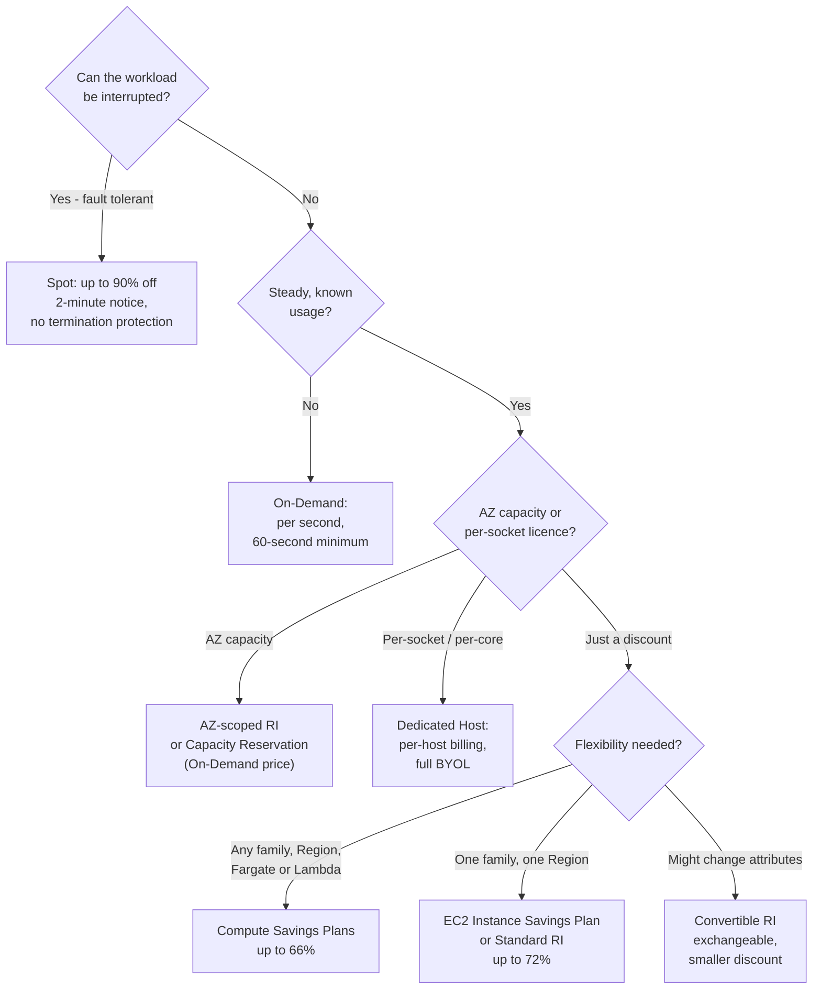
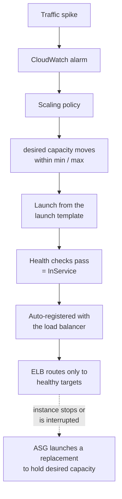
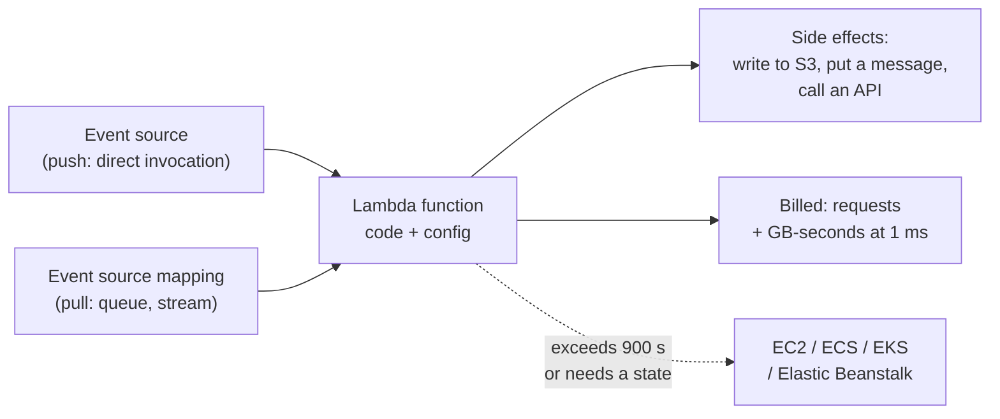
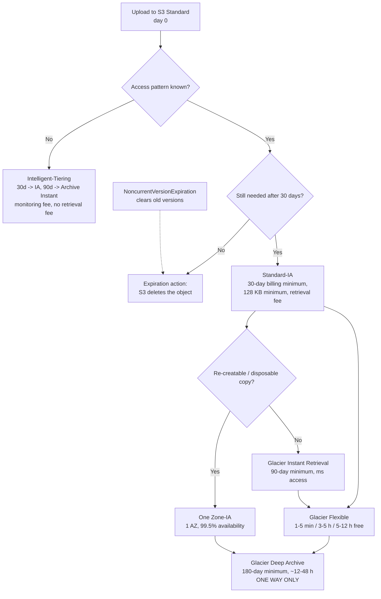
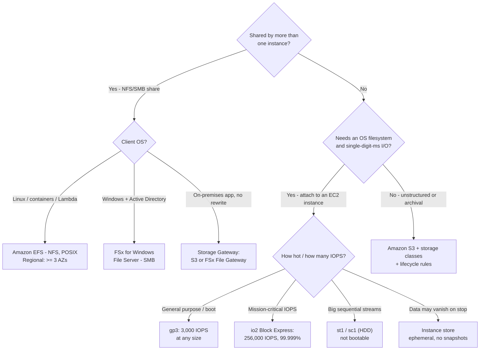

# Compute and Storage Services

**Domain 3 (Cloud Technology and Services) carries 34% of the CLF-C02 score**, and two of its task statements do most of the work: **Task 3.3 "Identify AWS compute services"** and **Task 3.6 "Identify AWS storage services"**. Task 3.3 asks you to recognise instance types, containers, serverless options, that *"auto scaling provides elasticity"* and the purposes of load balancers; Task 3.6 asks you to identify object, block and file services, the differences between S3 storage classes, lifecycle policies and AWS Backup. Add the compute half of **Domain 4 Task 4.1** — the seven purchasing options — and this single lesson covers material that shows up across **two domains**.

```text
====================================================================
 CLF-C02 LESSON 09 — COMPUTE + STORAGE CARD (facts as of Oct 2026)
====================================================================
 COMPUTE
  EC2        virtual server; instance type = the hardware
  NAME       [series][generation][options].[size]
             m7i.4xlarge · c6g.large · r7g.xlarge · t3.micro
  PURCHASE   On-Demand (no commitment, 60 s min)
             Reserved  (1/3 yr, discount, Standard up to 72%)
             Savings   (1/3 yr, $/hr; Compute up to 66%,
                        EC2 Instance up to 72%)
             Spot      (spare capacity, up to 90% off,
                        2-minute interruption notice)
             Dedicated (Host = per host, Instance = per
                        instance + $2/Region)
             Capacity Reservation (AZ room at On-Demand price)
  SCALE      Auto Scaling: min / desired / max, multi-AZ
  LAMBDA     serverless, event-driven, per request + GB-s
             rounded to 1 ms; 128 MB-10,240 MB; max 900 s
  CONTAINERS ECS (AWS-native, $0 fee) · EKS (managed
             Kubernetes, $0.10/cluster/hour) · Fargate
             (serverless, 1-min minimum) · ECR (images)
  PaaS/VPS   Elastic Beanstalk ($0 service charge)
             Lightsail (flat bundles from $3.50/month)
--------------------------------------------------------------------
 STORAGE
  OBJECT     S3: bucket -> object -> key; 11 nines durability;
             max object 50 TB (since 2025-12-02)
  CLASSES    Standard · Intelligent-Tiering · Standard-IA ·
             One Zone-IA · Glacier Instant / Flexible / Deep
  BLOCK      EBS (AZ-bound, gp3 default, snapshots) ·
             instance store (data lost on stop)
  FILE       EFS (NFS, POSIX, multi-AZ) · FSx (SMB/ONTAP/ZFS)
  HYBRID     Storage Gateway (cached file systems) ·
             Snow Family (closed 2025-11-07, EOS 2026-12-31)
  BACKUP     AWS Backup: plans, vaults, Vault Lock = WORM
====================================================================
```

> [!NOTE]
> **Scope discipline.** Every service presented as examinable below sits on the official CLF-C02 in-scope list or in a Domain 3/4 task statement. Two compute services — **AWS Copilot** and **AWS Wavelength** — and one storage service — **Amazon FSx for Lustre** — are explicitly **out of scope** and appear here only so you can eliminate them. The **Snow Family** appears on *neither* list, and **Amazon AppStream 2.0, Amazon WorkSpaces and Amazon WorkSpaces Secure Browser** belong to task 3.8 (virtual desktops), not to our task 3.3.

In this lesson you will:

- decode an **EC2 instance name** into series, generation, silicon and size;
- map the **instance families** (M/T, C, R, I/D, P/G/F) to their exam stems;
- work the **launch checklist**: AMI, instance type, key pair, security group, launch template;
- choose among the **seven purchasing options** with sourced discount percentages;
- run **Auto Scaling** arithmetic on min / desired / max and explain why multi-AZ is the default high-availability answer;
- price a **Lambda** invocation in requests and GB-seconds, and know when Lambda is the wrong answer;
- one-line **ECS, EKS, Fargate, ECR, Batch**, then place **Elastic Beanstalk** and **Lightsail**;
- walk the **S3 storage-class lineup**, versioning, lifecycle, encryption and static hosting;
- choose an **EBS volume type**, explain snapshots, and separate EBS from instance store;
- compare **EFS vs FSx**, place **Storage Gateway**, know the **Snow Family's** status, and use **AWS Backup**;
- decide **S3 vs EBS vs EFS** in one table;
- study **two AWS-published case studies** (NASA JPL and Box);
- practise with **10 exam-style questions** plus three interactive checks.

**October 2026 revision.** Beyond the outline above, this lesson now also carries **five** AWS-published case studies, a sourced **2026 Updates** box, **12** practice questions, **four** interactive checks and **eight** *Did you know?* boxes.

---

## 1. Amazon EC2: the virtual server you actually choose

### 1.1 What an instance is

AWS defines the building block in one sentence: *"An EC2 instance is a virtual server in the AWS Cloud."* Amazon EC2 *"provides on-demand, scalable computing capacity"*, and the single most consequential choice you make at launch is this one: *"When you launch an instance, the instance type that you specify determines the hardware of the host computer used for your instance."* Instance type is therefore not a pricing toggle — it is a **hardware decision** (CPU generation, memory ratio, local disk, GPU, network) that then determines the price.

| Term | What it means on the exam |
|---|---|
| **Instance** | A virtual server running on an AWS host computer |
| **Instance type** | The hardware specification: family + size; decides CPU, memory, storage, networking |
| **AMI** | The image that supplies the software needed to *set up and boot* the instance |
| **Key pair** | Public key stays with AWS, private key stays with you — used to prove login identity |
| **Security group** | The virtual firewall attached to the instance's network interfaces |
| **Launch template** | A saved recipe (AMI, type, network settings) — what an Auto Scaling group consumes |

EC2 is the textbook **IaaS** example in the shared responsibility model: AWS owns the host, you own everything from the guest operating system up.

### 1.2 Reading an instance name — the most testable EC2 skill

AWS publishes a naming grammar: **`[series][generation][options].[size]`**. The first position is the *series* (for example `c`), the second is the *generation* (for example `7`), letters after that are *options*, and everything after the period is the *instance size*.

| Name | Series | Gen | Option | Size | What it tells you |
|---|---|---|---|---|---|
| `m7i.4xlarge` | M — general purpose | 7 | `i` = Intel | 4xlarge | Balanced CPU/memory, 7th-gen Intel |
| `c6g.large` | C — compute optimized | 6 | `g` = Graviton | large | CPU-bound work on Arm |
| `r7g.xlarge` | R — memory optimized | 7 | `g` = Graviton | xlarge | In-memory workloads |
| `t3.micro` | T — burstable | 3 | — | micro | Burst above a baseline; the Free Tier home |

**Option letters:** **a** = AMD · **g** = Graviton · **i** = Intel · **d** = instance store volumes attached · **n** = network and EBS optimized · **e** = extra storage or memory · **z** = high CPU frequency. After the dot: `small`, `large`, `xlarge`, `2xlarge` … `4xlarge`, and `metal` means **bare metal**. Two decode rules the exam loves: **higher generation = newer hardware**, and `m7i` ≠ `m7g` — the suffix changes the **silicon *and* the operating-system support**, so a Graviton option is not a cosmetic rename.

### 1.3 Families → workloads

| Category | Family letters | The exam stem that points at it |
|---|---|---|
| **General purpose** | **M**, **T** | *"balance of compute, memory and networking"* — web servers, code repositories, dev/test; **T** = burstable |
| **Compute optimized** | **C** | CPU-bound: batch, transcoding, HPC, ML inference |
| **Memory optimized** | **R**, **X**, **Z** | In-memory database, cache, analytics |
| **Storage optimized** | **I**, **D**, **H** | NoSQL, data warehouse, log analytics; local disks, high IOPS |
| **Accelerated computing** | **P**, **G**, **F**, **Inf**, **Trn** | GPU/ML training and inference, rendering |
| **High performance computing** | **Hpc** | Large simulations, best price-performance at scale |
| **High memory** | **U**, **Z** | Very large in-memory databases (`*tb` sizes = 3–32 TiB) |

**Worked example E1 — family from the stem (sourced wording, as of Oct 2026).** Read the requirement, pick the letter, then the option: *"an in-memory cache that must keep a working set resident"* → **R** (memory optimized) → add `g` if the workload runs on Linux/Arm → `r7g.xlarge`. *"A pegged-CPU video transcoder"* → **C** → `c6g.large`. *"An intermittent development box that must be cheap when idle"* → **T** → `t3.micro`. The exam never asks you to name a real instance family list — it asks you to read the **stem → category** mapping.

### 1.4 Sizing: four decisions before you click Launch

1. **Workload shape** → family (balanced / CPU / memory / storage / GPU).
2. **Size within the family** → the number after the dot; memory-optimized families also carry a size-in-memory suffix.
3. **AMI** — *"provides the software that is required to set up and boot an Amazon EC2 instance"* and *"you must specify an AMI when you launch an instance"*. An AMI is pinned to a **Region, operating system, architecture, root-volume type and virtualization type**, which is why you cannot launch a Windows AMI onto a Graviton instance type.
4. **Purchase option and network** — covered in §2, plus key pair and security group below.

- **📚 Did you know?** The EC2 **Free Tier changed era on 15 July 2025**. Accounts created **before** that date kept the classic allowance — **750 hours per month of `t2.micro`/`t3.micro` for 12 months** plus 30 GB of EBS. Accounts created **on or after** that date get a **credit-based Free plan**: **$100 at sign-up plus up to $100 more**, for **6 months or until the credits run out**, on eligible sizes such as `t3`/`t4g.micro`, `t3`/`t4g.small`, `c7i-flex.large` and `m7i-flex.large`. A question stem that quotes "750 hours of t2.micro" is era-dependent — read the date (as of Oct 2026; verify current before use).

### 1.5 The launch checklist: AMI, type, key pair, security group

| Launch input | What AWS documents | Exam consequence |
|---|---|---|
| **AMI** | Supplies the software to set up and boot; required at launch | Wrong OS/architecture → will not boot on that instance type |
| **Instance type** | Determines the hardware of the host computer | Family = workload shape; size = capacity |
| **Key pair** | You keep the **private** key; AWS holds the public key | "Lose the private key" → create a new pair, you cannot recover the old one |
| **Security group** | *"A security group acts as a virtual firewall for your EC2 instances to control incoming and outgoing traffic."* | **Stateful**, **allow rules only (never deny)**, a fresh group has **no inbound rules** and an allow-all outbound rule |
| **Launch template** | Versioned recipe: AMI, type, network settings | Required input for an **Auto Scaling group** |

Two facts about security groups carry disproportionate weight: they are **stateful** (return traffic is allowed automatically), and they **cannot express a deny** — if a question needs *"block this IP"*, the answer is a **network ACL** (subnet level, allow *and* deny, stateless), not a security group.

**Worked example E2 — from requirement to launch inputs.** *"A web tier needs Linux, balanced resources, and must scale across three AZs."* Inputs: AMI = Linux/x86 or Arm image pinned to the Region; family = **M** (general purpose) or **T** (burstable, if spiky and cheap-when-idle); size = whatever the traffic model needs; security group = allow inbound **443 from the load balancer's security group** (not `0.0.0.0/0` directly), allow all outbound; plus a **launch template** so an Auto Scaling group can reproduce it. Nothing in that list is optional — an Auto Scaling group without a launch template cannot launch anything.

---

## 2. The seven EC2 purchasing options

Domain 4 Task 4.1 names them explicitly: *"On-Demand Instances, Reserved Instances, Spot Instances, AWS Savings Plans, Dedicated Hosts, Dedicated Instances, Capacity Reservations"*, plus *"Describing Reserved Instance flexibility"* and Reserved Instance behaviour in AWS Organizations. This table is the whole skill.

### 2.1 The purchasing table

| Option | Commitment | What it actually is | When the exam picks it | Sourced discount (as of Oct 2026) |
|---|---|---|---|---|
| **On-Demand** | None | Pay by the hour or second, **60-second minimum**, no long-term commitment | Unpredictable, spiky, experimental, first deployment | — (baseline for every other %) |
| **Reserved Instances** | **1 or 3 years** | *"Not physical instances, but rather a billing discount applied to the use of On-Demand Instances"* for a consistent configuration (type + Region) | Steady-state, fixed configuration, especially when you also need an **AZ capacity reservation** | Standard **up to 72%**; Convertible **up to 66%** (Savings Plans User Guide table — another AWS page shows 54%, so always quote page + date) |
| **Savings Plans** | **1 or 3 years**, committed **USD per hour** | A discount on a *usage amount in $/hour*, auto-applied across usage — no exchange needed | Steady-state where flexibility matters; AWS currently **recommends Savings Plans over Reserved Instances** | Compute **up to 66%** (any family/size/Region/OS/tenancy **+ Fargate + Lambda**); EC2 Instance **up to 72%** (one family, one Region); Database **up to 35%**; SageMaker AI **up to 64%** |
| **Spot** | None | *"Spare EC2 capacity that is available for less than the On-Demand price"* — interruptible with a **2-minute notice** and **no termination protection** | Fault-tolerant, flexible, checkpointable: batch, CI/CD, big data, HPC, ML training | **Up to 90% off** On-Demand |
| **Dedicated Hosts** | On-Demand or host reservation | A whole **physical host**; **per-host** billing; full visibility of sockets/cores for **bring-your-own-licence** | *"Per-socket or per-core licence"* requirements | — (host-level pricing) |
| **Dedicated Instances** | On-Demand or RI | Single-tenant hardware; **per-instance** billing **+ a $2 per Region fee** | *"Dedicated hardware for compliance"* — isolation only, no licence topology needed | — |
| **Capacity Reservations** | None, **no discount** | Reserves **AZ capacity at the On-Demand price**, and you are **charged whether or not you use it** | *"Must launch in this specific AZ"* (cluster software, regulated placement) without giving up On-Demand flexibility | — |

> ⚠️ **Reserved Instances are not reserved servers.** AWS's own wording is a **billing discount**, not a box in a rack. Two consequences the exam tests: an **AZ-scoped RI also reserves capacity**, a **Region-scoped RI is a discount only**, and **Savings Plans provide no capacity reservation at all**. If the stem says "guaranteed capacity in AZ X", the answer is an **AZ-scoped RI or a Capacity Reservation** — never a Savings Plan.

### 2.2 Reserved Instances vs Savings Plans vs Spot — the three-way tie-breaker

| Question the stem asks | Answer |
|---|---|
| Commit to a *configuration* or to a *dollar amount*? | Configuration → **RI**; $/hour → **Savings Plans** |
| Need to exchange family/OS/tenancy later? | **Convertible RI** (smaller discount) or just use **Savings Plans** (no exchange needed) |
| Need a capacity reservation? | **AZ-scoped RI** or **Capacity Reservation** — **not** Savings Plans |
| Can the workload be interrupted? | Yes → **Spot**; "cannot be interrupted" → On-Demand, RI or Savings Plan |
| Does Spot count toward a Savings Plan? | **No.** Spot usage is excluded |
| What happens at term end? | RIs **do not auto-renew** — you revert to On-Demand rates unless you act |



### 2.3 Worked numeric examples — the arithmetic behind the discounts

**Worked example E3 — Spot savings (illustrative rate; the discount is sourced).** AWS states Spot is available at *"up to a 90% discount compared to On-Demand prices"* (as of Oct 2026). Exact EC2 On-Demand hourly prices are region-, OS- and time-dependent and were **not** collected for this lesson, so use a **labelled illustrative rate of $0.10 per hour**:

```text
Illustrative On-Demand rate ......... $0.10 / hour
Batch job ......................... 100 hours per week (fault tolerant)
On-Demand weekly cost ............. 100 x $0.10            = $10.00
Spot at up to 90% off ............. 100 x $0.10 x 0.10     =  $1.00
Maximum weekly saving .............                          $9.00  (90%)
```

Read the ceiling correctly: **"up to 90%"** is a maximum, not a quote, and you pay it with **interruption risk** — a two-minute notice, no termination protection, and **no Savings Plan coverage**.

**Worked example E4 — Savings Plan / RI savings (sourced ceilings, illustrative spend).** Take a steady **$1,000 per month** On-Demand run rate (illustrative base):

```text
EC2 Instance Savings Plan - up to 72% (S12, as of Oct 2026)
  $1,000 x (1 - 0.72) = as low as $280 / month  -> saves up to $720
Compute Savings Plan - up to 66% (S12, as of Oct 2026)
  $1,000 x (1 - 0.66) = as low as $340 / month  -> saves up to $660
Over 1 year: $12,000 -> as low as $3,360 (EC2 Instance SP ceiling)
```

**Worked example E5 — term arithmetic.** A commitment term is a long time, and the exam asks you to feel that:

```text
1 year  = 31,536,000 seconds  =  8,760 hours
3 years = 94,608,000 seconds  = 26,280 hours  (24 x 7 x 365 x 3)
```

Before choosing a 3-year Savings Plan, answer one question: **will this exact workload configuration still be right in 26,280 hours?** If the answer might be "we will switch family or Region", Compute Savings Plans (any family, any Region) or Convertible RIs are the flexible answers; if it might be "we might not need it at all", On-Demand is cheaper than paying for unused commitment — because a **Capacity Reservation is charged whether used or not**, and an unused Savings Plan commitment simply stops saving.

- **📚 Did you know?** The percentage you quote matters as much as the option. AWS publishes **up to 72%** (Standard RI, EC2 Instance Savings Plan), **up to 66%** (Compute Savings Plan, Convertible RI), **up to 35%** (Database Savings Plans), **up to 64%** (SageMaker AI Savings Plans) and **up to 90%** (Spot) — all *as of Oct 2026*. A separate AWS cost-optimization page still shows **"up to 75%"** for Reserved Instances; that figure is **not** corroborated anywhere else in this research, so do not memorise it. Any discount question wants the option name first and a date-stamped number second.

---

## 3. Auto Scaling: elasticity, min / desired / max, multi-AZ

Task 3.3 lists *"Recognizing that auto scaling provides elasticity"* — so the exam's split of labour is precise: **Auto Scaling decides how many instances exist** (elasticity), a **load balancer decides where the traffic goes**. AWS documents that Elastic Load Balancing *"automatically distributes your incoming traffic across multiple targets … monitors the health of its registered targets, and routes traffic only to the healthy targets."*

### 3.1 The three numbers

| Property | Definition | Documented behaviour |
|---|---|---|
| **Minimum size** | Floor — the group never shrinks below it | AWS's own example uses **min = 4** |
| **Desired capacity** | The current target number of instances | *"An Auto Scaling group attempts to maintain the desired capacity"* — AWS's example uses **desired = 6** |
| **Maximum size** | Ceiling — scaling policies cannot exceed it | AWS's example uses **max = 12** |
| **Scaling policy** | Moves **desired capacity** within [min, max] in response to a signal (typically a CloudWatch alarm) | Scale-out adds instances; scale-in removes them |
| **Replacement** | Unexpected termination is corrected | The group launches a replacement to hold desired capacity |

AWS's documented configuration — **minimum four, desired six, maximum twelve** — is worth memorising as a shape: min ≤ desired ≤ max is a hard invariant, and any option that puts desired above max (or min above desired) is invalid on its face.

### 3.2 Why multi-AZ is the high-availability answer

An Auto Scaling group spans **Availability Zones**; when one AZ degrades, the group launches replacements in the healthy AZs and rebalances. This is the standard Domain 3 pattern: **multi-AZ = survive an AZ failure**, **multi-Region = survive a Region failure**. Lifecycle order matters too: an instance goes **launch → health check → InService**, and AWS notes that an Auto Scaling group with a load balancer attached **registers the instance with the load balancer *before* marking it InService** — so traffic never reaches an unready instance.



**Worked example E6 — min / desired / max under pressure.** Using AWS's documented group (**min 4, desired 6, max 12**) spread across three AZs (2 + 2 + 2):

```text
Steady state .............. desired = 6   (2 per AZ)
Alarm asks for +4 ......... desired would be 10 -> allowed (<= 12)
Alarm asks for +8 more .... desired would be 18 -> CAPPED at 12
AZ-c failure takes 2 ...... desired drops to 4 -> group relaunches
                                   in healthy AZs back toward 6
```

Two exam points fall out of that arithmetic: the **maximum is a hard ceiling** that protects your budget, and the **minimum is a hard floor** that protects your availability — neither replaces the other.

---

## 4. AWS Lambda: serverless and event-driven

AWS defines it flatly: *"AWS Lambda is a serverless compute service. With Lambda, you can run code without provisioning or managing servers."* AWS owns *"server maintenance, capacity provisioning, scaling, and patching"* — you supply code plus configuration. It is **event-driven**: *"Events can trigger a Lambda function in two ways: through direct invocation (push) and event source mappings (pull)."*

### 4.1 What Lambda actually charges for

| Dimension | AWS document (as of Oct 2026) | Consequence |
|---|---|---|
| **Requests** | **$0.20 per 1 million requests** | Idle costs **nothing** — you are billed only while code runs |
| **Duration** | Billed in **GB-seconds**, rounded up to the nearest **1 ms** | Smaller memory + shorter run = less money |
| **Free tier (Always Free)** | **1,000,000 requests + 400,000 GB-seconds per month** | Not a 12-month trial — it recurs |
| **Memory** | **128 MB to 10,240 MB** in 1-MB increments; **1,769 MB ≈ one vCPU** | More memory buys more CPU as well as more RAM |
| **Timeout** | Default **3 s**, maximum **900 s (15 minutes)** | Long-running work belongs on EC2/ECS/EKS/Beanstalk |
| **Scaling** | Up to **1,000 execution environments every 10 seconds** | Concurrency is elastic by default |

AWS's guidance on fit is blunt: Lambda is *"best-suited for short invocations that last one second or less."* Stateful, long-lived or always-on processes are the classic wrong answer.

**Worked example E7 — a Lambda micro-bill (sourced rates, as of Oct 2026).** 2,000,000 requests per month, each running **100 ms** at **1,024 MB (1 GB)**:

```text
Requests:  2,000,000 - 1,000,000 free = 1,000,000 billable
           1,000,000 / 1,000,000 x $0.20          = $0.20
Duration:  1 GB x 0.100 s = 0.100 GB-s per call
           2,000,000 x 0.100 = 200,000 GB-s
           200,000 < 400,000 free allowance       = $0.00
Total                                              = $0.20 / month
```

**Worked example E8 — the Always-Free ceiling (sourced).** How much continuous execution does **400,000 GB-seconds** actually buy?

```text
At 512 MB (0.5 GB):  400,000 / 0.5 = 800,000 seconds  = ~9.3 days/month
At 1,024 MB (1 GB):  400,000 / 1.0 = 400,000 seconds  = ~111 hours/month
```

The lesson the exam wants: **idle costs nothing, running costs GB-seconds.** A function that runs once a day for 50 ms is nearly free; the same logic that makes Lambda cheap makes it the wrong home for a process that must hold state for hours.



> [!WARNING]
> **The 15-minute wall.** Lambda's maximum timeout is **900 seconds (15 minutes)**, memory tops out at **10,240 MB**, and AWS positions it for invocations of *"one second or less"*. Any stem describing a nightly 40-minute video transcode, a long-running connection, or a workload needing a local disk or GPU is describing **EC2, ECS/EKS or Elastic Beanstalk** — not Lambda. Conversely, "no servers to manage" plus "runs only when an event arrives" plus "pay per millisecond" is the Lambda signature.

- **📚 Did you know?** AWS's Capital One case study on Lambda and ECS reports that **one application cut its cost by 90%** after moving to Lambda, with checks running **80% faster** using AWS Step Functions, and describes **more than a third** of Capital One's applications as serverless (aws.amazon.com/solutions/case-studies/capital-one-lambda-ecs-case-study, accessed Oct 2026; customer-claimed, unaudited). The exam-shaped reading is architectural: **event-driven plus idle-costs-nothing** is why a workload belongs on Lambda at all — and a figure such as 90% is that customer's result, never an AWS guarantee.

---

## 5. Containers: ECS, EKS, Fargate and ECR

Task 3.3 expects four one-liners, and the exam recombines them constantly:

| Service | One-line definition (AWS wording) | Exam signature |
|---|---|---|
| **Amazon ECS** | *"a fully managed container orchestration service"* — AWS-native | *"AWS-native orchestration"*, **$0 management fee** for Fargate and EC2 launch types |
| **Amazon EKS** | *"a fully managed Kubernetes service"* | *"We already run Kubernetes"* — plus **$0.10 per cluster per hour** (standard support, first 14 months; $0.60/h extended) |
| **AWS Fargate** | *"a serverless compute engine for containers that works with both Amazon ECS and Amazon EKS"* | *"No node management"* — billed **per vCPU + per GB of memory per second**, **1-minute minimum** |
| **Amazon ECR** | *"an AWS managed container image registry service"*, private repositories with **resource-based permissions using AWS IAM** | *"Push/pull images"* — ECR is **storage for images, not orchestration** |
| **AWS Batch** | *"plans, schedules, and runs your containerized batch ML, simulation, and analytics workloads"* on **Spot or On-Demand** instances | *"Queued, non-interactive, cost-optimised batch"* |

Two responsibility distinctions carry most of the marks. **Fargate vs EC2 launch type is about who manages the nodes**, not about speed: with Fargate there are no instances to patch (per-task billing, 1-minute minimum); with the EC2 launch type you patch, scale and choose instances — and **RI/Savings Plan/Spot discounts apply** to those instances. **ECS vs EKS is about portability vs a cluster fee**: ECS is AWS-native with no orchestration fee; EKS gives you standard Kubernetes for a per-cluster hourly fee.

**Worked example E9 — Fargate and EKS arithmetic (sourced rates, us-east-1, as of Oct 2026).**

```text
Fargate: 5 tasks x 1 vCPU x 2 GB, running 600 s/day for 30 days
  vCPU-seconds = 5 x 1 x 600 x 30 =  90,000
                 90,000 x $0.000011244            =  $1.01
  GB-seconds   = 5 x 2 x 600 x 30 = 180,000
                 180,000 x $0.000001235           =  $0.22
  Month total (compute only)                        $1.23

EKS:  1 cluster x $0.10/h x 730 h  =  ~$73 / month control plane
      PLUS whatever worker nodes (EC2 or Fargate) you run
ECS:  $0 management fee  ->  you pay only the underlying compute
```

That comparison is the exam's favourite container question: **EKS costs extra for the managed control plane; ECS does not**, and neither includes the cost of your nodes.

- **📚 Did you know?** The Toronto AI startup **WOMBO** told AWS that it managed **12,000 GPUs** while its apps drew **74 million downloads in 10 months across more than 180 countries**, quoting: *"Our infrastructure has been largely on autopilot. Using Amazon ECS definitely saves a lot of time for us."* (aws.amazon.com/ecs/customers and aws.amazon.com/fargate/customers, accessed Oct 2026; customer voice). The exam-shaped detail is the pairing behind that quote — **ECS as the AWS-native orchestrator with Fargate as the serverless engine** — plus the reminder that viral scale first arrives as a *traffic* problem, which elasticity (§3) absorbs long before it becomes a purchasing problem (§2).

---

## 6. Elastic Beanstalk and Lightsail: PaaS and VPS

| Service | What AWS does | What you do | Cost model (as of Oct 2026) | Exam signature |
|---|---|---|---|---|
| **AWS Elastic Beanstalk** | *"provisions Amazon EC2 instances or EKS clusters, configures load balancing … dynamically scales your environment"* | Upload code and set a few options | **$0 service charge** — you pay for the resources it creates (EC2, ELB, EBS) | *"Deploy code, not infrastructure"*; **not serverless**, and **not free to run** |
| **Amazon Lightsail** | Delivers **flat monthly bundles**: instances, disk, transfer in one price | Pick a bundle; minimal configuration | Entry **$3.50/month** (512 MB memory, 2 vCPUs, 20 GB SSD, 1 TB transfer); **$5/month** (1 GB); 90-day trial | *"A few dozen instances or less"*, predictable price; **not** full-elastic AWS |
| **AWS Outposts** | AWS infrastructure **on premises** | Same APIs as AWS | Priced per Outpost | The hybrid compute answer: *"data must stay on premises but wants AWS tooling"* |

The expected arc on the exam is **start simple, then grow**: a personal blog or a small internal tool starts on **Lightsail** or **Elastic Beanstalk**; when you need Auto Scaling, VPC-level networking, Spot or Savings Plans, you move to **EC2 with a launch template and an Auto Scaling group**. **AWS Batch** is the fourth option in this family — queued containerised jobs that AWS scales for you on Spot or On-Demand capacity.

---

## 7. Amazon S3: object storage, classes, versioning, lifecycle

Task 3.6 opens with *"Identifying the uses for object storage"* and *"Recognizing the differences in Amazon S3 storage classes"*. AWS defines the anatomy: *"An object is a file and any metadata that describes the file. A bucket is a container for objects."* Objects are addressed by **key** (plus an optional **version ID**) inside a bucket whose **name is globally unique** and whose **Region is fixed at creation**. A bucket is **private by default**, with Block Public Access on and ACLs off; the bucket policy ceiling is **20 KB**. The maximum object size is **50 TB** (raised from 5 TB on **2 December 2025**); a single `PUT` is 5 GB.

Durability is the number to quote: **99.999999999% (11 nines)** across **a minimum of three Availability Zones by default** — durability and availability are different things, and One Zone-IA proves it.

### 7.1 The storage-class lineup

| Class | Designed for | AZs | Minimum storage duration | Minimum billable object | Retrieval fee |
|---|---|---|---|---|---|
| **Standard** (default) | Accessed more than once a month, millisecond access | ≥3 | — | — | none |
| **Intelligent-Tiering** | Unknown or changing access patterns | ≥3 | — | 128 KB (below that: never auto-tiered) | **none** (small per-object monitoring fee) |
| **Standard-IA** | ~once a month, millisecond access | ≥3 | **30 days** | 128 KB | per GB |
| **One Zone-IA** | Re-creatable data, ~once a month | **1** | **30 days** | 128 KB | per GB |
| **Express One Zone** | Single-digit-millisecond latency, one AZ | 1 | — | — | none |
| **Glacier Instant Retrieval** | ~once a quarter, millisecond access | ≥3 | **90 days** | 128 KB | per GB |
| **Glacier Flexible Retrieval** | ~once a year, minutes-to-hours to restore | ≥3 | **90 days** | — | per GB (**bulk retrievals are free**) |
| **Glacier Deep Archive** | Less than once a year, hours to restore | ≥3 | **180 days** | — | per GB |

**Intelligent-Tiering** is the only class that moves objects for you: **30 days** without access → Infrequent Access tier, **90 days** → Archive Instant Access (still millisecond), plus opt-in Archive (**≥90 days**) and Deep (**≥180 days**) tiers. It charges a **monitoring fee of $0.0000025 per object per month** and **no retrieval fees** — so it is perfect for unknown patterns and wrong for millions of tiny objects.

**Glacier retrieval speeds** (as of Oct 2026): Instant = **milliseconds**; Flexible = Expedited **1–5 minutes**, Standard **3–5 hours**, **Bulk 5–12 hours and free**; Deep Archive ≈ **12 hours / 48 hours**. Note that AWS says *"We don't recommend using the Amazon Glacier service"* — the examinable answer is the **S3 Glacier storage classes**, not a separate legacy service.

### 7.2 Versioning, lifecycle and replication

- **Versioning** has three states (disabled, enabled, suspended) and *"can never return to an unversioned state"*. Deleting an object creates a **delete marker**; overwriting creates a new version; **every version is charged in full**, which is why lifecycle rules need a `NoncurrentVersionExpiration` action.
- **Lifecycle** rules have **transition actions** (move to another class) and **expiration actions** — *"Amazon S3 deletes expired objects on your behalf"*. The model is a **one-way waterfall**: Standard → IA / Intelligent-Tiering / One Zone-IA → any Glacier class; One Zone-IA → Glacier only; Instant → Flexible → Deep; **Deep Archive can go only one way**.
- **Replication** (CRR/SRR) requires **versioning enabled on both buckets**, skips pre-existing objects unless you use Batch Replication, and **S3 Replication Time Control** guarantees **99.99% of new objects within 15 minutes (SLA)**. Deletions replicate — so **replication is not a backup**.

### 7.3 Encryption and static websites

**SSE-S3 is the default encryption configuration for every bucket** (since **5 January 2023**) and costs nothing extra; **SSE-KMS** adds per-key cost and control, **SSE-C** brings your own key, and **DSSE-KMS** is double encryption. For EBS you **cannot encrypt an existing unencrypted volume or snapshot in place**. For hosting: an S3 static website needs an **index document**, **Block Public Access off** and a public-read `s3:GetObject` grant — and *"static websites support only HTTP endpoints"*, so **HTTPS requires CloudFront**.

**Worked example E10 — one terabyte-month across classes (us-east-1, as of Oct 2026).** Storage-only, 1,000 GB, ignoring requests:

```text
S3 Standard .................... $0.023/GB-mo  ->  $23.00
S3 Standard-IA ................. $0.0125       ->  $12.50  + retrieval
S3 One Zone-IA ................ $0.01          ->  $10.00  + retrieval
Glacier Instant Retrieval ...... $0.004        ->   $4.00  + retrieval
Glacier Flexible Retrieval ..... $0.0036       ->   $3.60  + retrieval
Glacier Deep Archive ........... $0.00099      ->   $0.99  + retrieval
Intelligent-Tiering (Frequent) . $0.023        ->  $23.00
   + monitoring, 1,000,000 objects x $0.0000025 ->  $2.50
```

S3 request prices (same region and date): **PUT/COPY/POST/LIST $0.005 per 1,000**, **GET $0.0004 per 1,000**, **DELETE free**.

- **📚 Did you know?** The **30-day rule has two halves that moved independently**. AWS's storage guidance (updated **5 October 2026**) says S3 *"no longer applies a 30-day minimum storage duration for transitions"* into Standard-IA and One Zone-IA — you may transition on day 0. But the **30-day minimum storage duration *billing*** rule for IA classes is still published on the pricing pages. Moving on day 10 and deleting on day 20 still bills you the full 30 days (as of Oct 2026; verify current before use).



---

## 8. Amazon EBS and instance store: block storage

Task 3.6 names the pair: *"Identifying block storage solutions (for example, Amazon EBS, instance store)"*. Block storage is **low-latency, single-attach, OS-filesystem storage** — the disk your instance sees as `/dev/xvda`.

**Amazon EBS** is a *"durable block volume"* for EC2. Two structural facts: a volume is **scoped to an Availability Zone** (it is *"automatically replicated within its Availability Zone"*) and may be attached to **up to 16 instances** only if they are **io1/io2 in the same AZ** (Multi-Attach, and the application must fence writes). Durability is **not** S3's 11 nines: **io2 Block Express provides 99.999%**, other volume types **99.8% to 99.9%**.

### 8.1 Volume types

| Type | Kind | Baseline | Use it for | Cannot be |
|---|---|---|---|---|
| **gp3** (default) | SSD | **3,000 IOPS and 125 MiB/s at any volume size**; up to **~20% cheaper per GB** than gp2 | Boot volumes, general purpose, most databases | — |
| **gp2** | SSD | IOPS scale with size (3 IOPS/GB, max 16,000) | Legacy volumes — migrate to gp3 | — |
| **io1 / io2** | Provisioned-IOPS SSD | Up to 64,000 / 256,000 IOPS; **io2 Block Express: 256,000 IOPS, 99.999% durability** | Mission-critical IOPS, databases needing a sustained ceiling | — |
| **st1** | HDD | Throughput-optimised, up to 500 MiB/s | Big sequential streams: big data, log processing | **Boot volume** |
| **sc1** | HDD | Cold, up to 250 MiB/s, cheapest per GB | Infrequent, sequential access | **Boot volume** |
| **Magnetic (standard)** | Legacy HDD | — | Older workloads | — |

List prices published for gp3 **$0.08/GB-month**, gp2 **$0.10**, io1/io2 **$0.125** (plus IOPS charges), st1 **$0.045**, sc1 **$0.015** — *as published Oct 2026; the page states no Region, so verify current before use in your Region.*

### 8.2 Snapshots

A snapshot is *"an incremental backup"* stored in **S3 — but invisible to S3 tools**: you cannot see snapshots as S3 objects, list them in a bucket, or pay S3 request rates for them. They are replicated **Region-wide** (unlike volumes, which are AZ-bound). Critically, *"AWS does not automatically back up your EBS volumes"* — you must use **Amazon Data Lifecycle Manager, AWS Backup, or a manual script**. Snapshot prices (as of Oct 2026): **$0.05 per GB-month** standard, **$0.0125 per GB-month archived** (90-day minimum), restore from archive **$0.03 per GB**.

### 8.3 Instance store vs EBS

| | **EBS volume** | **Instance store** |
|---|---|---|
| What it is | Network-attached durable block volume | Disks physically attached to the host |
| Durability | AZ-replicated; snapshots available | *"All data is lost when the instance is stopped"*; deleted automatically on terminate |
| Snapshots | Yes (incremental, in S3) | **No** |
| Stop/terminate behaviour | Root volume survives termination only if `DeleteOnTermination=false` | Data gone |
| Exam stem | Persistent, boot, database | *"Temporary"*, *"scratch"*, *"lost on stop"*, highest local I/O |

**Worked example E11 — gp3 vs gp2 and snapshot archive (published prices, verify region).**

```text
gp3 vs gp2, 500 GB volume:
  gp3:  500 x $0.08 = $40.00 / month
  gp2:  500 x $0.10 = $50.00 / month
  saving with gp3                 = $10.00 / month  (~20%)

Snapshot archive, 2 TB for 6 months:
  Standard:  2,000 x $0.05 x 6           = $600.00
  Archived:  2,000 x $0.0125 x 6         = $150.00
             restore 2,000 x $0.03       =  $60.00
             archived total              = $210.00
```

- **📚 Did you know?** **gp3's baseline is size-independent**: 3,000 IOPS and 125 MiB/s *"at any volume size"*. Under the older gp2 model you needed a **3,000 GB** volume to get 3,000 IOPS, because IOPS scaled at 3 per GB — which is why AWS describes gp3 as *"up to 20% lower pricing per GB than existing gp2"* while also being faster out of the box (as of Oct 2026).

---

## 9. File, hybrid and backup: EFS, FSx, Storage Gateway, Snow Family, AWS Backup

### 9.1 EFS versus FSx — the file answer

Task 3.6 says *"Identifying file services (for example, Amazon EFS, Amazon FSx)"*.

| | **Amazon EFS** | **Amazon FSx** |
|---|---|---|
| Protocol | **NFSv4.1 / v4.0**, POSIX | Four engines: **Windows File Server (SMB)**, **NetApp ONTAP** (NFS + SMB + iSCSI), **OpenZFS** (ZFS/Linux), **Lustre** (ML/HPC — **out of scope for CLF-C02**) |
| Clients | EC2, ECS, EKS, **Lambda**, Fargate — *"Using Amazon EFS with Microsoft Windows–based … is not supported"* | Windows Server with Active Directory, NTFS ACLs; ONTAP with snapshots and tiering |
| Reach | **Regional (≥3 AZs, recommended)** or **One Zone (1 AZ)** | Single-AZ or Multi-AZ per engine |
| Classes / price (us-east-1, as of Oct 2026) | Standard **$0.30/GB-mo**, One Zone **$0.16**, IA **$0.025**, One Zone IA **$0.0133**, Archive **$0.008**, provisioned throughput **$6/GB-mo** | Priced per file system and per throughput |
| Exam stem | *"Shared POSIX home directories / WordPress across AZs"* | *"Lift-and-shift a Windows file server"* or *"existing NetApp"* |

EFS durability is **11 nines** with **99.99% availability on the Regional class across ≥3 AZs**; its lifecycle classes **Standard → IA → Archive** apply automatically after **90 days idle**, with a **90-day minimum storage duration** for Archive.

**Worked example E12 — EFS sizing (us-east-1, as of Oct 2026).**

```text
1.2 TB all Standard:        1,200 x $0.30            = $360.00 / month
Half cold (600 Standard + 600 IA):
                            600 x $0.30 + 600 x $0.025 = $195.00 / month
```

### 9.2 Storage Gateway — the hybrid, cached answer

AWS describes it as a service that *"connects an on-premises software appliance with cloud-based storage"*, and task 3.6 explicitly names *"cached file systems (for example, AWS Storage Gateway)"*.

| Gateway | What it emulates | Exam stem |
|---|---|---|
| **S3 File Gateway** | An NFS/SMB share locally; *"Files … become objects … with the path as the key"* | *"On-premises app wants an S3-backed NFS share"* |
| **FSx File Gateway** | SMB backed by FSx | Windows shares with cloud backing |
| **Volume Gateway — cached** | iSCSI volume with data in **S3** and a hot subset retained locally | **The "cached file system" answer** |
| **Volume Gateway — stored** | Local primary copy, asynchronous snapshots to S3 | On-prem VM images, DR |
| **Tape Gateway** | Virtual tape library archiving to **S3 Glacier Flexible Retrieval or Deep Archive** | *"Virtual tape"* / data-centre tape retention |

### 9.3 Snow Family — status matters more than specs

**AWS Snowball Edge is no longer available to new customers**, closed to new customers on **7 November 2025**, and AWS states: *"On December 31, 2026, AWS will discontinue support for AWS Snowball devices in all AWS commercial Regions."* The device itself offered roughly **210 TB** on a Storage Optimized unit, with transfer jobs completed **within 360 days**. Crucially, the **Snow Family appears on neither the in-scope nor the out-of-scope list** in the current CLF-C02 guide — so it is context, never a correct answer. AWS's directed alternatives for large offline moves are **AWS DataSync**, **Data Transfer Terminal** and **AWS Outposts**.

### 9.4 AWS Backup — one policy engine for everything

Task 3.6 names *"Understanding use cases for AWS Backup"*. It is a **central, policy-driven backup service**: **plans** select resources (typically **by tag**), **vaults** hold the copies (KMS-encrypted), and **AWS Backup Vault Lock** provides **write-once-read-many (WORM)** protection. Backups are **incremental** and can move **warm → cold**, run **cross-Region and cross-account**, and report through **AWS Backup Audit Manager**. It covers **EC2/EBS, S3, EFS, FSx, RDS, DynamoDB and Storage Gateway volumes** — but it *"does not govern backups you take … outside of AWS Backup"*, and it is **additive**: it duplicates native snapshot mechanisms, so it costs money on top of them.

Retention numbers (as of Oct 2026): **1 day to 100 years** for snapshots; **1 to 35 days** for continuous PITR; **cold tier minimum 90 days**; a resource must sit in **warm for at least 8 days** before moving to cold. Companion service: **AWS Elastic Disaster Recovery** does *"continuous block-level replication"* with an **RPO of seconds** and an **RTO typically 5–20 minutes** — the pilot-light answer for whole servers.

**Worked example E13 — backup retention arithmetic (sourced rule).** Cold-tier backups must be retained **at least 90 days after the cold transition**, and warm retention must be **≥8 days**:

```text
Requirement: 300-day total retention, cold-after = 8 days
DeleteAfterDays >= cold-after + 90  ->  >= 308 days
```

- **📚 Did you know?** **AWS Backup and native snapshots solve different problems.** A snapshot is a *mechanism* (incremental, Region-wide, $0.05/GB-month as of Oct 2026); AWS Backup is *governance* — tag-based selection across accounts, one retention schedule, Vault Lock for WORM compliance, and cross-Region copies. A question asking "how do you apply **one** backup policy across 40 accounts" is asking for **AWS Backup**, not for a script that calls `CreateSnapshot` 40 times.

---

## 10. S3 vs EBS vs EFS — the decision table

Task 3.6's three data models are the fastest way to score here: **block** = low-latency, single instance/container; **file** = hierarchical, shared, NFS/SMB; **object** = API-addressed, key + metadata, cheapest at scale.

| Question | **Amazon S3** (object) | **Amazon EBS** (block) | **Amazon EFS / FSx** (file) |
|---|---|---|---|
| Data model | Objects: bucket → object → key (+ version ID) | Raw block devices, AZ-bound | Hierarchical files, POSIX (EFS) or SMB (FSx Windows) |
| Access | Console, CLI, SDK, REST — **no mount** | Attach to **one instance** (Multi-Attach: io1/io2, 16 Nitro, same AZ) | **Mounted by many instances at once**, across AZs |
| Typical use | Websites, backups, data lakes, archives, static hosting | Boot volumes, databases, any OS filesystem | Shared home dirs, WordPress farms, Windows shares |
| Durability / scope | **11 nines**, ≥3 AZs by default | Replicated **within one AZ**; 99.999% (io2 Block Express) to 99.8–99.9% | EFS **11 nines**, Regional ≥3 AZs (or One Zone) |
| Cheapest cold tier | **Glacier Deep Archive — $0.00099/GB-mo** | Snapshot archive — $0.0125/GB-mo | EFS Archive — $0.008/GB-mo |
| Lifecycle | Built-in **rules**: transition + expiration | Snapshots (manual or DLM/AWS Backup) | EFS IA/Archive after 90 days idle |
| Exam shorthand | *Archival, web, static, data lake* | *Database, boot, single instance* | *Shared, POSIX, multi-AZ, Windows* |



**Reusable rule of thumb:** *one instance and an OS filesystem* → **EBS**; *many instances need the same files* → **EFS/FSx**; *anything you would email, host statically or archive* → **S3**; *on-premises without re-architecture* → **Storage Gateway**; *one cross-service, tag-driven, WORM-capable policy* → **AWS Backup**.

### 2026 Updates (as of October 2026)

> [!NOTE]
> **Five AWS-published changes from 2025–2026 that touch the services in this lesson.** Every item is date-stamped and sourced; prices and limits drift, so re-verify before you use them:
> - **S3 Express One Zone price cut — effective 10 April 2025.** In us-east-1, storage fell **31%** (**$0.16 → $0.11 per GB-month**), **PUT requests −55%**, **GET requests −85%**, and multipart-upload / retrieval prices **60%** (AWS News Blog *"Up to 85% price reductions for Amazon S3 Express One Zone"* plus the matching What's New post, 2025-04-10). The class itself did not change: still **one AZ** with **single-digit-millisecond** latency (§7.1) — a price change, not a redesign.
> - **EC2 NVIDIA GPU instances — announced 5 June 2025.** On-Demand prices fell **up to 45%** — P4d/P4de **−33%**, P5 **−44%**, P5en **−25%** — with the reduced Savings Plans rates effective from 4 June 2025 (AWS News Blog, 2025-06-05). This lands on §1.3's **accelerated-computing** families (**P** and **G**).
> - **Database Savings Plans — launched 2 December 2025.** A 1-year, no-upfront Database Savings Plan commits at **up to 35%** (serverless databases up to 35%, provisioned up to 20%) (AWS News Blog and What's New, 2025-12-02). Exam caveat: the **current CLF-C02 guide still names only "AWS Savings Plans"** — this is a pricing update inside an existing task statement, not a new task.
> - **Commitment sharing and purchase tooling.** **Savings Plans / Reserved Instances group sharing** became generally available on **19 November 2025**, and **Target Coverage** arrived in the Savings Plans Purchase Analyzer on **9 June 2026** (AWS What's New, 2025-11-19; AWS Cloud Financial Management blog, 2026-06-09). The **examinable cost-tool names do not change**: **Cost Explorer, AWS Budgets, Pricing Calculator, Trusted Advisor, Well-Architected Tool**.
> - **Scope lists moved under three services this lesson teaches.** In the current guide, **AWS Snow Family sits on neither the in-scope nor the out-of-scope list**, **AWS Wavelength is explicitly out of scope**, and **Amazon FSx for Lustre is out of scope** (in-scope and out-of-scope service lists, accessed Oct 2026) — exactly the three distractor verdicts already flagged in this lesson's scope note.

---

## Real-World Case Studies

AWS publishes what these patterns look like in production. Every figure below is **customer- or AWS-claimed and unaudited**, quoted with its source so you can check it — the examinable point is the **pattern** (which purchasing option was chosen, which storage tier moved, which number), not the marketing.

### Case A — NASA JPL: Auto Scaling with Spot, On-Demand and Capacity Reservations

| Element | Detail |
|---|---|
| **Industry / context** | Government/space: the Perseverance mission was *"the first planetary NASA mission, with mission-critical communication and transfer of telemetry data in the cloud"*, and the lab's data volumes keep growing (NISAR) |
| **AWS services named** | **Amazon EC2 Auto Scaling** blending **Spot Instances + On-Demand Instances + Capacity Reservations**; fault-tolerant scaling for disaster-response workloads |
| **Headline outcomes (AWS-published)** | Processes about **4.4 TB of downlinked data daily**, generating up to **70 TB of final data products**; Spot instances at *"up to a 90 percent discount compared to Amazon EC2 On-Demand pricing"* |
| **Compute lesson** | One workload, **three purchasing options at once**: Spot for the interruptible fault-tolerant bulk, On-Demand for the flexible remainder, Capacity Reservations for guaranteed AZ room |
| **Source** | aws.amazon.com/solutions/case-studies/nasa-jpl-spot-case-study (accessed Oct 2026) |

*Exam lesson:* the answer to *"which purchasing option"* is often **a blend**, not one option. Spot's **90% is a ceiling**, and it only works where the job is **fault-tolerant and checkpointable** — which is exactly why NASA's HPC-style processing is eligible and a stateful transactional database is not.

### Case B — Box: Well-Architected cost optimization, mostly in storage

| Element | Detail |
|---|---|
| **Industry / context** | Enterprise SaaS (120,000+ enterprises): improve spend efficiency without hurting security, reliability or performance |
| **AWS services named** | **Well-Architected Framework** + Solutions Architect reviews; **S3 and S3 Glacier tiering**; **EBS volume and snapshot hygiene**; CloudTrail event filtering; routing traffic around internet gateways |
| **Headline outcomes (AWS-published, customer-claimed)** | **Over $2.23 million** unpacked: **$438,000** inter-AZ transfer + **over $1.1 million/year** data egress + **over $500,000/year** storage + **$192,000/year** logging |
| **Storage lesson** | **Storage classes and snapshot hygiene are a cost lever** — the two storage lines alone are ~$692K of the total |
| **Source** | aws.amazon.com/solutions/case-studies/box-case-study (accessed Oct 2026) |

*Exam lesson:* this is Domain 4's **cost pillar** expressed in Domain 3 services. "We moved infrequent objects to a colder class and tidied EBS snapshots" is the same decision as our §7 and §8 tables — and note that the **free** lever (architectural best practice, Well-Architected review) produced the largest share of the savings.

### What the two cases share

| Value pattern | Evidence | Underlying principle |
|---|---|---|
| Purchasing options are mixed, not exclusive | NASA JPL: Spot + On-Demand + Capacity Reservations | Match **interruption tolerance** and **capacity needs** per workload tier |
| Storage tiering is real money | Box: >$500K/year storage + $192K/year logging | **Lifecycle rules and cold classes** are the cheapest optimization available |
| Managed beats DIY | NASA JPL's Auto Scaling vs a hand-rolled fleet | *"Auto scaling provides elasticity"* is a task statement, not a slogan |

- **📚 Did you know?** Amazon S3 itself is a 20-year-old case study: AWS launched it on **14 March 2006** with roughly **1 PB** of capacity across about **400 storage nodes in 15 racks**, a **5 GB** maximum object size and a price of **15 cents per gigabyte**; AWS reported on **13 March 2026** that the price today is *"slightly over 2 cents per gigabyte"* — about an **85% reduction** — while *"the code you wrote for S3 in 2006 still works today, unchanged"* (aws.amazon.com/blogs/aws, accessed Oct 2026). Today's maximum object size is **50 TB**, a 10× increase made on **2 December 2025**.

> [!WARNING]
> **How to read case-study numbers on exam day:** every percentage here is a **customer-claimed or AWS-published, unaudited** figure — never a guarantee, and *"up to"* is a **ceiling**, never an average. Attribute the source and access date ("NASA JPL case study, accessed Oct 2026"), not "AWS proves". A case never licenses an out-of-scope answer: you are asked to **select the in-scope service and the correct purchasing option**, not to reproduce the marketing figure.

Three further AWS-published stories follow, and the caution above governs every number in them.

### Case C — Canva: one workload, three purchasing options

| Element | Detail |
|---|---|
| **Industry / context** | SaaS design platform, on AWS from day one; needed cost-effective scale with a different reliability tier per user plan |
| **AWS services named** | **Spot Instances** for interruptible free-tier projects, **On-Demand + Savings Plans** for steady Pro-user capacity, **Reserved Instances** kept as a fallback, plus AWS cost-analysis tools |
| **Headline outcomes (AWS-published, customer-claimed)** | Compute costs **reduced by 46% in less than 2 years**; the case study also restates AWS's list figures — **up to 72%** for Reserved Instances / Savings Plans and **up to 90%** for Spot |
| **Compute lesson** | The **reliability tier of the workload**, not the size of the company, picks the purchase option: interruptible → Spot, steady → commitment discount, elastic remainder → On-Demand |
| **Source** | aws.amazon.com/solutions/case-studies/canva-cost-optimization-case-study (accessed Oct 2026) |

*Exam lesson:* this is §2's tie-breaker run as an operating model — and note that Canva kept **Reserved Instances as a fallback rather than a first choice**, which mirrors AWS's current guidance to prefer **Savings Plans over Reserved Instances**. The **46%** is Canva's measured result; AWS never guarantees it.

### Case D — Shutterfly Business Solutions: 400 TB of objects plus a file-service lift-and-shift

| Element | Detail |
|---|---|
| **Industry / context** | E-commerce / photo printing: on-premises VMware vSphere, stand-alone stacks, more than **2,000 VMs**, and a colocation facility to evacuate |
| **AWS services named** | **VMware Cloud on AWS** as a bridge, then **Amazon ECS**, **Amazon EC2**, **Amazon FSx for NetApp ONTAP**, CI/CD pipelines and **Amazon S3 (about 400 TB)** |
| **Headline outcomes (AWS-published, customer-claimed)** | VM footprint cut **2,000 → 1,200**; roughly **800 systems / 400 TB** migrated natively by **March 2025 — six months early**; about **25%** operating-expense reduction; **80% of workloads on ECS**; *"no high-severity incidents"* |
| **Storage lesson** | A migration that needed **both** data models: **S3** for ~400 TB of objects and **FSx for NetApp ONTAP** for shares that had to keep behaving like an existing filer — the §9.1 and §10 decision at production scale |
| **Source** | aws.amazon.com/solutions/case-studies/shutterfly-migration-case-study (accessed Oct 2026) |

*Exam lesson:* FSx shows up in a real migration as exactly the stem §9.1 teaches — *"lift-and-shift an existing file service"* — while the ~**25% opex** cut from right-sizing and licence avoidance is Domain 4's cost pillar appearing inside a Domain 3 migration. The **VMware bridge was a step, not the destination**: the end state was native AWS.

### Case E — FarEye: three compute levers stacked in one story

| Element | Detail |
|---|---|
| **Industry / context** | SaaS logistics: thin last-mile delivery margins and a requirement for predictable spend |
| **AWS services named** | **Compute Savings Plans**, **EC2 Spot** and **Graviton**, run across **500+ Spot and On-Demand instances**, alongside AWS cost tooling |
| **Headline outcomes (AWS-published, customer-claimed)** | **$1 million per year** in cloud cost savings; **AWS compute costs reduced by 65%**; Graviton delivering **30% more performance** |
| **Compute lesson** | The levers **stack** — a commitment discount, interruptible capacity and a silicon choice are three *different* decisions, not three names for the same one |
| **Source** | aws.amazon.com/solutions/case-studies/fareye-case-study (accessed Oct 2026) |

*Exam lesson:* **−65% is FarEye's result, never an AWS guarantee**, and Graviton savings are not free — the `g` in `c7g` means Arm-compatible images and code (§1.2), so "just move everything to Graviton" ignores the compatibility trap entirely.

### Where all five stories land in this lesson

| Case | The lever AWS published | Taught in |
|---|---|---|
| **NASA JPL** | Spot + On-Demand + Capacity Reservations inside one Auto Scaling group → *"up to a 90 percent discount"* | §2, §3 |
| **Box** | S3 / Glacier tiering plus EBS snapshot hygiene → over **$692K** of a **$2.23M** unpacking | §7, §8 |
| **Canva** | Purchase-model mix per reliability tier → **−46%** compute in under two years | §2 |
| **Shutterfly** | **400 TB** in S3, **FSx for NetApp ONTAP**, **80%** on ECS → about **−25%** opex | §5, §9, §10 |
| **FarEye** | Compute Savings Plans + Spot + Graviton → **−65%** compute, **$1M/year** | §1, §2 |

*All figures above are customer-claimed or AWS-published and unaudited (accessed Oct 2026): attribute them to the case study, never to an AWS guarantee.*

---

## Practice Questions

```question
{
  "id": "clf-09-q1",
  "type": "multiple-choice",
  "question": "A data engineer sees the instance name `r7g.xlarge` and must confirm what it implies before launching. Which statement is correct?",
  "options": [
    "R = memory-optimized family, 7 = generation, g = Graviton (Arm) processor, xlarge = size within the family",
    "R = reserved instance, 7 = seven-year licence, g = GPU, xlarge = seven times normal memory",
    "R = storage-optimized family, 7 = number of attached volumes, g = general purpose, xlarge = 4x large disk",
    "R = running total, 7 = seven Availability Zones, g = glibc-only image, xlarge = extra network bandwidth"
  ],
  "correct": 0,
  "explanation": "AWS names instance types by [series][generation][options].[size]: the first position is the series (R = memory optimized), the second is the generation (higher = newer), the letter suffix is the option (g = Graviton), and everything after the dot is the size. Graviton changes both silicon and operating-system support, so m7i and m7g are not interchangeable."
}
```

```question
{
  "id": "clf-09-q2",
  "type": "multiple-choice",
  "question": "A batch analytics job runs for 6 hours, tolerates interruption, checkpoints every 10 minutes, and is price-sensitive. Which purchasing option BEST fits?",
  "options": [
    "Spot Instances - spare capacity at up to a 90% discount, with a two-minute interruption notice",
    "Capacity Reservations - guaranteed AZ capacity at the On-Demand price, charged whether used or not",
    "Dedicated Hosts - a whole physical host billed per host for bring-your-own-licence workloads",
    "On-Demand Instances - pay by the second with a 60-second minimum and no interruption risk"
  ],
  "correct": 0,
  "explanation": "Fault-tolerant, flexible, checkpointable work is the textbook Spot stem: AWS documents Spot as spare capacity at up to a 90% discount with a two-minute interruption notice and no termination protection. Capacity Reservations guarantee room but give no discount and bill regardless of use; Dedicated Hosts answer a per-socket licence question; On-Demand would work but wastes the interruption tolerance the workload offers."
}
```

```question
{
  "id": "clf-09-q3",
  "type": "multiple-choice",
  "question": "A team wants the largest possible discount on a fixed, unchanging c5 workload in one Region for three years, and does not need to exchange it. Which option gives the highest sourced ceiling?",
  "options": [
    "Compute Savings Plans, up to 66% off, because they cover any instance family",
    "Spot Instances, up to 90% off, because the commitment is long",
    "A Standard Reserved Instance or an EC2 Instance Savings Plan, up to 72% off",
    "Dedicated Instances, because single-tenant hardware is always cheapest"
  ],
  "correct": 2,
  "explanation": "As of Oct 2026 AWS sources Standard Reserved Instances and EC2 Instance Savings Plans at up to 72%, Compute Savings Plans and Convertible RIs at up to 66%, and Spot at up to 90% - but Spot is interruptible and is not a commitment discount at all. For a fixed configuration, the 72% ceiling is the highest sourced figure; Dedicated Instances add a $2 per Region fee and are an isolation answer, not a discount answer."
}
```

```question
{
  "id": "clf-09-q4",
  "type": "multiple-choice",
  "question": "An Auto Scaling group is documented with a minimum size of four, a desired capacity of six and a maximum size of twelve. A scaling policy requests that capacity rise by eight instances. What happens?",
  "options": [
    "Desired capacity becomes fourteen, because policies override the maximum",
    "Desired capacity is capped at twelve, because the maximum is a hard ceiling",
    "The group terminates two instances to keep the ratio stable",
    "The request fails and the group is deleted because min, desired and max are inconsistent"
  ],
  "correct": 1,
  "explanation": "An Auto Scaling group attempts to maintain its desired capacity, but scaling policies only move desired capacity within the min/max bounds - six plus eight would be fourteen, so the group stops at the maximum of twelve. Minimum four is a floor, maximum twelve is a ceiling; both are respected, and unexpected terminations are replaced rather than causing the group to be deleted."
}
```

```question
{
  "id": "clf-09-q5",
  "type": "multiple-choice",
  "question": "Using the Lambda pricing components verified for this lesson (as of Oct 2026), what does a month of 2,000,000 invocations at 100 ms and 1,024 MB cost?",
  "options": [
    "About $0.20 - one million billable requests at $0.20 per million, and 200,000 GB-seconds still inside the 400,000 free allowance",
    "About $0.60 - all two million requests are billable at $0.20 per million",
    "About $2.00 - Lambda always bills the listed 1,000 GB-second block",
    "Zero - Lambda is serverless, so it is never billed while a function is running"
  ],
  "correct": 0,
  "explanation": "Requests: 2,000,000 minus the 1,000,000 Always Free requests leaves 1,000,000 x $0.20 per million = $0.20. Duration: 1 GB x 0.1 s = 0.1 GB-s per call, x 2,000,000 = 200,000 GB-s, which is under the 400,000 GB-second monthly allowance, so duration is free. Lambda bills only while code executes - idle costs nothing - but it is absolutely billed per request and per GB-second when it runs."
}
```

```question
{
  "id": "clf-09-q6",
  "type": "multiple-choice",
  "question": "A company wants container orchestration with no cluster management fee and no worker nodes to patch, using the AWS-native orchestrator. Which combination is correct?",
  "options": [
    "Amazon EKS with the EC2 launch type - EKS has no cluster fee and you patch nothing",
    "Amazon ECS with AWS Fargate - no orchestration fee, and Fargate removes node management",
    "Amazon ECR with AWS Batch - ECR orchestrates and Batch stores the images",
    "AWS Elastic Beanstalk with Amazon Lightsail - both are serverless container platforms"
  ],
  "correct": 1,
  "explanation": "ECS is the AWS-native orchestrator and AWS documents no ECS management fee for Fargate or EC2 launch types; Fargate is the serverless compute engine that works with both ECS and EKS, billed per vCPU and per GB of memory per second with a one-minute minimum. EKS is managed Kubernetes and charges $0.10 per cluster per hour (standard support), ECR is an image registry rather than an orchestrator, and neither Beanstalk nor Lightsail is a serverless container platform."
}
```

```question
{
  "id": "clf-09-q7",
  "type": "multiple-choice",
  "question": "Data-lake objects have an unknown and changing access pattern, and the team refuses to pay per-gigabyte retrieval fees. Which S3 storage class fits?",
  "options": [
    "S3 Standard-IA, because infrequent access is always cheaper",
    "S3 Glacier Deep Archive, because it is the cheapest class overall",
    "S3 Intelligent-Tiering, which moves objects automatically and charges no retrieval fees",
    "S3 One Zone-IA, because one Availability Zone reduces cost without affecting durability"
  ],
  "correct": 2,
  "explanation": "Intelligent-Tiering is designed for unknown or changing patterns: objects move to Infrequent Access after 30 days and to Archive Instant after 90 days, with no retrieval fees and only a small per-object monitoring charge. Standard-IA and One Zone-IA both charge retrieval fees and both require a 30-day minimum storage duration; Deep Archive is the cheapest but requires up to hours to restore; and One Zone-IA keeps 11-nines durability while dropping availability to 99.5% by using a single AZ."
}
```

```question
{
  "id": "clf-09-q8",
  "type": "multiple-choice",
  "question": "An operations team needs to overwrite-and-audit objects, automatically delete expired ones, and make sure deleting an object does not destroy its history. Which combination delivers that?",
  "options": [
    "Enable versioning for history, add a lifecycle rule with expiration and noncurrent-version expiration actions, and rely on delete markers instead of hard deletes",
    "Enable replication only, because replication deletes old versions automatically",
    "Turn off encryption, because encrypted objects cannot be expired",
    "Use S3 One Zone-IA, which stores a second copy in another AZ"
  ],
  "correct": 0,
  "explanation": "Versioning can never be reversed once enabled, a delete only adds a delete marker so prior versions remain, lifecycle expiration actions delete expired objects on your behalf and NoncurrentVersionExpiration clears old versions (every version is billed in full). Replication requires versioning on both ends and replicates deletions, so it is not a backup; encryption state is irrelevant to expiry and encrypted objects stay encrypted; One Zone-IA uses one AZ, not two."
}
```

```question
{
  "id": "clf-09-q9",
  "type": "multiple-choice",
  "question": "A Linux application needs a boot volume, sustained database IOPS, and the ability to snapshot for restore. Which block-storage answer is correct?",
  "options": [
    "Instance store, because it offers the highest local I/O and survives an instance stop",
    "An st1 throughput-optimized HDD volume, because HDD is always the cheapest boot option",
    "A gp3 volume for boot plus io2 where a provisioned IOPS ceiling is required, backed by incremental snapshots",
    "An S3 Glacier Deep Archive mount, because archive classes can be attached to EC2"
  ],
  "correct": 2,
  "explanation": "gp3 is the default boot-capable SSD with 3,000 IOPS and 125 MiB/s at any volume size; io1/io2 (io2 Block Express up to 256,000 IOPS, 99.999% durability) answer a mission-critical IOPS ceiling. Snapshots are incremental and AWS does NOT automatically back up EBS volumes. Instance store loses all data when the instance is stopped and cannot be snapshotted, st1 and sc1 cannot be boot volumes, and S3 cannot be mounted as a block device."
}
```

```question
{
  "id": "clf-09-q10",
  "type": "multiple-choice",
  "question": "A Windows file share must be shared by many servers across three AZs with Active Directory permissions, while an on-premises NFS application should gain cloud backing without a rewrite. Which pairing fits?",
  "options": [
    "Amazon EFS for the Windows share and Amazon S3 for the NFS application",
    "FSx for Windows File Server for the share, and an S3 File Gateway for the NFS application",
    "Amazon EBS Multi-Attach for the share and Tape Gateway for the NFS application",
    "AWS Snowball Edge for the share and Amazon EFS for the NFS application"
  ],
  "correct": 1,
  "explanation": "FSx for Windows File Server provides managed SMB with Active Directory and NTFS ACLs - EFS explicitly does not support Windows clients. For an on-premises NFS application that should not be rewritten, an S3 File Gateway keeps the NFS interface locally while files become S3 objects with the path as the key. EFS is NFS/POSIX for Linux workloads, EBS Multi-Attach is limited to io1/io2 on up to 16 Nitro instances in one AZ, Tape Gateway emulates virtual tape, and Snowball Edge is closed to new customers from 7 November 2025 with support ending 31 December 2026."
}
```

```question
{
  "id": "clf-09-q11",
  "type": "multiple-choice",
  "question": "Canva's AWS-published cost case study (accessed Oct 2026) reports compute costs down 46% in under two years after the company split its workloads across three purchase options: Spot for interruptible free-tier projects, On-Demand plus Savings Plans for steady Pro-user capacity, and Reserved Instances as a fallback. Why is that mix the correct design?",
  "options": [
    "Because each option answers a different constraint: Spot buys interruptible capacity at up to 90% off with a two-minute notice, a Savings Plan discounts a steady $/hour commitment, and On-Demand keeps unmatched spiky capacity flexible",
    "Because Savings Plans are always the cheapest option, so any workload not covered by one is automatically overpaying",
    "Because buying a Savings Plan removes Spot interruption risk whenever both are purchased for the same workload",
    "Because Reserved Instances commit to a dollar amount per hour while Savings Plans commit to a specific configuration"
  ],
  "correct": 0,
  "explanation": "Spot's ceiling - up to 90% off - fits only fault-tolerant, checkpointable work, a Savings Plan commits to usage measured in $/hour and auto-applies without an exchange, and On-Demand remains the flexible remainder. The second option is wrong because commitment discounts are not cheapest for unpredictable or interruptible work; the third is wrong because Spot usage is explicitly excluded from Savings Plans; the fourth reverses the definitions - a Savings Plan commits to $/hour, a Reserved Instance commits to a configuration (Standard up to 72%, Convertible up to 66% as of Oct 2026)."
}
```

```question
{
  "id": "clf-09-q12",
  "type": "multiple-choice",
  "question": "Two sourced 2025 price changes touch this lesson: effective 10 April 2025, Amazon S3 Express One Zone storage fell 31% ($0.16 to $0.11 per GB-month in us-east-1) with GET requests down 85%; on 5 June 2025, Amazon EC2 NVIDIA GPU instance prices fell by up to 45%. Which statement about these changes is correct?",
  "options": [
    "Both are price-only changes: S3 Express One Zone is still a single-AZ, single-digit-millisecond class, and the GPU instances are still accelerated-compute P-family capacity - neither redesign changed what each one is for",
    "The Express One Zone price cut also promoted it to a three-AZ class with S3 Standard's availability profile",
    "The GPU price cut moved those instances to Spot-only capacity, so On-Demand no longer applies to them",
    "Both changes became effective in 2026, so they post-date every fact printed in this lesson's storage-class and instance-family tables"
  ],
  "correct": 0,
  "explanation": "AWS's 10 April 2025 announcement (What's New plus the AWS News Blog item Up to 85% price reductions for Amazon S3 Express One Zone) cut storage, PUT, GET and upload/retrieval prices in us-east-1 and changed nothing about the class itself: one Availability Zone, single-digit-millisecond latency. The 5 June 2025 announcement cut On-Demand rates by up to 45% (P4d/P4de -33%, P5 -44%, P5en -25%) without altering the instances' role as accelerated-compute capacity. Express One Zone never gained a second AZ, the GPU instances stayed purchasable On-Demand, and both announcements are dated 2025 - as of Oct 2026, verify current prices before use."
}
```

```matching
{
  "question": "Match each compute purchasing option to the stem that should make you choose it:",
  "pairs": [
    {"left": "On-Demand Instances", "right": "Unpredictable or spiky usage with no commitment - pay by the second with a 60-second minimum"},
    {"left": "Standard Reserved Instance", "right": "Fixed configuration for 1 or 3 years where you also want an AZ capacity reservation - up to 72% off"},
    {"left": "Compute Savings Plans", "right": "Steady $/hour commitment that must follow you across families, Regions, operating systems, Fargate and Lambda - up to 66% off"},
    {"left": "Spot Instances", "right": "Fault-tolerant, interruptible batch work - spare capacity at up to 90% off with a two-minute notice"},
    {"left": "Dedicated Host", "right": "Per-socket or per-core bring-your-own-licence requirement - whole-host billing and placement control"},
    {"left": "Capacity Reservation", "right": "The workload must launch in this specific AZ - On-Demand price, charged whether used or not, no discount"}
  ],
  "explanation": "Read the stem for the constraint: no constraint means On-Demand, a dollar-per-hour steady commitment means Savings Plans, a configuration commitment plus capacity means an AZ-scoped RI, interruption tolerance means Spot, licence topology means a Dedicated Host, and a mandatory AZ with full flexibility means a Capacity Reservation."
}
```

```fillblank
{
  "question": "Complete the storage statements with the correct AWS-sourced terms:",
  "template": "An S3 {{1}} is a container for objects, and an object is a file plus the metadata that describes it. An EBS volume is scoped to a single {{2}}, while an EBS snapshot is replicated Region-wide and is stored in S3 but is {{3}} to S3 tools. Amazon EFS exposes a shared {{4}} filesystem that does not support Windows clients, and the service named by the exam guide as the {{5}} file system answer is AWS Storage Gateway.",
  "answers": {
    "1": "bucket",
    "2": "Availability Zone",
    "3": "invisible",
    "4": "NFS",
    "5": "cached"
  },
  "distractors": ["key", "Region", "visible", "SMB", "encrypted", "block"],
  "explanation": "AWS defines a bucket as the container for objects; EBS volumes are AZ-scoped and automatically replicated within their AZ; snapshots live in S3 but cannot be seen with S3 tools; EFS is NFSv4.1/v4.0 and POSIX and explicitly does not support Windows clients; and task 3.6 names cached file systems with AWS Storage Gateway as the example."
}
```

```dragdrop
{
  "question": "Order these storage choices from the broadest question (shared or not) to the most specific service decision:",
  "items": [
    "Is the data shared by more than one instance?",
    "If shared: which client OS - Linux/containers or Windows with Active Directory?",
    "If Linux or containers: Amazon EFS (NFS, POSIX, Regional across at least 3 AZs)",
    "If Windows: FSx for Windows File Server (SMB, AD, NTFS ACLs)",
    "If single instance: does it need an OS filesystem with low-latency I/O?",
    "If yes: pick an EBS volume type - gp3 for boot, io2 for mission-critical IOPS, st1/sc1 for sequential HDD"
  ],
  "correctOrder": [
    "Is the data shared by more than one instance?",
    "If shared: which client OS - Linux/containers or Windows with Active Directory?",
    "If Linux or containers: Amazon EFS (NFS, POSIX, Regional across at least 3 AZs)",
    "If Windows: FSx for Windows File Server (SMB, AD, NTFS ACLs)",
    "If single instance: does it need an OS filesystem with low-latency I/O?",
    "If yes: pick an EBS volume type - gp3 for boot, io2 for mission-critical IOPS, st1/sc1 for sequential HDD"
  ],
  "explanation": "Task 3.6 is a decision tree, not a list: first ask whether anything shares the data (block vs file), then which protocol the clients speak (NFS vs SMB), and only then tune the single-instance case by workload shape (boot, IOPS ceiling, sequential throughput). Unstructured or archival data that no instance mounts skips this whole tree and goes straight to Amazon S3."
}
```

```matching
{
  "question": "Match each workload description to the S3 storage class that fits it best (rules and prices as of Oct 2026):",
  "pairs": [
    {"left": "Unknown or changing access pattern, and the team refuses to pay per-gigabyte retrieval fees", "right": "S3 Intelligent-Tiering - automatic tiering after 30 and 90 days, small per-object monitoring fee, no retrieval fee"},
    {"left": "Compliance archive restored at most once a year where the cheapest possible tier wins", "right": "S3 Glacier Deep Archive - 180-day minimum storage duration, hours to restore"},
    {"left": "Monthly reporting data that must come back in milliseconds", "right": "S3 Standard-IA - 30-day minimum storage duration, 128 KB minimum billable object, retrieval fee per GB"},
    {"left": "Re-creatable analytics output where a second copy in another AZ would be wasted money", "right": "S3 One Zone-IA - one AZ, 99.5% availability, retrieval fee per GB"},
    {"left": "Medical images read about once a quarter but needed the instant they are opened", "right": "S3 Glacier Instant Retrieval - 90-day minimum storage duration, millisecond retrieval"},
    {"left": "Static website assets requested constantly by the public", "right": "S3 Standard - the default class, at least 3 AZs, no minimum storage duration, no retrieval fee"}
  ],
  "explanation": "Read the constraint, not the price tag: an unknown pattern with no retrieval fees means Intelligent-Tiering; millisecond access at a quarterly rhythm means Glacier Instant Retrieval; monthly-but-instant means Standard-IA; a disposable copy means One Zone-IA; the cheapest long-term archive means Deep Archive; constant access means Standard. Every IA and Glacier class carries a minimum storage duration of 30, 90 or 180 days, and a 128 KB minimum billable object wherever one applies - verify current pricing before use."
}
```

> [!IMPORTANT]
> **Comparative Verdict — compute and storage × on-premises × other clouds × DIY/managed**
> - **Versus on-premises:** on premises you buy the server, wait for delivery, then own capacity planning in both directions — over-provisioned hardware sits idle, and a spike means a procurement cycle. AWS replaces that with **instances launched in minutes**, **Auto Scaling groups that move desired capacity between min and max automatically**, **purchasing options that turn commitment into up-to-72% discounts**, and **object storage with 11-nines durability across ≥3 AZs** with no storage array to rack. Capital One's **eight data centers** and Bangkok Flight Services' **multi-AZ disaster recovery** are the on-premises side of that trade (customer-claimed, accessed Oct 2026). You still own the guest OS, the filesystem choices, the encryption keys and the data you put there.
> - **Versus other clouds:** every major provider offers VMs, block volumes, object storage and autoscaling, so the examinable differences are AWS's **specific vocabulary and rules** — the **`[series][generation][options].[size]`** naming grammar, **seven named purchasing options** with AWS's own ceilings (72% / 66% / 90% as of Oct 2026), **S3's storage-class names and their 30/90/180-day minimums**, **SSE-S3 as the default for every bucket since 5 January 2023**, **EFS as NFS-only with no Windows support**, and **AWS Backup with Vault Lock WORM**. Do not assume another provider's class names, minimum durations or discount percentages transfer.
> - **Versus DIY / build-it-yourself:** a hand-built fleet means writing your own scaling logic, your own health checks and your own image pipeline; hand-rolled object storage means implementing erasure coding, versioning, lifecycle tiering and 11-nines durability yourself; hand-rolled backups mean cron jobs nobody tests. The Well-Architected answer is consistently **managed and least-operational-overhead**: Auto Scaling groups instead of custom scripts, S3 lifecycle rules instead of a home-grown tiering daemon, AWS Backup instead of `CreateSnapshot` loops, Fargate instead of a patched Kubernetes node group — and Elastic Beanstalk's **$0 service charge** is the cheapest possible entry to "let AWS run the platform", even though the EC2 and load-balancer resources it creates are still billed to you.

> [!WARNING]
> **Exam-day traps for this lesson:**
> - **A Reserved Instance is a billing discount, not a reserved server** — AZ-scoped RIs *and* Capacity Reservations reserve capacity; **Savings Plans reserve nothing**;
> - **Savings Plans vs RIs** — SP = committed **$/hour**, auto-applies, no exchange, **no Spot coverage**; RI = committed **configuration**; AWS currently **recommends Savings Plans over Reserved Instances**;
> - **Discount ceilings as of Oct 2026**: Standard RI / EC2 Instance SP **up to 72%**; Compute SP / Convertible RI **up to 66%**; Spot **up to 90%**; Database SP **up to 35%**; SageMaker AI SP **up to 64%** — and the stray **"up to 75%"** on one AWS page is uncorroborated, so never quote it;
> - **Spot is interruptible** — two-minute notice, **no termination protection**, excluded from Savings Plans, and never correct for a stateful or non-fault-tolerant workload;
> - **Dedicated Host vs Dedicated Instance** — AWS says there is *"no performance, security, or physical difference"*; the split is **per-host vs per-instance billing (+ $2/Region)** and **licence/placement control** ("per-socket licence" ⇒ Host);
> - **Capacity Reservations bill whether you use them or not** and give **no discount** — "reserve capacity cheaply" is a contradiction;
> - **Auto Scaling provides elasticity (how many); a load balancer distributes and health-checks (where)** — and an ELB-attached instance is registered with the load balancer **before** it is marked InService;
> - **Lambda's ceiling is 900 seconds (15 minutes)** and **10,240 MB**, positioned for *"invocations that last one second or less"* — long-running, stateful or GPU work belongs on EC2/ECS/EKS/Beanstalk;
> - **EKS has a cluster fee ($0.10/hour standard); ECS does not** — and **ECR stores images, it does not orchestrate** anything;
> - **Beanstalk is PaaS, not serverless and not free** — $0 *service* charge, but you pay for every EC2/ELB/EBS resource it provisions; **Lightsail** is a flat-price VPS for "a few dozen instances or less";
> - **Security groups are stateful and allow-only** with **no default inbound rules** — "block this IP" needs a **network ACL**;
> - **S3 static websites are HTTP only** — HTTPS requires CloudFront, and hosting needs **Block Public Access off**;
> - **SSE-S3 has been the default for every bucket since 5 January 2023** — "you must enable encryption to be compliant" is outdated for S3 (but EBS volumes **cannot** be encrypted in place);
> - **11 nines is durability, not availability** — One Zone-IA keeps 11-nines durability while dropping to **99.5% availability in one AZ**;
> - **Two different 30-day IA rules** — the *transition-age* minimum was removed (AWS guidance, 5 Oct 2026) but the *billing* minimum of 30 days (and the 128 KB minimum) still stands;
> - **EBS durability is not S3 durability** — 99.8–99.9% generally, **99.999% for io2 Block Express**;
> - **Instance store loses everything on stop**; **st1/sc1 cannot boot an instance**; **snapshots are invisible to S3 tools** and **AWS does not auto-backup EBS**;
> - **EFS is NFS only — no Windows clients** ⇒ Windows share = **FSx for Windows File Server**; **Amazon FSx for Lustre is out of scope** for CLF-C02;
> - **Storage Gateway is the "cached file system" answer**; **Snow Family is on neither exam list**, closed to new customers **7 Nov 2025** with support ending **31 Dec 2026** — 2026-era answers are **DataSync, Data Transfer Terminal, Outposts**;
> - **AWS Copilot and AWS Wavelength are out of scope** — they are distractors, never correct answers;
> - **AWS Backup duplicates native snapshots** (extra cost) and *"does not govern backups you take outside of AWS Backup"*;
> - **Case-study numbers are customer-claimed, unaudited ceilings** — NASA JPL's *"up to 90 percent"* and Box's **$2.23M** are reported figures, never AWS guarantees.

> [!SUCCESS]
> **Key Takeaways:**
> 1. **EC2** gives you virtual servers where *"the instance type … determines the hardware"*; decode names as **`[series][generation][options].[size]`** (`m7i.4xlarge`, `c6g.large`, `t3.micro`), map families to stems (**M/T** balanced · **C** CPU · **R/X/Z** memory · **I/D/H** storage · **P/G/F/Inf/Trn** accelerated), and complete the launch checklist: **AMI → instance type → key pair → security group → launch template**;
> 2. Security groups are **stateful, allow-only, no default inbound** — a deny rule or a subnet-level answer is a **network ACL**;
> 3. The **seven purchasing options**: **On-Demand** (no commitment, 60-s minimum), **Reserved Instances** (1/3 yr, discount, Standard **up to 72%**, AZ-scoped ⇒ capacity too), **Savings Plans** (1/3 yr **$/hour**, Compute **up to 66%** incl. Fargate + Lambda, EC2 Instance **up to 72%**, no capacity reservation, no Spot coverage), **Spot** (**up to 90% off**, 2-min notice, no termination protection), **Dedicated Host** (per-host, BYOL), **Dedicated Instance** (per-instance **+ $2/Region**), **Capacity Reservations** (AZ room at On-Demand price, billed regardless);
> 4. **Auto Scaling = elasticity**: min ≤ **desired** ≤ max (AWS's example: 4 / 6 / 12), policies move desired capacity within those bounds, unexpected terminations are replaced, instances go **launch → health check → InService** (registered with the load balancer first), and **multi-AZ** is the default answer for surviving an AZ failure;
> 5. **Lambda** is serverless and event-driven (push = direct invocation, pull = event source mapping), billed **$0.20 per 1 million requests + GB-seconds rounded to 1 ms**, Always Free **1,000,000 requests + 400,000 GB-s/month**, memory **128–10,240 MB** (**1,769 MB ≈ 1 vCPU**), timeout **max 900 s** — 2M × 100 ms × 1 GB costs **≈ $0.20/month**;
> 6. Containers in four lines: **ECS** = AWS-native orchestration, **$0 management fee**; **EKS** = managed Kubernetes, **$0.10/cluster/hour**; **Fargate** = serverless nodes for ECS *and* EKS, billed per vCPU + GB-second with a **1-minute minimum**; **ECR** = image registry with IAM — plus **AWS Batch** for queued Spot/On-Demand batch work;
> 7. **Elastic Beanstalk** provisions EC2/EKS, load balancing and scaling for a **$0 service charge** (you still pay for what it creates); **Lightsail** sells flat bundles from **$3.50/month** (as of Oct 2026); **Outposts** is the hybrid answer;
> 8. **S3**: bucket → object → key, **private by default**, **11-nines durability across ≥3 AZs**, max object **50 TB** (since 2 Dec 2025); classes **Standard / Intelligent-Tiering / Standard-IA / One Zone-IA / Glacier Instant / Flexible / Deep** with **30 / 90 / 180-day** minimums, **128 KB** minimum billable object and retrieval fees on IA classes; **versioning never reverts** and every version is billed; **lifecycle is a one-way waterfall** with automatic expiration; **SSE-S3 default since 5 Jan 2023**; static sites are **HTTP-only**;
> 9. **EBS** is AZ-bound and replicated within the AZ: **gp3 default (3,000 IOPS at any size, ~20% cheaper than gp2)**, io1/io2 for provisioned IOPS (**io2 Block Express 256,000 IOPS, 99.999%**), **st1/sc1 cannot boot**; **snapshots are incremental, Region-wide, invisible to S3 tools, $0.05/GB-month**, and **AWS never auto-backs EBS**; **instance store loses all data on stop**;
> 10. File and hybrid tier: **EFS** = NFS/POSIX, no Windows, Regional ≥3 AZs; **FSx** = Windows/SMB/AD, ONTAP, OpenZFS (**Lustre out of scope**); **Storage Gateway** = the **cached file system** (plus S3 File, Volume, Tape); **Snow Family closed 7 Nov 2025, EOS 31 Dec 2026**; **AWS Backup** = tag-driven plans, Vault Lock **WORM**, retention **1 day–100 years**, cold **≥90 days**, warm **≥8 days**, additive to native snapshots — and the one-table rule is **one instance ⇒ EBS, many instances ⇒ EFS/FSx, unmounted/archival ⇒ S3**, as demonstrated in NASA JPL's **Spot + On-Demand + Capacity Reservation** blend and Box's **$2.23M** unpacking (customer-claimed, accessed Oct 2026).
