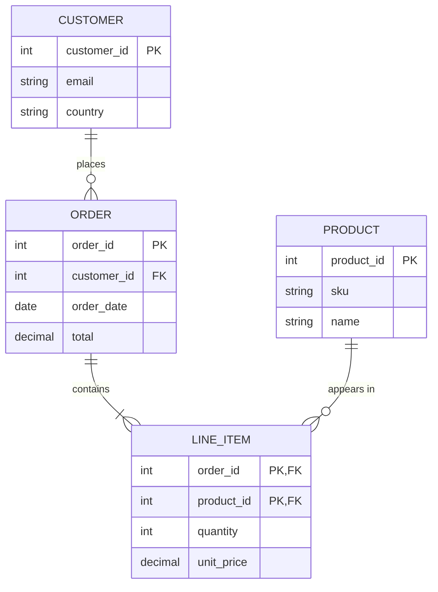
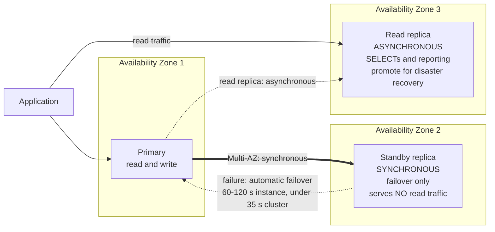
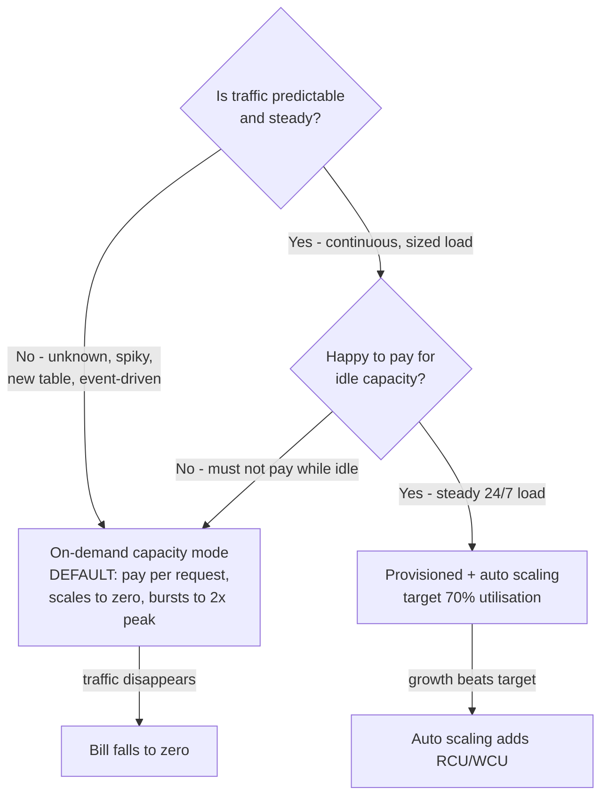
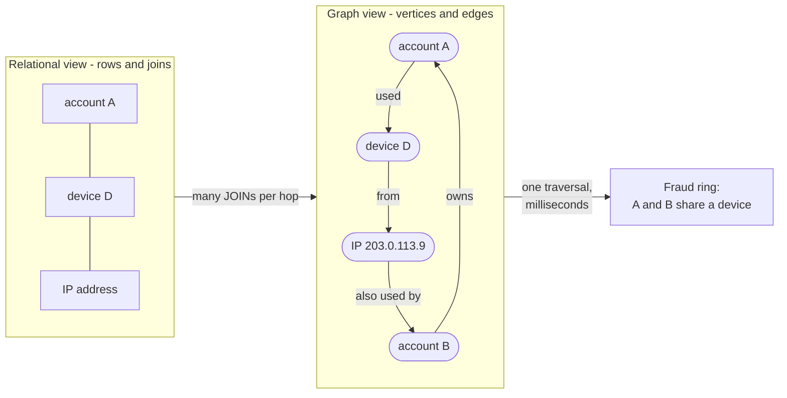
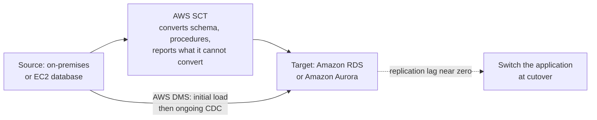
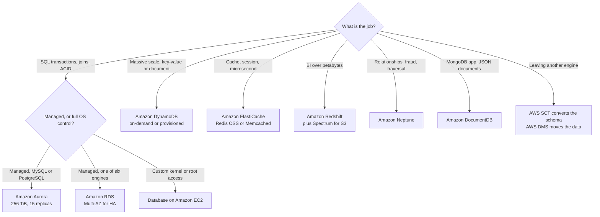

# Database Services: Choosing the Right Store

**Domain 3 (Cloud Technology and Services) carries 34% of the CLF-C02 score**, and inside it sits a task that is pure decision work: **Task 3.4 "Identify AWS database services"**. Its five skill statements are short and blunt — *"Deciding when to use EC2 hosted databases or AWS managed databases"*, identifying **relational** databases (Amazon RDS, Amazon Aurora), **NoSQL** databases (Amazon DynamoDB), **memory-based** databases (Amazon ElastiCache) and **database migration tools** (AWS DMS, AWS SCT). Every question built on this task has the same skeleton: a workload stem, four database names, and one right answer. The service names are easy; reading the stem is the exam.

```text
====================================================================
 CLF-C02 LESSON 10 — DATABASE SERVICES CARD (facts as of Oct 2026)
====================================================================
 SCOPE (Task 3.4)
   IN    Aurora · DocumentDB · DynamoDB · ElastiCache · Neptune
         · RDS   (+ Redshift under Analytics; DMS + SCT under
           Migration and Transfer)
   OUT   Amazon Keyspaces · Amazon MemoryDB · AWS AppConfig
--------------------------------------------------------------------
 RDS      managed relational; 6 engines: IBM Db2, MariaDB,
          Microsoft SQL Server, MySQL, Oracle Database, PostgreSQL
          AWS owns "backups, software patching, automatic failure
          detection, and recovery"
          storage max 64 TiB; gp3 baseline 3,000 IOPS / 125 MiB/s
          backup retention 1-35 days (0 = automated backups off)
   Multi-AZ (instance) . HA; SYNCHRONOUS standby; serves NO read
                         traffic; failover typically 60-120 s
   Multi-AZ (cluster) .. HA + reads; failover typically < 35 s
   Read replica ......... read scale-out; ASYNCHRONOUS (may be
                         stale); manual promotion; NO autoscaling
 AURORA    MySQL- and PostgreSQL-compatible; same RDS console
           single cluster volume, copies across three AZs,
           auto-grows to 256 TiB; up to 15 Aurora Replicas;
           failover typically < 60 s, often < 30 s
 DYNAMODB  serverless, fully managed, distributed NoSQL;
           single-digit ms at any scale; key-value + document;
           item <= 400 KB; no JOINs; IAM only;
           3 AZs / 99.99% SLA; global tables 99.999% SLA
   on-demand (default) . pay per request, scales to zero,
                         instantly to 2x previous peak
   provisioned ......... pay RCU/WCU whether used or not;
                         auto scaling target 70%
           1 RCU = 1 strong read/s for items up to 4 KB
           1 WCU = 1 write/s for items up to 1 KB
 ELASTICACHE  in-memory cache: Valkey, Memcached, Redis OSS
              "microsecond reads and sub-millisecond writes"
              an EPHEMERAL cache - never the system of record
   Memcached ... simplest model, multi-threaded, NO replication
                 and NO failover
   Redis OSS ... complex types, replication + automatic failover
 REDSHIFT   managed, petabyte-scale OLAP data warehouse,
            columnar; Redshift Spectrum reads Amazon S3 directly
 NEPTURE    managed graph database; billions of relationships at
            milliseconds latency; up to 15 Neptune Replicas
 DOCUMENTDB MongoDB-compatible; up to 15 replicas; up to 256 TiB
 MIGRATION  AWS SCT converts schema and code
            AWS DMS moves the data (one-time or ongoing CDC)
====================================================================
```

> [!NOTE]
> **Scope discipline.** Every service presented as examinable below sits on the official CLF-C02 in-scope list or in a Domain 3 task statement. Three database services are explicitly **out of scope** and appear here only so you can eliminate them: **Amazon Keyspaces (for Apache Cassandra)**, **Amazon MemoryDB for Redis OSS** and **AWS AppConfig**. Correct answers on this exam are always drawn from the in-scope list — a marketing-page favourite such as MemoryDB can never be the right choice.

In this lesson you will:

- sort every database question into the **five buckets** of Task 3.4;
- separate what **Amazon RDS** manages from what **you** still own;
- defeat **the Multi-AZ versus read replica trap** in both directions;
- compare **RDS on EC2 versus self-managed** using AWS's own responsibility table;
- place **Amazon Aurora** by compatibility, storage auto-scaling and replica count;
- size **DynamoDB capacity** in RCU and WCU, and pick the right **capacity mode**;
- one-line **ElastiCache Redis OSS vs Memcached**;
- separate **OLAP from OLTP** so Redshift stops being a distractor;
- place **Neptune and DocumentDB** from two-word stems;
- split a migration between **AWS SCT (schema) and AWS DMS (data)**;
- run the **workload → database decision table** end to end;
- study **two AWS-published case studies** (Netflix and Amazon Prime Video);
- practise with **12 exam-style questions** plus three interactive checks.

---

## 1. Task 3.4: five buckets and one decision

### 1.1 The five skill statements, decoded

AWS writes the task as five bullets. Decode each into the one question it will ask you:

| Task 3.4 skill statement | The question behind it | The answer shape |
|---|---|---|
| Deciding when to use **EC2 hosted** databases or **AWS managed** databases | *"We need root access to the OS and a custom kernel"* vs *"we want AWS to patch and back it up"* | Control ⇒ **EC2**; least operational overhead ⇒ **RDS** |
| Identifying **relational** databases (Amazon RDS, Amazon Aurora) | Stems containing SQL, joins, transactions, schemas, tables | **RDS** or **Aurora** |
| Identifying **NoSQL** databases (Amazon DynamoDB) | Key-value or document access, huge scale, single-digit ms, no joins | **DynamoDB** |
| Identifying **memory-based** databases (Amazon ElastiCache) | Cache, session store, microsecond latency, leaderboard | **ElastiCache** |
| Identifying **database migration tools** (AWS DMS, AWS SCT) | Moving off Oracle/SQL Server, converting procedures, ongoing sync | **SCT** converts, **DMS** moves |

Two extra buckets are not named in the task statement but appear on the in-scope list: **Redshift** (placed under **Analytics** in the exam guide, taught here only for the warehouse-vs-transaction decision) and **Neptune / DocumentDB** (graph and MongoDB-compatible document stores).

### 1.2 The in-scope and out-of-scope lists

| Category | In scope (correct answers come from here) | Out of scope (distractors — never correct) |
|---|---|---|
| Database | **Amazon Aurora, Amazon DocumentDB, Amazon DynamoDB, Amazon ElastiCache, Amazon Neptune, Amazon RDS** | **Amazon Keyspaces (for Apache Cassandra), Amazon MemoryDB for Redis OSS, AWS AppConfig** |
| Analytics | **Amazon Redshift** (warehouse decision taught in §6) | — |
| Migration and Transfer | **AWS Database Migration Service (AWS DMS), AWS Schema Conversion Tool (AWS SCT)** | — |

- **📚 Did you know?** AWS's own *"databases on AWS: how to choose"* guidance (updated **2 June 2026**) advertises **15+ database options**, and the databases product page says **15+ database engines** — while the CLF-C02 exam guide names **six** in-scope database services. The exam is not testing breadth; it is testing whether you can pick the six AWS cares about from a catalogue four times larger (as of Oct 2026; verify current before use).

### 1.3 Worked example E1 — bucket a stem in one pass

Read the stem, underline the *access pattern*, then name the bucket:

```text
"Order history must support joins against customers and
 line items, with ACID writes"
   -> relational bucket -> RDS (or Aurora if MySQL/PostgreSQL)

"Session data keyed by token, must return in under 1 ms"
   -> memory-based bucket -> ElastiCache

"Browsing and cart traffic with unpredictable spikes,
 no joins, item payloads under 400 KB"
   -> NoSQL bucket -> DynamoDB (on-demand capacity mode)

"Three years of sales history aggregated into dashboards"
   -> warehouse -> Redshift (OLAP, not OLTP)

"Fraud ring detection: follow account -> device -> IP -> account"
   -> relationships -> Neptune (graph)

"We run MongoDB drivers against documents today"
   -> MongoDB-compatible -> DocumentDB

"Convert 400 Oracle PL/SQL procedures, then stream the rows"
   -> SCT converts the code, DMS streams the data
```

The stem's **verb** is the whole question: *aggregate* ⇒ Redshift, *traverse* ⇒ Neptune, *cache* ⇒ ElastiCache, *transact* ⇒ RDS/Aurora, *scale unpredictably* ⇒ DynamoDB.

---

## 2. Amazon RDS: the managed relational default

### 2.1 What "managed" actually buys you

AWS defines Amazon Relational Database Service as a managed service that *"manages backups, software patching, automatic failure detection, and recovery"*. The exam's version of this is a responsibility table, and AWS publishes one that compares **on-premises, EC2-hosted and RDS-managed** databases directly:

| Capability | On-premises | Database on Amazon EC2 | Amazon RDS |
|---|---|---|---|
| Application optimization | **Customer** | **Customer** | **Customer** |
| Scaling | **Customer** | **Customer** | **AWS** |
| High availability | **Customer** | **Customer** | **AWS** |
| Backups | **Customer** | **Customer** | **AWS** |
| Database and OS patching | **Customer** | **Customer** | **AWS** |
| Hardware, power, facilities | **Customer** | **AWS** | **AWS** |

AWS's own conclusion is exam-relevant: *"We recommend Amazon RDS as your default choice for most relational database deployments."* Note the one row that never changes — **application optimization (your schema, your queries, your indexes) is yours in all three columns**. Shared responsibility for databases is not "AWS does everything".

### 2.2 Engines, instances and storage

| Element | What AWS documents (as of Oct 2026) | Exam consequence |
|---|---|---|
| **Engines (6)** | IBM Db2, MariaDB, Microsoft SQL Server, MySQL, Oracle Database, PostgreSQL | *"Any of these six names"* ⇒ **RDS**; Aurora is a separate engine family (see §3) |
| **Building block** | The **DB instance**, using instance classes such as `db.m*`, `db.r*`, `db.c*`, `db.t*` | The `db.` prefix is RDS's own naming; `t` = burstable, `r` = memory |
| **Storage** | Amazon EBS-backed, **up to 64 TiB**; **gp3 baseline 3,000 IOPS and 125 MiB/s** | A relational requirement **above 64 TiB** ⇒ look at Aurora (256 TiB) |
| **Network** | Runs in a **VPC**, reached through **security groups** | Database security questions end at the security group and the VPC |
| **Access model** | SQL, joins, multi-row transactions | *"Needs JOINs / ad-hoc SQL"* ⇒ RDS or Aurora, never DynamoDB |



This is the shape the exam means by **relational**: primary and foreign keys, rows in tables, and answers that come from **joining** them. The moment a stem says *"the application must not JOIN"* or *"denormalise by design"*, you have left this diagram and entered NoSQL.

### 2.3 Multi-AZ vs Read Replicas — THE trap

This is the single most reliable question in the whole lesson, and AWS states the rule twice in the RDS User Guide: **"The high availability option isn't a scaling solution for read-only scenarios. You can't use a standby replica to serve read traffic. To serve read-only traffic, use a Multi-AZ DB cluster or a read replica instead."**

| | **Multi-AZ (DB instance)** | **Read replica** | **Multi-AZ (DB cluster)** |
|---|---|---|---|
| **Purpose** | High availability / automatic failover | **Read scale-out** | Availability **and** reads |
| **Replication** | **Synchronous** | **Asynchronous** | Synchronous standbys |
| **Serves read traffic?** | **No** — *"You can't use a standby replica to serve read traffic"* | **Yes**, read-only | **Yes** (all three instances) |
| **Failover** | Automatic, typically **60–120 seconds** | Manual **promotion** (disaster recovery) | Automatic, typically **under 35 seconds** |
| **Staleness risk** | None (synchronous) | **Yes** — async means it can lag | None (synchronous) |
| **Cost** | Second instance is billed | Every replica billed like a DB instance | Three instances |
| **Auto scales reads?** | n/a | **No** — *"RDS doesn't support autoscaling of read replicas"* | You add/remove yourself |



Both features can coexist on the same source database — a Multi-AZ deployment for survival **and** a read replica for reporting. The trap works in both directions:

- *"Increase read throughput / offload reporting"* ⇒ **read replica** (Multi-AZ does nothing for reads);
- *"Survive an Availability Zone failure with automatic failover"* ⇒ **Multi-AZ** (a read replica fails over only if you promote it manually).

> ⚠️ **Multi-AZ is not a scaling solution.** AWS's wording is absolute: the high-availability option *"isn't a scaling solution for read-only scenarios"*. Two nuances save marks: a **Multi-AZ DB cluster** (two readable standbys) *does* serve read traffic, and a read replica is **asynchronous** — so a replica can be stale, which is exactly why you must never route writes to one.

### 2.4 Worked example E2 — the reporting spike

*The primary MySQL database on RDS handles 400 writes/second. Month-end reporting runs 600 heavy SELECTs/second and the primary's CPU sits at 95%. Two options are proposed: enable Multi-AZ, or create a read replica. Which is correct, and why?*

```text
Question being asked  : "the READS are too heavy"
Multi-AZ gives        : a SYNCHRONOUS standby that serves NO reads
                        -> CPU stays on the primary; no relief
Read replica gives    : an ASYNCHRONOUS copy that accepts SELECTs
                        -> reporting moves off the primary
Verdict               : create a read replica, then point the
                        reporting job at it
Residual risk         : async lag - reporting may be seconds behind;
                        promotion (not replication) is the DR story
```

Flip the stem: *"the database must survive an AZ outage with automatic failover"* ⇒ **Multi-AZ**, because a read replica's promotion is manual and its replication is asynchronous.

### 2.5 RDS versus a self-managed database on EC2

Task 3.4 explicitly tests this choice. The deciding question is never "which is more powerful" — it is **who does the undifferentiated work**.

| Question the stem asks | Database on Amazon EC2 | Amazon RDS |
|---|---|---|
| Who patches the database engine and the OS? | **You** | **AWS** |
| Who configures backups and failure detection? | **You** | **AWS** |
| Who handles scaling and high availability? | **You** | **AWS** |
| Who writes the schema, queries and indexes? | **You** | **You** (unchanged) |
| Do you get root/OS or a custom kernel? | **Yes** | **No** |
| Exam verdict | Only when the stem demands OS/root/custom-engine control | **Default choice** for most relational deployments |

**Worked example E3 — choosing between RDS and EC2.** Three stems, three verdicts:

1. *"A team needs PostgreSQL with AWS-managed backups, patching and Multi-AZ failover, and has no unusual OS requirements."* ⇒ **Amazon RDS** — every requirement is on RDS's managed list, and AWS recommends it as the default.
2. *"A regulated workload requires a custom kernel module and full root access on the database host."* ⇒ **Database on Amazon EC2** — RDS does not expose the operating system, so the requirement forces the EC2 route, and the team now owns patching, backups and HA.
3. *"The same PostgreSQL workload, but the company already runs its own backup scripts and patch calendar and refuses to change them."* ⇒ **EC2-hosted is legitimate**, but the exam's bias is stated by AWS itself: RDS is the *recommended default*, so a stem that mentions only convenience of habit is usually fishing for RDS.

### 2.6 Backups, patching and retention

| Operation | AWS behaviour (as of Oct 2026) | What you still own |
|---|---|---|
| **Automated backups** | On by default; retention window selectable from **1 to 35 days** (0 turns them off) | Choosing the window; testing restores |
| **Manual snapshots** | Retained until you delete them | Snapshot lifecycle and cross-Region copies |
| **Software patching** | AWS patches the engine, the OS and the host | Your maintenance window; your testing in a staging copy |
| **Failure detection and recovery** | Automatic | Your application's retry logic and connection timeouts |
| **Schema, credentials, security groups, VPC** | Not managed | **Yours**, always |
| **Multi-AZ / read replica choice** | Not automatic | **Yours** — AWS never turns either one on for you |

> [!WARNING]
> **The default retention figure is a trap of its own.** The RDS User Guide verifies the **range 1–35 days** (with 0 meaning automated backups are off). The widely quoted *"default value is 7 days"* comes from the wording of an **AWS Config rule** that checks compliance, not from the RDS User Guide itself. On the exam, quote the **range**; if a question hinges on the default, treat it as unverified and re-check the console (as of Oct 2026).

**Worked example E4 — the failover budget.** Application retry logic must be sized against the *slowest* documented failover, not the fastest:

```text
Multi-AZ DB instance ........ typically 60-120 seconds
Multi-AZ DB cluster ......... typically under 35 seconds
Aurora failover ............. typically under 60 s, often under 30 s
Aurora Global Database
  promotion (planned DR) .... in less than 1 minute
------------------------------------------------------------
Design rule: size connection retries for the SLOWEST case
             you actually run - 120 seconds - or the app
             gives up before the database comes back.
```

A question that praises Aurora's *"often less than 30 seconds"* while your client timeout is 10 seconds is testing arithmetic, not marketing.

- **📚 Did you know?** RDS Free Tier is time-boxed and account-age dependent: AWS documents **750 hours per month** of a `db.t3.micro` or `db.t4g.micro` in **Single-AZ** — and that allowance applies to accounts created **before 17 July 2025**. Older accounts kept the classic 12-month Free Tier; newer accounts get the credit-based Free plan instead, so a stem quoting "750 hours of db.t3.micro" is era-dependent (as of Oct 2026; verify current before use).

---

## 3. Amazon Aurora: the MySQL/PostgreSQL-compatible high performer

### 3.1 Compatibility and the shared cluster volume

AWS describes Aurora as **compatible with MySQL and PostgreSQL**, and it is provisioned and administered through the **same RDS console, CLI and API** — provisioning, patching, backup and failure detection all behave like RDS. The difference is the storage layer: Aurora uses a **single cluster volume whose data is replicated across three Availability Zones**, and that volume is **independent of the database instances** attached to it. Adding a reader therefore does not copy the data — the instance simply attaches to the existing volume.

| Aurora property | AWS figure (as of Oct 2026) | Why the exam cares |
|---|---|---|
| **Compatibility** | MySQL and PostgreSQL | *"MySQL/PostgreSQL-compatible"* ⇒ Aurora; any of the **other six engines** ⇒ RDS |
| **Storage** | Cluster volume **auto-grows** as data increases, up to **256 TiB** (and auto-shrinks when data is deleted) | No capacity planning; a relational need **above 64 TiB** (RDS ceiling) lands here |
| **Read scaling** | **Up to 15 Aurora Replicas** across three AZs | *"15 readers"* ⇒ Aurora; RDS read replicas are a different, separately managed feature |
| **Failover** | Typically **less than 60 seconds, and often less than 30 seconds** | Fast-recovery stems |
| **Replica rebuild** | With no replicas available, AWS documents a rebuild *"typically less than 10 minutes"* | Disaster-recovery arithmetic |
| **I/O billing** | **Aurora I/O-Optimized** is worth switching to when **I/O spending is 25% or more** of Aurora DB spend | A rare, specific, sourced threshold |
| **Global Database** | One primary Region plus secondary Regions, with replication *"latency typically under a second"*; **planned switchover** vs **failover** on Region outage | Multi-Region DR vocabulary |

> [!WARNING]
> **Two Aurora numbers are deliberately not taught as facts here**, because AWS's own pages disagree: (1) the **performance multiplier versus stock MySQL/PostgreSQL** is published as **6x** on one Aurora User Guide page, **five times** on another and **3-5x** on a third; (2) the **number of secondary Regions in Aurora Global Database** appears as **up to 10** in the User Guide and **up to five** in the FAQ. Conflicting official figures are unverified by definition (digest section G) — never assert either one. What *is* safe: *"materially higher throughput than stock MySQL/PostgreSQL"*, the **256 TiB** ceiling, **15 Aurora Replicas** and failover **often under 30 seconds**, each quoted with page and date.

### 3.2 Aurora vs RDS — the two-word tie-breaker

| Stem fragment | Answer |
|---|---|
| *"MySQL- or PostgreSQL-compatible, up to 15 readers, storage auto-grows"* | **Aurora** |
| *"IBM Db2 / Oracle / SQL Server / MariaDB"* | **RDS** |
| *"relational database above 64 TiB"* | **Aurora** (256 TiB cluster volume) |
| *"any of the six classic engines"* | **RDS** |
| *"relational, but the exam says 'serverless and MySQL/PostgreSQL-compatible'"* | **Aurora** |

**Worked example E5 — storage ceilings as a decision.** Three requirements, three services:

```text
"Relational workload, 40 TiB and growing"      -> RDS
        (64 TiB storage ceiling is enough)
"Relational workload, 200 TiB, MySQL-compatible" -> Aurora
        (cluster volume auto-grows to 256 TiB)
"Relational workload, 400 TiB"                 -> not a single
        database question: that is a warehouse (Redshift,
        petabyte scale) or a data-lake question
```

- **📚 Did you know?** Aurora's **I/O-Optimized** configuration has a published break-even: AWS advises switching when your **I/O spending reaches 25% or more** of your Aurora DB instance spending. It is one of the few database cost thresholds AWS states numerically — and like every figure in this lesson, it is *as of Oct 2026* and should be re-verified before you rely on it in production.

---

## 4. Amazon DynamoDB: serverless NoSQL at single-digit milliseconds

### 4.1 What it is — and what it refuses to be

AWS's definition is the exam's definition: DynamoDB is *"a serverless, fully managed, distributed NoSQL database with single-digit millisecond performance at any scale"*, supporting **both key-value and document data models**. Read the fine print, because it generates distractors:

| Property | AWS statement (as of Oct 2026) | Consequence |
|---|---|---|
| **Data model** | Key-value **and** document | Not relational |
| **Joins** | *"doesn't support a JOIN operator"* | *"Needs JOINs"* ⇒ RDS/Aurora, not DynamoDB |
| **Max item size** | **400 KB** | Large blobs belong in Amazon S3 with a pointer |
| **Authentication** | IAM — **no user names and passwords** | Security stems end at IAM |
| **Durability / SLA** | Replicated across **three AZs**, **99.99%** availability SLA | Single-AZ distractors fail |
| **Global tables** | Multi-Region, **multi-active** replication, **99.999%** availability SLA | *"Geo-distributed, active everywhere"* ⇒ global tables |
| **Consistency** | Strongly consistent reads and ACID transactions supported | It is not "eventually consistent only" |
| **Free tier** | **25 GB + 25 WCU + 25 RCU** Always Free (≈ 200 million requests/month at tutorial scale) | Tutorial scale, not production |
| **Default quota** | **40,000** RCU + WCU combined | Raise it before you design for it |

### 4.2 Capacity modes — the second most-tested database fact

| | **On-demand** (default) | **Provisioned** |
|---|---|---|
| **Billed on** | **Per request** (read request units / write request units) | **Provisioned RCU and WCU per hour, used or not** |
| **Capacity planning** | None | You choose the numbers |
| **Scales to zero?** | **Yes** — zero traffic costs nothing | **No** — idle units are still billed |
| **Burst behaviour** | Instantly to **2× previous peak**; a new table starts with room for **4,000 writes/s and 12,000 reads/s** | **Auto scaling** to a CloudWatch target of **70%**, on by default in the console |
| **Unit definition** | Per request unit consumed | **1 RCU** = one strongly consistent read/s for items up to **4 KB** (or two eventually consistent reads); **1 WCU** = one write/s for items up to **1 KB** |
| **Mode switching** | Provisioned → on-demand at most **4 times per 24 hours**; the reverse at any time | — |
| **Exam pick** | **Unknown, spiky, new or event-driven** traffic | **Steady, predictable, continuous** traffic |



### 4.3 Worked examples — the arithmetic the exam actually uses

**Worked example E6 — provisioned sizing (AWS's own worked pattern, as of Oct 2026).**

```text
READS  80 strongly consistent reads/second, item size 3 KB
       3 KB <= 4 KB  ->  1 RCU per read
       80 x 1 RCU                    =  80 RCU

WRITES 100 writes/second, item size 512 bytes
       512 B <= 1 KB -> 1 WCU per write
       100 x 1 WCU                   = 100 WCU

READS  5 KB item, strongly consistent
       ceil(5 / 4) = 2 RCU per read  -> double the RCU cost
```

**Worked example E7 — mode economics.** A table provisioned with **100 RCU + 50 WCU**:

```text
Provisioned: 150 units/hour are billed whether or not
              anyone reads or writes -> 24 h of idle still costs
On-demand  : zero traffic -> zero charges for throughput
Break-even : steady 24/7 usage favours provisioned;
              bursts, nights, weekends and unknown loads
              favour on-demand (which is the DEFAULT mode)
```

**Worked example E8 — burst headroom.** The previous traffic peak on an on-demand table was **50,000 reads/second**. AWS documents that on-demand can instantly scale to **twice the previous peak**:

```text
Headroom = 2 x 50,000 = 100,000 reads/second
A campaign that needs 90,000 reads/s fits inside it.
A campaign that needs 140,000 reads/s does NOT - the table
can be throttled, so pre-warm the traffic or request a
quota increase. Default combined quota = 40,000 RCU + WCU.
```

### 4.4 When the exam picks DynamoDB

| Stem fragment | Answer |
|---|---|
| *"Serverless NoSQL, single-digit millisecond, any scale"* | **DynamoDB** |
| *"Unpredictable spikes; must not pay when idle"* | **DynamoDB on-demand** (the default mode) |
| *"Key-value or document, no joins, 400 KB items"* | **DynamoDB** |
| *"Game leaderboard / shopping cart at peak-sale scale"* | **DynamoDB** |
| *"Needs JOINs or ad-hoc SQL over rows"* | **RDS or Aurora** |
| *"MongoDB drivers and documents, instance clusters"* | **DocumentDB** (see §7) |

Two DynamoDB satellites also appear:

- **Amazon DynamoDB Accelerator (DAX)** — an **in-memory cache for DynamoDB only**, API-compatible, delivering *"up to 10 times"* faster reads and moving latency *"from milliseconds to microseconds"*. The stem is read-heavy repeated-key hotspots on a DynamoDB table.
- **Global tables** — multi-Region, **multi-active**, **99.999%** availability SLA with no primary table to fail over. The stem is geographic distribution.

DAX fixes **latency**; global tables fix **geography**. Confusing them is a reliable way to lose a mark.

---

## 5. Amazon ElastiCache: the in-memory layer

### 5.1 What it is

AWS defines ElastiCache as *"a distributed in-memory data store or cache environment"* that works with the **Valkey, Memcached and Redis OSS** engines, and AWS's choosing guidance puts a number on it: **microsecond reads and sub-millisecond writes as an *ephemeral cache***. That last phrase is the whole exam position — ElastiCache **accelerates** a primary database; it is **never the system of record**.

### 5.2 Redis OSS vs Memcached — the one-liners

| | **Memcached** | **Redis OSS / Valkey** |
|---|---|---|
| **Model** | *"The simplest model possible"* — cache objects | Complex data types: lists, sets, **sorted sets**, hashes, bitmaps, geospatial |
| **Threading** | **Multi-threaded** | — |
| **Replication** | **No** | **Yes** |
| **Failover** | **No** | **Yes** (required in cluster mode) |
| **Backups** | No node-based backups | Supported |
| **Pub/sub, encryption** | No | Yes |
| **Exam stems** | *"Simple object caching, horizontal scale-out/in"* | **Sessions, leaderboards (sorted sets), queues, rate limiting, geospatial** |

**Worked example E9 — choosing the cache engine.**

```text
"Cache rendered HTML fragments; simplest possible model;
 scale nodes in and out"                  -> Memcached

"Store user sessions with TTLs and build a real-time
 leaderboard ranked by score"             -> Redis OSS / Valkey
        (sorted sets + replication + failover)

"Cache reads for a DynamoDB table, microsecond latency"
                                          -> DAX (DynamoDB only)

"Ephemeral cache in front of MySQL with automatic failover"
                                          -> ElastiCache
        (Redis OSS / Valkey - Memcached has no failover)
```

> ⚠️ **ElastiCache is never the answer to "where is the data stored durably?"** It is an *ephemeral cache*. If the stem needs a durable primary database, the answer is RDS, Aurora, DynamoDB or DocumentDB — and if it asks for a durable **in-memory** database, the marketing-page option is **Amazon MemoryDB**, which is **out of scope** for CLF-C02 and therefore never correct.

---

## 6. Amazon Redshift: the warehouse, not the transaction

### 6.1 The OLAP vs OLTP trap

AWS defines Amazon Redshift as a *"fully managed, petabyte-scale data warehouse"* that is *"specifically designed for online analytic processing (OLAP)"*. The trap is that both halves of the pair are databases, both answer SQL questions, and only one of them is right for your stem.

| | **OLTP — RDS, Aurora, DynamoDB** | **OLAP — Amazon Redshift** |
|---|---|---|
| **Job** | Run the business: capture individual transactions | Analyse the business: aggregate history |
| **Storage shape** | Rows (OLTP) | **Columns** — AWS: *"OLTP applications typically store data in rows, Amazon Redshift stores data in columns"* |
| **Typical query** | One order, one customer, one write | *"Total revenue by region by quarter for 3 years"* |
| **Scale** | Gigabytes to tens of terabytes | **Petabyte scale** |
| **Write pattern** | Frequent single-row inserts and updates | Bulk loads, then read-heavy |
| **AWS guidance** | *"If you require a fast transactional system … choose … Amazon RDS or a NoSQL database offering, such as DynamoDB"* | *"Ideal for online analytic processing (OLAP)"* |
| **Exam placement** | Database (in-scope list) | **Analytics** — the category never changes the answer |

AWS also states that OLTP features such as **secondary indexes and efficient single-row data manipulation operations have been *omitted*** from Redshift. That is the tell: a database that deliberately removed single-row manipulation is not where you put a shopping cart.

**Worked example E10 — the two-column question.**

```text
"Customers place orders while shopping; each order must
 commit immediately, with ACID guarantees"
      -> OLTP -> RDS / Aurora (or DynamoDB for key-value scale)

"Business intelligence dashboard aggregates 3 years of
 order history into regional totals every morning"
      -> OLAP -> Amazon Redshift

"Same BI requirement, but the raw files already sit in
 Amazon S3 and nobody wants to load them first"
      -> Redshift Spectrum: query the S3 files directly,
         on dedicated servers independent of the cluster
```

### 6.2 Redshift Spectrum

AWS documents that **Redshift Spectrum** lets you *"query data directly from files on Amazon S3"* using **servers independent of your cluster**. The exam-visible consequence: you can query the **warehouse and the data lake in one SQL statement** without paying for extra cluster nodes to hold the lake data.

- **📚 Did you know?** The exam guide files **Amazon Redshift under Analytics**, not under Database — yet Task 3.4 still expects you to make the warehouse-vs-transaction decision. Category placement is a metadata detail, never a reason to rule an in-scope service out of an answer (as of Oct 2026).

---

## 7. Amazon Neptune and Amazon DocumentDB: the two specialised stores

### 7.1 Neptune — the graph answer

AWS describes Amazon Neptune as a *"fully managed graph database service"* that handles **billions of relationships** with **milliseconds latency**, supporting **Gremlin and openCypher** for property graphs and **SPARQL** for RDF, with **up to 15 Neptune Replicas** on a shared three-AZ volume and automatic failover.

| Stem fragment | Answer |
|---|---|
| *"Highly connected data; traverse account → device → IP → account"* | **Neptune** |
| *"Fraud ring detection, recommendations, social or knowledge graphs, network security"* | **Neptune** |
| *"Key-value lookups"* | DynamoDB — graph answers are wrong here |
| *"Document/MongoDB drivers"* | DocumentDB |



The graph stores answer a question a relational schema answers *slowly*: as the number of hops grows, the JOIN count explodes, while Neptune walks the edges directly. That trade is the entire justification for the graph bucket.

### 7.2 DocumentDB vs DynamoDB — the MongoDB tie-breaker

| | **Amazon DocumentDB** | **Amazon DynamoDB** |
|---|---|---|
| **Compatibility** | *"with MongoDB compatibility"* — same drivers, tools and code | Proprietary API; IAM-only access |
| **Model** | Document, **MongoDB-compatible** | Key-value **and** document |
| **Provisioning** | Instance clusters; storage auto-grows in **10 GB** steps to **256 TiB** | **Serverless** — no instances, capacity modes |
| **Replicas** | **Up to 15** replica instances sharing one storage layer; **six copies across three AZs** | Three-AZ replication by default; global tables for multi-Region |
| **Exam stem** | *"MongoDB", JSON-like documents, catalogs, profiles* | *"Serverless, single-digit ms, scale to zero"* |

Rule of thumb: **the word MongoDB ⇒ DocumentDB**; **the words serverless, capacity mode or single-digit millisecond ⇒ DynamoDB**.

---

## 8. Migration: AWS Schema Conversion Tool and AWS Database Migration Service

### 8.1 The split you must memorise

Both tools sit in the exam guide's **Migration and Transfer** category, and the exam has never asked about them without testing the division of labour:

| | **AWS Schema Conversion Tool (SCT)** | **AWS Database Migration Service (DMS)** |
|---|---|---|
| **Job** | **Convert the schema and code** | **Move the data** |
| **What it touches** | Database schema, stored procedures, views — *"from one database engine to another"*, for a **relational OLTP schema or a data warehouse schema** | Rows: a **one-time load** or **ongoing change replication** (CDC) |
| **Form factor** | Free standalone GUI application | *"A server in the AWS Cloud that runs replication software"* with source and target endpoints |
| **Output** | Converted artefacts **plus an assessment report** of what it cannot convert | A replicated target database with lag you monitor to zero |
| **Typical targets** | — | Amazon RDS, Aurora, Redshift, DynamoDB, Amazon S3 |
| **Exam keyword** | *"Convert / schema / DDL / procedures / heterogeneous"* | *"Replicate / ongoing changes / cutover / stream the data"* |

A third answer is a distractor catcher: *"rehost whole servers or VMs"* is the **AWS Application Migration Service**, not a database tool at all.



### 8.2 Worked example E11 — an Oracle exit

*An insurance company runs Oracle Database on-premises with 400 PL/SQL procedures and wants Amazon Aurora PostgreSQL, with minimal downtime. Sequence the tools:*

```text
Step 1  AWS SCT converts the Oracle schema and procedures to
        PostgreSQL; its assessment report flags everything that
        still needs human rewrite.
Step 2  AWS DMS creates source and target endpoints, performs
        the initial load, then keeps replicating ongoing changes.
Step 3  Monitor replication lag; when it is effectively zero,
        switch the application to Aurora at cutover.
Why not the other tool alone:
        DMS without SCT moves rows but leaves Oracle SQL that
        PostgreSQL cannot run.
        SCT without DMS leaves you with an empty target.
        Application Migration Service rehosts WHOLE SERVERS -
        it does not convert an Oracle schema to PostgreSQL.
```

---

## 9. The decision table: workload → store

### 9.1 One table for the whole task

| Access pattern in the stem | Bucket | Answer | The tell |
|---|---|---|---|
| SQL, joins, ACID transactions, tables | Relational, managed | **Amazon RDS** | Any of the six engines; AWS-managed patching and backups |
| MySQL/PostgreSQL-compatible + auto-growing storage + 15 readers | Relational, optimised | **Amazon Aurora** | 256 TiB cluster volume, failover often under 30 s |
| Key-value or document at any scale, single-digit ms, no joins | NoSQL | **Amazon DynamoDB** | Serverless, capacity modes, 400 KB items |
| Cache, session store, leaderboard, microsecond reads | Memory-based | **Amazon ElastiCache** | Ephemeral; Redis OSS for failover, Memcached for simplicity |
| Complex aggregation over years of history, petabytes | Warehouse (OLAP) | **Amazon Redshift** | Columnar; *"fast transactional system"* ⇒ not Redshift |
| Relationships, traversal, fraud rings, social graphs | Graph | **Amazon Neptune** | Billions of relationships at milliseconds |
| MongoDB drivers, JSON documents, catalogs | Document, compatible | **Amazon DocumentDB** | Instance clusters, up to 15 replicas |
| Converting schemas and stored procedures between engines | Migration | **AWS SCT** | *"Convert"* |
| Replicating rows for a low-downtime cutover | Migration | **AWS DMS** | *"Ongoing changes"* |
| Root access, custom kernel, OS control | Self-managed | **Database on Amazon EC2** | You now own patching, backups and HA |



```matching
{
  "question": "Match each workload to the database the CLF-C02 exam expects you to pick:",
  "pairs": [
    {"left": "Month-end BI dashboards aggregating 3 years of sales, petabyte scale", "right": "Amazon Redshift - the managed OLAP warehouse, columnar, with Spectrum for S3 files"},
    {"left": "Shopping cart with unpredictable peak-sale spikes, no joins, must cost nothing while idle", "right": "Amazon DynamoDB in on-demand capacity mode - serverless NoSQL, pay per request, scales to zero"},
    {"left": "Oracle procedures to convert, then rows to stream for a low-downtime cutover", "right": "AWS SCT converts the schema and code, AWS DMS replicates the data"},
    {"left": "Sessions and a real-time leaderboard needing TTLs, sorted sets and automatic failover", "right": "Amazon ElastiCache with the Redis OSS or Valkey engine"},
    {"left": "Fraud ring detection that must traverse account to device to IP to account", "right": "Amazon Neptune - the managed graph database, billions of relationships at milliseconds latency"},
    {"left": "Relational order system on MySQL needing AWS-managed patching, backups and Multi-AZ failover", "right": "Amazon RDS (or Aurora when the stem also demands auto-growing storage and 15 readers)"}
  ],
  "explanation": "Read the access pattern, not the brand names: aggregate over history means the warehouse (Redshift), unpredictable key-value traffic means DynamoDB on-demand, converting code means SCT while moving rows means DMS, cache and session means ElastiCache, traversing relationships means Neptune, and joins with managed operations means RDS or Aurora."
}
```

### 9.2 Worked example E12 — one stem, two wrong answers each time

*"A food-delivery startup needs: (a) order records with joins to restaurants and drivers, (b) a driver-location feed keyed by driver ID with extreme spikes at dinner time, (c) a session cache returning in under a millisecond, and (d) a quarterly analytics warehouse."*

```text
(a) joins + ACID            -> Amazon RDS (or Aurora)
    wrong: DynamoDB (no JOINs), Redshift (OLTP omitted)
(b) keyed, spiky, no joins   -> DynamoDB, ON-DEMAND mode
    wrong: RDS (poor fit for the spike shape),
           provisioned DynamoDB (you would pay all night)
(c) sub-millisecond cache    -> ElastiCache (Redis OSS)
    wrong: RDS (not in-memory),
           DAX (only caches DynamoDB)
(d) quarterly aggregation    -> Amazon Redshift
    wrong: RDS (not a warehouse), S3 (no SQL warehouse)
Four requirements, four different services - and that is
the normal shape of a Domain 3 database question.
```

```fillblank
{
  "question": "Complete the database trap statements with the correct term:",
  "template": "A Multi-AZ standby in Amazon RDS replicates {{1}} and serves no read traffic, so the feature that offloads reporting is a {{2}}, which replicates {{3}} and can therefore be stale. DynamoDB's {{4}} capacity mode is the default and charges per request, while the {{5}} mode charges for RCU and WCU whether they are used or not.",
  "answers": {
    "1": "synchronously",
    "2": "read replica",
    "3": "asynchronously",
    "4": "on-demand",
    "5": "provisioned"
  },
  "distractors": ["synchronously in reverse", "Multi-AZ standby", "globally", "serverless", "burst", "reserved"],
  "explanation": "AWS documents standby replication as synchronous and read-replica replication as asynchronous, and explicitly says the standby cannot serve read traffic - so reads move to a read replica, which may lag. On-demand is DynamoDB's default, pay-per-request mode that scales to zero; provisioned bills RCU and WCU per hour regardless of use, with auto scaling targeting 70% utilisation."
}
```

---

## Real-World Case Studies

AWS publishes what these patterns look like in production. Every figure below is **customer- or AWS-claimed and unaudited**, quoted with its source so you can check it — the examinable point is the **pattern** (which store was chosen, which limit it removed, which number moved), not the marketing.

### Case A — Netflix: consolidating relational infrastructure on Amazon Aurora

| Element | Detail |
|---|---|
| **Industry / context** | Entertainment streaming; *"using AWS to deliver billions of hours of content monthly"* — and a relational estate large enough that consolidation itself became the project |
| **AWS services named** | **Amazon Aurora** as the consolidated relational target; Netflix *"operates actively across four AWS Regions"* |
| **Headline outcomes (AWS-published, customer-claimed)** | *"Up to 75% improved performance and 28% cost savings by migrating its relational database infrastructure to Amazon Aurora"*; a follow-up AWS Database Blog post (**27 November 2025**) reports latency on two internal services falling from **26.72 ms to 6.51 ms** (Policy Engine) and **67.57 ms to 41.70 ms** (Front50) |
| **Database lesson** | **Managed relational beats self-managed relational** on both axes at once — performance *and* cost — which is exactly AWS's *"we recommend Amazon RDS as your default choice"* argument extended by Aurora's cluster volume and 15-reader ceiling |
| **Source** | aws.amazon.com/solutions/case-studies/innovators/netflix · aws.amazon.com/blogs/database (accessed Oct 2026) |

*Exam lesson:* **"up to 75%" is a ceiling, not a promise**, and it is a *customer* result. What transfers to exam day is the *shape* of the decision: a team with a large relational estate chose a **managed MySQL/PostgreSQL-compatible** service rather than staying on self-managed instances.

### Case B — Amazon Prime Video: DynamoDB behind a live sports peak

| Element | Detail |
|---|---|
| **Industry / context** | Live sports streaming is perishable: *"With live sporting events, reliability and low latency are absolutely critical because every lost second negatively impacts viewers"* (Amazon Video's global head of digital video playback and delivery, customer voice) |
| **AWS services named** | **Amazon DynamoDB** for the delivery control plane, alongside six AWS Regions, AWS Elemental MediaTailor, Amazon CloudFront and Amazon EC2 |
| **Headline outcomes (AWS-published, 2017 season)** | Streamed **11 NFL games** to **18.4 million** fans in **224 countries and territories**, sending live broadcasts through **six AWS Regions**; **300,000+ clients** polling per ad break; DynamoDB partitions were **doubled from the console** ahead of ad breaks |
| **Database lesson** | A **serverless NoSQL** store with **single-digit-millisecond** reads is chosen for a control plane that must absorb a **spiky, scheduled, enormous** read load — the textbook DynamoDB stem, and the reason **on-demand-style, burst-capable** scaling exists |
| **Source** | aws.amazon.com/solutions/case-studies/amazon-prime-video (accessed Oct 2026) |

*Exam lesson:* the operation worth memorising is unglamorous — **partitions were doubled from the console before the spike**. Capacity for a known event was arranged deliberately, which is precisely the difference between a planned provisioned change and the automatic burst of on-demand capacity.

### What the two cases share

| Value pattern | Evidence | Underlying principle |
|---|---|---|
| Managed beats self-managed | Netflix: up to **+75%** performance and **−28%** cost on Aurora | The RDS/Aurora responsibility shift: AWS owns patching, backups, scaling and HA |
| Right store for the access pattern | Prime Video: control-plane reads on **DynamoDB**, not a relational engine | Key-value, spiky, low-latency ⇒ NoSQL; joins and transactions ⇒ relational |
| Capacity is a decision, not a hope | Prime Video doubled **partitions** before ad breaks | Know your traffic; provision or burst **on purpose** |
| Numbers are ceilings | "Up to 75%", "18.4 million fans" | Customer-claimed and unaudited — never an AWS guarantee |

- **📚 Did you know?** AWS's own *"how to choose a database"* page illustrates the mixed estate with **AWS's e-commerce stack**: **Amazon DocumentDB** for the catalog, **Amazon DynamoDB** for browsing and cart, and **Amazon Aurora** for relational order data (aws.amazon.com/databases, updated 2 June 2026). One retailer, three database engines, each chosen by access pattern — which is the whole argument of this lesson, made by AWS about its own storefront.

> [!WARNING]
> **How to read case-study numbers on exam day:** every percentage here is **customer-claimed or AWS-published and unaudited** — never a guarantee, and *"up to"* is a **ceiling**, never an average. Attribute the source and access date ("Netflix Aurora case study, accessed Oct 2026"), not "AWS proves". A case never licenses an out-of-scope answer: you are asked to **select the in-scope service and the correct option**, not to reproduce the marketing figure.

---

## Practice Questions

```question
{
  "id": "clf-10-q1",
  "type": "multiple-choice",
  "question": "An Amazon RDS primary is at 95% CPU because a reporting job runs heavy SELECTs every night. Management proposes enabling Multi-AZ to fix it. What is the BEST response?",
  "options": [
    "Enable Multi-AZ - the standby replica absorbs the read traffic automatically",
    "Create a read replica and point the reporting job at it, because a Multi-AZ standby serves no read traffic",
    "Enable Multi-AZ and add a second standby, because standbys double read capacity",
    "Do nothing - Multi-AZ also scales reads, so the proposal already works"
  ],
  "correct": 1,
  "explanation": "AWS states directly: 'The high availability option isn't a scaling solution for read-only scenarios. You can't use a standby replica to serve read traffic. To serve read-only traffic, use a Multi-AZ DB cluster or a read replica instead.' A Multi-AZ instance standby replicates synchronously and exists only for failover; a read replica replicates asynchronously and accepts SELECTs, which is what the reporting job needs."
}
```

```question
{
  "id": "clf-10-q2",
  "type": "multiple-choice",
  "question": "Which statement about an Amazon RDS Multi-AZ deployment (DB instance form) is correct?",
  "options": [
    "The standby replicates asynchronously so the primary is never blocked, and it serves read traffic during normal operation",
    "The standby replicates synchronously, cannot serve read traffic, and takes over automatically in typically 60-120 seconds on failover",
    "The standby replicates once per day and must be promoted manually before it can accept writes",
    "The standby is a cold copy in Amazon S3 that is restored only after you file a support case"
  ],
  "correct": 1,
  "explanation": "AWS documents Multi-AZ DB instance replication as synchronous, states that a standby replica cannot serve read traffic, and gives failover times of typically 60-120 seconds for the instance form (and typically under 35 seconds for the Multi-AZ DB cluster form). Replication is continuous, not daily; recovery is automatic, not a support case; and the standby is a live database instance, not an S3 copy."
}
```

```question
{
  "id": "clf-10-q3",
  "type": "multiple-choice",
  "question": "A company wants a relational database where AWS owns backups, software patching, automatic failure detection and recovery, while the company keeps responsibility for schema and application tuning. Which option matches AWS's own responsibility table?",
  "options": [
    "Run PostgreSQL on Amazon EC2 - AWS then owns patching and backups",
    "Amazon RDS - AWS owns scaling, high availability, backups and database/OS patching, and the customer still owns application optimization",
    "On-premises hardware - AWS manages the facilities while the customer patches the engine",
    "Amazon S3 with a SQL layer - AWS patches the engine and the customer owns nothing"
  ],
  "correct": 1,
  "explanation": "In AWS's published comparison, application optimization belongs to the customer in all three columns, while scaling, high availability, backups and database/OS patching belong to AWS for RDS and to the customer for both EC2-hosted and on-premises databases. AWS therefore recommends Amazon RDS as the default for most relational deployments. On EC2 you own patching and backups; on premises you own hardware and power too."
}
```

```question
{
  "id": "clf-10-q4",
  "type": "multiple-choice",
  "question": "A relational workload needs a MySQL-compatible engine, storage that keeps growing without a capacity decision, and up to 15 read-only endpoints. Which service fits BEST?",
  "options": [
    "Amazon RDS with a Multi-AZ deployment, because Multi-AZ provides 15 read endpoints",
    "Amazon RDS with six read replicas and manual snapshots, because RDS storage never fills",
    "Amazon Aurora - MySQL-compatible, a cluster volume that auto-grows to 256 TiB, and up to 15 Aurora Replicas",
    "Amazon Redshift, because it is a relational database with unlimited storage"
  ],
  "correct": 2,
  "explanation": "Aurora is MySQL- and PostgreSQL-compatible, its cluster volume automatically grows to a maximum of 256 TiB, and it supports up to 15 Aurora Replicas with failover typically under 60 seconds and often under 30 seconds. Multi-AZ is a high-availability feature, not a source of 15 read endpoints; standard RDS storage tops out at 64 TiB; and Redshift is an OLAP warehouse whose OLTP features are omitted, so it is not a transactional answer."
}
```

```question
{
  "id": "clf-10-q5",
  "type": "multiple-choice",
  "question": "A brand-new application has an unpredictable traffic pattern, no reliable usage history, and the team refuses to pay for throughput while the app is idle. Which DynamoDB configuration should they choose?",
  "options": [
    "Provisioned capacity with auto scaling, because provisioned is always cheaper at this scale",
    "On-demand capacity mode - the default, billed per request, which scales to zero when traffic stops",
    "Provisioned capacity with a target utilization of 100%, so no capacity is ever wasted",
    "On-demand capacity mode, which bills a fixed hourly price whether or not traffic arrives"
  ],
  "correct": 1,
  "explanation": "On-demand is DynamoDB's default capacity mode: you pay per request with no capacity planning, the table scales to zero so idle costs nothing, and it can burst instantly to twice the previous peak. Provisioned capacity bills RCU and WCU per hour whether they are used or not - the opposite of the stated requirement - and AWS recommends a 70% auto-scaling target rather than 100%, because a 100% target leaves no headroom for bursts."
}
```

```question
{
  "id": "clf-10-q6",
  "type": "multiple-choice",
  "question": "Using the documented unit definitions (as of Oct 2026), how many capacity units does a table need for 80 strongly consistent reads per second of 3 KB items and 100 writes per second of 512-byte items?",
  "options": [
    "80 RCU and 100 WCU - 3 KB fits within the 4 KB read unit and 512 bytes fits within the 1 KB write unit",
    "240 RCU and 100 WCU - reads are charged per kilobyte rounded up",
    "80 RCU and 50 WCU - writes are charged per 2 KB",
    "160 RCU and 200 WCU - strong reads and writes are always doubled"
  ],
  "correct": 0,
  "explanation": "One read capacity unit covers one strongly consistent read per second for items up to 4 KB (or two eventually consistent reads), so 3 KB items need exactly 1 RCU each: 80 x 1 = 80 RCU. One write capacity unit covers one write per second for items up to 1 KB, so 512-byte items need 1 WCU each: 100 x 1 = 100 WCU. A 5 KB item would need ceil(5/4) = 2 RCU per read, which is the distractor's mistake."
}
```

```question
{
  "id": "clf-10-q7",
  "type": "multiple-choice",
  "question": "A session store must return user sessions in microseconds, expire them with a TTL, maintain a score-ordered leaderboard, and survive the failure of a cache node automatically. Which engine should they pick?",
  "options": [
    "Memcached, because it is multi-threaded and has the simplest possible model",
    "Redis OSS (or Valkey) on Amazon ElastiCache, because it supports complex types plus replication and automatic failover",
    "Amazon MemoryDB, because sessions must be durable in memory",
    "Amazon Neptune, because leaderboards are graph traversals"
  ],
  "correct": 1,
  "explanation": "Sorted sets power leaderboards, TTLs and automatic failover come from replication - both are Redis OSS/Valkey features on ElastiCache. Memcached is explicitly the simplest model with no replication and no failover, so it cannot survive node failure automatically. Amazon MemoryDB is out of scope for CLF-C02 and can never be correct, and Neptune is the graph answer for traversing relationships, not for score-ordered session data."
}
```

```question
{
  "id": "clf-10-q8",
  "type": "multiple-choice",
  "question": "A team needs fast aggregation across three years of sales history at petabyte scale, stored column-wise for analytic queries. Which service is correct?",
  "options": [
    "Amazon Redshift - a managed, petabyte-scale OLAP data warehouse that stores data in columns",
    "Amazon RDS - because OLTP databases are always faster than warehouses for aggregation",
    "Amazon ElastiCache - because all analytics belong in memory",
    "Amazon DynamoDB - because its single-digit millisecond latency makes it a warehouse"
  ],
  "correct": 0,
  "explanation": "AWS defines Redshift as a fully managed, petabyte-scale data warehouse specifically designed for online analytic processing, storing data in columns rather than rows, and notes that OLTP features such as secondary indexes and efficient single-row data manipulation have been omitted. 'Fast transactional system' stems point to RDS/Aurora or DynamoDB instead. ElastiCache is an ephemeral cache and DynamoDB is a key-value/document store, not a warehouse."
}
```

```question
{
  "id": "clf-10-q9",
  "type": "multiple-choice",
  "question": "A company is leaving Oracle Database for Amazon Aurora PostgreSQL. They need 400 PL/SQL procedures converted and then rows streamed with minimal downtime. Which pairing is correct?",
  "options": [
    "AWS DMS converts the procedures, and AWS SCT streams the ongoing changes",
    "AWS SCT converts the schema and code (with an assessment report), and AWS DMS performs the initial load and ongoing change replication",
    "AWS Application Migration Service converts the schema, and Amazon S3 streams the rows",
    "AWS Snow Family converts the code, and AWS DMS only runs one-time loads"
  ],
  "correct": 1,
  "explanation": "AWS SCT converts the database schema and code from one engine to another - for OLTP or data warehouse schemas - and produces an assessment report of what it cannot convert. AWS DMS is a server running replication software that performs one-time migrations or replicates ongoing changes to targets including RDS, Aurora, Redshift, DynamoDB and S3. Reversing them is the classic distractor, Application Migration Service rehosts whole servers, and the Snow Family is not a database conversion tool."
}
```

```question
{
  "id": "clf-10-q10",
  "type": "multiple-choice",
  "question": "A solution architect proposes Amazon MemoryDB for Redis OSS for a caching layer, citing an AWS blog. What should you say about that choice on this exam?",
  "options": [
    "MemoryDB is the correct answer whenever Redis is mentioned, because it is the newest Redis option",
    "Amazon MemoryDB and Amazon Keyspaces are both explicitly out of scope for CLF-C02, so they appear only as distractors and can never be the correct answer",
    "MemoryDB is in scope only for Domain 4 pricing questions",
    "MemoryDB replaced ElastiCache, so ElastiCache is no longer a valid answer"
  ],
  "correct": 1,
  "explanation": "The official CLF-C02 out-of-scope list names Amazon Keyspaces (for Apache Cassandra), Amazon MemoryDB for Redis OSS and AWS AppConfig. Marketing pages list 15+ database options, but correct answers are always drawn from the in-scope list: Aurora, DocumentDB, DynamoDB, ElastiCache, Neptune, RDS (plus Redshift, DMS and SCT). ElastiCache remains fully in scope and is still the cache answer."
}
```

```question
{
  "id": "clf-10-q11",
  "type": "multiple-choice",
  "question": "A team's application already uses MongoDB drivers and JSON documents, and it wants a managed instance-cluster database with up to 15 replicas over shared storage. Which service should they choose?",
  "options": [
    "Amazon DynamoDB, because it also stores documents",
    "Amazon DocumentDB (with MongoDB compatibility) - same drivers and tools, storage growing to 256 TiB, up to 15 replicas",
    "Amazon RDS, because every document workload is really relational",
    "Amazon Neptune, because documents form a graph"
  ],
  "correct": 1,
  "explanation": "DocumentDB is MongoDB-compatible: AWS states you can use the same drivers and tools you use with MongoDB, storage auto-grows in 10 GB steps to 256 TiB, and up to 15 replica instances share one storage layer with six copies across three AZs. DynamoDB is also document-capable but is serverless with capacity modes and no MongoDB driver compatibility; Neptune is the graph store; RDS is the relational answer only when the workload is SQL."
}
```

```question
{
  "id": "clf-10-q12",
  "type": "multiple-choice",
  "question": "A security team must detect fraud rings by starting from an account, hopping to devices and IP addresses, and returning to other accounts, across billions of relationships. Which service is designed for this?",
  "options": [
    "Amazon Neptune - a managed graph database that traverses billions of relationships at milliseconds latency",
    "Amazon Redshift - because columns make traversals fast",
    "Amazon ElastiCache - because graph data must live in memory",
    "AWS Database Migration Service - because it replicates the graph"
  ],
  "correct": 0,
  "explanation": "Neptune is AWS's fully managed graph database, documented for billions of relationships at milliseconds latency with Gremlin and openCypher (property graph) and SPARQL (RDF), up to 15 Neptune Replicas and automatic failover; its documented uses include fraud detection, recommendations and social or knowledge graphs. Redshift is the OLAP warehouse, ElastiCache is an ephemeral cache, and DMS moves data rather than querying relationships."
}
```

```dragdrop
{
  "question": "Order these database decisions from the first question you should ask to the final service choice:",
  "items": [
    "What is the access pattern - transaction, key-value, cache, aggregation or traversal?",
    "Does the answer need JOINs, ACID transactions and SQL?",
    "If yes: does it also need AWS-managed patching and backups? Choose Amazon RDS",
    "If yes but MySQL/PostgreSQL with auto-growing storage and 15 readers: choose Amazon Aurora",
    "If no: is it key-value or document at scale, or a cache, or relationships?",
    "Key-value/document: Amazon DynamoDB - cache: Amazon ElastiCache - relationships: Amazon Neptune"
  ],
  "correctOrder": [
    "What is the access pattern - transaction, key-value, cache, aggregation or traversal?",
    "Does the answer need JOINs, ACID transactions and SQL?",
    "If yes: does it also need AWS-managed patching and backups? Choose Amazon RDS",
    "If yes but MySQL/PostgreSQL with auto-growing storage and 15 readers: choose Amazon Aurora",
    "If no: is it key-value or document at scale, or a cache, or relationships?",
    "Key-value/document: Amazon DynamoDB - cache: Amazon ElastiCache - relationships: Amazon Neptune"
  ],
  "explanation": "Task 3.4 is a decision tree, not a list: read the access pattern first, then split on whether the answer needs joins and transactions, then on how much AWS should manage and which compatibility or storage ceiling applies, and only then separate the non-relational buckets by whether the data is keyed, cached or connected. Aggregation over history skips the tree entirely and goes to Redshift; a MongoDB stem goes to DocumentDB; a conversion-and-cutover stem goes to SCT plus DMS."
}
```

> [!IMPORTANT]
> **Comparative Verdict — databases × on-premises × other clouds × DIY/managed**
> - **Versus on-premises:** on premises you buy the server, rack it, license the engine, then own patching, backups, failure detection, scaling and high availability — AWS's own table puts **every one of those on the customer**. Amazon RDS moves scaling, HA, backups and database/OS patching to AWS while leaving application optimization with you, and Capital One's exit from **eight data centers** (customer-claimed, accessed Oct 2026) is the on-premises side of that trade. You still own schema design, credentials, security groups, VPC placement and the decision between Multi-AZ and read replicas — AWS never makes those for you.
> - **Versus other clouds:** every major provider sells managed relational, key-value, cache and warehouse services, so the examinable differences are AWS's **own vocabulary and numbers**: six named RDS engines, **64 TiB** RDS storage versus **256 TiB** Aurora, **synchronous standby with no read traffic** versus **asynchronous read replicas**, **60–120 s** instance failover versus **under 35 s** cluster failover, DynamoDB's **on-demand vs provisioned** modes with **1 RCU per 4 KB** and **1 WCU per 1 KB**, ElastiCache's **Valkey, Memcached and Redis OSS** engines, and the exact placement of **Redshift under Analytics**. Do not assume another provider's unit sizes, failover windows or storage ceilings transfer.
> - **Versus DIY / build-it-yourself:** a database on EC2 means you write the backup cron jobs, the failover logic, the patch calendar and the read-scaling story — and test them all yourself; a hand-rolled cache means implementing replication and TTL eviction; a hand-rolled warehouse means running columnar storage and a query planner. The Well-Architected answer is consistently **managed and least operational overhead**: **RDS instead of a self-patched PostgreSQL on EC2**, **Aurora instead of a hand-built cluster volume**, **DynamoDB on-demand instead of a capacity-planned key-value cluster**, **ElastiCache instead of a memcached install you now must replicate**, **AWS DMS plus SCT instead of custom ETL** — and if a stem genuinely demands a custom kernel or root access, EC2-hosted is the honest answer, with all the ownership that comes with it.

> [!WARNING]
> **Exam-day traps for this lesson:**
> - **Multi-AZ ≠ read scaling** — AWS: the HA option *"isn't a scaling solution for read-only scenarios"*; *"increase read throughput"* ⇒ **read replica**, *"survive an AZ failure"* ⇒ **Multi-AZ**;
> - **The one nuance** — a **Multi-AZ DB cluster** (readable standbys, failover **under 35 s**) *does* serve reads; the **Multi-AZ DB instance** standby does not;
> - **Sync vs async** — standby replication is **synchronous**, read-replica replication is **asynchronous**, so a replica can be **stale** and must never take writes;
> - **Read replicas do not autoscale** — AWS states *"RDS doesn't support autoscaling of read replicas"*; you add and remove them yourself;
> - **RDS vs EC2** — AWS *recommends RDS as the default*; choose EC2 only for OS/root/custom-engine control, where **you** own patching, backups and HA;
> - **RDS has six engines** (Db2, MariaDB, SQL Server, MySQL, Oracle, PostgreSQL) and **64 TiB** max storage; **Aurora** is MySQL/PostgreSQL-compatible with a **256 TiB** auto-growing cluster volume, **15 Aurora Replicas** and failover **often under 30 s**;
> - **Never quote the Aurora multiplier or the Global Database secondary-Region count** — AWS pages publish **6x / five times / 3-5x** and **10 vs five** respectively; conflicting official figures are unverified;
> - **Backup retention: quote 1–35 days**, not "7 days" — the 7-day default comes from an AWS Config rule's wording, not the RDS User Guide;
> - **DynamoDB on-demand is the default** (pay per request, scales to zero, 2× previous peak); **provisioned bills whether used or not** with a **70%** auto-scaling target; **1 RCU = 1 strong read/s ≤ 4 KB**, **1 WCU = 1 write/s ≤ 1 KB**, item size **400 KB**;
> - **DynamoDB has no JOINs** — *"needs JOINs / ad-hoc SQL"* ⇒ RDS, Aurora or Redshift, never DynamoDB;
> - **DAX caches DynamoDB only** (ms → µs, up to 10×); **global tables** fix geography (multi-Region, multi-active, 99.999%);
> - **ElastiCache is an ephemeral cache, never the system of record** — Memcached: simplest, multi-threaded, **no replication and no failover**; Redis OSS/Valkey: complex types, **replication + automatic failover**;
> - **Redshift is OLAP and lives under Analytics** — *"fast transactional system"* ⇒ RDS/Aurora or DynamoDB; columnar and OLTP features **omitted**; **Spectrum** queries Amazon S3 directly;
> - **DocumentDB = MongoDB-compatible** (instance clusters, ≤ 15 replicas, 256 TiB); **Neptune = graph** (relationships, fraud, traversal, ≤ 15 replicas);
> - **SCT converts schema and code; DMS moves the data** (one-time or ongoing CDC); *"whole servers/VMs"* ⇒ **AWS Application Migration Service**;
> - **Out-of-scope distractors never win** — **Amazon Keyspaces, Amazon MemoryDB and AWS AppConfig** are on the out-of-scope list; the marketing page's **15+ database options** is not the exam's list;
> - **Case-study numbers are customer-claimed, unaudited ceilings** — Netflix's *"up to 75%"* performance and *"28%"* cost savings, and Prime Video's **18.4 million** fans, are reported figures, never AWS guarantees.

> [!SUCCESS]
> **Key Takeaways:**
> 1. Task 3.4 is five buckets — **EC2-hosted vs managed**, **relational (RDS, Aurora)**, **NoSQL (DynamoDB)**, **memory-based (ElastiCache)** and **migration (DMS, SCT)** — and correct answers always come from the in-scope list: **Aurora, DocumentDB, DynamoDB, ElastiCache, Neptune, RDS** plus **Redshift, DMS, SCT**; **Keyspaces, MemoryDB and AppConfig are out of scope**;
> 2. **Amazon RDS** is the managed relational default: AWS owns *"backups, software patching, automatic failure detection, and recovery"* plus scaling and HA, while **application optimization (schema, queries, indexes) stays yours**; six engines (**Db2, MariaDB, SQL Server, MySQL, Oracle, PostgreSQL**), storage **up to 64 TiB** (gp3 baseline **3,000 IOPS / 125 MiB/s**), backup retention **1–35 days**;
> 3. **The trap: Multi-AZ is for availability, read replicas are for reads** — standby replication is **synchronous** and *"can't serve read traffic"*, replica replication is **asynchronous** (stale, promote manually for DR), failover is **60–120 s** (instance) or **under 35 s** (cluster), and **read replicas do not autoscale**;
> 4. **RDS vs database on EC2:** choose EC2 only for **OS/root/custom-engine** control — then you own patching, backups and HA; AWS's standing advice is *"we recommend Amazon RDS as your default choice for most relational database deployments"*;
> 5. **Amazon Aurora** is **MySQL- and PostgreSQL-compatible** on the RDS console, with a single **cluster volume replicated across three AZs** that **auto-grows to 256 TiB**, **up to 15 Aurora Replicas**, failover **typically under 60 s and often under 30 s**, and I/O-Optimized worth switching at **≥25%** I/O spend — but the throughput multiplier and Global Database Region count are **conflicting across AWS pages and unverified**;
> 6. **DynamoDB** is *"serverless, fully managed, distributed NoSQL with single-digit millisecond performance at any scale"*: key-value + document, **no JOINs**, item **≤ 400 KB**, **IAM only**, **3 AZs / 99.99%** (global tables **99.999%**); **on-demand is the default** (per request, scales to zero, **2× previous peak**) versus **provisioned** (billed whether used or not, auto scaling target **70%**), with **1 RCU = 1 strong read/s ≤ 4 KB** and **1 WCU = 1 write/s ≤ 1 KB**;
> 7. **ElastiCache** is an **ephemeral cache** with **Valkey, Memcached and Redis OSS**: **Memcached** = simplest, multi-threaded, **no replication/failover**; **Redis OSS** = complex types, **replication + automatic failover** for sessions, leaderboards and queues; **DAX** is DynamoDB-only (ms → µs);
> 8. **Redshift is OLAP** — a **managed, petabyte-scale, columnar** warehouse whose OLTP features are **omitted** — so *"aggregate three years for a dashboard"* ⇒ Redshift and *"individual orders while customers shop"* ⇒ RDS/Aurora/DynamoDB; **Spectrum** queries Amazon S3 on servers independent of the cluster;
> 9. **Neptune** = graph (**billions of relationships**, milliseconds, ≤ 15 replicas, Gremlin/openCypher/SPARQL) for fraud and traversal stems; **DocumentDB** = **MongoDB-compatible**, instance clusters, **≤ 15 replicas** over shared storage, up to **256 TiB** — *"MongoDB"* ⇒ DocumentDB, *"serverless, single-digit ms"* ⇒ DynamoDB;
> 10. **Migration split:** **AWS SCT converts the schema and code** (free standalone GUI, assessment report) and **AWS DMS moves the data** (initial load + ongoing CDC to RDS/Aurora/Redshift/DynamoDB/S3) — *"whole servers"* ⇒ Application Migration Service;
> 11. Run the decision table in order — **access pattern → joins/transactions? → managed vs root → compatibility and ceilings** — as demonstrated by Netflix's **up to +75% performance / −28% cost** consolidation onto Aurora and Amazon Prime Video's **DynamoDB** control plane behind **18.4 million** fans in **224 countries** across **six Regions** (customer-claimed, accessed Oct 2026): read the stem, name the bucket, then pick the service.
