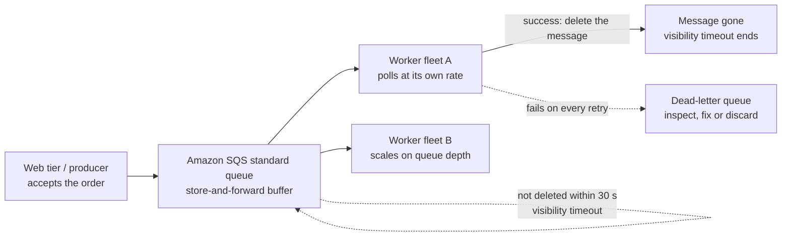
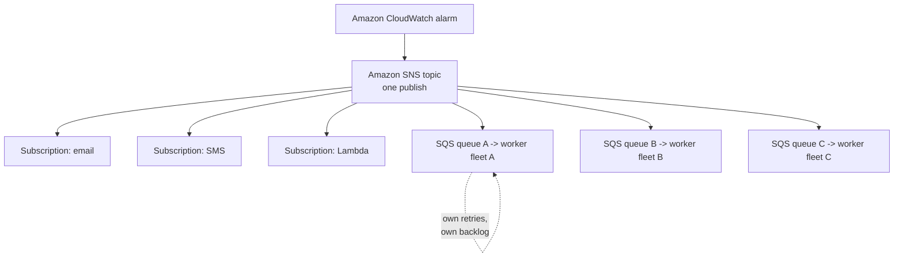
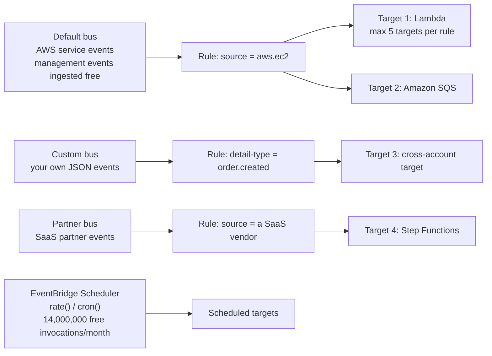
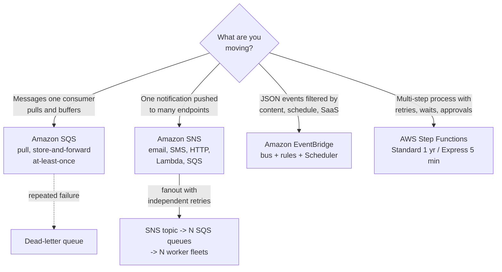
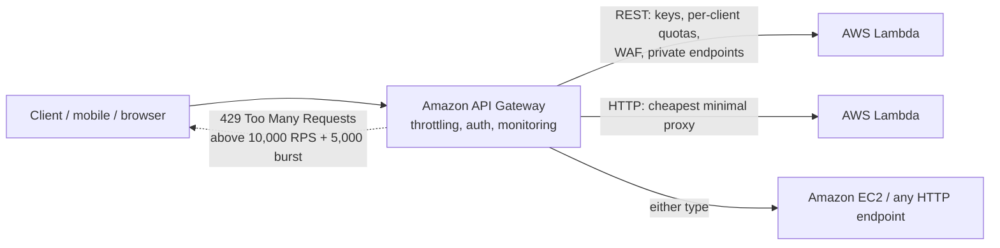
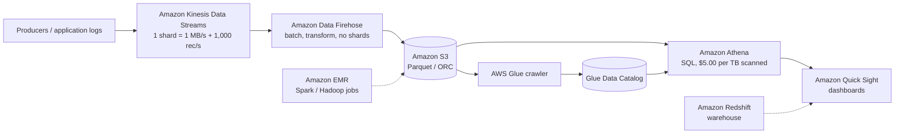
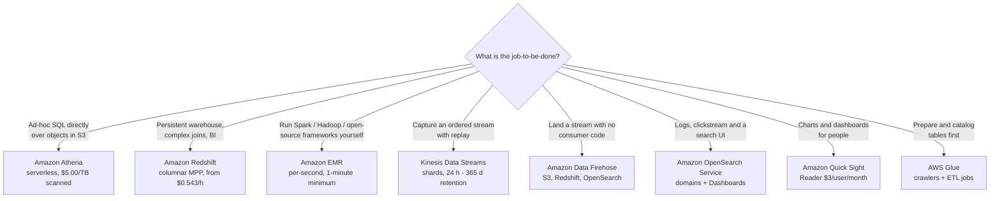

# Application Integration, Analytics and Other In-Scope Services

Domain 3 (Cloud Technology and Services, **34%** of the score) hides two task statements that carry a huge, scattered surface area: **Task 3.7 "Identify AWS artificial intelligence and machine learning (AI/ML) services and analytics services"** — with its skill statements naming *Amazon SageMaker AI, Amazon Lex, Amazon Athena, Amazon Kinesis, AWS Glue and Amazon Quick Sight* — and **Task 3.8 "Identify services from other in-scope AWS service categories"**, which explicitly lists application integration (EventBridge, SNS, SQS), business applications (Connect, SES), customer enablement (AWS Support), developer tools (CodeBuild, CodePipeline, X-Ray), end-user computing (AppStream 2.0, WorkSpaces, WorkSpaces Secure Browser), frontend (Amplify) and IoT (IoT Core). Add **Amazon API Gateway** from the Networking row and this single lesson spans material the exam draws from **two domains**.

```text
====================================================================
 CLF-C02 LESSON 11 — INTEGRATION + ANALYTICS QUICK CARD
          (facts as of Oct 2026 — verify current before use)
====================================================================
 APPLICATION INTEGRATION
  SQS             pull queue, store-and-forward buffer
                  Standard : at-least-once, best-effort order
                  FIFO     : exactly-once processing, strict order
                  visibility timeout 30 s default (max 12 h)
                  retention 60 s - 14 days, max message 1 MiB
  SNS             push pub/sub topic -> N subscriptions
                  email / SMS / HTTP+S / Lambda / SQS
                  fanout = SNS topic -> N queues -> N workers
  EVENTBRIDGE     JSON events matched by rules -> targets
                  5 targets per rule - 300 rules per bus
                  default / custom / partner buses
                  AWS management events ingested free
  STEP FUNCTIONS  serverless workflow orchestration
                  Standard : up to 1 yr, $0.000025/transition
                  Express  : up to 5 min, $1.00 per million
 --------------------------------------------------------------------
 API GATEWAY       the "front door": REST / HTTP / WebSocket
                   10,000 RPS + 5,000 burst -> HTTP 429
                   REST $3.50/M - HTTP $1.00/M (as of Oct 2026)
 --------------------------------------------------------------------
 ANALYTICS
  ATHENA          serverless ANSI SQL over S3, $5.00/TB scanned
  GLUE            serverless ETL + Data Catalog, $0.44/DPU-hour
  KINESIS STREAMS ordered shards: 1 MB/s + 1,000 rec/s write
  DATA FIREHOSE   no shards: land data in S3/Redshift/OpenSearch
  OPENSEARCH      managed domains: logs, search, Dashboards
  QUICK SIGHT     BI dashboards, Reader $3/user/month
  EMR             managed Hadoop/Spark clusters, per-second
  REDSHIFT        petabyte-scale warehouse, from $0.543/hour
 --------------------------------------------------------------------
 ML (one line each) Rekognition images/video - Comprehend NLP -
   Textract documents - Transcribe speech to text - Polly text to
   speech - Translate - Lex chatbots - SageMaker AI build/train -
   deploy - Amazon Q generative-AI assistants
 OTHER IN-SCOPE    Connect contact center - SES email - CLI /
   CodeBuild / CodePipeline / X-Ray - IoT Core - Amplify -
   AppStream 2.0 / WorkSpaces / WorkSpaces Secure Browser -
   AWS Marketplace
====================================================================
```

> [!NOTE]
> **Scope discipline.** Every service presented as examinable below sits on the official CLF-C02 **in-scope** list or in a Domain 3/4 task statement (verified against the exam guide, 2026-10). Four services that *look* perfectly at home here are explicitly **out of scope** and appear only so you can eliminate them: **Amazon AppFlow, Amazon Managed Streaming for Apache Kafka (Amazon MSK), Amazon WorkDocs** and **AWS AppFabric**. Two things this research could **not** verify and therefore never teaches as fact: whether **Amazon Bedrock** (absent from the in-scope list) or other generative-AI services are examined, and the status of **AWS CodeCommit** (on neither the in-scope nor the out-of-scope list).

In this lesson you will:

- read **Amazon SQS** as the decoupling answer and separate **standard from FIFO** delivery guarantees;
- work the queue mechanics: visibility timeout, long polling, retention, dead-letter queues;
- design an **SNS fanout** and say why it is SNS *plus* SQS, not SNS alone;
- route **event-driven architectures** through EventBridge buses, rules, targets and schedules;
- pick **Step Functions Standard vs Express** and price a workflow in state transitions;
- use **API Gateway** as the front door: REST vs HTTP vs WebSocket, throttling, Lambda integration;
- price an **Athena** query and a **Glue** job, and explain why partitioning pays;
- separate **Kinesis Data Streams from Data Firehose**, then place **OpenSearch, QuickSight, EMR and Redshift**;
- one-line every remaining in-scope service — **ML suite, Connect, SES, DevTools, IoT Core, EUC, Amplify, Marketplace**;
- study **two AWS-published case studies** (Capital One and Paytm);
- practise with **10 exam-style questions** plus three interactive checks.

---

## 1. Amazon SQS: queues, decoupling, standard vs FIFO

### 1.1 What a queue actually decouples

Amazon SQS is a **pull-based, store-and-forward buffer** between a producer and a consumer. Without it the web tier calls the worker tier directly: the worker's outage becomes the web tier's outage, and neither side can scale independently. With a queue in between, the producer writes a message and returns; workers **poll** at their own rate and at their own count. AWS's decision guide describes SQS in one line worth memorising: *"Messages are persisted … at-least-once delivery."*

| Property | **Standard** (default) | **FIFO** |
|---|---|---|
| Delivery guarantee | **At-least-once** — *"a message may be delivered more than once"* | **Exactly-once processing** |
| Ordering | **Best-effort** ordering only | **Strict first-in, first-out** order |
| Throughput (as of Oct 2026) | Near-unlimited API calls per second | **300 messages/s**; **3,000/s** with batching; high-throughput mode **up to 70,000/s** |
| Duplicate handling | None — duplicates are expected | **5-minute** deduplication interval |
| Exam stem | *"scale consumers independently", "may arrive twice, out of order"* | *"exactly once, in order"* |

Because standard queues deliberately hand you duplicates, AWS's own guidance is that *"you must design your applications to be idempotent"* — a duplicate must not double-charge, double-ship or double-email. **Idempotency is the consumer's job; the queue only promises persistence.**

### 1.2 The mechanics that appear in question stems

| Mechanic | Documented value (as of Oct 2026) | Why the exam cares |
|---|---|---|
| **Visibility timeout** | Default **30 s**, range 0 s – 12 h | A received message is *hidden*, not deleted; if the worker dies or runs long, the message **reappears** — that is where duplicates come from |
| **Long polling** | Wait time **0 – 20 s** | Waiting instead of hammering the queue cuts empty responses and request cost |
| **Retention** | Default **4 days**; range **60 s – 1,209,600 s (14 days)** | Unprocessed messages survive an outage for up to 14 days |
| **Message size / delay** | **1 KiB – 1,024 KiB (1 MiB)**; delay up to **15 min** | Put large payloads in S3 and pass the key |
| **Dead-letter queue** | A queue that holds repeatedly failing messages | Isolate poison messages instead of retrying forever |

Pricing (as of Oct 2026, verify before use): **1 million requests per month free**, then approximately **$0.40 per million** requests.

### 1.3 From point-to-point to a queue: what actually changes

| Without a queue (point-to-point) | With **Amazon SQS** in the middle |
|---|---|
| Producer must know the consumer's address and be up when it calls | Producer writes to a Regional endpoint and returns immediately |
| A consumer outage is a producer outage | Consumers fail, restart and scale without touching the producer |
| Adding a consumer means redeploying or reconfiguring the producer | Add worker fleets; competing consumers share the same queue |
| Traffic spike = the producer must throttle itself | Queue absorbs the spike; workers drain it at their own rate |
| Retry logic is hand-written per caller | Visibility timeout, redelivery, long polling and DLQ are service features |
| One-to-one, tightly coupled in time | One-to-many possible (queue per consumer family), decoupled in time |



**Worked example E1 — choosing the FIFO tier.** A payment stream must be processed **exactly once and in order at 4,000 messages per second**. Standard FIFO caps at **300/s**, or **3,000/s with batching** — still below the required 4,000/s — so the documented answer is **high-throughput FIFO mode, up to 70,000 messages per second with batching**. Had ordering not been required, standard queues would have absorbed the rate with no throughput ceiling to reason about.

- **📚 Did you know?** The retention and visibility numbers explain most "duplicate message" stems on this exam: a message that is **not deleted within the 30-second default visibility timeout** becomes visible again, so duplicates are *normal* on standard queues — which is why AWS tells you to build **idempotent** consumers rather than promising you will never see a message twice (as of Oct 2026; verify current before use).

---

## 2. Amazon SNS: publish/subscribe and fanout

### 2.1 Push, not poll

Amazon Simple Notification Service is the **push** counterpart to SQS's **pull**: a *publisher* sends to a *topic*, and the topic fans the message out to every *subscription*. AWS describes it as a *"push mechanism, eliminating the need to periodically check or 'poll'"*. Subscriptions can be **Amazon SQS queues, AWS Lambda functions, HTTP/S endpoints, email, SMS and mobile push** — which is why one publish can simultaneously page a human and feed a machine.

| | **Amazon SQS** | **Amazon SNS** |
|---|---|---|
| Model | **Pull** — consumers poll a queue | **Push** — topic delivers to subscribers |
| Message shape | Competing consumers, one gets each message | Every subscription receives a copy |
| Documented guarantee | At-least-once (standard) | At-least-once for HTTP/S; **exactly-once for Lambda and Amazon SQS subscribers** |
| Failure handling | Visibility timeout + dead-letter queue | Retry policy, then an **SQS dead-letter queue** on the subscription |
| Scale (as of Oct 2026) | 1 M requests/month free | **100,000** Standard topics per account; up to **12.5 million** subscriptions per topic |
| Billing unit | Per request | Each **64 KB** chunk of a payload counts as one request |

### 2.2 The fanout pattern

The canonical answer to *"one alert must reach many independent consumers"* is **SNS → N SQS queues → N worker fleets**. SNS **replicates** the message; each queue then **absorbs its own retries, backlog and scaling**, so a slow consumer never throttles the others. SNS alone is fine for light subscribers (email, SMS), but the pattern the guide trains is SNS *with* an SQS queue per consumer family.



### 2.3 Subscription types at one-exam depth

| Subscription | What it delivers | Typical stem |
|---|---|---|
| **Amazon SQS queue** | A copy into a queue that the consumer family drains | *fanout with independent retries* |
| **AWS Lambda** | Direct asynchronous invocation of a function | *run code per event, no polling* |
| **HTTP/S** | A POST to your endpoint | *our own webhook receiver* |
| **Email** | A message to a mailbox | *page a human* |
| **SMS** | A text message | *alert an on-call phone* |
| **Mobile push** | A notification to a device | *reach an app user* |

**Worked example E2 — fanout arithmetic and SNS billing.** One alarm publishes to **six subscriptions** (email, SMS, Lambda, three queues): SNS performs six deliveries from a single publish, and each queue retries independently. Now add billing — SNS counts each **64 KB chunk** as one request, so a **150 KB** payload bills as ceil(150 / 64) = **3 requests**. Keep payloads small, or store the body in S3 and publish the reference.

> ⚠️ **Push and pull are the fastest marks in Domain 3.** *"Consumers poll"* ⇒ **SQS**; *"a service pushes / one publish reaches many endpoints"* ⇒ **SNS**. And remember: **fanout = SNS + SQS**, because only a queue gives each consumer an independent retry budget and a place to dead-letter its own failures.

---

## 3. Amazon EventBridge: event buses, rules and schedules

### 3.1 Buses, rules, targets

EventBridge carries **JSON events**. An event lands on a **bus**, a **rule** matches it by event pattern (or by schedule), and the rule invokes up to **five targets**. The three bus types are the examinable split:

| Bus | What arrives there | Exam stem |
|---|---|---|
| **Default** | Events from AWS services; **AWS management events are ingested by the event bus for free** | *"react to an EC2 state change"* |
| **Custom** | JSON events you publish yourself | *"our order service emits order.created"* |
| **Partner** | Events from SaaS partners (Datadog, Shopify, Stripe and others) | *"trigger on a third-party SaaS event"* |

Hard limits (as of Oct 2026): **a single rule can send an event to up to five targets**, and there are **up to 300 rules per event bus**. Billing counts **each 64 KB chunk of a payload as one event**; custom events are **$1.00 per million**, partner cross-account delivery **$0.05 per million**, and AWS **Pipes $0.40 per million**.

### 3.2 Schedules

Rules can also fire on `cron` or `rate` expressions — but AWS now labels scheduled rules a **legacy feature** and steers you to **EventBridge Scheduler**, which offers **14,000,000 free invocations per month** before charging **$1.00 per million**. *"Every night at 02:00 UTC"* is a schedule question, and the current answer is EventBridge Scheduler.



### 3.3 EventBridge vs SNS vs SQS when the stem says "react to something"

AWS publishes a three-way decision guide, and its wording is quotable exam material:

| Service | What AWS's decision guide says | Persistence | Documented guarantee |
|---|---|---|---|
| **Amazon SQS** | *"Messages are persisted"* | Yes — stored until consumed and deleted | **At-least-once delivery** |
| **Amazon SNS** | *"delivered to subscribers in real-time"* | No — pushed and gone | **Exactly-once for Lambda and Amazon SQS subscribers**; at-least-once for HTTP/S |
| **Amazon EventBridge** | *"Events do not persist; processed in real-time."* | No — matched and invoked immediately | Content filtering, schedules, SaaS and cross-account routing |

**Event-driven architecture in one sentence:** producers publish *facts that happened*, never RPC calls; consumers subscribe to the facts they care about. That inversion is why EventBridge questions usually mention **content filtering, SaaS sources, cross-account routing or schedules** — things SQS and SNS do not do.

- **📚 Did you know?** EventBridge's cheapest line item is free: **AWS management events are ingested by the event bus for free**, and **EventBridge Scheduler includes 14,000,000 free invocations per month** (as of Oct 2026). The billing surprise instead is granularity — **each 64 KB chunk of a payload is billed as one event**, so a 200 KB event counts as four events (verify current before use).

---

## 4. AWS Step Functions: orchestrating multi-step workflows

### 4.1 Standard vs Express

Step Functions is **serverless workflow orchestration** written in Amazon States Language: it sequences Lambda, ECS, SQS, SNS, DynamoDB and Glue calls and adds **retries, catch blocks, Parallel and Map states, and waits**. It is *not* a queue and *not* a notifier — it is the thing that knows what step comes next.

| | **Standard** | **Express** |
|---|---|---|
| Maximum duration | **Up to one year** | **Up to five minutes** |
| Execution model | **Exactly-once** workflow execution | **At-least-once** execution |
| Start rate | 2,000 executions/s | 100,000 executions/s |
| Billing (as of Oct 2026) | **Per state transition** — **$0.000025** each in US East (N. Virginia), **4,000 free per month** | **$1.00 per million requests** plus duration and memory |
| Exam stem | Long-running, human approval, audit trail | High-volume, short, fault-tolerant event processing |

**Worked example E3 — pricing the same workload two ways.** A workflow runs **1,000,005 state transitions** in a month. Subtract the free allowance: 1,000,005 − 4,000 = 996,005; multiply by the unit price: 996,005 × $0.000025 ≈ **$24.90** on the Standard workflow. If every execution instead finishes in seconds and tolerates at-least-once execution, the same **1,000,000** Express requests cost **$1.00**. Same business logic, a **25×** price gap — the exam wants you to notice the *unit*: **state transitions vs requests**.

### 4.2 Choosing among the four integration services



| Question in the stem | Answer |
|---|---|
| Buffer work, let consumers scale independently, tolerate retries | **Amazon SQS** |
| One publish must reach email + SMS + several queues | **Amazon SNS** (fanout) |
| Content-filtered events, cron/rate schedules, SaaS or cross-account | **Amazon EventBridge** |
| A business process with ordered steps, retries and a days-long wait | **AWS Step Functions** |

> **Amazon MQ is not the answer on this exam.** Legacy AMQP/MQTT broker migration is not on the CLF-C02 in-scope list, so a *"we need an enterprise message broker"* stem still resolves to one of the four services above.

### 4.3 Worked example E8 — walking a claims approval end to end

| Step | Service | Why that service |
|---|---|---|
| 1. Validate the submission | **AWS Lambda** | Short, stateless code per claim |
| 2. Check the text for fraud signals | **Amazon Comprehend** | Pre-trained NLP, no ML expertise needed |
| 3. Wait for a human decision (hours to days) | **Step Functions (Standard)** | Executions may run up to one year with a task token for the approver |
| 4. Notify the applicant | **Amazon SNS** | One publish reaches email and the internal queue |
| 5. Store the result | **Amazon DynamoDB** | Managed key-value persistence for the record |
| 6. Retry a step that fails three times | **Step Functions retry/catch** | Built into Amazon States Language rather than hand-written |

The whole point of the example: **Step Functions owns the sequence and the waits, Lambda owns the single steps, SNS owns the notification**. A question that asks *"what waits three days for a human?"* is asking for Step Functions Standard, not for an SQS delay (15 minutes maximum) and not for a 5-minute Express execution.

---

## 5. Amazon API Gateway: the front door

### 5.1 Three API types

AWS positions API Gateway as the *"front door"* for back-end services, handling *"traffic management … authorization and access control, throttling, monitoring, and API version management"* in front of **Lambda, EC2 or any HTTP endpoint**.

| Type | Choose it when the stem says | Extras (as of Oct 2026) |
|---|---|---|
| **REST API** | API keys, **per-client throttling**, AWS WAF integration, private API endpoints, caching | Full-featured, **$3.50 per million** calls |
| **HTTP API** | Cheapest minimal proxy to Lambda or an HTTP service, JWT authorizers | **$1.00 per million** calls |
| **WebSocket API** | Persistent two-way connections — chat, live feeds, collaborative apps | Connect, disconnect, route to the back end |

Free tier (12 months, as of Oct 2026): **1,000,000 API calls per month for REST APIs** and **1,000,000 per month for HTTP APIs**.

### 5.2 Throttling

By default throttling is applied **per account per Region**: **10,000 requests per second (RPS) with an additional burst** capacity bucket of **5,000 requests** (some accounts are documented at 2,500 RPS / 1,250 burst — verify your own numbers). Exceed it and callers receive **HTTP 429 Too Many Requests**. AWS is explicit that these are *"not hard limits"* enforced on a *"best-effort basis"*, and that usage-plan quotas are also **best-effort**.

**Worked example E4 — REST vs HTTP on the same traffic.** A busy month produces **5,000,000 API calls**; the free tier absorbs the first **1,000,000** (first 12 months), leaving 4,000,000 billable. On **REST**: 4 × $3.50 = **$14.00**. On **HTTP**: 4 × $1.00 = **$4.00**. Without the free tier the totals are **$17.50** and **$5.00**. Feature for feature the answer may still be REST — API keys, per-client quotas, WAF and private endpoints are REST capabilities — but the *pricing* stem always resolves the same way.



### 5.3 What the front door actually handles

The exam asks you to *identify* the responsibilities, not to configure them. In AWS's own list, API Gateway provides the **"front door"** experience for back-end services: **traffic management, authorization and access control, throttling, monitoring, and API version management** — in front of **Lambda, EC2 instances or any HTTP endpoint**.

| Responsibility | In scope for you on this exam |
|---|---|
| Traffic management | Know that **10,000 RPS + 5,000 burst** is the per-account, per-Region default |
| Authorization and access control | Choose the service and the API type — API keys and per-client quotas are **REST** features |
| Throttling | Excess requests ⇒ **HTTP 429 Too Many Requests**; usage-plan quotas are **best-effort** |
| Monitoring | Listed as a Gateway responsibility — the exam asks you to recognise it, never to configure it |
| API version management | Also Gateway-owned; identify it as a front-door capability |
| Lambda integration | Clients call Gateway, which invokes **Lambda, EC2 or any HTTP endpoint** |

> ⚠️ **API keys are not authentication for your users.** On this exam, *"API keys + per-client throttling + AWS WAF + private endpoints"* is the signature of a **REST API**; the cheapest Lambda proxy is an **HTTP API**; and a **429** always means *"you exceeded the throttle"*, never *"the API is broken"*.

---

## 6. Serverless analytics on S3: Amazon Athena and AWS Glue

### 6.1 Amazon Athena — SQL without a cluster

Athena is **serverless interactive SQL over data already in Amazon S3**: *"run ad-hoc queries using ANSI SQL, without the need to aggregate or load the data into Athena"*. There is no cluster to launch and no load-before-you-can-ask — you point it at S3, define tables (usually via the Glue Data Catalog) and query.

- **Pricing (as of Oct 2026):** **$5.00 per terabyte of data scanned**, with a **10 MB minimum per query**; **DDL statements and failed queries cost $0**.
- **Why query design is a cost decision:** AWS documents that compression, partitioning and columnar formats can **save 30% to 90% per query**.
- **When *not* to use it:** for *"lots of joins across lots of very large tables"*, AWS says choose **Amazon Redshift**.

**Worked example E5 — three ways to pay for the same 3 TB.**

| Query design | Data scanned | Cost (as of Oct 2026) |
|---|---|---|
| Raw uncompressed data, full scan | 3 TB | 3 × $5.00 = **$15.00** |
| GZIP at roughly 3:1 | ~1 TB | **$5.00** |
| Columnar + partitioned, query reads 1 of 4 columns | ~0.25 TB | **$1.25** |
| `CREATE TABLE` (DDL) or a query that fails | — | **$0.00** |
| A query that scans only 3 MB | billed at the **10 MB minimum** | minimum charge |

The pattern to memorise: **Athena charges for bytes read, so the cheapest query is the one that reads the least** — prune columns, filter on partition keys, compress and convert to Parquet or ORC.

### 6.2 AWS Glue — the catalog and the ETL engine

AWS Glue is a **serverless ETL and data-catalog service**. **Crawlers** scan data stores and write table definitions (schema, partitions, location) into the **Glue Data Catalog**, which is what lets **Athena, Amazon Redshift and Amazon EMR** treat S3 objects as tables. **ETL jobs** run Spark or Python to clean, deduplicate and format.

- **Pricing (as of Oct 2026):** **$0.44 per DPU-hour**; **1 DPU = 4 vCPU and 16 GB of memory**; ETL jobs run with a **minimum of 2 DPUs** (default 10); crawlers have a **10-minute minimum**; the **first million objects stored are free** in the catalog.

**Worked example E6 — pricing a crawl-and-clean job.** A job runs **15 minutes on 6 DPUs**: 6 × (15/60) hour × $0.44 = 6 × 0.25 × 0.44 = **$0.66**. Double the DPU count and the price doubles — **DPUs are the unit, wall-clock time is the multiplier**.

> **The three-service sentence the exam keeps testing:** **Glue** *catalogs and prepares* the data, **Athena** *answers SQL questions* about it, **QuickSight** *draws the dashboard*. Glue never answers a query, Athena never runs a scheduled Spark transformation, and QuickSight never extracts text from a document.

- **📚 Did you know?** Athena's **10 MB minimum per query** exists so that thousands of tiny queries still produce a billable unit — and it also means **DDL and failed queries are free**. A team that runs a nightly `DROP`/`CREATE` cycle pays nothing for the DDL and everything for the `SELECT` that scans the table, which is why partitioning and column pruning are the real cost controls (Athena pricing page, as of Oct 2026; verify current before use).

---

## 7. Streaming, search and BI: Kinesis, Firehose, OpenSearch, QuickSight, EMR, Redshift

### 7.1 Amazon Kinesis Data Streams vs Amazon Data Firehose

This is the most reliable service-selection pair in the analytics domain.

| | **Amazon Kinesis Data Streams** | **Amazon Data Firehose** |
|---|---|---|
| What it is | An **ordered log split into shards** | A **managed delivery pipe** into destinations |
| Capacity unit | **Shard**: **1 MB/s and 1,000 records/s writes**, **2 MB/s reads** | No shards to size or manage |
| Retention / replay | **24 hours by default, up to 365 days** — replay is possible | Near-real-time batching, no replay window |
| Destinations | Your own consumers: Lambda, Kinesis Client Library, Firehose | **S3, Amazon Redshift, OpenSearch Service, Splunk, Snowflake** |
| Code | You write the consumer | **No consumer code**; optional Lambda transform; Parquet/ORC conversion |
| Naming | — | Renamed from **Amazon Kinesis Data Firehose** to **Amazon Data Firehose** in **February 2024** — old names still appear in older material |

**Worked example E7 — shard sizing.** A clickstream emits **4,000 records per second** averaging **10 KB** each: throughput = 4,000 × 10 KB = 40,000 KB/s = **40 MB/s**. Divide by the per-shard write limit: 40 ÷ 1 = **40 shards** on bandwidth, and 4,000 ÷ 1,000 = **40 shards** on record rate. Both constraints agree, so **40 shards**. Had the requirement been *"land it in S3 with no consumer code"*, the answer would be **Data Firehose** and the shard arithmetic would disappear entirely.

### 7.2 OpenSearch, QuickSight, EMR, Redshift

| Service | One-exam-depth job | Key numbers (as of Oct 2026) |
|---|---|---|
| **Amazon OpenSearch Service** | Managed **domains** (= clusters) for **log analytics, real-time application monitoring and clickstream analysis**, plus search and **OpenSearch Dashboards** (the Kibana successor) | Renamed from **Elasticsearch Service** on **8 September 2021**; instance prices vary by deployment — see the pricing page |
| **Amazon Quick Sight** | **BI**: visualizations and dashboards over S3, Athena, Redshift and SaaS data; **SPICE** is the in-memory engine versus direct query | **Reader $3 per user per month**; **10 GB of SPICE** with every provisioned Author (extra **$0.38/GB-month**); **a session is a 30-minute period** |
| **Amazon EMR** | Managed **Hadoop / Spark / Hive / Presto** clusters on EC2 (or EKS or serverless) for big-data processing | **Per-second** billing with a **one-minute minimum**; you pay EC2 + EBS + the EMR uplift |
| **Amazon Redshift** | Managed **petabyte-scale data warehouse**: columnar, massively parallel SQL for complex joins and BI | **Provisioned from $0.543 per hour**; **Serverless from $1.50 per hour**; **Spectrum** queries S3 at **$5 per TB** |

**The three-way tie-breaker:** *ad-hoc SQL on S3, no cluster* ⇒ **Athena** · *complex joins across very large tables, a persistent warehouse* ⇒ **Redshift** · *run Spark/Hadoop yourself, open-source libraries required* ⇒ **EMR**. Executive dashboards on top of any of them ⇒ **Quick Sight**; logs and search UI ⇒ **OpenSearch Service**.

| Question in the stem | Athena | Redshift | EMR |
|---|---|---|---|
| What you operate | Nothing — serverless endpoint | Managed warehouse (or Serverless) | A cluster of open-source frameworks |
| Billing unit (as of Oct 2026) | **$5.00 per TB scanned** | **From $0.543/h** provisioned, **$1.50/h** Serverless | EC2 + EBS + EMR uplift, **per second, 1-minute minimum** |
| Best at | One-off questions over S3 | Persistent BI, lots of joins, petabyte scale | Spark/Hive/Presto jobs you already run |
| Worst at | Repeated heavy joins across huge tables | Paying for idle capacity on a tiny query | Occasional ad-hoc SQL (cluster startup + cost) |
| Catalog dependency | Reads the **Glue Data Catalog** | Spectrum reads S3 via catalog | Reads Hive metastore / Glue catalog |

**Worked example E9 — QuickSight subscription arithmetic.** Five analysts need view access and two authors create dashboards (as of Oct 2026): **5 Readers × $3 per user per month = $15.00**. Each provisioned Author includes **10 GB of SPICE**; if the two authors together need **30 GB** — 20 GB beyond the included 20 GB — the extra costs **20 × $0.38 = $7.60 per month**. Note also that **a session is a 30-minute period**, so a Reader who opens five dashboards inside one half-hour window still counts as one session's worth of access.



### 7.3 Amazon AppFlow — the lookalike that is out of scope

**Amazon AppFlow** moves data between SaaS applications and AWS stores, which sounds exactly like this lesson's topic — and it is explicitly on the **out-of-scope** list. So are **Amazon MSK** (managed Kafka), **AWS Clean Rooms, AWS Data Exchange** and **Amazon DataZone** in analytics, plus **AWS AppFabric** and **Amazon Simple Workflow Service (SWF)** under application integration. Out of scope does not mean nonexistent: it means **they can only ever be a distractor, never the correct answer**.

### 7.4 The analytics decision tree



---

## 8. Every remaining in-scope service, one line each

### 8.1 The machine learning suite (Task 3.7)

AWS groups these as **purpose-built AI services** — pre-trained APIs you call with your data, requiring no ML expertise — versus **Amazon SageMaker AI**, where you build, train and deploy your own models.

| Service | One line for the exam |
|---|---|
| **Amazon Rekognition** | Computer vision: label, detect and analyse **images and video** |
| **Amazon Comprehend** | Natural language processing: sentiment, entities, key phrases and **PII** in text |
| **Amazon Textract** | Extracts **text, handwriting and data from scanned documents** into structured fields |
| **Amazon Transcribe** | **Speech to text** — call recordings, subtitles |
| **Amazon Polly** | **Text to lifelike speech** |
| **Amazon Translate** | **Neural machine translation** between languages |
| **Amazon Lex** | Build conversational interfaces (chatbots and voice agents) — the technology that powers **Amazon Connect** |
| **Amazon SageMaker AI** | Fully managed ML: *"build, train, and deploy ML models into a production-ready hosted environment"* |
| **Amazon Q** | Generative-AI powered assistants (Q Business, Q Developer); AWS documents them as *"powered by Amazon Bedrock"* |

**Tiering rule:** *"no ML experience, just call a pre-trained API"* ⇒ Rekognition / Comprehend / Textract / Transcribe / Translate / Polly / Lex · *"build, train and deploy my own model"* ⇒ **SageMaker AI** · *"a generative-AI assistant for employees or developers"* ⇒ **Amazon Q**. Never swap the data type: **images ⇒ Rekognition, documents ⇒ Textract, text/NLP ⇒ Comprehend, audio ⇒ Transcribe and Polly**. Out-of-scope distractors here: **Amazon Personalize, Amazon Fraud Detector, Amazon Lookout for Metrics** and **AWS Panorama**.

### 8.2 Business applications, developer tools, IoT and the rest (Task 3.8)

| Category | In-scope service | One line for the exam |
|---|---|---|
| Business application | **Amazon Connect** | Cloud **contact center**: voice, chat and tasks with intelligent routing and real-time agent performance tracking; **pay only for usage**, no per-seat fee |
| Business application | **Amazon SES** | Scalable **email from within any application** — transactional, marketing and mass mail, via **API or SMTP** |
| Developer tools | **AWS CLI** | Free command line for AWS services — the *develop and deploy* side of task 3.8 |
| Developer tools | **AWS CodeBuild** | *"Compiles your source code, runs unit tests, and produces artifacts"* — billed **per build minute**, **100 free minutes per month** |
| Developer tools | **AWS CodePipeline** | Managed **release workflow**: model the steps, run the stages — **V1 $1.00 per pipeline per month**, **V2 $0.002 per action-minute** |
| Developer tools | **AWS X-Ray** | Distributed tracing: segments → traces → a **service graph**; trace data retained **30 days** |
| IoT | **AWS IoT Core** | Managed gateway that connects devices over **MQTT or HTTP** — the *manage IoT devices* answer |
| Frontend | **AWS Amplify** | Create and deploy **frontend web and mobile** applications |
| End-user computing | **Amazon AppStream 2.0** | Stream desktop **applications** to any browser or device **without rewriting code** |
| End-user computing | **Amazon WorkSpaces** | Fully managed, cloud-native **persistent virtual desktops** (VDI / DaaS) |
| End-user computing | **Amazon WorkSpaces Secure Browser** | Hosted browser where *"no HTML, document object model (DOM), or sensitive company data is transmitted to the local machine"* |
| Cloud financial management | **AWS Marketplace** | *"Curated digital catalog"* to find, buy, deploy and manage third-party software, data and services — hourly, monthly, annual and **BYOL**, one bill, Private Marketplace, entitlements via License Manager |
| Customer enablement | **AWS Support** | The customer-enablement bullet of task 3.8; plan tiers belong to Domain 4 |

**The end-user-computing stem, verbatim:** the exam asks for *"the services that can present the output of virtual machines (VMs) on end-user machines"* — that is **AppStream 2.0** (applications), **WorkSpaces** (full desktops) and **WorkSpaces Secure Browser** (browser only).

> **Naming traps straight from the in-scope list:** the guide spells it **"Amazon Quick Sight"** (with a space) and **"Amazon SageMaker AI"** (never bare "SageMaker"). AWS's Connect documentation page also now uses the label *"Amazon Connect Customer"* for the contact-center product — tying that wording to exam phrasing is this research's inference, not a verified exam statement.

### 8.3 Summary table — this lesson's full service surface

| Category | In-scope services covered here | Depth expected |
|---|---|---|
| Application integration | Amazon SQS · Amazon SNS · Amazon EventBridge · AWS Step Functions | Choose by pattern; know guarantees and limits |
| Networking (API) | Amazon API Gateway | REST vs HTTP vs WebSocket, throttling |
| Analytics | Amazon Athena · Amazon EMR · AWS Glue · Amazon Kinesis · Amazon OpenSearch Service · Amazon Quick Sight · Amazon Redshift | Choose by job-to-be-done; know the billing unit |
| Machine learning | Amazon Comprehend · Amazon Lex · Amazon Polly · Amazon Q · Amazon Rekognition · Amazon SageMaker AI · Amazon Textract · Amazon Transcribe · Amazon Translate | One line each: data type in, data type out |
| Business applications | Amazon Connect · Amazon SES | Contact center vs email at scale |
| Developer tools | AWS CLI · AWS CodeBuild · AWS CodePipeline · AWS X-Ray | Compile, release, trace |
| Frontend / IoT | AWS Amplify · AWS IoT Core | Deploy frontends; manage devices |
| End-user computing | Amazon AppStream 2.0 · Amazon WorkSpaces · Amazon WorkSpaces Secure Browser | Present VM output on end-user machines |
| Cloud financial mgmt / enablement | AWS Marketplace · AWS Support | Third-party catalog; support options |
| Owned by other lessons | Compute, Storage, Databases, Networking and Content Delivery, Security and Identity, Management and Governance, Migration, Billing and pricing | Do not re-study them here |

### 8.4 Stem → service cheat sheet

| If the stem says … | The answer is … |
|---|---|
| "Can arrive twice and out of order; scale consumers independently" | **Amazon SQS (standard)** |
| "Exactly once, in strict order" | **Amazon SQS (FIFO)** |
| "One alert to email, SMS and three queues" | **Amazon SNS** |
| "SaaS vendor events plus a nightly cron" | **Amazon EventBridge / EventBridge Scheduler** |
| "Human approval that waits three days" | **AWS Step Functions (Standard)** |
| "Throttle an API, API keys, per-client quotas, WAF" | **Amazon API Gateway (REST)** |
| "SQL over S3, pay per query" | **Amazon Athena** |
| "Populate a metadata catalog from S3" | **AWS Glue** |
| "Stream to S3 with no consumer code" | **Amazon Data Firehose** |
| "Ordered stream with replay and shards" | **Amazon Kinesis Data Streams** |
| "Executive dashboards" | **Amazon Quick Sight** |
| "Sentiment of support tickets" | **Amazon Comprehend** |
| "Extract fields from scanned forms" | **Amazon Textract** |
| "Build, train and deploy my own model" | **Amazon SageMaker AI** |
| "Compile and run unit tests in CI" | **AWS CodeBuild** |
| "Present VM output on end-user machines" | **AppStream 2.0 / WorkSpaces / Secure Browser** |

**Out-of-scope services that look in-scope (never the correct answer):** Amazon AppFlow · AWS Clean Rooms · AWS Data Exchange · Amazon DataZone · Amazon MSK · AWS AppFabric · Amazon Simple Workflow Service · Amazon WorkDocs · AWS CodeDeploy · AWS CodeArtifact · Amazon CodeGuru · AWS Application Composer · AWS CloudShell · AWS Device Farm · Amazon Personalize · Amazon Fraud Detector · Amazon Lookout for Metrics · AWS Panorama · all AWS Elemental Media Services · Amazon GameLift · AWS RoboMaker · AWS IoT Greengrass · AWS IoT Device Defender.

- **📚 Did you know?** Two services in this lesson were **renamed rather than replaced**: **Amazon Data Firehose** dropped "Kinesis Data" from its name in **February 2024**, and **Amazon OpenSearch Service** was renamed from **Elasticsearch Service** on **8 September 2021**. Older questions, blogs and third-party tutorials still use both old names, so a stem mentioning "Elasticsearch Service" or "Kinesis Data Firehose" is testing the *same* in-scope service (accessed Oct 2026).

---

## Real-World Case Studies

AWS publishes what these patterns look like in production. Every figure below is **customer- or AWS-claimed and unaudited**, quoted with its source so you can check it — the examinable point is the **pattern** (which integration service did the work, which analytics engine was chosen, which number moved), not the marketing.

### Case A — Capital One: serverless and application integration at bank scale

| Element | Detail |
|---|---|
| **Industry / context** | Fortune 100 bank, regulated: exit **eight on-premises data centers** and rebuild for real-time, ML-driven products |
| **AWS services named** | 30+ services including **Amazon Connect, Amazon SES, AWS Lambda, Amazon ECS and Fargate, AWS SAM, AWS Step Functions and AWS Glue** |
| **Headline outcomes (AWS-published, customer-claimed)** | **80%** of roughly **2,000 applications** built cloud-native; development-environment lead time **3 months → minutes**; disaster-recovery test time **−70%**; incident resolution and transaction errors **−50%**; more than a third of applications serverless |
| **Integration detail** | One application cut cost by **90% on AWS Lambda**, and checks ran **80% faster with AWS Step Functions** |
| **Physical tail** | **103 tons of copper and steel recycled** from the eight data centers it exited |
| **Source** | aws.amazon.com/solutions/case-studies/capital-one-all-in-on-aws and …/capital-one-lambda-ecs-case-study (accessed Oct 2026) |

*Exam lesson:* this is what task 3.8 looks like in production — **Step Functions** coordinating the steps, **Lambda** running the steps, **SES** sending the mail, **Connect** taking the calls, **Glue** preparing the data. The exam does not ask you to reproduce the numbers; it asks you to name the service that *does each job*.

### Case B — Paytm: Graviton economics applied to EMR analytics

| Element | Detail |
|---|---|
| **Industry / context** | A payments platform with a large Amazon EC2 and **Amazon EMR** analytics estate on AWS |
| **AWS services named** | **Amazon EMR** (analytics), **Amazon EC2 on Graviton** — with a MySQL database upgrade that had to happen first |
| **Headline outcomes (AWS-published, customer-claimed)** | **−35%** compute cost, **60%** of EC2 running on Graviton, and **30–35%** savings on **Amazon EMR** |
| **Analytics lesson** | EMR bills **the instances it runs on**, so the *compute purchasing decision* (Graviton price-performance) is part of the analytics cost conversation |
| **Source** | aws.amazon.com/solutions/case-studies/paytm-graviton-case-study (accessed Oct 2026) |

*Exam lesson:* Amazon EMR has **no flat standalone fee in this story** — it bills a per-second rate (one-minute minimum) **on top of EC2 and EBS**, so a 30–35% EMR saving is achieved by changing the instances underneath, not by flipping an EMR setting. Watch the trap: Graviton is a **price-performance** choice that needs compatibility work (Paytm had to upgrade its database first), not free money.

### What the two cases share

| Value pattern | Evidence | Underlying principle |
|---|---|---|
| Managed beats DIY | Capital One: dev environment **3 months → minutes**; **−90%** cost on one app | The Well-Architected answer is **least operational overhead** |
| Integration services carry the load | Capital One: Step Functions, Lambda, SES, Connect, Glue | Task 3.8's services are production plumbing, not lab exercises |
| Analytics cost follows compute cost | Paytm: **30–35%** EMR savings via Graviton | EMR = per-second instance time + EMR uplift; right-size the engine |
| Every percentage is a *customer* result | "−90%", "30–35%", "−70%" | Never write "AWS guarantees X%" |

- **📚 Did you know?** Capital One's page contains both halves of this lesson at once: the **integration** half (Step Functions **80% faster** checks, one application **−90%** on Lambda) and the **business-application** half — it is one of AWS's published users of **Amazon Connect** and **Amazon SES**. AWS also documents the migration's physical tail: **103 tons of copper and steel recycled** from the eight data centers it exited (case study accessed Oct 2026).

> [!WARNING]
> **How to read case-study numbers on exam day:** every figure above is **customer-claimed or AWS-published and unaudited** — never a guarantee, and *"up to"* is a **ceiling**, never an average. Attribute the source and access date ("Capital One case study, accessed Oct 2026"), not "AWS proves". A case never licenses an out-of-scope answer: you are asked to **select the in-scope service**, not to reproduce the marketing figure.

---

## Practice Questions

```question
{
  "id": "clf-11-q1",
  "type": "multiple-choice",
  "question": "A developer claims a standard Amazon SQS queue processes every message exactly once, in the order it was sent. Which correction is accurate?",
  "options": [
    "Standard queues give at-least-once delivery with best-effort ordering, while FIFO queues give exactly-once processing with strict FIFO order",
    "Both queue types guarantee exactly-once delivery; FIFO only adds strict ordering",
    "Standard queues are exactly-once and FIFO queues are at-least-once",
    "Both types are best-effort and ordering is always the caller's responsibility"
  ],
  "correct": 0,
  "explanation": "AWS documents standard queues as at-least-once delivery where a message may be delivered more than once, with best-effort ordering, and FIFO queues as exactly-once processing with strict order plus a 5-minute deduplication interval. Duplicates on standard queues are expected, so consumers must be idempotent."
}
```

```question
{
  "id": "clf-11-q2",
  "type": "multiple-choice",
  "question": "One alarm must notify an email address, an SMS number, and three independent consumer services that each retry on their own schedule. Which design is correct?",
  "options": [
    "Write the alarm to a single Amazon SQS queue and let all five consumers read that queue",
    "Publish once to an Amazon SNS topic with five subscriptions - email, SMS and three SQS queues - so each subscriber retries independently",
    "Publish to Amazon EventBridge and have each destination poll the event bus",
    "Use Amazon SES to send the alert to all five destinations"
  ],
  "correct": 1,
  "explanation": "SNS is the push pub/sub service whose subscriptions include email, SMS, HTTP/S, Lambda and SQS; one publish fans out a copy to every subscription, and an SQS queue behind each consumer family gives it an independent backlog and retry policy. A single SQS queue forces competing consumers, EventBridge does not deliver to email or SMS, and SES is email only."
}
```

```question
{
  "id": "clf-11-q3",
  "type": "multiple-choice",
  "question": "A SaaS vendor's events must trigger a Lambda function only when a specific field matches, and a batch job must run nightly at 02:00 UTC. Which service and which documented limits apply?",
  "options": [
    "Amazon SNS, because topics support cron expressions and up to five subscriptions",
    "AWS Step Functions, because one state can wait until 02:00 UTC",
    "Amazon SQS, because long polling can wait up to 20 seconds for a schedule",
    "Amazon EventBridge: a rule can have up to five targets, there are up to 300 rules per event bus, and scheduled rules are handled by EventBridge Scheduler"
  ],
  "correct": 3,
  "explanation": "Content-filtered JSON events, SaaS partner sources and schedules are EventBridge's job: a single rule can send an event to up to five targets, an event bus holds up to 300 rules, and AWS steers scheduled rules to EventBridge Scheduler with 14,000,000 free invocations per month. SNS has no cron, Step Functions is for multi-step processes, and SQS long polling is a 20-second receive wait, not a scheduler."
}
```

```question
{
  "id": "clf-11-q4",
  "type": "multiple-choice",
  "question": "A claims workflow validates with Lambda, waits up to three days for human approval, then notifies by SNS. Which option fits?",
  "options": [
    "Step Functions Express - executions run up to five minutes and are billed at $1.00 per million requests",
    "Amazon SQS with a delay - messages can be delayed for up to 15 minutes and then reappear",
    "Step Functions Standard - executions can run up to one year, billed per state transition at $0.000025 with 4,000 free per month",
    "Amazon EventBridge - every rule can hold an event for three days before invoking a target"
  ],
  "correct": 2,
  "explanation": "A wait measured in days needs Step Functions Standard, which supports executions up to one year, exactly-once execution, and per-state-transition billing ($0.000025 in US East N. Virginia, 4,000 free per month, as of Oct 2026). Express caps at five minutes, an SQS delay caps at 15 minutes, and EventBridge rules deliver events in real time."
}
```

```question
{
  "id": "clf-11-q5",
  "type": "multiple-choice",
  "question": "A REST API in one Region suddenly receives 12,000 requests per second. What does Amazon API Gateway do by default?",
  "options": [
    "It queues every request indefinitely and all of them succeed",
    "It deletes the API once the 5,000-request burst bucket is emptied",
    "It scales without limit and adds a surcharge above 10,000 RPS",
    "It throttles against a default of 10,000 RPS plus a 5,000-request burst per account per Region, returning HTTP 429 Too Many Requests to excess calls - documented as best-effort, not a hard limit"
  ],
  "correct": 3,
  "explanation": "Default throttling is per account per Region at 10,000 RPS with an additional 5,000-request burst capacity; requests beyond it receive 429 Too Many Requests, and AWS states these are not hard limits and are applied on a best-effort basis. Nothing is queued indefinitely, the API is never deleted, and there is no automatic surcharge above the throttle."
}
```

```question
{
  "id": "clf-11-q6",
  "type": "multiple-choice",
  "question": "Analysts need ad-hoc ANSI SQL directly over objects in Amazon S3, with cost proportional to the data actually read. Which service and cost driver apply?",
  "options": [
    "AWS Glue at $0.44 per DPU-hour, because SQL over S3 requires an ETL cluster",
    "Amazon Athena at $5.00 per terabyte scanned, with a 10 MB minimum per query",
    "Amazon EMR at a per-second rate with a one-minute minimum",
    "Amazon Quick Sight at $3 per user per month for each analyst"
  ],
  "correct": 1,
  "explanation": "Athena is serverless ANSI SQL over S3 priced per query at $5.00 per TB of data scanned with a 10 MB minimum, and DDL plus failed queries cost nothing (as of Oct 2026). Glue catalogs and transforms rather than answering SQL, EMR is a cluster you operate, and Quick Sight is the dashboard layer on top - none of them bills by data scanned."
}
```

```question
{
  "id": "clf-11-q7",
  "type": "multiple-choice",
  "question": "Clickstream data must land in Amazon S3 as Parquet with no consumer code and no shard management. Which service?",
  "options": [
    "Amazon Kinesis Data Streams with a Lambda consumer, because a stream is always required first",
    "Amazon Data Firehose, which batches, optionally transforms, and delivers to S3, Redshift, OpenSearch, Splunk or Snowflake without shards",
    "Amazon OpenSearch Service, because it ingests clickstream data",
    "AWS Glue, because only Glue can write Parquet"
  ],
  "correct": 1,
  "explanation": "Data Firehose is the managed delivery pipe: no shards, no consumer code, batching with an optional Lambda transform and Parquet or ORC conversion into S3, Redshift, OpenSearch, Splunk and Snowflake. Kinesis Data Streams is the ordered, replayable log you read from (shards, 24-hour default retention up to 365 days); OpenSearch is a search and log-analytics domain; Glue can transform but is not the delivery service."
}
```

```question
{
  "id": "clf-11-q8",
  "type": "multiple-choice",
  "question": "Files have landed in Amazon S3 and analysts want to query them in Athena as known tables with partitions. What populates that metadata?",
  "options": [
    "An AWS Glue crawler writes table definitions into the Glue Data Catalog, which Athena reads",
    "Amazon Athena scans S3 on a schedule and invents schemas by itself",
    "Amazon Quick Sight imports the files into SPICE and exposes them as tables",
    "Amazon Redshift Spectrum registers the S3 paths automatically"
  ],
  "correct": 0,
  "explanation": "AWS Glue crawlers inspect data stores and write schema, partition and location metadata into the Glue Data Catalog, which Athena, Redshift and EMR all use to treat S3 objects as tables. Athena queries on demand rather than maintaining a catalog, Quick Sight visualizes results, and Redshift Spectrum is a warehouse query feature, not a cataloging tool."
}
```

```question
{
  "id": "clf-11-q9",
  "type": "multiple-choice",
  "question": "A support team wants the sentiment and key phrases of thousands of free-text tickets, with no ML experience. Which in-scope service fits?",
  "options": [
    "Amazon Rekognition, because it analyses support content",
    "Amazon Comprehend, a natural language processing service that finds sentiment, entities and PII in text",
    "Amazon Textract, because the tickets contain unstructured text",
    "Amazon SageMaker AI, because every ML task requires building a model"
  ],
  "correct": 1,
  "explanation": "Comprehend is the NLP service for sentiment, entities, key phrases and PII in text - no ML expertise required. Rekognition handles images and video, Textract extracts text, handwriting and data from scanned documents, and SageMaker AI is for building, training and deploying your own models rather than calling a pre-trained API."
}
```

```question
{
  "id": "clf-11-q10",
  "type": "multiple-choice",
  "question": "Which of these services is explicitly OUT of scope for CLF-C02 and can therefore never be the correct answer?",
  "options": [
    "AWS CodePipeline, the managed release workflow",
    "Amazon Athena, the serverless SQL query service",
    "Amazon SES, the scalable email service",
    "Amazon AppFlow, the SaaS data-flow service"
  ],
  "correct": 3,
  "explanation": "Amazon AppFlow sits on the official out-of-scope list even though it looks perfectly on topic, so it appears only as a distractor. CodePipeline, Athena and SES are all on the in-scope list - Developer Tools, Analytics and Business Applications respectively. Out of scope does not mean nonexistent; it means never correct."
}
```

```matching
{
  "question": "Match each business problem to the single AWS service that the CLF-C02 exam treats as the answer:",
  "pairs": [
    {"left": "Buffer work so the web tier and the workers scale independently, tolerating retries", "right": "Amazon SQS - pull-based store-and-forward queue with at-least-once delivery, visibility timeout and dead-letter queues"},
    {"left": "One publish must reach an email address, an SMS number and several queues at once", "right": "Amazon SNS - push topic that fans out to email, SMS, HTTP/S, Lambda and SQS subscriptions"},
    {"left": "Filter third-party SaaS events by content and run a job on a cron schedule", "right": "Amazon EventBridge - event buses, rules with up to five targets, and EventBridge Scheduler"},
    {"left": "A multi-step approval process must wait days between steps and retry reliably", "right": "AWS Step Functions - Standard workflows run up to one year and bill per state transition"},
    {"left": "Ad-hoc ANSI SQL directly over objects in S3, paid for by the data read", "right": "Amazon Athena - serverless SQL at $5.00 per terabyte scanned with a 10 MB minimum"},
    {"left": "Turn raw S3 log files into queryable tables without running a cluster", "right": "AWS Glue - crawlers populate the Data Catalog and ETL jobs clean and format the data"}
  ],
  "explanation": "Read the verb in the stem: buffer and pull means SQS, push to many endpoints means SNS, content-filtered events and schedules mean EventBridge, an ordered multi-step process means Step Functions, SQL over S3 means Athena, and cataloging S3 as tables means Glue."
}
```

```fillblank
{
  "question": "Complete the analytics and integration statements with the correct AWS-sourced terms:",
  "template": "Amazon Athena bills ${{1}} per terabyte of data scanned with a {{2}} MB minimum per query, and it reads table definitions from the AWS Glue Data {{3}}. Amazon Data Firehose was renamed from Amazon Kinesis Data {{4}} in February 2024, an Amazon SQS message that is not deleted within the {{5}} second default visibility timeout becomes visible again.",
  "answers": {
    "1": "5.00",
    "2": "10",
    "3": "Catalog",
    "4": "Firehose",
    "5": "30"
  },
  "distractors": ["3.50", "64", "Registry", "Streams", "60"],
  "explanation": "Athena is priced at $5.00 per TB scanned with a 10 MB minimum (DDL and failed queries are free); Glue crawlers write into the Glue Data Catalog that Athena reads; the service formerly called Kinesis Data Firehose was renamed Amazon Data Firehose in February 2024; and the SQS visibility timeout defaults to 30 seconds, after which an undeleted message reappears - which is why consumers must be idempotent."
}
```

```dragdrop
{
  "question": "Order the serverless analytics pipeline from raw data to dashboard:",
  "items": [
    "Application logs and clickstream records are produced",
    "Amazon Kinesis Data Streams receives them in ordered shards",
    "Amazon Data Firehose batches, optionally transforms and writes to Amazon S3",
    "An AWS Glue crawler catalogs the S3 objects as tables",
    "Amazon Athena runs ANSI SQL over the cataloged S3 data",
    "Amazon Quick Sight builds dashboards on top of the results"
  ],
  "correctOrder": [
    "Application logs and clickstream records are produced",
    "Amazon Kinesis Data Streams receives them in ordered shards",
    "Amazon Data Firehose batches, optionally transforms and writes to Amazon S3",
    "An AWS Glue crawler catalogs the S3 objects as tables",
    "Amazon Athena runs ANSI SQL over the cataloged S3 data",
    "Amazon Quick Sight builds dashboards on top of the results"
  ],
  "explanation": "Capture the stream first (Kinesis Data Streams), land it without consumer code (Data Firehose), catalog it (Glue crawler into the Data Catalog), query it (Athena at $5.00 per TB scanned), then visualize it (Quick Sight). Skipping the catalog step is the classic mistake: Athena can only query tables it can see, and the Glue Data Catalog is how it sees them."
}
```

> [!IMPORTANT]
> **Comparative Verdict — integration and analytics × on-premises × point-to-point DIY × other clouds × managed AWS services**
> - **Versus on-premises / self-managed middleware:** on premises you provision broker and cluster VMs, patch them, capacity-plan queues and clusters in both directions, and a spike becomes a procurement cycle. AWS replaces that with serverless endpoints — SQS queues, SNS topics, EventBridge buses and Step Functions workflows with **no broker fleet to patch**, retention and visibility handled for you, plus Athena and QuickSight where a data warehouse used to mean buying hardware and licences. Capital One's **eight exited data centers** and **3-month → minutes** development environments are the on-premises side of that trade (customer-claimed, accessed Oct 2026). You still own your message schemas, your idempotency logic and the data you put in S3.
> - **Versus point-to-point DIY (hard-coded service A calls service B, custom retries, an EC2 cron box):** every direct call couples the two systems in time and in failure — one outage propagates, and adding a consumer means redeploying the producer. A queue decouples in time and scale; SQS gives you visibility timeouts, dead-letter queues, at-least-once semantics and the idempotency guidance as *built-in mechanics* rather than code you write once and never test. DIY retry loops have no budget, no DLQ and no observability; the managed answer has all three.
> - **Versus other clouds:** every major provider offers queues, pub/sub, event buses, workflow engines, serverless SQL and BI, so the examinable differences are **AWS's own vocabulary and numbers** — *at-least-once delivery* versus *exactly-once **processing***, **5 targets per rule** and **300 rules per bus**, **$0.000025 per state transition**, **$5.00 per TB scanned**, **10,000 RPS + 5,000 burst**, and the guide's spellings ("Amazon Quick Sight", "Amazon SageMaker AI"). Do not transfer AWS names, limits or prices to another provider's service, and do not assume another provider's guarantees map onto AWS's.
> - **Versus building it yourself inside AWS (a DynamoDB table as a queue, a nested-Lambda retry chain, a hand-run EMR cluster for ad-hoc SQL):** the Well-Architected answer is consistently **managed and least operational overhead** — SQS instead of a DynamoDB-as-queue shim, EventBridge Scheduler instead of an EC2 crontab, Step Functions instead of hand-rolled retry state, a Glue crawler instead of a custom schema registry, Athena instead of an always-on cluster for occasional queries. DIY inside AWS is right only when a managed service's documented constraint genuinely does not fit; otherwise you are paying for the operations you chose not to delegate.

> [!WARNING]
> **Exam-day traps for this lesson:**
> - **SQS standard = at-least-once + best-effort ordering; FIFO = exactly-once *processing* + strict order** — "exactly-once delivery" for a standard queue is always wrong, duplicates are expected, and consumers must be **idempotent**;
> - **Pull vs push:** consumers poll ⇒ **SQS**; a service pushes to many endpoints ⇒ **SNS**;
> - **Fanout = SNS + SQS**, not SNS alone — each queue absorbs its consumer's retries, backlog and scaling;
> - **SNS vs EventBridge:** email/SMS/Lambda/SQS endpoints ⇒ SNS; content-filtered events, `cron`/`rate` schedules, SaaS partner buses, cross-account routing ⇒ EventBridge;
> - **EventBridge limits:** **5 targets per rule**, **300 rules per bus**, AWS **management events ingested free**, **64 KB = 1 event**, and scheduled rules are **legacy** — the current answer is **EventBridge Scheduler** (14,000,000 free invocations per month);
> - **Step Functions is neither a queue nor a notifier** — Standard bills per **state transition** (up to 1 year, exactly-once); Express runs ≤ **5 minutes** at **$1.00 per million** with at-least-once execution;
> - **API Gateway:** **10,000 RPS + 5,000 burst** per account per Region, **429** on excess, quotas are **best-effort**; API keys / per-client throttling / WAF / private endpoints ⇒ **REST**; cheapest minimal Lambda proxy ⇒ **HTTP**; persistent two-way ⇒ **WebSocket**;
> - **Athena bills per TB scanned** (10 MB minimum; DDL and failed queries **free**) — partitioning, compression and columnar formats save **30–90%**; **Glue catalogs and prepares, it never answers SQL**; **Quick Sight draws charts**;
> - **Kinesis Data Streams vs Data Firehose:** shards, retention **24 h → 365 days** and replay vs **no shards, no consumer code** landing into S3/Redshift/OpenSearch/Splunk/Snowflake; **Firehose was renamed in February 2024**; **Amazon MSK is out of scope**;
> - **Athena vs Redshift vs EMR:** serverless ad-hoc SQL on S3 vs managed warehouse for complex joins vs self-managed open-source clusters;
> - **ML tiering:** pre-trained API ⇒ Rekognition (images), Textract (documents), Comprehend (text), Transcribe (speech→text), Polly (text→speech), Translate, Lex; build your own ⇒ **SageMaker AI**; gen-AI assistant ⇒ **Amazon Q** — and **Amazon Bedrock is not on the in-scope list**, so treat it as unverified territory;
> - **Naming traps:** **"Amazon Quick Sight"** (guide spelling with a space) and **"Amazon SageMaker AI"**;
> - **Business applications:** only **Connect and SES** are in scope — **Amazon WorkDocs is out**; "email at scale" ⇒ SES, "cloud contact center" ⇒ Connect; "present the output of VMs on end-user machines" ⇒ **AppStream 2.0 / WorkSpaces / WorkSpaces Secure Browser**;
> - **Developer tools:** in = **CLI, CodeBuild, CodePipeline, X-Ray**; out = **CodeDeploy, CodeArtifact, CodeGuru, Device Farm, CloudShell, Application Composer** — "compile and run unit tests" ⇒ CodeBuild, "model the release workflow" ⇒ CodePipeline, "trace across microservices" ⇒ X-Ray (30-day retention);
> - **Out-of-scope lookalikes are never correct:** **Amazon AppFlow**, Amazon MSK, SWF, AppFabric, Personalize, Fraud Detector, Lookout for Metrics, Panorama, all Media Services;
> - **Unverified — do not memorise:** whether generative-AI content is examined (Bedrock absent from the list), **AWS CodeCommit's** status (on neither list), **SNS delivery guarantees beyond HTTP/S, Lambda and SQS**, and **Amazon Connect per-minute rates** (only "pay per usage, no per-seat fee" is sourced);
> - **Case-study numbers are customer-claimed, unaudited ceilings** — Capital One's **−90%** and Paytm's **30–35%** are reported results, never AWS guarantees.

> [!SUCCESS]
> **Key Takeaways:**
> 1. **SQS** is the pull-based buffer that decouples producers from consumers: **standard = at-least-once + best-effort ordering** (near-unlimited throughput, duplicates expected ⇒ idempotent consumers), **FIFO = exactly-once processing + strict order** (300/s, 3,000/s batching, high-throughput up to 70,000/s, 5-minute dedup);
> 2. Queue mechanics worth memorising: **visibility timeout 30 s default (max 12 h)**, **long polling up to 20 s**, **retention 60 s–14 days (default 4 days)**, **max message 1 MiB**, **delay up to 15 minutes**, and a **dead-letter queue** for repeated failures; SQS pricing = **1 M free requests/month, then ≈$0.40/M** (as of Oct 2026);
> 3. **SNS is push, SQS is pull**: one publish fans out to **SQS, Lambda, HTTP/S, email, SMS and mobile push** subscriptions — at-least-once for HTTP/S, **exactly-once for Lambda and SQS subscribers**; scale = **100,000 topics/account, 12.5 M subscriptions/topic**, billed **per 64 KB chunk**; **fanout = SNS → N SQS queues → N worker fleets**;
> 4. **EventBridge** routes JSON events through **buses (default/custom/partner)** and **rules** — **5 targets per rule, 300 rules per bus**, **management events ingested free**, **$1.00/M** custom events, **64 KB = 1 event** — and schedules belong to **EventBridge Scheduler** (**14 M free invocations/month**);
> 5. **Step Functions Standard** runs up to **1 year**, exactly-once, **$0.000025 per state transition** with **4,000 free/month** (1,000,005 transitions ⇒ **≈$24.90**); **Express** runs ≤ **5 minutes**, at-least-once, **$1.00 per million requests**;
> 6. **API Gateway** is the *front door* (throttling, auth, monitoring, versioning) for Lambda, EC2 or any HTTP endpoint: **REST** ($3.50/M, API keys, per-client quotas, WAF, private endpoints) vs **HTTP** ($1.00/M, minimal Lambda proxy) vs **WebSocket**; throttle default **10,000 RPS + 5,000 burst** per account per Region ⇒ **429**, best-effort;
> 7. **Athena** = serverless ANSI SQL over S3 at **$5.00/TB scanned** with a **10 MB minimum** (DDL and failed queries free) — 3 TB raw **$15**, GZIP 3:1 **$5**, partitioned and column-pruned **$1.25**;
> 8. **Glue** = serverless ETL + **Data Catalog** (**$0.44/DPU-hour**, 1 DPU = 4 vCPU + 16 GB, 2-DPU minimum, 10-minute crawler minimum) — **Glue catalogs, Athena queries, Quick Sight visualizes**;
> 9. **Kinesis Data Streams** = ordered **shards** (**1 MB/s + 1,000 records/s write, 2 MB/s read**) with **24 h → 365 days** retention and replay; **Data Firehose** (renamed **Feb 2024**) = **no shards, no consumer code**, landing into S3/Redshift/OpenSearch/Splunk/Snowflake;
> 10. BI and big data: **Quick Sight** (Reader **$3/user/month**, 10 GB SPICE per Author), **EMR** (per-second, 1-minute minimum, plus EC2 and EBS), **Redshift** (warehouse, **from $0.543/h** provisioned or **$1.50/h** Serverless, Spectrum **$5/TB**), **OpenSearch Service** (domains for logs and search, renamed from Elasticsearch Service in 2021);
> 11. Everything else in one line each: **Rekognition** images · **Comprehend** NLP · **Textract** documents · **Transcribe** speech→text · **Polly** text→speech · **Translate** · **Lex** chatbots · **SageMaker AI** build/train/deploy · **Amazon Q** gen-AI assistants · **Connect** contact center · **SES** email · **CodeBuild** compile/test (per build minute) · **CodePipeline** release workflow · **X-Ray** tracing (30 days) · **IoT Core** devices · **Amplify** frontend · **AppStream 2.0 / WorkSpaces / WorkSpaces Secure Browser** VM output · **Marketplace** third-party catalog — and **AppFlow, Amazon MSK, WorkDocs, SWF, CodeDeploy and Personalize are out-of-scope distractors**, never correct answers.
