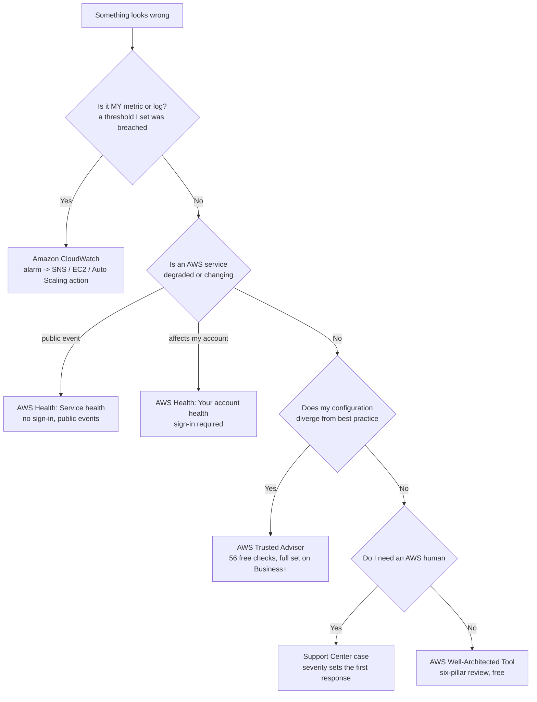
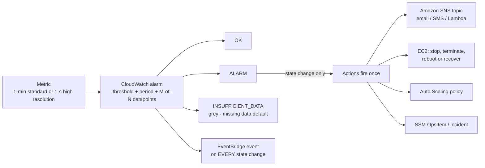
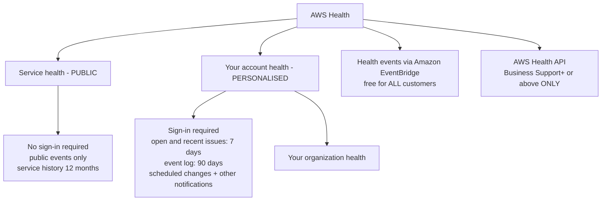
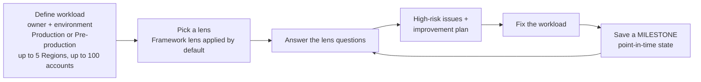

# Monitoring, Operations, Support and the Well-Architected Framework

A cloud workload you cannot see is a workload you do not run. Everything in this lesson answers one of three questions: **is it healthy**, **is it well built**, and **who do I call when it is not**. Those three questions map to three different exam tasks — *monitoring with Amazon CloudWatch* (task 2.2), *AWS Support* as a customer-enablement service (task 3.8), and *support plans, Trusted Advisor and the Health Dashboard* (task 4.3) — with the **six Well-Architected pillars** (task 1.2) supplying the standard you measure against. Students who blur the three questions lose easy marks, because the exam's favourite trick is to put a monitoring answer inside a support question and a support answer inside a monitoring question.

```text
=====================================================================
 MAP OF THE TERRAIN — WHICH TOOL ANSWERS WHICH QUESTION
=====================================================================
  "WHO IS SICK?"
    my own metric crossed MY threshold ........ Amazon CloudWatch
    an AWS service is degraded / changing ...... AWS Health - Service health
    MY account has open issues or changes ...... AWS Health - Your account health
    MY config diverges from best practice ...... AWS Trusted Advisor
    I need a human being at AWS ................ Support Center case (by plan)

  "HOW WELL IS IT BUILT?"
    six pillars, free review, improvement plan . AWS Well-Architected Tool
    account-level best-practice gaps ........... AWS Trusted Advisor
    shell access without bastions .............. Systems Manager Session Manager
    patching without a spreadsheet ............. Systems Manager Patch Manager

  "WHAT DO I GET FOR MY MONEY?"
    Basic = free, no technical cases ........... Business Support+ -> $29/month
    Enterprise = TAM + 15-minute top response .. Unified Operations = 5 minutes
=====================================================================
```

In this lesson you will:

- separate **CloudWatch vs AWS Health vs Trusted Advisor vs CloudTrail** by reading the symptom, not the service list;
- build CloudWatch **metrics, alarms, dashboards and Logs** the way the exam tests them — granularity, dimensions, states, missing-data policies and action semantics;
- work through **alarm-threshold logic** (period × datapoints, state-change-only actions, gray vs red);
- split the Health Dashboard into **public service health** and **personalised account health**, and know which parts are free;
- recall the **Systems Manager** one-liners (Session Manager, Patch Manager);
- place **Trusted Advisor** availability by plan — **56 free checks** versus the full set;
- read the **2026 support-plan table**: response times, channels, Trusted Advisor access, IEM and minimums, all date-stamped;
- open a case correctly: **console, severity, first response vs resolution**;
- name the **six Well-Architected pillars** exactly and drive the **Well-Architected Tool** (workload → lens → high-risk issues → improvement plan → milestone);
- apply **operational-excellence practices** at exam depth through sourced AWS capabilities;
- study **four real AWS customer cases**, then practise with **12 exam-style questions** and **four interactive checks**.

| Exam task | Domain (weight) | What this lesson delivers |
|---|---|---|
| 1.2 Identify design principles | Cloud Concepts (24%) | The six pillars, pillar-by-pillar |
| 2.2 Compliance and governance — *monitoring with Amazon CloudWatch* | Security and Compliance (30%) | §1 in full |
| 3.8 Other in-scope categories — *AWS Support* | Cloud Technology and Services (34%) | §5–§6 |
| 4.3 Technical resources and AWS Support — plans, Trusted Advisor, Health Dashboard | Billing, Pricing and Support (12%) | §2, §4, §5 |

---

## 1. Amazon CloudWatch: the health of *your* resources

### 1.1 The definition and the three-way trap

AWS defines CloudWatch as the service that *"monitors your AWS resources and the applications you run on AWS **in real time**"*. It is a family of four things — **metrics, alarms, dashboards and Logs** — and the exam rarely asks for the definition. It asks you to **not** pick CloudWatch when something else is meant.

| The symptom in the stem | The correct tool | Why |
|---|---|---|
| *"A threshold I configured was crossed — notify me and act"* | **Amazon CloudWatch** | Monitoring = current state of **my** resources |
| *"Which API call deleted the bucket?"* | **AWS CloudTrail** | Auditing = who did what (Lesson 07) |
| *"Was port 3306 open to the world last month?"* | **AWS Config** | Configuration history (Lesson 07) |
| *"Does this account diverge from AWS best practice?"* | **AWS Trusted Advisor** | Advisory gap check (§4) |
| *"Is an AWS service having an outage that affects me?"* | **AWS Health Dashboard** | AWS's own events (§2) |
| *"Which support option gives me a 15-minute response?"* | **AWS Support plans** | Commercial response time (§5) |



> [!NOTE]
> **The governing rule:** CloudWatch answers *"is **my** stuff working?"*; AWS Health answers *"is **AWS's** stuff working?"*; Trusted Advisor answers *"am **I** following best practice?"*. Domain 4 (support plans, Trusted Advisor, Health Dashboard) is where students most often answer **CloudWatch** — that is the trap the task statement was written to catch.

### 1.2 Metrics: AWS-vended, custom, and the two granularities

- **AWS-vended metrics** (EC2 CPUUtilization, S3 BucketSizeBytes, Lambda Invocations …) are published for you **at no additional charge**; **custom metrics** come from your own application via the **`PutMetricData` API**.
- Custom metrics are addressed by three keys: **namespace + metric name + dimensions**. A dimension is a name/value pair that filters the metric (for example `InstanceId`, `AutoScalingGroupName`) — a metric can carry **up to 30 dimensions** (verify current before use).
- **Standard resolution = one-minute granularity** (the AWS default); **high resolution = one second**. Pay for the resolution you choose.
- Metric data is retained for up to **15 months**, which is what makes long-horizon trending possible without exporting anywhere (as of Oct 2026).

```text
PutMetricData
  namespace:  "Custom/Checkout"          <-- your namespace, your choice of convention
  metric:     "p95_latency_ms"
  dimensions: [Environment=prod, Service=checkout]
  value:      612
  storage:    standard (1 min)  or  high resolution (1 s)
  retention:  up to 15 months
```

### 1.3 Alarms: threshold in, action out

An alarm watches a metric (or a **math expression** built from metrics) against a **threshold you define**, and it does two things nothing else in CloudWatch does: it **changes state** and it **fires actions**.

- **States:** `OK` (no colour) · `ALARM` (red) · `INSUFFICIENT_DATA` (**grey**, not red).
- **Actions fire on state change only** — not once per breaching datapoint. A metric that stays above threshold for an hour raises **one** notification, not sixty.
- **Action targets:** **Amazon SNS** (email/SMS/HTTP/Lambda), **EC2 actions** (stop, terminate, reboot, recover), **Auto Scaling** policies, **AWS Lambda**, and **SSM OpsItems/incidents**.
- Every alarm state change is *also* an **Amazon EventBridge** event, so your own tooling can react without polling.
- **Types:** metric alarms, **composite alarms** (a rule over other alarms — and composite alarms **cannot** run EC2 or Auto Scaling actions), **PromQL alarms**, **log alarms**.
- **Missing-data policies:** `notBreaching`, `breaching`, `ignore`, `missing` (the default, which lands in `INSUFFICIENT_DATA`).
- **Limits (as of Oct 2026):** you can create **as many alarms as you want** (no creation quota), alarm **history is kept 30 days**, and the evaluation window is **7 days when the period is ≥ 1 hour**, otherwise **1 day**. Unbounded, however, is **not** free — see the free tier in §1.5.



### 1.4 Example E1 — alarm-threshold logic (the exam's arithmetic)

**Scenario:** the checkout API's 95th-percentile latency must alarm when it exceeds **500 ms**. You configure: metric `p95_latency_ms`, threshold `> 500`, period **60 seconds**, **evaluation periods = 3**, **datapoints to alarm = 3**, missing-data policy = default.

```text
arming window  = evaluation periods x period = 3 x 60 s  = 3 minutes
breach rule    = 3 consecutive minutes above 500 ms -> state OK -> ALARM
                 (M = 3 of N = 3: every datapoint must breach)
partial breach = 2 of 3 minutes above 500 ms -> stays OK (no action)
actions        = fire ONCE on the OK -> ALARM transition, then nothing
                 until the alarm returns to OK and breaches again
no data        = policy "missing" -> INSUFFICIENT_DATA (grey), NOT ALARM
recall         = 3 consecutive minutes under 500 ms -> ALARM -> OK (recovery)
```

**Variants the exam likes:**

| Configuration | Effect | Exam point |
|---|---|---|
| evaluation periods **5**, datapoints to alarm **3** | any 3 of the last 5 minutes may breach | **M-of-N** tolerates noise |
| period **60 s** → period **300 s** | same 3 periods now span **15 minutes** | the window is `period × N`, not `N` |
| missing data = `breaching` | no data counts as a breach | good for *"must be reporting"* metrics |
| missing data = `ignore` | state unchanged on gaps | good for spiky, low-traffic metrics |
| composite alarm: `latency ALARM AND errors ALARM` | one escalation instead of two | composites **cannot** stop or scale instances |

> ⚠️ **Grey is not red.** `INSUFFICIENT_DATA` is an **uncertain** state, not a failure — the most common distractor claims an alarm that stops receiving data "goes into ALARM". It does not. Ask yourself *why* data stopped (instance terminated? agent dead? namespace typo?) before you treat the grey state as an outage.

### 1.5 Dashboards and the free tier — Example E2

A **CloudWatch dashboard** is a wall of widgets (graphs, text, alarms) that can span Regions and accounts; **automatic dashboards** for AWS services are included, and **custom dashboards** count against the free tier.

**Example E2 — counting the free tier before it counts against you (as of Oct 2026; verify current before use):**

```text
CloudWatch free tier                       included          this team needs
  log data (ingest + archive + Insights)      5 GB            12 GB   -> over by 7 GB
  metrics (custom + detailed)                10               12      -> over by 2
  API requests                             1,000,000        800,000  -> inside
  alarm metrics                              10               15      -> over by 5
  custom dashboards                           3                2      -> inside
  metrics per custom dashboard               50               60      -> over by 10
                                             ----             ----
                                             "free" is a quantity, not a switch
```

Two lessons follow: **unbounded ≠ free** (you may create as many alarms as you want, but only 10 alarm metrics are free), and **"free tier" is always a dated claim** — re-check AWS's CloudWatch pricing page before you budget.

- **📚 Did you know?** CloudWatch's proactive side is **Synthetics canaries**: configurable **Node.js, Python or Java** scripts that run **on a schedule inside AWS Lambda** to hit your endpoints and APIs and *"discover issues before your customers do"* — a broken login page alarms **before** the first customer complains. Two look-alikes to keep straight: **CloudWatch Evidently was discontinued on 16 October 2025** (a distractor, never a correct answer), and **Amazon Managed Grafana / Managed Prometheus are not on the CLF-C02 in-scope list** — the in-scope answer is always plain **Amazon CloudWatch** (as of Oct 2026).

### 1.6 Logs: log group, log stream, event

```text
log group   "aws/lambda/checkout"   <-- owns RETENTION + MONITORING + ACCESS CONTROL
   |
   +-- log stream "2026/10/07/[$LATEST]abc"   <-- one stream per instance/session
   |      |
   |      +-- log events (timestamped lines)   <-- NO LIMIT on the number of streams
   |
   +-- metric filter   -> creates a METRIC -> can raise an ALARM
   +-- subscription filter -> S3 / Kinesis Data Firehose (export)
   +-- anomaly detection / Logs Insights queries
```

- A **log group** is the unit of **retention, monitoring and access control**; streams inside it inherit those settings, and AWS places **no limit** on the number of log streams.
- **CloudWatch Logs Insights** lets you **interactively search and analyse** log data with **3 query languages**, at up to **100 concurrent** queries per account (as of Oct 2026).
- The chain exam stems test: **logs → metric filter → alarm → SNS action**. That is how a *text* line ("OutOfStockError") becomes an *actionable* notification.

```fillblank
{
  "question": "Complete the CloudWatch vocabulary statements with the correct AWS-sourced terms:",
  "template": "Amazon CloudWatch monitors your AWS resources and applications in {{1}}. Custom metrics are published with the {{2}} API and are addressed by namespace, metric name and {{3}}. Standard-resolution metrics arrive at one-minute granularity while high resolution is {{4}} second, and metric data is retained for up to {{5}} months. In CloudWatch Logs the unit that owns retention, monitoring and access control is the {{6}}.",
  "answers": {
    "1": "real time",
    "2": "PutMetricData",
    "3": "dimensions",
    "4": "1",
    "5": "15",
    "6": "log group"
  },
  "distractors": ["PutLogEvents", "tags", "periods", "30", "60", "log stream", "alarm"],
  "explanation": "AWS defines CloudWatch as real-time monitoring of your resources and applications; custom metrics go through PutMetricData keyed by namespace, metric name and dimensions; standard resolution is one minute and high resolution one second with 15-month retention; and the log group - not the log stream - is the container that shares retention, monitoring and access-control settings."
}
```

---

## 2. AWS Health Dashboard: the health of *AWS's* resources

### 2.1 Two views, one word

The Health Dashboard is a single service with **two completely different views**, and the exam separates them by **sign-in requirement**.

| | **Service health** (public) | **Your account health** (personalised) |
|---|---|---|
| Sign-in required | **No** — anyone can open it | **Yes** |
| Content | **Public events**, *"not specific to an AWS account"* | **Account-specific**: open and recent issues (**7 days**), scheduled changes, other notifications, **event log (90 days)** |
| History | **Service history: last 12 months** | Event log: **90 days** |
| Also in the console | — | **Your organization health** view |
| Typical stem | *"Check AWS status without credentials"* | *"Which maintenance events are scheduled for MY account?"* |



### 2.2 What is free and what is not

- The **AWS Health Dashboard is available for all AWS customers at no additional cost**.
- **All AWS customers can receive AWS Health events through Amazon EventBridge at no additional cost** — that is the cheapest way to automate a response to AWS-side events.
- The **AWS Health API** (feeding *your* systems or a third-party tool) is the only gated piece: it requires **Business Support+ or above** (Enterprise and Unified Operations included).

> [!WARNING]
> **Dashboard ≠ API.** *"Which of these needs a paid support plan?"* → the **Health API**. The console dashboard and the EventBridge event stream are free for everyone, on every plan including Basic.

### 2.3 Example E3 — the five-step "is it us or AWS?" drill

**Scenario:** checkout p95 latency spikes at 02:10 UTC. Work the drill in order — every step has exactly one right tool.

```text
step 1  CloudWatch dashboard + alarm state      -> is MY metric actually breaching?
step 2  alarm green? -> Health: Service health   -> public AWS event? (no sign-in needed)
step 3  Health: Your account health              -> account-specific issue or scheduled change?
step 4  gap in MY configuration (open security    -> Trusted Advisor
        group, idle instance, missing MFA)
step 5  still stuck? -> Support Center case       -> severity sets the FIRST RESPONSE clock
                                                        (see section 5)
```

Skipping straight to step 5 on a free plan is the failure mode: **Basic Support cannot open technical support cases** (§5). Diagnose first; escalate second.

- **📚 Did you know?** The Health **dashboard** and the Health **API** were separated deliberately: AWS states the dashboard is *"available for all AWS customers at no additional cost"* while the API is a plan feature. Health events arrive in **two flavours** — **public events** (anyone, no sign-in) and **account-specific events** (*"your account or an account in your organization"*) — which is why the same incident appears on the public page **and** in your personalised event log (as of Oct 2026).

---

## 3. AWS Systems Manager: two one-liners

**Systems Manager** is on the in-scope list as a *Management and Governance* service; at CLF depth you need exactly two of its capabilities, each recognisable by a phrase.

| Capability | What it does | The phrase that keys it |
|---|---|---|
| **Session Manager** | A fully managed way to connect to EC2, edge and on-premises nodes through a **browser or the AWS CLI** | *"secure node management **without the need to open inbound ports, maintain bastion hosts, or manage SSH keys**"* — sessions are **IAM-gated** and **logged** |
| **Patch Manager** | *"Automates the process of patching managed nodes"* using **patch baselines** | *"**scan instances** … or … **scan and automatically install** all missing patches"*; organisation-wide patch policies run from **Quick Setup**, results read as **compliance** |

```text
REQUIREMENT                              ANSWER
"controlled access, no inbound ports,    Session Manager
 no bastion, no SSH keys, sessions       (not a VPN, not a jump box, not port 22)
 logged and IAM-gated"
"monthly OS patching at scale, Linux +   Patch Manager
 Windows, scan-only or scan-and-install, (not a manual Run Command script, not
 compliance reporting"                   Trusted Advisor)
```

*Scenario S1:* a team must retire its single bastion host while keeping auditable access to 40 EC2 instances. The sourced answer: **enable Session Manager**, delete the bastion, revoke standing SSH keys, gate access with **IAM**, and keep **session logging** on. No security-group surgery, no key distribution.

*Scenario S2:* monthly patching must start as a report and only later as an automated rollout. The sourced answer: **Patch Manager** with a **patch baseline**, first in **scan-only** mode to read compliance, then **scan-and-install**, then an organisation-wide **patch policy in Quick Setup**.

---

## 4. AWS Trusted Advisor: availability per plan

Lesson 07 owns Trusted Advisor's **six check categories**; this lesson owns **who gets what**, because that is task 4.3's version of the question.

| Plan (as of Oct 2026) | Trusted Advisor access |
|---|---|
| **Basic** | **Core checks** — AWS also states you get **all checks in the Service Limits category** and **selected checks in the Security and Fault tolerance categories** |
| **Business Support+** | **Full set** of checks |
| **Enterprise Support** | Full set **+ TA Priority** |
| **Unified Operations** | Full set **+ TA Priority** |
| Developer / Business / Enterprise On-Ramp (legacy) | Legacy plans — **discontinued 1 January 2027**, so do not build an answer on them |

**Check counts:** **all AWS accounts get 56 Trusted Advisor checks**; **Business Support+ and above unlock an additional 426 checks, totalling 482**. One AWS page separately advertises *"more than 500 checks"* for Business Support+ — the two figures do not reconcile publicly, so the safe exam phrasing is **"56 free on every plan; the full set with Business Support+"** (as of Oct 2026; verify current before use).

> [!NOTE]
> **Trusted Advisor advises, it does not enforce.** Enforcement belongs to **AWS Config rules and remediation**, **service control policies** and **Control Tower guardrails** (Lesson 07). An option saying *"Trusted Advisor blocks the misconfiguration"* is wrong on every plan, including Enterprise.

---

## 5. AWS Support plans — the 2026 lineup

### 5.1 Who is selling what, as of October 2026

AWS's current lineup is **four plans**: **Basic · Business Support+ · Enterprise Support · Unified Operations**. Three legacy plans are in their final months: **Developer** and **Business** took **no new subscriptions after 2 December 2025** and are **discontinued on 1 January 2027**; **Enterprise On-Ramp** is supported **through 31 December 2026** and is also **discontinued on 1 January 2027**, with AWS moving those customers to Enterprise during 2026. Legacy plans remain available in **AWS GovCloud (US)**.

### 5.2 The support plans table

| | **Basic** | **Developer** † | **Business** † | **Business Support+** | **Enterprise** | **Unified Operations** |
|---|---|---|---|---|---|---|
| **Status (Oct 2026)** | Included with every AWS account | No new subs since 2 Dec 2025; ends 1 Jan 2027 | No new subs since 2 Dec 2025; ends 1 Jan 2027 | Current | Current | Current |
| **Positioning** | Free baseline | Business-hours support | (legacy, not re-verified) | **Minimum recommended plan for production workloads** | **Business-critical** workloads across organizations | **Mission-critical** workloads requiring enhanced resilience |
| **Technical support cases** | **✘ cannot open technical cases** | ✔ (business hours only) | ✔ (not re-verified) | ✔ **24×7** | ✔ **24×7** | ✔ **24×7** |
| **Channels** | Billing/account, **quota increases**, forums, docs, service health — 24×7 | Web + email, business hours | (not re-verified) | Phone, web, chat | Phone, web, chat | Phone, web, chat |
| **First response, business-critical system down** | n/a | — | — | **< 30 minutes** | **< 15 minutes** | **5 minutes**, from an **Incident Management Engineer** |
| **Trusted Advisor** | **Core checks** (56 free on all plans) | — | — | **Full set** | Full set **+ TA Priority** | Full set **+ TA Priority** |
| **AWS Health API** | ✘ (dashboard only) | — | — | ✔ | ✔ | ✔ |
| **Technical Account Manager** | ✘ | — | — | ✘ | ✔ **TAM** | ✔ **TAM + DSE** |
| **Event support** | — | — | — | **AWS Countdown** as an add-on | **AWS Countdown** included (Premium = paid add-on) | **Short-term IEM** + Countdown Premium |
| **AWS Security Incident Response** | ✘ | — | — | Add-on | **Included** | **Included** |
| **Monthly minimum** | **$0** | not published | not published | **$29 / month per account** | **$5,000 / month** (was $15,000) | **$50,000 / month** |
| **Minimum commitment** | none | — | — | **30 days** | **30 days** | **90 days** |

† Legacy plan. Cells marked *not re-verified* have no current official figure in this lesson's sources — **never quote a legacy price**; AWS does not publish one, and third-party figures (Developer $29, Business $100, Enterprise On-Ramp $5,500) are unverified.

**All four current plans keep, free:** billing and account support, **quota increases**, forums, documentation and service health — **24×7**. **Business Support+** adds third-party software support and the **Support API**; **AWS re:Post** gives *prioritized responses* on paid plans.

### 5.3 The first-response ladder

AWS publishes one severity ladder, with the **top row** varying by plan. All figures are **first response**, not resolution, and AWS commits only to *"every reasonable effort"*:

| Severity (highest first) | Business Support+ | Enterprise | Unified Operations |
|---|---|---|---|
| **Business-critical system down** (`critical`) | **< 30 min** | **< 15 min** | **5 min** |
| **Production system down** (`urgent`) | < 1 h | < 1 h | < 1 h |
| **Production system impaired** | < 4 h | < 4 h | < 4 h |
| **System impaired** | < 12 h | < 12 h | < 12 h |
| **General guidance** (low) | < 24 h | < 24 h | < 24 h |

**Example E4 — choosing the plan from the workload:**

```text
startup, pre-revenue, billing questions only     -> Basic       $0, no technical cases
staging environment, business-hours help is fine -> (legacy Developer - EOS 1 Jan 2027)
production workload, 24x7 + <30 min top response -> Business Support+   from $29/month
business-critical across many accounts, needs TAM-> Enterprise   from $5,000/month
mission-critical, 5-minute engineer response     -> Unified Operations from $50,000/month
```

**Example E5 — the ladder read literally:**

| Stem | Right answer | Trap answer and why it fails |
|---|---|---|
| *"Production system impaired, Business Support+"* | **< 4 hours** | 1 hour is *production system **down*** — a different severity |
| *"Business-critical system down, Enterprise"* | **< 15 minutes** | 30 minutes is Business Support+ (and, coincidentally, the retiring Enterprise On-Ramp — same number, different plan) |
| *"Business-critical system down, Unified Operations"* | **5 minutes from an Incident Management Engineer** | 15 minutes is Enterprise |
| *"Production system down, Basic"* | **No first response — Basic cannot open technical cases** | 1 hour assumes a plan that can open a case at all |

> ⚠️ **First response ≠ resolution.** AWS states the published times are for the **first response** and *"don't apply to subsequent responses"*. A question asking *"how long until AWS fixes my outage"* has **no** published answer — the ladder only ever measures **how fast someone replies**.

### 5.4 What the plan costs — worked arithmetic (as of Oct 2026)

Support on paid plans is a **percentage of your monthly AWS charges**, with a **monthly floor**:

| Plan | Percentage ladder | Monthly minimum |
|---|---|---|
| Business Support+ | **9% / 7% / 5% / 3%** | **$29** per account |
| Enterprise | **10% / 7% / 5% / 3%** | **$5,000** (reduced from $15,000) |
| Unified Operations | **10% / 6% / 5%** (GovCloud 11% / 7% / 6%) | **$50,000** |

**Worked example (a) — Business Support+ on $20,000 of monthly AWS charges:**

```text
first slice   $10,000 x 9%  =   $900
second slice  $10,000 x 7%  =   $700
                             ----------
                                    $1,600 / month
minimum                          $29   -> the $1,600 wins
```

**Worked example (b) — Enterprise on $750,000 of monthly AWS charges:**

```text
AWS's published example totals:  $15,000 + $24,500 + $12,500 = $52,000 / month
minimum                            $5,000  -> applies at every spend level,
                                              INCLUDING $0 (i.e. $60,000/year idle)
```

**Worked example (c) — Unified Operations on $1,500,000 of monthly AWS charges:**

```text
$100,000 + $30,000 = $130,000 / month, against a $50,000 floor
minimum commitment: 90 days (30 days on Business Support+ and Enterprise)
```

- **📚 Did you know?** The plan map moved twice in a year. **Developer Support and Business Support stopped taking new subscriptions on 2 December 2025** and are **discontinued 1 January 2027**; **Enterprise On-Ramp is supported only through 31 December 2026**; meanwhile **Enterprise's monthly minimum fell from $15,000 to $5,000**. Two consequences for exam day: an *"Enterprise On-Ramp 30-minute response"* question points at a **retiring** plan whose number happens to equal Business Support+'s 30 minutes, and any prep material quoting a **Developer at $29 / Business at $100** price is repeating **unverified** third-party figures — AWS publishes no legacy prices (as of Oct 2026).

### 5.5 Incident-flavoured extras

| Offer | What it is | Availability (as of Oct 2026) |
|---|---|---|
| **AWS Countdown** | Event support ahead of a planned launch or migration | Add-on on **Business Support+**, included on **Enterprise** |
| **AWS Countdown Premium** | The enhanced tier | Paid add-on **$10,000 per project per month** (2026 promotional rate $7,500/month); **included with Unified Operations** |
| **Short-term IEM** (Infrastructure event management) | Time-boxed engineering help during an event | Listed under **Unified Operations** |
| **AWS Incident Detection & Response** | 5-minute response detection service | **$7,000 or 2%** of aggregated monthly charges as an **Enterprise add-on**; **included** with Unified Operations |
| **AWS Security Incident Response** | Security-specific response | Not on Basic; **add-on** on Business Support+; **included** on Enterprise and Unified Operations |
| **AWS Unified Operations** itself | *"Combines proven expertise with AI-powered insights"* with **24×7 security and performance monitoring** | Top tier, $50,000/month floor |

---

## 6. Opening a case: console, severity, expectations

**Where:** the **AWS Support Center** in the console is the case console — one place to open, rate and close cases. **AWS Professional Services** and **solutions architects** are engagement offerings, not case channels; the **Trust and Safety team** handles abuse reports; **AWS Partner-Led Support** lets a partner open cases on your behalf (on eligible plans).

**How a case is graded:** you choose a **severity** when you open it, and the severity — not the plan alone — selects the row of the ladder in §5.3. The single most-missed detail: the **highest severity is "Business-critical system down"**, and *"Production system down"* is the row below it (1 hour), not the top.

```text
open case (Support Center)
   -> choose severity: business-critical | production down | production impaired
                       | system impaired | general guidance
   -> the CLOCK that matters is FIRST RESPONSE (plan + severity)
   -> Basic plan = stop: no technical cases; use forums, docs, service health
   -> need machine access to AWS itself? -> Support API (Business+ and above)
```

**Example E6 — three escalations, three answers:**

| Situation | Correct move | Why the alternatives fail |
|---|---|---|
| Free-tier hobby account, unexpected $4 charge | **Billing case on Basic** (allowed) | Technical cases are closed to Basic, but billing/account help is included |
| Production API down, Business Support+ | **Case at "Production system down"** → expect first response **< 1 h** | Opening it as "business-critical" would promise 30 min you are not entitled to, and opening it on Basic would be impossible |
| Feed AWS health events into PagerDuty automatically | **EventBridge health events (free, any plan)** or the **Health API (Business+)** | The dashboard alone cannot push to your tooling |

```matching
{
  "question": "Match each operational need to the plan or service that actually satisfies it (as of Oct 2026):",
  "pairs": [
    {"left": "Free account needing billing help, quota increases, forums and service health - never a technical case", "right": "Basic Support - included with every AWS account; technical support cases are not available"},
    {"left": "Production workload needing 24x7 phone, web and chat with a top-severity first response under 30 minutes", "right": "Business Support+ - minimum $29 per month per account; full Trusted Advisor set; AWS Health API included"},
    {"left": "Business-critical estate needing a named TAM and a first response under 15 minutes", "right": "Enterprise Support - minimum $5,000 per month; TAM included; TA Priority; AWS Countdown included"},
    {"left": "Mission-critical estate wanting an Incident Management Engineer on a 5-minute first response plus a DSE", "right": "Unified Operations - minimum $50,000 per month with a 90-day commitment; short-term IEM included"},
    {"left": "Integrating AWS health events into my own on-call tooling through an API", "right": "Business Support+ or above - the dashboard and EventBridge events are free to all, but the Health API is plan-gated"},
    {"left": "A business-hours-only plan that stopped taking new subscriptions on 2 December 2025", "right": "Developer Support - discontinued 1 January 2027; never key a 2026 answer to it"}
  ],
  "explanation": "Read the constraint, not the brand: no technical cases means Basic; production plus 24x7 and under-30-minute top response means Business Support+; a TAM and 15 minutes mean Enterprise; a 5-minute engineer means Unified Operations; an API integration is the one Health feature that is plan-gated; and any legacy plan is a distractor after its end-of-sale date."
}
```

---

## 7. The Well-Architected Framework and the Well-Architected Tool

### 7.1 The six pillars — exact names

The Framework gives AWS's *"best practices for designing and operating secure, reliable, efficient, cost-effective and sustainable workloads"*, published as documentation dated **6 November 2024**. There are **six pillars**, and the exam tests the names **and** the differences between them:

| # | Pillar (exact name) | What it is about (AWS wording) |
|---|---|---|
| 1 | **Operational Excellence** | Operating and **monitoring** systems |
| 2 | **Security** | **Protecting** systems |
| 3 | **Reliability** | **Recovering quickly from failure** |
| 4 | **Performance Efficiency** | **Allocating and monitoring** resources |
| 5 | **Cost Optimization** | **Avoiding unnecessary costs** |
| 6 | **Sustainability** | **Minimizing environmental impacts** |

> [!WARNING]
> **Pillars ≠ lenses ≠ CAF perspectives.** **DevOps, Machine Learning, Migration, Serverless, Data Analytics** and the rest of the Lens Catalog are **lenses** — the exam guide never names a lens. There is **no "Security lens"** (Security is a *pillar*). The **AWS Cloud Adoption Framework has six *perspectives*** — Business, People, Governance, Platform, Security, Operations — a different list about *organisational readiness*, not workload quality (Lesson 02). And the framework's **six general design principles** are covered in Lesson 01; this lesson is the services-and-practice half.

### 7.2 The Well-Architected Tool: reviews, high-risk issues, milestones

The **AWS Well-Architected Tool** is a console service **available at no cost**, giving *"a consistent process … to review and measure your architecture"*. A review is explicitly *"a **constructive conversation** about architectural decisions, and is **not an audit mechanism**"* — it produces **high-risk issues** and an **improvement plan**, never a certificate.



**Mechanics you must recall:**

- A **workload** is *"a set of components that deliver business value"*; you record a **review owner**, an **environment (Production / Pre-production)**, **up to 5 Regions** and **up to 100 account IDs** (name 3–100 characters, description 3–250).
- The **Framework lens** is applied **by default**.
- **Lenses come in two kinds:** **Lens Catalog** lenses (official, *"do not require any additional installation"*) and **Custom lenses** (your own pillars and questions). **Five lenses can be added at a time**, with a **maximum of 20 lenses** per workload.
- A **milestone** *"records the state of a workload at a particular point in time"* — save one **after you initially complete all the questions**, and again after improvements land, so you can show the trajectory.

**Example E7 — a review that produces a milestone:**

```text
workload   "checkout" | owner: A. Nandi | environment: Production
           3 Regions  | 12 account IDs   (all inside the 5 Region / 100 account limits)
lens       Framework lens (default) + Machine Learning lens (2 of the 5 allowed at a time)
output     high-risk issues ranked + improvement plan (free)
action     fix the top 2 reliability issues
milestone  #1 saved after the first full answer set; #2 saved after the fixes
value      two points in time, same questions -> measurable improvement, no audit needed
```

```dragdrop
{
  "question": "Order the Well-Architected Tool review flow exactly as AWS documents it:",
  "items": [
    "Define the workload - owner, Production or Pre-production, up to 5 Regions, up to 100 accounts",
    "Open the Well-Architected Tool (free) - the Framework lens is applied by default",
    "Add further lenses if needed - up to 5 at a time, 20 maximum per workload",
    "Answer the lens questions",
    "Read the high-risk issues and the improvement plan",
    "Fix the workload",
    "Save a milestone - the point-in-time state of the workload"
  ],
  "correctOrder": [
    "Define the workload - owner, Production or Pre-production, up to 5 Regions, up to 100 accounts",
    "Open the Well-Architected Tool (free) - the Framework lens is applied by default",
    "Add further lenses if needed - up to 5 at a time, 20 maximum per workload",
    "Answer the lens questions",
    "Read the high-risk issues and the improvement plan",
    "Fix the workload",
    "Save a milestone - the point-in-time state of the workload"
  ],
  "explanation": "The Tool's order is define -> review (Framework lens by default, extra lenses on top) -> answer -> high-risk issues plus improvement plan -> fix -> milestone. AWS's own guidance is to save a milestone after the first complete answer set and again after improvements, because a milestone is a point-in-time record, not a pass/fail grade - a review is a constructive conversation, never an audit."
}
```

- **📚 Did you know?** Two AWS voices describe what a review is *for*: **CyberAgent** says it helps them *"visualize potential business risks"*, while **NEC** says the value is to *"review at an early stage of the design phase"* — before the architecture hardens. That is also why the Tool is **free**: AWS sells the *conversation*, not the certificate, and the Tool's only real "output" is a ranked list of **high-risk issues** you then have to go and fix (as of Oct 2026).

---

## 8. Operational excellence at exam depth

**Operational Excellence** is the pillar about *operating and monitoring* systems — and on CLF-C02 it is examined as **which AWS capability performs which operational job**, not as essay material. The framework's general design principles live in Lesson 01; here is the service-level checklist our sources support.

| The operational job | The AWS capability | Sourced detail you can be asked for |
|---|---|---|
| See the workload in real time | **CloudWatch metrics + dashboards** | 1-min standard / 1-s high resolution; 15-month retention; custom metrics via `PutMetricData` |
| Act automatically when a rule breaks | **CloudWatch alarms** | Threshold + M-of-N; **actions on state change only**; SNS, EC2 stop/recover, Auto Scaling, Lambda, SSM |
| Catch issues before customers do | **CloudWatch Synthetics canaries** | Scheduled Node.js/Python/Java scripts running on **Lambda** |
| Keep one searchable, retained log estate | **CloudWatch Logs** | Log **group** owns retention, monitoring and access control; **Logs Insights** with 3 query languages |
| Turn text into an alert | **Metric filter → alarm → SNS** | The logs-to-metric-to-action chain |
| Reach nodes without a bastion | **SSM Session Manager** | No inbound ports, no bastion hosts, no SSH keys; IAM-gated; sessions logged |
| Keep the OS patched | **SSM Patch Manager** | Patch baselines; **scan only** or **scan and install**; compliance reporting; Quick Setup policies |
| Check myself against best practice | **Trusted Advisor** | 56 free checks; full set on Business Support+; **advisory only** |
| Know whether it is AWS's fault | **AWS Health Dashboard / API** | Dashboard free to all; **API needs Business Support+** |
| Escalate with a clock | **Support Center + plan + severity** | First-response ladder; **Basic cannot open technical cases** |
| Improve the architecture itself | **Well-Architected Tool** | Free; high-risk issues; improvement plan; **milestones** |
| Prove the operations get better | **Milestones + Case metrics** | Point-in-time records you compare over successive reviews |

**Example E8 — putting the checklist together:** a 12-person team runs a 40-node fleet. The sourced operating model: **Session Manager** replaces the bastion (no inbound ports), **Patch Manager** runs scan-only for a week to read compliance before switching to scan-and-install, **CloudWatch** alarms on CPU and latency publish to an **SNS** topic that pages on-call, **Synthetics canaries** hit the login page every five minutes, **Trusted Advisor**'s free 56 checks are reviewed monthly, a **Well-Architected review** is saved as a **milestone** each quarter, and a **Business Support+** case is the escalation path when all of that says *"not us"*. Nothing on that list needs a human to write a monitoring stack from scratch — which is exactly the Well-Architected preference for **managed, least-operational-overhead** answers.

---

## Real-World Case Studies

AWS publishes what these patterns look like in production. Every figure below is **customer- or AWS-claimed and unaudited**, quoted with its source so you can check it — the examinable point is the **pattern** (which capability was used, which number moved), not the marketing.

### Case A — Bangkok Flight Services: monitoring and audit shipped *with* the migration

| Element | Detail |
|---|---|
| **Industry / context** | Aviation cargo handling around **60 million passengers a year**, growing, on aging hardware with **no disaster-recovery site** |
| **AWS services named** | **AWS Application Migration Service (MGN)**, Amazon EC2, Amazon S3, **AWS CloudTrail**, **Amazon CloudWatch**, **multi-AZ disaster recovery**, Partner: DailiTech |
| **Headline outcomes (AWS-published)** | Migration completed in **7 months** with **no rollback and no disruption**; **IT infrastructure management time cut by 50%**; roughly **1 hour a year of unplanned downtime eliminated** |
| **Operations lesson** | CloudWatch and CloudTrail were **part of the solution**, not an afterthought — and DR was designed across **multiple Availability Zones** from day one |
| **Source** | aws.amazon.com/solutions/case-studies/bangkok-flight-services (accessed Oct 2026) |

*Exam lesson:* **monitoring and audit ride along with every migration.** A stem that says *"the customer migrated and can now see resource health and API activity"* is describing **CloudWatch + CloudTrail**, and the resilience claim is **multi-AZ**, not multi-Region — the exact distinction Lesson 03 tests.

### Case B — Capital One: operational excellence as an engineering discipline

| Element | Detail |
|---|---|
| **Industry / context** | Fortune 100 bank moving from *periodic disaster-recovery tests* to systems that **automatically prevent, detect and recover** |
| **AWS services named** | Automated **Regional failover**, **Amazon Route 53**, **Amazon CloudWatch**, a central recovery hub, monthly **AWS GameDay**, chaos engineering |
| **Headline outcomes (AWS-published, customer-claimed)** | **Critical-severity events reduced by 80–90%**; **recovery time cut from hours to minutes** across thousands of components in dependency order; testing cadence moved from **quarterly cross-Region tests to monthly chaos experiments** |
| **Operational excellence lesson** | Reliability is **proven by repeated, automated testing**, not declared — and CloudWatch sits in the detection path that makes recovery automatic |
| **Customer voice** | *"We believe that innovation should be at the speed of well-managed systems."* — Parvez Naqvi, VP resilience & reliability engineering (customer quote) |
| **Source** | aws.amazon.com/solutions/case-studies/capital-one-improving-resilience-case-study (accessed Oct 2026) |

*Exam lesson:* **80–90% is a customer result, not an AWS guarantee**, and it belongs to the *resilience* case study (the same customer's migration page has a different set of numbers — don't mix them).

### What the two cases share

| Value pattern | Evidence | Underlying principle |
|---|---|---|
| Observability ships with the workload | Bangkok: CloudWatch + CloudTrail in the migration scope | **Monitoring is a deliverable**, not a phase 2 |
| Recovery is tested, not assumed | Capital One: quarterly → **monthly** chaos experiments, GameDay | **Reliability = recovering quickly from failure** |
| Automation shrinks operations labour | Bangkok: infrastructure management time **−50%** | Operational excellence favours **automated, repeatable** operations |
| The free tools do the first pass | Both: CloudWatch + WA/Trusted Advisor-style review before escalation | Diagnose first, **then** open a case |

- **📚 Did you know?** Capital One's numbers live on **two different AWS pages** and describe **two different projects**: the resilience case study reports **critical-severity events down 80–90%** with recovery **hours → minutes**, while the migration case study reports exiting **8 data centers**, ~**80% of ~2,000 applications** cloud-built and dev environments cut from **3 months to minutes**. On exam day, quote the number **with the project it came from** — mixing them is the classic case-study error (accessed Oct 2026).

> [!WARNING]
> **How to read case-study numbers on exam day:** every percentage here is **customer-claimed or AWS-published and unaudited** — never a guarantee, and *"up to"* is a **ceiling**, never an average. Attribute the source and access date (*"Bangkok Flight Services case study, accessed Oct 2026"*), not *"AWS proves"*. A case never licenses an out-of-scope answer: you are asked to **name the in-scope service** (CloudWatch, CloudTrail, Health, Trusted Advisor, WA Tool), never to reproduce the marketing figure.

---

## Practice Questions

```question
{
  "id": "clf-12-q1",
  "type": "multiple-choice",
  "question": "A checkout service's 95th-percentile latency crosses a threshold your team configured in your own account, and you want a notification plus an automated recovery action. Which service should you use?",
  "options": [
    "Amazon CloudWatch - an alarm on your metric with an SNS or EC2 action",
    "AWS Health Dashboard - Service health view",
    "AWS Trusted Advisor - cost optimization category",
    "AWS CloudTrail - event history"
  ],
  "correct": 0,
  "explanation": "CloudWatch is the monitoring answer: alarms watch a metric against a user-defined threshold and fire actions on state change - SNS for notification, plus EC2 stop/terminate/reboot/recover, Auto Scaling, Lambda or an SSM OpsItem. AWS Health covers AWS's own service events, Trusted Advisor reports best-practice gaps, and CloudTrail records who called which API."
}
```

```question
{
  "id": "clf-12-q2",
  "type": "multiple-choice",
  "question": "A CloudWatch alarm with a 60-second period and three evaluation periods stops receiving data. The alarm shows INSUFFICIENT_DATA. Which statement is correct?",
  "options": [
    "INSUFFICIENT_DATA is a red state meaning the alarm itself has failed",
    "CloudWatch automatically changes the state to ALARM after three periods with no data",
    "INSUFFICIENT_DATA is a grey, uncertain state - actions do not fire until the alarm actually enters ALARM",
    "Missing data is always treated as breaching by default"
  ],
  "correct": 2,
  "explanation": "The three states are OK, ALARM (red) and INSUFFICIENT_DATA (grey). Grey means CloudWatch does not have enough datapoints - with the default missing-data policy the alarm sits in INSUFFICIENT_DATA rather than ALARM, so no actions fire. Breaching-only behaviour must be chosen explicitly with the breaching missing-data policy, and actions fire on state change only."
}
```

```question
{
  "id": "clf-12-q3",
  "type": "multiple-choice",
  "question": "You must check whether an AWS service has a public, ongoing disruption WITHOUT signing in to the AWS console. Which view satisfies the requirement?",
  "options": [
    "Your account health - personalised events for your account",
    "AWS Health Dashboard - Service health, which shows public events and needs no sign-in",
    "AWS Trusted Advisor - fault tolerance category",
    "A CloudWatch dashboard shared with you by email"
  ],
  "correct": 1,
  "explanation": "Service health is the public view: it shows public events that are not specific to any AWS account, requires no sign-in, and keeps a 12-month service history. Your account health needs a sign-in and shows account-specific content (open and recent issues for 7 days, scheduled changes, a 90-day event log). Trusted Advisor and CloudWatch both describe your own account, not AWS's service status."
}
```

```question
{
  "id": "clf-12-q4",
  "type": "multiple-choice",
  "question": "A company wants AWS Health events pushed into its own on-call system through an API. What must be true for this to work?",
  "options": [
    "Any plan works, because the AWS Health API is free to all customers",
    "Business Support+ or above is required - the dashboard and EventBridge events are free to everyone, but the Health API is plan-gated",
    "Only Unified Operations can use it, because it is part of incident detection",
    "Basic Support is enough, because the Health Dashboard is included with Basic"
  ],
  "correct": 1,
  "explanation": "AWS states the Health Dashboard is available to all customers at no additional cost and that all customers can receive Health events through Amazon EventBridge free - but the AWS Health API requires Business Support+, Enterprise or Unified Operations. Confusing the free dashboard with the gated API is the standard trap in this task."
}
```

```question
{
  "id": "clf-12-q5",
  "type": "multiple-choice",
  "question": "A customer on the Basic Support plan suffers a production outage and wants to escalate to AWS immediately. Which statement is correct?",
  "options": [
    "Basic includes a first response within 1 hour for production system down",
    "Basic cannot open technical support cases - it covers billing and account help, quota increases, forums, documentation and service health",
    "Basic includes the full Trusted Advisor check set, so the case is unnecessary",
    "Basic includes a designated Technical Account Manager"
  ],
  "correct": 1,
  "explanation": "Customers with the Basic Support plan cannot open technical support cases. What Basic does include, 24x7, is billing and account support, quota increases, forums, documentation and service health - plus Trusted Advisor core checks (all accounts get 56 free checks). Response-time ladders and TAMs only exist on plans that can open technical cases."
}
```

```question
{
  "id": "clf-12-q6",
  "type": "multiple-choice",
  "question": "A business-critical system is down. Which plan-and-first-response pairing is correct as of Oct 2026?",
  "options": [
    "Business Support+ - first response under 15 minutes",
    "Enterprise Support - first response under 15 minutes",
    "Basic Support - first response within 1 hour",
    "Enterprise On-Ramp - first response under 15 minutes"
  ],
  "correct": 1,
  "explanation": "Top-severity (business-critical system down) first responses are: Business Support+ under 30 minutes, Enterprise under 15 minutes, and Unified Operations 5 minutes from an Incident Management Engineer. Business Support+ is 30 minutes, Basic cannot open technical cases at all, and Enterprise On-Ramp - whose 30-minute figure predates the current lineup - is discontinued on 1 January 2027."
}
```

```question
{
  "id": "clf-12-q7",
  "type": "multiple-choice",
  "question": "Which of the following is NOT one of the six AWS Well-Architected Framework pillars?",
  "options": [
    "Sustainability",
    "DevOps",
    "Operational Excellence",
    "Performance Efficiency"
  ],
  "correct": 1,
  "explanation": "The six pillars are Operational Excellence, Security, Reliability, Performance Efficiency, Cost Optimization and Sustainability. DevOps is a LENS from the Lens Catalog - a way of applying the framework to a specific kind of workload - and the exam guide never names lenses. There is also no 'Security lens': Security is a pillar."
}
```

```question
{
  "id": "clf-12-q8",
  "type": "multiple-choice",
  "question": "Which statement about an AWS Well-Architected Tool review is correct?",
  "options": [
    "A review certifies the workload for compliance, so it should be treated as an audit",
    "The Tool is free, and a milestone records the state of a workload at a particular point in time",
    "Only customers on Enterprise Support can run a review",
    "The Framework lens must be replaced by a custom lens before the first review"
  ],
  "correct": 1,
  "explanation": "The Well-Architected Tool is available at no cost, a review is explicitly a constructive conversation and not an audit mechanism, and a milestone records the workload's state at a point in time - AWS says to save one after you initially complete all the questions and again after improvements. The Framework lens is applied by default; custom lenses are optional additions (5 at a time, 20 maximum)."
}
```

```question
{
  "id": "clf-12-q9",
  "type": "multiple-choice",
  "question": "Requirement: controlled access to managed nodes with no inbound ports, no bastion hosts and no SSH keys, sessions gated by IAM and logged. Which AWS capability satisfies it?",
  "options": [
    "AWS Systems Manager Session Manager",
    "AWS Systems Manager Patch Manager",
    "Amazon CloudWatch Synthetics",
    "AWS Trusted Advisor"
  ],
  "correct": 0,
  "explanation": "Session Manager is described by AWS as fully managed secure node management without opening inbound ports, maintaining bastion hosts or managing SSH keys - access is gated by IAM and sessions are logged. Patch Manager automates patching (scan-only or scan-and-install), Synthetics runs scheduled canaries to test endpoints, and Trusted Advisor only reports best-practice gaps."
}
```

```question
{
  "id": "clf-12-q10",
  "type": "multiple-choice",
  "question": "Which statement about AWS Trusted Advisor availability is correct as of Oct 2026?",
  "options": [
    "Trusted Advisor is available only on Enterprise Support, including TA Priority on every plan",
    "All AWS accounts get 56 checks, Business Support+ unlocks the full set, and TA Priority is reserved for Enterprise and Unified Operations",
    "Customers on the Basic Support plan get no Trusted Advisor checks at all",
    "Business Support+ includes TA Priority as well as the full check set"
  ],
  "correct": 1,
  "explanation": "All AWS accounts get 56 Trusted Advisor checks and Business Support+ and above unlock an additional 426 (482 total on AWS's check page, which elsewhere advertises 'more than 500'). Basic gets core checks - including all Service Limits checks and selected Security and Fault tolerance checks - so 'no checks at all' is false. TA Priority is an Enterprise and Unified Operations feature, not a Business Support+ one."
}
```

---

> [!IMPORTANT]
> **Comparative Verdict — monitoring, support and well-architected × on-premises × other clouds × AWS-native tooling**
> - **Versus on-premises / DIY monitoring:** on premises you assemble and babysit the stack yourself — a metrics collector, an alert router, a paging rota, a patch schedule and a phone number to a hardware vendor, all of which fail silently at 02:00. AWS replaces that with **metrics published for AWS services at no charge**, **alarms with no creation quota and built-in remediation** (stop, reboot, recover, scale), **Health events free to every account including via EventBridge**, **patching and shell access as managed services** (Patch Manager, Session Manager) and a **published first-response ladder** you can hold a vendor to. The customer evidence is the usual pattern: Bangkok Flight Services cut **IT infrastructure management time by 50%** and Capital One cut **recovery from hours to minutes** with **critical-severity events down 80–90%** (both customer-claimed, accessed Oct 2026). What does **not** move: you still own the metrics you do not publish, the alarms you do not create, and the review you never run.
> - **Versus other clouds:** every major provider sells metrics, alarms, a status page and tiers of paid support, so the examinable differences are **AWS's exact vocabulary and numbers**: the three alarm states (**OK / ALARM / INSUFFICIENT_DATA**) with **actions on state change only**; **service health with no sign-in vs account health with a sign-in**; **56 free Trusted Advisor checks vs the full set on Business Support+**; the plan set **Basic / Business Support+ / Enterprise / Unified Operations** with its **30 / 15 / 5 minute** top responses; and **six named pillars** reviewed with a **free** tool. Another provider's status-page URL, support tier name or pillar count will not transfer to this exam.
> - **Versus DIY scripts and out-of-scope AWS tooling:** a home-grown monitor means writing collection, thresholding, deduplication and escalation yourself; a home-grown bastion means keys, jump boxes and inbound ports (exactly what Session Manager removes); a home-grown best-practice scanner is what **Trusted Advisor** already does 56 times for free. Inside AWS the discipline is equally sharp: **CloudWatch is the in-scope monitoring answer**, while **Amazon Managed Grafana, Amazon Managed Prometheus and the discontinued CloudWatch Evidently are out of scope as services** — an option naming them is a distractor, and the Well-Architected preference is consistently the **managed, least-operational-overhead** choice.

> [!WARNING]
> **Exam-day traps for this lesson:**
> - **CloudWatch ≠ Health ≠ Trusted Advisor ≠ CloudTrail** — *my metric* → CloudWatch; *AWS's service* → Health; *best-practice gap* → Trusted Advisor; *who called what* → CloudTrail. Answering **CloudWatch** inside a task 4.3 support/cost question is the trap;
> - **Service health needs no sign-in** (public events, 12-month service history); **account health needs a sign-in** (7-day open issues, 90-day event log);
> - **Dashboard free, Health API gated** — the dashboard and the EventBridge event stream are free to all; the **API needs Business Support+**;
> - **Basic cannot open technical support cases** — but it *does* get **core Trusted Advisor checks** (56 free on every plan) and 24×7 billing/account, quota increases, forums, docs and service health;
> - **Response times are FIRST response, "every reasonable effort", never resolution** — no plan publishes a fix time;
> - **The top severity is "Business-critical system down"** (30 min Business+ / 15 min Enterprise / 5 min Unified Operations), **not** "Production system down" (1 hour);
> - **Plan-name churn (2026):** current four = **Basic, Business Support+, Enterprise, Unified Operations**; **Developer and Business** stopped new subscriptions **2 Dec 2025** and end **1 Jan 2027**; **Enterprise On-Ramp** is supported only **through 31 Dec 2026** — *"On-Ramp 30 minutes"* and *"Business Support+ 30 minutes"* are the same number on **different** plans;
> - **Never quote legacy plan prices** (Developer $29, Business $100, On-Ramp $5,500 are unverified) — AWS publishes only **$0 / $29 / $5,000 / $50,000** minimums (Enterprise's floor fell from $15,000);
> - **TAM is Enterprise-only** (Unified Operations adds a DSE); **IEM sits under Unified Operations**, Enterprise gets **AWS Countdown** with Premium as a paid add-on;
> - **Trusted Advisor check counts:** AWS publishes **56 free / 482 with Business+** on one page and *"more than 500"* on another — say **"56 free, full set on Business Support+"**;
> - **Alarm facts:** **no creation quota but only 10 free alarm metrics**; **actions fire on state change only**; **INSUFFICIENT_DATA is grey, not red**; composite alarms **cannot** run EC2 or Auto Scaling actions;
> - **A log group owns retention, monitoring and access control** — not a log stream; the testable chain is **logs → metric filter → alarm**;
> - **Six pillars, not six lenses** — DevOps/ML/Migration/Serverless are **lenses**; there is **no Security lens**; the **CAF's six perspectives** are a different list entirely;
> - **A Well-Architected review is a constructive conversation, not an audit**, the Tool is **free**, the **Framework lens is default**, you may attach **5 lenses at a time (20 max)**, and a **milestone** is a point-in-time record;
> - **Case-study numbers are customer-claimed, unaudited ceilings** — Capital One's **80–90%** and Bangkok's **50%** are reported results, never AWS guarantees.

> [!SUCCESS]
> **Key Takeaways:**
> 1. **Triage by symptom:** *my threshold* → **Amazon CloudWatch** (task 2.2); *AWS's service* → **AWS Health**; *best-practice gap* → **Trusted Advisor**; *who called what* → **CloudTrail**; *a human at AWS* → **Support Center case**; *is it well built* → **Well-Architected Tool**;
> 2. **CloudWatch = metrics + alarms + dashboards + Logs**, monitoring your resources *"in real time"*: custom metrics via **`PutMetricData`** keyed by **namespace + metric name + dimensions** (≤30), **1-minute standard / 1-second high resolution**, **15-month** retention; free tier as of Oct 2026 = **5 GB logs, 10 metrics, 1M API requests, 10 alarm metrics, 3 custom dashboards × 50 metrics**;
> 3. **Alarms** have three states (**OK / ALARM / INSUFFICIENT_DATA-grey**), fire **actions only on state change** (SNS, EC2 stop/terminate/reboot/recover, Auto Scaling, Lambda, SSM), emit an **EventBridge** event every time, come in metric/composite/PromQL/log flavours, have **no creation quota but a 10-metric free tier**, keep **30 days of history**, and evaluate over **7 days (period ≥1 h) else 1 day** — the window is `period × N` (3 × 60 s = **3 minutes** in Example E1);
> 4. **Logs:** **log group** (retention, monitoring, access control; unlimited streams) → stream → events, with **metric filter → alarm**, subscription filters and **Logs Insights** (3 query languages, 100 concurrent queries); **Synthetics canaries** run scheduled Node.js/Python/Java on Lambda to catch issues *"before your customers do"*;
> 5. **AWS Health** splits into **Service health** (no sign-in, public events, 12-month history) and **Your account health** (sign-in, 7-day open issues, 90-day event log, organization view); the **dashboard and EventBridge events are free to all**, the **Health API needs Business Support+**;
> 6. **Systems Manager one-liners:** **Session Manager** = no inbound ports, no bastion, no SSH keys, IAM-gated, logged; **Patch Manager** = patch baselines with **scan-only or scan-and-install**, Quick Setup patch policies, compliance reporting;
> 7. **Trusted Advisor by plan:** **56 free checks on every account** (Basic includes all Service Limits plus selected Security/Fault-tolerance checks), **full set (482 on AWS's page, "more than 500" elsewhere) on Business Support+**, **TA Priority on Enterprise and Unified Operations** — and it **advises, never enforces**;
> 8. **Support plans as of Oct 2026:** current four = **Basic ($0, no technical cases) · Business Support+ ($29/month min) · Enterprise ($5,000/month min, was $15,000) · Unified Operations ($50,000/month min, 90-day commitment)**; **Developer and Business** closed to new subs **2 Dec 2025**, discontinued **1 Jan 2027**; **Enterprise On-Ramp** supported **through 31 Dec 2026**;
> 9. **First-response ladder (first response only, "every reasonable effort"):** business-critical down → **<30 min / <15 min / 5 min**; production down **1 h**; production impaired **4 h**; system impaired **12 h**; general guidance **24 h** — paid-plan support fees run **9/7/5/3% (Business+)**, **10/7/5/3% (Enterprise)**, **10/6/5% (Unified Operations)**, so **$20,000 on Business+ = $1,600/month** and **$750,000 on Enterprise = $52,000/month**;
> 10. **Well-Architected:** exactly **six pillars — Operational Excellence, Security, Reliability, Performance Efficiency, Cost Optimization, Sustainability**; the **Well-Architected Tool is free**, a review is *"not an audit mechanism"*, flow = **define workload (≤5 Regions, ≤100 accounts) → lens questions (Framework default; 5 at a time, 20 max) → high-risk issues + improvement plan → fix → milestone** — and operational excellence means running that loop with **CloudWatch alarms, canaries, Session Manager, Patch Manager, Trusted Advisor and Health**, as proven in Bangkok Flight Services (**infrastructure management time −50%**) and Capital One (**critical-severity events −80–90%**, recovery **hours → minutes**) — customer-claimed, accessed Oct 2026.
