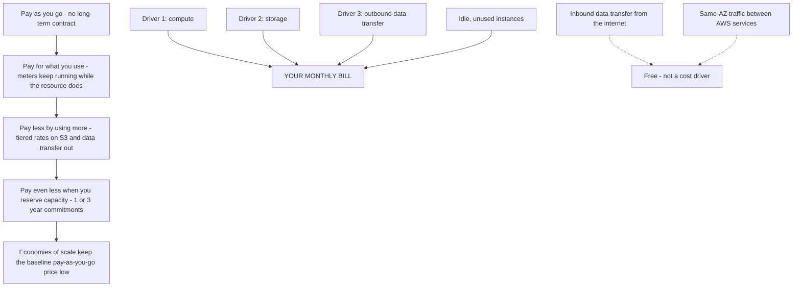
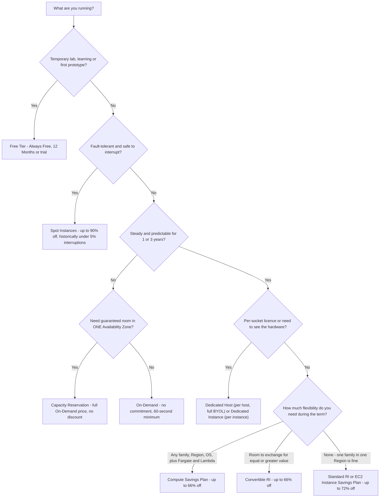
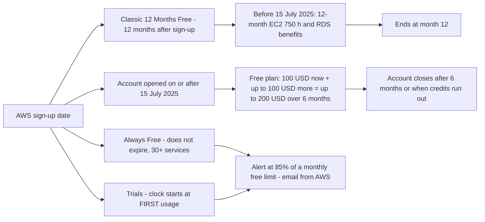
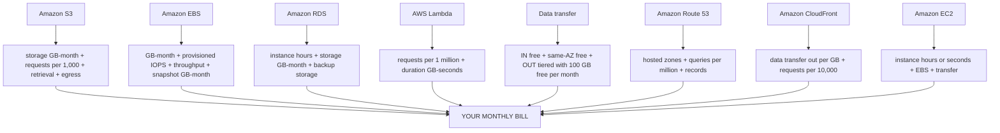
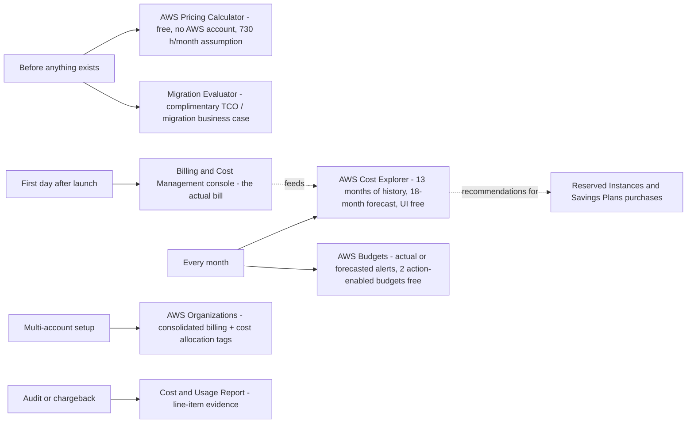
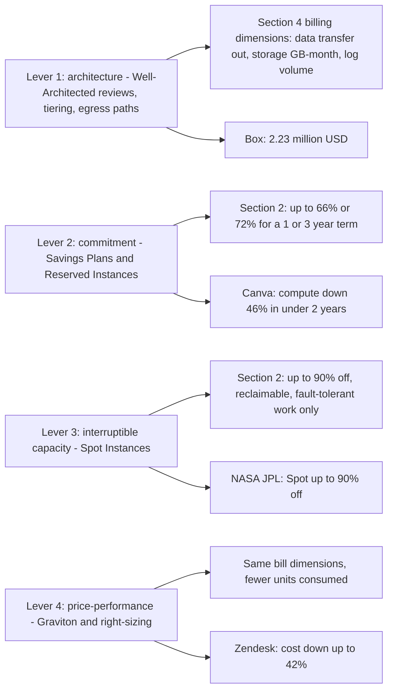

# AWS Pricing Models and Cost Tools

**Domain 4 (Billing, Pricing, and Support) carries 12% of the CLF-C02 score**, and two of its three task statements live inside this lesson: **Task 4.1 "Compare AWS pricing models"** — On-Demand, Reserved Instances, Spot Instances, Savings Plans, Dedicated Hosts, Dedicated Instances, Capacity Reservations, storage tiers and inbound versus outbound data transfer — and **Task 4.2 "Billing, budget, cost management"** — Budgets, Cost Explorer, the Pricing Calculator, AWS Organizations consolidated billing, cost allocation tags and the Cost and Usage Report. Roughly **six scored items** come from Domain 4, and most of them are arithmetic-and-judgement questions rather than definitions. Students who fail this area rarely fail because they never heard of Savings Plans; they fail because they cannot say *which* tool answers *which* question, or because they quote a discount percentage without knowing what it commits you to.

```text
====================================================================
 CLF-C02 LESSON 13 — PRICING MODELS + COST TOOLS (as of Oct 2026)
====================================================================
 PRINCIPLES
   pay as you go -> pay for what you use -> pay less as you
   use more -> pay even less when you reserve capacity
   drivers ... compute . storage . OUTBOUND data transfer
   inbound from the internet ... free of charge
   same-AZ traffic between services ... free
   prices are set per service AND per Region
 COMPUTE PURCHASE OPTIONS
   On-Demand ........ no commitment, hour/second, 60-s minimum
   RI Standard ....... 1 or 3 yr, up to 72% off, AZ-scoped = capacity
   RI Convertible .... 1 or 3 yr, up to 66% off, exchangeable
   Compute SP ........ 1 or 3 yr, up to 66% off, any family + Fargate
                       + Lambda
   EC2 Instance SP ... 1 or 3 yr, up to 72% off, one family/Region
   Spot .............. no commitment, up to 90% off, interruptible
   Dedicated ......... Host = per host + socket visibility + BYOL
                       Instance = per instance, isolated hardware
   Capacity Res. ..... AZ room at the full On-Demand price
   Free Tier ......... Always Free / 12 Months / Trials
 FREE TIER
   100 USD now + up to 100 USD more = up to 200 USD over 6 months
   Always Free ... 30+ services, does not expire
   email alert at 85% of a monthly free limit
 COST TOOLS
   before build ..... AWS Pricing Calculator (free, no account)
   migration case ... Migration Evaluator (complimentary)
   what did I spend .. AWS Cost Explorer (UI free)
   am I overspending . AWS Budgets (2 action-enabled free)
    the bill itself ... Billing and Cost Management console
    evidence .......... Cost and Usage Report (CUR)
  REAL WORLD  (customer results, never AWS guarantees)
    Box ............... 2.23 M USD = egress + storage +
                        inter-AZ + logging (architecture)
    Canva ............. -46% compute <2 yr (SP/RI/Spot mix)
    FarEye ............ -65% compute ~1 M USD/yr (SP+Spot)
    NASA JPL .......... Spot up to 90% off, fault-tolerant
  2026 UPDATES  (as of Oct 2026, sourced)
    free tier ......... 6 months + up to 200 USD (15 Jul 2025)
    100 GB egress ..... a 2021 change, still current
    Database SP ....... up to 35%, launched 2 Dec 2025
====================================================================
```

> [!NOTE]
> **Scope discipline.** Everything stated as fact below is sourced to AWS pages retrieved **October 2026**, and every price, rate and discount ceiling is date-stamped **as of Oct 2026** — AWS changes prices, allowances and tool limits without an announcement, so **verify current before use**. Where a figure could not be confirmed from a primary AWS source it is either omitted or labelled as something to verify; discount ceilings are always AWS's own **"up to"** maximums, never a promise of what you will pay.

In this lesson you will:

- state the **four general pricing principles** in AWS's own wording and name the **three cost drivers**;
- explain why the **same instance type costs different amounts in different Regions** and work the arithmetic;
- read the **compute purchasing comparison table** — commitment terms, flexibility, interruptibility and *when the exam picks each option*;
- walk the **purchase-option decision tree** from free lab to committed fleet;
- separate **Standard vs Convertible RIs** and **Compute vs EC2 Instance Savings Plans** by discount ceiling *and* flexibility;
- explain exactly what **Spot** costs you in interruption risk, and what a **Dedicated Host** buys over a **Dedicated Instance**;
- name the **three Free Tier flavors** with sourced examples, plus the post-July-2025 credit structure;
- list the **billing dimensions** of S3, EBS, RDS, Lambda, data transfer, Route 53 and CloudFront;
- price **requests, egress and hosted zones** in worked numeric examples;
- choose the right **cost tool**: Pricing Calculator, TCO/Migration Evaluator, Billing console, Cost Explorer, Budgets;
- map four **real AWS customer cost stories** (Box, Canva, FarEye, NASA JPL) to the lever that produced each saving, and read the **sourced 2026 updates box**;
- practise with **12 exam-style questions** plus four interactive checks.

| Exam task | Domain (weight) | What this lesson delivers |
|---|---|---|
| 4.1 Compare AWS pricing models | Billing, Pricing and Support (12%) | §1 principles, §2 purchasing table, §3 Free Tier, §4 billing dimensions |
| 4.2 Billing, budget and cost management resources | Billing, Pricing and Support (12%) | §5 the five cost tools, Organizations, tags, CUR |

---

## 1. The four general pricing principles

### 1.1 The principle ladder

AWS's *How AWS Pricing Works* whitepaper (published **24 February 2023**, and now labelled by AWS as a historical reference) compresses the whole model into one sentence: *"You pay as you go, pay for what you use, pay less as you use more, and pay even less when you reserve capacity."* The live pricing page adds the contract half of the deal: **pay-as-you-go "without requiring long-term contracts."**

| Principle | Official wording (AWS) | What it means on your bill | Exam consequence |
|---|---|---|---|
| **1. Pay as you go** | *"pay-as-you-go … without requiring long-term contracts"* | Charges accrue while a resource runs; stop it and the running charge stops | No termination fee for leaving a service |
| **2. Pay for what you use** | *"pay for what you use"* | Consumption is metered per hour/second, GB-month, request or GB-second | Idle resources are a cost you chose to pay |
| **3. Pay less by using more** | *"pay less as you use more"* | **Tiered** rates for S3 and data transfer out; volume tiers drop the unit price as usage climbs | Data transfer **in** is **always free of charge** |
| **4. Pay even less when you reserve** | *"pay even less when you reserve capacity"* | Committed usage (1 or 3 years) buys a discount ceiling | Reserved Instances and Savings Plans — §2 |

Two supporting ideas complete the model. First, **economies of scale**: AWS says customers *"Benefit from massive economies of scale"*, which is what produces *"lower pay-as-you-go prices"* — the aggregated usage of all AWS customers is why the list price is already low before any commitment. Second, **the three cost drivers**: AWS names **compute, storage and outbound data transfer** as *"three fundamental drivers"*, explicitly noting there is **no charge for inbound data transfer**.



### 1.2 Pay less by using more: tiering and what is free

"Pay less by using more" is not a slogan about discounts you must negotiate — it is **tiering inside the list price**. AWS's pricing page states that **S3 and data transfer out are tiered**, while **data transfer IN is always free of charge**. The exam turns this into two questions:

1. **Which direction is charged?** Outbound. Inbound from the internet is free, and traffic between services in the **same Availability Zone is free**.
2. **Is the allowance per service or global?** Global — see the "Did you know?" box below.

AWS also documents a fourth, quieter cost: **idle**. The pricing whitepaper states that shutting down unused instances can save **"70 percent or more"** — which is why *turn it off* is always a plausible correct answer in a cost-optimisation stem, and why idle-capacity cleanup comes before any commitment decision.

- **📚 Did you know?** The free data-transfer allowance is **100 GB of free data transfer out per month, aggregated across all AWS services and all Regions** (excluding the China Regions and AWS GovCloud) — it is **not** 100 GB per service and **not** 100 GB per Region. Amazon CloudFront adds a separate **1 TB of free data transfer out every month**. AWS expanded this allowance from the older per-Region figure, so old study material quoting "1 GB per Region" is out of date (AWS Free Tier data-transfer expansion page, as of Oct 2026).

### 1.3 Commitment is the only lever that changes the unit price downward

Tiering lowers the price of the *next* unit; **commitment lowers the price of every unit**. AWS's pricing page groups this under **"Save when you commit"**, and Savings Plans are documented as a commitment over **a one- or three-year period**. Reserved Instances use the same 1-or-3-year terms with three payment options (**All Upfront, Partial Upfront, No Upfront**). Everything in §2 is a variation on that one sentence — which is why the exam loves asking *"which option gives the deepest discount with the least flexibility?"*

### 1.4 Prices are set per service **and** per Region

The exam guide's own cost-optimisation guidance (COST07-BP02) says it plainly: *"Resource pricing may be different in each Region"* because of **land, fiber, electricity and taxes**. **Local Zones are priced differently from (higher than) their parent Region.** The same instance type, same OS, same hour can therefore cost materially different amounts depending on where you launch.

**Worked example E1 — Regional spread on one instance type (as of Oct 2026).**
AWS's own On-Demand price feed for **t3.medium on Linux** (no security-group selection), retrieved **7 October 2026**:

| Region | USD per hour | vs N. Virginia |
|---|---|---|
| US East (N. Virginia) | **0.04160** | baseline |
| Asia Pacific (Mumbai) | **0.04480** | +7.7% |
| EU (Ireland) | **0.04560** | +9.6% |
| Asia Pacific (Sydney) | **0.05280** | +27% |
| Asia Pacific (Tokyo) | **0.05440** | +31% |
| South America (São Paulo) | **0.06720** | **+61%** |

AWS bills On-Demand instances by the hour (or by the second with a **60-second minimum**), and the Pricing Calculator standardises a month at **730 hours**. So one t3.medium running the whole month:

$$
\text{N. Virginia} = 730 \times 0.0416 = \$30.37 \qquad
\text{São Paulo} = 730 \times 0.0672 = \$49.06
$$

Difference: **$49.06 − $30.37 = $18.69 per month, about +61%**, for identical software. *Exam lesson:* **Region is a pricing decision**, but only *after* latency, data-residency and feature requirements are satisfied — AWS never publishes a "cheapest Region" ranking, so treat cost as a tie-breaker, not the first filter.

> [!IMPORTANT]
> **Three rules that trap candidates in Domain 4.**
> - **Free ≠ unlimited:** free allowances are monthly, **calculated across all Regions**, and **do not accumulate** — an unused month does not roll over.
> - **Cheaper ≠ correct:** the cheapest Region or purchase option is right only when it satisfies the workload's tolerance for interruption, latency and licensing.
> - **Discount ≠ capacity:** a discount (Savings Plan, Region-scoped RI) reserves nothing; only an **AZ-scoped RI** or a **Capacity Reservation** reserves room, and the reservation is billed whether you use it or not.

---

## 2. Compute purchasing options: the comparison the exam is built on

Domain 4 Task 4.1 names the options explicitly: **On-Demand Instances, Reserved Instances, Spot Instances, AWS Savings Plans, Dedicated Hosts, Dedicated Instances, Capacity Reservations**, plus storage tiers and data transfer. Below is the whole skill in one table, with every percentage dated **as of Oct 2026**.

### 2.1 The master comparison table

| Option | Commitment term | Payment | Discount ceiling (as of Oct 2026) | What it locks / flexibility | Interruptible? | When the exam picks it |
|---|---|---|---|---|---|---|
| **On-Demand** | **None** — billed by the hour or second (**60-second minimum**) | No upfront | **0%** (baseline list price) | Complete freedom: start, stop, resize, terminate anytime | **No** | Spiky, unknown, experimental or short-lived workloads; the default when no pattern is known |
| **Reserved Instance — Standard** | **1 or 3 years** | All / Partial / No Upfront | **up to 72% off** | Instance family, size, OS, tenancy and Region fixed; **region-scoped** covers any AZ and size in that Region; **AZ-scoped also reserves capacity** | **No** | Steady-state, predictable baseline capacity |
| **Reserved Instance — Convertible** | **1 or 3 years** | All / Partial / No Upfront | **up to 66% off** | May be **exchanged for Convertible RIs of equal or greater value** — not a free reconfiguration | **No** | Steady state that may need to change during the term |
| **Savings Plan — Compute** | **1 or 3 years**, committed **$ per hour** | All / Partial / No Upfront | **up to 66% off** | **Any** instance family, size, AZ, Region, OS and tenancy — and it extends to **AWS Fargate and AWS Lambda** | **No** | Mixed fleets, containers and serverless that must stay movable |
| **Savings Plan — EC2 Instance** | **1 or 3 years**, committed **$ per hour** | All / Partial / No Upfront | **up to 72% off** | One **instance family in one Region** (size, OS and tenancy stay free) | **No** | Predictable single-family usage in one Region |
| **Spot Instance** | **None** — price repriced about **every 5 minutes** | No upfront; pay the current Spot price | **up to 90% off** | Runs *"whenever capacity is available"*; AWS may reclaim it with a short notice window | **YES** | Fault-tolerant, stateless, batch, CI, big-data analytics that tolerate interruption |
| **Dedicated Instance** | On-Demand, RI or Spot terms | Same three families | **up to 70%** when purchased as a Reserved Instance | Physically isolated at the host-hardware level, **no visibility** or control over placement, **limited BYOL** | **No** | *"No shared hardware"* compliance requirement |
| **Dedicated Host** | Hourly, **per host** | On-Demand or committed | AWS publishes **no headline percentage** for hosts (verify current) | **Physical server fully dedicated**, **socket/core visibility**, host affinity, **full BYOL** | **No** | Per-socket/per-core licensing (Microsoft, Oracle) and compliance needing visibility |
| **Capacity Reservation (ODCR)** | None — On-Demand rates | No upfront | **0%** — you pay the On-Demand price for reserved AZ capacity **used or not** | Reserves capacity in **one specific Availability Zone** | **No** | Guaranteed launch capacity at a known time, without a 1-year commitment |
| **Free Tier** | — | — | **100% within the allowance** | Limits in §3; usage **does not accumulate** | **No** | Learning, testing, first prototypes |

> [!WARNING]
> **Read the table as a two-axis grid: discount ↔ flexibility.** Every "up to" figure is a **ceiling**, not an average, and the deeper the discount the more you surrender: Spot surrenders **availability**, RI/SP surrender **term commitment (1 or 3 years)**, Dedicated options surrender **hardware sharing**, and On-Demand surrenders **nothing but money**. The exam writes distractors that mix the axes — *"the most flexible option with a 72% discount"* does not exist.

```text
====================================================================
 DISCOUNT CEILING  x  WHAT YOU SURRENDER   (as of Oct 2026)
====================================================================
  up to 90%   Spot ............. availability - capacity reclaimed
              |
  up to 72%   EC2 Instance SP --+-- Standard RI (family + Region fixed)
              |                  |   Dedicated Instance as RI: up to 70%
  up to 66%   Compute SP -------+-- Convertible RI (exchangeable)
              |
      none    On-Demand ......... nothing, but the list price
              Capacity Reserv. .. nothing, AND you pay for unused AZ room
  ------------------------------------------------------------------
       FLEXIBILITY   low  <---------------------->  high
  ==================================================================
   The deepest discount and maximum flexibility sit at OPPOSITE ends
   of the axis - no option is strong on both. Pick your position from
   the workload's tolerance, never from the percentage alone.
====================================================================
```

**Every official ceiling in one reference (all "up to", as of Oct 2026):**

| Commitment or option | Discount ceiling | Note |
|---|---|---|
| **EC2 Instance Savings Plan** / **Standard Reserved Instance** | **72%** | Least flexible pair: a Standard RI fixes family, size, OS, tenancy and Region; an EC2 Instance SP commits to one family in one Region |
| **Compute Savings Plan** / **Convertible Reserved Instance** | **66%** | Most flexible commitment; Compute SP also covers **Fargate and Lambda** |
| **Spot Instances** | **90%** | Not a commitment — interruptible spare capacity |
| **Dedicated Instances** purchased as Reserved Instances | **70%** | Compliance answer first, discount second |
| **SageMaker AI Savings Plans** | **64%** | Task-adjacent; rarely asked directly |
| **Database Savings Plans** | **35%** | Managed-database commitment |
| **On-Demand / On-Demand Capacity Reservation** | **none** | Baseline list price; ODCR bills reserved capacity used or not |
| **Dedicated Hosts** | **no AWS-published percentage** | AWS quotes no headline saving — **verify current before use** |
| **Free Tier** | **100% within the allowance** | §3; allowances are monthly and do not accumulate |

### 2.2 Worked example E2 — the discount ladder

Take a hypothetical On-Demand list cost of **100 units per month** for the same steady workload and apply AWS's published ceilings (illustrative arithmetic, **ceilings as of Oct 2026**):

```text
On-Demand (no commitment)                 100   <- baseline
  Compute Savings Plan        (-66%)    =  34   <- same ceiling as Convertible RI
  Convertible RI (1 or 3 yr)  (-66%)    =  34
  EC2 Instance SP             (-72%)    =  28   <- same ceiling as Standard RI
  Standard RI (1 or 3 yr)     (-72%)    =  28
  Dedicated Instance as RI    (-70%)    =  30   <- compliance answer first
  Spot (no term, interruptible)(-90%)   =  10   <- the only interruptible rung
```

Two lessons ride on those numbers. First, **Savings Plans and Reserved Instances are mapped 1:1 by ceiling**: Compute SP ≈ Convertible RI at **66%**, EC2 Instance SP ≈ Standard RI at **72%** — AWS's Savings Plans FAQ says exactly that (*"66% (just like Convertible RIs)"* and *"72% (just like Standard RIs)"*). The difference between the pairs is therefore **flexibility, not savings**. Second, the real bill lands **above** these figures, because a ceiling is the best AWS will ever do for a perfectly matched workload — actual savings depend on how completely your usage matches the commitment.

### 2.3 Reserved Instances: the fine print the exam reuses

| Question | Official answer (as of Oct 2026) |
|---|---|
| How long? | **1 year or 3 years** |
| How do I pay? | **All Upfront, Partial Upfront, No Upfront** |
| Biggest discount? | Standard **up to 72%**; Convertible **up to 66%** |
| Does it reserve capacity? | **Only if the RI is scoped to a specific Availability Zone** — a Region-scoped RI is a discount only |
| What can change? | Standard RI: essentially nothing mid-term. Convertible: **exchange for Convertible RIs of equal or greater value** |
| What does AWS recommend instead? | *"We recommend Savings Plans"* for *"flexibility to change your usage"* |
| Can I sell one I no longer need? | Resale runs through the **Reserved Instance Marketplace** — rules change, so **verify current before use**; it is a mitigation, never a plan |

> ⚠️ **A Reserved Instance is a billing discount, not a reserved server.** AWS's wording is *"a capacity reservation **when used in a specific Availability Zone**"* — the discount and the reservation are two separate things travelling together. And the trap family works in both directions: **a Savings Plan reserves nothing**, while an **On-Demand Capacity Reservation reserves capacity at full price with no discount at all**. If a stem says *"guaranteed capacity in AZ X at a discount"*, the answer is an **AZ-scoped Standard RI** — nothing else in the table does both jobs.

### 2.4 Savings Plans: the two types in one view

| | **Compute Savings Plan** | **EC2 Instance Savings Plan** |
|---|---|---|
| Discount ceiling (as of Oct 2026) | **up to 66%** | **up to 72%** |
| Commitment | **$/hour** for **1 or 3 years** | **$/hour** for **1 or 3 years** |
| Applies to | Any instance **family, size, AZ, Region, OS, tenancy**, plus **AWS Fargate and AWS Lambda** | One **instance family in one Region** (size, OS, tenancy flexible) |
| Equivalent RI ceiling | Convertible RI (66%) | Standard RI (72%) |
| Exam picks it when… | The fleet is mixed, multi-Region, or includes containers/serverless | Usage is genuinely one family, one Region, all term long |

AWS prices a Savings Plan year as **365 days** and three years as **1,095 days**, and offers the same **All / Partial / No Upfront** payment choices. AWS's own Savings Plans types page frames the choice as *"flexibility to change your usage"* — commit to a **dollar amount per hour** (Compute) or to a **specific family in a Region** (EC2 Instance).

### 2.5 Spot: 90% off, with a catch the exam always tests

Spot Instances run **spare EC2 capacity** at *"less than the On-Demand price"* and are marketed as *"up to 90% off"*. Three mechanics matter:

1. **The price moves.** The Spot price list is **updated every 5 minutes** and reflects *"long-term trends in supply and demand"* — unlike On-Demand, whose hourly price is static.
2. **Capacity can be taken back.** AWS runs the instance *"whenever capacity is available"* and interrupts when it needs the capacity back. AWS's own Instance Advisor reports an **average interruption frequency that has historically been under 5%** (30-day view, all Regions and instance types, as of Oct 2026) — still non-zero, which is why Spot is *never* the answer for a stateful, non-fault-tolerant or latency-critical workload.
3. **Design for interruption.** The examinable pair is *fault-tolerant / stateless / restartable* workloads: batch jobs, CI pipelines, big-data processing, image rendering, queue consumers that can re-read work.

- **📚 Did you know?** AWS's Reserved Instances pricing page currently opens with *"We recommend Savings Plans"* — the same page that sells you the RI is steering flexible customers elsewhere. On the exam, "AWS recommends X over Y" stems are usually testing exactly this line: **Savings Plans for flexibility, RIs when you specifically want the RI construct (including an AZ-scoped capacity reservation)**.

### 2.6 Dedicated Host vs Dedicated Instance vs Capacity Reservation

These three get conflated constantly. The distinguishing axes are **what is billed**, **what you can see**, and **what licence control you get**:

| | **Dedicated Host** | **Dedicated Instance** | **Capacity Reservation (ODCR)** |
|---|---|---|---|
| Hardware | *"Physical server … fully dedicated for your use"* | *"Physically isolated at the host hardware level"* | Any hardware in **one AZ** |
| Billing | **Per host** (hourly) | **Per instance** (On-Demand / RI / Spot) | **On-Demand rate** for the reserved slots |
| Visibility | **Socket and core visibility**, host affinity | **No visibility or control over instance placement** | Not applicable |
| BYOL | **Full BYOL** (e.g. Microsoft, Oracle per-socket licences) | **Limited support for BYOL** | Depends on the instances you launch into it |
| Discount | AWS publishes **no headline %** — verify current | **up to 70%** when bought as a Reserved Instance | **None** — you pay whether you use the capacity or not |
| Exam picks it when… | Per-socket/per-core licensing, or compliance needs host visibility | *"No shared hardware"* is the requirement | You need **guaranteed launch capacity now**, without a 1-year term |

AWS states there is **no performance, security or physical difference** between Dedicated Hosts and Dedicated Instances — the split is **billing granularity, visibility and licensing**.

### 2.7 The decision tree and the workload match



```matching
{
  "question": "Match each workload description to the purchase option the CLF-C02 exam expects:",
  "pairs": [
    {"left": "A restartable nightly batch job that can lose its progress without business impact", "right": "Spot Instances - up to 90% off (as of Oct 2026) because capacity can be reclaimed"},
    {"left": "A database tier running the same instance type around the clock for the next three years", "right": "Standard Reserved Instance or EC2 Instance Savings Plan - up to 72% off (as of Oct 2026)"},
    {"left": "A two-week experiment with an unknown usage pattern and no commitment budget", "right": "On-Demand - no commitment, billed by the hour or second with a 60-second minimum"},
    {"left": "An Oracle deployment licensed per physical socket that must not share hardware", "right": "Dedicated Host - per-host billing with socket and core visibility and full BYOL"},
    {"left": "A mixed fleet of containers and Lambda functions spanning several Regions", "right": "Compute Savings Plans - up to 66% off (as of Oct 2026), covering any instance family, Fargate and Lambda"},
    {"left": "A product launch that must be able to boot capacity in one specific Availability Zone on day one", "right": "On-Demand Capacity Reservation - reserves AZ capacity at the full On-Demand price"},
    {"left": "A student spinning up a single small instance for coursework", "right": "Free Tier - Always Free, 12 Months Free or a service trial, with usage that does not accumulate"}
  ],
  "explanation": "Every stem names one of the three axes the exam uses: tolerance for interruption (Spot), predictability of duration (RI vs Savings Plans vs On-Demand), and licensing or capacity-placement requirements (Dedicated Host, Capacity Reservation). Match the axis first and the option follows - discount percentage alone never decides."
}
```

### 2.8 Reading the stem: the keyword map

Almost every Domain 4 purchasing item can be decided from two or three words in the stem. Use this map before you read the options — then eliminate anything that violates the keyword:

```text
 STEM KEYWORD                          -> FIRST OPTION TO CONSIDER
 ------------------------------------------------------------------
 "fault-tolerant" "interruptible"      -> Spot (up to 90%, <5% historical
 "can be restarted / stateless"           interruptions, as of Oct 2026)
 "steady" "predictable" "baseline"     -> Standard RI or EC2 Instance SP
                                          (up to 72%)
 "may need to change family / OS"      -> Convertible RI or Compute SP
                                          (up to 66%)
 "mixed fleets" "containers"           -> Compute Savings Plan
 "Lambda / Fargate commitment"         -> Compute Savings Plan ONLY
 "guaranteed capacity in AZ X"         -> AZ-scoped Standard RI
                                          (discount AND reservation)
 "capacity now, no 1-year term"        -> On-Demand Capacity Reservation
                                          (full price, no discount)
 "per-socket licence" "see the cores"  -> Dedicated Host
 "no shared hardware" only             -> Dedicated Instance
 "learning / testing / prototype"      -> Free Tier
 "unknown pattern" / "this week only"  -> On-Demand
 ------------------------------------------------------------------
 RED FLAG PHRASES
   "cheapest AND most flexible"        -> contradiction; no option
   "Savings Plan reserves capacity"    -> false; SP reserves nothing
   "Spot is always available"          -> false; capacity is reclaimed
   "committed = guaranteed capacity"   -> false unless AZ-scoped RI
   "stopped = $0"                      -> false for RDS (storage +
                                          backup) and for EC2 (EBS)
```

---

## 3. Free Tier: three flavors plus the 2025 restructure

### 3.1 The three classic types

AWS's Free Tier documentation defines three categories, and the exam asks you to tell them apart by **how the clock behaves**:

| Type | Clock rule (AWS wording) | Sourced examples (as of Oct 2026) | Expires? |
|---|---|---|---|
| **Always Free** | *"do not automatically expire"* — available *"indefinitely"* | **30+ AWS services** on the Always Free list (aws.amazon.com/free, Oct 2026); **Lambda: 1,000,000 requests + 400,000 GB-seconds per month**; **data transfer out: 100 GB per month** aggregated across services and Regions (except China and GovCloud) | **No** |
| **12 Months Free** | *"12 months following your AWS sign-up date"* | Classic allowances such as **EC2: 750 hours per month of t2.micro / t3.micro** and **S3: 5 GB storage + 20,000 GET + 2,000 PUT** (account-date dependent — see §3.2); **RDS free usage** for accounts activated **before 15 July 2025** | **Yes** — 12 months from sign-up |
| **Trials** | *"start from the time of first usage begins"* | Short promotional windows on specific services, beginning at first use rather than at sign-up | **Yes** — end of the trial window |

Two mechanical rules apply to all three: free usage is **"calculated each month across all regions"** and **"does not accumulate"**, and Free Tier usage is **not available in AWS GovCloud** — the 100 GB data-transfer-out allowance additionally excludes the **China Regions**. One monthly allowance sits outside the classic three: **Amazon CloudFront lists 1 TB of data transfer out plus 10,000,000 HTTP(S) requests per month**, but the page does not label it Always Free or 12-month — **do not assert a duration for it without re-checking** (verify current before use).

### 3.2 What changed on 15 July 2025

The classic 12-month model is still the vocabulary of the exam, but the current sign-up experience is credit-based. As of **7 October 2026**, aws.amazon.com/free offers:

- **$100 in credits immediately**, plus **up to $100 more earned**, for **up to $200 over 6 months**;
- a **Free plan** whose account *"closes on its own 6 months after you open it"* — or when the credits run out — covering *"over 90 services"*, with **only the Always Free offerings active** on a Free plan account;
- a **Paid plan** with the full catalog, which is also eligible for the credits;
- unchanged categories: **Always free (30+ AWS services)**, **Trials**, and time-limited offers.

EC2 free-tier instance types differ by account date: accounts **before 15 July 2025** see `t2.micro` / `t3.micro` on the 12-month track; accounts **on or after** that date get `t3.micro`, `t3.small`, `t4g.micro`, `t4g.small`, `c7i-flex.large` and `m7i-flex.large` on the **6-months-or-credits-exhausted** track. **Verify current before use** — this is the fastest-moving area in Domain 4.



### 3.3 Worked example E3 — what "750 hours per month" actually buys

The classic EC2 allowance is **750 hours per month** of t2.micro/t3.micro (12-month era figure, as of Oct 2026). AWS's Pricing Calculator standardises a month at **730 hours**, so:

$$
\frac{750 \text{ free hours}}{730 \text{ hours in a month}} = 1.03 \text{ instances running 24/7}
$$

So 750 hours means **exactly one instance running around the clock for the month, with almost nothing to spare** — two instances split across the month will breach the allowance, and so will one instance plus a leftover from a second Region, because the allowance is **calculated monthly across all Regions and does not accumulate**. The same arithmetic applies to any hourly free allowance: divide the hours by 730 before you promise anyone "free".

> [!NOTE]
> **Free Tier is a budgeting trap, not a pricing model.** It never appears as an answer to a production-workload question, it does not roll over, and AWS notifies you **by email when you exceed 85% of a Free Tier limit** — pair that with a **$0 Budget** (§5) and you get an early warning that costs nothing. Note also that the **AWS Pricing Calculator assumes you are NOT using the Free Tier**, so an estimate built in the calculator will look worse than your actual first month.

- **📚 Did you know?** The Free Tier alert threshold is **85 percent**, not 100%: AWS states it *"notifies you over email when you exceed 85 percent of your Free Tier limit"*. The notification is per-service, the 100% overrun is your own job to watch, and a Free plan account has **only Always Free offerings active** — time-limited allowances do not exist on that plan.

---

## 4. What you are actually billed for: per-service dimensions

Knowing *which* service to use is half of Domain 4; knowing **which unit that service bills in** is the other half. Every price below is **as of Oct 2026** and must be re-checked before you rely on it.

### 4.1 The billing-dimension matrix

| Service | Billing dimensions | Key gotchas (as of Oct 2026) |
|---|---|---|
| **Amazon S3** | **Storage GB-month** by storage class · **Requests per 1,000** (PUT/COPY/POST/LIST vs GET/HEAD) · **Retrieval** per GB on retrieval classes · lifecycle/ingest charges · **egress** | **DELETE and CANCEL requests are free**; **LIST is billed at the PUT rate**; GET is far cheaper than PUT; storage rate **verify current before use** |
| **Amazon EBS** | **GB-month** (billed in **per-second increments with a 60-second minimum**) · **provisioned IOPS per month** · **throughput per month** · **snapshot GB-month** | **gp3 includes 3,000 provisioned IOPS and 125 provisioned MB/s** at baseline; example list rate **$0.08/GB-month** (region-dependent, as of Oct 2026) |
| **Amazon RDS** | **DB instance hours** (**1-second increments, 10-minute minimum**) · **storage GB-month** · **backup storage** | **A stopped instance still bills storage and backup** — only instance hours stop; longer backup retention = larger bill |
| **AWS Lambda** | **Requests** (**$0.20 per 1 million requests**, us-east-1) · **Duration in GB-seconds** (**$0.0000167 per GB-second**, x86) | Free allowance **1,000,000 requests + 400,000 GB-seconds per month**; duration tiers change above 6 billion GB-s/month |
| **Data transfer** | **IN free** from the internet · **same-AZ free** · **OUT tiered per GB** with **100 GB/month free globally** (except China and GovCloud) · inter-Region out per GB | us-east-1 first tier **$0.09/GB**, stepping down to **$0.085 / $0.070 / $0.050** at higher volumes; inbound is the free direction |
| **Amazon Route 53** | **Hosted zone per month** (**$0.50** for the first 25, **$0.10** after) · **Queries per million** (**$0.40** for the first 1 billion/month, then **$0.20**) · **$0.0015 per record/month** beyond 10,000 records per zone | **Queries on private hosted zones are free**; the first 10,000 records per zone are included |
| **Amazon CloudFront** | **Data transfer out per GB** (tiered, by price class) · **Requests per 10,000** · optional features | Free monthly allowance **1 TB data transfer out + 10,000,000 requests**; first 1 TB free then **$0.085** for the next 9 TB (US, as of Oct 2026); flat-rate plans exist |
| **Amazon EC2** | **Instance hours/seconds by purchase option** · **EBS volumes and snapshots** · **data transfer** · optional host/AZ-capacity charges | The purchase option chosen in §2 decides the unit rate; On-Demand has a **60-second minimum** |



### 4.2 Worked examples E4–E6 — request, egress and DNS arithmetic

**E4 — the S3 request bill (us-east-1, as of Oct 2026).** A service performs **500,000 writes** and **20,000,000 reads** per month:

| Operation | Rate (as of Oct 2026) | Calculation | Cost |
|---|---|---|---|
| PUT/COPY/POST/LIST | **$0.005 per 1,000** | 500,000 ÷ 1,000 × 0.005 | **$2.50** |
| GET/HEAD | **$0.0004 per 1,000** | 20,000,000 ÷ 1,000 × 0.0004 | **$8.00** |
| DELETE/CANCEL | **Free** | — | **$0.00** |
| **Total requests** | | | **$10.50/month** |

Point: a read-heavy workload is cheap on requests, and a **LIST-heavy** workload is not — LIST is billed at the PUT rate. Storage GB-month and egress are additional.

**E5 — data transfer out with the global free allowance (as of Oct 2026).** A workload egresses **600 GB** to the internet in a month from **us-east-1**:

$$
(600 - 100)_{\text{free global allowance}} \times \$0.09 = 500 \times 0.09 = \$45.00
$$

Point: the **100 GB is aggregated across all AWS services and all Regions** (excluding China and GovCloud) — you do not get a fresh 100 GB per service, and **inbound transfer costs nothing**, so a chatty download-heavy architecture is an *outbound* problem.

**E6 — Route 53 in a small account (as of Oct 2026).** Two hosted zones and **500,000 standard queries** in a month:

$$
2 \times \$0.50 + \left(\frac{500{,}000}{1{,}000{,}000} \times \$0.40\right) = \$1.00 + \$0.20 = \$1.20 \text{/month}
$$

Point: **DNS is billed per zone and per query**, and **private hosted zone queries are free** — which is the standard reason a private-zone architecture is the cheaper exam answer.

### 4.3 The "stopped is not free" rule

The single most-tested billing fact in this section: **Amazon RDS charges for provisioned storage and backup storage while the instance is stopped — only DB instance hours stop.** EC2 is different: stopping an instance stops instance-hour billing, but the attached **EBS volumes and snapshots keep billing**. So:

| Action | What stops billing | What keeps billing |
|---|---|---|
| Stop an **EC2** instance | Instance hours | EBS volumes, snapshots, data transfer |
| Stop an **RDS** instance | DB instance hours | **Provisioned storage AND backup storage** |
| Delete unused resources | Everything for that resource | — |

**Worked example E7 (illustrative).** A team stops a database nightly expecting `$0`: if the instance hour stops but **100 GB of provisioned storage and its backups** remain, the nightly stop saves only the compute line. The exam stem is usually *"the team stopped the database at night to save costs; why is the bill unchanged?"* — the answer is **storage and backup charges continue**.

```fillblank
{
  "question": "Complete the billing-dimension statements with the correct AWS units and rules:",
  "template": "Amazon S3 bills storage per {{1}}, plus requests per 1,000 - DELETE requests are free and LIST is billed at the PUT rate. Amazon EBS bills storage per GB-month in per-second increments with a {{2}}-second minimum. Amazon RDS bills instance hours, storage and {{3}} - so a stopped instance is still not free. AWS Lambda bills per 1 million requests and per {{4}} of duration. For data transfer, traffic {{5}} from the internet is free of charge.",
  "answers": {
    "1": "GB-month",
    "2": "60",
    "3": "backup storage",
    "4": "GB-second",
    "5": "in"
  },
  "distractors": ["GB-hour", "30", "snapshot storage only", "millisecond", "out", "request"],
  "explanation": "S3 storage is per GB-month (as of Oct 2026 documentation); EBS is metered per second with a 60-second minimum; RDS keeps billing provisioned storage and backup storage while stopped; Lambda is priced on requests plus GB-seconds ($0.20 per 1 million requests and $0.0000167 per GB-second, us-east-1, as of Oct 2026); and inbound data transfer from the internet is free - outbound is the charged direction."
}
```

- **📚 Did you know?** Of the three cost drivers AWS names (compute, storage, outbound data transfer), only **one is direction-dependent**: data transfer **in** is free from the internet, **same-AZ** traffic between AWS services is free, and everything interesting is billed on the **out** side — aggregated as "AWS Data Transfer Out" with a **100 GB/month free allowance across all services and Regions** (except China and GovCloud), as of Oct 2026. That single sentence answers more Domain 4 data-transfer items than any table.

### 4.4 Data transfer: every direction, priced

Task 4.1 explicitly names *"incoming and outgoing data transfer costs (cross-Region, intra-Region)"*. AWS's own pricing guidance treats inbound as free and outbound as the metered direction:

| Direction | Charge (as of Oct 2026) | Source wording |
|---|---|---|
| **Internet → AWS (inbound)** | **Free** | *"data transfer IN is always free of charge"*; *"no charge for inbound data transfer"* |
| **Between services in the same Availability Zone** | **Free** | Same-AZ traffic is not billed |
| **AWS → internet (outbound)** | **Tiered per GB**, with **100 GB free per month** aggregated across all services and Regions (except China and GovCloud) | us-east-1 tiers: **$0.090 / $0.085 / $0.070 / $0.050 per GB** as monthly volume rises |
| **Region → Region (inter-Region out)** | **Per GB**, drawn from the same global **100 GB/month** data-transfer-out allowance | Same feed, **7 Oct 2026**: **$0.010/GB** (Ohio), **$0.020/GB** (Ireland, Tokyo, Sydney, São Paulo) — **verify your exact Region pair** |
| **AWS → internet through CloudFront** | Billed as CloudFront data transfer out, with **1 TB + 10,000,000 requests free per month** | CloudFront pay-as-you-go page (as of Oct 2026) |
| **AWS → Local Zone** | **Different (higher) price than the parent Region** | Local Zones pricing page |

**Worked example E8 — one month of mixed transfer (us-east-1 rates, as of Oct 2026).**

| Traffic | Rate applied | Calculation | Cost |
|---|---|---|---|
| 500 GB downloaded **into** AWS from the internet | **Free** | — | **$0.00** |
| 400 GB served **out** to the internet | first 100 GB free globally, then **$0.09/GB** | (400 − 100) × 0.09 | **$27.00** |
| 250 GB replicated **to another Region** | **$0.020/GB** (feed rate, 7 Oct 2026) | 250 × 0.020 | **$5.00** |
| 1 TB served **through CloudFront** | within the **1 TB monthly free allowance** | — | **$0.00** |
| Traffic **inside one Availability Zone** | **Free** | — | **$0.00** |
| **Total** | | | **$32.00** |

Point: the entire bill came from **one direction** (outbound) and **one hop** (cross-Region). Cheapest architectures on this exam move data **in for free, keep it inside an Availability Zone where possible, and push it to the internet through CloudFront** rather than straight from an origin.

### 4.5 Storage tiers: where the "storage" cost driver actually lives

Task 4.1 pairs purchasing options with *"storage options and tiers"*. The pricing logic of every storage tier is the same trade — **the lower the monthly GB-month rate, the colder the data must be and the more you pay to read it back**:

```text
 WARMTH LADDER  (all classes bill storage in GB-month; rates verify current)
 ------------------------------------------------------------------
   hot / frequent access ... highest $/GB-month, no retrieval fee,
                             for data read constantly
   infrequent access ...... lower $/GB-month, retrieval charge per GB
                             + a minimum storage duration (verify per
                             class before you rely on it)
   archive (instant) ...... much lower $/GB-month, retrieval charge
   archive (flexible/deep)  lowest $/GB-month, minutes-to-hours to
                             restore, longest minimum duration
 ------------------------------------------------------------------
   MOVE COLD DATA WITH: Amazon S3 lifecycle rules, EBS volume type
   choice, EBS snapshot tiering
   PAY FOR MOVING IT WITH: transition/ingest charges + egress on read
====================================================================
```

| Storage billing dimension | Unit | Notes (as of Oct 2026) |
|---|---|---|
| **S3 object storage** | **GB-month, by storage class** | Colder class = lower rate, higher retrieval cost and minimum durations — **verify current rate before use** |
| **S3 requests** | **per 1,000** | PUT/COPY/POST/LIST **$0.005**, GET/HEAD **$0.0004**, DELETE/CANCEL **free** |
| **S3 retrieval / ingest** | **per GB** | Retrieval on colder classes; lifecycle and PUT ingest charges apply |
| **EBS volume storage** | **GB-month** | Example **$0.08/GB-month** (region-dependent); metered **per second, 60-second minimum**; **gp3 includes 3,000 IOPS and 125 MB/s** |
| **EBS provisioned performance** | **IOPS and MB/s per month** | Billed only where the volume type charges for provisioned performance |
| **EBS snapshots** | **GB-month** | Incremental backups keep billing until deleted — snapshots are never free |
| **RDS storage + backup** | **GB-month** | Charged **even while the instance is stopped** |

*Exam lesson:* "we archived the data" is only a saving if the **retrieval pattern** matches the tier — a cold class that gets read daily bills more than the hot class it replaced, and any data that leaves AWS for the internet bills as **data transfer out**.

---

## 5. Cost tools: five questions, five answers

Task 4.2 names the toolkit: **AWS Budgets, AWS Cost Explorer, the AWS Pricing Calculator, AWS Organizations (consolidated billing), cost allocation tags** and the **Cost and Usage Report**. The exam does not test feature depth — it tests **which tool answers which question**, plus a handful of free/paid thresholds.

### 5.1 The tool ladder

| Question you have | Tool | What it gives you | Cost and limits (as of Oct 2026) |
|---|---|---|---|
| *"What will this cost **before** I build it?"* | **AWS Pricing Calculator** | A modelled estimate of a future architecture | **Free** web tool; **no AWS account required**; assumes **730 hours in a month**; **does not assume Free Tier**; in-console: **5 free estimates per month, then $2 each** |
| *"Is my on-premises estate cheaper than AWS?"* | **Migration Evaluator** (formerly TSO Logic) | A data-driven migration business case / total cost of ownership comparison | **A complimentary service**; the standalone TCO Calculator URLs did not resolve when checked on **7 Oct 2026** — **verify current before use** |
| *"What did I actually spend?"* | **AWS Cost Explorer** | Trends, filters (Service, Linked account, AZ, Purchase type), **13 months of history**, an **18-month forecast**, and RI purchase recommendations | **UI free**; only the **API** costs **$0.01 per paginated request**; usage data lands within about 24 hours |
| *"Am I about to overspend?"* | **AWS Budgets** | Alerts on **actual or forecasted** cost, usage, and utilization/coverage; optional actions | Monitoring **free**; **first two action-enabled budgets free**, then **$0.10 per day each**; up to **20,000 budgets**, **5 alerts per budget**, **10 email subscribers and/or SNS** per alert; refreshed up to **3× per day** |
| *"Where is the official bill and the line items?"* | **Billing and Cost Management console** + **Cost and Usage Report (CUR)** | The account's bill, payments and credits; granular line-item usage and cost evidence | Console access included with the account; the CUR is the evidence layer for chargeback |
| *"How do I handle 50 accounts?"* | **AWS Organizations** | **Consolidated billing** plus **cost allocation tags** for splitting cost by team/product | Included with Organizations; tag-based allocation is a Task 4.2 skill |



### 5.2 Worked example E9 — picking the tool before doing the math

| Stem wording | Correct tool | Why |
|---|---|---|
| *"Estimate the monthly cost of a **proposed** architecture that does not exist yet"* | **AWS Pricing Calculator** | It is explicitly a **pre-purchase planning** tool: *"Model your solutions before building them"*, free, no AWS account |
| *"Analyse **spend trends** over the past year and **forecast** next quarter"* | **Cost Explorer** | Built for history (**13 months**) and forecast (**18 months**), with filters down to purchase type |
| *"Send me an **email when** forecasted spend **exceeds** 5,000 USD this month"* | **AWS Budgets** | Budgets alert on **actual or forecasted** values; the first two action-enabled budgets are free |
| *"Build a **business case comparing our data centres** with AWS"* | **Migration Evaluator** | AWS documents it as a **complimentary** total-cost-of-ownership / migration-evaluation service |
| *"Split this month's bill between the payments team and the fraud team"* | **Cost allocation tags** (+ Organizations) | Tags are the allocation mechanism named in Task 4.2 |

**Budget arithmetic worth memorising (as of Oct 2026):** monitoring is free; the **first two action-enabled budgets cost nothing**; the third costs **$0.10 per day**, so a 30-day month on that budget is **$3.00**, and five such budgets are **$15.00/month**. Budgets **without actions are free**, which is the reason the correct exam answer to *"set up a free spend alert"* is a **$0 cost budget** — not a paid tier.

```dragdrop
{
  "question": "Order these cost-management steps from earliest (nothing exists yet) to latest (audit evidence):",
  "items": [
    "Estimate the future architecture with the AWS Pricing Calculator - free, no AWS account, assumes 730 hours per month",
    "Compare against the current estate with Migration Evaluator - a complimentary TCO-style business case",
    "Read the first real bill in the Billing and Cost Management console",
    "Track trends and forecasts in AWS Cost Explorer - UI free, 13 months of history, 18-month forecast",
    "Set guardrails with AWS Budgets - alerts on actual or forecasted spend, first two action-enabled budgets free",
    "Allocate the cost with Organizations consolidated billing and cost allocation tags",
    "Export line items as evidence in the Cost and Usage Report"
  ],
  "correctOrder": [
    "Estimate the future architecture with the AWS Pricing Calculator - free, no AWS account, assumes 730 hours per month",
    "Compare against the current estate with Migration Evaluator - a complimentary TCO-style business case",
    "Read the first real bill in the Billing and Cost Management console",
    "Track trends and forecasts in AWS Cost Explorer - UI free, 13 months of history, 18-month forecast",
    "Set guardrails with AWS Budgets - alerts on actual or forecasted spend, first two action-enabled budgets free",
    "Allocate the cost with Organizations consolidated billing and cost allocation tags",
    "Export line items as evidence in the Cost and Usage Report"
  ],
  "explanation": "The ladder runs estimate -> compare -> observe -> alert -> allocate -> evidence. The Pricing Calculator is the only tool that works BEFORE a resource exists (and it assumes you are not using the Free Tier); Cost Explorer answers what DID happen and what probably WILL; Budgets answers am I ABOUT to overspend; Organizations and cost allocation tags distribute the number; the CUR proves it."
}
```

### 5.3 Inside Cost Explorer and Budgets: the mechanics the exam quotes

**Cost Explorer** is an analysis layer, not a billing system — AWS states you can look at **13 months of history**, forecast the **next 18 months**, and receive *"recommendations for what Reserved Instances to purchase"* (user-guide figures, as of Oct 2026; marketing pages quote different windows, so **verify current before use**). Several mechanical details appear as distractors:

| Mechanic | AWS wording / behaviour (as of Oct 2026) | Trap it defuses |
|---|---|---|
| **Filter dimensions** | Filter by **Service, Linked account, Availability Zone, Purchase type** and more | "You can only filter by service" |
| **Filter logic** | **OR** *within* a single filter, **AND** *across* different filters | "Add two values to one filter = both must match" |
| **Granularity** | **Hourly** granularity for roughly the **past 14 days**; monthly beyond | "Hourly data is always available" |
| **Data freshness** | Usage data appears within about **24 hours** | "Spend appears in real time" |
| **Availability** | The console view is **free**; only **API** calls cost money (**$0.01 per paginated request**) | "Cost Explorer is a paid add-on" |

**AWS Budgets** is the forward-looking guardrail, and it comes in three budget types — **cost, usage, and utilization/coverage** — with a fixed alert vocabulary:

| Budget / alert concept | What AWS documents (as of Oct 2026) |
|---|---|
| **Cost budgets** | Track spend against a dollar threshold |
| **Usage budgets** | Track consumption of a service (GB, hours, requests) |
| **Utilization and coverage budgets** | Track how much of a commitment (RI/SP) is actually used |
| **Alert basis** | Alerts fire on **actual OR forecasted** values — forecast alerts are the early warning |
| **Refresh rate** | Budgets are updated **up to three times a day** |
| **Forecast quality** | AWS says forecasts need **approximately 5 weeks of usage data** to be reliable |
| **Volume** | Up to **20,000 budgets**; **5 alerts per budget**; **10 email addresses** (plus optionally **one Amazon SNS topic**) per alert |
| **Price** | Monitoring is **free**; the **first two action-enabled budgets are free**, subsequent ones **$0.10 per day each**; **budgets without actions are free** |

**Organizations and tags complete the picture (Task 4.2):** **AWS Organizations** gives you **consolidated billing** across member accounts, and **cost allocation tags** let you split a single bill by team, product or environment. The **Cost and Usage Report (CUR)** is the line-item evidence behind both. A practical pairing worth remembering: a **$0 cost budget** guards the Free Tier while AWS's own **85% Free Tier email** gives you the service-level warning — two free early-warning systems for the price of none.

```text
 WHICH TOOL, IN ONE LINE (as of Oct 2026)
   "what WILL it cost?"     -> AWS Pricing Calculator   (estimate, no account)
   "what DID it cost?"      -> AWS Cost Explorer        (UI free, 13-month history)
   "am I ABOUT to go over?" -> AWS Budgets              (2 action-enabled free)
   "how do we SPLIT it?"    -> Organizations + cost allocation tags
   "prove the LINE ITEMS"   -> Cost and Usage Report
   "is on-premises cheaper?"-> Migration Evaluator      (complimentary)
```

> [!WARNING]
> **Tool traps that appear every exam cycle.**
> - **"The Pricing Calculator shows my real first-month bill."** It is an **estimate**: it **excludes the Free Tier**, excludes taxes and assumes **730 hours per month**.
> - **"Cost Explorer is a paid feature."** The **console UI is free**; only **API** usage is billed (**$0.01 per paginated request**, as of Oct 2026).
> - **"Budgets cost money."** Monitoring and notification are **free**; only **action-enabled** budgets past the **first two** cost **$0.10/day** each.
> - **"The TCO Calculator is the tool."** Standalone TCO Calculator URLs did not resolve when checked on **7 October 2026** — AWS's pricing-tools guidance points to the **Pricing Calculator** and the complimentary **Migration Evaluator**. **Verify current before use.**
> - **Forecast/history figures differ between AWS pages** — the user guide documents **13 months of history and an 18-month forecast**, marketing pages show other numbers; **verify current before use** rather than quoting a single figure as permanent.

- **📚 Did you know?** The Pricing Calculator's **730 hours per month** assumption (720 hours in a 30-day month + 10) is baked into its monthly cost lines — which is why a calculator estimate and a real bill disagree in 31-day months, February, and any month where a resource ran for only part of the time. Multiply any "$/hour × 730" figure you see in study material by 1 before trusting it in a real forecast.

### 2026 Updates (as of October 2026)

> [!IMPORTANT]
> **Six sourced changes behind this lesson's numbers.** Each bullet is drawn from a primary AWS page retrieved **October 2026**; prices, allowances and tool limits drift without announcement, so **verify current before use** — and never present an old figure as a current one.
> - **Free Tier was restructured on 15 July 2025.** Accounts created **on or after** that date get a Free plan that lasts **6 months or until the credits are used up, whichever comes first**, with **USD 100 at sign-up plus up to USD 100 earned = up to USD 200**, and an eligible EC2 list of `t3.micro`, `t3.small`, `t4g.micro`, `t4g.small`, `c7i-flex.large`, `m7i-flex.large` — **`t2.micro` is no longer on the list** *(AWS News Blog, 15 July 2025; EC2 User Guide "before and after July 15, 2025" table; as of Oct 2026)*.
> - **The 100 GB free data-transfer-out allowance is a 2021 change, not a 2025 one.** AWS's Free Tier data-transfer expansion (100 GB/month from the Regions plus 1 TB/month through CloudFront) took effect **1 December 2021** and is still current *(AWS Free Tier data-transfer expansion post; EC2 data-transfer FAQ; as of Oct 2026)* — prep material that calls it "new for 2025" is wrong; the genuinely new mechanism is the next bullet.
> - **Moving data off AWS has its own egress rule.** Departing customers need **approval first** and then have **90 days** to complete the move, while accounts holding **less than 100 GB** can already move off for free under the existing 100 GB monthly allowance *(EC2 FAQ, "Data transfer fees when moving all data off AWS"; as of Oct 2026)* — same words, two different mechanisms.
> - **Database Savings Plans launched on 2 December 2025** — a third commitment family paying **up to 35%** for a **1-year, no-upfront** commitment (serverless up to 35%, provisioned up to 20%) *(AWS News Blog, 2 December 2025; as of Oct 2026)*. The CLF-C02 exam guide still names only **"AWS Savings Plans"**, so treat Database SPs as news rather than exam vocabulary.
> - **Savings Plans have a documented return rule.** Commitments **below $100/hour** may be returned **in the same calendar month**, up to **10 returns per year**; commitments of **$100/hour or more cannot be returned** *(AWS Cloud Financial Management blog, 24 June 2026; as of Oct 2026)*.
> - **Cost tooling moved while the examinable list did not.** **RI/SP Group Sharing** went generally available **19 November 2025**, **Target Coverage in the Savings Plans Purchase Analyzer** arrived **9 June 2026**, the **Well-Architected Agent** previewed **1 October 2026**, and **Cost Optimization Hub** dates from **26 November 2023** — yet Task 4.2 still tests **Cost Explorer, Budgets, the Pricing Calculator, cost allocation tags and the Cost and Usage Report** *(AWS What's New and AWS blogs; exam guide; as of Oct 2026)*.

---

## Real-World Case Studies

Domain 4 is scored on **judgement**, and AWS's own customer stories are where that judgement was formed. Every figure below is **as AWS published it on case-study pages accessed October 2026**, and every percentage is a **customer result, never an AWS guarantee**. The exam rarely asks for the company name — it asks **which lever produced the saving**: architecture, commitment, interruptible capacity, or price-performance. Four levers cover every cost story AWS publishes.



### Box — $2.23 million from billing dimensions, not from commitments

AWS's case study, headlined *"…Unpacks over $2.23 Million in Savings"*, follows **Box** — an enterprise SaaS platform used by more than 120,000 organizations — through a series of **AWS Well-Architected Framework** reviews with AWS solutions architects. Notice where the money actually came from: **not** from a 1- or 3-year commitment, but from the §4 billing dimensions:

| Saving line AWS published | Amount | Lesson section behind it |
|---|---|---|
| Internet **egress** | **over $1.1 million per year** | §4.4 — data transfer out, the third cost driver |
| **Storage** tiering (S3 / Glacier classes) | **over $500,000 per year** | §4.5 — the storage warmth ladder |
| **Inter-Availability-Zone** traffic | **$438,000** | §4.4 — same-AZ traffic is free, cross-AZ is not |
| **Logging** volume (CloudTrail event filtering) | **$192,000 per year** | per-event log charges are a dimension too |
| **Total** | **$2.23 million** | |

The mechanics were architectural: S3 and Glacier lifecycle tiering, EBS volume and snapshot hygiene, CloudTrail **event filtering** (pay for the events you keep), and routing traffic **around internet gateways** so bytes never became egress. Box's director of FinOps and SRE, speaking for the customer: *"Our use of AWS best practices led to savings of over 2 million dollars, setting a new baseline…"*

*Exam lesson:* the single largest line in this story is **data transfer out** — §4.1's third cost driver — and the fix cost **no commitment term and no interruption risk**. When a stem says *"reduce spend **without** changing the purchase option"*, reach for §4's billing dimensions first; architecture comes before commitment in every cost-optimisation sequence AWS teaches.

### Canva — the purchase-model mix

**Canva**, a SaaS design platform that has run on AWS since day one, needed cost-effective scale with different reliability tiers per user plan. AWS's cost-optimisation case study reports that Canva **reduced compute costs by 46 percent in less than 2 years** by deliberately mixing purchase options instead of picking one:

| Workload slice | Purchase option used | Which §2 row it belongs to |
|---|---|---|
| Free-tier / interruptible projects | **Spot Instances** | up to **90% off**, capacity reclaimable |
| Steady Pro-user capacity | **On-Demand + Savings Plans** | 1- or 3-year commitment at **$/hour** |
| Commitments that might change | **Reserved Instances as a fallback** | Standard / Convertible ladder |
| Visibility into the result | **AWS cost tools** | §5 — Cost Explorer and Budgets |

AWS's own page quotes the ceilings Canva leaned on: RIs at *"a discount of up to 72 percent compared to On-Demand"*, Savings Plans at *"up to 72 percent … in exchange for a 1- or 3-year hourly spend commitment"*, and Spot at *"up to 90 percent discount"* (all **as of Oct 2026**).

*Exam lesson:* production estates rarely buy a single option. **"Compare AWS pricing models" (Task 4.1) means applying the §2 decision tree per workload** — the floor of steady capacity on a commitment, the elastic overflow on Spot — and Canva's 46 percent is what that mix produced *for Canva*, not a ceiling AWS promises anyone.

### FarEye — three levers pulled at once

**FarEye**, a SaaS logistics platform fighting thin last-mile margins, needed predictable spend. AWS's case study credits **three levers layered together** across **500+ Spot and On-Demand instances**:

- **Compute Savings Plans** — the committed floor (§2.4, up to 66% ceiling);
- **EC2 Spot** — the interruptible overflow (§2.5, up to 90% ceiling);
- **Graviton** — price-performance, the fourth lever (same bill dimensions, fewer units consumed).

AWS published the outcome as **compute costs reduced by 65 percent**, **about $1 million per year** in cloud cost savings, and **+30% performance** on Graviton (case study accessed Oct 2026).

*Exam lesson:* commitment and Spot are **not rivals** — they are stacked: steady baseline on the Savings Plan, elastic and restartable work on Spot. What they never do is reserve capacity; only an AZ-scoped RI or a Capacity Reservation does that (§2.3).

### NASA JPL — Spot where interruption is survivable

For the **Perseverance** mission, NASA's Jet Propulsion Laboratory became the exam's clearest example of a mixed purchasing strategy: EC2 Auto Scaling combining **Spot + On-Demand + Capacity Reservations**, processing **about 4.4 TB of downlinked data per day** into **up to 70 TB of final data products**. AWS quotes the Spot line verbatim: *"up to a 90 percent discount compared to Amazon EC2 On-Demand pricing"* (case study accessed Oct 2026).

*Exam lesson:* all three options appear together **for a reason** — **Spot** carries the restartable processing at up to 90% off, **On-Demand** covers the critical path that cannot be interrupted, and the **Capacity Reservation** guarantees launch room **at the full On-Demand price**. The discount never comes from the reservation, and the reservation is never free.

### More AWS-published results — customer outcomes, not promises

| Customer | Lever pulled | AWS-published result |
|---|---|---|
| **Zendesk** | Graviton + right-sizing across 1,200+ Aurora clusters | **up to +30% performance, up to −42% cost** |
| **Netflix** | Consolidating relational databases on Amazon Aurora | **up to +75% performance, −28% cost** (AWS Database Blog, 27 Nov 2025) |
| **Shutterfly** | Right-sizing + licence avoidance, 2,000 → 1,200 VMs | **about 25% opex reduction**, migration finished **March 2025** |
| **Paytm** | Graviton adoption | **−35% compute**, 60% of EC2 on Graviton |
| **SmartNews** | Spot for the main workload | **−50%** on that workload |
| **Coinbase** | Migration and modernisation | **−62% cost** since 2022 |
| **Capital One** | AWS Lambda for one application | **−90% cost on that application** |
| **NASA** | Early cloud adoption | *"almost a million dollars in cost savings each year"* (**11 June 2012** — always date-stamp it) |

```matching
{
  "question": "Match each AWS customer story to the cost lever the CLF-C02 exam expects you to recognise:",
  "pairs": [
    {"left": "Box: 2.23 million USD in savings, of which egress alone is worth over 1.1 million per year", "right": "Architecture and billing-dimension hygiene - storage tiering, CloudTrail event filtering and routing around internet gateways, with no commitment purchase"},
    {"left": "Canva: compute costs down 46 percent in less than two years across mixed workloads", "right": "Purchase-model mix - Spot for interruptible projects, On-Demand plus Savings Plans for steady capacity, Reserved Instances as a fallback"},
    {"left": "FarEye: compute costs down 65 percent, about 1 million USD per year", "right": "Layered commitment plus spare capacity - Compute Savings Plans for the steady floor, EC2 Spot for the elastic overflow, Graviton for price-performance"},
    {"left": "NASA JPL: 4.4 TB of downlinked data per day turned into up to 70 TB of data products", "right": "Spot at up to 90 percent off inside Auto Scaling, paired with On-Demand for the critical path and Capacity Reservations for guaranteed launch room"},
    {"left": "Zendesk: up to 30 percent faster and up to 42 percent cheaper on Aurora", "right": "Price-performance - Graviton processors plus right-sizing, reported as a customer result rather than an AWS guarantee"},
    {"left": "Shutterfly: 2,000 VMs cut to 1,200 before the March 2025 cutover", "right": "Right-sizing and licence avoidance - about a 25 percent operating-expenditure reduction"}
  ],
  "explanation": "Four levers cover every cost story AWS publishes: architecture (Box), commitment pricing (Canva, FarEye), interruptible capacity (NASA JPL) and price-performance (Zendesk). Match the stem to the lever first - the company name and the percentage are decoration. Every figure was published on an AWS case-study page accessed October 2026 and describes that customer's estate, never a guarantee AWS makes to yours."
}
```

> ⚠️ **Customer results are not AWS guarantees.** The single most common Domain 4 writing error is turning *"Zendesk reduced costs by up to 42 percent"* into *"AWS guarantees 42 percent savings"*. AWS publishes **outcomes achieved by named customers on their own estates** — never a promised rate. Second error: **numbers lose their dates in prep material**. NASA's *"almost a million dollars"* is from **11 June 2012**, Shutterfly's cut landed in **March 2025**, Netflix/Aurora's −28% is from a **27 November 2025** blog, and every percentage here is **as of Oct 2026** — restate them with the date, say *"customer achieved"*, and **verify current before use**.

- **📚 Did you know?** Amazon S3 launched on **14 March 2006** at **$0.15 per GB per month**, backed by roughly **1 PB across about 400 storage nodes in 15 racks** and **15 Gbps** of total bandwidth, with a **5 GB maximum object size**. AWS's own twenty-year retrospective (AWS News Blog, **13 March 2026**) says S3 now charges *"slightly over 2 cents per gigabyte"* — about **an 85% price reduction since launch** — and that S3 Intelligent-Tiering has saved customers **over $6 billion**. That is what AWS's *economies of scale* (§1.1) produce over twenty years of one service — the pay-as-you-go price itself falls while the meter keeps running: prices as of Oct 2026, **verify current before use**.

- **📚 Did you know?** Box's $2.23 million came from **AWS Well-Architected Framework** reviews — **free** best-practice guidance — which is a different animal from **Trusted Advisor** (checks *your account's* configuration against AWS's recommendations) and from an **AWS Support plan** (paid human help). The three are constantly conflated: **Well-Architected reviews the design, Trusted Advisor checks the account, Support talks to AWS** — and none of them is a purchasing option (as of Oct 2026).

---

## Practice Questions

```question
{
  "id": "clf-13-q1",
  "type": "multiple-choice",
  "question": "Which statement BEST captures AWS's general pricing principles in AWS's own sequence?",
  "options": [
    "Pay a fixed annual contract, then negotiate volume rebates annually",
    "Pay as you go, pay for what you use, pay less as you use more, and pay even less when you reserve capacity",
    "Pay upfront for all capacity, then receive credits for unused hours",
    "Pay per user seat, with discounts applied only by enterprise agreement"
  ],
  "correct": 1,
  "explanation": "AWS's How AWS Pricing Works whitepaper (published 24 February 2023) states exactly that sequence, and the live pricing page adds that pay-as-you-go works 'without requiring long-term contracts'. The three cost drivers are compute, storage and outbound data transfer, with inbound transfer free of charge."
}
```

```question
{
  "id": "clf-13-q2",
  "type": "multiple-choice",
  "question": "A batch processing job is fully restartable, stateless and can tolerate losing its work mid-run. Which purchasing option does the exam expect, and why?",
  "options": [
    "On-Demand Capacity Reservation, because it guarantees capacity at a discount",
    "A Standard Reserved Instance, because it gives the deepest discount for one family",
    "Spot Instances, because spare capacity can be reclaimed - AWS documents up to 90% off and an interruption frequency that has historically been under 5%",
    "A Dedicated Host, because fault-tolerant workloads should never share hardware"
  ],
  "correct": 2,
  "explanation": "Spot is the only interruptible option and is positioned for fault-tolerant workloads at up to 90% off (as of Oct 2026). A Capacity Reservation bills at full On-Demand price with no discount, a Standard RI commits for 1 or 3 years without needing to, and Dedicated Hosts address licensing and compliance, not tolerance for interruption."
}
```

```question
{
  "id": "clf-13-q3",
  "type": "multiple-choice",
  "question": "Which pairing of commitment option and discount ceiling (as of Oct 2026) is correct?",
  "options": [
    "Compute Savings Plans - up to 72% off; EC2 Instance Savings Plans - up to 66% off",
    "Standard Reserved Instances - up to 72% off; Convertible Reserved Instances - up to 66% off",
    "Convertible Reserved Instances - up to 72% off; Spot Instances - up to 66% off",
    "Dedicated Hosts - up to 90% off; On-Demand Capacity Reservations - up to 72% off"
  ],
  "correct": 1,
  "explanation": "AWS maps the ceilings 1:1: Standard RI and EC2 Instance Savings Plans both reach up to 72%, while Convertible RI and Compute Savings Plans both reach up to 66% - AWS's Savings Plans FAQ says '66% (just like Convertible RIs)' and '72% (just like Standard RIs)'. Spot reaches up to 90%, Capacity Reservations give no discount at all, and AWS publishes no headline savings percentage for Dedicated Hosts."
}
```

```question
{
  "id": "clf-13-q4",
  "type": "multiple-choice",
  "question": "A team stops their Amazon RDS database every night to save money, but the bill barely moves. Which statement explains the remaining charges?",
  "options": [
    "Stopped RDS instances are billed for provisioned storage and backup storage - only DB instance hours stop",
    "RDS bills a 10-minute minimum for every stop and start operation performed",
    "RDS converts the instance to Spot pricing while stopped, which is not cheaper",
    "Backup storage is free for the first 12 months regardless of account age"
  ],
  "correct": 0,
  "explanation": "AWS states that while a database instance is stopped you are charged for provisioned storage and backup storage, but not for DB instance hours. Instance billing runs in 1-second increments with a 10-minute minimum while running, but that minimum is not what generates the stopped-instance charge - and longer backup retention simply increases it."
}
```

```question
{
  "id": "clf-13-q5",
  "type": "multiple-choice",
  "question": "How is the free data transfer out allowance applied, as of Oct 2026?",
  "options": [
    "100 GB per Region per service, resetting at the start of each fiscal quarter",
    "100 GB per month aggregated across all AWS services and all Regions, except the China Regions and AWS GovCloud",
    "1 GB per Region per month, with unused allowance rolling over for 12 months",
    "100 GB per month, but only for traffic that stays inside a single Availability Zone"
  ],
  "correct": 1,
  "explanation": "AWS documents 100 GB of free data transfer out per month aggregated across all AWS services and Regions, excluding China and GovCloud. Data transfer IN from the internet is always free of charge, same-AZ traffic between AWS services is free, and free usage does not accumulate or roll over."
}
```

```question
{
  "id": "clf-13-q6",
  "type": "multiple-choice",
  "question": "An engineer wants to estimate the monthly cost of a proposed three-tier architecture that has not been built yet. Which tool should they use?",
  "options": [
    "AWS Cost Explorer, because it forecasts the next 18 months of spend",
    "AWS Budgets, because a $0 cost budget can track the projected spend",
    "AWS Pricing Calculator, a free web-based planning tool that models a solution before building it and does not require an AWS account",
    "The Billing and Cost Management console, because it shows projected invoices"
  ],
  "correct": 2,
  "explanation": "The Pricing Calculator is explicitly for modelling solutions before building them, is free, and needs no AWS account - while assuming 730 hours per month and NOT assuming Free Tier usage. Cost Explorer analyses spend that already happened (plus forecasts), Budgets alerts on actual or forecasted spend, and the Billing console shows the bill itself."
}
```

```question
{
  "id": "clf-13-q7",
  "type": "multiple-choice",
  "question": "Using AWS's On-Demand price feed for t3.medium on Linux (as of Oct 2026), what does one instance running the full month cost in each Region, assuming 730 hours? US East (N. Virginia) = $0.0416/hour; South America (São Paulo) = $0.0672/hour.",
  "options": [
    "About $30.37 in N. Virginia and about $49.06 in São Paulo - about an $18.69 monthly difference",
    "About $12.48 in N. Virginia and about $12.48 in São Paulo, because AWS prices are global",
    "About $49.06 in N. Virginia and about $30.37 in São Paulo, because Regions reverse the ranking",
    "About $41.60 in N. Virginia and about $67.20 in São Paulo, because the price is per 10 hours"
  ],
  "correct": 0,
  "explanation": "730 x 0.0416 = $30.37 and 730 x 0.0672 = $49.06, a difference of $18.69 (about +61%). AWS sets prices per service and per Region - land, fiber, electricity and taxes differ - so the same instance type can cost materially more in one Region. Local Zones are priced above their parent Region as well."
}
```

```question
{
  "id": "clf-13-q8",
  "type": "multiple-choice",
  "question": "Which combination gives BOTH a discount and a guaranteed capacity reservation in a specific Availability Zone?",
  "options": [
    "A Compute Savings Plan plus an On-Demand instance",
    "An On-Demand Capacity Reservation purchased at a discounted rate",
    "A Standard Reserved Instance scoped to a specific Availability Zone",
    "A Spot Instance fleet spread across three Availability Zones"
  ],
  "correct": 2,
  "explanation": "Only an AZ-scoped Standard Reserved Instance delivers both: the discount (up to 72% as of Oct 2026) and the capacity reservation. Savings Plans reserve nothing; an On-Demand Capacity Reservation reserves AZ capacity but bills at the full On-Demand price with no discount; Spot capacity can be reclaimed at any time."
}
```

```question
{
  "id": "clf-13-q9",
  "type": "multiple-choice",
  "question": "Which statement about the cost tools is correct as of Oct 2026?",
  "options": [
    "AWS Cost Explorer's API costs $0.01 per paginated request while the console UI is free, and its user guide documents 13 months of history and an 18-month forecast",
    "AWS Budgets charges $0.10 per day for every budget, including budgets without actions",
    "The AWS Pricing Calculator requires an AWS account and always includes Free Tier allowances in its estimate",
    "Migration Evaluator is a paid add-on that replaces AWS Cost Explorer"
  ],
  "correct": 0,
  "explanation": "Only API usage in Cost Explorer is billed ($0.01 per paginated request); the console UI is free, with 13 months of history and an 18-month forecast in the user guide (marketing pages show different figures - verify current). Budgets without actions are free and only action-enabled budgets past the first two cost $0.10/day. The Pricing Calculator needs no account and excludes Free Tier. Migration Evaluator is complimentary."
}
```

```question
{
  "id": "clf-13-q10",
  "type": "multiple-choice",
  "question": "Which pair of costs is FREE according to AWS's pricing documentation (as of Oct 2026)?",
  "options": [
    "Data transfer IN from the internet, and queries on private Route 53 hosted zones",
    "Data transfer OUT to the internet, and Route 53 queries on public hosted zones",
    "S3 DELETE requests and S3 LIST requests",
    "RDS storage while an instance is stopped, and EBS snapshots"
  ],
  "correct": 0,
  "explanation": "Data transfer IN from the internet is always free of charge, and Route 53 does not charge for queries on private hosted zones. Outbound transfer is the charged direction (tiered, with a 100 GB monthly free allowance aggregated across services and Regions except China and GovCloud); S3 LIST is billed at the PUT rate; and a stopped RDS instance still bills storage and backup."
}
```

```question
{
  "id": "clf-13-q11",
  "type": "multiple-choice",
  "question": "AWS's Box case study reports $2.23 million in savings: over $1.1 million per year from egress, over $500,000 per year from storage, $438,000 from inter-Availability-Zone traffic, and $192,000 per year from logging. Which reading of this story matches what the CLF-C02 exam expects?",
  "options": [
    "Box's savings came from purchasing options - it committed to Reserved Instances and Savings Plans for every workload in its estate",
    "Box's savings came from architecture and billing-dimension hygiene - storage tiering, log volume and data-transfer paths - achieved with no commitment purchase",
    "Box's savings came from migrating to the cheapest AWS Region, because Region selection is always the largest single pricing lever",
    "Box's savings came from Free Tier allowances applied to its production storage and data transfer"
  ],
  "correct": 1,
  "explanation": "AWS attributes the $2.23 million to Well-Architected Framework reviews, S3/Glacier tiering, EBS volume and snapshot hygiene, CloudTrail event filtering and routing traffic around internet gateways - the section 4 billing dimensions, with data transfer out the largest single line - rather than to the section 2 commitment ladder. Free Tier never answers a production-workload question, Region selection is a tie-breaker rather than a first filter, and the figure is a customer result as of Oct 2026, never an AWS guarantee."
}
```

```question
{
  "id": "clf-13-q12",
  "type": "multiple-choice",
  "question": "Which set of statements about recent AWS pricing, egress and free-tier changes is correct as of Oct 2026?",
  "options": [
    "The 100 GB monthly free data-transfer-out allowance began with a change effective 1 December 2021; accounts created on or after 15 July 2025 get a 6-month Free plan worth up to USD 200 in credits with t2.micro no longer on the eligible instance list; and Database Savings Plans launched 2 December 2025 at up to 35% for a 1-year no-upfront commitment",
    "The 100 GB Regions allowance and CloudFront's 1 TB allowance were both introduced in 2025; every account receives 12 months of t2.micro; and Database Savings Plans are named in the CLF-C02 exam guide as core vocabulary",
    "New accounts get 12 months of Free Tier plus USD 200 in credits; data transfer OUT to the internet is free below 1 TB per month; and Savings Plans commitments can never be returned",
    "Database Savings Plans give up to 72% off; the Free Tier restructuring took effect on 1 January 2026; and the 100 GB free egress allowance applies only in us-east-1"
  ],
  "correct": 0,
  "explanation": "AWS's Free Tier data-transfer expansion (100 GB/month from the Regions plus 1 TB/month through CloudFront) took effect 1 December 2021 and is still current as of Oct 2026. The 15 July 2025 restructure gives newer accounts a Free plan lasting 6 months or until credits run out - USD 100 at sign-up plus up to USD 100 earned - with eligible types t3.micro, t3.small, t4g.micro, t4g.small, c7i-flex.large and m7i-flex.large, not t2.micro. Database Savings Plans launched 2 December 2025 at up to 35% (1-year, no upfront), but the exam guide still lists only 'AWS Savings Plans'. And commitments below $100/hour CAN be returned in the same calendar month, up to 10 per year, so 'never returned' is false."
}
```

> [!IMPORTANT]
> **Comparative Verdict — pricing models × on-premises capex × other clouds × AWS commitment options**
> - **Versus on-premises capex:** on premises the unit of purchase is a **physical server bought once and depreciated**, so the bill is a step function — you over-buy to survive the next spike, and capacity you failed to use is money already spent. AWS converts that capital expenditure into a **variable, metered operating expenditure** where the same three drivers (compute, storage, outbound data transfer) accrue only while in use, where **turning off unused instances can save "70 percent or more"**, and where the *downside* is new: an **unattended meter runs in the wrong direction too**. The exam's on-premises comparison always ends the same way — capex buys hardware you must forecast; cloud pricing buys capacity you must *watch*.
> - **Versus other clouds:** every hyperscaler offers pay-as-you-go, tiered storage, reserved commitments and spot capacity, so the examinable differences are AWS's **specific vocabulary and numbers**: seven named purchasing options, the **72% / 66% / 90%** ceilings, **Compute SP vs EC2 Instance SP**, **Dedicated Host vs Dedicated Instance vs Capacity Reservation**, the **100 GB global data-transfer-out allowance**, the **730-hour** calculator convention, and the free/paid thresholds of **Cost Explorer (UI free)** and **Budgets (first two action-enabled free)** — all as of Oct 2026. Another provider's "reserved VM" is not an RI, and its discount percentages do not transfer.
> - **Versus AWS's own commitment options:** this is the ladder you must be able to climb under exam pressure — **On-Demand (0%, maximum flexibility)** → **Compute SP / Convertible RI (up to 66%)** → **EC2 Instance SP / Standard RI (up to 72%, least flexible)**, with **Spot (up to 90%) off to the side as a flexibility-for-price trade, not a deeper rung**, and **Dedicated Host / Dedicated Instance / Capacity Reservation as compliance-and-capacity answers that are never about the discount**. AWS itself now recommends **Savings Plans over Reserved Instances** for flexibility, which is the tie-breaker whenever both fit.
> - **Versus DIY cost management:** spreadsheets and home-grown scripts give you yesterday's numbers with no forecast; the AWS-managed answer is always the least-operational-overhead one — **Pricing Calculator before build, Cost Explorer after build, Budgets as the guardrail, Organizations and cost allocation tags for allocation, and the CUR as evidence** — all of which exist so that *"we'll track it ourselves"* is never the best-available option on this exam.

> [!WARNING]
> **Exam-day traps for this lesson:**
> - **Spot is cheap because it can be taken away** — up to 90% off (as of Oct 2026), repriced roughly **every 5 minutes**, historically **under 5%** average interruption, never correct for stateful or non-interruptible workloads;
> - **Discount ceilings are ceilings** — 72% (Standard RI, EC2 Instance SP), 66% (Convertible RI, Compute SP), 90% (Spot), 70% (Dedicated Instances bought as RIs), 35% (Database SP), 64% (SageMaker AI SP) — all **as of Oct 2026**, all **"up to"**; an archived *AWS Pricing Overview* (30 Oct 2020) says **"up to 75 percent"**, which is **not** the current ceiling — use 72% / 66%;
> - **RI is a discount, not a server** — only an **AZ-scoped RI** reserves capacity; **Savings Plans reserve nothing**; an **On-Demand Capacity Reservation reserves at full price with no discount**;
> - **Convertible is not free reconfiguration** — the documented remedy is an **exchange for Convertible RIs of equal or greater value**; and **selling an RI on the Reserved Instance Marketplace is a mitigation, not a flexibility answer** — marketplace rules change, so **verify current before use**;
> - **Dedicated Instance ≠ Dedicated Host** — per-instance vs **per-host billing**, **no visibility** vs **socket/core visibility**, **limited BYOL** vs **full BYOL**; AWS says there is no performance, security or physical difference;
> - **Free Tier has three clocks** — Always Free (no expiry), 12 Months Free (from sign-up), Trials (from first usage) — and since **15 July 2025** new accounts follow the credit-based **6-month Free plan** ($100 now + up to $100 more = up to $200); **free usage does not accumulate**, **GovCloud is excluded from Free Tier**, and the **China Regions are excluded from the 100 GB data-transfer allowance**;
> - **Free ≠ free forever** — **CloudFront's 1 TB + 10M requests** is a monthly allowance whose duration AWS does not label on the page, so never assert "always free" for it without re-checking;
> - **Stopped RDS still bills storage and backup**; **stopped EC2 still bills EBS** — "we stopped it at night" never zeroes a bill;
> - **The 100 GB free data-transfer-out allowance is global**, aggregated across services and Regions except China and GovCloud — **not** per service and **not** per Region;
> - **Data transfer IN is free; data transfer OUT is the driver** — and same-AZ traffic between AWS services is free, so "cross-AZ charges" are a distractor you should verify rather than quote (no AWS-sourced per-GB cross-AZ rate was confirmed for this lesson);
> - **The Pricing Calculator excludes Free Tier, assumes 730 hours/month and is an estimate** — it never predicts your exact first bill;
> - **Cost Explorer's console is free** (only the API costs $0.01 per paginated request); **Budgets' monitoring is free** and only **action-enabled budgets beyond the first two** cost **$0.10/day**;
> - **The standalone TCO Calculator did not resolve when checked on 7 October 2026** — the current pair is **Pricing Calculator + Migration Evaluator (complimentary)**; and Cost Explorer history/forecast figures differ between AWS pages, so **verify current before use**;
> - **Region changes the price** — same instance, same hour, different money (t3.medium: $0.0416/h in N. Virginia vs $0.0672/h in São Paulo, as of Oct 2026), and **Local Zones cost more than their parent Region**.

> [!SUCCESS]
> **Key Takeaways:**
> 1. AWS's principle ladder is **pay as you go → pay for what you use → pay less as you use more → pay even less when you reserve capacity**, driven by exactly three things — **compute, storage and outbound data transfer** — with **inbound transfer free**, **same-AZ traffic free**, and prices set **per service and per Region** (Local Zones priced above their parent Region, as of Oct 2026);
> 2. **Volume tiering lowers the next unit; commitment lowers every unit** — tiered rates apply to S3 and data transfer out, while **1- or 3-year commitments** (All / Partial / No Upfront) buy the discount ceilings;
> 3. The purchasing ladder as of Oct 2026: **On-Demand (0%, 60-second minimum)** → **Compute Savings Plan / Convertible RI (up to 66%)** → **EC2 Instance Savings Plan / Standard RI (up to 72%)**, with **Spot up to 90% and interruptible (<5% historical average)**, **Dedicated Instances up to 70% as RIs**, **Dedicated Hosts per-host with full BYOL and no published %**, and **Capacity Reservations at full On-Demand price**;
> 4. **Savings Plans and RIs are mapped 1:1 by ceiling and separated by flexibility** — Compute SP ≈ Convertible RI (66%), EC2 Instance SP ≈ Standard RI (72%); AWS's own page says *"We recommend Savings Plans"*, Compute SPs also cover **Fargate and Lambda**, and a SP year is **365 days** (1,095 for three);
> 5. **Only an AZ-scoped Standard RI gives both a discount and a capacity reservation** — Savings Plans reserve nothing, ODCRs cost full price whether used or not, and Convertible RIs are changed only by **exchange for equal or greater value**;
> 6. **Free Tier has three clocks** — Always Free (e.g. **Lambda 1M requests + 400,000 GB-s/month**, **100 GB data transfer out/month**), 12 Months Free (e.g. **750 h/month of t2.micro/t3.micro**, **S3 5 GB + 20,000 GET + 2,000 PUT**), Trials (from first usage) — plus the post-**15 July 2025** credit plan (**$100 now + up to $100 more = up to $200 over 6 months**), an **85% email alert**, no roll-over, no Free Tier in **GovCloud**, and the 100 GB data-transfer allowance also excludes the **China Regions**;
> 7. **Billing units decide the bill**: S3 = **GB-month + requests per 1,000 (DELETE free, LIST at PUT rate)**; EBS = **GB-month metered per second with a 60-second minimum, plus provisioned IOPS, throughput and snapshot GB-month (gp3 includes 3,000 IOPS and 125 MB/s)**; RDS = **instance hours (1-second increments, 10-minute minimum) + storage + backup, even when stopped**; Lambda = **$0.20 per 1M requests + $0.0000167 per GB-second**; Route 53 = **$0.50/zone for the first 25 + $0.40 per million queries, private zone queries free**; CloudFront = **per GB out + per 10,000 requests, with 1 TB + 10M requests free monthly**;
> 8. **Worked arithmetic you should be able to reproduce**: S3 **500,000 writes + 20,000,000 reads = $10.50/month**; **600 GB egress = (600 − 100) × $0.09 = $45.00**; **2 zones + 500k queries = $1.20**; **730 h × $0.0416 = $30.37 vs 730 h × $0.0672 = $49.06**; **750 free hours ÷ 730 = 1.03 instances running 24/7**; **third action-enabled budget = $0.10/day = $3.00 per 30-day month**;
> 9. **Five tools, five questions** — *what will it cost?* **Pricing Calculator** (free, no account, 730 h/month, excludes Free Tier) · *what does my on-premises estate cost versus AWS?* **Migration Evaluator** (complimentary, formerly TSO Logic) · *what did I spend, what is next?* **Cost Explorer** (UI free, 13-month history, 18-month forecast per the user guide) · *am I about to overspend?* **Budgets** (monitoring free, first two action-enabled free, then $0.10/day) · *where is the line-item proof?* **Billing and Cost Management console + the Cost and Usage Report**, with **AWS Organizations consolidated billing** and **cost allocation tags** for allocation — and **verify current before use** on every rate;
> 10. **Case studies are the story layer, never the guarantee** — AWS-published customer outcomes (**Box $2.23M** across egress, storage, inter-AZ and logging; **Canva −46% compute** with a Spot + Savings Plans + RI mix; **FarEye −65% ≈ $1M/year**; **NASA JPL Spot up to 90% off**) are results on *those* estates **as of Oct 2026**; the four levers are **architecture, commitment, interruptible capacity, price-performance**, and the **2026 updates box** records the sourced changes — **Free Tier restructured 15 July 2025** (**6 months or credits exhausted**, up to **USD 200**, `t2.micro` dropped), the **100 GB** egress allowance dating from **1 December 2021**, **Database Savings Plans** from **2 December 2025** at **up to 35%**, and the Savings Plans **return rule** (under **$100/hour**, same calendar month, **≤10 per year**).
