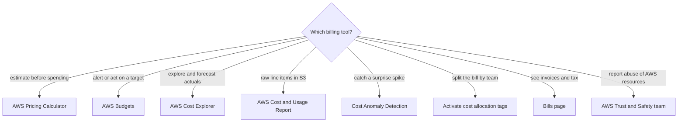
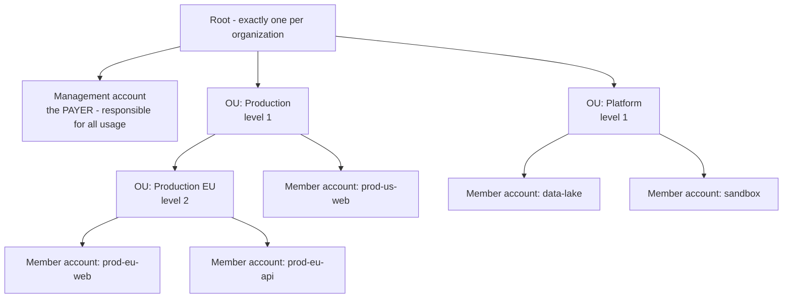
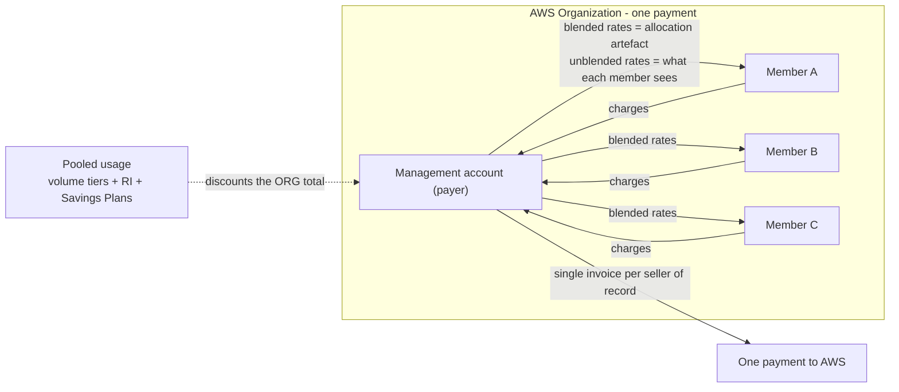
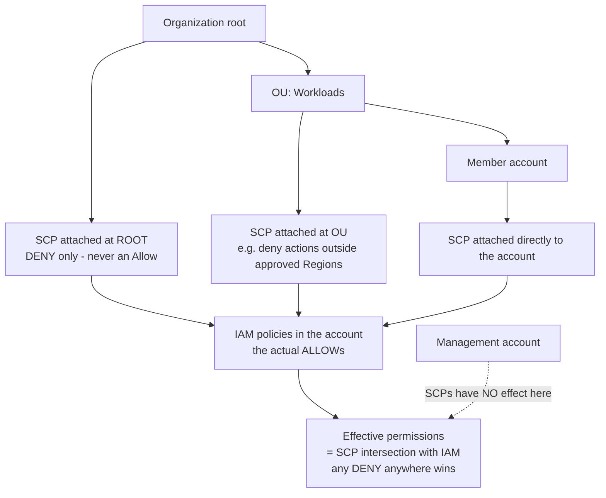
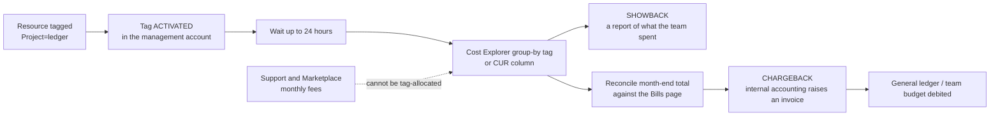

# Billing, AWS Organizations and Cost Governance

Money is where cloud exams get personal. Domain 4 (**Billing, Pricing, and Support**, **12%** of scored content) carries roughly six scored questions, and Task Statement **4.2 — "Understand resources for billing, budget, and cost management"** — owns most of the ones in this lesson: billing support and information, **AWS Organizations**, **cost allocation tags**, and the *"appropriate uses and capabilities of AWS Budgets and AWS Cost Explorer"* plus *"consolidated billing and allocation of costs"*. The pattern of failure is always the same: candidates know the services but not **which page answers which question**, and they fall for the two traps AWS reuses endlessly — *"an SCP grants access"* and *"the bill follows the OU tree"*. Neither is true.

```text
=====================================================================
 MAP OF THE MONEY — WHICH TOOL ANSWERS WHICH QUESTION
=====================================================================
  "SHOW ME THE BILL"
    PDF invoice, tax, issued vs pending ............ Bills page
    charges for ALL accounts (management only) ..... Charges by account tab
    what did we spend by service / Region .......... Billing dashboard Home
    raw line items delivered to my own S3 bucket ... Cost and Usage Report

  "WHY DID IT MOVE / WHAT'S NEXT?"
    explore and group-by actuals + 12-month forecast  AWS Cost Explorer
    warn me at 80% of 50,000 USD and then ACT ....... AWS Budgets + action
    catch an overnight spike I did not plan ......... Cost Anomaly Detection
    estimate a system I have not built yet .......... AWS Pricing Calculator

  "WHO PAYS?"
    one payment, pooled discounts .................. Consolidated billing
    split spend by team, project, environment ....... Activated cost allocation tags
    show the number without invoicing ............... Showback
    raise an internal invoice ....................... Chargeback

  "WHAT MAY NOT BE BOUGHT?"
    deny-only ceiling over an OU .................... Service Control Policy
    curated catalog of approved Marketplace goods ... Private Marketplace (all features)
=====================================================================
```

In this lesson you will:

- open the **Billing and Cost Management console** and name the exact page for every common money question;
- build **AWS Organizations**: one root, up to **five OU levels**, management account as payer, member accounts as users;
- explain **consolidated billing** — one bill per seller of record, **no extra fee**, pooled volume discounts, shared **RI/SP** discounts;
- compute a **consolidated volume-discount** example and an **RI-sharing blended-rate** example from scratch;
- separate **blended from unblended** costs and say exactly who sees which;
- separate **SCPs from IAM** — deny-only, intersection, management-account immunity;
- activate **cost allocation tags** (AWS-generated vs user-defined) and run a **showback → chargeback** flow;
- choose between **Budgets, Cost Explorer, CUR, Pricing Calculator and anomaly detection** — including what each one costs;
- read **RI/SP reservation, utilization and coverage** reports and diagnose over-buying vs under-buying;
- navigate **AWS Marketplace**: consolidated billing of third-party purchases, private offers and Private Marketplace;
- handle **invoices, currencies and payment basics**, and know that **billing support is free for everyone**;
- practise with **12 exam-style questions** plus four interactive checks.

---

## 1. The Billing and Cost Management console: one console, many pages

### 1.1 The Bills page: the invoice view

The **Bills** page is the canonical "where is my invoice?" answer. Its contents are fixed and examinable:

| Bills page element | What it shows | Exam note |
|---|---|---|
| Bill summary | **Issued** vs **Pending** state of the current bill | Pending ≠ unpaid error; it means the period has not closed |
| Payment information | Amount due and payment status | Pair with **Payment preferences** for method and currency |
| **Charges by service** | Spend split by service, drillable **to Region** | *"Why did EC2 jump in eu-west-1?"* → this tab |
| **Charges by account** | Totals for every member account | **Management account only** — member accounts do not get this tab |
| Invoices | Downloadable **PDF** invoices | Invoice currency questions live here and in Payment preferences |
| Savings | Discounts applied | Reinforces that pooled discounts reduce the org total |
| Taxes | Tax lines | Tax questions → Bills page, not Cost Explorer |

AWS states it directly: *"If you use the consolidated billing feature in AWS Organizations, the **Bills** page lists totals for all accounts on the **Charges by account** tab."* (as of Oct 2026)

### 1.2 The billing dashboard Home: the exploratory view

The **Home** dashboard is Cost Explorer-backed and is where slicing happens. Its widgets group spend by **Service · AWS Region · Member account (management account only) · Cost allocation tag · Cost category**. Three behaviours matter on exam day:

- merely **visiting the page auto-enables Cost Explorer** (there is no API way to enable it later);
- the cost summary **excludes credits and refunds** — a number on Home can legitimately differ from the bill;
- data refreshes **at least every 24 hours**.

| Other pages in the console | Job it owns |
|---|---|
| **Cost Explorer** | *"Why did cost move?"* — group, filter, forecast actuals |
| **AWS Budgets** | Threshold alerts, and optionally **budget actions** |
| **Cost and Usage Report** | Raw line items delivered **to your own S3 bucket** |
| **Payment preferences** | Payment method, currency, **pay now** |
| **Billing preferences** | Email invoices, credit sharing, **RI/SP sharing toggles** |

- **📚 Did you know?** Billing help is not a paid extra: AWS's Knowledge Center states *"All AWS account owners have access to account and billing support **free of charge**"* — every plan, including Basic. That is why *"you must upgrade your support plan to ask a billing question"* is a dependable wrong answer (as of Oct 2026).



```matching
{
  "question": "Match each billing question to the console page or tool that answers it:",
  "pairs": [
    {"left": "Download the PDF invoice and see tax lines", "right": "Bills page - bill summary, invoices, taxes, charges by service and by account"},
    {"left": "Group last month's spend by Region and by cost allocation tag", "right": "Billing dashboard Home or Cost Explorer - Service, Region, member account, tag, cost category widgets"},
    {"left": "Warn me before I reach 50,000 USD this month and stop new provisioning if I do", "right": "AWS Budgets with a threshold notification plus a budget action such as an IAM policy that denies provisioning"},
    {"left": "Estimate a three-tier application I have not built yet", "right": "AWS Pricing Calculator - estimate before you spend, it does not read your actual usage"},
    {"left": "Deliver raw hourly line items to my own S3 bucket for Athena", "right": "AWS Cost and Usage Report - CSV or Parquet, at least once per day"},
    {"left": "Find out who is reselling our stolen AMI", "right": "AWS Trust and Safety team - abuse reporting, which is separate from AWS Support"}
  ],
  "explanation": "The exam keys on the verb in the stem: estimate = Pricing Calculator, alert/act = Budgets, explore/forecast = Cost Explorer, export = Cost and Usage Report, surprise spike = Cost Anomaly Detection, invoice/tax = Bills page, abuse = Trust and Safety."
}
```

> [!NOTE]
> **The console is the syllabus.** Task 4.2 asks for *"billing support and information"* and *"pricing information for AWS services"* — that maps to real pages, not to theory. When a question describes a **symptom**, picture the page you would open: invoice → **Bills**; movement → **Cost Explorer**; threshold → **Budgets**; raw export → **CUR**; pre-build estimate → **Pricing Calculator**; currency or card → **Payment preferences**.

---

## 2. AWS Organizations: roots, OUs and who the payer is

### 2.1 The structure

An organization is a tree, and the tree has hard rules:

- **one root** per organization;
- nested **organizational units (OUs)** up to **five levels deep** (verify current before use);
- **accounts** attached to the root or to an OU — accounts are the leaves where resources actually run;
- the **management account** is the **payer**, and AWS says it is responsible for *"all usage, data, and resources used by the accounts in the organization"*;
- **AWS Organizations is offered at no additional charge**, and consolidated billing adds **no extra fee** (as of Oct 2026).



### 2.2 Management account vs member account

| Capability | Management account | Member account |
|---|---|---|
| Pays AWS | **Yes — single payment for the org** | No; it generates charges the payer settles |
| **Charges by account** tab on Bills | **Yes** | No |
| Billing dashboard widgets by member account | **Yes** | No |
| Activates **cost allocation tags** | **Yes** (also standalone accounts) | **No** |
| Affected by **SCPs** | **No** — SCPs have no effect on management-account users and roles | **Yes** |
| Can leave the organization | n/a (it is the org) | Yes, with the payer's action |
| Support subscription | Independent | Independent — *"Each account subscribes independently"* |

### 2.3 Two feature sets, and what a billing-only organization cannot do

Organizations ships in two feature sets, and the difference is exam gold:

| Feature set | What you get | What you do **not** get |
|---|---|---|
| **Consolidated billing only** | One bill, pooled discounts, RI/SP sharing | **No SCPs, no tag policies, no service integrations** (including Private Marketplace) |
| **All features** | Everything above **plus SCPs**, tag policies, integrations | — |

In a billing-only organization, members remain *"otherwise independent"*: each can **sign up for services and use Premium Support independently**. That is why a question describing *"members sign up freely, no guardrails, but one combined bill"* is describing the **consolidated-billing-only** feature set.

- **📚 Did you know?** AWS warns that *"**Your bill will not reflect the structure that you have defined in your organization**"* — the OU tree is a governance device, not a billing dimension. If a question asks you to bill the `data` OU separately, the answer is **activated cost allocation tags** (or cost categories), never *"create another OU"* (as of Oct 2026).

---

## 3. Consolidated billing: one payment, pooled usage, shared discounts

### 3.1 The four documented benefits

| Benefit | What AWS says it gives you |
|---|---|
| **One bill** | One bill per **seller of record** — AWS Marketplace usage lands on the same bill |
| **Easy tracking** | Management account can see **charges by account** |
| **Combined usage** | *"shares the **volume pricing discounts, Reserved Instance discounts, and Savings Plans**"* across accounts |
| **No extra fee** | Consolidated billing costs nothing to add |

### 3.2 Tier thresholds are pooled, not per-account

The single most testable sentence in this topic: *"**AWS treats all accounts in an organization as a single account. Member accounts don't reach tier thresholds individually.**"* Aggregation is **per service**, every month **starts at zero**, and leftover capacity from one account (RI hours, tier progress) can be used by another.

**Worked Example E1 — AWS's published 95 TB tier illustration** *(tier table is AWS's published S3 Standard pricing: $0.10/GB first 1,000 GB, $0.08/GB next 49,000 GB, $0.06/GB thereafter; as of Oct 2026, verify current before use)*

Three member accounts each store about **31,667 GB** in the same month (3 × 31,667 ≈ 95,000 GB = 95 TB; the even split shown is illustrative — AWS publishes the two totals, $6,720 pooled versus $7,660 separate):

| Billed separately (no org) | Pooled by consolidated billing |
|---|---|
| Each account: $0.10 × 1,000 = **$100.00** plus $0.08 × 30,666.67 = **$2,453.33** → **$2,553.33** | First 1,000 GB × $0.10 = **$100.00** |
| Three accounts: 3 × $2,553.33 = **$7,660.00** | Next 49,000 GB × $0.08 = **$3,920.00** |
| | Remaining 45,000 GB × $0.06 = **$2,700.00** |
| | **Pooled total = $6,720.00** |
| **Difference: $940.00 saved (12.3%)** | |

No account reached 1,000 GB alone, yet the org crossed three thresholds — exactly what *"member accounts don't reach tier thresholds individually"* means.

**Worked Example E2 — two accounts, and the blended rate written back** *(tiers as above; arithmetic worked here)*

Account A stores **900 GB**, Account B stores **600 GB**:

- **Standalone:** A = 900 × $0.10 = **$90.00**; B = 600 × $0.10 = **$60.00** → **$150.00**
- **Pooled:** 1,500 GB → first 1,000 × $0.10 = $100.00, remaining 500 × $0.08 = $40.00 → **$140.00**
- **Saving:** **$10.00 (6.67%)**
- **Blended allocation rate:** $140.00 ÷ 1,500 GB = **$0.0933333/GB**
- A's allocated share: 900 × 0.0933333 = **$84.00** (saves $6.00) · B's: 600 × 0.0933333 = **$56.00** (saves $4.00) · check: 84 + 56 = **$140.00** ✓

### 3.3 Blended vs unblended: the trap that never dies

- **Blended rates** average the Reserved Instance and On-Demand rates across member accounts; **EC2 blended rates are computed hourly**. The allocation order is **RI hours → free-tier hours → On-Demand hours**.
- **Unblended** is what each member account is shown: AWS states *"**AWS shows each member account their charges as unblended costs.**"*
- In the **Cost and Usage Report**, `lineItem/BlendedRate` is computed at the **management account** so the org can allocate cost back down.



> [!WARNING]
> **A member account can show full On-Demand charges while the organization total falls.** Because members are shown **unblended** costs, a team whose workload was discounted by *another* account's Reserved Instance may still see the undiscounted line — the saving appears in the **org-level** bill and in the **blended** columns of the CUR. The exam loves this: *"Member B's bill did not change, therefore the RI sharing did nothing"* is **false**.

### 3.4 Support is never pooled

Consolidated billing does **not** merge support: *"AWS calculates **Support fees independently for each member account** … **Each account subscribes independently.**"* Enterprise customers may opt into **aggregated monthly billing** of support fees — that is billing aggregation, **not** pooled entitlements. Developer, Business and Enterprise plans each carry a **monthly minimum** (as of Oct 2026; plan names are in flux — see Section 9.3).

---

## 4. Reserved Instances and Savings Plans across accounts

### 4.1 The sharing rules

| Instrument | AWS's wording | Allocation order |
|---|---|---|
| **Reserved Instances** | The consolidated billing feature *"treats all the accounts in the organization as one account"*, so *"all accounts … can receive the hourly cost benefit of Reserved Instances that are purchased by any other account"* | Starts with the **purchasing account**, then identical **usage types in the same Availability Zone**; **regional** RIs apply to the smallest instance in the family |
| **Savings Plans** | Applied first to the **owning** account, then shared; AWS applies SP rates to uncovered usage **starting with the highest discount** | Owner first, then other accounts in the org |

Two boundaries to memorise: **sharing can be switched off** in Billing preferences (the **RI/SP sharing** toggles), and **neither instrument crosses an organization boundary** — an RI bought in Organization 1 never discounts Organization 2.

**Worked Example E3 — an RI bought by one team saves another** *(AWS's published blended-rate example, trimmed to two accounts; as of Oct 2026)*

A 30-day month = **720 hours**; `t2.small` in one AZ; On-Demand rate **$0.023/h**. The org owns **2 Full Upfront RIs** (1,440 h capacity) and **1 Partial Upfront RI** (720 h).

| Item | Value |
|---|---|
| Account 1 reserved-hour consumption | **2,160 h** |
| Account 2 On-Demand usage | **720 h** |
| Organization total | 2,160 + 720 = **2,880 h** |
| On-Demand charge for the org's uncovered usage | 720 × $0.023 = **$16.56** |
| **Blended rate** | $16.56 ÷ 2,880 = **$0.00575/h** (AWS's published figure) |
| Account 1 blended allocation | 2,160 × 0.00575 = **$12.42** |
| Account 2 blended allocation | 720 × 0.00575 = **$4.14** (check: 12.42 + 4.14 = **$16.56** ✓) |

Account 2 bought **nothing** yet its blended share is **$4.14** instead of $16.56 — it rode on Account 1's reservations because the org is treated as one account. Its **unblended** line still reads **$16.56**.

- **📚 Did you know?** RI and Savings Plans sharing is a **preference, not an inevitability**: the **Billing preferences** page carries the RI/SP sharing toggles, so *"sharing cannot be disabled"* is itself a wrong answer. The exam habit to build: whenever an answer says *"never"*, *"always"* or *"cannot be disabled"*, look for the toggle AWS documents (as of Oct 2026).

---

## 5. SCPs vs IAM: the deny-only ceiling

### 5.1 What an SCP is — and what it is not

A **Service Control Policy** is an Organizations guardrail attached at the **root or an OU**, and it applies to every member account beneath it. AWS's definition is one sentence long and half the exam hangs on it: *"**SCPs do not grant permissions**"*, and they provide *"central control over the **maximum available permissions**"* — a ceiling, never a floor. Two footnotes worth memorising: SCPs **do** bind a member account's **root user**, and they have **no effect on service-linked roles**.

| Property | Service Control Policy (SCP) | IAM policy |
|---|---|---|
| Direction | **Deny-only ceiling** — it can remove, never add | **Grants** (allow) and can deny within its scope |
| Mechanism | Effective permissions = **intersection** of SCPs with identity/resource policies | Direct allow/deny for principals |
| Precedence | **Any Deny anywhere wins** — an explicit deny in an SCP, IAM or resource policy overrides any allow | Same deny-wins rule inside IAM |
| Scope | Whole OUs and accounts (organization-wide governance) | Users, roles, groups, resources in one account |
| Management account | **No effect** on management-account users and roles | Fully applies |
| Feature set required | **All features** in AWS Organizations | Always available |



**Worked Example E4 — the two classic SCP stems** *(rule logic, not pricing)*

1. *"Stop member accounts from launching instances outside approved Regions, without touching anything else they may do."* → attach a **deny-only SCP** at the OU. You removed a permission; you granted nothing — and it works only if the org is on the **all features** set.
2. *"Give the data team permission to read the shared bucket."* → an **IAM policy** (or a resource policy). An SCP cannot do this, because an SCP that says `Allow` on `s3:GetObject` changes nothing: the intersection still needs an IAM `Allow` underneath.

```fillblank
{
  "question": "Complete the governance statements with the correct AWS terms:",
  "template": "An SCP is a {{1}} policy: it can only remove permissions, never grant them, so AWS says SCPs do not {{2}} permissions. Effective permissions are the {{3}} of the SCPs and your IAM policies, and an explicit {{4}} anywhere wins. SCPs have no effect on the {{5}} account, and they require the Organizations {{6}} feature set.",
  "answers": {
    "1": "deny-only",
    "2": "grant",
    "3": "intersection",
    "4": "deny",
    "5": "management",
    "6": "all features"
  },
  "distractors": ["allow-only", "grant", "union", "allow", "member", "consolidated billing"],
  "explanation": "AWS's own wording: 'SCPs do not grant permissions'; effective permissions are the intersection with identity and resource policies; any Deny wins; SCPs do not affect the management account; SCPs need the all-features set (consolidated-billing-only organizations cannot use them)."
}
```

> [!WARNING]
> **The classic trap, stated plainly: an SCP never grants access.** If the correct outcome needs someone to *do* something, the answer is an **IAM policy** (or a resource policy, or a permissions boundary). If the correct outcome needs a member account *stopped* from doing something across the board, the answer is a **deny-only SCP** — and if a question offers *"attach an SCP to allow…"*, that option is self-contradicting and wrong. Second half of the trap: **SCPs do not apply to the management account**, so *"govern the payer with an SCP"* is also wrong.

---

## 6. Tagging and cost allocation tags: showback and chargeback

### 6.1 Two kinds of tag, one activation rule each

A **tag** is a key (with an optional value) attached to a resource; each key is unique per resource. For billing, AWS splits tags into exactly two kinds:

| Kind | Defined/applied by | Prefix in AWS tooling | In a cost allocation report |
|---|---|---|---|
| **AWS-generated** | AWS, or an **AWS Marketplace ISV** | `aws:` | Appears under its AWS key |
| **User-defined** | You | any key you choose | Appears as **`user:` + key** |

Three rules decide whether your tag ever reaches a report:

1. **You must activate both kinds separately** — *"You must activate both types of tags separately before they can appear in Cost Explorer or on a cost allocation report."*
2. **Activation lives in the management account (or a standalone account)** — member accounts cannot activate cost allocation tags.
3. **Allow up to 24 hours** for activated tags to start flowing (verify current before use).

**Worked Example E5 — "we tagged everything and the report is empty"** *(diagnostic sequence)*

| Symptom | Cause | Fix |
|---|---|---|
| 400 instances tagged `Project=ledger`, report shows nothing | Tag **applied but never activated** | Management account → activate `user:Project` |
| Activated yesterday, still nothing today | Propagation lag of **up to 24 hours** | Wait, then re-check |
| Some rows show `Project = (not allocated)` | Resources created **before tagging**, or **untagged**, or a **non-tagging service** | Backfill tags; expect an untagged row by design |
| Support or Marketplace monthly fees missing | **Cannot be allocated at all** | Allocate those by another rule or accept the untagged row |

### 6.2 What the cost allocation report can and cannot split

The report is a CSV grouped by active tags, including explicit **tagged and untagged** rows, and its **month-end totals reconcile with the Bills page**. It cannot allocate:

- resources created **mid-month before tagging** started;
- **untagged** resources and **non-tagging services**;
- *"**Subscription-based charges, such as AWS Support and AWS Marketplace monthly fees, can't be allocated**"*.

**Cost categories** — rules-based mappings you define — sit **alongside** tags as a dimension in Cost Explorer, Budgets and the Bills page, which is the escape hatch when a charge type cannot be tagged.

### 6.3 Showback vs chargeback

| | **Showback** | **Chargeback** |
|---|---|---|
| AWS/tagging-whitepaper wording | *"presentation, calculation, and reporting of charges incurred by a specific entity"* | *"an actual charging of incurred costs … via an organization's internal accounting processes"* |
| Someone pays? | **No** — report only | **Yes** — an internal invoice |
| Difference in one line | *"whether or not someone is expected to make a payment"* | |
| Perception risk | Informational | AWS notes chargeback *"can be perceived as a tax"* |



**Worked Example E6 — a two-team split** *(illustrative figures — the flow is sourced, the amounts are made up for practice)*

| Team | Tag | Cost Explorer group-by share | Action |
|---|---|---|---|
| Ledger platform | `Project=ledger` | **$39,000 (65%)** | Showback report to the team lead |
| Internal platform | `Project=platform` | **$21,000 (35%)** | Showback report to the team lead |
| **Org total** | | **$60,000** | Must equal the Bills page month-end total |
| Shared: Support + Marketplace monthly fees | (no tag) | shown in the **untagged** row | Split by an agreed rule, or use a **cost category** |

Showback stops here (no payment). Chargeback continues: finance debits each team $39,000 / $21,000 through internal accounting — the difference between the two is *whether someone is expected to pay*.

```dragdrop
{
  "question": "Order the steps that turn resource tags into a chargeback invoice:",
  "items": [
    "Tag every billable resource with a consistent key such as Project",
    "Activate the user-defined tag as a cost allocation tag in the management account",
    "Wait up to 24 hours for the tag to flow into cost data",
    "Group by the tag in Cost Explorer or inspect the Cost and Usage Report",
    "Reconcile the month-end total against the Bills page",
    "Issue the showback report, then let internal accounting raise the chargeback invoice"
  ],
  "correctOrder": [
    "Tag every billable resource with a consistent key such as Project",
    "Activate the user-defined tag as a cost allocation tag in the management account",
    "Wait up to 24 hours for the tag to flow into cost data",
    "Group by the tag in Cost Explorer or inspect the Cost and Usage Report",
    "Reconcile the month-end total against the Bills page",
    "Issue the showback report, then let internal accounting raise the chargeback invoice"
  ],
  "explanation": "Tagging alone never produces cost data: activation in the management account is a separate step, it takes up to 24 hours, the report must tie back to the Bills page, and only the last step - internal accounting - makes it chargeback rather than showback."
}
```

- **📚 Did you know?** **AWS-generated tags can be created by a third party**: AWS's cost-allocation documentation counts tags *"defined and applied by AWS **or an AWS Marketplace ISV**"* as AWS-generated. So a Marketplace vendor's tag can appear in your cost data before you write a single line of tagging policy — you still have to **activate it separately** from your own (as of Oct 2026).

---

## 7. Cost management: Budgets, Cost Explorer, RI/SP reports and the CUR

### 7.1 AWS Budgets: alert first, act second

AWS Budgets monitors a **target** and notifies you. The documented facts:

| Fact | Value (as of Oct 2026; verify current before use) |
|---|---|
| Budget types | **Cost · Usage · RI utilization · RI coverage · SP utilization · SP coverage** (six) |
| Notification direction | *"exceed, or are forecasted to exceed"* for cost/usage; *"fall below"* for RI/SP budgets |
| Delivery channels | **Amazon SNS, email, or both** |
| Refresh | **Up to 3× per day, typically 8–12 hours apart** |
| Views tracked | Blended, unblended, amortized, net variants; can **exclude** refunds, support fees, taxes |
| Per-budget limits | **≤5 notifications**, each with **≤1 SNS topic + ≤10 email addresses** |
| RI/SP budget limit | `BudgetLimit` **defaults to 100, and 100 is the only valid value** (utilization/coverage are percentages) |
| In an organization | A budget targeting a member account shows **only if that account is granted access**; AWS: *"we don't support cross-account usage"* |
| Price | Monitoring and notifications **free**; the **first 2 action-enabled budgets per month are free**, then **$0.10/day each**; a delivered **Budget Report = $0.01 per report** |

**Budget actions** are what separate an alert from a control: they run *"programmatically or with your approval"* and can apply **IAM policies, SCPs, or AWS resources**, integrating with **AWS Chatbot** (Slack/Chime) and **Service Catalog**. AWS's own setup example is the one to memorise: notify at **80 percent** of the budgeted amount and apply an action — for example a custom IAM policy that **denies provisioning additional resources**.

**Worked Example E7 — budget arithmetic with an action** *(AWS's documented 80% pattern; amounts illustrative)*

| Event | Arithmetic | Result |
|---|---|---|
| Budget = **$50,000/month** | Alert A at **80% actual** = 0.80 × 50,000 | **$40,000** |
| Alert B | **forecast** to exceed 100% | fires on forecast, not on actual |
| Day 12 spend **$21,000** | 21,000 < 40,000 | silent |
| Day 20 spend **$41,500** | 41,500 > 40,000 | **Alert A fires**, optional action applies |
| Action-enabled budgets #1 and #2 | free | **$0.00** |
| Action-enabled budget #3 for 30 days | 30 × $0.10 | **$3.00** |
| 4 weekly Budgets Reports | 4 × $0.01 | **$0.04** |
| **Month total for the above** | 3.00 + 0.04 | **≈ $3.04** |

> [!NOTE]
> **A notification is not a cap.** Budget alerts do not stop spend — delivery also lags the charge, because Budgets data refreshes only a few times a day. Stopping spend requires a **budget action** (IAM policy, SCP or resource). That distinction — *alert vs enforce* — is a favourite correct/incorrect pair.

### 7.2 Cost Explorer: explore, group, filter, forecast

| Behaviour | AWS's wording / number (as of Oct 2026) |
|---|---|
| Data currency | *"All costs reflect your usage up to the previous day."* |
| Enabling | **Console only** — *"You can't enable Cost Explorer using the API"* |
| History on enable | **Current month + last 12 months** |
| Forecast | **Next 12 months** |
| Refresh / disable | Refresh **≥24 h**; once enabled it **cannot be disabled** |
| Filter/group dimensions | `SERVICE`, `LINKED_ACCOUNT`, `REGION`, `AZ`, `TAG`, `COST_CATEGORY`, `CHARGE_TYPE` |
| Default reports | **Cost & usage** plus **Reserved Instance reports**; ships with **Amazon Q** |
| API price | **$0.01 per request** (each paginated page counts); custom billing views **$0.01 per source** |
| Hourly granularity | 14-day lookback at **$0.00000033 per usage record per day** ≈ **$0.01 per 1,000 records per month** |

**Worked Example E8 — what "free" Cost Explorer really costs** *(official rate card; arithmetic here)*

- A script calls the Cost Explorer API **5,000 times** in a month: 5,000 × $0.01 = **$50.00**.
- A team switches on **hourly granularity** for **10,000 usage records** for one day: 10,000 × $0.00000033 = **$0.0033**; over 30 days ≈ **$0.10** — which is why the docs' shorthand is *"about $0.01 per 1,000 records per month"*.
- Console clicks in the default (daily) view: **$0** — monitoring your dashboard is not an API call.

### 7.3 Reservation, utilization and coverage: three different questions

| Report | Question it answers | Signal if bad |
|---|---|---|
| **Reservation (inventory)** | What do I own, how much is it saving vs On-Demand, what expires this month? | Expiring unused commitments |
| **Utilization** | Of the commitment I **bought**, how much did I **use**? | **Over-buying** |
| **Coverage** | Of the hours I **ran**, how many were **covered**? | **Under-buying** |

**Worked Example E9 — utilization 98% vs coverage 90%** *(AWS's published Savings Plans examples; as of Oct 2026)*

- **Utilization:** a **$10/hour** commitment with usage billed at Savings Plans rates totalling **$9.80** → $9.80 ÷ $10.00 = **98% utilized**. Two percent of what you paid for went unused — you are close to **over-buying**.
- **Coverage:** **9 of 10** identical instances costing **$1.00/hour** run on Savings Plans rates → covered $9.00 of $10.00 = **90% covered** — one instance-hour is still billed at On-Demand, so you are **under-buying**.
- Reports use **normalized units** so different instance sizes compare fairly.

### 7.4 The Cost and Usage Report (CUR)

The CUR is the raw export: line items delivered **to your own S3 bucket at least once per day**, at **hourly, daily or monthly** granularity, in **CSV or Parquet**. It carries both `lineItem/UnblendedRate` and `lineItem/BlendedRate` — the latter computed at the **management account** — which is why the CUR is the tool for chargeback-grade allocation, while Cost Explorer is the tool for exploration.

### 7.5 Awareness items (not on the official in-scope service list)

Two real console features are **not** named in the CLF-C02 in-scope list — treat them as bonus awareness and **never as the keyed answer** when Budgets or Cost Explorer also fits:

| Tool | What it does | Limits worth knowing (as of Oct 2026) |
|---|---|---|
| **Cost Anomaly Detection** | Machine learning to *"detect and alert on anomalous spend patterns"*; flow = **cost monitor → alert subscription → notification** | **1 AWS Service monitor + up to 500 custom**; **≤10 emails or 1 SNS topic**; needs **≥10 days** of history; alerts within **24 h**; linked-account/tag/cost-category monitors are **management account only** |
| **Cost Optimization Hub** | Consolidates rightsizing, idle-resource, Savings Plans and RI recommendations — *"over **18 types**"* | **Daily** refresh; must be **enabled**; data served from **us-east-1** |

And the reverse trap: **AWS Billing Conductor is explicitly out of scope** for this exam, as are Amazon DevPay and AWS Application Cost Profiler — an option naming Billing Conductor is a distractor.

- **📚 Did you know?** Cost Explorer is deliberately hard to get rid of: AWS lets you enable it **only from the console** (*"You can't enable Cost Explorer using the API"*), gives you **12 months of history plus a 12-month forecast the moment you enable it**, and then **you cannot disable it**. AWS is charging for *programmatic* access (**$0.01 per API request**) and *hourly* granularity (about **$0.01 per 1,000 records per month**) — reading the dashboard stays free, automating it is metered (as of Oct 2026).

---

## 8. AWS Marketplace: buy third-party, pay AWS

### 8.1 What it is and how it bills

AWS defines Marketplace as *"a **curated digital catalog** that customers can use to **find, buy, deploy, and manage third-party software, data, and services**"* — available product types include SaaS, AMIs, containers, CloudFormation templates, SageMaker offerings and data products.

| Aspect | Behaviour (as of Oct 2026) |
|---|---|
| Who bills you | **AWS**: *"At the beginning of the month, you receive a bill from Amazon Web Services (AWS) for your AWS Marketplace charges."* AWS collects **on behalf of the seller** |
| Where it lands | On your normal AWS bill — usage on the **consolidated bill** (typically 2nd/3rd of the month) |
| Currency | Mostly **USD** unless local-currency invoicing is opted in; private-offer invoice currencies: **USD EUR GBP AUD JPY INR** |
| Private offer | Negotiated price + EULA for named accounts (**up to 25**), accepted in the **management or a member account**; *"There is no difference in the software product"* |
| Annual subscription sharing | Bought by one account, **shared across the entire linked account family** |
| **Private Marketplace** | *"curated catalogs of approved products"*; **integrates with AWS Organizations**; experiences scoped to the **whole org, OUs, or accounts**; users can still **request** other products; requires the **all features** feature set |
| Exam's 4.3 angle | **Cost management** (CUR/Cost Explorer line items + budgets) · **governance** (Private Marketplace + procurement requests) · **entitlement** (subscription tied to your AWS account) |

> [!IMPORTANT]
> **Private offer ≠ Private Marketplace.** A **private offer** is a *negotiated deal* for up to 25 named accounts. A **Private Marketplace** is a *curated catalog* governed per organization, OU or account, and it needs Organizations on the **all features** set — the same prerequisite family as **SCPs** and **tag policies**. If a question offers *"enable Private Marketplace with consolidated billing only"*, it is wrong.

- **📚 Did you know?** Marketplace rides your existing bill — but its **monthly fees cannot be tag-allocated**, so a chargeback model must handle Marketplace subscriptions through an agreed rule or a **cost category** rather than through tags (as of Oct 2026).

---

## 9. Invoices, currencies, payment basics — and who to ask

### 9.1 What is verified about currency and invoices

| Fact (as of Oct 2026; verify current before use) | Source status |
|---|---|
| **Default invoice currency = USD** | Verified |
| AWS publishes a list of **payment currencies** (~30 codes, e.g. EUR, GBP, JPY, BRL, CAD, AUD, INR, CNY…) | AWS Official re:Post article *"updated a year ago"* at access — treat the **exact list as verify-before-use** |
| **Card-only** currencies: **NOK CLP COP EGP NGN UAH UYU**; **AED is invoice-only** | Same article — same caveat |
| Invoice issuance for invoiced accounts uses **electronic funds transfer on standard net-30 terms**, and you *"contact AWS Support from the root user account"* to receive invoices | Verified |
| **AWS invoice configuration**: maximum **500 invoice units per payer account** | Verified |

> [!WARNING]
> **What could NOT be verified — do not memorise it:** AWS's **pay-by-invoice eligibility thresholds** (spend, account age, credit checks) are **not sourced** in our research. If an exam-style option quotes a dollar threshold or a "6 months of history" rule for becoming invoice-eligible, treat it as **unverified** — the only sourced statements are net-30 EFT terms and contacting Support from the root user. Likewise, the exact currency list changes with seller-of-record and location; quote *"default USD, other currencies vary"* rather than reciting codes.

### 9.2 Where you change things

| You want to… | Page |
|---|---|
| Change card, bank method, or pay now | **Payment preferences** (method, currency, pay now) |
| Get invoices by email, share credits, toggle RI/SP sharing | **Billing preferences** |
| Read the invoice itself, taxes, issued/pending | **Bills** |

### 9.3 Support-plan cross-references (from the support lesson)

Four facts from Domain 4 task 4.3 that belong in a billing answer:

1. **Billing/account support is free on every plan** — *"All AWS account owners have access to account and billing support free of charge."*
2. **Basic Support cannot open technical cases**, but it *can* open **account and billing** cases and **service-limit increase** cases (24×7).
3. **Support is per account, not per organization** — *"Each account subscribes independently"*; Enterprise may opt into **aggregated monthly billing** of support fees only.
4. **Where to ask what:** *how do I tag 400 instances?* → **AWS re:Post** (AWS-managed community + Knowledge Center, *"over 4,000"* official articles and videos) — **not** for time-sensitive or account-specific questions; *invoice does not match my estimate* → **Support Center** account-and-billing case; *someone is reselling our stolen image* → **AWS Trust and Safety team**.

Current plan lineup as of Oct 2026 (verify names before exam day): **Basic · Business Support+ · Enterprise · Unified Operations**. **Developer** and **Business** stopped new subscriptions **2 December 2025** and are discontinued **1 January 2027**, as is **Enterprise On-Ramp** — which is supported only **through 31 December 2026**. Plan names are the single churniest fact in Domain 4, so re-check the support lesson before exam day.

---

## 10. One-minute decision drill

```text
SYMPTOM                                          -> ANSWER
------------------------------------------------ ------------------------------------------
"show me the PDF invoice and the tax lines"      -> Bills page
"why did EC2 jump in eu-west-1"                  -> Cost Explorer (or Bills: charges by service)
"spend by member account this month"             -> Bills: Charges by account (MANAGEMENT only)
"spend by Project tag"                           -> activate tag -> Cost Explorer / CUR
"warn me at 80% of 50,000 and stop provisioning" -> AWS Budgets + budget ACTION
"estimate before I build"                        -> AWS Pricing Calculator
"raw hourly line items in my own S3 bucket"      -> Cost and Usage Report
"catch an unexplained overnight spike"           -> Cost Anomaly Detection (awareness item)
"stop OUs buying outside approved Regions"       -> deny-only SCP (all features)
"let the data team read the bucket"              -> IAM policy (SCPs never grant)
"one bill for 40 accounts, pooled discounts"     -> Organizations + consolidated billing
"bill the data OU separately"                    -> cost allocation tags / cost categories
"did we use what we bought?"                     -> RI/SP UTILIZATION report
"are we covering what we run?"                   -> RI/SP COVERAGE report
"buy vetted third-party software via AWS"        -> AWS Marketplace (+ Private Marketplace)
```

---

## Real-World Case Studies

Sections 1–10 teach the tools; these five AWS-published stories show the tools against real bills. **Every figure below is a *customer* result that AWS itself published** (official case-study pages accessed **2026-10**) — none of them is an AWS guarantee, and none of them is a memorisable exam number. What transfers to exam day is the **lever**: which charge type, which pricing model, which governance mechanism actually moved.

| Case | Domain hook | What AWS published (accessed Oct 2026) | Lesson section it proves |
|---|---|---|---|
| **Box** — enterprise SaaS | D4 cost governance | **$2.23 M** total: inter-AZ **$438 K** + egress **$1.1 M/yr** + storage **>$500 K/yr** + logging **$192 K/yr** | Section 6 tags · Section 7 cost tooling |
| **Canva** — SaaS design platform | D4 pricing models | compute costs **−46% in under 2 years** | Section 4 RI/SP/Spot |
| **FarEye** — SaaS logistics | D4 pricing models | compute **−65%**, **$1 M/year**, Graviton **+30%** performance | Section 4 + Section 7.1 budgets |
| **athenahealth** — healthcare software | D2/D4 multi-account governance | inspection costs **−95%**; hundreds of VPCs across **120 accounts** in days; team of **8** | Section 2 Organizations · Section 5 SCPs |
| **Shutterfly / SBS** — e-commerce printing | D4 right-sizing and licences | **~25%** opex cut; VMs **2,000 → 1,200** | Section 7.3 utilization/coverage |

### Case 1 — Box: $2.23 M from architecture, not from a discount code

*Challenge:* cut spend without weakening security, reliability or performance. *Services:* Well-Architected Framework with Solutions Architect reviews, S3/S3 Glacier storage tiering, EBS volume-and-snapshot hygiene, CloudTrail event filtering, and routing traffic around internet gateways.

*What AWS published:* **$2.23 million** unpacked into four **charge types**:

| Lever AWS lists | Published figure |
|---|---|
| Internet egress (data transfer out) | **over $1.1 million per year** |
| Storage tiering (S3 / S3 Glacier) | **over $500,000 per year** |
| Inter-AZ data transfer | **$438,000** |
| Log volume (CloudTrail event filtering) | **$192,000 per year** |
| **Total** | **over $2.23 million** |

Customer voice — Clay Alvord, director of FinOps and SRE: *"Our use of AWS best practices led to savings of over 2 million dollars, setting a new baseline…"*

**Exam link:** not one dollar came from a discount code or from Organizations. Three of the four levers are **architecture and hygiene**, which is why AWS frames cost optimisation as the Well-Architected **cost pillar**; the fourth (storage) is a **tiering/purchasing** decision. This lesson connects at both ends: activated cost allocation tags and Cost Explorer/CUR (Sections 6–7) are what *show* you that inter-AZ transfer and log volume are ballooning — but only a redesign *removes* the charge.

```plot
{
  "type": "bar",
  "title": "Box: AWS-published savings by charge type (USD)",
  "data": [
    {"chargeType": "Internet egress", "usd": 1100000},
    {"chargeType": "Storage tiering", "usd": 500000},
    {"chargeType": "Inter-AZ transfer", "usd": 438000},
    {"chargeType": "Log volume", "usd": 192000}
  ],
  "xKey": "chargeType",
  "yKey": "usd",
  "xLabel": "Charge type",
  "yLabel": "USD saved"
}
```

*Figures exactly as AWS publishes them: egress ("over $1.1 million per year") and storage ("over $500,000") are floors; inter-AZ $438,000 and logging $192,000 are exact — as of Oct 2026.*

### Case 2 — Canva: the pricing-model ladder as a business

*Challenge:* cost-effective scale with reliability tiers per user plan. *Services:* **Spot** for free-tier projects, **On-Demand + Savings Plans** for paying Pro users, **Reserved Instances** as a fallback, plus AWS cost tooling.

*What AWS published:* **compute costs reduced by 46 percent in less than 2 years** — and the case study quotes AWS's own list claims alongside it: RIs *"a discount of up to 72 percent compared to On-Demand"*, Savings Plans *"up to 72 percent … in exchange for a 1- or 3-year hourly spend commitment"*, Spot *"up to 90 percent discount"* (as of Oct 2026; verify current before use).

**Exam link:** this is Section 4 turned into a plan — **steady baseline → Savings Plans** (flexible $/hour commitment), **steady family/AZ-pinned work → Reserved Instances**, **interruptible spare capacity → Spot**. Two habits to keep: commitment discounts are always *"up to"* percentages, never guaranteed, and the cheapest tier of an application is exactly what Spot is for.

### Case 3 — FarEye: three levers in one bill

*Challenge:* thin last-mile logistics margins and a need for predictable spend. *Services:* **Compute Savings Plans**, **EC2 Spot**, and **Graviton** across 500+ Spot/On-Demand instances.

*What AWS published:* AWS compute costs **reduced by 65 percent**, **$1 million per year** in cloud cost savings, and **+30 percent** performance from Graviton.

**Exam link:** predictable spend is the Section 7.1 story — a company that must forecast to the dollar runs **thresholds and budget actions**, not month-end surprises; and the discount ladder it climbed (Savings Plans → Spot → Graviton price-performance) is the same ladder Canva climbed in Case 2.

### Case 4 — athenahealth: governance across 120 accounts

*Challenge:* monitor egress across a sprawling VPC estate while inspection costs climbed, with a small team. *Services:* centralized **AWS Network Firewall**, Transit Gateway, **AWS RAM** for policy fan-out, CloudFormation rules-as-code, Direct Connect.

*What AWS published:* inspection costs **reduced by 95 percent**; hundreds of VPCs across **120 accounts** added *"within just a few days"*; **eight people** designed and rolled out the new security design with no disruptions.

**Exam link:** 120 accounts is only operable because of **AWS Organizations** (Section 2: one root, OUs five levels deep, the management account as payer) plus sharing mechanisms such as **AWS RAM**; the **deny-only SCP ceiling** of Section 5 is what keeps member accounts inside the guardrails while one central firewall does the inspection. The cost lesson mirrors Section 6: **centralise once, allocate many** — one inspection layer billed once beats 120 copies, and the money shows up first in the management account's **Charges by account** view.

### Case 5 — Shutterfly: right-sizing and licence avoidance

*Challenge:* on-premises VMware, stand-alone stacks, 2,000+ VMs and a colocation exit. *Services:* VMware Cloud on AWS as a bridge (August 2022), then native migration completed **March 2025 — six months early** — roughly 800 systems and 400 TB, about 80% of workloads on ECS.

*What AWS published:* VM footprint **2,000 → 1,200**, and an **approximately 25% opex cut** from licence avoidance plus right-sizing.

**Exam link:** *right-sizing* is the free lever — it is what Cost Explorer recommendations, Cost Optimization Hub (Section 7.5) and a Well-Architected cost review exist to find, and utilization-vs-coverage (Section 7.3) is how you prove you stopped over-buying; *licence avoidance* is the classic on-premises → cloud TCO argument (Domain 1) landing in a Domain 4 bill.

> [!WARNING]
> **Customer result ≠ AWS guarantee — the fastest way to lose a Domain 4 mark.** *Zendesk* reduced costs by up to **42%**, *Canva* by **46%**, *FarEye* by **65%**: those are **the customers' published outcomes**, and AWS never promises them to you. The discount numbers that genuinely belong to AWS are the **list** figures — *"up to 72 percent"* for Reserved Instances and Savings Plans, *"up to 90 percent"* for Spot (as of Oct 2026; verify current before use). Any option that reads *"AWS guarantees X% savings"* is wrong on sight.

- **📚 Did you know?** AWS's Box write-up is signed by the **customer's** director of FinOps and SRE, not by AWS — and our 2026-10 research digest found the same pattern across the whole case-study library (roughly **95% of pull-quotes are customer staff**, not AWS executives). Read every saving as *"the customer achieved"*, never as *"AWS guarantees"*. Two of the stories here are also **multi-account** stories by design: athenahealth's **120 accounts** and Shutterfly's separate SBS estate both depend on Organizations-style structure before any cost tool can aggregate a thing.

---

### 2026 Updates (as of October 2026)

Money facts move faster than the exam guide. Everything below comes from our October 2026 research pass — **only what AWS published is stated**; nothing unverifiable is asserted.

> [!NOTE]
> **Sourced changes since 2025 — billing console, Organizations and commitments:**
> - **The console moved, the syllabus did not.** AWS shipped **Savings Plans / Reserved Instances group sharing to GA** (AWS What's New, 2025-11-19) and **Target Coverage in the Savings Plans Purchase Analyzer** (AWS Cloud Financial Management blog, 2026-06-09), after **Cost Optimization Hub** (2023-11-26) and alongside the **Well-Architected Agent** preview (2026-10-01) — yet the guide's examinable names remain **AWS Budgets, AWS Cost Explorer, AWS Pricing Calculator**, so Sections 7–8 of this lesson still answer the exam.
> - **Database Savings Plans launched 2025-12-02**: up to **35%** for a 1-year no-upfront commitment (serverless up to 35%, provisioned up to 20%, DynamoDB 18%, Amazon Keyspaces 12%). Real and recent — but **not named in the CLF-C02 guide**, so never the keyed answer where **AWS Savings Plans** fits.
> - **Savings Plans now have a published return rule:** commitments priced **below 100 USD/hour** can be returned in the **same calendar month**, **≤10 returns per year**; commitments of **100 USD/hour or more cannot be returned** (AWS Cloud Financial Management blog, 2026-06-24; as of Oct 2026, verify current before use).
> - **Task 4.2 dropped AWS Billing Conductor** — the live guide reads *"Understanding the appropriate uses and capabilities of AWS Budgets and AWS Cost Explorer"*, and Billing Conductor now sits on the official **out-of-scope** list (55 entries) — which is exactly how Section 7.5 treats it: a distractor, never the answer.
> - **Task 4.3's support names changed in the exam text itself:** *Basic Support, AWS Business Support+, AWS Enterprise Support, AWS Unified Operations*; Developer, classic Business and Enterprise On-Ramp take **no new subscriptions after 2025-12-02** and existing ones run **through 2027-01-01** — consistent with Section 9.3, and a reminder that plan names are Domain 4's churniest fact.
> - **The in-scope list now spells the export "AWS Cost and Usage Reports"** (plural) — a rename of the CUR from Section 7.4, not a new service; the same list confirms the exam's own copy of **AWS Cost and Usage Report(s)** alongside Budgets and Cost Explorer.
>
> **Marketplace:** our 2026-10 sources contained **no verifiable AWS Marketplace billing change**, so treat every Section 8 fact above as standing unchanged as of Oct 2026 — and never invent a Marketplace "update" from memory.

- **📚 Did you know?** The **Free Tier itself changed on 2025-07-15**: accounts created on or after that date get **6 months** (or until credits run out) plus a **USD 100 sign-up credit and up to USD 100 earnable = up to USD 200**, while older accounts keep the legacy **12-month**, `t2.micro`-based tier — and `t2.micro`/`t3.micro` gave way to `t3.micro`, `t3.small`, `t4g.micro`, `t4g.small`, `c7i-flex.large`, `m7i-flex.large`. Both behaviours are correct AWS behaviour; the trap is assuming one universal rule (as of Oct 2026; verify current before use).

---

## Practice Questions

```question
{
  "id": "clf-14-q1",
  "type": "multiple-choice",
  "question": "You need the PDF invoice, the tax lines and the issued-versus-pending status of this month's AWS bill. Which page do you open?",
  "options": [
    "The Billing dashboard Home page",
    "The Bills page",
    "AWS Cost Explorer default report",
    "Payment preferences"
  ],
  "correct": 1,
  "explanation": "The Bills page holds the bill summary (Issued vs Pending), payment information, charges by service (drillable to Region), charges by account (management account only), downloadable PDF invoices, savings and taxes. Home is the exploratory widget view, Cost Explorer answers 'why did cost move', and Payment preferences is where you change method or currency."
}
```

```question
{
  "id": "clf-14-q2",
  "type": "multiple-choice",
  "question": "A company wants to stop member accounts from launching resources outside two approved Regions, without granting any new permissions. The organization uses the all-features set. What should you do?",
  "options": [
    "Attach a deny-only Service Control Policy at the relevant OU or the root",
    "Attach an SCP that allows only the two approved Regions, because SCPs grant permissions",
    "Attach an IAM policy to every user in every member account",
    "Move the accounts into a new OU, because OU membership itself blocks Region launches"
  ],
  "correct": 0,
  "explanation": "SCPs are a deny-only ceiling: AWS says 'SCPs do not grant permissions', effective permissions are the intersection with IAM, and any Deny anywhere wins. An SCP that says 'allow' changes nothing on its own. OU structure alone never restricts anything, and per-user IAM policies do not give organization-wide governance. Note also that SCPs have no effect on the management account."
}
```

```question
{
  "id": "clf-14-q3",
  "type": "multiple-choice",
  "question": "Three member accounts each store about 31,667 GB in one month; none reaches a 1,000 GB tier alone. Using AWS's published S3 Standard tiers ($0.10/GB first 1,000 GB, $0.08/GB next 49,000 GB, $0.06/GB thereafter, as of Oct 2026), what does consolidated billing change?",
  "options": [
    "Nothing - member accounts always reach tier thresholds individually",
    "The pooled org pays about $6,720 instead of about $7,660 billed separately, a saving of about $940",
    "Each account is re-rated at $0.06/GB because the organization is large",
    "The tiers apply to the management account only, and member accounts are charged On-Demand storage rates"
  ],
  "correct": 1,
  "explanation": "AWS states that it treats all accounts in an organization as a single account and that member accounts don't reach tier thresholds individually. Separately: 3 x (1,000 x $0.10 + 30,666.67 x $0.08) = 3 x $2,553.33 = $7,660. Pooled: $100 + $3,920 + $2,700 = $6,720. Saving = $940 (about 12.3%). Rates are not re-based per account - only the aggregated usage moves through the tiers."
}
```

```question
{
  "id": "clf-14-q4",
  "type": "multiple-choice",
  "question": "Account B's workload was discounted by a Reserved Instance bought by Account A in the same organization. Which statement is correct?",
  "options": [
    "Account B's bill will show the discounted amount, because consolidated billing rewrites every member's charges as blended costs",
    "Account B is shown unblended charges, so its line can read full On-Demand price while the organization's total is lower",
    "RI discounts never cross account boundaries inside an organization",
    "The discount appears only if the two accounts are in different Regions"
  ],
  "correct": 1,
  "explanation": "AWS shows each member account its charges as unblended costs; blended rates are an allocation artefact computed at the management account (lineItem/BlendedRate in the CUR). RI discounts do cross account boundaries within the organization - accounts are treated as one account, allocation starts with the purchasing account, then identical usage types in the same AZ - and regional RIs apply to the smallest instance in the family."
}
```

```question
{
  "id": "clf-14-q5",
  "type": "multiple-choice",
  "question": "Every EC2 instance is tagged Project=ledger, yet the cost allocation report shows no Project column. What is the most likely cause?",
  "options": [
    "Tags only appear after they have been activated as cost allocation tags - separately for AWS-generated and user-defined - which can be done only in the management or a standalone account, and can take up to 24 hours",
    "Cost allocation tags only work with the Cost and Usage Report, never with Cost Explorer",
    "Member accounts must tag resources before the management account can see them",
    "Tags are automatically active but only track compute, never storage"
  ],
  "correct": 0,
  "explanation": "Applying a tag and activating it are two different steps: 'You must activate both types of tags separately before they can appear in Cost Explorer or on a cost allocation report', activation is available only in management or standalone accounts, and activation can take up to 24 hours to show data. Tagged and untagged rows both appear in the report, and month-end totals reconcile with the Bills page."
}
```

```question
{
  "id": "clf-14-q6",
  "type": "multiple-choice",
  "question": "Requirement: notify the finance channel at 80% of a 50,000 USD monthly budget AND automatically prevent the creation of additional resources if the budget is breached. Which combination satisfies it?",
  "options": [
    "AWS Cost Explorer with a forecast alert and an SNS topic",
    "AWS Budgets with a threshold notification plus a budget action that applies an IAM policy denying provisioning",
    "An SCP alone, because SCPs cap spending",
    "The Cost and Usage Report delivered daily to S3"
  ],
  "correct": 1,
  "explanation": "AWS's documented pattern is to notify at 80 percent of the budgeted amount and apply an action - for example a custom IAM policy that denies provisioning additional resources. Budget actions can run programmatically or with approval and can apply IAM policies, SCPs or AWS resources, integrating with AWS Chatbot. Cost Explorer explores and forecasts but never enforces; an SCP can deny provisioning actions yet it cannot watch a spend target or notify anyone; the CUR is only an export."
}
```

```question
{
  "id": "clf-14-q7",
  "type": "multiple-choice",
  "question": "You hold a 10 USD/hour Savings Plans commitment; usage billed with Savings Plans rates totalled 9.80 USD. Separately, 9 of 10 identical 1.00 USD/hour instances ran at Savings Plans rates. What do these two readings indicate?",
  "options": [
    "Utilization 98% (slight over-buy risk) and coverage 90% (one instance still On-Demand)",
    "Coverage 98% and utilization 90% - both indicate under-buying",
    "Utilization 98% and coverage 90% - both indicate under-buying",
    "Reservation report shows both numbers; utilization and coverage are the same metric"
  ],
  "correct": 0,
  "explanation": "Utilization answers 'of the commitment I bought, how much did I use?' - 9.80/10.00 = 98%, so 2% of what you paid for was idle (over-buy signal). Coverage answers 'of the hours I ran, how many were covered?' - 9/10 = 90%, so 10% still runs at On-Demand rates (under-buy signal). They are separate Budgets types and separate Cost Explorer reports, and reports use normalized units so instance sizes compare fairly."
}
```

```question
{
  "id": "clf-14-q8",
  "type": "multiple-choice",
  "question": "Which statement about AWS Support inside an organization with consolidated billing is correct?",
  "options": [
    "Support fees are pooled across the organization so every member inherits the management account's plan",
    "Support fees are calculated independently for each member account and each account subscribes independently",
    "Only the management account can contact AWS at all; member accounts have no support access",
    "Billing and account support requires a paid plan on every account"
  ],
  "correct": 1,
  "explanation": "AWS calculates support fees independently for each member account and each account subscribes independently; Enterprise customers may opt into aggregated monthly billing, which aggregates billing only, not entitlements. Billing and account support is free for all AWS account owners, and customers with the Basic Support plan can still open account and billing cases and service-limit increase cases - they just cannot open technical cases."
}
```

```question
{
  "id": "clf-14-q9",
  "type": "multiple-choice",
  "question": "Which pair of AWS Marketplace statements is correct as of Oct 2026?",
  "options": [
    "AWS bills the seller directly and Marketplace charges never appear on your AWS bill",
    "AWS bills you at the beginning of the month on your normal AWS bill, and Private Marketplace - a curated catalog of approved products scoped to the org, OUs or accounts - requires Organizations with all features",
    "A private offer and a Private Marketplace are the same feature",
    "Marketplace monthly fees can be allocated with a cost allocation tag"
  ],
  "correct": 1,
  "explanation": "AWS collects Marketplace payment on behalf of the seller and bills you at the beginning of the month, with usage landing on the consolidated bill. Private Marketplace integrates with AWS Organizations, curates approved products and needs the all-features set - the same prerequisite family as SCPs and tag policies. A private offer is instead a negotiated price and EULA for up to 25 named accounts, and subscription-based charges such as Support and Marketplace monthly fees cannot be tag-allocated."
}
```

```question
{
  "id": "clf-14-q10",
  "type": "multiple-choice",
  "question": "The VP wants each OU in the organization to receive its own section of the AWS bill automatically. Which answer is correct?",
  "options": [
    "Create an OU per VP and AWS will generate per-OU invoices - the bill follows the OU tree",
    "The bill will not reflect the OU structure - use activated cost allocation tags (or cost categories) to categorise spend, because only the management account sees charges by account",
    "Enable consolidated-billing-only mode, because all-features mode hides the OU structure from the bill",
    "Enable RI sharing so the Reserved Instance reports create OU-level invoices"
  ],
  "correct": 1,
  "explanation": "AWS states directly: 'Your bill will not reflect the structure that you have defined in your organization.' Allocation is done with activated cost allocation tags (or rules-based cost categories), and the Charges by account tab exists only in the management account. The feature set controls guardrails (SCPs, tag policies), not bill layout, and RI sharing only spreads discounts - it never creates invoices."
}
```

```question
{
  "id": "clf-14-q11",
  "type": "multiple-choice",
  "question": "During a cost review an engineer writes: 'AWS says we will save $2.23 million, so we should budget for it.' The reference is AWS's Box case study. Which pair of statements is correct?",
  "options": [
    "AWS published the $2.23M as a customer result broken into internet egress, storage tiering, inter-AZ transfer and log-volume levers - a customer outcome, never an AWS guarantee",
    "AWS guarantees $2.23M of savings to any customer that completes a Well-Architected Review",
    "The $2.23M came from consolidated billing volume discounts pooled across the organization's 120 accounts",
    "The $2.23M is an AWS Marketplace credit applied automatically to Enterprise Support accounts"
  ],
  "correct": 0,
  "explanation": "AWS's Box case study reports over $2.23 million in savings as four customer levers: over $1.1M/year from internet egress, over $500K/year from storage tiering, $438,000 from inter-AZ data transfer and $192,000/year from log volume - achieved through Well-Architected reviews, S3/S3 Glacier tiering, EBS snapshot hygiene and CloudTrail event filtering. Case-study percentages and totals are customer results AWS publishes, never guarantees (the 42% figure belongs to Zendesk, 46% to Canva). Pooled consolidated-billing discounts are real but are not what produced this figure; the 120-account figure belongs to athenahealth; Marketplace credits do not fund savings."
}
```

```question
{
  "id": "clf-14-q12",
  "type": "multiple-choice",
  "question": "A team regrets a Savings Plans commitment it bought this month. As of Oct 2026, which statement about returns is correct (AWS Cloud Financial Management blog, 2026-06-24)?",
  "options": [
    "Commitments priced below 100 USD/hour can be returned within the same calendar month, up to 10 returns per year; commitments of 100 USD/hour or more cannot be returned",
    "Any Savings Plans commitment can be returned at any time for a full refund, regardless of price",
    "Commitments below 100 USD/hour can be returned an unlimited number of times, while commitments of 100 USD/hour or more may be returned up to 10 times per year",
    "Commitments can be returned only after they have run for 30 days, and only through an Enterprise Support case"
  ],
  "correct": 0,
  "explanation": "AWS's published rule is precise: commitments priced under 100 USD/hour are returnable in the same calendar month and are capped at 10 returns per year, while commitments of 100 USD/hour or more cannot be returned at all. Price, calendar month and the annual cap are the three variables the exam can rotate - not Support tiers, not a 30-day waiting period. As of Oct 2026; verify current before use."
}
```

---

> [!IMPORTANT]
> **Comparative Verdict — billing, AWS Organizations and cost governance × on-premises × other clouds × AWS Organizations governance**
> - **Versus siloed on-premises billing:** on premises, every cost centre runs its own procurement, its own licence server and its own spreadsheet, so consolidation is a quarterly finance project with stale numbers; AWS gives you **consolidated billing at no extra fee**, **one bill per seller of record**, **pooled volume tiers and RI/SP discounts computed monthly from hour one**, and **Cost Explorer history for 12 months plus a 12-month forecast the moment it is enabled**. What does *not* move: an on-prem chargeback model and an AWS one both fail without disciplined tagging, and AWS still bills **per account, not per OU** — you must build the allocation layer yourself (activated tags or cost categories), and **Support and Marketplace monthly fees cannot be tag-allocated** at all.
> - **Versus other clouds:** every hyperscaler offers a payer account with pooled discounts, but the exam keys on **AWS's exact vocabulary and numbers**: **five OU levels**, **SCPs that never grant and never touch the management account**, **unblended shown to members while blended exists only as an allocation artefact**, **six Budgets types with the 80% + action pattern**, **utilization (over-buy) vs coverage (under-buy)**, **Cost Explorer's console-only enablement and $0.01/request API**, and **Private Marketplace needing the all-features set**. Another provider's console tabs, policy language or alert names will not transfer to this exam.
> - **Versus DIY scripts and out-of-scope AWS tooling:** a home-grown bill splitter means scraping invoices, reconciling taxes and re-deriving tier math every month; AWS already ships the **CUR (hourly/daily/monthly, CSV or Parquet, at least once per day)** and **budget actions that can enforce, not merely notify**. Inside AWS the discipline is just as sharp: **AWS Budgets and AWS Cost Explorer are the in-scope answers**, while **AWS Billing Conductor, Amazon DevPay and AWS Application Cost Profiler are out of scope**, and **Cost Anomaly Detection / Cost Optimization Hub are awareness-only** — never the keyed answer when Budgets or Cost Explorer also fits.

> [!WARNING]
> **Exam-day traps for this lesson:**
> - **"SCPs grant access" is always wrong** — deny-only, **intersection** with IAM, **any Deny wins**, **no effect on the management account**, requires the **all features** set; granting = **IAM policy**;
> - **The bill does NOT follow the OU tree** — AWS: *"Your bill will not reflect the structure that you have defined in your organization"* → use **activated cost allocation tags** (or cost categories);
> - **Tag applied ≠ cost data** — both tag kinds must be **activated separately**, activation is **management/standalone account only**, and data can take **up to 24 hours**;
> - **Members see UNBLENDED; blended is an allocation artefact** — a member's line can show full On-Demand while the org total falls;
> - **Consolidated billing is free, Organizations is free, billing support is free** — paid parts are **Cost Explorer API ($0.01/request)**, **action-enabled budgets beyond two ($0.10/day)**, **Budgets Reports ($0.01/report)**, **CE hourly granularity**, and CUR storage/queries;
> - **Support is never pooled** — *"Each account subscribes independently"*; Enterprise may aggregate **billing** of support fees only;
> - **Budget alerts do not stop spend** — enforcement needs a **budget action** (IAM policy / SCP / resources), and refresh lags the charge (up to 3×/day, 8–12 h apart);
> - **Utilization ≠ coverage** — utilization = using what you **bought** (over-buy); coverage = covering what you **run** (under-buy);
> - **RI sharing starts with the purchasing account** (same AZ, identical usage types; regional RIs → smallest instance in family); **Savings Plans** go owner-first, highest discount first; **neither crosses an organization boundary**, and sharing can be **switched off**;
> - **Private offer ≠ Private Marketplace** — a deal for up to **25 named accounts** vs a curated catalog needing **all features**;
> - **Marketplace monthly fees and AWS Support cannot be tag-allocated** — expect an **untagged** row by design;
> - **Tool selection:** estimate → **Pricing Calculator**; alert/act → **Budgets**; explore/forecast → **Cost Explorer**; export → **CUR**; spike → **Cost Anomaly Detection** (awareness); **AWS Billing Conductor is out of scope**;
> - **Cost Explorer**: console-only enable, **cannot be disabled**, 12 months back + 12 months forward, refresh ≥24 h, costs reflect usage **up to the previous day**;
> - **Currency:** default invoice currency **USD**; eligibility thresholds for pay-by-invoice are **unverified** — never quote a dollar threshold from memory.

> [!SUCCESS]
> **Key Takeaways:**
> 1. **Page-for-symptom mapping:** invoice/tax/issued-vs-pending → **Bills**; movement by service/Region/tag/account → **Billing dashboard Home or Cost Explorer**; threshold → **AWS Budgets**; raw export → **Cost and Usage Report**; pre-build estimate → **AWS Pricing Calculator**; spike → **Cost Anomaly Detection**; method/currency/pay-now → **Payment preferences**; abuse → **AWS Trust and Safety**;
> 2. **Organizations structure:** exactly **one root**, OUs nested up to **five levels**, accounts as leaves; the **management account is the payer** responsible for *"all usage, data, and resources"*; **Organizations and consolidated billing cost nothing**; feature sets are **consolidated billing only** (no SCPs, no tag policies, no integrations) vs **all features**;
> 3. **Consolidated billing = one bill per seller of record + combined usage:** volume discounts, RI discounts and Savings Plans are pooled, and *"AWS treats all accounts in an organization as a single account. Member accounts don't reach tier thresholds individually"* — worked: three accounts at ~31,667 GB pay **$7,660 separately vs $6,720 pooled ($940 saved)**, and 900 GB + 600 GB pay **$150 → $140** at a blended **$0.0933333/GB**;
> 4. **Blended vs unblended:** members are shown **unblended**; **blended** (EC2 computed hourly; order RI → free tier → On-Demand) is the management-account allocation written into `lineItem/BlendedRate` — worked RI example: **2,880 h**, On-Demand **$16.56**, blended **$0.00575/h**, split **$12.42 / $4.14**;
> 5. **RI/SP sharing:** all accounts can receive another account's RI hourly benefit, allocation **starts with the purchasing account** then identical usage in the same AZ (regional RIs → smallest instance in the family); Savings Plans go **owner first, highest discount first**; sharing toggles live in **Billing preferences**; nothing crosses an org boundary; **support fees are never pooled**;
> 6. **SCPs vs IAM:** *"SCPs do not grant permissions"* — effective permissions are the **intersection**, **any Deny wins**, **no effect on the management account**, **all features** required; stop a member → **deny-only SCP**, grant a team → **IAM policy**;
> 7. **Cost allocation tags:** two kinds — **AWS-generated** (AWS or an **AWS Marketplace ISV**, `aws:` prefix) and **user-defined** (reported as `user:` + key); both need **separate activation**, **management/standalone account only**, **up to 24 h**; the report includes **untagged** rows and **reconciles with the Bills page**; **Support and Marketplace monthly fees cannot be allocated**;
> 8. **Showback vs chargeback:** showback = *presentation, calculation and reporting* (nobody pays); chargeback = *an actual charging via internal accounting* (somebody pays) — and chargeback *"can be perceived as a tax"*;
> 9. **Budgets:** six types (Cost, Usage, RI/SP utilization, RI/SP coverage), notifications via **SNS/email/both**, *"exceed or forecast to exceed"* vs *"fall below"*, refresh **up to 3×/day (8–12 h)**, **≤5 notifications** (≤1 SNS + ≤10 emails each), RI/SP budget limit **100 only**; actions apply **IAM policies, SCPs or resources** (Chatbot, Service Catalog); monitoring/notifications free, **first two action-enabled budgets free per month then $0.10/day**, reports **$0.01 each** — worked: **$50,000 budget, 80% = $40,000 alert, third action budget = $3.00 + 4 reports = $0.04 ≈ $3.04/month**;
> 10. **Cost Explorer:** costs reflect usage **up to the previous day**, **console-only enable, cannot be disabled**, **12 months history + 12 months forecast**, refresh **≥24 h**, dimensions include `SERVICE`, `LINKED_ACCOUNT`, `REGION`, `AZ`, `TAG`, `COST_CATEGORY`, `CHARGE_TYPE`; **API $0.01/request**, hourly granularity ≈ **$0.01 per 1,000 records/month**; **utilization 98%** ($9.80 of a $10/hour commitment) = over-buy signal, **coverage 90%** (9 of 10 instances) = under-buy signal; **CUR** lands in your S3 bucket **at least once per day** as **CSV or Parquet**;
> 11. **Marketplace:** a *"curated digital catalog"* you **find, buy, deploy and manage** through; AWS bills you **at the beginning of the month** on the same bill, collecting **on behalf of the seller**; **private offer** = negotiated deal for **up to 25 accounts**; **Private Marketplace** = curated approved catalog scoped to **org/OU/account** and **requires all features**; its **monthly fees cannot be tag-allocated**;
> 12. **Money basics:** default invoice currency **USD** (payment currencies vary by seller of record — verify before use); invoiced accounts use **EFT on standard net-30 terms** with invoices requested **from the root user via AWS Support**; **billing/account support is free for everyone**, **Basic cannot open technical cases**, support subscribes **per account**, and general how-to belongs on **AWS re:Post** (Knowledge Center: **4,000+** official articles) — all figures **as of Oct 2026**.
