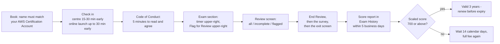
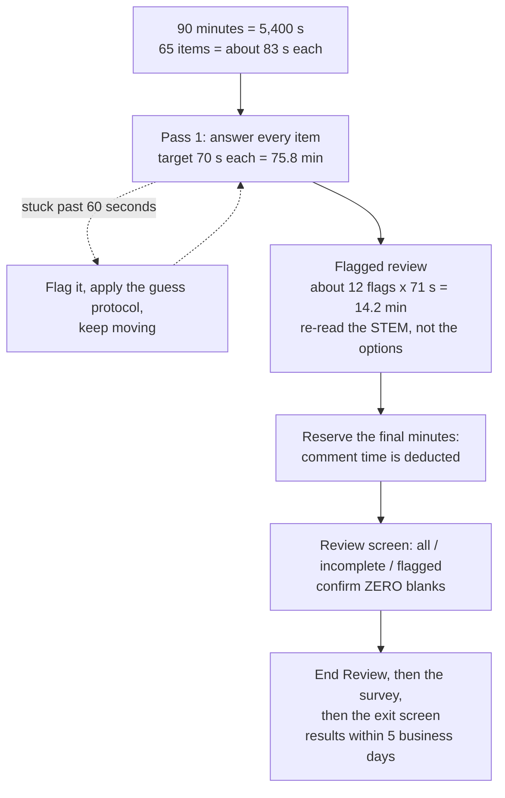
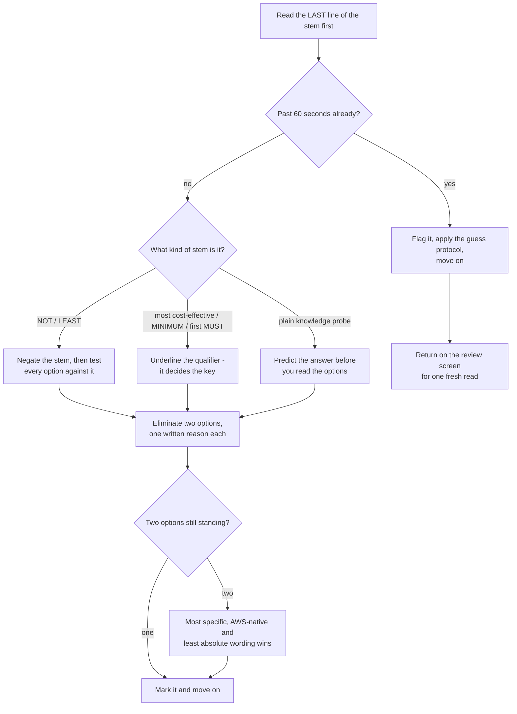
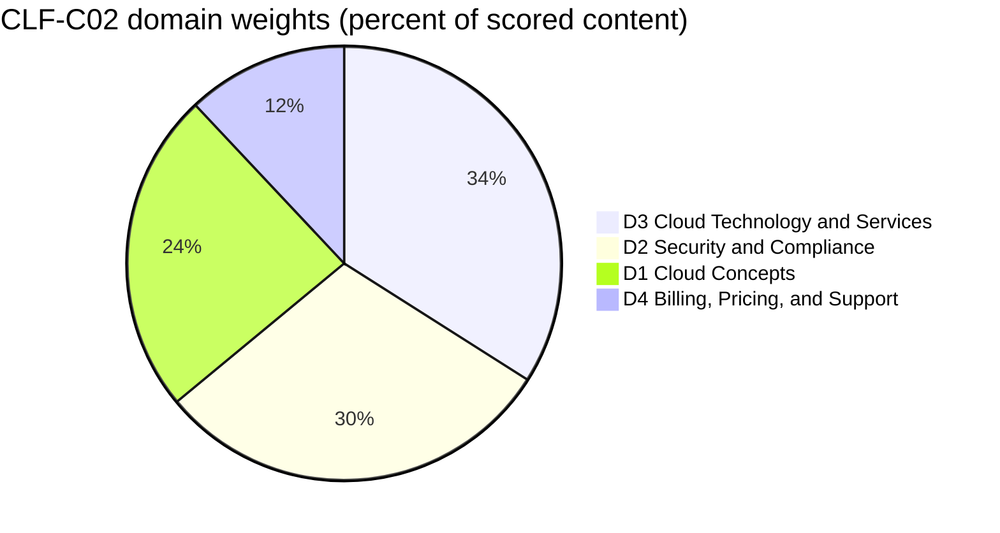
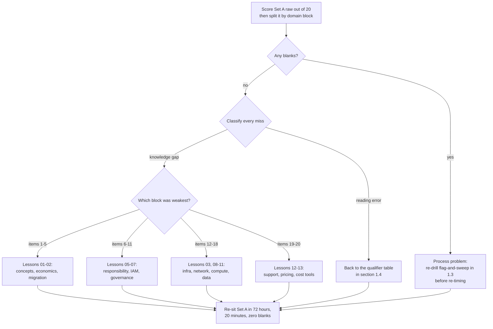

# Exam Simulation A: Full-Length Practice Set + Strategy

Fourteen lessons gave you the content. This one gives you the **container**: how a CLF-C02 item is actually built, how the 90-minute clock behaves, how AWS writes a distractor, and then **Set A** — twenty exam-style items you sit under time and grade honestly. Everything before this lesson was domain knowledge; everything here is *test craft*, and on a compensatory 100–1,000 scale with 700 to pass, test craft is worth as much as another hour of revision.

```text
====================================================================
 CLF-C02 EXAM AT A GLANCE                (all figures as of Oct 2026)
====================================================================
 FORMAT ....... 65 questions = 50 scored + 15 unscored (not identified)
 TYPES ........ multiple choice (1 right + 3 distractors)
                multiple response (2+ right of 5+ options)
 TIME ......... 90 minutes = 5,400 s  ->  ~83 s per item (arithmetic)
 SCALE ........ 100 - 1,000, pass at 700, COMPENSATORY, no section cut
 GUESSING ..... no penalty for a wrong guess; BLANK = wrong
 WEIGHTS ...... D1 Cloud Concepts 24% | D2 Security 30%
                D3 Cloud Technology 34% | D4 Billing 12%
 COST ......... 100 USD per attempt (tax may apply)
 VALIDITY ..... 3 years; after a FAIL wait 14 calendar days,
                unlimited attempts, full fee every time
 DELIVERY ..... Pearson VUE test centre or online proctored
 RESULTS ...... posted to your AWS Certification Account
                within 5 business days (official ceiling)
--------------------------------------------------------------------
 SET A (this lesson) ...... 20 items in weight order: 5 / 6 / 7 / 2
====================================================================
```

> [!NOTE]
> **How to use this lesson.** Read sections 1.1 to 1.7 once — that is the strategy half. Then sit **Set A (section 2) on a 20-minute timer with no notes, no search and no peeking at the teardowns**. Grade yourself with section 3, convert the raw score with the rubric there, and let the routing table send you back to the lesson you actually need. Anything this lesson could not verify against a first-party AWS page is listed in section 1.7 — treat those as *do not assert*, not as facts to memorise.

By the end of this lesson you will be able to:

- restate every published logistics number (65 / 50 / 15, 90 minutes, 700/1,000, 100 USD, 3 years, 14 days) without notes;
- run the 83-second pacing math and defend a two-pass plan that never leaves an item blank;
- apply the flag-and-sweep technique in under a minute per item;
- read a superlative stem — *most cost-effective*, *least operationally intensive*, *MINIMUM*, *first MUST* — and know which option the qualifier is buying;
- decode the seven distractor families AWS reuses across all four domains;
- sit Set A, grade it **by domain rather than by total**, and route each miss to the right lesson;
- defend the **comparative verdict** on self-study versus bootcamp versus AWS training.

---

## 1. Strategy: the four techniques that decide Set A

### 1.1 The logistics you must not re-derive on exam day

Every number below is published by AWS and was retrieved in October 2026. You are allowed to forget service trivia; you are not allowed to re-derive these under a running clock.

| Fact | The published value | Why it changes your strategy |
|---|---|---|
| **Questions presented** | **65** | You must *see* all 65 — coverage beats depth |
| **Scored / unscored** | **50 scored + 15 unscored**, and the 15 are **not identified** | Treat every item as scored |
| **Question types** | **Multiple choice** (1 correct + 3 distractors) and **multiple response** (2+ correct of 5+ options) | Two different elimination procedures, one clock |
| **Time** | **90 minutes** | 5,400 s ÷ 65 ≈ **83 s per item** |
| **Scale** | **100–1,000**, minimum passing score **700** | 700 is a *scaled* cut, not 70 % |
| **Scoring model** | **Compensatory** — no per-domain pass mark | A soft domain still sinks you |
| **Guessing** | **No penalty**; unanswered questions are scored as incorrect | A blank is the only guaranteed zero |
| **Cost** | **100 USD** per attempt (as of Oct 2026; taxes may apply) | Every retake is a fresh 100 USD |
| **Validity** | **3 years** | Diary the expiry on the day you pass |
| **After a fail** | Wait **14 calendar days**, no limit on attempts, full fee each | Budget attempt two *before* attempt one |
| **After a pass** | The same exam cannot be retaken for **2 years** | You cannot "refresh" a pass early |
| **Delivery** | **Pearson VUE** test centre or online proctored | Same exam, same price, both routes |
| **Results** | Within **5 business days** to your AWS Certification Account | Plan a quiet week, not an hourly refresh |
| **Accommodation** | ESL accommodation adds **+30 minutes** | Request it well in advance |

- **📚 Did you know?** The **15 unscored items look exactly like the 50 scored ones** — AWS states they "are not identified on the exam". The rational response is symmetry: a badly answered pretest item costs you nothing, a skipped scored item costs the full marks, so the incentive never once points toward "leave it blank and come back". Flag, guess, move.

**The interface you will be given.** Knowing the controls *before* test day is free marks, because the exam gives you no orientation tour:

| Control | Where it lives | What it does |
|---|---|---|
| **Timer** | Upper-right | Counts down for the whole exam section; a warning appears when **5 minutes remain** |
| **Flag for Review** | Upper-right | Marks an item so it appears on the review screen — costs one click |
| **Comment** | Upper-left | Free-text note; **comment time is subtracted from your exam time**, so comment after you finish |
| **Code of Conduct** | Before the exam section | **5 minutes** to read and agree — timing out ends the exam with no refund |
| **Review screen** | At the end | Shows **all, incomplete, or flagged** questions; you choose the filter, then `End Review` |
| **Survey + exit** | After `End Review` | A short survey, then the exit screen (which "provides information on exam results") |



### 1.2 The pacing plan: 65 items, 90 minutes

AWS publishes **no per-question budget** — the only official pacing inputs are the 90-minute duration, the on-screen **5-minute warning**, and a 2021 AWS blog suggesting you flag rather than linger. Everything else below is arithmetic on published numbers, labelled as such.

**Worked example 1 — the ceiling.**

$$
\frac{90 \times 60}{65} = \frac{5{,}400}{65} \approx 83.1\ \text{s per item} \quad (\text{about } 1\text{ min } 23\text{ s})
$$

**Worked example 2 — the two-pass split.** Run pass one at **70 s per item**: $65 \times 70 = 4{,}550$ s $= 75.8$ minutes. That leaves $90 - 75.8 = 14.2$ minutes, which is 850 seconds — and $850 \div 71 \approx 12$ flagged items re-read at 71 seconds each. Twelve flags is the budget. Not twenty.

**Worked example 3 — what over-flagging costs.** Twenty flags at the same 71 s each is $20 \times 71 = 1{,}420$ s $= 23.7$ minutes, on top of 75.8 minutes of first pass — **99.5 minutes total**, roughly **9.5 minutes past the 90-minute limit**. Flagging is not free: a flag is a scheduled second attempt, and the schedule has a fixed number of slots.

| Phase | Clock | Minutes | The rule you must not break |
|---|---|---|---|
| **Pass 1** — all 65 | 0:00 → 1:16 | 75.8 | **~70 s per item**; answer *every* item |
| **Flagged review** | 1:16 → 1:30 | 14.2 | Re-read the **stem**, not the options |
| **Stop buffer** | inside the last 5 min | — | Comment time is **deducted** from your exam time |
| **No-blank sweep** | at the review screen | — | Confirm **zero blanks**, then End Review |



**Worked example 4 — Set A's own clock.** Set A has 20 items, so the same two rules scale down: a first pass at 60 s per item is $20 \times 60 = 1{,}200$ s $= \mathbf{20}$ **minutes**, and the 83-second ceiling would give you $20 \times 83 = 1{,}660$ s $= 27.7$ minutes. Sit Set A on **20 minutes flat** — it trains the rhythm you will use for 65, not just the twenty in front of you.

**Worked example 5 — the scored-only illusion.** Against scored items only, the budget looks like $5{,}400 \div 50 = 108$ s. You cannot tell which 50 are scored, so **83 s is the number you plan with** and 108 s is a trap you must never budget against.

**The two formats cost different minutes.** CLF-C02 publishes exactly two question types — there is no ordering, matching or case-study item on this exam, so do not budget for them. Everything below the *structure* row is this lesson's planning arithmetic, **not** an AWS figure:

| Type | Structure | How it fails | Planning budget |
|---|---|---|---|
| **Multiple choice** | 1 correct response + 3 distractors | Distractor engineering: the near-miss beats the obvious answer | ~50–60 s in pass 1 |
| **Multiple response** | 2 or more correct out of 5 or more options | Missing one correct option; assuming partial credit exists | ~75–90 s in pass 1 |
| **Either type** | Four to six options drawn from the **same service family** | Reading options before the stem's qualifier is underlined | never — read the last line first |

- **📚 Did you know?** Because multiple-response items take roughly half again as long, they are the items most likely to push you past the 60-second flag threshold — and they are the ones candidates *least* want to flag, because re-reading five or six options feels productive. Flag them anyway. A flagged multiple-response item you return to with a fresh stem read beats an unflagged one you keep mining in place.

### 1.3 Flag-and-sweep: the technique, item by item

AWS's own exam-prep walkthrough teaches a five-step sequence, and the fifth step is the one candidates skip. Trained until it is automatic, it looks like this:

| Step | AWS's published tip | What you actually do |
|---|---|---|
| 1 | "Read and understand the question before looking at the answer options" | Read the **last line** first, then the stem body — options anchor you |
| 2 | "Identify the **key phrases and qualifiers**" | Underline `MINIMUM`, `most cost-effective`, `first MUST`, `NOT`, `Select TWO` |
| 3 | "Eliminate some of the answer options based on what you know" | Kill two options with **one written reason each** |
| 4 | "Compare and contrast the remaining options" | Test the survivors against the *stem's* pain, not general goodness |
| 5 | "If you are spending too much time, pick your best guess and **flag** the question" | Past ~60 s: guess, flag, move — never re-read a confident answer |



The **sweep** is the other half of the name. At the review screen you are not re-answering; you are checking three things and nothing else:

1. **Blanks.** Zero. An unanswered item is scored incorrect and there is no penalty for a wrong guess, so blank is strictly dominated by any guess at all.
2. **The asked question.** Re-read the stem and confirm you answered *it* — the classic loss is answering the adjacent, more familiar question.
3. **Order of operations.** Change an option only if you can state the reason in one clause. "It felt wrong" is not a clause.

AWS's 2021 question-breakdown blog compresses the same habit into three questions you ask **every** option, in this order — and the order matters, because an option can be true and still irrelevant:

1. **What requirement does the question put in place?** — name the constraint the stem imposes in one clause.
2. **What is the condition?** — the situation, the workload shape, the risk that must be removed.
3. **What is the best solution per AWS best practice?** — only now compare the surviving options.

```dragdrop
{
  "question": "Order the six moves of the flag-and-sweep routine for a single stuck item:",
  "items": [
    "On the review screen, re-read the STEM only - never the options first",
    "Confirm you answered the question that was actually asked",
    "Click Flag for Review, then move on immediately",
    "Pick your best guess so that no blank remains",
    "60 seconds reached - stop re-reading the options",
    "Run the final no-blank sweep before End Review"
  ],
  "correctOrder": [
    "60 seconds reached - stop re-reading the options",
    "Pick your best guess so that no blank remains",
    "Click Flag for Review, then move on immediately",
    "On the review screen, re-read the STEM only - never the options first",
    "Confirm you answered the question that was actually asked",
    "Run the final no-blank sweep before End Review"
  ],
  "explanation": "The order is fixed by risk: the clock is the binding constraint, so the time limit fires first and forces a guess before the flag, which guarantees no blank. The flag only buys a second read, and that read must start from the stem because the classic loss is answering the adjacent question. The no-blank sweep comes last because it is the final check that nothing was left unanswered. Note: CLF-C02 publishes only two question types - multiple choice and multiple response - so this sequence is a study drill, not an exam format you will be asked to perform."
}
```

### 1.4 Reading the stem: superlatives, negations and ordering words

Most CLF-C02 losses are reading losses. The stem's **qualifier**, not the service name, decides the key — so the first move is always the same: find the qualifier, write down what it demands, *then* read the options.

| The stem says… | It is really asking | Your first move | Where it is tested in Set A |
|---|---|---|---|
| **"most cost-effective"** | Lowest **total** cost for *this* workload, not the lowest sticker price | Name the workload's shape (steady, bursty, one-off) before comparing options | Q12 (Spot), Q13 (storage class), Q20 (cost tools), and worked example 6 below |
| **"least operationally intensive"** | Least manual, bespoke, day-to-day work | Prefer the managed answer; distrust anything that implies a hand-built pipeline | Q7 (RDS vs EC2 patching), Q14 (read replica vs resizing) |
| **"MINIMUM"** | The *lowest* option that satisfies the constraint | Never over-answer: the tier that "definitely has the feature" is usually one tier too high | Q19 (support plans) |
| **"first MUST" / "NEXT"** | The prerequisite or risk-removal step | Order the options by dependency, then take the earliest one the stem's risk requires | Q5 (rightsizing before committing), Q16 (RPO/RTO) |
| **"NOT" / "LEAST"** | The one option that *violates* the constraint | Re-read the last line twice; the distractor is usually the option that is simply true | Not used in Set A — hold the reflex for the live exam |
| **"(Select TWO/THREE)"** | Every correct response is required | Read *all* options before committing; AWS's published rule is that you must select all correct responses to receive credit | Q2, Q9, Q17, Q18, Q20 |

**Worked example 6 — reading a superlative end to end.** Take a stem that never appears in Set A: *"A production workload runs 24/7 for three years, cannot be interrupted, and will stay in one instance family in one Region. Which option gives the largest discount ceiling?"*

1. **Underline the qualifiers before looking at any option:** 24/7 · three years · *cannot be interrupted* · one instance family · one Region.
2. **Let the hardest qualifier eliminate.** "Cannot be interrupted" kills Spot Instances on the spot — even though Spot carries the biggest headline number, **up to 90 % off** (as of Oct 2026), because Spot capacity can be reclaimed with about two minutes' notice.
3. **Match the horizon.** Three years of runtime invites a three-year commitment: **3-year EC2 Instance Savings Plans / Standard Reserved Instances, up to 72 %** (as of Oct 2026).
4. **Take the largest ceiling that survived step 2.** A 1-year Compute Savings Plan tops out at **up to 66 %** (as of Oct 2026) and commits for one year while the workload runs three; On-Demand is the undiscounted baseline.
5. **Say the trap out loud:** two traps fired at once — the biggest percentage was disqualified by a *constraint*, and the cheaper-percentage option was more *flexible* rather than more suitable. Verify every ceiling on the current pricing page before you rely on it.

```fillblank
{
  "question": "Complete the four stem-reading reflexes from section 1.4:",
  "template": "1) Read the last line first and underline the {{1}} - it decides the key. 2) 'Most cost-effective' means the lowest total {{2}} for the described workload, not the lowest sticker price. 3) 'MUST be configured first' asks for the {{3}} or the risk-removal step. 4) Anything you cannot resolve in about a minute gets {{4}} and a guess - never a blank.",
  "answers": {
    "1": "qualifier",
    "2": "cost",
    "3": "prerequisite",
    "4": "flagged"
  },
  "distractors": ["service name", "sticker price", "optional step", "skipped", "domain weight", "bonus point", "rewritten"],
  "explanation": "Four reflexes, one line each: the qualifier (MINIMUM, most, first, NOT) is what AWS's own walkthrough tells you to identify before comparing options; 'most cost-effective' is total cost for the workload shape the stem describes; 'first MUST' is a dependency or risk-removal question, so the answer is the prerequisite; and past about a minute the correct move is flag, guess, move - because unanswered questions are scored as incorrect and there is no penalty for a wrong guess."
}
```

- **📚 Did you know?** AWS's exam-prep tip number five is literally *"pick your best guess and flag the question for later review"* — the flag is an **official** technique, not a hack. The exam interface gives you a `Flag for Review` control and a review screen that can show **all, incomplete, or flagged** questions, so a flag costs you one click and buys a scheduled second read.

### 1.5 The seven distractor families

AWS states that distractors are "generally plausible responses that match the content area". They are not random; the same seven shapes recur, and each one punishes a specific confusion. They are labelled **T1–T7** here so they are never confused with the domain labels **D1–D4**.

| # | Distractor family | How it baits you | Your counter-move |
|---|---|---|---|
| **T1** | **Sibling service** | DynamoDB offered for a *relational* need, ElastiCache for a system of record | Map the stem's **noun** to the data model first |
| **T2** | **Layer error** | EBS for a database need, Multi-AZ for a read-scaling need | Right family, wrong *layer*: block vs file vs object, HA vs read scale |
| **T3** | **Scope / naming** | An out-of-scope service that sounds more advanced than the real key | The answer is always on the **in-scope** list |
| **T4** | **Over-claim** | Enterprise-level support offered for a *MINIMUM* question | Answer the superlative, not the topic |
| **T5** | **Responsibility flip** | "It is AWS's firewall, so AWS configures it" | Ask: is this **of** the cloud or **in** the cloud? |
| **T6** | **Numeric bait** | A wrong percentage, ceiling or date attached to a true statement | Write the unit and the figure before comparing |
| **T7** | **True-but-irrelevant** | A correct fact that answers a neighbouring question | Test each option against the **stem's** pain |

```matching
{
  "question": "Match each exam stem trigger to the service or control that actually answers it - the seven trap pairs most likely to cost you marks on Set A:",
  "pairs": [
    {"left": "Block a known-bad CIDR range at the SUBNET level with an explicit DENY rule", "right": "Network ACL rule"},
    {"left": "Estimate the monthly cost of a proposed application BEFORE any resources exist", "right": "AWS Pricing Calculator"},
    {"left": "Prove WHICH IAM principal deleted a DynamoDB table last Tuesday", "right": "AWS CloudTrail"},
    {"left": "Serve a reporting team's read traffic without touching the writer or its failover", "right": "A read replica of the primary database"},
    {"left": "Hand an auditor AWS's own SOC 2 and PCI reports on demand", "right": "AWS Artifact"},
    {"left": "Attach a layer-7 rule set that blocks SQL injection and XSS to an Application Load Balancer", "right": "AWS WAF"},
    {"left": "Get the MINIMUM support plan that includes technical phone support", "right": "Business Support+ (2026 naming)"}
  ],
  "explanation": "Every pair is decided by one qualifier: DENY plus subnet selects the NACL (security groups are allow-only and instance-level); before any resources exist selects the Pricing Calculator (Cost Explorer needs actual usage, Budgets needs a target); WHICH principal selects CloudTrail (Config records state, not actors); read traffic selects the read replica (a Multi-AZ standby serves no reads); AWS's own reports live in Artifact (Config records YOUR resources); SQLi and XSS are layer 7, so WAF (Shield is DDoS); and MINIMUM stops you over-answering with Enterprise. Trap families T2, T4, T5, T6 and T7 all appear in this one drill."
}
```

### 1.6 Domain weights and the Set A blueprint

Only **domain** percentages are published. The item counts are arithmetic on 50 scored items — a planning aid, never an AWS figure.

| Domain | Published weight | Scored items on the live exam (derived: 50 × w) | Set A items here | Priority cue |
|---|---|---|---|---|
| **D1** Cloud Concepts | **24 %** | ≈ 12 | **5** (Q1–Q5) | Benefits, pillars, the 6 Rs, economics |
| **D2** Security and Compliance | **30 %** | ≈ 15 | **6** (Q6–Q11) | Shared responsibility, IAM, controls |
| **D3** Cloud Technology and Services | **34 %** | ≈ 17 | **7** (Q12–Q18) | Compute, storage, databases, networking, DR |
| **D4** Billing, Pricing, and Support | **12 %** | ≈ 6 | **2** (Q19–Q20) | Cost tools, support tiers, qualifiers |
| **Total** | **100 %** | **≈ 50** | **20** | "Scored items" column is arithmetic, not AWS |

**Worked example 7 — weights to items.** $50 \times 0.24 = 12$, $50 \times 0.30 = 15$, $50 \times 0.34 = 17$, $50 \times 0.12 = 6$; $12 + 15 + 17 + 6 = 50$. Domains 2 and 3 together are **64 %** of scored content — that is why Set A gives them 13 of its 20 items.



- **📚 Did you know?** **700 is not 70 %.** The scale runs from 100 to 1,000, so the usable range is 900 points and the passing mark sits $\frac{700 - 100}{1{,}000 - 100} = \frac{600}{900} \approx \mathbf{66.7\,\%}$ of the way up from the floor. AWS does not publish how many correct answers equal 700 — exam forms are equated — so any "35 of 50 = pass" claim you meet online is unsourced. Plan for **≥ 80 % on mixed practice with zero blanks** and let the scaled score take care of itself.

> [!IMPORTANT]
> **Comparative Verdict — exam readiness: self-study × bootcamp × AWS training**
> - **Self-study (free, official path).** Sufficient for this Foundational exam, and AWS says so directly: *"AWS does not require that you take AWS-provided training to prep."* The complete free path is the exam guide → the free **Official Practice Question Set** (20 questions, detailed feedback and recommended resources) → **AWS Cloud Practitioner Essentials** → whitepapers and product FAQs → the free **AWS Exam Demo** for the interface. AWS's own rhythm for Foundational is **2–3 weeks**, in 30–60 minute chunks, with **at least one full-length timed practice exam** first. The known failure mode is content-only self-study that never trains the clock — which is exactly the gap sections 1.1–1.4 and Set A exist to close.
> - **Bootcamp / instructor-led (paid).** AWS's own classroom exam-prep material sells *test craft*, not new examinable content: "how to approach different question types, and how to identify common misconceptions that appear on the test" plus "guided practice with exam-style questions and scenario-based discussions". Buy it if you have already failed once, or if you cannot self-enforce a timed sitting. It adds **no** domain knowledge the guide does not already list.
> - **AWS training / Skill Builder.** The free tier covers the practice question set and Cloud Practitioner Essentials; the paid **Individual subscription starts at $29 USD per month** (as of Oct 2026) and unlocks the **Official Practice Exam**, described by AWS as offering the *"same question style, depth, and rigor"* as the certification exam, plus labs, SimuLearn and flashcards. Subscribe for the month you intend to finish in, not for a year.
> - **Rule of thumb.** Budget **2–3 weeks**, one timed full-length run, and **100 USD per attempt** (as of Oct 2026). The cheapest path to a pass is free official material plus disciplined clock work; the most expensive is re-sitting without ever having done a timed run — 14 days of waiting and another 100 USD each time. **Never** use shared "real exam questions": AWS states that sharing or accessing them violates the AWS Certification Program Agreement.

### 1.7 What this lesson deliberately does not assert

These points are flagged rather than taught, because a digest marked *(G)* is never a fact:

1. **Partial credit on multiple response.** The CLF-C02 guide says "two or more correct responses out of five or more response options" but never writes "select all correct responses" or "partial credit". AWS's published all-or-nothing sentence — *"You must select all the correct responses to receive credit for the question"* — comes from AWS's AI Practitioner guide and a 2024 AWS blog post. Teach yourself **all-or-nothing, zero partial credit**; do not claim CLF-C02 publishes it.
2. **How many multiple-response items** the live exam carries, and whether every stem states the count — unpublished.
3. **Per-question pacing.** 83 seconds is arithmetic on 90 minutes ÷ 65; AWS publishes no pacing guidance, and the 45–60 second reading cap in a 2021 AWS blog is one author's practice.
4. **Pass rates.** AWS publishes none. Any "first-time pass rate" figure is community estimate.
5. **Scratch paper.** The retrieved rules list notes, pens and phones as prohibited for online proctoring but do not settle test-centre practice. Never claim it is provided — or banned.
6. **On-screen pass/fail.** Official text is only that the exit screen "provides information on exam results", while results take up to five business days.
7. **Raw-to-scaled conversion, and per-objective weights.** Only domain percentages exist; objectives carry no published weight.
8. **Support-plan rendering.** AWS's 2023 walkthrough keyed the phone-support answer to "Business"; the current exam guide lists **Basic, AWS Business Support+, AWS Enterprise Support, AWS Unified Operations**. Teach the 2026 names, date-stamped (see Q19).

---

## 2. Practice Questions — Set A: 20 items in published weight order

Set A mirrors the live exam's **dominant** format — one correct response, three distractors — while also drilling five **multiple-response** items. Items run in domain-weight order: **D1 five, D2 six, D3 seven, D4 two**.

### 2.0 How to sit Set A

| Setting | The rule | Why it matters |
|---|---|---|
| **Timer** | **20 minutes flat** (60 s per item — the first-pass budget) | Trains the rhythm you will use for 65 items |
| **Materials** | No notes, no search, no teardown visible | Open-book scoring measures your notes, not you |
| **Pacing** | Answer every item; flag anything over 60 seconds and keep moving | A blank is a guaranteed zero — the rule never changes with set size |
| **Multiple response** | Read **all** options; on this set the correct statements are pre-combined into one option so each item keeps a single key | Trains all-or-nothing thinking without breaking the single-key format |
| **Second pass** | Only after the timer stops, revisit flagged items | Simulates the flagged-review window |
| **Grading** | By **domain block** first, total second (section 3) | Compensatory scoring punishes the dip, not the average |
| **Re-sit** | 72 hours later, from memory | Shorter gaps measure recognition, not retention |

**Pre-flight check — run this in the 60 seconds before you start the timer:**

1. Timer set to **20 minutes**, notifications off, phone in another room.
2. A blank sheet for the qualifier words (`MINIMUM`, `most`, `first`, `NOT`, `Select TWO`) — writing the qualifier is the whole technique.
3. Answer sheet or tally ready, so grading takes 30 seconds afterwards.
4. Agreement with yourself: **no blanks**, and no option change without a one-clause reason.
5. Agreement with yourself: at **60 seconds** the item gets flagged and a guess, whatever your instincts say.
6. Teardowns hidden. If you can see them, you are measuring your reading comprehension, not your recall.

### 2.1 Domain 1 — Cloud Concepts (24 %) · items 1–5

```question
{
  "id": "clf-15-q1",
  "type": "multiple-choice",
  "question": "A startup refuses to buy servers sized for a peak that occurs two weeks a year; it launches and terminates compute as demand changes. Which AWS Cloud benefit does this illustrate?",
  "options": [
    "Benefit from massive economies of scale",
    "Trade fixed expense for variable expense",
    "Go global in minutes",
    "Increase speed and agility"
  ],
  "correct": 1,
  "explanation": "Paying only for consumed resources converts capital spend into variable spend, which is exactly the peak-sizing complaint in the stem."
}
```

**Teardown — Q1 · fixed → variable.** **Why it is right:** variable, metered spend means you never buy capacity for a two-week peak — that is the fixed-to-variable shift. **Why the traps lose:** **A** is the *aggregation* argument (hundreds of thousands of customers lower the unit price), not a peak-sizing argument; **C** is Regions, latency and data residency; **D** is time-to-market. **Trap:** "economies of scale" is the most economic-sounding phrase in the option list, but the stem's keyword is *peak two weeks a year*. **Source:** question-bank seed Q01 · cloud-concepts digest §B (AWS's six advantages of cloud computing).

```question
{
  "id": "clf-15-q2",
  "type": "multiple-choice",
  "question": "(Select TWO.) Which TWO are among the six advantages of cloud computing that AWS publishes? On this set's single-key format the two advantages are pre-combined inside one option - choose the option in which BOTH items are published advantages.",
  "options": [
    "Trade fixed expense for variable expense; stop guessing capacity",
    "Eliminate the shared responsibility model; guarantee 100% availability for all applications",
    "Run every workload in a single Region to reduce cost; keep all customer data on premises",
    "Trade fixed expense for variable expense; eliminate the shared responsibility model"
  ],
  "correct": 0,
  "explanation": "The published six include trading fixed for variable expense and stopping capacity guesses - new capacity is available on only a few minutes' notice."
}
```

**Teardown — Q2 · two of the six advantages.** **Why it is right:** both halves are on the published list: fixed → variable, and stop guessing capacity. **Why the traps lose:** **B** offers two statements that are false — the shared responsibility model always applies, and AWS supplies resilient primitives while *availability is a shared responsibility*, so no blanket guarantee exists; **C** is the opposite of "go global in minutes" plus an odd data-sovereignty twist; **D** smuggles the false "eliminate shared responsibility" half into an otherwise valid pair. **Trap:** candidates reward *prudence* (single Region, keep data close) instead of checking the published list. **Live-exam form:** you would tick two separate checkboxes; AWS's published rule for this type is all-or-nothing. **Source:** seed Q05 · cloud-concepts digest §B · shared-responsibility digest §B.

```question
{
  "id": "clf-15-q3",
  "type": "multiple-choice",
  "question": "A team deploys an application across two Availability Zones so that it keeps operating if one AZ fails. Which AWS Well-Architected Framework pillar does this address?",
  "options": [
    "Cost optimization",
    "Performance efficiency",
    "Security",
    "Reliability"
  ],
  "correct": 3,
  "explanation": "Reliability is the ability of a workload to perform its intended function correctly and consistently when expected; removing single points of failure with a second AZ is the classic reliability move."
}
```

**Teardown — Q3 · which pillar.** **Why it is right:** multi-AZ removes single points of failure, which is precisely the reliability definition. **Why the traps lose:** **A** is about the lowest price for business value — a second AZ *costs more*, so this option moves opposite to the change; **B** is about using resources efficiently as demand or technology change; **D** protects data and systems — necessary everywhere, but not what a second AZ specifically buys. **Trap:** "multiple Zones" tempts *performance* (more capacity) and *cost* (it looks like waste). Memorise the six pillars: operational excellence, security, reliability, performance efficiency, cost optimization, sustainability. **Source:** seed Q02 · monitoring/support digest F.9 · AWS Well-Architected Framework.

```question
{
  "id": "clf-15-q4",
  "type": "multiple-choice",
  "question": "A company copies its existing virtual-machine images to Amazon EC2 unchanged, with no application edits, to leave its data center as fast as possible. Which migration strategy is this?",
  "options": [
    "Replatform",
    "Refactor or re-architect",
    "Rehost",
    "Repurchase"
  ],
  "correct": 2,
  "explanation": "Rehost is lift and shift: move the workload verbatim. It is the fastest strategy and the one chosen when there is no time for code change."
}
```

**Teardown — Q4 · which of the 6 Rs.** **Why it is right:** "no application edits" *is* the definition of rehost. **Why the traps lose:** **A** is "lift, tinker, shift" — a small optimisation such as moving a database to a managed service, which the stem rules out; **B** means rewriting cloud-native, the opposite of "unchanged"; **D** means switching to a SaaS product. **Trap:** "no edits" also tempts **Retain** (keep it on premises) — but the images *are moved*, so Retain is wrong; and if the stem ever says "moved to a managed database", the key flips to Replatform. **Source:** seed Q04 · cloud-economics/migration digest §B.4 and F.1 (the 6 Rs: Retire, Retain, Rehost, Relocate, Repurchase, Replatform, Refactor).

```question
{
  "id": "clf-15-q5",
  "type": "multiple-choice",
  "question": "Cost Explorer shows several Amazon EC2 instances running at under 10% CPU for the last month. Which action should the cost team take FIRST?",
  "options": [
    "Rightsize the instances",
    "Purchase 3-year Reserved Instances",
    "Convert them to Spot Instances",
    "Move them to a cheaper Region"
  ],
  "correct": 0,
  "explanation": "Rightsizing matches instance size to MEASURED utilisation while still meeting performance, and it must come before any commitment - committing to an oversized shape locks the waste in."
}
```

**Teardown — Q5 · FIRST.** **Why it is right:** *FIRST* asks for the prerequisite step, and measured under-utilisation is only fixed by resizing before anything else. **Why the traps lose:** **B** commits dollars to the wrong shape for three years; **C** changes the interruption profile without fixing size; **D** changes the hourly rate, not the waste, and may break latency or data-residency requirements. **Trap:** "biggest discount" pulls you to Reserved or Spot, but the exam's economics rule is *right-size first, then choose a discount model*. **Source:** seed Q07 · cloud-economics/migration digest F.8 · pricing digest §C (commitment ceilings, as of Oct 2026).

### 2.2 Domain 2 — Security and Compliance (30 %) · items 6–11

```question
{
  "id": "clf-15-q6",
  "type": "multiple-choice",
  "question": "Under the AWS shared responsibility model, which task belongs to the CUSTOMER?",
  "options": [
    "Patching the hypervisor",
    "Controlling physical access to the data center",
    "Configuring the AWS-provided security group",
    "Replacing failed disks"
  ],
  "correct": 2,
  "explanation": "Configuration of the AWS-provided firewall called a security group is explicitly a customer responsibility, even though AWS builds and runs the service."
}
```

**Teardown — Q6 · whose job is it?** **Why it is right:** the service is AWS's; the *rules you write* are yours — security of the cloud versus security in the cloud. **Why the traps lose:** **A** and **D** sit on the hardware and host layer AWS owns; **B** is impossible for customers — data centres are not open to visitors. **Trap:** "it's AWS's firewall, so AWS configures it" is trap family **T5, responsibility flip** — the single most reliable wrong answer on this domain. **Source:** seed Q11 · shared-responsibility digest F.2 · AWS shared responsibility model.

```question
{
  "id": "clf-15-q7",
  "type": "multiple-choice",
  "question": "Which statement about the AWS shared responsibility model is CORRECT?",
  "options": [
    "AWS patches the guest OS of every Amazon EC2 instance",
    "On Amazon EC2 the customer patches the guest OS; on Amazon RDS AWS patches the OS and the database engine",
    "On AWS Lambda the customer must patch the host operating system",
    "Using a managed service transfers responsibility for customer data to AWS"
  ],
  "correct": 1,
  "explanation": "The line moves with the service: IaaS keeps guest-OS patching with the customer, managed database services take OS and engine patching, and customer data is always the customer's."
}
```

**Teardown — Q7 · where the line shifts.** **Why it is right:** this is exactly the "responsibilities shift depending on the service" skill in task 2.1 — EC2, RDS and Lambda are the three named examples. **Why the traps lose:** **A** is false — AWS patches only the hypervisor for EC2; **C** is false — Lambda has no customer-managed operating system; **D** is false on every service: encryption, classification and access to data never transfer. **Trap:** candidates over-correct into "managed = AWS does everything", which is the mirror image of Q6's error. **Source:** seed Q12 · shared-responsibility digest F.2 · exam-guide digest §B.2 task 2.1 (verbatim: EC2, RDS, Lambda).

```question
{
  "id": "clf-15-q8",
  "type": "multiple-choice",
  "question": "A security engineer must stop a known-bad CIDR range from reaching an ENTIRE SUBNET, and the rule must be able to explicitly DENY traffic. Which control should be used?",
  "options": [
    "A network ACL rule",
    "A security group inbound rule",
    "An IAM policy",
    "An S3 bucket policy"
  ],
  "correct": 0,
  "explanation": "Network ACLs operate at the subnet level and are the only network control here that supports allow AND deny rules; security groups are allow-only."
}
```

**Teardown — Q8 · DENY + subnet.** **Why it is right:** two qualifiers do all the work — *subnet* (NACLs are subnet-level, security groups are instance-level) and *DENY* (NACLs support deny, security groups do not). **Why the traps lose:** **B** is the reflex firewall answer but cannot express deny at all and is scoped to an elastic network interface; **C** governs API actions, not packet flow; **D** governs bucket access, not subnet traffic. **Trap:** the option that "sounds like the firewall" is wrong here — the qualifiers, not the noun, decide the key. **Source:** seed Q13 · security/IAM digest F.4–F.6 · networking digest F.3, F.5.

```question
{
  "id": "clf-15-q9",
  "type": "multiple-choice",
  "question": "(Select TWO.) A company runs everything on AWS Lambda. Which TWO remain the CUSTOMER's responsibility? On this set's single-key format the two responsibilities are pre-combined inside one option - choose the option in which BOTH items are the customer's.",
  "options": [
    "Security of the function code; physical security of the AWS Region",
    "Patching the host operating system; replacing failed hardware",
    "Permissions granted to the Lambda execution role; replacing failed hardware",
    "Security of the function code; permissions granted to the Lambda execution role"
  ],
  "correct": 3,
  "explanation": "AWS runs the operating system and the application platform for Lambda; the customer owns the security of the code and the IAM permissions handed to the execution role."
}
```

**Teardown — Q9 · serverless still has customer duties.** **Why it is right:** both halves stay yours — your code, and the IAM policy you attach to the role Lambda assumes. **Why the traps lose:** **A** is a 50/50 pair (your code, AWS's Region) so it fails the "both" test; **B** is 100 % AWS-owned — Lambda has no customer-patched host and hardware replacement is AWS's; **C** is also 50/50 (your role permissions, AWS's hardware). **Trap:** "Lambda = no customer duties" is the most common serverless misconception — managed *infrastructure* never moves IAM or data duties. **Live-exam form:** two checkboxes, all-or-nothing. **Source:** seed Q15 · deployment/operations digest §B.5 · shared-responsibility digest F.2.

```question
{
  "id": "clf-15-q10",
  "type": "multiple-choice",
  "question": "Which practice is recommended for the AWS account ROOT user?",
  "options": [
    "Create an access key pair so the root can use the CLI daily",
    "Enable MFA and do not create root access keys",
    "Share the root password with the finance team for billing",
    "Use the root user to change security group rules routinely"
  ],
  "correct": 1,
  "explanation": "The root user has unrestricted permissions, so AWS recommends MFA plus no root access keys, with day-to-day work done by IAM identities instead."
}
```

**Teardown — Q10 · protect root.** **Why it is right:** MFA plus zero root access keys is the published root-protection baseline, because root can perform *every* task in the account. **Why the traps lose:** **A** directly contradicts the no-root-access-keys rule; **C** spreads the most powerful credential to a second team; **D** uses root for work an IAM user or role can do. **Trap:** "automation needs a root key" — automation uses an IAM role or IAM user, never root. **Source:** seed Q16 · security/IAM digest §B (root protection: MFA, no root access keys).

- **📚 Did you know?** As of October 2026, AWS has **retired SMS-based multi-factor authentication** and steers root and IAM protection toward passkeys, FIDO security keys and hardware or virtual TOTP devices. Older study material and older practice tests still recommend "SMS MFA" — date-stamp every MFA answer to the year you sit the exam.

```question
{
  "id": "clf-15-q11",
  "type": "multiple-choice",
  "question": "An Application Load Balancer fronting a public web application must block SQL-injection and cross-site-scripting requests. Which service should be attached to it?",
  "options": [
    "AWS Shield",
    "Amazon GuardDuty",
    "AWS WAF",
    "AWS Firewall Manager"
  ],
  "correct": 2,
  "explanation": "AWS WAF is the layer-7 web application firewall: its rules inspect HTTP(S) requests, can return HTTP 403, and must be explicitly attached to a supported resource such as an Application Load Balancer."
}
```

**Teardown — Q11 · SQLi and XSS.** **Why it is right:** injection attacks against web requests are layer-7 problems, and WAF is the layer-7 control you attach. **Why the traps lose:** **A** is DDoS protection at layers 3/4 — and Shield Standard is automatic and free, so there is nothing to "attach"; **B** *detects* threats from logs and never filters requests; **D** *administers* WAF, Shield and security-group policies across an Organization — it does not do the filtering itself. **Trap:** "the firewall" pulls you to Shield; the stem's verb (*block SQL-injection*) is what matters. **Source:** seed Q20 · security/IAM digest §B.5 · exam-guide digest §B.2 task 2.4 (WAF, Firewall Manager, Shield, GuardDuty named verbatim).

### 2.3 Domain 3 — Cloud Technology and Services (34 %) · items 12–18

```question
{
  "id": "clf-15-q12",
  "type": "multiple-choice",
  "question": "A fault-tolerant nightly batch job can be paused and restarted at any time, and cost matters more than continuity. Which Amazon EC2 purchase option fits BEST?",
  "options": [
    "Spot Instances",
    "On-Demand Instances",
    "Reserved Instances",
    "Dedicated Instances"
  ],
  "correct": 0,
  "explanation": "Spot buys spare capacity at up to 90% off (as of Oct 2026), AWS steers it toward fault-tolerant flexible workloads, and interruptions come with about two minutes' notice."
}
```

**Teardown — Q12 · most cost-effective for *this* shape.** **Why it is right:** the stem supplies both required qualifiers — *can be paused and restarted* (interruptions acceptable) and *cost matters more than continuity* — which is the textbook Spot profile. **Why the traps lose:** **B** never interrupts but is full price, the opposite of the stem's priority; **C** never interrupts but locks a 1- or 3-year commitment for a job that runs nightly only; **D** exists for licensing and compliance isolation, not discount. **Trap:** "up to 90 % off" looks attractive for *any* workload — but the biggest percentage is disqualified the moment the workload cannot be interrupted. **Source:** seed Q24 · compute/storage digest F.4 · pricing digest C1, C2 (Spot up to 90 %, ~2-minute notice, as of Oct 2026 — verify current before use).

```question
{
  "id": "clf-15-q13",
  "type": "multiple-choice",
  "question": "A photo archive is read roughly once per quarter and each read must return in milliseconds. Which Amazon S3 storage class is the MOST cost-effective fit?",
  "options": [
    "S3 Standard-IA",
    "S3 Glacier Flexible Retrieval",
    "S3 Glacier Deep Archive",
    "S3 Glacier Instant Retrieval"
  ],
  "correct": 3,
  "explanation": "S3 Glacier Instant Retrieval is built for archive data accessed about once a quarter with millisecond retrieval, at a lower storage price than S3 Standard-IA."
}
```

**Teardown — Q13 · the qualifier is retrieval speed.** **Why it is right:** two constraints decide it — *about once a quarter* (archive) and *milliseconds* (no restore step), which is the exact design point of Glacier Instant Retrieval. **Why the traps lose:** **A** stores at a higher price with no latency benefit at this access rate; **B** and **C** require a restore that takes minutes to hours before any read, breaking the millisecond requirement. **Trap:** all three "Glacier" options sound like archives — the discriminator is *Instant*. Note the minimum durations (Standard-IA 30 days; Glacier Instant and Flexible 90 days; Deep Archive 180 days — verify current before use). **Source:** seed Q25 · compute/storage digest §B.5–B.7, C6.

```question
{
  "id": "clf-15-q14",
  "type": "multiple-choice",
  "question": "A reporting team wants to run read-heavy queries against a production Amazon RDS database without slowing the writer, and the writer's failover behaviour must not change. Which feature should be added?",
  "options": [
    "A Multi-AZ standby instance",
    "A larger Multi-AZ instance class",
    "A read replica",
    "An instance store volume"
  ],
  "correct": 2,
  "explanation": "Read replicas serve read-only traffic asynchronously, which is exactly the reporting offload use case, while Multi-AZ stays untouched for automatic failover."
}
```

**Teardown — Q14 · read scale, not availability.** **Why it is right:** the stem asks for *read scale-out*; replicas deliver it asynchronously and leave failover alone. **Why the traps lose:** **A** — a Multi-AZ standby **cannot serve read traffic** and is billed as a second instance purely for high availability; **B** is a vertical resize, which adds capacity but not read concurrency, and it disturbs the very instance the writer depends on; **D** is ephemeral and local to one AZ, so it cannot be the reporting layer. **Trap:** "Multi-AZ" is the HA answer candidates know best; both features can coexist, but only one solves *this* problem. **Source:** seed Q29 · database-services digest §B.4 (Multi-AZ synchronous HA vs asynchronous read replicas).

```question
{
  "id": "clf-15-q15",
  "type": "multiple-choice",
  "question": "A company needs a consistent, private, deterministic network path between its data center and AWS for continuous database replication, and it does not want traffic crossing the public internet. Which service?",
  "options": [
    "AWS Direct Connect",
    "AWS Site-to-Site VPN",
    "AWS Client VPN",
    "Amazon Connect"
  ],
  "correct": 0,
  "explanation": "AWS Direct Connect links your internal network to a Direct Connect location over a dedicated link - consistent and private because your company is the only user of it."
}
```

**Teardown — Q15 · consistent and private.** **Why it is right:** *consistent* and *private* are the qualifiers; a dedicated link delivers both deterministically. **Why the traps lose:** **B** is encrypted but runs over the shared public internet, so it cannot promise consistency; **C** connects individual laptops and clients, not a whole data centre; **D** is a cloud contact centre — a pure sibling-service distractor. **Trap:** VPN is the reflex word for "private connection" — *encrypted is not private*. Site-to-Site VPN always encrypts; Direct Connect is private by default. **Source:** seed Q31 · deployment/operations digest §B.9 · AWS re:Invent exam-prep walkthrough 3.1.

```question
{
  "id": "clf-15-q16",
  "type": "multiple-choice",
  "question": "A database fails at 12:00. The last backup completed at 09:00 and service is restored at 14:00. What are the RPO and the RTO?",
  "options": [
    "RPO = 2 hours, RTO = 3 hours",
    "RPO = 3 hours, RTO = 2 hours",
    "RPO = 5 hours, RTO = 0",
    "RPO = 3 hours, RTO = 5 hours"
  ],
  "correct": 1,
  "explanation": "RPO measures acceptable DATA LOSS - the gap between failure and the last good copy (12:00 - 09:00 = 3 hours). RTO measures acceptable DOWNTIME - failure to restored service (14:00 - 12:00 = 2 hours)."
}
```

**Teardown — Q16 · the arithmetic and the letters.** **Why it is right:** $12{:}00 - 09{:}00 = 3$ h of data at risk (RPO), and $14{:}00 - 12{:}00 = 2$ h of outage (RTO). **Why the traps lose:** **A** computes both gaps correctly and then swaps the two definitions; **C** adds the intervals together, which is neither metric; **D** measures the outage from the backup rather than from the failure. **Trap:** you will compute both numbers correctly and still lose the item — memorise **RPO = data, RTO = time** and the arithmetic follows. **Source:** seed Q32 · global-infrastructure digest §H.5 worked example and REL13-BP02 recovery bands.

```question
{
  "id": "clf-15-q17",
  "type": "multiple-choice",
  "question": "(Select TWO.) A business requires a disaster-recovery strategy that can serve traffic IMMEDIATELY, although at reduced capacity, after a Regional event. Which TWO strategies qualify? On this set's single-key format the two strategies are pre-combined inside one option - choose the option in which BOTH qualify.",
  "options": [
    "Backup and restore; pilot light",
    "Pilot light; copying EBS snapshots to another Region",
    "Backup and restore; warm standby",
    "Warm standby; multi-Region multi-site active-active"
  ],
  "correct": 3,
  "explanation": "A warm standby runs a scaled-down but functional copy that can handle traffic at reduced capacity immediately, and active-active serves at full capacity with near-zero recovery time."
}
```

**Teardown — Q17 · "immediately" is the whole question.** **Why it is right:** both strategies in **D** hold a *running* copy — one at reduced capacity, one at full. **Why the traps lose:** **A** fails on both halves: backup and restore needs a rebuild, and a pilot light "cannot process requests without additional action taken first"; **B** fails for the same reason plus a snapshot-copy step; **C** is the near-miss — warm standby qualifies but backup and restore does not, so the pair fails the "both" test. **Trap:** pilot light is the most-selected wrong answer because it keeps data replicated — **replication is not serving capability**. Cost and complexity rise backup → pilot light → warm standby → active-active as RTO and RPO improve. **Source:** seed Q35 · global-infrastructure digest §B and REL13-BP02 (verbatim recovery bands).

```question
{
  "id": "clf-15-q18",
  "type": "multiple-choice",
  "question": "(Select THREE.) Which THREE services are used to decouple, notify or orchestrate workloads? On this set's single-key format the three services are pre-combined inside one option - choose the option in which ALL THREE qualify.",
  "options": [
    "Amazon SQS; Amazon SNS; AWS Step Functions",
    "Amazon SQS; Amazon Route 53; AWS Direct Connect",
    "Amazon SNS; AWS Shield; Amazon Athena",
    "AWS Step Functions; Amazon Route 53; Amazon Quick Sight"
  ],
  "correct": 0,
  "explanation": "Amazon SQS is the pull-based queue and buffer, Amazon SNS is the push-based publish/subscribe fan-out, and AWS Step Functions is the serverless workflow orchestrator."
}
```

**Teardown — Q18 · pull, push, orchestrate.** **Why it is right:** all three move application work — SQS buffers and decouples, SNS fans out notifications, Step Functions sequences multi-step processes. **Why the traps lose:** **B** contains one correct service and two that do not move messages (Route 53 is DNS, Direct Connect is a network link); **C** mixes a correct notifier with a DDoS service and an interactive-query service; **D** pairs the orchestrator with DNS and BI. **Trap:** every failing option is *partly* right — that is trap family **T7, true-but-irrelevant**: a single correct name in a triple does not make the triple correct. Also hold SQS and SNS apart: **SQS pulls** (one consumer per message), **SNS pushes** (fan-out to many subscribers), and the classic combination is SNS → many SQS queues. **Source:** seed Q34 · integration/analytics/serverless digest §B.2 decision table.

### 2.4 Domain 4 — Billing, Pricing, and Support (12 %) · items 19–20

```question
{
  "id": "clf-15-q19",
  "type": "multiple-choice",
  "question": "What is the MINIMUM AWS Support plan that provides technical support through phone calls?",
  "options": [
    "Basic Support",
    "AWS Unified Operations",
    "Business Support+",
    "Basic Support with a paid add-on"
  ],
  "correct": 2,
  "explanation": "Business Support+ is the lowest tier in the current lineup that includes phone and chat technical support; higher tiers also provide it but are not the minimum."
}
```

**Teardown — Q19 · the MINIMUM.** **Why it is right:** in the 2026 lineup (Basic · Business Support+ · Enterprise · Unified Operations — as of Oct 2026), Business Support+ is the *lowest* plan with technical phone support. **Why the traps lose:** **A** covers account, billing and quota questions but **cannot open technical support cases**; **B** is the top tier with a $50,000-per-month minimum — correct capability, wrong superlative; **D** does not exist as a product. **Trap:** two errors at once — answering *Enterprise* because it "definitely has phone support" (over-answering the MINIMUM, family **T4**), and answering *Developer*, which stopped accepting new subscriptions on 2 December 2025. **Date-stamp:** AWS's own 2023 walkthrough keyed this to "Business"; whether the live exam renders "Business Support" or "Business Support+" is unconfirmed, so teach the 2026 name and re-check the support page before you sit. **Source:** seed Q38 · AWS re:Invent TNC108 walkthrough 4.3 · monitoring/support digest §A, C3, C6.

```question
{
  "id": "clf-15-q20",
  "type": "multiple-choice",
  "question": "(Select TWO.) Which TWO statements about AWS cost-management tools are CORRECT? On this set's single-key format the two statements are pre-combined inside one option - choose the option in which BOTH statements are correct.",
  "options": [
    "The AWS Cost Explorer console charges $0.01 per page view; AWS Budgets alerts automatically stop all further AWS spending",
    "The AWS Pricing Calculator estimates cost before any resources exist and needs no AWS account; AWS Budgets monitoring and notifications are free",
    "The AWS Pricing Calculator requires a paid AWS subscription; AWS Cost Explorer keeps five years of history by default",
    "AWS Budgets alerts automatically cap spending; the AWS Cost and Usage Report forecasts next month's spend"
  ],
  "correct": 1,
  "explanation": "The Pricing Calculator is free and works with no AWS account, and AWS Budgets charges nothing for monitoring and notification - both statements are correct."
}
```

**Teardown — Q20 · four tools, four jobs.** **Why it is right:** the calculator estimates *before* anything exists and needs no account; Budgets monitoring and notifications are free (as of Oct 2026 — the first two action-enabled budgets are free, then roughly $0.10 per day each). **Why the traps lose:** **A** is wrong twice — the Cost Explorer **console UI is free** (only API calls are charged, at $0.01 per paginated request), and a Budgets *alert* is a notification, not a cap: stopping spend requires an explicit budget action; **C** is wrong twice — the calculator is free, and Cost Explorer's default history is 13 months, not five years; **D** repeats the notification-equals-cap error, and the Cost and Usage Report is a raw line-item export of bills already incurred, not a forecast. **Trap:** the four-way split is the whole domain in one line — **Calculator = estimate before you build · Cost Explorer = explore and forecast actuals · Budgets = alert and act on a target · Cost and Usage Report = raw line-item export**. **Source:** seed Q39 · pricing digest C12 · billing/organizations digest F.8–F.9 (all figures as of Oct 2026).

- **📚 Did you know?** The **Official Practice Question Set** that AWS offers for CLF-C02 contains exactly **20 questions** — the same count as Set A here — is free, can be retaken, and reshuffles the same items on each attempt. It is the first thing AWS's own four-step prep plan asks you to take, and its per-option feedback cites recommended resources. If Set A felt long, that is useful information about your pacing; if it felt short, take the official 20 next.

---

## 3. Grading Set A, and routing your next 72 hours

### 3.1 The rubric

| Layer | What AWS publishes | What you should plan for |
|---|---|---|
| **Scale** | 100–1,000, **pass = 700** | Target **≥ 80 %** on mixed practice to leave a form-difficulty margin |
| **Raw → scaled** | **Not published** (forms are equated) | Never reason "X of 50 correct = pass" |
| **Structure** | 50 scored + 15 hidden, unmarked | Treat **every** item as scored |
| **Domain rule** | **Compensatory** — no per-section pass | Never sacrifice a domain; a weak D4 still sinks you |
| **Guessing** | **No penalty**; blank = wrong | Guess **100 %** of the time: eliminate to two, then pick |
| **Feedback** | Score report gives a domain breakdown; AWS warns to "use caution when you interpret section-level feedback" | Fix the **weakest** domain first |

**Worked example 8 — 700 again, in raw terms.** $700 - 100 = 600$ usable points above the floor, out of a range of $1{,}000 - 100 = 900$, so the cut is $600 \div 900 \approx \mathbf{66.7\,\%}$ of the range — **not** 70 % of the questions, and AWS never publishes the item count behind it.

### 3.2 Reading your Set A score

| Set A result | Raw signal | What it predicts | What to do next |
|---|---|---|---|
| **18–20 / 20** | Exam-ready band | Comfortable margin across every domain | Re-sit in 72 h at **17 minutes** to bank the speed |
| **15–17 / 20** | Close | One soft block is hiding in the total | Grade **by domain**, repair the weakest, re-sit in 72 h |
| **12–14 / 20** | Content gap | Recall is incomplete under time pressure | Return to the mapped lessons below before re-timing |
| **≤ 11 / 20** | Foundation gap | Shared responsibility, the qualifier rules or the data models are not yet automatic | Restart at lessons 01, 05 and 09 — do not re-sit yet |
| **Any result with blanks** | Automatic process failure | On the live exam a blank is a guaranteed zero | Fix the *process* first: flag, guess, move |

**Grade by domain block, not by total.** A 17/20 that hides three misses in the 12 %-weighted Domain 4 block is more dangerous than a 15/20 spread evenly, because compensatory scoring punishes the **dip**, not the average. Then classify every miss as either a **knowledge gap** (you did not know) or a **reading error** (you knew it and picked the distractor). Knowledge gaps go to the routing table; reading errors go back to section 1.4.

**Worked example 9 — the dip, not the average.** Two candidates sit Set A:

| Candidate | Raw | D1 (items 1–5) | D2 (items 6–11) | D3 (items 12–18) | D4 (items 19–20) |
|---|---|---|---|---|---|
| **A** | **17 / 20** | 5 / 5 = 100 % | 6 / 6 = 100 % | 6 / 7 ≈ 86 % | **0 / 2 = 0 %** |
| **B** | **15 / 20** | 4 / 5 = 80 % | 4 / 6 ≈ 67 % | 5 / 7 ≈ 71 % | 2 / 2 = 100 % |

Candidate A has the better total and the worse profile: one entire domain block at zero. Scoring is **compensatory**, so A does not fail automatically — there is no per-domain pass mark — but A's score report will show a hard zero in Billing, Pricing and Support, which is 12 % of the live exam (≈ 6 scored items by the arithmetic in section 1.6). That is precisely the profile AWS has in mind when it warns candidates to "use caution when you interpret section-level feedback". Fix the dip first, even when the total looks comfortable.

**Six symptoms, and what each one actually is:**

| What your Set A script shows | What it really is | The fix |
|---|---|---|
| Items left unread when the 20 minutes expire | Pacing, not knowledge | Re-run at 60 s per item; cap flags at 12 (section 1.2) |
| Several correct answers changed to wrong ones in the sweep | Option-hopping with no reason | The one-clause rule: change only with a stated reason |
| Repeated misses on Q6/Q7-style items | The **responsibility flip** (T5) | Lessons 05 and 06 — ask "of the cloud" or "in the cloud" every time |
| You name the right service family but pick the sibling | The stem's noun/qualifier was never written down | Map noun → data model, then underline the qualifier (section 1.4) |
| Numbers vanish under time (ceilings, durations, tiers) | Numeric bait (T6) | Write the unit and the figure beside each option before comparing |
| Multiple-response items lose a correct option every time | Options not all read | Mark every option *definitely yes / definitely no / maybe*, resolve the maybes, then submit |

### 3.3 The routing table: miss → lesson

| Set A block | Items | Misses here mean… | Reopen |
|---|---|---|---|
| **D1 Cloud Concepts** | 1–5 | Benefits, pillars, the 6 Rs or the economics order are shaky | **01** (exam guide & cloud concepts), **02** (economics, migration, Well-Architected) |
| **D2 Security** | 6–11 | The responsibility line, the root-user rules or the control vocabulary | **05** (shared responsibility), **06** (IAM, security groups/NACL, WAF), **07** (CloudTrail, Config, Artifact) |
| **D3 Technology** | 12–18 | Storage classes, database choices, hybrid links or recovery math | **03** (global infra & DR), **08** (networking & hybrid), **09** (compute & storage), **10** (databases), **11** (integration & serverless) |
| **D4 Billing** | 19–20 | Cost-tool jobs, support tiers, or the superlative reading itself | **12** (support plans & Well-Architected), **13** (pricing models & cost tools), plus section 1.4 of this lesson |



### 3.4 The last 48 hours

| When | Do | Do not |
|---|---|---|
| **T-48 h** | Re-sit Set A under a 20-minute timer; grade by block | Start a new topic — nothing learned in 48 h survives stress |
| **T-24 h** | Re-read sections 1.2–1.4: the clock, the flag, the qualifiers | Re-read anything you have never seen; it will feel familiar and be wrong |
| **T-12 h** | Write out the four weights, the six advantages, the six pillars and the responsibility line from memory | Cram anything listed in section 1.7 — it is not yours to assert |
| **Morning of** | Eat, arrive 15–30 min early or launch up to 30 min early, ID ready, desk clear | New flashcards, forum panics, or a "quick" full practice exam |
| **Minute 0** | Read the last line of the first stem; start the 70-second rhythm immediately | Spend five minutes admiring the interface |

The goal of the last 48 hours is not new knowledge — it is **retrieval practice on what you already have**, so that the four decision rules (qualifier first, eliminate two, most-specific-and-least-absolute tie-break, flag at 60 seconds) fire automatically at item 1.

### 3.5 What Set A cannot tell you

An honest simulation is only useful if you know what it does **not** measure. Six limits, stated so you never over-read a practice score:

1. **Your scaled score.** Set A reports a raw count out of 20. The live exam maps raw performance onto 100–1,000 through standard setting and equating across forms, and that mapping is **not published**. Never convert "17/20" into "that is an 850".
2. **Endurance.** Twenty items in 20 minutes trains accuracy and rhythm; it does **not** train 65 items in 90 minutes. Only a full-length timed sitting tests the flag budget, the fatigue in the last third, and whether your 70-second discipline survives an hour.
3. **The live form's composition.** How many multiple-response items the real exam carries, and whether every stem states its count, is unpublished. Set A's 5-of-20 split is a teaching choice, not an AWS figure.
4. **Difficulty calibration.** AWS does not publish item difficulty, and the easy/medium/hard tags used anywhere in this course are derived from step count, not from AWS statistics. A hard item here may be unscored on the live exam, and an easy one may be scored.
5. **Pass prediction.** No practice percentage predicts a pass, because the cut is scaled and the 15 unscored items are hidden. Use the bands in section 3.2 as *study signals*, never as forecasts.
6. **Coverage of the whole blueprint.** Set A samples 20 of the guide's 19 task statements' worth of content; a perfect score means you handled these 20 items, not that every objective in Domain 3's eight task statements is secure.

The correct reading of a Set A score is therefore narrow and behavioural: **did I finish in time, leave zero blanks, apply the qualifier rule, and lose items to a pattern I can name?** If yes, the score is doing its job — it is telling you where to spend the next session, not whether you will pass.

> [!WARNING]
> ⚠️ **Exam-day traps for this lesson — the mistakes that cost marks on this exact material:**
> - **Leaving an item blank.** Unanswered questions are scored incorrect and there is **no penalty for guessing** — a blank is the only guaranteed zero on the exam.
> - **Treating the 15 unscored items as free.** They are **not identified**; you cannot skip them, so every item gets your full attention.
> - **Computing a pass.** The raw-to-scaled conversion is **not published**; 700/1,000 is a scaled cut ≈ 66.7 % of the range, not 70 % of the questions. Plan for ≥ 80 % in practice.
> - **Sacrificing a domain.** Scoring is **compensatory** — a strong Domain 3 never rescues a weak Domain 4. Fix the dip, not the average.
> - **Over-answering a superlative.** `MINIMUM`, `least`, `first MUST` and `NOT` each buy exactly one option; the tier or service that "definitely has the feature" is usually one level too high.
> - **Misreading multiple response.** AWS's published rule is that you must select **all** correct responses to receive credit — but that sentence is from AWS's AI Practitioner guide and a 2024 blog, **not** the CLF-C02 guide. Practise all-or-nothing; do not quote it as CLF-C02 text.
> - **Over-flagging.** Twelve flags fit the 14.2-minute review window; twenty need 23.7 minutes and blow the clock by about 9.5 minutes.
> - **Adding comments during the exam.** Comment time is **deducted** from your exam time — flag, and save any comment for after you finish.
> - **Believing a stale fact.** Date-stamp MFA guidance (SMS retired as of Oct 2026), support-plan names (2026 lineup), discount ceilings and every price (as of Oct 2026; verify current before use).
> - **Using shared "real questions".** AWS states that sharing or accessing exam questions or answers violates the AWS Certification Program Agreement — brain dumps can invalidate or revoke a certification.
> - **Asserting the unverified.** If a claim is on the section 1.7 list, do not state it as recall material on exam day.

> [!SUCCESS]
> **Key Takeaways:**
> 1. **The container:** 65 questions (50 scored + 15 unidentified), 90 minutes ≈ **83 s per item**, scaled **100–1,000 with 700 to pass**, **compensatory** scoring, **no guessing penalty**, **100 USD** per attempt, valid **3 years**, **14 calendar days** after a fail, results within **5 business days** (all as of Oct 2026).
> 2. **The clock plan:** pass 1 at ~70 s × 65 = **75.8 min**, flagged review = **14.2 min ≈ 12 flags at 71 s each**, reserve the last minutes because comment time is deducted, and sweep for **zero blanks** on the review screen.
> 3. **Flag-and-sweep:** read the **last line first**, identify the qualifier, eliminate two with a reason each, tie-break with *most specific, AWS-native, least absolute* — and past ~60 seconds, **flag, guess, move**.
> 4. **The qualifier is the key:** *most cost-effective* = lowest total cost for the stated workload; *least operationally intensive* = most managed; *MINIMUM* = never over-answer; *first MUST* = prerequisite or risk-removal; *NOT/LEAST* = find the option that violates the constraint.
> 5. **Distractors are engineered, not random:** sibling service, layer error, out-of-scope naming, over-claim, responsibility flip, numeric bait, true-but-irrelevant — test each option against the **stem's** pain, not against general goodness.
> 6. **Weights decide your time:** D1 24 % · D2 30 % · D3 34 % · D4 12 % (≈ 12/15/17/6 of 50 scored — arithmetic, not AWS), so Domains 2 and 3 are **64 %** of the exam and Set A's 20 items split 5 / 6 / 7 / 2.
> 7. **Set A benchmark:** **15/20 or better with zero blanks**, graded **by domain block** first; knowledge gaps go to the routing table, reading errors go back to section 1.4; re-sit **72 hours** later on a 20-minute timer.
> 8. **Evidence beats assertion, and unverified stays unclaimed:** partial-credit wording, per-item pacing, pass rates, scratch-paper rules and raw-to-scaled conversion are all on the section 1.7 list — teach the process, never the folklore.
