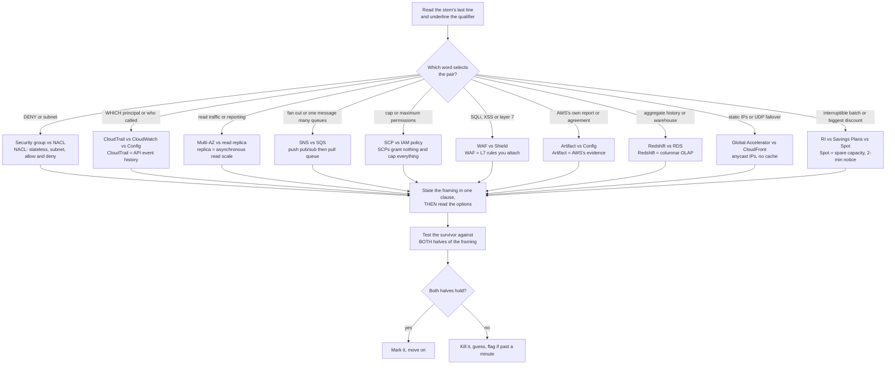
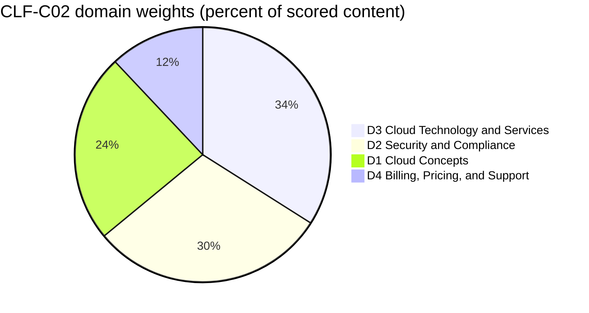
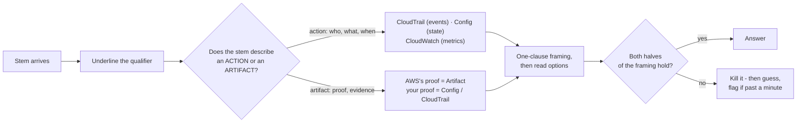
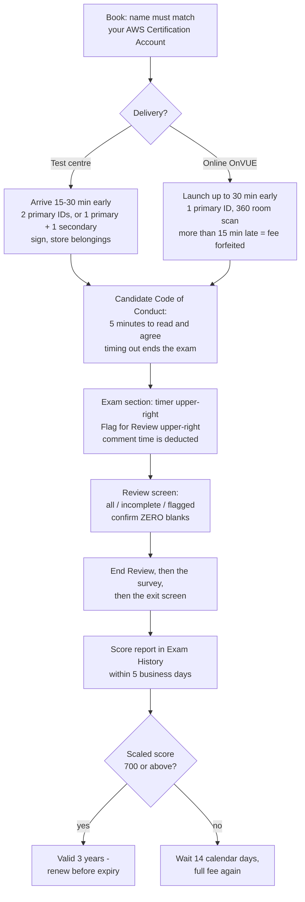
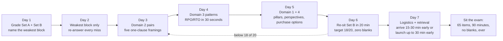

# Exam Simulation B: Second Practice Set, Trap Drills and Exam Day

Fifteen lessons gave you the content and Set A gave you a first simulation. This is the **second sitting**, and a second sitting measures something different: not whether you know the material, but whether you can hold two neighbouring services apart *while the clock runs*. Almost nobody fails CLF-C02 because they have never heard of AWS Config; they fail because the stem asked for **AWS's** evidence and they supplied **their own**, or because the stem said *read traffic* and the option said *Multi-AZ*. On a compensatory 100–1,000 scale with 700 to pass, discrimination is what separates a comfortable pass from a near miss.

```text
====================================================================
 CLF-C02 / SET B AT A GLANCE             (all figures as of Oct 2026)
====================================================================
 FORMAT ....... 65 questions = 50 scored + 15 unscored (not identified)
 TYPES ........ multiple choice (1 right + 3 distractors)
                multiple response (2+ right of 5+ options)
 TIME ......... 90 minutes = 5,400 s  ->  ~83 s per item (arithmetic)
 SCALE ........ 100 - 1,000, pass at 700, COMPENSATORY, no section cut
 GUESSING ..... no penalty for a wrong guess; BLANK = wrong
 WEIGHTS ...... D1 Cloud Concepts 24% | D2 Security 30%
                D3 Cloud Technology 34% | D4 Billing 12%
 COST ......... 100 USD per attempt (tax may apply)
 VALIDITY ..... 3 years; after a FAIL wait 14 calendar days,
                unlimited attempts, full fee every time
 RESULTS ...... posted to your AWS Certification Account within
                5 business days (official ceiling)
--------------------------------------------------------------------
 SET B (this lesson) ...... 20 items in weight order: 5 / 6 / 7 / 2
 SET B adds ............... the ten trap pairs, the exam-day
                            checklist and a final 7-day study plan
====================================================================
```

> [!NOTE]
> **How to use this lesson.** Read sections 1 and 2 once — that is the strategy half, and it is built entirely around *pairs*. Then sit **Set B (section 3) on a 20-minute timer with no notes, no search and no peeking at the teardowns**. Grade yourself with section 6, drill the ten pairs in section 4, walk the exam-day checklist in section 5, and let the 7-day plan in section 7 decide what happens between now and your appointment. Anything this lesson could not verify against a first-party AWS page is listed in section 6.4 — treat those as *do not assert*, not as facts to memorise.

By the end of this lesson you will be able to:

- state the one-line correct framing for each of the ten trap pairs most likely to cost you marks;
- spot a **half-true option** — the distractor that swaps exactly one attribute of a pair — and kill it in one clause;
- handle **multiple-response** stems with an all-or-nothing procedure that never assumes partial credit;
- run the arithmetic the exam actually asks for: **RPO/RTO**, **discount ceilings** and **database-by-pattern** selection;
- recite the official exam-day logistics — IDs, arrival, check-in, breaks, comment time, results timing;
- grade Set B **by domain block** against explicit ready-versus-not-ready thresholds, and defend the **comparative verdict** on booking now versus seven more days;
- run a weight-driven **7-day study plan** that revises by domain dip rather than by chapter order.

---

## 1. Strategy: trap pairs and how the exam weaponises them

### 1.1 What a pair is, and what a distractor really looks like

AWS describes its own distractors as *"generally plausible responses that match the content area"*. The practical consequence is that most options you face are drawn from **the same decision as the key** — which means most losses on this exam are not knowledge failures, they are **pair failures**: you knew one member of the pair but could not state the line between them under time pressure.

A pair becomes an item through exactly three moves:

1. **Swap one attribute per option** — stateful/stateless, allow/deny, push/pull, synchronous/asynchronous, grant/cap.
2. **Swap the ask** — the stem wants *read scale*, the option offers *availability*; the stem wants *evidence about AWS*, the option offers *evidence about you*.
3. **Swap the owner** — AWS's job versus your job, under the shared responsibility model.

Worked example 1 — a half-true option, dissected before you read the stem. Take the security group / network ACL pair and build all four options the way the exam does:

| Option | What the option gets right | Where it breaks | Verdict |
|---|---|---|---|
| **A** | First-match, lowest-rule-number-first *is* a real evaluation rule — but it belongs to **NACLs** | The option hands NACL behaviour to security groups and then calls NACLs stateful | both properties reversed |
| **B** | Security groups **are** stateful and reply traffic is auto-allowed; NACLs **are** stateless and need an explicit return rule | — | both halves correct |
| **C** | Both *are* network controls | Security groups evaluate **all** their rules and cannot express deny, so neither claim in the option survives | two claims, both false |
| **D** | Security groups *are* allow-only; NACLs *are* subnet-level | It crosses them: security groups are **instance-level**, and NACLs **do** support deny | the two halves swapped between members |

Only **B** survives, and it survives because you evaluated *both halves* rather than recognising a familiar word. Options A, C and D each contain a phrase you have read in the documentation — that is the design. **A distractor does not have to be false; it has to be false in the place the stem is asking about.**



### 1.2 The three questions for any pair item

Slow candidates read options; fast candidates interrogate the *pair* first. Ask these three, in this order, before you look at a single option:

1. **What does each member of the pair actually do?** One clause each, from memory. If you cannot say what a read replica does in one clause, the options will answer it for you — badly.
2. **Which stem qualifier selects between them?** `DENY`, `subnet`, `read traffic`, `fan out`, `maximum permissions`, `layer 7`, `AWS's own`, `interruptible`. The noun in the stem is usually the decoy; the qualifier is the key.
3. **Does the surviving option satisfy *both* halves?** For a `(Select TWO)` stem this is literal — both statements must be correct, and AWS's published rule elsewhere in its certification material is that you must select all correct responses to receive credit.

```fillblank
{
  "question": "Complete the four pair-drill reflexes from section 1.2:",
  "template": "1) State what each member of the pair does in one {{1}} BEFORE reading the options. 2) Find the stem {{2}} that selects between them - DENY, subnet, read traffic, fan out. 3) Test the surviving option against BOTH halves of the {{3}}. 4) Past about a minute, {{4}} and guess - never leave a blank.",
  "answers": {
    "1": "clause",
    "2": "qualifier",
    "3": "framing",
    "4": "flag"
  },
  "distractors": ["sentence", "service name", "option list", "skip", "rewrite", "guess twice", "domain weight"],
  "explanation": "The four reflexes are the whole defensive system in one line each: the one-clause framing stops the options from teaching you the wrong distinction, the qualifier is the word that actually decides the key, the both-halves test is what kills a half-true option (and is literal for Select TWO stems), and past about a minute the correct move is flag, guess, move - because unanswered questions are scored as incorrect and there is no penalty for a wrong guess."
}
```

- **📚 Did you know?** AWS's own **Official Practice Question Set** for CLF-C02 contains exactly **20 questions** — the same count as Set A and Set B here — is **free**, can be retaken, reshuffles the same items on each attempt, and gives *detailed feedback for answer choices including recommended resources*. It is the first step of AWS's four-step prep plan, and it is the closest official yardstick for the pacing you are training in this lesson (as of Oct 2026).

---

## 2. Strategy: the three item shapes that decide Set B

CLF-C02 publishes exactly **two** question types — multiple choice (one correct response plus three distractors) and multiple response (two or more correct responses out of five or more options). There is no ordering, no matching and no case-study item on this exam, so do not budget for them. What Set B adds on top of Set A is practice in the three *shapes* that cost the most marks: **multiple response**, **calculation**, and **selection by pattern**.

### 2.1 Multiple response without partial credit

| Rule | What is published | What it means at the desk |
|---|---|---|
| **Structure** | 2+ correct responses out of **5+** options | Read *every* option before you commit to anything |
| **Credit** | AWS's all-or-nothing sentence — *"You must select all the correct responses to receive credit"* — appears in AWS's AI Practitioner guide and a 2024 AWS blog, **not** in the CLF-C02 guide | Practise **all-or-nothing, zero partial credit**; do not quote it as CLF-C02 text (section 6.4) |
| **Count** | How many MR items the live exam carries, and whether every stem states its count, is **unpublished** | Expect the stem to tell you the count; if it does, underline it |
| **Set B format** | Each MR stem here pre-combines its correct statements inside one option | Trains all-or-nothing thinking while keeping the single-key JSON schema |

The procedure that survives contact with five or six options:

1. Mark every option **definitely yes / definitely no / maybe** — in one pass, without choosing.
2. Resolve every *maybe* by re-reading the **qualifier**, not the option.
3. Submit only when no *maybe* remains. Two obvious answers plus an overlooked fifth correct one is the classic zero.

### 2.2 The calculation and selection shapes

Three families appear repeatedly, and each has one mechanical procedure:

**Worked example 2 — RPO/RTO arithmetic.** A database fails at **14:00**. The last successful backup completed at **08:00**, and service is restored at **16:30**.

$$
\text{RPO} = 14{:}00 - 08{:}00 = 6\ \text{h of data at risk} \qquad \text{RTO} = 16{:}30 - 14{:}00 = 2.5\ \text{h of outage}
$$

**RPO = data, RTO = time.** Compute both gaps first, then assign the letters — candidates who assign them first lose the item while doing the arithmetic correctly (see Set B item 17).

**Worked example 3 — discount ceilings, as of Oct 2026 (verify current before use).** For an uninterrupted workload running 24/7 for three years in one instance family: Spot is **up to 90 %** but interruptible (two minutes' notice), a 1-year Compute Savings Plan is **up to 66 %** and commits for one year, a 3-year EC2 Instance Savings Plan is **up to 72 %** and matches the horizon, and On-Demand is the undiscounted baseline. The largest *surviving* ceiling is **72 %** — the biggest headline number was disqualified by a constraint, not by arithmetic (see item 19).

**Worked example 4 — database-by-pattern selection.** Translate the stem's nouns into a data model *before* reading service names:

| The stem says | The model | The service it selects |
|---|---|---|
| *relational*, MySQL/PostgreSQL-compatible, managed backups | OLTP relational | Amazon Aurora or Amazon RDS |
| *microsecond* reads, sorted sets, leaderboards | In-memory cache | Amazon ElastiCache |
| *aggregate three years* of sales for a dashboard | Columnar OLAP warehouse | Amazon Redshift |
| *key-value*, single-digit millisecond, 400 KB items | NoSQL key-value | Amazon DynamoDB |
| *mountable*, POSIX, several Availability Zones | Shared file | Amazon EFS |

Two of those rows become Set B items 15 and 16. The pattern never changes: **noun → data model → service**, and only then the options.

### 2.3 The Set B blueprint, its clock and its weights

Only **domain** percentages are published; the item counts below are arithmetic on 50 scored items — a planning aid, never an AWS figure.

| Domain | Published weight | Scored items on the live exam (derived: 50 × w) | Set B items here | What this block is really testing |
|---|---|---|---|---|
| **D1** Cloud Concepts | **24 %** | ≈ 12 | **5** (Q1–Q5) | Pillars vs perspectives, elasticity, the 6 Rs, economics bullets |
| **D2** Security and Compliance | **30 %** | ≈ 15 | **6** (Q6–Q11) | Pair framings: SG/NACL, Trail/Config, SCP/IAM, WAF/Shield, Artifact |
| **D3** Cloud Technology and Services | **34 %** | ≈ 17 | **7** (Q12–Q18) | Storage, database-by-pattern, compute, load balancing, recovery math |
| **D4** Billing, Pricing, and Support | **12 %** | ≈ 6 | **2** (Q19–Q20) | Purchase-option pick and the pre-build estimate |
| **Total** | **100 %** | **≈ 50** | **20** | "Scored items" column is arithmetic, not an AWS statement |

**Worked example 5 — weights to items, twice over.** On the live exam: $50 \times 0.24 = 12$, $50 \times 0.30 = 15$, $50 \times 0.34 = 17$, $50 \times 0.12 = 6$, and $12 + 15 + 17 + 6 = 50$. On Set B: the same proportions round to **5 / 6 / 7 / 2**, and $5 + 6 + 7 + 2 = 20$. Domains 2 and 3 together are **64 %** of scored content — that is why they hold 13 of these 20 items.

**Worked example 6 — Set B's own clock.** Twenty items at the first-pass budget of 60 s each is $20 \times 60 = 1{,}200\ \text{s} = \mathbf{20}$ **minutes**. The full 83-second ceiling would give $20 \times 83 = 1{,}660\ \text{s} = 27.7$ minutes — comfortable, but it trains a rhythm you will not be able to keep for 65 items. Sit Set B on **20 minutes flat**; if you finish with time left, spend it on flagged items, not on re-reading confident ones.



- **📚 Did you know?** AWS's own published rhythm for a **Foundational** certification is **2–3 weeks** of preparation in **30–60 minute** chunks, with *at least one full-length timed practice exam* before the proctored one. The 7-day plan in section 7 is therefore a **compressed** plan: it assumes lessons 01–15 and Set A are already behind you, and it spends the week on discrimination and logistics rather than on new content.

---

## 3. Practice Questions — Set B: 20 items in published weight order

Set B mirrors the live exam's **dominant** format — one correct response, three distractors — while drilling four **multiple-response-style** stems. Items run in domain-weight order: **D1 five, D2 six, D3 seven, D4 two**, which is the published 24 / 30 / 34 / 12 split rounded onto twenty items.

### 3.0 How to sit Set B

| Setting | The rule | Why it matters |
|---|---|---|
| **Timer** | **20 minutes flat** (60 s per item — the first-pass budget) | Trains the rhythm you will use for 65 items |
| **Materials** | No notes, no search, no teardown visible | Open-book scoring measures your notes, not you |
| **Pacing** | Answer every item; flag anything over 60 seconds and keep moving | A blank is a guaranteed zero — the rule never changes with set size |
| **Pair rule** | Before reading options, write the pair's framing in one clause | This is the whole point of Set B |
| **Multiple response** | Read **all** options; the correct statements are pre-combined into one option so each item keeps a single key | Trains all-or-nothing thinking without breaking the schema |
| **Grading** | By **domain block** first, total second (section 6) | Compensatory scoring punishes the dip, not the average |
| **Re-sit** | 72 hours later, from memory | Shorter gaps measure recognition, not retention |

### 3.1 Domain 1 — Cloud Concepts (24 %) · items 1–5

```question
{
  "id": "clf-16-q1",
  "type": "multiple-choice",
  "question": "Which AWS Cloud Adoption Framework perspective covers IT governance, IT service management, and risk?",
  "options": [
    "Business",
    "Governance",
    "Platform",
    "Operations"
  ],
  "correct": 1,
  "explanation": "The AWS Cloud Adoption Framework has six perspectives - Business, People, Governance, Platform, Security and Operations - and Governance is the one owning policy, risk and compliance structures."
}
```

**Teardown — Q1 · which CAF perspective.** **Why it is right:** Governance is the perspective that owns IT governance, IT service management, policy and risk. **Why the traps lose:** **A** is the financial and value case (benefits, revenue, reduced business risk); **C** is the implementation foundation — migration and infrastructure; **D** is operations and services delivery. **Trap:** CAF's six **perspectives** are routinely confused with Well-Architected's six **pillars** — *Governance* exists only in CAF, *Sustainability* only in Well-Architected (see Q3). Never swap the two vocabularies. **Source:** seed Q03 · cloud-economics/migration digest F.3 (AWS CAF perspective list).

```question
{
  "id": "clf-16-q2",
  "type": "multiple-choice",
  "question": "An application automatically adds capacity during a traffic spike and releases it when demand falls. Which concept is being demonstrated?",
  "options": [
    "Scalability",
    "Elasticity",
    "High availability",
    "Economies of scale"
  ],
  "correct": 1,
  "explanation": "Elasticity means growing AND shrinking on demand; scaling out is only half of it, and the stem describes both directions."
}
```

**Teardown — Q2 · the two-way behaviour.** **Why it is right:** the stem contains two verbs — *adds* and *releases* — and only elasticity covers the release half. **Why the traps lose:** **A** is the ability to handle growth, with no requirement to shrink; **C** is surviving a component failure across Availability Zones, which the stem never mentions; **D** is the aggregation argument — hundreds of thousands of customers lowering unit price — a pricing effect, not a scaling behaviour. **Trap:** "it scaled out" pulls candidates to *scalability*; the discriminator is the **two-way** behaviour, not the presence of scaling. **Source:** seed Q06 · cloud-concepts digest F.5 (elasticity ≠ scalability ≠ high availability).

```question
{
  "id": "clf-16-q3",
  "type": "multiple-choice",
  "question": "Which of the following is one of the six AWS Well-Architected Framework pillars?",
  "options": [
    "Compliance",
    "Scalability",
    "Sustainability",
    "Agility"
  ],
  "correct": 2,
  "explanation": "The six pillars are operational excellence, security, reliability, performance efficiency, cost optimization and sustainability."
}
```

**Teardown — Q3 · pillar, not topic.** **Why it is right:** Sustainability is one of the six published pillars. **Why the traps lose:** **A** is a Domain 2 headline — compliance sits under governance, not under the framework's pillars; **B** and **D** are real cloud benefits from Domain 1, which is exactly why they sound pillar-shaped. **Trap:** all four options are *true statements about AWS*; only one is a **pillar**. Memorise the six as a set: operational excellence, security, reliability, performance efficiency, cost optimization, sustainability. **Source:** seed Q08 · monitoring/support digest F.9 · exam-guide digest §B.2 task 1.2 (pillar list verbatim).

```question
{
  "id": "clf-16-q4",
  "type": "multiple-choice",
  "question": "(Select THREE.) Which THREE are aspects of cloud economics named in CLF-C02 task statement 1.4? On this set's single-key format the three aspects are pre-combined inside one option - choose the option in which ALL THREE are named in task statement 1.4.",
  "options": [
    "Rightsizing; Bring Your Own License (BYOL) compared with included licenses; benefits of automation",
    "Rightsizing; cross-Region active-active disaster recovery; configuring network access control lists",
    "Bring Your Own License (BYOL) compared with included licenses; rightsizing; guaranteed 100% availability for all applications",
    "Benefits of automation; economies of scale; eliminating the shared responsibility model"
  ],
  "correct": 0,
  "explanation": "Task statement 1.4 lists fixed vs variable costs, on-premises costs, licensing strategies (BYOL compared with included licenses), rightsizing, benefits of automation and economies of scale - all three items in the keyed option are on that list."
}
```

**Teardown — Q4 · three of six, all from one task.** **Why it is right:** rightsizing, BYOL-versus-included licensing and benefits of automation are all named in task 1.4 — benefits of automation is explicitly an *economic* benefit there, not a technical one. **Why the traps lose:** **B** mixes one true item with a reliability design choice (disaster recovery, task 3.2 territory) and a network security control (task 3.5) — both are off-list; **C** pairs two true items with an absolute claim AWS never publishes — availability is a shared responsibility, so no guarantee exists; **D** is the nastiest of the four: two of its three items *are* on the list, but "eliminating the shared responsibility model" is false, so the triple fails. **Trap:** a 2-of-3 triple is the standard MR distractor — you must validate **every** member, not the first two you recognise. **Live-exam form:** three checkboxes, all-or-nothing. **Source:** seed Q09 · exam-guide digest §B.2 task 1.4 (knowledge and skills bullets verbatim).

```question
{
  "id": "clf-16-q5",
  "type": "multiple-choice",
  "question": "A company keeps its VMware estate on premises and extends it to AWS with a consistent operating experience across both. Which cloud deployment model is this?",
  "options": [
    "Public cloud",
    "Private cloud",
    "Hybrid cloud",
    "Multi-cloud"
  ],
  "correct": 2,
  "explanation": "Hybrid integrates a company's on-premises or private infrastructure with public cloud so the experience is consistent from cloud to on premises and to the edge."
}
```

**Teardown — Q5 · extends, not replaces.** **Why it is right:** the stem has two halves — *still running VMware on premises* **and** *extends to AWS with a consistent experience* — and hybrid is the only model that keeps both. **Why the traps lose:** **A** is AWS-hosted infrastructure reached over the public internet, which ignores the on-premises half; **B** is single-organisation infrastructure (AWS illustrates it with Amazon VPC) and ignores the *extends to AWS* half; **D** requires two or more **public providers**, and your own data centre is not a provider. **Trap:** "still running on premises" tempts *private cloud*; *extends* is the operative verb. **Source:** seed Q10 · deployment/operations digest §B.2 (deployment models in AWS wording).

### 3.2 Domain 2 — Security and Compliance (30 %) · items 6–11

```question
{
  "id": "clf-16-q6",
  "type": "multiple-choice",
  "question": "Which pair of statements about security groups and network ACLs is CORRECT?",
  "options": [
    "Security groups are stateless and use lowest-rule-number-first evaluation; NACLs are stateful",
    "Security groups are stateful and return traffic is allowed automatically; NACLs are stateless and need an explicit rule for return traffic",
    "Both are evaluated by first match and both support deny rules",
    "Both operate at subnet level and both are allow-only"
  ],
  "correct": 1,
  "explanation": "Security groups are stateful, allow-only and instance-level, and all their rules are evaluated; NACLs are stateless, allow AND deny, subnet-level, and first match wins."
}
```

**Teardown — Q6 · memorise the pair, not the words.** **Why it is right:** stateful-plus-auto-reply for security groups and stateless-plus-explicit-return-rule for NACLs are the two properties that never swap. **Why the traps lose:** **A** reverses *both* properties — NACLs are the stateless, first-match ones; **C** grafts NACL deny onto SG evaluation, because security groups cannot express deny at all; **D** reverses scope (security groups attach to an elastic network interface, NACLs to a subnet) and ignores NACL deny. **Trap:** everything in A, C and D is *half-true* — the exam swaps **one attribute per option**, so hold the pair as a four-line block: SG = stateful, allow-only, ENI, all rules evaluated · NACL = stateless, allow+deny, subnet, first match stops. **Source:** seed Q14 · security/IAM digest F.4–F.7 · networking digest F.3, F.5.

```question
{
  "id": "clf-16-q7",
  "type": "multiple-choice",
  "question": "Which statement about multi-factor authentication (MFA) for AWS is TRUE as of October 2026?",
  "options": [
    "SMS-based MFA has been discontinued; passkeys/FIDO keys and hardware or virtual TOTP devices are supported",
    "SMS MFA is the method AWS most recommends for the root user",
    "MFA applies only to IAM users and never to the root user",
    "MFA is optional because IAM policies already enforce least privilege"
  ],
  "correct": 0,
  "explanation": "AWS has retired SMS-based MFA and steers root and IAM protection toward phishing-resistant options - passkeys, FIDO security keys - and hardware or virtual TOTP devices."
}
```

**Teardown — Q7 · date-stamp every MFA answer.** **Why it is right:** SMS MFA is retired as of Oct 2026, and the supported set is passkeys/FIDO plus TOTP devices. **Why the traps lose:** **B** repeats the retired method and is the single most common stale-fact answer in study material written before the retirement; **C** is backwards — protecting the root user with MFA is the *first* recommendation; **D** confuses *who may act* (IAM policies) with *who is acting* (identity proofing) — least privilege does not prove identity. **Trap:** older notes and older practice tests still say "SMS MFA". Date-stamp every MFA answer to the year you sit, and re-read the current identity documentation if a fact smells old. **Source:** seed Q17 · security/IAM digest F.19 and §B (root MFA registration).

- **📚 Did you know?** **ESL accommodation adds +30 minutes** to the CLF-C02 exam and is requested **once** through the before-testing policy (as of Oct 2026). If you are entitled to it, request it well before your appointment — accommodations are not granted at the desk, and the same policy page says prices are valid for one exam attempt.

```question
{
  "id": "clf-16-q8",
  "type": "multiple-choice",
  "question": "A security team must prove WHICH IAM principal deleted a DynamoDB table last Tuesday. Which service provides that record?",
  "options": [
    "Amazon CloudWatch",
    "AWS CloudTrail",
    "AWS Config",
    "AWS Trusted Advisor"
  ],
  "correct": 1,
  "explanation": "AWS CloudTrail records who performed which API action, when and from where - console, CLI, SDK and API calls all appear as events."
}
```

**Teardown — Q8 · the qualifier is WHICH principal.** **Why it is right:** *which principal* is an actor question, and an audit trail of API events is exactly what CloudTrail stores. **Why the traps lose:** **A** answers "is it healthy / is CPU high" — metrics, alarms and dashboards, not actors; **C** records the configuration *state* of resources over time, which tells you what the table looked like, not who deleted it; **D** advises on best-practice gaps and cannot produce API history at all. **Trap:** the word *monitoring* appears in many stems and pulls candidates to CloudWatch; ask whether the stem wants **who acted** (Trail), **what the state was** (Config) or **is it breaching a threshold** (CloudWatch). **Source:** seed Q18 · governance/compliance digest F.1, F.3.

```question
{
  "id": "clf-16-q9",
  "type": "multiple-choice",
  "question": "(Select TWO.) Which TWO statements about AWS CloudTrail and AWS Config are CORRECT? On this set's single-key format the two statements are pre-combined inside one option - choose the option in which BOTH statements are correct.",
  "options": [
    "CloudTrail records API events such as who called an action and when; Config can alert on root-user console sign-in events without CloudTrail",
    "Config records the configuration state of resources over time and can evaluate rules against it; Config replaces Amazon GuardDuty for threat detection",
    "CloudTrail records API events such as who called an action and when; Config records the configuration state of resources over time and can evaluate rules against it",
    "CloudTrail keeps all data events for 90 days free in every account; CloudTrail records API events such as who called an action and when"
  ],
  "correct": 2,
  "explanation": "CloudTrail is the event history (who and when) and Config is the state history (what it looked like, and does it comply); AWS recommends enabling both rather than choosing between them."
}
```

**Teardown — Q9 · two traps in one item.** **Why it is right:** both statements are the published job of each service — events for CloudTrail, configuration state and rule evaluation for Config. **Why the traps lose:** **A** is half-right then claims Config can do CloudTrail's job — the official walkthrough pairs CloudWatch *with* CloudTrail precisely because sign-in alerting needs the event stream; **B** is half-right then hands Config GuardDuty's job (threat detection) — and the *replaces* wording is the giveaway; **D** smuggles in the "90 days free covers everything" myth — the free Event history covers **management** events, and longer retention or all-account coverage needs a trail, while its second statement is true. **Trap:** an option with one true statement and one false statement is **wrong**, not "mostly right" — and the two myths this item attacks (*Config can do CloudTrail's job*, *90 days free covers everything*) are both extremely common. **Live-exam form:** two checkboxes, all-or-nothing. **Source:** seed Q19 · governance/compliance digest F.3–F.4 · AWS re:Invent exam-prep walkthrough 2.2.

```question
{
  "id": "clf-16-q10",
  "type": "multiple-choice",
  "question": "(Select THREE.) Which THREE services are explicitly named in CLF-C02 task statement 2.4 as security features or services? On this set's single-key format the three services are pre-combined inside one option - choose the option in which ALL THREE are named in task statement 2.4.",
  "options": [
    "AWS WAF; AWS Firewall Manager; AWS Shield",
    "AWS WAF; AWS Network Firewall; AWS Shield",
    "AWS Firewall Manager; Amazon Cloud Directory; Amazon Inspector",
    "AWS Shield; AWS CloudFormation; AWS Batch"
  ],
  "correct": 0,
  "explanation": "Task statement 2.4 lists, verbatim, AWS WAF, AWS Firewall Manager, AWS Shield and Amazon GuardDuty among its examples of security features and services."
}
```

**Teardown — Q10 · the answer is always on the in-scope list.** **Why it is right:** all three named services appear verbatim in task 2.4, and all three are on the current in-scope list. **Why the traps lose:** **B** substitutes AWS Network Firewall, which is on the official **out-of-scope** list — legal to read as an option, never the key; **C** substitutes Amazon Cloud Directory, also out of scope, and swaps Shield for Inspector (a real in-scope service, but not one task 2.4 names); **D** pairs one correct name with CloudFormation and Batch, which belong to entirely different categories. **Trap:** out-of-scope services are chosen as distractors precisely because they sound **more advanced** than the real key. Correct answers on this exam are always in-scope services — confirm against the current in-scope list rather than your intuition about what "sounds serious". **Source:** seed Q21 · exam-guide digest §B.2 task 2.4 + §E.1 / §E.2 (in-scope and out-of-scope lists).

```question
{
  "id": "clf-16-q11",
  "type": "multiple-choice",
  "question": "An auditor asks the company for Amazon Web Services' own SOC 2 and PCI reports. Which self-service resource should the compliance team use?",
  "options": [
    "AWS Artifact",
    "AWS Config",
    "AWS Control Tower",
    "Amazon Inspector"
  ],
  "correct": 0,
  "explanation": "AWS Artifact is the free, self-service portal for Amazon Web Services' own compliance reports and agreements, including the SOC, ISO and PCI documents and the BAA."
}
```

**Teardown — Q11 · whose evidence is it?** **Why it is right:** the stem says *Amazon Web Services' own* reports — that phrase is the whole item — and Artifact is the on-demand repository for AWS's attestations. **Why the traps lose:** **B** records **your** resource configuration over time, which is the mirror-image answer; **C** builds a landing zone with guardrails; **D** scans your workloads for known vulnerabilities. **Trap:** "compliance evidence" is a two-sided question — **Artifact holds AWS's evidence, Config holds yours**. If the stem ever says "gather *our* audit evidence", the key flips to Config, CloudTrail or Security Hub. **Source:** seed Q22 · governance/compliance digest §B + F.6.

### 3.3 Domain 3 — Cloud Technology and Services (34 %) · items 12–18

```question
{
  "id": "clf-16-q12",
  "type": "multiple-choice",
  "question": "Which service runs code in response to events without provisioning or managing servers?",
  "options": [
    "Amazon EC2",
    "AWS Lambda",
    "Amazon Lightsail",
    "AWS Elastic Beanstalk"
  ],
  "correct": 1,
  "explanation": "AWS Lambda is serverless compute: no instances to launch, automatic scaling, and billing per request and per duration."
}
```

**Teardown — Q12 · the phrase and its impersonators.** **Why it is right:** *without provisioning or managing servers* is Lambda's definition — you upload code, the service runs it on demand. **Why the traps lose:** **A** is infrastructure as a service: you still choose, launch and patch the operating system; **C** is a bundled virtual-private-server product with a fixed bundle; **D** is platform as a service that *sounds* serverless — you just upload code — yet it provisions and manages EC2 or container resources inside **your** account. **Trap:** Elastic Beanstalk's marketing is the closest impersonation of serverless on this exam; the discriminator is who manages the underlying instances. **Source:** seed Q23 · compute digest §B (Lambda: serverless, per-request and duration billing) · deployment/operations digest §B.10 (Beanstalk = PaaS).

```question
{
  "id": "clf-16-q13",
  "type": "multiple-choice",
  "question": "A data lake holds objects whose access pattern is unknown and expected to change, and the owner refuses to pay retrieval fees when objects move between tiers. Which option fits BEST?",
  "options": [
    "S3 Intelligent-Tiering",
    "S3 Standard with a lifecycle rule to Standard-IA",
    "S3 One Zone-IA",
    "S3 Glacier Flexible Retrieval"
  ],
  "correct": 0,
  "explanation": "S3 Intelligent-Tiering moves objects automatically as access patterns change and charges no retrieval fees - you pay only the small per-object monitoring charge."
}
```

**Teardown — Q13 · unknown pattern plus no retrieval fees.** **Why it is right:** two qualifiers decide it — *unknown and changing* (so automatic movement) and *refuses to pay retrieval fees* (so a class with no retrieval charge on tier moves). Intelligent-Tiering is the only option that satisfies both. **Why the traps lose:** **B** is the impostor: a lifecycle rule *looks* automatic, but it is a rule **you** write against a pattern you guessed, and access from Standard-IA does carry retrieval fees; **C** puts objects in a single Availability Zone, which is about cost versus durability, not about an unknown pattern; **D** adds a restore step measured in minutes to hours on top of the same guessing problem. **Trap:** "automatic tiering" tempts the lifecycle-rule answer; **Intelligent-Tiering is a storage class, not a lifecycle rule**, and its documented difference at this stem is the absence of retrieval fees. Note the minimum durations in the IA and Glacier classes (30 / 90 / 180 days — verify current before use). **Source:** seed Q26 · compute/storage digest §B.6, C5 and F.3.

```question
{
  "id": "clf-16-q14",
  "type": "multiple-choice",
  "question": "A workload needs a shared file system supporting POSIX semantics, mountable from instances in several Availability Zones. Which service?",
  "options": [
    "Amazon EBS",
    "Amazon EFS",
    "Amazon S3",
    "Instance store"
  ],
  "correct": 1,
  "explanation": "Amazon EFS is a managed network file system that can be mounted concurrently by instances across multiple Availability Zones with POSIX semantics."
}
```

**Teardown — Q14 · shared, POSIX, several AZs.** **Why it is right:** all three qualifiers — *shared*, *POSIX*, *several Availability Zones* — point at the file-services answer, and EFS is the in-scope managed NFS service. **Why the traps lose:** **A** is block storage attachable to one instance in one Availability Zone (multi-attach exists but must be deliberately configured, and it is not a shared file system); **C** stores *files*, which is the bait — but it is object storage reached over HTTP, not a mountable file system; **D** is ephemeral and local to one instance in one AZ, so it disappears when the instance stops. **Trap:** "it stores my files" is the most reliable lure on this domain; the qualifier *mountable file system* is what matters, and it maps to block (EBS) / file (EFS) / object (S3) before it maps to any service name. **Source:** seed Q27 · compute/storage digest §E (task 3.6 block, file and object split).

```question
{
  "id": "clf-16-q15",
  "type": "multiple-choice",
  "question": "A website's order database must be relational and MySQL- or PostgreSQL-compatible, and AWS should manage backups, patching and failure detection. Which service?",
  "options": [
    "Amazon DynamoDB",
    "Amazon Aurora",
    "Amazon Elastic Block Store",
    "AWS Global Accelerator"
  ],
  "correct": 1,
  "explanation": "Amazon Aurora is a MySQL- and PostgreSQL-compatible relational database built for the cloud and operated through the RDS tooling for provisioning, patching, backups and failure detection."
}
```

**Teardown — Q15 · the word *relational* forbids the flagship.** **Why it is right:** the stem's noun phrase is *relational database, MySQL- or PostgreSQL-compatible, managed*, which is Aurora's exact design point. **Why the traps lose:** **A** is AWS's flagship database — fast, managed and scalable, all true — but it is NoSQL key-value/document, and no amount of adjective-matching overrides *relational*; **C** is block storage, not a database at all; **D** is a networking traffic-optimisation service, a pure category error. **Trap:** DynamoDB is the most *recognisable* database name in the option list, so "records new customer orders" pulls candidates toward it. **Database-by-pattern rule:** translate nouns to a data model first (worked example 4) — *relational* → Aurora or RDS, *key-value* → DynamoDB. **Source:** seed Q28 · database-services digest §B.6 · AWS re:Invent exam-prep walkthrough 3.4 (same distractor family: Global Accelerator / DynamoDB / EBS).

```question
{
  "id": "clf-16-q16",
  "type": "multiple-choice",
  "question": "An application needs a session store with microsecond reads for repeated keys, strict ordering for leaderboards, and automatic failover. Which service fits BEST?",
  "options": [
    "Amazon ElastiCache (Redis OSS/Valkey engine)",
    "Amazon S3",
    "Amazon DynamoDB on-demand only",
    "AWS Step Functions"
  ],
  "correct": 0,
  "explanation": "Amazon ElastiCache is the managed in-memory store offering microsecond reads, complex data types such as sorted sets, replication and automatic failover - sessions and leaderboards are its classic stems."
}
```

**Teardown — Q16 · microsecond plus sorted sets.** **Why it is right:** *microsecond reads* and *strict ordering for leaderboards* are the two discriminators — an in-memory engine with sorted-set data types and replication with automatic failover. **Why the traps lose:** **B** is object storage with request latencies far from microseconds and no ordering primitives; **C** is a genuine key-value store and a plausible "session" answer, but its headline is single-digit **milliseconds** and it has no leaderboard data types; **D** orchestrates workflows and stores no application data at all. **Trap:** *session store* tempts DynamoDB — the two services fight over exactly this stem — so key on **microsecond** and **sorted set**. And remember ElastiCache is an ephemeral cache, never your system of record. **Source:** seed Q30 · database-services digest §B.10 (Valkey / Redis OSS versus Memcached; microsecond reads).

```question
{
  "id": "clf-16-q17",
  "type": "multiple-choice",
  "question": "A database fails at 14:00. The last successful backup completed at 08:00, and service is restored at 16:30. What are the RPO and the RTO?",
  "options": [
    "RPO = 6 hours, RTO = 2.5 hours",
    "RPO = 2.5 hours, RTO = 6 hours",
    "RPO = 8.5 hours, RTO = 0",
    "RPO = 6 hours, RTO = 8.5 hours"
  ],
  "correct": 0,
  "explanation": "RPO measures acceptable DATA LOSS - the gap between failure and the last good copy (14:00 - 08:00 = 6 hours). RTO measures acceptable DOWNTIME - failure to restored service (16:30 - 14:00 = 2.5 hours)."
}
```

**Teardown — Q17 · compute both, then assign the letters.** **Why it is right:** $14{:}00 - 08{:}00 = 6$ hours of data at risk (RPO) and $16{:}30 - 14{:}00 = 2.5$ hours of outage (RTO) — see worked example 2. **Why the traps lose:** **B** does the arithmetic correctly and then **swaps the definitions**; **C** adds the two intervals together ($8.5$ h), which is neither metric, and asserts zero downtime that no restoration implies; **D** measures the outage from the *backup* rather than from the failure, which double-counts the pre-failure window. **Trap:** you will compute both numbers correctly and still lose this item if you assign the letters first. Memorise **RPO = data, RTO = time**, compute, then label. The same arithmetic underpins the recovery ladder: backup/restore (RPO hours, RTO up to 24 h) → pilot light (minutes / tens of minutes) → warm standby (seconds / minutes) → active-active (near zero / potentially zero). **Source:** seed Q32 · global-infrastructure digest §H.5 worked example + REL13-BP02 recovery bands.

```question
{
  "id": "clf-16-q18",
  "type": "multiple-choice",
  "question": "(Select TWO.) Which TWO statements about Elastic Load Balancing are CORRECT? On this set's single-key format the two statements are pre-combined inside one option - choose the option in which BOTH statements are correct.",
  "options": [
    "An Application Load Balancer can route on host and path at Layer 7; an Application Load Balancer needs targets in only one Availability Zone",
    "An Application Load Balancer can route on host and path at Layer 7; an Application Load Balancer can be associated with AWS WAF",
    "A Network Load Balancer supports AWS WAF web ACLs; a Network Load Balancer terminates Layer 7 requests",
    "An Application Load Balancer can be associated with AWS WAF; a Network Load Balancer terminates Layer 7 requests"
  ],
  "correct": 1,
  "explanation": "The Application Load Balancer is the Layer 7 balancer with host and path routing and AWS WAF integration, and it requires healthy targets across at least two Availability Zones."
}
```

**Teardown — Q18 · the AZ minimum is the buried constraint.** **Why it is right:** both halves are published behaviour of the Application Load Balancer — Layer 7 host/path routing and WAF association. **Why the traps lose:** **A** pairs a true statement with a numeric falsehood: an Application Load Balancer requires targets across **at least two** Availability Zones, so "only one" kills the pair; **C** is wrong twice — AWS WAF web ACLs attach to Layer 7 resources such as Application Load Balancer, CloudFront and API Gateway, not to a Network Load Balancer, and an NLB works at Layer 4; **D** pairs a true WAF statement with the Layer 7 claim on the wrong balancer. **Trap:** you probably know "ALB = Layer 7" — the item is built so that you *stop reading after the first half*. In an MR stem, **every** statement is a separate question, and one false clause zeroes the option. **Source:** seed Q33 · networking digest F.10 (Application Load Balancer / Network Load Balancer split, ≥ 2 AZs).

### 3.4 Domain 4 — Billing, Pricing, and Support (12 %) · items 19–20

```question
{
  "id": "clf-16-q19",
  "type": "multiple-choice",
  "question": "A production Amazon EC2 workload runs 24/7 for three years, cannot be interrupted, and will stay in one instance family in one Region. Which option gives the largest discount ceiling?",
  "options": [
    "Spot Instances (up to 90% off)",
    "1-year Compute Savings Plans (up to 66% off)",
    "3-year EC2 Instance Savings Plans (up to 72% off)",
    "On-Demand Instances"
  ],
  "correct": 2,
  "explanation": "For an uninterrupted, stable configuration the ceiling is the 72% EC2 Instance Savings Plan rate over a three-year commitment that matches the workload's horizon (ceilings as of Oct 2026 - verify current before use)."
}
```

**Teardown — Q19 · the biggest number loses.** **Why it is right:** three constraints stack — *cannot be interrupted*, *three years*, *one instance family in one Region* — and the largest ceiling that survives all three is the 3-year EC2 Instance Savings Plan at **up to 72 %** (as of Oct 2026; verify current before use). **Why the traps lose:** **A** has the biggest headline percentage but Spot capacity can be reclaimed with about **two minutes' notice**, which the *cannot be interrupted* constraint forbids outright; **B** commits for one year while the workload runs three, and its ceiling is lower because Compute Savings Plans buy flexibility across instance family, Region and OS; **D** is the undiscounted baseline you only accept when nothing else fits. **Trap:** two traps fire at once — the largest percentage is disqualified by a **constraint**, and the more flexible product carries the **smaller** ceiling. Read the qualifiers *before* the percentages (worked example 3). **Source:** seed Q36 · pricing digest C1, F.1–F.4 · compute/storage digest C3–C5 (72 % / 66 % / 90 %, as of Oct 2026).

```question
{
  "id": "clf-16-q20",
  "type": "multiple-choice",
  "question": "An architect must estimate the monthly cost of a proposed three-tier application BEFORE any resources are created, and no AWS account is required. Which tool should be used?",
  "options": [
    "AWS Cost Explorer",
    "AWS Budgets",
    "AWS Pricing Calculator",
    "AWS Cost and Usage Report"
  ],
  "correct": 2,
  "explanation": "The AWS Pricing Calculator estimates costs before you launch, needs no AWS account, and works from a 730-hours-per-month assumption (as of Oct 2026)."
}
```

**Teardown — Q20 · *before any resources exist* is the whole item.** **Why it is right:** only the calculator estimates spend that has not happened yet, and only it works with no AWS account — the stem states both constraints. **Why the traps lose:** **A** analyses **actual** historical and forecast spend inside an account, so it has nothing to analyse on day zero; **B** alerts you when actual or forecast spend crosses a target you set — a target that requires spend to exist; **D** is the raw line-item export of bills already incurred. **Trap:** all four are cost words, so candidates pick the one they use most often. The four-way split is the whole domain in one line: **Calculator = estimate before you build · Cost Explorer = explore and forecast actuals · Budgets = alert and act on a target · Cost and Usage Report = raw line-item export.** **Source:** seed Q37 · pricing digest C12 · billing/organizations digest F.9.

- **📚 Did you know?** Every AWS account gets **56 AWS Trusted Advisor checks for free**, and Business Support+ and above unlock **426 more, for 482 in total** (the plan page also says "more than 500" — as of Oct 2026). That matters for the trap drill in section 4: Trusted Advisor answers *"does my configuration deviate from best practice"*, which is a third question again, distinct from Config's *"what was the state"* and CloudTrail's *"who acted"*.

---

## 4. TRAP DRILL — the ten pairs, framed correctly

Ten pairs do most of the damage on this exam. The rule for this table is strict: **the framing column must be sayable in one clause**, because that is the only thing that survives contact with a 60-second budget. Read the row, cover the framing column, say it out loud, then check.

| # | Pair | The correct framing (one clause) | The trap move | The stem word that decides it |
|---|---|---|---|---|
| 1 | **Security group vs NACL** | SG = stateful, allow-only, instance/ENI, all rules evaluated, replies auto-allowed; NACL = stateless, allow **and** deny, subnet, first match stops | Swapping one attribute per option so every choice is half-true | `DENY`, `subnet` |
| 2 | **CloudTrail vs CloudWatch** | CloudTrail **audits API calls** (*who deleted the bucket, when, from which IP*); CloudWatch **monitors in real time** (metrics → alarms → dashboards) | Answering CloudWatch because the stem says *monitoring* | `WHICH principal`, `who called` |
| 3 | **RI / Savings Plans vs Spot** | RI and Savings Plans are **commitment discounts** (1- or 3-year; Savings Plans priced per hour and **no** capacity reservation); Spot is **spare capacity, up to 90 % off, two-minute interruption notice** (as of Oct 2026) | Picking the biggest percentage without checking the interruption constraint | `cannot be interrupted`, `flexible` |
| 4 | **Multi-AZ vs read replica** | Multi-AZ is a **synchronous standby for failover** and *"you can't use a standby replica to serve read traffic"*; a read replica is an **asynchronous copy for read scale** | Reaching for Multi-AZ because it is the HA answer you know best | `read traffic`, `reporting` |
| 5 | **SNS vs SQS** | SNS is **push** pub/sub fan-out; SQS is a **pull** queue that persists messages and absorbs retries — fan-out is *SNS → many SQS queues* | Treating them as alternatives instead of as two halves of one pattern | `fan out`, `many subscribers` |
| 6 | **SCP vs IAM policy** | *"SCPs do not grant permissions"* — they **cap the maximum available permissions** by intersection, any Deny wins, and they **do not affect users or roles in the management account** | Believing an SCP can *grant* access, or that it applies to the management account | `cap`, `maximum permissions`, `organization` |
| 7 | **WAF vs Shield** | WAF is **layer 7** (SQLi, XSS, rate-based rules), must be **attached**, and returns HTTP 403; Shield is **DDoS** protection at layers 3/4, and Shield Standard is **automatic and free** | Treating Shield as "the firewall" you must subscribe to | `SQLi`, `XSS`, `layer 7`, `DDoS` |
| 8 | **Config vs Artifact** | Config = **your** resources' configuration state over time and rule evaluation; Artifact = **AWS's own** security and compliance documents, on demand | Handing an auditor the wrong side of the shared responsibility model | `AWS's own`, `our resources` |
| 9 | **Redshift vs RDS** | Redshift is a **columnar, petabyte-scale OLAP data warehouse** for aggregating history; RDS/Aurora are **OLTP relational** transactional databases | Assuming "fast, managed database" fits both — the *shape of the query* decides | `aggregate history`, `dashboard`, `transactions` |
| 10 | **CloudFront vs Global Accelerator** | CloudFront **caches** HTTP(S) content at edge locations; Global Accelerator gives **static anycast IPs and AWS backbone routing with no caching**, for non-HTTP (UDP) and deterministic failover | Saying "make it faster globally" without a cacheability check | `cacheable`, `static IPs`, `UDP`, `failover` |



```matching
{
  "question": "Match each exam stem trigger to the service or control that answers it - the ten trap pairs from the table above:",
  "pairs": [
    {"left": "Block a known-bad CIDR range at the SUBNET level with an explicit DENY rule", "right": "Network ACL - stateless, subnet level, allow and deny"},
    {"left": "Prove WHICH IAM principal called an API last Tuesday", "right": "AWS CloudTrail - API event history: who, when, from where"},
    {"left": "Interruptible batch work that wants the deepest discount, two minutes' notice accepted", "right": "Spot Instances - spare capacity, up to 90% off, as of Oct 2026"},
    {"left": "Offload a reporting team's reads without changing the writer's failover behaviour", "right": "A read replica - asynchronous read scale-out"},
    {"left": "Fan one event out to many independent consumer queues", "right": "Amazon SNS push fan-out into many Amazon SQS pull queues"},
    {"left": "Cap the maximum permissions available to every member account in an organization", "right": "A service control policy - SCPs grant nothing and skip the management account"},
    {"left": "Return HTTP 403 against SQL injection and XSS on an Application Load Balancer", "right": "AWS WAF - layer 7 rules, explicitly attached to the resource"},
    {"left": "Hand an auditor Amazon Web Services' own SOC 2 and PCI reports", "right": "AWS Artifact - AWS's own compliance documents, on demand"},
    {"left": "Aggregate three years of sales history into a single dashboard query", "right": "Amazon Redshift - columnar OLAP data warehouse"},
    {"left": "Static anycast IPs and UDP failover for a game, with nothing cacheable", "right": "AWS Global Accelerator - static IPs and AWS backbone, no caching"}
  ],
  "explanation": "Every pair is decided by one qualifier: DENY plus subnet selects the NACL (security groups are allow-only and instance-level); WHICH principal selects CloudTrail (Config records state, not actors); an interruption constraint disqualifies Spot no matter how deep the discount; read traffic selects the read replica (a Multi-AZ standby serves no reads); fan-out is push then pull; a cap is an SCP, which grants nothing; SQLi and XSS are layer 7, so WAF (Shield is DDoS and Standard needs no subscription); AWS's own reports live in Artifact (Config records YOUR resources); aggregated history is OLAP, so Redshift; and non-HTTP with static IPs is Global Accelerator, which never caches."
}
```

---

## 5. EXAM DAY — the official logistics checklist

Every row below comes from AWS's certification policy pages or the exam guide as retrieved in October 2026. Nothing here is folklore, and nothing that AWS does not publish is asserted — see section 6.4 for the list of those.

### 5.1 Before the day

| Check | The official rule | Why it costs marks if you skip it |
|---|---|---|
| **Name** | Must be **identical** to your AWS Certification Account; changes need up to **48 hours (2 business days)** ahead | A mismatched name is a check-in failure, not a paperwork fix |
| **Delivery choice** | **Pearson VUE test centre** or **online proctored (OnVUE)** | Same exam, same 100 USD (as of Oct 2026), different rules |
| **Reschedule / cancel** | Reschedule up to **24 hours** before, maximum **2 changes**; cancel ≥ 24 h ahead for a refund | A third change means cancel and rebook — decide before the final day |
| **Accommodation** | ESL accommodation adds **+30 minutes**, requested once in advance | Apply well before your date, never the week of the exam |
| **Tech / room (online)** | System test the day before; **6 Mbps down / 2 Mbps up**; **Windows 10 or macOS 14+**; one display; **no VPN**; desk *"completely empty"* apart from the computer and an unmarked beverage; you must remain **alone** | Unmet requirements mean *you cannot test, and your fee will be forfeited* |
| **Scratch material** | Online rules list notes, paper and pens among prohibited items; test-centre rules defer to the Pearson VUE Candidate Rules Agreement | **Never assume it is provided — or banned** (section 6.4) |

### 5.2 Check-in

| Mode | The official rule |
|---|---|
| **Test centre** | **Arrive 15–30 minutes** before your appointment; bring **two primary IDs**, or **one primary plus one secondary**; sign the agreement; store belongings; you are escorted to a workstation |
| **Online** | You may **launch up to 30 minutes** before your appointment; **more than 15 minutes late forfeits the fee**; bring **one primary ID** (original, unexpired, government-issued, with photo **and** signature); self check-in, then a proctor, with a photo of you and your ID and a **360° room scan** |
| **Both** | Your name must match your AWS Certification Account |

### 5.3 During the exam

| Control | Where / when | The rule |
|---|---|---|
| **Candidate Code of Conduct** | Before the exam section | **5 minutes** to read and agree — timing out **ends the exam with no refund** |
| **Timer** | Upper-right | Counts down the exam section; a warning appears when **5 minutes remain** |
| **Flag for Review** | Upper-right | One click; the item reappears on the review screen |
| **Comment** | Upper-left | **Comment time is subtracted from your exam time** — flag during the exam, comment after it |
| **Breaks** | — | **No scheduled breaks.** At a test centre an unscheduled break is allowed but *"the time for the exam will not stop"* and you may not leave the building; online you may not leave the camera's view for any reason, including a restroom break |
| **Blanks** | Review screen | Unanswered questions are scored incorrect and there is **no penalty for guessing** — confirm **zero blanks** |
| **Review screen** | At the end | Filter by **all, incomplete, or flagged**, then `End Review`, then a short survey, then the exit screen (which *"provides information on exam results"*) |



### 5.4 After the exam

| Event | The official rule |
|---|---|
| **Results** | Posted to your AWS Certification Account **within 5 business days** (official ceiling); retrieve under **Exam History → Score Report** |
| **Score report** | Pass/fail plus a domain breakdown; AWS warns to *"use caution when you interpret section-level feedback"* |
| **Fail** | Wait **14 calendar days**, **no limit on attempts**, **full fee every time** |
| **Pass** | The same exam cannot be retaken for **2 years**; the certification is valid **3 years** |
| **Appeal** | Within **14 calendar days** of the exam or of a sanction |

```fillblank
{
  "question": "Complete the exam-day numbers you must not re-derive under a running clock:",
  "template": "1) Test centre: arrive {{1}} minutes early and bring two primary IDs, or one primary plus one secondary. 2) Online: launch up to {{2}} minutes early, and more than {{3}} minutes late forfeits the fee. 3) You get {{4}} minutes to read and agree to the Candidate Code of Conduct. 4) Results post within {{5}} business days, and a FAIL starts a {{6}} calendar-day wait.",
  "answers": {
    "1": "15-30",
    "2": "30",
    "3": "15",
    "4": "5",
    "5": "5",
    "6": "14"
  },
  "distractors": ["10", "60", "20", "3", "10", "7", "30", "48", "24", "90"],
  "explanation": "Six numbers, each published on an AWS policy page and retrieved in October 2026: arrive 15-30 minutes early to a test centre; online launch opens 30 minutes before the appointment and 15 minutes late forfeits the fee; the Code of Conduct gets 5 minutes and timing out ends the exam with no refund; results arrive within 5 business days; and a fail starts a 14-calendar-day wait with the full fee payable every attempt."
}
```

- **📚 Did you know?** The exam interface gives you a **review screen that can filter all, incomplete, or flagged questions** — so a flag is an official, documented mechanic, not a trick. Combined with the fact that *"unanswered questions will be marked as wrong"* while *"there are no penalties for incorrect responses"*, the only rational endgame is a sweep that finds **zero blanks** and changes an answer only when you can state the reason in one clause.

---

## 6. Grading Set B, and the ready-versus-not-ready verdict

### 6.1 The rubric

| Layer | What AWS publishes | What you should plan for |
|---|---|---|
| **Scale** | 100–1,000, **pass = 700** | Target **≥ 80 %** on mixed practice to leave a form-difficulty margin |
| **Raw → scaled** | **Not published** (forms are equated) | Never reason "X of 50 correct = pass" |
| **Structure** | 50 scored + 15 hidden, unmarked | Treat **every** item as scored |
| **Domain rule** | **Compensatory** — no per-section pass | Never sacrifice a domain; a weak Domain 4 still sinks you |
| **Guessing** | **No penalty**; blank = wrong | Guess **100 %** of the time: eliminate to two, then pick |
| **Feedback** | Score report gives a domain breakdown, with AWS's caution about section-level interpretation | Fix the **weakest** domain first |

**Worked example 7 — turning a raw Set B score into a signal.** $\frac{17}{20} = 0.85 = \mathbf{85\,\%}$, $\frac{14}{20} = \mathbf{70\,\%}$, $\frac{11}{20} = \mathbf{55\,\%}$. Those three numbers are **study signals, never forecasts** — the live cut is scaled, the 15 unscored items are hidden, and no published conversion exists. What the percentages *are* good for is comparison against yourself: Set B versus Set A, and this week versus last.

### 6.2 Reading your Set B score

| Set B result | Raw signal | What it predicts | What to do next |
|---|---|---|---|
| **18–20 / 20** | Exam-ready band | Comfortable margin across every domain | Re-sit in 72 h at **17 minutes** to bank the speed, then book |
| **15–17 / 20** | Close | One soft block is hiding in the total | Grade **by domain**, repair the weakest, re-sit in 72 h |
| **12–14 / 20** | Content gap | Recall is incomplete under time pressure | Return to the mapped lessons before re-timing |
| **≤ 11 / 20** | Foundation gap | The pair framings or the qualifier rules are not yet automatic | Restart at lessons 01, 05 and 09 — do not re-sit yet |
| **Any result with blanks** | Automatic process failure | On the live exam a blank is a guaranteed zero | Fix the *process* first: flag, guess, move |

**Grade by domain block, not by total.** A 17/20 that puts three of its misses into the 7-item Domain 3 block — that is $4/7 \approx 57\,\%$ in the exam's heaviest domain — is worse than a 15/20 spread evenly, because compensatory scoring punishes the **dip**, not the average. Then classify every miss as a **knowledge gap** (you did not know) or a **reading error** (you knew it and picked the distractor): knowledge gaps go back to the lesson, reading errors go back to section 1.2.

**The three comparisons that actually decide your date:**

| Compare | Ready looks like | Not ready looks like |
|---|---|---|
| **Set B vs Set A** | Set B ≥ Set A − 1, with zero blanks in both | Set B more than 2 points below Set A — usually pacing, sometimes panic |
| **Domain blocks** | No block below 70 %, and no block at zero | One block at or below 50 % — that block is 12–34 % of the live exam |
| **Pair recall** | All ten framings sayable in one clause, cold | Three or more framings still need options to trigger them |

> [!IMPORTANT]
> **Comparative Verdict — ready vs not ready: the thresholds that decide whether you book this week**
> - **READY — book the appointment.** Set B **18–20 of 20 with zero blanks**, Set A **15 or better**, **no domain block below 70 %**, all **ten pair framings** sayable in one clause from memory, and the section 5 logistics numbers written out correctly the night before. At this point more study has a *lower* expected return than the exam itself: the cost of booking is **100 USD per attempt** (as of Oct 2026) and the cost of waiting is a week you cannot buy back if a slot closes.
> - **ALMOST — book in 7 days, not today.** Set B **15–17 of 20**, or one domain block in the 50–70 % range, or a Set B score more than one point below Set A. The gap is *one* domain, not the syllabus: spend days 1–4 on that block only, re-sit Set B on day 6, and book day 7 conditional on **≥ 18/20 with zero blanks**. This is the cheapest path — a seven-day delay costs nothing, while a failed attempt costs **100 USD plus a 14-calendar-day wait** before you may try again.
> - **NOT READY — do not book yet.** Set B **≤ 14 of 20**, **any blanks**, or **two or more domain blocks below 70 %**, or the ten framings still unmemorised. Booking now buys a data point you already have. Compare the alternatives honestly: **self-study on the free official path** (exam guide, free Official Practice Question Set, Cloud Practitioner Essentials, whitepapers and FAQs, the AWS Exam Demo) versus **a paid Skill Builder subscription** (from $29 USD/month as of Oct 2026) for one month of the Official Practice Exam — neither is a substitute for the two things only you can do: sit a timed set and grade it by domain.
> - **The rule that overrides all three:** a **blank** is always not-ready. No threshold above is reachable while any item is left unanswered, because unanswered questions are scored incorrect and there is no penalty for a wrong guess.

### 6.3 The routing table: miss → lesson

| Set B block | Items | Misses here mean… | Reopen |
|---|---|---|---|
| **D1 Cloud Concepts** | 1–5 | Pillars vs perspectives, elasticity, the 6 Rs or the 1.4 economics bullets are shaky | **01** (exam guide & cloud concepts), **02** (economics, migration, Well-Architected) |
| **D2 Security** | 6–11 | Pair framings: SG/NACL, Trail/Config, SCP/IAM, WAF/Shield, Artifact | **05** (shared responsibility), **06** (IAM and controls), **07** (CloudTrail, Config, Artifact, SCPs) |
| **D3 Technology** | 12–18 | Storage classes, database-by-pattern, load balancing or recovery math | **03** (global infra & DR), **08** (networking), **09** (compute & storage), **10** (databases), **11** (integration & serverless) |
| **D4 Billing** | 19–20 | Purchase-option constraints or the pre-build estimate | **12** (support & Well-Architected), **13** (pricing models & cost tools), **14** (billing & organizations) |

### 6.4 What this lesson deliberately does not assert

A digest marked *(G)* is never a fact. These points are flagged rather than taught:

1. **Partial credit on multiple response.** The CLF-C02 guide says *"two or more correct responses out of five or more response options"* but never writes "select all correct responses" or "partial credit". AWS's all-or-nothing sentence comes from its **AI Practitioner** guide and a 2024 AWS blog post. Practise all-or-nothing; do not quote it as CLF-C02 text.
2. **How many multiple-response items** the live exam carries, and whether every stem states the count — unpublished. Set B's 4-of-20 split is a teaching choice, not an AWS figure.
3. **Pass rates.** AWS publishes none. Any first-time pass rate you read online is a community estimate.
4. **Scratch paper at a test centre.** The retrieved online rules list notes and paper as prohibited; test-centre rules defer to the Pearson VUE Candidate Rules Agreement, which was not retrieved here. Never claim it is provided — or banned.
5. **On-screen pass/fail.** Official text is only that the exit screen *"provides information on exam results"*, while results take up to five business days.
6. **Raw-to-scaled conversion, and per-objective weights.** Only domain percentages exist; objectives carry no published weight; exam forms are equated.
7. **Per-question pacing.** 83 seconds is arithmetic (5,400 ÷ 65). AWS publishes no pacing guidance; the 45–60 second reading cap in a 2021 AWS blog is one author's practice.
8. **Support-plan rendering.** The HTML exam guide renders one plan name as `AWS Business Support\+` — a source-page artifact whose meaning is unconfirmed. Teach the current names, date-stamped, and re-check the support page before you sit.
9. **Whether CLF-C02 adopts other question types** (ordering, matching, case study). The current guide lists only multiple choice and multiple response.

---

## 7. The final 7-day study plan

This plan is **weight-driven and dip-driven**: it does not re-read the syllabus in order, it spends the week on the blocks that lost you marks and on the logistics you cannot afford to re-derive. AWS's own published rhythm for a Foundational certification is **2–3 weeks** in **30–60 minute** chunks — assume that work is done, and treat these seven days as discrimination practice.

| Day | Focus (weighted by dip, not by chapter) | Session | Deliverable — the checkpoint you must pass |
|---|---|---|---|
| **Day 1** | Diagnose: grade Set A **and** Set B by domain block; name the weakest block | 45 min | One sentence: *"my weakest block is D__, because __ of my misses are there"* |
| **Day 2** | Weakest block — reopen only the lessons the section 6.3 routing table names | 60 min | Every miss from that block re-answered from memory, no options visible |
| **Day 3** | Domain 2 pairs: SG/NACL, Trail/Config, SCP/IAM, WAF/Shield, Artifact | 45 min | All five framings spoken in one clause each, cold |
| **Day 4** | Domain 3 patterns: storage class, database-by-pattern, load balancer, RPO/RTO | 45 min | Five stems solved by *noun → data model → service*; RPO/RTO arithmetic in under 30 s |
| **Day 5** | Domain 1 + Domain 4: pillars vs perspectives, the 1.4 economics bullets, purchase-option constraints, cost tools | 30 min | Six pillars and six CAF perspectives listed without mixing the two vocabularies |
| **Day 6** | Re-sit **Set B**, 20 minutes, no notes; grade by block; run the section 4 matching drill | 40 min | **≥ 18/20, zero blanks**, and the ten trap pairs matched correctly |
| **Day 7** | Exam morning: logistics and retrieval only — no new material | 20 min | Weightings, ID rules, arrival window, flag protocol written from memory |



**Worked example 8 — the hours.** Six study days at 45 / 60 / 45 / 45 / 30 / 40 minutes is $45 + 60 + 45 + 45 + 30 + 40 = 265$ minutes ≈ **4.4 hours** of focused work, plus 20 minutes on exam morning. That is deliberately small: hours spent *after* the content is learned are worth most when they are spent on **discrimination** (the ten pairs), **arithmetic** (RPO/RTO, ceilings) and **rehearsal** (the clock and the checklist) — not on another pass through a video.

```dragdrop
{
  "question": "Order the final-week moves from the furthest out to exam morning:",
  "items": [
    "Exam morning: no new material - arrive 15-30 minutes early, or launch up to 30 minutes early, with ID ready",
    "Two days out: re-sit Set B under a 20-minute timer, then grade by domain block",
    "Seven days out: grade Set A and Set B by domain block and name the single weakest block",
    "Three days out: drill the Domain 2 pairs until all five framings are one clause each",
    "One day out: write out the four domain weights, the ten pair framings and the logistics numbers from memory"
  ],
  "correctOrder": [
    "Seven days out: grade Set A and Set B by domain block and name the single weakest block",
    "Three days out: drill the Domain 2 pairs until all five framings are one clause each",
    "Two days out: re-sit Set B under a 20-minute timer, then grade by domain block",
    "One day out: write out the four domain weights, the ten pair framings and the logistics numbers from memory",
    "Exam morning: no new material - arrive 15-30 minutes early, or launch up to 30 minutes early, with ID ready"
  ],
  "explanation": "The order is fixed by what each move can still change: diagnosis must come first because it decides where days 2-5 go; pair drilling comes next because framings need spaced repetition to survive stress; the timed re-sit comes late so the score measures the finished state and not an in-progress one; the night before is retrieval only, because nothing new survives a night; and exam morning is logistics alone - new material at that point only adds noise to a process you have already rehearsed."
}
```

- **📚 Did you know?** AWS states that *"you need to achieve a passing score, not a perfect score"*. On a 20-item set that permission matters: **18 of 20 is 90 %**, and it is a *better* signal than a nervous 20/20 achieved by spending four minutes on one item and eating your review window. The exam rewards coverage of all 65 items and zero blanks — depth on a single item you already had is worth nothing.

> [!WARNING]
> ⚠️ **Exam-day traps for this lesson — the mistakes that cost marks on this exact material:**
> - **Leaving an item blank.** Unanswered questions are scored incorrect and there is **no penalty for guessing** — a blank is the only guaranteed zero on the exam.
> - **Answering the pair you know instead of the pair asked.** Write the framing **before** the options; `read traffic` is not `availability`, and `AWS's own` is not `our resources`.
> - **Accepting a half-true option.** One swapped attribute (stateful, allow-only, subnet, push, grant) is enough to make an option wrong — test **both halves**.
> - **Stopping after the first clause of a multiple-response option.** Both statements must be correct; there is no partial credit to collect.
> - **Taking the biggest percentage.** Up to 90 % (Spot, as of Oct 2026) is disqualified the moment the stem says the workload *cannot be interrupted*.
> - **Assigning RPO and RTO before computing.** Compute both gaps, then label: **RPO = data, RTO = time**.
> - **Sacrificing a domain.** Scoring is **compensatory** — a strong Domain 3 never rescues a weak Domain 4. Fix the dip, not the average.
> - **Over-answering a superlative.** `MINIMUM`, `least`, `first` and `NOT` each buy exactly one option; the tier that "definitely has the feature" is one level too high.
> - **Commenting during the exam.** Comment time is **deducted** from your exam time — flag during the exam, comment after it.
> - **Arriving late.** Online, **more than 15 minutes late forfeits the fee**; at a test centre, arrive **15–30 minutes** early with the right number of IDs.
> - **Believing a stale fact.** Date-stamp MFA guidance (SMS retired as of Oct 2026), support-plan names, discount ceilings and every price (as of Oct 2026; verify current before use).
> - **Using shared "real questions".** AWS states that sharing or accessing exam questions or answers violates the AWS Certification Program Agreement — brain dumps can invalidate or revoke a certification.
> - **Asserting the unverified.** If a claim is on the section 6.4 list, do not state it as recall material on exam day.

> [!SUCCESS]
> **Key Takeaways:**
> 1. **The container:** 65 questions (50 scored + 15 unidentified), 90 minutes ≈ **83 s per item**, scaled **100–1,000 with 700 to pass**, **compensatory** scoring, **no guessing penalty**, **100 USD** per attempt, valid **3 years**, **14 calendar days** after a fail, results within **5 business days** (all as of Oct 2026).
> 2. **The pair method:** state what each member does in one clause, find the stem qualifier, then test the option against **both halves** — the ten pairs (SG/NACL, Trail/CloudWatch, RI/SP/Spot, Multi-AZ/replica, SNS/SQS, SCP/IAM, WAF/Shield, Config/Artifact, Redshift/RDS, CloudFront/Global Accelerator) are 80 % of the exam's discrimination work.
> 3. **Multiple response is all-or-nothing:** read every option, mark yes/no/maybe, resolve the maybes against the qualifier, and never assume partial credit — CLF-C02's guide does not publish that sentence (section 6.4).
> 4. **The arithmetic you must own:** **RPO = data, RTO = time** (compute, then label); discount ceilings **72 % / 66 % / 90 %** with the interruption constraint deciding (as of Oct 2026); database-by-pattern as *noun → data model → service*.
> 5. **Weights decide your hours:** D1 24 % · D2 30 % · D3 34 % · D4 12 % (≈ 12/15/17/6 of 50 scored — arithmetic, not AWS), so Domains 2 and 3 are **64 %** of the exam and Set B's 20 items split **5 / 6 / 7 / 2**.
> 6. **Set B benchmark:** **18–20 of 20 with zero blanks**, graded **by domain block**, with no block below 70 % — below that, seven more days of dip-focused repair beats booking today, because a failed attempt costs **100 USD plus a 14-day wait**.
> 7. **Exam day is logistics, not improvisation:** arrive **15–30 min** early or launch up to **30 min** early, **1 primary ID online / 2 primary or 1+1 at a centre**, **5 minutes** for the Code of Conduct, comment time **deducted**, **zero blanks** on the review screen, results within **5 business days**.
> 8. **The last 7 days are retrieval, not discovery:** diagnose → repair the dip → drill the pairs → re-sit under time → write out the numbers → sleep → logistics. If a claim is on the section 6.4 list, it is not yours to assert.
