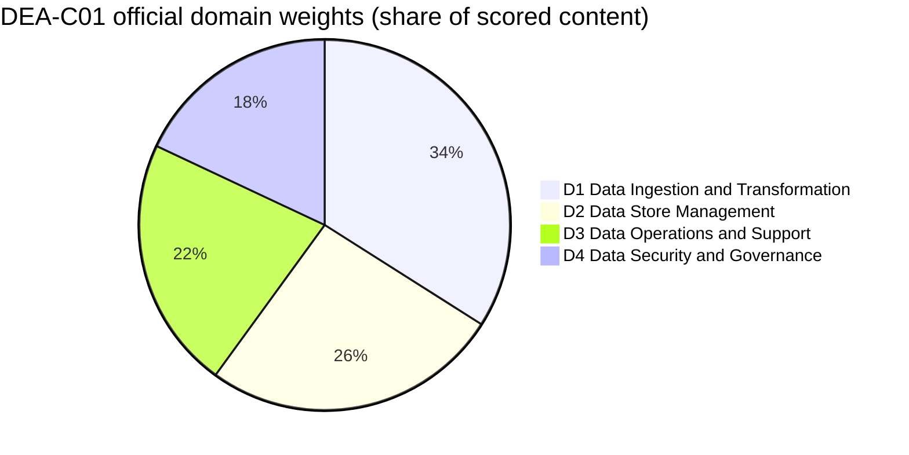
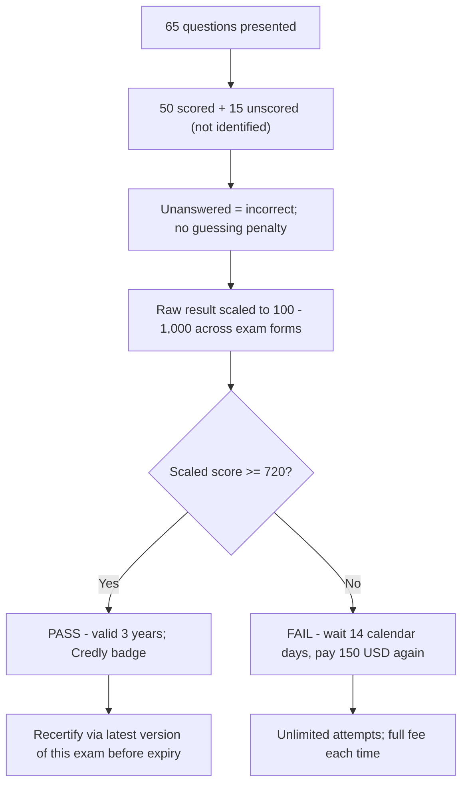
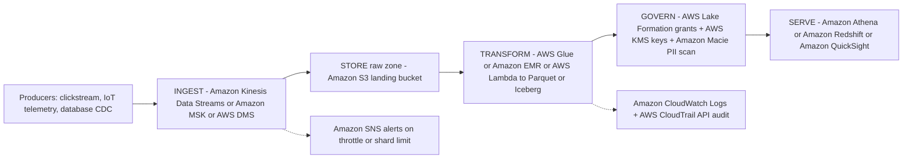
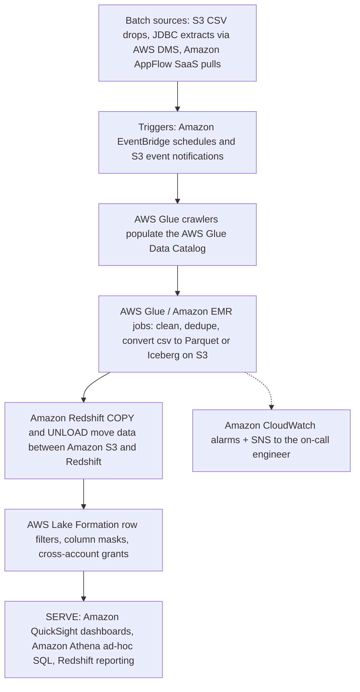
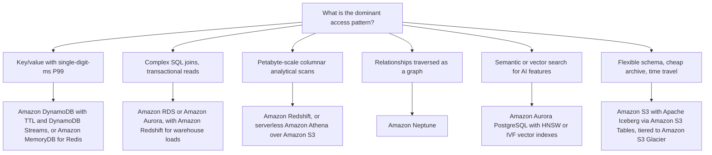

# DEA-C01 Exam Guide and the Data Engineer Role

Every AWS certification begins with one document: the **official exam guide**. For DEA-C01 that single document does two jobs at once — it tells you exactly *how* the exam is built (code, minutes, questions, cut score, weights) and it defines the *data engineering job* you must already do: ingest, transform, store, operate and secure data pipelines on AWS. Candidates who skip the guide and jump straight to flashcards fall into the same three traps: they believe a third-party page that says the exam is **170 minutes** (it is **130**), they convert the scaled cut score of **720** into a percentage (it is not 72%), and they cannot separate what is **in scope** from what merely sounds like real data work — such as *training* a machine-learning model, which the guide explicitly excludes even though *integrating* a large language model into a pipeline is now a named skill.

```text
=====================================================================
 DEA-C01 — AWS CERTIFIED DATA ENGINEER – ASSOCIATE (ASSOCIATE)
=====================================================================
  Code .............. DEA-C01        Level .... Associate
  Duration .......... 130 minutes    Questions . 65 presented
  Scored items ...... 50             Unscored ... 15 (not identified)
  Scale ............. 100 - 1,000    Cut score .. 720
  Scoring ........... compensatory (overall only, no per-domain pass)
  Cost .............. 150 USD (as of Oct 2026, taxes may apply)
  Validity .......... 3 years        Delivery ... Pearson VUE center
                                      or online proctored
  Languages ......... 4 (English, Japanese, Korean, Simplified
                      Chinese); ESL written exams +30 minutes
  Guide ............. v1.1 (December 12, 2025)
---------------------------------------------------------------------
  DOMAIN                                WEIGHT   ITEMS (50 x w)
  1. Data Ingestion and Transformation    34%          17
  2. Data Store Management                26%          13
  3. Data Operations and Support          22%          11
  4. Data Security and Governance         18%           9
                                         ------         -----
                                         100%           50
---------------------------------------------------------------------
  QUESTION TYPES: multiple choice | multiple response
                  (no penalty for guessing; blank = wrong)
  NOTE: item counts above are 50 x weight — arithmetic, NOT
        published by AWS. Only the percentages are official.
  SKILLS: 120 skill bullets across 17 task statements
=====================================================================
```

> [!NOTE]
> **The guide is the contract.** Anything not in the exam guide — no matter how popular it is in blog posts — is not guaranteed to appear. AWS explicitly labels its in-scope service list **"non-exhaustive and is subject to change"** (as of Oct 2026), so treat the guide as the floor of what you must know, not the ceiling. The guide you download today is **v1.1, published 12 December 2025**; revisions publish at least one month before they can affect a live exam.

In this lesson you will:

- read the exam guide the way an exam writer does — code, timing, cost, scoring, languages, and the **170-minute / 85-question / 300-USD myths** that third-party sites still print;
- turn **domain weights** into a concrete study-hour budget;
- map all **17 task statements and 120 skill bullets** across the four content domains;
- master the **two question types** and the compensatory scoring model;
- separate the **in-scope service list** (14 categories) from the **out-of-scope list** that feeds distractors;
- define the **data engineer role** on AWS — what the four job-task clusters mean day to day, and the three tasks the guide says are *not* yours;
- build the **end-to-end pipeline architecture** — ingest, store, transform, govern, serve — with two reference diagrams and a store decision tree;
- work through **nine worked examples** — time budget, derived item counts, study hours, retake cost, the 720 arithmetic, the Athena cost ladder, FINRA throughput;
- study **four real AWS customer case studies** — Nasdaq, Integral Ad Science, FINRA and GE Aerospace — with services, numbers and sources;
- read the **October 2026 update box** — guide v1.1's eight new skills, six added services, and the 2025-2026 service wave;
- practise with **14 exam-style questions** plus four interactive checks (matching, fill-in-the-blank, ordering and an interactive chart).

---

## 1. What the DEA-C01 exam measures

### 1.1 The target candidate

DEA-C01 is an **Associate** credential, and the guide states its purpose in one sentence: the exam "validates a candidate's ability to implement data pipelines and to monitor, troubleshoot, and optimize cost and performance issues in accordance with best practices." This is not an architect's exam and not an analyst's exam — it is the exam of the person who **builds and runs the pipelines**.

| Candidate attribute | What the guide says (as of Oct 2026) | What it means for your prep |
|---|---|---|
| Code and level | **DEA-C01 / Associate**; no successor code published as of Oct 2026 | Associate depth: choose, configure, debug — not design strategy |
| Experience | "the equivalent of **2–3 years of experience in data engineering**" | Scenario questions assume you have shipped pipelines before |
| AWS experience | "at least **1–2 years of hands-on experience with AWS services**" | You are expected to know service defaults and failure modes |
| Data literacy | Understands effects of **volume, variety, and velocity** on ingestion, transformation, modeling, security, governance, privacy, schema design, optimal store design | The three V's appear inside nearly every Domain 1 scenario |
| Certification page wording | Adds "or data architecture" after data engineering (certification page, as of Oct 2026) | Same skill profile, slightly wider door |

### 1.2 The out-of-scope job tasks — verbatim

The guide draws a hard line, and it is worth memorising word for word:

> "The following list contains job tasks that the target candidate is not expected to be able to perform. This list is non-exhaustive. These tasks are out of scope for the exam: **Perform ML training and inferences. / Demonstrate knowledge of programming language-specific syntax. / Draw business conclusions based on data.**"

This list is not decoration. Items from it appear as **distractors**, because a distractor that sounds like "real data work" is the most tempting wrong answer of all.

> [!WARNING]
> **⚠️ The scope paradox — out of scope does not mean never mentioned.**
> - *"Perform ML training and inferences"* is out of scope, yet **Skill 1.2.10** now says "Integrate large language models (LLMs) for data processing" — **integration is in, training is out**. Calling a pre-trained Amazon Bedrock model from a Glue job is examinable; fine-tuning your own model is not.
> - *"Programming language-specific syntax"* is out of scope, yet **Skill 1.4.3** names Python, SQL, Scala, R, Java, Bash and PowerShell — the exam tests **language-agnostic concepts** (idempotency, concurrency, partitioning), never a syntax gotcha.
> - *"Draw business conclusions based on data"* is out of scope, yet **Task 3.2** asks you to analyse data — aggregation, rolling averages, grouping, pivoting, verification and cleaning. The engineer delivers **correct, timely, quality-governed data**; the analyst (or a "which product should we launch?" option) draws the business conclusion.
> Any option that asks you to train a model, debug a language's syntax, or pick a business strategy is testing whether you spotted an out-of-scope task.

### 1.3 Recommended knowledge the guide assumes

The guide lists prerequisites in two columns. Nothing here is a separate domain — it is the **floor of assumed knowledge**:

| General IT knowledge | AWS knowledge |
|---|---|
| ETL pipelines from ingestion through destination | The AWS services named in every task statement |
| Language-agnostic programming concepts | Encryption, governance, protection and logging services |
| Git | Comparing services for cost, performance and functional differences |
| Data lakes | SQL on AWS services (Amazon Redshift, Amazon Athena) |
| Networking, storage and compute fundamentals | Data analysis, quality verification and consistency techniques |
| General concepts of vectors | — |

- **📚 Did you know?** "General concepts of vectors" and "vector indexes" are on this exam because **guide v1.1 (12 December 2025)** added them — Skill 2.1.8 "Describe vector index types (for example, HNSW, IVF)" and Skill 2.4.6 "Describe vectorization concepts (for example, Amazon Bedrock knowledge base)". A 2023 study plan would not have contained either bullet; the current guide does, and v1.1 revisions were published at least one month before they could affect a live exam (revisions page, as of Oct 2026).

### 1.4 The four job-task clusters — the exam's spine

The guide opens with four bullets that map **1:1** onto the four domains. Read them as the loop of the job:

| Cluster (guide wording, condensed) | Domain it becomes |
|---|---|
| **Ingest, transform and orchestrate** data pipelines, plus programming concepts | **Domain 1** — Data Ingestion and Transformation (34%) |
| **Choose the optimal data store**, models, catalog schemas and lifecycle | **Domain 2** — Data Store Management (26%) |
| **Operationalize, monitor and troubleshoot** pipelines; analyse data; ensure quality | **Domain 3** — Data Operations and Support (22%) |
| **Authentication, authorization, encryption, privacy, governance** and logging | **Domain 4** — Data Security and Governance (18%) |

The ordering is deliberate: **ingest → store → operate → secure**. Domain 1 is heaviest because ingestion and transformation are where data engineering either works or fails; Domain 4 is smallest but is the only domain that can fail a regulated company outright.

---

## 2. Exam logistics: the numbers that change your strategy

### 2.1 The logistics table

Every row below comes from the exam guide, the certification page's exam overview, or the AWS Certification FAQs, all accessed **October 2026**.

| Attribute | Value | Where it is stated |
|---|---|---|
| Code / level | DEA-C01 / **Associate** | Exam guide |
| Duration | **130 minutes** | Certification page exam overview |
| Questions presented | **65** (multiple choice or multiple response) | Certification page exam overview |
| Scored / unscored | **50 affect your score / 15 do not** — the 15 are **not identified** on the exam | Exam guide |
| Response types | MC: 1 correct + 3 distractors · MR: 2+ correct of 5+ options | Exam guide |
| Guessing policy | Unanswered = **incorrect**; **no penalty** for guessing | Exam guide |
| Score scale | Scaled **100–1,000**; minimum passing **720** | Exam guide |
| Scoring model | **Compensatory** — only the overall result must pass | Exam guide |
| Fee | **150 USD** as of Oct 2026 (Associate-level exams; taxes such as VAT may apply) | Certification FAQs |
| Delivery | Pearson VUE testing centre **or** online proctored exam | Exam overview |
| Languages | **4**: English, Japanese, Korean, Simplified Chinese | Exam overview |
| Extra time | English-as-a-second-language **written** exams receive **+30 minutes** | Certification FAQs |
| Validity | **3 years**; recertify by passing the latest version of this exam | Certification page |
| Retake after a fail | Wait **14 calendar days**; **no limit** on attempts; **full fee every time** | Certification FAQs |
| Re-sit after a pass | Blocked for **2 years** (unless AWS releases a new exam guide and series code) | Certification FAQs |
| Reschedule / cancel | Free up to **24 hours** before, maximum **2** changes; a missed appointment forfeits the fee but is **not** a failed attempt | Certification FAQs |
| Results | Within **5 business days**; plan for **no same-day pass/fail** on screen; badge issued via Credly | Certification FAQs |
| Next-step suggestion | The certification page recommends **Security – Specialty** as a natural next exam | Certification page |
| Exam credit | **50% off** your next AWS exam once you have earned a certification | Certification page |

### 2.2 The three myths every prep site still prints

The digest of official sources flags three conflicts that recur on third-party pages (checked Oct 2026). In each case the **official number wins**:

| Myth (third-party pages) | Official truth (as of Oct 2026) | Why the myth exists |
|---|---|---|
| "170 minutes" | **130 minutes** | 170 minutes is the length of AWS **Specialty** exams, not this Associate exam |
| "85 questions" | **65 questions** (50 scored + 15 unscored) | Older or composite prep pages merged formats |
| "$300 fee" | **150 USD** — Associate tier | **300 USD** is the Professional-level and Specialty fee; Foundational is 100 USD |

> [!IMPORTANT]
> **⚠️ Precedence rule for every number in this course.** Official AWS sources (exam guide, certification page, FAQs) beat any third-party blog, course or practice-test vendor. Where a third party disagrees — 170 minutes, 85 questions, 300 USD — the digest records the conflict and the official value stands. Never quote a number on this exam that you cannot trace to an AWS page, and date-stamp every price and limit **"as of Oct 2026"**.

### 2.3 Worked example E1 — the per-question time budget

The single most useful number in the whole guide is arithmetic that nobody publishes:

$$
t = \frac{130 \times 60}{65} = \frac{7{,}800}{65} = 120 \text{ seconds per question, exactly}
$$

Reserve **10 minutes** for review and the real budget becomes $120 \times 60 / 65 \approx$ **110.8 seconds** per item. Budgeting rule of thumb: rapid-fire items at 60–90 seconds early, spend 3–4 minutes on the slower scenario and multiple-response items, and never let a single item eat more than about five minutes.

### 2.4 Worked example E2 — scored versus unscored

$$
65 = 50 + 15 \qquad \frac{15}{65} = 23.1\% \text{ of the exam does not affect your score}
$$

Nearly a quarter of the paper is invisible pilot material — and **you cannot tell which 15 they are**. The only sane strategy is to treat every single item as scored.

### 2.5 Worked example E3 — the cost of a retake

| Event | Calendar day | Wallet (as of Oct 2026) |
|---|---|---|
| First attempt (fail) | Day 0 | 150 USD |
| Eligible to retake | Day 14 | — |
| Second attempt (fail) | Day 14 or later | +150 USD |
| Third attempt | +14 days after the second fail | +150 USD |
| **Total after three failed attempts** | — | **450 USD** |

Three attempts cost **450 USD** as of Oct 2026 plus at least **28 calendar days** of waiting between them. The mirror-image benefit: once you **pass**, the certification page grants **50% off** your next AWS exam — a 150 USD Associate registration becomes **75 USD** (as of Oct 2026), and a 300 USD Professional or Specialty registration becomes 150 USD.

### 2.6 What happens after you sit the exam

Results arrive within **five business days**. The FAQs say "most AWS Certification exams" report without an on-screen pass/fail, so **plan for delayed results** — the deterministic artefacts are the score report and the **Credly** badge if you passed. Between now and exam day, the only mechanics that matter are: **answer every item** (blank = wrong), **finish all 65** (you have 120 seconds each), and **budget 150 USD per attempt** (as of Oct 2026).

- **📚 Did you know?** DEA-C01 had exactly **one beta window**: registration ran from **2 November 2023**, delivery from **27 November 2023 to 12 January 2024**, at the beta price of **75 USD**. The exam went **GA in April 2024**, the same month **DAS-C01 (Data Analytics – Specialty) retired on 9 April 2024** — DEA-C01 is its spiritual successor at the Associate level (AWS training and certification blog, as of Oct 2026). There has been **no DEA beta in 2026**; if a prep page mixes another exam's 2026 beta logistics into a DEA-C01 summary, it is wrong.

---

## 3. The four domains and their weights

### 3.1 Official weights

The guide states four content domains, and the percentages are shares of **scored content only**:

| Domain | Official weight |
|---|---|
| **1. Data Ingestion and Transformation** | **34%** |
| **2. Data Store Management** | **26%** |
| **3. Data Operations and Support** | **22%** |
| **4. Data Security and Governance** | **18%** |
| **Total** | **100%** |



### 3.2 Worked example E4 — derived item counts (arithmetic, not AWS's)

Multiply the **50 scored** items by each weight:

```text
Domain   weight   50 x weight   reading
D1        34%         17        about 17 scored items
D2        26%         13        about 13 scored items
D3        22%         11        about 11 scored items
D4        18%          9        about  9 scored items
                                ------
                              50 scored items
```

> [!IMPORTANT]
> The **weights are official** (exam guide, as of Oct 2026). The **item counts are arithmetic** — 50 × weight — and are **not published by AWS**. Per-domain question counts on any live form are unknown, and because 15 of the 65 items are unscored pilots your actual test form will not match this grid exactly. Use it to **allocate study time**, never to predict a fixed number of questions.

### 3.3 Worked example E5 — turning weights into study hours

Suppose you have **40 hours** before exam day. The weights convert directly into hours:

```text
Domain   weight   hours (40 h)   where the hours go
D1        34%       13.6 h       ingestion, transformation, orchestration,
                                 programming concepts (37 skill bullets)
D2        26%       10.4 h       stores, catalogs, lifecycle, schema design
                                 (26 skill bullets)
D3        22%        8.8 h       automation, analysis, monitoring, quality
                                 (28 skill bullets)
D4        18%        7.2 h       authentication, authorization, encryption,
                                 audit logs, privacy and governance
                                 (29 skill bullets)
                                 ---------
                                 40.0 h
```

Domains 1 + 2 are **60% of the score**. A candidate who spends most of their time on security because "that's always the biggest AWS topic" has misallocated the paper — on *this* exam the pipeline and the store come first.

### 3.4 Guide v1.0 to v1.1 — what changed and when it counts

The exam was refreshed in **December 2025**: version **v1.1 (12 December 2025)** consolidated the separate "knowledge of" and "skills in" lists into **one skills list per task**, added **eight new skills**, removed none, and changed both service lists. AWS's revision mechanic (training and certification blog, 17 December 2025) is explicit:

| Change type | What AWS does | Example |
|---|---|---|
| **Significant** domain changes | New series code + full job-task analysis | DVA-C01 → DVA-C02 |
| **Less significant** changes | **Revision** to the existing code, summarised on the Revisions page | DEA-C01 v1.0 → **v1.1** |
| Timing rule | Revisions publish **at least 1 month** before affecting a live exam | v1.1 (2025-12-12) eligible from ~2026-01-12 |
| Service freshness rule | A new service is examinable only after **at least 3 months** at GA | Certification FAQs, as of Oct 2026 |

The eight new v1.1 skills — all directly examinable now: **1.2.10** integrate LLMs for data processing · **2.1.7** manage open table formats (for example Apache Iceberg) · **2.1.8** describe vector index types (HNSW, IVF) · **2.2.6** create and manage business data catalogs (Amazon SageMaker Catalog) · **2.4.6** describe vectorization concepts (Amazon Bedrock knowledge base) · **4.1.7** use domain, domain units and projects for SageMaker Unified Studio · **4.5.6** manage data access through SageMaker Catalog projects · **4.5.7** describe governance data framework and data sharing patterns.

---

## 4. The task-statement map: 4 domains, 17 tasks, 120 skills

The guide does not publish vague topics; it publishes **task statements**, each carrying a numbered list of **skills**. Everything examinable hangs off one of these 17 tasks and its **120 skill bullets**.

```mermaid
flowchart TD
    R["DEA-C01 - 17 task statements across 4 domains (120 skills)"] --> D1["D1 Data Ingestion and Transformation 34%"]
    R --> D2["D2 Data Store Management 26%"]
    R --> D3["D3 Data Operations and Support 22%"]
    R --> D4["D4 Data Security and Governance 18%"]
    D1 --> A1["1.1 Perform data ingestion - 12 skills"]
    D1 --> A2["1.2 Transform and process data - 10 skills"]
    D1 --> A3["1.3 Orchestrate data pipelines - 4 skills"]
    D1 --> A4["1.4 Apply programming concepts - 11 skills"]
    D2 --> B1["2.1 Choose a data store - 8 skills"]
    D2 --> B2["2.2 Understand data cataloging systems - 6 skills"]
    D2 --> B3["2.3 Manage the lifecycle of data - 6 skills"]
    D2 --> B4["2.4 Design data models and schema evolution - 6 skills"]
    D3 --> C1["3.1 Automate data processing - 9 skills"]
    D3 --> C2["3.2 Analyze data by using AWS services - 6 skills"]
    D3 --> C3["3.3 Maintain and monitor data pipelines - 8 skills"]
    D3 --> C4["3.4 Ensure data quality - 5 skills"]
    D4 --> E1["4.1 Apply authentication mechanisms - 7 skills"]
    D4 --> E2["4.2 Apply authorization mechanisms - 6 skills"]
    D4 --> E3["4.3 Ensure data encryption and masking - 4 skills"]
    D4 --> E4["4.4 Prepare logs for audit - 5 skills"]
    D4 --> E5["4.5 Understand data privacy and governance - 7 skills"]
```



### 4.1 The 17 tasks in one line each

| Task | One-line focus (examples the guide names) |
|---|---|
| **1.1** Perform data ingestion | Streaming (Kinesis, MSK, DynamoDB Streams, DMS, Glue, Redshift) and batch (S3, Glue, EMR, DMS, Redshift, Lambda, AppFlow); schedulers (EventBridge, Airflow); event triggers; fan-in/fan-out; replayability; stateful vs stateless transactions |
| **1.2** Transform and process data | Containers (EKS, ECS); JDBC/ODBC connections; multi-source integration; cost while processing; EMR / Glue / Lambda / Redshift transformations; **.csv to Apache Parquet**; debugging failures; data APIs; volume/velocity/variety; **LLM integration** |
| **1.3** Orchestrate data pipelines | Lambda, EventBridge, **Amazon MWAA**, Step Functions, Glue workflows; performance, availability, scalability, resiliency, fault tolerance; serverless workflows; SNS / SQS alerts |
| **1.4** Apply programming concepts | Runtime optimisation; Lambda concurrency; Python/SQL/Scala/R/Java/Bash/PowerShell as *concepts*; version control, testing, logging, monitoring; **IaC (CloudFormation, CDK)**; **AWS SAM**; mounting volumes in Lambda; CI/CD; distributed computing; data structures and algorithms |
| **2.1** Choose a data store | Storage services for cost/performance/access patterns (Redshift, EMR, Lake Formation, RDS, DynamoDB, Kinesis, MSK); indexing (HNSW on Aurora PostgreSQL); MemoryDB; Transfer Family; Redshift federated queries / materialized views / Spectrum; locks; **open table formats (Iceberg)**; **vector index types (HNSW, IVF)** |
| **2.2** Understand data cataloging | Consume from source via catalogs; **Glue Data Catalog** / Hive metastore; crawlers; **partition synchronization**; new source/target connections; **business catalogs (SageMaker Catalog)** |
| **2.3** Manage the lifecycle of data | Redshift COPY/UNLOAD with S3; **S3 Lifecycle** tier changes and expiry; versioning and **DynamoDB TTL**; deletion for business/legal requirements; resiliency and availability |
| **2.4** Design models and schema evolution | Schemas for Redshift, DynamoDB, Lake Formation; changing data characteristics; **schema conversion (AWS SCT and AWS DMS Schema Conversion)**; lineage (SageMaker ML Lineage Tracking, SageMaker Catalog); indexing, partitioning, compression; **vectorization (Bedrock knowledge base)** |
| **3.1** Automate data processing | MWAA and Step Functions orchestration; troubleshooting managed workflows; SDKs; EMR/Redshift/Glue features; data APIs; **DataBrew and SageMaker Unified Studio** preparation; **Athena** queries; Lambda automation; EventBridge events and schedulers |
| **3.2** Analyze data | Visualisation (DataBrew, QuickSight); verify and clean (Lambda, Athena, Jupyter, SageMaker Data Wrangler); SQL in Redshift and Athena; **Athena notebooks with Apache Spark**; provisioned vs serverless tradeoffs; aggregation, rolling average, grouping, pivoting |
| **3.3** Maintain and monitor pipelines | Logs for audits; logging/monitoring for traceability; alerts; performance troubleshooting; **CloudTrail** API tracking; Glue/EMR maintenance; **CloudWatch Logs**; log analysis (Athena, EMR, OpenSearch, CloudWatch Logs Insights) |
| **3.4** Ensure data quality | Checks while processing (empty fields); **DataBrew rules**; consistency investigation; sampling techniques; data skew mechanisms |
| **4.1** Apply authentication | VPC security groups; IAM groups, roles, endpoints, services; **Secrets Manager** credential rotation; IAM roles for Lambda/API Gateway/CLI/CloudFormation; policies on roles, endpoints, services (S3 Access Points, PrivateLink); managed vs unmanaged services; **SageMaker Unified Studio domains** |
| **4.2** Apply authorization | Custom IAM policies; credentials in Secrets Manager and Parameter Store; Redshift users/groups/roles; **Lake Formation permissions** (Redshift, EMR, Athena, S3); role-, tag- and attribute-based methods; least-privilege policies |
| **4.3** Ensure encryption and masking | Masking and anonymization for compliance; **KMS** keys; encryption across account boundaries; encryption in transit or before transit |
| **4.4** Prepare logs for audit | CloudTrail API calls; CloudWatch Logs storage; **CloudTrail Lake**; analysis (Athena, CloudWatch Logs Insights, OpenSearch); EMR for large log volumes |
| **4.5** Privacy and governance | Redshift data sharing; **PII identification (Macie with Lake Formation)**; data-residency strategies; **AWS Config** configuration history; data sovereignty; **SageMaker Catalog projects**; governance frameworks and sharing patterns |

```matching
{
  "question": "Match each DEA-C01 domain to its official weight and its skill-bullet count (as of Oct 2026):",
  "pairs": [
    {"left": "D1 Data Ingestion and Transformation", "right": "34% of scored content - 37 skill bullets across tasks 1.1-1.4 (ingest, transform, orchestrate, programming concepts)"},
    {"left": "D2 Data Store Management", "right": "26% of scored content - 26 skill bullets across tasks 2.1-2.4 (choose store, catalog, lifecycle, schema evolution)"},
    {"left": "D3 Data Operations and Support", "right": "22% of scored content - 28 skill bullets across tasks 3.1-3.4 (automate, analyze, monitor, data quality)"},
    {"left": "D4 Data Security and Governance", "right": "18% of scored content - 29 skill bullets across tasks 4.1-4.5 (authentication, authorization, encryption/masking, audit logs, privacy/governance)"}
  ],
  "explanation": "Weights and counts must stay paired in memory: D1 is heaviest by weight (34%) AND has the most skill bullets (37), while D4 has the smallest weight (18%) but the second-most skill bullets (29) - dense, high-stakes security content. Only the percentages are official; the bullet counts come from the guide's v1.1 skill lists (as of Oct 2026)."
}
```

### 4.2 Skill-density — where effort actually goes

Skill bullets per weight point reveal the exam's texture:

```text
Domain   skills   weight   skills per weight-point   texture
D1          37      34%           1.09               broad, pipeline-heavy
D2          26      26%           1.00               balanced, store-centric
D3          28      22%           1.27               dense ops per point
D4          29      18%           1.61               very dense, security-heavy
                     ---
                    120 skills total
```

D4 carries **1.61 skill bullets per weight-point** — the highest density on the exam. Security questions are narrow, specific and unforgiving; Domain 1 questions are wide and scenario-based. Study time follows **weights**; revision cadence follows **density** — revisit Domain 4 more often in short bursts.

```plot
{
  "type": "bar",
  "title": "Skill density: skill bullets per weight-point (guide v1.1, as of Oct 2026)",
  "data": [
    {"Domain": "D1 Ingestion and Transformation", "Density": 1.09},
    {"Domain": "D2 Data Store Management", "Density": 1.0},
    {"Domain": "D3 Operations and Support", "Density": 1.27},
    {"Domain": "D4 Security and Governance", "Density": 1.61}
  ],
  "xKey": "Domain",
  "yKey": "Density",
  "xLabel": "Content domain",
  "yLabel": "Skill bullets per weight-point"
}
```

Hover any bar to read the exact ratio: D2 sits at 1.00 (the baseline), D1 just above it at 1.09, D3 at 1.27 and D4 at 1.61. The chart makes the study rule visual — the tallest bar is the shortest domain, so Domain 4 earns the most frequent, shortest revision sessions per hour of exam weight.

---

## 5. Question types and scoring mechanics

### 5.1 Exactly two question types

| Type | Structure (guide wording) | Credit rule |
|---|---|---|
| **Multiple choice** | "Has one correct response and three incorrect responses (distractors)" | Select the single best answer |
| **Multiple response** | "Has two or more correct responses out of five or more response options" | Every correct response is required for credit |

There are **no ordering, matching, drag-and-drop or case-study items** in the DEA-C01 guide — and no successor code has been published as of Oct 2026 — so if a practice test shows you those formats, it is not following this exam's guide.

### 5.2 The scoring pipeline



**Compensatory** means one thing: only the **overall** result must clear 720. You do **not** need to reach 720 inside each domain — a weak Domain 4 can be carried by a strong Domain 1, and dominating one domain cannot rescue an overall score below the cut.

### 5.3 Worked example E6 — 720 is not 72%

720 out of 1,000 *looks* like 72%, and the naive conversion $0.72 \times 50 = 36$ correct answers is arithmetically clean — and **wrong as an exam fact**. The scale starts at 100, so the usable range is $1{,}000 - 100 = 900$ points:

$$
\frac{720 - 100}{900} = \frac{620}{900} \approx 68.9\%
$$

AWS scales scores **across multiple exam forms that may differ in difficulty**, so the raw number of correct answers required for 720 is **not fixed** and is not published. The only deterministic rule is behavioural: **unanswered items are scored incorrect**, so answer all 65.

### 5.4 Worked example E7 — compensatory arithmetic (planning illustration)

As a **derived planning aid** (not an AWS-published conversion — exact per-domain counts on a live form are never published), take the E4 grid of 17/13/11/9 scored items. A candidate who performs strongly on Domains 1–3 and poorly on Domain 4 has still cleared three of four weight bands; the compensatory model then only asks whether the **overall scaled** result reaches 720. The mirror case is the danger: a candidate who aces Domain 4 (18%) but neglects Domains 1–2 (60%) is fighting the weights themselves. Conclusion the exam rewards: **no domain may be abandoned**, but the correct order of coverage is 1 → 2 → 3 → 4 by weight, with Domain 4 revisited often because of its 1.61 skills-per-point density.

```fillblank
{
  "question": "Complete the DEA-C01 logistics statements using the official numbers (as of Oct 2026):",
  "template": "The exam is {{1}} minutes long and presents {{2}} questions, of which {{3}} affect your score and {{4}} are unscored pilots that are not identified on the exam. Results are reported on a scaled score of 100-1,000 and the minimum passing score is {{5}}. The fee is {{6}} USD, a failed attempt is followed by a {{7}}-calendar-day wait, and the certification is valid for {{8}} years.",
  "answers": {
    "1": "130",
    "2": "65",
    "3": "50",
    "4": "15",
    "5": "720",
    "6": "150",
    "7": "14",
    "8": "3"
  },
  "distractors": ["90", "170", "60", "70", "85", "25", "700", "100", "300", "7", "30", "2", "5"],
  "explanation": "130 minutes / 65 questions / 50 scored + 15 unscored / cut score 720 / 150 USD / 14-day retake wait / 3-year validity are all official (exam guide, certification page and FAQs, as of Oct 2026). The 90-minute, 170-minute, 700-cut and 300-USD figures belong to other AWS exams or to third-party myths - on this exam they are always wrong."
}
```

---

## 6. In-scope versus out-of-scope services

### 6.1 Two lists, one rule

The guide publishes an **In-Scope AWS Services** list spanning **14 categories** (78 line items, about 75 distinct because SageMaker AI and S3 Tables are each printed twice — as of Oct 2026), and a separate **Out-of-Scope AWS Services** list. Both carry AWS's standard disclaimer that the list is **non-exhaustive and subject to change**. The in-scope list is what you must recognise; the out-of-scope list tells you which names are being used as **baits**.

| In-scope category (14 total) | Names the guide lists (as of Oct 2026) |
|---|---|
| Analytics | Amazon Athena · Amazon EMR · AWS Glue · AWS Glue DataBrew · AWS Lake Formation · Amazon Kinesis Data Firehose · Amazon Kinesis Data Streams · Amazon Managed Service for Apache Flink · Amazon Managed Streaming for Apache Kafka (Amazon MSK) · Amazon OpenSearch Service · **Amazon Quick** · Amazon SageMaker AI |
| Application Integration | Amazon AppFlow · Amazon EventBridge · Amazon Managed Workflows for Apache Airflow (Amazon MWAA) · Amazon SNS · Amazon SQS · AWS Step Functions |
| Cloud Financial Management | AWS Budgets · AWS Cost Explorer |
| Compute | AWS Batch · Amazon EC2 · AWS Lambda · AWS SAM |
| Containers | Amazon ECR · Amazon ECS · Amazon EKS |
| Database | Amazon DocumentDB · Amazon DynamoDB · Amazon Keyspaces · Amazon MemoryDB for Redis · Amazon Neptune · Amazon RDS · **Amazon Aurora** · Amazon Redshift |
| Developer Tools | AWS CLI · AWS CloudFormation · AWS CDK · AWS CodeBuild · AWS CodeDeploy · AWS CodePipeline · **Amazon Q** |
| Web and Mobile | Amazon API Gateway |
| Machine Learning | Amazon SageMaker AI · **Amazon Bedrock** · **Amazon Kendra** |
| Management and Governance | AWS CloudTrail · Amazon CloudWatch · Amazon CloudWatch Logs · AWS Config · Amazon Managed Grafana · AWS Systems Manager · AWS Well-Architected Tool · **AWS Data Exchange** |
| Migration and Transfer | AWS Application Discovery Service · AWS Application Migration Service · AWS DMS · AWS DataSync · AWS Snow Family · AWS Transfer Family |
| Networking and Content Delivery | Amazon CloudFront · AWS PrivateLink · Amazon Route 53 · Amazon VPC |
| Security, Identity, and Compliance | IAM · AWS KMS · Amazon Macie · AWS Secrets Manager · AWS Shield · AWS WAF |
| Storage | AWS Backup · Amazon EBS · Amazon EFS · Amazon S3 · **Amazon S3 Tables** · Amazon S3 Glacier |

**Bold** names were **added at guide v1.1** (12 December 2025): Amazon Aurora, Amazon Q, Amazon Bedrock, Amazon Kendra, AWS Data Exchange and Amazon S3 Tables.

### 6.2 The out-of-scope list — services that exist but are not examinable

Amazon FinSpace · Alexa for Business · Amazon Chime · Amazon Connect · AWS IQ · Amazon WorkMail · AWS App Runner · AWS Elastic Beanstalk · Amazon Lightsail · AWS Outposts · AWS Serverless Application Repository · Red Hat OpenShift Service on AWS (ROSA) · AWS Fault Injection Simulator (AWS FIS) · AWS X-Ray · AWS Amplify · AWS AppSync · AWS Device Farm · Amazon Location Service · Amazon Pinpoint · Amazon SES · FreeRTOS · AWS IoT 1-Click · AWS IoT Device Defender · AWS IoT Device Management · AWS IoT Events · AWS IoT FleetWise · AWS IoT RoboRunner · AWS IoT SiteWise · AWS IoT TwinMaker · Amazon DevOps Guru · AWS Activate · AWS Managed Services (AMS) · Amazon Elastic Transcoder · AWS Elemental Appliances and Software · AWS Elemental MediaConnect · AWS Elemental MediaConvert · AWS Elemental MediaLive · AWS Elemental MediaPackage · AWS Elemental MediaStore · AWS Elemental MediaTailor · Amazon Interactive Video Service (Amazon IVS) · Amazon Nimble Studio · AWS Mainframe Modernization · AWS Migration Hub · EC2 Image Builder.

Four names were **removed from the out-of-scope list** at v1.1 (Amazon Honeycode, Amazon WorkDocs, Amazon Timestream, Amazon CodeWhisperer), and **nothing was added to it** — removal from the out-of-scope list does not make a service in-scope; services on *neither* list are simply not guaranteed.

> [!IMPORTANT]
> **A service being out of scope does not mean it is fake, deprecated or wrong.** These are real, current AWS services. They simply **cannot be the correct answer** to a DEA-C01 question while an in-scope service fits. If a question's best-sounding option is on the out-of-scope list — Amazon Elastic Beanstalk "for deploying data pipelines", AWS X-Ray "for tracing Glue jobs" — keep reading; a better, in-scope option is almost certainly there.

### 6.3 Naming traps in the in-scope list

- **"Amazon Quick"** is the literal string on the in-scope Analytics list (checked Oct 2026), while Task 3.2.1 names "Amazon QuickSight" and the product line is now **Amazon Quick Suite**. Treat the Quick family as in-scope; do not claim the guide prints "Amazon QuickSight" — it does not.
- **Amazon Kinesis Data Firehose** is what the in-scope list still prints, while the product was renamed **Amazon Data Firehose** on **9 February 2024** with **no API, endpoint, CLI, IAM-policy or CloudWatch-metric changes**. Either name can appear on the exam; never "correct" an option that says Kinesis Data Firehose.
- **AWS SCT (Schema Conversion Tool)** was **removed from the in-scope list at v1.1**, yet Skill 2.4.3 still reads "Perform schema conversion (for example, by using AWS SCT and AWS DMS Schema Conversion)". Prefer **AWS DMS Schema Conversion** as the current tool; recognise SCT as the legacy name the skill text preserves.
- **Amazon Q** (Developer Tools) is **not** the same entry as **Amazon Quick** (Analytics). Two different strings, two different categories.
- **Amazon SageMaker AI** appears twice (Analytics and Machine Learning), and **Amazon S3 Tables** is printed twice in Storage — both are document duplication on the official page, not extra services.

### 6.4 Which artefact wins

| Artefact | Status (Oct 2026) | Rule |
|---|---|---|
| HTML exam guide on AWS Docs | Current, **v1.1** | **Use this one** |
| Revisions page | v1.0 → v1.1 diff, dated 2025-12-12 | Your changelog for deltas |
| Official PDF mirror | Same generation as HTML | Reference only when HTML is unreachable |
| Third-party prep pages | Vary — 170 min / 85 Q / 300 USD myths persist | Never authoritative |

- **📚 Did you know?** The official in-scope page literally contains the single entry **"Amazon Quick"** in the Analytics category (verified Oct 2026) — "Sight" appears nowhere on that page, even though Task 3.2.1 and the product pages use QuickSight / Quick Suite. AWS has not clarified whether it denotes the Quick Suite family or a truncation, so the safe exam behaviour is: treat any **Quick**-family name as in-scope, and never assert the guide says "Amazon QuickSight".

---

## 7. The data engineer role on AWS

### 7.1 What the four clusters look like on a Tuesday

The guide's job-task clusters are not abstract — each maps to a concrete working loop:

| Cluster | A day in the role | Failure the exam will scenario-test |
|---|---|---|
| **Ingest / transform / orchestrate** | Wire Kinesis or DMS into S3, schedule Glue crawlers on EventBridge, chain a Step Functions state machine, alert via SNS | Late partitions, non-idempotent replays, throttled source APIs, a Glue job that runs out of memory at transform time |
| **Choose the store / catalog / lifecycle** | Pick DynamoDB for key/value P99, Redshift for the warehouse, Iceberg on S3 for the lake; keep the Glue Data Catalog in sync; expire raw data at 90 days | Wrong access pattern for the store, stale catalog partitions, data kept (and billed) long past its legal life |
| **Operate / monitor / analyse / quality** | CloudWatch alarms on Glue job metrics, CloudTrail for API forensics, DataBrew rules that halt the pipeline, Athena for ad-hoc verification | Silent quality drift, un-traceable API calls, alerts nobody receives |
| **Authenticate / authorize / encrypt / govern** | IAM roles per pipeline stage, Secrets Manager rotation, KMS keys, Lake Formation row filters, Macie PII findings | Over-broad policies, plaintext credentials, PII in a public bucket, backups replicated to a disallowed Region |

### 7.2 What the role is not

Restating the out-of-scope list as positive boundaries: the DEA-C01 data engineer **does not train or run inference** on models (Skill 1.2.10 stops at *integration*), **does not demonstrate language syntax** (1.4.3 tests concepts), and **does not draw business conclusions** (Task 3.2 stops at aggregation, cleaning and verification). The role's product is **data that is correct, timely, complete, governed and cheap enough to keep** — every question can be scored against that sentence.

### 7.3 The comparison habit the guide tests

Three times across the skill lists the guide uses the same verb: **compare**. You must be able to compare services for **cost, performance and functional differences** (recommended knowledge), **provisioned versus serverless** (Skill 3.2.5), and **managed versus unmanaged** (Skill 4.1.6). That is why this course teaches every service with a "choose it when / avoid it when" pair, and why the exam's favourite distractor is a *real* AWS service that is merely **worse for the stated requirement**.

---

## 8. End-to-end pipeline architecture: ingest, store, transform, govern, serve

### 8.1 Reference architecture 1 — the streaming path

Domain 1's streaming skills (1.1.1, 1.1.7, 1.1.10, 1.3.4) compose into one canonical shape. Note the stage order the guide implies: **ingest → store → transform → govern → serve**, with monitoring wrapping everything.



### 8.2 Reference architecture 2 — the batch lake house

Domain 1's batch skills (1.1.2, 1.1.5, 1.1.6, 2.2.3) plus Domain 2's lifecycle skills compose into the lake-house shape — the pattern behind most of the case studies in this course:



### 8.3 Reference architecture 3 — the store decision tree

Task 2.1 asks you to **choose** the store from the access pattern, not from habit. This tree is the single most reusable diagram in Domain 2:



### 8.4 Worked example E8 — the format decision that dominates the Athena bill

Skill 1.2.6 ("transform data between formats, for example from .csv to Apache Parquet") and Skill 1.2.4 ("optimize costs while processing data") meet in one calculation. Amazon Athena bills **5 USD per TB scanned** with a **10 MB minimum per query** (as of Oct 2026; AWS Athena pricing page). Scan a **3 TB** dataset:

```text
Format                 Bytes actually scanned    Cost at $5/TB (as of Oct 2026)
.csv uncompressed                    3 TB                  $15.00
GZIP-compressed csv                ~1 TB                  ~$5.00
Parquet, 1 column read           ~250 GB                  ~$1.25
Parquet + partition pruning     well under 250 GB          pennies
```

The arithmetic ($3 \times 5 = 15$, $1 \times 5 = 5$, $0.25 \times 5 = 1.25$) is trivial; the examinable insight is the **ordering**: columnar conversion first, partition pruning second, then worry about cluster size. A candidate who "optimises" by provisioning a larger EMR cluster before converting CSV to Parquet has optimised the wrong layer — and Domain 1 tests exactly that judgement.

### 8.5 Worked example E9 — throughput arithmetic for a streaming ingest

FINRA, a real AWS customer, states it "processes approximately 6 terabytes of data and 37 billion records on an average day" with busy days generating "75 billion+ records" (AWS Public Sector blog, as of Oct 2026). Convert to per-second rates (**derived** — AWS publishes the daily totals, not the rates):

$$
\frac{37 \times 10^9}{86{,}400} \approx 428{,}000 \text{ records/second (average day)}
$$
$$
\frac{75 \times 10^9}{86{,}400} \approx 868{,}000 \text{ records/second (busy day)}
$$

Two exam-relevant consequences: (1) at those rates, **shard or partition sizing and fan-out** (Skills 1.1.10, 1.1.9) are first-order design decisions, not tuning details; (2) when an exam scenario quotes a daily record count, converting it to records-per-second is a legitimate 20-second move that instantly tells you whether the story is a Kinesis story, a Firehose story, or a batch-window story.

```dragdrop
{
  "question": "Order the five stages of the DEA-C01 end-to-end pipeline, from the guide's Domain 1 through Domain 4 concerns:",
  "items": [
    "GOVERN - AWS Lake Formation grants, AWS KMS encryption, Amazon Macie PII discovery, least-privilege IAM roles",
    "SERVE - Amazon Athena SQL, Amazon Redshift queries and materialized views, Amazon QuickSight dashboards, data APIs",
    "INGEST - Amazon Kinesis Data Streams, Amazon MSK, AWS DMS, Amazon AppFlow, EventBridge triggers, schedulers",
    "TRANSFORM - AWS Glue, Amazon EMR, AWS Lambda; csv to Parquet or Iceberg; dedupe, enrich, partition",
    "STORE - Amazon S3 raw and curated zones, Apache Iceberg tables via Amazon S3 Tables, Amazon Redshift, Amazon DynamoDB"
  ],
  "correctOrder": [
    "INGEST - Amazon Kinesis Data Streams, Amazon MSK, AWS DMS, Amazon AppFlow, EventBridge triggers, schedulers",
    "STORE - Amazon S3 raw and curated zones, Apache Iceberg tables via Amazon S3 Tables, Amazon Redshift, Amazon DynamoDB",
    "TRANSFORM - AWS Glue, Amazon EMR, AWS Lambda; csv to Parquet or Iceberg; dedupe, enrich, partition",
    "GOVERN - AWS Lake Formation grants, AWS KMS encryption, Amazon Macie PII discovery, least-privilege IAM roles",
    "SERVE - Amazon Athena SQL, Amazon Redshift queries and materialized views, Amazon QuickSight dashboards, data APIs"
  ],
  "explanation": "The guide's own domain order - ingest (D1), store (D2), operate (D3), secure (D4) - plus the serve layer that makes the pipeline worth building, gives the canonical flow: INGEST -> STORE -> TRANSFORM -> GOVERN -> SERVE. Governance is positioned after transform because Lake Formation grants, KMS keys and Macie scans act on the curated dataset that downstream consumers will actually query; monitoring (CloudWatch, CloudTrail) wraps every stage rather than sitting at one position."
}
```

### 2026 Updates (as of October 2026)

> [!NOTE]
> **What actually moved — and what a 2024 study plan gets wrong.** Every line below is checked against a primary AWS source in **October 2026**, and each one is examinable because the exam tests the *current* guide:
> - **Guide v1.1 (12 December 2025)** is the live version: knowledge/skills lists consolidated, **8 new skills added, 0 removed** (LLM integration 1.2.10, Iceberg 2.1.7, vector indexes 2.1.8, SageMaker Catalog 2.2.6, vectorization 2.4.6, Unified Studio domains 4.1.7, Catalog project access 4.5.6, governance frameworks 4.5.7); in-scope **+6** (Aurora, Amazon Q, Bedrock, Kendra, Data Exchange, S3 Tables) and **-3** (Cloud9, CodeCommit, AWS SCT); out-of-scope lost Honeycode, WorkDocs, Timestream and CodeWhisperer. Revisions affect exams **at least one month after publication** (revisions page + training blog, 17 Dec 2025).
> - **AWS Glue 6.0 (21 August 2026)**: Spark **4.1.1**, Python **3.13**, Scala **2.13**, full **Iceberg v3**, and a **30% price reduction**; **EMRFS and AWS SDK for Java v1 are removed** — any option citing `fs.s3.consistent.*` or `com.amazonaws.*` imports on Glue 6.0 is wrong. Glue **0.9/1.0/2.0 reached end of life on 1 April 2026** (What's New + Glue docs, as of Oct 2026).
> - **Amazon Kinesis Data Streams gained a third capacity mode** — **On-demand Advantage (4 November 2025)** removes the per-stream hourly charge and cuts GB rates, but bills a **25 MB/s ingest + 25 MB/s retrieval floor** account-wide; rates **$0.032/GB in + $0.016/GB out** (as of Oct 2026). "Kinesis has two capacity modes" is now a stale statement.
> - **Amazon Redshift can now fully write the lake**: Iceberg **INSERT (November 2025)**, **UPDATE/DELETE/MERGE including S3 Tables (23 April 2026)**, and **Iceberg materialized views (5 October 2026)** — any option claiming Redshift can only *read* Iceberg is stale.
> - **AWS Lake Formation cross-account sharing v5 (11 February 2026)**: one AWS RAM share can carry unlimited tables using wildcard grant patterns; **Amazon Athena** capacity reservations dropped to a **4 DPU / 1-minute minimum (February 2026)** with **managed query results at no extra cost**; **Amazon EMR Serverless** workers now scale to **32 vCPU / 244 GB (7 July 2026)**.
> - **Pricing and programme changes**: **S3 Express One Zone** price cuts (10 April 2025) and expansion to **15 Regions (17 September 2026)**; the **Free Tier changed on 15 July 2025** — new accounts get a **6-month Free Plan** and up to **200 USD** in credits instead of the old 12-month clock (as of Oct 2026).
> - **Amazon QuickSight is now a three-name family**: the product line became **Amazon Quick Suite (9 October 2025)** with the BI half branded **Quick Sight**, and **Amazon Quick** as the AI layer (17 June 2026); Quick Suite Author Pro dropped **50 → 40 USD/month**. The guide's in-scope list still prints the literal string **"Amazon Quick"** — treat any Quick-family name as in-scope and never assert the guide says "Amazon QuickSight" (What's New + certification docs, as of Oct 2026).
> - **Kinesis and MSK now stream straight into the lake (28–29 August 2026)**: Kinesis Data Streams **streaming tables** materialise a stream as Apache Iceberg on **Amazon S3 Tables** (auto-Parquet, inline compaction, no ETL), and **general-purpose S3 delivery** writes source-format records to an ordinary bucket — both only in the on-demand capacity modes; Amazon MSK took the same route on **30 July 2026**. AWS claims up to **50–60% lower delivery cost** and up to **30% lower query cost** — quote it as an AWS claim, not a customer outcome (What's New, as of Oct 2026).
> - **AWS Step Functions (26 March 2026)** added **28 service integrations / 1,100+ APIs**, taking the total past **220 AWS services**; **Distributed Map** now takes S3 sources in **CSV, JSON, JSONL and Parquet** and runs up to **10,000 concurrent children** (Inline stays at ≤40). For Domain 1 orchestration questions, Step Functions' own launch history — not a blog memory — is the source of record (What's New + Step Functions docs, as of Oct 2026).
> - **Stale-fact warnings**: the exam is still **130 minutes / 65 questions / 150 USD / cut 720** — 170 minutes, 85 questions and 300 USD remain third-party errors; **Kinesis Data Analytics for SQL was discontinued (27 January 2026)** in favour of Amazon Managed Service for Apache Flink; the in-scope list still prints "Amazon Kinesis Data Firehose" even though the product is "Amazon Data Firehose" (APIs unchanged since 9 February 2024).

- **📚 Did you know?** AWS's own revision page shows only **v1.0 and v1.1** for DEA-C01 as of October 2026 — no successor series code has been published, and no dedicated "DEA-C01 2026 update" certification-blog post exists. The safe phrasing for anything version-sensitive is "in the current v1.1 exam guide"; the exact date v1.1 content first appeared on a *live* form per language is not published, because delivery "takes effect on a rolling basis" (certification page, as of Oct 2026).

- **📚 Did you know?** The version you are being tested on is a moving target by design: **AWS Glue 5.1 (26 November 2025, Spark 3.5.6) is the default version for new Glue jobs**, while **Glue 6.0 (21 August 2026)** is simply the latest — so a 2024 note that says "pin `GlueVersion=4.0`" is already stale, and a claim that "you must run the latest version" is wrong too. Defaults matter on this exam because Skill 1.2.4 (optimise cost while processing) and Task 3.1 (automate data processing) both assume you know what a service does *without* you specifying anything (AWS Glue release notes + version support policy, as of Oct 2026).

---

## Real-World Case Studies

AWS publishes what these abstractions look like in production. Every figure below is **customer- or AWS-claimed and unaudited**, with the source named so you can check it — the examinable point is the **pattern** (which skill was applied, which services did the work, which number moved), not the marketing. All four stories are drawn from AWS-owned properties only, accessed **October 2026**.

### Case A — Nasdaq: decoupled storage and compute at exchange scale (Domains 1, 2, 4)

| Element | Detail |
|---|---|
| Customer | **Nasdaq**, stock exchange and market-infrastructure company |
| Challenge | Overnight batch loads of orders, quotes and trades had to complete before market open; a legacy on-premises warehouse could not keep up after 2014 |
| Services | **Amazon S3** data lake (write path) + **Amazon Redshift** with **Redshift Spectrum** (read path) + **Amazon S3 Glacier** archive + **S3 Object Lock** for retention |
| Outcomes | **70 billion records/day** ingested (peak **113 billion**, February 2020); **90% of the load finished 5 hours sooner**; queries **32% faster**; a **15 TB** lake queried in place without moving data; "zero contention between data loading and querying" |
| Skills demonstrated | 1.1.2 batch ingestion · 2.1.5 remote access (Spectrum) · 2.3.6 resiliency · 4.5.3/4.5.5 retention and sovereignty via Object Lock |
| Source | `aws.amazon.com/solutions/case-studies/nasdaq-case-study/` (accessed Oct 2026) |

> "We were able to easily support the jump from 30 billion records to 70 billion records a day because of the flexibility and scalability of Amazon S3 and Amazon Redshift." — Robert Hunt, VP Software Engineering, Nasdaq

Read Nasdaq as the **reference lake-house pattern** from Section 8.2: a cheap, durable S3 write path decoupled from an expensive, optimised Redshift read path, with Glacier for the coldest tier and Object Lock for the compliance tier. The examinable idea is the **decoupling itself** — storage and compute scale independently, which is what makes "90% of load 5 hours sooner" possible without doubling warehouse cost.

### Case B — Integral Ad Science: governance that collapses complexity (Domain 4)

| Element | Detail |
|---|---|
| Customer | **Integral Ad Science (IAS)**, advertising technology company |
| Challenge | A self-service data lake across producer and consumer AWS accounts, under **GDPR** and **CCPA**, where access had to be granted by data classification and job role — not by hand-written per-table rules |
| Services | **AWS Lake Formation** with tag-based access control (**LF-TBAC**) + **AWS Glue Data Catalog** + **Amazon Athena** + **Amazon EMR** + corporate IdP (**Okta**) federation; S3 reachable only through a **Lake Formation data access role** |
| Outcomes | **Column-level access control**; **"hundreds of permission rules down to precisely two rules"**; database-level tags **inherited** by tables and columns; Athena workgroups per business unit giving billing tags plus query limits |
| Skills demonstrated | 4.2.4 Lake Formation permissions · 4.2.5 tag-based authorization · 4.5.2 PII/governance posture · 4.1.2 IAM roles for access |
| Source | AWS Big Data Blog, "Integral Ad Science secures self-service data lake using AWS Lake Formation" (23 September 2021; accessed Oct 2026) |

> "With Lake Formation tag-based access controls, IAS reduced hundreds of permission rules down to precisely two rules."

The examinable idea is **policy as tags, not as rule lists**: classify data once, attach tags, grant on tags, inherit downward. That is Skill 4.2.5 ("apply authorization methods that address business needs — role-based, tag-based, and attribute-based") rendered as a production architecture — and it is why Lake Formation appears in both Domain 2 and Domain 4 skill lists.

### Case C — FINRA: regulated, high-volume ingestion where design is the job (Domains 1, 2, 3)

| Element | Detail |
|---|---|
| Customer | **FINRA** (Financial Industry Regulatory Authority), the US self-regulatory body that oversees market surveillance |
| Challenge | Fixed-capacity on-premises analytics could not keep pace with surveillance over trillions of records, and interactive queries had to stay affordable at petabyte scale |
| Services | **Amazon S3** data lake + **Amazon EMR** running Hive, Presto and **Apache HBase** for interactive queries over S3; the Consolidated Audit Trail (CAT) programme adds **Amazon Redshift**, **AWS KMS**, **Amazon GuardDuty** and **AWS CloudTrail** |
| Outcomes | **~6 TB and 37 billion records** on an average day, **75 billion+ records** on busy days; **300 million+ S3 objects**; interactive queries across **trillions of records / 600+ TB**; Apache HBase on EMR with S3 storage delivered **cost savings of over 60%**; CAT ingests **100 billion+ events/day** from 22 exchanges and 1,500 broker-dealers |
| Skills demonstrated | Task 1.1 perform data ingestion (streaming and batch) · Task 2.1 choose a data store · Task 3.3 maintain and monitor pipelines · Task 4.4 prepare logs for audit (CloudTrail) |
| Source | AWS Public Sector blog (3 October 2017) · AWS Big Data Blog (21 November 2016) · AWS press release on CAT (4 December 2019); accessed Oct 2026 |

> "FINRA processes approximately 6 terabytes of data and 37 billion records on an average day … On busy days, the stock markets can generate 75 billion+ records." — John Brady, VP Cyber Security/CISO, FINRA

FINRA is the **scale** case: it is the live worked example in Section 8.5, where 37 billion records per day converts to roughly **428,000 records/second** (derived) and 75 billion to roughly **868,000/second**. The examinable idea is that at that rate **ingestion design (shard/partition sizing, fan-out, replay) is the whole job**, and that separating a cheap S3 storage tier from EMR/Redshift query engines is what turns "petabytes of surveillance data" from a cost problem into a query problem — the same decoupling Nasdaq uses, at a different domain emphasis.

### Case D — GE Aerospace: migrating an operational data store without a rewrite (Domains 2, 3)

| Element | Detail |
|---|---|
| Customer | **GE Aerospace**, aerospace and supply-chain operations |
| Challenge | A large operational data store (ODS) with compliance and performance constraints: queries that ran for about **90 minutes**, plus **150+ reports** (some larger than **10,000 lines of code**) that had to survive the move |
| Services | **Amazon Redshift**, supported by AWS Solutions Architects and Redshift engineering; a proof of concept in **November–December 2022**, then a **9-month migration from January to September 2023** |
| Outcomes | **~70% better query performance**; queries that used to run **90 minutes now run in 7 minutes**; estimated savings of **more than 500,000 USD per year**; all 150+ reports carried across |
| Skills demonstrated | Task 2.1 choose a data store · Task 2.4 design models and schema evolution · Task 3.2 analyse data (provisioned vs serverless, right-sizing) |
| Source | `aws.amazon.com/solutions/case-studies/ge-aerospace-case-study/` (accessed Oct 2026) |

> "We were seeing queries that used to run for an hour and a half running in 7 minutes using Amazon Redshift." — Bejoy John, Senior Director of Data Analytics, GE Aerospace

Read GE Aerospace as the **migration + right-sizing pattern** (Tasks 2.1 and 3.2): prove it in a PoC, move the store with its reports rather than around them, and let a managed, separately-scalable warehouse absorb growth instead of capacity guesses. Two exam-discipline notes travel with this case: the percentages are **GE's claims against GE's own baseline** — never generalise "70% faster" to another workload — and the case is a *store-selection* story, not permission to skip governance; compliance constraints were a stated requirement of the migration, which is why Domain 4 skills ride along with every Domain 2 choice.

| Case | Principle it demonstrates | Domain |
|---|---|---|
| Nasdaq | Decoupled lake house; batch ingest at 70B records/day; Object Lock retention | D1 → D2 (D4 hook) |
| Integral Ad Science | LF-TBAC tag-based governance collapsing hundreds of rules to two | D4 (D2 hook) |
| FINRA | Regulated high-volume ingest (37B records/day) with HBase on EMR over S3 → over 60% cost savings | D1 → D2 (D3/D4 hook) |
| GE Aerospace | Warehouse migration and right-sizing: 90 minutes → 7 minutes, ~70% faster queries | D2 → D3 |

- **📚 Did you know?** Nasdaq's "70 billion records a day" and FINRA's "37 billion records" are not isolated curiosities — AWS's Kinesis customer page quotes Hearst ingesting **30 TB per day** of clickstream data across 250+ sites ("I don't know how we could have made our clickstream data pipeline work without Amazon Kinesis services" — Peter Jaffe, Hearst). The three together are why Domain 1 spends 12 skills on ingestion alone: at these volumes, **ingestion design is the job** (AWS customer pages, as of Oct 2026).

- **📚 Did you know?** The migration trio behind cases like GE Aerospace each carries its own headline number, and they are not interchangeable: **EOS Group** reports a **50% reduction in infrastructure costs** with **zero data loss** and minimal downtime after moving an on-premises warehouse with AWS DMS into Amazon S3 and Amazon Redshift (using **dynamic data masking** for PII), while **PayU** consolidated roughly **40 production databases** into Glue → S3 → Redshift and cut query volume from **150,000 to 35,000 per month (−77%) in one month** — "a 6-month exercise in the previous environment". Different baselines, different levers: one saved infrastructure, one saved *queries* (AWS case studies, as of Oct 2026).

---

## Practice Questions

```question
{
  "id": "dea-01-q1",
  "type": "multiple-choice",
  "question": "Which DEA-C01 content domain carries the largest share of scored content?",
  "options": [
    "Data Ingestion and Transformation",
    "Data Store Management",
    "Data Operations and Support",
    "Data Security and Governance"
  ],
  "correct": 0,
  "explanation": "Domain 1 Data Ingestion and Transformation carries 34% of scored content, ahead of Domain 2 (26%), Domain 3 (22%) and Domain 4 (18%). Study time should follow the weights, and Domain 1 also has the most skill bullets (37 of 120)."
}
```

```question
{
  "id": "dea-01-q2",
  "type": "multiple-choice",
  "question": "Which of the following appears on the DEA-C01 exam guide's list of job tasks the target candidate is NOT expected to be able to perform?",
  "options": [
    "Integrating large language models for data processing",
    "Performing ML training and inferences",
    "Choosing a data store for specific access patterns",
    "Ensuring data quality with checks while processing"
  ],
  "correct": 1,
  "explanation": "The out-of-scope list reads: Perform ML training and inferences / Demonstrate knowledge of programming language-specific syntax / Draw business conclusions based on data. Integrating LLMs is explicitly IN scope as Skill 1.2.10; choosing a data store is Task 2.1; ensuring data quality is Task 3.4. The trap is that ML-adjacent wording sounds in-scope - only training and inference are excluded."
}
```

```question
{
  "id": "dea-01-q3",
  "type": "multiple-choice",
  "question": "Which statement about DEA-C01 question types is correct?",
  "options": [
    "Multiple choice has one correct response and three distractors; multiple response has two or more correct responses out of five or more options",
    "The exam also includes ordering, matching and drag-and-drop items",
    "Multiple response awards partial credit for selecting some of the correct options",
    "Multiple choice items always present five response options with two correct answers"
  ],
  "correct": 0,
  "explanation": "The guide defines exactly two types: multiple choice (1 correct + 3 incorrect) and multiple response (2+ correct of 5+). DEA-C01 lists no ordering, matching or drag-and-drop items, and multiple response requires all correct responses for credit - there is no partial credit."
}
```

```question
{
  "id": "dea-01-q4",
  "type": "multiple-choice",
  "question": "A prep vendor tells you DEA-C01 is 170 minutes, 85 questions, and costs 300 USD. Which correction is fully correct as of October 2026?",
  "options": [
    "170 minutes is right, but the question count is 65 and the fee is 150 USD",
    "The exam is 130 minutes, presents 65 questions, and costs 150 USD - 170 minutes and 300 USD belong to Specialty and Professional exams",
    "The exam is 130 minutes and 65 questions, but the fee is 300 USD for all Associate exams",
    "All three vendor numbers are correct for the online-proctored version only"
  ],
  "correct": 1,
  "explanation": "Official sources (certification page and FAQs, as of Oct 2026): 130 minutes, 65 questions (50 scored + 15 unscored), 150 USD for Associate-level exams. The 170-minute duration and 300 USD fee are the Specialty/Professional tier; Foundational is 100 USD. The 85-question figure has no official basis anywhere."
}
```

```question
{
  "id": "dea-01-q5",
  "type": "multiple-choice",
  "question": "According to the exam guide, the target candidate for DEA-C01 should have which experience profile?",
  "options": [
    "5-7 years of machine-learning research plus a published paper",
    "The equivalent of 2-3 years of experience in data engineering, plus at least 1-2 years of hands-on experience with AWS services",
    "Exactly 1 year of help-desk support and no pipeline experience",
    "10+ years as a database administrator with no cloud exposure required"
  ],
  "correct": 1,
  "explanation": "The guide states the target candidate should have the equivalent of 2-3 years of data engineering experience and at least 1-2 years of hands-on AWS experience, understanding how volume, variety and velocity affect ingestion, transformation, modeling, security, governance, privacy, schema design and optimal store design. This is a hands-on Associate exam, not a research or pure-DBA credential."
}
```

```question
{
  "id": "dea-01-q6",
  "type": "multiple-choice",
  "question": "What does DEA-C01's compensatory scoring model mean on exam day?",
  "options": [
    "You must achieve the passing scaled score in each of the four domains separately",
    "Only the overall scaled result must reach 720; a weak domain can be offset by strong domains, but there is no per-domain minimum",
    "Each question is worth a percentage of the final score equal to its domain's weight",
    "Domains 1 and 2 are scored, while Domains 3 and 4 are unscored practice"
  ],
  "correct": 1,
  "explanation": "The guide states the exam uses a compensatory scoring model: you do not need a passing score in each section, only overall. That cuts both ways - a weak Domain 4 (18%) can be offset by strong Domain 1-3 performance, but dominating one small domain cannot rescue an overall score below the 720 scaled cut. All four domains are scored."
}
```

```question
{
  "id": "dea-01-q7",
  "type": "multiple-choice",
  "question": "The exam includes 15 unscored questions. How should you treat them?",
  "options": [
    "Skip them quickly to save time for the 50 scored questions",
    "They are identified with a special marker, so you can ignore them once spotted",
    "Treat every item as scored - the 15 pilots are not identified, unanswered items are scored incorrect, and there is no penalty for guessing",
    "They count toward your score only if you answer them correctly on the first attempt"
  ],
  "correct": 2,
  "explanation": "AWS states 50 questions affect your score and 15 do not, and that the unscored questions are not identified on the exam. Combined with 'unanswered questions are scored incorrect' and 'no penalty for guessing', the only rational strategy is to answer every item as if it counts - you cannot tell which 15 are pilots."
}
```

```question
{
  "id": "dea-01-q8",
  "type": "multiple-choice",
  "question": "A colleague proposes using AWS Amplify to host the data pipeline's orchestration UI and Amazon Connect to send data-quality alerts, arguing both are AWS services. What is the correct exam response?",
  "options": [
    "Both are acceptable because they are real, current AWS services",
    "Both are on the DEA-C01 out-of-scope services list, so they cannot be the correct answer while an in-scope alternative fits - orchestration belongs to AWS Step Functions or Amazon MWAA, and alerts to Amazon SNS",
    "Only AWS Amplify is out of scope; Amazon Connect is in scope for Domain 3",
    "Both are in scope but only under Domain 4 audit-log skills"
  ],
  "correct": 1,
  "explanation": "AWS Amplify (Frontend Web and Mobile) and Amazon Connect (Business Applications) both appear on the official out-of-scope list (as of Oct 2026). Out-of-scope services are real but cannot be correct while an in-scope option fits. The guide's own named examples are Step Functions / MWAA / Glue workflows for orchestration (Skill 1.3.1) and Amazon SNS / SQS for notifications (Skill 1.3.4)."
}
```

```question
{
  "id": "dea-01-q9",
  "type": "multiple-choice",
  "question": "Which statement about the v1.1 exam guide revision (12 December 2025) is correct as of October 2026?",
  "options": [
    "Eight new skills were added including LLM integration, open table formats and vector indexes; Amazon Bedrock, Amazon Aurora and Amazon S3 Tables joined the in-scope list; AWS SCT was removed from the in-scope list",
    "The revision deleted Domain 4 entirely and replaced it with machine-learning training skills",
    "Amazon MSK was moved to the out-of-scope list, so Kafka questions can no longer appear",
    "The revision raised the passing score from 700 to 720 and extended the exam to 170 minutes"
  ],
  "correct": 0,
  "explanation": "v1.1 (2025-12-12) consolidated knowledge/skills lists, added 8 skills (1.2.10 LLM integration, 2.1.7 Iceberg, 2.1.8 vector indexes, 2.2.6, 2.4.6, 4.1.7, 4.5.6, 4.5.7) and removed none; in-scope gained Aurora, Amazon Q, Bedrock, Kendra, Data Exchange and S3 Tables and lost Cloud9, CodeCommit and AWS SCT. Domain 4 remains; Amazon MSK remains in scope (Analytics); the cut score is 720 and the duration is 130 minutes - unchanged."
}
```

```question
{
  "id": "dea-01-q10",
  "type": "multiple-choice",
  "question": "An exam option describes delivering Kinesis Data Streams records to Amazon S3 using 'Amazon Kinesis Data Firehose'. Another candidate objects that the product was renamed Amazon Data Firehose in 2024, so the option must be wrong. Who is correct?",
  "options": [
    "The objector is correct - the old name is invalid and any option using it is a distractor",
    "The candidate quoting the option is correct - the DEA-C01 in-scope list still lists Amazon Kinesis Data Firehose, the 9 February 2024 rename changed no APIs, endpoints, CLI commands, IAM policies or metrics, and either name can appear",
    "Both are wrong - Firehose is out of scope for DEA-C01 entirely",
    "The rename only applied to the console, so the in-scope list was updated to Amazon Data Firehose in 2025"
  ],
  "correct": 1,
  "explanation": "AWS renamed Kinesis Data Firehose to Amazon Data Firehose on 9 February 2024 with no changes to service endpoints, APIs, AWS CLI, IAM access policies or CloudWatch metrics - but the DEA-C01 in-scope list (as of Oct 2026) still prints 'Amazon Kinesis Data Firehose'. Both names are valid on the exam; rejecting an option purely for the old name is a trap."
}
```

```question
{
  "id": "dea-01-q11",
  "type": "multiple-choice",
  "question": "A pipeline design calls for classifying inbound support tickets by calling a pre-trained large language model from an AWS Glue job. A second design would train a custom classification model on company data. Which is examinable for DEA-C01?",
  "options": [
    "Only the custom training design, because model building is the core data-engineering skill",
    "Only the integration design - Skill 1.2.10 makes integrating LLMs for data processing in scope, while ML training and inferences are explicitly out of scope",
    "Both are in scope because Amazon Bedrock is on the in-scope service list",
    "Neither is in scope - all machine-learning work is excluded from DEA-C01"
  ],
  "correct": 1,
  "explanation": "The out-of-scope task list excludes 'Perform ML training and inferences', while Skill 1.2.10 explicitly includes 'Integrate large language models (LLMs) for data processing' and Amazon Bedrock is in scope. Calling a managed pre-trained model from a pipeline is integration (in); training or running inference with a model you built is out. Bedrock's presence on the service list does not override the job-task exclusion."
}
```

```question
{
  "id": "dea-01-q12",
  "type": "multiple-choice",
  "question": "You receive a scaled score report of 720 and reason: '720 of 1,000 means I answered 72% of the 50 scored questions correctly.' Which critique is accurate?",
  "options": [
    "The critique is wrong - 720 is exactly 72%, and 72% of 50 is 36 correct answers",
    "The score is scaled from 100 to 1,000, so the usable range is 900 points and 720 corresponds to roughly 68.9% of that range; AWS scales across exam forms of differing difficulty and does not publish the raw number of correct answers required",
    "720 is a pass, but the scale actually runs from 0 to 700",
    "The reasoning is correct except that unscored questions are worth half a point"
  ],
  "correct": 1,
  "explanation": "The scale runs 100-1,000, so (720-100)/900 is about 68.9%, not 72%. More importantly AWS equates scores across multiple exam forms that may differ in difficulty, so the raw count of correct answers behind a 720 is not fixed and is not published. Never back-solve 'N of 50' from the scaled cut; the only deterministic rule is that unanswered items are wrong and guessing has no penalty."
}
```

```question
{
  "id": "dea-01-q13",
  "type": "multiple-choice",
  "question": "As of October 2026, which statement about Amazon Kinesis Data Streams capacity modes is correct?",
  "options": [
    "There are exactly two capacity modes - provisioned and on-demand - and both charge a per-stream hourly fee",
    "There are three modes: provisioned, on-demand Standard and on-demand Advantage; Advantage removes the per-stream hourly charge but bills an account-wide floor of 25 MB/s ingest plus 25 MB/s retrieval",
    "On-demand Advantage applies per stream, carries no minimum usage charge, and is therefore always cheaper than provisioned mode at any ingest volume",
    "Provisioned mode was deprecated in 2026, so every stream must be converted to on-demand Standard within 30 days"
  ],
  "correct": 1,
  "explanation": "Amazon Kinesis Data Streams now has three capacity modes: Provisioned, On-demand Standard and On-demand Advantage (announced 4 November 2025). Advantage is account-level, removes the per-stream hourly charge, cuts the GB rates ($0.032/GB in, $0.016/GB out as of Oct 2026) - but it bills a minimum of 25 MB/s ingest AND 25 MB/s retrieval account-wide, so it is not free at low volume. Provisioned still exists, and the per-stream charge belongs to On-demand Standard, not to Advantage. 'Two capacity modes' is one of the stale statements the 2026 update box warns about."
}
```

```question
{
  "id": "dea-01-q14",
  "type": "multiple-choice",
  "question": "GE Aerospace migrated a large operational data store to Amazon Redshift and reported that queries which used to run for an hour and a half now run in 7 minutes, roughly 70% better query performance, and an estimated saving above 500,000 USD per year. Which reading of this case is exam-safe?",
  "options": [
    "Any warehouse migrated to Amazon Redshift will deliver about 70% faster queries and half a million dollars of annual savings, because AWS publishes the figure on the case-study page",
    "Amazon Redshift can only read data-lake tables, so GE had to keep the operational store outside Amazon S3 rather than use a lake house",
    "Treat it as a pattern - choose the store for the access pattern (Task 2.1) and right-size a managed warehouse (Task 3.2) - while reading 90 minutes to 7 minutes as GE's own claim against GE's own baseline, never as a guarantee for your workload",
    "The speed-up came from moving the 150+ reports onto Amazon DynamoDB, which is the correct store for petabyte-scale analytical scans"
  ],
  "correct": 2,
  "explanation": "Case-study numbers are customer claims with their own baseline; generalising '70% faster' or '>$500,000/yr' to another workload is exactly the trap. The transferable pattern is store selection plus right-sizing on a managed warehouse. Redshift now creates, INSERTs, UPDATEs, DELETEs and MERGEs Iceberg tables (including Amazon S3 Tables), so any option saying Redshift cannot write to - or even only read - the data lake is stale (as of Oct 2026). DynamoDB serves key/value single-digit-millisecond P99 access patterns, not petabyte-scale analytical scans."
}
```

> [!WARNING]
> ⚠️ **Exam-day traps for this lesson:**
> - **130 minutes, not 170 — 65 questions, not 85 — 150 USD, not 300** (as of Oct 2026) — the wrong numbers are Specialty-tier or pure third-party error, and they are still live on prep sites.
> - **720 is a scaled score, not 72%** — the scale starts at 100, AWS equates across exam forms, and the raw cut is never published.
> - **Blank = incorrect, guessing is free** — never leave an item unanswered; the 15 pilots are **not identified**, so treat all 65 as scored.
> - **Weights are official, item counts are not** — 17/13/11/9 is arithmetic on 50 scored items for planning only.
> - **Compensatory scoring** — you need 720 **overall**, not in each domain; there is no per-domain minimum, but no domain may be abandoned either.
> - **Out of scope ≠ does not exist** — Amplify, Connect, Elastic Beanstalk, X-Ray and the Elemental family are real services that can only be distractors here.
> - **ML integration is in, ML training is out** — Skill 1.2.10 versus the out-of-scope list is the single most misread pair on this exam.
> - **Language concepts in, syntax out** — Python/SQL/Scala appear in Skill 1.4.3 as concepts (idempotency, concurrency, partitioning), never as syntax quizzes.
> - **Business conclusions out, data analysis in** — aggregation, pivoting and quality checks (Tasks 3.2, 3.4) are yours; "which product should we launch?" is not.
> - **The SCT ghost** — removed from the in-scope list at v1.1 but still named inside Skill 2.4.3; prefer **DMS Schema Conversion** as the current tool.
> - **Firehose has two valid names** — Amazon Kinesis Data Firehose (guide list) and Amazon Data Firehose (product, since 2024-02-09); APIs unchanged.
> - **Amazon Q ≠ Amazon Quick** — two separate in-scope entries in two separate categories.
> - **14 days after a fail, 2 years after a pass** — full 150 USD (as of Oct 2026) every attempt; a no-show forfeits the fee but is not a fail; reschedule free up to 24 h before, maximum 2 changes.
> - **Case-study numbers are unaudited customer claims** — Nasdaq's 70B records/day, IAS's "hundreds of rules to two", FINRA's ">60% cost savings" and GE Aerospace's "90 min → 7 min" are their outcomes against their own baselines, never guarantees.

> [!IMPORTANT]
> **Comparative Verdict — how this topic compares on exam day**
> - **Versus other clouds:** the guide tests **AWS services only** — nothing in DEA-C01 compares AWS with Azure, GCP or any other provider, and the two service lists are the entire universe of examinable names. Any option that pivots to a competitor cloud, or to an unverified multi-cloud statistic, is out of scope by construction. Answer with an in-scope AWS service or an AWS-published principle.
> - **Versus self-managed / on-premises:** the exam's centre of gravity is **managed and serverless-first** — Amazon MWAA over self-run Apache Airflow, AWS Glue over a self-hosted Spark control plane, Amazon Redshift over a hand-tuned on-premises warehouse, AWS Secrets Manager over a home-grown vault. Amazon EMR and Amazon EC2 are in scope, so self-management is not forbidden — it is the *default wrong answer* when an equally capable managed option meets the stated requirement. Choose the option with the least undifferentiated heavy lifting.
> - **Versus another AWS service:** when two in-scope services both fit, the **task statement's own examples** and the **stated requirement** decide — Kinesis Data Streams when you need replay and shard-level control (Skill 1.1.11), Firehose when you want managed delivery to S3/Redshift/OpenSearch; Step Functions for short state-machine workflows, MWAA for long-running complex DAGs, Glue workflows for Glue-centric ETL; DynamoDB for key/value P99, Redshift for relational analytics. Popularity is never the tiebreaker; the requirement is.
> - **Versus a purely financial lever:** cost skills (1.2.4 optimise cost while processing, 3.2.5 provisioned vs serverless) reward **architecture first** — columnar formats, partition pruning, right-sized clusters — over negotiating discounts. The Athena ladder in E8 is the template: fix the data layout before you touch the infrastructure size.

> [!SUCCESS]
> **Key Takeaways:**
> 1. DEA-C01 is an **Associate, 130-minute, 65-question (50 scored + 15 unscored), 150 USD** exam (as of Oct 2026) with a **scaled cut score of 720/1,000**, **compensatory** scoring, **no guessing penalty**, **4 languages** (EN/JA/KO/zh-CN, ESL written +30 min), **3-year validity** and delivery through **Pearson VUE** (test centre or online proctor).
> 2. Out-of-scope job tasks are **Perform ML training and inferences, Demonstrate knowledge of programming language-specific syntax, and Draw business conclusions based on data** — you are tested on **integration, concepts and data correctness**, never on training models, syntax trivia or business strategy.
> 3. Domain weights are **34 / 26 / 22 / 18**, so **Domains 1 + 2 are 60% of the exam** — a 40-hour plan converts to **13.6 / 10.4 / 8.8 / 7.2 hours**.
> 4. The guide publishes **17 task statements and 120 skill bullets** (D1 37, D2 26, D3 28, D4 29); everything examinable hangs off one of them, and D4's **1.61 skills per weight-point** is the highest density on the exam.
> 5. There are exactly **two question types** — multiple choice (1 correct + 3 distractors) and multiple response (2+ correct of 5+) — and **unanswered items are scored incorrect**.
> 6. Logistics arithmetic: **120 seconds per question exactly** (130 × 60 / 65); **23.1%** of the paper is invisible pilot material; three failed attempts cost **450 USD** plus 28+ days of waiting; after a pass, the next exam is **50% off** (as of Oct 2026).
> 7. **720 is scaled, not 72%** — (720 − 100) / 900 ≈ **68.9%** of the usable range, and AWS never publishes the raw correct-answer count because forms are equated across difficulty.
> 8. The in-scope list spans **14 categories / 78 line items** (as of Oct 2026); out-of-scope services are real but can only be distractors — and **v1.1 added Aurora, Amazon Q, Bedrock, Kendra, Data Exchange and S3 Tables** while dropping Cloud9, CodeCommit and AWS SCT.
> 9. Naming traps to pre-empt: **Amazon Kinesis Data Firehose** (guide) = **Amazon Data Firehose** (product, APIs unchanged); **"Amazon Quick"** is the literal in-scope string; **Amazon Q ≠ Amazon Quick**; **DMS Schema Conversion** over the legacy SCT name.
> 10. The data engineer's loop is **ingest → store → transform → govern → serve** (monitoring wraps it all): Kinesis/MSK/DMS ingest, S3/Iceberg/Redshift/DynamoDB store, Glue/EMR/Lambda transform, Lake Formation/KMS/Macie govern, Athena/Redshift/QuickSight serve.
> 11. Cost judgement is architectural: **CSV to Parquet then partition pruning** turns a 3 TB Athena scan from **$15.00 to pennies** at $5/TB (as of Oct 2026) — fix the data layout before touching cluster size.
> 12. Read every case-study number as a **customer claim**: Nasdaq banked **70B records/day** with load **90% done 5 hours sooner** on an S3 + Redshift lake house, and Integral Ad Science collapsed **hundreds of Lake Formation rules to exactly two** with LF-TBAC (accessed Oct 2026) — patterns to reason from, never guarantees to repeat.
> 13. The **October 2026 picture**: guide **v1.1 (2025-12-12)** with 8 new skills; Glue **6.0** (Spark 4.1.1, −30%); Kinesis **third capacity mode** (On-demand Advantage, 25 MB/s floor); Redshift **full Iceberg DML**; Lake Formation **sharing v5**; Athena **4 DPU / 1-minute** reservations — and the exam itself is unchanged at 130 min / 65 Q / 150 USD / cut 720.
> 14. Two more AWS-published patterns worth memorising: **FINRA** handles **~6 TB and 37 billion records/day** (75 billion+ on busy days) on an **S3 + EMR (Hive/Presto/HBase)** lake with **over 60% cost savings**, and **GE Aerospace** moved its operational data store to **Amazon Redshift**, taking queries from **90 minutes to 7 minutes** (~70% faster, >$500,000/yr claimed) — read both as patterns for Tasks 1.1, 2.1 and 3.2, never as numbers your workload will repeat.
> 15. Three late additions to the change log: **Amazon Quick Suite** (9 October 2025) while the guide still prints the literal string **"Amazon Quick"**; **Kinesis Data Streams streaming tables** delivering Iceberg into **Amazon S3 Tables** (28 August 2026) plus general-purpose S3 delivery (29 August 2026); and **Step Functions +28 services / 1,100+ APIs** (26 March 2026) with Distributed Map over S3 CSV/JSON/JSONL/Parquet sources and up to **10,000 concurrent children**.
