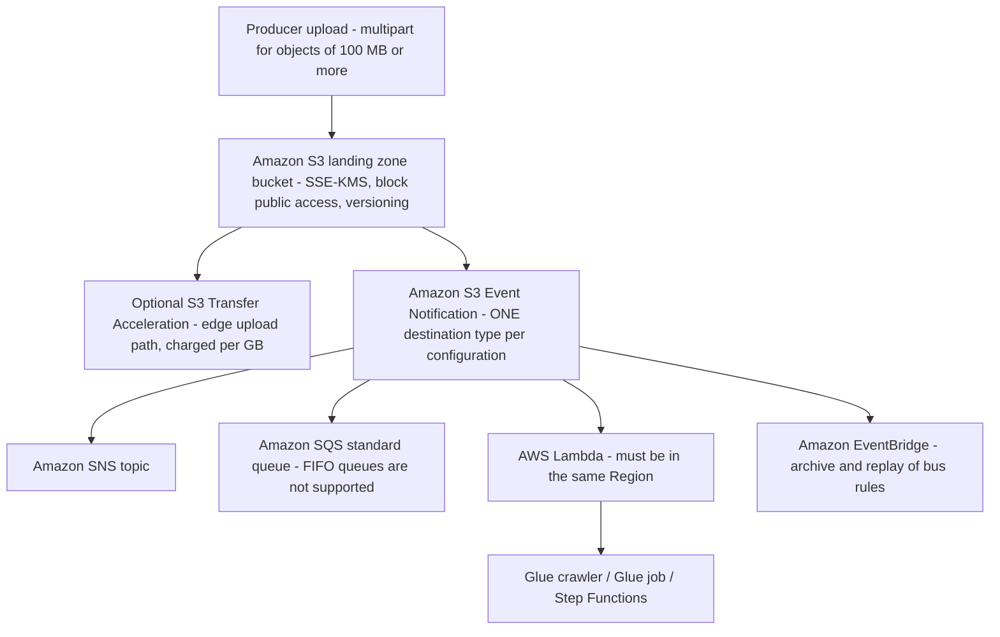
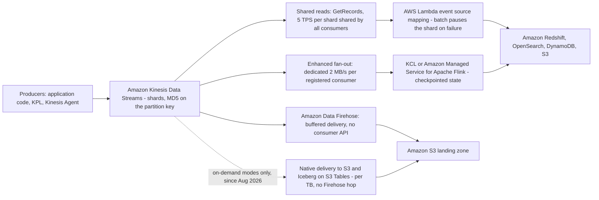
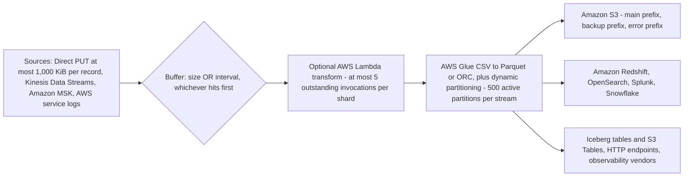
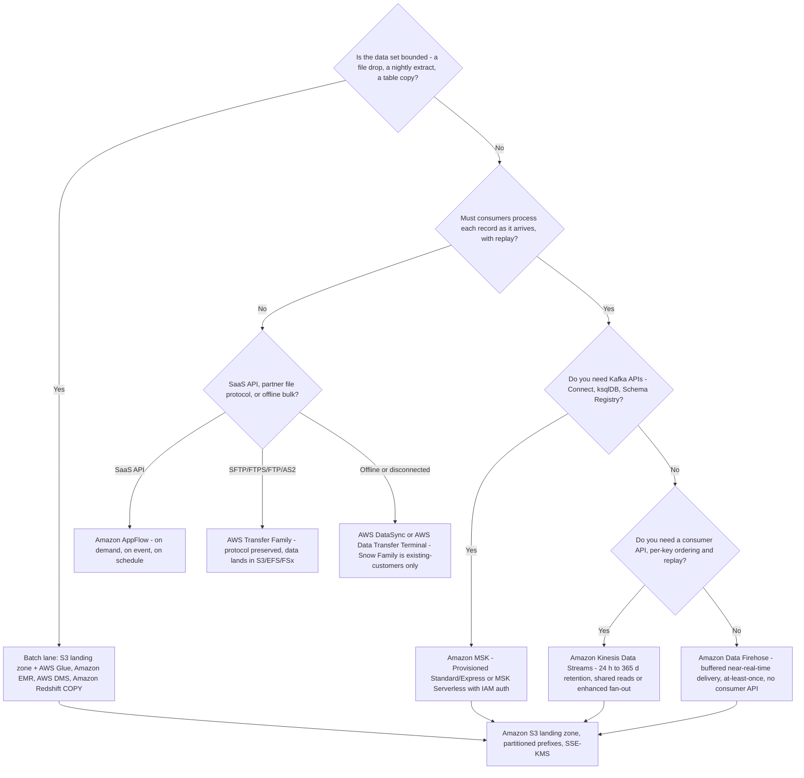
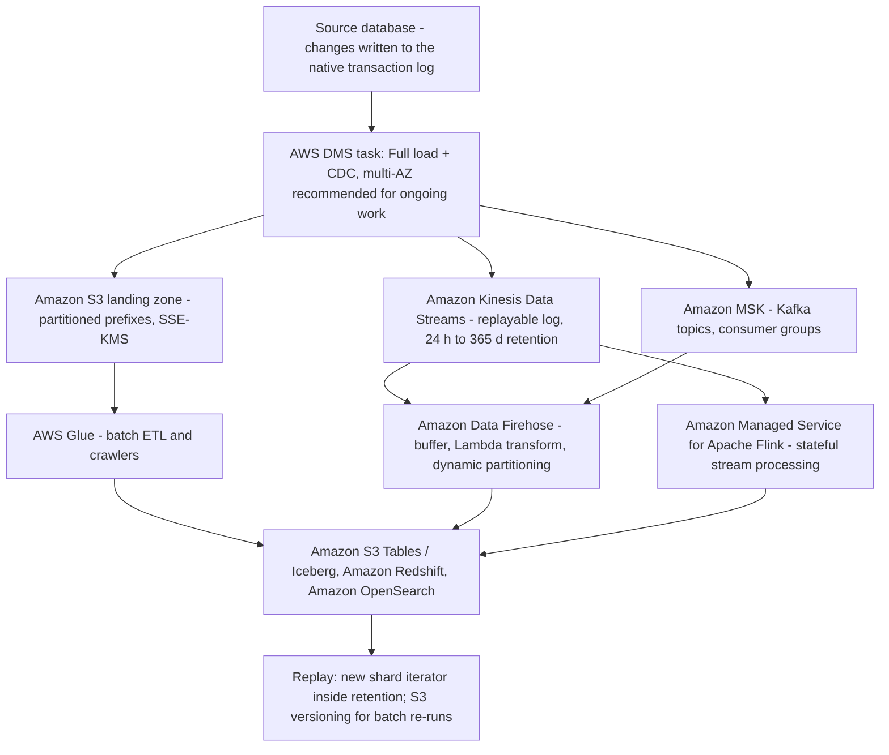

# Data Ingestion: Batch and Streaming Patterns

Domain 1 of DEA-C01 carries **34% of scored content**, and its first task — **1.1, ingestion** — is where most candidates lose easy marks. The reason is that ingestion questions almost never ask "what is a stream". They ask you to *choose*: batch or streaming, full load or CDC, `PutRecord` or `PutRecords`, shared reads or enhanced fan-out, Firehose or Kinesis Data Streams, Transfer Family or DataSync, Snowball Edge or something else entirely. Every one of those choices has exactly one answer that fits the stated requirement — and three that sound right.

```text
 =====================================================================
  DEA-C01 DOMAIN 1 — INGESTION AND TRANSFORMATION (task 1.1 scope)
 ---------------------------------------------------------------------
  1.1.1  Read data from streaming sources
         (Kinesis, MSK, DynamoDB Streams, DMS, Glue, Redshift)
  1.1.2  Read data from batch sources
         (S3, Glue, EMR, DMS, Redshift, Lambda, AppFlow)
  1.1.3  Identify configuration options for batch ingestion
  1.1.4  Consume data through data APIs
  1.1.5  Select job and crawler schedulers (EventBridge, Apache
         Airflow, time-based)
  1.1.6  Select event triggers (S3 Event Notifications, EventBridge)
  1.1.7  Call a Lambda function from a Kinesis stream
  1.1.8  Apply IP allowlists
  1.1.9  Handle throttling and rate limits (DynamoDB, RDS, Kinesis)
  1.1.10 Apply fan-in and fan-out patterns
  1.1.11 Describe replayability of data ingestion pipelines
  1.1.12 Apply stateful and stateless data transactions
 =====================================================================
  Source: official DEA-C01 exam guide, Domain 1 Task 1.1,
  accessed October 2026.
 =====================================================================
```

In this lesson you will:

- separate **batch from streaming** with the four-question decision every Task 1.1 stem hides;
- design an **S3 landing zone**: prefixes, SSE-KMS, multipart rules and the four event-trigger destinations;
- run **AWS DMS** correctly — full load, full load + CDC, CDC only — and size the replication instance;
- choose between **AppFlow, Transfer Family, the Snow Family and data APIs** for non-stream sources;
- model **Kinesis Data Streams**: shards, partition keys, MD5 placement, 24-hour to 365-day retention, ordering and at-least-once delivery;
- do **shard-count and throughput math** by hand, including hot-partition diagnosis and KPL aggregation;
- buffer near-real-time delivery with **Amazon Data Firehose** — size or interval, whichever hits first;
- stand up **Amazon MSK** (Standard, Express, Serverless) and pick the right authentication mode;
- apply the **Streams vs Firehose vs MSK decision matrix** and decision tree;
- trace **CDC patterns** end to end, and reason about **replayability, fan-in/fan-out and state**;
- study **four AWS customer case studies** — Hearst, AGCO, FINRA and Baqend;
- read the **October 2026 update box**, and practise with **14 exam-style questions** plus four interactive checks.

---

## 1. Batch or streaming? The Task 1.1 decision

### 1.1 Two lanes, one requirement

Everything in Domain 1 hangs off a single distinction. The exam states it through Task 1.1's split between *batch sources* (1.1.2) and *streaming sources* (1.1.1):

| Dimension | **Batch** | **Streaming** |
|---|---|---|
| Data set shape | **Bounded** — a file, an extract, a table snapshot | **Unbounded** — no end, arrives continuously |
| Unit of work | A discrete job that starts, runs, finishes | A continuous consumer that runs while data flows |
| Latency budget | Minutes to hours | Milliseconds to seconds (Firehose: near-real-time) |
| Named sources (exam guide) | S3, Glue, EMR, DMS, Redshift, Lambda, AppFlow | Kinesis, MSK, DynamoDB Streams, DMS, Glue, Redshift |
| Replay story | Re-run the job against the same objects | Re-read the log **inside the retention window** |
| Ordering | Whatever the job imposes (partition/pruning order) | **Per partition key**, inside a shard or partition |
| Failure handling | Retry the task; the data is still on disk | Retry the batch; the shard may pause and lag grows |
| Exam anchor | Task 1.1.2 + 1.1.3 | Task 1.1.1 + 1.1.11 |

> [!NOTE]
> **Both lanes list DMS, Glue and Redshift.** That is deliberate: AWS DMS *full load* is a batch read while DMS *CDC* is a stream read; a Glue job is batch while a Glue streaming job is not; Redshift `COPY` is batch while Redshift streaming ingestion is not. The exam tests whether you can name **which mode** of the same service a stem describes.

### 1.2 The four questions that settle every stem

1. **Is the data set bounded?** Yes → batch lane. No → streaming lane.
2. **Must a consumer process each record *as it arrives*?** Yes → a real stream with a consumer API (Kinesis Data Streams or MSK), not Firehose.
3. **Must a consumer be able to *replay*?** Yes → you need a durable log with retention (Kinesis **24–8,760 h**, or a Kafka topic). Firehose has no consumer API, so it offers no consumer-side replay.
4. **How many independent consumers read the same data?** Many, each with its own pace → fan-out design (shared reads, enhanced fan-out, or MSK consumer groups — never Firehose).

Worked pattern: a nightly customer-export job at 02:00 that writes one CSV to S3 is question 1 = **batch**; a clickstream pipeline where an analyst must replay yesterday's events is questions 1, 2 and 3 = **streaming**.

- **📚 Did you know?** Amazon Kinesis Data Streams launched in **2013** and AWS describes it as *the first cloud-native serverless streaming data service* (AWS Big Data Blog, "Amazon Kinesis Data Streams: Celebrating a Decade of Real-Time Data Innovation", 2023-11-14, accessed Oct 2026). That is why the exam's streaming vocabulary — shard, partition key, shard iterator — is Kinesis vocabulary first, and why Kafka-style "topic/partition/offset" vocabulary belongs to MSK.

---

## 2. The S3 landing zone: prefixes, multipart, triggers

### 2.1 Landing-zone hygiene

Almost every batch pipeline in Domain 1 starts at the same place: producers land raw data in **Amazon S3**, and everything downstream reads from there. The landing zone is examinable through Task 1.1.3 (configuration options for batch ingestion) and Task 1.1.6 (event triggers).

| Setting | Recommended pattern | Why it is examinable |
|---|---|---|
| Key layout | `source=<system>/year=YYYY/month=MM/day=DD/` | Partitioned prefixes let Athena/Glue/Redshift prune instead of scanning |
| Encryption | **SSE-KMS** with a customer-managed key | Task 1.1.3 configuration option; keys stay customer-controlled |
| Public access | **Block all public access** | Baseline S3 posture; a landing zone is never public |
| Versioning | Enabled | Versioning is what makes a **replay/reload** of a landing zone possible |
| Triggering | S3 Event Notifications → SNS / SQS / Lambda / EventBridge | Task 1.1.6 |



Rules the exam reuses: a single notification configuration supports **one destination type**; **SQS FIFO queues are not** supported as a destination; a **Lambda function must live in the same Region** as the bucket; a new trigger takes **about 5 minutes** to take effect and the service sends an `s3:TestEvent` you should handle.

> [!IMPORTANT]
> ⚠️ **Multipart upload and Transfer Acceleration are not free speed.** Multipart adds request charges per part, and Transfer Acceleration is billed per GB moved through the edge network (US/EU/Japan edges: **$0.04/GB in**; other edges: **$0.08/GB in**; **$0.04/GB out** — as of Oct 2026). Any option claiming "multipart upload makes large uploads free" is a distractor.

### 2.2 Worked example E1 — multipart part count

Published S3 multipart rules (as of Oct 2026): use multipart at **100 MB or more**; each part **5 MiB–5 GiB** (the last part is exempt from the minimum); **at most 10,000 parts**; maximum object size **48.8 TiB**; a single `PUT` can carry at most **5 GB**.

```text
Worked example E1 - multipart part count (arithmetic on published rules)
Object size ...... 75 GB = 76,800 MB
Single PUT limit . 5 GB  -> a single PUT cannot carry this object at all
Chosen part size . 512 MB (inside the 5 MiB - 5 GiB window)
Parts ............. ceil(76,800 / 512) = 150 parts
Quota check ...... 150 <= 10,000 parts                OK
Size check ....... 512 MB is inside 5 MiB - 5 GiB     OK
Multipart gate ... 75 GB >= 100 MB                    OK
Result ........... 150 parts uploaded in parallel, then one complete call
```

The examinable point is the *chain*: 5 GB single-PUT ceiling → multipart required → part-count ceiling → object ceiling. Miss one link and you pick the wrong part size.

- **📚 Did you know?** S3 **Transfer Acceleration** is documented to have cut average ingest time for 300 MB files to `ap-southeast-2` by **50%**, with an improvement of **over 500%** for 250 MB uploads sent as 50 MB parts to `us-east-1` (Amazon S3 FAQ, accessed Oct 2026). Those are AWS-published observations for specific Region pairs — never a guarantee for your workload.

---

## 3. AWS DMS: full load, full load + CDC, CDC only

### 3.1 Three task types, one service

AWS Database Migration Service is the exam's default answer for **database-to-database and database-to-stream/file** movement, and Task 1.1.1 explicitly names DMS as a *streaming source*. Its documentation defines exactly three task types:

| Task type | What moves | What it is for |
|---|---|---|
| **Full load** | Existing data only, one snapshot pass | One-off migration or a bulk landing into S3 |
| **Full load + CDC** | Existing data **and** changes captured *while* the load runs | The default for "move it and keep it in sync" |
| **CDC only** | Transaction-log changes from a chosen start point | Catching up after a load, or a long-lived replication |

CDC is **log-based**: DMS reads the source's native transaction log through its log API. It is not a diff job, and it is not a snapshot — a stem that describes "polling the table every night for changed rows" is describing a batch reconciliation, not CDC.

### 3.2 The full load + CDC timeline

```text
Phase 1  CAPTURE ....... CDC starts immediately; changes are cached
                        (memory first, then disk spill on the replication instance)
Phase 2  FULL LOAD ..... up to 8 tables load in parallel
                        (MaxFullLoadSubTasks, default 8, maximum 8)
Phase 3  APPLY ......... each table applies its cached changes as soon as
                        that table finishes loading, per table
Phase 4  STEADY STATE .. changes stream continuously; watch
                        CDCLatencySource / CDCLatencyTarget
```

Task start points for CDC are: a **custom CDC time** (SCR/SCN or timestamp — requires `openTransactionWindow`), the **native** log position, or a **checkpoint** stored in `awsdms_txn_state`.

### 3.3 Sizing, apply mode and topology

| Lever | Rule (as of Oct 2026) |
|---|---|
| Instance family | Full load + CDC is usually **memory-bound** → `dms.r5` / `dms.r6i` / `dms.r7i`; many parallel tasks are CPU-bound → `dms.c5` |
| Storage | **50 GB or 100 GB** GP2 (bursts to 3,000 IOPS) — disk is for the CDC cache spill |
| Parallel tables | **8** by default (`MaxFullLoadSubTasks`), and 8 is also the stated maximum |
| Apply mode | **Transactional** (default; preserves referential integrity, slower) vs **batch** (faster, requires a primary key) |
| Topology | **Multi-AZ is recommended for ongoing replication** |
| Serverless first init | Up to **40 minutes** (AWS DMS docs, accessed Oct 2026) |

**Heterogeneous migrations** (Oracle → Aurora PostgreSQL, for example) are a two-step answer: **convert the schema and code first, then move the data**. The conversion tool is now **DMS Schema Conversion**, built on the engine of the former AWS Schema Conversion Tool — AWS SCT was **removed from the DEA-C01 in-scope list at exam-guide v1.1 (2025-12-12)**.

```dragdrop
{
  "question": "Order the three AWS DMS task types from the one that moves EXISTING data only, to the one that moves CHANGES only:",
  "items": [
    "Full load - existing rows only, one pass, no log capture",
    "Full load + CDC - log capture starts immediately and is applied per table as each table finishes loading",
    "CDC only - transaction-log changes from a chosen start point (custom time, native position or checkpoint)"
  ],
  "correctOrder": [
    "Full load - existing rows only, one pass, no log capture",
    "Full load + CDC - log capture starts immediately and is applied per table as each table finishes loading",
    "CDC only - transaction-log changes from a chosen start point (custom time, native position or checkpoint)"
  ],
  "explanation": "The three task types are a superset relationship, not three unrelated modes: full load moves history, CDC moves change, and full load + CDC starts CDC first (Phase 1 capture), runs the parallel load (Phase 2), applies each table's cached changes on that table's completion (Phase 3), then settles into steady state (Phase 4). 'Full load + CDC' is the correct answer to any stem that says move it AND keep it in sync; 'CDC only' is correct when the data has already been loaded and you only need the log from a start point."
}
```

> [!WARNING]
> ⚠️ **DMS CDC is not real time.** AWS's own documentation states that DMS "**does not provide real-time replication**" and that there are "**no SLAs for CDC latency**" (AWS DMS User Guide, accessed Oct 2026). A stem asking for *sub-second* replication latency is not a DMS stem — it points at native logical replication, Kinesis Data Streams or MSK.

- **📚 Did you know?** DMS applies changes through a **sorter that preserves the source's commit order** on the target, which is why large multi-table CDC streams can still race ahead of the full load and must be cached on the replication instance's disk (AWS DMS User Guide, accessed Oct 2026). That is also why storage is a 50/100 GB choice rather than a "small default" — it is the spill area for that cache.

---

## 4. Managed ingestion lanes: AppFlow, Transfer Family, Snow Family, data APIs

Not every source is a database or a stream. Task 1.1 also names SaaS APIs (1.1.2), data APIs (1.1.4), event triggers (1.1.6) and throttling (1.1.9).

### 4.1 Amazon AppFlow — SaaS into S3 on demand, on event, on schedule

| Trigger | When it fires | Constraint |
|---|---|---|
| **Run on demand** | You call it | Simplest; no cadence |
| **Run on event** | The SaaS publishes change events | Only where the source publishes them — Salesforce needs **CDC enabled** on the connection |
| **Run on schedule** | Full or incremental extract | Incremental needs a **timestamp field** plus an **offset** to tolerate clock skew |

Cadence is capped by the *vendor's* API quota, not by AWS: Salesforce, ServiceNow and Zendesk at **1 run/minute**, Marketo at **1/hour**, Google Analytics at **1/day**; the account is limited to **1 scheduled run per minute** in total (as of Oct 2026). Other published quotas: **100 GB per flow run**, **1,000 flows**, **10 million runs/month**, maximum run duration **48 hours**, **100 connector profiles per account** — and every call consumes the *vendor's* API quota. Destinations: S3 (the usual landing zone), Redshift, Snowflake, Salesforce, Slack, with **PrivateLink** where supported.

### 4.2 AWS Transfer Family — protocol-preserving partner ingestion

Transfer Family gives partners **SFTP, FTPS, FTP and AS2** endpoints backed by **Amazon S3, EFS or FSx**, so the partner changes nothing. Authentication is service-managed, **Active Directory**, or a **custom API** (your identity provider).

| Quota (as of Oct 2026) | Value |
|---|---|
| Concurrent sessions per server | **10,000** |
| Servers per account | **50** |
| Multiplexed SFTP sessions per connection | **10** |
| Idle timeout | **1,800 seconds** |
| SFTP connector (outbound pull) per account | **100** |
| Connector maximum file size | **150 GiB** |
| Connector throughput per account | **50 MBps**, at most **5 parallel transfers** |

The three-way exam split is fixed: **Transfer Family = protocol-preserving ingest** (partner keeps using SFTP), **AWS DataSync = online bulk copy** between on-premises file systems and S3/EFS/FSx, **Snow Family = offline physical transfer**.

### 4.3 Snow Family — check the calendar before you choose it

| Date | Event (as of Oct 2026) |
|---|---|
| **2024-11-12** | Snowcone and three previous-generation Snowball models **discontinued** |
| Current devices | **Snowball Edge Storage Optimized 210 TB**; **Snowball Edge Compute Optimized** (104 vCPUs, 416 GB RAM, 28 TB NVMe) |
| **2025-11-07** | Devices are available to **existing customers only**; new customers are directed to **AWS DataSync, AWS Data Transfer Terminal or partners**, and edge-compute needs to **Outposts** |
| **2026-12-31** | **End of support** for Snow Family devices in commercial Regions |

### 4.4 Consuming data APIs (Task 1.1.4, 1.1.9)

| Style | Pattern | Services |
|---|---|---|
| **Pull** | Paginate + exponential backoff with **jitter**, on a schedule or as a step | AWS Glue, Lambda, AWS Batch, Step Functions |
| **Push** | The API calls you | API Gateway → Lambda / SQS / Kinesis; **EventBridge API Destinations** |
| **Managed SaaS** | Do not hand-roll OAuth and pagination | **Amazon AppFlow** |

Throttling responses you must recognise by name: HTTP **429**, and DynamoDB's `ProvisionedThroughputExceededException`. Handle them with backoff, not with bigger limits — AWS's own guidance is "**do not use resource-level limits and quotas as a way to control your usage**" (Kinesis Data Firehose quotas, accessed Oct 2026).

| Choose | When the stem says |
|---|---|
| **Amazon AppFlow** | "Salesforce/ServiceNow/Zendesk data into S3, no code" |
| **AWS Transfer Family** | "Partners must keep using SFTP/FTPS/FTP/AS2" |
| **AWS DataSync** | "Copy 40 TB from an NFS filer to S3 over the network" |
| **Snow Family** | "No usable network, existing AWS customer, tens of TB" |
| **Scheduled pull (Glue/Lambda/Batch)** | "Paginated REST API with rate limits" |

---

## 5. Amazon Kinesis Data Streams: shards, partition keys, retention

### 5.1 The shard is the unit of everything

A **shard** is the throughput contract, the ordering boundary and the price unit of a stream. Every limit below is **as of Oct 2026**:

| Property | Per shard |
|---|---|
| Write throughput | **1 MB/s and 1,000 records/s** (both ceilings apply) |
| Read throughput | **2 MB/s and 2,000 records/s** |
| Shared-read TPS | **5 `GetRecords` TPS per shard, shared** by all consumers |
| `PutRecord` rate | **1,000 TPS per shard** |
| `PutRecords` per request | up to **500 records and 10 MiB** |
| Record payload | **1 MiB** by default; **10 MiB opt-in per stream** |
| Retention | default **24 hours**, extendable to **8,760 hours (365 days)** |
| Price | **$0.015 per shard-hour** ($0.36/shard/day); enhanced fan-out **$0.015 per consumer-shard-hour** |

Extended retention is what turns a stream into a **replay window** (Task 1.1.11): replaying means opening a **new shard iterator** at an earlier sequence number — a new *read*, not a re-write of the log.

### 5.2 Partition key → MD5 → shard

```text
producer record
  └─ partition key (string you choose, e.g. customer_id or device_id)
        └─ MD5(partition key)  ->  selects ONE shard deterministically
              └─ shard  ->  sequence numbers increase only within that shard
```

Three consequences the exam tests relentlessly:

- **Order is per partition key, never global.** Records with the same key are ordered; records with different keys interleave across shards.
- **A hot key is a hot shard.** 40,000 records/s spread over 20 shards is fine; 1,500 records/s on one key throttles at 1,000 records/s no matter how many shards you add.
- **Keys should outnumber shards widely.** Even distribution needs many more distinct keys than shards.

### 5.3 Produce and consume paths

| Produce API | Semantics |
|---|---|
| `PutRecord` | Uses `SequenceNumberForOrdering` — the strict-order choice for one key |
| `PutRecords` | Batches up to **500 records / 10 MiB**; per-record failures; AWS states it "**doesn't guarantee the ordering of records**" |
| **Kinesis Producer Library (KPL)** | Aggregates many user records into one Kinesis record; consumers must de-aggregate |
| **Kinesis Agent** | Runs on the host, tails files, batches to the stream |

| Consume path | Semantics |
|---|---|
| **Shared reads** (`GetRecords`) | Default; **5 TPS per shard total**, shared by every consumer |
| **Enhanced fan-out (EFO)** | Opt-in; each registered consumer gets a **dedicated 2 MB/s** read throughput; **20 consumers/stream** (Provisioned and On-demand Standard), **50** (On-demand Advantage) |
| **Lambda event source mapping** | At-least-once; a **failed batch pauses that shard** until it succeeds, so lag shows as `IteratorAge`, not reordering |
| **KCL / Managed Service for Apache Flink** | Checkpointed, stateful processing |



### 5.4 Capacity modes

| Mode | Billing shape | Use when |
|---|---|---|
| **Provisioned** | Per shard-hour; you **split and merge** shards | Predictable, steady throughput you can size |
| **On-demand Standard** | Per GB ingested plus a per-stream hourly fee | Unknown or spiky volume you cannot size in advance |
| **On-demand Advantage** | Account-level, per GB, **no per-stream hourly fee**, with an account-wide floor (see the update box) | Many streams or high aggregate ingest |

A new on-demand stream starts at **4 MB/s write and 8 MB/s read** (Kinesis sizing guidance, as of Oct 2026), and capacity-mode switches are limited to **2 per stream per 24 hours**, so "flip modes when traffic changes" is not a per-minute tactic.

- **📚 Did you know?** Since **28 August 2026** a Kinesis stream can deliver **natively** — without Amazon Data Firehose — into **Iceberg tables on Amazon S3 Tables** and, since **29 August 2026**, into **general-purpose S3 buckets**, in on-demand capacity modes only (AWS What's New, 2026-08-28 and 2026-08-29). Published us-east-1 delivery prices are **$14/TB** to S3 Tables and **$11/TB** to S3 (AWS Big Data Blog, 2026-08-31, as of Oct 2026). Firehose is no longer the only stream-to-S3 path — but it still owns transforms, format conversion and dynamic partitioning.

---

## 6. Worked math: shard counts, throughput and cost

The sizing formula for a provisioned stream (AWS Kinesis sizing guidance, as of Oct 2026):

```text
shards = max( ceil(bytes_per_second / 1 MB),
              ceil(records_per_second / 1,000) )
plus a read term: ceil(outgoing_read_KiB_per_second / 2,048)
```

You must evaluate **both** terms and take the maximum — stems are written so that one term dominates and the other misleads.

### 6.1 Worked example E2 — records-bound

```text
Worked example E2 - records-bound shard count
Input: 12,000 records/s x 300 bytes = 3,600,000 B/s = 3.6 MB/s
By records: ceil(12,000 / 1,000) = 12 shards
By bytes:   ceil(3.6 / 1)         =  4 shards
Shards = max(12, 4) = 12
Cost: 12 x $0.015/h x 24 h        = $4.32 per day  (as of Oct 2026)
      12 x $0.015/h x 24 h x 31 d = $133.92 per 31-day month
Read headroom: 12 x 2 MB/s = 24 MB/s and 12 x 2,000 = 24,000 records/s
```

### 6.2 Worked example E3 — bytes-bound

```text
Worked example E3 - bytes-bound shard count
Input: 8,000 records/s x 1.5 KB = 12,000 KB/s = 12 MB/s
By records: ceil(8,000 / 1,000) = 8 shards
By bytes:   ceil(12 / 1)         = 12 shards
Shards = max(8, 12) = 12   <- the BYTE term dominates here
```

Same answer as E2 for the opposite reason. That coincidence is the trap: check which term dominated before you trust your arithmetic.

### 6.3 Worked example E4 — small records and KPL aggregation

```text
Worked example E4 - why the KPL changes the answer
Naive: 500 records/s x 100 bytes = 50 KB/s
       by records: ceil(500 / 1,000) = 1   by bytes: ceil(0.05 / 1) = 1  -> 1 shard
But the 1,000 records/s ceiling counts KINESIS RECORDS, not user records.
With the KPL aggregating 10 user records into 1 Kinesis record:
       Kinesis records/s = 500 / 10 = 50      (far below 1,000)
       payload/s         = 50 KB               (far below 1 MB)
Practical ceiling on that one shard ~ 10 x 1,000 = 10,000 user records/s,
still bounded by 1 MB/s, while API request rate falls proportionally.
The consumer must DE-AGGREGATE the KPL collection format.
```

### 6.4 Worked example E5 — the hot partition

```text
Worked example E5 - hot partition diagnosis
Stream total: 40,000 records/s across many keys -> plenty of shards provisioned.
Hot key:      partition key "sensor-42" alone emits 1,500 records/s.
Placement:    MD5("sensor-42") always selects the SAME shard.
Ceiling:      that shard throttles at 1,000 records/s - independent of
              how many shards exist in the stream.
Symptoms:     write throttling reported for ONE key while every
              other key is unaffected.
Fix:          two-level key ("sensor-42#0" .. "sensor-42#7"), salting, or a
              different key design so one logical entity spreads across shards.
```

Chart the two worked terms side by side and the "take the maximum" rule stops being abstract — E2 and E3 both land on **12 shards**, but from opposite terms:

```plot
{
  "type": "bar",
  "title": "Shards required by each sizing term (worked examples E2 and E3, as of Oct 2026)",
  "xLabel": "Sizing term",
  "yLabel": "Shards required",
  "xKey": "term",
  "data": [
    {"term": "E2 records: 12,000 / 1,000", "shards": 12},
    {"term": "E2 bytes: 3.6 MB / 1 MB", "shards": 4},
    {"term": "E3 records: 8,000 / 1,000", "shards": 8},
    {"term": "E3 bytes: 12 MB / 1 MB", "shards": 12}
  ]
}
```

> [!NOTE]
> **Shard quotas are a Service Quotas lookup, not a memorised number.** AWS publishes different shard ceilings for `us-east-1` / `us-west-2` / `eu-west-1` than for other Regions, and the wording differs between the quotas page and the FAQ (checked Oct 2026). Exam-safe answer: "check **Service Quotas** for the Region and stream", never a hard-coded figure. `UpdateShardCount` in Provisioned mode is capped at **10,000 shards per call** (as of Oct 2026).

---

## 7. Amazon Data Firehose: buffers, destinations, near-real-time

### 7.1 A delivery service, not a stream

Amazon Data Firehose has **no shards and no consumer API**. You write records in (Direct PUT, or from Kinesis Data Streams, Amazon MSK, or AWS service logs such as CloudTrail, WAF and VPC flow logs), and Firehose **delivers** them to a destination — buffered, optionally transformed, automatically retried.

| Property | Value (as of Oct 2026) |
|---|---|
| Record size | maximum **1,000 KiB**; `PutRecordBatch` up to **500 records or 4 MiB** |
| Direct PUT throughput | `us-east-1`/`us-west-2`/`eu-west-1`: **500k records/s, 2,000 requests/s, 5 MiB/s**; other Regions **100k / 1,000 / 1 MiB/s** — and AWS **auto-raises** it |
| Buffering | **size or interval, whichever hits first** |
| Buffer size (S3) | **1–128 MB**, default **5 MB**; **64–128 MB with a default of 128 MB** when Parquet conversion or dynamic partitioning is on |
| Buffer interval | API/FAQ range **0–900 seconds**, default **300 seconds**; the quota page lists **60–900 seconds**; Splunk **0–60** (default 60) |
| Claimed latency | "**within 60 seconds**" |
| Semantics | **at-least-once** |
| Dynamic partitioning | **500 active partitions per stream** (raisable to **2,500**), at most **1 GB/s per active partition** |
| Lambda transform | at most **5 outstanding invocations per shard** (10 for Splunk) |



### 7.2 Worked example E6 — which buffer condition fires first

```text
Worked example E6 - buffer race (rules as of Oct 2026)
Ingest rate: 750 KB/s.  Rule: size OR interval, WHICHEVER HITS FIRST.

Case A - default S3 buffer size 5 MB, interval 60 s
  time to fill 5 MB = 5,000 KB / 750 KB/s = 6.7 s
  6.7 s < 60 s  ->  SIZE fires first
  delivered object ~ 5 MB every ~6.7 s

Case B - Parquet / dynamic partitioning, buffer size 64 MB, interval 60 s
  time to fill 64 MB = 65,536 KB / 750 KB/s = 87.4 s
  87.4 s > 60 s  ->  INTERVAL fires first
  delivered object = 60 s x 750 KB/s = 45,000 KB = ~44 MB

Lesson: never reason about "the bigger limit". Race the two clocks.
```

### 7.3 Retries, and what "replay" means here

| Path | Retry behaviour (as of Oct 2026) |
|---|---|
| Direct PUT → S3 | every **5 s** for up to **24 hours**, then records are **discarded** |
| Kinesis-sourced | retries follow the **source stream's retention** |
| → Redshift | every **5 minutes** for up to **120 minutes**, then the record is skipped and written to a **manifest** |
| → OpenSearch | **0–7,200 seconds** backoff |
| All paths | **at-least-once** — downstream must be idempotent |

Because there is **no consumer API**, there is **no consumer-side replay**: your only recovery artefacts are the S3 **backup** prefix and the **error** prefix. Need replay? Read from Kinesis Data Streams directly.

```fillblank
{
  "question": "Complete the buffering and throughput statements with the published numbers (all as of October 2026):",
  "template": "Kinesis Data Streams: each shard accepts {{1}} MB/s and {{2}} records per second of writes, serves {{3}} MB/s of reads, and retains data for {{4}} hours by default - extendable to {{5}} hours for replay. Amazon Data Firehose buffers on size OR interval, whichever hits first: the S3 size range is {{6}} to {{7}} MB, and the default interval is {{8}} seconds.",
  "answers": {
    "1": "1",
    "2": "1000",
    "3": "2",
    "4": "24",
    "5": "8760",
    "6": "1",
    "7": "128",
    "8": "300"
  },
  "distractors": ["500", "10", "4", "1024", "48", "720", "60", "900", "5", "120"],
  "explanation": "Shard write 1 MB/s and 1,000 records/s, shard read 2 MB/s, retention 24 h default and up to 8,760 h (365 days) - Kinesis Data Streams docs, as of Oct 2026. Firehose buffers on size OR interval: S3 buffer size 1-128 MB (default 5 MB, 64-128 MB with default 128 for Parquet/dynamic partitioning) and interval default 300 s. The distractors mix the two services: 500 is the PutRecords record cap, 1,000 KiB is the Firehose record cap, 60 s is the Splunk buffer default and 900 s is the interval maximum."
}
```

- **📚 Did you know?** The product was renamed **Amazon Data Firehose** on **9 February 2024**, and AWS states the rename changed **nothing** about endpoints, APIs, CLI commands, IAM policy names or CloudWatch metrics — IAM actions are still `firehose:*`. Meanwhile the **DEA-C01 in-scope list still prints "Amazon Kinesis Data Firehose"** (exam guide, accessed Oct 2026). Both names are correct; never "fix" an option that uses the older one.
- **📚 Did you know?** AWS does feature **NerdWallet** on its Amazon Data Firehose customer page — with a **Firehose → Lambda → SNS** architecture but **no published performance or cost numbers** (accessed Oct 2026). So any option that quotes "NerdWallet saved X%" or "NerdWallet ingests Y GB/day" is fabricated: a *named* customer on an AWS page does not automatically make a *number* examinable. Verified figures for this lesson's cases are Hearst's 30 TB/day, AGCO's −78%, FINRA's 6 TB/37 billion records and Baqend's sub-minute latency — each attributed to its own source.

---

## 8. Amazon MSK: brokers, MSK Serverless, IAM authentication

### 8.1 Three ways to run Kafka

Amazon MSK runs **Apache Kafka** — the broker/partition/topic model, plus the Kafka ecosystem (Kafka Connect, ksqlDB, Schema Registry).

| Flavor | What AWS manages | What you manage |
|---|---|---|
| **Provisioned — Standard** | Brokers, patching, multi-AZ | **EBS storage**, tiered-storage configuration |
| **Provisioned — Express** | Brokers **and storage** (Kafka 3.6+) | Nothing at the storage layer |
| **MSK Serverless** | The whole cluster abstraction | Topics, client code, security config |

MSK Serverless bills by **cluster-hour, partition-hour and GB I/O**, with published limits (as of Oct 2026) of **200/400 MBps per cluster**, **8 MiB per message**, **5/10 MBps per partition**, **2,400 non-compacted partitions** and **10 clusters per account**. AWS publishes a **99.9% SLA** for MSK, including MSK Serverless and MSK Connect.

### 8.2 Authentication — the highest-yield fact in this section

| Deployment | Supported authentication |
|---|---|
| **Provisioned** | **IAM (recommended)**, or mTLS + Kafka ACLs, or SASL/SCRAM + Kafka ACLs |
| **MSK Serverless** | **IAM access control is mandatory; Kafka ACLs are NOT supported** |

**Cluster policies** are what let an IAM principal in another account produce or consume — the cross-account mechanism for MSK. Private connectivity is available through **AWS PrivateLink**.

> [!IMPORTANT]
> ⚠️ **Do not put Kafka ACLs on an MSK Serverless cluster.** It is the single most common MSK distractor: "configure SASL/SCRAM with ACLs on the serverless cluster" is wrong on two counts. On **provisioned** clusters, ACLs work but require mTLS or SASL/SCRAM — if you choose IAM, ACLs are not your mechanism either.

### 8.3 MSK Connect and the rest of the toolkit

| Item | Limit / role (as of Oct 2026) |
|---|---|
| MSK Connect | up to **100 plugins**, **10 workers per connector**, **60 workers per account** |
| **MCU** | **1 MCU = 1 vCPU + 4 GB** — the unit for sizing connectors |
| MSK Replicator | Cross-Region / cross-account topic replication |
| Cluster policies | Cross-account IAM access |

- **📚 Did you know?** MSK expanded aggressively in 2026: **+3 Regions announced 2026-02-20**, **+13 Regions on 2026-04-21**, and China on **2026-07-08** (AWS What's New, accessed Oct 2026). On **30 July 2026** MSK added streaming tables that materialize Kafka topics into **Apache Iceberg** — the same move Kinesis made in August 2026. Regional availability is a live fact: always re-check before you memorise a Region count.

---

## 9. Streams vs Firehose vs MSK: the decision matrix

### 9.1 The official comparison, compressed

AWS publishes head-to-head compare pages; this is their "Best for" column distilled (accessed Oct 2026):

| Your requirement | Pick |
|---|---|
| Durable replayable log, **custom consumers** (KCL, Lambda, Flink), **per-key order**, retention **24 h → 365 d** | **Amazon Kinesis Data Streams** |
| Stream → S3 / Redshift / OpenSearch / Splunk / Snowflake with **no consumer code**, batching, compression, Parquet, dynamic partitioning | **Amazon Data Firehose** |
| **Kafka APIs and ecosystem** (Connect, ksqlDB, Schema Registry), broker/topic model | **Amazon MSK** (Serverless to avoid sizing brokers) |
| **Sub-second fan-out** to many independent consumers | Kinesis **enhanced fan-out** or MSK **consumer groups** — **not** Firehose |
| Stream straight to **S3 or Iceberg** with no transforms, in an on-demand Kinesis mode | **Kinesis native delivery** (since Aug 2026), Firehose otherwise |



```matching
{
  "question": "Match each ingestion requirement to the single AWS service that satisfies it:",
  "pairs": [
    {"left": "Partners must keep dropping files over SFTP with zero change on their side", "right": "AWS Transfer Family - managed SFTP/FTPS/FTP/AS2 backed by Amazon S3, EFS or FSx"},
    {"left": "Salesforce records must land in Amazon S3 on a schedule and on change events", "right": "Amazon AppFlow - run on demand, on event or on schedule, cadence capped by the vendor API quota"},
    {"left": "A 2 TB on-premises Oracle database must move to Aurora PostgreSQL and stay in sync", "right": "AWS DMS - DMS Schema Conversion first for the engine change, then a full load + CDC task"},
    {"left": "Per-record, millisecond processing with replay inside a retention window", "right": "Amazon Kinesis Data Streams consumed by Lambda, KCL or Managed Service for Apache Flink"},
    {"left": "Stream into S3, Redshift and Splunk with no consumer code to write", "right": "Amazon Data Firehose - size-or-interval buffering, transform, format conversion, dynamic partitioning"},
    {"left": "Kafka Connect, ksqlDB and a Schema Registry must run unchanged", "right": "Amazon MSK - Provisioned or MSK Serverless, IAM access control on Serverless (ACLs unsupported)"}
  ],
  "explanation": "Each stem names a constraint, not a service: protocol preservation -> Transfer Family; SaaS API with events -> AppFlow; heterogeneous database with sync -> DMS (convert, then migrate); per-record processing with replay -> Kinesis Data Streams; no consumer code -> Firehose; Kafka ecosystem -> MSK. Two traps are baked in - Firehose has no consumer API so it cannot satisfy 'per-record processing with replay', and MSK Serverless rejects Kafka ACLs, so a 'configure ACLs' clause would invalidate it."
}
```

---

## 10. CDC patterns end to end

Change data capture is the seam between the batch and streaming lanes, which is why DMS appears under **both** Task 1.1.1 and Task 1.1.2. The examinable patterns:

| Pattern | Shape | When |
|---|---|---|
| **Database → warehouse sync** | DMS **full load + CDC** → S3 → Redshift `COPY`, or DMS → Redshift directly | Migration with ongoing replication |
| **Database → stream** | DMS **CDC only** → Kinesis Data Streams / MSK → Lambda/Flink | Multiple consumers need the change feed |
| **Kafka-native CDC** | Debezium-style connector running on **MSK Connect** | You already run MSK and want Kafka semantics |
| **Lakehouse CDC** | DMS CDC → Glue job → an open table format such as Apache Iceberg | Analytics on a lakehouse table format |
| ~~Firehose database source~~ | **Not available** — the database-as-a-source preview was removed on **2025-09-24** | Do not design on it; the Firehose *service* is not deprecated |



Design rules that show up as distractors:

- **CDC reads the transaction log**, so the source needs backups plus roughly **24 hours** of log retention — a source whose logs have been truncated cannot start CDC.
- **DMS CDC is asynchronous and has no latency SLA** — never "real time".
- **Do not build on the withdrawn Firehose database-source preview** (removed 2025-09-24); use DMS or a Kafka-native connector.
- **Cross-account** change movement: a Kinesis **resource-based policy** shares a stream (or an enhanced fan-out consumer) with no data copy; MSK uses **cluster policies**; DMS → S3 uses an IAM role trusted by `dms.amazonaws.com` plus a bucket policy.
- **Cross-region** options: S3 **cross-Region replication** (Replication Time Control gives a **15-minute SLA**), **MSK Replicator**, or run DMS near the source and replicate the target.

---

## 11. Replayability, fan-in/fan-out and state (Tasks 1.1.10 – 1.1.12)

| Guarantee | Kinesis Data Streams | Amazon Data Firehose | Amazon MSK / Kafka |
|---|---|---|---|
| Delivery | **At-least-once** | **At-least-once** | At-least-once by default; **exactly-once** with an idempotent producer + transactions + `isolation.level=read_committed` |
| Ordering | Within a shard ⇒ within a **partition key** | Within a delivery stream | Within a **partition** |
| Replay | Yes — new shard iterator, inside **24 h–365 d** retention | **No consumer API** ⇒ only S3 backup/error prefixes | Yes — re-read offsets inside topic retention |
| Fan-out | Shared reads (5 TPS/shard) or **enhanced fan-out** (dedicated 2 MB/s) | Single delivery pipeline | **Consumer groups** |
| Cross-account | **Resource-based policies** | Delivery role | **Cluster policies** |

**Fan-in** is a partition-key design problem: many producers, one stream, keys spread across shards. **Fan-out** is a read-path problem: one stream, many independent consumers at different speeds — and the answer is never Firehose.

**Stateful vs stateless** (Task 1.1.12): stateless means each record is independent and idempotent; stateful means results are **checkpointed** — KCL checkpoints, Lambda tumbling windows, Flink windows. A Lambda event source mapping retries a failed batch until it succeeds and **pauses the affected shard** meanwhile: ordering is preserved, and lag appears as rising `IteratorAge` (`ParallelizationFactor` 1–10 keeps ordering per key when you raise it).

---

### 2026 Updates (as of October 2026)

> [!NOTE]
> **What changed in the ingestion stack between 2025 and October 2026** — each line is sourced and dated; the exam tests the *current* behaviour:
> - **Exam guide v1.1 (2025-12-12)** consolidated knowledge/skills into one skill list, added **8 skills** and moved the in-scope list **+6 / −3**: Aurora, Amazon Q, Bedrock, Kendra, Data Exchange and **S3 Tables** were added; **AWS SCT, Cloud9 and CodeCommit** were removed. If a question names SCT, the current tool is **DMS Schema Conversion** (DEA-C01 revisions page, accessed Oct 2026).
> - **Kinesis Data Streams now has three capacity modes.** **On-demand Advantage** went GA on **2025-11-04**: **$0.032/GB** ingested + **$0.016/GB** retrieved, **no per-stream hourly charge**, an account-wide floor of **25 MB/s ingest + 25 MB/s retrieval**, and bursts up to **10 GB/s or 10 million events/s**. Extended retention dropped to **$0.023/GB-month** (previously $0.10) (AWS What's New 2025-11-04, as of Oct 2026). The floor means Advantage is *not* automatically cheaper at low volume — compare against Provisioned and On-demand Standard.
> - **Kinesis can deliver to S3 without Firehose.** Streaming tables to **Iceberg on S3 Tables** arrived **2026-08-28** (**$14/TB** in us-east-1) and **general-purpose S3 delivery** on **2026-08-29** (**$11/TB**), both **on-demand modes only**, with AWS claiming up to **50% lower delivery cost** and up to **30% lower query cost**; MSK followed with Iceberg streaming tables on **2026-07-30** (AWS What's New and Big Data Blog, as of Oct 2026).
> - **Record size moved, shard semantics did not.** The per-record ceiling went from **1 MiB to 10 MiB opt-in per stream** on **2025-10-28**, and `PutRecords` total request size to **10 MiB** — while **1 MB/s and 1,000 records/s per shard are unchanged**. "Records are now 10 MB by default" is a stale-fact distractor (as of Oct 2026).
> - **Stale-fact warning — two names, two buffer claims.** The product is **Amazon Data Firehose** since **2024-02-09** (APIs untouched), yet the DEA in-scope list still prints **Amazon Kinesis Data Firehose**; and the buffer-interval range is quoted as **60–900 s** on the quota page but **0–900 s** (default **300 s**) in the API reference and FAQ. Exam-safe phrasing: Firehose *batches* — near-real-time, never record-at-a-time (checked Oct 2026).
> - **MSK regional expansion:** **+3 Regions (2026-02-20)**, **+13 Regions (2026-04-21)**, China **(2026-07-08)** — verify current availability rather than memorising a count (AWS What's New, accessed Oct 2026).
> - **Kinesis shard ceilings went up; the shard contract did not.** The default maximum shards per account rose from **500 to 20,000** in `us-east-1`, `us-west-2` and `eu-west-1` on **2025-04-21**, while capacity-mode switches remain capped at **2 per stream per 24 hours** and **1 MB/s + 1,000 records/s per shard** is untouched (AWS What's New 2025-04-21 and Kinesis sizing docs, as of Oct 2026). "You cannot exceed 500 shards" is now a stale distractor — but `UpdateShardCount` is still limited to **10,000 shards per call** in Provisioned mode.
> - **Kinesis Data Analytics for SQL streams is gone.** The SQL-variant streaming application was discontinued **2026-01-27**; the current answer for stream analytics is **Amazon Managed Service for Apache Flink** (renamed from Kinesis Data Analytics **2023-08-30**, API unchanged). A stem offering to "create a Kinesis Data Analytics SQL application" names a retired product (AWS Kinesis Data Analytics features page, accessed Oct 2026).
> - **MSK now publishes an all-in ingest price.** AWS states MSK customers "typically pay between **$0.05 and $0.07 per GB ingested, all-in**" (Amazon MSK pricing and features pages, accessed Oct 2026) — on top of cluster-hour/partition-hour billing for provisioned clusters and cluster-hour + partition-hour + GB I/O for MSK Serverless. "MSK is priced per broker-hour only" is stale.

---

## Real-World Case Studies

AWS publishes what these patterns look like in production. Every figure below is **customer- or AWS-claimed and unaudited**, with the source named so you can check it — the examinable point is the **pattern**, not the marketing.

### Case A — Hearst: clickstream at 30 TB per day (streaming ingestion)

| Element | Detail |
|---|---|
| Customer | **Hearst** — media: 250+ websites, 15 daily and 36 weekly papers, 300+ magazines, 31 TV stations |
| Challenge | Clickstream from a sprawling multi-brand estate had to reach analytics without weeks of engineering per site |
| Services | **Amazon Kinesis Data Streams** + **Amazon Data Firehose** + Spark streaming on Amazon EMR |
| Outcome | The pipeline **ingests 30 TB of data per day** (AWS-published figure) |
| Exam domain | **Domain 1, Task 1.1.1 / 1.1.2** — streaming source, fan-out, delivery |
| Source | `aws.amazon.com/kinesis/data-streams/customers` and the Kinesis Data Streams product page (accessed Oct 2026) |

> "I don't know how we could have made our clickstream data pipeline work without Amazon Kinesis services. It would have involved many weeks of engineering. **Kinesis Data Streams and Firehose make the entire process extremely simple and reliable.**" — Peter Jaffe, Data Scientist, Hearst

Note the architecture: **Streams is the log, Firehose is the delivery.** That pairing is exactly the decision matrix in Section 9 — replayable log for the producers, buffered no-code delivery for the S3 landing zone.

### Case B — AGCO: machinery telemetry fan-out (streaming + analytics)

| Element | Detail |
|---|---|
| Customer | **AGCO** — agricultural machinery manufacturer |
| Challenge | Telemetry from hundreds of thousands of machines, previously held by costly third-party contracts |
| Services | **Kinesis Data Streams → Firehose → Amazon S3**, plus Kinesis Data Analytics for Apache Flink (now **Amazon Managed Service for Apache Flink**), Lambda, DynamoDB, OpenSearch, ECS |
| Outcomes | Live since **January 2020**; **1,200 data points per minute** tested up to **10,000 per minute**; **1.5 billion** records retained; **−78% cost**; screen load **8–30 s → 600 ms**; operated by **1 person instead of 3–5**; **1.9 million records/day** |
| Exam domain | **Domain 1, Task 1.1.1 / 1.1.10** — streaming source, fan-out to archive and analytics |
| Source | AWS Architecture Monthly, December 2021, p.10; AWS Industries blog, 2021-03-03 (accessed Oct 2026) |

*Derived arithmetic (labelled as such, not an AWS figure):* 1,200 data points/minute ÷ 60 ≈ **20/second**, and the tested ceiling of 10,000/minute ≈ **167/second** — both sit comfortably inside a **single shard's 1,000 records/s write limit (as of Oct 2026)**. AGCO's design challenge was therefore **fan-out and enrichment**, not shard capacity — which is why the same stream feeds an S3 archive, a Flink analytics path and a Lambda → DynamoDB/OpenSearch lookup path in parallel.

### Case C — FINRA: 37 billion records a day into a replayable lake (high-volume ingestion)

| Element | Detail |
|---|---|
| Customer | **FINRA** — the US financial-market regulator, running market surveillance at national scale |
| Challenge | Fixed-capacity on-premises analytics could no longer keep pace with surveillance workloads |
| Services | **Amazon S3** landing zone + **Amazon EMR** (Hive, Presto, Apache HBase); the Consolidated Audit Trail (CAT) build adds **Amazon Redshift**, AWS KMS, Amazon GuardDuty and AWS CloudTrail |
| Outcomes | ~**6 TB** and **37 billion records** on an average day, **75 billion+ records** on busy days; **300 million+** S3 objects; interactive queries over **trillions of records / 600+ TB**; HBase-on-EMR delivered **over 60% cost savings**; CAT ingests **over 100 billion events/day** from 22 exchanges and 1,500 broker-dealers |
| Exam domain | **Domain 1, Tasks 1.1.1 / 1.1.2 / 1.1.11** — volume sizing, batch landing, replay inside retention |
| Source | AWS Big Data Blog, 2017-10-03 and 2016-11-21; AWS press release, 2019-12-04 (accessed Oct 2026) |

> "FINRA processes approximately **6 terabytes of data and 37 billion records** on an average day … On busy days, the stock markets can generate **75 billion+ records**." — John Brady, VP Cyber Security/CISO (AWS Big Data Blog, 2017-10-03)

*Derived arithmetic (labelled as such, not an AWS figure):* 37,000,000,000 ÷ 86,400 s ≈ **428,000 records/s**, while 6 TB ÷ 86,400 s ≈ **69 MB/s**. Feeding those into the Section 6 formula, the records term wins outright: `max(ceil(69), ceil(428,000 / 1,000)) = max(70, 428) = **428 shards**`. AWS publishes no FINRA shard count — the teaching point is that a modest **6 TB/day** feed can still be **records-bound**, exactly like worked example E2, so a stem quoting only gigabytes per day is *not* telling you which term dominates.

- **📚 Did you know?** FINRA's Consolidated Audit Trail collects **over 100 billion events per day** from **22 exchanges** and **1,500 broker-dealers** (AWS press release, 2019-12-04, accessed Oct 2026). That is why this lesson never asks you to memorise a shard count: at that scale the examinable decisions are **where the data lands (S3 prefixes, SSE-KMS), how it is replayed (versioning + retention), and which read engine sits on top (EMR, Redshift)** — not one number in a sizing spreadsheet.

### Case D — Baqend: from nightly batch to sub-minute dashboards (stream processing)

| Element | Detail |
|---|---|
| Customer | **Baqend** — SaaS startup (Germany), **5,000+** business customers and **100 million+** monthly users |
| Challenge | Daily batch analytics was far too slow for live web-analytics dashboards |
| Services | **Amazon Kinesis Data Streams → Kinesis Data Analytics for Apache Flink** (now **Amazon Managed Service for Apache Flink**) |
| Outcomes | **under 1 minute** end-to-end from ingestion to dashboard; the platform scaled **from 1 to over 100 million users** on managed services; **sub-minute latency** from the Flink application |
| Exam domain | **Domain 1, Tasks 1.1.1 / 1.1.11** — streaming source, stateful processing, replay window |
| Source | AWS Big Data Blog, 2021-02-05 (accessed Oct 2026) |

> "Our architecture is based on fully managed AWS services that made it easy to **scale from 1 to over 100 million users**." · "**sub-minute latency** based on Kinesis Data Analytics for Apache Flink." — Baqend (AWS Big Data Blog, 2021-02-05)

Read the stem words: *"sub-minute", "windowed aggregation over a live event feed", "a small team that must not operate Kafka or Flink clusters"* → **Kinesis Data Streams + Amazon Managed Service for Apache Flink**. Two naming traps live in this one story — the service was renamed from **Kinesis Data Analytics** on **2023-08-30** (API unchanged), and **Kinesis Data Analytics for SQL streams was discontinued on 2026-01-27**, so an option offering a "Kinesis Data Analytics SQL application" describes a retired product, not a lighter alternative.

| Case | Pattern it demonstrates | Task |
|---|---|---|
| Hearst | Kinesis Data Streams as the log + Firehose as the delivery lane, 30 TB/day | 1.1.1 + 1.1.10 |
| AGCO | One stream, three consumer paths; archive, analytics and lookup in parallel | 1.1.10 fan-out |
| FINRA | Volume sizing at 37 billion records/day: records-bound landing into S3 + EMR, replay over 600+ TB | 1.1.1 + 1.1.2 + 1.1.11 |
| Baqend | Daily batch replaced by stream processing: Kinesis Data Streams → Managed Service for Apache Flink, sub-minute dashboards | 1.1.1 + 1.1.11 |

- **📚 Did you know?** AGCO's published figure of **1 person running the platform instead of 3–5** is the operational half of the streaming argument: managed services move shard-splitting, broker patching and buffer tuning to AWS. Read it as a **customer-reported outcome for their workload (accessed Oct 2026)**, never as a staffing formula.

---

## Practice Questions

```question
{
  "id": "dea-02-q1",
  "type": "multiple-choice",
  "question": "A pipeline receives a nightly CSV extract from an on-premises ERP at 02:00, lands it in Amazon S3, and runs a Glue job that finishes by 02:40. Which Task 1.1 category does this describe?",
  "options": [
    "Streaming ingestion - the data arrives continuously and is unbounded",
    "Batch ingestion - a bounded data set processed by a discrete job with a start and an end",
    "Event-driven ingestion - S3 Event Notifications make it streaming by definition",
    "Change data capture - the ERP extract is read from the transaction log"
  ],
  "correct": 1,
  "explanation": "The data set is bounded (one file per night) and the work is a discrete job that starts, runs and finishes - that is batch (Task 1.1.2). Arrival via a notification does not make a pipeline streaming; streaming means an unbounded, continuously consumed log with per-key ordering and a replay window (Task 1.1.1 and 1.1.11). Nothing here reads a transaction log, so it is not CDC."
}
```

```question
{
  "id": "dea-02-q2",
  "type": "multiple-choice",
  "question": "Which statement about Amazon S3 multipart upload is correct (as of October 2026)?",
  "options": [
    "Parts must each be exactly 5 GB, and an object may contain at most 10,000 parts",
    "Each part must be 5 MiB to 5 GiB (last part exempt), at most 10,000 parts, maximum object 48.8 TiB, and a single PUT is capped at 5 GB",
    "A single PUT can carry up to 48.8 TiB, so multipart is only about parallelism",
    "Multipart upload is free, and Transfer Acceleration is charged only on upload success"
  ],
  "correct": 1,
  "explanation": "Published rules (as of Oct 2026): use multipart at 100 MB or more; each part 5 MiB-5 GiB with the last part exempt from the minimum; at most 10,000 parts; maximum object size 48.8 TiB; a single PUT is capped at 5 GB. That single-PUT ceiling is why a 75 GB object cannot be a single PUT. Multipart adds per-part request charges and Transfer Acceleration is billed per GB, so the 'free' options are distractors."
}
```

```question
{
  "id": "dea-02-q3",
  "type": "multiple-choice",
  "question": "A 2 TB on-premises PostgreSQL database must be migrated to Amazon RDS and then stay in sync with ongoing changes. Which AWS DMS configuration fits?",
  "options": [
    "Full load - a single snapshot pass is enough because the target will be cut over immediately",
    "CDC only - read the transaction log from the start so no historical data is needed",
    "Full load + CDC - capture starts during the load, then applies continuously in steady state",
    "Full load, scheduled hourly, plus an S3 Event Notification on the target"
  ],
  "correct": 2,
  "explanation": "'Migrate AND stay in sync' is the definition of full load + CDC: log capture begins immediately (changes cached, spilling from memory to the replication instance's disk), up to 8 tables load in parallel (MaxFullLoadSubTasks default and maximum 8), each table applies its cached changes on completion, then the task runs in steady state. CDC only would skip the 2 TB of history; full load alone would lose every change made during the load."
}
```

```question
{
  "id": "dea-02-q4",
  "type": "multiple-choice",
  "question": "A stakeholder requires sub-second replication latency from an AWS DMS CDC task and asks you to add an SLA. What is the correct response?",
  "options": [
    "DMS CDC offers a published sub-second SLA once the replication instance is Multi-AZ",
    "AWS documents that DMS does not provide real-time replication and sets no SLAs for CDC latency, so a sub-second requirement must be met with another mechanism",
    "Adding the SLA is correct as long as CDC is started from a checkpoint rather than a custom time",
    "DMS Serverless removes the latency constraint because its first initialization completes in under a minute"
  ],
  "correct": 1,
  "explanation": "The AWS DMS User Guide states that DMS 'does not provide real-time replication' and that there are 'no SLAs for CDC latency' (accessed Oct 2026). Multi-AZ is recommended for ongoing replication but it does not create a latency SLA; DMS Serverless first initialization can take up to 40 minutes; and the CDC start point (custom time, native, checkpoint) has no bearing on latency guarantees. A sub-second requirement points at native logical replication, Kinesis Data Streams or MSK."
}
```

```question
{
  "id": "dea-02-q5",
  "type": "multiple-choice",
  "question": "A provisioned Kinesis Data Streams workload produces 12,000 records/second at 300 bytes each. How many shards are required, and what is the daily shard cost at $0.015 per shard-hour (as of October 2026)?",
  "options": [
    "4 shards - $1.44 per day, because the byte rate dominates",
    "12 shards - $4.32 per day, because 12,000 / 1,000 records exceeds 3.6 MB/s / 1 MB",
    "16 shards - $5.76 per day, because writes and reads must each be sized",
    "12 shards - $4.32 per day, but only if enhanced fan-out is enabled for every consumer"
  ],
  "correct": 1,
  "explanation": "Bytes: 12,000 x 300 B = 3.6 MB/s -> ceil(3.6/1) = 4 shards. Records: ceil(12,000/1,000) = 12 shards. Take the max = 12 shards. Cost: 12 x $0.015 x 24 h = $4.32/day ($133.92 for a 31-day month). Read throughput is a headroom check (12 x 2 MB/s), not an additive term, and enhanced fan-out is an optional, separately billed read path - it never increases the write-side shard count."
}
```

```question
{
  "id": "dea-02-q6",
  "type": "multiple-choice",
  "question": "A stream has 40,000 records/second overall and 30 shards, but one device identifier emits 1,500 records/second and its records are repeatedly throttled. What is the correct diagnosis and fix?",
  "options": [
    "Increase shard count to 60 - the stream-wide write limit has been reached",
    "Switch to on-demand capacity mode - mode changes remove per-shard write limits",
    "It is a hot partition: MD5 on the partition key sends every record for that key to one shard, so use a two-level or salted key",
    "Increase record retention to 365 days so the throttled records are replayed later"
  ],
  "correct": 2,
  "explanation": "Partition key -> MD5 -> shard is deterministic, so 1,500 records/s on one key all land on one shard which caps at 1,000 records/s regardless of total shard count. Adding shards or changing capacity mode cannot spread a single key. Retention only affects the replay window. The fix is key design: a two-level key such as device#bucket, salting, or another key that lets one logical entity map to several shards."
}
```

```question
{
  "id": "dea-02-q7",
  "type": "multiple-choice",
  "question": "A requirement says: 'process every event as it arrives, and let a consumer replay yesterday's events after a code fix.' Which service combination satisfies it?",
  "options": [
    "Amazon Data Firehose with a 60-second buffer interval, because buffering is still real time",
    "Amazon Kinesis Data Streams with retention set to 24 hours or extended up to 365 days, consumed by Lambda or KCL",
    "Amazon Data Firehose with the S3 backup prefix enabled, because the backup prefix is a replay API",
    "AWS DMS full load, because re-running the load replays the whole data set"
  ],
  "correct": 1,
  "explanation": "Two requirements: per-record processing (needs a consumer API) and replay (needs a durable log with retention). Only Kinesis Data Streams gives both - default 24 h retention, extendable to 8,760 h, replayed with a new shard iterator. Firehose has no consumer API at all, so its backup prefix is an artefact store, not a replay interface; its buffering makes it near-real-time, not real time. Re-running a DMS full load is not replay of a change feed."
}
```

```question
{
  "id": "dea-02-q8",
  "type": "multiple-choice",
  "question": "A Firehose delivery to Amazon S3 is configured with a 5 MB buffer size and a 60-second buffer interval while ingesting 750 KB/s. Which condition delivers the data?",
  "options": [
    "The 60-second interval, because the interval is always evaluated first",
    "The 5 MB size, because 5,000 KB / 750 KB/s = 6.7 s, which is earlier than 60 s - size or interval, whichever hits first",
    "Neither - Firehose delivers every record individually with no buffering",
    "Both fire simultaneously, so Firehose discards the duplicate flush"
  ],
  "correct": 1,
  "explanation": "Firehose flushes on size OR interval, whichever hits first. At 750 KB/s the 5 MB buffer fills in about 6.7 s, so the size condition wins and objects of roughly 5 MB arrive every ~6.7 s. Note the traps: Firehose always buffers (it is a delivery service with no consumer API, latency described as within 60 seconds), and the interval default is 300 s, not 60 s - 60 s here is a configured value."
}
```

```question
{
  "id": "dea-02-q9",
  "type": "multiple-choice",
  "question": "A team wants an MSK Serverless cluster with per-topic authorization. Which configuration is valid (as of October 2026)?",
  "options": [
    "SASL/SCRAM credentials with Kafka ACLs - the standard Kafka authorization model",
    "mTLS certificates with Kafka ACLs, because Serverless still runs conventional broker ACLs",
    "IAM access control - it is mandatory on MSK Serverless and Kafka ACLs are not supported",
    "Anonymous clients with an Amazon S3 bucket policy, because Serverless stores topics in S3"
  ],
  "correct": 2,
  "explanation": "MSK Serverless requires IAM access control and does not support Kafka ACLs (AWS MSK documentation, accessed Oct 2026). On provisioned clusters you may use IAM (recommended), mTLS + ACLs, or SASL/SCRAM + ACLs - so ACL choices belong to provisioned, not Serverless. Cross-account access on either flavor comes from cluster policies, and Serverless offers PrivateLink for private connectivity."
}
```

```question
{
  "id": "dea-02-q10",
  "type": "multiple-choice",
  "question": "An existing platform must keep using Kafka Connect connectors, ksqlDB and a Schema Registry with broker/topic semantics. Which service should you choose?",
  "options": [
    "Amazon Kinesis Data Streams with enhanced fan-out, because fan-out matches Kafka consumer groups",
    "Amazon Data Firehose, because it accepts Amazon MSK as a source and would hide the brokers",
    "Amazon MSK - provisioned Standard/Express or MSK Serverless - because it runs Apache Kafka and its ecosystem",
    "AWS DMS CDC to an Amazon S3 landing zone, because CDC reproduces Kafka log semantics"
  ],
  "correct": 2,
  "explanation": "The requirement is Kafka API and ecosystem compatibility (Connect, ksqlDB, Schema Registry), which is Amazon MSK's entire value proposition - use MSK Serverless if you do not want to size brokers. Firehose can read FROM MSK but cannot run Kafka tooling. Kinesis Data Streams has its own consumer model (shared reads or enhanced fan-out, KCL) and no Kafka protocol. DMS CDC delivers a change feed but is not a Kafka cluster."
}
```

```question
{
  "id": "dea-02-q11",
  "type": "multiple-choice",
  "question": "A long-standing partner insists on continuing to upload files over SFTP, and neither side wants to change. The files must land in a bucket for downstream Glue jobs. Which service fits best?",
  "options": [
    "AWS DataSync, because it copies file protocols into Amazon S3 in bulk",
    "AWS Transfer Family, because it presents managed SFTP/FTPS/FTP/AS2 endpoints backed by Amazon S3 with no partner change",
    "Amazon AppFlow, because SFTP is one of its SaaS connectors",
    "AWS Snow Family, because a physical device preserves the original file protocol"
  ],
  "correct": 1,
  "explanation": "Transfer Family's whole design is protocol-preserving ingestion: the partner keeps using SFTP while data lands in S3, EFS or FSx, with service-managed, Active Directory or custom-API authentication and quotas such as 10,000 concurrent sessions per server and 50 servers per account (as of Oct 2026). DataSync is for online bulk copies you initiate, AppFlow is for SaaS APIs (not file protocols), and Snow Family is offline physical transfer."
}
```

```question
{
  "id": "dea-02-q12",
  "type": "multiple-choice",
  "question": "A NEW AWS customer needs to transfer 12 TB from a disconnected site with no usable network link. Which approach is correct (as of October 2026)?",
  "options": [
    "Order a Snowball Edge Storage Optimized device - the Snow Family remains the default for all new bulk transfers",
    "Use AWS DataSync or AWS Data Transfer Terminal, or work through a partner - Snowball Edge has been available to existing customers only since 2025-11-07 and devices reach end of support on 2026-12-31",
    "Use Amazon AppFlow with a scheduled run, because a 100 GB run limit scales to 12 TB across 120 runs",
    "Use AWS Transfer Family's SFTP connector, because its 150 GiB file limit removes the need for network capacity"
  ],
  "correct": 1,
  "explanation": "Since 2025-11-07 Snow Family devices are available to existing customers only; new customers are directed to AWS DataSync, AWS Data Transfer Terminal or partners, Snowcone and three previous Snowball models were discontinued on 2024-11-12, and devices reach end of support on 2026-12-31 in commercial Regions. AppFlow is capped at 100 GB per flow run and targets SaaS APIs, not disconnected sites; the SFTP connector still requires a network (50 MBps per account) and is for pulling files, not for offline transfer."
}
```

```question
{
  "id": "dea-02-q13",
  "type": "multiple-choice",
  "question": "A platform runs 40 on-demand Kinesis Data Streams, aggregates 12 MB/s of ingest across them and fans out to three consumer applications. The team enables On-demand Advantage (GA 2025-11-04). Which statement is correct as of October 2026?",
  "options": [
    "On-demand Advantage removes the per-stream hourly charge and cuts the per-GB rates, but it bills an account-wide floor of 25 MB/s ingest plus 25 MB/s retrieval - so at 12 MB/s actual ingest the floor still applies",
    "On-demand Advantage is billed per shard-hour, so 40 streams always cost less than Provisioned mode",
    "The 25 MB/s floor applies only for the first 24 hours after the mode is enabled, then billing switches to measured usage",
    "Enabling On-demand Advantage also removes the 2 capacity-mode switches per stream per 24 hours and the 20-consumer enhanced fan-out limit"
  ],
  "correct": 0,
  "explanation": "On-demand Advantage (AWS What's New, 2025-11-04) bills $0.032/GB ingested plus $0.016/GB retrieved with NO per-stream hourly fee and roughly 60% lower GB rates, but it applies an account-wide minimum of 25 MB/s ingest and 25 MB/s retrieval - which is why 12 MB/s of real traffic is still charged as 25 MB/s on both legs, and why Advantage is not automatically cheaper at low volume. It is not per-shard billing (that is Provisioned), the floor is permanent rather than a 24-hour grace period, and mode-switch limits (2 per stream per 24 hours) and enhanced fan-out consumer caps are separate quotas that this mode does not remove."
}
```

```question
{
  "id": "dea-02-q14",
  "type": "multiple-choice",
  "question": "A product team must replace a nightly web-analytics batch job with dashboards that refresh in under a minute, and the small team must not operate Kafka or Flink clusters. Which design is correct (as of October 2026)?",
  "options": [
    "Amazon Kinesis Data Streams feeding Amazon Managed Service for Apache Flink - the renamed Kinesis Data Analytics, whose SQL variant was discontinued on 2026-01-27",
    "Amazon Kinesis Data Streams feeding Kinesis Data Analytics for SQL streams, because SQL streaming applications remain the supported low-code option",
    "Amazon MSK Serverless plus a self-managed Flink cluster on Amazon EC2, because only self-managed Flink can deliver sub-minute latency",
    "Amazon Data Firehose with a 60-second buffer interval and no processing stage, because Firehose computes windowed aggregates during delivery"
  ],
  "correct": 0,
  "explanation": "The AWS-published pattern for exactly this stem is Baqend's: Kinesis Data Streams as the durable log plus Kinesis Data Analytics for Apache Flink - now Amazon Managed Service for Apache Flink (renamed 2023-08-30, API unchanged) - delivering under 1 minute end-to-end without running clusters. The SQL variant of Kinesis Data Analytics was discontinued on 2026-01-27, so the 'Kinesis Data Analytics for SQL streams' option names a retired product. MSK Serverless would still leave you operating the Flink cluster yourself, violating the stated constraint, and Firehose has no consumer API and no windowed state - its only compute hooks are an optional AWS Lambda transform and AWS Glue format conversion, and a 60-second buffer is delivery latency, not aggregation."
}
```

> [!WARNING]
> ⚠️ **Exam-day traps for this lesson:**
> - **Batch ≠ slow, streaming ≠ fast** — batch is *bounded and job-shaped*, streaming is *unbounded and consumer-shaped*; latency is a symptom, not the definition.
> - **DMS CDC is not real time** — AWS states "does not provide real-time replication" with **no SLA for CDC latency**; "full load + CDC" starts capture *during* the load, it is not a snapshot plus a diff.
> - **Full load ≠ CDC ≠ full load + CDC** — history, change, and both. Start points (custom time / native / checkpoint) belong to CDC only.
> - **Shard math takes the MAX of two terms** — records and bytes; then check which one dominated. Read throughput is headroom, not an extra shard count.
> - **Order is per partition key, per shard** — never global; `PutRecords` explicitly "doesn't guarantee the ordering of records", while `PutRecord` + a shared key does.
> - **Hot keys cannot be sharded away** — 1,500 records/s on one key throttles at 1,000 records/s with any shard count; fix the key, not the capacity.
> - **Firehose is near-real-time and at-least-once, with NO consumer API** — therefore no consumer-side replay; your only artefacts are the S3 backup and error prefixes.
> - **Buffer is size OR interval, whichever hits first** — and the interval range is quoted as **60–900 s** (quota page) vs **0–900 s**, default **300 s** (API/FAQ) as of Oct 2026; "Firehose delivers record-at-a-time" is always wrong.
> - **MSK Serverless = IAM only, Kafka ACLs unsupported**; on provisioned clusters ACLs need mTLS or SASL/SCRAM.
> - **Snowball Edge is not the default for new customers** (since **2025-11-07**; end of support **2026-12-31**) — a "new AWS customer, 12 TB, disconnected" stem points at DataSync or Data Transfer Terminal.
> - **AWS SCT is no longer in scope** (removed at exam-guide v1.1, **2025-12-12**) — the current conversion tool is **DMS Schema Conversion**.
> - **Both Firehose names are correct** — Amazon Data Firehose (product, since 2024-02-09) and Amazon Kinesis Data Firehose (still printed on the DEA in-scope list).
> - **Don't over-invest in IoT** — the DEA-C01 out-of-scope list names the AWS IoT family, so those services are distractors for this exam.
> - **Case-study numbers are unaudited customer claims** — Hearst's 30 TB/day and AGCO's −78% are *their* results, never a guarantee.

> [!IMPORTANT]
> **Comparative Verdict — how ingestion choices play out on exam day**
> - **Versus another cloud:** DEA-C01 tests **AWS services only**. Nothing in Domain 1 compares AWS with another provider, so any option that pivots to a competitor's stream service, or to an unverified third-party benchmark, is out of scope by construction. Answer with the AWS service named in the task statement — Kinesis Data Streams, Firehose, MSK, DMS, AppFlow, Transfer Family, DataSync, Snow Family or S3.
> - **Versus self-managed / on-premises:** self-managed Kafka or a hand-rolled file-transfer daemon means *you* run brokers, patch them, size storage and keep the SFTP endpoint alive. The exam's consistent preference is **managed and repeatable over bespoke and manual** — MSK Serverless over your own Kafka, Transfer Family over your own SFTP server, Firehose over your own delivery workers. Choose the option with the least undifferentiated heavy lifting, unless the stem explicitly requires an on-premises deployment model.
> - **Versus another AWS service:** the discriminator is always the *stated requirement*, not popularity. **Kinesis vs Firehose** = consumer API + replay vs no consumer code; **Kinesis vs MSK** = serverless shard model vs Kafka ecosystem; **Transfer Family vs DataSync vs Snow Family** = protocol preservation vs online bulk copy vs offline physical; **AppFlow vs a scheduled pull** = managed SaaS connector vs hand-written pagination; **DMS vs DataSync** = database with change capture vs file/NFS copy. If two options both "work", the one that satisfies the *constraint named in the stem* wins.
> - **Versus a manual, human process:** every published figure here — Hearst's **30 TB/day**, AGCO's **−78%** and **8–30 s → 600 ms** — is a customer-reported outcome of an architecture, not an AWS guarantee. Read case numbers as "the customer achieved", never as "you will get".

> [!SUCCESS]
> **Key Takeaways:**
> 1. Task 1.1 splits into **batch sources (1.1.2: S3, Glue, EMR, DMS, Redshift, Lambda, AppFlow)** and **streaming sources (1.1.1: Kinesis, MSK, DynamoDB Streams, DMS, Glue, Redshift)** — the decision turns on **bounded vs unbounded**, plus whether you need per-record processing, replay and fan-out.
> 2. An **S3 landing zone** uses partitioned prefixes (`source=/year=/month=/day=/`), **SSE-KMS**, blocked public access and versioning; **multipart** applies from **100 MB** with parts of **5 MiB–5 GiB** (last exempt), ≤**10,000** parts, objects ≤**48.8 TiB**, single PUT ≤**5 GB**; S3 notifications support **one destination type each**, **no FIFO SQS**, and Lambda must be **same-Region**.
> 3. **AWS DMS** offers **full load**, **full load + CDC** and **CDC only**; capture starts during the load, **8 tables** load in parallel by default, apply is **transactional (default) or batch**, **Multi-AZ is recommended** for ongoing work, sizing is usually **memory-bound** (`dms.r5/r6i/r7i`) with **50/100 GB** storage — and CDC has **no latency SLA**.
> 4. Non-database sources: **AppFlow** (on demand / on event / on schedule, vendor-capped cadence, 100 GB/run), **Transfer Family** (SFTP/FTPS/FTP/AS2 over S3/EFS/FSx, 10,000 sessions/server, 50 servers/account), **Snow Family** (existing customers only since **2025-11-07**, EOS **2026-12-31** → new customers use DataSync / Data Transfer Terminal), and **data APIs** (pull with pagination + backoff, push via API Gateway/EventBridge, handle **429**).
> 5. A **Kinesis shard** = **1 MB/s + 1,000 records/s write**, **2 MB/s + 2,000 records/s read**, **5 shared read TPS**; **partition key → MD5 → shard** gives **per-key order only**; retention **24 h → 8,760 h**; **$0.015/shard-hour** and **$0.015/consumer-shard-hour** (all as of Oct 2026).
> 6. Shard math = **max(ceil(bytes/1 MB), ceil(records/1,000))**: 12,000 rec/s × 300 B → **12 shards, $4.32/day**; 8,000 rec/s × 1.5 KB → **12 shards** (bytes-bound); a hot 1,500 rec/s key throttles at **1,000 rec/s** regardless of shard count.
> 7. **Amazon Data Firehose** is a **delivery** service: **no shards, no consumer API**, buffers on **size or interval, whichever first** (S3 **1–128 MB**, default **5 MB**; **64–128 MB** with Parquet/dynamic partitioning; interval default **300 s**), **at-least-once**, latency "**within 60 seconds**", record ≤**1,000 KiB**.
> 8. **Amazon MSK** runs Apache Kafka: **Provisioned Standard** (you manage EBS), **Express** (AWS-managed storage) or **Serverless** (cluster-hour + partition-hour + GB I/O); **IAM is mandatory on Serverless and Kafka ACLs are unsupported**; provisioned offers IAM (recommended), mTLS or SASL/SCRAM; **99.9% SLA**; **MSK Connect** at 10 workers/connector, **1 MCU = 1 vCPU + 4 GB**.
> 9. **Decision matrix:** replayable log with custom consumers → **Kinesis Data Streams**; no-code delivery to S3/Redshift/Splunk/Snowflake → **Firehose**; Kafka APIs/ecosystem → **MSK**; sub-second fan-out to many consumers → **enhanced fan-out or MSK consumer groups, never Firehose**.
> 10. **CDC patterns:** DMS full load + CDC to S3/Redshift, CDC-only to Kinesis/MSK, Kafka-native connectors on MSK Connect, or a Glue job writing an open table format such as Apache Iceberg — and **do not design on the Firehose database-as-a-source preview, removed 2025-09-24**.
> 11. **Guarantees:** everything here is **at-least-once** (Kafka adds exactly-once with idempotent producer + transactions + `read_committed`); ordering is **per shard / partition key / partition**; **replay** needs retention (Kinesis 24 h–365 d, Kafka topic offsets) — Firehose offers only backup and error prefixes.
> 12. **October 2026 deltas:** exam guide **v1.1 (2025-12-12)** added 8 skills and **+6/−3 services** (SCT removed → **DMS Schema Conversion**); Kinesis has **three capacity modes** (On-demand Advantage GA **2025-11-04**, 25 MB/s floor); Kinesis **native delivery to S3 Tables (2026-08-28, $14/TB) and S3 (2026-08-29, $11/TB)**; records up to **10 MiB opt-in (2025-10-28)** while **1 MB/s + 1,000 rec/s per shard is unchanged**.
