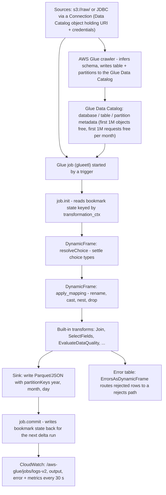
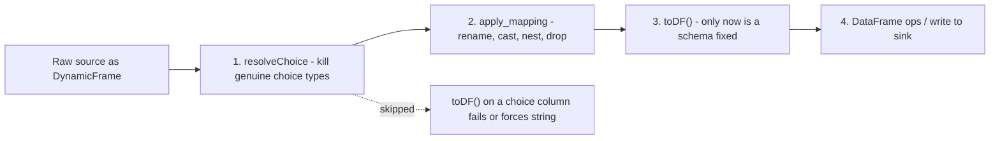
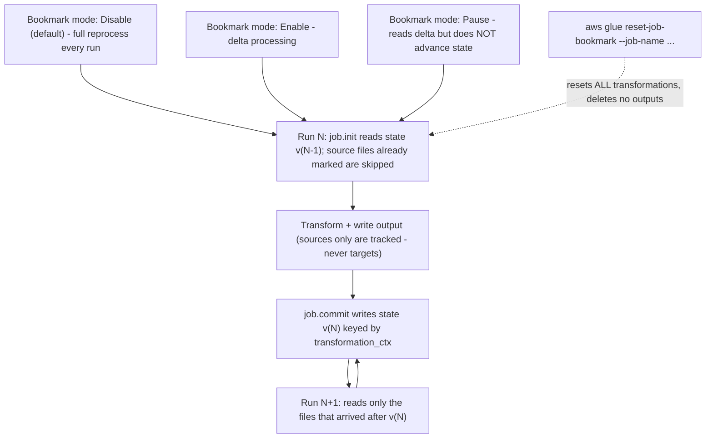
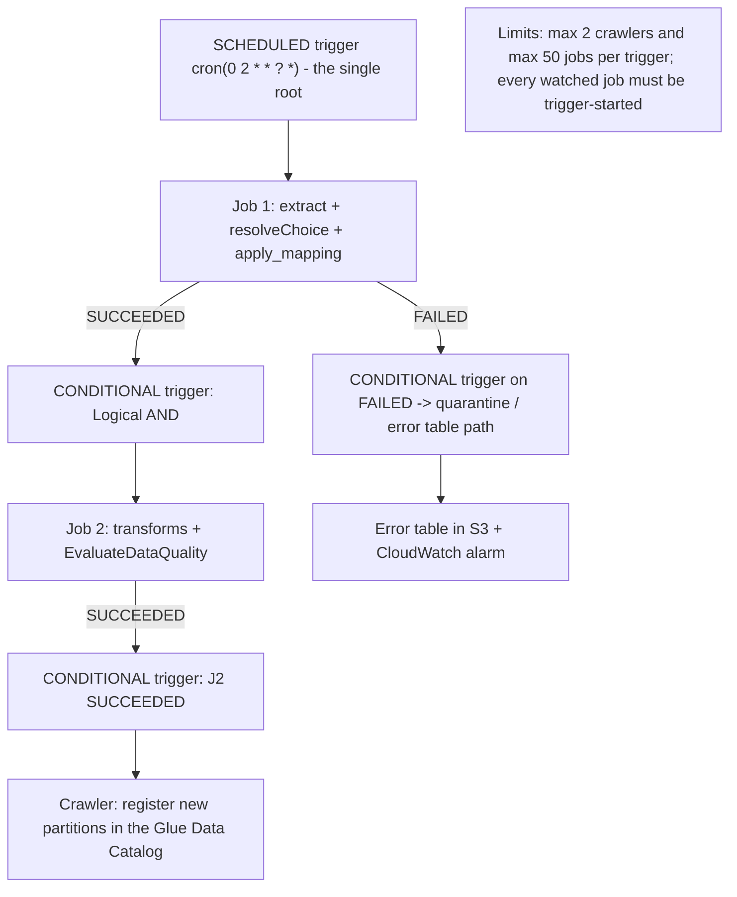
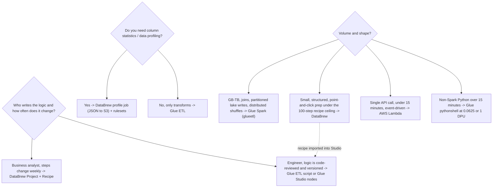

# Serverless Transformation with AWS Glue and DataBrew

Transformation is where a data engineer's judgment becomes visible. Ingestion can be bought as a managed pipe; storage can be rented by the gigabyte. But deciding **which engine** runs the job, **how much capacity** it holds while it runs, **which records** are processed on the second run, and **where rejected rows** go — that is design work, and it is exactly what DEA-C01 Domain 1 (Data Ingestion and Transformation, **34%** of the exam; weights per the DEA-C01 exam guide, accessed Oct 2026) examines through the task statements *"preparing data for transformation (AWS Glue DataBrew)"*, *"using AWS Glue features to process data"* and *"using Lambda to automate data processing"*.

```text
====================================================================
 THE TRANSFORMATION DECISION SURFACE (DEA-C01 Domain 1)
====================================================================
  Engine ............ AWS Glue Spark (serverless ETL)
                      AWS Glue Python shell (single process)
                      AWS Glue streaming (Spark Structured Streaming)
                      AWS Glue Ray (Z.2X workers)
                      AWS Glue DataBrew (no-code recipes + profiling)
                      AWS Lambda (sub-15-minute micro-transforms)
  Data representation .. DynamicFrame (self-describing, choice types)
                      vs DataFrame (schema must resolve)
  Incrementality ....... job bookmarks (batch) / checkpoints + watermarks
                      (streaming)
  Orchestration ........ triggers: scheduled | conditional | on-demand
                      | event (EventBridge)
  Capacity ............. worker types G./R./Z. + NumberOfWorkers,
                      billed in DPU-hours (1 DPU = 4 vCPU + 16 GB)
  Failure design ....... error tables, Spigot, EvaluateDataQuality,
                      retries, timeouts, job run insights
====================================================================
```

In this lesson you will:

- model the **serverless Glue job** — job types, anatomy, Data Catalog integration, run states and timeouts;
- separate **DynamicFrame** from **DataFrame** and drive `resolveChoice` → `apply_mapping` → `toDF()` in the right order;
- operate **job bookmarks**: Enable / Disable / Pause, `job.init` and `job.commit`, `transformation_ctx` as the state key, and the five ways they break;
- wire **triggers** into serial, conditional and scheduled topologies, and know the two hard trigger limits;
- size **workers and DPU-hours** on the October 2026 price list, including the G-versus-R memory trap and the crawler's 10-minute minimum;
- author with **Glue Studio** visual ETL — nodes, notebooks, the data-preview session and the Recipe node's import limits;
- pick **DataBrew** correctly: its six core objects, the 100-step recipe ceiling, recipe versus profile jobs, and its non-DPU metering;
- design **error handling**: `ErrorsAsDynamicFrame`, `Spigot`, `EvaluateDataQuality`, retries, timeout defaults and where error tables live;
- tune **performance**: partitioned writes, job run insights, input-file grouping, small-file arithmetic and Glue auto scaling;
- study **four AWS customer case studies** (BMW Group, PayU, Integral Ad Science and Nasdaq) and a **sourced October 2026 update box**;
- practise with **14 exam-style questions** plus four interactive checks.

---

## 1. Glue ETL fundamentals: a serverless Spark engine with a catalog attached

### 1.1 What "serverless" means here

AWS Glue is a **serverless** ETL service: you define a job, AWS provisions and tears down the Spark (or shell) execution environment, and you **pay only while the job runs**, billed per second (jobs and interactive sessions bill in 1-second increments, rounded up, with a **1-minute minimum** for Spark jobs — AWS Glue pricing, accessed Oct 2026). There is no cluster to keep warm, no AMI to patch, and no node to deprecate. The Data Catalog that crawlers populate is the glue between storage and compute: **schemas live in the catalog, data lives in S3 (or JDBC sources), and jobs read both**.

### 1.2 Job types and languages

| Job type | `JobCommand.Name` | Runtime | Priced as | Exam fit |
|---|---|---|---|---|
| Spark ETL | `glueetl` | PySpark / Scala on Spark | DPU-hour (1-min min) | Bulk GB–TB transforms, joins, partitioned lake writes |
| Spark streaming | `gluestreaming` | Spark Structured Streaming | DPU-hour (default **2 DPU**) | Continuous micro-batch from Kinesis/Kafka sources |
| Python shell | `pythonshell` | Single-process Python 3.9 (Glue 3.0+) | DPU-hour at **0.0625 or 1 DPU** | >15-minute non-Spark work: API pulls, file moves, light SQL |
| Ray | `ray` (worker `Z.2X`) | Ray on Python | **M-DPU-hour** | Parallel Python (for example Pandas-style) workloads |

Authoring routes: **PySpark/Scala scripts**, **Python (shell or Ray)**, **Glue Studio visual authoring**, and **interactive notebooks** (Pandas on Spark, Spark SQL). A Glue **job** is assembled from: the command, worker type and count, an **IAM role**, optional **connections**, an optional **security configuration**, **triggers**, a **timeout**, **retries**, default arguments, and `MaxConcurrentRuns`.

> [!NOTE]
> `MaxConcurrentRuns` defaults to **1**, and AWS's jobs API states plainly: *"The default is 1. An error is returned when this threshold is reached."* That default is also your first line of defence for **job bookmarks**, which are not concurrency-safe (Section 3).

### 1.3 Run states, timeouts and history

| Item | Value (AWS Glue API, accessed Oct 2026) |
|---|---|
| Run states | `STARTING` `RUNNING` `STOPPING` `STOPPED` `SUCCEEDED` `FAILED` `TIMEOUT` `ERROR` `WAITING` `EXPIRED` |
| `WAITING` | the run is **queued** — capacity or trigger position, not a failure |
| Timeout default | **2,880 minutes** on Glue 4.0 and earlier · **480 minutes** on Glue 5.0 and later |
| Timeout ceiling | must be **less than 7 days (10,080 minutes)** |
| Retries | `MaxRetries`; `NotifyDelayAfter` raises an alert when a run is delayed |
| Run history | retained **90 days** |

### 1.4 Job anatomy and Data Catalog integration



Two properties of that diagram are examinable:

1. **The catalog is metadata, not storage.** Crawlers bill separately from jobs (Section 5), and a job can run with or without a crawler in the same trigger chain.
2. **Bookmark state lives outside the script.** `job.init` reads it, `job.commit` writes it, and neither call is optional if you enabled bookmarks (Section 3).

- **📚 Did you know?** Glue records every run with its state and keeps the **90 days** of history, and `WAITING` simply means *queued*. Combined with `MaxConcurrentRuns` defaulting to **1**, a run that appears "stuck" in `WAITING` is telling you about capacity or trigger position — not about your code (AWS Glue job-runs API, accessed Oct 2026).

---

## 2. DynamicFrame versus DataFrame: the single most-tested Glue concept

### 2.1 The two representations

| Property | **DataFrame** (Spark) | **DynamicFrame** (Glue) |
|---|---|---|
| Schema requirement | Schema **must resolve** before most operations | *"Each record is self-describing, so no schema is required initially"* (AWS Glue developer guide, accessed Oct 2026) |
| Ambiguous values | Widens to the most general type (usually `string`) or fails | Carries a genuine **`choice` type** — for example `choice<long,string>` — when rows disagree |
| Row-level errors | Fails or silently coerces | Preserved as **error rows** (`ErrorsAsDynamicFrame`) |
| Transformation API | DataFrame methods | Glue transforms: `resolveChoice`, `apply_mapping`, `Relationalize`, `Join`, `Spigot`, `EvaluateDataQuality`, … |
| Conversion | — | `toDF()` only **after** choices are resolved |

### 2.2 Why choice types appear: the crawler sampling trap

AWS's own sample (Medicaid provider data) is the canonical illustration: a crawler that inspected only a **2 MB prefix** inferred the provider-id column as `long`. A DataFrame built over the whole dataset met values the sample never saw and forced everything to `string`. A DynamicFrame correctly reported **`choice<long,string>`** — the rows genuinely disagreed. The bug is in the **schema inference sample**, not in the data, and the fix belongs in the script.

### 2.3 `resolveChoice` — settle the ambiguity

`resolveChoice(specs=…, choice=…, database=…, table_name=…)` offers four actions for a `choice` column (AWS API reference, accessed Oct 2026):

| Action | What it does | Side effect you must predict |
|---|---|---|
| `cast:TYPE` | Convert every value to `TYPE` | Values that cannot convert become **`null`** |
| `project:TYPE` | Keep **only** the values already of `TYPE` | The other type's values are **dropped** |
| `make_cols` | One column per type: `col_long`, `col_string` | Schema widens to sibling columns |
| `make_struct` | Nest both into a struct | Downstream code must read struct fields |
| `MATCH_CATALOG` (via `database` + `table_name`) | Align to the catalog's declared type | Requires a catalog table |

```text
choice<long,string>  --cast:long-->     long        (uncastable -> null)
                  --project:long-->   long        (strings dropped)
                  --make_cols-->      provider_id_long + provider_id_string
                  --make_struct-->    {c_long, c_string}
```

### 2.4 `apply_mapping` — rename, cast, nest, drop

`apply_mapping(mappings, case_sensitive=False, …)` takes a list of **four-tuples**:

```text
(source_column, source_type, target_column, target_type)
("provider id", "string",      "provider.id", "string")   # dotted target nests
("zip",         "string",      "zip",         "bigint")   # cast in place
("legacy_col",  "string",      "",            "")         # target empty -> drop
```

Rules that cost marks on the exam: backtick a **source** name that contains a literal dot; a dotted **target** creates a nested field (`provider.id`); and `case_sensitive` defaults to **`False`**.

### 2.5 The order is not negotiable



> [!IMPORTANT]
> ⚠️ **`resolveChoice` before `apply_mapping` before `toDF()`.** `apply_mapping` assumes a settled per-column type; converting to a DataFrame with an unresolved `choice` forces the column to a general type (usually `string`) and quietly defeats the cast you were about to perform. Order is the difference between a clean `bigint` key and a table of padded strings.

### 2.6 Worked example E1 — ambiguous provider IDs

```text
Input : 160,000 rows, column "provider id"
        crawler (2 MB sample) says long | 2 rows say string | DynamicFrame says choice<long,string>

Step 1  resolveChoice([('provider id', 'cast:long')])
        -> column is long; the 2 uncastable values become null
Step 2  apply_mapping([('provider id','long','provider.id','long'),
                       ('name','string','name','string'),
                       ('legacy_flag','string','','')])     # nest + drop
Step 3  toDF()  -> schema is now fixed and typed
Step 4  sink.write(frame, format='parquet',
                  partitionKeys=['year','month','day'])

Reading: cast is lossy (nulls), project is destructive (drops rows' values),
make_cols is additive, make_struct is restructuring.
```

### 2.7 Built-in DynamicFrame transforms worth naming

`Relationalize` · `UnnestFrame` · `Map` · `FlatMap` · `Join` · `Spigot` · `ErrorsAsDynamicFrame` · `EvaluateDataQuality` · `FlagDuplicatesInColumn` · `SelectFields` · `DropFields` · `FillMissingValues` · `mergeDynamicFrame` · `FindMatches` (AWS PySpark transforms reference, accessed Oct 2026). The exam tests **recognition**: which transform *routes rejects*, which *samples* output, which *tests rules*.

```dragdrop
{
  "question": "Order the Glue DynamicFrame pipeline the way AWS documents it:",
  "items": [
    "Read the source as a DynamicFrame - records are self-describing, no schema required",
    "resolveChoice - settle choice types with cast, project, make_cols or make_struct",
    "apply_mapping - rename, cast, nest (dotted targets) and drop via four-tuples",
    "toDF() - convert only now that every column has one type",
    "Write the sink, for example Parquet with partitionKeys year, month, day"
  ],
  "correctOrder": [
    "Read the source as a DynamicFrame - records are self-describing, no schema required",
    "resolveChoice - settle choice types with cast, project, make_cols or make_struct",
    "apply_mapping - rename, cast, nest (dotted targets) and drop via four-tuples",
    "toDF() - convert only now that every column has one type",
    "Write the sink, for example Parquet with partitionKeys year, month, day"
  ],
  "explanation": "DynamicFrame first (self-describing records plus genuine choice types), then resolveChoice to eliminate ambiguity, then apply_mapping for rename/cast/nest/drop, then toDF() once a single type per column exists, and only then the write. Reversing the first two steps makes apply_mapping cast against a still-ambiguous type; converting to a DataFrame early forces the choice column to a general type such as string and defeats the whole point."
}
```

---

## 3. Job bookmarks: incremental batch processing without duplicates

### 3.1 The three modes

| Mode | Behaviour | Default? |
|---|---|---|
| **Enable** | Updates bookmark state **each run** and processes only the delta since the last commit | No |
| **Disable** | Processes the **whole dataset** every run | **Yes** |
| **Pause** | Processes incrementally but does **not** update the state | No |

### 3.2 How state is kept

The bookmark state is stored by the Glue service as roughly `{job_name, run_id, run_number, attempt_number, states: {transformation_ctx: state}}`, keyed by **job name plus version**. Your script participates through exactly two calls: **`job.init`** reads the state at start, **`job.commit`** writes it at the end. AWS's developer guide is blunt: *"Bookmarks won't work without calling them."*

And the key rule, verbatim from the AWS bookmarks page:

> "The `transformation_ctx` serves as the key to search the bookmark state for a specific source in your script. For the bookmark to work properly, you should always keep the source and the associated `transformation_ctx` consistent."



### 3.3 Worked example E2 — the delta arithmetic

```text
Dataset: s3://raw/orders/ with 1,000 files at first enablement.

Run 1 (bookmarks just enabled): 320 new files   -> processed 320, state -> 320
Run 2:                            410 new files   -> processed 410, state -> 730
Run 3:                            270 new files   -> processed 270, state -> 1,000

Files processed across three runs: 320 + 410 + 270 = 1,000
Naive full-reprocess total:        1,000 x 3       = 3,000
Without state continuity the tempting wrong figure is 320+410+270 counted
against a reset state, or 2,680 if run 1 had pre-dated enablement.

Lesson: bookmarks deduplicate OUTPUT relative to tracked SOURCES - the
state is the only thing that remembers what "already processed" means.
```

### 3.4 When bookmarks break (the exam's favourite failure list)

| Failure | What actually happens |
|---|---|
| You change a source **path** but keep the same `transformation_ctx` | State no longer matches reality → **files skipped or missing** |
| Two runs execute **concurrently** | Commits race; state becomes unreliable → keep `MaxConcurrentRuns = 1` |
| You expect a **rewind** | There is none. Reset exists; rewind does not |
| `reset-job-bookmark` | Resets **all** transformations in the job at once, and **does not delete outputs** you already wrote |
| You assume **targets** are tracked | Only **source files** are tracked, never destinations |
| You delete the Glue job | Its **bookmark is deleted with it** |
| JDBC source with no bookmark key | You must **choose the bookmark key columns** yourself |
| Streaming job | Bookmarks are the wrong mechanism — streaming uses **`checkpointLocation` + watermarks** |

- **📚 Did you know?** AWS's own wording for the guarantee is that bookmarks *"prevent duplicate processing and duplicate data"* — the phrase "exactly-once" is shorthand the exam world uses, but the honest model is **at-least-once processing with de-duplicated outputs**, because only sources are tracked and a failed run between `job.init` and `job.commit` leaves state untouched. Never claim a target-side guarantee you cannot point at in the state structure (AWS Glue developer guide, accessed Oct 2026).

```fillblank
{
  "question": "Complete the job-bookmark statements with the AWS developer guide's own vocabulary:",
  "template": "Bookmark state is keyed by {{1}} plus a version, and the per-source key inside the state is the {{2}} of the source. The script must call {{3}} at start and {{4}} at completion - AWS states bookmarks will not work without calling them. The three modes are {{5}} (default, whole dataset), Enable (delta, state updated) and Pause (delta, state not updated), and state is reset with the CLI command {{6}}.",
  "answers": {
    "1": "job_name",
    "2": "transformation_ctx",
    "3": "job.init",
    "4": "job.commit",
    "5": "Disable",
    "6": "reset-job-bookmark"
  },
  "distractors": ["run_id", "source path", "job.commit first", "job.start", "Enable", "Pause", "delete-job-bookmark", "reset-bookmark-state"],
  "explanation": "State lives under job_name + version; within it, transformation_ctx is the key AWS tells you to keep consistent with the source. job.init reads, job.commit writes. Disable is the DEFAULT mode, so a job that 'keeps reprocessing everything' usually has bookmarks off, not broken. aws glue reset-job-bookmark --job-name ... resets every transformation in the job and cleans no outputs."
}
```

---

## 4. Triggers: serial, conditional and scheduled topologies

### 4.1 The four trigger types

| API `Type` | Console name | Fires when |
|---|---|---|
| `SCHEDULED` | **Scheduled** | A **cron** expression elapses |
| `CONDITIONAL` | **Conditional** | A predicate list of watched jobs/crawlers reaches the required statuses, joined by `Logical` **AND** / **OR** |
| `ON_DEMAND` | **On-demand** | You activate it (API/console/CLI) |
| `EVENT` | (API-level) | An **EventBridge** event, with `EventBatchingCondition {BatchSize, BatchWindow}` |

### 4.2 The rules that make conditional triggers work

1. Watched jobs must **themselves have been started by a trigger**. A job you started by hand and that then succeeded **will not fire** a conditional trigger.
2. The chain must descend from a **single scheduled or on-demand root** trigger.
3. Limits: **maximum 2 crawlers per trigger**; **maximum 50 jobs per trigger** (AWS Glue quotas, accessed Oct 2026).



**Serial vs parallel in one line each:** serial = `J3` fires when `J1` **AND** `J2` both `SUCCEEDED`; fan-out = `J4` fires when `J1` **OR** `J2` `FAILED`. That is the whole conditional-trigger grammar — plus the root-trigger rule, which is where most candidate mistakes live.

---

## 5. Worker types and DPU sizing: where the bill comes from

### 5.1 The unit

**1 DPU = 4 vCPU and 16 GB of memory**, and AWS states that *"a single DPU is also referred to as a worker."* Jobs on Glue 2.0 and later are sized with **`WorkerType` + `NumberOfWorkers`** — never with `MaxCapacity` (that legacy field belongs to Glue 1.0 and earlier; setting both is an error). Defaults: Spark jobs **10 DPU**, streaming **2 DPU**, both with a **2-DPU minimum**.

### 5.2 Worker catalogue (as of Oct 2026)

| Worker | DPU per worker | vCPU | Memory | Disk (free) | Constraint |
|---|---|---|---|---|---|
| **G.1X** | 1 | 4 | 16 GB | 94 GB (44 GB free) | All Spark; **default for Glue ≥2.0** |
| **G.2X** | 2 | 8 | 32 GB | 138 GB (78 GB free) | Recommended for **ML transforms** |
| **G.4X** | 4 | 16 | 64 GB | 256 GB (230 GB free) | **Glue ≥3.0** (limited Regions) |
| **G.8X** | 8 | 32 | 128 GB | 512 GB (485 GB free) | **Glue ≥3.0** (limited Regions) |
| **G.12X** | 12 | 48 | 192 GB | 768 GB (741 GB free) | **Glue ≥4.0** |
| **G.16X** | 16 | 64 | 256 GB | 1024 GB (996 GB free) | **Glue ≥4.0** |
| **G.025X** | 0.25 | 2 | 4 GB | 84 GB (34 GB free) | **Streaming only**, ≥3.0 |
| **R.1X / R.2X / R.4X / R.8X** | 1 / 2 / 4 / 8 **M-DPU** | 4 / 8 / 16 / 32 | **32 / 64 / 128 / 256 GB** | same as G peers | **Memory-optimized** (≥4.0) |
| **Z.2X** | 2 M-DPU | 8 | 64 GB | 128 GB (~120 GB free) | **Ray only**, up to 8 Ray workers |

**M-DPU** means *"double the memory allocation for a given size compared to standard DPUs."*

> [!IMPORTANT]
> ⚠️ **The G-family does not buy you memory per CPU.** Every G worker keeps the **4 vCPU : 16 GB** ratio; only the **R.** family doubles it (**4 vCPU : 32 GB**). Moving from G.1X to G.4X therefore does **not** fix an out-of-memory failure — it just gives you the same ratio four times faster and four times wider. OOM → **R.**; shuffle/skew → more workers; genuinely slow single-threaded work → bigger worker.

### 5.3 The October 2026 rate card

Baseline **us-east-1 (N. Virginia)**; every figure **as of Oct 2026** (Glue 6.0 rates announced 2026-08-21):

| Meter | Glue ≤5.1 | Glue ≥6.0 | Billing minimum |
|---|---|---|---|
| Spark / Spark Streaming job | **$0.44 / DPU-hour** | **$0.308 / DPU-hour** | 1 second, rounded up; **1-minute** minimum |
| Flex execution (G.1X/G.2X, ≥3.0) | **$0.29 / DPU-hour** | see live pricing page | 1 minute; start delay/interruption possible |
| Memory-optimized **R** workers (≥4.0) | **$0.52 / DPU-hour** | see live pricing page | 1 minute |
| Interactive session / Studio notebook | **$0.44 / DPU-hour** | **$0.308 / DPU-hour** | 1 minute; default **5 DPU**, minimum **2 DPU** |
| Python shell (0.0625 or 1 DPU) | **$0.44 / DPU-hour** | — | 1 minute |
| Ray | **$0.44 / M-DPU-hour** | — | 1 minute |
| **Data Catalog crawler** | **$0.44 / DPU-hour** | — | **10-minute minimum per run** |
| Data Quality evaluated in an ETL job | **$0.44 / DPU-hour** | **$0.308 / DPU-hour** | 1 minute |
| **DataBrew** recipe/profile job | **$0.48 / node-hour** | — | per node |
| **DataBrew** interactive session | **$1.00 / 30-minute block** | — | counted from first interaction |

The four DPU-based meters of that table as an interactive chart (same units, so they are legitimately comparable — DataBrew's node-hour meter is deliberately **not** plotted, because it is a different unit):

```plot
{
  "type": "bar",
  "title": "USD per DPU-hour (us-east-1, as of Oct 2026)",
  "data": [
    {"meter": "Glue <=5.1 standard", "usd": 0.44},
    {"meter": "Glue >=6.0 standard", "usd": 0.308},
    {"meter": "Flex (G.1X/G.2X, <=5.1)", "usd": 0.29},
    {"meter": "R memory-optimized (<=5.1)", "usd": 0.52}
  ],
  "xKey": "meter",
  "yKey": "usd",
  "xLabel": "Meter",
  "yLabel": "USD per DPU-hour"
}
```

Reading the chart: total cost = DPU × hours × bar height. The 6.0 bar is ~30% shorter than the 5.1 bar (the 2026-08-21 price cut), Flex buys ~34% off in exchange for a possible delayed start or interruption, and the R bar is the premium for double memory per DPU.

### 5.4 Worked example E3 — AWS's own DPU-hour arithmetic

```text
Job: 6 DPU (for example 6 x G.1X) running 15 minutes on Glue <= 5.1
Cost = 6 DPU x 0.25 h x $0.44 / DPU-h = $0.66 per run      (as of Oct 2026)

Same job on Glue 6.0:
Cost = 6 x 0.25 x $0.308             = $0.462 per run
Saving per run                        = $0.66 - $0.462 = $0.198  (~30%)
30 runs per month                     = 30 x $0.198    = $5.94 per month

Source: AWS Glue pricing page's worked example ("6 DPU * 0.25 hour * $0.44,
or $0.66"), as of Oct 2026; 6.0 rate from the 2026-08-21 announcement.
```

### 5.5 Worked example E4 — Flex versus standard

```text
Job: 6 DPU x 1/3 hour (as of Oct 2026)
Standard: 6 x 0.3333 x $0.44 = $0.88
Flex:     6 x 0.3333 x $0.29 = $0.58      (AWS's own worked example)

Flex buys ~34% off by accepting a possible delayed start and interruption.
Never use Flex for SLA-bound work; it exists for interruptible, fault-tolerant jobs.
```

### 5.6 Worked example E5 — worker choice changes nothing about the price

```text
Target capacity: 16 DPU  (as of Oct 2026, $0.44/DPU-h on Glue <= 5.1)

16 x G.1X  = 16 workers x 1 DPU = 16 DPU -> 16 x $0.44 = $7.04 / hour
 8 x G.2X  =  8 x 2             = 16 DPU -> 16 x $0.44 = $7.04 / hour
 4 x G.4X  =  4 x 4             = 16 DPU -> 16 x $0.44 = $7.04 / hour
 2 x G.8X  =  2 x 8             = 16 DPU -> 16 x $0.44 = $7.04 / hour

Identical cost, different shapes: 16 executors on G.1X vs 2 on G.8X,
16 GB vs 128 GB per worker. Choose on parallelism and memory per executor,
never on price - the DPU is the metered unit.
```

### 5.7 Worked example E6 — the crawler's 10-minute minimum

```text
Crawler runs hourly, 2 DPU, actual work takes 3 minutes (as of Oct 2026).

Billed per run: 2 DPU x (10/60) h x $0.44 = $0.147     <- 10-min minimum
Runs per 30-day month: 24 x 30 = 720
Monthly: 720 x $0.147 = $105.60
At true 3-minute duration: 720 x (2 x 0.05 x $0.44) = $31.68
Hidden premium from the minimum: $105.60 - $31.68 = $73.92 / month

Exam move: crawl on event (conditional trigger after the job SUCCEEDED)
instead of hourly, or batch partition discovery, before you optimise DPU.
```

### 5.8 Auto scaling and the legacy `MaxCapacity`

For Glue **3.0 and later**, auto scaling is enabled with `--enable-auto-scaling=true` on worker families **G.1X…G.16X** and **R.1X…R.8X** (`G.025X` for streaming); the **Standard** worker does not support it. When auto scaling is on, `NumberOfWorkers` is treated as the **maximum**, and batch jobs on Glue 4.0+ can be reviewed with the **`DPUSeconds`** CloudWatch metric. Data Catalog pricing adds its own meter: the **first 1,000,000 objects and 1,000,000 requests are free each month**, then **$1.00 per 100,000 objects** over the free tier and **$1.00 per million requests** over it (as of Oct 2026).

- **📚 Did you know?** A DataBrew **job** is not priced in DPU-hours at all: it is **$0.48 per node-hour** with a **5-node default**, and an interactive DataBrew session is **$1.00 per 30-minute block** — three separate interactions inside 75 minutes bill as **three blocks = $3.00** (AWS Glue/DataBrew pricing, as of Oct 2026). Mixing the two meters is a classic cost-estimate trap.

---

## 6. Glue Studio: visual ETL over the same engine

### 6.1 What the visual layer actually is

Glue Studio lets you **create, run and monitor** Glue jobs on the serverless Spark engine *"without having to learn Spark or write code."* Each **node** in the canvas is one action — a source, a transform or a target — and Studio **generates a PySpark script** from the source schema plus the target location and schema. The script is real and editable in developer mode; the visual graph and the code are two views of the same job.

| Authoring mode | What you get |
|---|---|
| **Visual ETL** | Canvas of source/transform/target nodes; generated script |
| **Interactive notebook** | **Pandas** on Spark or **SQL** cells against an interactive session |
| **Script editor** | Hand-written PySpark/Scala |

### 6.2 Sessions, previews and monitoring

- **Data preview session**: **2 DPUs for up to 30 minutes**, **auto-stops**, billed at the standard DPU rate (as of Oct 2026).
- **Monitoring**: the Jobs page and run details, plus the **job run monitoring dashboard** with tiles for success rate and estimated DPU usage, links into CloudWatch, the Spark History Server and job-run insights.
- **Logs**: `/aws-glue/jobs/logs-v2` (continuous logging), `/aws-glue/jobs/output`, `/aws-glue/jobs/error`; CloudWatch metrics arrive **every 30 seconds** as deltas.

### 6.3 The Data Preparation Recipe node — DataBrew inside Studio

You can author a recipe step inline in Studio or **import a published DataBrew recipe** into a **Data Preparation Recipe node**, subject to hard limits (AWS Glue Studio docs, accessed Oct 2026):

| Rule | Value |
|---|---|
| Minimum Glue version | **4.0** (Python version auto-set) |
| **Not importable** | `GROUP_BY`, `PIVOT`, `UNPIVOT`, `TRANSPOSE` — use dedicated Studio nodes |
| Unsupported if the recipe contains | `UNION` or `JOIN` — use Studio's Join/Union nodes instead |
| Region requirement | Commercial DataBrew Regions only |

That bridge is why DataBrew and Glue Studio are on the exam **together**: a recipe authored by an analyst becomes a governed step inside an engineer's scheduled job, which then gains bookmarks, retries and auto scaling it never had as a standalone DataBrew job.

---

## 7. AWS Glue DataBrew: preparation and profiling without code

### 7.1 Six core objects — and the name that does not exist

AWS Prescriptive Guidance lists exactly **six** core concepts (accessed Oct 2026):

| Object | Role |
|---|---|
| **Project** | The workspace where a dataset and a recipe meet |
| **Dataset** | A **read-only** reference to a source (S3, Glue catalog tables, …) |
| **Recipe** | An **ordered** list of transformation steps with optional condition expressions |
| **Job** | Either a **recipe job** (apply a recipe version) or a **profile job** (compute statistics) |
| **Data lineage** | Record of what the recipe did to the data |
| **Data profile** | The statistical output of a profile job (JSON to S3) |

> [!WARNING]
> ⚠️ **There is no DataBrew object called a "data flow."** The six objects above are the complete vocabulary; a "flow" is loose language for a **Glue Studio** visual graph or for a recipe itself. An exam option that asks you to "create a DataBrew data flow" is testing whether you know the real object names.

### 7.2 Recipes: bounded, versioned, point-and-click

- A recipe is an ordered list of `RecipeAction` objects (`Action.Operation` + `Parameters` + optional `ConditionExpressions`).
- **Maximum 100 transformations per recipe**; **maximum 100 published versions per recipe** (AWS quotas, accessed Oct 2026).
- Scale of the library: **more than 250 point-and-click transformations** (product page) / **more than 200 recipe actions** (developer guide).
- Exam-relevant operations: `SPLIT`, `GROUP_BY`, `REPLACE_TEXT`, `REMOVE_VALUES`, `CHANGE_DATA_TYPE`, `PIVOT`, `UNPIVOT`, `TRANSPOSE`, `NEST`, `UNNEST`, and *Remove duplicates*.

### 7.3 Jobs, schedules and data-quality rulesets

| Knob | Value (as of Oct 2026) |
|---|---|
| Recipe job output | Amazon S3 · Glue Data Catalog · Amazon Redshift |
| Profile job output | Statistical evaluation as **JSON to S3** |
| Schedule syntax | **Six-field cron**; day-of-month and day-of-week are mutually exclusive (`?`) |
| Minimum schedule interval | **Cron expressions faster than 5 minutes are not supported** |
| Rulesets | **100 rules per ruleset**, **10 rulesets per dataset**, **100 rulesets per account** |
| Account quotas | 10 concurrent jobs · **300 nodes per account** · 100 jobs · 100 datasets · 100 projects · 10 open projects · 500 recipes · 10 schedules |

### 7.4 Worked example E7 — pricing a DataBrew pipeline

```text
Recipe job: 5 nodes (the default), runs 10 minutes   (as of Oct 2026)
Cost = 5 nodes x (10/60) h x $0.48 / node-hour = $0.40 per run

Analyst interactive day: 3 sessions inside 75 minutes
Cost = 3 x $1.00 / 30-minute block = $3.00

Hourly scheduled recipe job for a month (worst case, 720 runs):
720 x $0.40 = $288.00  vs the same job as Glue ETL only if a Spark job
is genuinely needed - the meters are NOT interchangeable.
```

### 7.5 When to pick DataBrew, when to pick Glue



| Dimension | **DataBrew** | **Glue ETL (Spark)** |
|---|---|---|
| Code | **None** — point and click | PySpark/Scala (or Studio-generated) |
| Best for | Prep, cleansing, profiling, analyst self-service | Bulk transforms, joins, distributed processing |
| Meter | **$0.48 / node-hour** + **$1.00 / 30-min session** | **DPU-hour** |
| Bookmarks / retries / auto scaling | Only after a recipe is **imported into Glue Studio** | Native |
| Hard ceiling | **100** transformations per recipe | Script length, not steps |
| Data quality | Rulesets on datasets, run inside jobs | `EvaluateDataQuality` node/transform |

- **📚 Did you know?** AWS claims DataBrew can cut data-preparation time by **up to 80%** versus custom preparation work (AWS Glue DataBrew product page, accessed Oct 2026) — a customer-facing claim, not a guarantee, and the examinable fact is the *mechanism* (project → dataset → recipe → recipe/profile job), not the percentage.

```matching
{
  "question": "Match each AWS Glue DataBrew object to what it actually is:",
  "pairs": [
    {"left": "Project", "right": "The workspace where a dataset and a recipe are brought together for interactive preparation"},
    {"left": "Dataset", "right": "A read-only reference to a source such as an S3 prefix or a Glue catalog table"},
    {"left": "Recipe", "right": "An ordered list of transformations with optional condition expressions, capped at 100 steps"},
    {"left": "Recipe job", "right": "Applies a published recipe version and writes results to S3, the Glue Data Catalog or Redshift"},
    {"left": "Profile job", "right": "Computes column statistics and writes a data profile as JSON to S3"},
    {"left": "Data lineage", "right": "The recorded history of what preparation steps did to the data"}
  ],
  "explanation": "These six objects are AWS's complete core vocabulary for DataBrew - there is no 'data flow' object, which is why that phrasing appears only as a distractor. Note also that DataBrew has no DPU meter: jobs bill $0.48 per node-hour with a 5-node default, sessions bill $1.00 per 30-minute block, a recipe caps at 100 transformations and 100 published versions, and cron schedules cannot run faster than every 5 minutes (all as of Oct 2026)."
}
```

---

## 8. Error handling: reject rows, retries, and where failures go

### 8.1 The three in-script patterns

| Pattern | Mechanism | Use when |
|---|---|---|
| **Error table** | `ErrorsAsDynamicFrame` (or `errorsFromDF`) routes rejected records into a **separate DynamicFrame** instead of failing the run | Schema violations must be *captured*, not fatal |
| **Spigot** | Diverts a **sample** of records to a rejects path | You want a canary, not every reject |
| **EvaluateDataQuality** | Rule evaluation (Studio: "Data quality rules" node) that can **fail or divert** on violation | Rules are declarative and auditable |

The rejected frame is then written to its own prefix — that is the **error table** pattern the exam means: bad rows land in `s3://…/errors/`, good rows land in the partitioned sink, and a downstream conditional trigger or analyst query can read each independently.

> [!WARNING]
> ⚠️ **There is no Glue feature called "ErrorCDC."** A search of the Glue developer guide, API reference and release notes (checked Oct 2026) returns nothing under that name. The real mechanisms are `ErrorsAsDynamicFrame`, `errorsFromDF`, `Spigot` and `EvaluateDataQuality` — if an option uses a name you have never seen in the docs, treat it as a distractor and pick the documented mechanism.

### 8.2 Retries, timeouts and run states

```text
Job failure ladder (AWS Glue job-runs API):
  transient fault  -> MaxRetries (configured on the job) -> re-attempt
  long queue       -> state WAITING (queued, not failed)
  NotifyDelayAfter -> alert raised while the run is delayed
  over limit       -> state TIMEOUT   (default 480 min on Glue >= 5.0,
                                       default 2,880 min on Glue <= 4.0,
                                       hard ceiling < 10,080 min = 7 days)
  unhandled error  -> state FAILED or ERROR; history retained 90 days
```

### 8.3 Worked example E8 — the timeout default trap

```text
A pipeline was designed in 2024 on Glue 4.0, where a blank Timeout
defaults to 2,880 minutes (48 hours). The team upgrades to Glue 5.1/6.0
and leaves Timeout blank -> default is now 480 minutes (8 hours).

Job runtime: 60 hours = 3,600 minutes
Outcome: state TIMEOUT at 480 minutes, long before completion.

Fix: set an explicit timeout (always < 10,080 minutes) and treat the
default as version-dependent, not as a constant. (Defaults as of Oct 2026.)
```

### 8.4 Security configuration: four planes, one override rule

A **security configuration** is a named bundle attachable to a **job, crawler or development endpoint**, covering four planes: **S3 data** (SSE-S3 or SSE-KMS), **CloudWatch Logs** (SSE-KMS), **job bookmarks** (**CSE-KMS** — client-side) and **data-quality assets**. Three rules worth memorising:

1. *"Currently, a security configuration overrides any server-side encryption (SSE-S3) setting that is passed as an ETL job parameter."*
2. Only **symmetric** KMS keys are supported, and security configurations are **not supported for Ray jobs**.
3. The job role needs KMS permissions plus `logs:AssociateKmsKey`. **Catalog** encryption is a separate, **account-level** setting (`CatalogEncryptionMode`: `DISABLED`, `SSE-KMS`, `SSE-KMS-WITH-SERVICE-ROLE`).

---

## 9. Performance: insights, partitions and the small-file tax

### 9.1 Job run insights — the fastest path to a root cause

Available on Glue **2.0 and later**, opt-in via the Studio checkbox **"Generate job insights"** or `--enable-job-insights=true`. When enabled, a failed run reports (AWS Glue docs, accessed Oct 2026):

- the **failing script line**,
- the **last Spark action**,
- the time-ordered **exception stream**, and
- a **root cause with a recommended action**.

Compare that with the bare failure `An error occurred while calling o111.collectToPython` — one is a diagnosis, the other is a symptom. Insights land under the same `/aws-glue/jobs/logs-v2` log group you already ship to CloudWatch.

### 9.2 Partitioned writes and pushdown

Write partition keys with the sink (`partitionKeys = ["year","month","day"]`) so downstream readers only touch the partitions a query names. Partitioning is a **write-time decision** you cannot cheaply retrofit on a flat prefix, which is why the sink belongs in the design conversation, not in the cleanup sprint. Partition-aware outputs are also what makes crawlers cheap to run: the crawler registers **partitions**, and a partitioned table is what lets an engine skip files it will never read.

### 9.3 Worked example E9 — small-file arithmetic

```text
Ingest: 1 TB per year of raw events, partitioned year/month/day,
        128 output files per partition (as of Oct 2026 - file counts are
        structural arithmetic, not an AWS limit).

Partitions per year  = 365
Output files per year = 365 x 128 = 46,720 files
Average file size     = 1 TB / 46,720 ~= 21 MB (before compression)

Every one of those files is an object, a listing entry, a task input and
a metadata row. Remedies on the Glue side:
  - groupFiles / groupPartition: auto-grouping kicks in beyond ~50,000
    input files so one task reads a GROUP of files;
  - coalesce(n) / repartition(n) to tune the OUTPUT file count;
  - without grouping, the driver can run out of memory on file metadata
    alone (AWS Glue input-grouping and Spark-scaling guidance).
```

### 9.4 What to check before you buy more DPU

```text
1. Skew          - one hot key; more workers will not help, salt or pre-aggregate
2. Too many tasks- small files; group inputs, coalesce outputs first
3. Wrong worker   - OOM on G.*? move to R.* (4 vCPU : 32 GB), not up the G ladder
4. Auto scaling   - Glue >= 3.0, --enable-auto-scaling=true, NumberOfWorkers = max
5. Version        - Glue 5.1 vs 6.0 changes the per-DPU price by ~30% (as of Oct 2026)
6. Meter          - is this even a DPU job? 0.0625-DPU pythonshell or Lambda may fit
```

---

## 10. Connections, encryption and the version ladder

### 10.1 Connections are catalog objects, not job settings

> "An AWS Glue connection is a **Data Catalog object** that stores login credentials, URI strings, virtual private cloud (VPC) information…"

Connections are therefore **reusable** across crawlers, jobs and development endpoints. Types include `JDBC`, `NETWORK`, `MARKETPLACE`, `CUSTOM`, `KAFKA`, `MONGODB`, `SFTP` (AWS notes SFTP is currently **not supported**) and the SaaS/database families (`MYSQL`, `ORACLE`, `POSTGRESQL`, `SQLSERVER`, `SYNAPSE`, `TERADATA`, `OPENSEARCH`, `SALESFORCE`, …). For JDBC you supply either `HOST`/`PORT`/`JDBC_ENGINE` or a full `JDBC_CONNECTION_URL`, plus `USERNAME`/`PASSWORD` **or** `SECRET_ID`, with SSL toggles. Inside a VPC, Glue creates an **ENI**; security groups need a **self-referencing inbound rule for all TCP ports**, and egress requires a NAT gateway or VPC endpoints. Limits: **1,000 connections per account**, and `ConnectionsList` per job also caps at **1,000**.

### 10.2 The version ladder (as of Oct 2026)

| Glue version | Spark | Python | Status |
|---|---|---|---|
| **6.0** | 4.1.1 | 3.13 | GA **2026-08-21**, **−30% pricing**, Iceberg v3, Java 17 / Scala 2.13.17 |
| **5.1** | 3.5.6 | 3.11 | **Default when `GlueVersion` is omitted** (since 2025-11-26) |
| **5.0** | 3.5.4 | 3.11 | Supported; timeout default already **480 min** |
| **4.0** | 3.3.0 | 3.10 | Supported; timeout default **2,880 min** |
| **3.0** | 3.1.1 | 3.7 | Supported; **ML transforms unavailable** |
| **2.0 / 1.0 / 0.9** | 2.4.3 | 3.7 / 2.7-3.6 | **End of life 2026-04-01** |

Glue 6.0 migration deltas that break old scripts: `spark.sql.legacy.timeParserPolicy` default changed; **ANSI mode** can fail implicit string→numeric casts; **`--additional-python-modules` is deprecated** in favour of `--python-virtual-env`; **EMRFS is removed** (S3A is the only S3 filesystem); and the **AWS SDK for Java v1 is removed** (SDK v2 only — boto3 is unaffected).

### 10.3 Choosing the engine in one table

| Dimension | AWS Lambda | Glue Spark | Glue Python shell |
|---|---|---|---|
| Max runtime | **15 minutes** (hard) | default 480 min (≥5.0) / 2,880 min (≤4.0), always < 7 days | same Glue timeout rules |
| Parallelism | one invocation ≈ one worker | distributed Spark with shuffles | single process |
| Trigger surface | 220+ service events, SQS/Kinesis/DynamoDB, API Gateway | Glue triggers, EventBridge, Step Functions | same as Glue |
| Cost meter | GB-second + requests | **DPU-hour** (1-second granularity, 1-minute minimum) | DPU-hour (0.0625 or 1 DPU) |
| Fit | sub-15-minute event micro-transforms | bulk GB–TB, joins, partitioned lake writes | >15-minute non-Spark Python |

### 10.4 Worked example E10 — "the cheapest correct option"

```text
Requirement: every night at 03:00, move one ~90-second file-copy job,
small payload, no Spark, no shuffle, SLA is loose.

A) Glue etl job, 2 DPU minimum, 1-minute billing
   -> correct engine family, but you pay for 2 DPU for the whole
      (admittedly short) run: 2 x (1/60) x $0.44 = $0.0147/run floor,
      plus the trigger and script overhead. (as of Oct 2026)
B) Glue pythonshell at 0.0625 DPU
   -> 0.0625 x (1/60) x $0.44 = $0.00046/run - Glue-native, no Spark.
C) AWS Lambda
   -> GB-second metering, no DPU floor, 15-minute ceiling is irrelevant.

Reading: "must run on Glue" -> pythonshell. "Cheapest correct" -> Lambda.
"Needs distributed shuffles" -> neither; use glueetl.
```

### 2026 Updates (as of October 2026)

> [!NOTE]
> **What changed in this topic between 2025 and October 2026** — every line is checked against a primary AWS source and is examinable because the exam tests the current behaviour:
> - **Glue 6.0 went GA on 2026-08-21** with *"30% lower pricing than previous AWS Glue versions"* and full Apache Iceberg v3 support (Spark **4.1.1**, Python **3.13**, Scala **2.13.17**, Java 17; Iceberg 1.11.0, Hudi 1.1.1, Delta 4.2.0) — AWS What's New, 2026-08-21; Glue release notes, accessed Oct 2026.
> - **Glue 5.1 is the default** when `GlueVersion` is omitted (announced 2025-11-26 / blog 2025-12-09), and **0.9/1.0/2.0 reached end of life on 2026-04-01**; new Python Shell 3.6 jobs could no longer be created after **2026-03-31** — Glue version support policy, accessed Oct 2026.
> - **6.0 breaks old code**: EMRFS removed (S3A only), AWS SDK for Java v1 removed, Scala binary 2.12 → 2.13, `--additional-python-modules` deprecated for `--python-virtual-env`, and ANSI mode can fail implicit string→numeric casts — migrating to Glue 6.0, accessed Oct 2026.
> - **Exam guide v1.1 (2025-12-12)** consolidated knowledge/skills into one list and added **8 new skills, none removed** — including *1.2.10 Integrate Large Language Models (LLM) for data processing* and *2.1.7 Manage open table formats (for example Apache Iceberg)*; the in-scope service list moved **+6 / −3** (Aurora, Amazon Q, Bedrock, Kendra, Data Exchange, S3 Tables added; Cloud9, CodeCommit, AWS SCT removed) — DEA-C01 revisions page, 2025-12-12; in-scope/out-of-scope pages, accessed Oct 2026.
> - **Stale-fact warning**: a 2024-era pipeline spec saying `GlueVersion=4.0`, target "kinesis-firehose", and "12 months Free Tier" is wrong on all three counts today — the default is 5.1, the console name is **Amazon Data Firehose** (renamed 2024-02-09, APIs unchanged, and the DEA guide still prints "Amazon Kinesis Data Firehose"), and accounts created after **2025-07-15** get a **6-month Free Plan with up to $200 in credits** — AWS Free Tier page, accessed Oct 2026.
> - **Glue is now one leg of an open-table-format triangle**: Glue 6.0 writes **Apache Iceberg v3** (VARIANT + shredding, deletion vectors, row lineage), while **Redshift gained Iceberg writes** (GA 2025-11-17, tables registered in the **Glue Data Catalog**), **JIT ANALYZE** (2025-11-18), **UPDATE/DELETE/MERGE** on Iceberg including S3 Tables (2026-04-23) and **Iceberg materialized views** (2026-10-05) — a Glue-authored Iceberg table can now be modified in place by Redshift, queried by Athena and shared through Lake Formation — AWS What's New, 2025-11-17 / 2026-04-23 / 2026-10-05; Glue 6.0 announcement, 2026-08-21.
> - **Not every streaming path needs a Glue job any more**: Kinesis Data Streams can now deliver straight into **Iceberg tables on Amazon S3 Tables** (2026-08-28 — source format converted to Parquet automatically, inline compaction, "no ETL") or into **general-purpose S3 buckets** (2026-08-29), both available only in the on-demand capacity modes and priced per GB delivered — AWS What's New, 2026-08-28 and 2026-08-29. Read that as a *cost* option to evaluate, not as "Glue is obsolete": scheduled, bookmark-driven, quality-checked lake writes are still the Glue pattern this exam tests.

- **📚 Did you know?** The exam guide's own removals are as examinable as its additions: **AWS SCT, Cloud9 and CodeCommit** left the in-scope list at v1.1, which is why "use Schema Conversion Tool" is now a distractor where "use Glue or native tooling" is the answer — and **S3 Tables** arriving in-scope is why Glue writing **Iceberg** (including Iceberg v3 features on 6.0) is fair game (DEA-C01 in-scope services page, accessed Oct 2026).
- **📚 Did you know?** The rename confusion runs both ways in this topic: the DEA in-scope list still prints **"Amazon Kinesis Data Firehose"** while the product has been **Amazon Data Firehose** since 2024-02-09 — *"no other changes, including service endpoints, APIs, the AWS Command Line Interface (AWS CLI), the AWS Identity and Access Management (IAM) access policies, and Amazon CloudWatch metrics"* (AWS What's New, 2024-02-09). IAM actions are still `firehose:*`, so **either name is valid on the exam** — never "correct" an option that uses the older one (AWS Firehose history page, accessed Oct 2026).

---

## Real-World Case Studies

AWS publishes what these abstractions look like in production. Every figure below is **customer- or AWS-claimed and unaudited**, with the source named so you can check it — the examinable point is the **pattern**, not the marketing.

### Case A — BMW Group: an on-premises lake becomes a governed cloud lake (Glue as the schema layer)

| Element | Detail |
|---|---|
| Customer | **BMW Group**, automotive manufacturer |
| Challenge | An on-premises data lake **built in 2015** could not serve multiple tenants |
| Services | Producers: **Amazon Data Firehose + AWS Lambda + AWS Glue + Amazon EMR**; consumers: **Amazon Athena, SageMaker AI, Amazon EMR**; storage in **Amazon S3**, schemas in the **AWS Glue Data Catalog** |
| Outcomes | **10 TB/day from 1.2 million vehicles**; a Cloud Data Hub serving **500+ users**; telemetry shared in anonymised form |
| Exam domain | **Domain 1** (transformation and catalog-driven processing) with Domain 4 hooks (multi-tenant cost attribution) |
| Source | `aws.amazon.com/solutions/case-studies/bmw-group-case-study` (accessed Oct 2026) |

The examinable pattern is the **separation AWS teaches**: data lands in S3, **schemas live in the Glue Data Catalog**, transformation runs in Glue/EMR, and consumption (Athena, SageMaker) reads the same catalog. Producers and consumers are different accounts with different privileges — which is why the catalog, not the bucket, is the contract.

### Case B — PayU: Glue ETL into a shared warehouse (transformation feeding consolidation)

| Element | Detail |
|---|---|
| Customer | **PayU**, fintech/payments company |
| Challenge | Data siloed across **~40 production databases**; queries taking 10–15 minutes; freshness only once a day |
| Services | **AWS Glue ETL → Amazon S3 → Amazon Redshift**, plus **Redshift Data Sharing** across 5 clusters (2 ETL + 3 consumer) |
| Outcomes | Queries **10–15 min → under 1 min**; freshness **once/day → under 30 minutes** (ML streaming under 5 s); **$20,000/month** saved; **~200 TB scanned per day**; query volume **150,000 → 35,000 per month (−77%)** |
| Exam domain | **Domain 1** (Glue features to process data) feeding Domain 3/4 (cost and performance) |
| Source | `aws.amazon.com/solutions/case-studies/payu-redshift-case-study` (accessed Oct 2026) |

> "In 1 month, we cut down queries by 77 percent, which would have been a 6-month exercise in the previous environment." — PayU, AWS case study (accessed Oct 2026)

Read PayU as two separate levers: the **platform** move (Glue → S3 → Redshift with data sharing) is an architecture change worth **$20,000/month** (customer-claimed), while the **demand** rationalisation is a **77%** query reduction. Answers that collapse both into "AWS saved 77% on cost" are reading the number wrong.

### Case C — Integral Ad Science: the catalog as the authorization plane (Glue Data Catalog + Lake Formation)

| Element | Detail |
|---|---|
| Customer | **Integral Ad Science (IAS)**, ad-tech |
| Challenge | A self-service data lake spanning **producer and consumer accounts** under GDPR/CCPA, with access granted by **data classification and job role** rather than by hand-written per-bucket policies |
| Services | **AWS Lake Formation** grants and **tag-based access control (LF-TBAC)**, **AWS Glue Data Catalog**, Amazon Athena, Amazon EMR, Okta federation; S3 reachable only through a **Lake Formation data access role** |
| Outcomes | **Hundreds of permission rules reduced to exactly two**; **column-level** control; database-level tags **inherited** by tables and columns; Athena workgroups per business unit double as **billing tags + query limits** |
| Exam domain | **Domain 1** (catalog-driven processing) with **Domain 4** (governed, self-service access) |
| Source | `aws.amazon.com/blogs/big-data/integral-ad-science-secures-self-service-data-lake-using-aws-lake-formation` (2021-09-23, accessed Oct 2026) |

> "With Lake Formation tag-based access controls, IAS reduced hundreds of permission rules down to precisely two rules." — AWS Big Data Blog (accessed Oct 2026)

Read IAS as the same catalog this lesson describes (§1.4) wearing a second hat: the **Glue Data Catalog holds the schema**, and Lake Formation decides **who may read which table, column or row** of that schema. That is why "just add an S3 bucket policy" is the wrong instinct in an exam answer about a governed, multi-account lake — and why tags, not principals, are the scaling mechanism.

### Case D — Nasdaq: an exchange batch load decoupled from query (S3 as the landing zone)

| Element | Detail |
|---|---|
| Customer | **Nasdaq**, stock exchange |
| Challenge | An overnight batch load of orders, quotes and trades that must finish **before the market opens**, still running on a legacy on-premises warehouse after the 2014 move to AWS |
| Services | **Amazon S3 data lake** (write path) + **Amazon Redshift** with **Redshift Spectrum** (read path) = a **lake house**, plus S3 Glacier and S3 Object Lock for archive and retention |
| Outcomes | **70 billion records/day** processed (peak **113 billion**, Feb 2020), up from **30 billion**; **90% of the load completed 5 hours sooner**; **queries 32% faster**; a **15 TB** lake queried in place |
| Exam domain | **Domain 1** (batch load and transformation cadence) with **Domain 2** (decoupled storage and compute) |
| Source | `aws.amazon.com/solutions/case-studies/nasdaq-case-study` (accessed Oct 2026) |

> "We were able to easily support the jump from 30 billion records to 70 billion records a day because of the flexibility and scalability of Amazon S3 and Amazon Redshift." — Robert Hunt, VP Software Engineering, Nasdaq (AWS case study, accessed Oct 2026)

The examinable pattern is **contention removed**: loading writes to S3 while querying reads Redshift/Spectrum over the same storage, so the nightly deadline stops being a shared-capacity argument. It is the same architectural instinct as PayU's Glue → S3 → Redshift path — **land once in the lake, transform with Glue, let each consumer read cheaply** — and the reason partitioned, catalogued output (§9.2) matters more than raw throughput.

| Case | Glue/DataBrew pattern it demonstrates | Domain |
|---|---|---|
| BMW Group | Catalog as the schema contract between producer and consumer accounts | D1 Transformation |
| PayU | Glue ETL as the load path into a consolidated, shared warehouse | D1 → D3/D4 |
| Integral Ad Science | Glue Data Catalog metadata governed by Lake Formation tag-based access control | D1 → D4 |
| Nasdaq | Decoupled S3 landing zone feeding a nightly batch transformation and query path | D1 → D2 |

- **📚 Did you know?** Neither case study mentions a code-free tool as the load path: both put **Glue** in the pipeline and kept humans out of the loop for the scheduled work. That is the shape of the exam's answer too — **DataBrew for preparation and profiling, Glue for the scheduled, governed, incremental run** (AWS case studies, accessed Oct 2026).
- **📚 Did you know?** Nasdaq's own words describe a *load* deadline, not a query one: **90% of the daily load finished 5 hours sooner** after moving to S3 + Redshift, and the **15 TB** lake is queried where it sits instead of being copied — with **S3 Object Lock** holding the retention side of the exchange's compliance story (AWS Nasdaq case study, accessed Oct 2026). Numbers are AWS/customer-published and specific to Nasdaq's workload; do not generalise them into a universal "32% faster" claim.

---

## Practice Questions

```question
{
  "id": "dea-03-q1",
  "type": "multiple-choice",
  "question": "A Glue DynamicFrame reports a column as choice<long,string> because the crawler sampled only a 2 MB prefix while later files contain string values. Which resolveChoice action keeps only the long-typed values and discards the string ones?",
  "options": [
    "cast:long",
    "project:long",
    "make_cols",
    "make_struct"
  ],
  "correct": 1,
  "explanation": "project:TYPE keeps only values already of that type and drops the rest. cast:long converts everything and turns uncastable values into null (lossy but inclusive), make_cols creates sibling columns such as col_long and col_string (additive), and make_struct nests both into a struct (restructuring). The trap is choosing cast when the requirement says discard."
}
```

```question
{
  "id": "dea-03-q2",
  "type": "multiple-choice",
  "question": "A Glue streaming job reading from Kinesis must avoid reprocessing records after a restart. Which mechanism is correct?",
  "options": [
    "Enable job bookmarks on the streaming job so transformation_ctx tracks processed shards",
    "Set checkpointLocation for the Structured Streaming query and rely on watermarks for late data",
    "Call aws glue reset-job-bookmark at the start of every micro-batch",
    "Set MaxConcurrentRuns to a value greater than 1 so runs overlap and no data is missed"
  ],
  "correct": 1,
  "explanation": "Bookmarks are the batch incremental mechanism, keyed by job_name + transformation_ctx, covering JDBC, Relationalize and some S3 sources. Streaming uses checkpointLocation plus watermarks instead. Resetting bookmarks would discard state, and raising MaxConcurrentRuns makes concurrent commits worse - bookmarks are not concurrency-safe."
}
```

```question
{
  "id": "dea-03-q3",
  "type": "multiple-choice",
  "question": "Job 1 was started manually from the console, finished with SUCCEEDED, but the conditional trigger that should start Job 2 never fired. Why?",
  "options": [
    "Conditional triggers only support a maximum of one watched job per trigger",
    "The watched jobs must themselves have been started by a trigger, and the chain must descend from a single scheduled or on-demand root trigger",
    "Conditional triggers can only reference crawlers, not jobs, so Job 1 must be converted to a crawler",
    "Conditional triggers fire on ON_DEMAND events only, so a cron schedule must be added to Job 1"
  ],
  "correct": 1,
  "explanation": "AWS documents both rules: watched jobs must have been started by a trigger, and the chain must hang off a single scheduled or on-demand root. A hand-started job's completion is invisible to the trigger engine. The limits that do exist are 2 crawlers and 50 jobs per trigger - neither explains this failure."
}
```

```question
{
  "id": "dea-03-q4",
  "type": "multiple-choice",
  "question": "A Data Catalog crawler runs hourly, uses 2 DPU, and finishes actual work in 3 minutes. At $0.44 per DPU-hour with a 10-minute minimum per run (as of Oct 2026), what does it cost for a 30-day month?",
  "options": [
    "About $31.68, because billing is per second and the 3-minute runtime is what counts",
    "About $105.60, because each run bills the 10-minute minimum (2 x 10/60 x $0.44 x 720)",
    "About $1.06, because crawlers are billed per catalog request rather than per DPU-hour",
    "About $316.80, because the crawler bills 10 DPU by default like a Spark job"
  ],
  "correct": 1,
  "explanation": "2 DPU x (10/60) h x $0.44 = $0.147 per run; 720 runs per 30-day month x $0.147 = $105.60 (as of Oct 2026). At the true 3-minute duration it would be $31.68, so the minimum costs an extra $73.92/month - which is why event-driven crawling beats a naive hourly schedule."
}
```

```question
{
  "id": "dea-03-q5",
  "type": "multiple-choice",
  "question": "An analyst designs a DataBrew recipe with 140 transformations. What happens?",
  "options": [
    "The recipe is accepted but billed at a higher node-hour rate after 100 steps",
    "The recipe is rejected: a single DataBrew recipe supports a maximum of 100 transformations",
    "The recipe is split automatically into two recipes that run sequentially",
    "The recipe is accepted, but only the first 100 published versions can be stored"
  ],
  "correct": 1,
  "explanation": "The cap is 100 transformations per recipe (AWS DataBrew developer guide, accessed Oct 2026). 100 is also the maximum number of PUBLISHED VERSIONS per recipe - a different quota that the option conflates. There is no auto-splitting and no step-based price tier: jobs bill $0.48 per node-hour regardless of step count (as of Oct 2026)."
}
```

```question
{
  "id": "dea-03-q6",
  "type": "multiple-choice",
  "question": "A Glue job on G.2X workers fails repeatedly with out-of-memory errors during a wide join. Sizing DPU is not the issue - the team must stay at 16 DPU. What is the correct change?",
  "options": [
    "Move from 8 x G.2X to 4 x G.4X, because larger G workers double memory per CPU",
    "Move from 8 x G.2X to 8 x R.1X equivalents within the same DPU budget, because only the R family doubles memory per DPU",
    "Enable Flex execution, which allocates memory-optimized capacity automatically",
    "Increase MaxCapacity to 100 so Spark can spill less"
  ],
  "correct": 1,
  "explanation": "Every G worker keeps the 4 vCPU : 16 GB ratio, so stepping up the G ladder does not change memory per CPU - only the R (memory-optimized) family doubles it to 4 vCPU : 32 GB per M-DPU. Flex is a pricing mode, not a capacity class, and MaxCapacity is the legacy Glue 1.0 field that must not be combined with WorkerType and NumberOfWorkers."
}
```

```question
{
  "id": "dea-03-q7",
  "type": "multiple-choice",
  "question": "A nightly job copies one small file in about 90 seconds, runs on a loose SLA, needs no shuffling and no Spark. Which option is the most cost-appropriate?",
  "options": [
    "AWS Lambda - event-driven, GB-second metered, and the 15-minute hard limit is irrelevant here",
    "A Glue etl job on the default 10 DPU, because Glue is always the cheapest option",
    "A Glue etl job on 2 DPU minimum, because Glue bills only for Spark workloads",
    "An EMR cluster kept warm overnight so the copy never waits for provisioning"
  ],
  "correct": 0,
  "explanation": "Sub-15-minute, non-distributed, event-driven micro-transforms are Lambda's fit. A Glue Spark job carries a 2-DPU minimum and a 1-minute billing floor; Glue pythonshell at 0.0625 DPU would be the runner-up only if the requirement said 'must run on Glue'. A warm EMR cluster is the opposite of serverless economics for a 90-second job."
}
```

```question
{
  "id": "dea-03-q8",
  "type": "multiple-choice",
  "question": "A job is created without specifying GlueVersion and with a blank Timeout. As of October 2026, which statement is correct?",
  "options": [
    "It runs on Glue 5.1 by default and its timeout defaults to 480 minutes",
    "It runs on Glue 6.0 by default and its timeout defaults to 2,880 minutes",
    "It runs on Glue 4.0 by default and its timeout defaults to 480 minutes",
    "It runs on Glue 5.1 by default and no timeout is applied until one is set explicitly"
  ],
  "correct": 0,
  "explanation": "Glue 5.1 has been the default when GlueVersion is omitted since 2025-11-26, and the timeout default is version-dependent: 480 minutes on Glue 5.0 and later, 2,880 minutes on 4.0 and earlier, with a hard ceiling of less than 10,080 minutes (7 days). Omitting GlueVersion does not select the newest release (6.0), and a blank timeout is never unlimited."
}
```

```question
{
  "id": "dea-03-q9",
  "type": "multiple-choice",
  "question": "In a scripted Glue ETL job, what is the correct order of operations when the source contains a genuine choice type and you need renamed, cast, nested columns before writing?",
  "options": [
    "apply_mapping, then resolveChoice, then toDF(), then write",
    "toDF(), then apply_mapping, then resolveChoice, then write",
    "resolveChoice, then apply_mapping, then toDF(), then write",
    "toDF(), then resolveChoice, then apply_mapping, then write"
  ],
  "correct": 2,
  "explanation": "AWS's documented flow is resolveChoice (settle ambiguity) -> apply_mapping (rename/cast/nest/drop via four-tuples) -> toDF() (schema is now fixed) -> write. Converting to a DataFrame first forces the choice column into a general type, usually string, which silently defeats the cast you intended."
}
```

```question
{
  "id": "dea-03-q10",
  "type": "multiple-choice",
  "question": "A business analyst wants to explore, cleanse and profile a new S3 dataset with point-and-click steps and column statistics, then schedule the prepared output for a Glue catalog table. What is the best-fit combination?",
  "options": [
    "A DataBrew project with a recipe, a recipe job for the output and a profile job for statistics; import the recipe into Glue Studio if bookmarks or retries are needed",
    "A Glue etl job with hand-written PySpark plus a crawler, because Glue is always cheaper than DataBrew",
    "A DataBrew data flow connected to a Glue Studio recipe node, using the data flow as the scheduling object",
    "A Glue pythonshell job at 0.0625 DPU with the analyst editing the Python directly"
  ],
  "correct": 0,
  "explanation": "DataBrew's six objects are project, dataset, recipe, job (recipe or profile), data lineage and data profile - there is no 'data flow' object. Recipe jobs write to S3, the Glue Data Catalog or Redshift; profile jobs emit JSON statistics. For scheduled, incremental, retry-capable execution, import the recipe into a Glue Studio Data Preparation Recipe node (Glue 4.0+)."
}
```

```question
{
  "id": "dea-03-q11",
  "type": "multiple-choice",
  "question": "A Glue 6.0 Spark job runs 6 DPU for 15 minutes. At $0.308 per DPU-hour (us-east-1, as of Oct 2026), what is the cost per run, and how does it compare with the same job on Glue 5.1 at $0.44?",
  "options": [
    "$0.462 per run - about $0.198 (30%) cheaper than the $0.66 on Glue 5.1",
    "$0.66 per run - Glue 6.0 keeps the $0.44 rate and only adds features",
    "$0.44 per run - the 6.0 price is per job, not per DPU-hour",
    "$1.848 per run - 6.0 bills four vCPU and 16 GB separately"
  ],
  "correct": 0,
  "explanation": "6 DPU x 0.25 h x $0.308 = $0.462; on Glue 5.1 the same run is 6 x 0.25 x $0.44 = $0.66 (AWS's own worked example). The difference is $0.198 per run, roughly 30%, matching the price reduction announced when Glue 6.0 reached general availability on 2026-08-21 (as of Oct 2026). The 30% cut applies to 6.0 jobs only - 5.1 remains the default if GlueVersion is omitted."
}
```

```question
{
  "id": "dea-03-q12",
  "type": "multiple-choice",
  "question": "Which statement about job bookmark state is correct?",
  "options": [
    "Bookmark state is stored inside the output files, so deleting the S3 prefix resets incremental processing",
    "Bookmark state is keyed by job_name plus a version, and each source is keyed by its transformation_ctx - which must stay consistent with the source; reset-job-bookmark resets all transformations and deletes already-written outputs",
    "Bookmarks track both sources and targets, so a failed write is automatically rolled back on the next run",
    "Bookmarks are per-file and survive job deletion, so re-creating a job with the same script resumes exactly where it stopped"
  ],
  "correct": 1,
  "explanation": "State lives in the Glue service as job_name + run metadata + a states map keyed by transformation_ctx; AWS tells you to keep source and transformation_ctx consistent, because changing a path without changing the key causes files to be skipped or missed. Only SOURCE files are tracked (never targets), reset resets ALL transformations and does not clean outputs, and deleting the job deletes its bookmark - concurrent runs also break commits, so keep MaxConcurrentRuns at 1."
}
```

```question
{
  "id": "dea-03-q13",
  "type": "multiple-choice",
  "question": "A Glue ETL job pinned to GlueVersion=6.0 fails during startup with NoClassDefFoundError for com.amazonaws.services.s3.AmazonS3Client, and the log also reports that fs.s3.consistent.* is not a recognised filesystem setting. What is the correct remediation?",
  "options": [
    "Migrate the code to AWS SDK for Java v2 (2.44.6 or later) and replace EMRFS paths with S3A, deleting the fs.s3.consistent.* settings - both EMRFS and SDK for Java v1 were removed in Glue 6.0",
    "Downgrade the job's Scala binary version to 2.12 and re-enable EMRFS behind a compatibility flag, because Glue 6.0 keeps legacy filesystems available on request",
    "Reintroduce the removed jars through --additional-python-modules, which is the supported way to restore EMRFS and SDK v1 on Glue 6.0",
    "Set MaxCapacity alongside WorkerType so Glue provisions a Glue 4.0-compatible runtime next to the 6.0 environment"
  ],
  "correct": 0,
  "explanation": "Glue 6.0 (GA 2026-08-21) removed EMRFS - S3A is now the only S3 filesystem, so fs.s3.consistent.* keys are obsolete - and removed AWS SDK for Java v1, leaving SDK v2 (2.44.6+) only; boto3 is unaffected. Scala binary compatibility moved 2.12 -> 2.13, so a 2.12 downgrade is not the fix either. --additional-python-modules is itself deprecated in favour of --python-virtual-env and cannot restore a removed class, and MaxCapacity is the legacy Glue 1.0 field that must never be combined with WorkerType and NumberOfWorkers. The alternative accepted answer in real life is pinning GlueVersion to 5.1 (the default for new jobs) until the code is migrated (migrating to Glue 6.0, accessed Oct 2026)."
}
```

```question
{
  "id": "dea-03-q14",
  "type": "multiple-choice",
  "question": "A data lake spans producer and consumer accounts and access must be granted by data classification and job role. An AWS-published customer case study cut hundreds of per-principal permission rules down to exactly two. Which pattern did it use?",
  "options": [
    "Lake Formation tag-based access control over tables registered in the Glue Data Catalog, with S3 reached only through a Lake Formation data access role",
    "One S3 bucket policy per data classification plus an inline IAM policy for every analyst in every consuming account",
    "A Glue security configuration with CSE-KMS applied to job bookmarks on each crawler and job in the producer account",
    "Amazon Macie sensitivity scores used as IAM condition keys on the consumer account roles"
  ],
  "correct": 0,
  "explanation": "Integral Ad Science used AWS Lake Formation with tag-based access control (LF-TBAC) on a Glue Data Catalog-backed lake: database-level tags are inherited by tables and columns, so a handful of tag grants replaces hundreds of per-principal rules - AWS reports exactly two rules in the end. Okta federated the identities and Athena workgroups per business unit supplied billing tags plus query limits. Bucket policies are the scaling problem being solved, not the solution; a Glue security configuration covers only encryption planes (S3 data, CloudWatch logs, bookmarks, data-quality assets); and Macie discovers sensitive data in S3 - it does not grant permissions (AWS Big Data Blog, 2021-09-23, accessed Oct 2026)."
}
```

> [!WARNING]
> ⚠️ **Exam-day traps for this lesson:**
> - **DynamicFrame first** — `resolveChoice` → `apply_mapping` → `toDF()`; a choice column converted early silently becomes `string`.
> - **`cast` vs `project`** — cast makes uncastable values `null`; project **drops** the other type's values.
> - **Bookmarks are batch** — streaming needs `checkpointLocation` + watermarks; there is no bookmark rewind, and reset touches **all** transformations while cleaning **no** outputs.
> - **`transformation_ctx` is the state key** — change the source path without changing it and files go missing; bookmarks are not concurrency-safe (`MaxConcurrentRuns` default **1**).
> - **Conditional triggers need a trigger-started chain from a single scheduled/on-demand root** — a manually started job will never fire one; **max 2 crawlers / 50 jobs** per trigger.
> - **G workers keep 4 vCPU : 16 GB** — only **R.** doubles memory per DPU; G.4X will not fix an OOM.
> - **`MaxCapacity` is legacy** — Glue ≥2.0 uses `WorkerType` + `NumberOfWorkers`, never both.
> - **Crawlers bill a 10-minute minimum**; DataBrew does **not** bill DPU-hours (**$0.48/node-hour**, **$1.00/30-min session**) — and its recipe caps at **100 steps**, schedules at **5-minute** intervals.
> - **Timeout defaults are version-dependent**: 2,880 min (≤4.0) vs **480 min (≥5.0)**, always < 10,080 min.
> - **DataBrew has six objects and no "data flow"**; Glue has no "ErrorCDC" — the documented names are `ErrorsAsDynamicFrame`, `Spigot` and `EvaluateDataQuality`.
> - **Security configuration overrides** encryption passed as a job parameter; bookmarks use **CSE-KMS**, S3/CloudWatch use **SSE-KMS**, and Ray jobs have **no** security configuration.
> - **The 30% Glue 6.0 cut only applies on 6.0**; 5.1 is the default, and crawlers/Python shell/Ray show no separate 6.0 rate.
> - **On Glue 6.0, EMRFS and AWS SDK for Java v1 are gone** — any `fs.s3.consistent.*` setting or `com.amazonaws.*` import is stale (S3A + SDK v2 only, boto3 unaffected), and the Scala binary is **2.13**, not 2.12.
> - **Governed lakes authorize through Lake Formation, not bucket policies** — the AWS-published IAS pattern cut **hundreds of permission rules to exactly two** with **tag-based access control** on the Glue Data Catalog.

> **Comparative Verdict — how this topic compares on exam day**
> - **Versus another cloud:** this exam tests **AWS services only** — nothing in DEA-C01 asks you to compare Glue with a competitor's hosted Spark. Answer with an AWS service or an AWS-documented behaviour (DPU, quotas, trigger rules); an option that pivots to an unverified third-party benchmark is out of scope by construction.
> - **Versus self-managed / on-premises (your own EMR or Hadoop):** Glue removes cluster provisioning, patching and idle capacity — you pay **per second while the job runs** ($0.44/DPU-h ≤5.1, $0.308/DPU-h on 6.0, as of Oct 2026) with a 1-minute minimum. The counter-case the exam respects: self-managed EMR remains defensible when you need fine-grained cluster control or a runtime Glue does not offer — the answer must fit the **stated requirement**, not a slogan.
> - **Versus another AWS service:** **Lambda** wins for sub-15-minute event micro-transforms (GB-second metering, no DPU floor); **Glue pythonshell** for >15-minute single-process Python at 0.0625 DPU; **Glue Spark** for distributed GB–TB joins and partitioned lake writes; **DataBrew** for code-free preparation, cleansing and profiling; **Amazon EMR** when you need full Spark/Hive/Presto cluster control. Wrong answers almost always size the engine to *habit* instead of to volume, latency and who writes the logic.
> - **Versus a manual, human process:** DataBrew exists because preparation is often analyst work — but scheduled, incremental, governed production runs belong to Glue with bookmarks, triggers, error tables and job insights. Choose the option with the **least unmanaged manual effort**: hand-edited CSVs and ad-hoc scripts are distractors, not bonus points.

> [!SUCCESS]
> **Key Takeaways:**
> 1. Glue is **serverless** and billed **per second while running** (1-second increments, **1-minute minimum** for Spark jobs); a job is command + worker type/count + IAM role + connections + security configuration + triggers + timeout + retries + `MaxConcurrentRuns` (default **1**), and run history lasts **90 days**.
> 2. Job types are **`glueetl`** (Spark), **`gluestreaming`**, **`pythonshell`** (0.0625 or 1 DPU) and **Ray `Z.2X`**; authoring happens through PySpark/Scala, Python, **Glue Studio** or notebooks (Pandas, SQL).
> 3. **DynamicFrame** records are self-describing and can carry a real **`choice` type**; **DataFrame** requires a resolved schema. Order is **`resolveChoice` → `apply_mapping` → `toDF()` → write**, with `cast` (→ null), `project` (→ drop), `make_cols`, `make_struct` and `MATCH_CATALOG` as the four resolution actions.
> 4. **Job bookmarks** = **Enable / Disable (default) / Pause**; state is keyed by `job_name` + version with **`transformation_ctx`** as the per-source key; **`job.init` reads, `job.commit` writes**; only **sources** are tracked, **no rewind**, reset clears **all** transformations and **no** outputs, and streaming uses **`checkpointLocation` + watermarks** instead.
> 5. **Triggers**: `SCHEDULED` (cron), `CONDITIONAL` (predicate AND/OR over watched jobs and crawlers), `ON_DEMAND`, `EVENT` (EventBridge); conditional chains must be **trigger-started from a single root**, with **max 2 crawlers / 50 jobs** per trigger.
> 6. **1 DPU = 4 vCPU + 16 GB**; default Spark **10 DPU**, streaming **2 DPU**, minimum **2 DPU**; **G workers keep the 4:16 ratio** while **R workers double memory** (4 vCPU : 32 GB); G.4X/G.8X need ≥3.0, G.12X/G.16X ≥4.0, G.025X streaming-only, Z.2X Ray-only.
> 7. **Pricing (us-east-1, as of Oct 2026):** Spark **$0.44/DPU-h** (≤5.1) vs **$0.308/DPU-h** (6.0) · Flex **$0.29** · R workers **$0.52** · crawler **$0.44 with a 10-minute minimum** · DataBrew jobs **$0.48/node-hour** (5-node default) and sessions **$1.00/30 min** · Data Catalog free to **1M objects and 1M requests/month**.
> 8. **Worked math to remember:** 6 DPU × 15 min = **$0.66** (≤5.1) / **$0.462** (6.0) · Flex 6 DPU × 1/3 h = **$0.58** vs **$0.88** · 16 DPU as 16×G.1X or 2×G.8X = **$7.04/h either way** · hourly 2-DPU crawler = **$105.60/month** at the 10-minute minimum vs **$31.68** at true duration · DataBrew 5 nodes × 10 min = **$0.40**.
> 9. **Glue Studio** generates real PySpark from a node graph; the **Data Preparation Recipe node** imports DataBrew recipes on **Glue ≥4.0** but **not** `GROUP_BY`/`PIVOT`/`UNPIVOT`/`TRANSPOSE`, and rejects recipes containing `UNION`/`JOIN`; preview sessions are **2 DPU / 30 minutes, auto-stopping**.
> 10. **DataBrew's six objects** are project, dataset, recipe, job (recipe or profile), data lineage and data profile — **no "data flow"**; recipes cap at **100 steps / 100 published versions**, schedules cannot be faster than **5 minutes**, and account quotas include **300 nodes** and **10 concurrent jobs**.
> 11. **Failure design:** route rejects with **`ErrorsAsDynamicFrame`/`errorsFromDF`**, sample with **`Spigot`**, enforce rules with **`EvaluateDataQuality`**, configure **`MaxRetries`/`NotifyDelayAfter`**, set an explicit **timeout** (defaults 2,880 vs 480 minutes by version, ceiling <10,080), and turn on **job run insights** (`--enable-job-insights=true`) for the failing line, last Spark action and root cause.
> 12. **Performance** comes from partitioned writes with `partitionKeys`, input **grouping beyond ~50,000 files**, `coalesce`/`repartition` for output counts, **auto scaling** (`--enable-auto-scaling=true`, `NumberOfWorkers` = max, Glue ≥3.0) and picking the right meter — plus the **2026 state**: Glue 6.0 GA **2026-08-21 at −30%**, **5.1 the default**, **0.9/1.0/2.0 EOL 2026-04-01**, and exam guide **v1.1 (2025-12-12)** with +8 skills and in-scope **+6/−3**.
