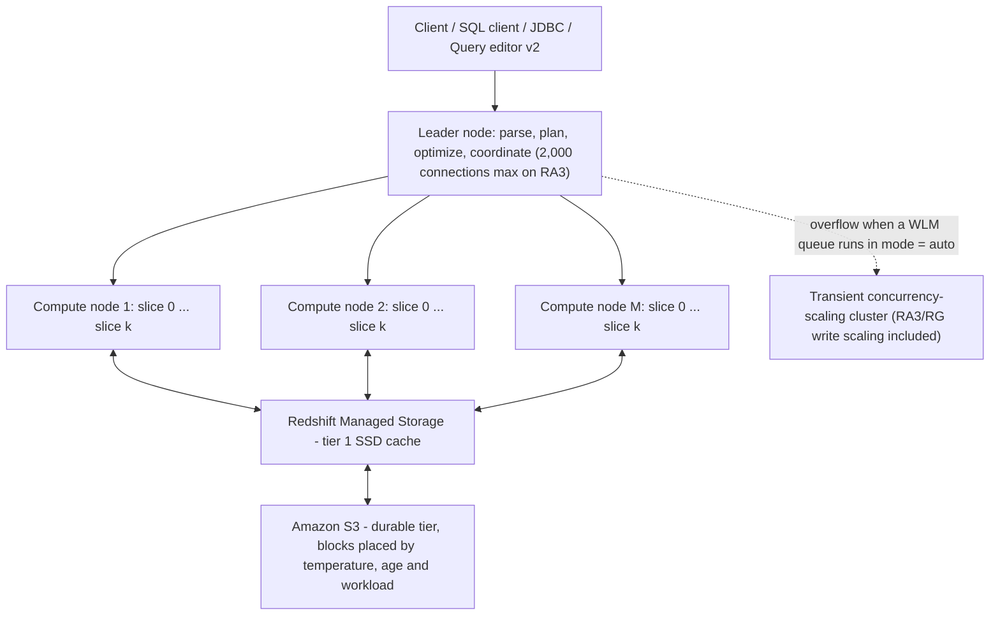
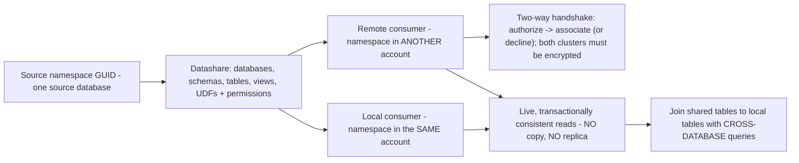
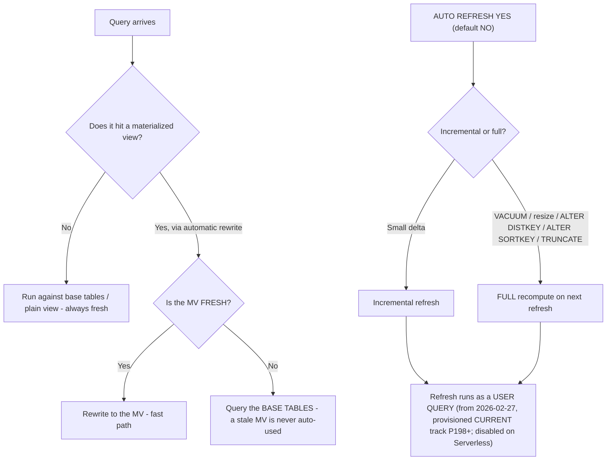
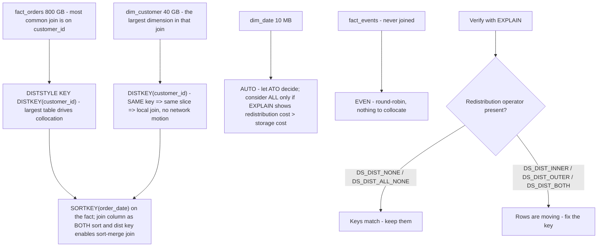
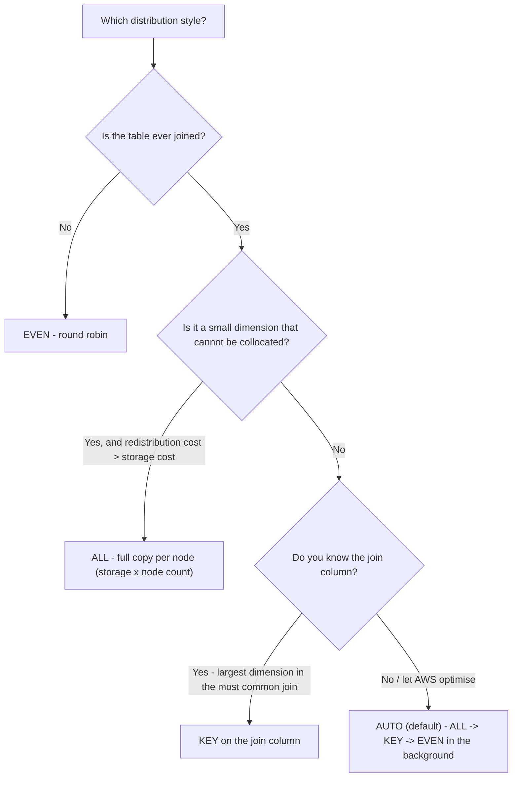
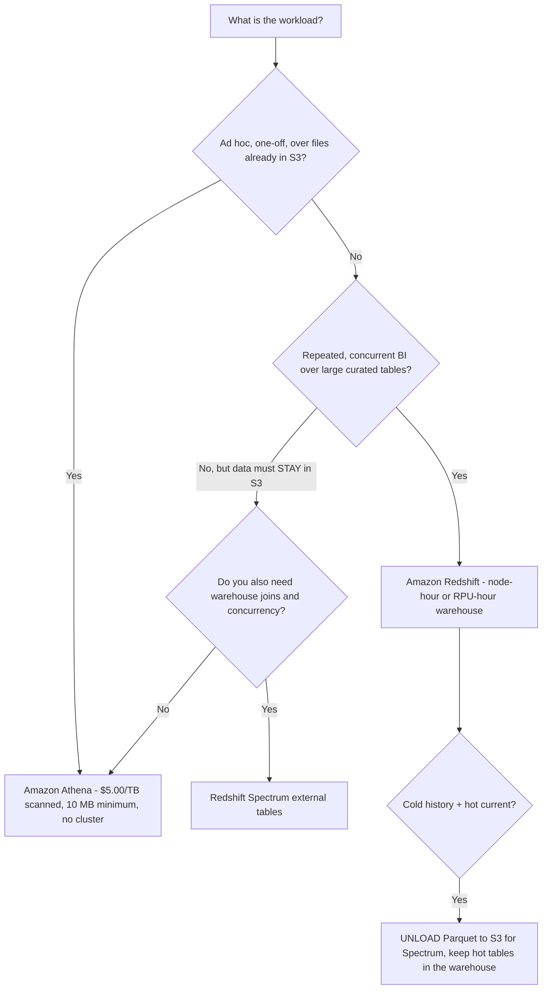

# Amazon Redshift: Warehouse SQL and Data Transformation

Lesson 3 ended with data landing in S3. This lesson is what happens next. Amazon Redshift is the service the DEA-C01 exam guide names in **every domain** — as a read source (skills 1.1.1, 1.1.2), as a transformation engine (1.2.5), as "SQL queries to transform data … for example, Amazon Redshift stored procedures" (1.4), as a migration/remote-access method through **federated queries, materialized views and Spectrum** (2.1.5), as the subject of **load and unload operations** (2.3.1), as a schema-design target (2.4.1), and as a permissions and data-sharing surface (4.2.3, 4.2.4, 4.5.1). That is why one lesson has to cover architecture, SQL, physical design and cost together: on this exam they are never asked in isolation.

```text
====================================================================
 THE REDSHIFT DECISION SURFACE (DEA-C01, all four domains)
====================================================================
  Compute ....... provisioned RA3 cluster (from $0.543/hour)
                  Redshift Serverless (from $1.50/hour, RPU-metered)
  Storage ........ Redshift Managed Storage: SSD cache + S3,
                   $0.024/GB-month - billed INDEPENDENTLY of compute
  Reaching data .. Spectrum (external tables, $5.00/TB scanned)
                  cross-database queries (one cluster, no copy)
                  data sharing (live, no copy, cross-account)
                  federated queries (read-only, RDS/Aurora)
  Load / unload .. COPY (+ MANIFEST, IAM_ROLE, compression)
                  UNLOAD (CSV/JSON/Parquet, PARTITION BY)
                  MERGE (+ REMOVE DUPLICATES)
  In-warehouse SQL .. stored procedures (PL/pgSQL), materialized
                   views, plain views, late-binding views
  Physical design . DISTSTYLE AUTO|EVEN|KEY|ALL
                  SORTKEY AUTO|COMPOUND|INTERLEAVED
  Autonomics ..... auto VACUUM delete/sort, auto ANALYZE, ATO
  Concurrency .... automatic or manual WLM + SQA + concurrency scaling
  Not this ....... ad-hoc one-off SQL over raw S3 = Amazon Athena
====================================================================
```

In this lesson you will:

- read **RA3 architecture** — leader node, slices, and how Redshift Managed Storage bills separately from compute;
- size and reason about **Redshift Serverless**: RPUs, base capacity, the 10× ceiling, workgroup versus namespace;
- price **Spectrum** on bytes scanned and explain why columnar format, compression and partition pruning are cost controls, not just speed controls;
- separate **cross-database queries** (inside one cluster) from **data sharing** (across clusters and accounts) and from **federated queries** (read-only into RDS/Aurora);
- master **COPY versus UNLOAD versus MERGE** — manifests, IAM roles, `COMPUPDATE`, `PARALLEL OFF` and the exact MERGE restrictions;
- write **PL/pgSQL stored procedures** to the exam's stated scope, including what a procedure may *not* contain;
- choose between a **plain view** and a **materialized view**, and know what the **27 February 2026** auto-refresh change did;
- pick **distribution styles** and **sort keys** with worked join, redistribution and skew examples you can compute by hand;
- apply **automatic VACUUM, ANALYZE and WLM** (auto, manual and short query acceleration) with AWS's own thresholds;
- decide **Redshift or Athena** from a decision matrix instead of from habit;
- study **four AWS customer case studies** (GE Aerospace, PayU, Nasdaq and Amazon Customer Service) and a **sourced October 2026 update box**;
- practise with **14 exam-style questions** plus four interactive checks.

---

## 1. RA3 architecture and Redshift Managed Storage

### 1.1 The leader node, compute nodes and slices

AWS's architecture page states it plainly: *"A compute node is partitioned into slices… The leader node manages distributing data to the slices and apportions the workload for any queries or other database operations to the slices."* The **leader node** parses, plans, optimises and coordinates; it does not store table data. **Compute nodes** do the work, each partitioned into **slices** that run in parallel. Clients connect to the leader node, which is why RA3 clusters cap client connections at **2,000** (AWS Redshift limits, accessed Oct 2026).



```dragdrop
{
  "question": "Order the life of a Redshift query from the client's request to the returned rows:",
  "items": [
    "Client sends SQL to the leader-node connection endpoint (RA3 allows up to 2,000 connections)",
    "Leader node parses, plans and optimises the statement",
    "Leader node apportions the work to the slices on the compute nodes",
    "Slices execute in parallel, reading cold blocks from Amazon S3 through the Redshift Managed Storage SSD cache",
    "Leader node collects the slice results and returns the answer to the client"
  ],
  "correctOrder": [
    "Client sends SQL to the leader-node connection endpoint (RA3 allows up to 2,000 connections)",
    "Leader node parses, plans and optimises the statement",
    "Leader node apportions the work to the slices on the compute nodes",
    "Slices execute in parallel, reading cold blocks from Amazon S3 through the Redshift Managed Storage SSD cache",
    "Leader node collects the slice results and returns the answer to the client"
  ],
  "explanation": "AWS documents the split this way: the leader node 'manages distributing data to the slices and apportions the workload for any queries or other database operations to the slices', while table data lives on the compute nodes - and on RA3 the durable copy lives in S3 behind the Managed Storage SSD cache, so a slice can fetch a cold block rather than fail. Everything about planning and coordination happens on the leader; everything about data happens on the slices."
}
```

### 1.2 RA3 node shapes and what a slice means for your SQL

| RA3 size | vCPU | Memory | Slices |
|---|---|---|---|
| `ra3.large` | 2 | 16 GiB | **2** |
| `ra3.xlplus` | 4 | 32 GiB | **2** |
| `ra3.4xlarge` | 12 | 96 GiB | **4** |
| `ra3.16xlarge` | 48 | 384 GiB | **16** |

Slice count matters for two examinable rules: **COPY wants a file count that is a multiple of the slice count**, and **one table has exactly one distribution key**, so collocation is evaluated per slice, not per node (details in Section 10).

### 1.3 Redshift Managed Storage: the bill splits in two

On RA3, local disk is a **tier-1 SSD cache**; the durable copy lives in **Amazon S3**, with blocks placed by **temperature, age and workload**. The exam consequence is arithmetic, not branding: **compute and storage are metered independently** — you can add or remove nodes without re-buying storage, and storage keeps accruing whether or not the cluster is busy.

**Worked example E1 — managed storage on the October 2026 rate card**

| Input | Value |
|---|---|
| Managed storage rate | **$0.024 per GB-month** (AWS Redshift pricing, as of Oct 2026) |
| Warehouse size | **40 TB** = $40 \times 1{,}024 = 40{,}960$ GB |
| Monthly storage cost | $40{,}960 \times 0.024 = $ \mathbf{983.04}$ **/ month** |

That $983.04 is charged **on top of** node hours, and it does not disappear when you pause compute. Answers that quote one blended "per TB" warehouse price are wrong on both mechanics and billing.

- **📚 Did you know?** **DC2 deprecation was announced in April 2025**, pushing customers to **RA3 or Serverless** — which is why AWS's documented best practice for new workloads is **RA3/RG**, and why "just add another DC2 node" is a distractor (AWS Big Data Blog, DC2 migration approach, 2026-03-11). RA3 is *not* "local-only storage": separating compute from storage is the whole point of the generation.

### 1.4 Concurrency scaling: burst capacity with a free-hour budget

When a WLM queue runs with **mode = auto**, overflow queries are routed to **transient clusters** instead of queueing. Eligibility: EC2-VPC clusters of **dc2/rg/ra3** created with **32 or fewer compute nodes**; tables with **interleaved sort keys** and `DISTSTYLE ALL` targets are excluded from **write** scaling, and write scaling itself exists only on **RA3/RG**. `max_concurrency_scaling_clusters` defaults to **1** inside a quota of **10**.

**Worked example E2 — AWS's own burst bill (as of Oct 2026)**

```text
Cluster: 10 x rg.4xlarge in US-West-1          $33.66 / hour
Transient rate:  33.66 / 3600                  $0.00935 / second
Free credit:     1 hour per 24 h per active cluster,
                 bankable to 30 hours
Burst used:      2 clusters x 300 seconds beyond credit
                 0.00935 x 300 x 2             = $5.61
Hour total:      $33.66 + $5.61                = $39.27
```

Drill worth memorising: **one credited hour spread over 4 simultaneous transient clusters buys only $60 \div 4 = 15$ minutes** of free burst each — credits are consumed in real time, not split as whole hours.

---

## 2. Redshift Serverless

### 2.1 Capacity is measured in RPUs

Serverless capacity is expressed in **RPU-hours**, and AWS defines **1 RPU = 16 GB of memory**. There is no cluster to size; instead you set a **base capacity** and a **price-performance target** (default **Balanced**, an AI-driven scaling mode), and Redshift scales compute for the workload.

| Serverless parameter | Value (AWS docs, accessed Oct 2026) |
|---|---|
| Unit | **1 RPU = 16 GB memory** |
| Base capacity | default **128**; configurable **4–512** in steps of **8**; up to **1024** in supported Regions |
| Scaling ceiling | **up to 10× base capacity** |
| MaxRPU (per workgroup hard ceiling) | top value **5,632** |
| Billing | per second, **60-second minimum** |
| Included in the RPU-hour | **Spectrum** and **concurrency scaling** |
| Entry price | **from $1.50/hour** (as of Oct 2026) |

**Worked example E3 — what "base capacity" buys you**

```text
Base capacity           128 RPU  x 16 GB  =  2,048 GB memory
Scale ceiling  10 x 128          = 1,280 RPU x 16 GB = 20,480 GB
MaxRPU workgroup ceiling         = 5,632 RPU (the hard stop)
```

AWS's own sizing guidance (re:Post, 2026-06-11): **4 RPU for under 32 TB**; **8/16/24 RPU for under 128 TB**; **32 RPU or more above 128 TB**. And because billing is per second with a **60-second minimum**, a two-second query still costs a full minute of RPU time — serverless does not mean free-when-idle, it means *no idle at all* between queries.

### 2.2 Workgroup is compute; namespace is identity

| Object | What it owns | Exam sentence |
|---|---|---|
| **Workgroup** | Compute boundary — capacity settings, VPC, price-performance target | "Which *capacity* setting do I change?" → workgroup |
| **Namespace** | Database identity — schemas, users, encryption keys; identified by a **GUID** | "Which *database objects* are shared?" → namespace |

This distinction returns in Section 5: a **datashare is bound to one source database inside a namespace**, and the consumer command quotes that **GUID**.

---

## 3. Amazon Redshift Spectrum

### 3.1 External tables: query S3 without loading it

Spectrum lets a Redshift cluster create **external tables** over data that stays in **Amazon S3**, with metadata registered in the **AWS Glue Data Catalog**, and it is billed on **bytes scanned** — not rows returned, not bytes stored.

| Spectrum fact | Value (AWS pricing, as of Oct 2026) |
|---|---|
| Rate (us-east-1) | **$5.00 per TB scanned**, rounded to MB, **10 MB minimum per query** |
| Free of charge | **DDL** statements and **failed** queries |
| Still billed | **Cancelled** queries, for the bytes already read |
| On Serverless | **No separate Spectrum charge** — included in the RPU-hour |
| On RG instances | **Not required** — RG includes a built-in data lake query engine |

### 3.2 Worked example E4 — three ways to make one Spectrum query cheaper

One table of **100 columns**; the query reads **one** column:

| Layout of the same data | Bytes scanned | Spectrum cost |
|---|---|---|
| Uncompressed text | 4 TB | $4 \times 5.00 = \mathbf{\$20.00}$ |
| GZIP at 4:1 | 1 TB | $1 \times 5.00 = \mathbf{\$5.00}$ |
| GZIP + Parquet, one column read | 0.25 TB | $0.25 \times 5.00 = \mathbf{\$0.05}$ |

Three levers, three different mechanisms: **compression** shrinks every byte, **columnar format** lets the engine skip columns it does not need, and **partition pruning** skips whole files. A fourth lever is file hygiene — AWS recommends external files of **64 MB or larger**, and setting `TABLE PROPERTIES (numRows = …)` because **Redshift never runs ANALYZE on external tables** and otherwise assumes an external table is the largest table in the join.

> [!IMPORTANT]
> **Spectrum bills what you scan, not what you return.** `SELECT *` over wide, uncompressed CSV pays for every column of every row read. The Athena price in Section 12 is the same **$5.00/TB scanned** with a **10 MB minimum** — the two services meter identically, which is exactly why the *choice* between them is architectural, not financial (as of Oct 2026).

---

## 4. Cross-database queries

A single Redshift cluster can host several databases. Cross-database queries let you read and write across them using the three-part name `database.schema.object` (or an external-schema alias) — **with no data copies**, against a **transactionally consistent snapshot**. They are supported on **RG, RA3 and Serverless**.

```sql
-- Connected to database "analytics"; two other databases, zero copies
SELECT s.order_id,
       e.event_ts
FROM   analytics.sales          s
JOIN   staging.raw_events     e USING (order_id)
WHERE  s.order_date >= '2026-10-01'
AND    e.source = 'mobile-app';

-- Same cluster, one database away: three-part name is database.schema.table
SELECT count(*) FROM otherdb.reporting.weekly_rollup;
```

| Supported | Not supported (exam limits) |
|---|---|
| Read/write across databases in **one cluster** | **Column-level privilege** tables from another database |
| Views on other databases: **late-binding views and materialized views only** | Regular views on other-database objects |
| External schemas as a shorthand alias | Writes into the external schema of a database you are not connected to |
| RG, RA3, Serverless | **Interleaved sort keys** on the remote object |
| — | Three-part `information_schema` / `pg_catalog` references |

- **📚 Did you know?** The two most-confused features on this exam differ by **one word and one boundary**: **cross-database** stays *inside a single cluster*, while **data sharing** crosses *clusters, accounts and Regions*. Neither one copies data — but only data sharing needs a `NAMESPACE '<guid>'` GUID, an explicit authorize/associate handshake and **two encrypted clusters**.

---

## 5. Data sharing

A **datashare** is a bundle of **objects + permissions + consumers**, bound to **one source database**. The consumer creates a database *from* it:

```sql
-- Consumer side: local (same account) or remote (other account)
CREATE DATABASE consumer_sales
FROM DATASHARE orders_share
OF NAMESPACE '1a2b3c4d-5e6f-7a8b-9c0d-1e2f3a4b5c6d';
```



| Rule | Detail (AWS data-sharing docs, accessed Oct 2026) |
|---|---|
| Consistency | **Live and transactionally consistent** — no copy, no refresh lag |
| Writes | **Read-only by default**; writes require explicit grants (`WITH PERMISSIONS` gives per-object grants, otherwise `USAGE` implies every object) |
| Chaining | **Not allowed** — a datashare cannot be shared on from the consumer |
| Views | Only **late-binding views and materialized views** over shared objects |
| Joins to local data | Use **cross-database queries** (Section 4) |
| What is shareable | Databases, schemas, tables, views, UDFs |

Two things are deliberately absent from that table: AWS does **not** document a price for data sharing, and it does **not** document Region availability for it — so neither "it is free" nor "it costs X" belongs in an exam answer (see Section 17 of the digest: unverified).

---

## 6. COPY, UNLOAD and MERGE: the three load-path verbs

### 6.1 COPY — the default answer for volume

AWS's rule of thumb: *load bulk rows with `COPY`; use SQL inserts only for small changes, and if you must insert in SQL, use a **multi-row insert** whenever possible, because "data compression is inefficient when you add data only one row or a few rows at a time."*

**Worked example E5 — COPY with a manifest and an IAM role (the sketch to memorise)**

```sql
COPY public.order_items
FROM 's3://acme-orders-prod/2026/10/orders.manifest'
IAM_ROLE 'arn:aws:iam::123456789012:role/RedshiftCopyRole'
MANIFEST
FORMAT AS CSV
GZIP
COMPUPDATE ON
MAXERROR 100
TRUNCATECOLUMNS;
```

The manifest it points at is a **single JSON file**, not a prefix:

```json
{"entries":[
  {"url":"s3://acme-orders-prod/2026/10/part-0001.gz","mandatory":true},
  {"url":"s3://acme-orders-prod/2026/10/part-0002.gz","mandatory":false}
]}
```

| COPY rule | Value / behaviour |
|---|---|
| Authorization | **`IAM_ROLE 'arn:…'`** or **`IAM_ROLE 'default'`** (role pre-attached to the cluster); access keys are **discouraged** and **mutually exclusive** with `IAM_ROLE` |
| Manifest | Optional `{"entries":[{url, mandatory}]}`; you must add the **`MANIFEST`** keyword — omit it and COPY parses your JSON as data and fails |
| Duplicate manifest entry | The file **loads twice** |
| File sizing | Count = a **multiple of slice count**, each file **1 MB–1 GB compressed** |
| `COMPUPDATE` default | Samples **only when the target table is empty and no encoding is declared** |
| `COMPUPDATE ON / PRESET / OFF` | sample and maybe replace / assign by type without sampling / never |
| `COMPROWS` | **100,000 rows per slice** sampled by default (minimum 1,000) |

> [!WARNING]
> **`COMPUPDATE` silently does nothing on a populated table.** Re-running `COPY` into a table that already has rows will **not** re-derive encodings under the default setting. If the exam says "re-derive compression on an existing table", the answer is an explicit `COMPUPDATE ON`/`PRESET` — or, better, let **automatic table optimization** own it (Section 11).

### 6.2 UNLOAD — export, with format and file-shape control

```sql
UNLOAD ('SELECT order_id, amount, updated_at
         FROM sales_fact
         WHERE order_date >= ''2026-10-01''
         ORDER BY order_date')
TO 's3://acme-curated/sales_fact/'
IAM_ROLE 'default'
FORMAT AS PARQUET
PARTITION BY (order_date)
PARALLEL OFF
ALLOWOVERWRITE;
```

| UNLOAD clause | Why it is examinable |
|---|---|
| `FORMAT CSV \| JSON \| PARQUET` | Parquet unloads **up to 2× faster** and uses **up to 6× less storage** than text (AWS) |
| `PARTITION BY` | Writes Hive-style partitions so Athena/Spectrum can prune |
| `PARALLEL ON` (default) | One or more files **per slice** |
| `PARALLEL OFF` | **Preserves `ORDER BY`** — the only mode that does |
| `MAXFILESIZE` | **6.2 GB** ceiling (range 5 MB–6.2 GB) |
| `MANIFEST [VERBOSE]` | Emits a manifest so a later `COPY … MANIFEST` can round-trip it exactly |
| `ALLOWOVERWRITE`, `ENCRYPTED` | Idempotent reruns; server-side encryption on write |

### 6.3 MERGE — the idempotent upsert

```sql
MERGE INTO sales_fact t
USING sales_staging s
   ON t.order_id = s.order_id
WHEN MATCHED THEN
     UPDATE SET amount = s.amount, updated_at = s.updated_at
WHEN NOT MATCHED THEN
     INSERT (order_id, amount, updated_at)
     VALUES (s.order_id, s.amount, s.updated_at);
```

| MERGE restriction (AWS `MERGE` reference) | Consequence |
|---|---|
| Target cannot be a system, catalog or **external** table | You cannot MERGE straight onto a Spectrum table |
| **Source ≠ target**, and no `WITH` clause | Stage first, then merge |
| A target row must not match **multiple** source rows | Deduplicate the staging table, or use `MERGE … WHEN MATCHED THEN REMOVE DUPLICATES` for pure dedupe on identical schemas |
| Required privileges | `SELECT` on both sides plus `INSERT`/`UPDATE`/`DELETE` on the target |
| Manual alternative | Staged `UPDATE`/`DELETE`/`INSERT` must run in **one transaction** |

```fillblank
{
  "question": "Complete the load, unload and upsert statements with the correct Redshift keywords:",
  "template": "A 500-million-row daily drop in S3 is loaded with {{1}}, whose JSON file list requires the {{2}} keyword and is mutually exclusive with access keys when the {{3}} clause is used. Exporting an ordered result set to a single file requires {{4}} OFF, and the idempotent upsert statement is {{5}}.",
  "answers": {
    "1": "COPY",
    "2": "MANIFEST",
    "3": "IAM_ROLE",
    "4": "PARALLEL",
    "5": "MERGE"
  },
  "distractors": ["INSERT", "UNLOAD", "LOAD", "FORMAT", "SPLIT", "PARTITION BY", "UPSERT", "REPLACE", "MERGE INTO DEDUP"],
  "explanation": "COPY handles bulk load; MANIFEST tells COPY the path is a JSON file list rather than data (omitting the keyword makes COPY parse the JSON as rows); IAM_ROLE is the documented preferred authorization and cannot be combined with access keys; PARALLEL OFF is the only UNLOAD mode that preserves ORDER BY; MERGE is the native upsert. INSERT is the wrong verb at 500 million rows - AWS explicitly says use multi-row inserts only when COPY is not an option."
}
```

**Worked example E6 — the copy-vs-insert arithmetic**

```text
Table: 8 slices, target 500,000,000 rows from S3
COPY:   file count = 8 x k   (k files per slice), 1 MB-1 GB each
        -> one statement, parallel across slices, auto ANALYZE on an
           empty target, compression derived by COMPUPDATE
INSERT: 1 row per statement = 500,000,000 statements
        -> compression cannot be derived incrementally, and AWS says
           compression is "inefficient when you add data only one row
           or a few rows at a time"
```

---

## 7. Stored procedures (PL/pgSQL) — the exam scope

```sql
CREATE OR REPLACE PROCEDURE stg.load_orders()
LANGUAGE plpgsql AS $$
DECLARE
  v_rows bigint;
BEGIN
  COPY stg.orders_raw FROM 's3://acme-orders-prod/today/'
       IAM_ROLE 'default' GZIP;
  SELECT count(*) INTO v_rows FROM stg.orders_raw;
  IF v_rows = 0 THEN
    RAISE INFO 'no rows today - skipping';
  ELSE
    TRUNCATE stg.orders_clean;
    INSERT INTO stg.orders_clean
      SELECT * FROM stg.orders_raw WHERE valid;
    CALL stg.merge_orders();   -- nested CALL, max 16 levels
  END IF;
END $$;

CALL stg.load_orders();
```

| Procedure fact | Detail (AWS stored-procedure docs) |
|---|---|
| Invocation | `CALL name(...)`; created with `CREATE [OR REPLACE] PROCEDURE … LANGUAGE plpgsql` |
| Versus a UDF | A procedure **may contain DDL and DML** (`COPY`, `UNLOAD`, `INSERT`, `CREATE TABLE`) and **need not return a value** |
| `DECLARE / BEGIN / END` | **Grouping, not a transaction** — a `BEGIN…END` block does not open a transaction |
| Default transaction | One **implicit transaction per `CALL`**; `COMMIT`/`ROLLBACK`/`TRUNCATE` are legal only **outside** a caller transaction block |
| `NONATOMIC` | Auto-commits per statement; a cursor loop then needs an explicit `START TRANSACTION` first |
| Body features | `IF/ELSIF/ELSE`, loops, `EXIT`, `EXECUTE` (dynamic SQL), `RAISE`, `refcursor` cursors |
| Limits | **16** nested `CALL` levels; **one** open cursor per session; **no subtransactions** |
| Forbidden inside | `PREPARE`, `CREATE/DROP DATABASE`, `CREATE EXTERNAL TABLE`, **`VACUUM`**, `SET LOCAL`, `ALTER TABLE APPEND` |

The exam framing is **conditional pipeline logic**: branch on a row count, `TRUNCATE` + `INSERT…SELECT`, then let **Step Functions or EventBridge** invoke the whole thing through the **Redshift Data API**. "Run `VACUUM` inside the procedure" is never the answer — maintenance is orchestrated *outside*, in Section 11.

- **📚 Did you know?** A procedure's `BEGIN/END` and a transaction's `BEGIN` are different animals with the same keyword. That is why the documentation warns that grouping blocks are **not** transactions — a failed statement inside a `CALL` rolls back the whole implicit transaction, not just the block, unless the procedure was declared `NONATOMIC`.

---

## 8. Materialized views versus views

| | **View** | **Materialized view** |
|---|---|---|
| What is stored | **Only the SQL** | **The query results** |
| Freshness | Always current — nothing to refresh | **Stale until refreshed** |
| Read speed | Re-executes the query | Reads precomputed rows |
| Cost | No storage, no refresh job | Storage plus refresh compute |
| Exam sentence | "Must always reflect the latest base-table change" | "Repeated expensive aggregation over a stable base" |

### 8.1 Refresh mechanics

Refresh is either manual (`REFRESH MATERIALIZED VIEW`) or automatic (`AUTO REFRESH YES` — **default is `NO`**), and Redshift chooses **incremental** or **full** recomputation. A **full recompute is forced** after a manual `VACUUM`, a classic resize, `ALTER DISTKEY`, `ALTER SORTKEY` or a `TRUNCATE`.



### 8.2 Automatic rewriting and AutoMV

Automatic query rewriting uses **only fresh** materialized views, and only for eligible `SELECT`s: **no subqueries, outer joins, set operations, `DISTINCT`/window/`HAVING`, aggregates beyond `SUM`/`COUNT`/`MIN`/`MAX`/`AVG`, and no external or shared tables**. The session kill switch is `SET mv_enable_aqmv_for_session = FALSE`. **AutoMV** creates materialized views from observed workload patterns (they appear as `%_auto_mv_%` inside `EXPLAIN`) under the same eligibility limits.

```sql
CREATE MATERIALIZED VIEW mv_sales_by_region
AUTO REFRESH YES
AS
SELECT region_id, date_trunc('month', order_date) AS m, sum(amount) AS total
FROM   sales_fact
GROUP  BY 1, 2;

REFRESH MATERIALIZED VIEW mv_sales_by_region;
```

> [!WARNING]
> **Refresh is not free, and it got louder in 2026.** *"Starting February 27, 2026, Auto REFRESH queries for Amazon Redshift materialized views are executed as user queries rather than background autonomic processes"* (provisioned clusters on the CURRENT track, P198+; **disabled on Serverless**). A refresh therefore competes for WLM slots at user priority — which is precisely the interaction this lesson's Sections 8 and 11 are testing together.

---

## 9. Federated queries and the query surface around them

**Federated queries** let the Redshift leader node pull data from a relational source without moving it first:

| Fact | Value (AWS federated-query docs) |
|---|---|
| Sources | **Amazon RDS / Amazon Aurora PostgreSQL ≥ 9.6** and **MySQL ≥ 5.6** |
| Ports | **5432** (PostgreSQL), **3306** (MySQL) |
| Direction | **Read-only** |
| Credentials | **AWS Secrets Manager** secret plus an **IAM role** |
| Concurrency scaling | **Not available** for federated queries |
| Exam use | Skill **2.1.5** — "implement data migration or remote access methods (for example, Amazon Redshift federated queries, materialized views, Spectrum)" |

The four "reach out" features now line up as one family, and the exam tests the differences:

| Feature | Copies data? | Direction | Boundary |
|---|---|---|---|
| **Cross-database queries** | No | Read/write | One cluster, several databases |
| **Data sharing** | No | Read (write with explicit grants) | Clusters, accounts, Regions |
| **Spectrum** | No | Read | Redshift → S3 via Glue Data Catalog |
| **Federated queries** | No | **Read only** | Redshift → RDS / Aurora PostgreSQL or MySQL |

Around that, **Query editor v2** is the analyst surface: concurrent tabs and notebooks, session variables, temporary tables, `${param}` placeholders, history for the last **1,000** queries, and scheduled queries driven by **EventBridge + the Redshift Data API**.

---

## 10. Distribution styles and sort keys: where the join cost is decided

### 10.1 Distribution styles

`DISTSTYLE` accepts **AUTO | EVEN | KEY | ALL**, with **AUTO the default**. AUTO starts small tables as **ALL**, moves them to **KEY**, and may settle on **EVEN**, adjusting in the background — and **automatic table optimization** keeps making those adjustments unless you pin an explicit style.

| Style | What it does | Cost / trap |
|---|---|---|
| **KEY** | Collocates rows by the value of **one** distribution column — at most **one** distkey per table | The join column must match, or rows still redistribute |
| **EVEN** | Round-robin across slices | No collocation; fine for tables that are never joined |
| **ALL** | A full copy of the table on **every** node | Storage **× node count**; slower loads; **excluded from concurrency-scaling writes** |
| **AUTO** (default) | Background migration ALL → KEY → maybe EVEN | Explicit keys remove the table from automation |

AWS's star-schema guidance: the distribution key should be **the largest dimension in the most common join**; use **ALL** for dimensions that cannot be collocated and whose redistribution cost exceeds the storage cost; **AUTO** everywhere else. And AWS's own sentence for why KEY works: *"If you distribute a pair of tables on the joining keys, the leader node collocates the rows on the slices according to the values of the joining columns."*

### 10.2 Sort keys

| Sort key type | Cap | Notes |
|---|---|---|
| **COMPOUND** | **400** columns | Leading-column prefix ranges; the classic choice |
| **INTERLEAVED** | **8** columns | Equal-weight across columns; **higher load and VACUUM cost**, needs `REINDEX` (`interleaved_skew > 1.4`), **blocks concurrency scaling**, unsupported in cross-database queries |
| **AUTO** (default) | — | Lets **automatic table optimization** pick and revise the sort key |

Put the join column as **both** sort key and distribution key and Redshift can choose a **sort-merge join** instead of a hash join — no hash build, no spill, no network motion.

**Worked example E7 — choose the distribution style for a star schema**

```text
fact_orders   800 GB   joins dim_customer on customer_id in 90% of queries
dim_customer   40 GB   the largest dimension in that join
dim_date       10 MB   joins too, but tiny
fact_events    -       denormalized, never joined
```





**Worked example E8 — reading the plan, with AWS's own numbers**

```sql
-- Skew and sort triage before you change anything
SELECT "table", diststyle, skew_rows, unsorted, stats_off, vacuum_sort_benefit
FROM   svv_table_info
ORDER  BY skew_rows DESC NULLS LAST;
```

```text
skew_rows        >= 4.00  -> change the DIST STYLE
unsorted         >  20 %  -> consider VACUUM, but read vacuum_sort_benefit
                              first (86% unsorted can still be 5% improvable)
stats_off        high     -> ANALYZE ... PREDICATE COLUMNS
interleaved_skew >  1.4   -> VACUUM REINDEX (slow, interleaved only)

EXPLAIN operator tags:
  DS_DIST_NONE / DS_DIST_ALL_NONE   good - no motion
  DS_BCAST_INNER                    fine only when the inner side is small
  DS_DIST_INNER / DS_DIST_OUTER     costly - one side is being moved
  DS_DIST_ALL_INNER                 serialises onto one slice
  DS_DIST_BOTH                      worst case
  Nested Loop                       usually a MISSING join predicate
  Hash Join                         can spill to disk
  Merge Join                        fastest - both sides dist + sorted on the keys
```

AWS published the effect of moving dimensions to `DISTSTYLE ALL` on one real plan: join cost fell from **3,272,334,142.59 to 14,142.59** (Amazon Redshift Prescriptive Guidance, accessed Oct 2026). The lesson is not "always use ALL" — it is that **the plan, not the rule of thumb, is the arbiter**.

```matching
{
  "question": "Match each Redshift physical-design situation to the correct choice:",
  "pairs": [
    {"left": "800 GB fact joined to a 40 GB dimension on 90% of queries", "right": "DISTSTYLE KEY on the join column - collocate both sides so the join stays local"},
    {"left": "A wide fact table that is only ever aggregated, never joined", "right": "DISTSTYLE EVEN - round-robin, there is nothing to collocate"},
    {"left": "A tiny dimension that cannot share the fact's distribution key", "right": "DISTSTYLE ALL - full copy per node, watch storage x node count"},
    {"left": "Three different equality predicates queried with equal frequency", "right": "DISTSTYLE AUTO / SORTKEY AUTO - let automatic table optimization revise it"},
    {"left": "A table scanned by leading-column date ranges", "right": "COMPOUND sort key - up to 400 columns, prefix ranges, cheap to maintain"},
    {"left": "A table queried by any of 4–8 independent columns", "right": "INTERLEAVED sort key - max 8 columns, but heavier VACUUM and no concurrency-scaling writes"}
  ],
  "explanation": "The star-schema rule is: distribution key = the largest dimension in the most common join; ALL only when redistribution costs more than the replicated storage; EVEN when there is no join. On sort keys, COMPOUND is the 400-column default-friendly choice, while INTERLEAVED is capped at 8 columns, requires VACUUM REINDEX when interleaved_skew exceeds 1.4, blocks concurrency scaling and is unsupported in cross-database queries."
}
```

---

## 11. Automatic maintenance and workload management

### 11.1 VACUUM, ANALYZE and the autonomics that replaced them

Redshift's **autonomics** are four background behaviours: **automatic vacuum delete**, **automatic vacuum sort**, **automatic analyze** and **automatic table optimization** (plus automated materialized views). They run in light-load windows and pause under high load or exclusive DDL locks — which is why "why didn't my VACUUM run?" is a scheduling question, not a permissions question.

| Control | Default / threshold (AWS docs, accessed Oct 2026) |
|---|---|
| Automatic analyze | **On by default**; skips tables whose stats are current; `analyze_threshold_percent` = **10** |
| Auto-analyse triggers | `COPY` into an **empty** target; `CREATE TABLE AS` |
| Automatic vacuum delete/sort | On, background, paused by load or locks |
| Manual `VACUUM` (default `FULL`) | **Skips sorting below 95% unsorted** — do not teach "VACUUM after every load" |
| `VACUUM REINDEX` | Interleaved only; much slower |
| Monitor | `unsorted` and `vacuum_sort_benefit` in `SVV_TABLE_INFO` |
| ATO | Applies sort/dist keys to `AUTO` tables within hours of enough queries; audit `SVV_ALTER_TABLE_RECOMMENDATIONS` |

### 11.2 Workload management: three mechanisms, not one

WLM configuration lives in the **parameter group** (`wlm_json_configuration`), and AWS's hard rule is: **never mix automatic and manual queues in one parameter group**.

| Mechanism | What it controls | Key numbers |
|---|---|---|
| **Automatic WLM** (default, recommended) | Redshift assigns **concurrency and memory** itself | Up to **8 queues** (service classes **100–107**); adds **query priority** and Query Monitoring Rules |
| **Manual WLM** | You set static **memory %** and **concurrency** per queue and route by user group | Concurrency **1–50** per queue, **50 slots total**, AWS recommends **≤ 15** |
| **Short query acceleration (SQA)** | An ML model predicts runtime; short queries **skip the queue** | Dynamic (0) or **1–20 seconds**; **on by default**; service class **14**; only **CTAS and read-only** queries are eligible |
| **Query priority** | Relative importance of a query within **automatic** WLM | `priority` exists **only** in auto WLM |
| **Concurrency scaling** | Overflow to transient clusters | Per queue with **mode = auto**; **1 free hour per 24 h** |

Default state of a fresh cluster: **1 queue with 5 concurrent queries**. `max_execution_time` is **deprecated** — the modern equivalent is a QMR on `query_execution_time`, evaluated every **10 seconds**, with severities `log` < `hop` < `abort` < `change priority` (note: `abort` never stops `COPY`, `ALTER`, `ANALYZE` or `VACUUM`, and `change priority` exists only in auto WLM).

```mermaid
flowchart TD
    Q["New query"] --> S{"Short query acceleration: predicted runtime <= 20 s (or dynamic)? CTAS or read-only?"}
    S -->|Yes| S1["Service class 14 - skips the queue"]
    S -->|No| W{"WLM mode"}
    W -->|Automatic (default)| W1["Service classes 100-107 - AWS assigns slots and memory; query priority + QMR apply"]
    W -->|Manual| W2["Your queues: memory % + concurrency 1-50, 50 slots total, recommend <= 15"]
    W1 --> QM{"QMR every 10 s: log / hop / abort / change priority"}
    W2 --> QM
    QM --> RUN["Runs on the main cluster"]
    RUN -->|Queue too long and queue mode = auto| CS["Transient concurrency-scaling cluster (1 free hour per 24 h, bankable to 30 h)"]
    CS --> BILL["Then per-second billing, 1-minute minimum per activation"]
```

- **📚 Did you know?** SQA and automatic WLM are frequently conflated and are **different mechanisms**: SQA (class **14**) predicts *runtime* to short-circuit the queue, while automatic WLM (classes **100–107**) decides *slots and memory*. Both may be enabled together — and neither is concurrency scaling, which adds whole **clusters**. Three layers, three names, one stem.

---

## 12. Redshift or Athena? The decision matrix

AWS's own framing: Amazon Athena is for *"interactive ad hoc SQL queries against data on Amazon S3, without … infrastructure or clusters"*, while Redshift is *"optimized … on complex queries that join large numbers of very large database tables"*. The teaching rule that follows is short: **Athena = ad-hoc SQL over files in S3; Redshift = BI over a curated warehouse.**

| Signal in the question | Exam answer | Basis |
|---|---|---|
| Complex joins across many large curated tables; BI dashboards; repeated concurrent reports | **Redshift** | Warehouse-optimised for large joins |
| One-off, infrequent SQL over files already in S3; no infrastructure wanted | **Athena** | No cluster, no nodes |
| "Pay only when querying" | **Athena** — $5.00/TB scanned | Redshift bills node-hours or RPU-hours whether or not anyone queries |
| Keep data in S3 but still need warehouse joins and concurrency | **Redshift Spectrum** external tables | Same cluster, no load |
| Cheap long-term raw plus a fast curated layer | **Both** — `UNLOAD` Parquet to S3, Spectrum for cold, warehouse for hot | Lake house pattern |
| Log/event, semi-structured, schema-on-read exploration | **Athena** | Schema-on-read fit |



> [!IMPORTANT]
> **Do not invent a crossover point.** Plenty of third-party articles claim "Redshift becomes cheaper than Athena above X TB per month" — **AWS publishes no such number**, so no exam answer should contain one (unverified, see the digest's section G). What AWS *does* publish is the metering shape: **per-scan** for Athena versus **always-on node-hours / RPU-hours** for Redshift, plus Spectrum's **$5.00/TB scanned** for S3 data queried from Redshift (as of Oct 2026).

- **📚 Did you know?** The Athena half of this matrix moved too: **managed query results** (2025-06-03) are service-managed, encrypted and **cost nothing extra**, so no S3 result bucket is required any more — and **Capacity Reservations** now start at **4 DPU for 1 minute** instead of 24 DPU for 60 minutes (2026-02-11). Both "Athena needs a result bucket in S3" and "Athena reservations begin at 24 DPU" are stale facts that still appear in live third-party material (AWS What's New, 2025-06-03 / 2026-02-11).

### 2026 Updates (as of October 2026)

> [!NOTE]
> **What changed in Redshift between 2025 and October 2026** — every line checked against a primary AWS source, and each one is examinable because the exam tests current behaviour:
> - **Redshift can now write to Iceberg, not just read it**: table creation/`INSERT` went GA **2025-11-17** (append-only, over the **Glue Data Catalog**), **JIT ANALYZE** followed on **2025-11-18**, **`UPDATE`/`DELETE`/`MERGE` on Iceberg tables (including Amazon S3 Tables) arrived 2026-04-23**, and **Iceberg materialized views** on **2026-10-05** — AWS What's New, 2025-11-17 / 2025-11-18 / 2026-04-23 / 2026-10-05.
> - **Iceberg DML permissions were tightened (Patch 202)**: `INSERT` needs `INSERT`; `DELETE` needs `DELETE`; `UPDATE`/`MERGE` need **`INSERT` + `DELETE`**; and **all Iceberg DML also needs `ALTER`** — a grant of `INSERT` alone is no longer sufficient (Redshift behaviour-changes page, accessed Oct 2026).
> - **Scalar Python UDFs are done**: no new ones after **2025-10-30**, unsupported after **2026-06-30** — do not design new pipeline logic on them (Redshift documentation banner, accessed Oct 2026).
> - **Serverless now has a commitment path**: **1-year reservations at 20%/24%** and **3-year at up to 45%** (2026-02-23), plus **3-year all-upfront-upgrade reservations at up to 50%** (2026-07-24), against an entry price of **from $1.50/hour** and a **4 RPU** minimum — AWS What's New, 2026-02-23 and 2026-07-24; Redshift pricing, as of Oct 2026.
> - **Materialized-view auto refresh changed on 2026-02-27**: auto-refresh queries now run **as user queries** rather than background autonomic processes on provisioned CURRENT-track clusters (P198+), and remain **disabled on Serverless** — Redshift documentation, accessed Oct 2026.
> - **Two dated behaviour changes are still landing**: enhanced billing for **Serverless and Redshift-managed snapshots from 2026-06-08**, and a **minimum TLS version change on 2026-10-31** — Redshift behaviour-changes page, accessed Oct 2026. Certificate-handshake and snapshot-cost questions now have dates attached to them.
> - **The shared Iceberg table got a third writer**: **Amazon S3 Tables added the Variant type for Iceberg v3** (2026-07-28), and since **2026-04-23** Redshift's `UPDATE`/`DELETE`/`MERGE` run over **S3 Tables** too — so one table can be written by Glue, updated by Redshift and read by Athena without a copy — AWS What's New, 2026-07-28 and 2026-04-23.
> - **Iceberg format v3 is now mainstream in the AWS lake stack**: **AWS Glue 6.0** (2026-08-21) ships **full Apache Iceberg v3 support** — VARIANT + shredding, deletion vectors and row lineage — with a **30% price reduction**, so "open table format" questions may assume v3 features (AWS What's New and AWS Big Data Blog, 2026-08-21).
> - **Exam guide context**: DEA-C01 **guide v1.1 (2025-12-12)** added skill **2.1.7 "Manage open table formats (for example Apache Iceberg)"** with no removals, which is why Redshift-on-Iceberg is squarely in scope — DEA-C01 revisions page, 2025-12-12.

- **📚 Did you know?** Two "stale fact" traps sit in the same topic: a widely quoted 2020 APN post claims Redshift *"doesn't actually support materialized views"* (false since 2021), and any option claiming Redshift can only *read* Iceberg has been wrong since **2025-11-17**. On this exam, an old AWS post is not a source — the current documentation page is.

---

## Real-World Case Studies

AWS publishes what these abstractions look like in production. Every figure below is **customer- or AWS-claimed and unaudited**, with the source named so you can check it — the examinable point is the **pattern**, not the marketing.

### Case A — GE Aerospace: a legacy operational data store, rewritten on Redshift

| Element | Detail |
|---|---|
| Customer | **GE Aerospace**, aerospace and supply-chain operations |
| Challenge | A large **operational data store (ODS)** with compliance and performance constraints, plus **150+ reports** (some over **10,000 lines of code**) |
| Services | **Amazon Redshift**, with AWS Solutions Architecture and Redshift engineering support |
| Outcomes | **~70% better query performance**; estimated **over $500,000 per year**; proof of concept Nov–Dec 2022, then a **9-month migration January–September 2023**; reports that ran **90 minutes now run in 7 minutes** |
| Exam domain | **Domain 2** (store design and load/unload) with **Domain 3** hooks (performance, cost) |
| Source | `aws.amazon.com/solutions/case-studies/ge-aerospace-case-study` (accessed Oct 2026) |

> "We were seeing queries that used to run for an hour and a half running in 7 minutes using Amazon Redshift." — Bejoy John, Senior Director of Data Analytics, GE Aerospace (AWS case study, accessed Oct 2026)

The examinable pattern: this was **not** a lift-and-shift. It was a **nine-month** programme with a formal PoC, and the win came from re-doing the physical design of a warehouse — which is exactly Sections 10 and 11 of this lesson (distribution, sort keys, maintenance, WLM), not from adding nodes.

### Case B — PayU: consolidation plus data sharing across five clusters

| Element | Detail |
|---|---|
| Customer | **PayU**, fintech/payments company |
| Challenge | Data siloed across **~40 production databases**; queries taking **10–15 minutes**; data freshness only **once a day** |
| Services | **AWS Glue ETL → Amazon S3 → Amazon Redshift**, plus **Redshift Data Sharing across 5 clusters** (2 ETL + 3 consumer) |
| Outcomes | Queries **10–15 min → under 1 min**; freshness **once/day → under 30 minutes** (ML streaming under 5 s); **$20,000/month** saved; **~200 TB scanned per day**; query volume **150,000 → 35,000 per month (−77%)** |
| Exam domain | **Domain 1** (transformation feeding the load) plus **Domain 4** skills 4.5.1 (permissions for data sharing) |
| Source | `aws.amazon.com/solutions/case-studies/payu-redshift-case-study` (accessed Oct 2026) |

> "In 1 month, we cut down queries by 77 percent, which would have been a 6-month exercise in the previous environment." — PayU, AWS case study (accessed Oct 2026)

Read PayU as **two independent levers**: the architecture (Glue → S3 → Redshift, then **data sharing** so five clusters read one source without copies) and the demand rationalisation (**−77%** of queries). Answers that collapse both into "AWS cut costs by 77%" misread the number; the $20,000/month is the savings claim, the 77% is query *count*.

### Case C — Nasdaq: a lake house with Redshift on the read path

| Element | Detail |
|---|---|
| Customer | **Nasdaq**, stock exchange |
| Challenge | An overnight batch of orders, quotes and trades that must be queryable **before the market opens**, after a 2014 move off a legacy on-premises warehouse |
| Services | **Amazon S3 data lake + Amazon Redshift + Redshift Spectrum**, plus **Amazon S3 Glacier** archive and **S3 Object Lock** |
| Outcomes | The jump from **30 billion to 70 billion records a day** (peak **113 billion**, February 2020); **90% of the load available 5 hours sooner**; **queries 32% faster**; a **15 TB** lake queried **in place** |
| Exam domain | **Domain 2** (store design and load/unload) with **Domain 1** load-path hooks and **Domain 4** retention/Object Lock |
| Source | `aws.amazon.com/solutions/case-studies/nasdaq-case-study` (accessed Oct 2026) |

> "We were able to easily support the jump from 30 billion records to 70 billion records a day because of the flexibility and scalability of Amazon S3 and Amazon Redshift." — Robert Hunt, VP Software Engineering, Nasdaq (AWS case study, accessed Oct 2026)

The examinable pattern is the **split write path and read path**: exchange messages land in S3 first, Redshift loads and queries from there, and Spectrum queries the 15 TB lake **without moving it** — storage absorbs the volume while compute stays sized for the queries. That is Section 3 and Section 5 of this lesson made concrete, and it is why "load everything into the warehouse first" is rarely the AWS answer for an exchange-scale feed.

### Case D — Amazon Customer Service: RA3 and the compute/storage split

| Element | Detail |
|---|---|
| Customer | **Amazon Customer Service**, an internal Amazon organization |
| Challenge | A **DC2**-era warehouse (`dc2.8xlarge`) where dashboards were slowing down and Redshift operating cost kept climbing |
| Services | Migration to **RA3** with **Redshift Managed Storage** — the published comparison is **3 × ra3.16xlarge versus dc2.8xlarge** |
| Outcomes | **−55%** Redshift operating cost per year; dashboards **+47%** faster; queries **+25%** faster |
| Exam domain | **Domain 3** (operations and cost) with **Domain 2** architecture hooks |
| Source | AWS Big Data Blog, "How Amazon Customer Service lowered Amazon Redshift costs and improved performance using RA3 nodes", 2021-05-20 |

This is the canonical **compute/storage separation** story, and it is the reason Section 1 of this lesson spends time on billing mechanics: once the durable copy lives in S3 at **$0.024/GB-month** (as of Oct 2026), the node choice becomes a *compute* decision rather than a *disk* decision, so you right-size vCPUs instead of buying local capacity you will not scan. It also explains why "add another DC2 node" is a distractor since **DC2 deprecation was announced in April 2025** (AWS Big Data Blog, 2026-03-11).

```plot
{
  "type": "bar",
  "title": "Query runtime before vs after (minutes) - AWS customer case studies, as published",
  "data": [
    {"Case and phase": "GE Aerospace - before", "Minutes": 90},
    {"Case and phase": "GE Aerospace - after", "Minutes": 7},
    {"Case and phase": "PayU - before (upper end)", "Minutes": 15},
    {"Case and phase": "PayU - after", "Minutes": 1}
  ],
  "xKey": "Case and phase",
  "yKey": "Minutes",
  "xLabel": "Case and phase",
  "yLabel": "Query runtime (minutes)"
}
```

Hover any bar to read the claim: GE Aerospace publishes **90 → 7 minutes**, PayU publishes **10–15 minutes → under 1 minute** (charted at the upper end, 15 → 1). Both are single-customer measurements on a redesigned physical model — never a guarantee that your cluster will see the same ratio.

| Case | Redshift pattern it demonstrates | Domain |
|---|---|---|
| GE Aerospace | Physical redesign of a legacy warehouse — performance and cost through design, not headcount | D2 Stores / D3 Analyze |
| PayU | Load path (Glue → S3 → Redshift) plus **data sharing** instead of replication | D1 Transform / D4 Permissions |
| Nasdaq | Decoupled lake house — write to S3, read through Redshift and **Spectrum**, archive with Glacier + Object Lock | D2 Stores / D1 Transform |
| Amazon Customer Service | **RA3 + Managed Storage**: right-sizing compute once storage is metered separately | D3 Analyze / D2 Stores |

- **📚 Did you know?** Every percentage in this section is **one customer's measurement on one workload**, not a specification: GE Aerospace's **>$500,000/year** is GE's own estimate, PayU's **77%** counts *queries*, not dollars, and Amazon Customer Service's **−55%** is their operating cost. Generalising any case number to a different workload is a classic wrong option (AWS-published case material, accessed Oct 2026).

---

## Practice Questions

```question
{
  "id": "dea-04-q1",
  "type": "multiple-choice",
  "question": "Which statement about Amazon Redshift RA3 architecture is correct?",
  "options": [
    "Table data is stored only on local node disks, so removing a node always loses data",
    "The leader node stores table data and the compute nodes only run sorts",
    "Compute and Redshift Managed Storage are metered independently - the SSD tier is a cache and Amazon S3 is the durable tier, blocks being placed by temperature, age and workload",
    "Managed storage is bundled into the node-hour price, so a 40 TB warehouse costs the same as a 1 TB one"
  ],
  "correct": 2,
  "explanation": "On RA3 the local SSD is a tier-1 cache over Amazon S3 as the durable tier, and the two are billed separately - managed storage is $0.024/GB-month as of Oct 2026, so 40 TB (40,960 GB) is $983.04/month on top of node hours. The leader node parses, plans and coordinates; it does not hold table data, and clients connect to it (RA3 caps connections at 2,000)."
}
```

```question
{
  "id": "dea-04-q2",
  "type": "multiple-choice",
  "question": "A 10 x rg.4xlarge cluster in US-West-1 costs $33.66/hour. Two concurrency-scaling clusters run for 300 seconds beyond the free credit (as of Oct 2026). What is charged for the burst, and what is the hour's total?",
  "options": [
    "$5.61 burst, $39.27 total - the transient rate is $0.00935/s and the credit is 1 hour per 24 hours, bankable to 30 hours",
    "$0.00 burst - concurrency scaling is always free for the first 10 hours per day",
    "$56.10 burst, $89.76 total - transient clusters bill at ten times the base rate",
    "$33.66 total - the burst is absorbed by the existing nodes because credits are applied per node"
  ],
  "correct": 0,
  "explanation": "AWS's own worked example: 33.66 / 3600 = $0.00935/s; 0.00935 x 300 s x 2 clusters = $5.61, so the hour costs $33.66 + $5.61 = $39.27 (as of Oct 2026). The credit is 1 free hour per 24 hours per active cluster, bankable to 30 hours, after which billing is per second with a 1-minute minimum per activation. max_concurrency_scaling_clusters defaults to 1 within a quota of 10."
}
```

```question
{
  "id": "dea-04-q3",
  "type": "multiple-choice",
  "question": "A team provisions Redshift Serverless with the default base capacity. Which set of facts is correct as of October 2026?",
  "options": [
    "Base capacity defaults to 128 RPU (1 RPU = 16 GB), is configurable 4-512 in steps of 8 (up to 1024 in some Regions), scales up to 10x base, bills per second with a 60-second minimum, and includes Spectrum and concurrency scaling in the RPU-hour",
    "Base capacity defaults to 32 RPU and can never exceed 512 RPU, and Spectrum is billed separately at $5.00/TB",
    "Capacity is measured in vCPU-hours, with a 1-hour minimum, and concurrency scaling costs extra per cluster",
    "Serverless always runs at exactly 1024 RPU and cannot scale down when the workload ends"
  ],
  "correct": 0,
  "explanation": "Default base is 128 RPU, each RPU = 16 GB, so 128 RPU is 2,048 GB of memory; the range is 4-512 in steps of 8, up to 1024 in supported Regions, with a 10x scaling ceiling against a MaxRPU workgroup top of 5,632. Billing is per second with a 60-second minimum from $1.50/hour, and Spectrum plus concurrency scaling are INCLUDED in the RPU-hour - a separate $/TB line item on Serverless is the distractor."
}
```

```question
{
  "id": "dea-04-q4",
  "type": "multiple-choice",
  "question": "A Spectrum query reads one column of a 100-column table. The same 4 TB of data is available uncompressed, GZIP-compressed at 4:1, and as GZIP Parquet where only the needed column must be read. At $5.00 per TB scanned (as of Oct 2026), what are the three costs?",
  "options": [
    "$20.00, $5.00 and $0.05 - compression shrinks bytes and columnar format skips columns",
    "$20.00, $20.00 and $20.00 - Spectrum always bills the full table size",
    "$0.05, $5.00 and $20.00 - the order is reversed because Parquet bills first",
    "$1.25, $1.25 and $1.25 - Spectrum bills rows returned, not bytes scanned"
  ],
  "correct": 0,
  "explanation": "Spectrum bills bytes SCANNED: 4 TB x $5 = $20; GZIP 4:1 leaves 1 TB = $5; GZIP Parquet reading one column of a 100-column table leaves 0.25 TB = $0.05 (AWS worked example, as of Oct 2026). DDL and failed queries are free, cancelled queries still bill, and the minimum is 10 MB per query - it is never billed on rows returned."
}
```

```question
{
  "id": "dea-04-q5",
  "type": "multiple-choice",
  "question": "Analysts need read access to a production cluster's tables from a second cluster in a different AWS account, with no data copy and no stale replica. Which feature fits, and what must be true?",
  "options": [
    "Cross-database queries - both clusters must be in the same VPC",
    "Data sharing - a datashare bound to the source database, an authorize/associate handshake, and both clusters encrypted",
    "A federated query - the consumer cluster connects over port 5432 and can also write back",
    "Spectrum external tables - the tables are exported to S3 first and read from there"
  ],
  "correct": 1,
  "explanation": "Data sharing crosses clusters, accounts and Regions: the datashare is bound to ONE source database in a namespace, consumers run CREATE DATABASE ... FROM DATASHARE ... OF NAMESPACE '<guid>', remote sharing needs a two-way authorize/associate (or decline), and both clusters must be encrypted - all live and transactionally consistent with no copy. Cross-database queries stay INSIDE one cluster; federated queries are read-only into RDS/Aurora; Spectrum reads S3, not another cluster's tables."
}
```

```question
{
  "id": "dea-04-q6",
  "type": "multiple-choice",
  "question": "A COPY statement is given a JSON file listing the S3 objects to load, but COPY fails parsing it as data. What is wrong, and what is the correct authorization choice?",
  "options": [
    "The manifest is in the wrong Region - COPY only accepts manifests stored in the cluster's Region as base64",
    "The MANIFEST keyword is missing, and the preferred authorization is IAM_ROLE (access keys are mutually exclusive with it)",
    "Manifests require FORMAT AS ORC, and authorization should use temporary access keys",
    "Manifests are only supported by UNLOAD - use INSERT instead, with an IAM role attached"
  ],
  "correct": 1,
  "explanation": "A manifest is a JSON file of {entries:[{url, mandatory}]} and COPY only treats it as one when the MANIFEST keyword is present - otherwise it parses the JSON as rows. AWS's documented preferred authorization is IAM_ROLE 'arn:...' or IAM_ROLE 'default' (role pre-attached to the cluster); access keys are discouraged and cannot be combined with IAM_ROLE. A duplicate entry in the manifest loads the file twice."
}
```

```question
{
  "id": "dea-04-q7",
  "type": "multiple-choice",
  "question": "A nightly job must export a result set to S3 as a single ordered file for a downstream mainframe batch, and the table is large enough that files could exceed 6 GB. Which UNLOAD configuration is correct?",
  "options": [
    "PARALLEL ON with default MAXFILESIZE, because parallel unload is always faster and ordering is restored downstream",
    "PARALLEL OFF, with MAXFILESIZE within the 5 MB-6.2 GB range, and MANIFEST if the export must be reloaded with COPY later",
    "FORMAT AS CSV with PARTITION BY order_date, because partitions guarantee ordering",
    "ENCRYPTED only - PARALLEL has no effect on ordering"
  ],
  "correct": 1,
  "explanation": "PARALLEL OFF is the only UNLOAD mode that preserves ORDER BY; the default (ON) writes one or more files per slice. MAXFILESIZE caps out at 6.2 GB, and UNLOAD ... MANIFEST pairs with a later COPY ... MANIFEST for an exact round trip. PARTITION BY writes Hive-style directories rather than guaranteeing row order, and ENCRYPTED only addresses encryption."
}
```

```question
{
  "id": "dea-04-q8",
  "type": "multiple-choice",
  "question": "A staging table contains both new and already-loaded orders, and one order_id appears twice in the staging data. What does Redshift MERGE require?",
  "options": [
    "Nothing special - MERGE deduplicates the source automatically before matching",
    "The source must be deduplicated first (or use MERGE ... WHEN MATCHED THEN REMOVE DUPLICATES), because a target row must not match multiple source rows; the target also cannot be an external table and source must differ from target",
    "The target must be an external (Spectrum) table so the merge can write back to S3",
    "A WITH clause naming the staging table, plus SELECT on the target only"
  ],
  "correct": 1,
  "explanation": "A target row matching multiple source rows is an error, so dedupe first or use REMOVE DUPLICATES for identical schemas. Other hard limits: the target cannot be a system, catalog or EXTERNAL table; source must not be the same table as the target; no WITH clause; and you need SELECT on both sides plus INSERT/UPDATE/DELETE on the target. A manual UPDATE/DELETE/INSERT alternative must run in one transaction."
}
```

```question
{
  "id": "dea-04-q9",
  "type": "multiple-choice",
  "question": "A PL/pgSQL stored procedure needs to run a conditional TRUNCATE-and-reload and then VACUUM the table. Which statement is correct?",
  "options": [
    "Both are fine - a BEGIN/END block opens a transaction, and VACUUM can run anywhere inside a procedure",
    "TRUNCATE works (it implicitly commits outside a caller transaction block) but VACUUM is forbidden inside a procedure - and BEGIN/END is grouping, not a transaction; nested CALLs are capped at 16",
    "Neither is allowed - procedures may only SELECT and must return a value like a UDF",
    "VACUUM is allowed only when the procedure is declared NONATOMIC, which auto-commits every statement"
  ],
  "correct": 1,
  "explanation": "Unlike a UDF, a procedure may contain DDL and DML (COPY, UNLOAD, INSERT, CREATE TABLE) and need not return a value - but VACUUM, PREPARE, CREATE/DROP DATABASE, CREATE EXTERNAL TABLE, SET LOCAL and ALTER TABLE APPEND are forbidden inside. DECLARE/BEGIN/END is grouping, not a transaction; a CALL runs as one implicit transaction unless NONATOMIC; limits are 16 nested calls and one open cursor per session. Maintenance is orchestrated outside the procedure."
}
```

```question
{
  "id": "dea-04-q10",
  "type": "multiple-choice",
  "question": "A dashboard queries a materialized view directly and returns numbers an hour out of date, while a rewritten query elsewhere returns fresh figures. Which explanation is correct as of October 2026?",
  "options": [
    "Materialized views are never stale - if the numbers differ, the base table must be wrong",
    "AUTO REFRESH defaults to NO, so reading the view directly can return stale rows; automatic rewriting only ever uses FRESH views - and from 2026-02-27 auto-refresh queries run as user queries on provisioned CURRENT-track clusters (disabled on Serverless)",
    "Automatic rewriting prefers stale views because they are faster, and auto refresh runs only on Serverless",
    "A plain view stores results, so the dashboard should be converted to a plain view for freshness"
  ],
  "correct": 1,
  "explanation": "A view stores only SQL and is always current; a materialized view stores RESULTS and is stale until refreshed, with AUTO REFRESH defaulting to NO. Automatic query rewriting deliberately uses only fresh MVs (and only for eligible SELECTs - no subqueries, outer joins, set ops, DISTINCT/window/HAVING), which is why the two paths can disagree. Since 2026-02-27 auto refresh runs at user-query priority on provisioned clusters and is disabled on Serverless."
}
```

```question
{
  "id": "dea-04-q11",
  "type": "multiple-choice",
  "question": "An 800 GB fact table joins a 40 GB dimension on customer_id in 90% of queries; the dimension is the largest one involved. EXPLAIN shows DS_DIST_OUTER on that join. What is the best change?",
  "options": [
    "Set both tables to DISTSTYLE EVEN so rows round-robin and the join parallelises",
    "Give both tables DISTKEY(customer_id) so the leader node collocates join partners on the same slice, and put customer_id in the sort key if a sort-merge join is wanted",
    "Switch both tables to INTERLEAVED sort keys with 8 columns so every predicate is equally selective",
    "Convert the fact table to DISTSTYLE ALL so every node holds a complete copy"
  ],
  "correct": 1,
  "explanation": "AWS's star-schema rule is distribution key = the largest dimension in the most common join, and AWS states that distributing a pair of tables on the joining keys collocates rows by those values - DS_DIST_OUTER means one side is still being moved, so matching the keys is the fix. EVEN destroys collocation; INTERLEAVED is capped at 8 columns, costs more to VACUUM and blocks concurrency scaling; DISTSTYLE ALL on an 800 GB fact multiplies storage by node count (ALL suits small dimensions that cannot be collocated)."
}
```

```question
{
  "id": "dea-04-q12",
  "type": "multiple-choice",
  "question": "A data team must choose between Redshift and Athena for three workloads: (a) hourly concurrent dashboards over a curated 20 TB warehouse, (b) an occasional analyst query over raw CSV already in S3, (c) a join that must keep data in S3 without loading it. Which mapping is correct?",
  "options": [
    "(a) Redshift, (b) Athena, (c) Redshift Spectrum - the meters differ: node/RPU-hours for the warehouse, $5.00/TB scanned for ad-hoc, external tables for stay-in-S3 joins",
    "(a) Athena, (b) Redshift, (c) Data sharing - Athena is cheapest for concurrent BI",
    "(a) Redshift, (b) Redshift, (c) Redshift - one service is always the answer",
    "(a) Athena, (b) Athena, (c) Athena - $5.00/TB is always cheaper than node-hours"
  ],
  "correct": 0,
  "explanation": "AWS's own guidance: Athena is for interactive ad hoc SQL over S3 without infrastructure or clusters; Redshift is optimized for complex queries joining large numbers of very large tables - so concurrent curated BI belongs on Redshift, one-off CSV exploration on Athena, and stay-in-S3 joins on Spectrum external tables. There is no AWS-published crossover point where one becomes cheaper than the other, so any answer asserting a fixed TB threshold is inventing a number (as of Oct 2026)."
}
```

```question
{
  "id": "dea-04-q13",
  "type": "multiple-choice",
  "question": "A pipeline role has been granted only INSERT on an Apache Iceberg table that lives in Amazon S3 Tables, so Redshift can run nightly MERGE statements against it. As of October 2026, what happens and what is required?",
  "options": [
    "MERGE succeeds - INSERT alone covers every Iceberg DML statement in Redshift, including DELETE and MERGE",
    "MERGE fails: UPDATE and MERGE need INSERT plus DELETE, DELETE needs DELETE, and every Iceberg DML statement also needs ALTER - so the grant must add DELETE and ALTER",
    "MERGE fails because Redshift still cannot write to Iceberg tables - it can only read them through an external schema, so the pipeline must write with AWS Glue instead",
    "MERGE succeeds on provisioned clusters but is blocked on Redshift Serverless, which has no permissions model for Lake Formation tables"
  ],
  "correct": 1,
  "explanation": "Redshift's Iceberg support went from read-only to read-write: CREATE/INSERT went GA 2025-11-17 over the Glue Data Catalog, JIT ANALYZE on 2025-11-18, UPDATE/DELETE/MERGE (including Amazon S3 Tables) on 2026-04-23 and Iceberg materialized views on 2026-10-05. But Patch 202 tightened the Lake Formation permission matrix: INSERT needs INSERT, DELETE needs DELETE, UPDATE/MERGE need INSERT + DELETE, and ALL Iceberg DML also needs ALTER - a grant of INSERT alone is no longer sufficient (Redshift behaviour-changes page, accessed Oct 2026)."
}
```

```question
{
  "id": "dea-04-q14",
  "type": "multiple-choice",
  "question": "A study group is quoting AWS customer stories to justify a Redshift design. Which set of claims is matched correctly to the right customer?",
  "options": [
    "GE Aerospace: 90-minute queries down to 7 minutes and roughly 70% better query performance; Nasdaq: the jump from 30 to 70 billion records a day on S3 plus Redshift; Amazon Customer Service: -55% Redshift operating cost per year after moving to RA3; PayU: 150,000 to 35,000 queries per month (-77%)",
    "GE Aerospace: -77% query volume; Nasdaq: 90 minutes down to 7; Amazon Customer Service: -50% infrastructure cost with zero data loss; PayU: -55% operating cost per year",
    "PayU: -50% infrastructure cost and zero data loss; Nasdaq: -55% operating cost on RA3; GE Aerospace: 70 billion records a day; Amazon Customer Service: 90 minutes down to 7",
    "GE Aerospace: more than $500,000 saved by halving node count; Nasdaq: dashboards 47% faster; Amazon Customer Service: -77% of queries removed; PayU: -50% infrastructure cost"
  ],
  "correct": 0,
  "explanation": "GE Aerospace published 90 min to 7 min and ~70% better query performance (plus an estimated >$500,000/year) on Redshift; Nasdaq published 30 B to 70 B records a day on S3 + Redshift, 90% of the load 5 hours sooner and 32% faster queries; Amazon Customer Service published -55% Redshift operating cost per year, +47% dashboards and +25% queries on RA3; PayU published 150,000 to 35,000 queries per month (-77%) with $20,000/month saved. The -50%/zero-data-loss figure belongs to EOS Group, and the 77% is a query COUNT, not a cost (AWS-published case studies and blog, accessed Oct 2026)."
}
```

> [!WARNING]
> ⚠️ **Exam-day traps for this lesson:**
> - **Cross-database ≠ data sharing ≠ federated ≠ Spectrum** — inside one cluster / across clusters and accounts / read-only into RDS-Aurora / read S3. Only federated is **read-only**, and it does **not** use concurrency scaling.
> - **`MANIFEST` is not auto-detected** — without the keyword COPY parses your JSON as data; `IAM_ROLE` and access keys are **mutually exclusive**.
> - **`COMPUPDATE` samples an empty table by default** — re-running COPY into populated rows will not re-derive encodings (`COMPROWS` default **100,000 rows/slice**).
> - **MV freshness**: `AUTO REFRESH YES` defaults to **NO**; direct reads can be stale; auto-rewrite uses **fresh** views only; **VACUUM / resize / `ALTER DISTKEY` / `ALTER SORTKEY` / `TRUNCATE` force a full recompute**; refresh now runs at **user-query priority (2026-02-27)**.
> - **Plain view ≠ materialized view** — a view stores SQL only, has nothing to refresh and cannot go stale.
> - **Spectrum and Athena bill bytes *scanned*** ($5.00/TB, 10 MB minimum), not bytes returned; **DDL and failed queries are free, cancelled queries still bill**.
> - **Serverless and RG bundle Spectrum** — a separate `$/TB scanned` line on Serverless, or a claim that RG needs Spectrum, is wrong.
> - **`DISTSTYLE ALL` is not automatically right** — storage × node count, slower loads, and **ALL targets cannot take concurrency-scaling writes**.
> - **Interleaved sort keys**: max **8** columns (compound allows **400**), slow `VACUUM REINDEX` (`interleaved_skew > 1.4`), **blocks concurrency scaling**, unsupported in cross-database queries.
> - **WLM**: `priority` exists only in **automatic** WLM; `concurrency` and `memory %` only in **manual** WLM; never mix queue types in one parameter group; **SQA ≠ automatic WLM ≠ concurrency scaling**.
> - **Default `VACUUM` skips sorting below 95%** — check `vacuum_sort_benefit` before you teach "VACUUM after every load"; thresholds: skew **≥ 4.00**, unsorted **> 20%**, `analyze_threshold_percent` = **10**.
> - **No `VACUUM` or `ANALYZE` inside a stored procedure**; `BEGIN/END` is **grouping, not a transaction**; nested `CALL` cap is **16**.
> - **Do not invent an Athena/Redshift cost crossover** — AWS publishes none, and data sharing's price is undocumented, so never call it free.

> **Comparative Verdict — how this topic compares on exam day**
> - **Versus another cloud:** DEA-C01 tests **AWS services only** — nothing asks you to compare Redshift with a competitor's hosted warehouse. Answer with an AWS-documented behaviour (slice counts, RPU rules, dist/sort semantics, $5.00/TB scanned); an option resting on an unverified third-party benchmark is out of scope by construction.
> - **Versus self-managed / on-premises:** Redshift removes node patching, backup operation and capacity guessing — you pay **from $0.543/hour** provisioned or **from $1.50/hour** Serverless with managed storage at **$0.024/GB-month** (as of Oct 2026), and **Serverless is the correct answer when the requirement says spiky, unknown or bursty load**, while a **24/7 steady** load favours provisioned capacity. The exam respects the counter-case: staying on your own warehouse is defensible only when the stated requirement demands it — never as a slogan.
> - **Versus another AWS service:** **Athena** for one-off SQL over files in S3 with no infrastructure; **Redshift** for sustained concurrent BI over curated tables; **Spectrum** to join S3 data without loading it; **Redshift data sharing** instead of replication; **federated queries** for read-only reach into RDS/Aurora; **AWS Glue** (Lesson 3) for the load path *into* the warehouse. Wrong answers almost always size the engine to habit rather than to query shape, concurrency and who owns the data.
> - **Versus a manual, human process:** `VACUUM`/`ANALYZE` are already automated on by default, WLM auto-assigns slots, and ATO revises keys in the background — choose the option with the **least unmanaged manual effort**, but do not confuse "automatic" with "free": refreshes consume slots, auto maintenance pauses under load, and concurrency-scaling bursts are billed after the first hour per 24 (as of Oct 2026).

> [!SUCCESS]
> **Key Takeaways:**
> 1. **RA3 splits the bill**: the leader node plans and coordinates (up to **2,000** connections), compute nodes run **slices** (`ra3.large`/`xlplus` **2**, `4xlarge` **4**, `16xlarge` **16**), and **Redshift Managed Storage** (SSD cache + S3, **$0.024/GB-month**) bills **independently** of node hours — 40 TB = **$983.04/month** (as of Oct 2026).
> 2. **Concurrency scaling** serves overflow on transient clusters when a WLM queue runs `mode = auto`; RA3/RG get **write** scaling, interleaved-sortkey and `DISTSTYLE ALL` targets do not; credits are **1 free hour per 24 h, bankable to 30 h**, then per second with a 1-minute minimum — AWS's own example: $33.66/h + $5.61 burst = **$39.27**.
> 3. **Serverless** meters **RPU-hours** (**1 RPU = 16 GB**), defaults to **128** base (range **4–512** step **8**, up to **1024**), scales to **10× base** under a **5,632** MaxRPU ceiling, bills per second with a **60-second minimum** from **$1.50/hour**, and **includes Spectrum and concurrency scaling**; **workgroup = compute, namespace = database identity (GUID)**.
> 4. **Spectrum** reads S3 through external tables on the Glue Data Catalog at **$5.00/TB scanned** (10 MB minimum; DDL and failed queries free) — 4 TB text **$20**, GZIP 4:1 **$5**, GZIP Parquet one column **$0.05**; RG instances do not need Spectrum at all.
> 5. **The four reach-outs**: cross-database (one cluster, three-part names), data sharing (live, no copy, authorize/associate, one source database), Spectrum (S3), federated (read-only, PostgreSQL ≥ 9.6 / MySQL ≥ 5.6, ports 5432/3306, no concurrency scaling).
> 6. **COPY vs UNLOAD vs MERGE**: COPY for volume (IAM_ROLE preferred, `MANIFEST` keyword required, files = a **multiple of slice count** at **1 MB–1 GB compressed**, `COMPUPDATE` samples only empty tables, `COMPROWS` **100,000/slice**); UNLOAD for export (`PARALLEL OFF` preserves `ORDER BY`, **6.2 GB** max file, Parquet up to **2× faster / 6× less storage**); MERGE for upserts (never on external targets, no multi-match on a target row).
> 7. **Stored procedures** run with `CALL`, may contain **DDL and DML** and need not return a value; `BEGIN/END` is **grouping, not a transaction**; limits are **16** nested calls and **1** open cursor; **`VACUUM` is forbidden inside** — orchestrate maintenance outside, typically via **Step Functions/EventBridge + the Redshift Data API**.
> 8. **Views vs MVs**: a view stores SQL (always fresh), an MV stores results (stale until refreshed); `AUTO REFRESH YES` defaults to **NO**, auto-rewrite uses **fresh** MVs only, full recompute follows `VACUUM`/resize/`ALTER DISTKEY`/`ALTER SORTKEY`/`TRUNCATE`, and since **2026-02-27** auto-refresh runs as a **user query** on provisioned CURRENT-track clusters (disabled on Serverless).
> 9. **Physical design**: `DISTSTYLE` **AUTO (default) / EVEN / KEY / ALL** with distkey = **the largest dimension in the most common join**; `SORTKEY` **AUTO / COMPOUND (≤400) / INTERLEAVED (≤8)**; join column as both sort and dist key unlocks **sort-merge join**; triage on `skew_rows ≥ 4.00`, `unsorted > 20%`, `interleaved_skew > 1.4`.
> 10. **Maintenance is automatic**: auto analyze (default **10%** threshold), auto vacuum delete/sort, ATO; manual `VACUUM` **skips sorting below 95%**, so read `vacuum_sort_benefit` first.
> 11. **WLM is three mechanisms**: **automatic** (default, ≤ **8** queues, service classes **100–107**, adds priority + QMR), **manual** (memory % + concurrency **1–50**, **50** slots total, recommend **≤ 15**), and **SQA** (class **14**, dynamic or **1–20 s**, CTAS/read-only only) — plus concurrency scaling for overflow; never mix queue types in one parameter group.
> 12. **Athena vs Redshift**: ad-hoc S3 SQL → **Athena** ($5.00/TB scanned); concurrent BI over curated tables → **Redshift** (node/RPU-hours); stay-in-S3 joins → **Spectrum** — and **AWS publishes no cost crossover point**, so never quote one. The **2026 state**: Redshift writes **Iceberg** (2025-11-17) with **UPDATE/DELETE/MERGE** (2026-04-23) and **Iceberg MVs** (2026-10-05), Python UDFs are unsupported after **2026-06-30**, and Serverless reservations run **20–50%** (2026-02-23 / 2026-07-24).
