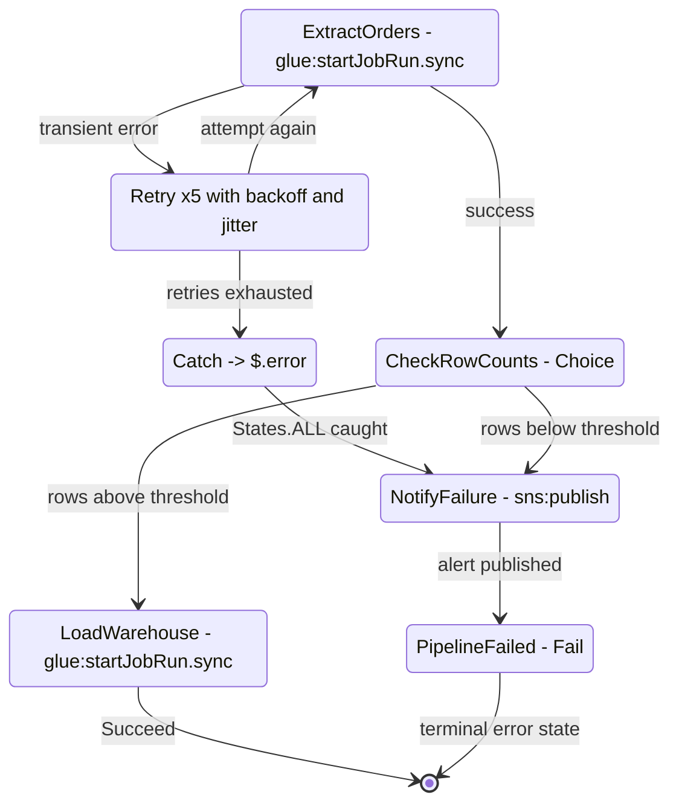
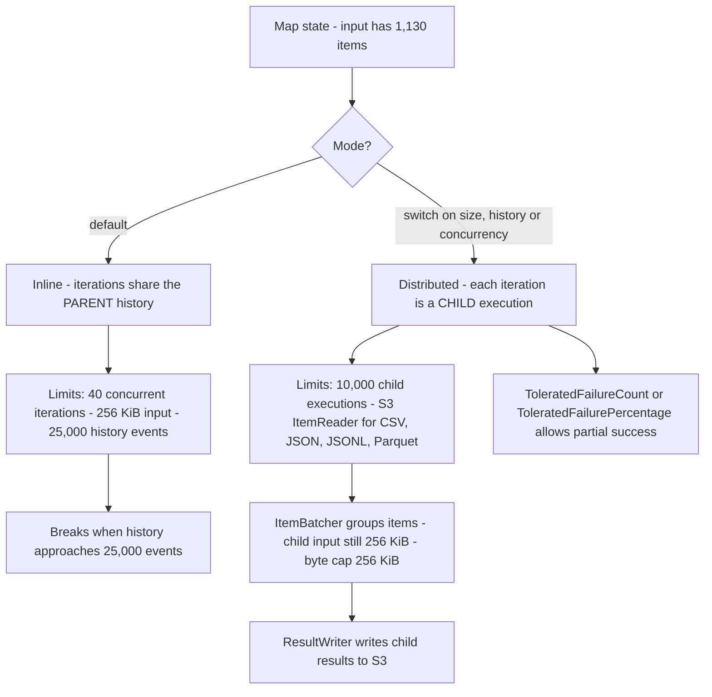
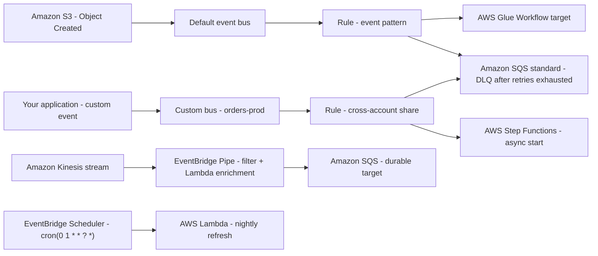
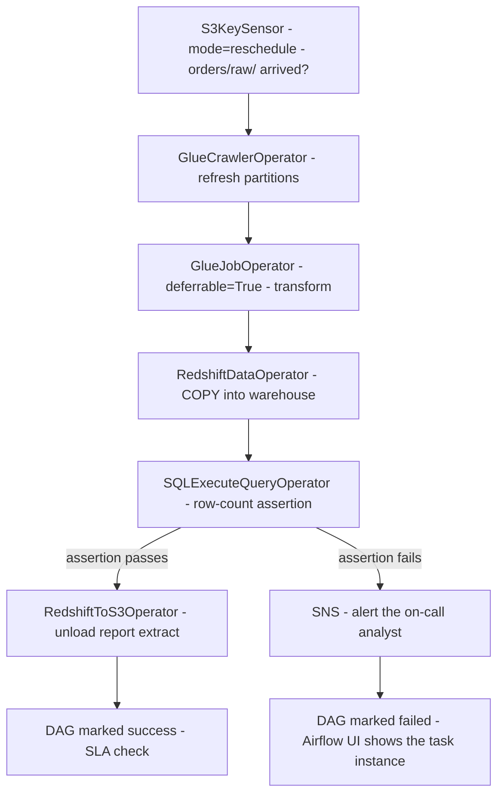
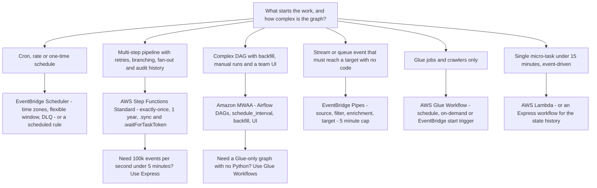

# Orchestrating Data Pipelines: Step Functions, EventBridge and Airflow

A data pipeline that transforms correctly but **starts late**, **runs twice**, **silently skips a failed step** or **cannot be replayed** has still failed. Ingestion and transformation (Lessons 02 and 03) decide *what* moves and *how* it is reshaped; orchestration decides **when it runs, in what order, what happens when it fails, and how you recover** — and DEA-C01 tests exactly that judgment in Domain 1, **Task 1.3 "Orchestrate data pipelines"**, through four skills: **1.3.1 orchestration services** (AWS Lambda, Amazon EventBridge, Amazon MWAA, AWS Step Functions, AWS Glue workflows), **1.3.2 resilient and scalable pipelines**, **1.3.3 serverless workflows** and **1.3.4 alerts via SNS and SQS** (DEA-C01 exam guide, accessed Oct 2026).

```text
====================================================================
 DEA-C01 DOMAIN 1 — TASK 1.3: ORCHESTRATE DATA PIPELINES
====================================================================
  Step Functions .... Standard - 1 year, exactly-once, history 90 days,
                             $0.000025 per state transition (as of Oct 2026)
                      Express  - 5 minutes, at-least-once, no stored history,
                             requests + duration + 64 MB memory chunks
  EventBridge ....... rules on ONE bus: event pattern OR schedule
                      Pipes      - source -> filter -> enrich -> target
                      Scheduler  - rate | cron | one-time, time zones,
                                   flexible windows, DLQ per target
  Amazon MWAA ....... managed Apache Airflow: DAGs in S3, webserver +
                      scheduler + Celery workers on AWS Fargate,
                      Aurora PostgreSQL metadata database
  Glue Workflows .... jobs + crawlers + triggers tracked as ONE graph
  Alerts ............ SNS (fan-out to humans) + SQS (durable buffer/DLQ)
---------------------------------------------------------------------
  SKILLS   1.3.1 orchestration services    1.3.2 resilient + scalable
           1.3.3 serverless workflows      1.3.4 SNS/SQS alerts
  IN SCOPE Step Functions - EventBridge - MWAA - Glue - Lambda - SNS - SQS
====================================================================
```

In this lesson you will:

- separate **Standard and Express** workflows on duration, delivery guarantee, billing and supported integration patterns;
- read and write **Amazon States Language** — the eight state types, `Retry`, `Catch`, built-in error names and terminal error states;
- choose between **inline and Distributed `Map`** and size `ItemReader`, `ItemBatcher` and `ResultWriter`;
- build **EventBridge** rules on schedules and event patterns, understand **buses, targets, retry policies and DLQs**;
- use **EventBridge Pipes** for code-free stream/queue fan-out and **EventBridge Scheduler** for time-zone-aware schedules;
- describe an **Amazon MWAA** environment, its DAG storage, operators, worker classes and Airflow versions;
- wire **AWS Glue Workflows and triggers** (schedule, on-demand, EventBridge, conditional) into one graph;
- apply the **orchestration selection matrix**: cron → EventBridge, multi-step retries → Step Functions, complex DAGs → MWAA, event-reactive flows → Pipes;
- apply the **retry, DLQ, idempotency and backfill** patterns that make a pipeline resilient;
- study **four AWS customer case studies**, read the **October 2026 update box**, and practise with **14 exam-style questions** plus interactive checks.

---

## 1. The orchestration surface: five primitives, one job

### 1.1 What Task 1.3 is really asking

Every orchestration question on this exam reduces to four prompts: **What starts the run?** (schedule, event, API call, upstream success) **What order do steps run in?** (serial, parallel, fan-out, conditional) **What happens on failure?** (retry, catch, alert, park in a DLQ) **How do you run it again without corrupting data?** (backfill, redrive, idempotency). Different services answer those four prompts differently, and the exam's distractors are always a *correct service used for the wrong prompt*.

| Primitive | What it owns | In-scope service | Skill |
|---|---|---|---|
| **Deterministic multi-step state machines** | Order, retries, branching, fan-out, audit history | **AWS Step Functions** | 1.3.1 / 1.3.3 |
| **Event reaction and time-based triggering** | Buses, patterns, schedules, targets, Pipes, Scheduler | **Amazon EventBridge** | 1.3.1 |
| **Directed acyclic graphs with backfill and UI** | Task dependencies, manual runs, catch-up windows | **Amazon MWAA** (managed Apache Airflow) | 1.3.1 |
| **Native ETL graph inside the transformation service** | Glue jobs + crawlers + conditional triggers | **AWS Glue Workflows** | 1.3.1 |
| **Single-purpose glue and alerts** | Micro-tasks, fan-out notifications, durable queues | **AWS Lambda**, **Amazon SNS**, **Amazon SQS** | 1.3.3 / 1.3.4 |

The Application Integration category on the DEA-C01 in-scope list is exactly this family: **Amazon EventBridge, Amazon MWAA, Amazon SNS, Amazon SQS, AWS Step Functions**, with **AWS Lambda** as the compute that most of them call (DEA-C01 in-scope services page, accessed Oct 2026).

### 1.2 Resilient and scalable is a checklist, not an adjective

Skill 1.3.2 expects you to name the mechanisms, not admire them:

1. **Retry with backoff and jitter** — transient failures re-run automatically before anyone is paged.
2. **Catch / error state** — unrecoverable failures route to a defined place instead of vanishing.
3. **Dead-letter queue (DLQ)** — events or messages that exhausted retries are preserved for inspection and replay.
4. **Idempotency** — the same input processed twice produces the same output once (conditional writes, idempotency keys, job bookmarks).
5. **Backfill and redrive** — re-run a window of history or a set of failed executions deliberately.
6. **Alerts** — SNS for humans, SQS for machines, CloudWatch alarms on the metrics (`ExecutionsFailed`, `ExecutionThrottled`, `FailedInvocations`, `InvocationThrottleCount`).

- **📚 Did you know?** The four CloudWatch metric names above are the exam's cheapest troubleshooting shortcut: `ExecutionsFailed` and `ExecutionThrottled` belong to **Step Functions**, while `FailedInvocations` and `InvocationThrottleCount` belong to **EventBridge** targets and Pipes. A question that pairs the wrong metric with the wrong service is testing whether you know *which layer* failed — the state machine, or the delivery of the event to its target (AWS CloudWatch documentation, accessed Oct 2026).

---

## 2. AWS Step Functions: Standard versus Express

### 2.1 The core exam axis

AWS offers two workflow types, and the difference is not speed — it is **duration, delivery guarantee, meter and available integration patterns** (AWS Step Functions developer guide, *Standard vs Express*, accessed Oct 2026):

| | **Standard Workflow** | **Express Workflow** |
|---|---|---|
| Maximum duration | **1 year** | **5 minutes** |
| Delivery guarantee | **Exactly-once** workflow execution | **At-least-once** workflow execution |
| Start rate | 2,000 executions/second | 100,000 executions/second |
| Transition rate | 4,000/second | Unlimited |
| Billing | **Per state transition** ($0.000025 each, as of Oct 2026) | **Per request + duration + 64 MB memory chunks** |
| Free tier | 4,000 state transitions/month (as of Oct 2026) | none on transitions |
| Execution history | Stored **90 days**, hard cap **25,000 events** | Not stored; **CloudWatch Logs** (extra cost) |
| Integration patterns | Request-response **+ `.sync` + `.waitForTaskToken`** | **Request-response only** |
| State payload | 256 KiB | 256 KiB |
| Open executions | 1,000,000 | Not counted against that cap |
| Typical work | Multi-hour ETL, human approval, audit trails | High-volume event processing, sub-second micro-flows |

**The one-line rule:** anything that must **wait** (`.sync`, `.waitForTaskToken`, a human approval lasting days, a one-year run) or must be **exactly-once** is a **Standard** workflow; anything that is **short, high-volume and idempotent** is an **Express** workflow.

> [!WARNING]
> ⚠️ **Express is not "Standard but faster."** It is **at-least-once**, capped at **5 minutes**, stores **no execution history**, and supports **request-response integrations only** — no `.sync`, no `.waitForTaskToken`. An option that offers Express for a "wait three days for sign-off, then continue, with a full audit trail" requirement is wrong on three counts: the 5-minute cap, the missing callback pattern, and the missing stored history.

### 2.2 Worked example E1 — pricing a Standard pipeline

A nightly pipeline has **9 state transitions per run**; one state retries **3 times** before succeeding, adding 3 transitions per run (retries are billable state transitions). It runs **10,000 times a day** for a 30-day month (Step Functions pricing, us-east-1, as of Oct 2026):

```text
transitions per run       = 9 + 3 = 12
transitions per month     = 12 x 10,000 x 30 = 3,600,000
free tier                 =        -   4,000
billed transitions        = 3,596,000
cost = 3,596,000 x $0.000025          = $89.90 / month
```

Two lessons fall out: **retries cost money** (they are transitions), and a **`Wait` state that loops** is a meter you run on purpose.

### 2.3 Worked example E2 — same pipeline, two workflow types

The same **6-state, 4-second, under-64-MB** job, run **1,000 times**:

```text
Standard: 6 transitions x 1,000 runs = 6,000 x $0.000025      = $0.150
Express : 6,000 requests x $1.00 / 1,000,000                  = $0.006
          duration 1,000 x 4 s x 0.0625 GB x $0.00001667/GB-s = $0.0004
          total Express                                       ~= $0.006
```

More than **20x cheaper** for Express at this shape — and the gap widens as duration grows, because Express bills duration while Standard bills only transitions. AWS's own 2022 cost-optimisation post illustrates the same asymmetry with a **$0.42 Standard versus $0.01 Express** comparison (AWS News Blog, 2022-08-30). The corollary exam question is the reverse: a workflow that **waits 12 hours** in a `Wait` state would burn transitions if you polled, whereas a callback token waits for free (see E9).

- **📚 Did you know?** Express workflows are the only workflow type you can start with `StartSyncExecution` from the console — and that synchronous console result **expires after 60 seconds**, so anything longer belongs in an SDK/CLI call. Nesting is also officially endorsed: a **Standard parent can start a nested Express child**, and starting a nested workflow costs exactly **one state transition** (AWS Step Functions pricing and best-practices pages, accessed Oct 2026).

---

## 3. Amazon States Language: the eight state types

### 3.1 The vocabulary

State machines are defined in **Amazon States Language (ASL)** — a JSON-based declarative language (states-language.net specification, accessed Oct 2026):

| State type | What it does | Exam-relevant detail |
|---|---|---|
| **`Task`** | Does work — calls Lambda, Step Functions integrations, or the SDK | Carries `Retry` and `Catch`; can use `.sync` or `.waitForTaskToken` |
| **`Choice`** | Branches on a comparison | Unmatched branch raises `States.NoChoiceMatched` |
| **`Wait`** | Pauses for seconds, a timestamp or until a deadline | Billable transitions if you loop it (see E9) |
| **`Parallel`** | Runs branches concurrently, then joins | Fan-out/fan-in; each branch can have its own error handling |
| **`Map`** | Iterates an array (or a dataset) | Inline **40** concurrent iterations vs Distributed **10,000** (Section 4) |
| **`Pass`** | Pure data reshaping — no work | Inject or restructure input with `Result` |
| **`Succeed`** | Terminal success | Stops without an error |
| **`Fail`** | Terminal failure | Carries `Error` and `Cause` strings |

Every state declares `Type` and either `Next` **xor** `End`, plus the input/output filters `InputPath`, `ResultPath`, `OutputPath`, an optional `TimeoutSeconds`, and optional `Retry` and `Catch` arrays. The query language is **JSONPath** (paths written with a `.$` suffix, for example `"Bucket.$": "$.bucket"`) or **JSONata** (`` blocks). Context paths reach the execution itself: `$$.Execution.Id`, `$$.State.Name`, **`$$.Task.Token`** and `$$.Map.Item.*`.

### 3.2 Worked example E3 — a real ASL fragment

```json
{
  "Comment": "Nightly orders ETL with retry, catch and a branch",
  "StartAt": "ExtractOrders",
  "States": {
    "ExtractOrders": {
      "Type": "Task",
      "Resource": "arn:aws:states:::glue:startJobRun.sync",
      "TimeoutSeconds": 3600,
      "Retry": [
        { "ErrorEquals": ["States.Timeout"], "MaxAttempts": 0 },
        { "ErrorEquals": ["States.ALL"], "IntervalSeconds": 30,
          "MaxAttempts": 5, "BackoffRate": 2.0, "JitterStrategy": "FULL" }
      ],
      "Catch": [
        { "ErrorEquals": ["States.ALL"], "ResultPath": "$.error",
          "Next": "NotifyFailure" }
      ],
      "Next": "CheckRowCounts"
    },
    "CheckRowCounts": {
      "Type": "Choice",
      "Choices": [
        { "Variable": "$.row_count", "NumericGreaterThan": 1000,
          "Next": "LoadWarehouse" }
      ],
      "Default": "NotifyFailure"
    },
    "LoadWarehouse": {
      "Type": "Task",
      "Resource": "arn:aws:states:::glue:startJobRun.sync",
      "End": true
    },
    "NotifyFailure": {
      "Type": "Task",
      "Resource": "arn:aws:states:::sns:publish",
      "Next": "PipelineFailed"
    },
    "PipelineFailed": {
      "Type": "Fail",
      "Error": "PipelineFailed",
      "Cause": "Extract or load did not meet the row-count contract"
    }
  }
}
```

Read it as a story: the Glue job runs **synchronously** (`.sync` waits for the job to finish), **timeouts are never retried** while everything else retries up to 5 times with exponential backoff and full jitter, unrecoverable errors are **caught into `$.error`** and routed to an SNS alert, a `Choice` enforces a data contract, and the terminal state is an explicit `Fail` — the exam's definition of an **error state**.



### 3.3 Retry mechanics: arrays scan top-down

- **Retriers** (`Retry[]`) are scanned **in array order**; the **first** entry whose `ErrorEquals` matches governs. That is why `["States.Timeout"]` with `MaxAttempts: 0` must come **before** `["States.ALL"]` — this is the canonical *"retry everything except timeouts"* configuration.
- **Defaults** (when you omit a field): `IntervalSeconds` **1**, `MaxAttempts` **3** (so **4 total attempts**), `BackoffRate` **2.0** (must be ≥ 1.0), `JitterStrategy` **NONE** unless you set `FULL`.
- **Catchers** (`Catch[]`) run **only** when there is no matching `Retry` entry or the retries are exhausted; each carries `ErrorEquals`, `Next` and usually a `ResultPath` such as `$.error` so the failure payload does not overwrite your data.

### 3.4 Built-in error names you must not mix up

| Error name | Rule |
|---|---|
| **`States.ALL`** | Must appear **alone** in its `ErrorEquals` array and **last** in the `Catch` array; **cannot** catch `States.DataLimitExceeded` or `States.Runtime` |
| **`States.TaskFailed`** | Wildcard for any task failure **except** `States.Timeout` |
| **`States.Timeout`** | Task exceeded `TimeoutSeconds` (or heartbeat) |
| **`States.DataLimitExceeded`** | **Terminal** — state payload over the 256 KiB limit; cannot be caught by `States.ALL` |
| **`States.Runtime`** | Defect in the state machine definition; **never** matched by `States.ALL` |
| **`States.Permissions` / `States.BranchFailed` / `States.NoChoiceMatched`** | IAM failure / a `Parallel` or `Map` branch failed / `Choice` matched nothing |
| Service-specific | `Lambda.ServiceException`, `DynamoDB.ConditionalCheckFailedException`, `AmazonECS.Unknown`, … |

### 3.5 Worked example E4 — retry timing arithmetic

With the defaults (`IntervalSeconds: 1`, `BackoffRate: 2.0`, `MaxAttempts: 3`):

```text
attempt 1 fails  -> wait  1 s
attempt 2 fails  -> wait  2 s
attempt 3 fails  -> wait  4 s
attempt 4 fails  -> give up after 1 + 3 = 4 total attempts
total wait       = 1 + 2 + 4 = 7 seconds  (+ execution time of each attempt)
```

Set `IntervalSeconds: 30`, `MaxAttempts: 5`, `BackoffRate: 2.0` and the waits become 30 + 60 + 120 + 240 + 480 = **930 seconds (15.5 minutes)** before the task is declared failed — the configuration in E3. `JitterStrategy: "FULL"` randomises each delay across its window so a fleet of executions does not retry in lockstep (AWS Step Functions error-handling documentation, accessed Oct 2026).

### 3.6 Task tokens: waiting that costs nothing

For work no `.sync` pattern covers — a human approval, a third-party API, an external worker — the state machine injects the token and waits:

```json
{
  "Type": "Task",
  "Resource": "arn:aws:states:::sqs:sendMessage.waitForTaskToken",
  "HeartbeatSeconds": 86400,
  "Parameters": {
    "QueueUrl.$": "$.queue_url",
    "MessageBody.$": "$.payload",
    "TaskToken.$": "$$.Task.Token"
  },
  "Next": "Approved"
}
```

The external worker later calls **`SendTaskSuccess`**, **`SendTaskFailure`** or **`SendTaskHeartbeat`**. The wait is **unbounded** (up to the 1-year Standard limit), **not billable**, and **Standard-only** — so always set `HeartbeatSeconds`, otherwise a lost callback hangs until the state timeout instead of failing fast with `States.Timeout`.

- **📚 Did you know?** A human-approval state that sits open for three days costs **zero state transitions per hour** — the transitions were spent entering and leaving the state, not waiting in it. That asymmetry is why the cheapest long-running designs put a **`.waitForTaskToken`** where a `Wait`-and-poll loop would otherwise live: 1,000 hourly polls cost $3.00 a month, a token callback costs a single transition (worked example E9; Step Functions pricing, as of Oct 2026).

### 3.7 Service integrations: which pattern each service supports

Step Functions ships **optimized integrations** (the service interprets the call) plus a generic **AWS SDK integration** covering **over 220 AWS services** (AWS What's New, 2026-03-26 — **+28 services / 1,100+ APIs**):

| Integration | Request-response | `.sync` (wait for completion) | `.waitForTaskToken` (callback) |
|---|---|---|---|
| **AWS Glue** (`glue:startJobRun`) | ✔ | ✔ | — |
| **Amazon EMR** | ✔ | ✔ (`addStep.sync`, `createCluster.sync`) | — |
| **Amazon ECS / AWS Batch / Amazon Athena / SageMaker / CodeBuild** | ✔ | ✔ | ✔ (ECS) |
| **AWS Lambda** | ✔ | — (no `.sync`) | ✔ |
| **Amazon SQS / Amazon SNS / Amazon API Gateway / Amazon EventBridge** | ✔ | — | ✔ |
| **Amazon DynamoDB** | ✔ | **neither** | **neither** |
| Nested Step Functions | ✔ | ✔ | ✔ |

Optimized ≠ SDK: the Lambda **optimized** integration auto-parses the response payload, Glue's optimized integration returns `JobName` + `JobRunID`, and EMR renames `JobFlowId` to `ClusterId`. Callback and `.sync` calls also need extra IAM permissions (`glue:GetJobRun`, `ecs:RunTask` plus `iam:PassRole`) — an exam favourite when a pipeline "works in the console and fails in production".

---

## 4. The Map state: inline versus Distributed

### 4.1 When the switch happens

`Map` iterates an input array. **Inline** (the default) runs every iteration inside the parent's own execution history; **Distributed** mode runs each iteration as a **child workflow execution** with its own history (AWS Step Functions developer guide, *Map state*, accessed Oct 2026):

| | **Inline Map** | **Distributed Map** |
|---|---|---|
| Where iterations run | Parent execution history | **Child executions** (Standard or Express) |
| Maximum concurrency | **40** | **10,000** (default unset/0) |
| Input | JSON array, or an S3 object list | JSON payload **or** large S3 dataset: CSV, JSON, JSONL, Parquet, object list, inventory |
| Switch to Distributed when | — | input **> 256 KiB**, history would exceed **25,000 events**, or concurrency **> 40** |
| Child payload limit | n/a | 256 KiB per child (8 MB per item if `ItemSelector` shrinks it) |
| Results | Returned inline | Written to **S3** via **`ResultWriter`** |
| Failure tolerance | All-or-nothing | `ToleratedFailureCount` / `ToleratedFailurePercentage` |

Configuration lives in `ProcessorConfig: { "Mode": "DISTRIBUTED", "ExecutionType": "EXPRESS" | "STANDARD" }` plus the fields below:

- **`ItemReader`** (+ `ReaderConfig.InputType`) — where the items come from; `MaxItems` ≤ **100,000,000**, and `MaxItems` XOR `MaxItemsPath`.
- **`ItemsPath` / `ItemSelector`** — which items, and how each is reshaped before the child runs.
- **`ItemBatcher`** — `MaxItemsPerBatch`, `MaxItemsPerBatchBytes` (≤ **256 KiB**).
- **`MaxConcurrency` / `MaxConcurrencyPath`** — never set it above downstream capacity.
- **`ResultWriter`** — results land in S3, not in the parent history.



### 4.2 Worked example E5 — ItemBatcher arithmetic

A Distributed Map fans out **1,130 objects** with `MaxItemsPerBatch: 100`:

$$
\text{batches} = \left\lceil \frac{1{,}130}{100} \right\rceil = \lceil 11.3 \rceil = \mathbf{12 \ batches}
$$

Batching matters because **each batch becomes one child execution**, and each child execution costs at least one state transition (or, for Express children, one request). **1,130 children** is 1,130 executions; **12 children** is 12 — same work, a fraction of the overhead. For a **1,000,000-object** S3 backfill the arithmetic is different in kind: inline Map would exhaust the **25,000-event** history long before the last object, so you need `ItemReader` on `s3:listObjectsV2`, `ItemBatcher`, `MaxConcurrency` sized to downstream capacity (for example 1,000), `ExecutionType: "EXPRESS"` children, `ToleratedFailurePercentage: 1`, and `ResultWriter` to S3.

> [!IMPORTANT]
> ⚠️ **The Distributed Map limit of 10,000 counts child executions, not items.** Items are bounded by `ItemReader.MaxItems` (**100,000,000**), and the trigger thresholds for switching modes are **256 KiB of input**, **25,000 history events** or **40 concurrent iterations**. An option that says "Distributed Map is limited to 10,000 objects" has confused the two counters.

---

## 5. Amazon EventBridge: rules, buses, retries and DLQs

### 5.1 Three bus types, one rule per bus

| Bus type | What it carries | Sharing |
|---|---|---|
| **Default** | Events from AWS services in your account | Automatic |
| **Custom** | Events your applications emit | Cross-account / cross-Region shareable via resource policy |
| **Partner** | Events from SaaS providers | Via the partner's integration |

A rule watches **exactly one** bus. Schedules are **never** allowed on **partner event buses**; the API reference documents scheduled expressions on the default and custom buses (AWS EventBridge API `PutRule`, accessed Oct 2026) — so treat *"schedule on a partner bus"* as always wrong.

### 5.2 Two rule shapes — and one schedule

A rule matches either an **event pattern** (content-based filtering over JSON fields, up to **2,048 characters**) or a **schedule expression**, or both:

```text
rate(5 minutes)          -> every 5 minutes, on a 1-minute precision grid, UTC+0
cron(0 20 * * ? *)       -> 20:00 UTC every day (the expression AWS publishes
                            as its schedule example)
```

### 5.3 Worked example E6 — writing the cron rule

Requirement: *"kick off the warehouse load at 20:00 UTC daily, and also every time a file lands in the raw prefix."* One rule cannot do both cleanly in a single expression the way an exam expects — you create **two rules on the same bus**:

```json
{
  "Name": "nightly-warehouse-load",
  "ScheduleExpression": "cron(0 20 * * ? *)",
  "State": "ENABLED",
  "Targets": [
    { "Id": "start-pipeline",
      "Arn": "arn:aws:states:us-east-1:111122223333:stateMachine:NightlyETL",
      "RoleArn": "arn:aws:iam::111122223333:role/events-to-stepfunctions" }
  ]
}
```

```json
{
  "Name": "raw-object-created",
  "EventPattern": {
    "source": ["aws.s3"],
    "detail-type": ["Object Created"],
    "detail": {
      "bucket": { "name": ["raw-lake"] },
      "object": { "key": [{ "prefix": "incoming/" }] }
    }
  },
  "Targets": [
    { "Id": "start-glow-workflow",
      "Arn": "arn:aws:states:us-east-1:111122223333:stateMachine:NightlyETL" }
  ]
}
```

Note the details the exam checks: schedule precision is **1 minute** in **UTC+0**, so `cron(0 20 * * ? *)` is 20:00 UTC and *not* local time; **Step Functions targets are invoked asynchronously**; and a rule carries a maximum of **5 targets**.

### 5.4 Retry policy and dead-letter queue

Per target you can override the delivery retry policy and attach a DLQ (AWS EventBridge *Retry policy and DLQ*, accessed Oct 2026):

| Setting | Range | Default |
|---|---|---|
| `MaxRetryAttempts` | **0–185** | **185** (console) |
| `MaxEventAgeInSeconds` | **60–86,400** | 86,400 (**24 hours**) |
| Effect of defaults | Exponential backoff **with jitter** for up to **24 hours** and up to **185 attempts** | — |
| DLQ | **Amazon SQS standard queue, same Region** | none |

### 5.5 Worked example E7 — from 24-hour retries to a 10-minute DLQ

A team wants failures surfaced in **10 minutes**, not a day:

```json
{
  "Id": "target-stepfunctions",
  "Arn": "arn:aws:states:us-east-1:111122223333:stateMachine:NightlyETL",
  "RetryPolicy": {
    "MaximumRetryAttempts": 5,
    "MaximumEventAgeInSeconds": 300
  },
  "DeadLetterConfig": {
    "Arn": "arn:aws:sqs:us-east-1:111122223333:events-dlq"
  }
}
```

```text
Default policy : up to 185 attempts across 24 h   -> silent, slow, expensive
This policy    : up to 5 attempts inside 300 s    -> message lands in the DLQ
                 after 10 minutes, alarm fires on QueueDepth, engineer replays
```

The DLQ must be a **standard SQS queue in the same Region** — **a FIFO queue cannot be used as an EventBridge DLQ**. The messages that arrive carry attributes such as `ERROR_CODE`, `EXHAUSTED_RETRY_CONDITION` and `RETRY_ATTEMPTS`, and a KMS-encrypted queue needs `kms:Decrypt` for `events.amazonaws.com`.

- **📚 Did you know?** Some failures are **never retried at all** — a missing permission, a deleted resource or bad DNS goes **straight to the DLQ** with zero retries, which is why "no retries happened" in a support ticket usually means an IAM or resource problem rather than a retry-policy bug. And EventBridge DLQs are plain **standard SQS queues**: you cannot use a FIFO queue, so a question offering "SQS FIFO as the EventBridge DLQ" is a built-in distractor (AWS EventBridge DLQ documentation, accessed Oct 2026).

### 5.6 Quotas worth memorising (as of Oct 2026)

| Quota | Value |
|---|---|
| Event buses per Region | **100** |
| Rules per bus per Region | **300** (100 in af-south-1 and eu-south-1) |
| Rules with wildcard patterns per bus | **30** |
| Targets per rule | **5** (not adjustable) |
| Event pattern size | **2,048 characters** |
| API destination throughput | **300 requests/second** |



- **📚 Did you know?** EventBridge also orchestrates *security* pipelines, not just data ones: Amazon Macie emits its findings to the default bus, and a rule can route them into a Lambda or a Step Functions remediation flow with the same retry policy and standard-SQS DLQ you use for a warehouse load — the wiring behind Oportun's reported **95% sensitive-data discovery accuracy** and **80% reduction in the time needed to discover sensitive data**. The orchestration skill is unchanged (match on `source` / `detail-type`, bound the retries, make the remediation idempotent); only the producer changes (AWS Macie customer material and re:Invent SEC215 session deck, accessed Oct 2026).

---

## 6. EventBridge Pipes and EventBridge Scheduler

### 6.1 Pipes: source → filter → enrich → target, with no code

Pipes are **point-to-point** (not pub/sub): a source, an optional **filter** (only matching events are billed), an optional **enrichment** step (Lambda or Step Functions) and a target (AWS EventBridge Pipes documentation, accessed Oct 2026).

| Aspect | Detail |
|---|---|
| **Sources** | DynamoDB stream, Kinesis stream, Amazon MQ (ActiveMQ/OpenWire, RabbitMQ/AMQP 0-9-1), Amazon MSK (incl. Serverless), **SQS**, self-managed Apache Kafka (Confluent Cloud, Redpanda) |
| **Targets** | API destination, API Gateway, Batch, CloudWatch log group, ECS task, same-Region event bus, Firehose, Kinesis, Lambda, Redshift Data API, SNS, SQS, **Step Functions**, Timestream |
| **Payload** | **6 MB** in Pipes; effective limit is the **smaller** of Pipes and target (Lambda 6 MB, event bus 1 MB, **Step Functions 256 KB**) |
| **Batching** | Source batch size must not exceed the target maximum — Kinesis allows 10,000 records, but an SQS target allows only 10, so the pipe is capped at **10** |
| **Concurrency** | DynamoDB/Kinesis = `ParallelizationFactor` × shards; Kafka = partitions (cap 1,000); Amazon MQ 5; SQS 1,250 |
| **Hard cap** | Pipe execution timeout **5 minutes**, including enrichment and target — not raisable |
| **Pricing** | **$0.40 per million requests**, each **64 KB** chunk counts as one request, and **only filtered events are billed** (as of Oct 2026) |

### 6.2 Worked example E8 — Pipes billing with a filter

A pipe consumes **10,000,000 SQS messages**, a filter lets **25%** through, and batching is **5 messages per request** (Step Functions pricing page example, as of Oct 2026):

```text
events after filter  = 10,000,000 x 0.25 = 2,500,000
requests             = 2,500,000 / 5     =   500,000
cost                 = 500,000 / 1,000,000 x $0.40 = $0.20
```

**$0.20 for ten million messages** — because the filter runs before billing. The examinable principle: **filter early, batch to the target's maximum, and remember the 5-minute pipe ceiling.**

### 6.3 Scheduler: schedules without a rule

AWS recommends **EventBridge Scheduler** for invoking targets on a schedule, and the console labels scheduled **rules** "(legacy)" (AWS EventBridge Scheduler documentation, accessed Oct 2026).

| Feature | EventBridge **Scheduler** | Scheduled **rule** |
|---|---|---|
| Schedule types | **rate**, **cron**, **one-time** (`at(2026-11-01T09:00:00)`) | `rate()` and `cron()` only |
| Time zones | **IANA time zones**; DST handled automatically | **UTC only** |
| Flexible window | `Mode: FLEXIBLE` + `MaximumWindowInMinutes` **1–1440** | none |
| Targets | Templated (Lambda, SQS, Kinesis, SNS, ECS, Batch, **Glue start**, **Step Functions start**, SageMaker, SSM, API destination) or universal (any AWS API) | Max **5** targets |
| Per-target retry/DLQ | `RetryPolicy` ≤ **185** retries, ≤ **24 h** age, plus a **DLQ** | Same retry ranges |
| Quotas (as of Oct 2026) | **10,000,000** schedules/Region, **500** groups, **10 TPS** per schedule, **60-second** precision | **300** rules/bus |

**Flexible time window** is the feature exam questions hinge on: `MaximumWindowInMinutes: 60` means a nightly job scheduled for 01:00 may fire **anywhere between 01:00 and 02:00** — perfect for batch windows that must absorb load spikes, wrong for a job that must start exactly at 01:00:00.

### 6.4 Four things that "run on a schedule" (do not mix them up)

| Mechanism | Scope | Precision / zone | Best for |
|---|---|---|---|
| **EventBridge Scheduler** | Any target, time zones, one-time, flexible window | 60 s, IANA zones | Time-zone-aware schedules with a DLQ |
| **EventBridge rule (schedule)** | Up to 5 targets on one bus | 1 min, **UTC** | Legacy schedules that also need an event pattern |
| **Glue scheduled trigger** | Glue jobs and crawlers **only** | Glue cron | Starting the Glue graph itself |
| **Airflow `schedule_interval`** | One DAG, with **backfill** | Airflow parsing | Complex DAGs needing catch-up runs |

---

## 7. Amazon MWAA: managed Apache Airflow

### 7.1 What an environment actually is

An **Amazon MWAA environment** is a bundle of managed components (AWS MWAA documentation, accessed Oct 2026):

```text
 ------------------------------------------------------------------
  MWAA ENVIRONMENT
 ------------------------------------------------------------------
  DAGs + plugins ...... s3://your-bucket/  (DAGs in S3, requirements.txt,
                         plugins.zip; combined size < 1 GB recommended,
                         install must finish in 10 minutes)
  Webserver(s) ........ Airflow UI, 1-5 per environment
  Scheduler(s) ......... parses DAGs and schedules runs; the triggerer
                         co-locates here (more schedulers = more triggerers)
  Workers .............. Celery task instances on AWS Fargate, 20 GB task
                         storage each, autoscaled automatically
  Metadata database .... Amazon Aurora PostgreSQL (managed by AWS)
  Celery queue ......... AWS-managed Amazon SQS queue you CANNOT create
                         or replace
 ------------------------------------------------------------------
```

You give up SSH, **custom images**, custom SQS queues and executor choice — **Celery only** — in exchange for AWS running the control plane, Aurora, Fargate, logging and your VPC wiring. Existing DAG updates are picked up in about **30 seconds**.

### 7.2 Worker classes and auto scaling (as of Oct 2026)

| Class | Max DAGs | Max tasks on a worker | Auto scaling |
|---|---|---|---|
| `mw1.micro` | 25 | 3 | **No auto scaling** |
| `mw1.small` | 50 | 5 | Yes |
| `mw1.medium` | 250 | 10 | Yes |
| `mw1.large` | 1,000 | 20 | Yes |
| `mw1.xlarge` | 2,000 | 40 | Yes |
| `mw1.2xlarge` | 4,000 | 80 | Yes |

Workers are added as `(RunningTasks + QueuedTasks) / tasks-per-worker`, up to `max-workers`. The per-class `celery.worker_autoscale` default (3 / 5 / 10 / 20 / 40 / 80) is authoritative, and **`celery.worker_concurrency` is overridden** — setting it does nothing.

### 7.3 Operators and dependencies

DAGs live in **S3**, dependencies in `requirements.txt` (pip3) and `plugins.zip`; a new `requirements.txt` requires an environment update. The operators that matter for this exam:

| Operator / sensor | Role |
|---|---|
| `S3KeySensor` (often `mode="reschedule"`) | Wait for a file to land |
| `GlueCrawlerOperator` / `GlueCrawlerSensor` | Run or await a crawler |
| **`GlueJobOperator`** (+ `Sensor`, `deferrable=True`) | Run or await a Glue job — `AWSGlueJobOperator` is **deprecated** |
| `RedshiftDataOperator` | Run SQL through the Redshift Data API |
| `SQLExecuteQueryOperator` | Generic SQL execution |
| `RedshiftToS3Operator` | Unload warehouse data to S3 |

Versions available as of Oct 2026: **Airflow 3.2.x** (announced **2026-04-01**), **3.0.x**, and **2.11.0** (released **2026-01-07**, Python 3.12), plus older 2.9.x/2.7.x/2.4.x lines. Airflow 3 adds asset- and partition-aware scheduling, human-in-the-loop audit history and async `PythonOperator`.



### 7.4 Worked example E9 — pricing an MWAA environment

AWS's own worked example for an `mw1.small` environment for a **31-day** month: **1 environment**, **49 workers running 1 hour a day**, **10 GB** of metadata-database storage (MWAA pricing, us-east-1, as of Oct 2026):

```text
environment   744 h x $0.49          = $364.56
extra workers 49 x 31 h x $0.055     =  $83.55
meta DB       10 GB x $0.10/GB-month =   $1.00
                                              -------
total                                    $449.11 / month
```

For comparison, `mw1.large` is **$0.99/h** for the environment with extra workers and schedulers at **$0.22/h** and an extra web server at **$0.11/h**, and MWAA Serverless bills AWS Managed Tasks at **$0.080 per hour of task time** (1-minute minimum, 1-second billing). Other quotas: **10 environments per Region** (5 of `mw1.xlarge`/`mw1.2xlarge`), **25 workers per environment** (50 after a quota increase), **5 webservers**, **20 GB** task storage.

- **📚 Did you know?** MWAA's Celery queue is an **AWS-managed Amazon SQS queue that you cannot create, replace or configure** — which is why questions offering "bring your own SQS queue to MWAA" or "tune `celery.worker_concurrency`" are both wrong. What you *do* tune is the **worker class**, and that single choice moves both the DAG capacity and the default task concurrency: `mw1.small` → `mw1.medium` changes the default from **5 to 10** tasks per worker (AWS MWAA documentation, accessed Oct 2026).

### 7.5 MWAA Serverless

**MWAA Serverless** removes the always-on environment: YAML DAGs plus a code package in S3, **per-task pay-per-use** scheduling backed by EventBridge Scheduler, a **per-workflow execution role** and isolated compute. It is the serverless answer inside the Airflow family — but the Airflow concepts, DAG file and operators are the same. (AWS MWAA Serverless documentation, accessed Oct 2026; Region availability is not repeated here because the launch list was not verifiable in Oct 2026.)

---

## 8. AWS Glue Workflows and triggers

### 8.1 One entity, two graphs

A Glue **workflow** tracks **jobs + crawlers + triggers as a single entity** with a graph view — a **static** graph (design) and a **dynamic** graph (runtime status per node) (AWS Glue *Workflows* and *Triggers*, accessed Oct 2026).

### 8.2 The three start triggers

| Start trigger kind | Behaviour |
|---|---|
| **Schedule** | Cron expression starts the run |
| **On-demand** | Starts only when you call it; the trigger stays `CREATED`, never `ACTIVATED` |
| **EventBridge event** | Starts on an event, with an optional **batch size** and **batch window** (default = maximum **900 s / 15 min**); the first condition met starts the run, and with no batch conditions the size defaults to **1** |

Inside the graph, **conditional triggers** express dependencies: job J3 starts after **J1 AND J2 `SUCCEEDED`**; job J4 starts after **J1 OR J2 `FAILED`**; a crawler starts after the jobs complete. **Workflow run properties** are shared name/value pairs that jobs read and mutate mid-run — state passing **without** Airflow XCom.

### 8.3 The hard rule

> **All jobs or crawlers in a dependency chain must be descendants of a single scheduled or on-demand trigger.** Dependents fire only if a trigger started them — a crawler you start **by hand** will not fire the next job in the graph. Each trigger supports **≤ 50 jobs** and **≤ 2 crawlers**, and a **Glue workflow is a first-class EventBridge target**, so an EventBridge rule or Scheduler schedule can start the whole graph.

```text
Schedule trigger 02:00 UTC
      |
      +--> orders_etl (job, bookmarks)
                |
      +---------+--------- (conditional: SUCCEEDED)
      |                   |
 sales_crawler         quality_check (job)
 (crawler)                   |
                        SNS - alert on failure
```

### 8.4 Choosing between Glue Workflows and Step Functions for the same ETL

| Requirement | Glue Workflows | Step Functions |
|---|---|---|
| Only Glue jobs and crawlers | **Yes — free, native, one graph** | Works, but you pay per transition |
| Non-Glue steps (Redshift, Lambda, SNS, SQS, EMR) | Only via an EventBridge hand-off | **Native optimized integrations** |
| Human approval / callback | No | **`.waitForTaskToken`** |
| Fan-out over a large dataset | No | **Distributed Map** |
| Repair / resume a partially run graph | **Yes — supported** | **Redrive** (Standard, 14 days) |

---

## 9. The orchestration selection matrix

### 9.1 The money diagram



### 9.2 The matrix in words

| Requirement | Correct answer | Why the alternatives lose |
|---|---|---|
| **Cron / rate / one-time** | **EventBridge Scheduler** (or a scheduled rule) | Step Functions would need a `Wait` loop; MWAA needs a DAG |
| **Multi-step with retries, branching, audit** | **Step Functions Standard** | Express caps at 5 minutes and has no stored history |
| **Complex DAGs, backfill, human UI** | **Amazon MWAA** | Step Functions has no native catch-up window |
| **Event-reactive, no code** | **EventBridge Pipes** | Rules need a bus; Pipes poll streams and queues and can enrich |
| **Glue-only graph** | **Glue Workflows** | Free and native; Step Functions bills per transition |
| **Sub-15-minute micro-task** | **AWS Lambda** (or Express for history) | A full environment is overkill |
| **Human approval for days** | **Standard + `.waitForTaskToken`** | Express cannot wait; polling costs transitions |

```matching
{
  "question": "Match each pipeline requirement to the orchestration service the DEA-C01 exam expects:",
  "pairs": [
    {"left": "Nightly job at 01:00 America/New_York with a 60-minute flexible window and a DLQ", "right": "Amazon EventBridge Scheduler - IANA time zones, flexible time window, per-target RetryPolicy and DeadLetterConfig"},
    {"left": "Three-step ETL with up to 5 retries per step, a Choice gate and a 14-day audit trail", "right": "AWS Step Functions Standard - exactly-once, 1-year duration, 90-day history, Retry and Catch on every Task"},
    {"left": "Forty interdependent Python tasks, manual trigger with a catch-up window, team UI", "right": "Amazon MWAA - Airflow DAGs in S3 with schedule_interval and backfill"},
    {"left": "A Kinesis stream must reach a Lambda for enrichment and then an SQS queue, with no code to maintain", "right": "Amazon EventBridge Pipes - source, filter, enrichment, target inside a 5-minute execution"},
    {"left": "One Glue job followed by a crawler, conditioned on SUCCESS, tracked as a single graph", "right": "AWS Glue Workflow - conditional triggers, static and dynamic graph, repair/resume"},
    {"left": "Fan out 12 partitioned Glue jobs in parallel, then wait for human sign-off for up to three days", "right": "AWS Step Functions Standard with Parallel or Map plus .waitForTaskToken - Express cannot wait past 5 minutes"}
  ],
  "explanation": "The exam rarely asks which service CAN do the job; it asks which is the best fit. Scheduler wins on time zones and one-time schedules, Step Functions on retries/branching/audit, MWAA on DAG ergonomics and backfill, Pipes on code-free stream fan-out, Glue Workflows on Glue-only graphs - and Express is disqualified the moment a wait exceeds 5 minutes or a callback token is required."
}
```

---

## 10. Retry, DLQ, idempotency and backfill patterns

### 10.1 The reliability ladder

```text
 1. Retry            transient failure -> same step re-runs with backoff + jitter
 2. Catch            retries exhausted -> route to an error state, keep $.error
 3. DLQ              event/message preserved after MaxRetryAttempts or MaxEventAge
 4. Idempotency      the replay produces the same result exactly once
 5. Redrive / replay Standard executions in 14 days, or republish DLQ messages
 6. Alarm + alert    CloudWatch metric -> SNS to humans, SQS to the remediation job
```

### 10.2 Idempotency: the precondition for every replay

Delivery is **at-least-once** almost everywhere (Express executions, EventBridge targets, SQS, Pipes), so replay is only safe if processing is idempotent:

- **DynamoDB conditional write** — `ConditionExpression: attribute_not_exists(pk)` fails with `DynamoDB.ConditionalCheckFailedException`, which a `Catch` can absorb; parallel branches competing for a lock use exactly this trick.
- **Lambda Powertools `@idempotent` with a TTL** — the second invocation of the same event returns the cached result.
- **Upstream `Idempotency-Key`** header for API-driven pipelines.
- **Glue job bookmarks** — the transformation-side equivalent: state tracked between `job.init` and `job.commit` prevents reprocessing (Lesson 03).

### 10.3 Redrive, retry and replay are three different things

| Mechanism | Scope | Constraints (as of Oct 2026) |
|---|---|---|
| **`Retry`** | Inside **one** execution, automatic | Array order matters; defaults 1 s / 3 attempts / backoff 2.0 |
| **Redrive** | Restart **failed Standard executions** from where they stopped | **Standard only**, executions from the **last 14 days** that failed, were aborted or timed out, same input and definition, history **< 24,999 events**, only for *unhandled* failures |
| **DLQ replay** | Republish a parked message | New message, so downstream must be **idempotent** |

Step Functions also emits execution status-change events to the **EventBridge default bus**, so a rule can watch for `ExecutionFailed` and invoke a Lambda that calls `RedriveExecution` — orchestration healing itself.

### 10.4 Worked example E10 — designing the recovery path

```text
Failure            : 40 Standard executions fail at glue:startJobRun.sync
                     (no Catch was defined - the Glue service had an outage)
Detection          : EventBridge rule on the default bus matching failed
                     Step Functions execution status-change events
                     -> Lambda RedriveExecution
Constraints checked: type STANDARD (Express has no redrive)
                     age <= 14 days
                     history < 24,999 events
                     same state machine definition + same input
Outcome            : 40 executions resume at the failed state; no duplicate
                     Glue runs because job bookmarks (and the idempotent
                     target) absorb any partial write
Alerting           : CloudWatch alarm on ExecutionsFailed -> SNS topic
                     -> on-call + SQS remediation queue for the run book
```

### 10.5 Backfill patterns

| Pattern | Mechanism | Note |
|---|---|---|
| **Airflow backfill** | Trigger DAG with config, for example `{"process_date": "2026-10-01"}`, and pass it to the Glue job via `dag_run.conf` | The native catch-up window MWAA is chosen for |
| **Map over history** | Distributed Map `ItemReader` over the S3 prefixes of the missed days | Scales to millions of objects |
| **Scheduler one-time runs** | `at()` schedules per missed date, or re-enable a schedule | 60-second precision, per-target DLQ |
| **Glue workflow repair** | Resume a partially completed workflow run | Only Glue jobs and crawlers |

```fillblank
{
  "question": "Complete the resilience statements with the exam's own vocabulary:",
  "template": "An EventBridge rule target retries for up to {{1}} hours and up to {{2}} attempts with exponential backoff and jitter before the event is copied to a {{3}}, which must be a {{4}} queue in the same Region - a FIFO queue is not allowed. A Step Functions Standard workflow that needs to resume after an unhandled failure can be {{5}} within the last 14 days, provided its history is under 24,999 events.",
  "answers": {
    "1": "24",
    "2": "185",
    "3": "dead-letter queue",
    "4": "standard",
    "5": "redriven"
  },
  "distractors": ["12", "240", "5", "1,000", "FIFO", "partitioned", "replayed", "compensated", "throttled"],
  "explanation": "EventBridge default target delivery: MaxEventAgeInSeconds default 86,400 (24 hours), MaxRetryAttempts default 185, exponential backoff with jitter, then the DLQ - which AWS states must be a standard SQS queue in the same Region (You can't use a FIFO queue for a DLQ in EventBridge). Redrive is Standard-only, covers executions that failed, were aborted or timed out in the last 14 days, and requires history under 24,999 events; Express workflows have no stored history to redrive."
}
```

> [!WARNING]
> ⚠️ **Idempotency is not optional, it is the licence to replay.** Express workflows are **at-least-once**, EventBridge targets may deliver more than once, SQS standard is at-least-once, and DLQ replay creates a **new** message. Every pattern in this section — redrive, backfill, DLQ replay, distributed Map retries — assumes the target writes are conditional (DynamoDB `ConditionExpression`), de-duplicated (Lambda Powertools idempotency keys) or state-tracked (Glue job bookmarks). Without one of those, a "resilient" pipeline is simply a pipeline that corrupts data twice.

### 2026 Updates (as of October 2026)

> [!NOTE]
> **What changed for orchestration between 2024 and October 2026** — each line is checked against an AWS primary source in **October 2026**, and each one is examinable because the exam tests the *current* behaviour:
> - **Step Functions grew again**: **2026-03-26** added **28 services / 1,100+ APIs** to the SDK integrations (including Bedrock AgentCore and S3 Vectors), taking the total to **over 220 AWS services** — AWS What's New, 2026-03-26; Step Functions *recent launches*, accessed Oct 2026.
> - **Distributed Map data sources expanded**: **2025-09-18** added **Athena manifests and Parquet** sources, **S3-prefix iteration** (`Transformation: LOAD_AND_FLATTEN`, prefix must end in `/`) and Distributed Map **observability**; **2025-02-07** added an output option for Distributed Map — AWS What's New; AWS blog, 2025-10-24 (the `s3:listObjectsV2` + load-and-flatten announcement).
> - **Map limits did not move**: inline Map still **40** concurrent iterations, Distributed Map still **10,000** child executions, child payload **256 KiB** (8 MB per item with `ItemSelector`), history cap **25,000** events — AWS Step Functions service quotas and *Map state*, accessed Oct 2026.
> - **MWAA Airflow versions advanced**: **Airflow 3.2** announced **2026-04-01**, **Airflow 2.11.0** on **2026-01-07** with **Python 3.12** — AWS What's New, 2026-04-01; MWAA version history, accessed Oct 2026. Say "**Airflow 3.2.x and 2.11.x as of Oct 2026**"; the exact patch list was not verifiable.
> - **Stale-fact warning — Glue version drift**: 2024 notes saying "Glue 3.0/4.0" are out of date. **Glue 5.1 has been the default for new jobs since 2025-11-26** and **Glue 6.0 went GA on 2026-08-21** with a **30% price reduction**; Glue **0.9/1.0/2.0 reached end of life on 2026-04-01**, and Python Shell 3.6 cannot be created after 2026-03-31 — AWS Glue release notes, version support policy and What's New, accessed Oct 2026. A workflow that pins an EOL Glue version is a wrong answer.
> - **Glue 6.0 breaks old job code**: on Glue **6.0** (GA **2026-08-21**) **EMRFS is removed** — S3A is the only Hadoop S3 filesystem and `fs.s3.consistent.*` options are obsolete — the **AWS SDK for Java v1 is removed** (v2 only, boto3 unaffected), and the Scala binary moves **2.12 → 2.13** — AWS Glue *Migrating your AWS Glue jobs to version 6.0*, accessed Oct 2026. A Glue job wired into a workflow that still imports `com.amazonaws.services.*` fails on 6.0, so check `GlueVersion` before you accept a pipeline design.
> - **Service-name fossils in pipeline definitions**: **Kinesis Data Analytics for SQL was discontinued on 2026-01-27** — use **Amazon Managed Service for Apache Flink** — and although the DEA-C01 in-scope list still prints *Amazon Kinesis Data Firehose*, the product has been **Amazon Data Firehose** since **2024-02-09** with **no change to endpoints, APIs, CLI, IAM policies or CloudWatch metrics** — AWS Kinesis Data Analytics features page (effective 2026-01-27); AWS What's New, 2024-02-09; DEA-C01 in-scope services page, accessed Oct 2026. Either name is valid in an answer option; never "correct" one against the other.
> - **The Application Integration in-scope list is unchanged**: at exam-guide **v1.1 (2025-12-12)** the category still reads **Amazon AppFlow, Amazon EventBridge, Amazon MWAA, Amazon SNS, Amazon SQS, AWS Step Functions**; the v1.1 additions (Aurora, Amazon Q, Bedrock, Kendra, Data Exchange, S3 Tables) landed in other categories, and Cloud9, CodeCommit and AWS SCT left the in-scope list — DEA-C01 exam guide revisions and in-scope pages, accessed Oct 2026.

- **📚 Did you know?** The **exactly-once / at-least-once** wording has been stable since Express launched on **2019-12-05**, while everything around it changed: integration coverage more than doubled to **220+ services**, Distributed Map grew S3 and Athena sources, and MWAA moved through Airflow 2.4 → 2.11 → 3.0 → 3.2. Exam-wise this means the *guarantee* table in Section 2 is old, durable material, while integration names and version numbers are the part you must re-check every study cycle (AWS Step Functions announcement, 2019-12-05; Step Functions recent launches, accessed Oct 2026).

---

## Real-World Case Studies

AWS publishes what these abstractions look like in production. Every figure below is **customer- or AWS-claimed and unaudited**, with the source named so you can check it — the examinable point is the **pattern** (which orchestration problem was solved, which service did the work, which number moved), not the marketing.

### Case A — Edmunds.com: a serverless fan-out batch job (700 million derivatives in 8 days)

| Element | Detail |
|---|---|
| Customer | **Edmunds.com**, automotive media company |
| Challenge | Produce image derivatives at a scale where provisioning clusters for a one-off job makes no sense |
| Services | **AWS Lambda + Amazon S3 + Amazon Athena**; a second Lambda-driven cleanup |
| Outcomes | **50 million source images → 700 million derivatives in 8 days** for a **one-time $6,000**, versus **"at least $10,000/month"** for clusters, and **"built in days instead of six months"**; a Lambda cleanup cut the bucket from **1.5 billion to 800 million photos (60 TB → 40 TB) in one week** |
| Exam domain | **Domain 1** Task 1.3 (orchestrate serverless workflows) with Domain 3 cost hooks |
| Source | `aws.amazon.com/solutions/case-studies/edmunds-serverless/` (accessed Oct 2026) |

Read this as the orchestration shape behind **fan-out**: a driver enumerates work items (the S3 object list), each unit runs as an independent, idempotent, short-lived invocation, and the aggregate completes without a cluster. That is the same shape as a **Distributed Map with `ItemReader` over an S3 prefix** or an **EventBridge Pipe from a stream to Lambda** — the examinable idea is *independent items + a bounded concurrency + a defined completion condition*.

### Case B — EOS Group: a staged migration pipeline with zero data loss

| Element | Detail |
|---|---|
| Customer | **EOS Group**, financial services |
| Challenge | A growing on-premises warehouse at **15% year-over-year data growth**, with a hard requirement that nothing be lost during cutover |
| Services | **AWS MAP** (Assess → Mobilize → Migrate & Modernize) with **AWS DMS → Amazon S3 → Amazon Redshift**, plus Redshift **dynamic data masking** |
| Outcomes | **50% reduction in infrastructure costs**, **zero data loss**, **minimal downtime** (customer claim, accessed Oct 2026) |
| Exam domain | **Domain 1** (orchestrating a multi-stage pipeline, Task 1.3) with Domain 2 governance hooks |
| Source | `aws.amazon.com/solutions/case-studies/eos-group-case-study/` (accessed Oct 2026) |

The examinable point is the **stage discipline**: full load, CDC, validation and load are *separate, ordered, retryable steps with a validation gate between them* — the same topology you built in Section 3 (Task → Choice → Task → Fail), just implemented with migration tooling. "Zero data loss" is what a **Choice state on a row-count contract** and an **idempotent target** buy you; "minimal downtime" is what **running the stages as a retryable graph** instead of one monolithic script buys you.

### Case C — Nasdaq: a deadline-driven nightly batch across a lake house

| Element | Detail |
|---|---|
| Customer | **Nasdaq**, stock exchange |
| Challenge | Orders, quotes and trades must be loaded **before market open** every trading day; the company left a legacy on-premises warehouse in **2014** and could not afford a run that starts late |
| Services | **Amazon S3** data lake as the **write path**, **Amazon Redshift** + **Redshift Spectrum** as the **read path**, **S3 Glacier** archive, **S3 Object Lock** |
| Outcomes | **90% of the load completed 5 hours sooner**, **queries 32% faster**, capacity to jump from **30 billion to 70 billion records a day** (peak **113 billion**, February 2020), and a **15 TB** lake queried in place (customer claim, accessed Oct 2026) |
| Exam domain | **Domain 1** Task 1.3 (orchestration against a fixed deadline) with Domain 2 storage/compute decoupling hooks |
| Source | `aws.amazon.com/solutions/case-studies/nasdaq-case-study/` (accessed Oct 2026) |

Read this as a **deadline** problem, not a tool problem: because the write path (S3) and the read path (Redshift/Spectrum) are decoupled, loading and querying never contend for the same capacity, so the orchestrator can restart a failed stage without pausing the analysts — and a late run degrades one stage instead of the whole night. That is the same reasoning that makes a **retryable graph with a validation gate** (Case B, Section 3) the default answer when a question describes a batch that simply *cannot* be late.

### Case D — AGCO: a streaming pipeline one person can operate

| Element | Detail |
|---|---|
| Customer | **AGCO**, agricultural machinery manufacturer |
| Challenge | Telemetry from **hundreds of thousands of machines**, previously metered by costly third-party contracts |
| Services | **Kinesis Data Streams → Kinesis Data Firehose → Amazon S3**, **Kinesis Data Analytics for Apache Flink**, plus Lambda, DynamoDB, OpenSearch and ECS (service names as AWS published them in the source) |
| Outcomes | Live since **January 2020**, **1,200 data points per minute** per machine (tested to **10,000**), **1.5 billion** records retained, **78% cost reduction**, screen load time **8–30 s → 600 ms**, operated by **1 person instead of 3–5** (customer claim, accessed Oct 2026) |
| Exam domain | **Domain 1** Task 1.3 with **1.3.2** (resilient and scalable pipelines) |
| Source | AWS Architecture Monthly, December 2021 (p.10); AWS Industries blog, 2021-03-03 (accessed Oct 2026) |

Here the trigger is **the stream, not a cron**: a continuously running pipeline is orchestrated by back-pressure and buffering rather than by a schedule, so the resilience checklist in Section 1.2 moves into the consumers — retries with backoff on the Lambda enrich step, a durable landing zone (S3) so a downstream failure replays from the buffer, and CloudWatch alarms instead of a human watching a dashboard. "One person instead of three to five" is the operational dividend the exam is really asking about when it tests skill **1.3.2**.

| Case | Orchestration principle it demonstrates | Domain |
|---|---|---|
| Edmunds.com | Serverless fan-out at scale, per-item idempotency, cost bounded by work done | D1 Task 1.3 |
| EOS Group | Staged, ordered, validated pipeline with a clean cutover | D1 Task 1.3 |
| Nasdaq | Deadline-driven batch with a decoupled write path and read path | D1 Task 1.3 |
| AGCO | Stream-triggered pipeline with buffering, fan-out and one-person operations | D1 Task 1.3 / 1.3.2 |

```dragdrop
{
  "question": "Drag the four stages of the staged migration pipeline (EOS Group pattern) into the order the DEA-C01 exam expects:",
  "items": [
    "Change data capture replayed from the source",
    "Full load from the source database",
    "Idempotent load into the target warehouse",
    "Row-count validation gate before the target load"
  ],
  "correctOrder": [
    "Full load from the source database",
    "Change data capture replayed from the source",
    "Row-count validation gate before the target load",
    "Idempotent load into the target warehouse"
  ],
  "explanation": "Order is the whole point: the full load lands first, CDC then replays the changes that accumulated while it ran, the Choice-style validation gate proves the row counts before anything is published, and only then does the idempotent warehouse load run. Each stage is separate and retryable, so a failure replays one stage instead of the entire migration - the same Task -> Choice -> Task -> Fail topology you built in Section 3, and the discipline behind EOS Group's reported zero data loss."
}
```

- **📚 Did you know?** Nasdaq's published jump from **30 billion to 70 billion records a day** works out to roughly **810,000 records per second sustained** (70,000,000,000 ÷ 86,400 s — *derived arithmetic, not an AWS-published figure*) with a hard stop at market open, while AGCO's equivalent streaming pipeline is run by **one engineer instead of three to five**. Put side by side they make the exam's real distinction: a **batch** orchestrator is judged by whether it finishes before its deadline, a **streaming** pipeline by whether one person can keep it healthy — the same two questions, asked of two different failure modes (AWS Nasdaq case study; AWS Architecture Monthly, December 2021, accessed Oct 2026).

- **📚 Did you know?** Neither AWS case study names an orchestrator at all — AWS publishes the *outcomes* and leaves the wiring to you. That is deliberate exam design: DEA-C01 never asks you to recall a customer's tool choice, it asks you to recognise that **700 million independent items** implies fan-out with a concurrency bound (Distributed Map or Lambda), and that **zero data loss across a cutover** implies ordered stages with validation and idempotent writes (AWS case studies, accessed Oct 2026).

---

## Practice Questions

```question
{
  "id": "dea-05-q1",
  "type": "multiple-choice",
  "question": "A pipeline must pause for up to three days while an analyst approves a data release, then continue, and the audit trail for every execution must be retrievable for 90 days. Which configuration is correct?",
  "options": [
    "Express workflow with a Wait state of 259,200 seconds",
    "Standard workflow with an SQS sendMessage.waitForTaskToken task, HeartbeatSeconds set, and SendTaskSuccess called by the analyst",
    "Express workflow with .sync integration on the approval Lambda",
    "Standard workflow that polls an approval API every 30 seconds in a loop"
  ],
  "correct": 1,
  "explanation": "Waiting for days requires Standard: Express is capped at 5 minutes, is at-least-once, stores no history, and supports request-response integrations only - no .sync and no .waitForTaskToken. The callback pattern with $$.Task.Token plus SendTaskSuccess (and HeartbeatSeconds so a lost callback becomes States.Timeout) waits unbillably and leaves a 90-day execution history. Polling in a loop works but burns a billable transition every 30 seconds."
}
```

```question
{
  "id": "dea-05-q2",
  "type": "multiple-choice",
  "question": "Which statement about integration patterns on AWS Step Functions is correct?",
  "options": [
    "Lambda supports .sync, while AWS Glue supports only request-response",
    "Amazon DynamoDB supports both .sync and .waitForTaskToken",
    "AWS Glue supports .sync, Amazon ECS supports .sync and .waitForTaskToken, Lambda supports only .waitForTaskToken, and Amazon DynamoDB supports neither",
    "Every service with an optimized integration supports all three patterns"
  ],
  "correct": 2,
  "explanation": "Pattern availability is service-specific: Glue, EMR, ECS, Athena and Batch have .sync; Lambda has .waitForTaskToken but no .sync; DynamoDB has neither; Express workflows have neither pattern at all. The console documentation shows which rows offer request-response, .sync and .waitForTaskToken - an option claiming uniform support across optimized integrations is the classic distractor."
}
```

```question
{
  "id": "dea-05-q3",
  "type": "multiple-choice",
  "question": "A state machine's Catch block is written as {\"ErrorEquals\": [\"States.ALL\"]}. A task then fails because the state payload exceeded 256 KiB. What happens?",
  "options": [
    "The Catch block handles it and routes to the error state",
    "The execution fails with States.DataLimitExceeded, because States.ALL cannot catch States.DataLimitExceeded or States.Runtime and must appear alone and last in the Catch array",
    "The error is silently dropped and the execution succeeds",
    "The Retry block retries it until MaxAttempts is reached"
  ],
  "correct": 1,
  "explanation": "States.ALL is deliberately not universal: it must appear alone in a Catcher (and last in the Catch array), and it can never catch the terminal States.DataLimitExceeded error or the States.Runtime definition error. States.DataLimitExceeded means the 256 KiB state payload limit was breached, which is a terminal condition - the execution fails."
}
```

```question
{
  "id": "dea-05-q4",
  "type": "multiple-choice",
  "question": "A Map state must iterate 60,000 items from a Parquet dataset in S3, with up to 500 concurrent iterations and results written to S3. Which configuration is required?",
  "options": [
    "Inline Map with MaxConcurrency set to 500",
    "Inline Map with an ItemReader pointing at S3",
    "Distributed Map with ProcessorConfig Mode DISTRIBUTED, an ItemReader for the S3 dataset, MaxConcurrency 500, and a ResultWriter",
    "Parallel state with 500 hard-coded branches"
  ],
  "correct": 2,
  "explanation": "Three triggers force Distributed mode: concurrency above 40 (inline cap), input that would exceed the 25,000-event history, and datasets larger than 256 KiB. Here 500 concurrent iterations alone disqualifies inline Map. Distributed Map runs each iteration as a child execution (up to 10,000 children), reads the dataset through ItemReader (CSV, JSON, JSONL, Parquet, object list or inventory), and writes results to S3 through ResultWriter. A Parallel state cannot iterate a dataset."
}
```

```question
{
  "id": "dea-05-q5",
  "type": "multiple-choice",
  "question": "A Distributed Map with ItemBatcher MaxItemsPerBatch set to 100 processes 1,130 items. How many child executions are started?",
  "options": ["10", "11", "12", "1,130"],
  "correct": 2,
  "explanation": "Batches are ceil(1,130 / 100) = ceil(11.3) = 12, and each batch becomes one child execution. Batching is the lever that converts 1,130 executions into 12. Remember the byte companion rule: MaxItemsPerBatchBytes is capped at 256 KiB, because the child input limit is 256 KiB (8 MB per item only if ItemSelector shrinks it)."
}
```

```question
{
  "id": "dea-05-q6",
  "type": "multiple-choice",
  "question": "An EventBridge rule target must stop retrying after 10 minutes and land in a queue an engineer can replay. Which configuration is correct?",
  "options": [
    "MaximumEventAgeInSeconds 600, MaximumRetryAttempts within 0-185, and a DeadLetterConfig pointing at an SQS standard queue in the same Region",
    "MaximumEventAgeInSeconds 60, MaximumRetryAttempts 500, and a FIFO SQS queue as the dead-letter queue",
    "MaximumEventAgeInSeconds 600 with a FIFO SQS dead-letter queue, because FIFO preserves order",
    "No retry policy, and a Kinesis data stream as the dead-letter queue"
  ],
  "correct": 0,
  "explanation": "MaxEventAgeInSeconds accepts 60-86,400 (default 86,400 = 24 h) and MaxRetryAttempts 0-185 (console default 185), so 600 seconds plus the attempt cap is valid. The DLQ must be an Amazon SQS STANDARD queue in the same Region - AWS states explicitly that you can't use a FIFO queue for a DLQ in EventBridge - and it must be SQS, not Kinesis. Only 10 minutes of event age means the message is discarded to the DLQ after 10 minutes even if retries remain."
}
```

```question
{
  "id": "dea-05-q7",
  "type": "multiple-choice",
  "question": "A team needs a job to start at 01:00 in America/New_York every day, and the exact minute does not matter as long as the run begins within an hour of 01:00. Which service and setting are correct?",
  "options": [
    "EventBridge rule with cron(0 1 * * ? *) - the rule already accepts a 60-minute window",
    "EventBridge Scheduler with a cron schedule, the America/New_York time zone, and Mode FLEXIBLE with MaximumWindowInMinutes 60",
    "AWS Glue scheduled trigger with a cron expression and a batch window of 900 seconds",
    "Amazon MWAA schedule_interval set to cron(0 1 * * ? *) with no catch-up"
  ],
  "correct": 1,
  "explanation": "Only EventBridge Scheduler combines IANA time zones (America/New_York, DST handled automatically) with a flexible time window: Mode FLEXIBLE plus MaximumWindowInMinutes between 1 and 1440 lets the target fire anywhere inside the window. Scheduled rules are UTC-only with 1-minute precision and no flexible window. A Glue scheduled trigger starts Glue jobs and crawlers only, and its batch window belongs to an EventBridge start trigger, not a schedule. Airflow can do it but the question asks for the schedule itself, and MWAA adds a whole environment for one job."
}
```

```question
{
  "id": "dea-05-q8",
  "type": "multiple-choice",
  "question": "A Kinesis stream must be filtered, enriched by a Lambda function, and delivered to an SQS queue with no code to maintain. Which service fits, and what is the main constraint?",
  "options": [
    "EventBridge rules on a custom bus - limited to 5 targets per rule",
    "EventBridge Pipes - a fixed 5-minute pipe execution timeout including enrichment, and a 6 MB payload limit further reduced by the target",
    "EventBridge Scheduler - 60-second schedule precision",
    "AWS Glue Workflows - a maximum of 50 jobs per trigger"
  ],
  "correct": 1,
  "explanation": "Pipes are the code-free source-to-target path: source (Kinesis, DynamoDB stream, SQS, MSK, Amazon MQ, Kafka) - optional filter - optional enrichment (Lambda or Step Functions) - target. The hard limits are a 5-minute pipe execution that cannot be raised and a 6 MB payload capped further by the target (Step Functions accepts only 256 KB). Rules need a bus and an event pattern and cannot poll a stream; Scheduler is for time, not streams; Glue Workflows orchestrate Glue only."
}
```

```question
{
  "id": "dea-05-q9",
  "type": "multiple-choice",
  "question": "A pipe consumes 10,000,000 SQS messages, a filter passes 25%, and batching is 5 messages per request. At $0.40 per million requests (as of Oct 2026), what is the cost?",
  "options": ["$0.20", "$2.00", "$4.00", "$40.00"],
  "correct": 0,
  "explanation": "10,000,000 x 0.25 = 2,500,000 filtered events; 2,500,000 / 5 = 500,000 requests; 500,000 / 1,000,000 x $0.40 = $0.20. Two principles make this work: only events that pass the filter are billed, and batching divides the request count. Each 64 KB chunk counts as one request, which is why oversized payloads are a hidden multiplier."
}
```

```question
{
  "id": "dea-05-q10",
  "type": "multiple-choice",
  "question": "An MWAA environment is running mw1.medium workers and a pipeline queues more tasks than the workers absorb. An engineer edits the Airflow config to raise celery.worker_concurrency. What happens?",
  "options": [
    "Task concurrency rises to the configured value immediately",
    "Nothing changes, because celery.worker_concurrency is overridden by MWAA - capacity is set by the worker class and celery.worker_autoscale, and mw1.micro has no auto scaling at all",
    "The environment fails validation and the config file is rejected",
    "Concurrency doubles automatically but the DAG count limit drops"
  ],
  "correct": 1,
  "explanation": "MWAA overrides celery.worker_concurrency; the class determines DAG capacity and the default tasks-per-worker (mw1.micro 3, small 5, medium 10, large 20, xlarge 40, 2xlarge 80) and celery.worker_autoscale drives (RunningTasks + QueuedTasks) / tasks-per-worker up to max-workers. mw1.micro has no auto scaling. The correct lever for more parallel tasks is moving up a worker class, not editing the concurrency setting."
}
```

```question
{
  "id": "dea-05-q11",
  "type": "multiple-choice",
  "question": "A conditional Glue trigger is configured to start job2 only when job1 finishes with SUCCEEDED. A colleague starts job1 manually from the console; it succeeds, but job2 never starts. Why?",
  "options": [
    "Glue conditional triggers only fire for resources that were themselves started by a trigger - the chain must descend from a single scheduled or on-demand trigger",
    "job2 requires an EventBridge rule because conditional triggers cannot reference jobs",
    "The crawler ran first, and a trigger can contain at most two crawlers",
    "Manual runs always bypass workflow logic because they are not tracked in the graph"
  ],
  "correct": 0,
  "explanation": "AWS states that all jobs or crawlers in a dependency chain must be descendants of a single scheduled or on-demand trigger, and dependents fire only if a trigger started them. A hand-started job1 breaks that chain, so the conditional trigger never activates. Manual runs ARE tracked in the workflow graph (which shows static and dynamic status), and the 50-job / 2-crawler-per-trigger limit is unrelated to this failure."
}
```

```question
{
  "id": "dea-05-q12",
  "type": "multiple-choice",
  "question": "Forty Standard workflow executions failed two days ago at a glue:startJobRun.sync state because of a service outage, and no Catch was defined. Which action resumes them correctly?",
  "options": [
    "Redrive the executions: Standard only, within the last 14 days, same input and definition, history under 24,999 events",
    "Replay them through a dead-letter queue, because every Step Functions failure is stored in an SQS DLQ by default",
    "Start an Express workflow with the same definition to take advantage of at-least-once delivery",
    "Increase MaxAttempts on the state machine definition and re-run from the start, since redrive re-executes the whole workflow"
  ],
  "correct": 0,
  "explanation": "Redrive restarts failed, aborted or timed-out Standard executions from the last 14 days, from the failed state, with the same input and definition, provided history is under 24,999 events - and it only applies to unhandled failures, which these are. Step Functions does not create DLQs for you (a Catch that publishes to SQS/SNS is the pattern), Express has no stored history to redrive, and redrive does not restart from the beginning."
}
```

```question
{
  "id": "dea-05-q13",
  "type": "multiple-choice",
  "question": "A Task state is configured with Retry: IntervalSeconds 30, MaxAttempts 5, BackoffRate 2.0, JitterStrategy NONE. The task fails on every attempt. What is the total backoff wait accumulated before the task is declared failed and Catch takes over?",
  "options": [
    "30 seconds - only the first backoff is applied",
    "480 seconds - the final backoff dominates the schedule",
    "930 seconds (15.5 minutes)",
    "465 seconds - the average of the five waits"
  ],
  "correct": 2,
  "explanation": "Retriers are applied after each failed attempt with exponential growth: 30 + 60 + 120 + 240 + 480 = 930 seconds (15.5 minutes) before the task is declared failed, at which point the matching Catch entry runs - the arithmetic worked in Section 3.5. BackoffRate 2.0 doubles the interval each time, JitterStrategy NONE means no randomisation inside the window (FULL would randomise each delay across its window), and the waits are billable state transitions, so a looping Wait or retry-heavy task is a meter you run on purpose."
}
```

```question
{
  "id": "dea-05-q14",
  "type": "multiple-choice",
  "question": "A pipeline needs a Glue job, then a crawler, then a data-release approval that a human may hold for two days, then a Redshift load. Which orchestration choice is correct?",
  "options": [
    "AWS Glue Workflow - add a conditional trigger after the crawler that waits for the approval and then starts the load",
    "EventBridge Scheduler - one at() schedule for the approval email and a second one for the load 48 hours later",
    "Amazon MWAA with a GlueCrawlerOperator and a schedule_interval of two days",
    "AWS Step Functions Standard - .sync on the Glue job and the crawler, then a .waitForTaskToken approval state, then the Redshift load"
  ],
  "correct": 3,
  "explanation": "Human approval with a full audit trail is the callback pattern: Standard workflow plus .waitForTaskToken (and HeartbeatSeconds so a lost callback fails fast) - Express cannot wait past 5 minutes and has no stored history. Glue Workflows orchestrate Glue jobs and crawlers only: they have no human-approval or callback primitive (Section 8.4), so the correct design is either a Step Functions graph or an EventBridge hand-off out of Glue. A Scheduler at() pair encodes time, not order or approval state, and MWAA would work only by adding a whole environment plus a sensor for a four-step pipeline."
}
```

> [!WARNING]
> ⚠️ **Exam-day traps for this lesson:**
> - **Express ≠ "Standard but faster"** — it is **at-least-once**, **5 minutes max**, **no `.sync` / `.waitForTaskToken`**, **no stored history**, and it bills **requests + duration + 64 MB chunks** instead of state transitions.
> - **`States.ALL` is not universal** — alone in its `ErrorEquals`, last in the `Catch` array, and it **never** catches `States.DataLimitExceeded` or `States.Runtime`; `States.TaskFailed` excludes `States.Timeout`.
> - **Retry before Catch, array order matters** — the first matching retrier governs, which is why `["States.Timeout"], MaxAttempts 0` must precede `["States.ALL"]`.
> - **Map mode triggers are three numbers** — input **> 256 KiB**, history **> 25,000 events**, concurrency **> 40**; Distributed's **10,000** counts **child executions**, not items.
> - **Four "on a schedule" mechanisms** — Scheduler (time zones, flexible window, one-time), scheduled rule (UTC, 1 min, 5 targets), Glue scheduled trigger (Glue only), Airflow `schedule_interval` (with backfill).
> - **Retry defaults differ by surface** — EventBridge rule target: **24 h / 185 attempts**; Scheduler: ≤185 retries, ≤24 h; Step Functions: **1 s / 3 attempts / backoff 2.0**. DLQs are **standard SQS, same Region, never FIFO**.
> - **Pipes ≠ rules** — Pipes *poll* DynamoDB/Kinesis/SQS/MSK/Kafka/MQ and can **enrich**; rules need a bus and an event pattern. Pipe cap **5 minutes**, payload **6 MB** (further limited by the target).
> - **MWAA is Celery on Fargate, only** — no Local or Kubernetes executor, **`celery.worker_concurrency` is overridden**, the Celery SQS queue is AWS-managed, and `mw1.micro` has **no auto scaling**.
> - **Glue conditional triggers only see trigger-started resources** — the chain descends from **one** scheduled or on-demand root; **≤ 50 jobs / ≤ 2 crawlers** per trigger.
> - **Redrive ≠ retry ≠ replay** — retry is inside one execution, redrive is Standard-only over **14 days** with history **< 24,999 events**, DLQ replay republishes a **new** message.
> - **Idempotency underpins every replay** — Express, EventBridge, SQS and Pipes are all at-least-once; use conditional writes, idempotency keys or job bookmarks.
> - **Case-study numbers are unaudited customer claims** — Edmunds' **$6,000 / 700 million derivatives** and EOS's **50% / zero data loss** are what those customers reported, never guarantees.

> [!IMPORTANT]
> **Comparative Verdict — how orchestration choices compare on exam day**
> - **Versus other clouds:** the exam tests **AWS services only** — nothing in DEA-C01 compares Step Functions with Azure Data Factory or MWAA with another managed Airflow, and the in-scope list is the entire universe of examinable names. Any option that pivots to a competitor's product, or to an unverified third-party benchmark, is out of scope by construction; answer with an in-scope AWS service.
> - **Versus self-managed / on-premises:** running Apache Airflow yourself means operating the webserver, scheduler, workers, metadata database, queue and upgrades; **MWAA hands AWS the control plane, Aurora, Fargate, logging and VPC**, and you give up SSH, **custom images**, custom SQS queues and executor choice (**Celery only**) — AWS MWAA documentation, accessed Oct 2026. The exam's preference is the managed option unless the requirement explicitly asks for control the managed service removes.
> - **Versus another AWS service:** the honest boundaries are **Glue Workflows** (free, Glue-only, ≤50 jobs/≤2 crawlers, repair/resume) vs **Step Functions** (any service, retries/branching/fan-out, $0.000025 per transition as of Oct 2026) vs **MWAA** (Python DAGs, backfill, team UI, from $0.49/h for an `mw1.small` environment as of Oct 2026) vs **EventBridge** (the trigger layer — Scheduler for time, Pipes for streams, rules for patterns) vs **Lambda** (the micro-task). Choose on the *shape of the requirement*, never on habit.
> - **Versus a manual, human process:** every published customer outcome here — Edmunds' **8 days for $6,000**, EOS's **zero data loss** — is the result of *patterns* (fan-out with bounded concurrency, ordered stages with validation gates), not of a tool. Treat percentages as "the customer achieved", never as "AWS guarantees".

> [!SUCCESS]
> **Key Takeaways:**
> 1. Task 1.3 has four skills — **1.3.1 orchestration services** (Lambda, EventBridge, MWAA, Step Functions, Glue workflows), **1.3.2 resilient/scalable pipelines**, **1.3.3 serverless workflows**, **1.3.4 SNS/SQS alerts** — and the in-scope Application Integration set is **EventBridge, MWAA, SNS, SQS, Step Functions**.
> 2. **Standard** = **1 year**, **exactly-once**, **90-day history / 25,000 events**, **$0.000025 per state transition** (4,000 free per month), all three integration patterns; **Express** = **5 minutes**, **at-least-once**, no stored history, **requests + duration + 64 MB chunks**, request-response only (as of Oct 2026).
> 3. ASL has **eight state types** — `Task`, `Choice`, `Wait`, `Succeed`, `Fail`, `Parallel`, `Map`, `Pass` — with `Next` xor `End`, JSONPath or JSONata paths, and context paths such as `$$.Task.Token`.
> 4. **Retry arrays scan top-down** (defaults: 1 s, 3 attempts, backoff 2.0, so 4 attempts and 7 s of total wait); **Catch** runs only when there is no retry left; **`States.ALL`** must be alone and last and **cannot** catch `States.DataLimitExceeded` or `States.Runtime`; `States.TaskFailed` excludes `States.Timeout`.
> 5. **`.sync`** exists for Glue, EMR, ECS, Athena, Batch and friends; **`.waitForTaskToken`** exists for Lambda, ECS, SQS, SNS and API Gateway but **not** for DynamoDB or Express; waiting on a token costs **zero** transitions per hour.
> 6. **Map**: inline is capped at **40** concurrent iterations inside the parent's **25,000-event** history; **Distributed** runs up to **10,000 child executions**, reads S3 datasets through `ItemReader` (≤ **100,000,000** items), batches with `ItemBatcher` (**1,130 ÷ 100 → 12** children) and writes results to S3 via `ResultWriter`; switch at **>256 KiB**, **>25,000 events** or **>40 concurrency**.
> 7. **EventBridge**: one rule per bus (**default / custom / partner**, never a schedule on a partner bus), **5 targets** per rule, **100 buses** and **300 rules** per bus per Region, patterns ≤ **2,048 characters**, schedules at **1-minute UTC precision**; target retries default to **24 hours / 185 attempts** with backoff + jitter, then a **standard SQS DLQ in the same Region** (never FIFO).
> 8. **Pipes** = source → filter → enrichment → target with a **5-minute** execution cap, **6 MB** payload (target-limited), **$0.40 per million requests** on filtered events only — **10M messages, 25% filtered, batch 5 → $0.20**; **Scheduler** adds **IANA time zones**, **one-time** schedules and a **flexible window of 1–1,440 minutes** with **60-second** precision and up to **10,000,000 schedules** per Region.
> 9. **MWAA** = S3 DAGs + webserver + scheduler + Celery workers on Fargate + Aurora PostgreSQL + an AWS-managed SQS queue you cannot replace; classes **mw1.micro (25/3, no autoscaling) → mw1.2xlarge (4,000/80)**, `celery.worker_concurrency` is **overridden**, `AWSGlueJobOperator` is deprecated in favour of `GlueJobOperator`, and Airflow **3.2.x / 2.11.x** are current as of Oct 2026.
> 10. **Glue Workflows** = jobs + crawlers + triggers as one graph with static and dynamic views, three start kinds (**schedule, on-demand, EventBridge** with a **900 s** batch window), conditional triggers that only see **trigger-started** resources, **≤50 jobs / ≤2 crawlers** per trigger, and shared **workflow run properties** for state passing.
> 11. The **selection matrix**: cron/rate/one-time → **EventBridge Scheduler**; multi-step retries, branching, audit → **Step Functions**; complex DAGs with backfill → **MWAA**; event-reactive stream/queue fan-out → **Pipes**; Glue-only graph → **Glue Workflows**; sub-15-minute micro-task → **Lambda**.
> 12. **Reliability** = Retry → Catch → **DLQ** → **idempotency** → **redrive** (Standard, **14 days**, history **< 24,999 events**) → CloudWatch alarm → **SNS/SQS**; the 2026 deltas are **+28 services / 1,100+ APIs (2026-03-26) → 220+ services**, Distributed Map's **Athena/Parquet and S3-prefix sources (2025-09-18)**, **MWAA Airflow 3.2 (2026-04-01)**, and **Glue 6.0 GA (2026-08-21)** with **0.9/1.0/2.0 end of life (2026-04-01)**.
