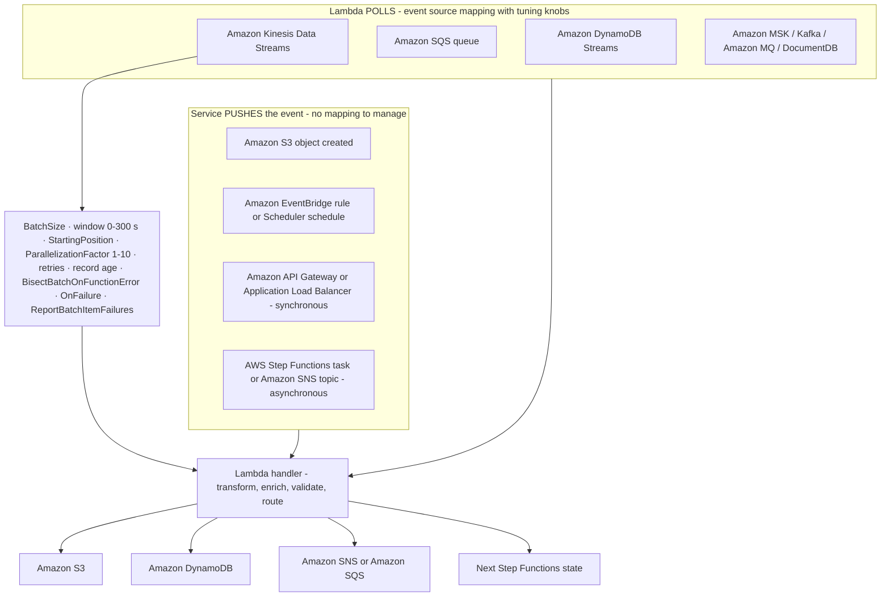
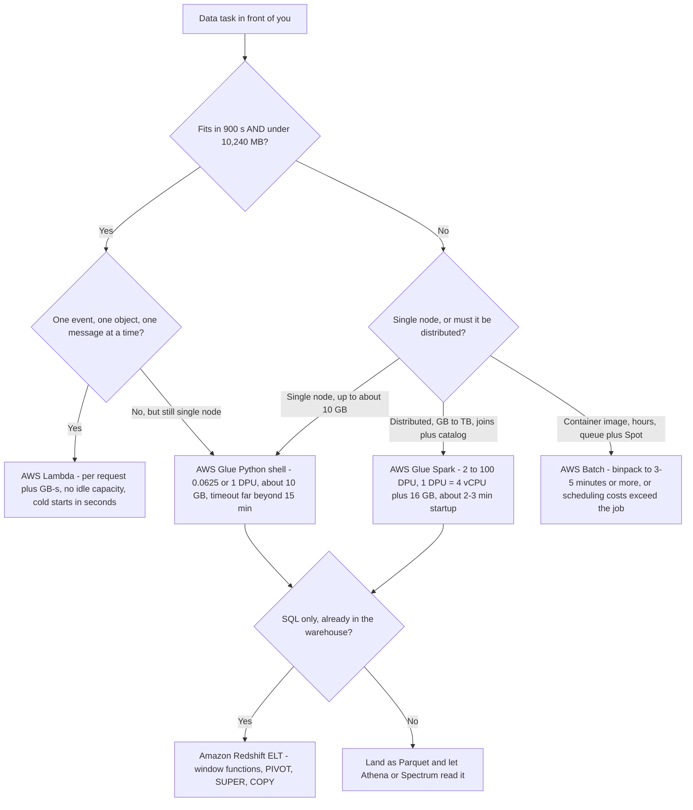
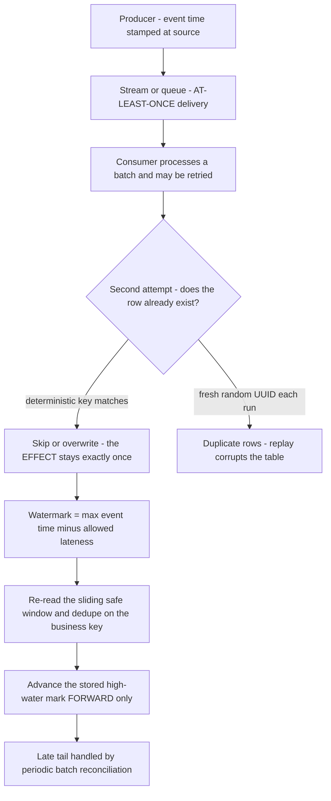
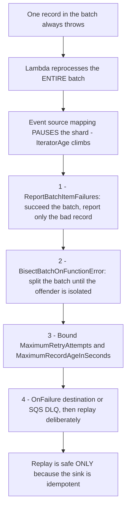

# Programming Concepts for Data Operations

Every pipeline you have studied so far moves and reshapes data. This lesson asks the question underneath: **what code runs, and why does it behave the way it does?** DEA-C01 answers that in Domain 1, **Task 1.4**, and the task statement is deliberately narrow. The exam guide lists **"language-agnostic programming concepts"** as in scope and **"programming language-specific syntax"** as out of scope — so no item will ask you to recall a decorator, a list comprehension or a package import. Instead the stem hands you a **pipeline problem** (rank these rows, deduplicate this replay, parse this nested field, pick a runtime) and expects the right **construct or service** back (DEA-C01 exam guide, accessed Oct 2026).

```text
====================================================================
 DEA-C01 DOMAIN 1 - TASK 1.4: APPLY PROGRAMMING CONCEPTS
====================================================================
  Domain 1 weight ....... 34% of scored content
  IN SCOPE .............. language-agnostic programming concepts,
                          SQL + query optimization, IaC, Git, CI/CD,
                          distributed computing, data structures and
                          algorithms, Lambda concurrency/performance,
                          AWS SAM, mounting volumes in Lambda
  OUT OF SCOPE .......... "programming language-specific syntax"
---------------------------------------------------------------------
  CONCEPT            ->  THE SHAPE IT TAKES IN A DATA PIPELINE
  functions / types  ->  Lambda handler, Glue resolveChoice / cast:
  variables / scope  ->  local vs 4 KB Lambda environment variables
  conditionals       ->  CASE WHEN, Step Functions Choice, filters
  loops              ->  GROUP BY, Map state, repartition fan-out
  OOP basics         ->  Lambda layers mounted at /opt (max 5, zip)
  APIs               ->  pagination, 429 backoff, SDK / CLI access
  serialization      ->  CSV / JSON / Avro / Parquet / ORC choice
---------------------------------------------------------------------
  RUNTIME ENVELOPE (as of Oct 2026)
  Lambda ........ 1-900 s · 128-10,240 MB · 1,769 MB ~ 1 vCPU
  Glue Spark .... 2-100 DPU · 1 DPU = 4 vCPU + 16 GB · default 10
  Glue PyShell .. 0.0625 or 1 DPU · ~10 GB data · far beyond 15 min
  AWS Batch ..... container image · queue + compute env · hours
====================================================================
```

In this lesson you will:

- separate **language-agnostic concepts** from language-specific syntax, and map each concept to the construct the exam expects;
- read a **Lambda handler** and a **Glue job configuration** as programs, not as trivia;
- choose between **pandas on one node** and **PySpark across partitions**, and name the crossover honestly;
- apply **lazy evaluation**: transformations build a plan, an action triggers compute, and a shuffle is where the cost lands;
- size **partitions**, pick `coalesce` or `repartition`, and explain why gzip files hurt;
- climb the **UDF cost ladder** from built-in SQL down to plain Python, and know when a UDF is justified;
- write **window functions** in Spark SQL, Redshift and pandas, and know why `PARTITION BY` changes parallelism;
- use **CTEs, joins, PIVOT and JSON parsing** as the SQL patterns the exam re-asks;
- configure **AWS Lambda** for data work: event sources versus event source mappings, the concurrency pool, the 900-second ceiling, memory-coupled CPU and layers;
- apply the **Lambda vs Glue vs Batch decision matrix** on size, duration, frequency and runtime limits;
- distinguish **at-least-once delivery** from an **exactly-once effect**, and build **idempotent writes**;
- use **watermarks** to bound late data, and climb the **poison-pill handling ladder**;
- flatten **nested JSON** and choose between **schema-on-read** and **schema-on-write**;
- read the **October 2026 update box**, study **two AWS customer case studies**, and practise with **12 exam-style questions** plus interactive checks.
- **expanded scope of this edition:** the lesson now carries **five AWS customer case studies** (EMX, AppsFlyer, Hearst, Nasdaq and PayU), **fourteen practice questions** (`dea-06-q1` through `dea-06-q14`) and **three interactive checks** — matching, fill-in-the-blank and drag-and-drop.

---

## 1. Programming concepts the exam actually tests

### 1.1 The scope boundary, in the guide's own words

Two phrases do all the work:

> **In scope:** "language-agnostic programming concepts" · **Out of scope:** "programming language-specific syntax"

Everything in this section therefore has to survive a test: *could I ask this without naming a language?* If yes, it is examinable. "What does `def handler(event, context)` mean as an entry point?" is examinable — the shape is the same in Python and the concept of an entry point is universal. "What is the exact argument order of `pd.merge()`?" is not — that is syntax.

Task 1.4's skill list makes the same point from the other side. The named skills are **optimise runtime performance**, **Lambda concurrency and performance**, **languages and frameworks** (Python, SQL, Scala, R, Java, Bash, PowerShell), **version control, testing, logging and monitoring**, **infrastructure as code**, **AWS SAM**, **mounting storage volumes in Lambda**, **CloudFormation/CDK**, **CI/CD**, **distributed computing** and **data structures and algorithms** — a list of *capabilities*, with Git questions kept **generic** after AWS removed CodeCommit from the in-scope list at exam-guide **v1.1 (2025-12-12)** (DEA-C01 exam guide revisions page, accessed Oct 2026).

### 1.2 The concept → construct map

This table is the whole of Section 1 compressed into what a question can actually test:

| Programming concept | The shape it takes in a data pipeline | What the exam asks |
|---|---|---|
| **Functions and types** | A Lambda handler is the entry point; Glue jobs declare `resolveChoice` and `cast:` to coerce types before an aggregation | Name the entry point, or which type a column must be cast to |
| **Variables and scope** | Local variables live one invocation; Lambda environment variables are an **4 KB aggregate** (as of Oct 2026) | Where a secret must **not** be stored |
| **Conditionals** | `CASE WHEN` in SQL · `Choice` state in Step Functions · `filter()` in Spark | Branch on **data**, not on infrastructure |
| **Loops** | `GROUP BY` aggregates a loop away · `Map` state fans out · `foreach`/`repartition` parallelise | Recognise when iteration must be **serial** vs **parallel** |
| **Object-oriented basics** | Composition and reuse → Lambda **layers** mounted at `/opt`, maximum **5**, zip-only (as of Oct 2026) | Reuse shared code without copying it into every package |
| **APIs** | Paginated list calls, `429`/throttle backoff, SDK and CLI programmatic access | Choose programmatic access and handle throttling correctly |
| **Serialization** | CSV → JSON/NDJSON → Avro → Parquet/ORC | Pick the format from the **access pattern**, not from habit |
| **Distributed computing** | One partition = one task; shuffles are stage boundaries | Where parallelism starts and where cost lands |
| **Data structures and algorithms** | Hash keys for dedupe, sorted windows for ranking, joins as hash/broadcast | Choose the structure that makes the operation cheap |

### 1.3 Worked example E1 — reading a handler, not memorising syntax

The exam gives you a shape like this and asks what it does or what to change. Read it as a **control-flow diagram**:

```python
# Illustrative - the exam tests the SHAPE, not the boto3 calls.
def handler(event, context):
    """Entry point the platform invokes; the name and arity are fixed."""
    batch = event.get("records", [])     # variable holding a typed collection
    ok, bad = [], []                     # two accumulators = two code paths
    for record in batch:                 # loop over the batch, not over the table
        if record.get("amount") is None: # conditional on DATA
            bad.append(record)           # route poison records off the hot path
        elif record["amount"] < 0:
            bad.append(record)
        else:
            ok.append(record)
    if len(ok) > 1_000:                  # a conditional that changes STRATEGY
        write_partition_overwrite(ok)    # bulk, deterministic, replayable
    else:
        write_rows(ok)                   # small, row-at-a-time
    return {"ok": len(ok), "bad": len(bad)}
```

Three examinable facts fall out of it: the **entry point** is a function with a fixed signature; **conditionals route records** rather than retry them; and the **strategy change at a size threshold** is exactly the "optimise runtime performance" skill — small sets go row-wise, large sets go bulk.

### 1.4 Conditionals and loops prefer set-based SQL

The single most common Domain 1 pattern is a stem describing a loop over rows, with the correct answer being an **aggregation or a window function**:

| Imperative idea | Set-based answer | Why the exam prefers it |
|---|---|---|
| Loop and count per customer | `GROUP BY customer_id` | The engine does the loop in parallel |
| Loop keeping the newest row per key | `ROW_NUMBER() OVER (PARTITION BY k ORDER BY ts DESC)` | Ranking without a self-join |
| Loop with an `if/else` that writes different columns | `CASE WHEN … END` inside the select list | One pass, no branch in application code |
| Loop that fans out over files | `Map` state / `repartition` / a Glue DynamicFrame map | Parallelism declared, not hand-rolled |
| Loop that waits for a condition | Step Functions `Choice` + `Wait`, or a watermark | Durable waiting instead of a busy loop |

### 1.5 Object orientation shows up as layers, not as classes

Class hierarchies are not examinable. **Reuse** is. AWS's answer to "my team has three Lambda functions that all need the same helper library" is a **layer**: a zip archive mounted under `/opt`, with a hard maximum of **5 layers per function**, and — this is the detail questions reach for — layers are **zip-only**, so a **container image** function cannot use them at all (the image bakes its dependencies instead, up to **10 GB**) (AWS Lambda limits and layers documentation, accessed Oct 2026).

### 1.6 APIs show up as pagination and throttling

A stem describing "call a service that returns 100 records at a time until exhausted" is testing **pagination**; a stem describing "the pipeline fails every few minutes with HTTP 429" is testing **backoff with jitter**, not a specific retry library. Both are language-agnostic, and both map to the same service-side levers you met in Lesson 05: retry policies, DLQs and idempotent writes.

### 1.7 Serialization is a decision, not a syntax

| Format | Orientation | Schema | Exam signature |
|---|---|---|---|
| **CSV** | row | none | Interchange only — no pruning, no nested types |
| **JSON / NDJSON** | row | inferred at read | Nesting + schema-on-read; heavy to parse |
| **Avro** | row | **in the header**, splittable | **Move and evolve** it — streaming and schema evolution |
| **Parquet / ORC** | **columnar** | in the footer | **Read it** — pruning, min/max pushdown, compression |

The rule AWS's own guidance reduces to: **Avro/JSON to move it, Parquet/ORC to read it.** Because Athena bills **bytes scanned**, the format *is* the cost — a columnar file that lets the engine skip untouched columns is cheaper than a row format that cannot (AWS Athena and AWS Glue documentation, accessed Oct 2026).

```matching
{
  "question": "Match each language-agnostic programming concept to the construct the DEA-C01 exam expects you to name:",
  "pairs": [
    {"left": "Conditional on data", "right": "CASE WHEN in SQL, or a Choice state in Step Functions - branch on the DATA, never on the infrastructure"},
    {"left": "Loop over rows", "right": "GROUP BY, a window function, or a Map state - set-based or parallel, never a hand-written row loop"},
    {"left": "Reuse of shared code", "right": "Lambda layers mounted at /opt - maximum 5, zip-only, so container-image functions cannot use them"},
    {"left": "Where a secret lives", "right": "Secrets Manager or SSM Parameter Store with KMS - Lambda environment variables are capped at a 4 KB aggregate"},
    {"left": "Paged, throttled API access", "right": "Pagination with backoff and jitter on 429 - language-agnostic, so no client library is ever named"},
    {"left": "Serialization format choice", "right": "Avro/JSON to move it, Parquet/ORC to read it - chosen from the ACCESS PATTERN, not from habit"}
  ],
  "explanation": "Task 1.4 tests the CONSTRUCT, never the syntax. Each pair is the language-agnostic answer a stem is looking for: conditionals become CASE WHEN or a Choice state, loops become GROUP BY / a window function / a Map state, reuse becomes Lambda layers at /opt (max 5, zip-only), secrets move out of the 4 KB environment-variable envelope into Secrets Manager or SSM, throttling becomes pagination plus backoff, and serialization becomes a decision driven by how the data will be read."
}
```

- **📚 Did you know?** AWS's DEA-C01 guide changed how it *presents* this topic rather than what it contains: at **v1.1 (2025-12-12)** the separate "Knowledge of" and "Skills in" lists were **consolidated into one skills list per task**, adding **8 skills and removing none**. That is why current study material quotes a flat numbered list like "1.4.1 optimise runtime performance" while older material quotes a Knowledge/Skills pair for the same content (DEA-C01 revisions page, accessed Oct 2026).

---

## 2. Python and PySpark patterns for data operations

### 2.1 Single node versus distributed — pick before you code

The first fork in every data task is **where the loop runs**. Getting it wrong is expensive in both directions: a distributed cluster for a 40 MB file wastes startup and idle capacity, while a single node for a 200 GB join runs out of memory.

| | **Single node** | **Distributed** |
|---|---|---|
| Service | **AWS Glue Python shell** · **AWS Lambda** · a Glue job's driver | **AWS Glue Spark (ETL)** · **Amazon EMR** · EMR Serverless |
| Capacity | PyShell **0.0625 or 1 DPU**, about **10 GB** of data · Lambda **128–10,240 MB** and **≤900 s** | Glue Spark **2–100 DPU** (minimum **2 DPU**), **1 DPU = 4 vCPU + 16 GB** |
| Execution | One interpreter, one heap | One **partition = one task** across workers |
| Startup | Seconds (Lambda), small (PyShell) | Glue Spark jobs commonly pay **~2–3 minutes** of startup before the first task |
| Cost shape | Per request + GB-s (Lambda), or a fraction of a DPU | Whole DPU-hour while the job runs, including idle workers |
| Fails when | It runs out of memory or hits its timeout | Skew, too many small files, or a bad shuffle |

**Crossover rule of thumb:** roughly **10 million rows / 5–10 GB** is where people stop reaching for pandas on one node — and you must state its provenance honestly. It is a **2017 third-party rule of thumb, never an AWS-published figure**; the exam-grade facts are the *service* limits above, which are AWS-documented (as of Oct 2026).

> [!WARNING]
> ⚠️ **Un-rewritten pandas on a Glue Spark job raises your bill.** AWS's Glue Python-shell migration guidance notes that a Glue Spark job allocates **at least two Spark workers**, so code that still runs pandas serially in the driver leaves the workers **idle and charged**. The fix is either to move to a **Python shell** job (single node, cheap) or to move the logic to **pandas-on-Spark / PySpark** (distributed). Choosing "Glue Spark because it is bigger" is a cost bug, not a default.

### 2.2 Lazy evaluation: plan first, compute once

Apache Spark transformations are **lazy** — reading, filtering, mapping and joining build a **plan**, and nothing runs until an **action** (`write`, `count`, `collect`, `toPandas`) forces execution (AWS Prescriptive Guidance, *Tuning AWS Glue for Apache Spark*, accessed Oct 2026).

```mermaid
flowchart LR
    R["read - declare the source"] --> F["filter - plan only"]
    F --> M["map / withColumn - plan only"]
    M --> J["join - plan only, shuffle declared"]
    J --> A["ACTION: write or count - compute starts"]
    A --> S["Stage splits at the shuffle boundary"]
    S --> T["Task per partition - 1 partition = 1 task"]
    T --> C["Cached only if you called persist or cache"]
```



Two consequences the exam builds questions on:

1. **A transformed dataset is recomputed on every action** unless you `cache()`/`persist()` it. Two actions on the same lineage pay for the lineage twice.
2. **Chain your transformations, then act once.** Ten cheap actions beat one expensive action only if they share no recomputed lineage — which they usually do.

```python
# PySpark - illustrative shape, not a memorisation exercise
from pyspark.sql import functions as F

df = spark.read.parquet("s3://lake/raw/orders/")   # plan: source scan declared
clean = (df
         .filter(F.col("amount") > 0)              # transformation - no compute
         .withColumn("order_day", F.to_date("ts")))# transformation - no compute
ranked = clean.withColumn(
    "rn",
    F.row_number().over(
        Window.partitionBy("customer_id", "order_day")
              .orderBy(F.col("amount").desc())))   # transformation - no compute
top = ranked.filter(F.col("rn") <= 3)              # still no compute
top.write.mode("overwrite").partitionBy("order_day") \
   .parquet("s3://lake/curated/top_orders/")       # ACTION - the plan executes
```

### 2.3 Partitions: the unit of parallelism and of cost

| Fact | Value | Source and date |
|---|---|---|
| Granularity | **1 partition = 1 task** | AWS Prescriptive Guidance, Oct 2026 |
| Target count | **2–3× cores** for Glue; **2–4 per CPU** for Spark | AWS Prescriptive Guidance / Spark RDD guide, Oct 2026 |
| Default shuffle partitions | **200** | AWS Glue SQL performance tuning, Oct 2026 |
| Skew advisory threshold | **128 MB** per partition (Spark SQL advisory: **64 MB**) | AWS Glue tuning, Oct 2026 |
| `maxResultSize` on a large shuffle | **1 GB** | AWS Glue tuning, Oct 2026 |
| Gzip | **Unsplittable** — one file, one task | AWS Glue parallelize-tasks guidance, Oct 2026 |
| Adaptive query execution | Coalesces small partitions automatically on Glue **≥4.0** / Spark **≥3.2** | AWS Glue, Oct 2026 |

#### Worked example E2 — partition math

You have **120 GB** of Parquet on a **32-core** Glue job:

```text
Target partitions  = 2 to 3 x cores = 64 to 96
Take 96            -> 120 GB / 96    = 1.25 GB per partition
If the source has 120,000 tiny files:
  120,000 tasks on a 32-core job = driver OOM + scheduler thrash
  fix: coalesce(96) on read, or repartition(96) before the write
```

The two functions are **not** interchangeable: `coalesce` merges partitions **without a full shuffle** (use it to go **down**), while `repartition` performs a **full shuffle** to reach an exact count (use it to go **up**, or to spread skew across a key).

- **📚 Did you know?** "More partitions = faster" is the most expensive misconception in Spark. Past about **2–3× cores**, extra partitions do not add parallelism — they add scheduler overhead, small-file writes and GC pressure. The opposite error is just as bad: one 60 GB gzip partition is **one task on one core**, and because gzip is **unsplittable** the engine cannot break it up. The habit worth building is to repartition **by the partition columns before the write**, so the file layout you land is the layout the reader will prune on (AWS Glue parallelize-tasks guidance, accessed Oct 2026).

### 2.4 The UDF cost ladder

A **user-defined function** is the escape hatch for third-party parsers, model scoring and stateful row logic. Everything else should stay in built-in SQL. AWS's own performance guidance places the options on a ladder, and the top rung is roughly **five times** faster than the bottom one:

| Rung | Implementation | Why it costs what it costs |
|---|---|---|
| ① Cheapest | **Built-in Spark SQL** functions | Runs on the JVM, stays visible to the Catalyst optimiser, keeps predicate pushdown |
| ② | **pandas / Arrow vectorised UDF** | Batched Arrow batches — AWS measures it at about **5×** a plain Python UDF |
| ③ | **Plain Python UDF** | **Pickles every row** across the JVM↔Python boundary; the optimiser treats it as a black box |
| ④ Most expensive | **Scala / Java UDF** | No Python boundary, but the least portable and still opaque to some optimisations |

```python
# Ladder rung 3 - AVOID on hot paths: one pickle round trip PER ROW
@F.udf(returnType="string")
def normalise_slow(raw):           # Catalyst cannot push this predicate down
    return raw.strip().lower()

# Ladder rung 1 - PREFERRED: vectorised built-in, stays in the JVM
clean = df.withColumn("sku", F.upper(F.trim(F.col("raw_sku"))))

# Ladder rung 2 - only when there is genuinely no built-in:
# a pandas UDF batches whole Arrow record batches instead of single rows
```

**Exam rule:** reach for a UDF only when no built-in can do it. On a 1-billion-row job, rung ③ versus rung ① is the difference between minutes and hours — and it is a *performance optimisation* question, which is Task 1.4 skill "optimise runtime performance" (AWS Glue *Optimize user-defined functions*, accessed Oct 2026).

### 2.5 Window functions: three stems, three answers

| Stem | Construct |
|---|---|
| "latest / top **N** per key" | `ROW_NUMBER() OVER (PARTITION BY key ORDER BY ts DESC)` |
| "running total, period-over-period delta" | `SUM() OVER (ORDER BY …)` · `LAG(col) OVER (ORDER BY …)` |
| "share of total" | `RATIO_TO_REPORT() OVER ()` (Redshift) or `SUM() OVER ()` as a divisor |

```sql
-- Redshift / Spark SQL: top 3 orders per customer per day
SELECT customer_id,
       order_date,
       amount,
       ROW_NUMBER() OVER (
           PARTITION BY customer_id, order_date
           ORDER BY amount DESC
       ) AS rn
FROM orders
QUALIFY rn <= 3;
```

**Parallelism hinge (a favourite distractor):** in **Amazon Redshift**, `PARTITION BY` is what lets the window function run **across slices in parallel**; without it the window is computed **serially on a single slice**. And window functions are legal only in a **SELECT** list or in the **final ORDER BY** — not in a `WHERE` clause (Redshift window-function documentation, accessed Oct 2026).

In **pandas**, the same job is `groupby().transform()` or `groupby().cumcount()` — correct, but **single-node**. Past the crossover size it collects everything onto **one** process, which is why `df.toPandas()` / `collect()` inside a Glue Spark job is the canonical out-of-memory bug: it pulls the whole distributed frame to the **driver**.

---

## 3. SQL patterns the exam keeps re-asking

### 3.1 CTEs stage the logic so each step is readable

A **common table expression** (`WITH`) is how you express "first deduplicate, then filter, then rank" without three separate statements — and how you make a query reviewable. It is also the natural home for the dedupe step in an idempotent pipeline (Section 6).

```sql
-- Stage 1: keep one row per (order_id, version) - the replay-safe row
WITH ranked AS (
    SELECT *, ROW_NUMBER() OVER (
        PARTITION BY order_id ORDER BY updated_at DESC, version DESC
    ) AS rn
    FROM raw_orders WHERE dt = '2026-10-09'
),
-- Stage 2: only the surviving rows join the aggregation
latest AS (
    SELECT order_id, customer_id, amount FROM ranked WHERE rn = 1
)
SELECT customer_id, COUNT(*) AS orders, SUM(amount) AS revenue
FROM latest
GROUP BY customer_id
ORDER BY revenue DESC;
```

### 3.2 Joins: qualify names, broadcast the small side

| Engine | Join trap the exam tests | Correct habit |
|---|---|---|
| **Athena** | Two tables with a **same-named** column produce an ambiguous-reference error | Qualify: `FROM a JOIN b ON a.id = b.customer_id` |
| **Spark / Glue** | A join is the **main shuffle bottleneck** | **Broadcast** the small side (`/*+ BROADCAST(small) */` or `broadcast()`); target the small table under the advisory threshold |
| **Redshift** | Join order and distribution keys decide whether the query re-distributes data | Prefer **DISTKEY/SORTKEY** alignment and `ANALYZE` before big joins |
| Any engine | A join with no predicate is a **cross join** | Always state the join keys explicitly |

### 3.3 PIVOT — and the portable fallback

Amazon Redshift supports `PIVOT`, with hard limits worth memorising:

```sql
-- Redshift PIVOT: only COUNT, SUM, MIN, MAX, AVG are allowed as aggregates
SELECT region, pivot_alias
FROM sales
PIVOT (SUM(amount) FOR region IN ('EMEA', 'AMER', 'APAC')) AS p;
```

| Redshift `PIVOT` rule | Consequence |
|---|---|
| Aggregates limited to **COUNT, SUM, MIN, MAX, AVG** | Anything else needs the portable form |
| No `JOIN`, no recursive CTE, no SUPER `UNNEST` in the input | Pre-stage those in a CTE |
| The `IN` list takes **literals** | Dynamic pivot needs dynamic SQL or the portable form |

The portable, engine-independent form — which is the answer whenever a question asks for a pivot that PIVOT cannot express:

```sql
SELECT order_date,
       SUM(CASE WHEN region = 'EMEA' THEN amount ELSE 0 END) AS emea,
       SUM(CASE WHEN region = 'AMER' THEN amount ELSE 0 END) AS amer,
       SUM(CASE WHEN region = 'APAC' THEN amount ELSE 0 END) AS apac
FROM sales
GROUP BY order_date;
```

### 3.4 JSON parsing: two engines, two families

**Amazon Athena** (Presto/Trino dialect) separates *extracting a JSON value* from *extracting a scalar*:

```sql
-- Athena: json_extract returns JSON (quoted); json_extract_scalar returns text
SELECT json_extract_scalar(payload, '$.customer.id')  AS customer_id,
       json_extract_scalar(payload, '$.items[0].sku') AS first_sku
FROM events WHERE dt = '2026-10-09';

-- Nested arrays are flattened, then crossed with the parent row
SELECT e.order_id, i.sku, i.qty
FROM events e
CROSS JOIN UNNEST(e.items) AS i (sku, qty);
```

**Amazon Redshift** parses JSON **once** into the `SUPER` type and then queries it with PartiQL-style paths — `JSON_PARSE(payload)` → `SUPER`, dot and bracket access, `UNNEST`, `UNPIVOT`. AWS is explicit that **JSON is not a good fit for large datasets** because it is not columnar; parse it into `SUPER` once, or land it as **Parquet/SUPER columns** (Redshift JSON and SUPER documentation, accessed Oct 2026).

> [!IMPORTANT]
> **Athena has no `OFFSET`-free deep paging story.** `ORDER BY … LIMIT … OFFSET` is supported, but `ORDER BY` + `LIMIT` tops out at **2,147,483,647 rows**, and Athena bills **bytes scanned** — so deep OFFSET paging both hits a ceiling and re-reads the same bytes. The exam-friendly answer is **keyset pagination** (`WHERE id > :last_id ORDER BY id LIMIT n`) over **partitioned Parquet**, not big offsets over CSV.

### 3.5 Bulk load: one COPY, not a thousand INSERTs

Amazon Redshift's own guidance is unambiguous: **use `COPY` for large loads** — individual `INSERT`s "might be prohibitively slow". Sizing rules: **one `COPY` per table/prefix** (concurrent COPYs to the same table **serialize**), non-splittable gzip/JSON files between **1 MB and 1 GB**, count ≈ number of **slices**, and CSV/Parquet files **≥128 MB** are auto-split (Redshift COPY best practices, accessed Oct 2026).

#### Worked example E3 — COPY sizing

```text
Source: 640 GB of gzip CSV   Cluster: 128 slices
Target = a multiple of 128 files, each between 1 MB and 1 GB
  128 x 5 GB -> over 1 GB, split it
  1,024 x 640 MB -> in range, 8 files per slice -> good
Then ONE COPY for the whole prefix: concurrent COPYs to the same
table serialize, so parallelism comes from FILE_COUNT inside one COPY.
```

---

## 4. AWS Lambda for data tasks

### 4.1 Two ways an event arrives: push (trigger) versus pull (event source mapping)

This distinction is the spine of every Lambda data question. A **trigger** means the service **pushes** the event to your function; an **event source mapping (ESM)** means **Lambda polls** the stream or queue on your behalf and batches records for you (AWS Lambda event-source-mapping documentation, accessed Oct 2026).



| Lever | Values (as of Oct 2026) | What it trades |
|---|---|---|
| `BatchSize` (Kinesis) | default **100**, max **10,000** | Throughput per invocation vs latency |
| Batching window | **0 s** (Kinesis/DDB/SQS), **500 ms** (MSK/Kafka/MQ), max **300 s** | Latency vs batching efficiency |
| `ParallelizationFactor` | **1–10** | More concurrency per shard vs ordering pressure |
| `MaximumRetryAttempts` | **−1 (infinite)** to **10,000** | Retention of poison records vs stall time |
| `MaximumRecordAgeInSeconds` | **−1** to **604,800 (7 days)** | How long a shard keeps trying |
| `ReportBatchItemFailures` | on/off | Partial-batch success vs whole-batch retry |

> [!WARNING]
> ⚠️ **The ESM failure mode is the whole batch and the whole shard.** On failure, Lambda **reprocesses the entire batch** and **pauses the shard** — which is why the first symptom of one bad record is a climbing `IteratorAge`, not an error rate. Defaults are **infinite**, so a single poison record can block a DynamoDB stream for **up to one day** and a Kinesis shard for **up to one week** (AWS Lambda DynamoDB/Kinesis error documentation, accessed Oct 2026).

### 4.2 Concurrency: reserved versus provisioned

AWS gives every account a pool of **1,000 concurrent executions per Region**, shared across all functions, with an unreserved floor of **100**, and a sustainable ingestion rate of roughly **10 requests/second per unit of concurrency** (as of Oct 2026).

| | **Unreserved** | **Reserved** | **Provisioned** |
|---|---|---|---|
| What it is | Whatever is left of the 1,000 pool | A hard **minimum *and* maximum** for one function | Pre-warmed execution environments |
| Price | — | **Free** | **Charged** (per GB-s and per hour, 1 ms billing) |
| Applies to | — | Any function | Function **versions and aliases** only |
| Canonical use | Best-effort traffic | **Guarantee a pipeline's capacity**, *or* **cap a function so a small database pool is not overwhelmed** | **Interactive latency** — shaving cold starts |

**Sizing arithmetic:** required concurrency ≈ `requests/second × duration in seconds`, and AWS's provisioning guidance adds **~10%** headroom. Provisioned concurrency is **not** the answer to "my async pipeline should start quickly" — AWS states async pipelines usually do not need it (AWS Lambda concurrency documentation, accessed Oct 2026).

#### Worked example E4 — concurrency sizing

```text
Peak: 200 concurrent invocations, average duration 250 ms
Warm environments for provisioned concurrency:
    200 x 0.250 s = 50 concurrent executions
    +10% headroom                          -> provision 55
Account pool is 1,000 per Region:
    reserved for this function  <= 1,000 - 100 (unreserved floor) = 900
    provisioned concurrency must sit inside the reserved envelope
Requests per second ceiling at 200 concurrency:
    10 x 200 = 2,000 requests/second (as of Oct 2026)
```

### 4.3 Timeout and the memory → CPU coupling

There is **no vCPU knob**. CPU, network and GPU scale **with the memory setting**, which is the single most testable Lambda performance fact:

| Setting | Value (as of Oct 2026) |
|---|---|
| Timeout | **1–900 s**, console default **3 s**, hard ceiling **900 s (15 min)** |
| Memory | **128–10,240 MB** in **1 MB** increments |
| **1,769 MB** | ≈ **1 vCPU** |
| **10,240 MB** | ≈ **6 vCPUs** |
| `/tmp` | **512 MB free**, then billed, up to **10,240 MB** |
| Environment variables | **4 KB aggregate** |
| Deployment package | **50 MB zipped / 250 MB unzipped**, including up to **5 layers** |
| Container image | **10 GB** |
| Code storage | **300 GB unzipped**, not increasable |

#### Worked example E5 — memory, CPU and unit cost

```text
Job needs about 1 vCPU. Current setting 1,024 MB (~0.6 vCPU) is too slow.
Fix: raise memory to 1,769 MB - there is no separate CPU setting.

Unit cost of ONE invocation at 1,769 MB x 500 ms:
    1.769 GB x 0.5 s = 0.8845 GB-s
    0.8845 x $0.0000166667 (x86 tier 1) = $0.0000147 per invocation

Monthly at 10 million invocations:
    duration  10,000,000 x 0.8845 GB-s = 8,845,000 GB-s
    less free  400,000 GB-s            = 8,445,000 billable GB-s
    8,445,000 x $0.0000166667          = $140.75
    requests  10,000,000 - 1,000,000 free = 9,000,000
    9,000,000 / 1,000,000 x $0.20      =   $1.80
    total                                ~ $142.55 / month
    (prices as of Oct 2026 - verify current pricing before use)
```

### 4.4 Layers, environment variables and `/tmp`

- **Layers** are the object-oriented reuse story (Section 1.5): **≤5**, **zip-only**, mounted at **`/opt`**. A container-image function cannot use layers.
- **Environment variables** are capped at **4 KB in aggregate** and are **readable through the API** — so they are configuration, **not a secret store**. Secrets belong in **AWS Secrets Manager** or **Systems Manager Parameter Store**, encrypted with **KMS**.
- **`/tmp`** is **transient and per-execution-environment**: it survives warm invocations of the *same* environment and disappears when the environment is recycled. It is a **cache**, never durable state, and the first **512 MB** is free (as of Oct 2026).
- **Mounting storage:** Task 1.4 explicitly names *mounting storage volumes in Lambda* — **Amazon EFS** is the durable, multi-environment answer; `/tmp` is the ephemeral one.

#### Worked example E6 — is Lambda the right runtime at all?

```text
Requirement: a nightly Python merge of three CSV files, single node,
45 minutes, no distributed joins.

Lambda          : hard 900 s ceiling           -> impossible at any price
Glue Spark      : 2-3 min startup + 2 DPU min  -> a cluster for a loop
Glue Python shell: 0.0625 or 1 DPU, timeout far beyond 15 min
                                                   -> THE ANSWER
Selection logic: "single node + longer than 15 min = Python shell",
regardless of the exact byte count (the ~10 GB figure is the working-
set guidance that tells you when the shell stops being enough).
```

---

## 5. The Lambda vs Glue vs Batch decision matrix

### 5.1 The matrix

This table is the highest-yield single artefact in Task 1.4. Every row is a **sourced limit as of Oct 2026**:

| Signal in the stem | **Pick** | Why, with the limit |
|---|---|---|
| Event transform, seconds to minutes, GB-scale | **AWS Lambda** | **900 s** ceiling, **10,240 MB** memory, billed per request + GB-s, no idle capacity |
| Single-node pandas, **longer than 15 min or around 10 GB** | **AWS Glue Python shell** | **0.0625 / 1 DPU**, about **10 GB**, timeout far longer than Lambda's hard 15 minutes |
| Distributed ETL, joins, GB–TB, needs the **Data Catalog** | **AWS Glue Spark (ETL)** | **2–100 DPU** (default **10**), **1 DPU = 4 vCPU + 16 GB**; expect **~2–3 min** startup |
| Container image, **hours**, queue + **Spot** capacity | **AWS Batch** | Docker job on a queue and compute environment; scheduling overhead means binpack jobs to **3–5 minutes** or more |
| Existing Spark/Hadoop estate, **petabyte** scale | **Amazon EMR** / EMR Serverless | You bring the framework version and cluster config |
| SQL-only transformation already in the warehouse | **Amazon Redshift** ELT | Window functions, PIVOT, SUPER and `COPY` stay inside the engine |



### 5.2 Worked example E7 — the same job on two runtimes

```text
Job: 1.44 million invocations per month, 300 ms each, 512 MB

Lambda:
    GB-s      1,440,000 x 0.512 GB x 0.3 s = 221,184 GB-s
    free tier 400,000 GB-s  -> duration cost $0
    requests  (1,440,000 - 1,000,000) / 1,000,000 x $0.20 = $0.088
    total     ~ $0.09 per month

Same work as a Glue Spark job: 10 minutes a day on 4 DPU
    4 DPU x (10/60) h = 0.667 DPU-h per day
    0.667 x 30 days   = 20 DPU-h per month
    20 x $0.44/DPU-hour = $8.80 per month
    (Glue ETL $0.44 per DPU-hour as of Oct 2026 - verify current
     pricing before use; Lambda prices as of Oct 2026)

Delta: about 98x cheaper on Lambda - because the work is
INVOCATION-SHAPED, not JOB-SHAPED.
```

The lesson is not "Lambda is always cheaper" — it is that **pricing follows the shape of the work**. A 40-minute nightly merge cannot run on Lambda at any price (the **900 s** ceiling), and a 2-second job cannot justify **AWS Batch**, where scheduling overhead can exceed the runtime.

- **📚 Did you know?** AWS's own Glue guidance puts the startup cost in writing: Glue Spark jobs commonly spend **2–3 minutes** before the first task runs, which is *more* runtime than the job itself for sub-100 MB payloads. That is why the exam's "small, frequent, event-driven" stems point at Lambda and its "big, scheduled, join-heavy" stems point at Glue — and why a stem that says *"frequent, small files arriving every few seconds"* is usually telling you to reject both Glue **and** Batch (AWS Glue and AWS Batch best-practice documentation, accessed Oct 2026).

---

## 6. Idempotency, watermarks and poison pills

### 6.1 At-least-once delivery, exactly-once *effect*

Streams and queues — Kinesis, SQS, DynamoDB Streams, MSK — deliver **at-least-once** by default. There is no end-to-end exactly-once transport. What pipelines build instead is an **exactly-once effect**: **at-least-once delivery + an idempotent side effect** (AWS Big Data Blog, *Build a fault-tolerant serverless data aggregation pipeline with exactly-once processing*, 2021-11-01).

| Toolbox | Mechanism | When |
|---|---|---|
| **Deterministic keys** | Hash or business key, never a fresh UUID | Any dedupe or upsert |
| **Partition overwrite** | `INSERT OVERWRITE PARTITION (dt=…)` | Whole-day batch re-runs |
| **MERGE / upsert** | `MERGE INTO … ON key` | CDC and late-arriving changes |
| **`INSERT … ON CONFLICT DO NOTHING`** | Database-enforced uniqueness | Append-only event tables |
| **Conditional writes** | `attribute_not_exists(key)` / `ConditionExpression` | DynamoDB, version guards |
| **Hash-of-batch key** | SHA-256 over the batch as the idempotency key | Batch-level dedupe |
| **`ClientRequestToken`** | Client-supplied token, valid **≤10 min** | Repeat-safe API calls |
| **Run ledger** | A `pipeline_runs` table checked before work starts | Whole-pipeline idempotency |

```python
# Idempotent sink - illustrative shape
import hashlib

def batch_key(records):
    """Deterministic: the SAME batch always produces the SAME key."""
    ids = sorted(r["order_id"] for r in records)
    return hashlib.sha256("|".join(ids).encode()).hexdigest()

def sink(records, dt):
    # 1. Guard: has this exact batch already been committed?
    if runs.exists(batch_key(records), dt):
        return "skipped"            # replay is a no-op, not a duplicate
    # 2. Write deterministically: overwrite the partition, or upsert by key.
    #    NEVER append with uuid4() keys - that is the classic duplicate bug.
    write_partition_overwrite(records, dt=dt)
    runs.mark_complete(batch_key(records), dt)
    return "written"
```

> [!WARNING]
> ⚠️ **A fresh UUID per row destroys idempotency.** If each replay generates new keys, every retry *looks* like new data, and duplicates accumulate silently. The rule is: **deterministic business key + partition overwrite / MERGE / conditional write**. Assume every `foreachBatch`, Lambda retry and DLQ redrive **runs at least twice**.

### 6.2 Watermarking: how long you wait for late data

A **watermark** is `max event time − allowed lateness`. It bounds how long a streaming job waits for late records before it closes a window and releases the state behind it. Move it **forward only**: too generous and state grows without bound; too tight and late records are dropped **silently** (AWS and community streaming guidance, accessed Oct 2026).

In an **incremental Glue** job the same idea appears as a stored high-water mark plus a **sliding safe window**:

```text
Stored high-water mark : last_event_ts = 2026-02-01
Allowed lateness       : 2 days
Safe-window re-read    : WHERE event_ts > 2026-01-30   (2-day overlap)
Dedupe                 : dropDuplicates(["order_id"])   (or MERGE on the key)
Advance the mark       : last_event_ts = max(old, new)  - forward only
Residual risk          : records later than the window -> periodic batch
                         reconciliation, not a bigger watermark
```



#### Worked example E8 — the safe window

```text
Watermark at 2026-02-01, allowed lateness 2 days.
Record arrives on 2026-02-02 with event_ts 2026-02-01 23:40
  -> inside the watermark: ACCEPTED, because the safe window
     re-read covers > 2026-01-30 and dropDuplicates(MERGE) removes
     anything already written.
Record arrives on 2026-02-09 with event_ts 2026-02-08
  -> BEHIND the watermark: silently dropped by a streaming source;
     recovered only by the scheduled batch reconciliation pass.
Cost of widening the window to 7 days: every run re-reads 7 days
  of data and holds 7 days of dedupe state - a latency/storage trade,
  never a free win.
```

```fillblank
{
  "question": "Complete the reliability statements using the exact vocabulary the exam uses:",
  "template": "Streams and queues deliver {{1}} by default, and an {{2}} effect is produced only by combining that delivery with an {{3}} write. A {{4}} equals max event time minus allowed lateness and may only move forward, while a record that always throws is a {{5}} that pauses the shard until retries and record age are bounded.",
  "answers": {
    "1": "at-least-once",
    "2": "exactly-once",
    "3": "idempotent",
    "4": "watermark",
    "5": "poison pill"
  },
  "distractors": ["at-most-once", "effectively-once", "nondeterministic", "event-time skew", "dead-letter record", "batching window", "shard lease", "checkpoint offset"],
  "explanation": "Delivery guarantees describe the TRANSPORT (at-least-once), the EFFECT is what you build on top (at-least-once + an idempotent sink), the watermark bounds how long you wait for late data and only ever moves forward, and a poison pill is the record whose retry loop blocks the shard until MaximumRetryAttempts and MaximumRecordAgeInSeconds turn the infinite default into a bounded one."
}
```

### 6.3 Poison-pill handling: the ladder

A **poison pill** is a record that always throws. Because an ESM retries the **whole batch** and **pauses the shard**, one bad record can stop an entire stream — and the defaults are infinite:



| Rung | Lever | Effect (as of Oct 2026) |
|---|---|---|
| 1 | **`ReportBatchItemFailures`** | Report per-record failure; the good records are **not** retried |
| 2 | **`BisectBatchOnFunctionError`** | Repeatedly halve the failing batch to isolate the offender |
| 3 | **`MaximumRetryAttempts`** (**−1…10,000**) + **`MaximumRecordAgeInSeconds`** (**−1…604,800**) | Turns infinite retry into a bounded stall |
| 4 | **`OnFailure` destination** (SQS/SNS/S3/Kafka) or a **DLQ** | Park the bad records for inspection and replay |
| SQS variant | **`maxReceiveCount` → DLQ** | The SQS-native version of rung 4 |
| Pre-filter | **`FilterCriteria`** | Drop non-matching events **before** they reach the function |

```dragdrop
{
  "question": "Put the poison-pill handling ladder in the order a data engineer applies it, from the first lever that costs nothing to the last line of defence:",
  "items": [
    "ReportBatchItemFailures - succeed the batch and report only the record that failed, so good records are not retried",
    "BisectBatchOnFunctionError - halve the failing batch repeatedly until the offending record is isolated",
    "Bound MaximumRetryAttempts (0 to 10,000) and MaximumRecordAgeInSeconds (up to 604,800 s) so infinite retry becomes a bounded stall",
    "OnFailure destination or an SQS dead-letter queue - park the bad records for inspection instead of blocking the shard",
    "Deliberate replay from the DLQ - safe ONLY because the sink was made idempotent in Section 6.1"
  ],
  "correctOrder": [
    "ReportBatchItemFailures - succeed the batch and report only the record that failed, so good records are not retried",
    "BisectBatchOnFunctionError - halve the failing batch repeatedly until the offending record is isolated",
    "Bound MaximumRetryAttempts (0 to 10,000) and MaximumRecordAgeInSeconds (up to 604,800 s) so infinite retry becomes a bounded stall",
    "OnFailure destination or an SQS dead-letter queue - park the bad records for inspection instead of blocking the shard",
    "Deliberate replay from the DLQ - safe ONLY because the sink was made idempotent in Section 6.1"
  ],
  "explanation": "The ladder runs from cheapest and least disruptive to most deliberate: first stop re-running successful records (ReportBatchItemFailures), then isolate the offender (BisectBatchOnFunctionError), then bound the retry budget so a single record cannot stall the shard for a day or a week (MaximumRetryAttempts and MaximumRecordAgeInSeconds), then divert what remains to an OnFailure destination or DLQ, and only then replay. Replay is the final step because it is the only one that can create duplicates - which is why Section 6.1's deterministic keys and partition overwrite or MERGE have to be in place before you ever pull the DLQ. Defaults without this ladder are infinite: up to one day blocked on a DynamoDB stream and up to one week on a Kinesis shard (AWS Lambda event source mapping documentation, accessed Oct 2026)."
}
```

#### Worked example E9 — from a one-week stall to a one-hour stall

```text
BEFORE (defaults): one bad Kinesis record
    retries       = infinite
    record age    = infinite
    result        = shard blocked for UP TO ONE WEEK
                    (DynamoDB Streams: up to ONE DAY)

AFTER (configured):
    MaximumRetryAttempts        = 5
    MaximumRecordAgeInSeconds   = 3,600
    BisectBatchOnFunctionError  = true
    OnFailure -> SQS DLQ
    result: about 1 hour of bounded retry, 5 attempts, the bad
            records parked in an SQS queue, shard released.
Replay from the DLQ is safe ONLY because Section 6.1 made the
sink idempotent - otherwise replaying is how you double the table.
```

- **📚 Did you know?** The three retry *owners* on this exam are different, and questions routinely mix them up: for **synchronous** invocations the **caller** retries; for **asynchronous** invocations **Lambda** retries the function **twice** (at 1 and 2 minutes) before an on-failure destination; and for **event source mappings** the **mapping itself** retries the batch and pauses the shard. The same `429` in a stem therefore has three different answers depending on how the function was invoked (AWS Lambda asynchronous and ESM documentation, accessed Oct 2026).

---

## 7. Nested data: flattening, and schema-on-read versus schema-on-write

### 7.1 Two schema philosophies

| | **Schema-on-write** | **Schema-on-read** |
|---|---|---|
| When the schema is applied | **At load** — define and enforce before data lands | **At query time** — land raw, apply the schema when you read |
| Typical service shape | Amazon Redshift table definitions, constraints | **Amazon S3 + AWS Glue Data Catalog + Amazon Athena** |
| Query performance | Faster — types and layouts are already fixed | Slower per query — parsing and coercion happen at read |
| Cost of a mistake | Reject the load, fix upstream | **Drift surfaces as consumer errors** |
| Flexibility | Low — contract up front | High — new consumers, new shapes |
| Exam answer | Warehouses and curated serving layers | Data lakes and raw/bronze zones |

> [!IMPORTANT]
> **Schema-on-read does not mean "no schema work".** AWS's own architecture guidance is to keep a **raw layer stored as-is** and put a **standardized layer with schema validation and evolution control** above it — a contract layer. Without it, schema drift in the raw zone becomes a **consumer-side outage**, which is the failure mode a question will describe when it wants this answer (AWS Prescriptive Guidance, *Modern data architecture*, accessed Oct 2026).

### 7.2 Flattening nested data, per engine

| Engine | Mechanism |
|---|---|
| **AWS Glue** | `UnnestFrame` / `Relationalize` on a DynamicFrame |
| **Amazon Athena** | `flatten()` for arrays · `CROSS JOIN UNNEST … WITH ORDINALITY` for struct/array expansion |
| **Amazon Redshift** | `SUPER` type with `UNNEST` / `UNPIVOT` and PartiQL paths |
| **Apache Spark** | `explode()` / `explode_outer()` to turn an array column into rows |

```sql
-- Athena: one row in, one row per array element out
SELECT e.order_id,
       i.sku,
       i.qty,
       i.price
FROM orders e
CROSS JOIN UNNEST(e.items) AS i (sku, qty, price);
-- A NULL array yields NO rows with CROSS JOIN UNNEST;
-- use LEFT JOIN UNNEST (or explode_outer) when you must keep the parent.
```

Two consequences worth memorising: **a NULL array produces no rows** under a cross-unnest (silently shrinking your result), and an explicit **schema at read time beats schema inference** — inference is convenient once and unpredictable forever.

### 7.3 Format follows the access pattern, and format *is* cost

```text
raw landing     : JSON or CSV, stored as-is  (schema-on-read, cheap to write)
                        |
                        v   AWS Glue ETL or Athena CTAS
curated         : Snappy-Parquet, Hive layout  year=/month=/day=
                        |
                        v
serving         : Athena / Redshift Spectrum / QuickSight
                  - column pruning skips untouched columns
                  - min/max statistics prune whole row groups
                  - Athena bills BYTES SCANNED, so pruning IS the bill
```

#### Worked example E10 — the format decision, priced

```text
Scenario: 1 TB table, a query touching 3 of 30 columns.
Athena list price: $5.00 per TB scanned (as of Oct 2026 - verify
current pricing before use), 10 MB minimum per query.

CSV, no pruning      : scans ~1 TB      -> about $5.00 per run
Parquet, columnar    : scans only the 3 needed columns plus metadata
                       -> typically an order of magnitude less
Ten runs a day x 30 days:
    CSV      300 x $5.00  = $1,500 / month
    Parquet  300 x ~$0.50 =   ~$150 / month   (illustrative)
The conversion (CTAS or a Glue job) is a ONE-TIME cost against a
RECURRING saving - which is why "convert to Parquet" is almost
always the right answer in an Athena cost stem.
```

- **📚 Did you know?** The lineage question loves the four-format contrast because it is purely *shape*: **CSV** has no schema and no pruning, **JSON** nests but must be parsed whole, **Avro** carries its **schema in the header** and is **splittable** — which is exactly why streaming and schema-evolution jobs prefer it — and **Parquet/ORC** are **columnar**, which is why analytics engines do. The one-line memory is *Avro/JSON to move it, Parquet/ORC to read it* (AWS Glue and Athena format guidance, accessed Oct 2026).

---

### 2026 Updates (as of October 2026)

> [!NOTE]
> **What moved for programming and data operations between 2024 and October 2026** — every line is checked against an AWS primary source in **October 2026**, and each is examinable because the exam tests *current* behaviour:
> - **The exam guide itself was rebuilt**: **v1.1 (2025-12-12)** consolidated the separate "Knowledge of" and "Skills in" lists into **one skills list per task**, adding **8 skills and removing none**; **Cloud9, CodeCommit and AWS Schema Conversion Tool** left the in-scope list, so **Git questions stay generic** (clone, commit, branch, merge) and never name a specific AWS Git service — DEA-C01 exam guide revisions and in-scope pages, accessed Oct 2026.
> - **Glue runtime generations advanced**: **Glue 5.1 became the default for new jobs on 2025-11-26** (Spark 3.5.6), and **Glue 6.0 went GA on 2026-08-21** with **Spark 4.1.1, Python 3.13, Scala 2.13** and a **30% price reduction**; Glue **0.9/1.0/2.0 reached end of life on 2026-04-01**, and **Python Shell 3.6** can no longer be created after **2026-03-31** — AWS Glue release notes, version support policy and What's New, accessed Oct 2026. A stem pinning an EOL Glue version is a wrong answer.
> - **Glue 6.0 removes two compatibility paths**: **EMRFS is gone** (S3A is the only S3 filesystem) and the **AWS SDK for Java v1 is removed** — AWS Glue *Migrating to version 6.0*, accessed Oct 2026. Any option relying on `fs.s3.consistent.*` or `com.amazonaws.*` imports is stale.
> - **Redshift Python UDFs are being retired**: **no new scalar Python UDFs after 2025-10-30** and they are **unsupported after 2026-06-30** — Amazon Redshift behaviour-changes page, accessed Oct 2026. This directly reshapes the UDF ladder of Section 2.4: on Redshift the exam-friendly answer moves to **SQL, stored procedures and ML**, not to new Python UDFs.
> - **Athena's cost floor dropped**: **managed query results** (2025-06-03) are encrypted, service-managed and **cost nothing extra** — no result bucket required — and **Capacity Reservations now start at 4 DPU for 1 minute** (was 24 DPU / 60 min) as of **2026-02-11** — AWS What's New and Athena capacity-control blog, accessed Oct 2026.
> - **Kinesis Data Streams now has three capacity modes**: Provisioned, On-demand Standard and **On-demand Advantage (2025-11-04)**, which removes the per-stream hourly charge but applies an account-wide **25 MB/s ingest + 25 MB/s retrieval floor**; from **2026-08-28** a stream can be materialised directly into **Iceberg on S3 Tables** — AWS What's New, accessed Oct 2026. "Kinesis has two capacity modes" is now a stale statement.
> - **EMR Serverless workers grew**: **up to 32 vCPU / 244 GB per worker** as of **2026-07-07**, with Spark-job local storage **200 GiB → 1 TiB** — AWS What's New, accessed Oct 2026.
> - **Stale-fact warning — service-name fossils**: the guide's in-scope list still prints **"Amazon Kinesis Data Firehose"**, while the product has been **Amazon Data Firehose** since **2024-02-09** with **no API, endpoint, CLI, policy or metric change**. Either name is valid — never "correct" an option that uses the old one (AWS What's New, 2024-02-09).
> - **Redshift now writes to the lake, not only reads it**: Iceberg **writes** went GA on **2025-11-17** (CREATE/SHOW/DROP plus append-only INSERT, catalogued in the **Glue Data Catalog**), **UPDATE / DELETE / MERGE** followed on **2026-04-23** (including **Amazon S3 Tables** and Lake Formation permissions), and **Iceberg materialized views** arrived **2026-10-05** — and the permissions tightened with them: on a Lake Formation table an Iceberg **DELETE** needs **DELETE**, **UPDATE/MERGE** need **INSERT + DELETE**, and **every** Iceberg DML statement also needs **ALTER** — Amazon Redshift What's New and behaviour-changes page (Patch 202), accessed Oct 2026. Any option saying Redshift can only *query* Iceberg is stale, and a lab grant of INSERT alone no longer runs a `MERGE`.
> - **Step Functions is now a first-class fan-out engine for data jobs**: **Distributed Map** gained **Athena manifests and Parquet inputs** plus **S3-prefix iteration** (`LOAD_AND_FLATTEN`) on **2025-09-18**, and on **2026-03-26** AWS added **28 services / 1,100+ AWS SDK integrations**, taking the total to **over 220 AWS services** (including Bedrock AgentCore and S3 Vectors). Memorise the split limits: **Distributed Map ≤ 10,000 children** with an S3 source of CSV/JSON/JSONL/Parquet, versus **Inline Map ≤ 40 concurrent** children, JSON array only, 256 KiB trigger payload — AWS Step Functions recent-launches and Map-state documentation, accessed Oct 2026. This is the "loops → Map state" row of Section 1.4 made directly testable.
> - **Cross-account data sharing became a one-share operation**: **AWS Lake Formation cross-account sharing v5 (2026-02-11)** lets a single **AWS RAM** share carry **hundreds of thousands of tables** using **wildcard patterns** instead of per-resource associations, composes with cross-Region resource links for Athena/EMR/Glue ETL, keeps every existing share and API working, and is **opt-in** — AWS What's New, accessed Oct 2026. Pair it with the tightened Redshift Iceberg permissions above: sharing got easier while write permissions got stricter.

- **📚 Did you know?** Nothing in the runtime *ranking* changed across 2024–2026 even though almost every number around it did. Lambda still stops at **900 s** with CPU tied to memory, Glue Python shell still runs single-node at **0.0625 or 1 DPU** far beyond 15 minutes, and Glue Spark still starts at **2 DPU** with **~2–3 minutes** of startup — while what moved is everything *around* those ceilings (Glue **6.0** on **2026-08-21**, EMR Serverless workers up to **32 vCPU / 244 GB**, Athena Capacity Reservations down to **4 DPU for 1 minute**). That is why the Section 5 decision matrix survives release-note churn: it is keyed on the *shape* of the work — duration, size, frequency, distribution — not on a version number (AWS What's New and service documentation, accessed Oct 2026).

---

## Real-World Case Studies

AWS publishes what these abstractions look like in production. Every figure below is **customer- or AWS-claimed and unaudited**, with the source named so you can check it — the examinable point is the **pattern** (which programming decision was applied, which service did the work, which number moved), not the marketing.

### Case A — EMX: a programmatic exchange rebuilt on S3 and Athena

| Element | Detail |
|---|---|
| Customer | **EMX**, a programmatic media/advertising exchange handling more than **2 TB of raw data per hour** |
| Challenge | Backend ETL and storage costs that grew linearly with ingest, on a workload that was mostly ad-hoc querying |
| Services | **Amazon S3** as the store plus **Amazon Athena** as the query layer — no warehouse cluster in the serving path |
| Outcomes | **85% saved on data storage costs**; queries reported as **"at least four times cheaper than other backend ETL tools"** (customer claim, accessed Oct 2026) |
| Exam domain | **Domain 1** Task 1.4 (choose the right runtime and format) with Domain 3 cost hooks |
| Source | AWS Big Data Blog, *How EMX reduced data pipeline costs by 85% with Amazon Athena*, 2021-02-02 (accessed Oct 2026) |

Read EMX as **Section 7.3 in production**: the saving came from *where the compute happens and how much of the file gets read*, not from a discount. Athena bills **bytes scanned**, so landing columnar files and pruning them with partitions is a **programming decision** — the same decision as choosing a window function over a Python loop.

### Case B — AppsFlyer: an interactive workload moved off HBase onto Athena

| Element | Detail |
|---|---|
| Customer | **AppsFlyer**, mobile attribution and analytics platform |
| Challenge | An interactive workload running on **Apache HBase** whose cost and operational burden were outgrowing its value |
| Services | **Amazon Athena** over data in **Amazon S3**, replacing the HBase serving path for that workload |
| Outcomes | **80% reduction in monthly cost** for the interactive workload (customer claim, accessed Oct 2026) |
| Exam domain | **Domain 1** Task 1.4 (runtime selection and query optimisation) with Domain 3 cost hooks |
| Source | AWS Big Data Blog, *How AppsFlyer modernized their interactive workload by moving to Amazon Athena and saved 80% of costs*, 2024-08-08 (accessed Oct 2026) |

The examinable point is the **selection logic**, not the percentage: a *low-latency, key-oriented* store (HBase) was the wrong shape for an *analytical, scan-and-filter* workload, and the answer was to move the read path to a **columnar lake plus a serverless SQL engine**. That is the same fork as Section 5 — **pick the runtime from the shape of the work** — and it is why "we already have a database, so query it" is a distractor in a Domain 1 cost stem.

### Case C — Hearst: a 30 TB/day clickstream pipeline built on Kinesis

| Element | Detail |
|---|---|
| Customer | **Hearst**, a media group spanning 250+ websites, 15 daily and 36 weekly newspapers, 300+ magazines and 31 television stations |
| Challenge | Clickstream from every property had to be collected continuously; the customer states that building the pipeline without Amazon Kinesis "would have involved many weeks of engineering" |
| Services | **Amazon Kinesis Data Streams** → **Amazon Data Firehose** (then Kinesis Data Firehose) → Spark streaming into **Amazon S3** for BI |
| Outcomes | The pipeline **ingests 30 TB of data per day**; the customer credits the two services with making "the entire process extremely simple and reliable" (customer claim, accessed Oct 2026) |
| Exam domain | **Domain 1** Task 1.4 (event sources, streaming versus batch, serialization) with Domain 2 ingestion |
| Source | AWS Kinesis Data Streams product/customer page, aws.amazon.com/kinesis/data-streams, accessed Oct 2026 |

Read Hearst as **Section 4.1 in production**. Choosing a *stream* over a nightly batch is a programming decision about **event shape and latency**, and Firehose's managed buffering and delivery is precisely what removes the "weeks of engineering" the customer describes. When a stem says *"frequent, small files arriving every few seconds"*, Hearst is the shape it is describing — and the answer is a stream plus a Lambda or Kinesis consumer (an **event source mapping** that polls and batches), never a scheduled Glue job whose **2–3 minute** startup dwarfs the work.

### Case D — Nasdaq: an exchange decouples its write path from its read path

| Element | Detail |
|---|---|
| Customer | **Nasdaq**, a national securities exchange |
| Challenge | Orders, quotes and trades were loaded in an overnight batch window from a legacy on-premises warehouse, and loading contended with querying for the same capacity |
| Services | **Amazon S3** data lake as the write path (plus **Amazon S3 Glacier** archive and **S3 Object Lock**), with **Amazon Redshift** and **Redshift Spectrum** as the read path |
| Outcomes | Daily volume moved from **30 billion to 70 billion records a day** (peak **113 billion**, February 2020); **90% of the load completed 5 hours sooner**; **queries ran 32% faster**; a **15 TB** slice of the lake is queried in place (customer claim, accessed Oct 2026) |
| Exam domain | **Domain 1** Task 1.4 (partitioning, format, decoupled storage and compute) with Domain 2 lake design |
| Source | AWS case study *Nasdaq*, aws.amazon.com/solutions/case-studies/nasdaq-case-study/, accessed Oct 2026 |

The engineering quote behind the case is about **contention**: with S3 holding the bytes and Redshift holding the compute, "data loading and querying" stop competing for the same resources. That is the Section 2.3 partition lesson at scale — the lake is written in a layout the reader can prune, and the query engine scales independently of the ingest window. Note also what the case *is not*: it is not a claim that Redshift was replaced. Spectrum keeps the warehouse as the SQL engine while S3 becomes the storage tier, which is exactly the **lake house** pattern the exam tests.

### Case E — PayU: consolidation, data sharing, then demand rationalisation

| Element | Detail |
|---|---|
| Customer | **PayU**, a fintech/payments business |
| Challenge | Slow queries and data siloed across roughly **40 production databases**, with data freshness limited to once a day |
| Services | **AWS Glue** ETL → **Amazon S3** → **Amazon Redshift**, plus **Redshift Data Sharing** across **5 clusters** (2 ETL, 3 consumer) |
| Outcomes | Queries went from **10–15 minutes to under 1 minute**; freshness went from **once a day to under 30 minutes**; about **$20,000 per month** saved while scanning roughly **200 TB per day**; monthly query volume fell from **150,000 to 35,000 (−77%)** in a single month (customer claim, accessed Oct 2026) |
| Exam domain | **Domain 1** Task 1.4 (query rationalisation) with **Domain 3** cost optimisation |
| Source | AWS case study *PayU*, aws.amazon.com/solutions/case-studies/payu-redshift-case-study/, accessed Oct 2026 |

Two levers must be kept apart here, and the exam will try to blur them. The **platform** move (40 databases → one warehouse plus S3, with Data Sharing isolating consumers without copying data) bought freshness and the **$20,000/month** saving; the **demand** move (150,000 → 35,000 queries per month) is *fewer queries*, not cheaper queries. AWS quotes the customer: **"In 1 month, we cut down queries by 77 percent, which would have been a 6-month exercise in the previous environment."** The lesson for Task 1.4: **rationalise the workload before you buy capacity** — a rewritten CTE or a cached aggregate removes cost permanently, whereas right-sizing only moves the bill.

| Case | Programming decision it demonstrates | Domain |
|---|---|---|
| EMX | Format and query engine *are* the cost — columnar + serverless SQL | D1 Task 1.4 |
| AppsFlyer | Runtime selection follows the shape of the workload | D1 Task 1.4 |
| Hearst | Event shape decides the runtime — a stream plus managed delivery beats a nightly batch at 30 TB/day | D1 Task 1.4 |
| Nasdaq | Decouple the write path from the read path so load and query stop contending | D1 Task 1.4 |
| PayU | Rationalise demand (150k → 35k queries/month) before buying capacity; Data Sharing isolates consumers without copies | D1 Task 1.4 |

- **📚 Did you know?** Neither AWS case study names a single function, class or library — AWS publishes the *outcomes* and leaves the code to you. That mirrors the exam's own boundary: DEA-C01 asks you to recognise that **85% storage savings on an ad-hoc query workload** implies a **columnar format plus a bytes-scanned engine**, and that **80% off an interactive workload** implies a **runtime re-selection**, never to recall a customer's code (AWS Big Data Blog case studies, accessed Oct 2026).

- **📚 Did you know?** **Amazon Kinesis Data Streams launched in 2013** and AWS calls it "the first cloud-native serverless streaming data service" — which is why every customer story written before 2024 uses *old* service names. **Kinesis Data Analytics** became the **Amazon Managed Service for Apache Flink** on **2023-08-30**, and **Kinesis Data Firehose** became **Amazon Data Firehose** on **2024-02-09** with **no API change** — the IAM action is still `firehose:*`, and the DEA in-scope list still prints the old Firehose name. Older case studies (Hearst, AGCO, Baqend) therefore read like a different stack from current documentation: map the names, never treat them as two services (AWS Kinesis retrospective, AWS What's New and DEA-C01 in-scope services page, accessed Oct 2026).

---

## Practice Questions

```question
{
  "id": "dea-06-q1",
  "type": "multiple-choice",
  "question": "Which of the following is OUT OF SCOPE for DEA-C01 Task 1.4?",
  "options": [
    "Choosing between a CTE and a nested subquery to stage a deduplication",
    "Explaining the exact argument order of pandas.merge() in Python",
    "Explaining why reserved concurrency can throttle a function so a small database pool survives",
    "Selecting a serialization format from the access pattern"
  ],
  "correct": 1,
  "explanation": "The exam guide lists 'language-agnostic programming concepts' as in scope and 'programming language-specific syntax' as out of scope. Argument order of a library call is syntax; the other three options are language-agnostic concepts - staging logic, concurrency design and format selection."
}
```

```question
{
  "id": "dea-06-q2",
  "type": "multiple-choice",
  "question": "A Glue Spark job reads 120 GB of Parquet on a 32-core cluster and writes tiny files. Using AWS's guidance of 2-3 partitions per core, what is the target partition count and the resulting size per partition?",
  "options": [
    "64 to 96 partitions, about 1.25 GB each at 96",
    "32 partitions, about 3.75 GB each",
    "200 partitions, about 600 MB each",
    "1 partition per file, regardless of size"
  ],
  "correct": 0,
  "explanation": "2-3 x 32 cores = 64 to 96 partitions. At 96, 120 GB / 96 = 1.25 GB per partition. 200 is the DEFAULT SHUFFLE partition count, not the sizing target; 1 partition per file ignores the core count entirely."
}
```

```question
{
  "id": "dea-06-q3",
  "type": "multiple-choice",
  "question": "You must normalise a string column across one billion rows in a Glue Spark job and no built-in function does the job. Which rung of the UDF cost ladder should you choose, and why?",
  "options": [
    "A plain Python UDF, because Python is the job's language and pickle is fast",
    "A pandas/Arrow vectorised UDF - AWS measures it at roughly 5x a plain Python UDF, because batches cross the JVM boundary instead of rows",
    "A Scala/Java UDF, because only JVM code can run in Spark",
    "A built-in Spark SQL function, because built-ins are always available for string work"
  ],
  "correct": 1,
  "explanation": "The ladder is built-in SQL (cheapest) -> pandas/Arrow vectorised UDF (~5x plain) -> plain Python UDF (pickle per row, optimiser black box) -> Scala/Java. A plain Python UDF is the WORST choice at a billion rows, built-ins are unavailable by the premise, and Scala/Java is not required - vectorised Arrow batches are the correct compromise."
}
```

```question
{
  "id": "dea-06-q4",
  "type": "multiple-choice",
  "question": "A Redshift query computes ROW_NUMBER() OVER (ORDER BY event_ts DESC) with no PARTITION BY over a large table and runs slowly. What is the correct diagnosis?",
  "options": [
    "Window functions are not supported in a SELECT list",
    "Without PARTITION BY the window is computed serially on a single slice, so the cluster's parallelism is never used",
    "The query should use PIVOT instead of ROW_NUMBER",
    "Redshift requires the window function to appear in the WHERE clause"
  ],
  "correct": 1,
  "explanation": "PARTITION BY is what lets Redshift evaluate the window across slices in parallel; without it the computation is serial on one slice. Window functions ARE legal in the SELECT list (and in the final ORDER BY) but NOT in WHERE - and PIVOT solves a completely different shape of problem."
}
```

```question
{
  "id": "dea-06-q5",
  "type": "multiple-choice",
  "question": "You need to pivot Redshift sales data by quarter using MEDIAN as the aggregate. Which statement is correct?",
  "options": [
    "Redshift PIVOT accepts MEDIAN as long as the input has no JOINs",
    "Redshift PIVOT is limited to COUNT, SUM, MIN, MAX and AVG, so you must use the portable MAX(CASE WHEN ...) style aggregation or stage the MEDIAN in a CTE first",
    "PIVOT accepts any aggregate, but the IN list must contain expressions rather than literals",
    "PIVOT cannot be used at all if the source contains a recursive CTE - you must rewrite the whole query as a self-join"
  ],
  "correct": 1,
  "explanation": "Redshift PIVOT allows only COUNT, SUM, MIN, MAX and AVG, forbids JOIN and recursive-CTE inputs, and takes literal IN values. MEDIAN therefore needs the portable SUM/MAX(CASE WHEN...) form (or a pre-aggregated CTE). The other options misstate one or more of those three rules."
}
```

```question
{
  "id": "dea-06-q6",
  "type": "multiple-choice",
  "question": "In Amazon Athena you need the plain text value of a nested JSON field to use in a WHERE clause. Which expression do you use?",
  "options": [
    "json_extract, because it returns the value without quotes",
    "json_extract_scalar, because json_extract returns JSON (still quoted) rather than a scalar",
    "JSON_PARSE, because Athena stores JSON in the SUPER type",
    "json_extract_path_text, because Athena only supports Redshift's JSON functions"
  ],
  "correct": 1,
  "explanation": "Athena distinguishes json_extract (returns JSON, so strings stay quoted) from json_extract_scalar (returns the plain scalar). JSON_PARSE is a Redshift function producing SUPER, and Redshift-specific path helpers are not Athena syntax."
}
```

```question
{
  "id": "dea-06-q7",
  "type": "multiple-choice",
  "question": "A Lambda function that parses records is CPU-bound at 1,024 MB. The team proposes setting a vCPU count. What is the correct action?",
  "options": [
    "Set the vCPU parameter in the function configuration - Lambda exposes a separate CPU knob",
    "Increase memory toward 1,769 MB, because CPU scales with memory (about 1 vCPU at 1,769 MB, about 6 vCPUs at 10,240 MB) - there is no vCPU setting",
    "Move to provisioned concurrency, which allocates dedicated vCPUs",
    "Split the function into 10 reserved concurrency slots, which adds one vCPU each"
  ],
  "correct": 1,
  "explanation": "Lambda has no CPU configuration: CPU, network and GPU scale with the memory setting - 1,769 MB is about 1 vCPU and 10,240 MB about 6 vCPUs (as of Oct 2026). Provisioned concurrency and reserved concurrency change WARMTH and CAPACITY, not CPU per invocation."
}
```

```question
{
  "id": "dea-06-q8",
  "type": "multiple-choice",
  "question": "A scheduled Python job merges three CSV files on a single node and routinely runs 45 minutes. Which service best fits?",
  "options": [
    "AWS Lambda, because it is the cheapest serverless option",
    "AWS Batch, because any job over 15 minutes must be containerised",
    "AWS Glue Python shell - single node at 0.0625 or 1 DPU with a timeout far longer than Lambda's hard 900-second ceiling",
    "AWS Glue Spark, because all Glue jobs run distributed"
  ],
  "correct": 2,
  "explanation": "45 minutes exceeds Lambda's absolute 900-second ceiling, so Lambda is impossible at any price. The job is single-node, so Glue Spark's 2-DPU minimum and 2-3 minute startup are waste - Glue Python shell is single node with a much longer timeout. AWS Batch is for containerised, queue-driven work where scheduling overhead is justified (binpack 3-5 minutes or more)."
}
```

```question
{
  "id": "dea-06-q9",
  "type": "multiple-choice",
  "question": "A data pipeline's Lambda function must never exceed 50 concurrent executions, because the backing relational database only tolerates 50 connections. Which configuration is correct?",
  "options": [
    "Set provisioned concurrency to 50, so the function is always warm and therefore capped",
    "Set reserved concurrency to 50, which acts as both a minimum and a maximum and is free of charge",
    "Set the account concurrency pool to 50, because the 1,000-concurrency pool is configurable per account",
    "Enable provisioned concurrency at 50 and also set maximum event age, because both limit concurrency"
  ],
  "correct": 1,
  "explanation": "Reserved concurrency is a hard MINIMUM and MAXIMUM for one function and is free - it is the canonical way to wall off capacity so a small database pool is not overwhelmed. Provisioned concurrency warms environments (and is charged); it does not cap concurrency. The 1,000-per-Region account pool is a shared ceiling, not a per-function cap you set to 50."
}
```

```question
{
  "id": "dea-06-q10",
  "type": "multiple-choice",
  "question": "A nightly job appends rows to a table using uuid4() as the primary key. After a retry, the table contains duplicates. What is the correct fix?",
  "options": [
    "Increase the retry count so the first attempt is more likely to succeed",
    "Switch to a deterministic business key and write with partition overwrite or MERGE, so a replay produces the same keys and the write is idempotent",
    "Switch the delivery mode of the source stream to exactly-once, because streams can be configured for it",
    "Add a random salt to the key so retries are distinguishable"
  ],
  "correct": 1,
  "explanation": "Streams and queues are AT-LEAST-ONCE by default; exactly-once EFFECT = at-least-once + an idempotent side effect. Fresh random keys mean every replay looks like new data, so the fix is deterministic keys plus partition overwrite / MERGE / conditional write. Random salting makes the duplicate problem worse, and there is no exactly-once delivery toggle to flip."
}
```

```question
{
  "id": "dea-06-q11",
  "type": "multiple-choice",
  "question": "A Kinesis event source mapping's IteratorAge is climbing steadily, the producer is healthy, and a single malformed record sits in the shard. Which set of actions addresses the root cause?",
  "options": [
    "Raise the function memory so the batch is parsed faster, and increase BatchSize to 10,000 to drain the shard",
    "Enable ReportBatchItemFailures, enable BisectBatchOnFunctionError, bound MaximumRetryAttempts and MaximumRecordAgeInSeconds, and add an OnFailure destination so the bad record is parked instead of blocking the shard",
    "Set the batching window to 300 seconds, because a longer window gives Lambda more time to succeed",
    "Delete and recreate the event source mapping, because mappings never pause a shard"
  ],
  "correct": 1,
  "explanation": "A failed batch causes Lambda to reprocess the ENTIRE batch and PAUSE the shard, and the defaults are infinite - up to 1 week blocked for Kinesis (1 day for DynamoDB Streams). The ladder is partial-batch reporting, bisect, bounded retries and record age, then an OnFailure destination/DLQ. Larger batches and longer windows make the stall worse, and recreating a mapping discards checkpoint progress rather than fixing the poison record."
}
```

```question
{
  "id": "dea-06-q12",
  "type": "multiple-choice",
  "question": "A data lake stores raw JSON on S3 with schema applied at query time. After a producer adds a required field, several downstream Athena queries fail. What does AWS guidance recommend?",
  "options": [
    "Switch entirely to schema-on-write and reject all raw data that lacks a published schema",
    "Keep the raw layer stored as-is, and add a standardized layer above it with schema validation and evolution control so drift does not reach consumers unannounced",
    "Disable the Glue Data Catalog so queries stop depending on schemas",
    "Convert every raw object to CSV, because CSV has no schema to violate"
  ],
  "correct": 1,
  "explanation": "AWS's modern-data-architecture guidance is exactly this: raw stored as-is, plus a standardized layer with schema validation and evolution control above it. Blanket schema-on-write defeats the flexibility of the lake, dropping the catalog removes the ability to query at all, and CSV has no schema precisely because it cannot express nested or typed data - it does not solve drift."
}
```

```question
{
  "id": "dea-06-q13",
  "type": "multiple-choice",
  "question": "A Redshift team replays CDC into an Apache Iceberg table that lives on Amazon S3 Tables and is registered with AWS Lake Formation. the replay runs MERGE INTO ... ON key. Which permission set does current Redshift behaviour require?",
  "options": [
    "INSERT only, because the matched branch of a MERGE only adds rows",
    "DELETE only, because the matched branch removes the old version of the row",
    "INSERT and DELETE, plus ALTER - UPDATE and MERGE need INSERT + DELETE, and every Iceberg DML statement additionally needs ALTER",
    "No Lake Formation permissions, because DML executed inside the warehouse never passes through Lake Formation"
  ],
  "correct": 2,
  "explanation": "Redshift's behaviour-changes page (Patch 202) states that on a Lake Formation table an Iceberg DELETE needs DELETE permission, UPDATE and MERGE need INSERT + DELETE, and ALL Iceberg DML needs ALTER. INSERT-only or DELETE-only grants therefore fail at run time, and Lake Formation does apply because the table is governed - this is the permission shape behind the idempotent MERGE replay of Section 6.1 (Amazon Redshift behaviour-changes documentation, accessed Oct 2026)."
}
```

```question
{
  "id": "dea-06-q14",
  "type": "multiple-choice",
  "question": "A Step Functions state machine must fan out one child per Parquet file across roughly 6,000 objects under an S3 prefix, each child running a short Glue job. Which construct fits, and what is its limit?",
  "options": [
    "Inline Map with the file list inlined in the state input, because inline maps have no child-count limit",
    "A Choice state inside a loop, retried until the prefix is exhausted",
    "A Map state configured with BatchSize = 10,000, because BatchSize controls how many children run in parallel",
    "Distributed Map - up to 10,000 parallel children, with an S3 source of CSV, JSON, JSONL or Parquet and S3-prefix iteration added on 2025-09-18"
  ],
  "correct": 3,
  "explanation": "Distributed Map runs up to 10,000 children and can read its work list straight from S3 (CSV/JSON/JSONL/Parquet); on 2025-09-18 AWS added Athena manifests, Parquet inputs, S3-prefix iteration (LOAD_AND_FLATTEN) and Distributed Map observability, and on 2026-03-26 the integrations grew by 28 services and 1,100+ APIs. Inline Map is JSON-array-only with at most 40 concurrent children and a 256 KiB trigger payload; a Choice state never fans out; and BatchSize is a Lambda/Kinesis batching lever, not a Step Functions one (AWS Step Functions recent-launches and Map-state documentation, accessed Oct 2026)."
}
```

> [!WARNING]
> ⚠️ **Exam-day traps for this lesson:**
> - **Language-agnostic ≠ no code** — you must *read* handlers, SQL and pipelines; you must never memorise library syntax. An option that turns on an argument order, a decorator or an import path is testing the out-of-scope clause.
> - **There is no vCPU knob on Lambda** — CPU follows memory: **1,769 MB ≈ 1 vCPU**, **10,240 MB ≈ 6 vCPUs**; timeout is **1–900 s** (default **3 s**).
> - **Reserved concurrency ≠ provisioned concurrency** — reserved is **free** and is a hard **min and max** (cap or guarantee); provisioned is **charged**, applies to **versions/aliases**, and buys **warmth for interactive latency**.
> - **1,000 is the account pool, not your function's limit** — it is shared per Region, with an unreserved floor of **100**, and throughput runs about **10 requests/s per unit of concurrency**.
> - **Layers are zip-only and capped at 5** — a container-image function cannot use them; `/opt` is the mount point.
> - **4 KB of environment variables is not a secret store** — use Secrets Manager or SSM Parameter Store with KMS.
> - **At-least-once is the default; exactly-once is an *effect*** built from at-least-once plus an **idempotent write** — never claim a stream is exactly-once.
> - **A fresh UUID per row destroys idempotency** — deterministic business key + partition overwrite / MERGE / conditional write.
> - **An ESM failure retries the whole batch and pauses the shard**, and the defaults are **infinite** → **1 day (DynamoDB Streams) / 1 week (Kinesis)** blocked.
> - **1 partition = 1 task** — target **2–3× cores**, `coalesce` **down**, `repartition` **up**, and gzip is **unsplittable**.
> - **Built-in SQL beats vectorised UDF beats plain Python UDF (~5×)** — and on Redshift, **scalar Python UDFs are unsupported after 2026-06-30**.
> - **Pandas crossover (≈10 M rows / 5–10 GB) is a 2017 third-party rule of thumb**, never an AWS figure — the sourced facts are the service limits.
> - **Format is cost** — Athena bills **bytes scanned**, so Parquet/ORC pruning is a billing decision; **Avro/JSON to move it, Parquet/ORC to read it**.
> - **Case-study numbers are unaudited customer claims** — EMX's **85%** and AppsFlyer's **80%** are what those customers reported, never guarantees.

> [!IMPORTANT]
> **Comparative Verdict — how programming choices compare on exam day**
> - **Versus other clouds:** the exam tests **AWS services only** — nothing in DEA-C01 compares Lambda with Azure Functions or Glue with another managed ETL, and the in-scope list is the entire universe of examinable names. Any option that pivots to a competitor's product, or to an unverified third-party benchmark (including the 2017 pandas crossover), is out of scope by construction; answer with an in-scope AWS service or an AWS-published limit.
> - **Versus self-managed / on-premises:** running Spark, a queue consumer or a scheduler yourself means operating the cluster, the shuffle tuning, the retry semantics and the upgrades. AWS's managed answers — **Lambda** (no servers, per-request billing), **Glue** (serverless Spark/Python shell with a Data Catalog), **Batch** (queue + managed compute environments) — trade that control for ceilings: **900 s**, **2 DPU minimum**, and scheduling overhead. The exam prefers the managed option unless the requirement explicitly names a control the managed service removes.
> - **Versus another AWS service:** the honest boundaries are **Lambda** (event-shaped, ≤900 s, ≤10,240 MB, per-request + GB-s) vs **Glue Python shell** (single node, ~10 GB, far longer than 15 min, 0.0625/1 DPU) vs **Glue Spark** (distributed, 2–100 DPU, catalog-native, ~2–3 min startup) vs **AWS Batch** (container images, hours, queue + Spot, binpack **3–5 min**) vs **Amazon Redshift** (SQL-only ELT inside the warehouse). Choose on the **shape of the requirement** — duration, size, frequency, distribution — never on habit.
> - **Versus a manual, human process:** every published customer outcome here — EMX's **85%** storage saving, AppsFlyer's **80%** interactive-workload reduction — is the result of *patterns* (columnar format plus bytes-scanned engine, runtime re-selected to fit the workload shape), not of a tool. Treat percentages as "the customer achieved", never as "AWS guarantees".

> [!SUCCESS]
> **Key Takeaways:**
> 1. Task 1.4 draws one line: **language-agnostic concepts are in scope, language-specific syntax is out** — you read handlers, SQL and pipelines, and you map functions/variables/conditionals/loops/OO/APIs/serialization onto pipeline constructs (handler entry point, `CASE WHEN`/`Choice`, `Map`, layers at `/opt`, pagination and 429 backoff, format choice).
> 2. **pandas is single-node** (Glue Python shell 0.0625/1 DPU ~10 GB; Lambda ≤10,240 MB and ≤900 s); **PySpark is distributed** (Glue Spark 2–100 DPU, 1 DPU = 4 vCPU + 16 GB, ~2–3 min startup) — and un-rewritten pandas on a Spark job leaves the minimum **two workers idle and billed**.
> 3. **Lazy evaluation**: transformations build a plan, an **action** triggers compute, a dataset is **recomputed on every action** unless cached, and a **shuffle** is the expensive stage boundary; **1 partition = 1 task**, target **2–3× cores**, default shuffle partitions **200**, skew advisory **128 MB**, `maxResultSize` **1 GB**, gzip **unsplittable**, `coalesce` down / `repartition` up.
> 4. The **UDF cost ladder** is built-in SQL → pandas/Arrow vectorised (**≈5×** plain) → plain Python (pickle per row) → Scala/Java; use a UDF only for third-party parsers, model scoring or stateful row logic — and note **Redshift scalar Python UDFs are unsupported after 2026-06-30**.
> 5. **Window functions**: latest-per-key → `ROW_NUMBER()`; running total/delta → `SUM() OVER`/`LAG`; share → `RATIO_TO_REPORT`. In **Redshift**, `PARTITION BY` is what makes the window **parallel across slices**, and window functions belong only in **SELECT or the final ORDER BY**.
> 6. **SQL patterns**: `WITH` CTEs stage dedupe→filter→rank; qualify same-named join columns in **Athena**; **broadcast** the small side in Spark; Redshift `PIVOT` allows only **COUNT/SUM/MIN/MAX/AVG** with literal `IN` lists (portable fallback: `MAX(CASE WHEN …)`); **Athena** uses `json_extract_scalar` + `UNNEST`, **Redshift** uses `JSON_PARSE` → `SUPER`; bulk load with **one `COPY`**, never row `INSERT`s.
> 7. **Lambda event sources**: **triggers** = the service pushes (S3, EventBridge, API Gateway, Step Functions, SNS); **event source mappings** = Lambda polls (Kinesis, DynamoDB Streams, SQS, MSK, Kafka, MQ, DocumentDB) with `BatchSize`, a **0–300 s** window, `ParallelizationFactor` **1–10**, bounded retries/age, `BisectBatchOnFunctionError`, `OnFailure` and `ReportBatchItemFailures`.
> 8. **Concurrency**: account pool **1,000/Region**, unreserved floor **100**, **~10 rps per concurrency unit**; **reserved = free min+max** (guarantee or throttle); **provisioned = charged, version/alias only**, sized as `req/s × duration s` **+10%** — async pipelines usually do **not** need it.
> 9. **Lambda runtime envelope**: timeout **1–900 s** (default **3 s**), memory **128–10,240 MB** with **1,769 MB ≈ 1 vCPU** and **10,240 MB ≈ 6**, `/tmp` **512 MB free** then billed, env vars **4 KB**, package **50/250 MB** with **≤5 layers** at `/opt` (zip-only), images **10 GB**, code storage **300 GB** (as of Oct 2026).
> 10. **Decision matrix**: seconds-to-minutes and event-shaped → **Lambda**; single node >15 min or ~10 GB → **Glue Python shell**; distributed GB–TB with catalog → **Glue Spark**; container image, hours, queue + Spot → **AWS Batch** (binpack **3–5 min**); petabyte/existing Spark → **EMR**; SQL-only → **Redshift**.
> 11. **Reliability**: streams are **at-least-once**; an **exactly-once effect** = at-least-once + **idempotent write** (deterministic keys, partition overwrite, MERGE/`ON CONFLICT`, conditional writes, hash-of-batch, `ClientRequestToken` ≤10 min, run ledger); the **watermark** = `max event time − allowed lateness`, advanced **forward only** with a sliding safe window and `dropDuplicates`, plus batch reconciliation for the tail.
> 12. **Poison pills**: an ESM retries the **whole batch** and **pauses the shard**; defaults are infinite → blocked **up to 1 day (DynamoDB Streams)** / **up to 1 week (Kinesis)**. Ladder: `ReportBatchItemFailures` → `BisectBatchOnFunctionError` → bound retries/age (max **10,000** / **604,800 s**) → `OnFailure`/DLQ; **schema-on-read** needs a **standardized contract layer** above raw, and **Parquet/ORC** for reads with **Avro/JSON** for movement.
