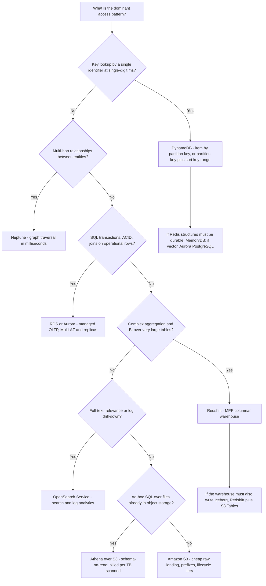
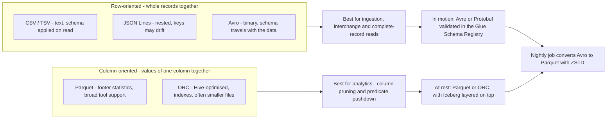
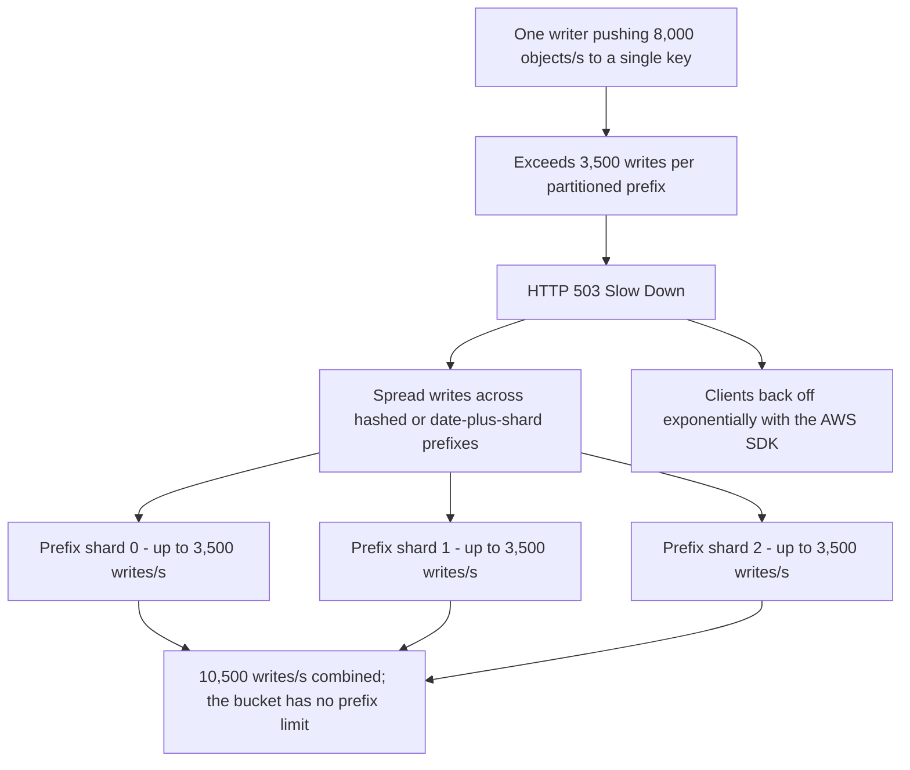
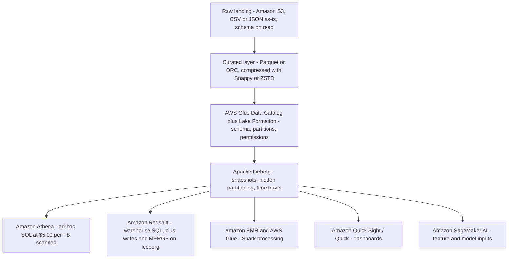
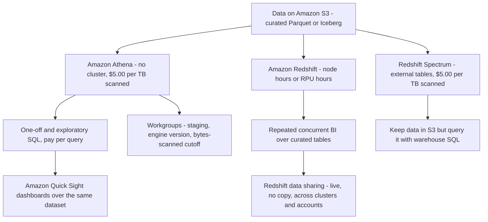

# Choosing Data Stores and Storage Formats

Ask ten candidates how they choose a database and you will hear ten versions of "it depends" — and on DEA-C01 that answer scores nothing. The exam does not reward vague architecture taste; it rewards a **deterministic mapping**: one access pattern in the stem, one service out of the in-scope list, one format at rest, one compression codec. Domain 2 is worth **26%** of the exam, and task **2.1** is the store-selection core of that domain — skills **2.1.1** (implement storage for cost and performance), **2.1.2** (configure storage for access patterns), **2.1.3** (apply stores to use cases), **2.1.7** (manage open table formats, for example Apache Iceberg) and **2.1.8** (describe vector index types, for example HNSW and IVF).

```text
====================================================================
 THE STORE DECISION SURFACE — DEA-C01 Domain 2, task 2.1
====================================================================
  Key lookup, single-digit ms ......... Amazon DynamoDB
  Range inside one partition .......... DynamoDB query (PK + SK)
  Redis API + durable primary ......... Amazon MemoryDB for Redis
  Graph / multi-hop traversal ......... Amazon Neptune
  Managed OLTP, ACID, joins ........... Amazon RDS / Amazon Aurora
  Vector similarity with SQL .......... Aurora PostgreSQL (HNSW/IVF)
  Aggregation + BI, many large tables . Amazon Redshift
  Ad-hoc SQL over files in S3 ......... Amazon Athena ($5.00/TB)
  Full-text, relevance, log drill-down  Amazon OpenSearch Service
  Cheap raw landing + lifecycle tiers .. Amazon S3 (+ S3 Glacier)
  Transactional lakehouse layer ........ S3 + Iceberg (S3 Tables, Glue)
  Formats at rest ......... Parquet / ORC (columnar) for analytics
                  Avro / Protobuf in motion, CSV / JSON on landing
  Codecs .... Snappy (fast reads) · GZIP (ratio, Hive)
              ZSTD (Iceberg default, levels 1-22, Athena default 3)
              ZLIB (ORC writes)
  Not this ....... analytics in DynamoDB · joins in OpenSearch ·
                   lake-wide aggregation in a cache
====================================================================
```

In this lesson you will:

- read **task 2.1 skill by skill** and build the in-scope store taxonomy the exam draws from;
- map **access pattern → service** with a master table and a decision tree you can walk in seconds;
- size **DynamoDB** with real capacity-unit arithmetic and its 400 KB / 10 GB ceilings;
- place **RDS, Aurora, Neptune, MemoryDB and DocumentDB** so you never pick two services for one pattern;
- separate **Redshift, Athena and OpenSearch** by what the query actually does;
- pick a format from the **CSV / JSON / Avro / Parquet / ORC** matrix — layout, schema, evolution and when;
- choose a **compression codec** from AWS's own wording (Snappy, GZIP, ZSTD, ZLIB) and the defaults that become distractors;
- run **S3 as the lake core**: 3,500 / 5,500 requests per partitioned prefix, **no prefix limit**, strong consistency since **1 December 2020**, and the hot-prefix 503 fix;
- reason about **lakehouse table formats** — Iceberg, Hudi and Delta — to exactly the depth skill 2.1.7 requires;
- apply **decision tables** to exam scenarios, and split **Athena versus Redshift** at the consumption layer;
- study **two AWS customer case studies** and a **sourced October 2026 update box**;
- practise with **12 exam-style questions** plus three interactive checks.

---

## 1. What task 2.1 actually tests

### 1.1 The five skills behind this lesson

| Skill | Verbatim focus | What the question must make you do |
|---|---|---|
| **2.1.1** | Implement storage for cost and performance | Trade storage class, format and engine against a stated budget or latency target |
| **2.1.2** | Configure storage for access patterns | Read the pattern (key lookup, range scan, join, search) and name the store |
| **2.1.3** | Apply data stores to use cases | Named examples in the guide: **HNSW on Aurora PostgreSQL**, **MemoryDB for fast key/value access** |
| **2.1.7** | Manage open table formats (for example **Apache Iceberg**) | Snapshots, time travel, hidden partitioning, compaction — awareness depth |
| **2.1.8** | Describe vector index types (**HNSW**, **IVF**) | Recognise which index a vector workload needs, with the engine that offers it |

Two boundaries matter more than the lists themselves. **Engine deep-tuning is out**: Redshift internals belong to Lesson 4, and orchestration to Lesson 5. What is left here is *selection* — pattern in, service out, format attached.

### 1.2 The in-scope store taxonomy

Everything you may name as the correct answer comes from this table (DEA-C01 in-scope lists, checked Oct 2026):

| Category | In-scope services | Exam identity in one line |
|---|---|---|
| Object / lake core | **S3**, **S3 Tables**, **S3 Glacier** | Objects at scale, per-prefix request rates, lifecycle tiers |
| Data warehouse (OLAP) | **Redshift** | MPP + columnar, complex joins on very large tables, BI concurrency |
| NoSQL key-value / document | **DynamoDB**, **DocumentDB**, **Keyspaces** | Single-digit-ms key lookups; JSON-ish collections; Cassandra API |
| Relational (OLTP) | **RDS**, **Aurora** | Managed SQL, ACID, joins, Multi-AZ and replicas |
| Search | **OpenSearch Service** | Full-text relevance plus log analytics, near-real-time |
| In-memory / fast key-value | **MemoryDB for Redis** | Microsecond reads with a durable Multi-AZ primary |
| Graph | **Neptune** | Billions of relationships, milliseconds, Gremlin / openCypher / SPARQL |
| Streams (transport, not a store) | **Kinesis Data Streams**, **MSK** | Buffer that *feeds* the stores above |
| Lakehouse layer | **Glue** (+ Data Catalog), **Lake Formation**, **S3 Tables**, **Athena** | Catalog, governance, Iceberg management, ad-hoc SQL |

> [!IMPORTANT]
> **Streams are not stores.** Kinesis Data Streams and Amazon MSK appear in skill 2.1.1's storage list because they *move* data — but a question that asks "where do you keep three years of clickstream for quarterly reporting?" is never answered with a stream. Land it (S3), query it (Athena), and keep the stream only as the intake.

- **📚 Did you know?** **Amazon ElastiCache** and **Amazon Timestream** sit on **neither** the in-scope nor the out-of-scope list (both lists checked Oct 2026), while skill 2.1.3 names **MemoryDB** by name. The practical reading: when a stem uses the guide's own *"fast key/value access"* wording, MemoryDB is the in-scope pick — and ElastiCache remains the real-world cache answer you will meet in production diagrams. Never spend exam minutes arguing about list hygiene; answer with the service the stem's wording matches.

---

## 2. Access pattern → service: the master map

### 2.1 The table you should be able to recite

| Scenario wording in the stem | Exam pick | Why (source) |
|---|---|---|
| Point lookup by key, single-digit ms, any scale (cart, session, profile) | **DynamoDB** | "single-digit millisecond performance at any scale"; deliberately omits JOINs |
| Ordered range inside one key ("orders for customer X, 1–9 October") | **DynamoDB query** (partition key + sort key) | Ordered range within a partition |
| Secondary or sparse lookups | **DynamoDB GSI** | Alternate access paths over the same items |
| Complex aggregation over billions of rows + concurrent BI dashboards | **Redshift** | MPP, columnar, query optimisation |
| Ad-hoc SQL on files already in S3, pay per query | **Athena** | Schema-on-read, **$5.00 per TB scanned** |
| Full-text, relevance, fuzzy or phrase search | **OpenSearch Service** | Full-text search segment |
| Machine-generated time-series logs + keyword drill-down | **OpenSearch log analytics** | "semi-structured, machine-generated time series data" |
| High-rate event ingest, then analytics downstream | **Kinesis / MSK → S3** | Streams in scope as transport, S3 as the store |
| Multi-hop traversal (fraud rings, recommendations, knowledge graph) | **Neptune** | Graph traversal in milliseconds |
| Redis API as a durable primary, microsecond reads | **MemoryDB** | Skill 2.1.3 verbatim |
| Cache-only layer in front of a relational database | **ElastiCache** in production; in-scope phrasing → **MemoryDB** | See the 📚 note in Section 1.2 |
| Document / JSON records with indexes | **DocumentDB** | In-scope list |
| Managed relational default for OLTP | **RDS** | "We recommend Amazon RDS as your default choice…" |
| Vector similarity alongside SQL data | **Aurora PostgreSQL** | Skills 2.1.3 / 2.1.8 (HNSW, IVF) |
| Cheap raw landing + tiering over time | **S3** (+ S3 Glacier) | Storage classes and lifecycle |
| ACID updates, snapshots, time travel on the lake | **S3 + Iceberg** (S3 Tables / Glue) | Skill 2.1.7 |

**Teaching rule:** *key + latency → DynamoDB or MemoryDB · joins and BI → Redshift · SQL on the lake → Athena · text → OpenSearch · relationships → Neptune · OLTP → RDS or Aurora · cheap raw scale → S3.*



### 2.2 Worked example E1 — one system, two stores

A retail service has two requirements in the same ticket:

```text
Requirement A  "Add to cart" must return in single-digit ms for 40,000
                concurrent shoppers, keyed by session ID
Requirement B  "Average basket by region, by week" over 2 years of orders
                for the BI team, with 30 concurrent report viewers

A  -> DynamoDB        key = session ID, item < 400 KB, no joins needed
B  -> Redshift        joins + aggregation + BI concurrency

Wrong: "DynamoDB for both" (aggregation = Scan = full table read, no joins)
Wrong: "Redshift for both" (a warehouse is the wrong shape for per-request
       point lookups at single-digit ms)
```

The stem always contains **two** requirements on purpose. Split the workload; never force one store to answer a pattern it was not designed for.

### 2.3 Interactive check — match pattern to service

```matching
{
  "question": "Match each access pattern to the AWS store the DEA-C01 exam selects:",
  "pairs": [
    {"left": "Point lookup by key, single-digit milliseconds, any scale", "right": "Amazon DynamoDB - serverless NoSQL, 400 KB maximum item"},
    {"left": "Complex joins and aggregation over billions of rows with concurrent BI reports", "right": "Amazon Redshift - MPP columnar warehouse"},
    {"left": "Ad-hoc SQL over files already sitting in Amazon S3, billed per query", "right": "Amazon Athena - schema-on-read, $5.00 per TB scanned"},
    {"left": "Full-text relevance, fuzzy and phrase search over log data", "right": "Amazon OpenSearch Service - inverted index plus log analytics"},
    {"left": "Multi-hop traversal such as a fraud ring across accounts, cards and devices", "right": "Amazon Neptune - managed graph database"},
    {"left": "Managed OLTP with ACID transactions, joins and Multi-AZ failover", "right": "Amazon RDS or Amazon Aurora - managed relational engines"},
    {"left": "Redis API structures that must survive an Availability Zone failure", "right": "Amazon MemoryDB for Redis - microsecond reads, durable Multi-AZ primary"},
    {"left": "Cheap raw landing zone with lifecycle tiering to Glacier", "right": "Amazon S3 with Amazon S3 Glacier storage classes"}
  ],
  "explanation": "Every pair is a stem phrase from the exam guide's task 2.1 wording. The pattern comes first and the service follows from it - never the reverse. Two traps hide here: a Scan over DynamoDB is not an aggregation strategy, and a graph question is never answered with repeated self-joins in a relational engine."
}
```

---

## 3. Key-value, document, graph and in-memory stores

### 3.1 DynamoDB: the constraints the exam quotes

| Constraint / metric | Value (as of Oct 2026) | Why it appears in a stem |
|---|---|---|
| Maximum item size | **400 KB** (attribute names count) | A 900 KB blob does not fit — store a key plus S3, or split attributes |
| Partition ceiling with local secondary indexes | **10 GB** | Over-large single-key designs |
| Per-partition design capacity | **3,000 RCU + 1,000 WCU per second** | Hot partition diagnosis |
| 1 RCU | 1 strongly consistent read/s of ≤ **4 KB** (eventual = half; transactional = 2) | Capacity math |
| 1 WCU | 1 write/s of ≤ **1 KB** (transactional = 2) | Capacity math |
| On-demand for new tables | **4,000 writes/s**, **12,000 reads/s**, absorbs **2× previous peak** | Spiky, unknown traffic |
| Scale proof | Tables over **200 TB**; over **1 billion requests/hour**; Prime Day 2021 peak **89.2M requests/s** | "any scale" claims |

DynamoDB's exam identity is **single-digit-millisecond key access at any scale** — and its deliberate silence about JOINs is the point. Any option proposing DynamoDB for lake-wide aggregation has misread the service.

### 3.2 Worked example E2 — capacity units by hand

```text
Read side : 500 strongly consistent reads/second of 8 KB items
            ceil(8 / 4) = 2 RCU each  ->  500 x 2 = 1,000 RCU
Write side: 200 writes/second of 1.6 KB items
            ceil(1.6 / 1) = 2 WCU each ->  200 x 2 = 400 WCU

Check against the per-partition design ceiling (3,000 RCU + 1,000 WCU/s):
1,000 RCU and 400 WCU both sit inside ONE partition's design budget,
so a single well-chosen partition key is enough - the risk is key SKEW,
not volume.
```

### 3.3 Worked example E3 — the 400 KB item headroom test

| Payload | Size | Fits in one DynamoDB item? | Design |
|---|---|---|---|
| Customer profile document | 300 KB | **Yes** (≤ 400 KB) | Single item, point lookup |
| Session blob with base64 attachments | 900 KB | **No** | Store `session_id` + small attributes in DynamoDB, blob in **S3**, key as the pointer |
| Order header + 40 order lines | 120 KB | Yes, but wasteful | Model as separate items sharing a partition key so a range query returns one order |

The exam's favourite version of this question puts the number **just over 400 KB** in the stem. The answer is never "increase the item limit" — there is no such knob.

### 3.4 The neighbours: DocumentDB, MemoryDB, Neptune

| Store | What it is for | Signature fact |
|---|---|---|
| **DocumentDB** | Document / JSON-style records **with indexes** | In-scope NoSQL document option |
| **MemoryDB for Redis** | Redis-compatible structures with a **durable Multi-AZ primary** | Microsecond reads, single-digit-ms writes, up to **160M TPS per cluster**; about **390K reads/s + 100K writes/s per node** |
| **Neptune** | Highly connected data | "optimized for storing billions of relationships and querying the graph with milliseconds latency" |
| **Keyspaces** | Cassandra API workloads | In-scope Cassandra-compatible option |

- **📚 Did you know?** MemoryDB's claim to exam fame is a single sentence in skill **2.1.3** — *"MemoryDB for fast key/value access"* — which is why it beats every other cache-flavoured option when the stem asks for Redis structures **plus** durability. A plain cache in front of a database is a real architecture, but the guide's named use case is the durable one: if the data must survive a node failure without a rebuild from the source of truth, you are reading the MemoryDB line.

---

## 4. Relational OLTP: Amazon RDS and Amazon Aurora

### 4.1 RDS is the documented default

Amazon RDS presents the exam's **default managed relational choice**: you choose an engine, Multi-AZ for failover, read replicas for scale-out, and automated backups — AWS takes the OS and engine patching. The service's own welcome page recommends **RDS as your default choice** for relational workloads, which is why any stem describing conventional OLTP (transactions, joins, foreign keys, a schema that is enforced on write) resolves to RDS unless a specific Aurora capability is named.

### 4.2 Aurora: the deltas the stem names

| Attribute | Aurora value (as of Oct 2026) |
|---|---|
| Compatibility | MySQL- and PostgreSQL-compatible |
| Throughput claim | Up to **6×** MySQL performance |
| Cluster volume | Up to **256 TiB** |
| Read replicas | Up to **15** within the cluster |
| Vector search (skills 2.1.3 / 2.1.8) | **Aurora PostgreSQL** with **HNSW** and **IVF** indexes |

```text
Choice ladder for a relational stem
-----------------------------------
Conventional OLTP, wants a managed default ............... RDS
Needs MySQL/PostgreSQL compatibility at 6x, 256 TiB,
  15 read replicas, or vector search with HNSW/IVF ....... Aurora
Needs warehouse-grade aggregation over billions of rows ... Redshift
Needs single-digit-ms key access with no joins ........... DynamoDB
```

The vector line is the newest trap in this domain: **HNSW** (hierarchical navigable small world — recall-oriented, memory-hungry) and **IVF** (inverted file — faster build, cluster-based search) are *index types*, not services. The stem names the index, the option names **Aurora PostgreSQL**.

### 4.3 Worked example E4 — which relational flavour?

```text
Stem 1  "Payment authorisations must commit in one transaction, with
         foreign keys to merchants and chargebacks, and failover in
         under 60 seconds"        -> RDS (or Aurora), Multi-AZ
Stem 2  "Monthly finance extracts joining 40 tables across 8 TB with
         40 concurrent analysts"  -> Redshift (OLAP, not OLTP)
Stem 3  "Semantic search over 3 million product descriptions embedded
         as vectors, alongside the product table" -> Aurora PostgreSQL
Stem 4  "Session state for a mobile game, keyed by player ID, no joins" ->
         DynamoDB - choosing a relational engine here is the distractor
```

Every stem hides a **shape** word: *transaction, foreign key, failover* = OLTP; *extract, join across many tables, analysts* = OLAP; *vector, embedding, similarity* = Aurora PostgreSQL with HNSW/IVF; *keyed by, by ID, single-digit ms* = DynamoDB.

---

## 5. Analytics stores: Redshift, Athena and OpenSearch

### 5.1 Three analytics shapes, three services

| Signal in the stem | Pick | Metering shape (as of Oct 2026) |
|---|---|---|
| Repeated, concurrent BI over large curated tables; complex joins | **Redshift** | Node hours or RPU hours |
| One-off SQL over files already in S3; "no infrastructure" | **Athena** | **$5.00 per TB scanned**, 10 MB minimum per query |
| Relevance, fuzzy or phrase search; log drill-down with aggregations | **OpenSearch Service** | Domain: instance hours + storage; Serverless: OCU + storage |
| Full Spark / Hive / Presto processing | **EMR** | Cluster or serverless DPU time |

AWS's own framing is quotable: Athena is for *"interactive ad hoc SQL queries against data on Amazon S3, without … infrastructure or clusters"*, while Redshift is *"optimized … on complex queries that join large numbers of very large database tables"*.

### 5.2 OpenSearch: the log-analytics identity

| Property | Value (as of Oct 2026) |
|---|---|
| Domain modes | **General Purpose** (relevance, nested objects, frequent updates) vs **Optimized / log analytics** (Parquet columnar + retained Lucene index, PPL/SQL) |
| Serverless refresh | Roughly **10 seconds** |
| Optimized engine claims | Up to **4×** price-performance, **2×** ingestion, **2×** query speed |
| Serverless collection groups | Search, time series and vector search; **1 OCU ≈ 6 GiB RAM + vCPU** |

The split that appears in stems: **aggregating 5xx errors by service *and* full-text drilling into a stack trace** is one query shape — OpenSearch. "Join the error counts to the customer dimension table" is a different shape — Athena or Redshift.

---

## 6. The storage-format matrix

### 6.1 CSV, JSON, Avro, Parquet, ORC — and Protobuf for completeness

| Format | Layout | Schema | Evolution | Use when | Source |
|---|---|---|---|---|---|
| **CSV / TSV** | Row, text | External catalog — **schema-on-read** | None natively | Interchange, human-readable dumps, raw landing | Athena columnar-storage docs |
| **JSON (Lines)** | Row, text, **nested** | Applied on read; crawler infers | Loose — keys drift | Event payloads, APIs, exploration | Glue Schema Registry docs |
| **Avro** | **Row**, binary | Schema stored **with the data** (schema = JSON, data = binary) | Excellent (registry BACKWARD / FORWARD) | Streaming serialisation: Kafka / Kinesis | Glue Schema Registry docs |
| **Parquet** | **Columnar**, binary | File footer | Supported | Analytics: column pruning + **predicate pushdown** on min/max | Athena columnar-storage docs |
| **ORC** | **Columnar**, binary, Hive-optimised | File footer | Supported | Hive-centric workloads; often smaller files, built-in indexes | Athena columnar-storage docs |
| **Protobuf** | Row, binary, language-neutral | `.proto` definitions | Strong (field numbers) | RPC / service contracts; registry `DataFormat` = AVRO \| JSON \| PROTOBUF | Glue Schema Registry docs |

Three comparisons the exam reuses endlessly:

| Pair | The distinction |
|---|---|
| **Row vs columnar** | Avro = "fast reads and writes of complete records", best for ingestion, "not optimized for analytics"; Parquet / ORC = analytics |
| **Parquet vs ORC** | Parquet = wider query types, Arrow-optimised, complex queries; ORC = often smaller files, indexes can speed queries, strong structs/maps/lists — **both** are columnar with pushdown |
| **CSV/JSON vs either columnar** | CSV and JSON have **no predicate pushdown**, so every query pays for full bytes scanned — and Athena bills by bytes scanned |



### 6.2 Predicate pushdown in one picture

Athena's documentation states it plainly: *"Predicate pushdown in Parquet and ORC enables Athena queries to fetch only the blocks it needs… it uses statistics from data block predicates, such as max/min values, to determine whether to read or skip the block."* A file of daily totals where the query asks for one date lets the engine **skip whole row groups** — that skipping is the cost model, not a micro-optimisation.

### 6.3 Sizing defaults worth memorising

| Knob | Value (as of Oct 2026) |
|---|---|
| Target split size | About **128 MB** |
| Athena Parquet block default | **128 MB** |
| Athena ORC stripe default | **64 MB** (stripes under **8 MB** are read whole) |
| Conversion path | CSV/JSON → Parquet/ORC via Glue ETL or Athena `CREATE TABLE AS` |

### 6.4 Worked example E5 — AWS's own cost ladder

Athena's pricing page carries this exact worked example (as of Oct 2026):

```text
3 TB of TEXT, query touches 1 of 4 columns
  Step 1  raw text          : 3 TB  x $5.00/TB = $15.00
  Step 2  add GZIP 3:1      : 1 TB  x $5.00/TB =  $5.00   (AWS: "3x savings
                              from compression")
  Step 3  convert to Parquet: 0.25 TB x $5.00/TB =  $1.25  (AWS: "4x savings
                              for reading only one column")

Same query, same dashboard, same BI tool:  $15.00 -> $5.00 -> $1.25
```

**Lesson for the exam:** compression alone gives the first cut; **columnar layout** gives the second; neither is optional, and neither changes the query. When a stem says *"reduce query cost without changing the BI tool"*, the answer is convert to columnar — not buy a bigger cluster.

---

## 7. Compression codecs: Snappy, GZIP, ZSTD, ZLIB

### 7.1 AWS's own wording

| Codec | AWS wording (Athena compression docs) | Default for | Exam read |
|---|---|---|---|
| **Snappy** | "Lempel-Ziv 77 (LZ7) family … focuses on high compression and **decompression speed** rather than the maximum compression" | Common Parquet / Hive / Spark choice | Fast reads — the analytics default when CPU matters |
| **GZIP** | "based on Deflate"; compressed text is **not splittable** | Athena Hive **Parquet/text writes** | Better ratio, slower, poor parallel splits |
| **ZSTD** | "fast compression algorithm that provides **high compression ratios**"; levels **1–22**, Athena default **3** | **Iceberg tables** | Best tunable balance — the lakehouse answer |
| **ZLIB** | Based on Deflate | **ORC writes** | ORC ecosystem default |
| LZO / LZ4 / BZIP2 | Read-only in places; Athena **cannot write** Parquet with LZ4 or LZO | — | Distractor material |

The governing principle from Athena's tuning guidance: **higher ratio costs CPU**. Compress the lake, then let columnar layout plus predicate pushdown cut the I/O.

> [!WARNING]
> **⚠️ Compression is not columnar.** GZIP'd CSV is still fully scanned — the codec shrinks bytes, but the engine still reads every row to find one column. The two levers are independent: **format** decides *how much data the engine must touch*, **codec** decides *how big those bytes are*. A stem offering "switch from Parquet to GZIP-complied CSV to save money" has swapped the levers.

### 7.2 Defaults that become three-way distractors

```text
ZSTD -> Iceberg tables          (Athena default compression for Iceberg)
GZIP -> Hive Parquet / text     (Athena Hive write default)
ZLIB -> ORC writes              (ORC ecosystem default)
```

Learn them as a triple: any question that pairs "which compression does X use by default" with three of these four names is testing recall of exactly this mapping.

```fillblank
{
  "question": "Complete the codec statements with AWS's own defaults and tradeoffs:",
  "template": "{{1}} is the default compression for Iceberg tables, where Athena writes at level {{2}} of a range that runs from 1 to {{3}}. Hive Parquet and text writes default to {{4}}, ORC writes default to {{5}}, and {{6}} is the Parquet/Spark favourite because it optimises for {{7}} rather than the maximum compression ratio.",
  "answers": {
    "1": "ZSTD",
    "2": "3",
    "3": "22",
    "4": "GZIP",
    "5": "ZLIB",
    "6": "Snappy",
    "7": "decompression speed"
  },
  "distractors": ["Snappy", "GZIP", "ZLIB", "BZIP2", "LZ4", "LZO", "level 6", "level 9", "compression ratio", "splittability", "ratio"],
  "explanation": "AWS's Athena compression documentation: ZSTD is the default for Iceberg tables at level 3 of 1-22; Hive Parquet/text writes default to GZIP; ORC writes default to ZLIB; Snappy belongs to the Lempel-Ziv 77 family and prioritises decompression speed over maximum compression. The trap answers are swapped defaults - especially pairing GZIP with Iceberg or Snappy with ORC."
}
```

### 7.3 Worked example E6 — the codec decision in a stem

```text
Stem 1  "Iceberg table on S3 queried by Athena; balance ratio and scan cost"
        -> ZSTD (Athena uses level 3 by default for ZSTD writes)
Stem 2  "Spark jobs decode faster than they encode; CPU is the constraint"
        -> Snappy (decompression speed is the stated design goal)
Stem 3  "Hive tables written by EMR, text output, splittability matters"
        -> GZIP (and remember: compressed text is NOT splittable)
Stem 4  "ORC files in a Hive-ecosystem pipeline"
        -> ZLIB (the ORC write default)
Stem 5  "Cheapest possible long-term archive of raw CSV nobody queries"
        -> GZIP on S3, then tier to S3 Glacier - codec choice only;
           the format (CSV) still means full scans for anyone who queries it
```

### 7.4 Worked example E7 — conversion arithmetic

```text
Before : 3.6 TB of CSV in S3, dashboards read 2 columns of 12
After  : CTAS with format='PARQUET', write_compression='GZIP'
         -> roughly 1.2 TB at rest (about 3:1 on already-compact text)
         -> a single-column dashboard touches about 0.3 TB

Athena cost, as of Oct 2026:
  before : 3.6 TB x $5.00        = $18.00 per dashboard refresh
  after  : 0.3 TB x $5.00        =  $1.50 per dashboard refresh

(illustrative arithmetic; AWS's own sourced template is the 3 TB
 text -> GZIP -> Parquet ladder in Section 6.4: $15.00 -> $5.00 -> $1.25)
```

- **📚 Did you know?** Amazon Athena **infers compression from the file extension** for text and JSON formats — so renaming a `.csv.gz` to `.csv` does not "decompress" anything, it just tells the engine to expect plain text it will not find. That is why format questions and codec questions are separate exam items: the format is what you *declare*, the codec is largely what the engine *discovers*.

---

## 8. Amazon S3 as the data-lake core

### 8.1 Request rates: per prefix, not per bucket

AWS's performance documentation (accessed Oct 2026) states:

> "Your application can achieve at least **3,500 PUT/COPY/POST/DELETE or 5,500 GET/HEAD requests per second per partitioned Amazon S3 prefix**. There are no limits to the number of prefixes in a bucket."

| Metric | Value (as of Oct 2026) |
|---|---|
| Writes per partitioned prefix | ≥ **3,500** PUT/COPY/POST/DELETE per second |
| Reads per partitioned prefix | ≥ **5,500** GET/HEAD per second |
| Prefix limit | **None** |
| AWS's parallelisation example | **10 prefixes ⇒ 55,000 reads/s** |
| Throttling signal | Sustained **> 5,000 requests/s to a few objects** ⇒ possible **HTTP 503 Slow Down** |
| S3 Express One Zone | Single-digit ms, up to **2,000,000 requests/s** per directory bucket |

### 8.2 Worked example E8 — the hot-prefix fix

```text
Incident : one writer pushes 8,000 objects/second into a single key
Diagnosis: 8,000 > 3,500 writes per partitioned prefix -> 503 Slow Down
Fix      : spread writes across hashed or date-plus-shard prefixes
           10,500 objects/s / 3,500 per prefix = 3 distinct written prefixes
           minimum, before relying on S3's automatic partitioning

Not a fix : "raise the bucket limit" - there is no bucket-level request
            quota to raise; the axis is the PREFIX.
```



### 8.3 Partitions and prefixes are different axes

| Axis | What it optimises | Mechanism |
|---|---|---|
| **Hive-style partitions** (`dt=2026-10-09/`) | **Query pruning** — Athena reads only matching partitions | Partition keys in the Glue Data Catalog |
| **Written prefixes** | **Request rate** — each partitioned prefix gets its own 3,500 / 5,500 lane | Key layout under the bucket |

Over-partitioning produces **small files** and planner overhead ("reduce your request rate" style errors appear in Athena tuning guidance at tiny split sizes). The rule: partition for the `WHERE` clause, spread prefixes for the write rate — and target roughly **128 MB** splits.

### 8.4 Consistency: the 2020 change that killed two answers

AWS's announcement of **1 December 2020**:

> "Effective immediately, all S3 GET, PUT, and LIST operations, as well as operations that change object tags, ACLs, or metadata, are now strongly consistent."

- **Free**, applies to **all Regions** and all objects.
- Consequences: **EMRFS Consistent View** and **S3Guard** are obsolete — any option whose correctness *requires* them is stale and wrong.
- A "read-after-write is eventually consistent in S3" option has been false for every exam since 2021.

- **📚 Did you know?** S3's storage-class ladder is itself a cost lever for the lake: **Intelligent-Tiering** moves objects untouched for **30 days** to Standard-IA (**−40%**), **90 days** to Glacier Instant Retrieval (**−68%**), and optionally **180 days** to Deep Archive (**−95%**), while **S3 Express One Zone** trades a single Availability Zone for single-digit-millisecond latency at up to **2,000,000 requests/s** per directory bucket (as of Oct 2026). Choosing the *class* is task 2.1's cost/performance half; choosing the *format* is this lesson's Section 6.

- **📚 Did you know?** Amazon S3 has been a public service since **13 March 2006**, and AWS's own 20-year retrospective (2026-03-13) reports a price reduction of approximately **85% since launch** plus more than **$6 billion** saved collectively by customers who chose **S3 Intelligent-Tiering** instead of S3 Standard — together with the reminder that *"the code you wrote for S3 in 2006 still works today, unchanged."* That is why Intelligent-Tiering is the lake default when the re-read pattern is unknown: AWS moves an object untouched for **30 days** to Standard-IA (−40%), **90 days** to Glacier Instant Retrieval (−68%) and optionally **180 days** to Deep Archive (−95%), so the cost decision runs itself while the format decision (Section 6) stays yours.

---

## 9. The lakehouse layer: Iceberg, Hudi and Delta

### 9.1 Why table formats exist

File formats "only allow for writes of entire files" — so change-data-capture, deletes and continuous streaming create small-file pain and offer no transactional semantics on object storage. **Table formats** add **snapshots, compaction, time travel and transactional semantics** on top of Parquet/ORC/Avro files in S3. A plain data lake, AWS's Prescriptive Guidance notes, *doesn't provide support for atomicity, consistency, isolation, and durability (ACID)* until a table format such as Iceberg is added.

**Iceberg is the one the guide names** (skill **2.1.7**), so it is the one you must know in depth:

| Iceberg feature | What it does (exam phrasing) |
|---|---|
| **Snapshots** | Each write creates a new snapshot; manifest lists and manifests carry **column-level min/max** statistics for data skipping |
| **Hidden partitioning** | "This feature prevents reading unnecessary partitions automatically" — `day(ts)` derives the value on the fly, **no extra column**, no manual `WHERE dt=` bookkeeping |
| **Time travel** | `FOR VERSION AS OF <snapshot_id>` / `FOR TIMESTAMP AS OF <timestamp>` |
| **Default catalog** | **AWS Glue Data Catalog** |
| **Engine support** | Athena, EMR, Redshift, Glue, SageMaker |
| **Managed option** | **Amazon S3 Tables** = managed Iceberg on S3 |

### 9.2 Hudi and Delta: awareness, not internals

AWS's own guidance says **"no single table format is a 'one size fits all'"**. The comparison matrix AWS publishes (accessed Oct 2026):

| Capability | **Hudi** | **Iceberg** | **Delta** |
|---|---|---|---|
| Copy-on-write | Yes | Yes | Yes |
| Merge-on-read | Yes | Yes | No |
| Data file formats | Parquet, ORC, HFile | Parquet, ORC, Avro | **Parquet only** |
| Time travel | Yes | Yes | Yes |

Because the guide names only Iceberg, do not memorise internals of the other two — recognise the names and know that AWS declines to crown a winner.



### 9.3 Schema-on-read versus schema-on-write

| | **Schema-on-write** (warehouse) | **Schema-on-read** (lake) |
|---|---|---|
| Order of operations | Define schema, conform on load, reject incompatible changes | Land data as-is, apply the schema **at query time** |
| AWS wording | Traditional warehouse staging | "the data can be stored as is and you apply a schema at the time that you read it" |
| Strength | Pre-structured data queries faster; enforced | Flexible, fast to start |
| Weakness | Rigid intake | Drift surfaces at query time |
| Home on AWS | **Redshift** tables | **Athena + Glue Data Catalog over S3** |

Exam phrasing: **lake = schema-on-read, cheap storage, decoupled compute; warehouse = schema-on-write, curated, enforced, tuned for BI.** Fixed dashboards with heavy joins → write; raw, variable structures → read.

### 9.4 Worked example E9 — hidden partitioning and time travel

```text
Table: clickstream events, column `ts` (timestamp)

Hive-style design
  PARTITIONED BY (dt)  +  files under dt=2026-10-09/
  Query MUST contain WHERE dt = '2026-10-09' or Athena scans everything

Iceberg design
  PARTITIONED BY (day(ts))  -> adds NO column to the schema
  Athena derives the partition from `ts`; a WHERE on ts prunes,
  and you never hand-maintain dt= bookkeeping

Auditor question, "what did the table contain at noon yesterday?":
  SELECT * FROM clickstream
   FOR TIMESTAMP AS OF '2026-10-09 12:00:00 UTC';
  -> answered from snapshots, with no table copy
```

---

## 10. Decision tables for exam scenarios

### 10.1 The master scenario table

| # | Access pattern / constraint | Store | Format at rest | Codec |
|---|---|---|---|---|
| 1 | Point lookup by key, single-digit ms, any scale | **DynamoDB** | Item (JSON-like) | — |
| 2 | Ordered range within one key | **DynamoDB query** (PK + SK) | — | — |
| 3 | Secondary / sparse lookups | **DynamoDB GSI** | — | — |
| 4 | Complex joins + aggregation, BI concurrency | **Redshift** | Internal columnar; `COPY` from Parquet/CSV/Avro/ORC/JSON | Snappy / ZSTD |
| 5 | Ad-hoc SQL on the lake, pay per query | **Athena over S3** | **Parquet** (or ORC) | ZSTD (Iceberg) / GZIP (Hive) |
| 6 | Full-text / fuzzy / relevance search | **OpenSearch** | Indexed JSON documents | — |
| 7 | Log + machine-generated time-series with keyword drill-down | **OpenSearch log analytics** | Parquet + Lucene index | Columnar |
| 8 | High-rate event ingest, then analytics | **Kinesis / MSK → S3** | **Avro in motion → Parquet at rest** | ZSTD |
| 9 | Multi-hop relationships, fraud or recommendation | **Neptune** | Graph | — |
| 10 | Managed OLTP: ACID, joins, transactions | **RDS / Aurora** | Engine rows | Engine |
| 11 | Redis API as durable primary, microsecond reads | **MemoryDB** | Redis structures | — |
| 12 | Cheap raw landing + tiering over time | **S3** (+ Glacier) | Raw CSV / JSON | GZIP |
| 13 | ACID updates, snapshots, time travel on the lake | **S3 + Iceberg** (S3 Tables / Glue) | Parquet | ZSTD |
| 14 | Vector similarity alongside SQL data (HNSW / IVF) | **Aurora PostgreSQL** | Engine + vector index | — |
| 15 | Re-query yesterday's curated table | **Athena / Iceberg time travel** | Parquet | ZSTD |

### 10.2 Format lifecycle — interactive ordering

```dragdrop
{
  "question": "Order this data lifecycle from ingestion to long-term retention, exactly as the exam expects a well-designed lake to progress:",
  "items": [
    "Producer serialises Avro and registers the schema in the AWS Glue Schema Registry with BACKWARD compatibility",
    "Glue ETL rewrites the stream's landed files into Parquet compressed with ZSTD",
    "Amazon S3 holds the curated files and the AWS Glue Data Catalog holds their schema and partitions",
    "Apache Iceberg layers snapshots, hidden partitioning and time travel over those files",
    "Analysts query with Amazon Athena; dashboards read through Amazon Quick Sight",
    "Lifecycle rules tier cold partitions to S3 Glacier Instant Retrieval, then Deep Archive"
  ],
  "correctOrder": [
    "Producer serialises Avro and registers the schema in the AWS Glue Schema Registry with BACKWARD compatibility",
    "Glue ETL rewrites the stream's landed files into Parquet compressed with ZSTD",
    "Amazon S3 holds the curated files and the AWS Glue Data Catalog holds their schema and partitions",
    "Apache Iceberg layers snapshots, hidden partitioning and time travel over those files",
    "Analysts query with Amazon Athena; dashboards read through Amazon Quick Sight",
    "Lifecycle rules tier cold partitions to S3 Glacier Instant Retrieval, then Deep Archive"
  ],
  "explanation": "Row formats belong in motion (Avro with a registry-managed schema), columnar formats belong at rest (Parquet with ZSTD), the catalog and governance layer sit above the files, the table format adds transactional semantics above the catalog, consumption comes next, and storage-class tiering is the final step. Skipping the conversion step - analysing raw Avro or CSV - is the most expensive mistake in the sequence, because Athena bills bytes scanned."
}
```

### 10.3 The ten trap pairs

| Distractor | Why it is wrong |
|---|---|
| "Use DynamoDB for the monthly aggregation" | No joins; a `Scan` reads the whole table |
| "Compress the CSV to cut Athena cost" | Compression ≠ columnar — full scans continue |
| "S3 is eventually consistent for reads" | Strongly consistent since **2020-12-01** |
| "Raise the bucket's request limit" | The axis is the **prefix**; there is no prefix limit |
| "Add `S3Guard` for consistency" | Obsolete; EMRFS Consistent View likewise |
| "Iceberg is a file format" | It is a **table format** over Parquet / ORC / Avro |
| "Timestream for the metrics store" | Not on the in-scope list (checked Oct 2026) — use **OpenSearch** or streams → S3 → Athena |
| "Graph via repeated self-joins in RDS" | **Neptune** exists for exactly this |
| "ElastiCache is the named use case for fast key/value" | Skill 2.1.3 names **MemoryDB** |
| "Hive partitions and S3 prefixes are the same thing" | Pruning axis vs request-rate axis |

---

## 11. Cross-service consumption: Athena versus Redshift

Store selection does not end at storage — the exam asks which **engine** reads it. AWS's comparison guidance (accessed Oct 2026) is unambiguous: **Athena** = interactive ad-hoc ANSI SQL on S3 with no clusters; **Redshift** = the warehouse; **EMR** = full Spark/Hive.

| Signal | Athena | Redshift |
|---|---|---|
| Cluster | None | Provisioned nodes or Serverless RPUs |
| Billing | **$5.00 per TB scanned** (10 MB minimum), or Capacity Reservations | Node hours / RPU hours whether or not anyone queries |
| Best shape | One-off, exploratory, schema-on-read | Repeated, concurrent BI over curated tables |
| Isolation / guardrails | **Workgroups** — staging location, engine version, encryption and a **bytes-scanned cutoff** per query | Workgroups, concurrency scaling, WLM |
| Reach into other systems | **Federated queries** (billed per TB aggregated across sources, plus Lambda) | Federated queries into RDS/Aurora, Spectrum, data sharing |
| Results | Staged in S3; **managed query results** (2025-06-03) make the location optional and cost nothing extra | Data API returns results for **24 hours** |

Cost levers that show up in stems, in order of impact:

1. **Columnar format + codec** — AWS's own $15 → $5 → $1.25 ladder.
2. **Partition pruning** — only helps when the `WHERE` uses the partition key; `SELECT *` throws column savings away.
3. **Partition projection** — Athena derives partitions from table properties instead of calling `GetPartitions`; AWS reports query speedups such as **137 s → 10 s (~92%)**.
4. **Workgroup bytes-scanned cutoff** — `BytesScannedCutoffPerQuery` has a **10,000,000-byte minimum**, capping worst-case spend per query.
5. **Query result reuse** — default **60 minutes**, maximum **7 days**, per workgroup.

### 11.1 Worked example E10 — pruning math

```text
Table      : 2 TB of Parquet in S3, 730 daily partitions (~2.74 GB each)
Query A    : SELECT ... WHERE dt = '2026-10-09'
             pruned scan ~ 0.00268 TB x $5.00/TB  ~= $0.013
Query B    : SELECT ... (no partition predicate)
             full scan   2 TB x $5.00/TB          = $10.00

Same data, same engine, same result set shape:
the WHERE clause is the cost control. (illustrative on Athena's
$5.00/TB price, as of Oct 2026)
```



> [!IMPORTANT]
> **Do not invent a crossover point.** Third-party articles love to claim "Redshift beats Athena above X TB per month" — **AWS publishes no such number**, so no exam answer may contain one. What AWS publishes is the *metering shape*: per-scan for Athena, always-on capacity for Redshift, and Spectrum's **$5.00 per TB scanned** for S3 data queried from Redshift (as of Oct 2026).

### 2026 Updates (as of October 2026)

> [!NOTE]
> **What moved in store selection and formats between 2025 and October 2026** — every line checked against a primary AWS source, and each one is examinable because the exam tests current behaviour:
> - **Guide v1.1 (2025-12-12) added the two skills this lesson is built on**: **2.1.7 "Manage open table formats (for example Apache Iceberg)"** and **2.1.8 "Describe vector index types (for example, HNSW, IVF)"** — eight skills added, none removed — DEA-C01 revisions page, 2025-12-12.
> - **In-scope stores changed at v1.1**: **Aurora** and **Amazon S3 Tables** were added (along with Amazon Q, Bedrock, Kendra and Data Exchange), while Cloud9, CodeCommit and AWS SCT were removed — DEA-C01 in-scope services page, accessed Oct 2026.
> - **Redshift now writes Iceberg, not just reads it**: `CREATE`/`INSERT` went GA **2025-11-17** over the Glue Data Catalog, `UPDATE`/`DELETE`/`MERGE` on Iceberg tables (including **S3 Tables**) arrived **2026-04-23**, and **Iceberg materialized views** on **2026-10-05** — AWS What's New, 2025-11-17 / 2026-04-23 / 2026-10-05.
> - **Streams now land straight into table formats**: Kinesis Data Streams **streaming tables** materialise a stream into **Iceberg on S3 Tables** (auto-Parquet, inline compaction) from **2026-08-28**, with general-purpose S3 delivery from **2026-08-29**, and Amazon MSK Express brokers did the same on **2026-07-30** — AWS What's New.
> - **S3 Express One Zone got cheaper and wider**: storage **−31%**, PUT **−55%**, GET **−85%** (2025-04-10), and Regions grew from 8 to **15 by 2026-09-17**; **S3 Tables** gained the **Variant** type for Iceberg v3 (2026-07-28) — AWS What's New.
> - **Athena needs no result bucket and no big reservation**: **managed query results** (2025-06-03) are service-managed, encrypted and free, and Capacity Reservations now start at **4 DPU for 1 minute** instead of 24 DPU for 60 minutes (2026-02-11) — AWS What's New.
> - **AWS Glue 6.0 re-based the format toolchain (2026-08-21)**: **Spark 4.1.1**, **Python 3.13**, **Scala 2.13.17**, Iceberg **1.11.0** with **format v3** (VARIANT, deletion vectors) and a **30% price reduction**, while **EMRFS and the AWS SDK for Java v1 were removed** and Glue **0.9 / 1.0 / 2.0 reached end of life on 2026-04-01** — so a `fs.s3.consistent.*` or `com.amazonaws.services.*` option is now a distractor — AWS What's New, 2026-08-21; Glue release notes and version support policy, accessed Oct 2026.
> - **Lake Formation cross-account sharing v5 (2026-02-11)**: one AWS RAM share can now carry unlimited tables using **wildcard grant patterns** instead of one resource association per table, and cross-Region resource links compose with it — so "create an association for every table" is the stale answer — AWS What's New, 2026-02-11; Lake Formation docs, accessed Oct 2026.
> - **Kinesis Data Streams now has three capacity modes**: Provisioned, On-demand Standard and **On-demand Advantage** (2025-11-04), which drops the per-stream hourly charge and cuts GB rates but bills an account-wide floor of **25 MB/s ingest + 25 MB/s retrieval**; the maximum record size is **10 MiB** — AWS What's New, 2025-11-04; Kinesis Data Streams developer guide, accessed Oct 2026.
> - **Stale-fact warnings**: any option claiming **Redshift can only read Iceberg** is wrong since 2025-11-17, and any option requiring you to **configure an S3 result location for Athena** is wrong since 2025-06-03.

- **📚 Did you know?** The **AWS Glue Schema Registry** — the component that makes Avro-in-motion safe — is **serverless and free**, and validates exactly three formats: **AVRO (1.11.4), JSON and PROTOBUF**. Its Avro model is the one sentence worth memorising: **the schema is JSON, the data is binary** — which is why an Avro file is readable only with its schema, and why "the schema travels with the data" is the correct exam explanation for Avro's excellent evolution behaviour.

---

## Real-World Case Studies

AWS publishes what these abstractions look like in production. Every figure below is **customer- or AWS-claimed and unaudited**, with the source named so you can check it — the examinable point is the **pattern** (which store, which format, which number moved), not the marketing.

### Case A — Nasdaq: an S3 write path and a Redshift read path

| Element | Detail |
|---|---|
| Customer | **Nasdaq**, stock exchange (off a legacy on-premises warehouse since 2014) |
| Challenge | Overnight batch of orders, quotes and trades must finish **before market open**, while analysts query history concurrently |
| Services | **Amazon S3 data lake** (write path) + **Amazon Redshift** and **Redshift Spectrum** (read path) + **S3 Glacier** archive + **S3 Object Lock** |
| Outcomes | **70 billion records/day** (peak **113 billion**, February 2020); **90% of the load finished 5 hours sooner**; **queries 32% faster**; a **15 TB** lake queried **in place** |
| Exam domain | **Domain 2** (store selection: lake vs warehouse, decoupled storage/compute) |
| Source | `aws.amazon.com/solutions/case-studies/nasdaq-case-study` (accessed Oct 2026) |

> "We were able to easily support the jump from 30 billion records to 70 billion records a day because of the flexibility and scalability of Amazon S3 and Amazon Redshift." — Robert Hunt, VP Software Engineering, Nasdaq (AWS case study, accessed Oct 2026)

Read Nasdaq as **one system, two stores**: S3 absorbs the write spike cheaply and durably, Redshift serves the concurrent reads, and Spectrum closes the gap so the 15 TB lake is never copied. The phrase AWS's page highlights is *"zero contention between data loading and querying"* — that is the decoupled-storage argument of Section 9, visible in a production deadline.

### Case B — EMX: S3 plus Athena instead of a backend warehouse

| Element | Detail |
|---|---|
| Customer | **EMX**, programmatic-media / ad-tech company |
| Challenge | A pipeline with heavy backend ETL and storage costs, ingesting **over 2 TB of raw data per hour** |
| Services | **Amazon S3** as the lake plus **Amazon Athena** for query |
| Outcomes | **85% saved on data storage costs**; queries **at least four times cheaper than other backend ETL tools** (customer-claimed, accessed Oct 2026) |
| Exam domain | **Domain 2** task 2.1 (store + format selection) feeding **Domain 3** consumption |
| Source | AWS Big Data Blog, "How EMX reduced data pipeline costs by 85% with Amazon Athena" (2021-02-02, accessed Oct 2026) |

EMX is the working version of Section 6: keep raw data in **S3**, convert to a **columnar** layout, and let **Athena's per-terabyte metering** replace an always-on backend. The examinable pattern is the *shape* — cheap object storage plus per-query SQL beats a cluster you pay for whether or not anyone queries — never the specific percentage.

### Case C — EOS Group: DMS into S3 into Redshift, with PII masked in place

| Element | Detail |
|---|---|
| Customer | **EOS Group**, financial services (growing on-premises warehouse, **15% year-over-year data growth**) |
| Challenge | Capacity guesses at every upgrade, plus a compliance requirement to show masked PII to standard analysts |
| Services | **AWS MAP** + **AWS DMS** landing the database into **Amazon S3**, then **Amazon Redshift**; **Redshift dynamic data masking** driven by the querying user's permissions |
| Outcomes | **50% reduction in infrastructure costs**, **zero data loss**, **minimal downtime** (AWS/customer-claimed, accessed Oct 2026) |
| Exam domain | **Domain 2** task 2.1 (store selection: warehouse migration) with **Domain 4** column-level protection |
| Source | `aws.amazon.com/solutions/case-studies/eos-group-case-study` (accessed Oct 2026) |

> "By removing the need for on-premises infrastructure, EOS Group achieved a 50 percent reduction in infrastructure costs …" — AWS EOS Group case study (accessed Oct 2026)

Read EOS as **the migration sequence the exam keeps testing**: **DMS** lands the database in **S3**, **Redshift** loads from S3, and masking happens **inside the warehouse against the user's permissions** — one table, two views of it, no second masked copy to keep in sync. Three traps hide here: DMS is not DataSync (it moves schemas and rows, not files), Macie cannot mask anything (it discovers sensitive data **in Amazon S3**), and the 50% is EOS's own outcome on their baseline, never a migration guarantee.

### Case D — GE Aerospace: modernising a legacy operational data store

| Element | Detail |
|---|---|
| Customer | **GE Aerospace**, aerospace and supply chain |
| Challenge | A large operational data store (ODS) feeding **150+ reports** — some over **10,000 lines of code** — under compliance and performance constraints |
| Services | **Amazon Redshift** with AWS Solutions Architect and Redshift engineering support; PoC Nov–Dec 2022, then a **9-month migration from January to September 2023** |
| Outcomes | Queries that ran **90 minutes now run in 7 minutes**; about **70% better query performance**; estimated savings of over **$500,000 per year** (customer estimate, accessed Oct 2026) |
| Exam domain | **Domain 2** task 2.1 (store selection) feeding **Domain 3** cost and performance |
| Source | `aws.amazon.com/solutions/case-studies/ge-aerospace-case-study` (accessed Oct 2026) |

> "We were seeing queries that used to run for an hour and a half running in 7 minutes using Amazon Redshift." — Bejoy John, Senior Director of Data Analytics, GE Aerospace (AWS case study, accessed Oct 2026)

GE Aerospace is the **right-sizing** story behind RA3 and managed storage: compute and storage are separate, so the fix for an hour-long query is a better-shaped warehouse rather than a larger copy of the same design. Exam-safe framing: **70%** and **>$500,000/year** are GE's estimate against GE's baseline — the transferable fact is the *selection* (a curated, BI-shaped workload belongs in Redshift), not the number.

```plot
{
  "type": "bar",
  "title": "GE Aerospace operational data store: query runtime before and after Amazon Redshift (minutes, as published by AWS, accessed Oct 2026)",
  "xLabel": "Where the query runs",
  "yLabel": "Query runtime (minutes)",
  "xKey": "stage",
  "yKey": "minutes",
  "data": [
    {"stage": "On-premises ODS (before)", "minutes": 90},
    {"stage": "Amazon Redshift (after)", "minutes": 7}
  ]
}
```

| Case | Store-selection pattern it demonstrates | Domain |
|---|---|---|
| Nasdaq | S3 as the durable write path, Redshift as the concurrent read path, Spectrum over the lake | D2 Data Store Selection |
| EMX | S3 + Athena + columnar conversion instead of an always-on backend | D2 → D3 Analyze and Visualize |
| EOS Group | DMS → S3 → Redshift migration, with dynamic data masking of PII by user permissions | D2 Data Store Selection + D4 Security |
| GE Aerospace | Legacy operational data store modernised onto a right-sized Redshift cluster | D2 → D3 Cost and Performance |

- **📚 Did you know?** The governance cases read like the same number twice: **Integral Ad Science (IAS)** used Lake Formation tag-based access controls to reduce **hundreds of permission rules down to precisely two**, while **GoDaddy's** hub-and-spoke data mesh now holds **over 2,000 data products** across **multiple petabytes in hundreds of accounts** (AWS Big Data Blog, 2021-09-23 and 2022-11-21, accessed Oct 2026). Neither figure generalises to your workload — but both stems collapse to one selection rule: when the requirement is *centrally governed access to data you must not copy*, the answer is **Lake Formation over Amazon S3** with Athena or EMR on top, never a second database standing in for a permission model.

---

## Practice Questions

```question
{
  "id": "dea-07-q1",
  "type": "multiple-choice",
  "question": "A shopping-cart service must return an item by session ID in single-digit milliseconds for 40,000 concurrent users, with no joins. Which store does task 2.1 select?",
  "options": [
    "Amazon Redshift, using a distribution key on session_id",
    "Amazon DynamoDB, keyed by session ID",
    "Amazon RDS with a read replica per Availability Zone",
    "Amazon OpenSearch Service with a term query"
  ],
  "correct": 1,
  "explanation": "Point lookups by key at single-digit milliseconds at any scale is DynamoDB's stated identity, and DynamoDB deliberately omits JOINs - which is exactly what this stem does not need. Redshift is for aggregation and BI over large tables, RDS is for ACID transactions and joins (and a point lookup through a relational engine is the wrong latency shape), and OpenSearch answers relevance queries, not key lookups."
}
```

```question
{
  "id": "dea-07-q2",
  "type": "multiple-choice",
  "question": "The BI team runs 30 concurrent dashboards that join eight tables across 8 TB and aggregate billions of rows. Which store is the correct answer?",
  "options": [
    "Amazon DynamoDB with global secondary indexes",
    "Amazon S3 with CSV files and lifecycle rules",
    "Amazon Redshift",
    "Amazon MemoryDB for Redis"
  ],
  "correct": 2,
  "explanation": "Complex aggregation over billions of rows plus concurrent BI reports is the Redshift signature: massively parallel processing with columnar storage and query optimisation. DynamoDB cannot join, S3 is object storage and needs a query engine such as Athena, and MemoryDB is a microsecond key-value store, not an analytical warehouse."
}
```

```question
{
  "id": "dea-07-q3",
  "type": "multiple-choice",
  "question": "A query over 3 TB of text files touches 1 of 4 columns. According to AWS's own Athena pricing example, what is the cost after converting to a columnar format that supports predicate pushdown?",
  "options": [
    "$15.00, because the whole dataset is still scanned",
    "$5.00, because only the compression changes the bill",
    "$1.25, because column pruning plus block statistics cut the scan to 0.25 TB",
    "$0.00, because Athena only bills the rows returned"
  ],
  "correct": 2,
  "explanation": "AWS's worked example: 3 TB of text = 3 x $5 = $15.00; GZIP at 3:1 = $5.00; Parquet reading 1 of 4 columns = 0.25 TB x $5 = $1.25 (as of Oct 2026). Athena bills bytes SCANNED, not rows returned, and predicate pushdown in Parquet and ORC lets the engine skip blocks using min/max statistics - so neither the $15 nor the $5 figure survives the format change."
}
```

```question
{
  "id": "dea-07-q4",
  "type": "multiple-choice",
  "question": "A producer on Kinesis Data Streams must serialise events so that schema changes do not break downstream consumers. Which format and mechanism does the exam expect?",
  "options": [
    "CSV files written with no schema, read with schema-on-read",
    "Avro registered in the AWS Glue Schema Registry with BACKWARD compatibility",
    "Parquet written directly by the producer for maximum read speed",
    "ORC with ZLIB compression, validated by AWS Lake Formation"
  ],
  "correct": 1,
  "explanation": "Avro is a row, binary format whose schema travels with the data, and the Glue Schema Registry (serverless, free) validates AVRO, JSON and PROTOBUF with compatibility rules such as BACKWARD - that is the in-motion pattern. Parquet and ORC are analytics formats for data at rest; CSV has no schema mechanism at all."
}
```

```question
{
  "id": "dea-07-q5",
  "type": "multiple-choice",
  "question": "A pipeline writes 8,000 objects per second under a single key and starts receiving HTTP 503 Slow Down responses. What is the correct fix?",
  "options": [
    "Raise the bucket-level request quota with a support case",
    "Spread the writes across hashed or date-plus-shard prefixes",
    "Switch the bucket to S3 Express One Zone only",
    "Enable S3Guard so the client retries inconsistent writes"
  ],
  "correct": 1,
  "explanation": "S3 guarantees at least 3,500 writes (and 5,500 reads) per PARTITIONED PREFIX, with no limit on the number of prefixes - so 8,000 writes/s to one key exceeds one prefix's lane and throttling follows. The fix is distribution across prefixes; there is no bucket-level request quota to raise. S3Guard and EMRFS Consistent View are obsolete since S3 became strongly consistent on 2020-12-01."
}
```

```question
{
  "id": "dea-07-q6",
  "type": "multiple-choice",
  "question": "A data engineer argues that the ingestion job must write a verification pass because Amazon S3 reads are eventually consistent after a PUT. What is the correct response?",
  "options": [
    "Correct - S3 offers eventual consistency for GET after PUT, so verification is required",
    "Correct only in Regions that opened after 2020",
    "Incorrect - since 1 December 2020 all S3 GET, PUT and LIST operations are strongly consistent, free of charge, in all Regions, so EMRFS Consistent View and S3Guard are obsolete",
    "Incorrect - S3 is strongly consistent only for objects under 1 GB"
  ],
  "correct": 2,
  "explanation": "AWS announced strong read-after-write consistency for all S3 operations - including GET, PUT, LIST, tags, ACLs and metadata - on 1 December 2020, free and for all Regions and objects. Any answer whose correctness depends on S3Guard or EMRFS Consistent View is stale, and there is no size or Region carve-out."
}
```

```question
{
  "id": "dea-07-q7",
  "type": "multiple-choice",
  "question": "Which compression mapping is correct as of October 2026?",
  "options": [
    "Iceberg tables default to GZIP; ORC writes default to Snappy; Hive Parquet defaults to ZSTD",
    "Iceberg tables default to ZSTD (Athena uses level 3); Hive Parquet/text writes default to GZIP; ORC writes default to ZLIB",
    "Iceberg tables default to ZLIB; ORC writes default to BZIP2; Hive text defaults to LZ4",
    "All four formats default to Snappy because decompression speed is the only consideration"
  ],
  "correct": 1,
  "explanation": "AWS's Athena documentation: ZSTD is the default compression for Iceberg tables (level 3 of 1-22), Hive Parquet and text writes default to GZIP, and ORC writes default to ZLIB. Snappy is the common Spark/Parquet choice because it prioritises decompression speed, but it is not the Iceberg default, and Athena cannot write Parquet with LZ4 or LZO at all."
}
```

```question
{
  "id": "dea-07-q8",
  "type": "multiple-choice",
  "question": "A team wants to land raw event data without validating it, then apply a schema when analysts query it. Which pair correctly describes this design?",
  "options": [
    "Schema-on-write; home is Amazon Redshift tables; incompatible changes are rejected at load",
    "Schema-on-read; home is Amazon Athena plus the AWS Glue Data Catalog over Amazon S3; drift surfaces at query time",
    "Schema-on-read; home is Amazon DynamoDB; incompatible changes are rejected at load",
    "Schema-on-write; home is Amazon OpenSearch; drift surfaces at query time"
  ],
  "correct": 1,
  "explanation": "Schema-on-read stores data as-is and applies the schema at read time - AWS's own wording - and its home is Athena with the Glue Data Catalog over S3. Schema-on-write defines, conforms and enforces on load, which is the warehouse (Redshift) pattern. DynamoDB is neither: it is a key-value store, and OpenSearch is a search engine."
}
```

```question
{
  "id": "dea-07-q9",
  "type": "multiple-choice",
  "question": "An auditor asks what a curated table contained at 12:00 UTC yesterday, and analysts complain they must add WHERE dt = ... predicates by hand. Which Iceberg capability answers both complaints?",
  "options": [
    "Merge-on-read, which rewrites history into a new S3 prefix each night",
    "Time travel with FOR TIMESTAMP AS OF, plus hidden partitioning that derives partition values automatically",
    "Copy-on-write compaction, which snapshots every file per query",
    "Glue crawler job bookmarks, which freeze partition metadata for the day"
  ],
  "correct": 1,
  "explanation": "Iceberg time travel answers the auditor with FOR TIMESTAMP AS OF (or FOR VERSION AS OF a snapshot id) with no table copy, and hidden partitioning - AWS's wording: 'prevents reading unnecessary partitions automatically' - means PARTITIONED BY (day(ts)) adds no column and needs no manual dt= filter. Compaction manages small files; crawlers register partitions, and neither restores point-in-time state."
}
```

```question
{
  "id": "dea-07-q10",
  "type": "multiple-choice",
  "question": "A team needs occasional SQL over 4 TB of Parquet already in S3, no cluster management, and a bill that tracks only what each query reads. Which combination is correct?",
  "options": [
    "Amazon Athena at $5.00 per TB scanned, isolated by a workgroup with a bytes-scanned cutoff",
    "Amazon Redshift, billed by node hours, because it also has no cluster if Serverless is used",
    "Amazon OpenSearch Service, because aggregations are SQL-shaped",
    "Amazon EMR, because only EMR can read Parquet"
  ],
  "correct": 0,
  "explanation": "Occasional (ad-hoc) SQL over files already in S3 with pay-per-query metering is Athena: $5.00 per TB scanned with a 10 MB minimum, and workgroups add staging, engine version and a BytesScannedCutoffPerQuery floor of 10,000,000 bytes (as of Oct 2026). Redshift bills capacity whether or not anyone queries, OpenSearch is for relevance and log drill-down, and EMR is a full Spark/Hive cluster - the opposite of 'no cluster management'."
}
```

```question
{
  "id": "dea-07-q11",
  "type": "multiple-choice",
  "question": "A leaderboard needs Redis-compatible data structures, microsecond reads, and a primary that survives an Availability Zone failure without rebuilding from a source of truth. Task 2.1.3's wording points to which service?",
  "options": [
    "Amazon MemoryDB for Redis",
    "Amazon ElastiCache as the only correct answer for every cache question",
    "Amazon Redshift with result caching",
    "Amazon Keyspaces with the Cassandra API"
  ],
  "correct": 0,
  "explanation": "Skill 2.1.3 names 'MemoryDB for fast key/value access' - MemoryDB keeps all data in memory for microsecond reads and single-digit-millisecond writes while its primary is durable and Multi-AZ (up to 160M TPS per cluster, about 390K reads/s + 100K writes/s per node, as of Oct 2026). ElastiCache is the real-world cache layer but appears on neither the in-scope nor the out-of-scope list, Redshift is a warehouse, and Keyspaces is the Cassandra API."
}
```

```question
{
  "id": "dea-07-q12",
  "type": "multiple-choice",
  "question": "During an incident, engineers must both aggregate HTTP 5xx counts by service and full-text drill into a specific stack trace within seconds. Which store fits both halves of that pattern?",
  "options": [
    "Amazon Neptune, because relationships between services are a graph",
    "Amazon OpenSearch Service with its log analytics engine",
    "Amazon DynamoDB, using a sparse global secondary index",
    "Amazon S3 alone, queried with SELECT * every time"
  ],
  "correct": 1,
  "explanation": "Log and machine-generated time-series data with keyword drill-down is OpenSearch's stated use: the optimized log-analytics engine keeps Parquet columnar storage plus a retained Lucene index, so aggregations and full-text search run in one statement (as of Oct 2026). Neptune is for multi-hop traversals, DynamoDB has no relevance search, and S3 alone has no index - it needs a query engine such as Athena."
}
```

```question
{
  "id": "dea-07-q13",
  "type": "multiple-choice",
  "question": "A data engineer claims that Amazon Redshift can only READ Apache Iceberg tables and that every Iceberg INSERT, UPDATE and DELETE must be performed by Amazon Athena. What is the correct response as of October 2026?",
  "options": [
    "Correct - Redshift reads Iceberg only through external schemas, and Athena owns all Iceberg data manipulation",
    "Incorrect - Redshift creates and INSERTs into Iceberg tables through the AWS Glue Data Catalog since 2025-11-17, and added UPDATE, DELETE and MERGE (including on Amazon S3 Tables) on 2026-04-23",
    "Correct - Iceberg writes are restricted to AWS Glue ETL jobs, because only Glue owns the table metadata",
    "Incorrect - Redshift writes Iceberg, but only from Redshift Serverless; provisioned clusters cannot"
  ],
  "correct": 1,
  "explanation": "AWS made Redshift a full Iceberg citizen in stages: CREATE, SHOW, DROP and append-only INSERT went GA on 2025-11-17 against the AWS Glue Data Catalog, JIT ANALYZE followed on 2025-11-18, UPDATE, DELETE and MERGE arrived on 2026-04-23 (including Amazon S3 Tables, guarded by Lake Formation permissions), and Iceberg materialized views on 2026-10-05 - AWS What's New, as of Oct 2026. Glue is the default catalog but not the exclusive writer, Athena is not required for DML, and the write capability is not tied to one Redshift compute mode. Store-selection lesson: the lakehouse table is now a shared interchange format that both the warehouse and the ad-hoc engine read AND write."
}
```

```question
{
  "id": "dea-07-q14",
  "type": "multiple-choice",
  "question": "A financial-services firm migrates its warehouse to Amazon Redshift and must show masked PII to standard analysts while privileged users see real values - without maintaining a second, masked copy of each table. Which capability does task 2.1 expect?",
  "options": [
    "Amazon Macie sensitive-data findings on the Amazon S3 landing zone",
    "Amazon Redshift dynamic data masking, applied by the querying user's permissions",
    "AWS KMS with a customer managed key per analyst team",
    "Amazon S3 Object Lock retention on the raw ingestion prefix"
  ],
  "correct": 1,
  "explanation": "This is the EOS Group pattern: AWS DMS moved the database through Amazon S3 into Amazon Redshift, and dynamic data masking was applied inside the warehouse so one table answers differently per user (AWS EOS Group case study, accessed Oct 2026). Macie discovers sensitive data in S3 but never changes what a query returns; KMS encrypts at rest and does not redact columns; Object Lock is a retention control over objects, not a column-level view of them."
}
```

> [!WARNING]
> ⚠️ **Exam-day traps for this lesson:**
> - **Pattern first, service second** — key+latency → DynamoDB/MemoryDB · joins/BI → Redshift · SQL on the lake → Athena · text → OpenSearch · relationships → Neptune · OLTP → RDS/Aurora · cheap raw scale → S3.
> - **DynamoDB is not an analytics engine** — 400 KB maximum item, **10 GB** partition ceiling with LSIs, no JOINs, and a `Scan` reads the whole table.
> - **Compression ≠ columnar** — GZIP'd CSV is still fully scanned; format decides bytes touched, codec decides bytes stored.
> - **Codec defaults are a three-way trap**: **ZSTD → Iceberg**, **GZIP → Hive Parquet/text**, **ZLIB → ORC**.
> - **S3 request rates are per partitioned prefix**: **3,500 writes / 5,500 reads per second**, **no prefix limit**; the fix for a 503 Slow Down is distributing prefixes, never "raising the bucket limit".
> - **S3 has been strongly consistent since 1 December 2020** — options requiring S3Guard or EMRFS Consistent View are stale.
> - **Hive partitions ≠ S3 prefixes** — one is a pruning axis for `WHERE`, the other is the request-rate axis; over-partitioning produces small files.
> - **Iceberg is a table format, not a file format** — it sits over Parquet/ORC/Avro, and hidden partitioning still needs a filter on the base column to prune.
> - **ElastiCache and Timestream are on neither list** (checked Oct 2026) — the in-scope fast key-value pick is **MemoryDB**, the time-series log pick is **OpenSearch** or streams → S3 → Athena.
> - **Graph ⇒ Neptune**, never a self-join workaround; **vector ⇒ Aurora PostgreSQL** with HNSW or IVF.
> - **Never invent an Athena/Redshift cost crossover** — AWS publishes metering shapes, not a TB threshold.
> - **Case-study numbers are unaudited customer claims** — Nasdaq's 70 billion records/day and EMX's 85% are their outcomes, never guarantees.

> **Comparative Verdict — how this topic compares on exam day**
> - **Versus another cloud:** DEA-C01 tests **AWS services only** — no item asks you to compare DynamoDB or Redshift with a competitor's offering. Answer with an AWS-documented behaviour (400 KB items, 3,500/5,500 per prefix, $5.00/TB scanned, Iceberg snapshots); an option resting on an unverified third-party benchmark is out of scope by construction.
> - **Versus self-managed / on-premises:** running your own Hadoop, cache or search cluster means patching, capacity guessing and idle hardware. The exam's preference is **managed and priced for consumption** — S3 for raw scale, DynamoDB for key access, Athena for pay-per-query — while still respecting the counter-case: if the stated requirement is a self-managed engine with specific hardware, that requirement wins. Never claim managed is always right; claim it is right **for the stated pattern**.
> - **Versus another AWS service:** **Redshift** when the query is repeated, concurrent BI over curated tables; **Athena** when it is ad-hoc SQL over files in S3; **Spectrum** when the data must stay in S3 but be queried with warehouse SQL; **OpenSearch** for relevance and log drill-down; **Glue + Lake Formation** for the catalog and governance above them. Wrong answers almost always size the engine to habit rather than to the query shape.
> - **Versus a manual, human process:** partition registration by hand, consistency-verification passes, and manual small-file cleanup all lose to **Iceberg snapshots with hidden partitioning**, **strongly consistent S3**, and **automated compaction** — choose the option with the least unmanaged manual effort, but do not confuse "managed" with "free": Athena still bills bytes scanned, and S3 storage classes still bill for what you keep.

> [!SUCCESS]
> **Key Takeaways:**
> 1. **Task 2.1 is a mapping test**: pattern in, one in-scope service out — **2.1.1** cost/performance, **2.1.2** access patterns, **2.1.3** use cases (Aurora HNSW, MemoryDB key/value), **2.1.7** Iceberg, **2.1.8** HNSW/IVF.
> 2. **The teaching rule**: *key+latency → DynamoDB/MemoryDB · joins/BI → Redshift · SQL-on-lake → Athena · text → OpenSearch · relationships → Neptune · OLTP → RDS/Aurora · cheap raw scale → S3* — and streams (Kinesis, MSK) **feed** stores, they are not stores.
> 3. **DynamoDB ceilings**: **400 KB** maximum item, **10 GB** partition with LSIs, **3,000 RCU + 1,000 WCU/s** design capacity, 1 RCU = strong read/s of ≤4 KB, 1 WCU = write/s of ≤1 KB — 500 reads of 8 KB = **1,000 RCU**, 200 writes of 1.6 KB = **400 WCU**.
> 4. **RDS is the documented default for OLTP**; **Aurora** adds up to **6×** throughput, **256 TiB**, **15 read replicas**, and **vector search with HNSW and IVF** on PostgreSQL.
> 5. **Format matrix**: CSV/JSON = row text with schema-on-read and **no pushdown**; **Avro** = row binary, schema with the data, for streaming; **Parquet/ORC** = columnar with min/max predicate pushdown — Parquet for broad tool support, ORC for Hive with smaller files and indexes.
> 6. **Athena's own ladder** (as of Oct 2026): 3 TB text **$15.00** → GZIP 3:1 **$5.00** → Parquet 1 of 4 columns **$1.25**; splits target **~128 MB**, Parquet blocks **128 MB**, ORC stripes **64 MB** (under **8 MB** read whole).
> 7. **Codec triple**: **ZSTD = Iceberg** (levels 1–22, Athena default **3**), **GZIP = Hive Parquet/text** (not splittable when compressed), **ZLIB = ORC**; **Snappy** trades ratio for **decompression speed**.
> 8. **S3 as the lake core**: ≥ **3,500** writes and **5,500** reads per **partitioned prefix**, **no prefix limit** (10 prefixes ⇒ **55,000 reads/s**), **503 Slow Down** above ~**5,000** requests/s to a few objects → distribute prefixes; **strongly consistent since 1 December 2020**; Intelligent-Tiering moves at **30 / 90 / 180 days** (−40% / −68% / −95%).
> 9. **Partitions vs prefixes**: Hive-style partitions give **query pruning**, written prefixes give **request rate** — different axes, and over-partitioning means small-file pain.
> 10. **Lakehouse at exam depth**: Iceberg adds **snapshots, hidden partitioning, time travel (`FOR TIMESTAMP AS OF`)**, Glue as default catalog; Hudi and Iceberg support copy-on-write **and** merge-on-read, **Delta is copy-on-write only** with **Parquet-only** data files, and AWS says **no format is one size fits all**.
> 11. **Lake vs warehouse**: **schema-on-read** (Athena + Glue over S3, flexible, drift at query time) versus **schema-on-write** (Redshift, enforced, tuned for BI).
> 12. **Consumption split**: **Athena** = no cluster, **$5.00/TB scanned**, 10 MB minimum, workgroups with bytes cutoffs, result reuse up to **7 days**; **Redshift** = node/RPU-hours for concurrent BI; **Spectrum** = **$5.00/TB** from Redshift; **OpenSearch** for relevance and logs — and **AWS publishes no cost crossover** between Athena and Redshift.
