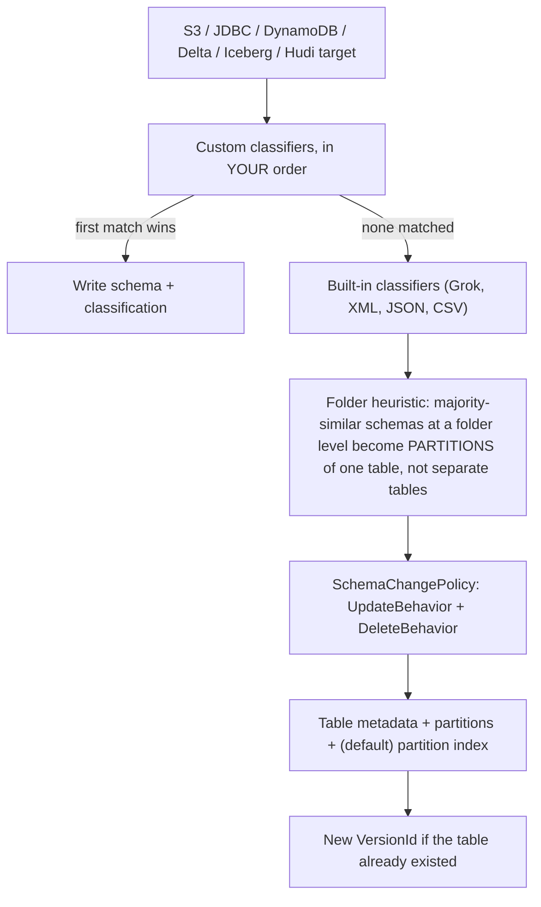
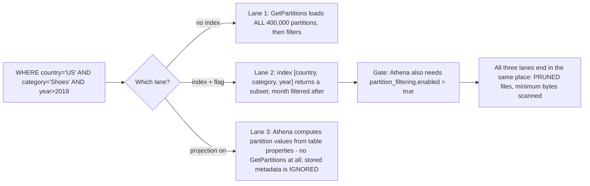
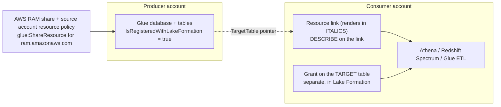
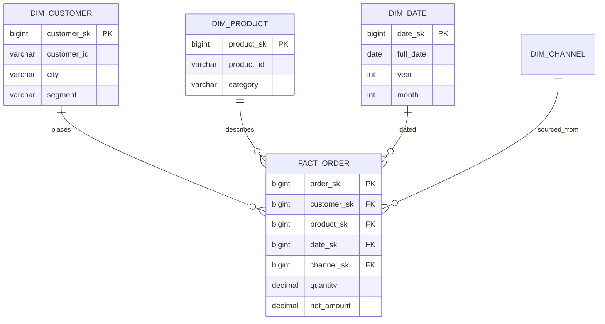
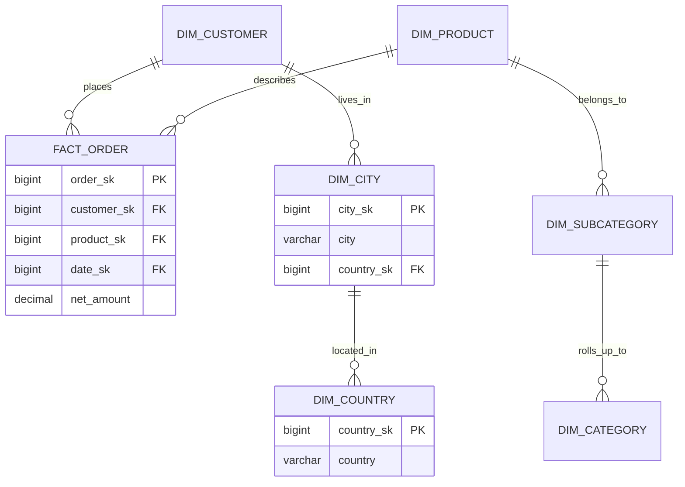
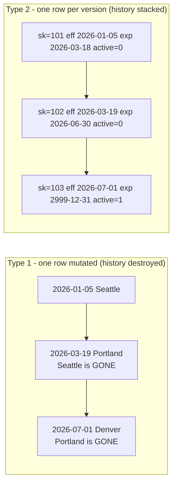

# Data Modeling, Glue Catalog and Schema Evolution

Two DEA-C01 Domain 2 tasks meet in this lesson. **Task 2.2, understand data cataloging systems**, asks you to build and reference a technical data catalog (AWS Glue Data Catalog, Apache Hive metastore), discover schemas with crawlers, synchronize partitions and create source/target connections. **Task 2.4, design data models and schema evolution**, asks you to design schemas for Amazon Redshift, DynamoDB and Lake Formation, address changes to the characteristics of data, and describe best practices for indexing, partitioning strategies and compression. The exam treats them as one story: a **model** is only as good as the **catalog** that describes it, and a catalog is only safe if you can **change** what it describes without breaking every consumer.

```text
====================================================================
 DEA-C01 DOMAIN 2 - TASKS 2.2 (CATALOGING) + 2.4 (MODELS & SCHEMA)
====================================================================
 Catalog ...... account/Region -> catalog -> database -> table
                -> partitions   (metadata ONLY, holds no data)
 Discover ..... crawler -> ordered custom classifiers -> built-ins
                -> infer -> write metadata (+ partition indexes)
 Sync ......... scheduled/event crawler | MSCK REPAIR (max 100/stmt)
                | BatchCreatePartition | Glue ETL updateCatalog
                | Athena partition projection (no metadata at all)
 Speed up ..... partition index (max 3/table) -> pruning -> projection
 Versioning ... UpdateTable archives first -> VersionId + 1
                100,000 versions/table, 1,000,000/account (Oct 2026)
 Swap ........ an assembled PATTERN: catalog view / resource link /
                publish-a-new-version - not a named Glue feature
 Share ........ resource link = DESCRIBE on link + grant on target,
                cross-account via Lake Formation or legacy IAM
 Model ........ star | snowflake; decide GRAIN first; load dims first
 History ...... SCD 1 overwrite | SCD 2 new row (start/end/flag)
 Evolve ....... additive vs breaking; Hive static vs Iceberg metadata
 NoSQL ........ DynamoDB single table: access patterns -> PK/SK -> GSI
 Optimize ..... compress -> columnar -> sort stats -> buckets ->
                partitions: each layer removes roughly an order
====================================================================
```

In this lesson you will:

- read the **Glue Data Catalog object model** — catalog, database, table, `StorageDescriptor`, `PartitionKeys`, `classification` — and the quotas that shape it;
- run a crawler in your head: **custom classifiers in order, first success wins, built-ins only if none matched**, folder heuristics and `SchemaChangePolicy`;
- separate **partition indexing, pruning and partition projection**, including the two settings Athena needs to use an index;
- operate **table versioning**: what `UpdateTable` archives, how you compare two versions, and how a **blue/green table swap** is assembled from verified building blocks;
- wire **resource links** for cross-account and cross-Region sharing, with the two-grant rule;
- choose **star versus snowflake**, set the **grain**, identify facts, dimensions and **surrogate keys**, and denormalize for Redshift distribution;
- implement **SCD Type 1 versus Type 2** (and why Type 2 is the exam staple) with a worked merge;
- classify a proposed schema change as **additive or breaking** across Hive-style, Parquet/JSON/Avro and Iceberg tables, including **partition evolution**;
- design a DynamoDB **single-table** model from access patterns, keys and GSIs;
- stack **partitioning, bucketing, sorting, compression and file size** into one scan-elimination ladder;
- study **three AWS customer case studies** (BMW Group, GoDaddy and Integral Ad Science) and a **sourced October 2026 update box**;
- practise with **14 exam-style questions** plus four interactive checks.

---

## 1. The Glue Data Catalog object model

### 1.1 The tree, and the one sentence that matters

The Data Catalog is a hierarchy of **metadata**: `account/Region → catalog → database → table → partitions`, plus `functions`. AWS's crawler documentation states the fact every catalog question is built on: *"The tables in the Data Catalog do not contain data."* A table row points at data (S3 `Location`, `InputFormat`, `OutputFormat`, `SerdeInfo`); it never holds it. That is why deleting a catalog table does not delete the objects, and why two catalogs can point at the same prefixes.

```text
catalog (default, or a Redshift-federated catalog)
└── database                        (max 10,000 per account)
    └── table  ── StorageDescriptor: columns, Location, InputFormat,
    │               OutputFormat, SerdeInfo, Compressed,
    │               BucketColumns, SortColumns, SkewedInfo
    │           ── PartitionKeys: the Hive-style key order
    │           ── TableType: EXTERNAL_TABLE | GOVERNED
    │           ── Parameters: classification=parquet, etc.
    │           ── TargetTable: pointer if it is a resource link
    │           ── SchemaReference: pointer into Schema Registry
    │           ── IsRegisteredWithLakeFormation
    └── partitions (one per key combination; 10,000,000 per table)
```

One metadata layer feeds **Athena, Redshift Spectrum, EMR, Glue ETL and SageMaker AI** — which is the whole point: crawl once, query from several engines. Catalogs can also be **federated**, so a Redshift-federated catalog (or a catalog holding resource links to Redshift databases in another account or Region) appears in the same tree.

### 1.2 The quotas table (as of October 2026)

| Object | Quota | Why you care |
|---|---|---|
| Databases per account | **10,000** | One database per team is a common early design that dies here |
| Tables per database / per account | **200,000** / **1,000,000** | Crawler mis-grouping burns this fast |
| Partitions per table / per account | **10,000,000** / **20,000,000** | Athena still cannot read more than **1,000,000** in a single scan |
| **Table versions per table / per account** | **100,000** / **1,000,000** | Ungoverned updates degrade reads |
| Crawlers per account / concurrent | **1,000** / **150** | Concurrency, not count, is the real constraint |
| Partition indexes per table | **3** | Plan the key subset, do not spray indexes |
| Crawler S3 traversal depth | default **10**, max **20** | Deep lake layouts silently stop crawling |
| Data Catalog views | up to **10** base tables | The blue/green "stable name" primitive |
| `ALTER TABLE … ADD PARTITION` | **100** per statement | Why `MSCK REPAIR` exists |
| Redshift external table columns (Glue) | **1,597** with pseudocolumns / **1,600** without | Wide catalog tables hit a wall |

- **📚 Did you know?** The Data Catalog itself has a **free tier**: the first **1,000,000 metadata objects** and **2,000,000 metadata requests** are free (AWS Glue pricing, accessed Oct 2026). Crawling and ETL are metered separately at **$0.44 per DPU-hour**, so a team can run a busy catalog for nothing and still get a surprise bill from its crawlers — the two lines on the bill answer different questions.

```fillblank
{
  "question": "Complete the Data Catalog object-model statements using AWS's own wording:",
  "template": "The Glue Data Catalog tree runs account/Region -> {{1}} -> {{2}} -> {{3}} -> {{4}}. A table is metadata only - AWS's crawler documentation states that the tables in the Data Catalog do not contain {{5}} - and the format label a classifier writes into a table's Parameters map is called {{6}}, which is what Athena uses to decide how to read the files at the table's Location.",
  "answers": {
    "1": "catalog",
    "2": "database",
    "3": "table",
    "4": "partitions",
    "5": "data",
    "6": "classification"
  },
  "distractors": ["cluster", "schema", "partition", "index", "files", "metadata", "serde", "column", "format", "compression"],
  "explanation": "The hierarchy is account/Region -> catalog -> database -> table -> partitions (plus functions), and it is metadata only: the table points at S3 objects through Location/InputFormat/OutputFormat/SerdeInfo rather than holding any rows. The classifier's format label lands in Parameters.classification (for example classification=parquet), which is why two tables over the same prefixes can be read differently and why a wrong classification surfaces as a parse error, not a missing-table error."
}
```

---

## 2. Crawlers and classifiers: how a schema gets discovered

### 2.1 The run order — the single most-tested crawler fact

AWS documents a fixed pipeline: the crawler **runs any custom classifiers that you choose… in the order that you specify**, and *"The first custom classifier to successfully recognize the structure of your data is used to create a schema. Custom classifiers lower in the list are skipped."* Only if **no** custom classifier matches do the **built-in** classifiers try. Then the crawler connects, infers the schema and writes metadata.



Two consequences exam writers love. First, a **classifier** is a format/schema recognizer (it *"checks whether a given file is in a format the crawler can handle"* and emits a `StructType`); the **crawler** is the orchestrator that discovers, groups, versions and writes. Second, **priority is positional**: a CSV classifier with `delimiter=;` listed first beats a JSON classifier listed second, and everything below the winner is skipped.

### 2.2 Targets, schedule and recrawl

| Setting | Options | Exam note |
|---|---|---|
| `Targets` | `S3Targets`, `JdbcTargets`, `DynamoDBTargets`, `MongoDBTargets`, `CatalogTargets`, `DeltaTargets`, `IcebergTargets`, `HudiTargets` | **Catalog-table sources cannot be mixed** with other target types |
| `Schedule` | cron string, e.g. `cron(15 12 * * ? *)` | Schedule is a cron expression, not an interval |
| Recrawl | all sub-folders / new sub-folders only / **based on events** (S3 → SQS) | Event-driven is the cost answer |
| `S3Targets` extras | `Exclusions`, `SampleSize`, `ConnectionName`, `EventQueueArn`, `DlqEventQueueArn` | One network connection per crawler, shared by all S3 targets |
| Depth | default 10, max 20 | Iceberg/Hudi targets point at the **metadata path** |
| IAM `Role` | read on the data **and** write on the catalog | The wizard mints `AWSGlueServiceRole-<name>` plus inline `s3:GetObject` |

### 2.3 SchemaChangePolicy — and how to freeze a curated schema

`UpdateBehavior` ∈ {`LOG`, `UPDATE_IN_DATABASE`}; `DeleteBehavior` ∈ {`LOG`, `DELETE_FROM_DATABASE`, `DEPRECATE_IN_DATABASE` (adds a `DEPRECATED` marker plus a timestamp)}. The critical trap: the policy *"does not affect whether or how new tables and partitions are added."*

> [!WARNING]
> ⚠️ **`UpdateBehavior=LOG` is not "freeze my schema."** Setting it to `LOG` stops the crawler from **updating existing tables**, but brand-new tables and new partitions are still created. To freeze both, add `UpdateBehavior=LOG` **plus** the configuration `{"CrawlerOutput":{"Partitions":{"AddOrUpdateBehavior":"InheritFromTable"}}}`. An option claiming `LOG` alone stops all writes is testing whether you read the sentence above.

### 2.4 Worked example E1 — a crawler that must not wreck three hand-curated columns

Input: `s3://acme-raw/orders/dt=2026-10-0*/`, semicolon-delimited CSV with quoted fields, timestamps currently inferred as `string`, three catalog columns hand-edited by an analyst that must survive every crawl.

```text
1. Register a CUSTOM CSV classifier (delimiter ';', quote char) and
   list it FIRST            -> first success wins, built-ins skipped
2. Crawler source = existing CATALOG tables
                           -> partitions update, tables never recreated
3. UpdateBehavior = LOG + AddOrUpdateBehavior = InheritFromTable
                           -> schema and partition layout frozen
4. Schedule = cron(0 2 * * ? *)  OR  S3 event -> SQS event crawl
                           -> 10-minute billing minimum is avoided
5. Role = AWSGlueServiceRole + s3:GetObject/ListBucket on the prefix
6. Confirm CreatePartitionIndex = true (default for S3 targets)
   and set partition_filtering.enabled = true for Athena
```

Cost check as of Oct 2026: crawlers bill **$0.44 per DPU-hour**, per second, with a **10-minute minimum** per crawl (1 DPU = 4 vCPU + 16 GB). A nightly crawl that runs two DPUs for the ten-minute minimum costs **2 × (10/60) × 0.44 ≈ $0.15 per night ≈ $4.5 per month**, and that is before any idle queueing — which is why event-driven incremental crawls are the default recommendation for tables that change once a day.

- **📚 Did you know?** The folder heuristic is a *majority vote*, not a rule: *"When the majority of schemas at a folder level are similar, the crawler creates partitions of a table instead of separate tables."* So a folder of clean CSVs plus two malformed JSON files yields **one table with partitions** and the JSON noise is absorbed — while forcing genuinely different datasets apart means adding each root as a **separate data store**, not tweaking a flag (AWS Glue crawler documentation, accessed Oct 2026).

---

## 3. Synchronizing partitions: indexing, pruning and projection

### 3.1 Five mechanisms, one job

| Mechanism | Where it runs | Ceiling / note |
|---|---|---|
| Scheduled or event-driven crawler | Glue | Reads Hive-style `key=value` folders; can replace costly `MSCK REPAIR` |
| `MSCK REPAIR` / `ALTER TABLE ADD PARTITION` | Athena/Spark SQL | Imperative; **max 100 partitions per ALTER** |
| `BatchCreatePartition` API | your pipeline | Use when the pipeline already knows the new prefix |
| Glue ETL writing the catalog | Glue job | `enableUpdateCatalog=True` + `setCatalogInfo`; `partitionKeys` must match catalog order; nested schemas unsupported |
| **Partition projection** | Athena only | No partition metadata at all |

The partition schema exists at the **table level and per partition**, and Athena validates both — a mismatch fails fast with `HIVE_PARTITION_SCHEMA_MISMATCH` rather than silently misreading data.

### 3.2 Index versus pruning versus projection

- **Pruning** is the *outcome*: dropping non-matching partitions before any file is read. Athena prunes for every partitioned table, projected ones included.
- A **partition index** is a stored Data Catalog index over an ordered subset of partition keys, so `GetPartitions` fetches a subset instead of everything. Rules: **max 3 per table**; key types String/Numeric/Date; operators `=`, `>`, `>=`, `<`, `<=`, `BETWEEN` and **only `AND`** (`LIKE`, `IN`, `OR`, `NOT` are ignored and applied afterwards); **the index's first key must appear in the expression or the index is not used at all.**
- **Projection** is Athena computing partition values and locations in memory from table properties you configure on the Glue table — *"Enabling partition projection on a table causes Athena to ignore any partition metadata registered to the table in the AWS Glue Data Catalog or Hive metastore."*



### 3.3 Worked example E2 — 400,000 partitions, one index, four queries

Index: `[country, category, year]` on a table with 400,000 partitions.

| Query predicate | Index used? | Behaviour |
|---|---|---|
| `country='US' AND category='Shoes' AND year>2018` | **Yes** | Subset fetched; `month` filtered afterwards |
| `category='Shoes'` alone | **No** | First key missing → load all 400,000 |
| `country='US' OR country='UK'` | **No** | `OR` ignored → load all |
| `country='US' AND category IN ('Shoes','Bags')` | **Yes** | `IN` ignored; index still used on `country` (+`category`), rest applied after |
| `category='Shoes' AND country='US'` | **Yes** | The keys are present; the index still drives it, order of your `AND`s does not matter |

Two settings, then two different consumers:

| | Partition index | Partition projection |
|---|---|---|
| Who creates it | Crawler by default for S3/Delta targets (**not** for encrypted partitions) | You, via table properties |
| What Athena needs | index **and** `partition_filtering.enabled=true` | projection configured; stored metadata then ignored |
| Who else uses it | Redshift Spectrum, EMR and Glue Spark DataFrames use an `ACTIVE` index **without** that flag | **Athena only** — Spectrum/EMR still read the catalog |
| Cost of the design | Storage plus `GetPartitions` traffic | `SHOW PARTITIONS` stays empty; **>50% empty projected partitions** → revert |

- **📚 Did you know?** Glue ETL gives you two different pushdown knobs, and they prune in different places: `push_down_predicate` is Spark SQL applied **client-side after listing all partitions**, while `catalogPartitionPredicate` is JSQL applied **server-side** through the partition index — the one to reach for when a table has millions of partitions (AWS Glue best practices, accessed Oct 2026).

---

## 4. Table versioning, compare and blue/green swaps

### 4.1 Versioning is always on

*"By default, `UpdateTable` always creates an archived version of the table before updating it. However, if `skipArchive` is set to true, `UpdateTable` does not create the archived version."* Every crawl that changes a schema therefore bumps `VersionId` by 1, against a ceiling of **100,000 versions per table** and **1,000,000 per account** (as of Oct 2026).

```mermaid
flowchart TD
    A["v3 CURRENT (schema + table properties)"] --> B["UpdateTable / crawler update"]
    B --> C["v3 archived automatically, v4 becomes CURRENT"]
    C --> D{"Compare v3 vs v4"}
    D -->|"console: Edit schema as JSON"| E["Side-by-side diff: red = deleted, blue = edited/moved, green = added, yellow = nested"]
    D -->|"programmatic"| F["GetTableVersions + column-set diff -> CloudWatch alarm + SNS email"]
    E --> G{"Is the change wanted?"}
    G -->|Yes| H["Update consumers BEFORE they read v4"]
    G -->|No|"Rollback = publish a NEW version identical to v3 (the current version cannot be deleted)"]
    H --> I["Prune history with DeleteTableVersion / SkipArchive=true"]
    F --> I
```

There is **no true rollback**: the current version cannot be deleted, and restoring means *publishing a new version identical to the one you want back*. (Apache Iceberg can roll back to a snapshot ID — a different feature, not a catalog version operation.)

### 4.2 Blue/green table swaps — a pattern, not a product

AWS ships **no** named "blue/green table deployment" feature for the Glue Data Catalog. What is verified are the building blocks, and the exam-safe way to answer is as an assembled **pattern**:

| Building block | What it gives the swap |
|---|---|
| `CreateTable` with `TargetTable` | A resource link can be re-pointed at `_green` |
| Data Catalog views (up to **10** base tables; Athena/Redshift/Spark dialects) | A **stable name** consumers keep querying |
| Version archiving + publish-new-version | Roll-forward "rollback" |
| Athena `CREATE OR REPLACE VIEW … AS SELECT * FROM …_green` | Switchover in one statement (third-party pattern) |
| Blue/green guidance rule | **Additive changes before code deploy, deletive changes after code deploy** |

> [!IMPORTANT]
> **For RDS/Aurora blue/green deployments, DDL is not replicated** — *"Data definition language (DDL) changes aren't supported for blue/green deployments… switchover will be blocked."* Same phrase, two layers: a Glue table swap is an assembled metadata pattern, while an RDS blue/green deployment is a managed feature with a hard DDL rule. Never answer "AWS Glue blue/green deployment" as though AWS ships it for catalogs.

---

## 5. Resource links and cross-account sharing

A **resource link** is a local table (or database) whose `TargetTable` is `{CatalogId, DatabaseName, Name, Region}` — so it can point across an account **and** across a Region. Creating one needs Lake Formation `CREATE_TABLE`/`CREATE_DATABASE` **and** IAM `glue:CreateTable`/`glue:CreateDatabase`.



The rules that generate questions:

- *"granting permissions on a resource link doesn't grant permissions on the target"* — you need **`DESCRIBE` on the link plus a separate grant on the target**. Two steps, always.
- Links render in **italics** in the console; there is **no existence check** at creation, so a link can point at nothing.
- **Chains are useless**: APIs follow only the **first** resource link, so a link to a link does not resolve.
- Two sharing stacks exist: **Lake Formation** (named-resource or tag-based access control, requiring the source account's resource policy to allow `glue:ShareResource` for `ram.amazonaws.com`) or **legacy IAM-only Glue permissions**. Turning off *"Use only IAM access control for new databases/tables"* stops new objects being granted `Super` to `IAMAllowedPrincipals`.
- LF-Tags are key-value pairs such as `department=sales` or `classification=restricted`, and *"Tables inherit LF-Tags from databases and columns inherit LF-Tags from tables"* — which is how PII marking scales: grants count as `n(principals) + n(resources)` instead of a product.

- **📚 Did you know?** Nobody at GoDaddy typed those resource links in. Their mesh's provisioning pipeline used **AWS Service Catalog and AWS Lambda** to create the consumer-side links automatically, so a new data product showed up in a consumer account *already linked* and still exactly one grant away from being queryable. Automating the **metadata** object — not the data copy — is what keeps "hundreds of accounts" from becoming hundreds of manual tickets, and the two-step `DESCRIBE`-plus-target rule still applied to every one of them (AWS Big Data Blog, accessed Oct 2026).

---

## 6. Dimensional modeling: grain, facts, dimensions, star versus snowflake

### 6.1 Grain first — the decision every other decision hangs from

**Grain** is what **one row** of a fact table means: "one row per order line", not "one row per order", not "one row per day per store". Decide it **before** you choose keys, because it determines which events can share a table and how big each row is. (AWS's Redshift modeling posts use grain throughout but never publish a formal definition — the exam wording is the industry/Kimball framing.)

| Element | What it is | What it carries |
|---|---|---|
| **Fact table** | The measurements of a business process | Additive measures + foreign keys to dimensions (and to surrogate keys) |
| **Dimension table** | The context that *"provide[s] the business meaning to the measures"* | Descriptive attributes and hierarchies you group and filter by |
| **Grain** | One row = one… | Set first; it fixes the keys |
| **Surrogate key** | *"Artificial keys… typically generated as a sequential integer, and they don't have any meaning in the business domain"* | Small, immutable, collision-free across systems |
| **Load order** | Dimensions **before** facts | *"If the dimension load fails, the fact load will not run"* |

Redshift builds surrogate keys with **`IDENTITY`**, and you should declare primary/foreign keys anyway: *"Redshift will not enforce them, but declaring them will help the optimizer arrive at optimal query plans."* Keep a **date dimension** — every fact table needs a `date_sk`.

### 6.2 Star versus snowflake

*"Snowflake schemas extend the star concept by further normalizing the dimensions into multiple tables."* AWS picks the star where it *"closely align[s] with the business process"*, and columnar compression makes denormalized keys *"relatively inexpensive to store"* — so the extra joins of a snowflake buy little and cost query time.





Read the two diagrams as a trade: the **star** joins the fact to four flat dimensions in four hops; the **snowflake** normalizes `city → country` and `subcategory → category`, so one hop becomes two and every extra join is work the engine must plan. On this exam, "the business process aligns with one fact and flat dimensions" ⇒ **star**; "the requirement is normalized, reusable conformed dimensions" ⇒ **snowflake**, with the join cost named.

### 6.3 Fact table shapes (awareness)

| Type | One row means | Tell |
|---|---|---|
| **Transaction** | One event (order, payment, click) | Largest, highest granularity |
| **Periodic snapshot** | One set of dimensions at a fixed interval (end-of-day balance) | Repeatable and finite |
| **Accumulating snapshot** | One row per long-running process, **updated in place** | Several milestone date keys; needs a current-plus-history strategy |
| **Factless** | An event with no measure (attendance) | You count, you do not sum |

---

## 7. Slowly changing dimensions: Type 1 versus Type 2

### 7.1 The four types you are allowed to define

| Type | Behaviour | Trade |
|---|---|---|
| **0 — Fixed** | The attribute never changes (date of birth) | No history needed |
| **1 — No history** | Overwrite the value; the dimension reflects the latest version | Cheap, loses audit — *"no history is maintained"* |
| **2 — Maintain history** | *"All changes are recorded and versions are tracked with dates and flags"* | Correct, and the exam staple |
| **3 — Previous value** | Keep the **previous** value in one extra column | Only one step back is knowable |

> [!WARNING]
> ⚠️ **A "Type 2" that updates the row is a Type 1.** Type 2 requires a **new row per change**, with `record_start_date`, `record_end_date` (a high date such as `2999-12-31` for the current row), `active_flag`, an optional **record hash** over the tracked columns, and insert/update timestamps. Expire the old row and insert the new one **in the same transaction**. AWS's source defines Types 0–3 only; do not invent Types 4–7 in an answer.



```matching
{
  "question": "Match each slowly changing dimension type to the behaviour AWS documents for it:",
  "pairs": [
    {"left": "Type 0 - Fixed", "right": "The attribute never changes (for example date of birth), so no versioning mechanism is applied"},
    {"left": "Type 1 - No history", "right": "The dimension reflects the latest version; the value is overwritten and no history is maintained"},
    {"left": "Type 2 - Maintain history", "right": "All changes are recorded and versions are tracked with dates and flags - one new row per change"},
    {"left": "Type 3 - Previous value", "right": "The current value plus one extra column that holds only the latest-minus-one value"}
  ],
  "explanation": "AWS's Redshift SCD guidance defines exactly these four behaviours (0, 1, 2 and 3) and states that types up to 7 exist while only defining these - so never define a Type 4 or beyond in an answer. Type 2 is the exam staple because it is the only one that lets a historical fact join to the dimension version that was in force at the time; Type 1 is the audit-destroying distractor, and Type 3 can only ever show one step back."
}
```

### 7.2 Worked example E3 — a Type 2 merge, statement by statement

Stage holds the delta; the dimension holds history. Match on the **business key** with a **left outer join**, hash the tracked columns to decide update versus insert, and do it as **bulk operations, never row-by-row cursors**:

```sql
-- 1) expire the current row for every changed business key
UPDATE dim_customer
SET    rec_exp_dt = CURRENT_DATE - 1,
       is_active  = 0
WHERE  customer_id = :id
  AND  is_active   = 1;

-- 2) insert the new active version in the same transaction
INSERT INTO dim_customer
       (customer_sk, customer_id, city, rec_eff_dt, rec_exp_dt, is_active)
SELECT NEXTVAL('dim_customer_sk'), :id, :city,
       CURRENT_DATE, DATE '2999-12-31', 1;
```

Mechanics worth memorising:

- **Match detection:** left outer join stage ↔ dimension on the business key; matched rows are update/expire candidates, unmatched rows are inserts.
- **Change detection:** `sha2` across sources, `FNV_HASH` (64-bit) for large dimensions, `CHECKSUM` (32-bit) for small ones — a changed hash means the row must version.
- **Delete detection:** full extracts → compare previous and current versions; change-only extracts → use a status column.
- **Distribution:** give stage and target **matched distribution keys** so the merge is node-local in Redshift.
- **Contract:** load **dimensions first, then facts** — a failed dimension load must block the fact load.

- **📚 Did you know?** The high-date convention `2999-12-31` is not decoration: it lets a query find "every customer's current address" with `WHERE is_active = 1` **or** with `WHERE CURRENT_DATE BETWEEN rec_eff_dt AND rec_exp_dt`, and lets a historical fact join with `f.order_date BETWEEN d.rec_eff_dt AND d.rec_exp_dt` — which is exactly how a star schema answers "what did the order look like *at the time*". Type 1 has no equivalent because there is no interval to join on (AWS Redshift SCD guidance, accessed Oct 2026).

---

## 8. Denormalization and physical design in Redshift

The star schema's flat dimensions are a **denormalization** decision, and Redshift rewards it physically:

| Lever | Rule from AWS guidance |
|---|---|
| Fact `DISTKEY` | *"Choose the foreign key for the largest frequently joined dimension as a distribution key in the fact table and the primary key in the dimension table"* — so the join is slice-collocated and needs no redistribution |
| Small/mid dimensions | `DISTSTYLE ALL` (replicated, avoids a shuffle) |
| Frequently updated dimensions | Prefer `DISTSTYLE KEY` |
| Sorting | `SORTKEY` (compound or interleaved) so row-group min/max stats skip blocks |
| Keys | Declare PK/FK anyway — unenforced, but the optimizer uses them |
| After loads | `ANALYZE` (and `VACUUM` where applicable) |

```text
Worked example E4 - picking the distribution key by size, not by habit

Fact table     fact_order_lines      4,200,000,000 rows
Dimension A    dim_customer            48,000,000 rows   <- largest joined dim
Dimension B    dim_product                 180,000 rows
Dimension C    dim_date                       3,650 rows

Rule: fact.DISTKEY  = customer_sk   (largest frequently joined FK)
      dim_customer.DISTSTYLE = KEY(customer_sk)   <- matches the fact
      dim_product / dim_date   = DISTSTYLE ALL    <- small enough to copy

Why: a join on customer_sk then happens inside each slice, with no
redistribution step, while the two tiny dimensions are already present
on every node. Sorting fact_order_lines on date_sk additionally lets
the engine skip whole row groups for a date-range filter.
```

Denormalization also answers the **snowflake** question physically: extra normalized tables mean extra joins, and in a columnar warehouse those joins cost far more than the disk they save.

---

## 9. Schema evolution: additive versus breaking

### 9.1 The audit table

A change is **additive** when old readers and old files keep working; it is **breaking** when a consumer fails, silently coerces, or the partition layout no longer matches the query.

| Proposed change | Hive-style external (Athena/Glue) | Iceberg |
|---|---|---|
| `ADD COLUMN channel string` (append, nullable) | Safe; old files read NULL | Safe; metadata-only, new field ID |
| Rename `cust` → `customer` | Catalog-only; readers keyed by the old name break | Safe — the field ID is stable |
| Drop `legacy_ref` | Breaks `SELECT *`; a re-crawl can shift positions | Safe, no side effects |
| Narrow/retype `DECIMAL(12,2)` → `DECIMAL(9,2)` | May fail or silently coerce | Only **widening** promotions allowed (`int`→`long`, `float`→`double`, decimal precision up) |
| Reorder / mid-table insert | Can raise `HIVE_PARTITION_SCHEMA_MISMATCH` | Safe |
| New **partition key** | Rewrite object keys under new prefixes | New spec; old files keep their layout (**split planning**) |
| Nested `struct`/`array`/`map` change | Glue ETL catalog update unsupported for nested | Add/drop/rename/reorder inside a `struct` supported |

Two anchors: *"Iceberg schema updates are metadata-only changes. No data files are changed when you perform a schema update"*, and Iceberg correctness rests on **unique field IDs** — *"Added columns never read existing values from another column"*. Athena, by contrast, fails fast rather than misreading: a partition schema that diverges from the table schema raises `HIVE_PARTITION_SCHEMA_MISMATCH`.

### 9.2 Partition evolution is the trap inside the trap

*"Hive table partitioning cannot change so moving from a daily partition layout to an hourly partition layout requires a new table. And because queries are dependent on partitions, queries must be rewritten for the new table."* For Iceberg: *"When you evolve a partition spec, the old data written with an earlier spec remains unchanged. New data is written using the new spec in a new layout… Partition evolution is a metadata operation and does not eagerly rewrite files."* Both statements are examinable, and they point in opposite directions: Hive-style partition keys **are** the S3 object keys, so changing the scheme is a migration; Iceberg partition specs are metadata, so old and new layouts coexist — at the cost of extra **split planning**.

### 9.3 How Parquet, JSON and Avro each handle the change

| Format | Where the schema lives | Evolution behaviour (exam framing) |
|---|---|---|
| **Parquet** | In each file's footer, columnar | Append a nullable column and old files still read (NULL); readers read only the columns they name, so an added column costs nothing to old queries. Default codec is **Snappy** |
| **JSON** | No enforced schema — schema applied at read time | The classic **schema-on-read** payload: the crawler infers a schema, and *"if this column is changed to a string by the source, without notifying the consumer, the pipeline will certainly fail"* |
| **Avro** | Embedded writer schema, field IDs | Schema travels with the data; compatibility is decided by rules, which is why the Glue Schema Registry (streaming, **serverless and free**, 8 compatibility modes, default/recommended **BACKWARD**) validates records at serialisation time |
| **ORC** | In-file, columnar with built-in indexes | Default codec **ZLIB**; usually smaller files than Parquet |

> [!NOTE]
> Scope call: the exam guide's in-scope list says **"AWS Glue"** and never names the **Glue Schema Registry**, and no skill bullet names it either. Learn it as **awareness for streaming schemas** — `SchemaArn` and version numbers — and never as the answer to a question about a **Data Catalog table** version (`Table.VersionId`). A table may *reference* a registry schema through `StorageDescriptor.SchemaReference`, but registry compatibility is not a catalog version bump.

### 9.4 Worked example E5 — classify five requests before you ship them

```text
Request 1  ADD COLUMN channel (append, nullable)     -> ADDITIVE
           ship BEFORE the consumer deploy; old files read NULL
Request 2  DROP COLUMN legacy_ref                    -> BREAKING
           ship AFTER the consumer deploy (additive first,
           deletive after code deploy)
Request 3  RETYPE amount DECIMAL(12,2) -> DECIMAL(9,2)-> BREAKING
           narrowing is not a widening promotion; Hive may coerce
Request 4  hourly partitions instead of daily          -> BREAKING (Hive)
           new table + rewritten queries; METADATA-ONLY on Iceberg
Request 5  RENAME cust -> customer                    -> BREAKING (Hive)
           safe on Iceberg (field ID stable); consumers keyed by
           the old column name still break in both worlds
```

The ordering rule — **additive before code deploy, deletive after code deploy** — is the single most reusable sentence in this section.

---

## 10. DynamoDB single-table design: access patterns first

*"Single table design is a pattern that allows you to store multiple types (entities) of data in a single DynamoDB table."* The AWS-documented workflow runs **use case → entity-relationship → access patterns (written as SQL) → schema → PK/SK per table and GSI → repeat**, and it starts from **queries, not entities**.

| Concept | What it does |
|---|---|
| **Access pattern** | A sentence like "get an order by id" or "list a customer's orders newest-first" — the input to the design |
| **Partition key** | The **equality** condition; must be **high-cardinality** so items spread evenly |
| **Sort key** | Range / `begins_with` — gives one-to-many, hierarchy and ordered collections |
| **Composite prefixes** | `ORDER#123`, `INVOICE#123` separate entity types in one table (item collections sharing a partition key) |
| **Generic names** | Overloaded tables use `PK`/`SK` rather than entity-specific names |
| **GSI** | A shadow table with its **own** PK/SK, **independent throughput**, async eventually-consistent sync, projections `KEYS_ONLY` / `INCLUDE` / `ALL` |
| **Sparse index** | Only items carrying the GSI key are indexed — an optional flag costs nothing for items without it |
| **Index overloading** | One GSI serves many entity types |
| **Write sharding** | Append `rand(0,N)` when a single partition key would exceed **3,000 RCU/s or 1,000 WCU/s** |
| **Multi-attribute keys** | Up to **4 PK + 4 SK = 8** attributes; all PK attributes need equality; SK attributes are queryable left-to-right without skipping |
| **Vertical partitioning** | Split a large document into items sharing a PK with SK prefixes — beats the **400 KB** item limit and keeps writes small (writes bill in **1 KB** steps) |

### 10.1 Worked example E6 — four access patterns to a design

```text
Patterns: (a) get customer by id
          (b) list a customer's orders, newest first
          (c) get one order by order id
          (d) list escalated faults

Base table      PK = customerId, SK = ROOT                -> (a)
  item          PK = customerId, SK = ORDER#<iso8601>      -> (b)
                query with ScanIndexForward = false (newest first)
  GSI1          PK = orderId, SK = ROOT                    -> (c)
                SPARSE: only order items carry orderId, so
                index cost is proportional to orders, not items
  GSI2          PK = escalatedTo, SK = ...                 -> (d)
                SPARSE: present only on fault items

Ceiling check (as of Oct 2026): a partition key caps at 3,000 RCU/s
and 1,000 WCU/s -> if orderId would exceed that, shard it as
orderId#<0..N> and query all N partitions in parallel.
Item ceiling: 400 KB; a 900 KB order document MUST be split into
items sharing PK = ORDER#123 with SK prefixes (HEADER#, LINE#n).
```

Choose **single-table** when the entities are queried **together** with similar operational needs; choose **multiple tables** when retention, backup, per-tenant KMS keys or table class needs diverge. AWS states both sides — this is a judgement question, not a "single table is always better" question.

---

## 11. Partitioning, bucketing, sorting, compression — the elimination ladder

Each layer removes work **before** the next layer runs, outermost first:

| # | Layer | What it eliminates | Ceiling / default (Oct 2026) |
|---|---|---|---|
| 1 | **Partitioning** (date, region) | Whole directories/prefixes | Athena reads at most **1,000,000** partitions in one scan; too-fine partitions inflate `GetPartitions` |
| 2 | **Bucketing / clustering** | Hash buckets inside a partition | Glue fields `NumberOfBuckets` / `BucketColumns`; Iceberg `bucket(N, col)` |
| 3 | **Sorting** | Row groups/stripes, via min/max stats | *"data within the files are sorted… Athena can use the minimum and maximum values in the file metadata to skip the unneeded parts"* |
| 4 | **Columnar format** | Untouched columns | Parquet for wide/complex query mixes; ORC for complex types and built-in indexes |
| 5 | **Compression** | Bytes before decompression | *"Querying compressed data is faster and also cheaper because you pay for the number of bytes scanned before decompression."* |
| 6 | **File size** | Listing/request overhead | Glue auto-enables file grouping above **50,000** input files; Parquet row groups **128 MB**, ORC stripes **64 MB** (stripes under 8 MB are read whole) |

Codec choice (from the AWS Glue best-practices codec table): **Snappy** — fast, moderate ratio, **default for Parquet**; **GZIP** — high ratio, CPU-intensive and **not splittable**, so cold/archival text only; **Bzip2** — very high ratio, splittable, slow; **ZLIB** — **default for ORC**; **Zstd** — balanced. Compression vs parallelism is a real trade: Gzip on hot text loses splittability.

### 11.1 Worked example E7 — the scan-cost ladder

100-column, **4 TB** uncompressed CSV, a query selecting **one column** for **one day of 365**:

```text
Raw CSV, full scan                       4,000,000 MB   (baseline)
+ GZIP at 4:1                            1,000,000 MB   -> ~1 TB
+ Parquet, 1 of 100 columns                 10,000 MB   -> ~10 GB
+ partition pruning, 1 of 365                  ~28 MB
+ sort min/max skipping                      fewer row groups read

Each step removes roughly an order of magnitude, and the layers
compound: compression shrinks the scan, columnar skips columns,
sort stats skip row groups, buckets skip buckets, partitions skip
directories.
```

Athena prices the result: at **$5.00 per TB scanned** with a **10 MB minimum per query** (Athena pricing, accessed Oct 2026), the raw scan is about **$20.00**, the GZIP scan **$5.00**, the Parquet single-column scan **$0.05**, and the partitioned scan is measured in fractions of a cent. Format and layout are **cost controls**, not merely performance controls.

```dragdrop
{
  "question": "Order the data-optimization ladder from the outermost elimination layer (removes the most work first) to the innermost:",
  "items": [
    "Partitioning - skip whole S3 prefixes (Hive-style key=value directories)",
    "Bucketing / clustering - skip hash buckets inside a partition",
    "Sorting - row-group and stripe min/max stats skip blocks inside a file",
    "Columnar format - read only the named columns (Parquet / ORC)",
    "Compression - fewer bytes scanned before decompression",
    "File size and grouping - avoid the small-file listing tax (auto-grouping above 50,000 files)"
  ],
  "correctOrder": [
    "Partitioning - skip whole S3 prefixes (Hive-style key=value directories)",
    "Bucketing / clustering - skip hash buckets inside a partition",
    "Sorting - row-group and stripe min/max stats skip blocks inside a file",
    "Columnar format - read only the named columns (Parquet / ORC)",
    "Compression - fewer bytes scanned before decompression",
    "File size and grouping - avoid the small-file listing tax (auto-grouping above 50,000 files)"
  ],
  "explanation": "The layers are nested, so they must be applied outside-in: partitions prune directories before any file is opened, buckets prune within a partition, sorting prunes row groups within a file, columnar format prunes columns within a row group, compression reduces the bytes actually pulled, and file grouping removes the listing overhead that otherwise dominates when millions of tiny files exist. Skipping a layer does not break the others - it just leaves that order of magnitude on the bill."
}
```

- **📚 Did you know?** Sorting helps **only** filters on the sort column — the min/max stats describe the sort key, so a predicate on any other column skips nothing. That is why "add a SORTKEY on `customer_id`" answers a customer-filtered query and does nothing for a product-filtered one (AWS Athena performance guidance, accessed Oct 2026).

The other half of an Athena bill is the **reservation minimum** rather than the bytes scanned — and that minimum itself moved in 2026. Take the same nightly batch window, **12 DPU running for 10 minutes**, and read it in DPU-hours (DPU × hours) under the old rule and the new one:

```plot
{
  "type": "bar",
  "title": "One nightly 12-DPU, 10-minute Athena batch window (DPU-hours billed)",
  "data": [
    {"rule": "Before 11 Feb 2026: 24 DPU x 60 min minimum", "dpuHours": 24},
    {"rule": "After 11 Feb 2026: 12 DPU x 10 min (floor 4 DPU / 1 min)", "dpuHours": 2}
  ],
  "xKey": "rule",
  "yKey": "dpuHours",
  "xLabel": "Capacity Reservation rule",
  "yLabel": "DPU-hours billed"
}
```

Reading the chart: the *work* never changed — 12 DPU for 10 minutes either way — but the billable quantity fell from **24 × 1 = 24 DPU-hours** to **12 × (10/60) = 2 DPU-hours**, a **12×** cut produced purely by lowering the service minimum from 24 DPU / 60 minutes to **4 DPU / 1 minute** (AWS Big Data Blog, 11 Feb 2026, accessed Oct 2026). Layout still decides how many bytes you scan; the reservation rule decides how many of those minutes you are forced to buy.

### 2026 Updates (as of October 2026)

> [!NOTE]
> **What moved in this topic between the launch-era guide and the guide you download today** — each line checked against a primary AWS source in **October 2026**:
> - **Exam guide v1.1 (12 December 2025)** consolidated knowledge/skills into one skill list and added **8 skills, removing none**. For this lesson: **2.1.7 "Manage open table formats (for example Apache Iceberg)"** makes Iceberg schema and partition evolution directly testable; **2.2.6 "Create and manage business data catalogs (for example Amazon SageMaker Catalog)"** is a new cataloging skill; **2.4.6** adds vectorization concepts. In-scope **+6 / −3**: **Amazon S3 Tables** added, **AWS SCT removed** — so Task 2.4.3's schema-conversion skill now reads **AWS DMS Schema Conversion**, with SCT as legacy vocabulary only (exam guide revisions page, accessed Oct 2026).
> - **AWS Glue 6.0 (21 August 2026)**: **30% lower price**, Spark **4.1.1**, Python **3.13**, Hudi 1.1.1, Iceberg **1.11.0**, Delta 4.2.0 and **Iceberg format v3** (deletion vectors, row lineage). Breaking changes for jobs: **EMRFS removed** (S3A is the only S3 filesystem) and **AWS SDK for Java v1 removed** — an option still referencing `fs.s3.consistent.*` or `com.amazonaws.services.*` is stale (AWS Glue 6.0 announcement and migration page, 21 Aug 2026 / accessed Oct 2026).
> - **Glue version hygiene**: Glue **0.9/1.0/2.0 reached end of life on 1 April 2026**, and **Python Shell 3.6** cannot create new jobs after **31 March 2026** (existing jobs still run). **Glue 5.1** has been the default for new jobs since 26 November 2025 (AWS Glue version support policy, accessed Oct 2026).
> - **Lake Formation cross-account sharing v5 (11 February 2026)**: a **single AWS RAM share** can now carry unlimited tables (AWS says "hundreds of thousands"), new grants use **wildcard patterns** instead of per-resource associations, existing shares keep working, and the upgrade is opt-in — the resource-link-plus-target-grant rule in Section 5 is unchanged (AWS What's New, 11 Feb 2026).
> - **Iceberg is now written from Redshift**: Iceberg **writes GA 17 November 2025** (registered in the **Glue Data Catalog**), **UPDATE/DELETE/MERGE 23 April 2026**, **materialized views 5 October 2026** — and Iceberg **DELETE** on Lake Formation tables requires the **DELETE** permission, with all Iceberg DML needing **ALTER**. Any option claiming Redshift can only *read* lake tables is stale (AWS What's New and Redshift behavior-changes page, accessed Oct 2026).
> - **The catalog side of Athena moved too**: **Glue Data Catalog materialized views (30 November 2025)**, statistics-driven cost-based optimization for Iceberg that works *with* Lake Formation row filters and column masks **(21 November 2025)**, **managed query results** that need no S3 result bucket and cost nothing extra **(3 June 2025)**, **managed connectors for 12 sources (23 April 2026)**, and a Capacity Reservation floor cut from **24 DPU / 60 minutes** to **4 DPU / 1 minute (11 February 2026)** — an option requiring a mandatory result bucket, or billing a full hour for a ten-minute batch, is stale (AWS Athena release notes and AWS What's New, accessed Oct 2026).
> - **Iceberg schema machinery went to v3**: **Amazon S3 Tables** is now in scope (guide v1.1) and shipped the **Variant** type for **Iceberg format v3 on 28 July 2026**; **Glue 6.0** runs Iceberg **1.11.0** with v3 support — VARIANT plus shredding, **deletion vectors** and row lineage. Deletion vectors are what keep row-level `DELETE`s cheap, which is exactly the operation Redshift's `UPDATE/DELETE/MERGE` now performs, and exam-guide skill **2.1.7 "Manage open table formats"** puts schema evolution, snapshots and compaction directly in scope (AWS What's New, 28 Jul 2026; AWS Glue 6.0 announcement, 21 Aug 2026, accessed Oct 2026).
> - **Permissions got tighter while sharing got easier** — the full matrix after Redshift's behavior change: `INSERT` → **INSERT**, `DELETE` → **DELETE**, **`UPDATE`/`MERGE` → INSERT + DELETE**, and *every* Iceberg DML statement also needs **ALTER**. A lab (or a cross-account role) that grants only `INSERT` is now insufficient to merge a lake table, while the Lake Formation v5 wildcard share in the bullet above makes granting itself cheaper (AWS Redshift behavior-changes page, Patch 202, accessed Oct 2026).

---

## Real-World Case Studies

Every figure below is **customer- or AWS-claimed and unaudited**, with the source named so you can check it. The examinable point is the **pattern** — which catalog object was shared, which schema contract was enforced — not the marketing.

### Case A — BMW Group: schemas in Glue, data in S3

| Element | Detail |
|---|---|
| Customer | **BMW Group**, automotive manufacturer |
| Challenge | An on-premises data lake built in **2015** could not serve multiple tenants with clear producer/consumer separation |
| Services | **Amazon Kinesis Data Firehose + AWS Lambda + AWS Glue + Amazon EMR** on the provider side; **Amazon Athena, Amazon SageMaker AI, Amazon EMR** on the consumer side; **layers in Amazon S3, schemas in the AWS Glue Data Catalog** |
| Outcomes | **10 TB/day** ingested from **1.2 million vehicles**; a Cloud Data Hub serving **500+ users**; anonymized telemetry |
| Exam domain | **Domain 2, Task 2.2** — the catalog is the shared contract between producer and consumer accounts |
| Source | `aws.amazon.com/solutions/case-studies/bmw-group-case-study/` (accessed Oct 2026) |

The examinable pattern: **the data never left S3 while ownership split across accounts** — Glue holds the schemas, Athena and SageMaker consume them in place. That is exactly the resource-link-plus-Lake-Formation arrangement in Section 5, and it is why "copy the data into each team's account" is a distractor: sharing belongs at the **metadata** layer.

### Case B — GoDaddy: a data mesh on one shared catalog

| Element | Detail |
|---|---|
| Customer | **GoDaddy**, internet/tech company |
| Challenge | A shared on-premises Hadoop cluster, proliferating HDFS copies and unmanageable permissions |
| Services | **AWS Lake Formation + AWS Glue Data Catalog + Amazon S3 + AWS RAM cross-account shares + Amazon Athena / Amazon EMR + AWS Service Catalog + AWS Lambda** |
| Outcomes | A hub-and-spoke data mesh with **2,000+ data products**, **multiple petabytes across hundreds of accounts**, hundreds of producers and thousands of consumers, and a central governance account |
| Exam domain | **Domain 2 Tasks 2.2/2.4** with Domain 4 hooks (governance, cross-account sharing) |
| Source | AWS Big Data Blog, "How GoDaddy built a data mesh to decentralize data ownership using AWS Lake Formation" (accessed Oct 2026) |

> "There are over 2,000 data products built on the GoDaddy data mesh on AWS … Our data mesh manages multiple petabytes of data across hundreds of accounts."

Read the number correctly: **2,000 data products is a catalog-scale problem**, not a storage problem. Resource links (which render in italics, need `DESCRIBE` plus a target grant, and resolve only the first link in a chain) plus AWS RAM shares are what make hundreds of accounts query one Glue database without copying it.

- **📚 Did you know?** All three case studies put **AWS Glue Data Catalog in the middle** and none of them moved data to give a team access — BMW for producer/consumer separation, GoDaddy for mesh-wide sharing, IAS for classification-based access. That repetition is the hint: on DEA-C01, "make the data available to another account or engine" most often resolves to a **catalog or permission** answer (resource link, LF grant, RAM share, catalog view), not a **copy** answer (COPY, export, snapshot) (AWS case study and AWS Big Data Blog, accessed Oct 2026).

### Case C — Integral Ad Science: hundreds of rules collapse into two tags

| Element | Detail |
|---|---|
| Customer | **Integral Ad Science (IAS)**, ad-tech measurement company |
| Challenge | A self-service data lake spanning producer and consumer accounts under GDPR/CCPA, where access had to follow each user's **classification and job role** rather than a hand-written rule per person |
| Services | **AWS Lake Formation with tag-based access control + AWS Glue Data Catalog + Amazon S3 + Amazon Athena + Amazon EMR + Okta federation**; S3 reached only through a **Lake Formation data access role** |
| Outcomes | **Column-level** access control; **hundreds of permission rules reduced to precisely two**; one Athena workgroup per business unit (billing tags plus query limits); database-level LF-Tags **inherited** by tables and columns |
| Exam domain | **Domain 2 Tasks 2.2/2.4** with Domain 4 hooks (tag-based access control, federated identity) |
| Source | AWS Big Data Blog, "Integral Ad Science secures self-service data lake using AWS Lake Formation", 23 September 2021 (accessed Oct 2026) |

> "With Lake Formation tag-based access controls, IAS reduced hundreds of permission rules down to precisely two rules."

Read the arithmetic, not the marketing: **two rules is a different kind of grant, not a shorter list.** A per-table policy costs roughly `n(principals) × n(tables)`; a tag grant costs `n(principals) + n(tag values)` — and because *"Tables inherit LF-Tags from databases and columns inherit LF-Tags from tables"* (Section 5), tagging the **database once** pulls every future table and column into the same policy without anyone editing a rule. The grant is written against `classification=restricted`, not against a table name, which is why column-level PII control survives a thousand new tables.

- **📚 Did you know?** IAS separated **who may query** from **how much a team may run**: access to individual columns was decided by Lake Formation tags, while each business unit got its own **Athena workgroup** carrying query limits and cost-allocation tags. Two independent control planes — grants answer "can I read this column?", workgroups answer "how far may this team go and who pays?" — and exam options love to swap them (AWS Big Data Blog, accessed Oct 2026).

---

## Practice Questions

```question
{
  "id": "dea-08-q1",
  "type": "multiple-choice",
  "question": "A Glue crawler runs two custom classifiers for the same file: a CSV classifier (delimiter ';') listed first and a JSON classifier listed second. The file is a semicolon-delimited CSV. Which statement is correct?",
  "options": [
    "The CSV classifier wins because custom classifiers run in the order specified and the first successful match is used; classifiers lower in the list are skipped",
    "The JSON classifier wins because built-in classifiers always run before custom classifiers",
    "Both classifiers run and Glue merges their outputs into one schema",
    "The crawler picks the classifier with the most columns in its inferred schema"
  ],
  "correct": 0,
  "explanation": "AWS documents the run order explicitly: custom classifiers run in the order you specify, the FIRST one to successfully recognize the structure creates the schema, and lower ones are skipped. Built-in classifiers only run when no custom classifier matches."
}
```

```question
{
  "id": "dea-08-q2",
  "type": "multiple-choice",
  "question": "You want a recurring crawl to stop overwriting three hand-edited columns but still register brand-new tables and partitions. What is the correct configuration?",
  "options": [
    "Set UpdateBehavior=LOG and AddOrUpdateBehavior=InheritFromTable",
    "Set UpdateBehavior=LOG only",
    "Set DeleteBehavior=DEPRECATE_IN_DATABASE only",
    "Disable the crawler schedule and rely on manual UpdateTable calls"
  ],
  "correct": 0,
  "explanation": "The SchemaChangePolicy 'does not affect whether or how new tables and partitions are added', so UpdateBehavior=LOG alone still lets new tables and partitions through. Freezing both requires LOG plus the crawler configuration CrawlerOutput.Partitions.AddOrUpdateBehavior=InheritFromTable."
}
```

```question
{
  "id": "dea-08-q3",
  "type": "multiple-choice",
  "question": "A Glue table has a partition index on [country, category, year] and 400,000 partitions. Which query will NOT use that index?",
  "options": [
    "WHERE country='US' AND category='Shoes' AND year>2018",
    "WHERE category='Shoes' AND country='US'",
    "WHERE country='US' OR country='UK'",
    "WHERE country='US' AND category IN ('Shoes','Bags')"
  ],
  "correct": 2,
  "explanation": "Only =, >, >=, <, <=, BETWEEN and AND drive the index; OR, IN, LIKE and NOT are ignored and applied afterwards, so an OR predicate forces Glue to load all 400,000 partitions. The first key must also appear in the expression - 'category' alone would not use the index either - while IN degrades gracefully because country still matches."
}
```

```question
{
  "id": "dea-08-q4",
  "type": "multiple-choice",
  "question": "A team enables partition projection on a Glue table for Athena and then runs SHOW PARTITIONS. What happens, and who else can use it?",
  "options": [
    "Athena computes partition values from table properties, SHOW PARTITIONS returns empty because stored partition metadata is ignored, and only Athena uses projection",
    "Athena returns the stored partitions because projection reads the Data Catalog first",
    "SHOW PARTITIONS returns the projected values and Redshift Spectrum also switches to projection automatically",
    "Projection is a Data Catalog index, so Spectrum and EMR use it while Athena ignores it"
  ],
  "correct": 0,
  "explanation": "AWS states that enabling partition projection makes Athena ignore partition metadata registered in the Glue Data Catalog or Hive metastore - so SHOW PARTITIONS stays empty. Projection is Athena-only; Spectrum, EMR and Glue Spark still read catalog metadata (and indexes)."
}
```

```question
{
  "id": "dea-08-q5",
  "type": "multiple-choice",
  "question": "An Athena query on a partitioned table fails with HIVE_PARTITION_SCHEMA_MISMATCH. What is the cause?",
  "options": [
    "The schema of one partition differs from the schema of the table",
    "The table has exceeded 100,000 table versions",
    "The crawler was scheduled with a cron expression instead of an interval",
    "The partition index has more than three keys"
  ],
  "correct": 0,
  "explanation": "Athena validates the table-level partition schema against each partition's schema and fails fast with HIVE_PARTITION_SCHEMA_MISMATCH when they diverge - it refuses to guess rather than misreading data. Partition indexes are capped at three KEYS in one index, not by any table-version rule."
}
```

```question
{
  "id": "dea-08-q6",
  "type": "multiple-choice",
  "question": "Which statement about AWS Glue Data Catalog table versioning is correct?",
  "options": [
    "UpdateTable archives the previous version by default, so VersionId increments; restoring an older schema means publishing a new version identical to it, because the current version cannot be deleted",
    "Versions are archived only when the crawler detects a breaking change",
    "Setting SkipArchive=true keeps old versions queryable while stopping the version counter",
    "Rolling back to v3 automatically deletes v4 and re-points every consumer"
  ],
  "correct": 0,
  "explanation": "By default UpdateTable always archives the version it replaces (skipArchive=true opts out), VersionId increments, and the quota is 100,000 versions per table as of Oct 2026. There is no true rollback: you publish a new version identical to the one you want, then re-point consumers yourself."
}
```

```question
{
  "id": "dea-08-q7",
  "type": "multiple-choice",
  "question": "A consumer account has a resource link to your Glue table but queries still fail with an access error. What is missing?",
  "options": [
    "A separate Lake Formation grant on the TARGET table - granting permissions on a resource link does not grant permissions on the target",
    "A second resource link that points at the first link",
    "An IAM policy allowing glue:DeleteTable on the link",
    "Permission to delete the target table so the link can be recreated"
  ],
  "correct": 0,
  "explanation": "Resource links are a two-step grant: DESCRIBE (or more) on the link PLUS a grant on the target table. Chains do not help because APIs follow only the first resource link, and deleting the target is never part of the access path."
}
```

```question
{
  "id": "dea-08-q8",
  "type": "multiple-choice",
  "question": "Which pair of statements about star and snowflake schemas is correct?",
  "options": [
    "Snowflake schemas further normalize dimensions into multiple tables, adding joins; AWS prefers the star where it closely aligns with the business process because denormalized keys are relatively inexpensive to store in a columnar store",
    "Snowflake schemas add a second fact table; star schemas cannot hold hierarchies",
    "Star schemas require surrogate keys while snowflake schemas require natural keys",
    "Snowflake schemas are always faster because they contain fewer rows"
  ],
  "correct": 0,
  "explanation": "AWS's own wording: 'Snowflake schemas extend the star concept by further normalizing the dimensions into multiple tables.' The cost is joins, and columnar compression makes the star's duplicated keys cheap - so the star is the default where it matches the business process. Hierarchies and keys are available in both."
}
```

```question
{
  "id": "dea-08-q9",
  "type": "multiple-choice",
  "question": "A dimension row for customer 7781 moves from Seattle to Portland. Requirement: every historical order must still join to the address in force at order time. Which design meets it?",
  "options": [
    "Type 2 - insert a new row with its own surrogate key, record_start_date, record_end_date (2999-12-31 for the active row) and active_flag; expire the old row in the same transaction",
    "Type 1 - UPDATE the city column in place, because overwriting keeps the table small",
    "Type 3 - keep only the previous city in a second column, and stop there",
    "Type 0 - the city is fixed data, so no versioning mechanism is needed"
  ],
  "correct": 0,
  "explanation": "Only Type 2 keeps history as stacked rows with start/end dates, which is what a temporal join between the fact and the dimension needs (fact date BETWEEN rec_eff_dt AND rec_exp_dt). A Type 2 that updates the row is really Type 1; Type 3 keeps exactly one previous value and cannot serve arbitrary history."
}
```

```question
{
  "id": "dea-08-q10",
  "type": "multiple-choice",
  "question": "A Glue ETL job must add hourly partitioning where the table currently has daily partitions, using a Hive-style external table on S3. What is the correct assessment?",
  "options": [
    "Breaking - Hive table partitioning cannot change, so a new table and rewritten queries are required; with Iceberg the same change is a metadata operation and old files keep their layout",
    "Additive - Athena rewrites the object keys automatically at query time",
    "Additive - adding a partition key is always metadata-only, regardless of table format",
    "Breaking in every format, because partition values are stored inside Parquet footers"
  ],
  "correct": 0,
  "explanation": "For Hive-style tables the partition values ARE the object keys, so changing the layout means new prefixes, a new table and rewritten queries. Iceberg evolves the partition spec as metadata without eagerly rewriting files - old and new layouts coexist (at the cost of split planning). Athena never rewrites keys for you."
}
```

```question
{
  "id": "dea-08-q11",
  "type": "multiple-choice",
  "question": "Design a DynamoDB table for: get customer by id; list that customer's orders newest-first; get one order by order id; items are up to 900 KB. Which design is correct?",
  "options": [
    "PK=customerId with SK=ORDER#<iso8601> and ScanIndexForward=false for newest-first, a sparse GSI on orderId for point lookups, and the 900 KB order split into items sharing a PK with SK prefixes",
    "PK=orderId alone, because one key per entity is always cheapest",
    "PK=customerId with a GSI whose partition key is the order date, plus one item per order kept whole at 900 KB",
    "Separate tables per entity with only the customerId partition key, no sort key and no GSIs"
  ],
  "correct": 0,
  "explanation": "The sort key on the base table gives the ordered one-to-many list; a sparse GSI on orderId answers the point lookup without scanning; and the 400 KB item limit forces vertical partitioning into sub-items (writes also bill in 1 KB steps, so large documents are expensive either way). Access patterns drive the keys - not entities."
}
```

```question
{
  "id": "dea-08-q12",
  "type": "multiple-choice",
  "question": "A 4 TB, 100-column uncompressed CSV table is queried for one column over one day of 365. Which sequence correctly describes the cumulative effect?",
  "options": [
    "GZIP ~1 TB, Parquet single-column ~10 GB, partition pruning ~28 MB - compression, columnar format and pruning compound, and because Athena bills bytes scanned the cost falls with each step",
    "Parquet alone makes the query free; compression only affects load time",
    "Partitioning is the only layer that changes bytes scanned; columnar format and compression change only latency",
    "Sorting replaces partitioning, so adding both is redundant"
  ],
  "correct": 0,
  "explanation": "The layers nest: GZIP 4:1 takes 4 TB to ~1 TB, Parquet reading 1 of 100 columns takes ~1 TB to ~10 GB, and pruning 1 of 365 days takes ~10 GB to ~28 MB. Athena charges for bytes scanned (5 USD/TB as of Oct 2026, 10 MB minimum), so each layer is a cost control as well as a speed control."
}
```

```question
{
  "id": "dea-08-q13",
  "type": "multiple-choice",
  "question": "A cross-account role must run MERGE and then DELETE on an Apache Iceberg table that is registered in the AWS Glue Data Catalog and governed by Lake Formation, after Redshift's 2026 behavior change (Patch 202). Which permission set is correct?",
  "options": [
    "INSERT plus DELETE for the MERGE, DELETE for the DELETE, and ALTER on the table for every Iceberg DML statement",
    "INSERT only, because a MERGE is an upsert and behaves like an INSERT",
    "ALTER alone, because ALTER is the umbrella permission for all Iceberg operations",
    "DATA_EXTERNAL_WRITE on the S3 prefix plus glue:UpdateTable on the catalog table"
  ],
  "correct": 0,
  "explanation": "Patch 202 tightened exactly this path: INSERT statements need INSERT, DELETE needs DELETE, UPDATE and MERGE need INSERT + DELETE together, and every Iceberg DML statement also needs ALTER on the table. ALTER alone covers nothing else, and INSERT alone no longer covers a merge - the DELETE half of the MERGE fails. The catalog entry itself is untouched by the permission change: it is the Lake Formation grant on the table (plus S3 access through the Lake Formation data access role) that gates the DML (AWS Redshift behavior-changes page, Patch 202, accessed Oct 2026)."
}
```

```question
{
  "id": "dea-08-q14",
  "type": "multiple-choice",
  "question": "Integral Ad Science ran a lake with hundreds of consumer principals and thousands of tables, and a table created next month must be covered without anyone editing a rule. Which design reduced hundreds of permission rules to two, and why does it stay correct over time?",
  "options": [
    "Lake Formation tag-based access control: the grant is written against an LF-Tag such as classification=restricted, and tables inherit LF-Tags from their database while columns inherit from their table - so the new table is covered the moment its database is tagged",
    "One IAM policy per consumer account that lists each table ARN, rewritten whenever a table is added",
    "A chain of resource links from the governance account, so each new table inherits permissions through the last link in the chain",
    "One Athena workgroup per business unit, because workgroups replicate table grants across accounts"
  ],
  "correct": 0,
  "explanation": "Tag-based access control writes the grant against a tag value instead of a resource list, and inheritance (database -> table -> column) means a table created next month is already inside the policy - cost scales as n(principals) + n(tag values), not as a product. The distractors are the three traps from this lesson: a per-ARN IAM policy scales as the product, resource-link chains resolve only the FIRST link and grant nothing on the target anyway, and Athena workgroups govern query limits and cost allocation, never table access (AWS Big Data Blog on Integral Ad Science; AWS Lake Formation documentation, accessed Oct 2026)."
}
```

> [!WARNING]
> ⚠️ **Exam-day traps for this lesson:**
> - **Crawler ≠ classifier** — the crawler orchestrates and writes; the classifier recognizes format and emits the schema, **first success wins**, built-ins only if none matched.
> - **`UpdateBehavior=LOG` still adds tables and partitions** — pair it with `AddOrUpdateBehavior=InheritFromTable` to freeze them.
> - **Index ≠ projection ≠ pruning** — an index is stored catalog metadata (Athena additionally needs `partition_filtering.enabled=true`); projection is Athena computing partitions and **ignoring** stored metadata; pruning is the shared outcome.
> - **A useless index** — first key missing from the expression, or an `OR`/`IN`/`LIKE`/`NOT` in it.
> - **Versioning is always on** — `UpdateTable` archives by default; **100,000 versions/table**; there is no rollback, only publish-a-new-version.
> - **Blue/green for catalog tables is an assembled pattern, not a shipped Glue feature**; DDL is not replicated in RDS/Aurora blue/green and blocks switchover.
> - **Resource links are two-step** — `DESCRIBE` on the link **and** a grant on the target; chains resolve only the first link; links render in italics.
> - **Type 2 needs history rows** — start date, end date (2999-12-31 for current), active flag, and an expire-then-insert in **one transaction**; a Type 2 that updates is a Type 1.
> - **Surrogate ≠ natural ≠ primary key** — surrogate keys are generated, immutable and business-meaningless; Redshift enforces neither PK nor FK, it only uses them to plan.
> - **Snowflake schema = normalized dimensions**, not a second fact table; **grain first**, then keys, and **dimensions load before facts**.
> - **Additive ≠ always safe** — append-nullable is safe; mid-table insert, reorder, drop and retype are breaking on Hive-style tables; Iceberg is where add/drop/rename/reorder are metadata-only.
> - **Schema Registry governs streams, not catalog tables** — `SchemaArn` versus `Table.VersionId`; it is awareness scope only.
> - **Compression vs parallelism** — GZIP is not splittable; Snappy is the Parquet default, ZLIB the ORC default.
> - **Case-study numbers are unaudited customer claims** — BMW's 10 TB/day and GoDaddy's 2,000+ data products are reported figures, not guarantees.
> - **Iceberg DML needs more than `INSERT`** — after Redshift's Patch 202: `DELETE` → **DELETE**, `UPDATE`/`MERGE` → **INSERT + DELETE**, and *every* Iceberg DML statement also needs **ALTER**; a role granted only `INSERT` fails halfway through a merge.
> - **Tag grants, not table lists** — Lake Formation tag-based access control scales as `n(principals) + n(tag values)` because tables inherit LF-Tags from databases and columns inherit from tables (IAS: hundreds of rules → exactly **two**); Athena **workgroups** set query limits and cost allocation, never table access.

> **Comparative Verdict — how this topic compares on exam day**
> - **Versus other clouds:** the DEA-C01 guide tests **AWS services only** — AWS Glue Data Catalog, AWS Lake Formation, Amazon Athena, Amazon Redshift, Amazon DynamoDB. Nothing in the guide compares AWS with another provider, so any option pivoting to a competitor's metastore, catalog or table format offering is out of scope by construction; answer with an in-scope AWS service or an AWS-published principle.
> - **Versus self-managed / on-premises (Hive metastore you run yourself):** you can build the same tree on Hadoop, but then you own the metastore's availability, its IAM, its cross-account story and its scaling. The exam's preference is the **managed, shared metadata layer** — Glue plus Lake Formation grants — with the Apache Hive metastore appearing as the *concept* the Data Catalog implements (Task 2.2.2 names both). Choose the option with the least undifferentiated operational work.
> - **Versus another AWS service in the same layer:** **Glue Data Catalog is the metadata store; Athena is the query engine; Lake Formation is the permission plane; Amazon SageMaker Catalog is the business/governance catalog (skill 2.2.6); Glue crawlers are the discovery mechanism.** A question asking "where is the schema registered" never answers "Athena", and one asking "who may read this column" never answers "Glue" — Lake Formation grants and LF-Tags do that.
> - **Versus a manual, human process:** GoDaddy's 2,000+ data products and BMW's 10 TB/day (customer claims, accessed Oct 2026) are outcomes of *mechanisms* — crawls, resource links, LF grants, partition indexes — not of someone maintaining a spreadsheet of table locations. On the exam, prefer the option that automates registration, synchronization or permissioning over the option that requires an engineer to remember.

> [!SUCCESS]
> **Key Takeaways:**
> 1. The Glue Data Catalog is a **metadata-only** tree — `catalog → database → table → partitions` — that one set of definitions feeds **Athena, Redshift Spectrum, EMR, Glue ETL and SageMaker AI**; quotas as of Oct 2026 include **10,000 databases**, **200,000 tables/database**, **10,000,000 partitions/table**, **100,000 versions/table** and **3 partition indexes/table**.
> 2. Crawlers run **your custom classifiers in your order, first success wins, built-ins only if none matched**; folder majority-similarity creates **partitions rather than tables**, and `SchemaChangePolicy` **never stops new tables/partitions** unless you add `AddOrUpdateBehavior=InheritFromTable`.
> 3. Crawlers bill **$0.44/DPU-hour with a 10-minute minimum** (1 DPU = 4 vCPU + 16 GB) — so event-driven incremental crawls, not hourly schedules, are the cost answer.
> 4. **Partition index** = stored subset fetch for `GetPartitions` (max 3, first key must appear, only `AND`; Athena also needs `partition_filtering.enabled=true`); **projection** = Athena computes partitions and **ignores** stored metadata (Athena-only, `SHOW PARTITIONS` empty, >50% empty ⇒ revert); **pruning** = the shared result.
> 5. **Table versioning is always on** (`UpdateTable` archives, `VersionId`+1), there is **no rollback** — only publish-a-new-version — and a **blue/green table swap is an assembled pattern** (catalog view, resource link, version publish) with the rule **additive before code deploy, deletive after**.
> 6. **Resource links are two-step**: `DESCRIBE` on the (italic) link **plus** a grant on the target; they cross accounts and Regions; chains resolve only the first link; sharing runs through **Lake Formation + AWS RAM** or legacy IAM-only Glue permissions.
> 7. **Grain first, then keys**: facts hold measures and foreign keys, dimensions give the measures business meaning, **surrogate keys** are generated/immutable/business-meaningless (`IDENTITY` in Redshift), and **dimensions load before facts** — a failed dimension load must block the fact load.
> 8. **Star vs snowflake**: snowflake *"further normalizes the dimensions into multiple tables"* (more joins); AWS prefers the **star** where it aligns with the business process because columnar compression makes denormalized keys cheap.
> 9. **SCD Type 1 overwrites (no history); Type 2 inserts a new row** with `record_start_date`, `record_end_date` (`2999-12-31` when current) and `active_flag`, expired and inserted **in one transaction**, matched by left outer join and hashed (`sha2`/`FNV_HASH`/`CHECKSUM`); Type 3 keeps only the previous value — Types 4–7 are not defined in AWS sources.
> 10. **Redshift denormalization**: fact `DISTKEY` = FK of the **largest frequently joined dimension**, matched on that dimension, small dimensions `DISTSTYLE ALL`, declared PK/FK used by the **optimizer only**, plus `SORTKEY` for min/max skipping.
> 11. **Schema evolution**: additive = append-nullable; breaking = drop, retype/narrow, reorder, rename (Hive), and **any partition-layout change** — *"Hive table partitioning cannot change…"* while Iceberg schema and partition evolution are **metadata-only** with stable field IDs and split planning.
> 12. **DynamoDB single-table design starts from access patterns**: high-cardinality partition key (equality), sort key for one-to-many and ordering, **sparse/overloaded GSIs** with `KEYS_ONLY`/`INCLUDE`/`ALL` projections, write sharding at **3,000 RCU/s / 1,000 WCU/s**, **400 KB** item limit and **1 KB** write-billing steps (≤4 PK + 4 SK = 8 key attributes).
> 13. **The optimization ladder compounds outside-in** — partition → bucket → sort → columnar → compression → file size — and each layer removes roughly an order of magnitude: 4 TB CSV → ~1 TB GZIP → ~10 GB Parquet 1-column → ~28 MB partitioned, which at Athena's **$5/TB scanned** (10 MB minimum, as of Oct 2026) is about **$20 → $5 → $0.05 → fractions of a cent**.
> 14. **October 2026 state of the topic**: exam guide **v1.1 (12 Dec 2025)** adds skill **2.1.7 open table formats** and **2.2.6 business catalogs (SageMaker Catalog)** with **SCT removed** in favour of **DMS Schema Conversion**; **Glue 6.0 (21 Aug 2026)** cuts price **30%** and drops EMRFS and AWS SDK for Java v1; Glue **0.9/1.0/2.0 EOL 1 Apr 2026**; **Lake Formation sharing v5 (11 Feb 2026)** lets one RAM share carry unlimited tables; **Redshift** now writes, MERGEs and materializes Iceberg tables registered in the Glue Data Catalog.
> 15. **Catalog-side 2026 additions worth memorising**: the Glue Data Catalog gained **materialized views (30 Nov 2025)**; Athena added statistics-driven Iceberg cost-based optimization that works *with* Lake Formation row filters and column masks **(21 Nov 2025)** and cut its Capacity Reservation floor to **4 DPU / 1 minute** (was 24 DPU / 60 min, **11 Feb 2026**); **Iceberg format v3** (VARIANT, deletion vectors, row lineage) ships in **Glue 6.0** with the **Variant** type on **S3 Tables (28 Jul 2026)**; Redshift's **Patch 202** means `UPDATE`/`MERGE` need **INSERT + DELETE** and all Iceberg DML needs **ALTER**; and **Integral Ad Science proved the tag model** — Lake Formation tag-based access control collapsed **hundreds of permission rules into exactly two**, because grants are written against LF-Tags that tables inherit from their database and columns inherit from their table (all figures AWS-published, accessed Oct 2026).
