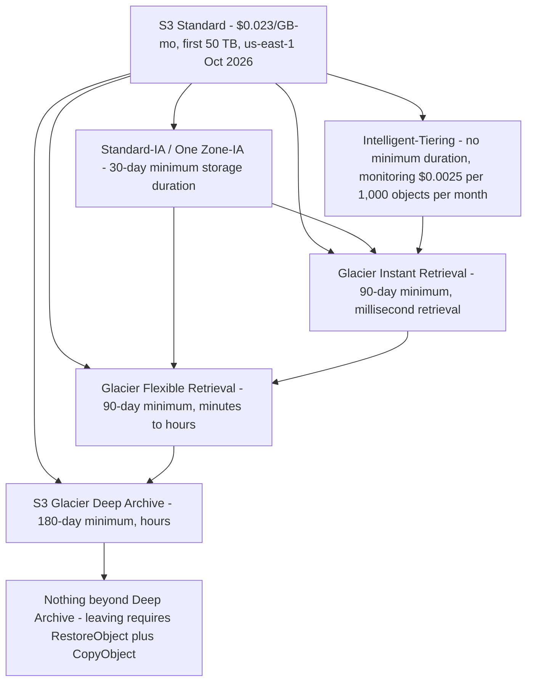
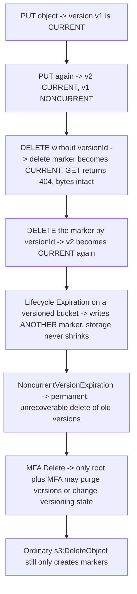
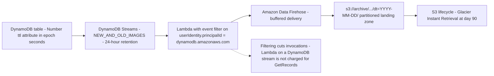
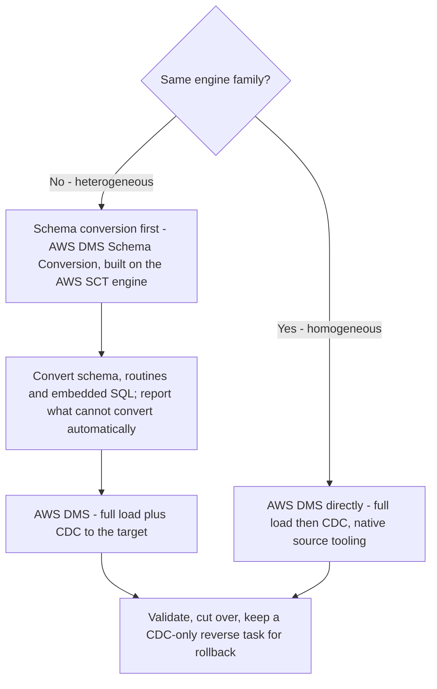
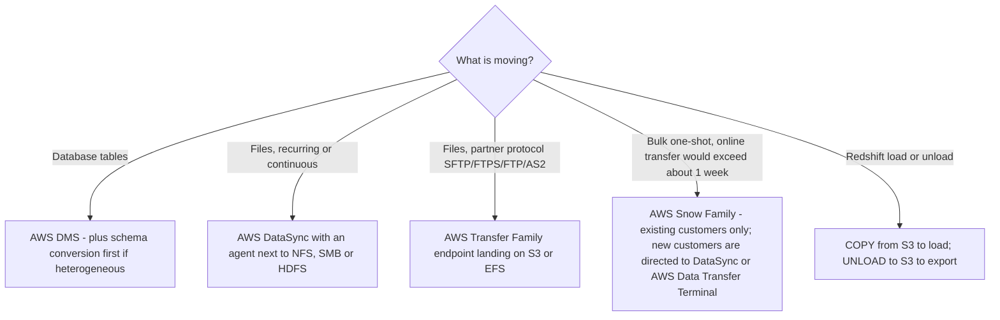
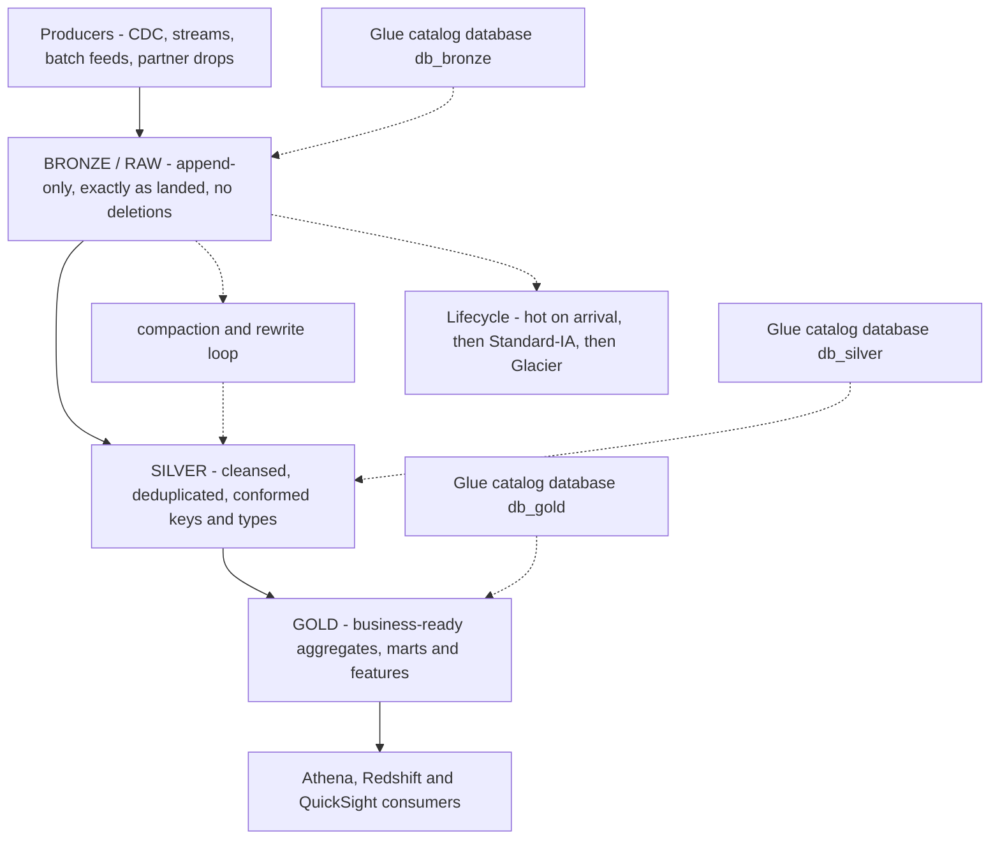

# Data Lifecycle, Migration and Lake Organization

**Task 2.3, "Manage the lifecycle of data,"** is where a data engineer stops being a builder and becomes a steward. The task's knowledge list is deliberately unglamorous — hot and cold storage solutions, cost optimisation across the lifecycle, deletion driven by business and legal requirements, retention policies and archiving strategies, resiliency protection — and its skills are concrete: perform load and unload operations between Amazon S3 and Amazon Redshift, manage S3 Lifecycle policies to change the storage tier, expire data based on age, and manage S3 versioning and DynamoDB TTL. The exam therefore rewards one habit above all others: **know exactly what happens to a specific object, on a specific day, at a specific price.**

```text
====================================================================
 DEA-C01 DOMAIN 2 - TASK 2.3 "MANAGE THE LIFECYCLE OF DATA"
====================================================================
 S3 Lifecycle ... rule = ID + Status + Filter + ACTIONS
                   Transition | Expiration | NoncurrentVersion*
                   | AbortIncompleteMultipartUpload
                   | ExpiredObjectDeleteMarker
                 ... 1,000 rules per bucket (fixed, Oct 2026)
                 ... evaluated daily; ONE action per object per
                     day; collisions -> LEAST COSTLY action
 Transitions .... one-way waterfall; 30-day IA age gate REMOVED
                     2026-07-16; min DURATIONS 30/90/180 d stay
                 ... objects < 128 KB do not transition by default
 Versioning ..... DELETE inserts a marker (GET 404, data intact)
                 ... MFA Delete: root only, CLI/REST only
                 ... replication needs versioning on BOTH buckets
 Object Lock .... WORM; versioning implied; Compliance is absolute
 DynamoDB TTL .... Number attribute, Unix epoch SECONDS, free,
                     deletes "within two days" (up to 48 h)
                 ... TTL + Streams -> Lambda -> Firehose -> S3
 Archives ....... Glacier Instant (ms) | Flexible (min-h) |
                     Deep Archive (h, no Expedited)
 Migration ...... DMS (homogeneous / heterogeneous + conversion)
                     Snow Family | DataSync | Transfer Family
                 ... Redshift COPY in / UNLOAD out
 Lake ........... bronze (raw) -> silver -> gold, cataloged per
                     zone, <= 1,000 files per partition
====================================================================
```

In this lesson you will:

- read an **S3 Lifecycle rule** as AWS defines it — `ID`, `Status`, `Filter`, and the five action types — including the evaluation quirks that decide which action actually runs;
- walk the **one-way transition waterfall** and separate the **minimum transition age** (removed for the IA classes on 16 July 2026) from the **minimum storage duration** (30 / 90 / 180 days, unchanged);
- apply the **128 KB default floor**, the **chained-transition arithmetic** and the **tag, prefix and size filters**;
- compute lifecycle money: **transition request fees, Standard versus IA break-even, the minimum-duration cliff, and a one-year class comparison** (as of Oct 2026);
- separate **expiration, noncurrent-version expiration, multipart-upload abort and delete-marker cleanup**, and explain why `Expiration` alone never shrinks a versioned bucket;
- operate **versioning, delete markers and MFA Delete**, and name the **replication prerequisites** for CRR and SRR;
- apply **S3 Object Lock** modes (Compliance, Governance, legal hold) as a lifecycle constraint;
- configure **DynamoDB TTL** — epoch seconds, deletion lag, capacity behaviour — and build the **TTL plus Streams archival pipeline**;
- choose a **Glacier class by retrieval SLA**, not by price alone;
- pick the right **migration tool**: AWS DMS with schema conversion (homogeneous versus heterogeneous), Snow Family, AWS DataSync and AWS Transfer Family;
- perform **Redshift load and unload** operations the way Task 2.3's first skill demands;
- design **medallion bronze, silver and gold zones**, fix the **small-files problem** with compaction, and **catalog each zone separately**;
- study **four AWS customer case studies** (Nasdaq, EOS Group, FINRA and BMW Group) and a **sourced October 2026 update box**;
- practise with **14 exam-style questions** plus four interactive checks.

---

## 1. S3 Lifecycle: how a rule is actually built

### 1.1 One configuration per bucket, 1,000 rules

Each S3 bucket carries **one** lifecycle configuration containing **up to 1,000 rules** (a fixed quota, as of Oct 2026). A rule is a small object:

| Element | Constraint | Exam relevance |
|---|---|---|
| `ID` | up to 255 characters, unique within the configuration | Human handle for support and audits |
| `Status` | `Enabled` or `Disabled` | A disabled rule still exists — it just does nothing |
| `Filter` | prefix, object tags, size (`ObjectSizeGreaterThan` / `ObjectSizeLessThan`), combined with `AND` / `OR` | Lives **inside** `Filter`, never as a top-level `Prefix` key in current configurations |
| Actions | the five action types below | Only the actions listed fire; everything else is ignored |

### 1.2 The five action types

| Action | What it does | The trap attached to it |
|---|---|---|
| **`Transition`** | Moves the **current** version to another storage class after `Days` (age from creation) or on a `Date` | Glacier billing starts the day the rule is satisfied, **even before the physical move** — Intelligent-Tiering is the sole exception |
| **`Expiration`** | Ends the life of the **current** version | In a versioned bucket it only **adds a delete marker**; it never touches noncurrent versions |
| **`NoncurrentVersionTransition` / `NoncurrentVersionExpiration`** | Applies once **both** `NoncurrentDays` **and** `NewerNoncurrentVersions` (1–100) are exceeded | Expiration here is a **permanent, unrecoverable delete** |
| **`AbortIncompleteMultipartUpload`** | Aborts after `DaysAfterInitiation`, deleting all uploaded parts | The **only** action that cleans up incomplete multipart uploads; it carries **no early-delete fee** and its rule **cannot use a tag filter** |
| **`ExpiredObjectDeleteMarker`** | Removes a delete marker that has **no versions behind it** | Cannot be combined with `Days` in the same `Expiration` |

### 1.3 Filters: prefix, tags and size

A rule's `Filter` scopes which objects it may touch. Prefix narrows to a path, tags narrow to objects carrying a key/value pair (for example `tier=hot`), and size predicates narrow to objects above or below a byte threshold. Two rules for one bucket are common and legitimate — a broad transition rule plus a narrow tag-driven rule — but remember that **filters are evaluated against the object at execution time**: removing a tag from an object *usually* stops a tag-scoped action from applying to it, though AWS documents that this is not guaranteed, so a tag-driven lifecycle should never be your only safety control.

> [!IMPORTANT]
> **A lifecycle rule is a policy, not a script.** Rules apply to objects that already exist **and** objects created later, they are evaluated **once per day**, an object is eligible for **only one lifecycle action per day**, and when several matching rules compete, **Amazon S3 applies the least costly action** (AWS S3 Lifecycle documentation, accessed Oct 2026). That last sentence is why "I wrote two rules and both fired" is never a valid complaint — S3 will not double-charge you to satisfy your design.

```fillblank
{
  "question": "Complete the S3 Lifecycle and DynamoDB TTL statements using AWS's own vocabulary:",
  "template": "A lifecycle configuration holds at most {{1}} rules per bucket. An object is eligible for only {{2}} lifecycle action per day, and when multiple rules match, Amazon S3 applies the {{3}} action. Expiration inside a versioned bucket adds a {{4}}, while NoncurrentVersionExpiration performs a {{5}} delete. DynamoDB TTL stores its expiry in a Number attribute holding Unix time in {{6}}, and expired items are typically deleted within {{7}} days.",
  "answers": {
    "1": "1,000",
    "2": "one",
    "3": "least costly",
    "4": "delete marker",
    "5": "permanent",
    "6": "seconds",
    "7": "two"
  },
  "distractors": ["100", "10,000", "two", "oldest", "cheapest", "fastest", "temporary", "soft", "milliseconds", "minutes", "hours", "seven", "thirty"],
  "explanation": "The rule cap is 1,000 per bucket; evaluation is daily with one action per object per day and the least costly action winning collisions; Expiration on a versioned bucket only writes a delete marker, so storage keeps growing until NoncurrentVersionExpiration exists; NoncurrentVersionExpiration is permanent; TTL uses a Number attribute in Unix epoch SECONDS - a millisecond value is silently ignored - and AWS states expired items are typically deleted within two days."
}
```

- **📚 Did you know?** Two lifecycle actions are routinely confused because both "remove" things: **`AbortIncompleteMultipartUpload`** is the *only* mechanism that cleans up incomplete multipart uploads — plain object expiration does not touch them (AWS: *"Object expiration lifecycle configurations don't remove incomplete multipart uploads"*) — while **`ExpiredObjectDeleteMarker`** does the opposite job: it deletes a *marker* that is hiding nothing, so the previous version becomes current again. One frees abandoned bytes, the other un-hides data you still own (AWS S3 Lifecycle documentation, accessed Oct 2026).

---

## 2. Transitions: the waterfall and the age gates

### 2.1 The one-way waterfall

Storage classes are a downhill slope. Objects may move to a class downhill of their current class, never back up the ladder in place:



Two structural rules follow from that diagram: **`Glacier Flexible Retrieval` can only be re-classed to `Deep Archive`**, and **`Deep Archive` has no outbound transition at all** — escaping it means restoring the object and copying it somewhere else, which is a restore operation plus new storage, not a transition. Pending or failed replication status also blocks transitions in versioned buckets, so a broken replication rule quietly freezes your tiering plan.

### 2.2 Transition age versus minimum storage duration — the 16 July 2026 change

These are two different numbers and the exam tests the difference:

| Concept | What it is | Status as of Oct 2026 |
|---|---|---|
| **Minimum transition age** into Standard-IA / One Zone-IA | The shortest time an object must sit in Standard before a rule may move it | **Removed on 16 July 2026** — *"You can now transition objects to S3 Standard-Infrequent Access … as soon as the day they are created, without the previous 30-day minimum retention"*; a `Days: 0` transition is legal |
| **Minimum storage duration** | The number of days you must **pay for** once an object lands in a class | **Unchanged**: **30 days** (Standard-IA, One Zone-IA), **90 days** (Glacier Instant, Glacier Flexible), **180 days** (Deep Archive) |

The trap is that removing the *eligibility gate* did nothing to the *billing floor*. An object transitioned to Standard-IA on day 0 and deleted on day 7 still bills **30 days** of Standard-IA, because the minimum storage duration is a charge, not a rule. A study note that still tells you "you must wait 30 days before transitioning to IA" is stale; a study note that tells you "leaving IA early is free" has always been wrong.

### 2.3 The 128 KB floor

Since **September 2024**, objects smaller than **128 KB are not transitioned by default** — an object under 128 KB configured with a plain `Days`-based transition will simply stay in Standard unless you opt in with an `ObjectSizeGreaterThan` filter or the `x-amz-transition-default-minimum-object-size` bucket-level setting. Legacy configurations created before that change keep the old behaviour until they are edited. And the floor cuts twice: those small objects also **bill at the 128 KB floor** in the IA and Glacier Instant classes, so a bucket full of 20 KB JSON files pays more per object than its byte count suggests (AWS S3 Lifecycle transition considerations, accessed Oct 2026).

### 2.4 Chained transitions must respect the minimum durations — Worked example E5

A single rule that hops through two classes has to leave each class only after that class's minimum duration has run. AWS's own example states that you cannot specify a rule transitioning objects to **Glacier Instant Retrieval after 4 days** and then to **Deep Archive after 20 days** — the second hop must be **after at least 94 days**:

```text
Rule attempt              First hop          Second hop         Verdict
[{Days:4,  GLACIER_IR},   leaves GIR at      leaves at day 24,  ILLEGAL
 {Days:24, DEEP_ARCHIVE}] day 4 (min 90 d)  only 20 days later

Legally equivalent        First hop          Second hop         Verdict
[{Days:4,  GLACIER_IR},   leaves GIR at      leaves at day 94,  LEGAL
 {Days:94, DEEP_ARCHIVE}] day 4             90 days later
                                             4 + 90 = 94
```

Two *separate* rules can express the same intent (S3 will not reject them), but you then pay each class's minimum-duration charge anyway — the constraint moves from "rejected at configuration time" to "charged at billing time".

---

## 3. Expiration: what "delete" means, by versioning state

### 3.1 The same action, three different outcomes

| Bucket versioning state | `Expiration` on the current version | What the object's bytes do |
|---|---|---|
| **Disabled (nonversioned)** | Object is **permanently removed** | Gone |
| **Enabled** | A **delete marker** is added; the previous version becomes noncurrent | **Still stored and still billed** |
| **Suspended** | A marker with version ID `null` is added; a current version whose ID is `null` is permanently deleted | Depends on which version you hit |

### 3.2 Noncurrent versions: `NoncurrentDays` plus `NewerNoncurrentVersions`

`NoncurrentVersionExpiration` fires only when **both** conditions are exceeded: the noncurrent version is older than `NoncurrentDays` **and** it is beyond the newest `NewerNoncurrentVersions` versions you choose to retain (1–100). This is the difference between a bucket with an audit trail and a bucket with an ever-growing bill: `NewerNoncurrentVersions: 5` with `NoncurrentDays: 30` means "keep the five most recent noncurrent versions for at least 30 days each, then purge them permanently".

> [!WARNING]
> **⚠️ The versioned-bucket cost trap.** `Expiration` in a versioned bucket **only writes delete markers**, so storage grows monotonically no matter how aggressively you expire. Reproducibility and cost pull in opposite directions, and the reconciling object is `NoncurrentVersionExpiration`. If a question describes a bucket where "every object is expired daily yet the bill keeps rising", the missing rule is noncurrent-version expiration — not more aggressive `Expiration`.

### 3.3 The canonical rule pair

```json
{ "Rules": [
  { "ID": "tier-down", "Status": "Enabled",
    "Filter": { "And": { "Prefix": "events/", "Tags": [{ "Key": "tier", "Value": "hot" }] } },
    "Transitions": [
      { "Days": 0,   "StorageClass": "STANDARD_IA" },
      { "Days": 90,  "StorageClass": "GLACIER_IR" },
      { "Days": 365, "StorageClass": "DEEP_ARCHIVE" } ],
    "NoncurrentVersionTransitions": [
      { "NoncurrentDays": 30, "StorageClass": "STANDARD_IA" } ],
    "NoncurrentVersionExpiration": { "NoncurrentDays": 30, "NewerNoncurrentVersions": 5 },
    "Expiration": { "Days": 2555 } },
  { "ID": "abort-mpu", "Status": "Enabled", "Filter": { "Prefix": "" },
    "AbortIncompleteMultipartUpload": { "DaysAfterInitiation": 7 } } ] }
```

Reading it back is the skill being tested: `tier=hot` objects under `events/` enter Standard-IA **immediately** (`Days: 0`, legal since 16 July 2026), Glacier Instant at day 90, Deep Archive at day 365, the current version expires at day 2555 (about seven years), noncurrent versions move to IA after 30 days and are purged once older than 30 days **and** beyond the newest five, and incomplete multipart uploads are aborted after seven days. The abort rule carries **no tag filter** — that is why it sits in its own rule with an empty prefix filter rather than inside `tier-down`.

---

## 4. Lifecycle cost math: four worked examples

All prices below are **Amazon S3 list prices for us-east-1, as of Oct 2026** — always re-check `aws.amazon.com/s3/pricing/` for your Region before you rely on a figure.

### 4.1 The price table you build the answers from

| Class | $/GB-month | Minimum duration | Minimum billable size | Retrieval $/GB | Transition requests $/1,000 |
|---|---|---|---|---|---|
| Standard (first 50 TB) | **$0.023** | — | — | free | — |
| Intelligent-Tiering (Frequent) | **$0.023** | **none** | 128 KB auto-tier | free | $0.01 |
| Standard-IA | **$0.0125** | **30 d** | **128 KB** | $0.01 | $0.01 |
| One Zone-IA | **$0.01** | **30 d** | **128 KB** | $0.01 | $0.01 |
| Glacier Instant Retrieval | **$0.004** | **90 d** | **128 KB** | $0.03 | $0.02 |
| Glacier Flexible Retrieval | **$0.0036** | **90 d** | 40 KB overhead | $0.01 (Standard) | $0.03 |
| S3 Glacier Deep Archive | **$0.00099** | **180 d** | 40 KB overhead | $0.02 (Standard) | **$0.05** |

Other request facts from the same page: `PUT` **$0.005 per 1,000** (Standard tier), `GET` **$0.0004 per 1,000**, **DELETE is free**, Intelligent-Tiering monitoring is **$0.0025 per 1,000 objects per month**, archives carry a **40 KB per-object overhead** (8 KB at the Standard rate plus 32 KB at the archive rate), and leaving a class before its minimum duration bills the **normal charge plus the pro-rated remainder**.

### 4.2 Worked example E1 — transition request fees at scale

You tier **1,000,000 objects** in one nightly run. At $0.01 per 1,000 requests the fee looks trivial until you multiply:

```text
Transition target          rate / 1,000     1,000,000 objects
S3 Standard-IA                 $0.01        1,000,000 / 1,000 x 0.01  =  $10.00
S3 Glacier Instant             $0.02        same                       =  $20.00
S3 Glacier Flexible            $0.03        same                       =  $30.00
S3 Glacier Deep Archive        $0.05        same                       =  $50.00
```

The lesson is not the dollars, it is the **double hit on small objects**: if those 1,000,000 objects are 20 KB each, the transition fee applies to all of them **and** each one then bills at the **128 KB** floor in the destination class — 6.4x its real size, 20,000,000 KB billed instead of 3,125,000 KB.

### 4.3 Worked example E2 — Standard versus Standard-IA break-even

At what age does living in Standard-IA cost the same as living in Standard? Set the two charges equal for one GB held for L days:

```text
Standard     : $0.023  x L/30
Standard-IA  : $0.0125 x 30/30   (one full month, its minimum duration)

$0.023 x L/30 = $0.0125   ->   L = 0.0125 x 30 / 0.023 = 16.3 days
One Zone-IA equivalent      ->   L = 0.0100 x 30 / 0.023 = 13.0 days
```

So an object expected to live **longer than about 16 days** is cheaper in Standard-IA before any retrieval is considered; **shorter than about 16 days** it should stay in Standard, or use Intelligent-Tiering, which has **no minimum duration** and charges no retrieval fee. Retrieval flips the arithmetic again: Standard-IA charges **$0.01/GB** to read, so an object read 20 times a month will never win on storage alone. (Derived arithmetic from AWS S3 list prices, us-east-1, as of Oct 2026.)

### 4.4 Worked example E3 — the minimum-duration cliff

One terabyte (treated here as 100,000 GB for arithmetic) transitions to Standard-IA on **day 0** and is deleted on **day 7**:

```text
Standard-IA billed : 30-day minimum   ->  100,000 x $0.0125        = $1,250.00
Same 7 days in Standard                ->  100,000 x $0.023 x 7/30  =   $536.67
Ratio                                      $1,250.00 / $536.67      =     2.3 x
```

And the cliff does not soften with time: deleted on **day 1** instead of day 7, the Standard-IA bill is **identical** ($1,250.00) while one day of Standard costs **$76.67** — a **16x** difference. The minimum storage duration is a fixed floor, not a pro-rated subscription: *the day you transition sets the bill, not the day you leave.* (Arithmetic derived from AWS S3 list prices, us-east-1, as of Oct 2026 — not published by AWS.)

### 4.5 Worked example E4 — ten terabytes, one year, five classes

```text
10 TB = 10,000 GB held for 12 months (storage only, us-east-1, Oct 2026)

S3 Standard             10,000 x $0.023    x 12 =  $276.00
S3 Standard-IA          10,000 x $0.0125   x 12 =  $150.00
S3 One Zone-IA          10,000 x $0.0100   x 12 =  $120.00
Glacier Instant         10,000 x $0.004    x 12 =   $48.00
Glacier Flexible        10,000 x $0.0036   x 12 =   $43.20  (+ restore fees)
S3 Glacier Deep Archive 10,000 x $0.00099  x 12 =   $11.88  (+ restore fees)
```

Scale the last line to **100 TB**: Standard is **$27,600 per year** against Deep Archive's **$1,188 per year** — a **23x** spread that is the entire economic argument for lifecycle policies. What the table hides is equally examinable: Flexible and Deep Archive add **restore fees plus a temporary S3 Standard copy** while you read, and every hop above adds a transition request charge.

```plot
{
  "type": "bar",
  "title": "One-year storage cost for 10 TB (us-east-1 list prices, as of Oct 2026)",
  "data": [
    {"Storage class": "S3 Standard", "USD per year": 276.00},
    {"Storage class": "Standard-IA", "USD per year": 150.00},
    {"Storage class": "One Zone-IA", "USD per year": 120.00},
    {"Storage class": "Glacier Instant", "USD per year": 48.00},
    {"Storage class": "Glacier Flexible", "USD per year": 43.20},
    {"Storage class": "Deep Archive", "USD per year": 11.88}
  ],
  "xKey": "Storage class",
  "yKey": "USD per year",
  "xLabel": "Storage class",
  "yLabel": "USD for one year of 10 TB (storage only)"
}
```

Hover any bar to read the number from Worked example E4: the same 10 TB held twelve months costs **$276.00** in Standard and **$11.88** in Deep Archive — storage-only arithmetic that deliberately excludes restore fees, transition request charges and the minimum-duration cliffs, all of which the exam can add back on top.

- **📚 Did you know?** AWS's own 20-year S3 retrospective (13 March 2026) reports that customers have saved **more than $6 billion** in storage costs by using **S3 Intelligent-Tiering** instead of S3 Standard, and puts the headline storage price at **slightly over 2 cents per gigabyte**, roughly **85% below** the 2006 launch price of 15 cents (as of Oct 2026 — verify current pricing before use). Intelligent-Tiering's own economics are subtle: it has **no minimum duration and no retrieval fee**, but it charges **$0.0025 per 1,000 objects per month** to monitor them — for 10 million small objects that monitoring line alone is **$25 per month**, which is why size filters and lifecycle rules still beat automatic tiering on object-heavy buckets.

---

## 5. Versioning, delete markers and MFA Delete

### 5.1 What actually happens on each API call

Every `PUT` assigns a unique **version ID**; the bucket holds one **current** version plus any number of **noncurrent** versions. A `DELETE` without a `versionId` **inserts a delete marker**, making the previous version noncurrent: `GET` returns **404** while the bytes are fully intact and still billed. Permanent removal requires `DELETE ?versionId=...`, and deleting the marker itself restores the prior version.



### 5.2 MFA Delete

| Property | Rule |
|---|---|
| What it protects | **Permanent deletion of a version** and **changes to the versioning state** |
| Who can enable or disable it | **Only the root user** (versioning itself may be toggled by any authorized principal) |
| Which interface | **CLI / REST only — the console does not support it** (`put-bucket-versioning ... --mfa "SERIAL CODE"`, `x-amz-mfa` sent over **HTTPS**) |
| What it does *not* block | Ordinary `s3:DeleteObject`, which merely creates markers |

The net effect is the point of the feature: with MFA Delete on, an attacker holding normal delete permissions can hide data but cannot destroy it, and only an MFA-authenticated root can purge versions or suspend versioning.

- **📚 Did you know?** MFA Delete and versioning answer different questions and are often conflated: **versioning is a storage behaviour** (keep every version), **MFA Delete is a destruction control** (make destruction expensive). You can run versioning for years without MFA Delete, and enabling MFA Delete does not change what a `DELETE` does — it changes who may make that delete *permanent* (AWS S3 Versioning and MFA Delete documentation, accessed Oct 2026).

---

## 6. Replication: CRR and SRR prerequisites

**Replication copies objects between buckets; lifecycle rules move objects inside one bucket.** Keeping those two mechanisms apart is half of Domain 2's lifecycle questions.

| Requirement | Detail |
|---|---|
| **Versioning** | **Must be enabled on both the source and the destination bucket** — this is the single most-tested prerequisite |
| **Permissions** | An **IAM role**: `s3:GetObjectVersionForReplication`, `s3:GetObjectVersionAcl`, `s3:GetObjectVersionTagging` on the source, plus `s3:ReplicateObject`, `s3:ReplicateDelete`, `s3:ReplicateTags` on the destination |
| **Rules** | 1–1,000 replication rules per bucket, filtered by prefix and/or tags |
| **Disabling destination versioning** | Replication status becomes **`FAILED`** — not "partial", not "delayed" |
| **Pre-existing objects** | Replication is **not retroactive** — backfill with **S3 Batch Replication** |
| **Options** | Replica storage class, replica ownership, delete-marker replication, multiple destinations |
| **CRR vs SRR** | **Cross-Region Replication** incurs inter-Region data-transfer cost; **Same-Region Replication** does not |

**S3 Replication Time Control (RTC)** carries an SLA: **99.99% of new objects replicated within 15 minutes**. Without RTC, replication is best-effort with no SLA (AWS documents 24–48 hours as the general expectation). RTC is the answer whenever a question names a *replication deadline*; "eventually" is not a service level.

---

## 7. S3 Object Lock: retention that lifecycle cannot override

Object Lock is a **feature of the in-scope Amazon S3 service** — it is not a separate entry on the DEA-C01 in-scope list, and no task statement names WORM explicitly, so treat it as fair game precisely because S3 itself is in scope. It must be **enabled at bucket creation**, and enabling it **implies versioning**.

| Mode | Who can override | Notes |
|---|---|---|
| **Compliance** | **Nobody — including the root user** | The mode cannot be changed and retention cannot be shortened or deleted during the term; the only escape is deleting the AWS account |
| **Governance** | Principals holding `s3:BypassGovernanceRetention` **and** sending the header `x-amz-bypass-governance-retention:true` | The everyday mode for internal retention with an audit trail |
| **Legal hold** | Anyone with `s3:PutObjectLegalHold` | No expiry date; independent of the retention period |

Retention attaches to **object versions**; **delete markers are never WORM-protected**; a bucket policy can raise the maximum retention to **100 years**; and a lifecycle `Expiration` **cannot delete a version under retention or legal hold** — which is exactly why regulated archives combine Object Lock with lifecycle tiering rather than choosing one. The named regulatory hooks are SEC 17a-4, FINRA 4511 and CFTC 1.31.

---

## 8. DynamoDB TTL: epoch seconds, deletion lag, and the archival pipeline

### 8.1 The attribute contract

TTL is enabled per table and reads **one attribute** — its name is **case-sensitive** — whose value must be a **Number** holding **Unix time in seconds**:

| Rule | Value |
|---|---|
| Attribute type | **Number** (a String is ignored) |
| Unit | **Epoch seconds** — `1724241326000` (milliseconds) is ignored |
| Name matching | Case-sensitive: `expireAt` and `ExpireAt` are different attributes |
| Maximum past tolerance | An expiry more than **5 years in the past** is ignored; there is no minimum future window |
| Deletion cost | **Free** — TTL consumes no write capacity |
| Enable or change propagation | About **1 hour** (extra `UpdateTimeToLive` calls then raise `ValidationException`); after disabling, processing continues roughly **30 minutes** |
| Observability | `TimeToLiveDeletedItemCount` updates about **every minute** |

### 8.2 Deletion lag: "within two days"

AWS's API reference states that DynamoDB *"typically deletes expired items within two days"*, and warns that *"items that have expired and not been deleted will still show up in reads, queries, and scans"* (as of Oct 2026). Three consequences follow:

1. **TTL is not a compliance delete.** If a regulation demands instant erasure, TTL alone does not satisfy it.
2. **Reads must filter.** Add `FilterExpression: "ttl > :now"` or guard writes with a `ConditionExpression` until the deletion lands.
3. **Storage keeps billing** for up to 48 hours after nominal expiry.

### 8.3 Worked example E6 — turning a retention policy into an epoch

A device registers at `1770000000` (epoch seconds) and the policy says "delete 90 days after creation":

```text
retention      = 90 days = 90 x 86,400 = 7,776,000 seconds
ttl attribute  = 1770000000 + 7776000  = 1777776000   <- Number, SECONDS

Wrong form A   = "2026-11-12T00:00:00Z"  -> String, IGNORED
Wrong form B   = 1777776000000           -> milliseconds, IGNORED
Wrong form C   = ttl = now                -> expires immediately, no lag benefit

Safety filter  = FilterExpression "ttl > :now" hides items that have
                 expired but are still inside the 48-hour deletion window
```

The exam's classic distractor is a millisecond timestamp: it parses as a Number, so nothing errors — the item is simply never deleted, silently. The same silent failure applies to a mistyped attribute name, because the lookup is case-sensitive.

### 8.4 TTL plus Streams: the archival pipeline

TTL deletions are observable before they are complete, which is what makes the archive pattern work:



Because TTL deletions are performed by the service, the stream records carry `userIdentity.type = "Service"` and `principalId = "dynamodb.amazonaws.com"`; an event-source filter on that identity drops everything else. AWS's guidance shows the practical effect: filtering can cut Lambda invocations from roughly **2 million modifications per hour to 100,000 per hour**, and **Lambda processing a DynamoDB stream is not charged for `GetRecords`**. Two constraints matter for exams: TTL deletions are identifiable **only in the Region where they occurred**, and **Streams retain 24 hours** — so a broken consumer must be repaired inside a day, not a week. Dashboards built on this pattern must tolerate **up to 48 hours** of post-expiry visibility.

- **📚 Did you know?** The archive pattern exists because TTL gives you *cheap deletion* but no *durable copy*: the item leaves DynamoDB for free, but if nobody captured the stream record first, seven years of history are simply gone. Capturing the deletion event (or the item's final image) into S3 before the two-day window closes, then applying an S3 lifecycle rule to tier it, turns a purge into an archive — and the Lambda invocation cost is the only new line on the bill (AWS DynamoDB TTL with DynamoDB Streams guidance, accessed Oct 2026).

---

## 9. Archive selection: choose by retrieval SLA, not by price

| Class | Minimum duration | Intended access | Retrieval time | Restore mechanics |
|---|---|---|---|---|
| **Glacier Instant Retrieval** | **90 days** | Once per quarter | **Milliseconds** — a normal `GET` | None; 128 KB minimum billable size |
| **Glacier Flexible Retrieval** | **90 days** | 1–2 times a year | Expedited **1–5 min** · Standard **3–5 h** · Bulk **5–12 h (free)** | Requires `RestoreObject`; 40 KB object overhead |
| **S3 Glacier Deep Archive** | **180 days** | Less than once a year | Standard **≤12 h** · Bulk **≤48 h** · **no Expedited** | Requires `RestoreObject`; 40 KB overhead |

Restoring costs the **archive retrieval rate plus a temporary S3 Standard copy** while the restored copy exists — an archive is cheap to hold and deliberately expensive to read. AWS documents restore throughput of roughly **1–2 PB per day per account**. S3 Intelligent-Tiering offers an adjacent path: Standard and Bulk retrievals from its Archive Access tier (after **90 days** without access) and Deep Archive Access tier (after **180 days**) are free.

### 9.1 Worked example E7 — minimum durations when you leave early

```text
-> Glacier Instant on day 90, deleted on day 150
   time held  = 60 days   <   90-day minimum
   billed     = 90 days at $0.004/GB-mo  ->  a 30-day remainder is charged

-> Deep Archive on day 0, deleted on day 100
   time held  = 100 days  <   180-day minimum
   billed     = 180 days at $0.00099/GB-mo -> an 80-day remainder is charged
```

Early deletion (and early overwrite) before the minimum duration bills the **normal charge plus the pro-rated remainder** — the same clause that makes the Standard-IA cliff in Example E3 work. And remember the escape hatch: **Deep Archive is one-way inside the lifecycle waterfall**; getting an object back to Standard requires `RestoreObject` and then `CopyObject`.

---

## 10. Migration tooling I: AWS DMS and schema conversion

### 10.1 Homogeneous versus heterogeneous

**AWS Database Migration Service** moves databases, nothing else. Its two shapes are the exam's first fork:

| Situation | Path | Example |
|---|---|---|
| **Homogeneous** — same engine family | **DMS alone**, using the source engine's native tooling for full load | On-premises PostgreSQL → Amazon RDS PostgreSQL |
| **Heterogeneous** — different engines | **Convert the schema and code first, then move the data with DMS** | Oracle → Aurora PostgreSQL; SQL Server, Db2, SAP ASE → Aurora PostgreSQL |

Two DMS features decide whether conversion is even needed: **change data capture (CDC)** reads the source's native transaction logs (so no application changes are required for ongoing sync), and **schema conversion** rewrites DDL, stored procedures, functions and embedded SQL for the target engine.

### 10.2 Task types and the operational caveats

| Task type | Use |
|---|---|
| **Full load** | One-time copy; the target is written in bulk |
| **Full load + CDC** | Migrate with minimal downtime — and note it **deletes existing objects on the target**: back up first |
| **CDC only** | Ongoing replication after a full load, including reverse and rollback tasks |

Caveats worth memorising: DMS runs on a **replication instance** (Multi-AZ optional) or as **DMS Serverless**; AWS states plainly that *"AWS DMS CDC does not provide real-time replication … There are no SLAs for CDC latency"* — so a question promising "instant, guaranteed replication" via CDC is wrong.

### 10.3 The heterogeneous flow



### 10.4 The SCT status question (exam guide v1.1)

The downloadable **AWS Schema Conversion Tool** scanned application code for embedded SQL and supported more engines than its managed successor. As of **exam guide v1.1 (12 December 2025)**, however, **AWS SCT was removed from the DEA-C01 in-scope service list** — the managed **DMS Schema Conversion** (web-based, built on the SCT engine) is what the guide now points at. Practical rule for exam day: "SCT" may still appear as **legacy vocabulary** inside a conversion narrative, but it can no longer be the *named in-scope service* you are asked to select; prefer **AWS DMS** and **DMS Schema Conversion** (exam guide revisions page, accessed Oct 2026).

- **📚 Did you know?** A multi-month DMS CDC window is a *compute bill*, not just an architecture choice: since **2 December 2025**, **AWS Database Savings Plans** cover **Aurora, RDS, DynamoDB, ElastiCache, DocumentDB, Neptune, Keyspaces, Timestream and AWS DMS** at discounts of **up to 35%** (AWS Database Savings Plans announcement, 2 Dec 2025; accessed Oct 2026). So when a case study like EOS Group's reports a **50% infrastructure reduction**, part of that story is the migration *mechanism* (DMS → S3 → Redshift) and part is the *commercial* lever on the databases that remain — a Domain 2 question about "minimising the cost of a long-running replication" can legitimately be answered with a commitment discount rather than an architecture change.

---

## 11. Migration tooling II: Snow Family, DataSync and Transfer Family

### 11.1 The three non-database movers

| Tool | Mode | Exam cue | Key numbers (as of Oct 2026) |
|---|---|---|---|
| **AWS DataSync** | **Online**, scheduled or continuous sync | Agent beside NFS, SMB or HDFS; about **10x** faster than open-source tooling; TLS, integrity verification, throttling, incremental transfers | The default answer for **recurring file movement** |
| **AWS Transfer Family** | Managed **SFTP / FTPS / FTP / AS2** endpoints over **S3 or EFS** | A **protocol endpoint**, not a bulk mover — partner and B2B exchange with a custom IdP | Named in task 2.1 ("integrating migration tools") |
| **AWS Snow Family** | **Offline** bulk transfer by physical device | **Snowball Edge Storage Optimized: 210 TB usable**; NFSv3/v4/v4.1 plus S3 adapter, encryption enforced, **NIST 800-88 erasure** on return | **Closed to new customers since 7 November 2025**; large-migration planners start at **>500 TB**; rule of thumb: online transfer **≥1 week → consider Snow** |

### 11.2 Worked example E8 — the one-week rule, calculated

Moving **600 TB** over a **1 Gbps** link, ignoring protocol overhead:

```text
600 TB  = 600 x 10^12 bytes   = 6.0 x 10^14 bytes
1 Gbps  = 1.25 x 10^8 bytes per second
time    = 6.0 x 10^14 / 1.25 x 10^8 = 4.8 x 10^6 seconds
        = 4,800,000 / 86,400        = 55.6 DAYS   (derived arithmetic)
```

Anything that will take **more than about a week** of sustained online transfer belongs in the offline conversation — for AWS customers who can still order devices that is the Snow Family, and the Snowball documentation banner directs **new** customers to **AWS DataSync**, **AWS Data Transfer Terminal** or AWS Partner solutions instead. For *recurring* movement (a nightly 2 TB NFS-to-S3 job over Direct Connect) the answer is always **DataSync**, and for *supplier file drops over SFTP* it is always **Transfer Family**.



```matching
{
  "question": "Match each migration scenario to the tool the DEA-C01 exam expects:",
  "pairs": [
    {"left": "Oracle 19c to Aurora PostgreSQL with minimal downtime", "right": "Schema conversion first, then AWS DMS full load plus CDC"},
    {"left": "On-premises PostgreSQL to Amazon RDS PostgreSQL", "right": "AWS DMS homogeneous migration - no conversion step"},
    {"left": "5 TB nightly NFS to S3 over Direct Connect", "right": "AWS DataSync with a scheduled agent"},
    {"left": "Suppliers push SFTP files into your S3 bucket", "right": "AWS Transfer Family managed SFTP endpoint on S3"},
    {"left": "400 TB at 200 Mbps with a six-month deadline", "right": "Offline bulk transfer - Snow Family for existing customers (over 1 week of online transfer)"},
    {"left": "Bulk-load 50 GB of CSV into Amazon Redshift", "right": "COPY from S3 - never many individual INSERT statements"},
    {"left": "Export a 10-million-row query result as Parquet", "right": "UNLOAD with FORMAT AS PARQUET and PARTITION BY"}
  ],
  "explanation": "The chooser runs on three questions: is it a database (DMS, plus conversion if the engine family differs), is it files that recur (DataSync), is it a partner protocol endpoint (Transfer Family) - with offline bulk as the fallback when sustained online transfer would exceed roughly a week, and Redshift's own COPY and UNLOAD for warehouse load and unload operations. Snow Family is closed to new customers as of 7 November 2025, so an option presenting it as the default for a first-time mover is stale."
}
```

---

## 12. Redshift load and unload: Task 2.3's first skill

Task 2.3's skill list opens with *"Performing load and unload operations between Amazon S3 and Amazon Redshift"*, and AWS is blunt about which direction is correct: *"We strongly recommend using the COPY command to load large amounts of data. Using individual INSERT statements … might be prohibitively slow."*

| Operation | Command | Behaviour |
|---|---|---|
| **Bulk load** | **`COPY`** from S3 | Massively parallel; choose a **file count near a multiple of the slice count**; keep files between **1 MB and 1 GB**; data must sit in the **same Region** as the cluster |
| **Row-by-row load** | `INSERT` | Much less efficient — correct only for tiny deltas, never for bulk |
| **Bulk export** | **`UNLOAD`** to S3 | Text, JSON or **Parquet** with **`PARTITION BY`** (Hive-style), **`MANIFEST`**, **`MAXFILESIZE`** (5 MB–6.2 GB, default **6.2 GB**), **`PARALLEL ON`**, **`ALLOWOVERWRITE`** |
| **Post-load maintenance** | `VACUUM` plus `ANALYZE` | Run after heavy DML to restore sorted order and refresh optimizer statistics |

AWS's own guidance for `UNLOAD` reports Parquet as *"up to 2x faster … 6x less storage"* than text — the same argument as the lake's format choice, arriving from the warehouse side. The pairing to remember: **`COPY` in, `UNLOAD` out**, both through S3, both Region-aware.

---

## 13. Data-lake organization: medallion zones, small files and cataloging

### 13.1 The three zones

A **medallion** layout gives each zone a different contract, and therefore a different lifecycle, storage class and catalog entry:



| Zone | Contract | Typical lifecycle | Catalog posture |
|---|---|---|---|
| **Bronze (raw)** | Append-only, reproducible source of truth, never edited in place | Hot on arrival → **Standard-IA → Glacier** as it ages | Its own database; schema-on-read, frequently partitioned by ingest date |
| **Silver** | Cleansed, deduplicated, conformed, one row per entity | Medium lifetime; tier only after downstream jobs are stable | Its own database; the zone most exposed to **small-file damage** |
| **Gold** | Business-ready aggregates and features, stable grain | Stays **hot**; small and heavily queried | Its own database; partitioned by the filters consumers actually use |

### 13.2 Catalog each zone separately

**`MSCK REPAIR TABLE` scans an entire prefix tree**, so registering bronze, silver and gold under one root with one repair statement risks mixing unrelated tables into a single catalog object. Catalog each zone in **its own Glue database** (or its own S3 Tables / Iceberg namespace) with its own `Location`, and prefer **`ALTER TABLE ADD PARTITION`** when you already know which partitions changed — the full-path scan is the expensive default, not the safe default.

### 13.3 Small files and the compaction loop

AWS's Athena guidance states the problem without hedging: *"datasets that consist of many small files result in poor overall query performance"*, and the target is **at most 1,000 files per partition**. An hourly Glue job writing 3 MB files produces **720 files per day per partition** — past the threshold before lunch.

**Fix order (do them in sequence, not in parallel):**

1. Make the **source write bigger files** (coalesce toward 256–512 MB).
2. Combine with **Glue ETL** (`coalesce` or `repartition`).
3. Reduce the number of **partition keys** — over-partitioning fragments data just as effectively as small writes do.

**Managed compaction (the Glue optimizer for Iceberg/Parquet)** fires when a table has **more than 100 files** with each file **below 75% of the target size**, where `write.target-file-size-bytes` defaults to **512 MB**; the same optimizer family also offers snapshot-retention and orphan-file optimizers. Layouts that are not Iceberg need a Glue/Spark rewrite (bin-packing or `repartition`). For formats, aim at **Parquet blocks around 128 MB** or **ORC stripes around 64 MB**, and push high-cardinality keys into **bucketing** rather than more partition levels.

### 13.4 Worked example E9 — what a bronze zone's lifecycle actually earns

A bronze zone holds **10 TB** of event data with this rule set (all prices us-east-1, as of Oct 2026): Standard for the first 30 days, Standard-IA for days 31–180, Glacier Instant for days 181–365, expiry at day 365. Approximating each window as a fraction of a year:

```text
Standard          10,000 GB x $0.023   x (30/365)  =   $18.90
Standard-IA       10,000 GB x $0.0125  x (150/365) =   $51.37
Glacier Instant   10,000 GB x $0.004   x (185/365) =   $20.27
                                                   ------------
TIERED one-year total                                =   $90.54
All year in S3 Standard  10,000 x $0.023 x 12        =  $276.00
Saving                                                =  $185.46  (67%)

plus transition requests: 10 TB of ~250 MB objects = 40,000 objects
  40,000 / 1,000 x ($0.01 + $0.02)                  =    $1.20
```

The transition fees are **$1.20 against a $185 saving** — the whole argument for lifecycle policies in one line: on object stores, **storage class dominates, request fees are rounding errors, and early-deletion minimums are the only real trap** (derived arithmetic from AWS S3 list prices, as of Oct 2026).

```dragdrop
{
  "question": "Order the medallion layout from the rawest data to the most business-ready, with the compaction loop in the right place:",
  "items": [
    "BRONZE (raw) - append-only, exactly as landed, cataloged in its own Glue database",
    "SILVER - cleansed, deduplicated, conformed - the zone most damaged by small files",
    "Compaction loop - Glue optimizer fires above 100 files each below 75% of the 512 MB target",
    "GOLD - business-ready aggregates and marts, stays hot, partitioned by consumer filters"
  ],
  "correctOrder": [
    "BRONZE (raw) - append-only, exactly as landed, cataloged in its own Glue database",
    "SILVER - cleansed, deduplicated, conformed - the zone most damaged by small files",
    "Compaction loop - Glue optimizer fires above 100 files each below 75% of the 512 MB target",
    "GOLD - business-ready aggregates and marts, stays hot, partitioned by consumer filters"
  ],
  "explanation": "Data flows raw to refined: bronze is the untouched landing zone, silver is where cleaning and conformance happen (and where hourly 3 MB writes create hundreds of files per partition), compaction runs against silver before consumers feel it, and gold is the stable business layer that should stay hot. Each zone gets its OWN catalog database because MSCK REPAIR TABLE scans the whole prefix tree and would otherwise merge tables across zones."
}
```

- **📚 Did you know?** Partitioning, bucketing and file size are three different eliminations and the exam keeps them apart: **partitions prune directories** (Hive-style `year=2026/month=10/`), **bucketing prunes hash buckets inside a partition** (the right home for high-cardinality keys), and **file size fixes the listing tax** — over-partitioning fragments data just as badly as writing tiny files, which is why AWS's guidance says to partition on **low-cardinality columns that queries actually filter**, usually time (AWS Athena partitioning and performance guidance, accessed Oct 2026).

### 2026 Updates (as of October 2026)

> [!NOTE]
> **What moved in this topic — every line checked against a primary AWS source in October 2026:**
> - **The 30-day minimum transition age into Standard-IA / One Zone-IA is gone.** Announced **16 July 2026**: *"You can now transition objects to S3 Standard-Infrequent Access … as soon as the day they are created, without the previous 30-day minimum retention."* A `Days: 0` transition is legal. The **minimum storage durations (30 / 90 / 180 days) did not change** — eligibility gate removed, billing floor intact (AWS What's New, 16 Jul 2026).
> - **Exam guide v1.1 (12 December 2025)** consolidated knowledge and skills into one skill list, added **8 skills and removed none**, and changed the in-scope list by **+6 / −3**: **AWS SCT was removed**, so schema-conversion questions now point at **DMS Schema Conversion**; **Amazon S3 Tables** and **Amazon Aurora** were added. Three services left the in-scope list but can still appear as distractors (exam guide revisions page, accessed Oct 2026).
> - **AWS Glue 6.0 (21 August 2026)** — **30% lower price**, Spark **4.1.1**, Python **3.13**, Iceberg **1.11.0** with **format v3** — is the runtime behind compaction and rewrite jobs; it removes **EMRFS** (S3A only) and **AWS SDK for Java v1**, so a job specification still referencing `fs.s3.consistent.*` or `com.amazonaws.services.*` will not run (AWS Glue 6.0 announcement and migration page, accessed Oct 2026).
> - **S3 Express One Zone price cut (10 April 2025)**: storage **−31%**, PUT **−55%**, GET **−85%**, upload and retrieval **−60%**, with availability expanding from 8 to **15 Regions by 17 September 2026** — relevant when a *hot* bronze or gold prefix needs single-digit-millisecond reads instead of tiering (AWS What's New, 10 Apr 2025 and 17 Sep 2026).
> - **Streaming straight into the lake**: **Kinesis Data Streams streaming tables → Iceberg on S3 Tables (28 August 2026)** and **general-purpose S3 delivery (29 August 2026)**, plus **MSK Express brokers → Iceberg streaming tables (30 July 2026)** — the raw zone can now land as Parquet with inline compaction instead of a batch landing step. **Amazon Data Firehose** has been the product's name since **9 February 2024**, but the DEA in-scope list still prints **Amazon Kinesis Data Firehose**; both names are valid (AWS What's New, 2026).
> - **S3 Tables grows up (28 July 2026)**: Amazon S3 Tables — added to the DEA-C01 in-scope list at exam guide v1.1 — gained the **Iceberg VARIANT type with format v3 support**, so semi-structured payloads can land in the bronze zone as typed Iceberg columns instead of raw JSON blobs; pair this with the **Glue 6.0** Iceberg **1.11.0 / format v3** runtime when a compaction or rewrite job must understand the same tables (AWS What's New, 28 Jul 2026; Glue 6.0 announcement, 21 Aug 2026).
> - **DMS gets a commercial lever (2 December 2025)**: **AWS Database Savings Plans** — discounts of **up to 35%** — cover Aurora, RDS, DynamoDB, ElastiCache, DocumentDB, Neptune, Keyspaces, Timestream **and AWS DMS**, so a long-running CDC replication task can now be brought under a commitment discount; no DMS *behaviour* changed, only its billing options (AWS Database Savings Plans announcement, 2 Dec 2025; accessed Oct 2026).
> - **DynamoDB durability controls moved too**: since **7 January 2025**, **point-in-time recovery** periods are configurable **1–35 days per table**, and since **11 August 2025** provisioned-to-on-demand throughput-mode switches are allowed **4 times per rolling 24 hours** (previously once) — relevant when TTL-archived tables also carry restore-point requirements (AWS What's New, 7 Jan 2025 and 11 Aug 2025).
> - **Stale-fact warning**: any study material asserting you must *wait 30 days* before an IA transition, that **AWS SCT** is the in-scope conversion tool, that **Snowball Edge** is available to new customers, or that TTL deletes are immediate is out of date as of October 2026.

---

## Real-World Case Studies

Every figure below is **customer- or AWS-claimed and unaudited**, with the source named so you can check it. The examinable point is the **pattern** — which lifecycle mechanism, retention control or migration tool did the work — not the marketing.

### Case A — Nasdaq: an S3 lake with Glacier and Object Lock

| Element | Detail |
|---|---|
| Customer | **Nasdaq**, stock exchange |
| Challenge | An overnight batch load of orders, quotes and trades had to finish before market open; the legacy on-premises warehouse was moved off in 2014 |
| Services | **Amazon S3 data lake + Amazon Redshift + Redshift Spectrum (lake house) + S3 Glacier + Amazon S3 Object Lock** |
| Outcomes | **70 billion records/day** (peak **113 billion**, Feb 2020); **90% of the load completed 5 hours sooner**; queries **32% faster**; a **15 TB** lake queried in place; *"zero contention between data loading and querying"* |
| Exam domain | **Domain 2 Task 2.3** — archive tiering, retention/WORM, and the storage-compute split |
| Source | `aws.amazon.com/solutions/case-studies/nasdaq-case-study/` (accessed Oct 2026) |

> "We were able to easily support the jump from 30 billion records to 70 billion records a day because of the flexibility and scalability of Amazon S3 and Amazon Redshift." — Robert Hunt, VP Software Engineering, Nasdaq

Read it as a lifecycle stack, not a scale boast: **S3 as the write path, Glacier for the archive, Object Lock for retention**, Redshift and Spectrum for the read path. That is exactly why "copy the data into the warehouse and delete the lake" is a distractor — the lake stays authoritative, and retention is enforced by a bucket-level WORM policy rather than by a person remembering to keep the backups.

### Case B — EOS Group: DMS-led warehouse migration

| Element | Detail |
|---|---|
| Customer | **EOS Group**, financial services |
| Challenge | A growing on-premises warehouse with **15% year-over-year data growth**, capacity bought for peak |
| Services | **AWS Migration Acceleration Program (MAP) + AWS DMS → Amazon S3 → Amazon Redshift**, plus **Redshift dynamic data masking** |
| Outcomes | **50% reduction in infrastructure costs**, **zero data loss**, **minimal downtime**, managed scaling replacing capacity guesses |
| Exam domain | **Domain 2** — Task 2.3 lifecycle and migration with a Domain 4 cost hook and a Domain 2 security hook (masking of PII by user permissions) |
| Source | `aws.amazon.com/solutions/case-studies/eos-group-case-study/` (accessed Oct 2026) |

> "By removing the need for on-premises infrastructure, EOS Group achieved a 50 percent reduction in infrastructure costs …"

The examinable detail is the **sequence**: DMS lands the database, **S3 is the staging layer**, Redshift loads from S3 — the same shape as Case A's write path, arrived at from the migration side. "DMS writes directly into the warehouse and that is the whole migration" is the distractor; staging through S3 is what makes the load repeatable and lets lifecycle rules manage the landing data afterwards.

### Case C — FINRA: a regulated S3 lake at surveillance scale

| Element | Detail |
|---|---|
| Customer | **FINRA**, the US financial-market regulator |
| Challenge | Fixed-capacity on-premises analytics could no longer keep pace with market-surveillance volume |
| Services | **Amazon S3 + Amazon EMR (Hive, Presto, Apache HBase)**; the Consolidated Audit Trail (CAT) program adds **Amazon Redshift, AWS KMS, Amazon GuardDuty and AWS CloudTrail** |
| Outcomes | Typical day **~6 TB and 37 billion records**, busy days **75 billion+ records**; **300 million+ S3 objects**; interactive queries over **trillions of records across 600+ TB**; HBase-on-EMR architecture reported **over 60% cost savings**; CAT ingests **over 100 billion events/day** from 22 exchanges and 1,500 broker-dealers |
| Exam domain | **Domain 2 Task 2.3** — lake storage lifecycle and retention under a regulatory frame, plus Domain 1 ingestion scale |
| Source | AWS Big Data Blog FINRA series (3 Oct 2017, 21 Nov 2016) and AWS press release (4 Dec 2019); accessed Oct 2026 |

> "FINRA processes approximately 6 terabytes of data and 37 billion records on an average day … On busy days, the stock markets can generate 75 billion+ records." — John Brady, VP Cyber Security/CISO, FINRA

Read FINRA as the **cost-separation and retention** case: S3 holds the durable, lifecycle-managed copy (hundreds of millions of objects that must age into cheaper classes and stay defensible for regulators), while EMR and Redshift are rented compute that can be re-sized or retired without touching the archive. The distractor to reject is "buy a bigger warehouse up front" — FINRA's published outcome is the opposite, and the pattern is identical to Nasdaq's, just with a regulator rather than an exchange deadline as the forcing function.

### Case D — BMW Group: an on-premises lake replaced by S3 zones and the Glue catalog

| Element | Detail |
|---|---|
| Customer | **BMW Group**, automotive |
| Challenge | An on-premises data lake, **built in 2015**, could no longer serve multiple tenants |
| Services | Producers use **Amazon Kinesis Data Firehose, AWS Lambda, AWS Glue and Amazon EMR**; consumers use **Amazon Athena, Amazon SageMaker and Amazon EMR**; data zones in **Amazon S3** with schemas registered in the **AWS Glue Data Catalog** |
| Outcomes | **10 TB/day from 1.2 million vehicles**; a Cloud Data Hub serving **500+ users**; anonymised telemetry for providers and consumers in separate accounts |
| Exam domain | **Domain 2 Task 2.3** — lake organization: per-zone storage in S3, cataloged centrally, with Domain 4 hooks for cross-account anonymisation |
| Source | `aws.amazon.com/solutions/case-studies/bmw-group-case-study/` (accessed Oct 2026) |

The examinable detail is the **catalog posture**: each layer's data lives in S3, but the *schemas* are registered per zone in the Glue Data Catalog — exactly the "catalog each zone separately" rule from Section 13 of this lesson. When a question describes producers writing through Firehose into S3 zones that consumers query with Athena, it is describing BMW's published architecture; the wrong option is always the one that skips the catalog or merges every zone into one unmanaged prefix tree.

- **📚 Did you know?** FINRA's published volumes make a nice derived-arithmetic drill you can do in your head: **37 billion records ÷ 86,400 seconds ≈ 428,000 records/second** on a typical day, and **75 billion ≈ 868,000 records/second** on a busy one (*derived from AWS-published totals — label it as your own arithmetic, never quote it as an AWS figure*). That sustained rate is why FINRA's answer was never a bigger single warehouse: at that scale you need a storage layer (S3) whose lifecycle and cost curves are independent of whatever query engine you rent this quarter (AWS case material, accessed Oct 2026).

- **📚 Did you know?** Both case studies converge on **Amazon S3 as the pivot of the lifecycle**: Nasdaq writes there and archives from there, EOS stages there before Redshift reads from it. That repetition is the exam hint — when a Domain 2 question needs a place where *retention, tiering, replication and cataloging* can all be applied to the same bytes, the answer is almost always **S3 plus a lifecycle rule**, with DynamoDB TTL as the parallel answer for **item-level** expiry in a NoSQL store (AWS case studies, accessed Oct 2026).

---

## Practice Questions

```question
{
  "id": "dea-09-q1",
  "type": "multiple-choice",
  "question": "A bucket has versioning enabled and a lifecycle rule with Expiration at 365 days but no noncurrent-version rule. After two years, what is true?",
  "options": [
    "Objects are permanently deleted at day 365 and storage stops accruing",
    "Expiration only adds delete markers, so the noncurrent versions remain stored and billed until NoncurrentVersionExpiration (or an equivalent delete) is added",
    "S3 automatically deletes noncurrent versions 30 days after a delete marker is created",
    "Versioning overrides Expiration, so the rule never fires at all"
  ],
  "correct": 1,
  "explanation": "In a versioned bucket, Expiration on the current version writes a delete marker and never touches noncurrent versions - storage and cost grow monotonically. Nothing in S3 expires noncurrent versions implicitly; you must configure NoncurrentVersionExpiration (NoncurrentDays plus NewerNoncurrentVersions) or delete versions explicitly."
}
```

```question
{
  "id": "dea-09-q2",
  "type": "multiple-choice",
  "question": "Which statement about MFA Delete is correct?",
  "options": [
    "It blocks all DELETE calls unless MFA is presented",
    "It can be enabled by any IAM principal holding s3:PutBucketVersioning",
    "Only the root user can enable or disable it, it is supported only through the CLI or REST (x-amz-mfa over HTTPS), and it guards permanent version deletion and versioning-state changes",
    "It is configured in the S3 console alongside the versioning toggle"
  ],
  "correct": 2,
  "explanation": "MFA Delete protects only permanent version deletion and changes to the versioning state; only root may enable or disable it, and the console does not support it - you must pass x-amz-mfa over HTTPS via CLI or REST. Ordinary s3:DeleteObject calls still work and still only create delete markers."
}
```

```question
{
  "id": "dea-09-q3",
  "type": "multiple-choice",
  "question": "A team stores TTL expiry as the Number 1777776000000 and wonders why items never expire. What is wrong, and what else must they accept?",
  "options": [
    "Nothing is wrong - DynamoDB accepts either seconds or milliseconds",
    "The value is in milliseconds; TTL requires Unix epoch SECONDS, and even with a correct value deletion typically takes up to two days, during which expired items still appear in reads, queries and scans",
    "The attribute must be a String in ISO 8601 format to be parsed",
    "TTL only runs once per month, so the items disappear on the next run"
  ],
  "correct": 1,
  "explanation": "TTL reads one case-sensitive Number attribute holding Unix time in SECONDS; a millisecond value is ignored and the item never expires. Even with a correct value, AWS states items are typically deleted within two days - until then they are still returned by reads and still consume storage, so queries should filter on ttl greater than the current epoch."
}
```

```question
{
  "id": "dea-09-q4",
  "type": "multiple-choice",
  "question": "A single lifecycle rule transitions objects to S3 Glacier Instant Retrieval at day 4 and then to S3 Glacier Deep Archive at day 24. AWS rejects the configuration. What is the correct fix?",
  "options": [
    "Keep day 4 for the first hop and move the second hop to at least day 94, because Deep Archive must be at least 90 days after the Glacier Instant transition",
    "Change the first hop to day 90 and leave Deep Archive at day 24",
    "Split the hops into two rules and AWS will then accept day 24 without extra charges",
    "Delete the first transition - Deep Archive can only be targeted directly from S3 Standard"
  ],
  "correct": 0,
  "explanation": "AWS's own example states you cannot transition to Glacier Instant Retrieval after 4 days and then to Deep Archive after 20 days - the later hop must be at least 90 days after the earlier one, so day 4 plus 90 equals day 94 or later. Separate rules would be accepted but you would still pay each class's minimum storage duration, and Deep Archive is reachable from Standard directly as well."
}
```

```question
{
  "id": "dea-09-q5",
  "type": "multiple-choice",
  "question": "A bucket holds 20 KB JSON objects and a rule set to transition them to Standard-IA at day 0. Six months later the objects are still in S3 Standard. Why, and what is the billing consequence once fixed?",
  "options": [
    "Day-0 transitions are still illegal, because the 30-day minimum transition age only applies after 2026",
    "Standard-IA cannot be targeted by a lifecycle rule at all - only Intelligent-Tiering can",
    "Since September 2024 objects smaller than 128 KB are not transitioned by default; opt in with an ObjectSizeGreaterThan filter or the transition-default-minimum-object-size setting, and note such objects then bill at the 128 KB floor",
    "The objects must first be versioned, because transitions only apply to noncurrent versions"
  ],
  "correct": 2,
  "explanation": "The 128 KB default floor (introduced September 2024) leaves small objects in their current class unless you opt in. Once they do transition, IA and Glacier Instant classes bill a 128 KB minimum per object - so 20 KB objects are charged as 128 KB, roughly 6.4x their real size. Day-0 IA transitions have been legal since 16 July 2026, and transitions apply to the current version, not only noncurrent ones."
}
```

```question
{
  "id": "dea-09-q6",
  "type": "multiple-choice",
  "question": "You configure Cross-Region Replication and objects written after the change replicate correctly, but nothing from before the change arrives. Which statement is correct?",
  "options": [
    "Replication backfills automatically after 48 hours; just wait",
    "Replication only works within a single Region, so pre-existing objects must be copied manually",
    "Pre-existing objects are ignored because they lack object tags; add a tag to each and they will replicate",
    "Replication is not retroactive - pre-existing objects require S3 Batch Replication; versioning must be enabled on both buckets, an IAM role is required, and disabling versioning on the destination puts replication in FAILED state"
  ],
  "correct": 3,
  "explanation": "Replication is forward-looking only: backfill existing objects with S3 Batch Replication. The prerequisites are versioning enabled on BOTH buckets plus an IAM role carrying the source GetObjectVersion* and destination Replicate* permissions; if the destination's versioning is disabled the replication status is FAILED, not partial. CRR crosses Regions by definition, and prefix or tag filters scope which objects replicate but do not enable retroactive copying."
}
```

```question
{
  "id": "dea-09-q7",
  "type": "multiple-choice",
  "question": "You must migrate an on-premises Oracle 19c database to Aurora PostgreSQL with minimal downtime. Which sequence is correct?",
  "options": [
    "AWS DataSync agent next to the database, then a scheduled sync into Amazon S3",
    "AWS DMS full load only, because CDC cannot read Oracle redo logs",
    "Convert the schema and code first with schema conversion (DMS Schema Conversion, built on the AWS SCT engine), then run AWS DMS full load plus CDC to move the data, validate, cut over, and keep a CDC-only reverse task for rollback",
    "AWS Transfer Family SFTP endpoint in front of the database, then COPY into Redshift"
  ],
  "correct": 2,
  "explanation": "Different engine families make this heterogeneous: schema conversion comes first (DDL, PL/SQL to PL/pgSQL, embedded SQL), then DMS moves data - full load plus CDC gives minimal downtime, and a CDC-only reverse task supports rollback. DMS CDC reads native transaction logs, so option B's claim is false; DataSync and Transfer Family move files, not database tables."
}
```

```question
{
  "id": "dea-09-q8",
  "type": "multiple-choice",
  "question": "A new AWS customer wants to move 400 TB at 200 Mbps over a six-month deadline using a physical device. What does AWS's own guidance say?",
  "options": [
    "Order a Snowball Edge Storage Optimized device (210 TB usable) and ship it back",
    "Use Amazon S3 Transfer Acceleration, which is the documented Snowball replacement",
    "Use AWS Storage Gateway volumes as the offline transfer mechanism",
    "AWS Snowball Edge is no longer available to new customers; new customers should explore AWS DataSync, AWS Data Transfer Terminal or AWS Partner solutions, while the offline-versus-online rule of thumb remains: online transfer of about a week or more warrants an offline conversation"
  ],
  "correct": 3,
  "explanation": "The Snowball documentation banner states the device is no longer available to new customers and points new customers to DataSync, AWS Data Transfer Terminal or AWS Partner solutions (as of Oct 2026). The roughly one-week online-transfer heuristic still frames the decision for existing customers, and the large-migration planner threshold is above 500 TB. Storage Gateway is a hybrid access service, not a bulk transfer tool, and is not on the DEA-C01 in-scope list."
}
```

```question
{
  "id": "dea-09-q9",
  "type": "multiple-choice",
  "question": "Several suppliers must push files into your S3 bucket over SFTP using their own keys, and the endpoint must look like a standard SFTP host to them. Which service is the correct answer?",
  "options": [
    "AWS DataSync, scheduled hourly against the suppliers' servers",
    "AWS Snow Family, shipped to each supplier",
    "AWS DMS with an SFTP source engine",
    "AWS Transfer Family - a managed SFTP endpoint backed by Amazon S3 (or EFS) with a custom IdP; it is a protocol endpoint, not a bulk migration tool"
  ],
  "correct": 3,
  "explanation": "Transfer Family exists precisely for partner and B2B file exchange over SFTP, FTPS, FTP or AS2 onto S3 or EFS. DataSync is for recurring server-to-server sync with an agent you run; Snow Family is offline bulk; DMS is database-only. The exam cue is always: protocol endpoint equals Transfer Family, continuous file sync equals DataSync."
}
```

```question
{
  "id": "dea-09-q10",
  "type": "multiple-choice",
  "question": "Compliance requires an object written today to be readable in milliseconds for 90 days, restorable within hours up to seven years, at the lowest possible storage price. Which plan matches the class capabilities?",
  "options": [
    "Deep Archive immediately, because it is the cheapest and offers Expedited retrieval",
    "Glacier Flexible Retrieval for the whole period, because it has no minimum duration",
    "Glacier Instant Retrieval for days 0-90 (millisecond reads, 90-day minimum), then Glacier Flexible Retrieval up to year 7 (Expedited 1-5 min, Standard 3-5 h, Bulk 5-12 h free), and Deep Archive only where 12-48 hour retrieval with no Expedited option is acceptable - noting Deep Archive's 180-day minimum and one-way lifecycle",
    "Standard-IA for the whole period, because only Standard-IA supports millisecond reads"
  ],
  "correct": 2,
  "explanation": "Match the SLA to the class: Instant equals milliseconds (90-day minimum, 128 KB floor); Flexible equals minutes to hours with a free Bulk option (90-day minimum, restore required); Deep Archive is 12 h Standard or 48 h Bulk, no Expedited, 180-day minimum, and has no outbound transition. Deep Archive is not instant, Flexible does have a 90-day minimum, and Standard-IA is not the archive tier."
}
```

```question
{
  "id": "dea-09-q11",
  "type": "multiple-choice",
  "question": "An hourly Glue job writes 3 MB Parquet files into daily partitions and Athena planning time is climbing. Which remediation is correct?",
  "options": [
    "Coalesce writes toward 256-512 MB, reduce unnecessary partition keys, and use the Glue compaction optimizer for Iceberg/Parquet - it fires above 100 files with each file below 75% of the target size (default 512 MB); target at most 1,000 files per partition",
    "Increase partition keys to hourly, because more partitions always reduce files per scan",
    "Keep the 3 MB files but add a partition index, because indexes merge files",
    "Switch the zone to JSON, because columnar formats cause small-file problems"
  ],
  "correct": 0,
  "explanation": "Hourly writes to daily partitions produce 720 files per day per partition - far past the guidance of at most 1,000 files per partition. The fix order is bigger source files, then Glue ETL combining, then fewer partition keys; managed compaction handles Iceberg/Parquet layouts (more than 100 files, each below 75% of the 512 MB target). Partition indexes do not merge files, more partitions makes fragmentation worse, and Parquet or ORC are the recommended formats, not the problem."
}
```

```question
{
  "id": "dea-09-q12",
  "type": "multiple-choice",
  "question": "Which pair of Redshift operations matches Task 2.3's load-and-unload skill?",
  "options": [
    "Load with COPY from S3 (files sized 1 MB to 1 GB, file count near a multiple of the slice count) and unload with UNLOAD to S3 as FORMAT AS PARQUET with PARTITION BY, MANIFEST, MAXFILESIZE (default 6.2 GB) and PARALLEL ON; run VACUUM and ANALYZE after heavy DML",
    "Load with thousands of INSERT statements so each row is auditable; unload with a client-side SELECT loop",
    "Load with UNLOAD and unload with COPY, because the commands are interchangeable",
    "Load with COPY from any Region, since cross-Region reads are free, and skip VACUUM entirely"
  ],
  "correct": 0,
  "explanation": "AWS strongly recommends COPY for bulk loads - individual INSERT statements 'might be prohibitively slow' - and UNLOAD for exports to S3 as text, JSON or Parquet with Hive-style PARTITION BY. Files must be in the cluster's Region, MAXFILESIZE ranges from 5 MB to 6.2 GB (default 6.2 GB), and VACUUM plus ANALYZE restore sorted order and refresh statistics after heavy DML."
}
```

```question
{
  "id": "dea-09-q13",
  "type": "multiple-choice",
  "question": "A team has just completed a heterogeneous AWS DMS migration and expects a CDC-only replication task to run for another nine months. Leadership asks which commercial lever, available since December 2025, can reduce the cost of that long-running DMS task. What is the correct answer?",
  "options": [
    "Enable S3 Intelligent-Tiering on the replication instance's storage volumes, which discounts DMS by up to 35%",
    "Purchase AWS Database Savings Plans - they cover AWS DMS alongside Aurora, RDS, DynamoDB, ElastiCache, DocumentDB, Neptune, Keyspaces and Timestream at discounts of up to 35%",
    "Switch the DMS task to Serverless only; AWS announced Serverless DMS is free for the first nine months",
    "Move the CDC task onto Amazon Data Firehose, which was reclassified as a database migration service at exam guide v1.1"
  ],
  "correct": 1,
  "explanation": "On 2 December 2025 AWS introduced AWS Database Savings Plans covering a long list of database services including AWS DMS, at discounts of up to 35% - a billing lever, not an architecture change (AWS Database Savings Plans announcement, 2 Dec 2025). DMS has no free Serverless tier, Firehose moves streams rather than databases and was not added to the database-migration family, and Intelligent-Tiering applies to S3 objects, not replication instances."
}
```

```question
{
  "id": "dea-09-q14",
  "type": "multiple-choice",
  "question": "A regulated surveillance lake must keep hundreds of millions of S3 objects queryable for years while compute is re-sized each quarter - the FINRA pattern. Which architecture matches FINRA's published AWS design?",
  "options": [
    "A single large on-premises data warehouse holding every record, with S3 used only as a backup target that is never queried",
    "Amazon S3 as the durable, lifecycle-managed storage layer holding 300 million-plus objects and 600+ TB, with query engines (Amazon EMR with Hive, Presto and HBase, plus Amazon Redshift for the CAT workload) rented on top so compute can change without touching the archive - reported cost savings over 60%",
    "AWS Snow Family devices parked at each exchange, with no cloud copy until the devices are returned",
    "Amazon DynamoDB as the primary store for all 75 billion daily records, with TTL as the only retention control"
  ],
  "correct": 1,
  "explanation": "AWS-published FINRA material describes S3 holding the durable copy (300M+ objects, trillions of records across 600+ TB) with EMR engines (Hive, Presto, HBase) and Redshift as separable compute; the HBase-on-EMR architecture reported over 60% cost savings (AWS Big Data Blog, accessed Oct 2026). The pattern teaches storage-compute separation with lifecycle-managed S3 - not an never-queried backup tier, not offline devices, and DynamoDB TTL is item-level expiry, not a lake archive at that scale."
}
```

> [!WARNING]
> ⚠️ **Exam-day traps for this lesson:**
> - **Minimum transition age ≠ minimum storage duration** — the 30-day *eligibility gate* into Standard-IA and One Zone-IA was removed **16 July 2026** (`Days: 0` is legal); the **30 / 90 / 180-day minimum durations** still bill the remainder if you leave early.
> - **`Expiration` in a versioned bucket only writes delete markers** — cost grows until `NoncurrentVersionExpiration` exists; `NewerNoncurrentVersions` (1–100) is a *retain count*, not a filter.
> - **One action per object per day, least costly wins** — competing rules never both fire; evaluation is daily and covers existing *and* future objects.
> - **Objects under 128 KB do not transition by default (Sept 2024)** and then **bill at the 128 KB floor** — a double penalty, not one.
> - **`AbortIncompleteMultipartUpload` is the only MPU cleanup**, carries no early-delete fee, and its rule **cannot use tag filters**; `ExpiredObjectDeleteMarker` cannot be combined with `Days`.
> - **Replication needs versioning on BOTH buckets** plus an IAM role; it is **not retroactive** (use **S3 Batch Replication**); destination versioning disabled → **`FAILED`**; RTC = **99.99% within 15 minutes**.
> - **MFA Delete ≠ versioning** — root only, CLI/REST only, guards *permanent* deletes and versioning-state changes; normal deletes still just add markers.
> - **TTL is best-effort, not immediate** — typically **within two days (up to 48 h)**, expired items **still appear in reads**, deletion is **free**, the attribute must be a **Number in epoch seconds**, enabling takes **about 1 hour**, and **Streams retain 24 hours**.
> - **Deep Archive is one-way** — out requires `RestoreObject` then `CopyObject`; **Glacier Flexible can only be re-classed to Deep Archive**.
> - **DMS is databases only** — CDC has **no latency SLA**, and full load plus CDC **deletes existing target objects** (back up first); **DataSync** = online sync, **Transfer Family** = protocol endpoint, **Snow Family** = offline and **closed to new customers since 7 Nov 2025**.
> - **SCT was removed from the in-scope list at exam guide v1.1** — prefer **DMS Schema Conversion**; **AWS Storage Gateway** is not in scope at all.
> - **Never many INSERTs into Redshift** — **`COPY` in, `UNLOAD` out**; Parquet export is *"up to 2x faster … 6x less storage"* than text.
> - **Catalog each medallion zone separately** — `MSCK REPAIR TABLE` scans the whole tree; aim for **at most 1,000 files per partition**, compaction above **100 files each below 75% of a 512 MB target**.
> - **Case-study numbers are unaudited customer claims** — Nasdaq's 70 billion records/day and EOS's 50% cost reduction are reported figures, not guarantees; all prices are **us-east-1 list prices as of Oct 2026**.

> **Comparative Verdict — how this topic compares on exam day**
> - **Versus other clouds:** the DEA-C01 guide tests **AWS services only** — Amazon S3 and S3 Glacier, Amazon DynamoDB, AWS DMS, AWS DataSync, AWS Snow Family, AWS Transfer Family, Amazon Redshift, AWS Glue. Nothing in the guide compares AWS with another provider, so any option pivoting to a competitor's tiering, archive or migration offering is out of scope by construction; answer with an in-scope AWS service or an AWS-published rule (minimum durations, retrieval SLAs, deletion lag).
> - **Versus self-managed / on-premises:** you can build lifecycle automation yourself with cron jobs and scripts, but then you own retries, partial failures, audit evidence and the retention guarantee. The exam's preference is the **declarative, managed control**: lifecycle rules for storage classes, TTL for item expiry, Object Lock for WORM, DMS for database movement. Choose the option with the least undifferentiated operational work — and note that *on-premises is still the correct answer* whenever the scenario explicitly requires staying on premises (a disconnected site, a legal data-residency bar).
> - **Versus another AWS service doing a neighbouring job:** **lifecycle moves objects inside a bucket; replication copies objects between buckets; Object Lock blocks deletion; TTL expires DynamoDB items; DataSync syncs files; Transfer Family exposes a protocol; DMS moves databases; Glue compacts lake files.** A question asking "how do I stop paying for last year's data" never answers "replication", and one asking "how do I guarantee a 15-minute copy to another Region" never answers "lifecycle" — those are RTC and tiering respectively.
> - **Versus a manual, human process:** Nasdaq's WORM retention and EOS's staged DMS migration are outcomes of *mechanisms* (Object Lock, lifecycle rules, DMS to S3 to Redshift), not of an engineer remembering to delete or archive. On the exam, prefer the option that codifies the policy over the option that depends on someone remembering it — and treat every published percentage as "the customer achieved", never as "AWS guarantees".

> [!SUCCESS]
> **Key Takeaways:**
> 1. A lifecycle configuration holds **1,000 rules per bucket**; a rule is `ID + Status + Filter + actions`, evaluated **daily** against existing and future objects with **one action per object per day** and the **least costly action** winning collisions.
> 2. The five actions are **`Transition`**, **`Expiration`**, **`NoncurrentVersionTransition` / `NoncurrentVersionExpiration`** (fires when `NoncurrentDays` *and* `NewerNoncurrentVersions` are exceeded; a permanent delete), **`AbortIncompleteMultipartUpload`** (the only MPU cleanup, no tag filters) and **`ExpiredObjectDeleteMarker`** (cannot carry `Days`).
> 3. The transition waterfall runs one way — Standard → IA / Intelligent-Tiering / Glacier tiers → **Glacier Flexible → Deep Archive only**, and **Deep Archive has no outbound transition** (`RestoreObject` then `CopyObject` to escape).
> 4. **16 July 2026 removed the 30-day minimum transition age** into Standard-IA and One Zone-IA (`Days: 0` is legal), but the **30 / 90 / 180-day minimum storage durations** still bill the remainder; **objects under 128 KB do not transition by default (Sept 2024)** and then bill at the **128 KB floor**.
> 5. Cost math to carry into the exam (us-east-1, as of Oct 2026): 1,000,000 transitions cost **$10 (IA) to $50 (Deep Archive)**; Standard vs Standard-IA break-even is **≈16.3 days**; leaving IA early bills the full minimum (**$1,250 for 1 TB on a 30-day floor** regardless of a 1- or 7-day stay); 10 TB-year costs **$276 Standard → $11.88 Deep Archive**, and 100 TB in Deep Archive is **≈$1,188/year** against **$27,600** in Standard.
> 6. In a versioned bucket, **`Expiration` only writes delete markers** — storage grows until **`NoncurrentVersionExpiration`** (`NoncurrentDays` + `NewerNoncurrentVersions` 1–100) exists; **MFA Delete** is root-only, CLI/REST-only, and guards permanent deletes and versioning-state changes.
> 7. **Replication prerequisites**: versioning on **both** buckets, an **IAM role**, 1–1,000 rules; pre-existing objects need **S3 Batch Replication**; destination versioning disabled → **`FAILED`**; **RTC = 99.99% of new objects within 15 minutes**; CRR costs inter-Region transfer, SRR does not.
> 8. **Object Lock** must be enabled at bucket creation, **implies versioning**, and its modes are **Compliance** (nobody, including root, can override), **Governance** (override needs `s3:BypassGovernanceRetention` plus the bypass header) and **legal hold**; **delete markers are never WORM-protected**, bucket-policy retention caps at **100 years**, and lifecycle expiration cannot delete a version under retention.
> 9. **DynamoDB TTL**: one **case-sensitive Number** attribute in **epoch seconds** (milliseconds are ignored), expiry more than **5 years past** ignored, deletion **free** but typically **within two days (up to 48 h)**, expired items still readable meanwhile, enable takes **≈1 hour**, and **`TimeToLiveDeletedItemCount`** updates about every minute.
> 10. **TTL + Streams archival**: `NEW_AND_OLD_IMAGES` → **Lambda event filter** on `userIdentity.principalId = "dynamodb.amazonaws.com"` → **Firehose** → **S3** → lifecycle to Glacier; filtering can cut invocations from ~2M/h to ~100k/h, **Lambda is not charged for `GetRecords`** on a DynamoDB stream, deletions are identifiable **only in their Region**, and **Streams retain 24 hours**.
> 11. **Archive by SLA**: Glacier Instant (**90 d** minimum, **milliseconds**), Glacier Flexible (**90 d**, Expedited 1–5 min / Standard 3–5 h / Bulk 5–12 h free), Deep Archive (**180 d**, Standard ≤12 h / Bulk ≤48 h, **no Expedited**); restores pay the retrieval rate **plus a temporary Standard copy** (~1–2 PB/day/account).
> 12. **Migration toolkit**: DMS for databases (**homogeneous** direct; **heterogeneous** = schema conversion first, then full load + CDC; **CDC has no SLA**; full load + CDC **deletes target objects**), **DataSync** for recurring file sync, **Transfer Family** for SFTP/FTPS/FTP/AS2 endpoints, **Snow Family** for offline bulk (**210 TB** Snowball Edge, closed to new customers **7 Nov 2025**, ≈1-week online-transfer rule); **SCT left the in-scope list at v1.1**.
> 13. **Redshift**: **`COPY` in** from S3 (1 MB–1 GB files, file count near a multiple of the slice count), **`UNLOAD` out** (Parquet with `PARTITION BY`, `MAXFILESIZE` default **6.2 GB**), **`VACUUM` + `ANALYZE`** after heavy DML; never bulk-`INSERT`.
> 14. **Medallion lake**: **bronze (raw, append-only) → silver (cleansed) → gold (business-ready)**, each cataloged in **its own Glue database** because `MSCK REPAIR TABLE` scans the whole tree; keep **≤1,000 files per partition**, fix in order (bigger writes → Glue ETL combine → fewer partition keys), and run the **Glue compaction optimizer** above **100 files each below 75% of a 512 MB target**.
> 15. **October 2026 state of the topic**: the **30-day IA transition age is gone** (16 Jul 2026) but minimum durations stand; exam guide **v1.1 (12 Dec 2025)** removed **SCT** from the in-scope list and added **S3 Tables** and **Aurora**; **Glue 6.0 (21 Aug 2026)** is 30% cheaper and drops EMRFS and SDK v1; **S3 Express One Zone** cut prices up to **85%** and reached **15 Regions**; Kinesis and MSK can now stream straight into **Iceberg on S3 Tables**.
