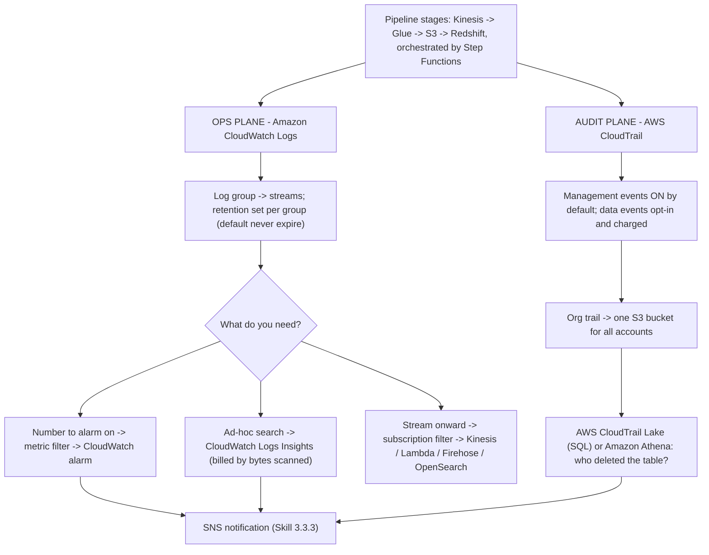
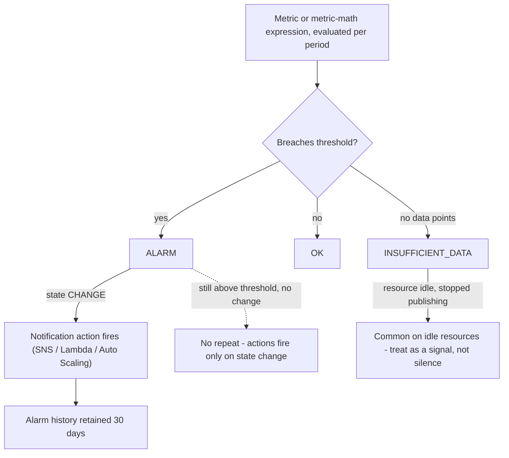
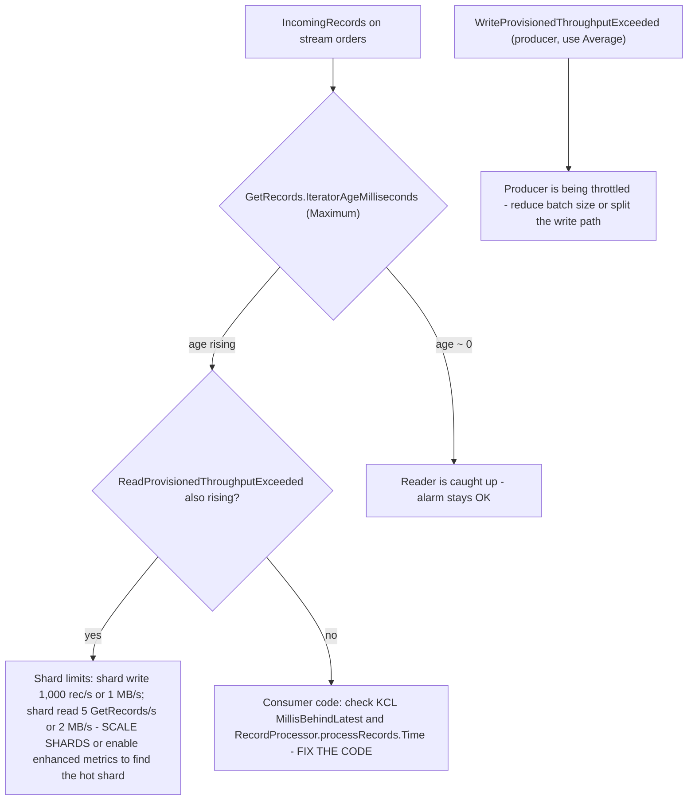
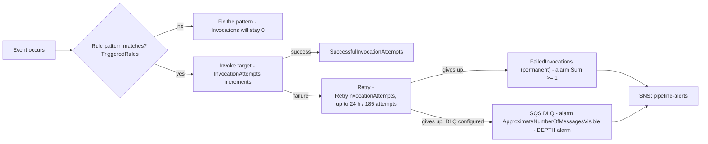
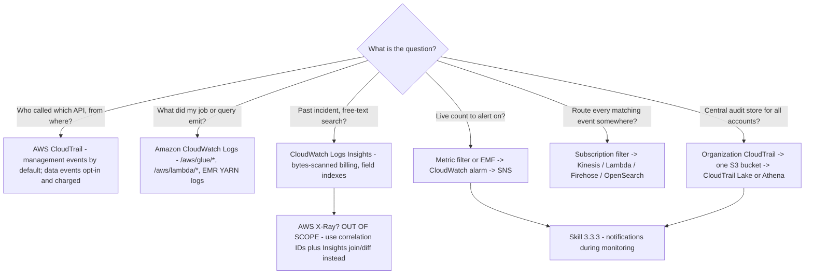

# Monitoring and Observability for Data Pipelines

Two exam tasks meet in this lesson. **Task 3.3, maintain and monitor data pipelines**, asks you to extract logs for audits, deploy logging and monitoring solutions that enable auditing and traceability, send alert notifications, troubleshoot performance issues, track API calls with AWS CloudTrail, maintain Glue and EMR pipelines, log application data with Amazon CloudWatch Logs, and analyze logs with Athena, EMR, OpenSearch and CloudWatch Logs Insights. **Task 4.4, prepare logs for audit**, asks the same material from the compliance side: CloudTrail, CloudWatch Logs storage, CloudTrail Lake, log analysis, and integrating services such as EMR for large log volumes. The exam treats them as one discipline with two questions: **what happened** (audit evidence) and **what is happening right now** (operational signal).

```text
====================================================================
 DEA-C01 - DOMAIN 3 TASK 3.3 + DOMAIN 4 TASK 4.4 (13 skills)
--------------------------------------------------------------------
 3.3.1 Extract logs for audits
 3.3.2 Deploy logging and monitoring for auditing and traceability
 3.3.3 Use notifications during monitoring to send alerts
 3.3.4 Troubleshoot performance issues
 3.3.5 Use AWS CloudTrail to track API calls
 3.3.6 Troubleshoot and maintain pipelines (AWS Glue, Amazon EMR)
 3.3.7 Use Amazon CloudWatch Logs (configuration and automation)
 3.3.8 Analyze logs (Athena, EMR, OpenSearch, Logs Insights)
 4.4.1 Use AWS CloudTrail to track API calls
 4.4.2 Use Amazon CloudWatch Logs to store application logs
 4.4.3 Use AWS CloudTrail Lake for centralized logging queries
 4.4.4 Analyze logs (Athena, Logs Insights, OpenSearch)
 4.4.5 Integrate AWS services for logging (EMR for large volumes)
--------------------------------------------------------------------
 AUDIT plane ..... CloudTrail (management vs data events) -> S3 /
                   CloudTrail Lake / Athena
 OPS plane ........ CloudWatch Logs -> metric filters /
                   subscription filters / Logs Insights -> alarms -> SNS
 OUT OF SCOPE ..... AWS X-Ray (verbatim on the out-of-scope list)
====================================================================
```

> [!NOTE]
> **The whole lesson reduces to one sentence:** CloudTrail answers *"who did what, when, from where"* for **API calls**, CloudWatch Logs answers *"what did my application emit"* for **operations**, and CloudWatch **metrics + alarms** turn both into notifications (Skill 3.3.3). A question never resolves to the wrong plane — "who deleted the table?" is never Logs Insights, and "job error rate?" is never CloudTrail.

In this lesson you will:

- separate the **audit plane** from the **operations plane**, and place **management events, data events and Insights events** correctly;
- choose between **service metrics, custom metrics and Embedded Metric Format**, with the cardinality and permission traps;
- design alarms: **states, state-change actions, missing data, composite and log alarms**, dashboards and metric math;
- use the three CloudWatch Logs mechanisms — **metric filter, subscription filter, Logs Insights** — without mixing them;
- write **Logs Insights** queries (query language, field indexes, bytes-scanned billing);
- monitor each pipeline stage natively: **Glue, Kinesis, Redshift, EMR, Lambda, DMS, Step Functions, S3, EventBridge**;
- apply **logging best practices**: structured JSON, correlation IDs, PII data-protection policies, retention and cross-account routing;
- work through **nine worked examples** — six alarm configurations and three Logs Insights queries;
- read the **October 2026 update box**, **four AWS customer case studies**, and finish with **fourteen exam-style questions** plus three interactive checks.

---

## 1. Two planes of evidence: audit versus operations

### 1.1 The split the exam tests

| | **Audit plane — AWS CloudTrail** | **Operations plane — Amazon CloudWatch Logs** |
|---|---|---|
| Question it answers | Who did what, when, from where? | What is my application emitting? |
| Default content | **Management events are logged by default** | Whatever your code and services send |
| Data events | **Not logged by default**; opt-in via basic/advanced event selectors, and charged | n/a |
| Retention | Files in S3 you control; **Event history = 90 days, management events, signed-in account only** | Log-group retention setting (default: never expire) |
| Analysis | **AWS CloudTrail Lake**, Athena over the JSON in S3 | **CloudWatch Logs Insights**, metric filters, subscription filters |
| Typical exam stem | "Who deleted the Glue table?" / "track API calls" | "job error rate from logs" / "store application logs" |

### 1.2 CloudTrail: management, data, Insights

- **Management events** (default): `Describe*`, `Get*` reads and write calls such as `RunInstances`, plus non-API events such as `ConsoleLogin`.
- **Data events** (opt-in, charged): high-volume resource-level operations — `AWS::S3::Object`, `AWS::Lambda::Function` (`Invoke`), `AWS::DynamoDB::Table`, `AWS::Kinesis::Stream`, `AWS::SQS::Queue`, `AWS::StepFunctions::StateMachine`, `AWS::Glue::Table`. A question about **`s3:GetObject`** is unsolvable unless **data events are enabled** — they are off by default.
- **Insights events**: management-event **anomaly detection**, charged and off by default.
- **Integrity**: **SHA-256** hashing plus **SHA-256 with RSA** digital signing produces an hourly **digest file**, and validation is **not retroactive**.
- **Organization trails** (management account or delegated admin): one bucket for every account, member accounts can see but not modify or delete, propagation **≤24 hours**, log files delivered approximately every **5 minutes**.
- Glue control-plane actions are all logged with `eventSource: glue.amazonaws.com`; many `Get*`/`BatchGet*` responses log as **`null`**.



### 1.3 Worked example E1 — "who deleted the partitions?" in four moves

```text
Q:  An Athena table lost partitions at 02:14 UTC. Prove who did it.

1. Confirm the plane ......... CloudTrail MANAGEMENT events (API call history)
                               - NOT CloudWatch Logs, NOT Logs Insights
2. Filter .................... eventSource  = glue.amazonaws.com
                               eventName    = BatchDeletePartition
                                            (or DeleteTable / DeleteDatabase)
3. Store/query ............... organization trail -> central S3 bucket
                               -> AWS CloudTrail Lake (skill 4.4.3)
                               -> or Athena over the CloudTrail JSON (skill 4.4.4)
4. Missing evidence? ......... the action was an S3 OBJECT call, so enable
                               DATA EVENTS (opt-in, charged) and re-run -
                               management events never contain s3:GetObject
```

- **📚 Did you know?** CloudTrail **Event history** gives you **90 days** of **management events** for the **signed-in account only** — no setup, no trail. It is the fast answer to "who did this in the last 90 days?" but it cannot answer a cross-account or data-event question; that needs an organization trail or CloudTrail Lake (AWS CloudTrail documentation, accessed Oct 2026).

---

## 2. CloudWatch metrics: service, custom, embedded

### 2.1 Three ways a number reaches CloudWatch

| Kind | Who publishes | Resolution | Billing | Watch out |
|---|---|---|---|---|
| **Service metrics** | AWS, automatically | Standard **1-minute** | Free with the service | Some are 5-minute by default (EMR) or daily (S3 storage) |
| **Custom (`PutMetricData`)** | You push; CloudWatch **never pulls** | **1-minute** or **1-second** high-resolution | **Custom metrics** billing | ≤**30 dimensions** per metric |
| **Embedded Metric Format (EMF)** | You write a JSON log event containing an `_aws` block | Asynchronous, from the log event | **Custom metrics** billing | Needs only `logs:PutLogEvents` — **no `cloudwatch:PutMetricData`**; cardinality explodes |

Statistics are retained for **15 months**. After you publish a new custom metric it becomes visible to `GetMetricStatistics` within **2 minutes** and to `ListMetrics` within **15 minutes** — an exam trap when you "just created it and see nothing".

### 2.2 Worked example E2 — the cardinality bill

An EMF log line dimensions a metric by **job (50 names) × status (4 values) × region (6 values)**:

```text
custom metrics created = 50 x 4 x 6 = 1,200 distinct dimension sets
at 1-minute granularity, retained 15 months, billed as custom metrics

Safer design: dimension by job + status only      = 50 x 4 = 200
              put region into the LOG payload, filter with Logs Insights
```

EMF is attractive precisely because it needs no extra IAM permission, but **one custom metric exists per unique dimension value** — high-cardinality fields (request IDs, user IDs, SQL strings) must stay in the **log message**, not in the dimensions.

- **📚 Did you know?** Because EMF metrics come from log events, they are delivered **at-least-once**: a retried `PutLogEvents` can produce a duplicate metric data point. Design alarms on statistics that tolerate that (for example `Sum` over a period rather than exact `SampleCount`), and never treat an EMF-derived count as an exactly-once ledger (AWS EMF documentation, accessed Oct 2026).

---

## 3. CloudWatch alarms: states, actions and combining them

### 3.1 The state machine



Key rules (all AWS-verified, accessed Oct 2026):

- An alarm invokes actions **only when the alarm changes state** — the exception is alarms with **Auto Scaling actions**. A pipeline that stays broken does **not** re-page you every minute.
- States are **`OK` / `ALARM` / `INSUFFICIENT_DATA`**; idle resources frequently stop publishing and sit in `INSUFFICIENT_DATA`.
- Alarm types: **metric alarms** (including **metric-math expressions** you can alarm on), **composite alarms** (Boolean `AND`/`OR`/`NOT` over other alarms), **log alarms** (a scheduled **Logs Insights** query with an M-out-of-N condition — **no metric filter required**), and **PromQL** alarms. There is **no quota on the number of alarms**.
- **Composite alarms**: same account and Region only, start in `INSUFFICIENT_DATA` (the only time a new alarm does), **cannot perform EC2 actions or Auto Scaling actions**, children carry no actions so the composite pages **once**, and limits are **100 children / 500 elements / 150 composites per child**.
- **Evaluation windows**: up to **7 days** when the period is ≥1 hour, or **1 day** for shorter periods.

### 3.2 Missing-data behaviour is a design decision

`TreatMissingData` has three settings, and the right one depends on the metric: **`breaching`** (missing = bad; correct for iterator age, where silence means no reader), **`notBreaching`** (missing = fine; correct for DLQ depth, where no data points means an empty queue), and **`ignore`** (keep the current state). Choosing the default (`missing`) is how teams get `INSUFFICIENT_DATA` alarms nobody trusts.

### 3.3 Anomaly detection instead of a static threshold

CloudWatch **anomaly detection** trains an ML band per metric **and per statistic**, so you alarm when the value leaves the band rather than crossing a hand-tuned number. It replaces fixed thresholds where the workload is seasonal (daily ETL windows) and complements them where a compliance limit exists (a 300-second CDC latency).

---

## 4. Dashboards and metric math

- Dashboards are **unlimited per account**, and **all dashboards are global, not Region-specific** — a monitoring dashboard pulls Region-qualified metrics per widget.
- Quotas: **≤500 widgets per dashboard** and **≤500 metrics** in a widget's `metrics` array (as of Oct 2026).
- **Cross-account widgets**: from a monitoring account, each widget names its `accountId` and `region`.
- A metric that has been **silent for 14 days** disappears from the dashboard metric picker — a quiet pipeline looks like a deleted one.
- **Metric math** lets one widget show `100 * (Errors / Invocations)` as an error rate, and alarms can watch the expression, not just the raw metric.

> [!IMPORTANT]
> **Do not build a high-frequency dashboard widget on Logs Insights.** Insights queries are interactive tools: they are billed by **uncompressed bytes scanned**, limited to **100 concurrent query-language queries per account**, time out after **60 minutes**, and keep results for **7 days**. Put *counts* on the dashboard (metric filters or EMF) and keep Insights for investigations.

---

## 5. CloudWatch Logs: groups, retention, metric filters, subscription filters

### 5.1 The container model and its quotas

A **log group** holds **log streams** that share retention and access control; there is **no limit on the number of streams** per group. As of Oct 2026: **1,000,000 log groups per Region**, **metric filters 100 per group**, **subscription filters 5 per group**, log event **1,024 KB**, `PutLogEvents` batches of **1 MB / 5,000 per second**, `StartQuery` **10/s**, and **regex limits of ≤5 regex patterns per group and ≤2 regexes per pattern**.

> [!WARNING]
> **⚠️ Retention defaults to "never expire".** By default, log data is stored in CloudWatch Logs **indefinitely**, and when you do delete, deletion can take **up to 72 hours** to complete. Set a per-group retention in days on day one — an unbounded `/aws/glue/orders_etl` group is both a cost problem and a compliance problem (Skills 3.3.7, 4.4.2).

### 5.2 One pattern, three jobs

| | **Metric filter** | **Subscription filter** | **Logs Insights** |
|---|---|---|---|
| Purpose | Turn matching events into a **CloudWatch metric you can alarm** | **Stream** matching events onward (Kinesis, Lambda, Firehose, OpenSearch) | **Ad-hoc search** over past events |
| Retroactive? | **No** — it only counts events that arrive **after** the filter was created | No | No |
| What you get | A numeric value per minute | The whole event | Rows, billed by **uncompressed bytes scanned** |
| Quota | 100 per log group | 5 per log group | 100 concurrent query-language queries per account |

### 5.3 Worked example E3 — metric filter plus alarm on JSON job logs

```text
Log group ....... /aws/glue/orders_etl
Filter pattern .. { $.level = "ERROR" }              (JSON match)
Metric name ..... GlueJobErrors
Namespace ....... Custom/OrdersEtl    Dimensions: JobName=orders_etl
Transform ....... 1                   Unit           Count
Period ......... 60 seconds          Statistic      Sum

Alarm ......... GlueJobErrors > 0
                EvaluationPeriods 1, Period 60, TreatMissingData notBreaching
                Action -> SNS topic pipeline-alerts
```

Because filters are **not retroactive**, this alarm only sees errors from the moment the filter exists — retrospective questions ("did it error last Tuesday?") are **Logs Insights** questions.

### 5.4 Worked example E4 — subscription filter delivery health

```text
Subscription filter ... to-archive -> Amazon Data Firehose -> central S3
Alarm (delivery) ...... AWS/Logs . DeliveryThrottling . Sum > 0
                        Period 60, EvaluationPeriods 1, TreatMissingData notBreaching
Meaning ............... downstream is under-provisioned; events are being
                        throttled, retried for up to 24 HOURS, then DROPPED
Companion alarm ....... AWS/Logs . DeliveryErrors . Sum > 0
```

Throttled deliverables are retried for **up to 24 hours**, after which the failed deliverables are **dropped** — so a `DeliveryThrottling` alarm is a data-loss alarm wearing a performance costume.

```matching
{
  "question": "Match each CloudWatch Logs mechanism to its job in a data pipeline:",
  "pairs": [
    {"left": "Metric filter", "right": "Turns matching log events into a CloudWatch METRIC so an alarm can fire - numeric value per minute, NOT retroactive, 100 per log group"},
    {"left": "Subscription filter", "right": "STREAMS matching events onward to Kinesis, Lambda, Firehose or OpenSearch - 5 per log group, throttled delivery retried up to 24 hours then dropped"},
    {"left": "Logs Insights", "right": "AD-HOC search across log groups - query language, OpenSearch PPL or SQL, billed by uncompressed BYTES SCANNED, results kept 7 days"},
    {"left": "Log alarm (scheduled)", "right": "Runs a scheduled Logs Insights query on an M-out-of-N condition - needs NO metric filter at all"},
    {"left": "Embedded Metric Format", "right": "Publishes CUSTOM metrics straight out of a JSON log event - only logs:PutLogEvents required, one metric per unique dimension value"}
  ],
  "explanation": "The exam's favourite mix-up is treating these as interchangeable. Alarm a count -> metric filter. Move every event to a central bucket or OpenSearch domain -> subscription filter. Answer 'what happened last Tuesday?' -> Logs Insights. Alarm a pattern you cannot express as a metric -> log alarm. Emit metrics from application code without a second IAM permission -> EMF, at custom-metrics cost."
}
```

---

## 6. CloudWatch Logs Insights: querying the evidence

### 6.1 Three languages, one billing model

Insights offers the **query language** (`fields`, `filter`, `parse`, `stats`, `sort`, `limit`, `join`, `lookup`, `filterIndex`, `estimate`), **OpenSearch PPL**, and **OpenSearch SQL** — SQL is the only one that can `JOIN` **across log groups**. You are billed by **uncompressed log data scanned**, queries time out after **60 minutes**, results live for **7 days**, and **field indexes** (plus the `filterIndex` command) cut the scanned volume dramatically. AWS service logs are auto-discovered as `@`-prefixed fields; your own structured JSON fields appear by name.

Guardrails: narrow the time range first, **cancel queries before you close the console**, and prefer metric filters or EMF over a dashboard widget that re-runs Insights.

### 6.2 Worked example E5 — triage a failed nightly job (30-second window)

```text
fields @timestamp, @logStream, @message
| filter @message like /Exception|Traceback|FAILED/
| filter @message like /orders_etl/
| sort @timestamp desc
| limit 50
```

### 6.3 Worked example E6 — error rate by job from structured JSON

```text
fields @timestamp, level, jobName, durationMs
| filter level = "ERROR"
| stats count() as errors, avg(durationMs) as avgMs by jobName
| sort errors desc
| limit 10
```

Both queries are **investigations**. To *alert* on the same signal you would add a metric filter (Example E3) or publish via EMF — and, because metric filters are not retroactive, you would also keep the Insights query for the retrospective half of the question.

- **📚 Did you know?** Logs Insights auto-discovers the `@`-fields of AWS service logs (for example `@message`, `@timestamp`, `@logStream`), but **field indexes** you define are what make `filter` cheap: without an index every candidate line is scanned, so the bill tracks **bytes scanned**, not rows returned. Index the fields you filter on, and keep wide `@message LIKE` scans for short time ranges only (AWS CloudWatch Logs Insights documentation, accessed Oct 2026).

---

## 7. Streaming: Amazon Kinesis Data Streams

### 7.1 The metric that defines stream health

Namespace **`AWS/Kinesis`**. **Stream-level metrics are free and published every minute**; **enhanced (shard-level) metrics are an opt-in, additional-cost feature** (`EnableEnhancedMonitoring`).

| Metric | What it actually measures | Trap |
|---|---|---|
| **`GetRecords.IteratorAgeMilliseconds`** (dimension `StreamName`) | **Stream lag**: how far the slowest reader's position trails the stream's head. **A value of zero indicates the records being read are completely caught up with the stream.** | This is the stream-lag metric exam questions mean |
| `IteratorAgeMilliseconds` (shard level) | The same lag per shard — where the problem shard lives | Paid/enhanced only |
| **`GetRecords.Latency`** | How long one **API call** takes | **Call duration, not lag** — the classic distractor |
| **`WriteProvisionedThroughputExceeded`** | **Producer** writes throttled by shard write limits | Use **Average**; a `Maximum` of **0** simply means none were throttled |
| `ReadProvisionedThroughputExceeded` | **Consumer** reads throttled by shard read limits | Rising with iterator age ⇒ scale shards |

### 7.2 Worked example E7 — the iterator-age alarm

```text
AWS/Kinesis . GetRecords.IteratorAgeMilliseconds . [StreamName=orders]
Statistic ....... Maximum           (ONE lagging shard is the incident)
Period .......... 300 seconds       EvaluationPeriods 1
Comparison ...... GreaterThanThreshold
Threshold ....... 43,200,000 ms  =  50% of a 24-hour retention period
                  24 h x 3,600 s x 1,000 ms = 86,400,000 ms; half = 43,200,000 ms
TreatMissingData  breaching  (no reader -> no data points -> that IS the incident)
Action .......... SNS topic pipeline-alerts

Warning tier (optional, ~10% of retention): 8,640,000 ms
```

AWS's own guidance: *if an iterator's age passes **50% of the retention period** you risk records expiring before they are read, and **you should use CloudWatch alarms on the Maximum statistic***. Threshold arithmetic on a **24-hour** default retention is exactly the kind of calculation DEA-C01 expects you to perform, not recall.



---

## 8. AWS Glue: DPU, bookmarks, observability and job insights

### 8.1 How Glue metrics behave

**AWS Glue reports metrics to CloudWatch every 30 seconds**, as **delta values** from the previously reported values — so a dashboard graphed at 1-minute granularity is an **aggregation**, and the right statistic per minute is **`Sum`**, not `Average`. The CLI/API metric namespace is **`Glue`**.

| Concern | Metric(s) | Reading |
|---|---|---|
| DPU / executor backlog | `glue.driver.ExecutorAllocationManager.executors.numberAllExecutors` vs `…numberMaxNeededExecutors` | Needed ≫ allocated ⇒ more DPUs required |
| Work done | `glue.driver.aggregate.bytesRead`, `glue.driver.aggregate.recordsRead` | A **0** when 50M rows were expected ⇒ the **bookmark skipped** the data |
| Failures inside the run | `glue.driver.aggregate.numFailedTasks` | Task-level failures inside a "successful" driver |
| Out of memory | `glue.ALL.jvm.heap.usage` | Alarm when **Average > 0.9** |
| Bookmarks | `bytesRead` / `recordsRead` under **Job Bookmark Issues**; failure surfaces as observability category **`GLUE_JOB_BOOKMARK_VERSION_MISMATCH_ERROR`** | Wrong watermark = duplicates or gaps |
| Skew | `glue.driver.skewness.job` | Default skewness factor **5** |
| Success/failure totals | `glue.error.ALL`, `glue.succeed.ALL`, `glue.error.[category]` (**28 categories**) | Requires the **Glue observability** feature, **Glue 4.0 or later**, dimension `ObservabilityGroup` |

### 8.2 Failure alerting is usually EventBridge, not CloudWatch

There is **no default "job failed" metric**. The canonical alert (skill 3.3.3) is an EventBridge rule on the **`Glue Job State Change`** event.

### 8.3 Worked example E8 — alert when the nightly job fails

```text
EventBridge rule
  source .............. ["aws.glue"]
  detail-type ........ ["Glue Job State Change"]
  detail.state ........ ["FAILED", "TIMEOUT"]
  detail.jobName ...... ["orders_etl"]
  target .............. Amazon SNS topic pipeline-alerts

State values you should route: SUCCEEDED, FAILED, TIMEOUT, STOPPED
  (a STOPPED run is a human or a scheduler, not a crash - filter separately)

Metric alternative (needs Glue observability, 4.0+):
  Glue . glue.error.ALL . JobName=orders_etl . Sum >= 1 . Period 300

Backlog check (metric math):
  bytesWritten(job_i) / bytesRead(job_{i+1}) != 1  =>  rows piling up between runs
```

Bookmarks are the quiet failure mode: a job can **succeed** while reading **nothing** because the bookmark watermark says it already did. Alarm on `glue.driver.aggregate.recordsRead` falling to 0 against an expected volume, and pair it with the state-change rule so silence and success are distinguishable.

---

## 9. Amazon Redshift: three planes of evidence

| Plane | Where | Contents |
|---|---|---|
| **1. Cluster metrics** | CloudWatch `AWS/Redshift`, ~1-minute, free | `CPUUtilization`, `DatabaseConnections`, **`HealthStatus`** (1/0 in CloudWatch), `PercentageDiskSpaceUsed` |
| **2. Query / WLM metrics** | CloudWatch (5-minute where noted) | `QueryDuration` (**microseconds**), **`QueryRuntimeBreakdown`** with dimension `stage` — including **`QueryWaiting`**, which is WLM queue time; **`WLMQueueLength`** (dimensions `service class` or `QueueName`), `WLMQueueWaitTime` |
| **3. Query and load performance detail** | **Amazon Redshift console / system tables only** | `STL_*`, `STV_*`, `SYS_*` — **"Query and load performance data are not published as CloudWatch metrics and can only be viewed in the Amazon Redshift console."** |

**Spectrum and usage limits**: `UsageLimitConsumed` carries dimension `FeatureType`, including **`SPECTRUM`** — the bytes scanned by external queries against S3, which is how you alarm a runaway Spectrum query before the bill arrives.

**Worked example (WLM congestion):** alarm `WLMQueueLength` with dimension `QueueName=etl` **> 5 for 3 periods**, then confirm with `QueryRuntimeBreakdown` at `stage=QueryWaiting` — if `QueryWaiting` is high, queries are queuing (add WLM queues or concurrency); if it is low but `QueryDuration` is high, the SQL itself is slow. The wrong conclusion from the wrong plane is the trap.

---

## 10. Amazon EMR: YARN and the 5-minute default

- Default metrics arrive **every 5 minutes** and are **free**; on **EMR 7.0 and later** the **CloudWatch agent** adds **34 extra metrics at 1-minute granularity** (charged), and **7.1** adds YARN and HBase classifications.
- **`IsIdle`** is sampled every **5 minutes** — AWS's own alarm guidance is to alarm "when `IsIdle` is 1 for **more than one consecutive 5-minute check**".
- Capacity and scaling: **`AppsRunning`**, **`AppsPending`**, **`ContainerPendingRatio`** (the scaling signal), **`HDFSUtilization`**, and **`YARNMemoryAvailablePercentage`** — the driver metric for **managed scaling**.
- Managed scaling also emits `YarnContainersUsedMemoryGBSeconds`, which AWS describes as **critical for managed scaling**.
- Logs: the agent ships `/mnt/var/log/hadoop-yarn/...` into CloudWatch log groups, which is what makes Skills 3.3.6/4.4.5 (analyze EMR logs, use EMR for large log volumes) answerable with Logs Insights or a subscription filter to S3.

**Exam reading:** an EMR question that demands 1-minute metrics is really asking *which component publishes them* — the answer is the **CloudWatch agent on EMR 7.0+**, not a console setting.

---

## 11. AWS Lambda: throttles, duration and errors

Metrics arrive at **1-minute** granularity.

| Metric | Meaning | Trap |
|---|---|---|
| `Invocations` | Requests that ran — **this is the billed count** | Throttled requests count here? **No** |
| `Errors` | Failed invocations | Throttled requests count here? **No** |
| **`Throttles`** | Requests rejected by concurrency limits | **A throttled request is counted in neither `Invocations` nor `Errors`** — alarm it separately |
| `Duration` | Execution time | **Excludes cold start** — a cold-start problem is invisible here |
| `IteratorAge` | For **DynamoDB/Kinesis/DocumentDB event source mappings**: **the age of the last record** | Lambda's own stream lag, distinct from Kinesis's `GetRecords.IteratorAgeMilliseconds` |
| `ConcurrentExecutions` | View **`Max`** | Average hides the spike |
| `ProvisionedConcurrencyUtilization` | Utilization of pre-warmed capacity | **Not emitted when idle** — expect gaps |

Event source mapping metrics are **opt-in**: `PolledEventCount`, `InvokedEventCount`, `FailedInvokeEventCount`, `DroppedEventCount`, `MaxOffsetLag`. ESM delivery is **at-least-once**, so counts can double — never read them as an exactly-once count of business events.

**Alarm design:** `Errors / (Invocations + Throttles)` as metric math is misleading because throttles are excluded from both; alarm `Throttles > 0` and `Errors > 0` **separately**, then investigate concurrency limits versus code.

---

## 12. AWS DMS: CDC latency is two numbers, not one

Metrics live in **`AWS/DMS`**, are expressed in **seconds**, and are dimensioned by instance and task.

- **`CDCLatencySource`** — the last event **captured at the source** versus the replication-instance clock: the **source-read side**.
- **`CDCLatencyTarget`** — the oldest **unconfirmed event waiting to commit on the target** versus the clock: the **target-apply side**.
- **`CDCLatencyTarget` is always greater than or equal to `CDCLatencySource`.**

### Worked example E9 — read the two latencies before you touch anything

```text
Commit at source 10:00:00, consumed at 10:02:00
  CDCLatencySource = 120 seconds
Written to target at 10:05:00
  CDCLatencyTarget = 300 seconds   (always >= 120)

Alarm ....... AWS/DMS . CDCLatencyTarget . Average > 300
              Period 60, EvaluationPeriods 3, TreatMissingData breaching

Triage ...... BOTH high ........... check the SOURCE first
              Source low, Target high ... TARGET problem (missing primary
                                            key or index, or throttling)
              Both high and about EQUAL . SOURCE problem
Companions .. CDCIncomingChanges, CDCThroughputRowsSource, CDCThroughputRowsTarget
```

That ordering — **source first when both are high** — is the single most testable DMS monitoring fact, and it follows from the inequality: target latency includes everything source latency does.

---

## 13. AWS Step Functions: execution history and backlog

Namespace **`AWS/States`**, dimension **`StateMachineArn`**; without a dimension the metrics are **account-level**.

- Execution metrics: `ExecutionsStarted`, `ExecutionsSucceeded`, `ExecutionsFailed`, `ExecutionsTimedOut`, `ExecutionThrottled`, `ExecutionTime` (**milliseconds**). Use **`Sum`** to count executions and **`Average`** to characterise durations.
- **Gotcha:** Step Functions emits **two `ExecutionsStarted` metrics for every state machine execution**, so `SampleCount` is **2** — never read `SampleCount` as a count of executions.
- Metrics are emitted **best-effort**; a **non-ASCII state machine name prevents CloudWatch logging**.
- Activity metrics (dimension `ActivityArn`): `ActivitiesSucceeded`, `ActivitiesFailed`, `ActivitiesTimedOut`, **`ActivitiesHeartbeatTimedOut`**.
- **Backlog**: `OpenExecutionCount` against the limit (default **1,000,000**) — AWS recommends a **Maximum** alarm at **100,000+**; for Distributed Map, `ApproximateOpenMapRunCount` against a limit of **1,000**, alarmed at **900+**.
- The **execution history** in the console (and the `GetExecutionHistory` API) is the per-run evidence — CloudWatch gives you the aggregate, execution history gives you the state-by-state story.

---

## 14. Amazon S3: request metrics versus storage metrics

| | **Daily storage metrics** | **Request metrics** |
|---|---|---|
| Examples | `BucketSizeBytes`, `NumberOfObjects` | `AllRequests`, `GetRequests`, `4xxErrors`, `5xxErrors`, `FirstByteLatency`, **`TotalRequestLatency`** |
| Frequency | **Once per day** | **1-minute** |
| Cost | **Free**, on by default | Billed **like custom metrics** |
| Scope | **Bucket totals only** | **Requires a metrics configuration** — bucket-level or filtered by **prefix, tag or access point** (dimension `FilterId`) |
| Filtering | **Storage metrics do not support filtering** | **Request metrics support filtering** |

Also: CloudWatch delivery of S3 metrics is **best-effort**, so treat a missing data point as ambiguity, not as zero traffic.

**Worked example (prefix error rate):** to alarm 4xx on `s3://curated/`, first create a **metrics configuration filtered by that prefix**, then alarm `4xxErrors` on dimension `FilterId=curated`. There is no way to get a per-prefix error rate from the free daily storage metrics — the exam reuses this pattern constantly.

---

## 15. Amazon EventBridge: invocations, failures and the dead-letter queue

Namespace **`AWS/Events`**.

- **`Invocations`** — successful plus failed **first attempts**; it **excludes retries until they become permanent failures**, and is emitted **only when non-zero**.
- **`FailedInvocations`** — **permanent failures only**, also only when non-zero.
- Delivery detail: `InvocationAttempts`, `SuccessfulInvocationAttempts`, `RetryInvocationAttempts`; a useful metric-math alarm is a `SuccessfulInvocationRate = SuccessfulInvocationAttempts / InvocationAttempts`.
- **Troubleshooting order:** `TriggeredRules = 0` ⇒ your pattern **never matched**; `Invocations = 0` but the rule fired ⇒ **target configuration** (permissions, ARN); failures **with** invocations ⇒ the problem is **in the target**.
- Retries run for **up to 24 hours / 185 attempts**, after which the event can be sent to an optional **dead-letter queue** — at which point **DLQ depth is an SQS metric**, not an EventBridge one.



### Worked example E10 — DLQ depth plus permanent failures

```text
Alarm A (depth) ... AWS/SQS . ApproximateNumberOfMessagesVisible
                    [QueueName=events-dlq]
                    Maximum, Period 60, EvaluationPeriods 3
                    GreaterThanThreshold, Threshold 1
                    TreatMissingData notBreaching   (no data = empty queue)
                    NOTE: this SQS depth metric name is the standard AWS
                    visible-message metric - re-verify against current SQS
                    documentation before deploying.

Alarm B (cause) ... AWS/Events . FailedInvocations . Sum >= 1 . Period 60
                    TreatMissingData notBreaching

Reading ........... A fires  => SOMETHING already gave up and needs replay
                    B fires  => which target failed, and when
                    Neither, but RetryInvocationAttempts is climbing =>
                    still retrying - act before the 24-hour window expires
```

The pairing matters: **`FailedInvocations` says "gave up"**, depth says **"how many are waiting"**, and retry attempts say **"still trying"** — three different urgencies from three different metrics.

---

## 16. Logging best practices for pipelines

### 16.1 Six rules that earn marks (Skills 3.3.2, 3.3.7, 4.4.2)

1. **Structured JSON logs.** Field indexes, `parse`, `filter` and metric filters all assume structure; free-text lines force `@message LIKE` scans billed by bytes.
2. **Correlation IDs everywhere.** Step Functions **`$$.Execution.Id`**, Glue **`JobName` + `JobRunId`**, Lambda **request ID**, DMS **task ID**. One ID lets a single Insights query `join` across log groups and stages.
3. **Never log PII when you can avoid it;** if you must, attach a **Logs data protection policy** — detection and masking happen **when the data is ingested**, so events written **before** the policy existed are **not** masked, reading masked data requires `logs:Unmask`, and detections publish the **free (vended) metric `LogEventsWithFindings`**.
4. **Set retention per log group** — the default is indefinite, deletion takes up to **72 hours**.
5. **Centralize across accounts**: a CloudWatch **monitoring account**, **Logs Centralization**, an organization CloudTrail in one bucket, or a subscription filter to Firehose landing in a central S3 bucket.
6. **Keep the two planes apart**: *audit* evidence goes to CloudTrail (then CloudTrail Lake / Athena), *operational* logs go to CloudWatch Logs.



### 16.2 Worked example E11 — PII guardrail alarm

```text
Log group ......... /aws/lambda/ingest-orders
Data protection policy: detect and mask pattern [PII] on @message
                        (applies to events ingested AFTER creation)
Alarm ............. AWS/Logs . LogEventsWithFindings . Sum >= 1
                    Period 60, EvaluationPeriods 1, TreatMissingData notBreaching
Meaning ........... the pipeline is emitting sensitive data - fix the emitter,
                    not the alarm
Note .............. LogEventsWithFindings is a VENDED (free) metric
```

```fillblank
{
  "question": "Complete the logging-best-practices statements with the exam's own vocabulary:",
  "template": "CloudWatch Logs stores data {{1}} by default, and deletion of a log group can take up to {{2}} hours to complete. A Logs data protection policy masks sensitive data {{3}} ingestion, so events written before the policy existed are {{4}} masked, and detections publish the free metric {{5}}. In CloudTrail, {{6}} events are logged by default while {{7}} events must be enabled explicitly and are charged.",
  "answers": {
    "1": "indefinitely",
    "2": "72",
    "3": "at",
    "4": "not",
    "5": "LogEventsWithFindings",
    "6": "management",
    "7": "data"
  },
  "distractors": ["for 30 days", "for 15 months", "before", "after", "always", "retroactively", "LogEventsWithFindingsMetric", "Insights", "read", "write", "schema", "configuration", "audit", "operations"],
  "explanation": "Retention defaults to never expiring (deletion <= 72 h), masking happens AT ingest and is not retroactive, LogEventsWithFindings is the vended PII metric, and CloudTrail logs management events by default while data events are opt-in and charged - the four facts that decide most logging questions on DEA-C01."
}
```

### 16.3 The alerting chain, end to end

Skill 3.3.3 ("use notifications during monitoring to send alerts") is satisfied only when a **signal becomes a notification**: metric (service, custom or EMF) or log alarm → **alarm state change** → **Amazon SNS** topic (email, SMS, Lambda, Chatbot) or an EventBridge target. CloudWatch alarms do not email by themselves, and because actions fire **only on state change**, escalation policies must live downstream of the first notification.

```dragdrop
{
  "question": "Drag the five stages of the DEA-C01 alerting chain into the order a pipeline actually executes them:",
  "items": [
    "SNS topic delivers the notification to a human or a Lambda function",
    "The alarm changes state from OK to ALARM",
    "A metric (service, custom or EMF) or a Logs data-protection finding is published",
    "Downstream escalation, auto-remediation or a DLQ replay runs",
    "The alarm evaluates the statistic against the threshold for the configured evaluation period"
  ],
  "correctOrder": [
    "A metric (service, custom or EMF) or a Logs data-protection finding is published",
    "The alarm evaluates the statistic against the threshold for the configured evaluation period",
    "The alarm changes state from OK to ALARM",
    "SNS topic delivers the notification to a human or a Lambda function",
    "Downstream escalation, auto-remediation or a DLQ replay runs"
  ],
  "explanation": "The order is the whole skill: a signal must be PUBLISHED before it can be EVALUATED, evaluation must CHANGE STATE before any action runs, only then can SNS NOTIFY, and escalation lives AFTER the first notification. Two traps sit inside this sequence - CloudWatch alarms cannot email by themselves, and because actions fire only on a state change (Auto Scaling excepted) a pipeline that stays broken never re-pages you, which is exactly why the composite alarm in Section 3.1 and the 24-hour EventBridge retry window both need their own downstream design (Skills 3.3.3, 3.3.4)."
}
```

- **📚 Did you know?** The three cross-account log patterns are genuinely different tools: a **monitoring account** (CloudWatch cross-account observability) lets one Logs Insights query span linked log groups — `/aws/glue/*` across six accounts in one query; **Logs Centralization** moves log groups' *delivery* to a central account; an **organization CloudTrail** puts audit files from every account into **one S3 bucket**. Choosing between them is a Skills 3.3.1/4.4.5 question, and the wrong option usually mixes two of the three (AWS CloudWatch and CloudTrail documentation, accessed Oct 2026).

---

### 2026 Updates (as of October 2026)

> [!NOTE]
> **What moved in monitoring between the launch-era guide and the guide you download today** — every line checked against a primary AWS source in **October 2026**:
> - **Exam guide v1.1 (12 December 2025)** folded the separate "knowledge of" statements into one skill list (**8 skills added, none removed**) and left Tasks 3.3 and 4.4 substantively intact — logging, monitoring, alerting, audit extraction and log analysis remain the Domain 3/4 core (exam guide revisions page, accessed Oct 2026).
> - **Kinesis Data Streams now has three capacity modes, not two**: Provisioned, On-demand Standard and **On-demand Advantage (4 November 2025)** — ODA removes the per-stream hourly charge, cuts GB rates (AWS states ≥60% lower), but applies an account-wide floor of **25 MB/s ingest + 25 MB/s retrieval** (AWS What's New, 4 Nov 2025). A prep page saying "two capacity modes" is stale; the `GetRecords.IteratorAgeMilliseconds` alarm design in Section 7 is unchanged.
> - **Kinesis streaming tables (28 August 2026)** materialize a stream into **Apache Iceberg on Amazon S3 Tables**, and **general-purpose S3 delivery (29 August 2026)** writes records to a normal bucket — both only in the on-demand modes. New delivery paths mean new places to put a `DeliveryErrors`-style alarm; the lag metric itself is still `GetRecords.IteratorAgeMilliseconds` (AWS What's New, 28–29 Aug 2026).
> - **AWS Glue 6.0 (21 August 2026)** — Spark **4.1.1**, Python **3.13**, **30% lower price** — with **Glue 5.1** the default for new jobs since 26 November 2025 and **0.9/1.0/2.0 end-of-life 1 April 2026** (AWS Glue release notes and support policy, accessed Oct 2026). Observability metrics (`glue.error.*`, `glue.succeed.*`) require **Glue 4.0+**, so "which Glue version is this job on?" is now a monitoring prerequisite as much as a compatibility one.
> - **EMR capacity moved in 2026, so re-baseline Section 10's alarms**: Amazon EMR Serverless eliminated job **local storage** on **6 January 2026** (AWS states **up to 20% cheaper**), added **live configuration updates (24 June 2026)** and **workers up to 32 vCPU / 244 GB (7 July 2026)**, and **Amazon EMR 7.14 (22 September 2026)** raises Spark-job storage from **200 GiB to 1 TiB** (AWS What's New, accessed Oct 2026). The metric names in Section 10 (`IsIdle`, `AppsPending`, `ContainerPendingRatio`, `YARNMemoryAvailablePercentage`) are unchanged — but a `ContainerPendingRatio` threshold sized for the older 16 vCPU / 120 GB workers is now tuned to the wrong baseline.
> - **Kinesis sizing numbers moved**: the default **shard limit per account went from 500 to 20,000** in us-east-1, us-west-2 and eu-west-1 (AWS What's New, 21 April 2025), and the maximum record size is **10 MiB** (Amazon Kinesis Data Streams documentation, accessed Oct 2026). Sharding arithmetic that still assumes a 1 MB record ceiling or a 500-shard cap is stale — but `GetRecords.IteratorAgeMilliseconds`, `WriteProvisionedThroughputExceeded` and the 50%-of-retention alarm in Section 7 are not.
> - **Athena's cost-monitoring defaults changed**: **managed query results (3 June 2025)** are service-managed, encrypted and **free**, so an S3 result bucket is now optional; **Capacity Reservations** start at **4 DPU for 1 minute** (previously 24 DPU for 60 minutes) as of **10–11 February 2026**, and managed connectors cover **12 sources** (23 April 2026) (AWS What's New and Big Data Blog, accessed Oct 2026). "Athena always needs a result bucket" and "a reservation bills a one-hour minimum" are both stale distractors on Domain 3 cost questions.
> - **Amazon Data Firehose**: renamed from Kinesis Data Firehose on **9 February 2024** with **no API, endpoint, CLI, policy or CloudWatch metric changes** — and the DEA-C01 in-scope list still prints "Amazon Kinesis Data Firehose". Both names are valid; never "correct" an option (AWS What's New, 9 Feb 2024; in-scope list, accessed Oct 2026).
> - **Stale-fact warning**: Redshift **Python UDFs are unsupported after 30 June 2026** (no new scalar UDFs after 30 October 2025), and Redshift now **writes, MERGEs and materializes Iceberg tables** (writes 17 Nov 2025; UPDATE/DELETE/MERGE 23 Apr 2026; materialized views 5 Oct 2026) — any monitoring advice written for a read-only lakehouse is stale (AWS Redshift behavior-changes and What's New, accessed Oct 2026).

---

## Real-World Case Studies

Every figure below is **customer- or AWS-claimed and unaudited**, with the source named so you can check it. The examinable point is the **pattern** — which signals had to be alarmed, and why the operation survived — not the marketing.

### Case A — AGCO: one person running a telemetry pipeline

| Element | Detail |
|---|---|
| Customer | **AGCO**, agriculture machinery manufacturer |
| Challenge | Telemetry from **hundreds of thousands of machines** on costly third-party contracts |
| Services | **Amazon Kinesis Data Streams → Amazon Data Firehose → Amazon S3**, **Kinesis Data Analytics (Apache Flink)**, AWS Lambda, Amazon DynamoDB, Amazon OpenSearch Service, Amazon ECS |
| Outcomes | Live **January 2020**; **1,200 data points per minute** per machine (tested to **10,000/min**); **1.5 billion** records retained; **−78% cost**; screen load **8–30 s → 600 ms**; operated by **1 person instead of 3–5**; **1.9 million records/day** |
| Exam domain | **Domain 3, Task 3.3** — at this fan-out, monitoring *is* the staffing decision |
| Source | AWS Architecture Monthly (Dec 2021) and AWS Industries Blog (accessed Oct 2026) |

Read it as a monitoring story: a pipeline that **one person** runs can only work if the alarms are automatic. The two signals that matter here are exactly Section 7's — **`GetRecords.IteratorAgeMilliseconds` on `Maximum`** for readers falling behind, and **`WriteProvisionedThroughputExceeded`** for producers being throttled — plus Firehose delivery health downstream. −78% is a customer claim (accessed Oct 2026), not a guarantee.

### Case B — FINRA: regulated scale and the audit plane

| Element | Detail |
|---|---|
| Customer | **FINRA**, US financial-market regulator |
| Challenge | Fixed-capacity on-premises analytics blocking market surveillance |
| Services | **Amazon S3 + Amazon EMR** (Hive, Presto, HBase); the Consolidated Audit Trail adds **Amazon Redshift, AWS KMS, Amazon GuardDuty, AWS CloudTrail** |
| Outcomes | **~6 TB and 37 billion records** on an average day (**75 billion+** on busy days); **300M+ S3 objects**; interactive queries over **trillions of records / 600+ TB**; HBase-on-EMR architecture reported **over 60% cost savings**; CAT ingests **100+ billion events/day** from 22 exchanges and 1,500 broker-dealers |
| Exam domain | **Domain 4, Task 4.4** (prepare logs for audit) with Domain 3 hooks (EMR operations, large log volumes) |
| Source | AWS Public Sector Blog (2017) and AWS press release (2019), accessed Oct 2026 |

*Derived arithmetic (label it as such):* 37,000,000,000 ÷ 86,400 s ≈ **428,000 records/second**; a busy 75-billion day ≈ **868,000 records/second**. At that rate the audit trail cannot be a by-product — CloudTrail management events plus an **organization trail into one bucket**, and EMR/YARN metrics at Section 10's granularity, are what make "prove what happened" answerable.

- **📚 Did you know?** FINRA's two published stories split along the two planes of this lesson: the surveillance architecture is an **operations** story (EMR, HBase, `YARNMemoryAvailablePercentage`, HDFS utilization), while the Consolidated Audit Trail is an **audit** story (CloudTrail, KMS, GuardDuty, Redshift). Both are AWS-published and unaudited (accessed Oct 2026) — the examinable pattern is which plane a question names, not which customer achieved which percentage.

### Case C — Nasdaq: two paths, two sets of alarms

| Element | Detail |
|---|---|
| Customer | **Nasdaq**, stock exchange |
| Challenge | Overnight batch on a legacy on-premises warehouse: orders, quotes and trades must land **before market open** |
| Services | **Amazon S3** data lake (with **Amazon S3 Glacier** and **S3 Object Lock**) + **Amazon Redshift** with **Redshift Spectrum** — a lake house with a separate write path and read path |
| Outcomes | **70 billion records per day** (peak **113 billion**, February 2020); **90% of the nightly load completed 5 hours sooner**; queries **32% faster**; a **15 TB** lake queried **in place** |
| Exam domain | **Domain 4, Task 4.4** — retention, immutability and audit evidence; Domain 3 hooks for load monitoring |
| Source | AWS Nasdaq case study (accessed Oct 2026) |

Read it as a monitoring story: because storage and compute are decoupled, a slow query **cannot** block ingestion, and the two paths therefore alarm on **different namespaces**. The write path is `AWS/S3` — `4xxErrors`, `5xxErrors`, `FirstByteLatency` on a **metrics configuration** (Section 14) — while the read path is `AWS/Redshift` — `HealthStatus`, `WLMQueueLength`, `QueryRuntimeBreakdown` at `stage=QueryWaiting` (Section 9). Object Lock turns the archive tier into **WORM** evidence, which is the Domain 4 half of the same architecture. *Derived (label it):* 70,000,000,000 ÷ 86,400 s ≈ **810,000 records/second** sustained — a rate no nightly human review can keep up with.

- **📚 Did you know?** AWS's Nasdaq case study quotes Robert Hunt, VP Software Engineering: *"We were able to easily support the jump from **30 billion records to 70 billion records a day** because of the flexibility and scalability of Amazon S3 and Amazon Redshift."* The scaling headroom came from the **architecture**, not from a monitoring feature — which is why the exam rewards you for separating **write-path alarms** (S3 request metrics, opt-in and billed) from **read-path alarms** (Redshift cluster and WLM metrics, free) rather than for knowing any single threshold (AWS Nasdaq case study, accessed Oct 2026).

### Case D — Oportun: discovering PII that nobody indexed

| Element | Detail |
|---|---|
| Customer | **Oportun**, fintech lender |
| Challenge | Discover and classify PII held in **Amazon S3** for FTC Safeguards and privacy obligations, with **low false positives** |
| Services | **Amazon Macie** automated sensitive-data discovery, managed and **custom identifiers**, bucket inventory and **sensitivity score**; findings routed onward for remediation |
| Outcomes | **+95% discovery accuracy**; **−80% time** to discover sensitive data; faster risk prioritization |
| Exam domain | **Domain 3, Task 3.3** and **Domain 4, Task 4.4** — monitoring sensitive data and preparing evidence for audit |
| Source | Amazon Macie case cards and the re:Invent 2022 SEC215 deck (accessed Oct 2026) |

Read it as a monitoring story: Macie is **inventory + classification + score**, so the signals you alarm are the **bucket inventory**, the **sensitivity score trend**, and findings routed through **Amazon EventBridge** to SNS or a Step Functions remediation — the same state-change-to-notification chain as Section 16.3. Keep the boundary sharp: **Macie discovers PII in Amazon S3**; it does not natively scan Amazon RDS or Amazon Redshift, and PII inside **log lines** is the job of a CloudWatch Logs **data protection policy** (`LogEventsWithFindings`, Section 16.2), not Macie. The +95% / −80% figures are AWS-published customer claims (accessed Oct 2026), not a benchmark you can generalise.

- **📚 Did you know?** Amazon Macie's own limits are monitoring facts: an account's bucket inventory covers up to **10,000 buckets**, custom identifiers must be **1–300 characters (default 50)**, and detections default to **MEDIUM** severity — so "we scanned everything" is a claim about an **inventory limit**, not about the absence of PII, and a sensitivity score that stops moving deserves the same scrutiny as a metric that stops publishing (Amazon Macie documentation and document history, accessed Oct 2026).

---

## Practice Questions

```question
{
  "id": "dea-10-q1",
  "type": "multiple-choice",
  "question": "A Kinesis Data Streams consumer is falling behind on a stream with a 24-hour retention period. Which metric, statistic and threshold should the alarm use?",
  "options": [
    "GetRecords.IteratorAgeMilliseconds, Maximum, tied to 50% of retention (43,200,000 ms for 24 hours)",
    "GetRecords.Latency, Average, 1,000 ms",
    "GetRecords.IteratorAgeMilliseconds, Average, 1,000 ms",
    "ReadProvisionedThroughputExceeded, Maximum, 1"
  ],
  "correct": 0,
  "explanation": "GetRecords.IteratorAgeMilliseconds is the stream-lag metric (a value of zero means fully caught up), AWS recommends alarming on the Maximum because one lagging shard is the incident, and AWS's guidance is to alarm once the age passes 50% of retention: 24 h x 3,600 x 1,000 = 86,400,000 ms, half of which is 43,200,000 ms. GetRecords.Latency is API call duration, not lag."
}
```

```question
{
  "id": "dea-10-q2",
  "type": "multiple-choice",
  "question": "A compliance analyst asks: 'Who deleted the Glue table orders_curated at 02:14 UTC yesterday?' Which evidence source answers it?",
  "options": [
    "CloudWatch Logs Insights query over /aws/glue with a filter on the job name",
    "AWS CloudTrail management events with eventSource glue.amazonaws.com and eventName DeleteTable",
    "The CloudWatch metric glue.driver.aggregate.numFailedTasks",
    "Amazon S3 request metrics with a metrics configuration filtered by prefix"
  ],
  "correct": 1,
  "explanation": "API history is the audit plane: CloudTrail management events are logged by default and Glue control-plane actions carry eventSource glue.amazonaws.com. Logs Insights answers operational questions about what jobs emitted, numFailedTasks is a Glue runtime metric, and S3 request metrics describe object requests, not catalog API calls."
}
```

```question
{
  "id": "dea-10-q3",
  "type": "multiple-choice",
  "question": "A nightly AWS Glue job must alert the team the moment it fails, but the job publishes no failure metric. What is the correct design?",
  "options": [
    "Alarm on the CloudWatch metric glue.driver.aggregate.numFailedTasks > 0",
    "Create an EventBridge rule on Glue Job State Change with detail.state FAILED and TIMEOUT, targeting an SNS topic",
    "Add a metric filter on /aws/glue matching 'FAILED' with a 24-hour lookback",
    "Enable a subscription filter to Firehose and check the archive the next morning"
  ],
  "correct": 1,
  "explanation": "There is no default 'job failed' metric; the standard alert is an EventBridge rule on the Glue Job State Change detail-type with states SUCCEEDED, FAILED, TIMEOUT, STOPPED routed to SNS (metric alternative: glue.error.ALL via Glue observability, 4.0+). Metric filters are not retroactive so a 24-hour lookback does not exist, and a subscription filter delivers rather than notifies."
}
```

```question
{
  "id": "dea-10-q4",
  "type": "multiple-choice",
  "question": "You need a 4xx error rate for the prefix s3://curated/ only. What is the correct sequence?",
  "options": [
    "Create a metrics configuration filtered by the prefix, then alarm on 4xxErrors with the FilterId dimension",
    "Enable daily storage metrics and graph NumberOfObjects for the prefix",
    "Storage metrics support prefix filtering, so alarm BucketSizeBytes with a prefix dimension",
    "Nothing is required - S3 publishes 1-minute request metrics for every prefix automatically"
  ],
  "correct": 0,
  "explanation": "Request metrics are 1-minute, billed like custom metrics, and REQUIRE a metrics configuration (bucket, prefix, tag or access point) whose FilterId becomes the dimension. AWS states that request metrics support filtering but storage metrics do not, and daily storage metrics are bucket totals only."
}
```

```question
{
  "id": "dea-10-q5",
  "type": "multiple-choice",
  "question": "Where do you find the SQL text and per-query execution detail for slow Amazon Redshift queries?",
  "options": [
    "CloudWatch metrics QueryDuration and QueryRuntimeBreakdown include the SQL text",
    "The Amazon Redshift console and system tables (STL_*, STV_*, SYS_*) - query and load performance data are not published as CloudWatch metrics",
    "CloudWatch Logs Insights over the /aws/redshift log group",
    "AWS CloudTrail data events for the Redshift endpoint"
  ],
  "correct": 1,
  "explanation": "AWS states that query and load performance data are not published as CloudWatch metrics and can only be viewed in the Amazon Redshift console. CloudWatch does carry aggregate metrics (QueryDuration in microseconds, QueryRuntimeBreakdown by stage, WLMQueueLength), but the SQL-level detail lives in system tables."
}
```

```question
{
  "id": "dea-10-q6",
  "type": "multiple-choice",
  "question": "A Lambda function reports Invocations = 10,000, Errors = 0 and Throttles = 250 for the same minute. Which statement is correct?",
  "options": [
    "The function was perfect: 10,000 successful invocations and no errors",
    "Throttled requests are counted in neither Invocations nor Errors, so the 250 rejections are invisible to both metrics and need their own alarm",
    "Throttles are a subset of Errors, so the error rate is 2.5%",
    "Throttles are included in Invocations, so the function ran 10,250 times"
  ],
  "correct": 1,
  "explanation": "A throttled request counts in neither Invocations nor Errors - the classic Lambda monitoring trap. Alarm Throttles separately from Errors, and remember Duration excludes cold start so a cold-start problem will not show up there either."
}
```

```question
{
  "id": "dea-10-q7",
  "type": "multiple-choice",
  "question": "During a DMS migration, CDCLatencySource = 40 s and CDCLatencyTarget = 600 s. Where do you investigate first?",
  "options": [
    "The source database - both latencies being non-zero means the source is the problem",
    "The target - CDCLatencyTarget is the larger number, so the target is always the culprit",
    "The source, because CDCLatencyTarget is always greater than or equal to CDCLatencySource, so a large gap isolates the target-apply side ... read the triage rule the other way",
    "The target: missing primary key or index, or target-side throttling, because Source is low while Target is high"
  ],
  "correct": 3,
  "explanation": "CDCLatencyTarget is always >= CDCLatencySource by construction, so absolute size is meaningless. The triage rule is comparative: BOTH high => check the source first; Source low with Target high => target problem (missing PK/index, throttling); both high and about equal => source. Here Source 40 s is low and Target 600 s is high, so the target apply path is the suspect."
}
```

```question
{
  "id": "dea-10-q8",
  "type": "multiple-choice",
  "question": "Which statement about CloudWatch metric filters is correct?",
  "options": [
    "Metric filters are retroactive and count matching events from the moment the log group was created",
    "Metric filters are not retroactive - they count only events that arrive after the filter was created",
    "Metric filters forward whole events to Kinesis Data Firehose for archival",
    "Metric filters and subscription filters are two names for the same mechanism"
  ],
  "correct": 1,
  "explanation": "AWS states that filters do not retroactively filter data - only events written after the filter was created are counted. Forwarding events onward is the subscription filter's job (5 per log group, retried up to 24 hours then dropped), and the numeric per-minute alarm source is the metric filter (100 per log group)."
}
```

```question
{
  "id": "dea-10-q9",
  "type": "multiple-choice",
  "question": "A team wants one notification when any of five per-service alarms fires, without five pages. Which design fits?",
  "options": [
    "A composite alarm with an OR expression over the five children, so the composite pages once",
    "Five separate alarms each sending to the same SNS topic with the same severity",
    "A cross-account composite alarm spanning the monitoring and workload accounts",
    "A composite alarm configured with EC2 actions on each child"
  ],
  "correct": 0,
  "explanation": "Composite alarms combine child alarms with AND/OR/NOT and de-duplicate paging: children carry no actions and the composite notifies once. They must be in the same account and Region (cross-account is unsupported), start in INSUFFICIENT_DATA, and cannot perform EC2 or Auto Scaling actions."
}
```

```question
{
  "id": "dea-10-q10",
  "type": "multiple-choice",
  "question": "An EventBridge rule has TriggeredRules > 0 and Invocations > 0, but FailedInvocations stays at 0 while retries climb. What does that mean?",
  "options": [
    "The rule pattern never matched any event",
    "The target is misconfigured - check the target ARN and permissions",
    "Attempts are still being retried; FailedInvocations only counts permanent failures and is emitted only when non-zero",
    "EventBridge metrics are best-effort and should be ignored"
  ],
  "correct": 2,
  "explanation": "The troubleshooting order is: TriggeredRules = 0 => pattern never matched; Invocations = 0 with the rule fired => target configuration; failures with invocations => the target. FailedInvocations counts PERMANENT failures only and is emitted only when non-zero, so climbing RetryInvocationAttempts with no FailedInvocations means the retry window (up to 24 hours / 185 attempts) has not expired."
}
```

```question
{
  "id": "dea-10-q11",
  "type": "multiple-choice",
  "question": "A question demands 1-minute Amazon EMR metrics for YARN container pressure. What is required?",
  "options": [
    "Nothing - EMR publishes 1-minute YARN metrics by default and free of charge",
    "The CloudWatch agent on EMR 7.0 or later, which adds the finer-grained metrics at additional cost (default EMR metrics are every 5 minutes and free)",
    "A subscription filter from the EMR log group to Amazon OpenSearch Service",
    "Enabling enhanced shard-level monitoring on the EMR cluster"
  ],
  "correct": 1,
  "explanation": "EMR's default metrics arrive every 5 minutes and are free; on EMR 7.0+ the CloudWatch agent adds the extra metrics at 1-minute granularity for an additional charge, and EMR 7.1 adds YARN/HBase classifications. Enhanced monitoring is a Kinesis Data Streams concept, and subscription filters route logs rather than publish metrics."
}
```

```question
{
  "id": "dea-10-q12",
  "type": "multiple-choice",
  "question": "You must trace one request id across Glue, Lambda and Step Functions logs. Which approach is correct on DEA-C01?",
  "options": [
    "AWS X-Ray distributed tracing, because it is the AWS tracing service",
    "Correlation identifiers (for example $$.Execution.Id, Glue JobRunId, Lambda request id) plus CloudWatch Logs Insights joins - X-Ray is explicitly out of scope",
    "AWS CloudTrail Insights events, which join across services automatically",
    "Amazon CloudWatch Synthetics canaries, which stitch log groups together"
  ],
  "correct": 1,
  "explanation": "AWS X-Ray appears verbatim on the DEA-C01 out-of-scope list, so it cannot be the answer. The in-scope pattern is structured JSON with correlation IDs emitted into CloudWatch Logs, then Logs Insights (query language, or OpenSearch SQL which can JOIN across log groups) to correlate - Task 3.3.2 traceability and skill 3.3.8 log analysis."
}
```

```question
{
  "id": "dea-10-q13",
  "type": "multiple-choice",
  "question": "A team enables Kinesis Data Streams On-demand Advantage for 40 streams that together ingest 12 MB/s and retrieve 4 MB/s. What does the bill reflect?",
  "options": [
    "An account-wide floor of 25 MB/s ingest plus 25 MB/s retrieval is billed even though actual usage is lower, and no per-stream hourly charge applies",
    "Exactly the 12 MB/s ingested and 4 MB/s retrieved, because On-demand Advantage bills only for what is used",
    "A per-stream hourly charge on each of the 40 streams plus per-GB rates, because every on-demand mode keeps the hourly fee",
    "The provisioned shard count multiplied by the shard price, because On-demand Advantage still bills by shard"
  ],
  "correct": 0,
  "explanation": "On-demand Advantage (AWS What's New, 4 November 2025) is the third capacity mode - after Provisioned and On-demand Standard. It removes the per-stream hourly charge and cuts the GB rates (AWS states at least 60% lower), but it applies an account-wide minimum of 25 MB/s ingest plus 25 MB/s retrieval, so a 12 MB/s workload still pays the floor. Per-stream hourly fees belong to On-demand Standard, sharded billing to Provisioned, and extended retention is a separate $0.023 per GB-month. None of this changes the Section 7 alarm: GetRecords.IteratorAgeMilliseconds on Maximum, tied to 50% of retention."
}
```

```question
{
  "id": "dea-10-q14",
  "type": "multiple-choice",
  "question": "Oportun must discover and classify PII held in Amazon S3 with low false positives, then alert the security team. Which design matches the AWS-published pattern?",
  "options": [
    "Amazon Macie automated sensitive-data discovery over the buckets, with findings routed through Amazon EventBridge to an SNS or Step Functions target - Macie's scope is Amazon S3",
    "Amazon Macie pointed at the Amazon RDS and Amazon Redshift estates as well, because Macie classifies PII in every AWS data store",
    "A CloudWatch Logs data protection policy on the /aws/s3 access-log group, because S3-bound PII is only ever discovered at log ingest",
    "AWS CloudTrail data events for s3:GetObject, because the object contents are recorded in the event payload"
  ],
  "correct": 0,
  "explanation": "Amazon Macie performs automated sensitive-data discovery in Amazon S3 with managed and custom identifiers, a bucket inventory and a sensitivity score; AWS publishes Oportun's outcomes as +95% discovery accuracy and -80% time to discover sensitive data (Macie case cards and re:Invent 2022 SEC215, accessed Oct 2026). Macie does not natively scan RDS or Redshift (trap: scope is S3), a Logs data protection policy masks CloudWatch Logs at ingest and alarms on the vended LogEventsWithFindings metric - a different plane from S3 object classification - and CloudTrail data events capture API call metadata, never object contents."
}
```

> [!WARNING]
> ⚠️ **Exam-day traps for this lesson:**
> - **Iterator age ≠ call duration** — `GetRecords.IteratorAgeMilliseconds` is stream lag (0 = caught up); `GetRecords.Latency` is how long one API call took; Lambda's `IteratorAge` belongs to event source mappings.
> - **Alarm on Maximum for lag, and tie the threshold to retention** — 50% of a 24-hour retention is **43,200,000 ms**, not 4,320,000 ms.
> - **Alarms act on state change only** (Auto Scaling actions excepted) — a pipeline stuck in ALARM does not re-notify; idle resources sit in `INSUFFICIENT_DATA`.
> - **Composite alarms**: same account and Region, **no EC2 or Auto Scaling actions**, children actionless, start `INSUFFICIENT_DATA`.
> - **Metric filters are not retroactive**; **subscription filters are not alarms**; **log alarms need no metric filter**.
> - **Lambda `Throttles` are counted in neither `Invocations` nor `Errors`**; `Duration` excludes cold start; `ProvisionedConcurrencyUtilization` is silent when idle.
> - **Glue reports 30-second deltas** — use `Sum` per minute; `glue.ALL.*` ≠ `glue.driver.*`; failure alerting is **EventBridge `Glue Job State Change`**, or Glue observability (`glue.error.*`) on 4.0+.
> - **DMS `CDCLatencyTarget ≥ CDCLatencySource` always** — when both are high, **check the source first**.
> - **S3 request metrics must be configured** (prefix/tag/access point) and cost like custom metrics; daily storage metrics are free, daily, bucket-wide and unfilterable.
> - **EventBridge `FailedInvocations` = permanent failures only, only when non-zero**; DLQ depth is an **SQS** metric; retries last up to **24 hours / 185 attempts**.
> - **Redshift query/load detail is console-and-system-tables only**, never a CloudWatch metric.
> - **EMR defaults are 5-minute** — 1-minute needs the **CloudWatch agent on 7.0+** and is charged.
> - **CloudTrail data events are opt-in and charged**; management events are default; Event history is **90 days, management events, one account**.
> - **X-Ray is out of scope** — correlation IDs plus Logs Insights instead.
> - **Retention defaults to never expire** and deletion takes up to **72 hours**; PII masking happens **at ingest**, never retroactively.

> **Comparative Verdict — how this topic compares on exam day**
> - **Versus other clouds:** the DEA-C01 guide tests **AWS services only** — CloudWatch, CloudWatch Logs, CloudTrail, CloudTrail Lake, and the native metrics of Glue, Kinesis, Redshift, EMR, Lambda, DMS, Step Functions, S3 and EventBridge. Any option pivoting to a competitor's observability stack, or to a third-party APM statistic, is out of scope by construction; answer with an in-scope AWS service or an AWS-published metric name.
> - **Versus self-managed / on-premises (Prometheus, ELK, syslog you run):** you can build the same pipeline yourself, but then you own collectors, retention storage, query capacity and cross-account routing. The exam's preference is the **managed, integrated path** — service metrics → alarm → SNS, logs → CloudWatch Logs → Insights — with self-run tooling appearing as the *concept* AWS implements. Note that **AWS X-Ray is explicitly out of scope**, so "just add distributed tracing" is a distractor even where it would be sound engineering.
> - **Versus another AWS service in the same layer:** **CloudTrail is the audit plane (API calls), CloudWatch Logs is the operations plane (application output), CloudWatch metrics/alarms are the alerting layer, AWS Health is the "us or AWS?" signal, and CloudTrail Lake / Athena / Logs Insights are the analysis layer.** A question asking "who called the API" never answers "CloudWatch Logs", and one asking "job error rate" never answers "CloudTrail".
> - **Versus a manual, human process:** AGCO's one-operator pipeline and FINRA's regulated scale (customer claims, accessed Oct 2026) are outcomes of *mechanisms* — iterator-age alarms, state-change rules, YARN metrics, organization trails — not of someone watching a screen. On the exam, prefer the option that produces a **notification or a queryable record** over the option that requires someone to remember to look.

> [!SUCCESS]
> **Key Takeaways:**
> 1. Two planes, one discipline: **CloudTrail = audit** (management events by default, data events opt-in and charged, 90-day Event history, org trail to one bucket, hourly SHA-256 + RSA digests) and **CloudWatch Logs = operations** (log group → streams, retention default **never expire**, deletion ≤ **72 hours**).
> 2. Three metric kinds: **service metrics** (automatic, standard 1-minute, typically free), **custom metrics** (push-only, 1-min or 1-s, billed, ≤**30 dimensions**, visible in `ListMetrics` ≤**15 min**), and **EMF** (metrics from a JSON log event, only `logs:PutLogEvents` needed, **one metric per unique dimension value**, at-least-once).
> 3. Alarms fire **on state change only** (Auto Scaling excepted), live in **`OK`/`ALARM`/`INSUFFICIENT_DATA`**, keep **30 days** of history, have **no count quota**, and combine via **composite alarms** (same account+Region, no EC2/AS actions, start `INSUFFICIENT_DATA`, 100 children/500 elements/150 composites) or **log alarms** (scheduled Insights query, M-out-of-N, no metric filter).
> 4. **Dashboards are global and unlimited per account** (≤**500 widgets**, ≤**500 metrics** per widget), drop metrics silent for **14 days**, and support cross-account widgets; **metric math** lets you alarm rates instead of raw counts.
> 5. The CloudWatch Logs toolbox: **metric filter** (alarm a count, 100/group, **not retroactive**), **subscription filter** (route to Kinesis/Lambda/Firehose/OpenSearch, 5/group, retried **≤24 h then dropped**), **Logs Insights** (QL/PPL/SQL, billed by **bytes scanned**, 100 concurrent, 60-min timeout, 7-day results, **field indexes** cut scans).
> 6. **Kinesis**: stream metrics free every minute, enhanced shard metrics paid; **`GetRecords.IteratorAgeMilliseconds`** = lag (0 = caught up), alarm **Maximum at 50% of retention** (24 h → **43,200,000 ms**); `GetRecords.Latency` is call duration; **`WriteProvisionedThroughputExceeded`** (producer) / **`ReadProvisionedThroughputExceeded`** (consumer) — `Maximum = 0` means none throttled, so use **Average**.
> 7. **Glue**: metrics every **30 seconds** as **deltas** (use `Sum`), namespace `Glue`; watch DPU backlog (`numberAllExecutors` vs `numberMaxNeededExecutors`), bookmarks (`bytesRead`/`recordsRead`, `GLUE_JOB_BOOKMARK_VERSION_MISMATCH_ERROR`), heap (`glue.ALL.jvm.heap.usage` > 0.9); failures alert via **EventBridge `Glue Job State Change`**, or `glue.error.*` on **4.0+ observability**.
> 8. **Redshift**: cluster metrics in CloudWatch (`CPUUtilization`, `HealthStatus`, `PercentageDiskSpaceUsed`), WLM/query metrics there too (`WLMQueueLength`, `QueryRuntimeBreakdown` stage `QueryWaiting`, `QueryDuration` in microseconds), **query/load detail console-only**, and `UsageLimitConsumed` with `FeatureType=SPECTRUM` for external query spend.
> 9. **EMR** defaults to **5-minute free** metrics — 1-minute needs the **CloudWatch agent on 7.0+** (charged); key metrics `IsIdle`, `AppsPending`, `ContainerPendingRatio`, `HDFSUtilization`, **`YARNMemoryAvailablePercentage`** and `YarnContainersUsedMemoryGBSeconds`.
> 10. **Lambda**: `Invocations` = billed, `Errors`, and **`Throttles` counted in neither**; `Duration` excludes cold start; `IteratorAge` is event-source-mapping lag; ESM metrics are **opt-in** and delivery is **at-least-once**.
> 11. **DMS**: `CDCLatencySource` (source-read) and `CDCLatencyTarget` (target-apply) in **seconds**, with **`Target ≥ Source` always** — both high ⇒ source first; Source low + Target high ⇒ target (missing PK/index or throttling).
> 12. **Step Functions**: `AWS/States` by `StateMachineArn`, **two `ExecutionsStarted` per execution** (`SampleCount` = 2), best-effort delivery, non-ASCII names block logging, backlog alarms at **`OpenExecutionCount` 100,000+** and **`ApproximateOpenMapRunCount` 900+**.
> 13. **S3**: free **daily** `BucketSizeBytes`/`NumberOfObjects` (bucket totals, unfilterable) versus 1-minute **request metrics** (`4xxErrors`, `5xxErrors`, `FirstByteLatency`, `TotalRequestLatency`) that **require a metrics configuration** and cost like custom metrics.
> 14. **EventBridge**: `Invocations` excludes retries until permanent failure, `FailedInvocations` = **permanent only, only when non-zero**; triage `TriggeredRules` → `Invocations` → target; retries **≤24 h / 185 attempts** → **DLQ depth is an SQS metric**.
> 15. **Logging best practice**: structured JSON, correlation IDs (`$$.Execution.Id`, `JobRunId`, request id), **PII masked at ingest** (never retroactive) with the free **`LogEventsWithFindings`** metric, explicit retention, cross-account via **monitoring account / Logs Centralization / org trail** — and **X-Ray is out of scope**.
> 16. **October 2026 state**: exam guide **v1.1 (12 Dec 2025)** keeps Tasks 3.3/4.4; **Kinesis has three capacity modes** since **4 Nov 2025** (On-demand Advantage, 25 MB/s + 25 MB/s floor) plus **streaming tables to Iceberg on S3 Tables (28 Aug 2026)**; **Glue 6.0 (21 Aug 2026)** with **5.1** default and **0.9/1.0/2.0 EOL 1 Apr 2026**; **Firehose renamed Amazon Data Firehose (9 Feb 2024)** with metrics unchanged; **Redshift Python UDFs unsupported after 30 Jun 2026** while Redshift now writes and MERGEs Iceberg tables.
