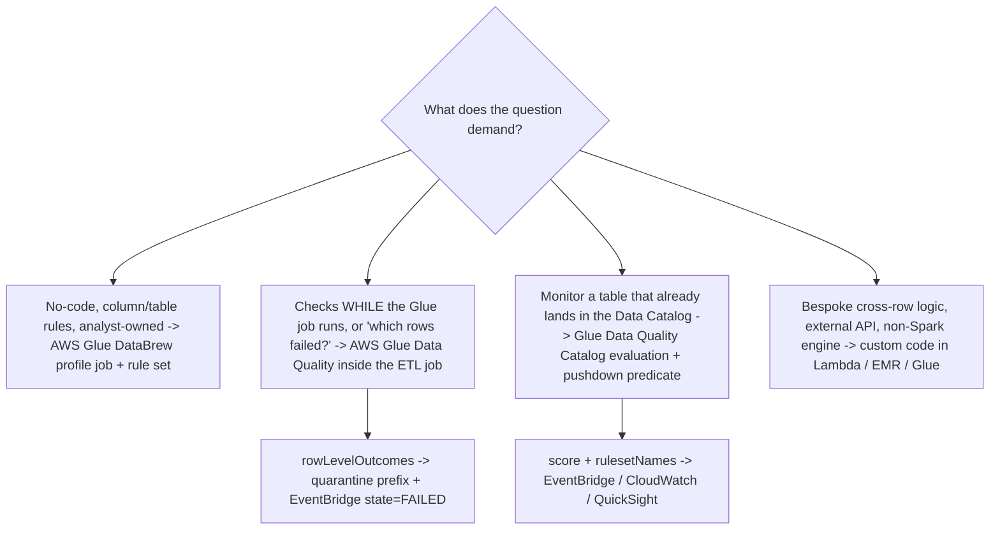
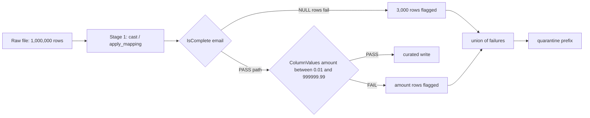
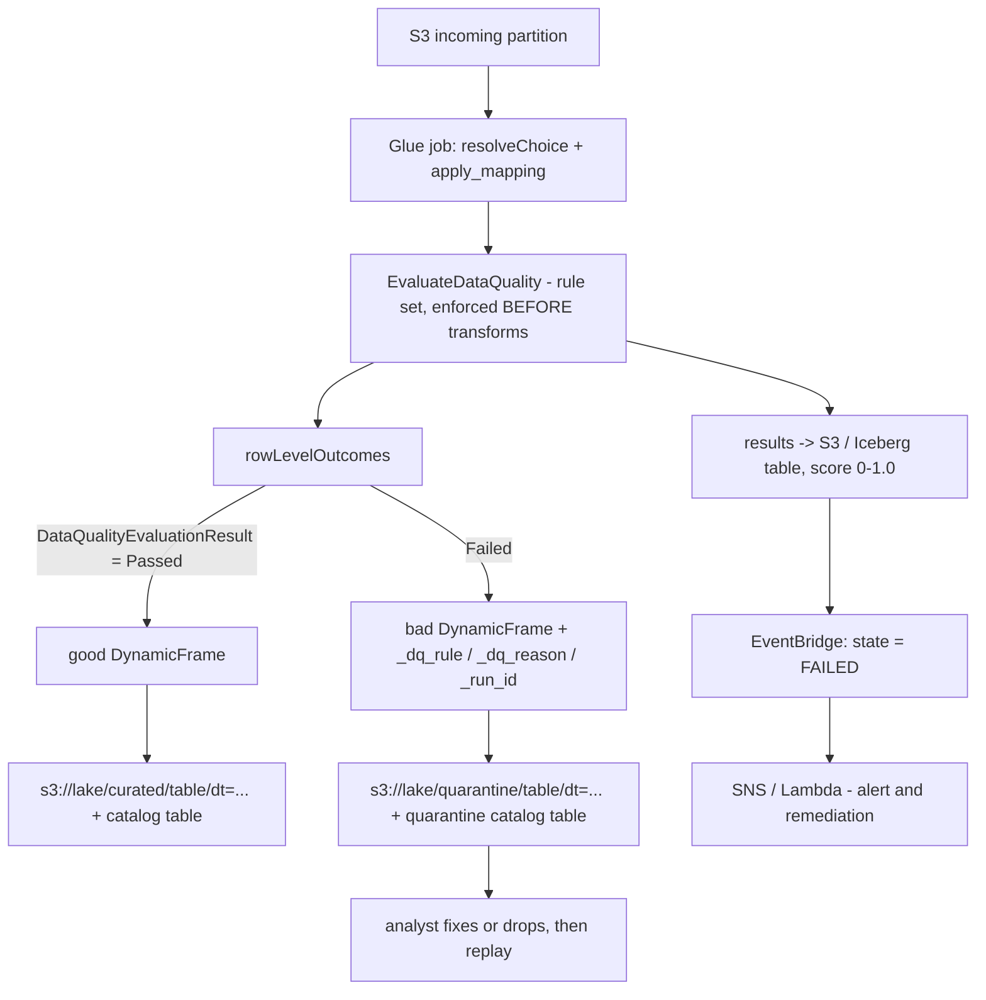
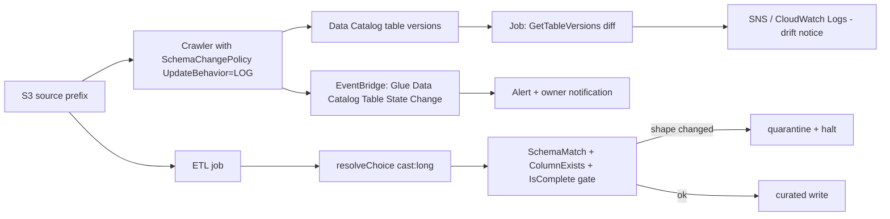
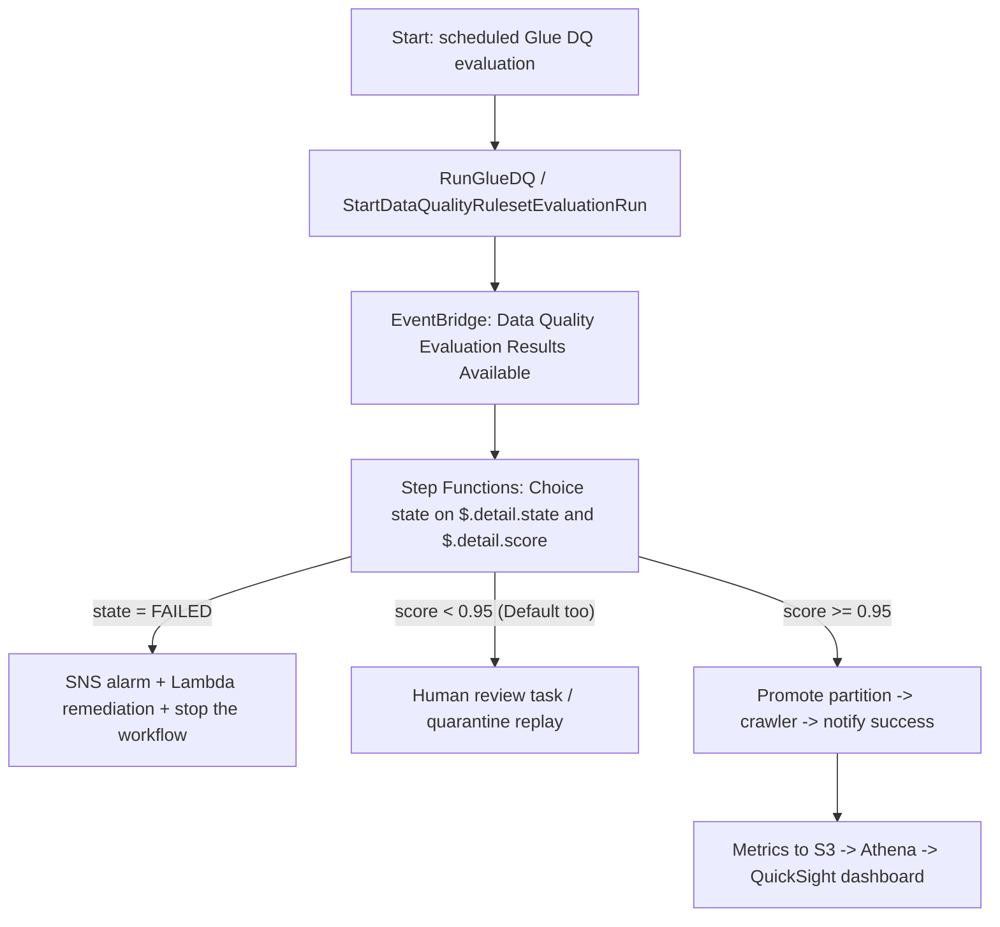
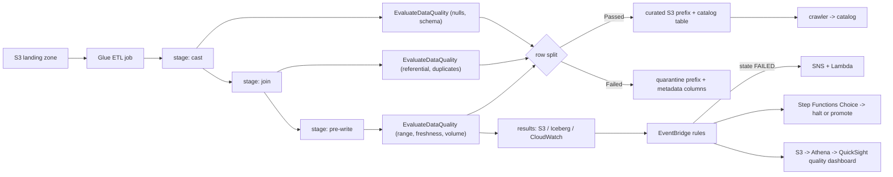

# Automating Data Quality in Pipelines

Data quality is the one Domain 3 topic that other topics silently depend on: a perfectly orchestrated pipeline that moves wrong rows on schedule is worse than no pipeline at all. The DEA-C01 exam guide states the requirement as a single skill — *"Run data quality checks while processing the data (for example, checking for empty fields)"* (Task 3.4.1, DEA-C01 exam guide, accessed Oct 2026) — and everything examinable hangs off that word **while**. A weekly profile of the landing zone is a report; a check that runs inside the job, splits the rows and gates the next step is engineering.

```text
====================================================================
 THE DATA QUALITY CONTROL SURFACE (DEA-C01 Domain 3, Task 3.4)
====================================================================
  3.4.1  checks WHILE processing (empty fields, schema, joins, ...)
  3.4.2  define data quality rules (for example, DataBrew)
  3.4.3  investigate data consistency (for example, DataBrew)
  3.4.4  describe data sampling techniques
  3.4.5  implement data skew mechanisms
--------------------------------------------------------------------
  DIMENSIONS ......... completeness | accuracy | consistency
                      timeliness | validity | uniqueness
  IN-FLIGHT CHECKS ... null/empty, schema, referential, duplicates,
                      range/enum, freshness/watermark, volume
  TOOLS .............. AWS Glue Data Quality (DQDL) - in job or
                          against the Data Catalog
                      AWS Glue DataBrew - profile job + rule set
                      custom code - Lambda / EMR / Glue script
  ACTIONS ............ None (default) | quarantine prefix
                          | fail after load | fail before load
  ARTEFACTS .......... rules, analyzers, rule sets, row-level
                      outcomes, validation report, score 0-1.0
  GATES .............. EventBridge state/score filters ->
                          Step Functions Choice -> SNS / crawl / halt
  DRIFT .............. crawler SchemaChangePolicy, table versions,
                      SchemaMatch, resolveChoice (NOT bookmarks)
====================================================================
```

In this lesson you will:

- read Task 3.4's five sub-statements and defend the **"while processing"** rule against end-of-pipeline distractors;
- map the **six quality dimensions** to AWS-native expressions and to the scenarios the exam writes;
- build the **seven-check in-flight checklist** — null/empty, schema, referential, duplicates, range/enum, freshness/watermark, volume — in DQDL, DataBrew and PySpark;
- operate **AWS Glue Data Quality**: rules, analyzers, rule sets, the 26 Studio rule types, row-level outcomes, the three failure actions and the publishing defaults;
- operate **AWS Glue DataBrew** quality: rule anatomy, rule sets that run in **profile jobs**, findings, the validation report, events, schedules and sampling;
- wire **Glue job quality patterns**: in-script assertions, error tables, the quarantine prefix pattern and streaming dead-letter destinations;
- detect **schema drift** — job bookmarks versus DynamicFrame `resolveChoice`, crawler `SchemaChangePolicy`, Data Catalog table versions and drift alerts;
- gate orchestration with **EventBridge payloads** and a **Step Functions Choice** on `state` and `score`, and publish a **quality dashboard**;
- decide **quarantine versus fail-the-job**, and why the exam guide wants in-flight over quality-at-the-end;
- study **four AWS customer case studies**, a sourced **October 2026 update box** and **14 exam-style questions** plus four interactive checks.

---

## 1. Task 3.4: what "while processing" actually means

### 1.1 The five sub-statements

| Sub-task | Verbatim focus (exam guide, accessed Oct 2026) | What an option must contain to be right |
|---|---|---|
| **3.4.1** | "Run data quality checks **while processing the data** (for example, checking for empty fields)" | A check **inside** the run: an in-job evaluation, a stage boundary, or an evaluation that **gates** the next step |
| **3.4.2** | "Define data quality rules (for example, **DataBrew**)" | A declarative rule or rule set — DataBrew, or Glue Data Quality's DQDL, both acceptable |
| **3.4.3** | "Investigate data **consistency** (for example, DataBrew)" | Comparison across two datasets/tables, or the profile findings that expose an inconsistency |
| **3.4.4** | "Describe data **sampling** techniques" | Sample type and size trade-offs — and the fact that a quality **score** needs the full dataset |
| **3.4.5** | "Implement data **skew** mechanisms" | Detection metrics plus a mitigation (salting, broadcast join, repartition) |

The trap is written into the first line: *"profile the landing zone weekly"* is a **report on** yesterday's data, not a check **while** the data is processed. Options built on "load everything, then profile on Fridays" are designed to fail 3.4.1.

### 1.2 Quality-at-the-end versus in-flight

| | **Quality at the end** | **Quality in flight (exam answer)** |
|---|---|---|
| When | After the load, days later | At cast, after the join, before the write |
| What the consumer sees | Bad rows already in the curated table | Only rows that passed, or a documented quarantine |
| Recovery | Unload, fix, reload | Fix at the boundary, or replay one partition |
| Failing-record identification | Needs a second pass over history | Row-level outcomes produced during the run |
| Typical distractor phrasing | "Schedule a DataBrew profile job every Sunday night" | "`EvaluateDataQuality` after `apply_mapping`, split on outcomes" |

Both have a place: an **at-rest** evaluation against the Data Catalog is legitimate for monitoring a table that is already landing. But when the question's skill line is 3.4.1, the answer is a check that runs **during** processing or that **gates** the next step.

### 1.3 Which tool — the three-way matrix

AWS's own Prescriptive Guidance table is the fastest "which tool" aid on this exam:

| Need | **AWS Glue DataBrew** | **AWS Glue Data Quality** | **Custom checks** |
|---|---|---|---|
| Authoring | No-code column-level or table-level conditions | Custom code in a Glue job **or** no-code | ETL of choice — Lambda, Glue, EMR |
| Runs | Profile job (rule sets) | ETL job (in-flight) or Data Catalog (at rest) | Anywhere you can run code |
| Identifies the failing records | No — findings are aggregate | **Yes — in an ETL job only** | Yes, if you write it |
| Recommendations / auto scaling | — | Recommendations: **Catalog only**; auto scaling and Flex: **ETL only** | — |



- **📚 Did you know?** AWS Glue Data Quality is **built on open-source Deequ**, "a library that is used internally by Amazon to manage the quality of data lakes over 60 PB" (AWS Big Data Blog, 2023-06-06). That is why `amazon-deequ-glue` exists as an AWS sample — but Deequ-as-a-product, Great Expectations, dbt and Soda are **not** on the DEA-C01 in-scope list, so an option built around them is never the best answer.

---

## 2. The six dimensions, mapped to exam scenarios

### 2.1 Dimension → AWS expression → scenario

| Dimension | AWS-native expression (verified) | Scenario it is written for | Classic trap |
|---|---|---|---|
| **Completeness** | `IsComplete "col"`, `Completeness "col" > 0.95`; DataBrew "Value is not missing ≥ 100% rows"; `FillMissingValues`; keywords `NULL, BLANKS, WHITESPACES_ONLY` | Task 3.4.1's "empty fields" | A blank **CSV string** is `""`, not NULL — it will **not** fail a Completeness rule; a blank integer **is** NULL and fails |
| **Accuracy** | `ColumnValues "age" between 18 and 120`, `in [...]`, `matches /re/`, `Entropy`, ML anomaly detection | Values are present but wrong (age 900, negative amount) | Re-running the crawler fixes **metadata**, not data |
| **Consistency** | `ReferentialIntegrity`, `DatasetMatch`, `SchemaMatch`, `RowCountMatch`, `AggregateMatch` | Task 3.4.3 — two sources disagree | Consistency is a **comparison**; a single-table rule is not it |
| **Timeliness** | `DataFreshness`, `FileFreshness`, `ColumnValues "event_ts" > (now() - 1 days)`, `FileMatch/FileSize/FileUniqueness`, `RowCount > avg(last(10))` | SLA: data must be no older than 24 h | Freshness ≠ row count: a complete load of **stale** files still fails |
| **Validity** | `ColumnDataType`, `ColumnLength`, `ColumnNamesMatchPattern`, `ColumnExists`, DataBrew numeric/contains/length | Type and shape change (`amount` arrived as string) | Validity is about **format**, accuracy about **value** |
| **Uniqueness** | `IsUnique`, `Uniqueness "email" = 1.0`, `DistinctValuesCount`, `IsPrimaryKey`, DataBrew "Duplicate rows" / "Unique values = 100% rows" | Double-posted transactions, repeated sign-ups | Redshift `PRIMARY KEY` / `UNIQUE` is **informational** — duplicates load anyway |

The **data quality score** is simply "the percentage of data quality rules that pass (result in true) when you evaluate a ruleset" (AWS Glue Data Quality docs, accessed Oct 2026) — a number between **0 and 1.0**, not a pass mark on its own.

### 2.2 Worked example E1 — completeness that hides behind a string

A CSV column `email` arrives with **1,000,000** rows. In the raw file, **3,000** rows carry an empty field. Two rules are written over the same data:

```text
Rule A (DQDL)   IsComplete "email"                 threshold 100% of rows
Rule B (coerced) ColumnDataType "email" in ["string"]
                + completeness after reading as string

Raw read:      empty CSV field -> "" (empty string), NOT NULL
Rule A result: 997,000 non-empty / 1,000,000 = 99.70%  < 100%  -> FAIL
               ...but only if the source type makes the field NULL.
               Read as string, "" is a value -> 100% "complete" -> PASS (wrong)

Fix:           use IsComplete with the NULL/EMPTY/WHITESPACES_ONLY keywords,
               or coerce the column type first, then evaluate.
```

**Reading:** the same 3,000 bad rows can pass or fail depending on the type the reader infers. That is why completeness rules are written **after** type coercion, at the post-cast stage boundary — and why "checking for empty fields" in 3.4.1 is a *placement* skill as much as a rule-writing skill.



### 2.3 Match the dimension to its exam signature

```matching
{
  "question": "Match each data quality dimension to the AWS expression the DEA-C01 exam writes it with:",
  "pairs": [
    {"left": "Completeness", "right": "IsComplete \"order_id\" at 100% of rows - the literal 'empty fields' check of Task 3.4.1"},
    {"left": "Accuracy", "right": "ColumnValues \"age\" between 18 and 120, or matches /regex/ - the value is present but wrong"},
    {"left": "Consistency", "right": "ReferentialIntegrity, DatasetMatch or RowCountMatch - two datasets or tables disagree (Task 3.4.3)"},
    {"left": "Timeliness", "right": "DataFreshness / FileFreshness, or ColumnValues \"event_ts\" > (now() - 1 days) against an SLA"},
    {"left": "Validity", "right": "ColumnDataType, ColumnLength, ColumnNamesMatchPattern - the type or shape changed"},
    {"left": "Uniqueness", "right": "IsUnique, Uniqueness \"email\" = 1.0, IsPrimaryKey - and Redshift keys will NOT enforce it for you"}
  ],
  "explanation": "The exam almost never asks for a definition - it writes a scenario and expects the dimension: 'empty fields' is completeness, 'two systems disagree on the same customer id' is consistency, 'the load is 30 hours late' is timeliness, 'amount arrived as a string' is validity. Each maps to a different DQDL rule family, and uniqueness is the one that must be re-checked in a pipeline because Redshift PRIMARY KEY, UNIQUE and FOREIGN KEY constraints are informational only when you populate a table."
}
```

- **📚 Did you know?** Of the six dimensions, **uniqueness** is the one most often "enforced" by a constraint that does not enforce: Amazon Redshift states that *"Uniqueness, primary key, and foreign key constraints are informational only; they are not enforced by Amazon Redshift when you populate a table"*, while *"Amazon Redshift does enforce NOT NULL column constraints"* (Redshift docs, accessed Oct 2026). So `INSERT` of a duplicate primary key **succeeds**, `INSERT` of `NULL` into a `NOT NULL` column fails — and both behaviours are examinable as "which DDL prevents duplicate loads? None."

---

## 3. The in-flight checklist: seven checks, placed at stage boundaries

Every check below can be written in DQDL (Glue Data Quality), as a DataBrew rule, or in plain PySpark — placement is what earns the mark for 3.4.1.

### 3.1 Null / empty

```text
DQDL          IsComplete "customer_id"
              Completeness "email" > 0.99
DataBrew      "Value is not missing" >= 100% of rows
PySpark       df.filter(col("customer_id").isNull() | (col("customer_id") == ""))
Note          For all ColumnValues rules other than != and NOT IN,
              NULL rows fail the rule (DQDL rule types, accessed Oct 2026)
```

### 3.2 Schema validation

`ColumnExists`, `ColumnDataType`, `ColumnLength`, `ColumnNamesMatchPattern`, `SchemaMatch`. An S3-target job **default-enables** an "at least one column" rule plus anomaly detection on column count — a failure **lowers the score but does not fail the job** (Glue tutorial, accessed Oct 2026). Schema rules answer *validity*; drift (Section 7) answers *what changed since last time*.

### 3.3 Referential integrity

```text
DQDL    ReferentialIntegrity "order.customer_id" with "customer.customer_id"
        (second input supplied as the reference dataset)
Why     Redshift foreign keys are informational - check in-job, at the
        post-join boundary, before anything is written
Also    DatasetMatch / RowCountMatch for cross-system consistency (3.4.3)
```

### 3.4 Duplicates

```text
DQDL        IsUnique "transaction_id"      Uniqueness "email" = 1.0
            DistinctValuesCount "session_id" > 1000
DataBrew    "Duplicate rows" | "Unique values = 100% rows"
            FlagDuplicatesInColumn (recipe step)
PySpark     row_number().over(Window.partitionBy("id")) == 1
```

### 3.5 Range / enum

```text
ColumnValues "amount" between 0.01 and 999999.99
ColumnValues "status" in ["NEW", "SHIPPED", "CANCELLED"]
ColumnValues "gender" in ["F", "M"] where "weightinkgs < 10"
Combinators AND / OR / NOT;  row threshold  "... at least 95% of rows"
where clause: supported on AWS Glue 4.0 jobs only (DQDL reference)
```

### 3.6 Freshness / watermark

```text
DataFreshness "s3://bucket/incoming/" max-age 1 day
ColumnValues "event_ts" > (now() - 1 days)  at 0.99 of rows
Cross-check:  CustomSql  SELECT MAX(event_ts) FROM ...   vs a watermark table
Scope:        job bookmarks decide WHICH files are processed this run
```

**Bookmarks give incremental scope, not validation** — they track processed files and rows and perform **no** schema check (Section 7). Streaming uses **checkpoints**, and Glue streaming's default window is **100 seconds**.

### 3.7 Volume

`RowCount between X and Y`, `RowCountMatch`, `AggregateMatch`, `CustomSql` — *"almost any type of data quality checks in SQL"* (DQDL rule types, accessed Oct 2026). Volume rules are the cheapest way to catch "the source sent 4% of yesterday's rows" **before** downstream aggregates silently publish a small number.

### 3.8 Worked example E2 — freshness against an SLA

An SLA says orders must be no more than **24 hours** old when the curated table is published at 02:00 UTC.

```text
Rule          ColumnValues "event_ts" > (now() - 1 days)   row threshold 0.99
Run at 02:00  rows older than 02:00 yesterday = 0 -> PASS
Run at 08:00  (late rerun) now() has moved 6 h
              rows in [02:00-24h, 08:00-24h] = 6 h of events now "old"
              if < 1% of rows: rule still PASSES at 0.99
              -> pair it with a watermark cross-check:
                 CustomSql: SELECT MAX(event_ts) FROM curated.orders
                 compare against SLA watermark 2026-10-09T02:00:00Z
Reading       a row-threshold freshness rule tolerates late-tail rows by
              design; the watermark comparison catches a stalled upstream.
```

**Two signals, one decision:** the DQDL rule bounds the *rows*, the watermark comparison bounds the *load*. Exam options that offer only one of them are usually testing whether you know which failure each one catches.

---

## 4. AWS Glue Data Quality: DQDL, rule sets, outcomes

### 4.1 Three objects, two entry points

| Object | What it is |
|---|---|
| **Rule** | A Boolean expression over a metric — passes or fails |
| **Analyzer** | Produces the statistics an anomaly/dynamic rule trains on |
| **Rule set** | *"A ruleset is a set of rules that compare different data metrics against expected values. If any of a rule's criteria isn't met, the ruleset as a whole fails validation."* — attached to a **Data Catalog table** (it gets an ARN) |

| | **Data Catalog evaluation (at rest)** | **ETL job evaluation (in flight)** |
|---|---|---|
| Sources | S3, Redshift, JDBC, Iceberg/Hudi/Delta, LF-managed OTF | All Glue sources, inside the run |
| Incremental scope | Pushdown predicates | Job **bookmarks** |
| Recommendations | **Yes** | No |
| Auto scaling / Flex workers | No | **Yes** |
| **Identifies the records that failed** | **No** | **Yes** (`rowLevelOutcomes`) |
| Athena views cataloged in the Glue Data Catalog | **Not supported** as a source | Use the job path |
| Shared | EventBridge, CloudWatch, S3 results, CloudFormation | same |

Studio offers **26 rule types**; a results evaluation writes to S3 (optionally **Iceberg/Data Catalog tables** you can query with Athena), and anomaly detection *"requires a minimum of three data points"*.

### 4.2 What happens when a rule set fails

```text
Action on ruleset failure (AWS Glue tutorial, accessed Oct 2026)
  None                                <- DEFAULT: job does not fail and
                                          continues despite rule failures
  Fail job after loading data to target
  Fail job without loading to target data

Publishing options (EvaluateDataQuality)
  enableDataQualityResultsPublishing   = True   (default)
  enableDataQualityCloudWatchMetrics   = False  (default - OFF)
  resultsS3Prefix                      = your prefix
```

> [!WARNING]
> ⚠️ **The default is silence.** With `None` as the failure action, a run that fails every rule still reports **SUCCEEDED**, and CloudWatch metrics stay **off** unless you set `enableDataQualityCloudWatchMetrics`. "The job failed because a rule failed" is therefore *usually false* as written — the correct fix is an explicit fail action, an in-script assertion, or a Step Functions Choice on the published result (Section 8).

### 4.3 Row-level outcomes — and the eleven rules that cannot produce them

```python
from awsgluedq.transforms import EvaluateDataQuality

dq_results = EvaluateDataQuality.apply(
    frame = good_and_bad,
    ruleset = "rules = [IsComplete \"order_id\" ...]",
    publishingOptions = {"enableDataQualityResultsPublishing": True}
)

row_level = dq_results.rowLevelOutcomes  # + DataQualityEvaluationResult
passed = row_level.filter(row_level.DataQualityEvaluationResult == "Passed")
failed = row_level.filter(row_level.DataQualityEvaluationResult == "Failed")
```

`rowLevelOutcomes` adds four columns and a per-row **Passed/Failed** status. Eleven rule types **cannot** be attributed to rows — `AggregateMatch, ColumnCount, ColumnExists, ColumnNamesMatchPattern, CustomSql, RowCount, RowCountMatch, StandardDeviation, Mean, ColumnCorrelation` (Glue tutorial, accessed Oct 2026). So "which rows failed?" is answered by **row-scoped** rules in an **ETL job** — never by a Catalog evaluation, and never by an aggregate rule.

### 4.4 Worked example E3 — score, and why you route on `state`, not `score`

A rule set of **6 rules** runs: **4 pass, 2 fail**.

```text
score = rules passed / total rules = 4 / 6 = 0.6667  (0 - 1.0 scale)

EventBridge filter A   "detail": { "state": ["FAILED"] }          -> MATCHES
EventBridge filter B   "detail": { "score": {"numeric": ["<=", 0.7]}} -> MATCHES (0.6667 <= 0.7)

Now 17 of 20 rules pass, 2 fail, 1 is skipped:
score = 17 / 20 = 0.85
Filter A (state FAILED)          -> MATCHES   (ruleset failed)
Filter B (score <= 0.7)          -> NO MATCH  (0.85 > 0.7)

Reading: state and score are DIFFERENT signals. A rule set that fails on
one hard rule can still score 0.85, so a score-only alarm misses it.
Route on state for correctness; use score for severity.
```

A skipped rule does not count as a pass — the score is **rules that passed** over the evaluated rules, so never assume `state` and `score` agree.

```fillblank
{
  "question": "Complete the Glue Data Quality statements with the verified defaults and behaviours (as of Oct 2026):",
  "template": "The data quality score is the {{1}} of data quality rules that pass, expressed from 0 to 1.0. The default action when a rule set fails in a Studio job is {{2}}, so the job {{3}} fail. Results publishing is {{4}} by default while CloudWatch metrics are {{5}} by default. Row-level outcomes are produced only when the evaluation runs in an {{6}} job, and a blank CSV string is {{7}} (not NULL), so it will not fail a completeness rule.",
  "answers": {
    "1": "percentage",
    "2": "None",
    "3": "does not",
    "4": "enabled",
    "5": "disabled",
    "6": "ETL",
    "7": "an empty string"
  },
  "distractors": ["average", "count", "Fail job", "average or count", "quarantine", "blocked", "disabled", "enabled", "Catalog", "streaming", "null", "missing"],
  "explanation": "'The percentage of data quality rules that pass (result in true) when you evaluate a ruleset' is AWS's own definition of the score. The documented failure action default is 'None - If you choose None (default), the job does not fail and continues to run despite rules failures'. enableDataQualityResultsPublishing defaults to True and enableDataQualityCloudWatchMetrics to False, identifying the records that failed is an ETL-job-only capability, and an empty CSV field reads as an empty string - use the EMPTY/WHITESPACES_ONLY keywords or coerce types first."
}
```

---

## 5. AWS Glue DataBrew: rules, rule sets, findings

### 5.1 Rule anatomy

| Part | Choice | Exam note |
|---|---|---|
| **Checks** | Number of rows, duplicate rows, unique values, not-missing %, in-range, starts-with, length | Built from the rule builder's check list |
| **Scope** | Per column, or "Common checks for selected columns" | Scope decides whether one column or a group is judged |
| **Success criteria** | **AND** / **OR** across checks | AND is stricter — one failing check fails the rule |
| **Passing threshold** | `% of rows` | Aggregate rule vs per-row rule |
| **Types** | **Simple types only** | Nested structures are out |

Example checks from AWS's own material: `Number of rows = 5000000`, `Duplicate rows`, `Unique values = 100% rows`, `Value is not missing >= 100% rows`, `Value in column APY between 0 and 100`, `Number of missing values in column group_name doesn't exceed 5%`.

### 5.2 Rule sets run in **profile jobs**, not recipe jobs

`CreateRuleset` is documented as *"Creates a new ruleset that can be used in a **profile job** to validate the data quality of a dataset"*. Recipe jobs apply **recipe steps** — that family populates missing values, removes invalid data and removes duplicates, which is **remediation**, not **validation**. The canonical false statement on this exam is *"attach the rule set to the recipe job"*.

Quotas that questions quote directly (as of Oct 2026): **100 rules per rule set**, **10 rule sets per dataset**, **100 rule sets per account**, **100 steps per recipe**, **300 nodes per account**.

### 5.3 Findings, validation report and events

- **Profile outputs:** Summary, Correlations, Value distribution, Column Summary, plus a **Column statistics** tab.
- **Validation results:** on the **Data quality rules / Data quality tab** of the job run.
- **Builder help:** a **Dataset preview** tab and a **Recommendations** tab while you author.
- **Report:** the profile job *"produces a validation report in addition to the data profile … at the same location as your profile data"*.
- **Events:** one EventBridge event per run **and** per rule set:

```json
{
  "source": ["aws.databrew"],
  "detail-type": ["DataBrew Ruleset Validation Result"],
  "detail": { "validationState": ["FAILED"] }
}
```

One rule with that pattern matches **every** failed validation in the account — the examinable payload is `detail-type` + `validationState`, not a per-dataset ARN.

### 5.4 Sampling (Task 3.4.4)

| Fact | Value (AWS DataBrew docs, accessed Oct 2026) |
|---|---|
| Project / preview default | **First 500 rows** |
| `Sample.Type` | `FIRST_N` · `LAST_N` · `RANDOM` |
| `Sample.Size` | **1 – 5,000** |
| `FIRST_N` | Fast, **biased** — a header-order artefact of the file |
| `RANDOM` | Representative of the underlying source |
| Profile / recipe jobs | Run on the **whole** dataset — sampling is for projects and previews only |
| Quality scores | Need the **full** dataset — a score over 500 rows is not the score |

AWS's own wording: *"A smaller sample size allows DataBrew to perform transformations faster … A larger sample size more accurately reflects the makeup of the underlying source data."*

- **📚 Did you know?** DataBrew schedules are **six-field cron** expressions with a hard floor: *"Cron expressions that lead to rates faster than 5 minutes aren't supported"*, and day-of-month versus day-of-week is **exclusive** (use `?` for one of them). So the "every 2 minutes, validate the stream" option is wrong for two independent reasons — DataBrew is not a stream processor, and its clock cannot tick that fast (DataBrew jobs docs, accessed Oct 2026).

### 5.5 Worked example E4 — an HR rule set that fits the quotas

Five rules over a nightly HR extract of **5,000,000** rows:

```text
R1  Number of rows = 5000000                       (volume)
R2  Duplicate rows                                 (uniqueness)
R3  Unique values = 100% of rows in Emp ID, e-mail,
    SSN                                            (uniqueness x3 columns)
R4  Value is not missing >= 100% of rows           (completeness)
R5  Value in column APY between 0 and 100          (accuracy / range)

Rule count check:  8 checks total  <= 100 rules per rule set     OK
Rule sets:         1 set          <= 10  per dataset            OK
Attached to:       a PROFILE job (not the recipe job)
Output:            profile JSON + validation report in S3
                   + "Data quality rules" tab findings
Alert:             EventBridge detail-type
                   "DataBrew Ruleset Validation Result",
                   validationState FAILED -> SNS
```

### 5.6 Skew (Task 3.4.5) — the timeliness dimension's twin

Skew does not corrupt rows; it destroys the **timeliness** of the run. Detect it with the driver metrics **`glue.driver.skewness.job`** and **`glue.driver.skewness.stage`**, the Spark UI, or partition-size statistics. Mitigations AWS documents: hot-key filtering, incremental aggregation, **salting**, broadcast joins, `repartition`/`coalesce`, **adaptive query execution** (default on Glue 4.0+), input partitioning and vertical scaling — AWS's own conclusion is that *"there is no single universal solution"*. On the exam, "one task runs 40 minutes while the other 39 finish in 30 seconds" ⇒ skew, and the fix named in the option is **salt the hot key** or **broadcast the small table**.

---

## 6. Glue job quality patterns: assertions, error tables, quarantine

### 6.1 In-script assertions — the strongest in-flight gate

```python
from awsgluedq.transforms import EvaluateDataQuality
from awsglue.context import SparkContext, GlueContext
import sys

dq = EvaluateDataQuality.apply(
    frame = post_join_frame,
    ruleset = """
      rules = [
        IsComplete "order_id",
        ColumnValues "amount" between 0.01 and 999999.99,
        IsUnique "order_id"
      ]
    """,
    publishingOptions = {"enableDataQualityResultsPublishing": True}
)

failed = dq.filter(dq["Outcome"].contains("Failed")).count()
assert failed == 0, "Data quality rules caused the job to fail."
```

Scala form from the AWS tutorial: `assert(DQ_Results.filter(_.getField("Outcome").contains("Failed")).count == 0, "…caused the job to fail.")`. An assertion turns a **score** into a **failed job**, which is what "run checks while processing" looks like when the option says *stop before bad data lands*.

### 6.2 Error tables — and the name that does not exist

| Mechanism | What it does |
|---|---|
| `ErrorsAsDynamicFrame` / `errorsFromDF` | Collects rows rejected by a mapping into a separate DynamicFrame |
| `Spigot` | Diverts rows that fail a filter or exceed a limit into a side output |
| `FlagDuplicatesInColumn` | Marks duplicates so they can be routed, not silently dropped |
| `FillMissingValues` | Remediation recipe/transform step — the fix side of quality |
| Conditional branch on `Outcome` | Sends good/bad frames to different sinks |

> [!IMPORTANT]
> **There is no AWS construct called "ErrorCDC."** AWS Glue documents `ErrorsAsDynamicFrame`, `errorsFromDF`, `Spigot`, `rowLevelOutcomes` and DataBrew quarantine output — an option naming "ErrorCDC" is testing whether you recall the real API. The verified pattern is **error table**, not error-CDC.

### 6.3 The quarantine prefix pattern

> "AWS Glue Data Quality helps you identify the exact records that caused your quality scores to go down. Easily identify them, **quarantine** and fix them." — AWS Glue Data Quality product page, accessed Oct 2026

AWS's **InsuranceLake** reference sample states the contract precisely: *"The quarantine action removes individual rows that fail the quality check … stores them in a separate quarantine storage location and Data Catalog table"*, with rules enforced **immediately after schema mapping … before any transforms are run**, at stages `before_transforms` / `after_transforms` / `after_sparksql` — and the `<table>_quarantine_*` S3 folder and catalog table are created **regardless of whether any rows are quarantined**, so downstream monitoring never has to guess whether the path exists.



### 6.4 Streaming: the dead-letter side of quality

For Lambda consumers of Kinesis/Kinesis Data Firehose, the quality failure path is the **on-failure destination**, not a console alarm: `DestinationConfig.OnFailure` → **SQS, SNS, S3 or Amazon MSK**, with `BisectBatchOnFunctionError` to isolate the poison record, `MaximumRetryAttempts` **0–10,000**, `MaximumRecordAgeInSeconds` **60–604,800**, and `ReportBatchItemFailures` returning `batchItemFailures` for partial-batch handling. A **function-level DLQ** is the older mechanism; the on-failure destination is the current one, and the two are not interchangeable in an option pair. Glue streaming jobs **checkpoint rather than use job bookmarks**.

### 6.5 Worked example E5 — the quarantine split

One million rows land; the job carries 6 rules, 4 of which are row-scoped:

```text
Total rows                          1,000,000
Rule A  IsComplete "order_id"       1,500 rows NULL        -> fails 99.9% threshold
Rule B  amount between 0.01..       2,900 rows out of range
        and 999999.99                                             -> fails 99.7% threshold
Rows failing BOTH                   400 (overlap)
Union of failing rows = 1,500 + 2,900 - 400           = 4,000
Quarantined share  = 4,000 / 1,000,000                 = 0.40%
Curated write      = 1,000,000 - 4,000                 = 996,000
Rule set score     = 4 passed / 6 total                = 0.67
Action taken       = None (default) -> job SUCCEEDED
EventBridge        state = FAILED  -> matches;  score 0.67 <= 0.7 -> also matches
Quarantine object  s3://lake/quarantine/orders/dt=2026-10-10/
                   + columns _dq_rule, _dq_reason, _run_id
```

**Read the two halves together:** the data path quarantined 4,000 rows and published 996,000; the control path published `state = FAILED` and a score of 0.67 — while the **job** still reported success because the action was `None`. Three different signals, three different answers to "did it work?".

---

## 7. Schema drift detection: what actually sees a changed shape

### 7.1 Bookmarks are not drift detection

| Mechanism | Tracks | Detects schema change? |
|---|---|---|
| **Job bookmarks** | Which files/rows were processed | **No** — incremental *scope* only; renaming `transformation_ctx` invalidates state |
| **Crawler `SchemaChangePolicy`** | Discovered schema | **Yes** — `UpdateBehavior = LOG \| UPDATE_IN_DATABASE`, `DeleteBehavior = LOG \| DELETE_FROM_DATABASE \| DEPRECATE_IN_DATABASE`; `LOG` = detect without mutating |
| **Data Catalog table versions** | Version history | **Yes** — a job diffs `GetTableVersions`, logs the diff and publishes **SNS** |
| **`SchemaMatch` / `ColumnExists` / `ColumnDataType`** | Expected shape | **Yes** — *"ensures that the dataset accurately matches a set schema, preventing downstream errors"* |
| **DynamicFrame `resolveChoice`** | Choice types from inference | **Repairs** — and can silently destroy data (below) |

Pair the crawler with the **Glue Data Catalog Table State Change** EventBridge event (`UpdateTable`, `CreatePartition`, `UpdatePartition`, `DeletePartition` plus batch variants) for drift **alerts**; `LOG` behaviour means the catalog is never mutated by an alerting-only crawler.

### 7.2 `resolveChoice` — the repair that costs data

The crawler samples only a **2 MB prefix** of the prefix; a source where 2 rows in 160,000 hold strings in a numeric column becomes `choice<long,string>`:

```text
choice<long,string>
  cast:long     uncastable values -> NULL        (data lost, then caught
                                                  by IsComplete / range rules)
  project:long  keeps only long values           (rows dropped)
  make_cols     splits into two columns
  make_struct   nests the choice
Medicare-style case: 2 string rows -> cast:long -> 2 NULLs ->
IsComplete "member_id" fails -> quarantine, not silent nulls
```

**Order matters:** `resolveChoice` → `apply_mapping` → `toDF()`. Choosing `cast` without a completeness rule converts a *schema* problem into a *data* problem you never see.

### 7.3 Worked example E6 — the Redshift constraint illusion

```sql
CREATE TABLE accounts (id INT PRIMARY KEY, email VARCHAR(256) NOT NULL);

INSERT INTO accounts VALUES (1, 'a@example.com');  -- succeeds
INSERT INTO accounts VALUES (1, 'b@example.com');  -- SUCCEEDS (PK informational)
INSERT INTO accounts VALUES (NULL, 'c@example.com'); -- FAILS (NOT NULL enforced)
SHOW CONSTRAINTS;                                  -- inspect what you declared
```

Same check written as a DQDL rule — `IsPrimaryKey "id"` = *"not NULL and unique"* — **does** reject the duplicate. `CHECK` and exclusion constraints are **unsupported** in Redshift. So "the load failed because a primary key duplicate was rejected" is wrong, and "add a uniqueness rule in the job" is right.



---

## 8. Orchestration: gate the pipeline on the quality result

### 8.1 The EventBridge payloads you must recognise

```json
{
  "source": ["aws.glue-dataquality"],
  "detail-type": ["Data Quality Evaluation Results Available"],
  "detail": {
    "state": ["FAILED"],
    "context": { "contextType": ["GLUE_JOB"] },
    "score": { "numeric": ["<=", 0.7] }
  }
}
```

| Field family | Values |
|---|---|
| `context.contextType` | `GLUE_DATA_CATALOG` (+ `databaseName`, `tableName`, `runId`) or `GLUE_JOB` (+ `jobId`, `jobName`) |
| `resultID`, `rulesetNames` | Which evaluation, which rule sets |
| `state` | `FAILED` / `SUCCEEDED` — the **ruleset evaluation**, not the ETL run |
| `score` | 0–1.0 — use `{"numeric": ["<=", 0.7]}` style filters |
| `rulesSucceeded` / `rulesFailed` / `rulesSkipped` | Per-rule counts for remediation |

DataBrew's counterpart is `source: aws.databrew`, `detail-type: DataBrew Ruleset Validation Result`, `detail.validationState: FAILED`. Glue crawler drift arrives as **Glue Data Catalog Table State Change**. Three services, three `detail-type` strings — the exam tests whether you can pick the right one.

### 8.2 Step Functions: the Choice state is the gate

```json
{
  "Comment": "Gate promotion on data quality",
  "StartAt": "RunDQ",
  "States": {
    "RunDQ": { "Type": "Task", "Resource": "arn:aws:states:::glue:startJobRun.sync", "Next": "QualityGate" },
    "QualityGate": {
      "Type": "Choice",
      "Choices": [
        { "Variable": "$.detail.state", "StringEquals": "FAILED", "Next": "AlarmAndHalt" },
        { "Variable": "$.detail.score", "NumericLessThanEquals": 0.95, "Next": "HumanReview" },
        { "Variable": "$.detail.score", "NumericGreaterThanEquals": 0.95, "Next": "PromoteAndCrawl" }
      ],
      "Default": "AlarmAndHalt"
    }
  }
}
```

Amazon States Language semantics worth memorising: `Choices[]` are evaluated **in order**, and *"If no Choices evaluate to true … and no Default is provided, the state machine will throw an error"* — which is why AWS recommends a `Default`.



### 8.3 Dashboards and metrics

The documented QuickSight path is **EventBridge → Lambda → S3 → crawler → Athena → QuickSight**, giving a **score time series** rather than a per-run verdict. CloudWatch metrics live under `dataQualityEvaluationContext` (default **off**) and logs under `/aws-glue/data-quality/output` and `/aws-glue/data-quality/error`. A question asking "how do analysts see the quality trend over 90 days?" is a dashboard question, not an alert question — the answer needs **stored results plus a BI layer**, not an SNS topic.

### 8.4 The whole pipeline, one picture



Every arrow above is a dependency: nothing downstream can exist until the artefact upstream of it has been produced. Order the whole gate the same way:

```dragdrop
{
  "question": "Put the end-to-end quality gate in the order it must run inside the pipeline:",
  "items": [
    "Scope - job bookmarks or a pushdown predicate decide WHICH rows this run evaluates; bookmarks do no validation",
    "Shape - resolveChoice then apply_mapping, so every column has exactly one type before any rule is written",
    "Evaluate - EvaluateDataQuality runs the rule set in flight at the post-cast and post-join boundaries",
    "Split - rowLevelOutcomes divides the frame on DataQualityEvaluationResult into Passed and Failed rows",
    "Route - good rows to the curated prefix, failures to the quarantine prefix with _dq_rule, _dq_reason and _run_id",
    "Publish - results go to S3 or an Iceberg table and the EventBridge event carries state and score",
    "Gate - a Step Functions Choice reads $.detail.state and $.detail.score to halt, send to review, or promote and crawl"
  ],
  "correctOrder": [
    "Scope - job bookmarks or a pushdown predicate decide WHICH rows this run evaluates; bookmarks do no validation",
    "Shape - resolveChoice then apply_mapping, so every column has exactly one type before any rule is written",
    "Evaluate - EvaluateDataQuality runs the rule set in flight at the post-cast and post-join boundaries",
    "Split - rowLevelOutcomes divides the frame on DataQualityEvaluationResult into Passed and Failed rows",
    "Route - good rows to the curated prefix, failures to the quarantine prefix with _dq_rule, _dq_reason and _run_id",
    "Publish - results go to S3 or an Iceberg table and the EventBridge event carries state and score",
    "Gate - a Step Functions Choice reads $.detail.state and $.detail.score to halt, send to review, or promote and crawl"
  ],
  "explanation": "Scope first because bookmarks only choose the input; shape second because a rule evaluated against an ambiguous choice type judges the reader, not the data; evaluate before split because the split is made FROM rowLevelOutcomes; route before publish because the published state and score describe what the routing did; and the Choice state is last because it can only gate on a result that already exists. The two classic reversals are evaluating before resolveChoice (rules fire on string-versus-long ambiguity) and gating before publishing (there is no $.detail for the Choice state to read)."
}
```

---

## 9. Quarantine versus fail-the-job — and the tradeoff the exam actually asks

| | **Quarantine the bad rows** | **Fail the job** |
|---|---|---|
| Pipeline keeps running | **Yes** — curated gets the good rows | **No** — nothing new lands |
| Bad rows visible | Yes, in a monitored prefix + catalog table | No new ones; existing load untouched |
| Consumer impact | Partial load — downstream must know | Stale data — downstream must know |
| Extra work | Fix + **replay** the quarantined rows; monitor the prefix | Root-cause, re-run the whole job |
| Glue Data Quality action | `None` (default) **plus** a row split, or fail-after-load | `Fail job without loading to target data` |
| Exam signal | "identify the **exact records**", "keep the pipeline flowing", SLA-tolerant feeds | "must not publish", regulatory gate, single source of truth |

> [!WARNING]
> ⚠️ **Quarantine is not free, and fail is not safe.** Quarantine keeps the SLA but creates a **second queue of work** — someone must read `_dq_rule` / `_dq_reason`, fix the source and replay, and a quarantine prefix nobody alerts on is silent data loss by another name. Fail-the-job protects consumers but stops the pipeline, and with a **default action of `None`** it does not even do that unless you configured it. Read the option for the *requirement*: "regulatory figures must never be partial" ⇒ fail before load; "hourly analytics feed with human triage" ⇒ quarantine + alert.

### 9.1 The decision in one line each

- **In-flight beats at-the-end** for 3.4.1 — but an at-rest Catalog evaluation is right for *monitoring a table that already lands*.
- **DataBrew** for no-code, analyst-owned, column/table rules run as a **profile job**; **Glue Data Quality** for in-job checks, row-level outcomes and Flex/auto scaling; **custom code** for anything with cross-row logic no rule type covers.
- **Route on `state`, score on `score`** — they are different signals (E3).
- **Bookmarks scope, crawlers and `SchemaMatch` detect drift** — never the other way round.
- **Sampling is for previews; scores need the full scan.**

- **📚 Did you know?** The **replay** half of the quarantine loop now has an in-lake mechanism: since **2026-04-23** Amazon Redshift can **UPDATE / DELETE / MERGE** partitioned and unpartitioned **Apache Iceberg** tables — including **Amazon S3 Tables** — and since AWS's Patch 202 an Iceberg **DELETE** on a Lake Formation table needs the **DELETE** permission, **UPDATE/MERGE** need **INSERT + DELETE**, and *every* Iceberg DML statement also needs **ALTER**. So "fix the quarantined rows and merge them back" is an ordinary operation, while a lab that granted only INSERT now fails halfway through the remediation (AWS Redshift behaviour-changes documentation, accessed Oct 2026).

---

### 2026 Updates (as of October 2026)

> [!NOTE]
> **What moved for data quality between 2024 and October 2026** — every line checked against an AWS primary source in **October 2026**, and each one is examinable because the exam tests current behaviour:
> - **Glue generations moved under your rules**: **Glue 5.1** has been the **default for new jobs since 2025-11-26** and **Glue 6.0 went GA on 2026-08-21** with a **30% price cut** (Spark 4.1.1, Python 3.13, Scala 2.13); **Glue 0.9/1.0/2.0 reached end of life on 2026-04-01** — AWS Glue release notes and What's New, accessed Oct 2026. A `where "<sparksql>"` DQDL clause is documented for **Glue 4.0+** jobs; re-check the clause list against your job's `GlueVersion`.
> - **DQDL grew constants on 2026-07-27** — AWS Glue Data Quality release notes, accessed Oct 2026; and **file-level rules (`FileFreshness`, `FileMatch`, `FileSize`, `FileUniqueness`) plus default Visual-ETL checks landed 2024-12-06**, anomaly/dynamic rules went GA **2024-11-22**, and results-to-Iceberg publishing dates to **2024-03-12** (AWS Glue Data Quality features/release notes, accessed Oct 2026).
> - **Results are a first-class dataset**: DQ results can be written to **Iceberg / Data Catalog tables** and queried with **Athena**, and **S3 Tables** support followed on **2025-11-21** — which is what makes the QuickSight score-time-series pattern (Section 8.3) examinable rather than aspirational (AWS Glue Data Quality docs, accessed Oct 2026).
> - **The exam guide itself was revised**: DEA-C01 guide **v1.1 (2025-12-12)** consolidated knowledge/skills lists and added **8 skills with none removed**, and the in-scope list added **6 services (Aurora, Amazon Q, Bedrock, Kendra, AWS Data Exchange, Amazon S3 Tables)** while removing **Cloud9, CodeCommit and AWS SCT**; AWS Glue and **AWS Glue DataBrew** remain in the Analytics category — DEA-C01 exam guide and in-scope pages, accessed Oct 2026.
> - **Exam logistics are stable**: **130 minutes · 65 questions (50 scored + 15 unscored) · 150 USD · cut score 720/1,000**, unchanged since GA in April 2024 — official exam guide and certification FAQs, accessed Oct 2026. Third-party pages still claiming 170 minutes / 85 questions / 300 USD are quoting Specialty exams.
> - **Your in-job quality code may no longer import what it used to**: on **Glue 6.0** (GA **2026-08-21**) **EMRFS is removed — S3A is the only S3 filesystem** (`fs.s3.consistent.*` is obsolete) and the **AWS SDK for Java v1 is removed** (only SDK v2 2.44.6+; boto3 is unaffected), while the **Scala binary moved 2.12 → 2.13**; and **new Python Shell 3.6 jobs cannot be created after 2026-03-31** (existing ones still run) — AWS Glue *Migrating to AWS Glue version 6.0* and version-support policy docs, accessed Oct 2026. An assertion script, a `CustomSql` wrapper or a Python Shell "quality checker" written from a 2024 spec must be re-tested against the job's `GlueVersion` before you trust its green run.
> - **DataBrew's own surface barely moved — the list around it did**: the **v1.1 (2025-12-12)** in-scope list keeps **AWS Glue DataBrew** (and AWS Glue) in Analytics, **added Amazon S3 Tables** and **removed Cloud9, CodeCommit and AWS SCT**, so an option that runs the check "from Cloud9" or converts schemas "with SCT" is stale, while the DataBrew quotas, the 5-minute cron floor and the *profile-job* rule-set placement in Section 5 are unchanged — DEA-C01 in-scope services and revisions pages, accessed Oct 2026.

- **📚 Did you know?** The service names around this topic fossilise fast: **Kinesis Data Firehose** became **Amazon Data Firehose** (2024-02-09) yet the DEA in-scope list still prints the old name, and **Amazon QuickSight** became the **Quick Suite / Quick Sight** family (2025-10-09). For data quality specifically the rule is simpler and more durable: **Glue Data Quality has been GA since 2023-06-06 and is still DeeQu-based** — the *placement* rules (in-flight vs at-rest, row-level vs aggregate) have not changed, so study those rather than the release notes (AWS docs, accessed Oct 2026).

---

## Real-World Case Studies

AWS publishes what these abstractions look like in production. Every figure below is **customer- or AWS-claimed and unaudited**, with the source named so you can check it — the examinable point is the **pattern** (which quality dimension was the binding constraint, which service did the work, which number moved), not the marketing.

### Case A — Nasdaq: timeliness as the binding quality dimension

| Element | Detail |
|---|---|
| Customer | **Nasdaq**, stock exchange |
| Challenge | Overnight batch of orders, quotes and trades that must land **before the market opens**, migrated off a legacy on-premises warehouse in 2014 |
| Services | **Amazon S3 data lake + Amazon Redshift + Redshift Spectrum** (lake house), **Amazon S3 Glacier**, **S3 Object Lock** |
| Outcomes | Load jumped from **30 billion to 70 billion records a day** (peak **113 billion**, Feb 2020); **90% of the load finished 5 hours sooner**; **queries 32% faster**; a **15 TB** lake queried in place |
| Quality dimension | **Timeliness** (SLA against the opening bell) + **volume** (row-count rules on a 70-billion-row day) |
| Source | `aws.amazon.com/solutions/case-studies/nasdaq-case-study/` (accessed Oct 2026) |

> "We were able to easily support the jump from **30 billion records to 70 billion records a day** because of the flexibility and scalability of Amazon S3 and Amazon Redshift." — Robert Hunt, VP Software Engineering, Nasdaq

Read the exchange case as a **timeliness question in disguise**: the deadline is external and non-negotiable, so the quality gate must run **in flight** — a `RowCount between X and Y` rule plus a freshness/watermark check at the pre-write stage — because there is no window to profile afterwards and reload.

### Case B — PayU: consistency and freshness across 40 databases

| Element | Detail |
|---|---|
| Customer | **PayU**, fintech/payments |
| Challenge | Slow queries and data siloed across **~40 production databases** |
| Services | **AWS Glue ETL → Amazon S3 → Amazon Redshift**, plus **Redshift Data Sharing** across 5 clusters (2 ETL + 3 consumer) |
| Outcomes | Query times **10–15 min → under 1 min**; data freshness **once a day → under 30 min** (ML streaming under 5 s); **$20,000/month** saved; **~200 TB scanned per day**; **150,000 → 35,000 queries/month (−77%)** in one month |
| Quality dimension | **Consistency** (one definition across clusters) and **timeliness** (day → 30 min) |
| Source | `aws.amazon.com/solutions/case-studies/payu-redshift-case-study/` (accessed Oct 2026) |

> "**In 1 month, we cut down queries by 77 percent**, which would have been a 6-month exercise in the previous environment." — PayU (AWS case study, accessed Oct 2026)

The examinable pattern: **freshness is a measurable dimension, not an adjective**. Moving from a daily batch to a sub-30-minute feed changes what "timeliness" means operationally — and every step in that path (Glue → S3 → Redshift) needs a boundary check, because the speed-up multiplies the number of opportunities for a bad row to reach a consumer.

### Case C — FINRA: volume and completeness under a regulator's clock

| Element | Detail |
|---|---|
| Customer | **FINRA**, financial-market regulation |
| Challenge | Fixed-capacity on-premises analytics blocking market surveillance of every trading day |
| Services | **Amazon S3 + Amazon EMR** (Hive / Presto / HBase); the Consolidated Audit Trail adds **Amazon Redshift, AWS KMS, Amazon GuardDuty, AWS CloudTrail** |
| Outcomes | ~**6 TB** and **37 billion records** on an average day (**75 billion+** on busy days); **300 million+** S3 objects; interactive queries over **trillions of records / 600+ TB**; **>60%** cost saving with HBase on EMR |
| Quality dimension | **Volume** (the day's records must land in full) and **completeness** (a surveillance feed with holes is worthless to a regulator) |
| Source | AWS Public Sector blog, **2017-10-03**, and AWS Big Data blog, **2016-11-21** (both accessed Oct 2026) |

> "FINRA processes approximately **6 terabytes of data and 37 billion records** on an average day … On busy days, the stock markets can generate **75 billion+ records**." — John Brady, VP Cyber Security/CISO, FINRA (AWS blog, accessed Oct 2026)

Read FINRA as a **volume-rule design problem**: a busy day carries roughly **twice** an average day, so `RowCount = 37,000,000,000` is wrong the first time the market moves. The examinable shape is a **range** — `RowCount between <quiet-day floor> and <busy-day ceiling>` — evaluated **in flight** at the pre-write boundary and paired with completeness on the columns surveillance depends on, so a truncated feed is caught before the downstream aggregate publishes a plausible-looking number.

### Case D — Hearst: 30 TB of clickstream a day, gated per batch

| Element | Detail |
|---|---|
| Customer | **Hearst**, media — 250+ websites, 15 daily and 36 weekly newspapers, 300+ magazines, 31 television stations |
| Challenge | Clickstream from every property had to reach analytics continuously; building the pipeline by hand "would have involved many weeks of engineering" |
| Services | **Amazon Kinesis Data Streams + Kinesis Data Firehose** (now **Amazon Data Firehose**) with Spark streaming |
| Outcomes | The pipeline **ingests 30 terabytes of data per day** |
| Quality dimension | **Timeliness** (a stalled stream is stale by definition) plus **volume/completeness** per delivered batch |
| Source | AWS Kinesis Data Streams customers page (accessed Oct 2026) |

> "I don't know how we could have made our clickstream data pipeline work without Amazon Kinesis services. It would have involved many weeks of engineering." — Peter Jaffe, Data Scientist, Hearst (AWS, accessed Oct 2026)

Read Hearst as the **streaming half of Task 3.4.1**: with 30 TB arriving continuously there is no end-of-load window to profile afterwards, so quality becomes a **per-batch** gate — `ReportBatchItemFailures` plus an **on-failure destination** to isolate poison records (Section 6.4), **checkpoints** instead of job bookmarks, and a volume/freshness rule on each micro-batch before it is written. The name in the story also carries a trap: Kinesis Data Firehose became **Amazon Data Firehose** on 2024-02-09 with *no* API change, and the DEA-C01 in-scope list still prints the old name — both are correct.

| Case | Quality principle it demonstrates | Dimension |
|---|---|---|
| Nasdaq | External deadline ⇒ in-flight checks, volume + freshness rules on a 70-billion-row day | Timeliness, completeness |
| PayU | Consolidation + data sharing give one definition and a 30-minute freshness target | Consistency, timeliness |
| FINRA | Busy days are 2× average days ⇒ volume must be a **range**, not an equality, checked before publish | Volume, completeness |
| Hearst | 30 TB/day never stops arriving ⇒ per-batch gates, checkpoints and an on-failure destination | Timeliness, completeness |

- **📚 Did you know?** None of these AWS case studies mentions a quality tool at all — AWS publishes the *outcomes* and leaves the wiring to you. That is deliberate exam design: DEA-C01 never asks you to recall a customer's rule set, it asks you to recognise that **a market-open deadline implies a pre-write gate**, and that **forty source databases imply cross-dataset consistency checks** (AWS case studies, accessed Oct 2026).
- **📚 Did you know?** Date-stamp every case number you quote: FINRA's **6 TB / 37 billion records a day** comes from an AWS Public Sector blog of **2017-10-03**, while the **"over 100 billion events a day from 22 exchanges and 1,500 broker-dealers"** figure belongs to the Consolidated Audit Trail and an AWS press release of **2019-12-04** — two different systems, two different dates, and AWS has published no newer average-day total. An exam option that blends them ("FINRA processes 100 billion records daily") is testing your source discipline, not your arithmetic (AWS, accessed Oct 2026).

---

## Practice Questions

```question
{
  "id": "dea-11-q1",
  "type": "multiple-choice",
  "question": "A team validates its landing zone with a DataBrew profile job every Sunday at 23:00, then fixes rows before Monday's load. Which task statement does this fail to satisfy?",
  "options": [
    "Task 3.4.1 - checks must run WHILE processing the data, not on a weekly report of already-landed data",
    "Task 3.4.4 - sampling techniques are not being described",
    "Task 3.4.5 - data skew mechanisms are not being implemented",
    "Task 3.4.2 - no DataBrew rule set was defined"
  ],
  "correct": 0,
  "explanation": "3.4.1 reads 'Run data quality checks while processing the data (for example, checking for empty fields)'. A weekly profile is quality-at-the-end: it reports on rows that already landed. Rule sets can exist (3.4.2) and sampling/skew are different sub-tasks - the deficiency the stem targets is PLACEMENT, which is the single most tested idea in this lesson."
}
```

```question
{
  "id": "dea-11-q2",
  "type": "multiple-choice",
  "question": "Which statement about AWS Glue DataBrew rule sets is correct?",
  "options": [
    "Rule sets are attached to recipe jobs, because recipes are where transformations and validation belong",
    "Rule sets are used in profile jobs to validate the quality of a dataset, and produce a validation report next to the profile data",
    "Rule sets run in both profile and recipe jobs, with identical quotas",
    "Rule sets can only be evaluated by a AWS Glue ETL job through a JDBC connection"
  ],
  "correct": 1,
  "explanation": "AWS documents CreateRuleset as creating a ruleset 'that can be used in a profile job to validate the data quality of a dataset'. Recipe jobs apply recipe steps (remediation), not validation - the canonical false statement on this exam. The profile job writes a validation report at the same location as the profile data, and results appear on the Data quality tab."
}
```

```question
{
  "id": "dea-11-q3",
  "type": "multiple-choice",
  "question": "A Glue Studio job runs a rule set that fails two rules, yet the job reports SUCCEEDED. What is the most likely explanation?",
  "options": [
    "The rule set was evaluated against the Data Catalog instead of the job",
    "The failure action was left at its default of None, so the job continues despite rule failures",
    "CloudWatch metrics were enabled, which suppresses job failure",
    "Row-level outcomes cannot be produced, so failure is never raised"
  ],
  "correct": 1,
  "explanation": "The documented default is 'None - If you choose None (default), the job does not fail and continues to run despite rules failures'. Catalog evaluation explains why you cannot see WHICH rows failed, not why the job succeeded; CloudWatch metrics default to False and are unrelated; row-level outcomes are an ETL-only capability that exists independently of the failure action."
}
```

```question
{
  "id": "dea-11-q4",
  "type": "multiple-choice",
  "question": "A business owner asks: 'Show me exactly which records caused the quality score to drop.' Which configuration satisfies the request?",
  "options": [
    "A Data Catalog evaluation with a pushdown predicate over the affected partition",
    "An ETL-job evaluation using rowLevelOutcomes, with row-scoped rules such as IsComplete and ColumnValues",
    "An aggregate rule set of RowCount, Mean and AggregateMatch rules evaluated at rest",
    "A crawler run with SchemaChangePolicy UpdateBehavior=LOG"
  ],
  "correct": 1,
  "explanation": "Identifying the records that failed is documented as an ETL-job-only capability, produced by rowLevelOutcomes plus DataQualityEvaluationResult. Catalog evaluations cannot attribute failures, and eleven rule types - including RowCount, Mean, AggregateMatch and CustomSql - cannot produce row errors at all. A crawler detects schema change, not record-level quality."
}
```

```question
{
  "id": "dea-11-q5",
  "type": "multiple-choice",
  "question": "An engineering lead claims: 'Our Redshift PRIMARY KEY prevents duplicate ids, so uniqueness is already enforced.' What is correct?",
  "options": [
    "Correct - PRIMARY KEY and UNIQUE constraints are enforced on load in Amazon Redshift",
    "Incorrect - uniqueness, primary key and foreign key constraints are informational only; only NOT NULL is enforced, so duplicates can load and a uniqueness rule is still required",
    "Correct for UNIQUE, but PRIMARY KEY is only a planning hint",
    "Incorrect - Redshift enforces uniqueness but not referential integrity"
  ],
  "correct": 1,
  "explanation": "AWS states that 'Uniqueness, primary key, and foreign key constraints are informational only; they are not enforced by Amazon Redshift when you populate a table' and that 'Amazon Redshift does enforce NOT NULL column constraints'. CHECK and exclusion constraints are unsupported. So two INSERTs of the same id both succeed, an INSERT of NULL fails, and the check belongs in the job (IsPrimaryKey / IsUnique)."
}
```

```question
{
  "id": "dea-11-q6",
  "type": "multiple-choice",
  "question": "A pipeline must keep flowing for an hourly analytics feed while bad rows are triaged by a data steward. Which design best fits?",
  "options": [
    "Set the ruleset failure action to 'Fail job without loading to target data' so nothing partial is ever published",
    "Split rowLevelOutcomes into a curated write and a quarantine prefix with _dq_rule and _dq_reason metadata, keep the action at None, and alert on EventBridge state=FAILED",
    "Leave the action at None and rely on the weekly DataBrew profile to find the bad rows later",
    "Drop failing rows inside the job so downstream never sees them and no quarantine is needed"
  ],
  "correct": 1,
  "explanation": "Quarantine keeps the SLA met (good rows publish), preserves the bad rows for a human to fix and replay, and the EventBridge state=FAILED event carries the alert. Failing before load breaks the hourly feed; a weekly profile is not while-processing; silently dropping rows destroys the evidence an auditor will ask for."
}
```

```question
{
  "id": "dea-11-q7",
  "type": "multiple-choice",
  "question": "Six rules are evaluated: 4 pass and 2 fail. The EventBridge rule filters on detail.score <= 0.7. What happens?",
  "options": [
    "Nothing - a rule set that fails always publishes state=FAILED, so a score filter never fires",
    "The rule matches, because score = 4/6 = 0.67, which is <= 0.7",
    "The rule does not match - score is reported as a percentage from 0 to 100",
    "The rule matches only if row-level outcomes were enabled"
  ],
  "correct": 1,
  "explanation": "The score is the percentage of rules that pass, expressed 0-1.0, so 4/6 = 0.67 and the numeric filter matches. Routing only on score is fragile: a run with 17 of 20 rules passing scores 0.85 and would MISS a <= 0.7 filter while still publishing state=FAILED. Score is severity; state is correctness. Row-level outcomes are irrelevant to the event payload."
}
```

```question
{
  "id": "dea-11-q8",
  "type": "multiple-choice",
  "question": "Which pair of mechanisms correctly detects a source schema change?",
  "options": [
    "Job bookmarks plus a DataBrew sample of the first 500 rows",
    "A crawler SchemaChangePolicy with UpdateBehavior=LOG plus a job that diffs Data Catalog table versions and publishes SNS",
    "A Spark repartition plus a RowCount rule with a fixed threshold",
    "resolveChoice cast:long plus an anomaly detection rule with three data points"
  ],
  "correct": 1,
  "explanation": "Bookmarks track processed files and rows and do NO schema validation; a 500-row sample describes data, not shape. UpdateBehavior LOG detects without mutating, table versions give the diff, and publishing to SNS closes the alert loop - often paired with the Glue Data Catalog Table State Change event. RowCount catches volume, not shape, and resolveChoice REPAIRS a choice type rather than detecting drift."
}
```

```question
{
  "id": "dea-11-q9",
  "type": "multiple-choice",
  "question": "The crawler infers choice<long,string> because 2 of 160,000 rows hold strings in a numeric column. The job applies resolveChoice with cast:long. What should happen next?",
  "options": [
    "Nothing - cast:long converts everything safely and the job can proceed",
    "An IsComplete or range rule should catch the two rows that became NULL, and they should be quarantined",
    "The rows are dropped automatically by the DynamicFrame conversion",
    "The crawler should be re-run with UpdateBehavior=UPDATE_IN_DATABASE to fix the data"
  ],
  "correct": 1,
  "explanation": "cast:long makes uncastable values NULL - the schema problem silently becomes a data problem. The documented pattern is to follow the cast with a completeness or range rule that catches the NULLs and routes them to quarantine. project:long would DROP the rows instead, and re-running a crawler fixes metadata only, never the underlying values."
}
```

```question
{
  "id": "dea-11-q10",
  "type": "multiple-choice",
  "question": "An analyst must validate 5 million rows nightly with no code, and wants findings they can read in a console. Which option is the most operationally efficient?",
  "options": [
    "A DataBrew profile job with a rule set, alerting on the DataBrew Ruleset Validation Result event with validationState FAILED",
    "A custom Lambda function that reads the S3 objects and writes a JSON report",
    "An EMR cluster running a third-party expectations library not on the in-scope service list",
    "A Glue crawler with UpdateBehavior=UPDATE_IN_DATABASE plus a manual inspection of the table"
  ],
  "correct": 0,
  "explanation": "No-code, column/table-level conditions is exactly DataBrew's row in AWS's tool matrix; the profile job produces the validation report and the Data quality tab findings, and EventBridge carries detail-type 'DataBrew Ruleset Validation Result' with validationState FAILED to SNS. Custom code is for bespoke logic, third-party libraries are out of scope for DEA-C01, and a crawler inspects schema, not data."
}
```

```question
{
  "id": "dea-11-q11",
  "type": "multiple-choice",
  "question": "A DataBrew preview shows 99.8% of rows passing, but the delivered data fails downstream checks. Which explanation fits AWS's documented behaviour?",
  "options": [
    "The preview sample defaulted to the first 500 rows, which is biased and does not represent the whole dataset - profile and recipe jobs, and quality scores, must run over the full data",
    "DataBrew previews are capped at 5,000 rows and always use RANDOM sampling",
    "Rule sets are evaluated only on the sample, so the score is always understated",
    "DataBrew cannot preview more than one column at a time"
  ],
  "correct": 0,
  "explanation": "Project previews default to the first 500 rows; Sample.Size runs 1-5,000 with FIRST_N, LAST_N or RANDOM, and FIRST_N is explicitly biased by file order. Larger samples are more representative but still samples - which is why a quality SCORE needs the full dataset. Profile and recipe jobs run on the whole dataset; only projects and previews sample."
}
```

```question
{
  "id": "dea-11-q12",
  "type": "multiple-choice",
  "question": "You must choose where to place a referential-integrity check between orders and customers in a nightly Glue job. Which placement satisfies Task 3.4.1?",
  "options": [
    "After the join and before the curated write, so failing orders can be split out before anything lands",
    "In the crawler that catalogues the orders table, so schema discovery validates the foreign key",
    "In a DataBrew recipe step, which removes unmatched orders during preparation",
    "As a step function that re-runs the whole job whenever the curated row count changes"
  ],
  "correct": 0,
  "explanation": "3.4.1 wants checks WHILE processing: the post-join, pre-write boundary is where a ReferentialIntegrity rule can still split rows and quarantine them. Crawlers validate schema only; recipe steps are remediation executed in recipe jobs, not validation (rule sets run in profile jobs); a row-count trigger reacts after the fact rather than checking the relationship during processing."
}
```

```question
{
  "id": "dea-11-q13",
  "type": "multiple-choice",
  "question": "A regulated surveillance feed lands about 6 TB and 37 billion records on an average day but 75 billion+ on busy days (AWS Public Sector blog, 2017-10-03, accessed Oct 2026). The team must prove, during the run, that no records were dropped before publication. Which design best satisfies Task 3.4.1?",
  "options": [
    "A fixed RowCount = 37,000,000,000 rule evaluated by a DataBrew profile job scheduled after the load",
    "A RowCount range (quiet-day floor to busy-day ceiling) plus completeness rules, evaluated in the Glue job at the pre-write boundary with row-level outcomes split into curated and quarantine prefixes",
    "A crawler run with SchemaChangePolicy UpdateBehavior=LOG, because a schema change is the only way records get dropped",
    "A Redshift PRIMARY KEY and FOREIGN KEY on the feed, which AWS enforces during the load to reject missing or duplicate records"
  ],
  "correct": 1,
  "explanation": "3.4.1 requires a check WHILE processing, so any post-load profile fails on placement alone. A fixed equality breaks on a busy day that carries roughly twice the average, which is why volume is written as a range (RowCount between X and Y). Only an ETL-job evaluation produces rowLevelOutcomes, and only row-scoped rules can name and quarantine the rows that failed - a Catalog evaluation and the eleven aggregate rule types (RowCount, Mean, AggregateMatch, CustomSql ...) cannot attribute failures. A crawler inspects shape, not row presence, and Redshift's PRIMARY KEY, UNIQUE and FOREIGN KEY are informational: duplicates and orphans load anyway, only NOT NULL is enforced."
}
```

```question
{
  "id": "dea-11-q14",
  "type": "multiple-choice",
  "question": "As of October 2026, which statement about running an in-job AWS Glue Data Quality evaluation is correct?",
  "options": [
    "Glue 5.1 has been the default for new jobs since 2025-11-26, and because Glue 6.0 (GA 2026-08-21) removed EMRFS and the AWS SDK for Java v1, custom quality code must be re-tested whenever the job's GlueVersion changes",
    "Glue 4.0 is still the default version for new Glue jobs, so a DQDL where clause written for 4.0 needs no re-check",
    "Python Shell 3.6 jobs can still be created, and a Python Shell is now the recommended home for a new quality check",
    "Glue 0.9, 1.0 and 2.0 remain fully supported with patches, so DQDL rules written for them keep running safely"
  ],
  "correct": 0,
  "explanation": "AWS's release notes make Glue 5.1 the default for new jobs on 2025-11-26 and Glue 6.0 GA on 2026-08-21 (Spark 4.1.1, Python 3.13, Scala 2.13, 30% price cut). The 6.0 migration guide removes EMRFS - S3A is the only S3 filesystem, so fs.s3.consistent.* is gone - and removes AWS SDK for Java v1 (only SDK v2 2.44.6+; boto3 is unaffected), which breaks any quality script importing com.amazonaws.*. New Python Shell 3.6 jobs cannot be created after 2026-03-31, and 0.9/1.0/2.0 reached end of life on 2026-04-01. The DQDL where clause is documented for Glue 4.0+ jobs only, so the clause list must be checked against the job's GlueVersion."
}
```

> [!WARNING]
> ⚠️ **Exam-day traps for this lesson:**
> - **"While processing" beats "profile later"** — a scheduled weekly profile is a report; the answer is an in-job check or an evaluation that gates the next step.
> - **Rule sets belong to profile jobs**, never recipe jobs — recipe steps remediate, they do not validate.
> - **The default failure action is `None`** — "the job fails when a rule fails" is false unless configured; and CloudWatch DQ metrics default to **off** while results publishing defaults to **on**.
> - **Catalog DQ cannot name the failing rows; ETL DQ can** — and eleven aggregate rule types (RowCount, Mean, AggregateMatch, CustomSql …) can never be row-attributed.
> - **`state` ≠ `score`** — a failed rule set can score 0.85; route on `state`, use `score` for severity.
> - **Redshift enforces NOT NULL only** — PK, UNIQUE and FOREIGN KEY are informational; CHECK is unsupported; "the load rejected the duplicate" is wrong.
> - **Bookmarks scope, they do not detect drift** — drift is `SchemaChangePolicy`, table versions, `SchemaMatch` and `resolveChoice`.
> - **`cast:long` turns bad values into NULL** — follow every cast with a completeness/range rule, or you have converted a schema bug into silent data loss.
> - **`ErrorCDC` does not exist** — the names are `ErrorsAsDynamicFrame`, `errorsFromDF`, `Spigot`, `rowLevelOutcomes` and the quarantine prefix.
> - **Scores need full data; previews sample 500 rows by default** — and FIRST_N is biased.
> - **EventBridge `detail-type` strings differ per service**: `Data Quality Evaluation Results Available` (Glue), `DataBrew Ruleset Validation Result` (DataBrew), `Glue Data Catalog Table State Change` (drift).
> - **Streaming uses checkpoints, not bookmarks**, and an **on-failure destination** is not a function-level DLQ.
> - **Third-party libraries (Great Expectations, dbt, Soda, Deequ-as-a-product) are never the best answer** — the in-scope pair is Glue Data Quality and DataBrew.

> **Comparative Verdict — how this topic compares on exam day**
> - **Versus another cloud:** DEA-C01 tests **AWS services only** — nothing asks you to compare Glue Data Quality with a competitor's quality product. Answer with an AWS service, an AWS-documented rule type or an AWS payload; any option pivoting to an unverified third-party benchmark (including tools absent from the in-scope list) is out of scope by construction.
> - **Versus self-managed / on-premises tooling:** the AWS answer is always **managed and declarative over bespoke and manual** — a DQDL rule set or DataBrew rule beats a hand-rolled validator, because it is versioned, auditable, scheduled and alertable. An option describing a custom framework you must maintain is the distractor, not the bonus.
> - **Versus another AWS service:** pick by *placement*, not prestige — **DataBrew** for no-code profile validation and findings, **Glue Data Quality** for in-job and row-level outcomes (and Catalog evaluations for at-rest monitoring), **custom code in Lambda/EMR** only for logic no rule type covers. Crawlers detect schema change, EventBridge delivers results, Step Functions gates promotion — none of them *evaluate* row quality.
> - **Versus a manual, human process:** Nasdaq's market-open deadline and PayU's move from daily to sub-30-minute freshness (both customer-claimed, accessed Oct 2026) show why the exam prefers an **automated gate**: humans triage the quarantine, they do not discover the failure. Treat every published percentage as "the customer achieved", never as "AWS guarantees".

> [!SUCCESS]
> **Key Takeaways:**
> 1. Task 3.4 has five sub-skills — **checks while processing (empty fields)**, **rules (DataBrew)**, **consistency investigation**, **sampling** and **skew** — and the word *while* disqualifies every "load now, profile next week" option.
> 2. The **six dimensions** map to rule families: completeness → `IsComplete`/`Completeness`, accuracy → `ColumnValues between/in/matches`, consistency → `ReferentialIntegrity`/`DatasetMatch`/`RowCountMatch`, timeliness → `DataFreshness`/`now()`, validity → `ColumnDataType`/`ColumnNamesMatchPattern`, uniqueness → `IsUnique`/`IsPrimaryKey`.
> 3. The **seven in-flight checks** are null/empty, schema, referential, duplicates, range/enum, freshness/watermark and volume — placed at stage boundaries (post-cast, post-join, pre-write), not at the end.
> 4. A **ruleset** is a set of rules where *"if any of a rule's criteria isn't met, the ruleset as a whole fails validation"*; the **score** is the percentage of rules that pass on a **0–1.0** scale, and a skipped rule is not a pass.
> 5. **Glue Data Quality has two entry points** — Data Catalog (at rest: recommendations, pushdown predicates, no failing-row identification) and ETL jobs (in flight: `rowLevelOutcomes`, bookmarks, Flex/auto scaling); Athena views cataloged in the Glue Data Catalog are **not supported** as Catalog sources.
> 6. The **failure action default is `None`** (job continues), results publishing defaults **on**, CloudWatch DQ metrics default **off**; the three actions are None, fail-after-load and fail-before-load.
> 7. **DataBrew rule sets run in profile jobs**, not recipe jobs; quotas are **100 rules/rule set, 10 rule sets/dataset, 100 rule sets/account, 100 steps/recipe, 300 nodes/account**; previews sample the **first 500 rows** (max **5,000**, FIRST_N/LAST_N/RANDOM), while scores need the full dataset.
> 8. **Glue job patterns**: in-script `EvaluateDataQuality` + `assert`, error tables (`ErrorsAsDynamicFrame`, `Spigot`), the **quarantine prefix** with `_dq_rule/_dq_reason/_run_id` created regardless of failures, and streaming **on-failure destinations** (SQS/SNS/S3/MSK, retries 0–10,000, record age 60–604,800 s).
> 9. **Drift ≠ bookmarks**: crawlers (`UpdateBehavior LOG|UPDATE_IN_DATABASE`), **table versions** diffed and published to SNS, `SchemaMatch`/`ColumnExists`, and `resolveChoice` — where `cast:long` converts uncastable values to **NULL**.
> 10. **Orchestration** keys off EventBridge (`Data Quality Evaluation Results Available`, `state`, `score`, `contextType`) into a **Step Functions Choice** (Choices evaluated in order, `Default` recommended) plus a **QuickSight** score dashboard via Lambda → S3 → crawler → Athena.
> 11. **Quarantine vs fail** is a requirement question: quarantine keeps the SLA and creates a fix-and-replay queue; fail-before-load protects consumers and stops the pipeline — and with the `None` default, neither happens unless you configured it.
> 12. Read case-study numbers as **customer claims**: Nasdaq went **30 → 70 billion records/day** with **90% of the load 5 hours sooner** (timeliness), and PayU cut queries **150,000 → 35,000 per month (−77%)** with freshness moving from **daily to under 30 minutes** (consistency and timeliness), both accessed Oct 2026.
