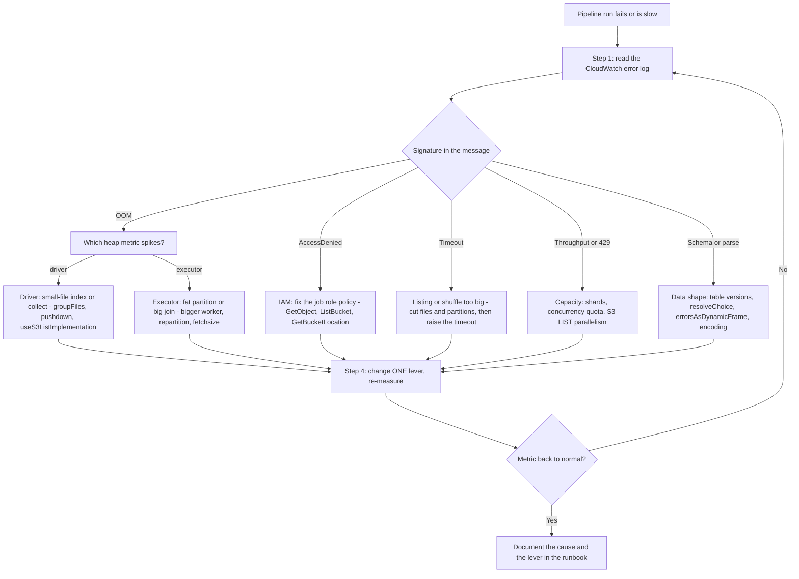
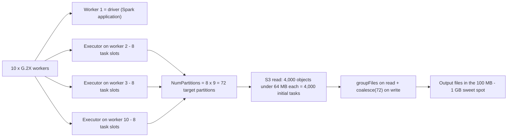
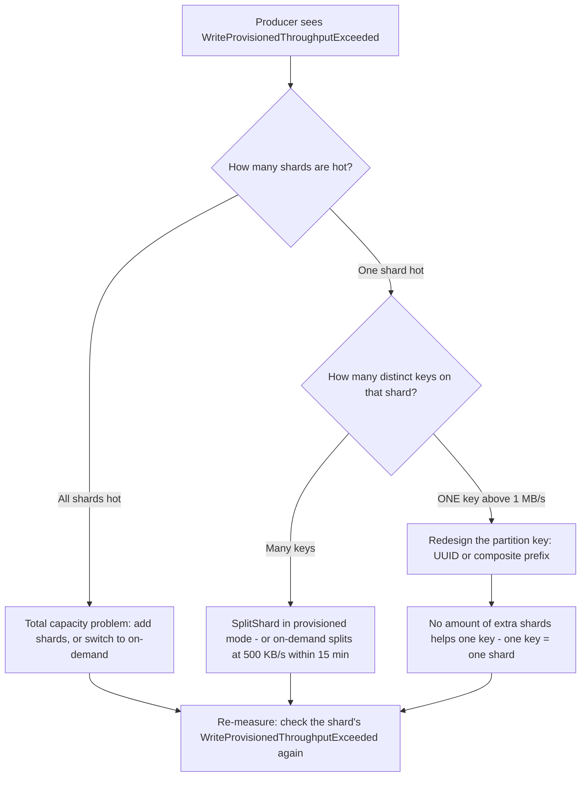
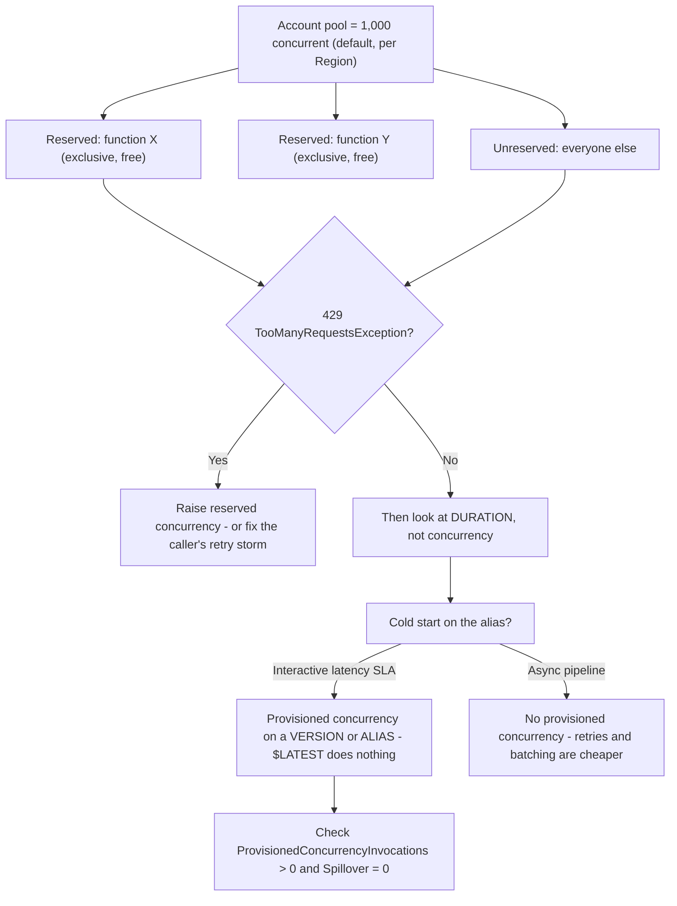
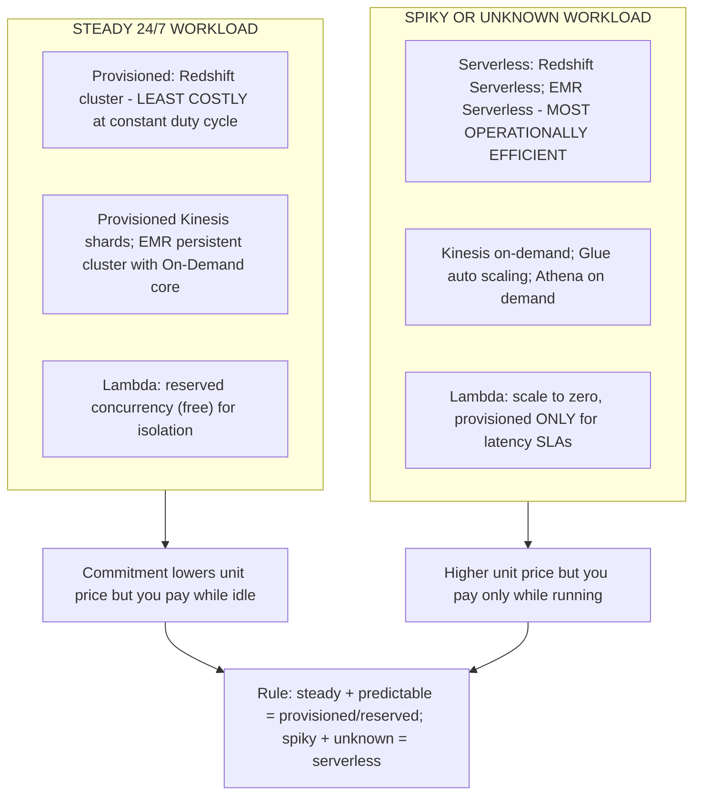

# Troubleshooting, Performance and Cost Optimization

Domain 3 of DEA-C01 is **Data Operations and Support, 22% of the exam**, and its task statements say the same thing four different ways: *troubleshoot performance issues* (3.3.4), *troubleshoot and maintain pipelines such as AWS Glue and Amazon EMR* (3.3.6), *analyze logs with AWS services* (3.3.8), and *implement data skew mechanisms* (3.4.5). Cost sits beside them in **2.1.1** — pick storage services for specific **cost and performance** requirements — and in **3.2.5**, describe tradeoffs between **provisioned and serverless** services. This lesson is the union of those skills: a repeatable triage loop, one symptom→cause→fix map per service, and the arithmetic that turns "make it cheaper" into a defensible answer.

```text
====================================================================
 DEA-C01 - DOMAIN 3 TASKS THIS LESSON COVERS
--------------------------------------------------------------------
 3.1.4  Use AWS services to process data (EMR, Redshift, Glue)
 3.1.6  Use AWS Glue DataBrew to profile, cleanse, transform
 3.1.8  Use AWS Lambda to automate data processing
 3.2.5  Describe tradeoffs between provisioned and serverless
 3.3.4  Troubleshoot performance issues
 3.3.6  Troubleshoot and maintain pipelines (AWS Glue, Amazon EMR)
 3.3.8  Analyze logs (Athena, EMR, OpenSearch, Logs Insights)
 3.4.5  Implement data skew mechanisms
 1.1.9  Implement throttling and overcome rate limits (Kinesis)
 1.4.2  Configure Lambda for concurrency and performance needs
 2.1.1  Storage services for specific cost and performance needs
--------------------------------------------------------------------
 LOOP ......... log -> metric -> plan -> lever -> measure
 SERVICES ..... Glue | Redshift | EMR | Kinesis | Lambda | S3
 PRICES ....... us-east-1 list, as of October 2026
====================================================================
```

> [!NOTE]
> **One loop, every time.** Read the **error log** first, confirm the **metric**, find the **plan or the counter** that explains it, change exactly **one lever**, then re-measure. The exam rewards the candidate who names the *cause* before the *knob* — and every distractor in this topic is a real knob turned for the wrong reason.

In this lesson you will:

- run a **four-step triage loop** and a **failure taxonomy** covering schema drift, corrupt files, OOM, timeout, IAM, throttling, small files and encoding with symptom→cause→fix per service;
- size **AWS Glue**: DPU and worker types, partition math, auto scaling, flexible execution, bookmark failure modes, `repartition` versus `coalesce`, and merging small files;
- diagnose **Amazon Redshift**: distribution and sort key mistakes, `SVV_TABLE_INFO` skew triage, automatic VACUUM/ANALYZE and ATO, WLM and query monitoring rules, Spectrum pruning, and reading an **EXPLAIN** plan;
- right-size **Amazon EMR**: primary/core/task roles, node-count arithmetic, Spot task nodes, HDFS versus S3, and when EMR Serverless is the answer;
- fix **Amazon Kinesis Data Streams**: hot shard versus hot key, partition key redesign, iterator age alarms, and the **three** capacity modes;
- operate **AWS Lambda**: concurrency pools, reserved versus provisioned concurrency, timeouts, asynchronous retries and dead-letter queues;
- apply a **cost-lever table per service**, a **cost-versus-performance tradeoff table**, and the **MOST operationally efficient / LEAST costly** stem heuristics;
- work **seven worked examples** — Glue partition and cost math, Redshift skew triage, an EXPLAIN drill, EMR node sizing, Kinesis shard cost, Lambda concurrency and provisioned-concurrency cost, and S3 request cost;
- read the **October 2026 update box**, **four AWS customer case studies**, and finish with **fourteen exam-style questions** plus three interactive checks.

---

## 1. The triage loop and the failure taxonomy

### 1.1 Four steps, in order

| Step | Question | Where you look | What you must not do |
|---|---|---|---|
| 1. **Log** | What exact string did the service emit? | CloudWatch Logs of the job run: search `ERROR`, `EXCEPTION`, `Exit code` | Do not resize anything before you have read the message |
| 2. **Metric** | Which number is abnormal? | Glue driver/executor heap, Redshift `STL`/`SVL` views, Kinesis `IteratorAge`, Lambda `Throttles` | Do not guess between driver and executor OOM — the metrics separate them |
| 3. **Plan / counter** | Why is this workload shaped this way? | Redshift `EXPLAIN`, `SVV_TABLE_INFO`, Spark UI / Glue **Executors** tab, `SVL_S3PARTITION` | Do not add capacity to a plan that is scanning the wrong bytes |
| 4. **Lever** | One change: code, layout, or capacity? | Layout (keys, partitions, file size) first, capacity second, pricing model third | Do not buy a discount on the wrong size |

AWS's own troubleshooting guidance puts it bluntly: start in the job run's **Error log**, then move to the **Executors** tab / Spark UI to see *which* executor died and *when* (AWS Glue troubleshooting and Builder guidance, accessed Oct 2026).

### 1.2 Symptom → cause → fix, per service

This table is the examinable core of Skill 3.3.4. Every row is a documented AWS failure mode with the fix AWS documents for it (AWS Glue troubleshooting, Redshift diagnostic and EMR/Kinesis/Lambda troubleshooting documentation, accessed Oct 2026).

| Symptom | Likely cause | Fix (as AWS documents it) |
|---|---|---|
| **Schema drift** — job succeeds but columns were added, dropped or retyped; downstream breaks | Upstream source changed; Glue table moved to a new version; DynamicFrame encodes inconsistencies as **choice types** | Diff the Catalog **table versions** → log + SNS → evolve downstream *before* the shape changes; `resolveChoice` to cast or `make_cols`; set crawler `UpdateBehavior` to `UPDATE_IN_DATABASE` |
| **Corrupt / malformed records silently dropped** | CSV row does not fit the inferred schema; vectorized CSV reader cannot do `multiLine` or multibyte | `errorsAsDynamicFrame()` → reject frame with `stageThreshold` / `totalThreshold` to **fail fast**; quarantine the rejects to S3; switch to the row-based reader |
| **`java.lang.OutOfMemoryError`, `Command failed with exit code 1`** | **Driver** OOM (file index of thousands of small files, `collect()`) or **executor** OOM (fat partition, big join, unsplit file) | Split the diagnosis: CloudWatch `glue.driver.jvm.heap.usage` vs `glue.executorID.heap.usage`. Driver → `groupFiles`, `useS3ListImplementation=True`, pushdown predicates. Executor → bigger worker (G.1X→G.2X→R.*), more workers, `repartition(N)` before the join, JDBC `fetchsize` |
| **`Container killed by YARN for exceeding memory limits`** | Skewed join, fat partition, or an unsplittable large file | Upgrade worker type, add executors, repartition to total executor cores, enable bookmarks to cut file volume |
| **Job `TIMEOUT` / long idle before the first task** | Timeout reached, or the driver is still listing S3 objects and partitions | Defaults: **2,880 min** (Glue ≤4.0) / **480 min** (5.0+), maximum **10,080 min = 7 days**; cut the file and partition count so listing finishes |
| **`AccessDenied` on S3 or JDBC** | Job role missing `s3:GetObject` / `s3:ListBucket` / `s3:GetBucketLocation`, wrong connection or security group, wrong script path | Fix the **least-privilege policy on the job role** — not the bucket policy, not the source code |
| **Throttling: S3 `SlowDown`, Kinesis `WriteProvisionedThroughputExceeded`, Lambda `429 TooManyRequestsException`** | Too many LIST/GET/HEAD on one prefix; a shard above **1 MB/s + 1,000 rec/s**; account above the concurrency quota | S3 → merge objects, lower `spark.sql.sources.parallelPartitionDiscovery.parallelism` (default **10,000**). Kinesis → add shards, redesign the partition key, or switch mode. Lambda → reserved concurrency, more batching |
| **Small files: driver CPU high, thousands of tasks, S3 request bill climbing** | Upstream writes per-event or per-partition objects | Group on **read** (`groupFiles: 'inPartition'`, auto above **50,000** S3 files), merge on **write** (`coalesce(N)`, `.repartition(col)`, `maxRecordsPerFile`), target **100 MB–1 GB** objects |
| **Encoding: mojibake, `CharacterEncodingException`, half-parsed rows** | Charset ≠ reader default (UTF-8 vs CP1252/Latin-1), or the vectorized CSV reader on multibyte data | Set `encoding` in Glue format options; avoid the vectorized reader for multibyte; add a DataBrew encoding rule before the load |
| **Success but 0 rows / "no data to process"** | Bookmark skipped old files by last-modified time; wrong or empty prefix; the catalog points at a dead S3 path | Check timestamps, disable the bookmark once to test, re-point the table |
| **`Unable to Infer Schema`** | Parquet/ORC source that is not Hive-style `key=value` partitioned | Restructure paths, or read S3 directly with wildcards and add partition columns yourself |
| **Duplicate rows with bookmarks enabled** | `MaxConcurrency > 1`, missing `job.init()`/`job.commit()`, missing or renamed `transformation_ctx`, non-sequential JDBC key, Spark **DataFrame** input | Bookmarks support **one concurrent run only**; keep the context string stable; feed bookmarks **DynamicFrames**; use `ResetJobBookmark` / rewind for backfills |

### 1.3 The failure decision tree



### 1.4 Interactive check — match the symptom to the fix

```matching
{
  "question": "Match each symptom to the fix AWS actually documents:",
  "pairs": [
    {"left": "Driver OOM with thousands of tiny S3 objects", "right": "groupFiles plus useS3ListImplementation and pushdown predicates - the driver builds the whole file index before the first task runs"},
    {"left": "Executor OOM on one join", "right": "Bigger worker type G to R for memory, more workers, repartition before the join, JDBC fetchsize - split the diagnosis with the two heap metrics first"},
    {"left": "Bookmarks processed the same files twice", "right": "Max concurrency must be 1 and transformation_ctx must be stable - bookmarks do not support concurrent runs"},
    {"left": "Kinesis throttled on ONE key", "right": "Redesign the partition key to a UUID or composite - adding shards cannot spread a single key across shards"},
    {"left": "Lambda 429 throttles while other functions are fine", "right": "Reserved concurrency gives your function an exclusive slice of the account pool - reserved concurrency 0 deliberately stops a self-triggering function"},
    {"left": "Redshift query with skew_rows over 4.00", "right": "Change the distribution style - VACUUM fixes unsorted rows, not skew, and ANALYZE fixes stale statistics"}
  ],
  "explanation": "Six symptoms, six different levers: file layout, worker sizing, bookmark bookkeeping, key design, concurrency isolation, and table distribution. The exam's distractors always swap two levers between rows - the discipline is to name the cause class (data shape, code, capacity, permissions) before touching a knob."
}
```

- **📚 Did you know?** A Glue job can report **SUCCEEDED** while writing nothing: a bookmark that has already recorded the source files will skip them on the next run, and a wrong prefix or a dead catalog path looks identical to a healthy empty partition. AWS's own troubleshooting list therefore puts "success but no data" next to real errors — the fix is a timestamp check, not a stack trace (AWS Glue troubleshooting guide, accessed Oct 2026).

---

## 2. Data-shape failures: drift, corrupt files, encoding

### 2.1 Schema drift is a version problem, not a parse problem

When an upstream team adds, drops or retypes a column, three things happen in sequence: the **source** changes, the **Glue table** gains a new version in the Data Catalog, and every **downstream consumer** (crawler, Athena query, Redshift external schema, QuickSight dataset) silently inherits the change. AWS's pattern for it is: diff the table versions → publish to an SNS topic → evolve the consumer **before** the data arrives (AWS Big Data Blog, "Identify source schema changes using AWS Glue", 2022-09-14).

Inside the job itself, a DynamicFrame represents "some rows have this column, some do not" as a **choice type**. The documented repair is `resolveChoice`, which either **casts** (you name the type — uncastable values become `NULL`) or **`make_cols`** (adds a nullable column). Closely related: the crawler reports **"Partitions were not updated"** when the incoming DynamicFrame schema is not identical to, or a subset of, the catalog schema and `updateBehavior` is not `UPDATE_IN_DATABASE`.

> [!IMPORTANT]
> **⚠️ Two drift traps.** (1) `cast` is lossy: `cast:long` turns every unconvertible value into **NULL**, converting a schema bug into silent data loss — always follow a cast with a completeness or range rule. (2) **Bookmarks are not drift detection**: they scope *which files* to read, they never compare *shapes*. A job with perfect bookmarks can absolutely process a changed schema happily.

### 2.2 Corrupt records: reject loudly or quarantine

Malformed CSV rows that "fit" the inferred schema are dropped silently. The documented remedy is `errorsAsDynamicFrame()`, which splits the frame into a good frame and a reject frame, plus `stageThreshold` / `totalThreshold` counts that **fail the job** when rejects exceed a budget. The operational pattern from Lesson 11 completes it: write rejects to a **quarantine prefix** with `_dq_rule`, `_dq_reason` and `_run_id`, and alert on the count. The vectorized CSV reader is a specific trap — it cannot handle `multiLine` or multibyte content, so "parse errors that only appear on some rows" usually means "use the row-based reader".

### 2.3 Encoding

Charset mismatches present as corrupted characters, truncated fields or rows that split at the wrong comma. Set `encoding` in the Glue format options, avoid the vectorized reader for multibyte data, and put a DataBrew encoding rule **before** the load rather than cleaning mojibake in the warehouse. Encoding is a *source-to-target contract*, and like schema drift it is invisible in row counts — which is exactly why both belong in the taxonomy rather than in a "data quality" side chapter.

---

## 3. AWS Glue performance: DPU, workers, bookmarks, small files

### 3.1 What you are actually paying for

**One DPU = 4 vCPUs of compute capacity and 16 GB of memory** (AWS Glue worker types documentation, accessed Oct 2026). Glue 2.0+ jobs are sized with `WorkerType` + `NumberOfWorkers` — there is no `MaxCapacity` on modern versions — and **one Spark executor runs per worker node**, all G and R types.

| Worker type | DPU | vCPU | RAM (GB) | Disk (GB) | Notes |
|---|---|---|---|---|---|
| G.025X | 0.25 | 2 | 4 | 84 | Streaming and light work |
| G.1X | 1 | 4 | 16 | 94 | General default |
| G.2X | 2 | 8 | 32 | 138 | General default for Spark ETL |
| G.4X | 4 | 16 | 64 | 256 | Larger joins |
| G.8X | 8 | 32 | 128 | 512 | Large driver plans |
| G.12X / G.16X | 12 / 16 | 48 / 64 | 192 / 256 | 768 / 1024 | **Higher startup latency** |
| R.1X – R.8X | 1 – 8 | 4 – 32 | 32 – 256 | 94 – 512 | **Memory-optimized (M-DPU, 2× RAM)**, higher startup latency |

Sizing rule from the Prescriptive Guidance tuning guide: **scale out** (more workers) only "until you observe idle workers — beyond that, adding more workers increases costs without improving results", and **scale up** (bigger type) for memory-heavy transforms, skewed aggregations and huge driver plans.

### 3.2 Partition math — the arithmetic the exam can ask you to redo

For Glue 3.0+:

```text
numExecutors = Workers - 1            (one worker is the driver)
slots/executor = 4 (G.1X) | 8 (G.2X) | 16 (G.4X) | 32 (G.8X)
NumPartitions = slots x numExecutors  -> multiply x2 to x3 if tasks are uneven

Example: 10 x G.1X  ->  (10 - 1) x 4 = 36 partitions target
         10 x G.2X  ->  (10 - 1) x 8 = 72 partitions target
```

Initial partitions from S3: for objects **≤ 64 MB**, count the objects; for **> 64 MB**, use `size / 64 MB`; **unsplittable gzip counts as one task per object** — a single 10 GB `.csv.gz` is **1 task**, no matter how many workers you buy. Too many partitions explode the driver and the task scheduler, so fix them with `groupFiles`, `coalesce(N)` (no full shuffle, so cheaper than `repartition`) or Spark 3 AQE coalescing.



### 3.3 Auto scaling, flexible execution and AQE

- **Auto scaling** (`--enable-auto-scaling=true`, Glue 3.0+, all G/R types): Glue adds and removes workers per stage up to `NumberOfWorkers` as the **maximum**, and it also sets `spark.sql.shuffle.partitions` and `spark.default.parallelism` from that maximum — override with `--conf` if your workload is uneven.
- **Flexible execution** (Glue 3.0+, **G.1X and G.2X only**, non-urgent jobs): a discounted DPU-hour in exchange for a variable start time. Pre-prod and overnight backfills are the documented use case.
- **AQE** is on by default in Glue 4.0; in 3.0 set `spark.sql.adaptive.enabled=true`. It coalesces shuffle partitions, converts sort-merge joins to broadcast, and handles skew with `skewedPartitionFactor` / `skewedPartitionThresholdInBytes`.
- **Scale-out is not linear.** AWS's own worked metrics example (10 → 55 DPU halves runtime, 55 → 100 DPU adds nothing because executors sit idle) comes from a page only applicable to Glue 0.9/1.0 — take the **method** ("add workers only until they idle"), never the absolute minutes.

### 3.4 Worked example E1 — Glue partition math and cost

```text
Scenario: 400 GB of CSV arriving as 4,000 S3 objects, job runs on 10 x G.2X.

1. Slots ................. (10 - 1) x 8 = 72 partitions target
2. Initial S3 partitions . 4,000 objects, each <= 64 MB  =>  4,000 tasks
                           -> far too many: the driver builds a 4,000-entry
                              index and the scheduler drowns in tiny tasks
3. Fix ................... groupFiles: 'inPartition' on read,
                           coalesce(72) on write  (cheaper than repartition)
4. Capacity .............. 10 workers x 2 DPU = 20 DPU
5. Cost per run .......... 20 DPU x 0.5 h x $0.44/DPU-hour = $4.40
6. Cost if it ran hourly . 720 h x $4.40 = $3,168 per month
                           (derived from AWS's published $0.44/DPU-hour,
                            us-east-1, as of Oct 2026)
7. Levers ............... auto scaling (cap stays 20 DPU), flexible
                           execution for a non-urgent job, or bookmarks so
                           unchanged files are never reprocessed
```

### 3.5 Bookmarks: the most-missed failure mode on this exam

AWS documents **seven** ways a bookmarked job reprocesses data: `MaxConcurrency > 1`, missing `job.init()` / `job.commit()`, missing or renamed `transformation_ctx`, a non-sequential JDBC primary key, a changed last-modified time, **Spark DataFrame input instead of DynamicFrame**, and a changed source path under the same context. Two sentences cover most exam items:

- *"Currently AWS Glue bookmarks don't support concurrent job runs and commits will fail."* — keep **Max concurrent runs = 1**.
- *"If you don't pass in the `transformation_ctx` parameter, then job bookmarks are not enabled for a dynamic frame or a table used in the method."* — bookmarks track **DynamicFrame** operations, and they track **sources, not targets**: a rewind or reset never deletes what was already written, so replay into a **new target prefix**.

### 3.6 `repartition` versus `coalesce`, and merging small files

| You want to… | Use | Why |
|---|---|---|
| **Fewer, larger** output files | `coalesce(N)` or `maxRecordsPerFile` | No full shuffle, so cheaper |
| **More** partitions, or rebalance **by a column** (fix skew) | `repartition(N)` or `repartition(col)` | A shuffle is exactly what rebalancing needs |
| Read **thousands** of tiny inputs | `groupFiles: 'inPartition'` with a `groupSize`, or rely on the automatic grouping above **50,000** S3 files | Groups on read instead of creating a task per object |
| Serve Redshift Spectrum | Merge to **≥ 64 MB** files and partition on the predicate columns | Spectrum bills bytes scanned and throttles on too many small objects |

---

## 4. Amazon Redshift: distribution, skew, maintenance, plans

### 4.1 Three diseases, three treatments

Redshift performance questions almost always resolve to one of three column-level problems — and each has a different cure (AWS Redshift *Identifying tables with data skew or unsorted rows*, accessed Oct 2026).

| Disease | Diagnostic column | Threshold | Treatment |
|---|---|---|---|
| **Skew** | `SVV_TABLE_INFO.skew_rows` = largest slice ÷ smallest | **≥ 4.00** → consider changing the **distribution style** | Change `DISTSTYLE`, not the sort key |
| **Unsorted** | `pct_unsorted` | **> 20 %** → *consider* `VACUUM` — but read `vacuum_sort_benefit` first | A table can be 86 % unsorted yet only 5 % improvable; skip the no-op run |
| **Stale statistics** | `stats_off` | High → `ANALYZE` | `ANALYZE t PREDICATE COLUMNS` for the columns you filter on |

Automatic maintenance is on by default: **automatic analyze** runs in light-load windows with `analyze_threshold_percent = 10 %`, auto vacuum sort/delete pause under high load or exclusive DDL locks, and **automatic table optimization (ATO)** applies sort and distribution keys to `AUTO` tables within hours of seeing enough queries. Audit it with `SVV_ALTER_TABLE_RECOMMENDATIONS` and `SVL_AUTO_WORKER_ACTION`. Key facts the exam reuses: **explicit** sort/distribution keys take a table *out* of automation, and `VACUUM` **skips the sort phase by default when more than 95 % of rows are already sorted**.

### 4.2 Worked example E2 — skew triage in four queries

```sql
-- 1. Which table is sick?
SELECT "table", diststyle, distkey, skew_rows, unsorted, stats_off, vacuum_sort_benefit
FROM svv_table_info
ORDER BY skew_rows DESC NULLS LAST;

-- 2. Which QUERY is skewed? (WLM query monitoring rule template)
--    segment_execution_time > 120 AND io_skew > 1.30

-- 3. Is it memory, queueing or a LOCK?
SELECT query, service_class, total_queue_time
FROM stl_wlm_query WHERE query < 10000 ORDER BY total_queue_time DESC;
-- In STV_RECENTS but absent from STV_WLM_QUERY_STATE => waiting on a LOCK, not WLM

-- 4. Cure: skew_rows >= 4.00 + slow joins
ALTER TABLE events DISTSTYLE KEY DISTKEY(customer_id);
-- unsorted > 20 AND high vacuum_sort_benefit
VACUUM events;                 -- default skips sort above 95% sorted
-- high stats_off
ANALYZE events PREDICATE COLUMNS;
```

Then re-`EXPLAIN` and look for the redistribution tag you want: `DS_DIST_NONE` / `DS_DIST_ALL_NONE`.

### 4.3 EXPLAIN basics: read the plan before you resize the cluster

| Join operator | What it means | Action |
|---|---|---|
| **Nested Loop** | *"Such joins usually occur because a join condition was omitted."* | Fix the predicate **before** touching capacity |
| **Hash Join** | Correct but can spill to disk | Check `SVL_QUERY_SUMMARY.is_diskbased = true` → needs more memory or fewer slots |
| **Merge Join** | Fastest: both sides already distributed **and** sorted on the join keys | Aim for this on large-to-large joins |

Redistribution tags: `DS_DIST_NONE` and `DS_DIST_ALL_NONE` are good; `DS_BCAST_INNER` is **fine for a small dimension** and is not automatically bad; `DS_DIST_INNER` / `DS_DIST_OUTER` are costly; `DS_DIST_ALL_INNER` serializes execution onto one slice; `DS_DIST_BOTH` is the worst. If the planner picks a join direction that looks wrong, the documented cause is stale statistics — run `ANALYZE`.

### 4.4 Worked example E3 — the plan AWS itself uses in training

```text
BEFORE
  XN Hash Join  DS_BCAST_INNER   (cost=109.98..3871130276.17)
    -> XN Hash ... -> XN Seq Scan on event          (big fact table broadcast)

AFTER  ALTER TABLE event ... to a distribution that matches the join key
  XN Hash Join  DS_DIST_ALL_NONE (cost=... ..14142.59)

Cost delta: 3,272,334,142.59  ->  14,142.59   (about five orders of magnitude)
```

Two examinable lessons: the *operator name* tells you the strategy, the *cost estimate* tells you whether it mattered, and neither requires a bigger cluster (AWS Prescriptive Guidance, "Evaluating the query plan", accessed Oct 2026).

### 4.5 Workload management, concurrency scaling and Spectrum

- **WLM**: default is **1 queue with 5 concurrent queries**. Automatic WLM creates up to **8 queues** (service classes **100–107**) each with a `priority` (`NORMAL` default; `CRITICAL` is superuser-only). Manual WLM allows concurrency **1–50 per queue**, **50 slots total**, with a memory percentage per queue.
- **Query monitoring rules** run every **10 s**. Action severity: `log` < `hop` (manual WLM only, and only for CTAS/read-only queries) < `abort` (never stops `COPY`, `ALTER`, `ANALYZE` or `VACUUM`) < `change priority` (automatic WLM only). Templates to remember: spill `query_temp_blocks_to_disk > 100000` blocks (**100 GB**) and I/O skew `io_skew > 1.30`.
- **WLM timeouts cover only the running phase** — queue, lock, compile and hop waits sit outside them.
- **Concurrency scaling** routes overflow queries to transient clusters instead of queueing, per queue (`auto`/`off`), with **1 free hour per 24 hours** and `max_concurrency_scaling_clusters` of **1–10**. It relieves *queueing*, not per-query memory pressure.
- **Spectrum** bills **$5.00 per TB scanned** (10 MB minimum per query, as of Oct 2026), so pruning is a *cost* lever as much as a speed lever: partition on predicates you actually filter, use Parquet/ORC for column elimination, keep files **≥ 64 MB**, and set `TABLE PROPERTIES (numRows = n)` because **Redshift never analyzes external tables** and otherwise assumes the external table is the largest table in the plan. Verify with `SVL_S3PARTITION` (`assigned_partitions` vs `qualified_partitions`), `SVL_S3QUERY_SUMMARY` (`s3_scanned_*`) and EXPLAIN markers (`S3 Seq Scan`, `Partition Loop`). `DISTINCT` and `ORDER BY` are **never** pushed down.

- **📚 Did you know?** A Redshift table can be **86 % unsorted and only 5 % improvable** — `vacuum_sort_benefit` exists precisely so you do not pay for a `VACUUM` that changes nothing, and by default VACUUM **skips the sort phase entirely above 95 % sorted rows**. That is why "run VACUUM after every load" is a distractor, not a best practice (AWS Redshift vacuuming documentation, accessed Oct 2026).

---

## 5. Amazon EMR: sizing, Spot task nodes, HDFS versus S3

### 5.1 Three node roles, three purchase decisions

| Role | Holds HDFS? | Typical purchase | Sizing guidance |
|---|---|---|---|
| **Primary** | No (orchestration only) | **On-Demand** | Little CPU; `m5.xlarge` suggested up to ~50 nodes; ≤ 3 for HA |
| **Core** | **Yes — tasks + HDFS** | **On-Demand** | CPU + storage; protect the data |
| **Task** | **No — tasks only** | **Spot** | Compute only; losing one loses no data |

AWS's own rule: *"Use Spot Instances on task nodes. The task nodes process data but do not hold persistent data in Hadoop Distributed File System (HDFS). If task nodes shut down… no data is lost."* All-Spot is only for transient, loss-tolerant jobs. Note the asymmetric Spot behaviour: **task-Spot instances launch as capacity is available**, while **core-Spot waits for all requested instances** before launching, and Spot reclaim allows roughly **20 s** of graceful decommission (`spark.decommissioning.timeout.threshold`, EMR ≥ 5.11.0).

### 5.2 Worked example E4 — node count and HDFS capacity

```text
(a) Memory shortage: 912 GiB of data that must fit in memory
    912 GiB / 32 GiB per m5.2xlarge = 28.5  ->  29 TASK nodes, on Spot
    (fractional nodes do not exist; round UP, then verify with the Spark UI)

(b) HDFS capacity: (instance store + EBS per node) x nodes / replication factor 3
    10 x i2.xlarge (800 GB) = 8,000 GB  /  3  =  2,666 GB usable
    -> replication factor 3 is why HDFS looks "3x too small" on paper

(c) Output to S3 via EMRFS instead, and the core fleet only has to hold
    intermediate shuffle - smaller core fleet, cheaper cluster, cluster can
    terminate without losing the curated output.
```

**HDFS versus S3 for exam purposes**: S3/EMRFS is durable, decoupled, survives cluster termination and costs less per GB → it is the **pipeline default**; HDFS is faster for intermediate shuffle but consumes the replication budget and dies with the cluster. On EMR, adaptive query execution is on by default (5.30+) with shuffle-partition coalescing (advisory size **64 MB**, `minPartitionNum` **25**, `initialPartitionNum` **1000**), dynamic partition pruning (5.26+), and `spark.default.parallelism = 2 × YARN cores`.

### 5.3 EMR Serverless — the no-sizing option

EMR Serverless bills **per vCPU-hour and GB-hour plus storage GB-hour** — **$0.052624 / vCPU-hour**, **$0.0057785 / GB-hour**, **$0.000111 / storage GB-hour** (as of Oct 2026) — and workers auto-scale between the job's minimum and maximum, so the sizing decision disappears. It is the natural pick for **intermittent** Spark/Hive jobs where a cluster would idle.

> [!WARNING]
> **⚠️ Scope check before you choose "EMR Serverless" as an answer.** AWS's DEA-C01 in-scope list prints **"Amazon EMR"** only — it does not name EMR Serverless as a separate entry, and AWS makes no statement about whether a Serverless-only option is scored. Teach yourself the pricing and the mechanics (they are real and documented), but on exam day prefer the option whose *service name* is on the in-scope list unless the stem itself says Serverless.

---

## 6. Amazon Kinesis Data Streams: hot shards, iterator age, capacity modes

### 6.1 Hot shard versus hot key — the single most tested distinction

Per-shard limits are **1 MB/s write and 1,000 records/s**, **2 MB/s and 2,000 records/s read**, and **5 read TPS**; a single record may be **10 MiB** and `PutRecords` accepts up to **500 records / 10 MiB** per call (AWS Kinesis limits, accessed Oct 2026).

- **Hot shard** = *many* keys landing unevenly → split the shard (provisioned `UpdateShardCount` / `SplitShard`) or let on-demand split it.
- **Hot key** = *one* key exceeding a shard's limit → **redesign the partition key** (UUID or composite suffix) **or**, if you need per-key ordering/locality, keep the key and accept the ceiling.
- **Adding shards does not fix a hot key**: every record for one key hashes to one shard, forever. And on-demand mode *"does not detect and isolate hash keys that are driving a higher portion of incoming traffic to a particular shard"* — documented explicitly, which is why it is a favourite wrong answer.



### 6.2 Iterator age is a data-loss warning, not just lag

`GetRecords.IteratorAgeMilliseconds` (stream) / `IteratorAgeMilliseconds` (shard) measures consumer lag; **0 means fully caught up**. AWS's warning: *"If an iterator's age passes 50% of the retention period (by default, 24 hours, configurable up to 7 days), there is risk for data loss due to record expiration."* So alarm on **Maximum** at **50 % of retention**, and fix with: more shards, Lambda `ParallelizationFactor` (**1–10** per shard; ordering is still preserved *per partition key*), a batching window up to **5 min / 6 MB**, **enhanced fan-out** (a dedicated **2 MB/s per consumer per shard**), or simply a faster consumer.

### 6.3 Three capacity modes, not two

| Mode | Bills | You plan capacity? | Exam fit |
|---|---|---|---|
| **Provisioned** | Shard-hour (**$0.015**, as of Oct 2026) + PUT payload units (**$0.014 / 1M** units of 25 KB) + optional EFO | Yes — manual `UpdateShardCount`, granular splits | Predictable traffic, **hot-key control** |
| **On-demand (Standard)** | Per-GB ingest/retrieval + per-stream-hour | No — default **4 MB/s write / 8 MB/s read**, up to **10/20 GB/s** in us-east-1/us-west-2/eu-west-1, **200/400 MB/s** elsewhere; splits at **500 KB/s within 15 min** | Unpredictable or unknown traffic |
| **On-demand Advantage** | Account-level: no per-stream hourly charge, lower GB rates, **25 MB/s ingest + 25 MB/s retrieval floor** | No | High aggregate ingest, many streams, fan-out |

Mode switches are limited to **2 per rolling 24 hours**. EFO costs **$0.015 per consumer-shard-hour** plus per-GB, and supports **20** registered consumers per stream (Standard) or **50** (Advantage); with fewer than about **3** consumers, shared reads are the cheaper choice.

- **📚 Did you know?** Iterator age is one of the few AWS metrics where "higher" can mean **permanent data loss** rather than "slower": once a record passes the retention window it is gone, and no amount of scaling brings it back. That is why the AWS recommendation is an alarm at **half** the retention period, not at 100 % (AWS Kinesis monitoring documentation, accessed Oct 2026).

### 6.4 Worked example E5 — shard cost and the payload-unit bill

```text
4 provisioned shards, always on, us-east-1 (as of Oct 2026):
  4 shards x 24 h x 31 days = 2,976 shard-hours x $0.015 = $44.64 / month

Ingest: 100 records/s at 35 KB each
  units per record = ceil(35 / 25) = 2
  100 rec/s x 2 units x 2,678,400 s = 535,680,000 units
  535.68 M units x $0.014 / 1M      = $7.50 / month

Add ONE enhanced fan-out consumer:
  4 consumer-shards x 730 h x $0.015 = +$43.80 / month (plus per-GB)
  -> EFO is roughly a doubling of the shard bill: skip it below ~3 consumers.

Derived arithmetic from AWS's published rates; re-verify per Region.
```

---

## 7. AWS Lambda: concurrency, timeouts, cold starts, retries

### 7.1 The concurrency pool

The account default is **1,000 concurrent executions per Region**; a function scales up to **1,000 environments per 10 seconds**, and the invocations-per-second ceiling is about **10 × the concurrency quota**. Beyond the quota, invocations are throttled with **429**.

| Knob | What it does | Cost | Use when the stem says… |
|---|---|---|---|
| **Reserved concurrency** | An exclusive **minimum and maximum** slice of the account pool; the maximum equals *unreserved − 100*; **no other function can use it**; **0 deliberately stops** the function | Free | "starved by **other** functions", "throttled by a noisy neighbour", "stop a self-triggering loop" |
| **Provisioned concurrency** | Pre-warms execution environments; must target a **version or alias — never `$LATEST`**; allocation 1–2 min, up to **6,000 environments/min**, billed in **5-minute** increments, **no free tier** | Billed 24/7 for **capacity** (`$0.0000041667/GB-s`) plus execution | "cold start latency", "consistent p99 latency" |
| **Account unreserved** | Everything else | — | Default |

Reserved and provisioned concurrency both count against the account pool, and **provisioned ≤ reserved** for the same function. Application Auto Scaling targets **70 %** utilization (scale out above 70, in below 63), and AWS's own guidance is that *asynchronous data-processing pipelines usually do not need provisioned concurrency*.



### 7.2 Timeouts and retries

Raise **memory and timeout together**: CPU is proportional to memory, so a "timeout" is frequently an under-sized function. Asynchronous retries do not fix mis-sizing — they only hide it until the DLQ fills:

- **Synchronous**: the caller sees the error; retries follow the *caller's* policy.
- **Asynchronous**: Lambda queues, then retries **2 times** (after 1 minute, then 2 minutes) for function errors; for **throttling (429) and system errors (500-series)** the event returns to the queue and is retried for up to **6 hours**, with backoff from **1 s up to 5 min**. Then the **dead-letter queue** (SQS **standard** or SNS **standard** only — never FIFO) or the on-failure destination receives it; an on-failure destination additionally carries the response payload.
- **Stream (event source mapping)**: retries until `bisect_batch_on_error`, `maximum_record_age` or `retry_attempts` fires, then the **on-failure destination**. For Kinesis, `ParallelizationFactor` **1–10** raises per-shard parallelism while keeping order per partition key.

### 7.3 Worked example E6 — concurrency, reserved vs provisioned

```text
Load: 3,000 requests/second, average duration 120 ms
  Needed concurrency = 3,000 x 0.120 s = 360 concurrent executions
  Scale rate (1,000 env / 10 s) is plenty; the RPS ceiling is 10 x quota.

If other functions in the account are hungry:
  Reserve ~400 (360 + headroom)  ->  reserved concurrency, FREE,
  and your maximum becomes (unreserved - 100) once configured.

Cold-start SLA instead (interactive API):
  Provisioned ~= peak x 1.10 = ~400 units x 1.5 GB = 600 GB warm
  600 GB x 2,678,400 s x $0.0000041667/GB-s = about $6,700 per month
  STANDING cost, billed whether invoked or not, 5-minute increments,
  no free tier (derived from AWS's published rate, as of Oct 2026).

Pipeline (async, latency-insensitive)  ->  NO provisioned concurrency.
Self-triggering function               ->  reserved concurrency 0, then repair.
```

---

## 8. Cost levers per service

### 8.1 The billable dimension, then the lever

Never name a lever without naming the dimension it reduces (AWS Glue, Redshift, EMR, Kinesis, Lambda and S3 pricing pages, as of Oct 2026).

| Service | Billable dimension | Cheaper levers |
|---|---|---|
| **Glue ETL** | **DPU-hour**, per second, 1-minute minimum — **$0.44/DPU-hour** | Fewer workers once executors idle; auto scaling cap; `G.025X` for streaming; **flexible execution** (G.1X/G.2X, non-urgent); **bookmarks** so unchanged files are never reprocessed |
| **Glue crawler** | DPU-hour with a **10-minute** minimum | Fewer crawl targets; **partition indexes** instead of re-crawls |
| **Glue DataBrew** | **node-hour** ($0.48, default **5 nodes**) + **$1.00 per 30-minute session** | Fewer nodes; **close sessions**; move heavy transforms to Glue/SQL |
| **Amazon Redshift** | **node-hour** or **RPU-hour** + managed storage + Spectrum **$5.00/TB scanned** | Compression, sort keys, dist keys, predicate pushdown; concurrency-scaling credits before a bigger cluster; pause idle clusters; Serverless for spiky load |
| **Amazon EMR** | EC2-hour + EBS + an **EMR fee per hour** (per second, 1-minute minimum); Serverless = vCPU/GB/storage-hour | **Spot on task nodes**; transient clusters terminated after use; EMR Serverless for intermittent jobs; output to S3 to keep the core fleet small |
| **Kinesis Data Streams** | Provisioned: **shard-hour** + **PUT payload units** + EFO (**consumer-shard-hour** + GB); On-demand: **GB ingest/retrieval** + stream-hour | Right-size shard count; skip EFO below ~3 consumers; Advantage if aggregate ingest is already high |
| **AWS Lambda** | **Requests** ($0.20/1M) + **GB-seconds** ($0.0000166667/GB-s x86) + provisioned-concurrency GB-s | Right-size memory (CPU follows memory); arm64; larger batching windows/batch size; **skip provisioned concurrency for pipelines**; reserved concurrency instead when isolation is the goal |
| **Amazon S3** | **Storage-month by class** ($0.023/GB-mo Standard, first 50 TB) + **requests** (PUT/COPY/POST/LIST **$0.005/1,000**; GET **$0.0004/1,000**) + retrieval + egress (first **100 GB/month** free account-wide, then **$0.09/GB**) | Lifecycle tiers; **fewer, larger objects**; keep analytics in-Region; columnar formats to cut bytes scanned downstream |

### 8.2 Worked example E7 — small files cost twice

```text
Upstream writes 1,000,000 objects per day of ~4 KB each (per-event writes).

WRITE REQUESTS (as of Oct 2026)
  1,000,000 PUTs / day  =  1,000 thousand PUTs x $0.005  =  $5.00 / day
  $5.00 x 30            =  $150 / month, just to write the data

MERGE TO 500 OBJECTS OF ~8 MB
  500 PUTs / day        =  0.5 thousand x $0.005         =  $0.0025 / day
  saving                =  about $149.92 / month  (derived)

DOWNSTREAM: Spectrum/Athena bill bytes SCANNED
  10 TB scanned per query day x 30 = 300 TB x $5.00/TB = $1,500 / month
  Columnar + partition pruning to 2 TB scanned        =   $300 / month

Rule of thumb: target 100 MB - 1 GB objects for Glue (5 - 10 DPU) and
>= 64 MB for Redshift Spectrum. Small files hurt S3 request cost AND
Spark task/driver overhead - fix on READ (grouping) and on WRITE (coalesce).
```

- **📚 Did you know?** The storage half of the bill has been falling for twenty years while the request half has not: AWS's S3 retrospective (2026-03-13) puts the price reduction since the 2006 launch at about **85 %** and claims customers have saved more than **$6 billion** by using **S3 Intelligent-Tiering** instead of S3 Standard. That is why this lesson keeps splitting S3 into *storage-class* and *requests* levers — automating the class moves a big number, merging objects moves the other one (AWS "Twenty years of Amazon S3" post, accessed Oct 2026).

---

## 9. Cost versus performance: the tradeoff table and the stem heuristics

### 9.1 The tradeoff the exam actually asks

| Choice | Cheaper option | Faster / safer option | Tie-break on the stem |
|---|---|---|---|
| Glue **fixed workers vs auto scaling** | Auto scaling | Fixed (predictable) | Unknown or variable data volume ⇒ auto |
| Glue **provisioned vs flexible execution** | Flexible | Provisioned | Non-urgent / pre-prod ⇒ flexible (G.1X/G.2X only) |
| Kinesis **provisioned vs on-demand** | Provisioned (steady) | On-demand (no planning) | Unpredictable ⇒ on-demand; hot key needing granular splits ⇒ provisioned |
| Kinesis **shared reads vs enhanced fan-out** | Shared (< ~3 consumers) | EFO (dedicated 2 MB/s) | Many consumers or latency SLA ⇒ EFO |
| Redshift **cluster vs Serverless** | Cluster (steady 24/7) | Serverless (burst, no resize) | Spiky or unknown ⇒ Serverless |
| EMR **On-Demand core + Spot task vs all On-Demand** | Spot task fleet | On-Demand core (HDFS safe) | Default for persistent clusters |
| EMR **cluster vs EMR Serverless** | Depends on duty cycle | Serverless (no sizing) | Intermittent / one-off Spark ⇒ Serverless |
| Lambda **reserved vs provisioned concurrency** | Reserved (free) | Provisioned (warm) | Isolation ⇒ reserved; latency SLA ⇒ provisioned |
| **File size vs parallelism** | Fewer, larger objects (less request cost) | Mid-size keeps parallelism | 100 MB–1 GB (Glue), ≥ 64 MB (Spectrum) |

### 9.2 Where each service sits



### 9.3 The two stem heuristics (derived from AWS's documented behaviour, not an AWS document)

- **"MOST operationally efficient"** ⇒ pick the option with **no capacity planning and no cluster to size**: AWS Glue (managed workers, auto scaling), **EMR Serverless**, **Redshift Serverless**, **Kinesis on-demand**, **Lambda** — then re-read the stem for a constraint that overrides it (HDFS, hot-key control, steady 24/7 duty cycle).
- **"LEAST costly" (steady 24/7)** ⇒ pick the **provisioned or committed** option: provisioned shards, a Redshift cluster over Serverless, On-Demand/committed compute, fewer DPU-hours, lifecycle-tiered S3. A serverless option that idles 20 hours a day is rarely the cheapest.
- **"FASTEST to implement"** ⇒ a **managed configuration change** (WLM, auto scaling, an alarm, a sort key) beats a code refactor — unless the stem's root cause is code (a missing join predicate, a missing `transformation_ctx`).
- Always read the **constraints first**: steady vs spiky, SLA vs throughput, isolation vs latency. The heuristic is the tie-break, not the premise.

### 9.4 Interactive check — fill in the numbers the exam reuses

```fillblank
{
  "question": "Complete the performance-and-cost statements with AWS's own numbers (as of Oct 2026):",
  "template": "A Glue DPU is {{1}} vCPUs and {{2}} GB of memory, and Glue ETL is billed at ${{3}} per DPU-hour. Redshift considers a table skewed when skew_rows is {{4}} or higher, and skips the VACUUM sort phase once more than {{5}} percent of rows are already sorted. A single Kinesis shard accepts {{6}} MB/s and {{7}} records per second of writes, and a Lambda function should be alarmed when iterator age passes {{8}} percent of the retention period. Lambda's account default is {{9}} concurrent executions, and provisioned concurrency must target a version or alias, never {{10}}.",
  "answers": {
    "1": "4",
    "2": "16",
    "3": "0.44",
    "4": "4.00",
    "5": "95",
    "6": "1",
    "7": "1000",
    "8": "50",
    "9": "1000",
    "10": "$LATEST"
  },
  "distractors": ["2", "8", "32", "0.29", "0.52", "2.00", "10.00", "80", "75", "100", "500", "5000", "1,000,000", "LATEST", "PROD", "alias"],
  "explanation": "DPU = 4 vCPU + 16 GB at $0.44/DPU-hour; skew threshold 4.00; VACUUM skips sort above 95 percent; one shard = 1 MB/s + 1,000 records/s; the iterator-age alarm sits at 50 percent of retention because beyond it records start expiring; the account default is 1,000 concurrent; and provisioned concurrency on $LATEST does nothing because $LATEST cannot be provisioned."
}
```

### 9.5 Interactive check — order the cost decision

```dragdrop
{
  "question": "Put this lesson's cost-optimisation sequence in the order it must be applied:",
  "items": [
    "Name the billable dimension first - DPU-hour, TB scanned, shard-hour, requests, GB-seconds",
    "Reduce the quantity billed - pruning, coalesce, bookmarks, right-sizing, fewer objects",
    "Change the pricing model only now - Spot, Savings Plans or a reservation on the RIGHT size",
    "Re-measure the metric and record the cause and the lever in the runbook"
  ],
  "correctOrder": [
    "Name the billable dimension first - DPU-hour, TB scanned, shard-hour, requests, GB-seconds",
    "Reduce the quantity billed - pruning, coalesce, bookmarks, right-sizing, fewer objects",
    "Change the pricing model only now - Spot, Savings Plans or a reservation on the RIGHT size",
    "Re-measure the metric and record the cause and the lever in the runbook"
  ],
  "explanation": "The order is the whole lesson: layout before capacity before pricing model (Section 1, step 4), then measure again. Buying a discount on the wrong size is the classic distractor - a commitment lowers the unit price but does nothing about bytes scanned, DPU-hours burned or objects written. Every case study in this lesson followed the same sequence: measure, shrink the quantity, then choose the pricing model."
}
```

---

### 2026 Updates (as of October 2026)

> [!NOTE]
> **What moved between the launch-era study notes and the exam you will sit** — every line checked against a primary AWS source in **October 2026**:
> - **Glue generations moved on**: **Glue 5.1** has been the **default for new jobs since 2025-11-26**, and **Glue 6.0 went GA on 2026-08-21** with a **30 % price cut** (Spark 4.1.1, Python 3.13, Scala 2.13); **Glue 0.9/1.0/2.0 reached end of life on 2026-04-01** and Python Shell 3.6 cannot be created after **2026-03-31**. On Glue 6.0 the **EMRFS filesystem and the AWS SDK for Java v1 are removed** (S3A is the only S3 filesystem) — a `fs.s3.consistent.*` or `com.amazonaws.*` option is stale on sight (AWS Glue release notes, version support policy and migration guide, accessed Oct 2026).
> - **Kinesis has three capacity modes, not two**: Provisioned, On-demand Standard and **On-demand Advantage (2025-11-04)** — ODA removes the per-stream hourly charge and cuts GB rates (AWS states ≥ 60 % lower) but applies an **account-wide floor of 25 MB/s ingest + 25 MB/s retrieval**. The **default shard limit rose from 500 to 20,000 per account** (2025-04-21, us-east-1/us-west-2/eu-west-1) and **records up to 10 MiB** are supported (2025-10-28). Any prep page saying "two capacity modes" is stale (AWS What's New and sizing documentation, accessed Oct 2026).
> - **EMR Serverless got cheaper and bigger**: local storage was **eliminated (up to 20 % cheaper, 2026-01-06)**, **workers up to 32 vCPU / 244 GB (2026-07-07)**, live configuration updates (2026-06-24) and Spark Connect (2026-06-09); **Amazon EMR 7.14** shipped 2026-09-22 (Spark 3.5.8, shuffle storage 200 GiB → 1 TiB). Remember the scope caveat from Section 5 (AWS What's New, accessed Oct 2026).
> - **Redshift cost levers grew a commitment option**: **Redshift Serverless 3-year reservations** (2026-02-23, up to **45 %**) and **3-year AURI** (2026-07-24, up to **50 %**) now let you discount a serverless workload — so "Serverless is always more expensive at steady state" needs a date stamp. Redshift also gained full **Iceberg write/UPDATE/DELETE/MERGE** support (2025-11-17 → 2026-04-23) and **Iceberg materialized views (2026-10-05)** (AWS What's New, accessed Oct 2026).
> - **Athena's cost floor and its entry price both fell**: Capacity Reservations now start at **4 DPU for 1 minute** instead of 24 DPU for 60 minutes (**2026-02-11**), **managed query results** (**2025-06-03**) are service-managed, encrypted and **cost nothing extra** (so an S3 result bucket is no longer mandatory), and **managed connectors for 12 sources** arrived **2026-04-23**. A nightly 12-DPU batch window is now billed as 12 DPU × 10 minutes, not a 24-DPU hour (AWS What's New and AWS Big Data Blog, accessed Oct 2026).
> - **Kinesis can now land straight in a lake**: **streaming tables** materialise a Kinesis Data Streams stream into **Apache Iceberg on Amazon S3 Tables** (**2026-08-28**, auto-Parquet with inline compaction, no Glue ETL hop) and **general-purpose S3 delivery** writes source-format records to an ordinary bucket (**2026-08-29**); both work only in the on-demand modes and are priced per GB delivered, with AWS claiming up to **50–60 % lower delivery cost** and up to **30 % lower query cost** (AWS What's New, accessed Oct 2026).
> - **Stale-fact warnings**: the exam guide is **v1.1 (2025-12-12)** with 8 added skills and no removals; exam logistics remain **130 minutes · 65 questions (50 scored + 15 unscored) · 150 USD · cut score 720/1,000** — third-party pages still quoting **170 minutes / 85 questions / 300 USD** are describing Specialty exams, not DEA (AWS certification pages, accessed Oct 2026).

- **📚 Did you know?** Price *cuts* move exam answers: Glue 6.0 (−30 %), S3 Express One Zone (storage −31 %, PUT −55 %, GET −85 %, 2025-04-10) and Kinesis on-demand Advantage all changed the "cheapest" column — but the *dimensions* (DPU-hour, shard-hour, GB-s, bytes scanned) have not changed. Learn the dimension and re-verify the rate (AWS pricing pages, accessed Oct 2026).

---

## Real-World Case Studies

AWS publishes what this lesson looks like in production. Every figure below is **customer- or AWS-claimed and unaudited**, with the source named so you can check it — the examinable point is the **pattern** (which lever moved, and in which direction), not the marketing percentage.

### Case A — Amazon Customer Service: right-sizing a warehouse

| Element | Detail |
|---|---|
| Customer | **Amazon Customer Service** (Amazon's own organization) |
| Challenge | A Redshift estate running on older **dc2.8xlarge** nodes with rising cost and dashboard latency |
| Services | **Amazon Redshift RA3 nodes** (compute/storage separation) with AWS SA and Redshift engineering support |
| Outcomes | **~55 % lower Redshift operating cost per year**; dashboards **47 % faster**; queries **25 % faster** — comparing **3× RA3.16xlarge against dc2.8xlarge** |
| Lever used | **Right-sizing + node-generation change** — the Section 9 rule "measured utilisation first, pricing model second" applied to a warehouse |
| Source | AWS Big Data Blog, 2021-05-20, "How Amazon Customer Service lowered Amazon Redshift costs and improved performance using RA3 nodes" (accessed Oct 2026) |

Read it as **Skill 3.3.4 plus 2.1.1 in one story**: performance and cost moved *together*, because RA3 separates managed storage from compute, so you stop paying for local disk you were only filling with cold data. The distractor version of this story claims cost fell *because* a discount was purchased — no discount appears in the case study.

### Case B — Paytm: a phased cost lever on EMR

| Element | Detail |
|---|---|
| Customer | **Paytm**, payments and fintech (India) |
| Challenge | High EC2/EMR spend on a petabyte-scale data lake, where **EMR was about 65 % of analytics workloads** |
| Services | **Amazon EMR on AWS Graviton** (plus EC2 Graviton for RDS, Aurora, OpenSearch, ElastiCache) |
| Outcomes | **30–35 % savings on EMR**; **80 % of EMR on Graviton by end-2023**; migration started **2022**; EC2 migration **60 % (Jan 2024)** targeting **70 % mid-2024**; Graviton list price roughly **50 % lower** in ap-south-1 |
| Lever used | **Different silicon, phased** — note that a ~50 % list-price delta produced a **30–35 % realised** saving |
| Source | AWS case study, `solutions/case-studies/paytm-graviton-case-study/` (accessed Oct 2026) |

> "Migrating to AWS Graviton-based instances is a long-term investment and will be beneficial in terms of total cost of ownership." — Parakh Aggarwal, Director of Cloud Excellence and FinOps (AWS case study, accessed Oct 2026)

The examinable pattern is the **gap between list price and realised saving**: a lever is only worth its points once you have measured the workload, and the timeline (2022 → 2024) shows why "change everything tonight" is never the answer on this exam.

### Case C — GE Aerospace: a legacy ODS rebuilt on Redshift

| Element | Detail |
|---|---|
| Customer | **GE Aerospace** (aerospace and supply chain) |
| Challenge | A large operational data store (ODS) with compliance and performance constraints: queries that ran **90 minutes**, **150+ reports** in production (some over **10,000 lines of code**) and a warehouse that could no longer serve them |
| Services | **Amazon Redshift**, with AWS Solutions Architect and Redshift engineering support |
| Outcomes | Queries **90 minutes → 7 minutes**; about **70 % better query performance**; an estimated **>$500,000 per year** saving; proof of concept Nov–Dec 2022, then a **9-month migration (Jan–Sep 2023)** |
| Lever used | **Right-sizing + managed (RA3-style) compute/storage separation on a legacy ODS** — the same lever family as Case A, proven on a much older workload |
| Source | AWS case study, `solutions/case-studies/ge-aerospace-case-study/` (accessed Oct 2026) |

> "We were seeing queries that used to run for an hour and a half running in 7 minutes using Amazon Redshift." — Bejoy John, Senior Director of Data Analytics (AWS case study, accessed Oct 2026)

Read it as **Skill 3.3.4 (troubleshoot performance) plus 2.1.1 (cost/performance sizing)**: the win came from layout, plan and node generation, not from a purchased discount. Two exam habits to rehearse here: the **>$500,000 is GE's own estimate**, so never generalise it to your workload; and a **9-month migration with a PoC first** is the opposite of the "fix it tonight" distractor.

### Case D — Edmunds.com: three levers, one bill

| Element | Detail |
|---|---|
| Customer | **Edmunds.com** (automotive media) |
| Challenge | A lean team tuning cost after its 2016 move off on-premises, with customer-facing applications over-provisioned for peak |
| Services | **EC2 Spot + Fargate Spot + Amazon ECS + Compute Savings Plans** (commitment taken from January 2020) |
| Outcomes | **Fargate Spot 25–30 % cheaper** than On-Demand; **$100,000 saved between October 2019 and August 2020**; **−30 % compute**; **80 %** of customer-facing applications on Fargate Spot; **99.999 %** availability |
| Lever used | **Three different levers stacked deliberately**: Spot capacity (interruptible), a Compute Savings Plans commitment (discount for steady usage) — and, note, *no* resize |
| Source | AWS case study, `solutions/case-studies/edmunds-fargate-spot/` (accessed Oct 2026) |

> "The main motivation there is that I am no longer bound to a particular instance type or Region." — Emil Ndreu, Executive Director of Cloud and Security Operations (AWS case study, accessed Oct 2026)

Work the arithmetic AWS does not publish: **$100,000 over 11 months ≈ $9,091 per month**, but AWS never splits that figure between Spot, Savings Plans and Fargate Spot — so any option that claims "Savings Plans alone saved X %" is unsupported by the source. The examinable distinction is the **lever type**: a Savings Plans is a **commitment discount** (Compute SPs are not tied to one instance type or Region), Spot is **interruptible capacity for fault-tolerant work** (AWS lists up to **90 % off** On-Demand), and neither is the Graviton **silicon** switch from Case B.

| Case | Lever it demonstrates | Direction |
|---|---|---|
| Amazon Customer Service | Right-size the node generation, separate compute from managed storage | Performance **and** cost improve together |
| Paytm | Change the silicon underneath a steady EMR estate, in phases | List price −50 % ⇒ realised −30–35 % (measure, don't assume) |
| GE Aerospace | Modernise a legacy ODS on Redshift: plan, layout, then node generation | 90 min → 7 min queries, ~70 % faster, customer-estimated >$500,000/yr |
| Edmunds.com | Stack Spot capacity with a Compute Savings Plans commitment on a steady fleet | −30 % compute and $100,000 over 11 months, at 99.999 % availability |

- **📚 Did you know?** All four stories avoid the trap this lesson keeps repeating: none of these customers "made it cheaper" by buying a commitment on an oversized system. One **resized**, one **re-platformed**, one **rebuilt the plan and the layout first**, one **stacked two capacity levers** — and every one of them measured first. AWS's published percentage is always *their* workload, never a guarantee for yours (AWS case studies and Big Data Blog, accessed Oct 2026).
- **📚 Did you know?** Three levers look alike on a bill and are different exam answers: **Savings Plans = commitment discount** (Compute SPs are not bound to an instance type or Region), **Spot = interruptible capacity** you must be able to lose (AWS quotes up to 90 % off On-Demand), and **Graviton = different silicon** with a lower list price. Distractors on DEA-C01 routinely swap two of the three — name the *dimension* each one changes before you pick (AWS Pricing and case studies, accessed Oct 2026).

---

## Practice Questions

```question
{
  "id": "dea-12-q1",
  "type": "multiple-choice",
  "question": "A Glue job fails with `Command failed with exit code 1` and `java.lang.OutOfMemoryError`. Which pair of CloudWatch metrics tells you whether the fix is groupFiles or a bigger worker type?",
  "options": [
    "glue.driver.jvm.heap.usage versus glue.executorID.heap.usage - driver means file-index work, executor means fat partitions or a big join",
    "glue.busyExecutors versus glue.stage.failedExecutors - more busy executors always means the driver is fine",
    "glue.driverExecutionTime versus glue.s3FileListCount - whichever is larger names the guilty service",
    "glue.activeExecutors versus glue.numExecutorsfailed - failed executors prove a memory problem, busy ones prove an IAM problem"
  ],
  "correct": 0,
  "explanation": "AWS documents splitting OOM diagnosis with the driver heap metric and the executor heap metric. Driver OOM is the classic small-file/file-index or collect() case (groupFiles, useS3ListImplementation, pushdown); executor OOM is a fat partition or join (bigger G->R worker, more workers, repartition before the join, JDBC fetchsize). The other metric names do not carry that meaning."
}
```

```question
{
  "id": "dea-12-q2",
  "type": "multiple-choice",
  "question": "A Glue job with bookmarks enabled processed the same files twice after a refactor. Which change is the documented cause?",
  "options": [
    "The developer renamed the transformation_ctx string, which resets the bookmark's tracking of that DynamicFrame",
    "The developer increased the S3 bucket's lifecycle rule retention from 30 to 90 days",
    "The developer enabled a Glue crawler on the same table, because crawlers reset job bookmarks",
    "The developer moved the output to a new prefix, because bookmarks track the target location"
  ],
  "correct": 0,
  "explanation": "AWS lists seven documented reprocessing causes, including a missing or renamed transformation_ctx and MaxConcurrency > 1. Bookmarks track SOURCE DynamicFrame operations (job.init/job.commit, stable transformation_ctx, one concurrent run), never the target - which is why moving output prefixes is harmless and renaming a context string is not."
}
```

```question
{
  "id": "dea-12-q3",
  "type": "multiple-choice",
  "question": "SVV_TABLE_INFO shows skew_rows = 6.4, unsorted = 42, stats_off = 0.05 and vacuum_sort_benefit = 0.04. Which action matches AWS's documented thresholds?",
  "options": [
    "Change the distribution style, and skip the VACUUM because the sort benefit is negligible",
    "Run VACUUM immediately, because unsorted is above 20 percent",
    "Run ANALYZE only, because skew is a statistics problem",
    "Run REINDEX, because the table is more than 40 percent unsorted"
  ],
  "correct": 0,
  "explanation": "skew_rows >= 4.00 means change the distribution style; pct_unsorted > 20 means CONSIDER VACUUM but read vacuum_sort_benefit first - here only 4 percent is improvable, so a manual VACUUM is close to a no-op (and VACUUM skips sort above 95 percent sorted anyway). REINDEX is for interleaved sort keys (interleaved_skew > 1.4), and ANALYZE addresses stats_off, not skew."
}
```

```question
{
  "id": "dea-12-q4",
  "type": "multiple-choice",
  "question": "An EXPLAIN plan shows `XN Nested Loop` on a join between two large tables. What does AWS say to do first?",
  "options": [
    "Check the join condition - a nested loop usually means the join predicate was omitted or is an inequality",
    "Add nodes to the cluster, because nested loops scale linearly with compute",
    "Add a sort key to the outer table, because nested loops require sorted input",
    "Convert the query to a CTAS so the planner can choose a better operator"
  ],
  "correct": 0,
  "explanation": "AWS's query-plan guidance: 'Nested Loop: Such joins usually occur because a join condition was omitted.' Fix the predicate before touching capacity; then look at Hash Join (can spill - check is_diskbased) or, ideally, Merge Join when both sides are distributed and sorted on the join keys."
}
```

```question
{
  "id": "dea-12-q5",
  "type": "multiple-choice",
  "question": "A Kinesis producer is throttled by exactly one partition key that carries a burst of 1.5 MB/s, while all other shards are idle. On-demand capacity mode is already enabled. What is the correct fix?",
  "options": [
    "Redesign the partition key to a UUID or composite value so the load spreads across shards",
    "Add more shards, because shard count determines the per-key throughput ceiling",
    "Wait for on-demand to split the shard, because it isolates hash keys automatically",
    "Enable enhanced fan-out, which raises the write limit for the hot key"
  ],
  "correct": 0,
  "explanation": "One key maps to one shard (1 MB/s + 1,000 records/s), so extra shards cannot help; AWS documents explicitly that on-demand mode does not detect and isolate hash keys driving hot traffic; and enhanced fan-out is a READ-side feature (dedicated 2 MB/s per consumer per shard). The fix is key design - unless you need per-key ordering, in which case provisioned mode + SplitShard is the alternative."
}
```

```question
{
  "id": "dea-12-q6",
  "type": "multiple-choice",
  "question": "A Kinesis consumer alarm on GetRecords.IteratorAgeMilliseconds has been at 60% of the retention period. What does AWS say this means?",
  "options": [
    "Records are at risk of expiring before they are read, so alarm at 50% of retention and add capacity",
    "The shard is out of read capacity, so the fix is always enhanced fan-out",
    "Normal lag - the metric only matters when it reaches 100% of retention",
    "The producer is throttled, so the fix is to increase the write capacity"
  ],
  "correct": 0,
  "explanation": "AWS's wording: if iterator age passes 50% of the retention period (default 24 hours, configurable up to 7 days), there is risk of data loss through record expiration. Fixes: more shards, Lambda ParallelizationFactor 1-10 per shard, a bigger batching window (<=5 min / 6 MB), enhanced fan-out for reads, or a faster consumer - not more write capacity."
}
```

```question
{
  "id": "dea-12-q7",
  "type": "multiple-choice",
  "question": "A Lambda function is intermittently throttled with 429s because other functions in the account consume most of the 1,000-execution pool. Which configuration is correct?",
  "options": [
    "Reserved concurrency for that function - an exclusive slice of the account pool, free of charge",
    "Provisioned concurrency on $LATEST - it pre-warms environments and removes throttling",
    "Raise the account concurrency quota in the console, which is a per-function setting",
    "Reserved concurrency of 0, so the function can no longer be invoked by other services"
  ],
  "correct": 0,
  "explanation": "Reserved concurrency sets both minimum and maximum for the function exclusively, no other function can use that slice, and it costs nothing; the maximum you can reserve equals unreserved minus 100. Provisioned concurrency solves COLD STARTS, must target a version or alias (never $LATEST), and is billed 24/7. Reserved concurrency 0 is a deliberate stop - the fix for a self-triggering function, not a throttled one."
}
```

```question
{
  "id": "dea-12-q8",
  "type": "multiple-choice",
  "question": "You are designing a persistent EMR cluster that writes curated output to S3 and must survive Spot interruptions. Which placement matches AWS's guidance?",
  "options": [
    "Primary and core nodes On-Demand, task nodes on Spot, output written to S3 via EMRFS",
    "All three node types on Spot, because EMR automatically restarts any lost HDFS block",
    "Core nodes on Spot (they are cheapest) with primary and task nodes On-Demand",
    "Primary on Spot, core and task On-Demand, with output written to HDFS only"
  ],
  "correct": 0,
  "explanation": "AWS: use Spot on TASK nodes because they hold no HDFS data, so losing one loses nothing; primary and core stay On-Demand to protect orchestration and HDFS (replication factor 3). Writing curated output to S3 via EMRFS decouples durability from the cluster and lets the core fleet stay small. All-Spot is only for transient, loss-tolerant jobs."
}
```

```question
{
  "id": "dea-12-q9",
  "type": "multiple-choice",
  "question": "A nightly Glue job uses 10 fixed G.2X workers but its input volume varies 4x between 200 GB and 800 GB. Which change is BOTH cheaper and correct?",
  "options": [
    "Enable auto scaling with NumberOfWorkers = 10 as the cap, so Glue adds workers only for the big stages",
    "Buy a Savings Plan for Glue DPU-hours, which guarantees the lowest rate regardless of utilisation",
    "Set MaxCapacity = 10, because Glue 2.0+ sizes jobs with MaxCapacity",
    "Switch the job to flexible execution, which is available on every G and R worker type"
  ],
  "correct": 0,
  "explanation": "Auto scaling (Glue 3.0+, all G/R types) adds and removes workers per stage up to the maximum you set - so the cap stays 10 while quiet stages run small. MaxCapacity does not exist on Glue 2.0+ (use WorkerType + NumberOfWorkers), and flexible execution is limited to G.1X and G.2X for non-urgent jobs."
}
```

```question
{
  "id": "dea-12-q10",
  "type": "multiple-choice",
  "question": "Redshift Spectrum queries against an external table are slow and expensive, and the S3 prefix holds 30,000 files averaging 900 KB. What does AWS recommend first?",
  "options": [
    "Merge small files to 64 MB or larger, partition on the columns you filter, and set TABLE PROPERTIES numRows",
    "Add Redshift nodes, because Spectrum scans are limited by warehouse compute",
    "Run VACUUM on the external table so the planner gets accurate statistics",
    "Convert every file to CSV so the scan can be pushed down to S3"
  ],
  "correct": 0,
  "explanation": "AWS explicitly recommends merging small files to 64 MB or larger when Spectrum requests get throttled, plus partition pruning and Parquet/ORC for column elimination. Redshift never ANALYZEs external tables - hence TABLE PROPERTIES numRows - and VACUUM only applies to local tables. Extra nodes do not reduce bytes scanned, which is the billable dimension ($5.00/TB, as of Oct 2026)."
}
```

```question
{
  "id": "dea-12-q11",
  "type": "multiple-choice",
  "question": "A batch Spark job runs twice a week, has no SLA inside a 6-hour window, and the team wants the MOST operationally efficient answer. Which option fits the stem's constraints best?",
  "options": [
    "Amazon EMR Serverless - workers auto-scale between the job's min and max, so nobody sizes a cluster",
    "A persistent EMR cluster with On-Demand core nodes, left running between runs",
    "A manually sized Redshift cluster, because SQL is faster than Spark for batch work",
    "Provisioned concurrency on the orchestration Lambda, so the trigger never cold-starts"
  ],
  "correct": 0,
  "explanation": "'Most operationally efficient' with an intermittent, SLA-tolerant job means: no cluster to size, no nodes to patch, pay per vCPU-hour and GB-hour only while running ($0.052624/vCPU-hour, as of Oct 2026). A cluster that idles between two runs a week is the cost trap; provisioned concurrency is a latency lever for interactive APIs, not a batch-job lever (and note the scope caveat: the in-scope list names Amazon EMR)."
}
```

```question
{
  "id": "dea-12-q12",
  "type": "multiple-choice",
  "question": "As of October 2026, which statement about Kinesis Data Streams capacity modes is correct?",
  "options": [
    "There are three modes; On-demand Advantage removes the per-stream hourly charge but applies an account-wide floor of 25 MB/s ingest and 25 MB/s retrieval",
    "There are two modes, and on-demand automatically isolates hot hash keys by splitting them within 15 minutes",
    "Provisioned mode bills only for PUT payload units, with no shard-hour charge",
    "Mode switches are unlimited, because AWS meters the change itself"
  ],
  "correct": 0,
  "explanation": "AWS added On-demand Advantage on 2025-11-04: no per-stream hourly fee, lower GB rates, but a 25 MB/s + 25 MB/s account floor (AWS What's New, accessed Oct 2026). Two things stay true from the older guides: provisioned bills shard-hours ($0.015) PLUS PUT units ($0.014/M), mode switches are capped at 2 per rolling 24 hours, and AWS documents that on-demand does NOT isolate hot hash keys - that still needs a key redesign or provisioned SplitShard."
}
```

```question
{
  "id": "dea-12-q13",
  "type": "multiple-choice",
  "question": "A Glue job that set the EMRFS option `fs.s3.consistent.*` and imported `com.amazonaws.services.*` (AWS SDK for Java v1) ran cleanly on Glue 5.1. After the team moved it to Glue 6.0 (GA 2026-08-21) the job fails on startup. What is the correct diagnosis and fix?",
  "options": [
    "Glue 6.0 removed EMRFS and the AWS SDK for Java v1 - migrate to the S3A filesystem (`fs.s3a.*`) and AWS SDK for Java v2, and expect the Scala binary version to move from 2.12 to 2.13",
    "Glue 6.0 regressed to Spark 3.5, so the job must be pinned back to Glue 4.0 to restore EMRFS and the v1 SDK",
    "The job role lost `s3:GetObject`, so attach AmazonS3FullAccess to the Glue job role and rerun",
    "Glue 6.0 requires Python 3.11, so the failure is a Python interpreter mismatch rather than a filesystem change"
  ],
  "correct": 0,
  "explanation": "AWS's Glue 6.0 migration guide lists the breaking changes explicitly: EMRFS is removed and S3A is the only S3 filesystem (so `EmrFileSystem` and `fs.s3.consistent.*` are gone), the AWS SDK for Java v1 is removed (SDK v2 2.44.6+ only, boto3 unaffected), and Scala binary compatibility moves 2.12 -> 2.13. Glue 6.0 ships Spark 4.1.1 and Python 3.13 - not 3.5 or 3.11 - and an IAM-denied job would fail on the first S3 read with AccessDenied, not on startup. Read the log first: a ClassNotFoundException/NoSuchMethodError is a runtime-version problem, an AccessDenied is a policy problem."
}
```

```question
{
  "id": "dea-12-q14",
  "type": "multiple-choice",
  "question": "A team runs a steady 24/7 analytics workload on Redshift Serverless, and a reviewer objects that 'serverless is always more expensive than a provisioned cluster at steady state'. Which statement is correct as of October 2026?",
  "options": [
    "Redshift Serverless now sells 3-year reservations (2026-02-23, up to 45 %) and 3-year AURI (2026-07-24, up to 50 %), so a steady serverless workload can be committed - the old rule needs a date stamp",
    "Database Savings Plans (up to 35 %, 2025-12-02) already cover Redshift Serverless RPU-hours, so no Redshift-specific commitment exists",
    "Serverless bills only per TB scanned, so a commitment discount cannot apply to RPU-hours at all",
    "Serverless offers only 1-year commitments; AWS does not sell any 3-year serverless reservation"
  ],
  "correct": 0,
  "explanation": "AWS announced Redshift Serverless three-year reservations on 2026-02-23 (up to 45 %) and three-year AURI on 2026-07-24 (up to 50 %), so Section 9's 'steady 24/7 = provisioned' heuristic now needs the date stamp the lesson puts on every rate. Database Savings Plans cover Aurora, RDS, DynamoDB, ElastiCache, DocumentDB, Neptune, Keyspaces, Timestream and DMS - not Redshift. Redshift Serverless bills RPU-hours plus managed storage (and Spectrum bills bytes scanned separately), and 3-year terms do exist. Verify against the lesson's cost table before committing: a discount on the wrong size is still the wrong answer."
}
```

> [!WARNING]
> ⚠️ **Exam-day traps for this lesson:**
> - **Read the log before you turn a knob** — `Exit code 1` alone never tells you driver vs executor OOM, IAM vs code, or capacity vs data shape.
> - **Bookmarks have seven documented reprocessing causes**, and the most common option in a question names only one of them — `MaxConcurrency = 1` and a stable `transformation_ctx` are non-negotiable.
> - **Bookmarks track sources, not targets** — a rewind/reset never deletes output; replay into a new prefix.
> - **`coalesce` for fewer files (no shuffle), `repartition` to rebalance by a column** — "fewer/larger output files" is never `repartition` alone.
> - **More DPU is not linear** — add workers only until executors sit idle; R workers fix memory, G workers fix CPU, and the big types start slower.
> - **Glue 2.0+ has no `MaxCapacity`** — `WorkerType` + `NumberOfWorkers`, and one executor per worker.
> - **Three Redshift diseases**: skew ⇒ distribution style; unsorted ⇒ VACUUM (check `vacuum_sort_benefit`); `stats_off` ⇒ ANALYZE. "VACUUM after every load" is wrong.
> - **`DS_BCAST_INNER` on a small dimension is correct**; `DS_DIST_BOTH` and `DS_DIST_ALL_INNER` are the bad ones; **Nested Loop ⇒ missing join predicate**, not a small cluster.
> - **WLM timeouts exclude queue and lock waits**; QMR `abort` never stops `COPY`/`ALTER`/`ANALYZE`/`VACUUM`; `hop` is manual-WLM only.
> - **Hot shard ≠ hot key** — split for the first, redesign the key for the second; **on-demand does not fix a hot key**, and enhanced fan-out is a read-side feature.
> - **Iterator age past 50 % of retention means possible data loss**, not "just lag".
> - **Reserved ≠ provisioned concurrency**: isolation (free) vs warmth (billed 24/7); **provisioned on `$LATEST` does nothing**.
> - **Async retry ≠ stream retry**: async = 2 retries then DLQ (SQS/SNS standard only); a stream event source uses bounded retries then an on-failure destination.
> - **EMR Spot pattern**: task = Spot, primary/core = On-Demand; HDFS replication is 3, so HDFS capacity is roughly one third of raw disk.
> - **Small files cost twice** — S3 request charges *and* Spark driver/task overhead; Spectrum bills **bytes scanned**, so pruning and columnar formats are cost levers.
> - **Heuristics are tie-breaks**: "MOST operationally efficient" ⇒ no capacity planning; "LEAST costly at steady 24/7" ⇒ provisioned/committed. Always read the stem's constraints first.
> - **Never pick an out-of-scope service** as the best fix, and never quote a price without "as of" — rates in this lesson are Oct 2026 us-east-1 list prices.

> **Comparative Verdict — how this topic compares on exam day**
> - **Versus another cloud:** DEA-C01 tests **AWS services only** — nothing asks you to compare Glue DPU-hours with a competitor's cluster pricing. Answer with an AWS service, an AWS-published threshold (4.00 skew, 95 % VACUUM skip, 1 MB/s per shard, 1,000 Lambda concurrent) or an AWS-published rate as of Oct 2026; any option pivoting to an unverified third-party benchmark is out of scope by construction.
> - **Versus self-managed / on-premises:** the AWS answer is always **managed and measured over bespoke and manual** — automatic VACUUM/ANALYZE and ATO beat a cron-job VACUUM, Glue auto scaling beat a hand-tuned cluster, Lambda concurrency quotas beat a self-hosted queue worker. An option describing you maintaining the machinery is the distractor, not the bonus.
> - **Versus another AWS service:** pick by the **billable dimension**, not prestige — Glue for managed Spark ETL (DPU-hour), Redshift for SQL at scale (node/RPU-hour + bytes scanned), EMR when you need cluster-level control (EC2 + EMR fee), EMR Serverless/Glue when sizing is the risk, Kinesis for streaming (shard-hour or GB), Lambda for event glue (requests + GB-s). "Serverless" wins the *operational* stem; "provisioned" wins the *steady-state cost* stem.
> - **Versus a manual, human process:** Amazon Customer Service's ~55 % cost cut with 47 % faster dashboards and Paytm's phased 30–35 % EMR saving (both customer-claimed, accessed Oct 2026) show why the exam prefers an **automated, measured lever**: humans do not find the skew, the plan or the idle worker — a threshold, a metric or an alarm does. Treat every published percentage as "the customer achieved", never as "AWS guarantees".

> [!SUCCESS]
> **Key Takeaways:**
> 1. Run the **four-step loop** — read the CloudWatch error log, confirm the metric, read the plan or counter, change **one** lever, re-measure; the failure taxonomy covers **schema drift, corrupt files, OOM, timeout, IAM, throttling, small files and encoding** with a documented fix for each.
> 2. Separate **driver OOM** (small-file index, `collect()` → `groupFiles`, `useS3ListImplementation`, pushdown) from **executor OOM** (fat partition/join → bigger worker, more workers, `repartition`) using `glue.driver.jvm.heap.usage` vs `glue.executorID.heap.usage`.
> 3. **Glue sizing**: DPU = **4 vCPU + 16 GB**, **one executor per worker**, `numExecutors = workers − 1`, `NumPartitions = slots × numExecutors` (10 × G.2X → 72), initial partitions from S3 = objects ≤ 64 MB / `size/64 MB` / one task per unsplittable gzip; scale out only until workers idle.
> 4. **Bookmarks** need `job.init()`/`job.commit()`, a stable `transformation_ctx`, DynamicFrame input and **concurrency = 1**; they track **sources, not targets**, and seven documented causes produce duplicate processing.
> 5. **File shape**: group on read (`groupFiles`, auto above **50,000** files), merge on write (`coalesce(N)`, `maxRecordsPerFile`), target **100 MB–1 GB** for Glue and **≥ 64 MB** for Spectrum; `coalesce` reduces files without a shuffle, `repartition` rebalances.
> 6. **Redshift**: skew_rows **≥ 4.00** ⇒ change dist style; `pct_unsorted > 20` ⇒ *consider* VACUUM after reading `vacuum_sort_benefit` (sort skipped above **95 %**); `stats_off` ⇒ ANALYZE (`analyze_threshold_percent = 10 %`); auto analyze/ATO handle the rest unless keys are explicit.
> 7. **Redshift plans**: **Nested Loop ⇒ missing join predicate**; Hash Join can spill (`is_diskbased`); Merge Join is the goal; `DS_BCAST_INNER` is fine for small dimensions, `DS_DIST_BOTH`/`DS_DIST_ALL_INNER` are not — the canonical example moved cost from **3,272,334,142.59 to 14,142.59**.
> 8. **WLM**: default **1 queue / 5 concurrent**, auto WLM **≤ 8 queues**, **50 slots** total in manual; QMR every **10 s** with `abort` never stopping `COPY`/`ALTER`/`ANALYZE`/`VACUUM`; concurrency scaling gives **1 free hour per 24** and relieves queueing, not memory.
> 9. **Spectrum** bills **$5.00/TB scanned** (Oct 2026): partition + columnar pruning + **≥ 64 MB** files + `TABLE PROPERTIES numRows` (Redshift never analyzes external tables), verified via `SVL_S3PARTITION` and `SVL_S3QUERY_SUMMARY`.
> 10. **EMR**: primary/core **On-Demand**, task **Spot** (no HDFS on task nodes), replication **3**, output to S3 via EMRFS; sizing example 912 GiB ÷ 32 GiB = 28.5 → **29 task nodes**; EMR Serverless bills vCPU/GB/storage-hours and removes sizing (scope caveat: the in-scope list names only "Amazon EMR").
> 11. **Kinesis**: one shard = **1 MB/s + 1,000 rec/s**; a **hot key cannot be fixed by adding shards**, and on-demand **does not isolate hash keys** — redesign the key (or provisioned `SplitShard`); alarm iterator age at **50 % of retention**; three capacity modes, mode switch **≤ 2 per 24 h**.
> 12. **Lambda**: account default **1,000** concurrent, scale **1,000 env/10 s**, RPS ≈ **10 ×** quota; **reserved** = exclusive free slice (0 = deliberate stop), **provisioned** = warmth, billed 24/7, must target a **version/alias, never `$LATEST`**; async = **2 retries** then DLQ (SQS/SNS **standard** only), 429/5xx retried up to **6 h**.
> 13. **Cost levers follow the billable dimension**: Glue **DPU-hour** ($0.44), Redshift **node/RPU-hour + TB scanned**, EMR **EC2 + EMR fee/second**, Kinesis **shard-hour + PUT units**, Lambda **requests + GB-s**, S3 **storage-class + requests** — and the tradeoff table decides *which* lever the stem wants.
> 14. **Stem heuristics**: "MOST operationally efficient" ⇒ the option with **no capacity planning** (Glue, EMR/Redshift Serverless, on-demand Kinesis, Lambda); "LEAST costly at steady 24/7" ⇒ **provisioned/committed**; always read the constraints (steady vs spiky, SLA vs throughput) before applying the heuristic.
> 15. As of **October 2026**: Glue **5.1 default / 6.0 GA with −30 %** (0.9/1.0/2.0 EOL), Kinesis has **three** capacity modes with a **25 MB/s + 25 MB/s** Advantage floor and a **20,000-shard** account limit, EMR Serverless runs workers up to **32 vCPU**, and Redshift Serverless now offers **3-year reservations** — while DEA-C01 itself stays **130 minutes · 65 questions · 150 USD · cut score 720**.
