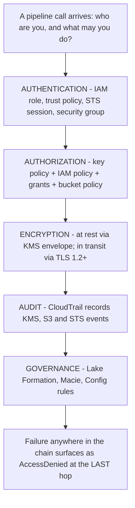
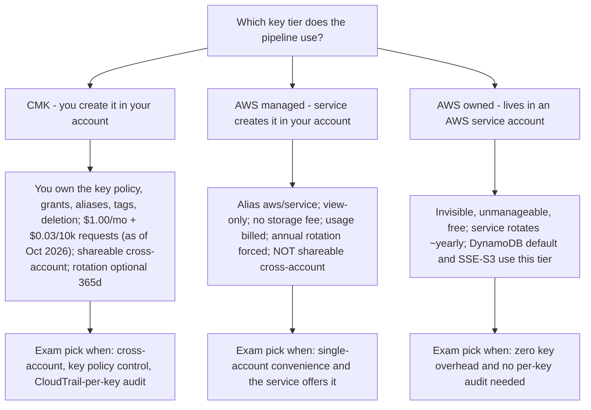
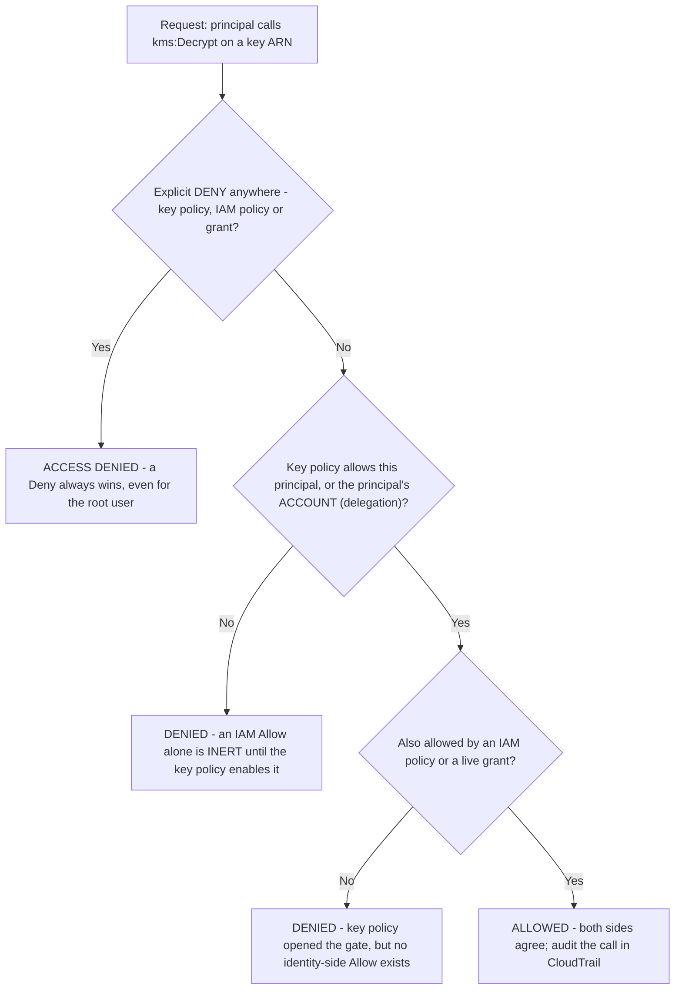
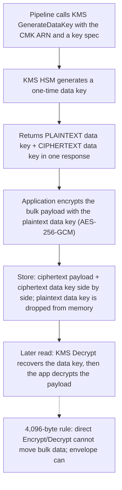
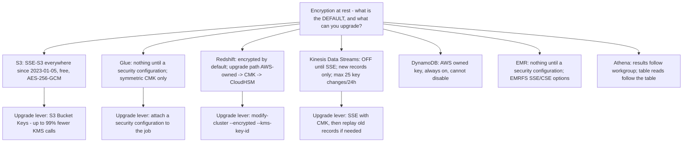
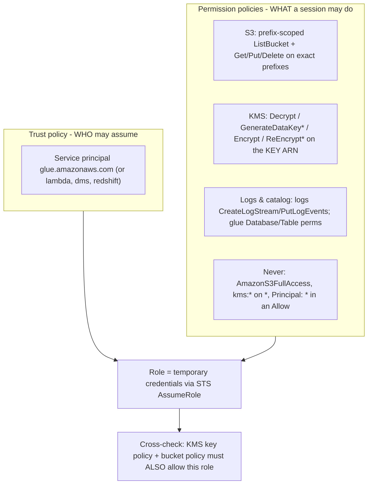
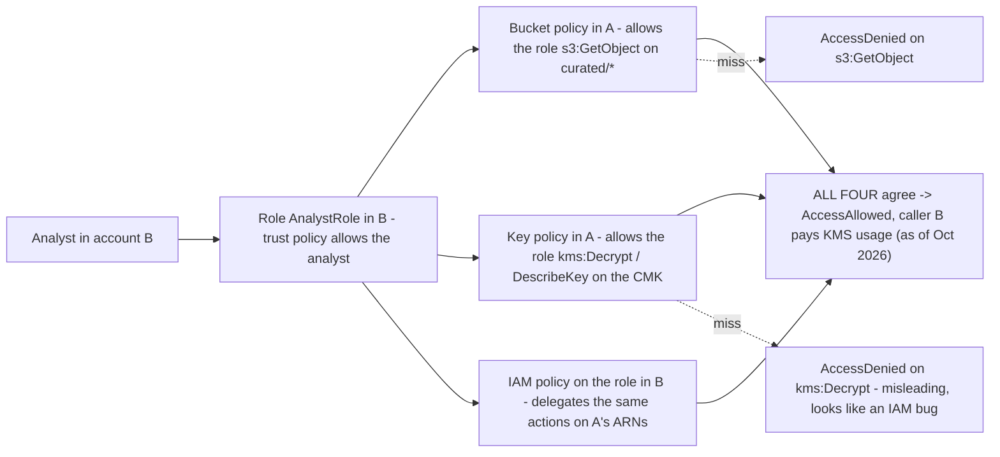

# Security, Encryption and IAM for Data Pipelines

Every pipeline is a chain of authorised calls: a Glue job assumes a role, decrypts a CMK-wrapped data key, reads `s3://raw/`, writes `s3://curated/`, and hands Redshift a manifest. Break any link — a key policy that never enabled IAM, a grant nobody revoked, a bucket policy that denies `aws:SecureTransport` — and the pipeline fails with an error message that names the *last* hop, not the real cause. Domain 4 of the DEA-C01 exam guide (18% of scored content) tests exactly this chain: **authentication (4.1), authorization (4.2), encryption and masking (4.3), audit logs (4.4) and privacy/governance (4.5)** (DEA-C01 exam guide, accessed Oct 2026). This lesson teaches the chain the way the exam asks it — as decisions, defaults and numbers, each sourced.

```text
====================================================================
 DOMAIN 4 — DATA SECURITY AND GOVERNANCE (DEA-C01, 18%)
====================================================================
  4.1 AUTHENTICATION .... VPC security groups; IAM groups/roles/
                          endpoints/services; credential rotation
                          (Secrets Manager); IAM roles for Lambda,
                          API Gateway, CLI, CloudFormation; IAM
                          policies on roles/endpoints/services
                          (S3 Access Points, PrivateLink)
  4.2 AUTHORIZATION ..... custom IAM policies; app/DB credentials
                          (Secrets Manager, Parameter Store); Redshift
                          DB users/groups/roles; Lake Formation
                          permissions; RBAC / tag-based / ABAC;
                          least-privilege custom policies
  4.3 ENCRYPTION ........ masking/anonymization; keys (AWS KMS);
                          encryption across account boundaries;
                          encryption in transit / before transit
  4.4 AUDIT ............. CloudTrail, CloudWatch Logs, CloudTrail
                          Lake, Athena/OpenSearch/Logs Insights
  4.5 PRIVACY ........... Redshift data sharing permissions, Macie +
                          Lake Formation PII, data sovereignty,
                          AWS Config, SageMaker Catalog
--------------------------------------------------------------------
  THIS LESSON'S SPINE
  KMS tiers -> key policy vs IAM vs grants -> envelope encryption
  -> rotation & grants -> KMS per-use costs -> at-rest matrix
  -> in-transit TLS -> pipeline IAM -> cross-account -> S3 access
  -> secrets store -> security groups & PrivateLink
====================================================================
```

In this lesson you will:

- separate **customer managed, AWS managed and AWS owned** KMS keys — who owns, who pays, who can share;
- evaluate access the way KMS does: **key policy first, then IAM and grants, explicit Deny always winning**;
- apply **envelope encryption**, its 4,096-byte direct-API cap, and what rotation does *not* re-encrypt;
- price KMS **per use** — key fee, request fee, free tier, Bucket Keys — with October 2026 numbers;
- build the **at-rest matrix** for S3, Glue, Redshift, Kinesis, DynamoDB, EMR and Athena;
- enforce **TLS in transit**, including the `aws:SecureTransport` redaction trap that breaks replication;
- write **least-privilege pipeline roles** — prefix-scoped S3, KMS actions on key ARNs, no `AmazonS3FullAccess`;
- wire **cross-account** access through the four documents that must all agree;
- control S3 access with **bucket policies, retired ACLs, Block Public Access, VPC endpoints and presigned URLs**;
- choose between **Secrets Manager and Parameter Store SecureString** on features *and* price;
- place **security groups and PrivateLink** so pipeline traffic never hairpins the public internet;
- practise with **14 exam-style questions** plus three interactive checks.

---

## 1. The Domain 4 task map: where this lesson lands

The exam guide's Domain 4 carries five tasks; this lesson is the technical core of 4.1–4.3, and it supplies the identity machinery that 4.4 (audit) and 4.5 (governance) consume.

| Task | What the guide asks | Where in this lesson |
|---|---|---|
| **4.1 Apply authentication** | VPC security groups; IAM groups/roles/endpoints; credential rotation; IAM roles for Lambda, API Gateway, CLI, CloudFormation; policies on roles/endpoints/services (S3 Access Points, PrivateLink) | Sections 9, 11, 12, 13 |
| **4.2 Apply authorization** | Custom IAM policies; app/DB credentials (Secrets Manager, Parameter Store); Redshift DB users; Lake Formation permissions; RBAC/tag/ABAC; **least-privilege custom policies** | Sections 3, 9, 10, 12 |
| **4.3 Ensure data encryption and masking** | Masking/anonymization; **keys (AWS KMS)**; **encryption across account boundaries**; **encryption in transit / before transit** | Sections 2–8, 10 |
| **4.4 Prepare logs for audit** | CloudTrail, CloudWatch Logs, CloudTrail Lake, Athena/OpenSearch/Logs Insights | Out of scope here (Lesson 10) |
| **4.5 Data privacy and governance** | Redshift data sharing permissions, Macie + Lake Formation PII, data sovereignty/Region pinning, AWS Config | Teased in Sections 10, 14 (Lesson 14 owns Lake Formation) |



> [!NOTE]
> The exam rarely asks "which service encrypts?". It asks **which default is on, which key type you can control, and which document must also allow the call**. Learn the defaults in Section 7 and the document set in Sections 3 and 10; the rest is application.

---

## 2. AWS KMS key ownership: customer managed, AWS managed, AWS owned

AWS KMS offers three tiers of key, and the DEA-C01 exam distinguishes them on five axes: **where the key lives, what you can configure, what you pay, whether it can rotate on a schedule you control, and whether it can be shared cross-account**.

| Axis | **Customer managed key (CMK)** | **AWS managed key** | **AWS owned key** |
|---|---|---|---|
| Where it lives | **Your account**, created by you | **Your account**, created by an integrated service on your behalf | **An AWS service account**, not yours |
| Visibility | Full: metadata, policy, grants, aliases, tags | View metadata, policy and CloudTrail use only | **Invisible** |
| Key policy control | **You own it** | View-only; you cannot edit | None |
| Rotation | **Optional**; you enable it; custom 90–2,560 days | **Automatic ~365 days**, cannot disable | Service-controlled, annual for most services |
| Sharing cross-account | **Yes**, via key policy | **No** | Transparently yes (service-managed) |
| Cost (as of Oct 2026) | **$1.00/key/month** prorated hourly + **$0.03 per 10,000 requests** | **No storage fee**; usage billed (some services absorb it) | **Free** |
| Identity check | `DescribeKey` → `KeyManager=CUSTOMER` | alias `aws/<service>` | not queryable |
| Quotas | Counts against your **100,000 CMKs per Region** | Excluded from CMK quota | Excluded |
| Exam exemplars | Glue security-configuration key, Redshift CMK, S3 SSE-KMS CMK, Kinesis CMK | S3 `aws/s3`, Kinesis `aws/kinesis`, Redshift AWS-owned cluster key | **DynamoDB default**, S3 SSE-S3 keys |

The rule of thumb AWS's own KMS documentation supports: **control → CMK, convenience → AWS owned**. When a question asks you to "use a key you control so another account can decrypt", the answer is always a CMK — AWS managed keys **cannot be shared cross-account**, and AWS owned keys are not addressable at all (KMS concepts, accessed Oct 2026).



- **📚 Did you know?** The AWS managed tier is a **legacy pattern**: AWS's KMS documentation notes that AWS managed keys are **not created for new service integrations since 2021** — new integrations default to AWS owned keys (free) or ask you to bring a CMK. That is why DynamoDB's default is **AWS owned** (rotated ~365 days, AES-256, cannot be disabled) while S3's managed option is still the `aws/s3` AWS managed key (KMS concepts; DynamoDB encryption docs, accessed Oct 2026).

---

## 3. Key policies versus IAM policies versus grants

This is the single most examined mechanic in Domain 4. Three mechanisms can allow a KMS action, and they do **not** stack the way beginners assume.

### 3.1 The three rules, verbatim from the KMS docs

1. *"A key policy is a resource policy for an AWS KMS key. Key policies are the **primary way** to control access to KMS keys. **Every KMS key must have exactly one key policy.**"*
2. *"**No AWS principal, including the account root user or key creator, has any permissions to a KMS key unless they are explicitly allowed, and never denied**, in a key policy, IAM policy, or grant."*
3. *"**Unless the key policy explicitly allows it, you cannot use IAM policies to *allow* access to a KMS key.** … (You can use an IAM policy to *deny* permission to a KMS key without permission from a key policy.)"* (KMS key-policies and control-access docs, accessed Oct 2026)

Two further structural facts: **key policies are Regional, IAM policies are global**; and a grant can **allow but never deny**, covers **exactly one key**, has **no automatic expiry**, and is capped at **50,000 grants per key** (KMS grants docs, accessed Oct 2026).

### 3.2 Evaluation order



### 3.3 Anatomy of the default key-policy statement

The default statement every new CMK carries names the **account**, not the root user:

```json
{
  "Sid": "Enable IAM User Permissions",
  "Effect": "Allow",
  "Principal": {"AWS": "arn:aws:iam::111122223333:root"},
  "Action": "kms:*",
  "Resource": "*"
}
```

Read `arn:aws:iam::<account-id>:root` as "**this account, via its IAM policies**" — it delegates to IAM so that identity policies in the account can grant key actions. It does **not** grant the root user special standing beyond what IAM already allows, and replacing it with `"Principal": "*"` in an Allow statement is the canonical hole (KMS key-policy overview, accessed Oct 2026).

### 3.4 Worked example E1 — an identity policy that looks right and does nothing

An analyst's IAM policy in account B:

```json
{
  "Effect": "Allow",
  "Action": ["kms:Decrypt", "kms:DescribeKey"],
  "Resource": "arn:aws:kms:us-east-1:111122223333:key/1234abcd-12ab-..."
}
```

If account A's CMK key policy never named account B or `arn:aws:iam::B:role/AnalystRole`, this policy is **inert**. The analyst receives `AccessDenied` with the misleading hint "not authorized to perform kms:Decrypt" — the fix is never in the IAM policy; it is in the **key policy** (and, for the data itself, the **bucket policy**). Exam phrasing: "Which change grants the cross-account analyst access?" — answer the **key policy** first.

- **📚 Did you know?** The three mechanisms have different verbs on purpose: **policies** are declarative JSON evaluated on every call; **roles** are assumable identities whose *trust policy* decides who may create a session; **grants** are KMS-specific, allow-only, machine-friendly tickets that integrated services create on your behalf — `RetireGrant` and `RevokeGrant` are the cleanup APIs, and a forgotten duplicate grant is a standing privilege escalation (KMS grants best-practices doc, accessed Oct 2026).

```dragdrop
{
  "question": "Drag the KMS access checks into the order KMS actually evaluates them when a pipeline role calls kms:Decrypt:",
  "items": [
    "Identity-side check - does an IAM policy or a live grant also allow the action?",
    "ALLOWED - the call is permitted and lands in CloudTrail",
    "Explicit-Deny check - does any key policy, IAM policy or grant contain an explicit Deny?",
    "Key-policy check - does the key policy allow the principal itself, or its ACCOUNT by delegation?"
  ],
  "correctOrder": [
    "Explicit-Deny check - does any key policy, IAM policy or grant contain an explicit Deny?",
    "Key-policy check - does the key policy allow the principal itself, or its ACCOUNT by delegation?",
    "Identity-side check - does an IAM policy or a live grant also allow the action?",
    "ALLOWED - the call is permitted and lands in CloudTrail"
  ],
  "explanation": "The order is the whole exam mechanic: an explicit Deny anywhere short-circuits everything (even for the account root user); only then does the key policy get a vote, because an IAM Allow is inert until the key policy permits the principal or delegates to its account; only if the gate is open does the identity side (IAM policy or grant) need its own Allow. Skip the order and you get the two classic misdiagnoses - 'I added an IAM policy and it still fails' (key policy closed) and 'the key policy allows me but I am still denied' (no identity-side Allow). Everything allowed here is recorded per key in CloudTrail, which is why the audit task 4.4 depends on this evaluation succeeding."
}
```

---

## 4. Envelope encryption: how bulk data actually gets encrypted

KMS keys never leave FIPS 140-3 **Level 3** HSMs unencrypted, so encrypting terabytes through the key itself would be both slow and impossible: the direct `Encrypt`/`Decrypt` APIs accept a maximum of **4,096 bytes** of plaintext. Every AWS at-rest integration therefore uses **envelope encryption** — generate a cheap per-object *data key*, encrypt the payload locally, and keep only the data key's ciphertext under the KMS key.



What this means for exam scenarios:

- **The CMK wraps the data key, not your data.** `kms:Decrypt` on the key is necessary but not sufficient — the caller also needs the ciphertext data key stored with the object (S3 does this for you under SSE-KMS).
- **`ReEncrypt*` is two permissions, not one.** Re-wrapping a data key under a new key requires **both** `kms:ReEncryptFrom` and `kms:ReEncryptTo` (KMS API permissions reference, accessed Oct 2026).
- **Rotation never rewrites ciphertext.** New key material encrypts **future** data keys; old ciphertext decrypts with the retained old backing key forever. Nothing about "enabling rotation" migrates your objects.
- **Client-side encryption (CSE-KMS)** is the same maths run entirely on your side — AWS never sees plaintext — which is why CSE-KMS is the "strongest" Athena result tier and an EMRFS option.

---

## 5. Rotation and grants: what is automatic, what is optional, what is dangerous

### 5.1 Rotation rules

| Key type | Rotation | Control |
|---|---|---|
| **CMK (symmetric, `AWS_KMS` origin)** | **Off by default**; when enabled, new material every **365 days** (custom **90–2,560**); first rotation one year after enabling | You call `EnableKeyRotation` |
| **CMK (asymmetric, HMAC, imported, custom key store)** | **Not eligible** for automatic rotation | Manual rotation or `RotateKeyOnDemand` |
| **AWS managed key** | **Always ~365 days**, cannot be disabled (was ~1,095 days before May 2022) | None |
| **AWS owned key** | Service-controlled, ~annual | None |
| **DynamoDB default (AWS owned)** | ~365 days, AES-256, cannot be disabled | None; a CMK can be attached per table and switched anytime |

Rotation is **transparent**: existing ciphertext is never re-encrypted, and the old HSM backing keys are retained so old data remains decryptable. Events you can audit: `KMS CMK Rotation` to EventBridge, `RotateKey` in CloudTrail (KMS rotate-keys docs, accessed Oct 2026).

### 5.2 Grant mechanics

- A grant can **allow** access, but **not deny**; **each grant allows access to exactly one KMS key**; **grants do not automatically expire** (KMS grants docs, accessed Oct 2026).
- One grantee per grant — an IAM identity **or** a service principal (the way Glue, DMS and Redshift obtain least-privilege, time-boxed access).
- Limits: **50,000 grants per key**; `CreateGrant` is roughly as powerful as `PutKeyPolicy`, so constrain it with `kms:GranteePrincipal`, `kms:GrantOperations`, `kms:GrantConstraintType` and `kms:GrantIsForAWSResource`.
- A `GrantToken` returned by `CreateGrant` sidesteps post-creation eventual consistency in the same workflow.

### 5.3 Worked example E2 — what "enable rotation" costs and does not do

A team enables automatic rotation on one symmetric CMK on 2026-01-15, rotates it five times over three years, and stores 40 TB of S3 objects under SSE-KMS with that key.

```text
Key fee (as of Oct 2026)  ................  $1.00 / month
Automatic rotations  .....................  5
Billable rotations  ......................  1st and 2nd only = 2 x $1.00
                                           (3rd, 4th, 5th are FREE)
Steady-state key cost  ...................  $1.00 + $1.00 + $1.00 = $3.00/month
                                           at the end state, then $3.00 flat
Objects re-encrypted by rotation  ........  0  (old ciphertext keeps
                                           decrypting with retained keys)
Data still readable with old key version .  yes - rotation is transparent
```

The exam trap: "enabling rotation re-encrypts existing objects with the new key material" is **false**. Re-encryption is a separate, deliberate job (S3 Batch Operations, `ReEncrypt*` calls, or rewrite the data).

---

## 6. KMS pricing: pay for keys and for use

Every number in this section is from the AWS KMS pricing page, **as of Oct 2026**; re-verify before dating a design decision later.

| Charge | Value (as of Oct 2026) |
|---|---|
| Customer managed key storage | **$1.00 per key per month**, prorated hourly — applies to multi-Region primary **and** replicas, imported material and external key stores |
| Rotation surcharge | The **first and second** automatic/on-demand rotations add **$1.00/month each**, **capped at the second**; later rotations are free |
| Symmetric usage | **$0.03 per 10,000 requests** |
| Asymmetric signing usage | **$0.15 per 10,000 requests** |
| Free tier | **20,000 KMS requests per month, all Regions combined** (excludes asymmetric `Sign`/`Verify` and `GenerateDataKeyPair*`) |
| AWS managed / AWS owned | **No storage fee**; AWS managed usage is still billed unless a service absorbs it |
| Cross-account | "**The AWS account that makes the API request is charged**" — the caller pays |

### 6.1 Worked example E3 — the monthly KMS bill for an SSE-KMS lake

One CMK, and a busy month of **2,010,000** KMS calls (GETs and PUTs each triggering data-key operations):

```text
Billed requests = 2,010,000 - 20,000 free = 1,990,000
Request cost    = (1,990,000 / 10,000) x $0.03 = 199 x $0.03 = $5.97
Key fee         = $1.00
Monthly total   = $1.00 + $5.97 = $6.97   (as of Oct 2026)
```

### 6.2 Worked example E4 — the same lake with an S3 Bucket Key

S3 Bucket Keys reduce the number of KMS requests that reach your key by **up to 99%**, because S3 forwards one data key instead of one per object operation. Unsupported for DSSE-KMS; supported for SSE-KMS.

```text
Request cost with Bucket Key ~= 1% of 1,990,000 = ~19,900 calls
  -> rounds to ~2 x $0.03 = $0.06 (illustrative; AWS publishes "up to 99%")
Monthly total ~= $1.00 + ~$0.10 = ~$1.00-$1.10   (as of Oct 2026)
Same lake on default SSE-S3 (AWS owned keys) = $0 key cost
Savings vs E3 = $6.97 - ~$1.05 ~= $5.92 per month, ~85% of the key bill
```

Exam framing (and the fix in Case A below): "Which single change most reduces the KMS cost of an SSE-KMS bucket without weakening the encryption posture?" — **enable S3 Bucket Keys**.

> [!IMPORTANT]
> **⚠️ Cost traps:** rotating a CMK **twice** adds $2/month, then caps; **cross-account callers pay** in their own account; the free tier is **per account, all Regions combined**, not per key; and AWS managed keys still bill **usage** unless the integrating service pays it for you (AWS KMS pricing, accessed Oct 2026).

---

## 7. Encryption at rest: the per-service matrix

At-rest encryption on this exam is a **defaults** game. Note the pattern: managed services increasingly encrypt **always**, with your control limited to *which key tier* you upgrade to.

| Service | Default at rest | Your options | Special rules the exam loves |
|---|---|---|---|
| **Amazon S3** | **SSE-S3 on every bucket since 2023-01-05**, AES-256-GCM, **no fee** | SSE-KMS (`aws/s3` or your CMK), DSSE-KMS (dual layer), SSE-C (you supply the key per request) | **Bucket Keys cut KMS calls up to 99%**; changing the bucket default **does not re-encrypt existing objects**; DSSE-KMS cannot use Bucket Keys |
| **AWS Glue** | **None until you configure it** | Security configuration: S3 data as SSE-S3/SSE-KMS, CloudWatch Logs KMS, **job bookmarks CSE-KMS**, Data Quality KMS; Catalog `DISABLED \| SSE-KMS \| SSE-KMS-WITH-SERVICE-ROLE`; connection passwords via CMK | **Symmetric CMKs only**; the security configuration **overrides** any SSE-S3 job parameter; the **job's role** needs the KMS permissions |
| **Amazon Redshift** | **Encrypted by default** (AES-256) for new clusters | AWS-owned key, **your CMK**, or CloudHSM | Four-tier hierarchy root → CEK → DEK → data keys; only the encrypted CEK leaves KMS; **disable cross-Region snapshot copy before** switching keys; CEK rotation **restarts the cluster** |
| **Kinesis Data Streams** | **Off until you enable SSE** | `aws/kinesis` (free key, usage billed) or a **CMK** | Encrypts **only new records** — pre-existing records stay unencrypted; **≤25 key changes per rolling 24 hours**; resource-policy sharing requires a **CMK** |
| **Amazon DynamoDB** | **AWS owned key, always on, cannot disable** (AES-256) | `aws/dynamodb` or a CMK per table | CMK covers indexes, streams and backups; **DAX cannot use a CMK**; key can be switched at any time |
| **Amazon EMR** | **None until a security configuration** (EMR ≥ 4.8.0) | EMRFS SSE-S3 / SSE-KMS / CSE-KMS / CSE-C; EBS at-rest; WAL `SSE-EMR-WAL` (default) or `SSE-KMS` | **Symmetric keys only**, same Region as cluster **and** buckets; HDFS transparent encryption (≥ 4.1.0) uses **Hadoop KMS, not AWS KMS** |
| **Amazon Athena** | Results follow the query/workgroup setting | SSE-S3, **SSE-KMS (recommended)**, CSE-KMS; managed query results are service-managed and encrypted | Workgroup override wins; tiers Basic = SSE_S3, Intermediate = SSE_KMS, Advanced = CSE_KMS; **table reads follow the table's encryption**, not the result config; many small KMS result objects can throttle queries |



### 7.1 Worked example E5 — the migration that did not re-encrypt

A compliance team flips an existing S3 bucket's default encryption from SSE-S3 to SSE-KMS with a CMK on 2026-10-01 and declares the lake compliant.

```text
Objects written BEFORE the change  ->  still SSE-S3 (S3's own keys)
Objects written AFTER the change   ->  SSE-KMS under the CMK
Reason (KMS/S3 docs, accessed Oct 2026):
  "When you change the default encryption configuration of your bucket
   to SSE-KMS, the encryption type of the existing Amazon S3 objects
   in the bucket is not changed."
Remediation: S3 Batch Operations re-encrypt job, or lifecycle + rewrite.
Same trap family: Kinesis SSE encrypts only NEW records (enable date
2026-10-01 on a stream active since 2026-09-01 -> September records
remain unencrypted).
Counter-example: DynamoDB CAN switch key material live, indexes and
streams included - that asymmetry is examinable.
```

```matching
{
  "question": "Match each data service to its DEFAULT at-rest encryption state on DEA-C01 (as of October 2026):",
  "pairs": [
    {"left": "Amazon S3", "right": "SSE-S3 on every bucket since 2023-01-05 - AES-256-GCM, no fee, S3-owned keys"},
    {"left": "Amazon DynamoDB", "right": "AWS owned key, always on, cannot be disabled - CMK is an optional upgrade per table"},
    {"left": "Amazon Redshift", "right": "Encrypted by default with an AWS-owned key - four-tier hierarchy, SSL however is NOT required by default"},
    {"left": "Amazon Kinesis Data Streams", "right": "Server-side encryption OFF until enabled - and it encrypts only NEW records"},
    {"left": "AWS Glue", "right": "Nothing encrypted until you attach a security configuration - symmetric CMKs only"},
    {"left": "Amazon EMR", "right": "Nothing encrypted until a security configuration exists - HDFS transparent encryption uses Hadoop KMS, not AWS KMS"},
    {"left": "Amazon Athena", "right": "Query results follow the workgroup setting - but TABLE reads follow the table's own encryption"}
  ],
  "explanation": "The exam tests DEFAULTS plus the direction of upgrade. S3 and DynamoDB encrypt without configuration (different key tiers: SSE-S3 uses AWS owned keys; DynamoDB's default is also AWS owned). Redshift encrypts but leaves SSL optional (require_SSL=true is your job). Kinesis and Glue/EMR do nothing until configured, and Kinesis never back-fills old records. Athena separates result encryption from source-table encryption - a favourite distractor."
}
```

---

## 8. Encryption in transit: TLS everywhere, and the two enforcement patterns

AWS's baseline: **S3 accepts TLS 1.2 and 1.3** at its endpoints, and **all AWS service API endpoints have required a minimum of TLS 1.2 since 2024-02-27**. Kinesis **requires TLS 1.2 and recommends 1.3**. Redshift, however, **accepts non-SSL connections by default** — you must set `require_SSL=true` in the cluster's parameter group. The exam loves that asymmetry.

### 8.1 Server-side versus client-side, in one line each

- **Server-side (SSE-\*)**: the service encrypts on receipt and decrypts on serve; you never hold plaintext.
- **Client-side (CSE-KMS, S3 encryption client, Redshift `COPY` of client-encrypted files, EMRFS CSE)**: you encrypt before upload; **AWS cannot read the plaintext** — which is why CSE is simultaneously the strongest posture and the hardest to operate.

### 8.2 Worked example E6 — an `aws:SecureTransport` deny that broke replication

Team policy: deny any request that is not HTTPS.

```json
{
  "Sid": "DenyInsecureTransport",
  "Effect": "Deny",
  "Principal": "*",
  "Action": "s3:*",
  "Resource": ["arn:aws:s3:::lake-raw", "arn:aws:s3:::lake-raw/*"],
  "Condition": {"Bool": {"aws:SecureTransport": "false"}}
}
```

The condition polarity is right — `aws:SecureTransport` is **true** for HTTPS — but S3 **replication** then fails to write its configuration. Reason, from the S3 docs: *"When AWS services make calls to other AWS services on your behalf (service-to-service calls), certain network-specific authorization context is redacted, including `s3:TlsVersion`, `aws:SecureTransport`, `aws:SourceIp`, and `aws:VpcSourceIp`."* The replication service principal presents **no** `aws:SecureTransport` value, so the Deny matches. Fix:

```json
"Condition": {
  "Bool": {"aws:SecureTransport": "false"},
  "StringNotEquals": {"aws:PrincipalIsAWSService": "true"}
}
```

…or equivalently add `"aws:PrincipalIsAWSService": "false"` to the Deny's condition so only **human/role** callers are policed. Same trap applies to `s3:TlsVersion` minimums and to `aws:SourceIp` conditions used by backup or replication jobs.

### 8.3 Redshift SSL and the other per-service transit rules

| Service | Transit default | Enforcement lever |
|---|---|---|
| **Redshift** | *"By default, cluster databases accept a connection whether it uses SSL or not."* | Set **`require_SSL=true`** in the parameter group; client `sslmode` runs `disable → allow → prefer → require → verify-ca → verify-full`; enforced-encryption VPCs force `require_SSL`; hardware-accelerated SSL covers `COPY`/`UNLOAD`/backup |
| **Kinesis Data Streams** | **TLS 1.2 required, TLS 1.3 recommended** for all data-plane calls | Nothing to enable; test with a non-TLS client (it fails) |
| **AWS Glue connections** | Optional | Tick **"Require SSL connection"** on JDBC connections to databases |
| **S3** | TLS 1.2/1.3 at endpoints | Bucket policy Deny on `aws:SecureTransport=false` (mind the redaction trap above) or `s3:TlsVersion >= 1.2` |
| **DMS** | Replication instance uses TLS where the engine supports it | Security groups still decide reachability (Section 13) |

Config automation exists for the two most-tested levers: AWS Config managed rules **`s3-bucket-ssl-requests-only`** and **`redshift-require-tls-ssl`** (plus `kinesis-stream-encrypted`) continuously assert the posture you configured once.

---

## 9. IAM for data services: roles, least privilege, and the anti-pattern

### 9.1 The building blocks

| Concept | What it is on this exam |
|---|---|
| **Policy** | JSON document of permissions — identity-based (attached to a principal) or resource-based (attached to a bucket, key, queue…) |
| **Role** | Assumable identity = **trust policy** (who may assume) + permission policies (what a session may do) + **temporary credentials** via STS |
| **Service role** | A role **the service assumes to act for you** — Glue job, DMS replication instance, Redshift `COPY IAM_ROLE=…`, Lambda execution role |
| **Service-linked role** | AWS-managed variant; the service defines the trust and permissions; you cannot edit them |
| **Workload identity rule** | Workloads use **roles, never embedded long-term access keys**; humans federate through IAM Identity Center |

### 9.2 The `AWSGlueServiceRole` pattern and the `AmazonS3FullAccess` anti-pattern

AWS's console historically attaches `AmazonS3FullAccess` to demo Glue jobs. The Glue documentation itself tempers this: *"You might want to provide your own policy for access to specific Amazon S3 resources."* The managed **`AWSGlueServiceRole`** grants Glue plus limited S3 (its own `aws-glue-*` script and scratch buckets), CloudWatch and ENI plumbing — **it is not a data-access grant**. Production pattern:

```json
{
  "Version": "2012-10-17",
  "Statement": [
    {
      "Sid": "ReadLandingPrefix",
      "Effect": "Allow",
      "Action": ["s3:GetObject", "s3:ListBucket"],
      "Resource": [
        "arn:aws:s3:::lake-raw",
        "arn:aws:s3:::lake-raw/raw/*"
      ],
      "Condition": {"StringLike": {"s3:prefix": "raw/*"}}
    },
    {
      "Sid": "WriteCuratedPrefix",
      "Effect": "Allow",
      "Action": ["s3:PutObject", "s3:DeleteObject", "s3:ListBucket"],
      "Resource": [
        "arn:aws:s3:::lake-curated",
        "arn:aws:s3:::lake-curated/curated/*"
      ]
    },
    {
      "Sid": "UseThePipelineKey",
      "Effect": "Allow",
      "Action": [
        "kms:Decrypt", "kms:GenerateDataKey*",
        "kms:Encrypt", "kms:ReEncrypt*", "kms:DescribeKey"
      ],
      "Resource": "arn:aws:kms:us-east-1:111122223333:key/1234abcd-..."
    }
  ]
}
```

Three things this snippet gets right that `AmazonS3FullAccess` gets wrong: **prefix-scoped `Resource` ARNs**, **`s3:ListBucket` on the bucket ARN paired with `s3:GetObject`/`PutObject` on the object ARN** (the two-level S3 permission model), and **KMS actions bound to the specific key ARN** — which the key policy must also allow (Section 3).

AWS's own minimums for a Glue job match the split: *"Data sources require `s3:ListBucket` and `s3:GetObject` permissions. Data targets require `s3:ListBucket`, `s3:PutObject`, and `s3:DeleteObject`."* And if you pass a role through the console, its name must be **prefixed `AWSGlueServiceRole`** (Glue IAM docs, accessed Oct 2026).



### 9.3 KMS permissions inside pipeline policies

The minimum action set by workload shape (KMS API permissions reference, accessed Oct 2026):

| Workload | Minimum KMS actions on the key ARN |
|---|---|
| **Read** SSE-KMS objects | `kms:Decrypt`, `kms:DescribeKey` |
| **Write** SSE-KMS objects | `kms:GenerateDataKey*`, `kms:Encrypt`, plus `kms:DescribeKey`; `kms:ReEncrypt*` when re-wrapping |
| **Athena managed results key** | `kms:Decrypt`, `kms:GenerateDataKey`, `kms:DescribeKey` |
| **Glue security configuration** | All of the above for **each** key named in the configuration — attached to the **job's role**, not to the console user who clicked Run |

- **📚 Did you know?** S3's two-level permission model is a frequent silent failure: `s3:ListBucket` is authorised against the **bucket ARN** (`arn:aws:s3:::lake-raw`), while `s3:GetObject`/`s3:PutObject` are authorised against **object ARNs** (`arn:aws:s3:::lake-raw/raw/*`). Granting only the object ARNs leaves `ListBucket` failing; the AWS Glue docs' source/target split above exists precisely because crawlers and partition projection call `ListBucket` constantly (Glue minimum-privileges doc, accessed Oct 2026).

```fillblank
{
  "question": "Complete the pipeline-IAM statements using this lesson's vocabulary:",
  "template": "A {{1}} is an assumable identity whose {{2}} policy decides who may create a session and whose permission policies decide what that session may do; it issues {{3}} credentials, so workloads should never embed long-term access keys. Glue data sources need {{4}} plus s3:GetObject, while data targets need ListBucket, PutObject and {{5}}. Console-created Glue roles must be prefixed {{6}}, and the KMS actions belong on the {{7}} ARN - granted by the identity policy AND enabled by the key policy.",
  "answers": {
    "1": "role",
    "2": "trust",
    "3": "temporary",
    "4": "s3:ListBucket",
    "5": "s3:DeleteObject",
    "6": "AWSGlueServiceRole",
    "7": "key"
  },
  "distractors": ["policy", "grant", "resource", "permanent", "session", "s3:GetObject", "s3:PutObject", "AmazonS3FullAccess", "bucket", "principal"],
  "explanation": "Roles = trust policy + permission policies + temporary STS credentials, which is why AWS forbids long-term keys on workloads. Glue's documented minimums are exactly ListBucket+GetObject for sources and ListBucket+PutObject+DeleteObject for targets, and console-passed Glue roles must start with AWSGlueServiceRole. KMS rights must be bound to the KEY ARN in the identity policy and simultaneously allowed by the key policy - either document alone leaves the pipeline AccessDenied."
}
```

---

## 10. Cross-account access: the four documents that must agree

Cross-account is Domain 4.3.3's "encryption across account boundaries", and it fails with an error that names one mechanism while the real gap is another. Account **A** owns a curated bucket and CMK; account **B**'s analysts need `s3:GetObject`.

| # | Document | What it must say |
|---|---|---|
| 1 | **Key policy** on A's CMK | Allow `arn:aws:iam::B:role/AnalystRole` (or account B root + delegation) `kms:Decrypt`, `kms:DescribeKey` |
| 2 | **Bucket policy** on A's bucket | Allow that principal `s3:GetObject` on `curated/*` |
| 3 | **IAM policy** on B's role | Allow `kms:Decrypt`/`kms:DescribeKey` on A's key ARN and `s3:GetObject` on A's bucket ARNs — *"Cross-account access requires permission in the key policy of the KMS key and in an IAM policy in the external user's account"* |
| 4 | **Trust policy** on B's role | Allow the analyst users/groups to `sts:AssumeRole` |



Two structural constraints worth memorising: **AWS managed keys cannot be shared cross-account** (so the design forces a CMK), and for Kinesis resource-policy sharing the key must likewise be a CMK. On the billing side, *"the AWS account that makes the API request is charged"* for KMS usage (AWS KMS pricing, accessed Oct 2026).

---

## 11. S3 access: bucket policies, ACLs, endpoints, presigned URLs

### 11.1 Bucket policies and the ACL retirement

A bucket policy is a **resource policy**: principal, action, resource, **condition**. It is also the only place you can express `aws:SecureTransport`, `aws:SourceVpce` or `aws:PrincipalIsAWSService` constraints.

ACLs are legacy. Since AWS enabled **Object Ownership = Bucket owner enforced** by default, **all ACLs are disabled**, the bucket owner owns every object, and ACL writes fail with `AccessControlListNotSupported`. AWS's guidance: *"we recommend that you keep ACLs disabled"* and migrate any surviving ACL grants into bucket policies (S3 Object Ownership docs, accessed Oct 2026). **Block Public Access** defaults to all four switches ON for new buckets (account, bucket, access point, organization), with the most restrictive winning.

### 11.2 VPC endpoints: gateway versus interface

| | **Gateway endpoint** | **Interface endpoint (PrivateLink)** |
|---|---|---|
| Services | **S3 and DynamoDB only** | Nearly every AWS service, S3 included |
| Cost (as of Oct 2026) | **No charge** | Billed ENI per AZ + data processing |
| Attachment | Route table | ENI per subnet; private DNS optional |
| Traffic stays private without IGW/NAT | Yes | Yes |
| On-premises over Direct Connect/VPN | **No** | **Yes** |
| Cross-Region | No | Via peering/Transit Gateway |
| Extra auth layer | Endpoint policy | Endpoint policy |
| Condition keys | `aws:sourceVpce` works; **`aws:SourceIp` does not** — use **`aws:VpcSourceIp`** | Same caution on the gateway path |

### 11.3 Worked example E7 — presigned URL lifetimes

A presigned URL delegates the **presigner's** permissions for one operation; it never widens them, and validity is re-checked on every request (bucket-policy Denies and Block Public Access still apply).

```text
Case 1 - URL requested from an IAM USER with long-term SigV4 credentials:
         requested 7 days -> actual = 7 days (CLI/SDK ceiling = 7 days;
         console buttons: 1 minute - 12 hours)

Case 2 - URL requested by a Lambda execution ROLE whose session lasts 1 hour,
         requested 7 days -> actual = 1 HOUR.
         Rule: temporary-credential URLs die with the session regardless
         of the requested expiry (role sessions, EC2 instance profiles
         typically ~6 hours).

Case 3 - Presigner holds only s3:GetObject on curated/* -> the URL can
         never become a PutObject; permissions come from the CALLER, so
         least privilege on the role IS the URL policy.
```

Prescriptive Guidance's framing: you cannot rate-limit URL *generation*; your levers are **least privilege + short expiry + monitoring** (S3 presigned-URL docs; Prescriptive Guidance, accessed Oct 2026).

---

## 12. Secrets Manager versus Parameter Store SecureString

Both store encrypted text under KMS; they diverge on **rotation, cross-account, size and price**. AWS's own selection guidance: **Secrets Manager for secrets, Parameter Store for simple key-value pairs** (AWS Security Blog, 2025-10-22, accessed Oct 2026).

| | **SSM Parameter Store** | **Secrets Manager** |
|---|---|---|
| Types | String, StringList, **SecureString** | Secret (plain or JSON key/value) |
| Encryption | SecureString via KMS, symmetric only; default `aws/ssm` or your CMK; standard tier encrypted under the key, advanced tier adds envelope + AWS Encryption SDK | Always KMS (AWS managed or your CMK) |
| **Rotation** | **None** — you own the cron | **Lambda rotation** + native RDS/OpenSearch integrations |
| Cross-account / replication | **Advanced tier only** | Yes |
| Size | Standard **4 KB**, advanced **8 KB** | Not the deciding factor — this exam chooses the store on rotation and cross-account, not payload size |
| Cost (as of Oct 2026) | Standard **free** — 10,000 parameters/account/Region; advanced **$0.05/parameter/month**, 100,000 params, parameter policies | **$0.40/secret/month** (prorated hourly) + **$0.05 per 10,000 API calls**; **30-day trial**; rotation **versions are not charged** |
| Choose for | Config values, feature flags, non-secret text | DB credentials, API keys, OAuth/JWT tokens, anything needing rotation or per-secret audit |

### 12.1 Worked example E8 — 50 database credentials, twelve months

A nightly Glue job and three EMR steps rotate through 50 warehouse/service credentials.

```text
Secrets Manager (as of Oct 2026):
  Secrets:        50 x $0.40 x 12 months            = $240.00
  API calls:      365,000 GetSecretValue over the year
                  = 36.5 x $0.05                    =   $1.83
  Rotation Lambdas: the rotation VERSIONS are free
  Total                                   ~= $241.83/year, rotation included

Parameter Store STANDARD tier:
  $0.00 - but NO rotation and NO cross-account:
  a cron job + a writer role + a reader role must do what the
  rotation Lambda would have done

Parameter Store ADVANCED tier:
  50 x $0.05 x 12 months                  = $30.00/year
  rotation still DIY; cross-account and parameter policies unlocked

Exam pick: rotation, cross-account, or fine-grained secret audit ->
           Secrets Manager. Static configuration -> Parameter Store.
```

- **📚 Did you know?** The **30-day Secrets Manager trial** applies per secret: AWS charges from day 31, and rotation versions created during rotation are never charged — so the cost of "test it and revert" is literally zero for a month. Parameter Store's standard tier, by contrast, is free forever but capped at **10,000 parameters of 4 KB per account per Region**, which is why large estates quietly outgrow it into the advanced tier (AWS pricing pages, accessed Oct 2026).

---

## 13. Security groups and PrivateLink: keeping pipeline traffic off the internet

Network controls are Domain 4.1.1's first skill ("update VPC security groups") and 4.1.5's "policies on roles/endpoints/services (S3 Access Points, **PrivateLink**)". The pattern for a private pipeline: place Glue/EMR/Redshift/DMS in **private subnets**, reach S3 and KMS through **VPC endpoints**, and let security groups express *service-to-service* reachability rather than raw CIDRs.

| Component | Inbound rule that is actually needed | Trap |
|---|---|---|
| **Redshift** | Client port **5439** (RA3 ranges **5431–5455 / 8191–8215**) from the client SG or VPN CIDR | Default SG = intra-group only; never open 5439 to `0.0.0.0/0` |
| **DMS** | Replication-instance SG referenced by the **source/target DB SGs** on the DB port; replication instance egress on the DB port | Default replication SG egress is `0.0.0.0/0` all ports — tighten it |
| **EMR** | Managed SGs `ElasticMapReduce-primary` / `-core` (+ `-Private`), self-referencing; service access **TCP 9443** for releases ≥ 5.30.0 | Remove legacy port-22-from-anywhere; **EMR block public access** stops public inbound in public subnets |
| **S3/KMS via endpoint** | Nothing inbound — endpoints route via route tables | Over a gateway endpoint use `aws:VpcSourceIp`, not `aws:SourceIp` |

**PrivateLink** (interface endpoints) keeps traffic on the AWS network, layers an **endpoint policy** on top of your bucket/key policies, and — with **private DNS enabled** — makes SDK calls resolve privately so they never touch the internet. It is the correct answer whenever on-premises clients over Direct Connect/VPN must reach pipeline services; the free **gateway endpoint** is the correct answer for pure S3/DynamoDB egress from a VPC with no on-premises requirement.

---

### 2026 Updates (as of October 2026)

> [!NOTE]
> **What moved for Domain 4 security between 2024 and October 2026** — every line checked against an AWS primary source in **October 2026**, and each one is examinable because the exam tests current behaviour:
> - **The exam guide itself was revised**: DEA-C01 guide **v1.1 (2025-12-12)** consolidated knowledge/skills into one skills list and added **8 skills with none removed**; Domain 4 gained **4.1.7 (SageMaker Unified Studio domains)**, **4.5.6 (SageMaker Catalog projects)** and **4.5.7 (governance data framework and data sharing patterns)** — DEA-C01 exam guide revisions page, accessed Oct 2026.
> - **In-scope service list delta**: added **Aurora, Amazon Q, Bedrock, Kendra, AWS Data Exchange, Amazon S3 Tables**; removed **Cloud9, CodeCommit, AWS SCT** — so SCT-based migration answers are stale, while IAM, KMS, Secrets Manager, Macie, Shield and WAF remain the Domain 4 core (exam guide in-scope/out-of-scope pages, accessed Oct 2026).
> - **Lake Formation cross-account sharing v5 (2026-02-11)**: one AWS RAM share can now carry unlimited tables via wildcard patterns, and cross-Region access (resource links, no copy) composes with cross-account sharing — the modern answer to "share the curated table and its KMS-wrapped files to another account" (AWS What's New, accessed Oct 2026).
> - **Redshift Iceberg DML permissions tightened (Patch 202)**: `DELETE` on Lake Formation tables needs **DELETE** permission, `UPDATE`/`MERGE` need **INSERT + DELETE**, and all Iceberg DML needs **ALTER** — labs that grant only INSERT now fail, which is authorization (4.2) meeting encryption-governed lake tables (Redshift behavior-changes doc, accessed Oct 2026).
> - **Athena managed query results (2025-06-03)**: results can be service-managed and encrypted with **no extra cost and no S3 result bucket required** — but your workgroup's minimum-encryption setting still governs when you bring your own bucket (AWS What's New; Athena docs, accessed Oct 2026).
> - **Least privilege became a *skill*, not a knowledge item**: exam guide **v1.1 (2025-12-12)** folded *"Knowledge of: Principle of least privilege…"* into **Skill 4.2.6 — "Construct custom policies that meet the principle of least privilege"**, so Domain 4.2 now expects you to *write* the prefix-scoped, key-ARN-bound policy from Section 9.2 (and to know that **Iceberg `DELETE` on Lake Formation tables needs DELETE**, `UPDATE`/`MERGE` need **INSERT + DELETE**, and all Iceberg DML needs **ALTER**) rather than merely naming the principle — DEA-C01 exam guide revisions page (2025-12-12) and Redshift behavior-changes doc (Patch 202), accessed Oct 2026.
> - **S3 pricing and Regions moved; the encryption default did not**: S3 Express One Zone cuts (**2025-04-10**) took storage **−31%**, PUT **−55%**, GET **−85%** and upload/retrieval **−60%**, with Express One Zone Regions going **8 → 15 by 2026-09-17** — while at-rest encryption stays exactly as taught above (SSE-S3 on every bucket since **2023-01-05**, free; **Bucket Keys remain the SSE-KMS cost lever** and DSSE-KMS still cannot use them; changing a bucket default still does **not** re-encrypt old objects) (AWS What's New; S3 and KMS docs, accessed Oct 2026).
> - **Macie — state it as *current behaviour*, not a "2026 change"**: discovery inventories up to **10,000 buckets per account**, custom data identifiers accept **1–300 characters (default 50)**, and findings default to **MEDIUM** severity — but the Macie documentation history's latest entry is **2025-07-02**, so an option phrased "Macie's custom identifiers changed in 2026" is stale-bait; treat the figures as how Macie behaves today (Amazon Macie docs: bucket coverage, custom-identifier options, doc history; accessed Oct 2026).
> - **Pricing anchors used above are October-2026 current**: KMS **$1.00/key/month + $0.03/10,000 symmetric requests** with a **20,000-request monthly free tier**; Secrets Manager **$0.40/secret/month + $0.05/10,000 API calls**; Parameter Store advanced **$0.05/parameter/month**. AWS repriced adjacent analytics services repeatedly in 2025–2026 (Glue 6.0 −30%, S3 Express up to −85%), so re-check KMS and Secrets pages before quoting a design later than this date (AWS pricing pages, accessed Oct 2026).

---

## Real-World Case Studies

AWS publishes what these abstractions look like in production. Every figure below is **customer- or AWS-claimed and unaudited**, with the source named so you can check it — the examinable point is the **pattern** (which control was the binding constraint, which service did the work, which number moved), not the marketing.

### Case A — Integral Ad Science: hundreds of permission rules down to two

| Element | Detail |
|---|---|
| Customer | **Integral Ad Science (IAS)**, adtech measurement company |
| Challenge | A self-service data lake spanning producer and consumer accounts under **GDPR and CCPA**, where access had to follow data **classification and job role** — not ad-hoc bucket ACLs |
| Services | **AWS Lake Formation + tag-based access controls (LF-TBAC)**, Amazon Athena, Amazon EMR, AWS Glue Data Catalog, Okta federation; S3 accessed only through a **Lake Formation data access role** |
| Outcomes | **"With Lake Formation tag-based access controls, IAS reduced hundreds of permission rules down to precisely two rules"**; **column-level control**; database-level tags **inherited** by tables and columns; Athena workgroups per business unit doubling as billing tags and query limits |
| Exam domain | **Domain 4** Tasks 4.2 (authorization: RBAC/tag-based/ABAC) and 4.5 (governance, PII) |
| Source | AWS Big Data Blog, `blogs/big-data/integral-ad-science-secures-self-service-data-lake-using-aws-lake-formation` (2021-09-23, accessed Oct 2026) |

Read IAS as the **anti-pattern-removal** story: every "hundreds of rules" an estate accumulates is a candidate for a tag (`classification=PII`) plus a role (analyst), which is exactly the ABAC pattern Task 4.2.5 names. The encryption side is implied: S3 objects under SSE-KMS decrypt only through Lake Formation-governed roles that also hold `kms:Decrypt` on the bucket's key — the four-document set from Section 10, automated.

### Case B — FINRA: a regulated surveillance stack on KMS, GuardDuty and CloudTrail

| Element | Detail |
|---|---|
| Customer | **FINRA**, the US securities regulator (self-funded, non-profit) |
| Challenge | Fixed-capacity on-premises analytics could not keep up with market surveillance volume, inside a compliance regime that demands auditability of every access |
| Services | **Amazon S3 + Amazon EMR** (Hive, Presto, HBase); the Consolidated Audit Trail (CAT) programme adds **Amazon Redshift, AWS KMS, Amazon GuardDuty and AWS CloudTrail** |
| Outcomes | **~6 TB and 37 billion records** on an average day, **75 billion+** on busy days; interactive queries over **trillions of records / 600+ TB**; HBase-on-EMR delivered **over 60% cost savings**; CAT ingests **100+ billion events/day** from 22 exchanges and 1,500 broker-dealers |
| Exam domain | **Domain 4** Tasks 4.3 (encryption: KMS) and 4.4 (audit: CloudTrail) on a Domain 1/3 scale story |
| Source | AWS Public Sector Blog part 1 (2017-10-03); AWS press release on CAT (2019-12-04); HBase blog (2016-11-21) — all accessed Oct 2026 |

> "FINRA processes approximately **6 terabytes of data and 37 billion records** on an average day … On busy days, the stock markets can generate **75 billion+ records**." — John Brady, VP Cyber Security/CISO, FINRA (AWS blog, accessed Oct 2026)

The examinable pattern is **which control does which job**: KMS encrypts the warehouse and lake objects (4.3), CloudTrail records who decrypted what (4.4), GuardDuty watches for anomalous API behaviour inside the account (4.1/4.4), and security groups keep the EMR/HBase cluster off the public internet (4.1). No single service "does security" — the chain does.

### Case C — Oportun: finding the PII before the regulator does

| Element | Detail |
|---|---|
| Customer | **Oportun**, a US consumer-finance lender |
| Challenge | Discover and classify PII held in S3 with a low false-positive rate for **FTC Safeguards Rule** and privacy obligations, then prioritise risk fast enough to act on it |
| Services | **Amazon Macie** — automated sensitive-data discovery, **managed and custom identifiers**, bucket inventory and a per-bucket **sensitivity score**; findings handed to EventBridge-driven remediation |
| Outcomes | AWS-published case material claims **+95% discovery accuracy** and **−80% time** to discover sensitive data, with faster risk prioritisation |
| Exam domain | **Domain 4** Tasks 4.5 (privacy/governance: PII discovery with Macie) and 4.3 (masking decisions driven by those findings) |
| Source | Amazon Macie product-page case card (`macie/`) and re:Invent 2022 deck `SEC215_NEW-LAUNCH!-Automate-data-discovery-with-Amazon-Macie` (d1.awsstatic.com/events/aws-reinvent-2022/), both accessed Oct 2026 |

Read Oportun as the **discovery-before-authorisation** story: Macie tells you *what* is classified as sensitive (Domain 4.5), and only then can Section 7's encryption choices and Section 9's least-privilege policies name the right prefixes, tags and keys. Note the scope discipline the exam rewards: **Macie discovers inside Amazon S3** — it does not natively scan RDS or Redshift — and it feeds the governance loop rather than replacing it (AWS Macie docs and case material, accessed Oct 2026).

- **📚 Did you know?** Oportun's speed-up is a *tooling* result, not a policy result: the reported **−80%** comes from replacing manual sampling with **automated, bucket-inventoried discovery** that scores each bucket for sensitivity, while the **+95%** is *S3 discovery accuracy* — **not** a claim about general-purpose data-loss prevention across every AWS store. The dedicated Oportun case-study link now redirects to the general case-study index, so AWS's Macie product card and the re:Invent 2022 deck remain the sources of record for both numbers (Amazon Macie case material, accessed Oct 2026).

### Case D — GoDaddy: central governance over a multi-petabyte data mesh

| Element | Detail |
|---|---|
| Customer | **GoDaddy**, internet domain and hosting provider |
| Challenge | A shared on-premises Hadoop estate with proliferating HDFS copies and permissions nobody could unwind; ownership had to decentralise without decentralising *authorisation* |
| Services | **AWS Lake Formation + AWS Glue Data Catalog + Amazon S3**, **AWS RAM** cross-account shares, consumer-side **resource links** created through **Service Catalog + Lambda**, Athena/EMR consumers, one **central governance account** |
| Outcomes | **2,000+ data products** built on the mesh; **multiple petabytes across hundreds of accounts**; hundreds of producers and thousands of consumers served from the governance account |
| Exam domain | **Domain 4** Tasks 4.2 (cross-account authorization, resource links, RBAC) and 4.5 (governance and data-sharing patterns) |
| Source | AWS Big Data Blog, `blogs/big-data/how-godaddy-built-a-data-mesh-to-decentralize-data-ownership-using-aws-lake-formation` (2022-11-21, accessed Oct 2026) |

GoDaddy is the **scale answer to Case A**: where IAS collapsed hundreds of rules into two *tags*, GoDaddy collapses permission sprawl into *one governance account* whose Lake Formation grants and RAM shares are the only road into the lake. Consumers never touch the raw bucket policy — they receive a **resource link**, so Section 10's "four documents that must agree" are maintained once, centrally, instead of once per consumer account.

- **📚 Did you know?** The mesh's headline counts — **2,000+ data products**, **multiple petabytes**, **hundreds of accounts** — are exactly why hand-written per-resource ACLs fail: at that width, authorisation stops being a list of principals and becomes a **catalogue of grants over shares** (AWS RAM share → resource link → Lake Formation permission), which is the same shape as the exam's cross-account KMS question but applied to *tables* rather than *keys*. AWS's 2026 answer for that shape is Lake Formation sharing **v5**, where one RAM share carries unlimited tables (AWS Big Data Blog, accessed Oct 2026; AWS What's New, 2026-02-11, accessed Oct 2026).

| Case | Principle it demonstrates | Task |
|---|---|---|
| Integral Ad Science | Tag-based ABAC replacing hundreds of rules; column-level grants; workgroup-per-BU metering | 4.2 Authorization, 4.5 Governance |
| FINRA | KMS + GuardDuty + CloudTrail as an audit chain over lake-scale data | 4.3 Encryption, 4.4 Audit |
| Oportun | Macie-driven PII discovery with bucket inventory and sensitivity scoring feeding remediation | 4.5 Privacy, 4.3 Masking |
| GoDaddy | One central governance account, RAM shares and resource links instead of copied data and ad-hoc ACLs | 4.2 Authorization, 4.5 Governance |

- **📚 Did you know?** Not one of these four customer stories quotes a KMS key policy or an IAM policy — AWS publishes the **outcomes** and leaves the wiring to you. That is deliberate exam design: DEA-C01 never asks you to reproduce FINRA's policy JSON, it asks you to recognise that **a regulator's audit requirement implies CloudTrail on every KMS action**, that **"hundreds of rules" implies tag-based access control**, and that **"2,000+ data products across hundreds of accounts" implies one governance account plus RAM shares** (AWS-published case material, accessed Oct 2026).

---

## Practice Questions

```question
{
  "id": "dea-13-q1",
  "type": "multiple-choice",
  "question": "A new Amazon DynamoDB table stores PII and the compliance team asks which key encrypts it and whether encryption can be disabled. Which statement is correct as of October 2026?",
  "options": [
    "An AWS managed key encrypts it; encryption can be disabled with a one-line API call",
    "An AWS owned key encrypts it by default, AES-256, rotated about every 365 days, and encryption cannot be disabled; a CMK can be attached per table instead",
    "A customer managed key encrypts it by default; rotation is mandatory and cannot be turned off",
    "Nothing encrypts it until DynamoDB Streams are enabled"
  ],
  "correct": 1,
  "explanation": "DynamoDB: 'Server-side encryption at rest is enabled on all DynamoDB table data and cannot be disabled', and 'AWS owned key - Default encryption type', rotated ~365 days. The examinable distinction: DynamoDB's default is AWS OWNED (free, invisible, unmanageable), not AWS managed - a classic distractor. A CMK (aws/dynamodb or your own) is an optional upgrade that also covers indexes, streams and backups, but DAX cannot use a CMK."
}
```

```question
{
  "id": "dea-13-q2",
  "type": "multiple-choice",
  "question": "Account B's analysts keep receiving 'not authorized to perform kms:Decrypt' on objects in account A's SSE-KMS bucket, even though their IAM policy allows kms:Decrypt on the key ARN. What is the missing piece?",
  "options": [
    "An S3 bucket policy is sufficient; key policies only matter for the root user",
    "The CMK's key policy must also allow account B or the analyst role, and the bucket policy must allow s3:GetObject - IAM Allow is inert until the key policy enables it",
    "Grants must be created for every analyst because IAM policies never apply to KMS",
    "The key must be rotated at least once before cross-account use is possible"
  ],
  "correct": 1,
  "explanation": "KMS docs: 'Unless the key policy explicitly allows it, you cannot use IAM policies to allow access to a KMS key', and cross-account access requires permission in the key policy AND in an IAM policy in the external account (plus the bucket's resource policy for the S3 objects themselves). Grants are optional conveniences, not a requirement, and rotation is irrelevant to authorization."
}
```

```question
{
  "id": "dea-13-q3",
  "type": "multiple-choice",
  "question": "Which set of statements about KMS grants is correct?",
  "options": [
    "A grant can allow or deny access, covers every key in the account, and expires after 24 hours by default",
    "A grant can only allow (never deny) access to exactly one key for one grantee, does not automatically expire, and is capped at 50,000 grants per key",
    "Grants are Regional aliases for key policies and therefore obey IAM global evaluation instead of key policies",
    "Grants can only be issued to IAM users, never to service principals"
  ],
  "correct": 1,
  "explanation": "KMS grants docs: 'A grant can allow access to a KMS key, but not deny access', 'Each grant allows access to exactly one KMS key', and 'Grants do not automatically expire'. The per-key cap is 50,000. Grantees may be IAM identities OR service principals - that is how Glue, DMS and Redshift obtain scoped access - and leftover duplicate grants are a privilege-escalation risk, so RetireGrant/RevokeGrant hygiene matters."
}
```

```question
{
  "id": "dea-13-q4",
  "type": "multiple-choice",
  "question": "A team changes an existing S3 bucket's default encryption from SSE-S3 to SSE-KMS with a customer managed key and immediately claims all data is now KMS-encrypted. What is true as of October 2026?",
  "options": [
    "Correct - changing the default re-encrypts every existing object with the new key",
    "Incorrect - only objects written after the change use SSE-KMS; existing objects keep their old encryption, so a Batch Operations re-encrypt (or rewrite) is required",
    "Correct - S3 re-encrypts lazily, within 24 hours of the configuration change",
    "Incorrect - SSE-KMS cannot be made a bucket default; it must be specified per PUT"
  ],
  "correct": 1,
  "explanation": "S3 docs: 'When you change the default encryption configuration of your bucket to SSE-KMS, the encryption type of the existing Amazon S3 objects in the bucket is not changed.' SSE-KMS CAN be the bucket default (and since 2023-01-05 every new object is at least SSE-S3), but migration of old objects is a separate job. The same non-retroactivity applies to Kinesis SSE, which encrypts only new records."
}
```

```question
{
  "id": "dea-13-q5",
  "type": "multiple-choice",
  "question": "An SSE-KMS data lake generates 2,010,000 KMS calls in a month under one customer managed key. Using October-2026 prices ($1.00/key/month, $0.03 per 10,000 requests, 20,000-request monthly free tier), what is the monthly KMS bill, and what single change cuts it most without weakening encryption?",
  "options": [
    "$6.97; enabling S3 Bucket Keys (up to 99% fewer KMS calls), bringing it to roughly $1.00-$1.10",
    "$60.30; migrating the key to an AWS managed key to remove the storage fee",
    "$5.97; rotating the key, because rotation lowers the per-request rate",
    "$1.00; switching to SSE-S3 would cost the same because SSE-S3 also bills KMS requests"
  ],
  "correct": 0,
  "explanation": "Billable requests = 2,010,000 - 20,000 free = 1,990,000 -> 199 x $0.03 = $5.97, plus $1.00 key fee = $6.97 (as of Oct 2026). S3 Bucket Keys reduce SSE-KMS KMS calls by up to 99%, so the bill drops to about $1.00-$1.10. An AWS managed aws/s3 key removes your key fee but not the usage pattern; rotation does not change rates; SSE-S3 is free because it uses AWS owned keys with no per-call KMS charge to you."
}
```

```question
{
  "id": "dea-13-q6",
  "type": "multiple-choice",
  "question": "A bucket policy denies all requests where aws:SecureTransport is false. S3 replication then fails to save its configuration. What is the cause and the documented fix?",
  "options": [
    "The condition polarity is inverted - it should deny aws:SecureTransport = true; no other change is needed",
    "Service-to-service calls have network-specific context such as aws:SecureTransport redacted, so the Deny matches; scope the Deny with aws:PrincipalIsAWSService = false (or StringNotEquals true)",
    "Replication requires ACLs re-enabled; Object Ownership must be set to Bucket owner preferred",
    "Replication cannot cross Regions when bucket keys are enabled; disable Bucket Keys first"
  ],
  "correct": 1,
  "explanation": "S3 docs: service-to-service calls redact 's3:TlsVersion, aws:SecureTransport, aws:SourceIp, and aws:VpcSourceIp'. The replication service principal presents no SecureTransport value, so the Deny matches and configuration writes fail. The fix is to add aws:PrincipalIsAWSService = false to the condition (allowing AWS services through), not to invert the TLS intent. ACLs stay disabled, and Bucket Keys are unrelated."
}
```

```question
{
  "id": "dea-13-q7",
  "type": "multiple-choice",
  "question": "A security review flags that Amazon Redshift traffic is unencrypted. The engineer replies, 'The cluster is already encrypted.' Which pair of statements is correct?",
  "options": [
    "Both are true - cluster encryption at rest also forces SSL for all client connections",
    "Cluster encryption at rest is on by default (AES-256, AWS-owned key hierarchy), but 'By default, cluster databases accept a connection whether it uses SSL or not' - set require_SSL = true in the parameter group",
    "Cluster encryption is off by default; SSL is mandatory from the first connection",
    "Setting require_SSL = true also re-encrypts the cluster under a CMK automatically"
  ],
  "correct": 1,
  "explanation": "Redshift separates the two controls: new clusters are encrypted at rest by default (four-tier hierarchy root -> CEK -> DEK -> data keys, with only the encrypted CEK leaving KMS), while SSL is optional until you set require_SSL = true. Encryption at rest has no bearing on transport, and require_SSL does not change key material - upgrading to a CMK is a separate modify-cluster operation (and disabling cross-Region snapshot copy first)."
}
```

```question
{
  "id": "dea-13-q8",
  "type": "multiple-choice",
  "question": "A Glue job passes --job-bookmark-option and an SSE-S3 job parameter, but the team wants writes encrypted under their CMK and job bookmarks encrypted too. What must they do?",
  "options": [
    "Attach a security configuration to the job - it uses symmetric CMKs only and overrides any SSE-S3 job parameter, covering S3 data, bookmarks (CSE-KMS), CloudWatch Logs and optionally the Data Catalog",
    "Pass a different job parameter, --encryption-mode=KMS, because security configurations cannot encrypt bookmarks",
    "Enable an AWS managed key on the bucket; Glue automatically discovers it without a security configuration",
    "Switch the job to EMR - Glue jobs can never encrypt job bookmarks"
  ],
  "correct": 0,
  "explanation": "Glue docs: a security configuration covers S3 data (SSE-S3/SSE-KMS), CloudWatch Logs KMS, job bookmarks CSE-KMS and Data Quality KMS; 'AWS Glue supports only symmetric customer managed keys'; and 'a security configuration overrides any server-side encryption (SSE-S3) setting that is passed as an ETL job parameter'. The KMS permissions must sit on the JOB'S ROLE. There is no --encryption-mode job parameter, and bookmarks encryption is native to Glue."
}
```

```question
{
  "id": "dea-13-q9",
  "type": "multiple-choice",
  "question": "A pipeline reads 50 database credentials nightly and must rotate each credential automatically on a schedule, with the writer job unchanged at rotation time. Which store and why (as of Oct 2026)?",
  "options": [
    "Parameter Store standard tier - it is free, and rotation can be added later with a Lambda",
    "Secrets Manager - Lambda rotation plus native RDS integrations; about $241.83/year for 50 secrets at $0.40/secret/month plus $0.05 per 10,000 API calls, with a 30-day trial and free rotation versions",
    "Parameter Store advanced tier - rotation is included for $0.05/parameter/month",
    "S3 with SSE-KMS and a lifecycle rule, because secrets are objects once encrypted"
  ],
  "correct": 1,
  "explanation": "Only Secrets Manager provides managed rotation (Lambda functions plus native RDS/OpenSearch integrations); rotation versions are not charged. Cost math: 50 x $0.40 x 12 = $240 plus ~$1.83 of API calls ~= $241.83/year, with a 30-day trial. Parameter Store has NO rotation at any tier (standard is free but capped at 10,000 x 4 KB; advanced adds cross-account and parameter policies at $0.05/param/month), and S3 is not a secrets store."
}
```

```question
{
  "id": "dea-13-q10",
  "type": "multiple-choice",
  "question": "A Lambda execution role with a one-hour session requests an S3 presigned URL valid for seven days. What is the actual URL lifetime, and why?",
  "options": [
    "Seven days - the requested expiry always wins for presigned URLs",
    "One hour - URLs signed with temporary credentials are capped by the credential lifetime regardless of the requested expiry; long-term IAM-user SigV4 is what reaches the seven-day ceiling",
    "Six hours - the EC2/ECS default session length overrides both the role session and the request",
    "Twelve hours - the console ceiling applies to every presigned URL regardless of signer"
  ],
  "correct": 1,
  "explanation": "Presigned URLs carry the PRESIGNER's permissions and validity constraints. With long-term IAM-user credentials (CLI/SDK SigV4) the ceiling is 7 days (console: 1 minute-12 hours). With temporary credentials - a role session of one hour, or an EC2 instance profile typically ~6 hours - the URL dies with the session no matter what expiry was requested. The URL also never widens the presigner's permissions."
}
```

```question
{
  "id": "dea-13-q11",
  "type": "multiple-choice",
  "question": "A Glue job in a private subnet must read from S3 without an internet gateway or NAT, and the team wants an endpoint-policy layer plus a condition key that rejects non-VPC callers. Which endpoint should they create, and which condition key works?",
  "options": [
    "A gateway endpoint - free, attached to the route table, S3 and DynamoDB only; use aws:sourceVpce, because aws:SourceIp does not work over the gateway path (use aws:VpcSourceIp for IP scoping)",
    "An interface endpoint (PrivateLink) - because only interface endpoints support condition keys",
    "A gateway endpoint - but only after re-enabling S3 ACLs so the endpoint policy can attach",
    "No endpoint is needed; private subnets reach S3 through the default route automatically"
  ],
  "correct": 0,
  "explanation": "For pure S3/DynamoDB egress from a VPC with no on-premises requirement, the gateway endpoint is the answer: no charge, route-table attachment, traffic never touches the internet. Gotcha: over a gateway endpoint aws:SourceIp does not work - use aws:VpcSourceIp (or aws:sourceVpce). Interface endpoints (PrivateLink) are the pick when on-prem over Direct Connect/VPN or cross-Region is required, and they are billed per AZ. ACLs stay disabled regardless."
}
```

```question
{
  "id": "dea-13-q12",
  "type": "multiple-choice",
  "question": "Which combination correctly describes cross-account use of a KMS key for a data-sharing pipeline?",
  "options": [
    "An AWS managed key in account A can be shared by adding account B to its policy; account A pays all KMS usage",
    "A customer managed key in A must allow B in the KEY POLICY, B's role IAM policy must allow the key ARN, and the S3 bucket policy must allow the object reads; the AWS account that MAKES the API request (B) is charged for KMS usage as of Oct 2026",
    "Any key can be shared once the bucket policy names account B; grants are mandatory and expire after seven days",
    "Cross-account decryption requires exporting the CMK into account B's own KMS account"
  ],
  "correct": 1,
  "explanation": "Cross-account KMS needs the key policy allow on the CMK (AWS managed keys cannot be shared cross-account, so it must be a CMK) plus the external account's IAM allow, plus the bucket's resource policy for the objects. KMS pricing: 'the AWS account that makes the API request is charged' - the CALLER pays. Grants are optional, do not auto-expire, and keys are never exported; KMS keys stay in their HSMs."
}
```

```question
{
  "id": "dea-13-q13",
  "type": "multiple-choice",
  "question": "A US consumer-finance lender must find and classify PII across an existing S3 lake before a regulator review, with as few false positives as possible. Which service and supporting statement are correct as of October 2026?",
  "options": [
    "Amazon GuardDuty - it classifies PII in S3 and also scans Amazon RDS and Amazon Redshift for sensitive columns",
    "AWS Config - it discovers PII automatically, while Macie only reports whether a bucket is encrypted",
    "Amazon Macie - S3-scoped sensitive-data discovery using managed and custom identifiers, bucket inventory and a sensitivity score; AWS-published Oportun case material claims +95% discovery accuracy and -80% time to discover sensitive data",
    "Amazon Inspector - it inventories PII in S3 as part of its EC2 and container vulnerability scans and writes the result to Lake Formation"
  ],
  "correct": 2,
  "explanation": "Macie is the sensitive-data discovery service and its scope is Amazon S3 (bucket inventory, managed/custom identifiers, sensitivity score) - it does not natively scan RDS or Redshift, so DLP-at-any-store answers are wrong. Oportun's AWS-published figures are +95% discovery accuracy and -80% discovery time, and they are S3-discovery numbers, not general DLP. GuardDuty detects threats and anomalous API activity, Config records resource-compliance state (it can assert that a bucket IS encrypted, not what is inside it), and Inspector is vulnerability management for EC2/containers/images."
}
```

```question
{
  "id": "dea-13-q14",
  "type": "multiple-choice",
  "question": "A governance team must share one curated, SSE-KMS-encrypted table from account A to dozens of consumer accounts and keeps hitting per-resource grant limits. What is the correct answer as of October 2026?",
  "options": [
    "Upgrade to Lake Formation cross-account sharing v5 (2026-02-11): one AWS RAM share can carry unlimited tables via wildcard patterns, existing shares and APIs keep working, cross-Region resource links compose with it - and A's CMK key policy must still allow each consumer for the encrypted objects",
    "Create one RAM share per table and one Lake Formation grant per consumer, because v5 caps each share at ten tables and every grant auto-expires after 30 days",
    "Export the table as Parquet into each consumer's own bucket and give every account an AWS managed key, because AWS managed keys are the only keys that can be shared cross-account",
    "Copy the data with AWS DataSync and switch Lake Formation permissions off, because Lake Formation permissions cannot be combined with cross-Region resource links"
  ],
  "correct": 0,
  "explanation": "Lake Formation cross-account sharing v5 (2026-02-11) replaced per-resource associations with wildcard patterns so a single AWS RAM share can carry hundreds of thousands of tables, existing shares/APIs keep working and the upgrade is opt-in; cross-Region access via resource links (no data copy) composes with it. The encryption half is unchanged from Section 10: the underlying SSE-KMS objects still need A's CMK key policy to allow each consumer, and AWS managed keys can NEVER be shared cross-account - it must be a CMK. Lake Formation grants are not KMS grants (no 50,000 cap, no 30-day auto-expiry), and DataSync moves bytes rather than granting access."
}
```

> [!WARNING]
> ⚠️ **Exam-day traps for this lesson:**
> - **AWS owned ≠ AWS managed** — DynamoDB's default is AWS **owned** (free, invisible, cannot disable); `aws/s3` and `aws/kinesis` are AWS **managed** (in your account, view-only, usage billed, unshareable cross-account).
> - **Key policy is the gate** — an IAM Allow on the key ARN is **inert** until the key policy allows the principal or its account; an explicit Deny wins everywhere; key policies are **Regional**, IAM is global.
> - **`arn:aws:iam::ACCOUNT:root` in a key policy means the account, not the root user** — it enables IAM delegation; `"Principal": "*"` in an Allow is a hole.
> - **Grants: allow-only, one key, one grantee, no auto-expiry** — and `kms:CreateGrant` is nearly as powerful as `PutKeyPolicy`.
> - **Rotation ≠ re-encryption** — new material covers future data only; S3 default changes do not touch old objects; Kinesis SSE skips pre-existing records; DynamoDB *can* switch keys live.
> - **S3 is SSE-S3 by default since 2023-01-05, free**; Redshift is **encrypted by default but SSL is not required by default** (`require_SSL=true`); Kinesis SSE is **off** by default; Glue/EMR encrypt **nothing** until a security configuration exists.
> - **Glue: symmetric CMKs only; the security configuration overrides the job's SSE-S3 parameter; the role name must start `AWSGlueServiceRole`; the JOB's role needs the KMS permissions.**
> - **`aws:SecureTransport = true` means HTTPS** — deny on `false`, and remember service principals have that context **redacted** (add `aws:PrincipalIsAWSService`).
> - **ACLs are disabled by default** — ACL writes fail with `AccessControlListNotSupported`; migrate grants into bucket policies.
> - **Gateway endpoints are free and cover only S3/DynamoDB; they are not PrivateLink** — and `aws:SourceIp` fails over them, so use `aws:VpcSourceIp`.
> - **Presigned URLs: 7 days only with long-term credentials** — role-based URLs die with the session; the URL never exceeds the presigner's permissions.
> - **Parameter Store has no rotation at any tier** — rotation, cross-account and per-secret audit are Secrets Manager's signature features (as of Oct 2026).

> **Comparative Verdict — how this topic compares on exam day**
> - **Versus another cloud:** DEA-C01 tests **AWS services only** — nothing asks you to compare KMS with a competitor's KMS or IAM with another provider's IAM. Answer with an AWS service, an AWS-documented default or an AWS price as of Oct 2026; any option pivoting to an unverified third-party benchmark or a non-AWS key system is out of scope by construction.
> - **Versus self-managed / on-premises key management:** the AWS answer is **managed, auditable, per-use** over bespoke HSM ops — a CMK with CloudTrail-per-key events beats a hand-rolled key server, because rotation, grants and cross-account sharing are API-shaped and reviewable. An option describing keys you patch yourself is the distractor, not the bonus.
> - **Versus another AWS service:** pick by *control surface*, not prestige — **CMK** when you need key-policy control, per-key audit or cross-account sharing; **AWS owned** (SSE-S3, DynamoDB default) when zero key overhead is acceptable; **Secrets Manager** when rotation or cross-account is required, **Parameter Store** for cheap static config; **gateway endpoint** for VPC-only S3/DynamoDB egress, **PrivateLink** when on-premises or cross-Region clients must connect. Encryption at rest never implies encryption in transit (Redshift proves it), and result encryption never implies table encryption (Athena proves it).
> - **Versus a manual, human process:** IAS's "hundreds of rules → two" and FINRA's KMS+CloudTrail audit chain (both customer-claimed, accessed Oct 2026) show why the exam prefers **tag-based access control and automated encryption** over human review: humans triage findings, they do not decrypt or authorise at pipeline speed. Treat every published number as "the customer achieved", never as "AWS guarantees".

> [!SUCCESS]
> **Key Takeaways:**
> 1. Domain 4 is **18% of DEA-C01** across five tasks (authentication, authorization, encryption/masking, audit, privacy); this lesson owns 4.1–4.3's technical core — key tiers, policy evaluation, at-rest/in-transit matrices, pipeline IAM and secrets.
> 2. **Three KMS tiers, five axes**: CMK (your account, you own the policy, $1.00/key/month + $0.03/10k requests as of Oct 2026, shareable, rotation optional); AWS managed (your account, view-only, free storage, usage billed, annual rotation, **not shareable**); AWS owned (AWS service account, invisible, free, shareable) — DynamoDB's default is **AWS owned**.
> 3. **Key policy first**: every key has exactly one (Regional) key policy; IAM Allow is inert without it; explicit Deny always wins; `:root` in a policy means the account; grants allow-only, one key, no auto-expiry, ≤50,000/key.
> 4. **Envelope encryption** is mandatory past **4,096 bytes**: `GenerateDataKey` returns plaintext + ciphertext data keys, bulk data is encrypted locally, only the ciphertext data key is stored; `ReEncrypt*` needs **both** From and To permissions; keys never leave FIPS 140-3 Level 3 HSMs unencrypted.
> 5. **Rotation is transparent**: CMK rotation is off by default (365 days when enabled, custom 90–2,560, symmetric `AWS_KMS` origin only); AWS managed keys rotate ~annually and cannot stop; **nothing re-encrypts existing ciphertext** — 1st and 2nd rotations cost +$1.00 each, then free.
> 6. **At-rest defaults**: S3 SSE-S3 everywhere since **2023-01-05** (free, AES-256-GCM, Bucket Keys up to **99%** cheaper); Redshift encrypted by default (upgrade to CMK = `modify-cluster --encrypted`, disable cross-Region snapshot copy first, CEK rotation restarts the cluster); Kinesis SSE off, new records only, **≤25 key changes/24 h**; Glue/EMR need a **security configuration** (symmetric CMKs, Glue config overrides job params); Athena results follow the workgroup, **table reads follow the table**.
> 7. **In transit**: TLS 1.2 minimum at all AWS service API endpoints since **2024-02-27**; S3/TLS 1.2–1.3; Kinesis requires 1.2 (recommends 1.3); **Redshift accepts non-SSL until `require_SSL=true`**; deny insecure with `aws:SecureTransport=false` plus `aws:PrincipalIsAWSService` to survive service-to-service redaction.
> 8. **Least-privilege pipeline IAM**: workloads assume **roles** (trust policy + temporary credentials); prefix-scope S3 (`ListBucket` on bucket ARNs, Get/Put/Delete on object ARNs, `s3:prefix` conditions); bind KMS actions to the key ARN; **`AWSGlueServiceRole` is plumbing, not data access**; `AmazonS3FullAccess` is the anti-pattern; Glue role names must start `AWSGlueServiceRole`.
> 9. **Cross-account = four documents**: key policy allow + bucket policy allow + caller's IAM allow + role trust policy; AWS managed keys cannot be shared (use a CMK); **the requesting account pays** KMS usage.
> 10. **S3 access**: ACLs are legacy and disabled by default (`AccessControlListNotSupported`); Block Public Access all four ON; gateway endpoints free (S3/DynamoDB only, `aws:VpcSourceIp` not `aws:SourceIp`); interface/PrivateLink billed and on-prem-ready; presigned URLs cap at **7 days** with long-term credentials and die with a role session.
> 11. **Secrets**: Parameter Store standard is free (10,000 × 4 KB) but has **no rotation**; advanced is $0.05/param/month with cross-account; Secrets Manager is **$0.40/secret/month + $0.05/10,000 API calls** with Lambda rotation, a **30-day trial** and free rotation versions — 50 secrets for a year ≈ **$241.83**.
> 12. **2026 currency**: guide **v1.1 (2025-12-12)** added SageMaker Unified Studio/Catalog governance skills and **Aurora, Amazon Q, Bedrock, Kendra, Data Exchange, S3 Tables** to scope while dropping Cloud9/CodeCommit/SCT; **Lake Formation sharing v5 (2026-02-11)** modernises cross-account grants; Redshift Iceberg DML now needs DELETE/INSERT+DELETE/ALTER; Athena managed results are free and service-encrypted — all accessed Oct 2026.
