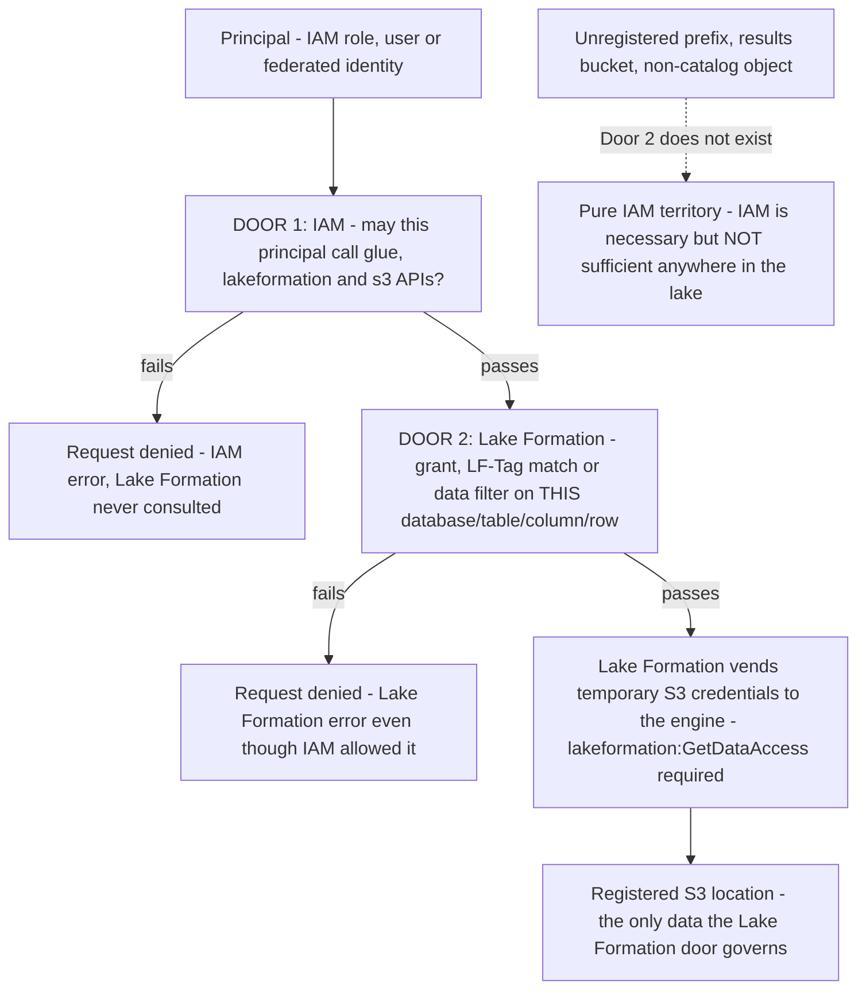
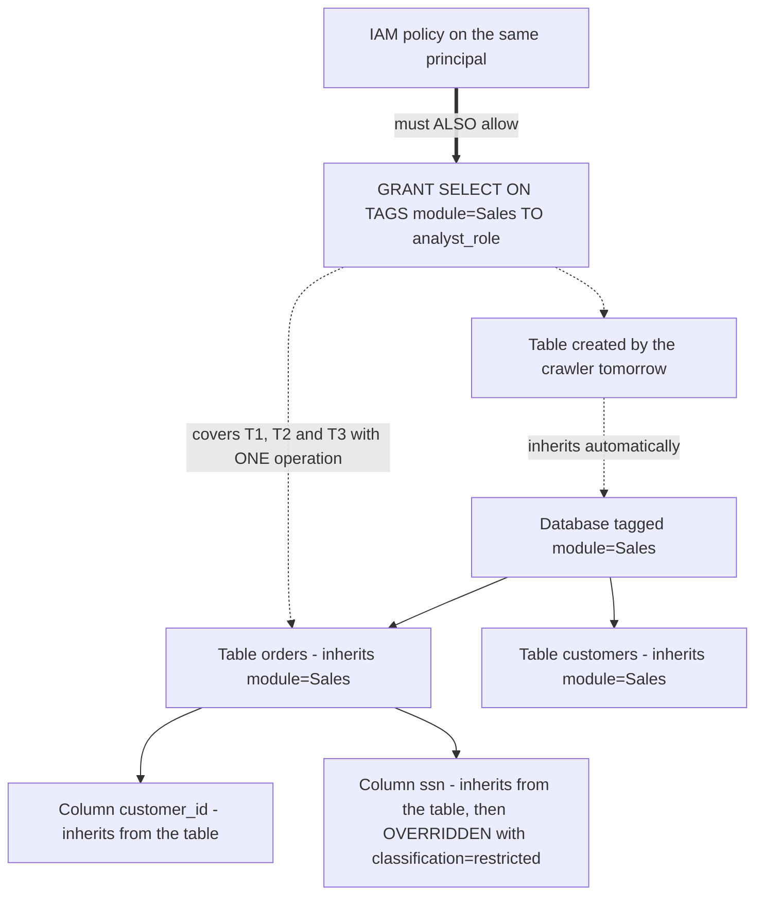
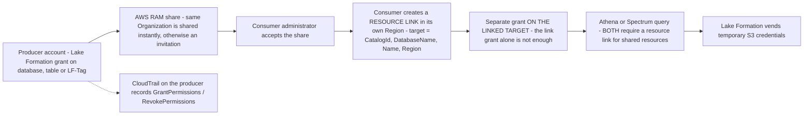
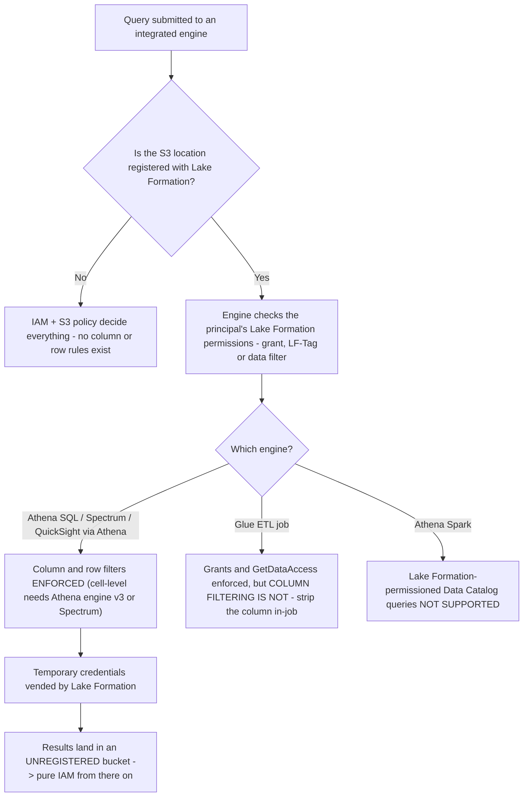
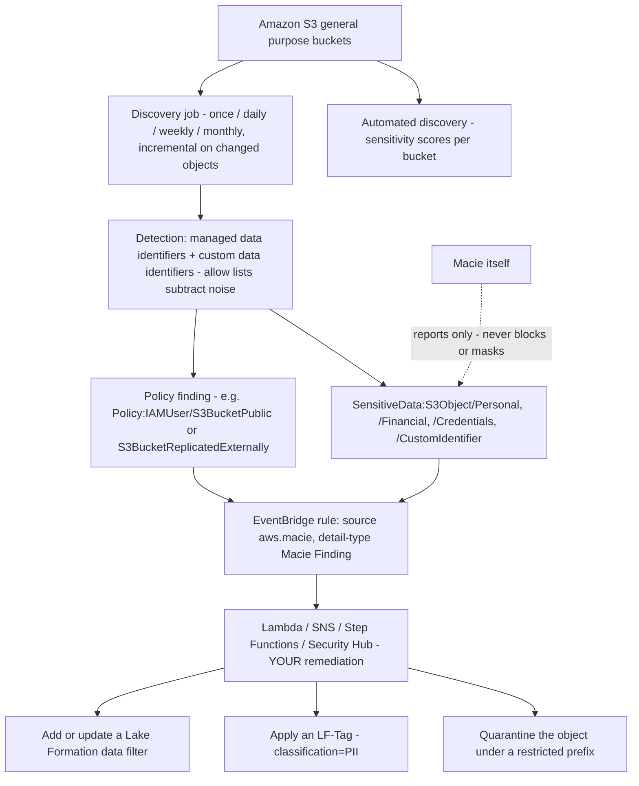
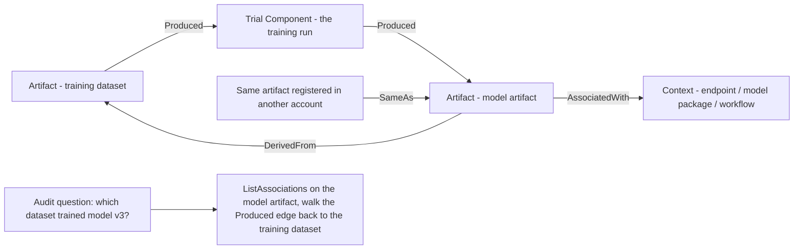
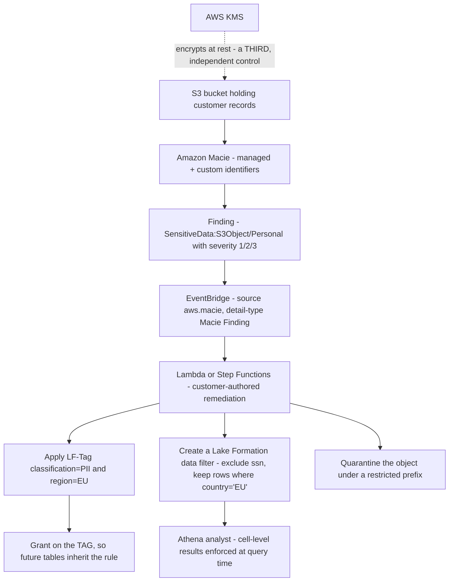

# Governance, Lake Formation and PII Protection

Domain 4 is worth **18% of scored content**, and its last task — *Understand data privacy and governance* — is where the DEA-C01 exam stops asking "can you move the data?" and starts asking "who may see which row, in which Region, and how would you prove it a year later?" Two services carry almost all of that weight: **AWS Lake Formation**, which decides *what* a principal can see inside the lake, and **Amazon Macie**, which *finds* the sensitive data you are supposed to be protecting. Both are routinely miscast on practice tests — Lake Formation as an IAM replacement, Macie as a blocking tool — and both miscasts cost marks.

```text
====================================================================
 DOMAIN 4 GOVERNANCE SURFACE (DEA-C01, 18% of scored content)
====================================================================
  4.2.4  manage permissions through AWS Lake Formation
         (Redshift, EMR, Athena, S3)
  4.2.5  authorization methods: role-, tag-, attribute-based
  4.3.1  data masking / anonymization per compliance law
  4.4.1  AWS CloudTrail to track API calls
  4.5.1  grant permissions for data sharing (e.g. Redshift)
  4.5.2  PII identification (e.g. Amazon Macie with Lake Formation)
  4.5.3  prevent backups / replication to disallowed Regions
  4.5.4  view configuration changes (e.g. AWS Config)
  4.5.5  maintain data sovereignty
  4.5.7  governance data framework and data sharing patterns
--------------------------------------------------------------------
  TWO DOORS ...... IAM (may you call the API?)
                   Lake Formation (may you see THIS object?)
  FINE GRAIN ..... database | table | column | row | cell
  ABAC ........... LF-Tags: database -> table -> column cascade
  SHARING ........ AWS RAM + resource links, cross-account / Region
  DISCOVERY ...... Amazon Macie: managed + custom identifiers
  LINEAGE ........ SageMaker ML Lineage Tracking + Glue versions
  AUDIT .......... CloudTrail GrantPermissions / RevokePermissions
====================================================================
```

In this lesson you will:

- separate **IAM from Lake Formation** and defend the "two doors, both must open" rule that decides most lake-access questions;
- read the **permission anatomy** at catalog, database, table, S3-location, LF-Tag and resource-link level;
- build **column-level, row-level and cell-level** controls with Lake Formation **data filters**, including their PartiQL limits;
- apply **LF-Tags** (attribute-based access control): predefine, assign, inherit, cascade, and the AND/OR grant semantics;
- share data **cross-account and cross-Region** with AWS RAM, resource links and separate target grants;
- reason about **governed tables**, their **December 31, 2024 end of support**, and the **blue/green catalog release pattern**;
- place **Glue, Athena, Spectrum, QuickSight, EMR and Redshift** against Lake Formation enforcement, engine by engine;
- operate **Amazon Macie**: automated discovery, discovery jobs, managed vs custom identifiers, findings, severity and EventBridge automation — and never call it prevention;
- grant **Redshift data sharing** through datashares and reconstruct **data lineage** with SageMaker ML Lineage Tracking and Glue catalog versioning;
- execute **privacy at exam depth**: PII tagging, data residency, erasure, CloudTrail audit and shared responsibility;
- study **four AWS customer case studies**, a sourced **October 2026 update box** and **14 exam-style questions** plus three interactive checks.

---

## 1. Domain 4's governance map: the eight skills this lesson answers

### 1.1 The task statements, verbatim

| Skill | Verbatim wording (DEA-C01 exam guide v1.1, accessed Oct 2026) | This lesson's section |
|---|---|---|
| **4.2.4** | "Manage permissions through AWS Lake Formation (for Amazon Redshift, Amazon EMR, Amazon Athena, and Amazon S3)" | 2, 3, 4, 6 |
| **4.2.5** | "Apply authorization methods that address business needs (role-based, tag-based, and attribute-based)" | 4 |
| **4.3.1** | "Apply data masking and anonymization according to compliance laws or company policies" | 3, 10 |
| **4.4.1** | "Use AWS CloudTrail to track API calls" | 9, 10 |
| **4.5.1** | "Grant permissions for data sharing (for example, data sharing for Amazon Redshift)" | 5, 8 |
| **4.5.2** | "Implement PII identification (for example, Amazon Macie with Lake Formation)" | 7, 10 |
| **4.5.3** | "Implement data privacy strategies to prevent backups or replications of data to disallowed AWS Regions" | 10 |
| **4.5.5** | "Maintain data sovereignty" | 10 |
| **4.5.7** | "Describe governance data framework and data sharing patterns" — **new in guide v1.1 (2025-12-12)** | 5, 10 |

Two neighbouring skills are deliberately routed to other lessons: **4.5.4** (AWS Config for configuration changes) appears here only where it is contrasted with CloudTrail, and **4.5.6** (Amazon SageMaker Catalog projects) is named by the guide but is not a Lake Formation construct.

### 1.2 The personas — who may grant what

| Persona | Powers | Verified constraint (accessed Oct 2026) |
|---|---|---|
| **Data-lake administrator** | Grant and revoke Lake Formation permissions, register S3 locations, manage LF-Tags | **Capped at 30 per account by default** |
| **IAM administrator** | Create IAM policies, roles, users, groups | **Cannot grant Lake Formation permissions** unless they also hold the data-lake administrator role |
| **LF-Tag creator** (non-admin tag administrator) | `CREATE_LF_TAG`, `ALTER`, `DROP` on tags; `ASSOCIATE`, `DESCRIBE` on tagged resources | `ASSOCIATE` implies `DESCRIBE` |
| **Registration role** | Supplies the `s3:*` permissions used to register an S3 location with Lake Formation | The caller must *also* hold **`lakeformation:GetDataAccess`** for vended credentials |
| **Grantor with `WITH GRANT OPTION`** | Re-grants what they hold | `CREATE_TABLE` on a database implicitly carries every Lake Formation permission on tables created there, and is itself grantable |

The IAM-administrator row is the single most examined persona fact in this section: **identity expertise does not confer data-lake authority**. An engineer who can edit any IAM policy in the account still cannot grant `SELECT` on a Lake Formation table until they are a data-lake administrator.

- **📚 Did you know?** Lake Formation's own **permission checks are free**; you are billed for the *integrated services* you run (Athena, Spectrum, Glue) and for the **Lake Formation Storage API**, which bills **bytes scanned rounded up to the next megabyte with a 10 MB minimum per request** (Lake Formation pricing page, accessed Oct 2026). So the governance layer is cheap to over-grant *financially* and expensive to over-grant *politically* — which is exactly why the exam tests it on correctness, not cost.

### 1.3 The division of labour in one table

| Question the request raises | Answered by | Mechanism |
|---|---|---|
| May this principal call `glue:*`, `lakeformation:*`, `s3:*`? | **IAM** | Identity policy, resource policy, session policy |
| May it see **this database / table / column / row**? | **Lake Formation** | Grants, LF-Tags, data filters |
| Where do the S3 credentials come from? | **Lake Formation** vends temporary credentials to integrated engines (after `GetDataAccess`) |
| What does the S3 bucket policy alone decide? | Only whether the object is reachable by a principal whose *own* credentials allow it — **never** fine-grained lake visibility |
| Who granted `SELECT` at 14:02 last Tuesday? | **CloudTrail** — `GrantPermissions` / `RevokePermissions` |
| Did the S3 bucket policy or encryption setting change? | **AWS Config** — configuration state over time |

---

## 2. THE exam distinction: Lake Formation vs IAM for S3 lake access

### 2.1 Two doors, both must open

AWS states the rule in one sentence, and every lake-access question is a variation of it:

> "When a principal makes a request to access Data Catalog resources or underlying data, for the request to succeed, it must pass permission checks by **both IAM and Lake Formation**." — Lake Formation permissions overview (accessed Oct 2026)



Three corollaries fall straight out of that picture, and each one is a question:

1. **A Lake Formation grant without IAM fails.** The principal still needs `glue:*` on the catalog APIs, `lakeformation:GetDataAccess` for vended credentials, and the engine's own permissions.
2. **IAM alone cannot express fine grain.** No identity policy can say *"only rows where `region = 'EU'`"* or *"all columns except `ssn`"* — those live exclusively in Lake Formation data filters.
3. **Not registered means not governed.** Athena result buckets, unregistered prefixes and anything outside the catalog are decided by IAM and S3 alone — and Lake Formation **does not apply when writing objects** (Athena security documentation, accessed Oct 2026).

### 2.2 IAM versus Lake Formation, side by side

| Dimension | **IAM** | **Lake Formation** |
|---|---|---|
| Unit of control | Principal + action + resource ARN | Catalog object: database, table, column, row |
| Fine grain | API-level (`s3:GetObject` on an ARN) | **Column exclusion, row predicates, cell level** |
| Region scope | Policy applies where the resource lives | **"Lake Formation permissions apply only in the Region in which they were granted"** — cross-Region access needs a **resource link** in the consumer Region |
| Default on a fresh account | Whatever the account's IAM state is | **`Super` on every database and table is pre-granted to a group called `IAMAllowedPrincipals`** |
| S3 credential path | The caller's own credentials | **Vended temporary credentials** to integrated engines |
| Enforcement point | Every AWS API call | Integrated engines (Athena SQL, Spectrum, QuickSight, EMR, Redshift) |
| Best at | "May you call this API at all?" | "May you *see* this data?" |

### 2.3 The default that makes grants look broken

> "Lake Formation sets **Super permission on all databases and tables in the Data Catalog to a group called `IAMAllowedPrincipals` by default** … **all principals in your account will have access … through the IAM principal policies for AWS Glue**." — Lake Formation permissions reference (accessed Oct 2026)

Until you **revoke that group** (or switch on **hybrid access mode**), the catalog behaves as though Lake Formation were not there: every IAM-principal in the account reads every table, and your carefully written grants appear to change nothing. Hybrid access mode splits the account in two — **opted-in principals must pass both Lake Formation and IAM**, while principals that have not opted in remain governed by IAM alone.

### 2.4 Worked example E1 — "my grants do nothing" in four checks

An analyst reports that a revocation had no effect. Work the list in this order:

```text
CHECK 1  IAMAllowedPrincipals still holds Super?
         -> the default grant means the analyst reads via IAM, not via
            your Lake Formation permission. Revoke the group, or enable
            hybrid access mode for the principals you govern.
CHECK 2  Is the S3 location registered with Lake Formation?
         -> unregistered prefixes are pure IAM/S3 territory. Register the
            location (DATA_LOCATION_ACCESS) and confirm the registration
            role holds s3:*.
CHECK 3  Were the permissions granted in THIS Region?
         -> "Lake Formation permissions apply only in the Region in which
            they were granted" - cross-Region consumers need a resource link.
CHECK 4  Does IAM still allow the API call?
         -> the principal needs glue:* / lakeformation:* and
            lakeformation:GetDataAccess even when the Lake Formation
            grant is correct.
```

> [!WARNING]
> ⚠️ **The two-door trap appears in three disguises.** (a) *"Add an S3 bucket policy"* — necessary, never sufficient: S3 policies cannot express row or column rules. (b) *"The Lake Formation grant is wrong"* — when the real cause is the `IAMAllowedPrincipals` default or an unregistered location. (c) *"Copy the grant to the other Region"* — Lake Formation grants are Region-local; the correct answer is a **resource link** in the consumer Region, not a duplicated grant. Read the stem for which door it is actually testing.

---

## 3. The permission model: database, table, column, row

### 3.1 Permission sets by resource layer

| Resource layer | Permissions Lake Formation recognises |
|---|---|
| **Catalog** | `CREATE_CATALOG` (requires the "catalog creator" permission) |
| **Database** | `ALL` (Super), `ALTER`, `CREATE_TABLE`, `DESCRIBE`, `DROP` |
| **Table** | `ALL` (Super), `ALTER`, `DESCRIBE`, `DELETE`, `DROP`, `INSERT`, `SELECT` |
| **Table + column / data filter** | `SELECT` (plus `DESCRIBE`, `DROP` on the filter object itself) |
| **S3 location (registration)** | `DATA_LOCATION_ACCESS` |
| **LF-Tag or tag value** | `CREATE_LF_TAG`, `ALTER`, `DROP`; `ASSOCIATE`, `DESCRIBE` |
| **Resource link** (distinct from its target) | `DESCRIBE`, `DROP` — **a link grant is not a target grant** |

Two structural rules matter more than the list itself:

- **`ALL-tables` implies database `DESCRIBE`** — granting on "all tables" necessarily reveals that the database exists, and this implication does **not** hold under attribute-based (LF-Tag) grants.
- **Revoking `Super` does not revoke everything.** A principal can be left holding plain `SELECT` and `INSERT` after Super is removed — "revoke Super" is not synonymous with "revoke access".

### 3.2 Data filters: the column/row/cell combinatorics

One **data filter** per table combines a column specification (include list, exclude list, or the all-columns wildcard) with a optional row predicate in a **PartiQL subset**, or with `AllRowsWildcard`. AWS states the combination rule directly:

> "'all columns' wildcard + row filter = **row-level security** only. Include/exclude specific columns + 'all rows' = **column-level security** only. Specific columns **and** a row filter = **cell-level security**." — Data filtering (accessed Oct 2026)

| Columns chosen | Rows chosen | Resulting control | Exam name |
|---|---|---|---|
| All-columns wildcard | Predicate | Every column, filtered rows | **Row-level** |
| Include/exclude list | `AllRowsWildcard` | Selected columns, all rows | **Column-level** |
| Include/exclude list | Predicate | Selected columns, filtered rows | **Cell-level** |
| All-columns wildcard | `AllRowsWildcard` | Everything | No restriction at all |

Constraints you must be able to quote:

| Constraint | Value (accessed Oct 2026) |
|---|---|
| Filters grantable | **`SELECT` only** — a filter never widens access to `INSERT`/`DELETE` |
| Expression length | **< 2,048 characters** |
| Operators | `= > < >= <= <> != BETWEEN IN LIKE NOT IS [NOT] NULL` |
| Column-to-column comparison | **Unsupported** |
| String / `LIKE` semantics | **Case-sensitive** |
| Filters per principal per table | **≤ 100** |
| Nested struct depth in row filters | **5 levels**; structs OK, **array and map unsupported** |
| Partition columns | **Cannot be filtered on** |
| Cell-level everywhere | **Athena engine v3 or Redshift Spectrum** |
| Glue 5.0+ fine-grained in jobs | **Hive and Iceberg sources only** |

### 3.3 Predicate algebra — when two rules meet

- **A principal and their own IAM group:** the row filters are **unioned** — the user sees the wider of the two.
- **A grant to an external account intersected with a direct grant:** **intersection** — the narrower result wins.
- **Two concurrent `all-rows` wildcards:** the **`all-rows` prevails**.
- **Across engines:** enforcement happens at query time, so a filter that Athena honours still has to be re-implemented anywhere the data is read *without* Lake Formation enforcement (Section 6).

### 3.4 Worked example E2 — designing cell-level protection for `ssn`

Requirement: UK analysts see customer rows only for the United Kingdom, and **nobody** in the analyst role ever sees the `ssn` column.

```text
TABLE            customers
DATA FILTER      customers_pii_uk
  columns        ExcludedColumnNames = [ ssn ]        <- column half
  rows           RowFilter = "country = 'UK'"         <- row half
                 (AllRowsWildcard NOT used -> cell-level, per Q4 rule)
GRANT            GRANT SELECT ON TABLE customers_pii_uk
                     TO ROLE uk_analyst_role
ALSO REQUIRED    IAM glue:* + GetDataAccess; s3://lake/customers/ registered with Lake Formation
ENGINE           Athena engine v3 (or Spectrum) for cell-level enforcement
COST OF MISSTEP  Glue ETL job reading the same table is NOT column-filtered -
                 drop ssn inside the job as defence in depth
```

Read the arithmetic of the rule: excluded column **plus** row predicate = **cell-level**; had we used the all-columns wildcard with the same predicate we would have shipped *row-level* protection only and leaked `ssn` to every UK row.

### 3.5 Worked example E3 — the four-grant ladder on one table

```text
Grant A  SELECT on table, no filter            -> sees every column, every row
Grant B  SELECT + data filter (all rows)       -> still every row; filter object
                                                  carries no row logic
Grant C  SELECT + data filter (exclude ssn)    -> column-level: ssn invisible
Grant D  SELECT + data filter (exclude ssn
         + country='UK')                       -> cell-level: ssn invisible AND
                                                  only UK rows returned
Grant E  INSERT only                           -> can write, cannot read;
                                                  data filters are SELECT-only
```

**Reading:** protection is a property of the *filter attached to the grant*, not of the table. Two analysts querying the same `customers` table can legitimately see different column sets and different row sets — which is precisely what "cell-level security" means on this exam.

---

## 4. LF-Tags: attribute-based access control and the cascade

### 4.1 The six rules of tag-based grants (LF-TBAC)

1. **Predefine first.** A key/value pair cannot be invented at assignment time — it must already exist as an LF-Tag.
2. **One value per key per resource.** A table cannot be both `classification=public` and `classification=restricted` on the same key.
3. **Values are stored lower-case.**
4. **Inheritance is directional:** *"Tables inherit LF-Tags from databases and columns inherit LF-Tags from tables. Inherited values can be overridden."*
5. **Grant on the tag, not the object:** `GRANT SELECT ON TAGS module=Sales TO analyst_role` — every table carrying that tag is covered, **including tables the crawler creates tomorrow**.
6. **LF-Tags are not IAM tags.** AWS's wording is absolute: *"IAM tags are not the same as LF-Tags. These tags are not interchangeable."* They **compose**: both checks must allow the request.

### 4.2 The cascade, drawn



### 4.3 Grant semantics: AND across keys, OR within a key

| Expression | Meaning |
|---|---|
| `ON TAGS module=Sales AND classification=Restricted` | Both keys must match — **AND** |
| `ON TAGS (module=Sales OR module=Marketing)` | Either value of the same key — **OR** |
| Nested `AND`/`OR` expressions | Allowed, and **reusable across grants since 2024-11-07** |
| `ASSOCIATE` on a tag | Implies `DESCRIBE` on it |
| Cross-account LF-TBAC target | Another account, an **AWS Organization**, or an **OU** |

```fillblank
{
  "question": "Complete the Lake Formation tag-based access control statements:",
  "template": "Tables inherit LF-Tags from {{1}} and columns inherit LF-Tags from {{2}}; every key must be predefined before it can be assigned and values are stored in {{3}} case. One grant naming several different tag keys is an {{4}} condition, while one grant naming several values of the SAME key is an {{5}} condition. LF-Tags are explicitly {{6}} from IAM tags - both checks must allow the request.",
  "answers": {
    "1": "databases",
    "2": "tables",
    "3": "lower",
    "4": "AND",
    "5": "OR",
    "6": "not interchangeable"
  },
  "distractors": ["schema", "catalogs", "upper", "title", "both", "either", "identical", "equivalent", "independent"],
  "explanation": "The documented cascade is database -> table -> column with overridable inherited values, keys are predefined and values are lower-case. Different KEYS combine with AND; multiple values of one key combine with OR. AWS states directly that IAM tags and LF-Tags are not interchangeable - they compose, so both the IAM check and the Lake Formation tag check must allow the request."
}
```


### 4.4 Worked example E4 — named grants versus tag grants

Setup: **3 analyst principals**, each needing the same access to **3 databases and 7 tables**, plus a plan to add **50 more tables** next quarter. (Derived arithmetic — this is not an AWS-published figure; the structure follows the Lake Formation TBAC documentation, accessed Oct 2026.)

```text
NAMED ROUTE (one GrantPermissions per principal per object)
  3 principals x (3 databases + 7 tables) = 3 x 10 = 30 grant calls
  Add 50 tables                            = +3 x 50 = +150 grant calls
                                             total 180

TAG ROUTE (LF-TBAC)
  Predefine LF-Tag module = Sales            1 operation
  ASSOCIATE the tag on 3 databases           3 operations
     (tables INHERIT from the database -     0 table associations)
      columns INHERIT from the table -       0 column associations)
  GRANT SELECT ON TAGS module=Sales          1 grant
     to each of 3 principals                 -> 3 grants
                                             total 7
  Add 50 tables (crawler-created)            +0 operations
                                             still 7
```

**Reading:** the tag route collapses 180 operations into 7 because the grant attaches to an *attribute* that new objects inherit automatically. That is why skill 4.2.5 names **tag-based and attribute-based** authorization as a business-need answer: at scale, the difference is not convenience, it is whether permissions stay correct as the catalog grows.

- **📚 Did you know?** AWS publishes a customer result for exactly this arithmetic: **Integral Ad Science "reduced hundreds of permission rules down to precisely two rules"** using Lake Formation tag-based access control (AWS Big Data Blog, 2021-09-23, accessed Oct 2026). Two rules is not a typo — it is what happens when the *number of objects* stops being the *number of grants*.

### 4.5 Worked example E5 — a tag-based multi-tenant grant

```text
PREDEFINED TAGS   tenant = acme | globex | initech      (one value per resource)
                  classification = public | internal | restricted
ASSIGN            database tenant_acme      -> tenant=acme
                  database tenant_globex    -> tenant=globex
                  database tenant_initech   -> tenant=initech
GRANT 1           GRANT SELECT ON TAGS tenant=acme
                      TO ROLE acme_analyst            (covers tables + columns)
GRANT 2           GRANT SELECT ON TAGS classification=restricted
                      TO ROLE privacy_office          (ANDs with any other key
                                                       named in the same grant)
CRAWLER RESULT    tomorrow's table tenant_acme.invoices_v3 is readable by
                  acme_analyst with NO additional grant, and by privacy_office
                  because classification=restricted was applied at the database
```

---

## 5. Data sharing: cross-account, cross-Region, governed tables, blue/green

### 5.1 The producer/consumer sequence



Facts encoded in that diagram:

- **Sharing stacks are either Lake Formation (RAM + resource links) or the legacy IAM-only catalog sharing**; **hybrid access mode** lets both coexist while an account migrates.
- **Cross-Region** sharing works through **resource links created in the consumer Region** — Lake Formation permissions themselves never travel.
- **A direct grant to a principal** (rather than a share) is unioned with any account-cascaded grant, and **only the recipient sees it — they cannot re-share it**.
- **Cross-account crawling** has its own four-step order: register the location in the *producer* account → grant `DATA_LOCATION_ACCESS` to the *consumer's* crawler role (plus `GetDataAccess`) → accept the RAM share → create the link and tick **"Use Lake Formation credentials"**.

```dragdrop
{
  "question": "Order the cross-account Lake Formation sharing steps that end with an Athena query in the consumer account:",
  "items": [
    "Producer grants Lake Formation permissions on the database, table or LF-Tag",
    "Producer shares those resources through AWS RAM",
    "Consumer administrator accepts the RAM share",
    "Consumer creates a RESOURCE LINK in its own Region pointing at the producer's catalog object",
    "Consumer grants permissions ON THE LINKED TARGET - the link grant alone is not enough",
    "Consumer runs the Athena query and Lake Formation vends temporary S3 credentials"
  ],
  "correctOrder": [
    "Producer grants Lake Formation permissions on the database, table or LF-Tag",
    "Producer shares those resources through AWS RAM",
    "Consumer administrator accepts the RAM share",
    "Consumer creates a RESOURCE LINK in its own Region pointing at the producer's catalog object",
    "Consumer grants permissions ON THE LINKED TARGET - the link grant alone is not enough",
    "Consumer runs the Athena query and Lake Formation vends temporary S3 credentials"
  ],
  "explanation": "The documented order is producer grant -> AWS RAM share -> consumer accepts -> resource link in the consumer Region -> separate grant on the linked target -> query, at which point Lake Formation vends temporary S3 credentials. Two traps sit inside the sequence: a link grant is NOT a target grant (DESCRIBE/DROP on the link does not let you read data), and Lake Formation permissions never travel to another Region - the resource link does that job, with no data copy."
}
```

### 5.2 Governed tables — and the date you must quote

AWS built **governed tables** as an Amazon S3 table type with **ACID guarantees across tables** and automatic compaction, so that analytics could share consistent snapshots. AWS then announced:

> "**end support for Governed Tables, effective December 31, 2024**, to focus on open source transactional table formats such as **Apache Iceberg, Apache Hudi, and Linux Foundation Delta Lake**." — AWS Big Data Blog, 2024-10-02

Exam handling: state the **deprecation with its date**, and answer open-table-format questions with **Iceberg, Hudi or Delta Lake**. Lake Formation grants — including row and cell filters — apply to cataloged Iceberg/Hudi/Delta tables, and Lake Formation manages **compaction, snapshot retention and orphan-file deletion for Iceberg**, while the engine keeps ownership of write DDL (`VACUUM`, `MERGE`, `OPTIMIZE`).

### 5.3 Blue/green catalog releases — a pattern, not a service

"Blue/green catalog deployment" is **not** an AWS feature name — nothing in the Lake Formation or Glue documentation describes a service by that name (checked Oct 2026). What the exam is really testing is whether you can *assemble* the pattern from verified building blocks:

| Building block | Verified capability | Role in the pattern |
|---|---|---|
| **Data Catalog table version history** | `GetTableVersions` diffs plus **Table State Change** events | Prove the new shape before anyone queries it |
| **Catalog views** | **≤ 10 base tables per view** | The stable name consumers keep querying |
| **Resource links** | Stable link name, swappable target | Repoint the link from blue to green without touching consumers |
| **Sequencing** | **Additive before, deletitive after** | Create green, validate, repoint, only then drop blue |

```text
BLUE/GREEN CATALOG RELEASE (assembled pattern)
  1. crawl sales_green alongside the live sales_blue
  2. diff GetTableVersions - confirm schema, partitions, column stats
  3. validate with a canary query against sales_green
  4. repoint the stable VIEW or RESOURCE LINK from sales_blue -> sales_green
  5. keep sales_blue for a rollback window
  6. drop sales_blue (deletitive step ALWAYS last)
```

### 5.4 Worked example E6 — share versus copy for a 20 TB dataset

```text
PRODUCER holds 20 TB; consumer is in another AWS Region.

COPY ROUTE (UNLOAD / COPY or replication)
  egress out of producer Region      20 TB
  ingress into consumer Region       20 TB   (consumer pays transfer)
  storage billed TWICE               20 TB + 20 TB
  freshness                          lags behind the producer by the sync cycle

DATASHARE ROUTE (Redshift) / LAKE FORMATION SHARE (S3 lake)
  bytes copied                       0
  storage billed                     once, in the producer
  consumer pays                      query COMPUTE, plus cross-Region data
                                     transfer on the bytes actually queried
  freshness                          live - "without manually moving or
                                     copying the data"
```

**Reading:** the exam's phrase *"share access to live data … without manually moving or copying the data"* is the tell. When an option's first step is `COPY`, `UNLOAD`, `rsync` or "replicate the bucket", it is describing a **copy**, not a **share**.

---

## 6. Engine integration: Glue, Athena, Spectrum, QuickSight, EMR, Redshift

### 6.1 The enforcement matrix

| Engine | How Lake Formation applies | Caveat you will be examined on |
|---|---|---|
| **Amazon Athena (SQL)** | Checks the principal, then vends temporary S3 credentials | **Athena Spark does not support querying Data Catalog tables with Lake Formation permissions**; the results bucket is unregistered, so it stays pure IAM |
| **Amazon Redshift Spectrum** | Per-query verification plus vended credentials through the IAM role on the cluster, or a federated identity | **No role chaining** |
| **Amazon QuickSight** | Fine-grained access control maps grants to **QuickSight users and groups in Enterprise**, and to **IAM roles (for example `aws-quicksight-service-role-v0`) in Standard**; dashboards explore the lake **through Athena** | QuickSight's own row-level security is a *BI-layer* control and is **not** a substitute for a Lake Formation row filter |
| **AWS Glue crawlers** | Optional **"Use Lake Formation credentials"**, including for cross-account crawling | The crawler's role still needs `DATA_LOCATION_ACCESS` and `GetDataAccess` |
| **AWS Glue ETL jobs** | Job role needs Lake Formation grants **plus** `lakeformation:GetDataAccess` | **Column filtering is NOT enforced inside Glue ETL** — drop or mask the column in the job |
| **Amazon EMR / Spark** | Lake Formation plugins run on the cluster | Securing the cluster itself stays the customer's job |
| **Amazon Redshift (native)** | **Lake Formation-managed datashares** publish to the Glue catalog, so Lake Formation governs database, table, column **and row** | A plain (non–Lake Formation-managed) datashare is governed by Redshift's own grants |
| **Amazon SageMaker AI** | Lake Formation grants control training-time feature access | Lineage is a *separate* record (Section 9) |

```matching
{
  "question": "Match each engine to how it enforces Lake Formation permissions:",
  "pairs": [
    {"left": "Amazon Athena (SQL)", "right": "Checks the principal, then Lake Formation vends temporary S3 credentials; the results bucket is unregistered and stays pure IAM territory"},
    {"left": "Amazon Athena Spark", "right": "Does NOT support querying Data Catalog tables that carry Lake Formation permissions"},
    {"left": "Amazon Redshift Spectrum", "right": "Verifies per query and vends credentials through the IAM role on the cluster or a federated identity - no role chaining"},
    {"left": "Amazon QuickSight", "right": "Enterprise maps grants to QuickSight users and groups; Standard maps them to IAM roles such as aws-quicksight-service-role-v0; dashboards explore through Athena"},
    {"left": "AWS Glue crawlers", "right": "Optionally use Lake Formation credentials, including for cross-account crawling, when the role holds DATA_LOCATION_ACCESS and GetDataAccess"},
    {"left": "AWS Glue ETL jobs", "right": "Grants plus GetDataAccess are checked, but COLUMN FILTERING IS NOT ENFORCED - the job must drop or mask the column itself"}
  ],
  "explanation": "Enforcement is deliberately uneven. Athena SQL and Spectrum enforce column, row and cell rules (cell-level needs Athena engine v3 or Spectrum); Glue ETL never enforces column filtering; Athena Spark is unsupported; QuickSight is a BI layer that explores through Athena; crawlers can use vended credentials. Every wrong pairing in the exam is one of these caveats moved to the wrong engine."
}
```



### 6.2 Worked example E7 — what a Lake Formation-governed query actually reads

A 1 TB Parquet table is partitioned into **12 monthly partitions**; the analyst's predicate prunes to a single month:

```text
Full scan            1,000 GB
Partition pruning    1,000 / 12                    ~= 83 GB planned reads
Saving               (1,000 - 83) / 1,000          ~= 91.7%   (derived)
Lake Formation Storage API billing:
  bytes scanned, rounded UP to the next 1 MB
  minimum charge per request = 10 MB
  -> the same governance check is cheap at 83 GB and cheap at 10 MB;
     it is the ENGINE (Athena/Spectrum) that bills the data volume
```

**Reading:** Lake Formation decides *whether* the query may run and *which rows/columns* come back; partitioning and file format decide *how many bytes* the engine reads; the Storage API's rounding rule decides the Lake Formation line item. Three different bills, one query — a classic multi-option distractor.

### 6.3 Worked example E8 — the same table through two engines

```text
TABLE      sales.orders  (registered location, cell-level filter: exclude card_last4)
ANALYST    Athena engine v3     -> sees every column EXCEPT card_last4, filtered rows
                                  (cell-level ENFORCED)
ANALYST    QuickSight Enterprise-> same view, because its explored data comes
                                  THROUGH Athena
GLUE ETL   job sales_transform  -> reads card_last4 anyway! Lake Formation grants
                                  and GetDataAccess are checked, column filtering
                                  is NOT enforced -> job must drop/mask it
FIX        sc = DropFields(fields=['card_last4'])   (or a KMS/masking transform)
           + grant only what the job needs, nothing more
```

---

## 7. Amazon Macie: discovery, not prevention

### 7.1 What it is, and the boundary it will not cross

> Amazon Macie is "a **data security service that discovers sensitive data by using machine learning and pattern matching**." — What is Amazon Macie (accessed Oct 2026)

| | In scope for Macie | Out of scope for Macie |
|---|---|---|
| Storage | **Amazon S3 general purpose buckets** | RDS, DynamoDB, EBS, Redshift, on-premises |
| Output | Findings, sensitivity scores, inventory | Blocking, masking, quarantining, revoking |
| Modes | **Automated discovery** (continuous) and **discovery jobs** (scoped, scheduled) | Real-time inline enforcement inside a query |

### 7.2 The two detection engines and the allow list

| Engine | What it is | Exam-relevant properties |
|---|---|---|
| **Managed data identifiers** | AWS-maintained **ML + pattern matching** for credentials, financial data, **PII/PHI**, including per-country identity numbers | No rules to author; coverage evolves with AWS |
| **Custom data identifiers** | Your **regex + keywords + ignore words + proximity** | **Immutable after creation** ("immutable history … for data privacy and protection audits"); **default severity Medium**; proximity **1–300 characters, default 50** |
| **Allow lists** | Buckets or objects that should *not* produce sensitive-data findings | The third component of every Macie job configuration |

### 7.3 Jobs, schedules and findings

| Concept | Verified behaviour (accessed Oct 2026) |
|---|---|
| **Automated discovery** | Continuous, bucket-inventory driven, produces **bucket sensitivity scores from −1 to 100** |
| **Discovery jobs** | Explicit scope + schedule: **once, daily, weekly, monthly**; periodic runs analyse objects **created or changed since the last run** |
| **Cost preview** | A **forecast is shown before you submit** the job |
| **Policy findings** | `Policy:IAMUser/S3BucketPublic`, `…/S3BlockPublicAccessDisabled`, `…/S3BucketEncryptionDisabled`, **`…/S3BucketReplicatedExternally`** (the residency detective) |
| **Sensitive-data findings** | `SensitiveData:S3Object/Personal`, `/Financial`, `/Credentials`, `/CustomIdentifier` |
| **Finding retention** | **90 days**; a repeat detection **updates the count** on the existing finding |
| **Severity scale** | **1 = Low, 2 = Medium, 3 = High** — there is **no Critical**, and it is **not** GuardDuty's 1.0–10.0 |
| **Two different 0–100 numbers** | Bucket **sensitivity score** (−1…100) is a *bucket* metric, never a finding severity |

### 7.4 The finding flow — and where your code takes over



> [!WARNING]
> ⚠️ **Macie finds, it does not prevent.** Every option phrased *"Macie blocks the upload"*, *"Macie masks the column"* or *"Macie revokes the grant"* is wrong by construction: masking and revocation are **Lake Formation data filters** and **IAM/Lake Formation grants**, and the wiring between a Macie finding and those controls is **your** EventBridge rule plus **your** Lambda or Step Functions state machine. Also note the **two service identifiers**: findings events arrive as `source = aws.macie` with `detail-type = "Macie Finding"`, while Macie's own API calls appear in CloudTrail under **`aws.macie2`**.

### 7.5 Worked example E9 — a Macie job specification

```text
JOB              pii-nightly-customer-3p
SCOPE            S3 general purpose buckets:
                   s3://raw-customers/*          (ingest zone)
                   s3://curated/customers/*      (curated zone)
SCHEDULE         daily  (alternatives: once, weekly, monthly)
                   -> periodic runs only re-inspect objects created or
                      changed since the last run
CLASSIFICATION   managed data identifiers: credentials, financial, PII/PHI
CUSTOM IDENT     name  tenant-id
                 regex TENANT-\d{8}
                 keywords ["tenant_id", "customer_ref"]
                 ignore words ["TENANT-00000000"]
                 proximity 1-300 characters (default 50)
                 default severity MEDIUM  <- and IMMUTABLE once created
ALLOW LIST       s3://raw-customers/public-marketing/ (no PII by design)
BEFORE SUBMIT    review the service's cost FORECAST, then submit
OUTPUT           findings retained 90 days; EventBridge routes severity 3
                 to the on-call SNS topic
NOT IN SCOPE     this job does NOT block, mask or delete anything
```

### 7.6 Worked example E10 — Macie monthly cost (us-east-1 example rates)

Unit prices are AWS's published **us-east-1 examples** (Macie pricing page, accessed Oct 2026 — **verify current pricing before use**): **$0.10 per bucket per month**, **$0.01 per 100,000 objects per month**, plus tiered charges for inspected data volume.

```text
40 buckets                40 x $0.10                     =   $  4.00
30,000,000 objects        30,000,000 / 100,000 = 300
                          300 x $0.01                    =   $  3.00
500 GB inspected data     500 GB x $1.00/GB (first-tier
                          example rate)                  =   $500.00
                                                       ------------
Monthly total (derived)                                   =   $507.00

Free trial: 30 days, up to 150 GB, and DISCOVERY JOBS ARE EXCLUDED
            -> the $500 job line is never covered by the trial
```

**Reading:** object count is a rounding error, bucket count is small, and **inspected data volume dominates**. That is why the exam loves the "scan everything, every hour" option: it is technically correct and economically indefensible.

### 7.7 Worked example E11 — routing findings with EventBridge

```text
Rule 1  HIGH only          detail.severity.score = [3]
Rule 2  all policy posture  detail.type-level-prefix "Policy:"   + score = [1,2,3]
Rule 3  repeat detections   detail.count >= 2                    (same object, again)
Filter  archived/suppressed findings are NOT delivered to the rule target
CloudTrail service name for Macie API calls: aws.macie2
EventBridge detail-type for findings:        "Macie Finding"
```

- **📚 Did you know?** Macie's **custom data identifiers are immutable after creation** — AWS frames that as *"immutable history … for data privacy and protection audits"* (Macie custom data identifier options, accessed Oct 2026). You cannot quietly edit a regex that produced last quarter's findings; you create a new identifier and retire the old one, which is exactly the audit property a compliance question is probing.

---

## 8. Data sharing in Amazon Redshift

### 8.1 The datashare model

> Redshift lets you "share access to **live data** across Amazon Redshift clusters, workgroups, AWS accounts, and AWS Regions **without manually moving or copying the data**", and "**datashare objects are read-only for data consumers**" in the basic model. — Redshift data sharing overview (accessed Oct 2026)

| Property | Verified behaviour (accessed Oct 2026) |
|---|---|
| Unit of sharing | The **datashare**, owned by one **producer database** |
| Objects shareable | Tables, views, UDFs |
| Consumer access | **Read-only** unless write sharing is explicitly used (same-account or cross-account) |
| Lifecycle | `Pending authorization` → `Authorized` → `Active`; the consumer side shows **Available (Action required)** |
| Consumer steps | **Associate** the share, then `CREATE DATABASE … FROM DATASHARE`, then grant object permissions |
| Types | **Standard** · **AWS Data Exchange** · **Lake Formation-managed** (published to the Glue catalog, so Lake Formation governs db/table/column/**row**) |
| Cross-Region | One Region per association; the **consumer pays cross-Region data transfer** |
| Resilience | Survives cluster **resize and pause**; **no cap** on datashares per cluster; databases created from datashares are **excluded from database quotas** |
| Cost | Consumer pays **query compute** (+ transfer if cross-Region); producer's storage is unchanged |

### 8.2 Worked example E12 — the sharing lifecycle, end to end

```text
PRODUCER (account 1111, us-east-1)
  CREATE DATASHARE salesshare OF SCHEMA public TO ACCOUNT '2222...'
        -> status: Pending authorization
  AUTHORIZE DATASHARE salesshare TO ACCOUNT '2222...'
        -> status: Authorized

CONSUMER (account 2222)
  associate the share (console/CLI) -> status: Active (consumer sees: Available - Action required)
  CREATE DATABASE sales_db FROM DATASHARE salesshare
  GRANT SELECT ON SCHEMA public TO ROLE bi_analyst     <- object perms are SEPARATE

LAKE FORMATION-MANAGED VARIANT
  publish the datashare to the Glue Data Catalog ->
  Lake Formation grants/LF-Tags/data filters now govern it,
  including row- and column-level rules

CHARGEBACK
  producer: storage unchanged
  consumer: query compute + cross-Region transfer if the share crosses Regions
```

**Reading:** three authorizations are involved and candidates routinely collapse them into one — the **share authorization**, the **`CREATE DATABASE`**, and the **object-level `GRANT`**. Skip any one and the analyst gets an empty schema, an empty database, or a permission error respectively.

---

## 9. Lineage: SageMaker ML Lineage Tracking and catalog versioning

### 9.1 What the exam guide means by lineage

The guide's lineage answer set is narrow and worth memorising: **SageMaker ML Lineage Tracking**, **Glue Data Catalog versioning**, and **CloudTrail**. Third-party lineage frameworks and Amazon DataZone are **not on the DEA-C01 in-scope list** (as of Oct 2026), so an option built around them cannot be the best answer.

SageMaker ML Lineage Tracking records an ML workflow "**from data preparation to model deployment**" so that you can **reproduce runs** and support **model governance and audit**. The hierarchy runs **Experiment → Trial → Trial Component**, and jobs create trial entities automatically.

### 9.2 The four entities and their associations

| Entity | Meaning | Manual-creation quota (accessed Oct 2026) |
|---|---|---|
| **Artifact** | Addressable data — a dataset, a model file | **6,000** |
| **Action** | A step — a processing job, a deployment | **3,000** |
| **Context** | An endpoint, model package or workflow the work happens *in* | **500** |
| **Association** | The typed edge between two entities | **6,000** |

Association types: `ContributedTo`, `Produced`, `SameAs`, `AssociatedWith`, `DerivedFrom` — where **`SameAs` is the cross-account link**. Automatic entities are not quota-limited; manual ones are, and **an Association cannot link two experiment entities**.



### 9.3 Worked example E13 — the manual lineage budget and the audit query

```text
MANUAL QUOTA ARITHMETIC (derived from the published quotas)
  Actions        3,000
  Artifacts      6,000
  Associations   6,000
  Contexts         500
                -------
  Total         15,500 manually created lineage entities per account
                 (entities created automatically by jobs are unlimited)

AUDIT QUERY
  "Which dataset trained model version 3?"
   1. locate the model Artifact for v3
   2. ListAssociations -> edge type 'Produced' -> Trial Component
   3. ListAssociations on the Trial Component -> 'Produced' -> training Artifact
   4. the Artifact's address IS the dataset
```

### 9.4 Glue catalog versioning as a metadata lineage signal

Row-level lineage is out of reach of the catalog, but **schema-level** lineage is not:

| Signal | What it proves |
|---|---|
| **`GetTableVersions`** | Which schema version was in force when a job ran — diff two versions to see a column appear, retype or vanish |
| **Table State Change events** | A push notification that the catalog object changed (useful in Step Functions/EventBridge pipelines) |
| **CloudTrail `GrantPermissions` / `RevokePermissions`** | Who changed *access* to that schema, and when |
| **SageMaker lineage entities** | Which *data* produced which *model* |

- **📚 Did you know?** The distinction the exam exploits: **CloudTrail answers "who granted SELECT at 14:02", AWS Config answers "did the bucket policy or encryption setting change"**. Both are governance evidence, but they are different questions — one is an *API action*, the other is *configuration state over time*. A stem that quotes a timestamp of a permission change is pointing at CloudTrail; a stem that quotes a compliance rule evaluating resource configuration is pointing at Config.

---

## 10. Privacy at exam depth: PII, residency, erasure, audit, compliance

### 10.1 The PII pipeline — discovery, classification, enforcement



The three-service split is the whole skill: **Macie discovers, Lake Formation enforces, KMS encrypts.** Any option that moves a verb between them is testing whether you noticed.

- **📚 Did you know?** *Masking* is not exclusively a Lake Formation skill. **EOS Group** masked PII with **Amazon Redshift dynamic data masking** after moving its warehouse through **AWS DMS → Amazon S3 → Amazon Redshift**, and AWS reports a **50 percent reduction in infrastructure costs** with **zero data loss** (AWS case study, accessed Oct 2026). The verb stays the same — *mask the sensitive value for this role* — but the service follows the engine: **Lake Formation data filters** for the lake, **Redshift dynamic data masking** for the warehouse, and **neither** is a job Amazon Macie will ever do.

### 10.2 Data residency and sovereignty (skills 4.5.3 and 4.5.5)

| Control | What it does | Exam phrasing |
|---|---|---|
| **Control Tower Region-deny SCPs** | "detect and inhibit the purposeful or accidental creation, sharing, or copying of data, outside of your selected AWS Region" | The **preventive** answer to "stop backups landing in a disallowed Region" |
| **S3 Cross-Region Replication** destination control | Restricts where replicas may be written | Preventive, but S3-scoped |
| **AWS Backup / RDS cross-Region copy disabled** | Stops snapshot copies leaving the approved Regions | Preventive, service-scoped |
| **DynamoDB global table Region selection** | Limits where replicas exist | Preventive, table-scoped |
| **Macie `Policy:S3BucketReplicatedExternally`** | **Reports** buckets replicating outside the expected perimeter | **Detective** backstop — never the preventive control |

> [!IMPORTANT]
> **Preventive vs detective is the entire question.** A stem that says *prevent* or *block* wants a **Control Tower Region-deny SCP** (or a service-level replication restriction). A stem that says *identify*, *detect* or *flag* wants **Macie**. Lake Formation is the wrong answer in both directions — it governs *who can query the catalog*, not *which Region a backup may land in*.

### 10.3 Erasure patterns (right to be forgotten)

```text
OBJECT DATA        S3 Lifecycle rule -> Expiration (and expire NONCURRENT versions,
                   delete markers alone leave data alive)
DYNAMODB           TTL attribute -> rows are deleted "without consuming write
                   throughput" at expiry
CATALOG POINTER    re-crawl (or batchDeleteTable) so the Glue Data Catalog stops
                   advertising a table whose objects are gone
BLOCKER            S3 Object Lock prevents deletion for the retention period -
                   a legal hold overrides an erasure request until released
CONSUMER CACHE     QuickSight SPICE extracts, Redshift copies and snapshots are
                   separate copies: erasure is not complete until they are gone too
```

- **📚 Did you know?** Immutability and erasure pull in opposite directions. **Nasdaq's** S3-backed data lake pairs Amazon Redshift and Spectrum with **Amazon S3 Object Lock** and **Glacier** archive so that regulated market records cannot be rewritten or deleted while retention runs (AWS Nasdaq case study, accessed Oct 2026). An erasure request against a locked object is refused until the retention period expires or the legal hold is released — which is exactly why Object Lock appears as the **BLOCKER** row in the erasure pattern above, and why a compliance answer that promises both "instant right to be forgotten" and "WORM retention on the same objects" is self-contradictory.

### 10.4 Audit and compliance under shared responsibility

| Question | Service |
|---|---|
| "Who granted `SELECT` on this table at 14:02?" | **CloudTrail** — Lake Formation logs `PutDataLakeSettings`, `GrantPermissions`, `RevokePermissions` |
| "Did the bucket policy or encryption setting change?" | **AWS Config** |
| "Show the API trail for Macie configuration calls" | **CloudTrail**, service name **`aws.macie2`** |
| "Is AWS certified for X?" | **AWS Compliance programs** — published certifications |
| "Are *we* compliant with X?" | **You are.** Customers "remain responsible for complying with applicable compliance laws"; AWS is the enabler, the customer classifies, restricts, retains and locates the data |

That last row is the shared responsibility model applied to privacy: **AWS supplies certifications and controls; the customer supplies classification, access decisions, retention rules and residency choices.** An option claiming an AWS certification makes a customer compliant has inverted the model.

### 10.5 Worked example E14 — a residency guardrail for an analytics OU

```text
REQUIREMENT  analytics workloads may only run and replicate in
             eu-central-1 and eu-west-1

PREVENTIVE   Control Tower Region-deny SCP attached to the analytics OU
             -> denies create calls outside both Regions
S3            disable Cross-Region Replication on analytics buckets
              (or restrict allowed destinations to the two approved Regions)
BACKUP        turn off cross-Region copy for AWS Backup plans in that OU
DYNAMODB      do not add global-table replicas outside the two Regions
DETECTIVE     Macie S3BucketReplicatedExternally -> EventBridge -> ticket + Lambda
EVIDENCE      CloudTrail (API history) + AWS Config (configuration state)
              + Macie findings (data-location posture)
NOT THE TOOL  Lake Formation grants - they do not constrain Regions
```

### 2026 Updates (as of October 2026)

> [!NOTE]
> **What moved in this topic between 2024 and October 2026** — every line checked against a primary AWS source in **October 2026**:
> - **Exam guide v1.1 (2025-12-12)** rewrote Domain 4: knowledge/skills lists were consolidated into one skills list per task, **eight skills were added and none removed**, including **4.5.7 "Describe governance data framework and data sharing patterns"** and **4.5.6 "Manage data access through Amazon SageMaker Catalog projects"** (AWS Certification revisions page, 2025-12-17). Revisions publish **at least one month before** they affect a live exam.
> - **Lake Formation cross-account sharing v5 (2026-02-11)**: one AWS RAM share can now carry effectively **unlimited tables** ("hundreds of thousands"), and new grants use **wildcard patterns** instead of per-resource associations; existing shares and APIs keep working, and the upgrade is **opt-in** (AWS What's New, 2026-02-11). Cross-**Region** access still runs on **resource links** with no data copy.
> - **Redshift × Iceberg permissions got tighter**: since Redshift gained Iceberg writes (2025-11-17), UPDATE/DELETE/MERGE (2026-04-23) and Iceberg materialized views (2026-10-05), the behaviour-changes page states that on Lake Formation tables **Iceberg DELETE needs `DELETE`**, **UPDATE/MERGE need `INSERT` + `DELETE`**, and **all Iceberg DML needs `ALTER`** (Redshift behaviour changes, accessed Oct 2026) — grants containing only `INSERT` are now insufficient.
> - **Macie limits and identifier options**: up to **10,000 buckets per account** (Macie doc history, 2025-07-02); custom-identifier **proximity 1–300 characters, default 50**, custom identifiers **default severity MEDIUM** (Macie docs, accessed Oct 2026). Severity stays **1/2/3 — no Critical**.
> - **Athena increasingly optimises *around* your Lake Formation rules**: Iceberg **cost-based optimization with better pruning and predicates when LF row filters and column masks are in force** (AWS What's New, 2025-11-21), **Glue Data Catalog materialized views** (2025-11-30), **managed query results that need no result bucket and cost nothing extra** (2025-06-03), and Capacity Reservations that now start at **4 DPU for 1 minute** instead of **24 DPU for 60 minutes** (AWS What's New, 2026-02-11) — all accessed Oct 2026.
> - **Guide v1.1 also changed what is in scope**: **six services added — Aurora, Amazon Q, Bedrock, Amazon Kendra, AWS Data Exchange, Amazon S3 Tables** — and **three removed — Cloud9, CodeCommit, AWS SCT**, with nothing added to the out-of-scope list, plus new skill **2.1.7 "Manage open table formats (for example Apache Iceberg)"** (AWS Certification in-scope, out-of-scope and revisions pages, accessed Oct 2026). S3 Tables matter here because Redshift's Iceberg `UPDATE`/`DELETE`/`MERGE` (2026-04-23) explicitly covers Iceberg tables **on S3 Tables, with Lake Formation permissions**.
> - **Macie's own changelog is quiet**: the Macie documentation history's most recent entry is **2025-07-02** and it records no custom-identifier change — so teach proximity, immutability and severity as *current behaviour*, never as "the 2026 Macie update" (Macie doc history, accessed Oct 2026).
> - **Stale-fact warning #1 — governed tables**: AWS announced **end of support effective 2024-12-31** (AWS Big Data Blog, 2024-10-02) while the docs and pricing pages still describe them (accessed Oct 2026). Quote the **date**; answer table-format questions with **Iceberg, Hudi or Delta Lake**; never claim the feature is unavailable in some Regions.
> - **Stale-fact warning #2 — naming**: "blue/green catalog deployment" is **not** an AWS feature (Section 5.3), **Amazon QuickSight became the Quick Suite / Quick Sight family (2025-10-09)** while the guide's in-scope list literally prints **"Amazon Quick"**, and **Amazon Kinesis Data Firehose has been Amazon Data Firehose since 2024-02-09** — accept old and new names in options.

---

## Real-World Case Studies

Every figure below is **customer- or AWS-claimed and unaudited**, copied from an AWS-owned property and dated so you can check it. The examinable point is the **pattern** — which control was applied, which service did the work — never the marketing number.

### Case A — Integral Ad Science (IAS): hundreds of rules collapsed to two

| Element | Detail |
|---|---|
| Customer | **Integral Ad Science (IAS)**, advertising technology, handling GDPR/CCPA obligations |
| Challenge | A self-service data lake spanning producer and consumer accounts, where access had to be granted **by data classification and by job role**, not by table name |
| Services | **AWS Lake Formation** with **tag-based access control**, Athena, EMR, Glue Data Catalog, federated identity from Okta, and S3 access **only through a Lake Formation data access role** |
| Pattern | **Column-level control**; database-level tags **inherited by tables and columns**; Athena workgroups per business unit so billing tags and query limits travel with the access; IdP federation feeding the principal |
| Outcome (AWS-published) | *"With Lake Formation tag-based access controls, IAS reduced hundreds of permission rules down to precisely two rules."* |
| Exam domain | **Domain 4** — skills 4.2.4 (manage Lake Formation permissions), 4.2.5 (tag- and attribute-based authorization), 4.5.7 (governance framework and sharing patterns) |
| Source | AWS Big Data Blog, 2021-09-23 (accessed Oct 2026) |

Read IAS as Section 4's arithmetic made real: the "two rules" are tag-based grants, and the inheritance database → table → column is what stopped the rule count from tracking the object count.

### Case B — Oportun: PII discovery that leadership could act on

| Element | Detail |
|---|---|
| Customer | **Oportun**, fintech lender operating under FTC Safeguards and privacy obligations |
| Challenge | Locate and prioritise sensitive data across an Amazon S3 estate without drowning teams in false positives |
| Services | **Amazon Macie** — automated sensitive-data discovery, **managed and custom data identifiers**, bucket inventory and **bucket sensitivity scores** |
| Outcomes (AWS-published) | **+95% discovery accuracy**; **−80% time** to discover sensitive data; faster risk prioritisation (re:Invent 2022 session SEC215 and the Macie customer cards, accessed Oct 2026) |
| Exam domain | **Domain 4** — skill 4.5.2 "Implement PII identification (for example, Amazon Macie with Lake Formation)" |
| Source | `aws.amazon.com/macie/` customer cards; re:Invent 2022 SEC215 slides (accessed Oct 2026) |

The examinable point is the **shape** of the answer: discovery accuracy improved because *identifiers* were tuned (custom identifiers + allow lists), and the output still had to be routed through **EventBridge into a customer-built remediation** — Macie reported, it never prevented.

### Case C — GoDaddy: a central governance account feeding a data mesh

| Element | Detail |
|---|---|
| Customer | **GoDaddy**, internet infrastructure and technology provider |
| Challenge | A shared on-premises Hadoop estate with proliferating HDFS copies and permissions nobody could administer centrally |
| Services | **AWS Lake Formation** + **Glue Data Catalog** on **Amazon S3**, cross-account publishing through **AWS RAM**, **Athena / EMR** consumers, plus **Service Catalog** and **Lambda** that auto-create the consumers' resource links |
| Pattern | Hub-and-spoke **data mesh**: one **central governance account** publishes the shares, **hundreds of producer accounts** and **thousands of consumer accounts** hold **resource links** and never touch the producer's raw permissions |
| Outcomes (AWS-published) | *"There are **over 2,000 data products** built on the GoDaddy data mesh on AWS … Our data mesh manages **multiple petabytes of data across hundreds of accounts**."* |
| Exam domain | **Domain 4** — skills 4.2.4 (manage Lake Formation permissions), 4.5.1 (grant permissions for data sharing), 4.5.7 (governance framework and data sharing patterns) |
| Source | AWS Big Data Blog, 2022-11-21 (accessed Oct 2026) |

Read GoDaddy as Section 5's producer/consumer sequence running at mesh scale: producer grant → **RAM share** → accept → **resource link** → **separate grant on the linked target**, repeated thousands of times and automated with Service Catalog and Lambda so that link creation never becomes a hand-typed step. The governance lesson is that ownership decentralised while **permission semantics stayed central** — the mesh publishes, Lake Formation decides.

### Case D — EOS Group: PII masking after a DMS → S3 → Redshift migration

| Element | Detail |
|---|---|
| Customer | **EOS Group**, financial services |
| Challenge | A growing on-premises data warehouse with **15% year-over-year data growth**, where capacity had to be guessed years ahead |
| Services | **AWS MAP** planning plus **AWS DMS** to land the databases in **Amazon S3**, **Amazon Redshift** loading from S3, and **Redshift dynamic data masking** |
| Pattern | **Dynamic data masking of PII driven by user permissions** — analysts query the real tables while sensitive values are masked for their role: the warehouse-side counterpart of a Lake Formation data filter (skill 4.3.1) |
| Outcomes (AWS-published) | *"By removing the need for on-premises infrastructure, EOS Group achieved a **50 percent reduction in infrastructure costs**"*, with **zero data loss** and **minimal downtime** |
| Exam domain | **Domain 4** — skill 4.3.1 "Apply data masking and anonymization according to compliance laws or company policies"; skill 4.5.1 for the share-vs-copy vocabulary |
| Source | AWS case study, `aws.amazon.com/solutions/case-studies/eos-group-case-study/` (accessed Oct 2026) |

Read EOS as the **masking verb living in a different service**: Lake Formation data filters mask *in the lake*, Redshift dynamic data masking masks *in the warehouse*, and **Macie does neither** — it only finds the PII that both masking controls exist to protect. On exam day the engine named in the stem picks the masking mechanism.

| Case | Pattern it demonstrates | Skills |
|---|---|---|
| Integral Ad Science | LF-Tags, inheritance, column-level control, federated identity | 4.2.4 · 4.2.5 · 4.5.7 |
| Oportun | Macie identifiers, sensitivity scoring, findings-driven triage | 4.5.2 |
| GoDaddy | Central governance account, AWS RAM shares, resource links, data mesh at scale | 4.2.4 · 4.5.1 · 4.5.7 |
| EOS Group | Dynamic data masking of PII by user permissions after a DMS → S3 → Redshift migration | 4.3.1 · 4.5.1 |

- **📚 Did you know?** AWS's neighbouring governance case study, **GoDaddy**, reports a Lake Formation data mesh with **over 2,000 data products** across **"multiple petabytes of data across hundreds of accounts"** (AWS Big Data Blog, 2022-11-21, accessed Oct 2026). The number matters less than the topology: a **central governance account** publishing shares through **AWS RAM**, with consumers holding **resource links** — the exact Section 5 sequence at mesh scale.

---

## Practice Questions

```question
{
  "id": "dea-14-q1",
  "type": "multiple-choice",
  "question": "An analyst's Lake Formation grant on a table is correct, but the query still fails with an access-denied error on the S3 objects. Which statement best explains the design rule involved?",
  "options": [
    "Lake Formation grants replace IAM entirely for registered locations, so the S3 error must mean the grant was written incorrectly",
    "For the request to succeed it must pass permission checks by BOTH IAM and Lake Formation - IAM is necessary but not sufficient, and Lake Formation fine grain cannot be expressed in IAM alone",
    "S3 bucket policies are evaluated before Lake Formation, so bucket policies are the only control that matters for object access",
    "Lake Formation only governs writes, so read access to S3 is always decided by the caller's own credentials"
  ],
  "correct": 1,
  "explanation": "AWS states that a request to access Data Catalog resources or underlying data must pass permission checks by both IAM and Lake Formation. Lake Formation additionally vends temporary S3 credentials, so the principal also needs IAM permission for the APIs (including lakeformation:GetDataAccess). Bucket policies are necessary but cannot express row or column rules, and Lake Formation does not apply when writing objects."
}
```

```question
{
  "id": "dea-14-q2",
  "type": "multiple-choice",
  "question": "New Lake Formation grants appear to have no effect: every IAM principal in the account can still read every table. What is the most likely cause?",
  "options": [
    "The S3 bucket policy is too permissive and must be rewritten before Lake Formation evaluates anything",
    "The principal's IAM policy still contains s3:GetObject, which overrides Lake Formation",
    "Lake Formation sets Super permission on all databases and tables to the group IAMAllowedPrincipals by default, so access is still flowing through IAM - revoke that group or enable hybrid access mode",
    "Lake Formation grants are not evaluated for tables created before the service was enabled"
  ],
  "correct": 2,
  "explanation": "On a default configuration Super is pre-granted to IAMAllowedPrincipals, which means all principals in the account read through their AWS Glue IAM policies - your new grants look ignored. Revoking that group (or switching on hybrid access mode, where opted-in principals must pass both checks) is the documented fix. An S3 policy may be part of the picture, but it cannot explain catalog-wide readability, and IAM s3:GetObject does not override Lake Formation."
}
```

```question
{
  "id": "dea-14-q3",
  "type": "multiple-choice",
  "question": "A team grants Lake Formation permissions in us-east-1, then discovers that analysts querying the same data from eu-west-1 cannot see it. Which statement is correct?",
  "options": [
    "Grants are global by default, so the eu-west-1 failure must be an IAM problem in the consumer account",
    "Lake Formation permissions apply only in the Region in which they were granted - cross-Region access uses a resource link created in the consumer Region plus a grant on the target",
    "The permissions must be re-granted with the same principal ARN but a Region prefix in the resource ARN",
    "Cross-Region lake access requires copying the underlying S3 objects into eu-west-1 first"
  ],
  "correct": 1,
  "explanation": "AWS is explicit that Lake Formation permissions are Region-scoped. The supported pattern is a resource link in the consumer Region pointing at the producer's CatalogId/database/table, plus a separate grant on the linked target - no data copy is involved. Duplicating the grant does not travel, IAM cannot substitute for a catalog grant, and copying objects describes replication rather than sharing."
}
```

```question
{
  "id": "dea-14-q4",
  "type": "multiple-choice",
  "question": "Which statement about Lake Formation LF-Tags is correct?",
  "options": [
    "Tables inherit LF-Tags from databases and columns inherit LF-Tags from tables, inherited values can be overridden, and tag keys must be predefined before they can be assigned",
    "Columns inherit LF-Tags from databases directly, skipping tables, so a database tag never reaches column level",
    "LF-Tags and IAM tags are interchangeable - either can be used in a Lake Formation grant expression",
    "A tag key can be created at assignment time, so teams may invent classification values during a grant"
  ],
  "correct": 0,
  "explanation": "The documented cascade is database -> table -> column with overridable inherited values, and keys/values must exist before assignment (values are stored lower-case, one value per key per resource). AWS states directly that IAM tags and LF-Tags are not interchangeable - they compose, so both must allow the request. A database tag does reach columns, but through the table."
}
```

```question
{
  "id": "dea-14-q5",
  "type": "multiple-choice",
  "question": "A single grant names two different LF-Tag keys (module=Sales AND classification=Restricted), while another names two values of the same key (module=Sales OR module=Marketing). How are they evaluated?",
  "options": [
    "Both are AND conditions - every named tag must match",
    "Both are OR conditions - any named tag may match",
    "Different keys in one grant are AND; multiple values of the same key in one grant are OR",
    "Different keys are OR; multiple values of the same key are AND"
  ],
  "correct": 2,
  "explanation": "Lake Formation combines separate tag KEYS with AND and values of the SAME key with OR; expressions can also nest AND/OR and have been reusable across grants since 2024-11-07. Confusing the two flips a narrowly scoped grant into a broad one, which is exactly the failure the exam is looking for."
}
```

```question
{
  "id": "dea-14-q6",
  "type": "multiple-choice",
  "question": "Analysts must never see the ssn column and must only see rows where country = 'UK'. Which combination delivers cell-level security?",
  "options": [
    "An all-columns wildcard plus a row filter - that yields row-level security only",
    "A data filter that excludes the ssn column AND carries the row filter country = 'UK', granted with SELECT on the table",
    "A column include list with AllRowsWildcard - that yields column-level security only",
    "An IAM policy with s3:GetObject limited to the UK prefix, plus a table-level SELECT grant"
  ],
  "correct": 1,
  "explanation": "AWS's combinatorics are explicit: all-columns wildcard plus predicate = row-level; specific columns plus all-rows = column-level; specific columns AND a predicate = cell-level. Data filters are grantable with SELECT only, and IAM cannot express either half of the requirement."
}
```

```question
{
  "id": "dea-14-q7",
  "type": "multiple-choice",
  "question": "A pipeline reads a Lake Formation-governed table from three engines. Which statement is correct?",
  "options": [
    "Athena Spark fully supports Lake Formation-permissioned Data Catalog tables, including row filters",
    "Glue ETL jobs enforce column filtering automatically whenever the job role holds Lake Formation grants",
    "Athena SQL enforces cell-level rules (engine v3 or Spectrum), while Glue ETL does NOT enforce column filtering - so the job must drop or mask the column itself, and Athena Spark does not support Lake Formation-permissioned Data Catalog queries",
    "QuickSight performs its own row-level security, so Lake Formation row filters are redundant for dashboards"
  ],
  "correct": 2,
  "explanation": "The enforcement matrix is deliberately uneven: Athena SQL and Spectrum enforce column, row and cell rules (cell-level needs Athena engine v3 or Spectrum), Glue ETL checks grants and GetDataAccess but not column filters, and Athena Spark is unsupported for Lake Formation-permissioned catalog tables. QuickSight explores through Athena and its own RLS is a separate BI-layer control, not a substitute."
}
```

```question
{
  "id": "dea-14-q8",
  "type": "multiple-choice",
  "question": "A Macie finding shows severity score 3, and a dashboard shows a bucket sensitivity score of 85. How should these be read?",
  "options": [
    "Severity 3 means Critical, and 85 means the finding is 85% confident",
    "Severity 3 maps to High on a 1-3 scale with no Critical level, while the 0-100 number is the bucket's separate sensitivity score (which can also be -1 when it cannot be determined)",
    "Severity 3 means Medium because scores run 0-100 and 3 is low",
    "Both numbers are the same metric reported in different units"
  ],
  "correct": 1,
  "explanation": "Macie finding severity scores range 1 through 3 and map directly to Low, Medium and High - there is no Critical, and it is not GuardDuty's 1.0-10.0 scale. The bucket sensitivity score is a distinct automated-discovery metric on a -1 to 100 scale. Conflating the two is a favourite distractor."
}
```

```question
{
  "id": "dea-14-q9",
  "type": "multiple-choice",
  "question": "A security lead asks for a control that stops employees uploading unmasked PII into a public S3 bucket. Which option is architecturally correct?",
  "options": [
    "Amazon Macie, because it detects sensitive data and blocks non-compliant uploads at ingestion",
    "Amazon Macie to discover and report the exposure (policy findings such as Policy:IAMUser/S3BucketPublic), plus EventBridge-driven remediation - Macie reports, it does not prevent; preventive controls such as S3 Block Public Access or an SCP do the blocking",
    "Lake Formation, because it governs S3 bucket policies for public access",
    "AWS Config, because it quarantines objects containing PII"
  ],
  "correct": 1,
  "explanation": "Macie is a discovery service: it produces policy findings and sensitive-data findings that you route through EventBridge into your own remediation. It never blocks, masks or quarantines - masking and access restrictions are Lake Formation data filters and grants, prevention is S3 Block Public Access, SCPs or similar. Lake Formation does not manage bucket policies, and Config records configuration changes rather than quarantining data."
}
```

```question
{
  "id": "dea-14-q10",
  "type": "multiple-choice",
  "question": "Which sequence correctly shares a Redshift dataset with a second AWS account?",
  "options": [
    "Consumer creates the datashare, producer associates it, then the producer runs CREATE DATABASE - consumer shares are always author-initiated",
    "Producer creates and authorizes the datashare, consumer associates it, consumer runs CREATE DATABASE ... FROM DATASHARE, then object permissions are granted - datashare objects are read-only for consumers in the basic model",
    "Producer copies the tables to the consumer's cluster with UNLOAD/COPY - datashares are only supported inside a single account",
    "The datashare becomes Active automatically once it is created, and read/write access is granted by default"
  ],
  "correct": 1,
  "explanation": "The documented lifecycle is producer creates -> Pending authorization -> Authorized -> consumer associates -> Active, followed by CREATE DATABASE ... FROM DATASHARE and separate object grants. Consumers are read-only in the basic model, sharing is explicitly cross-account and cross-Region without copying data, and the consumer pays query compute (plus cross-Region transfer when the share crosses Regions)."
}
```

```question
{
  "id": "dea-14-q11",
  "type": "multiple-choice",
  "question": "An auditor asks: 'Show who granted SELECT on the customers table at 14:02 last Tuesday.' Which evidence source answers this?",
  "options": [
    "AWS Config, which records the configuration state of the customers table over time",
    "AWS CloudTrail, which records Lake Formation API calls such as GrantPermissions and RevokePermissions",
    "Amazon Macie findings, which retain sensitive-data detections for 90 days",
    "SageMaker ML Lineage Tracking, which records the entities of ML workflows"
  ],
  "correct": 1,
  "explanation": "CloudTrail is the audit trail for API activity, and Lake Formation logs PutDataLakeSettings, GrantPermissions and RevokePermissions through it - that is a timestamped who-did-what. Config answers 'did the configuration change', Macie answers 'where is sensitive data', and SageMaker lineage answers 'which data produced which model'."
}
```

```question
{
  "id": "dea-14-q12",
  "type": "multiple-choice",
  "question": "A regulated workload must prevent backups and replicas of its data from being created outside eu-central-1 and eu-west-1. Which design matches skills 4.5.3 and 4.5.5?",
  "options": [
    "Attach a Control Tower Region-deny SCP to the organizational unit, disable cross-Region replication and cross-Region backup copies for those workloads, and use a Macie S3BucketReplicatedExternally finding as the detective backstop",
    "Grant Lake Formation row filters restricted to eu-central-1 so queries in other Regions return no rows",
    "Enable Macie discovery jobs, because Macie enforces Region restrictions when it finds a replica",
    "Add an IAM condition key to each analyst's policy so they cannot read data stored in another Region"
  ],
  "correct": 0,
  "explanation": "Prevention of cross-Region creation, sharing or copying is a Control Tower Region-deny SCP problem (with service-level replication/backup switches), while Macie's S3BucketReplicatedExternally policy finding is the documented detective signal. Lake Formation governs catalog visibility, not where backups land; Macie never enforces; and an analyst read policy does not constrain replication."
}
```

```question
{
  "id": "dea-14-q13",
  "type": "multiple-choice",
  "question": "A governance team must share a Lake Formation database holding roughly 120,000 tables with a partner account, and is told that per-table resource associations will not scale. What did the Lake Formation cross-account sharing v5 update (2026-02-11) actually change?",
  "options": [
    "It made Lake Formation permissions global, so AWS RAM shares and resource links are no longer required for cross-account or cross-Region access",
    "It deprecated AWS RAM in favour of direct IAM grants to the partner account's roles, and replaced LF-Tags with ordinary IAM tags for cross-account authorization",
    "One AWS RAM share can now carry effectively unlimited tables (\"hundreds of thousands\"), new grants use wildcard patterns instead of per-resource associations, existing shares and APIs keep working, the upgrade is opt-in, and cross-Region access still runs on resource links with no data copy",
    "It removed the separate grant on the linked target, so accepting the share and creating the resource link is now sufficient for the partner to query every shared table"
  ],
  "correct": 2,
  "explanation": "AWS announced cross-account sharing v5 on 2026-02-11: a single AWS RAM share can now carry hundreds of thousands of tables, new grants are expressed as wildcard patterns rather than per-resource associations, existing shares and APIs continue to work, and adoption is opt-in. Nothing about the two-door rule or Region scoping changed - cross-Region access still needs a resource link in the consumer Region, and the consumer still needs a separate grant on the linked target, because a link grant (DESCRIBE/DROP) is never a target grant."
}
```

```question
{
  "id": "dea-14-q14",
  "type": "multiple-choice",
  "question": "A Redshift job runs an Iceberg DELETE against a Lake Formation-governed table and is denied, even though the job role holds INSERT on that table. Which grant set is correct as of October 2026?",
  "options": [
    "INSERT alone covers every Iceberg DML statement on a Lake Formation table, so the denial must come from IAM rather than Lake Formation",
    "DELETE needs DELETE permission, UPDATE and MERGE need INSERT plus DELETE, and all Iceberg DML additionally needs ALTER - Lake Formation permissions are not evaluated for Iceberg writes at all",
    "Lake Formation permissions do not apply to Iceberg DML; only the IAM policy on the Redshift cluster role and Super on the database are evaluated",
    "Grant Super on the database to the job role - Super is the only permission Redshift checks when it writes to a cataloged Iceberg table"
  ],
  "correct": 1,
  "explanation": "Redshift's behaviour changes (Patch 202, accessed Oct 2026) tighten Lake Formation permission checks for Iceberg DML: DELETE requires DELETE, UPDATE and MERGE require INSERT + DELETE, and every Iceberg DML statement also requires ALTER. Redshift gained Iceberg writes (2025-11-17) and UPDATE/DELETE/MERGE (2026-04-23) including tables on S3 Tables, so a lab that grants only INSERT is now insufficient - and Lake Formation permissions ARE evaluated for these cataloged tables, which is why the INSERT-only grant failed."
}
```

> [!WARNING]
> ⚠️ **Exam-day traps for this lesson:**
> - **Two doors, always** — IAM *and* Lake Formation must both pass; a Lake Formation grant without IAM `glue:*` / `GetDataAccess` fails, and IAM alone can never express row or column rules.
> - **`IAMAllowedPrincipals` holds `Super` by default** — "my grants do nothing" is usually that, an **unregistered location**, or the **wrong Region**.
> - **Lake Formation permissions are Region-scoped** — cross-Region access = **resource link in the consumer Region** + grant on the target, never a data copy.
> - **Link grant ≠ target grant** — Athena and Spectrum **require** a resource link for shared resources, and the link itself only carries `DESCRIBE`/`DROP`.
> - **Cascade is database → table → column**, tags must **pre-exist**, values are **lower-case**, **one value per key per resource**; grant on the **tag** to cover crawler-created tables.
> - **Multi-key = AND, multi-value of one key = OR**; **LF-Tags ≠ IAM tags** — they compose, both must allow.
> - **Filter combinatorics:** wildcard + predicate = row-level; columns + all-rows = column-level; columns + predicate = **cell-level**; filters grant **`SELECT` only**, expression **< 2,048 chars**, **≤ 100 filters per principal per table**, no column-to-column compare, **case-sensitive**, **no partition-column filtering**.
> - **Glue ETL does not enforce column filtering**; **Athena Spark does not support** Lake Formation-permissioned catalog queries; **cell-level needs Athena engine v3 or Spectrum**.
> - **Macie = discovery, never prevention**, and only for **S3 general purpose buckets** — not RDS, DynamoDB or EBS. Severity is **1/2/3 = Low/Medium/High, no Critical**; **0–100 is the bucket sensitivity score**; findings retained **90 days**.
> - **`aws.macie` (findings events) vs `aws.macie2` (CloudTrail API service)** — two different identifiers, one service.
> - **Redshift sharing is not copying** — datashares are **read-only** for consumers, statuses run Pending authorization → Authorized → Active, and the **consumer pays compute plus cross-Region transfer**.
> - **Governed tables: end of support 2024-12-31** — quote the date, answer with **Iceberg / Hudi / Delta**; **"blue/green catalog deployment" is not an AWS feature**, it is an assembled pattern.
> - **Residency:** preventive = **Control Tower Region-deny SCP**; detective = **Macie `S3BucketReplicatedExternally`**; **Lake Formation is never the Region answer**.
> - **Audit:** who granted what, when = **CloudTrail**; what changed in configuration = **Config**; where the sensitive data is = **Macie**.
> - **DataZone and OpenLineage are not on the DEA-C01 in-scope list** — they cannot be the best answer.

> **Comparative Verdict — how this topic compares on exam day**
> - **Versus other clouds:** DEA-C01 tests **AWS services only**. Amazon Macie against a competitor's DLP product, or Lake Formation against an external catalog, never appears as a fair comparison — third-party DLP/catalog tools, Azure Purview, Google Data Catalog and OpenLineage are out of scope by construction. Answer with an in-scope AWS service (Lake Formation, Macie, CloudTrail, Config, Control Tower, KMS, IAM/RAM) or an AWS-documented behaviour.
> - **Versus self-managed / on-premises:** the exam's preference is **managed, declarative and auditable over bespoke and manual** — LF-Tag grants beat hand-maintained per-table ACLs (IAS's "hundreds of rules → two"), Macie jobs beat a custom scanning script, CloudTrail beats a home-grown audit log. An option describing hand-rolled permission code is the distractor, not the bonus; the DIY answer must also re-implement what Lake Formation gives free (Region scoping, inheritance, temporary credential vending).
> - **Versus another AWS service:** choose by *verb*, not proximity — **discover** (Macie) · **allow/deny visibility** (Lake Formation, with IAM as Door 1) · **encrypt** (KMS) · **prove an API call happened** (CloudTrail) · **prove configuration state** (AWS Config) · **prevent a Region** (Control Tower SCP) · **share warehouse data live** (Redshift datashare) · **trace model provenance** (SageMaker ML Lineage Tracking). Wrong answers almost always swap two adjacent verbs.
> - **Versus a manual, human process:** IAS's two-rule governance and Oportun's +95% / −80% discovery results (both AWS-published customer claims, accessed Oct 2026) show the *shape* of the target architecture — tag-based grants plus identifier-tuned discovery — but every published percentage is "the customer achieved", never "AWS guarantees". On exam day, prefer the option that is **automated, inherited and evidence-producing** over the one that depends on a human remembering to re-grant.

> [!SUCCESS]
> **Key Takeaways:**
> 1. Every governed request passes **two doors — IAM and Lake Formation**; IAM answers "may you call this API?", Lake Formation answers "may you see this database/table/column/row?", and Lake Formation **vends temporary S3 credentials** after `lakeformation:GetDataAccess`.
> 2. The default that breaks everything: **`Super` on all databases and tables is pre-granted to `IAMAllowedPrincipals`** — revoke it or enable **hybrid access mode**; **unregistered locations** and **wrong-Region grants** are the other two "grants do nothing" causes, because **permissions apply only in the Region where granted**.
> 3. Permission layers: catalog (`CREATE_CATALOG`), database (`ALL/ALTER/CREATE_TABLE/DESCRIBE/DROP`), table (`+ DELETE/INSERT/SELECT`), S3 location (`DATA_LOCATION_ACCESS`), LF-Tag (`CREATE_LF_TAG/ALTER/DROP`, `ASSOCIATE/DESCRIBE`), resource link (`DESCRIBE/DROP`); **data-lake administrators are capped at 30**, and an **IAM administrator cannot grant Lake Formation permissions** without that role.
> 4. **Data filters** produce the three named controls — wildcard+predicate = **row-level**, columns+all-rows = **column-level**, columns+predicate = **cell-level** — are grantable with **`SELECT` only**, and are bounded by **< 2,048 chars**, **≤100 per principal per table**, **5-level structs**, **no array/map**, **no partition-column filtering**, **no column-to-column comparison**, **case-sensitive** strings.
> 5. **LF-Tags** must be predefined, are stored **lower-case**, allow **one value per key per resource**, and cascade **database → table → column** (overridable); grant on the **tag** to cover future and crawler-created tables; **multiple keys = AND, multiple values of one key = OR**; **LF-Tags and IAM tags are not interchangeable** — they compose.
> 6. **Cross-account sharing** = producer grant → **AWS RAM** (same Organization instant, otherwise invitation) → consumer **resource link** + **separate target grant** → Athena/Spectrum (both require links); **cross-Region** uses links in the consumer Region; direct principal grants **cannot be re-shared**.
> 7. **Governed tables** were an ACID S3 table type with **end of support on 2024-12-31** — answer table-format questions with **Iceberg, Hudi or Delta Lake**, where Lake Formation grants and filters still apply; **blue/green catalog release is an assembled pattern** (version diffs, views ≤10 base tables, swappable resource links, additive-before-deletive), not an AWS feature name.
> 8. **Engine enforcement is uneven:** Athena SQL and Spectrum enforce column/row/cell (cell-level needs **Athena engine v3 or Spectrum**), **Glue ETL does not enforce column filtering**, **Athena Spark is unsupported**, QuickSight Enterprise maps grants to **users/groups** (Standard to **IAM roles**) and explores **through Athena**.
> 9. **Amazon Macie discovers, never prevents**, and only for **S3 general purpose buckets**: automated discovery plus scheduled **discovery jobs (once/daily/weekly/monthly, incremental)**, **managed + custom identifiers (immutable, proximity 1–300 chars, default severity Medium)**, policy and sensitive-data findings retained **90 days**, severity **1/2/3 = Low/Medium/High (no Critical)** vs the bucket **sensitivity score −1…100**, routed through **EventBridge `source=aws.macie`, `detail-type="Macie Finding"`** (CloudTrail service **`aws.macie2`**), with **us-east-1 example pricing** $0.10/bucket + $0.01/100k objects + tiered inspected GB.
> 10. **Redshift datashares** share **live data without copying**, are **read-only for consumers**, run **Pending authorization → Authorized → Active**, are created with `CREATE DATABASE … FROM DATASHARE` plus separate object grants, come in **standard / AWS Data Exchange / Lake Formation-managed** flavours, and bill the **consumer for compute and cross-Region transfer** — with **no per-cluster datashare cap**.
> 11. **Lineage** = **SageMaker ML Lineage Tracking** (Experiment → Trial → Trial Component; Artifact/Action/Context/Association with `Produced`, `DerivedFrom`, `SameAs` across accounts; manual quotas **3,000/6,000/6,000/500 = 15,500**) plus **Glue `GetTableVersions` / Table State Change** for schema lineage and **CloudTrail** for access lineage — OpenLineage and DataZone are not in scope.
> 12. **Privacy is three services and one responsibility split:** **Macie discovers**, **Lake Formation enforces**, **KMS encrypts**; residency prevention = **Control Tower Region-deny SCP** (+ replication/backup switches) with Macie **`S3BucketReplicatedExternally`** as the detective; erasure = S3 lifecycle **including noncurrent versions** + **DynamoDB TTL** + re-crawl (Object Lock blocks it); audit = **CloudTrail** (`GrantPermissions`, `RevokePermissions`, `PutDataLakeSettings`) vs **Config**; and **compliance certifications from AWS never transfer the customer's own compliance obligation**.
