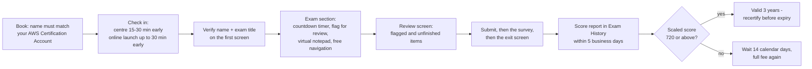
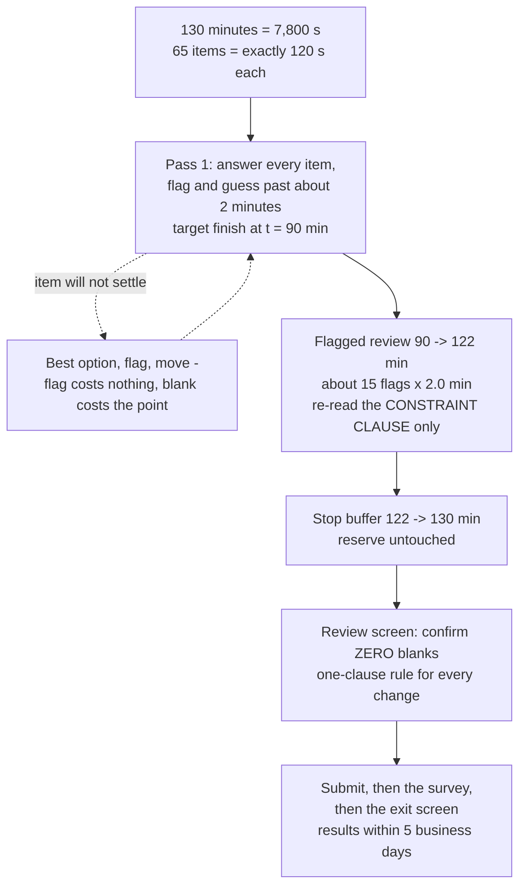
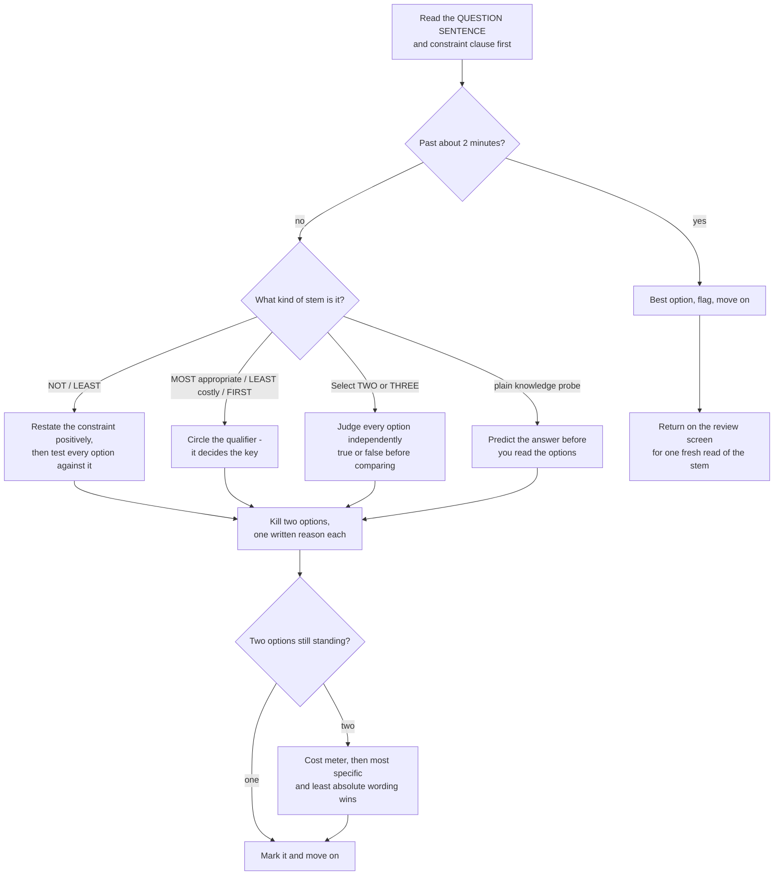
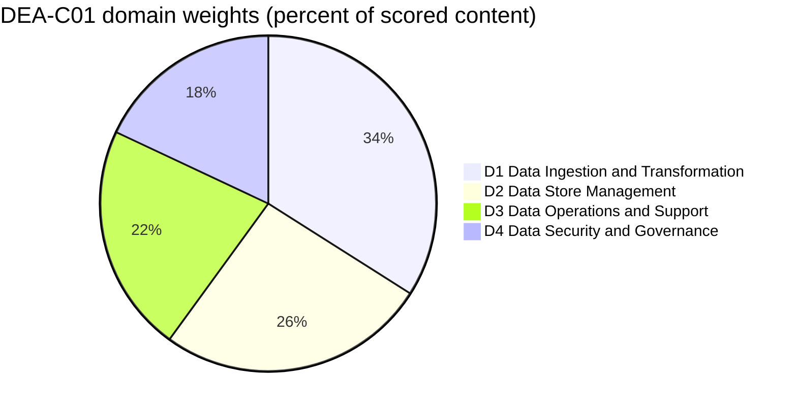
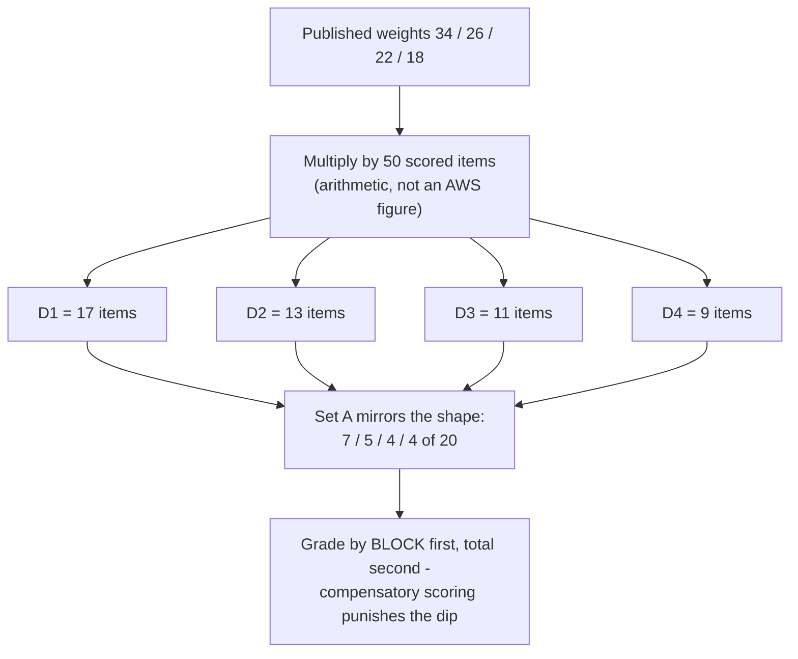

# Exam Simulation A: Practice Set and Strategy

Fourteen lessons gave you the content. This one gives you the **container**: how a DEA-C01 item is actually built, how the 130-minute clock behaves, how AWS writes a distractor, and then **Set A** — twenty exam-style items you sit under time and grade honestly. Everything before this lesson was domain knowledge; everything here is *test craft*, and on a compensatory 100–1,000 scale with **720** to pass, test craft is worth as much as another hour of revision.

```text
====================================================================
 DEA-C01 EXAM AT A GLANCE                (all figures as of Oct 2026)
====================================================================
 FORMAT ....... 65 questions = 50 scored + 15 unscored (not identified)
 TYPES ........ multiple choice (1 right + 3 distractors)
                multiple response (2+ right of 5+ options)
 TIME ......... 130 minutes = 7,800 s  ->  exactly 120 s per item
 SCALE ........ 100 - 1,000, pass at 720, COMPENSATORY, no section cut
 GUESSING ..... no penalty for a wrong guess; BLANK = wrong
 WEIGHTS ...... D1 Data Ingestion and Transformation 34%
                D2 Data Store Management            26%
                D3 Data Operations and Support      22%
                D4 Data Security and Governance     18%
 COST ......... 150 USD per attempt (taxes may apply)
 VALIDITY ..... 3 years; after a FAIL wait 14 calendar days,
                unlimited attempts, full fee every time
 DELIVERY ..... Pearson VUE test centre or online proctored
 RESULTS ...... within 5 business days, AWS Certification Account
 GUIDE ........ v1.1 published 2025-12-12 (+8 skills, -0 skills)
 LANGUAGES .... English, Japanese, Korean, Simplified Chinese
--------------------------------------------------------------------
 SET A (this lesson) ...... 20 items in weight order: 7 / 5 / 4 / 4
====================================================================
```

> [!NOTE]
> **How to use this lesson.** Read sections 1 to 7 once — that is the strategy half. Then sit **Set A (Practice Questions) on a 40-minute timer with no notes, no search and no peeking at the teardowns**. Grade yourself with the rubric in the closing blocks, convert the raw score by domain rather than by total, and let the routing cues send you back to the lesson you actually need. Anything this lesson could not verify against a first-party AWS page is listed in section 7 — treat those as *do not assert*, not as facts to memorise.

By the end of this lesson you will be able to:

- restate every published logistics number (65 / 50 / 15, 130 minutes, 720/1,000, 150 USD, 3 years, 14 days) without notes;
- run the 120-second pacing math and defend a two-pass plan that never leaves an item blank;
- apply the flag-and-sweep technique inside a two-minute per-item budget;
- read a superlative stem — *MOST appropriate*, *LEAST costly*, *FIRST step*, *NOT* — and know which option the qualifier is buying;
- run the five-move multiple-response procedure that survives all-or-nothing scoring;
- decode the distractor factories AWS reuses across all four domains;
- sit Set A, grade it **by domain rather than by total**, and route each miss to the right lesson;
- defend the **comparative verdict** on free official preparation versus paid training versus cross-cloud and on-premises experience.

---

## 1. The container: what the 130 minutes actually are

### 1.1 The logistics you must not re-derive on exam day

Every number below is published by AWS and was retrieved in October 2026. You are allowed to forget service trivia; you are not allowed to re-derive these under a running clock.

| Fact | The published value | Why it changes your strategy |
|---|---|---|
| **Questions presented** | **65** | You must *see* all 65 — coverage beats depth |
| **Scored / unscored** | **50 scored + 15 unscored**, and the 15 are **not identified** | Treat every item as scored |
| **Question types** | **Multiple choice** (1 correct + 3 distractors) and **multiple response** (2+ correct of 5+ options) | Two different elimination procedures, one clock |
| **Time** | **130 minutes** | 7,800 s ÷ 65 = **exactly 120 s per item** |
| **Scale** | **100–1,000**, minimum passing score **720** | 720 is a *scaled* cut, not 72 % |
| **Scoring model** | **Compensatory** — no per-domain pass mark | A soft domain still sinks you |
| **Guessing** | **No penalty**; unanswered questions are scored incorrect | A blank is the only guaranteed zero |
| **Cost** | **150 USD** per attempt (Associate tier; taxes may apply) | Every retake is a fresh 150 USD |
| **Validity** | **3 years** | Diary the expiry on the day you pass |
| **After a fail** | Wait **14 calendar days**, no limit on attempts, full fee each | Budget attempt two *before* attempt one |
| **After a pass** | The same exam cannot be retaken for **2 years** | You cannot "refresh" a pass early |
| **Delivery** | **Pearson VUE** test centre or online proctored | Same exam, same price, both routes |
| **Results** | Within **5 business days** to your AWS Certification Account | Plan a quiet week, not an hourly refresh |
| **Accommodation** | ESL accommodation adds **+30 minutes**, requested once before registration | Request it well in advance |
| **Next-exam discount** | **50 % off** your next exam once you have earned one | 150 USD → 75 USD after the first pass |

- **📚 Did you know?** The **15 unscored items look exactly like the 50 scored ones** — AWS states they "are not identified on the exam". The rational response is symmetry: a badly answered pretest item costs you nothing, a skipped scored item costs the full marks, so the incentive never once points toward "leave it blank and come back". Flag, guess, move.

**The interface you will be given.** Knowing the controls *before* test day is free marks, because the exam gives you no orientation tour:

| Control | Where it lives | What it does |
|---|---|---|
| **Countdown timer** | On screen | Runs for the whole exam section; scheduled breaks are **not** configured, so the clock never stops for you |
| **Flag for review** | On screen | Marks an item so it appears on the review screen — costs one click |
| **Virtual notepad** | On screen | Free-text scratch space; use it for qualifier words, not for copying stems |
| **Free navigation** | On screen | Move between items in any order; verify your name and exam title first |
| **Review screen** | At the end | Your last chance to revisit flagged or unfinished items before submitting |
| **AWS Exam Demo** | Free, before test day | Rehearse flagging, review and language toggle so none of it is an exam-day discovery |



**Two administrative failures cost more than any knowledge gap.** At a test centre, administrators are instructed not to allow testing when the name on your government ID does not match your AWS Certification Account; online, arriving **more than 15 minutes late** or skipping the required system test **forfeits the fee**. Neither is recoverable with study.

### 1.2 The pacing plan: 65 items, 130 minutes

AWS publishes **no per-question budget**. The only official pacing inputs are the 130-minute duration, the on-screen countdown timer, and the Exam Demo's flag-and-review controls. Everything below is arithmetic on published numbers, labelled as such.

**Worked example 1 — the ceiling.**

$$
\frac{130 \times 60}{65} = \frac{7{,}800}{65} = 120\ \text{s per item} \quad (\text{exactly } 2.00\ \text{minutes})
$$

**Worked example 2 — the scored-only illusion.** Against scored items only, the budget looks like $7{,}800 \div 50 = 156$ s $= 2.60$ minutes. You cannot tell which 50 are scored, so **120 s is the number you plan with** and 156 s is a trap you must never budget against.

**Worked example 3 — what slow averaging actually costs.** Cruising at 2.5 minutes per item gives $65 \times 2.5 = 162.5$ minutes — **32.5 minutes past the limit**, which is roughly the last 16 items rushed or blank, and a blank is scored incorrect. The clock, not your knowledge, produces that score.

**The two-pass split.** Run pass one so it ends at **t = 90 minutes** (about 1.4 minutes per item, which is faster than the 120-second ceiling and therefore leaves slack for the long items). At t = 45 you should be near item 33; at t = 65 near item 50. Everything you cannot settle in one clean read gets a flag and a best guess.

| Phase | Clock | Minutes | The rule you must not break |
|---|---|---|---|
| **Pass 1** — all 65 | 0:00 → 1:30 | 90 | Answer *every* item; flag the shaky ones (12–18) |
| **Flagged review** | 1:30 → 2:02 | 32 | Re-read the **constraint clause**, not all four options |
| **Stop buffer** | 2:02 → 2:10 | 8 | Untouched reserve for the two or three items that need it |
| **No-blank sweep** | at the review screen | — | Confirm **zero blanks**, then submit |



**Worked example 4 — the ESL accommodation.** With the +30-minute extension the budget becomes $160 \div 65 = 2.46$ minutes per item. That is *more* time per item, not permission to spend 4 minutes on a hard stem — the two-pass structure survives the extension unchanged.

**Worked example 5 — Set A's own clock.** Set A has 20 items, so the live budget scales to $20 \times 120 = 2{,}400$ s $= \mathbf{40}$ **minutes**. Sit it at 40 minutes to reproduce the real rhythm. If you are short of time, run the compressed form: pass 1 at 75 s per item ($20 \times 75 = 1{,}500$ s $= 25$ minutes) plus a 5-minute sweep = **30 minutes**, and re-sit at the full 40 before test day. This lesson's 90 minutes are budgeted as roughly 35 to read, 40 to sit, 15 to grade.

### 1.3 Flag-and-sweep: the technique, item by item

The exam's own guidance reduces to a sequence you can run in one pass. Train it until it is automatic:

| Step | What you do | Why it exists |
|---|---|---|
| 1 | Read the **question sentence first**, then the constraint clause, then the options | Options anchor you; the stem's constraint is what the key must satisfy |
| 2 | Circle the qualifier: `MOST`, `LEAST`, `FIRST`, `NOT`, `Select TWO/THREE` | The qualifier — not the service name — decides the key |
| 3 | Eliminate the two options that break a **hard constraint** (format, limit, latency, cost meter) | One written reason each; a half-prepared candidate keeps these alive |
| 4 | Tie-break the last two with the **cost meter** and *managed over self-run* | Same SQL, different bill: Athena = bytes scanned, Redshift = cluster time |
| 5 | Past about **two minutes**: best option, flag, move | The item budget is 120 s; a flag costs one click, a blank costs the point |



The **sweep** is the other half of the name. At the review screen you are not re-answering; you are checking three things and nothing else:

1. **Blanks.** Zero. An unanswered item is scored incorrect and there is no penalty for a wrong guess, so blank is strictly dominated by any guess at all.
2. **The asked question.** Re-read the constraint clause and confirm you answered *it* — the classic loss is answering the adjacent, more familiar question.
3. **Order of operations.** Change an option only if you can state the reason in one clause. "It felt wrong" is not a clause.

```dragdrop
{
  "question": "Order the six moves of the flag-and-sweep routine for a single stuck item on DEA-C01:",
  "items": [
    "On the review screen, re-read the CONSTRAINT CLAUSE - never the options first",
    "Confirm you answered the question that was actually asked",
    "Flag the item, then move on immediately",
    "Pick your best guess so that no blank remains",
    "Two minutes reached - stop re-reading the options",
    "Run the final no-blank sweep before you submit"
  ],
  "correctOrder": [
    "Two minutes reached - stop re-reading the options",
    "Pick your best guess so that no blank remains",
    "Flag the item, then move on immediately",
    "On the review screen, re-read the CONSTRAINT CLAUSE - never the options first",
    "Confirm you answered the question that was actually asked",
    "Run the final no-blank sweep before you submit"
  ],
  "explanation": "The order is fixed by risk: the clock is the binding constraint, so the 120-second budget fires first and forces a guess before the flag, which guarantees no blank. The flag only buys a second read, and that read must start from the constraint clause because the classic loss is answering the adjacent question. The no-blank sweep comes last because it is the final check that nothing was left unanswered - unanswered questions are scored as incorrect and there is no penalty for guessing."
}
```

### 1.4 Reading the stem: MOST appropriate, LEAST costly, FIRST

Most DEA-C01 losses are reading losses. The stem's **qualifier**, not the service name, decides the key — so the first move is always the same: find the qualifier, write down what it demands, *then* read the options.

| The stem says… | It is really asking | Your first move | Where it is tested in Set A |
|---|---|---|---|
| **"MOST appropriate" / "MOST cost-effective"** | Cheapest option that meets **every** stated constraint | List the constraints first; an option that violates one is dead at any price | Q5 (Glue vs Lambda vs EMR Serverless), Q9 (lifecycle math), Q12 (materialized view) |
| **"LEAST operational overhead" / "LEAST costly"** | The option with no cluster, environment or idle charge to manage | Kill the *correct-but-heavy* answer — MWAA where Step Functions suffices, EMR where Glue suffices | Q4 (orchestration), Q13 (fix the cause, not the symptom) |
| **"MUST … FIRST" / "FIRST step"** | **Diagnosis or scoping, not remediation** | Order the options by dependency; the answer is the earliest step the stated risk requires | Q13 (force concurrency to 1), Q17 (close the open gate) |
| **"Which solution will meet this requirement?"** | All four options usually work; one is best practice / cheapest / simplest | Tie-break on cost meter, then on managed versus self-run | Q2, Q7, Q10 |
| **"NOT" / "LEAST"** | The one option that *violates* the constraint | Circle it before reading options, restate positively, watch double negatives | Held for the live exam — hold the reflex |
| **"(Select TWO / THREE)"** | Every correct response is required, all-or-nothing | Read *all* options, judge each independently before comparing | Q3, Q8, Q11, Q14, Q18 |

**Worked example 6 — reading a superlative end to end.** Take a stem that never appears in Set A: *"A nightly Spark job over a 40 GB dataset consistently finishes in about 25 minutes with 12 GB of executor memory. Which service and runtime is the MOST appropriate, fully managed choice?"*

1. **Underline the qualifiers before looking at any option:** nightly · 40 GB · **25 minutes** · 12 GB · *fully managed*.
2. **Let the hardest qualifier eliminate.** 25 minutes is **1,500 seconds**, which is past AWS Lambda's hard ceiling of **900 seconds** — so Lambda dies on arithmetic, even though it is the most serverless-looking option and 10,240 MB is inside its memory range. That distractor is built to test *which limit binds*.
3. **Match the runtime to the workload.** A Spark DataFrame job is not a single-process script, so the Glue Python shell (0.0625 or 1 DPU, no Spark) dies next.
4. **Apply "LEAST operational overhead" to the survivors.** A Glue ETL (`glueetl`) job runs Spark fully managed in DPU units (1 DPU = 4 vCPU + 16 GB); EMR Serverless also works but carries more operational surface than the stem's constraint asks for.
5. **Say the trap out loud:** the most *serverless* option failed on a **limit**, not on a preference. Verify every limit against the current service quotas page before you rely on it.

- **📚 Did you know?** The exam guide's single most important style sentence is *"The ability to compare AWS services to understand the cost, performance, and functional differences between services."* Every tie-break in section 1.4 is an instance of it: when two options both *work*, the differentiator is cost meter, performance envelope or functional limit — never "which one I have used".

```matching
{
  "question": "Match each exam stem trigger to the move that actually earns the mark - the five qualifier reflexes from section 1.4:",
  "pairs": [
    {"left": "MOST appropriate / MOST cost-effective", "right": "List every constraint first, then take the cheapest option that satisfies all of them"},
    {"left": "LEAST operational overhead / LEAST costly", "right": "Kill the correct-but-heavy option - no cluster, no environment, no idle charge"},
    {"left": "MUST be done FIRST", "right": "Diagnosis or scoping step, not the remediation the stem is tempting you with"},
    {"left": "NOT / LEAST / except", "right": "Circle it before reading options, restate the constraint positively, then hunt for the violation"},
    {"left": "Select TWO or THREE", "right": "Judge each option independently true or false, discard the false ones, then check the count"},
    {"left": "Which solution will meet this requirement?", "right": "All four work - tie-break on cost meter, then on managed over self-run"}
  ],
  "explanation": "Each pair is decided by one word in the stem: a superlative buys the cheapest option that still satisfies every constraint; LEAST overhead buys the most managed option; FIRST buys the diagnosis; a negative stem buys the violation; Select TWO buys independent per-option judgement; and a neutral requirement stem buys the AWS-best-practice tie-break. Reading the qualifier before the options is the whole technique - the service names are chosen to be plausible in all four positions."
}
```

### 1.5 The multiple-response technique

The exam guide defines the type precisely: **multiple response "has two or more correct responses out of five or more response options."** Two consequences decide your method:

- **All-or-nothing.** A partially correct set scores zero. AWS's own exam-prep material prints *"No Negative points or Partial credit"* — so the cost of an under-selection is identical to the cost of a wrong selection, and there is no reason to submit fewer than the stem demands.
- **Different rhythm.** Multiple-response items take roughly half again as long as multiple choice, which makes them the items most likely to push you past the two-minute mark — and the ones you least want to flag, because re-reading five or six options feels productive. Flag them anyway.

**The five-move procedure:**

| Move | What you do | Failure it prevents |
|---|---|---|
| 1 | Judge **every** option independently: definitely true / definitely false / maybe | Committing to an option because it "sounds right" next to its neighbours |
| 2 | Discard every definitely-false option | Keeping a plausible distractor alive by association |
| 3 | If the survivors match the requested count, submit | Endless re-reading of a finished item |
| 4 | If **more** survive than the count, re-read for a **scope qualifier**: per-Region vs global, at-rest vs in-transit, control plane vs data plane, customer vs AWS responsibility | Selecting a true statement that answers a wider question than the stem asked |
| 5 | If **fewer** survive, one "obvious" truth is out of scope — check it against the in-scope service list and the skill bullet the stem is drawn from | Missing a correct option because it looks too easy |

```fillblank
{
  "question": "Complete the multiple-response routine from section 1.5:",
  "template": "1) Judge every option {{1}} true, false or maybe. 2) Discard the definitely-{{2}} options. 3) If the survivors match the count, {{3}}. 4) If too many survive, re-read for a {{4}} qualifier such as per-Region versus global. 5) If too few survive, the easy-looking truth is probably {{5}}.",
  "answers": {
    "1": "independently",
    "2": "false",
    "3": "submit",
    "4": "scope",
    "5": "out of scope"
  },
  "distractors": ["identically", "true", "flag", "cost", "in scope", "optional", "reversed", "surface"],
  "explanation": "The routine is deliberately mechanical because partial credit does not exist: independent judgement stops neighbour-induced errors, discarding false options does the real work, an exact count means stop, an oversized survivor set means a scope qualifier is hiding somewhere (per-Region vs global, at-rest vs in-transit, customer vs AWS), and an undersized set usually means one obvious-looking answer is out of scope for the skill bullet the stem came from."
}
```

- **📚 Did you know?** The exam guide guarantees the two **types** and the counts of scored and unscored items, but AWS has never published how many multiple-response items appear on a given form, nor the ratio of multiple choice to multiple response among the 50 scored items. Set A's five-of-twenty split is a **teaching choice** that mirrors the guide's own definitions — never quote it as an AWS figure.

### 1.6 Domain weights and the Set A blueprint

Only **domain** percentages are published. The item counts below are arithmetic on 50 scored items — a planning aid, never an AWS figure.

| Domain | Published weight | Scored items on the live exam (derived: 50 × w) | Set A items here | Priority cue |
|---|---|---|---|---|
| **D1** Data Ingestion and Transformation | **34 %** | ≈ 17 | **7** (Q1–Q7) | Streams vs Firehose, Glue bookmarks, orchestration, transform engines, cost meters |
| **D2** Data Store Management | **26 %** | ≈ 13 | **5** (Q8–Q12) | Store selection, lifecycle math, distribution design, open table formats |
| **D3** Data Operations and Support | **22 %** | ≈ 11 | **4** (Q13–Q16) | Troubleshoot, monitor, cost a run, tune a plan |
| **D4** Data Security and Governance | **18 %** | ≈ 9 | **4** (Q17–Q20) | Lake Formation, two doors, encryption, audit logs |
| **Total** | **100 %** | **≈ 50** | **20** | "Scored items" column is arithmetic, not AWS |

**Worked example 7 — weights to items.** $50 \times 0.34 = 17$, $50 \times 0.26 = 13$, $50 \times 0.22 = 11$, $50 \times 0.18 = 9$; $17 + 13 + 11 + 9 = 50$. Domains 1 and 2 together are **60 %** of scored content — which is why Set A gives them 12 of its 20 items — but Domain 4's 9 items are more than enough to fail you alone, because scoring is compensatory and there is no section cut to hide behind.





### 1.7 Distractor families, and what this lesson will not assert

AWS states that distractors are "generally plausible responses that match the content area." They are not random; the same shapes recur, and each one punishes a specific confusion. They are labelled **T1–T7** here so they are never confused with the domain labels **D1–D4**.

| # | Distractor family | How it baits you | Your counter-move |
|---|---|---|---|
| **T1** | **Sibling service** | Firehose offered where Streams is required, MWAA where Step Functions suffices | Map the stem's **noun** to the mechanism first: stream vs delivery pipeline |
| **T2** | **Wrong layer / wrong stage** | A crawler answer to an orchestration question, a catalog answer to a data answer | Right service, wrong *place* in the pipeline |
| **T3** | **Scope / naming** | An out-of-scope service that sounds more advanced than the real key | The answer is always on the **in-scope** list |
| **T4** | **Over-claim** | Enterprise-scale infrastructure offered for a *LEAST overhead* question | Answer the superlative, not the topic |
| **T5** | **Responsibility flip** | "It is AWS's managed service, so AWS does it" | Ask: is this **of** the cloud or **in** the cloud? |
| **T6** | **Numeric bait** | A wrong DPU, price, limit or date attached to a true statement | Write the unit and the figure before comparing |
| **T7** | **True-but-irrelevant** | A correct fact that answers a neighbouring question | Test each option against the **stem's** constraint |

**Points this lesson deliberately does not assert.** These are flagged rather than taught, because an unverified claim is never a fact:

1. **How many multiple-response items** a live form carries, and whether every stem states the count — unpublished.
2. **The per-form multiple choice to multiple response ratio** among the 50 scored items — unpublished.
3. **The text of the 20 Official Practice Question Set items.** They sit behind Skill Builder sign-in; no style claim in this course is attributed to reading them.
4. **The exact date on which guide v1.1 content first appeared on a live form.** The guide promises revisions at least one month ahead and delivery rolls across languages. Say "in the current exam guide", not a date.
5. **Whether DEA-C01 will adopt the ordering, matching and case-study types** AWS announced in July 2024. AWS named AI Practitioner and Machine Learning Engineer – Associate as the first exams for those types, and the current DEA-C01 guide lists only multiple choice and multiple response.
6. **A raw-to-scaled conversion.** 720 is a scaled cut produced by standard setting and equating; "N of 50 = pass" is arithmetic nobody outside AWS can do.
7. **Per-domain pass marks.** There are none — the model is compensatory.
8. **Same-day or on-screen pass/fail.** The official policy text is "within five business days".

---

### 2026 Updates (as of October 2026)

Six 2025–2026 changes decide whether your notes are right or wrong on exam day. Every bullet is sourced to an AWS first-party page retrieved in October 2026; where a claim could not be verified it is labelled as such and must never be memorised as fact.

> [!NOTE]
> **What moved between 2025 and October 2026:**
> - **The exam guide moved to v1.1 on 2025-12-12.** Knowledge items were consolidated into the skill lists, **eight skills were added and none removed**: 1.2.10 integrate LLMs for data processing, 2.1.7 manage open table formats (Apache Iceberg), 2.1.8 vector index types, 2.2.6 business data catalogs, 2.4.6 vectorization concepts, 4.1.7 SageMaker Unified Studio domains, 4.5.6 SageMaker Catalog project access, 4.5.7 governance framework and data sharing patterns. Revisions publish **at least one month** before they can affect a live form.
> - **The service lists moved too.** In-scope gained **Aurora, Amazon Q, Amazon Bedrock, Amazon Kendra, AWS Data Exchange and Amazon S3 Tables** and lost **Cloud9, CodeCommit and AWS SCT** — yet task 2.4.3 still names "AWS SCT and AWS DMS Schema Conversion", so teach DMS Schema Conversion as current and SCT as legacy. A removed service can still appear as a *distractor*.
> - **Three service fossils will mark you down.** Amazon Data Firehose has been the product name since **2024-02-09** while the in-scope list still prints "Amazon Kinesis Data Firehose" (both valid; the API prefix is still `firehose`). Kinesis Data Streams now has **three** capacity modes, not two — On-demand Advantage (announced 2025-11-04) removes the per-stream hourly charge but imposes an account-wide floor of **25 MB/s ingest + 25 MB/s retrieval**, and capacity-mode switches are capped at **twice per 24 hours**. And Redshift no longer only *reads* Iceberg: writes GA 2025-11-17, UPDATE/DELETE/MERGE 2026-04-23, Iceberg materialized views 2026-10-05.
> - **Glue moved a generation.** **5.1 is the default for new jobs** (2025-11-26); **6.0 is latest** (2026-08-21, Spark 4.1.1, Python 3.13, Scala 2.13, a 30 % price reduction, full Iceberg v3) and **removes EMRFS and the AWS SDK for Java v1**. Glue 0.9/1.0/2.0 reached end of life **2026-04-01**, and Python Shell 3.6 jobs can no longer be created after **2026-03-31**. A 2024 note that says "use Glue 3.0/4.0" is now stale.
> - **Lower minimums and cheaper entry points.** Athena Capacity Reservations dropped to **4 DPU / 1 minute** (2026-02-11) and Athena managed query results (2025-06-03) need no S3 result bucket and cost nothing extra; Lake Formation cross-account sharing v5 (2026-02-11) carries unlimited tables in one AWS RAM share; Redshift Serverless now sells 1-year and 3-year reservations. Accounts created **on or after 2025-07-15** get a **6-month Free Plan** with up to **USD 200** of credits instead of the legacy 12-month tier.
> - **Logistics did not move:** 130 minutes, 65 questions (50 scored + 15 unscored), 150 USD, 720 to pass, 3-year validity, 14-day retake wait, Pearson VUE centre or online proctored, four languages. DEA-C01 had a single beta (2023-11-27 to 2024-01-12 at 75 USD) and **no 2026 beta**; the "170 minutes / 85 questions / 300 USD" figures still circulating on third-party pages describe neither this exam nor any current AWS certification configuration.

- **📚 Did you know?** AWS moved exam guides from static PDFs to AWS Docs precisely so revisions could ship without a new exam code: a **significant** change earns a new series code (for example DVA-C01 → DVA-C02), while a **less significant** change — adding or removing skills and in-scope services — becomes a *revision* on the same code. That is why DEA-C01 stayed DEA-C01 through v1.1, and why the Revisions page, not a PDF watermark, is the artefact to check before you sit.

> [!TIP]
> **Three more sourced items — exam scope and vocabulary shifts (digest 17, all read 2026-10-10):**
> - **Question types and beta news stay off DEA-C01.** AWS's 2024-07-22 certification post announced three new item types — **ordering, matching and case study** — and named *AI Practitioner* and *Machine Learning Engineer – Associate* as the first exams to carry them; the current DEA-C01 guide (v1.1) still lists **only multiple choice and multiple response**. DEA-C01's single beta ran **2023-11-27 → 2024-01-12 at 75 USD**, and **no DEA-C01 beta ran in 2026** — the 2026 beta announcement belongs to MLA-C02, so never import another exam's question count, duration or price into this one.
> - **The out-of-scope list lost four names.** v1.1 removed **Honeycode, WorkDocs, Amazon Timestream and CodeWhisperer** from out-of-scope and added nothing to it, while in-scope netted **+3** (six added, three removed). Removal is not prohibition: Cloud9, CodeCommit and AWS SCT are still perfectly legal *distractors*, and task 2.4.3 still reads "AWS SCT and AWS DMS Schema Conversion" — teach DMS Schema Conversion as current, SCT as legacy.
> - **Two vocabulary fossils.** **Kinesis Data Analytics for SQL was discontinued 2026-01-27** — say *Amazon Managed Service for Apache Flink* (renamed 2023-08-30). And the in-scope list now literally prints **"Amazon Quick"** while the product line reads **Amazon Quick Suite / Quick Sight** (evolved from QuickSight on 2025-10-09): treat the family as in-scope, but **do not** claim the guide says "Amazon QuickSight" — it does not.

---

## Real-World Case Studies

AWS never prints a customer's name on an exam item, but the *shapes* of real pipeline failures leak into stems constantly: one sentence of incident history becomes the stem's condition, and the four options become the four ways candidates mis-read it. The two drills below are drawn from the case material behind this course's question bank and should be run **before** Set A — each ends with *which domain this tests* and *what the exam would ask*.

Two rules govern everything in this section:

1. **A number in a stem is a constraint, not decoration.** "25 minutes", "1,500 records per second", "3 TB uncompressed" is always the qualifier that selects the key.
2. **The domain is chosen by the constraint, not by the story.** The same streaming narrative seeds a Domain 1 item (ingestion design), a Domain 3 item (monitoring lag) or a Domain 4 item (who may read the stream) depending on which clause the exam underlines — exactly the section 1.4 reflex.

### Case Study 1 — the hot partition key: why adding shards does nothing

**The story.** 800 telemetry records per second at 4 KB each arrive from 12,000 devices, and two consumer applications each need every record. Sizing gives **4 shards** (Set A's Q1). Two weeks later one faulty firmware build pins **1,500 records per second onto a single `device_id` partition key**, and that shard throttles at **1,000 records per second** no matter how many shards sit beside it.

**Which domain does this test?** Primarily **D1 Data Ingestion and Transformation (34 %)** — skill 1.1.9 throttling and rate limits, skill 1.1.10 fan-in and fan-out. Secondary hooks: **D3 (22 %)** if the stem asks what to *alarm* on (`GetRecords.IteratorAgeMilliseconds`), **D4 (18 %)** if it asks who may write to the stream.

**What would the exam ask?** Three stem shapes:

1. *"Which change most directly resolves the throttling?"* → **redesign the partition key** (a two-level or salted key such as `device#<bucket>`), because one partition key maps to exactly one shard. Increasing the shard count is the most-selected wrong answer: the bottleneck is per-key, not per-stream.
2. *"Which metric confirms consumer lag?"* → `GetRecords.IteratorAgeMilliseconds`, whose AWS documentation states that a value of zero indicates the consumer has caught up. Alarm on **Max** against roughly half the retention window.
3. *"Which two limits does a single partition key exceed first?"* → **1 MB/s and 1,000 records per second per shard** — and note that on-demand mode explicitly does not detect and isolate hot hash keys, so auto-scaling will not save you either.

**The trap to say out loud:** capacity answers feel like answers. When the stem names a *key*, the fix is in the key.

### Case Study 2 — the Athena bill: three numbers that must be read together

**The story.** A **3 TB** uncompressed text dataset sits in Amazon S3 with **three equally sized columns**. Dashboards query **one** of the three columns. Every query scans 3 TB and costs 3 × 5.00 USD = **15.00 USD**. The team converts to Apache Parquet at **3:1** compression, re-registers the table in the AWS Glue Data Catalog, and the same query now scans about 0.33 TB for roughly **1.65 USD**.

**Which domain does this test?** **D3 Data Operations and Support (22 %)** first — skill 3.2.3 SQL in Athena, skill 3.1.7 query data — with **D2 (26 %)** hooks in 2.4.5 (partitioning, compression and other optimization techniques) and **D1 (34 %)** hooks in 1.2.6 (transform data between formats, for example .csv to Apache Parquet).

**What would the exam ask?** Three stem shapes:

1. *"What is the approximate cost per query before and after?"* → **15.00 USD → 1.65 USD** (Set A's Q6). The distractors are the most likely slips: applying compression but forgetting column pruning, using the wrong before-cost, or multiplying instead of dividing.
2. *"Which change produced the larger share of the saving?"* → **column pruning**, because text cannot skip columns: 3:1 compression alone takes 3 TB to 1 TB (5.00 USD), and reading one of three columns takes that to about 0.33 TB.
3. *"Which cost meter does this bill use?"* → **bytes scanned**, at 5.00 USD per TB with a 10 MB minimum per query, rounded up to the nearest MB — with **no charge for DDL, partition management or failed queries**. The competing option is always Redshift, which bills **cluster compute time** instead.

**The trap to say out loud:** two levers, one bill. Compression and column selection are different multipliers, and a stem that quotes only one of them is testing whether you can do the arithmetic in the order it happened.

```matching
{
  "question": "Match each trap pair to its one-line correct framing - the comparisons most likely to cost you marks on Set A:",
  "pairs": [
    {"left": "Kinesis Data Streams vs Amazon Data Firehose", "right": "Streams = consumer API, 24h-365d retention, replayable; Firehose = buffered delivery, no consumer API, no consumer-side replay"},
    {"left": "Step Functions vs Amazon MWAA vs EventBridge", "right": "Step Functions = durable multi-step workflow; EventBridge = routes events and schedules; MWAA = managed Airflow you pay for idle"},
    {"left": "AWS Glue job bookmarks vs streaming watermarks", "right": "Bookmarks = batch incremental state; checkpointLocation + watermarks = streaming - 'bookmarks on the streaming job' is always wrong"},
    {"left": "Amazon Redshift DISTKEY vs SORTKEY", "right": "DISTKEY decides which slice a row lands on (join redistribution); SORTKEY decides row order inside files (scan skipping)"},
    {"left": "Lake Formation permissions vs IAM permissions", "right": "Two doors, both must open: IAM gates API calls, Lake Formation gates catalog and S3 data, and Lake Formation grants are Region-local"},
    {"left": "Amazon Macie vs AWS Config", "right": "Macie discovers and reports sensitive content and never remediates; Config records and evaluates configuration state"},
    {"left": "Athena vs Redshift cost meters", "right": "Athena bills bytes scanned; Redshift bills compute time - same SQL, different bill, different optimization lever"}
  ],
  "explanation": "Every pair is decided by one noun or one qualifier, exactly as in section 1.4: stream versus pipeline, workflow versus route versus cluster, batch versus streaming, distribution versus ordering, API door versus data door, content versus configuration, and bytes versus compute time. The exam guide forecasts this directly - it names the ability to compare AWS services for cost, performance and functional differences as a headline skill, so these seven comparisons are the exam's favourite tie-breaks."
}
```

---

## Real-World Case Drills

The two studies above came from this course's question bank; the two drills below come from **AWS-published customer case studies** — every figure read off an AWS-owned page in October 2026 (digest 16). Run each one exactly as you would a live stem: underline the numbers, name the **domain**, then write the **question** the exam would build from it. The story is never the answer; only the constraint buried in it is.

Two rules govern everything in this section:

1. **A customer result is never an AWS guarantee.** AGCO's **−78 %** and IAS's *"hundreds of permission rules down to precisely two rules"* are customer outcomes printed on AWS pages; AWS commits to neither a percentage nor a rule count. Any option phrased "AWS guarantees…" fails before you check the number.
2. **Build the stem from the clause, not from the headline.** The clause the exam underlines decides everything: *throughput* makes the same AGCO story a Domain 1 item, *screen load 600 ms* makes it Domain 3, *who may read the raw prefix* makes it Domain 4 — exactly the section 1.4 reflex, applied to a case instead of a service.

### Case Drill 1 — AGCO: one streaming story, three domains

**The story as AWS publishes it** (AWS Architecture Monthly, December 2021, p. 10, and the AWS Industries blog of 2021-03-03; accessed Oct 2026):

| Element | What AWS published |
|---|---|
| **Scale** | Telemetry from **hundreds of thousands** of machines; **1,200 data points per minute** in production, load-tested to **10,000 per minute**; **1.9 M records/day**; **1.5 billion** records retained |
| **Pipeline** | **Amazon Kinesis Data Streams → Amazon Data Firehose → Amazon S3**, with **Kinesis Data Analytics for Apache Flink**, plus **AWS Lambda** enrichment into **Amazon DynamoDB** and **OpenSearch Service** |
| **Outcome (customer-specific)** | Cost **−78 %**; screen load **8–30 s → 600 ms**; run by **1 person** instead of **3–5**; live since **January 2020** |

**Which domain does this test?** Primarily **D1 Data Ingestion and Transformation (34 %)** — streaming ingestion, fan-out and format conversion, the KDS → Firehose → S3 shape. Secondary hooks: **D3 Data Operations and Support (22 %)** if the stem asks which metric proves the 600 ms figure, and **D4 Data Security and Governance (18 %)** if it asks who may write to, or read, the raw prefix.

**What would the exam ask?** Three stem shapes, all built from the table above:

1. *"Which service in this architecture delivers records to Amazon S3 without the team ever running consumer code?"* → **Amazon Data Firehose** — buffered delivery that flushes on size *or* interval, whichever first, exposing **no consumer API and no consumer-side replay**. The baited option is always *"replay the last 24 hours from the Firehose delivery"* (trap pair F1; Set A's Q2).
2. *"Which metric would confirm that consumer lag — not Firehose buffering — is behind a delayed dashboard?"* → **`GetRecords.IteratorAgeMilliseconds`** on the stream, alarmed on **Max**, at roughly half the retention window; AWS documents that a value of zero means the consumer has caught up (Set A's Q14).
3. *"Which analytics path gives the LEAST operational overhead for this workload?"* → the managed stream processor — **Amazon Managed Service for Apache Flink**, renamed from Kinesis Data Analytics on **2023-08-30** — over self-run Kafka or Flink. And never "add shards" when the stem's noun is a *key*.

**The trap to say out loud:** **−78 % is AGCO's number on AGCO's workload**, dated to a January 2020 go-live. A stem that offers it as a property of managed streaming is testing digest 16's first trap — *AWS says X % ≠ universal*. Date-stamp the story and refuse any option that generalises it.

- **📚 Did you know?** The table above uses three names for what candidates still call "Kinesis": **Amazon Kinesis Data Streams**, **Amazon Data Firehose** (renamed from Kinesis Data Firehose on **2024-02-09**, with endpoints, APIs, CLI, IAM prefixes and CloudWatch metrics all unchanged) and **Amazon Managed Service for Apache Flink** (renamed from Kinesis Data Analytics on **2023-08-30**). The DEA-C01 in-scope list still prints "Amazon Kinesis Data Firehose", so **both** Firehose names are valid — never "correct" an option that uses the older one.

### Case Drill 2 — Integral Ad Science: hundreds of permission rules become two

**The story as AWS publishes it** (AWS Big Data Blog, 2021-09-23; accessed Oct 2026):

| Element | What AWS published |
|---|---|
| **Problem** | A self-service lake across producer and consumer accounts, GDPR/CCPA obligations, access decided by data classification and job role |
| **Build** | **AWS Lake Formation + AWS Glue Data Catalog + Amazon S3 + Amazon Athena and EMR**, identity federated from **Okta**, access governed by **Lake Formation tags (LF-TBAC)** |
| **Outcome (customer-specific)** | *"With Lake Formation tag-based access controls, IAS reduced hundreds of permission rules down to precisely two rules."* |
| **Mechanics that make the number possible** | **Column-level** control; Amazon S3 reached **only through a Lake Formation data access role**; **database-level tags inherited by tables and columns**; Athena workgroups per business unit doubling as **billing tags and query limits** |

**Which domain does this test?** **D4 Data Security and Governance (18 %)** first — tag-based access control, fine-grained grants and federated identity. Hooks: **D2 Data Store Management (26 %)** for the central catalog that the tags hang off, and **D3 Data Operations and Support (22 %)** if the stem asks what a workgroup actually limits.

**What would the exam ask?** Three stem shapes:

1. *"Which mechanism collapses hundreds of grants into two?"* → **tag-based access control**: grant once **on a tag**, tag the resources, let **inheritance** carry the grant to every table and column beneath the database (the mechanism one step past Set A's Q17 and Q18).
2. *"(Select TWO.) Which two doors must open before a governed query returns rows?"* → **IAM** — API calls, including `lakeformation:GetDataAccess` for Amazon Athena — **and Lake Formation**, which gates the catalog and the S3 data. Both, always; and Lake Formation grants are **Region-local**.
3. *"What stops an analyst reading the raw S3 prefix with a perfectly valid IAM policy?"* → the **Lake Formation data access role**: for a governed table, S3 is reached *through* Lake Formation, not through an S3 policy alone.

**The trap to say out loud:** the impressive number (**two rules**) is the customer's; the examinable part is the **mechanism** — tags, inheritance, two doors. The counter-trap is scope: a tag grant made in one Region does nothing in another, so any option offering "applies account-wide" dies on contact.

- **📚 Did you know?** The same governance pattern at a much larger scale is GoDaddy's data mesh: AWS published **more than 2,000 data products** holding **multiple petabytes across hundreds of accounts**, with a central governance account owning Lake Formation and the Glue Data Catalog and sharing outward through **AWS RAM**. If a stem ever says *"one account governs, hundreds consume"*, that is the picture — and it remains a customer result, not an AWS architecture guarantee.

```matching
{
  "question": "Match each case-study trap to its one-line correct framing - the misreadings that turn a published customer story into a wrong option:",
  "pairs": [
    {"left": "A customer's reported percentage", "right": "Workload- and baseline-specific to that customer - AWS commits to no percentage, so 'AWS guarantees 78%' is wrong on sight"},
    {"left": "The Kinesis naming triad", "right": "Data Streams = shards and replayable retention; Data Firehose (renamed 2024-02-09) = buffered delivery, no consumer API; Managed Service for Apache Flink (ex-Kinesis Data Analytics) = stream processing"},
    {"left": "Data lake versus data warehouse", "right": "Warehouse = schema defined in advance; lake = schema not defined at capture - and a lake is not inherently governed until Lake Formation is added"},
    {"left": "Hot shard versus hot key", "right": "A hot shard scales with SplitShard or capacity; a hot key never does - one key stays on one shard, so redesign the partition key"},
    {"left": "Savings Plans versus Spot versus Graviton", "right": "Commitment discount versus interruptible capacity versus different silicon - three levers, three meters, one distractor family"},
    {"left": "Amazon Macie versus AWS Config", "right": "Macie discovers and reports sensitive content in Amazon S3 and never remediates; Config records and evaluates configuration state"},
    {"left": "AWS DMS versus DataSync versus Snowball", "right": "DMS migrates databases with full load and CDC; DataSync moves files over the network; Snowball ships data offline"}
  ],
  "explanation": "Every pair is a case-study-shaped version of the exam guide's headline skill - compare AWS services for cost, performance and functional differences. The published customer number is always the bait (it is specific, dated and attributable), while the mechanism underneath it is the mark: delivery versus stream, schema-on-write versus schema-on-read, capacity versus key design, commitment versus interruptibility versus silicon, content versus configuration, and database migration versus file transfer versus physical shipment. Ask which noun the stem underlines before you choose, and treat any generalised percentage as a distractor by construction."
}
```

---

## Practice Questions

**Set A — 20 items in published weight order: D1 seven, D2 five, D3 four, D4 four.** The live exam's dominant format is one correct response and three distractors, and so is Set A; five items are multiple-response style, phrased "Select TWO" or "Select THREE" with the correct statements pre-combined into a single option so each item keeps exactly one key. That is a teaching device — on the live exam you would tick separate checkboxes, all-or-nothing.

### How to sit Set A

| Setting | The rule | Why it matters |
|---|---|---|
| **Timer** | **40 minutes** (120 s per item — the exact live budget), or the compressed 25 + 5 form in section 1.2 | Trains the rhythm you will use for 65 items |
| **Materials** | No notes, no search, no teardown visible | Open-book scoring measures your notes, not you |
| **Pacing** | Answer every item; flag anything over two minutes and keep moving | A blank is a guaranteed zero — the rule never changes with set size |
| **Multiple response** | Judge every option independently; on this set the correct statements are pre-combined into one option | Trains all-or-nothing thinking without breaking the single-key format |
| **Second pass** | Only after the timer stops, revisit flagged items | Simulates the flagged-review window |
| **Grading** | By **domain block** first, total second | Compensatory scoring punishes the dip, not the average |
| **Re-sit** | 72 hours later, from memory | Shorter gaps measure recognition, not retention |

**Pre-flight check — run this in the 60 seconds before you start the timer:**

1. Timer set to **40 minutes**, notifications off, phone in another room.
2. A blank sheet for the qualifier words (`MOST`, `LEAST`, `FIRST`, `NOT`, `Select TWO`) — writing the qualifier is the whole technique.
3. Answer sheet or tally ready, so grading takes 30 seconds afterwards.
4. Agreement with yourself: **no blanks**, and no option change without a one-clause reason.
5. Agreement with yourself: at **two minutes** the item gets flagged and a guess, whatever your instincts say.
6. Teardowns hidden. If you can see them, you are measuring your reading comprehension, not your recall.

### Domain 1 — Data Ingestion and Transformation (34 %) · items 1–7

```question
{
  "id": "dea-15-q1",
  "type": "multiple-choice",
  "question": "A data engineer is provisioning an Amazon Kinesis Data Streams stream for device telemetry. Producers write an average of 800 records per second, each record averaging 4 KB. Two consumer applications must each independently read the full stream using the shared GetRecords API. Using the AWS sizing formula, how many shards should the stream have in provisioned mode?",
  "options": [
    "2",
    "3",
    "4",
    "8"
  ],
  "correct": 2,
  "explanation": "Write bandwidth = 800 x 4 KB = 3,200 KiB/s. Read bandwidth = 3,200 x 2 consumers = 6,400 KiB/s. number_of_shards = ceiling(max(3200/1024, 6400/2048)) = ceiling(max(3.125, 3.125)) = 4."
}
```

**Teardown — Q1 · the shard formula.** **Why it is right:** both sides of the formula land on 3.125, and the formula says take the **maximum** of the two ratios and then **round up** — $3{,}200 \div 1{,}024 = 3.125$ and $6{,}400 \div 2{,}048 = 3.125$, so $\lceil 3.125 \rceil = 4$. **Why the traps lose:** **A (2)** ignores the read side entirely *and* rounds 3.125 down; **B (3)** truncates instead of applying `ceiling`, the single most common arithmetic slip on this item; **D (8)** applies the 2× read factor *and* the two-consumer factor, double-counting one of them. **Trap:** the formula's read divisor is 2,048 — not 1,024 — so a candidate who "remembers 2×" but forgets where it lives will get 8. **Source:** digest 15 Q01 and C1/C2 · Kinesis Data Streams `how-do-i-size-a-stream.html` (formula verbatim), as of Oct 2026.

```question
{
  "id": "dea-15-q2",
  "type": "multiple-choice",
  "question": "A fintech pipeline must react to individual payment events in under a second and must also be able to replay the last 48 hours of events after a logic bug is fixed. Which service best meets BOTH requirements?",
  "options": [
    "Amazon Data Firehose delivering to Amazon S3",
    "Amazon Kinesis Data Streams consumed by AWS Lambda",
    "Amazon SQS standard queue fed by Amazon EventBridge",
    "Amazon Data Firehose with a Lambda transformation"
  ],
  "correct": 1,
  "explanation": "Kinesis Data Streams is a stream with per-record latency, a consumer API and configurable retention of 24 hours to 365 days, so replay inside 48 hours is a new shard iterator inside the retention window."
}
```

**Teardown — Q2 · stream vs delivery pipeline.** **Why it is right:** two qualifiers — *under a second* (per-record, consumer-driven) and *replay 48 hours* (retention plus a consumer API) — and only Streams satisfies both. **Why the traps lose:** **A** and **D** are the same service twice: Firehose buffers and flushes on **size or interval, whichever first**, exposes **no consumer API**, and therefore offers **no consumer-side replay** — only S3 backup and error prefixes, which do not help you re-run fixed logic over the last 48 hours; a Lambda *transformation* inside Firehose does not change that. **C** is a queue-and-route pattern with no stream-level replay affordance. **Trap:** Firehose sounds like "the Kinesis one that delivers", and a Lambda in the option makes it look consumer-driven — the qualifiers, not the brand name, decide. **Source:** digest 15 Q02 and trap pair F1 · `aws.amazon.com/compare/data-firehose-and-kinesis-data-streams` · Firehose FAQs, as of Oct 2026.

```question
{
  "id": "dea-15-q3",
  "type": "multiple-choice",
  "question": "(Select TWO.) A nightly AWS Glue ETL job that previously processed only new files has begun writing duplicate rows to the curated S3 prefix. The engineer has confirmed the job uses DynamicFrames and calls job.commit(). Which TWO configurations could each independently cause the duplicate processing? On this set's single-key format the two causes are pre-combined inside one option - choose the option in which BOTH are genuine causes.",
  "options": [
    "MaxConcurrentRuns is set to 4 on the job; the job's transformation_ctx was renamed from datasource0 to orders_src",
    "The job uses DynamicFrames rather than Spark DataFrames; auto scaling is enabled with NumberOfWorkers = 20",
    "The sink writes Snappy Parquet with partitionKeys; the job's IAM role has s3:ListBucket on the raw prefix",
    "Auto scaling is enabled with NumberOfWorkers = 20; the sink writes Snappy Parquet with partitionKeys"
  ],
  "correct": 0,
  "explanation": "AWS Glue bookmarks do not support concurrent job runs, and transformation_ctx is the key under which bookmark state is stored - renaming it makes the job treat previously processed sources as brand new."
}
```

**Teardown — Q3 · Select TWO, pre-combined.** **Why it is right:** both halves break bookmark state independently — concurrency breaches the documented "bookmarks don't support concurrent job runs and commits will fail" rule, and a renamed `transformation_ctx` orphans the stored bookmark so every source looks new. **Why the traps lose:** **B** offers the *correct* DynamicFrame choice plus an irrelevant throughput setting; **C** and **D** offer output-layout and permission facts, none of which bookmark state reads. **Trap:** the stem says the job already uses DynamicFrames and already calls `job.commit()`, so candidates hunt for what is *missing* — the answer is what was *changed*. **Live-exam form:** two checkboxes, all-or-nothing, no partial credit. **Source:** digest 15 Q03 · Glue `glue-troubleshooting-errors.html` and `programming-etl-connect-bookmarks.html`, as of Oct 2026.

```question
{
  "id": "dea-15-q4",
  "type": "multiple-choice",
  "question": "A team must orchestrate a nightly pipeline of three AWS Glue jobs with dependency-ordered retries, a human approval gate before the final load, and a visible execution history for auditors. The team wants no cluster or environment to manage and no charges when nothing is running. Which service should they use?",
  "options": [
    "Amazon MWAA with an Airflow DAG",
    "AWS Step Functions (Standard workflow)",
    "Amazon EventBridge Scheduler with three cron rules",
    "AWS Glue Workflows with conditional triggers"
  ],
  "correct": 1,
  "explanation": "Step Functions Standard is serverless - no environment to provision or pay for idle - is exactly-once, runs up to one year, supports human-in-the-loop approval via task tokens, and keeps an auditable per-state execution history."
}
```

**Teardown — Q4 · LEAST operational overhead.** **Why it is right:** the stem's hard constraints are *no environment to manage*, *no charge when idle*, *dependency-ordered retries*, *human gate*, *auditable history* — Step Functions Standard satisfies all five, and AWS's own MWAA-versus-Step-Functions guidance assigns serverless operation and out-of-the-box AWS integrations to Step Functions. **Why the traps lose:** **A** delivers the human gate and DAG semantics but requires a managed Airflow **environment** that is billed whether or not it runs — the exact phrase the stem forbids; **C** gives no dependency graph, no per-step retries with backoff and no single execution history; **D** orchestrates only Glue jobs and crawlers and has no native human-approval construct. **Trap:** MWAA is the option candidates know best, and "Airflow" reads as "standard" — but the superlative is *LEAST overhead*, which kills it on contact. **Source:** digest 15 Q04 and trap pair F2 · Step Functions `choosing-workflow-type.html` · re:Invent API307 *Comparing Amazon MWAA and AWS Step Functions*.

```question
{
  "id": "dea-15-q5",
  "type": "multiple-choice",
  "question": "A nightly job must run a Spark DataFrame transformation over a 40 GB dataset and consistently finishes in about 25 minutes with 12 GB of executor memory. The team wants the MOST appropriate, fully managed option that fits these limits. Which service and runtime should they choose?",
  "options": [
    "AWS Lambda with a Python 3.12 runtime at 10,240 MB",
    "AWS Glue Python shell job (0.0625 DPU)",
    "AWS Glue ETL (glueetl) job on Glue 4.0",
    "Amazon EMR Serverless with a custom PySpark application"
  ],
  "correct": 2,
  "explanation": "The job exceeds Lambda's hard ceiling of 900 seconds (15 minutes) and needs Spark-level memory and parallelism; a Glue ETL job runs Spark fully managed in DPU units of 4 vCPU and 16 GB."
}
```

**Teardown — Q5 · which limit binds.** **Why it is right:** 25 minutes is 1,500 seconds, past the **900-second** Lambda ceiling, and the workload is Spark — so Glue ETL is the managed, purpose-built fit. **Why the traps lose:** **A** is the designed distractor: 10,240 MB *is* within Lambda's memory range, so the option looks compliant, but duration is the limit that binds; **B** is a single-process runtime with no Spark, unable to run a distributed 40 GB DataFrame job; **D** also works technically but carries more operational surface than "MOST appropriate … fully managed" requires. **Trap:** candidates compare *memory* numbers and never convert 25 minutes into seconds — write the unit before comparing (distractor family **T6**). **Source:** digest 15 Q05 · Lambda `gettingstarted-limits.html` and `configuration-timeout.html` · Glue `aws-glue-api-jobs-job.html`, as of Oct 2026.

```question
{
  "id": "dea-15-q6",
  "type": "multiple-choice",
  "question": "An analytics team stores a 3 TB uncompressed text dataset in Amazon S3 with 3 equally sized columns. Dashboards query one of the three columns. The team converts the table to Apache Parquet with 3:1 compression and re-registers it in the AWS Glue Data Catalog. Using Amazon Athena's documented pricing of 5.00 USD per TB scanned (rounded up to the nearest MB, 10 MB minimum per query), what is the approximate cost per query before and after the conversion?",
  "options": [
    "15.00 USD before, 1.65 USD after",
    "15.00 USD before, 5.00 USD after",
    "5.00 USD before, 1.65 USD after",
    "15.00 USD before, 16.50 USD after"
  ],
  "correct": 0,
  "explanation": "Text cannot skip columns, so the original query scans the full 3 TB (3 x 5.00 = 15.00 USD). After 3:1 compression the file is 1 TB, and Parquet reads only the referenced column, so about 0.33 TB x 5.00 USD is roughly 1.65 USD."
}
```

**Teardown — Q6 · two levers, one bill.** **Why it is right:** the before-cost is a full-table scan ($3 \times 5.00 = 15.00$ USD) and the after-cost is compression **and** column pruning together ($3 \text{ TB} \div 3 = 1$ TB, then $1 \div 3 \approx 0.33$ TB scanned, $0.33 \times 5.00 \approx 1.65$ USD) — this is the worked example on AWS's own Athena pricing page. **Why the traps lose:** **B** applies compression but forgets column pruning (the 3:1 gain only); **C** uses the wrong before-cost, as if the source were already 1 TB; **D** multiplies instead of dividing — the classic "compression made it bigger" slip. **Trap:** the stem gives you *three* numbers (3 TB, 3 columns, 3:1) and only two of them multiply; decide which lever each number belongs to before you calculate. **Source:** digest 15 Q07, C12 and case D8 · `aws.amazon.com/athena/pricing/` (verbatim worked example), as of Oct 2026.

```question
{
  "id": "dea-15-q7",
  "type": "multiple-choice",
  "question": "An AWS Glue streaming ETL job reads from Amazon Kinesis and must never reprocess records after a failed run. A colleague suggests enabling Glue job bookmarks. Which statement is correct?",
  "options": [
    "Enabling job bookmarks is the correct and supported mechanism for Kinesis streaming jobs",
    "Streaming Glue jobs use a checkpointLocation (and watermarks for late data) - job bookmarks are the batch mechanism",
    "Job bookmarks should be set to bookmark-PAUSE so they persist across stream iterators",
    "Watermarks are only needed when writing to Apache Iceberg sinks"
  ],
  "correct": 1,
  "explanation": "Glue streaming ETL checkpoints to a checkpointLocation in S3 and uses watermark columns for late-arriving data; job bookmarks are the batch-oriented state keyed by job_name and transformation_ctx."
}
```

**Teardown — Q7 · wrong mechanism.** **Why it is right:** streaming state is `checkpointLocation` plus watermarks; bookmark state is batch state keyed by `job_name` + `transformation_ctx` — two different mechanisms for two different failure modes. **Why the traps lose:** **A** is the single most reliable wrong-answer detector in Domain 1 — "enable job bookmarks on the Kinesis job" is always wrong; **C** invents a mode (`bookmark-PAUSE` is a *batch* bookmark mode that holds state without advancing it) that does not apply to streams; **D** is irrelevant, since watermarking is not sink-specific. **Trap:** both mechanisms solve "do not reprocess", so the stem's *streaming* noun is the only discriminator — map noun to mechanism first (trap family **T1**). **Source:** digest 15 Q12 and trap pair F12 · Glue `programming-etl-connect-streaming.html` and `monitor-continuations.html`.

### Domain 2 — Data Store Management (26 %) · items 8–12

```question
{
  "id": "dea-15-q8",
  "type": "multiple-choice",
  "question": "(Select THREE.) Match each access pattern to the most appropriate AWS data store. Which THREE pairings are correct? On this set's single-key format the three correct pairings are pre-combined inside one option - choose the option in which ALL THREE pairings are correct.",
  "options": [
    "Single-digit-millisecond key/value reads at any scale with predictable latency -> Amazon DynamoDB; petabyte-scale SQL analytics over structured tables with columnar compression -> Amazon Redshift; serverless interactive SQL over an S3 data lake billed per query -> Amazon Athena",
    "Sustained 100 million writes/second key/value workload -> Amazon Aurora PostgreSQL; long-term queryable data-warehouse history -> Amazon Kinesis Data Streams; schema-on-demand metadata storage for Athena -> Amazon S3 as the catalog",
    "Single-digit-millisecond key/value reads -> Amazon RDS; petabyte-scale SQL analytics -> Amazon EMR; serverless interactive SQL over an S3 data lake -> AWS Glue crawlers",
    "Single-digit-millisecond key/value reads -> Amazon MemoryDB; serverless interactive SQL over an S3 data lake -> Amazon QuickSight; petabyte-scale SQL analytics -> Amazon Neptune"
  ],
  "correct": 0,
  "explanation": "These three pairings are the exam guide's own store-selection axes for skills 2.1.1 to 2.1.3: cost and performance requirements, access patterns, and appropriate use cases."
}
```

**Teardown — Q8 · Select THREE, pre-combined.** **Why it is right:** key/value at single-digit latency is DynamoDB's design point, petabyte columnar analytics is Redshift's, and serverless SQL billed per query over the lake is Athena's — the guide names exactly these services in skills 2.1.1–2.1.3. **Why the traps lose:** **B** wildly overstates Aurora's OLTP write throughput for a key/value pattern, confuses a *stream* (24-hour to 365-day retention, ordered, replayable) with a warehouse, and inverts the architecture — S3 holds the *data*, the Glue Data Catalog holds the *metadata*; **C** swaps in the wrong family three times (RDS is relational, EMR is a cluster, a crawler discovers schema rather than serving queries); **D** offers an in-memory store for a question about scale economics, a BI tool for a query engine, and a graph database for columnar analytics. **Trap:** every failing option is *partly* plausible — that is trap family **T7**, true-but-irrelevant — so judge each pairing independently instead of rating the option as a whole. **Source:** digest 15 Q15 · exam guide skills 2.1.1–2.1.3 · DynamoDB, Redshift and Athena product pages, as of Oct 2026.

```question
{
  "id": "dea-15-q9",
  "type": "multiple-choice",
  "question": "A log-analytics team stores 5 TB (binary, 5,120 GB) of write-once audit logs in Amazon S3 Standard. After 30 days the data is queried only rarely but must be retained for 12 months. They add a lifecycle rule transitioning objects to S3 Standard-Infrequent Access at day 30. Using us-east-1 rates as of October 2026 (Standard 0.023 USD/GB-month, Standard-IA 0.0125 USD/GB-month), approximately how much does the team save per month for each month the data spends in Standard-IA?",
  "options": [
    "53.76 USD",
    "28.16 USD",
    "117.76 USD",
    "5.12 USD"
  ],
  "correct": 0,
  "explanation": "5,120 GB x (0.023 - 0.0125) = 5,120 x 0.0105 = 53.76 USD per month. Over roughly 11 months in Standard-IA that is about 591 USD of avoided Standard storage."
}
```

**Teardown — Q9 · the lifecycle delta.** **Why it is right:** the saving is the **price delta times the same bytes** — $5{,}120 \times (0.023 - 0.0125) = 5{,}120 \times 0.0105 = \mathbf{53.76}$ USD per month. **Why the traps lose:** **B** subtracts a 0.0055 delta, which is One Zone-IA's rate leaked into the subtraction; **C** is the *full* Standard cost ($5{,}120 \times 0.023 = 117.76$ USD), not the saving; **D** uses decimal 5,000 GB *and* a 0.001 delta — two independent errors, which is how numeric-bait distractors are usually built. **Trap:** the transition-age gate into Standard-IA was removed on **2026-07-16**, so a rule may transition at day 0 — but the **30-day minimum storage duration** (early-deletion billing) is a *different rule* and still applies. **Source:** digest 15 Q16, C13, C14 and trap pair F17 · `aws.amazon.com/s3/pricing/` (binary GB-months), as of Oct 2026.

```question
{
  "id": "dea-15-q10",
  "type": "multiple-choice",
  "question": "An Amazon Redshift star schema has fact_sales (2 billion rows) joining dim_customer (50 million rows) on customer_id for the majority of dashboard queries. dim_product has 100 rows. Which physical design best collocates the dominant join with the least storage overhead?",
  "options": [
    "DISTSTYLE EVEN on fact_sales, no distribution on dim_customer",
    "DISTSTYLE KEY DISTKEY (customer_id) on both fact_sales and dim_customer",
    "DISTSTYLE ALL on fact_sales",
    "SORTKEY (order_date) on fact_sales only, with default AUTO distribution"
  ],
  "correct": 1,
  "explanation": "AWS's own guidance is that if you distribute a pair of tables on the joining keys, the leader node collocates the rows on the slices according to the values of the joining columns; matching keys on both sides avoids redistribution."
}
```

**Teardown — Q10 · distribution, not ordering.** **Why it is right:** collocating both sides on the join column removes the shuffle entirely, which is the documented star-schema rule — put the distkey on the largest dimension in the most common join, and mirror it on the fact. **Why the traps lose:** **A** leaves `dim_customer` needing broadcast or redistribution on every join; **C** copies a 50-million-row dimension onto every node, so storage multiplies by node count — `DISTSTYLE ALL` is reserved for genuinely small dimensions, which here is `dim_product`, not the fact table; **D** addresses scan order and filter skipping, not join collocation. **Trap:** two levers, two symptoms — DISTKEY fixes **data movement**, SORTKEY fixes **scan skipping** — and `VACUUM`/`ANALYZE` (the options you may be hoping for) fix unsorted rows and stale statistics, neither of which the plan complains about. **Source:** digest 15 Q17 and trap pairs F11 · Redshift `c_choosing_dist_sort.html` and `t_designating_distribution_styles.html`, as of Oct 2026.

```question
{
  "id": "dea-15-q11",
  "type": "multiple-choice",
  "question": "(Select TWO.) A data engineering team is adopting the Apache Iceberg open table format on AWS (exam-guide skill 2.1.7). Which TWO statements are correct? On this set's single-key format the two correct statements are pre-combined inside one option - choose the option in which BOTH statements are correct.",
  "options": [
    "Iceberg can only be queried by Amazon EMR; Iceberg tables cannot be registered in the AWS Glue Data Catalog",
    "Iceberg automatically eliminates the need for any data compaction; Iceberg requires the data to be stored in Apache ORC only",
    "Iceberg supports time travel to a previous table snapshot; Iceberg v2 supports row-level deletes using position or equality delete files, and v3 adds deletion vectors plus row lineage columns",
    "Iceberg requires data in Apache ORC only; Iceberg supports time travel to a previous table snapshot"
  ],
  "correct": 2,
  "explanation": "Snapshot-based time travel and v2/v3 row-level delete support - with v3 deletion vectors and row-lineage columns - are the headline Iceberg capabilities AWS cites for data-lake and CDC workflows."
}
```

**Teardown — Q11 · Select TWO, pre-combined.** **Why it is right:** both halves are published Iceberg capabilities — snapshot-based **time travel**, and v2 position/equality delete files with v3 deletion vectors and row lineage that simplify CDC-style updates. **Why the traps lose:** **A** is false twice — Athena, Spark, Trino and Redshift all read Iceberg, and the Glue Data Catalog is the standard catalog for Iceberg on AWS; **B** overstates (compaction of small files and delete files is still required) and adds the false ORC-only claim; **D** smuggles the false ORC-only half into an otherwise true pair — the classic structure of a multiple-response trap. **Trap:** open table formats became a *named skill* at guide v1.1 (2.1.7), so Iceberg mechanics such as snapshots, schema evolution and compaction are directly testable now; Parquet is the common choice, ORC is *supported*, and neither is mandatory. **Source:** digest 15 Q20 · Athena `iceberg.html` · exam guide skill 2.1.7, as of Oct 2026.

```question
{
  "id": "dea-15-q12",
  "type": "multiple-choice",
  "question": "A BI dashboard runs the same expensive aggregate over an Amazon Redshift table every 60 seconds. The business accepts results that are up to 15 minutes stale, and the query must return in seconds. Which construct best meets the requirement?",
  "options": [
    "A federated query to the source Aurora PostgreSQL database",
    "A materialized view over the Redshift table with AUTO REFRESH YES",
    "A Redshift Spectrum external table over the same data in Amazon S3",
    "A standard (non-materialized) SQL view"
  ],
  "correct": 1,
  "explanation": "A materialized view stores the precomputed result and can auto-refresh incrementally; Redshift can also automatically rewrite the dashboard's query to use it. AUTO REFRESH defaults to NO, so setting it to YES is part of the correct answer."
}
```

**Teardown — Q12 · stale is allowed, seconds are required.** **Why it is right:** *up to 15 minutes stale* licenses a **precomputed** result, and *must return in seconds* rules out recomputation — a materialized view with `AUTO REFRESH YES` is exactly that, and Redshift can transparently rewrite the dashboard query to use it. **Why the traps lose:** **A** pushes the load onto the operational database on every refresh, the opposite of the intent; **C** still scans Amazon S3 per query and is billed on bytes scanned, so it changes neither the latency nor the cost profile; **D** is a logical alias that recomputes every time. **Trap:** `AUTO REFRESH` **defaults to NO**, so the option that says "a materialized view" without the refresh setting is only half an answer — and note what a materialized view is *not*: a federated query reaches live RDS/Aurora with predicate pushdown and no copy, which is a different tool for a different stem. **Source:** digest 15 Q18 and trap pair F10 · Redshift `materialized-view-overview.html` and `materialized-view-refresh.html`, as of Oct 2026.

### Domain 3 — Data Operations and Support (22 %) · items 13–16

```question
{
  "id": "dea-15-q13",
  "type": "multiple-choice",
  "question": "An AWS Glue ETL job intermittently fails at commit with a bookmark version mismatch error. Logs show a second copy of the same job running concurrently during a backfill. Which change resolves the root cause?",
  "options": [
    "Increase NumberOfWorkers so the job finishes before the second run starts",
    "Set MaxConcurrentRuns to 1 and serialize the backfill behind the scheduled run",
    "Reset the job bookmark before every scheduled run",
    "Switch the job to the FLEX execution class"
  ],
  "correct": 1,
  "explanation": "AWS Glue bookmarks do not support concurrent job runs and commits will fail; concurrency is the cause, so forcing serialization is the documented fix."
}
```

**Teardown — Q13 · FIRST means fix the cause.** **Why it is right:** the stem hands you the diagnosis in the logs (*a second copy running concurrently*), and AWS documents that bookmarks do not support concurrent runs — so the first step is to force serialization with `MaxConcurrentRuns = 1`. **Why the traps lose:** **A** changes throughput, not the concurrency guarantee; **C** masks the symptom *and* destroys incremental state, so the next run would reprocess everything — the opposite of the desired behaviour; **D** is a cost optimisation for non-urgent jobs with no effect on bookmark state. **Trap:** "reset the bookmark" is the remediation-shaped answer candidates reach for, but the stem's *FIRST* qualifier asks for the root cause, and a reset would reprocess the whole source. **Source:** digest 15 Q25 · Glue `glue-troubleshooting-errors.html` ("Currently AWS Glue bookmarks don't support concurrent job runs and commits will fail"), as of Oct 2026.

```question
{
  "id": "dea-15-q14",
  "type": "multiple-choice",
  "question": "(Select THREE.) A data engineering team is building Amazon CloudWatch alarms for a streaming pipeline. Which THREE metric and namespace pairings are the correct per-stage health signals? On this set's single-key format the three correct pairings are pre-combined inside one option - choose the option in which ALL THREE pairings are correct.",
  "options": [
    "Amazon Kinesis Data Streams -> GetRecords.IteratorAgeMilliseconds; AWS DMS -> CDCLatencyTarget; AWS Lambda -> Throttles",
    "Amazon S3 -> BucketSizeBytes; AWS Glue -> NumberOfMessagesReceived; Amazon Redshift -> CPUUtilization alone",
    "AWS Glue -> NumberOfMessagesReceived; Amazon Redshift -> CPUUtilization alone; AWS Lambda -> Throttles",
    "Amazon S3 -> BucketSizeBytes; Amazon Kinesis Data Streams -> GetRecords.IteratorAgeMilliseconds; AWS Glue -> NumberOfMessagesReceived"
  ],
  "correct": 0,
  "explanation": "Iterator age measures consumer lag on a stream, CDCLatencyTarget measures DMS replication lag against the target, and Lambda Throttles catches concurrency-limit starvation - each is the canonical pipeline-health signal for its stage."
}
```

**Teardown — Q14 · one signal per stage.** **Why it is right:** every stage of this pipeline has exactly one metric that names its own failure: **stream lag** = `GetRecords.IteratorAgeMilliseconds` (AWS documents that a value of zero means the consumer has caught up), **replication lag** = DMS `CDCLatencyTarget`, **concurrency starvation** = Lambda `Throttles`. **Why the traps lose:** **B** offers three wrong answers — `BucketSizeBytes` is a once-a-day storage metric, `NumberOfMessagesReceived` is not a Glue metric, and Redshift `CPUUtilization` alone misses the queue-length signals that actually matter for a warehouse; **C** and **D** each smuggle one right pairing in with two wrong ones, which is how multiple-response traps are manufactured. **Trap:** alarm on the **lag**, not on the *size* — and note that a metric that exists is not automatically a *pipeline-health* metric. **Live-exam form:** three checkboxes, all-or-nothing. **Source:** digest 15 Q30 · CloudWatch metrics documentation for Kinesis Data Streams, DMS and Lambda, as of Oct 2026.

```question
{
  "id": "dea-15-q15",
  "type": "multiple-choice",
  "question": "An AWS Glue ETL job is configured with 4 x G.2X workers (8 DPU total) and runs for 30 minutes, twice per day, every day of a 31-day month. Using the Glue rate of 0.44 USD per DPU-hour (us-east-1, as of October 2026), approximately what is the job's compute cost for the month?",
  "options": [
    "109.12 USD",
    "54.56 USD",
    "218.24 USD",
    "2,618.88 USD"
  ],
  "correct": 0,
  "explanation": "Per run: 8 DPU x 0.5 h x 0.44 USD = 1.76 USD. Runs per month: 2 x 31 = 62. 62 x 1.76 USD = 109.12 USD."
}
```

**Teardown — Q15 · DPU-hours, not workers.** **Why it is right:** Glue bills **DPU-hours**, so convert everything to hours first — $8 \times 0.5 = 4$ DPU-hours per run, $4 \times 0.44 = 1.76$ USD per run, $2 \times 31 = 62$ runs, $62 \times 1.76 = \mathbf{109.12}$ USD. **Why the traps lose:** **B** is one run per day ($31 \times 1.76 = 54.56$ USD); **C** doubles the schedule to four runs per day; **D** models the job running *every hour* of the month ($8 \times 0.44 \times 24 \times 31 = 2{,}618.88$ USD), an order-of-magnitude slip in the other direction. **Trap:** "4 × G.2X" already *is* 8 DPU (each G.2X is 2 DPU), so a candidate who multiplies by two again pays twice. Date-stamp the rate: **$0.44 per DPU-hour** was read from the Glue 3.0/4.0 ETL line in us-east-1 as of Oct 2026, and Glue 6.0 introduced a headline 30 % price reduction — verify the current rate card before you rely on any figure. **Source:** digest 15 Q28 and C7/C8 · `aws.amazon.com/glue/pricing/` · Glue `aws-glue-api-jobs-job.html`, as of Oct 2026.

```question
{
  "id": "dea-15-q16",
  "type": "multiple-choice",
  "question": "A dashboard query joining a large fact to a moderate dimension in Amazon Redshift takes 40 minutes. EXPLAIN shows the expensive step is a redistribution of the dimension and the join cost is dominated by data movement, not by unsorted rows. Which change most directly addresses the plan?",
  "options": [
    "Run VACUUM on the fact table",
    "Run ANALYZE on both tables",
    "Redesign distribution so the join keys are collocated - matching DISTKEY on both tables, or DISTSTYLE ALL on the small dimension",
    "Add a SORTKEY (event_ts) to the fact table"
  ],
  "correct": 2,
  "explanation": "Redistribution cost in a Redshift plan is a distribution problem; collocating the join keys, or replicating a genuinely small dimension with DISTSTYLE ALL, removes the shuffle."
}
```

**Teardown — Q16 · name the symptom, then the lever.** **Why it is right:** `EXPLAIN` has already told you the symptom is **data movement**, and the lever that removes data movement is **distribution** — match the distkey on both sides of the join, or replicate a genuinely small dimension with `DISTSTYLE ALL`. **Why the traps lose:** **A** addresses unsorted rows and space reclamation; **B** refreshes statistics — worth doing, and it can change the plan choice, but it does not change the physical distribution; **D** speeds scans and filters on `event_ts`, not the join. **Trap:** all four options are legitimate Redshift maintenance commands, so this item is decided entirely by which *symptom* the stem names — DISTKEY fixes movement, SORTKEY fixes skipping, `VACUUM` fixes unsorted rows, `ANALYZE` fixes stale stats. **Source:** digest 15 Q31 and trap pair F11 · Redshift `c-analyzing-the-query-plan.html` and `c_choosing_dist_sort.html`, as of Oct 2026.

### Domain 4 — Data Security and Governance (18 %) · items 17–20

```question
{
  "id": "dea-15-q17",
  "type": "multiple-choice",
  "question": "A company registers its data-lake Amazon S3 location in AWS Lake Formation and begins granting fine-grained Lake Formation permissions. However, every IAM principal in the account can still read every cataloged table through Amazon Athena, with no Lake Formation grants. Which single change makes Lake Formation the effective gatekeeper?",
  "options": [
    "Revoke the default IAMAllowedPrincipals Super permission (and disable 'Use only IAM access control') so the recommended fine-grained model applies",
    "Add more data lake administrators",
    "Enable Lake Formation hybrid access mode",
    "Attach the AWSLakeFormationDataAdmin managed policy to every analyst"
  ],
  "correct": 0,
  "explanation": "Lake Formation ships in a backward-compatible default where the IAMAllowedPrincipals group holds Super on databases, which causes access to be controlled solely by IAM policies; AWS recommends disabling that setting once you transition to Lake Formation permissions."
}
```

**Teardown — Q17 · FIRST means close the open door.** **Why it is right:** the default `IAMAllowedPrincipals` group holds **Super** on the databases, so the catalog is effectively governed by IAM alone no matter how many fine-grained grants you issue — removing that default (and disabling "Use only IAM access control") is the recommended Method 2 transition. **Why the traps lose:** **B** changes who can *grant*, not who can *read*; **C** is the incremental-migration state, not the end state, and does not remove the open access; **D** grants administration — and notably does not let the holder add further admins — without closing the catalog. **Trap:** candidates who have just learned Lake Formation grants assume the grants are broken; the grants are fine, the *door* is propped open. Note also that an IAM `AdministratorAccess` user is **not** automatically a data lake administrator, and Lake Formation permissions apply **only in the Region where they were granted**. **Source:** digest 15 Q35 and trap pair F7 · Lake Formation `access-control-fine-grained.html` and `lf-permissions-reference.html`, as of Oct 2026.

```question
{
  "id": "dea-15-q18",
  "type": "multiple-choice",
  "question": "(Select TWO.) An analyst's IAM role has an inline policy allowing athena:*, glue:* and s3:GetObject on the lake prefix, and a Lake Formation data lake administrator has granted the role SELECT on the target table. The analyst still receives AccessDenied when running a query in Amazon Athena. Which TWO changes are required to make the query succeed? On this set's single-key format the two required changes are pre-combined inside one option - choose the option in which BOTH changes are required.",
  "options": [
    "Add lakeformation:GetDataAccess to the analyst's IAM policy; confirm the Lake Formation SELECT grant is on the table (or a parent database or tag) that the query actually reads, made by a data lake administrator",
    "Add s3:ListAllMyBuckets to the analyst's IAM policy; create an S3 gateway VPC endpoint in the analyst's VPC",
    "Attach AdministratorAccess to the analyst role; enable Lake Formation hybrid access mode",
    "Add s3:ListBucket and s3:PutObject on the lake prefix; ask the analyst to query the table with Amazon EMR instead"
  ],
  "correct": 0,
  "explanation": "A request must pass two doors - IAM and Lake Formation. Amazon Athena explicitly requires lakeformation:GetDataAccess in the caller's IAM policy, and the Lake Formation grant must exist on the resource actually queried, issued by a principal that can grant."
}
```

**Teardown — Q18 · two doors, both must open.** **Why it is right:** Lake Formation permissions and IAM permissions are **two doors**, and Amazon Athena documentation states verbatim that anyone querying Lake Formation-registered data must have an IAM policy allowing `lakeformation:GetDataAccess` — plus the LF grant must sit on the resource the query actually reads. **Why the traps lose:** **B** offers an account-level S3 listing permission and a networking control, neither of which is authorization for a cataloged table; **C** destroys least privilege and still would not substitute for the grant semantics, since an IAM administrator is *not* automatically a data lake administrator; **D** adds more S3 data-plane actions and changes engine, which does not open either door. **Trap:** the stem says the analyst already has `athena:*` and already has an LF `SELECT`, so candidates conclude "permissions are fine" — the missing action is a *third* door that only Athena questions test. **Source:** digest 15 Q34 and C19/C22 · Athena `lf-athena-user-permissions.html` · Lake Formation `lf-permissions-overview.html`, as of Oct 2026.

```question
{
  "id": "dea-15-q19",
  "type": "multiple-choice",
  "question": "A regulated data lake requires that every object in the curated bucket be encrypted at rest with a key the company controls, that key usage be auditable per principal via AWS CloudTrail, and that a partner account be able to read the objects. Which configuration meets all three requirements?",
  "options": [
    "SSE-S3 (the Amazon S3 default) on the bucket",
    "SSE-KMS with a customer managed symmetric CMK, an S3 Bucket Key enabled, and a key policy that allows the partner account",
    "SSE-C with keys supplied by the partner on each request",
    "Client-side encryption inside the producer application only"
  ],
  "correct": 1,
  "explanation": "Only a customer managed KMS key gives you key-policy control, per-caller CloudTrail usage records and cross-account sharing via the key policy; the S3 Bucket Key cuts the per-request KMS cost by up to 99 percent without changing the security posture."
}
```

**Teardown — Q19 · three constraints, one answer.** **Why it is right:** *a key the company controls* requires a **customer managed** KMS key; *auditable per principal* requires KMS's per-caller CloudTrail records, which SSE-S3 cannot produce; *a partner account must read* requires a **key policy** grant — and the S3 Bucket Key trims the per-request KMS charge (up to **99 %**) without weakening any of the three. **Why the traps lose:** **A** is free and is the default since 2023-01-05 (SSE-S3, AES-256-GCM, no fee) but offers no key control, no key-usage audit trail and no cross-account key policy; **C** makes the customer hold the key — a forgotten key means permanent data loss, and there is no audit of who used it; **D** is unmanaged and unauditable at the service layer. **Trap:** candidates stop at "encrypted at rest" and pick the default; the stem's *second* and *third* constraints are what force SSE-KMS with a CMK. **Source:** digest 15 Q37 and C24 · S3 `UsingKMSEncryption.html` and `bucket-key.html` · KMS `control-access.html`, as of Oct 2026.

```question
{
  "id": "dea-15-q20",
  "type": "multiple-choice",
  "question": "An auditor asks: which principal called DeleteTable on the AWS Glue Data Catalog table sales.curated_orders, and when? Which single source answers that question?",
  "options": [
    "AWS CloudTrail management events for the glue service, queried with Amazon Athena or CloudTrail Lake",
    "Amazon S3 request metrics on the underlying data prefix",
    "Amazon Macie findings for the account",
    "VPC Flow Logs analysed in Amazon CloudWatch Logs Insights"
  ],
  "correct": 0,
  "explanation": "CloudTrail records the API call with userIdentity, sourceIPAddress and a timestamp, and can be queried with Athena or CloudTrail Lake; management events' first copy per Region is free, while data events are billed from the first copy."
}
```

**Teardown — Q20 · who called it.** **Why it is right:** the question is about an **API identity**, and CloudTrail is the service that records *who called which API on which resource* — Glue additionally exposes table-version history, which answers *what changed*, but the auditor asked for the principal. **Why the traps lose:** **B** covers object-level S3 operations, not catalog DDL; **C** discovers sensitive *content* and reports findings — it never records catalog API calls, and Macie never remediates; **D** records network flows, not API identities. **Trap:** three of the four options are real evidence sources that answer a *different* question — that is trap family **T7**, true-but-irrelevant. If the auditor had asked *what the table looked like before*, the answer would shift to Glue table versioning. **Source:** digest 15 Q40 and trap pair F8 · Glue `cloudwatch-cloudtrail-integration.html` · CloudTrail User Guide, as of Oct 2026.

### Extension items 21–22 — built from the Real-World Case Drills

**These two do not count toward Set A's 20-item clock.** Sit them *after* you have graded Set A, two minutes each, same rules — no notes, no teardown, one-clause reason for any change. They exist to prove that a published customer story can be converted into a markable stem.

```question
{
  "id": "dea-15-q21",
  "type": "multiple-choice",
  "question": "An agricultural telemetry pipeline follows a published AWS customer pattern: Amazon Kinesis Data Streams feeds Amazon Data Firehose into Amazon S3, and a second team runs real-time enrichment from the same stream. After a bug fix, the enrichment team wants to replay the last 24 hours of records. A colleague proposes replaying from the Firehose delivery instead, 'because that is the part that already holds the data'. Which statement is correct?",
  "options": [
    "Amazon Data Firehose exposes a shard-iterator consumer API, so replay is available for whatever retention is configured on the delivery stream",
    "Amazon Data Firehose buffers and flushes on size or interval with no consumer API, so replay must come from the feeding Kinesis Data Streams stream (retention 24 to 365 days) or from the delivered Amazon S3 objects",
    "Replay from Firehose becomes available once the buffer interval is extended to its maximum",
    "Firehose retains a 24-hour replay log exposed through the GetRecords action once server-side encryption is enabled"
  ],
  "correct": 1,
  "explanation": "Firehose is a delivery pipeline, not a stream: no consumer API, no consumer-side replay. The Kinesis Data Streams stream behind it retains records for 24 hours to 365 days and supports replay through a new shard iterator inside that window."
}
```

**Teardown — Q21 · replay lives in the stream, not the delivery.** **Why it is right:** two qualifiers — *replay 24 hours* (retention plus a consumer API) and *the delivery* (Firehose) — and only the feeding stream satisfies them: Kinesis Data Streams keeps records **24 hours to 365 days** and replays via a new shard iterator. **Why the traps lose:** **A** invents a consumer API that Firehose does not have; **C** confuses the buffer interval — which decides *when data lands in S3* — with retention, two unrelated meters (trap family **T6**, wrong unit attached to a true fact); **D** dresses the same false API in encryption clothing. **Trap:** Firehose "already holds the data in S3" is *true* and irrelevant — the S3 copy is a backup you can reprocess with a new job, not a replay affordance that re-runs the consumer's logic (trap family **T7**). **Source:** digest 16 case material (AGCO, A7/A8) and trap F2 · digest 18 trap 1 · digest 15 Q02 · Firehose FAQs, as of Oct 2026.

```question
{
  "id": "dea-15-q22",
  "type": "multiple-choice",
  "question": "(Select TWO.) A data lake mirrors a published AWS customer build: Lake Formation tags are applied at the database level, and analysts reach Amazon S3 only through a Lake Formation data access role. Which TWO statements are correct? On this set's single-key format the two correct statements are pre-combined inside one option - choose the option in which BOTH statements are correct.",
  "options": [
    "Tags applied at the database level are inherited by the tables and columns beneath them; and for a governed table the analyst's Amazon S3 access is brokered by a Lake Formation data access role rather than by an S3 IAM policy alone",
    "Lake Formation tags are account-global, so a grant made in one Region applies everywhere; and once a tag is granted any IAM policy carrying s3:GetObject is sufficient to read the objects",
    "Tags must be re-granted on every table individually, which is why the customer's rule count stayed high; and Amazon Macie enforces the tag at read time",
    "Inheritance flows upward from columns to databases; and Lake Formation grants replace IAM entirely, so lakeformation:GetDataAccess is never required for Amazon Athena"
  ],
  "correct": 0,
  "explanation": "Database-level tags are inherited by tables and columns - which is exactly what lets one tag grant replace hundreds of rules - and governed S3 access flows through the Lake Formation data access role; Lake Formation permissions are also Region-local."
}
```

**Teardown — Q22 · mechanism beats headline.** **Why it is right:** both halves are published mechanics of the customer build: **database-level tags inherited by tables and columns** (that inheritance is *why* the rule count fell to two) and **S3 reached only through a Lake Formation data access role** (the second door). **Why the traps lose:** **B** is wrong twice — Lake Formation permissions are **Region-local** (an "applies account-wide" grant is a fiction), and IAM alone never opens the catalog-and-data door; **C** inverts the story (per-table grants are the *old* pain the tags removed) and hands enforcement to Macie, which discovers and reports content and never remediates; **D** reverses inheritance and deletes the IAM door, including `lakeformation:GetDataAccess`, which Amazon Athena explicitly requires. **Trap:** the stem hands you the customer's impressive outcome, so you hunt for the *result* — the mark is in the *mechanism*. **Live-exam form:** two checkboxes, all-or-nothing, no partial credit. **Source:** digest 16 case study 9 (IAS, A13) and traps F3/F4/F8 · digest 18 trap 7 · Athena `lf-athena-user-permissions.html`, as of Oct 2026.

- **📚 Did you know?** The **Official Practice Question Set** that AWS offers for DEA-C01 contains exactly **20 questions** — the same count as Set A here — is free, aligns with the current exam guide, and lives on Skill Builder. It is the first thing AWS's own four-step prep plan asks you to take, alongside the free **Exam Demo** for the interface. If Set A felt long, that is useful information about your pacing; if it felt short, take the official 20 next.

---

> [!WARNING]
> ⚠️ **Exam-day traps for this lesson — the mistakes that cost marks on this exact material:**
> - **Believing the third-party logistics.** "170 minutes", "85 questions" and "300 USD" are wrong for DEA-C01; the official figures are **130 minutes, 65 questions, 150 USD** (Associate tier). Specialty exams are the 170-minute, 300-USD ones.
> - **Leaving an item blank.** Unanswered questions are scored incorrect and there is **no penalty for guessing** — a blank is the only guaranteed zero on the exam.
> - **Treating the 15 unscored items as free.** They are **not identified**; you cannot skip them, so every item gets your full attention.
> - **Computing a pass.** The raw-to-scaled conversion is **not published**; 720/1,000 is a scaled cut, not 72 % of the questions. Plan for ≥ 80 % on mixed practice with zero blanks.
> - **Sacrificing a domain.** Scoring is **compensatory** — a strong Domain 1 never rescues a weak Domain 4. Fix the dip, not the average.
> - **Over-answering a superlative.** `MOST`, `LEAST`, `FIRST` and `NOT` each buy exactly one option; the infrastructure that "definitely has the feature" is usually one level too heavy.
> - **Misreading multiple response.** All-or-nothing, **no partial credit** — but the per-form ratio of multiple choice to multiple response is unpublished, so never plan around a number.
> - **Memorising a stale service fact.** Amazon Data Firehose and Amazon Kinesis Data Firehose are both valid names; Kinesis has **three** capacity modes, not two; Redshift can now **write and MERGE** Iceberg tables; Glue **5.1 is the default** and **1.0/2.0 are past end of life** (2026-04-01). Date-stamp every number you carry into the room.
> - **Blowing the administrative budget.** Name must match your government ID; online, more than **15 minutes late** or a failed system test **forfeits the fee**; scheduled breaks are not configured, so the timer never stops for you.
> - **Using shared "real questions".** AWS states that sharing or accessing exam questions or answers violates the AWS Certification Program Agreement — brain dumps can invalidate or revoke a certification.
> - **Asserting the unverified.** If a claim is on the section 1.7 list, do not state it as recall material on exam day.

> [!IMPORTANT]
> **Comparative Verdict — DEA-C01 preparation: free official path × paid training × cross-cloud or on-premises experience**
> - **Free official path (sufficient, and AWS says so).** AWS does not require its own training to sit a certification. The complete free route is: exam guide and the four domain pages → the free **Official Practice Question Set (20 questions)** → the **Exam Prep Plan** on Skill Builder → the free **Exam Demo** for the interface → whitepapers and the S3, Glue, Redshift and Kinesis FAQs, whose one-line summaries are the cheapest recall bank you will find. AWS's own guidance for an Associate exam is **3–5 weeks** in 45–90-minute sessions at your peak time, with the exam booked as a deadline. The known failure mode is content-only study that never trains the clock — which is exactly the gap sections 1.2–1.5 and Set A exist to close.
> - **× Paid Skill Builder subscription or classroom prep (buy test craft, not content).** The Skill Builder Individual subscription starts at **29 USD per month** (as of Oct 2026) and unlocks the paid Official Practice Exam, labs, SimuLearn and AWS Jam. AWS's own classroom exam-prep outline sells exactly what this lesson sells — "how to approach different question types" and how to "identify common misconceptions that appear on the test", with a walkthrough of exam-style questions under **each** domain. Subscribe for the month you intend to finish in, never for a year, and only if you cannot self-enforce a timed sitting or have already failed once.
> - **× Cross-cloud credentials (concepts transfer, vocabulary does not).** Batch-versus-streaming judgment, warehousing trade-offs and governance ideas travel across clouds; **AWS service names do not**, and DEA-C01 distractors are manufactured out of AWS sibling services — Firehose where Streams is required, MWAA where Step Functions suffices, EMR where Glue suffices. Cross-cloud study therefore leaves the T1 sibling-service trap completely untrained, which is the single most reliable wrong-answer factory on this exam.
> - **× On-premises or self-managed experience (the other half of the exam is missing).** Years of hand-run Hadoop, warehouses and schedulers teach schemas, pipelines and failure modes — they do not teach the **shared responsibility line**, the **Lake Formation two-doors model**, the **Athena-versus-Redshift cost meters**, or the **D4 (18 %) governance vocabulary** that post-mortems repeatedly name as the most under-prepared domain. Pair that experience with lessons 13 and 14, not instead of them.
> - **Rule of thumb.** Budget **3–5 weeks**, one timed full-length run, and **150 USD per attempt** (as of Oct 2026) — remembering that a first pass makes your *next* AWS exam **50 % off**. The cheapest path to a pass is free official material plus disciplined clock work; the most expensive is re-sitting without ever having done a timed run: 14 days of waiting and another 150 USD each time. **Never** use shared "real exam questions" — AWS states that sharing or accessing them violates the AWS Certification Program Agreement.

> [!SUCCESS]
> **Key Takeaways:**
> 1. **The container:** 65 questions (50 scored + 15 unidentified), **130 minutes = exactly 120 s per item**, scaled **100–1,000 with 720 to pass**, **compensatory** scoring, **no guessing penalty**, **150 USD** per attempt, valid **3 years**, **14 calendar days** after a fail, results within **5 business days** (all as of Oct 2026).
> 2. **The clock plan:** pass 1 ends at **t = 90 min**, flagged review runs **90 → 122 min** (about 15 flags × 2.0 min), an **8-minute** buffer stays untouched, and the sweep confirms **zero blanks** before you submit. Cruising at 2.5 minutes per item overruns by 32.5 minutes — the last 16 items become blanks.
> 3. **Flag-and-sweep:** read the **question sentence and constraint clause first**, circle the qualifier, eliminate two with a reason each, tie-break with *cost meter, then most specific and least absolute* — and past about two minutes, **best option, flag, move**.
> 4. **The qualifier is the key:** *MOST appropriate* = cheapest option that meets every constraint; *LEAST operational overhead* = no cluster, no environment, no idle charge; *FIRST* = diagnosis or scoping, not remediation; *NOT/LEAST* = find the option that violates the constraint.
> 5. **Multiple response is all-or-nothing:** judge every option **independently**, discard the false ones, check the count, and if too many survive hunt for a **scope qualifier**; if too few survive, the easy-looking truth is out of scope. No partial credit exists.
> 6. **Distractors are engineered, not random:** sibling service, wrong layer or stage, out-of-scope naming, over-claim, responsibility flip, numeric bait, true-but-irrelevant — test each option against the **stem's** constraint, never against general goodness.
> 7. **Weights decide your time:** D1 34 % · D2 26 % · D3 22 % · D4 18 % (≈ 17/13/11/9 of 50 scored — arithmetic, not AWS), so Domains 1 and 2 are **60 %** of the exam and Set A's 20 items split 7 / 5 / 4 / 4.
> 8. **Set A benchmark:** **16/20 or better with zero blanks**, graded **by domain block** first; knowledge gaps go back to the matching lesson (D1 → 02–06, D2 → 07–09, D3 → 10–12, D4 → 13–14), reading errors go back to section 1.4; re-sit **72 hours** later on a 40-minute timer.
> 9. **Evidence beats assertion, and unverified stays unclaimed:** the MC:MR ratio, the v1.1 live-exam date, any raw-to-scaled conversion and the official practice-set item text are all on the section 1.7 list — teach the process, never the folklore.
